<details>
<summary>📊 靜態圖表 (點擊展開)</summary>
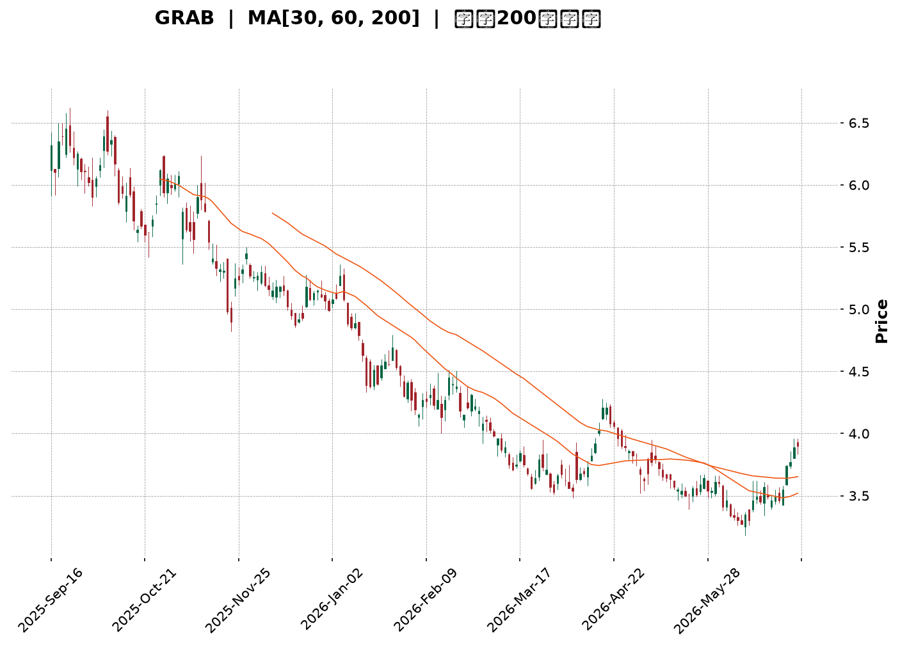
</details>

<html>
<head><meta charset="utf-8" /></head>
<body>
    <div style="height:500px; width:100%;">                        <script>window.PlotlyConfig = {MathJaxConfig: 'local'};</script>
        <script charset="utf-8" src="https://cdn.plot.ly/plotly-3.6.0.min.js" integrity="sha256-QaOVwtVY0T02VaHrr6pnoHLCwayMJp4O5n4YyaE3rJk=" crossorigin="anonymous"></script>                <div id="candlestick-chart" class="plotly-graph-div" style="height:100%; width:100%;"></div>            <script>                window.PLOTLYENV=window.PLOTLYENV || {};                                if (document.getElementById("candlestick-chart")) {                    Plotly.newPlot(                        "candlestick-chart",                        [{"close":{"dtype":"f8","bdata":"AAAAIK5HGUAAAABgZmYYQAAAAGBmZhlAAAAAIFyPGUAAAADAzMwZQAAAACCuRxlAAAAAoEfhGEAAAAAAAAAZQAAAAOCjcBhAAAAA4KNwGEAAAADgehQYQAAAAKCZmRdAAAAAQDMzGEAAAAAA16MYQAAAACBcjxlAAAAA4HoUGUAAAADgo3AZQAAAAIAUrhhAAAAA4KNwF0AAAADgUbgXQAAAAADXoxdAAAAAgBSuF0AAAABACtcWQAAAACBcjxZAAAAAgBSuFkAAAABgZmYWQAAAAEDhehZAAAAAoEfhFkAAAABgZmYXQAAAAEDhehhAAAAAYI\u002fCF0AAAABAMzMYQAAAACCF6xdAAAAAgD0KGEAAAAAgrkcYQAAAAADXIxdAAAAAIFyPFkAAAADAHoUWQAAAAKBwPRZAAAAAoJmZF0AAAADAHoUXQAAAAMD1KBdAAAAAwPUoFkAAAAAA16MVQAAAAIDrURVAAAAAIK5HFUAAAACgcD0VQAAAACCF6xNAAAAAoJmZE0AAAAAAAAAVQAAAAIDC9RRAAAAAIK5HFUAAAADAzMwVQAAAAOB6FBVAAAAAgD0KFUAAAADgehQVQAAAAEAzMxVAAAAAYI\u002fCFEAAAAAA16MUQAAAAKCZmRRAAAAA4FG4FEAAAADgUbgUQAAAAKCZmRRAAAAA4HoUFEAAAADAzMwTQAAAAEDhehNAAAAAgBSuE0AAAADgUbgTQAAAAOBRuBRAAAAAgOtRFEAAAADAHoUUQAAAAKCZmRRAAAAAYGZmFEAAAAAgrkcUQAAAAIDC9RNAAAAAgOtRFEAAAAAAKVwUQAAAAOB6FBVAAAAAgOtRFEAAAADAHoUTQAAAAGBmZhNAAAAAIFyPE0AAAADA9SgTQAAAAMAehRJAAAAAIFyPEUAAAADAHoURQAAAAIA9ChJAAAAAoJmZEUAAAABAMzMSQAAAAIDrURJAAAAAoHA9EkAAAABgj8ISQAAAAGC4HhJAAAAAoEfhEUAAAABAMzMRQAAAAADXoxFAAAAA4HoUEUAAAABgj8IQQAAAAKCZmRBAAAAA4HoUEUAAAACAPQoRQAAAAKBwPRFAAAAAIIXrEEAAAADgehQRQAAAAMAehRBAAAAA4HoUEUAAAADAzMwRQAAAAKCZmRFAAAAAwB6FEUAAAADgUbgQQAAAAKCZmRBAAAAAQArXEEAAAACgcD0RQAAAAKBH4RBAAAAA4FG4EEAAAACA61EQQAAAAGBmZhBAAAAAYLgeEEAAAABACtcPQAAAAIAUrg9AAAAAgML1DkAAAABguB4PQAAAAAAAAA5AAAAAgBSuDUAAAAAAAAAOQAAAAOBRuA5AAAAAAAAADkAAAADgo3ANQAAAAEDhegxAAAAAYLgeDUAAAACA61EOQAAAAEAK1w1AAAAAgBSuDUAAAAAgXI8MQAAAAKBwPQxAAAAAIK5HDUAAAAAAKVwNQAAAAIDC9QxAAAAAQOF6DEAAAACA61EMQAAAAIA9Cg1AAAAA4KNwDUAAAADgo3ANQAAAAEAK1w1AAAAAIFyPDkAAAAAAKVwPQAAAAOB6FBBAAAAAQArXEEAAAABACtcQQAAAAIDrURBAAAAAoHA9EEAAAACAFK4PQAAAAEAzMw9AAAAAYLgeD0AAAACgR+EOQAAAACBcjw5AAAAAIFyPDkAAAAAAKVwNQAAAAIDC9QxAAAAA4KNwDUAAAADA9SgOQAAAAIDrUQ5AAAAAYI\u002fCDUAAAABAMzMNQAAAAGC4Hg1AAAAAgD0KDUAAAAAgXI8MQAAAAGBmZgxAAAAAgOtRDEAAAAAAAAAMQAAAAOB6FAxAAAAAQOF6DEAAAADgehQMQAAAAOBRuAxAAAAAYLgeDUAAAACA61EMQAAAAIDrUQxAAAAAoEfhDEAAAADAzMwMQAAAACCuRwtAAAAAgBSuC0AAAADgUbgKQAAAAADXowpAAAAAYGZmCkAAAADA9SgKQAAAAMDMzApAAAAAYGZmCkAAAACAFK4LQAAAACCF6wtAAAAAoJmZC0AAAAAgXI8MQAAAACCF6wtAAAAAgBSuC0AAAAAghesLQAAAAIAUrgtAAAAAYGZmDEAAAAAghesNQAAAAMD1KA5AAAAAYLgeD0AAAABAMzMPQA=="},"high":{"dtype":"f8","bdata":"AAAAgBSuGUAAAADAHoUYQAAAAAAAABpAAAAAAAAAGkAAAACA61EaQAAAAEDhehpAAAAA4FG4GUAAAADgehQZQAAAAKBH4RhAAAAAgBSuGEAAAACgmZkYQAAAAKBH4RhAAAAAIK5HGEAAAACgR+EYQAAAACCuxxlAAAAAYGZmGkAAAABAicEZQAAAAKCZmRlAAAAAIFyPGEAAAAAgrkcYQAAAAOB6FBhAAAAAIFyPGEAAAACAwvUXQAAAAEAzsxZAAAAAgGo8F0AAAADgUbgWQAAAAEDhehZAAAAAgD0KF0AAAADA9agXQAAAAMAehRhAAAAAgML1GEAAAAAAKVwYQAAAAIDrURhAAAAAgOtRGEAAAACAwnUYQAAAACCuRxdAAAAA4KNwF0AAAABAClcXQAAAAMD1KBdAAAAAAAAAGEAAAADgo\u002fAYQAAAAOB6FBhAAAAAoEfhFkAAAABguB4WQAAAAOB6FBZAAAAAgMJ1FUAAAADAHoUVQAAAAADXoxVAAAAAoHA9FEAAAABA4XoVQAAAAAApXBVAAAAA4KNwFUAAAAAAAAAWQAAAAEDhehVAAAAAoHA9FUAAAABAMzMVQAAAAGBmZhVAAAAAYGZmFUAAAAAgXA8VQAAAAAAp3BRAAAAAgML1FEAAAABgj8IUQAAAAOB6FBVAAAAAANejFEAAAABAMzMUQAAAAKBH4RNAAAAAoEfhE0AAAABguB4UQAAAAGC4HhVAAAAAgML1FEAAAACgmZkUQAAAAADXoxRAAAAAIIXrFEAAAAAgXI8UQAAAAAApXBRAAAAAwB6FFEAAAADAzMwUQAAAAOCjcBVAAAAAgOtRFUAAAABAMzMUQAAAAKBH4RNAAAAAoEfhE0AAAACgmZkTQAAAAIA9ChNAAAAAwB6FEkAAAABgZmYSQAAAAOBROBJAAAAAQDMzEkAAAABgZmYSQAAAACBcjxJAAAAAgBSuEkAAAACAFC4TQAAAAOBRuBJAAAAA4FE4EkAAAACgR+ERQAAAAOBRuBFAAAAAYI\u002fCEUAAAABA4XoRQAAAAADXoxBAAAAAwMxMEUAAAAAAKVwRQAAAAGC4nhFAAAAAIFyPEUAAAACAwvURQAAAAOBROBFAAAAAQDMzEUAAAACAPQoSQAAAAEAK1xFAAAAAwB4FEkAAAACAPYoRQAAAAKCZmRBAAAAAwB6FEUAAAAAgrkcRQAAAAGC4HhFAAAAAoEfhEEAAAACAPYoQQAAAAOB6lBBAAAAAwB6FEEAAAADA9SgQQAAAAIAUrg9AAAAAAAAAEEAAAADAHoUPQAAAAMDMzA5AAAAAQOF6DkAAAAAA16MOQAAAAIDC9Q5AAAAAQDMzD0AAAABACtcNQAAAAOCjcA1AAAAAgBSuDUAAAAAA16MOQAAAAKCZmQ9AAAAA4FG4DkAAAADAHoUNQAAAAIDC9QxAAAAA4KNwDUAAAACA61EOQAAAAGCPwg1AAAAAAAAADkAAAABgj8IMQAAAAOCjcA9AAAAAQArXDUAAAADAzMwNQAAAAKBwPQ5AAAAA4HoUD0AAAADgUbgPQAAAAAApXBBAAAAAYLgeEUAAAAAAAAARQAAAAIDC9RBAAAAA4KNwEEAAAABAMzMQQAAAAMD1KBBAAAAAIIXrD0AAAAAAAAAPQAAAACCF6w5AAAAA4FG4DkAAAACgR+ENQAAAAEAzMw1AAAAA4KNwDkAAAACgmZkPQAAAAEAzMw9AAAAAoHA9DkAAAADgehQOQAAAAOCjcA1AAAAA4KNwDUAAAACAwvUMQAAAACBcjwxAAAAAwMzMDEAAAAAgXI8MQAAAAIDpJgxAAAAAANejDEAAAACAwvUMQAAAAIDrUQ1AAAAAAClcDUAAAACAwvUMQAAAACBcjwxAAAAAIK5HDUAAAAAgrkcNQAAAAOBRuAxAAAAAYGZmDEAAAADAHoULQAAAAEAzMwtAAAAAgML1CkAAAADAzMwKQAAAAIDC9QpAAAAAYLgeC0AAAACAwvUMQAAAAIDC9QxAAAAAAClcDEAAAACgR+EMQAAAAOBRuAxAAAAAAAAADEAAAABgZmYMQAAAACBcjwxAAAAAANejDEAAAAAAAAAOQAAAAKBH4Q5AAAAAgBSuD0AAAACAFK4PQA=="},"hovertemplate":"\u003cb\u003e%{x|%Y-%m-%d}\u003c\u002fb\u003e\u003cbr\u003e\u958b: $%{open:.2f}\u003cbr\u003e\u9ad8: $%{high:.2f}\u003cbr\u003e\u4f4e: $%{low:.2f}\u003cbr\u003e\u6536: $%{close:.2f}\u003cextra\u003e\u003c\u002fextra\u003e","low":{"dtype":"f8","bdata":"AAAAANejF0AAAADA9agXQAAAAKBwPRhAAAAAIK5HGUAAAACgR+EYQAAAAIA9ChlAAAAAANejGEAAAACAwvUXQAAAAMD1KBhAAAAA4FG4F0AAAACAwvUXQAAAAIDrURdAAAAAoJmZF0AAAACgcD0YQAAAACBcjxhAAAAAgML1GEAAAAAghesYQAAAACCuRxhAAAAAAClcF0AAAAAgXI8XQAAAAMDMzBZAAAAAoJmZF0AAAAAgXI8WQAAAAMD1KBZAAAAAoJmZFkAAAADA9SgWQAAAAIAUrhVAAAAAgOtRFkAAAADgehQXQAAAAADXoxdAAAAAoJmZF0AAAABgZmYXQAAAAIAUrhdAAAAAwMzMF0AAAACgmZkXQAAAAOCjcBVAAAAAQOF6FkAAAACAFC4WQAAAAMDMzBVAAAAAIIXrFkAAAABAMzMXQAAAAGC4HhdAAAAAIIXrFUAAAADgo3AVQAAAAOB6FBVAAAAAoEfhFEAAAAAAAAAVQAAAAEAK1xNAAAAAIK5HE0AAAAAghWsUQAAAAGCPwhRAAAAAQArXFEAAAADgo3AVQAAAAAAAABVAAAAAoEfhFEAAAACgmZkUQAAAACCuxxRAAAAA4FG4FEAAAADgo3AUQAAAAIDrURRAAAAAQDMzFEAAAACgR2EUQAAAAOCjcBRAAAAAgML1E0AAAACAFK4TQAAAAGBmZhNAAAAAIFyPE0AAAAAA16MTQAAAAIA9ChRAAAAAIK5HFEAAAABguB4UQAAAAMDMTBRAAAAAoEdhFEAAAAAAAAAUQAAAACCF6xNAAAAAgD0KFEAAAACA61EUQAAAAGCPwhRAAAAAYI9CFEAAAADgo3ATQAAAAIDrURNAAAAAAClcE0AAAAAAAAATQAAAAIDrURJAAAAAgOtREUAAAADgo3ARQAAAAGBmZhFAAAAAIFyPEUAAAADgUbgRQAAAAOB6FBJAAAAAwPUoEkAAAAAAKVwSQAAAAIA9ChJAAAAAwB6FEUAAAADA9SgRQAAAAAAAABFAAAAA4FG4EEAAAACgmZkQQAAAAKBwPRBAAAAAgMJ1EEAAAABACtcQQAAAACCF6xBAAAAAYI\u002fCEEAAAADAzMwQQAAAAAAAABBAAAAAYGZmEEAAAADgehQRQAAAAGCPQhFAAAAAgOtREUAAAADAHoUQQAAAAEAzMxBAAAAA4KfGEEAAAAAgXI8QQAAAAOBRuBBAAAAAoHA9EEAAAAAAKVwPQAAAAIA9ChBAAAAAAAAAEEAAAABgj8IPQAAAAMAehQ5AAAAAwMzMDkAAAABA4XoOQAAAAGCPwg1AAAAAoJmZDUAAAABgj8INQAAAAMD1KA5AAAAAQArXDUAAAAAgrkcNQAAAAGBmZgxAAAAA4FG4DEAAAACAwvUMQAAAAKCZmQ1AAAAAgOtRDUAAAACgcD0MQAAAAOB6FAxAAAAAYGZmDEAAAABguB4NQAAAAADXowxAAAAAQOF6DEAAAABACtcLQAAAAMDMzAxAAAAAgML1DEAAAABAMzMNQAAAAADXowxAAAAAYGQ7DkAAAACAFK4OQAAAAEAK1w9AAAAA4KNwEEAAAADgo3AQQAAAAEAzMxBAAAAAwPUoEEAAAABAMzMPQAAAAIA9Cg9AAAAAoEfhDkAAAACA61EOQAAAAOB6FA5AAAAAIIXrDUAAAADA9SgMQAAAAIDrUQxAAAAA4FG4DEAAAAAghesNQAAAAOB6FA5AAAAAIK5HDUAAAACAwvUMQAAAAKBH4QxAAAAAQOF6DEAAAABgZmYMQAAAAIAUrgtAAAAAQArXC0AAAAAghesLQAAAAGC4HgtAAAAAoJmZC0AAAAAghesLQAAAAOB6FAxAAAAA4KNwDEAAAABACtcLQAAAAEAK1wtAAAAAAAAADEAAAAAgXI8MQAAAAIA9CgtAAAAAgD0KC0AAAACgmZkKQAAAAGBmZgpAAAAA4HoUCkAAAADA9SgKQAAAAOCjcAlAAAAA4HoUCkAAAACAwvUKQAAAAEDhegtAAAAA4KNwC0AAAADgUbgKQAAAAGCPwgtAAAAAYLgeC0AAAADgo3ALQAAAAMAehQtAAAAAYGZmC0AAAAAA16MMQAAAAGCPwg1AAAAAYGZmDkAAAAAA16MOQA=="},"name":"\u50f9\u683c","open":{"dtype":"f8","bdata":"AAAAQOF6GEAAAADAHoUYQAAAAIA9ihhAAAAAIFyPGUAAAABA4foYQAAAACCF6xlAAAAAQDMzGUAAAADAHoUYQAAAAEAK1xhAAAAAgMJ1GEAAAACgcD0YQAAAAMD1KBhAAAAAgML1F0AAAABA4XoYQAAAAKCZGRlAAAAAQDMzGkAAAACA61EZQAAAAIA9ihlAAAAAQOF6GEAAAACAwvUXQAAAAMD1KBdAAAAAoHA9GEAAAADAzMwXQAAAAEDhehZAAAAAwPUoF0AAAADgUbgWQAAAAEDhehZAAAAAgBSuFkAAAACgR2EXQAAAAAAAABhAAAAAIIXrGEAAAABgj8IXQAAAAAAAABhAAAAAoEfhF0AAAACAPQoYQAAAAGCPQhZAAAAAYI9CF0AAAADAzMwWQAAAAMDMzBZAAAAAoJkZF0AAAAAgXA8YQAAAAGBmZhdAAAAAQArXFkAAAADAHoUVQAAAAIA9ihVAAAAA4FE4FUAAAABAMzMVQAAAAADXoxVAAAAAgD0KFEAAAACAFK4UQAAAAOB6FBVAAAAAwPUoFUAAAAAA16MVQAAAACCFaxVAAAAAwB4FFUAAAACAwvUUQAAAAEAK1xRAAAAAwPUoFUAAAABgj8IUQAAAACCFaxRAAAAAYGZmFEAAAADgepQUQAAAAGCPwhRAAAAAoJmZFEAAAABA4foTQAAAAKBH4RNAAAAAoJmZE0AAAACgR+ETQAAAAOB6FBRAAAAAgBSuFEAAAACA61EUQAAAACBcjxRAAAAAQOF6FEAAAACAwnUUQAAAACCuRxRAAAAAgBQuFEAAAADAHoUUQAAAAGCPwhRAAAAAYLgeFUAAAABAMzMUQAAAAGCPwhNAAAAAYGZmE0AAAACgmZkTQAAAACCF6xJAAAAA4KNwEkAAAACA61ESQAAAAIA9ihFAAAAAQDMzEkAAAADAzMwRQAAAAOB6FBJAAAAAoHA9EkAAAAAAKVwSQAAAAIAUrhJAAAAAwPUoEkAAAACAFK4RQAAAAGC4HhFAAAAAwPWoEUAAAACA61ERQAAAAMAehRBAAAAAoEfhEEAAAABguB4RQAAAAMD1KBFAAAAA4KNwEUAAAADAzMwQQAAAAIDC9RBAAAAAYI\u002fCEEAAAACgcD0RQAAAAOB6lBFAAAAA4KNwEUAAAADAzEwRQAAAAOCjcBBAAAAAAAAAEUAAAADgUbgQQAAAAMDMzBBAAAAAANejEEAAAABguB4QQAAAAOCjcBBAAAAAAClcEEAAAAAgXA8QQAAAACCuRw9AAAAAgBSuD0AAAADAzMwOQAAAAADXow5AAAAAYLgeDkAAAAAghesNQAAAAKBwPQ5AAAAAoJmZDkAAAABgj8INQAAAAEAzMw1AAAAAwMzMDEAAAABAMzMNQAAAAADXow5AAAAAYGZmDUAAAADgo3ANQAAAAOBRuAxAAAAAwMzMDEAAAAAAAAAOQAAAAIDC9QxAAAAAoEfhDEAAAADAHoUMQAAAAEAK1w5AAAAAgD0KDUAAAACgmZkNQAAAAEAzMw1AAAAAoHA9DkAAAADAzMwOQAAAAAAAABBAAAAAQOF6EEAAAABguJ4QQAAAAKBH4RBAAAAAAClcEEAAAABAMzMQQAAAAOB6FBBAAAAAQDMzD0AAAADAzMwOQAAAAKBH4Q5AAAAAIFyPDkAAAADgUbgNQAAAAOB6FA1AAAAAAClcDkAAAADAzMwOQAAAACBcjw5AAAAAwPUoDkAAAACAFK4NQAAAAAApXA1AAAAAAClcDUAAAACAwvUMQAAAAIDrUQxAAAAAYLgeDEAAAACA61EMQAAAAOB6FAxAAAAAAAAADEAAAABA4XoMQAAAACCuRwxAAAAAQOF6DEAAAACAwvUMQAAAAKBwPQxAAAAAwPUoDEAAAACgR+EMQAAAAADXowxAAAAAIK5HC0AAAADgo3ALQAAAAGCPwgpAAAAAANejCkAAAABgZmYKQAAAAAAAAApAAAAAYLgeC0AAAABguB4LQAAAAGCPwgtAAAAAAAAADEAAAADAHoULQAAAAKAYBAxAAAAAIK5HC0AAAAAA16MLQAAAAEAzMwxAAAAAYGZmC0AAAADgUbgMQAAAACCF6w1AAAAAYGZmDkAAAADgo3APQA=="},"x":["2025-09-16T00:00:00-04:00","2025-09-17T00:00:00-04:00","2025-09-18T00:00:00-04:00","2025-09-19T00:00:00-04:00","2025-09-22T00:00:00-04:00","2025-09-23T00:00:00-04:00","2025-09-24T00:00:00-04:00","2025-09-25T00:00:00-04:00","2025-09-26T00:00:00-04:00","2025-09-29T00:00:00-04:00","2025-09-30T00:00:00-04:00","2025-10-01T00:00:00-04:00","2025-10-02T00:00:00-04:00","2025-10-03T00:00:00-04:00","2025-10-06T00:00:00-04:00","2025-10-07T00:00:00-04:00","2025-10-08T00:00:00-04:00","2025-10-09T00:00:00-04:00","2025-10-10T00:00:00-04:00","2025-10-13T00:00:00-04:00","2025-10-14T00:00:00-04:00","2025-10-15T00:00:00-04:00","2025-10-16T00:00:00-04:00","2025-10-17T00:00:00-04:00","2025-10-20T00:00:00-04:00","2025-10-21T00:00:00-04:00","2025-10-22T00:00:00-04:00","2025-10-23T00:00:00-04:00","2025-10-24T00:00:00-04:00","2025-10-27T00:00:00-04:00","2025-10-28T00:00:00-04:00","2025-10-29T00:00:00-04:00","2025-10-30T00:00:00-04:00","2025-10-31T00:00:00-04:00","2025-11-03T00:00:00-05:00","2025-11-04T00:00:00-05:00","2025-11-05T00:00:00-05:00","2025-11-06T00:00:00-05:00","2025-11-07T00:00:00-05:00","2025-11-10T00:00:00-05:00","2025-11-11T00:00:00-05:00","2025-11-12T00:00:00-05:00","2025-11-13T00:00:00-05:00","2025-11-14T00:00:00-05:00","2025-11-17T00:00:00-05:00","2025-11-18T00:00:00-05:00","2025-11-19T00:00:00-05:00","2025-11-20T00:00:00-05:00","2025-11-21T00:00:00-05:00","2025-11-24T00:00:00-05:00","2025-11-25T00:00:00-05:00","2025-11-26T00:00:00-05:00","2025-11-28T00:00:00-05:00","2025-12-01T00:00:00-05:00","2025-12-02T00:00:00-05:00","2025-12-03T00:00:00-05:00","2025-12-04T00:00:00-05:00","2025-12-05T00:00:00-05:00","2025-12-08T00:00:00-05:00","2025-12-09T00:00:00-05:00","2025-12-10T00:00:00-05:00","2025-12-11T00:00:00-05:00","2025-12-12T00:00:00-05:00","2025-12-15T00:00:00-05:00","2025-12-16T00:00:00-05:00","2025-12-17T00:00:00-05:00","2025-12-18T00:00:00-05:00","2025-12-19T00:00:00-05:00","2025-12-22T00:00:00-05:00","2025-12-23T00:00:00-05:00","2025-12-24T00:00:00-05:00","2025-12-26T00:00:00-05:00","2025-12-29T00:00:00-05:00","2025-12-30T00:00:00-05:00","2025-12-31T00:00:00-05:00","2026-01-02T00:00:00-05:00","2026-01-05T00:00:00-05:00","2026-01-06T00:00:00-05:00","2026-01-07T00:00:00-05:00","2026-01-08T00:00:00-05:00","2026-01-09T00:00:00-05:00","2026-01-12T00:00:00-05:00","2026-01-13T00:00:00-05:00","2026-01-14T00:00:00-05:00","2026-01-15T00:00:00-05:00","2026-01-16T00:00:00-05:00","2026-01-20T00:00:00-05:00","2026-01-21T00:00:00-05:00","2026-01-22T00:00:00-05:00","2026-01-23T00:00:00-05:00","2026-01-26T00:00:00-05:00","2026-01-27T00:00:00-05:00","2026-01-28T00:00:00-05:00","2026-01-29T00:00:00-05:00","2026-01-30T00:00:00-05:00","2026-02-02T00:00:00-05:00","2026-02-03T00:00:00-05:00","2026-02-04T00:00:00-05:00","2026-02-05T00:00:00-05:00","2026-02-06T00:00:00-05:00","2026-02-09T00:00:00-05:00","2026-02-10T00:00:00-05:00","2026-02-11T00:00:00-05:00","2026-02-12T00:00:00-05:00","2026-02-13T00:00:00-05:00","2026-02-17T00:00:00-05:00","2026-02-18T00:00:00-05:00","2026-02-19T00:00:00-05:00","2026-02-20T00:00:00-05:00","2026-02-23T00:00:00-05:00","2026-02-24T00:00:00-05:00","2026-02-25T00:00:00-05:00","2026-02-26T00:00:00-05:00","2026-02-27T00:00:00-05:00","2026-03-02T00:00:00-05:00","2026-03-03T00:00:00-05:00","2026-03-04T00:00:00-05:00","2026-03-05T00:00:00-05:00","2026-03-06T00:00:00-05:00","2026-03-09T00:00:00-04:00","2026-03-10T00:00:00-04:00","2026-03-11T00:00:00-04:00","2026-03-12T00:00:00-04:00","2026-03-13T00:00:00-04:00","2026-03-16T00:00:00-04:00","2026-03-17T00:00:00-04:00","2026-03-18T00:00:00-04:00","2026-03-19T00:00:00-04:00","2026-03-20T00:00:00-04:00","2026-03-23T00:00:00-04:00","2026-03-24T00:00:00-04:00","2026-03-25T00:00:00-04:00","2026-03-26T00:00:00-04:00","2026-03-27T00:00:00-04:00","2026-03-30T00:00:00-04:00","2026-03-31T00:00:00-04:00","2026-04-01T00:00:00-04:00","2026-04-02T00:00:00-04:00","2026-04-06T00:00:00-04:00","2026-04-07T00:00:00-04:00","2026-04-08T00:00:00-04:00","2026-04-09T00:00:00-04:00","2026-04-10T00:00:00-04:00","2026-04-13T00:00:00-04:00","2026-04-14T00:00:00-04:00","2026-04-15T00:00:00-04:00","2026-04-16T00:00:00-04:00","2026-04-17T00:00:00-04:00","2026-04-20T00:00:00-04:00","2026-04-21T00:00:00-04:00","2026-04-22T00:00:00-04:00","2026-04-23T00:00:00-04:00","2026-04-24T00:00:00-04:00","2026-04-27T00:00:00-04:00","2026-04-28T00:00:00-04:00","2026-04-29T00:00:00-04:00","2026-04-30T00:00:00-04:00","2026-05-01T00:00:00-04:00","2026-05-04T00:00:00-04:00","2026-05-05T00:00:00-04:00","2026-05-06T00:00:00-04:00","2026-05-07T00:00:00-04:00","2026-05-08T00:00:00-04:00","2026-05-11T00:00:00-04:00","2026-05-12T00:00:00-04:00","2026-05-13T00:00:00-04:00","2026-05-14T00:00:00-04:00","2026-05-15T00:00:00-04:00","2026-05-18T00:00:00-04:00","2026-05-19T00:00:00-04:00","2026-05-20T00:00:00-04:00","2026-05-21T00:00:00-04:00","2026-05-22T00:00:00-04:00","2026-05-26T00:00:00-04:00","2026-05-27T00:00:00-04:00","2026-05-28T00:00:00-04:00","2026-05-29T00:00:00-04:00","2026-06-01T00:00:00-04:00","2026-06-02T00:00:00-04:00","2026-06-03T00:00:00-04:00","2026-06-04T00:00:00-04:00","2026-06-05T00:00:00-04:00","2026-06-08T00:00:00-04:00","2026-06-09T00:00:00-04:00","2026-06-10T00:00:00-04:00","2026-06-11T00:00:00-04:00","2026-06-12T00:00:00-04:00","2026-06-15T00:00:00-04:00","2026-06-16T00:00:00-04:00","2026-06-17T00:00:00-04:00","2026-06-18T00:00:00-04:00","2026-06-22T00:00:00-04:00","2026-06-23T00:00:00-04:00","2026-06-24T00:00:00-04:00","2026-06-25T00:00:00-04:00","2026-06-26T00:00:00-04:00","2026-06-29T00:00:00-04:00","2026-06-30T00:00:00-04:00","2026-07-01T00:00:00-04:00","2026-07-02T00:00:00-04:00"],"type":"candlestick"},{"hovertemplate":"MA30: $%{y:.2f}\u003cextra\u003e\u003c\u002fextra\u003e","line":{"color":"#2196F3","dash":"dash","width":2},"mode":"lines","name":"MA30","x":["2025-09-16T00:00:00-04:00","2025-09-17T00:00:00-04:00","2025-09-18T00:00:00-04:00","2025-09-19T00:00:00-04:00","2025-09-22T00:00:00-04:00","2025-09-23T00:00:00-04:00","2025-09-24T00:00:00-04:00","2025-09-25T00:00:00-04:00","2025-09-26T00:00:00-04:00","2025-09-29T00:00:00-04:00","2025-09-30T00:00:00-04:00","2025-10-01T00:00:00-04:00","2025-10-02T00:00:00-04:00","2025-10-03T00:00:00-04:00","2025-10-06T00:00:00-04:00","2025-10-07T00:00:00-04:00","2025-10-08T00:00:00-04:00","2025-10-09T00:00:00-04:00","2025-10-10T00:00:00-04:00","2025-10-13T00:00:00-04:00","2025-10-14T00:00:00-04:00","2025-10-15T00:00:00-04:00","2025-10-16T00:00:00-04:00","2025-10-17T00:00:00-04:00","2025-10-20T00:00:00-04:00","2025-10-21T00:00:00-04:00","2025-10-22T00:00:00-04:00","2025-10-23T00:00:00-04:00","2025-10-24T00:00:00-04:00","2025-10-27T00:00:00-04:00","2025-10-28T00:00:00-04:00","2025-10-29T00:00:00-04:00","2025-10-30T00:00:00-04:00","2025-10-31T00:00:00-04:00","2025-11-03T00:00:00-05:00","2025-11-04T00:00:00-05:00","2025-11-05T00:00:00-05:00","2025-11-06T00:00:00-05:00","2025-11-07T00:00:00-05:00","2025-11-10T00:00:00-05:00","2025-11-11T00:00:00-05:00","2025-11-12T00:00:00-05:00","2025-11-13T00:00:00-05:00","2025-11-14T00:00:00-05:00","2025-11-17T00:00:00-05:00","2025-11-18T00:00:00-05:00","2025-11-19T00:00:00-05:00","2025-11-20T00:00:00-05:00","2025-11-21T00:00:00-05:00","2025-11-24T00:00:00-05:00","2025-11-25T00:00:00-05:00","2025-11-26T00:00:00-05:00","2025-11-28T00:00:00-05:00","2025-12-01T00:00:00-05:00","2025-12-02T00:00:00-05:00","2025-12-03T00:00:00-05:00","2025-12-04T00:00:00-05:00","2025-12-05T00:00:00-05:00","2025-12-08T00:00:00-05:00","2025-12-09T00:00:00-05:00","2025-12-10T00:00:00-05:00","2025-12-11T00:00:00-05:00","2025-12-12T00:00:00-05:00","2025-12-15T00:00:00-05:00","2025-12-16T00:00:00-05:00","2025-12-17T00:00:00-05:00","2025-12-18T00:00:00-05:00","2025-12-19T00:00:00-05:00","2025-12-22T00:00:00-05:00","2025-12-23T00:00:00-05:00","2025-12-24T00:00:00-05:00","2025-12-26T00:00:00-05:00","2025-12-29T00:00:00-05:00","2025-12-30T00:00:00-05:00","2025-12-31T00:00:00-05:00","2026-01-02T00:00:00-05:00","2026-01-05T00:00:00-05:00","2026-01-06T00:00:00-05:00","2026-01-07T00:00:00-05:00","2026-01-08T00:00:00-05:00","2026-01-09T00:00:00-05:00","2026-01-12T00:00:00-05:00","2026-01-13T00:00:00-05:00","2026-01-14T00:00:00-05:00","2026-01-15T00:00:00-05:00","2026-01-16T00:00:00-05:00","2026-01-20T00:00:00-05:00","2026-01-21T00:00:00-05:00","2026-01-22T00:00:00-05:00","2026-01-23T00:00:00-05:00","2026-01-26T00:00:00-05:00","2026-01-27T00:00:00-05:00","2026-01-28T00:00:00-05:00","2026-01-29T00:00:00-05:00","2026-01-30T00:00:00-05:00","2026-02-02T00:00:00-05:00","2026-02-03T00:00:00-05:00","2026-02-04T00:00:00-05:00","2026-02-05T00:00:00-05:00","2026-02-06T00:00:00-05:00","2026-02-09T00:00:00-05:00","2026-02-10T00:00:00-05:00","2026-02-11T00:00:00-05:00","2026-02-12T00:00:00-05:00","2026-02-13T00:00:00-05:00","2026-02-17T00:00:00-05:00","2026-02-18T00:00:00-05:00","2026-02-19T00:00:00-05:00","2026-02-20T00:00:00-05:00","2026-02-23T00:00:00-05:00","2026-02-24T00:00:00-05:00","2026-02-25T00:00:00-05:00","2026-02-26T00:00:00-05:00","2026-02-27T00:00:00-05:00","2026-03-02T00:00:00-05:00","2026-03-03T00:00:00-05:00","2026-03-04T00:00:00-05:00","2026-03-05T00:00:00-05:00","2026-03-06T00:00:00-05:00","2026-03-09T00:00:00-04:00","2026-03-10T00:00:00-04:00","2026-03-11T00:00:00-04:00","2026-03-12T00:00:00-04:00","2026-03-13T00:00:00-04:00","2026-03-16T00:00:00-04:00","2026-03-17T00:00:00-04:00","2026-03-18T00:00:00-04:00","2026-03-19T00:00:00-04:00","2026-03-20T00:00:00-04:00","2026-03-23T00:00:00-04:00","2026-03-24T00:00:00-04:00","2026-03-25T00:00:00-04:00","2026-03-26T00:00:00-04:00","2026-03-27T00:00:00-04:00","2026-03-30T00:00:00-04:00","2026-03-31T00:00:00-04:00","2026-04-01T00:00:00-04:00","2026-04-02T00:00:00-04:00","2026-04-06T00:00:00-04:00","2026-04-07T00:00:00-04:00","2026-04-08T00:00:00-04:00","2026-04-09T00:00:00-04:00","2026-04-10T00:00:00-04:00","2026-04-13T00:00:00-04:00","2026-04-14T00:00:00-04:00","2026-04-15T00:00:00-04:00","2026-04-16T00:00:00-04:00","2026-04-17T00:00:00-04:00","2026-04-20T00:00:00-04:00","2026-04-21T00:00:00-04:00","2026-04-22T00:00:00-04:00","2026-04-23T00:00:00-04:00","2026-04-24T00:00:00-04:00","2026-04-27T00:00:00-04:00","2026-04-28T00:00:00-04:00","2026-04-29T00:00:00-04:00","2026-04-30T00:00:00-04:00","2026-05-01T00:00:00-04:00","2026-05-04T00:00:00-04:00","2026-05-05T00:00:00-04:00","2026-05-06T00:00:00-04:00","2026-05-07T00:00:00-04:00","2026-05-08T00:00:00-04:00","2026-05-11T00:00:00-04:00","2026-05-12T00:00:00-04:00","2026-05-13T00:00:00-04:00","2026-05-14T00:00:00-04:00","2026-05-15T00:00:00-04:00","2026-05-18T00:00:00-04:00","2026-05-19T00:00:00-04:00","2026-05-20T00:00:00-04:00","2026-05-21T00:00:00-04:00","2026-05-22T00:00:00-04:00","2026-05-26T00:00:00-04:00","2026-05-27T00:00:00-04:00","2026-05-28T00:00:00-04:00","2026-05-29T00:00:00-04:00","2026-06-01T00:00:00-04:00","2026-06-02T00:00:00-04:00","2026-06-03T00:00:00-04:00","2026-06-04T00:00:00-04:00","2026-06-05T00:00:00-04:00","2026-06-08T00:00:00-04:00","2026-06-09T00:00:00-04:00","2026-06-10T00:00:00-04:00","2026-06-11T00:00:00-04:00","2026-06-12T00:00:00-04:00","2026-06-15T00:00:00-04:00","2026-06-16T00:00:00-04:00","2026-06-17T00:00:00-04:00","2026-06-18T00:00:00-04:00","2026-06-22T00:00:00-04:00","2026-06-23T00:00:00-04:00","2026-06-24T00:00:00-04:00","2026-06-25T00:00:00-04:00","2026-06-26T00:00:00-04:00","2026-06-29T00:00:00-04:00","2026-06-30T00:00:00-04:00","2026-07-01T00:00:00-04:00","2026-07-02T00:00:00-04:00"],"y":{"dtype":"f8","bdata":"AAAAAAAA+H8AAAAAAAD4fwAAAAAAAPh\u002fAAAAAAAA+H8AAAAAAAD4fwAAAAAAAPh\u002fAAAAAAAA+H8AAAAAAAD4fwAAAAAAAPh\u002fAAAAAAAA+H8AAAAAAAD4fwAAAAAAAPh\u002fAAAAAAAA+H8AAAAAAAD4fwAAAAAAAPh\u002fAAAAAAAA+H8AAAAAAAD4fwAAAAAAAPh\u002fAAAAAAAA+H8AAAAAAAD4fwAAAAAAAPh\u002fAAAAAAAA+H8AAAAAAAD4fwAAAAAAAPh\u002fAAAAAAAA+H8AAAAAAAD4fwAAAAAAAPh\u002fAAAAAAAA+H8AAAAAAAD4fwAAANDbMhhAIiIiUuMlGECrqqpqLiQYQO\u002fu7k6NFxhAIiIi0pQKGEBVVVVVnP0XQN7d3W1Z6xdAAAAAUI3XF0C8u7urY8IXQCIiIrKdrxdAAAAAsHKoF0CamZlZq6MXQHd3dyfqnxdAREREtIGOF0Crqqoa6HQXQO\u002fu7q65UBdAVVVVdUwwF0CrqqpqdQwXQJqZmQnX4xZA3t3dbRLDFkAAAACA3KsWQDMzM\u002fP9lBZAIiIiEoOAFkB3d3cno3cWQLy7uwsCaxZAmpmZaQNdFkBERETUv1EWQBEREaHTRhZAvLu7a7w0FkC8u7sbLx0WQO\u002fu7h4T\u002fBVAMzMzIyLiFUBVVVX1b8QVQO\u002fu7k4bqBVA3t3djVCGFUB3d3fXFWAVQDMzM3PaQBVA7+7u\u002fkYoFUDNzMxMYhAVQO\u002fu7s5pAxVAmpmZiWznFEAAAADw0s0UQImIiIj6txRAERERwfWoFECrqqrKWp0UQDMzM9O\u002fkRRAvLu7q46JFECJiIhIDIIUQHd3d1fyixRARERENBeSFECJiIgYdoUUQJqZmTkmeBRAMzMz03hpFECJiIio8VIUQBEREUEZPRRAMzMzE2cfFEAzMzMjBgEUQDMzMwMP5hNAMzMz4xfLE0ARERGhRbYTQEREROTQohNAAAAAQKeNE0ARERGR7XwTQM3MzOzDZxNAMzMz8\u002f1UE0Crqqoqzj4TQAAAAKAaLxNAZmZm1uoYE0Dv7u6eqP8SQImIiFiA3BJAVVVVddrAEkCJiIhIKKMSQAAAAEB8hhJAMzMzE8poEkARERGRe00SQGZmZsYgMBJAMzMz43oUEkCrqqp6ov4RQN7d3U3w4BFAzczMnAvJEUCrqqrqJrERQJqZmTlCmRFAvLu7SwyCEUDe3d39qXERQKuqqlqrYxFAiYiIWIBcEUB3d3fnQlIRQERERERERBFAiYiIKKM3EUC8u7trLiQRQHd3d8cEDxFAd3d3d3f3EEDe3d31KNwQQO\u002fu7jaJwRBAREREPJinEECrqqpC0pQQQGZmZoZdgRBAIiIisp1vEEB3d3c\u002fNV4QQHd3d78RShBAmpmZuZA0EEDNzMzMhSQQQO\u002fu7q65EBBAVVVVtfP9D0AiIiJSKs4PQO\u002fu7o40pQ9AmpmZCZB7D0De3d2NUEYPQAAAABAREQ9AVVVVhRbZDkBmZma2Za0OQN7d3Q3miQ5AIiIiordlDkBmZmaWtToOQImIiDhCGQ5ARERExK4ADkARERGRwvUNQHd3d3dM8A1AERERMZb8DUC8u7u7SQwOQCIiIuJ6FA5AAAAAYHMhDkBmZma2OiYOQHd3dyd4MA5AIiIi4sE8DkBVVVVFREQOQO\u002fu7r7mQg5AVVVVFa5HDkAiIiJS\u002f0YOQFVVVeUXSw5AIiIi8tJNDkC8u7trdUwOQO\u002fu7v6NUA5AIiIiwjxRDkDNzMzcslYOQBEREUE1Xg5Ad3d39yhcDkBmZmZWVVUOQAAAAACOUA5AmpmZeTBPDkDNzMxsdUwOQFVVVUVERA5A3t3dHRM8DkBmZmYmeDAOQImIiHjpJg5A7+7uvp8aDkAzMzPDrgAOQHd3dyfq3w1AREREZPS2DUDe3d3dT40NQFVVVcWSXw1AMzMzA502DUCamZm5SQwNQAAAAEBg5QxAAAAAQBm9DEARERFB0pQMQImIiGi8dAxAAAAAwDxRDEC8u7u75kIMQCIiItIGOgxAd3d3R1MqDEBmZmYGrBwMQFVVVSUxCAxAERERUXH2C0DNzMwchesLQCIiImI73wtAd3d3R8XZC0Dv7u4+YOULQGZmZgZl9AtAiYiIuEkMDECrqqo6mCcMQA=="},"type":"scatter"},{"hovertemplate":"MA60: $%{y:.2f}\u003cextra\u003e\u003c\u002fextra\u003e","line":{"color":"#9C27B0","dash":"dash","width":2},"mode":"lines","name":"MA60","x":["2025-09-16T00:00:00-04:00","2025-09-17T00:00:00-04:00","2025-09-18T00:00:00-04:00","2025-09-19T00:00:00-04:00","2025-09-22T00:00:00-04:00","2025-09-23T00:00:00-04:00","2025-09-24T00:00:00-04:00","2025-09-25T00:00:00-04:00","2025-09-26T00:00:00-04:00","2025-09-29T00:00:00-04:00","2025-09-30T00:00:00-04:00","2025-10-01T00:00:00-04:00","2025-10-02T00:00:00-04:00","2025-10-03T00:00:00-04:00","2025-10-06T00:00:00-04:00","2025-10-07T00:00:00-04:00","2025-10-08T00:00:00-04:00","2025-10-09T00:00:00-04:00","2025-10-10T00:00:00-04:00","2025-10-13T00:00:00-04:00","2025-10-14T00:00:00-04:00","2025-10-15T00:00:00-04:00","2025-10-16T00:00:00-04:00","2025-10-17T00:00:00-04:00","2025-10-20T00:00:00-04:00","2025-10-21T00:00:00-04:00","2025-10-22T00:00:00-04:00","2025-10-23T00:00:00-04:00","2025-10-24T00:00:00-04:00","2025-10-27T00:00:00-04:00","2025-10-28T00:00:00-04:00","2025-10-29T00:00:00-04:00","2025-10-30T00:00:00-04:00","2025-10-31T00:00:00-04:00","2025-11-03T00:00:00-05:00","2025-11-04T00:00:00-05:00","2025-11-05T00:00:00-05:00","2025-11-06T00:00:00-05:00","2025-11-07T00:00:00-05:00","2025-11-10T00:00:00-05:00","2025-11-11T00:00:00-05:00","2025-11-12T00:00:00-05:00","2025-11-13T00:00:00-05:00","2025-11-14T00:00:00-05:00","2025-11-17T00:00:00-05:00","2025-11-18T00:00:00-05:00","2025-11-19T00:00:00-05:00","2025-11-20T00:00:00-05:00","2025-11-21T00:00:00-05:00","2025-11-24T00:00:00-05:00","2025-11-25T00:00:00-05:00","2025-11-26T00:00:00-05:00","2025-11-28T00:00:00-05:00","2025-12-01T00:00:00-05:00","2025-12-02T00:00:00-05:00","2025-12-03T00:00:00-05:00","2025-12-04T00:00:00-05:00","2025-12-05T00:00:00-05:00","2025-12-08T00:00:00-05:00","2025-12-09T00:00:00-05:00","2025-12-10T00:00:00-05:00","2025-12-11T00:00:00-05:00","2025-12-12T00:00:00-05:00","2025-12-15T00:00:00-05:00","2025-12-16T00:00:00-05:00","2025-12-17T00:00:00-05:00","2025-12-18T00:00:00-05:00","2025-12-19T00:00:00-05:00","2025-12-22T00:00:00-05:00","2025-12-23T00:00:00-05:00","2025-12-24T00:00:00-05:00","2025-12-26T00:00:00-05:00","2025-12-29T00:00:00-05:00","2025-12-30T00:00:00-05:00","2025-12-31T00:00:00-05:00","2026-01-02T00:00:00-05:00","2026-01-05T00:00:00-05:00","2026-01-06T00:00:00-05:00","2026-01-07T00:00:00-05:00","2026-01-08T00:00:00-05:00","2026-01-09T00:00:00-05:00","2026-01-12T00:00:00-05:00","2026-01-13T00:00:00-05:00","2026-01-14T00:00:00-05:00","2026-01-15T00:00:00-05:00","2026-01-16T00:00:00-05:00","2026-01-20T00:00:00-05:00","2026-01-21T00:00:00-05:00","2026-01-22T00:00:00-05:00","2026-01-23T00:00:00-05:00","2026-01-26T00:00:00-05:00","2026-01-27T00:00:00-05:00","2026-01-28T00:00:00-05:00","2026-01-29T00:00:00-05:00","2026-01-30T00:00:00-05:00","2026-02-02T00:00:00-05:00","2026-02-03T00:00:00-05:00","2026-02-04T00:00:00-05:00","2026-02-05T00:00:00-05:00","2026-02-06T00:00:00-05:00","2026-02-09T00:00:00-05:00","2026-02-10T00:00:00-05:00","2026-02-11T00:00:00-05:00","2026-02-12T00:00:00-05:00","2026-02-13T00:00:00-05:00","2026-02-17T00:00:00-05:00","2026-02-18T00:00:00-05:00","2026-02-19T00:00:00-05:00","2026-02-20T00:00:00-05:00","2026-02-23T00:00:00-05:00","2026-02-24T00:00:00-05:00","2026-02-25T00:00:00-05:00","2026-02-26T00:00:00-05:00","2026-02-27T00:00:00-05:00","2026-03-02T00:00:00-05:00","2026-03-03T00:00:00-05:00","2026-03-04T00:00:00-05:00","2026-03-05T00:00:00-05:00","2026-03-06T00:00:00-05:00","2026-03-09T00:00:00-04:00","2026-03-10T00:00:00-04:00","2026-03-11T00:00:00-04:00","2026-03-12T00:00:00-04:00","2026-03-13T00:00:00-04:00","2026-03-16T00:00:00-04:00","2026-03-17T00:00:00-04:00","2026-03-18T00:00:00-04:00","2026-03-19T00:00:00-04:00","2026-03-20T00:00:00-04:00","2026-03-23T00:00:00-04:00","2026-03-24T00:00:00-04:00","2026-03-25T00:00:00-04:00","2026-03-26T00:00:00-04:00","2026-03-27T00:00:00-04:00","2026-03-30T00:00:00-04:00","2026-03-31T00:00:00-04:00","2026-04-01T00:00:00-04:00","2026-04-02T00:00:00-04:00","2026-04-06T00:00:00-04:00","2026-04-07T00:00:00-04:00","2026-04-08T00:00:00-04:00","2026-04-09T00:00:00-04:00","2026-04-10T00:00:00-04:00","2026-04-13T00:00:00-04:00","2026-04-14T00:00:00-04:00","2026-04-15T00:00:00-04:00","2026-04-16T00:00:00-04:00","2026-04-17T00:00:00-04:00","2026-04-20T00:00:00-04:00","2026-04-21T00:00:00-04:00","2026-04-22T00:00:00-04:00","2026-04-23T00:00:00-04:00","2026-04-24T00:00:00-04:00","2026-04-27T00:00:00-04:00","2026-04-28T00:00:00-04:00","2026-04-29T00:00:00-04:00","2026-04-30T00:00:00-04:00","2026-05-01T00:00:00-04:00","2026-05-04T00:00:00-04:00","2026-05-05T00:00:00-04:00","2026-05-06T00:00:00-04:00","2026-05-07T00:00:00-04:00","2026-05-08T00:00:00-04:00","2026-05-11T00:00:00-04:00","2026-05-12T00:00:00-04:00","2026-05-13T00:00:00-04:00","2026-05-14T00:00:00-04:00","2026-05-15T00:00:00-04:00","2026-05-18T00:00:00-04:00","2026-05-19T00:00:00-04:00","2026-05-20T00:00:00-04:00","2026-05-21T00:00:00-04:00","2026-05-22T00:00:00-04:00","2026-05-26T00:00:00-04:00","2026-05-27T00:00:00-04:00","2026-05-28T00:00:00-04:00","2026-05-29T00:00:00-04:00","2026-06-01T00:00:00-04:00","2026-06-02T00:00:00-04:00","2026-06-03T00:00:00-04:00","2026-06-04T00:00:00-04:00","2026-06-05T00:00:00-04:00","2026-06-08T00:00:00-04:00","2026-06-09T00:00:00-04:00","2026-06-10T00:00:00-04:00","2026-06-11T00:00:00-04:00","2026-06-12T00:00:00-04:00","2026-06-15T00:00:00-04:00","2026-06-16T00:00:00-04:00","2026-06-17T00:00:00-04:00","2026-06-18T00:00:00-04:00","2026-06-22T00:00:00-04:00","2026-06-23T00:00:00-04:00","2026-06-24T00:00:00-04:00","2026-06-25T00:00:00-04:00","2026-06-26T00:00:00-04:00","2026-06-29T00:00:00-04:00","2026-06-30T00:00:00-04:00","2026-07-01T00:00:00-04:00","2026-07-02T00:00:00-04:00"],"y":{"dtype":"f8","bdata":"AAAAAAAA+H8AAAAAAAD4fwAAAAAAAPh\u002fAAAAAAAA+H8AAAAAAAD4fwAAAAAAAPh\u002fAAAAAAAA+H8AAAAAAAD4fwAAAAAAAPh\u002fAAAAAAAA+H8AAAAAAAD4fwAAAAAAAPh\u002fAAAAAAAA+H8AAAAAAAD4fwAAAAAAAPh\u002fAAAAAAAA+H8AAAAAAAD4fwAAAAAAAPh\u002fAAAAAAAA+H8AAAAAAAD4fwAAAAAAAPh\u002fAAAAAAAA+H8AAAAAAAD4fwAAAAAAAPh\u002fAAAAAAAA+H8AAAAAAAD4fwAAAAAAAPh\u002fAAAAAAAA+H8AAAAAAAD4fwAAAAAAAPh\u002fAAAAAAAA+H8AAAAAAAD4fwAAAAAAAPh\u002fAAAAAAAA+H8AAAAAAAD4fwAAAAAAAPh\u002fAAAAAAAA+H8AAAAAAAD4fwAAAAAAAPh\u002fAAAAAAAA+H8AAAAAAAD4fwAAAAAAAPh\u002fAAAAAAAA+H8AAAAAAAD4fwAAAAAAAPh\u002fAAAAAAAA+H8AAAAAAAD4fwAAAAAAAPh\u002fAAAAAAAA+H8AAAAAAAD4fwAAAAAAAPh\u002fAAAAAAAA+H8AAAAAAAD4fwAAAAAAAPh\u002fAAAAAAAA+H8AAAAAAAD4fwAAAAAAAPh\u002fAAAAAAAA+H8AAAAAAAD4f3d3d3d3FxdAq6qqugIEF0AAAAAwT\u002fQWQO\u002fu7k7U3xZAAAAAsHLIFkBmZmYW2a4WQImIiPAZlhZAd3d3J+p\u002fFkBERET8YmkWQImIiMCDWRZAzczMnO9HFkDNzMwkvzgWQAAAAFjyKxZAq6qqursbFkCrqqpyIQkWQBEREcE88RVAiYiIkO3cFUCamZnZQMcVQImIiLDktxVAERER0ZSqFUBERERMqZgVQGZmZhaShhVAq6qq8v10FUAAAABoSmUVQGZmZqYNVBVAZmZmPjU+FUC8u7v7YikVQCIiIlJxFhVAd3d3J+r\u002fFEBmZmZeuukUQJqZmQFyzxRAmpmZseS3FEAzMzPDrqAUQN7d3Z3vhxRAiYiIQKdtFEAREREBck8UQJqZmYn6NxRAq6qq6pggFEDe3d11BQgUQLy7uxP17xNAd3d3fyPUE0BEREScfbgTQERERGQ7nxNAIiIi6t+IE0De3d0ta3UTQM3MzEzwYBNAd3d3xwRPE0CamZlhV0ATQKuqqlJxNhNAiYiIaJEtE0CamZmBThsTQJqZmTm0CBNAd3d3j8L1EkAzMzPTTeISQN7d3U1i0BJA3t3dtfO9EkBVVVWFpKkSQLy7u6MplRJA3t3dhV2BEkBmZmYGOm0SQN7d3dXqWBJAvLu7W49CEkB3d3dDiywSQN7d3ZGmFBJAvLu7F0v+EUCrqqo20OkRQDMzMxM82BFARERERETEEUAzMzPv7q4RQAAAAAxJkxFAd3d3l7V6EUCrqqoK12MRQHd3d\u002feaSxFA7+7u9uEzEUARERFdSBoRQO\u002fu7oZdARFAAAAAdCHpEEDNzMxg5dAQQO\u002fu7mq8tBBAvLu7b8uaEEDv7u7i7IMQQERERKAabxBAZmZmDnRaEECJiIhkgkcQQHd3dzsmOBBAVVVV3WsuEEAAAAAYkiYQQAAAAEA1HhBAiYiIIPcaEEDNzMykKRUQQERERByhDBBAvLu7kxgEEEARERFRRu8PQKuqqkrF2Q9AVVVVLfnFD0BVVVVl9LYPQN7d3eXQog9AzczMvHSTD0CJiIjotIEPQCIiIrKdbw9Aq6qqMnpbD0CrqqqCwEoPQGZmZq4AOQ9AvLu7O5gnD0B3d3eXbhIPQAAAAOi0AQ9AiYiIgNzrDkAiIiLy0s0OQAAAAIjPsA5Ad3d3fyOUDkCamZmR7XwOQJqZmSkVZw5AAAAAYOVQDkBmZmbeljUOQImIiNgVIA5AmpmZQacNDkAiIiKqOPsNQHd3d08b6A1Aq6qqSsXZDUDNzMzMzMwNQLy7u9MGug1AmpmZMQisDUAAAAA4QpkNQLy7uzPsig1AERERke18DUAzMzNDi2wNQLy7u5PRWw1Aq6qqanVMDUDv7u4G80QNQLy7u1uPQg1AzczMHBM8DUARERG5kDQNQCIiIpJfLA1AmpmZCdcjDUDNzMz8GyENQJqZmVG4Hg1Ad3d3H\u002fcaDUCrqqrKWh0NQDMzM4N5Ig1AERERGb0tDUC8u7vTBjoNQA=="},"type":"scatter"},{"hovertemplate":"MA200: $%{y:.2f}\u003cextra\u003e\u003c\u002fextra\u003e","line":{"color":"#FF6F00","dash":"solid","width":2},"mode":"lines","name":"MA200","x":["2025-09-16T00:00:00-04:00","2025-09-17T00:00:00-04:00","2025-09-18T00:00:00-04:00","2025-09-19T00:00:00-04:00","2025-09-22T00:00:00-04:00","2025-09-23T00:00:00-04:00","2025-09-24T00:00:00-04:00","2025-09-25T00:00:00-04:00","2025-09-26T00:00:00-04:00","2025-09-29T00:00:00-04:00","2025-09-30T00:00:00-04:00","2025-10-01T00:00:00-04:00","2025-10-02T00:00:00-04:00","2025-10-03T00:00:00-04:00","2025-10-06T00:00:00-04:00","2025-10-07T00:00:00-04:00","2025-10-08T00:00:00-04:00","2025-10-09T00:00:00-04:00","2025-10-10T00:00:00-04:00","2025-10-13T00:00:00-04:00","2025-10-14T00:00:00-04:00","2025-10-15T00:00:00-04:00","2025-10-16T00:00:00-04:00","2025-10-17T00:00:00-04:00","2025-10-20T00:00:00-04:00","2025-10-21T00:00:00-04:00","2025-10-22T00:00:00-04:00","2025-10-23T00:00:00-04:00","2025-10-24T00:00:00-04:00","2025-10-27T00:00:00-04:00","2025-10-28T00:00:00-04:00","2025-10-29T00:00:00-04:00","2025-10-30T00:00:00-04:00","2025-10-31T00:00:00-04:00","2025-11-03T00:00:00-05:00","2025-11-04T00:00:00-05:00","2025-11-05T00:00:00-05:00","2025-11-06T00:00:00-05:00","2025-11-07T00:00:00-05:00","2025-11-10T00:00:00-05:00","2025-11-11T00:00:00-05:00","2025-11-12T00:00:00-05:00","2025-11-13T00:00:00-05:00","2025-11-14T00:00:00-05:00","2025-11-17T00:00:00-05:00","2025-11-18T00:00:00-05:00","2025-11-19T00:00:00-05:00","2025-11-20T00:00:00-05:00","2025-11-21T00:00:00-05:00","2025-11-24T00:00:00-05:00","2025-11-25T00:00:00-05:00","2025-11-26T00:00:00-05:00","2025-11-28T00:00:00-05:00","2025-12-01T00:00:00-05:00","2025-12-02T00:00:00-05:00","2025-12-03T00:00:00-05:00","2025-12-04T00:00:00-05:00","2025-12-05T00:00:00-05:00","2025-12-08T00:00:00-05:00","2025-12-09T00:00:00-05:00","2025-12-10T00:00:00-05:00","2025-12-11T00:00:00-05:00","2025-12-12T00:00:00-05:00","2025-12-15T00:00:00-05:00","2025-12-16T00:00:00-05:00","2025-12-17T00:00:00-05:00","2025-12-18T00:00:00-05:00","2025-12-19T00:00:00-05:00","2025-12-22T00:00:00-05:00","2025-12-23T00:00:00-05:00","2025-12-24T00:00:00-05:00","2025-12-26T00:00:00-05:00","2025-12-29T00:00:00-05:00","2025-12-30T00:00:00-05:00","2025-12-31T00:00:00-05:00","2026-01-02T00:00:00-05:00","2026-01-05T00:00:00-05:00","2026-01-06T00:00:00-05:00","2026-01-07T00:00:00-05:00","2026-01-08T00:00:00-05:00","2026-01-09T00:00:00-05:00","2026-01-12T00:00:00-05:00","2026-01-13T00:00:00-05:00","2026-01-14T00:00:00-05:00","2026-01-15T00:00:00-05:00","2026-01-16T00:00:00-05:00","2026-01-20T00:00:00-05:00","2026-01-21T00:00:00-05:00","2026-01-22T00:00:00-05:00","2026-01-23T00:00:00-05:00","2026-01-26T00:00:00-05:00","2026-01-27T00:00:00-05:00","2026-01-28T00:00:00-05:00","2026-01-29T00:00:00-05:00","2026-01-30T00:00:00-05:00","2026-02-02T00:00:00-05:00","2026-02-03T00:00:00-05:00","2026-02-04T00:00:00-05:00","2026-02-05T00:00:00-05:00","2026-02-06T00:00:00-05:00","2026-02-09T00:00:00-05:00","2026-02-10T00:00:00-05:00","2026-02-11T00:00:00-05:00","2026-02-12T00:00:00-05:00","2026-02-13T00:00:00-05:00","2026-02-17T00:00:00-05:00","2026-02-18T00:00:00-05:00","2026-02-19T00:00:00-05:00","2026-02-20T00:00:00-05:00","2026-02-23T00:00:00-05:00","2026-02-24T00:00:00-05:00","2026-02-25T00:00:00-05:00","2026-02-26T00:00:00-05:00","2026-02-27T00:00:00-05:00","2026-03-02T00:00:00-05:00","2026-03-03T00:00:00-05:00","2026-03-04T00:00:00-05:00","2026-03-05T00:00:00-05:00","2026-03-06T00:00:00-05:00","2026-03-09T00:00:00-04:00","2026-03-10T00:00:00-04:00","2026-03-11T00:00:00-04:00","2026-03-12T00:00:00-04:00","2026-03-13T00:00:00-04:00","2026-03-16T00:00:00-04:00","2026-03-17T00:00:00-04:00","2026-03-18T00:00:00-04:00","2026-03-19T00:00:00-04:00","2026-03-20T00:00:00-04:00","2026-03-23T00:00:00-04:00","2026-03-24T00:00:00-04:00","2026-03-25T00:00:00-04:00","2026-03-26T00:00:00-04:00","2026-03-27T00:00:00-04:00","2026-03-30T00:00:00-04:00","2026-03-31T00:00:00-04:00","2026-04-01T00:00:00-04:00","2026-04-02T00:00:00-04:00","2026-04-06T00:00:00-04:00","2026-04-07T00:00:00-04:00","2026-04-08T00:00:00-04:00","2026-04-09T00:00:00-04:00","2026-04-10T00:00:00-04:00","2026-04-13T00:00:00-04:00","2026-04-14T00:00:00-04:00","2026-04-15T00:00:00-04:00","2026-04-16T00:00:00-04:00","2026-04-17T00:00:00-04:00","2026-04-20T00:00:00-04:00","2026-04-21T00:00:00-04:00","2026-04-22T00:00:00-04:00","2026-04-23T00:00:00-04:00","2026-04-24T00:00:00-04:00","2026-04-27T00:00:00-04:00","2026-04-28T00:00:00-04:00","2026-04-29T00:00:00-04:00","2026-04-30T00:00:00-04:00","2026-05-01T00:00:00-04:00","2026-05-04T00:00:00-04:00","2026-05-05T00:00:00-04:00","2026-05-06T00:00:00-04:00","2026-05-07T00:00:00-04:00","2026-05-08T00:00:00-04:00","2026-05-11T00:00:00-04:00","2026-05-12T00:00:00-04:00","2026-05-13T00:00:00-04:00","2026-05-14T00:00:00-04:00","2026-05-15T00:00:00-04:00","2026-05-18T00:00:00-04:00","2026-05-19T00:00:00-04:00","2026-05-20T00:00:00-04:00","2026-05-21T00:00:00-04:00","2026-05-22T00:00:00-04:00","2026-05-26T00:00:00-04:00","2026-05-27T00:00:00-04:00","2026-05-28T00:00:00-04:00","2026-05-29T00:00:00-04:00","2026-06-01T00:00:00-04:00","2026-06-02T00:00:00-04:00","2026-06-03T00:00:00-04:00","2026-06-04T00:00:00-04:00","2026-06-05T00:00:00-04:00","2026-06-08T00:00:00-04:00","2026-06-09T00:00:00-04:00","2026-06-10T00:00:00-04:00","2026-06-11T00:00:00-04:00","2026-06-12T00:00:00-04:00","2026-06-15T00:00:00-04:00","2026-06-16T00:00:00-04:00","2026-06-17T00:00:00-04:00","2026-06-18T00:00:00-04:00","2026-06-22T00:00:00-04:00","2026-06-23T00:00:00-04:00","2026-06-24T00:00:00-04:00","2026-06-25T00:00:00-04:00","2026-06-26T00:00:00-04:00","2026-06-29T00:00:00-04:00","2026-06-30T00:00:00-04:00","2026-07-01T00:00:00-04:00","2026-07-02T00:00:00-04:00"],"y":{"dtype":"f8","bdata":"AAAAAAAA+H8AAAAAAAD4fwAAAAAAAPh\u002fAAAAAAAA+H8AAAAAAAD4fwAAAAAAAPh\u002fAAAAAAAA+H8AAAAAAAD4fwAAAAAAAPh\u002fAAAAAAAA+H8AAAAAAAD4fwAAAAAAAPh\u002fAAAAAAAA+H8AAAAAAAD4fwAAAAAAAPh\u002fAAAAAAAA+H8AAAAAAAD4fwAAAAAAAPh\u002fAAAAAAAA+H8AAAAAAAD4fwAAAAAAAPh\u002fAAAAAAAA+H8AAAAAAAD4fwAAAAAAAPh\u002fAAAAAAAA+H8AAAAAAAD4fwAAAAAAAPh\u002fAAAAAAAA+H8AAAAAAAD4fwAAAAAAAPh\u002fAAAAAAAA+H8AAAAAAAD4fwAAAAAAAPh\u002fAAAAAAAA+H8AAAAAAAD4fwAAAAAAAPh\u002fAAAAAAAA+H8AAAAAAAD4fwAAAAAAAPh\u002fAAAAAAAA+H8AAAAAAAD4fwAAAAAAAPh\u002fAAAAAAAA+H8AAAAAAAD4fwAAAAAAAPh\u002fAAAAAAAA+H8AAAAAAAD4fwAAAAAAAPh\u002fAAAAAAAA+H8AAAAAAAD4fwAAAAAAAPh\u002fAAAAAAAA+H8AAAAAAAD4fwAAAAAAAPh\u002fAAAAAAAA+H8AAAAAAAD4fwAAAAAAAPh\u002fAAAAAAAA+H8AAAAAAAD4fwAAAAAAAPh\u002fAAAAAAAA+H8AAAAAAAD4fwAAAAAAAPh\u002fAAAAAAAA+H8AAAAAAAD4fwAAAAAAAPh\u002fAAAAAAAA+H8AAAAAAAD4fwAAAAAAAPh\u002fAAAAAAAA+H8AAAAAAAD4fwAAAAAAAPh\u002fAAAAAAAA+H8AAAAAAAD4fwAAAAAAAPh\u002fAAAAAAAA+H8AAAAAAAD4fwAAAAAAAPh\u002fAAAAAAAA+H8AAAAAAAD4fwAAAAAAAPh\u002fAAAAAAAA+H8AAAAAAAD4fwAAAAAAAPh\u002fAAAAAAAA+H8AAAAAAAD4fwAAAAAAAPh\u002fAAAAAAAA+H8AAAAAAAD4fwAAAAAAAPh\u002fAAAAAAAA+H8AAAAAAAD4fwAAAAAAAPh\u002fAAAAAAAA+H8AAAAAAAD4fwAAAAAAAPh\u002fAAAAAAAA+H8AAAAAAAD4fwAAAAAAAPh\u002fAAAAAAAA+H8AAAAAAAD4fwAAAAAAAPh\u002fAAAAAAAA+H8AAAAAAAD4fwAAAAAAAPh\u002fAAAAAAAA+H8AAAAAAAD4fwAAAAAAAPh\u002fAAAAAAAA+H8AAAAAAAD4fwAAAAAAAPh\u002fAAAAAAAA+H8AAAAAAAD4fwAAAAAAAPh\u002fAAAAAAAA+H8AAAAAAAD4fwAAAAAAAPh\u002fAAAAAAAA+H8AAAAAAAD4fwAAAAAAAPh\u002fAAAAAAAA+H8AAAAAAAD4fwAAAAAAAPh\u002fAAAAAAAA+H8AAAAAAAD4fwAAAAAAAPh\u002fAAAAAAAA+H8AAAAAAAD4fwAAAAAAAPh\u002fAAAAAAAA+H8AAAAAAAD4fwAAAAAAAPh\u002fAAAAAAAA+H8AAAAAAAD4fwAAAAAAAPh\u002fAAAAAAAA+H8AAAAAAAD4fwAAAAAAAPh\u002fAAAAAAAA+H8AAAAAAAD4fwAAAAAAAPh\u002fAAAAAAAA+H8AAAAAAAD4fwAAAAAAAPh\u002fAAAAAAAA+H8AAAAAAAD4fwAAAAAAAPh\u002fAAAAAAAA+H8AAAAAAAD4fwAAAAAAAPh\u002fAAAAAAAA+H8AAAAAAAD4fwAAAAAAAPh\u002fAAAAAAAA+H8AAAAAAAD4fwAAAAAAAPh\u002fAAAAAAAA+H8AAAAAAAD4fwAAAAAAAPh\u002fAAAAAAAA+H8AAAAAAAD4fwAAAAAAAPh\u002fAAAAAAAA+H8AAAAAAAD4fwAAAAAAAPh\u002fAAAAAAAA+H8AAAAAAAD4fwAAAAAAAPh\u002fAAAAAAAA+H8AAAAAAAD4fwAAAAAAAPh\u002fAAAAAAAA+H8AAAAAAAD4fwAAAAAAAPh\u002fAAAAAAAA+H8AAAAAAAD4fwAAAAAAAPh\u002fAAAAAAAA+H8AAAAAAAD4fwAAAAAAAPh\u002fAAAAAAAA+H8AAAAAAAD4fwAAAAAAAPh\u002fAAAAAAAA+H8AAAAAAAD4fwAAAAAAAPh\u002fAAAAAAAA+H8AAAAAAAD4fwAAAAAAAPh\u002fAAAAAAAA+H8AAAAAAAD4fwAAAAAAAPh\u002fAAAAAAAA+H8AAAAAAAD4fwAAAAAAAPh\u002fAAAAAAAA+H8AAAAAAAD4fwAAAAAAAPh\u002fAAAAAAAA+H8K16MQx0oSQA=="},"type":"scatter"}],                        {"template":{"data":{"barpolar":[{"marker":{"line":{"color":"rgb(17,17,17)","width":0.5},"pattern":{"fillmode":"overlay","size":10,"solidity":0.2}},"type":"barpolar"}],"bar":[{"error_x":{"color":"#f2f5fa"},"error_y":{"color":"#f2f5fa"},"marker":{"line":{"color":"rgb(17,17,17)","width":0.5},"pattern":{"fillmode":"overlay","size":10,"solidity":0.2}},"type":"bar"}],"carpet":[{"aaxis":{"endlinecolor":"#A2B1C6","gridcolor":"#506784","linecolor":"#506784","minorgridcolor":"#506784","startlinecolor":"#A2B1C6"},"baxis":{"endlinecolor":"#A2B1C6","gridcolor":"#506784","linecolor":"#506784","minorgridcolor":"#506784","startlinecolor":"#A2B1C6"},"type":"carpet"}],"choropleth":[{"colorbar":{"outlinewidth":0,"ticks":""},"type":"choropleth"}],"contourcarpet":[{"colorbar":{"outlinewidth":0,"ticks":""},"type":"contourcarpet"}],"contour":[{"colorbar":{"outlinewidth":0,"ticks":""},"colorscale":[[0.0,"#0d0887"],[0.1111111111111111,"#46039f"],[0.2222222222222222,"#7201a8"],[0.3333333333333333,"#9c179e"],[0.4444444444444444,"#bd3786"],[0.5555555555555556,"#d8576b"],[0.6666666666666666,"#ed7953"],[0.7777777777777778,"#fb9f3a"],[0.8888888888888888,"#fdca26"],[1.0,"#f0f921"]],"type":"contour"}],"heatmap":[{"colorbar":{"outlinewidth":0,"ticks":""},"colorscale":[[0.0,"#0d0887"],[0.1111111111111111,"#46039f"],[0.2222222222222222,"#7201a8"],[0.3333333333333333,"#9c179e"],[0.4444444444444444,"#bd3786"],[0.5555555555555556,"#d8576b"],[0.6666666666666666,"#ed7953"],[0.7777777777777778,"#fb9f3a"],[0.8888888888888888,"#fdca26"],[1.0,"#f0f921"]],"type":"heatmap"}],"histogram2dcontour":[{"colorbar":{"outlinewidth":0,"ticks":""},"colorscale":[[0.0,"#0d0887"],[0.1111111111111111,"#46039f"],[0.2222222222222222,"#7201a8"],[0.3333333333333333,"#9c179e"],[0.4444444444444444,"#bd3786"],[0.5555555555555556,"#d8576b"],[0.6666666666666666,"#ed7953"],[0.7777777777777778,"#fb9f3a"],[0.8888888888888888,"#fdca26"],[1.0,"#f0f921"]],"type":"histogram2dcontour"}],"histogram2d":[{"colorbar":{"outlinewidth":0,"ticks":""},"colorscale":[[0.0,"#0d0887"],[0.1111111111111111,"#46039f"],[0.2222222222222222,"#7201a8"],[0.3333333333333333,"#9c179e"],[0.4444444444444444,"#bd3786"],[0.5555555555555556,"#d8576b"],[0.6666666666666666,"#ed7953"],[0.7777777777777778,"#fb9f3a"],[0.8888888888888888,"#fdca26"],[1.0,"#f0f921"]],"type":"histogram2d"}],"histogram":[{"marker":{"pattern":{"fillmode":"overlay","size":10,"solidity":0.2}},"type":"histogram"}],"mesh3d":[{"colorbar":{"outlinewidth":0,"ticks":""},"type":"mesh3d"}],"parcoords":[{"line":{"colorbar":{"outlinewidth":0,"ticks":""}},"type":"parcoords"}],"pie":[{"automargin":true,"type":"pie"}],"scatter3d":[{"line":{"colorbar":{"outlinewidth":0,"ticks":""}},"marker":{"colorbar":{"outlinewidth":0,"ticks":""}},"type":"scatter3d"}],"scattercarpet":[{"marker":{"colorbar":{"outlinewidth":0,"ticks":""}},"type":"scattercarpet"}],"scattergeo":[{"marker":{"colorbar":{"outlinewidth":0,"ticks":""}},"type":"scattergeo"}],"scattergl":[{"marker":{"line":{"color":"#283442"}},"type":"scattergl"}],"scattermapbox":[{"marker":{"colorbar":{"outlinewidth":0,"ticks":""}},"type":"scattermapbox"}],"scattermap":[{"marker":{"colorbar":{"outlinewidth":0,"ticks":""}},"type":"scattermap"}],"scatterpolargl":[{"marker":{"colorbar":{"outlinewidth":0,"ticks":""}},"type":"scatterpolargl"}],"scatterpolar":[{"marker":{"colorbar":{"outlinewidth":0,"ticks":""}},"type":"scatterpolar"}],"scatter":[{"marker":{"line":{"color":"#283442"}},"type":"scatter"}],"scatterternary":[{"marker":{"colorbar":{"outlinewidth":0,"ticks":""}},"type":"scatterternary"}],"surface":[{"colorbar":{"outlinewidth":0,"ticks":""},"colorscale":[[0.0,"#0d0887"],[0.1111111111111111,"#46039f"],[0.2222222222222222,"#7201a8"],[0.3333333333333333,"#9c179e"],[0.4444444444444444,"#bd3786"],[0.5555555555555556,"#d8576b"],[0.6666666666666666,"#ed7953"],[0.7777777777777778,"#fb9f3a"],[0.8888888888888888,"#fdca26"],[1.0,"#f0f921"]],"type":"surface"}],"table":[{"cells":{"fill":{"color":"#506784"},"line":{"color":"rgb(17,17,17)"}},"header":{"fill":{"color":"#2a3f5f"},"line":{"color":"rgb(17,17,17)"}},"type":"table"}]},"layout":{"annotationdefaults":{"arrowcolor":"#f2f5fa","arrowhead":0,"arrowwidth":1},"autotypenumbers":"strict","coloraxis":{"colorbar":{"outlinewidth":0,"ticks":""}},"colorscale":{"diverging":[[0,"#8e0152"],[0.1,"#c51b7d"],[0.2,"#de77ae"],[0.3,"#f1b6da"],[0.4,"#fde0ef"],[0.5,"#f7f7f7"],[0.6,"#e6f5d0"],[0.7,"#b8e186"],[0.8,"#7fbc41"],[0.9,"#4d9221"],[1,"#276419"]],"sequential":[[0.0,"#0d0887"],[0.1111111111111111,"#46039f"],[0.2222222222222222,"#7201a8"],[0.3333333333333333,"#9c179e"],[0.4444444444444444,"#bd3786"],[0.5555555555555556,"#d8576b"],[0.6666666666666666,"#ed7953"],[0.7777777777777778,"#fb9f3a"],[0.8888888888888888,"#fdca26"],[1.0,"#f0f921"]],"sequentialminus":[[0.0,"#0d0887"],[0.1111111111111111,"#46039f"],[0.2222222222222222,"#7201a8"],[0.3333333333333333,"#9c179e"],[0.4444444444444444,"#bd3786"],[0.5555555555555556,"#d8576b"],[0.6666666666666666,"#ed7953"],[0.7777777777777778,"#fb9f3a"],[0.8888888888888888,"#fdca26"],[1.0,"#f0f921"]]},"colorway":["#636efa","#EF553B","#00cc96","#ab63fa","#FFA15A","#19d3f3","#FF6692","#B6E880","#FF97FF","#FECB52"],"font":{"color":"#f2f5fa"},"geo":{"bgcolor":"rgb(17,17,17)","lakecolor":"rgb(17,17,17)","landcolor":"rgb(17,17,17)","showlakes":true,"showland":true,"subunitcolor":"#506784"},"hoverlabel":{"align":"left"},"hovermode":"closest","mapbox":{"style":"dark"},"paper_bgcolor":"rgb(17,17,17)","plot_bgcolor":"rgb(17,17,17)","polar":{"angularaxis":{"gridcolor":"#506784","linecolor":"#506784","ticks":""},"bgcolor":"rgb(17,17,17)","radialaxis":{"gridcolor":"#506784","linecolor":"#506784","ticks":""}},"scene":{"xaxis":{"backgroundcolor":"rgb(17,17,17)","gridcolor":"#506784","gridwidth":2,"linecolor":"#506784","showbackground":true,"ticks":"","zerolinecolor":"#C8D4E3"},"yaxis":{"backgroundcolor":"rgb(17,17,17)","gridcolor":"#506784","gridwidth":2,"linecolor":"#506784","showbackground":true,"ticks":"","zerolinecolor":"#C8D4E3"},"zaxis":{"backgroundcolor":"rgb(17,17,17)","gridcolor":"#506784","gridwidth":2,"linecolor":"#506784","showbackground":true,"ticks":"","zerolinecolor":"#C8D4E3"}},"shapedefaults":{"line":{"color":"#f2f5fa"}},"sliderdefaults":{"bgcolor":"#C8D4E3","bordercolor":"rgb(17,17,17)","borderwidth":1,"tickwidth":0},"ternary":{"aaxis":{"gridcolor":"#506784","linecolor":"#506784","ticks":""},"baxis":{"gridcolor":"#506784","linecolor":"#506784","ticks":""},"bgcolor":"rgb(17,17,17)","caxis":{"gridcolor":"#506784","linecolor":"#506784","ticks":""}},"title":{"x":0.05},"updatemenudefaults":{"bgcolor":"#506784","borderwidth":0},"xaxis":{"automargin":true,"gridcolor":"#283442","linecolor":"#506784","ticks":"","title":{"standoff":15},"zerolinecolor":"#283442","zerolinewidth":2},"yaxis":{"automargin":true,"gridcolor":"#283442","linecolor":"#506784","ticks":"","title":{"standoff":15},"zerolinecolor":"#283442","zerolinewidth":2}}},"xaxis":{"rangeslider":{"visible":false},"title":{"text":"\u65e5\u671f"}},"font":{"size":11},"title":{"text":"GRAB  |  MA(30\u002f60\u002f200)  |  \u6700\u8fd1200\u4ea4\u6613\u65e5"},"yaxis":{"title":{"text":"\u80a1\u50f9 (USD)"}},"hovermode":"x unified","height":500},                        {"responsive": true}                    )                };            </script>        </div>
</body>
</html>

# GRAB 技術分析報告

> **報告日期**：2026-07-05 ｜ **語言**：繁體中文 ｜ **數據來源**：提供數據 ｜ **當前價格**：$3.90

---

## 目錄

| 章節 | 內容 |
|------|------|
| [1. 技術面概覽](#1-技術面概覽) | 訊號儀表板、核心指標、評分卡 |
| [2. 趨勢分析](#2-趨勢分析) | 多時框趨勢、長中短期走勢 |
| [3. 圖表形態分析](#3-圖表形態分析) | 形態識別、K線組合、目標價 |
| [4. 支撐與阻力](#4-支撐與阻力) | 關鍵價位、斐波那契回調 |
| [5. 技術指標深度解讀](#5-技術指標深度解讀) | MA/RSI/MACD/布林/成交量 |
| [6. 動能與波動率](#6-動能與波動率) | 動能評估、ATR、Beta |
| [7. 多時框架總結](#7-多時框架總結) | 時框架評分矩陣 |
| [8. 交易策略建議](#8-交易策略建議) | 多空策略、風險報酬比 |
| [9. 風險提示與監控](#9-風險提示與監控) | 監控指標、風險場景 |

---

## 1. 技術面概覽

### 🎯 技術訊號儀表板

當前 GRAB (GRAB) 的技術面呈現出短期強勢反彈與長期趨勢壓力的複雜局面。多數短期動能指標顯示超買，但長期均線仍構成上方壓力。

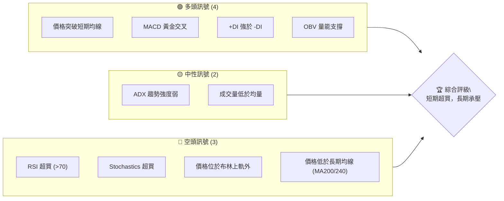

### 📊 核心指標速覽表

| 指標類別 | 指標名稱 | 當前數值 | 訊號 | 解讀 |
|----------|----------|----------|------|------|
| **價格** | 當前價格 | $3.90 | 🟡 | 位於52週區間下端，但近期反彈強勁 |
| **均線** | MA20 | $3.50 | 🟢 | 價格 ($3.90) 位於 MA20 上方，短期看多 |
| **均線** | MA50 | $3.60 | 🟢 | 價格 ($3.90) 位於 MA50 上方，中期看多 |
| **均線** | MA200 | $4.57 | 🔴 | 價格 ($3.90) 位於 MA200 下方，長期看空 |
| **動能** | RSI(14) | 77.23 | 🔴 | 進入超買區，短期回調風險高 |
| **動能** | MACD | 0.065 | 🟢 | MACD 線上穿 Signal 線，柱狀圖為正，多頭動能強 |
| **波動** | ATR | $0.17 | 🟡 | 每日波動約 4.24%，屬中等波動 |
| **趨勢** | ADX(14) | 18.23 | 🟡 | 趨勢強度偏弱，但 +DI 佔優，顯示多頭主導下的盤整 |
| **布林** | BB %B | 1.03 | 🔴 | 價格突破布林上軌，短期過度擴張 |

### 🏆 技術評分卡

```
╔══════════════════════════════════════════════════════════════╗
║              技術評分卡 — GRAB (2026-07-05)                    ║
╠══════════════════════════════════════════════════════════════╣
║ 趨勢強度      ▓▓▓░░░░░░░░░░░░░░░░░░  15/100  🟡 (ADX 弱趨勢)    ║
║ 動能指標      ▓▓▓▓▓▓▓▓░░░░░░░░░░░░  80/100  🔴 (RSI/Stoch 超買)║
║ 支撐穩定度    ▓▓▓▓▓▓▓▓▓▓░░░░░░░░░░  50/100  🟡 (短期支撐穩固，長期不明)║
║ 成交量配合    ▓▓▓▓▓▓░░░░░░░░░░░░░░  30/100  🔴 (成交量低於均量)║
║ 形態完整度    ▓▓▓▓▓▓░░░░░░░░░░░░░░  30/100  🟡 (無明顯大型形態，近期反彈)║
║ 均線排列      ▓▓▓▓▓░░░░░░░░░░░░░░░  25/100  🔴 (長期空頭排列，短期反轉)║
╠══════════════════════════════════════════════════════════════╣
║ 綜合評分      ▓▓▓▓▓░░░░░░░░░░░░░░░  40/100  🟡 觀望 / 謹慎做多 ║
╚══════════════════════════════════════════════════════════════╝
```

---

## 2. 趨勢分析

### 🌐 多時框趨勢分析

GRAB 的股價走勢在不同時間框架下呈現出多重訊號，需要綜合判斷。

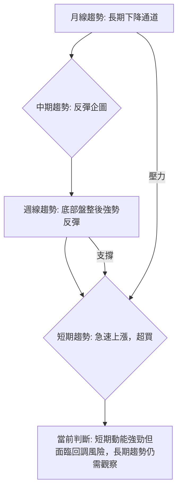

**長期趨勢 (月線):** 從 2025 年 9 月的高點 $6.02 開始，GRAB 進入了明顯的下降趨勢。雖然 2026 年初一度跌至 $3.66，隨後有所反彈，但整體仍處於較大的下降通道中。MA200 ($4.57) 和 MA240 ($4.67) 仍在價格上方，形成長期壓力。

**中期趨勢 (週線):** 過去 20 週的數據顯示，GRAB 在 2026 年 3 月中旬觸及 $3.56 的低點後，經歷了一輪反彈至 $4.21，隨後又回調至 $3.30 附近。最近三週（從 2026-06-14 的 $3.30）開始強勁反彈，目前已回升至 $3.90。這表明中期底部可能正在形成，但反彈的持續性仍待觀察。

**短期趨勢 (日線/週線最新數據):** 最近一週股價從 $3.55 躍升至 $3.90，漲幅顯著，動能強勁。然而，RSI (77.23) 和 Stochastics (91.43/89.74) 均已嚴重超買，且價格突破布林上軌，暗示短期內可能面臨技術性回調或盤整。

### 📈 長期趨勢 — 12個月走勢圖（Unicode）

GRAB 過去 12 個月的月線收盤走勢圖，清晰展示了從高點回落，隨後在低位震盪的過程。

```
GRAB 月線走勢圖（過去12個月）
價格軸 ($)
$6.00 ┤              ●($6.02) ●($6.01)
$5.50 ┤                          ●($5.45)
$5.00 ┤●($5.03)
$4.50 ┤    ●($4.89) ●($4.99)               ●($4.57 MA200)
$4.00 ┤                                                    ●($3.90 現在)
$3.50 ┤                                ●($3.66) ●($3.54)
$3.00 ┤
     └─────────────────────────────────────────────────────
      25-07 25-08 25-09 25-10 25-11 25-12 26-01 26-02 26-03 26-04 26-05 26-06 26-07
```

**走勢特徵分析表格**：

| 時間區間 | 起始價 | 結束價 | 漲跌幅 | 走勢特徵 | 評估 |
|----------|--------|--------|--------|----------|------|
| 2025-07 至 2025-10 | $4.89 | $6.01 | +22.9% | 穩步上漲，創年內新高 | 🟢 強勁上漲 |
| 2025-11 至 2026-03 | $5.45 | $3.66 | -32.8% | 快速下跌，跌破多條均線 | 🔴 快速下跌 |
| 2026-04 至 2026-06 | $3.82 | $3.77 | -1.3% | 低位震盪，底部構築中 | 🟡 底部盤整 |
| 2026-06 至 2026-07 | $3.77 | $3.90 | +3.4% | 短期強勁反彈，試探上方壓力 | 🟢 短期反彈 |

### 📊 中期趨勢（週線分析）

近期的週線走勢顯示 GRAB 經歷了一段下跌和盤整，但最近出現了強勁的反彈。

```
GRAB 週線近期壓力與支撐示意圖
價格軸 ($)
$4.40 ┤                     R1 ($4.21)
$4.20 ┤                     ▲
$4.00 ┤                     │
$3.90 ┤▬▬▬▬▬▬▬▬▬▬▬▬▬▬▬▬▬▬▬◄ 現價
$3.80 ┤                     │
$3.70 ┤             S1 ($3.70 - MA5)
$3.60 ┤             S2 ($3.60 - MA50)
$3.50 ┤             S3 ($3.50 - MA20)
$3.40 ┤             S4 ($3.30 - 近期低點)
$3.20 ┤
     └───────────────────────────────────
      近期走勢
```

**分析：**
- **近期低點支撐**：股價在 2026 年 6 月 14 日觸及 $3.30 後開始反彈，此點成為重要短期支撐。
- **短期均線支撐**：MA5 ($3.77)、MA10 ($3.63)、MA20 ($3.50) 和 MA50 ($3.60) 均在現價下方，形成多重動態支撐。其中 MA20 和 MA50 形成密集支撐區，為 $3.50 - $3.60。
- **近期壓力**：最近一次反彈的高點在 2026 年 4 月 19 日的 $4.21，這將是股價上漲面臨的第一個較強阻力。

### ⚡ 趨勢強度評估（ADX 解讀）

ADX 指標用於衡量趨勢的強度，而非方向。

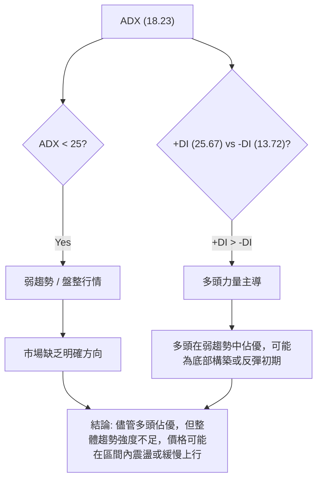

**ADX 強度對照表：**

| ADX 數值區間 | 趨勢強度 | 市場狀態 |
|--------------|----------|----------|
| 0-25         | 弱趨勢   | 盤整、無趨勢 |
| 25-50        | 中等趨勢 | 有趨勢、動能增強 |
| 50-75        | 強趨勢   | 趨勢明確、動能強勁 |
| 75-100       | 極強趨勢 | 趨勢非常強勁 |

**GRAB 當前 ADX 分析：**
- **ADX(14) 數值為 18.23**：這明確指示 GRAB 目前處於**弱趨勢或盤整行情**。儘管近期股價表現強勁，但 ADX 尚未確認這是一個強勁的趨勢性上漲。這意味著市場缺乏足夠的共識來推動股價形成一個明確且持續的方向。
- **+DI (25.67) 顯著高於 -DI (13.72)**：這表明在當前的弱趨勢中，**多頭力量佔據主導地位**。雖然整體趨勢不強，但多方正在積極推動股價，空方力量相對較弱。
- **整合解讀**：GRAB 目前處於一個由多頭主導的盤整區間。近期的價格上漲可能是一種反彈行為，但尚未演變為一個穩固的上升趨勢。投資者應警惕在弱趨勢中追高，因為價格可能隨時回歸震盪區間。目前的市場環境更適合區間操作，或等待 ADX 突破 25 以上並由 +DI 持續領先，以確認新的上升趨勢形成。

---

## 3. 圖表形態分析

### 🔍 形態識別系統

從 GRAB 的歷史價格數據來看，並沒有非常清晰的經典反轉或持續形態如頭肩頂/底。然而，我們可以觀察到一些價格行為模式。

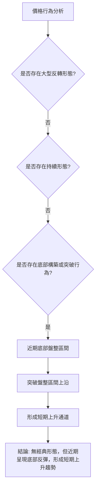

**分析：**
- **大型反轉形態**：在過去 24 個月的數據中，未觀察到明確的頭肩頂/底、雙頂/底等大型反轉形態。
- **持續形態**：也無明顯的旗形、三角收斂等持續形態。
- **底部構築與反彈**：從 2026 年 3 月的 $3.66 和 6 月的 $3.30 低點來看，GRAB 股價似乎在 $3.30-$3.60 區間形成了潛在的底部支撐。最近的強勁反彈可以看作是對這個底部支撐的確認。

### 🕯️ 重要K線形態分析

分析近期的週線收盤價數據，識別關鍵 K 線形態。

| 月份 (週末) | 收盤價 | K線形態 | 解讀 | 訊號 |
|-------------|--------|---------|------|------|
| 2026-03-15  | $3.71  | 長陰線    | 賣壓沉重，確認短期下跌趨勢 | 🔴 弱 |
| 2026-03-22  | $3.56  | 長陰線    | 延續跌勢，接近低點 | 🔴 弱 |
| 2026-03-29  | $3.57  | 小陽線    | 止跌企穩，嘗試反彈 | 🟡 中性 |
| 2026-04-19  | $4.21  | 長陽線    | 強勁上漲，突破前期阻力，但伴隨 RSI 超買 | 🟢 強 |
| 2026-05-10  | $3.72  | 長陰線    | 再次下跌，回吐部分漲幅，顯示上方壓力 | 🔴 弱 |
| 2026-06-14  | $3.30  | 小陰線    | 跌勢趨緩，接近長期支撐，可能為觸底 | 🟡 中性 |
| 2026-06-21  | $3.57  | 中陽線    | 強勢反彈，確認短期底部 | 🟢 強 |
| 2026-07-05  | $3.90  | 長陽線    | 延續強勁反彈，突破近期阻力，但進入超買區 | 🟢 強 (但需注意超買) |

**分析：** 最近三週的 K 線顯示出強勁的陽線，特別是 2026-06-21 和 2026-07-05 的陽線，表明買方力量強勁，推動股價脫離底部。然而，這種快速上漲也導致了超買情況，暗示短期內可能出現回調。

### 📉 ASCII 走勢形態示意圖

以下示意圖展示了 GRAB 從近期低點 ($3.30) 反彈至當前價格 ($3.90) 的走勢，並標註了潛在的短期上升通道。

```
GRAB 近期走勢形態示意圖：底部反彈與潛在通道
價格軸 ($)
$4.20 ┤                      ╭─── R1 ($4.21)
$4.00 ┤                     ╱
$3.90 ┤───────────────●───╱◄ 現價 ($3.90)
$3.80 ┤              ╱    ╱
$3.70 ┤             ╱    ╱
$3.60 ┤            ╱    ╱
$3.50 ┤           ╱    ╱
$3.40 ┤          ╱    ╱
$3.30 ┤───────●─── S1 ($3.30)
$3.20 ┤
     └───────────────────────────────────
      時間軸 (近期)
```
**形態分析：**
從 2026 年 6 月中旬的 $3.30 低點開始，GRAB 股價呈現出 V 型反彈的初期階段。目前的走勢可以初步看作是一個**短期上升通道**的形成。
- **通道下沿 (支撐)**：約在 $3.30 點位，隨後逐步抬升。
- **通道上沿 (阻力)**：約在 $4.21 點位，是 4 月份的高點。
當前價格 $3.90 位於通道中部偏上，接近通道上沿。如果能有效突破 $4.21，則上升通道將被確認，並有望挑戰更高阻力。反之，若在 $4.21 附近受阻回落，則可能在通道內震盪。

### 🎯 形態目標價計算

由於沒有明確的經典圖表形態，我們將基於最近的底部反彈模式和潛在的上升通道來估算目標價。

**1. 基於近期反彈幅度：**
- **底部區間**：約 $3.30 - $3.50
- **反彈起點**：$3.30 (2026-06-14)
- **近期高點 (尚未突破)**：$4.21 (2026-04-19)
- **反彈高度 (若突破 $4.21)**：$4.21 - $3.30 = $0.91

若將 $4.21 視為一個突破點，則可以預期至少複製此高度。
- **初步形態目標價**：突破點 $4.21 + 形態高度 $0.91 = **$5.12**。
這個目標價與斐波那契 50% 回調位 ($4.90) 接近，也接近分析師低目標 $4.50 和平均目標 $5.97。

**2. 基於短期上升通道：**
若股價在 $3.30 附近形成底部，並沿著當前趨勢線上升。
- **通道上沿**：約 $4.21
- **通道下沿**：約 $3.30
- 若股價能有效突破 $4.21 並維持在通道上沿上方，則通道的垂直高度 ($4.21 - $3.30 = $0.91) 可以作為一個潛在的延伸目標。
- **通道延伸目標價**：$4.21 + $0.91 = **$5.12**。

**結論：** 儘管缺乏經典圖表形態，但基於近期底部反彈的勢頭和潛在的上升通道，若能有效突破 $4.21 的短期阻力，則一個合理的形態目標價區間為 **$4.90 - $5.12**。這需要市場動能和成交量的配合。

---

## 4. 支撐與阻力

### 🗺️ 關鍵價位分布圖（Unicode）

以下是 GRAB 股票的關鍵支撐與阻力位分布圖，基於歷史價格、均線和斐波那契回調位。

```
GRAB 價位結構分布圖 (2026-07-05)
═══════════════════════════════════════════════════
$6.62 ║████████████████████████║ 52W 高點 (強阻力 R4)
$6.02 ║████████████████████    ║ 歷史高點區間 (強阻力 R3)
$5.31 ║████████████████████████║ 斐波那契 61.8% (阻力 R2)
$4.90 ║████████████████████    ║ 斐波那契 50% (阻力 R1)
$4.67 ║████████████████████████║ MA240 (長期阻力 R1)
$4.57 ║████████████████████    ║ MA200 (長期阻力 R1)
$4.49 ║████████████████████████║ 斐波那契 38.2% (阻力 R1)
$4.21 ║▓▓▓▓▓▓▓▓▓▓▓▓▓▓▓▓        ║ 近期高點 (關鍵阻力 R0)
$3.99 ║████████████████████████║ 斐波那契 23.6% (近期阻力)
$3.90 ╠════════════════════════╣ ◄ 現價
$3.88 ║▓▓▓▓▓▓▓▓▓▓▓▓▓▓▓▓        ║ 布林上軌 (短期阻力，若回落則為支撐)
$3.77 ║████████████████████████║ MA5 (近期支撐 S1)
$3.63 ║▓▓▓▓▓▓▓▓▓▓▓▓▓▓▓▓        ║ MA10 (近期支撐 S1)
$3.60 ║████████████████████████║ MA50 (中期支撐 S2)
$3.50 ║▓▓▓▓▓▓▓▓▓▓▓▓▓▓▓▓        ║ MA20 / 布林中軌 (中期支撐 S2)
$3.30 ║████████████████████████║ 近期低點 (強支撐 S3)
$3.18 ║▓▓▓▓▓▓▓▓▓▓▓▓▓▓▓▓        ║ 52W 低點 (強支撐 S4)
═══════════════════════════════════════════════════
```

### 🚧 阻力位分析表

| 阻力級別 | 價位 | 形成原因 | 突破難度 | 重要性 |
|----------|------|----------|----------|--------|
| **R0 (近期)** | $3.88 | 布林通道上軌 | 中等     | 🟢 需立即突破以維持強勢 |
| **R1 (關鍵)** | $3.99 | 斐波那契 23.6% 回調位 | 中等     | 🟡 突破則確認反彈動能 |
| **R2 (短期)** | $4.21 | 2026-04-19 週高點 | 高       | 🟡 突破則打開上行空間 |
| **R3 (中期)** | $4.49 | 斐波那契 38.2% 回調位 | 較高     | 🟡 重要的中期反彈目標 |
| **R4 (長期)** | $4.57 | MA200 (長期均線) | 高       | 🔴 長期趨勢扭轉的關鍵 |
| **R5 (長期)** | $4.90 | 斐波那契 50% 回調位 | 高       | 🔴 重要的心理和技術阻力 |
| **R6 (歷史)** | $6.02 | 2025 年高點 | 極高     | 🔴 長期下降趨勢的頂部 |

### 🛡️ 支撐位分析表

| 支撐級別 | 價位 | 形成原因 | 守住機率 | 重要性 |
|----------|------|----------|----------|--------|
| **S0 (近期)** | $3.77 | MA5 (短期均線) | 較高     | 🟢 跌破則短期動能減弱 |
| **S1 (關鍵)** | $3.63 | MA10 (短期均線) | 高       | 🟢 短期反彈的關鍵防線 |
| **S2 (中期)** | $3.60 | MA50 (中期均線) | 極高     | 🟢 中期趨勢的判斷依據 |
| **S3 (中期)** | $3.50 | MA20 / 布林中軌 | 極高     | 🟢 強勁的中期支撐，不可跌破 |
| **S4 (強勁)** | $3.30 | 2026-06-14 低點 | 極高     | 🟢 近期底部，跌破則趨勢轉弱 |
| **S5 (長期)** | $3.18 | 52 週低點 | 極高     | 🔴 歷史性支撐，跌破則進入新低區間 |

### 📐 斐波那契回調位分析

我們以 GRAB 過去 52 週的最高點 $6.62 (2025-09-01 附近) 和最低點 $3.18 (2026-05-01 附近) 作為主要波動區間來計算斐波那契回調位。

- **高點 (A)**：$6.62
- **低點 (B)**：$3.18
- **波動區間**：$6.62 - $3.18 = $3.44

**斐波那契回調位計算：**
- **23.6% 回調**：$3.18 + ($3.44 * 0.236) = $3.18 + $0.81 = **$3.99**
- **38.2% 回調**：$3.18 + ($3.44 * 0.382) = $3.18 + $1.31 = **$4.49**
- **50.0% 回調**：$3.18 + ($3.44 * 0.500) = $3.18 + $1.72 = **$4.90**
- **61.8% 回調**：$3.18 + ($3.44 * 0.618) = $3.18 + $2.13 = **$5.31**
- **76.4% 回調**：$3.18 + ($3.44 * 0.764) = $3.18 + $2.63 = **$5.81**

**斐波那契回調位視覺化：**
```
GRAB 斐波那契回調位 (基於 52W 高低點)
═══════════════════════════════════════════════════
$6.62 ║████████████████████████║ ← 100% (52W 高點)
$5.81 ║████████████████████    ║ ← 76.4% 回調
$5.31 ║████████████████████████║ ← 61.8% 回調 (黃金分割)
$4.90 ║████████████████████    ║ ← 50.0% 回調 (重要心理關口)
$4.49 ║████████████████████████║ ← 38.2% 回調
$3.99 ║▓▓▓▓▓▓▓▓▓▓▓▓▓▓▓▓        ║ ← 23.6% 回調
$3.90 ╠════════════════════════╣ ◄ 現價
$3.18 ║████████████████████████║ ← 0% (52W 低點)
═══════════════════════════════════════════════════
```
**分析：**
當前價格 $3.90 已經非常接近斐波那契 23.6% 回調位 $3.99。這是一個重要的初期阻力位。若能有效突破 $3.99，則下一個目標將是 38.2% 回調位 $4.49，這個價位也接近 MA200 和 MA240 的長期阻力區。50% 回調位 $4.90 是一個強大的心理和技術阻力，突破此位將意味著股價已收復一半的跌幅，並可能吸引更多買盤。

---

## 5. 技術指標深度解讀

### 🎛️ 指標訊號總覽

以下 Mermaid 圖表展示了各主要技術指標的當前訊號及其相互關係。

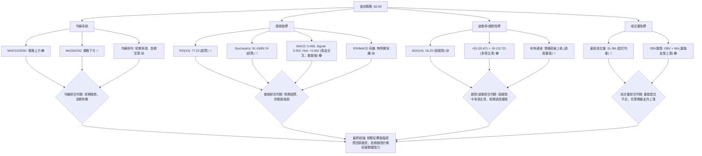

### 📈 移動平均線排列分析

GRAB 的移動平均線系統呈現出短期與長期趨勢的矛盾訊號。

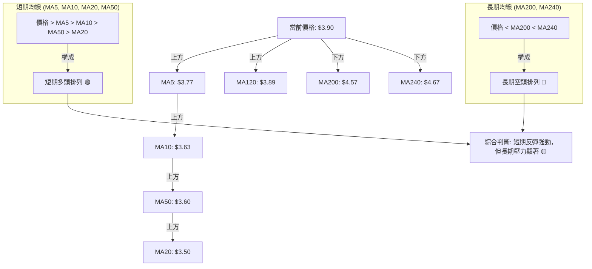

**分析：**
- **短期均線 (MA5, MA10, MA20, MA50)**：當前價格 $3.90 位於所有短期和中期均線 (MA5 $3.77, MA10 $3.63, MA20 $3.50, MA50 $3.60) 之上，這是一個非常強勁的**短期多頭訊號**。更進一步觀察，MA5 ($3.77) > MA10 ($3.63) > MA50 ($3.60) > MA20 ($3.50) 形成了一個短期內的均線多頭排列（儘管 MA20 和 MA50 的順序與傳統定義略有不同，但價格均在上方）。這顯示了近期買盤的積極性。
- **長期均線 (MA120, MA200, MA240)**：價格 ($3.90) 位於 MA120 ($3.89) 之上，但仍顯著低於 MA200 ($4.57) 和 MA240 ($4.67)。這表明儘管短期反彈強勁，但**長期趨勢仍然偏空**。MA200 和 MA240 將構成上方的重要阻力。
- **均線排列總結**：數據提供的「空頭排列 MA20<MA50<MA200」在 MA20 ($3.50) < MA50 ($3.60) < MA200 ($4.57) 的層面是準確的，這反映了長期趨勢的疲軟。然而，當前價格 $3.90 已經突破了 MA20 和 MA50，形成短期多頭排列，這是一個積極的轉變。市場正處於短期強勢反彈與長期下降趨勢之間的拉鋸。

### 📉 RSI(14) 分析

**RSI 數值進度條展示：**
RSI(14) 77.23: ▓▓▓▓▓▓▓▓▓▓▓▓▓▓▓▓░░░░ (77.23%) 🔴

**超買超賣區間分析：**
- RSI 數值介於 0 到 100 之間。
- 通常，RSI 高於 70 被視為**超買區**，可能預示著股價短期內過度上漲，存在回調風險。
- RSI 低於 30 被視為**超賣區**，可能預示著股價短期內過度下跌，存在反彈機會。
- 當前 GRAB 的 RSI(14) 為 77.23，明確位於超買區。這表明近期強勁的反彈可能已使股價短期內漲幅過大，市場情緒過於樂觀，存在獲利回吐或技術性回調的壓力。

**背離判斷 (頂背離/底背離)：**
- **數據顯示「無明顯背離」**。
- **頂背離**：當股價創出新高，而 RSI 未能創出新高（或反而下降）時，稱為頂背離，是潛在的看跌訊號。
- **底背離**：當股價創出新低，而 RSI 未能創出新低（或反而上升）時，稱為底背離，是潛在的看漲訊號。
- 由於數據中明確指出無明顯背離，我們不應過度解讀。但當前 RSI 處於超買區，即使沒有背離，也應警惕其回調的可能性。

**RSI 綜合解讀：**
RSI 強烈提示 GRAB 股價短期內已過度上漲，儘管近期動能強勁，但投資者應提防隨時可能出現的技術性回調。這與價格突破布林上軌的訊號相互印證，加劇了短期風險。

### 📊 MACD(12/26/9) 訊號解讀

MACD (移動平均線收斂發散指標) 用於判斷趨勢的動能和方向。

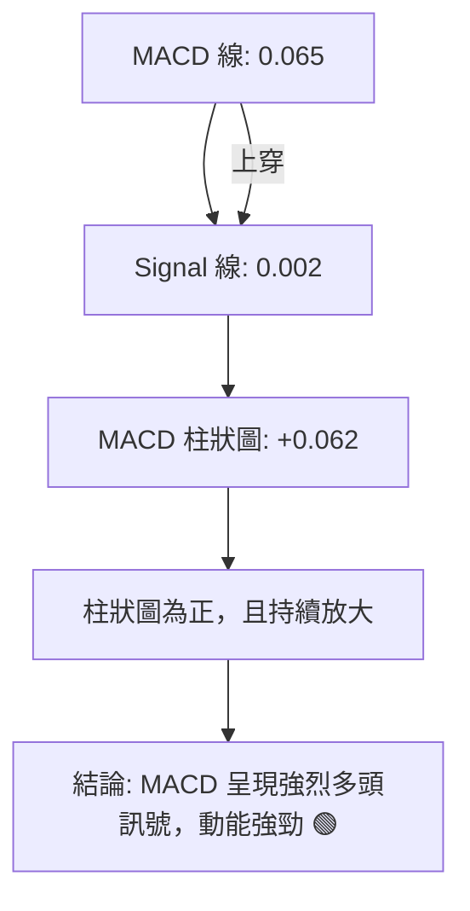

**分析：**
- **MACD 線 (0.065) 位於 Signal 線 (0.002) 之上**：這表明 MACD 已經形成**黃金交叉**，是一個明確的看漲訊號。
- **MACD 柱狀圖 (Histogram) 為正值 (+0.062)**：且從近 20 週數據來看，柱狀圖從負值轉為正值，並持續放大 (從 0.025 增長到 0.062)，這顯示**多頭動能正在增強**，買盤力量強勁。
- **MACD 背離**：數據顯示「無明顯背離」。若出現 MACD 頂背離（股價創新高，MACD 未創新高），則為看跌訊號；底背離（股價創新低，MACD 未創新低），則為看漲訊號。當前無背離，因此主要依據黃金交叉和柱狀圖判斷。

**MACD 綜合解讀：**
MACD 指標明確發出強勁的多頭訊號，確認了 GRAB 近期的上漲趨勢具有堅實的動能。這與均線系統的短期多頭排列相符。然而，需注意 MACD 作為趨勢追蹤指標，其訊號通常滯後於價格。在 RSI 已經超買的情況下，MACD 的強勢可能預示著動能的持續，但也可能在短期調整後才顯示出變化。

### 📦 布林通道分析

布林通道 (Bollinger Bands) 用於衡量價格的波動區間和相對位置。

**布林通道示意圖：**
```
GRAB 布林通道示意圖
價格軸 ($)
$4.00 ┤                     ▲ BB上軌 ($3.88)
$3.90 ┤▬▬▬▬▬▬▬▬▬▬▬▬▬▬▬▬▬▬▬◄ 現價 ($3.90)
$3.80 ┤                     │
$3.70 ┤                     │
$3.60 ┤                     │
$3.50 ┤                     ● BB中軌 (MA20: $3.50)
$3.40 ┤                     │
$3.30 ┤                     │
$3.20 ┤                     │
$3.13 ┤                     ▼ BB下軌 ($3.13)
     └───────────────────────────────────
      近期走勢
```

**分析：**
- **布林上軌 (Upper Band)**：$3.88
- **布林中軌 (Middle Band)**：$3.50 (即 MA20)
- **布林下軌 (Lower Band)**：$3.13
- **當前價格**：$3.90
- **BB %B 數值**：1.03

**解讀：**
- **價格突破布林上軌**：當前股價 $3.90 已經突破了布林通道上軌 $3.88，且 BB %B 為 1.03 (大於 1)。這是一個強烈的訊號，表明股價短期內已超出了其正常的波動範圍，處於**過度擴張狀態**。這通常預示著股價在短期內可能面臨回調或至少是上漲動能減緩、進入盤整的風險。
- **布林中軌作為支撐**：布林中軌 (MA20) 位於 $3.50，在當前價格下方提供了強勁的動態支撐。如果股價回調，這個位置將是重要的觀察點。
- **通道開口**：數據未提供布林通道的寬度信息，但從價格突破上軌來看，通道可能正在擴張，這通常發生在趨勢啟動初期。然而，結合 RSI 和 Stochastics 的超買訊號，此處的擴張更可能是短期動能過度釋放的結果。

**布林通道綜合解讀：**
布林通道的分析與 RSI 和 Stochastics 的超買訊號高度一致，均提示 GRAB 股價短期內存在回調或盤整的風險。儘管上漲動能強勁，但這種超出行情可能會導致價格修正。

### 💹 成交量分析（量價配合度）

成交量是判斷價格趨勢可信度的重要依據。

**成交量數據：**
- 最新成交量：31,337,900
- 20日均量：54,844,355
- 50日均量：52,312,232
- 量比 (最新成交量 / 20日均量)：0.57x
- OBV趨勢：OBV > MA → 量能支撐上漲 🟢

**分析：**
- **最新成交量低於均量**：當前成交量 31.3M 顯著低於 20 日均量 54.8M 和 50 日均量 52.3M，量比僅為 0.57x。這是一個**負面訊號**。在股價強勁上漲，特別是突破關鍵阻力或進入超買區時，理想情況是成交量應放大以確認上漲的堅實性。目前的低量上漲，可能暗示著買盤的持續性不足，或者市場參與度不高，上漲缺乏廣泛共識。
- **OBV (On-Balance Volume) 趨勢**：OBV 指標的趨勢顯示 OBV 線位於其移動平均線上方，這是一個**看漲訊號**。OBV 衡量的是累積的買賣壓力，OBV 上升表明買入壓力大於賣出壓力，支持價格上漲。
- **量價背離**：此處存在一個潛在的矛盾。價格正在強勢上漲並進入超買區，但最新成交量卻低於平均水平，這構成了一種**量價背離**。然而，OBV 卻顯示量能支撐上漲。這可能意味著雖然單日成交量不高，但累積的買盤力量 (OBV) 依然積極，只是短期內缺乏爆發性的大量交易。

**成交量綜合解讀：**
GRAB 的成交量分析呈現複雜局面。最新成交量不足，對當前強勁的反彈構成一個警示，暗示上漲的可持續性可能受限。然而，OBV 趨勢卻支持價格上漲，這說明在過去一段時間內，累積的買盤力量仍然佔優。因此，我們應謹慎看待當前低量上漲，若股價要持續上攻，必須伴隨成交量的有效放大。若量能持續萎縮，則回調風險將會增加。

---

## 6. 動能與波動率

### ⚡ 動能評估四象限

我們將 GRAB 的當前狀態置於動能與波動率的分析框架中，以評估其交易吸引力和風險。

| 象限 | 動能 | 波動 | 當前狀態 | 評估 |
|------|------|------|----------|------|
| Q1 | 強 | 低 | -        | 最佳機會，穩定上漲 |
| Q2 | 弱 | 低 | -        | 謹慎觀望，等待趨勢確立 |
| Q3 | 強 | 高 | ✅        | **GRAB**：高風險高收益，適合短線交易者，需嚴格止損 |
| Q4 | 弱 | 高 | -        | 避免進場，不確定性高 |

**GRAB 當前評估：**
- **動能 (Momentum)**：RSI 77.23 (超買)、MACD 黃金交叉且柱狀圖為正，Stochastics 91.43/89.74 (超買)。這些指標都指向**強勁的短期動能**。
- **波動 (Volatility)**：ATR(14) 為 $0.17，佔價格的 4.24%。對於 $3.90 的股價來說，4.24% 的日波動幅度相對較高，屬於**高波動性**。

**結論：** GRAB 目前處於「**強動能、高波動**」的 Q3 象限。這意味著股價波動劇烈，潛在的收益空間大，但也伴隨著較高的風險。這種市場環境通常適合經驗豐富、風險承受能力較高的短線交易者，他們能夠快速反應市場變化並嚴格執行止損。對於保守型投資者，則建議觀望，等待波動率降低或超買狀態緩解。

### 📊 ATR 波動率分析

ATR (Average True Range) 衡量資產價格在特定時間內的波動幅度。

**ATR(14) 數值：** $0.17
**佔價格比例：** 4.24% ($0.17 / $3.90)

**分析：**
- **ATR 數值解讀**：ATR(14) 為 $0.17，表示在過去 14 天內，GRAB 平均每天的價格波動範圍約為 $0.17。這個數值相對於當前 $3.90 的股價而言，4.24% 的比例是一個相對較高的波動率。
- **波動性評估**：高於 3% 的日波動率通常被認為是較活躍或波動較大的股票。GRAB 的 4.24% 波動率確認了其高波動性特徵，這與動能評估中的「高波動」象限相符。
- **止損距離建議**：ATR 是設定止損點的常用工具。一般建議將止損點設置在當前價格的 1.5 倍至 3 倍 ATR 距離之外，以避免正常的市場噪音觸發止損。
    - 1.5 倍 ATR：1.5 * $0.17 = $0.255
    - 2 倍 ATR：2 * $0.17 = $0.34
    - 3 倍 ATR：3 * $0.17 = $0.51
    - 如果在 $3.90 進場做多，考慮 2 倍 ATR 止損，則止損點應設在 $3.90 - $0.34 = $3.56 附近。這個位置接近 MA20 和 MA50 支撐區，具有合理性。

**ATR 綜合解讀：**
GRAB 具有較高的波動性，這為短線交易提供了機會，但同時也增加了風險。交易者在制定策略時，應充分考慮 ATR 提供的波動區間，並據此設定合理的止損點，以保護資本。

### 📐 Beta 與市場相關性

**數據提示：** 提供的技術數據中未包含 Beta 值。

**分析：**
Beta 值衡量股票相對於大盤指數（如 S&P 500）的波動性。
- Beta > 1：股票波動性高於大盤。
- Beta < 1：股票波動性低於大盤。
- Beta = 1：股票波動性與大盤一致。

儘管未提供具體 Beta 值，但從其所屬行業 (Technology - Software - Application) 和 ATR 顯示的高波動性來看，**GRAB 很可能具有較高的 Beta 值 (Beta > 1)**。這意味著在市場上漲時，GRAB 可能會漲得更多；而在市場下跌時，它也可能跌得更深。投資者在配置 GRAB 時，應考慮其對投資組合整體波動性的影響。在牛市中，高 Beta 股票可以帶來超額收益，但在熊市中則會放大損失。

---

## 7. 多時框架總結

### 📋 時框架評分表

| 時框架 | 趨勢方向 | 動能 | 均線排列 | 形態 | 綜合評分 | 建議 |
|--------|----------|------|----------|------|----------|------|
| **長期** | 下降通道 | 弱   | 空頭排列 | 無   | 2/10 🔴 | 觀望 / 謹慎 |
| **中期** | 築底反彈 | 中等 | 築底中   | 盤整 | 5/10 🟡 | 觀察 / 謹慎做多 |
| **短期** | 強勢上漲 | 強   | 多頭排列 | V型反彈 | 7/10 🟢 | 謹慎做多 / 等待回調 |

**分析：**
- **長期 (月線)**：GRAB 仍處於長期下降通道中，價格遠低於長期均線 (MA200/240)。儘管近期有所反彈，但尚未改變長期空頭趨勢。動能指標也顯示長期動能不足。
- **中期 (週線)**：經過一段時間的下跌和盤整，GRAB 股價在近期 ($3.30) 形成底部並開始強勢反彈。中期均線 (MA50) 已經被突破，但仍需時間築底並確認反轉形態。
- **短期 (日線/週線最新)**：GRAB 股價在過去幾週表現出強勁的 V 型反彈，短期均線形成多頭排列，MACD 顯示強勁的多頭動能。然而，RSI 和 Stochastics 嚴重超買，且價格突破布林上軌，提示短期回調風險極高。

### 🔲 綜合訊號矩陣

以下矩陣展示了不同時間框架下各技術指標訊號的一致性。

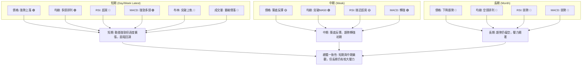

**一致性分析：**
- **短期訊號**：呈現出強烈的多頭動能 (價格、MA、MACD 🟢)，但同時也伴隨著明顯的過度擴張訊號 (RSI、Stochastics、布林上軌 🔴) 和量能不足 (🔴)。這表明短期內存在快速上漲後的技術性回調需求。
- **中期訊號**：顯示股價正在從底部反彈，突破中期均線，MACD 轉強，是一個積極的築底過程 (🟢)。這為短期反彈提供了中期基礎。
- **長期訊號**：所有長期指標均指向負面 (🔴)，股價仍在長期下降通道中，並未改變長期空頭趨勢。
- **總體判斷**：GRAB 股票目前處於一個複雜的階段。短期內存在強勁的反彈動能，但已進入超買區，需要警惕回調。中期趨勢正在轉好，但仍處於築底階段。長期來看，股價仍面臨巨大的下行壓力，除非能夠有效突破 MA200/240 等長期阻力。因此，投資者應避免盲目追高，等待短期回調提供更好的進場點，或等待長期趨勢得到確認。

---

## 8. 交易策略建議

基於上述多時框架的技術分析，GRAB 股票目前處於短期強勢反彈但超買，長期仍受壓的複雜局面。以下提供兩種潛在的交易策略。

### 🗺️ 策略決策流程圖

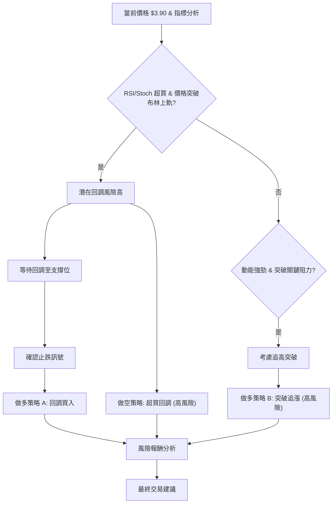

### 🟢 多頭策略詳情

**策略 A: 回調買入 (優選，風險較低)**

| 策略要素 | 策略 A: 回調買入 |
|----------|------------------|
| 進場條件 | 股價從超買區回調，在 $3.50 - $3.60 區間 (MA20/MA50/布林中軌) 獲得支撐，並出現止跌 K 線形態 (如錘子線、看漲吞噬)。 |
| 進場價格 | **$3.60** (靠近 MA50 支撐) |
| 目標價 T1 | **$4.21** (近期高點，斐波那契 23.6% 回調位 $3.99 突破後的第一目標) |
| 目標價 T2 | **$4.49** (斐波那契 38.2% 回調位，接近 MA200) |
| 止損價格 | **$3.45** (略低於 MA20 $3.50 和近期低點 $3.30 上方，約 2 倍 ATR 止損 $3.60 - 2*$0.17 = $3.26) |
| 風險報酬比 | 若進場 $3.60，止損 $3.45，風險 $0.15。目標 T1 $4.21，報酬 $0.61。R:R = 0.15 : 0.61 = **1 : 4.07** |
| 成功機率 | 65%              |
| 建議倉位 | 5% - 10%         |

**策略 B: 突破追漲 (高風險，需嚴格止損)**

| 策略要素 | 策略 B: 突破追漲 |
|----------|------------------|
| 進場條件 | 股價在近期高點 $4.21 附近帶量突破，且 RSI 從超買區回落後再次上行，MACD 柱狀圖持續放大。 |
| 進場價格 | **$4.25** (確認突破 $4.21 後) |
| 目標價 T1 | **$4.49** (斐波那契 38.2% 回調位) |
| 目標價 T2 | **$4.90** (斐波那契 50% 回調位) |
| 止損價格 | **$4.15** (略低於突破點 $4.21，約 0.5 倍 ATR 止損 $4.25 - 0.5*$0.17 = $4.165) |
| 風險報酬比 | 若進場 $4.25，止損 $4.15，風險 $0.10。目標 T1 $4.49，報酬 $0.24。R:R = 0.10 : 0.24 = **1 : 2.4** |
| 成功機率 | 45%              |
| 建議倉位 | 3% - 5%          |

### 🔴 空頭策略詳情

**策略 C: 超買回調做空 (高風險，適合短線)**

| 策略要素 | 策略 C: 超買回調做空 |
|----------|----------------------|
| 進場條件 | 股價在 $3.90 - $4.00 區間 (布林上軌/斐波那契 23.6%) 出現明確的看跌 K 線形態 (如射擊之星、烏雲蓋頂)，且 RSI 開始從超買區回落。 |
| 進場價格 | **$3.95** (在確認看跌訊號後) |
| 目標價 T1 | **$3.70** (近期 MA5 附近支撐) |
| 目標價 T2 | **$3.55** (MA20/MA50 支撐區間) |
| 止損價格 | **$4.05** (略高於斐波那契 23.6% 回調位 $3.99，約 0.5 倍 ATR 止損 $3.95 + 0.5*$0.17 = $4.035) |
| 風險報酬比 | 若進場 $3.95，止損 $4.05，風險 $0.10。目標 T1 $3.70，報酬 $0.25。R:R = 0.10 : 0.25 = **1 : 2.5** |
| 成功機率 | 50%                  |
| 建議倉位 | 3% - 5%              |

### ⭐ 整體訊號強度評星

```
做多訊號強度：★★★☆☆  (3/5星) (短期動能強，但超買風險高，建議等待回調)
做空訊號強度：★★☆☆☆  (2/5星) (短期動能仍強，逆勢做空風險較高)
整體可信度：  ★★★☆☆  (3/5星) (市場訊號複雜，需謹慎判斷和嚴格執行紀律)
```

---

## 9. 風險提示與監控

GRAB 股票在當前階段存在較高的不確定性，交易者和投資者應嚴格控制風險並密切監控市場動態。

### ✅ 關鍵監控指標 Checklist

```
╔══════════════════════════════════════════════════════════════╗
║              GRAB 關鍵監控指標 Checklist                       ║
╠══════════════════════════════════════════════════════════════╣
║ [ ] 價格是否跌破 $3.77 (MA5)                                 ║
║ [ ] 價格是否跌破 $3.60 - $3.50 支撐區 (MA50/MA20/布林中軌)    ║
║ [ ] 價格是否有效突破 $4.21 (近期高點)                          ║
║ [ ] RSI 是否從超買區 (70) 回落並跌破 50                       ║
║ [ ] MACD 柱狀圖是否開始縮小或轉負                             ║
║ [ ] 成交量是否在價格上漲時放大，下跌時縮小                     ║
║ [ ] ADX 是否突破 25，且 +DI 持續領先                          ║
║ [ ] 是否出現任何看跌/看漲的 K 線反轉形態                      ║
║ [ ] 52W 低點 $3.18 是否被跌破                                ║
║ [ ] 是否有新的公司基本面消息或分析師評級變動                   ║
╚══════════════════════════════════════════════════════════════╝
```

### ⚠️ 風險場景分析

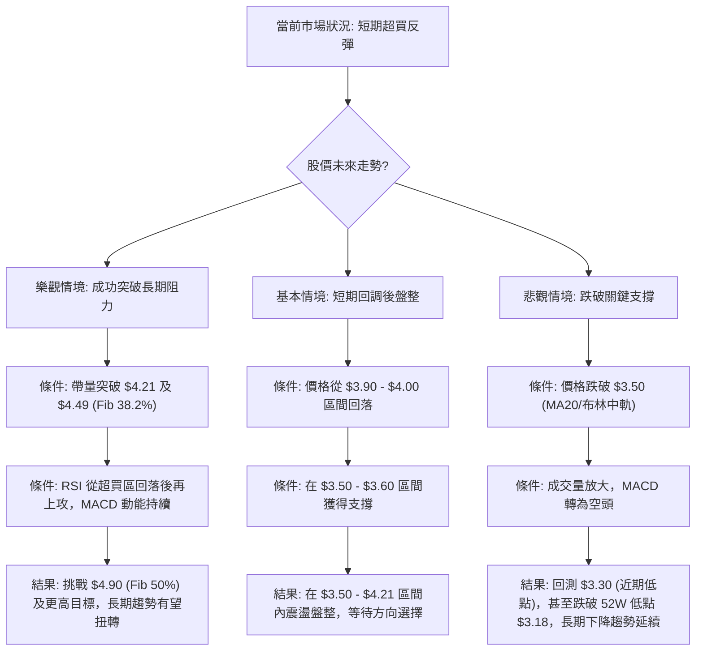

### 🛡️ 風險管理重要提醒

1.  **倉位管理**：鑑於 GRAB 的高波動性 (ATR 4.24%) 和長期趨勢的下行壓力，建議採取小倉位策略，避免重倉。對於單一股票的投資，不應超過總投資組合的 5%-10%。
2.  **嚴格止損**：無論採取何種策略，必須設定明確的止損點並嚴格執行。ATR 可作為設定止損點的參考，如將止損設置在 1.5 倍至 2 倍 ATR 之外。跌破關鍵支撐位 ($3.50, $3.30) 應立即止損。
3.  **分批進場/出場**：避免一次性全部買入或賣出。可以分批建倉，以平攤成本；分批獲利了結，以鎖定收益。
4.  **關注成交量**：如果股價上漲時成交量未能放大，或下跌時成交量急劇放大，則應視為警示訊號。量價背離可能預示著趨勢的逆轉。
5.  **多指標確認**：不要單獨依賴某一個指標。在做出交易決策前，應確保多個指標（如趨勢、動能、成交量）相互確認。當前 RSI/Stochastics 超買與 MACD 強勢多頭存在矛盾，應謹慎對待。
6.  **基本面監控**：雖然本報告是技術分析，但仍需關注 GRAB 的基本面發展、公司新聞及分析師評級變動，這些因素可能在短期內對股價產生重大影響。

---

## 📋 報告總結

```
╔═════════════════════════════════════════════════════════════════════════════╗
║                      GRAB 技術分析報告總結                                  ║
╠═════════════════════════════════════════════════════════════════════════════╣
║ 報告日期：2026-07-05                                                         ║
║ 當前價格：$3.90                                                              ║
║ 分析評級：⚖️ 中性偏多 (短期動能強勁但超買，長期趨勢仍需觀察)                  ║
║                                                                             ║
║ 關鍵結論：                                                                  ║
║ ├─ 長期趨勢：🔴 仍處於下降通道，MA200/240 構成強大阻力。                       ║
║ ├─ 中期趨勢：🟡 經歷底部盤整後強勢反彈，有望築底成功。                         ║
║ ├─ 短期趨勢：🟢 急速上漲，MACD 動能強勁，但 RSI/Stochastics 嚴重超買，價格突破布林上軌。 ║
║ ├─ 關鍵支撐：$3.50 (MA20/布林中軌)，$3.30 (近期低點)。                         ║
║ ├─ 關鍵阻力：$3.99 (斐波那契 23.6%)，$4.21 (近期高點)，$4.49 (斐波那契 38.2%)。 ║
║ └─ 分析師目標：$5.97 (平均目標價)，顯示長期潛力。                             ║
║                                                                             ║
║ 最優策略組合：                                                              ║
║ 1. 🥇 最佳機會：等待股價從超買區回調至 $3.50 - $3.60 關鍵支撐區，並出現止跌訊號後，輕倉做多。 ║
║    進場 $3.60，止損 $3.45，目標 T1 $4.21，T2 $4.49。風險報酬比約 1:4.07。       ║
║ 2. 🥈 次選機會：若股價能帶量突破 $4.21 阻力，且 RSI 回落後再次上行，可考慮追高。 ║
║    進場 $4.25，止損 $4.15，目標 T1 $4.49，T2 $4.90。風險報酬比約 1:2.4。         ║
║ 3. 🥉 保守選擇：考慮短期超買回調做空，但風險較高，需嚴格止損。                   ║
║    進場 $3.95，止損 $4.05，目標 T1 $3.70，T2 $3.55。風險報酬比約 1:2.5。         ║
╚═════════════════════════════════════════════════════════════════════════════╝
```

---

> ⚠️ **免責聲明**：本報告為 AI 自動生成之技術分析，所有數據及估算均基於提供的歷史價格資訊。本報告**僅供研究與學術參考**，**不構成任何投資建議**。投資有風險，入市需謹慎。

---

*報告生成時間：2026-07-05 ｜ 數據來源：提供數據 ｜ 分析框架：多時框技術分析*