<details>
<summary>📊 靜態圖表 (點擊展開)</summary>
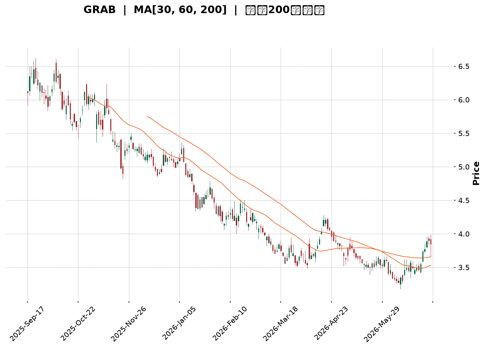
</details>

<html>
<head><meta charset="utf-8" /></head>
<body>
    <div style="height:500px; width:100%;">                        <script>window.PlotlyConfig = {MathJaxConfig: 'local'};</script>
        <script charset="utf-8" src="https://cdn.plot.ly/plotly-3.6.0.min.js" integrity="sha256-QaOVwtVY0T02VaHrr6pnoHLCwayMJp4O5n4YyaE3rJk=" crossorigin="anonymous"></script>                <div id="candlestick-chart" class="plotly-graph-div" style="height:100%; width:100%;"></div>            <script>                window.PLOTLYENV=window.PLOTLYENV || {};                                if (document.getElementById("candlestick-chart")) {                    Plotly.newPlot(                        "candlestick-chart",                        [{"close":{"dtype":"f8","bdata":"AAAAYGZmGEAAAABgZmYZQAAAACBcjxlAAAAAwMzMGUAAAAAgrkcZQAAAAKBH4RhAAAAAAAAAGUAAAADgo3AYQAAAAOCjcBhAAAAA4HoUGEAAAACgmZkXQAAAAEAzMxhAAAAAANejGEAAAAAgXI8ZQAAAAOB6FBlAAAAA4KNwGUAAAACAFK4YQAAAAOCjcBdAAAAA4FG4F0AAAAAA16MXQAAAAIAUrhdAAAAAQArXFkAAAAAgXI8WQAAAAIAUrhZAAAAAYGZmFkAAAABA4XoWQAAAAKBH4RZAAAAAYGZmF0AAAABA4XoYQAAAAGCPwhdAAAAAQDMzGEAAAAAghesXQAAAAIA9ChhAAAAAIK5HGEAAAAAA1yMXQAAAACBcjxZAAAAAwB6FFkAAAACgcD0WQAAAAKCZmRdAAAAAwB6FF0AAAADA9SgXQAAAAMD1KBZAAAAAANejFUAAAACA61EVQAAAACCuRxVAAAAAoHA9FUAAAAAghesTQAAAAKCZmRNAAAAAAAAAFUAAAACAwvUUQAAAACCuRxVAAAAAwMzMFUAAAADgehQVQAAAAIA9ChVAAAAA4HoUFUAAAABAMzMVQAAAAGCPwhRAAAAAANejFEAAAACgmZkUQAAAAOBRuBRAAAAA4FG4FEAAAACgmZkUQAAAAOB6FBRAAAAAwMzME0AAAABA4XoTQAAAAIAUrhNAAAAA4FG4E0AAAADgUbgUQAAAAIDrURRAAAAAwB6FFEAAAACgmZkUQAAAAGBmZhRAAAAAIK5HFEAAAACAwvUTQAAAAIDrURRAAAAAAClcFEAAAADgehQVQAAAAIDrURRAAAAAwB6FE0AAAABgZmYTQAAAACBcjxNAAAAAwPUoE0AAAADAHoUSQAAAACBcjxFAAAAAwB6FEUAAAACAPQoSQAAAAKCZmRFAAAAAQDMzEkAAAACA61ESQAAAAKBwPRJAAAAAYI\u002fCEkAAAABguB4SQAAAAKBH4RFAAAAAQDMzEUAAAAAA16MRQAAAAOB6FBFAAAAAYI\u002fCEEAAAACgmZkQQAAAAOB6FBFAAAAAgD0KEUAAAACgcD0RQAAAACCF6xBAAAAA4HoUEUAAAADAHoUQQAAAAOB6FBFAAAAAwMzMEUAAAACgmZkRQAAAAMAehRFAAAAA4FG4EEAAAACgmZkQQAAAAEAK1xBAAAAAoHA9EUAAAACgR+EQQAAAAOBRuBBAAAAAgOtREEAAAABgZmYQQAAAAGC4HhBAAAAAQArXD0AAAACAFK4PQAAAAIDC9Q5AAAAAYLgeD0AAAAAAAAAOQAAAAIAUrg1AAAAAAAAADkAAAADgUbgOQAAAAAAAAA5AAAAA4KNwDUAAAABA4XoMQAAAAGC4Hg1AAAAAgOtRDkAAAABACtcNQAAAAIAUrg1AAAAAIFyPDEAAAACgcD0MQAAAACCuRw1AAAAAAClcDUAAAACAwvUMQAAAAEDhegxAAAAAgOtRDEAAAACAPQoNQAAAAOCjcA1AAAAA4KNwDUAAAABACtcNQAAAACBcjw5AAAAAAClcD0AAAADgehQQQAAAAEAK1xBAAAAAQArXEEAAAACA61EQQAAAAKBwPRBAAAAAgBSuD0AAAABAMzMPQAAAAGC4Hg9AAAAAoEfhDkAAAAAgXI8OQAAAACBcjw5AAAAAAClcDUAAAACAwvUMQAAAAOCjcA1AAAAAwPUoDkAAAACA61EOQAAAAGCPwg1AAAAAQDMzDUAAAABguB4NQAAAAIA9Cg1AAAAAIFyPDEAAAABgZmYMQAAAAIDrUQxAAAAAAAAADEAAAADgehQMQAAAAEDhegxAAAAA4HoUDEAAAADgUbgMQAAAAGC4Hg1AAAAAgOtRDEAAAACA61EMQAAAAKBH4QxAAAAAwMzMDEAAAAAgrkcLQAAAAIAUrgtAAAAA4FG4CkAAAAAA16MKQAAAAGBmZgpAAAAAwPUoCkAAAADAzMwKQAAAAGBmZgpAAAAAgBSuC0AAAAAghesLQAAAAKCZmQtAAAAAIFyPDEAAAAAghesLQAAAAIAUrgtAAAAAIIXrC0AAAACAFK4LQAAAAGBmZgxAAAAAIIXrDUAAAADA9SgOQAAAAGC4Hg9AAAAAQDMzD0AAAADAzMwOQA=="},"high":{"dtype":"f8","bdata":"AAAAwB6FGEAAAAAAAAAaQAAAAAAAABpAAAAAgOtRGkAAAABA4XoaQAAAAOBRuBlAAAAA4HoUGUAAAACgR+EYQAAAAIAUrhhAAAAAoJmZGEAAAACgR+EYQAAAACCuRxhAAAAAoEfhGEAAAAAgrscZQAAAAGBmZhpAAAAAQInBGUAAAACgmZkZQAAAACBcjxhAAAAAIK5HGEAAAADgehQYQAAAACBcjxhAAAAAgML1F0AAAABAM7MWQAAAAIBqPBdAAAAA4FG4FkAAAABA4XoWQAAAAIA9ChdAAAAAwPWoF0AAAADAHoUYQAAAAIDC9RhAAAAAAClcGEAAAACA61EYQAAAAIDrURhAAAAAgMJ1GEAAAAAgrkcXQAAAAOCjcBdAAAAAQApXF0AAAADA9SgXQAAAAAAAABhAAAAA4KPwGEAAAADgehQYQAAAAKBH4RZAAAAAYLgeFkAAAADgehQWQAAAAIDCdRVAAAAAwB6FFUAAAAAA16MVQAAAAKBwPRRAAAAAQOF6FUAAAAAAKVwVQAAAAOCjcBVAAAAAAAAAFkAAAABA4XoVQAAAAKBwPRVAAAAAQDMzFUAAAABgZmYVQAAAAGBmZhVAAAAAIFwPFUAAAAAAKdwUQAAAAIDC9RRAAAAAYI\u002fCFEAAAADgehQVQAAAAADXoxRAAAAAQDMzFEAAAACgR+ETQAAAAKBH4RNAAAAAYLgeFEAAAABguB4VQAAAAIDC9RRAAAAAoJmZFEAAAAAA16MUQAAAACCF6xRAAAAAIFyPFEAAAAAAKVwUQAAAAMAehRRAAAAAwMzMFEAAAADgo3AVQAAAAIDrURVAAAAAQDMzFEAAAACgR+ETQAAAAKBH4RNAAAAAoJmZE0AAAACAPQoTQAAAAMAehRJAAAAAYGZmEkAAAADgUTgSQAAAAEAzMxJAAAAAYGZmEkAAAAAgXI8SQAAAAIAUrhJAAAAAgBQuE0AAAADgUbgSQAAAAOBROBJAAAAAoEfhEUAAAADgUbgRQAAAAGCPwhFAAAAAQOF6EUAAAAAA16MQQAAAAMDMTBFAAAAAAClcEUAAAABguJ4RQAAAACBcjxFAAAAAgML1EUAAAADgUTgRQAAAAEAzMxFAAAAAgD0KEkAAAABACtcRQAAAAMAeBRJAAAAAgD2KEUAAAACgmZkQQAAAAMAehRFAAAAAIK5HEUAAAABguB4RQAAAAKBH4RBAAAAAgD2KEEAAAADgepQQQAAAAMAehRBAAAAAwPUoEEAAAACAFK4PQAAAAAAAABBAAAAAwB6FD0AAAADAzMwOQAAAAEDheg5AAAAAANejDkAAAACAwvUOQAAAAEAzMw9AAAAAQArXDUAAAADgo3ANQAAAAIAUrg1AAAAAANejDkAAAACgmZkPQAAAAOBRuA5AAAAAwB6FDUAAAACAwvUMQAAAAOCjcA1AAAAAgOtRDkAAAABgj8INQAAAAAAAAA5AAAAAYI\u002fCDEAAAADgo3APQAAAAEAK1w1AAAAAwMzMDUAAAACgcD0OQAAAAOB6FA9AAAAA4FG4D0AAAAAAKVwQQAAAAGC4HhFAAAAAAAAAEUAAAACAwvUQQAAAAOCjcBBAAAAAQDMzEEAAAADA9SgQQAAAACCF6w9AAAAAAAAAD0AAAAAghesOQAAAAOBRuA5AAAAAoEfhDUAAAABAMzMNQAAAAOCjcA5AAAAAoJmZD0AAAABAMzMPQAAAAKBwPQ5AAAAA4HoUDkAAAADgo3ANQAAAAOCjcA1AAAAAgML1DEAAAAAgXI8MQAAAAMDMzAxAAAAAIFyPDEAAAACA6SYMQAAAAADXowxAAAAAgML1DEAAAACA61ENQAAAAAApXA1AAAAAgML1DEAAAAAgXI8MQAAAACCuRw1AAAAAIK5HDUAAAADgUbgMQAAAAGBmZgxAAAAAwB6FC0AAAABAMzMLQAAAAIDC9QpAAAAAwMzMCkAAAACAwvUKQAAAAGC4HgtAAAAAgML1DEAAAACAwvUMQAAAAAApXAxAAAAAoEfhDEAAAADgUbgMQAAAAAAAAAxAAAAAYGZmDEAAAAAgXI8MQAAAAADXowxAAAAAAAAADkAAAACgR+EOQAAAAIAUrg9AAAAAgBSuD0AAAAAghesPQA=="},"hovertemplate":"\u003cb\u003e%{x|%Y-%m-%d}\u003c\u002fb\u003e\u003cbr\u003e\u958b: $%{open:.2f}\u003cbr\u003e\u9ad8: $%{high:.2f}\u003cbr\u003e\u4f4e: $%{low:.2f}\u003cbr\u003e\u6536: $%{close:.2f}\u003cextra\u003e\u003c\u002fextra\u003e","low":{"dtype":"f8","bdata":"AAAAwPWoF0AAAACgcD0YQAAAACCuRxlAAAAAoEfhGEAAAACAPQoZQAAAAADXoxhAAAAAgML1F0AAAADA9SgYQAAAAOBRuBdAAAAAgML1F0AAAACA61EXQAAAAKCZmRdAAAAAoHA9GEAAAAAgXI8YQAAAAIDC9RhAAAAAIIXrGEAAAAAgrkcYQAAAAAApXBdAAAAAIFyPF0AAAADAzMwWQAAAAKCZmRdAAAAAIFyPFkAAAADA9SgWQAAAAKCZmRZAAAAAwPUoFkAAAACAFK4VQAAAAIDrURZAAAAA4HoUF0AAAAAA16MXQAAAAKCZmRdAAAAAYGZmF0AAAACAFK4XQAAAAMDMzBdAAAAAoJmZF0AAAADgo3AVQAAAAEDhehZAAAAAgBQuFkAAAADAzMwVQAAAACCF6xZAAAAAQDMzF0AAAABguB4XQAAAACCF6xVAAAAA4KNwFUAAAADgehQVQAAAAKBH4RRAAAAAAAAAFUAAAABACtcTQAAAACCuRxNAAAAAIIVrFEAAAABgj8IUQAAAAEAK1xRAAAAA4KNwFUAAAAAAAAAVQAAAAKBH4RRAAAAAoJmZFEAAAAAgrscUQAAAAOBRuBRAAAAA4KNwFEAAAACA61EUQAAAAEAzMxRAAAAAoEdhFEAAAADgo3AUQAAAAIDC9RNAAAAAgBSuE0AAAABgZmYTQAAAACBcjxNAAAAAANejE0AAAACAPQoUQAAAACCuRxRAAAAAYLgeFEAAAADAzEwUQAAAAKBHYRRAAAAAAAAAFEAAAAAghesTQAAAAIA9ChRAAAAAgOtRFEAAAABgj8IUQAAAAGCPQhRAAAAA4KNwE0AAAACA61ETQAAAAAApXBNAAAAAAAAAE0AAAACA61ESQAAAAIDrURFAAAAA4KNwEUAAAABgZmYRQAAAACBcjxFAAAAA4FG4EUAAAADgehQSQAAAAMD1KBJAAAAAAClcEkAAAACAPQoSQAAAAMAehRFAAAAAwPUoEUAAAAAAAAARQAAAAOBRuBBAAAAAoJmZEEAAAACgcD0QQAAAAIDCdRBAAAAAQArXEEAAAAAghesQQAAAAGCPwhBAAAAAwMzMEEAAAAAAAAAQQAAAAGBmZhBAAAAA4HoUEUAAAABgj0IRQAAAAIDrURFAAAAAwB6FEEAAAABAMzMQQAAAAOCnxhBAAAAAIFyPEEAAAADgUbgQQAAAAKBwPRBAAAAAAClcD0AAAACAPQoQQAAAAAAAABBAAAAAYI\u002fCD0AAAADAHoUOQAAAAMDMzA5AAAAAQOF6DkAAAABgj8INQAAAAKCZmQ1AAAAAYI\u002fCDUAAAADA9SgOQAAAAEAK1w1AAAAAIK5HDUAAAABgZmYMQAAAAOBRuAxAAAAAgML1DEAAAACgmZkNQAAAAIDrUQ1AAAAAoHA9DEAAAADgehQMQAAAAGBmZgxAAAAAYLgeDUAAAAAA16MMQAAAAEDhegxAAAAAQArXC0AAAADAzMwMQAAAAIDC9QxAAAAAQDMzDUAAAAAA16MMQAAAAGBkOw5AAAAAgBSuDkAAAABACtcPQAAAAOCjcBBAAAAA4KNwEEAAAABAMzMQQAAAAMD1KBBAAAAAQDMzD0AAAACAPQoPQAAAAKBH4Q5AAAAAgOtRDkAAAADgehQOQAAAACCF6w1AAAAAwPUoDEAAAACA61EMQAAAAOBRuAxAAAAAIIXrDUAAAADgehQOQAAAACCuRw1AAAAAgML1DEAAAACgR+EMQAAAAEDhegxAAAAAYGZmDEAAAACAFK4LQAAAAEAK1wtAAAAAIIXrC0AAAABguB4LQAAAAKCZmQtAAAAAIIXrC0AAAADgehQMQAAAAOCjcAxAAAAAQArXC0AAAABACtcLQAAAAAAAAAxAAAAAIFyPDEAAAACAPQoLQAAAAIA9CgtAAAAAoJmZCkAAAABgZmYKQAAAAOB6FApAAAAAwPUoCkAAAADgo3AJQAAAAOB6FApAAAAAgML1CkAAAABA4XoLQAAAAOCjcAtAAAAA4FG4CkAAAABgj8ILQAAAAGC4HgtAAAAA4KNwC0AAAADAHoULQAAAAGBmZgtAAAAAANejDEAAAABgj8INQAAAAGBmZg5AAAAAANejDkAAAAAgrkcNQA=="},"name":"\u50f9\u683c","open":{"dtype":"f8","bdata":"AAAAwB6FGEAAAACAPYoYQAAAACBcjxlAAAAAQOH6GEAAAAAghesZQAAAAEAzMxlAAAAAwB6FGEAAAABACtcYQAAAAIDCdRhAAAAAoHA9GEAAAADA9SgYQAAAAIDC9RdAAAAAQOF6GEAAAACgmRkZQAAAAEAzMxpAAAAAgOtRGUAAAACAPYoZQAAAAEDhehhAAAAAgML1F0AAAADA9SgXQAAAAKBwPRhAAAAAwMzMF0AAAABA4XoWQAAAAMD1KBdAAAAA4FG4FkAAAABA4XoWQAAAAIAUrhZAAAAAoEdhF0AAAAAAAAAYQAAAACCF6xhAAAAAYI\u002fCF0AAAAAAAAAYQAAAAKBH4RdAAAAAgD0KGEAAAABgj0IWQAAAAGCPQhdAAAAAwMzMFkAAAADAzMwWQAAAAKCZGRdAAAAAIFwPGEAAAABgZmYXQAAAAEAK1xZAAAAAwB6FFUAAAACAPYoVQAAAAOBROBVAAAAAQDMzFUAAAAAA16MVQAAAAIA9ChRAAAAAgBSuFEAAAADgehQVQAAAAMD1KBVAAAAAANejFUAAAAAghWsVQAAAAMAeBRVAAAAAgML1FEAAAABACtcUQAAAAMD1KBVAAAAAYI\u002fCFEAAAAAghWsUQAAAAGBmZhRAAAAA4HqUFEAAAABgj8IUQAAAAKCZmRRAAAAAQOH6E0AAAACgR+ETQAAAAKCZmRNAAAAAoEfhE0AAAADgehQUQAAAAIAUrhRAAAAAgOtRFEAAAAAgXI8UQAAAAEDhehRAAAAAgMJ1FEAAAAAgrkcUQAAAAIAULhRAAAAAwB6FFEAAAABgj8IUQAAAAGC4HhVAAAAAQDMzFEAAAABgj8ITQAAAAGBmZhNAAAAAoJmZE0AAAAAghesSQAAAAOCjcBJAAAAAgOtREkAAAACAPYoRQAAAAEAzMxJAAAAAwMzMEUAAAADgehQSQAAAAKBwPRJAAAAAAClcEkAAAACAFK4SQAAAAMD1KBJAAAAAgBSuEUAAAABguB4RQAAAAMD1qBFAAAAAgOtREUAAAADAHoUQQAAAAKBH4RBAAAAAYLgeEUAAAADA9SgRQAAAAOCjcBFAAAAAwMzMEEAAAACAwvUQQAAAAGCPwhBAAAAAoHA9EUAAAADgepQRQAAAAOCjcBFAAAAAwMxMEUAAAADgo3AQQAAAAAAAABFAAAAA4FG4EEAAAADAzMwQQAAAAADXoxBAAAAAYLgeEEAAAADgo3AQQAAAAAApXBBAAAAAIFwPEEAAAAAgrkcPQAAAAIAUrg9AAAAAwMzMDkAAAAAA16MOQAAAAGC4Hg5AAAAAIIXrDUAAAACgcD0OQAAAAKCZmQ5AAAAAYI\u002fCDUAAAABAMzMNQAAAAMDMzAxAAAAAQDMzDUAAAAAA16MOQAAAAGBmZg1AAAAA4KNwDUAAAADgUbgMQAAAAMDMzAxAAAAAAAAADkAAAACAwvUMQAAAAKBH4QxAAAAAwB6FDEAAAABACtcOQAAAAIA9Cg1AAAAAoJmZDUAAAABAMzMNQAAAAKBwPQ5AAAAAwMzMDkAAAAAAAAAQQAAAAEDhehBAAAAAYLieEEAAAACgR+EQQAAAAAApXBBAAAAAQDMzEEAAAADgehQQQAAAAEAzMw9AAAAAwMzMDkAAAACgR+EOQAAAACBcjw5AAAAA4FG4DUAAAADgehQNQAAAAAApXA5AAAAAwMzMDkAAAAAgXI8OQAAAAMD1KA5AAAAAgBSuDUAAAAAAKVwNQAAAAAApXA1AAAAAgML1DEAAAACA61EMQAAAAGC4HgxAAAAAgOtRDEAAAADgehQMQAAAAAAAAAxAAAAAQOF6DEAAAAAgrkcMQAAAAEDhegxAAAAAgML1DEAAAACgcD0MQAAAAMD1KAxAAAAAoEfhDEAAAAAA16MMQAAAACCuRwtAAAAA4KNwC0AAAABgj8IKQAAAAADXowpAAAAAYGZmCkAAAAAAAAAKQAAAAGC4HgtAAAAAYLgeC0AAAABgj8ILQAAAAAAAAAxAAAAAwB6FC0AAAACgGAQMQAAAACCuRwtAAAAAANejC0AAAABAMzMMQAAAAGBmZgtAAAAA4FG4DEAAAAAghesNQAAAAGBmZg5AAAAA4KNwD0AAAAAAKVwPQA=="},"x":["2025-09-17T00:00:00-04:00","2025-09-18T00:00:00-04:00","2025-09-19T00:00:00-04:00","2025-09-22T00:00:00-04:00","2025-09-23T00:00:00-04:00","2025-09-24T00:00:00-04:00","2025-09-25T00:00:00-04:00","2025-09-26T00:00:00-04:00","2025-09-29T00:00:00-04:00","2025-09-30T00:00:00-04:00","2025-10-01T00:00:00-04:00","2025-10-02T00:00:00-04:00","2025-10-03T00:00:00-04:00","2025-10-06T00:00:00-04:00","2025-10-07T00:00:00-04:00","2025-10-08T00:00:00-04:00","2025-10-09T00:00:00-04:00","2025-10-10T00:00:00-04:00","2025-10-13T00:00:00-04:00","2025-10-14T00:00:00-04:00","2025-10-15T00:00:00-04:00","2025-10-16T00:00:00-04:00","2025-10-17T00:00:00-04:00","2025-10-20T00:00:00-04:00","2025-10-21T00:00:00-04:00","2025-10-22T00:00:00-04:00","2025-10-23T00:00:00-04:00","2025-10-24T00:00:00-04:00","2025-10-27T00:00:00-04:00","2025-10-28T00:00:00-04:00","2025-10-29T00:00:00-04:00","2025-10-30T00:00:00-04:00","2025-10-31T00:00:00-04:00","2025-11-03T00:00:00-05:00","2025-11-04T00:00:00-05:00","2025-11-05T00:00:00-05:00","2025-11-06T00:00:00-05:00","2025-11-07T00:00:00-05:00","2025-11-10T00:00:00-05:00","2025-11-11T00:00:00-05:00","2025-11-12T00:00:00-05:00","2025-11-13T00:00:00-05:00","2025-11-14T00:00:00-05:00","2025-11-17T00:00:00-05:00","2025-11-18T00:00:00-05:00","2025-11-19T00:00:00-05:00","2025-11-20T00:00:00-05:00","2025-11-21T00:00:00-05:00","2025-11-24T00:00:00-05:00","2025-11-25T00:00:00-05:00","2025-11-26T00:00:00-05:00","2025-11-28T00:00:00-05:00","2025-12-01T00:00:00-05:00","2025-12-02T00:00:00-05:00","2025-12-03T00:00:00-05:00","2025-12-04T00:00:00-05:00","2025-12-05T00:00:00-05:00","2025-12-08T00:00:00-05:00","2025-12-09T00:00:00-05:00","2025-12-10T00:00:00-05:00","2025-12-11T00:00:00-05:00","2025-12-12T00:00:00-05:00","2025-12-15T00:00:00-05:00","2025-12-16T00:00:00-05:00","2025-12-17T00:00:00-05:00","2025-12-18T00:00:00-05:00","2025-12-19T00:00:00-05:00","2025-12-22T00:00:00-05:00","2025-12-23T00:00:00-05:00","2025-12-24T00:00:00-05:00","2025-12-26T00:00:00-05:00","2025-12-29T00:00:00-05:00","2025-12-30T00:00:00-05:00","2025-12-31T00:00:00-05:00","2026-01-02T00:00:00-05:00","2026-01-05T00:00:00-05:00","2026-01-06T00:00:00-05:00","2026-01-07T00:00:00-05:00","2026-01-08T00:00:00-05:00","2026-01-09T00:00:00-05:00","2026-01-12T00:00:00-05:00","2026-01-13T00:00:00-05:00","2026-01-14T00:00:00-05:00","2026-01-15T00:00:00-05:00","2026-01-16T00:00:00-05:00","2026-01-20T00:00:00-05:00","2026-01-21T00:00:00-05:00","2026-01-22T00:00:00-05:00","2026-01-23T00:00:00-05:00","2026-01-26T00:00:00-05:00","2026-01-27T00:00:00-05:00","2026-01-28T00:00:00-05:00","2026-01-29T00:00:00-05:00","2026-01-30T00:00:00-05:00","2026-02-02T00:00:00-05:00","2026-02-03T00:00:00-05:00","2026-02-04T00:00:00-05:00","2026-02-05T00:00:00-05:00","2026-02-06T00:00:00-05:00","2026-02-09T00:00:00-05:00","2026-02-10T00:00:00-05:00","2026-02-11T00:00:00-05:00","2026-02-12T00:00:00-05:00","2026-02-13T00:00:00-05:00","2026-02-17T00:00:00-05:00","2026-02-18T00:00:00-05:00","2026-02-19T00:00:00-05:00","2026-02-20T00:00:00-05:00","2026-02-23T00:00:00-05:00","2026-02-24T00:00:00-05:00","2026-02-25T00:00:00-05:00","2026-02-26T00:00:00-05:00","2026-02-27T00:00:00-05:00","2026-03-02T00:00:00-05:00","2026-03-03T00:00:00-05:00","2026-03-04T00:00:00-05:00","2026-03-05T00:00:00-05:00","2026-03-06T00:00:00-05:00","2026-03-09T00:00:00-04:00","2026-03-10T00:00:00-04:00","2026-03-11T00:00:00-04:00","2026-03-12T00:00:00-04:00","2026-03-13T00:00:00-04:00","2026-03-16T00:00:00-04:00","2026-03-17T00:00:00-04:00","2026-03-18T00:00:00-04:00","2026-03-19T00:00:00-04:00","2026-03-20T00:00:00-04:00","2026-03-23T00:00:00-04:00","2026-03-24T00:00:00-04:00","2026-03-25T00:00:00-04:00","2026-03-26T00:00:00-04:00","2026-03-27T00:00:00-04:00","2026-03-30T00:00:00-04:00","2026-03-31T00:00:00-04:00","2026-04-01T00:00:00-04:00","2026-04-02T00:00:00-04:00","2026-04-06T00:00:00-04:00","2026-04-07T00:00:00-04:00","2026-04-08T00:00:00-04:00","2026-04-09T00:00:00-04:00","2026-04-10T00:00:00-04:00","2026-04-13T00:00:00-04:00","2026-04-14T00:00:00-04:00","2026-04-15T00:00:00-04:00","2026-04-16T00:00:00-04:00","2026-04-17T00:00:00-04:00","2026-04-20T00:00:00-04:00","2026-04-21T00:00:00-04:00","2026-04-22T00:00:00-04:00","2026-04-23T00:00:00-04:00","2026-04-24T00:00:00-04:00","2026-04-27T00:00:00-04:00","2026-04-28T00:00:00-04:00","2026-04-29T00:00:00-04:00","2026-04-30T00:00:00-04:00","2026-05-01T00:00:00-04:00","2026-05-04T00:00:00-04:00","2026-05-05T00:00:00-04:00","2026-05-06T00:00:00-04:00","2026-05-07T00:00:00-04:00","2026-05-08T00:00:00-04:00","2026-05-11T00:00:00-04:00","2026-05-12T00:00:00-04:00","2026-05-13T00:00:00-04:00","2026-05-14T00:00:00-04:00","2026-05-15T00:00:00-04:00","2026-05-18T00:00:00-04:00","2026-05-19T00:00:00-04:00","2026-05-20T00:00:00-04:00","2026-05-21T00:00:00-04:00","2026-05-22T00:00:00-04:00","2026-05-26T00:00:00-04:00","2026-05-27T00:00:00-04:00","2026-05-28T00:00:00-04:00","2026-05-29T00:00:00-04:00","2026-06-01T00:00:00-04:00","2026-06-02T00:00:00-04:00","2026-06-03T00:00:00-04:00","2026-06-04T00:00:00-04:00","2026-06-05T00:00:00-04:00","2026-06-08T00:00:00-04:00","2026-06-09T00:00:00-04:00","2026-06-10T00:00:00-04:00","2026-06-11T00:00:00-04:00","2026-06-12T00:00:00-04:00","2026-06-15T00:00:00-04:00","2026-06-16T00:00:00-04:00","2026-06-17T00:00:00-04:00","2026-06-18T00:00:00-04:00","2026-06-22T00:00:00-04:00","2026-06-23T00:00:00-04:00","2026-06-24T00:00:00-04:00","2026-06-25T00:00:00-04:00","2026-06-26T00:00:00-04:00","2026-06-29T00:00:00-04:00","2026-06-30T00:00:00-04:00","2026-07-01T00:00:00-04:00","2026-07-02T00:00:00-04:00","2026-07-06T00:00:00-04:00"],"type":"candlestick"},{"hovertemplate":"MA30: $%{y:.2f}\u003cextra\u003e\u003c\u002fextra\u003e","line":{"color":"#2196F3","dash":"dash","width":2},"mode":"lines","name":"MA30","x":["2025-09-17T00:00:00-04:00","2025-09-18T00:00:00-04:00","2025-09-19T00:00:00-04:00","2025-09-22T00:00:00-04:00","2025-09-23T00:00:00-04:00","2025-09-24T00:00:00-04:00","2025-09-25T00:00:00-04:00","2025-09-26T00:00:00-04:00","2025-09-29T00:00:00-04:00","2025-09-30T00:00:00-04:00","2025-10-01T00:00:00-04:00","2025-10-02T00:00:00-04:00","2025-10-03T00:00:00-04:00","2025-10-06T00:00:00-04:00","2025-10-07T00:00:00-04:00","2025-10-08T00:00:00-04:00","2025-10-09T00:00:00-04:00","2025-10-10T00:00:00-04:00","2025-10-13T00:00:00-04:00","2025-10-14T00:00:00-04:00","2025-10-15T00:00:00-04:00","2025-10-16T00:00:00-04:00","2025-10-17T00:00:00-04:00","2025-10-20T00:00:00-04:00","2025-10-21T00:00:00-04:00","2025-10-22T00:00:00-04:00","2025-10-23T00:00:00-04:00","2025-10-24T00:00:00-04:00","2025-10-27T00:00:00-04:00","2025-10-28T00:00:00-04:00","2025-10-29T00:00:00-04:00","2025-10-30T00:00:00-04:00","2025-10-31T00:00:00-04:00","2025-11-03T00:00:00-05:00","2025-11-04T00:00:00-05:00","2025-11-05T00:00:00-05:00","2025-11-06T00:00:00-05:00","2025-11-07T00:00:00-05:00","2025-11-10T00:00:00-05:00","2025-11-11T00:00:00-05:00","2025-11-12T00:00:00-05:00","2025-11-13T00:00:00-05:00","2025-11-14T00:00:00-05:00","2025-11-17T00:00:00-05:00","2025-11-18T00:00:00-05:00","2025-11-19T00:00:00-05:00","2025-11-20T00:00:00-05:00","2025-11-21T00:00:00-05:00","2025-11-24T00:00:00-05:00","2025-11-25T00:00:00-05:00","2025-11-26T00:00:00-05:00","2025-11-28T00:00:00-05:00","2025-12-01T00:00:00-05:00","2025-12-02T00:00:00-05:00","2025-12-03T00:00:00-05:00","2025-12-04T00:00:00-05:00","2025-12-05T00:00:00-05:00","2025-12-08T00:00:00-05:00","2025-12-09T00:00:00-05:00","2025-12-10T00:00:00-05:00","2025-12-11T00:00:00-05:00","2025-12-12T00:00:00-05:00","2025-12-15T00:00:00-05:00","2025-12-16T00:00:00-05:00","2025-12-17T00:00:00-05:00","2025-12-18T00:00:00-05:00","2025-12-19T00:00:00-05:00","2025-12-22T00:00:00-05:00","2025-12-23T00:00:00-05:00","2025-12-24T00:00:00-05:00","2025-12-26T00:00:00-05:00","2025-12-29T00:00:00-05:00","2025-12-30T00:00:00-05:00","2025-12-31T00:00:00-05:00","2026-01-02T00:00:00-05:00","2026-01-05T00:00:00-05:00","2026-01-06T00:00:00-05:00","2026-01-07T00:00:00-05:00","2026-01-08T00:00:00-05:00","2026-01-09T00:00:00-05:00","2026-01-12T00:00:00-05:00","2026-01-13T00:00:00-05:00","2026-01-14T00:00:00-05:00","2026-01-15T00:00:00-05:00","2026-01-16T00:00:00-05:00","2026-01-20T00:00:00-05:00","2026-01-21T00:00:00-05:00","2026-01-22T00:00:00-05:00","2026-01-23T00:00:00-05:00","2026-01-26T00:00:00-05:00","2026-01-27T00:00:00-05:00","2026-01-28T00:00:00-05:00","2026-01-29T00:00:00-05:00","2026-01-30T00:00:00-05:00","2026-02-02T00:00:00-05:00","2026-02-03T00:00:00-05:00","2026-02-04T00:00:00-05:00","2026-02-05T00:00:00-05:00","2026-02-06T00:00:00-05:00","2026-02-09T00:00:00-05:00","2026-02-10T00:00:00-05:00","2026-02-11T00:00:00-05:00","2026-02-12T00:00:00-05:00","2026-02-13T00:00:00-05:00","2026-02-17T00:00:00-05:00","2026-02-18T00:00:00-05:00","2026-02-19T00:00:00-05:00","2026-02-20T00:00:00-05:00","2026-02-23T00:00:00-05:00","2026-02-24T00:00:00-05:00","2026-02-25T00:00:00-05:00","2026-02-26T00:00:00-05:00","2026-02-27T00:00:00-05:00","2026-03-02T00:00:00-05:00","2026-03-03T00:00:00-05:00","2026-03-04T00:00:00-05:00","2026-03-05T00:00:00-05:00","2026-03-06T00:00:00-05:00","2026-03-09T00:00:00-04:00","2026-03-10T00:00:00-04:00","2026-03-11T00:00:00-04:00","2026-03-12T00:00:00-04:00","2026-03-13T00:00:00-04:00","2026-03-16T00:00:00-04:00","2026-03-17T00:00:00-04:00","2026-03-18T00:00:00-04:00","2026-03-19T00:00:00-04:00","2026-03-20T00:00:00-04:00","2026-03-23T00:00:00-04:00","2026-03-24T00:00:00-04:00","2026-03-25T00:00:00-04:00","2026-03-26T00:00:00-04:00","2026-03-27T00:00:00-04:00","2026-03-30T00:00:00-04:00","2026-03-31T00:00:00-04:00","2026-04-01T00:00:00-04:00","2026-04-02T00:00:00-04:00","2026-04-06T00:00:00-04:00","2026-04-07T00:00:00-04:00","2026-04-08T00:00:00-04:00","2026-04-09T00:00:00-04:00","2026-04-10T00:00:00-04:00","2026-04-13T00:00:00-04:00","2026-04-14T00:00:00-04:00","2026-04-15T00:00:00-04:00","2026-04-16T00:00:00-04:00","2026-04-17T00:00:00-04:00","2026-04-20T00:00:00-04:00","2026-04-21T00:00:00-04:00","2026-04-22T00:00:00-04:00","2026-04-23T00:00:00-04:00","2026-04-24T00:00:00-04:00","2026-04-27T00:00:00-04:00","2026-04-28T00:00:00-04:00","2026-04-29T00:00:00-04:00","2026-04-30T00:00:00-04:00","2026-05-01T00:00:00-04:00","2026-05-04T00:00:00-04:00","2026-05-05T00:00:00-04:00","2026-05-06T00:00:00-04:00","2026-05-07T00:00:00-04:00","2026-05-08T00:00:00-04:00","2026-05-11T00:00:00-04:00","2026-05-12T00:00:00-04:00","2026-05-13T00:00:00-04:00","2026-05-14T00:00:00-04:00","2026-05-15T00:00:00-04:00","2026-05-18T00:00:00-04:00","2026-05-19T00:00:00-04:00","2026-05-20T00:00:00-04:00","2026-05-21T00:00:00-04:00","2026-05-22T00:00:00-04:00","2026-05-26T00:00:00-04:00","2026-05-27T00:00:00-04:00","2026-05-28T00:00:00-04:00","2026-05-29T00:00:00-04:00","2026-06-01T00:00:00-04:00","2026-06-02T00:00:00-04:00","2026-06-03T00:00:00-04:00","2026-06-04T00:00:00-04:00","2026-06-05T00:00:00-04:00","2026-06-08T00:00:00-04:00","2026-06-09T00:00:00-04:00","2026-06-10T00:00:00-04:00","2026-06-11T00:00:00-04:00","2026-06-12T00:00:00-04:00","2026-06-15T00:00:00-04:00","2026-06-16T00:00:00-04:00","2026-06-17T00:00:00-04:00","2026-06-18T00:00:00-04:00","2026-06-22T00:00:00-04:00","2026-06-23T00:00:00-04:00","2026-06-24T00:00:00-04:00","2026-06-25T00:00:00-04:00","2026-06-26T00:00:00-04:00","2026-06-29T00:00:00-04:00","2026-06-30T00:00:00-04:00","2026-07-01T00:00:00-04:00","2026-07-02T00:00:00-04:00","2026-07-06T00:00:00-04:00"],"y":{"dtype":"f8","bdata":"AAAAAAAA+H8AAAAAAAD4fwAAAAAAAPh\u002fAAAAAAAA+H8AAAAAAAD4fwAAAAAAAPh\u002fAAAAAAAA+H8AAAAAAAD4fwAAAAAAAPh\u002fAAAAAAAA+H8AAAAAAAD4fwAAAAAAAPh\u002fAAAAAAAA+H8AAAAAAAD4fwAAAAAAAPh\u002fAAAAAAAA+H8AAAAAAAD4fwAAAAAAAPh\u002fAAAAAAAA+H8AAAAAAAD4fwAAAAAAAPh\u002fAAAAAAAA+H8AAAAAAAD4fwAAAAAAAPh\u002fAAAAAAAA+H8AAAAAAAD4fwAAAAAAAPh\u002fAAAAAAAA+H8AAAAAAAD4fyIiIlLjJRhAq6qqai4kGEDv7u5OjRcYQCIiItKUChhAVVVVVZz9F0De3d1tWesXQAAAAFCN1xdAvLu7q2PCF0AiIiKyna8XQAAAALByqBdAmpmZWaujF0B3d3cn6p8XQERERLSBjhdAq6qqGuh0F0Dv7u6uuVAXQFVVVXVMMBdAq6qqanUMF0CamZkJ1+MWQN7d3W0SwxZAAAAAgNyrFkAzMzPz\u002fZQWQCIiIhKDgBZAd3d3J6N3FkC8u7sLAmsWQJqZmWkDXRZARERE1L9RFkARERGh00YWQLy7u2u8NBZAvLu7Gy8dFkDv7u4eE\u002fwVQDMzMyMi4hVAVVVV9W\u002fEFUDv7u5OG6gVQN7d3Y1QhhVAd3d31xVgFUAzMzNz2kAVQO\u002fu7v5GKBVAzczMTGIQFUDv7u7OaQMVQJqZmYls5xRAAAAA8NLNFECJiIiI+rcUQBEREcH1qBRAq6qqylqdFEAzMzPTv5EUQLy7u6uOiRRAiYiISAyCFEB3d3dX8osUQERERDQXkhRAiYiIGHaFFECamZk5JngUQDMzM9N4aRRAiYiIqPFSFEARERFBGT0UQDMzMxNnHxRAMzMzIwYBFEAzMzMDD+YTQDMzM+MXyxNAERERoUW2E0BERETk0KITQAAAAECnjRNAERERke18E0DNzMzsw2cTQDMzM\u002fP9VBNAq6qqKs4+E0AAAACgGi8TQGZmZtbqGBNA7+7unqj\u002fEkCJiIhYgNwSQFVVVXXawBJAiYiISCijEkAAAABAfIYSQDMzMxPKaBJAERERkXtNEkBmZmbGIDASQDMzM+N6FBJAq6qqeqL+EUDe3d1N8OARQM3MzJwLyRFAq6qq6iaxEUCamZk5QpkRQLy7u0sMghFA3t3d\u002falxEUCrqqpaq2MRQImIiFiAXBFAd3d350JSEUBEREREREQRQImIiCijNxFAvLu7ay4kEUB3d3fHBA8RQHd3d3d39xBA3t3d9SjcEEDv7u42icEQQERERDyYpxBAq6qqQtKUEEBmZmaGXYEQQCIiIrKdbxBAd3d3PzVeEEB3d3e\u002fEUoQQJqZmbmQNBBAzczMzIUkEEDv7u6uuRAQQFVVVbXz\u002fQ9AIiIiUirOD0Dv7u6ONKUPQJqZmQmQew9A3t3djVBGD0AAAAAQEREPQFVVVYUW2Q5AZmZmtmWtDkDe3d0N5okOQCIiIqK3ZQ5AZmZmlrU6DkCJiIg4QhkOQERERMSuAA5AERERkcL1DUB3d3d3TPANQBERETGW\u002fA1AvLu7u0kMDkAiIiLiehQOQAAAAGBzIQ5AZmZmtjomDkB3d3cneDAOQCIiIuLBPA5AVVVVRUREDkDv7u6+5kIOQFVVVRWuRw5AIiIiUv9GDkBVVVXlF0sOQCIiIvLSTQ5AvLu7a3VMDkDv7u7+jVAOQCIiIsI8UQ5AzczM3LJWDkARERFBNV4OQHd3d\u002fcoXA5AZmZmVlVVDkAAAAAAjlAOQJqZmXkwTw5AzczMbHVMDkBVVVVFREQOQN7d3R0TPA5AZmZmJngwDkCJiIh46SYOQO\u002fu7r6fGg5AMzMzw64ADkB3d3cn6t8NQERERGT0tg1A3t3d3U+NDUBVVVXFkl8NQDMzMwOdNg1AmpmZuUkMDUAAAABAYOUMQAAAAEAZvQxAERERQdKUDECJiIhovHQMQAAAAMA8UQxAvLu7u+ZCDEAiIiLSBjoMQHd3d0dTKgxAZmZmBqwcDEBVVVUlMQgMQBEREVFx9gtAzczMHIXrC0AiIiJiO98LQHd3d0fF2QtA7+7uPmDlC0BmZmYGZfQLQImIiLhJDAxAq6qqOpgnDECJiIgozj4MQA=="},"type":"scatter"},{"hovertemplate":"MA60: $%{y:.2f}\u003cextra\u003e\u003c\u002fextra\u003e","line":{"color":"#9C27B0","dash":"dash","width":2},"mode":"lines","name":"MA60","x":["2025-09-17T00:00:00-04:00","2025-09-18T00:00:00-04:00","2025-09-19T00:00:00-04:00","2025-09-22T00:00:00-04:00","2025-09-23T00:00:00-04:00","2025-09-24T00:00:00-04:00","2025-09-25T00:00:00-04:00","2025-09-26T00:00:00-04:00","2025-09-29T00:00:00-04:00","2025-09-30T00:00:00-04:00","2025-10-01T00:00:00-04:00","2025-10-02T00:00:00-04:00","2025-10-03T00:00:00-04:00","2025-10-06T00:00:00-04:00","2025-10-07T00:00:00-04:00","2025-10-08T00:00:00-04:00","2025-10-09T00:00:00-04:00","2025-10-10T00:00:00-04:00","2025-10-13T00:00:00-04:00","2025-10-14T00:00:00-04:00","2025-10-15T00:00:00-04:00","2025-10-16T00:00:00-04:00","2025-10-17T00:00:00-04:00","2025-10-20T00:00:00-04:00","2025-10-21T00:00:00-04:00","2025-10-22T00:00:00-04:00","2025-10-23T00:00:00-04:00","2025-10-24T00:00:00-04:00","2025-10-27T00:00:00-04:00","2025-10-28T00:00:00-04:00","2025-10-29T00:00:00-04:00","2025-10-30T00:00:00-04:00","2025-10-31T00:00:00-04:00","2025-11-03T00:00:00-05:00","2025-11-04T00:00:00-05:00","2025-11-05T00:00:00-05:00","2025-11-06T00:00:00-05:00","2025-11-07T00:00:00-05:00","2025-11-10T00:00:00-05:00","2025-11-11T00:00:00-05:00","2025-11-12T00:00:00-05:00","2025-11-13T00:00:00-05:00","2025-11-14T00:00:00-05:00","2025-11-17T00:00:00-05:00","2025-11-18T00:00:00-05:00","2025-11-19T00:00:00-05:00","2025-11-20T00:00:00-05:00","2025-11-21T00:00:00-05:00","2025-11-24T00:00:00-05:00","2025-11-25T00:00:00-05:00","2025-11-26T00:00:00-05:00","2025-11-28T00:00:00-05:00","2025-12-01T00:00:00-05:00","2025-12-02T00:00:00-05:00","2025-12-03T00:00:00-05:00","2025-12-04T00:00:00-05:00","2025-12-05T00:00:00-05:00","2025-12-08T00:00:00-05:00","2025-12-09T00:00:00-05:00","2025-12-10T00:00:00-05:00","2025-12-11T00:00:00-05:00","2025-12-12T00:00:00-05:00","2025-12-15T00:00:00-05:00","2025-12-16T00:00:00-05:00","2025-12-17T00:00:00-05:00","2025-12-18T00:00:00-05:00","2025-12-19T00:00:00-05:00","2025-12-22T00:00:00-05:00","2025-12-23T00:00:00-05:00","2025-12-24T00:00:00-05:00","2025-12-26T00:00:00-05:00","2025-12-29T00:00:00-05:00","2025-12-30T00:00:00-05:00","2025-12-31T00:00:00-05:00","2026-01-02T00:00:00-05:00","2026-01-05T00:00:00-05:00","2026-01-06T00:00:00-05:00","2026-01-07T00:00:00-05:00","2026-01-08T00:00:00-05:00","2026-01-09T00:00:00-05:00","2026-01-12T00:00:00-05:00","2026-01-13T00:00:00-05:00","2026-01-14T00:00:00-05:00","2026-01-15T00:00:00-05:00","2026-01-16T00:00:00-05:00","2026-01-20T00:00:00-05:00","2026-01-21T00:00:00-05:00","2026-01-22T00:00:00-05:00","2026-01-23T00:00:00-05:00","2026-01-26T00:00:00-05:00","2026-01-27T00:00:00-05:00","2026-01-28T00:00:00-05:00","2026-01-29T00:00:00-05:00","2026-01-30T00:00:00-05:00","2026-02-02T00:00:00-05:00","2026-02-03T00:00:00-05:00","2026-02-04T00:00:00-05:00","2026-02-05T00:00:00-05:00","2026-02-06T00:00:00-05:00","2026-02-09T00:00:00-05:00","2026-02-10T00:00:00-05:00","2026-02-11T00:00:00-05:00","2026-02-12T00:00:00-05:00","2026-02-13T00:00:00-05:00","2026-02-17T00:00:00-05:00","2026-02-18T00:00:00-05:00","2026-02-19T00:00:00-05:00","2026-02-20T00:00:00-05:00","2026-02-23T00:00:00-05:00","2026-02-24T00:00:00-05:00","2026-02-25T00:00:00-05:00","2026-02-26T00:00:00-05:00","2026-02-27T00:00:00-05:00","2026-03-02T00:00:00-05:00","2026-03-03T00:00:00-05:00","2026-03-04T00:00:00-05:00","2026-03-05T00:00:00-05:00","2026-03-06T00:00:00-05:00","2026-03-09T00:00:00-04:00","2026-03-10T00:00:00-04:00","2026-03-11T00:00:00-04:00","2026-03-12T00:00:00-04:00","2026-03-13T00:00:00-04:00","2026-03-16T00:00:00-04:00","2026-03-17T00:00:00-04:00","2026-03-18T00:00:00-04:00","2026-03-19T00:00:00-04:00","2026-03-20T00:00:00-04:00","2026-03-23T00:00:00-04:00","2026-03-24T00:00:00-04:00","2026-03-25T00:00:00-04:00","2026-03-26T00:00:00-04:00","2026-03-27T00:00:00-04:00","2026-03-30T00:00:00-04:00","2026-03-31T00:00:00-04:00","2026-04-01T00:00:00-04:00","2026-04-02T00:00:00-04:00","2026-04-06T00:00:00-04:00","2026-04-07T00:00:00-04:00","2026-04-08T00:00:00-04:00","2026-04-09T00:00:00-04:00","2026-04-10T00:00:00-04:00","2026-04-13T00:00:00-04:00","2026-04-14T00:00:00-04:00","2026-04-15T00:00:00-04:00","2026-04-16T00:00:00-04:00","2026-04-17T00:00:00-04:00","2026-04-20T00:00:00-04:00","2026-04-21T00:00:00-04:00","2026-04-22T00:00:00-04:00","2026-04-23T00:00:00-04:00","2026-04-24T00:00:00-04:00","2026-04-27T00:00:00-04:00","2026-04-28T00:00:00-04:00","2026-04-29T00:00:00-04:00","2026-04-30T00:00:00-04:00","2026-05-01T00:00:00-04:00","2026-05-04T00:00:00-04:00","2026-05-05T00:00:00-04:00","2026-05-06T00:00:00-04:00","2026-05-07T00:00:00-04:00","2026-05-08T00:00:00-04:00","2026-05-11T00:00:00-04:00","2026-05-12T00:00:00-04:00","2026-05-13T00:00:00-04:00","2026-05-14T00:00:00-04:00","2026-05-15T00:00:00-04:00","2026-05-18T00:00:00-04:00","2026-05-19T00:00:00-04:00","2026-05-20T00:00:00-04:00","2026-05-21T00:00:00-04:00","2026-05-22T00:00:00-04:00","2026-05-26T00:00:00-04:00","2026-05-27T00:00:00-04:00","2026-05-28T00:00:00-04:00","2026-05-29T00:00:00-04:00","2026-06-01T00:00:00-04:00","2026-06-02T00:00:00-04:00","2026-06-03T00:00:00-04:00","2026-06-04T00:00:00-04:00","2026-06-05T00:00:00-04:00","2026-06-08T00:00:00-04:00","2026-06-09T00:00:00-04:00","2026-06-10T00:00:00-04:00","2026-06-11T00:00:00-04:00","2026-06-12T00:00:00-04:00","2026-06-15T00:00:00-04:00","2026-06-16T00:00:00-04:00","2026-06-17T00:00:00-04:00","2026-06-18T00:00:00-04:00","2026-06-22T00:00:00-04:00","2026-06-23T00:00:00-04:00","2026-06-24T00:00:00-04:00","2026-06-25T00:00:00-04:00","2026-06-26T00:00:00-04:00","2026-06-29T00:00:00-04:00","2026-06-30T00:00:00-04:00","2026-07-01T00:00:00-04:00","2026-07-02T00:00:00-04:00","2026-07-06T00:00:00-04:00"],"y":{"dtype":"f8","bdata":"AAAAAAAA+H8AAAAAAAD4fwAAAAAAAPh\u002fAAAAAAAA+H8AAAAAAAD4fwAAAAAAAPh\u002fAAAAAAAA+H8AAAAAAAD4fwAAAAAAAPh\u002fAAAAAAAA+H8AAAAAAAD4fwAAAAAAAPh\u002fAAAAAAAA+H8AAAAAAAD4fwAAAAAAAPh\u002fAAAAAAAA+H8AAAAAAAD4fwAAAAAAAPh\u002fAAAAAAAA+H8AAAAAAAD4fwAAAAAAAPh\u002fAAAAAAAA+H8AAAAAAAD4fwAAAAAAAPh\u002fAAAAAAAA+H8AAAAAAAD4fwAAAAAAAPh\u002fAAAAAAAA+H8AAAAAAAD4fwAAAAAAAPh\u002fAAAAAAAA+H8AAAAAAAD4fwAAAAAAAPh\u002fAAAAAAAA+H8AAAAAAAD4fwAAAAAAAPh\u002fAAAAAAAA+H8AAAAAAAD4fwAAAAAAAPh\u002fAAAAAAAA+H8AAAAAAAD4fwAAAAAAAPh\u002fAAAAAAAA+H8AAAAAAAD4fwAAAAAAAPh\u002fAAAAAAAA+H8AAAAAAAD4fwAAAAAAAPh\u002fAAAAAAAA+H8AAAAAAAD4fwAAAAAAAPh\u002fAAAAAAAA+H8AAAAAAAD4fwAAAAAAAPh\u002fAAAAAAAA+H8AAAAAAAD4fwAAAAAAAPh\u002fAAAAAAAA+H8AAAAAAAD4f6uqqroCBBdAAAAAME\u002f0FkDv7u5O1N8WQAAAALByyBZAZmZmFtmuFkCJiIjwGZYWQHd3dyfqfxZARERE\u002fGJpFkCJiIjAg1kWQM3MzJzvRxZAzczMJL84FkAAAABY8isWQKuqqrq7GxZAq6qqciEJFkARERHBPPEVQImIiJDt3BVAmpmZ2UDHFUCJiIiw5LcVQBEREdGUqhVARERETKmYFUBmZmYWkoYVQKuqqvL9dBVAAAAAaEplFUBmZmamDVQVQGZmZj41PhVAvLu7+2IpFUAiIiJScRYVQHd3dyfq\u002fxRAZmZmXrrpFECamZkBcs8UQJqZmbHktxRAMzMzw66gFEDe3d2d74cUQImIiECnbRRAERERAXJPFECamZmJ+jcUQKuqquqYIBRA3t3ddQUIFEC8u7sT9e8TQHd3d38j1BNAREREnH24E0BERERkO58TQCIiIurfiBNA3t3dLWt1E0DNzMxM8GATQHd3d8cETxNAmpmZYVdAE0CrqqpScTYTQImIiGiRLRNAmpmZgU4bE0CamZk5tAgTQHd3d4\u002fC9RJAMzMz003iEkDe3d1NYtASQN7d3bXzvRJAVVVVhaSpEkC8u7ujKZUSQN7d3YVdgRJAZmZmBjptEkDe3d3V6lgSQLy7u1uPQhJAd3d3Q4ssEkDe3d2RphQSQLy7uxdL\u002fhFAq6qqNtDpEUAzMzMTPNgRQERERERExBFAMzMz7+6uEUAAAAAMSZMRQHd3d5e1ehFAq6qqCtdjEUB3d3f3mksRQO\u002fu7vbhMxFAERERXUgaEUDv7u6GXQERQAAAAHQh6RBAzczMYOXQEEDv7u5qvLQQQLy7u2\u002fLmhBA7+7u4uyDEEBERESgGm8QQGZmZg50WhBAiYiIZIJHEEB3d3c7JjgQQFVVVd1rLhBAAAAAGJImEEAAAABANR4QQImIiCD3GhBAzczMpCkVEEBEREQcoQwQQLy7u5MYBBBAERERUUbvD0CrqqpKxdkPQFVVVS35xQ9AVVVVZfS2D0De3d3l0KIPQM3MzLx0kw9AiYiI6LSBD0AiIiKynW8PQKuqqjJ6Ww9Aq6qqgsBKD0BmZmauADkPQLy7uzuYJw9Ad3d3l24SD0AAAADotAEPQImIiIDc6w5AIiIi8tLNDkAAAACIz7AOQHd3d38jlA5AmpmZke18DkCamZkpFWcOQAAAAGDlUA5AZmZm3pY1DkCJiIjYFSAOQJqZmUGnDQ5AIiIiqjj7DUB3d3dPG+gNQKuqqkrF2Q1AzczMzMzMDUC8u7vTBroNQJqZmTEIrA1AAAAAOEKZDUC8u7sz7IoNQBEREZHtfA1AMzMzQ4tsDUC8u7uT0VsNQKuqqmp1TA1A7+7uBvNEDUC8u7tbj0INQM3MzBwTPA1AERERuZA0DUAiIiKSXywNQJqZmQnXIw1AzczM\u002fBshDUCamZlRuB4NQHd3dx\u002f3Gg1Aq6qqylodDUAzMzODeSINQBERERm9LQ1AvLu70wY6DUDv7u42iUENQA=="},"type":"scatter"},{"hovertemplate":"MA200: $%{y:.2f}\u003cextra\u003e\u003c\u002fextra\u003e","line":{"color":"#FF6F00","dash":"solid","width":2},"mode":"lines","name":"MA200","x":["2025-09-17T00:00:00-04:00","2025-09-18T00:00:00-04:00","2025-09-19T00:00:00-04:00","2025-09-22T00:00:00-04:00","2025-09-23T00:00:00-04:00","2025-09-24T00:00:00-04:00","2025-09-25T00:00:00-04:00","2025-09-26T00:00:00-04:00","2025-09-29T00:00:00-04:00","2025-09-30T00:00:00-04:00","2025-10-01T00:00:00-04:00","2025-10-02T00:00:00-04:00","2025-10-03T00:00:00-04:00","2025-10-06T00:00:00-04:00","2025-10-07T00:00:00-04:00","2025-10-08T00:00:00-04:00","2025-10-09T00:00:00-04:00","2025-10-10T00:00:00-04:00","2025-10-13T00:00:00-04:00","2025-10-14T00:00:00-04:00","2025-10-15T00:00:00-04:00","2025-10-16T00:00:00-04:00","2025-10-17T00:00:00-04:00","2025-10-20T00:00:00-04:00","2025-10-21T00:00:00-04:00","2025-10-22T00:00:00-04:00","2025-10-23T00:00:00-04:00","2025-10-24T00:00:00-04:00","2025-10-27T00:00:00-04:00","2025-10-28T00:00:00-04:00","2025-10-29T00:00:00-04:00","2025-10-30T00:00:00-04:00","2025-10-31T00:00:00-04:00","2025-11-03T00:00:00-05:00","2025-11-04T00:00:00-05:00","2025-11-05T00:00:00-05:00","2025-11-06T00:00:00-05:00","2025-11-07T00:00:00-05:00","2025-11-10T00:00:00-05:00","2025-11-11T00:00:00-05:00","2025-11-12T00:00:00-05:00","2025-11-13T00:00:00-05:00","2025-11-14T00:00:00-05:00","2025-11-17T00:00:00-05:00","2025-11-18T00:00:00-05:00","2025-11-19T00:00:00-05:00","2025-11-20T00:00:00-05:00","2025-11-21T00:00:00-05:00","2025-11-24T00:00:00-05:00","2025-11-25T00:00:00-05:00","2025-11-26T00:00:00-05:00","2025-11-28T00:00:00-05:00","2025-12-01T00:00:00-05:00","2025-12-02T00:00:00-05:00","2025-12-03T00:00:00-05:00","2025-12-04T00:00:00-05:00","2025-12-05T00:00:00-05:00","2025-12-08T00:00:00-05:00","2025-12-09T00:00:00-05:00","2025-12-10T00:00:00-05:00","2025-12-11T00:00:00-05:00","2025-12-12T00:00:00-05:00","2025-12-15T00:00:00-05:00","2025-12-16T00:00:00-05:00","2025-12-17T00:00:00-05:00","2025-12-18T00:00:00-05:00","2025-12-19T00:00:00-05:00","2025-12-22T00:00:00-05:00","2025-12-23T00:00:00-05:00","2025-12-24T00:00:00-05:00","2025-12-26T00:00:00-05:00","2025-12-29T00:00:00-05:00","2025-12-30T00:00:00-05:00","2025-12-31T00:00:00-05:00","2026-01-02T00:00:00-05:00","2026-01-05T00:00:00-05:00","2026-01-06T00:00:00-05:00","2026-01-07T00:00:00-05:00","2026-01-08T00:00:00-05:00","2026-01-09T00:00:00-05:00","2026-01-12T00:00:00-05:00","2026-01-13T00:00:00-05:00","2026-01-14T00:00:00-05:00","2026-01-15T00:00:00-05:00","2026-01-16T00:00:00-05:00","2026-01-20T00:00:00-05:00","2026-01-21T00:00:00-05:00","2026-01-22T00:00:00-05:00","2026-01-23T00:00:00-05:00","2026-01-26T00:00:00-05:00","2026-01-27T00:00:00-05:00","2026-01-28T00:00:00-05:00","2026-01-29T00:00:00-05:00","2026-01-30T00:00:00-05:00","2026-02-02T00:00:00-05:00","2026-02-03T00:00:00-05:00","2026-02-04T00:00:00-05:00","2026-02-05T00:00:00-05:00","2026-02-06T00:00:00-05:00","2026-02-09T00:00:00-05:00","2026-02-10T00:00:00-05:00","2026-02-11T00:00:00-05:00","2026-02-12T00:00:00-05:00","2026-02-13T00:00:00-05:00","2026-02-17T00:00:00-05:00","2026-02-18T00:00:00-05:00","2026-02-19T00:00:00-05:00","2026-02-20T00:00:00-05:00","2026-02-23T00:00:00-05:00","2026-02-24T00:00:00-05:00","2026-02-25T00:00:00-05:00","2026-02-26T00:00:00-05:00","2026-02-27T00:00:00-05:00","2026-03-02T00:00:00-05:00","2026-03-03T00:00:00-05:00","2026-03-04T00:00:00-05:00","2026-03-05T00:00:00-05:00","2026-03-06T00:00:00-05:00","2026-03-09T00:00:00-04:00","2026-03-10T00:00:00-04:00","2026-03-11T00:00:00-04:00","2026-03-12T00:00:00-04:00","2026-03-13T00:00:00-04:00","2026-03-16T00:00:00-04:00","2026-03-17T00:00:00-04:00","2026-03-18T00:00:00-04:00","2026-03-19T00:00:00-04:00","2026-03-20T00:00:00-04:00","2026-03-23T00:00:00-04:00","2026-03-24T00:00:00-04:00","2026-03-25T00:00:00-04:00","2026-03-26T00:00:00-04:00","2026-03-27T00:00:00-04:00","2026-03-30T00:00:00-04:00","2026-03-31T00:00:00-04:00","2026-04-01T00:00:00-04:00","2026-04-02T00:00:00-04:00","2026-04-06T00:00:00-04:00","2026-04-07T00:00:00-04:00","2026-04-08T00:00:00-04:00","2026-04-09T00:00:00-04:00","2026-04-10T00:00:00-04:00","2026-04-13T00:00:00-04:00","2026-04-14T00:00:00-04:00","2026-04-15T00:00:00-04:00","2026-04-16T00:00:00-04:00","2026-04-17T00:00:00-04:00","2026-04-20T00:00:00-04:00","2026-04-21T00:00:00-04:00","2026-04-22T00:00:00-04:00","2026-04-23T00:00:00-04:00","2026-04-24T00:00:00-04:00","2026-04-27T00:00:00-04:00","2026-04-28T00:00:00-04:00","2026-04-29T00:00:00-04:00","2026-04-30T00:00:00-04:00","2026-05-01T00:00:00-04:00","2026-05-04T00:00:00-04:00","2026-05-05T00:00:00-04:00","2026-05-06T00:00:00-04:00","2026-05-07T00:00:00-04:00","2026-05-08T00:00:00-04:00","2026-05-11T00:00:00-04:00","2026-05-12T00:00:00-04:00","2026-05-13T00:00:00-04:00","2026-05-14T00:00:00-04:00","2026-05-15T00:00:00-04:00","2026-05-18T00:00:00-04:00","2026-05-19T00:00:00-04:00","2026-05-20T00:00:00-04:00","2026-05-21T00:00:00-04:00","2026-05-22T00:00:00-04:00","2026-05-26T00:00:00-04:00","2026-05-27T00:00:00-04:00","2026-05-28T00:00:00-04:00","2026-05-29T00:00:00-04:00","2026-06-01T00:00:00-04:00","2026-06-02T00:00:00-04:00","2026-06-03T00:00:00-04:00","2026-06-04T00:00:00-04:00","2026-06-05T00:00:00-04:00","2026-06-08T00:00:00-04:00","2026-06-09T00:00:00-04:00","2026-06-10T00:00:00-04:00","2026-06-11T00:00:00-04:00","2026-06-12T00:00:00-04:00","2026-06-15T00:00:00-04:00","2026-06-16T00:00:00-04:00","2026-06-17T00:00:00-04:00","2026-06-18T00:00:00-04:00","2026-06-22T00:00:00-04:00","2026-06-23T00:00:00-04:00","2026-06-24T00:00:00-04:00","2026-06-25T00:00:00-04:00","2026-06-26T00:00:00-04:00","2026-06-29T00:00:00-04:00","2026-06-30T00:00:00-04:00","2026-07-01T00:00:00-04:00","2026-07-02T00:00:00-04:00","2026-07-06T00:00:00-04:00"],"y":{"dtype":"f8","bdata":"AAAAAAAA+H8AAAAAAAD4fwAAAAAAAPh\u002fAAAAAAAA+H8AAAAAAAD4fwAAAAAAAPh\u002fAAAAAAAA+H8AAAAAAAD4fwAAAAAAAPh\u002fAAAAAAAA+H8AAAAAAAD4fwAAAAAAAPh\u002fAAAAAAAA+H8AAAAAAAD4fwAAAAAAAPh\u002fAAAAAAAA+H8AAAAAAAD4fwAAAAAAAPh\u002fAAAAAAAA+H8AAAAAAAD4fwAAAAAAAPh\u002fAAAAAAAA+H8AAAAAAAD4fwAAAAAAAPh\u002fAAAAAAAA+H8AAAAAAAD4fwAAAAAAAPh\u002fAAAAAAAA+H8AAAAAAAD4fwAAAAAAAPh\u002fAAAAAAAA+H8AAAAAAAD4fwAAAAAAAPh\u002fAAAAAAAA+H8AAAAAAAD4fwAAAAAAAPh\u002fAAAAAAAA+H8AAAAAAAD4fwAAAAAAAPh\u002fAAAAAAAA+H8AAAAAAAD4fwAAAAAAAPh\u002fAAAAAAAA+H8AAAAAAAD4fwAAAAAAAPh\u002fAAAAAAAA+H8AAAAAAAD4fwAAAAAAAPh\u002fAAAAAAAA+H8AAAAAAAD4fwAAAAAAAPh\u002fAAAAAAAA+H8AAAAAAAD4fwAAAAAAAPh\u002fAAAAAAAA+H8AAAAAAAD4fwAAAAAAAPh\u002fAAAAAAAA+H8AAAAAAAD4fwAAAAAAAPh\u002fAAAAAAAA+H8AAAAAAAD4fwAAAAAAAPh\u002fAAAAAAAA+H8AAAAAAAD4fwAAAAAAAPh\u002fAAAAAAAA+H8AAAAAAAD4fwAAAAAAAPh\u002fAAAAAAAA+H8AAAAAAAD4fwAAAAAAAPh\u002fAAAAAAAA+H8AAAAAAAD4fwAAAAAAAPh\u002fAAAAAAAA+H8AAAAAAAD4fwAAAAAAAPh\u002fAAAAAAAA+H8AAAAAAAD4fwAAAAAAAPh\u002fAAAAAAAA+H8AAAAAAAD4fwAAAAAAAPh\u002fAAAAAAAA+H8AAAAAAAD4fwAAAAAAAPh\u002fAAAAAAAA+H8AAAAAAAD4fwAAAAAAAPh\u002fAAAAAAAA+H8AAAAAAAD4fwAAAAAAAPh\u002fAAAAAAAA+H8AAAAAAAD4fwAAAAAAAPh\u002fAAAAAAAA+H8AAAAAAAD4fwAAAAAAAPh\u002fAAAAAAAA+H8AAAAAAAD4fwAAAAAAAPh\u002fAAAAAAAA+H8AAAAAAAD4fwAAAAAAAPh\u002fAAAAAAAA+H8AAAAAAAD4fwAAAAAAAPh\u002fAAAAAAAA+H8AAAAAAAD4fwAAAAAAAPh\u002fAAAAAAAA+H8AAAAAAAD4fwAAAAAAAPh\u002fAAAAAAAA+H8AAAAAAAD4fwAAAAAAAPh\u002fAAAAAAAA+H8AAAAAAAD4fwAAAAAAAPh\u002fAAAAAAAA+H8AAAAAAAD4fwAAAAAAAPh\u002fAAAAAAAA+H8AAAAAAAD4fwAAAAAAAPh\u002fAAAAAAAA+H8AAAAAAAD4fwAAAAAAAPh\u002fAAAAAAAA+H8AAAAAAAD4fwAAAAAAAPh\u002fAAAAAAAA+H8AAAAAAAD4fwAAAAAAAPh\u002fAAAAAAAA+H8AAAAAAAD4fwAAAAAAAPh\u002fAAAAAAAA+H8AAAAAAAD4fwAAAAAAAPh\u002fAAAAAAAA+H8AAAAAAAD4fwAAAAAAAPh\u002fAAAAAAAA+H8AAAAAAAD4fwAAAAAAAPh\u002fAAAAAAAA+H8AAAAAAAD4fwAAAAAAAPh\u002fAAAAAAAA+H8AAAAAAAD4fwAAAAAAAPh\u002fAAAAAAAA+H8AAAAAAAD4fwAAAAAAAPh\u002fAAAAAAAA+H8AAAAAAAD4fwAAAAAAAPh\u002fAAAAAAAA+H8AAAAAAAD4fwAAAAAAAPh\u002fAAAAAAAA+H8AAAAAAAD4fwAAAAAAAPh\u002fAAAAAAAA+H8AAAAAAAD4fwAAAAAAAPh\u002fAAAAAAAA+H8AAAAAAAD4fwAAAAAAAPh\u002fAAAAAAAA+H8AAAAAAAD4fwAAAAAAAPh\u002fAAAAAAAA+H8AAAAAAAD4fwAAAAAAAPh\u002fAAAAAAAA+H8AAAAAAAD4fwAAAAAAAPh\u002fAAAAAAAA+H8AAAAAAAD4fwAAAAAAAPh\u002fAAAAAAAA+H8AAAAAAAD4fwAAAAAAAPh\u002fAAAAAAAA+H8AAAAAAAD4fwAAAAAAAPh\u002fAAAAAAAA+H8AAAAAAAD4fwAAAAAAAPh\u002fAAAAAAAA+H8AAAAAAAD4fwAAAAAAAPh\u002fAAAAAAAA+H8AAAAAAAD4fwAAAAAAAPh\u002fAAAAAAAA+H\u002fhehSWIT4SQA=="},"type":"scatter"}],                        {"template":{"data":{"barpolar":[{"marker":{"line":{"color":"rgb(17,17,17)","width":0.5},"pattern":{"fillmode":"overlay","size":10,"solidity":0.2}},"type":"barpolar"}],"bar":[{"error_x":{"color":"#f2f5fa"},"error_y":{"color":"#f2f5fa"},"marker":{"line":{"color":"rgb(17,17,17)","width":0.5},"pattern":{"fillmode":"overlay","size":10,"solidity":0.2}},"type":"bar"}],"carpet":[{"aaxis":{"endlinecolor":"#A2B1C6","gridcolor":"#506784","linecolor":"#506784","minorgridcolor":"#506784","startlinecolor":"#A2B1C6"},"baxis":{"endlinecolor":"#A2B1C6","gridcolor":"#506784","linecolor":"#506784","minorgridcolor":"#506784","startlinecolor":"#A2B1C6"},"type":"carpet"}],"choropleth":[{"colorbar":{"outlinewidth":0,"ticks":""},"type":"choropleth"}],"contourcarpet":[{"colorbar":{"outlinewidth":0,"ticks":""},"type":"contourcarpet"}],"contour":[{"colorbar":{"outlinewidth":0,"ticks":""},"colorscale":[[0.0,"#0d0887"],[0.1111111111111111,"#46039f"],[0.2222222222222222,"#7201a8"],[0.3333333333333333,"#9c179e"],[0.4444444444444444,"#bd3786"],[0.5555555555555556,"#d8576b"],[0.6666666666666666,"#ed7953"],[0.7777777777777778,"#fb9f3a"],[0.8888888888888888,"#fdca26"],[1.0,"#f0f921"]],"type":"contour"}],"heatmap":[{"colorbar":{"outlinewidth":0,"ticks":""},"colorscale":[[0.0,"#0d0887"],[0.1111111111111111,"#46039f"],[0.2222222222222222,"#7201a8"],[0.3333333333333333,"#9c179e"],[0.4444444444444444,"#bd3786"],[0.5555555555555556,"#d8576b"],[0.6666666666666666,"#ed7953"],[0.7777777777777778,"#fb9f3a"],[0.8888888888888888,"#fdca26"],[1.0,"#f0f921"]],"type":"heatmap"}],"histogram2dcontour":[{"colorbar":{"outlinewidth":0,"ticks":""},"colorscale":[[0.0,"#0d0887"],[0.1111111111111111,"#46039f"],[0.2222222222222222,"#7201a8"],[0.3333333333333333,"#9c179e"],[0.4444444444444444,"#bd3786"],[0.5555555555555556,"#d8576b"],[0.6666666666666666,"#ed7953"],[0.7777777777777778,"#fb9f3a"],[0.8888888888888888,"#fdca26"],[1.0,"#f0f921"]],"type":"histogram2dcontour"}],"histogram2d":[{"colorbar":{"outlinewidth":0,"ticks":""},"colorscale":[[0.0,"#0d0887"],[0.1111111111111111,"#46039f"],[0.2222222222222222,"#7201a8"],[0.3333333333333333,"#9c179e"],[0.4444444444444444,"#bd3786"],[0.5555555555555556,"#d8576b"],[0.6666666666666666,"#ed7953"],[0.7777777777777778,"#fb9f3a"],[0.8888888888888888,"#fdca26"],[1.0,"#f0f921"]],"type":"histogram2d"}],"histogram":[{"marker":{"pattern":{"fillmode":"overlay","size":10,"solidity":0.2}},"type":"histogram"}],"mesh3d":[{"colorbar":{"outlinewidth":0,"ticks":""},"type":"mesh3d"}],"parcoords":[{"line":{"colorbar":{"outlinewidth":0,"ticks":""}},"type":"parcoords"}],"pie":[{"automargin":true,"type":"pie"}],"scatter3d":[{"line":{"colorbar":{"outlinewidth":0,"ticks":""}},"marker":{"colorbar":{"outlinewidth":0,"ticks":""}},"type":"scatter3d"}],"scattercarpet":[{"marker":{"colorbar":{"outlinewidth":0,"ticks":""}},"type":"scattercarpet"}],"scattergeo":[{"marker":{"colorbar":{"outlinewidth":0,"ticks":""}},"type":"scattergeo"}],"scattergl":[{"marker":{"line":{"color":"#283442"}},"type":"scattergl"}],"scattermapbox":[{"marker":{"colorbar":{"outlinewidth":0,"ticks":""}},"type":"scattermapbox"}],"scattermap":[{"marker":{"colorbar":{"outlinewidth":0,"ticks":""}},"type":"scattermap"}],"scatterpolargl":[{"marker":{"colorbar":{"outlinewidth":0,"ticks":""}},"type":"scatterpolargl"}],"scatterpolar":[{"marker":{"colorbar":{"outlinewidth":0,"ticks":""}},"type":"scatterpolar"}],"scatter":[{"marker":{"line":{"color":"#283442"}},"type":"scatter"}],"scatterternary":[{"marker":{"colorbar":{"outlinewidth":0,"ticks":""}},"type":"scatterternary"}],"surface":[{"colorbar":{"outlinewidth":0,"ticks":""},"colorscale":[[0.0,"#0d0887"],[0.1111111111111111,"#46039f"],[0.2222222222222222,"#7201a8"],[0.3333333333333333,"#9c179e"],[0.4444444444444444,"#bd3786"],[0.5555555555555556,"#d8576b"],[0.6666666666666666,"#ed7953"],[0.7777777777777778,"#fb9f3a"],[0.8888888888888888,"#fdca26"],[1.0,"#f0f921"]],"type":"surface"}],"table":[{"cells":{"fill":{"color":"#506784"},"line":{"color":"rgb(17,17,17)"}},"header":{"fill":{"color":"#2a3f5f"},"line":{"color":"rgb(17,17,17)"}},"type":"table"}]},"layout":{"annotationdefaults":{"arrowcolor":"#f2f5fa","arrowhead":0,"arrowwidth":1},"autotypenumbers":"strict","coloraxis":{"colorbar":{"outlinewidth":0,"ticks":""}},"colorscale":{"diverging":[[0,"#8e0152"],[0.1,"#c51b7d"],[0.2,"#de77ae"],[0.3,"#f1b6da"],[0.4,"#fde0ef"],[0.5,"#f7f7f7"],[0.6,"#e6f5d0"],[0.7,"#b8e186"],[0.8,"#7fbc41"],[0.9,"#4d9221"],[1,"#276419"]],"sequential":[[0.0,"#0d0887"],[0.1111111111111111,"#46039f"],[0.2222222222222222,"#7201a8"],[0.3333333333333333,"#9c179e"],[0.4444444444444444,"#bd3786"],[0.5555555555555556,"#d8576b"],[0.6666666666666666,"#ed7953"],[0.7777777777777778,"#fb9f3a"],[0.8888888888888888,"#fdca26"],[1.0,"#f0f921"]],"sequentialminus":[[0.0,"#0d0887"],[0.1111111111111111,"#46039f"],[0.2222222222222222,"#7201a8"],[0.3333333333333333,"#9c179e"],[0.4444444444444444,"#bd3786"],[0.5555555555555556,"#d8576b"],[0.6666666666666666,"#ed7953"],[0.7777777777777778,"#fb9f3a"],[0.8888888888888888,"#fdca26"],[1.0,"#f0f921"]]},"colorway":["#636efa","#EF553B","#00cc96","#ab63fa","#FFA15A","#19d3f3","#FF6692","#B6E880","#FF97FF","#FECB52"],"font":{"color":"#f2f5fa"},"geo":{"bgcolor":"rgb(17,17,17)","lakecolor":"rgb(17,17,17)","landcolor":"rgb(17,17,17)","showlakes":true,"showland":true,"subunitcolor":"#506784"},"hoverlabel":{"align":"left"},"hovermode":"closest","mapbox":{"style":"dark"},"paper_bgcolor":"rgb(17,17,17)","plot_bgcolor":"rgb(17,17,17)","polar":{"angularaxis":{"gridcolor":"#506784","linecolor":"#506784","ticks":""},"bgcolor":"rgb(17,17,17)","radialaxis":{"gridcolor":"#506784","linecolor":"#506784","ticks":""}},"scene":{"xaxis":{"backgroundcolor":"rgb(17,17,17)","gridcolor":"#506784","gridwidth":2,"linecolor":"#506784","showbackground":true,"ticks":"","zerolinecolor":"#C8D4E3"},"yaxis":{"backgroundcolor":"rgb(17,17,17)","gridcolor":"#506784","gridwidth":2,"linecolor":"#506784","showbackground":true,"ticks":"","zerolinecolor":"#C8D4E3"},"zaxis":{"backgroundcolor":"rgb(17,17,17)","gridcolor":"#506784","gridwidth":2,"linecolor":"#506784","showbackground":true,"ticks":"","zerolinecolor":"#C8D4E3"}},"shapedefaults":{"line":{"color":"#f2f5fa"}},"sliderdefaults":{"bgcolor":"#C8D4E3","bordercolor":"rgb(17,17,17)","borderwidth":1,"tickwidth":0},"ternary":{"aaxis":{"gridcolor":"#506784","linecolor":"#506784","ticks":""},"baxis":{"gridcolor":"#506784","linecolor":"#506784","ticks":""},"bgcolor":"rgb(17,17,17)","caxis":{"gridcolor":"#506784","linecolor":"#506784","ticks":""}},"title":{"x":0.05},"updatemenudefaults":{"bgcolor":"#506784","borderwidth":0},"xaxis":{"automargin":true,"gridcolor":"#283442","linecolor":"#506784","ticks":"","title":{"standoff":15},"zerolinecolor":"#283442","zerolinewidth":2},"yaxis":{"automargin":true,"gridcolor":"#283442","linecolor":"#506784","ticks":"","title":{"standoff":15},"zerolinecolor":"#283442","zerolinewidth":2}}},"xaxis":{"rangeslider":{"visible":false},"title":{"text":"\u65e5\u671f"}},"font":{"size":11},"title":{"text":"GRAB  |  MA(30\u002f60\u002f200)  |  \u6700\u8fd1200\u4ea4\u6613\u65e5"},"yaxis":{"title":{"text":"\u80a1\u50f9 (USD)"}},"hovermode":"x unified","height":500},                        {"responsive": true}                    )                };            </script>        </div>
</body>
</html>

# GRAB 技術分析報告

> **報告日期**：2026-07-06 ｜ **語言**：繁體中文 ｜ **數據來源**：Yahoo Finance ｜ **當前價格**：$3.85

---

## 目錄

| 章節 | 內容 |
|------|------|
| [1. 技術面概覽](#1-技術面概覽) | 訊號儀表板、核心指標、評分卡 |
| [2. 趨勢分析](#2-趨勢分析) | 多時框趨勢、長中短期走勢 |
| [3. 圖表形態分析](#3-圖表形態分析) | 形態識別、K線組合、目標價 |
| [4. 支撐與阻力](#4-支撐與阻力) | 關鍵價位、斐波那契回調 |
| [5. 技術指標深度解讀](#5-技術指標深度解讀) | MA/RSI/MACD/布林/成交量 |
| [6. 動能與波動率](#6-動能與波動率) | 動能評估、ATR、Beta |
| [7. 多時框架總結](#7-多時框架總結) | 時框架評分矩陣 |
| [8. 交易策略建議](#8-交易策略建議) | 多空策略、風險報酬比 |
| [9. 風險提示與監控](#9-風險提示與監控) | 監控指標、風險場景 |
| [📋 報告總結](#-報告總結) | 報告總結 |

---

## 1. 技術面概覽

GRAB (Grab Holdings Limited) 當前股價為 $3.85，近期表現出從長期下跌趨勢中反彈的跡象。儘管短線動能強勁且價格位於短期移動平均線之上，但長期均線仍呈現空頭排列，且RSI指標已進入超買區，顯示短期內可能面臨調整壓力。

### 🎯 技術訊號儀表板

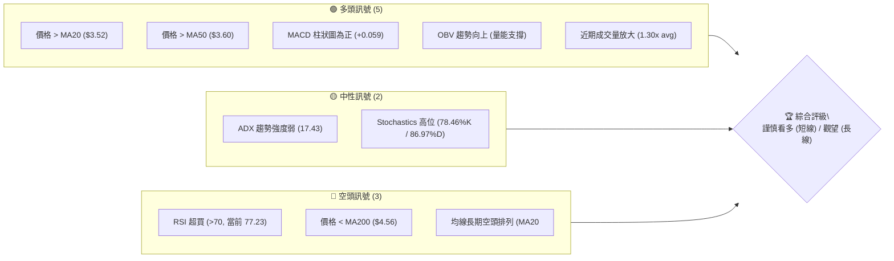
**解讀**：目前多頭訊號數量佔優，主要體現在短期價格動能、成交量放大以及MACD的看多信號。然而，RSI超買、價格仍處於長期均線下方以及長期均線的空頭排列，提醒投資者需警惕潛在的回調風險和長期趨勢的弱勢。ADX的弱趨勢表明當前市場處於盤整或趨勢形成初期，而非強勁的單邊趨勢。

### 📊 核心指標速覽表

| 指標類別 | 指標名稱 | 當前數值 | 訊號 | 解讀 |
|----------|----------|----------|------|------|
| **價格** | 當前價格 | $3.85 | 🟡 | 位於52週區間低端 (19.5%)，但近期反彈強勁 |
| **均線** | MA20 | $3.52 | 🟢 | 價格 ($3.85) 位於MA20上方，短線看多 |
| **均線** | MA50 | $3.60 | 🟢 | 價格 ($3.85) 位於MA50上方，中短線看多 |
| **均線** | MA200 | $4.56 | 🔴 | 價格 ($3.85) 位於MA200下方，長線看空 |
| **動能** | RSI(14) | 77.23 | 🔴 | 進入超買區，可能面臨回調 |
| **動能** | MACD | 0.076 | 🟢 | MACD線在訊號線上方，柱狀圖為正，看多 |
| **波動** | ATR(14) | $0.18 | 🟡 | 波動率適中 (約4.67%股價)，提供止損參考 |

### 🏆 技術評分卡

```
╔══════════════════════════════════════════════════════════════╗
║              技術評分卡 — GRAB (2026-07-06)                   ║
╠══════════════════════════════════════════════════════════════╣
║ 趨勢強度      ███████░░░░░░░░░░░░░░  35/100  🟡 (ADX弱趨勢但+DI主導)   ║
║ 動能指標      ███████████░░░░░░░░░  60/100  🟡 (MACD強勁但RSI超買)   ║
║ 支撐穩定度    █████████████░░░░░░░  70/100  🟢 (近期低點$3.30/$3.18支撐強)║
║ 成交量配合    ███████████████░░░░░  80/100  🟢 (量價配合良好)       ║
║ 形態完整度    ██████████░░░░░░░░░░  50/100  🟡 (初步底部形態，待確認)║
║ 均線排列      ██████░░░░░░░░░░░░░░  30/100  🔴 (長期空頭排列，短線改善)║
╠══════════════════════════════════════════════════════════════╣
║ 綜合評分      ████████░░░░░░░░░░░░  55/100  🟡 謹慎看多 / 中性       ║
╚══════════════════════════════════════════════════════════════╝
```
**評級理由**：GRAB的技術面呈現短期強勁反彈與長期結構性弱勢的矛盾。動能和成交量配合良好，顯示買盤活躍，但RSI超買限制了上行空間，且長期均線壓制仍存。綜合來看，當前處於底部反彈的初期階段，但尚未形成明確的長期多頭趨勢，故評級為「謹慎看多/中性」。

---

## 2. 趨勢分析

### 🌐 多時框趨勢分析

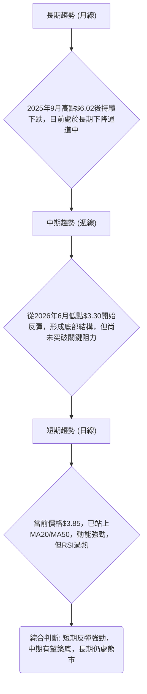
**詳細解讀**：
- **長期趨勢 (月線)**：從2025年9月的歷史高點$6.02開始，GRAB股價進入明顯的下跌趨勢。儘管期間有零星反彈，但未能改變整體下行格局。目前股價$3.85遠低於MA200 ($4.56)和2025年的高點，顯示長期空頭趨勢依然佔據主導地位。
- **中期趨勢 (週線)**：觀察過去12個月的走勢，股價在2025年7月觸及$4.89後再次回落，並於2026年6月創下新低$3.30 (接近52週低點$3.18)。近期從$3.30開始的反彈，顯示中期可能正在構築底部，但尚未確認突破下跌趨勢線或關鍵阻力區。
- **短期趨勢 (日線)**：在最近幾週，GRAB股價從低點迅速拉升，成功站上MA20 ($3.52)和MA50 ($3.60)，顯示短期買盤力量強勁。MACD指標發出明確買入信號，成交量也配合放大，支持短期反彈。然而，RSI指標已高達77.23，進入超買區，暗示短期上漲動能可能過度，需警惕回調。

### 📈 長期趨勢 — 12個月走勢圖（Unicode）

```
GRAB 月線走勢圖（過去12個月）
價格軸 ($)
$6.00 ┤                                        ● (2025-09 $6.02)
$5.50 ┤                                    ●
$5.00 ┤● (2025-07 $4.89)                     ●
$4.50 ┤          ●                      ●
$4.00 ┤                                         ● (2026-04 $4.21)
$3.50 ┤                                              ● (2026-07 $3.85)
$3.00 ┤                                          ● (2026-06 $3.30)
     └───────────────────────────────────────────────────────────
      25-07 25-08 25-09 25-10 25-11 25-12 26-01 26-02 26-03 26-04 26-05 26-06 26-07
```
**走勢特徵分析表格**：
| 區間 | 起始日期 | 結束日期 | 起始價 | 結束價 | 漲跌幅 | 走勢特徵 |
|------|----------|----------|--------|--------|--------|----------|
| 📈 | 2025-07 | 2025-09 | $4.89 | $6.02 | +23.11% | 短期強勁上漲，突破前高 |
| 📉 | 2025-09 | 2026-03 | $6.02 | $3.66 | -39.19% | 快速且持續的下跌，形成長期壓力 |
| 📈 | 2026-03 | 2026-04 | $3.66 | $4.21 | +14.97% | 弱勢反彈，未能突破關鍵阻力 |
| 📉 | 2026-04 | 2026-06 | $4.21 | $3.30 | -21.62% | 再次回落探底，觸及52週低點 |
| 📈 | 2026-06 | 2026-07 | $3.30 | $3.85 | +16.67% | 強勁反彈，站上短期均線，但RSI超買 |

### 📊 中期趨勢（週線分析）

```
近期週線壓力與支撐示意圖
═══════════════════════════════════════════════════
$4.56 ║═════════════════════════════════════════════ MA200 長期壓力
$4.21 ║█████████████████████████████████ 前期反彈高點 R2
$3.93 ║█████████████████████████████████ 布林上軌 / 短期阻力 R1
$3.85 ╠═════════════════════════════════════════════ ◄ 現價
$3.60 ║▓▓▓▓▓▓▓▓▓▓▓▓▓▓▓▓▓▓▓▓▓▓▓▓▓▓▓▓▓▓▓▓▓ MA50 / 近期支撐 S1
$3.52 ║▓▓▓▓▓▓▓▓▓▓▓▓▓▓▓▓▓▓▓▓▓▓▓▓▓▓▓▓▓▓▓▓▓ MA20 / 近期支撐 S2
$3.30 ║█████████████████████████████████ 近期低點 / 強支撐 S3
═══════════════════════════════════════════════════
```
**解讀**：從週線圖來看，GRAB股價正在努力擺脫長期下降趨勢，形成一個潛在的底部結構。短期內，價格已突破MA20和MA50，顯示買盤力量增強。然而，上方仍面臨多重阻力，包括布林通道上軌 ($3.93)、前期反彈高點 ($4.21) 以及關鍵的MA200 ($4.56)。能否有效突破這些阻力，將是中期趨勢能否反轉的關鍵。

### ⚡ 趨勢強度評估（ADX 解讀）

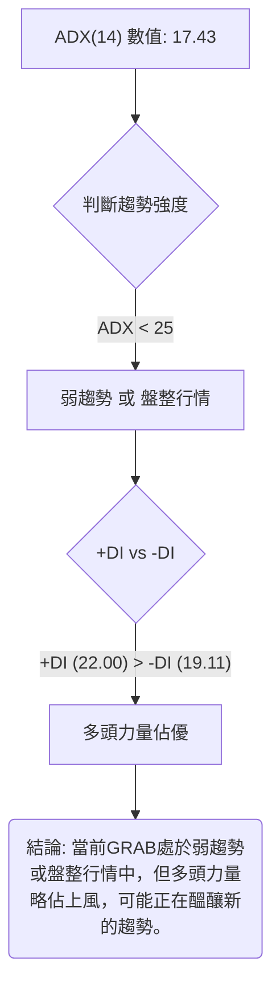
**ADX 強度對照表**：
| ADX 數值範圍 | 趨勢強度 | 市場狀態 | 投資策略建議 |
|--------------|----------|----------|--------------|
| 0-25         | 弱趨勢   | 盤整/無趨勢 | 觀望或短線交易，避免追高殺跌 |
| 25-50        | 中等趨勢 | 趨勢形成/發展 | 順勢操作，尋找突破買賣點 |
| 50-75        | 強趨勢   | 趨勢明確/加速 | 大膽順勢操作，利用回調加倉 |
| 75-100       | 極強趨勢 | 趨勢末期/超買 | 警惕反轉風險，可考慮逐步減倉 |

**解讀**：GRAB的ADX(14)值為17.43，遠低於25的閾值，這明確指出當前市場處於一個弱趨勢或盤整的狀態。這意味著股價缺乏強勁的單邊方向性，多空雙方力量相對均衡。然而，+DI (22.00) 高於 -DI (19.11)，表明在這種弱勢趨勢中，多頭力量稍微佔據主導地位。這可能預示著股價正在從底部反彈，但尚未形成一個強勁的上升趨勢。投資者應避免將其視為強勢趨勢行情，而應更關注區間震盪中的突破或回調機會。

---

## 3. 圖表形態分析

### 🔍 形態識別系統

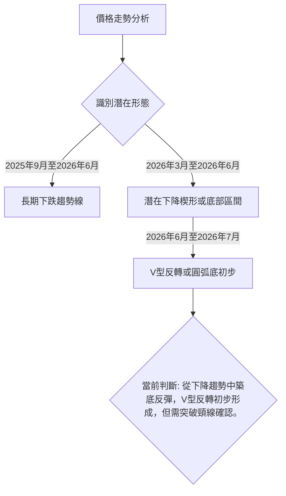
**詳細解讀**：
GRAB的股價自2025年9月高點$6.02以來，呈現出一個清晰的長期下降趨勢。近期（2026年3月至6月）的價格走勢在$3.30至$4.21之間震盪，形成一個較為寬鬆的底部區域，可能構成一個下降楔形或潛在的圓弧底形態。
最近從2026年6月14日的$3.30低點到目前的$3.85，股價呈現出強勁的V型反轉走勢。這種快速反彈顯示了市場對該股的重新興趣。要確認一個更為穩固的底部形態，例如雙底或頭肩底，需要更多的時間和價格行為來驗證。目前，V型反轉的初步成功，已將價格帶至短期均線之上，但上方阻力重重。

### 🕯️ 重要K線形態分析

| 月份 (週) | 收盤價 | K線形態 | 解讀 | 訊號 |
|-----------|--------|---------|------|------|
| 2026-03-15 | $3.71 | 長陰線 | 跌破重要支撐，空頭力量強勁 | 🔴 |
| 2026-03-29 | $3.57 | 錘子線 (或類似) | 在低位出現，暗示潛在買盤介入，止跌信號 | 🟢 |
| 2026-04-19 | $4.21 | 長陽線 | 強勁上漲，突破短期阻力，但未能持續 | 🟢 |
| 2026-05-17 | $3.55 | 長陰線 | 跌破短期支撐，空頭再次佔優 | 🔴 |
| 2026-06-14 | $3.30 | 錘子線 (或類似) | 在52週低點附近出現，止跌反彈關鍵信號 | 🟢 |
| 2026-07-05 | $3.90 | 長陽線 | 強勁上漲，突破短期阻力，確認反彈勢頭 | 🟢 |
| 2026-07-12 | $3.85 | 小陰線 (或類似) | 高位震盪，顯示買盤動能可能暫緩，或面臨獲利回吐 | 🟡 |

### 📉 ASCII 走勢形態示意圖

```
GRAB 近期底部形態示意圖 (2026-03 至 2026-07)
價格軸 ($)
$4.21 ┤                 ● (反彈高點 R2)
$4.00 ┤              ╱
$3.85 ┤─────────────● (現價)
$3.60 ┤          ╱       ╲
$3.50 ┤     ╲   ╱         ╲
$3.30 ┤───────●───────────● (近期低點 S3, 52W低點附近)
     └────────────────────────────
      26-03   26-04   26-05   26-06   26-07
```
**形態解讀**：圖中顯示，GRAB在2026年3月至6月期間經歷了一個震盪築底的過程，並在$3.30附近形成一個潛在的底部。隨後從$3.30開始的強勁反彈，呈現出V型反轉的特徵。上方$4.21是前期反彈的阻力位，如果能夠有效突破，將確認底部形態的成立，並為後續上漲打開空間。

### 🎯 形態目標價計算

基於目前初步的V型反轉形態，若能確認突破，其目標價計算如下：
1.  **底部形態確認**：以近期低點 $3.30 和前一個反彈高點 $4.21 之間形成一個潛在的區間。
2.  **頸線**：如果我們將$4.21視為一個潛在的頸線阻力（儘管不是標準的雙底或頭肩底頸線），則突破此處將是關鍵。
3.  **形態高度**：假設從$3.30到$4.21是一個反彈波段，其高度為 $4.21 - $3.30 = $0.91。
4.  **保守目標價**：如果股價能有效突破$4.21的阻力，則目標價可以保守估計為：
    *   突破價 ($4.21) + 形態高度 ($0.91) = $5.12。
    *   **目標價 T1**: $5.12。
    *   **目標價 T2**: 考慮到分析師平均目標價 $5.97，這提供了一個較遠期的參考。
**注意**：此形態仍處於初步形成階段，需等待明確的突破信號和量能配合才能確認。

---

## 4. 支撐與阻力

### 🗺️ 關鍵價位分布圖（Unicode）

```
GRAB 價位結構分布圖
═══════════════════════════════════════════════════
$8.00 ║████████████████████████║ 分析師高目標價 (極強阻力 R4)
$6.62 ║████████████████████████║ 52週高點 (強阻力 R3)
$5.97 ║████████████████████    ║ 分析師平均目標價 (阻力 R2)
$4.93 ║████████████████████████║ 斐波那契61.8%回調位 (關鍵阻力 R1.5)
$4.60 ║████████████████████████║ 斐波那契50%回調位 / MA200 (關鍵阻力 R1)
$4.50 ║████████████████████████║ 分析師低目標價 (關鍵阻力 R0.5)
$4.26 ║████████████████████████║ 斐波那契38.2%回調位 (短期阻力 R0)
$3.93 ║████████████████████████║ 布林上軌 (短期阻力 R-BB)
$3.85 ╠════════════════════════╣ ◄ 現價
$3.60 ║▓▓▓▓▓▓▓▓▓▓▓▓▓▓▓▓▓▓▓▓▓▓▓▓║ MA50 (近期支撐 S1)
$3.52 ║▓▓▓▓▓▓▓▓▓▓▓▓▓▓▓▓▓▓▓▓▓▓▓▓║ MA20 (近期支撐 S2)
$3.30 ║████████████████████████║ 近期低點 (強支撐 S3)
$3.18 ║████████████████████████║ 52週低點 (極強支撐 S4)
═══════════════════════════════════════════════════
```
**解讀**：GRAB目前的價格$3.85位於一系列短期支撐之上，但同時也面臨多重阻力。上方最近的阻力是布林上軌$3.93和斐波那契38.2%回調位$4.26。MA200 ($4.56)和斐波那契50%回調位 ($4.60)構成一個強大的阻力區，突破此區域將對長期趨勢的扭轉至關重要。下方支撐則由MA50 ($3.60)、MA20 ($3.52)以及近期低點$3.30構成，這些水平提供了較為穩固的短期支撐。

### 🚧 阻力位分析表

| 阻力級別 | 價位 | 形成原因 | 突破難度 | 重要性 |
|----------|------|----------|----------|--------|
| 短期阻力 R0 | $3.93 | 布林通道上軌 | 中等 | 價格短期走勢上限，可能引發獲利回吐 |
| 短期阻力 R1 | $4.26 | 斐波那契38.2%回調位 | 中等偏高 | 從長期高點回調的第一個重要阻力 |
| 關鍵阻力 R2 | $4.56 | MA200長期均線 | 高 | 長期趨勢的牛熊分界線，突破意味著長期趨勢可能反轉 |
| 關鍵阻力 R3 | $4.60 | 斐波那契50%回調位 | 高 | 長期下跌趨勢中，反彈能否持續的關鍵位置 |
| 強阻力 R4 | $4.93 | 斐波那契61.8%回調位 | 極高 | 若能突破，則底部形態確立，反轉趨勢更為明確 |
| 極強阻力 R5 | $5.97 | 分析師平均目標價 | 極高 | 市場對其長期價值的共識，突破需基本面配合 |

### 🛡️ 支撐位分析表

| 支撐級別 | 價位 | 形成原因 | 守住機率 | 重要性 |
|----------|------|----------|----------|--------|
| 短期支撐 S1 | $3.60 | MA50移動平均線 | 高 | 近期上漲趨勢的動態支撐，短期回調的潛在買點 |
| 短期支撐 S2 | $3.52 | MA20移動平均線 | 高 | 最直接的短期動態支撐，跌破可能預示短期回調加劇 |
| 關鍵支撐 S3 | $3.30 | 近期低點 | 極高 | 股價從此處反彈，構成V型反轉的底部，不容有失 |
| 極強支撐 S4 | $3.18 | 52週低點 | 極高 | 長期下跌趨勢的最低點，具有強烈的心理和技術支撐作用 |

### 📐 斐波那契回調位分析

為了評估GRAB從2025年9月高點$6.02到2026年6月低點$3.18的長期下跌趨勢中的反彈潛力，我們計算斐波那契回調位：

- **下跌區間**：$6.02 (高點) - $3.18 (低點) = $2.84
- **斐波那契回調計算**：
    - **38.2% 回調位**：$3.18 + ($2.84 * 0.382) = $3.18 + $1.08 = **$4.26**
    - **50% 回調位**：$3.18 + ($2.84 * 0.50) = $3.18 + $1.42 = **$4.60**
    - **61.8% 回調位**：$3.18 + ($2.84 * 0.618) = $3.18 + $1.75 = **$4.93**

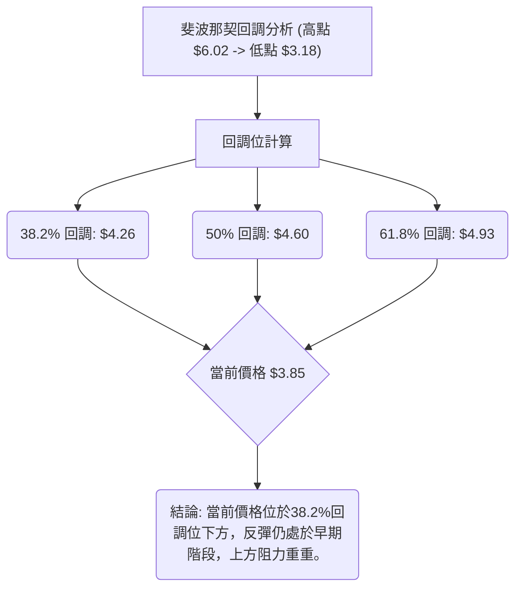
**解讀**：GRAB目前的價格$3.85仍低於第一個斐波那契38.2%回調位$4.26。這表明，儘管近期出現強勁反彈，但從更大的趨勢來看，這仍可能只是長期下跌趨勢中的一次技術性反彈。要確認真正的趨勢反轉，股價需要有效突破$4.26，並進一步挑戰$4.60 (50%回調位) 和$4.93 (61.8%回調位)。這些斐波那契水平將構成重要的阻力區，也是判斷反彈強度的關鍵里程碑。

---

## 5. 技術指標深度解讀

### 🎛️ 指標訊號總覽

```mermaid
graph TD
    A["價格行為 ($3.85)"] --> B["均線系統"]
    A --> C["動能指標"]
    A --> D["波動率與成交量"]

    B --> B1("MA20: $3.52 🟢")
    B --> B2("MA50: $3.60 🟢")
    B --> B3("MA200: $4.56 🔴")
    B --> B4("均線排列: MA20<MA50<MA200 🔴")

    C --> C1("RSI(14"): 77.23 🔴 超買)
    C --> C2("MACD Hist: +0.059 🟢 看多")
    C --> C3("Stoch %K/%D: 78.46/86.97 🟡 高位")

    D --> D1("BB上軌: $3.93 🟡 近上軌")
    D --> D2("BB中軌: $3.52 🟢 價格在上軌上方")
    D --> D3("BB下軌: $3.12 🟢 價格遠離下軌")
    D --> D4("OBV趨勢: 🟢 量能支撐上漲")
    D --> D5("成交量: 73M, 量比1.3x 🟢 放大")

    B & C & D --> E("綜合判斷: 短期動能強勁，但RSI超買且長期均線壓制，謹慎樂觀")
```

### 📈 移動平均線排列分析

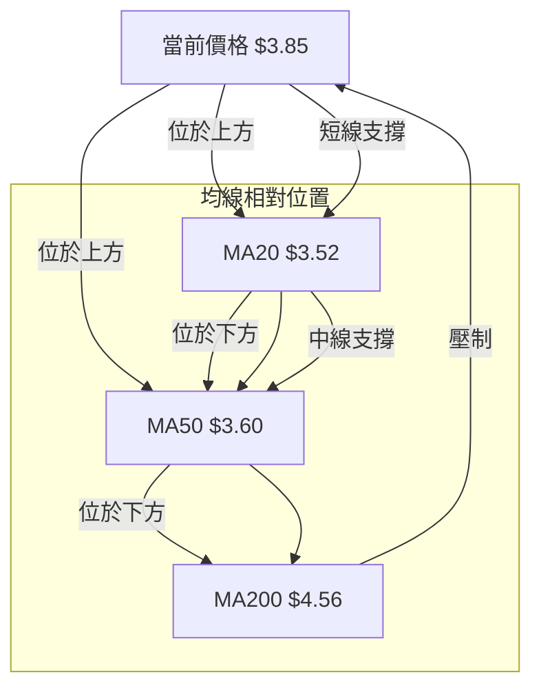
**均線排列狀態**：
| 均線名稱 | 數值 | 相對現價 | 相對其他均線 | 訊號 | 解讀 |
|----------|------|----------|--------------|------|------|
| MA5      | $3.83 | 上方     | 接近現價 | 🟢 | 極短期多頭動能強勁 |
| MA10     | $3.66 | 上方     | 位於MA5下方 | 🟢 | 短期趨勢向上 |
| MA20     | $3.52 | 上方     | 位於MA50下方 | 🟢 | 短線支撐，但自身位於MA50下方 |
| MA50     | $3.60 | 上方     | 位於MA200下方 | 🟢 | 中短線支撐，但自身位於MA200下方 |
| MA200    | $4.56 | 下方     | 位於所有短期均線上方 | 🔴 | 長期強阻力，空頭排列的關鍵要素 |

**詳細解讀**：GRAB的價格($3.85)目前已成功站上MA5 ($3.83)、MA10 ($3.66)、MA20 ($3.52)和MA50 ($3.60)。這是一個非常積極的短期和中短期信號，表明買盤力量強勁，股價正在形成一個上升趨勢。然而，從均線的相對位置來看，MA20 ($3.52) < MA50 ($3.60) < MA200 ($4.56)，這是一個典型的長期空頭排列，俗稱「空頭陷阱」或「死亡排列」。這意味著儘管短期趨勢有所改善，但長期而言，GRAB仍處於熊市格局。MA200 ($4.56) 構成上方一個強大的動態阻力，若無法有效突破，價格可能再次承壓回落。綜合來看，短線多頭佔優，但長期空頭趨勢尚未扭轉。

### 📉 RSI(14) 分析

**RSI 數值進度條**：
RSI(14): ▓▓▓▓▓▓▓▓▓▓▓▓▓▓▓▓░░░░ 77.23 (🔴 超買)

**超買超賣區間分析**：
- **當前RSI**：77.23
- **超買區**：RSI > 70。當前數值明確處於超買區。
- **超賣區**：RSI < 30。

**解讀**：GRAB的RSI(14)指標高達77.23，這是一個非常強烈的超買信號。歷史經驗表明，當RSI進入超買區時，股價短期內往往面臨回調或盤整的壓力，以釋放積累的買盤動能。雖然超買並不意味著價格會立即下跌，但它確實增加了短期回調的風險。投資者應警惕追高，並密切關注價格是否出現疲軟跡象。

**背離判斷**：
根據提供的數據，RSI並未顯示出明顯的頂背離或底背離。在近期價格從$3.30上漲至$3.85的過程中，RSI同步走高。因此，目前沒有背離現象來預示趨勢反轉。

### 📊 MACD(12/26/9) 訊號解讀

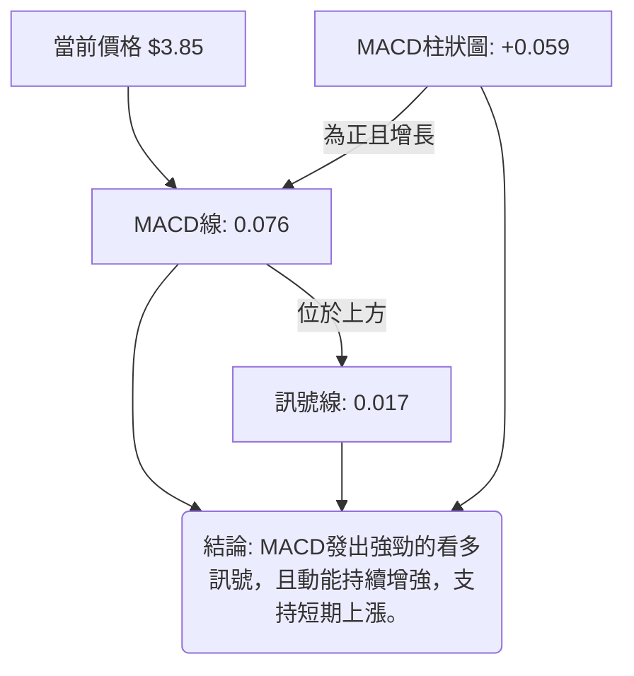
**詳細解讀**：GRAB的MACD指標顯示出明確的看多信號。MACD線 (0.076) 位於訊號線 (0.017) 之上，且兩者均為正值。MACD柱狀圖為正 (+0.059) 並呈現增長態勢，這表明短期內多頭動能非常強勁，且動能仍在加速。MACD指標與近期價格上漲走勢保持一致，確認了短期反彈的有效性。然而，需注意RSI超買可能引發的短期調整，MACD的強勢可能在短期內面臨考驗。

### 📦 布林通道分析

```
GRAB 布林通道示意圖
═══════════════════════════════════════════════════
$3.93 ║█████████████████████████████████ 布林上軌 (BB Upper)
$3.85 ╠═════════════════════════════════════════════ ◄ 現價
      ║▓▓▓▓▓▓▓▓▓▓▓▓▓▓▓▓▓▓▓▓▓▓▓▓▓▓▓▓▓▓▓▓▓
$3.52 ║█████████████████████████████████ 布林中軌 (MA20)
      ║▓▓▓▓▓▓▓▓▓▓▓▓▓▓▓▓▓▓▓▓▓▓▓▓▓▓▓▓▓▓▓▓▓
$3.12 ║█████████████████████████████████ 布林下軌 (BB Lower)
═══════════════════════════════════════════════════
```
**詳細解讀**：GRAB的當前價格$3.85非常接近布林通道上軌 ($3.93)。布林通道%B值為0.90，這意味著價格位於通道的極上端。這通常表明短期內股價處於強勢上漲趨勢，但同時也暗示著價格可能面臨通道上軌的阻力，並可能出現短期回調或盤整。如果價格能夠有效突破上軌並維持在其上方，則可能預示著更強勁的上升趨勢。相反，若價格在上軌附近遇阻回落，則可能向下測試中軌 ($3.52) 甚至下軌 ($3.12)。

### 💹 成交量分析（量價配合度）

| 成交量指標 | 數值 | 訊號 | 解讀 |
|------------|------|------|------|
| 最新成交量 | 73,036,142 | 🟢 | 高於均量，買盤積極 |
| 20日均量   | 56,229,332 | - | 作為比較基準 |
| 量比       | 1.30x | 🟢 | 成交量顯著放大，支持價格上漲 |
| OBV趨勢    | OBV > MA | 🟢 | 買盤累積，量能支撐價格上漲 |

**詳細解讀**：GRAB的最新成交量為73,036,142股，顯著高於20日均量56,229,332股，量比達到1.30x。這表明在近期股價反彈的過程中，市場交投活躍，買盤力量積極介入。通常，量價齊升是健康上漲趨勢的標誌。
OBV (On-Balance Volume) 趨勢顯示OBV線位於其移動平均線上方，這進一步確認了量能對價格上漲的支撐。OBV指標通過累計成交量來判斷資金流向，OBV上升表明買盤力量正在積累，與價格上漲形成正向配合，有助於確認當前的反彈趨勢。

---

## 6. 動能與波動率

### ⚡ 動能評估四象限

| 象限 | 動能 | 波動 | 當前狀態 | 評估 |
|------|------|------|----------|------|
| Q1 | 強 | 低 | - | 最佳機會 (趨勢明確，風險較低) |
| Q2 | 弱 | 低 | - | 謹慎觀望 (缺乏方向，波動小) |
| Q3 | 強 | 高 | ✓ | 高風險高收益 (趨勢強勁，但波動大，易受回調影響) |
| Q4 | 弱 | 高 | - | 避免進場 (方向不明，風險高) |

**GRAB 當前動能與波動率分析**：
- **動能**：MACD柱狀圖為正且增長，顯示強勁的短期上漲動能。RSI達到77.23，處於超買區，也反映了強烈的買盤動能。因此，GRAB目前處於「強動能」狀態。
- **波動率**：ATR(14)為$0.18，佔當前價格$3.85的4.67%。相較於一般股票，此波動率可歸類為「中等偏高」或「高波動」。
- **結論**：GRAB目前位於「強動能、高波動」的象限 (Q3)。這意味著該股在短期內具有較大的上漲潛力，但也伴隨著較高的日內波動風險。投資者在參與時需嚴格控制倉位和風險，因為高波動性可能導致快速的價格反轉。

### 📊 ATR 波動率分析

| 指標名稱 | 數值 | 解讀 | 止損距離建議 |
|----------|------|------|--------------|
| ATR(14)  | $0.18 | 每日平均波動範圍 | 1-2倍ATR作為短期止損空間 |

**詳細分析**：GRAB的ATR(14)為$0.18。ATR (Average True Range) 是衡量股價波動性的指標，它表示在過去14天內，股價平均每天的波動範圍為$0.18。
- **波動性評估**：$0.18/$3.85 = 4.67%。這是一個相對較高的每日波動率，表明GRAB的價格波動較為活躍，適合短線交易者，但也增加了投資風險。
- **止損距離建議**：對於短線交易者，可以將止損點設置在進場點下方1倍至2倍ATR的範圍內。例如，如果進場價格為$3.85：
    - 1倍ATR止損：$3.85 - $0.18 = $3.67
    - 1.5倍ATR止損：$3.85 - ($0.18 * 1.5) = $3.85 - $0.27 = $3.58
    - 2倍ATR止損：$3.85 - ($0.18 * 2) = $3.85 - $0.36 = $3.49
這些ATR基礎的止損點可以幫助投資者根據市場的實際波動來設定合理的風險控制水平，避免因日常波動而過早止損。

### 📐 Beta 與市場相關性

**數據未提供**。
由於提供的技術數據中未包含Beta值，無法對GRAB與大盤的相關性進行量化分析。一般而言，Beta值衡量股票相對於整體市場的波動性。如果Beta > 1，則表示股票波動性大於市場；如果Beta < 1，則表示波動性小於市場。在缺乏此數據的情況下，投資者應根據其歷史價格走勢和行業特性，對其與大盤的相關性做出定性判斷。鑑於GRAB所處的科技行業（應用軟體）通常具有較高的成長性和波動性，預計其Beta值可能較高。

---

## 7. 多時框架總結

### 📋 時框架評分表

| 時框架 | 趨勢方向 | 動能 | 均線排列 | 形態 | 綜合評分 | 建議 |
|--------|----------|------|----------|------|----------|------|
| **短期 (日線)** | 🟢 向上 | 🟢 強勁 | 🟢 多頭初現 | 🟢 V型反轉 | 8/10 | 謹慎看多 |
| **中期 (週線)** | 🟡 築底 | 🟡 改善 | 🟡 逐步修復 | 🟡 潛在底部 | 6/10 | 觀望/逢低吸納 |
| **長期 (月線)** | 🔴 向下 | 🔴 疲弱 | 🔴 空頭排列 | 🔴 下降通道 | 3/10 | 觀望/避免長線 |

**詳細解讀**：
- **短期**：GRAB在日線圖上表現出強勁的反彈勢頭。價格已突破短期和中期移動平均線，MACD發出買入信號，成交量配合放大。V型反轉形態初步確立。然而，RSI已進入超買區，短期內可能面臨回調壓力。
- **中期**：從週線圖來看，GRAB正在努力構築底部，但尚未完全擺脫長期下跌趨勢的影響。雖然均線排列有所改善，但上方仍有重要阻力。中期趨勢仍處於不確定性，需要更多時間確認底部形態。
- **長期**：月線圖清晰顯示GRAB仍處於長期的下跌趨勢中。價格遠低於長期均線MA200，且均線呈現空頭排列。長期投資者應保持觀望，等待長期趨勢扭轉的明確信號。

### 🔲 綜合訊號矩陣

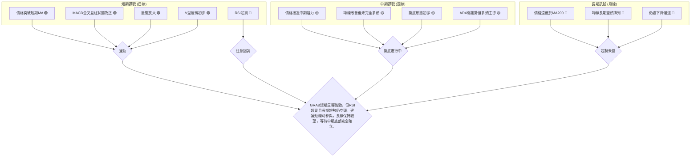
**一致性分析**：
- **短期訊號**：呈現出高度的一致性，除了RSI超買外，其他動能、價格、成交量指標均指向短期強勁上漲。
- **中期訊號**：顯示出改善的跡象，但尚未形成明確的單邊趨勢，處於築底和觀望的狀態。
- **長期訊號**：則保持高度一致的空頭態勢，表明長期下跌趨勢尚未改變。

**結論**：GRAB的多時框架分析呈現出短期與長期趨勢的明顯背離。短期內具有較高的交易機會，但由於長期趨勢的壓制和RSI的超買，任何短線參與都需要嚴格的風險控制。中長期投資者應耐心等待底部完全確立和長期趨勢反轉的信號。

---

## 8. 交易策略建議

基於GRAB當前的技術面分析，其短期動能強勁但面臨RSI超買和長期趨勢壓制，因此建議採取靈活的交易策略，並嚴格控制風險。

### 🗺️ 策略決策流程圖

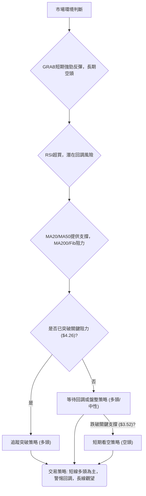

### 🟢 多頭策略詳情

考慮到RSI超買，建議在短期回調後尋找買入機會，或等待突破關鍵阻力後追蹤。

| 策略要素 | 策略 A (回調買入) | 策略 B (突破追蹤) |
|----------|--------------------|--------------------|
| 進場條件 | 股價回調至MA20/MA50支撐區，RSI從超買區回落，並出現止跌K線 | 股價有效突破斐波那契38.2%阻力 $4.26，並伴隨放量 |
| 進場價格 | **$3.60 - $3.70** (接近MA50/MA20) | **$4.28 - $4.30** (突破$4.26後確認) |
| 目標價 T1 | **$4.26** (斐波那契38.2%回調位) | **$4.60** (斐波那契50%回調位 / MA200) |
| 目標價 T2 | **$4.60** (斐波那契50%回調位 / MA200) | **$4.93** (斐波那契61.8%回調位) |
| 止損價格 | **$3.45** (略低於MA20/MA50和近期低點$3.30的上方) | **$4.15** (突破點$4.26下方1 ATR左右) |
| 風險報酬比 | 策略A: (4.26-3.65) / (3.65-3.45) = 0.61 / 0.20 = **3.05:1** (以$3.65進場為例) | 策略B: (4.60-4.29) / (4.29-4.15) = 0.31 / 0.14 = **2.21:1** (以$4.29進場為例) |
| 成功機率 | 60% | 55% |
| 建議倉位 | 5-10% | 5-8% |

### 🔴 空頭策略詳情

鑑於當前短期動能強勁，空頭策略風險較高。僅在以下情況考慮：

| 策略要素 | 策略 C (高位受阻) | 策略 D (跌破支撐) |
|----------|--------------------|--------------------|
| 進場條件 | 股價未能突破$3.93 (布林上軌) 或$4.00心理關口，並出現明確的看跌K線形態 (如射擊之星、烏雲蓋頂) | 股價跌破MA50支撐 ($3.60)，且伴隨放量 |
| 進場價格 | **$3.90 - $3.95** (在阻力位附近) | **$3.58 - $3.55** (跌破$3.60後確認) |
| 目標價 T1 | **$3.60** (MA50支撐) | **$3.30** (近期低點) |
| 目標價 T2 | **$3.52** (MA20支撐) | **$3.18** (52週低點) |
| 止損價格 | **$4.05** (略高於$3.93/$4.00阻力1 ATR) | **$3.65** (跌破點$3.60上方1 ATR左右) |
| 風險報酬比 | 策略C: (3.92-3.60) / (4.05-3.92) = 0.32 / 0.13 = **2.46:1** (以$3.92進場為例) | 策略D: (3.57-3.30) / (3.65-3.57) = 0.27 / 0.08 = **3.37:1** (以$3.57進場為例) |
| 成功機率 | 45% | 50% |
| 建議倉位 | 3-5% | 3-5% |

### ⭐ 整體訊號強度評星

```
做多訊號強度：★★★★☆  (4/5星)
做空訊號強度：★★☆☆☆  (2/5星)
整體可信度：  ★★★☆☆  (3/5星)
```
**評星理由**：做多訊號在短期內非常強勁，價格突破短期均線，MACD看多，量能放大。但RSI超買和長期均線的壓制限制了其評級。做空訊號目前較弱，因為短期趨勢向上，但如果價格在高位受阻或跌破關鍵支撐，則空頭機會將顯現。整體可信度中等，因為多空力量在不同時間框架和指標上存在矛盾，需要謹慎判斷。

---

## 9. 風險提示與監控

GRAB的技術面顯示出短期反彈的機會，但同時也存在顯著風險。有效的風險管理至關重要。

### ✅ 關鍵監控指標 Checklist

```
╔══════════════════════════════════════════════════════════════╗
║              GRAB 關鍵監控指標清單                             ║
╠══════════════════════════════════════════════════════════════╣
║ [ ] 價格是否有效突破 $3.93 (布林上軌) 並維持其上？            ║
║ [ ] 價格是否有效突破 $4.26 (斐波那契38.2%回調位)？            ║
║ [ ] RSI 是否從超買區 (70以上) 回落至健康區間 (40-60)？        ║
║ [ ] MACD 柱狀圖是否持續為正且未出現縮短跡象？                  ║
║ [ ] 成交量是否持續維持在20日均量之上，支持價格上漲？          ║
║ [ ] ADX 是否開始上升並突破25，確認新的上升趨勢？              ║
║ [ ] 價格是否跌破 MA20 ($3.52) 或 MA50 ($3.60)？              ║
║ [ ] 是否出現任何看跌的K線形態 (如吞噬、射擊之星)？            ║
║ [ ] 52週低點 $3.18 是否被再次測試或跌破？                     ║
║ [ ] 關注基本面是否有重大變動或新聞事件。                      ║
╚══════════════════════════════════════════════════════════════╝
```

### ⚠️ 風險場景分析

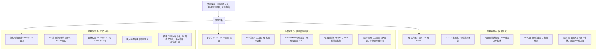
**詳細分析**：
- **樂觀情境 (突破上漲)**：如果GRAB能夠有效突破斐波那契38.2%回調位$4.26和50%回調位$4.60，並進一步突破MA200，同時RSI在回調後再次健康上漲，則長期下跌趨勢有望被扭轉。這將確認底部形態的成立，並吸引更多資金介入，開啟新的上升趨勢。
- **基本情境 (區間震盪/回調)**：最有可能的情境是，在RSI超買的壓力下，GRAB股價在$3.85至$4.26之間進行短期回調或盤整，以消化獲利盤。MA20和MA50將提供動態支撐，但由於長期阻力MA200和斐波那契回調位的存在，股價可能難以立即展開大幅上漲，而是進入一段時間的築底盤整。
- **悲觀情境 (再次下跌)**：如果GRAB未能有效突破短期阻力，RSI從超買區快速下跌，MACD也出現死叉，並且價格跌破MA50 ($3.60)和MA20 ($3.52)等關鍵支撐，則可能預示著短期反彈的結束。在這種情況下，股價可能會再次測試甚至跌破$3.30和$3.18的近期低點，回到長期下跌通道中。

### 🛡️ 風險管理重要提醒

1.  **嚴格止損**：無論採取何種策略，都必須設定並嚴格執行止損點。ATR指標提供了一個合理的止損距離參考。
2.  **倉位管理**：鑑於GRAB的波動性較高且長期趨勢仍處空頭，建議採用較小的倉位，避免重倉操作。將單筆交易的風險控制在總資本的1-2%以內。
3.  **分批建倉/減倉**：可以考慮分批建倉以平攤成本，分批減倉以鎖定利潤。
4.  **監控關鍵指標**：密切關注RSI是否從超買區回落、MACD動能變化、成交量是否配合價格走勢，以及關鍵支撐阻力位的得失。
5.  **不追高**：在RSI超買的情況下，應避免盲目追高，等待合理的回調或突破確認後再入場。
6.  **關注基本面**：雖然本報告側重技術分析，但基本面（如公司盈利、行業新聞、分析師評級變化）仍可能對股價產生重大影響，應一併關注。

---

## 📋 報告總結

```
╔════════════════════════════════════════════════════════════════════════════════════╗
║ GRAB 技術分析報告總結                                                              ║
╠════════════════════════════════════════════════════════════════════════════════════╣
║ 報告日期：2026-07-06                                                               ║
║ 當前價格：$3.85                                                                    ║
║ 分析評級：⚖️ 謹慎看多 (短期) / 觀望 (中長期)                                          ║
║                                                                                    ║
║ 關鍵結論：                                                                         ║
║ ├─ 長期趨勢：🔴 仍處於2025年9月高點$6.02以來的下降通道中，MA200 ($4.56) 構成強大阻力。  ║
║ ├─ 中期趨勢：🟡 從2026年6月低點$3.30開始築底反彈，均線排列有所改善，但尚未完全扭轉頹勢。║
║ ├─ 短期趨勢：🟢 強勁反彈，價格已站上MA20/MA50，MACD看多，成交量放大，V型反轉初步確立。   ║
║ ├─ 關鍵支撐：$3.60 (MA50)、$3.52 (MA20)、$3.30 (近期低點)、$3.18 (52週低點)。         ║
║ ├─ 關鍵阻力：$3.93 (布林上軌)、$4.26 (斐波那契38.2%)、$4.56 (MA200)、$4.60 (斐波那契50%)。║
║ └─ 分析師目標：平均目標價 $5.97，低目標價 $4.50。                                     ║
║                                                                                    ║
║ 最優策略組合：                                                                     ║
║ 1. 🥇 **最佳機會 (短線多頭)**：等待股價回調至 $3.60 - $3.70 區間，並觀察是否有止跌信號，   ║
║    同時RSI從超買區回落。止損設在 $3.45，目標價 $4.26 和 $4.60。                       ║
║ 2. 🥈 **次選機會 (突破追蹤)**：若股價能有效放量突破斐波那契38.2%回調位 $4.26，          ║
║    可在 $4.28 - $4.30 追蹤買入，止損設在 $4.15，目標價 $4.60 和 $4.93。               ║
║ 3. 🥉 **保守選擇 (觀望)**：鑑於RSI超買和長期趨勢的壓制，保守投資者可選擇觀望，          ║
║    等待中期底部形態的完全確立，或價格突破MA200 ($4.56)後再考慮入場。                      ║
╚════════════════════════════════════════════════════════════════════════════════════╝
```

---

> ⚠️ **免責聲明**：本報告為 AI 自動生成之技術分析，所有數據及估算均基於提供的歷史價格資訊。本報告**僅供研究與學術參考**，**不構成任何投資建議**。投資有風險，入市需謹慎。

---

*報告生成時間：2026-07-06 ｜ 數據來源：Yahoo Finance ｜ 分析框架：多時框技術分析*