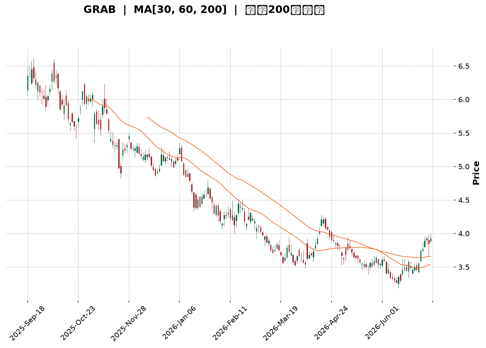
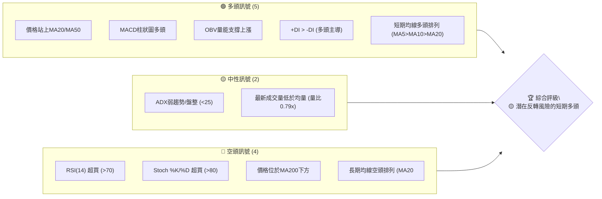
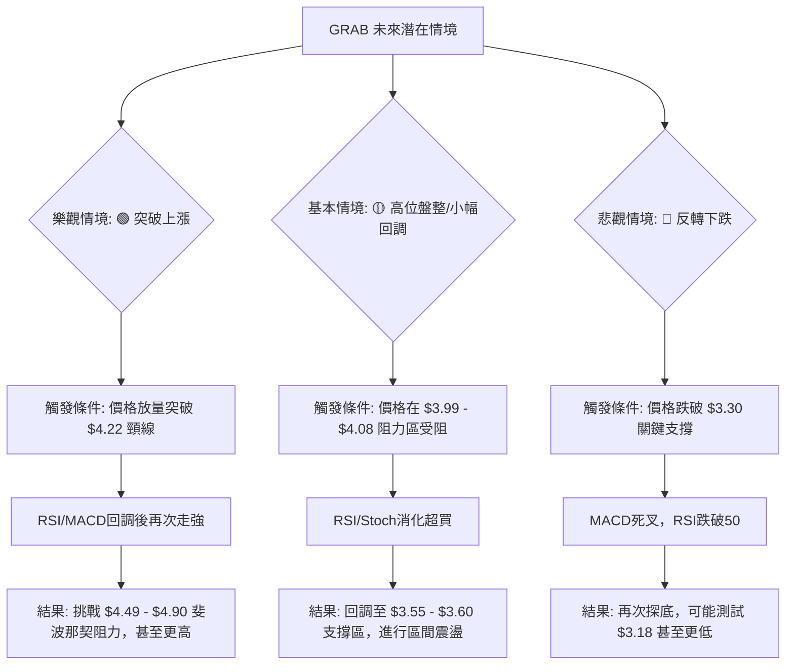

<details>
<summary>📊 靜態圖表 (點擊展開)</summary>

</details>

<html>
<head><meta charset="utf-8" /></head>
<body>
    <div style="height:500px; width:100%;">                        <script>window.PlotlyConfig = {MathJaxConfig: 'local'};</script>
        <script charset="utf-8" src="https://cdn.plot.ly/plotly-3.6.0.min.js" integrity="sha256-QaOVwtVY0T02VaHrr6pnoHLCwayMJp4O5n4YyaE3rJk=" crossorigin="anonymous"></script>                <div id="candlestick-chart" class="plotly-graph-div" style="height:100%; width:100%;"></div>            <script>                window.PLOTLYENV=window.PLOTLYENV || {};                                if (document.getElementById("candlestick-chart")) {                    Plotly.newPlot(                        "candlestick-chart",                        [{"close":{"dtype":"f8","bdata":"AAAAYGZmGUAAAAAgXI8ZQAAAAMDMzBlAAAAAIK5HGUAAAACgR+EYQAAAAAAAABlAAAAA4KNwGEAAAADgo3AYQAAAAOB6FBhAAAAAoJmZF0AAAABAMzMYQAAAAADXoxhAAAAAIFyPGUAAAADgehQZQAAAAOCjcBlAAAAAgBSuGEAAAADgo3AXQAAAAOBRuBdAAAAAANejF0AAAACAFK4XQAAAAEAK1xZAAAAAIFyPFkAAAACAFK4WQAAAAGBmZhZAAAAAQOF6FkAAAACgR+EWQAAAAGBmZhdAAAAAQOF6GEAAAABgj8IXQAAAAEAzMxhAAAAAIIXrF0AAAACAPQoYQAAAACCuRxhAAAAAANcjF0AAAAAgXI8WQAAAAMAehRZAAAAAoHA9FkAAAACgmZkXQAAAAMAehRdAAAAAwPUoF0AAAADA9SgWQAAAAADXoxVAAAAAgOtRFUAAAAAgrkcVQAAAAKBwPRVAAAAAIIXrE0AAAACgmZkTQAAAAAAAABVAAAAAgML1FEAAAAAgrkcVQAAAAMDMzBVAAAAA4HoUFUAAAACAPQoVQAAAAOB6FBVAAAAAQDMzFUAAAABgj8IUQAAAAADXoxRAAAAAoJmZFEAAAADgUbgUQAAAAOBRuBRAAAAAoJmZFEAAAADgehQUQAAAAMDMzBNAAAAAQOF6E0AAAACAFK4TQAAAAOBRuBNAAAAA4FG4FEAAAACA61EUQAAAAMAehRRAAAAAoJmZFEAAAABgZmYUQAAAACCuRxRAAAAAgML1E0AAAACA61EUQAAAAAApXBRAAAAA4HoUFUAAAACA61EUQAAAAMAehRNAAAAAYGZmE0AAAAAgXI8TQAAAAMD1KBNAAAAAwB6FEkAAAAAgXI8RQAAAAMAehRFAAAAAgD0KEkAAAACgmZkRQAAAAEAzMxJAAAAAgOtREkAAAACgcD0SQAAAAGCPwhJAAAAAYLgeEkAAAACgR+ERQAAAAEAzMxFAAAAAANejEUAAAADgehQRQAAAAGCPwhBAAAAAoJmZEEAAAADgehQRQAAAAIA9ChFAAAAAoHA9EUAAAAAghesQQAAAAOB6FBFAAAAAwB6FEEAAAADgehQRQAAAAMDMzBFAAAAAoJmZEUAAAADAHoURQAAAAOBRuBBAAAAAoJmZEEAAAABACtcQQAAAAKBwPRFAAAAAoEfhEEAAAADgUbgQQAAAAIDrURBAAAAAYGZmEEAAAABguB4QQAAAAEAK1w9AAAAAgBSuD0AAAACAwvUOQAAAAGC4Hg9AAAAAAAAADkAAAACAFK4NQAAAAAAAAA5AAAAA4FG4DkAAAAAAAAAOQAAAAOCjcA1AAAAAQOF6DEAAAABguB4NQAAAAIDrUQ5AAAAAQArXDUAAAACAFK4NQAAAACBcjwxAAAAAoHA9DEAAAAAgrkcNQAAAAAApXA1AAAAAgML1DEAAAABA4XoMQAAAAIDrUQxAAAAAgD0KDUAAAADgo3ANQAAAAOCjcA1AAAAAQArXDUAAAAAgXI8OQAAAAAApXA9AAAAA4HoUEEAAAABACtcQQAAAAEAK1xBAAAAAgOtREEAAAACgcD0QQAAAAIAUrg9AAAAAQDMzD0AAAABguB4PQAAAAKBH4Q5AAAAAIFyPDkAAAAAgXI8OQAAAAAApXA1AAAAAgML1DEAAAADgo3ANQAAAAMD1KA5AAAAAgOtRDkAAAABgj8INQAAAAEAzMw1AAAAAYLgeDUAAAACAPQoNQAAAACBcjwxAAAAAYGZmDEAAAACA61EMQAAAAAAAAAxAAAAA4HoUDEAAAABA4XoMQAAAAOB6FAxAAAAA4FG4DEAAAABguB4NQAAAAIDrUQxAAAAAgOtRDEAAAACgR+EMQAAAAMDMzAxAAAAAIK5HC0AAAACAFK4LQAAAAOBRuApAAAAAANejCkAAAABgZmYKQAAAAMD1KApAAAAAwMzMCkAAAABgZmYKQAAAAIAUrgtAAAAAIIXrC0AAAACgmZkLQAAAACBcjwxAAAAAIIXrC0AAAACAFK4LQAAAACCF6wtAAAAAgBSuC0AAAABgZmYMQAAAACCF6w1AAAAAwPUoDkAAAABguB4PQAAAAEAzMw9AAAAAwMzMDkAAAADgo3APQA=="},"high":{"dtype":"f8","bdata":"AAAAAAAAGkAAAAAAAAAaQAAAAIDrURpAAAAAQOF6GkAAAADgUbgZQAAAAOB6FBlAAAAAoEfhGEAAAACAFK4YQAAAAKCZmRhAAAAAoEfhGEAAAAAgrkcYQAAAAKBH4RhAAAAAIK7HGUAAAABgZmYaQAAAAECJwRlAAAAAoJmZGUAAAAAgXI8YQAAAACCuRxhAAAAA4HoUGEAAAAAgXI8YQAAAAIDC9RdAAAAAQDOzFkAAAACAajwXQAAAAOBRuBZAAAAAQOF6FkAAAACAPQoXQAAAAMD1qBdAAAAAwB6FGEAAAACAwvUYQAAAAAApXBhAAAAAgOtRGEAAAACA61EYQAAAAIDCdRhAAAAAIK5HF0AAAADgo3AXQAAAAEAKVxdAAAAAwPUoF0AAAAAAAAAYQAAAAOCj8BhAAAAA4HoUGEAAAACgR+EWQAAAAGC4HhZAAAAA4HoUFkAAAACAwnUVQAAAAMAehRVAAAAAANejFUAAAACgcD0UQAAAAEDhehVAAAAAAClcFUAAAADgo3AVQAAAAAAAABZAAAAAQOF6FUAAAACgcD0VQAAAAEAzMxVAAAAAYGZmFUAAAABgZmYVQAAAACBcDxVAAAAAACncFEAAAACAwvUUQAAAAGCPwhRAAAAA4HoUFUAAAAAA16MUQAAAAEAzMxRAAAAAoEfhE0AAAACgR+ETQAAAAGC4HhRAAAAAYLgeFUAAAACAwvUUQAAAAKCZmRRAAAAAANejFEAAAAAghesUQAAAACBcjxRAAAAAAClcFEAAAADAHoUUQAAAAMDMzBRAAAAA4KNwFUAAAACA61EVQAAAAEAzMxRAAAAAoEfhE0AAAACgR+ETQAAAAKCZmRNAAAAAgD0KE0AAAADAHoUSQAAAAGBmZhJAAAAA4FE4EkAAAABAMzMSQAAAAGBmZhJAAAAAIFyPEkAAAACAFK4SQAAAAIAULhNAAAAA4FG4EkAAAADgUTgSQAAAAKBH4RFAAAAA4FG4EUAAAABgj8IRQAAAAEDhehFAAAAAANejEEAAAADAzEwRQAAAAAApXBFAAAAAYLieEUAAAAAgXI8RQAAAAIDC9RFAAAAA4FE4EUAAAABAMzMRQAAAAIA9ChJAAAAAQArXEUAAAADAHgUSQAAAAIA9ihFAAAAAoJmZEEAAAADAHoURQAAAACCuRxFAAAAAYLgeEUAAAACgR+EQQAAAAIA9ihBAAAAA4HqUEEAAAADAHoUQQAAAAMD1KBBAAAAAgBSuD0AAAAAAAAAQQAAAAMAehQ9AAAAAwMzMDkAAAABA4XoOQAAAAADXow5AAAAAgML1DkAAAABAMzMPQAAAAEAK1w1AAAAA4KNwDUAAAACAFK4NQAAAAADXow5AAAAAoJmZD0AAAADgUbgOQAAAAMAehQ1AAAAAgML1DEAAAADgo3ANQAAAAIDrUQ5AAAAAYI\u002fCDUAAAAAAAAAOQAAAAGCPwgxAAAAA4KNwD0AAAABACtcNQAAAAMDMzA1AAAAAoHA9DkAAAADgehQPQAAAAOBRuA9AAAAAAClcEEAAAABguB4RQAAAAAAAABFAAAAAgML1EEAAAADgo3AQQAAAAEAzMxBAAAAAwPUoEEAAAAAghesPQAAAAAAAAA9AAAAAIIXrDkAAAADgUbgOQAAAAKBH4Q1AAAAAQDMzDUAAAADgo3AOQAAAAKCZmQ9AAAAAQDMzD0AAAACgcD0OQAAAAOB6FA5AAAAA4KNwDUAAAADgo3ANQAAAAIDC9QxAAAAAIFyPDEAAAADAzMwMQAAAACBcjwxAAAAAgOkmDEAAAAAA16MMQAAAAIDC9QxAAAAAgOtRDUAAAAAAKVwNQAAAAIDC9QxAAAAAIFyPDEAAAAAgrkcNQAAAACCuRw1AAAAA4FG4DEAAAABgZmYMQAAAAMAehQtAAAAAQDMzC0AAAACAwvUKQAAAAMDMzApAAAAAgML1CkAAAABguB4LQAAAAIDC9QxAAAAAgML1DEAAAAAAKVwMQAAAAKBH4QxAAAAA4FG4DEAAAAAAAAAMQAAAAGBmZgxAAAAAIFyPDEAAAAAA16MMQAAAAAAAAA5AAAAAoEfhDkAAAACAFK4PQAAAAIAUrg9AAAAAIIXrD0AAAACAwvUPQA=="},"hovertemplate":"\u003cb\u003e%{x|%Y-%m-%d}\u003c\u002fb\u003e\u003cbr\u003e\u958b: $%{open:.2f}\u003cbr\u003e\u9ad8: $%{high:.2f}\u003cbr\u003e\u4f4e: $%{low:.2f}\u003cbr\u003e\u6536: $%{close:.2f}\u003cextra\u003e\u003c\u002fextra\u003e","low":{"dtype":"f8","bdata":"AAAAoHA9GEAAAAAgrkcZQAAAAKBH4RhAAAAAgD0KGUAAAAAA16MYQAAAAIDC9RdAAAAAwPUoGEAAAADgUbgXQAAAAIDC9RdAAAAAgOtRF0AAAACgmZkXQAAAAKBwPRhAAAAAIFyPGEAAAACAwvUYQAAAACCF6xhAAAAAIK5HGEAAAAAAKVwXQAAAACBcjxdAAAAAwMzMFkAAAACgmZkXQAAAACBcjxZAAAAAwPUoFkAAAACgmZkWQAAAAMD1KBZAAAAAgBSuFUAAAACA61EWQAAAAOB6FBdAAAAAANejF0AAAACgmZkXQAAAAGBmZhdAAAAAgBSuF0AAAADAzMwXQAAAAKCZmRdAAAAA4KNwFUAAAABA4XoWQAAAAIAULhZAAAAAwMzMFUAAAAAghesWQAAAAEAzMxdAAAAAYLgeF0AAAAAghesVQAAAAOCjcBVAAAAA4HoUFUAAAACgR+EUQAAAAAAAABVAAAAAQArXE0AAAAAgrkcTQAAAACCFaxRAAAAAYI\u002fCFEAAAABACtcUQAAAAOCjcBVAAAAAAAAAFUAAAACgR+EUQAAAAKCZmRRAAAAAIK7HFEAAAADgUbgUQAAAAOCjcBRAAAAAgOtRFEAAAABAMzMUQAAAAKBHYRRAAAAA4KNwFEAAAACAwvUTQAAAAIAUrhNAAAAAYGZmE0AAAAAgXI8TQAAAAADXoxNAAAAAgD0KFEAAAAAgrkcUQAAAAGC4HhRAAAAAwMxMFEAAAACgR2EUQAAAAAAAABRAAAAAIIXrE0AAAACAPQoUQAAAAIDrURRAAAAAYI\u002fCFEAAAABgj0IUQAAAAOCjcBNAAAAAgOtRE0AAAAAAKVwTQAAAAAAAABNAAAAAgOtREkAAAACA61ERQAAAAOCjcBFAAAAAYGZmEUAAAAAgXI8RQAAAAOBRuBFAAAAA4HoUEkAAAADA9SgSQAAAAAApXBJAAAAAgD0KEkAAAADAHoURQAAAAMD1KBFAAAAAAAAAEUAAAADgUbgQQAAAAKCZmRBAAAAAoHA9EEAAAACAwnUQQAAAAEAK1xBAAAAAIIXrEEAAAABgj8IQQAAAAMDMzBBAAAAAAAAAEEAAAABgZmYQQAAAAOB6FBFAAAAAYI9CEUAAAACA61ERQAAAAMAehRBAAAAAQDMzEEAAAADgp8YQQAAAACBcjxBAAAAA4FG4EEAAAACgcD0QQAAAAAApXA9AAAAAgD0KEEAAAAAAAAAQQAAAAGCPwg9AAAAAwB6FDkAAAADAzMwOQAAAAEDheg5AAAAAYI\u002fCDUAAAACgmZkNQAAAAGCPwg1AAAAAwPUoDkAAAABACtcNQAAAACCuRw1AAAAAYGZmDEAAAADgUbgMQAAAAIDC9QxAAAAAoJmZDUAAAACA61ENQAAAAKBwPQxAAAAA4HoUDEAAAABgZmYMQAAAAGC4Hg1AAAAAANejDEAAAABA4XoMQAAAAEAK1wtAAAAAwMzMDEAAAACAwvUMQAAAAEAzMw1AAAAAANejDEAAAABgZDsOQAAAAIAUrg5AAAAAQArXD0AAAADgo3AQQAAAAOCjcBBAAAAAQDMzEEAAAADA9SgQQAAAAEAzMw9AAAAAgD0KD0AAAACgR+EOQAAAAIDrUQ5AAAAA4HoUDkAAAAAghesNQAAAAMD1KAxAAAAAgOtRDEAAAADgUbgMQAAAACCF6w1AAAAA4HoUDkAAAAAgrkcNQAAAAIDC9QxAAAAAoEfhDEAAAABA4XoMQAAAAGBmZgxAAAAAgBSuC0AAAABACtcLQAAAACCF6wtAAAAAYLgeC0AAAACgmZkLQAAAACCF6wtAAAAA4HoUDEAAAADgo3AMQAAAAEAK1wtAAAAAQArXC0AAAAAAAAAMQAAAACBcjwxAAAAAgD0KC0AAAACAPQoLQAAAAKCZmQpAAAAAYGZmCkAAAADgehQKQAAAAMD1KApAAAAA4KNwCUAAAADgehQKQAAAAIDC9QpAAAAAQOF6C0AAAADgo3ALQAAAAOBRuApAAAAAYI\u002fCC0AAAABguB4LQAAAAOCjcAtAAAAAwB6FC0AAAABgZmYLQAAAAADXowxAAAAAYI\u002fCDUAAAABgZmYOQAAAAADXow5AAAAAIK5HDUAAAACAPQoPQA=="},"name":"\u50f9\u683c","open":{"dtype":"f8","bdata":"AAAAgD2KGEAAAAAgXI8ZQAAAAEDh+hhAAAAAIIXrGUAAAABAMzMZQAAAAMAehRhAAAAAQArXGEAAAACAwnUYQAAAAKBwPRhAAAAAwPUoGEAAAACAwvUXQAAAAEDhehhAAAAAoJkZGUAAAABAMzMaQAAAAIDrURlAAAAAgD2KGUAAAABA4XoYQAAAAIDC9RdAAAAAwPUoF0AAAACgcD0YQAAAAMDMzBdAAAAAQOF6FkAAAADA9SgXQAAAAOBRuBZAAAAAQOF6FkAAAACAFK4WQAAAAKBHYRdAAAAAAAAAGEAAAAAghesYQAAAAGCPwhdAAAAAAAAAGEAAAACgR+EXQAAAAIA9ChhAAAAAYI9CFkAAAABgj0IXQAAAAMDMzBZAAAAAwMzMFkAAAACgmRkXQAAAACBcDxhAAAAAYGZmF0AAAABACtcWQAAAAMAehRVAAAAAgD2KFUAAAADgUTgVQAAAAEAzMxVAAAAAANejFUAAAACAPQoUQAAAAIAUrhRAAAAA4HoUFUAAAADA9SgVQAAAAADXoxVAAAAAIIVrFUAAAADAHgUVQAAAAIDC9RRAAAAAQArXFEAAAADA9SgVQAAAAGCPwhRAAAAAIIVrFEAAAABgZmYUQAAAAOB6lBRAAAAAYI\u002fCFEAAAACgmZkUQAAAAEDh+hNAAAAAoEfhE0AAAACgmZkTQAAAAKBH4RNAAAAA4HoUFEAAAACAFK4UQAAAAIDrURRAAAAAIFyPFEAAAABA4XoUQAAAAIDCdRRAAAAAIK5HFEAAAACAFC4UQAAAAMAehRRAAAAAYI\u002fCFEAAAABguB4VQAAAAEAzMxRAAAAAYI\u002fCE0AAAABgZmYTQAAAAKCZmRNAAAAAIIXrEkAAAADgo3ASQAAAAIDrURJAAAAAgD2KEUAAAABAMzMSQAAAAMDMzBFAAAAA4HoUEkAAAACgcD0SQAAAAAApXBJAAAAAgBSuEkAAAADA9SgSQAAAAIAUrhFAAAAAYLgeEUAAAADA9agRQAAAAIDrURFAAAAAwB6FEEAAAACgR+EQQAAAAGC4HhFAAAAAwPUoEUAAAADgo3ARQAAAAMDMzBBAAAAAgML1EEAAAABgj8IQQAAAAKBwPRFAAAAA4HqUEUAAAADgo3ARQAAAAMDMTBFAAAAA4KNwEEAAAAAAAAARQAAAAOBRuBBAAAAAwMzMEEAAAAAA16MQQAAAAGC4HhBAAAAA4KNwEEAAAAAAKVwQQAAAACBcDxBAAAAAIK5HD0AAAACAFK4PQAAAAMDMzA5AAAAAANejDkAAAABguB4OQAAAACCF6w1AAAAAoHA9DkAAAACgmZkOQAAAAGCPwg1AAAAAQDMzDUAAAADAzMwMQAAAAEAzMw1AAAAAANejDkAAAABgZmYNQAAAAOCjcA1AAAAA4FG4DEAAAADAzMwMQAAAAAAAAA5AAAAAgML1DEAAAACgR+EMQAAAAMAehQxAAAAAQArXDkAAAACAPQoNQAAAAKCZmQ1AAAAAQDMzDUAAAACgcD0OQAAAAMDMzA5AAAAAAAAAEEAAAABA4XoQQAAAAGC4nhBAAAAAoEfhEEAAAAAAKVwQQAAAAEAzMxBAAAAA4HoUEEAAAABAMzMPQAAAAMDMzA5AAAAAoEfhDkAAAAAgXI8OQAAAAOBRuA1AAAAA4HoUDUAAAAAAKVwOQAAAAMDMzA5AAAAAIFyPDkAAAADA9SgOQAAAAIAUrg1AAAAAAClcDUAAAAAAKVwNQAAAAIDC9QxAAAAAgOtRDEAAAABguB4MQAAAAIDrUQxAAAAA4HoUDEAAAAAAAAAMQAAAAEDhegxAAAAAIK5HDEAAAABA4XoMQAAAAIDC9QxAAAAAoHA9DEAAAADA9SgMQAAAAKBH4QxAAAAAANejDEAAAAAgrkcLQAAAAOCjcAtAAAAAYI\u002fCCkAAAAAA16MKQAAAAGBmZgpAAAAAAAAACkAAAABguB4LQAAAAGC4HgtAAAAAYI\u002fCC0AAAAAAAAAMQAAAAMAehQtAAAAAoBgEDEAAAAAgrkcLQAAAAADXowtAAAAAQDMzDEAAAABgZmYLQAAAAOBRuAxAAAAAIIXrDUAAAABgZmYOQAAAAOCjcA9AAAAAQDMzD0AAAACAPQoPQA=="},"x":["2025-09-18T00:00:00-04:00","2025-09-19T00:00:00-04:00","2025-09-22T00:00:00-04:00","2025-09-23T00:00:00-04:00","2025-09-24T00:00:00-04:00","2025-09-25T00:00:00-04:00","2025-09-26T00:00:00-04:00","2025-09-29T00:00:00-04:00","2025-09-30T00:00:00-04:00","2025-10-01T00:00:00-04:00","2025-10-02T00:00:00-04:00","2025-10-03T00:00:00-04:00","2025-10-06T00:00:00-04:00","2025-10-07T00:00:00-04:00","2025-10-08T00:00:00-04:00","2025-10-09T00:00:00-04:00","2025-10-10T00:00:00-04:00","2025-10-13T00:00:00-04:00","2025-10-14T00:00:00-04:00","2025-10-15T00:00:00-04:00","2025-10-16T00:00:00-04:00","2025-10-17T00:00:00-04:00","2025-10-20T00:00:00-04:00","2025-10-21T00:00:00-04:00","2025-10-22T00:00:00-04:00","2025-10-23T00:00:00-04:00","2025-10-24T00:00:00-04:00","2025-10-27T00:00:00-04:00","2025-10-28T00:00:00-04:00","2025-10-29T00:00:00-04:00","2025-10-30T00:00:00-04:00","2025-10-31T00:00:00-04:00","2025-11-03T00:00:00-05:00","2025-11-04T00:00:00-05:00","2025-11-05T00:00:00-05:00","2025-11-06T00:00:00-05:00","2025-11-07T00:00:00-05:00","2025-11-10T00:00:00-05:00","2025-11-11T00:00:00-05:00","2025-11-12T00:00:00-05:00","2025-11-13T00:00:00-05:00","2025-11-14T00:00:00-05:00","2025-11-17T00:00:00-05:00","2025-11-18T00:00:00-05:00","2025-11-19T00:00:00-05:00","2025-11-20T00:00:00-05:00","2025-11-21T00:00:00-05:00","2025-11-24T00:00:00-05:00","2025-11-25T00:00:00-05:00","2025-11-26T00:00:00-05:00","2025-11-28T00:00:00-05:00","2025-12-01T00:00:00-05:00","2025-12-02T00:00:00-05:00","2025-12-03T00:00:00-05:00","2025-12-04T00:00:00-05:00","2025-12-05T00:00:00-05:00","2025-12-08T00:00:00-05:00","2025-12-09T00:00:00-05:00","2025-12-10T00:00:00-05:00","2025-12-11T00:00:00-05:00","2025-12-12T00:00:00-05:00","2025-12-15T00:00:00-05:00","2025-12-16T00:00:00-05:00","2025-12-17T00:00:00-05:00","2025-12-18T00:00:00-05:00","2025-12-19T00:00:00-05:00","2025-12-22T00:00:00-05:00","2025-12-23T00:00:00-05:00","2025-12-24T00:00:00-05:00","2025-12-26T00:00:00-05:00","2025-12-29T00:00:00-05:00","2025-12-30T00:00:00-05:00","2025-12-31T00:00:00-05:00","2026-01-02T00:00:00-05:00","2026-01-05T00:00:00-05:00","2026-01-06T00:00:00-05:00","2026-01-07T00:00:00-05:00","2026-01-08T00:00:00-05:00","2026-01-09T00:00:00-05:00","2026-01-12T00:00:00-05:00","2026-01-13T00:00:00-05:00","2026-01-14T00:00:00-05:00","2026-01-15T00:00:00-05:00","2026-01-16T00:00:00-05:00","2026-01-20T00:00:00-05:00","2026-01-21T00:00:00-05:00","2026-01-22T00:00:00-05:00","2026-01-23T00:00:00-05:00","2026-01-26T00:00:00-05:00","2026-01-27T00:00:00-05:00","2026-01-28T00:00:00-05:00","2026-01-29T00:00:00-05:00","2026-01-30T00:00:00-05:00","2026-02-02T00:00:00-05:00","2026-02-03T00:00:00-05:00","2026-02-04T00:00:00-05:00","2026-02-05T00:00:00-05:00","2026-02-06T00:00:00-05:00","2026-02-09T00:00:00-05:00","2026-02-10T00:00:00-05:00","2026-02-11T00:00:00-05:00","2026-02-12T00:00:00-05:00","2026-02-13T00:00:00-05:00","2026-02-17T00:00:00-05:00","2026-02-18T00:00:00-05:00","2026-02-19T00:00:00-05:00","2026-02-20T00:00:00-05:00","2026-02-23T00:00:00-05:00","2026-02-24T00:00:00-05:00","2026-02-25T00:00:00-05:00","2026-02-26T00:00:00-05:00","2026-02-27T00:00:00-05:00","2026-03-02T00:00:00-05:00","2026-03-03T00:00:00-05:00","2026-03-04T00:00:00-05:00","2026-03-05T00:00:00-05:00","2026-03-06T00:00:00-05:00","2026-03-09T00:00:00-04:00","2026-03-10T00:00:00-04:00","2026-03-11T00:00:00-04:00","2026-03-12T00:00:00-04:00","2026-03-13T00:00:00-04:00","2026-03-16T00:00:00-04:00","2026-03-17T00:00:00-04:00","2026-03-18T00:00:00-04:00","2026-03-19T00:00:00-04:00","2026-03-20T00:00:00-04:00","2026-03-23T00:00:00-04:00","2026-03-24T00:00:00-04:00","2026-03-25T00:00:00-04:00","2026-03-26T00:00:00-04:00","2026-03-27T00:00:00-04:00","2026-03-30T00:00:00-04:00","2026-03-31T00:00:00-04:00","2026-04-01T00:00:00-04:00","2026-04-02T00:00:00-04:00","2026-04-06T00:00:00-04:00","2026-04-07T00:00:00-04:00","2026-04-08T00:00:00-04:00","2026-04-09T00:00:00-04:00","2026-04-10T00:00:00-04:00","2026-04-13T00:00:00-04:00","2026-04-14T00:00:00-04:00","2026-04-15T00:00:00-04:00","2026-04-16T00:00:00-04:00","2026-04-17T00:00:00-04:00","2026-04-20T00:00:00-04:00","2026-04-21T00:00:00-04:00","2026-04-22T00:00:00-04:00","2026-04-23T00:00:00-04:00","2026-04-24T00:00:00-04:00","2026-04-27T00:00:00-04:00","2026-04-28T00:00:00-04:00","2026-04-29T00:00:00-04:00","2026-04-30T00:00:00-04:00","2026-05-01T00:00:00-04:00","2026-05-04T00:00:00-04:00","2026-05-05T00:00:00-04:00","2026-05-06T00:00:00-04:00","2026-05-07T00:00:00-04:00","2026-05-08T00:00:00-04:00","2026-05-11T00:00:00-04:00","2026-05-12T00:00:00-04:00","2026-05-13T00:00:00-04:00","2026-05-14T00:00:00-04:00","2026-05-15T00:00:00-04:00","2026-05-18T00:00:00-04:00","2026-05-19T00:00:00-04:00","2026-05-20T00:00:00-04:00","2026-05-21T00:00:00-04:00","2026-05-22T00:00:00-04:00","2026-05-26T00:00:00-04:00","2026-05-27T00:00:00-04:00","2026-05-28T00:00:00-04:00","2026-05-29T00:00:00-04:00","2026-06-01T00:00:00-04:00","2026-06-02T00:00:00-04:00","2026-06-03T00:00:00-04:00","2026-06-04T00:00:00-04:00","2026-06-05T00:00:00-04:00","2026-06-08T00:00:00-04:00","2026-06-09T00:00:00-04:00","2026-06-10T00:00:00-04:00","2026-06-11T00:00:00-04:00","2026-06-12T00:00:00-04:00","2026-06-15T00:00:00-04:00","2026-06-16T00:00:00-04:00","2026-06-17T00:00:00-04:00","2026-06-18T00:00:00-04:00","2026-06-22T00:00:00-04:00","2026-06-23T00:00:00-04:00","2026-06-24T00:00:00-04:00","2026-06-25T00:00:00-04:00","2026-06-26T00:00:00-04:00","2026-06-29T00:00:00-04:00","2026-06-30T00:00:00-04:00","2026-07-01T00:00:00-04:00","2026-07-02T00:00:00-04:00","2026-07-06T00:00:00-04:00","2026-07-07T00:00:00-04:00"],"type":"candlestick"},{"hovertemplate":"MA30: $%{y:.2f}\u003cextra\u003e\u003c\u002fextra\u003e","line":{"color":"#2196F3","dash":"dash","width":2},"mode":"lines","name":"MA30","x":["2025-09-18T00:00:00-04:00","2025-09-19T00:00:00-04:00","2025-09-22T00:00:00-04:00","2025-09-23T00:00:00-04:00","2025-09-24T00:00:00-04:00","2025-09-25T00:00:00-04:00","2025-09-26T00:00:00-04:00","2025-09-29T00:00:00-04:00","2025-09-30T00:00:00-04:00","2025-10-01T00:00:00-04:00","2025-10-02T00:00:00-04:00","2025-10-03T00:00:00-04:00","2025-10-06T00:00:00-04:00","2025-10-07T00:00:00-04:00","2025-10-08T00:00:00-04:00","2025-10-09T00:00:00-04:00","2025-10-10T00:00:00-04:00","2025-10-13T00:00:00-04:00","2025-10-14T00:00:00-04:00","2025-10-15T00:00:00-04:00","2025-10-16T00:00:00-04:00","2025-10-17T00:00:00-04:00","2025-10-20T00:00:00-04:00","2025-10-21T00:00:00-04:00","2025-10-22T00:00:00-04:00","2025-10-23T00:00:00-04:00","2025-10-24T00:00:00-04:00","2025-10-27T00:00:00-04:00","2025-10-28T00:00:00-04:00","2025-10-29T00:00:00-04:00","2025-10-30T00:00:00-04:00","2025-10-31T00:00:00-04:00","2025-11-03T00:00:00-05:00","2025-11-04T00:00:00-05:00","2025-11-05T00:00:00-05:00","2025-11-06T00:00:00-05:00","2025-11-07T00:00:00-05:00","2025-11-10T00:00:00-05:00","2025-11-11T00:00:00-05:00","2025-11-12T00:00:00-05:00","2025-11-13T00:00:00-05:00","2025-11-14T00:00:00-05:00","2025-11-17T00:00:00-05:00","2025-11-18T00:00:00-05:00","2025-11-19T00:00:00-05:00","2025-11-20T00:00:00-05:00","2025-11-21T00:00:00-05:00","2025-11-24T00:00:00-05:00","2025-11-25T00:00:00-05:00","2025-11-26T00:00:00-05:00","2025-11-28T00:00:00-05:00","2025-12-01T00:00:00-05:00","2025-12-02T00:00:00-05:00","2025-12-03T00:00:00-05:00","2025-12-04T00:00:00-05:00","2025-12-05T00:00:00-05:00","2025-12-08T00:00:00-05:00","2025-12-09T00:00:00-05:00","2025-12-10T00:00:00-05:00","2025-12-11T00:00:00-05:00","2025-12-12T00:00:00-05:00","2025-12-15T00:00:00-05:00","2025-12-16T00:00:00-05:00","2025-12-17T00:00:00-05:00","2025-12-18T00:00:00-05:00","2025-12-19T00:00:00-05:00","2025-12-22T00:00:00-05:00","2025-12-23T00:00:00-05:00","2025-12-24T00:00:00-05:00","2025-12-26T00:00:00-05:00","2025-12-29T00:00:00-05:00","2025-12-30T00:00:00-05:00","2025-12-31T00:00:00-05:00","2026-01-02T00:00:00-05:00","2026-01-05T00:00:00-05:00","2026-01-06T00:00:00-05:00","2026-01-07T00:00:00-05:00","2026-01-08T00:00:00-05:00","2026-01-09T00:00:00-05:00","2026-01-12T00:00:00-05:00","2026-01-13T00:00:00-05:00","2026-01-14T00:00:00-05:00","2026-01-15T00:00:00-05:00","2026-01-16T00:00:00-05:00","2026-01-20T00:00:00-05:00","2026-01-21T00:00:00-05:00","2026-01-22T00:00:00-05:00","2026-01-23T00:00:00-05:00","2026-01-26T00:00:00-05:00","2026-01-27T00:00:00-05:00","2026-01-28T00:00:00-05:00","2026-01-29T00:00:00-05:00","2026-01-30T00:00:00-05:00","2026-02-02T00:00:00-05:00","2026-02-03T00:00:00-05:00","2026-02-04T00:00:00-05:00","2026-02-05T00:00:00-05:00","2026-02-06T00:00:00-05:00","2026-02-09T00:00:00-05:00","2026-02-10T00:00:00-05:00","2026-02-11T00:00:00-05:00","2026-02-12T00:00:00-05:00","2026-02-13T00:00:00-05:00","2026-02-17T00:00:00-05:00","2026-02-18T00:00:00-05:00","2026-02-19T00:00:00-05:00","2026-02-20T00:00:00-05:00","2026-02-23T00:00:00-05:00","2026-02-24T00:00:00-05:00","2026-02-25T00:00:00-05:00","2026-02-26T00:00:00-05:00","2026-02-27T00:00:00-05:00","2026-03-02T00:00:00-05:00","2026-03-03T00:00:00-05:00","2026-03-04T00:00:00-05:00","2026-03-05T00:00:00-05:00","2026-03-06T00:00:00-05:00","2026-03-09T00:00:00-04:00","2026-03-10T00:00:00-04:00","2026-03-11T00:00:00-04:00","2026-03-12T00:00:00-04:00","2026-03-13T00:00:00-04:00","2026-03-16T00:00:00-04:00","2026-03-17T00:00:00-04:00","2026-03-18T00:00:00-04:00","2026-03-19T00:00:00-04:00","2026-03-20T00:00:00-04:00","2026-03-23T00:00:00-04:00","2026-03-24T00:00:00-04:00","2026-03-25T00:00:00-04:00","2026-03-26T00:00:00-04:00","2026-03-27T00:00:00-04:00","2026-03-30T00:00:00-04:00","2026-03-31T00:00:00-04:00","2026-04-01T00:00:00-04:00","2026-04-02T00:00:00-04:00","2026-04-06T00:00:00-04:00","2026-04-07T00:00:00-04:00","2026-04-08T00:00:00-04:00","2026-04-09T00:00:00-04:00","2026-04-10T00:00:00-04:00","2026-04-13T00:00:00-04:00","2026-04-14T00:00:00-04:00","2026-04-15T00:00:00-04:00","2026-04-16T00:00:00-04:00","2026-04-17T00:00:00-04:00","2026-04-20T00:00:00-04:00","2026-04-21T00:00:00-04:00","2026-04-22T00:00:00-04:00","2026-04-23T00:00:00-04:00","2026-04-24T00:00:00-04:00","2026-04-27T00:00:00-04:00","2026-04-28T00:00:00-04:00","2026-04-29T00:00:00-04:00","2026-04-30T00:00:00-04:00","2026-05-01T00:00:00-04:00","2026-05-04T00:00:00-04:00","2026-05-05T00:00:00-04:00","2026-05-06T00:00:00-04:00","2026-05-07T00:00:00-04:00","2026-05-08T00:00:00-04:00","2026-05-11T00:00:00-04:00","2026-05-12T00:00:00-04:00","2026-05-13T00:00:00-04:00","2026-05-14T00:00:00-04:00","2026-05-15T00:00:00-04:00","2026-05-18T00:00:00-04:00","2026-05-19T00:00:00-04:00","2026-05-20T00:00:00-04:00","2026-05-21T00:00:00-04:00","2026-05-22T00:00:00-04:00","2026-05-26T00:00:00-04:00","2026-05-27T00:00:00-04:00","2026-05-28T00:00:00-04:00","2026-05-29T00:00:00-04:00","2026-06-01T00:00:00-04:00","2026-06-02T00:00:00-04:00","2026-06-03T00:00:00-04:00","2026-06-04T00:00:00-04:00","2026-06-05T00:00:00-04:00","2026-06-08T00:00:00-04:00","2026-06-09T00:00:00-04:00","2026-06-10T00:00:00-04:00","2026-06-11T00:00:00-04:00","2026-06-12T00:00:00-04:00","2026-06-15T00:00:00-04:00","2026-06-16T00:00:00-04:00","2026-06-17T00:00:00-04:00","2026-06-18T00:00:00-04:00","2026-06-22T00:00:00-04:00","2026-06-23T00:00:00-04:00","2026-06-24T00:00:00-04:00","2026-06-25T00:00:00-04:00","2026-06-26T00:00:00-04:00","2026-06-29T00:00:00-04:00","2026-06-30T00:00:00-04:00","2026-07-01T00:00:00-04:00","2026-07-02T00:00:00-04:00","2026-07-06T00:00:00-04:00","2026-07-07T00:00:00-04:00"],"y":{"dtype":"f8","bdata":"AAAAAAAA+H8AAAAAAAD4fwAAAAAAAPh\u002fAAAAAAAA+H8AAAAAAAD4fwAAAAAAAPh\u002fAAAAAAAA+H8AAAAAAAD4fwAAAAAAAPh\u002fAAAAAAAA+H8AAAAAAAD4fwAAAAAAAPh\u002fAAAAAAAA+H8AAAAAAAD4fwAAAAAAAPh\u002fAAAAAAAA+H8AAAAAAAD4fwAAAAAAAPh\u002fAAAAAAAA+H8AAAAAAAD4fwAAAAAAAPh\u002fAAAAAAAA+H8AAAAAAAD4fwAAAAAAAPh\u002fAAAAAAAA+H8AAAAAAAD4fwAAAAAAAPh\u002fAAAAAAAA+H8AAAAAAAD4f6uqqmouJBhA7+7uTo0XGEAiIiLSlAoYQFVVVVWc\u002fRdA3t3dbVnrF0AAAABQjdcXQLy7u6tjwhdAIiIisp2vF0AAAACwcqgXQJqZmVmroxdAd3d3J+qfF0BERES0gY4XQKuqqhrodBdA7+7urrlQF0BVVVV1TDAXQKuqqmp1DBdAmpmZCdfjFkDe3d1tEsMWQAAAAIDcqxZAMzMz8\u002f2UFkAiIiISg4AWQHd3dyejdxZAvLu7CwJrFkCamZlpA10WQERERNS\u002fURZAERERodNGFkC8u7trvDQWQLy7uxsvHRZA7+7uHhP8FUAzMzMjIuIVQFVVVfVvxBVA7+7uThuoFUDe3d2NUIYVQHd3d9cVYBVAMzMzc9pAFUDv7u7+RigVQM3MzExiEBVA7+7uzmkDFUCamZmJbOcUQAAAAPDSzRRAiYiIiPq3FEARERHB9agUQKuqqspanRRAMzMz07+RFEC8u7urjokUQImIiEgMghRAd3d3V\u002fKLFEBEREQ0F5IUQImIiBh2hRRAmpmZOSZ4FEAzMzPTeGkUQImIiKjxUhRAERERQRk9FEAzMzMTZx8UQDMzMyMGARRAMzMzAw\u002fmE0AzMzPjF8sTQBEREaFFthNARERE5NCiE0AAAABAp40TQBEREZHtfBNAzczM7MNnE0AzMzPz\u002fVQTQKuqqirOPhNAAAAAoBovE0BmZmbW6hgTQO\u002fu7p6o\u002fxJAiYiIWIDcEkBVVVV12sASQImIiEgooxJAAAAAQHyGEkAzMzMTymgSQBEREZF7TRJAZmZmxiAwEkAzMzPjehQSQKuqqnqi\u002fhFA3t3dTfDgEUDNzMycC8kRQKuqquomsRFAmpmZOUKZEUC8u7tLDIIRQN7d3f2pcRFAq6qqWqtjEUCJiIhYgFwRQHd3d+dCUhFAREREREREEUCJiIgoozcRQLy7u2suJBFAd3d3xwQPEUB3d3d3d\u002fcQQN7d3fUo3BBA7+7uNonBEEBEREQ8mKcQQKuqqkLSlBBAZmZmhl2BEEAiIiKynW8QQHd3dz81XhBAd3d3vxFKEECamZm5kDQQQM3MzMyFJBBA7+7urrkQEEBVVVW18\u002f0PQCIiIlIqzg9A7+7ujjSlD0CamZkJkHsPQN7d3Y1QRg9AAAAAEBERD0BVVVWFFtkOQGZmZrZlrQ5A3t3dDeaJDkAiIiKit2UOQGZmZpa1Og5AiYiIOEIZDkBERETErgAOQBEREZHC9Q1Ad3d3d0zwDUARERExlvwNQLy7u7tJDA5AIiIi4noUDkAAAABgcyEOQGZmZrY6Jg5Ad3d3J3gwDkAiIiLiwTwOQFVVVUVERA5A7+7uvuZCDkBVVVUVrkcOQCIiIlL\u002fRg5AVVVV5RdLDkAiIiLy0k0OQLy7u2t1TA5A7+7u\u002fo1QDkAiIiLCPFEOQM3MzNyyVg5AERERQTVeDkB3d3f3KFwOQGZmZlZVVQ5AAAAAAI5QDkCamZl5ME8OQM3MzGx1TA5AVVVVRUREDkDe3d0dEzwOQGZmZiZ4MA5AiYiIeOkmDkDv7u6+nxoOQDMzM8OuAA5Ad3d3J+rfDUBERERk9LYNQN7d3d1PjQ1AVVVVxZJfDUAzMzMDnTYNQJqZmblJDA1AAAAAQGDlDEAAAABAGb0MQBEREUHSlAxAiYiIaLx0DEAAAADAPFEMQLy7u7vmQgxAIiIi0gY6DEB3d3dHUyoMQGZmZgasHAxAVVVVJTEIDEARERFRcfYLQM3MzByF6wtAIiIiYjvfC0B3d3dHxdkLQO\u002fu7j5g5QtAZmZmBmX0C0CJiIi4SQwMQKuqqjqYJwxAiYiIKM4+DEARERFhEFgMQA=="},"type":"scatter"},{"hovertemplate":"MA60: $%{y:.2f}\u003cextra\u003e\u003c\u002fextra\u003e","line":{"color":"#9C27B0","dash":"dash","width":2},"mode":"lines","name":"MA60","x":["2025-09-18T00:00:00-04:00","2025-09-19T00:00:00-04:00","2025-09-22T00:00:00-04:00","2025-09-23T00:00:00-04:00","2025-09-24T00:00:00-04:00","2025-09-25T00:00:00-04:00","2025-09-26T00:00:00-04:00","2025-09-29T00:00:00-04:00","2025-09-30T00:00:00-04:00","2025-10-01T00:00:00-04:00","2025-10-02T00:00:00-04:00","2025-10-03T00:00:00-04:00","2025-10-06T00:00:00-04:00","2025-10-07T00:00:00-04:00","2025-10-08T00:00:00-04:00","2025-10-09T00:00:00-04:00","2025-10-10T00:00:00-04:00","2025-10-13T00:00:00-04:00","2025-10-14T00:00:00-04:00","2025-10-15T00:00:00-04:00","2025-10-16T00:00:00-04:00","2025-10-17T00:00:00-04:00","2025-10-20T00:00:00-04:00","2025-10-21T00:00:00-04:00","2025-10-22T00:00:00-04:00","2025-10-23T00:00:00-04:00","2025-10-24T00:00:00-04:00","2025-10-27T00:00:00-04:00","2025-10-28T00:00:00-04:00","2025-10-29T00:00:00-04:00","2025-10-30T00:00:00-04:00","2025-10-31T00:00:00-04:00","2025-11-03T00:00:00-05:00","2025-11-04T00:00:00-05:00","2025-11-05T00:00:00-05:00","2025-11-06T00:00:00-05:00","2025-11-07T00:00:00-05:00","2025-11-10T00:00:00-05:00","2025-11-11T00:00:00-05:00","2025-11-12T00:00:00-05:00","2025-11-13T00:00:00-05:00","2025-11-14T00:00:00-05:00","2025-11-17T00:00:00-05:00","2025-11-18T00:00:00-05:00","2025-11-19T00:00:00-05:00","2025-11-20T00:00:00-05:00","2025-11-21T00:00:00-05:00","2025-11-24T00:00:00-05:00","2025-11-25T00:00:00-05:00","2025-11-26T00:00:00-05:00","2025-11-28T00:00:00-05:00","2025-12-01T00:00:00-05:00","2025-12-02T00:00:00-05:00","2025-12-03T00:00:00-05:00","2025-12-04T00:00:00-05:00","2025-12-05T00:00:00-05:00","2025-12-08T00:00:00-05:00","2025-12-09T00:00:00-05:00","2025-12-10T00:00:00-05:00","2025-12-11T00:00:00-05:00","2025-12-12T00:00:00-05:00","2025-12-15T00:00:00-05:00","2025-12-16T00:00:00-05:00","2025-12-17T00:00:00-05:00","2025-12-18T00:00:00-05:00","2025-12-19T00:00:00-05:00","2025-12-22T00:00:00-05:00","2025-12-23T00:00:00-05:00","2025-12-24T00:00:00-05:00","2025-12-26T00:00:00-05:00","2025-12-29T00:00:00-05:00","2025-12-30T00:00:00-05:00","2025-12-31T00:00:00-05:00","2026-01-02T00:00:00-05:00","2026-01-05T00:00:00-05:00","2026-01-06T00:00:00-05:00","2026-01-07T00:00:00-05:00","2026-01-08T00:00:00-05:00","2026-01-09T00:00:00-05:00","2026-01-12T00:00:00-05:00","2026-01-13T00:00:00-05:00","2026-01-14T00:00:00-05:00","2026-01-15T00:00:00-05:00","2026-01-16T00:00:00-05:00","2026-01-20T00:00:00-05:00","2026-01-21T00:00:00-05:00","2026-01-22T00:00:00-05:00","2026-01-23T00:00:00-05:00","2026-01-26T00:00:00-05:00","2026-01-27T00:00:00-05:00","2026-01-28T00:00:00-05:00","2026-01-29T00:00:00-05:00","2026-01-30T00:00:00-05:00","2026-02-02T00:00:00-05:00","2026-02-03T00:00:00-05:00","2026-02-04T00:00:00-05:00","2026-02-05T00:00:00-05:00","2026-02-06T00:00:00-05:00","2026-02-09T00:00:00-05:00","2026-02-10T00:00:00-05:00","2026-02-11T00:00:00-05:00","2026-02-12T00:00:00-05:00","2026-02-13T00:00:00-05:00","2026-02-17T00:00:00-05:00","2026-02-18T00:00:00-05:00","2026-02-19T00:00:00-05:00","2026-02-20T00:00:00-05:00","2026-02-23T00:00:00-05:00","2026-02-24T00:00:00-05:00","2026-02-25T00:00:00-05:00","2026-02-26T00:00:00-05:00","2026-02-27T00:00:00-05:00","2026-03-02T00:00:00-05:00","2026-03-03T00:00:00-05:00","2026-03-04T00:00:00-05:00","2026-03-05T00:00:00-05:00","2026-03-06T00:00:00-05:00","2026-03-09T00:00:00-04:00","2026-03-10T00:00:00-04:00","2026-03-11T00:00:00-04:00","2026-03-12T00:00:00-04:00","2026-03-13T00:00:00-04:00","2026-03-16T00:00:00-04:00","2026-03-17T00:00:00-04:00","2026-03-18T00:00:00-04:00","2026-03-19T00:00:00-04:00","2026-03-20T00:00:00-04:00","2026-03-23T00:00:00-04:00","2026-03-24T00:00:00-04:00","2026-03-25T00:00:00-04:00","2026-03-26T00:00:00-04:00","2026-03-27T00:00:00-04:00","2026-03-30T00:00:00-04:00","2026-03-31T00:00:00-04:00","2026-04-01T00:00:00-04:00","2026-04-02T00:00:00-04:00","2026-04-06T00:00:00-04:00","2026-04-07T00:00:00-04:00","2026-04-08T00:00:00-04:00","2026-04-09T00:00:00-04:00","2026-04-10T00:00:00-04:00","2026-04-13T00:00:00-04:00","2026-04-14T00:00:00-04:00","2026-04-15T00:00:00-04:00","2026-04-16T00:00:00-04:00","2026-04-17T00:00:00-04:00","2026-04-20T00:00:00-04:00","2026-04-21T00:00:00-04:00","2026-04-22T00:00:00-04:00","2026-04-23T00:00:00-04:00","2026-04-24T00:00:00-04:00","2026-04-27T00:00:00-04:00","2026-04-28T00:00:00-04:00","2026-04-29T00:00:00-04:00","2026-04-30T00:00:00-04:00","2026-05-01T00:00:00-04:00","2026-05-04T00:00:00-04:00","2026-05-05T00:00:00-04:00","2026-05-06T00:00:00-04:00","2026-05-07T00:00:00-04:00","2026-05-08T00:00:00-04:00","2026-05-11T00:00:00-04:00","2026-05-12T00:00:00-04:00","2026-05-13T00:00:00-04:00","2026-05-14T00:00:00-04:00","2026-05-15T00:00:00-04:00","2026-05-18T00:00:00-04:00","2026-05-19T00:00:00-04:00","2026-05-20T00:00:00-04:00","2026-05-21T00:00:00-04:00","2026-05-22T00:00:00-04:00","2026-05-26T00:00:00-04:00","2026-05-27T00:00:00-04:00","2026-05-28T00:00:00-04:00","2026-05-29T00:00:00-04:00","2026-06-01T00:00:00-04:00","2026-06-02T00:00:00-04:00","2026-06-03T00:00:00-04:00","2026-06-04T00:00:00-04:00","2026-06-05T00:00:00-04:00","2026-06-08T00:00:00-04:00","2026-06-09T00:00:00-04:00","2026-06-10T00:00:00-04:00","2026-06-11T00:00:00-04:00","2026-06-12T00:00:00-04:00","2026-06-15T00:00:00-04:00","2026-06-16T00:00:00-04:00","2026-06-17T00:00:00-04:00","2026-06-18T00:00:00-04:00","2026-06-22T00:00:00-04:00","2026-06-23T00:00:00-04:00","2026-06-24T00:00:00-04:00","2026-06-25T00:00:00-04:00","2026-06-26T00:00:00-04:00","2026-06-29T00:00:00-04:00","2026-06-30T00:00:00-04:00","2026-07-01T00:00:00-04:00","2026-07-02T00:00:00-04:00","2026-07-06T00:00:00-04:00","2026-07-07T00:00:00-04:00"],"y":{"dtype":"f8","bdata":"AAAAAAAA+H8AAAAAAAD4fwAAAAAAAPh\u002fAAAAAAAA+H8AAAAAAAD4fwAAAAAAAPh\u002fAAAAAAAA+H8AAAAAAAD4fwAAAAAAAPh\u002fAAAAAAAA+H8AAAAAAAD4fwAAAAAAAPh\u002fAAAAAAAA+H8AAAAAAAD4fwAAAAAAAPh\u002fAAAAAAAA+H8AAAAAAAD4fwAAAAAAAPh\u002fAAAAAAAA+H8AAAAAAAD4fwAAAAAAAPh\u002fAAAAAAAA+H8AAAAAAAD4fwAAAAAAAPh\u002fAAAAAAAA+H8AAAAAAAD4fwAAAAAAAPh\u002fAAAAAAAA+H8AAAAAAAD4fwAAAAAAAPh\u002fAAAAAAAA+H8AAAAAAAD4fwAAAAAAAPh\u002fAAAAAAAA+H8AAAAAAAD4fwAAAAAAAPh\u002fAAAAAAAA+H8AAAAAAAD4fwAAAAAAAPh\u002fAAAAAAAA+H8AAAAAAAD4fwAAAAAAAPh\u002fAAAAAAAA+H8AAAAAAAD4fwAAAAAAAPh\u002fAAAAAAAA+H8AAAAAAAD4fwAAAAAAAPh\u002fAAAAAAAA+H8AAAAAAAD4fwAAAAAAAPh\u002fAAAAAAAA+H8AAAAAAAD4fwAAAAAAAPh\u002fAAAAAAAA+H8AAAAAAAD4fwAAAAAAAPh\u002fAAAAAAAA+H8AAAAAAAD4fwAAADBP9BZA7+7uTtTfFkAAAACwcsgWQGZmZhbZrhZAiYiI8BmWFkB3d3cn6n8WQERERPxiaRZAiYiIwINZFkDNzMyc70cWQM3MzCS\u002fOBZAAAAAWPIrFkCrqqq6uxsWQKuqqnIhCRZAERERwTzxFUCJiIiQ7dwVQJqZmdlAxxVAiYiIsOS3FUARERHRlKoVQEREREypmBVAZmZmFpKGFUCrqqry\u002fXQVQAAAAGhKZRVAZmZmpg1UFUBmZmY+NT4VQLy7u\u002ftiKRVAIiIiUnEWFUB3d3cn6v8UQGZmZl666RRAmpmZAXLPFECamZmx5LcUQDMzM8OuoBRA3t3dne+HFECJiIhAp20UQBEREQFyTxRAmpmZifo3FECrqqrqmCAUQN7d3XUFCBRAvLu7E\u002fXvE0B3d3d\u002fI9QTQERERJx9uBNAREREZDufE0AiIiLq34gTQN7d3S1rdRNAzczMTPBgE0B3d3fHBE8TQJqZmWFXQBNAq6qqUnE2E0CJiIhokS0TQJqZmYFOGxNAmpmZObQIE0B3d3ePwvUSQDMzM9NN4hJA3t3dTWLQEkDe3d21870SQFVVVYWkqRJAvLu7oymVEkDe3d2FXYESQGZmZgY6bRJA3t3d1epYEkC8u7tbj0ISQHd3d0OLLBJA3t3dkaYUEkC8u7sXS\u002f4RQKuqqjbQ6RFAMzMzEzzYEUBERERERMQRQDMzM+\u002furhFAAAAADEmTEUB3d3eXtXoRQKuqqgrXYxFAd3d395pLEUDv7u724TMRQBEREV1IGhFA7+7uhl0BEUAAAAB0IekQQM3MzGDl0BBA7+7uary0EEC8u7tvy5oQQO\u002fu7uLsgxBAREREoBpvEEBmZmYOdFoQQImIiGSCRxBAd3d3OyY4EEBVVVXday4QQAAAABiSJhBAAAAAQDUeEECJiIgg9xoQQM3MzKQpFRBAREREHKEMEEC8u7uTGAQQQBEREVFG7w9Aq6qqSsXZD0BVVVUt+cUPQFVVVWX0tg9A3t3d5dCiD0DNzMy8dJMPQImIiOi0gQ9AIiIisp1vD0CrqqoyelsPQKuqqoLASg9AZmZmrgA5D0C8u7s7mCcPQHd3d5duEg9AAAAA6LQBD0CJiIiA3OsOQCIiIvLSzQ5AAAAAiM+wDkB3d3d\u002fI5QOQJqZmZHtfA5AmpmZKRVnDkAAAABg5VAOQGZmZt6WNQ5AiYiI2BUgDkCamZlBpw0OQCIiIqo4+w1Ad3d3TxvoDUCrqqpKxdkNQM3MzMzMzA1AvLu70wa6DUCamZkxCKwNQAAAADhCmQ1AvLu7M+yKDUARERGR7XwNQDMzM0OLbA1AvLu7k9FbDUCrqqpqdUwNQO\u002fu7gbzRA1AvLu7W49CDUDNzMwcEzwNQBEREbmQNA1AIiIikl8sDUCamZkJ1yMNQM3MzPwbIQ1AmpmZUbgeDUB3d3cf9xoNQKuqqspaHQ1AMzMzg3kiDUAREREZvS0NQLy7u9MGOg1A7+7uNolBDUB3d3e\u002fEUoNQA=="},"type":"scatter"},{"hovertemplate":"MA200: $%{y:.2f}\u003cextra\u003e\u003c\u002fextra\u003e","line":{"color":"#FF6F00","dash":"solid","width":2},"mode":"lines","name":"MA200","x":["2025-09-18T00:00:00-04:00","2025-09-19T00:00:00-04:00","2025-09-22T00:00:00-04:00","2025-09-23T00:00:00-04:00","2025-09-24T00:00:00-04:00","2025-09-25T00:00:00-04:00","2025-09-26T00:00:00-04:00","2025-09-29T00:00:00-04:00","2025-09-30T00:00:00-04:00","2025-10-01T00:00:00-04:00","2025-10-02T00:00:00-04:00","2025-10-03T00:00:00-04:00","2025-10-06T00:00:00-04:00","2025-10-07T00:00:00-04:00","2025-10-08T00:00:00-04:00","2025-10-09T00:00:00-04:00","2025-10-10T00:00:00-04:00","2025-10-13T00:00:00-04:00","2025-10-14T00:00:00-04:00","2025-10-15T00:00:00-04:00","2025-10-16T00:00:00-04:00","2025-10-17T00:00:00-04:00","2025-10-20T00:00:00-04:00","2025-10-21T00:00:00-04:00","2025-10-22T00:00:00-04:00","2025-10-23T00:00:00-04:00","2025-10-24T00:00:00-04:00","2025-10-27T00:00:00-04:00","2025-10-28T00:00:00-04:00","2025-10-29T00:00:00-04:00","2025-10-30T00:00:00-04:00","2025-10-31T00:00:00-04:00","2025-11-03T00:00:00-05:00","2025-11-04T00:00:00-05:00","2025-11-05T00:00:00-05:00","2025-11-06T00:00:00-05:00","2025-11-07T00:00:00-05:00","2025-11-10T00:00:00-05:00","2025-11-11T00:00:00-05:00","2025-11-12T00:00:00-05:00","2025-11-13T00:00:00-05:00","2025-11-14T00:00:00-05:00","2025-11-17T00:00:00-05:00","2025-11-18T00:00:00-05:00","2025-11-19T00:00:00-05:00","2025-11-20T00:00:00-05:00","2025-11-21T00:00:00-05:00","2025-11-24T00:00:00-05:00","2025-11-25T00:00:00-05:00","2025-11-26T00:00:00-05:00","2025-11-28T00:00:00-05:00","2025-12-01T00:00:00-05:00","2025-12-02T00:00:00-05:00","2025-12-03T00:00:00-05:00","2025-12-04T00:00:00-05:00","2025-12-05T00:00:00-05:00","2025-12-08T00:00:00-05:00","2025-12-09T00:00:00-05:00","2025-12-10T00:00:00-05:00","2025-12-11T00:00:00-05:00","2025-12-12T00:00:00-05:00","2025-12-15T00:00:00-05:00","2025-12-16T00:00:00-05:00","2025-12-17T00:00:00-05:00","2025-12-18T00:00:00-05:00","2025-12-19T00:00:00-05:00","2025-12-22T00:00:00-05:00","2025-12-23T00:00:00-05:00","2025-12-24T00:00:00-05:00","2025-12-26T00:00:00-05:00","2025-12-29T00:00:00-05:00","2025-12-30T00:00:00-05:00","2025-12-31T00:00:00-05:00","2026-01-02T00:00:00-05:00","2026-01-05T00:00:00-05:00","2026-01-06T00:00:00-05:00","2026-01-07T00:00:00-05:00","2026-01-08T00:00:00-05:00","2026-01-09T00:00:00-05:00","2026-01-12T00:00:00-05:00","2026-01-13T00:00:00-05:00","2026-01-14T00:00:00-05:00","2026-01-15T00:00:00-05:00","2026-01-16T00:00:00-05:00","2026-01-20T00:00:00-05:00","2026-01-21T00:00:00-05:00","2026-01-22T00:00:00-05:00","2026-01-23T00:00:00-05:00","2026-01-26T00:00:00-05:00","2026-01-27T00:00:00-05:00","2026-01-28T00:00:00-05:00","2026-01-29T00:00:00-05:00","2026-01-30T00:00:00-05:00","2026-02-02T00:00:00-05:00","2026-02-03T00:00:00-05:00","2026-02-04T00:00:00-05:00","2026-02-05T00:00:00-05:00","2026-02-06T00:00:00-05:00","2026-02-09T00:00:00-05:00","2026-02-10T00:00:00-05:00","2026-02-11T00:00:00-05:00","2026-02-12T00:00:00-05:00","2026-02-13T00:00:00-05:00","2026-02-17T00:00:00-05:00","2026-02-18T00:00:00-05:00","2026-02-19T00:00:00-05:00","2026-02-20T00:00:00-05:00","2026-02-23T00:00:00-05:00","2026-02-24T00:00:00-05:00","2026-02-25T00:00:00-05:00","2026-02-26T00:00:00-05:00","2026-02-27T00:00:00-05:00","2026-03-02T00:00:00-05:00","2026-03-03T00:00:00-05:00","2026-03-04T00:00:00-05:00","2026-03-05T00:00:00-05:00","2026-03-06T00:00:00-05:00","2026-03-09T00:00:00-04:00","2026-03-10T00:00:00-04:00","2026-03-11T00:00:00-04:00","2026-03-12T00:00:00-04:00","2026-03-13T00:00:00-04:00","2026-03-16T00:00:00-04:00","2026-03-17T00:00:00-04:00","2026-03-18T00:00:00-04:00","2026-03-19T00:00:00-04:00","2026-03-20T00:00:00-04:00","2026-03-23T00:00:00-04:00","2026-03-24T00:00:00-04:00","2026-03-25T00:00:00-04:00","2026-03-26T00:00:00-04:00","2026-03-27T00:00:00-04:00","2026-03-30T00:00:00-04:00","2026-03-31T00:00:00-04:00","2026-04-01T00:00:00-04:00","2026-04-02T00:00:00-04:00","2026-04-06T00:00:00-04:00","2026-04-07T00:00:00-04:00","2026-04-08T00:00:00-04:00","2026-04-09T00:00:00-04:00","2026-04-10T00:00:00-04:00","2026-04-13T00:00:00-04:00","2026-04-14T00:00:00-04:00","2026-04-15T00:00:00-04:00","2026-04-16T00:00:00-04:00","2026-04-17T00:00:00-04:00","2026-04-20T00:00:00-04:00","2026-04-21T00:00:00-04:00","2026-04-22T00:00:00-04:00","2026-04-23T00:00:00-04:00","2026-04-24T00:00:00-04:00","2026-04-27T00:00:00-04:00","2026-04-28T00:00:00-04:00","2026-04-29T00:00:00-04:00","2026-04-30T00:00:00-04:00","2026-05-01T00:00:00-04:00","2026-05-04T00:00:00-04:00","2026-05-05T00:00:00-04:00","2026-05-06T00:00:00-04:00","2026-05-07T00:00:00-04:00","2026-05-08T00:00:00-04:00","2026-05-11T00:00:00-04:00","2026-05-12T00:00:00-04:00","2026-05-13T00:00:00-04:00","2026-05-14T00:00:00-04:00","2026-05-15T00:00:00-04:00","2026-05-18T00:00:00-04:00","2026-05-19T00:00:00-04:00","2026-05-20T00:00:00-04:00","2026-05-21T00:00:00-04:00","2026-05-22T00:00:00-04:00","2026-05-26T00:00:00-04:00","2026-05-27T00:00:00-04:00","2026-05-28T00:00:00-04:00","2026-05-29T00:00:00-04:00","2026-06-01T00:00:00-04:00","2026-06-02T00:00:00-04:00","2026-06-03T00:00:00-04:00","2026-06-04T00:00:00-04:00","2026-06-05T00:00:00-04:00","2026-06-08T00:00:00-04:00","2026-06-09T00:00:00-04:00","2026-06-10T00:00:00-04:00","2026-06-11T00:00:00-04:00","2026-06-12T00:00:00-04:00","2026-06-15T00:00:00-04:00","2026-06-16T00:00:00-04:00","2026-06-17T00:00:00-04:00","2026-06-18T00:00:00-04:00","2026-06-22T00:00:00-04:00","2026-06-23T00:00:00-04:00","2026-06-24T00:00:00-04:00","2026-06-25T00:00:00-04:00","2026-06-26T00:00:00-04:00","2026-06-29T00:00:00-04:00","2026-06-30T00:00:00-04:00","2026-07-01T00:00:00-04:00","2026-07-02T00:00:00-04:00","2026-07-06T00:00:00-04:00","2026-07-07T00:00:00-04:00"],"y":{"dtype":"f8","bdata":"AAAAAAAA+H8AAAAAAAD4fwAAAAAAAPh\u002fAAAAAAAA+H8AAAAAAAD4fwAAAAAAAPh\u002fAAAAAAAA+H8AAAAAAAD4fwAAAAAAAPh\u002fAAAAAAAA+H8AAAAAAAD4fwAAAAAAAPh\u002fAAAAAAAA+H8AAAAAAAD4fwAAAAAAAPh\u002fAAAAAAAA+H8AAAAAAAD4fwAAAAAAAPh\u002fAAAAAAAA+H8AAAAAAAD4fwAAAAAAAPh\u002fAAAAAAAA+H8AAAAAAAD4fwAAAAAAAPh\u002fAAAAAAAA+H8AAAAAAAD4fwAAAAAAAPh\u002fAAAAAAAA+H8AAAAAAAD4fwAAAAAAAPh\u002fAAAAAAAA+H8AAAAAAAD4fwAAAAAAAPh\u002fAAAAAAAA+H8AAAAAAAD4fwAAAAAAAPh\u002fAAAAAAAA+H8AAAAAAAD4fwAAAAAAAPh\u002fAAAAAAAA+H8AAAAAAAD4fwAAAAAAAPh\u002fAAAAAAAA+H8AAAAAAAD4fwAAAAAAAPh\u002fAAAAAAAA+H8AAAAAAAD4fwAAAAAAAPh\u002fAAAAAAAA+H8AAAAAAAD4fwAAAAAAAPh\u002fAAAAAAAA+H8AAAAAAAD4fwAAAAAAAPh\u002fAAAAAAAA+H8AAAAAAAD4fwAAAAAAAPh\u002fAAAAAAAA+H8AAAAAAAD4fwAAAAAAAPh\u002fAAAAAAAA+H8AAAAAAAD4fwAAAAAAAPh\u002fAAAAAAAA+H8AAAAAAAD4fwAAAAAAAPh\u002fAAAAAAAA+H8AAAAAAAD4fwAAAAAAAPh\u002fAAAAAAAA+H8AAAAAAAD4fwAAAAAAAPh\u002fAAAAAAAA+H8AAAAAAAD4fwAAAAAAAPh\u002fAAAAAAAA+H8AAAAAAAD4fwAAAAAAAPh\u002fAAAAAAAA+H8AAAAAAAD4fwAAAAAAAPh\u002fAAAAAAAA+H8AAAAAAAD4fwAAAAAAAPh\u002fAAAAAAAA+H8AAAAAAAD4fwAAAAAAAPh\u002fAAAAAAAA+H8AAAAAAAD4fwAAAAAAAPh\u002fAAAAAAAA+H8AAAAAAAD4fwAAAAAAAPh\u002fAAAAAAAA+H8AAAAAAAD4fwAAAAAAAPh\u002fAAAAAAAA+H8AAAAAAAD4fwAAAAAAAPh\u002fAAAAAAAA+H8AAAAAAAD4fwAAAAAAAPh\u002fAAAAAAAA+H8AAAAAAAD4fwAAAAAAAPh\u002fAAAAAAAA+H8AAAAAAAD4fwAAAAAAAPh\u002fAAAAAAAA+H8AAAAAAAD4fwAAAAAAAPh\u002fAAAAAAAA+H8AAAAAAAD4fwAAAAAAAPh\u002fAAAAAAAA+H8AAAAAAAD4fwAAAAAAAPh\u002fAAAAAAAA+H8AAAAAAAD4fwAAAAAAAPh\u002fAAAAAAAA+H8AAAAAAAD4fwAAAAAAAPh\u002fAAAAAAAA+H8AAAAAAAD4fwAAAAAAAPh\u002fAAAAAAAA+H8AAAAAAAD4fwAAAAAAAPh\u002fAAAAAAAA+H8AAAAAAAD4fwAAAAAAAPh\u002fAAAAAAAA+H8AAAAAAAD4fwAAAAAAAPh\u002fAAAAAAAA+H8AAAAAAAD4fwAAAAAAAPh\u002fAAAAAAAA+H8AAAAAAAD4fwAAAAAAAPh\u002fAAAAAAAA+H8AAAAAAAD4fwAAAAAAAPh\u002fAAAAAAAA+H8AAAAAAAD4fwAAAAAAAPh\u002fAAAAAAAA+H8AAAAAAAD4fwAAAAAAAPh\u002fAAAAAAAA+H8AAAAAAAD4fwAAAAAAAPh\u002fAAAAAAAA+H8AAAAAAAD4fwAAAAAAAPh\u002fAAAAAAAA+H8AAAAAAAD4fwAAAAAAAPh\u002fAAAAAAAA+H8AAAAAAAD4fwAAAAAAAPh\u002fAAAAAAAA+H8AAAAAAAD4fwAAAAAAAPh\u002fAAAAAAAA+H8AAAAAAAD4fwAAAAAAAPh\u002fAAAAAAAA+H8AAAAAAAD4fwAAAAAAAPh\u002fAAAAAAAA+H8AAAAAAAD4fwAAAAAAAPh\u002fAAAAAAAA+H8AAAAAAAD4fwAAAAAAAPh\u002fAAAAAAAA+H8AAAAAAAD4fwAAAAAAAPh\u002fAAAAAAAA+H8AAAAAAAD4fwAAAAAAAPh\u002fAAAAAAAA+H8AAAAAAAD4fwAAAAAAAPh\u002fAAAAAAAA+H8AAAAAAAD4fwAAAAAAAPh\u002fAAAAAAAA+H8AAAAAAAD4fwAAAAAAAPh\u002fAAAAAAAA+H8AAAAAAAD4fwAAAAAAAPh\u002fAAAAAAAA+H8AAAAAAAD4fwAAAAAAAPh\u002fAAAAAAAA+H+PwvVSBTMSQA=="},"type":"scatter"}],                        {"template":{"data":{"barpolar":[{"marker":{"line":{"color":"rgb(17,17,17)","width":0.5},"pattern":{"fillmode":"overlay","size":10,"solidity":0.2}},"type":"barpolar"}],"bar":[{"error_x":{"color":"#f2f5fa"},"error_y":{"color":"#f2f5fa"},"marker":{"line":{"color":"rgb(17,17,17)","width":0.5},"pattern":{"fillmode":"overlay","size":10,"solidity":0.2}},"type":"bar"}],"carpet":[{"aaxis":{"endlinecolor":"#A2B1C6","gridcolor":"#506784","linecolor":"#506784","minorgridcolor":"#506784","startlinecolor":"#A2B1C6"},"baxis":{"endlinecolor":"#A2B1C6","gridcolor":"#506784","linecolor":"#506784","minorgridcolor":"#506784","startlinecolor":"#A2B1C6"},"type":"carpet"}],"choropleth":[{"colorbar":{"outlinewidth":0,"ticks":""},"type":"choropleth"}],"contourcarpet":[{"colorbar":{"outlinewidth":0,"ticks":""},"type":"contourcarpet"}],"contour":[{"colorbar":{"outlinewidth":0,"ticks":""},"colorscale":[[0.0,"#0d0887"],[0.1111111111111111,"#46039f"],[0.2222222222222222,"#7201a8"],[0.3333333333333333,"#9c179e"],[0.4444444444444444,"#bd3786"],[0.5555555555555556,"#d8576b"],[0.6666666666666666,"#ed7953"],[0.7777777777777778,"#fb9f3a"],[0.8888888888888888,"#fdca26"],[1.0,"#f0f921"]],"type":"contour"}],"heatmap":[{"colorbar":{"outlinewidth":0,"ticks":""},"colorscale":[[0.0,"#0d0887"],[0.1111111111111111,"#46039f"],[0.2222222222222222,"#7201a8"],[0.3333333333333333,"#9c179e"],[0.4444444444444444,"#bd3786"],[0.5555555555555556,"#d8576b"],[0.6666666666666666,"#ed7953"],[0.7777777777777778,"#fb9f3a"],[0.8888888888888888,"#fdca26"],[1.0,"#f0f921"]],"type":"heatmap"}],"histogram2dcontour":[{"colorbar":{"outlinewidth":0,"ticks":""},"colorscale":[[0.0,"#0d0887"],[0.1111111111111111,"#46039f"],[0.2222222222222222,"#7201a8"],[0.3333333333333333,"#9c179e"],[0.4444444444444444,"#bd3786"],[0.5555555555555556,"#d8576b"],[0.6666666666666666,"#ed7953"],[0.7777777777777778,"#fb9f3a"],[0.8888888888888888,"#fdca26"],[1.0,"#f0f921"]],"type":"histogram2dcontour"}],"histogram2d":[{"colorbar":{"outlinewidth":0,"ticks":""},"colorscale":[[0.0,"#0d0887"],[0.1111111111111111,"#46039f"],[0.2222222222222222,"#7201a8"],[0.3333333333333333,"#9c179e"],[0.4444444444444444,"#bd3786"],[0.5555555555555556,"#d8576b"],[0.6666666666666666,"#ed7953"],[0.7777777777777778,"#fb9f3a"],[0.8888888888888888,"#fdca26"],[1.0,"#f0f921"]],"type":"histogram2d"}],"histogram":[{"marker":{"pattern":{"fillmode":"overlay","size":10,"solidity":0.2}},"type":"histogram"}],"mesh3d":[{"colorbar":{"outlinewidth":0,"ticks":""},"type":"mesh3d"}],"parcoords":[{"line":{"colorbar":{"outlinewidth":0,"ticks":""}},"type":"parcoords"}],"pie":[{"automargin":true,"type":"pie"}],"scatter3d":[{"line":{"colorbar":{"outlinewidth":0,"ticks":""}},"marker":{"colorbar":{"outlinewidth":0,"ticks":""}},"type":"scatter3d"}],"scattercarpet":[{"marker":{"colorbar":{"outlinewidth":0,"ticks":""}},"type":"scattercarpet"}],"scattergeo":[{"marker":{"colorbar":{"outlinewidth":0,"ticks":""}},"type":"scattergeo"}],"scattergl":[{"marker":{"line":{"color":"#283442"}},"type":"scattergl"}],"scattermapbox":[{"marker":{"colorbar":{"outlinewidth":0,"ticks":""}},"type":"scattermapbox"}],"scattermap":[{"marker":{"colorbar":{"outlinewidth":0,"ticks":""}},"type":"scattermap"}],"scatterpolargl":[{"marker":{"colorbar":{"outlinewidth":0,"ticks":""}},"type":"scatterpolargl"}],"scatterpolar":[{"marker":{"colorbar":{"outlinewidth":0,"ticks":""}},"type":"scatterpolar"}],"scatter":[{"marker":{"line":{"color":"#283442"}},"type":"scatter"}],"scatterternary":[{"marker":{"colorbar":{"outlinewidth":0,"ticks":""}},"type":"scatterternary"}],"surface":[{"colorbar":{"outlinewidth":0,"ticks":""},"colorscale":[[0.0,"#0d0887"],[0.1111111111111111,"#46039f"],[0.2222222222222222,"#7201a8"],[0.3333333333333333,"#9c179e"],[0.4444444444444444,"#bd3786"],[0.5555555555555556,"#d8576b"],[0.6666666666666666,"#ed7953"],[0.7777777777777778,"#fb9f3a"],[0.8888888888888888,"#fdca26"],[1.0,"#f0f921"]],"type":"surface"}],"table":[{"cells":{"fill":{"color":"#506784"},"line":{"color":"rgb(17,17,17)"}},"header":{"fill":{"color":"#2a3f5f"},"line":{"color":"rgb(17,17,17)"}},"type":"table"}]},"layout":{"annotationdefaults":{"arrowcolor":"#f2f5fa","arrowhead":0,"arrowwidth":1},"autotypenumbers":"strict","coloraxis":{"colorbar":{"outlinewidth":0,"ticks":""}},"colorscale":{"diverging":[[0,"#8e0152"],[0.1,"#c51b7d"],[0.2,"#de77ae"],[0.3,"#f1b6da"],[0.4,"#fde0ef"],[0.5,"#f7f7f7"],[0.6,"#e6f5d0"],[0.7,"#b8e186"],[0.8,"#7fbc41"],[0.9,"#4d9221"],[1,"#276419"]],"sequential":[[0.0,"#0d0887"],[0.1111111111111111,"#46039f"],[0.2222222222222222,"#7201a8"],[0.3333333333333333,"#9c179e"],[0.4444444444444444,"#bd3786"],[0.5555555555555556,"#d8576b"],[0.6666666666666666,"#ed7953"],[0.7777777777777778,"#fb9f3a"],[0.8888888888888888,"#fdca26"],[1.0,"#f0f921"]],"sequentialminus":[[0.0,"#0d0887"],[0.1111111111111111,"#46039f"],[0.2222222222222222,"#7201a8"],[0.3333333333333333,"#9c179e"],[0.4444444444444444,"#bd3786"],[0.5555555555555556,"#d8576b"],[0.6666666666666666,"#ed7953"],[0.7777777777777778,"#fb9f3a"],[0.8888888888888888,"#fdca26"],[1.0,"#f0f921"]]},"colorway":["#636efa","#EF553B","#00cc96","#ab63fa","#FFA15A","#19d3f3","#FF6692","#B6E880","#FF97FF","#FECB52"],"font":{"color":"#f2f5fa"},"geo":{"bgcolor":"rgb(17,17,17)","lakecolor":"rgb(17,17,17)","landcolor":"rgb(17,17,17)","showlakes":true,"showland":true,"subunitcolor":"#506784"},"hoverlabel":{"align":"left"},"hovermode":"closest","mapbox":{"style":"dark"},"paper_bgcolor":"rgb(17,17,17)","plot_bgcolor":"rgb(17,17,17)","polar":{"angularaxis":{"gridcolor":"#506784","linecolor":"#506784","ticks":""},"bgcolor":"rgb(17,17,17)","radialaxis":{"gridcolor":"#506784","linecolor":"#506784","ticks":""}},"scene":{"xaxis":{"backgroundcolor":"rgb(17,17,17)","gridcolor":"#506784","gridwidth":2,"linecolor":"#506784","showbackground":true,"ticks":"","zerolinecolor":"#C8D4E3"},"yaxis":{"backgroundcolor":"rgb(17,17,17)","gridcolor":"#506784","gridwidth":2,"linecolor":"#506784","showbackground":true,"ticks":"","zerolinecolor":"#C8D4E3"},"zaxis":{"backgroundcolor":"rgb(17,17,17)","gridcolor":"#506784","gridwidth":2,"linecolor":"#506784","showbackground":true,"ticks":"","zerolinecolor":"#C8D4E3"}},"shapedefaults":{"line":{"color":"#f2f5fa"}},"sliderdefaults":{"bgcolor":"#C8D4E3","bordercolor":"rgb(17,17,17)","borderwidth":1,"tickwidth":0},"ternary":{"aaxis":{"gridcolor":"#506784","linecolor":"#506784","ticks":""},"baxis":{"gridcolor":"#506784","linecolor":"#506784","ticks":""},"bgcolor":"rgb(17,17,17)","caxis":{"gridcolor":"#506784","linecolor":"#506784","ticks":""}},"title":{"x":0.05},"updatemenudefaults":{"bgcolor":"#506784","borderwidth":0},"xaxis":{"automargin":true,"gridcolor":"#283442","linecolor":"#506784","ticks":"","title":{"standoff":15},"zerolinecolor":"#283442","zerolinewidth":2},"yaxis":{"automargin":true,"gridcolor":"#283442","linecolor":"#506784","ticks":"","title":{"standoff":15},"zerolinecolor":"#283442","zerolinewidth":2}}},"xaxis":{"rangeslider":{"visible":false},"title":{"text":"\u65e5\u671f"}},"font":{"size":11},"title":{"text":"GRAB  |  MA(30\u002f60\u002f200)  |  \u6700\u8fd1200\u4ea4\u6613\u65e5"},"yaxis":{"title":{"text":"\u80a1\u50f9 (USD)"}},"hovermode":"x unified","height":500},                        {"responsive": true}                    )                };            </script>        </div>
</body>
</html>

# GRAB 技術分析報告

> **報告日期**：2026-07-07 ｜ **語言**：繁體中文 ｜ **數據來源**：Yahoo Finance ｜ **當前價格**：$3.93

---

## 目錄

| 章節 | 內容 |
|------|------|
| [1. 技術面概覽](#1-技術面概覽) | 訊號儀表板、核心指標、評分卡 |
| [2. 趨勢分析](#2-趨勢分析) | 多時框趨勢、長中短期走勢 |
| [3. 圖表形態分析](#3-圖表形態分析) | 形態識別、K線組合、目標價 |
| [4. 支撐與阻力](#4-支撐與阻力) | 關鍵價位、斐波那契回調 |
| [5. 技術指標深度解讀](#5-技術指標深度解讀) | MA/RSI/MACD/布林/成交量 |
| [6. 動能與波動率](#6-動能與波動率) | 動能評估、ATR、Beta |
| [7. 多時框架總結](#7-多時框架總結) | 時框架評分矩陣 |
| [8. 交易策略建議](#8-交易策略建議) | 多空策略、風險報酬比 |
| [9. 風險提示與監控](#9-風險提示與監控) | 監控指標、風險場景 |

---

## 1. 技術面概覽

GRAB (Grab Holdings Limited) 目前股價為 $3.93，處於短期上漲動能中，但長期趨勢仍偏空。多數動能指標顯示超買，而趨勢強度指標則指出當前為弱勢盤整行情。這表明雖然短期內多頭佔優，但上漲動能可能面臨耗盡的風險，需警惕回調。

### 🎯 技術訊號儀表板


**儀表板解讀**：目前GRAB的技術面呈現短期多頭佔優，但長期空頭趨勢未改，且短期指標已進入超買區。ADX顯示當前市場缺乏強勁趨勢，多頭力量在盤整中佔據主導，但量能配合度不足。這表明短期上漲動能可能面臨壓力，需警惕隨時可能出現的回調。

### 📊 核心指標速覽表

| 指標類別 | 指標名稱 | 當前數值 | 訊號 | 解讀 |
|----------|----------|----------|------|------|
| **價格** | 當前價格 | $3.93 | 🟢 | 處於短期反彈通道中 |
| **均線** | MA20 | $3.55 | 🟢 | 價格位於MA20上方，短期支撐 |
| **均線** | MA50 | $3.60 | 🟢 | 價格位於MA50上方，中期支撐 |
| **均線** | MA200 | $4.55 | 🔴 | 價格位於MA200下方，長期壓力 |
| **動能** | RSI(14) | 75.27 | 🔴 | 進入超買區，有回調風險 |
| **動能** | MACD | +0.058 | 🟢 | MACD線位於訊號線上方，柱狀圖為正，看多 |
| **波動** | ATR(14) | $0.17 | 🟡 | 日均波動為4.25%，屬於中等波動 |
| **趨勢** | ADX(14) | 16.72 | 🟡 | 趨勢強度較弱，處於盤整或弱趨勢 |

### 🏆 技術評分卡

╔════════════════════════════════════════════════════╗
║             技術評分卡 — GRAB (2026-07-07)           ║
╠════════════════════════════════════════════════════╣
║ 趨勢強度      █████░░░░░░░░░░░░░░░░  25/100  🟡      ║
║ 動能指標      █████████░░░░░░░░░░░  45/100  🟡      ║
║ 支撐穩定度    ████████████░░░░░░░░  60/100  🟢      ║
║ 成交量配合    █████░░░░░░░░░░░░░░░░  25/100  🟡      ║
║ 形態完整度    ███████░░░░░░░░░░░░░  35/100  🟡      ║
║ 均線排列      ████░░░░░░░░░░░░░░░░░  20/100  🔴      ║
╠════════════════════════════════════════════════════╣
║ 綜合評分      ██████░░░░░░░░░░░░░░  35/100  🟡 謹慎觀望║
╚════════════════════════════════════════════════════╝
**評分解讀**：GRAB的綜合評分為 35/100，處於「謹慎觀望」區間。雖然短期動能強勁，支撐穩定度尚可，但趨勢強度弱，成交量配合度不足，且長期均線呈現空頭排列，使得整體技術面風險較高。動能指標的超買狀態也增加了短期回調的可能性。

---

## 2. 趨勢分析

### 🌐 多時框趨勢分析

```mermaid
graph TD
    A[月線 (長期): 24個月] --> B{整體趨勢: 下降通道內反彈}
    B --> B1[2025-09高點 $6.02]
    B --> B2[2026-06低點 $3.30]
    B --> B3[價格位於MA200下方]
    B --> C[週線 (中期): 近20週]
    C --> C1{趨勢: 底部盤整後反彈}
    C --> C2[從 $3.30 反彈至 $3.93]
    C --> C3[MA20/MA50向上交叉]
    C --> D[日線 (短期): 即時]
    D --> D1{趨勢: 強勁上漲動能}
    D --> D2[價格站上MA20/MA50]
    D --> D3[RSI/MACD超買/多頭]
    D --> E[綜合判斷: 短期多頭強勁，但長期空頭趨勢未改，中期處於築底反彈階段，需警惕長期阻力]
```
**多時框趨勢解讀**：
- **長期 (月線)**：從2025年9月的高點 $6.02 開始，GRAB股價經歷了顯著的下跌，至2026年6月的 $3.30 形成了階段性低點。目前價格 $3.93 仍遠低於長期均線MA200 ($4.55)，表明長期趨勢仍處於下降通道中。儘管近期有所反彈，但這更像是長期下跌趨勢中的技術性修正或築底嘗試。
- **中期 (週線)**：近20週數據顯示，GRAB在2026年3月觸及 $3.56，隨後反彈至 $4.21 (4月)，但未能持續，回落至2026年6月的 $3.30。此後，股價再次強勁反彈至 $3.93。中期來看，股價在 $3.30 - $4.20 區間內呈現底部盤整和反彈的特徵，MA20和MA50近期出現金叉，顯示中期趨勢正在嘗試扭轉。
- **短期 (日線)**：當前股價 $3.93 位於MA20 ($3.55) 和MA50 ($3.60) 上方，且短期均線呈多頭排列 (MA5 > MA10 > MA20)，RSI和MACD均顯示強勁的多頭動能。這表明GRAB在短期內表現強勢，多頭佔據主導地位。然而，RSI已進入超買區，提示短期上漲可能過快，有回調需求。

### 📈 長期趨勢 — 12個月走勢圖（ASCII）

```
GRAB 月線走勢圖（過去12個月）
價格軸 ($)
$6.02 ┤                                        ●(2025-09高點)
$5.50 ┤                       ●
$5.00 ┤            ●       ●
$4.50 ┤                                  ●
$4.00 ┤                                           ●(現在 $3.93)
$3.50 ┤                                        ●(2026-05低點)
$3.00 ┤
     └─────────────────────────────────────────────────────
      25-07 25-08 25-09 25-10 25-11 25-12 26-01 26-02 26-03 26-04 26-05 26-06 26-07
```
**走勢特徵分析表格**：
| 期間 (月) | 起始價 | 結束價 | 漲跌幅 | 走勢特徵 | 評估 |
|-----------|--------|--------|--------|----------|------|
| 2025-07   | $4.89  | $4.89  | 0.00%  | 平穩 | 🟡 |
| 2025-08   | $4.89  | $4.99  | +2.04% | 小幅上漲 | 🟢 |
| 2025-09   | $4.99  | $6.02  | +20.64%| 強勁上漲，創12個月新高 | 🟢 |
| 2025-10   | $6.02  | $6.01  | -0.17% | 高位盤整 | 🟡 |
| 2025-11   | $6.01  | $5.45  | -9.32% | 明顯下跌 | 🔴 |
| 2025-12   | $5.45  | $4.99  | -8.44% | 持續下跌 | 🔴 |
| 2026-01   | $4.99  | $4.30  | -13.78%| 加速下跌 | 🔴 |
| 2026-02   | $4.30  | $4.22  | -1.86% | 趨緩下跌 | 🟡 |
| 2026-03   | $4.22  | $3.66  | -13.27%| 再次下跌 | 🔴 |
| 2026-04   | $3.66  | $3.82  | +4.37% | 小幅反彈 | 🟢 |
| 2026-05   | $3.82  | $3.54  | -7.22% | 再次回落，創12個月新低 | 🔴 |
| 2026-06   | $3.54  | $3.77  | +6.49% | 底部反彈 | 🟢 |
| 2026-07   | $3.77  | $3.93  | +4.24% | 反彈延續 | 🟢 |
**長期走勢分析**：過去12個月，GRAB股價呈現明顯的「倒V」型走勢。從2025年9月的 $6.02 高點後一路震盪下跌，直到2026年5月觸及 $3.54 的階段性低點。雖然52週低點為 $3.18，但從月線收盤價來看，$3.54 是過去一年最低的月收盤價。近期，股價從低點開始反彈，連續兩個月上漲，顯示出一定的築底和多頭嘗試。然而，當前價格 $3.93 仍遠低於一年前的水平，整體長期趨勢依然偏空。

### 📊 中期趨勢（週線分析）

近期週線走勢顯示，GRAB在2026年6月14日觸及 $3.30 後，展開了一波強勁反彈。目前價格正挑戰 $3.90 - $4.00 區間的阻力。
```
GRAB 週線近期壓力與支撐示意圖
價格 ($)
$4.22 ┤             ┌─R1 (2026-04高點)
$4.08 ┤           /
$3.99 ┤───────────R0 (布林上軌)
$3.93 ┤● 現價
$3.82 ┤           \
$3.77 ┤            ─S0 (近期反彈前低)
$3.60 ┤─────────S1 (MA50/MA20)
$3.30 ┤──────S2 (近期低點/強支撐)
     └───────────────────────────
      時間軸
```
**中期走勢解讀**：GRAB從2026年6月中的 $3.30 低點啟動反彈，目前已上漲約 19.09%。這波反彈使其突破了MA20和MA50，顯示中期趨勢正在改善。然而，上方 $3.99 (布林上軌) 和 $4.08 (2024年10月高點) 構成近期阻力。若能有效突破 $4.08，則有望進一步挑戰 $4.22 (2026年4月高點)。下方 $3.60 (MA50/MA20匯合處) 和 $3.30 (近期低點) 構成關鍵支撐。

### ⚡ 趨勢強度評估（ADX 解讀）

```mermaid
graph TD
    A[ADX(14) 值: 16.72] --> B{趨勢強度判斷}
    B --> C{ADX < 25: 弱趨勢/盤整行情}
    C --> D[+DI: 20.83]
    C --> E[-DI: 17.90]
    D --> F{+DI > -DI: 多頭主導}
    E --> F
    F --> G[綜合結論: 市場處於弱趨勢或盤整狀態，但短期內多頭力量佔據上風，缺乏強勁的單邊趨勢。]
```
**ADX 強度對照表**：
| ADX 數值範圍 | 趨勢強度 | 市場狀態 | 評估 |
|--------------|----------|----------|------|
| 0 - 25       | 弱       | 盤整/弱趨勢 | 🟡 |
| 25 - 50      | 中等     | 趨勢行情 | 🟢 |
| 50 - 75      | 強       | 強趨勢行情 | 🟢 |
| 75 - 100     | 極強     | 極強趨勢行情 | 🟢 |
**ADX 解讀**：GRAB的ADX(14) 值為 16.72，遠低於25的門檻，明確指示當前市場處於**弱趨勢或盤整行情**。這意味著股價缺乏明確的方向性，大漲大跌的機率較小，更可能在一個區間內震盪。儘管ADX顯示趨勢強度不足，但 +DI (20.83) 高於 -DI (17.90)，表明在當前的弱勢市場中，**多頭力量仍稍微佔據主導地位**。這與RSI和MACD的短期看漲訊號一致，但提醒投資者不應過度期待股價出現強勁的單邊上漲。

---

## 3. 圖表形態分析

### 🔍 形態識別系統

```mermaid
graph TD
    A[24個月價格走勢] --> B{識別主要趨勢}
    B --> B1[2025-09 $6.02 高點]
    B --> B2[2026-06 $3.30 低點]
    B --> C{識別潛在底部形態}
    C --> C1[從 $3.30 (2026-06) 反彈]
    C --> C2[與2026-03 ($3.66) & 2026-05 ($3.54) 形成潛在 W 形底]
    C --> D{識別近期整理形態}
    D --> D1[短期內挑戰 $3.99 - $4.08 阻力區]
    D --> E[綜合判斷: 長期下降趨勢中的底部形態嘗試，短期處於反彈後的整理階段]
```
**形態識別解讀**：從長期來看，GRAB自2025年9月 $6.02 的高點以來，一直處於下降趨勢中。然而，在2026年3月 ($3.66)、5月 ($3.54) 和6月 ($3.30) 附近，股價出現了多次探底並反彈的行為，這可能正在構建一個**潛在的 W 形底部形態**。當前股價 $3.93 處於這潛在 W 形底的右側反彈階段。若能有效突破 W 形底的頸線（約 $4.22，即2026年4月高點），將確認底部形態並開啟新的上漲空間。

### 🕯️ 重要K線形態分析

根據近20週的收盤價數據，我們觀察到幾個關鍵的K線形態和價格行為：

| 月份 | 收盤價 | K線形態 (週線) | 解讀 | 訊號 |
|------|--------|-----------------|------|------|
| 2026-03-15 | $3.71 | 大陰線 | 強勁下跌，空頭主導 | 🔴 |
| 2026-03-22 | $3.56 | 短實體陰線 | 跌勢趨緩，多空拉鋸 | 🟡 |
| 2026-03-29 | $3.57 | 短實體陽線 | 止跌跡象，多頭嘗試反攻 | 🟢 |
| 2026-04-19 | $4.21 | 大陽線 | 強勁上漲，突破阻力 | 🟢 |
| 2026-04-26 | $3.90 | 大陰線 | 上漲受阻，獲利回吐 | 🔴 |
| 2026-05-10 | $3.72 | 大陰線 | 再次下跌，空頭壓力 | 🔴 |
| 2026-06-07 | $3.34 | 大陰線 | 再次探底，恐慌情緒 | 🔴 |
| 2026-06-14 | $3.30 | 帶長下影線陽線 | 止跌反彈，多頭抵抗 | 🟢 |
| 2026-06-21 | $3.57 | 大陽線 | 強勁反彈，確認止跌 | 🟢 |
| 2026-07-05 | $3.90 | 大陽線 | 反彈延續，多頭強勢 | 🟢 |
| 2026-07-12 | $3.93 | 短陽線/盤整 | 上漲動能減弱，或遇阻力 | 🟡 |
**K線形態解讀**：在2026年6月14日，GRAB在 $3.30 附近出現帶長下影線的陽線，這是典型的**錘子線或紡錘線**形態，強烈預示著止跌反彈。隨後兩週（6月21日和7月5日）連續出現大陽線，確認了這一反彈趨勢。然而，最近一週（7月12日數據，對應報告日2026-07-07，即為上週五收盤，本週一為 $3.93）的K線可能為短陽線或十字星，顯示上漲動能有所減弱，或在 $3.90 - $4.00 區間遇到初步阻力，符合RSI超買的提示。

### 📉 ASCII 走勢形態示意圖

```
GRAB 潛在 W 形底形態示意圖
價格 ($)
$4.22 ┤             ┌─ 頸線/R1 (2026-04高點)
$4.08 ┤           /
$3.93 ┤─────────● 現價
$3.70 ┤         /\
$3.54 ┤───────┘  └─ S1
$3.30 ┤─────────S2 (W形底最低點)
     └───────────────────────────
      時間軸 (2026-03 ~ 2026-07)
```
**形態示意圖解讀**：上圖展示了GRAB在2026年3月至7月期間可能形成的**潛在 W 形底形態**。最低點位於 $3.30 (2026-06)，左側低點為 $3.54 (2026-05)，而頸線則大致位於 $4.22 (2026-04)。目前股價已從 $3.30 的底部反彈至 $3.93，正挑戰頸線下方的初步阻力。若能有效突破 $4.22 的頸線，將確認 W 形底的成立。

### 🎯 形態目標價計算

基於潛在的 W 形底形態，我們可以估算其上漲目標價。
- **W 形底最低點**：$3.30 (2026-06)
- **W 形底頸線**：$4.22 (2026-04 高點)
- **形態高度**：頸線價位 - 最低點 = $4.22 - $3.30 = $0.92

**形態目標價**：
- **計算方法**：突破頸線後，股價通常會上漲至少一個形態高度。
- **目標價**：頸線價位 + 形態高度 = $4.22 + $0.92 = $5.14

**解讀**：若GRAB能夠成功突破並站穩 $4.22 的頸線，則 W 形底形態將被確認，其理論上漲目標價為 **$5.14**。這一目標價與分析師平均目標價 $5.97 之間仍有距離，但為中期上漲提供了重要參考。在達到此目標前，股價還需克服 $4.49 (斐波那契38.2%回調位) 和 $4.90 (斐波那契50%回調位) 等重要阻力。

---

## 4. 支撐與阻力

### 🗺️ 關鍵價位分布圖（ASCII）

```
GRAB 價位結構分布圖 (當前價格 $3.93)
═══════════════════════════════════════════════════
$6.62 ║████████████████████████║ 52W 高點 R5
$6.02 ║████████████████████████║ 強阻力 R4 (2025-09高點)
$5.30 ║████████████████████    ║ 阻力 R3 (斐波那契61.8%)
$4.90 ║████████████████████████║ 阻力 R2 (斐波那契50%)
$4.49 ║████████████████████████║ 關鍵阻力 R1 (斐波那契38.2%)
$4.22 ║████████████████████████║ 頸線阻力 (W底)
$4.08 ║████████████████████████║ 近期阻力 (2024-10高點)
$3.99 ║████████████████████████║ 布林上軌
$3.93 ╠════════════════════════╣ ◄ 現價
$3.60 ║▓▓▓▓▓▓▓▓▓▓▓▓▓▓▓▓        ║ 近期支撐 S1 (MA50/MA20)
$3.55 ║▓▓▓▓▓▓▓▓▓▓▓▓▓▓▓▓        ║ 布林中軌 (MA20)
$3.30 ║████████████████████████║ 強支撐 S2 (近期低點/W底)
$3.18 ║████████████████████████║ 52W 低點 S3
═══════════════════════════════════════════════════
```
**關鍵價位解讀**：GRAB目前位於 $3.93，上方壓力重重，下方支撐相對較強。股價正挑戰布林上軌和近期阻力區。

### 🚧 阻力位分析表

| 阻力級別 | 價位 | 形成原因 | 突破難度 | 重要性 |
|----------|------|----------|----------|--------|
| **R0**   | $3.99 | 布林通道上軌 | 中等     | 🟢 (短期上漲動能挑戰) |
| **R1**   | $4.08 | 2024年10月高點 | 中等     | 🟡 (短期上漲關鍵阻力) |
| **R2**   | $4.22 | 2026年4月高點，潛在W形底頸線 | 高       | 🔴 (突破確認底部形態，意義重大) |
| **R3**   | $4.49 | 斐波那契38.2%回調位 (自52W高點) | 高       | 🔴 (長期下跌趨勢中首個重要回調阻力) |
| **R4**   | $4.55 | MA200長期均線 | 高       | 🔴 (長期趨勢反轉的關鍵指標) |
| **R5**   | $4.90 | 斐波那契50%回調位 (自52W高點) | 極高     | 🔴 (中期反彈的強勁阻力) |
**阻力位分析**：GRAB目前面臨 $3.99 (布林上軌) 和 $4.08 (近期高點) 的雙重阻力。若能突破此區間，下一個關鍵阻力將是 $4.22，這不僅是2026年4月的高點，更是潛在 W 形底的頸線。成功突破 $4.22 將釋放更強的上漲動能，並將目光投向 $4.49 (斐波那契38.2%) 和 $4.55 (MA200) 的長期阻力。MA200是判斷長期趨勢的重要指標，突破並站穩其上才能真正扭轉長期空頭趨勢。

### 🛡️ 支撐位分析表

| 支撐級別 | 價位 | 形成原因 | 守住機率 | 重要性 |
|----------|------|----------|----------|--------|
| **S0**   | $3.87 | MA5短期均線 | 高       | 🟢 (短期反彈的動態支撐) |
| **S1**   | $3.70 | MA10短期均線 | 高       | 🟢 (短期反彈的動態支撐) |
| **S2**   | $3.60 | MA50中期均線 | 中等     | 🟢 (中期趨勢的關鍵支撐) |
| **S3**   | $3.55 | MA20短期均線 / 布林中軌 | 中等     | 🟢 (短期趨勢和波動中樞的關鍵支撐) |
| **S4**   | $3.30 | 2026年6月低點，潛在W形底最低點 | 極高     | 🔴 (近期強勁支撐，不容跌破) |
| **S5**   | $3.18 | 52週低點 | 極高     | 🔴 (歷史性強支撐，跌破將引發恐慌) |
**支撐位分析**：GRAB在 $3.60 (MA50) 和 $3.55 (MA20/布林中軌) 附近有較強的短期和中期支撐。這些均線正在向上發散，提供了動態支撐。最關鍵的支撐位於 $3.30，這是近期低點，也是潛在 W 形底的最低點，具有極高的防守意義。若跌破 $3.30，則可能測試52週低點 $3.18，並宣告短期反彈失敗。

### 📐 斐波那契回調位分析

我們以過去52週的最高點 $6.62 和最低點 $3.18 作為斐波那契回調的基準。
- **高點 (100%)**：$6.62
- **低點 (0%)**：$3.18
- **區間總幅**：$6.62 - $3.18 = $3.44

**斐波那契回調位計算**：
- **38.2% 回調位**：$3.18 + ($3.44 * 0.382) = $3.18 + $1.31 = **$4.49**
- **50% 回調位**：$3.18 + ($3.44 * 0.500) = $3.18 + $1.72 = **$4.90**
- **61.8% 回調位**：$3.18 + ($3.44 * 0.618) = $3.18 + $2.12 = **$5.30**
- **76.4% 回調位**：$3.18 + ($3.44 * 0.764) = $3.18 + $2.63 = **$5.81**

**斐波那契回調位視覺化**：
```
GRAB 斐波那契回調位示意圖 (基於52W高低點)
價格 ($)
$6.62 ┤───────────────── 100% (52W高點)
      │
$5.81 ┤──────────── 76.4%
      │
$5.30 ┤───────── 61.8%
      │
$4.90 ┤─────── 50%
      │
$4.49 ┤───── 38.2%
      │
$3.93 ┤● 現價
      │
$3.18 ┤───────────────── 0% (52W低點)
     └───────────────────────────
      時間軸
```
**斐波那契回調位解讀**：目前GRAB股價 $3.93 位於52週低點 $3.18 上方，但尚未觸及任何重要的斐波那契回調阻力位。這意味著如果反彈持續，第一個主要挑戰將是 **$4.49 (38.2%回調位)**。這個價位與MA200 ($4.55) 非常接近，形成了強大的共振阻力區。成功突破 $4.49 - $4.55 區間，將為股價進一步挑戰 $4.90 (50%回調位) 和 $5.30 (61.8%回調位) 鋪平道路。這些斐波那契回調位在長期下降趨勢的反彈中，通常會成為重要的心理和技術阻力。

---

## 5. 技術指標深度解讀

### 🎛️ 指標訊號總覽

```mermaid
graph TD
    A[價格: $3.93] --> B{MA系統}
    A --> C{動能指標}
    A --> D{趨勢強度}
    A --> E{波動率}
    A --> F{成交量}

    B --> B1[MA5/10/20/60: 向上]
    B --> B2[MA120/240: 持平/向下]
    B --> B3[價格 > MA20/50: 🟢 短期多頭]
    B --> B4[價格 < MA200: 🔴 長期空頭]
    B --> B5[均線排列: MA20<MA50<MA200: 🔴 長期空頭排列]

    C --> C1[RSI(14): 75.27: 🔴 超買]
    C --> C2[MACD Hist: +0.058: 🟢 多頭動能]
    C --> C3[Stoch %K/%D: 90.08/86.66: 🔴 超買]

    D --> D1[ADX(14): 16.72: 🟡 弱趨勢/盤整]
    D --> D2[+DI > -DI: 🟢 多頭主導]

    E --> E1[ATR(14): $0.17: 🟡 中等波動]
    E --> E2[BB %B: 0.94: 🔴 接近上軌]

    F --> F1[最新成交量: 0.79x 均量: 🟡 量能不足]
    F --> F2[OBV: OBV > MA: 🟢 量能支撐]

    B,C,D,E,F --> G[綜合判斷: 短期多頭強勁但超買，長期趨勢偏空，市場處於弱趨勢盤整，量能配合度需關注。]
```
**指標訊號總覽解讀**：GRAB的技術指標呈現複雜的混合訊號。短期內，價格站在MA20和MA50上方，MACD柱狀圖為正，OBV也顯示量能支撐上漲，這些均為多頭訊號。然而，RSI和Stochastic指標已進入超買區，發出短期回調預警。從長期來看，價格仍在MA200下方，且均線呈空頭排列，表明長期趨勢仍是下降的。ADX則指出當前市場缺乏強勁的單邊趨勢，更傾向於盤整。這種短期強勢與長期弱勢、超買與弱趨勢並存的局面，要求投資者保持高度警惕。

### 📈 移動平均線排列分析

```mermaid
graph TD
    A[當前價格 $3.93] --> B{短期均線系統}
    A --> C{長期均線系統}

    B --> B1[MA5: $3.87]
    B --> B2[MA10: $3.70]
    B --> B3[MA20: $3.55]
    B --> B4[MA50: $3.60]
    B1 --> B_trend[MA5 > MA10 > MA20 (短線多頭排列)]
    B_trend --> B_price[價格 ($3.93) > MA5 > MA10 > MA20 > MA50 (短期強勢)]

    C --> C1[MA120: $3.87]
    C --> C2[MA200: $4.55]
    C --> C3[MA240: $4.66]
    C_trend[MA20 < MA50 < MA200 (長期空頭排列)]
    C_price[價格 ($3.93) < MA200/MA240 (長期弱勢)]

    B_price & C_price & C_trend --> D[綜合: 短期多頭強勁，但長期趨勢仍偏空。價格成功站穩短期/中期均線，但未能突破長期均線壓力。]
```
**移動平均線分析**：
- **短期趨勢 (MA5, MA10, MA20, MA50)**：當前價格 $3.93 位於MA5 ($3.87)、MA10 ($3.70)、MA20 ($3.55) 和MA50 ($3.60) 之上，且這些短期和中期均線均呈現向上趨勢。特別是MA5 ($3.87) > MA10 ($3.70) > MA20 ($3.55)，形成了一個**短期多頭排列**，這是非常強勁的短期看漲訊號。這表明GRAB在最近的交易日內已確立了上漲動能。
- **長期趨勢 (MA120, MA200, MA240)**：然而，從長期均線來看，MA20 ($3.55) < MA50 ($3.60) < MA200 ($4.55)，這是一個典型的**空頭排列**。儘管價格已突破短期和中期均線，但仍遠低於MA200 ($4.55)。MA240 ($4.66) 更是遠在上方。這表明GRAB的長期下跌趨勢尚未改變，目前的上漲可能只是長期下降趨勢中的一次反彈。
- **綜合判斷**：均線系統呈現「短期多頭，長期空頭」的矛盾局面。短期內，多頭力量強勁，價格有望繼續向上挑戰。但一旦接近MA200等長期壓力位，將面臨巨大的賣壓，需要警惕回調風險。

### 📉 RSI(14) 分析

**RSI 數值進度條**：
RSI(14): 75.27  🔴 超買區 ███████████████████████████████████████████████████████████████████████████████░░░░░░░░░░░░░░░░░░░░░░░░░░░░░░░░░░░░░░░░░░░░░░░░░░░░░░░░░░░░░░░░░░░░░░░░░░░░░░░░░░░░░░░░░░░░░░░░░░░░░░░░░░░░░░░░░░░░░░░░░░░░░░░░░░░░░░░░░░░░░░░░░░░░░░░░░░░░░░░░░░░░░░░░░░░░░░░░░░░░░░░░░░░░░░░░░░░░░░░░░░░░░░░░░░░░░░░░░░░░░░░░░░░░░░░░░░░░░░░░░░░░░░░░░░░░░░░░░░░░░░░░░░░░░░░░░░░░░░░░░░░░░░░░░░░░░░░░░░░░░░░░░░░░░░░░░░░░░░░░░░░░░░░░░░░░░░░░░░░░░░░░░░░░░░░░░░░░░░░░░░░░░░░░░░░░░░░░░░░░░░░░░░░░░░░░░░░░░░░░░░░░░░░░░░░░░░░░░░░░░░░░░░░░░░░░░░░░░░░░░░░░░░░░░░░░░░░░░░░░░░░░░░░░░░░░░░░░░░░░░░░░░░░░░░░░░░░░░░░░░░░░░░░░░░░░░░░░░░░░░░░░░░░░░░░░░░░░░░░░░░░░░░░░░░░░░░░░░░░░░░░░░░░░░░░░░░░░░░░░░░░░░░░░░░░░░░░░░░░░░░░░░░░░░░░░░░░░░░░░░░░░░░░░░░░░░░░░░░░░░░░░░░░░░░░░░░░░░░░░░░░░░░░░░░░░░░░░░░░░░░░░░░░░░░░░░░░░░░░░░░░░░░░░░░░░░░░░░░░░░░░░░░░░░░░░░░░░░░░░░░░░░░░░░░░░░░░░░░░░░░░░░░░░░░░░░░░░░░░░░░░░░░░░░░░░░░░░░░░░░░░░░░░░░░░░░░░░░░░░░░░░░░░░░░░░░░░░░░░░░░░░░░░░░░░░░░░░░░░░░░░░░░░░░░░░░░░░░░░░░░░░░░░░░░░░░░░░░░░░░░░░░░░░░░░░░░░░░░░░░░░░░░░░░░░░░░░░░░░░░░░░░░░░░░░░░░░░░░░░░░░░░░░░░░░░░░░░░░░░░░░░░░░░░░░░░░░░░░░░░░░░░░░░░░░░░░░░░░░░░░░░░░░░░░░░░░░░░░░░░░░░░░░░░░░░░░░░░░░░░░░░░░░░░░░░░░░░░░░░░░░░░░░░░░░░░░░░░░░░░░░░░░░░░░░░░░░░░░░░░░░░░░░░░░░░░░░░░░░░░░░░░░░░░░░░░░░░░░░░░░░░░░░░░░░░░░░░░░░░░░░░░░░░░░░░░░░░░░░░░░░░░░░░░░░░░░░░░░░░░░░░░░░░░░░░░░░░░░░░░░░░░░░░░░░░░░░░░░░░░░░░░░░░░░░░░░░░░░░░░░░░░░░░░░░░░░░░░░░░░░░░░░░░░░░░░░░░░░░░░░░░░░░░░░░░░░░░░░░░░░░░░░░░░░░░░░░░░░░░░░░░░░░░░░░░░░░░░░░░░░░░░░░░░░░░░░░░░░░░░░░░░░░░░░░░░░░░░░░░░░░░░░░░░░░░░░░░░░░░░░░░░░░░░░░░░░░░░░░░░░░░░░░░░░░░░░░░░░░░░░░░░░░░░░░░░░░░░░░░░░░░░░░
R**RSI解讀**：GRAB的RSI(14) 數值高達 75.27，明確進入了**超買區 (通常 > 70)**。這是一個強烈的短期警告訊號，表明股價在短時間內上漲過快，市場情緒過於樂觀，存在回調或盤整的風險。歷史經驗顯示，當RSI進入超買區後，往往會伴隨股價的調整。
- **RSI 背離**：根據提供的數據，**無明顯背離**。這意味著當前價格上漲與RSI上漲方向一致，沒有出現頂背離（價格創新高，RSI未創新高）的現象，因此目前尚未觀察到明確的反轉訊號。但超買本身就是一個警示。

### 📊 MACD(12/26/9) 訊號解讀

```mermaid
graph TD
    A[MACD 指標分析] --> B{MACD Line: 0.090}
    A --> C{Signal Line: 0.032}
    A --> D{MACD Histogram: +0.058}

    B --> B_signal[MACD Line > Signal Line (0.090 > 0.032): 🟢 多頭訊號]
    D --> D_signal[MACD Histogram > 0 (+0.058): 🟢 多頭動能強勁]

    B_signal & D_signal --> E[綜合結論: MACD顯示強勁的多頭動能，短期內上漲趨勢明確。]
    E --> F[潛在風險: 需留意MACD柱狀圖是否開始縮短，預示動能減弱。]
```
**MACD解讀**：GRAB的MACD線 (0.090) 位於訊號線 (0.032) 上方，且MACD柱狀圖為正值 (+0.058)。這是一個明確的**多頭訊號**，表明短期內股價的上漲動能強勁。MACD柱狀圖的持續擴大通常預示著趨勢的加速。
- **MACD 背離**：根據提供的數據，**無明顯背離**。與RSI類似，MACD目前沒有顯示出與價格走勢相反的背離現象，因此尚未觀察到明確的反轉訊號。
- **整合分析**：MACD的多頭訊號與RSI的超買狀態形成對比。MACD確認了當前的上漲動能，而RSI則警示這種動能可能過於激進，需要關注其可持續性。投資者應密切觀察MACD柱狀圖的變化，若柱狀圖開始縮短（儘管仍為正值），則可能預示著上漲動能的減弱，即使MACD線仍位於訊號線上方。

### 📦 布林通道分析

```
GRAB 布林通道示意圖
價格 ($)
$3.99 ┤───────────────── BB上軌 (壓力)
      │                  ┌─
$3.93 ┤● 現價             │
      │                  │  通道擴張
$3.55 ┤───────── BB中軌 (MA20)
      │                  │
$3.12 ┤───────────────── BB下軌 (支撐)
     └───────────────────────────
      時間軸
```
**布林通道解讀**：
- **位置**：GRAB的當前價格 $3.93 距離布林通道上軌 $3.99 非常接近 (BB %B = 0.94)。這表明股價正處於通道的上半部分，並強勢挑戰上軌。
- **通道寬度**：從提供的數據無法直接判斷通道寬度的變化，但價格接近上軌通常伴隨著通道的擴張，顯示波動性增加。
- **訊號**：價格觸及或突破布林上軌，通常被視為短期超買或動能過強的訊號。這可能預示著股價短期內將面臨回調壓力，或者進入盤整，以消化上漲動能。中軌 ($3.55，即MA20) 將作為重要的動態支撐。若價格能在上軌附近盤整而不回落，則可能預示著更強勁的突破。

### 💹 成交量分析（量價配合度）

- **最新成交量**：44,738,650
- **20日均量**：56,522,732
- **50日均量**：53,242,903
- **量比**：0.79x (最新成交量 / 20日均量)

**成交量分析**：
- **量比不足**：當前成交量 (44.7M) 遠低於20日均量 (56.5M) 和50日均量 (53.2M)，量比為0.79x。這表明在股價上漲至 $3.93 的過程中，**量能配合度不足**。通常，健康的價格上漲應伴隨成交量的放大，以確認多頭的買入意願。量能不足的上漲，暗示其動能可能不夠紮實，上漲的可持續性存疑，容易在遇到阻力時回調。
- **OBV趨勢**：數據顯示 "OBV趨勢: OBV > MA → 量能支撐上漲"。這是一個積極訊號，表明儘管單日量能可能不足，但累積的買盤壓力 (OBV) 仍然維持在較高水平，支撐了價格的上漲。
- **量價矛盾**：OBV的看漲訊號與當前量比的不足形成了一定的矛盾。這可能意味著近期的大幅上漲中，有部分是籌碼鎖定或惜售導致的，但新增的追高買盤力量相對減弱。投資者需警惕，若價格在量能無法有效放大的情況下繼續挑戰阻力，則更容易受阻回落。

---

## 6. 動能與波動率

### ⚡ 動能評估四象限

我們將GRAB當前的技術狀態，從動能和波動率兩個維度進行評估。
- **動能強度**：短期動能指標 (RSI, MACD, Stoch) 均顯示強勁的多頭動能，且RSI/Stoch已進入超買區。但ADX顯示整體趨勢強度較弱。因此，我們將其動能評為「強動能 (短期)」。
- **波動率**：ATR(14) 為 $0.17，佔當前價格 $3.93 的 4.25%。這屬於中等偏高波動，說明股價每日波動幅度較大。

| 象限 | 動能 | 波動 | 當前狀態 (GRAB) | 評估 |
|------|------|------|-----------------|------|
| Q1 | 強 | 低 | -                 | 最佳機會 (穩定上漲) |
| Q2 | 弱 | 低 | -                 | 謹慎觀望 (缺乏動能) |
| Q3 | 強 | 高 | ✓ (短期強動能，中等偏高波動) | 高風險高收益 (追漲需謹慎) |
| Q4 | 弱 | 高 | -                 | 避免進場 (不確定性高) |

**動能評估解讀**：GRAB目前處於「強動能，中等偏高波動」的狀態，接近 Q3 象限。這意味著雖然短期內股價表現強勁，提供了潛在的交易機會，但伴隨較高的波動性，操作風險也相對較大。RSI和Stoch的超買訊號進一步增加了回調風險。在這種情況下，追漲需要極度謹慎，且必須設置嚴格的止損。若價格能夠在當前高波動下消化超買並保持強勢，則可能轉化為 Q1 的穩定上漲。

### 📊 ATR 波動率分析

- **ATR(14)**：$0.17
- **ATR佔價格比**：($0.17 / $3.93) * 100% = 4.33%

**ATR 分析**：GRAB的ATR(14) 為 $0.17，這表示在過去14天中，GRAB的平均每日波動範圍約為 $0.17。ATR佔當前價格的4.33%，這是一個**中等偏高**的波動水平。
- **止損距離建議**：對於高波動性股票，止損點的設置通常會考慮ATR。建議止損距離為 1.5 到 2 倍的ATR。
    - 1.5 倍 ATR：1.5 * $0.17 = $0.255
    - 2 倍 ATR：2 * $0.17 = $0.34
    例如，若進場點為 $3.93，則 1.5 倍ATR的止損點約為 $3.93 - $0.255 = $3.675，2倍ATR的止損點約為 $3.93 - $0.34 = $3.59。這與MA20和MA50的支撐位 ($3.55, $3.60) 吻合，提供了合理的止損參考。
- **意義**：較高的ATR意味著股價在短期內可能出現較大的日間波動，適合日內交易者或短線操作，但也要求投資者有更高的風險承受能力和更精準的止損策略。

### 📐 Beta 與市場相關性

提供的數據中**未包含GRAB的Beta值**。
- **推演**：GRAB屬於科技行業 (Technology - Software Application)，通常此類公司具有較高的成長潛力，但也伴隨著較高的市場波動性。因此，我們可以合理推斷GRAB的Beta值可能**高於市場平均水平 (Beta > 1)**。
- **意義**：如果GRAB的Beta值確實較高，這意味著其股價波動會比大盤更劇烈。在大盤上漲時，GRAB可能漲幅更大；但在大盤下跌時，GRAB也可能跌幅更深。投資者在配置GRAB時，需要考慮其與整體市場的相關性以及其對投資組合波動性的影響。在當前市場不確定性較高的情況下，高Beta股票可能增加投資組合的風險。

---

## 7. 多時框架總結

### 📋 時框架評分表

| 時框架 | 趨勢方向 | 動能 | 均線排列 | 形態 | 綜合評分 (1-10) | 建議 |
|--------|----------|------|----------|------|-----------------|------|
| **短期** | 🟢 上漲   | 🟢 強勁 | 🟢 多頭排列 | 🟡 反彈中 | 7.5             | 🟢 積極多頭 |
| **中期** | 🟡 反彈中 | 🟢 增強 | 🟡 金叉向上 | 🟢 潛在築底 | 6.0             | 🟡 謹慎偏多 |
| **長期** | 🔴 下降   | 🔴 減弱 | 🔴 空頭排列 | 🔴 下降趨勢 | 3.0             | 🔴 偏空觀望 |

**時框架評分解讀**：
- **短期**：GRAB在短期內展現出強勁的上漲動能，價格突破多條短期均線，且指標積極。然而，超買訊號需警惕。
- **中期**：股價從 $3.30 低點反彈，形成了潛在的築底形態，中期均線也呈現金叉向上，顯示中期趨勢正在嘗試扭轉。
- **長期**：儘管短期和中期有所改善，但GRAB的長期趨勢依然是下降的。價格遠低於MA200，長期均線仍呈空頭排列，表明長期壓力巨大。

### 🔲 綜合訊號矩陣

```mermaid
graph TD
    A[綜合訊號矩陣] --> B{短期維度}
    A --> C{中期維度}
    A --> D{長期維度}

    B --> B1[價格: 🟢 上漲]
    B --> B2[動能: 🟢 強勁 (RSI/MACD)]
    B --> B3[超買: 🔴 存在 (RSI/Stoch)]
    B --> B4[成交量: 🟡 配合度不足]

    C --> C1[價格: 🟡 反彈中]
    C --> C2[均線: 🟢 金叉向上]
    C --> C3[形態: 🟢 潛在W底]
    C --> C4[ADX: 🟡 弱趨勢多頭主導]

    D --> D1[價格: 🔴 下降趨勢]
    D --> D2[均線: 🔴 空頭排列 (MA20<MA50<MA200)]
    D --> D3[主要阻力: 🔴 MA200/斐波那契]

    B & C & D --> E[結論: GRAB短期多頭強勁，但超買且量能不足，中期築底反彈，但長期下降趨勢未改。多空力量在關鍵阻力區附近進行拉鋸。]
```
**綜合訊號矩陣分析**：GRAB的多時框架分析顯示出明顯的矛盾。
- **短期多頭動能強勁**：價格在短期內表現出色，各類動能指標均指向多頭。這為短線交易者提供了機會。
- **中期築底反彈**：從最近的低點反彈，並可能形成底部形態，中期趨勢有改善跡象。
- **長期空頭壓力巨大**：然而，長期來看，GRAB仍處於下降通道中，MA200等長期均線構成巨大壓力，斐波那契回調位也預示著重要阻力。
- **關鍵矛盾**：短期超買與長期空頭趨勢之間的矛盾是當前最主要的考量。雖然短期內可能繼續上漲，但接近重要長期阻力位時，回調風險將大幅增加。同時，ADX顯示的弱趨勢也暗示當前的上漲可能缺乏持續性。

---

## 8. 交易策略建議

基於GRAB當前的多時框架分析，短期多頭動能強勁但存在超買風險，中期正在築底反彈，而長期趨勢仍偏空。因此，交易策略應以**短期捕捉反彈機會**為主，並對**長期阻力位保持高度警惕**，嚴格控制風險。

### 🗺️ 策略決策流程圖

```mermaid
graph TD
    A[GRAB 當前狀態: 短期強勢/超買, 長期空頭] --> B{判斷: 追漲 vs. 回調買入 vs. 阻力做空}

    B --> C{情境1: 價格回調至支撐區}
    C --> C1[觀察支撐位: $3.55 - $3.60 (MA20/MA50)]
    C1 --> C2[等待止跌K線/動能指標轉強]
    C2 --> S1[🟢 多頭策略 A: 回調買入]

    B --> D{情境2: 價格突破關鍵阻力}
    D --> D1[觀察阻力位: $4.08 (近期高點)]
    D1 --> D2[等待放量突破並站穩]
    D2 --> S2[🟢 多頭策略 B: 突破追漲 (較激進)]

    B --> E{情境3: 價格測試阻力位失敗}
    E --> E1[觀察阻力位: $3.99 - $4.08 (布林上軌/近期高點)]
    E1 --> E2[等待看跌K線/動能指標轉弱]
    E2 --> S3[🔴 空頭策略 C: 阻力位做空]

    S1 & S2 & S3 --> F[風險管理: 嚴格止損、倉位控制]
```

### 🟢 多頭策略詳情

| 策略要素 | 策略 A: 回調買入 (保守) | 策略 B: 突破追漲 (激進) |
|----------|-------------------------|-------------------------|
| 進場條件 | 價格回調至 $3.55 - $3.60 支撐區並出現止跌訊號 (如錘子線、吞噬陽線)，RSI從超買區回落後再次上揚。 | 價格放量突破並站穩 $4.08 阻力位，MACD柱狀圖持續放大。 |
| 進場價格 | **$3.60** (MA50附近)    | **$4.09** (突破 $4.08 後) |
| 目標價 T1 | **$4.22** (潛在W形底頸線/2026-04高點) | **$4.49** (斐波那契38.2%/MA200附近) |
| 目標價 T2 | **$4.49** (斐波那契38.2%/MA200附近) | **$4.90** (斐波那契50%) |
| 止損價格 | **$3.30** (近期低點/W形底最低點下方) | **$3.80** (突破前近期支撐) |
| 風險報酬比 | T1: 2.08:1 ($0.62/$0.30) <br> T2: 2.97:1 ($0.89/$0.30) | T1: 1.38:1 ($0.40/$0.29) <br> T2: 2.79:1 ($0.81/$0.29) |
| 成功機率 | 65%                     | 50%                     |
| 建議倉位 | 10-15%                  | 5-10%                   |

**策略 A 解讀**：此策略較為保守，等待股價回調至重要支撐位再考慮進場。這能有效降低買入成本，並提供較好的風險報酬比。MA20 ($3.55) 和MA50 ($3.60) 形成強勁的動態支撐區，同時 $3.30 是近期關鍵低點，作為止損點相對安全。
**策略 B 解讀**：此策略較為激進，需等待股價確認突破關鍵阻力。突破 $4.08 意味著多頭力量的進一步確認，但由於價格已處於相對高位且RSI超買，突破失敗的風險也較高。風險報酬比相對策略A較低，應嚴格控制倉位。

### 🔴 空頭策略詳情

| 策略要素 | 策略 C: 阻力位做空 (反向操作) |
|----------|-----------------------------|
| 進場條件 | 價格測試 $3.99 - $4.08 阻力區失敗，出現明顯看跌K線 (如射擊之星、烏雲蓋頂)，RSI從超買區回落。 |
| 進場價格 | **$3.95** (阻力區下方，確認受阻) |
| 目標價 T1 | **$3.60** (MA50/MA20雙重支撐) |
| 目標價 T2 | **$3.30** (近期強支撐/W形底最低點) |
| 止損價格 | **$4.15** (阻力區上方，確認突破失敗) |
| 風險報酬比 | T1: 1.75:1 ($0.35/$0.20) <br> T2: 3.25:1 ($0.65/$0.20) |
| 成功機率 | 55%                         |
| 建議倉位 | 5-10%                       |

**策略 C 解讀**：鑑於GRAB長期趨勢偏空，且短期指標RSI/Stoch已超買，價格接近布林上軌和近期阻力區，因此在阻力位附近考慮做空是一個合理的反向操作策略。此策略的成功關鍵在於確認阻力位有效，且出現明確的看跌訊號。止損點設定在阻力區上方，以防假突破。

### ⭐ 整體訊號強度評星

```
做多訊號強度：★★★☆☆  (3/5星) - 短期動能強勁，但超買且長期趨勢不利。
做空訊號強度：★★★★☆  (4/5星) - 長期趨勢偏空，短期超買且接近阻力，提供潛在反向機會。
整體可信度：  ★★★☆☆  (3/5星) - 趨勢矛盾，多空拉鋸，需謹慎選擇方向並嚴格止損。
```

---

## 9. 風險提示與監控

GRAB目前的技術面充滿了短期樂觀與長期悲觀的矛盾，且短期超買，波動性較高。投資者在制定交易策略時必須高度重視風險管理。

### ✅ 關鍵監控指標 Checklist

╔════════════════════════════════════════════════════╗
║             GRAB 關鍵監控指標 Checklist              ║
╠════════════════════════════════════════════════════╣
║ ├─ **價格行為**：                                   ║
║ │  ├─ 價格是否有效突破 $4.08 或 $4.22 阻力？       ║
║ │  ├─ 價格是否跌破 $3.60 (MA50) 或 $3.30 (近期低點) 支撐？ ║
║ │  └─ K線形態是否出現反轉訊號？ (如長上影線、吞噬陰線)║
║ ├─ **動能指標**：                                   ║
║ │  ├─ RSI 是否從超買區回落並跌破70？                ║
║ │  ├─ MACD 柱狀圖是否開始縮短或轉負？               ║
║ │  └─ Stochastics 是否出現死叉並跌破80？            ║
║ ├─ **趨勢與波動**：                                 ║
║ │  ├─ ADX 是否上升至25以上，確認趨勢形成？          ║
║ │  ├─ 布林通道是否持續擴張或開始收斂？              ║
║ │  └─ 價格是否持續位於布林上軌附近？                ║
║ ├─ **成交量**：                                     ║
║ │  ├─ 上漲時成交量是否能有效放大？                  ║
║ │  └─ 下跌時成交量是否異常放大？                    ║
╚════════════════════════════════════════════════════╝

### ⚠️ 風險場景分析


**風險場景解讀**：
- **樂觀情境**：如果多頭力量能夠持續，並在成交量配合下突破 $4.22 的關鍵頸線，將確認 W 形底，並有望挑戰更高的斐波那契回調位，甚至扭轉中期趨勢。
- **基本情境**：目前RSI超買且接近阻力，最有可能的情況是股價在 $3.99 - $4.08 區間遭遇阻力，隨後進行短期回調或高位盤整，以消化超買情緒並鞏固支撐。
- **悲觀情境**：若當前反彈未能有效突破阻力，反而跌破 $3.30 的關鍵支撐，則表明築底失敗，股價可能再次陷入下跌趨勢，並可能測試52週低點 $3.18。

### 🛡️ 風險管理重要提醒

1.  **嚴格止損**：無論採用何種策略，都必須預設止損點並嚴格執行。ATR分析提供了止損距離的參考，但應根據實際策略和支撐/阻力位進行調整。切勿抱持僥倖心理。
2.  **倉位管理**：鑑於GRAB技術面的複雜性和較高的波動率，建議採用較小的倉位進行操作，尤其是在激進的突破策略中。分批建倉或減倉可以有效降低單一交易的風險。
3.  **多空平衡**：GRAB長期趨勢偏空，即使短期多頭強勁，也應對其上漲的持續性保持懷疑。避免在長期阻力位附近過度追漲，可考慮在關鍵阻力受阻時進行反向操作。
4.  **動態監控**：市場情況瞬息萬變，應持續監控上述關鍵指標和價格行為。一旦發現與預期不符的訊號，應及時調整策略或平倉。
5.  **避免槓桿**：在波動性較高的股票中，使用槓桿會極大地放大風險。建議新手投資者避免使用槓桿，即使是經驗豐富的交易者也應謹慎。
6.  **基本面配合**：本報告僅為技術分析。投資者應結合GRAB的基本面分析、公司新聞和市場情緒，進行更全面的決策。

---

## 📋 報告總結

```
GRAB 技術分析報告總結
════════════════════════════════════════════════════════
報告日期：2026-07-07
當前價格：$3.93
分析評級：⚖️ 謹慎觀望 (短期多頭強勁但超買，長期趨勢偏空，多空拉鋸)

關鍵結論：
├─ 長期趨勢：🔴 下降趨勢，價格遠低於MA200。
├─ 中期趨勢：🟡 築底反彈中，MA金叉向上，潛在W形底形成。
├─ 短期趨勢：🟢 強勁上漲，價格站上MA20/MA50，動能指標超買。
├─ 關鍵支撐：$3.60 (MA50/MA20), $3.30 (近期低點)。
├─ 關鍵阻力：$3.99 (布林上軌), $4.08 (近期高點), $4.22 (W形底頸線), $4.49 (斐波那契38.2%/MA200)。
└─ 分析師目標：$5.97 (平均目標價，遠高於當前價格，顯示長期潛力，但技術面阻力重重)。

最優策略組合：
1. 🥇 最佳機會：**策略 A - 回調買入**。等待價格回調至 $3.55 - $3.60 支撐區並出現止跌訊號後進場，止損 $3.30，目標 $4.22 - $4.49。此策略風險報酬比最佳，且相對穩健。
2. 🥈 次選機會：**策略 C - 阻力位做空**。若價格在 $3.99 - $4.08 阻力區受阻並出現看跌訊號，可考慮做空，止損 $4.15，目標 $3.60 - $3.30。此策略利用長期空頭趨勢和短期超買進行反向操作。
3. 🥉 保守選擇：**觀望**。在價格未能明確突破 $4.22 頸線或跌破 $3.30 支撐之前，市場方向不明，觀望是最保守且安全的選擇。
════════════════════════════════════════════════════════
```

---

> ⚠️ **免責聲明**：本報告為 AI 自動生成之技術分析，所有數據及估算均基於提供的歷史價格資訊。本報告**僅供研究與學術參考**，**不構成任何投資建議**。投資有風險，入市需謹慎。

---

*報告生成時間：2026-07-07 ｜ 數據來源：Yahoo Finance ｜ 分析框架：多時框技術分析*