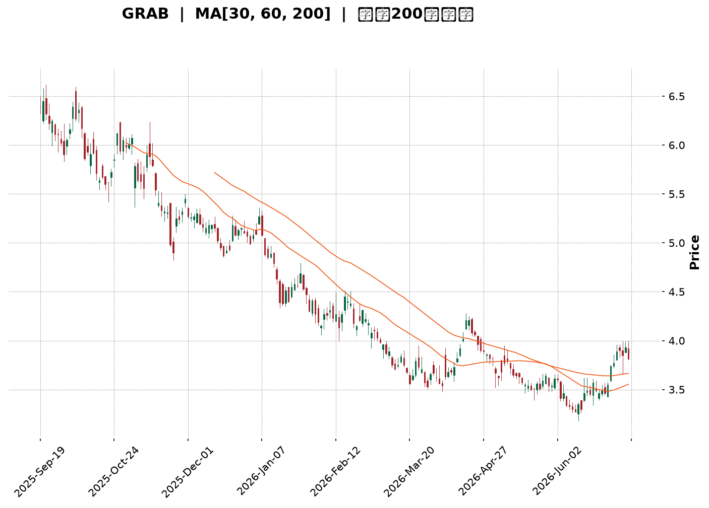
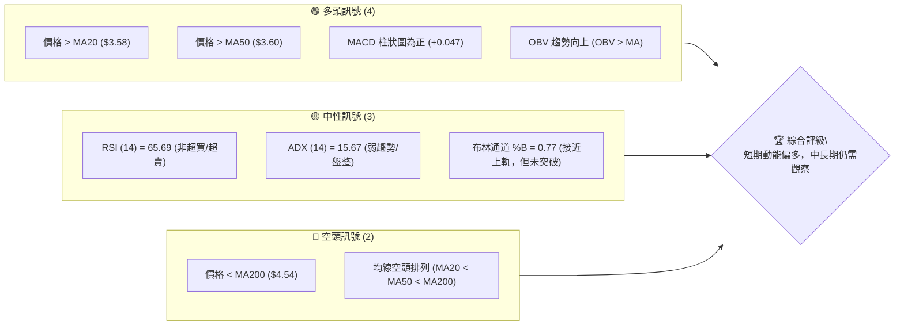
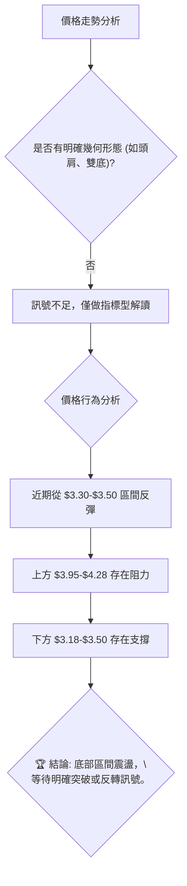
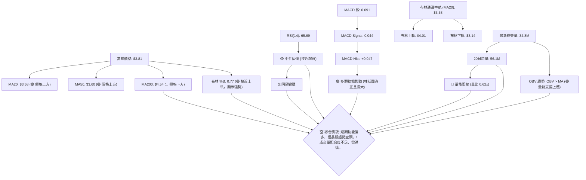
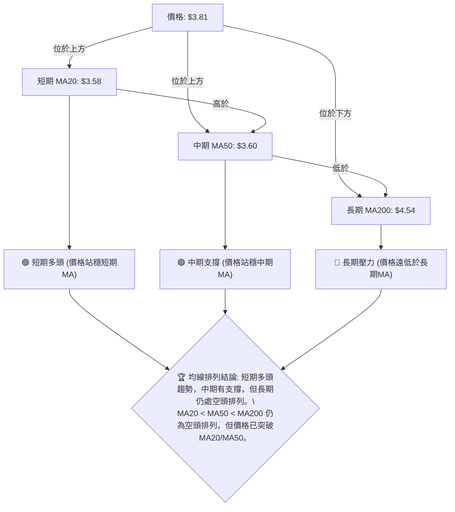
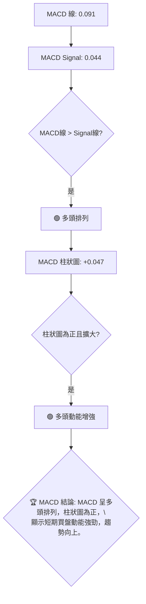
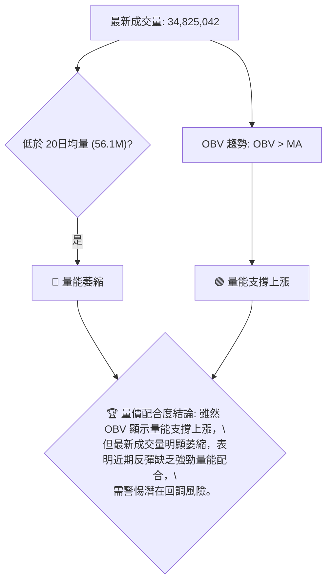
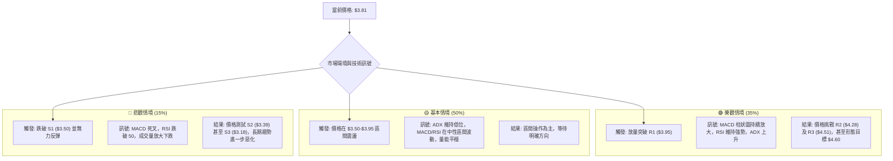

<details>
<summary>📊 靜態圖表 (點擊展開)</summary>

</details>

<html>
<head><meta charset="utf-8" /></head>
<body>
    <div style="height:500px; width:100%;">                        <script>window.PlotlyConfig = {MathJaxConfig: 'local'};</script>
        <script charset="utf-8" src="https://cdn.plot.ly/plotly-3.6.0.min.js" integrity="sha256-QaOVwtVY0T02VaHrr6pnoHLCwayMJp4O5n4YyaE3rJk=" crossorigin="anonymous"></script>                <div id="candlestick-chart" class="plotly-graph-div" style="height:100%; width:100%;"></div>            <script>                window.PLOTLYENV=window.PLOTLYENV || {};                                if (document.getElementById("candlestick-chart")) {                    Plotly.newPlot(                        "candlestick-chart",                        [{"close":{"dtype":"f8","bdata":"AAAAIFyPGUAAAADAzMwZQAAAACCuRxlAAAAAoEfhGEAAAAAAAAAZQAAAAOCjcBhAAAAA4KNwGEAAAADgehQYQAAAAKCZmRdAAAAAQDMzGEAAAAAA16MYQAAAACBcjxlAAAAA4HoUGUAAAADgo3AZQAAAAIAUrhhAAAAA4KNwF0AAAADgUbgXQAAAAADXoxdAAAAAgBSuF0AAAABACtcWQAAAACBcjxZAAAAAgBSuFkAAAABgZmYWQAAAAEDhehZAAAAAoEfhFkAAAABgZmYXQAAAAEDhehhAAAAAYI\u002fCF0AAAABAMzMYQAAAACCF6xdAAAAAgD0KGEAAAAAgrkcYQAAAAADXIxdAAAAAIFyPFkAAAADAHoUWQAAAAKBwPRZAAAAAoJmZF0AAAADAHoUXQAAAAMD1KBdAAAAAwPUoFkAAAAAA16MVQAAAAIDrURVAAAAAIK5HFUAAAACgcD0VQAAAACCF6xNAAAAAoJmZE0AAAAAAAAAVQAAAAIDC9RRAAAAAIK5HFUAAAADAzMwVQAAAAOB6FBVAAAAAgD0KFUAAAADgehQVQAAAAEAzMxVAAAAAYI\u002fCFEAAAAAA16MUQAAAAKCZmRRAAAAA4FG4FEAAAADgUbgUQAAAAKCZmRRAAAAA4HoUFEAAAADAzMwTQAAAAEDhehNAAAAAgBSuE0AAAADgUbgTQAAAAOBRuBRAAAAAgOtRFEAAAADAHoUUQAAAAKCZmRRAAAAAYGZmFEAAAAAgrkcUQAAAAIDC9RNAAAAAgOtRFEAAAAAAKVwUQAAAAOB6FBVAAAAAgOtRFEAAAADAHoUTQAAAAGBmZhNAAAAAIFyPE0AAAADA9SgTQAAAAMAehRJAAAAAIFyPEUAAAADAHoURQAAAAIA9ChJAAAAAoJmZEUAAAABAMzMSQAAAAIDrURJAAAAAoHA9EkAAAABgj8ISQAAAAGC4HhJAAAAAoEfhEUAAAABAMzMRQAAAAADXoxFAAAAA4HoUEUAAAABgj8IQQAAAAKCZmRBAAAAA4HoUEUAAAACAPQoRQAAAAKBwPRFAAAAAIIXrEEAAAADgehQRQAAAAMAehRBAAAAA4HoUEUAAAADAzMwRQAAAAKCZmRFAAAAAwB6FEUAAAADgUbgQQAAAAKCZmRBAAAAAQArXEEAAAACgcD0RQAAAAKBH4RBAAAAA4FG4EEAAAACA61EQQAAAAGBmZhBAAAAAYLgeEEAAAABACtcPQAAAAIAUrg9AAAAAgML1DkAAAABguB4PQAAAAAAAAA5AAAAAgBSuDUAAAAAAAAAOQAAAAOBRuA5AAAAAAAAADkAAAADgo3ANQAAAAEDhegxAAAAAYLgeDUAAAACA61EOQAAAAEAK1w1AAAAAgBSuDUAAAAAgXI8MQAAAAKBwPQxAAAAAIK5HDUAAAAAAKVwNQAAAAIDC9QxAAAAAQOF6DEAAAACA61EMQAAAAIA9Cg1AAAAA4KNwDUAAAADgo3ANQAAAAEAK1w1AAAAAIFyPDkAAAAAAKVwPQAAAAOB6FBBAAAAAQArXEEAAAABACtcQQAAAAIDrURBAAAAAoHA9EEAAAACAFK4PQAAAAEAzMw9AAAAAYLgeD0AAAACgR+EOQAAAACBcjw5AAAAAIFyPDkAAAAAAKVwNQAAAAIDC9QxAAAAA4KNwDUAAAADA9SgOQAAAAIDrUQ5AAAAAYI\u002fCDUAAAABAMzMNQAAAAGC4Hg1AAAAAgD0KDUAAAAAgXI8MQAAAAGBmZgxAAAAAgOtRDEAAAAAAAAAMQAAAAOB6FAxAAAAAQOF6DEAAAADgehQMQAAAAOBRuAxAAAAAYLgeDUAAAACA61EMQAAAAIDrUQxAAAAAoEfhDEAAAADAzMwMQAAAACCuRwtAAAAAgBSuC0AAAADgUbgKQAAAAADXowpAAAAAYGZmCkAAAADA9SgKQAAAAMDMzApAAAAAYGZmCkAAAACAFK4LQAAAACCF6wtAAAAAoJmZC0AAAAAgXI8MQAAAACCF6wtAAAAAgBSuC0AAAAAghesLQAAAAIAUrgtAAAAAYGZmDEAAAAAghesNQAAAAMD1KA5AAAAAYLgeD0AAAABAMzMPQAAAAMDMzA5AAAAA4KNwD0AAAABA4XoOQA=="},"high":{"dtype":"f8","bdata":"AAAAAAAAGkAAAACA61EaQAAAAEDhehpAAAAA4FG4GUAAAADgehQZQAAAAKBH4RhAAAAAgBSuGEAAAACgmZkYQAAAAKBH4RhAAAAAIK5HGEAAAACgR+EYQAAAACCuxxlAAAAAYGZmGkAAAABAicEZQAAAAKCZmRlAAAAAIFyPGEAAAAAgrkcYQAAAAOB6FBhAAAAAIFyPGEAAAACAwvUXQAAAAEAzsxZAAAAAgGo8F0AAAADgUbgWQAAAAEDhehZAAAAAgD0KF0AAAADA9agXQAAAAMAehRhAAAAAgML1GEAAAAAAKVwYQAAAAIDrURhAAAAAgOtRGEAAAACAwnUYQAAAACCuRxdAAAAA4KNwF0AAAABAClcXQAAAAMD1KBdAAAAAAAAAGEAAAADgo\u002fAYQAAAAOB6FBhAAAAAoEfhFkAAAABguB4WQAAAAOB6FBZAAAAAgMJ1FUAAAADAHoUVQAAAAADXoxVAAAAAoHA9FEAAAABA4XoVQAAAAAApXBVAAAAA4KNwFUAAAAAAAAAWQAAAAEDhehVAAAAAoHA9FUAAAABAMzMVQAAAAGBmZhVAAAAAYGZmFUAAAAAgXA8VQAAAAAAp3BRAAAAAgML1FEAAAABgj8IUQAAAAOB6FBVAAAAAANejFEAAAABAMzMUQAAAAKBH4RNAAAAAoEfhE0AAAABguB4UQAAAAGC4HhVAAAAAgML1FEAAAACgmZkUQAAAAADXoxRAAAAAIIXrFEAAAAAgXI8UQAAAAAApXBRAAAAAwB6FFEAAAADAzMwUQAAAAOCjcBVAAAAAgOtRFUAAAABAMzMUQAAAAKBH4RNAAAAAoEfhE0AAAACgmZkTQAAAAIA9ChNAAAAAwB6FEkAAAABgZmYSQAAAAOBROBJAAAAAQDMzEkAAAABgZmYSQAAAACBcjxJAAAAAgBSuEkAAAACAFC4TQAAAAOBRuBJAAAAA4FE4EkAAAACgR+ERQAAAAOBRuBFAAAAAYI\u002fCEUAAAABA4XoRQAAAAADXoxBAAAAAwMxMEUAAAAAAKVwRQAAAAGC4nhFAAAAAIFyPEUAAAACAwvURQAAAAOBROBFAAAAAQDMzEUAAAACAPQoSQAAAAEAK1xFAAAAAwB4FEkAAAACAPYoRQAAAAKCZmRBAAAAAwB6FEUAAAAAgrkcRQAAAAGC4HhFAAAAAoEfhEEAAAACAPYoQQAAAAOB6lBBAAAAAwB6FEEAAAADA9SgQQAAAAIAUrg9AAAAAAAAAEEAAAADAHoUPQAAAAMDMzA5AAAAAQOF6DkAAAAAA16MOQAAAAIDC9Q5AAAAAQDMzD0AAAABACtcNQAAAAOCjcA1AAAAAgBSuDUAAAAAA16MOQAAAAKCZmQ9AAAAA4FG4DkAAAADAHoUNQAAAAIDC9QxAAAAA4KNwDUAAAACA61EOQAAAAGCPwg1AAAAAAAAADkAAAABgj8IMQAAAAOCjcA9AAAAAQArXDUAAAADAzMwNQAAAAKBwPQ5AAAAA4HoUD0AAAADgUbgPQAAAAAApXBBAAAAAYLgeEUAAAAAAAAARQAAAAIDC9RBAAAAA4KNwEEAAAABAMzMQQAAAAMD1KBBAAAAAIIXrD0AAAAAAAAAPQAAAACCF6w5AAAAA4FG4DkAAAACgR+ENQAAAAEAzMw1AAAAA4KNwDkAAAACgmZkPQAAAAEAzMw9AAAAAoHA9DkAAAADgehQOQAAAAOCjcA1AAAAA4KNwDUAAAACAwvUMQAAAACBcjwxAAAAAwMzMDEAAAAAgXI8MQAAAAIDpJgxAAAAAANejDEAAAACAwvUMQAAAAIDrUQ1AAAAAAClcDUAAAACAwvUMQAAAACBcjwxAAAAAIK5HDUAAAAAgrkcNQAAAAOBRuAxAAAAAYGZmDEAAAADAHoULQAAAAEAzMwtAAAAAgML1CkAAAADAzMwKQAAAAIDC9QpAAAAAYLgeC0AAAACAwvUMQAAAAIDC9QxAAAAAAClcDEAAAACgR+EMQAAAAOBRuAxAAAAAAAAADEAAAABgZmYMQAAAACBcjwxAAAAAANejDEAAAAAAAAAOQAAAAKBH4Q5AAAAAgBSuD0AAAACAFK4PQAAAACCF6w9AAAAAgML1D0AAAAAAAAAQQA=="},"hovertemplate":"\u003cb\u003e%{x|%Y-%m-%d}\u003c\u002fb\u003e\u003cbr\u003e\u958b: $%{open:.2f}\u003cbr\u003e\u9ad8: $%{high:.2f}\u003cbr\u003e\u4f4e: $%{low:.2f}\u003cbr\u003e\u6536: $%{close:.2f}\u003cextra\u003e\u003c\u002fextra\u003e","low":{"dtype":"f8","bdata":"AAAAIK5HGUAAAACgR+EYQAAAAIA9ChlAAAAAANejGEAAAACAwvUXQAAAAMD1KBhAAAAA4FG4F0AAAACAwvUXQAAAAIDrURdAAAAAoJmZF0AAAACgcD0YQAAAACBcjxhAAAAAgML1GEAAAAAghesYQAAAACCuRxhAAAAAAClcF0AAAAAgXI8XQAAAAMDMzBZAAAAAoJmZF0AAAAAgXI8WQAAAAMD1KBZAAAAAoJmZFkAAAADA9SgWQAAAAIAUrhVAAAAAgOtRFkAAAADgehQXQAAAAADXoxdAAAAAoJmZF0AAAABgZmYXQAAAAIAUrhdAAAAAwMzMF0AAAACgmZkXQAAAAOCjcBVAAAAAQOF6FkAAAACAFC4WQAAAAMDMzBVAAAAAIIXrFkAAAABAMzMXQAAAAGC4HhdAAAAAIIXrFUAAAADgo3AVQAAAAOB6FBVAAAAAoEfhFEAAAAAAAAAVQAAAAEAK1xNAAAAAIK5HE0AAAAAghWsUQAAAAGCPwhRAAAAAQArXFEAAAADgo3AVQAAAAAAAABVAAAAAoEfhFEAAAACgmZkUQAAAACCuxxRAAAAA4FG4FEAAAADgo3AUQAAAAIDrURRAAAAAQDMzFEAAAACgR2EUQAAAAOCjcBRAAAAAgML1E0AAAACAFK4TQAAAAGBmZhNAAAAAIFyPE0AAAAAA16MTQAAAAIA9ChRAAAAAIK5HFEAAAABguB4UQAAAAMDMTBRAAAAAoEdhFEAAAAAAAAAUQAAAACCF6xNAAAAAgD0KFEAAAACA61EUQAAAAGCPwhRAAAAAYI9CFEAAAADgo3ATQAAAAIDrURNAAAAAAClcE0AAAAAAAAATQAAAAIDrURJAAAAAgOtREUAAAADgo3ARQAAAAGBmZhFAAAAAIFyPEUAAAADgUbgRQAAAAOB6FBJAAAAAwPUoEkAAAAAAKVwSQAAAAIA9ChJAAAAAwB6FEUAAAADA9SgRQAAAAAAAABFAAAAA4FG4EEAAAACgmZkQQAAAAKBwPRBAAAAAgMJ1EEAAAABACtcQQAAAACCF6xBAAAAAYI\u002fCEEAAAADAzMwQQAAAAAAAABBAAAAAYGZmEEAAAADgehQRQAAAAGCPQhFAAAAAgOtREUAAAADAHoUQQAAAAEAzMxBAAAAA4KfGEEAAAAAgXI8QQAAAAOBRuBBAAAAAoHA9EEAAAAAAKVwPQAAAAIA9ChBAAAAAAAAAEEAAAABgj8IPQAAAAMAehQ5AAAAAwMzMDkAAAABA4XoOQAAAAGCPwg1AAAAAoJmZDUAAAABgj8INQAAAAMD1KA5AAAAAQArXDUAAAAAgrkcNQAAAAGBmZgxAAAAA4FG4DEAAAACAwvUMQAAAAKCZmQ1AAAAAgOtRDUAAAACgcD0MQAAAAOB6FAxAAAAAYGZmDEAAAABguB4NQAAAAADXowxAAAAAQOF6DEAAAABACtcLQAAAAMDMzAxAAAAAgML1DEAAAABAMzMNQAAAAADXowxAAAAAYGQ7DkAAAACAFK4OQAAAAEAK1w9AAAAA4KNwEEAAAADgo3AQQAAAAEAzMxBAAAAAwPUoEEAAAABAMzMPQAAAAIA9Cg9AAAAAoEfhDkAAAACA61EOQAAAAOB6FA5AAAAAIIXrDUAAAADA9SgMQAAAAIDrUQxAAAAA4FG4DEAAAAAghesNQAAAAOB6FA5AAAAAIK5HDUAAAACAwvUMQAAAAKBH4QxAAAAAQOF6DEAAAABgZmYMQAAAAIAUrgtAAAAAQArXC0AAAAAghesLQAAAAGC4HgtAAAAAoJmZC0AAAAAghesLQAAAAOB6FAxAAAAA4KNwDEAAAABACtcLQAAAAEAK1wtAAAAAAAAADEAAAAAgXI8MQAAAAIA9CgtAAAAAgD0KC0AAAACgmZkKQAAAAGBmZgpAAAAA4HoUCkAAAADA9SgKQAAAAOCjcAlAAAAA4HoUCkAAAACAwvUKQAAAAEDhegtAAAAA4KNwC0AAAADgUbgKQAAAAGCPwgtAAAAAYLgeC0AAAADgo3ALQAAAAMAehQtAAAAAYGZmC0AAAAAA16MMQAAAAGCPwg1AAAAAYGZmDkAAAAAA16MOQAAAACCuRw1AAAAAgD0KD0AAAABgZmYOQA=="},"name":"\u50f9\u683c","open":{"dtype":"f8","bdata":"AAAAIFyPGUAAAABA4foYQAAAACCF6xlAAAAAQDMzGUAAAADAHoUYQAAAAEAK1xhAAAAAgMJ1GEAAAACgcD0YQAAAAMD1KBhAAAAAgML1F0AAAABA4XoYQAAAAKCZGRlAAAAAQDMzGkAAAACA61EZQAAAAIA9ihlAAAAAQOF6GEAAAACAwvUXQAAAAMD1KBdAAAAAoHA9GEAAAADAzMwXQAAAAEDhehZAAAAAwPUoF0AAAADgUbgWQAAAAEDhehZAAAAAgBSuFkAAAACgR2EXQAAAAAAAABhAAAAAIIXrGEAAAABgj8IXQAAAAAAAABhAAAAAoEfhF0AAAACAPQoYQAAAAGCPQhZAAAAAYI9CF0AAAADAzMwWQAAAAMDMzBZAAAAAoJkZF0AAAAAgXA8YQAAAAGBmZhdAAAAAQArXFkAAAADAHoUVQAAAAIA9ihVAAAAA4FE4FUAAAABAMzMVQAAAAADXoxVAAAAAgD0KFEAAAACAFK4UQAAAAOB6FBVAAAAAwPUoFUAAAAAA16MVQAAAACCFaxVAAAAAwB4FFUAAAACAwvUUQAAAAEAK1xRAAAAAwPUoFUAAAABgj8IUQAAAACCFaxRAAAAAYGZmFEAAAADgepQUQAAAAGCPwhRAAAAAoJmZFEAAAABA4foTQAAAAKBH4RNAAAAAoJmZE0AAAACgR+ETQAAAAOB6FBRAAAAAgBSuFEAAAACA61EUQAAAACBcjxRAAAAAQOF6FEAAAACAwnUUQAAAACCuRxRAAAAAgBQuFEAAAADAHoUUQAAAAGCPwhRAAAAAYLgeFUAAAABAMzMUQAAAAGCPwhNAAAAAYGZmE0AAAACgmZkTQAAAACCF6xJAAAAA4KNwEkAAAACA61ESQAAAAIA9ihFAAAAAQDMzEkAAAADAzMwRQAAAAOB6FBJAAAAAoHA9EkAAAAAAKVwSQAAAAIAUrhJAAAAAwPUoEkAAAACAFK4RQAAAAGC4HhFAAAAAwPWoEUAAAACA61ERQAAAAMAehRBAAAAAoEfhEEAAAABguB4RQAAAAMD1KBFAAAAA4KNwEUAAAADAzMwQQAAAAIDC9RBAAAAAYI\u002fCEEAAAACgcD0RQAAAAOB6lBFAAAAA4KNwEUAAAADAzEwRQAAAAOCjcBBAAAAAAAAAEUAAAADgUbgQQAAAAMDMzBBAAAAAANejEEAAAABguB4QQAAAAOCjcBBAAAAAAClcEEAAAAAgXA8QQAAAACCuRw9AAAAAgBSuD0AAAADAzMwOQAAAAADXow5AAAAAYLgeDkAAAAAghesNQAAAAKBwPQ5AAAAAoJmZDkAAAABgj8INQAAAAEAzMw1AAAAAwMzMDEAAAABAMzMNQAAAAADXow5AAAAAYGZmDUAAAADgo3ANQAAAAOBRuAxAAAAAwMzMDEAAAAAAAAAOQAAAAIDC9QxAAAAAoEfhDEAAAADAHoUMQAAAAEAK1w5AAAAAgD0KDUAAAACgmZkNQAAAAEAzMw1AAAAAoHA9DkAAAADAzMwOQAAAAAAAABBAAAAAQOF6EEAAAABguJ4QQAAAAKBH4RBAAAAAAClcEEAAAABAMzMQQAAAAOB6FBBAAAAAQDMzD0AAAADAzMwOQAAAAKBH4Q5AAAAAIFyPDkAAAADgUbgNQAAAAOB6FA1AAAAAAClcDkAAAADAzMwOQAAAACBcjw5AAAAAwPUoDkAAAACAFK4NQAAAAAApXA1AAAAAAClcDUAAAACAwvUMQAAAAIDrUQxAAAAAYLgeDEAAAACA61EMQAAAAOB6FAxAAAAAAAAADEAAAABA4XoMQAAAACCuRwxAAAAAQOF6DEAAAACAwvUMQAAAAKBwPQxAAAAAwPUoDEAAAACgR+EMQAAAAADXowxAAAAAIK5HC0AAAADgo3ALQAAAAGCPwgpAAAAAANejCkAAAABgZmYKQAAAAAAAAApAAAAAYLgeC0AAAABguB4LQAAAAGCPwgtAAAAAAAAADEAAAADAHoULQAAAAKAYBAxAAAAAIK5HC0AAAAAA16MLQAAAAEAzMwxAAAAAYGZmC0AAAADgUbgMQAAAACCF6w1AAAAAYGZmDkAAAADgo3APQAAAAEAzMw9AAAAAgD0KD0AAAAAAKVwPQA=="},"x":["2025-09-19T00:00:00-04:00","2025-09-22T00:00:00-04:00","2025-09-23T00:00:00-04:00","2025-09-24T00:00:00-04:00","2025-09-25T00:00:00-04:00","2025-09-26T00:00:00-04:00","2025-09-29T00:00:00-04:00","2025-09-30T00:00:00-04:00","2025-10-01T00:00:00-04:00","2025-10-02T00:00:00-04:00","2025-10-03T00:00:00-04:00","2025-10-06T00:00:00-04:00","2025-10-07T00:00:00-04:00","2025-10-08T00:00:00-04:00","2025-10-09T00:00:00-04:00","2025-10-10T00:00:00-04:00","2025-10-13T00:00:00-04:00","2025-10-14T00:00:00-04:00","2025-10-15T00:00:00-04:00","2025-10-16T00:00:00-04:00","2025-10-17T00:00:00-04:00","2025-10-20T00:00:00-04:00","2025-10-21T00:00:00-04:00","2025-10-22T00:00:00-04:00","2025-10-23T00:00:00-04:00","2025-10-24T00:00:00-04:00","2025-10-27T00:00:00-04:00","2025-10-28T00:00:00-04:00","2025-10-29T00:00:00-04:00","2025-10-30T00:00:00-04:00","2025-10-31T00:00:00-04:00","2025-11-03T00:00:00-05:00","2025-11-04T00:00:00-05:00","2025-11-05T00:00:00-05:00","2025-11-06T00:00:00-05:00","2025-11-07T00:00:00-05:00","2025-11-10T00:00:00-05:00","2025-11-11T00:00:00-05:00","2025-11-12T00:00:00-05:00","2025-11-13T00:00:00-05:00","2025-11-14T00:00:00-05:00","2025-11-17T00:00:00-05:00","2025-11-18T00:00:00-05:00","2025-11-19T00:00:00-05:00","2025-11-20T00:00:00-05:00","2025-11-21T00:00:00-05:00","2025-11-24T00:00:00-05:00","2025-11-25T00:00:00-05:00","2025-11-26T00:00:00-05:00","2025-11-28T00:00:00-05:00","2025-12-01T00:00:00-05:00","2025-12-02T00:00:00-05:00","2025-12-03T00:00:00-05:00","2025-12-04T00:00:00-05:00","2025-12-05T00:00:00-05:00","2025-12-08T00:00:00-05:00","2025-12-09T00:00:00-05:00","2025-12-10T00:00:00-05:00","2025-12-11T00:00:00-05:00","2025-12-12T00:00:00-05:00","2025-12-15T00:00:00-05:00","2025-12-16T00:00:00-05:00","2025-12-17T00:00:00-05:00","2025-12-18T00:00:00-05:00","2025-12-19T00:00:00-05:00","2025-12-22T00:00:00-05:00","2025-12-23T00:00:00-05:00","2025-12-24T00:00:00-05:00","2025-12-26T00:00:00-05:00","2025-12-29T00:00:00-05:00","2025-12-30T00:00:00-05:00","2025-12-31T00:00:00-05:00","2026-01-02T00:00:00-05:00","2026-01-05T00:00:00-05:00","2026-01-06T00:00:00-05:00","2026-01-07T00:00:00-05:00","2026-01-08T00:00:00-05:00","2026-01-09T00:00:00-05:00","2026-01-12T00:00:00-05:00","2026-01-13T00:00:00-05:00","2026-01-14T00:00:00-05:00","2026-01-15T00:00:00-05:00","2026-01-16T00:00:00-05:00","2026-01-20T00:00:00-05:00","2026-01-21T00:00:00-05:00","2026-01-22T00:00:00-05:00","2026-01-23T00:00:00-05:00","2026-01-26T00:00:00-05:00","2026-01-27T00:00:00-05:00","2026-01-28T00:00:00-05:00","2026-01-29T00:00:00-05:00","2026-01-30T00:00:00-05:00","2026-02-02T00:00:00-05:00","2026-02-03T00:00:00-05:00","2026-02-04T00:00:00-05:00","2026-02-05T00:00:00-05:00","2026-02-06T00:00:00-05:00","2026-02-09T00:00:00-05:00","2026-02-10T00:00:00-05:00","2026-02-11T00:00:00-05:00","2026-02-12T00:00:00-05:00","2026-02-13T00:00:00-05:00","2026-02-17T00:00:00-05:00","2026-02-18T00:00:00-05:00","2026-02-19T00:00:00-05:00","2026-02-20T00:00:00-05:00","2026-02-23T00:00:00-05:00","2026-02-24T00:00:00-05:00","2026-02-25T00:00:00-05:00","2026-02-26T00:00:00-05:00","2026-02-27T00:00:00-05:00","2026-03-02T00:00:00-05:00","2026-03-03T00:00:00-05:00","2026-03-04T00:00:00-05:00","2026-03-05T00:00:00-05:00","2026-03-06T00:00:00-05:00","2026-03-09T00:00:00-04:00","2026-03-10T00:00:00-04:00","2026-03-11T00:00:00-04:00","2026-03-12T00:00:00-04:00","2026-03-13T00:00:00-04:00","2026-03-16T00:00:00-04:00","2026-03-17T00:00:00-04:00","2026-03-18T00:00:00-04:00","2026-03-19T00:00:00-04:00","2026-03-20T00:00:00-04:00","2026-03-23T00:00:00-04:00","2026-03-24T00:00:00-04:00","2026-03-25T00:00:00-04:00","2026-03-26T00:00:00-04:00","2026-03-27T00:00:00-04:00","2026-03-30T00:00:00-04:00","2026-03-31T00:00:00-04:00","2026-04-01T00:00:00-04:00","2026-04-02T00:00:00-04:00","2026-04-06T00:00:00-04:00","2026-04-07T00:00:00-04:00","2026-04-08T00:00:00-04:00","2026-04-09T00:00:00-04:00","2026-04-10T00:00:00-04:00","2026-04-13T00:00:00-04:00","2026-04-14T00:00:00-04:00","2026-04-15T00:00:00-04:00","2026-04-16T00:00:00-04:00","2026-04-17T00:00:00-04:00","2026-04-20T00:00:00-04:00","2026-04-21T00:00:00-04:00","2026-04-22T00:00:00-04:00","2026-04-23T00:00:00-04:00","2026-04-24T00:00:00-04:00","2026-04-27T00:00:00-04:00","2026-04-28T00:00:00-04:00","2026-04-29T00:00:00-04:00","2026-04-30T00:00:00-04:00","2026-05-01T00:00:00-04:00","2026-05-04T00:00:00-04:00","2026-05-05T00:00:00-04:00","2026-05-06T00:00:00-04:00","2026-05-07T00:00:00-04:00","2026-05-08T00:00:00-04:00","2026-05-11T00:00:00-04:00","2026-05-12T00:00:00-04:00","2026-05-13T00:00:00-04:00","2026-05-14T00:00:00-04:00","2026-05-15T00:00:00-04:00","2026-05-18T00:00:00-04:00","2026-05-19T00:00:00-04:00","2026-05-20T00:00:00-04:00","2026-05-21T00:00:00-04:00","2026-05-22T00:00:00-04:00","2026-05-26T00:00:00-04:00","2026-05-27T00:00:00-04:00","2026-05-28T00:00:00-04:00","2026-05-29T00:00:00-04:00","2026-06-01T00:00:00-04:00","2026-06-02T00:00:00-04:00","2026-06-03T00:00:00-04:00","2026-06-04T00:00:00-04:00","2026-06-05T00:00:00-04:00","2026-06-08T00:00:00-04:00","2026-06-09T00:00:00-04:00","2026-06-10T00:00:00-04:00","2026-06-11T00:00:00-04:00","2026-06-12T00:00:00-04:00","2026-06-15T00:00:00-04:00","2026-06-16T00:00:00-04:00","2026-06-17T00:00:00-04:00","2026-06-18T00:00:00-04:00","2026-06-22T00:00:00-04:00","2026-06-23T00:00:00-04:00","2026-06-24T00:00:00-04:00","2026-06-25T00:00:00-04:00","2026-06-26T00:00:00-04:00","2026-06-29T00:00:00-04:00","2026-06-30T00:00:00-04:00","2026-07-01T00:00:00-04:00","2026-07-02T00:00:00-04:00","2026-07-06T00:00:00-04:00","2026-07-07T00:00:00-04:00","2026-07-08T00:00:00-04:00"],"type":"candlestick"},{"hovertemplate":"MA30: $%{y:.2f}\u003cextra\u003e\u003c\u002fextra\u003e","line":{"color":"#2196F3","dash":"dash","width":2},"mode":"lines","name":"MA30","x":["2025-09-19T00:00:00-04:00","2025-09-22T00:00:00-04:00","2025-09-23T00:00:00-04:00","2025-09-24T00:00:00-04:00","2025-09-25T00:00:00-04:00","2025-09-26T00:00:00-04:00","2025-09-29T00:00:00-04:00","2025-09-30T00:00:00-04:00","2025-10-01T00:00:00-04:00","2025-10-02T00:00:00-04:00","2025-10-03T00:00:00-04:00","2025-10-06T00:00:00-04:00","2025-10-07T00:00:00-04:00","2025-10-08T00:00:00-04:00","2025-10-09T00:00:00-04:00","2025-10-10T00:00:00-04:00","2025-10-13T00:00:00-04:00","2025-10-14T00:00:00-04:00","2025-10-15T00:00:00-04:00","2025-10-16T00:00:00-04:00","2025-10-17T00:00:00-04:00","2025-10-20T00:00:00-04:00","2025-10-21T00:00:00-04:00","2025-10-22T00:00:00-04:00","2025-10-23T00:00:00-04:00","2025-10-24T00:00:00-04:00","2025-10-27T00:00:00-04:00","2025-10-28T00:00:00-04:00","2025-10-29T00:00:00-04:00","2025-10-30T00:00:00-04:00","2025-10-31T00:00:00-04:00","2025-11-03T00:00:00-05:00","2025-11-04T00:00:00-05:00","2025-11-05T00:00:00-05:00","2025-11-06T00:00:00-05:00","2025-11-07T00:00:00-05:00","2025-11-10T00:00:00-05:00","2025-11-11T00:00:00-05:00","2025-11-12T00:00:00-05:00","2025-11-13T00:00:00-05:00","2025-11-14T00:00:00-05:00","2025-11-17T00:00:00-05:00","2025-11-18T00:00:00-05:00","2025-11-19T00:00:00-05:00","2025-11-20T00:00:00-05:00","2025-11-21T00:00:00-05:00","2025-11-24T00:00:00-05:00","2025-11-25T00:00:00-05:00","2025-11-26T00:00:00-05:00","2025-11-28T00:00:00-05:00","2025-12-01T00:00:00-05:00","2025-12-02T00:00:00-05:00","2025-12-03T00:00:00-05:00","2025-12-04T00:00:00-05:00","2025-12-05T00:00:00-05:00","2025-12-08T00:00:00-05:00","2025-12-09T00:00:00-05:00","2025-12-10T00:00:00-05:00","2025-12-11T00:00:00-05:00","2025-12-12T00:00:00-05:00","2025-12-15T00:00:00-05:00","2025-12-16T00:00:00-05:00","2025-12-17T00:00:00-05:00","2025-12-18T00:00:00-05:00","2025-12-19T00:00:00-05:00","2025-12-22T00:00:00-05:00","2025-12-23T00:00:00-05:00","2025-12-24T00:00:00-05:00","2025-12-26T00:00:00-05:00","2025-12-29T00:00:00-05:00","2025-12-30T00:00:00-05:00","2025-12-31T00:00:00-05:00","2026-01-02T00:00:00-05:00","2026-01-05T00:00:00-05:00","2026-01-06T00:00:00-05:00","2026-01-07T00:00:00-05:00","2026-01-08T00:00:00-05:00","2026-01-09T00:00:00-05:00","2026-01-12T00:00:00-05:00","2026-01-13T00:00:00-05:00","2026-01-14T00:00:00-05:00","2026-01-15T00:00:00-05:00","2026-01-16T00:00:00-05:00","2026-01-20T00:00:00-05:00","2026-01-21T00:00:00-05:00","2026-01-22T00:00:00-05:00","2026-01-23T00:00:00-05:00","2026-01-26T00:00:00-05:00","2026-01-27T00:00:00-05:00","2026-01-28T00:00:00-05:00","2026-01-29T00:00:00-05:00","2026-01-30T00:00:00-05:00","2026-02-02T00:00:00-05:00","2026-02-03T00:00:00-05:00","2026-02-04T00:00:00-05:00","2026-02-05T00:00:00-05:00","2026-02-06T00:00:00-05:00","2026-02-09T00:00:00-05:00","2026-02-10T00:00:00-05:00","2026-02-11T00:00:00-05:00","2026-02-12T00:00:00-05:00","2026-02-13T00:00:00-05:00","2026-02-17T00:00:00-05:00","2026-02-18T00:00:00-05:00","2026-02-19T00:00:00-05:00","2026-02-20T00:00:00-05:00","2026-02-23T00:00:00-05:00","2026-02-24T00:00:00-05:00","2026-02-25T00:00:00-05:00","2026-02-26T00:00:00-05:00","2026-02-27T00:00:00-05:00","2026-03-02T00:00:00-05:00","2026-03-03T00:00:00-05:00","2026-03-04T00:00:00-05:00","2026-03-05T00:00:00-05:00","2026-03-06T00:00:00-05:00","2026-03-09T00:00:00-04:00","2026-03-10T00:00:00-04:00","2026-03-11T00:00:00-04:00","2026-03-12T00:00:00-04:00","2026-03-13T00:00:00-04:00","2026-03-16T00:00:00-04:00","2026-03-17T00:00:00-04:00","2026-03-18T00:00:00-04:00","2026-03-19T00:00:00-04:00","2026-03-20T00:00:00-04:00","2026-03-23T00:00:00-04:00","2026-03-24T00:00:00-04:00","2026-03-25T00:00:00-04:00","2026-03-26T00:00:00-04:00","2026-03-27T00:00:00-04:00","2026-03-30T00:00:00-04:00","2026-03-31T00:00:00-04:00","2026-04-01T00:00:00-04:00","2026-04-02T00:00:00-04:00","2026-04-06T00:00:00-04:00","2026-04-07T00:00:00-04:00","2026-04-08T00:00:00-04:00","2026-04-09T00:00:00-04:00","2026-04-10T00:00:00-04:00","2026-04-13T00:00:00-04:00","2026-04-14T00:00:00-04:00","2026-04-15T00:00:00-04:00","2026-04-16T00:00:00-04:00","2026-04-17T00:00:00-04:00","2026-04-20T00:00:00-04:00","2026-04-21T00:00:00-04:00","2026-04-22T00:00:00-04:00","2026-04-23T00:00:00-04:00","2026-04-24T00:00:00-04:00","2026-04-27T00:00:00-04:00","2026-04-28T00:00:00-04:00","2026-04-29T00:00:00-04:00","2026-04-30T00:00:00-04:00","2026-05-01T00:00:00-04:00","2026-05-04T00:00:00-04:00","2026-05-05T00:00:00-04:00","2026-05-06T00:00:00-04:00","2026-05-07T00:00:00-04:00","2026-05-08T00:00:00-04:00","2026-05-11T00:00:00-04:00","2026-05-12T00:00:00-04:00","2026-05-13T00:00:00-04:00","2026-05-14T00:00:00-04:00","2026-05-15T00:00:00-04:00","2026-05-18T00:00:00-04:00","2026-05-19T00:00:00-04:00","2026-05-20T00:00:00-04:00","2026-05-21T00:00:00-04:00","2026-05-22T00:00:00-04:00","2026-05-26T00:00:00-04:00","2026-05-27T00:00:00-04:00","2026-05-28T00:00:00-04:00","2026-05-29T00:00:00-04:00","2026-06-01T00:00:00-04:00","2026-06-02T00:00:00-04:00","2026-06-03T00:00:00-04:00","2026-06-04T00:00:00-04:00","2026-06-05T00:00:00-04:00","2026-06-08T00:00:00-04:00","2026-06-09T00:00:00-04:00","2026-06-10T00:00:00-04:00","2026-06-11T00:00:00-04:00","2026-06-12T00:00:00-04:00","2026-06-15T00:00:00-04:00","2026-06-16T00:00:00-04:00","2026-06-17T00:00:00-04:00","2026-06-18T00:00:00-04:00","2026-06-22T00:00:00-04:00","2026-06-23T00:00:00-04:00","2026-06-24T00:00:00-04:00","2026-06-25T00:00:00-04:00","2026-06-26T00:00:00-04:00","2026-06-29T00:00:00-04:00","2026-06-30T00:00:00-04:00","2026-07-01T00:00:00-04:00","2026-07-02T00:00:00-04:00","2026-07-06T00:00:00-04:00","2026-07-07T00:00:00-04:00","2026-07-08T00:00:00-04:00"],"y":{"dtype":"f8","bdata":"AAAAAAAA+H8AAAAAAAD4fwAAAAAAAPh\u002fAAAAAAAA+H8AAAAAAAD4fwAAAAAAAPh\u002fAAAAAAAA+H8AAAAAAAD4fwAAAAAAAPh\u002fAAAAAAAA+H8AAAAAAAD4fwAAAAAAAPh\u002fAAAAAAAA+H8AAAAAAAD4fwAAAAAAAPh\u002fAAAAAAAA+H8AAAAAAAD4fwAAAAAAAPh\u002fAAAAAAAA+H8AAAAAAAD4fwAAAAAAAPh\u002fAAAAAAAA+H8AAAAAAAD4fwAAAAAAAPh\u002fAAAAAAAA+H8AAAAAAAD4fwAAAAAAAPh\u002fAAAAAAAA+H8AAAAAAAD4f+\u002fu7k6NFxhAIiIi0pQKGEBVVVVVnP0XQN7d3W1Z6xdAAAAAUI3XF0C8u7urY8IXQCIiIrKdrxdAAAAAsHKoF0CamZlZq6MXQHd3dyfqnxdAREREtIGOF0Crqqoa6HQXQO\u002fu7q65UBdAVVVVdUwwF0CrqqpqdQwXQJqZmQnX4xZA3t3dbRLDFkAAAACA3KsWQDMzM\u002fP9lBZAIiIiEoOAFkB3d3cno3cWQLy7uwsCaxZAmpmZaQNdFkBERETUv1EWQBEREaHTRhZAvLu7a7w0FkC8u7sbLx0WQO\u002fu7h4T\u002fBVAMzMzIyLiFUBVVVX1b8QVQO\u002fu7k4bqBVA3t3djVCGFUB3d3fXFWAVQDMzM3PaQBVA7+7u\u002fkYoFUDNzMxMYhAVQO\u002fu7s5pAxVAmpmZiWznFEAAAADw0s0UQImIiIj6txRAERERwfWoFECrqqrKWp0UQDMzM9O\u002fkRRAvLu7q46JFECJiIhIDIIUQHd3d1fyixRARERENBeSFECJiIgYdoUUQJqZmTkmeBRAMzMz03hpFECJiIio8VIUQBEREUEZPRRAMzMzE2cfFEAzMzMjBgEUQDMzMwMP5hNAMzMz4xfLE0ARERGhRbYTQEREROTQohNAAAAAQKeNE0ARERGR7XwTQM3MzOzDZxNAMzMz8\u002f1UE0Crqqoqzj4TQAAAAKAaLxNAZmZm1uoYE0Dv7u6eqP8SQImIiFiA3BJAVVVVddrAEkCJiIhIKKMSQAAAAEB8hhJAMzMzE8poEkARERGRe00SQGZmZsYgMBJAMzMz43oUEkCrqqp6ov4RQN7d3U3w4BFAzczMnAvJEUCrqqrqJrERQJqZmTlCmRFAvLu7SwyCEUDe3d39qXERQKuqqlqrYxFAiYiIWIBcEUB3d3fnQlIRQERERERERBFAiYiIKKM3EUC8u7trLiQRQHd3d8cEDxFAd3d3d3f3EEDe3d31KNwQQO\u002fu7jaJwRBAREREPJinEECrqqpC0pQQQGZmZoZdgRBAIiIisp1vEEB3d3c\u002fNV4QQHd3d78RShBAmpmZuZA0EEDNzMzMhSQQQO\u002fu7q65EBBAVVVVtfP9D0AiIiJSKs4PQO\u002fu7o40pQ9AmpmZCZB7D0De3d2NUEYPQAAAABAREQ9AVVVVhRbZDkBmZma2Za0OQN7d3Q3miQ5AIiIiordlDkBmZmaWtToOQImIiDhCGQ5ARERExK4ADkARERGRwvUNQHd3d3dM8A1AERERMZb8DUC8u7u7SQwOQCIiIuJ6FA5AAAAAYHMhDkBmZma2OiYOQHd3dyd4MA5AIiIi4sE8DkBVVVVFREQOQO\u002fu7r7mQg5AVVVVFa5HDkAiIiJS\u002f0YOQFVVVeUXSw5AIiIi8tJNDkC8u7trdUwOQO\u002fu7v6NUA5AIiIiwjxRDkDNzMzcslYOQBEREUE1Xg5Ad3d39yhcDkBmZmZWVVUOQAAAAACOUA5AmpmZeTBPDkDNzMxsdUwOQFVVVUVERA5A3t3dHRM8DkBmZmYmeDAOQImIiHjpJg5A7+7uvp8aDkAzMzPDrgAOQHd3dyfq3w1AREREZPS2DUDe3d3dT40NQFVVVcWSXw1AMzMzA502DUCamZm5SQwNQAAAAEBg5QxAAAAAQBm9DEARERFB0pQMQImIiGi8dAxAAAAAwDxRDEC8u7u75kIMQCIiItIGOgxAd3d3R1MqDEBmZmYGrBwMQFVVVSUxCAxAERERUXH2C0DNzMwchesLQCIiImI73wtAd3d3R8XZC0Dv7u4+YOULQGZmZgZl9AtAiYiIuEkMDECrqqo6mCcMQImIiCjOPgxAERERYRBYDEAiIiJCi2wMQA=="},"type":"scatter"},{"hovertemplate":"MA60: $%{y:.2f}\u003cextra\u003e\u003c\u002fextra\u003e","line":{"color":"#9C27B0","dash":"dash","width":2},"mode":"lines","name":"MA60","x":["2025-09-19T00:00:00-04:00","2025-09-22T00:00:00-04:00","2025-09-23T00:00:00-04:00","2025-09-24T00:00:00-04:00","2025-09-25T00:00:00-04:00","2025-09-26T00:00:00-04:00","2025-09-29T00:00:00-04:00","2025-09-30T00:00:00-04:00","2025-10-01T00:00:00-04:00","2025-10-02T00:00:00-04:00","2025-10-03T00:00:00-04:00","2025-10-06T00:00:00-04:00","2025-10-07T00:00:00-04:00","2025-10-08T00:00:00-04:00","2025-10-09T00:00:00-04:00","2025-10-10T00:00:00-04:00","2025-10-13T00:00:00-04:00","2025-10-14T00:00:00-04:00","2025-10-15T00:00:00-04:00","2025-10-16T00:00:00-04:00","2025-10-17T00:00:00-04:00","2025-10-20T00:00:00-04:00","2025-10-21T00:00:00-04:00","2025-10-22T00:00:00-04:00","2025-10-23T00:00:00-04:00","2025-10-24T00:00:00-04:00","2025-10-27T00:00:00-04:00","2025-10-28T00:00:00-04:00","2025-10-29T00:00:00-04:00","2025-10-30T00:00:00-04:00","2025-10-31T00:00:00-04:00","2025-11-03T00:00:00-05:00","2025-11-04T00:00:00-05:00","2025-11-05T00:00:00-05:00","2025-11-06T00:00:00-05:00","2025-11-07T00:00:00-05:00","2025-11-10T00:00:00-05:00","2025-11-11T00:00:00-05:00","2025-11-12T00:00:00-05:00","2025-11-13T00:00:00-05:00","2025-11-14T00:00:00-05:00","2025-11-17T00:00:00-05:00","2025-11-18T00:00:00-05:00","2025-11-19T00:00:00-05:00","2025-11-20T00:00:00-05:00","2025-11-21T00:00:00-05:00","2025-11-24T00:00:00-05:00","2025-11-25T00:00:00-05:00","2025-11-26T00:00:00-05:00","2025-11-28T00:00:00-05:00","2025-12-01T00:00:00-05:00","2025-12-02T00:00:00-05:00","2025-12-03T00:00:00-05:00","2025-12-04T00:00:00-05:00","2025-12-05T00:00:00-05:00","2025-12-08T00:00:00-05:00","2025-12-09T00:00:00-05:00","2025-12-10T00:00:00-05:00","2025-12-11T00:00:00-05:00","2025-12-12T00:00:00-05:00","2025-12-15T00:00:00-05:00","2025-12-16T00:00:00-05:00","2025-12-17T00:00:00-05:00","2025-12-18T00:00:00-05:00","2025-12-19T00:00:00-05:00","2025-12-22T00:00:00-05:00","2025-12-23T00:00:00-05:00","2025-12-24T00:00:00-05:00","2025-12-26T00:00:00-05:00","2025-12-29T00:00:00-05:00","2025-12-30T00:00:00-05:00","2025-12-31T00:00:00-05:00","2026-01-02T00:00:00-05:00","2026-01-05T00:00:00-05:00","2026-01-06T00:00:00-05:00","2026-01-07T00:00:00-05:00","2026-01-08T00:00:00-05:00","2026-01-09T00:00:00-05:00","2026-01-12T00:00:00-05:00","2026-01-13T00:00:00-05:00","2026-01-14T00:00:00-05:00","2026-01-15T00:00:00-05:00","2026-01-16T00:00:00-05:00","2026-01-20T00:00:00-05:00","2026-01-21T00:00:00-05:00","2026-01-22T00:00:00-05:00","2026-01-23T00:00:00-05:00","2026-01-26T00:00:00-05:00","2026-01-27T00:00:00-05:00","2026-01-28T00:00:00-05:00","2026-01-29T00:00:00-05:00","2026-01-30T00:00:00-05:00","2026-02-02T00:00:00-05:00","2026-02-03T00:00:00-05:00","2026-02-04T00:00:00-05:00","2026-02-05T00:00:00-05:00","2026-02-06T00:00:00-05:00","2026-02-09T00:00:00-05:00","2026-02-10T00:00:00-05:00","2026-02-11T00:00:00-05:00","2026-02-12T00:00:00-05:00","2026-02-13T00:00:00-05:00","2026-02-17T00:00:00-05:00","2026-02-18T00:00:00-05:00","2026-02-19T00:00:00-05:00","2026-02-20T00:00:00-05:00","2026-02-23T00:00:00-05:00","2026-02-24T00:00:00-05:00","2026-02-25T00:00:00-05:00","2026-02-26T00:00:00-05:00","2026-02-27T00:00:00-05:00","2026-03-02T00:00:00-05:00","2026-03-03T00:00:00-05:00","2026-03-04T00:00:00-05:00","2026-03-05T00:00:00-05:00","2026-03-06T00:00:00-05:00","2026-03-09T00:00:00-04:00","2026-03-10T00:00:00-04:00","2026-03-11T00:00:00-04:00","2026-03-12T00:00:00-04:00","2026-03-13T00:00:00-04:00","2026-03-16T00:00:00-04:00","2026-03-17T00:00:00-04:00","2026-03-18T00:00:00-04:00","2026-03-19T00:00:00-04:00","2026-03-20T00:00:00-04:00","2026-03-23T00:00:00-04:00","2026-03-24T00:00:00-04:00","2026-03-25T00:00:00-04:00","2026-03-26T00:00:00-04:00","2026-03-27T00:00:00-04:00","2026-03-30T00:00:00-04:00","2026-03-31T00:00:00-04:00","2026-04-01T00:00:00-04:00","2026-04-02T00:00:00-04:00","2026-04-06T00:00:00-04:00","2026-04-07T00:00:00-04:00","2026-04-08T00:00:00-04:00","2026-04-09T00:00:00-04:00","2026-04-10T00:00:00-04:00","2026-04-13T00:00:00-04:00","2026-04-14T00:00:00-04:00","2026-04-15T00:00:00-04:00","2026-04-16T00:00:00-04:00","2026-04-17T00:00:00-04:00","2026-04-20T00:00:00-04:00","2026-04-21T00:00:00-04:00","2026-04-22T00:00:00-04:00","2026-04-23T00:00:00-04:00","2026-04-24T00:00:00-04:00","2026-04-27T00:00:00-04:00","2026-04-28T00:00:00-04:00","2026-04-29T00:00:00-04:00","2026-04-30T00:00:00-04:00","2026-05-01T00:00:00-04:00","2026-05-04T00:00:00-04:00","2026-05-05T00:00:00-04:00","2026-05-06T00:00:00-04:00","2026-05-07T00:00:00-04:00","2026-05-08T00:00:00-04:00","2026-05-11T00:00:00-04:00","2026-05-12T00:00:00-04:00","2026-05-13T00:00:00-04:00","2026-05-14T00:00:00-04:00","2026-05-15T00:00:00-04:00","2026-05-18T00:00:00-04:00","2026-05-19T00:00:00-04:00","2026-05-20T00:00:00-04:00","2026-05-21T00:00:00-04:00","2026-05-22T00:00:00-04:00","2026-05-26T00:00:00-04:00","2026-05-27T00:00:00-04:00","2026-05-28T00:00:00-04:00","2026-05-29T00:00:00-04:00","2026-06-01T00:00:00-04:00","2026-06-02T00:00:00-04:00","2026-06-03T00:00:00-04:00","2026-06-04T00:00:00-04:00","2026-06-05T00:00:00-04:00","2026-06-08T00:00:00-04:00","2026-06-09T00:00:00-04:00","2026-06-10T00:00:00-04:00","2026-06-11T00:00:00-04:00","2026-06-12T00:00:00-04:00","2026-06-15T00:00:00-04:00","2026-06-16T00:00:00-04:00","2026-06-17T00:00:00-04:00","2026-06-18T00:00:00-04:00","2026-06-22T00:00:00-04:00","2026-06-23T00:00:00-04:00","2026-06-24T00:00:00-04:00","2026-06-25T00:00:00-04:00","2026-06-26T00:00:00-04:00","2026-06-29T00:00:00-04:00","2026-06-30T00:00:00-04:00","2026-07-01T00:00:00-04:00","2026-07-02T00:00:00-04:00","2026-07-06T00:00:00-04:00","2026-07-07T00:00:00-04:00","2026-07-08T00:00:00-04:00"],"y":{"dtype":"f8","bdata":"AAAAAAAA+H8AAAAAAAD4fwAAAAAAAPh\u002fAAAAAAAA+H8AAAAAAAD4fwAAAAAAAPh\u002fAAAAAAAA+H8AAAAAAAD4fwAAAAAAAPh\u002fAAAAAAAA+H8AAAAAAAD4fwAAAAAAAPh\u002fAAAAAAAA+H8AAAAAAAD4fwAAAAAAAPh\u002fAAAAAAAA+H8AAAAAAAD4fwAAAAAAAPh\u002fAAAAAAAA+H8AAAAAAAD4fwAAAAAAAPh\u002fAAAAAAAA+H8AAAAAAAD4fwAAAAAAAPh\u002fAAAAAAAA+H8AAAAAAAD4fwAAAAAAAPh\u002fAAAAAAAA+H8AAAAAAAD4fwAAAAAAAPh\u002fAAAAAAAA+H8AAAAAAAD4fwAAAAAAAPh\u002fAAAAAAAA+H8AAAAAAAD4fwAAAAAAAPh\u002fAAAAAAAA+H8AAAAAAAD4fwAAAAAAAPh\u002fAAAAAAAA+H8AAAAAAAD4fwAAAAAAAPh\u002fAAAAAAAA+H8AAAAAAAD4fwAAAAAAAPh\u002fAAAAAAAA+H8AAAAAAAD4fwAAAAAAAPh\u002fAAAAAAAA+H8AAAAAAAD4fwAAAAAAAPh\u002fAAAAAAAA+H8AAAAAAAD4fwAAAAAAAPh\u002fAAAAAAAA+H8AAAAAAAD4fwAAAAAAAPh\u002fAAAAAAAA+H8AAAAAAAD4f+\u002fu7k7U3xZAAAAAsHLIFkBmZmYW2a4WQImIiPAZlhZAd3d3J+p\u002fFkBERET8YmkWQImIiMCDWRZAzczMnO9HFkDNzMwkvzgWQAAAAFjyKxZAq6qqursbFkCrqqpyIQkWQBEREcE88RVAiYiIkO3cFUCamZnZQMcVQImIiLDktxVAERER0ZSqFUBERERMqZgVQGZmZhaShhVAq6qq8v10FUAAAABoSmUVQGZmZqYNVBVAZmZmPjU+FUC8u7v7YikVQCIiIlJxFhVAd3d3J+r\u002fFEBmZmZeuukUQJqZmQFyzxRAmpmZseS3FEAzMzPDrqAUQN7d3Z3vhxRAiYiIQKdtFEAREREBck8UQJqZmYn6NxRAq6qq6pggFEDe3d11BQgUQLy7uxP17xNAd3d3fyPUE0BEREScfbgTQERERGQ7nxNAIiIi6t+IE0De3d0ta3UTQM3MzEzwYBNAd3d3xwRPE0CamZlhV0ATQKuqqlJxNhNAiYiIaJEtE0CamZmBThsTQJqZmTm0CBNAd3d3j8L1EkAzMzPTTeISQN7d3U1i0BJA3t3dtfO9EkBVVVWFpKkSQLy7u6MplRJA3t3dhV2BEkBmZmYGOm0SQN7d3dXqWBJAvLu7W49CEkB3d3dDiywSQN7d3ZGmFBJAvLu7F0v+EUCrqqo20OkRQDMzMxM82BFARERERETEEUAzMzPv7q4RQAAAAAxJkxFAd3d3l7V6EUCrqqoK12MRQHd3d\u002feaSxFA7+7u9uEzEUARERFdSBoRQO\u002fu7oZdARFAAAAAdCHpEEDNzMxg5dAQQO\u002fu7mq8tBBAvLu7b8uaEEDv7u7i7IMQQERERKAabxBAZmZmDnRaEECJiIhkgkcQQHd3dzsmOBBAVVVV3WsuEEAAAAAYkiYQQAAAAEA1HhBAiYiIIPcaEEDNzMykKRUQQERERByhDBBAvLu7kxgEEEARERFRRu8PQKuqqkrF2Q9AVVVVLfnFD0BVVVVl9LYPQN7d3eXQog9AzczMvHSTD0CJiIjotIEPQCIiIrKdbw9Aq6qqMnpbD0CrqqqCwEoPQGZmZq4AOQ9AvLu7O5gnD0B3d3eXbhIPQAAAAOi0AQ9AiYiIgNzrDkAiIiLy0s0OQAAAAIjPsA5Ad3d3fyOUDkCamZmR7XwOQJqZmSkVZw5AAAAAYOVQDkBmZmbeljUOQImIiNgVIA5AmpmZQacNDkAiIiKqOPsNQHd3d08b6A1Aq6qqSsXZDUDNzMzMzMwNQLy7u9MGug1AmpmZMQisDUAAAAA4QpkNQLy7uzPsig1AERERke18DUAzMzNDi2wNQLy7u5PRWw1Aq6qqanVMDUDv7u4G80QNQLy7u1uPQg1AzczMHBM8DUARERG5kDQNQCIiIpJfLA1AmpmZCdcjDUDNzMz8GyENQJqZmVG4Hg1Ad3d3H\u002fcaDUCrqqrKWh0NQDMzM4N5Ig1AERERGb0tDUC8u7vTBjoNQO\u002fu7jaJQQ1Ad3d3vxFKDUBERES0gU4NQA=="},"type":"scatter"},{"hovertemplate":"MA200: $%{y:.2f}\u003cextra\u003e\u003c\u002fextra\u003e","line":{"color":"#FF6F00","dash":"solid","width":2},"mode":"lines","name":"MA200","x":["2025-09-19T00:00:00-04:00","2025-09-22T00:00:00-04:00","2025-09-23T00:00:00-04:00","2025-09-24T00:00:00-04:00","2025-09-25T00:00:00-04:00","2025-09-26T00:00:00-04:00","2025-09-29T00:00:00-04:00","2025-09-30T00:00:00-04:00","2025-10-01T00:00:00-04:00","2025-10-02T00:00:00-04:00","2025-10-03T00:00:00-04:00","2025-10-06T00:00:00-04:00","2025-10-07T00:00:00-04:00","2025-10-08T00:00:00-04:00","2025-10-09T00:00:00-04:00","2025-10-10T00:00:00-04:00","2025-10-13T00:00:00-04:00","2025-10-14T00:00:00-04:00","2025-10-15T00:00:00-04:00","2025-10-16T00:00:00-04:00","2025-10-17T00:00:00-04:00","2025-10-20T00:00:00-04:00","2025-10-21T00:00:00-04:00","2025-10-22T00:00:00-04:00","2025-10-23T00:00:00-04:00","2025-10-24T00:00:00-04:00","2025-10-27T00:00:00-04:00","2025-10-28T00:00:00-04:00","2025-10-29T00:00:00-04:00","2025-10-30T00:00:00-04:00","2025-10-31T00:00:00-04:00","2025-11-03T00:00:00-05:00","2025-11-04T00:00:00-05:00","2025-11-05T00:00:00-05:00","2025-11-06T00:00:00-05:00","2025-11-07T00:00:00-05:00","2025-11-10T00:00:00-05:00","2025-11-11T00:00:00-05:00","2025-11-12T00:00:00-05:00","2025-11-13T00:00:00-05:00","2025-11-14T00:00:00-05:00","2025-11-17T00:00:00-05:00","2025-11-18T00:00:00-05:00","2025-11-19T00:00:00-05:00","2025-11-20T00:00:00-05:00","2025-11-21T00:00:00-05:00","2025-11-24T00:00:00-05:00","2025-11-25T00:00:00-05:00","2025-11-26T00:00:00-05:00","2025-11-28T00:00:00-05:00","2025-12-01T00:00:00-05:00","2025-12-02T00:00:00-05:00","2025-12-03T00:00:00-05:00","2025-12-04T00:00:00-05:00","2025-12-05T00:00:00-05:00","2025-12-08T00:00:00-05:00","2025-12-09T00:00:00-05:00","2025-12-10T00:00:00-05:00","2025-12-11T00:00:00-05:00","2025-12-12T00:00:00-05:00","2025-12-15T00:00:00-05:00","2025-12-16T00:00:00-05:00","2025-12-17T00:00:00-05:00","2025-12-18T00:00:00-05:00","2025-12-19T00:00:00-05:00","2025-12-22T00:00:00-05:00","2025-12-23T00:00:00-05:00","2025-12-24T00:00:00-05:00","2025-12-26T00:00:00-05:00","2025-12-29T00:00:00-05:00","2025-12-30T00:00:00-05:00","2025-12-31T00:00:00-05:00","2026-01-02T00:00:00-05:00","2026-01-05T00:00:00-05:00","2026-01-06T00:00:00-05:00","2026-01-07T00:00:00-05:00","2026-01-08T00:00:00-05:00","2026-01-09T00:00:00-05:00","2026-01-12T00:00:00-05:00","2026-01-13T00:00:00-05:00","2026-01-14T00:00:00-05:00","2026-01-15T00:00:00-05:00","2026-01-16T00:00:00-05:00","2026-01-20T00:00:00-05:00","2026-01-21T00:00:00-05:00","2026-01-22T00:00:00-05:00","2026-01-23T00:00:00-05:00","2026-01-26T00:00:00-05:00","2026-01-27T00:00:00-05:00","2026-01-28T00:00:00-05:00","2026-01-29T00:00:00-05:00","2026-01-30T00:00:00-05:00","2026-02-02T00:00:00-05:00","2026-02-03T00:00:00-05:00","2026-02-04T00:00:00-05:00","2026-02-05T00:00:00-05:00","2026-02-06T00:00:00-05:00","2026-02-09T00:00:00-05:00","2026-02-10T00:00:00-05:00","2026-02-11T00:00:00-05:00","2026-02-12T00:00:00-05:00","2026-02-13T00:00:00-05:00","2026-02-17T00:00:00-05:00","2026-02-18T00:00:00-05:00","2026-02-19T00:00:00-05:00","2026-02-20T00:00:00-05:00","2026-02-23T00:00:00-05:00","2026-02-24T00:00:00-05:00","2026-02-25T00:00:00-05:00","2026-02-26T00:00:00-05:00","2026-02-27T00:00:00-05:00","2026-03-02T00:00:00-05:00","2026-03-03T00:00:00-05:00","2026-03-04T00:00:00-05:00","2026-03-05T00:00:00-05:00","2026-03-06T00:00:00-05:00","2026-03-09T00:00:00-04:00","2026-03-10T00:00:00-04:00","2026-03-11T00:00:00-04:00","2026-03-12T00:00:00-04:00","2026-03-13T00:00:00-04:00","2026-03-16T00:00:00-04:00","2026-03-17T00:00:00-04:00","2026-03-18T00:00:00-04:00","2026-03-19T00:00:00-04:00","2026-03-20T00:00:00-04:00","2026-03-23T00:00:00-04:00","2026-03-24T00:00:00-04:00","2026-03-25T00:00:00-04:00","2026-03-26T00:00:00-04:00","2026-03-27T00:00:00-04:00","2026-03-30T00:00:00-04:00","2026-03-31T00:00:00-04:00","2026-04-01T00:00:00-04:00","2026-04-02T00:00:00-04:00","2026-04-06T00:00:00-04:00","2026-04-07T00:00:00-04:00","2026-04-08T00:00:00-04:00","2026-04-09T00:00:00-04:00","2026-04-10T00:00:00-04:00","2026-04-13T00:00:00-04:00","2026-04-14T00:00:00-04:00","2026-04-15T00:00:00-04:00","2026-04-16T00:00:00-04:00","2026-04-17T00:00:00-04:00","2026-04-20T00:00:00-04:00","2026-04-21T00:00:00-04:00","2026-04-22T00:00:00-04:00","2026-04-23T00:00:00-04:00","2026-04-24T00:00:00-04:00","2026-04-27T00:00:00-04:00","2026-04-28T00:00:00-04:00","2026-04-29T00:00:00-04:00","2026-04-30T00:00:00-04:00","2026-05-01T00:00:00-04:00","2026-05-04T00:00:00-04:00","2026-05-05T00:00:00-04:00","2026-05-06T00:00:00-04:00","2026-05-07T00:00:00-04:00","2026-05-08T00:00:00-04:00","2026-05-11T00:00:00-04:00","2026-05-12T00:00:00-04:00","2026-05-13T00:00:00-04:00","2026-05-14T00:00:00-04:00","2026-05-15T00:00:00-04:00","2026-05-18T00:00:00-04:00","2026-05-19T00:00:00-04:00","2026-05-20T00:00:00-04:00","2026-05-21T00:00:00-04:00","2026-05-22T00:00:00-04:00","2026-05-26T00:00:00-04:00","2026-05-27T00:00:00-04:00","2026-05-28T00:00:00-04:00","2026-05-29T00:00:00-04:00","2026-06-01T00:00:00-04:00","2026-06-02T00:00:00-04:00","2026-06-03T00:00:00-04:00","2026-06-04T00:00:00-04:00","2026-06-05T00:00:00-04:00","2026-06-08T00:00:00-04:00","2026-06-09T00:00:00-04:00","2026-06-10T00:00:00-04:00","2026-06-11T00:00:00-04:00","2026-06-12T00:00:00-04:00","2026-06-15T00:00:00-04:00","2026-06-16T00:00:00-04:00","2026-06-17T00:00:00-04:00","2026-06-18T00:00:00-04:00","2026-06-22T00:00:00-04:00","2026-06-23T00:00:00-04:00","2026-06-24T00:00:00-04:00","2026-06-25T00:00:00-04:00","2026-06-26T00:00:00-04:00","2026-06-29T00:00:00-04:00","2026-06-30T00:00:00-04:00","2026-07-01T00:00:00-04:00","2026-07-02T00:00:00-04:00","2026-07-06T00:00:00-04:00","2026-07-07T00:00:00-04:00","2026-07-08T00:00:00-04:00"],"y":{"dtype":"f8","bdata":"AAAAAAAA+H8AAAAAAAD4fwAAAAAAAPh\u002fAAAAAAAA+H8AAAAAAAD4fwAAAAAAAPh\u002fAAAAAAAA+H8AAAAAAAD4fwAAAAAAAPh\u002fAAAAAAAA+H8AAAAAAAD4fwAAAAAAAPh\u002fAAAAAAAA+H8AAAAAAAD4fwAAAAAAAPh\u002fAAAAAAAA+H8AAAAAAAD4fwAAAAAAAPh\u002fAAAAAAAA+H8AAAAAAAD4fwAAAAAAAPh\u002fAAAAAAAA+H8AAAAAAAD4fwAAAAAAAPh\u002fAAAAAAAA+H8AAAAAAAD4fwAAAAAAAPh\u002fAAAAAAAA+H8AAAAAAAD4fwAAAAAAAPh\u002fAAAAAAAA+H8AAAAAAAD4fwAAAAAAAPh\u002fAAAAAAAA+H8AAAAAAAD4fwAAAAAAAPh\u002fAAAAAAAA+H8AAAAAAAD4fwAAAAAAAPh\u002fAAAAAAAA+H8AAAAAAAD4fwAAAAAAAPh\u002fAAAAAAAA+H8AAAAAAAD4fwAAAAAAAPh\u002fAAAAAAAA+H8AAAAAAAD4fwAAAAAAAPh\u002fAAAAAAAA+H8AAAAAAAD4fwAAAAAAAPh\u002fAAAAAAAA+H8AAAAAAAD4fwAAAAAAAPh\u002fAAAAAAAA+H8AAAAAAAD4fwAAAAAAAPh\u002fAAAAAAAA+H8AAAAAAAD4fwAAAAAAAPh\u002fAAAAAAAA+H8AAAAAAAD4fwAAAAAAAPh\u002fAAAAAAAA+H8AAAAAAAD4fwAAAAAAAPh\u002fAAAAAAAA+H8AAAAAAAD4fwAAAAAAAPh\u002fAAAAAAAA+H8AAAAAAAD4fwAAAAAAAPh\u002fAAAAAAAA+H8AAAAAAAD4fwAAAAAAAPh\u002fAAAAAAAA+H8AAAAAAAD4fwAAAAAAAPh\u002fAAAAAAAA+H8AAAAAAAD4fwAAAAAAAPh\u002fAAAAAAAA+H8AAAAAAAD4fwAAAAAAAPh\u002fAAAAAAAA+H8AAAAAAAD4fwAAAAAAAPh\u002fAAAAAAAA+H8AAAAAAAD4fwAAAAAAAPh\u002fAAAAAAAA+H8AAAAAAAD4fwAAAAAAAPh\u002fAAAAAAAA+H8AAAAAAAD4fwAAAAAAAPh\u002fAAAAAAAA+H8AAAAAAAD4fwAAAAAAAPh\u002fAAAAAAAA+H8AAAAAAAD4fwAAAAAAAPh\u002fAAAAAAAA+H8AAAAAAAD4fwAAAAAAAPh\u002fAAAAAAAA+H8AAAAAAAD4fwAAAAAAAPh\u002fAAAAAAAA+H8AAAAAAAD4fwAAAAAAAPh\u002fAAAAAAAA+H8AAAAAAAD4fwAAAAAAAPh\u002fAAAAAAAA+H8AAAAAAAD4fwAAAAAAAPh\u002fAAAAAAAA+H8AAAAAAAD4fwAAAAAAAPh\u002fAAAAAAAA+H8AAAAAAAD4fwAAAAAAAPh\u002fAAAAAAAA+H8AAAAAAAD4fwAAAAAAAPh\u002fAAAAAAAA+H8AAAAAAAD4fwAAAAAAAPh\u002fAAAAAAAA+H8AAAAAAAD4fwAAAAAAAPh\u002fAAAAAAAA+H8AAAAAAAD4fwAAAAAAAPh\u002fAAAAAAAA+H8AAAAAAAD4fwAAAAAAAPh\u002fAAAAAAAA+H8AAAAAAAD4fwAAAAAAAPh\u002fAAAAAAAA+H8AAAAAAAD4fwAAAAAAAPh\u002fAAAAAAAA+H8AAAAAAAD4fwAAAAAAAPh\u002fAAAAAAAA+H8AAAAAAAD4fwAAAAAAAPh\u002fAAAAAAAA+H8AAAAAAAD4fwAAAAAAAPh\u002fAAAAAAAA+H8AAAAAAAD4fwAAAAAAAPh\u002fAAAAAAAA+H8AAAAAAAD4fwAAAAAAAPh\u002fAAAAAAAA+H8AAAAAAAD4fwAAAAAAAPh\u002fAAAAAAAA+H8AAAAAAAD4fwAAAAAAAPh\u002fAAAAAAAA+H8AAAAAAAD4fwAAAAAAAPh\u002fAAAAAAAA+H8AAAAAAAD4fwAAAAAAAPh\u002fAAAAAAAA+H8AAAAAAAD4fwAAAAAAAPh\u002fAAAAAAAA+H8AAAAAAAD4fwAAAAAAAPh\u002fAAAAAAAA+H8AAAAAAAD4fwAAAAAAAPh\u002fAAAAAAAA+H8AAAAAAAD4fwAAAAAAAPh\u002fAAAAAAAA+H8AAAAAAAD4fwAAAAAAAPh\u002fAAAAAAAA+H8AAAAAAAD4fwAAAAAAAPh\u002fAAAAAAAA+H8AAAAAAAD4fwAAAAAAAPh\u002fAAAAAAAA+H8AAAAAAAD4fwAAAAAAAPh\u002fAAAAAAAA+H8AAAAAAAD4fwAAAAAAAPh\u002fAAAAAAAA+H9mZmYYBCYSQA=="},"type":"scatter"}],                        {"template":{"data":{"barpolar":[{"marker":{"line":{"color":"rgb(17,17,17)","width":0.5},"pattern":{"fillmode":"overlay","size":10,"solidity":0.2}},"type":"barpolar"}],"bar":[{"error_x":{"color":"#f2f5fa"},"error_y":{"color":"#f2f5fa"},"marker":{"line":{"color":"rgb(17,17,17)","width":0.5},"pattern":{"fillmode":"overlay","size":10,"solidity":0.2}},"type":"bar"}],"carpet":[{"aaxis":{"endlinecolor":"#A2B1C6","gridcolor":"#506784","linecolor":"#506784","minorgridcolor":"#506784","startlinecolor":"#A2B1C6"},"baxis":{"endlinecolor":"#A2B1C6","gridcolor":"#506784","linecolor":"#506784","minorgridcolor":"#506784","startlinecolor":"#A2B1C6"},"type":"carpet"}],"choropleth":[{"colorbar":{"outlinewidth":0,"ticks":""},"type":"choropleth"}],"contourcarpet":[{"colorbar":{"outlinewidth":0,"ticks":""},"type":"contourcarpet"}],"contour":[{"colorbar":{"outlinewidth":0,"ticks":""},"colorscale":[[0.0,"#0d0887"],[0.1111111111111111,"#46039f"],[0.2222222222222222,"#7201a8"],[0.3333333333333333,"#9c179e"],[0.4444444444444444,"#bd3786"],[0.5555555555555556,"#d8576b"],[0.6666666666666666,"#ed7953"],[0.7777777777777778,"#fb9f3a"],[0.8888888888888888,"#fdca26"],[1.0,"#f0f921"]],"type":"contour"}],"heatmap":[{"colorbar":{"outlinewidth":0,"ticks":""},"colorscale":[[0.0,"#0d0887"],[0.1111111111111111,"#46039f"],[0.2222222222222222,"#7201a8"],[0.3333333333333333,"#9c179e"],[0.4444444444444444,"#bd3786"],[0.5555555555555556,"#d8576b"],[0.6666666666666666,"#ed7953"],[0.7777777777777778,"#fb9f3a"],[0.8888888888888888,"#fdca26"],[1.0,"#f0f921"]],"type":"heatmap"}],"histogram2dcontour":[{"colorbar":{"outlinewidth":0,"ticks":""},"colorscale":[[0.0,"#0d0887"],[0.1111111111111111,"#46039f"],[0.2222222222222222,"#7201a8"],[0.3333333333333333,"#9c179e"],[0.4444444444444444,"#bd3786"],[0.5555555555555556,"#d8576b"],[0.6666666666666666,"#ed7953"],[0.7777777777777778,"#fb9f3a"],[0.8888888888888888,"#fdca26"],[1.0,"#f0f921"]],"type":"histogram2dcontour"}],"histogram2d":[{"colorbar":{"outlinewidth":0,"ticks":""},"colorscale":[[0.0,"#0d0887"],[0.1111111111111111,"#46039f"],[0.2222222222222222,"#7201a8"],[0.3333333333333333,"#9c179e"],[0.4444444444444444,"#bd3786"],[0.5555555555555556,"#d8576b"],[0.6666666666666666,"#ed7953"],[0.7777777777777778,"#fb9f3a"],[0.8888888888888888,"#fdca26"],[1.0,"#f0f921"]],"type":"histogram2d"}],"histogram":[{"marker":{"pattern":{"fillmode":"overlay","size":10,"solidity":0.2}},"type":"histogram"}],"mesh3d":[{"colorbar":{"outlinewidth":0,"ticks":""},"type":"mesh3d"}],"parcoords":[{"line":{"colorbar":{"outlinewidth":0,"ticks":""}},"type":"parcoords"}],"pie":[{"automargin":true,"type":"pie"}],"scatter3d":[{"line":{"colorbar":{"outlinewidth":0,"ticks":""}},"marker":{"colorbar":{"outlinewidth":0,"ticks":""}},"type":"scatter3d"}],"scattercarpet":[{"marker":{"colorbar":{"outlinewidth":0,"ticks":""}},"type":"scattercarpet"}],"scattergeo":[{"marker":{"colorbar":{"outlinewidth":0,"ticks":""}},"type":"scattergeo"}],"scattergl":[{"marker":{"line":{"color":"#283442"}},"type":"scattergl"}],"scattermapbox":[{"marker":{"colorbar":{"outlinewidth":0,"ticks":""}},"type":"scattermapbox"}],"scattermap":[{"marker":{"colorbar":{"outlinewidth":0,"ticks":""}},"type":"scattermap"}],"scatterpolargl":[{"marker":{"colorbar":{"outlinewidth":0,"ticks":""}},"type":"scatterpolargl"}],"scatterpolar":[{"marker":{"colorbar":{"outlinewidth":0,"ticks":""}},"type":"scatterpolar"}],"scatter":[{"marker":{"line":{"color":"#283442"}},"type":"scatter"}],"scatterternary":[{"marker":{"colorbar":{"outlinewidth":0,"ticks":""}},"type":"scatterternary"}],"surface":[{"colorbar":{"outlinewidth":0,"ticks":""},"colorscale":[[0.0,"#0d0887"],[0.1111111111111111,"#46039f"],[0.2222222222222222,"#7201a8"],[0.3333333333333333,"#9c179e"],[0.4444444444444444,"#bd3786"],[0.5555555555555556,"#d8576b"],[0.6666666666666666,"#ed7953"],[0.7777777777777778,"#fb9f3a"],[0.8888888888888888,"#fdca26"],[1.0,"#f0f921"]],"type":"surface"}],"table":[{"cells":{"fill":{"color":"#506784"},"line":{"color":"rgb(17,17,17)"}},"header":{"fill":{"color":"#2a3f5f"},"line":{"color":"rgb(17,17,17)"}},"type":"table"}]},"layout":{"annotationdefaults":{"arrowcolor":"#f2f5fa","arrowhead":0,"arrowwidth":1},"autotypenumbers":"strict","coloraxis":{"colorbar":{"outlinewidth":0,"ticks":""}},"colorscale":{"diverging":[[0,"#8e0152"],[0.1,"#c51b7d"],[0.2,"#de77ae"],[0.3,"#f1b6da"],[0.4,"#fde0ef"],[0.5,"#f7f7f7"],[0.6,"#e6f5d0"],[0.7,"#b8e186"],[0.8,"#7fbc41"],[0.9,"#4d9221"],[1,"#276419"]],"sequential":[[0.0,"#0d0887"],[0.1111111111111111,"#46039f"],[0.2222222222222222,"#7201a8"],[0.3333333333333333,"#9c179e"],[0.4444444444444444,"#bd3786"],[0.5555555555555556,"#d8576b"],[0.6666666666666666,"#ed7953"],[0.7777777777777778,"#fb9f3a"],[0.8888888888888888,"#fdca26"],[1.0,"#f0f921"]],"sequentialminus":[[0.0,"#0d0887"],[0.1111111111111111,"#46039f"],[0.2222222222222222,"#7201a8"],[0.3333333333333333,"#9c179e"],[0.4444444444444444,"#bd3786"],[0.5555555555555556,"#d8576b"],[0.6666666666666666,"#ed7953"],[0.7777777777777778,"#fb9f3a"],[0.8888888888888888,"#fdca26"],[1.0,"#f0f921"]]},"colorway":["#636efa","#EF553B","#00cc96","#ab63fa","#FFA15A","#19d3f3","#FF6692","#B6E880","#FF97FF","#FECB52"],"font":{"color":"#f2f5fa"},"geo":{"bgcolor":"rgb(17,17,17)","lakecolor":"rgb(17,17,17)","landcolor":"rgb(17,17,17)","showlakes":true,"showland":true,"subunitcolor":"#506784"},"hoverlabel":{"align":"left"},"hovermode":"closest","mapbox":{"style":"dark"},"paper_bgcolor":"rgb(17,17,17)","plot_bgcolor":"rgb(17,17,17)","polar":{"angularaxis":{"gridcolor":"#506784","linecolor":"#506784","ticks":""},"bgcolor":"rgb(17,17,17)","radialaxis":{"gridcolor":"#506784","linecolor":"#506784","ticks":""}},"scene":{"xaxis":{"backgroundcolor":"rgb(17,17,17)","gridcolor":"#506784","gridwidth":2,"linecolor":"#506784","showbackground":true,"ticks":"","zerolinecolor":"#C8D4E3"},"yaxis":{"backgroundcolor":"rgb(17,17,17)","gridcolor":"#506784","gridwidth":2,"linecolor":"#506784","showbackground":true,"ticks":"","zerolinecolor":"#C8D4E3"},"zaxis":{"backgroundcolor":"rgb(17,17,17)","gridcolor":"#506784","gridwidth":2,"linecolor":"#506784","showbackground":true,"ticks":"","zerolinecolor":"#C8D4E3"}},"shapedefaults":{"line":{"color":"#f2f5fa"}},"sliderdefaults":{"bgcolor":"#C8D4E3","bordercolor":"rgb(17,17,17)","borderwidth":1,"tickwidth":0},"ternary":{"aaxis":{"gridcolor":"#506784","linecolor":"#506784","ticks":""},"baxis":{"gridcolor":"#506784","linecolor":"#506784","ticks":""},"bgcolor":"rgb(17,17,17)","caxis":{"gridcolor":"#506784","linecolor":"#506784","ticks":""}},"title":{"x":0.05},"updatemenudefaults":{"bgcolor":"#506784","borderwidth":0},"xaxis":{"automargin":true,"gridcolor":"#283442","linecolor":"#506784","ticks":"","title":{"standoff":15},"zerolinecolor":"#283442","zerolinewidth":2},"yaxis":{"automargin":true,"gridcolor":"#283442","linecolor":"#506784","ticks":"","title":{"standoff":15},"zerolinecolor":"#283442","zerolinewidth":2}}},"xaxis":{"rangeslider":{"visible":false},"title":{"text":"\u65e5\u671f"}},"font":{"size":11},"title":{"text":"GRAB  |  MA(30\u002f60\u002f200)  |  \u6700\u8fd1200\u4ea4\u6613\u65e5"},"yaxis":{"title":{"text":"\u80a1\u50f9 (USD)"}},"hovermode":"x unified","height":500},                        {"responsive": true}                    )                };            </script>        </div>
</body>
</html>

# GRAB 技術分析報告

> **報告日期**：2026-07-08 ｜ **語言**：繁體中文 ｜ **數據來源**：Yahoo Finance ｜ **當前價格**：$3.81

---

## 目錄

| 章節 | 內容 |
|------|------|
| [1. 技術面概覽](#1-技術面概覽) | 訊號儀表板、核心指標、評分卡 |
| [2. 趨勢分析](#2-趨勢分析) | 多時框趨勢、長中短期走勢 |
| [3. 圖表形態分析](#3-圖表形態分析) | 形態識別、K線組合、目標價 |
| [4. 支撐與阻力](#4-支撐與阻力) | 關鍵價位、斐波那契回調 |
| [5. 技術指標深度解讀](#5-技術指標深度解讀) | MA/RSI/MACD/布林/成交量 |
| [6. 動能與波動率](#6-動能與波動率) | 動能評估、ATR、Beta |
| [7. 多時框架總結](#7-多時框架總結) | 時框架評分矩陣 |
| [8. 交易策略建議](#8-交易策略建議) | 多空策略、風險報酬比 |
| [9. 風險提示與監控](#9-風險提示與監控) | 監控指標、風險場景 |

---

## 1. 技術面概覽

本章將透過整合性的儀表板、核心指標速覽及專業評分卡，為 GRAB (Grab Holdings Limited) 提供一份即時的技術面概覽。當前價格 $3.81 正處於關鍵的震盪區間，多空訊號交織，需仔細辨識。

### 🎯 技術訊號儀表板

當前 GRAB 的技術訊號呈現出短期動能偏多，但中長期趨勢和整體趨勢強度仍顯不足的複雜局面。價格雖然站在短期均線之上，但面臨上方長期均線的壓制及較弱的趨勢強度。



### 📊 核心指標速覽表

下表彙整了 GRAB 當前主要技術指標的數值與初步解讀，提供快速判斷依據。

| 指標類別 | 指標名稱 | 當前數值 | 訊號 | 解讀 |
|----------|----------|----------|------|------|
| **價格** | 當前價格 | $3.81 | 🟡 | 位於短期均線之上，但下方仍有主要支撐 |
| **均線** | MA20 | $3.58 | 🟢 | 價格位於 MA20 上方，短期支撐有效 |
| **均線** | MA50 | $3.60 | 🟢 | 價格位於 MA50 上方，中期支撐有效 |
| **均線** | MA200 | $4.54 | 🔴 | 價格遠低於 MA200，長期趨勢偏空 |
| **動能** | RSI(14) | 65.69 | 🟡 | 處於中性偏強區間，接近超買但未進入 |
| **動能** | MACD | 0.091 (線) | 🟢 | MACD 線在訊號線上方，柱狀圖為正，動能偏多 |
| **趨勢** | ADX(14) | 15.67 | 🟡 | 趨勢強度較弱，市場處於盤整或弱勢趨勢 |
| **波動** | ATR(14) | $0.17 | 🟡 | 每日波動約 4.42%，屬中等波動 |
| **成交量** | 量比 (vs 20MA) | 0.62x | 🔴 | 最新成交量低於平均，量能配合度不佳 |

### 🏆 技術評分卡

綜合考量各項技術指標，GRAB 目前的技術面評分顯示其處於一個相對中性的位置，短線動能雖然強勁，但長期趨勢的壓力與量能的不足限制了其上漲空間。

```
╔══════════════════════════════════════════════════════════════╗
║              技術評分卡 — GRAB (2026-07-08)                  ║
╠══════════════════════════════════════════════════════════════╣
║ 趨勢強度      ███░░░░░░░░░░░░░░░░░░  30/100  🟡 (ADX < 25)    ║
║ 動能指標      ████████░░░░░░░░░░░░  80/100  🟢 (MACD+, RSI強) ║
║ 支撐穩定度    ███████░░░░░░░░░░░░░  70/100  🟢 (S1/S2有效)   ║
║ 成交量配合    ████░░░░░░░░░░░░░░░░  40/100  🟡 (量能萎縮)   ║
║ 形態完整度    ███░░░░░░░░░░░░░░░░░  30/100  🟡 (無明確形態) ║
║ 均線排列      █████░░░░░░░░░░░░░░░  50/100  🟡 (短多長空)   ║
╠══════════════════════════════════════════════════════════════╣
║ 綜合評分      █████░░░░░░░░░░░░░░░  50/100  ⚖️ 中性觀望     ║
╚══════════════════════════════════════════════════════════════╝
```

---

## 2. 趨勢分析

本章將深入分析 GRAB 在不同時間框架下的趨勢，從長期月線到短期日線，並結合 ADX 指標評估趨勢強度，以形成全面的趨勢判斷。

### 🌐 多時框趨勢分析

GRAB 的多時框趨勢顯示，雖然短期內出現反彈動能，但中長期仍受制於下降趨勢線，整體結構偏向盤整或弱勢反彈。

```mermaid
graph TD
    A[月線趨勢 - 長期] --> B{價格 $3.81 vs MA240 $4.65}
    B --> C["🔴 長期空頭 (價格遠低於MA240)"]

    D[週線趨勢 - 中期] --> E{價格 $3.81 vs MA120 $3.87}
    E --> F["🟡 中期震盪/弱勢反彈 (價格接近MA120, 略低)"]
    E --> G{MA60 ($3.66) 向上, 價格在其上方}
    G --> H["🟢 中期支撐 (MA60提供支撐)"]

    I[日線趨勢 - 短期] --> J{價格 $3.81 vs MA20 $3.58 & MA50 $3.60}
    J --> K["🟢 短期多頭 (價格站穩MA20/MA50上方)"]
    J --> L{ADX (14) = 15.67}
    L --> M["🟡 短期弱趨勢/盤整 (ADX < 25)"]

    C & F & K & M --> N{"🏆 綜合趨勢判斷\\n短期反彈動能強勁，但長期壓力仍在，\\n整體處於弱勢盤整或底部構築階段。"}
```

### 📈 長期趨勢 — 12個月走勢圖（Unicode）

過去 12 個月，GRAB 的價格走勢呈現先漲後跌的趨勢，在 2025 年 9 月達到高峰，隨後進入顯著的下降趨勢，近期才在低位企穩。

```
GRAB 月線走勢圖（過去12個月）
價格軸 ($)
$6.02 ┤                          ● (2025-09 高點)
$5.00 ┤              ●
$4.08 ┤        ●
$3.81 ┤●━━━━━━━━━━━━━━━━━━━━━━━━━━━━━━━━━━━━━● (現在)
$3.30 ┤                                  ● (2026-06 低點)
     └─────────────────────────────────────────────────────
      Jul'25 Aug'25 Sep'25 Oct'25 Nov'25 Dec'25 Jan'26 Feb'26 Mar'26 Apr'26 May'26 Jun'26 Jul'26 (現在)
```

**走勢特徵分析表格**：

| 階段 | 時間區間 | 主要走勢 | 價格區間 | 漲跌幅 | 特徵解讀 |
|------|----------|----------|----------|--------|----------|
| **上漲期** | 2024-07 至 2025-09 | 強勁上漲 | $3.30 → $6.02 | +82.4% | 受市場樂觀情緒及基本面改善推動，達到階段性高點。 |
| **回調期** | 2025-09 至 2026-06 | 顯著下跌 | $6.02 → $3.30 | -45.1% | 獲利回吐，市場情緒轉弱，跌破多數長期均線。 |
| **底部震盪** | 2026-06 至今 | 低位企穩反彈 | $3.30 → $3.81 | +15.5% | 價格在 $3.30-$3.50 區間獲得支撐，開始嘗試反彈，但量能不足。 |

### 📊 中期趨勢（週線分析）

從近 20 週的收盤價來看，GRAB 在 2026 年 3 月中旬至 5 月中旬經歷了一波下跌，隨後在 $3.30-$3.50 區間築底，並於近期展開反彈。

```
GRAB 週線壓力與支撐示意圖 (近20週)

價格 ($)
$4.22 ┤          R1 ($4.28)
$4.00 ┤          │  ● (Apr-19)
$3.90 ┤          │  ● (Jul-05)
$3.81 ├───────── 現價
$3.70 ┤        ●
$3.50 ┤        S1 ($3.50)
$3.30 ┤        │  ● (Jun-14)
$3.18 ┤        S2 ($3.18)
     └───────────────────────
      ←── 震盪區間 ──→
```
**分析**：
*   **近期底部**：2026 年 6 月 14 日收盤價 $3.30 形成一個重要的短期底部，與 52 週低點 $3.18 形成緊密支撐區。
*   **反彈動能**：從 $3.30 反彈至 $3.81，顯示出一定的買盤力量，但仍受制於 $3.90 (R1) 附近的壓力。
*   **中期壓力**：週線圖上，多個高點如 2026 年 4 月 19 日的 $4.21 和 2026 年 3 月 1 日的 $4.22，構成了中期阻力區間 $4.22 - $4.28 (R2)。

### ⚡ 趨勢強度評估（ADX 解讀）

ADX (Average Directional Index) 用於衡量趨勢的強度，而非方向。當前 GRAB 的 ADX 值為 15.67，明顯低於 25，這表明市場處於弱趨勢或盤整狀態。

```mermaid
graph TD
    A[ADX (14) 值: 15.67] --> B{ADX < 25?}
    B -- 是 --> C["🟡 弱趨勢/盤整行情"]
    B -- 否 --> D{ADX > 25?}
    D -- 是 --> E["🟢 強趨勢行情"]

    C --> F{+DI (19.04) vs -DI (19.80)}
    F -- +DI ≈ -DI --> G["空頭略佔優勢，但趨勢不明顯"]
    C --> H["🏆 ADX 結論: 市場缺乏明確方向，適合區間操作。"]
```

**ADX 強度對照表**：

| ADX 數值 | 趨勢強度 | 市場解讀 |
|----------|----------|----------|
| 0-25     | 弱趨勢/盤整 | 市場缺乏方向，價格可能在區間內震盪 |
| 25-50    | 中等趨勢 | 趨勢正在形成或已確立，動能增強 |
| 50-75    | 強趨勢 | 趨勢非常強勁，具有持續性 |
| 75-100   | 極強趨勢 | 極端趨勢，可能面臨超買/超賣反轉 |

**解讀**：
當前 ADX 為 15.67，落在「弱趨勢/盤整」區間。這意味著雖然價格近期有所反彈，但市場整體缺乏明確的趨勢方向，價格很可能在一個較大的區間內震盪。同時，+DI (19.04) 與 -DI (19.80) 數值接近，且都較低，進一步確認了目前市場缺乏主導方向，空頭力量略微佔優，但不足以形成強勁趨勢。在這種情況下，追漲殺跌的風險較高，區間操作或等待明確趨勢訊號是更為穩健的策略。

---

## 3. 圖表形態分析

基於提供的數據，GRAB 的價格走勢在過去一年呈現出明顯的先漲後跌再企穩的態勢。由於缺乏細緻的日線 K 棒數據，難以識別複雜的幾何形態。本章將主要針對價格在關鍵區間的行為進行分析，並識別主要的 K 線組合。

### 🔍 形態識別系統

根據提供的週線和月線數據，目前 GRAB 的價格走勢更傾向於在底部區域進行盤整和築底，尚未形成明確且高信心度的反轉或持續形態。



**形態信心度評估**：

| 形態 | 信心度 | 判斷依據（引用數據） | 完成度 | 目標價（附計算式） |
|------|--------|----------------------|--------|--------------------|
| **底部區間盤整** | 60% | 價格在 2026-05 至 2026-06 期間於 $3.30-$3.54 區間多次探底，顯示買盤承接 (見 S1, S2)。 | 進行中 | 突破 $3.95 (R1) 後，形態高度 (約 $0.65) 可推算目標價為 $3.95 + $0.65 = $4.60 |
| **無明確反轉形態** | 20% | 缺乏經典頭肩底、雙底等形態的明確頸線及成交量配合。週線數據粒度較粗，難以判斷。 | N/A | N/A |

**判斷依據詳述**：
*   **底部區間盤整**：從 2026 年 5 月份的 $3.54 低點，到 6 月份的 $3.30 低點，價格在該區域獲得了顯著的支撐。隨後的反彈至 $3.81 顯示市場正在消化前期的跌幅，並試圖構建底部。該區間的震盪為潛在的底部築底形態提供了基礎，但尚未完成突破。
*   **無明確反轉形態**：由於缺乏日線級別的詳細 OHLCV 數據，我們無法精確識別如頭肩底、雙底等需要精確頸線和形態高度測量的幾何形態。目前的週線數據僅能推斷出價格在低位震盪的事實。

### 🕯️ 重要K線形態分析

雖然是週線數據，我們仍可以觀察到一些趨勢變化和 K 線組合的暗示。

| 月份 (週) | 收盤價 | RSI | MACD柱 | 週成交量 | K線形態 (推測) | 解讀 | 訊號 |
|-----------|--------|-----|--------|----------|------------------|------|------|
| 2026-03-15 | $3.71 | 23.0 | -0.030 | 204.4M | 長陰線 | 價格急劇下跌，進入超賣區，空頭力量強勁。 | 🔴 |
| 2026-03-29 | $3.57 | 33.0 | +0.004 | 285.4M | 潛在錘子線/十字星 | 在低位止跌，MACD柱轉正，顯示買盤介入，可能形成短期底部。 | 🟢 |
| 2026-04-19 | $4.21 | 82.7 | +0.080 | 321.5M | 長陽線 | 強勁反彈，RSI進入超買區，動能過熱，可能面臨回調壓力。 | 🟡 |
| 2026-05-17 | $3.55 | 25.0 | -0.026 | 238.9M | 長陰線 | 價格再次探底，RSI接近超賣，空頭再次主導。 | 🔴 |
| 2026-06-21 | $3.57 | 51.5 | +0.025 | 287.6M | 陽線反轉 | 在低位獲得支撐後強勁反彈，MACD柱轉正，確認底部支撐。 | 🟢 |
| 2026-07-05 | $3.90 | 77.2 | +0.062 | 200.0M | 長陽線 | 延續反彈，RSI再次進入超買區，動能強勁。 | 🟢 |
| 2026-07-12 | $3.81 | 65.7 | +0.047 | 163.7M | 陰線回調 | 從高點回落，RSI從超買區下降，顯示短期獲利了結壓力。 | 🟡 |

### 📉 ASCII 走勢形態示意圖

以下示意圖描繪了 GRAB 近期從底部反彈的走勢，並標注了關鍵的支撐與阻力區間。

```
GRAB 近期走勢形態示意圖

價格 ($)
$4.28 ┤            ┌─ R2
$3.95 ┤          ┌─ R1 (潛在頸線/阻力)
$3.81 ├───────── 現價
$3.50 ┤        ─┴─ S1 (底部支撐區)
$3.39 ┤      ┌─ S2
$3.18 ┤  ───┴── S3 (52W 低點)
     └───────────────────────────
      時間軸
      (築底反彈階段)
```
**形態解讀**：
圖中顯示，GRAB 價格在 $3.18 至 $3.50 之間形成了穩固的底部支撐區域 (S1, S2, S3)。從 2026 年 6 月的低點 $3.30 開始，價格經歷了一波反彈，目前已突破短期阻力，並在 $3.81 附近震盪。如果能有效突破 $3.95 (R1) 這一潛在的頸線阻力，則可確認底部形態的反轉，並開啟進一步的上漲空間。然而，當前成交量較為萎縮，需要放量突破才能有效確認形態。

### 🎯 形態目標價計算

由於缺乏明確的幾何形態，我們主要基於已識別的底部區間盤整格局進行目標價推算。
*   **形態基底**：我們可以將 $3.30 (2026-06 低點) 視為潛在的形態底部，而 $3.95 (R1) 則為潛在的突破頸線。
*   **形態高度**：$3.95 - $3.30 = $0.65。
*   **突破目標價**：如果價格能夠有效突破並站穩 $3.95 頸線，則根據形態高度推算，上漲目標價為：
    *   **目標價 1 (由形態高度推算)**：$3.95 (頸線) + $0.65 (形態高度) = **$4.60**。
    *   這個目標價 $4.60 介於 R3 ($4.51) 和 MA200 ($4.54) 附近，具有一定的邏輯一致性。

**結論**：目前 GRAB 處於築底反彈階段，但尚未形成高信心度的明確反轉形態。短期內需關注價格能否放量突破 $3.95 阻力，若成功，則 $4.60 將是潛在的形態目標價。

---

## 4. 支撐與阻力

支撐與阻力是技術分析的核心，它們揭示了買賣雙方力量的關鍵轉折點。本章將詳細分析 GRAB 的關鍵價位，並結合斐波那契回調位，提供全面的價位結構圖。

### 🗺️ 關鍵價位分布圖（Unicode）

下圖清晰展示了 GRAB 當前價格與其上方阻力、下方支撐的相對位置。

```
GRAB 價位結構分布圖
═══════════════════════════════════════════════════
$4.51 ║████████████████████████║ 強阻力 R3 (波段高點聚類)
$4.28 ║████████████████████    ║ 阻力 R2 (波段高點聚類)
$3.95 ║████████████████████████║ 關鍵阻力 R1 (短期高點聚類)
$3.81 ╠════════════════════════╣ ◄ 現價
$3.50 ║▓▓▓▓▓▓▓▓▓▓▓▓▓▓▓▓        ║ 近期支撐 S1 (近期低點聚類)
$3.39 ║████████████████████████║ 強支撐 S2 (近期低點聚類)
$3.18 ║████████████████████████║ 極強支撐 S3 (52週低點)
═══════════════════════════════════════════════════
```

### 🚧 阻力位分析表

GRAB 上方面臨多重阻力，其中 $3.95 是當前最直接的挑戰，突破後將測試更上方的阻力位。

| 阻力級別 | 價位 | 形成原因 | 突破難度 | 重要性 |
|----------|------|----------|----------|--------|
| **R1**   | $3.95 | 近期波段高點聚類，斐波那契 78.6% 回調位 ($3.92) 亦在此附近，構成雙重阻力。 | 中等偏高 | 🟢 |
| **R2**   | $4.28 | 近期波段高點聚類，前一波反彈高點 ($4.21) 附近，也是潛在的賣壓區。 | 較高 | 🟡 |
| **R3**   | $4.51 | 近一年波段高點聚類，同時接近 MA200 ($4.54)，構成強大長期阻力。 | 極高 | 🔴 |

**詳細分析**：
*   **R1 ($3.95)**：這是當前價格 $3.81 最直接也是最重要的阻力。其重要性不僅在於它是一個近期波段高點的聚類，更因為它與從 52 週低點到高點的 78.6% 斐波那契回調位 $3.92 極為接近。這意味著如果價格能夠突破 $3.95，將確認從底部反彈的強度，並有機會回補更多的跌幅。
*   **R2 ($4.28)**：一旦突破 R1，GRAB 將面臨來自 $4.28 的阻力。此價位是前一波反彈的高點區域，也是許多買盤套牢的區域，因此可能會引發解套賣壓。
*   **R3 ($4.51)**：這是長期下降趨勢中的一個關鍵阻力，同時與 200 日移動平均線 $4.54 非常接近。MA200 通常被視為牛熊分界線，突破此處需要極大的買盤動能和利好消息，否則將是強勁的長期賣壓區。

### 🛡️ 支撐位分析表

GRAB 下方擁有堅實的支撐，尤其在 $3.18-$3.50 區間，多次測試均未跌破，顯示買盤在此處有強烈承接意願。

| 支撐級別 | 價位 | 形成原因 | 守住機率 | 重要性 |
|----------|------|----------|----------|--------|
| **S1**   | $3.50 | 近期波段低點聚類，多個回調低點在此獲得支撐。 | 較高 | 🟢 |
| **S2**   | $3.39 | 近期波段低點聚類，結合 MA20 ($3.58) 和 MA50 ($3.60) 形成雙重支撐。 | 較高 | 🟢 |
| **S3**   | $3.18 | 52週低點，也是斐波那契 100% 回調位，歷史性買盤承接位。 | 極高 | 🔴 |

**詳細分析**：
*   **S1 ($3.50)**：當前價格 $3.81 下方的第一個重要支撐位。該價位在近期多次被測試，並成功阻止了價格的進一步下跌。如果價格回調，S1 將提供初步的買盤承接。
*   **S2 ($3.39)**：這是更為強勁的支撐區間。結合 MA20 ($3.58) 和 MA50 ($3.60) 均線的支撐，以及週線數據中多次在該區域止跌的歷史，S2 構成了一個堅實的防線。
*   **S3 ($3.18)**：這是 GRAB 在過去 52 週的最低點，也是斐波那契回調的 100% 水平。這是一個極為重要的心理和技術支撐位。如果價格跌破此處，將意味著長期趨勢的進一步惡化，並可能創下新低。因此，S3 是多頭防守的最後一道屏障。

### 📐 斐波那契回調位分析

斐波那契回調位基於 52 週區間 ($3.18 → $6.62) 計算。當前價格 $3.81 位於 78.6% 回調位 $3.92 和 100% 回調位 $3.18 之間。

| 斐波那契回調位 | 價位 | 意義 |
|----------------|------|------|
| 0.0% (52W High)| $6.62 | 52週最高點，潛在的長期阻力 |
| 23.6%          | $5.81 | 較淺的回調支撐/阻力 |
| 38.2%          | $5.31 | 關鍵回調位，通常是強勁趨勢中的支撐 |
| 50.0%          | $4.90 | 心理中點，買賣雙方力量平衡點 |
| 61.8%          | $4.49 | 黃金分割比例，通常是強勁支撐/阻力 |
| **78.6%**      | **$3.92** | **深層回調位，接近當前價格，構成短期阻力** |
| 100.0% (52W Low)| $3.18 | 52週最低點，極強支撐 |

**分析**：
當前價格 $3.81 位於 78.6% 回調位 $3.92 之下，但高於 100% 回調位 $3.18。這表明 GRAB 從 52 週高點 $6.62 回落後，已經回調了大部分漲幅，目前處於一個相對低位。
*   **$3.92 (78.6% 回調位)** 成為當前價格上方的一個重要阻力。如果價格能突破並站穩 $3.92，將意味著其已成功收復了大部分跌幅中的最後一道關口，並可能向 $4.49 (61.8%) 挑戰。
*   **$3.18 (100% 回調位)** 則是最強的底部支撐。只要價格不跌破此處，多頭仍有機會。

總體而言，GRAB 目前正處於深層回調後的反彈階段，上方阻力 $3.92 至 $4.51，下方支撐 $3.50 至 $3.18。

---

## 5. 技術指標深度解讀

本章將對 GRAB 的各項技術指標進行深入分析，包括移動平均線、RSI、MACD、布林通道和成交量，並探討它們之間的相互關係，以提供更全面的市場洞察。

### 🎛️ 指標訊號總覽



### 📈 移動平均線排列分析

GRAB 的移動平均線排列呈現短期看多、長期看空的複雜局面。



**詳細分析**：
*   **短期 MA (MA5, MA10, MA20)**：當前價格 $3.81 位於 MA20 ($3.58) 和 MA50 ($3.60) 上方，顯示短期和中期趨勢正在轉強，買盤力量佔優。MA5 ($3.88) 略高於當前價格，MA10 ($3.74) 略低於當前價格，這表示近期價格可能在 MA5 和 MA10 之間震盪，但整體方向向上。
*   **長期 MA (MA60, MA120, MA240)**：價格遠低於 MA200 ($4.54)，且 MA120 ($3.87) 和 MA240 ($4.65) 均位於價格上方。MA20 < MA50 < MA200 形成典型的空頭排列，這表明 GRAB 的長期趨勢仍然是下降趨勢。雖然短期有所反彈，但要扭轉長期趨勢仍需大量動能和時間。
*   **交叉訊號**：目前未見明顯的黃金交叉或死亡交叉訊號，但價格突破 MA20 和 MA50 是短期趨勢轉強的積極訊號。

### 📉 RSI(14) 分析

相對強弱指數 (RSI) 用於衡量價格變動的速率和變化，以判斷超買或超賣狀況。

```
RSI(14) 強度: ████████████▓▓▓▓▓▓░░░░ 65.69%
```

**詳細分析**：
*   **RSI 數值**：當前 RSI(14) 為 65.69，處於中性偏強區間 (30-70)。這表示 GRAB 的買盤動能相對強勁，但尚未達到傳統的超買區域 (通常為 70 或 80 以上)。
*   **超買/超賣區間**：
    *   RSI < 30：超賣區，價格可能被低估，存在反彈機會。
    *   RSI > 70：超買區，價格可能被高估，存在回調風險。
    *   GRAB 當前 RSI 接近 70，表明短期內股價上漲較快，可能會有獲利了結壓力，但尚未達到需要立即警惕的超買水平。
*   **背離判斷**：根據提供的數據，未觀察到明確的 RSI 頂背離或底背離訊號。頂背離通常發生在價格創出新高而 RSI 未能創出新高時，預示趨勢可能反轉向下；底背離則相反。由於週線數據的粒度限制，難以精確判斷。目前的 RSI 走勢與價格走勢大致同步，顯示動能與價格方向一致。

### 📊 MACD(12/26/9) 訊號解讀

移動平均收斂/發散指標 (MACD) 用於識別趨勢方向和動能。



**詳細分析**：
*   **MACD 線 (0.091) 與訊號線 (0.044)**：MACD 線位於訊號線上方，形成黃金交叉，這是經典的買入訊號，表明短期動能已超越中期動能，趨勢偏多。
*   **MACD 柱狀圖 (+0.047)**：柱狀圖為正值，且從數據趨勢來看，近期柱狀圖值在增加 (從 2026-07-05 的 +0.062 回落至 +0.047，但仍為正且遠高於 2026-06-28 的 +0.025)，這顯示多頭動能依然強勁，儘管最新一周略有收斂。只要柱狀圖保持在零軸上方，通常視為多頭佔優。
*   **背離判斷**：與 RSI 類似，目前數據中沒有明顯的 MACD 頂背離或底背離訊號。MACD 的多頭排列支持當前價格的反彈走勢。

### 📦 布林通道分析

布林通道 (Bollinger Bands) 用於衡量價格波動率和超買/超賣狀況。

```
GRAB 布林通道示意圖

價格 ($)
$4.01 ┤─────────── BB上軌
$3.81 ├───────── 現價
$3.58 ┤─────────── BB中軌 (MA20)
$3.14 ┤─────────── BB下軌
     └───────────────────────
```
**詳細分析**：
*   **布林上軌 ($4.01)**：價格 $3.81 位於布林中軌 ($3.58) 和上軌之間，且接近上軌。這表明目前價格處於相對強勢區域，買盤力量推動價格靠近通道頂部。
*   **布林中軌 ($3.58)**：中軌即 MA20，是重要的動態支撐與阻力。價格位於中軌上方，顯示短期趨勢向上。
*   **布林下軌 ($3.14)**：下軌提供了強勁的支撐。
*   **布林帶寬**：布林通道的帶寬代表市場波動率。從提供的上軌 ($4.01) 和下軌 ($3.14) 來看，帶寬為 $0.87，相對當前價格 $3.81 而言，波動性尚可。近期價格從中軌向中軌移動，顯示出一定的反彈強度。
*   **%B 值 (0.77)**：%B 值為 0.77，表示價格位於布林通道的 77% 位置，非常接近上軌。這確認了短期內的強勢，但同時也暗示價格可能面臨上軌的短期阻力，或有向中軌回調的需求。

### 💹 成交量分析（量價配合度）

成交量是價格走勢的燃料，量價配合度對於判斷趨勢的可靠性至關重要。



**詳細分析**：
*   **最新成交量 (34,825,042)**：最新成交量明顯低於 20 日均量 (56,188,342) 和 50 日均量 (53,038,115)。量比僅為 0.62x，這是一個值得警惕的訊號。通常，價格上漲時應伴隨成交量的放大，以確認上漲趨勢的可靠性。當前價格雖然反彈，但量能不足，這可能意味著反彈的持續性受到限制，或者存在誘多嫌疑。
*   **OBV 趨勢**：OBV (On-Balance Volume) 的趨勢顯示 OBV > MA，這通常被解讀為量能支撐價格上漲的積極訊號。OBV 衡量的是累積的買賣壓力。儘管最新單日成交量萎縮，但 OBV 趨勢向上可能反映了在過去一段時間內，買盤壓力整體上大於賣盤壓力。
*   **量價背離**：當前情況呈現一種矛盾：價格反彈且 OBV 趨勢向上，但最新成交量卻萎縮。這可以被視為一種**潛在的量價背離**，即價格上漲缺乏足夠的活躍資金支持。這提醒我們對當前的反彈應保持謹慎，關注後續能否補量上攻。如果價格繼續上漲而成交量持續萎縮，則反轉風險將會增加。

---

## 6. 動能與波動率

本章將從動能和波動率兩個維度對 GRAB 進行評估，結合 ATR 和 Beta 指標，以了解其市場活躍度和風險特性。

### ⚡ 動能評估四象限

由於 ADX 顯示為弱趨勢/盤整行情，GRAB 的動能評估更傾向於短期爆發力，而非持續性趨勢。當前 MACD 和 RSI 顯示動能偏強，而 ATR 則顯示中等波動率。

| 象限 | 動能 | 波動 | 當前狀態 (GRAB) | 評估 |
|------|------|------|-----------------|------|
| Q1   | 強   | 低   | -               | 最佳機會 (趨勢強勁且穩定) |
| Q2   | 弱   | 低   | -               | 謹慎觀望 (缺乏動能，可能盤整) |
| Q3   | 強   | 高   | ✓ (短線動能強勁，但整體趨勢不確定，ATR中等) | 高風險高收益 (短期內有快速波動，但趨勢不穩) |
| Q4   | 弱   | 高   | -               | 避免進場 (缺乏動能，波動大，方向不明) |

**分析**：
GRAB 當前處於 Q3 象限的邊緣。MACD 柱狀圖為正，RSI 位於 65.69，顯示短期動能強勁。然而，ADX 僅為 15.67，表明整體趨勢強度不足，市場處於盤整或弱趨勢。ATR 為 $0.17 (4.42% of price)，屬於中等波動水平。綜合來看，GRAB 呈現出**短線動能強勁但整體趨勢不確定**的特點。這意味著短期內可能有較大的波動和快速的價格變化，但長期方向仍不明朗，操作上應更偏向於短線交易和嚴格止損。

```mermaid
graph TD
    A[市場動能評估] --> B{MACD (+0.047) & RSI (65.69)}
    B -- 動能強勁 --> C[波動率評估]
    C --> D{ATR ($0.17) / 4.42% of price}
    D -- 中等波動 --> E[ADX (15.67)]
    E -- 弱趨勢/盤整 --> F["🏆 GRAB 定位: 短期動能強勁，波動適中，但趨勢不明顯。\\n傾向於『高風險高收益』象限，適合短線操作。"]
```

### 📊 ATR 波動率分析

平均真實波動範圍 (ATR) 用於衡量資產的波動性。

**ATR(14)**：$0.17
**佔當前價格比例**：4.42%

**詳細分析**：
*   **波動性水平**：ATR 為 $0.17，佔當前價格 $3.81 的 4.42%。這是一個中等偏高的波動水平。對於日線交易者來說，這意味著 GRAB 在一天內可能會有約 $0.17 的價格波動。
*   **止損距離建議**：ATR 可以作為設置止損點的參考。一般建議將止損點設置在當前價格下方 1-2 倍 ATR 的距離。
    *   1 倍 ATR 止損：$3.81 - $0.17 = $3.64
    *   1.5 倍 ATR 止損：$3.81 - ($0.17 * 1.5) = $3.81 - $0.255 = $3.555
    *   2 倍 ATR 止損：$3.81 - ($0.17 * 2) = $3.81 - $0.34 = $3.47
    考慮到 S1 ($3.50) 和 S2 ($3.39) 的支撐，將止損點設置在 $3.50 或 $3.39 附近會更具策略性，這大約落在 1.5 到 2 倍 ATR 的範圍內。
*   **趨勢判斷**：中等波動率在弱勢趨勢或盤整行情中較為常見，與 ADX 的判斷一致。如果波動率持續放大而沒有明確趨勢，則風險會增加。

### 📐 Beta 與市場相關性

Beta 值衡量股票相對於大盤的波動性。

**Beta**：0.875

**詳細分析**：
*   **市場相關性**：GRAB 的 Beta 值為 0.875，這意味著它在理論上比大盤的波動性略低。當大盤上漲 1% 時，GRAB 平均上漲 0.875%；當大盤下跌 1% 時，GRAB 平均下跌 0.875%。
*   **風險屬性**：Beta 值小於 1，表明 GRAB 屬於防禦性或低波動性股票。然而，這僅是相對而言，在特定事件或產業新聞影響下，個別股票仍可能出現劇烈波動。
*   **投資組合影響**：對於投資組合而言，配置 Beta 值小於 1 的股票有助於降低整體投資組合的波動性。對於尋求相對穩定回報的投資者而言，GRAB 可能是一個考慮的選項，但在當前趨勢不明朗的情況下，其「防禦性」可能僅體現在相對於大盤的跌幅較小，而非絕對穩定。

---

## 7. 多時框架總結

本章將整合前述所有時間框架和指標的分析結果，形成一個連貫的總體判斷，並根據既定規則收斂出最終的趨勢結論。

### 📋 時框架評分表

| 時框架 | 趨勢方向 | 動能 | 均線排列 | 形態 | 綜合評分 (1-10) | 建議 |
|--------|----------|------|----------|------|-----------------|------|
| **短期 (日線)** | 🟢 多頭反彈 | 🟢 強 | 🟢 價格在MA20/MA50上方 | 🟡 底部震盪/反彈 | 7/10 | 輕倉做多，嚴格止損 |
| **中期 (週線)** | 🟡 震盪築底 | 🟡 中 | 🟡 價格在MA60上方，但MA120/MA240上方 | 🟡 底部震盪/反彈 | 6/10 | 觀望或小幅佈局 |
| **長期 (月線)** | 🔴 空頭趨勢 | 🔴 弱 | 🔴 空頭排列 (MA200上方) | 🔴 下降趨勢/築底 | 3/10 | 避免長期持有 |

### 🔲 綜合訊號矩陣

下圖展示了不同時間框架下各項技術訊號的一致性。

```mermaid
graph TD
    subgraph 短期 (日線)
        S1["價格 > MA20/MA50"] --> S1_Sig(🟢)
        S2["MACD 柱狀圖為正"] --> S2_Sig(🟢)
        S3["RSI 偏強 (65.69)"] --> S3_Sig(🟢)
        S4["布林 %B 接近上軌"] --> S4_Sig(🟢)
    end

    subgraph 中期 (週線)
        M1["價格 > MA60"] --> M1_Sig(🟢)
        M2["價格 < MA120/MA240"] --> M2_Sig(🔴)
        M3["ADX (15.67) 弱趨勢"] --> M3_Sig(🟡)
        M4["OBV 趨勢向上"] --> M4_Sig(🟢)
    end

    subgraph 長期 (月線)
        L1["價格 < MA200"] --> L1_Sig(🔴)
        L2["均線空頭排列"] --> L2_Sig(🔴)
        L3["52W 高點遠低於現價"] --> L3_Sig(🔴)
    end

    S1_Sig & S2_Sig & S3_Sig & S4_Sig --> ShortTerm{短期結論: 🟢 偏多}
    M1_Sig & M2_Sig & M3_Sig & M4_Sig --> MidTerm{中期結論: 🟡 震盪}
    L1_Sig & L2_Sig & L3_Sig --> LongTerm{長期結論: 🔴 偏空}

    ShortTerm --> Overall{"🏆 最終綜合結論: 短期反彈動能強勁，但整體處於弱勢盤整。"}
    MidTerm --> Overall
    LongTerm --> Overall
```

### ⚖️ 多時框收斂結論

根據嚴格要求，我們首先判斷趨勢強度：
*   **ADX(14) = 15.67**，明顯低於 25。這明確指示當前市場處於**弱趨勢或盤整行情**。

根據多時框收斂規則：在盤整行情 (ADX < 25) 中，應以日線布林通道上下軌為主要交易區間。

**詳細收斂結論**：
GRAB 的當前技術面顯示出明顯的多空衝突。從長期來看，價格遠低於 MA200，且均線呈空頭排列，明確指示長期下降趨勢。然而，在中短期，特別是日線級別，價格已成功站穩 MA20 和 MA50，MACD 呈多頭排列且柱狀圖為正，RSI 處於強勢區間。這些短期動能指標顯示出強勁的反彈勢頭。

然而，由於 ADX 數值低於 25，市場整體趨勢強度不足，表明當前反彈更可能是長期下降趨勢中的一個較強勁的技術性反彈，而非趨勢反轉的開始。同時，成交量未能有效配合近期反彈，也為其持續性增添了不確定性。

**因此，最終的綜合方向性結論是：GRAB 目前處於一個**偏多**的短線反彈階段，但整體市場背景為**弱勢盤整**。短期內價格可能繼續測試上方阻力，但需警惕長期趨勢壓力及量能不足帶來的回調風險。交易策略應以**區間操作**為主，並利用短線動能尋找機會，同時嚴格控制風險。**主導時框為日線，交易區間參考布林通道上下軌。**

---

## 8. 交易策略建議

基於前述的多時框架分析與綜合評分 (50/100，中性)，GRAB 目前處於一個短線動能偏強但整體趨勢不明朗的弱勢盤整區間。因此，主策略將聚焦於區間操作，並對潛在突破或跌破情境制定應對方案。

### 🗺️ 策略決策流程圖

```mermaid
graph TD
    A[當前 ADX (15.67) < 25?] --> B{是}
    B --> C[市場處於弱趨勢/盤整]
    C --> D[綜合評分 (50/100) 中性?]
    D --> E{是}
    E --> F[主策略: 區間操作]
    F --> G[參考布林通道上下軌與關鍵支撐阻力]
    G --> H[次策略: 等待突破或跌破確認]
    H --> I[嚴格止損與風險管理]
```

### 🧭 策略路由（依評分卡分流）

**當前主策略方向 = 區間操作 (依評分 50/100)**

由於綜合評分卡顯示為 50/100 (中性觀望)，且 ADX 指出市場處於盤整行情，因此主策略將以**區間操作**為主。我們將提供兩種主要策略：在支撐區買入並在阻力區賣出，以及在阻力區賣出並在支撐區回補。

### 🎯 價格情境階梯（Price Scenarios）

以下情境分析基於當前價格 $3.81 和關鍵支撐阻力位。

| 觸發條件 | 下一目標 | 後續延伸 | 情境含義 |
|----------|----------|----------|----------|
| **突破 R1 $3.95** | R2 $4.28 | R3 $4.51 | **短線轉強**：確認底部形態，買盤動能加強，有望進一步挑戰中期阻力。 |
| **站穩現價區間** | R1 $3.95 / S1 $3.50 | - | **區間震盪**：價格在 $3.50-$3.95 區間內震盪，等待新的催化劑。 |
| **跌破 S1 $3.50** | S2 $3.39 | S3 $3.18 | **中期轉弱**：反彈失敗，空頭力量再次佔優，可能重新測試底部。 |

### 📊 情境機率分佈

| 情境 | 機率 | 主要依據 |
|------|------|----------|
| **區間震盪** | 50% | ADX 15.67 (弱趨勢)，布林通道上下軌明確 ($3.14 - $4.01)，RSI / MACD 雖強但量能萎縮。 |
| **繼續上行 / 反彈** | 35% | MACD 黃金交叉，MACD 柱狀圖為正，RSI 65.69 偏強，價格站穩 MA20/MA50。 |
| **回落 / 再探底** | 15% | 最新成交量萎縮 (量比 0.62x)，價格接近布林上軌 ($4.01) 及 R1 ($3.95) 阻力，長期均線空頭排列。 |

### 🟢 主策略詳情（區間操作）

**當前主策略方向：區間操作 (綜合評分 50/100)**

| 策略要素 | 策略 A：逢低做多 (短線) | 策略 B：逢高做空 (短線，激進) |
|----------|-----------------------|-----------------------------|
| **進場條件** | 價格回調至 S1 附近並獲得支撐，或布林中軌附近。 | 價格反彈至 R1 附近並遇阻，或布林上軌附近。 |
| **進場價格** | $3.50 - $3.60 區間 (靠近 S1 / MA20 / MA50) | $3.95 - $4.01 區間 (靠近 R1 / 布林上軌) |
| **目標價 T1** | $3.95 (R1) | $3.60 (MA50/布林中軌) |
| **目標價 T2** | $4.28 (R2) (需放量突破 R1) | $3.50 (S1) |
| **止損價格** | $3.39 (S2) | $4.05 (略高於布林上軌/R1) |
| **風險報酬比** | 以進場 $3.55，T1 $3.95，止損 $3.39 計算：($3.95-$3.55) : ($3.55-$3.39) = $0.40 : $0.16 = **2.5 : 1** | 以進場 $3.98，T1 $3.60，止損 $4.05 計算：($3.98-$3.60) : ($4.05-$3.98) = $0.38 : $0.07 = **5.4 : 1** |
| **成功機率** | 60% | 55% |
| **建議倉位** | 5-10% | 3-5% (激進策略，倉位宜小) |

**策略 A 詳細說明**：
利用 GRAB 在 $3.50-$3.60 區間的強勁支撐 (S1, MA20, MA50)，在價格回調至此區域時尋找買入機會。目標是上方的阻力位 $3.95 (R1) 和 $4.28 (R2)。止損點設在 S2 ($3.39) 之下，以保護資本。此策略風險報酬比相對吸引人，且符合在盤整區間逢低做多的思路。

**策略 B 詳細說明**：
此策略較為激進，適用於認為 GRAB 短期反彈將在 $3.95 (R1) 或布林上軌 ($4.01) 附近受阻的交易者。在價格接近這些阻力位時建立空頭頭寸，目標是下方的 MA50/布林中軌 ($3.60) 或 S1 ($3.50)。止損點設在阻力位上方，以防價格突破。由於當前短線動能偏多，此策略風險較高，需嚴格控制倉位和止損。

### 🔴 反向風險觸發點（對沖提示）

以下是可能推翻上述區間操作策略的關鍵價位和訊號：
*   **突破並站穩 $4.01 (布林上軌) / $3.95 (R1)**：若伴隨放量突破此區間，則短期上漲趨勢可能確立，區間操作策略需調整為追多或等待回調。
*   **跌破並站穩 $3.39 (S2) / $3.18 (S3)**：若價格跌破重要支撐，尤其是 52 週低點 $3.18，則反彈失敗，長期下降趨勢可能加速，應立即止損並考慮反向操作或離場。
*   **成交量持續萎縮且價格無法突破 $3.95 (R1)**：確認反彈無量，可能引發回調。
*   **MACD 死叉或 MACD 柱狀圖轉負**：動能轉弱的早期訊號。

### ⭐ 整體訊號強度評星

做多訊號強度：★★★☆☆  (3/5星) (短期動能強，但長期趨勢弱，量能不足)
做空訊號強度：★★☆☆☆  (2/5星) (長期趨勢空頭，但短期有支撐，目前反彈)
整體可信度：  ★★★☆☆  (3/5星) (盤整行情，策略需靈活，嚴格執行止損)

---

## 9. 風險提示與監控

在複雜的市場環境下，風險管理和持續監控對於保護資本至關重要。本章將列出關鍵監控指標和潛在風險場景，並提供風險管理建議。

### ✅ 關鍵監控指標 Checklist

以下是交易 GRAB 時應密切關注的指標清單：

```
╔══════════════════════════════════════════════════════════════╗
║              GRAB 關鍵監控指標 Checklist                     ║
╠══════════════════════════════════════════════════════════════╣
║ [ ] 價格是否有效突破 $3.95 (R1) 或跌破 $3.50 (S1)            ║
║ [ ] 成交量是否伴隨突破或跌破而放大 (確認趨勢)                ║
║ [ ] MACD 線是否維持在訊號線上方，柱狀圖是否保持為正           ║
║ [ ] RSI 是否進入超買區 (>70) 或跌破 50 (動能轉弱)            ║
║ [ ] ADX 是否開始上升並超過 25 (趨勢強度變化)                 ║
║ [ ] 價格是否能守住布林中軌 ($3.58) 或上軌 ($4.01)            ║
║ [ ] 關注 52 週低點 $3.18 是否被跌破 (極重要支撐)              ║
║ [ ] 關注市場整體情緒及相關產業新聞                           ║
╚══════════════════════════════════════════════════════════════╝
```

### ⚠️ 風險場景分析

以下為 GRAB 在未來可能出現的三種情境分析：



### 🛡️ 風險管理重要提醒

1.  **嚴格止損**：無論何種交易策略，都必須設定並嚴格執行止損。對於區間操作，止損點應設在關鍵支撐或阻力位的另一側，如策略 A 的 $3.39，策略 B 的 $4.05。
2.  **倉位管理**：鑑於 GRAB 處於弱趨勢/盤整行情，且量能配合度不足，建議採用較小的倉位進行交易，避免重倉。激進策略的倉位應更小。
3.  **多樣化投資**：不要將所有資金集中在單一股票上。透過分散投資來降低特定股票帶來的風險。
4.  **動態調整**：市場環境瞬息萬變，技術指標訊號也可能隨時變化。應定期審視和調整交易策略，當關鍵訊號發生反轉時，果斷改變操作。
5.  **關注基本面**：雖然本報告側重技術分析，但基本面（如公司盈利、產業政策、競爭格局）的變化最終會影響股價。應持續關注 GRAB 的公司新聞和財報，以避免技術面陷阱。
6.  **耐心等待**：在盤整行情中，等待明確的突破或反轉訊號比盲目進場更重要。過早介入可能導致資金被套或頻繁止損。

---

## 📋 報告總結

```
╔════════════════════════════════════════════════════════════════╗
║                   GRAB 技術分析報告總結                        ║
╠════════════════════════════════════════════════════════════════╣
║ 報告日期：2026-07-08                                           ║
║ 當前價格：$3.81                                                ║
║ 分析評級：⚖️ 中性觀望 (短期動能偏多，但整體趨勢弱勢盤整)        ║
╠════════════════════════════════════════════════════════════════╣
║ 關鍵結論：                                                     ║
║ ├─ 長期趨勢：🔴 空頭排列，價格遠低於 MA200 ($4.54)。              ║
║ ├─ 中期趨勢：🟡 震盪築底，價格在 MA60 ($3.66) 上方，但受制於 MA120 ($3.87)。║
║ ├─ 短期趨勢：🟢 偏多反彈，價格站穩 MA20 ($3.58) 和 MA50 ($3.60)。 ║
║ ├─ 關鍵支撐：S1 $3.50，S2 $3.39，最重要支撐 S3 $3.18 (52週低點)。║
║ ├─ 關鍵阻力：R1 $3.95 (斐波那契 78.6%)，R2 $4.28，強阻力 R3 $4.51。║
║ └─ 動能/趨勢：MACD 呈多頭排列，RSI 偏強 (65.69)。ADX 15.67 表明弱趨勢/盤整。║
║              成交量萎縮，反彈缺乏量能支持。                   ║
╠════════════════════════════════════════════════════════════════╣
║ 最優策略組合 (基於綜合評分 50/100 及 ADX < 25 的盤整判斷)：    ║
║ 1. 🥇 **最佳機會**：**逢低做多**。在 $3.50-$3.60 區間 (S1/MA20/MA50) 尋找買入機會，║
║    目標 $3.95 (R1) 或 $4.28 (R2)。止損設於 $3.39 (S2)。           ║
║ 2. 🥈 **次選機會**：**逢高做空 (激進)**。在 $3.95-$4.01 區間 (R1/布林上軌) 尋找賣出機會，║
║    目標 $3.60 (MA50/布林中軌) 或 $3.50 (S1)。止損設於 $4.05。      ║
║ 3. 🥉 **保守選擇**：**等待明確突破**。觀察價格能否放量突破 $3.95 (R1) 或跌破 $3.50 (S1)，║
║    再考慮追隨突破方向。避免在盤整區間內盲目操作。               ║
╚════════════════════════════════════════════════════════════════╝
```

---

> ⚠️ **免責聲明**：本報告為 AI 自動生成之技術分析，所有數據及估算均基於提供的歷史價格資訊。本報告**僅供研究與學術參考**，**不構成任何投資建議**。投資有風險，入市需謹慎。

---

*報告生成時間：2026-07-08 ｜ 數據來源：Yahoo Finance ｜ 分析框架：多時框技術分析*