<details>
<summary>📊 靜態圖表 (點擊展開)</summary>
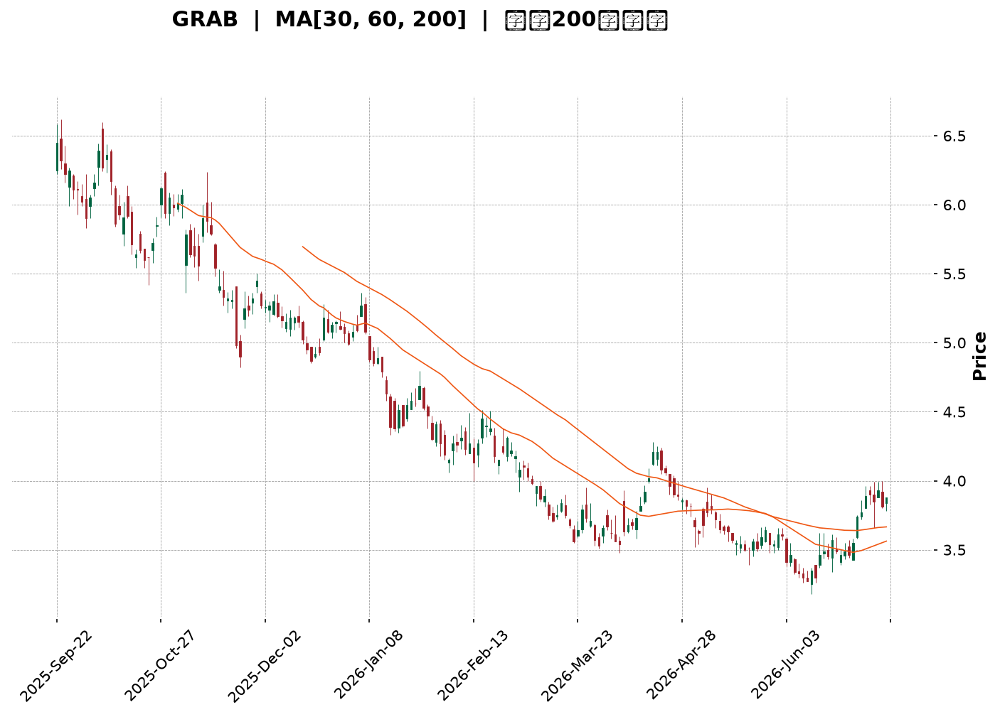
</details>

<html>
<head><meta charset="utf-8" /></head>
<body>
    <div style="height:500px; width:100%;">                        <script>window.PlotlyConfig = {MathJaxConfig: 'local'};</script>
        <script charset="utf-8" src="https://cdn.plot.ly/plotly-3.7.0.min.js" integrity="sha256-jvTGqxNp8AGWEcvNLVuKr+8j5dGe9Yw51LQkmDH+IYA=" crossorigin="anonymous"></script>                <div id="candlestick-chart" class="plotly-graph-div" style="height:100%; width:100%;"></div>            <script>                window.PLOTLYENV=window.PLOTLYENV || {};                                if (document.getElementById("candlestick-chart")) {                    Plotly.newPlot(                        "candlestick-chart",                        [{"close":{"dtype":"f8","bdata":"AAAAwMzMGUAAAAAgrkcZQAAAAKBH4RhAAAAAAAAAGUAAAADgo3AYQAAAAOCjcBhAAAAA4HoUGEAAAACgmZkXQAAAAEAzMxhAAAAAANejGEAAAAAgXI8ZQAAAAOB6FBlAAAAA4KNwGUAAAACAFK4YQAAAAOCjcBdAAAAA4FG4F0AAAAAA16MXQAAAAIAUrhdAAAAAQArXFkAAAAAgXI8WQAAAAIAUrhZAAAAAYGZmFkAAAABA4XoWQAAAAKBH4RZAAAAAYGZmF0AAAABA4XoYQAAAAGCPwhdAAAAAQDMzGEAAAAAghesXQAAAAIA9ChhAAAAAIK5HGEAAAAAA1yMXQAAAACBcjxZAAAAAwB6FFkAAAACgcD0WQAAAAKCZmRdAAAAAwB6FF0AAAADA9SgXQAAAAMD1KBZAAAAAANejFUAAAACA61EVQAAAACCuRxVAAAAAoHA9FUAAAAAghesTQAAAAKCZmRNAAAAAAAAAFUAAAACAwvUUQAAAACCuRxVAAAAAwMzMFUAAAADgehQVQAAAAIA9ChVAAAAA4HoUFUAAAABAMzMVQAAAAGCPwhRAAAAAANejFEAAAACgmZkUQAAAAOBRuBRAAAAA4FG4FEAAAACgmZkUQAAAAOB6FBRAAAAAwMzME0AAAABA4XoTQAAAAIAUrhNAAAAA4FG4E0AAAADgUbgUQAAAAIDrURRAAAAAwB6FFEAAAACgmZkUQAAAAGBmZhRAAAAAIK5HFEAAAACAwvUTQAAAAIDrURRAAAAAAClcFEAAAADgehQVQAAAAIDrURRAAAAAwB6FE0AAAABgZmYTQAAAACBcjxNAAAAAwPUoE0AAAADAHoUSQAAAACBcjxFAAAAAwB6FEUAAAACAPQoSQAAAAKCZmRFAAAAAQDMzEkAAAACA61ESQAAAAKBwPRJAAAAAYI\u002fCEkAAAABguB4SQAAAAKBH4RFAAAAAQDMzEUAAAAAA16MRQAAAAOB6FBFAAAAAYI\u002fCEEAAAACgmZkQQAAAAOB6FBFAAAAAgD0KEUAAAACgcD0RQAAAACCF6xBAAAAA4HoUEUAAAADAHoUQQAAAAOB6FBFAAAAAwMzMEUAAAACgmZkRQAAAAMAehRFAAAAA4FG4EEAAAACgmZkQQAAAAEAK1xBAAAAAoHA9EUAAAACgR+EQQAAAAOBRuBBAAAAAgOtREEAAAABgZmYQQAAAAGC4HhBAAAAAQArXD0AAAACAFK4PQAAAAIDC9Q5AAAAAYLgeD0AAAAAAAAAOQAAAAIAUrg1AAAAAAAAADkAAAADgUbgOQAAAAAAAAA5AAAAA4KNwDUAAAABA4XoMQAAAAGC4Hg1AAAAAgOtRDkAAAABACtcNQAAAAIAUrg1AAAAAIFyPDEAAAACgcD0MQAAAACCuRw1AAAAAAClcDUAAAACAwvUMQAAAAEDhegxAAAAAgOtRDEAAAACAPQoNQAAAAOCjcA1AAAAA4KNwDUAAAABACtcNQAAAACBcjw5AAAAAAClcD0AAAADgehQQQAAAAEAK1xBAAAAAQArXEEAAAACA61EQQAAAAKBwPRBAAAAAgBSuD0AAAABAMzMPQAAAAGC4Hg9AAAAAoEfhDkAAAAAgXI8OQAAAACBcjw5AAAAAAClcDUAAAACAwvUMQAAAAOCjcA1AAAAAwPUoDkAAAACA61EOQAAAAGCPwg1AAAAAQDMzDUAAAABguB4NQAAAAIA9Cg1AAAAAIFyPDEAAAABgZmYMQAAAAIDrUQxAAAAAAAAADEAAAADgehQMQAAAAEDhegxAAAAA4HoUDEAAAADgUbgMQAAAAGC4Hg1AAAAAgOtRDEAAAACA61EMQAAAAKBH4QxAAAAAwMzMDEAAAAAgrkcLQAAAAIAUrgtAAAAA4FG4CkAAAAAA16MKQAAAAGBmZgpAAAAAwPUoCkAAAADAzMwKQAAAAGBmZgpAAAAAgBSuC0AAAAAghesLQAAAAKCZmQtAAAAAIFyPDEAAAAAghesLQAAAAIAUrgtAAAAAIIXrC0AAAACAFK4LQAAAAGBmZgxAAAAAIIXrDUAAAADA9SgOQAAAAGC4Hg9AAAAAQDMzD0AAAADAzMwOQAAAAOCjcA9AAAAAQOF6DkAAAACAPQoPQA=="},"high":{"dtype":"f8","bdata":"AAAAgOtRGkAAAABA4XoaQAAAAOBRuBlAAAAA4HoUGUAAAACgR+EYQAAAAIAUrhhAAAAAoJmZGEAAAACgR+EYQAAAACCuRxhAAAAAoEfhGEAAAAAgrscZQAAAAGBmZhpAAAAAQInBGUAAAACgmZkZQAAAACBcjxhAAAAAIK5HGEAAAADgehQYQAAAACBcjxhAAAAAgML1F0AAAABAM7MWQAAAAIBqPBdAAAAA4FG4FkAAAABA4XoWQAAAAIA9ChdAAAAAwPWoF0AAAADAHoUYQAAAAIDC9RhAAAAAAClcGEAAAACA61EYQAAAAIDrURhAAAAAgMJ1GEAAAAAgrkcXQAAAAOCjcBdAAAAAQApXF0AAAADA9SgXQAAAAAAAABhAAAAA4KPwGEAAAADgehQYQAAAAKBH4RZAAAAAYLgeFkAAAADgehQWQAAAAIDCdRVAAAAAwB6FFUAAAAAA16MVQAAAAKBwPRRAAAAAQOF6FUAAAAAAKVwVQAAAAOCjcBVAAAAAAAAAFkAAAABA4XoVQAAAAKBwPRVAAAAAQDMzFUAAAABgZmYVQAAAAGBmZhVAAAAAIFwPFUAAAAAAKdwUQAAAAIDC9RRAAAAAYI\u002fCFEAAAADgehQVQAAAAADXoxRAAAAAQDMzFEAAAACgR+ETQAAAAKBH4RNAAAAAYLgeFEAAAABguB4VQAAAAIDC9RRAAAAAoJmZFEAAAAAA16MUQAAAACCF6xRAAAAAIFyPFEAAAAAAKVwUQAAAAMAehRRAAAAAwMzMFEAAAADgo3AVQAAAAIDrURVAAAAAQDMzFEAAAACgR+ETQAAAAKBH4RNAAAAAoJmZE0AAAACAPQoTQAAAAMAehRJAAAAAYGZmEkAAAADgUTgSQAAAAEAzMxJAAAAAYGZmEkAAAAAgXI8SQAAAAIAUrhJAAAAAgBQuE0AAAADgUbgSQAAAAOBROBJAAAAAoEfhEUAAAADgUbgRQAAAAGCPwhFAAAAAQOF6EUAAAAAA16MQQAAAAMDMTBFAAAAAAClcEUAAAABguJ4RQAAAACBcjxFAAAAAgML1EUAAAADgUTgRQAAAAEAzMxFAAAAAgD0KEkAAAABACtcRQAAAAMAeBRJAAAAAgD2KEUAAAACgmZkQQAAAAMAehRFAAAAAIK5HEUAAAABguB4RQAAAAKBH4RBAAAAAgD2KEEAAAADgepQQQAAAAMAehRBAAAAAwPUoEEAAAACAFK4PQAAAAAAAABBAAAAAwB6FD0AAAADAzMwOQAAAAEDheg5AAAAAANejDkAAAACAwvUOQAAAAEAzMw9AAAAAQArXDUAAAADgo3ANQAAAAIAUrg1AAAAAANejDkAAAACgmZkPQAAAAOBRuA5AAAAAwB6FDUAAAACAwvUMQAAAAOCjcA1AAAAAgOtRDkAAAABgj8INQAAAAAAAAA5AAAAAYI\u002fCDEAAAADgo3APQAAAAEAK1w1AAAAAwMzMDUAAAACgcD0OQAAAAOB6FA9AAAAA4FG4D0AAAAAAKVwQQAAAAGC4HhFAAAAAAAAAEUAAAACAwvUQQAAAAOCjcBBAAAAAQDMzEEAAAADA9SgQQAAAACCF6w9AAAAAAAAAD0AAAAAghesOQAAAAOBRuA5AAAAAoEfhDUAAAABAMzMNQAAAAOCjcA5AAAAAoJmZD0AAAABAMzMPQAAAAKBwPQ5AAAAA4HoUDkAAAADgo3ANQAAAAOCjcA1AAAAAgML1DEAAAAAgXI8MQAAAAMDMzAxAAAAAIFyPDEAAAACA6SYMQAAAAADXowxAAAAAgML1DEAAAACA61ENQAAAAAApXA1AAAAAgML1DEAAAAAgXI8MQAAAACCuRw1AAAAAIK5HDUAAAADgUbgMQAAAAGBmZgxAAAAAwB6FC0AAAABAMzMLQAAAAIDC9QpAAAAAwMzMCkAAAACAwvUKQAAAAGC4HgtAAAAAgML1DEAAAACAwvUMQAAAAAApXAxAAAAAoEfhDEAAAADgUbgMQAAAAAAAAAxAAAAAYGZmDEAAAAAgXI8MQAAAAADXowxAAAAAAAAADkAAAACgR+EOQAAAAIAUrg9AAAAAgBSuD0AAAAAghesPQAAAAIDC9Q9AAAAAAAAAEEAAAACAPQoPQA=="},"hovertemplate":"\u003cb\u003e%{x|%Y-%m-%d}\u003c\u002fb\u003e\u003cbr\u003e\u958b: $%{open:.2f}\u003cbr\u003e\u9ad8: $%{high:.2f}\u003cbr\u003e\u4f4e: $%{low:.2f}\u003cbr\u003e\u6536: $%{close:.2f}\u003cextra\u003e\u003c\u002fextra\u003e","low":{"dtype":"f8","bdata":"AAAAoEfhGEAAAACAPQoZQAAAAADXoxhAAAAAgML1F0AAAADA9SgYQAAAAOBRuBdAAAAAgML1F0AAAACA61EXQAAAAKCZmRdAAAAAoHA9GEAAAAAgXI8YQAAAAIDC9RhAAAAAIIXrGEAAAAAgrkcYQAAAAAApXBdAAAAAIFyPF0AAAADAzMwWQAAAAKCZmRdAAAAAIFyPFkAAAADA9SgWQAAAAKCZmRZAAAAAwPUoFkAAAACAFK4VQAAAAIDrURZAAAAA4HoUF0AAAAAA16MXQAAAAKCZmRdAAAAAYGZmF0AAAACAFK4XQAAAAMDMzBdAAAAAoJmZF0AAAADgo3AVQAAAAEDhehZAAAAAgBQuFkAAAADAzMwVQAAAACCF6xZAAAAAQDMzF0AAAABguB4XQAAAACCF6xVAAAAA4KNwFUAAAADgehQVQAAAAKBH4RRAAAAAAAAAFUAAAABACtcTQAAAACCuRxNAAAAAIIVrFEAAAABgj8IUQAAAAEAK1xRAAAAA4KNwFUAAAAAAAAAVQAAAAKBH4RRAAAAAoJmZFEAAAAAgrscUQAAAAOBRuBRAAAAA4KNwFEAAAACA61EUQAAAAEAzMxRAAAAAoEdhFEAAAADgo3AUQAAAAIDC9RNAAAAAgBSuE0AAAABgZmYTQAAAACBcjxNAAAAAANejE0AAAACAPQoUQAAAACCuRxRAAAAAYLgeFEAAAADAzEwUQAAAAKBHYRRAAAAAAAAAFEAAAAAghesTQAAAAIA9ChRAAAAAgOtRFEAAAABgj8IUQAAAAGCPQhRAAAAA4KNwE0AAAACA61ETQAAAAAApXBNAAAAAAAAAE0AAAACA61ESQAAAAIDrURFAAAAA4KNwEUAAAABgZmYRQAAAACBcjxFAAAAA4FG4EUAAAADgehQSQAAAAMD1KBJAAAAAAClcEkAAAACAPQoSQAAAAMAehRFAAAAAwPUoEUAAAAAAAAARQAAAAOBRuBBAAAAAoJmZEEAAAACgcD0QQAAAAIDCdRBAAAAAQArXEEAAAAAghesQQAAAAGCPwhBAAAAAwMzMEEAAAAAAAAAQQAAAAGBmZhBAAAAA4HoUEUAAAABgj0IRQAAAAIDrURFAAAAAwB6FEEAAAABAMzMQQAAAAOCnxhBAAAAAIFyPEEAAAADgUbgQQAAAAKBwPRBAAAAAAClcD0AAAACAPQoQQAAAAAAAABBAAAAAYI\u002fCD0AAAADAHoUOQAAAAMDMzA5AAAAAQOF6DkAAAABgj8INQAAAAKCZmQ1AAAAAYI\u002fCDUAAAADA9SgOQAAAAEAK1w1AAAAAIK5HDUAAAABgZmYMQAAAAOBRuAxAAAAAgML1DEAAAACgmZkNQAAAAIDrUQ1AAAAAoHA9DEAAAADgehQMQAAAAGBmZgxAAAAAYLgeDUAAAAAA16MMQAAAAEDhegxAAAAAQArXC0AAAADAzMwMQAAAAIDC9QxAAAAAQDMzDUAAAAAA16MMQAAAAGBkOw5AAAAAgBSuDkAAAABACtcPQAAAAOCjcBBAAAAA4KNwEEAAAABAMzMQQAAAAMD1KBBAAAAAQDMzD0AAAACAPQoPQAAAAKBH4Q5AAAAAgOtRDkAAAADgehQOQAAAACCF6w1AAAAAwPUoDEAAAACA61EMQAAAAOBRuAxAAAAAIIXrDUAAAADgehQOQAAAACCuRw1AAAAAgML1DEAAAACgR+EMQAAAAEDhegxAAAAAYGZmDEAAAACAFK4LQAAAAEAK1wtAAAAAIIXrC0AAAABguB4LQAAAAKCZmQtAAAAAIIXrC0AAAADgehQMQAAAAOCjcAxAAAAAQArXC0AAAABACtcLQAAAAAAAAAxAAAAAIFyPDEAAAACAPQoLQAAAAIA9CgtAAAAAoJmZCkAAAABgZmYKQAAAAOB6FApAAAAAwPUoCkAAAADgo3AJQAAAAOB6FApAAAAAgML1CkAAAABA4XoLQAAAAOCjcAtAAAAA4FG4CkAAAABgj8ILQAAAAGC4HgtAAAAA4KNwC0AAAADAHoULQAAAAGBmZgtAAAAAANejDEAAAABgj8INQAAAAGBmZg5AAAAAANejDkAAAAAgrkcNQAAAAIA9Cg9AAAAAYGZmDkAAAACgcD0OQA=="},"name":"\u50f9\u683c","open":{"dtype":"f8","bdata":"AAAAQOH6GEAAAAAghesZQAAAAEAzMxlAAAAAwB6FGEAAAABACtcYQAAAAIDCdRhAAAAAoHA9GEAAAADA9SgYQAAAAIDC9RdAAAAAQOF6GEAAAACgmRkZQAAAAEAzMxpAAAAAgOtRGUAAAACAPYoZQAAAAEDhehhAAAAAgML1F0AAAADA9SgXQAAAAKBwPRhAAAAAwMzMF0AAAABA4XoWQAAAAMD1KBdAAAAA4FG4FkAAAABA4XoWQAAAAIAUrhZAAAAAoEdhF0AAAAAAAAAYQAAAACCF6xhAAAAAYI\u002fCF0AAAAAAAAAYQAAAAKBH4RdAAAAAgD0KGEAAAABgj0IWQAAAAGCPQhdAAAAAwMzMFkAAAADAzMwWQAAAAKCZGRdAAAAAIFwPGEAAAABgZmYXQAAAAEAK1xZAAAAAwB6FFUAAAACAPYoVQAAAAOBROBVAAAAAQDMzFUAAAAAA16MVQAAAAIA9ChRAAAAAgBSuFEAAAADgehQVQAAAAMD1KBVAAAAAANejFUAAAAAghWsVQAAAAMAeBRVAAAAAgML1FEAAAABACtcUQAAAAMD1KBVAAAAAYI\u002fCFEAAAAAghWsUQAAAAGBmZhRAAAAA4HqUFEAAAABgj8IUQAAAAKCZmRRAAAAAQOH6E0AAAACgR+ETQAAAAKCZmRNAAAAAoEfhE0AAAADgehQUQAAAAIAUrhRAAAAAgOtRFEAAAAAgXI8UQAAAAEDhehRAAAAAgMJ1FEAAAAAgrkcUQAAAAIAULhRAAAAAwB6FFEAAAABgj8IUQAAAAGC4HhVAAAAAQDMzFEAAAABgj8ITQAAAAGBmZhNAAAAAoJmZE0AAAAAghesSQAAAAOCjcBJAAAAAgOtREkAAAACAPYoRQAAAAEAzMxJAAAAAwMzMEUAAAADgehQSQAAAAKBwPRJAAAAAAClcEkAAAACAFK4SQAAAAMD1KBJAAAAAgBSuEUAAAABguB4RQAAAAMD1qBFAAAAAgOtREUAAAADAHoUQQAAAAKBH4RBAAAAAYLgeEUAAAADA9SgRQAAAAOCjcBFAAAAAwMzMEEAAAACAwvUQQAAAAGCPwhBAAAAAoHA9EUAAAADgepQRQAAAAOCjcBFAAAAAwMxMEUAAAADgo3AQQAAAAAAAABFAAAAA4FG4EEAAAADAzMwQQAAAAADXoxBAAAAAYLgeEEAAAADgo3AQQAAAAAApXBBAAAAAIFwPEEAAAAAgrkcPQAAAAIAUrg9AAAAAwMzMDkAAAAAA16MOQAAAAGC4Hg5AAAAAIIXrDUAAAACgcD0OQAAAAKCZmQ5AAAAAYI\u002fCDUAAAABAMzMNQAAAAMDMzAxAAAAAQDMzDUAAAAAA16MOQAAAAGBmZg1AAAAA4KNwDUAAAADgUbgMQAAAAMDMzAxAAAAAAAAADkAAAACAwvUMQAAAAKBH4QxAAAAAwB6FDEAAAABACtcOQAAAAIA9Cg1AAAAAoJmZDUAAAABAMzMNQAAAAKBwPQ5AAAAAwMzMDkAAAAAAAAAQQAAAAEDhehBAAAAAYLieEEAAAACgR+EQQAAAAAApXBBAAAAAQDMzEEAAAADgehQQQAAAAEAzMw9AAAAAwMzMDkAAAACgR+EOQAAAACBcjw5AAAAA4FG4DUAAAADgehQNQAAAAAApXA5AAAAAwMzMDkAAAAAgXI8OQAAAAMD1KA5AAAAAgBSuDUAAAAAAKVwNQAAAAAApXA1AAAAAgML1DEAAAACA61EMQAAAAGC4HgxAAAAAgOtRDEAAAADgehQMQAAAAAAAAAxAAAAAQOF6DEAAAAAgrkcMQAAAAEDhegxAAAAAgML1DEAAAACgcD0MQAAAAMD1KAxAAAAAoEfhDEAAAAAA16MMQAAAACCuRwtAAAAA4KNwC0AAAABgj8IKQAAAAADXowpAAAAAYGZmCkAAAAAAAAAKQAAAAGC4HgtAAAAAYLgeC0AAAABgj8ILQAAAAAAAAAxAAAAAwB6FC0AAAACgGAQMQAAAACCuRwtAAAAAANejC0AAAABAMzMMQAAAAGBmZgtAAAAA4FG4DEAAAAAghesNQAAAAGBmZg5AAAAA4KNwD0AAAABAMzMPQAAAAIA9Cg9AAAAAAClcD0AAAADgUbgOQA=="},"x":["2025-09-22T00:00:00-04:00","2025-09-23T00:00:00-04:00","2025-09-24T00:00:00-04:00","2025-09-25T00:00:00-04:00","2025-09-26T00:00:00-04:00","2025-09-29T00:00:00-04:00","2025-09-30T00:00:00-04:00","2025-10-01T00:00:00-04:00","2025-10-02T00:00:00-04:00","2025-10-03T00:00:00-04:00","2025-10-06T00:00:00-04:00","2025-10-07T00:00:00-04:00","2025-10-08T00:00:00-04:00","2025-10-09T00:00:00-04:00","2025-10-10T00:00:00-04:00","2025-10-13T00:00:00-04:00","2025-10-14T00:00:00-04:00","2025-10-15T00:00:00-04:00","2025-10-16T00:00:00-04:00","2025-10-17T00:00:00-04:00","2025-10-20T00:00:00-04:00","2025-10-21T00:00:00-04:00","2025-10-22T00:00:00-04:00","2025-10-23T00:00:00-04:00","2025-10-24T00:00:00-04:00","2025-10-27T00:00:00-04:00","2025-10-28T00:00:00-04:00","2025-10-29T00:00:00-04:00","2025-10-30T00:00:00-04:00","2025-10-31T00:00:00-04:00","2025-11-03T00:00:00-05:00","2025-11-04T00:00:00-05:00","2025-11-05T00:00:00-05:00","2025-11-06T00:00:00-05:00","2025-11-07T00:00:00-05:00","2025-11-10T00:00:00-05:00","2025-11-11T00:00:00-05:00","2025-11-12T00:00:00-05:00","2025-11-13T00:00:00-05:00","2025-11-14T00:00:00-05:00","2025-11-17T00:00:00-05:00","2025-11-18T00:00:00-05:00","2025-11-19T00:00:00-05:00","2025-11-20T00:00:00-05:00","2025-11-21T00:00:00-05:00","2025-11-24T00:00:00-05:00","2025-11-25T00:00:00-05:00","2025-11-26T00:00:00-05:00","2025-11-28T00:00:00-05:00","2025-12-01T00:00:00-05:00","2025-12-02T00:00:00-05:00","2025-12-03T00:00:00-05:00","2025-12-04T00:00:00-05:00","2025-12-05T00:00:00-05:00","2025-12-08T00:00:00-05:00","2025-12-09T00:00:00-05:00","2025-12-10T00:00:00-05:00","2025-12-11T00:00:00-05:00","2025-12-12T00:00:00-05:00","2025-12-15T00:00:00-05:00","2025-12-16T00:00:00-05:00","2025-12-17T00:00:00-05:00","2025-12-18T00:00:00-05:00","2025-12-19T00:00:00-05:00","2025-12-22T00:00:00-05:00","2025-12-23T00:00:00-05:00","2025-12-24T00:00:00-05:00","2025-12-26T00:00:00-05:00","2025-12-29T00:00:00-05:00","2025-12-30T00:00:00-05:00","2025-12-31T00:00:00-05:00","2026-01-02T00:00:00-05:00","2026-01-05T00:00:00-05:00","2026-01-06T00:00:00-05:00","2026-01-07T00:00:00-05:00","2026-01-08T00:00:00-05:00","2026-01-09T00:00:00-05:00","2026-01-12T00:00:00-05:00","2026-01-13T00:00:00-05:00","2026-01-14T00:00:00-05:00","2026-01-15T00:00:00-05:00","2026-01-16T00:00:00-05:00","2026-01-20T00:00:00-05:00","2026-01-21T00:00:00-05:00","2026-01-22T00:00:00-05:00","2026-01-23T00:00:00-05:00","2026-01-26T00:00:00-05:00","2026-01-27T00:00:00-05:00","2026-01-28T00:00:00-05:00","2026-01-29T00:00:00-05:00","2026-01-30T00:00:00-05:00","2026-02-02T00:00:00-05:00","2026-02-03T00:00:00-05:00","2026-02-04T00:00:00-05:00","2026-02-05T00:00:00-05:00","2026-02-06T00:00:00-05:00","2026-02-09T00:00:00-05:00","2026-02-10T00:00:00-05:00","2026-02-11T00:00:00-05:00","2026-02-12T00:00:00-05:00","2026-02-13T00:00:00-05:00","2026-02-17T00:00:00-05:00","2026-02-18T00:00:00-05:00","2026-02-19T00:00:00-05:00","2026-02-20T00:00:00-05:00","2026-02-23T00:00:00-05:00","2026-02-24T00:00:00-05:00","2026-02-25T00:00:00-05:00","2026-02-26T00:00:00-05:00","2026-02-27T00:00:00-05:00","2026-03-02T00:00:00-05:00","2026-03-03T00:00:00-05:00","2026-03-04T00:00:00-05:00","2026-03-05T00:00:00-05:00","2026-03-06T00:00:00-05:00","2026-03-09T00:00:00-04:00","2026-03-10T00:00:00-04:00","2026-03-11T00:00:00-04:00","2026-03-12T00:00:00-04:00","2026-03-13T00:00:00-04:00","2026-03-16T00:00:00-04:00","2026-03-17T00:00:00-04:00","2026-03-18T00:00:00-04:00","2026-03-19T00:00:00-04:00","2026-03-20T00:00:00-04:00","2026-03-23T00:00:00-04:00","2026-03-24T00:00:00-04:00","2026-03-25T00:00:00-04:00","2026-03-26T00:00:00-04:00","2026-03-27T00:00:00-04:00","2026-03-30T00:00:00-04:00","2026-03-31T00:00:00-04:00","2026-04-01T00:00:00-04:00","2026-04-02T00:00:00-04:00","2026-04-06T00:00:00-04:00","2026-04-07T00:00:00-04:00","2026-04-08T00:00:00-04:00","2026-04-09T00:00:00-04:00","2026-04-10T00:00:00-04:00","2026-04-13T00:00:00-04:00","2026-04-14T00:00:00-04:00","2026-04-15T00:00:00-04:00","2026-04-16T00:00:00-04:00","2026-04-17T00:00:00-04:00","2026-04-20T00:00:00-04:00","2026-04-21T00:00:00-04:00","2026-04-22T00:00:00-04:00","2026-04-23T00:00:00-04:00","2026-04-24T00:00:00-04:00","2026-04-27T00:00:00-04:00","2026-04-28T00:00:00-04:00","2026-04-29T00:00:00-04:00","2026-04-30T00:00:00-04:00","2026-05-01T00:00:00-04:00","2026-05-04T00:00:00-04:00","2026-05-05T00:00:00-04:00","2026-05-06T00:00:00-04:00","2026-05-07T00:00:00-04:00","2026-05-08T00:00:00-04:00","2026-05-11T00:00:00-04:00","2026-05-12T00:00:00-04:00","2026-05-13T00:00:00-04:00","2026-05-14T00:00:00-04:00","2026-05-15T00:00:00-04:00","2026-05-18T00:00:00-04:00","2026-05-19T00:00:00-04:00","2026-05-20T00:00:00-04:00","2026-05-21T00:00:00-04:00","2026-05-22T00:00:00-04:00","2026-05-26T00:00:00-04:00","2026-05-27T00:00:00-04:00","2026-05-28T00:00:00-04:00","2026-05-29T00:00:00-04:00","2026-06-01T00:00:00-04:00","2026-06-02T00:00:00-04:00","2026-06-03T00:00:00-04:00","2026-06-04T00:00:00-04:00","2026-06-05T00:00:00-04:00","2026-06-08T00:00:00-04:00","2026-06-09T00:00:00-04:00","2026-06-10T00:00:00-04:00","2026-06-11T00:00:00-04:00","2026-06-12T00:00:00-04:00","2026-06-15T00:00:00-04:00","2026-06-16T00:00:00-04:00","2026-06-17T00:00:00-04:00","2026-06-18T00:00:00-04:00","2026-06-22T00:00:00-04:00","2026-06-23T00:00:00-04:00","2026-06-24T00:00:00-04:00","2026-06-25T00:00:00-04:00","2026-06-26T00:00:00-04:00","2026-06-29T00:00:00-04:00","2026-06-30T00:00:00-04:00","2026-07-01T00:00:00-04:00","2026-07-02T00:00:00-04:00","2026-07-06T00:00:00-04:00","2026-07-07T00:00:00-04:00","2026-07-08T00:00:00-04:00","2026-07-09T00:00:00-04:00"],"type":"candlestick"},{"hovertemplate":"MA30: $%{y:.2f}\u003cextra\u003e\u003c\u002fextra\u003e","line":{"color":"#2196F3","dash":"dash","width":2},"mode":"lines","name":"MA30","x":["2025-09-22T00:00:00-04:00","2025-09-23T00:00:00-04:00","2025-09-24T00:00:00-04:00","2025-09-25T00:00:00-04:00","2025-09-26T00:00:00-04:00","2025-09-29T00:00:00-04:00","2025-09-30T00:00:00-04:00","2025-10-01T00:00:00-04:00","2025-10-02T00:00:00-04:00","2025-10-03T00:00:00-04:00","2025-10-06T00:00:00-04:00","2025-10-07T00:00:00-04:00","2025-10-08T00:00:00-04:00","2025-10-09T00:00:00-04:00","2025-10-10T00:00:00-04:00","2025-10-13T00:00:00-04:00","2025-10-14T00:00:00-04:00","2025-10-15T00:00:00-04:00","2025-10-16T00:00:00-04:00","2025-10-17T00:00:00-04:00","2025-10-20T00:00:00-04:00","2025-10-21T00:00:00-04:00","2025-10-22T00:00:00-04:00","2025-10-23T00:00:00-04:00","2025-10-24T00:00:00-04:00","2025-10-27T00:00:00-04:00","2025-10-28T00:00:00-04:00","2025-10-29T00:00:00-04:00","2025-10-30T00:00:00-04:00","2025-10-31T00:00:00-04:00","2025-11-03T00:00:00-05:00","2025-11-04T00:00:00-05:00","2025-11-05T00:00:00-05:00","2025-11-06T00:00:00-05:00","2025-11-07T00:00:00-05:00","2025-11-10T00:00:00-05:00","2025-11-11T00:00:00-05:00","2025-11-12T00:00:00-05:00","2025-11-13T00:00:00-05:00","2025-11-14T00:00:00-05:00","2025-11-17T00:00:00-05:00","2025-11-18T00:00:00-05:00","2025-11-19T00:00:00-05:00","2025-11-20T00:00:00-05:00","2025-11-21T00:00:00-05:00","2025-11-24T00:00:00-05:00","2025-11-25T00:00:00-05:00","2025-11-26T00:00:00-05:00","2025-11-28T00:00:00-05:00","2025-12-01T00:00:00-05:00","2025-12-02T00:00:00-05:00","2025-12-03T00:00:00-05:00","2025-12-04T00:00:00-05:00","2025-12-05T00:00:00-05:00","2025-12-08T00:00:00-05:00","2025-12-09T00:00:00-05:00","2025-12-10T00:00:00-05:00","2025-12-11T00:00:00-05:00","2025-12-12T00:00:00-05:00","2025-12-15T00:00:00-05:00","2025-12-16T00:00:00-05:00","2025-12-17T00:00:00-05:00","2025-12-18T00:00:00-05:00","2025-12-19T00:00:00-05:00","2025-12-22T00:00:00-05:00","2025-12-23T00:00:00-05:00","2025-12-24T00:00:00-05:00","2025-12-26T00:00:00-05:00","2025-12-29T00:00:00-05:00","2025-12-30T00:00:00-05:00","2025-12-31T00:00:00-05:00","2026-01-02T00:00:00-05:00","2026-01-05T00:00:00-05:00","2026-01-06T00:00:00-05:00","2026-01-07T00:00:00-05:00","2026-01-08T00:00:00-05:00","2026-01-09T00:00:00-05:00","2026-01-12T00:00:00-05:00","2026-01-13T00:00:00-05:00","2026-01-14T00:00:00-05:00","2026-01-15T00:00:00-05:00","2026-01-16T00:00:00-05:00","2026-01-20T00:00:00-05:00","2026-01-21T00:00:00-05:00","2026-01-22T00:00:00-05:00","2026-01-23T00:00:00-05:00","2026-01-26T00:00:00-05:00","2026-01-27T00:00:00-05:00","2026-01-28T00:00:00-05:00","2026-01-29T00:00:00-05:00","2026-01-30T00:00:00-05:00","2026-02-02T00:00:00-05:00","2026-02-03T00:00:00-05:00","2026-02-04T00:00:00-05:00","2026-02-05T00:00:00-05:00","2026-02-06T00:00:00-05:00","2026-02-09T00:00:00-05:00","2026-02-10T00:00:00-05:00","2026-02-11T00:00:00-05:00","2026-02-12T00:00:00-05:00","2026-02-13T00:00:00-05:00","2026-02-17T00:00:00-05:00","2026-02-18T00:00:00-05:00","2026-02-19T00:00:00-05:00","2026-02-20T00:00:00-05:00","2026-02-23T00:00:00-05:00","2026-02-24T00:00:00-05:00","2026-02-25T00:00:00-05:00","2026-02-26T00:00:00-05:00","2026-02-27T00:00:00-05:00","2026-03-02T00:00:00-05:00","2026-03-03T00:00:00-05:00","2026-03-04T00:00:00-05:00","2026-03-05T00:00:00-05:00","2026-03-06T00:00:00-05:00","2026-03-09T00:00:00-04:00","2026-03-10T00:00:00-04:00","2026-03-11T00:00:00-04:00","2026-03-12T00:00:00-04:00","2026-03-13T00:00:00-04:00","2026-03-16T00:00:00-04:00","2026-03-17T00:00:00-04:00","2026-03-18T00:00:00-04:00","2026-03-19T00:00:00-04:00","2026-03-20T00:00:00-04:00","2026-03-23T00:00:00-04:00","2026-03-24T00:00:00-04:00","2026-03-25T00:00:00-04:00","2026-03-26T00:00:00-04:00","2026-03-27T00:00:00-04:00","2026-03-30T00:00:00-04:00","2026-03-31T00:00:00-04:00","2026-04-01T00:00:00-04:00","2026-04-02T00:00:00-04:00","2026-04-06T00:00:00-04:00","2026-04-07T00:00:00-04:00","2026-04-08T00:00:00-04:00","2026-04-09T00:00:00-04:00","2026-04-10T00:00:00-04:00","2026-04-13T00:00:00-04:00","2026-04-14T00:00:00-04:00","2026-04-15T00:00:00-04:00","2026-04-16T00:00:00-04:00","2026-04-17T00:00:00-04:00","2026-04-20T00:00:00-04:00","2026-04-21T00:00:00-04:00","2026-04-22T00:00:00-04:00","2026-04-23T00:00:00-04:00","2026-04-24T00:00:00-04:00","2026-04-27T00:00:00-04:00","2026-04-28T00:00:00-04:00","2026-04-29T00:00:00-04:00","2026-04-30T00:00:00-04:00","2026-05-01T00:00:00-04:00","2026-05-04T00:00:00-04:00","2026-05-05T00:00:00-04:00","2026-05-06T00:00:00-04:00","2026-05-07T00:00:00-04:00","2026-05-08T00:00:00-04:00","2026-05-11T00:00:00-04:00","2026-05-12T00:00:00-04:00","2026-05-13T00:00:00-04:00","2026-05-14T00:00:00-04:00","2026-05-15T00:00:00-04:00","2026-05-18T00:00:00-04:00","2026-05-19T00:00:00-04:00","2026-05-20T00:00:00-04:00","2026-05-21T00:00:00-04:00","2026-05-22T00:00:00-04:00","2026-05-26T00:00:00-04:00","2026-05-27T00:00:00-04:00","2026-05-28T00:00:00-04:00","2026-05-29T00:00:00-04:00","2026-06-01T00:00:00-04:00","2026-06-02T00:00:00-04:00","2026-06-03T00:00:00-04:00","2026-06-04T00:00:00-04:00","2026-06-05T00:00:00-04:00","2026-06-08T00:00:00-04:00","2026-06-09T00:00:00-04:00","2026-06-10T00:00:00-04:00","2026-06-11T00:00:00-04:00","2026-06-12T00:00:00-04:00","2026-06-15T00:00:00-04:00","2026-06-16T00:00:00-04:00","2026-06-17T00:00:00-04:00","2026-06-18T00:00:00-04:00","2026-06-22T00:00:00-04:00","2026-06-23T00:00:00-04:00","2026-06-24T00:00:00-04:00","2026-06-25T00:00:00-04:00","2026-06-26T00:00:00-04:00","2026-06-29T00:00:00-04:00","2026-06-30T00:00:00-04:00","2026-07-01T00:00:00-04:00","2026-07-02T00:00:00-04:00","2026-07-06T00:00:00-04:00","2026-07-07T00:00:00-04:00","2026-07-08T00:00:00-04:00","2026-07-09T00:00:00-04:00"],"y":{"dtype":"f8","bdata":"AAAAAAAA+H8AAAAAAAD4fwAAAAAAAPh\u002fAAAAAAAA+H8AAAAAAAD4fwAAAAAAAPh\u002fAAAAAAAA+H8AAAAAAAD4fwAAAAAAAPh\u002fAAAAAAAA+H8AAAAAAAD4fwAAAAAAAPh\u002fAAAAAAAA+H8AAAAAAAD4fwAAAAAAAPh\u002fAAAAAAAA+H8AAAAAAAD4fwAAAAAAAPh\u002fAAAAAAAA+H8AAAAAAAD4fwAAAAAAAPh\u002fAAAAAAAA+H8AAAAAAAD4fwAAAAAAAPh\u002fAAAAAAAA+H8AAAAAAAD4fwAAAAAAAPh\u002fAAAAAAAA+H8AAAAAAAD4fyIiItKUChhAVVVVVZz9F0De3d1tWesXQAAAAFCN1xdAvLu7q2PCF0AiIiKyna8XQAAAALByqBdAmpmZWaujF0B3d3cn6p8XQERERLSBjhdAq6qqGuh0F0Dv7u6uuVAXQFVVVXVMMBdAq6qqanUMF0CamZkJ1+MWQN7d3W0SwxZAAAAAgNyrFkAzMzPz\u002fZQWQCIiIhKDgBZAd3d3J6N3FkC8u7sLAmsWQJqZmWkDXRZARERE1L9RFkARERGh00YWQLy7u2u8NBZAvLu7Gy8dFkDv7u4eE\u002fwVQDMzMyMi4hVAVVVV9W\u002fEFUDv7u5OG6gVQN7d3Y1QhhVAd3d31xVgFUAzMzNz2kAVQO\u002fu7v5GKBVAzczMTGIQFUDv7u7OaQMVQJqZmYls5xRAAAAA8NLNFECJiIiI+rcUQBEREcH1qBRAq6qqylqdFEAzMzPTv5EUQLy7u6uOiRRAiYiISAyCFEB3d3dX8osUQERERDQXkhRAiYiIGHaFFECamZk5JngUQDMzM9N4aRRAiYiIqPFSFEARERFBGT0UQDMzMxNnHxRAMzMzIwYBFEAzMzMDD+YTQDMzM+MXyxNAERERoUW2E0BERETk0KITQAAAAECnjRNAERERke18E0DNzMzsw2cTQDMzM\u002fP9VBNAq6qqKs4+E0AAAACgGi8TQGZmZtbqGBNA7+7unqj\u002fEkCJiIhYgNwSQFVVVXXawBJAiYiISCijEkAAAABAfIYSQDMzMxPKaBJAERERkXtNEkBmZmbGIDASQDMzM+N6FBJAq6qqeqL+EUDe3d1N8OARQM3MzJwLyRFAq6qq6iaxEUCamZk5QpkRQLy7u0sMghFA3t3d\u002falxEUCrqqpaq2MRQImIiFiAXBFAd3d350JSEUBEREREREQRQImIiCijNxFAvLu7ay4kEUB3d3fHBA8RQHd3d3d39xBA3t3d9SjcEEDv7u42icEQQERERDyYpxBAq6qqQtKUEEBmZmaGXYEQQCIiIrKdbxBAd3d3PzVeEEB3d3e\u002fEUoQQJqZmbmQNBBAzczMzIUkEEDv7u6uuRAQQFVVVbXz\u002fQ9AIiIiUirOD0Dv7u6ONKUPQJqZmQmQew9A3t3djVBGD0AAAAAQEREPQFVVVYUW2Q5AZmZmtmWtDkDe3d0N5okOQCIiIqK3ZQ5AZmZmlrU6DkCJiIg4QhkOQERERMSuAA5AERERkcL1DUB3d3d3TPANQBERETGW\u002fA1AvLu7u0kMDkAiIiLiehQOQAAAAGBzIQ5AZmZmtjomDkB3d3cneDAOQCIiIuLBPA5AVVVVRUREDkDv7u6+5kIOQFVVVRWuRw5AIiIiUv9GDkBVVVXlF0sOQCIiIvLSTQ5AvLu7a3VMDkDv7u7+jVAOQCIiIsI8UQ5AzczM3LJWDkARERFBNV4OQHd3d\u002fcoXA5AZmZmVlVVDkAAAAAAjlAOQJqZmXkwTw5AzczMbHVMDkBVVVVFREQOQN7d3R0TPA5AZmZmJngwDkCJiIh46SYOQO\u002fu7r6fGg5AMzMzw64ADkB3d3cn6t8NQERERGT0tg1A3t3d3U+NDUBVVVXFkl8NQDMzMwOdNg1AmpmZuUkMDUAAAABAYOUMQAAAAEAZvQxAERERQdKUDECJiIhovHQMQAAAAMA8UQxAvLu7u+ZCDEAiIiLSBjoMQHd3d0dTKgxAZmZmBqwcDEBVVVUlMQgMQBEREVFx9gtAzczMHIXrC0AiIiJiO98LQHd3d0fF2QtA7+7uPmDlC0BmZmYGZfQLQImIiLhJDAxAq6qqOpgnDECJiIgozj4MQBEREWEQWAxAIiIiQotsDEARERFhV4AMQA=="},"type":"scatter"},{"hovertemplate":"MA60: $%{y:.2f}\u003cextra\u003e\u003c\u002fextra\u003e","line":{"color":"#9C27B0","dash":"dash","width":2},"mode":"lines","name":"MA60","x":["2025-09-22T00:00:00-04:00","2025-09-23T00:00:00-04:00","2025-09-24T00:00:00-04:00","2025-09-25T00:00:00-04:00","2025-09-26T00:00:00-04:00","2025-09-29T00:00:00-04:00","2025-09-30T00:00:00-04:00","2025-10-01T00:00:00-04:00","2025-10-02T00:00:00-04:00","2025-10-03T00:00:00-04:00","2025-10-06T00:00:00-04:00","2025-10-07T00:00:00-04:00","2025-10-08T00:00:00-04:00","2025-10-09T00:00:00-04:00","2025-10-10T00:00:00-04:00","2025-10-13T00:00:00-04:00","2025-10-14T00:00:00-04:00","2025-10-15T00:00:00-04:00","2025-10-16T00:00:00-04:00","2025-10-17T00:00:00-04:00","2025-10-20T00:00:00-04:00","2025-10-21T00:00:00-04:00","2025-10-22T00:00:00-04:00","2025-10-23T00:00:00-04:00","2025-10-24T00:00:00-04:00","2025-10-27T00:00:00-04:00","2025-10-28T00:00:00-04:00","2025-10-29T00:00:00-04:00","2025-10-30T00:00:00-04:00","2025-10-31T00:00:00-04:00","2025-11-03T00:00:00-05:00","2025-11-04T00:00:00-05:00","2025-11-05T00:00:00-05:00","2025-11-06T00:00:00-05:00","2025-11-07T00:00:00-05:00","2025-11-10T00:00:00-05:00","2025-11-11T00:00:00-05:00","2025-11-12T00:00:00-05:00","2025-11-13T00:00:00-05:00","2025-11-14T00:00:00-05:00","2025-11-17T00:00:00-05:00","2025-11-18T00:00:00-05:00","2025-11-19T00:00:00-05:00","2025-11-20T00:00:00-05:00","2025-11-21T00:00:00-05:00","2025-11-24T00:00:00-05:00","2025-11-25T00:00:00-05:00","2025-11-26T00:00:00-05:00","2025-11-28T00:00:00-05:00","2025-12-01T00:00:00-05:00","2025-12-02T00:00:00-05:00","2025-12-03T00:00:00-05:00","2025-12-04T00:00:00-05:00","2025-12-05T00:00:00-05:00","2025-12-08T00:00:00-05:00","2025-12-09T00:00:00-05:00","2025-12-10T00:00:00-05:00","2025-12-11T00:00:00-05:00","2025-12-12T00:00:00-05:00","2025-12-15T00:00:00-05:00","2025-12-16T00:00:00-05:00","2025-12-17T00:00:00-05:00","2025-12-18T00:00:00-05:00","2025-12-19T00:00:00-05:00","2025-12-22T00:00:00-05:00","2025-12-23T00:00:00-05:00","2025-12-24T00:00:00-05:00","2025-12-26T00:00:00-05:00","2025-12-29T00:00:00-05:00","2025-12-30T00:00:00-05:00","2025-12-31T00:00:00-05:00","2026-01-02T00:00:00-05:00","2026-01-05T00:00:00-05:00","2026-01-06T00:00:00-05:00","2026-01-07T00:00:00-05:00","2026-01-08T00:00:00-05:00","2026-01-09T00:00:00-05:00","2026-01-12T00:00:00-05:00","2026-01-13T00:00:00-05:00","2026-01-14T00:00:00-05:00","2026-01-15T00:00:00-05:00","2026-01-16T00:00:00-05:00","2026-01-20T00:00:00-05:00","2026-01-21T00:00:00-05:00","2026-01-22T00:00:00-05:00","2026-01-23T00:00:00-05:00","2026-01-26T00:00:00-05:00","2026-01-27T00:00:00-05:00","2026-01-28T00:00:00-05:00","2026-01-29T00:00:00-05:00","2026-01-30T00:00:00-05:00","2026-02-02T00:00:00-05:00","2026-02-03T00:00:00-05:00","2026-02-04T00:00:00-05:00","2026-02-05T00:00:00-05:00","2026-02-06T00:00:00-05:00","2026-02-09T00:00:00-05:00","2026-02-10T00:00:00-05:00","2026-02-11T00:00:00-05:00","2026-02-12T00:00:00-05:00","2026-02-13T00:00:00-05:00","2026-02-17T00:00:00-05:00","2026-02-18T00:00:00-05:00","2026-02-19T00:00:00-05:00","2026-02-20T00:00:00-05:00","2026-02-23T00:00:00-05:00","2026-02-24T00:00:00-05:00","2026-02-25T00:00:00-05:00","2026-02-26T00:00:00-05:00","2026-02-27T00:00:00-05:00","2026-03-02T00:00:00-05:00","2026-03-03T00:00:00-05:00","2026-03-04T00:00:00-05:00","2026-03-05T00:00:00-05:00","2026-03-06T00:00:00-05:00","2026-03-09T00:00:00-04:00","2026-03-10T00:00:00-04:00","2026-03-11T00:00:00-04:00","2026-03-12T00:00:00-04:00","2026-03-13T00:00:00-04:00","2026-03-16T00:00:00-04:00","2026-03-17T00:00:00-04:00","2026-03-18T00:00:00-04:00","2026-03-19T00:00:00-04:00","2026-03-20T00:00:00-04:00","2026-03-23T00:00:00-04:00","2026-03-24T00:00:00-04:00","2026-03-25T00:00:00-04:00","2026-03-26T00:00:00-04:00","2026-03-27T00:00:00-04:00","2026-03-30T00:00:00-04:00","2026-03-31T00:00:00-04:00","2026-04-01T00:00:00-04:00","2026-04-02T00:00:00-04:00","2026-04-06T00:00:00-04:00","2026-04-07T00:00:00-04:00","2026-04-08T00:00:00-04:00","2026-04-09T00:00:00-04:00","2026-04-10T00:00:00-04:00","2026-04-13T00:00:00-04:00","2026-04-14T00:00:00-04:00","2026-04-15T00:00:00-04:00","2026-04-16T00:00:00-04:00","2026-04-17T00:00:00-04:00","2026-04-20T00:00:00-04:00","2026-04-21T00:00:00-04:00","2026-04-22T00:00:00-04:00","2026-04-23T00:00:00-04:00","2026-04-24T00:00:00-04:00","2026-04-27T00:00:00-04:00","2026-04-28T00:00:00-04:00","2026-04-29T00:00:00-04:00","2026-04-30T00:00:00-04:00","2026-05-01T00:00:00-04:00","2026-05-04T00:00:00-04:00","2026-05-05T00:00:00-04:00","2026-05-06T00:00:00-04:00","2026-05-07T00:00:00-04:00","2026-05-08T00:00:00-04:00","2026-05-11T00:00:00-04:00","2026-05-12T00:00:00-04:00","2026-05-13T00:00:00-04:00","2026-05-14T00:00:00-04:00","2026-05-15T00:00:00-04:00","2026-05-18T00:00:00-04:00","2026-05-19T00:00:00-04:00","2026-05-20T00:00:00-04:00","2026-05-21T00:00:00-04:00","2026-05-22T00:00:00-04:00","2026-05-26T00:00:00-04:00","2026-05-27T00:00:00-04:00","2026-05-28T00:00:00-04:00","2026-05-29T00:00:00-04:00","2026-06-01T00:00:00-04:00","2026-06-02T00:00:00-04:00","2026-06-03T00:00:00-04:00","2026-06-04T00:00:00-04:00","2026-06-05T00:00:00-04:00","2026-06-08T00:00:00-04:00","2026-06-09T00:00:00-04:00","2026-06-10T00:00:00-04:00","2026-06-11T00:00:00-04:00","2026-06-12T00:00:00-04:00","2026-06-15T00:00:00-04:00","2026-06-16T00:00:00-04:00","2026-06-17T00:00:00-04:00","2026-06-18T00:00:00-04:00","2026-06-22T00:00:00-04:00","2026-06-23T00:00:00-04:00","2026-06-24T00:00:00-04:00","2026-06-25T00:00:00-04:00","2026-06-26T00:00:00-04:00","2026-06-29T00:00:00-04:00","2026-06-30T00:00:00-04:00","2026-07-01T00:00:00-04:00","2026-07-02T00:00:00-04:00","2026-07-06T00:00:00-04:00","2026-07-07T00:00:00-04:00","2026-07-08T00:00:00-04:00","2026-07-09T00:00:00-04:00"],"y":{"dtype":"f8","bdata":"AAAAAAAA+H8AAAAAAAD4fwAAAAAAAPh\u002fAAAAAAAA+H8AAAAAAAD4fwAAAAAAAPh\u002fAAAAAAAA+H8AAAAAAAD4fwAAAAAAAPh\u002fAAAAAAAA+H8AAAAAAAD4fwAAAAAAAPh\u002fAAAAAAAA+H8AAAAAAAD4fwAAAAAAAPh\u002fAAAAAAAA+H8AAAAAAAD4fwAAAAAAAPh\u002fAAAAAAAA+H8AAAAAAAD4fwAAAAAAAPh\u002fAAAAAAAA+H8AAAAAAAD4fwAAAAAAAPh\u002fAAAAAAAA+H8AAAAAAAD4fwAAAAAAAPh\u002fAAAAAAAA+H8AAAAAAAD4fwAAAAAAAPh\u002fAAAAAAAA+H8AAAAAAAD4fwAAAAAAAPh\u002fAAAAAAAA+H8AAAAAAAD4fwAAAAAAAPh\u002fAAAAAAAA+H8AAAAAAAD4fwAAAAAAAPh\u002fAAAAAAAA+H8AAAAAAAD4fwAAAAAAAPh\u002fAAAAAAAA+H8AAAAAAAD4fwAAAAAAAPh\u002fAAAAAAAA+H8AAAAAAAD4fwAAAAAAAPh\u002fAAAAAAAA+H8AAAAAAAD4fwAAAAAAAPh\u002fAAAAAAAA+H8AAAAAAAD4fwAAAAAAAPh\u002fAAAAAAAA+H8AAAAAAAD4fwAAAAAAAPh\u002fAAAAAAAA+H8AAAAAAAD4fwAAALByyBZAZmZmFtmuFkCJiIjwGZYWQHd3dyfqfxZARERE\u002fGJpFkCJiIjAg1kWQM3MzJzvRxZAzczMJL84FkAAAABY8isWQKuqqrq7GxZAq6qqciEJFkARERHBPPEVQImIiJDt3BVAmpmZ2UDHFUCJiIiw5LcVQBEREdGUqhVARERETKmYFUBmZmYWkoYVQKuqqvL9dBVAAAAAaEplFUBmZmamDVQVQGZmZj41PhVAvLu7+2IpFUAiIiJScRYVQHd3dyfq\u002fxRAZmZmXrrpFECamZkBcs8UQJqZmbHktxRAMzMzw66gFEDe3d2d74cUQImIiECnbRRAERERAXJPFECamZmJ+jcUQKuqquqYIBRA3t3ddQUIFEC8u7sT9e8TQHd3d38j1BNAREREnH24E0BERERkO58TQCIiIurfiBNA3t3dLWt1E0DNzMxM8GATQHd3d8cETxNAmpmZYVdAE0CrqqpScTYTQImIiGiRLRNAmpmZgU4bE0CamZk5tAgTQHd3d4\u002fC9RJAMzMz003iEkDe3d1NYtASQN7d3bXzvRJAVVVVhaSpEkC8u7ujKZUSQN7d3YVdgRJAZmZmBjptEkDe3d3V6lgSQLy7u1uPQhJAd3d3Q4ssEkDe3d2RphQSQLy7uxdL\u002fhFAq6qqNtDpEUAzMzMTPNgRQERERERExBFAMzMz7+6uEUAAAAAMSZMRQHd3d5e1ehFAq6qqCtdjEUB3d3f3mksRQO\u002fu7vbhMxFAERERXUgaEUDv7u6GXQERQAAAAHQh6RBAzczMYOXQEEDv7u5qvLQQQLy7u2\u002fLmhBA7+7u4uyDEEBERESgGm8QQGZmZg50WhBAiYiIZIJHEEB3d3c7JjgQQFVVVd1rLhBAAAAAGJImEEAAAABANR4QQImIiCD3GhBAzczMpCkVEEBEREQcoQwQQLy7u5MYBBBAERERUUbvD0CrqqpKxdkPQFVVVS35xQ9AVVVVZfS2D0De3d3l0KIPQM3MzLx0kw9AiYiI6LSBD0AiIiKynW8PQKuqqjJ6Ww9Aq6qqgsBKD0BmZmauADkPQLy7uzuYJw9Ad3d3l24SD0AAAADotAEPQImIiIDc6w5AIiIi8tLNDkAAAACIz7AOQHd3d38jlA5AmpmZke18DkCamZkpFWcOQAAAAGDlUA5AZmZm3pY1DkCJiIjYFSAOQJqZmUGnDQ5AIiIiqjj7DUB3d3dPG+gNQKuqqkrF2Q1AzczMzMzMDUC8u7vTBroNQJqZmTEIrA1AAAAAOEKZDUC8u7sz7IoNQBEREZHtfA1AMzMzQ4tsDUC8u7uT0VsNQKuqqmp1TA1A7+7uBvNEDUC8u7tbj0INQM3MzBwTPA1AERERuZA0DUAiIiKSXywNQJqZmQnXIw1AzczM\u002fBshDUCamZlRuB4NQHd3dx\u002f3Gg1Aq6qqylodDUAzMzODeSINQBERERm9LQ1AvLu70wY6DUDv7u42iUENQHd3d78RSg1AREREtIFODUDNzMxsoFMNQA=="},"type":"scatter"},{"hovertemplate":"MA200: $%{y:.2f}\u003cextra\u003e\u003c\u002fextra\u003e","line":{"color":"#FF6F00","dash":"solid","width":2},"mode":"lines","name":"MA200","x":["2025-09-22T00:00:00-04:00","2025-09-23T00:00:00-04:00","2025-09-24T00:00:00-04:00","2025-09-25T00:00:00-04:00","2025-09-26T00:00:00-04:00","2025-09-29T00:00:00-04:00","2025-09-30T00:00:00-04:00","2025-10-01T00:00:00-04:00","2025-10-02T00:00:00-04:00","2025-10-03T00:00:00-04:00","2025-10-06T00:00:00-04:00","2025-10-07T00:00:00-04:00","2025-10-08T00:00:00-04:00","2025-10-09T00:00:00-04:00","2025-10-10T00:00:00-04:00","2025-10-13T00:00:00-04:00","2025-10-14T00:00:00-04:00","2025-10-15T00:00:00-04:00","2025-10-16T00:00:00-04:00","2025-10-17T00:00:00-04:00","2025-10-20T00:00:00-04:00","2025-10-21T00:00:00-04:00","2025-10-22T00:00:00-04:00","2025-10-23T00:00:00-04:00","2025-10-24T00:00:00-04:00","2025-10-27T00:00:00-04:00","2025-10-28T00:00:00-04:00","2025-10-29T00:00:00-04:00","2025-10-30T00:00:00-04:00","2025-10-31T00:00:00-04:00","2025-11-03T00:00:00-05:00","2025-11-04T00:00:00-05:00","2025-11-05T00:00:00-05:00","2025-11-06T00:00:00-05:00","2025-11-07T00:00:00-05:00","2025-11-10T00:00:00-05:00","2025-11-11T00:00:00-05:00","2025-11-12T00:00:00-05:00","2025-11-13T00:00:00-05:00","2025-11-14T00:00:00-05:00","2025-11-17T00:00:00-05:00","2025-11-18T00:00:00-05:00","2025-11-19T00:00:00-05:00","2025-11-20T00:00:00-05:00","2025-11-21T00:00:00-05:00","2025-11-24T00:00:00-05:00","2025-11-25T00:00:00-05:00","2025-11-26T00:00:00-05:00","2025-11-28T00:00:00-05:00","2025-12-01T00:00:00-05:00","2025-12-02T00:00:00-05:00","2025-12-03T00:00:00-05:00","2025-12-04T00:00:00-05:00","2025-12-05T00:00:00-05:00","2025-12-08T00:00:00-05:00","2025-12-09T00:00:00-05:00","2025-12-10T00:00:00-05:00","2025-12-11T00:00:00-05:00","2025-12-12T00:00:00-05:00","2025-12-15T00:00:00-05:00","2025-12-16T00:00:00-05:00","2025-12-17T00:00:00-05:00","2025-12-18T00:00:00-05:00","2025-12-19T00:00:00-05:00","2025-12-22T00:00:00-05:00","2025-12-23T00:00:00-05:00","2025-12-24T00:00:00-05:00","2025-12-26T00:00:00-05:00","2025-12-29T00:00:00-05:00","2025-12-30T00:00:00-05:00","2025-12-31T00:00:00-05:00","2026-01-02T00:00:00-05:00","2026-01-05T00:00:00-05:00","2026-01-06T00:00:00-05:00","2026-01-07T00:00:00-05:00","2026-01-08T00:00:00-05:00","2026-01-09T00:00:00-05:00","2026-01-12T00:00:00-05:00","2026-01-13T00:00:00-05:00","2026-01-14T00:00:00-05:00","2026-01-15T00:00:00-05:00","2026-01-16T00:00:00-05:00","2026-01-20T00:00:00-05:00","2026-01-21T00:00:00-05:00","2026-01-22T00:00:00-05:00","2026-01-23T00:00:00-05:00","2026-01-26T00:00:00-05:00","2026-01-27T00:00:00-05:00","2026-01-28T00:00:00-05:00","2026-01-29T00:00:00-05:00","2026-01-30T00:00:00-05:00","2026-02-02T00:00:00-05:00","2026-02-03T00:00:00-05:00","2026-02-04T00:00:00-05:00","2026-02-05T00:00:00-05:00","2026-02-06T00:00:00-05:00","2026-02-09T00:00:00-05:00","2026-02-10T00:00:00-05:00","2026-02-11T00:00:00-05:00","2026-02-12T00:00:00-05:00","2026-02-13T00:00:00-05:00","2026-02-17T00:00:00-05:00","2026-02-18T00:00:00-05:00","2026-02-19T00:00:00-05:00","2026-02-20T00:00:00-05:00","2026-02-23T00:00:00-05:00","2026-02-24T00:00:00-05:00","2026-02-25T00:00:00-05:00","2026-02-26T00:00:00-05:00","2026-02-27T00:00:00-05:00","2026-03-02T00:00:00-05:00","2026-03-03T00:00:00-05:00","2026-03-04T00:00:00-05:00","2026-03-05T00:00:00-05:00","2026-03-06T00:00:00-05:00","2026-03-09T00:00:00-04:00","2026-03-10T00:00:00-04:00","2026-03-11T00:00:00-04:00","2026-03-12T00:00:00-04:00","2026-03-13T00:00:00-04:00","2026-03-16T00:00:00-04:00","2026-03-17T00:00:00-04:00","2026-03-18T00:00:00-04:00","2026-03-19T00:00:00-04:00","2026-03-20T00:00:00-04:00","2026-03-23T00:00:00-04:00","2026-03-24T00:00:00-04:00","2026-03-25T00:00:00-04:00","2026-03-26T00:00:00-04:00","2026-03-27T00:00:00-04:00","2026-03-30T00:00:00-04:00","2026-03-31T00:00:00-04:00","2026-04-01T00:00:00-04:00","2026-04-02T00:00:00-04:00","2026-04-06T00:00:00-04:00","2026-04-07T00:00:00-04:00","2026-04-08T00:00:00-04:00","2026-04-09T00:00:00-04:00","2026-04-10T00:00:00-04:00","2026-04-13T00:00:00-04:00","2026-04-14T00:00:00-04:00","2026-04-15T00:00:00-04:00","2026-04-16T00:00:00-04:00","2026-04-17T00:00:00-04:00","2026-04-20T00:00:00-04:00","2026-04-21T00:00:00-04:00","2026-04-22T00:00:00-04:00","2026-04-23T00:00:00-04:00","2026-04-24T00:00:00-04:00","2026-04-27T00:00:00-04:00","2026-04-28T00:00:00-04:00","2026-04-29T00:00:00-04:00","2026-04-30T00:00:00-04:00","2026-05-01T00:00:00-04:00","2026-05-04T00:00:00-04:00","2026-05-05T00:00:00-04:00","2026-05-06T00:00:00-04:00","2026-05-07T00:00:00-04:00","2026-05-08T00:00:00-04:00","2026-05-11T00:00:00-04:00","2026-05-12T00:00:00-04:00","2026-05-13T00:00:00-04:00","2026-05-14T00:00:00-04:00","2026-05-15T00:00:00-04:00","2026-05-18T00:00:00-04:00","2026-05-19T00:00:00-04:00","2026-05-20T00:00:00-04:00","2026-05-21T00:00:00-04:00","2026-05-22T00:00:00-04:00","2026-05-26T00:00:00-04:00","2026-05-27T00:00:00-04:00","2026-05-28T00:00:00-04:00","2026-05-29T00:00:00-04:00","2026-06-01T00:00:00-04:00","2026-06-02T00:00:00-04:00","2026-06-03T00:00:00-04:00","2026-06-04T00:00:00-04:00","2026-06-05T00:00:00-04:00","2026-06-08T00:00:00-04:00","2026-06-09T00:00:00-04:00","2026-06-10T00:00:00-04:00","2026-06-11T00:00:00-04:00","2026-06-12T00:00:00-04:00","2026-06-15T00:00:00-04:00","2026-06-16T00:00:00-04:00","2026-06-17T00:00:00-04:00","2026-06-18T00:00:00-04:00","2026-06-22T00:00:00-04:00","2026-06-23T00:00:00-04:00","2026-06-24T00:00:00-04:00","2026-06-25T00:00:00-04:00","2026-06-26T00:00:00-04:00","2026-06-29T00:00:00-04:00","2026-06-30T00:00:00-04:00","2026-07-01T00:00:00-04:00","2026-07-02T00:00:00-04:00","2026-07-06T00:00:00-04:00","2026-07-07T00:00:00-04:00","2026-07-08T00:00:00-04:00","2026-07-09T00:00:00-04:00"],"y":{"dtype":"f8","bdata":"AAAAAAAA+H8AAAAAAAD4fwAAAAAAAPh\u002fAAAAAAAA+H8AAAAAAAD4fwAAAAAAAPh\u002fAAAAAAAA+H8AAAAAAAD4fwAAAAAAAPh\u002fAAAAAAAA+H8AAAAAAAD4fwAAAAAAAPh\u002fAAAAAAAA+H8AAAAAAAD4fwAAAAAAAPh\u002fAAAAAAAA+H8AAAAAAAD4fwAAAAAAAPh\u002fAAAAAAAA+H8AAAAAAAD4fwAAAAAAAPh\u002fAAAAAAAA+H8AAAAAAAD4fwAAAAAAAPh\u002fAAAAAAAA+H8AAAAAAAD4fwAAAAAAAPh\u002fAAAAAAAA+H8AAAAAAAD4fwAAAAAAAPh\u002fAAAAAAAA+H8AAAAAAAD4fwAAAAAAAPh\u002fAAAAAAAA+H8AAAAAAAD4fwAAAAAAAPh\u002fAAAAAAAA+H8AAAAAAAD4fwAAAAAAAPh\u002fAAAAAAAA+H8AAAAAAAD4fwAAAAAAAPh\u002fAAAAAAAA+H8AAAAAAAD4fwAAAAAAAPh\u002fAAAAAAAA+H8AAAAAAAD4fwAAAAAAAPh\u002fAAAAAAAA+H8AAAAAAAD4fwAAAAAAAPh\u002fAAAAAAAA+H8AAAAAAAD4fwAAAAAAAPh\u002fAAAAAAAA+H8AAAAAAAD4fwAAAAAAAPh\u002fAAAAAAAA+H8AAAAAAAD4fwAAAAAAAPh\u002fAAAAAAAA+H8AAAAAAAD4fwAAAAAAAPh\u002fAAAAAAAA+H8AAAAAAAD4fwAAAAAAAPh\u002fAAAAAAAA+H8AAAAAAAD4fwAAAAAAAPh\u002fAAAAAAAA+H8AAAAAAAD4fwAAAAAAAPh\u002fAAAAAAAA+H8AAAAAAAD4fwAAAAAAAPh\u002fAAAAAAAA+H8AAAAAAAD4fwAAAAAAAPh\u002fAAAAAAAA+H8AAAAAAAD4fwAAAAAAAPh\u002fAAAAAAAA+H8AAAAAAAD4fwAAAAAAAPh\u002fAAAAAAAA+H8AAAAAAAD4fwAAAAAAAPh\u002fAAAAAAAA+H8AAAAAAAD4fwAAAAAAAPh\u002fAAAAAAAA+H8AAAAAAAD4fwAAAAAAAPh\u002fAAAAAAAA+H8AAAAAAAD4fwAAAAAAAPh\u002fAAAAAAAA+H8AAAAAAAD4fwAAAAAAAPh\u002fAAAAAAAA+H8AAAAAAAD4fwAAAAAAAPh\u002fAAAAAAAA+H8AAAAAAAD4fwAAAAAAAPh\u002fAAAAAAAA+H8AAAAAAAD4fwAAAAAAAPh\u002fAAAAAAAA+H8AAAAAAAD4fwAAAAAAAPh\u002fAAAAAAAA+H8AAAAAAAD4fwAAAAAAAPh\u002fAAAAAAAA+H8AAAAAAAD4fwAAAAAAAPh\u002fAAAAAAAA+H8AAAAAAAD4fwAAAAAAAPh\u002fAAAAAAAA+H8AAAAAAAD4fwAAAAAAAPh\u002fAAAAAAAA+H8AAAAAAAD4fwAAAAAAAPh\u002fAAAAAAAA+H8AAAAAAAD4fwAAAAAAAPh\u002fAAAAAAAA+H8AAAAAAAD4fwAAAAAAAPh\u002fAAAAAAAA+H8AAAAAAAD4fwAAAAAAAPh\u002fAAAAAAAA+H8AAAAAAAD4fwAAAAAAAPh\u002fAAAAAAAA+H8AAAAAAAD4fwAAAAAAAPh\u002fAAAAAAAA+H8AAAAAAAD4fwAAAAAAAPh\u002fAAAAAAAA+H8AAAAAAAD4fwAAAAAAAPh\u002fAAAAAAAA+H8AAAAAAAD4fwAAAAAAAPh\u002fAAAAAAAA+H8AAAAAAAD4fwAAAAAAAPh\u002fAAAAAAAA+H8AAAAAAAD4fwAAAAAAAPh\u002fAAAAAAAA+H8AAAAAAAD4fwAAAAAAAPh\u002fAAAAAAAA+H8AAAAAAAD4fwAAAAAAAPh\u002fAAAAAAAA+H8AAAAAAAD4fwAAAAAAAPh\u002fAAAAAAAA+H8AAAAAAAD4fwAAAAAAAPh\u002fAAAAAAAA+H8AAAAAAAD4fwAAAAAAAPh\u002fAAAAAAAA+H8AAAAAAAD4fwAAAAAAAPh\u002fAAAAAAAA+H8AAAAAAAD4fwAAAAAAAPh\u002fAAAAAAAA+H8AAAAAAAD4fwAAAAAAAPh\u002fAAAAAAAA+H8AAAAAAAD4fwAAAAAAAPh\u002fAAAAAAAA+H8AAAAAAAD4fwAAAAAAAPh\u002fAAAAAAAA+H8AAAAAAAD4fwAAAAAAAPh\u002fAAAAAAAA+H8AAAAAAAD4fwAAAAAAAPh\u002fAAAAAAAA+H8AAAAAAAD4fwAAAAAAAPh\u002fAAAAAAAA+H8AAAAAAAD4fwAAAAAAAPh\u002fAAAAAAAA+H+kcD0wKhkSQA=="},"type":"scatter"}],                        {"template":{"data":{"barpolar":[{"marker":{"line":{"color":"rgb(17,17,17)","width":0.5},"pattern":{"fillmode":"overlay","size":10,"solidity":0.2}},"type":"barpolar"}],"bar":[{"error_x":{"color":"#f2f5fa"},"error_y":{"color":"#f2f5fa"},"marker":{"line":{"color":"rgb(17,17,17)","width":0.5},"pattern":{"fillmode":"overlay","size":10,"solidity":0.2}},"type":"bar"}],"carpet":[{"aaxis":{"endlinecolor":"#A2B1C6","gridcolor":"#506784","linecolor":"#506784","minorgridcolor":"#506784","startlinecolor":"#A2B1C6"},"baxis":{"endlinecolor":"#A2B1C6","gridcolor":"#506784","linecolor":"#506784","minorgridcolor":"#506784","startlinecolor":"#A2B1C6"},"type":"carpet"}],"choropleth":[{"colorbar":{"outlinewidth":0,"ticks":""},"type":"choropleth"}],"contourcarpet":[{"colorbar":{"outlinewidth":0,"ticks":""},"type":"contourcarpet"}],"contour":[{"colorbar":{"outlinewidth":0,"ticks":""},"colorscale":[[0.0,"#0d0887"],[0.1111111111111111,"#46039f"],[0.2222222222222222,"#7201a8"],[0.3333333333333333,"#9c179e"],[0.4444444444444444,"#bd3786"],[0.5555555555555556,"#d8576b"],[0.6666666666666666,"#ed7953"],[0.7777777777777778,"#fb9f3a"],[0.8888888888888888,"#fdca26"],[1.0,"#f0f921"]],"type":"contour"}],"heatmap":[{"colorbar":{"outlinewidth":0,"ticks":""},"colorscale":[[0.0,"#0d0887"],[0.1111111111111111,"#46039f"],[0.2222222222222222,"#7201a8"],[0.3333333333333333,"#9c179e"],[0.4444444444444444,"#bd3786"],[0.5555555555555556,"#d8576b"],[0.6666666666666666,"#ed7953"],[0.7777777777777778,"#fb9f3a"],[0.8888888888888888,"#fdca26"],[1.0,"#f0f921"]],"type":"heatmap"}],"histogram2dcontour":[{"colorbar":{"outlinewidth":0,"ticks":""},"colorscale":[[0.0,"#0d0887"],[0.1111111111111111,"#46039f"],[0.2222222222222222,"#7201a8"],[0.3333333333333333,"#9c179e"],[0.4444444444444444,"#bd3786"],[0.5555555555555556,"#d8576b"],[0.6666666666666666,"#ed7953"],[0.7777777777777778,"#fb9f3a"],[0.8888888888888888,"#fdca26"],[1.0,"#f0f921"]],"type":"histogram2dcontour"}],"histogram2d":[{"colorbar":{"outlinewidth":0,"ticks":""},"colorscale":[[0.0,"#0d0887"],[0.1111111111111111,"#46039f"],[0.2222222222222222,"#7201a8"],[0.3333333333333333,"#9c179e"],[0.4444444444444444,"#bd3786"],[0.5555555555555556,"#d8576b"],[0.6666666666666666,"#ed7953"],[0.7777777777777778,"#fb9f3a"],[0.8888888888888888,"#fdca26"],[1.0,"#f0f921"]],"type":"histogram2d"}],"histogram":[{"marker":{"pattern":{"fillmode":"overlay","size":10,"solidity":0.2}},"type":"histogram"}],"mesh3d":[{"colorbar":{"outlinewidth":0,"ticks":""},"type":"mesh3d"}],"parcoords":[{"line":{"colorbar":{"outlinewidth":0,"ticks":""}},"type":"parcoords"}],"pie":[{"automargin":true,"type":"pie"}],"scatter3d":[{"line":{"colorbar":{"outlinewidth":0,"ticks":""}},"marker":{"colorbar":{"outlinewidth":0,"ticks":""}},"type":"scatter3d"}],"scattercarpet":[{"marker":{"colorbar":{"outlinewidth":0,"ticks":""}},"type":"scattercarpet"}],"scattergeo":[{"marker":{"colorbar":{"outlinewidth":0,"ticks":""}},"type":"scattergeo"}],"scattergl":[{"marker":{"line":{"color":"#283442"}},"type":"scattergl"}],"scattermapbox":[{"marker":{"colorbar":{"outlinewidth":0,"ticks":""}},"type":"scattermapbox"}],"scattermap":[{"marker":{"colorbar":{"outlinewidth":0,"ticks":""}},"type":"scattermap"}],"scatterpolargl":[{"marker":{"colorbar":{"outlinewidth":0,"ticks":""}},"type":"scatterpolargl"}],"scatterpolar":[{"marker":{"colorbar":{"outlinewidth":0,"ticks":""}},"type":"scatterpolar"}],"scatter":[{"marker":{"line":{"color":"#283442"}},"type":"scatter"}],"scatterternary":[{"marker":{"colorbar":{"outlinewidth":0,"ticks":""}},"type":"scatterternary"}],"surface":[{"colorbar":{"outlinewidth":0,"ticks":""},"colorscale":[[0.0,"#0d0887"],[0.1111111111111111,"#46039f"],[0.2222222222222222,"#7201a8"],[0.3333333333333333,"#9c179e"],[0.4444444444444444,"#bd3786"],[0.5555555555555556,"#d8576b"],[0.6666666666666666,"#ed7953"],[0.7777777777777778,"#fb9f3a"],[0.8888888888888888,"#fdca26"],[1.0,"#f0f921"]],"type":"surface"}],"table":[{"cells":{"fill":{"color":"#506784"},"line":{"color":"rgb(17,17,17)"}},"header":{"fill":{"color":"#2a3f5f"},"line":{"color":"rgb(17,17,17)"}},"type":"table"}]},"layout":{"annotationdefaults":{"arrowcolor":"#f2f5fa","arrowhead":0,"arrowwidth":1},"autotypenumbers":"strict","coloraxis":{"colorbar":{"outlinewidth":0,"ticks":""}},"colorscale":{"diverging":[[0,"#8e0152"],[0.1,"#c51b7d"],[0.2,"#de77ae"],[0.3,"#f1b6da"],[0.4,"#fde0ef"],[0.5,"#f7f7f7"],[0.6,"#e6f5d0"],[0.7,"#b8e186"],[0.8,"#7fbc41"],[0.9,"#4d9221"],[1,"#276419"]],"sequential":[[0.0,"#0d0887"],[0.1111111111111111,"#46039f"],[0.2222222222222222,"#7201a8"],[0.3333333333333333,"#9c179e"],[0.4444444444444444,"#bd3786"],[0.5555555555555556,"#d8576b"],[0.6666666666666666,"#ed7953"],[0.7777777777777778,"#fb9f3a"],[0.8888888888888888,"#fdca26"],[1.0,"#f0f921"]],"sequentialminus":[[0.0,"#0d0887"],[0.1111111111111111,"#46039f"],[0.2222222222222222,"#7201a8"],[0.3333333333333333,"#9c179e"],[0.4444444444444444,"#bd3786"],[0.5555555555555556,"#d8576b"],[0.6666666666666666,"#ed7953"],[0.7777777777777778,"#fb9f3a"],[0.8888888888888888,"#fdca26"],[1.0,"#f0f921"]]},"colorway":["#636efa","#EF553B","#00cc96","#ab63fa","#FFA15A","#19d3f3","#FF6692","#B6E880","#FF97FF","#FECB52"],"font":{"color":"#f2f5fa"},"geo":{"bgcolor":"rgb(17,17,17)","lakecolor":"rgb(17,17,17)","landcolor":"rgb(17,17,17)","showlakes":true,"showland":true,"subunitcolor":"#506784"},"hoverlabel":{"align":"left"},"hovermode":"closest","mapbox":{"style":"dark"},"paper_bgcolor":"rgb(17,17,17)","plot_bgcolor":"rgb(17,17,17)","polar":{"angularaxis":{"gridcolor":"#506784","linecolor":"#506784","ticks":""},"bgcolor":"rgb(17,17,17)","radialaxis":{"gridcolor":"#506784","linecolor":"#506784","ticks":""}},"scene":{"xaxis":{"backgroundcolor":"rgb(17,17,17)","gridcolor":"#506784","gridwidth":2,"linecolor":"#506784","showbackground":true,"ticks":"","zerolinecolor":"#C8D4E3"},"yaxis":{"backgroundcolor":"rgb(17,17,17)","gridcolor":"#506784","gridwidth":2,"linecolor":"#506784","showbackground":true,"ticks":"","zerolinecolor":"#C8D4E3"},"zaxis":{"backgroundcolor":"rgb(17,17,17)","gridcolor":"#506784","gridwidth":2,"linecolor":"#506784","showbackground":true,"ticks":"","zerolinecolor":"#C8D4E3"}},"shapedefaults":{"line":{"color":"#f2f5fa"}},"sliderdefaults":{"bgcolor":"#C8D4E3","bordercolor":"rgb(17,17,17)","borderwidth":1,"tickwidth":0},"ternary":{"aaxis":{"gridcolor":"#506784","linecolor":"#506784","ticks":""},"baxis":{"gridcolor":"#506784","linecolor":"#506784","ticks":""},"bgcolor":"rgb(17,17,17)","caxis":{"gridcolor":"#506784","linecolor":"#506784","ticks":""}},"title":{"x":0.05},"updatemenudefaults":{"bgcolor":"#506784","borderwidth":0},"xaxis":{"automargin":true,"gridcolor":"#283442","linecolor":"#506784","ticks":"","title":{"standoff":15},"zerolinecolor":"#283442","zerolinewidth":2},"yaxis":{"automargin":true,"gridcolor":"#283442","linecolor":"#506784","ticks":"","title":{"standoff":15},"zerolinecolor":"#283442","zerolinewidth":2}}},"xaxis":{"rangeslider":{"visible":false},"title":{"text":"\u65e5\u671f"}},"font":{"size":11},"title":{"text":"GRAB  |  MA(30\u002f60\u002f200)  |  \u6700\u8fd1200\u4ea4\u6613\u65e5"},"yaxis":{"title":{"text":"\u80a1\u50f9 (USD)"}},"hovermode":"x unified","height":500},                        {"responsive": true}                    )                };            </script>        </div>
</body>
</html>

# GRAB 技術分析報告

> **報告日期**：2026-07-09 ｜ **語言**：繁體中文 ｜ **數據來源**：Yahoo Finance ｜ **當前價格**：$3.88

---

## 目錄

| 章節 | 內容 |
|------|------|
| [1. 技術面概覽](#1-技術面概覽) | 訊號儀表板、核心指標、評分卡 |
| [2. 趨勢分析](#2-趨勢分析) | 多時框趨勢、長中短期走勢 |
| [3. 圖表形態分析](#3-圖表形態分析) | 形態識別、K線組合、目標價 |
| [4. 支撐與阻力](#4-支撐與阻力) | 關鍵價位、斐波那契回調 |
| [5. 技術指標深度解讀](#5-技術指標深度解讀) | MA/RSI/MACD/布林/成交量 |
| [6. 動能與波動率](#6-動能與波動率) | 動能評估、ATR、Beta |
| [7. 多時框架總結](#7-多時框架總結) | 時框架評分矩陣 |
| [8. 交易策略建議](#8-交易策略建議) | 多空策略、風險報酬比 |
| [9. 風險提示與監控](#9-風險提示與監控) | 監控指標、風險場景 |

---

## 1. 技術面概覽

GRAB (Grab Holdings Limited) 當前股價 $3.88，正處於一個關鍵的轉折點。儘管短期動能指標顯示超買，但中短期均線呈現多頭排列，且量能初步配合價格上漲。然而，ADX 指數低於 25，表明目前市場處於弱趨勢或盤整狀態，使得任何單邊突破都需要更強的確認。價格正挑戰關鍵阻力位 $3.95 (R1) 和斐波那契 78.6% 回調位 $3.92，這將是判斷其能否延續短期漲勢的關鍵。

### 🎯 技術訊號儀表板

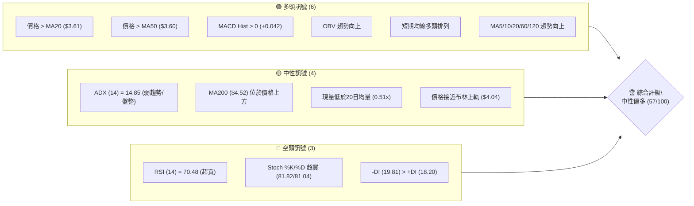
**解讀**：目前多頭訊號佔優，主要體現在短期價格與均線的關係，以及動能指標的積極表現。然而，中性訊號指出市場缺乏明確的趨勢方向 (ADX)，且長期均線仍壓制股價。空頭訊號則警示當前股價已進入超買區間，短期可能面臨回調壓力。綜合來看，市場處於一個多空拉鋸的平衡點，短期偏多但需警惕過熱風險。

### 📊 核心指標速覽表

| 指標類別 | 指標名稱 | 當前數值 | 訊號 | 解讀 |
|----------|----------|----------|------|------|
| **價格** | 當前價格 | $3.88 | 🟢 | 位於近期支撐上方，挑戰阻力 |
| **均線** | MA20 | $3.61 | 🟢 | 價格位於 MA20 上方，短期支撐強勁 |
| **均線** | MA50 | $3.60 | 🟢 | 價格位於 MA50 上方，中期支撐穩固 |
| **均線** | MA200 | $4.52 | 🔴 | 價格位於 MA200 下方，長期趨勢仍偏空 |
| **動能** | RSI(14) | 70.48 | 🔴 | 進入超買區，短期回調風險增加 |
| **動能** | MACD | 0.096 | 🟢 | MACD 線上穿訊號線，柱狀圖為正，多頭動能強勁 |
| **波動** | ATR(14) | $0.17 | 🟡 | 波動率適中，每日平均波動約 4.31% |

### 🏆 技術評分卡

```
╔══════════════════════════════════════════════════════════════╗
║              技術評分卡 — GRAB (2026-07-09)                    ║
╠══════════════════════════════════════════════════════════════╣
║ 趨勢強度      ████░░░░░░░░░░░░░░░░  20/100  🟡 (ADX < 25, 弱趨勢)  ║
║ 動能指標      █████████████░░░░░░  70/100  🟢 (MACD強勁，RSI超買)║
║ 支撐穩定度    ███████████████░░░░  80/100  🟢 (關鍵支撐位清晰)    ║
║ 成交量配合    ███████░░░░░░░░░░░░  60/100  🟡 (OBV配合，但現量不足)║
║ 形態完整度    ███████░░░░░░░░░░░░  60/100  🟡 (潛在上升三角形形成中)║
║ 均線排列      ██████░░░░░░░░░░░░░░  50/100  🟡 (短期多頭，長期空頭)║
╠══════════════════════════════════════════════════════════════╣
║ 綜合評分      █████████░░░░░░░░░░  57/100  ⚖️ 中性偏多             ║
╚══════════════════════════════════════════════════════════════╝
```
**評級**：綜合評分為 57/100，屬於「中性偏多」範疇。這表明 GRAB 在短期內具備一定的上漲潛力，但由於趨勢強度不足和部分指標超買，投資者應保持謹慎，並密切關注關鍵阻力位的突破情況。

---

## 2. 趨勢分析

### 🌐 多時框趨勢分析

GRAB 的多時框架分析顯示，長期趨勢仍處於修正階段，但中短期已展現出築底和反彈的跡象，當前正試圖扭轉頹勢。

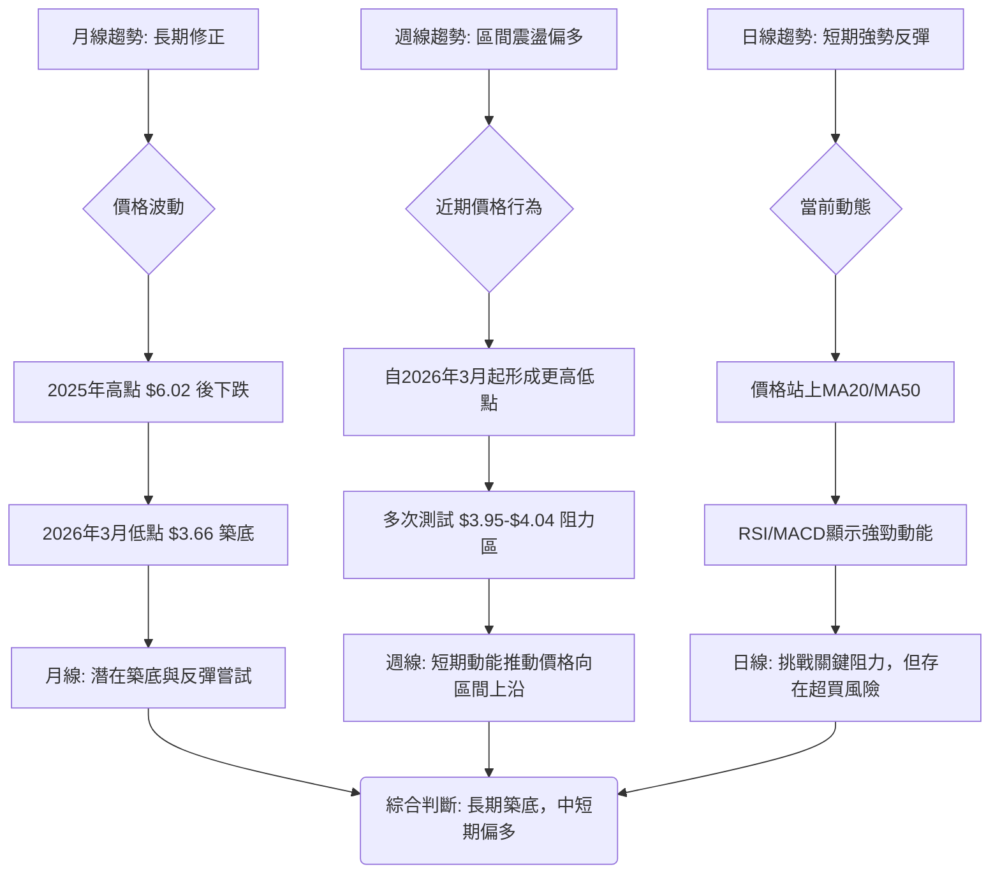
**解讀**：
*   **月線 (長期)**：從 2025 年 9 月的高點 $6.02 至今，GRAB 經歷了一波顯著的下跌修正。儘管近期價格有所反彈，但仍遠低於長期均線 MA200 ($4.52)，表明長期趨勢仍偏空。然而，2026 年 3 月的 $3.66 低點和 5 月的 $3.54 低點，可能正在形成一個初步的底部結構，預示著長期跌勢可能趨緩。
*   **週線 (中期)**：週線圖顯示，自 2026 年 3 月低點以來，GRAB 的股價在 $3.50 至 $4.00 區間內震盪，並逐漸形成更高低點。近期連續幾週的週線收漲，且 MACD 指標持續上揚，顯示中期動能逐漸轉強，正在挑戰區間上沿。
*   **日線 (短期)**：日線圖表現最為強勢。價格已站穩 MA20 ($3.61) 和 MA50 ($3.60) 之上，RSI 和 MACD 等動能指標均顯示強勁的多頭訊號。然而，RSI 進入超買區 (70.48)，且價格正逼近布林通道上軌 ($4.04)，短期內存在回調或盤整的需求。

### 📈 長期趨勢 — 12個月走勢圖（Unicode）

以下為 GRAB 過去 12 個月的月線收盤價走勢圖，標示了重要的價格點。

```
GRAB 月線走勢圖（過去12個月）
價格軸 ($)
$6.02 ┤                                    ●(高點, 2025-09)
$5.45 ┤                  ●
$4.99 ┤        ●     ●       ●
$4.89 ┤●
$4.30 ┤            ●   ●
$3.88 ┤─────────────────────────────────────────●(現在, 2026-07)
$3.77 ┤                      ●
$3.66 ┤                    ●(低點, 2026-03)
$3.54 ┤                        ●
     └──────────────────────────────────────────────────
      25-07 25-08 25-09 25-10 25-11 25-12 26-01 26-02 26-03 26-04 26-05 26-06 26-07
```

**走勢特徵分析表格**：

| 階段 | 時間區間 | 主要走勢 | 漲跌幅 | 關鍵價位 | 特徵解讀 |
|------|----------|----------|--------|----------|----------|
| **高點回落** | 2025-09 至 2026-03 | 顯著下跌 | -39.1% | 高點 $6.02 (2025-09) | 經歷主要修正，形成長期壓力區。 |
| **築底震盪** | 2026-03 至 2026-05 | 底部盤整 | +2.2% | 低點 $3.66 (2026-03) | 價格在低位徘徊，空頭力量減弱，尋求支撐。 |
| **初步反彈** | 2026-05 至 2026-07 | 緩慢上漲 | +9.6% | 現價 $3.88 (2026-07) | 形成更高低點，嘗試突破阻力，但量能配合度有待加強。 |

### 📊 中期趨勢（週線分析）

從週線來看，GRAB 股價在過去幾個月內呈現出一個較為明顯的底部震盪築底形態，並在近期嘗試向上突破。

```
GRAB 近期週線壓力與支撐示意圖
價格 ($)
$4.51 ┤                                    ● R3 (長期壓力)
$4.28 ┤                                  ● R2 (中期阻力)
$3.95 ┤───────────────────────────● R1 (近期阻力/頸線)
$3.88 ┤               ● 現在價格
$3.61 ┤───────────● MA20/MA50 (短期支撐)
$3.50 ┤─────────● S1 (近期支撐)
$3.39 ┤───────● S2 (較強支撐)
$3.18 ┤─────● S3 (52W 低點/重要支撐)
      └──────────────────────────────────────────────────
                       時間軸
```
**解讀**：股價在 $3.18 (52W Low) 獲得強勁支撐後，震盪走高，形成了多個更高低點。當前價格 $3.88 位於 MA20 ($3.61) 和 MA50 ($3.60) 上方，顯示中短期趨勢偏多。然而，上方 $3.95 (R1) 形成了一個關鍵的近期阻力位，該位置多次嘗試突破但未能站穩，是判斷中期趨勢能否進一步走強的關鍵。

### ⚡ 趨勢強度評估（ADX 解讀）

ADX (Average Directional Index) 指標用於衡量趨勢的強度，而非方向。GRAB 的 ADX 數值為 14.85，顯著低於 25 的閾值，表明目前市場處於弱趨勢或盤整狀態。

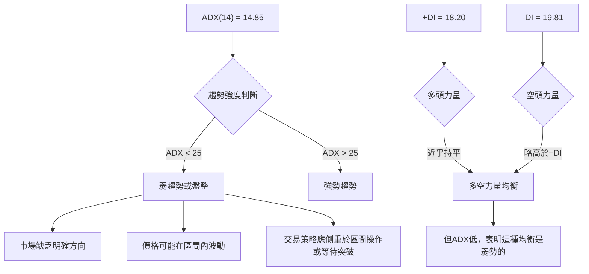
**ADX 強度對照表**：

| ADX 數值區間 | 趨勢強度 | 市場狀態 | 建議交易策略 |
|--------------|----------|----------|--------------|
| 0-25         | 弱趨勢   | 盤整/無趨勢 | 區間操作，等待突破 |
| 25-50        | 中等趨勢 | 趨勢形成中 | 順勢交易 |
| 50-75        | 強趨勢   | 趨勢強勁   | 順勢交易，注意反轉 |
| 75-100       | 極強趨勢 | 趨勢極端   | 順勢交易，極度警惕反轉 |

**解讀**：GRAB 的 ADX 14.85 落在弱趨勢區間，這意味著儘管短期動能指標顯示看漲，但整體市場缺乏一個強勁的推動力量。+DI (18.20) 和 -DI (19.81) 數值接近且 -DI 略高，表明空頭力量略佔優勢，但由於 ADX 極低，這種優勢並不構成強勢下跌趨勢，反而更傾向於多空拉鋸下的盤整。因此，短期內的上漲應被視為在較大盤整區間內的波動，而非新一輪強勢趨勢的開始。投資者應警惕假突破，並將交易重點放在關鍵支撐與阻力位的區間操作上，或等待 ADX 突破 25 並伴隨明確的方向性訊號。

---

## 3. 圖表形態分析

### 🔍 形態識別系統

在 GRAB 的日線和週線圖上，觀察到一個潛在的「上升三角形」形態正在形成。此形態通常預示著在突破水平阻力後，價格將延續上升趨勢。

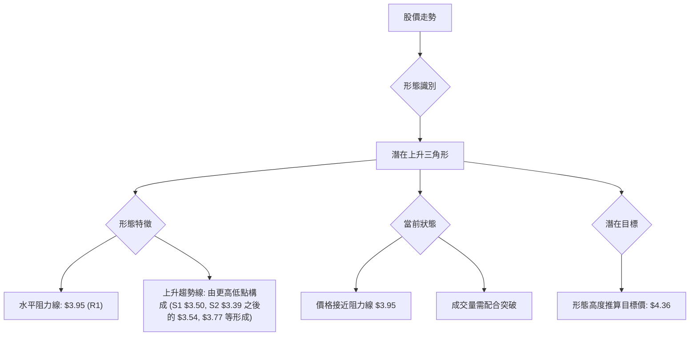

**形態信心度表格**：

| 形態 | 信心度 | 判斷依據（引用數據） | 完成度 | 目標價（附計算式） |
|------|--------|----------------------|--------|--------------------|
| 潛在上升三角形 | 60% | 水平阻力位為 $3.95 (R1)；近期低點 $3.54 (2026-05) 和 $3.77 (2026-06) 形成上升趨勢線。 | 85% | 頸線 $3.95 + 形態高度 ($3.95 - $3.54) = $4.36 |

**解讀**：該上升三角形形態的信心度為 60%，主要依據是股價在 $3.95 附近多次受阻，而底部則呈現出逐步抬高的趨勢。形態完成度已達 85%，價格正逼近阻力位，等待向上突破。若能有效突破 $3.95 的水平阻力，則形態成立，目標價可望挑戰 $4.36。這個目標價 $4.36 位於 R2 ($4.28) 和 R3 ($4.51) 之間，也接近長期均線 MA200 ($4.52)，具有一定的參考價值。

### 🕯️ 重要K線形態分析

分析近 20 週的收盤走勢，識別出幾種重要的 K 線形態及其意義。

| 月份 | 收盤價 | K線形態 | 解讀 | 訊號 |
|------|--------|---------|------|------|
| 2026-03-29 | $3.57 | 錘子線 (Hammer) | 在下跌趨勢後出現，表明下方買盤支撐，可能預示短期反彈。 | 🟢 |
| 2026-04-19 | $4.21 | 大陽線 (Large Bullish Candlestick) | 強勁的買盤推動，突破短期阻力，但 RSI 隨後進入超買。 | 🟢 |
| 2026-05-10 | $3.72 | 倒錘子線 (Inverted Hammer) | 在下跌趨勢後出現，影線長，實體小，表明空頭力量減弱，但仍需確認。 | 🟡 |
| 2026-06-21 | $3.57 | 吞噬線 (Bullish Engulfing) | 實體吞噬前一週陰線，顯示多頭力量強勁，反轉訊號。 | 🟢 |
| 2026-07-05 | $3.90 | 大陽線 (Large Bullish Candlestick) | 強勢上攻，逼近阻力位，但 RSI 嚴重超買，需警惕。 | 🟢 |
| 2026-07-12 | $3.88 | 小陰線 (Small Bearish Candlestick) | 價格小幅回落，但仍在高位，可能是超買後的小幅調整。 | 🟡 |

**解讀**：近期 K 線形態顯示多頭力量在關鍵支撐位附近多次發力，尤其在 2026-03-29、2026-06-21 和 2026-07-05 呈現出強勁的買盤訊號。這與上升三角形的底部抬高趨勢相符，進一步確認了多頭的積極性。然而，最新的 2026-07-12 小陰線，雖然幅度不大，但伴隨 RSI 超買，提示短期可能進入調整。

### 📉 ASCII 走勢形態示意圖

以下為 GRAB 股價在過去幾個月中形成的潛在上升三角形形態示意圖，標註了關鍵點位。

```
GRAB 潛在上升三角形形態示意圖
價格軸 ($)
$4.51 ┤                                          R3 (長期壓力)
$4.28 ┤                                        R2 (中期阻力)
$3.95 ┤───────────────────────────────── R1 (水平阻力/頸線)
$3.88 ┤               ● 現在價格
$3.77 ┤             ／
$3.66 ┤           ●
$3.54 ┤         ／
$3.50 ┤───────● S1 (上升趨勢線起點)
$3.39 ┤─────● S2 (底部支撐)
$3.18 ┤───● S3 (52W 低點)
      └───────────────────────────────────────────────────
                       時間軸
```
**解讀**：圖中可見，股價在 $3.95 附近形成水平阻力線，而其低點則從 $3.54 (5月) 逐步抬高至 $3.77 (6月)，形成了向上傾斜的支撐線。當前價格 $3.88 正位於三角形的末端，顯示多頭正在蓄力，試圖向上突破 $3.95 的阻力。若能成功突破並站穩，則形態確認，有望挑戰更高的目標價位。

### 🎯 形態目標價計算

**潛在上升三角形目標價計算**：

1.  **形態高度**：取上升三角形底部最低點 ($3.54，2026-05) 至頸線阻力位 ($3.95，R1) 的垂直距離。
    形態高度 = $3.95 - $3.54 = $0.41

2.  **突破後目標價**：將形態高度加到頸線阻力位上。
    目標價 = 頸線阻力位 + 形態高度
    目標價 = $3.95 + $0.41 = $4.36

**解讀**：根據上升三角形形態的測量方法，如果 GRAB 能夠有效突破並站穩 $3.95 的頸線阻力，其理論上漲目標價為 $4.36。此目標價位於數據中提供的 R2 ($4.28) 和 R3 ($4.51) 之間，也接近 MA200 ($4.52)，顯示其具有一定的合理性和潛在吸引力。

---

## 4. 支撐與阻力

### 🗺️ 關鍵價位分布圖（Unicode）

GRAB 的關鍵價位分布圖清晰地展示了當前價格 $3.88 在整個價格結構中的位置，以及上方潛在的阻力區和下方穩固的支撐區。

```
GRAB 價位結構分布圖
═══════════════════════════════════════════════════════════════════
$4.51 ║█████████████████████████████████████████████████████████║ 強阻力 R3 (長期壓力/MA200附近)
$4.28 ║█████████████████████████████████████████████████████████║ 阻力 R2 (中期波段高點)
$3.95 ║█████████████████████████████████████████████████████████║ 關鍵阻力 R1 (近期高點/上升三角形頸線)
$3.92 ║▓▓▓▓▓▓▓▓▓▓▓▓▓▓▓▓▓▓▓▓▓▓▓▓▓▓▓▓▓▓▓▓▓▓▓▓▓▓▓▓▓▓▓▓▓▓▓▓▓▓▓▓▓▓▓▓▓║ 斐波那契 78.6% 回調位
$3.88 ╠═══════════════════════════════════════════════════════════╣ ◄ 現價
$3.61 ║▓▓▓▓▓▓▓▓▓▓▓▓▓▓▓▓▓▓▓▓▓▓▓▓▓▓▓▓▓▓▓▓▓▓▓▓▓▓▓▓▓▓▓▓▓▓▓▓▓▓▓▓▓▓▓▓▓║ MA20/MA50 匯聚區 (短期動態支撐)
$3.50 ║█████████████████████████████████████████████████████████║ 近期支撐 S1 (短期波段低點)
$3.39 ║█████████████████████████████████████████████████████████║ 強支撐 S2 (較深回調支撐)
$3.18 ║█████████████████████████████████████████████████████████║ 極強支撐 S3 (52W 低點/長期底部)
═══════════════════════════════════════════════════════════════════
```
**解讀**：當前價格 $3.88 位於 R1 ($3.95) 和斐波那契 78.6% ($3.92) 之間，形成一個重要的阻力區。下方 $3.61 (MA20/MA50) 和 $3.50 (S1) 構成穩固的短期支撐。$3.18 (S3) 則是 52 週低點，提供極強的長期底部支撐。

### 🚧 阻力位分析表

以下為 GRAB 的關鍵阻力位分析，這些價位是基於 OHLCV 計算的波段高點聚類。

| 阻力級別 | 價位 | 形成原因 | 突破難度 | 重要性 |
|----------|------|----------|----------|--------|
| R1       | $3.95 | 近期波段高點聚類，上升三角形頸線，密集套牢區。 | 中等偏高 | 🟢 關鍵。突破則短期趨勢轉強。 |
| R2       | $4.28 | 中期波段高點，斐波那契回調位 (61.8%) 附近。 | 高 | 🟡 突破 R1 後的下一目標，測試中期買盤強度。 |
| R3       | $4.51 | 長期波段高點，接近 MA200 ($4.52)，強烈多空分水嶺。 | 極高 | 🔴 突破則長期趨勢有望反轉，但難度極大。 |

**解讀**：GRAB 當前正挑戰其近期最關鍵的阻力位 R1 $3.95。該價位不僅是過去多次上攻未果的壓力區，也是潛在上升三角形的頸線，其突破與否將直接影響短期走勢。R2 ($4.28) 則是突破 R1 後的下一個考驗，而 R3 ($4.51) 更是長期趨勢的關鍵分水嶺，同時與 MA200 匯聚，其突破將需要極大的量能和基本面支撐。

### 🛡️ 支撐位分析表

以下為 GRAB 的關鍵支撐位分析，這些價位是基於 OHLCV 計算的波段低點聚類。

| 支撐級別 | 價位 | 形成原因 | 守住機率 | 重要性 |
|----------|------|----------|----------|--------|
| S1       | $3.50 | 近期波段低點聚類，上升趨勢線動態支撐，MA20/MA50 匯聚區。 | 高 | 🟢 關鍵。跌破則短期趨勢轉弱。 |
| S2       | $3.39 | 較深回調支撐，過去多個低點密集區。 | 較高 | 🟡 跌破 S1 後的緩衝區，若守住仍有反彈機會。 |
| S3       | $3.18 | 52週低點，長期底部支撐，具備強烈心理支撐。 | 極高 | 🟢 極強。跌破則長期趨勢惡化，可能再次探底。 |

**解讀**：GRAB 下方的支撐結構相對穩固。S1 $3.50 不僅是近期波段低點，也與 MA20/MA50 形成動態支撐，是短期多頭防守的關鍵。S2 $3.39 提供了更深層次的緩衝。而 S3 $3.18 作為 52 週低點，具有非常強的心理和技術支撐意義，是長期多頭的最後防線。在當前價格 $3.88 附近，這些支撐位提供了相對安全的下行保護。

### 📐 斐波那契回調位分析

依據 GRAB 過去 52 週的價格區間 ($3.18 至 $6.62) 進行斐波那契回調分析。

| 斐波那契回調位 | 價位 | 與現價關係 | 解讀 |
|----------------|------|------------|------|
| 0.0% (52W High)| $6.62 | 遠高於現價 | 長期壓力位，需極大動能才能觸及。 |
| 23.6%          | $5.81 | 遠高於現價 | 長期反彈阻力。 |
| 38.2%          | $5.31 | 遠高於現價 | 長期反彈阻力。 |
| 50.0%          | $4.90 | 遠高於現價 | 重要的心理和技術阻力位。 |
| 61.8%          | $4.49 | 高於現價   | 關鍵反彈阻力，接近 R3 和 MA200。 |
| 78.6%          | $3.92 | **現價附近** | **當前關鍵阻力。價格 $3.88 位於此位下方，構成強大壓力。** |
| 100.0% (52W Low)| $3.18 | 遠低於現價 | 長期底部支撐。 |

**解讀**：當前價格 $3.88 正位於斐波那契 78.6% 回調位 $3.92 的下方，這是一個極其重要的阻力位。在經歷大幅下跌後，78.6% 回調位通常代表了多頭反彈的初步考驗，如果能有效突破並站穩此位，將為進一步上攻至 61.8% 回調位 $4.49 (接近 R3 和 MA200) 奠定基礎。反之，若在此位受阻回落，則可能再次回探下方支撐。

---

## 5. 技術指標深度解讀

### 🎛️ 指標訊號總覽

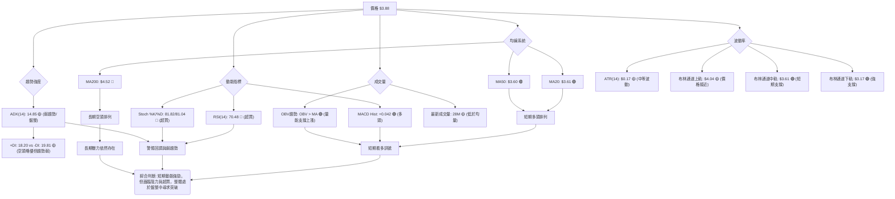

### 📈 移動平均線排列分析

GRAB 的移動平均線系統呈現出短期看多、長期看空的混合排列模式。

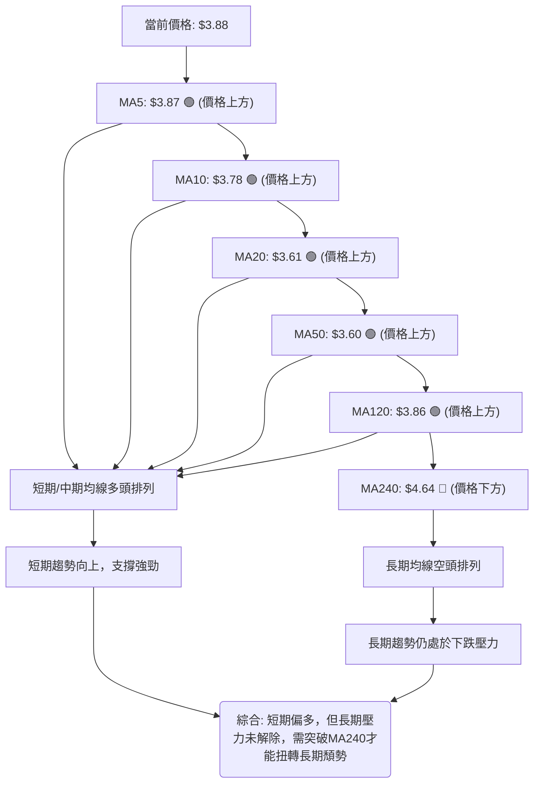
**解讀**：
*   **短期均線** (MA5, MA10, MA20, MA50) 均位於當前價格下方，且呈多頭排列，顯示短期上漲動能強勁，形成了穩固的支撐區。特別是 MA20 ($3.61) 和 MA50 ($3.60) 匯聚，為股價提供了雙重支撐。
*   **中期均線** (MA60 $3.67, MA120 $3.86) 也位於價格下方並向上運行，進一步確認了中期的看漲傾向。
*   **長期均線** (MA200 $4.52, MA240 $4.64) 則遠高於當前價格，且 MA240 趨勢向下，表明 GRAB 仍處於長期下跌趨勢中。這形成了上方的強勁阻力。
**結論**：均線系統顯示 GRAB 在短期內表現強勢，但長期壓力依然存在。這種混合排列模式預示著價格可能在長期阻力位下方繼續盤整，等待更明確的趨勢訊號。

### 📉 RSI(14) 分析

RSI (Relative Strength Index) 衡量價格變動的速度和變化，以評估超買或超賣狀況。

*   **RSI 數值進度條**：
    RSI(14): ▓▓▓▓▓▓▓▓▓▓▓▓▓▓▓▓▓▓▓▓░░░░░░░░░░░░░░░░░░░░  70.48 (超買) 🔴

*   **超買超賣區間分析**：
    *   當前 RSI 數值為 70.48，已進入傳統的超買區 (RSI > 70)。
    *   這表明近期買盤力量過於強勁，股價可能在短期內面臨回調或盤整的需求，以消化獲利盤。
    *   過去 20 週數據顯示，RSI 在 2026-04-19 曾達 82.7，隨後出現回調。2026-07-05 達 77.2，現為 70.5，顯示買盤動能雖強，但已有所減弱。

*   **背離判斷**：
    *   數據中明確指出：「RSI 背離: 無明顯背離」。
    *   這意味著當前價格上漲與 RSI 上漲方向一致，沒有出現頂背離 (價格創新高但 RSI 未創新高) 或底背離 (價格創新低但 RSI 未創新低) 的情況。因此，儘管 RSI 超買，但尚未出現反轉的背離訊號。

**解讀**：RSI 指標強烈警示短期超買風險。雖然沒有背離訊號預示趨勢反轉，但高 RSI 數值通常伴隨著價格波動加劇和潛在的回調。投資者應警惕追高風險，並考慮在出現回調時尋找更佳的進場點。

### 📊 MACD(12/26/9) 訊號解讀

MACD (Moving Average Convergence Divergence) 用於識別趨勢的動能、方向和持續時間。

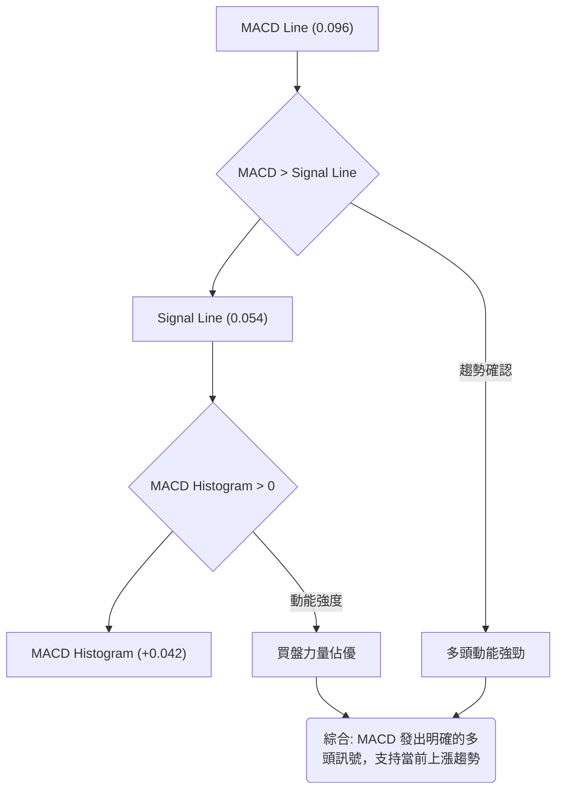
**解讀**：
*   **MACD 線** (0.096) 位於 **MACD 訊號線** (0.054) 之上，形成金叉，這是強烈的多頭訊號。
*   **MACD 柱狀圖** 為正值 (+0.042)，且近期柱體呈現擴大趨勢 (從 2026-07-05 的 +0.062 略微縮小到 +0.042，但仍為正)，表明多頭動能依然強勁，儘管近期有所放緩。
*   **MACD 背離**：數據中未明確指出 MACD 背離，但從數值上看，MACD 柱狀圖近期略有收縮，但價格仍在高位，這需要持續觀察是否會形成頂背離。目前判斷為「無明顯背離」。
**結論**：MACD 指標整體偏多，確認了當前股價的短期上漲動能。與 RSI 的超買訊號結合來看，MACD 顯示動能仍存，但 RSI 警示短期需要謹慎。

### 📦 布林通道分析

布林通道 (Bollinger Bands) 用於衡量價格波動範圍和相對高低。

```
GRAB 布林通道示意圖
價格軸 ($)
$4.04 ┤───────────────────────────────── BB上軌
$3.88 ┤               ● 現在價格
$3.61 ┤───────────● BB中軌 (MA20)
$3.17 ┤─────────● BB下軌
      └──────────────────────────────────────────────────
                       時間軸
```
**解讀**：
*   **布林通道上軌** 位於 $4.04。當前價格 $3.88 接近上軌，布林 %B 值為 0.82，表明股價正處於通道的相對高位。
*   **布林通道中軌** (MA20) 位於 $3.61，為當前價格提供了穩固的短期支撐。
*   **布林通道下軌** 位於 $3.17，與 52 週低點 $3.18 非常接近，是極強的底部支撐。
*   **布林通道帶寬**：數據未直接提供，但從上軌 $4.04 和下軌 $3.17 的距離 ($0.87) 來看，通道帶寬相對較窄，這與 ADX 顯示的弱趨勢/盤整狀態相符，暗示市場可能正在積蓄能量，等待方向性突破。
**結論**：價格接近布林通道上軌，暗示短期超買或遇到阻力。若能有效突破上軌並伴隨成交量放大，則可能開啟一波新的上漲趨勢。反之，若在上軌受阻回落，則可能回探中軌尋求支撐。

### 💹 成交量分析（量價配合度）

成交量是價格走勢的燃料，量價配合度對於判斷趨勢的有效性至關重要。

*   **最新成交量**：28,295,254 股。
*   **20日均量**：55,036,828 股。
*   **量比**：0.51x (最新成交量 / 20日均量)。
*   **50日均量**：52,704,921 股。
*   **OBV 趨勢**：OBV > MA → 量能支撐上漲。

```mermaid
graph TD
    A["最新成交量: 28.29M"] --> B{"與均量比較"}
    B -- 低於20日均量("55.03M") --> C["量能不足"]
    B -- 低於50日均量("52.70M") --> C

    D["OBV趨勢: OBV > MA"] --> E["量能支撐價格上漲"]

    C & E --> F("綜合: OBV確認量能支撐，但現量不足可能限制短期突破的持續性")
```
**解讀**：
*   **量比** 僅為 0.51x，顯示當前成交量遠低於 20 日和 50 日平均成交量。這是一個需要警惕的訊號。儘管價格近期有所上漲，但缺乏足夠的成交量配合，可能暗示這波上漲的持續性存在疑問，或者市場觀望情緒較濃。
*   **OBV (On-Balance Volume) 趨勢** 顯示 OBV 線位於其移動平均線之上，表明量能總體上是支持價格上漲的。這是一個積極訊號，說明儘管日常成交量波動，但累積的買盤壓力仍在增加。
**結論**：量價配合度呈現矛盾。OBV 顯示累積量能支持上漲，但即時成交量不足以支撐強勢突破。這強化了 ADX 顯示的弱趨勢/盤整判斷。如果 GRAB 要有效突破 $3.95 的阻力，必須伴隨成交量的顯著放大。否則，缺乏量能的突破很可能是假突破。

---

## 6. 動能與波動率

### ⚡ 動能評估四象限

GRAB 當前在動能和波動率兩個維度上的評估結果。

| 象限 | 動能 | 波動 | 當前狀態 | 評估 |
|------|------|------|----------|------|
| Q1   | 強   | 低   | -        | 最佳機會 (趨勢強勁，風險可控) |
| Q2   | 弱   | 低   | -        | 謹慎觀望 (缺乏動能，等待方向) |
| Q3   | 強   | 高   | ✓        | **高風險高收益 (動能強勁，但波動大，需嚴格風控)** |
| Q4   | 弱   | 高   | -        | 避免進場 (缺乏動能，風險高) |

**解讀**：
*   **動能**：RSI 70.48 (超買) 和 MACD 柱狀圖為正 (+0.042) 都顯示短期動能強勁。
*   **波動**：ATR(14) 為 $0.17，佔當前價格 $3.88 的 4.31%。這屬於中等偏高的波動水平，尤其對於一個 ADX 顯示弱趨勢的股票而言，這種波動性意味著價格可能在區間內快速擺動。
**結論**：GRAB 目前屬於「高風險高收益」象限。雖然短期上漲動能強勁，但伴隨中等偏高的波動率，加上 ADX 指示為盤整行情，意味著價格可能在區間內劇烈波動，既提供了上漲機會，也蘊含較大的回調風險。投資者需在嚴格的風險控制下進行操作。

### 📊 ATR 波動率分析

ATR (Average True Range) 衡量資產價格在特定時間段內的波動幅度。

*   **ATR(14)**：$0.17
*   **佔股價比例**：$0.17 / $3.88 = 4.38%

**解讀**：
*   GRAB 的 14 日 ATR 為 $0.17，表示在過去 14 天內，該股票平均每天的價格波動幅度為 $0.17。
*   ATR 佔股價的 4.38%，這是一個中等偏高的波動水平。對於日線交易者而言，這意味著每天的潛在漲跌幅可能達到 4% 左右，為短線操作提供了機會，但也增加了風險。
*   **止損距離建議**：ATR 可以作為設定止損點的參考。一般建議將止損點設定在 1.5 到 3 倍 ATR 之外，以避免被正常波動洗出。
    *   1.5 * ATR = 1.5 * $0.17 = $0.255
    *   2 * ATR = 2 * $0.17 = $0.34
    *   3 * ATR = 3 * $0.17 = $0.51
    *   例如，如果買入價為 $3.88，一個保守的止損點可以在 $3.88 - $0.34 (2倍 ATR) = $3.54 附近，這與 S1 $3.50 和 MA20/MA50 區域接近，具有較好的支撐疊加效果。

**結論**：GRAB 具備中等偏高的波動性，短線交易者可利用其波動進行操作，但務必結合 ATR 設置合理的止損，以管理潛在風險。

### 📐 Beta 與市場相關性

Beta 值衡量股票相對於整體市場的波動性。

*   **Beta**：0.875

**解讀**：
*   GRAB 的 Beta 值為 0.875，這意味著該股票的價格波動幅度略低於整體市場。
*   當市場上漲 1% 時，GRAB 的股價平均上漲約 0.875%。反之，當市場下跌 1% 時，GRAB 的股價平均下跌約 0.875%。
*   **市場相關性**：Beta 值小於 1，表明 GRAB 是一隻防禦性略強、或至少與市場波動相關性較低的股票。在市場整體波動較大的時期，GRAB 的表現可能相對穩定。
**結論**：GRAB 的 Beta 值表明其波動性略低於市場，這使其在市場不確定性較高時，可能成為相對穩定的選擇。然而，這也意味著它在牛市中的上漲潛力可能略低於高 Beta 股票。投資者在構建投資組合時，應考慮其與市場的這種相關性。

---

## 7. 多時框架總結

### 📋 時框架評分表

| 時框架 | 趨勢方向 | 動能 | 均線排列 | 形態 | 綜合評分 | 建議 |
|--------|----------|------|----------|------|----------|------|
| **月線** | 🔴 修正中 | 🟡 築底 | 🔴 空頭 | 🟡 潛在圓弧底 | 3/10 | 長期觀望 |
| **週線** | 🟡 盤整偏多 | 🟢 轉強 | 🟡 混合 | 🟢 上升三角形 | 6/10 | 區間操作 |
| **日線** | 🟢 反彈強勢 | 🔴 超買 | 🟢 多頭 | 🟢 上升三角形 | 7/10 | 短期謹慎追多 |

### 🔲 綜合訊號矩陣

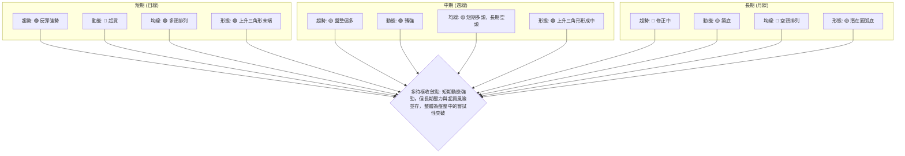
**解讀**：多時框架分析顯示，GRAB 的短期和中期訊號相對積極，尤其在動能和形態方面。日線和週線均顯示股價正試圖突破，並形成上升三角形。然而，月線級別的長期趨勢仍處於修正中，且日線指標已進入超買區，這提示了短期上漲可能面臨壓力。

### ⚖️ 多時框收斂結論

根據嚴格要求 14，我們首先判斷 GRAB 的整體趨勢強度。ADX(14) 為 14.85，顯著低於 25，明確指示當前市場處於 **弱趨勢或盤整行情**。

在盤整行情下，收斂規則強調以日線布林通道上下軌為主要交易區間。然而，當前價格 $3.88 位於 MA20 ($3.61) 和 MA50 ($3.60) 上方，並且接近布林通道上軌 ($4.04) 和斐波那契 78.6% 回調位 ($3.92) 以及 R1 ($3.95) 等關鍵阻力區。同時，RSI 處於超買區，MACD 柱狀圖為正，表明短線動能強勁。

**多時框收斂結論為：**

當前 GRAB 股價處於一個大型 **盤整區間** 內，但短期內呈現出 **強烈的向上突破意圖**。儘管 ADX 顯示趨勢不強，但日線級別的動能指標（MACD）和均線排列（短期多頭）均支持價格繼續向盤整區間上沿（即 R1 $3.95 和布林上軌 $4.04）發起挑戰。RSI 的超買狀況提示短期可能面臨回調，但只要不跌破關鍵支撐，此回調可視為健康的整理。

因此，最終結論是 **中性偏多 (Neutral to Bullish bias)**。主策略應著重於區間上沿的突破機會，或在回調至關鍵支撐位時尋找介入點，而非盲目追高。日線的強勢動能將被用來尋找精確的進場時機，但需時刻警惕盤整區間的性質以及上方阻力。

---

## 8. 交易策略建議

### 🗺️ 策略決策流程圖

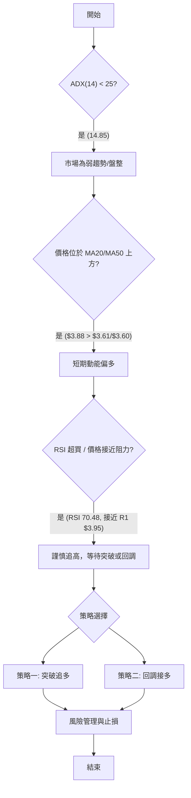

### 🧭 策略路由

**當前主策略方向 = 中性偏多 (依評分 57/100)**

基於綜合評分 57/100 (中性偏多) 以及多時框收斂結論，GRAB 目前處於盤整區間的向上突破嘗試階段。雖然短期動能強勁，但 ADX 顯示趨勢不強，且存在超買風險。因此，我們將主推多頭策略，但會提供兩種情境下的操作建議，並著重於風險控制。空頭策略僅作為反轉風險觸發點提示。

### 🎯 價格情境階梯（Price Scenarios）

| 觸發條件 | 下一目標 | 後續延伸 | 情境含義 |
|----------|----------|----------|----------|
| 突破 R1 $3.95 | R2 $4.28 | R3 $4.51 | 短線轉強，有望開啟新一波上漲，挑戰中期阻力。 |
| 站穩現價區間 | — | — | 區間震盪，在 $3.50 - $3.95 之間盤整，等待更明確方向。 |
| 跌破 S1 $3.50 | S2 $3.39 | S3 $3.18 | 中期轉弱，可能回測更深支撐，甚至再次探底 52W 低點。 |

### 📊 情境機率分佈

| 情境 | 機率 | 主要依據 |
|------|------|----------|
| 繼續上行 / 突破 | 45% | MACD金叉、短期均線多頭排列、OBV趨勢向上、潛在上升三角形。 |
| 區間震盪 | 40% | ADX弱趨勢、RSI超買、價格接近布林上軌與R1阻力、成交量不足。 |
| 回落 / 再探底 | 15% | 跌破關鍵支撐 S1 $3.50，RSI/Stoch超買後的獲利回吐。 |

### 🟢 主策略詳情（方向：多頭）

**策略一：突破追多策略 (Breakout Play)**

| 策略要素 | 詳情 |
|----------|--------|
| 進場條件 | 股價有效突破 R1 $3.95 (即收盤價站穩 $3.95 以上，並伴隨顯著放量)。 |
| 進場價格 | $3.96 |
| 目標價 T1 | $4.28 (R2) |
| 目標價 T2 | $4.51 (R3) (接近 MA200 $4.52) |
| 止損價格 | $3.80 (跌破 Fib 78.6% $3.92，同時低於當前價格 $3.88 約 2 倍 ATR 的位置) |
| 風險報酬比 | T1: (4.28-3.96) / (3.96-3.80) = 0.32 / 0.16 = 2.00:1 <br> T2: (4.51-3.96) / (3.96-3.80) = 0.55 / 0.16 = 3.44:1 |
| 成功機率 | 45% |
| 建議倉位 | 中等 (5-10%) |
| **策略評述** | 此策略旨在捕捉上升三角形突破後的上漲動能。進場前務必等待有效突破的確認，以避免假突破風險。止損點設定在關鍵阻力下方，以控制風險。 |

**策略二：回調接多策略 (Pullback Buy)**

| 策略要素 | 詳情 |
|----------|--------|
| 進場條件 | 股價從當前高位回調至關鍵支撐區 S1 $3.50 或 MA20 $3.61 附近，並出現止跌 K 線訊號 (如錘子線、看漲吞噬)。 |
| 進場價格 | $3.60 (接近 MA20/MA50 匯聚區) |
| 目標價 T1 | $3.95 (R1) |
| 目標價 T2 | $4.28 (R2) |
| 止損價格 | $3.45 (跌破 S1 $3.50 且低於約 1 倍 ATR 的位置) |
| 風險報酬比 | T1: (3.95-3.60) / (3.60-3.45) = 0.35 / 0.15 = 2.33:1 <br> T2: (4.28-3.60) / (3.60-3.45) = 0.68 / 0.15 = 4.53:1 |
| 成功機率 | 40% |
| 建議倉位 | 中等 (5-10%) |
| **策略評述** | 此策略適用於 RSI 超買後的回調修正。在強勁支撐位附近介入可獲得較佳的風險報酬比。需耐心等待止跌訊號，避免過早進場。 |

### 🔴 反向風險觸發點（對沖提示）

以下為可能推翻多頭主策略的關鍵訊號，供風險管理參考：

*   **跌破 S1 $3.50**：若股價跌破 $3.50 支撐，將破壞短期上升趨勢線，多頭動能將顯著減弱。
*   **MACD 形成死叉**：若 MACD 線下穿訊號線，且 MACD 柱狀圖轉為負值，將預示短期動能轉空。
*   **RSI 跌破 50**：RSI 從超買區回落並跌破中軸 50，顯示空頭力量開始佔優。
*   **成交量持續萎縮且價格下跌**：若股價下跌伴隨成交量放大，而上漲卻量能不足，則趨勢可能反轉。

### ⭐ 整體訊號強度評星

```
做多訊號強度：★★★☆☆  (3/5星)
做空訊號強度：★★☆☆☆  (2/5星)
整體可信度：  ★★★☆☆  (3/5星)
```
**評星解讀**：多頭訊號雖然在短線動能上佔優，但受到 ADX 弱趨勢、RSI 超買以及成交量不足的制約，因此給予 3 星。空頭訊號目前較弱，但超買狀況和長期均線壓力構成潛在風險，給予 2 星。整體可信度為 3 星，表明當前市場存在一定的交易機會，但需要嚴格的策略執行和風險控制。

---

## 9. 風險提示與監控

### ✅ 關鍵監控指標 Checklist

```
╔══════════════════════════════════════════════════════════════╗
║              GRAB 關鍵監控指標清單                             ║
╠══════════════════════════════════════════════════════════════╣
║ [ ] 價格是否有效突破 R1 $3.95 (收盤價站穩，伴隨放量)           ║
║ [ ] 價格是否跌破 S1 $3.50 (短期多頭防線)                       ║
║ [ ] RSI(14) 是否從超買區回落並跌破 70/50                       ║
║ [ ] MACD 線是否形成死叉，MACD 柱狀圖是否轉負                     ║
║ [ ] ADX(14) 是否突破 25，並伴隨 +DI/-DI 的明確方向性             ║
║ [ ] 最新成交量是否持續低於均量，尤其是在上漲時                  ║
║ [ ] 布林通道帶寬是否擴大 (預示趨勢形成) 或收窄 (預示盤整延續)   ║
║ [ ] 留意是否有重大利空/利好消息影響股價 (基本面驅動)           ║
╚══════════════════════════════════════════════════════════════╝
```

### ⚠️ 風險場景分析

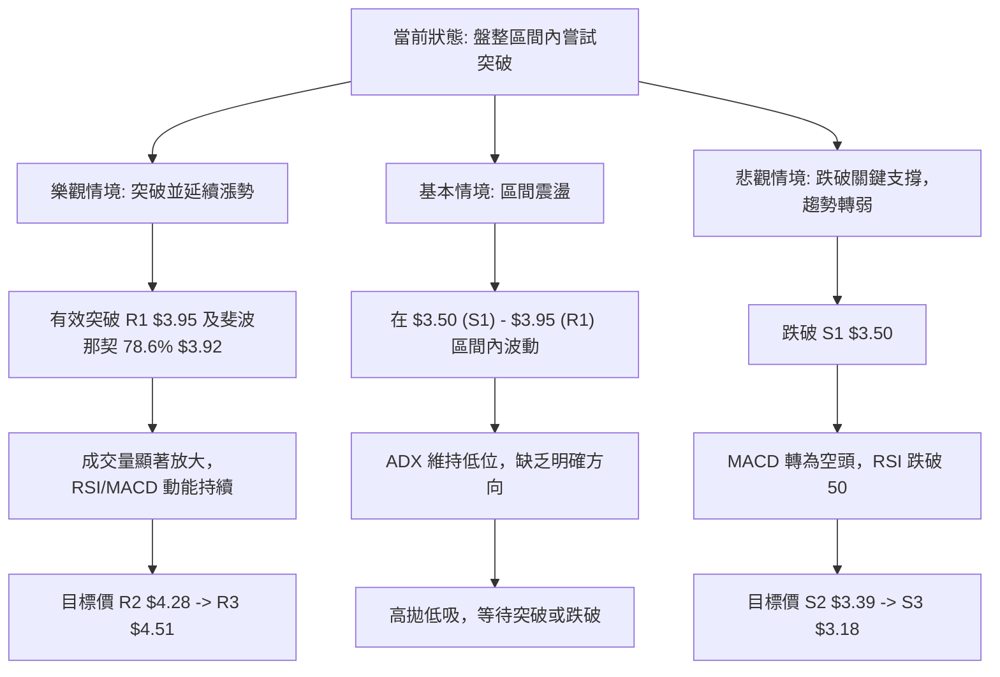
**解讀**：
*   **樂觀情境 (45% 機率)**：若 GRAB 能有效突破 $3.95 的關鍵阻力，並伴隨放量，則有望開啟一波新的上漲，挑戰 $4.28 (R2) 甚至 $4.51 (R3)。這將確認上升三角形的突破，並可能吸引更多買盤。
*   **基本情境 (40% 機率)**：在 ADX 較低的情況下，最有可能的情景是 GRAB 維持在 $3.50 至 $3.95 的區間內震盪。價格可能在布林通道的中軌和上軌之間來回，等待市場積蓄足夠的動能。
*   **悲觀情境 (15% 機率)**：若 GRAB 未能突破阻力，反而跌破 $3.50 的關鍵支撐 (S1)，則可能引發止損賣盤，導致股價進一步回落至 $3.39 (S2) 甚至再次探底 52 週低點 $3.18 (S3)。RSI 從超買區快速回落將是此情境的早期預警訊號。

### 🛡️ 風險管理重要提醒

1.  **嚴格止損**：無論採取何種策略，務必設定並嚴格執行止損點。ATR 可作為止損點設置的參考依據。
2.  **倉位管理**：鑑於 GRAB 仍處於盤整行情且 ADX 較低，單一倉位不宜過重。建議將總投資組合的 5-10% 用於單一策略，並分批建倉。
3.  **趨勢確認**：在 ADX 低於 25 的情況下，任何突破都應謹慎對待。等待日線收盤價站穩關鍵阻力上方，並配合成交量放大，才能視為有效突破。
4.  **多指標驗證**：切勿依賴單一指標。在做出交易決策前，應綜合考量價格行為、均線、動能指標和成交量等多方面訊號。
5.  **獲利了結**：RSI 處於超買區，意味著短期獲利回吐的風險較高。達到目標價後，可考慮部分獲利了結，或移動止損以保護已實現的利潤。
6.  **基本面配合**：雖然本報告專注於技術分析，但仍建議投資者關注 GRAB 的基本面資訊，如財報、新聞事件、行業動態等，以獲得更全面的判斷。

---

## 📋 報告總結

```
╔═══════════════════════════════════════════════════════════════════╗
║                      GRAB 技術分析報告總結                          ║
╠═══════════════════════════════════════════════════════════════════╣
║ 報告日期：2026-07-09                                                ║
║ 當前價格：$3.88                                                     ║
║ 分析評級：⚖️ 中性偏多 (在盤整中尋求突破，短期動能強勁但面臨超買風險) ║
╠═══════════════════════════════════════════════════════════════════╣
║ 關鍵結論：                                                          ║
║ ├─ 長期趨勢：🔴 修正中，MA200 壓制，但底部有築底跡象。                 ║
║ ├─ 中期趨勢：🟡 盤整偏多，週線形成更高低點，嘗試向上突破。             ║
║ ├─ 短期趨勢：🟢 反彈強勢，價格站上 MA20/MA50，MACD 指標積極。          ║
║ ├─ 關鍵支撐：S1 $3.50 (短期)，S3 $3.18 (長期底部)。                   ║
║ ├─ 關鍵阻力：R1 $3.95 (近期)，斐波那契 78.6% $3.92，布林上軌 $4.04。  ║
║ └─ 分析師目標：若突破 $3.95，形態目標價 $4.36。                      ║
╠═══════════════════════════════════════════════════════════════════╣
║ 最優策略組合：                                                      ║
║ 1. 🥇 **突破追多策略**：等待股價有效突破 R1 $3.95 並放量，進場價 $3.96，止損 $3.80，目標 T1 $4.28 / T2 $4.51。 |
║ 2. 🥈 **回調接多策略**：若價格回調至 S1 $3.50 或 MA20 $3.61 附近出現止跌訊號，進場價 $3.60，止損 $3.45，目標 T1 $3.95 / T2 $4.28。 |
║ 3. 🥉 **保守觀望**：若 ADX 未能有效突破 25，且價格未能突破 R1，則維持區間操作，等待更明確趨勢訊號。 |
╚═══════════════════════════════════════════════════════════════════╝
```

---

> ⚠️ **免責聲明**：本報告為 AI 自動生成之技術分析，所有數據及估算均基於提供的歷史價格資訊。本報告**僅供研究與學術參考**，**不構成任何投資建議**。投資有風險，入市需謹慎。

---

*報告生成時間：2026-07-09 ｜ 數據來源：Yahoo Finance ｜ 分析框架：多時框技術分析*