<details>
<summary>📊 靜態圖表 (點擊展開)</summary>
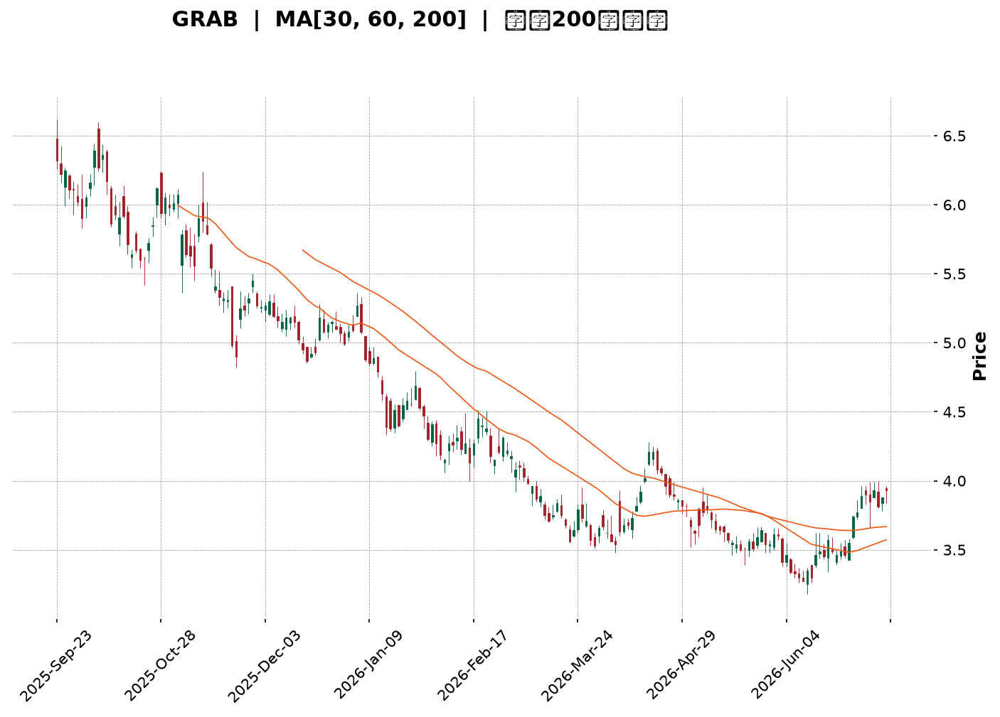
</details>

<html>
<head><meta charset="utf-8" /></head>
<body>
    <div style="height:500px; width:100%;">                        <script>window.PlotlyConfig = {MathJaxConfig: 'local'};</script>
        <script charset="utf-8" src="https://cdn.plot.ly/plotly-3.7.0.min.js" integrity="sha256-jvTGqxNp8AGWEcvNLVuKr+8j5dGe9Yw51LQkmDH+IYA=" crossorigin="anonymous"></script>                <div id="candlestick-chart" class="plotly-graph-div" style="height:100%; width:100%;"></div>            <script>                window.PLOTLYENV=window.PLOTLYENV || {};                                if (document.getElementById("candlestick-chart")) {                    Plotly.newPlot(                        "candlestick-chart",                        [{"close":{"dtype":"f8","bdata":"AAAAIK5HGUAAAACgR+EYQAAAAAAAABlAAAAA4KNwGEAAAADgo3AYQAAAAOB6FBhAAAAAoJmZF0AAAABAMzMYQAAAAADXoxhAAAAAIFyPGUAAAADgehQZQAAAAOCjcBlAAAAAgBSuGEAAAADgo3AXQAAAAOBRuBdAAAAAANejF0AAAACAFK4XQAAAAEAK1xZAAAAAIFyPFkAAAACAFK4WQAAAAGBmZhZAAAAAQOF6FkAAAACgR+EWQAAAAGBmZhdAAAAAQOF6GEAAAABgj8IXQAAAAEAzMxhAAAAAIIXrF0AAAACAPQoYQAAAACCuRxhAAAAAANcjF0AAAAAgXI8WQAAAAMAehRZAAAAAoHA9FkAAAACgmZkXQAAAAMAehRdAAAAAwPUoF0AAAADA9SgWQAAAAADXoxVAAAAAgOtRFUAAAAAgrkcVQAAAAKBwPRVAAAAAIIXrE0AAAACgmZkTQAAAAAAAABVAAAAAgML1FEAAAAAgrkcVQAAAAMDMzBVAAAAA4HoUFUAAAACAPQoVQAAAAOB6FBVAAAAAQDMzFUAAAABgj8IUQAAAAADXoxRAAAAAoJmZFEAAAADgUbgUQAAAAOBRuBRAAAAAoJmZFEAAAADgehQUQAAAAMDMzBNAAAAAQOF6E0AAAACAFK4TQAAAAOBRuBNAAAAA4FG4FEAAAACA61EUQAAAAMAehRRAAAAAoJmZFEAAAABgZmYUQAAAACCuRxRAAAAAgML1E0AAAACA61EUQAAAAAApXBRAAAAA4HoUFUAAAACA61EUQAAAAMAehRNAAAAAYGZmE0AAAAAgXI8TQAAAAMD1KBNAAAAAwB6FEkAAAAAgXI8RQAAAAMAehRFAAAAAgD0KEkAAAACgmZkRQAAAAEAzMxJAAAAAgOtREkAAAACgcD0SQAAAAGCPwhJAAAAAYLgeEkAAAACgR+ERQAAAAEAzMxFAAAAAANejEUAAAADgehQRQAAAAGCPwhBAAAAAoJmZEEAAAADgehQRQAAAAIA9ChFAAAAAoHA9EUAAAAAghesQQAAAAOB6FBFAAAAAwB6FEEAAAADgehQRQAAAAMDMzBFAAAAAoJmZEUAAAADAHoURQAAAAOBRuBBAAAAAoJmZEEAAAABACtcQQAAAAKBwPRFAAAAAoEfhEEAAAADgUbgQQAAAAIDrURBAAAAAYGZmEEAAAABguB4QQAAAAEAK1w9AAAAAgBSuD0AAAACAwvUOQAAAAGC4Hg9AAAAAAAAADkAAAACAFK4NQAAAAAAAAA5AAAAA4FG4DkAAAAAAAAAOQAAAAOCjcA1AAAAAQOF6DEAAAABguB4NQAAAAIDrUQ5AAAAAQArXDUAAAACAFK4NQAAAACBcjwxAAAAAoHA9DEAAAAAgrkcNQAAAAAApXA1AAAAAgML1DEAAAABA4XoMQAAAAIDrUQxAAAAAgD0KDUAAAADgo3ANQAAAAOCjcA1AAAAAQArXDUAAAAAgXI8OQAAAAAApXA9AAAAA4HoUEEAAAABACtcQQAAAAEAK1xBAAAAAgOtREEAAAACgcD0QQAAAAIAUrg9AAAAAQDMzD0AAAABguB4PQAAAAKBH4Q5AAAAAIFyPDkAAAAAgXI8OQAAAAAApXA1AAAAAgML1DEAAAADgo3ANQAAAAMD1KA5AAAAAgOtRDkAAAABgj8INQAAAAEAzMw1AAAAAYLgeDUAAAACAPQoNQAAAACBcjwxAAAAAYGZmDEAAAACA61EMQAAAAAAAAAxAAAAA4HoUDEAAAABA4XoMQAAAAOB6FAxAAAAA4FG4DEAAAABguB4NQAAAAIDrUQxAAAAAgOtRDEAAAACgR+EMQAAAAMDMzAxAAAAAIK5HC0AAAACAFK4LQAAAAOBRuApAAAAAANejCkAAAABgZmYKQAAAAMD1KApAAAAAwMzMCkAAAABgZmYKQAAAAIAUrgtAAAAAIIXrC0AAAACgmZkLQAAAACBcjwxAAAAAIIXrC0AAAACAFK4LQAAAACCF6wtAAAAAgBSuC0AAAABgZmYMQAAAACCF6w1AAAAAwPUoDkAAAABguB4PQAAAAEAzMw9AAAAAwMzMDkAAAADgo3APQAAAAEDheg5AAAAAgD0KD0AAAADgo3APQA=="},"high":{"dtype":"f8","bdata":"AAAAQOF6GkAAAADgUbgZQAAAAOB6FBlAAAAAoEfhGEAAAACAFK4YQAAAAKCZmRhAAAAAoEfhGEAAAAAgrkcYQAAAAKBH4RhAAAAAIK7HGUAAAABgZmYaQAAAAECJwRlAAAAAoJmZGUAAAAAgXI8YQAAAACCuRxhAAAAA4HoUGEAAAAAgXI8YQAAAAIDC9RdAAAAAQDOzFkAAAACAajwXQAAAAOBRuBZAAAAAQOF6FkAAAACAPQoXQAAAAMD1qBdAAAAAwB6FGEAAAACAwvUYQAAAAAApXBhAAAAAgOtRGEAAAACA61EYQAAAAIDCdRhAAAAAIK5HF0AAAADgo3AXQAAAAEAKVxdAAAAAwPUoF0AAAAAAAAAYQAAAAOCj8BhAAAAA4HoUGEAAAACgR+EWQAAAAGC4HhZAAAAA4HoUFkAAAACAwnUVQAAAAMAehRVAAAAAANejFUAAAACgcD0UQAAAAEDhehVAAAAAAClcFUAAAADgo3AVQAAAAAAAABZAAAAAQOF6FUAAAACgcD0VQAAAAEAzMxVAAAAAYGZmFUAAAABgZmYVQAAAACBcDxVAAAAAACncFEAAAACAwvUUQAAAAGCPwhRAAAAA4HoUFUAAAAAA16MUQAAAAEAzMxRAAAAAoEfhE0AAAACgR+ETQAAAAGC4HhRAAAAAYLgeFUAAAACAwvUUQAAAAKCZmRRAAAAAANejFEAAAAAghesUQAAAACBcjxRAAAAAAClcFEAAAADAHoUUQAAAAMDMzBRAAAAA4KNwFUAAAACA61EVQAAAAEAzMxRAAAAAoEfhE0AAAACgR+ETQAAAAKCZmRNAAAAAgD0KE0AAAADAHoUSQAAAAGBmZhJAAAAA4FE4EkAAAABAMzMSQAAAAGBmZhJAAAAAIFyPEkAAAACAFK4SQAAAAIAULhNAAAAA4FG4EkAAAADgUTgSQAAAAKBH4RFAAAAA4FG4EUAAAABgj8IRQAAAAEDhehFAAAAAANejEEAAAADAzEwRQAAAAAApXBFAAAAAYLieEUAAAAAgXI8RQAAAAIDC9RFAAAAA4FE4EUAAAABAMzMRQAAAAIA9ChJAAAAAQArXEUAAAADAHgUSQAAAAIA9ihFAAAAAoJmZEEAAAADAHoURQAAAACCuRxFAAAAAYLgeEUAAAACgR+EQQAAAAIA9ihBAAAAA4HqUEEAAAADAHoUQQAAAAMD1KBBAAAAAgBSuD0AAAAAAAAAQQAAAAMAehQ9AAAAAwMzMDkAAAABA4XoOQAAAAADXow5AAAAAgML1DkAAAABAMzMPQAAAAEAK1w1AAAAA4KNwDUAAAACAFK4NQAAAAADXow5AAAAAoJmZD0AAAADgUbgOQAAAAMAehQ1AAAAAgML1DEAAAADgo3ANQAAAAIDrUQ5AAAAAYI\u002fCDUAAAAAAAAAOQAAAAGCPwgxAAAAA4KNwD0AAAABACtcNQAAAAMDMzA1AAAAAoHA9DkAAAADgehQPQAAAAOBRuA9AAAAAAClcEEAAAABguB4RQAAAAAAAABFAAAAAgML1EEAAAADgo3AQQAAAAEAzMxBAAAAAwPUoEEAAAAAghesPQAAAAAAAAA9AAAAAIIXrDkAAAADgUbgOQAAAAKBH4Q1AAAAAQDMzDUAAAADgo3AOQAAAAKCZmQ9AAAAAQDMzD0AAAACgcD0OQAAAAOB6FA5AAAAA4KNwDUAAAADgo3ANQAAAAIDC9QxAAAAAIFyPDEAAAADAzMwMQAAAACBcjwxAAAAAgOkmDEAAAAAA16MMQAAAAIDC9QxAAAAAgOtRDUAAAAAAKVwNQAAAAIDC9QxAAAAAIFyPDEAAAAAgrkcNQAAAACCuRw1AAAAA4FG4DEAAAABgZmYMQAAAAMAehQtAAAAAQDMzC0AAAACAwvUKQAAAAMDMzApAAAAAgML1CkAAAABguB4LQAAAAIDC9QxAAAAAgML1DEAAAAAAKVwMQAAAAKBH4QxAAAAA4FG4DEAAAAAAAAAMQAAAAGBmZgxAAAAAIFyPDEAAAAAA16MMQAAAAAAAAA5AAAAAoEfhDkAAAACAFK4PQAAAAIAUrg9AAAAAIIXrD0AAAACAwvUPQAAAAAAAABBAAAAAgD0KD0AAAACAFK4PQA=="},"hovertemplate":"\u003cb\u003e%{x|%Y-%m-%d}\u003c\u002fb\u003e\u003cbr\u003e\u958b: $%{open:.2f}\u003cbr\u003e\u9ad8: $%{high:.2f}\u003cbr\u003e\u4f4e: $%{low:.2f}\u003cbr\u003e\u6536: $%{close:.2f}\u003cextra\u003e\u003c\u002fextra\u003e","low":{"dtype":"f8","bdata":"AAAAgD0KGUAAAAAA16MYQAAAAIDC9RdAAAAAwPUoGEAAAADgUbgXQAAAAIDC9RdAAAAAgOtRF0AAAACgmZkXQAAAAKBwPRhAAAAAIFyPGEAAAACAwvUYQAAAACCF6xhAAAAAIK5HGEAAAAAAKVwXQAAAACBcjxdAAAAAwMzMFkAAAACgmZkXQAAAACBcjxZAAAAAwPUoFkAAAACgmZkWQAAAAMD1KBZAAAAAgBSuFUAAAACA61EWQAAAAOB6FBdAAAAAANejF0AAAACgmZkXQAAAAGBmZhdAAAAAgBSuF0AAAADAzMwXQAAAAKCZmRdAAAAA4KNwFUAAAABA4XoWQAAAAIAULhZAAAAAwMzMFUAAAAAghesWQAAAAEAzMxdAAAAAYLgeF0AAAAAghesVQAAAAOCjcBVAAAAA4HoUFUAAAACgR+EUQAAAAAAAABVAAAAAQArXE0AAAAAgrkcTQAAAACCFaxRAAAAAYI\u002fCFEAAAABACtcUQAAAAOCjcBVAAAAAAAAAFUAAAACgR+EUQAAAAKCZmRRAAAAAIK7HFEAAAADgUbgUQAAAAOCjcBRAAAAAgOtRFEAAAABAMzMUQAAAAKBHYRRAAAAA4KNwFEAAAACAwvUTQAAAAIAUrhNAAAAAYGZmE0AAAAAgXI8TQAAAAADXoxNAAAAAgD0KFEAAAAAgrkcUQAAAAGC4HhRAAAAAwMxMFEAAAACgR2EUQAAAAAAAABRAAAAAIIXrE0AAAACAPQoUQAAAAIDrURRAAAAAYI\u002fCFEAAAABgj0IUQAAAAOCjcBNAAAAAgOtRE0AAAAAAKVwTQAAAAAAAABNAAAAAgOtREkAAAACA61ERQAAAAOCjcBFAAAAAYGZmEUAAAAAgXI8RQAAAAOBRuBFAAAAA4HoUEkAAAADA9SgSQAAAAAApXBJAAAAAgD0KEkAAAADAHoURQAAAAMD1KBFAAAAAAAAAEUAAAADgUbgQQAAAAKCZmRBAAAAAoHA9EEAAAACAwnUQQAAAAEAK1xBAAAAAIIXrEEAAAABgj8IQQAAAAMDMzBBAAAAAAAAAEEAAAABgZmYQQAAAAOB6FBFAAAAAYI9CEUAAAACA61ERQAAAAMAehRBAAAAAQDMzEEAAAADgp8YQQAAAACBcjxBAAAAA4FG4EEAAAACgcD0QQAAAAAApXA9AAAAAgD0KEEAAAAAAAAAQQAAAAGCPwg9AAAAAwB6FDkAAAADAzMwOQAAAAEDheg5AAAAAYI\u002fCDUAAAACgmZkNQAAAAGCPwg1AAAAAwPUoDkAAAABACtcNQAAAACCuRw1AAAAAYGZmDEAAAADgUbgMQAAAAIDC9QxAAAAAoJmZDUAAAACA61ENQAAAAKBwPQxAAAAA4HoUDEAAAABgZmYMQAAAAGC4Hg1AAAAAANejDEAAAABA4XoMQAAAAEAK1wtAAAAAwMzMDEAAAACAwvUMQAAAAEAzMw1AAAAAANejDEAAAABgZDsOQAAAAIAUrg5AAAAAQArXD0AAAADgo3AQQAAAAOCjcBBAAAAAQDMzEEAAAADA9SgQQAAAAEAzMw9AAAAAgD0KD0AAAACgR+EOQAAAAIDrUQ5AAAAA4HoUDkAAAAAghesNQAAAAMD1KAxAAAAAgOtRDEAAAADgUbgMQAAAACCF6w1AAAAA4HoUDkAAAAAgrkcNQAAAAIDC9QxAAAAAoEfhDEAAAABA4XoMQAAAAGBmZgxAAAAAgBSuC0AAAABACtcLQAAAACCF6wtAAAAAYLgeC0AAAACgmZkLQAAAACCF6wtAAAAA4HoUDEAAAADgo3AMQAAAAEAK1wtAAAAAQArXC0AAAAAAAAAMQAAAACBcjwxAAAAAgD0KC0AAAACAPQoLQAAAAKCZmQpAAAAAYGZmCkAAAADgehQKQAAAAMD1KApAAAAA4KNwCUAAAADgehQKQAAAAIDC9QpAAAAAQOF6C0AAAADgo3ALQAAAAOBRuApAAAAAYI\u002fCC0AAAABguB4LQAAAAOCjcAtAAAAAwB6FC0AAAABgZmYLQAAAAADXowxAAAAAYI\u002fCDUAAAABgZmYOQAAAAADXow5AAAAAIK5HDUAAAACAPQoPQAAAAGBmZg5AAAAAoHA9DkAAAADgUbgOQA=="},"name":"\u50f9\u683c","open":{"dtype":"f8","bdata":"AAAAIIXrGUAAAABAMzMZQAAAAMAehRhAAAAAQArXGEAAAACAwnUYQAAAAKBwPRhAAAAAwPUoGEAAAACAwvUXQAAAAEDhehhAAAAAoJkZGUAAAABAMzMaQAAAAIDrURlAAAAAgD2KGUAAAABA4XoYQAAAAIDC9RdAAAAAwPUoF0AAAACgcD0YQAAAAMDMzBdAAAAAQOF6FkAAAADA9SgXQAAAAOBRuBZAAAAAQOF6FkAAAACAFK4WQAAAAKBHYRdAAAAAAAAAGEAAAAAghesYQAAAAGCPwhdAAAAAAAAAGEAAAACgR+EXQAAAAIA9ChhAAAAAYI9CFkAAAABgj0IXQAAAAMDMzBZAAAAAwMzMFkAAAACgmRkXQAAAACBcDxhAAAAAYGZmF0AAAABACtcWQAAAAMAehRVAAAAAgD2KFUAAAADgUTgVQAAAAEAzMxVAAAAAANejFUAAAACAPQoUQAAAAIAUrhRAAAAA4HoUFUAAAADA9SgVQAAAAADXoxVAAAAAIIVrFUAAAADAHgUVQAAAAIDC9RRAAAAAQArXFEAAAADA9SgVQAAAAGCPwhRAAAAAIIVrFEAAAABgZmYUQAAAAOB6lBRAAAAAYI\u002fCFEAAAACgmZkUQAAAAEDh+hNAAAAAoEfhE0AAAACgmZkTQAAAAKBH4RNAAAAA4HoUFEAAAACAFK4UQAAAAIDrURRAAAAAIFyPFEAAAABA4XoUQAAAAIDCdRRAAAAAIK5HFEAAAACAFC4UQAAAAMAehRRAAAAAYI\u002fCFEAAAABguB4VQAAAAEAzMxRAAAAAYI\u002fCE0AAAABgZmYTQAAAAKCZmRNAAAAAIIXrEkAAAADgo3ASQAAAAIDrURJAAAAAgD2KEUAAAABAMzMSQAAAAMDMzBFAAAAA4HoUEkAAAACgcD0SQAAAAAApXBJAAAAAgBSuEkAAAADA9SgSQAAAAIAUrhFAAAAAYLgeEUAAAADA9agRQAAAAIDrURFAAAAAwB6FEEAAAACgR+EQQAAAAGC4HhFAAAAAwPUoEUAAAADgo3ARQAAAAMDMzBBAAAAAgML1EEAAAABgj8IQQAAAAKBwPRFAAAAA4HqUEUAAAADgo3ARQAAAAMDMTBFAAAAA4KNwEEAAAAAAAAARQAAAAOBRuBBAAAAAwMzMEEAAAAAA16MQQAAAAGC4HhBAAAAA4KNwEEAAAAAAKVwQQAAAACBcDxBAAAAAIK5HD0AAAACAFK4PQAAAAMDMzA5AAAAAANejDkAAAABguB4OQAAAACCF6w1AAAAAoHA9DkAAAACgmZkOQAAAAGCPwg1AAAAAQDMzDUAAAADAzMwMQAAAAEAzMw1AAAAAANejDkAAAABgZmYNQAAAAOCjcA1AAAAA4FG4DEAAAADAzMwMQAAAAAAAAA5AAAAAgML1DEAAAACgR+EMQAAAAMAehQxAAAAAQArXDkAAAACAPQoNQAAAAKCZmQ1AAAAAQDMzDUAAAACgcD0OQAAAAMDMzA5AAAAAAAAAEEAAAABA4XoQQAAAAGC4nhBAAAAAoEfhEEAAAAAAKVwQQAAAAEAzMxBAAAAA4HoUEEAAAABAMzMPQAAAAMDMzA5AAAAAoEfhDkAAAAAgXI8OQAAAAOBRuA1AAAAA4HoUDUAAAAAAKVwOQAAAAMDMzA5AAAAAIFyPDkAAAADA9SgOQAAAAIAUrg1AAAAAAClcDUAAAAAAKVwNQAAAAIDC9QxAAAAAgOtRDEAAAABguB4MQAAAAIDrUQxAAAAA4HoUDEAAAAAAAAAMQAAAAEDhegxAAAAAIK5HDEAAAABA4XoMQAAAAIDC9QxAAAAAoHA9DEAAAADA9SgMQAAAAKBH4QxAAAAAANejDEAAAAAgrkcLQAAAAOCjcAtAAAAAYI\u002fCCkAAAAAA16MKQAAAAGBmZgpAAAAAAAAACkAAAABguB4LQAAAAGC4HgtAAAAAYI\u002fCC0AAAAAAAAAMQAAAAMAehQtAAAAAoBgEDEAAAAAgrkcLQAAAAADXowtAAAAAQDMzDEAAAABgZmYLQAAAAOBRuAxAAAAAIIXrDUAAAABgZmYOQAAAAOCjcA9AAAAAQDMzD0AAAACAPQoPQAAAAAApXA9AAAAA4FG4DkAAAACAaJEPQA=="},"x":["2025-09-23T00:00:00-04:00","2025-09-24T00:00:00-04:00","2025-09-25T00:00:00-04:00","2025-09-26T00:00:00-04:00","2025-09-29T00:00:00-04:00","2025-09-30T00:00:00-04:00","2025-10-01T00:00:00-04:00","2025-10-02T00:00:00-04:00","2025-10-03T00:00:00-04:00","2025-10-06T00:00:00-04:00","2025-10-07T00:00:00-04:00","2025-10-08T00:00:00-04:00","2025-10-09T00:00:00-04:00","2025-10-10T00:00:00-04:00","2025-10-13T00:00:00-04:00","2025-10-14T00:00:00-04:00","2025-10-15T00:00:00-04:00","2025-10-16T00:00:00-04:00","2025-10-17T00:00:00-04:00","2025-10-20T00:00:00-04:00","2025-10-21T00:00:00-04:00","2025-10-22T00:00:00-04:00","2025-10-23T00:00:00-04:00","2025-10-24T00:00:00-04:00","2025-10-27T00:00:00-04:00","2025-10-28T00:00:00-04:00","2025-10-29T00:00:00-04:00","2025-10-30T00:00:00-04:00","2025-10-31T00:00:00-04:00","2025-11-03T00:00:00-05:00","2025-11-04T00:00:00-05:00","2025-11-05T00:00:00-05:00","2025-11-06T00:00:00-05:00","2025-11-07T00:00:00-05:00","2025-11-10T00:00:00-05:00","2025-11-11T00:00:00-05:00","2025-11-12T00:00:00-05:00","2025-11-13T00:00:00-05:00","2025-11-14T00:00:00-05:00","2025-11-17T00:00:00-05:00","2025-11-18T00:00:00-05:00","2025-11-19T00:00:00-05:00","2025-11-20T00:00:00-05:00","2025-11-21T00:00:00-05:00","2025-11-24T00:00:00-05:00","2025-11-25T00:00:00-05:00","2025-11-26T00:00:00-05:00","2025-11-28T00:00:00-05:00","2025-12-01T00:00:00-05:00","2025-12-02T00:00:00-05:00","2025-12-03T00:00:00-05:00","2025-12-04T00:00:00-05:00","2025-12-05T00:00:00-05:00","2025-12-08T00:00:00-05:00","2025-12-09T00:00:00-05:00","2025-12-10T00:00:00-05:00","2025-12-11T00:00:00-05:00","2025-12-12T00:00:00-05:00","2025-12-15T00:00:00-05:00","2025-12-16T00:00:00-05:00","2025-12-17T00:00:00-05:00","2025-12-18T00:00:00-05:00","2025-12-19T00:00:00-05:00","2025-12-22T00:00:00-05:00","2025-12-23T00:00:00-05:00","2025-12-24T00:00:00-05:00","2025-12-26T00:00:00-05:00","2025-12-29T00:00:00-05:00","2025-12-30T00:00:00-05:00","2025-12-31T00:00:00-05:00","2026-01-02T00:00:00-05:00","2026-01-05T00:00:00-05:00","2026-01-06T00:00:00-05:00","2026-01-07T00:00:00-05:00","2026-01-08T00:00:00-05:00","2026-01-09T00:00:00-05:00","2026-01-12T00:00:00-05:00","2026-01-13T00:00:00-05:00","2026-01-14T00:00:00-05:00","2026-01-15T00:00:00-05:00","2026-01-16T00:00:00-05:00","2026-01-20T00:00:00-05:00","2026-01-21T00:00:00-05:00","2026-01-22T00:00:00-05:00","2026-01-23T00:00:00-05:00","2026-01-26T00:00:00-05:00","2026-01-27T00:00:00-05:00","2026-01-28T00:00:00-05:00","2026-01-29T00:00:00-05:00","2026-01-30T00:00:00-05:00","2026-02-02T00:00:00-05:00","2026-02-03T00:00:00-05:00","2026-02-04T00:00:00-05:00","2026-02-05T00:00:00-05:00","2026-02-06T00:00:00-05:00","2026-02-09T00:00:00-05:00","2026-02-10T00:00:00-05:00","2026-02-11T00:00:00-05:00","2026-02-12T00:00:00-05:00","2026-02-13T00:00:00-05:00","2026-02-17T00:00:00-05:00","2026-02-18T00:00:00-05:00","2026-02-19T00:00:00-05:00","2026-02-20T00:00:00-05:00","2026-02-23T00:00:00-05:00","2026-02-24T00:00:00-05:00","2026-02-25T00:00:00-05:00","2026-02-26T00:00:00-05:00","2026-02-27T00:00:00-05:00","2026-03-02T00:00:00-05:00","2026-03-03T00:00:00-05:00","2026-03-04T00:00:00-05:00","2026-03-05T00:00:00-05:00","2026-03-06T00:00:00-05:00","2026-03-09T00:00:00-04:00","2026-03-10T00:00:00-04:00","2026-03-11T00:00:00-04:00","2026-03-12T00:00:00-04:00","2026-03-13T00:00:00-04:00","2026-03-16T00:00:00-04:00","2026-03-17T00:00:00-04:00","2026-03-18T00:00:00-04:00","2026-03-19T00:00:00-04:00","2026-03-20T00:00:00-04:00","2026-03-23T00:00:00-04:00","2026-03-24T00:00:00-04:00","2026-03-25T00:00:00-04:00","2026-03-26T00:00:00-04:00","2026-03-27T00:00:00-04:00","2026-03-30T00:00:00-04:00","2026-03-31T00:00:00-04:00","2026-04-01T00:00:00-04:00","2026-04-02T00:00:00-04:00","2026-04-06T00:00:00-04:00","2026-04-07T00:00:00-04:00","2026-04-08T00:00:00-04:00","2026-04-09T00:00:00-04:00","2026-04-10T00:00:00-04:00","2026-04-13T00:00:00-04:00","2026-04-14T00:00:00-04:00","2026-04-15T00:00:00-04:00","2026-04-16T00:00:00-04:00","2026-04-17T00:00:00-04:00","2026-04-20T00:00:00-04:00","2026-04-21T00:00:00-04:00","2026-04-22T00:00:00-04:00","2026-04-23T00:00:00-04:00","2026-04-24T00:00:00-04:00","2026-04-27T00:00:00-04:00","2026-04-28T00:00:00-04:00","2026-04-29T00:00:00-04:00","2026-04-30T00:00:00-04:00","2026-05-01T00:00:00-04:00","2026-05-04T00:00:00-04:00","2026-05-05T00:00:00-04:00","2026-05-06T00:00:00-04:00","2026-05-07T00:00:00-04:00","2026-05-08T00:00:00-04:00","2026-05-11T00:00:00-04:00","2026-05-12T00:00:00-04:00","2026-05-13T00:00:00-04:00","2026-05-14T00:00:00-04:00","2026-05-15T00:00:00-04:00","2026-05-18T00:00:00-04:00","2026-05-19T00:00:00-04:00","2026-05-20T00:00:00-04:00","2026-05-21T00:00:00-04:00","2026-05-22T00:00:00-04:00","2026-05-26T00:00:00-04:00","2026-05-27T00:00:00-04:00","2026-05-28T00:00:00-04:00","2026-05-29T00:00:00-04:00","2026-06-01T00:00:00-04:00","2026-06-02T00:00:00-04:00","2026-06-03T00:00:00-04:00","2026-06-04T00:00:00-04:00","2026-06-05T00:00:00-04:00","2026-06-08T00:00:00-04:00","2026-06-09T00:00:00-04:00","2026-06-10T00:00:00-04:00","2026-06-11T00:00:00-04:00","2026-06-12T00:00:00-04:00","2026-06-15T00:00:00-04:00","2026-06-16T00:00:00-04:00","2026-06-17T00:00:00-04:00","2026-06-18T00:00:00-04:00","2026-06-22T00:00:00-04:00","2026-06-23T00:00:00-04:00","2026-06-24T00:00:00-04:00","2026-06-25T00:00:00-04:00","2026-06-26T00:00:00-04:00","2026-06-29T00:00:00-04:00","2026-06-30T00:00:00-04:00","2026-07-01T00:00:00-04:00","2026-07-02T00:00:00-04:00","2026-07-06T00:00:00-04:00","2026-07-07T00:00:00-04:00","2026-07-08T00:00:00-04:00","2026-07-09T00:00:00-04:00","2026-07-10T00:00:00-04:00"],"type":"candlestick"},{"hovertemplate":"MA30: $%{y:.2f}\u003cextra\u003e\u003c\u002fextra\u003e","line":{"color":"#2196F3","dash":"dash","width":2},"mode":"lines","name":"MA30","x":["2025-09-23T00:00:00-04:00","2025-09-24T00:00:00-04:00","2025-09-25T00:00:00-04:00","2025-09-26T00:00:00-04:00","2025-09-29T00:00:00-04:00","2025-09-30T00:00:00-04:00","2025-10-01T00:00:00-04:00","2025-10-02T00:00:00-04:00","2025-10-03T00:00:00-04:00","2025-10-06T00:00:00-04:00","2025-10-07T00:00:00-04:00","2025-10-08T00:00:00-04:00","2025-10-09T00:00:00-04:00","2025-10-10T00:00:00-04:00","2025-10-13T00:00:00-04:00","2025-10-14T00:00:00-04:00","2025-10-15T00:00:00-04:00","2025-10-16T00:00:00-04:00","2025-10-17T00:00:00-04:00","2025-10-20T00:00:00-04:00","2025-10-21T00:00:00-04:00","2025-10-22T00:00:00-04:00","2025-10-23T00:00:00-04:00","2025-10-24T00:00:00-04:00","2025-10-27T00:00:00-04:00","2025-10-28T00:00:00-04:00","2025-10-29T00:00:00-04:00","2025-10-30T00:00:00-04:00","2025-10-31T00:00:00-04:00","2025-11-03T00:00:00-05:00","2025-11-04T00:00:00-05:00","2025-11-05T00:00:00-05:00","2025-11-06T00:00:00-05:00","2025-11-07T00:00:00-05:00","2025-11-10T00:00:00-05:00","2025-11-11T00:00:00-05:00","2025-11-12T00:00:00-05:00","2025-11-13T00:00:00-05:00","2025-11-14T00:00:00-05:00","2025-11-17T00:00:00-05:00","2025-11-18T00:00:00-05:00","2025-11-19T00:00:00-05:00","2025-11-20T00:00:00-05:00","2025-11-21T00:00:00-05:00","2025-11-24T00:00:00-05:00","2025-11-25T00:00:00-05:00","2025-11-26T00:00:00-05:00","2025-11-28T00:00:00-05:00","2025-12-01T00:00:00-05:00","2025-12-02T00:00:00-05:00","2025-12-03T00:00:00-05:00","2025-12-04T00:00:00-05:00","2025-12-05T00:00:00-05:00","2025-12-08T00:00:00-05:00","2025-12-09T00:00:00-05:00","2025-12-10T00:00:00-05:00","2025-12-11T00:00:00-05:00","2025-12-12T00:00:00-05:00","2025-12-15T00:00:00-05:00","2025-12-16T00:00:00-05:00","2025-12-17T00:00:00-05:00","2025-12-18T00:00:00-05:00","2025-12-19T00:00:00-05:00","2025-12-22T00:00:00-05:00","2025-12-23T00:00:00-05:00","2025-12-24T00:00:00-05:00","2025-12-26T00:00:00-05:00","2025-12-29T00:00:00-05:00","2025-12-30T00:00:00-05:00","2025-12-31T00:00:00-05:00","2026-01-02T00:00:00-05:00","2026-01-05T00:00:00-05:00","2026-01-06T00:00:00-05:00","2026-01-07T00:00:00-05:00","2026-01-08T00:00:00-05:00","2026-01-09T00:00:00-05:00","2026-01-12T00:00:00-05:00","2026-01-13T00:00:00-05:00","2026-01-14T00:00:00-05:00","2026-01-15T00:00:00-05:00","2026-01-16T00:00:00-05:00","2026-01-20T00:00:00-05:00","2026-01-21T00:00:00-05:00","2026-01-22T00:00:00-05:00","2026-01-23T00:00:00-05:00","2026-01-26T00:00:00-05:00","2026-01-27T00:00:00-05:00","2026-01-28T00:00:00-05:00","2026-01-29T00:00:00-05:00","2026-01-30T00:00:00-05:00","2026-02-02T00:00:00-05:00","2026-02-03T00:00:00-05:00","2026-02-04T00:00:00-05:00","2026-02-05T00:00:00-05:00","2026-02-06T00:00:00-05:00","2026-02-09T00:00:00-05:00","2026-02-10T00:00:00-05:00","2026-02-11T00:00:00-05:00","2026-02-12T00:00:00-05:00","2026-02-13T00:00:00-05:00","2026-02-17T00:00:00-05:00","2026-02-18T00:00:00-05:00","2026-02-19T00:00:00-05:00","2026-02-20T00:00:00-05:00","2026-02-23T00:00:00-05:00","2026-02-24T00:00:00-05:00","2026-02-25T00:00:00-05:00","2026-02-26T00:00:00-05:00","2026-02-27T00:00:00-05:00","2026-03-02T00:00:00-05:00","2026-03-03T00:00:00-05:00","2026-03-04T00:00:00-05:00","2026-03-05T00:00:00-05:00","2026-03-06T00:00:00-05:00","2026-03-09T00:00:00-04:00","2026-03-10T00:00:00-04:00","2026-03-11T00:00:00-04:00","2026-03-12T00:00:00-04:00","2026-03-13T00:00:00-04:00","2026-03-16T00:00:00-04:00","2026-03-17T00:00:00-04:00","2026-03-18T00:00:00-04:00","2026-03-19T00:00:00-04:00","2026-03-20T00:00:00-04:00","2026-03-23T00:00:00-04:00","2026-03-24T00:00:00-04:00","2026-03-25T00:00:00-04:00","2026-03-26T00:00:00-04:00","2026-03-27T00:00:00-04:00","2026-03-30T00:00:00-04:00","2026-03-31T00:00:00-04:00","2026-04-01T00:00:00-04:00","2026-04-02T00:00:00-04:00","2026-04-06T00:00:00-04:00","2026-04-07T00:00:00-04:00","2026-04-08T00:00:00-04:00","2026-04-09T00:00:00-04:00","2026-04-10T00:00:00-04:00","2026-04-13T00:00:00-04:00","2026-04-14T00:00:00-04:00","2026-04-15T00:00:00-04:00","2026-04-16T00:00:00-04:00","2026-04-17T00:00:00-04:00","2026-04-20T00:00:00-04:00","2026-04-21T00:00:00-04:00","2026-04-22T00:00:00-04:00","2026-04-23T00:00:00-04:00","2026-04-24T00:00:00-04:00","2026-04-27T00:00:00-04:00","2026-04-28T00:00:00-04:00","2026-04-29T00:00:00-04:00","2026-04-30T00:00:00-04:00","2026-05-01T00:00:00-04:00","2026-05-04T00:00:00-04:00","2026-05-05T00:00:00-04:00","2026-05-06T00:00:00-04:00","2026-05-07T00:00:00-04:00","2026-05-08T00:00:00-04:00","2026-05-11T00:00:00-04:00","2026-05-12T00:00:00-04:00","2026-05-13T00:00:00-04:00","2026-05-14T00:00:00-04:00","2026-05-15T00:00:00-04:00","2026-05-18T00:00:00-04:00","2026-05-19T00:00:00-04:00","2026-05-20T00:00:00-04:00","2026-05-21T00:00:00-04:00","2026-05-22T00:00:00-04:00","2026-05-26T00:00:00-04:00","2026-05-27T00:00:00-04:00","2026-05-28T00:00:00-04:00","2026-05-29T00:00:00-04:00","2026-06-01T00:00:00-04:00","2026-06-02T00:00:00-04:00","2026-06-03T00:00:00-04:00","2026-06-04T00:00:00-04:00","2026-06-05T00:00:00-04:00","2026-06-08T00:00:00-04:00","2026-06-09T00:00:00-04:00","2026-06-10T00:00:00-04:00","2026-06-11T00:00:00-04:00","2026-06-12T00:00:00-04:00","2026-06-15T00:00:00-04:00","2026-06-16T00:00:00-04:00","2026-06-17T00:00:00-04:00","2026-06-18T00:00:00-04:00","2026-06-22T00:00:00-04:00","2026-06-23T00:00:00-04:00","2026-06-24T00:00:00-04:00","2026-06-25T00:00:00-04:00","2026-06-26T00:00:00-04:00","2026-06-29T00:00:00-04:00","2026-06-30T00:00:00-04:00","2026-07-01T00:00:00-04:00","2026-07-02T00:00:00-04:00","2026-07-06T00:00:00-04:00","2026-07-07T00:00:00-04:00","2026-07-08T00:00:00-04:00","2026-07-09T00:00:00-04:00","2026-07-10T00:00:00-04:00"],"y":{"dtype":"f8","bdata":"AAAAAAAA+H8AAAAAAAD4fwAAAAAAAPh\u002fAAAAAAAA+H8AAAAAAAD4fwAAAAAAAPh\u002fAAAAAAAA+H8AAAAAAAD4fwAAAAAAAPh\u002fAAAAAAAA+H8AAAAAAAD4fwAAAAAAAPh\u002fAAAAAAAA+H8AAAAAAAD4fwAAAAAAAPh\u002fAAAAAAAA+H8AAAAAAAD4fwAAAAAAAPh\u002fAAAAAAAA+H8AAAAAAAD4fwAAAAAAAPh\u002fAAAAAAAA+H8AAAAAAAD4fwAAAAAAAPh\u002fAAAAAAAA+H8AAAAAAAD4fwAAAAAAAPh\u002fAAAAAAAA+H8AAAAAAAD4f1VVVVWc\u002fRdA3t3dbVnrF0AAAABQjdcXQLy7u6tjwhdAIiIisp2vF0AAAACwcqgXQJqZmVmroxdAd3d3J+qfF0BERES0gY4XQKuqqhrodBdA7+7urrlQF0BVVVV1TDAXQKuqqmp1DBdAmpmZCdfjFkDe3d1tEsMWQAAAAIDcqxZAMzMz8\u002f2UFkAiIiISg4AWQHd3dyejdxZAvLu7CwJrFkCamZlpA10WQERERNS\u002fURZAERERodNGFkC8u7trvDQWQLy7uxsvHRZA7+7uHhP8FUAzMzMjIuIVQFVVVfVvxBVA7+7uThuoFUDe3d2NUIYVQHd3d9cVYBVAMzMzc9pAFUDv7u7+RigVQM3MzExiEBVA7+7uzmkDFUCamZmJbOcUQAAAAPDSzRRAiYiIiPq3FEARERHB9agUQKuqqspanRRAMzMz07+RFEC8u7urjokUQImIiEgMghRAd3d3V\u002fKLFEBEREQ0F5IUQImIiBh2hRRAmpmZOSZ4FEAzMzPTeGkUQImIiKjxUhRAERERQRk9FEAzMzMTZx8UQDMzMyMGARRAMzMzAw\u002fmE0AzMzPjF8sTQBEREaFFthNARERE5NCiE0AAAABAp40TQBEREZHtfBNAzczM7MNnE0AzMzPz\u002fVQTQKuqqirOPhNAAAAAoBovE0BmZmbW6hgTQO\u002fu7p6o\u002fxJAiYiIWIDcEkBVVVV12sASQImIiEgooxJAAAAAQHyGEkAzMzMTymgSQBEREZF7TRJAZmZmxiAwEkAzMzPjehQSQKuqqnqi\u002fhFA3t3dTfDgEUDNzMycC8kRQKuqquomsRFAmpmZOUKZEUC8u7tLDIIRQN7d3f2pcRFAq6qqWqtjEUCJiIhYgFwRQHd3d+dCUhFAREREREREEUCJiIgoozcRQLy7u2suJBFAd3d3xwQPEUB3d3d3d\u002fcQQN7d3fUo3BBA7+7uNonBEEBEREQ8mKcQQKuqqkLSlBBAZmZmhl2BEEAiIiKynW8QQHd3dz81XhBAd3d3vxFKEECamZm5kDQQQM3MzMyFJBBA7+7urrkQEEBVVVW18\u002f0PQCIiIlIqzg9A7+7ujjSlD0CamZkJkHsPQN7d3Y1QRg9AAAAAEBERD0BVVVWFFtkOQGZmZrZlrQ5A3t3dDeaJDkAiIiKit2UOQGZmZpa1Og5AiYiIOEIZDkBERETErgAOQBEREZHC9Q1Ad3d3d0zwDUARERExlvwNQLy7u7tJDA5AIiIi4noUDkAAAABgcyEOQGZmZrY6Jg5Ad3d3J3gwDkAiIiLiwTwOQFVVVUVERA5A7+7uvuZCDkBVVVUVrkcOQCIiIlL\u002fRg5AVVVV5RdLDkAiIiLy0k0OQLy7u2t1TA5A7+7u\u002fo1QDkAiIiLCPFEOQM3MzNyyVg5AERERQTVeDkB3d3f3KFwOQGZmZlZVVQ5AAAAAAI5QDkCamZl5ME8OQM3MzGx1TA5AVVVVRUREDkDe3d0dEzwOQGZmZiZ4MA5AiYiIeOkmDkDv7u6+nxoOQDMzM8OuAA5Ad3d3J+rfDUBERERk9LYNQN7d3d1PjQ1AVVVVxZJfDUAzMzMDnTYNQJqZmblJDA1AAAAAQGDlDEAAAABAGb0MQBEREUHSlAxAiYiIaLx0DEAAAADAPFEMQLy7u7vmQgxAIiIi0gY6DEB3d3dHUyoMQGZmZgasHAxAVVVVJTEIDEARERFRcfYLQM3MzByF6wtAIiIiYjvfC0B3d3dHxdkLQO\u002fu7j5g5QtAZmZmBmX0C0CJiIi4SQwMQKuqqjqYJwxAiYiIKM4+DEARERFhEFgMQCIiIkKLbAxAERERYVeADEDv7u5+I5QMQA=="},"type":"scatter"},{"hovertemplate":"MA60: $%{y:.2f}\u003cextra\u003e\u003c\u002fextra\u003e","line":{"color":"#9C27B0","dash":"dash","width":2},"mode":"lines","name":"MA60","x":["2025-09-23T00:00:00-04:00","2025-09-24T00:00:00-04:00","2025-09-25T00:00:00-04:00","2025-09-26T00:00:00-04:00","2025-09-29T00:00:00-04:00","2025-09-30T00:00:00-04:00","2025-10-01T00:00:00-04:00","2025-10-02T00:00:00-04:00","2025-10-03T00:00:00-04:00","2025-10-06T00:00:00-04:00","2025-10-07T00:00:00-04:00","2025-10-08T00:00:00-04:00","2025-10-09T00:00:00-04:00","2025-10-10T00:00:00-04:00","2025-10-13T00:00:00-04:00","2025-10-14T00:00:00-04:00","2025-10-15T00:00:00-04:00","2025-10-16T00:00:00-04:00","2025-10-17T00:00:00-04:00","2025-10-20T00:00:00-04:00","2025-10-21T00:00:00-04:00","2025-10-22T00:00:00-04:00","2025-10-23T00:00:00-04:00","2025-10-24T00:00:00-04:00","2025-10-27T00:00:00-04:00","2025-10-28T00:00:00-04:00","2025-10-29T00:00:00-04:00","2025-10-30T00:00:00-04:00","2025-10-31T00:00:00-04:00","2025-11-03T00:00:00-05:00","2025-11-04T00:00:00-05:00","2025-11-05T00:00:00-05:00","2025-11-06T00:00:00-05:00","2025-11-07T00:00:00-05:00","2025-11-10T00:00:00-05:00","2025-11-11T00:00:00-05:00","2025-11-12T00:00:00-05:00","2025-11-13T00:00:00-05:00","2025-11-14T00:00:00-05:00","2025-11-17T00:00:00-05:00","2025-11-18T00:00:00-05:00","2025-11-19T00:00:00-05:00","2025-11-20T00:00:00-05:00","2025-11-21T00:00:00-05:00","2025-11-24T00:00:00-05:00","2025-11-25T00:00:00-05:00","2025-11-26T00:00:00-05:00","2025-11-28T00:00:00-05:00","2025-12-01T00:00:00-05:00","2025-12-02T00:00:00-05:00","2025-12-03T00:00:00-05:00","2025-12-04T00:00:00-05:00","2025-12-05T00:00:00-05:00","2025-12-08T00:00:00-05:00","2025-12-09T00:00:00-05:00","2025-12-10T00:00:00-05:00","2025-12-11T00:00:00-05:00","2025-12-12T00:00:00-05:00","2025-12-15T00:00:00-05:00","2025-12-16T00:00:00-05:00","2025-12-17T00:00:00-05:00","2025-12-18T00:00:00-05:00","2025-12-19T00:00:00-05:00","2025-12-22T00:00:00-05:00","2025-12-23T00:00:00-05:00","2025-12-24T00:00:00-05:00","2025-12-26T00:00:00-05:00","2025-12-29T00:00:00-05:00","2025-12-30T00:00:00-05:00","2025-12-31T00:00:00-05:00","2026-01-02T00:00:00-05:00","2026-01-05T00:00:00-05:00","2026-01-06T00:00:00-05:00","2026-01-07T00:00:00-05:00","2026-01-08T00:00:00-05:00","2026-01-09T00:00:00-05:00","2026-01-12T00:00:00-05:00","2026-01-13T00:00:00-05:00","2026-01-14T00:00:00-05:00","2026-01-15T00:00:00-05:00","2026-01-16T00:00:00-05:00","2026-01-20T00:00:00-05:00","2026-01-21T00:00:00-05:00","2026-01-22T00:00:00-05:00","2026-01-23T00:00:00-05:00","2026-01-26T00:00:00-05:00","2026-01-27T00:00:00-05:00","2026-01-28T00:00:00-05:00","2026-01-29T00:00:00-05:00","2026-01-30T00:00:00-05:00","2026-02-02T00:00:00-05:00","2026-02-03T00:00:00-05:00","2026-02-04T00:00:00-05:00","2026-02-05T00:00:00-05:00","2026-02-06T00:00:00-05:00","2026-02-09T00:00:00-05:00","2026-02-10T00:00:00-05:00","2026-02-11T00:00:00-05:00","2026-02-12T00:00:00-05:00","2026-02-13T00:00:00-05:00","2026-02-17T00:00:00-05:00","2026-02-18T00:00:00-05:00","2026-02-19T00:00:00-05:00","2026-02-20T00:00:00-05:00","2026-02-23T00:00:00-05:00","2026-02-24T00:00:00-05:00","2026-02-25T00:00:00-05:00","2026-02-26T00:00:00-05:00","2026-02-27T00:00:00-05:00","2026-03-02T00:00:00-05:00","2026-03-03T00:00:00-05:00","2026-03-04T00:00:00-05:00","2026-03-05T00:00:00-05:00","2026-03-06T00:00:00-05:00","2026-03-09T00:00:00-04:00","2026-03-10T00:00:00-04:00","2026-03-11T00:00:00-04:00","2026-03-12T00:00:00-04:00","2026-03-13T00:00:00-04:00","2026-03-16T00:00:00-04:00","2026-03-17T00:00:00-04:00","2026-03-18T00:00:00-04:00","2026-03-19T00:00:00-04:00","2026-03-20T00:00:00-04:00","2026-03-23T00:00:00-04:00","2026-03-24T00:00:00-04:00","2026-03-25T00:00:00-04:00","2026-03-26T00:00:00-04:00","2026-03-27T00:00:00-04:00","2026-03-30T00:00:00-04:00","2026-03-31T00:00:00-04:00","2026-04-01T00:00:00-04:00","2026-04-02T00:00:00-04:00","2026-04-06T00:00:00-04:00","2026-04-07T00:00:00-04:00","2026-04-08T00:00:00-04:00","2026-04-09T00:00:00-04:00","2026-04-10T00:00:00-04:00","2026-04-13T00:00:00-04:00","2026-04-14T00:00:00-04:00","2026-04-15T00:00:00-04:00","2026-04-16T00:00:00-04:00","2026-04-17T00:00:00-04:00","2026-04-20T00:00:00-04:00","2026-04-21T00:00:00-04:00","2026-04-22T00:00:00-04:00","2026-04-23T00:00:00-04:00","2026-04-24T00:00:00-04:00","2026-04-27T00:00:00-04:00","2026-04-28T00:00:00-04:00","2026-04-29T00:00:00-04:00","2026-04-30T00:00:00-04:00","2026-05-01T00:00:00-04:00","2026-05-04T00:00:00-04:00","2026-05-05T00:00:00-04:00","2026-05-06T00:00:00-04:00","2026-05-07T00:00:00-04:00","2026-05-08T00:00:00-04:00","2026-05-11T00:00:00-04:00","2026-05-12T00:00:00-04:00","2026-05-13T00:00:00-04:00","2026-05-14T00:00:00-04:00","2026-05-15T00:00:00-04:00","2026-05-18T00:00:00-04:00","2026-05-19T00:00:00-04:00","2026-05-20T00:00:00-04:00","2026-05-21T00:00:00-04:00","2026-05-22T00:00:00-04:00","2026-05-26T00:00:00-04:00","2026-05-27T00:00:00-04:00","2026-05-28T00:00:00-04:00","2026-05-29T00:00:00-04:00","2026-06-01T00:00:00-04:00","2026-06-02T00:00:00-04:00","2026-06-03T00:00:00-04:00","2026-06-04T00:00:00-04:00","2026-06-05T00:00:00-04:00","2026-06-08T00:00:00-04:00","2026-06-09T00:00:00-04:00","2026-06-10T00:00:00-04:00","2026-06-11T00:00:00-04:00","2026-06-12T00:00:00-04:00","2026-06-15T00:00:00-04:00","2026-06-16T00:00:00-04:00","2026-06-17T00:00:00-04:00","2026-06-18T00:00:00-04:00","2026-06-22T00:00:00-04:00","2026-06-23T00:00:00-04:00","2026-06-24T00:00:00-04:00","2026-06-25T00:00:00-04:00","2026-06-26T00:00:00-04:00","2026-06-29T00:00:00-04:00","2026-06-30T00:00:00-04:00","2026-07-01T00:00:00-04:00","2026-07-02T00:00:00-04:00","2026-07-06T00:00:00-04:00","2026-07-07T00:00:00-04:00","2026-07-08T00:00:00-04:00","2026-07-09T00:00:00-04:00","2026-07-10T00:00:00-04:00"],"y":{"dtype":"f8","bdata":"AAAAAAAA+H8AAAAAAAD4fwAAAAAAAPh\u002fAAAAAAAA+H8AAAAAAAD4fwAAAAAAAPh\u002fAAAAAAAA+H8AAAAAAAD4fwAAAAAAAPh\u002fAAAAAAAA+H8AAAAAAAD4fwAAAAAAAPh\u002fAAAAAAAA+H8AAAAAAAD4fwAAAAAAAPh\u002fAAAAAAAA+H8AAAAAAAD4fwAAAAAAAPh\u002fAAAAAAAA+H8AAAAAAAD4fwAAAAAAAPh\u002fAAAAAAAA+H8AAAAAAAD4fwAAAAAAAPh\u002fAAAAAAAA+H8AAAAAAAD4fwAAAAAAAPh\u002fAAAAAAAA+H8AAAAAAAD4fwAAAAAAAPh\u002fAAAAAAAA+H8AAAAAAAD4fwAAAAAAAPh\u002fAAAAAAAA+H8AAAAAAAD4fwAAAAAAAPh\u002fAAAAAAAA+H8AAAAAAAD4fwAAAAAAAPh\u002fAAAAAAAA+H8AAAAAAAD4fwAAAAAAAPh\u002fAAAAAAAA+H8AAAAAAAD4fwAAAAAAAPh\u002fAAAAAAAA+H8AAAAAAAD4fwAAAAAAAPh\u002fAAAAAAAA+H8AAAAAAAD4fwAAAAAAAPh\u002fAAAAAAAA+H8AAAAAAAD4fwAAAAAAAPh\u002fAAAAAAAA+H8AAAAAAAD4fwAAAAAAAPh\u002fAAAAAAAA+H8AAAAAAAD4f2ZmZhbZrhZAiYiI8BmWFkB3d3cn6n8WQERERPxiaRZAiYiIwINZFkDNzMyc70cWQM3MzCS\u002fOBZAAAAAWPIrFkCrqqq6uxsWQKuqqnIhCRZAERERwTzxFUCJiIiQ7dwVQJqZmdlAxxVAiYiIsOS3FUARERHRlKoVQEREREypmBVAZmZmFpKGFUCrqqry\u002fXQVQAAAAGhKZRVAZmZmpg1UFUBmZmY+NT4VQLy7u\u002ftiKRVAIiIiUnEWFUB3d3cn6v8UQGZmZl666RRAmpmZAXLPFECamZmx5LcUQDMzM8OuoBRA3t3dne+HFECJiIhAp20UQBEREQFyTxRAmpmZifo3FECrqqrqmCAUQN7d3XUFCBRAvLu7E\u002fXvE0B3d3d\u002fI9QTQERERJx9uBNAREREZDufE0AiIiLq34gTQN7d3S1rdRNAzczMTPBgE0B3d3fHBE8TQJqZmWFXQBNAq6qqUnE2E0CJiIhokS0TQJqZmYFOGxNAmpmZObQIE0B3d3ePwvUSQDMzM9NN4hJA3t3dTWLQEkDe3d21870SQFVVVYWkqRJAvLu7oymVEkDe3d2FXYESQGZmZgY6bRJA3t3d1epYEkC8u7tbj0ISQHd3d0OLLBJA3t3dkaYUEkC8u7sXS\u002f4RQKuqqjbQ6RFAMzMzEzzYEUBERERERMQRQDMzM+\u002furhFAAAAADEmTEUB3d3eXtXoRQKuqqgrXYxFAd3d395pLEUDv7u724TMRQBEREV1IGhFA7+7uhl0BEUAAAAB0IekQQM3MzGDl0BBA7+7uary0EEC8u7tvy5oQQO\u002fu7uLsgxBAREREoBpvEEBmZmYOdFoQQImIiGSCRxBAd3d3OyY4EEBVVVXday4QQAAAABiSJhBAAAAAQDUeEECJiIgg9xoQQM3MzKQpFRBAREREHKEMEEC8u7uTGAQQQBEREVFG7w9Aq6qqSsXZD0BVVVUt+cUPQFVVVWX0tg9A3t3d5dCiD0DNzMy8dJMPQImIiOi0gQ9AIiIisp1vD0CrqqoyelsPQKuqqoLASg9AZmZmrgA5D0C8u7s7mCcPQHd3d5duEg9AAAAA6LQBD0CJiIiA3OsOQCIiIvLSzQ5AAAAAiM+wDkB3d3d\u002fI5QOQJqZmZHtfA5AmpmZKRVnDkAAAABg5VAOQGZmZt6WNQ5AiYiI2BUgDkCamZlBpw0OQCIiIqo4+w1Ad3d3TxvoDUCrqqpKxdkNQM3MzMzMzA1AvLu70wa6DUCamZkxCKwNQAAAADhCmQ1AvLu7M+yKDUARERGR7XwNQDMzM0OLbA1AvLu7k9FbDUCrqqpqdUwNQO\u002fu7gbzRA1AvLu7W49CDUDNzMwcEzwNQBEREbmQNA1AIiIikl8sDUCamZkJ1yMNQM3MzPwbIQ1AmpmZUbgeDUB3d3cf9xoNQKuqqspaHQ1AMzMzg3kiDUAREREZvS0NQLy7u9MGOg1A7+7uNolBDUB3d3e\u002fEUoNQERERLSBTg1AzczMbKBTDUDv7u6eYVcNQA=="},"type":"scatter"},{"hovertemplate":"MA200: $%{y:.2f}\u003cextra\u003e\u003c\u002fextra\u003e","line":{"color":"#FF6F00","dash":"solid","width":2},"mode":"lines","name":"MA200","x":["2025-09-23T00:00:00-04:00","2025-09-24T00:00:00-04:00","2025-09-25T00:00:00-04:00","2025-09-26T00:00:00-04:00","2025-09-29T00:00:00-04:00","2025-09-30T00:00:00-04:00","2025-10-01T00:00:00-04:00","2025-10-02T00:00:00-04:00","2025-10-03T00:00:00-04:00","2025-10-06T00:00:00-04:00","2025-10-07T00:00:00-04:00","2025-10-08T00:00:00-04:00","2025-10-09T00:00:00-04:00","2025-10-10T00:00:00-04:00","2025-10-13T00:00:00-04:00","2025-10-14T00:00:00-04:00","2025-10-15T00:00:00-04:00","2025-10-16T00:00:00-04:00","2025-10-17T00:00:00-04:00","2025-10-20T00:00:00-04:00","2025-10-21T00:00:00-04:00","2025-10-22T00:00:00-04:00","2025-10-23T00:00:00-04:00","2025-10-24T00:00:00-04:00","2025-10-27T00:00:00-04:00","2025-10-28T00:00:00-04:00","2025-10-29T00:00:00-04:00","2025-10-30T00:00:00-04:00","2025-10-31T00:00:00-04:00","2025-11-03T00:00:00-05:00","2025-11-04T00:00:00-05:00","2025-11-05T00:00:00-05:00","2025-11-06T00:00:00-05:00","2025-11-07T00:00:00-05:00","2025-11-10T00:00:00-05:00","2025-11-11T00:00:00-05:00","2025-11-12T00:00:00-05:00","2025-11-13T00:00:00-05:00","2025-11-14T00:00:00-05:00","2025-11-17T00:00:00-05:00","2025-11-18T00:00:00-05:00","2025-11-19T00:00:00-05:00","2025-11-20T00:00:00-05:00","2025-11-21T00:00:00-05:00","2025-11-24T00:00:00-05:00","2025-11-25T00:00:00-05:00","2025-11-26T00:00:00-05:00","2025-11-28T00:00:00-05:00","2025-12-01T00:00:00-05:00","2025-12-02T00:00:00-05:00","2025-12-03T00:00:00-05:00","2025-12-04T00:00:00-05:00","2025-12-05T00:00:00-05:00","2025-12-08T00:00:00-05:00","2025-12-09T00:00:00-05:00","2025-12-10T00:00:00-05:00","2025-12-11T00:00:00-05:00","2025-12-12T00:00:00-05:00","2025-12-15T00:00:00-05:00","2025-12-16T00:00:00-05:00","2025-12-17T00:00:00-05:00","2025-12-18T00:00:00-05:00","2025-12-19T00:00:00-05:00","2025-12-22T00:00:00-05:00","2025-12-23T00:00:00-05:00","2025-12-24T00:00:00-05:00","2025-12-26T00:00:00-05:00","2025-12-29T00:00:00-05:00","2025-12-30T00:00:00-05:00","2025-12-31T00:00:00-05:00","2026-01-02T00:00:00-05:00","2026-01-05T00:00:00-05:00","2026-01-06T00:00:00-05:00","2026-01-07T00:00:00-05:00","2026-01-08T00:00:00-05:00","2026-01-09T00:00:00-05:00","2026-01-12T00:00:00-05:00","2026-01-13T00:00:00-05:00","2026-01-14T00:00:00-05:00","2026-01-15T00:00:00-05:00","2026-01-16T00:00:00-05:00","2026-01-20T00:00:00-05:00","2026-01-21T00:00:00-05:00","2026-01-22T00:00:00-05:00","2026-01-23T00:00:00-05:00","2026-01-26T00:00:00-05:00","2026-01-27T00:00:00-05:00","2026-01-28T00:00:00-05:00","2026-01-29T00:00:00-05:00","2026-01-30T00:00:00-05:00","2026-02-02T00:00:00-05:00","2026-02-03T00:00:00-05:00","2026-02-04T00:00:00-05:00","2026-02-05T00:00:00-05:00","2026-02-06T00:00:00-05:00","2026-02-09T00:00:00-05:00","2026-02-10T00:00:00-05:00","2026-02-11T00:00:00-05:00","2026-02-12T00:00:00-05:00","2026-02-13T00:00:00-05:00","2026-02-17T00:00:00-05:00","2026-02-18T00:00:00-05:00","2026-02-19T00:00:00-05:00","2026-02-20T00:00:00-05:00","2026-02-23T00:00:00-05:00","2026-02-24T00:00:00-05:00","2026-02-25T00:00:00-05:00","2026-02-26T00:00:00-05:00","2026-02-27T00:00:00-05:00","2026-03-02T00:00:00-05:00","2026-03-03T00:00:00-05:00","2026-03-04T00:00:00-05:00","2026-03-05T00:00:00-05:00","2026-03-06T00:00:00-05:00","2026-03-09T00:00:00-04:00","2026-03-10T00:00:00-04:00","2026-03-11T00:00:00-04:00","2026-03-12T00:00:00-04:00","2026-03-13T00:00:00-04:00","2026-03-16T00:00:00-04:00","2026-03-17T00:00:00-04:00","2026-03-18T00:00:00-04:00","2026-03-19T00:00:00-04:00","2026-03-20T00:00:00-04:00","2026-03-23T00:00:00-04:00","2026-03-24T00:00:00-04:00","2026-03-25T00:00:00-04:00","2026-03-26T00:00:00-04:00","2026-03-27T00:00:00-04:00","2026-03-30T00:00:00-04:00","2026-03-31T00:00:00-04:00","2026-04-01T00:00:00-04:00","2026-04-02T00:00:00-04:00","2026-04-06T00:00:00-04:00","2026-04-07T00:00:00-04:00","2026-04-08T00:00:00-04:00","2026-04-09T00:00:00-04:00","2026-04-10T00:00:00-04:00","2026-04-13T00:00:00-04:00","2026-04-14T00:00:00-04:00","2026-04-15T00:00:00-04:00","2026-04-16T00:00:00-04:00","2026-04-17T00:00:00-04:00","2026-04-20T00:00:00-04:00","2026-04-21T00:00:00-04:00","2026-04-22T00:00:00-04:00","2026-04-23T00:00:00-04:00","2026-04-24T00:00:00-04:00","2026-04-27T00:00:00-04:00","2026-04-28T00:00:00-04:00","2026-04-29T00:00:00-04:00","2026-04-30T00:00:00-04:00","2026-05-01T00:00:00-04:00","2026-05-04T00:00:00-04:00","2026-05-05T00:00:00-04:00","2026-05-06T00:00:00-04:00","2026-05-07T00:00:00-04:00","2026-05-08T00:00:00-04:00","2026-05-11T00:00:00-04:00","2026-05-12T00:00:00-04:00","2026-05-13T00:00:00-04:00","2026-05-14T00:00:00-04:00","2026-05-15T00:00:00-04:00","2026-05-18T00:00:00-04:00","2026-05-19T00:00:00-04:00","2026-05-20T00:00:00-04:00","2026-05-21T00:00:00-04:00","2026-05-22T00:00:00-04:00","2026-05-26T00:00:00-04:00","2026-05-27T00:00:00-04:00","2026-05-28T00:00:00-04:00","2026-05-29T00:00:00-04:00","2026-06-01T00:00:00-04:00","2026-06-02T00:00:00-04:00","2026-06-03T00:00:00-04:00","2026-06-04T00:00:00-04:00","2026-06-05T00:00:00-04:00","2026-06-08T00:00:00-04:00","2026-06-09T00:00:00-04:00","2026-06-10T00:00:00-04:00","2026-06-11T00:00:00-04:00","2026-06-12T00:00:00-04:00","2026-06-15T00:00:00-04:00","2026-06-16T00:00:00-04:00","2026-06-17T00:00:00-04:00","2026-06-18T00:00:00-04:00","2026-06-22T00:00:00-04:00","2026-06-23T00:00:00-04:00","2026-06-24T00:00:00-04:00","2026-06-25T00:00:00-04:00","2026-06-26T00:00:00-04:00","2026-06-29T00:00:00-04:00","2026-06-30T00:00:00-04:00","2026-07-01T00:00:00-04:00","2026-07-02T00:00:00-04:00","2026-07-06T00:00:00-04:00","2026-07-07T00:00:00-04:00","2026-07-08T00:00:00-04:00","2026-07-09T00:00:00-04:00","2026-07-10T00:00:00-04:00"],"y":{"dtype":"f8","bdata":"AAAAAAAA+H8AAAAAAAD4fwAAAAAAAPh\u002fAAAAAAAA+H8AAAAAAAD4fwAAAAAAAPh\u002fAAAAAAAA+H8AAAAAAAD4fwAAAAAAAPh\u002fAAAAAAAA+H8AAAAAAAD4fwAAAAAAAPh\u002fAAAAAAAA+H8AAAAAAAD4fwAAAAAAAPh\u002fAAAAAAAA+H8AAAAAAAD4fwAAAAAAAPh\u002fAAAAAAAA+H8AAAAAAAD4fwAAAAAAAPh\u002fAAAAAAAA+H8AAAAAAAD4fwAAAAAAAPh\u002fAAAAAAAA+H8AAAAAAAD4fwAAAAAAAPh\u002fAAAAAAAA+H8AAAAAAAD4fwAAAAAAAPh\u002fAAAAAAAA+H8AAAAAAAD4fwAAAAAAAPh\u002fAAAAAAAA+H8AAAAAAAD4fwAAAAAAAPh\u002fAAAAAAAA+H8AAAAAAAD4fwAAAAAAAPh\u002fAAAAAAAA+H8AAAAAAAD4fwAAAAAAAPh\u002fAAAAAAAA+H8AAAAAAAD4fwAAAAAAAPh\u002fAAAAAAAA+H8AAAAAAAD4fwAAAAAAAPh\u002fAAAAAAAA+H8AAAAAAAD4fwAAAAAAAPh\u002fAAAAAAAA+H8AAAAAAAD4fwAAAAAAAPh\u002fAAAAAAAA+H8AAAAAAAD4fwAAAAAAAPh\u002fAAAAAAAA+H8AAAAAAAD4fwAAAAAAAPh\u002fAAAAAAAA+H8AAAAAAAD4fwAAAAAAAPh\u002fAAAAAAAA+H8AAAAAAAD4fwAAAAAAAPh\u002fAAAAAAAA+H8AAAAAAAD4fwAAAAAAAPh\u002fAAAAAAAA+H8AAAAAAAD4fwAAAAAAAPh\u002fAAAAAAAA+H8AAAAAAAD4fwAAAAAAAPh\u002fAAAAAAAA+H8AAAAAAAD4fwAAAAAAAPh\u002fAAAAAAAA+H8AAAAAAAD4fwAAAAAAAPh\u002fAAAAAAAA+H8AAAAAAAD4fwAAAAAAAPh\u002fAAAAAAAA+H8AAAAAAAD4fwAAAAAAAPh\u002fAAAAAAAA+H8AAAAAAAD4fwAAAAAAAPh\u002fAAAAAAAA+H8AAAAAAAD4fwAAAAAAAPh\u002fAAAAAAAA+H8AAAAAAAD4fwAAAAAAAPh\u002fAAAAAAAA+H8AAAAAAAD4fwAAAAAAAPh\u002fAAAAAAAA+H8AAAAAAAD4fwAAAAAAAPh\u002fAAAAAAAA+H8AAAAAAAD4fwAAAAAAAPh\u002fAAAAAAAA+H8AAAAAAAD4fwAAAAAAAPh\u002fAAAAAAAA+H8AAAAAAAD4fwAAAAAAAPh\u002fAAAAAAAA+H8AAAAAAAD4fwAAAAAAAPh\u002fAAAAAAAA+H8AAAAAAAD4fwAAAAAAAPh\u002fAAAAAAAA+H8AAAAAAAD4fwAAAAAAAPh\u002fAAAAAAAA+H8AAAAAAAD4fwAAAAAAAPh\u002fAAAAAAAA+H8AAAAAAAD4fwAAAAAAAPh\u002fAAAAAAAA+H8AAAAAAAD4fwAAAAAAAPh\u002fAAAAAAAA+H8AAAAAAAD4fwAAAAAAAPh\u002fAAAAAAAA+H8AAAAAAAD4fwAAAAAAAPh\u002fAAAAAAAA+H8AAAAAAAD4fwAAAAAAAPh\u002fAAAAAAAA+H8AAAAAAAD4fwAAAAAAAPh\u002fAAAAAAAA+H8AAAAAAAD4fwAAAAAAAPh\u002fAAAAAAAA+H8AAAAAAAD4fwAAAAAAAPh\u002fAAAAAAAA+H8AAAAAAAD4fwAAAAAAAPh\u002fAAAAAAAA+H8AAAAAAAD4fwAAAAAAAPh\u002fAAAAAAAA+H8AAAAAAAD4fwAAAAAAAPh\u002fAAAAAAAA+H8AAAAAAAD4fwAAAAAAAPh\u002fAAAAAAAA+H8AAAAAAAD4fwAAAAAAAPh\u002fAAAAAAAA+H8AAAAAAAD4fwAAAAAAAPh\u002fAAAAAAAA+H8AAAAAAAD4fwAAAAAAAPh\u002fAAAAAAAA+H8AAAAAAAD4fwAAAAAAAPh\u002fAAAAAAAA+H8AAAAAAAD4fwAAAAAAAPh\u002fAAAAAAAA+H8AAAAAAAD4fwAAAAAAAPh\u002fAAAAAAAA+H8AAAAAAAD4fwAAAAAAAPh\u002fAAAAAAAA+H8AAAAAAAD4fwAAAAAAAPh\u002fAAAAAAAA+H8AAAAAAAD4fwAAAAAAAPh\u002fAAAAAAAA+H8AAAAAAAD4fwAAAAAAAPh\u002fAAAAAAAA+H8AAAAAAAD4fwAAAAAAAPh\u002fAAAAAAAA+H8AAAAAAAD4fwAAAAAAAPh\u002fAAAAAAAA+H8AAAAAAAD4fwAAAAAAAPh\u002fAAAAAAAA+H8K16MsQwwSQA=="},"type":"scatter"}],                        {"template":{"data":{"barpolar":[{"marker":{"line":{"color":"rgb(17,17,17)","width":0.5},"pattern":{"fillmode":"overlay","size":10,"solidity":0.2}},"type":"barpolar"}],"bar":[{"error_x":{"color":"#f2f5fa"},"error_y":{"color":"#f2f5fa"},"marker":{"line":{"color":"rgb(17,17,17)","width":0.5},"pattern":{"fillmode":"overlay","size":10,"solidity":0.2}},"type":"bar"}],"carpet":[{"aaxis":{"endlinecolor":"#A2B1C6","gridcolor":"#506784","linecolor":"#506784","minorgridcolor":"#506784","startlinecolor":"#A2B1C6"},"baxis":{"endlinecolor":"#A2B1C6","gridcolor":"#506784","linecolor":"#506784","minorgridcolor":"#506784","startlinecolor":"#A2B1C6"},"type":"carpet"}],"choropleth":[{"colorbar":{"outlinewidth":0,"ticks":""},"type":"choropleth"}],"contourcarpet":[{"colorbar":{"outlinewidth":0,"ticks":""},"type":"contourcarpet"}],"contour":[{"colorbar":{"outlinewidth":0,"ticks":""},"colorscale":[[0.0,"#0d0887"],[0.1111111111111111,"#46039f"],[0.2222222222222222,"#7201a8"],[0.3333333333333333,"#9c179e"],[0.4444444444444444,"#bd3786"],[0.5555555555555556,"#d8576b"],[0.6666666666666666,"#ed7953"],[0.7777777777777778,"#fb9f3a"],[0.8888888888888888,"#fdca26"],[1.0,"#f0f921"]],"type":"contour"}],"heatmap":[{"colorbar":{"outlinewidth":0,"ticks":""},"colorscale":[[0.0,"#0d0887"],[0.1111111111111111,"#46039f"],[0.2222222222222222,"#7201a8"],[0.3333333333333333,"#9c179e"],[0.4444444444444444,"#bd3786"],[0.5555555555555556,"#d8576b"],[0.6666666666666666,"#ed7953"],[0.7777777777777778,"#fb9f3a"],[0.8888888888888888,"#fdca26"],[1.0,"#f0f921"]],"type":"heatmap"}],"histogram2dcontour":[{"colorbar":{"outlinewidth":0,"ticks":""},"colorscale":[[0.0,"#0d0887"],[0.1111111111111111,"#46039f"],[0.2222222222222222,"#7201a8"],[0.3333333333333333,"#9c179e"],[0.4444444444444444,"#bd3786"],[0.5555555555555556,"#d8576b"],[0.6666666666666666,"#ed7953"],[0.7777777777777778,"#fb9f3a"],[0.8888888888888888,"#fdca26"],[1.0,"#f0f921"]],"type":"histogram2dcontour"}],"histogram2d":[{"colorbar":{"outlinewidth":0,"ticks":""},"colorscale":[[0.0,"#0d0887"],[0.1111111111111111,"#46039f"],[0.2222222222222222,"#7201a8"],[0.3333333333333333,"#9c179e"],[0.4444444444444444,"#bd3786"],[0.5555555555555556,"#d8576b"],[0.6666666666666666,"#ed7953"],[0.7777777777777778,"#fb9f3a"],[0.8888888888888888,"#fdca26"],[1.0,"#f0f921"]],"type":"histogram2d"}],"histogram":[{"marker":{"pattern":{"fillmode":"overlay","size":10,"solidity":0.2}},"type":"histogram"}],"mesh3d":[{"colorbar":{"outlinewidth":0,"ticks":""},"type":"mesh3d"}],"parcoords":[{"line":{"colorbar":{"outlinewidth":0,"ticks":""}},"type":"parcoords"}],"pie":[{"automargin":true,"type":"pie"}],"scatter3d":[{"line":{"colorbar":{"outlinewidth":0,"ticks":""}},"marker":{"colorbar":{"outlinewidth":0,"ticks":""}},"type":"scatter3d"}],"scattercarpet":[{"marker":{"colorbar":{"outlinewidth":0,"ticks":""}},"type":"scattercarpet"}],"scattergeo":[{"marker":{"colorbar":{"outlinewidth":0,"ticks":""}},"type":"scattergeo"}],"scattergl":[{"marker":{"line":{"color":"#283442"}},"type":"scattergl"}],"scattermapbox":[{"marker":{"colorbar":{"outlinewidth":0,"ticks":""}},"type":"scattermapbox"}],"scattermap":[{"marker":{"colorbar":{"outlinewidth":0,"ticks":""}},"type":"scattermap"}],"scatterpolargl":[{"marker":{"colorbar":{"outlinewidth":0,"ticks":""}},"type":"scatterpolargl"}],"scatterpolar":[{"marker":{"colorbar":{"outlinewidth":0,"ticks":""}},"type":"scatterpolar"}],"scatter":[{"marker":{"line":{"color":"#283442"}},"type":"scatter"}],"scatterternary":[{"marker":{"colorbar":{"outlinewidth":0,"ticks":""}},"type":"scatterternary"}],"surface":[{"colorbar":{"outlinewidth":0,"ticks":""},"colorscale":[[0.0,"#0d0887"],[0.1111111111111111,"#46039f"],[0.2222222222222222,"#7201a8"],[0.3333333333333333,"#9c179e"],[0.4444444444444444,"#bd3786"],[0.5555555555555556,"#d8576b"],[0.6666666666666666,"#ed7953"],[0.7777777777777778,"#fb9f3a"],[0.8888888888888888,"#fdca26"],[1.0,"#f0f921"]],"type":"surface"}],"table":[{"cells":{"fill":{"color":"#506784"},"line":{"color":"rgb(17,17,17)"}},"header":{"fill":{"color":"#2a3f5f"},"line":{"color":"rgb(17,17,17)"}},"type":"table"}]},"layout":{"annotationdefaults":{"arrowcolor":"#f2f5fa","arrowhead":0,"arrowwidth":1},"autotypenumbers":"strict","coloraxis":{"colorbar":{"outlinewidth":0,"ticks":""}},"colorscale":{"diverging":[[0,"#8e0152"],[0.1,"#c51b7d"],[0.2,"#de77ae"],[0.3,"#f1b6da"],[0.4,"#fde0ef"],[0.5,"#f7f7f7"],[0.6,"#e6f5d0"],[0.7,"#b8e186"],[0.8,"#7fbc41"],[0.9,"#4d9221"],[1,"#276419"]],"sequential":[[0.0,"#0d0887"],[0.1111111111111111,"#46039f"],[0.2222222222222222,"#7201a8"],[0.3333333333333333,"#9c179e"],[0.4444444444444444,"#bd3786"],[0.5555555555555556,"#d8576b"],[0.6666666666666666,"#ed7953"],[0.7777777777777778,"#fb9f3a"],[0.8888888888888888,"#fdca26"],[1.0,"#f0f921"]],"sequentialminus":[[0.0,"#0d0887"],[0.1111111111111111,"#46039f"],[0.2222222222222222,"#7201a8"],[0.3333333333333333,"#9c179e"],[0.4444444444444444,"#bd3786"],[0.5555555555555556,"#d8576b"],[0.6666666666666666,"#ed7953"],[0.7777777777777778,"#fb9f3a"],[0.8888888888888888,"#fdca26"],[1.0,"#f0f921"]]},"colorway":["#636efa","#EF553B","#00cc96","#ab63fa","#FFA15A","#19d3f3","#FF6692","#B6E880","#FF97FF","#FECB52"],"font":{"color":"#f2f5fa"},"geo":{"bgcolor":"rgb(17,17,17)","lakecolor":"rgb(17,17,17)","landcolor":"rgb(17,17,17)","showlakes":true,"showland":true,"subunitcolor":"#506784"},"hoverlabel":{"align":"left"},"hovermode":"closest","mapbox":{"style":"dark"},"paper_bgcolor":"rgb(17,17,17)","plot_bgcolor":"rgb(17,17,17)","polar":{"angularaxis":{"gridcolor":"#506784","linecolor":"#506784","ticks":""},"bgcolor":"rgb(17,17,17)","radialaxis":{"gridcolor":"#506784","linecolor":"#506784","ticks":""}},"scene":{"xaxis":{"backgroundcolor":"rgb(17,17,17)","gridcolor":"#506784","gridwidth":2,"linecolor":"#506784","showbackground":true,"ticks":"","zerolinecolor":"#C8D4E3"},"yaxis":{"backgroundcolor":"rgb(17,17,17)","gridcolor":"#506784","gridwidth":2,"linecolor":"#506784","showbackground":true,"ticks":"","zerolinecolor":"#C8D4E3"},"zaxis":{"backgroundcolor":"rgb(17,17,17)","gridcolor":"#506784","gridwidth":2,"linecolor":"#506784","showbackground":true,"ticks":"","zerolinecolor":"#C8D4E3"}},"shapedefaults":{"line":{"color":"#f2f5fa"}},"sliderdefaults":{"bgcolor":"#C8D4E3","bordercolor":"rgb(17,17,17)","borderwidth":1,"tickwidth":0},"ternary":{"aaxis":{"gridcolor":"#506784","linecolor":"#506784","ticks":""},"baxis":{"gridcolor":"#506784","linecolor":"#506784","ticks":""},"bgcolor":"rgb(17,17,17)","caxis":{"gridcolor":"#506784","linecolor":"#506784","ticks":""}},"title":{"x":0.05},"updatemenudefaults":{"bgcolor":"#506784","borderwidth":0},"xaxis":{"automargin":true,"gridcolor":"#283442","linecolor":"#506784","ticks":"","title":{"standoff":15},"zerolinecolor":"#283442","zerolinewidth":2},"yaxis":{"automargin":true,"gridcolor":"#283442","linecolor":"#506784","ticks":"","title":{"standoff":15},"zerolinecolor":"#283442","zerolinewidth":2}}},"xaxis":{"rangeslider":{"visible":false},"title":{"text":"\u65e5\u671f"}},"font":{"size":11},"title":{"text":"GRAB  |  MA(30\u002f60\u002f200)  |  \u6700\u8fd1200\u4ea4\u6613\u65e5"},"yaxis":{"title":{"text":"\u80a1\u50f9 (USD)"}},"hovermode":"x unified","height":500},                        {"responsive": true}                    )                };            </script>        </div>
</body>
</html>

# GRAB 技術分析報告

> **報告日期**：2026-07-10 ｜ **語言**：繁體中文 ｜ **數據來源**：Yahoo Finance ｜ **當前價格**：$3.93

---

## 目錄

| 章節 | 內容 |
|------|------|
| [1. 技術面概覽](#1-技術面概覽) | 訊號儀表板、核心指標、評分卡 |
| [2. 趨勢分析](#2-趨勢分析) | 多時框趨勢、長中短期走勢 |
| [3. 圖表形態分析](#3-圖表形態分析) | 形態識別、K線組合、目標價 |
| [4. 支撐與阻力](#4-支撐與阻力) | 關鍵價位、斐波那契回調 |
| [5. 技術指標深度解讀](#5-技術指標深度解讀) | MA/RSI/MACD/布林/成交量 |
| [6. 動能與波動率](#6-動能與波動率) | 動能評估、ATR、Beta |
| [7. 多時框架總結](#7-多時框架總結) | 時框架評分矩陣 |
| [8. 交易策略建議](#8-交易策略建議) | 多空策略、風險報酬比 |
| [9. 風險提示與監控](#9-風險提示與監控) | 監控指標、風險場景 |

---

## 1. 技術面概覽

GRAB (Grab Holdings Limited) 當前股價為 $3.93，處於 52 週區間 ($3.18 - $6.62) 的低端 21.8% 位置。近期股價經歷了一波強勁反彈，但整體趨勢強度偏弱，且面臨長期均線壓力。

### 🎯 技術訊號儀表板

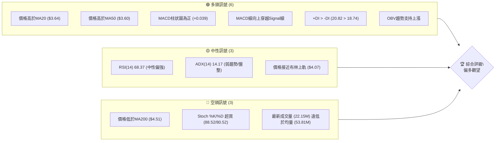

### 📊 核心指標速覽表

| 指標類別 | 指標名稱 | 當前數值 | 訊號 | 解讀 |
|----------|----------|----------|------|------|
| **價格** | 當前價格 | $3.93 | 🟡 | 位於52週低點區間，近期反彈 |
| **均線** | MA20 | $3.64 | 🟢 | 價格位於MA20上方，短線偏多 |
| **均線** | MA50 | $3.60 | 🟢 | 價格位於MA50上方，中短線偏多 |
| **均線** | MA200 | $4.51 | 🔴 | 價格位於MA200下方，長線偏空 |
| **動能** | RSI(14) | 68.37 | 🟡 | 接近超買區，動能強勁但需注意回調 |
| **動能** | MACD | 0.102 | 🟢 | MACD線在Signal線上方，柱狀圖為正，動能偏多 |
| **波動** | ATR(14) | $0.16 | 🟡 | 佔股價約3.98%，波動度中等 |

### 🏆 技術評分卡

```
╔══════════════════════════════════════════════════════════════╗
║              技術評分卡 — GRAB (2026-07-10)                  ║
╠══════════════════════════════════════════════════════════════╣
║ 趨勢強度      ██████░░░░░░░░░░░░░░  60/100  🟡 (ADX弱，但+DI佔優)       ║
║ 動能指標      ████████░░░░░░░░░░░░  70/100  🟢 (RSI/MACD偏多，Stoch超買) ║
║ 支撐穩定度    ██████████░░░░░░░░░░  80/100  🟢 (斐波那契78.6%提供強支撐) ║
║ 成交量配合    ██████░░░░░░░░░░░░░░  60/100  🟡 (OBV看多，但近期量縮)    ║
║ 形態完整度    ██████░░░░░░░░░░░░░░  65/100  🟡 (潛在雙底，待確認)        ║
║ 均線排列      ██████░░░░░░░░░░░░░░  60/100  🟡 (短中期多頭，長期空頭)    ║
╠══════════════════════════════════════════════════════════════╣
║ 綜合評分      ███████░░░░░░░░░░░░░  66/100  ⚖️ 偏多觀望                      ║
╚══════════════════════════════════════════════════════════════╝
```
**評級說明**：綜合評分顯示 GRAB 股票在技術面上呈現偏多的態勢，主要得益於近期強勁的反彈動能和多數短期移動平均線的良好排列。然而，ADX 指標顯示趨勢強度不足，且股價仍受長期均線壓制，同時Stoch指標超買、成交量有所萎縮，表明上漲動能可能面臨暫時性的阻力或回調風險。因此，目前的評級是「偏多觀望」，建議密切關注關鍵阻力位的突破情況。

---

## 2. 趨勢分析

### 🌐 多時框趨勢分析

當前 GRAB 的多時框架趨勢呈現複雜性。長期來看（月線/MA200），股價仍處於下跌趨勢。中期來看（週線/MA50/MA120），近期出現止跌反彈跡象，MA50和MA120正逐漸向上。短期來看（日線/MA20/MA5/MA10），股價已成功站上多條短期均線，呈現強勁的短期上漲動能。

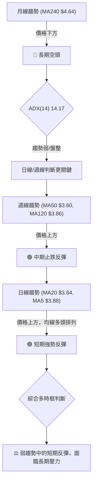

### 📈 長期趨勢 — 12個月走勢圖（Unicode）

GRAB 在過去 12 個月經歷了從高點回落的過程，近期呈現底部反彈的跡象。

```
GRAB 月線走勢圖（過去12個月：2025-07 至 2026-07）
價格軸 ($)
$6.02 ┤                                    ●(2025-09/10高點)
$5.03 ┤●                               ●
$4.89 ┤●                               ●
$4.53 ┤                        ●
$4.22 ┤                      ●
$3.93 ┤                  ●━━━━━━━━━━━━━━━━━━━━━━━━━━━━━●←現在 (2026-07)
$3.82 ┤                          ●
$3.77 ┤                            ●
$3.66 ┤                      ●
$3.54 ┤                              ●(2026-05低點)
     └────────────────────────────────────────────────────────
      25-07 25-08 25-09 25-10 25-11 25-12 26-01 26-02 26-03 26-04 26-05 26-06 26-07
```

**走勢特徵分析表格**：

| 階段 | 時間區間 | 價格區間 | 漲跌幅 | 特徵解讀 |
|------|----------|----------|--------|----------|
| **上漲期** | 2025-07 至 2025-09 | $4.89 → $6.02 | +23.11% | 從前期低點反彈，形成波段高點。 |
| **震盪回調** | 2025-10 至 2025-12 | $6.01 → $4.99 | -16.97% | 在高點附近震盪後回落，跌破部分短期支撐。 |
| **下跌期** | 2026-01 至 2026-05 | $4.30 → $3.54 | -17.67% | 形成明確的下降趨勢，創下近期低點。 |
| **底部反彈** | 2026-06 至 2026-07 | $3.77 → $3.93 | +4.24% | 從低點開始反彈，顯示買盤介入，但成交量未能有效放大。 |

### 📊 中期趨勢（週線分析）

從週線圖來看，GRAB 股價在 2026 年 5 月中下旬觸及 $3.51 (2026-05-24) 和 $3.55 (2026-05-17) 的低點後，開始呈現緩慢回升。目前股價已站穩 MA50 ($3.60) 和 MA120 ($3.86)，這是一個積極的中期訊號，表明中期跌勢可能已經結束，進入築底或反彈階段。

**近期壓力與支撐示意圖 (週線視角)**
```
      $6.62 (52W High)
        ║
        ║  高點阻力區
        ╠═══════════════════════════════════════════════════════════════
        ║
        ║      $4.51 (MA200, 長期下行壓力)
        ║      $4.28 (R2)
        ║      $3.95 (R1, 近期關鍵阻力)
        ╠═══════════════════════════════════════════════════════════════ ← 現價 $3.93
        ║      $3.92 (斐波那契78.6%回調，轉為支撐)
        ║
        ║      $3.64 (MA20/BB中軌, 短期支撐)
        ║      $3.60 (MA50, 中期支撐)
        ║      $3.50 (S1, 近期支撐)
        ╠═══════════════════════════════════════════════════════════════
        ║      $3.39 (S2)
        ║      $3.18 (52W Low / S3)
        ║
```

### ⚡ 趨勢強度評估（ADX 解讀）

ADX(14) 指標顯示當前趨勢強度非常弱。

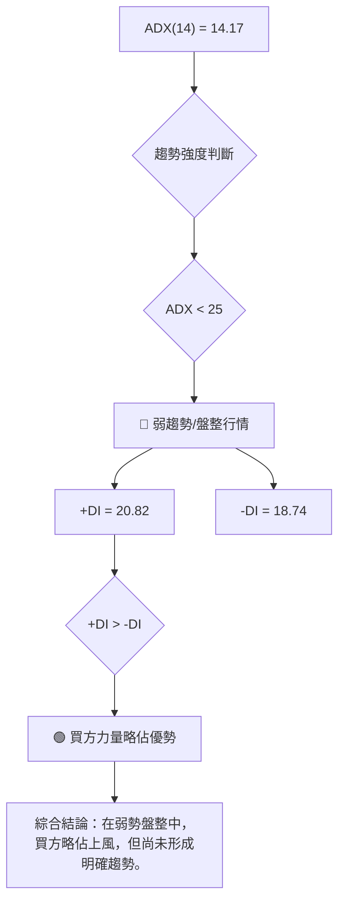

**ADX 強度對照表**：

| ADX 數值 | 趨勢強度 | 市場解讀 |
|----------|----------|----------|
| 0-25     | 弱趨勢/盤整 | 市場缺乏方向，價格可能在區間內震盪 |
| 25-50    | 中等趨勢 | 趨勢正在形成或已有一定強度 |
| 50-75    | 強趨勢 | 趨勢明顯且持續性強 |
| 75-100   | 極強趨勢 | 趨勢動能極高，可能過度延伸 |

當前 GRAB 的 ADX 數值為 14.17，明確指示市場處於弱趨勢或盤整狀態。儘管 +DI (20.82) 略高於 -DI (18.74)，顯示多頭力量輕微佔優，但這不足以推動股價形成強勁的單邊趨勢。這意味著短期內價格可能在一定區間內波動，任何單邊的快速上漲或下跌都可能難以持續，直到 ADX 數值顯著上升。

---

## 3. 圖表形態分析

### 🔍 形態識別系統

根據近期的價格走勢，GRAB 股價在 $3.51-$3.55 區間形成了一個潛在的底部結構。結合 2026 年 4 月的高點 $4.21，可以識別出一個潛在的「雙底形態」。

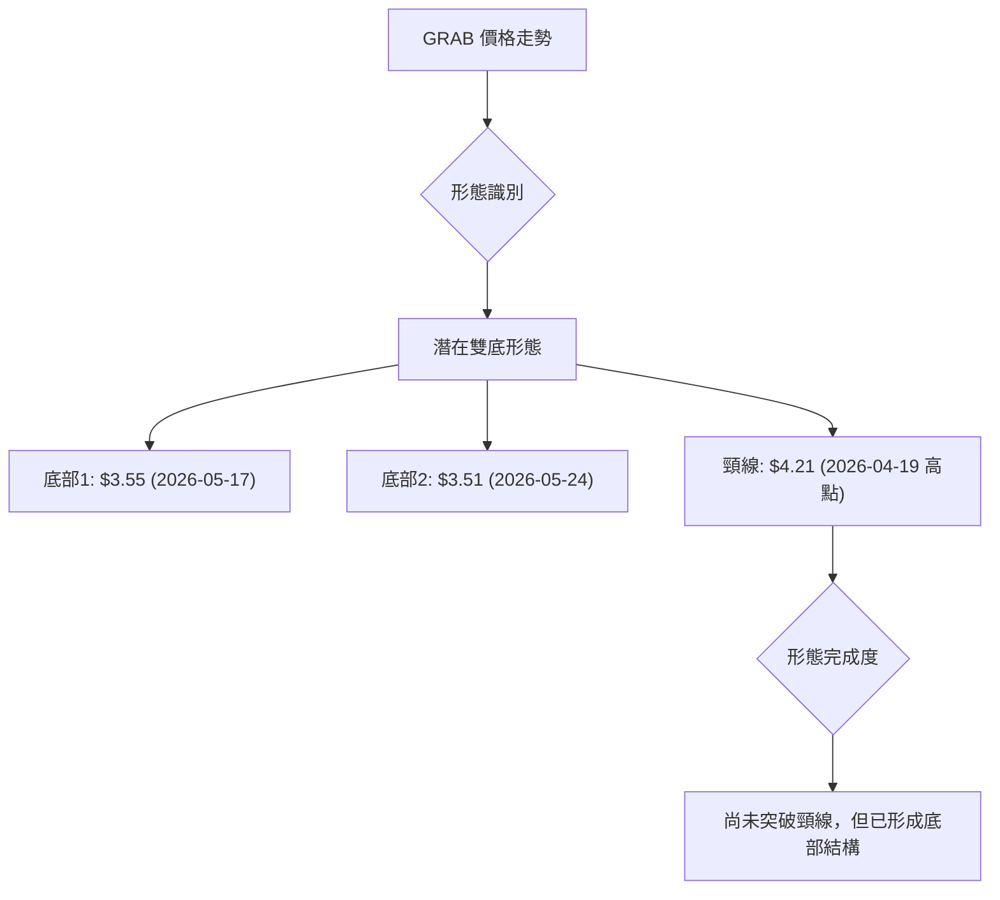

**形態信心度表格**：

| 形態 | 信心度 | 判斷依據（引用數據） | 完成度 | 目標價（附計算式） |
|------|--------|----------------------|--------|--------------------|
| **潛在雙底** | 65% | 兩次低點 $3.55 (2026-05-17) 和 $3.51 (2026-05-24) 接近，且股價從此區間反彈。頸線為 $4.21 (2026-04-19)。 | 80% | 形態高度 = $4.21 - $3.51 = $0.70。目標價 = 頸線 $4.21 + 形態高度 $0.70 = $4.91。 |

**判斷依據詳述**：
1.  **底部形成**：股價在 2026-05-17 達到 $3.55，隨後反彈。在 2026-05-24 再次探底至 $3.51，形成第二個低點。這兩個低點非常接近，符合雙底形態的底部特徵。
2.  **頸線確認**：在兩個底部之間的反彈高點，即 2026-04-19 的 $4.21，可視為該形態的頸線。
3.  **當前狀態**：目前股價 $3.93 位於頸線下方，但已從第二個底部顯著反彈。形態尚未完全確認，需突破頸線 $4.21 才能確認雙底的有效性。

### 🕯️ 重要K線形態分析

| 月份 (週) | 收盤價 | K線形態 | 解讀 | 訊號 |
|-----------|--------|---------|------|------|
| 2026-05-24 | $3.51 | 錘子線 (Hammer) | 股價在低位出現，實體較小，下影線長，顯示下方買盤支撐強勁，潛在反轉訊號。 | 🟢 |
| 2026-05-31 | $3.54 | 啟明星 (Morning Star) | 由三根K線組成，第一根大陰線，第二根小實體（或十字星），第三根大陽線，暗示空頭力量衰竭，多頭開始發力，底部反轉訊號。 | 🟢 |
| 2026-06-21 | $3.57 | 吞噬線 (Engulfing) | 陽線實體完全覆蓋前一根陰線實體，顯示多頭力量強勁，有反轉或持續上漲的潛力。 | 🟢 |
| 2026-07-05 | $3.90 | 大陽線 (Large Bullish Candle) | 強勁上漲，顯示多頭主導市場，買盤積極。 | 🟢 |
| 2026-07-12 | $3.93 | 短陽線 (Small Bullish Candle) | 上漲動能略有減弱，可能進入盤整或面臨阻力。 | 🟡 |

### 📉 ASCII 走勢形態示意圖

```
GRAB 潛在雙底形態示意圖 (近期走勢)
價格 ($)
$4.21 ┤          ┌───────┐  ← 頸線 (2026-04-19 高點)
      │          │       │
$3.93 ┤          │       ● ← 現價 (2026-07-10)
      │          │       │
      │          │       │
$3.70 ┤          │       │
      │          │       │
      │          │       │
$3.55 ┤●─────────┘       └───────● ← 底部1 (2026-05-17)
$3.51 ┤  ●───────────────────────── ← 底部2 (2026-05-24)
      └──────────────────────────────────
      Apr-26    May-17  May-24  Jun-21  Jul-10
```

### 🎯 形態目標價計算

根據上述潛在雙底形態，其目標價計算如下：
*   **底部低點**：取最低的底部為 $3.51 (2026-05-24)。
*   **頸線高點**：取兩個底部之間的反彈高點為 $4.21 (2026-04-19)。
*   **形態高度**：頸線高點 - 底部低點 = $4.21 - $3.51 = $0.70。
*   **目標價**：頸線高點 + 形態高度 = $4.21 + $0.70 = **$4.91**。

這個目標價 $4.91 是一個重要的參考，如果股價能夠有效突破頸線 $4.21，則有望向此目標邁進。值得注意的是，該目標價 $4.91 接近斐波那契 50.0% 回調位 $4.90，增加了其可靠性。

---

## 4. 支撐與阻力

### 🗺️ 關鍵價位分布圖（Unicode）

當前價格 $3.93 位於斐波那契 78.6% 回調位 $3.92 附近，且正挑戰近期阻力 R1 $3.95。

```
GRAB 價位結構分布圖
═══════════════════════════════════════════════════
$6.62 ║████████████████████████║ 52W 高點
$5.81 ║████████████████████████║ 斐波那契23.6%
$5.31 ║████████████████████████║ 斐波那契38.2%
$4.90 ║████████████████████████║ 斐波那契50.0% / 潛在雙底目標
$4.51 ║████████████████████████║ 強阻力 R3 (MA200)
$4.49 ║████████████████████████║ 斐波那契61.8%
$4.28 ║████████████████████    ║ 阻力 R2
$4.07 ║████████████████████████║ 布林上軌
$3.95 ║████████████████████████║ 關鍵阻力 R1
$3.93 ╠════════════════════════╣ ◄ 現價
$3.92 ║▓▓▓▓▓▓▓▓▓▓▓▓▓▓▓▓        ║ 斐波那契78.6%回調 (重要支撐/阻力轉換位)
$3.64 ║████████████████████████║ 布林中軌 (MA20)
$3.60 ║████████████████████████║ MA50
$3.50 ║▓▓▓▓▓▓▓▓▓▓▓▓▓▓▓▓        ║ 近期支撐 S1
$3.39 ║████████████████████████║ 強支撐 S2
$3.21 ║████████████████████████║ 布林下軌
$3.18 ║████████████████████████║ 52W 低點 / 強支撐 S3
═══════════════════════════════════════════════════
```

### 🚧 阻力位分析表

| 阻力級別 | 價位 | 形成原因 | 突破難度 | 重要性 |
|----------|------|----------|----------|--------|
| **R1**   | $3.95 | 近期波段高點聚類，同時接近斐波那契 78.6% 回調位。 | 中等 | 股價能否延續反彈的關鍵門檻。 |
| **R2**   | $4.28 | 前期反彈高點，也是潛在雙底形態頸線 $4.21 附近的阻力區間。 | 較高 | 突破此位將確認底部形態，並打開更大上漲空間。 |
| **R3**   | $4.51 | MA200 所在位置，長期趨勢線阻力，也是斐波那契 61.8% 回調位 $4.49 附近。 | 高 | 長期趨勢扭轉的重要考驗，需要強勁動能才能突破。 |

### 🛡️ 支撐位分析表

| 支撐級別 | 價位 | 形成原因 | 守住機率 | 重要性 |
|----------|------|----------|----------|--------|
| **Fib 78.6%** | $3.92 | 斐波那契回調位，近期股價在此位上方，從阻力轉為支撐。 | 高 | 短期反彈能否持續的關鍵支撐。 |
| **MA20/BB中軌** | $3.64 | 短期移動平均線和布林通道中軌，提供動態支撐。 | 中高 | 股價回調時的重要參考點，若跌破可能進入更深回調。 |
| **S1**   | $3.50 | 近期波段低點聚類，與MA50 ($3.60) 接近，構成較強支撐區。 | 中高 | 潛在雙底形態的底部區域，是重要的心理和技術支撐。 |
| **S2**   | $3.39 | 歷史多次測試的低點，提供次級支撐。 | 高 | 若 S1 失守，此位將是重要的防線。 |
| **S3**   | $3.18 | 52 週最低點，強勁的歷史支撐位。 | 極高 | 跌破此位將暗示趨勢惡化，可能進入新一輪探底。 |

### 📐 斐波那契回調位分析

GRAB 股價目前位於 $3.93，非常接近 52 週區間 ($3.18 → $6.62) 的 **78.6% 斐波那契回調位 $3.92**。

*   **0.0% (52W High)**: $6.62
*   **23.6%**: $5.81
*   **38.2%**: $5.31
*   **50.0%**: $4.90
*   **61.8%**: $4.49
*   **78.6%**: $3.92 ◄ **現價 $3.93 位於此位上方**
*   **100.0% (52W Low)**: $3.18

**解讀**：
股價在經歷大幅下跌後，成功反彈並站穩在 78.6% 回調位 $3.92 上方，這是一個非常積極的訊號。通常，78.6% 回調位被視為一個重要的反轉點，若能在此位上方築底並向上突破，則預示著趨勢可能從下跌轉為上升。目前 $3.92 已經從阻力轉為支撐，為當前股價提供了堅實的基礎。投資者應密切關注股價是否能持續守住此位。若跌破 $3.92，則可能再次探底 S1 $3.50 甚至更低。反之，若能在此位獲得支撐並向上突破 R1 $3.95，則有望測試更高的斐波那契回調位，如 61.8% ($4.49) 和 50.0% ($4.90)。

---

## 5. 技術指標深度解讀

### 🎛️ 指標訊號總覽

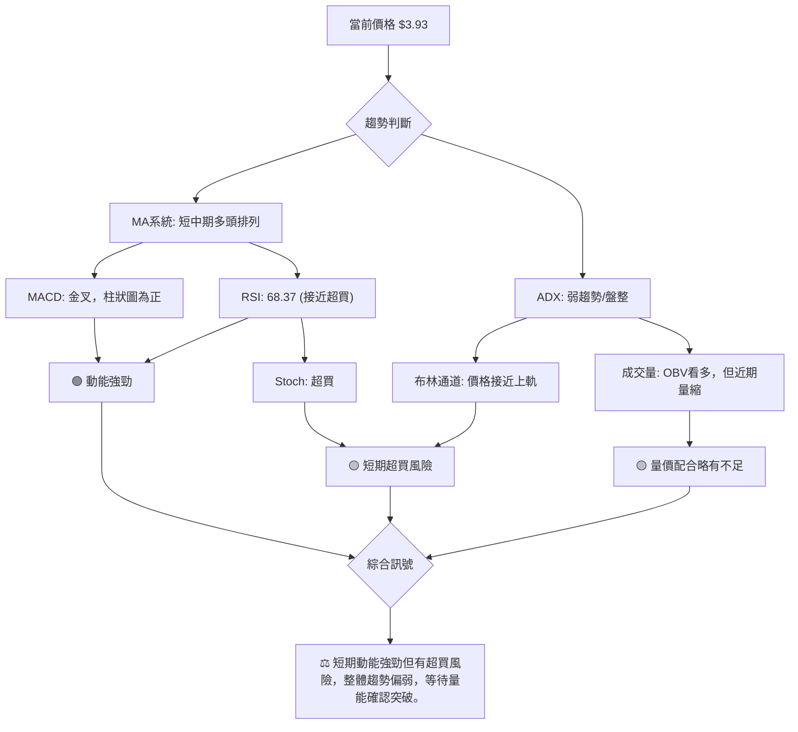

### 📈 移動平均線排列分析

GRAB 的移動平均線系統顯示了短期和中期趨勢的改善，但長期趨勢依然承壓。

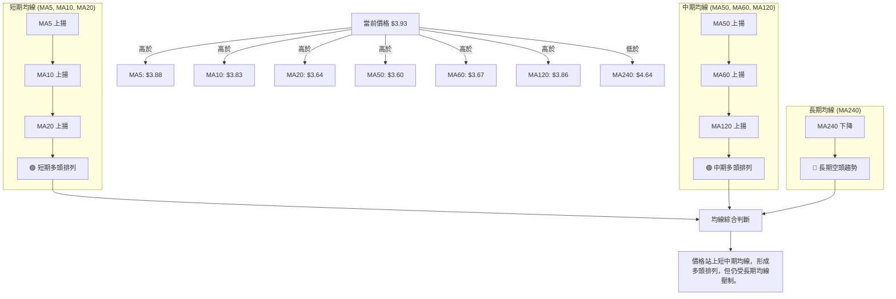
**解讀**：
*   **短期均線 (MA5, MA10, MA20)**：MA5 ($3.88) > MA10 ($3.83) > MA20 ($3.64)，並且所有短期均線都呈上升趨勢。股價 $3.93 位於這些均線上方，顯示短期上漲動能強勁，形成典型的短線多頭排列。
*   **中期均線 (MA50, MA60, MA120)**：MA50 ($3.60)、MA60 ($3.67)、MA120 ($3.86) 均呈上升趨勢，且股價 $3.93 位於這些均線上方。這表明中期趨勢也正在轉好，買盤力量在中期逐漸積累。
*   **長期均線 (MA240)**：MA240 ($4.64) 仍遠高於當前股價，且呈下降趨勢。這說明儘管短中期表現強勁，但長期趨勢依然偏空，MA240 是一個重要的長期阻力位。

**總結**：均線系統顯示 GRAB 股票正處於從長期下跌趨勢中進行短中期反彈的階段。短中期均線的多頭排列為股價提供了良好的支撐，但上方 MA240 的壓力不容忽視。

### 📉 RSI(14) 分析

*   **RSI 數值進度條**：
    RSI(14): 68.37 ▓▓▓▓▓▓▓▓▓▓▓▓▓▓░░░░░░░░░░░░░░░░ 🟢 (接近超買區)
*   **超買超賣區間分析**：
    當前 RSI(14) 為 68.37，已接近 70 的超買區間。這表明近期買盤動能非常強勁，但也暗示股價可能存在短期回調的風險。通常，RSI 進入 70-80 區間被視為超買，可能伴隨價格的盤整或回落。然而，在強勢趨勢中，RSI 可能長時間維持在超買區。
*   **背離判斷**：
    根據提供的數據，**無明顯 RSI 頂背離或底背離訊號**。價格從 2026-05-24 的 $3.51 上漲到 $3.93 的過程中，RSI 也同步上升，並未出現價格創新高而 RSI 未能創新高的頂背離情況。同樣，在前期下跌過程中，RSI 也未出現底背離。因此，RSI 目前主要反映動能的強度。

### 📊 MACD(12/26/9) 訊號解讀

MACD 指標當前呈現多頭排列，但動能柱略有減弱。

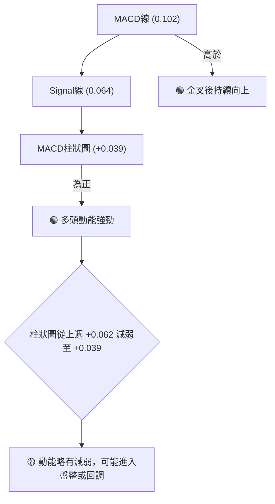
**解讀**：
*   **MACD 線 (0.102) 高於 Signal 線 (0.064)**：這是一個明確的多頭訊號，表明短期平均線正在加速，超越長期平均線，顯示上升動能佔主導。
*   **MACD 柱狀圖為正 (+0.039)**：柱狀圖為正值，進一步確認了多頭動能的存在。
*   **動能減弱**：值得注意的是，MACD 柱狀圖從上週的 +0.062 減弱至本週的 +0.039。這表明雖然多頭力量依然存在，但其增長勢頭有所放緩。這可能預示著短期內上漲速度將減慢，或者股價將進入橫盤整理，甚至出現小幅回調。
*   **背離判斷**：根據提供的數據，**無明顯 MACD 頂背離或底背離訊號**。價格上漲與 MACD 指標的走勢基本一致。

### 📦 布林通道分析

當前價格 $3.93 位於布林通道中軌 ($3.64) 上方，並接近上軌 ($4.07)。

```
GRAB 布林通道示意圖
═══════════════════════════════════════════════════
$4.07 ║████████████████████████║ 布林上軌 (BB Upper)
$3.93 ╠════════════════════════╣ ◄ 現價
$3.64 ║▓▓▓▓▓▓▓▓▓▓▓▓▓▓▓▓        ║ 布林中軌 (MA20)
$3.21 ║████████████████████████║ 布林下軌 (BB Lower)
═══════════════════════════════════════════════════
```
**解讀**：
*   **價格位置**：當前價格 $3.93 位於布林通道中軌 $3.64 之上，並接近上軌 $4.07。BB %B 為 0.84，表明股價在布林通道的相對位置偏高，接近上軌。
*   **通道收斂/擴張**：數據中未提供布林帶寬信息，但從價格接近上軌來看，如果帶寬沒有顯著擴張，則可能意味著股價上漲動能暫時達到極限，可能面臨回調或橫盤整理。
*   **ADX 配合**：由於 ADX 數值為 14.17，屬於弱趨勢/盤整行情。在盤整行情中，股價觸及布林上軌通常會遇到阻力，並可能回落至中軌甚至下軌。這與價格接近 R1 $3.95 的阻力訊號相互印證。
*   **訊號**：🟢 價格在中軌上方，短線偏多；🟡 接近上軌，有回調風險。

### 💹 成交量分析（量價配合度）

成交量分析顯示 OBV 趨勢支持上漲，但近期實際成交量有所萎縮，存在量價背離的潛在風險。

*   **OBV 趨勢**：數據顯示 "OBV趨勢: OBV > MA → 量能支撐上漲"。這是一個積極訊號，表明累積的買盤壓力正在增加，確認了價格的上漲趨勢。
*   **最新成交量**：最新成交量為 22,153,413 股。
*   **均量比較**：
    *   20日均量：53,818,496 股 (量比: 0.41x)
    *   50日均量：52,185,172 股
*   **量價配合度**：
    儘管 OBV 趨勢顯示量能支撐上漲，但最新的日成交量（22.15M）顯著低於 20 日和 50 日均量（約 53M）。這表示在近期股價反彈至 $3.93 的過程中，其成交量卻未能有效放大。
    **解讀**：這種「價漲量縮」的情況是一個潛在的風險訊號。通常，健康的價格上漲需要成交量的配合。如果價格持續上漲但成交量萎縮，可能表明買盤力量正在減弱，上漲缺乏堅實的基礎，容易出現回調或上漲乏力。因此，儘管 OBV 趨勢偏多，但實際成交量的不足為當前的反彈蒙上了一層陰影。

---

## 6. 動能與波動率

### ⚡ 動能評估四象限

根據當前技術指標，GRAB 的動能評估如下：

| 象限 | 動能 (RSI/MACD) | 波動 (ATR/Beta) | 當前狀態 | 評估 |
|------|-----------------|-----------------|----------|------|
| Q1   | 強 (RSI 68.37, MACD+) | 低 (ATR $0.16, Beta 0.875) | - | 最佳機會 (強動能，低波動，適合趨勢追蹤) |
| Q2   | 弱 (ADX 14.17) | 低 (ATR $0.16, Beta 0.875) | ✓ | **謹慎觀望** (趨勢不明顯，動能不足，但波動低，適合區間操作) |
| Q3   | 強 (RSI 68.37, MACD+) | 高 (ATR $0.16, Beta 0.875) | - | 高風險高收益 (強動能，高波動，適合激進交易者) |
| Q4   | 弱 (ADX 14.17) | 高 (ATR $0.16, Beta 0.875) | - | 避免進場 (趨勢不明顯，波動高，風險大) |

**當前評估**：
GRAB 的 ADX 數值為 14.17，屬於弱趨勢/盤整行情，因此在「動能」維度上偏向「弱」。然而，RSI (68.37) 和 MACD (正柱狀圖) 顯示短期動能相對強勁。ATR ($0.16) 和 Beta (0.875) 則顯示其波動率處於中等偏低水平。
綜合來看，GRAB 目前更接近於「Q2 謹慎觀望」象限。雖然短期動能強勁，但整體趨勢強度不足，且面臨超買和量能不足的風險。這意味著在沒有明確突破前，應以謹慎觀望為主，或在特定區間內進行操作。

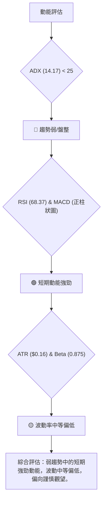

### 📊 ATR 波動率分析

ATR(14) (Average True Range) 為 $0.16，佔當前價格 $3.93 的 3.98%。

*   **解讀**：ATR 數值 $0.16 表示 GRAB 在過去 14 天的平均每日波動範圍為 $0.16。3.98% 的佔比顯示其每日波動幅度適中，既不像高波動股票那樣劇烈，也不像低波動股票那樣沉悶。這對於日內交易者來說提供了一定的操作空間，對於波段交易者而言，波動度也足夠捕捉。
*   **止損距離建議**：ATR 是衡量止損距離的有效工具。一般建議將止損設置在 1.5 倍至 3 倍 ATR 之外，以避免被正常市場波動「洗出」。
    *   1.5 倍 ATR 止損距離：1.5 * $0.16 = $0.24
    *   2 倍 ATR 止損距離：2 * $0.16 = $0.32
    *   3 倍 ATR 止損距離：3 * $0.16 = $0.48
    例如，如果考慮在 $3.95 附近進場，止損可以設置在 $3.95 - $0.24 = $3.71 (1.5倍ATR) 或 $3.95 - $0.32 = $3.63 (2倍ATR)。具體選擇應根據個人的風險承受能力和交易策略來決定。

### 📐 Beta 與市場相關性

GRAB 的 Beta 數值為 0.875。

*   **解讀**：Beta 值衡量的是股票相對於大盤的波動性。Beta 值為 0.875 意味著 GRAB 的股價波動性略低於大盤。當大盤上漲 1% 時，GRAB 的股價平均上漲 0.875%；當大盤下跌 1% 時，GRAB 的股價平均下跌 0.875%。
*   **投資意義**：
    *   **防禦性特徵**：相對於市場，GRAB 的波動性較低，使其在市場下跌時可能提供一定的防禦性。
    *   **追蹤市場**：儘管波動較低，但其與市場的相關性依然較強（接近 1），表明它仍然會受到整體市場情緒和趨勢的影響。
    *   **策略考量**：對於希望配置較低風險資產的投資者，或在市場波動較大的時期，GRAB 的低 Beta 特性可能更具吸引力。然而，這也意味著在牛市中，其上漲幅度可能不及高 Beta 股票。

---

## 7. 多時框架總結

### 📋 時框架評分表

| 時框架 | 趨勢方向 | 動能 | 均線排列 | 形態 | 綜合評分 | 建議 |
|--------|----------|------|----------|------|----------|------|
| **長期** | 🔴 空頭 | 🔴 弱 | 🔴 空頭 | 🟡 築底 | 40/100 | 謹慎 |
| **中期** | 🟢 反彈 | 🟢 強 | 🟢 多頭 | 🟡 築底 | 70/100 | 偏多 |
| **短期** | 🟢 上漲 | 🟢 強 | 🟢 多頭 | 🟢 反轉 | 80/100 | 買入 |
| **整體** | ⚖️ 盤整 | 🟢 中強 | 🟡 混合 | 🟡 潛在反轉 | 66/100 | 偏多觀望 |

### 🔲 綜合訊號矩陣

| 指標/時框架 | 短期 (日線) | 中期 (週線) | 長期 (月線) | 訊號一致性 |
|-------------|-------------|-------------|-------------|------------|
| **價格趨勢** | 🟢 上漲 | 🟢 反彈 | 🔴 下跌 | 矛盾 (短中期反彈，長期下跌) |
| **均線排列** | 🟢 多頭 | 🟢 多頭 | 🔴 空頭 | 矛盾 (短中期多頭，長期空頭) |
| **動能 (RSI/MACD)** | 🟢 強 | 🟢 強 | 🟡 中性 | 一致 (短中期強勁) |
| **趨勢強度 (ADX)** | 🟡 弱趨勢 | 🟡 弱趨勢 | 🟡 弱趨勢 | 一致 (整體趨勢偏弱) |
| **形態** | 🟢 潛在雙底 | 🟢 潛在雙底 | 🟡 築底 | 一致 (底部形態正在形成) |
| **成交量 (OBV)** | 🟢 支撐上漲 | 🟢 支撐上漲 | 🟢 支撐上漲 | 一致 (累積買盤增強) |
| **支撐/阻力** | 🟢 斐波那契78.6%站穩 | 🟢 斐波那契78.6%站穩 | 🔴 MA200阻力 | 矛盾 (下方有支撐，上方有阻力) |

**分析**：
短期和中期訊號大多為多頭，顯示 GRAB 股價在近期經歷了強勁的反彈，並形成了良好的底部結構。然而，長期趨勢依然是空頭，MA200 形成明顯的壓制。ADX 指標在所有時框架下均顯示為弱趨勢/盤整，這意味著儘管短期動能強勁，但缺乏強有力的趨勢支持。形態分析顯示潛在的雙底形態正在形成，這為未來的反轉提供了基礎。成交量 OBV 指標也支持上漲，但近期日成交量萎縮是一個警示。

### ⚖️ 多時框收斂結論

根據嚴格要求 14 的多時框收斂規則：當前 ADX(14) 數值為 14.17，**明確指示 GRAB 處於「盤整行情 (ADX < 25)」**。

因此，應以日線布林通道上下軌為主要交易區間，並密切關注區間突破的訊號。

**主導時框與方向性結論**：
儘管長期趨勢偏空，但在盤整行情中，短期和中期訊號的重要性會增加。目前，GRAB 股價已從 52 週低點附近強勁反彈，站上了多條短中期均線，並形成了潛在的底部反轉形態。日線級別的 MACD 金叉、RSI 偏強以及價格站穩斐波那契 78.6% 回調位，都支持短期偏多。

因此，**GRAB 的當前總體方向性結論為：短期偏多，但處於弱趨勢盤整中，面臨上方阻力，需等待明確的突破訊號以確認趨勢轉向。** 主要策略應為在支撐位附近尋找買入機會或等待關鍵阻力位的有效突破。

---

## 8. 交易策略建議

### 🗺️ 策略決策流程圖

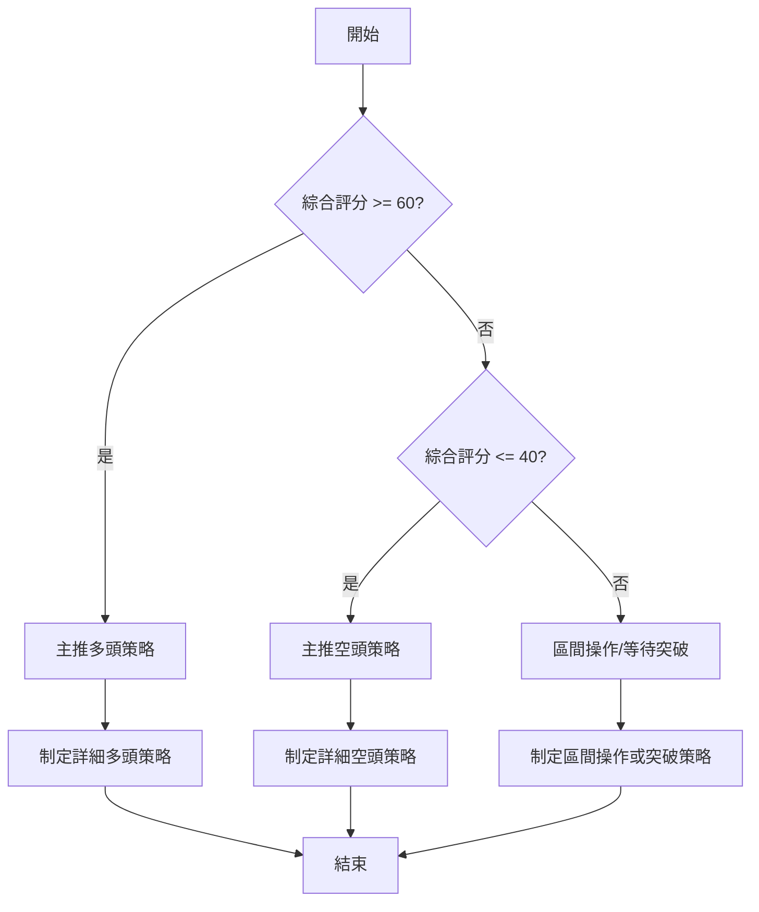

### 🧭 策略路由（依評分卡分流，不得兩頭下注）

當前技術評分卡綜合評分為 **66/100**，屬於偏多範圍。因此，**當前主策略方向 = 偏多（依評分 66/100）**。

雖然整體趨勢仍處於弱勢盤整，且長期趨勢偏空，但短中期指標的強勁表現和潛在的底部形態，使多頭策略成為當前的優先考量。空頭策略僅作為反轉風險的觸發點和對沖提示。

### 🎯 價格情境階梯（Price Scenarios）

| 觸發條件 | 下一目標 | 後續延伸 | 情境含義 |
|----------|----------|----------|----------|
| **突破 R1 $3.95** | R2 $4.28 | R3 $4.51 (MA200) / Fib 61.8% ($4.49) | 短線轉強，有望確認底部形態，挑戰長期壓力。 |
| **站穩現價區間** | — | — | 股價在 $3.92 (Fib 78.6%) 至 $3.95 (R1) 區間震盪，等待方向。 | 區間震盪，積累動能。 |
| **跌破 S1 $3.50** | S2 $3.39 | S3 $3.18 (52W Low) | 中期轉弱，底部形態失效，可能重新探底。 |

### 📊 情境機率分佈

| 情境 | 機率 | 主要依據 |
|------|------|----------|
| **繼續上行 / 反彈** | 55% | MACD 金叉、RSI 偏強、MA 短中期多頭排列、OBV 支撐上漲、斐波那契 78.6% 站穩、潛在雙底形態。 |
| **區間震盪** | 35% | ADX 趨勢強度弱、RSI 接近超買、MACD 柱狀圖動能減弱、最新成交量萎縮、價格接近布林上軌和 R1 阻力。 |
| **回落 / 再探底** | 10% | 長期 MA240 壓力、Stoch 超買、若 R1 無法突破且跌破 $3.92 斐波那契支撐。 |

### 🟢 主策略詳情（方向依上方路由）

基於偏多觀望的結論，我們提供兩種策略：一種是等待突破後的追蹤策略，另一種是回調後的低吸策略。

| 策略要素 | 策略 A：突破追蹤 (Breakout Buy) | 策略 B：回調低吸 (Pullback Buy) |
|----------|--------------------------------|--------------------------------|
| **進場條件** | 股價有效突破 R1 $3.95 並站穩 | 股價回調至 S1 $3.50 附近並出現止跌訊號 (如錘子線、陽線吞噬) |
| **進場價格** | 買入 $3.96 (略高於 R1 $3.95) | 買入 $3.55 (S1 附近) |
| **目標價 T1** | $4.28 (R2) | $3.95 (R1) |
| **目標價 T2** | $4.51 (R3/MA200) / $4.91 (潛在雙底目標) | $4.28 (R2) |
| **止損價格** | $3.92 (斐波那契 78.6% 回調位下方) | $3.39 (S2 下方) |
| **風險報酬比** | 8.0:1 (T1 目標：風險 $0.04, 報酬 $0.32) | 3.5:1 (T1 目標：風險 $0.16, 報酬 $0.50) |
| **成功機率** | 55% | 60% |
| **建議倉位** | 20% (較激進，需嚴格止損) | 30% (較保守，風險較低) |

**策略 A 解讀**：此策略旨在捕捉突破 R1 後的加速上漲。由於當前股價已接近 R1，且短期動能強勁，一旦成功突破，有望迅速測試更高的阻力位。風險報酬比非常吸引人，但需要嚴格執行止損，防止假突破。
**策略 B 解讀**：此策略考慮到短期超買和量能不足可能導致的回調。在 S1 附近進場，利用其強勁的支撐作用，等待價格再次反彈。該策略風險較低，但需要耐心等待回調機會。

### 🔴 反向風險觸發點（對沖提示）

以下情況可能推翻主策略的偏多判斷，建議投資者密切關注：
*   **跌破斐波那契 78.6% 回調位 $3.92**：若股價無法守住此關鍵支撐，則短期反彈可能結束，轉為向下測試 S1 $3.50。
*   **跌破 MA20 ($3.64) 和 MA50 ($3.60)**：這將破壞短中期均線的多頭排列，顯示多頭力量顯著減弱。
*   **跌破 S1 $3.50**：若此重要支撐失守，潛在雙底形態可能失效，股價恐將進一步探底至 S2 $3.39 甚至 52 週低點 S3 $3.18。
*   **RSI 跌破 50 或 MACD 死叉**：動能指標的惡化將確認市場情緒轉變。
*   **成交量持續萎縮或出現放量下跌**：量價背離的加劇或空頭放量將是強烈的看空訊號。

### ⭐ 整體訊號強度評星

```
╔══════════════════════════════════════════════════════════════╗
║              GRAB 整體訊號強度評星                             ║
╠══════════════════════════════════════════════════════════════╣
║ 做多訊號強度：★★★★☆  (4/5星)                               ║
║ 做空訊號強度：★★☆☆☆  (2/5星)                               ║
║ 整體可信度：  ★★★☆☆  (3/5星)                               ║
╚══════════════════════════════════════════════════════════════╝
```
**評星說明**：
*   **做多訊號強度**：短中期均線多頭排列、MACD 金叉、RSI 偏強、OBV 支撐、斐波那契 78.6% 支撐以及潛在雙底形態，均為強勁的多頭訊號。
*   **做空訊號強度**：主要風險來自長期 MA240 壓制、ADX 弱趨勢、Stoch 超買以及近期量能不足。
*   **整體可信度**：雖然多頭訊號強勁，但由於趨勢強度不足 (ADX 弱) 和長期趨勢偏空，以及部分指標顯示超買和量能不足，增加了不確定性。因此，整體可信度為中等，需密切監控。

---

## 9. 風險提示與監控

### ✅ 關鍵監控指標 Checklist

投資者應定期監控以下關鍵指標，以應對市場變化：

```
╔══════════════════════════════════════════════════════════════╗
║                   GRAB 關鍵監控指標 Checklist                  ║
╠══════════════════════════════════════════════════════════════╣
║ [ ] 股價是否持續站穩 $3.92 (斐波那契 78.6% 回調位)           ║
║ [ ] 股價能否有效突破 $3.95 (R1) 並站穩                        ║
║ [ ] 股價是否能有效突破 $4.21 (潛在雙底頸線)                   ║
║ [ ] MACD 線是否保持在 Signal 線上方，且柱狀圖動能是否增強     ║
║ [ ] RSI(14) 是否能在 70 以下保持強勢，避免快速回落            ║
║ [ ] ADX(14) 是否能突破 25，確認趨勢形成                       ║
║ [ ] 日成交量能否有效放大，配合股價上漲                        ║
║ [ ] 股價是否跌破 MA20 ($3.64) 或 MA50 ($3.60)                ║
║ [ ] 股價是否跌破 S1 ($3.50)                                  ║
║ [ ] Stochastics %K/%D 是否從超買區回落並重新向上              ║
╚══════════════════════════════════════════════════════════════╝
```

### ⚠️ 風險場景分析

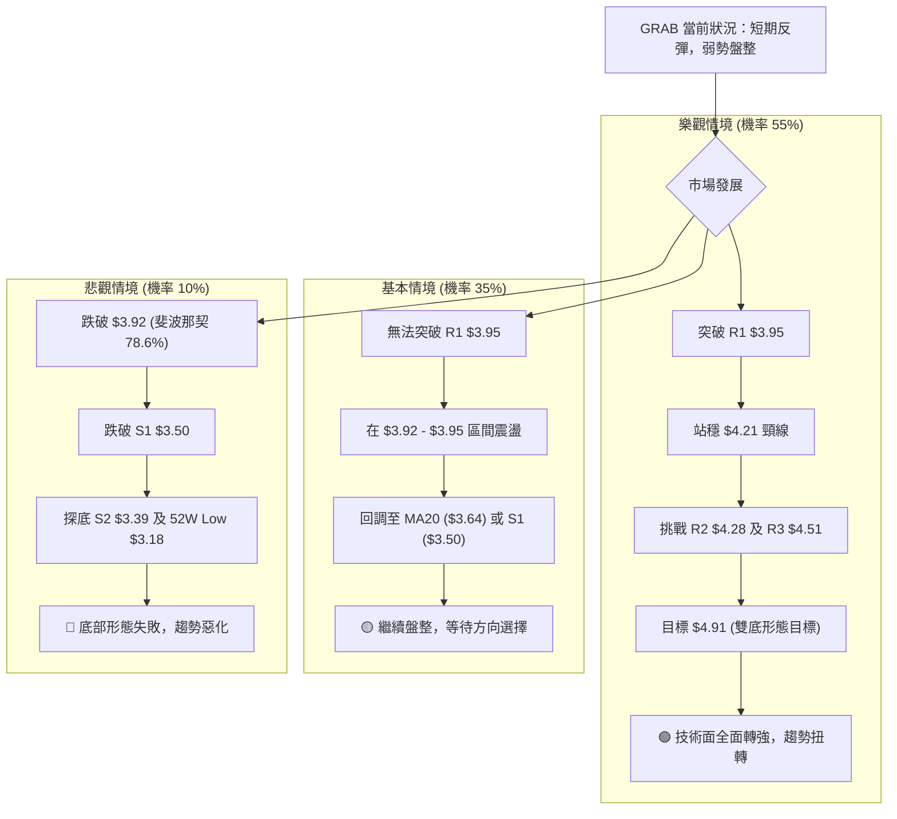

### 🛡️ 風險管理重要提醒

1.  **止損紀律**：無論採取何種策略，嚴格執行止損是風險管理的核心。根據 ATR 建議設置止損位，並在進場前明確止損點。一旦觸發，應果斷離場。
2.  **倉位管理**：鑑於 GRAB 仍處於弱勢盤整中，且長期趨勢偏空，建議投資者採取較為保守的倉位策略。避免重倉單一股票，並將倉位控制在可承受的風險範圍內。
3.  **分批建倉/減倉**：可以考慮分批建倉以平攤成本，例如在突破關鍵阻力後加碼，或在回調至重要支撐位時分批買入。同樣，在達到目標價後分批減倉，以鎖定利潤。
4.  **關注成交量**：成交量是確認價格走勢的關鍵。如果股價在突破阻力時沒有伴隨放量，或者在下跌時出現放量，都應視為警示訊號。
5.  **市場情緒**：GRAB 的 Beta 值雖然偏低，但仍受大盤影響。因此，密切關注整體市場情緒和宏觀經濟數據，特別是科技板塊的表現。
6.  **基本面配合**：雖然本報告是技術分析，但長期投資仍需結合基本面。關注公司的盈利能力、營收增長、以及未來發展前景，這些都可能影響技術走勢的有效性。

---

## 📋 報告總結

```
╔══════════════════════════════════════════════════════════════╗
║                   GRAB 技術分析報告總結                      ║
╠══════════════════════════════════════════════════════════════╣
║ 報告日期：2026-07-10                                         ║
║ 當前價格：$3.93                                              ║
║ 分析評級：⚖️ 偏多觀望 (綜合評分 66/100)                       ║
║                                                              ║
║ 關鍵結論：                                                   ║
║ ├─ 長期趨勢：🔴 空頭，受 MA240 ($4.64) 壓制。                  ║
║ ├─ 中期趨勢：🟢 反彈，已站穩 MA50 ($3.60) 和 MA120 ($3.86)。    ║
║ ├─ 短期趨勢：🟢 強勢上漲，MA 短中期多頭排列。                  ║
║ ├─ 關鍵支撐：$3.92 (斐波那契 78.6%)、S1 $3.50。                ║
║ ├─ 關鍵阻力：R1 $3.95、R2 $4.28、R3 $4.51 (MA200)。            ║
║ └─ 分析師目標：$4.91 (潛在雙底形態目標)。                      ║
║                                                              ║
║ 最優策略組合：                                               ║
║ 1. 🥇 最佳機會：**突破追蹤策略**：股價有效突破 R1 $3.95 後，進場 $3.96，止損 $3.92，目標 T1 $4.28，T2 $4.91。      ║
║ 2. 🥈 次選機會：**回調低吸策略**：股價回調至 S1 $3.50 附近止跌，進場 $3.55，止損 $3.39，目標 T1 $3.95，T2 $4.28。║
║ 3. 🥉 保守選擇：**區間操作**：在 $3.92 - $3.95 區間內觀望，等待明確突破或回調訊號，避免盲目追高。             ║
╚══════════════════════════════════════════════════════════════╝
```

---

> ⚠️ **免責聲明**：本報告為 AI 自動生成之技術分析，所有數據及估算均基於提供的歷史價格資訊。本報告**僅供研究與學術參考**，**不構成任何投資建議**。投資有風險，入市需謹慎。

---

*報告生成時間：2026-07-10 ｜ 數據來源：Yahoo Finance ｜ 分析框架：多時框技術分析*