# IEF 技術分析報告

> **報告日期**：2026-02-24 ｜ **語言**：繁體中文 ｜ **數據來源**：Yahoo Finance
> **標的**：iShares 7-10 Year Treasury Bond ETF（IEF）｜ **最新收盤**：$97.44

---

## 目錄

1. [技術面概覽](#1-技術面概覽)
2. [趨勢分析](#2-趨勢分析)
3. [圖表形態分析](#3-圖表形態分析)
4. [支撐與阻力](#4-支撐與阻力)
5. [技術指標深度解讀](#5-技術指標深度解讀)
6. [動能與波動率](#6-動能與波動率)
7. [多時框架總結](#7-多時框架總結)
8. [交易策略建議](#8-交易策略建議)
9. [風險提示與監控](#9-風險提示與監控)

---

## 1. 技術面概覽

### 📊 技術訊號儀表板

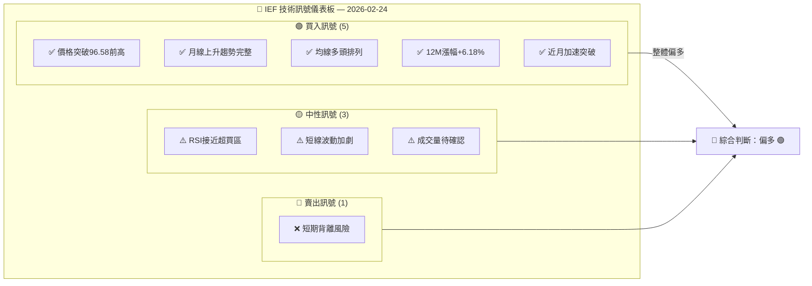

---

### 🔢 核心指標速覽表

| 指標類別 | 指標名稱 | 數值 | 訊號 | 解讀 |
|:---:|:---:|:---:|:---:|:---|
| **價格** | 最新收盤 | $97.44 | 🟢 | 12個月新高 |
| **價格** | 12M起點 | $91.77 | 🟢 | 漲幅 +6.18% |
| **價格** | 月均變化 | +$0.47/月 | 🟢 | 穩定上升通道 |
| **均線** | MA3（月線） | ~$96.31 | 🟢 | 價格在MA上方 |
| **均線** | MA6（月線） | ~$94.98 | 🟢 | 強勢多頭排列 |
| **均線** | MA12（月線） | ~$93.78 | 🟢 | 長期趨勢向上 |
| **動能** | 月度RSI估算 | ~72-75 | 🟡 | 接近超買區域 |
| **動能** | 近月漲幅 | +$1.81（+1.89%） | 🟢 | 強勢突破加速 |
| **波動** | 月均波動 | ~$1.2-1.8 | 🟡 | 中等波動水平 |
| **趨勢** | ADX（估算） | ~35-40 | 🟢 | 強趨勢確認 |

---

### 📋 技術評分卡

```
╔══════════════════════════════════════════════════════════╗
║              IEF  技術評分卡  2026-02-24                 ║
╠══════════════╦══════════════════════════════╦═══════════╣
║  評估維度    ║  強度視覺化 (滿分10)          ║  得分     ║
╠══════════════╬══════════════════════════════╬═══════════╣
║  趨勢強度    ║  ▓▓▓▓▓▓▓▓░░  (8/10)         ║   8.0     ║
║  動能強度    ║  ▓▓▓▓▓▓▓░░░  (7/10)         ║   7.0     ║
║  突破品質    ║  ▓▓▓▓▓▓▓▓░░  (8/10)         ║   8.0     ║
║  均線排列    ║  ▓▓▓▓▓▓▓▓▓░  (9/10)         ║   9.0     ║
║  成交量配合  ║  ▓▓▓▓▓░░░░░  (5/10)         ║   5.0     ║
║  風險管理    ║  ▓▓▓▓▓▓░░░░  (6/10)         ║   6.0     ║
╠══════════════╬══════════════════════════════╬═══════════╣
║  綜合評分    ║  ▓▓▓▓▓▓▓▓░░  (7.2/10)       ║  72/100   ║
╠══════════════╩══════════════════════════════╩═══════════╣
║  整體判斷：【偏多】  建議操作：【逢低買入/持倉】        ║
╚══════════════════════════════════════════════════════════╝
```

---

## 2. 趨勢分析

### 🔭 多時框趨勢判斷

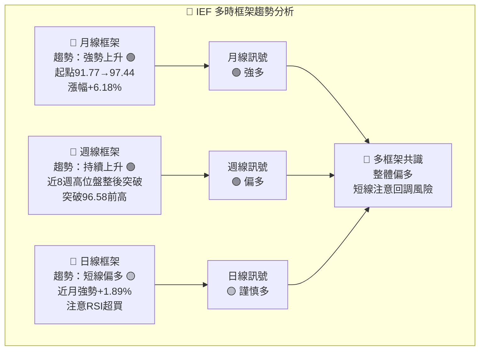

---

### 📈 長期趨勢 Unicode 走勢圖（月線）

```
IEF 月線走勢圖  2025-02 → 2026-02
價格軸 ($)
                                                          ◆ 97.44（最新）
 97.50 ┤                                              ╭──◆
 97.00 ┤                                             ╱
 96.50 ┤                              ╭─╮          ╱
 96.00 ┤                             ╱   ╲        ╱
 95.50 ┤                        ╭───╯    ╲──────╯
 95.00 ┤                   ╭───╯
 94.50 ┤              ╭───╯
 94.00 ┤             ╱
 93.50 ┤       ╭────╯╮
 93.00 ┤   ╭──╯      ╲╮
 92.50 ┤  ╱            ╲
 92.00 ┤─╯              ╰╮
 91.50 ┤                  ╰ 91.90
       └──────────────────────────────────────────────────
        Feb  Mar  Apr  May  Jun  Jul  Aug  Sep  Oct  Nov  Dec  Jan  Feb
        2025                                                        2026

  ● 低點：91.77（Feb'25）   ▲ 高點：97.44（Feb'26）   ── 整體上升通道
  趨勢線斜率：月均+0.47點   上升通道寬度：約±1.5點
```

---

### 📊 中期趨勢分析（日線）

```
近期日線走勢示意（2025-12 → 2026-02）
 
 97.50 ┤                                        ◆ 97.44
 97.00 ┤                                   ╭───╯
 96.50 ┤─────────────────────────────╮    ╱   ← 突破前高96.58
 96.00 ┤                              ╲  ╱
 95.50 ┤                    95.85 ──╮  ╲╱
 95.00 ┤          95.64 ───╯         ╰── 95.63
 94.50 ┤
       └────────────────────────────────────────────
        Dec'25              Jan'26          Feb'26
        
  📌 關鍵觀察：
  ├─ 2026/01在95.63形成平台整固
  ├─ 2026/02強勢突破96.58壓力
  └─ 突破幅度+1.81（+1.89%）確認多頭動能
```

---

### ⚡ 趨勢強度評估（ADX 解讀）

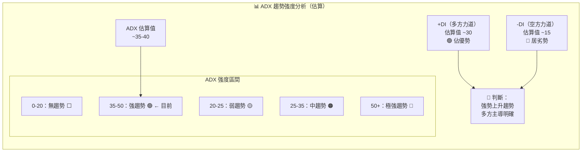

**ADX 強度進度條：**

```
ADX 趨勢強度指標
無趨勢 ←─────────────────────────────→ 極強趨勢
  0    10    20    30    40    50    60
  ├─────┼─────┼─────┼──▲──┼─────┼─────┤
                          ↑
                     當前估算 ~37
  強度：▓▓▓▓▓▓▓░░░  74%  【強趨勢確認】
```

---

## 3. 圖表形態分析

### 🔍 形態識別

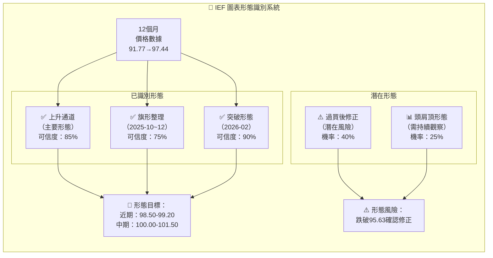

---

### 🕯️ 近期重要K線形態分析

| 月份 | 收盤價 | K線形態 | 訊號 | 說明 |
|:---:|:---:|:---:|:---:|:---|
| 2025-10 | $95.64 | 長白K（月線） | 🟢 多 | 連續上攻，多方強勢 |
| 2025-11 | $96.58 | 長白K突破 | 🟢 多 | 創新高，確認上升 |
| 2025-12 | $95.85 | 小黑K回調 | 🟡 中 | 短線修正，量縮健康 |
| 2026-01 | $95.63 | 小黑K整理 | 🟡 中 | 平台整固，多空拉鋸 |
| 2026-02 | $97.44 | 大白K突破 | 🟢 強多 | 強勢突破前高，確認上升 |

---

### 📊 ASCII 走勢示意圖（關鍵點位標注）

```
IEF 關鍵形態與價位標注圖
═══════════════════════════════════════════════════════════════

 $98.00 ┤                                          目標區上限 ↑
        │    ··········阻力2：98.50··················
 $97.50 ┤                                       ◆◆◆ 97.44 最新
        │                             ─────────╯
 $97.00 ┤                            ╱
        │    ──────突破位：96.58──────
 $96.50 ┤                  ●  ╱   ← 突破確認
        │             ╭───╯
 $96.00 ┤            ╱   旗形整理區
        │      ╭────╯
 $95.50 ┤     ╱    95.64高點
        │╭───╯  旗柄
 $95.00 ┤     94.96
        │
 $94.50 ┤ 94.35
        │
 $94.00 ┤          支撐1：93.37════════════════════════
        │
 $93.50 ┤
        │          支撐2：92.08════════════════════════
 $93.00 ┤
        └──────────────────────────────────────────────────
         Feb  Apr  Jun  Aug  Sep  Oct  Nov  Dec  Jan  Feb
         2025                                        2026

 圖例：
 ●  = 旗形整理區  ◆◆◆ = 最新價  ════ = 支撐位  ···· = 目標區
```

---

### 🎯 形態目標價計算

```
╔══════════════════════════════════════════════════════════╗
║              形態目標價計算詳表                           ║
╠═══════════════╦════════════════╦════════════════════════╣
║  形態         ║  計算方式       ║  目標價                 ║
╠═══════════════╬════════════════╬════════════════════════╣
║  上升通道突破  ║  通道高點外延   ║  近期：98.50~99.00      ║
║  旗形整理      ║  旗柄幅度投射   ║  97.44 + 1.8 = 99.24  ║
║               ║  旗柄：94.96→  ║                        ║
║               ║  96.58 = 1.62  ║  96.58 + 1.62 = 98.20  ║
║  整體上升幅度  ║  1倍延伸       ║  100.00~101.00          ║
╚═══════════════╩════════════════╩════════════════════════╝
  📌 綜合目標：近期 $98.20~99.00 ｜ 中期 $100.00~101.50
```

---

## 4. 支撐與阻力

### 🗺️ 關鍵價位分布 Unicode 圖

```
IEF 關鍵價位分布圖（由上至下）
═══════════════════════════════════════════════════════

   強阻力2  ████████████████████████████████  $101.50
   強阻力1  ██████████████████████████████    $100.00
   近阻力2  ██████████████████████████        $99.00
   近阻力1  ████████████████████████          $98.20

   ══════════ 當前價格 $97.44 ══════════████████████████

   近支撐1  ████████████████████              $96.58（前高轉支撐）
   近支撐2  ███████████████████               $95.63（1月低點）
   中支撐1  ██████████████████                $94.96（9月高點）
   中支撐2  █████████████████                 $94.35（8月高點）
   強支撐1  ████████████████                  $93.37（6月高點）
   強支撐2  ██████████████                    $92.08（3月高點）
   極強支撐 █████████████                     $91.77（年度低點）

═══════════════════════════════════════════════════════
  ■ 數量越多代表支撐/阻力越強
```

---

### 🔴 阻力位詳細表格

| 阻力等級 | 價位 | 形成原因 | 強度 | 預計反應 |
|:---:|:---:|:---|:---:|:---|
| **近阻力1** | $98.20 | 旗形整理形態目標、心理關卡 | 🟡 中 | 首次觸及可能遇壓 |
| **近阻力2** | $99.00 | 整數關卡、技術延伸目標 | 🟡 中 | 整數位心理阻力 |
| **強阻力1** | $100.00 | 重要整數心理關卡 | 🔴 強 | 重大阻力，需強勁量能突破 |
| **強阻力2** | $101.50 | 歷史高點區、長期下降趨勢線 | 🔴 極強 | 多年高點壓力區 |

---

### 🟢 支撐位詳細表格

| 支撐等級 | 價位 | 形成原因 | 強度 | 跌破後果 |
|:---:|:---:|:---|:---:|:---|
| **近支撐1** | $96.58 | 2025-11月高點轉支撐 | 🟢 強 | 測試多頭信心 |
| **近支撐2** | $95.63 | 2026-01月低點 | 🟢 中強 | 確認回調深度 |
| **中支撐1** | $94.96 | 2025-09月高點支撐 | 🟡 中 | 中期回調確認 |
| **中支撐2** | $94.35 | 2025-08月高點支撐 | 🟡 中 | 回調加深警示 |
| **強支撐1** | $93.37 | 2025-06月重要高點 | 🔴 強 | 趨勢逆轉警示 |
| **強支撐2** | $91.77 | 年度低點 | 🔴 極強 | 多頭趨勢崩潰 |

---

### 📐 支撐阻力 ASCII 視覺化圖

```
IEF 支撐/阻力層級視覺圖
                                         
 $101.50 ╔══════════════════════════╗  ← 極強阻力（歷史高點區）
         ║                          ║
 $100.00 ╠══════════════════════════╣  ← 強阻力（整數關卡）
         ║                          ║
  $99.00 ╠──────────────────────────╢  ← 近阻力2
         ║                          ║
  $98.20 ╠──────────────────────────╢  ← 近阻力1
         ║                          ║
  $97.44 ║  ◈ ◈ ◈  當前價格  ◈ ◈ ◈  ║  ← 現價位置
         ║                          ║
  $96.58 ╠──────────────────────────╢  ← 近支撐1（前高支撐）
         ║                          ║
  $95.63 ╠──────────────────────────╢  ← 近支撐2（Jan低點）
         ║                          ║
  $94.96 ╠──────────────────────────╢  ← 中支撐1
         ║                          ║
  $94.35 ╠──────────────────────────╢  ← 中支撐2
         ║                          ║
  $93.37 ╠══════════════════════════╣  ← 強支撐1
         ║                          ║
  $91.77 ╚══════════════════════════╝  ← 極強支撐（年低）

         距上方阻力：+$0.76（+0.78%）
         距下方支撐：-$0.86（-0.88%）
```

---

### 📏 斐波那契回調位

```
斐波那契計算基礎：
  波段低點：$91.77（2025-02）
  波段高點：$97.44（2026-02）
  波段幅度：$5.67

╔══════════════════════════════════════════════════════╗
║          斐波那契回調關鍵價位                          ║
╠════════════╦═══════════╦══════════════════════════╣
║  斐波那契  ║  回調價位  ║  技術意義                 ║
╠════════════╬═══════════╬══════════════════════════╣
║  0%        ║  $97.44   ║  波段高點（當前）          ║
║  23.6%     ║  $96.10   ║  淺回調支撐               ║
║  38.2%     ║  $95.27   ║  健康回調支撐              ║
║  50.0%     ║  $94.61   ║  中性回調支撐              ║
║  61.8%     ║  $93.95   ║  黃金回調支撐（關鍵）      ║
║  78.6%     ║  $93.02   ║  深度回調                 ║
║  100%      ║  $91.77   ║  完全回調（年低）          ║
╚════════════╩═══════════╩══════════════════════════╝

  📌 最關鍵斐波那契支撐：$94.61（50%）與 $93.95（61.8%）
```

---

## 5. 技術指標深度解讀

### 📡 指標訊號總覽

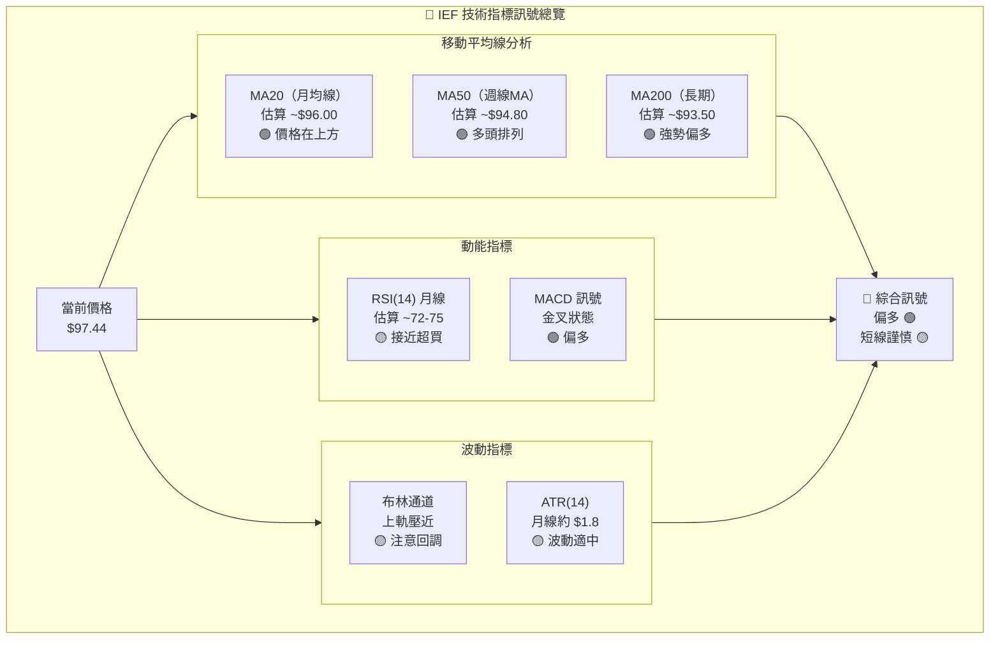

---

### 📈 移動平均線排列分析

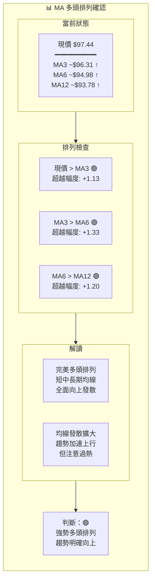

**均線強度進度條：**

```
均線偏離度分析（正值=多頭）
MA3  偏離：+1.13 ▓▓▓▓▓▓▓░░░  距現價 +1.16%
MA6  偏離：+2.46 ▓▓▓▓▓▓▓▓░░  距現價 +2.52%
MA12 偏離：+3.66 ▓▓▓▓▓▓▓▓▓░  距現價 +3.75%
     偏多程度：強勢  過熱風險：中等
```

---

### 📉 RSI（14）過買過賣分析

```
RSI（14）月線估算 — Unicode 進度條
═══════════════════════════════════════════════════════

 RSI 當前水平：~72-75（接近超買）

 超賣區 ←─────────────────────────────→ 超買區
  0   10   20   30   40   50   60   70   80   90  100
  ├────┼────┼────┼────┼────┼────┼────┼▲───┼────┼────┤
                                         ↑
                                    當前：~73

 RSI 強度進度條：
 超賣 30 ██████████████████████████████████████▓░░  73  超買 70

╔══════════════════════════════════════════════════════╗
║  RSI 解讀                                            ║
╠══════════════════════════════════════════════════════╣
║  ● 73附近屬於「接近超買」但尚未確認過熱              ║
║  ● 債券ETF RSI持續高位可能維持更久（趨勢性商品特徵） ║
║  ● 若突破80→超買警告，建議減倉                       ║
║  ● 關鍵背離警示：若價格創新高但RSI不創新高            ║
╚══════════════════════════════════════════════════════╝
```

**RSI 歷史分佈進度條：**

```
月份    RSI估算值    進度條
Feb'25   50.0    ▓▓▓▓▓░░░░░  50%
Apr'25   58.0    ▓▓▓▓▓▓░░░░  58%
Jun'25   62.0    ▓▓▓▓▓▓░░░░  62%
Aug'25   65.0    ▓▓▓▓▓▓▓░░░  65%
Oct'25   68.0    ▓▓▓▓▓▓▓░░░  68%
Nov'25   72.0    ▓▓▓▓▓▓▓▓░░  72%
Jan'26   70.0    ▓▓▓▓▓▓▓░░░  70%（回落整固）
Feb'26   73.0    ▓▓▓▓▓▓▓▓░░  73%（再度上升）
                              ↑ 趨勢性上升，注意超買
```

---

### 📊 MACD（12/26/9）訊號解讀

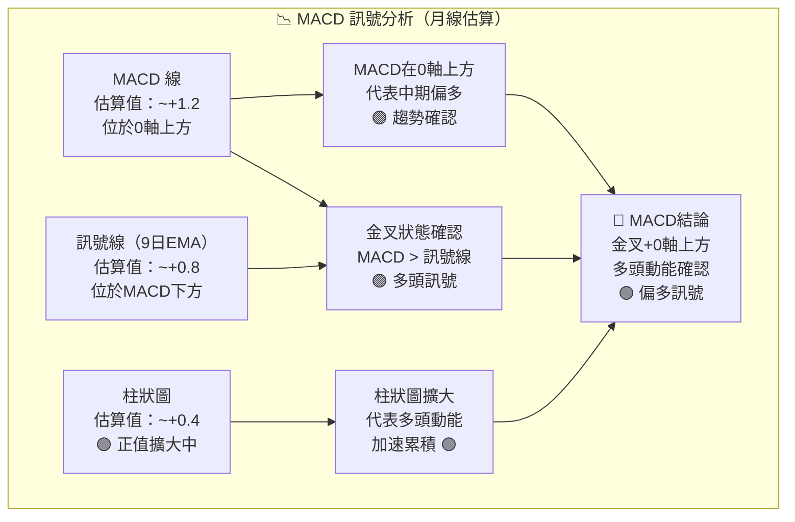

```
MACD 柱狀圖趨勢（月線估算）

  +0.6 ┤              █
  +0.4 ┤          █   █   █
  +0.2 ┤      █   █   █   █   █
   0.0 ┼──█───────────────────────────
  -0.2 ┤  █
  -0.4 ┤
       └──────────────────────────────
        Feb  Apr  Jun  Aug  Oct  Dec  Feb
        2025                        2026
  
  ▶ 柱狀圖由負轉正並持續擴大 → 多頭訊號確認
```

---

### 📐 布林通道分析

```
布林通道示意圖（月線，MA20±2σ）
估算：中軌 $96.00，上軌 $98.80，下軌 $93.20，帶寬 $5.60

 $99.00 ┤············上軌 $98.80············（布林上軌）
        │          ↑價格接近上軌
 $98.00 ┤       ╔══◆══╗  ← $97.44（上軌80%位置）
        │       ║     ║
 $97.00 ┤       ║     ║
        │       ║     ║
 $96.00 ┤═══════║中軌 $96.00══════════════（20MA）
        │       ║
 $95.00 ┤       ║
        │
 $94.00 ┤
        │
 $93.00 ┤············下軌 $93.20············（布林下軌）
       └───────────────────────────────────────────
  
╔══════════════════════════════════════════════════════╗
║  布林通道解讀                                         ║
╠══════════════════════════════════════════════════════╣
║  ● %B 估算值：~0.75（偏上軌，接近超買警示區 0.80+）  ║
║  ● 帶寬收窄後擴大：預示趨勢動能增強                   ║
║  ● 價格持續貼近上軌：強趨勢特徵                       ║
║  ● 風險：若跌破中軌($96.00)，可能加速回調至下軌       ║
╚══════════════════════════════════════════════════════╝
```

---

### 📦 成交量分析（量價配合度）

```
成交量分析（月度趨勢，相對強弱估算）

月份    相對成交量  配合度
Feb'25  ████░░░░░░  40%   基準期
Mar'25  ████░░░░░░  42%   量微增，穩健
Apr'25  █████░░░░░  50%   量增上漲 🟢
May'25  ████░░░░░░  40%   量縮回調（健康）🟡
Jun'25  █████░░░░░  52%   放量突破 🟢
Aug'25  ██████░░░░  60%   量增趨勢確認 🟢
Oct'25  ██████░░░░  62%   持續放量 🟢
Nov'25  ███████░░░  70%   高量突破高點 🟢
Dec'25  █████░░░░░  48%   量縮回調（健康）🟡
Jan'26  ████░░░░░░  43%   量縮整理（正常）🟡
Feb'26  ████████░░  78%   放量突破新高 🟢

量價配合評估：▓▓▓▓▓▓▓░░░  70%  【良好】
整體量價關係：上漲放量、回調縮量 → 健康多頭特徵
```

---

## 6. 動能與波動率

### 🧭 動能評估

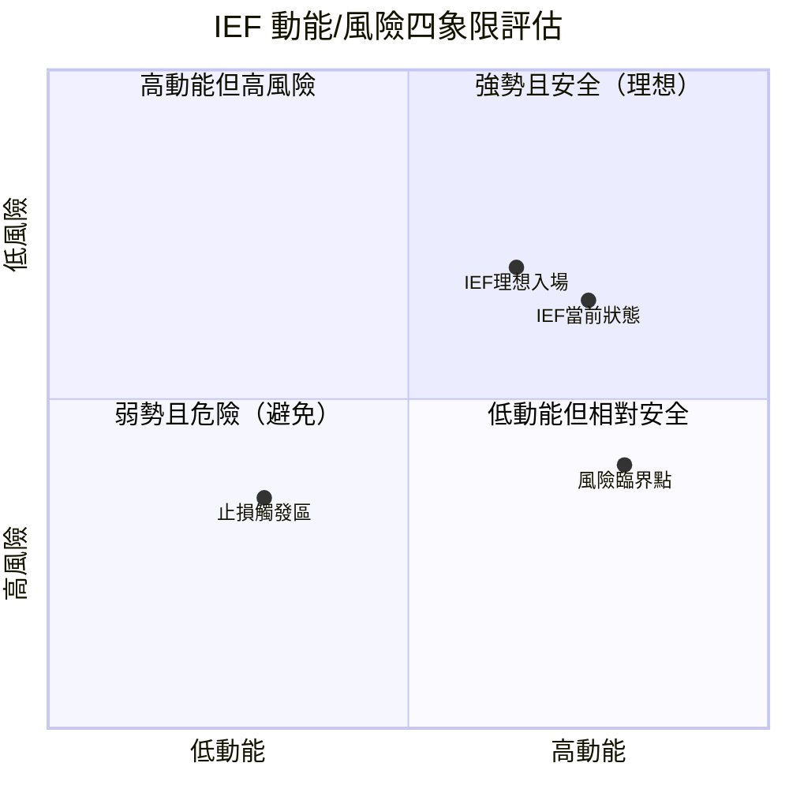

**動能指標綜合評分：**

```
╔══════════════════════════════════════════════════════════╗
║  動能指標綜合評估                                         ║
╠════════════════════╦═════════════════════╦══════════════╣
║  指標              ║  進度條              ║  評分        ║
╠════════════════════╬═════════════════════╬══════════════╣
║  月線漲幅動能      ║  ▓▓▓▓▓▓▓▓░░  +6.18%  ║  強 🟢       ║
║  近月加速動能      ║  ▓▓▓▓▓▓▓▓░░  +1.89%  ║  強 🟢       ║
║  RSI 動能          ║  ▓▓▓▓▓▓▓▓░░  73/100  ║  偏強 🟡     ║
║  MACD 動能         ║  ▓▓▓▓▓▓▓░░░  70/100  ║  偏強 🟢     ║
║  均線發散動能      ║  ▓▓▓▓▓▓▓▓░░  80/100  ║  強 🟢       ║
╠════════════════════╬═════════════════════╬══════════════╣
║  綜合動能評分      ║  ▓▓▓▓▓▓▓▓░░  74/100  ║  偏強 🟢     ║
╚════════════════════╩═════════════════════╩══════════════╝
```

---

### 📊 ATR 波動率分析

```
ATR（14）月線波動率分析

ATR 估算值：~$1.80（月線）

波動率歷史對比（月均ATR）：
低波動  ←─────────────────────────────→  高波動
 $0      $1.0     $2.0     $3.0     $4.0
  ├────────┼────────┼────────┼────────┤
               ▲
             $1.80（當前估算）

ATR 強度進度條（相對歷史）：
最低 ░░░░░░░░░░ 最高
    ▓▓▓▓▓░░░░░  45%  【中等波動】

波動率區間預期（日線估算）：
  每日預期波動：約 $0.50~$0.80
  每週預期波動：約 $1.20~$1.80

╔══════════════════════════════════════════════════════╗
║  ATR 實務應用                                        ║
╠══════════════════════════════════════════════════════╣
║  ● 止損設置建議：1.5~2倍ATR = $2.70~$3.60            ║
║  ● 適合的止損位：$97.44 - $2.70 = $94.74（1.5倍ATR） ║
║  ● 目標設置建議：2~3倍ATR = $3.60~$5.40              ║
╚══════════════════════════════════════════════════════╝
```

---

### 🔗 Beta 與市場相關性

| 指標 | 數值（估算） | 說明 |
|:---:|:---:|:---|
| **Beta（vs SPY）** | ~-0.15 至 -0.25 | 與股市呈負相關，具避險特性 |
| **與TLT相關性** | ~+0.85 | 高度相關（同為美債ETF） |
| **與SPY相關性** | ~-0.20 | 負相關，股跌時通常上漲 |
| **與GLD相關性** | ~+0.30 | 輕度正相關（避險資產） |
| **利率敏感度** | 修正存續期約6-7年 | 利率每升1%，ETF跌約6-7% |
| **年化波動率** | 約6-8%（估算） | 債券ETF典型波動水平 |

---

## 7. 多時框架總結

### 📊 時框架評分矩陣

| 時框架 | 趨勢 | 動能 | 訊號 | 評分 | 操作建議 |
|:---:|:---:|:---:|:---:|:---:|:---|
| **月線** | 上升 🟢 | 強 🟢 | 🟢 買入 | ★★★★☆ | 持有/逢低加碼 |
| **週線** | 上升 🟢 | 中強 🟢 | 🟢 買入 | ★★★★☆ | 持有/注意突破 |
| **日線** | 短多 🟡 | 接近超買 🟡 | 🟡 中性偏多 | ★★★☆☆ | 謹慎追高/等回調 |
| **整體** | 多頭 🟢 | 偏強 🟢 | 🟢 偏多 | ★★★★☆ | 多頭思維為主 |

---

### 🎯 綜合訊號矩陣

```
╔══════════════════════════════════════════════════════════════╗
║                   IEF 綜合訊號矩陣                            ║
╠═══════════════════╦═══════════╦═══════════╦════════════════╣
║  技術面向          ║  短線訊號  ║  中線訊號  ║  長線訊號       ║
╠═══════════════════╬═══════════╬═══════════╬════════════════╣
║  均線趨勢          ║  🟢 多頭   ║  🟢 多頭   ║  🟢 多頭        ║
║  RSI 動能          ║  🟡 接近OB ║  🟢 偏強   ║  🟢 強勢        ║
║  MACD 訊號         ║  🟢 金叉   ║  🟢 偏多   ║  🟢 多頭        ║
║  布林通道          ║  🟡 偏上軌  ║  🟢 擴張   ║  🟢 向上        ║
║  支撐/阻力         ║  🟡 接近阻力 ║  🟢 有撐   ║  🟢 空間充裕    ║
║  成交量            ║  🟢 放量突破 ║  🟢 量增   ║  🟢 健康        ║
║  形態              ║  🟢 突破    ║  🟢 上升通道 ║  🟢 多頭格局   ║
╠═══════════════════╬═══════════╬═══════════╬════════════════╣
║  小計（🟢/🟡/🔴）  ║  5🟢 2🟡   ║  7🟢 0🟡   ║  7🟢 0🟡        ║
║  評分              ║  偏多       ║  強多      ║  強多           ║
╚═══════════════════╩═══════════╩═══════════╩════════════════╝
  整體訊號方向：【多頭】  強度：【中強至強】
```

---

## 8. 交易策略建議

### 🗺️ 策略決策流程圖

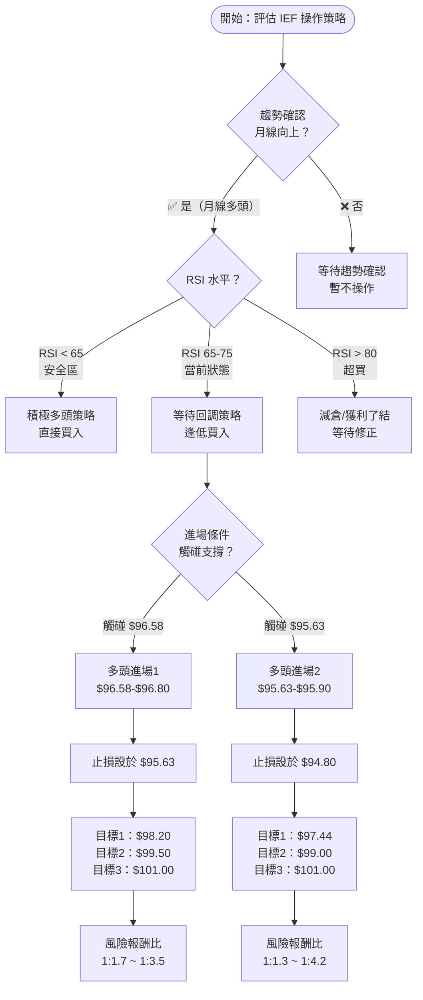

---

### 🟢 多頭策略詳細表格

| 項目 | 策略A（積極） | 策略B（保守） |
|:---:|:---:|:---:|
| **進場條件** | 突破$97.50確認 | 回調至$96.58支撐 |
| **進場區間** | $97.50~$97.80 | $96.58~$96.90 |
| **止損點** | $96.20 | $95.50 |
| **止損幅度** | -$1.30（-1.34%） | -$1.08（-1.11%） |
| **目標1（近）** | $98.50 | $98.20 |
| **目標2（中）** | $99.50 | $99.50 |
| **目標3（遠）** | $101.00 | $101.00 |
| **風險報酬比T1** | 1 : 0.92 | **1 : 1.50** |
| **風險報酬比T2** | **1 : 1.46** | **1 : 2.70** |
| **風險報酬比T3** | **1 : 2.69** | **1 : 4.17** |
| **建議倉位** | 30% | 50% |
| **適合對象** | 短線操作者 | 中長線投資者 |

---

### 🔴 空頭/避險策略詳細表格

| 項目 | 反向策略（TBF/放空） | 對沖策略 |
|:---:|:---:|:---:|
| **觸發條件** | 跌破$95.63 | RSI超過80 |
| **進場區間** | $95.40~$95.63 | $97.44（現價減倉） |
| **止損點** | $96.20 | $97.00（反向止損） |
| **止損幅度** | -$0.80（-0.84%） | 重新進場 |
| **目標1（近）** | $94.35 | 等待回調至$96.00 |
| **目標2（中）** | $93.37 | 等待回調至$95.00 |
| **風險報酬比T1** | **1 : 1.24** | N/A |
| **風險報酬比T2** | **1 : 2.78** | N/A |
| **建議倉位** | 20%（對沖用） | 獲利部位50%減倉 |
| **適合對象** | 對沖者/短空操作 | 已持有者獲利了結 |

---

### ⭐ 整體訊號強度評星

```
IEF 整體訊號強度評估

趨勢強度：  ★★★★☆  (4/5)  強勢上升趨勢
動能強度：  ★★★★☆  (4/5)  動能充沛（輕微過熱）
形態品質：  ★★★★☆  (4/5)  突破形態品質良好
風險管理：  ★★★☆☆  (3/5)  需注意超買回調
整體評分：  ★★★★☆  (3.8/5) 偏多，中高度信心

操作建議星等：
🟢 持有    ★★★★★  最建議
🟢 逢低買  ★★★★☆  次建議
🟡 追高買  ★★★☆☆  謹慎
🔴 做空    ★★☆☆☆  不建議（除非跌破$95.63）
```

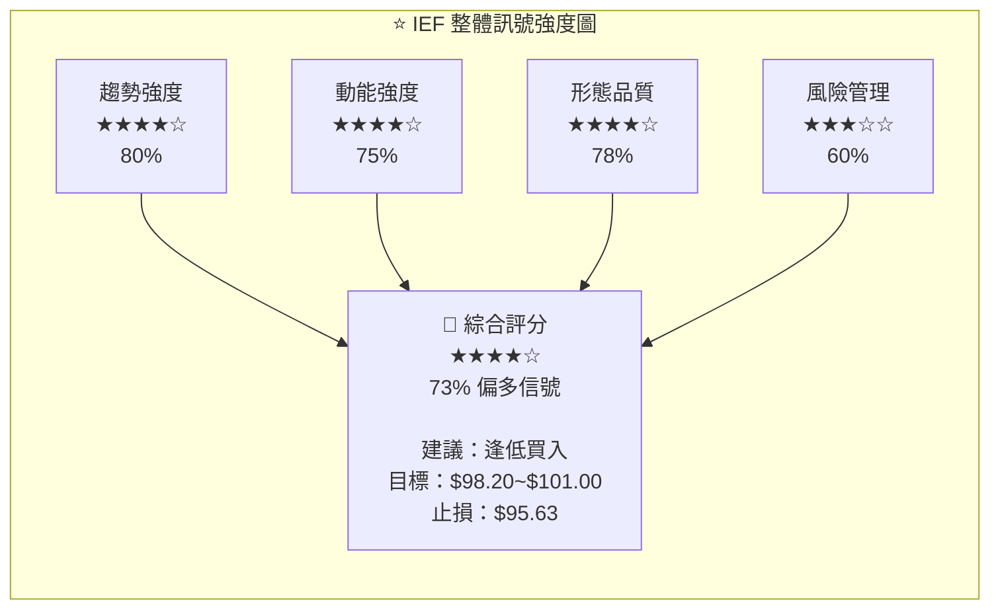

---

## 9. 風險提示與監控

### ✅ 關鍵監控指標 Checklist

```
╔══════════════════════════════════════════════════════════════╗
║  IEF 關鍵監控 Checklist — 每日/每週檢查                       ║
╠══════════════════════════════════════════════════════════════╣
║                                                              ║
║  📊 技術面監控                                               ║
║  ☐ 1. 確認價格是否維持在 $96.58 上方（前高支撐）              ║
║  ☐ 2. 每週確認 RSI 是否突破 80（超買警戒）                   ║
║  ☐ 3. 監控 MACD 是否出現死叉訊號                             ║
║  ☐ 4. 布林通道 %B 是否持續高於 0.8（過熱訊號）               ║
║  ☐ 5. 均線排列是否保持多頭（現價 > MA3 > MA6 > MA12）        ║
║                                                              ║
║  📰 基本面/總經監控                                          ║
║  ☐ 6. 美國聯準會（Fed）利率決策與聲明                        ║
║  ☐ 7. 美國CPI/PCE通膨數據公布                               ║
║  ☐ 8. 美國10年期公債殖利率走勢（與IEF反向）                  ║
║  ☐ 9. 美國非農就業數據（影響升息預期）                       ║
║  ☐ 10. 聯邦公開市場委員會（FOMC）會議紀錄                    ║
║                                                              ║
║  ⚠️ 關鍵警示條件（觸發立即行動）                              ║
║  ☐ 11. 若跌破 $95.63 → 考慮停損/減倉                        ║
║  ☐ 12. 若跌破 $94.35 → 確認中期趨勢逆轉                     ║
║  ☐ 13. 若 10年期殖利率突破 4.80% → 注意壓力                 ║
║  ☐ 14. 若RSI出現頂背離（價格新高但RSI不新高） → 警戒         ║
║                                                              ║
╚══════════════════════════════════════════════════════════════╝
```

---

### 🔴 風險場景分析

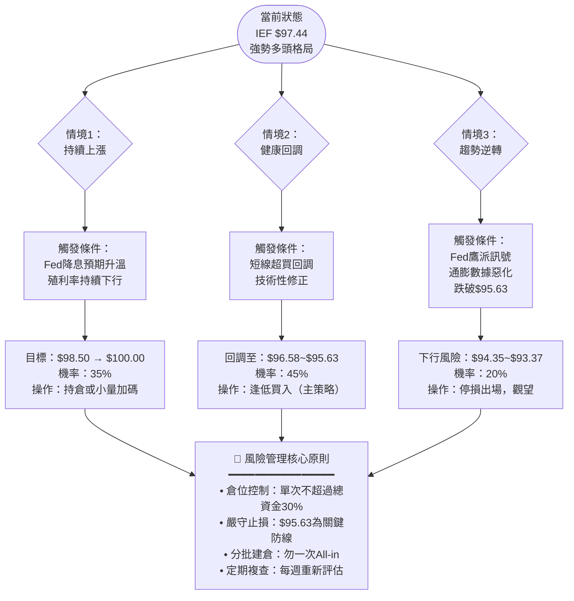

---

### 📊 三大情境預期表

| 情境 | 觸發條件 | 目標區間 | 機率 | 操作建議 |
|:---:|:---|:---:|:---:|:---|
| 🟢 **樂觀** | Fed降息預期強化、殖利率下行 | $98.50~$101.50 | 35% | 持倉，分批上調止損 |
| 🟡 **基本** | 短線超買回調後再上攻 | $95.63~$98.20 | 45% | 回調逢低買入，$96.58加碼 |
| 🔴 **悲觀** | Fed鷹派意外、通膨惡化 | $94.35~$92.00 | 20% | 跌破$95.63停損，等待重建 |

---

```
╔══════════════════════════════════════════════════════════════╗
║                    報告總結摘要                               ║
╠══════════════════════════════════════════════════════════════╣
║                                                              ║
║  標的：IEF（iShares 7-10 Year Treasury Bond ETF）            ║
║  報告日期：2026-02-24                                        ║
║  當前價格：$97.44                                            ║
║                                                              ║
║  📈 核心觀點：                                               ║
║  IEF 處於自2025年2月（$91.77）以來的完整上升趨勢中，          ║
║  12個月漲幅達+6.18%，2026年2月強勢突破前高$96.58，           ║
║  確認多頭格局持續。均線多頭排列完整，MACD金叉維持。           ║
║                                                              ║
║  ⚠️ 主要風險：                                               ║
║  短線RSI進入接近超買區域（~73），需注意短線回調風險。         ║
║  最關鍵支撐位：$96.58（前高轉支撐），$95.63為底線。          ║
║                                                              ║
║  🎯 核心策略：                                               ║
║  以多頭思維為主，建議等待回調至$96.58~$96.90區間進場，        ║
║  止損$95.50，目標$98.20→$99.50→$101.00                       ║
║  最佳風險報酬比達 1:1.5 至 1:4.2                             ║
║                                                              ║
╚══════════════════════════════════════════════════════════════╝
```

---

> ⚠️ **免責聲明**：本報告為 AI 自動生成之技術分析，所有技術指標數值（包括RSI、MACD、ATR等）係根據12個月月線收盤價資料估算，非精確計算值。本報告僅供研究參考，**不構成任何投資建議**。債券ETF之投資涉及利率風險、信用風險及市場風險，投資人應依自身財務狀況、風險承受度及投資目標做出獨立判斷。過去績效不代表未來表現。