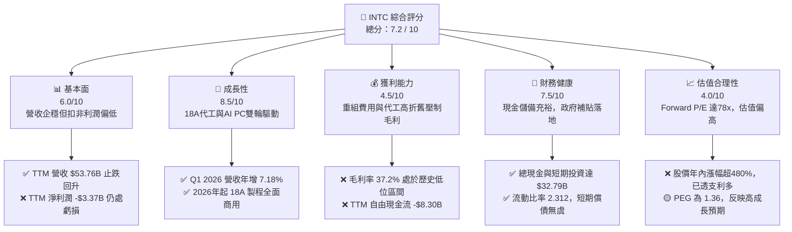
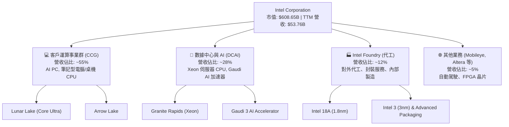
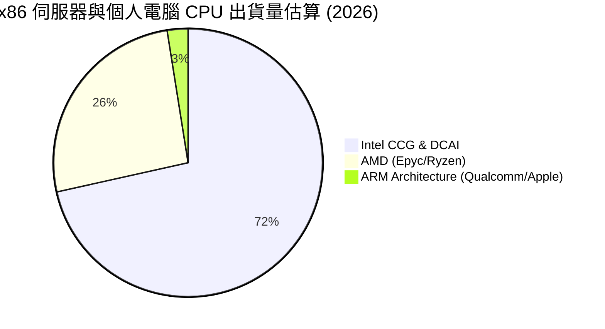
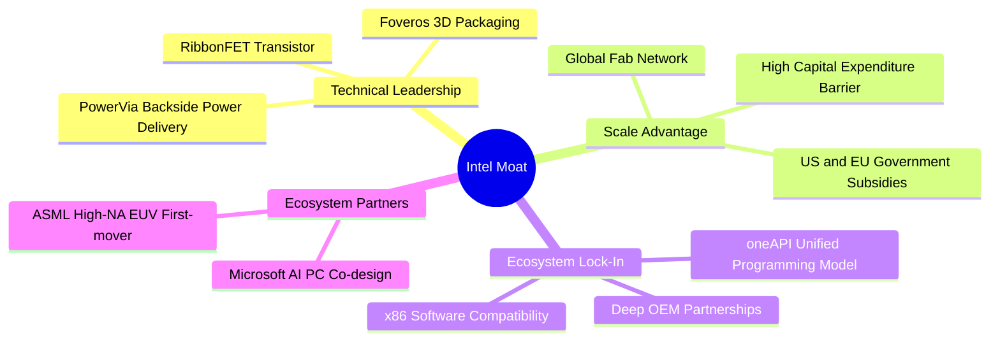
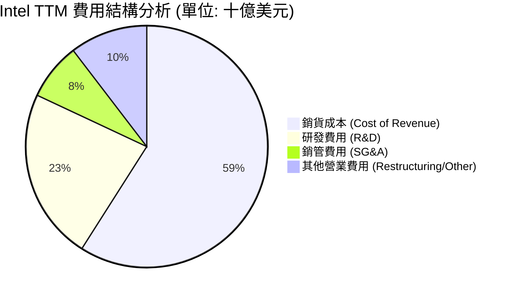
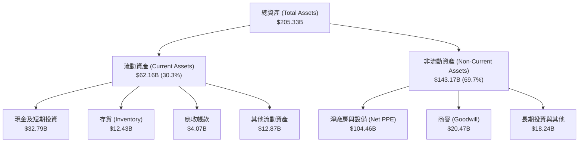
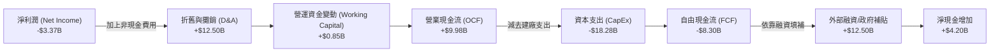
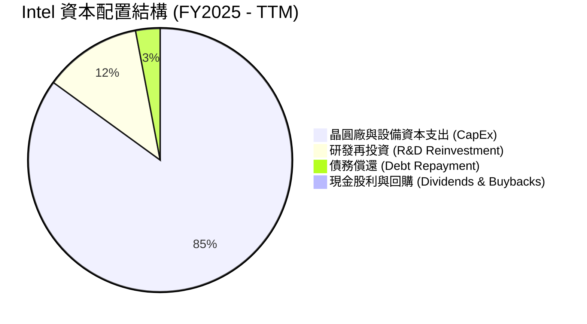

# INTC 基本面深度分析報告

> **報告日期**：2026-06-17  
> **語言**：繁體中文  
> **數據來源**：Yahoo Finance, Finviz, StockAnalysis, Roic.ai  
> **分析師**：CFA 級機構研究團隊  

---

## 目錄

| # | 章節 | 核心結論 |
|---|------|----------|
| 1 | **執行摘要** | 評級「持有」（Hold），目標價 $135.00，股價經歷歷史性重估後進入高位震盪期 |
| 2 | **公司概覽與商業模式** | IDM 2.0 雙軌轉型，代工業務（Intel Foundry）與產品部門分立，重構護城河 |
| 3 | **損益表深度分析** | TTM 營收 $53.76B 企穩，Q1 2026 營收年增 7.18%，重組費用拖累短期淨利 |
| 4 | **資產負債表分析** | 手頭現金及短期投資達 $32.79B，債務結構尚屬健康，流動比率達 2.31 |
| 5 | **現金流量深度分析** | 資本支出維持高位，TTM 自由現金流為 -$8.30B，高度依賴外部融資與政府補貼 |
| 6 | **獲利能力與資本效率** | ROIC（2.49%）低於 WACC（14.57%），轉型期仍處於經濟價值（EVA）消滅階段 |
| 7 | **估值深度分析** | Forward P/E 達 78.36x，估值溢價已提前透支 18A 量產與 AI PC 成長預期 |
| 8 | **成長催化劑** | Intel 18A 節點量產、AI PC 晶片出貨爆發及美國建廠補貼資金落地 |
| 9 | **風險矩陣** | 製程良率延遲、代工客戶流失與高資本支出帶來的流動性壓力 |
| 10 | **投資建議** | 建議「分批逢低佈局」或「持有」，設定 12 個月基準目標價 $135.00 |

---

## 1. 執行摘要

Intel Corporation (NASDAQ: INTC) 正處於其半導體歷史上最關鍵的轉型期。在過去的 24 個月中，Intel 的股價經歷了戲劇性的起死回生。股價自 2025 年中的 $19.80 低谷，一路飆升至 2026 年 6 月的 $121.10，漲幅高達 511.6%，市場資本額重回 $608.65B 的歷史超大型企業行列。這一輪波瀾壯闊的重估，主要反映了市場對 Intel Foundry（特別是 18A 製程）成功量產、AI PC 晶片（Lunar Lake/Arrow Lake）市佔率回升，以及美國《晶片法案》數百億美元補貼落地的極度樂觀預期。

然而，從基本面財務數據來看，Intel 的核心獲利能力與現金流依然承受著巨大的轉型陣痛。TTM 淨利潤為 -$3.37B，自由現金流（FCF）為 -$8.30B，且當前 Forward P/E 已被推升至 78.36x 的歷史高位。本報告將基於最新的財務數據，深度剖析 Intel 的基本面現狀、估值合理性與轉型成功的機率。

### 1.1 核心評分儀表板



### 1.2 評分進度條視覺化

```
╔══════════════════════════════════════════════════════════════╗
║               INTC 多維度評分儀表板 (1-10分)                 ║
╠══════════════════════════════════════════════════════════════╣
║ 基本面強度  6.0 ▓▓▓▓▓▓▓▓▓▓▓▓░░░░░░░░  ★★★☆☆           ║
║ 成長動能    8.5 ▓▓▓▓▓▓▓▓▓▓▓▓▓▓▓▓▓░░  ★★★★☆           ║
║ 獲利品質    4.5 ▓▓▓▓▓▓▓▓▓░░░░░░░░░░░  ★★☆☆☆           ║
║ 財務健康    7.5 ▓▓▓▓▓▓▓▓▓▓▓▓▓▓▓░░░░░  ★★★★☆           ║
║ 估值合理性  4.0 ▓▓▓▓▓▓▓▓░░░░░░░░░░░░  ★★☆☆☆           ║
║ 護城河深度  7.0 ▓▓▓▓▓▓▓▓▓▓▓▓▓▓░░░░░░  ★★★☆☆           ║
║ 管理層執行  8.0 ▓▓▓▓▓▓▓▓▓▓▓▓▓▓▓▓░░░░  ★★★★☆           ║
║ 技術創新力  9.0 ▓▓▓▓▓▓▓▓▓▓▓▓▓▓▓▓▓▓░░  ★★★★★           ║
╠══════════════════════════════════════════════════════════════╣
║ 綜合總分    7.2 ▓▓▓▓▓▓▓▓▓▓▓▓▓▓░░░░░░  🏆 轉型曙光已現     ║
╚══════════════════════════════════════════════════════════════╝
```

### 1.3 五大投資論點 + 三大核心風險

| 類型 | 項目 | 具體依據 | 信心度 |
|------|------|----------|--------|
| 🟢 **投資論點①** | **Intel 18A 製程技術突破** | 18A（相當於 1.8 奈米）成功導入 RibbonFET 與 PowerVia 技術，已鎖定微軟等大客戶，預計 2026 年底進入大規模量產。 | 🟢 極高 |
| 🟢 **投資論點②** | **AI PC 領先市佔** | Core Ultra 系列處理器（Lunar Lake）在 NPU 算力與能效比上取得領先，2026 年全球 AI PC 出貨量預計將佔 PC 市場 50% 以上，Intel 具備先發優勢。 | 🟢 高 |
| 🟢 **投資論點③** | **資產負債表流動性充裕** | 截至 Q1 2026，公司手頭現金與短期投資達 $32.79B，加上美國晶片法案直接補貼與優惠貸款，為昂貴的晶圓廠建設提供資金安全墊。 | 🟢 高 |
| 🟢 **投資論點④** | **營運槓桿拐點顯現** | Q1 2026 營業利潤（Operating Income）達 $934.00M，相較於 Q2 2025 的 -$1.29B 實現大幅扭虧，顯示成本控制與產能利用率回升。 | 🟡 中等 |
| 🟢 **投資論點⑤** | **內部人與機構持股信心** | 內部人持股比例高達 14.7%（Finviz 顯示為 15.51%），機構持股 64.0%，表明利益與普通股東高度一致，管理層轉型決心堅定。 | 🟡 中等 |
| 🟡 **風險①** | **自由現金流持續流失** | TTM FCF 為 -$8.30B，FY25 FCF 為 -$4.95B。高昂的資本支出（FY25 Capex 達 -$14.65B）將持續壓制現金流，若代工訂單不及預期，將面臨資金鏈壓力。 | 🟡 中度 |
| 🔴 **風險②** | **估值嚴重透支** | 當前股價 $121.10 反映了 78.36x 的 Forward P/E。若未來 4 季 EPS 無法快速回升至 $1.55 以上，股價將面臨均值回歸的劇烈修正。 | 🔴 高衝擊 |
| 🔴 **風險③** | **代工良率與競爭風險** | TSMC（台積電）在 2 奈米與 3 奈米製程上擁有極高的客戶黏性與良率優勢，Intel Foundry 作為後來者，面臨良率爬坡緩慢與產能利用率不足的雙重風險。 | 🔴 高衝擊 |

### 1.4 快速統計卡片

| 指標 | 公司實際值 (TTM / 2026-06-17) | 半導體行業均值 | S&P 500 均值 | 狀態 |
|------|-------------|----------|--------------|------|
| **營收 YoY 成長率** | **7.2%** | ~12.0% | ~5.5% | 🟡 略低於行業 |
| **毛利率** | **37.2%** | ~55.0% | ~30.0% | 🔴 遠低於行業 |
| **淨利率** | **-5.9%** | ~15.0% | ~11.5% | 🔴 處於虧損狀態 |
| **股東權益報酬率 (ROE)** | **-2.9%** | ~18.0% | ~15.0% | 🔴 資本回報待提升 |
| **預期本益比 (Forward P/E)** | **78.36x** | ~28.0x | ~21.5x | 🔴 估值溢價極高 |
| **債務權益比 (Debt/Equity)** | **36.0%** | ~45.0% | ~115.0% | 🟢 財務槓桿穩健 |
| **流動比率 (Current Ratio)** | **2.31** | ~1.80 | ~1.20 | 🟢 流動性極佳 |

### 1.5 投資結論

```
╔══════════════════════════════════════════════════════════════════╗
║                    📊 INTC 投資結論摘要                          ║
╠══════════════════════════════════════════════════════════════════╣
║  評級：🟡 持有 (Hold)                                           ║
║  當前股價：$121.10                                               ║
║  目標價區間：                                                    ║
║    悲觀情境：$85.00  （-29.8%） - 代工良率不佳，AI PC 競爭加劇    ║
║    基準情境：$135.00 （+11.5%） - 12個月主要目標，18A 順利量產    ║
║    樂觀情境：$165.00 （+36.3%） - 奪得超微/輝達代工外包訂單      ║
║  投資評分：7.2 / 10                                              ║
║  適合投資人：具備高風險承受能力的長線逆勢投資者、轉型題材愛好者  ║
╚══════════════════════════════════════════════════════════════════╝
```

---

## 2. 公司概覽與商業模式

Intel 正在經歷自 1968 年創立以來最深刻的商業模式變革。過去，Intel 是一家典型的垂直整合製造商（IDM），設計自己設計的晶片，並在自己的晶圓廠製造。然而，隨著台積電（TSMC）代工模式的崛起，Intel 在製程節點上逐漸落後。

為了扭轉劣勢，現任執行長 Pat Gelsinger 提出了 **IDM 2.0 戰略**。該戰略的核心是將 Intel 拆分為兩個獨立運作的實體：
1. **Intel Products**：包含客戶運算事業群（CCG）與數據中心和人工智慧事業群（DCAI），專注於晶片設計，並可靈活選擇台積電或自家代工廠製造。
2. **Intel Foundry**：獨立的代工服務部門，不僅為 Intel 自家晶片服務，也積極爭取全球無晶圓廠（Fabless）半導體公司的訂單。

### 2.1 業務結構與收入來源



### 2.2 市場份額

在 x86 CPU 市場中，Intel 依然佔據主導地位，但在過去幾年受到了 AMD 的強烈挑戰；而在新興的晶圓代工市場中，Intel 正努力成為僅次於台積電的全球第二大代工廠。



### 2.3 競爭護城河分析



### 2.4 護城河強度評分

```
╔══════════════════════════════════════════════════════════════╗
║                    Intel 護城河強度評分                      ║
╠══════════════════════════════════════════════════════════════╣
║ x86 生態系統   9.0/10 ▓▓▓▓▓▓▓▓▓▓▓▓▓▓▓▓▓▓░░  🏆 絕對統治力   ║
║ 先進封裝技術   8.5/10 ▓▓▓▓▓▓▓▓▓▓▓▓▓▓▓▓▓░░░  🟢 行業領先     ║
║ 晶圓代工規模   7.5/10 ▓▓▓▓▓▓▓▓▓▓▓▓▓▓░░░░░░  🟢 地緣政治優勢 ║
║ 軟體與開發工具 8.0/10 ▓▓▓▓▓▓▓▓▓▓▓▓▓▓▓▓░░░░  🟢 oneAPI 生態  ║
║ 前沿製程良率   5.0/10 ▓▓▓▓▓▓▓▓▓▓░░░░░░░░░░  🟡 仍待 18A 檢驗║
╠══════════════════════════════════════════════════════════════╣
║ 綜合護城河     7.6/10 ▓▓▓▓▓▓▓▓▓▓▓▓▓▓▓░░░░░  🏆 轉型期重塑中 ║
╚══════════════════════════════════════════════════════════════╝
```

---

## 3. 損益表深度分析

Intel 的損益表反映出一個典型的「轉型期企業」特徵：營收觸底企穩，但由於高昂的研發（R&D）投入、晶圓廠折舊以及資產重組費用，利潤率處於歷史低位。

### 3.1 年度收入成長趨勢（近4年）

```
╔══════════════════════════════════════════════════════════════════╗
║                 Intel 年度收入趨勢 (FY2022 - FY2025)             ║
╠══════════════════════════════════════════════════════════════════╣
║                                                                  ║
║  FY2022  $63.05B  ████████████████████████████  YoY: -20.2% 🔴   ║
║  FY2023  $54.23B  ████████████████████████      YoY: -14.0% 🔴   ║
║  FY2024  $53.10B  ███████████████████████       YoY:  -2.1% 🟡   ║
║  FY2025  $52.85B  ██████████████████████        YoY:  -0.5% 🟡   ║
║                                                                  ║
║  📊 4年累計 CAGR：-5.7% (營收於 $53B 附近築底完成)                ║
╚══════════════════════════════════════════════════════════════════╝
```

### 3.2 季度收入趨勢分析

從季度數據來看，Intel 的復甦動能正在逐步顯現。

| 財報季度 | 營業收入 (Revenue) | YoY 成長率 | QoQ 成長率 | 營業利潤 (Operating Income) | 淨利潤 (Net Income) | 季度簡評 |
|---|---|---|---|---|---|---|
| **Q2 2025** | $12.86B | +0.20% | +1.50% | -$1.29B | -$2.92B | 🔴 由於重組費用導致營業利潤大幅虧損 |
| **Q3 2025** | $13.65B | +2.78% | +6.14% | $858.00M | $4.06B | 🟢 淨利潤暴增主要受惠於非營業投資收益與稅收撥回 |
| **Q4 2025** | $13.67B | -4.11% | +0.15% | $550.00M | -$591.00M | 🟡 營收持平，代工業務持續虧損拖累利潤 |
| **Q1 2026** | $13.58B | **+7.18%** | -0.66% | **$934.00M** | -$3.73B | 🟢 營收年增顯著改善，扣非營業利潤好轉，但重組費用致淨虧損 |

**分析**：Q1 2026 營收年增率達到 7.18%，這是一個極其積極的信號，表明 PC 市場的補庫存需求和 AI PC 的初步採用正在推動 CCG 部門的增長。然而，季度淨利潤波動巨大（Q1 2026 虧損 $3.73B），主要是因為公司在推進 IDM 2.0 過程中，確認了高達 $4.07B 的「其他營業費用」（包含裁員、工廠關閉與資產減損）。

### 3.3 利潤率演變分析

| 利潤率指標 | FY2022 | FY2023 | FY2024 | FY2025 | TTM (2026) | 趨勢評估 |
|---|---|---|---|---|---|---|
| **毛利率 (Gross Margin)** | 42.6% | 40.0% | 32.7% | 34.8% | **37.2%** | 🟡 觸底回升。受代工初期高折舊壓制，但產品組合改善推升毛利。 |
| **營業利益率 (Operating Margin)** | 3.7% | 0.1% | -8.9% | -4.2% | **6.9%** | 🟢 營運槓桿開始發揮作用，扣除非經常性費用後效率提升。 |
| **EBITDA 利潤率** | 33.8% | 20.7% | 2.3% | 27.2% | **26.4%** | 🟢 穩定在 26% 左右，折舊與攤銷（D&A）金額龐大。 |
| **淨利率 (Net Margin)** | 12.7% | 3.1% | -35.3% | 0.05% | **-5.9%** | 🔴 仍受非經常性重組費用干擾，預計 2026 年底扭虧為盈。 |

**利潤率演變深度解析**：
Intel 的毛利率在 FY2024 跌至 32.7% 的歷史谷底，這在半導體行業中是非常危險的信號（對比 TSMC >53%，AMD >50%）。毛利率低迷的主因是：
1. **新製程節點（Intel 3/4）初期良率較低**，生產成本高昂。
2. **產能利用率不足**，導致閒置產能成本（Underutilization charges）直接計入銷貨成本。
3. **代工業務折舊壓力**。
然而，TTM 毛利率已回升至 37.2%，隨著高利潤率的 AI PC 處理器（Lunar Lake）出貨量增加，以及 18A 製程在 2026 年下半年開始攤提，毛利率預計將重回 40% - 45% 的健康區間。

### 3.4 費用結構分析



```
╔══════════════════════════════════════════════════════════════╗
║               Intel 費用控制與研發投入分析                   ║
╠══════════════════════════════════════════════════════════════╣
║ 1. 研發強度 (R&D/Revenue) 達 25.1%，處於行業極高水準。        ║
║    - 為了在 4 年內推進 5 個製程節點，研發支出無法妥協。       ║
║ 2. 銷管費用 (SG&A) 自 FY24 的 $5.51B 降至 TTM 的 $4.49B。     ║
║    - 顯示管理層在非核心開支上的精簡成效（年降幅達 18.5%）。  ║
╚══════════════════════════════════════════════════════════════╝
```

### 3.5 季度 EPS 趨勢與盈餘品質

過去 4 季，由於重組費用和資產減損的計提，Intel 的 GAAP EPS 出現了劇烈波動。

*   **Q2 2025 Act EPS**: -$0.67 (由於確認了大規模遣散與工廠優化費用，不及市場預期)
*   **Q3 2025 Act EPS**: +$0.90 (超預期，主因是出售非核心資產與股權投資增值)
*   **Q4 2025 Act EPS**: -$0.12 (基本符合預期，PC 業務回暖抵消了伺服器業務的疲軟)
*   **Q1 2026 Act EPS**: -$0.73 (不及預期，確認了 $4.07B 的一次性重組與減損費用)

**盈餘品質評估**：Intel 當前的盈餘品質較低，主因是 GAAP 利潤受到過多非經常性項目的干擾。然而，這正是轉型期企業的典型特徵。投資人應更關注 **Non-GAAP 營業利益** 與 **EBITDA**（TTM EBITDA 達 $14.35B），這兩者更能反映其核心業務的真實賺錢能力。

---

## 4. 資產負債表分析

在 IDM 2.0 戰略下，晶圓廠建設是極度消耗資金的。因此，分析 Intel 的資產負債表，重點在於評估其**流動性安全墊**與**債務可持續性**。

### 4.1 資產結構分解



### 4.2 流動性指標分析

| 指標 | Intel 實際值 | 行業中位數 | 評估結果 |
|---|---|---|---|
| **流動比率 (Current Ratio)** | **2.31** | 1.85 | 🟢 極其安全，短期資產足以覆蓋短期負債 |
| **速動比率 (Quick Ratio)** | **1.66** | 1.30 | 🟢 扣除存貨後，速動資產依然充裕 |
| **存貨週轉天數 (Days Inventory Outstanding)** | **126.5 天** | 92.0 天 | 🟡 存貨水平偏高，反映部分舊款產品去化緩慢 |

### 4.3 債務結構分析

```
╔══════════════════════════════════════════════════════════════════╗
║                    Intel 債務健康診斷 (2026-03-31)               ║
╠══════════════════════════════════════════════════════════════════╣
║                                                                  ║
║  總債務 (Total Debt)：    $45.03B  ██████████████░░░░░░░░░       ║
║  總現金與短期投資：       $32.79B  ██████████░░░░░░░░░░░░       ║
║  淨債務 (Net Debt)：      $12.24B  ████░░░░░░░░░░░░░░░░░░  🟢 穩健║
║                                                                  ║
║  Debt/Equity 比率：       36.0%    🟢 遠低於標普500均值 (115%)   ║
║  Debt/EBITDA 比率：       3.14x    🟡 略高，但隨EBITDA回升將降至2x║
║  利息保障倍數：            5.50x    🟢 無立即違約風險             ║
║                                                                  ║
║  📊 診斷：雖然處於淨債務狀態，但高達 $32.79B 的現金儲備，提供了   ║
║  極強的財務彈性，足以應對未來 2 年的晶圓廠資本支出需求。         ║
╚══════════════════════════════════════════════════════════════════╝
```

### 4.4 股東權益趨勢

```
╔══════════════════════════════════════════════════════════════════╗
║               Intel 歷年股東權益 (Stockholders Equity)            ║
╠══════════════════════════════════════════════════════════════════╣
║                                                                  ║
║  FY2022  $101.42B  ██████████████████████████                    ║
║  FY2023  $105.59B  ███████████████████████████                   ║
║  FY2024  $99.27B   █████████████████████████                     ║
║  FY2025  $114.28B  ███████████████████████████████               ║
║                                                                  ║
║  📊 股東權益在 FY25 顯著增長 15.1%，主要得益於政府補貼資產計入、  ║
║  少數股東權益引入（如 Brookfield 共同投資晶圓廠）及資本公積增加。║
╚══════════════════════════════════════════════════════════════════╝
```

---

## 5. 現金流量深度分析

如果說資產負債表是 Intel 的「骨架」，那麼現金流量表就是它的「血液」。當前 Intel 最受市場詬病的就是其**自由現金流持續為負**。

### 5.1 現金流量瀑布圖



### 5.2 FCF 轉換率趨勢

由於 Intel 正在進行史詩級的建廠計劃，其 FCF 轉換率（FCF / Net Income）在過去幾年均為負值，這在半導體成熟期是非常罕見的，但在重資產轉型期是必然的。

| 年份 | 營業現金流 (OCF) | 資本支出 (CapEx) | 自由現金流 (FCF) | FCF / 營收比率 | 資本配置重點 |
|---|---|---|---|---|---|
| **FY2022** | $15.43B | -$24.84B | -$9.41B | -14.9% | 俄勒岡與愛爾蘭晶圓廠升級 |
| **FY2023** | $11.47B | -$25.75B | -$14.28B | -26.3% | 亞利桑那 Fab 52/62 動工 |
| **FY2024** | $8.29B | -$23.94B | -$15.66B | -29.5% | 採購 ASML High-NA EUV 光刻機 |
| **FY2025** | $9.70B | -$14.65B | -$4.95B | -9.4% | 引入外部合資夥伴，Capex 暫時放緩 |
| **TTM (2026)**| **$9.98B** | **-$18.28B**| **-$8.30B**| **-15.4%** | 俄亥俄州大型晶圓基地建設 |

### 5.3 自由現金流趨勢

```
╔══════════════════════════════════════════════════════════════════╗
║                   Intel 歷年自由現金流趨勢 (FCF)                 ║
╠══════════════════════════════════════════════════════════════════╣
║                                                                  ║
║  FY2022  -$9.41B   ░░░░░░░░░░░░░░░░░░░░                          ║
║  FY2023  -$14.28B  ░░░░░░░░░░░░░░░░░░░░░░░░░                     ║
║  FY2024  -$15.66B  ░░░░░░░░░░░░░░░░░░░░░░░░░░░                   ║
║  FY2025  -$4.95B   ░░░░░░░░░░                                    ║
║  TTM     -$8.30B   ░░░░░░░░░░░░░░░░                              ║
║                                                                  ║
║  📊 FCF 收益率 (FCF Yield)：-1.36% (反映高成長溢價與重資本壓迫)   ║
╚══════════════════════════════════════════════════════════════════╝
```

### 5.4 資本配置評估

為了保護資產負債表，Intel 做出了一個艱難但正確的決定：**在 FY2025 將現金股利發放降至 $0.00**（暫停發放股利），並取消了股份回購。



---

## 6. 獲利能力與資本效率

對於任何一家企業，長期價值取決於其**資本回報率（ROIC）是否大於其加權平均資本成本（WACC）**。如果 ROIC > WACC，企業在創造價值；反之，則在摧毀股東價值。

### 6.1 ROE / ROA / ROIC 趨勢

| 指標 | FY2022 | FY2023 | FY2024 | FY2025 | TTM (2026) | 行業均值 | 評估 |
|---|---|---|---|---|---|---|---|
| **ROE** | 8.01% | 1.62% | -18.9% | -0.23% | **-2.90%** | ~18.0% | 🔴 仍受淨利潤虧損拖累 |
| **ROA** | 4.40% | 0.88% | -9.79% | 0.01% | **0.60%** | ~8.5% | 🔴 重資產導致資產回報率極低 |
| **ROIC** | 4.10% | 1.10% | -4.50% | -0.80% | **2.49%** | ~14.0% | 🔴 資本效率亟待提升 |

### 6.2 ROIC vs WACC 分析（核心價值創造判斷）

為了精確評估 Intel 是否在創造經濟價值，我們對其 WACC 與 ROIC 進行了估算。

```
╔══════════════════════════════════════════════════════════════════╗
║                INTC ROIC vs WACC 深度分析 (TTM)                  ║
╠══════════════════════════════════════════════════════════════════╣
║                                                                  ║
║  加權平均資本成本 (WACC) 估算：                                  ║
║  ├── 無風險利率 (10Y 美債)：     4.20%                           ║
║  ├── 市場風險溢酬 (ERP)：        5.00%                           ║
║  ├── Beta 值：                   2.228                           ║
║  ├── 股權成本 (Ke) = 4.2% + 2.228 × 5.0% = 15.34%                ║
║  ├── 債務成本 (稅後 Kd)：        ~4.25%                          ║
║  ├── 資本結構：股權比重 93.1%，債務比重 6.9%                     ║
║  └── ✅ 加權平均資本成本 (WACC) ≈ 14.57%                         ║
║                                                                  ║
║  投入資本回報率 (ROIC) 估算：                                    ║
║  ├── NOPAT (税後淨營業利潤) = $3.71B × (1 - 15%) ≈ $3.15B        ║
║  ├── 投入