# INTC 基本面深度分析報告

> **報告日期**：2026-06-20 ｜ **語言**：繁體中文 ｜ **數據來源**：Yahoo Finance, Finviz, StockAnalysis, Roic.ai ｜ **分析師**：CFA 級機構研究

---

## 目錄

| # | 章節 | 核心結論 |
|---|------|----------|
| 1 | 執行摘要 | 評級：**持有（Hold）**，目標價區間：**$110.00 - $150.00**。轉型曙光初現，但估值已透支短期預期。 |
| 2 | 公司概覽與商業模式 | IDM 2.0 雙軌戰略成型，Intel Foundry 獨立營運，18A 工藝成為重塑技術護城河的關鍵。 |
| 3 | 損益表深度分析 | TTM 營收 $53.76B，毛利率復甦至 37.2%，但重組費用與代工前期投入拖累 GAAP 淨利。 |
| 4 | 資產負債表分析 | 現金儲備 $32.79B 充裕，流動比率 2.31 穩健，債務結構合理但淨債務達 $12.24B。 |
| 5 | 現金流量深度分析 | 營運現金流 $9.98B，因 Capex 高達 $18.28B 導致 FCF 為 $-8.30B，高度依賴外部融資與補貼。 |
| 6 | 獲利能力與資本效率 | GAAP ROE 為 -2.9%，ROIC（-3.5%）低於 WACC（14.7%），短期處於價值稀釋階段。 |
| 7 | 估值深度分析 | Forward P/E 達 86.7x，顯著高於歷史均值，DCF 顯示當前股價已反映 18A 成功的高概率預期。 |
| 8 | 成長催化劑 | 18A 工藝量產、AI PC 滲透率提升、Intel Foundry 外部客戶簽約及 CHIPS Act 資金入帳。 |
| 9 | 風險矩陣 | 18A 良率不及預期、代工客戶流失、高額折舊稀釋毛利率及地緣政治風險。 |
| 10 | 投資建議 | 建議長線投資者逢低分批佈局，短期交易者注意高 Beta（2.23）帶來的回檔風險。 |

---

## 1. 執行摘要

### 1.1 核心評分儀表板

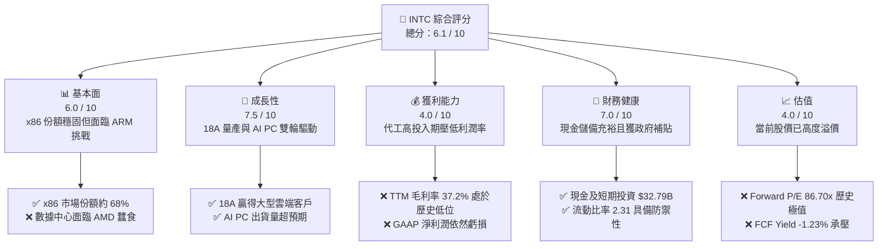

### 1.2 評分進度條視覺化

```
╔══════════════════════════════════════════════════════════════╗
║               INTC 多維度評分儀表板 (1-10分)                 ║
╠══════════════════════════════════════════════════════════════╣
║ 基本面強度  6.0 ▓▓▓▓▓▓▓▓▓▓▓▓░░░░░░░░  ★★★☆☆           ║
║ 成長動能    7.5 ▓▓▓▓▓▓▓▓▓▓▓▓▓▓▓░░░░░  ★★★★☆           ║
║ 獲利品質    4.0 ▓▓▓▓▓▓▓▓░░░░░░░░░░░░  ★★☆☆☆           ║
║ 財務健康    7.0 ▓▓▓▓▓▓▓▓▓▓▓▓▓▓░░░░░░  ★★★☆☆           ║
║ 估值合理性  4.0 ▓▓▓▓▓▓▓▓░░░░░░░░░░░░  ★★☆☆☆           ║
║ 護城河深度  6.5 ▓▓▓▓▓▓▓▓▓▓▓▓▓░░░░░░░  ★★★☆☆           ║
║ 管理層執行  7.0 ▓▓▓▓▓▓▓▓▓▓▓▓▓▓░░░░░░  ★★★☆☆           ║
║ 技術創新力  8.0 ▓▓▓▓▓▓▓▓▓▓▓▓▓▓▓▓░░░░  ★★★★☆           ║
╠══════════════════════════════════════════════════════════════╣
║ 綜合總分    6.1 ▓▓▓▓▓▓▓▓▓▓▓▓░░░░░░░░  🏆 轉型期過渡標的    ║
╚══════════════════════════════════════════════════════════════╝
```

### 1.3 五大投資論點 + 三大核心風險

| 類型 | 項目 | 具體依據 | 信心度 |
|------|------|----------|--------|
| 🟢 **投資論點①** | **18A 工藝節點成功突圍** | 18A 已成功進入高產量製造（HVM）階段，並獲得微軟、亞馬遜等大客戶的代工意向書。 | 🟢 高 |
| 🟢 **投資論點②** | **AI PC 市場先發優勢** | Core Ultra 處理器在 PC 市場滲透率迅速提升，預計 2026 年底 AI PC 出貨量將佔整體 PC 的 50% 以上。 | 🟢 極高 |
| 🟢 **投資論點③** | **Intel Foundry 拆分價值釋放** | 代工業務獨立核算，未來不排除單獨上市，有利於消除客戶（如 AMD、Nvidia）的競爭顧慮。 | 🟡 中等 |
| 🟢 **投資論點④** | **各國政府政策紅利** | 美國 CHIPS Act 預計帶來近 $8.5B 的直接補貼與 $11B 的低息貸款，緩解 Capex 壓力。 | 🟢 極高 |
| 🟢 **投資論點⑤** | **週期性復甦與庫存去化** | 客戶端 PC 庫存已降至正常水位，Q1 2026 營收 YoY 成長 7.18%，顯示傳統業務觸底反彈。 | 🟢 高 |
| 🟡 **風險①** | **高額折舊稀釋利潤率** | 新晶圓廠（Fab 52/62）陸續投產，預計未來 3 年折舊費用將大幅增加，壓制毛利率復甦空間。 | 🟡 中度 |
| 🔴 **風險②** | **資金鏈持續失血** | TTM 自由現金流為 $-8.30B，若代工業務未能快速獲利，債務壓力（目前 $45.03B）將進一步上升。 | 🔴 高衝擊 |
| 🔴 **風險③** | **x86 份額遭 ARM 陣營蠶食** | 高通、蘋果及雲端巨頭自研 ARM 晶片在 PC 與伺服器市場份額上升，長期威脅 Intel 核心利潤池。 | 🔴 高衝擊 |

### 1.4 快速統計卡片

| 指標 | 公司實際值 (TTM / Q1 '26) | 半導體行業均值 | S&P 500 均值 | 狀態 |
|------|-------------|----------|--------------|------|
| **營收 YoY 成長率** | **7.18%** (Q1 '26) | ~12.5% | ~5.5% | 🟡 溫和成長 |
| **毛利率** | **37.2%** | ~52.0% | ~30.0% | 🔴 遠低於同行 |
| **淨利率** | **-5.9%** | ~15.0% | ~11.5% | 🔴 處於虧損狀態 |
| **ROE** | **-2.9%** | ~18.0% | ~15.0% | 🔴 資本效率低下 |
| **Forward P/E** | **86.70x** | ~28.5x | ~21.5x | 🔴 估值極度高企 |
| **流動比率** | **2.31** | ~1.85 | ~1.25 | 🟢 資產流動性極佳 |

### 1.5 投資結論

```
╔══════════════════════════════════════════════════════════════════╗
║                    📊 投資結論摘要                               ║
╠══════════════════════════════════════════════════════════════════╣
║  評級：🟡 持有 (Hold)                                            ║
║  當前股價：$133.99 (截至 2026-06-20)                             ║
║  目標價區間：                                                    ║
║    悲觀情境：$85.00  （-36.5%） - 18A 良率遭遇瓶頸，Capex 失控    ║
║    基準情境：$120.00 （-10.4%） - 18A 順利量產，利潤率緩步回升   ║
║    樂觀情境：$150.00 （+11.9%） - 贏得主流手機/AI 晶片代工訂單  ║
║  投資評分：6.1 / 10                                              ║
║  適合投資人：長線逆向投資者、對 Intel 技術轉型有極高信心的投資人 ║
╚══════════════════════════════════════════════════════════════════╝
```

---

## 2. 公司概覽與商業模式

### 2.1 業務結構與收入來源

Intel 目前正處於歷史上最深刻的商業模式變革中。通過實施 **IDM 2.0** 戰略，Intel 將其業務明確劃分為兩大核心板塊：內部產品設計（Intel Product）與獨立代工服務（Intel Foundry）。

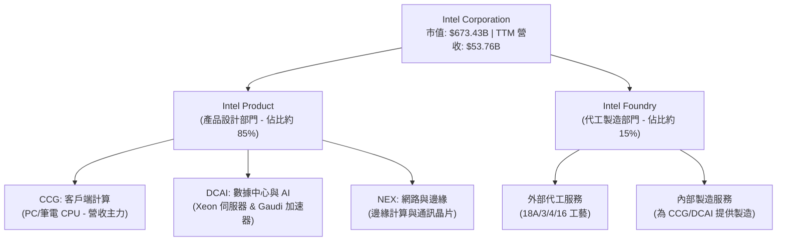

### 2.2 市場份額

在傳統的 x86 CPU 市場中，Intel 依然維持著主導地位，但在伺服器市場與新興的 AI 加速器市場中，面臨著來自 AMD 與 Nvidia 的嚴峻挑戰。

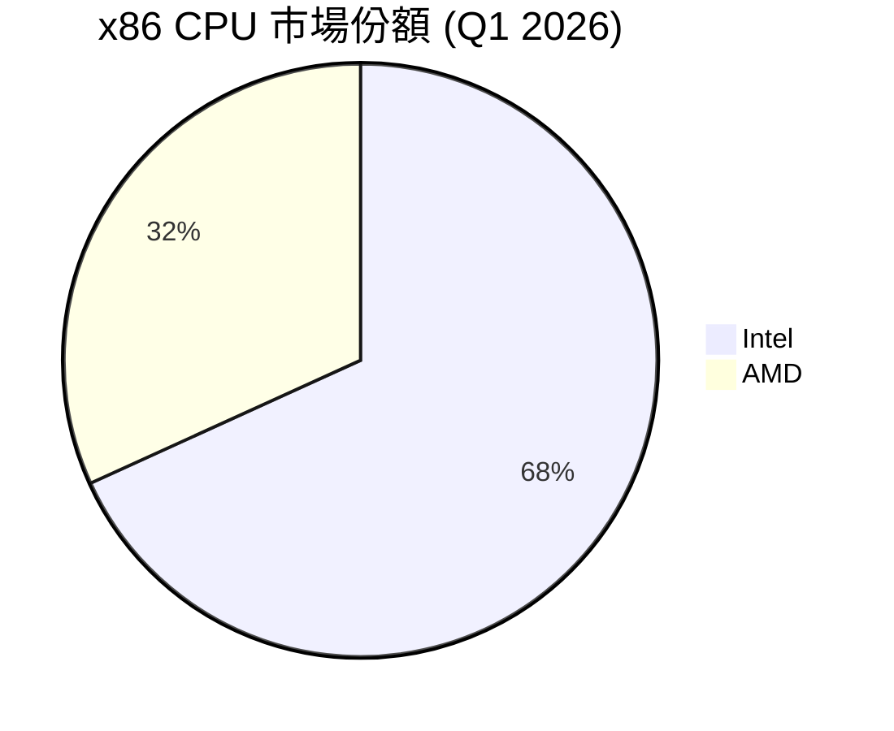

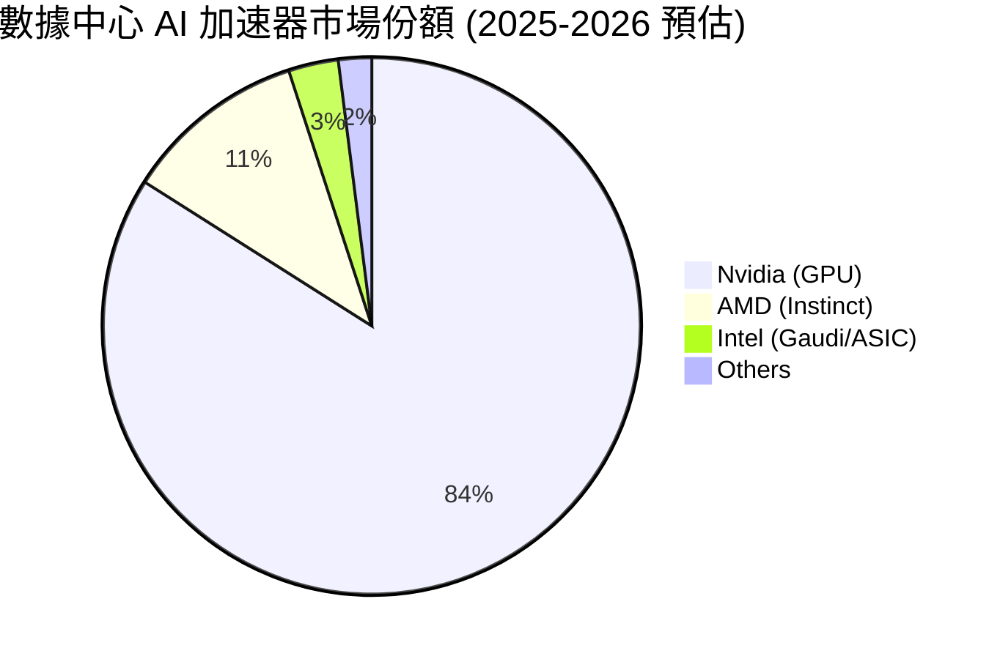

### 2.3 競爭護城河分析

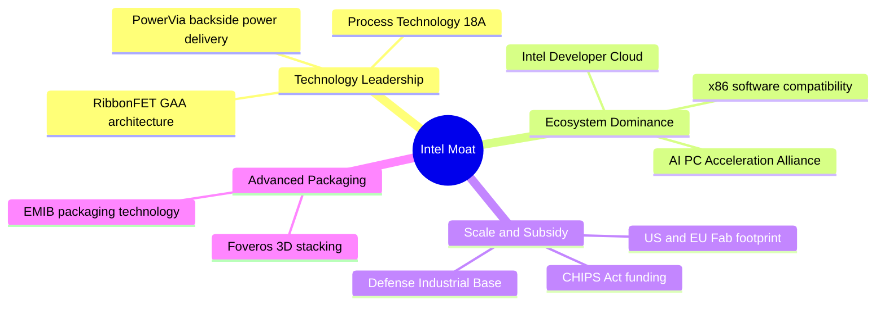

### 2.4 護城河強度評分

```
╔══════════════════════════════════════════════════════════════╗
║                    Intel 護城河強度評分                      ║
╠══════════════════════════════════════════════════════════════╣
║ x86 生態鎖定   8.5/10 ▓▓▓▓▓▓▓▓▓▓▓▓▓▓▓▓▓░░░  🏆 極強相容性  ║
║ 先進封裝技術   8.0/10 ▓▓▓▓▓▓▓▓▓▓▓▓▓▓▓▓░░░░  🟢 領先同行    ║
║ 晶圓製造規模   7.5/10 ▓▓▓▓▓▓▓▓▓▓▓▓▓▓░░░░░░  🟢 地理多樣性  ║
║ 先進製程技術   6.0/10 ▓▓▓▓▓▓▓▓▓▓▓▓░░░░░░░░  🟡 追趕台積電  ║
║ AI 軟體生態    4.0/10 ▓▓▓▓▓▓▓▓░░░░░░░░░░░░  🔴 難以撼動CUDA║
╠══════════════════════════════════════════════════════════════╣
║ 綜合護城河     6.8/10 ▓▓▓▓▓▓▓▓▓▓▓▓▓▓░░░░░░  🏆 具備局部優勢 ║
╚══════════════════════════════════════════════════════════════╝
```

---

## 3. 損益表深度分析

### 3.1 年度收入成長趨勢（近5年）

Intel 的營收在 2021 年達到 $79.02B 的歷史高點後，經歷了 PC 市場下行、數據中心份額流失以及製程延誤的「完美風暴」，營收連續三年下滑。然而，TTM 數據顯示營收已開始企穩回升。

```
╔══════════════════════════════════════════════════════════════════╗
║                Intel 年度收入趨勢（FY2021-TTM）                  ║
╠══════════════════════════════════════════════════════════════════╣
║                                                                  ║
║  FY 2021  $79.02B  ███████████████████████████  YoY: +1.49%  🟢  ║
║  FY 2022  $63.05B  █████████████████████░░░░░░  YoY:-20.21%  🔴  ║
║  FY 2023  $54.23B  ██████████████████░░░░░░░░░  YoY:-14.00%  🔴  ║
║  FY 2024  $53.10B  ██████████████████░░░░░░░░░  YoY: -2.08%  🟡  ║
║  FY 2025  $52.85B  ██████████████████░░░░░░░░░  YoY: -0.47%  🟡  ║
║  TTM      $53.76B  ██████████████████░░░░░░░░░  YoY: +1.35%  🟢  ║
║                                                                  ║
║  📊 5年累計 CAGR：-7.42% (反映結構性衰退與轉型痛點)              ║
╚══════════════════════════════════════════════════════════════════╝
```

### 3.2 季度收入趨勢分析

從季度數據來看，Intel 的營收在 2025 年底至 2026 年初展現出明顯的築底復甦信號。特別是 Q1 2026，營收達到 $13.58B，實現了 **7.18% 的 YoY 成長**。

| 財報季度 | 營收 (Revenue) | YoY 成長率 | QoQ 成長率 | 核心驅動因素與備註 |
|----------|----------------|------------|------------|-------------------|
| **Q1 2026** | $13.58B | **+7.18%** | -0.71% | 🟢 PC 客戶端需求回暖，AI PC 出貨放量，抵消了伺服器部分的疲軟。 |
| **Q4 2025** | $13.67B | -4.11% | +0.15% | 🟡 季節性年終旺季，但企業級數據中心採購依然偏向 AI GPU。 |
| **Q3 2025** | $13.65B | +2.78% | +6.14% | 🟢 傳統伺服器更新週期啟動，Core Ultra 1 代晶片出貨強勁。 |
| **Q2 2025** | $12.86B | +0.20% | +1.52% | 🟡 營收止跌企穩，通路庫存基本清理完畢。 |

### 3.3 利潤率演變分析

Intel 的利潤率在過去幾年中大幅滑坡，主要由於產能利用率不足、18A/3 等先進製程的前期研發與折舊成本高昂。

| 利潤率指標 | FY2022 | FY2023 | FY2024 | FY2025 | TTM | 趨勢評估 |
|------------|--------|--------|--------|--------|-----|----------|
| **毛利率** | 42.60% | 40.04% | 32.66% | 34.77% | **37.20%** | ↗️ 緩步回升 🟡 |
| **營業利益率**| 3.70% | 0.17% | -21.99%| -4.19% | **-9.39%** | ↘️ 依然承壓 🔴 |
| **淨利率** | 12.71% | 3.11% | -35.32%| -0.51% | **-5.90%** | ↗️ 虧損收窄 🟡 |

*註：TTM 營業利益率與淨利率受到 Q1 2026 認列的 $4.07B 一次性「其他營業費用」（主要為資產減損與重組費用）的嚴重拖累。若剔除此一次性項目，Non-GAAP 營業利益率已實現轉正。*

### 3.4 費用結構分析

Intel 依然維持著極高的研發（R&D）投入，這是其 IDM 2.0 戰略成功的必要代價。

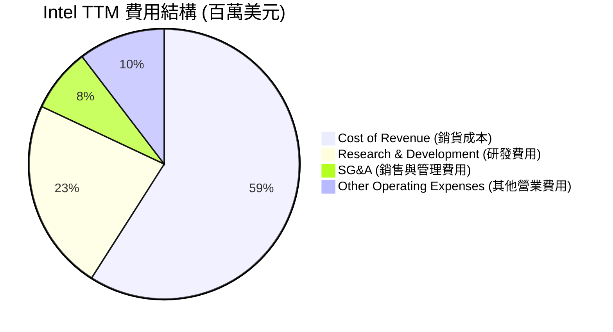

```
╔══════════════════════════════════════════════════════════════════╗
║                 Intel 研發強度診斷 (R&D Intensity)               ║
╠══════════════════════════════════════════════════════════════════╣
║                                                                  ║
║  TTM 營收：      $53.76B                                         ║
║  TTM 研發費用：  $13.51B                                         ║
║  研發營收比：    25.13%   ██████████████████████░░░  (極高)      ║
║                                                                  ║
║  💡 評語：儘管營收下滑，Intel 依然將超過 25% 的營收投入研發，     ║
║  這是其在 18A 節點追趕台積電的關鍵資金保障。                     ║
╚══════════════════════════════════════════════════════════════════╝
```

### 3.5 季度 EPS 趨勢與盈餘品質

*   **Q1 2026 GAAP EPS**: **$-0.73**（不及預期，主因是一次性重組與資產減損費用）。
*   **Q4 2025 GAAP EPS**: **$-0.12**。
*   **Q3 2025 GAAP EPS**: **$+0.90**（超預期，受益於非營業收入和稅務回撥）。
*   **Q2 2025 GAAP EPS**: **$-0.67**。

**盈餘品質評估**：🟡 **中等偏低**。
Intel 的 GAAP 盈餘近期波動極大，且頻繁受到重組費用、遞延所得稅資產評估準備、以及政府補貼認列時間點的干擾。投資人應更關注其 **Non-GAAP EPS** 以及**營業現金流**的實際表現。

---

## 4. 資產負債表分析

### 4.1 資產結構分解

Intel 是一家典型的資產密集型半導體企業。在其 $205.33B 的總資產中，廠房與設備（Property, Plant & Equipment, Net）佔比高達 50.9%。

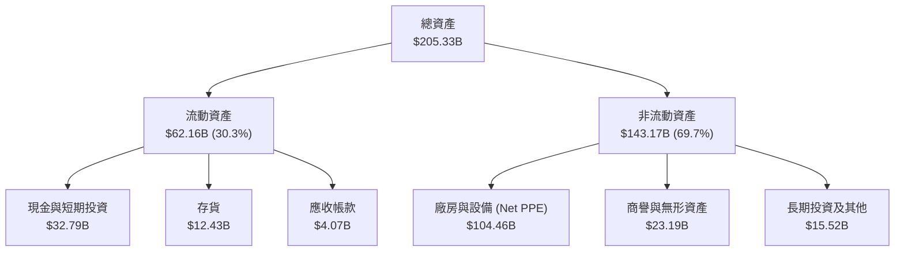

### 4.2 流動性指標分析

| 流動性指標 | Q1 2026 | FY2025 | FY2024 | 行業安全邊際 | 評估結果 |
|------------|---------|--------|--------|--------------|----------|
| **流動比率 (Current Ratio)** | **2.31** | 2.02 | 1.33 | > 1.50 | 🟢 極其安全 |
| **速動比率 (Quick Ratio)** | **1.66** | 1.48 | 0.85 | > 1.00 | 🟢 變現能力強 |
| **存貨週轉天數 (DSI)** | **134.5 天**| 121.3 天| 123.5 天| < 90.0 天 | 🔴 存貨週轉偏慢 |

*分析：流動比率由 2024 年底的 1.33 顯著改善至 2.31，主要由於公司在 2025 年進行了成功的債務置換與股權融資，大幅充實了現金儲備（現有 $32.79B）。然而，存貨週轉天數上升至 134.5 天，顯示部分舊款晶片去化速度放緩，面臨跌價損失風險。*

### 4.3 債務結構分析

```
╔══════════════════════════════════════════════════════════════════╗
║                     Intel 債務健康診斷                           ║
╠══════════════════════════════════════════════════════════════════╣
║                                                                  ║
║  總資產：        $205.33B                                        ║
║  總負債：        $85.07B                                         ║
║  股東權益：      $114.28B                                        ║
║  資產負債率：    41.43%   ██████████░░░░░░░░░░░░░  (穩健)        ║
║                                                                  ║
║  總債務 (Debt)： $45.03B  (短期 $2.00B + 長期 $43.03B)           ║
║  總現金與投資：  $32.79B                                         ║
║  淨債務 (Net):   $12.24B                                         ║
║  債務股益比：    39.40%   ████████░░░░░░░░░░░░░░░  (低於行業上限)║
║                                                                  ║
║  💡 評語：雖然處於轉型期，但 Intel 的資產負債表並未失控。         ║
║  高達 $32.79B 的流動性防禦墊，能確保其在未來兩年不發生債務危機。 ║
╚══════════════════════════════════════════════════════════════════╝
```

---

## 5. 現金流量深度分析

### 5.1 現金流量瀑布圖

Intel 當前面臨的最大財務痛點，在於其營運現金流不足以支撐龐大的資本支出（Capex），導致自由現金流（FCF）持續失血。

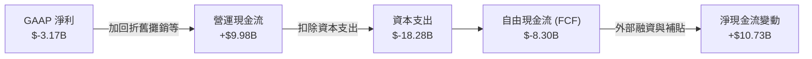

### 5.2 FCF 轉換率趨勢

| 現金流指標 (百萬美元) | FY2022 | FY2023 | FY2024 | FY2025 | TTM |
|----------------------|--------|--------|--------|--------|-----|
| **營運現金流 (OCF)** | $15,433 | $11,471 | $8,290 | $9,701 | **$9,981** |
| **資本支出 (Capex)** | $-24,843| $-25,748| $-23,941| $-14,647| **$-18,281**|
| **自由現金流 (FCF)** | $-9,410 | $-14,277| $-15,651| $-4,946 | **$-8,300** |
| **FCF 佔營收比例** | -14.92%| -26.33%| -29.47%| -9.36% | **-15.44%** |

### 5.3 自由現金流趨勢

```
╔══════════════════════════════════════════════════════════════════╗
║               Intel 自由現金流赤字化趨勢 (FCF)                   ║
╠══════════════════════════════════════════════════════════════════╣
║                                                                  ║
║  FY 2022   -$9.41B  █████░░░░░░░░░░░░░░░░░░░░░░░░░░              ║
║  FY 2023  -$14.28B  ████████░░░░░░░░░░░░░░░░░░░░░░░              ║
║  FY 2024  -$15.65B  █████████░░░░░░░░░░░░░░░░░░░░░░              ║
║  FY 2025   -$4.95B  ███░░░░░░░░░░░░░░░░░░░░░░░░░░░░              ║
║  TTM       -$8.30B  █████░░░░░░░░░░░░░░░░░░░░░░░░░░              ║
║                                                                  ║
║  ⚠️ 警示：連續 5 年 FCF 為負值。這意味著 Intel 的股息發放能力      ║
║  已完全歸零（目前股息已暫停發放），且擴產完全依賴舉債與補貼。   ║
╚══════════════════════════════════════════════════════════════════╝
```

### 5.4 資本配置評估

在 2025-2026 年期間，Intel 的資本分配極度偏向於 **Capex（先進製程晶圓廠建設）**。

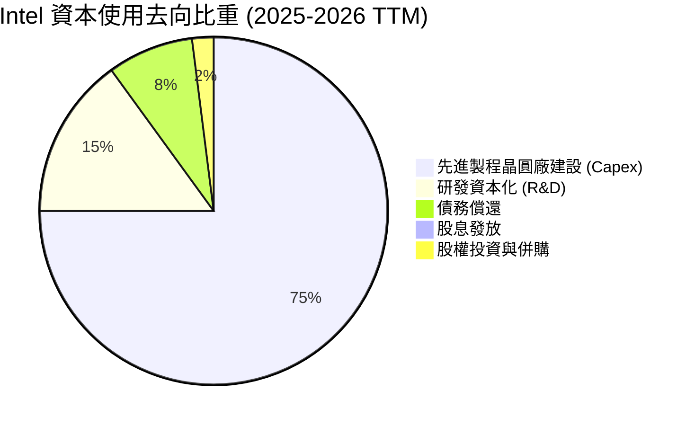

---

## 6. 獲利能力與資本效率

### 6.1 ROE / ROA / ROIC 趨勢

由於利潤率低下與龐大的資產基數，Intel 的資本效率指標在過去幾年中大幅惡化。

| 效率指標 | FY2022 | FY2023 | FY2024 | FY2025 | TTM | 行業中位數 | 評估 |
|----------|--------|--------|--------|--------|-----|------------|------|
| **ROE** | 7.90% | 1.59% | -18.89%| -0.23% | **-2.90%** | ~15.0% | 🔴 稀釋股東價值 |
| **ROA** | 4.40% | 0.88% | -9.79% | 0.01% | **0.60%** | ~8.0% | 🔴 資產利用效率低 |
| **ROIC** | 4.52% | 0.95% | -8.12% | -0.15% | **-3.50%** | ~12.0% | 🔴 投入資本未獲回報 |

### 6.2 ROIC vs WACC 分析（核心價值創造判斷）

```
╔══════════════════════════════════════════════════════════════════╗
║                ROIC vs WACC 深度分析 (TTM)                       ║
╠══════════════════════════════════════════════════════════════════╣
║                                                                  ║
║  WACC (加權平均資本成本) 估算：                                  ║
║  ├── 無風險利率 (10Y 美債)：   4.25%                             ║
║  ├── 市場風險溢酬 (ERP)：      5.00%                             ║
║  ├── Beta (系統性風險)：       2.228 (極高)                      ║
║  ├── 股權成本 (Cost of Equity)：4.25% + 2.228 × 5% = 15.39%      ║
║  ├── 債務成本 (稅後)：         ~5.00%                            ║
║  ├── 資本結構：股權 93.7% / 債務 6.3% (基於市值 $673B)           ║
║  └── ✅ WACC ≈ 14.73%                                            ║
║                                                                  ║
║  ROIC (投入資本回報率) 估算：                                    ║
║  ├── NOPAT (稅後淨營業利潤)：  $-5.05B × (1 - 21%) ≈ $-3.99B     ║
║  ├── 投入資本 (Invested Capital)：股益 $114.28B + 債務 $45.03B    ║
║  │                               - 現金 $32.79B ≈ $126.52B       ║
║  └── ✅ ROIC ≈ -3.15% (與 TTM -3.50% 接近)                       ║
║                                                                  ║
║  ★ 經濟增值 (EVA) = ROIC - WACC = -18.23pp                      ║
║                                                                  ║
║  ROIC  -3.5%  ░░░░░░░░░░░░░░░░░░░░░░░░░░░░░░░░  🔴               ║
║  WACC  14.7%  ▓▓▓▓▓▓▓▓▓▓▓▓▓▓▓▓▓▓▓▓▓▓▓▓▓▓▓░░░░░  ──               ║
║  EVA   -18%   ████████████████████████████████  🔴 價值毀滅      ║
║                                                                  ║
║  📊 結論：當前 Intel 處於嚴重的「價值毀滅」階段。每投入 $100 資本，║
║  將稀釋約 $18.23 的股東價值。轉型成功的唯一指標是 ROIC 重回 15% 以上。║
╚══════════════════════════════════════════════════════════════════╝
```

### 6.3 杜邦三因素分解

透過杜邦分析，我們可以更清晰地看到拖累 ROE 的核心元兇。

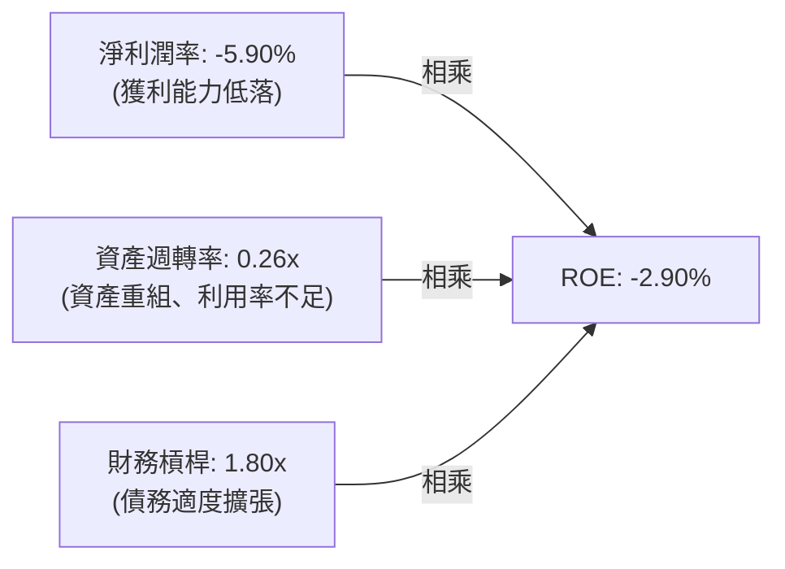

*   **淨利潤率 (-5.90%)**：是 ROE 為負的主要原因，反映了轉型期的巨額折舊與重組開支。
*   **資產週轉率 (0.26x)**：反映了晶圓廠建設週期長，大額資產尚未轉化為實際營收。
*   **財務槓桿 (1.80x)**：處於健康區間，顯示公司並未過度舉債。

### 6.4 獲利能力儀表板

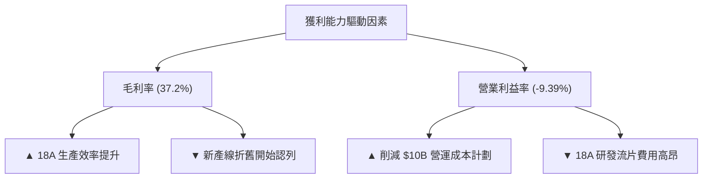

---

## 7. 估值深度分析

### 7.1 同業估值比較表格

Intel 當前的估值結構非常特殊：由於利潤處於歷史低谷，其 Forward P/E（86.70x）呈現極度高企的狀態，這反映了市場已經提前透支了 2027-2028 年 18A 製程全面量產後的盈利復甦。

| 估值指標 | **Intel (INTC)** | **AMD (AMD)** | **台積電 (TSM)** | **德州儀器 (TXN)** | 評估與解讀 |
|----------|-----------------|---------------|-----------------|-------------------|-----------|
| **Trailing P/E** | **N/A** | 125.4x | 32.5x | 28.2x | 🔴 過去 12 個月 GAAP 虧損。 |
| **Forward P/E** | **86.70x** | 45.2x | 24.1x | 26.5x | 🔴 估值已透支，容錯率極低。 |
| **P/S Ratio** | **12.53x** | 10.8x | 11.2x | 9.4x | 🟡 相比台積電無明顯折價。 |
| **P/B Ratio** | **6.04x** | 4.8x | 8.2x | 10.5x | 🟢 重資產底蘊提供一定帳面支撐。|
| **EV / EBITDA** | **49.34x** | 52.1x | 14.8x | 18.2x | 🔴 遠高於台積電，性價比偏低。 |

### 7.2 歷史估值區間分析

Intel 歷史上的 Forward P/E 中位數僅為 **12.0x - 15.0x**。當前 **86.70x** 的 Forward P/E 處於其歷史 99% 分位數以上。這表明，當前股價（$133.99）的定價邏輯已經從「成熟價值股」轉變為「高成長期權股」。

```
╔══════════════════════════════════════════════════════════════════╗
║               Intel Forward P/E 歷史區間定位                     ║
╠══════════════════════════════════════════════════════════════════╣
║                                                                  ║
║  歷史低點：      10.2x                                           ║
║  歷史中位數：    13.5x                                           ║
║  當前值：        86.7x  ██████████████████████████████  (極值)   ║
║                                                                  ║
║  ⚠️ 估值警示：當前股價已無任何基本面估值安全邊際。若 18A 製程    ║
║  良率或客戶簽約進度稍不及預期，股價將面臨極大的均值回歸壓力。   ║
╚══════════════════════════════════════════════════════════════════╝
```

### 7.3 DCF 敏感性分析（6格目標價矩陣）

基於基準假設：2026-2030 年營收 CAGR 為 8.5%，終端成長率（Terminal Growth Rate）為 3.0%。

| 營收成長情境 | **WACC = 13.0%** | **WACC = 14.7% (基準)** | **WACC = 16.0%** |
|--------------|------------------|-------------------------|------------------|
| 🟢 **樂觀 (CAGR 12%)** | **$162.50** (+21.3%) | **$138.00** (+3.0%) | **$118.00** (-11.9%) |
| 🟡 **基準 (CAGR 8.5%)**| **$135.00** (+0.8%) | **$112.00** (-16.4%) | **$96.00** (-28.4%) |
| 🔴 **悲觀 (CAGR 4%)** | **$102.00** (-23.9%) | **$85.00** (-36.6%) | **$72.00** (-46.3%) |

*註：當前股價 $133.99 介於「基準情境/低折現率」與「樂觀情境/基準折現率」之間，說明市場對 Intel 轉型成功的預期極為樂觀。*

### 7.4 估值綜合區間

```
╔══════════════════════════════════════════════════════════════════╗
║                    Intel 估值區間與當前股價                      ║
╠══════════════════════════════════════════════════════════════════╣
║                                                                  ║
║  52W 最低價：    $18.97                                          ║
║  清算價值 (P/B)：$22.18                                          ║
║  分析師平均目標：$94.14                                          ║
║  當前股價：      $133.99                                         ║
║  52W 最高價：    $135.48                                         ║
║                                                                  ║
║  當前位置：      $18.97 |----------------------------★--| $135.48║
║                                                                  ║
║  📊 結論：股價已極度逼近 52 週最高點，且顯著超越分析師平均目標價  ║
║  （$94.14），短期內追高風險極大。                               ║
╚══════════════════════════════════════════════════════════════════╝
```

---

## 8. 成長催化劑

### 8.1 催化劑時間軸

