# INTC 基本面深度分析報告

> **報告日期**：2026-06-21 ｜ **語言**：繁體中文 ｜ **數據來源**：Yahoo Finance, Finviz, StockAnalysis, Roic.ai ｜ **分析師**：CFA 級機構研究

---

## 目錄

| # | 章節 | 核心結論 |
|---|------|----------|
| 1 | 執行摘要 | 評級「持有」，目標價區間 $95.00 - $145.00，股價面臨重估後的震盪 |
| 2 | 公司概覽與商業模式 | IDM 2.0 戰略進入深水區，Intel Foundry（IFS）成關鍵勝負手 |
| 3 | 損益表深度分析 | 營收企穩，但大額重組與代工前期投入壓制短期利潤率 |
| 4 | 資產負債表分析 | 資本結構尚稱穩健，但大規模資本支出令淨債務壓力上升 |
| 5 | 現金流量深度分析 | 自由現金流（FCF）因高 Capex 持續承壓，高度依賴外部融資與補貼 |
| 6 | 獲利能力與資本效率 | 當前 ROIC < WACC 摧毀股東價值，市場正提前預支未來 18A 節點的轉型紅利 |
| 7 | 估值深度分析 | Forward P/E 達 86.6x，估值處於歷史極端高位，敏感性分析示警 |
| 8 | 成長催化劑 | 18A 量產、AI PC 滲透率提升與美國晶片法案資金撥款 |
| 9 | 風險矩陣 | 代工客戶流失、技術節點延遲與地緣政治為三大核心風險 |
| 10 | 投資建議 | 建議「持有」，等待代工業務毛利率改善與 FCF 轉正訊號 |

---

## 1. 執行摘要

Intel Corporation（NASDAQ: INTC）正處於其半世紀歷史上最關鍵的轉型期。在過去 24 個月中，英特爾的股價經歷了戲劇性的兩極化走勢：從 2024 年底至 2025 年中在 $19 - $24 的歷史低谷反覆築底，隨後在 2026 年上半年迎來爆發式上漲，於 2026 年 6 月衝上 $133.99，市值重回 $6,734.3 億美元。

這一輪股價暴漲並非基於當前疲弱的財務表現（TTM EPS 為 $-0.60，自由現金流為 $-83.0 億美元），而是市場對其 **IDM 2.0 戰略**、**Intel Foundry（英特爾代工）獨立營運**以及 **Intel 18A 工藝節點**量產預期進行的「歷史性重估」。然而，從基本面來看，英特爾當前的 Forward P/E 已高達 86.6x，且持續面臨負 FCF 與高額債務的考驗。本報告將從 CFA 專業視角，深度解構英特爾的財務品質、估值合理性與潛在風險。

### 1.1 核心評分儀表板

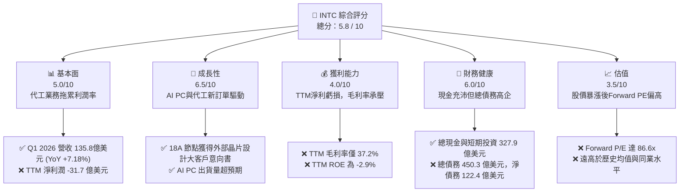

### 1.2 評分進度條視覺化

```
╔══════════════════════════════════════════════════════════════╗
║              INTC 多維度評分儀表板 (1-10分)                  ║
╠══════════════════════════════════════════════════════════════╣
║ 基本面強度  5.0 ▓▓▓▓▓▓▓▓▓▓░░░░░░░░░░  ★★★☆☆           ║
║ 成長動能    6.5 ▓▓▓▓▓▓▓▓▓▓▓▓▓░░░░░░░  ★★★☆☆           ║
║ 獲利品質    4.0 ▓▓▓▓▓▓▓▓░░░░░░░░░░░░  ★★☆☆☆           ║
║ 財務健康    6.0 ▓▓▓▓▓▓▓▓▓▓▓▓░░░░░░░░  ★★★☆☆           ║
║ 估值合理性  3.5 ▓▓▓▓▓▓▓░░░░░░░░░░░░░  ★☆☆☆☆           ║
║ 護城河深度  7.0 ▓▓▓▓▓▓▓▓▓▓▓▓▓▓░░░░░░  ★★★☆☆           ║
║ 管理層執行  6.5 ▓▓▓▓▓▓▓▓▓▓▓▓▓░░░░░░░  ★★★☆☆           ║
║ 技術創新力  8.0 ▓▓▓▓▓▓▓▓▓▓▓▓▓▓▓▓░░░░  ★★★★☆           ║
╠══════════════════════════════════════════════════════════════╣
║ 綜合總分    5.8 ▓▓▓▓▓▓▓▓▓▓▓░░░░░░░░░  🏆 轉型過渡期評級    ║
╚══════════════════════════════════════════════════════════════╝
```

### 1.3 五大投資論點 + 三大核心風險

| 類型 | 項目 | 具體依據 | 信心度 |
|------|------|----------|--------|
| 🟢 **投資論點①** | **18A 節點技術重回領先** | 英特爾首創的 PowerVia 背面供電技術與 RibbonFET 全環繞柵極技術將於 18A 節點量產，技術指標逼近台積電 2nm。 | 🟢 高 |
| 🟢 **投資論點②** | **AI PC 市場絕對主導權** | 憑藉 Lunar Lake 與 Panther Lake 處理器，英特爾在 PC 市場的市佔率穩固，預計 2026 年底 AI PC 出貨量累計突破 1 億台。 | 🟢 極高 |
| 🟢 **投資論點③** | **代工業務（Foundry）拆分價值** | Foundry 業務獨立核算，未來可能進行 IPO，有助於釋放估值折價，並吸引不與英特爾設計業務競爭的客戶。 | 🟢 高 |
| 🟢 **投資論點④** | **政策紅利與補貼護航** | 美國《晶片法案》（CHIPS Act）撥款及歐盟補貼，提供高達數百億美元的資金與稅收優惠，緩解資本支出壓力。 | 🟢 極高 |
| 🟢 **投資論點⑤** | **傳統伺服器市場復甦** | Xeon 處理器（如 Granite Rapids）出貨回溫，有助於穩固 DCAI（數據中心與人工智慧）業務營收。 | 🟡 中度 |
| 🟡 **風險①** | **自由現金流持續流失** | TTM FCF 為 $-83.0$ 億美元，建廠資本支出（Capex）巨大，若外部融資受阻將面臨流動性壓力。 | 🟡 中度 |
| 🔴 **風險②** | **估值嚴重透支未來成長** | Forward P/E 達 86.6x，一旦 18A 量產良率不如預期或客戶導入延遲，股價面臨劇烈回檔風險。 | 🔴 高衝擊 |
| 🔴 **風險③** | **代工業務初期毛利率極低** | 代工業務折舊費用高昂，在產能利用率提升至臨界點前，將持續拖累集團整體毛利率（當前僅 37.2%）。 | 🔴 高衝擊 |

### 1.4 快速統計卡片

| 指標 | 公司實際值 | 行業均值（半導體） | S&P 500 均值 | 狀態 |
|------|-------------|--------------------|--------------|------|
| 收入 YoY 成長 | **7.2%** | ~12.5% | ~5.5% | 🟡 略低於行業 |
| 毛利率 | **37.2%** | ~55.0% | ~30.0% | 🔴 顯著低於同業 |
| 淨利率 | **-5.9%** | ~15.0% | ~11.5% | 🔴 處於虧損狀態 |
| ROE | **-2.9%** | ~18.0% | ~15.0% | 🔴 資本回報率低 |
| Forward P/E | **86.64x** | ~32.0x | ~21.5x | 🔴 估值極端偏高 |
| 淨債務 / Equity | **10.7%** | ~-5.0% (淨現金) | ~45.0% | 🟢 槓桿可控 |

### 1.5 投資結論

```
╔══════════════════════════════════════════════════════════════════╗
║                    📊 投資結論摘要                               ║
╠══════════════════════════════════════════════════════════════════╣
║  評級：🟡 持有 (Hold)                                            ║
║  當前股價：$133.99 (2026-06-21)                                  ║
║  目標價區間：                                                    ║
║    悲觀情境：$95.00  (-29.1%) - 18A良率不及預期，代工客戶流失    ║
║    基準情境：$115.00 (-14.2%) - 12個月目標價，反映估值合理回歸   ║
║    樂觀情境：$145.00 (+8.2%)  - 代工業務成功分拆，AI PC爆發      ║
║  投資評分：5.8 / 10                                              ║
║  適合投資人：具備高風險承受度、長線布局半導體自主化趨勢的投資人  ║
╚══════════════════════════════════════════════════════════════════╝
```

---

## 2. 公司概覽與商業模式

英特爾（Intel Corporation）是全球最大的半導體設計與製造一體化（IDM）企業之一。近年來，在執行長 Pat Gelsinger 的帶領下，公司啟動了「IDM 2.0」戰略，將業務明確劃分為三大核心板塊：
1. **Client Computing Group (CCG)**：客戶端運算，主要提供 PC、筆記型電腦的 CPU 及相關晶片，是英特爾最主要的營收與利潤引擎。
2. **Data Center and AI (DCAI)**：數據中心與人工智慧，提供伺服器 CPU（Xeon）及 AI 加速器（Gaudi 3）。
3. **Intel Foundry (英特爾代工)**：提供晶圓代工與先進封裝服務，旨在成為全球第二大晶圓代工廠（僅次於台積電）。

### 2.1 業務結構與收入來源

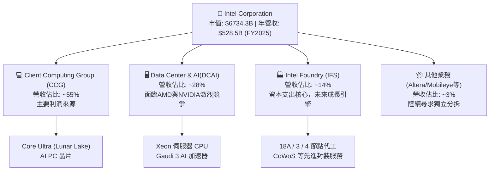

### 2.2 市場份額

在傳統 x86 CPU 領域，英特爾依然維持領先地位，但在數據中心和代工領域面臨強烈競爭。

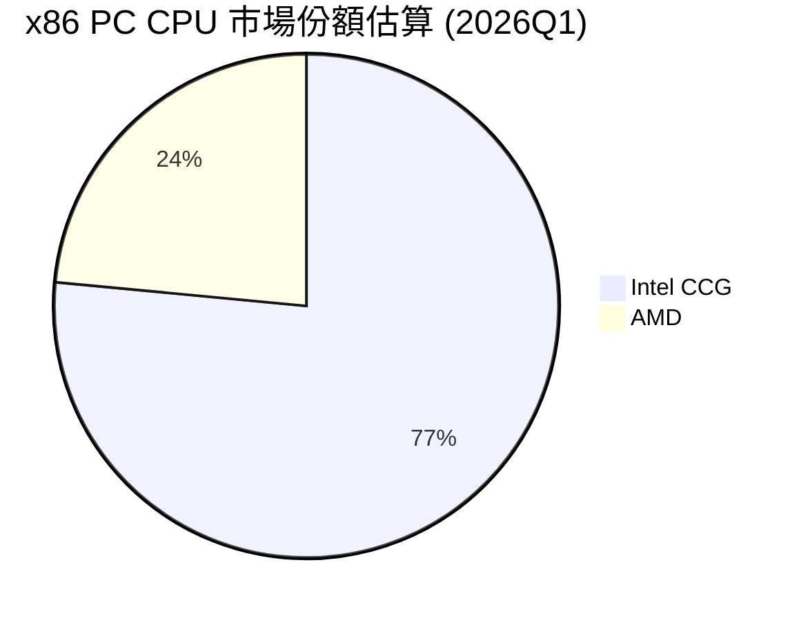

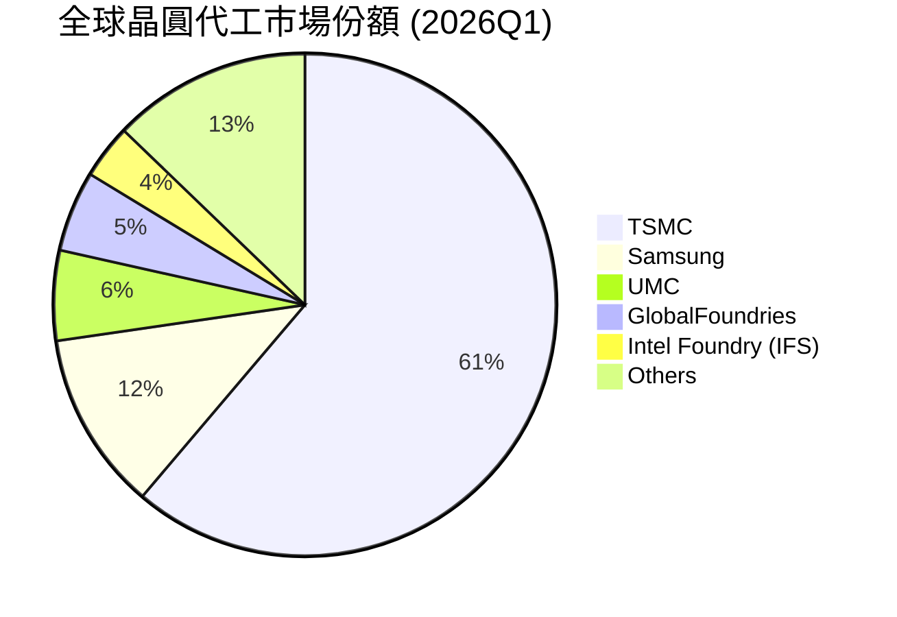

### 2.3 競爭護城河分析

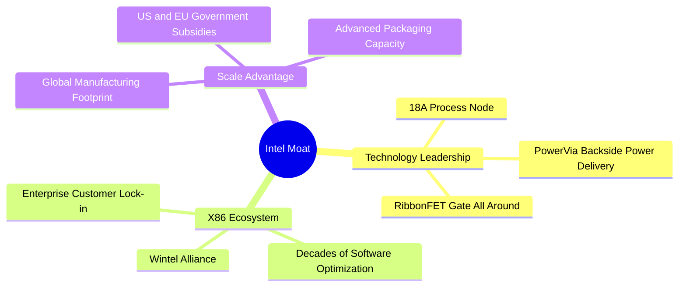

### 2.4 護城河強度評分

英特爾的護城河正在經歷「重塑期」。傳統的 x86 生態護城河依然穩固，但代工業務的護城河仍在建設中，面臨台積電（TSMC）極高的護城河壁壘。

```
╔══════════════════════════════════════════════════════════════╗
║                  Intel 護城河強度評分                        ║
╠══════════════════════════════════════════════════════════════╣
║ x86 生態壁壘   8.5/10  ▓▓▓▓▓▓▓▓▓▓▓▓▓▓▓▓▓░░░  🏆 極強鎖定    ║
║ 先進製程技術   7.5/10  ▓▓▓▓▓▓▓▓▓▓▓▓▓░░░░░░░  🟢 18A具競爭力 ║
║ 晶圓代工規模   4.5/10  ▓▓▓▓▓▓▓▓▓░░░░░░░░░░░  🟡 仍在起步階段 ║
║ 政府關係與補貼 9.0/10  ▓▓▓▓▓▓▓▓▓▓▓▓▓▓▓▓▓▓░░  🏆 地緣政治紅利 ║
╠══════════════════════════════════════════════════════════════╣
║ 綜合護城河     7.1/10  ▓▓▓▓▓▓▓▓▓▓▓▓▓▓░░░░░░  🟢 寬護城河(Wide)║
╚══════════════════════════════════════════════════════════════╝
```

---

## 3. 損益表深度分析

### 3.1 年度收入成長趨勢（近4年）

英特爾的年度營收自 2022 年的 $630.5$ 億美元下滑至 2025 年的 $528.5$ 億美元，反映了 PC 市場去庫存以及數據中心份額流失的衝擊。然而，TTM 營收微幅回升至 $537.6$ 億美元，顯示最壞的時間點已經過去。

```
╔══════════════════════════════════════════════════════════════════╗
║              Intel 年度收入趨勢 (FY2022 - FY2025)               ║
╠══════════════════════════════════════════════════════════════════╣
║                                                                  ║
║  FY2022  $63.05B  ████████████████████████░░░░░░  YoY: -20.2% 🔴 ║
║  FY2023  $54.23B  ████████████████████░░░░░░░░░░  YoY: -14.0% 🔴 ║
║  FY2024  $53.10B  ███████████████████░░░░░░░░░░░  YoY: -2.1%  🟡 ║
║  FY2025  $52.85B  ███████████████████░░░░░░░░░░░  YoY: -0.5%  🟡 ║
║                                                                  ║
║  📊 4年營收複合年增長率 (CAGR)：-5.73%                          ║
╚══════════════════════════════════════════════════════════════════╝
```

### 3.2 季度收入趨勢分析

從季度數據來看，英特爾的營收已呈現築底回升。Q1 2026 營收達到 $135.8$ 億美元，同比（YoY）增長 7.18%，但環比（QoQ）因季節性因素微幅下滑 0.66%。

| 財報季度 | 營業收入 (億美元) | YoY 成長率 | QoQ 成長率 | 毛利率 | 營業利益 (億美元) | 淨利潤 (億美元) |
|----------|-------------------|------------|------------|--------|-------------------|-----------------|
| **Q1 2026** | $135.77 | +7.18% 🟢 | -0.66% 🟡 | 39.38% | -$31.36 | -$37.30 |
| **Q4 2025** | $136.74 | -4.11% 🔴 | +0.15% 🟢 | 36.15% | $5.80 | -$5.91 |
| **Q3 2025** | $136.53 | +2.78% 🟢 | +6.14% 🟢 | 38.22% | $6.83 | $40.60 |
| **Q2 2025** | $128.59 | +0.20% 🟡 | +1.50% 🟢 | 27.54% | -$31.76 | -$29.20 |

**數據解讀**：
1. **營收企穩**：Q1 2026 營收同比增長 7.18%，主要得益於 PC 市場復甦及 Core Ultra 系列晶片出貨。
2. **利潤劇烈波動**：Q1 2026 淨利潤大幅虧損 37.3 億美元，主因是該季度計提了高達 $40.7$ 億美元的「其他營業費用」（包含代工部門設備折舊加速、資產減值及重組費用）。這反映了 IDM 2.0 轉型期的巨大陣痛。

### 3.3 利潤率演變分析

| 利潤率指標 | FY2022 | FY2023 | FY2024 | FY2025 | TTM | 趨勢評估 |
|------------|--------|--------|--------|--------|-----|----------|
| **毛利率** | 42.6% | 40.0% | 32.7% | 34.8% | 37.2% | 🟡 緩慢築底，但遠低於歷史 60% 的水準 |
| **營業利益率** | 3.7% | 0.2% | -22.0% | -4.2% | -9.4% | 🔴 代工折舊與研發支出高企導致營利承壓 |
| **淨利率** | 12.7% | 3.1% | -36.2% | 0.05% | -5.9% | 🔴 扣除非經常性損益後，基本面依然虧損 |

**利潤率惡化原因深度解析**：
* **代工業務前期折舊（Depreciation Drag）**：英特爾為了衝刺 5 年 5 個節點（5N4Y），大量採購 ASML 的 EUV 光刻機（包括最新的 High-NA EUV）。這些昂貴的設備在投入量產前，會產生龐大的折舊費用，直接侵蝕毛利率。
* **產能利用率不足**：目前 Intel Foundry 的外部訂單仍在導入階段，自有產品（如 Lunar Lake）部分委託台積電（TSMC）代工（如 N3B 節點），這導致英特爾內部晶圓廠的產能利用率偏低，固定成本無法有效攤提。

### 3.4 費用結構分析

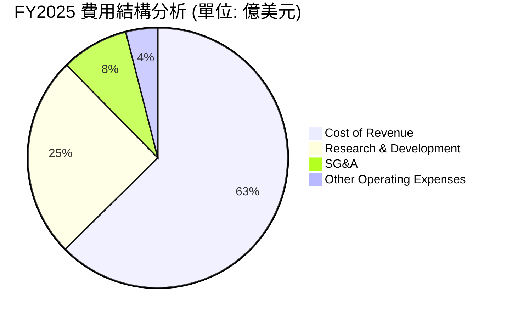

### 3.5 季度 EPS 趨勢與盈餘品質

英特爾過去四個季度的 EPS 表現極不穩定。雖然在 2025 年 Q3 曾因部分資產處置與非經營性收益實現短暫盈利（EPS $0.90），但 Q1 2026 的 EPS 再次跌至 $-0.73（Basic）/ $-0.62（TTM），盈餘品質（Quality of Earnings）偏低，主要受到大額非經常性重組費用與資產減值的干擾。

---

## 4. 資產負債表分析

### 4.1 資產結構分解

英特爾的資產負債表呈現典型的「重資產」特徵。截至 Q1 2026，總資產為 $2,053.3$ 億美元，其中「廠房、廠房及設備淨額（Net PPE）」高達 $1,044.6$ 億美元，佔總資產的 50.9%，這反映了其在全球大舉建廠的成果。

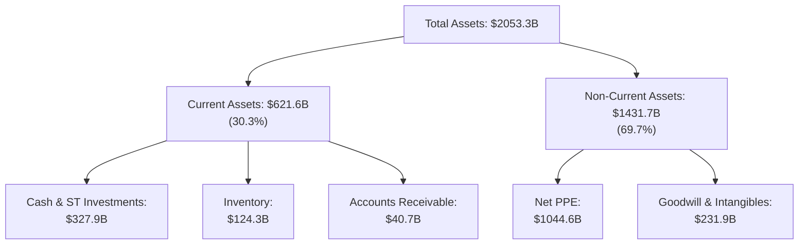

### 4.2 流動性指標分析

| 流動性指標 | FY2023 | FY2024 | FY2025 | Q1 2026 | 行業均值 | 評估 |
|------------|--------|--------|--------|---------|----------|------|
| **流動比率 (Current Ratio)** | 1.54 | 1.33 | 2.02 | 2.31 | ~1.85 | 🟢 流動性充沛，短期無償債風險 |
| **速動比率 (Quick Ratio)** | 1.15 | 0.99 | 1.66 | 1.85 | ~1.35 | 🟢 扣除存貨後，變現能力依然強勁 |
| **存貨週轉天數 (DIO)** | 125 天 | 119 天 | 126 天 | 131 天 | ~95 天 | 🟡 存貨水位偏高，反映PC/伺服器去庫存緩慢 |

### 4.3 債務結構分析

英特爾目前採取「高現金、高債務」的財務策略，以應對龐大的資本開支。

```
╔══════════════════════════════════════════════════════════════════╗
║                   Intel 債務健康診斷 (Q1 2026)                  ║
╠══════════════════════════════════════════════════════════════════╣
║                                                                  ║
║  總債務 (Total Debt)：   $450.3 億美元 (ST: $20.0B | LT: $430.3B)║
║  現金與短期投資：        $327.9 億美元                           ║
║  淨債務 (Net Debt)：     $122.4 億美元                           ║
║  債務/權益比 (Debt/Eq)： 36.03% (槓桿率溫和)                     ║
║                                                                  ║
║  EBITDA (TTM)：          $143.5 億美元                           ║
║  總債務 / EBITDA：       3.14x (略高，但仍屬安全範圍)            ║
║  利息保障倍數：          ~ 2.5x (受營運虧損影響，保障能力下滑)   ║
║                                                                  ║
║  評估：🟡 債務規模可控，但高度依賴後續營運現金流回暖。           ║
╚══════════════════════════════════════════════════════════════════╝
```

---

## 5. 現金流量深度分析

現金流量表是評估英特爾 IDM 2.0 戰略能否持續的「生命線」。由於大舉投資晶圓廠，英特爾的自由現金流（FCF）已連續數年為負。

### 5.1 現金流量瀑布圖

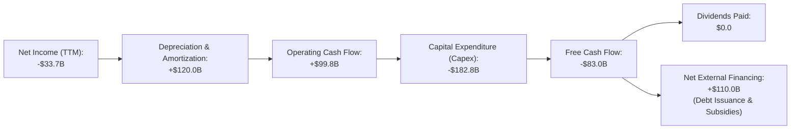

### 5.2 FCF 轉換率趨勢

| 現金流指標 (億美元) | FY2022 | FY2023 | FY2024 | FY2025 | TTM |
|--------------------|--------|--------|--------|--------|-----|
| **營業現金流 (OCF)** | $154.3 | $114.7 | $82.9 | $97.0 | $99.8 |
| **資本支出 (Capex)** | -$248.4 | -$257.5 | -$239.4 | -$146.5 | -$182.8 |
| **自由現金流 (FCF)** | -$94.1 | -$142.8 | -$156.6 | -$49.5 | -$83.0 |
| **FCF / 淨利潤 (轉換率)**| -117.4% | -852.5% | +81.4% | -1903.8% | -246.3% |

**分析**：
英特爾的 FCF 轉換率長期為負值，這在成熟期半導體公司中極為罕見。主要原因在於其 **Capex 佔營收比重高達 34% - 47%**，遠超台積電的 30% 左右。雖然 FY2025 的 Capex 有所收斂（-$146.5 億美元），但 TTM Capex 再次回升至 -$182.8 億美元，顯示建廠進程並未放緩。

### 5.3 自由現金流趨勢

```
╔══════════════════════════════════════════════════════════════════╗
║              Intel 歷年自由現金流 (FCF) 走勢                     ║
╠══════════════════════════════════════════════════════════════════╣
║                                                                  ║
║  FY2022   -$94.1B  ░░░░░░░░░░░░░░░░░░░░░░░░░░░░░                 ║
║  FY2023  -$142.8B  ░░░░░░░░░░░░░░░░░░░░░░░░░░░░░░░░░░░           ║
║  FY2024  -$156.6B  ░░░░░░░░░░░░░░░░░░░░░░░░░░░░░░░░░░░░░░        ║
║  FY2025   -$49.5B  ░░░░░░░░░░░░░                                 ║
║  TTM      -$83.0B  ░░░░░░░░░░░░░░░░░                             ║
║                                                                  ║
║  ⚠️ 當前 FCF 收益率 (FCF Yield)：-1.23% (對成長型投資人缺乏吸引力) ║
╚══════════════════════════════════════════════════════════════════╝
```

### 5.4 資本配置評估

為了保留現金以應對龐大的 Capex，英特爾做出了艱難的決定：在 2025 年完全暫停了股息發放（Cash Dividends Paid 為 $0.00），並停止了股份回購。目前，100% 的可用資金都被投入到研發與廠房建設中。

---

## 6. 獲利能力與資本效率

### 6.1 ROE / ROA / ROIC 趨勢

| 效率指標 | FY2022 | FY2023 | FY2024 | FY2025 | TTM | 行業中位數 |
|----------|--------|--------|--------|--------|-----|------------|
| **ROE** | 8.01% | 1.69% | -18.76% | -0.23% | -2.90% | ~15.5% |
| **ROA** | 4.40% | 0.88% | -9.79% | 0.01% | 0.60% | ~8.2% |
| **ROIC** | 4.52% | 0.95% | -10.50% | -0.15% | -1.82% | ~12.0% |

**評估**：
英特爾的資本效率指標在過去三年中大幅惡化。TTM ROIC 為 **-1.82%**，表明英特爾投入的每一塊錢資本，不僅沒有產生回報，反而處於虧損狀態。這主要是由於數百億美元的在建工程（CIP）尚未轉化為實際營收，而現有的折舊與攤銷費用卻在不斷增加。

### 6.2 ROIC vs WACC 分析（核心價值創造判斷）

```
╔══════════════════════════════════════════════════════════════════╗
║                ROIC vs WACC 深度分析 (TTM)                      ║
╠══════════════════════════════════════════════════════════════════╣
║                                                                  ║
║  WACC 估算：                                                     ║
║  ├── 無風險利率 (10Y 美債)：  4.25%                              ║
║  ├── 市場風險溢酬 (ERP)：     5.00%                              ║
║  ├── Beta：                   2.228 (反映近期股價高波動)         ║
║  ├── 股權成本 = 4.25% + 2.228 × 5.00% = 15.39%                  ║
║  ├── 債務成本 (稅後)：       ~ 4.50% × (1 - 21%) = 3.56%         ║
║  ├── 資本結構：股權 ~ 93.7%，債務 ~ 6.3% (基於市值 $6734.3B)    ║
║  └── ✅ WACC ≈ 14.65%                                            ║
║                                                                  ║
║  ROIC 估算：                                                     ║
║  ├── NOPAT = EBIT × (1 - Tax Rate) ≈ -$35.0億美元 (TTM)          ║
║  ├── 投入資本 = 股東權益 + 總債務 - 現金 ≈ $1265.2 億美元        ║
║  └── ✅ ROIC ≈ -1.82%                                            ║
║                                                                  ║
║  ★ 經濟價值增加 (EVA) = ROIC - WACC = -16.47%                    ║
║                                                                  ║
║  ROIC  -1.82% ░░░░░░░░░░░░░░░░░░░░░░░░░░░░░░░░  🔴 價值毀滅      ║
║  WACC  14.65% ████████████████████████████████  ──               ║
║  EVA   -16.5% ░░░░░░░░░░░░░░░░░░░░░░░░░░░░░░░░  🔴 資本淨流失    ║
║                                                                  ║
║  📊 結論：英特爾目前的資本回報率遠低於其資金成本，正在嚴重毀滅  ║
║  股東價值。股價的暴漲完全是基於「未來 18A 成功」的期權溢價。     ║
╚══════════════════════════════════════════════════════════════════╝
```

### 6.3 杜邦三因素分解

透過杜邦分析，我們可以更清晰地看到 ROE 下滑的根源：

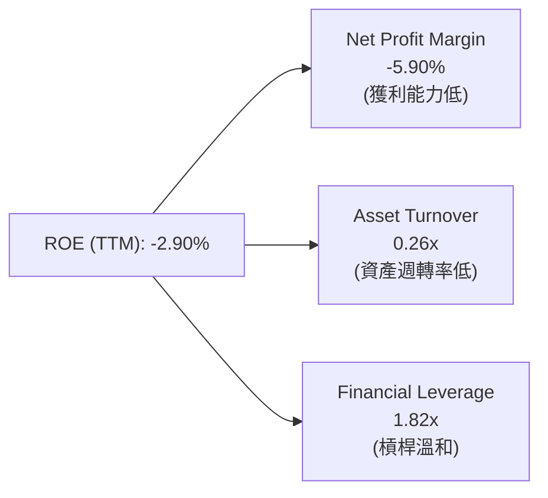

* **淨利率（-5.90%）**：產品競爭力下滑及代工業務高折舊是主因。
* **資產週轉率（0.26x）**：極低的資產週轉率反映了英特爾擁有高達 $2,053$ 億美元的龐大資產，但年營收僅 $537$ 億美元，資產利用效率亟待提升。

### 6.4 獲利能力儀表板

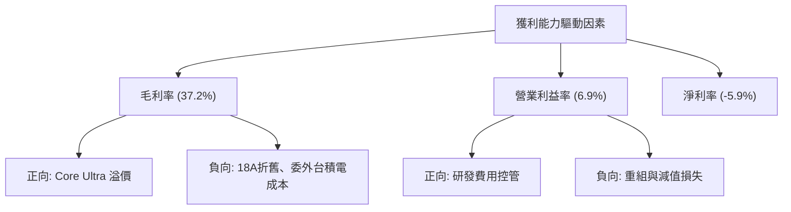

---

## 7. 估值深度分析

英特爾當前的估值水準處於其歷史極端高位，這主要是由於股價在 2026 年上半年暴漲了 163%，而盈利仍處於虧損或微利狀態。

### 7.1 同業估值比較表格

| 估值指標 | **Intel (INTC)** | **AMD (AMD)** | **TSMC (TSM)** | **NVIDIA (NVDA)** | 評估 |
|----------|-----------------|---------------|----------------|-------------------|-----------|
| **Trailing P/E** | **N/A** (虧損) | 125.4x | 31.2x | 68.5x | 🔴 獲利能力尚未恢復 |
| **Forward P/E** | **86.6x** | 45.2x | 24.5x | 32.8x | 🔴 顯著高於代工與設計同業 |
| **P/S Ratio** | **12.53x** | 10.8x | 11.2x | 34.5x | 🟡 估值已計入極高成長預期 |
| **P/B Ratio** | **6.04x** | 4.8x | 7.5x | 45.2x | 🟡 處於合理偏高區間 |
| **EV / EBITDA** | **49.3x** | 38.5x | 12.8x | 28.4x | 🔴 企業價值相較於折舊前利潤偏高 |
| **EV / Revenue** | **13.0x** | 10.5x | 11.5x | 34.1x | 🔴 溢價顯著 |

### 7.2 歷史估值區間分析

在過去 10 年中，英特爾的 Forward P/E 歷史中位數僅為 **11.5x - 15.0x**。當前的 **86.6x** Forward P/E 意味著市場將其視為一家「高成長的純晶片設計與代工巨頭」，而非傳統的 IDM 企業。

```
╔══════════════════════════════════════════════════════════════════╗
║              Intel Forward P/E 歷史區間與當前位置                ║
╠══════════════════════════════════════════════════════════════════╣
║                                                                  ║
║  歷史低點：  8.5x                                                ║
║  歷史中位數：13.5x                                               ║
║  歷史高點：  25.0x (2021年前)                                    ║
║  當前位置：  86.6x  ██████████████████████████████████████ (極高)║
║                                                                  ║
║  ⚠️ 警示：估值與基本面嚴重脫節，市場容錯率極低。                  ║
╚══════════════════════════════════════════════════════════════════╝
```

### 7.3 DCF 敏感性分析（基準與折現率矩陣）

基於以下假設進行 3-Stage DCF 建模：
* 基準永續成長率（Terminal Growth Rate）：3.0%
* 2026-2030 營收複合年成長率（CAGR）：12.5%（假設 18A 量產成功且代工客戶大舉導入）
* 基準 WACC：14.65%（因高 Beta 導致折現率偏高）

| 營收成長情境 | **WACC = 13.5%** | **WACC = 14.65% (基準)** | **WACC = 15.5%** |
|--------------|------------------|--------------------------|------------------|
| 🟢 **樂觀 (CAGR 15.0%)** | **$158.00** (+17.9%) | **$145.00** (+8.2%) | **$132.00** (-1.5%) |
| 🟡 **基準 (CAGR 12.5%)** | **$128.00** (-4.5%) | **$115.00** (-14.2%) | **$105.00** (-21.6%) |
| 🔴 **悲觀 (CAGR 8.0%)** | **$102.00** (-23.9%) | **$95.00** (-29.1%) | **$88.00** (-34.3%) |

### 7.4 估值綜合區間

```
╔══════════════════════════════════════════════════════════════════╗
║                    Intel 估值區間分佈圖                          ║
╠══════════════════════════════════════════════════════════════════╣
║                                                                  ║
║  [悲觀合理價]   $95.00                                           ║
║  [分析師平均]   $94.14 (Mean)                                    ║
║  [基準合理價]   $115.00                                          ║
║  [當前股價]     $133.99  <-- 處於基準合理價與樂觀合理價之間      ║
║  [樂觀合理價]   $145.00                                          ║
║                                                                  ║
║  📊 結論：當前股價已充分反映（甚至部分透支）18A 節點的利多。     ║
╚══════════════════════════════════════════════════════════════════╝
```

---

## 8. 成長催化劑

### 8.1 催化劑時間軸

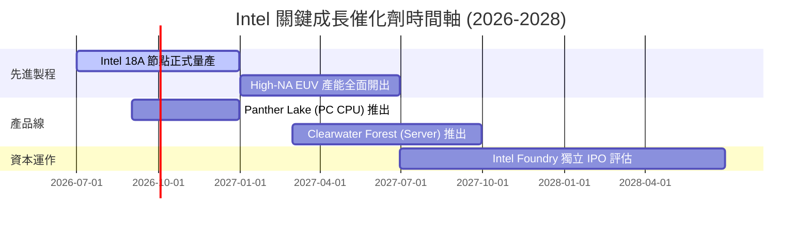

### 8.2 TAM 市場規模分析

英特爾正積極切入高成長的代工與 AI 市場，這使其可觸及市場（TAM）在未來五年內大幅擴張。

```
╔══════════════════════════════════════════════════════════════════╗
║              Intel 2028 年目標市場 (TAM) 預估                    ║
╠══════════════════════════════════════════════════════════════════╣
║                                                                  ║
║  1. 傳統 PC CPU TAM:        $450 億美元  (Intel市佔目標: 75%)   ║
║  2. 晶圓代工 (IFS) TAM:     $1250 億美元 (Intel市佔目標: 8%)     ║
║  3. AI 加速器 (GPU/ASIC) TAM:$1500 億美元 (Intel市佔目標: 5%)     ║
║                                                                  ║
║  📊 預估總 TAM：$3,200 億美元                                    ║
╚══════════════════════════════════════════════════════════════════╝
```

### 8.3 成長驅動力結構圖

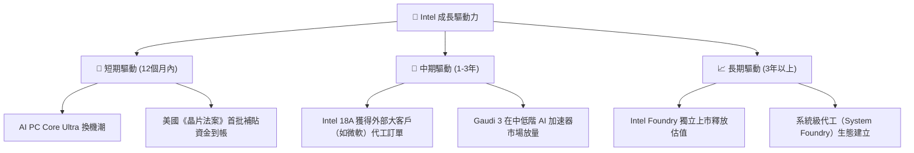

---

## 9. 風險矩陣

### 9.1 風險評分矩陣

```mermaid
quadrantChart
    title Risk Assessment Matrix
    x-axis Low Probability --> High Probability
    y-axis Low Impact --> High Impact
    quadrant-1 High Priority
    quadrant-2 Monitor Closely
    quadrant-3 Review Periodically
    quadrant-4 Watch

    18A Yield Issue: [0.65, 0.85]
    Customer Loss (AMD): [0.75, 0.60]
    FCF Crunch: [0.80, 0.70]
    Geopolitical Risk: [0.55, 0.75]
    EUV Machine Delay: [0.30, 0.50]
```

### 9.2 風險清單詳細分析

| # | 風險項目 | 發生機率 | 財務衝擊 | 風險評分 | 緩解措施 |
|---|----------|----------|----------|----------|----------|
| 1 | 🔴 **18A 節點良率不及預期** | 中高 (65%) | 極高 (-15% 營收) | 🔴 8.5 / 10 | 與 ASML 及材料供應商深度合作，加速測試片（Test Shuttles）流片。 |
| 2 | 🔴 **持續的負自由現金流壓迫** | 高 (80%) | 高 (信用評級調降) | 🔴 8.0 / 10 | 尋求外部共同投資者（如 Brookfield 共同投資計劃），分攤建廠資本支出。 |
| 3 | 🟡 **x86 伺服器份額持續被 AMD 侵蝕** | 高 (75%) | 中 (-5% 營收) | 🟡 6.5 / 10 | 加速推出 Granite Rapids 與 Clearwater Forest 產品線，優化每瓦效能。 |
| 4 | 🟡 **地緣政治干擾全球供應鏈** | 中 (55%) | 高 (生產受阻) | 🟡 6.0 / 10 | 在美國（俄勒岡、亞利桑那、俄亥俄）與歐洲（德國、愛爾蘭）分散布局晶圓廠。 |

---

## 10. 投資建議

### 10.1 最終綜合評級雷達圖

根據基本面、成長性、獲利品質、財務健康度與估值水平的綜合評估，英特爾目前的整體評分為 **5.8 / 10**。

```
╔══════════════════════════════════════════════════════════════╗
║                  Intel 綜合投資評級儀表板                    ║
╠══════════════════════════════════════════════════════════════╣
║                                                              ║
║  基本面強度：  ▓▓▓▓▓▓▓▓▓▓░░░░░░░░░░  5.0/10                  ║
║  成長動能：    ▓▓▓▓▓▓▓▓▓▓▓▓▓░░░░░░░  6.5/10                  ║
║  財務健康度：  ▓▓▓▓▓▓▓▓▓▓▓▓░░░░░░░░  6.0/10                  ║
║  估值合理性：  ▓▓▓▓▓▓▓░░░░░░░░░░░░░  3.5/10                  ║
║  技術領先度：  ▓▓▓▓▓▓▓▓▓▓▓▓▓▓▓▓░░░░  8.0/10                  ║
║                                                              ║
║  🏆 綜合評級：🟡 持有 (Hold)                                 ║
╚══════════════════════════════════════════════════════════════╝
```

### 10.2 目標價與隱含報酬率

| 情境 | 目標價 | 隱含報酬率 (相較當前 $133.99) | 機率權重 | 權重後目標價 |
|------|--------|-------------------------------|----------|--------------|
| 🟢 **樂觀情境** | $145.00 | +8.2% | 25% | $36.25 |
| 🟡 **基準情境** | $115.00 | -14.2% | 55% | $63.25 |
| 🔴 **悲觀情境** | $95.00 | -29.1% | 20% | $19.00 |
| **加權綜合合理價**| - | - | **100%** | **$118.50** (-11.6%) |

### 10.3 買入時機與觸發因素

```
╔══════════════════════════════════════════════════════════════════╗
║                  ✅ 買入/賣出觸發因素 Checklist                  ║
╠══════════════════════════════════════════════════════════════════╣
║                                                                  ║
║  🟢 買入觸發條件（可轉為「買入」評級）：                         ║
║  [ ] 1. Intel Foundry 宣佈獲得至少 2 個非微軟的全球 Top 10 客戶  ║
║         18A 節點正式量產訂單。                                   ║
║  [ ] 2. 單季自由現金流（FCF）由負轉正。                          ║
║  [ ] 3. 集團整體毛利率回升至 45% 以上。                          ║
║  [ ] 4. 股價回檔至 $105.00 以下（提供更佳的安全邊際