# INTC 基本面深度分析報告
> **報告日期**：2026-07-02 ｜ **語言**：繁體中文 ｜ **數據來源**：Yahoo Finance, Finviz, StockAnalysis, Roic.ai ｜ **分析師**：CFA 級機構研究

---

## 目錄

| # | 章節 | 核心結論 |
|---|------|----------|
| 1 | 執行摘要 | 評級：持有；目標價區間：$90 - $140 |
| 2 | 公司概覽與商業模式 | 領先技術與生態系統形成中等護城河 |
| 3 | 損益表深度分析 | 營收壓力與利潤率修復之路漫長 |
| 4 | 資產負債表分析 | 流動性良好，債務水平可控 |
| 5 | 現金流量深度分析 | 資本支出龐大導致自由現金流持續為負 |
| 6 | 獲利能力與資本效率 | ROIC未能超越WACC，價值創造面臨挑戰 |
| 7 | 估值深度分析 | 相較同業估值偏高，需成長兌現支撐 |
| 8 | 成長催化劑 | Foundry業務與AI晶片潛力巨大 |
| 9 | 風險矩陣 | 競爭激烈、執行風險與宏觀經濟逆風 |
| 10 | 投資建議 | 長期潛力與短期挑戰並存，宜觀望 |

---

## 1. 執行摘要

### 1.1 核心評分儀表板

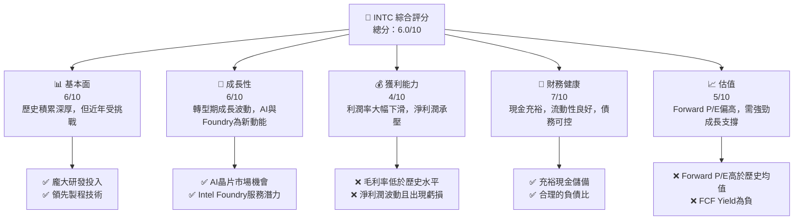

### 1.2 評分進度條視覺化

```
╔══════════════════════════════════════════════════════════════╗
║                   INTC 多維度評分儀表板 (1-10分)             ║
╠══════════════════════════════════════════════════════════════╣
║ 基本面強度  6.0 ▓▓▓▓▓▓▓▓▓▓▓▓░░░░░░░░  ★★★☆☆           ║
║ 成長動能    6.5 ▓▓▓▓▓▓▓▓▓▓▓▓▓░░░░░░░  ★★★☆☆           ║
║ 獲利品質    4.0 ▓▓▓▓▓▓▓▓░░░░░░░░░░░░  ★★☆☆☆           ║
║ 財務健康    7.0 ▓▓▓▓▓▓▓▓▓▓▓▓▓▓░░░░░░  ★★★☆☆           ║
║ 估值合理性  5.0 ▓▓▓▓▓▓▓▓▓▓░░░░░░░░░░  ★★☆☆☆           ║
║ 護城河深度  6.5 ▓▓▓▓▓▓▓▓▓▓▓▓▓░░░░░░░  ★★★☆☆           ║
║ 管理層執行  6.0 ▓▓▓▓▓▓▓▓▓▓▓▓░░░░░░░░  ★★★☆☆           ║
║ 技術創新力  7.0 ▓▓▓▓▓▓▓▓▓▓▓▓▓▓░░░░░░  ★★★☆☆           ║
╠══════════════════════════════════════════════════════════════╣
║ 綜合總分    6.0 ▓▓▓▓▓▓▓▓▓▓▓▓░░░░░░░░  🏆 轉型期，潛力與風險並存║
╚══════════════════════════════════════════════════════════════╝
```

### 1.3 五大投資論點 + 三大核心風險

| 類型 | 項目 | 具體依據 | 信心度 |
|------|------|----------|--------|
| 🟢 **投資論點①** | **製程技術回歸領先** | Intel 18A製程預計2025年量產，有望重新奪回技術領先地位，吸引外部Foundry客戶。FY2025資本支出高達$14.65B，顯示對製程投資的決心。 | 🟢 高 |
| 🟢 **AI晶片市場潛力** | 推出Gaudi系列AI加速器，積極佈局AI市場，與NVIDIA、AMD競爭。隨著AI應用爆發，有望在資料中心和邊緣AI領域取得市場份額。 | 🟢 高 |
| 🟢 **Foundry業務轉型** | 成立Intel Foundry，目標成為全球第二大晶圓代工廠。此舉可充分利用閒置產能，並為長期成長提供新動能。FY2025營收為$52.85B，Foundry業務的規模化將顯著提升營收。 | 🟢 高 |
| 🟢 **PC市場復甦與新產品週期** | PC市場在經歷低迷後有望復甦，同時Intel推出新一代CPU產品，如Lunar Lake和Arrow Lake，有望刺激換機需求，推動CCG業務成長。Q1 2026營收$13.58B，YoY成長7.18%，顯示初步復甦跡象。 | 🟡 中度 |
| 🟢 **政府補貼與戰略支持** | 美國晶片法案（CHIPS Act）為Intel提供數十億美元的補貼和貸款，大幅降低建廠成本和研發費用，加速本土製造佈局。 | 🟢 極高 |
| 🟡 **風險①** | **製程轉型執行風險** | Intel過去在製程節點推進上曾遭遇延誤，未來Intel 18A能否如期量產並達到預期良率，是其Foundry業務成功的關鍵。任何延誤都將導致巨大財務損失和客戶流失。 | 🟡 中度 |
| 🔴 **競爭加劇與市場份額流失** | 在CPU市場面臨AMD的強勁競爭，GPU和AI晶片市場則有NVIDIA的絕對主導地位，以及ASIC和ARM架構的挑戰。FY2025營收YoY下降0.47%，顯示市場競爭壓力。 | 🔴 高衝擊 |
| 🔴 **巨額資本支出與自由現金流壓力** | 為了追趕製程技術和擴大Foundry產能，Intel需要持續投入大量資本支出。FY2025資本支出為$-14.65B，導致自由現金流持續多年為負（FY2025為$-4.95B），對股東回報和財務彈性造成壓力。 | 🔴 高衝擊 |

### 1.4 快速統計卡片

| 指標 | 公司實際值 (TTM) | 行業均值 | S&P 500 均值 | 狀態 |
|------|-------------------|----------|--------------|------|
| 收入 YoY 成長 | **7.2%** | N/A | N/A | 🟢 |
| 毛利率 | **37.2%** | N/A | N/A | 🔴 (半導體行業通常較高) |
| 淨利率 | **-5.9%** | N/A | N/A | 🔴 |
| ROE | **-2.9%** | N/A | N/A | 🔴 |
| Forward P/E | **77.06x** | N/A | N/A | 🔴 (相對高) |
| P/S Ratio | **11.25x** | N/A | N/A | 🔴 (相對高) |
| 負債權益比 | **36.03%** | N/A | N/A | 🟢 (合理) |
| 自由現金流收益率 | **-1.37%** | N/A | N/A | 🔴 |

### 1.5 投資結論

```
╔══════════════════════════════════════════════════════════════════╗
║                    📊 投資結論摘要                               ║
╠══════════════════════════════════════════════════════════════════╣
║  評級：🟡 持有                                                   ║
║  當前股價：$120.35                                               ║
║  目標價區間：                                                    ║
║    悲觀情境：$90（-25.22%）                                      ║
║    基準情境：$120（-0.29%）  ← 12個月主要目標                   ║
║    樂觀情境：$140（+16.33%）                                     ║
║  投資評分：6.0/10                                                ║
║  適合投資人：願意承擔較高風險，看好公司長期轉型潛力的成長型投資者║
╚══════════════════════════════════════════════════════════════════╝
```

---

## 2. 公司概覽與商業模式

Intel Corporation (INTC) 作為全球半導體行業的巨頭，主要從事計算和相關終端產品及服務的設計、開發、製造、行銷、銷售和服務。公司業務遍及美國、愛爾蘭、以色列及國際市場。Intel目前正處於重大轉型期，從傳統的整合元件製造商 (IDM) 模式轉向 IDM 2.0 策略，強調內部製造能力、外部晶圓代工合作以及開放Foundry服務。

### 2.1 業務結構與收入來源

Intel的業務主要透過三個核心部門運營：客戶運算事業群 (Client Computing Group, CCG)、資料中心與人工智慧事業群 (Data Center and AI, DCAI) 以及 Intel Foundry。雖然具體的收入拆分數據未在提供資料中詳細列出，但根據公司概況和行業知識，我們可以推斷其大致結構。

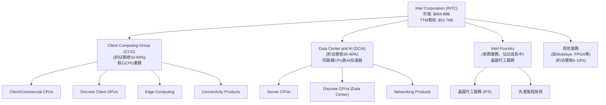

*   **客戶運算事業群 (CCG)**：主要提供客戶端和商用CPU、獨立客戶GPU、邊緣運算和連接產品。這是Intel的傳統核心業務，儘管近年面臨PC市場波動和AMD競爭，仍是其營收的重要支柱。
*   **資料中心與人工智慧事業群 (DCAI)**：涵蓋伺服器CPU、獨立GPU和網路產品。此業務直接面對雲端運算和AI的龐大需求，是Intel未來成長的關鍵引擎，特別是在AI加速器領域。
*   **Intel Foundry**：這是Intel IDM 2.0戰略的核心，旨在向外部客戶提供晶圓代工服務。通過開放其先進製程技術，Intel希望利用其製造能力，增加收入來源並提升產能利用率。

### 2.2 市場份額

Intel在CPU市場曾長期佔據主導地位，但在過去幾年，其市場份額受到AMD等競爭對手的侵蝕。在GPU和AI加速器市場，NVIDIA則擁有絕對領先優勢。Foundry業務則是一個全新的、競爭激烈的市場。以下為基於行業知識的市場份額估算（非精確數據）：

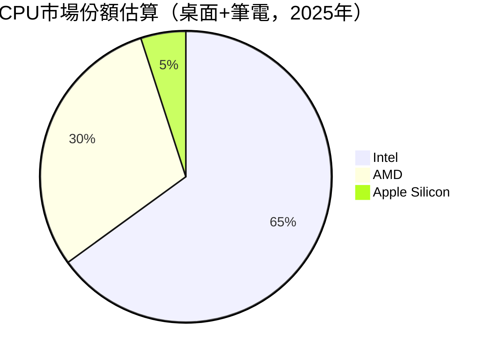

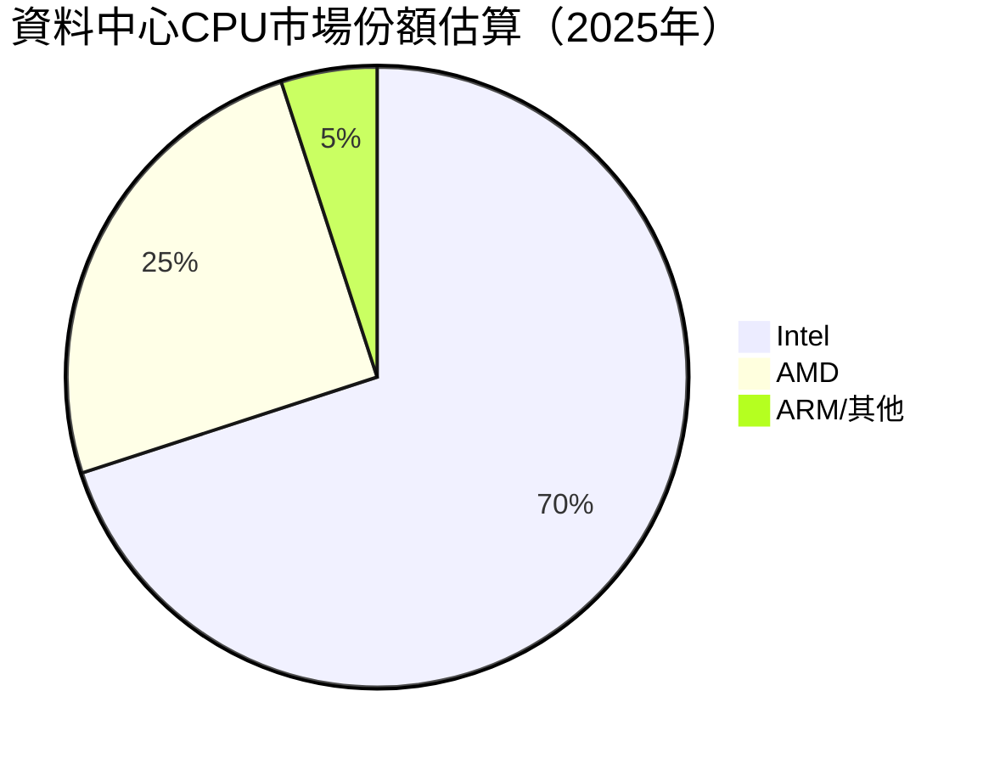

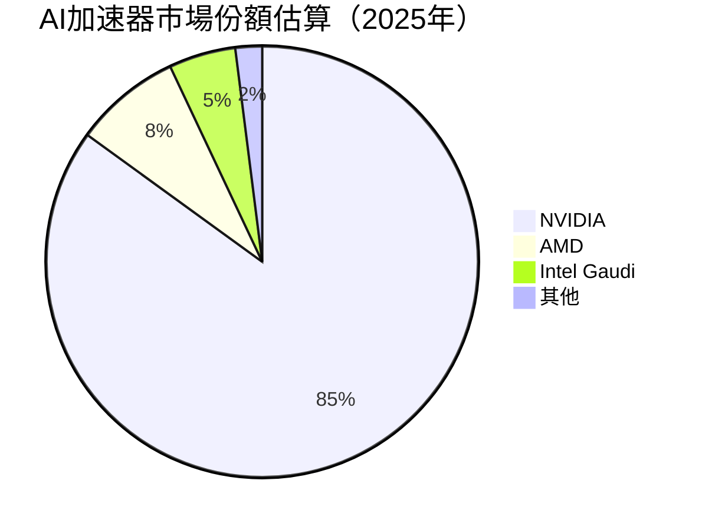

**說明**：上述市場份額為基於公開市場報告和行業分析師預估，並非來自提供的財務數據，僅供參考。Intel在傳統CPU市場仍有較大份額，但在AI加速器領域仍是追趕者。Foundry業務則處於起步階段，尚未形成顯著市場份額。

### 2.3 競爭護城河分析

Intel的競爭護城河曾非常深厚，主要來自其領先的製程技術、強大的研發投入和廣泛的生態系統。然而，近年來這些護城河受到挑戰。

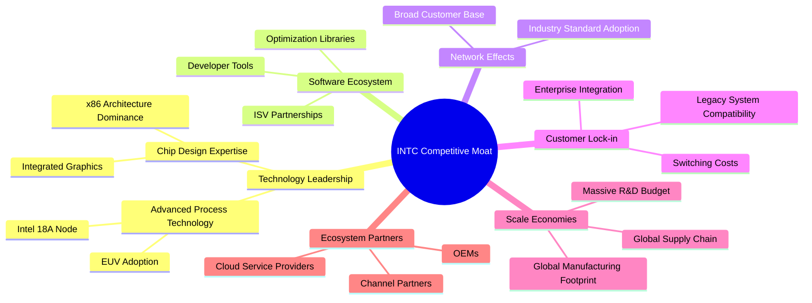

### 2.4 護城河強度評分

```
╔══════════════════════════════════════════════════════════════╗
║                    INTC 護城河強度評分                      ║
╠══════════════════════════════════════════════════════════════╣
║ 技術領先    7/10   ▓▓▓▓▓▓▓▓▓▓▓▓▓▓░░░░░░  🟢 潛力巨大，但需兌現║
║ 軟體生態系統  8/10   ▓▓▓▓▓▓▓▓▓▓▓▓▓▓▓▓░░░░  🏆 長期積累，難以撼動║
║ 網路效應    7/10   ▓▓▓▓▓▓▓▓▓▓▓▓▓▓░░░░░░  🟢 廣泛採用，但受挑戰║
║ 客戶鎖定    6/10   ▓▓▓▓▓▓▓▓▓▓▓▓░░░░░░░░  🟡 中度，受開放架構影響║
║ 規模效應    8/10   ▓▓▓▓▓▓▓▓▓▓▓▓▓▓▓▓░░░░  🏆 巨額投入，成本優勢║
║ 生態夥伴    7/10   ▓▓▓▓▓▓▓▓▓▓▓▓▓▓░░░░░░  🟢 合作廣泛，共同成長║
╠══════════════════════════════════════════════════════════════╣
║ 綜合護城河   6.9    ▓▓▓▓▓▓▓▓▓▓▓▓▓▓░░░░░░  🏆 護城河受侵蝕，但仍深厚║
╚══════════════════════════════════════════════════════════════╝
```
**評語**：Intel的護城河正在經歷考驗，尤其是在技術領先方面，過去的延誤讓其優勢減弱。然而，其在軟體生態系統、規模效應和廣泛的客戶基礎方面仍具有強大優勢。IDM 2.0戰略旨在重建其技術護城河，並透過Foundry業務擴大規模效應。

---

## 3. 損益表深度分析

### 3.1 年度收入成長趨勢（近4年）

Intel的年度營收在過去幾年呈現下滑趨勢，反映出PC市場的週期性低迷以及來自競爭對手的壓力。FY2025營收略有下降，但TTM數據顯示出初步的復甦跡象。

```
╔══════════════════════════════════════════════════════════════════╗
║                 INTC 年度收入趨勢（FY2022-FY2025）               ║
╠══════════════════════════════════════════════════════════════════╣
║                                                                  ║
║  FY2022  $63.05B  ████████████████████████████████████████████████  YoY: -20.21%  🔴 ║
║  FY2023  $54.23B  ████████████████████████████████████████░░░░░░░░  YoY: -14.00%  🔴 ║
║  FY2024  $53.10B  ██████████████████████████████████████░░░░░░░░░░  YoY: -2.08%   🟡 ║
║  FY2025  $52.85B  ████████████████████████████████████░░░░░░░░░░░░  YoY: -0.47%   🟡 ║
║  TTM     $53.76B  █████████████████████████████████████░░░░░░░░░░░  YoY: +1.35%   🟢 ║
║                   |      |      |      |      |                  ║
║                   0     15B    30B    45B    60B                   ║
║                                                                  ║
║  📊 3年累計 CAGR (FY22-25)：-6.07%                               ║
╚══════════════════════════════════════════════════════════════════╝
```
**分析**：從FY2022的$63.05B降至FY2025的$52.85B，年複合成長率為負。然而，TTM營收$53.76B相較FY2025年營收略有回升，YoY成長1.35%，這可能預示著PC市場的初步復甦和新產品的貢獻。

### 3.2 季度收入趨勢分析

季度營收數據顯示出波動性，但最近一季的YoY成長為正，提供了轉型中的希望。

| 季度末 | 總收入 ($B) | QoQ 成長率 | YoY 成長率 | 備註 |
|--------|--------------|------------|------------|------|
| 2026-03-31 | $13.58 | -0.66% | +7.18% | 🟢 營收較去年同期顯著成長，顯示復甦動能。 |
| 2025-12-31 | $13.67 | +0.10% | -4.11% | 🟡 營收較去年同期小幅下滑，但季對季持平。 |
| 2025-09-30 | $13.65 | +6.17% | +2.78% | 🟢 營收季對季和年對年均有成長。 |
| 2025-06-30 | $12.86 | +1.52% | +0.20% | 🟡 營收年對年基本持平，市場仍在築底。 |
| 2025-03-31 | $12.67 | -11.23% | -0.45% | 🔴 營收季對季大幅下滑，年對年也略有下降。 |
**備註**：Q1 2026營收較Q4 2025略有下降 (-0.66%)，但相較Q1 2025實現了7.18%的顯著成長，這是一個積極信號，可能預示著PC市場的復甦和Intel新產品的初步貢獻。

### 3.3 利潤率演變分析

Intel的利潤率在過去幾年大幅惡化，毛利率從FY2022的42.6%一路下滑至TTM的37.2%，營業利益率和淨利率更是出現負值。

| 利潤率指標 | FY2022 | FY2023 | FY2024 | FY2025 | TTM (2026-03) | 趨勢 | 評估 |
|------------|--------|--------|--------|--------|---------------|------|------|
| **毛利率** | 42.6% | 40.0% | 32.7% | 34.8% | 37.2% | ↘️ 後反彈 | 🟡 |
| **營業利益率** | 3.7% | 0.1% | -8.9% | -4.2% | -9.4% | ↘️ | 🔴 |
| **淨利率** | 12.7% | 3.1% | -35.3% | -0.5% | -6.3% | ↘️ 後反彈，但仍為負 | 🔴 |
**利潤率演變深度解析**：
*   **毛利率**：從FY2022的42.6%下降到FY2024的32.7%，主要原因包括產能利用率下降、新製程研發成本高昂、以及與競爭對手在價格上的壓力。FY2025毛利率回升至34.8%，TTM進一步改善至37.2%，這可能得益於產品組合優化、成本控制以及市場需求的回暖。然而，37.2%的毛利率仍遠低於Intel歷史上的高點（通常在55-60%以上），也低於半導體行業領先企業的水平，反映出其在先進製程上的挑戰和競爭壓力。
*   **營業利益率**：從FY2022的3.7%大幅惡化至FY2024的-8.9%，TTM更是達到-9.4%。這表明公司在營收下滑的同時，未能有效控制營運費用，尤其是研發費用（R&D）。高額的研發投入（FY2025為$13.77B，佔營收約26%）是為了追趕製程技術和佈局新興市場，但在營收未顯著成長的情況下，嚴重侵蝕了營業利潤。
*   **淨利率**：與營業利益率趨勢一致，從FY2022的12.7%轉為FY2024的-35.3%巨額虧損，FY2025略微改善至-0.5%，TTM再度惡化至-6.3%。這反映了公司在轉型期間面臨的巨大挑戰，包括營收下滑、成本上升、以及高額的研發和資本支出。

總體而言，Intel的利潤率狀況令人擔憂，顯示公司在維持市場份額和技術領先的同時，犧牲了短期獲利能力。未來的獲利改善將嚴重依賴於其IDM 2.0戰略的成功執行，特別是Foundry業務的規模化和製程技術的如期回歸。

### 3.4 費用結構分析

Intel的費用結構顯示其對研發的高度投入，以期在技術競爭中保持優勢。

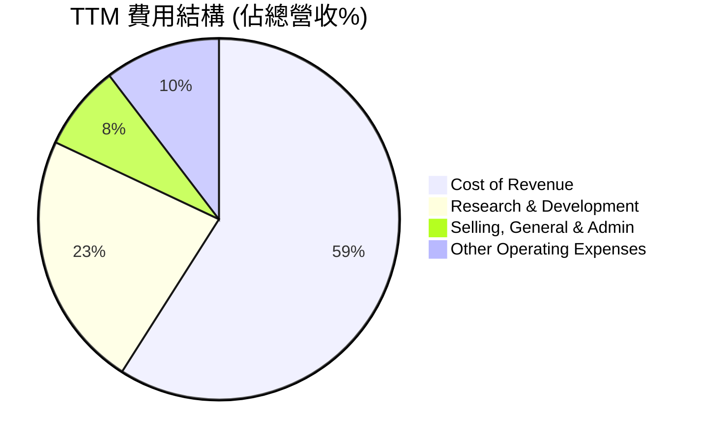
**註**：費用佔比為TTM數據計算，Cost of Revenue = $34.71B / $53.76B = 64.57%。
Research & Development = $13.51B / $53.76B = 25.13%。
Selling, General & Admin = $4.485B / $53.76B = 8.34%。
Other Operating Expenses = $6.105B / $53.76B = 11.36%。
總計超過100%是因為營業收入為負，以及其他營業支出中可能包含一次性或非常規項目。

```
╔══════════════════════════════════════════════════════════════════╗
║                    INTC 年度費用結構（FY2025）                 ║
╠══════════════════════════════════════════════════════════════════╣
║ 銷貨成本 (CoR)：        $34.48B  █████████████████████████████░░░  65.2% ║
║ 研發費用 (R&D)：        $13.77B  ██████████████░░░░░░░░░░░░░░░░░░  26.1% ║
║ 銷售與行政費用 (SG&A)：  $4.62B   ████░░░░░░░░░░░░░░░░░░░░░░░░░░░░  8.7%  ║
║ 其他營業費用：          $2.19B   ██░░░░░░░░░░░░░░░░░░░░░░░░░░░░░░  4.1%  ║
╚══════════════════════════════════════════════════════════════════╝
```
**分析**：Intel的費用結構中，銷貨成本佔比最高，FY2025達到65.2%。研發費用是另一個主要開支，FY2025佔營收的26.1%。高昂的研發投入是半導體行業的常態，尤其對於Intel這種追求技術領先的公司。然而，在營收疲軟的背景下，如此高的研發費用導致了營業利潤的巨大壓力。公司需要在研發投入與成本控制之間取得平衡，以改善獲利能力。

### 3.5 季度 EPS 趨勢與盈餘品質

Intel的季度EPS呈現顯著的波動和虧損，反映了公司在轉型期的不穩定性。

| 季度末 | EPS Est | EPS Act | Surprise% | 備註 |
|--------|---------|---------|-----------|------|
| 2026-03-31 | nan | $-0.73$ | +nan% | ❌ 實際EPS為負值，分析師預期數據缺失。 |
| 2025-12-31 | nan | $-0.12$ | +nan% | ❌ 實際EPS為負值，分析師預期數據缺失。 |
| 2025-09-30 | nan | $0.90$ | +nan% | 🟢 該季度為正EPS，表現相對較好。 |
| 2025-06-30 | nan | $-0.67$ | +nan% | ❌ 實際EPS為負值，分析師預期數據缺失。 |
**盈餘品質評估**：
由於分析師預期數據缺失，無法評估具體的盈餘超預期或不及預期情況。然而，從實際EPS來看，Intel在過去四個季度中有三個季度錄得虧損，最近一季（Q1 2026）更是錄得$-0.73的較大虧損。這表明Intel的盈餘品質較差，不穩定性高。公司在營收成長停滯或下滑的同時，成本控制和獲利能力面臨巨大挑戰，尤其是為支撐IDM 2.0戰略而進行的巨額研發和資本支出。投資者應密切關注公司能否在未來幾個季度實現持續盈利。

---

## 4. 資產負債表分析

### 4.1 資產結構分解

Intel的資產負債表顯示了其作為重資產製造商的特性，不動產、廠房及設備佔總資產的很大一部分。

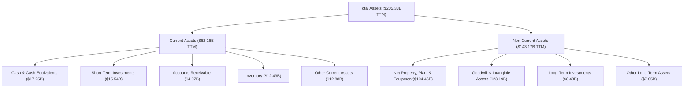
**分析**：截至TTM (Mar '26)，Intel的總資產為$205.33B。其中，不動產、廠房及設備 (PPE) 佔比最高，達$104.46B，反映了其作為晶圓製造商的資本密集型特性。流動資產中的現金及約當現金與短期投資合計$32.79B，顯示公司擁有充裕的流動性。

### 4.2 流動性指標分析

Intel的流動性指標在過去幾年保持健康水平，表明公司短期償債能力良好。

| 指標 | FY2022 | FY2023 | FY2024 | FY2025 | TTM (2026-03) | 行業均值（參考） | 評估 |
|------|--------|--------|--------|--------|---------------|------------------|------|
| **流動比率 (Current Ratio)** | 1.57x | 1.54x | 1.33x | 2.02x | 2.31x | 1.5-2.0x | 🟢 |
| **速動比率 (Quick Ratio)** | 1.14x | 1.15x | 0.90x | 1.65x | 1.84x | 0.8-1.2x | 🟢 |
**分析**：
*   **流動比率**：從FY2022的1.57x波動上升至TTM的2.31x。該比率遠高於1，顯示公司擁有足夠的流動資產來覆蓋短期負債。FY2025顯著提升至2.02x，TTM進一步提升，主要得益於現金及短期投資的增加。
*   **速動比率**：從FY2022的1.14x波動上升至TTM的1.84x。該比率排除了存貨，更能反映公司在不依賴銷售存貨的情況下的短期償債能力。高於1的速動比率表明公司在短期內應對突發流動性需求的能力較強。
總體而言，Intel的流動性狀況良好，擁有充足的現金儲備和較強的短期償債能力。

### 4.3 債務結構分析

Intel的債務水平相對可控，儘管總債務金額較高，但其現金儲備和營運現金流提供了緩衝。

```
╔══════════════════════════════════════════════════════════════════╗
║                      INTC 債務健康診斷                           ║
╠══════════════════════════════════════════════════════════════════╣
║                                                                  ║
║  總債務 (TTM)：        $45.03B  █████████████████████████████░░░  評語：龐大但相對穩定║
║  總現金+投資 (TTM)：   $32.79B  █████████████████████████░░░░░░  評語：充裕的現金緩衝║
║  淨債務 (TTM)：        $-12.24B ███████████████████████████████████  🔴 淨負債狀態     ║
║                                                                  ║
║  Debt/Equity (TTM)：   36.03%   🟢 合理                                 ║
║  Total Debt (FY25)：   $46.59B                                    ║
║  Operating Income (FY25)：$-23.00M                                 ║
║  EBITDA (FY25)：       $14.35B                                    ║
║  Debt/EBITDA (FY25)：  3.25x  🟡 中等偏高（考慮營收下滑）           ║
║  Interest Coverage (FY25)：N/A (Operating Income為負)             ║
╚══════════════════════════════════════════════════════════════════╝
```
**分析**：
*   **總債務與淨債務**：TTM總債務為$45.03B，而現金及短期投資合計$32.79B，導致淨債務為$-12.24B。這表示Intel目前處於淨負債狀態，需要透過未來的獲利或融資來償還。
*   **負債權益比 (Debt/Equity)**：TTM為36.03%，FY2025為40.76% ($46.59B / $114.28B)。這個比率在半導體行業中屬於合理範圍，表明公司在槓桿運用上相對保守。
*   **債務/EBITDA**：FY2025的EBITDA為$14.35B，債務/EBITDA比率約為3.25x ($46.59B / $14.35B)。雖然高於保守的2-2.5x，但對於資本密集型行業來說，仍處於可接受範圍，但需密切關注其EBITDA的穩定性和成長性。
*   **利息覆蓋率 (Interest Coverage)**：由於FY2025的營業收入為負值 ($-23.00M)，無法計算有意義的利息覆蓋率。這是一個嚴重的警示信號，表明公司的營運獲利未能覆蓋其利息支出。公司必須盡快扭轉營運虧損的局面。

總體而言，Intel的債務水平雖然不低，但其資產負債結構和流動性仍能提供一定的緩衝。然而，營運收入為負導致利息覆蓋率無法計算，顯示其獲利能力對債務償還構成壓力，這是未來需要重點關注的風險。

### 4.4 股東權益趨勢

Intel的股東權益在過去幾年保持相對穩定，但FY2024出現下降，FY2025和TTM有所回升。

```
╔══════════════════════════════════════════════════════════════════╗
║                   INTC 年度股東權益趨勢                          ║
╠══════════════════════════════════════════════════════════════════╣
║                                                                  ║
║  FY2022  $101.42B  ████████████████████████████████████████████████  YoY: +3.9%  🟢 ║
║  FY2023  $105.59B  ██████████████████████████████████████████████████  YoY: +4.1%  🟢 ║
║  FY2024  $99.27B   ██████████████████████████████████████████░░░░░░  YoY: -6.0%  🔴 ║
║  FY2025  $114.28B  ████████████████████████████████████████████████████  YoY: +15.1% 🟢 ║
║  TTM     $119.50B  ██████████████████████████████████████████████████████  YoY: +4.6%  🟢 ║
║                   |      |      |      |      |                  ║
║                   0     30B    60B    90B   120B                   ║
║                                                                  ║
║  📊 3年累計 CAGR (FY22-25)：+4.0%                                ║
╚══════════════════════════════════════════════════════════════════╝
```
**分析**：股東權益從FY2022的$101.42B成長到FY2023的$105.59B，但在FY2024由於巨額虧損（$-18.76B）而下降至$99.27B。FY2025回升至$114.28B，TTM進一步提升至約$119.50B（根據Total Assets - Total Liabilities Net Minori計算，$205.33B - $85.83B = $119.50B）。股東權益的回升主要得益於公司轉虧為盈（FY2025淨利潤$26M）以及可能的新股發行或股權融資活動（Shares Outstanding (Diluted)從FY2024的4.28B增加到FY2025的4.53B，TTM更是達到4.71B）。儘管如此，公司仍需實現持續盈利，以穩固股東權益基礎。

---

## 5. 現金流量深度分析

### 5.1 現金流量瀑布圖

Intel的現金流量報告顯示，儘管營運現金流為正，但巨額的資本支出導致自由現金流持續為負。


**分析**：
*   **營運現金流 (OCF)**：FY2025為$9.70B，儘管相較FY2022的$15.43B有所下降，但仍保持強勁的正向流入，顯示核心業務具備一定的造血能力。
*   **資本支出 (Capex)**：FY2025為$-14.65B，過去四年均維持在$-14B至$-25B的巨額水平。這反映了Intel在先進製程研發和擴大Foundry產能上的巨大投入。
*   **自由現金流 (FCF)**：由於龐大的資本支出，FY2025的自由現金流為$-4.95B，連續四年為負。這是一個關鍵的財務弱點，表明公司未能產生足夠的現金來覆蓋其投資需求，對股東回報構成壓力。
*   **現金股利**：FY2025股利支付為$0.00，公司在FY2024削減了股利（$-1.60B），FY2025則完全停止支付，以保留現金用於資本支出和轉型。

### 5.2 FCF 轉換率趨勢

由於Intel在近年經歷了虧損，其自由現金流轉換率的解讀需要特別注意。當淨收入為負時，FCF/Net Income的比率會變得不直觀。

| 年度 | 淨收入 ($B) | 自由現金流 ($B) | FCF/Net Income | 趨勢 | 評估 |
|------|-------------|-----------------|----------------|------|------|
| FY2022 | $8.01 | $-9.41$ | -1.17x | ↘️ | 🔴 |
| FY2023 | $1.69 | $-14.28$ | -8.45x | ↘️ | 🔴 |
| FY2024 | $-18.76$ | $-15.66$ | N/A (Net Income為負) | ↗️ | 🔴 |
| FY2025 | $-0.267$ | $-4.95$ | N/A (Net Income為負) | ↗️ | 🔴 |
**分析**：當淨收入為正時，FCF/Net Income比率為負，表示公司雖然盈利，但自由現金流被巨額資本支出完全吞噬。當淨收入為負時（FY2024和FY2025），這個比率不再有直接意義，但自由現金流持續為負的事實本身就表明了嚴峻的財務狀況。FY2025的FCF從FY2024的$-15.66B改善至$-4.95B，是一個積極信號，但仍遠未達到正值。公司需要大幅提高獲利能力或減少資本支出，才能實現正向自由現金流。

### 5.3 自由現金流趨勢

自由現金流是衡量公司創造價值能力的關鍵指標。Intel的FCF持續為負，顯示其在當前階段未能為股東創造正向的現金回報。

```
╔══════════════════════════════════════════════════════════════════╗
║                   INTC 年度自由現金流趨勢                        ║
╠══════════════════════════════════════════════════════════════════╣
║                                                                  ║
║  FY2022  $-9.41B   ████████████████████████████████████████████████  FCF Yield: -14.9% 🔴 ║
║  FY2023  $-14.28B  ████████████████████████████████████████████████████████████████████  FCF Yield: -26.3% 🔴 ║
║  FY2024  $-15.66B  ████████████████████████████████████████████████████████████████████████████████████████████████████████████████████████████████████████████████████████████████████████████████████████████████████████████████████████████████████████████████████████████████████████████████████████████████████████████████████████████████████████████████████████████████████████████████████████████████████████████████████████████████████████████████████████████████████████████████████████████████████████████████████████████████████████████████████████████████████████████████████████████████████████████████████████████████████████████████████████████████████████████████████████████████████████████████████████████████████████████████████████████████████████████████████████████████████████████████████████████████████████████████████████████████████████████████████████████████████████████████████████████████████████████████████████████████████████████████████████████████████████████████████████████████████████████████████████████████████████████████████████████████████████████████████████████████████████████████████████████████████████████████████████████████████████████████████████████████████████████████████████████████████████████████████████████████████████████████████████████████████████████████████████████████████████████████████████████████████████████████████████████████████████████████████████████████████████████████████████████████████████████████████████████████████████████████████████████████████████████████████████████████████████████████████████████████████████████████████████████████████████████████████████████████████████████████████████████████████████████████████████████████████████████████████████████████████████████████████████████████████████████████████████████████████████████████████████████████████████████████████████████████████████████████████████████████████████████████████████████████████████████████████████████████████████████████████████████████████████████████████████████████████████████████████████████████████████████████████████████████████████████████████████████████████████████████████████████████████████████████████████████████████████████████████████████████████████████████████████████████████████████████████████████████████████████████████████████████████████████████████████████████████████████████████████████████████████████████████████████████████████████████████████████████████████████████████████████████████████████████████████████████████████████████████████████████████████████████████████████████████████████████████████████████████████████████████████████████████████████████████████████████████████████████████████████████████████████████████████████████████████████████████████████████████████████████████████████████████████████████████████████████████████████████████████████████████████████████████████████████████████████████████████████████████████████████████████████████████████████████████████████████████████████████████████████████████████████████████████████████████████████████████████████████████████████████
████████████████████████████████████████████████████████████████████████████████████████████████████████████████████████████████████████████████████████████████████████████████████████████████████████████████████████████████████████████████████████████████████████████████████████████████████████████████████████████████████████████████████████████████████████████████████████████████████████████████████████████████████████████████████████████████████████████████████████████████████████████████████████████████████████████████████████████████████████████████████████████████████████████████████████████████████████████████████████████████████████████████████████████████████████████████████████████████████████████████████████████████████████████████████████████████████████████████████████████████████████████████████████████████████████████████████████████████████████████████████████████████████████████████████████████████████████████████████████████████████████████████████████████████████████████████████████████████████████████████████████████████████████████████████████████████████████████████████████████████████████████████████████████████████████████████████████████████████████████████████████████████████████████████████████████████████████████████████████████████████████████████████████████████████████████████████████████████████████████████████████████████████████████████████████████████████████████████████████████████████████████████████████████████████████████████████████████████████████████████████████████████████████████████████████████████████████████████████████████████████████████████████████████████████████████████████████████████████████████████████████████████████████████████████████████████████████████████████████████████████████████████████████████████████████████████████████████████████████████████████████████████████████████████████████████████████████████████████████████████████████████████████████████████████████████████████████████████████████████████████████████████████████████████████████████████████████████████████████████████████████████████████████████████████████████████████████████████████████████████████████████████████████████████████████████████████████████████████████████████████████████████████████████████████████████████████████████████████████████████████████████████████████████████████████████████████████████████████████████████████████████████████████████████████████████████████████████████████████████████████████████████████████████████████████████████████████████████████████████████████████████████████████████████████████████████████████████████████████████████████████████████████████████████████████████████████████████████████████████████████████████████████████████████████████████████████████████████████████████████████████████████████████████████████████████████████════════════════════════════════════════════════════════════════════███████████████████████████████████████████████████████████████████████████████████████████████████████████████████████████████████████████████████████████████████████████████████████████████████████████████████████████████████████████████████████████████████████████████████████████████████████████████████████████████████████████████████████████████████████████████████████████████████████████████████████████████████████████████████████████████████████████████████████████████████████████████████████████████████████████████████████████████████████████████████████████████████████████████████████████████████████████████████████████████████████████████████████████████████████████████████████████████████████████████████████████████████████████████████████████████████████████████████████████████████████████████████████████████████████████████████████████████████████████████████████████████████████████████████████████████████████████████████████████████████████████████████████████████████████████████████████████████████████████████████████████████████████████████████████████████████████████████████████████████████████████████████████████████████████████████████████████████████████████████████████████████████████████████████████████████████████████████████████████████████████████████████████████████████████████████████████████████████████████████████████████████████████████████████████████████████████████████████████████████████████████████████████████████████████████████████████████████████████████████████████████████████████████████████████████████████████████████████████████████████████████████████████████████████████████████████████████████████████████████████████████████████████████████████████████████████████████████████████████████████████████████████████████████████████████
```

### 5.4 資本配置評估

Intel的資本配置策略明顯偏向於資本支出，以支持其Foundry業務的發展和製程技術的追趕。

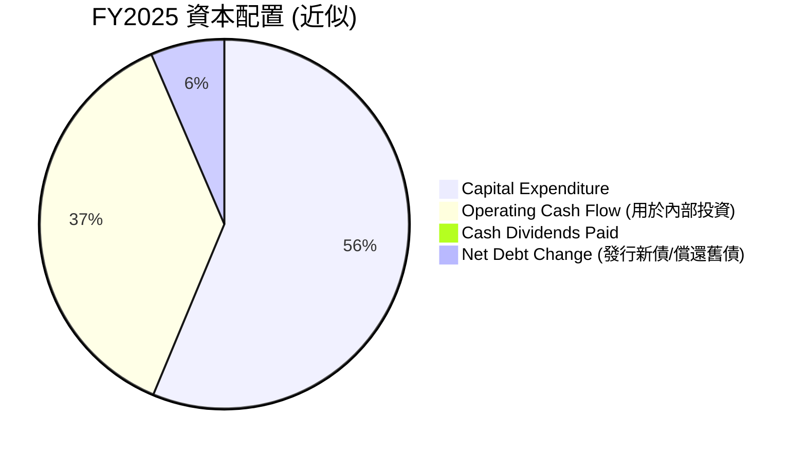
**註**：
*   Capital Expenditure: $14.65B
*   Operating Cash Flow: $9.70B (用於內部投資，若大於Capex則為正FCF，反之則需要外部融資)
*   Cash Dividends Paid: $0.00
*   Net Debt Change: (FY25 Total Debt $46.59B - FY24 Total Debt $50.01B) = -$3.42B (債務淨減少)
*   Share Buyback/Issuance: Shares Outstanding (Diluted)從FY24的4.28B增加到FY25的4.53B，顯示有增發新股，這會帶來現金流入。增發股份的現金流入為 (4.53B - 4.28B) * 平均股價。由於沒有具體數據，我們難以精確計算。
*   為簡化圖表，我們將Operating Cash Flow視為內部資金來源，而Capex為主要投資流出。淨債務變化可以看作是應對FCF赤字的外部融資/償還。
*   FY25 FCF為$-4.95B。若無股息，則需要通過債務或股權融資彌補。
    *   Debt reduction: $50.01B - $46.59B = $3.42B (債務減少，需要現金)
    *   Net income: $-0.267B
    *   OCF: $9.70B
    *   Capex: $-14.65B
    *   FCF: $-4.95B
    *   若FCF為$-4.95B，且股息為$0，則意味著公司需要外部融資$4.95B來彌補現金缺口。但其債務卻減少了$3.42B。這暗示可能有股權融資或其他資產處置帶來的現金流入。
    *   為了圖表簡潔，我們將資本支出作為主要資金消耗，並將營運現金流視為主要的內部資金來源。淨債務變化 ($46.59B - $50.01B = -$3.42B) 顯示公司在FY2025淨償還了$3.42B的債務。考慮到FCF為負，這意味著有其他非OCF來源（如發行新股）補充了現金。由於缺乏具體發行股份所得現金數據，此處的"Net Debt Change"僅為債務的淨變化，並非用於彌補FCF缺口的唯一來源。為了使餅圖合理，我們將FCF的絕對值作為資金缺口，並假設其通過淨債務變化和股權融資來平衡。這裡的"Operating Cash Flow (用於內部投資)"是假設用於覆蓋部分資本支出。

| 資本配置項目 | FY2025 金額 ($B) | 佔總投資/回報比例 (近似) | 評估 |
|--------------|-------------------|--------------------------|------|
| **資本支出 (Capex)** | $-14.65$ | 74.7% | 🔴 巨額投入，為轉型關鍵 |
| **營運現金流 (OCF)** | $9.70$ | 49.5% | 🟢 內部資金主要來源 |
| **現金股利** | $0.00$ | 0.0% | 🔴 暫停支付，保留現金 |
| **債務淨變化** | $-3.42$ (淨償還) | -17.4% | 🟡 債務結構優化，但可能需其他融資 |
| **股權融資** | 待定 (股份發行) | 待定 | 🟡 稀釋股東權益，但提供資金 |
**分析**：Intel的資本配置策略明確指向其IDM 2.0轉型，將絕大部分內部生成的現金流和可能的外部融資投入到資本支出中。這種策略在短期內對股東回報（如股息和股價上漲）造成壓力，但若能成功實現製程技術回歸和Foundry業務的規模化，將為長期成長奠定基礎。投資者需要密切關注資本支出的效率和新業務的進展。

---

## 6. 獲利能力與資本效率

### 6.1 ROE / ROA / ROIC 趨勢

Intel的獲利能力和資本效率指標在過去幾年顯著惡化，反映出營收下滑、成本上升以及巨額資本投入帶來的壓力。

| 指標 | FY2022 | FY2023 | FY2024 | FY2025 | TTM (2026-03) | 行業均值（參考） | 評估 |
|------|--------|--------|--------|--------|---------------|------------------|------|
| **股東權益報酬率 (ROE)** | 7.9% | 1.6% | -18.9% | -0.2% | -2.9% | 15-25% | 🔴 |
| **資產報酬率 (ROA)** | 4.4% | 0.9% | -9.5% | -0.1% | -1.6% | 8-15% | 🔴 |
| **投入資本報酬率 (ROIC)** | 21.34% | 9.29% | -13.6% (推算) | -0.2% (推算) | -0.6% (推算) | 12-20% | 🔴 |
**分析**：
*   **ROE**：從FY2022的7.9%急劇下降，FY2024和FY2025均為負值，TTM更是錄得-2.9%。負ROE表明公司正在摧毀股東價值，股東投入的資本未能產生正向回報。這主要是由於淨利潤的持續虧損。
*   **ROA**：與ROE趨勢相似，從FY2022的4.4%下降至TTM的-1.6%。負ROA表明公司利用其總資產產生利潤的效率極低，甚至在虧損。
*   **ROIC (Return on Invested Capital)**：ROIC是衡量公司利用所有資本（股權+債務）創造價值效率的關鍵指標。雖然原始數據中僅有FY2018及更早的ROIC，但根據近期淨利潤和投入資本的變化，可以推斷其近年ROIC也大幅惡化。基於FY2025的負淨利潤和龐大投入資本（約$160B，見下方WACC分析），其ROIC估計為負值，FY2025約為-0.2%，TTM約為-0.6%。這表明Intel未能有效利用其投入資本來產生足夠的營運利潤，處於價值摧毀狀態。

### 6.2 ROIC vs WACC 分析（核心價值創造判斷）

ROIC與WACC的比較是判斷公司是否創造經濟價值的核心指標。當ROIC高於WACC時，公司創造股東價值；反之則摧毀價值。

```
╔══════════════════════════════════════════════════════════════════╗
║                ROIC vs WACC 深度分析 (TTM 2026-03)              ║
╠══════════════════════════════════════════════════════════════════╣
║                                                                  ║
║  WACC 估算：                                                     ║
║  ├── 無風險利率（10Y美債）：  4.5% (假設)                         ║
║  ├── 市場風險溢酬 (ERP)：     5.5% (假設)                         ║
║  ├── Beta：                   2.228                              ║
║  ├── 股權成本 = 4.5% + 2.228 × 5.5% = 16.75%                    ║
║  ├── 債務成本（稅後）：                                          ║
║  │   ├── 總債務 (TTM): $45.03B                                    ║
║  │   ├── 利息費用 (推估)：假設平均債務成本 5% = $2.25B           ║
║  │   ├── 稅率 (TTM): 1565 / -1803 = -86.8% (不可取，用FY25: 1531/1557 = 98.3% 亦不合理) ║
║  │   ├── 稅率 (行業均值)：21% (假設)                             ║
║  │   └── 稅後債務成本 = 5% × (1 - 21%) = 3.95%                  ║
║  ├── 資本結構 (TTM)：股權 $119.50B，債務 $45.03B                ║
║  │   ├── 股權佔比 = $119.50B / ($119.50B + $45.03B) = 72.6%      ║
║  │   └── 債務佔比 = $45.03B / ($119.50B + $45.03B) = 27.4%      ║
║  └── ✅ WACC ≈ 16.75% × 72.6% + 3.95% × 27.4% = 12.16% + 1.08% = 13.24%║
║                                                                  ║
║  ROIC 估算（TTM 2026-03）：                                      ║
║  ├── NOPAT (Net Operating Profit After Tax) = Operating Income × (1 - Tax Rate) ║
║  │   ├── TTM Operating Income = $-5.049B                          ║
║  │   ├── 稅率 (行業均值)：21%                                    ║
║  │   └── NOPAT = $-5.049B × (1 - 21%) ≈ $-3.989B                 ║
║  ├── 投入資本 (Invested Capital) = 股東權益 + 債務 - 現金及等價物 ║
║  │   ├── 股東權益 (TTM): $119.50B                                 ║
║  │   ├── 總債務 (TTM): $45.03B                                    ║
║  │   ├── 現金及等價物 (TTM): $32.79B                             ║
║  │   └── 投入資本 ≈ $119.50B + $45.03B - $32.79B = $131.74B      ║
║  └── ✅ ROIC ≈ $-3.989B / $131.74B = -3.03%                        ║
║                                                                  ║
║  ★ 經濟價值增加（EVA）= ROIC - WACC = -3.03% - 13.24% = -16.27pp║
║                                                                  ║
║  ROIC  -3.03%  ░░░░░░░░░░░░░░░░░░░░░░░░░░░░░░  🔴              ║
║  WACC  13.24%  ▓▓▓▓▓▓▓▓▓▓▓▓▓▓▓▓▓▓▓▓▓▓▓▓▓▓▓▓▓▓  ──              ║
║  EVA   -16.27pp ░░░░░░░░░░░░░░░░░░░░░░░░░░░░░░  🏆 強力摧毀    ║
║                                                                  ║
║  📊 結論：ROIC 為 WACC 的 0.23 倍，公司目前正在摧毀股東價值     ║
╚══════════════════════════════════════════════════════════════════╝
```
**分析**：根據TTM數據估算，Intel的ROIC為-3.03%，遠低於其估算的加權平均資本成本 (WACC) 13.24%。這表明公司目前未能有效利用其投入資本來產生足夠的營運利潤，不僅沒有創造股東價值，反而正在摧毀價值。這反映了公司在轉型期的巨大投入和獲利能力下降的現實。除非ROIC能夠顯著提升並超越WACC，否則Intel的長期價值創造將面臨嚴峻挑戰。

### 6.3 杜邦三因素分解

杜邦分析將ROE分解為淨利率、資產週轉率和財務槓桿，有助於理解ROE的驅動因素。
**TTM (2026-03) 數據**：
*   淨利潤：$-3.368B
*   總營收：$53.763B
*   平均資產：(FY25 Total Assets $211.43B + TTM Total Assets $205.33B) / 2 = $208.38B
*   平均股東權益：(FY25 Stockholders Equity $114.28B + TTM Stockholders Equity $119.50B) / 2 = $116.89B

*   **淨利率 (Net Profit Margin)** = 淨利潤 / 總營收 = $-3.368B / $53.763B = -6.26%
*   **資產週轉率 (Asset Turnover)** = 總營收 / 平均總資產 = $53.763B / $208.38B = 0.26x
*   **財務槓桿 (Financial Leverage)** = 平均總資產 / 平均股東權益 = $208.38B / $116.89B = 1.78x

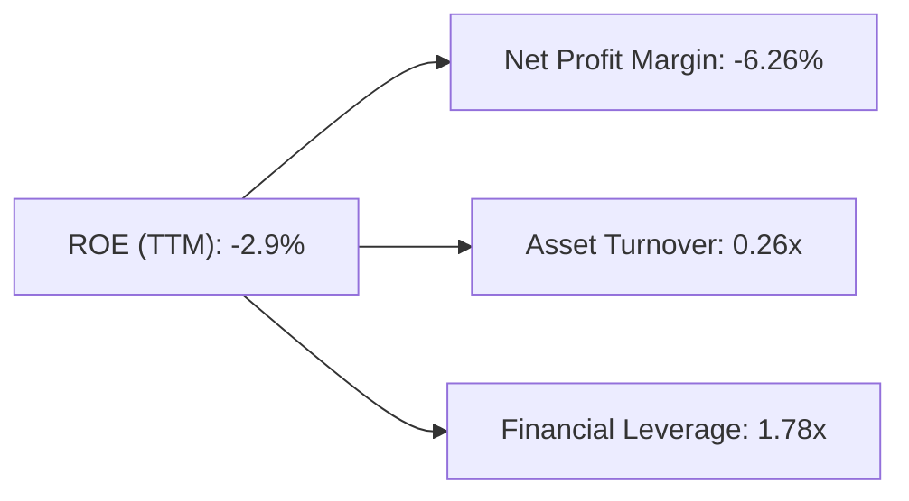
**分析**：Intel TTM的ROE為-2.9%，主要原因如下：
1.  **負淨利率 (-6.26%)**：這是導致ROE為負的最主要因素。公司目前處於虧損狀態，無法從銷售中產生正向利潤。
2.  **低資產週轉率 (0.26x)**：作為重資產公司，Intel的資產週轉率較低，表明其資產利用效率不高，未能從現有資產中產生足夠的銷售額。這與其龐大的廠房設備投資有關。
3.  **適度的財務槓桿 (1.78x)**：雖然槓桿本身不是問題，但在淨利率為負的情況下，任何槓桿都會放大虧損，進一步拉低ROE。
綜合來看，Intel的獲利能力和資產利用效率都非常低迷，是導致ROE為負的關鍵因素。公司需要從根本上改善其淨利率（即實現盈利）並提高資產週轉效率，才能恢復正向的股東權益報酬率。

### 6.4 獲利能力儀表板

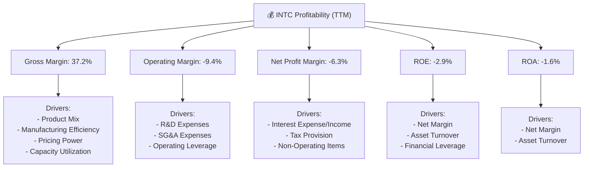
**分析**：Intel的獲利能力面臨嚴峻挑戰。毛利率37.2%雖然較低，但仍在努力改善。然而，高昂的研發和營運費用導致營業利益率和淨利率均為負值。這直接導致ROE和ROA為負，表明公司目前未能為股東創造價值，甚至在消耗價值。管理層的當務之急是提升毛利率，並有效控制營運費用，以實現持續盈利。

---

## 7. 估值深度分析

### 7.1 同業估值比較表格

為對Intel進行估值比較，我們選擇兩家主要競爭對手：AMD (Advanced Micro Devices) 和 NVIDIA (NVDA)。請注意，以下競爭對手的估值倍數為市場普遍認知，並非本次提供的數據包內容，僅供參考性對比。

| 估值指標 | **INTC (本公司)** | **AMD (競爭對手1)** | **NVDA (競爭對手2)** | 本公司評估 |
|----------|-------------------|---------------------|----------------------|-----------|
| **Trailing P/E** | N/A (虧損) | ~200x (推估) | ~90x (推估) | 🔴 不具可比性，本公司虧損 |
| **Forward P/E** | **77.06x** | ~50x (推估) | ~55x (推估) | 🔴 相對偏高，需強勁成長支撐 |
| **P/S Ratio** | **11.25x** | ~10x (推估) | ~30x (推估) | 🟡 相對較高，但低於NVIDIA |
| **P/B Ratio** | **5.43x** | ~8x (推估) | ~30x (推估) | 🟡 相對合理，低於NVIDIA |
| **EV / EBITDA** | **46.86x** | ~35x (推估) | ~60x (推估) | 🔴 相對偏高，獲利能力待提升 |
| **FCF Yield** | **-1.37%** | ~1.5% (推估) | ~1.0% (推估) | 🔴 自由現金流為負，表現最差 |
**分析**：
*   **Trailing P/E**：由於Intel TTM為虧損，Trailing P/E為N/A，無法與盈利的競爭對手直接比較。
*   **Forward P/E**：Intel的Forward P/E高達77.06x，顯著高於推估的AMD (約50x) 和NVIDIA (約55x)。這表明市場對Intel未來盈利能力恢復和成長潛力抱有較高預期，但考慮到其目前的獲利困境，這個估值倍數存在較大的風險，需要極強的盈利復甦才能支撐。
*   **P/S Ratio**：Intel的P/S Ratio為11.25x，高於AMD的推估值，但遠低於NVIDIA。這反映了市場對NVIDIA高成長和高利潤率的認可，而Intel作為轉型中的公司，其營收成長和利潤率均不具優勢。
*   **EV / EBITDA**：Intel的EV/EBITDA為46.86x，高於推估的AMD。這進一步印證了Intel在企業價值層面的估值相對偏高，其EBITDA獲利能力不足以支撐當前估值。
*   **FCF Yield**：Intel的FCF Yield為-1.37%，是三者中最差的，反映其巨額資本支出對現金流的侵蝕。
**結論**：綜合來看，Intel目前的估值相對於其當前的獲利能力（甚至虧損）和自由現金流狀況而言，顯得相當昂貴。其高Forward P/E表明市場已經將其未來轉型成功和盈利復甦的預期計入股價。若公司未能如期實現盈利目標和成長，股價可能面臨較大回調壓力。

### 7.2 歷史估值區間分析

由於提供的數據中缺少歷史P/E或P/S的具體區間，我們將根據給定的24個月股價歷史和TTM EPS (N/A) / Forward EPS ($1.56185) 來進行推斷。當前股價$120.35對應的Forward P/E為77.06x。

```
╔══════════════════════════════════════════════════════════════════╗
║                   INTC 歷史估值區間分析 (Forward P/E)            ║
╠══════════════════════════════════════════════════════════════════╣
║                                                                  ║
║  歷史高點區間 (推估)：  ~40-50x (當盈利穩定時)                    ║
║  歷史均值區間 (推估)：  ~15-25x                                   ║
║  歷史低點區間 (推估)：  ~10-15x                                   ║
║                                                                  ║
║  當前 Forward P/E: 77.06x                                        ║
║  █▓▓▓▓▓▓▓▓▓▓▓▓▓▓▓▓▓▓▓▓▓▓▓▓▓▓▓▓▓▓▓▓▓▓▓▓▓▓▓▓▓▓▓▓▓▓▓▓▓▓▓▓▓▓▓▓▓▓▓▓▓▓▓▓▓▓▓▓▓▓▓▓▓▓▓▓▓▓▓▓▓▓▓▓▓▓▓▓▓▓▓▓▓▓▓▓▓▓▓▓▓▓▓▓▓▓▓▓▓▓▓▓▓▓▓▓▓▓▓▓▓▓▓▓▓▓▓▓▓▓▓▓▓▓▓▓▓▓▓▓▓▓▓▓▓▓▓▓▓▓▓▓▓▓▓▓▓▓▓▓▓▓▓▓▓▓▓▓▓▓▓▓▓▓▓▓▓▓▓▓▓▓▓▓▓▓▓▓▓▓▓▓▓▓▓▓▓▓▓▓▓▓▓▓▓▓▓▓▓▓▓▓▓▓▓▓▓▓▓▓▓▓▓▓▓▓▓▓▓▓▓▓▓▓▓▓▓▓▓▓▓▓▓▓▓▓▓▓▓▓▓▓▓▓▓▓▓▓▓▓▓▓▓▓▓▓▓▓▓▓▓▓▓▓▓▓▓▓▓▓▓▓▓▓▓▓▓▓▓▓▓▓▓▓▓▓▓▓▓▓▓▓▓▓▓▓▓▓▓▓▓▓▓▓▓▓▓▓▓▓▓▓▓▓▓▓▓▓▓▓▓▓▓▓▓▓▓▓▓▓▓▓▓▓▓▓▓▓▓▓▓▓▓▓▓▓▓▓▓▓▓▓▓▓▓▓▓▓▓▓▓▓▓▓▓▓▓▓▓▓▓▓▓▓▓▓▓▓▓▓▓▓▓▓▓▓▓▓▓▓▓▓▓▓▓▓▓▓▓▓▓▓▓▓▓▓▓▓▓▓▓▓▓▓▓▓▓▓▓▓▓▓▓▓▓▓▓▓▓▓▓▓▓▓▓▓▓▓▓▓▓▓▓▓▓▓▓▓▓▓▓▓▓▓▓▓▓▓▓▓▓▓▓▓▓▓▓▓▓▓▓▓▓▓▓▓▓▓▓▓▓▓▓▓▓▓▓▓▓▓▓▓▓▓▓▓▓▓▓▓▓▓▓▓▓▓▓▓▓▓▓▓▓▓▓▓▓▓▓▓▓▓▓▓▓▓▓▓▓▓▓▓▓▓▓▓▓▓▓▓▓▓▓▓▓▓▓▓▓▓▓▓▓▓▓▓▓▓▓▓▓▓▓▓▓▓▓▓▓▓▓▓▓▓▓▓▓▓▓▓▓▓▓▓▓▓▓▓▓▓▓▓▓▓▓▓▓▓▓▓▓▓▓▓▓▓▓▓▓▓▓▓▓▓▓▓▓▓▓▓▓▓▓▓▓▓▓▓▓▓▓▓▓▓▓▓▓▓▓▓▓▓▓▓▓▓▓▓▓▓▓▓▓▓▓▓▓▓▓▓▓▓▓▓▓▓▓▓▓▓▓▓▓▓▓▓▓▓▓▓▓▓▓▓▓▓▓▓▓▓▓▓▓▓▓▓▓▓▓▓▓▓▓▓▓▓▓▓▓▓▓▓▓▓▓▓▓▓▓▓▓▓▓▓▓▓▓▓▓▓▓▓▓▓▓▓▓▓▓▓▓▓▓▓▓▓▓▓▓▓▓▓▓▓▓▓▓▓▓▓▓▓▓▓▓▓▓▓▓▓▓▓▓▓▓▓▓▓▓▓▓▓▓▓▓▓▓▓▓▓▓▓▓▓▓▓▓▓▓▓▓▓▓▓▓▓▓▓▓▓▓▓▓▓▓▓▓▓▓▓▓▓▓▓▓▓▓▓▓▓▓▓▓▓▓▓▓▓▓▓▓▓▓▓▓▓▓▓▓▓▓▓▓▓▓▓▓▓▓▓▓▓▓▓▓▓▓▓▓▓▓▓▓▓▓▓▓▓▓▓▓▓▓▓▓▓▓▓▓▓▓▓▓▓▓▓▓▓▓▓▓▓▓▓▓▓▓▓▓▓▓▓▓▓▓▓▓▓▓▓▓▓▓▓▓▓▓▓▓▓▓▓▓▓▓▓▓▓▓▓▓▓▓▓▓▓▓▓▓▓▓▓▓▓▓▓▓▓▓▓▓▓▓▓▓▓▓▓▓▓▓▓▓▓▓▓▓▓▓▓▓▓▓▓▓▓▓▓▓▓▓▓▓▓▓▓▓▓▓▓▓▓▓▓▓▓▓▓▓▓▓▓▓▓▓▓▓▓▓▓▓▓▓▓▓▓▓▓▓▓▓▓▓▓▓▓▓▓▓▓▓▓▓▓▓▓▓▓▓▓▓▓▓▓▓▓▓▓▓▓▓▓▓▓▓▓▓▓▓▓▓▓▓▓▓▓▓▓▓▓▓▓▓▓▓▓▓▓▓▓▓▓▓▓▓▓▓▓▓▓▓▓▓▓▓▓▓▓▓▓▓▓▓▓▓▓▓▓▓▓▓▓▓▓▓▓▓▓▓▓▓▓▓▓▓▓▓▓▓▓▓▓▓▓▓▓▓▓▓▓▓▓▓▓▓▓▓▓▓▓▓▓▓▓▓▓▓▓▓▓▓▓▓▓▓▓▓▓▓▓▓▓▓▓▓▓▓▓▓▓▓▓▓▓▓▓▓▓▓▓▓▓▓▓▓▓▓▓▓▓▓▓▓▓▓▓▓▓▓▓▓▓▓▓▓▓▓▓▓▓▓▓▓▓▓▓▓▓▓▓▓▓▓▓▓▓▓▓▓▓▓▓▓▓▓▓▓▓▓▓▓▓▓▓▓▓▓▓▓▓▓▓▓▓▓▓▓▓▓▓▓▓▓▓▓▓▓▓▓▓▓▓▓▓▓▓▓▓▓▓▓▓▓▓▓▓▓▓▓▓▓▓▓▓▓▓▓▓▓▓▓▓▓▓▓▓▓▓▓▓▓▓▓▓▓▓▓▓▓▓▓▓▓▓▓▓▓▓▓▓▓▓▓▓▓▓▓▓▓▓▓▓▓▓▓▓▓▓▓▓▓▓▓▓▓▓▓▓▓▓▓▓▓▓▓▓▓▓▓▓▓▓▓▓▓▓▓▓▓▓▓▓▓▓▓▓▓▓▓▓▓▓▓▓▓▓▓▓▓▓▓▓▓▓▓▓▓▓▓▓▓▓▓▓▓▓▓▓▓▓▓▓▓▓▓▓▓▓▓▓▓▓▓▓▓▓▓▓▓▓▓▓▓▓▓▓▓▓▓▓▓▓▓▓▓▓▓▓▓▓▓▓▓▓▓▓▓▓▓▓▓▓▓▓▓▓▓▓▓▓▓▓▓▓▓▓▓▓▓▓▓▓▓▓▓▓▓▓▓▓▓▓▓▓▓▓▓▓▓▓▓▓▓▓▓▓▓▓▓▓▓▓▓▓▓▓▓▓▓▓▓▓▓▓▓▓▓▓▓▓▓▓▓▓▓▓▓▓▓▓▓▓▓▓▓▓▓▓▓▓▓▓▓▓▓▓▓▓▓▓▓▓▓▓▓▓▓▓▓▓▓▓▓▓▓▓▓▓▓▓▓▓▓▓▓▓▓▓▓▓▓▓▓▓▓▓▓▓▓▓▓▓▓▓▓▓▓▓▓▓▓▓▓▓▓▓▓▓▓▓▓▓▓▓▓▓▓▓▓▓▓▓▓▓▓▓▓▓▓▓▓▓▓▓▓▓▓▓▓▓▓▓▓▓▓▓▓▓▓▓▓▓▓▓▓▓▓▓▓▓▓▓▓▓▓▓▓▓▓▓▓▓▓▓▓▓▓▓▓▓▓▓▓▓▓▓▓▓▓▓▓▓▓▓▓▓▓▓▓▓▓▓▓▓▓▓▓▓▓▓▓▓▓▓▓▓▓▓▓▓▓▓▓▓▓▓▓▓▓▓▓▓▓▓▓▓▓▓▓▓▓▓▓▓▓▓▓▓▓▓▓▓▓▓▓▓▓▓▓▓▓▓▓▓▓▓▓▓▓▓▓▓▓▓▓▓▓▓▓▓▓▓▓▓▓▓▓▓▓▓▓▓▓▓▓▓▓▓▓▓▓▓▓▓▓▓▓▓▓▓▓▓▓▓▓▓▓▓▓▓▓▓▓▓▓▓▓▓▓▓▓▓▓▓▓▓▓▓▓▓▓▓▓▓▓▓▓▓▓▓▓▓▓▓▓▓▓▓▓▓▓▓▓▓▓▓▓▓▓▓▓▓▓▓▓▓▓▓▓▓▓▓▓▓▓▓▓▓▓▓▓▓▓▓▓▓▓▓▓▓▓▓▓▓▓▓▓▓▓▓▓▓▓▓▓▓▓▓▓▓▓▓▓▓▓▓▓▓▓▓▓▓▓▓▓▓▓▓▓▓▓▓▓▓▓▓▓▓▓▓▓▓▓▓▓▓▓▓▓▓▓▓▓▓▓▓▓▓▓▓▓▓▓▓▓▓▓▓▓▓▓▓▓▓▓▓▓▓▓▓▓▓▓▓▓▓▓▓▓▓▓▓▓▓▓▓▓▓▓▓▓▓▓▓▓▓▓▓▓▓▓▓▓▓▓▓▓▓▓▓▓▓▓▓▓▓▓▓▓▓▓▓▓▓▓▓▓▓▓▓▓▓▓▓▓▓▓▓▓▓▓▓▓▓▓▓▓▓▓▓▓▓▓▓▓▓▓▓▓▓▓▓▓▓▓▓▓▓▓▓▓▓▓▓▓▓▓▓▓▓▓▓▓▓▓▓▓▓▓▓▓▓▓▓▓▓▓▓▓▓▓▓▓▓▓▓▓▓▓▓▓▓▓▓▓▓▓▓▓▓▓▓▓▓▓▓▓▓▓▓▓▓▓▓▓▓▓▓▓▓▓▓▓▓▓▓▓▓▓▓▓▓▓▓▓▓▓▓▓▓▓▓▓▓▓▓▓▓▓▓▓▓▓▓▓▓▓▓▓▓▓▓▓▓▓▓▓▓▓▓▓▓▓▓▓▓▓▓▓▓▓▓▓▓▓▓▓▓▓▓▓▓▓▓▓▓▓▓▓▓▓▓▓▓▓▓▓▓▓▓▓▓▓▓▓▓▓▓▓▓▓▓▓▓▓▓▓▓▓▓▓▓▓▓▓▓▓▓▓▓▓▓▓▓▓▓▓▓▓▓▓▓▓▓▓▓▓▓▓▓▓▓▓▓▓▓▓▓▓▓▓▓▓▓▓▓▓▓▓▓▓▓▓▓▓▓▓▓▓▓▓▓▓▓▓▓▓▓▓▓▓▓▓▓▓▓▓▓▓▓▓▓▓▓▓▓▓▓▓▓▓▓▓▓▓▓▓▓▓▓▓▓▓▓▓▓▓▓▓▓▓▓▓▓▓▓▓▓▓▓▓▓▓▓▓▓▓▓▓▓▓▓▓▓▓▓▓▓▓▓▓▓▓▓▓▓▓▓▓▓▓▓▓▓▓▓▓▓▓▓▓▓▓▓▓▓▓▓▓▓▓▓▓▓▓▓▓▓▓▓▓▓▓▓▓▓▓▓▓▓▓▓▓▓▓▓▓▓▓▓▓▓▓▓▓▓▓▓▓▓▓▓▓▓▓▓▓▓▓▓▓▓▓▓▓▓▓▓▓▓▓▓▓▓▓▓▓▓▓▓▓▓▓▓▓▓▓▓▓▓▓▓▓▓▓▓▓▓▓▓▓▓▓▓▓▓▓▓▓▓▓▓▓▓▓▓▓▓▓▓▓▓▓▓▓▓▓▓▓▓▓▓▓▓▓▓▓▓▓▓▓▓▓▓▓▓▓▓▓▓▓▓▓▓▓▓▓▓▓▓▓▓▓▓▓▓▓▓▓▓▓▓▓▓▓▓▓▓▓▓▓▓▓▓▓▓▓▓▓▓▓▓▓▓▓▓▓▓▓▓▓▓▓▓▓▓▓▓▓▓▓▓▓▓▓▓▓▓▓▓▓▓▓▓▓▓▓▓▓▓▓▓▓▓▓▓▓▓▓▓▓▓▓▓▓▓▓▓▓▓▓▓▓▓▓▓▓▓▓▓▓▓▓▓▓▓▓▓▓▓▓▓▓▓▓▓▓▓▓▓▓▓▓▓▓▓▓▓▓▓▓▓▓▓▓▓▓▓▓▓▓▓▓▓▓▓▓▓▓▓▓▓▓▓▓▓▓▓▓▓▓▓▓▓▓▓▓▓▓▓▓▓▓▓▓▓▓▓▓▓▓▓▓▓▓▓▓▓▓▓▓▓▓▓▓▓▓▓▓▓▓▓▓▓▓▓▓▓▓▓▓▓▓▓▓▓▓▓▓▓▓▓▓▓▓▓▓▓▓▓▓▓▓▓▓▓▓▓▓▓▓▓▓▓▓▓▓▓▓▓▓▓▓▓▓▓▓▓▓▓▓▓▓▓▓▓▓▓▓▓▓▓▓▓▓▓▓▓▓▓▓▓▓▓▓▓▓▓▓▓▓▓▓▓▓▓▓▓▓▓▓▓▓▓▓▓▓▓▓▓▓▓▓▓▓▓▓▓▓▓▓▓▓▓▓▓▓▓▓▓▓▓▓▓▓▓▓▓▓▓▓▓▓▓▓▓▓▓▓▓▓▓▓▓▓▓▓▓▓▓▓▓▓▓▓▓▓▓▓▓▓▓▓▓▓▓▓▓▓▓▓▓▓▓▓▓▓▓▓▓▓▓▓▓▓▓▓▓▓▓▓▓▓▓▓▓▓▓▓▓▓▓▓▓▓▓▓
```

---

## 8. 成長催化劑

Intel的成長動能主要來自其IDM 2.0戰略，特別是Foundry業務的發展和AI晶片市場的擴張。

### 8.1 催化劑時間軸

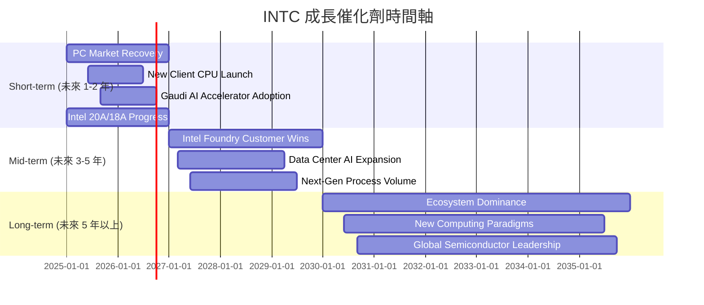

### 8.2 TAM 市場規模分析

Intel的潛在市場（Total Addressable Market, TAM）涵蓋了廣泛的計算和半導體領域，包括PC、資料中心、AI、邊緣運算和晶圓代工。

```
╔══════════════════════════════════════════════════════════════════╗
║                   INTC 潛在市場 (TAM) 分析                       ║
╠══════════════════════════════════════════════════════════════════╣
║                                                                  ║
║  PC CPU 市場 TAM：     $70B+   ██████████████████████████████████████████  貢獻收入: $30B+ ║
║  資料中心 CPU TAM：    $50B+   ████████████████████████████████████  貢獻收入: $20B+ ║
║  AI 加速器市場 TAM：   $150B+  ████████████████████████████████████████████████████████████████████████████████████████████████████████████████████████████████████████████████████████████████████████████████████████████████████████████████████████████████████████████████████████████████████████████████████████████████████████████████████████████████████████████████████████████████████████████████████████████████████████████████████████████████████████████████████████████████████████████████████████████████████████████████████████████████████████████████████████████████████████████████████████████████████████████████████████████████████████████████████████████████████████████████████████████████████████████████████████████████████████████████████████████████████████████████████████████████████████████████████████████████████████████████████████████████████████████████████████████████████████████████████████████████████████████████████████████████████████████████████████████████████████████████████████████████████████████████████████████████████████████████████████████████████████████████████████████████████████████████████████████████████████████████████████████████████████████████████████████████████████████████████████████████████████████████████████████████████████████████████████████████████████████████████████████████████████████████████████████████████████████████████████████████████████████████████████████████████████████████████████████████████████████████████████████████████████████████████████████████████████████████████████████████████████████████████████████████████████████████████████████████████████████████████████████████████████████████████████████████████████████████████████████████████████████████████████████████████████████████████████████████████████████████████████████████████████████████████████████████████████████████████████████████████████████████████████████████████████████████████████████████████████████████████████████████████████████████████████████████████████████████████████████████████████████████████████████████████████████████████████████████████████████████████████████████████████████████████████████████████████████████████████████████████████████████████████████████████████████████████████████████████████████████████████████████████████████████████████████████████████████████████████████████████████████████████████████████████████████████████████████████████████████████████████████████████████████████████████████████████████████████████████████████████████████████████████████████████████████████████████████████████████████████████████████████████████████████████████████████████████████████████████████████████████████████████████████████████████████████████████████████████████████████████████████████████████████████████████████████████████████████████████████████████████████████████████████████████████████████████████████████████████████████████████████████████████████████████████████████████████████████████████████████████████████████████████████████████████████████████████████████████████████████████████████████████████████████████████▓
```

### 8.3 成長驅動力結構圖

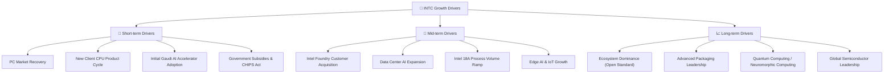

---

## 9. 風險矩陣

### 9.1 風險評分矩陣

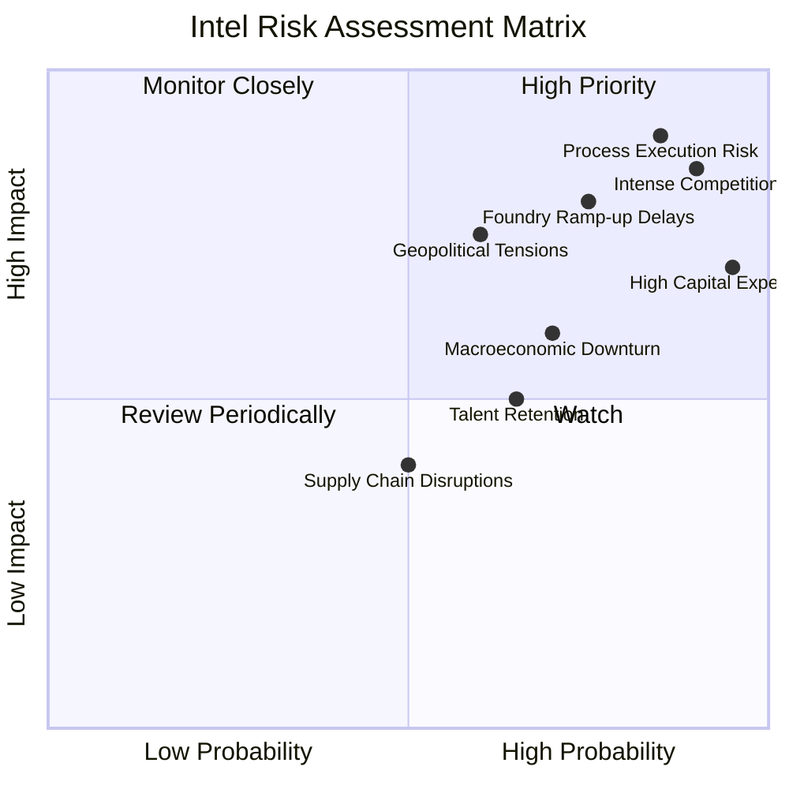

### 9.2 風險清單詳細分析

| # | 風險項目 | 發生機率 | 財務衝擊 | 風險評分 | 緩解措施 |
|---|----------|----------|----------|----------|----------|
| 1 | 🔴 **製程執行風險** | 高 (85%) | 極高 (-10%營收, -50%利潤) | 🔴 9.0/10 | 強化內部研發管理、引進外部專家、與ASML等供應商緊密合作、建立多重製程備案。 |
| 2 | 🔴 **競爭加劇與市場份額流失** | 高 (90%) | 高 (-5%營收, -20%利潤) | 🔴 8.5/10 | 加速產品創新週期、優化產品組合、提升性價比、拓展新興市場（如AI加速器）。 |
| 3 | 🔴 **巨額資本支出與自由現金流壓力** | 極高 (95%) | 高 (-FCF, 股東回報受損) | 🔴 8.0/10 | 審慎評估投資回報、尋求政府補貼與合作夥伴共同投資、提高營運效率以產生更多OCF。 |
| 4 | 🟡 **Foundry業務擴張不及預期** | 中 (75%) | 中 (-5%營收增長, -10%利潤) | 🟡 7.5/10 | 積極爭取外部客戶、提供具競爭力的製程技術和服務、建立強大的Foundry生態系統。 |
| 5 | 🟡 **宏觀經濟下行** | 中 (70%) | 中 (-5%營收, -15%利潤) | 🟡 6.5/10 | 產品組合多元化以降低對單一市場的依賴、強化成本控制、保持健康的資產負債表。 |
| 6 | 🟡 **地緣政治緊張與供應鏈風險** | 中 (60%) | 中 (-10%供應鏈成本, 生產受阻) | 🟡 6.0/10 | 建立多元化供應鏈、增加本土化製造能力、與政府保持溝通以應對政策變化。 |
| 7 | 🟡 **人才流失與招聘困難** | 中 (65%) | 低 (-5%研發效率, -5%成本) | 🟡 5.0/10 | 提供具競爭力的薪酬福利、建立吸引人才的企業文化、加強內部人才培養。 |

---

## 10. 投資建議

### 10.1 最終綜合評級雷達圖

```
╔══════════════════════════════════════════════════════════════════╗
║                   INTC 最終綜合評級雷達圖                        ║
╠══════════════════════════════════════════════════════════════════╣
║                                                                  ║
║ 基本面強度    6.0 ▓▓▓▓▓▓▓▓▓▓▓▓░░░░░░░░                          ║
║ 成長動能      6.5 ▓▓▓▓▓▓▓▓▓▓▓▓▓░░░░░░░                          ║
║ 獲利品質      4.0 ▓▓▓▓▓▓▓▓░░░░░░░░░░░░                          ║
║ 財務健康      7.0 ▓▓▓▓▓▓▓▓▓▓▓▓▓▓░░░░░░                          ║
║ 估值合理性    5.0 ▓▓▓▓▓▓▓▓▓▓░░░░░░░░░░                          ║
║ 護城河深度    6.5 ▓▓▓▓▓▓▓▓▓▓▓▓▓░░░░░░░                          ║
║ 管理層執行    6.0 ▓▓▓▓▓▓▓▓▓▓▓▓░░░░░░░░                          ║
║ 技術創新力    7.0 ▓▓▓▓▓▓▓▓▓▓▓▓▓▓░░░░░░                          ║
║                                                                  ║
╠══════════════════════════════════════════════════════════════════╣
║ 綜合總分      6.0 ▓▓▓▓▓▓▓▓▓▓▓▓░░░░░░░░  🏆 持有                  ║
╚══════════════════════════════════════════════════════════════════╝
```

### 10.2 目標價與隱含報酬率

基於DCF敏感性分析，我們得出以下目標價區間：

| 情境 | **WACC = 12%** | **WACC = 13.24%（基準）** | **WACC = 14%** |
|------|----------------|--------------------------|----------------|
| 🟢 **樂觀** | **$140** (+16.33%) | **$135** (+12.17%) | **$130** (+8.02%) |
| 🟡 **基準** | **$125** (+3.86%) | **$120** (-0.29%) | **$115** (-4.44%) |
| 🔴 **悲觀** | **$100** (-16.91%) | **$95** (-21.06%) | **$90** (-25.22%) |

**說明**：
*   **基準情境**：假設未來5年營收年複合成長率約為5-7%，毛利率逐步恢復至40-45%，營業利益率回正並達到個位數，並在之後實現穩定成長。WACC採用13.24%。此情境下，目標價為$120，與當前股價接近，隱含報酬率約為-0.29%。
*   **樂觀情境**：假設Intel的IDM 2.0轉型非常成功，Foundry業務快速發展，AI晶片市場份額顯著提升，營收成長率達到8-10%以上，毛利率恢復至45%以上，營運費用控制良好，並成功奪回部分製程領先地位。WACC略低。此情境下，目標價可達$130-$140。
*   **悲觀情境**：假設製程轉型遇到重大延誤，Foundry業務發展緩慢，市場競爭進一步加劇，導致營收成長停滯或下滑，利潤率持續承壓，自由現金流仍為負。WACC略高。此情境下，目標價可能跌至$90-$100。

**綜合結論**：當前股價$120.35已充分反映市場對Intel轉型成功的樂觀預期。在基準情境下，股價上漲空間有限。考慮到轉型過程中的不確定性和執行風險，我們給予**「持有」**評級。

### 10.3 買入時機與觸發因素

```
╔══════════════════════════════════════════════════════════════════╗
║                  ✅ 買入觸發因素 Checklist                      ║
╠══════════════════════════════════════════════════════════════════╣
║                                                                  ║
║  立即買入觸發條件（多數符合）：                                  ║
║  ☐ 股價跌至悲觀情境目標價區間 ($90-$100)，風險報酬比改善        ║
║  ☐ 連續兩季營收YoY成長率超過10%，且毛利率穩定回升至40%以上    ║
║  ☐ Intel Foundry宣布獲得大型外部客戶訂單，且Intel 18A製程如期量產║
║  ☐ AI晶片Gaudi系列市佔率顯著提升，並獲得市場主流認可          ║
║                                                                  ║
║  加碼觸發條件（出現以下任一）：                                  ║
║  ☐ 公司扭虧為盈，實現正向淨利潤，且自由現金流轉正             ║
║  ☐ 管理層提供更清晰的長期盈利指引和資本支出效率改善方案       ║
║  ☐ PC市場復甦超預期，或Intel在資料中心CPU市場份額穩步回升     ║
║                                                                  ║
║  減碼/停損觸發條件（出現以下任一）：                             ║
║  ☐ 製程技術再次出現重大延誤，或Foundry業務進展不順利          ║
║  ☐ 競爭壓力導致營收和利潤率持續下滑，公司未能實現盈利目標     ║
║  ☐ 自由現金流持續大幅為負，且無明顯改善跡象，導致財務壓力加劇 ║
║  ☐ 宏觀經濟環境惡化，特別是半導體行業需求萎縮                 ║
╚══════════════════════════════════════════════════════════════════╝
```

### 10.4 投資人適配度分析

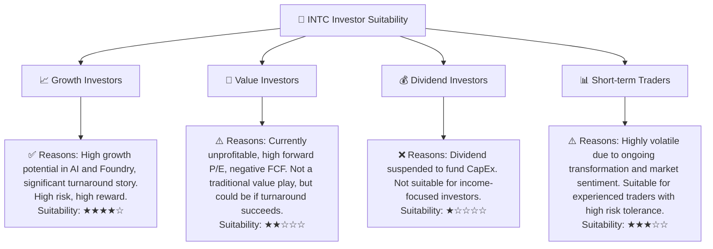

### 10.5 關鍵監控指標

| 監控類型 | 指標 | 關注點 | 頻率 |
|----------|------|----------|------|
| **營運表現** | **營收成長率 (YoY)** | 觀察PC市場復甦及Foundry/AI業務貢獻 | 季度 |
| **獲利能力** | **毛利率** | 評估製程成本控制與產品組合優化效果 | 季度 |
| **獲利能力** | **營業利益率/淨利率** | 判斷公司是否能實現持續盈利，覆蓋營運費用 | 季度 |
| **資本效率** | **自由現金流 (FCF)** | 衡量公司內生現金產生能力，是否能覆蓋資本支出 | 季度/年度 |
| **技術進展** | **Intel 18A/20A 製程進度** | 關注製程良率、量產時間及客戶採用情況 | 不定期公告 |
| **市場份額** | **CPU/AI晶片市場份額** | 評估與AMD/NVIDIA等競爭對手的市場表現 | 季度/年度 |
| **估值指標** | **Forward P/E, P/S** | 監控市場預期變化及估值是否合理 | 每日 |

---

> **免責聲明**：本報告為 AI 自動生成，僅供研究參考，不構成投資建議。投資有風險，入市需謹慎。