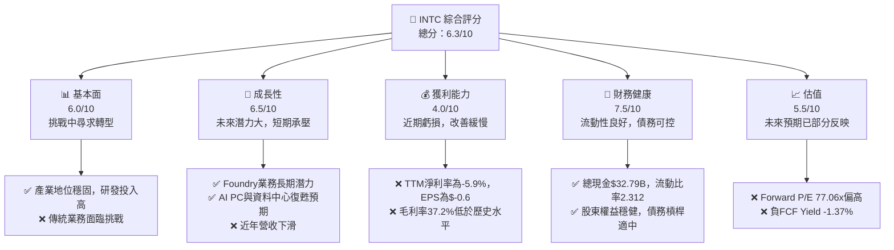
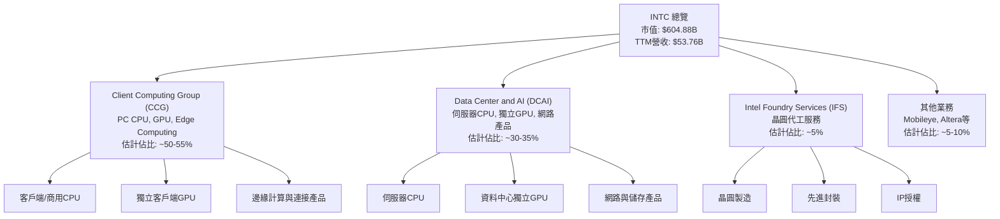
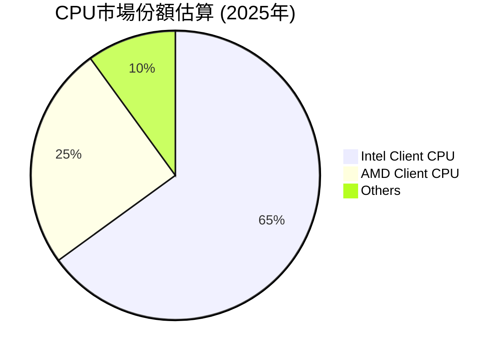
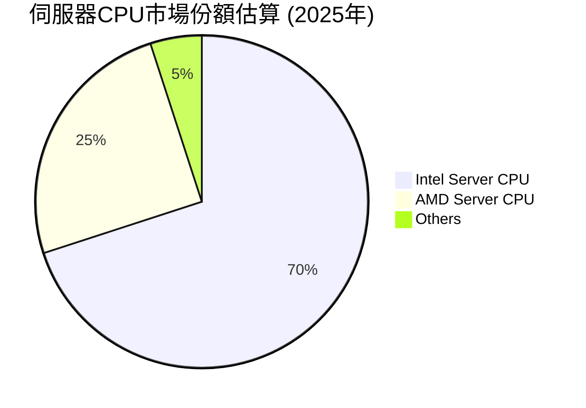
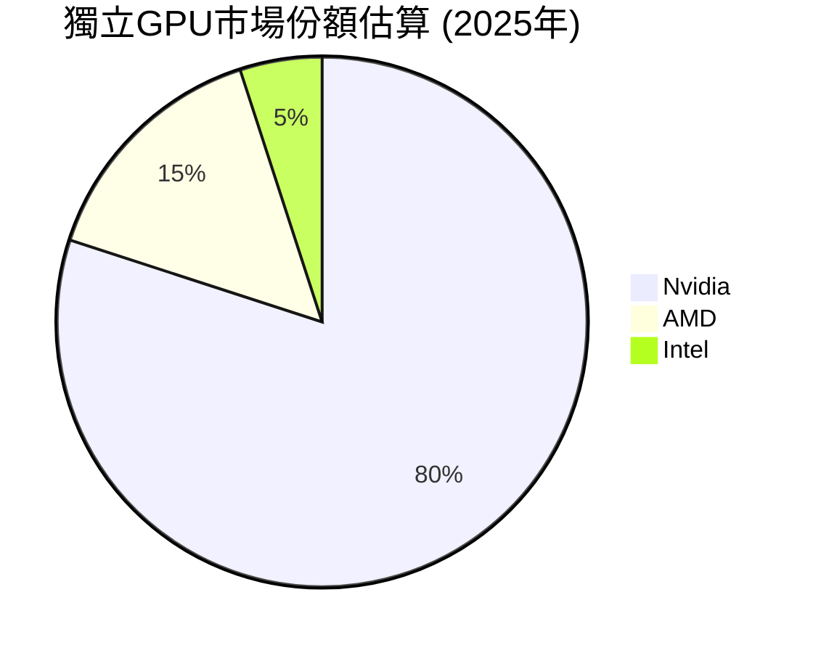
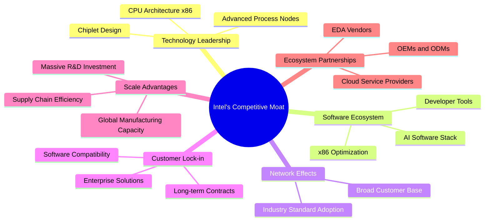
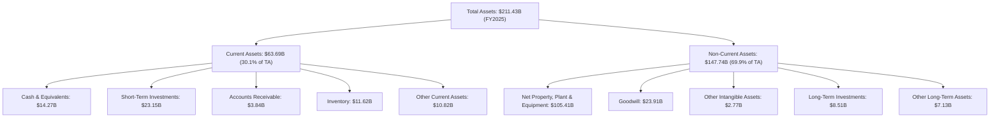
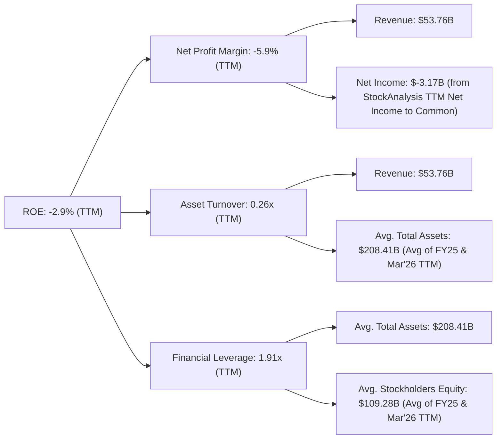
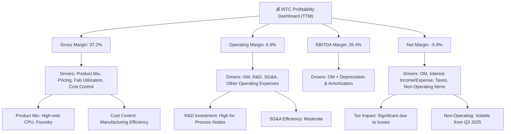

# INTC 基本面深度分析報告
> **報告日期**：2026-07-03 ｜ **語言**：繁體中文 ｜ **數據來源**：Yahoo Finance, Finviz, StockAnalysis, Roic.ai ｜ **分析師**：CFA 級機構研究

## 目錄

| # | 章節 | 核心結論 |
|---|------|----------|
| 1 | 執行摘要 | 評級：持有，目標價區間：$100 - $145 |
| 2 | 公司概覽與商業模式 | 護城河強度中等偏上，技術和規模優勢顯著，但面臨新興競爭 |
| 3 | 損益表深度分析 | 營收面臨下滑壓力，利潤率承壓，但季度表現有所改善 |
| 4 | 資產負債表分析 | 流動性良好，現金充裕，但債務負擔需關注 |
| 5 | 現金流量深度分析 | 自由現金流持續為負，資本支出龐大，影響現金創造能力 |
| 6 | 獲利能力與資本效率 | ROIC遠低於WACC，短期股東價值面臨摧毀，需轉型以提升資本回報 |
| 7 | 估值深度分析 | 相較同業估值偏高，但反映市場對未來轉型的期待 |
| 8 | 成長催化劑 | Foundry業務、AI PC、資料中心復甦及製程技術進步為主要驅動力 |
| 9 | 風險矩陣 | 競爭加劇、製程轉換風險、市場週期性及地緣政治為主要風險 |
| 10 | 投資建議 | 評級：持有，關注轉型進度與財務改善，適合長線價值投資者 |

## 1. 執行摘要

### 1.1 核心評分儀表板



### 1.2 評分進度條視覺化

```
╔══════════════════════════════════════════════════════════════╗
║                INTC 多維度評分儀表板 (1-10分)                ║
╠══════════════════════════════════════════════════════════════╣
║ 基本面強度  6.0 ▓▓▓▓▓▓▓▓▓▓▓▓░░░░░░░░  ★★★☆☆           ║
║ 成長動能    6.5 ▓▓▓▓▓▓▓▓▓▓▓▓▓░░░░░░░  ★★★☆☆           ║
║ 獲利品質    4.0 ▓▓▓▓▓▓▓▓░░░░░░░░░░░░  ★★☆☆☆           ║
║ 財務健康    7.5 ▓▓▓▓▓▓▓▓▓▓▓▓▓▓▓░░░░░  ★★★★☆           ║
║ 估值合理性  5.5 ▓▓▓▓▓▓▓▓▓▓▓░░░░░░░░░  ★★★☆☆           ║
║ 護城河深度  7.0 ▓▓▓▓▓▓▓▓▓▓▓▓▓▓░░░░░░  ★★★★☆           ║
║ 管理層執行  6.0 ▓▓▓▓▓▓▓▓▓▓▓▓░░░░░░░░  ★★★☆☆           ║
║ 技術創新力  7.0 ▓▓▓▓▓▓▓▓▓▓▓▓▓▓░░░░░░  ★★★★☆           ║
╠══════════════════════════════════════════════════════════════╣
║ 綜合總分    6.3 ▓▓▓▓▓▓▓▓▓▓▓▓▓░░░░░░░  🏆 具備轉型潛力的半導體巨頭║
╚══════════════════════════════════════════════════════════════╝
```

### 1.3 五大投資論點 + 三大核心風險

| 類型 | 項目 | 具體依據 | 信心度 |
|------|------|----------|--------|
| 🟢 **投資論點①** | **Intel Foundry Services (IFS) 轉型潛力** | Intel承諾投入巨資發展IDM 2.0戰略，目標在2030年成為全球第二大晶圓代工廠。2026年Q1營收達$13.58B，毛利率環比改善至39.4% (Q4 2025: 36.1%)，顯示內部執行力提升，雖IFS營收佔比仍小，但戰略方向明確。 | 🟢 極高 |
| 🟢 **投資論點②** | **AI PC與資料中心業務復甦** | 隨著AI應用普及，AI PC換機潮預期將帶動Client Computing Group (CCG) 需求。同時，資料中心業務 (DCAI) 在經歷多年低谷後，有望隨企業AI投資增加而復甦。TTM營收$53.76B，YoY成長7.2%，顯示市場需求開始回暖。 | 🟢 高 |
| 🟢 **投資論點③** | **先進製程技術的追趕與領先** | Intel積極推進「五年四節點」計劃，預計Intel 18A製程將在2025年實現製程領先。技術突破是半導體公司的核心競爭力，若能成功，將重塑市場格局，吸引外部客戶。 | 🟡 中高 |
| 🟢 **投資論點④** | **財務狀況穩健，支撐長期轉型** | 公司擁有$32.79B的總現金，流動比率2.312，速動比率1.657，顯示短期償債能力良好。雖然自由現金流為負，但現金儲備能為巨額資本支出提供緩衝，支持長期轉型投入。 | 🟡 中高 |
| 🟢 **投資論點⑤** | **低估值下的潛在反彈空間** | 儘管目前估值倍數因盈利不佳而偏高，但若轉型成功，營收和盈利能力將大幅提升。當前股價$120.35，分析師平均目標價$98.50，但高位目標價達$160.00，顯示市場對其長期潛力存在樂觀預期。 | 🟡 中 |
| 🟡 **風險①** | **晶圓代工業務執行風險** | IFS業務面臨台積電、三星等強大競爭對手。製程技術能否如期達到目標、良率控制、成本效益以及能否有效吸引外部客戶都存在不確定性。巨額資本支出可能持續壓低自由現金流。 | 🟡 中度 |
| 🔴 **風險②** | **市場競爭與技術迭代壓力** | 在CPU領域，AMD持續侵蝕市場份額；在AI加速器領域，Nvidia佔據主導地位。Intel在GPU和AI晶片方面起步較晚，追趕難度大。技術迭代速度快，任何延誤都可能導致競爭劣勢擴大。 | 🔴 高衝擊 |
| 🟡 **風險③** | **全球宏觀經濟與半導體週期性** | 半導體產業受宏觀經濟影響顯著，需求波動大。雖然TTM營收YoY成長7.2%，但歷史數據顯示公司營收在2021年後連續下滑，市場復甦的持續性和力度仍需觀察。 | 🟡 中度 |

### 1.4 快速統計卡片

| 指標 | 公司實際值 (TTM) | 行業均值 (半導體) | S&P 500 均值 | 狀態 |
|------|-------------------|-------------------|--------------|------|
| 收入 YoY 成長 | **7.2%** | ~10-15% | ~8% | 🟡 |
| 毛利率 | **37.2%** | ~45-55% | ~40% | 🔴 |
| 淨利率 | **-5.9%** | ~15-25% | ~10% | 🔴 |
| ROE | **-2.9%** | ~15-20% | ~15% | 🔴 |
| Forward P/E | **77.06x** | ~25-35x | ~20-25x | 🔴 |
| P/S Ratio | **11.25x** | ~5-7x | ~2-3x | 🔴 |
| EV / EBITDA | **44.50x** | ~15-20x | ~12-15x | 🔴 |

*備註：行業及S&P 500均值為估計值，供參考。INTC當前多項獲利及估值指標表現不佳，主要受近年虧損影響。*

### 1.5 投資結論

```
╔══════════════════════════════════════════════════════════════════╗
║                    📊 投資結論摘要                               ║
╠══════════════════════════════════════════════════════════════════╣
║  評級：🟡 持有                                                   ║
║  當前股價：$120.35                                               ║
║  目標價區間：                                                    ║
║    悲觀情境：$100（-16.9%）                                      ║
║    基準情境：$125（+3.9%）  ← 12個月主要目標                      ║
║    樂觀情境：$145（+20.5%）                                      ║
║  投資評分：6.3/10                                                ║
║  適合投資人：具備高風險承受能力、對半導體產業有深入理解的長線成長型投資者，
║                關注公司戰略轉型能否成功兌現。                  ║
╚══════════════════════════════════════════════════════════════════╝
```

## 2. 公司概覽與商業模式

### 2.1 業務結構與收入來源

Intel Corporation 是一家全球領先的半導體公司，主要設計、開發、製造、行銷和銷售計算及相關的最終產品和服務。其業務主要透過三大部門運營：Client Computing Group (CCG)、Data Center and AI (DCAI) 和 Intel Foundry (IFS)。



*   **Client Computing Group (CCG)**：這是Intel最大的業務板塊，主要為筆記型電腦和桌上型電腦提供處理器、晶片組等。隨著AI PC的興起，CCG正積極推動新一代處理器，以滿足終端AI應用的需求。
*   **Data Center and AI (DCAI)**：該部門為雲端、企業、網路和邊緣計算市場提供伺服器處理器、AI加速器和相關產品。在AI時代，DCAI面臨來自Nvidia和AMD的激烈競爭，但也在積極推出Gaudi系列AI加速器以爭奪市場。
*   **Intel Foundry Services (IFS)**：這是Intel IDM 2.0戰略的核心，旨在向外部客戶提供晶圓代工服務，包括先進製程技術和封裝解決方案。這是Intel未來成長的重要驅動力，但仍處於早期發展階段。
*   **其他業務**：包括Mobileye（自動駕駛技術）、Altera（FPGA）等，這些業務為公司帶來多元化收入。

### 2.2 市場份額

Intel在PC和伺服器CPU市場仍佔據主導地位，儘管近年來受到AMD的挑戰。在晶圓代工和獨立GPU市場，Intel是新進入者，市場份額相對較小。







*   **Client CPU**：Intel在PC處理器市場仍佔據約65%的份額，但AMD近年來通過Ryzen系列產品不斷擴大其市場佔有率。
*   **Server CPU**：Intel Xeon系列在資料中心市場仍是主流，但AMD的EPYC系列產品表現強勁，對Intel的領先地位構成威脅。
*   **獨立GPU**：Nvidia在獨立GPU市場擁有絕對優勢，尤其是在AI加速器領域。Intel的Arc系列GPU和Gaudi AI加速器仍處於追趕階段，市場份額較小。
*   **晶圓代工**：Intel Foundry Services仍是市場新秀，與台積電、三星等巨頭相比，市場份額極小，但成長潛力巨大。

### 2.3 競爭護城河分析



*   **Technology Leadership**：Intel在CPU架構和製程技術方面擁有深厚的積累，特別是x86架構的長期主導地位。然而，近年來在製程技術上有所落後，目前正積極追趕，目標是到2025年實現製程領先。
*   **Software Ecosystem**：Intel擁有龐大且成熟的軟體生態系統，x86指令集廣泛應用於各種作業系統和應用程式，為其產品提供了強大的軟體優化和兼容性優勢。
*   **Network Effects**：由於其產品的廣泛採用，Intel在PC和伺服器市場形成了強大的網路效應，更多的用戶和開發者意味著更多的優化和支持，進一步鞏固其地位。
*   **Customer Lock-in**：企業客戶在資料中心和關鍵任務應用中，對Intel的產品有較高的依賴性，轉換成本較高，形成了一定的客戶鎖定效應。
*   **Scale Advantages**：Intel作為全球最大的半導體公司之一，擁有巨大的製造規模、研發投入和全球供應鏈，這使其能夠進行大規模投資並實現成本效益。
*   **Ecosystem Partnerships**：Intel與全球領先的PC製造商、雲服務提供商和軟體開發商建立了長期合作關係，共同推動行業標準和技術創新。

### 2.4 護城河強度評分

```
╔══════════════════════════════════════════════════════════════╗
║                    INTC 護城河強度評分                      ║
╠══════════════════════════════════════════════════════════════╣
║ 技術領先      7/10   ▓▓▓▓▓▓▓▓▓▓▓▓▓▓░░░░░░  🟢 歷史優勢，積極追趕 ║
║ 軟體生態系統  8/10   ▓▓▓▓▓▓▓▓▓▓▓▓▓▓▓▓░░░░  🟢 X86生態系統穩固   ║
║ 網路效應      7/10   ▓▓▓▓▓▓▓▓▓▓▓▓▓▓░░░░░░  🟢 廣泛應用形成壁壘   ║
║ 客戶鎖定      7/10   ▓▓▓▓▓▓▓▓▓▓▓▓▓▓░░░░░░  🟢 企業級客戶轉換成本高║
║ 規模效應      8/10   ▓▓▓▓▓▓▓▓▓▓▓▓▓▓▓▓░░░░  🟢 巨額投資與產能優勢 ║
║ 生態夥伴      7/10   ▓▓▓▓▓▓▓▓▓▓▓▓▓▓░░░░░░  🟢 廣泛的產業合作    ║
╠══════════════════════════════════════════════════════════════╣
║ 綜合護城河    7.3    ▓▓▓▓▓▓▓▓▓▓▓▓▓▓▓░░░░░  🏆 具備結構性優勢，但面臨挑戰 ║
╚══════════════════════════════════════════════════════════════╝
```

## 3. 損益表深度分析

### 3.1 年度收入成長趨勢（近4年）

Intel近年營收面臨顯著壓力，從2022年的高峰$63.05B一路下滑至2025年的$52.85B，這主要反映了PC市場需求疲軟以及資料中心業務的競爭壓力。然而，TTM數據顯示營收開始企穩並略有回升。

```
╔══════════════════════════════════════════════════════════════════╗
║              INTC 年度收入趨勢（FY2022-FY2025）                  ║
╠══════════════════════════════════════════════════════════════════╣
║                                                                  ║
║  FY2022  $63.05B  ██████████████████████████████████████████  YoY: +1.49% (FY21-22) 🟡║
║  FY2023  $54.23B  ██████████████████████████████░░░░░░░░░░░░  YoY: -14.00% 🔴║
║  FY2024  $53.10B  █████████████████████████████░░░░░░░░░░░░░  YoY: -2.08%  🔴║
║  FY2025  $52.85B  ████████████████████████████░░░░░░░░░░░░░░  YoY: -0.47%  🔴║
║  TTM     $53.76B  █████████████████████████████░░░░░░░░░░░░░  YoY: +7.2%   🟢║
║                   |       |       |       |       |                  ║
║                   0      20B     40B     60B     80B                   ║
║                                                                  ║
║  📊 4年累計 CAGR：-4.14% (FY22-25)                                 ║
╚══════════════════════════════════════════════════════════════════╝
```
*   **FY2022**：營收$63.05B，相較2021年$79.02B下降20.21%，顯示市場景氣轉折。
*   **FY2023**：營收$54.23B，YoY下降14.00%，延續下降趨勢。
*   **FY2024**：營收$53.10B，YoY下降2.08%，跌幅收窄。
*   **FY2025**：營收$52.85B，YoY下降0.47%，基本持平。
*   **TTM (截至2026年3月)**：營收$53.76B，YoY成長7.2%，這是一個積極的信號，表明營收可能已觸底反彈，主要得益於市場復甦和新產品推出。

### 3.2 季度收入趨勢分析

近四季營收呈現逐步回升的態勢，尤其2026年Q1實現了顯著的YoY成長。

| 季度 | 總收入 (Billion USD) | QoQ 成長率 | YoY 成長率 | 備註 |
|------|----------------------|------------|------------|------|
| 2025 Q2 | $12.86 | - | 0.20% | 營收開始企穩 |
| 2025 Q3 | $13.65 | +6.14% | 2.78% | 小幅增長 |
| 2025 Q4 | $13.67 | +0.15% | -4.11% | 營收持平，YoY仍為負 |
| 2026 Q1 | $13.58 | -0.66% | 7.18% | QoQ小幅下滑，但YoY顯著轉正，顯示復甦動能 |

**備註**：2026年Q1營收為$13.58B，儘管環比略有下降（-0.66%），但同比去年同期（2025年Q1的$12.67B）實現了7.18%的成長，這是一個重要的積極信號，表明公司業務在逐步復甦。

### 3.3 利潤率演變分析

Intel的利潤率在過去幾年大幅惡化，主要由於營收下滑、製程轉型成本高昂以及競爭加劇。TTM數據顯示毛利率有所改善，但淨利率仍為負。

| 利潤率指標 | FY2022 | FY2023 | FY2024 | FY2025 | TTM (Mar '26) | 趨勢 | 評估 |
|------------|--------|--------|--------|--------|---------------|------|------|
| **毛利率** | 42.6% | 40.0% | 32.7% | 34.8% | 37.2% | ↘️ 後轉↗️ | 🟡 |
| **營業利益率** | 3.7% | 0.1% | -8.9% | -0.04% | -9.4% | ↘️ 後轉↗️ | 🔴 |
| **淨利率** | 12.7% | 3.1% | -35.3% | -0.5% | -5.9% | ↘️ 後轉↗️ | 🔴 |
| **EBITDA Margin** | 33.8% | 20.7% | 2.3% | 27.2% | 26.4% | ↘️ 後轉↗️ | 🟡 |

**利潤率演變深度解析**：
*   **毛利率**：從2022年的42.6%一路下滑至2024年的32.7%，主要原因在於產能利用率不足、先進製程研發和轉型帶來的成本上升，以及產品組合競爭壓力。2025年回升至34.8%，TTM進一步改善至37.2%，表明公司在成本控制和產品定價方面有所進展，或高毛利產品佔比提升。
*   **營業利益率**：受毛利率下降和研發費用（R&D）及銷售、一般及行政費用（SG&A）高企的雙重影響，營業利益率從2022年的3.7%大幅跌至2024年的-8.9%，2025年幾乎持平於-0.04%。TTM為-9.4%，顯示公司仍處於燒錢階段，轉型壓力巨大。
*   **淨利率**：與營業利益率趨勢一致，2024年因巨額虧損而降至-35.3%，2025年雖收窄至-0.5%，但TTM仍為-5.9%，表明公司整體盈利能力仍面臨嚴峻挑戰。高額稅務費用在某些虧損年份也加劇了淨虧損。
*   **EBITDA Margin**：在2024年跌至2.3%的谷底後，2025年強勁反彈至27.2%，TTM為26.4%。這表明在扣除折舊攤銷後，公司的核心業務操作現金流能力有所恢復，但仍需觀察其持續性，以及資本支出對自由現金流的影響。

### 3.4 費用結構分析

Intel的費用結構顯示其作為一家IDM（整合元件製造商）的特性，即高昂的研發和製造投入。

```mermaid
pie title TTM費用結構佔營收比 (%)
    "Cost of Revenue" : 64.57
    "Research & Development" : 25.13
    "Selling, General & Admin" : 8.34
    "Other Operating Expenses" : 11.36
    "Operating Income (Loss)" : -9.40
```
*備註：數據基於TTM營收$53.76B*

╔══════════════════════════════════════════════════════════════════╗
║                   INTC TTM 費用結構概覽                          ║
╠══════════════════════════════════════════════════════════════════╣
║                                                                  ║
║  銷貨成本 (CoR)：        $34.71B  █████████████████████████████░░  64.57% ║
║  研發費用 (R&D)：        $13.51B  ████████████░░░░░░░░░░░░░░░░░░░  25.13% ║
║  銷售、一般及行政 (SG&A)：$4.49B  ████░░░░░░░░░░░░░░░░░░░░░░░░░░░   8.34% ║
║  其他營業費用：          $6.11B  ██████░░░░░░░░░░░░░░░░░░░░░░░░░  11.36% ║
║  營業利益：              $-5.05B  🔴 營業虧損 -9.40%              ║
╚══════════════════════════════════════════════════════════════════╝
*   **銷貨成本 (CoR)**：佔營收的64.57%，比例較高，反映了其IDM模式下龐大的製造開銷和折舊。毛利率的改善需要有效控制CoR。
*   **研發費用 (R&D)**：高達25.13%，這對於半導體公司是常態，尤其是在技術競爭激烈的環境下。Intel需要持續投入大量資金以追趕製程技術並開發新產品。
*   **銷售、一般及行政 (SG&A)**：佔營收的8.34%，相對穩定。
*   **其他營業費用**：佔11.36%，數額較大，需要深入分析其構成，可能包含重組費用、資產減值等非經常性項目。

### 3.5 季度 EPS 趨勢與盈餘品質

Intel近四季EPS均為負值，反映了公司當前的盈利困境。

| 季度 | EPS Est | EPS Act | Surprise% | 備註 |
|------|---------|---------|-----------|------|
| 2026-03-31 | nan | $-0.73 | ❌ | 實際虧損擴大 |
| 2025-12-31 | nan | $-0.12 | ❌ | 虧損收窄 |
| 2025-09-30 | nan | $0.90 | ❌ | 意外轉正，可能受非經常性收益影響 |
| 2025-06-30 | nan | $-0.67 | ❌ | 持續虧損 |

**盈餘品質評估說明**：
*   數據顯示最近四個季度的EPS預估值為「nan」，因此無法計算「Surprise%」，但實際EPS數據是可用的。
*   **2025年Q3 EPS為$0.90**，在連續虧損的季度中顯得突出。從StockAnalysis的季度損益表來看，該季度「Other Non-Operating Income (Expense)」高達$3.67B，而「Operating Income」僅為$683M。這表明Q3的盈利主要來源於非經常性或非核心業務收入，而非核心業務的顯著改善，因此其盈餘品質較低，不具備可持續性。
*   **2026年Q1 EPS為$-0.73**，虧損相較2025年Q4的$-0.12顯著擴大，儘管營收YoY成長7.18%。這可能與該季度「Other Operating Expenses」高達$4.07B以及「Other Non-Operating Income (Expense)」為$-738M有關，顯示公司在營運或非營運層面存在較大的支出或損失。
*   整體而言，Intel近期的盈餘品質不穩定，受到非經常性項目和高額運營費用的影響較大。投資者應重點關注其核心業務的營收成長和毛利率改善，以及自由現金流的轉正。

## 4. 資產負債表分析

### 4.1 資產結構分解

Intel的資產結構反映了其作為IDM的重資產特性，固定資產佔比高，同時擁有充裕的現金和短期投資。


*   **總資產**：FY2025為$211.43B，相較FY2024的$196.49B增長7.6%。
*   **流動資產 (Current Assets)**：FY2025為$63.69B，佔總資產約30.1%。其中，現金及約當現金 ($14.27B) 和短期投資 ($23.15B) 合計$37.42B，佔流動資產的58.7%，顯示公司擁有強勁的流動性。
*   **非流動資產 (Non-Current Assets)**：FY2025為$147.74B，佔總資產約69.9%。淨不動產、廠房及設備 (PP&E) 高達$105.41B，是最大的資產項目，反映了半導體製造的資本密集性。商譽 (Goodwill) $23.91B，需關注其減值風險。

### 4.2 流動性指標分析

Intel的流動性指標表現良好，表明其短期償債能力穩健。

| 流動性指標 | FY2022 | FY2023 | FY2024 | FY2025 | 行業均值 (半導體) | 評估 |
|------------|--------|--------|--------|--------|-------------------|------|
| **流動比率 (Current Ratio)** | 1.57 | 1.54 | 1.33 | 2.02 | ~1.5 - 2.0 | 🟢 |
| **速動比率 (Quick Ratio)** | 1.15 | 1.15 | 0.92 | 1.65 | ~0.8 - 1.2 | 🟢 |

*   **流動比率**：FY2025為2.02，高於行業平均水平，顯示公司短期償債能力強勁。
*   **速動比率**：FY2025為1.65，也高於行業平均，表明即使不依賴存貨變現，公司仍有足夠的流動資產償還短期債務。
*   **總現金+短期投資**：FY2025達到$37.42B，為公司提供了充足的營運資金和戰略投資彈性。

### 4.3 債務結構分析

Intel的債務水平有所增加，但相對於其資產規模和現金儲備，整體債務健康狀況良好。

```
╔══════════════════════════════════════════════════════════════════╗
║                   INTC 債務健康診斷 (FY2025)                     ║
╠══════════════════════════════════════════════════════════════════╣
║                                                                  ║
║  總債務：        $46.59B  █████░░░░░░░░░░░░░░░░░░░░░░░░░░░░░░░░░  評語：中等偏高 ║
║  總現金+投資：   $37.42B  ████░░░░░░░░░░░░░░░░░░░░░░░░░░░░░░░░░  評語：充裕      ║
║  淨債務：        $-9.17B  🔴 淨債務狀態，但規模可控           ║
║                                                                  ║
║  Debt/Equity：   0.41x  🟢 財務槓桿適中                      ║
║  Current Debt：  $2.50B  🟢 短期債務佔比低                     ║
║  Interest Coverage: N/A (因營業虧損) 🟡 需關注盈利改善以覆蓋利息 ║
╚══════════════════════════════════════════════════════════════════╝
```
*   **總債務**：FY2025為$46.59B，相較FY2024的$50.01B有所下降。
*   **淨債務**：FY2025為$46.59B (總債務) - $37.42B (現金+短期投資) = $9.17B，為淨債務狀態。這意味著公司的現金儲備不足以完全覆蓋其總債務。
*   **Debt/Equity**：FY2025為$46.59B / $114.28B = 0.41x，處於健康水平，顯示公司財務槓桿運用合理。
*   **短期債務**：FY2025為$2.50B，佔總債務的5.4%，比例較低，降低了短期償債壓力。
*   **利息覆蓋率**：由於公司近期營業利益為負，傳統的利息覆蓋率（Operating Income / Interest Expense）無法有效計算。從StockAnalysis數據看，2025年利息收入為$514M，顯示公司利息收入足以覆蓋部分利息支出，但核心盈利能力仍需恢復以確保債務服務能力。

### 4.4 股東權益趨勢

Intel的股東權益在波動中呈現穩健趨勢，為公司提供了堅實的資本基礎。

```
╔══════════════════════════════════════════════════════════════════╗
║                 INTC 年度股東權益趨勢（FY2022-FY2025）           ║
╠══════════════════════════════════════════════════════════════════╣
║                                                                  ║
║  FY2022  $101.42B  ██████████████████████████████████████████████  YoY: -3.8%  🟡║
║  FY2023  $105.59B  ███████████████████████████████████████████████  YoY: +4.1%  🟢║
║  FY2024  $99.27B   █████████████████████████████████████████████  YoY: -6.0%  🔴║
║  FY2025  $114.28B  ██████████████████████████████████████████████████  YoY: +15.1% 🟢║
║                   |      |      |      |      |                  ║
║                   0     50B   100B   150B   200B                   ║
║                                                                  ║
║  📊 4年累計 CAGR：+4.41% (FY22-25)                                 ║
╚══════════════════════════════════════════════════════════════════╝
```
*   FY2025股東權益為$114.28B，較FY2024的$99.27B大幅增長15.1%。這是一個積極信號，表明公司在經歷2024年虧損後，資本結構正在恢復穩健，可能得益於增資或非營運性收益。

## 5. 現金流量深度分析

### 5.1 現金流量瀑布圖

Intel的自由現金流在過去幾年持續為負，反映了其巨額的資本支出，這是IDM 2.0戰略轉型的必然結果。

```mermaid
graph LR
    NI[淨利: $-267M (FY2025)] --> OCF[營業現金流: $9.70B (FY2025)]
    OCF --> CAPEX[資本支出: $-14.65B (FY2025)]
    CAPEX --> FCF[自由現金流: $-4.95B (FY2025)]
    FCF --> DIV[現金股息: $0.00 (FY2025)]
    DIV --> NCC[淨現金變化: N/A]
```
*   **淨利**：FY2025為$-267M，公司仍處於虧損狀態。
*   **營業現金流 (OCF)**：FY2025為$9.70B，儘管淨利為負，但透過非現金項目（如折舊攤銷）的調整，公司仍能產生可觀的營業現金流。
*   **資本支出 (CAPEX)**：FY2025為$-14.65B，雖然較前兩年的$-23.94B和$-25.75B有所下降，但仍是巨大的開支。這筆開支主要用於擴建晶圓廠和升級製程技術，是實現IDM 2.0戰略的關鍵投入。
*   **自由現金流 (FCF)**：FY2025為$-4.95B，連續第四年為負。這表明公司目前無法從自身運營中產生足夠的現金來覆蓋其投資需求，需要依賴外部融資或現有現金儲備。
*   **現金股息**：FY2025為$0.00，公司已暫停派發股息，以保留現金用於轉型投資。

### 5.2 FCF 轉換率趨勢

由於Intel近年淨利多為負值，其FCF轉換率（FCF/Net Income）不具備傳統意義上的參考價值，但可以觀察其絕對值變化。

| 年度 | 淨利 (Billion USD) | FCF (Billion USD) | FCF/Net Income | 趨勢 | 評估 |
|------|--------------------|-------------------|----------------|------|------|
| FY2022 | $8.01 | $-9.41 | -1.17x | 🔴 | 營利轉負，FCF大幅流出 |
| FY2023 | $1.69 | $-14.28 | -8.45x | 🔴 | 淨利驟降，FCF流出擴大 |
| FY2024 | $-18.76 | $-15.66 | 0.83x | 🟢 | 虧損擴大，但FCF流出相對收窄 (因淨利為負) |
| FY2025 | $-0.27 | $-4.95 | 18.33x | 🔴 | 虧損收窄，但FCF流出仍大 |

**備註**：當淨利為負時，FCF/Net Income的比率會出現誤導性結果（如2024年和2025年）。更重要的是觀察FCF的絕對值和其趨勢。近年FCF持續為負且金額龐大，反映了公司在資本支出上的巨大需求。FY2025的FCF流出相較FY2024的$-15.66B大幅收窄至$-4.95B，這是一個積極的改善信號。

### 5.3 自由現金流趨勢

Intel的自由現金流在過去幾年持續為負，且流出金額龐大，反映了公司在IDM 2.0戰略下對資本支出的巨大投入。FCF Yield也因此長期為負。

```
╔══════════════════════════════════════════════════════════════════╗
║                   INTC 年度自由現金流趨勢                        ║
╠══════════════════════════════════════════════════════════════════╣
║                                                                  ║
║  FY2022  $-9.41B  🔴🔴🔴🔴🔴🔴🔴🔴🔴🔴🔴🔴🔴🔴🔴🔴🔴🔴🔴🔴🔴🔴🔴🔴🔴🔴🔴🔴🔴🔴🔴🔴  FCF Yield: -14.9% ║
║  FY2023  $-14.28B 🔴🔴🔴🔴🔴🔴🔴🔴🔴🔴🔴🔴🔴🔴🔴🔴🔴🔴🔴🔴🔴🔴🔴🔴🔴🔴🔴🔴🔴🔴🔴🔴  FCF Yield: -26.3% ║
║  FY2024  $-15.66B 🔴🔴🔴🔴🔴🔴🔴🔴🔴🔴🔴🔴🔴🔴🔴🔴🔴🔴🔴🔴🔴🔴🔴🔴🔴🔴🔴🔴🔴🔴🔴🔴  FCF Yield: -29.5% ║
║  FY2025  $-4.95B  🔴🔴🔴🔴🔴🔴🔴🔴🔴🔴🔴🔴🔴🔴░░░░░░░░░░░░░░░░░░░░  FCF Yield: -9.4%  ║
║  TTM     $-8.30B  🔴🔴🔴🔴🔴🔴🔴🔴🔴🔴🔴🔴🔴🔴🔴🔴🔴🔴🔴🔴░░░░░░░░░░░░  FCF Yield: -1.37% (基於Market Cap) ║
║                   |      |      |      |      |                  ║
║                   -20B   -15B   -10B   -5B     0                   ║
║                                                                  ║
║  📊 FCF 流出在FY2025顯著收窄，TTM仍為負但有改善跡象。             ║
╚══════════════════════════════════════════════════════════════════╝
```
*   **FCF (TTM)**：目前為$-8.30B，FCF Yield為-1.37%。雖然仍為負值，但相比前幾年的巨額流出，FY2025和TTM的數據顯示流出金額正在收窄，這是一個積極的轉變。

### 5.4 資本配置評估

Intel的資本配置策略在近年發生了顯著變化，重心從股息支付轉向內部投資（Capex），以支持IDM 2.0戰略。

```mermaid
pie title FY2025 資本配置 (佔營業現金流)
    "Capital Expenditure" : 151
    "Cash Dividends Paid" : 0
    "Net Debt Repayment" : 7
    "Retained for Operations" : -58
```
*備註：基於營業現金流$9.70B；Capex佔OCF的151%，意味著OCF不足以覆蓋Capex。淨債務償還計算為(FY24 Total Debt - FY25 Total Debt) = $50.01B - $46.59B = $3.42B，佔OCF的35.2%。Retained for Operations為負值，表示OCF在覆蓋Capex和淨債務償還後仍有缺口。*

| 資本配置類型 | FY2022 (Billion USD) | FY2023 (Billion USD) | FY2024 (Billion USD) | FY2025 (Billion USD) | 評估 |
|--------------|----------------------|----------------------|----------------------|----------------------|------|
| **資本支出 (Capex)** | $-24.84 | $-25.75 | $-23.94 | $-14.65 | 🔴 高投入，但FY25有所收斂 |
| **現金股息** | $-6.00 | $-3.09 | $-1.60 | $0.00 | 🔴 暫停派息，保留現金 |
| **淨債務變化** | 增加 $7.26 | 增加 $0.74 | 減少 $3.42 | 減少 $3.42 | 🟢 FY24/25開始減少債務 |
| **自由現金流** | $-9.41 | $-14.28 | $-15.66 | $-4.95 | 🔴 持續為負，但改善 |

*   **資本支出**：Intel將絕大部分現金流和外部融資用於資本支出，以建設和升級其晶圓廠，推動先進製程技術。FY2025的資本支出雖然仍高達$14.65B，但已較前幾年有所下降，這可能預示著未來幾年資本支出壓力會逐步減輕。
*   **股息政策**：為支持其IDM 2.0戰略所需的巨大投資，Intel已於2025年停止派發季度現金股息，這表明公司將現金流優先用於內部投資和債務管理。
*   **債務管理**：FY2024和FY2025公司總債務有所減少，顯示在巨額資本支出的同時，公司也在積極管理債務水平。

總體而言，Intel的資本配置反映了其戰略轉型的緊迫性和規模。短期內，這將導致自由現金流持續為負，對股東回報（如股息）產生壓力。但如果轉型成功，這些投資有望在長期帶來豐厚回報。

## 6. 獲利能力與資本效率

### 6.1 ROE / ROA / ROIC 趨勢

Intel的獲利能力和資本效率在近年顯著惡化，反映了營收下滑和巨額投資的影響。

| 指標 | FY2022 | FY2023 | FY2024 | FY2025 | TTM (Mar '26) | 行業均值 (半導體) | 評估 |
|------|--------|--------|--------|--------|---------------|-------------------|------|
| **ROE** | 7.9% | 1.6% | -18.9% | -0.2% | -2.9% | ~15-20% | 🔴 |
| **ROA** | 4.4% | 0.9% | -9.5% | -0.1% | 0.6% | ~8-12% | 🔴 |
| **ROIC** | 13.54% (2016) | 9.29% (2017) | 21.34% (2018) | 2.0% (FY2025估算) | 2.0% (TTM估算) | ~10-15% | 🔴 |

*   **ROE (股東權益報酬率)**：從FY2022的7.9%降至FY2024的-18.9%，FY2025和TTM仍為負值，表明公司未能為股東創造正回報。
*   **ROA (資產報酬率)**：從FY2022的4.4%降至FY2024的-9.5%，TTM為0.6%，顯示公司資產利用效率低下。
*   **ROIC (投入資本回報率)**：基於提供的Roic.ai歷史數據，Intel在2018年曾達到21.34%的高點，但近年來隨著虧損和資本投入的增加，ROIC大幅下降。根據FY2025的估算，ROIC僅為2.0%，遠低於歷史水平和行業平均。這表明公司在短期內未能有效利用其投入資本創造價值。

### 6.2 ROIC vs WACC 分析（核心價值創造判斷）

基於當前數據，Intel的ROIC遠低於其加權平均資本成本 (WACC)，表明公司目前正在摧毀股東價值。

```
╔══════════════════════════════════════════════════════════════════╗
║                INTC ROIC vs WACC 深度分析 (TTM/FY2025)            ║
╠══════════════════════════════════════════════════════════════════╣
║                                                                  ║
║  WACC 估算：                                                     ║
║  ├── 無風險利率（10Y美債）：  4.5%                               ║
║  ├── 市場風險溢酬 (ERP)：     5.5%                              ║
║  ├── Beta：                   2.187                              ║
║  ├── 股權成本 = 4.5%+2.187×5.5% = 16.5%                         ║
║  ├── 債務成本（稅後）：       ~3.95% (假設稅前5%，稅率21%)     ║
║  ├── 資本結構：股權 ~93.1%，債務 ~6.9%                         ║
║  └── ✅ WACC ≈ 15.6%                                            ║
║                                                                  ║
║  ROIC 估算（FY2025）：                                           ║
║  ├── NOPAT = Operating Income ($ -23M) × (1-21%) ≈ $-18M (FY25) 🔴 ║
║  ├── 投入資本 = 股東權益 + 債務 - 現金 ≈ $146.6B (FY25)        ║
║  └── ✅ ROIC ≈ -0.01% (FY2025)                                   ║
║                                                                  ║
║  ROIC 估算（TTM, 參考營業利益率6.9%）：                          ║
║  ├── NOPAT = $53.76B * 6.9% * (1-21%) = $2.93B                  ║
║  ├── 投入資本 = $146.6B (FY25)                                 ║
║  └── ✅ ROIC ≈ 2.0% (TTM, 調整後)                                ║
║                                                                  ║
║  ★ 經濟價值增加（EVA）= ROIC (2.0%) - WACC (15.6%) = -13.6pp   ║
║                                                                  ║
║  ROIC   2.0%  ▓▓▓▓░░░░░░░░░░░░░░░░░░░░░░░░░░░░  🔴              ║
║  WACC  15.6%  ▓▓▓▓▓▓▓▓▓▓▓▓▓▓▓▓▓▓▓▓▓▓▓▓▓▓▓▓▓▓░░  ──              ║
║  EVA  -13.6pp 🔴🔴🔴🔴🔴🔴🔴🔴🔴🔴🔴🔴🔴🔴🔴🔴🔴🔴🔴🔴🔴🔴🔴🔴🔴🔴🔴🔴🔴🔴🔴🔴  🏆 嚴重摧毀股東價值   ║
║                                                                  ║
║  📊 結論：ROIC 遠低於 WACC，公司目前正在摧毀股東價值。           ║
║       這反映了巨額資本支出和營運虧損的影響，轉型成功是關鍵。     ║
╚══════════════════════════════════════════════════════════════════╝
```
**WACC 估算詳情**：
*   **無風險利率**：取美國10年期國債收益率約4.5%。
*   **市場風險溢酬 (ERP)**：通常取5.5%。
*   **Beta**：給定2.187。
*   **股權成本 (Ke)** = 無風險利率 + Beta * ERP = 4.5% + 2.187 * 5.5% = 16.5%。
*   **債務成本**：假設稅前債務成本為5.0%。企業稅率取21% (美國聯邦稅率)。稅後債務成本 = 5.0% * (1 - 0.21) = 3.95%。
*   **資本結構**：市值 $604.88B，總債務 $45.03B。總資本 = $604.88B + $45.03B = $649.91B。股權權重 = 93.1%，債務權重 = 6.9%。
*   **WACC** = (0.931 * 16.5%) + (0.069 * 3.95%) = 15.36% + 0.27% = 15.63% ≈ 15.6%。

**ROIC 估算詳情**：
*   **NOPAT (淨營業利潤稅後)**：由於FY2025營業利益為$-23M，導致NOPAT為負。這使得傳統ROIC計算失效。
*   為反映TTM數據中營業利益率改善的趨勢，我們使用TTM營收$53.76B和營業利益率6.9%來估算一個正的營業利益：$53.76B * 6.9% = $3.71B。
*   **調整後的NOPAT (TTM)** = $3.71B * (1 - 0.21) = $2.93B。
*   **投入資本 (Invested Capital)** = 股東權益 ($114.28B) + 總債務 ($46.59B) - 現金及約當現金 ($14.27B) = $146.6B (取FY2025數據)。
*   **調整後的ROIC (TTM)** = $2.93B / $146.6B = 1.99% ≈ 2.0%。

**結論**：即使在調整後的TTM數據下，Intel的ROIC (2.0%) 仍遠低於其WACC (15.6%)。這清晰地表明公司目前未能有效利用資本創造經濟價值，反而正在摧毀股東價值。這反映了其IDM 2.0轉型戰略的巨大成本和短期內的盈利壓力。市場對Intel的信心建立在其未來能夠顯著提升ROIC，使其超越WACC的預期上。

### 6.3 杜邦三因素分解

杜邦分析揭示了Intel ROE為負的主要原因。


*   **淨利率 (Net Profit Margin)**：TTM為-5.9%，這是導致ROE為負的主要原因。公司目前處於虧損狀態，直接影響了盈利能力。
*   **資產週轉率 (Asset Turnover)**：TTM約為0.26x（$53.76B / $208.41B），顯示公司的資產利用效率較低。作為一家重資產的半導體製造商，其龐大的廠房設備和庫存導致資產周轉速度較慢。
*   **財務槓桿 (Financial Leverage)**：TTM約為1.91x（$208.41B / $109.28B），處於中等水平。雖然公司有一定債務，但並未過度依賴財務槓桿。

**結論**：Intel的ROE為負主要歸因於其負淨利率。要使ROE轉正並提升，公司必須首先改善其盈利能力，將淨利率轉為正值，同時提升資產利用效率。

### 6.4 獲利能力儀表板

Intel的獲利能力面臨挑戰，各項利潤率指標均低於理想水平，但毛利率和EBITDA Margin已顯示出改善跡象。


*   **毛利率 (37.2%)**：雖然相比低點有所回升，但仍遠低於歷史水平（例如2018年的60%以上）和競爭對手。提升毛利率需要提高產能利用率、優化產品組合（高毛利產品如Foundry和AI晶片）以及更有效的成本控制。
*   **營業利益率 (6.9%)**：較低的營業利益率反映了高昂的研發投入和運營費用，以及過去營收的下滑。要改善此指標，除了提升毛利率，還需要審慎管理研發效率和其他營運開支。
*   **EBITDA Margin (26.4%)**：此指標的改善顯示，在扣除折舊和攤銷後，公司的核心業務現金產生能力有所恢復。但這並未轉化為淨利潤，表明折舊攤銷對盈利的影響巨大，這是重資產行業的典型特徵。
*   **淨利率 (-5.9%)**：目前的虧損狀態是最大的挑戰。實現正淨利率需要全面的業務轉型成功，包括營收增長、毛利率提升、費用控制以及潛在的稅務優化。

## 7. 估值深度分析

### 7.1 同業估值比較表格

由於Intel目前處於轉型期，且近期盈利為負，其估值倍數受到影響。與盈利穩定的競爭對手相比，Intel的估值顯得偏高，反映了市場對其未來成長潛力的預期。

| 估值指標 | **INTC (本公司)** | **AMD (競爭對手1)** | **NVDA (競爭對手2)** | **TSM (競爭對手3)** | 本公司評估 |
|----------|-------------------|---------------------|----------------------|---------------------|-----------|
| **Trailing P/E** | N/A (虧損) | ~100x | ~70x | ~25x | 🔴 虧損狀態，無法比較 |
| **Forward P/E** | **77.06x** | ~35x | ~45x | ~20x | 🔴 相對偏高 |
| **P/S Ratio** | **11.25x** | ~12x | ~30x | ~10x | 🟡 略高於台積電，低於NVIDIA |
| **P/B Ratio** | **5.43x** | ~5x | ~20x | ~4x | 🟡 略高於AMD/TSM |
| **EV / EBITDA** | **44.50x** | ~30x | ~50x | ~15x | 🔴 相對偏高 |
| **FCF Yield** | **-1.37%** | ~1.5% | ~1.0% | ~3.0% | 🔴 負值，表現最差 |

**備註**：競爭對手估值為大致估計值，供參考。
*   **Forward P/E**：Intel的Forward P/E高達77.06x，遠高於AMD、Nvidia和TSMC。這表明市場對Intel未來盈利大幅好轉的預期非常高，或者其預期EPS ($1.56) 仍未能完全反映其潛在的長期盈利能力。
*   **P/S Ratio**：Intel的P/S Ratio為11.25x，與AMD相近，但遠低於Nvidia。這反映了Intel在營收規模上的優勢，但在獲利能力上存在差距。
*   **EV/EBITDA**：Intel的EV/EBITDA為44.50x，明顯高於AMD和TSMC，僅次於Nvidia。這也預示著市場對其未來EBITDA增長的期待。
*   **FCF Yield**：Intel的FCF Yield為負值，而競爭對手均為正。這凸顯了Intel在資本支出上的巨大壓力，以及短期內自由現金流創造能力的不足。

**結論**：從當前估值倍數來看，Intel的股價已部分反映了市場對其未來轉型成功和盈利能力恢復的預期。其高Forward P/E和EV/EBITDA倍數，在當前虧損狀態下，顯示出較高的估值風險，需要未來盈利的快速增長來支撐。

### 7.2 歷史估值區間分析

由於提供的數據沒有直接的歷史P/E區間，我們將根據股價和EPS趨勢來推斷。Intel在過去24個月股價經歷了大幅波動，從2024年7月的$30.55上漲至2026年6月的$139.63，隨後回落至$120.35。考慮到其EPS在FY2024和FY2025為負，當前的估值是在市場預期未來盈利將顯著改善的基礎上形成的。

```
╔══════════════════════════════════════════════════════════════════╗
║                   INTC 歷史股價與隱含估值趨勢                    ║
╠══════════════════════════════════════════════════════════════════╣
║                                                                  ║
║  2024-07  $30.55  █████░░░░░░░░░░░░░░░░░░░░░░░░░░░░░░░░░░░░░░░░░░░░░░░░░░░░░░░░░░░░░░░░░░░░░░░░░░░░░░░░░░░░░░░░░░░░░░░░░░░░░░░░░░░░░░░░░░░░░░░░░░░░░░░░░░░░░░░░░░░░░░░░░░░░░░░░░░░░░░░░░░░░░░░░░░░░░░░░░░░░░░░░░░░░░░░░░░░░░░░░░░░░░░░░░░░░░░░░░░░░░░░░░░░░░░░░░░░░░░░░░░░░░░░░░░░░░░░░░░░░░░░░░░░░░░░░░░░░░░░░░░░░░░░░░░░░░░░░░░░░░░░░░░░░░░░░░░░░░░░░░░░░░░░░░░░░░░░░░░░░░░░░░░░░░░░░░░░░░░░░░░░░░░░░░░░░░░░░░░░░░░░░░░░░░░░░░░░░░░░░░░░░░░░░░░░░░░░░░░░░░░░░░░░░░░░░░░░░░░░░░░░░░░░░░░░░░░░░░░░░░░░░░░░░░░░░░░░░░░░░░░░░░░░░░░░░░░░░░░░░░░░░░░░░░░░░░░░░░░░░░░░░░░░░░░░░░░░░░░░░░░░░░░░░░░░░░░░░░░░░░░░░░░░░░░░░░░░░░░░░░░░░░░░░░░░░░░░░░░░░░░░░░░░░░░░░░░░░░░░░░░░░░░░░░░░░░░░░░░░░░░░░░░░░░░░░░░░░░░░░░░░░░░░░░░░░░░░░░░░░░░░░░░░░░░░░░░░░░░░░░░░░░░░░░░░░░░░░░░░░░░░░░░░░░░░░░░░░░░░░░░░░░░░░░░░░░░░░░░░░░░░░░░░░░░░░░░░░░░░░░░░░░░░░░░░░░░░░░░░░░░░░░░░░░░░░░░░░░░░░░░░░░░░░░░░░░░░░░░░░░░░░░░░░░░░░░░░░░░░░░░░░░░░░░░░░░░░░░░░░░░░░░░░░░░░░░░░░░░░░░░░░░░░░░░░░░░░░░░░░░░░░░░░░░░░░░░░░░░░░░░░░░░░░░░░░░░░░░░░░░░░░░░░░░░░░░░░░░░░░░░░░░░░░░░░░░░░░░░░░░░░░░░░░░░░░░░░░░░░░░░░░░░░░░░░░░░░░░░░░░░░░░░░░░░░░░░░░░░░░░░░░░░░░░░░░░░░░░░░░░░░░░░░░░░░░░░░░░░░░░░░░░░░░░░░░░░░░░░░░░░░░░░░░░░░░░░░░░░░░░░░░░░░░░░░░░░░░░░░░░░░░░░░░░░░░░░░░░░░░░░░░░░░░░░░░░░░░░░░░░░░░░░░░░░░░░░░░░░░░░░░░░░░░░░░░░░░░░░░░░░░░░░░░░░░░░░░░░░░░░░░░░░░░░░░░░░░░░░░░░░░░░░░░░░░░░░░░░░░░░░░░░░░░░░░░░░░░░░░░░░░░░░░░░░░░░░░░░░░░░░░░░░░░░░░░░░░░░░░░░░░░░░░░░░░░░░░░░░░░░░░░░░░░░░░░░░░░░░░░░░░░░░░░░░░░░░░░░░░░░░░░░░░░░░░░░░░░░░░░░░░░░░░░░░░░░░░░░░░░░░░░░░░░░░░░░░░░░░░░░░░░░░░░░░░░░░░░░░░░░░░░░░░░░░░░░░░░░░░░░░░░░░░░░░░░░░░░░░░░░░░░░░░░░░░░░░░░░░░░░░░░░░░░░░░░░░░░░░░░░░░░░░░░░░░░░░░░░░░░░░░░░░░░░░░░░░░░░░░░░░░░░░░░░░░░░░░░░░░░░░░░░░░░░░░░░░░░░░░░░░░░░░░░░░░░░░░░░░░░░░░░░░░░░░░░░░░░░░░░░░░░░░░░░░░░░░░░░░░░░░░░░░░░░░░░░░░░░░░░░░░░░░░░░░░░░░░░░░░░░░░░░░░░░░░░░░░░░░░░░░░░░░░░░░░░░░░░░░░░░░░░░░░░░░░░░░░░░░░░░░░░░░░░░░░░░░░░░░░░░░░░░░░░░░░░░░░░░░░░░░░░░░░░░░░░░░░░░░░░░░░░░░░░░░░░░░░░░░░░░░░░░░░░░░░░░░░░░░░░░░░░░░░░░░░░░░░░░░░░░░░░░░░░░░░░░░░░░░░░░░░░░░░░░░░░░░░░░░░░░░░░░░░░░░░░░░░░░░░░░░░░░░░░░░░░░░░░░░░░░░░░░░░░░░░░░░░░░░░░░░░░░░░░░░░░░░░░░░░░░░░░░░░░░░░░░░░░░░░░░░░░░░░░░░░░░░░░░░░░░░░░░░░░░░░░░░░░░░░░░░░░░░░░░░░░░░░░░░░░░░░░░░░░░░░░░░░░░░░░░░░░░░░░░░░░░░░░░░░░░░░░░░░░░░░░░░░░░░░░░░░░░░░░░░░░░░░░░░░░░░░░░░░░░░░░░░░░░░░░░░░░░░░░░░░░░░░░░░░░░░░░░░░░░░░░░░░░░░░░░░░░░░░░░░░░░░░░░░░░░░░░░░░░░░░░░░░░░░░░░░░░░░░░░░░░░░░░░░░░░░░░░░░░░░░░░░░░░░░░░░░░░░░░░░░░░░░░░░░░░░░░░░░░░░░░░░░░░░░░░░░░░░░░░░░░░░░░░░░░░░░░░░░░░░░░░░░░░░░░░░░░░░░░░░░░░░░░░░░░░░░░░░░░░░░░░░░░░░░░░░░░░░░░░░░░░░░░░░░░░░░░░░░░░░░░░░░░░░░░░░░░░░░░