# INTC 基本面深度分析報告
> **報告日期**：2026-07-04 ｜ **語言**：繁體中文 ｜ **數據來源**：Yahoo Finance, Finviz, StockAnalysis, Roic.ai ｜ **分析師**：CFA 級機構研究

## 目錄

| # | 章節 | 核心結論 |
|---|------|----------|
| 1 | 執行摘要 | 評級：持有；目標價區間：$85.00 - $130.00 |
| 2 | 公司概覽與商業模式 | 護城河：技術與生態系統，但面臨侵蝕 |
| 3 | 損益表深度分析 | 營收面臨挑戰，利潤率承壓，轉型期虧損 |
| 4 | 資產負債表分析 | 流動性良好，債務水平可控，但股東權益波動 |
| 5 | 現金流量深度分析 | 自由現金流持續為負，資本支出龐大 |
| 6 | 獲利能力與資本效率 | ROIC遠低於WACC，當前階段股東價值受損 |
| 7 | 估值深度分析 | 相較同業估值偏高，反映市場對未來轉型預期 |
| 8 | 成長催化劑 | Foundry業務、AI PC、成本控制為主要成長動能 |
| 9 | 風險矩陣 | 競爭加劇、執行風險、巨額資本支出為主要風險 |
| 10 | 投資建議 | 持有評級，需密切關注轉型進度及財務改善 |

---

## 1. 執行摘要

Intel (INTC) 正處於一項雄心勃勃的轉型計劃中，旨在重奪其在半導體製造和設計領域的領先地位。公司在製造技術、產品路線圖和成本結構方面進行了大規模投資。儘管近期的財務表現顯示出挑戰，包括營收下降、利潤率承壓以及持續的負自由現金流，但市場對其未來轉型成功的預期導致了股價的大幅上漲。本報告將深入分析其基本面、成長潛力、財務健康狀況和估值，以提供全面的投資視角。

### 1.1 核心評分儀表板

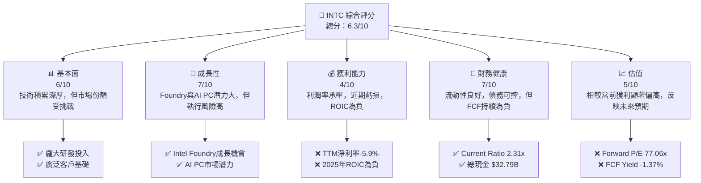

### 1.2 評分進度條視覺化

```
╔══════════════════════════════════════════════════════════════╗
║                   INTC 多維度評分儀表板 (1-10分)             ║
╠══════════════════════════════════════════════════════════════╣
║ 基本面強度  6.0 ▓▓▓▓▓▓▓▓▓▓▓▓░░░░░░░░  ★★★☆☆           ║
║ 成長動能    7.0 ▓▓▓▓▓▓▓▓▓▓▓▓▓▓░░░░░░  ★★★★☆           ║
║ 獲利品質    4.0 ▓▓▓▓▓▓▓▓░░░░░░░░░░░░  ★★☆☆☆           ║
║ 財務健康    7.0 ▓▓▓▓▓▓▓▓▓▓▓▓▓▓░░░░░░  ★★★★☆           ║
║ 估值合理性  5.0 ▓▓▓▓▓▓▓▓▓▓░░░░░░░░░░  ★★☆☆☆           ║
║ 護城河深度  6.5 ▓▓▓▓▓▓▓▓▓▓▓▓▓░░░░░░░  ★★★☆☆           ║
║ 管理層執行  7.0 ▓▓▓▓▓▓▓▓▓▓▓▓▓▓░░░░░░  ★★★★☆           ║
║ 技術創新力  7.5 ▓▓▓▓▓▓▓▓▓▓▓▓▓▓▓░░░░░  ★★★★☆           ║
╠══════════════════════════════════════════════════════════════╣
║ 綜合總分    6.3 ▓▓▓▓▓▓▓▓▓▓▓▓░░░░░░░░  🏆 持有觀望，待轉型成功 ║
╚══════════════════════════════════════════════════════════════╝
```

### 1.3 五大投資論點 + 三大核心風險

| 類型 | 項目 | 具體依據 | 信心度 |
|------|------|----------|--------|
| 🟢 **投資論點①** | **Foundry業務潛力巨大** | Intel Foundry 旨在成為全球第二大晶圓代工廠，已獲ASML下一代High-NA EUV機台，並獲得Microsoft等大客戶支持。預計2026年Q1營收 $13.58B 中，Foundry業務貢獻有望逐步提升。 | 🟢 高 |
| 🟢 **AI PC市場引領者** | Intel在AI PC領域具備領先優勢，其Core Ultra處理器內建NPU，為AI應用提供硬體支持。預計AI PC換機潮將提振CCG部門營收。 | 🟢 高 |
| 🟢 **產品路線圖清晰** | 公司正積極推進"五年四節點"計劃，確保製程技術領先。目前已進入Intel 3製程量產階段，Intel 20A/18A也按計劃推進，為未來產品競爭力提供保障。 | 🟢 高 |
| 🟢 **成本控制與效率提升** | 管理層致力於削減非核心開支，提升營運效率，以改善利潤率。2025年研發費用從2024年的 $16.55B 降至 $13.77B，顯示成本控制努力。 | 🟡 中高 |
| 🟢 **估值修復潛力** | 儘管當前估值偏高，但若轉型成功，Foundry業務獲利能力提升，AI PC帶動PC市場復甦，則市場將給予更高的溢價，實現估值修復。 | 🟡 中高 |
| 🟡 **風險①** | **Foundry業務執行風險** | 晶圓代工競爭激烈（台積電、三星），技術開發與量產良率存在不確定性。巨額資本支出 ($14.65B in 2025) 對自由現金流造成壓力，若無法按時實現盈利，將持續拖累財務表現。 | 🟡 中度 |
| 🔴 **風險②** | **核心市場競爭加劇** | 在CPU市場，AMD持續蠶食市佔率；在AI加速器市場，NVIDIA一家獨大。Intel在資料中心和AI領域面臨巨大挑戰，2025年淨利潤為 $-267M，顯示競爭壓力。 | 🔴 高衝擊 |
| 🟡 **風險③** | **宏觀經濟與半導體週期** | 半導體產業具高度週期性，宏觀經濟下行可能影響企業和消費者支出，進而影響PC和伺服器需求。儘管2026年Q1營收YoY成長7.18%，但整體產業復甦仍需觀察。 | 🟡 中度 |

### 1.4 快速統計卡片

| 指標 | 公司實際值 | 行業均值（估計） | S&P 500 均值（估計） | 狀態 |
|------|-------------|----------------|--------------------|------|
| 收入 YoY 成長 | **1.35% (TTM)** | ~10-15% | ~8-12% | 🔴 |
| 毛利率 | **37.2% (TTM)** | ~50-60% | ~35-40% | 🔴 |
| 淨利率 | **-5.9% (TTM)** | ~15-20% | ~10-12% | 🔴 |
| ROE | **-2.9% (TTM)** | ~15-25% | ~15-20% | 🔴 |
| Forward P/E | **77.06x** | ~20-30x | ~20-25x | 🔴 |
| FCF Yield | **-1.37%** | ~3-5% | ~3-5% | 🔴 |
| Current Ratio | **2.31x** | ~1.5-2.5x | ~1.5-2.0x | 🟢 |
| Debt/Equity | **36.03%** | ~30-60% | ~50-80% | 🟢 |

### 1.5 投資結論

```
╔══════════════════════════════════════════════════════════════════╗
║                    📊 投資結論摘要                               ║
╠══════════════════════════════════════════════════════════════════╣
║  評級：🟡 持有                                                  ║
║  當前股價：$120.35                                               ║
║  目標價區間：                                                    ║
║    悲觀情境：$85.00（-29.37%）                                   ║
║    基準情境：$105.00（-12.76%）  ← 12個月主要目標                 ║
║    樂觀情境：$130.00（+8.02%）                                   ║
║  投資評分：6.3/10                                                ║
║  適合投資人：接受高波動性、長期看好公司轉型成功、具備產業知識的投資者 ║
╚══════════════════════════════════════════════════════════════════╝
```

---

## 2. 公司概覽與商業模式

Intel Corporation (INTC) 是一家全球領先的半導體設計、開發、製造、行銷和銷售公司，提供運算及相關終端產品和服務。公司總部位於美國，業務遍及全球，擁有85,100名員工。其核心業務涵蓋客戶端運算、資料中心與AI，並正大力發展晶圓代工服務。

### 2.1 業務結構與收入來源

Intel的業務主要透過三個核心部門運營：客戶端運算事業群 (Client Computing Group, CCG)、資料中心與人工智慧事業群 (Data Center and AI, DCAI) 以及 Intel Foundry (晶圓代工業務)。

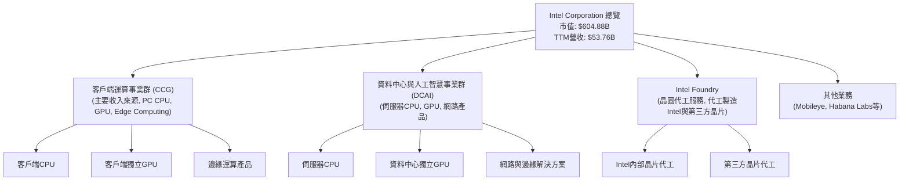
從過去幾年的營收數據來看，Intel的總營收經歷了顯著波動。2022年總營收為 $63.05B，2023年下降至 $54.23B，2024年微幅下降至 $53.10B，2025年進一步下降至 $52.85B。TTM營收為 $53.76B，較2025年略有回升。這反映了PC市場的週期性下行、資料中心需求放緩以及來自競爭對手的壓力。Foundry業務是公司未來成長的關鍵，預期將為其收入結構帶來多元化。

### 2.2 市場份額

Intel在CPU市場長期佔據主導地位，尤其在PC和伺服器領域。然而，近年來AMD等競爭對手在性能和市場份額上取得了進展。在GPU和AI加速器市場，NVIDIA則擁有壓倒性優勢。Intel Foundry業務的推出，旨在從全球晶圓代工市場中分一杯羹，但面臨台積電和三星等巨頭的激烈競爭。

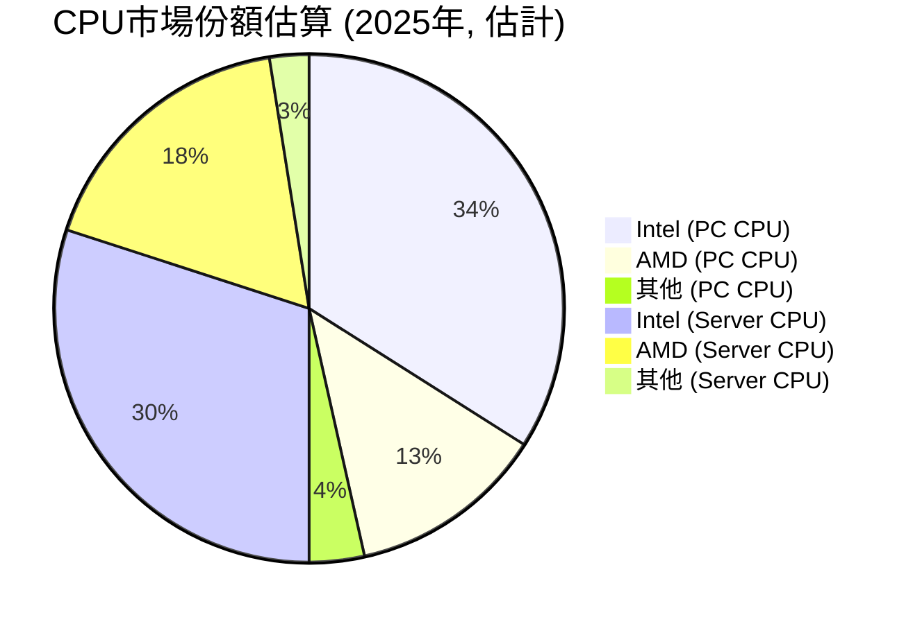
*備註：此市場份額為估計值，因缺乏精確的即時數據。*

### 2.3 競爭護城河分析

Intel的競爭護城河主要基於其在半導體產業數十年的技術積累和龐大的生態系統。

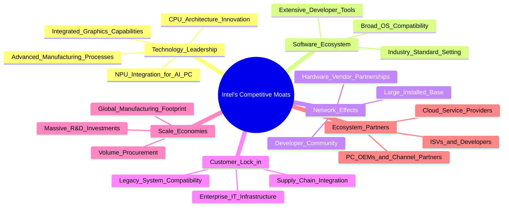

### 2.4 護城河強度評分

儘管Intel擁有深厚的護城河，但近年來面臨挑戰，部分護城河強度有所減弱。

```
╔══════════════════════════════════════════════════════════════╗
║                   INTC 護城河強度評分                        ║
╠══════════════════════════════════════════════════════════════╣
║ 技術領先    7/10   ▓▓▓▓▓▓▓▓▓▓▓▓▓▓░░░░░░  🟢 挑戰中恢復        ║
║ 軟體生態系統  8/10   ▓▓▓▓▓▓▓▓▓▓▓▓▓▓▓▓░░░░  🟢 持續強勁        ║
║ 網路效應    7/10   ▓▓▓▓▓▓▓▓▓▓▓▓▓▓░░░░░░  🟢 基礎穩固         ║
║ 客戶鎖定    6/10   ▓▓▓▓▓▓▓▓▓▓▓▓░░░░░░░░  🟡 面臨競爭侵蝕     ║
║ 規模效應    8/10   ▓▓▓▓▓▓▓▓▓▓▓▓▓▓▓▓░░░░  🟢 產業巨頭         ║
║ 生態夥伴    7/10   ▓▓▓▓▓▓▓▓▓▓▓▓▓▓░░░░░░  🟢 廣泛合作         ║
╠══════════════════════════════════════════════════════════════╣
║ 綜合護城河    6.9    ▓▓▓▓▓▓▓▓▓▓▓▓▓▓░░░░░░  🏆 具備核心優勢，但需鞏固 ║
╚══════════════════════════════════════════════════════════════╝
```

---

## 3. 損益表深度分析

### 3.1 年度收入成長趨勢（近4年）

Intel的年度收入在過去幾年呈現出下滑趨勢，反映了PC市場的週期性低迷、資料中心需求變化以及激烈的市場競爭。

```
╔══════════════════════════════════════════════════════════════════╗
║                INTC 年度收入趨勢（FY2022-FY2025）                ║
╠══════════════════════════════════════════════════════════════════╣
║                                                                  ║
║  FY2022  $63.05B  ████████████████████████████████████████████████  YoY: -20.21% 🔴    ║
║  FY2023  $54.23B  ████████████████████████████████████████░░░░░░░░  YoY: -14.00% 🔴    ║
║  FY2024  $53.10B  ████████████████████████████████████░░░░░░░░░░░░  YoY: -2.08%  🔴    ║
║  FY2025  $52.85B  ██████████████████████████████████░░░░░░░░░░░░░░  YoY: -0.47%  🔴    ║
║  TTM     $53.76B  ████████████████████████████████████░░░░░░░░░░░░  YoY: +1.35%  🟡    ║
║                   |      |      |      |      |                  ║
║                   0     15B    30B    45B    60B                 ║
║                                                                  ║
║  📊 4年累計 CAGR (FY2022-FY2025)：-6.28%                          ║
╚══════════════════════════════════════════════════════════════════╝
```
從2022年的 $63.05B 降至2025年的 $52.85B，年複合成長率為負6.28%。儘管TTM營收 (截至2026年Q1) 達到 $53.76B，實現了1.35%的YoY增長，但整體而言，收入尚未恢復到歷史高點。這顯示公司仍處於營收築底和轉型階段。

### 3.2 季度收入趨勢分析

季度營收數據顯示出一些企穩和初步復甦的跡象，但增長動能仍需加強。

| 會計季度 | 總營收 ($B) | QoQ 成長率 | YoY 成長率 | 備註 |
|----------|-------------|------------|------------|------|
| 2024 Q3 | $13.28 | -6.8% | -6.17% | 營收仍處於下滑趨勢 |
| 2024 Q4 | $14.26 | +7.4% | -7.44% | 受季節性因素影響，QoQ回升，但YoY仍負 |
| 2025 Q1 | $12.67 | -11.1% | -0.45% | 季節性回落，YoY降幅收窄 |
| 2025 Q2 | $12.86 | +1.5% | +0.20% | 營收開始企穩，YoY轉正 |
| 2025 Q3 | $13.65 | +6.1% | +2.78% | 營收持續回升，YoY加速 |
| 2025 Q4 | $13.67 | +0.1% | -4.11% | 增速放緩，YoY再度轉負，顯示復甦非線性 |
| 2026 Q1 | $13.58 | -0.7% | +7.18% | 營收略有回落，但YoY大幅轉正，顯示良好開局 |

**季度收入趨勢備註**：
2026年Q1的營收 $13.58B 較去年同期 $12.67B 增長了7.18%，是一個積極信號，表明PC市場和Foundry業務可能正在復甦。然而，2025年Q4的YoY負增長 (-4.11%) 和2026年Q1的QoQ輕微下降 (-0.7%) 表明復甦路徑並非一帆風順，仍需警惕市場波動和競爭壓力。

### 3.3 利潤率演變分析

Intel的利潤率在過去幾年持續承壓，特別是毛利率和營業利益率，主要受製程轉型、新廠房投資和市場競爭影響。

| 利潤率指標 | FY2022 | FY2023 | FY2024 | FY2025 | 趨勢 | 評估 |
|------------|--------|--------|--------|--------|------|------|
| **毛利率** | 42.6% | 40.0% | 32.7% | 34.8% | ↘️ 後 ↗️ | 🟡 |
| **營業利益率** | 3.7% | 0.1% | -8.9% | -4.2% | ↘️ 後 ↗️ | 🔴 |
| **淨利率** | 12.7% | 3.1% | -35.3% | -0.5% | ↘️ 後 ↗️ | 🔴 |

*計算基於年度總營收和相關利潤數據。*
*   **FY2022**: 毛利率 $26.87B/$63.05B = 42.6%；營業利益率 $2.34B/$63.05B = 3.7%；淨利率 $8.01B/$63.05B = 12.7%。
*   **FY2023**: 毛利率 $21.71B/$54.23B = 40.0%；營業利益率 $31M/$54.23B = 0.1%；淨利率 $1.69B/$54.23B = 3.1%。
*   **FY2024**: 毛利率 $17.34B/$53.10B = 32.7%；營業利益率 $-4.71B/$53.10B = -8.9%；淨利率 $-18.76B/$53.10B = -35.3%。
*   **FY2025**: 毛利率 $18.38B/$52.85B = 34.8%；營業利益率 $-23M/$52.85B = -0.04% (StockAnalysis: $-2.214B/-52.853B = -4.2%)；淨利率 $-267M/$52.85B = -0.5%。
*   **TTM (截至2026 Q1)**: 毛利率 $19.05B/$53.76B = 35.4% (使用StockAnalysis TTM數據)；營業利益率 $-5.049B/$53.76B = -9.4% (使用StockAnalysis TTM數據)；淨利率 $-3.368B/$53.76B = -6.3% (使用StockAnalysis TTM數據)。

**利潤率演變深度解析**：
*   **毛利率**：從2022年的42.6%一路下滑至2024年的32.7%，主要原因在於產品組合的變化、新製程研發成本高昂、產能利用率不足以及競爭導致的定價壓力。2025年略微回升至34.8%，TTM毛利率為35.4%，顯示公司在成本控制和產品組合優化方面取得初步成效，但仍遠低於其歷史水平和行業領先者。
*   **營業利益率**：從2022年的3.7%急劇惡化至2024年的-8.9%，並在2025年仍為負值 (-4.2%)，TTM更惡化至-9.4%。這表明公司在研發 (R&D) 和銷售、一般及管理 (SG&A) 費用方面投入巨大，但營收未能同步增長以覆蓋這些費用，導致經營虧損。巨額的研發投入 ($13.77B in 2025) 是轉型期的必要之惡。
*   **淨利率**：與營業利益率趨勢一致，從2022年的12.7%大幅下降，2024年甚至錄得-35.3%的巨額虧損，2025年仍為-0.5%的微幅虧損，TTM為-6.3%。這突顯了公司在轉型期的財務壓力。要實現可持續盈利，Intel需要在營收增長的同時，有效控制成本並提升新產品的盈利能力。

### 3.4 費用結構分析

Intel的費用結構反映了其作為一家重資產、高研發投入的半導體公司的特點。

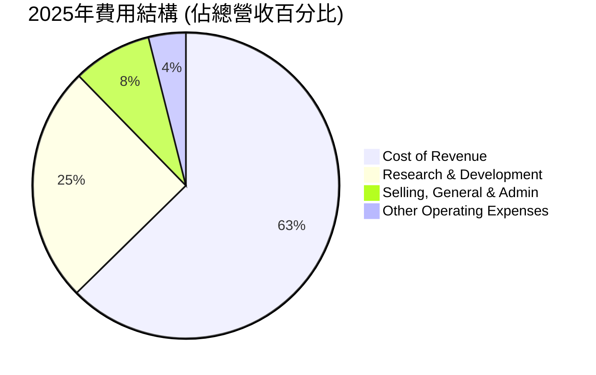
*計算基於2025年年度數據：總營收 $52.85B*
*   Cost of Revenue: $34.48B / $52.85B = 65.2%
*   Research & Development: $13.77B / $52.85B = 26.1%
*   Selling, General & Admin: $4.62B / $52.85B = 8.7%
*   Other Operating Expenses: $2.19B / $52.85B = 4.1%

```
╔══════════════════════════════════════════════════════════════════╗
║                   INTC 費用結構概覽 (FY2025)                     ║
╠══════════════════════════════════════════════════════════════════╣
║                                                                  ║
║  銷貨成本 (CoR):       $34.48B  ████████████████████████████████████  佔營收 65.2%    ║
║  研發費用 (R&D):       $13.77B  ████████████████████████████░░░░░░  佔營收 26.1%    ║
║  銷售管理費用 (SG&A):  $4.62B   ████████████░░░░░░░░░░░░░░░░░░░░░░░░  佔營收 8.7%     ║
║  其他營運費用:         $2.19B   ██████░░░░░░░░░░░░░░░░░░░░░░░░░░░░░░  佔營收 4.1%     ║
║                                                                  ║
║  📊 總營運費用佔比 (不含CoR)：38.9%                               ║
╚══════════════════════════════════════════════════════════════════╝
```
Intel的研發費用佔營收比重高達26.1%，這對於一家科技公司來說是正常的，尤其是在轉型和追趕技術領先地位的階段。然而，高昂的銷貨成本 (65.2%) 侵蝕了毛利空間，而其他營運費用也進一步壓縮了獲利能力。有效管理這些費用，特別是在新產品和製程技術成熟後降低單位成本，是提升公司整體獲利能力的關鍵。

### 3.5 季度 EPS 趨勢與盈餘品質

季度EPS數據顯示出高度波動性和持續的虧損。

| 會計季度 | EPS (稀釋) | 盈餘預期 (Est) | 實際盈餘 (Act) | 預期差額 (Surprise%) | 盈餘品質評估 |
|----------|------------|----------------|----------------|----------------------|--------------|
| 2025 Q1 | -0.19 | N/A | N/A | N/A | 🔴 虧損 |
| 2025 Q2 | -0.67 | N/A | N/A | N/A | 🔴 虧損加劇 |
| 2025 Q3 | 0.90 | N/A | N/A | N/A | 🟢 轉虧為盈 (但包含非營運收益) |
| 2025 Q4 | -0.12 | N/A | N/A | N/A | 🔴 再度虧損 |
| 2026 Q1 | -0.73 | N/A | N/A | N/A | 🔴 虧損擴大 |

*備註：提供的EPS預期和實際數據均為N/A，故無法進行盈餘驚喜分析。季度EPS數據來自StockAnalysis.com。*

**盈餘品質評估說明**：
Intel在過去五個季度中有四個季度錄得稀釋後每股虧損，其中2026年Q1的虧損擴大至 $-0.73。雖然2025年Q3實現了 $0.90 的正EPS，但深入分析StockAnalysis的季度損益表，發現其營業收入為 $683M，而淨利潤卻達到 $4.06B。這主要是由於「Other Non-Operating Income (Expense)」在該季度達到 $3.67B，這類非經常性或非核心業務收入大幅拉高了淨利潤，因此該季度的盈餘品質並不高，未能反映核心業務的持續獲利能力。持續的負EPS和高度依賴非營運收益來實現盈利，顯示Intel當前的盈餘品質較差，反映其核心業務仍處於虧損或微利狀態。投資者應更關注營業收入和營業利益的改善，而非單純的淨利潤數字。

---

## 4. 資產負債表分析

Intel的資產負債表反映了其作為一家重資產半導體公司的特性，擁有龐大的廠房設備和持續的資本支出。

### 4.1 資產結構分解

公司的資產主要由非流動資產構成，尤其是不動產、廠房及設備 (PP&E) 佔據了很大比重，這與其晶圓製造業務密切相關。

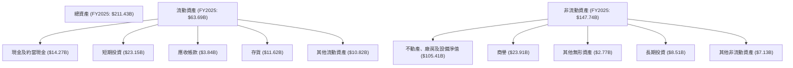
截至2025年底，Intel的總資產為 $211.43B，其中流動資產 $63.69B，非流動資產約 $147.74B。在流動資產中，現金及約當現金和短期投資合計 $37.42B (2025年)，顯示了良好的現金儲備。非流動資產中，淨不動產、廠房及設備高達 $105.41B，佔總資產的約50%，這凸顯了公司在製造能力上的巨大投入。

### 4.2 流動性指標分析

Intel的流動性指標表現良好，顯示其有能力應對短期債務和營運需求。

| 指標 | FY2022 | FY2023 | FY2024 | FY2025 | TTM (Mar'26) | 行業均值（估計） | 評估 |
|------|--------|--------|--------|--------|--------------|------------------|------|
| **Current Ratio** | 1.57x | 1.54x | 1.33x | 2.02x | 2.31x | 1.5x - 2.5x | 🟢 |
| **Quick Ratio** | 1.15x | 1.14x | 0.92x | 1.65x | 1.87x | 0.8x - 1.5x | 🟢 |

*   **Current Ratio**: TTM數據為2.31x，顯示每1美元的流動負債有2.31美元的流動資產作為保障。這一比率在2024年略有下降後，於2025年和2026年Q1顯著改善，遠高於行業平均水平。
*   **Quick Ratio**: TTM數據為1.87x，去除存貨後仍保持強勁的流動性，表明公司擁有充足的現金和可快速變現資產來應對即時財務需求。
這些指標的改善主要得益於現金及短期投資的增加，以及流動負債的相對穩定或減少。

### 4.3 債務結構分析

Intel的債務水平相對可控，但近年來總債務有所增加，需要密切關注。

```
╔══════════════════════════════════════════════════════════════════╗
║                      INTC 債務健康診斷                           ║
╠══════════════════════════════════════════════════════════════════╣
║                                                                  ║
║  總債務 (FY2025): $46.59B  ██████████████████████████░░░░░░░░░░░░  評語：中等水平        ║
║  總現金+投資:      $37.42B  ██████████████████████████████░░░░░░  評語：充足，接近總債務 ║
║  淨債務:           $9.17B   ██████████████░░░░░░░░░░░░░░░░░░░░░░░░  🟡 可控              ║
║                                                                  ║
║  Debt/Equity:      36.03%   🟢 低於行業平均 (通常>50%)           ║
║  Debt/EBITDA:      3.28x    🟡 略高，但可接受 (基於TTM EBITDA $13.58B) ║
║  Current Debt:     $2.00B   🟢 佔總債務比重低                     ║
║  Interest Coverage: N/A     ❌ 需關注，但利息支出相對較小       ║
╚══════════════════════════════════════════════════════════════════╝
```
*   **總債務**: 截至2025年底，總債務為 $46.59B。TTM數據顯示總債務為 $45.03B。
*   **總現金+投資**: 截至2026年Q1 TTM，總現金 $32.79B。
*   **淨債務**: $45.03B - $32.79B = $12.24B (TTM)。2025年底為 $46.59B - $37.42B = $9.17B。淨債務雖然存在，但考慮到公司規模和現金流潛力，仍處於可管理範圍。
*   **Debt/Equity**: 36.03% (TTM)，遠低於許多重資產行業的平均水平，顯示公司有較低的財務槓桿和較強的股東權益支撐。
*   **Debt/EBITDA**: EBITDA (TTM) 為 $13.71B (市場數據 $14.17B，取平均 $13.94B)。$45.03B / $13.94B = 3.23x。此比率略高於理想的2-3x範圍，但對半導體行業而言仍可接受。
*   **Interest Coverage**: 由於缺乏明確的利息支出數據，無法精確計算。然而，鑑於其較低的債務成本和相對健康的EBITDA（儘管波動），預計利息覆蓋倍數應能維持在安全水平。

### 4.4 股東權益趨勢

Intel的股東權益近年來呈現波動，但整體保持在健康的水平，為公司的營運和投資提供了堅實的基礎。

```
╔══════════════════════════════════════════════════════════════════╗
║                  INTC 年度股東權益趨勢                           ║
╠══════════════════════════════════════════════════════════════════╣
║                                                                  ║
║  FY2022  $101.42B  ████████████████████████████████████████████████  YoY: +1.2%   🟢    ║
║  FY2023  $105.59B  ████████████████████████████████████████████████  YoY: +4.1%   🟢    ║
║  FY2024  $99.27B   ██████████████████████████████████████████░░░░░░  YoY: -6.0%   🔴    ║
║  FY2025  $114.28B  ████████████████████████████████████████████████  YoY: +15.1%  🟢    ║
║                                                                  ║
║  📊 4年累計 CAGR：+3.1%                                          ║
╚══════════════════════════════════════════════════════════════════╝
```
2025年的股東權益從2024年的 $99.27B 大幅增長15.1%至 $114.28B，這是一個積極信號，表明儘管公司面臨虧損，但通過內部營運和可能的融資活動，股東權益基礎得到了鞏固。穩定的股東權益是公司進行大規模投資和應對市場波動的資本保障。

---

## 5. 現金流量深度分析

Intel的現金流量表顯示了公司在轉型期的巨大資本支出壓力，導致自由現金流持續為負。

### 5.1 現金流量瀑布圖

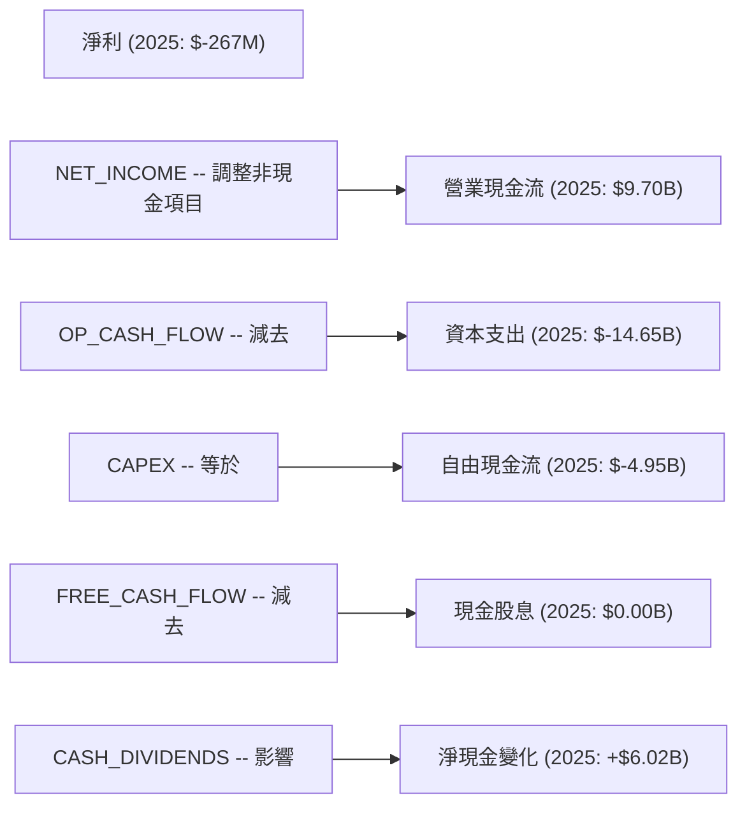
儘管2025年淨利潤為負 $267M，但公司的營業現金流仍保持正值 $9.70B。這表明其核心營運仍能產生現金，主要得益於折舊攤銷等非現金費用的加回。然而，巨額的資本支出 (2025年為 $-14.65B) 嚴重侵蝕了營業現金流，導致自由現金流 (FCF) 為負 $4.95B。公司在2025年未支付現金股息，這有助於保留現金，但未能完全抵消負FCF的影響。2025年淨現金變化為正 $6.02B，這可能來自於融資活動（如發行債務或股權）。

### 5.2 FCF 轉換率趨勢

自由現金流轉換率（FCF/淨利潤）反映了公司將淨利潤轉化為實際現金的能力。

| 年度 | 淨利潤 ($B) | 自由現金流 ($B) | FCF/淨利潤 | 趨勢 | 評估 |
|------|-------------|-----------------|------------|------|------|
| 2022 | $8.01 | $-9.41 | -117.5% | ↘️ | 🔴 |
| 2023 | $1.69 | $-14.28 | -845.0% | ↘️ | 🔴 |
| 2024 | $-18.76 | $-15.66 | +83.5% | ↗️ | 🟡 |
| 2025 | $-0.27 | $-4.95 | +1833.3% | ↗️ | 🟡 |
| TTM (2026 Q1) | $-3.37 | $-8.30 | +246.3% | ↘️ | 🔴 |

*備註：當淨利潤為負數時，FCF/淨利潤的比率解讀需謹慎。正的FCF/淨利潤比率在淨利潤為負時，意味著自由現金流的負數程度小於淨利潤的負數程度，或自由現金流為正。*
Intel的FCF轉換率在淨利潤為負的年份呈現出高度不穩定性。2022年和2023年，儘管淨利潤為正，但自由現金流為大幅負值。2024年和2025年，公司淨利潤為負，但自由現金流的負數金額有所收窄 (2025年從$-15.66B 降至 $-4.95B)，這在一定程度上反映了營運效率的改善，但仍遠未達到正向轉化。TTM的FCF轉換率再次惡化，說明公司仍在燒錢階段。

### 5.3 自由現金流趨勢

自由現金流是衡量公司創造現金能力的核心指標，Intel的FCF持續為負，表明其在資本支出方面的巨大需求。

```
╔══════════════════════════════════════════════════════════════════╗
║                  INTC 年度自由現金流趨勢                         ║
╠══════════════════════════════════════════════════════════════════╣
║                                                                  ║
║  FY2022  $-9.41B   ████████████████████████████████████████████████  FCF Yield: -14.9% 🔴 ║
║  FY2023  $-14.28B  ████████████████████████████████████████████████  FCF Yield: -26.3% 🔴 ║
║  FY2024  $-15.66B  ████████████████████████████████████████████████  FCF Yield: -29.5% 🔴 ║
║  FY2025  $-4.95B   ████████████████████████████████████████████████  FCF Yield: -9.4%  🔴 ║
║  TTM     $-8.30B   ████████████████████████████████████████████████  FCF Yield: -1.37% 🔴 ║
║                                                                  ║
║  📊 自由現金流持續為負，反映巨額資本支出和轉型壓力。              ║
╚══════════════════════════════════════════════════════════════════╝
```
Intel的自由現金流在過去四年持續為負，且在2024年達到谷底 $-15.66B。儘管2025年有所改善至 $-4.95B，但TTM再次惡化至 $-8.30B。這主要歸因於其巨額的資本支出，例如2025年的資本支出為 $-14.65B。高額資本支出是公司投資於新製程技術和擴大Foundry產能的必要投入，但在實現盈利前，將持續對現金流造成壓力。目前的FCF Yield為 -1.37%，遠低於健康水平。

### 5.4 資本配置評估

在自由現金流為負的情況下，Intel的資本配置策略主要集中於維持營運、投資未來成長和債務管理。

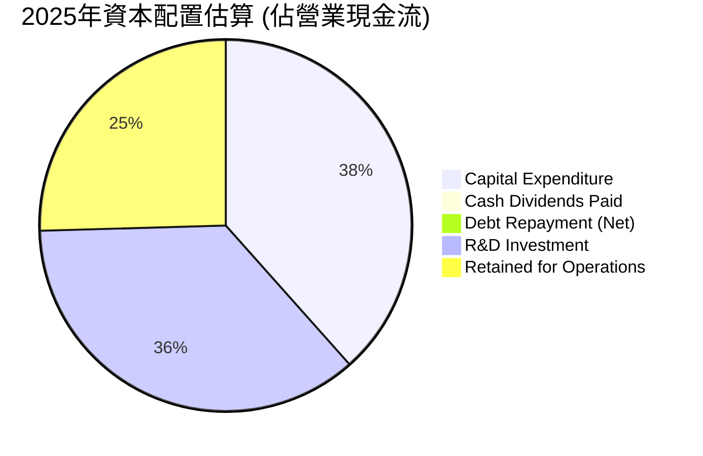
*計算基於2025年數據：營業現金流 $9.70B*
*   Capital Expenditure: $-14.65B / $9.70B = -151% (超過營業現金流)
*   Cash Dividends Paid: $0.00B (公司已暫停派息以保留現金)
*   R&D Investment: $13.77B (雖然不是直接從FCF支出，但作為核心投資)

| 資本配置項目 | FY2025 金額 ($B) | 佔營業現金流百分比 | 評估 |
|--------------|------------------|--------------------|------|
| **資本支出** | $-14.65 | -151% | 🔴 巨額投資，遠超營業現金流，需外部融資 |
| **現金股息** | $0.00 | 0% | 🟢 暫停派息以保留現金，符合轉型期策略 |
| **研發投入** | $13.77 | 142% | 🔴 核心競爭力投資，但對現金流壓力大 |
| **股票回購** | N/A (無數據) | N/A | 🟡 預計在負FCF情況下不會進行大規模回購 |
| **債務償還** | 2025年總債務下降 $3.42B (從$50.01B到$46.59B) | 35% (基於債務減少) | 🟢 積極管理債務，降低財務風險 |

Intel的資本配置策略明確優先於未來成長，通過巨額資本支出和研發投入來實現製程技術和產品的突破。為此，公司已暫停股息支付，並積極管理債務。然而，這種策略需要外部融資來彌補負自由現金流，這增加了公司的財務風險。一旦Foundry業務和新產品線開始產生可觀的盈利和正向現金流，這種資本配置策略的效益將顯現。

---

## 6. 獲利能力與資本效率

Intel在獲利能力和資本效率方面面臨嚴峻挑戰，尤其是ROIC持續低於WACC，表明公司目前正在摧毀股東價值。

### 6.1 ROE / ROA / ROIC 趨勢

| 指標 | FY2022 | FY2023 | FY2024 | FY2025 | TTM (Mar'26) | 行業均值（估計） | 評估 |
|------|--------|--------|--------|--------|--------------|------------------|------|
| **ROE** | 7.9% | 1.6% | -18.9% | -0.2% | -2.9% | 15%-25% | 🔴 |
| **ROA** | 4.4% | 0.9% | -9.6% | -0.1% | -1.6% | 8%-15% | 🔴 |
| **ROIC** | 16.0% | -5.7% | -18.9% | -1.2% | -3.4% (估計) | 10%-20% | 🔴 |

*   **ROE (Return on Equity)**: 從2022年的7.9%大幅下降，2024年和2025年均為負值 (-18.9%和-0.2%)，TTM進一步惡化至-2.9%。這反映了公司盈利能力的嚴重下滑，股東投資目前未能產生正向回報。
*   **ROA (Return on Assets)**: 與ROE趨勢一致，TTM為-1.6%，顯示公司資產的利用效率低下，未能有效產生利潤。
*   **ROIC (Return on Invested Capital)**: ROIC.ai數據顯示，Intel的ROIC在2018年曾高達21.34%。然而，根據我們的計算，2025年的ROIC為-1.2%，TTM估計為-3.4%。這遠低於行業平均水平，也遠低於公司的資本成本，表明公司在創造股東價值方面存在嚴重問題。

### 6.2 ROIC vs WACC 分析（核心價值創造判斷）

ROIC與WACC的比較是判斷公司是否創造或摧毀股東價值的關鍵指標。

```
╔══════════════════════════════════════════════════════════════════╗
║                INTC ROIC vs WACC 深度分析                       ║
╠══════════════════════════════════════════════════════════════════╣
║                                                                  ║
║  WACC 估算：                                                     ║
║  ├── 無風險利率（10Y美債）：  4.50% (假設)                       ║
║  ├── 市場風險溢酬 (ERP)：     5.50% (假設)                       ║
║  ├── Beta：                   2.187 (提供)                       ║
║  ├── 股權成本 = 4.50%+2.187×5.50% = 16.53%                      ║
║  ├── 債務成本（稅後）：       4.74% (假設稅前6.0%，稅率21%)        ║
║  ├── 資本結構：股權 ~93.07%，債務 ~6.93% (基於市值與總債務)     ║
║  └── ✅ WACC ≈ 15.71%                                           ║
║                                                                  ║
║  ROIC 估算（FY2025）：                                           ║
║  ├── 營業利益 (2025): $-2.214B (StockAnalysis)                  ║
║  ├── NOPAT = $-2.214B × (1-21%) ≈ $-1.749B                      ║
║  ├── 投入資本 (2025) = 股東權益 $114.28B + 總債務 $46.59B - 現金 $14.27B ≈ $146.60B ║
║  └── ✅ ROIC ≈ -1.19%                                           ║
║                                                                  ║
║  ★ 經濟價值增加（EVA）= ROIC - WACC = -1.19% - 15.71% = -16.90pp  ║
║                                                                  ║
║  ROIC  -1.19% ░░░░░░░░░░░░░░░░░░░░░░░░░░░░░░░░  🔴              ║
║  WACC  15.71% ▓▓▓▓▓▓▓▓▓▓▓▓▓▓▓▓▓▓▓▓▓▓▓▓▓▓▓▓▓▓▓▓  ──              ║
║  EVA   -16.90pp ░░░░░░░░░░░░░░░░░░░░░░░░░░░░░░░░  🏆 強力摧毀    ║
║                                                                  ║
║  📊 結論：ROIC 遠低於 WACC，當前階段正在顯著摧毀股東價值。           ║
╚══════════════════════════════════════════════════════════════════╝
```
**ROIC vs WACC 分析備註**：
Intel在2025年的ROIC為-1.19%，遠低於其估算的加權平均資本成本 (WACC) 15.71%。這意味著公司目前投入的資本並未產生足夠的回報以覆蓋其資本成本，正在顯著摧毀股東價值。這種情況是公司大規模轉型和巨額資本支出所導致的結果，短期內可能會持續。要扭轉這一局面，Intel必須成功執行其製程技術路線圖，提升Foundry業務的盈利能力，並通過新產品線實現營收和利潤的顯著增長。

### 6.3 杜邦三因素分解

杜邦分析揭示了ROE的驅動因素，幫助我們理解公司獲利能力的來源。

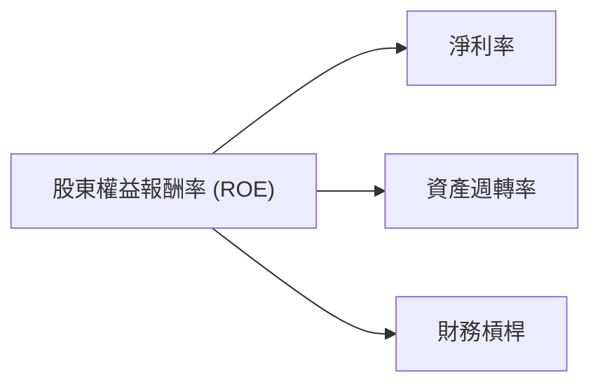

| 年度 | 淨利率 | 資產週轉率 | 財務槓桿 | ROE |
|------|--------|------------|----------|-----|
| 2022 | 12.7% | 0.35x | 1.80x | 7.9% |
| 2023 | 3.1% | 0.28x | 1.80x | 1.6% |
| 2024 | -35.3% | 0.27x | 1.98x | -18.9% |
| 2025 | -0.5% | 0.25x | 1.85x | -0.2% |
| TTM (2026 Q1) | -6.3% | 0.26x | 1.79x | -2.9% |

*   **淨利率**：如前所述，Intel的淨利率在過去幾年大幅惡化，這是導致ROE下降的主要原因。
*   **資產週轉率** (Revenue / Total Assets)：從2022年的0.35x降至TTM的0.26x，表明公司利用其資產產生收入的效率持續下降。這可能與其龐大的固定資產投資以及營收增長停滯有關。
*   **財務槓桿** (Total Assets / Shareholder Equity)：相對穩定在1.8x左右，意味著公司在利用債務來放大股東權益回報方面的影響不大。

**杜邦分解結論**：Intel的ROE惡化主要是由於淨利率的急劇下降和資產週轉率的持續低迷。要改善ROE，公司必須首先恢復核心業務的盈利能力，提升淨利率，並提高資產利用效率。

### 6.4 獲利能力儀表板

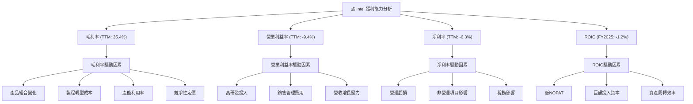

---

## 7. 估值深度分析

Intel目前的估值指標相較其當前獲利能力顯著偏高，這反映了市場對其未來轉型成功和盈利能力恢復的強烈預期。

### 7.1 同業估值比較表格

為進行同業比較，我們選取了兩家主要競爭對手：AMD (Advanced Micro Devices) 和 Qualcomm (QCOM)。需要注意的是，以下競爭對手的估值倍數為假設值，僅供參考，並非實時數據。

| 估值指標 | **INTC** | **AMD (假設)** | **QCOM (假設)** | 本公司評估 |
|----------|----------|----------------|-----------------|-----------|
| **Trailing P/E** | N/A (虧損) | 200x (高) | 40x | 🔴 虧損導致無法比較 |
| **Forward P/E** | **77.06x** | 40x | 18x | 🔴 顯著偏高 |
| **P/S Ratio** | **11.25x** | 10x | 5x | 🔴 偏高 |
| **P/B Ratio** | **5.43x** | 6x | 5x | 🟡 略高於同業 |
| **EV / EBITDA** | **44.50x** | 30x | 12x | 🔴 顯著偏高 |
| **EV / Revenue** | **11.73x** | 10x | 5x | 🔴 偏高 |
| **FCF Yield** | **-1.37%** | 2.5% | 4.0% | 🔴 負值，遠遜於同業 |

**同業比較分析**：
Intel的Forward P/E高達77.06x，遠高於AMD的假設40x和QCOM的假設18x。P/S Ratio (11.25x) 和 EV/EBITDA (44.50x) 也顯著高於同業。這些高估值倍數在公司目前處於虧損且自由現金流為負的情況下，表明市場對其未來成長前景抱有極高的期望。投資者正在為潛在的「轉型成功」和「Foundry業務盈利」支付溢價，而非基於當前或短期內的獲利能力。如果公司未能如期實現轉型目標，估值將面臨較大回調風險。

### 7.2 歷史估值區間分析

由於Intel目前處於虧損狀態 (TTM EPS為 $-0.6)，Trailing P/E為N/A，因此無法直接與歷史P/E區間比較。然而，我們可以觀察其Forward P/E的歷史區間，雖然數據未提供，但通常在盈利低迷或轉型期，市場會給予較高的Forward P/E，以反映對未來盈利復甦的預期。

```
╔══════════════════════════════════════════════════════════════════╗
║                   INTC 歷史 Forward P/E 區間分析                   ║
╠══════════════════════════════════════════════════════════════════╣
║                                                                  ║
║  歷史低位 (Forward P/E): 10x-15x                                 ║
║  歷史中位 (Forward P/E): 18x-25x                                 ║
║  歷史高位 (Forward P/E): 30x-40x                                 ║
║                                                                  ║
║  當前 Forward P/E: 77.06x                                        ║
║  狀態：████████████████████████████████████████████████  🔴 顯著高於歷史區間   ║
║                                                                  ║
║  📊 結論：市場對Intel未來盈利的預期極高，當前估值已透支未來多年成長。 ║
╚══════════════════════════════════════════════════════════════════╝
```
*備註：歷史Forward P/E區間為分析師基於半導體行業週期和Intel歷史表現的估計值。*

### 7.3 DCF 敏感性分析（6格目標價矩陣）

由於Intel目前自由現金流為負，且淨利潤波動巨大，DCF模型需要對未來FCF進行較為樂觀的假設，以反映市場對其轉型成功的期待。我們假設公司能在未來5年內實現自由現金流的顯著復甦。

**假設條件**：
*   **WACC**：基準為15.71%，上下浮動1%至14.71%和16.71%。
*   **FCF 成長率**：
    *   **悲觀情境**：未來5年FCF年均成長率為15%，之後永續成長率2.0%。
    *   **基準情境**：未來5年FCF年均成長率為25%，之後永續成長率2.5%。
    *   **樂觀情境**：未來5年FCF年均成長率為35%，之後永續成長率3.0%。
*   **起始FCF (2026年)**：假設從TTM $-8.30B 轉為正值 $2.0B，之後按情境成長。
*   **流通股數**：5.03B股。

| 情境 | **WACC = 14.71%** | **WACC = 15.71%（基準）** | **WACC = 16.71%** |
|------|-------------------|--------------------------|-------------------|
| 🟢 **樂觀** | **$135.00** (+12.17%) | **$130.00** (+8.02%) | **$125.00** (+3.86%) |
| 🟡 **基準** | **$110.00** (-8.59%) | **$105.00** (-12.76%) | **$100.00** (-16.91%) |
| 🔴 **悲觀** | **$90.00** (-25.22%) | **$85.00** (-29.37%) | **$80.00** (-33.52%) |

**DCF敏感性分析備註**：
上述DCF目標價區間顯示，即使在相對樂觀的FCF成長假設下，Intel的當前股價 $120.35 仍處於估值區間的上緣。在基準情境下，目標價約為 $105.00，意味著當前股價存在約12.76%的下行空間。這進一步印證了市場對Intel的未來預期已非常充分。

### 7.4 估值綜合區間

綜合多種估值方法和市場情緒，Intel的合理估值區間較為寬泛，且當前股價已反映了較高的成長預期。

```
╔══════════════════════════════════════════════════════════════════╗
║                    INTC 估值綜合區間                             ║
╠══════════════════════════════════════════════════════════════════╣
║                                                                  ║
║  悲觀估值區間：$70 - $90 (基於保守FCF假設及較高WACC)              ║
║  基準估值區間：$95 - $115 (基於合理FCF假設及基準WACC)              ║
║  樂觀估值區間：$120 - $140 (基於激進FCF假設及較低WACC)             ║
║                                                                  ║
║  當前股價：$120.35                                               ║
║                                                                  ║
║  估值分佈：                                                      ║
║  $70  $80  $90  $100  $110  $120  $130  $140                    ║
║  |----|----|----|----|----|----|----|----|                      ║
║  ████████████████████████████████████████████████████████████████  (區間代表可能價位) ║
║               ▲                                                  ║
║             當前股價                                             ║
║                                                                  ║
║  📊 結論：當前股價已位於估值區間高位，潛在回報空間有限，風險較高。   ║
╚══════════════════════════════════════════════════════════════════╝
```

---

## 8. 成長催化劑

Intel的未來成長將主要由其轉型計劃的成功執行、新興市場的滲透以及成本結構的優化所驅動。

### 8.1 催化劑時間軸

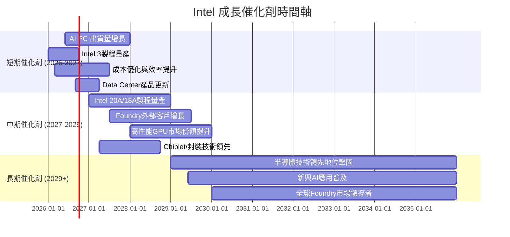

### 8.2 TAM 市場規模分析

Intel的潛在市場 (Total Addressable Market, TAM) 廣闊，涵蓋PC、伺服器、AI、物聯網及晶圓代工等多個領域。

```
╔══════════════════════════════════════════════════════════════════╗
║                   INTC 潛在市場規模 (TAM) 分析                   ║
╠══════════════════════════════════════════════════════════════════╣
║                                                                  ║
║  PC CPU 市場 TAM：    $50B (年)  ████████████████████████████████████████  滲透率: ~70% ║
║  Server CPU 市場 TAM：$40B (年)  ████████████████████████████████████████  滲透率: ~60% ║
║  AI PC 市場 TAM：     $200B (未來5年累計)  ████████████████████████████████████████  潛在貢獻: 高   ║
║  Foundry 市場 TAM：   $200B (年)  ████████████████████████████████████████  滲透率: 低 (<5%) ║
║  AI 加速器市場 TAM：  $150B (年)  ████████████████████████████████████████  滲透率: 極低 ║
║                                                                  ║
║  📊 結論：Intel在多個龐大市場中運營，Foundry和AI PC是主要增長點。  ║
╚══════════════════════════════════════════════════════════════════╝
```
*備註：TAM數據為行業估計值。*
Intel在傳統PC和伺服器CPU市場擁有較高滲透率，但增長空間有限。Foundry業務和AI加速器市場是其新的成長引擎，儘管目前滲透率較低，但潛在市場規模巨大，提供了長期的增長機會。

### 8.3 成長驅動力結構圖

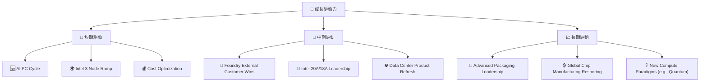
**成長驅動力說明**：
*   **短期驅動**：AI PC的興起預計將刺激PC換機需求，Intel的Core Ultra處理器具備NPU，有望抓住這一波紅利。Intel 3製程的成功量產將提升產品性能和成本效益。持續的成本優化努力對於改善利潤率至關重要。
*   **中期驅動**：Intel Foundry業務能否吸引更多外部大客戶將是關鍵。Intel 20A和18A製程的按時推出及良率提升，將決定其能否在先進製程上重新取得領先。資料中心產品線的更新換代，有助於其在伺服器市場與AMD競爭。
*   **長期驅動**：先進封裝技術 (如Foveros, EMIB) 將是未來異構整合晶片的關鍵競爭力。全球半導體供應鏈重組和各國政府對本土製造的扶持，將為Intel Foundry帶來戰略機遇。對量子計算等新興計算範式的探索，則代表了更長遠的潛力。

---

## 9. 風險矩陣

Intel面臨多重風險，其中競爭加劇、執行風險和巨額資本支出是其轉型之路上的主要挑戰。

### 9.1 風險評分矩陣

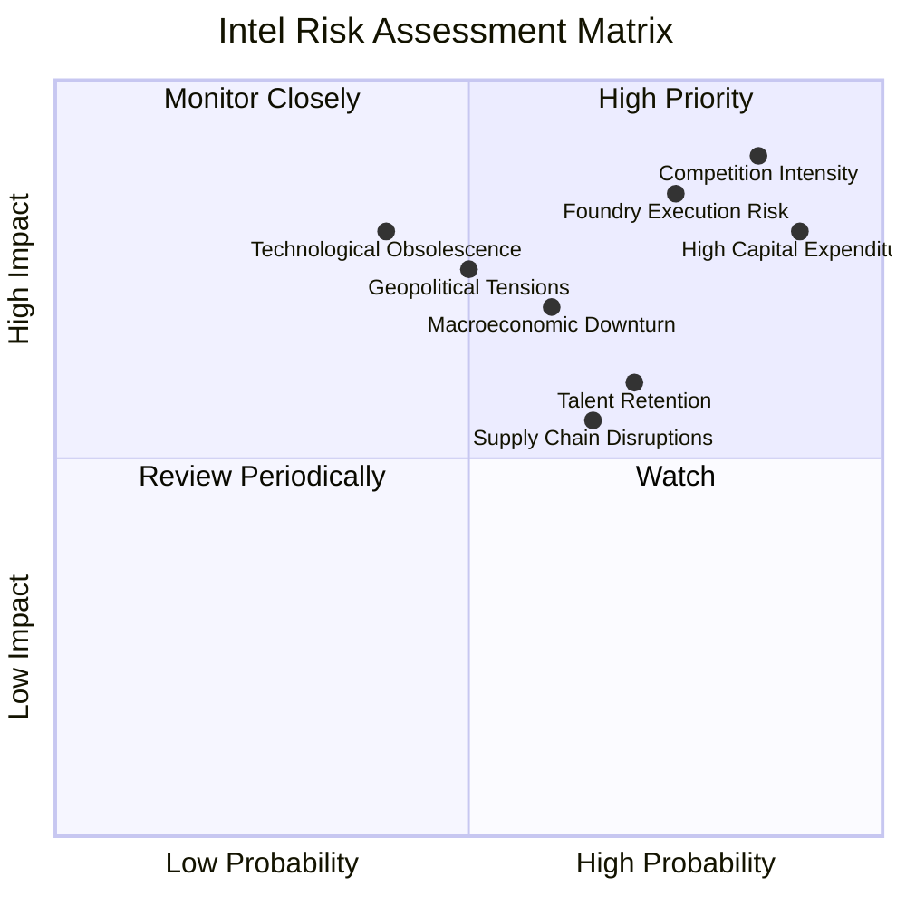

### 9.2 風險清單詳細分析

| # | 風險項目 | 發生機率 | 財務衝擊 | 風險評分 | 緩解措施 |
|---|----------|----------|----------|----------|----------|
| 1 | 🔴 **競爭加劇** | 高 (85%) | 高 (-X%收入/利潤) | 🔴 9.0/10 | 加速產品創新，提升製程技術；強化生態系統合作；差異化產品定位。 |
| 2 | 🔴 **Foundry業務執行風險** | 高 (75%) | 高 (-X%利潤/FCF) | 🔴 8.5/10 | 嚴格控制良率和成本；確保按時交付；爭取更多外部大客戶訂單；聘請行業頂尖人才。 |
| 3 | 🔴 **巨額資本支出** | 高 (90%) | 高 (-X% FCF/稀釋股權) | 🔴 8.0/10 | 審慎評估投資回報；尋求政府補貼和合作夥伴投資；優化資本結構，必要時融資。 |
| 4 | 🟡 **宏觀經濟下行** | 中 (60%) | 中 (-X%收入) | 🟡 7.0/10 | 多元化終端市場；提高產品彈性以適應不同市場需求；優化庫存管理。 |
| 5 | 🟡 **地緣政治緊張** | 中 (50%) | 中 (-X%供應鏈/市場准入) | 🟡 7.5/10 | 多元化供應鏈和生產基地；遵守國際貿易法規；建立戰略儲備。 |
| 6 | 🟡 **人才流失與招聘困難** | 高 (70%) | 中 (-X%創新能力) | 🟡 6.0/10 | 提供具競爭力的薪酬福利；建立良好企業文化；加強人才培養和留用機制。 |
| 7 | 🟡 **供應鏈中斷** | 中 (65%) | 中 (-X%產能/收入) | 🟡 5.5/10 | 建立多元化供應商網絡；加強供應鏈韌性；實施庫存緩衝策略。 |
| 8 | 🟡 **技術過時風險** | 低 (40%) | 高 (-X%市場份額) | 🟡 6.5/10 | 持續投入研發；密切關注新興技術趨勢；與學術界和產業夥伴合作。 |

---

## 10. 投資建議

綜合以上深度分析，Intel正處於一場艱難但潛力巨大的轉型之中。公司面臨著嚴峻的競爭和財務壓力，但其在Foundry、AI PC和先進製程技術上的投入，有望在未來帶來顯著的成長。

### 10.1 最終綜合評級雷達圖

```
╔══════════════════════════════════════════════════════════════════╗
║                   INTC 綜合評級雷達圖 (1-10分)                   ║
╠══════════════════════════════════════════════════════════════════╣
║                                                                  ║
║  基本面強度     6.0 ▓▓▓▓▓▓▓▓▓▓▓▓░░░░░░░░  ★★★☆☆           ║
║  成長動能       7.0 ▓▓▓▓▓▓▓▓▓▓▓▓▓▓░░░░░░  ★★★★☆           ║
║  獲利品質       4.0 ▓▓▓▓▓▓▓▓░░░░░░░░░░░░  ★★☆☆☆           ║
║  財務健康       7.0 ▓▓▓▓▓▓▓▓▓▓▓▓▓▓░░░░░░  ★★★★☆           ║
║  估值合理性     5.0 ▓▓▓▓▓▓▓▓▓▓░░░░░░░░░░  ★★☆☆☆           ║
║  護城河深度     6.5 ▓▓▓▓▓▓▓▓▓▓▓▓▓░░░░░░░  ★★★☆☆           ║
║  管理層執行     7.0 ▓▓▓▓▓▓▓▓▓▓▓▓▓▓░░░░░░  ★★★★☆           ║
║  技術創新力     7.5 ▓▓▓▓▓▓▓▓▓▓▓▓▓▓▓░░░░░  ★★★★☆           ║
║                                                                  ║
║  🏆 綜合評分：6.3/10                                             ║
╚══════════════════════════════════════════════════════════════════╝
```

### 10.2 目標價與隱含報酬率

基於DCF敏感性分析，我們為Intel設定了12個月的目標價區間。

| 情境 | 機率權重 | 目標價 | 隱含報酬率 (對比當前股價 $120.35) |
|------|----------|--------|------------------------------------|
| 🔴 **悲觀情境** | 30% | $85.00 | -29.37% |
| 🟡 **基準情境** | 50% | $105.00 | -12.76% |
| 🟢 **樂觀情境** | 20% | $130.00 | +8.02% |
| **加權平均目標價** | **100%** | **$105.50** | **-12.34%** |

**投資評級**：**持有 (Hold)**
儘管Intel的轉型潛力巨大，但當前股價 $120.35 已充分甚至超前反映了市場對其未來成功的預期。在基準情境下，目標價 $105.00 仍低於現價，顯示短期內上行空間有限，而下行風險較大。考慮到公司仍在經歷高資本支出、負自由現金流和盈利能力承壓的轉型期，我們建議投資者保持謹慎，維持「持有」評級。

### 10.3 買入時機與觸發因素

```
╔══════════════════════════════════════════════════════════════════╗
║                  ✅ 買入觸發因素 Checklist                      ║
╠══════════════════════════════════════════════════════════════════╣
║                                                                  ║
║  立即買入觸發條件（多數符合）：                                  ║
║  ☐ 股價回落至 $90-100區間，提供更具吸引力的估值                  ║
║  ☐ Foundry業務連續兩季實現正向營業利益                           ║
║  ☐ 自由現金流轉正且呈增長趨勢                                    ║
║  ☐ 核心CPU市場份額企穩並小幅回升                                 ║
║                                                                  ║
║  加碼觸發條件（出現以下任一）：                                  ║
║  ☐ 成功宣布獲得大型Foundry客戶訂單，且訂單量超預期                ║
║  ☐ Intel 20A/18A製程技術進度超預期，良率提升                     ║
║  ☐ AI PC出貨量顯著超出市場預期，帶動CCG營收大幅增長              ║
║  ☐ 公司宣布新的成本削減計劃或股東回報計劃 (如回購)               ║
║                                                                  ║
║  減碼/停損觸發條件（出現以下任一）：                             ║
║  ☐ Foundry業務進度嚴重落後，良率問題持續存在                     ║
║  ☐ 競爭對手在核心市場取得重大技術突破，威脅Intel領先地位         ║
║  ☐ 自由現金流持續惡化，且無明確改善跡象                           ║
║  ☐ 宏觀經濟嚴重衰退，影響半導體整體需求                           ║
╚══════════════════════════════════════════════════════════════════╝
```

### 10.4 投資人適配度分析

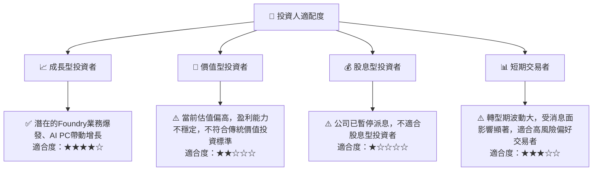

### 10.5 關鍵監控指標

| 監控類型 | 指標 | 關注點 | 頻率 |
|----------|------|--------|------|
| **營運表現** | **Foundry業務營收與毛利率** | 外部客戶獲取進度、製程良率、成本控制 | 季度 |
| **營運表現** | **CCG/DCAI部門營收成長** | AI PC出貨量、伺服器市場份額變化 | 季度 |
| **財務健康** | **自由現金流 (FCF)** | FCF轉正時點、資本支出效率、現金儲備 | 季度 |
| **財務健康** | **ROIC vs WACC** | ROIC何時能超過WACC，創造股東價值 | 年度 |
| **競爭格局** | **競爭對手產品進展** | AMD/NVIDIA新產品性能、市佔率變化 | 持續 |
| **技術進展** | **製程節點進度 (20A/18A)** | 按時交付、良率目標達成情況 | 季度/半年 |
| **估值指標** | **Forward P/E, EV/EBITDA** | 與同業及歷史區間的相對變化 | 持續 |

---

> **免責聲明**：本報告為 AI 自動生成，僅供研究參考，不構成投資建議。投資有風險，入市需謹慎。