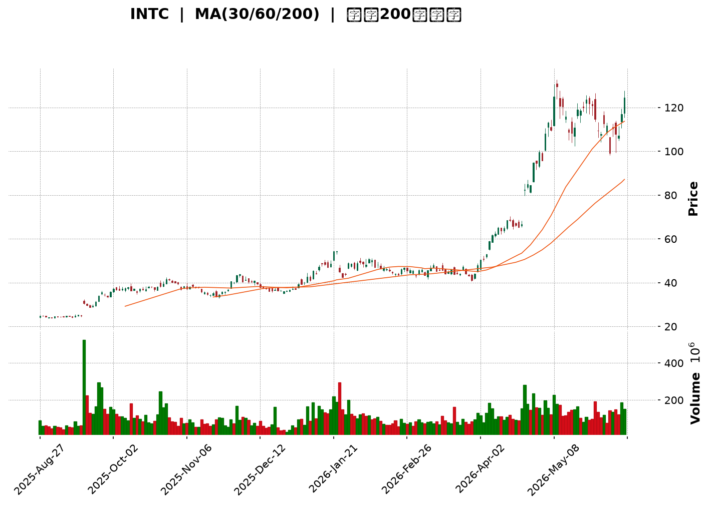
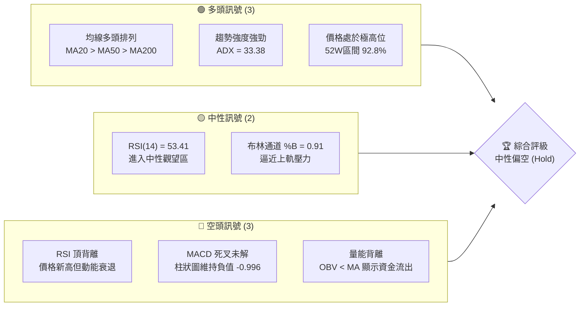
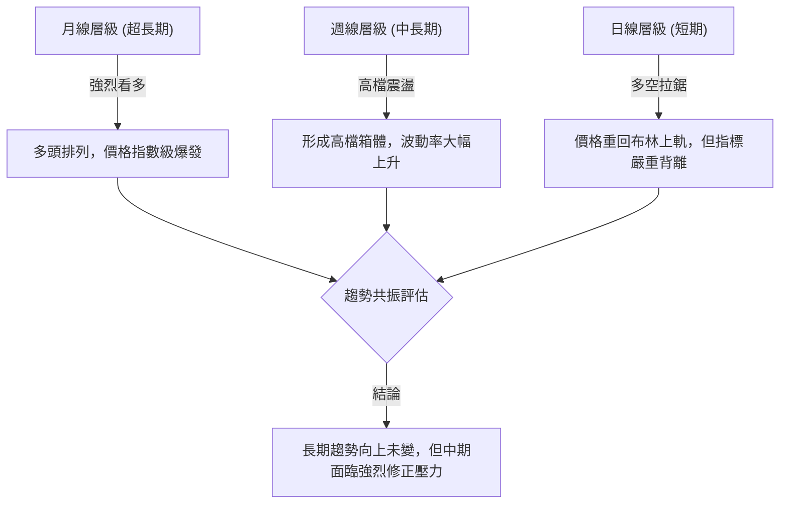
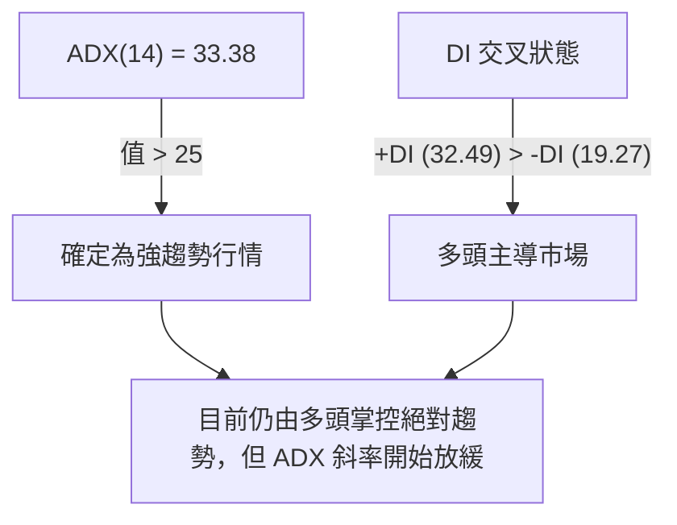
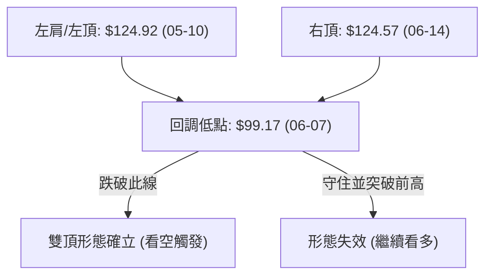
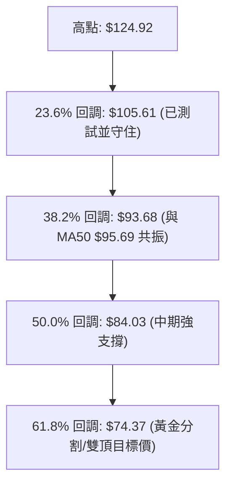
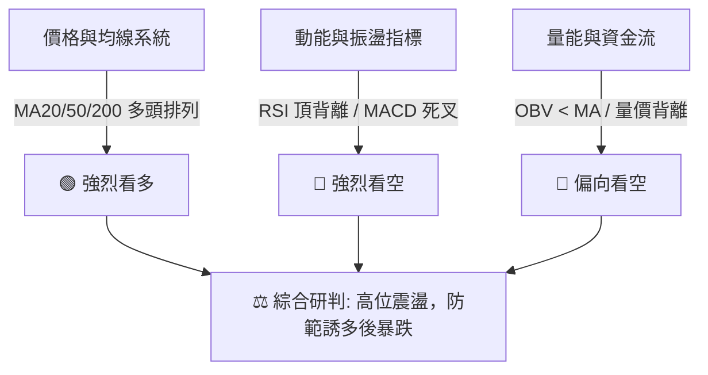
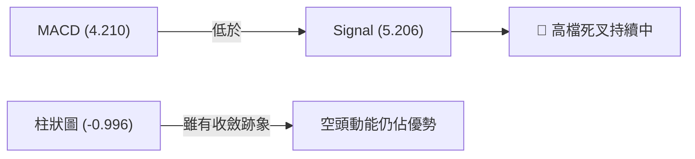
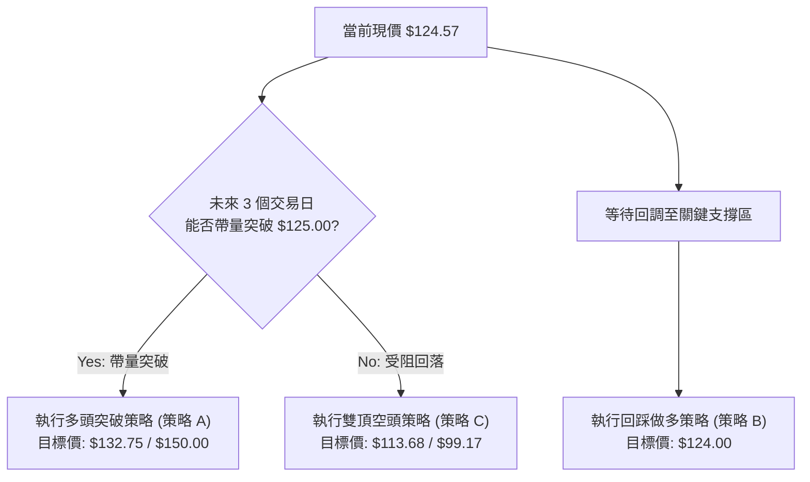
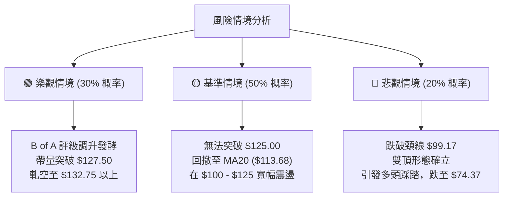

<details>
<summary>📊 靜態圖表 (點擊展開)</summary>

</details>

<html>
<head><meta charset="utf-8" /></head>
<body>
    <div style="height:500px; width:100%;">                        <script>window.PlotlyConfig = {MathJaxConfig: 'local'};</script>
        <script charset="utf-8" src="https://cdn.plot.ly/plotly-3.6.0.min.js" integrity="sha256-QaOVwtVY0T02VaHrr6pnoHLCwayMJp4O5n4YyaE3rJk=" crossorigin="anonymous"></script>                <div id="candlestick-chart" class="plotly-graph-div" style="height:100%; width:100%;"></div>            <script>                window.PLOTLYENV=window.PLOTLYENV || {};                                if (document.getElementById("candlestick-chart")) {                    Plotly.newPlot(                        "candlestick-chart",                        [{"close":{"dtype":"f8","bdata":"AAAAoJnZOEAAAACAFO44QAAAAKCZWThAAAAAgMI1OEAAAAAAAAA4QAAAAAApnDhAAAAAoHB9OEAAAABA4Xo4QAAAAOCjcDhAAAAAwB7FOEAAAAAAKZw4QAAAAOB6FDhAAAAAwB7FOEAAAADAHkU5QAAAAGBm5jhAAAAAgOuRPkAAAADgepQ9QAAAAGCPwjxAAAAAQApXPUAAAADgUTg\u002fQAAAAGC4\u002fkBAAAAAAADAQUAAAACgcD1BQAAAAGBmxkBAAAAA4FH4QUAAAABgZqZCQAAAAIA9akJAAAAAIIVLQkAAAACAwpVCQAAAAEAKt0JAAAAAYGbmQkAAAAAgXC9CQAAAAAApnEJAAAAA4KPQQUAAAABAM5NCQAAAACCFa0JAAAAAoEeBQkAAAADAzAxDQAAAACBcD0NAAAAAgMJ1QkAAAADgehRDQAAAAADXI0NAAAAAwB7FQ0AAAAAA18NEQAAAACCFq0RAAAAA4HoUREAAAABguP5DQAAAAAAAwENAAAAAANeDQkAAAADgozBDQAAAAGC4nkJAAAAA4KMQQ0AAAACgmTlDQAAAAOCj8EJAAAAAgOvxQkAAAADgevRBQAAAAGCPwkFAAAAAQOFaQUAAAACAPSpBQAAAAIAUjkFAAAAAIFzPQEAAAAAAAEBBQAAAAMAe5UFAAAAAgD3qQUAAAAAgrmdCQAAAACCuR0RAAAAAoEcBREAAAAAAKbxFQAAAAKBH4UVAAAAAAABAREAAAADgerREQAAAAGBmJkRAAAAAAABAREAAAAAA12NEQAAAAKBHwUNAAAAAIK7nQkAAAACgR8FCQAAAACCup0JAAAAAYGYGQkAAAAAA1yNCQAAAAMD1aEJAAAAAIFwvQkAAAADAzCxCQAAAAOB6FEJAAAAAoJkZQkAAAABACldCQAAAAGBmpkJAAAAAQDNzQkAAAADgo7BDQAAAACBcr0NAAAAAwB4FREAAAADgo1BFQAAAAIAUjkRAAAAAYGbGRkAAAAAgrgdGQAAAAMAepUdAAAAAAClcSEAAAADA9ShIQAAAAEDhekdAAAAAIK5HSEAAAAAAACBLQAAAAMD1KEtAAAAAwPWIRkAAAABguD5FQAAAAEAK90VAAAAAANdjSEAAAADgelRIQAAAAAApPEdAAAAAIK5nSEAAAAAAAKBIQAAAAMDMTEhAAAAAYLgeSEAAAAAghUtJQAAAAGC4HklAAAAA4KOQR0AAAADAHiVIQAAAAKBwPUdAAAAAwB5lR0AAAABAChdHQAAAAEDhukZAAAAAIFxPRkAAAACAFA5GQAAAAOCj0EVAAAAAIFwPR0AAAADgo3BHQAAAAEDhukZAAAAAgBTORkAAAAAAAMBGQAAAAMDMjEVAAAAAgD3KRkAAAACgmflGQAAAAIDCtUVAAAAAgD3KRkAAAAAA12NHQAAAAKBw\u002fUdAAAAAAACgRkAAAABgj+JGQAAAAKBH4UZAAAAAIK4HRkAAAAAA14NGQAAAAEAKF0dAAAAAIFzvRUAAAACgRwFGQAAAACCuB0ZAAAAAQAqXR0AAAADAzAxGQAAAAOCjkEVAAAAA4FGYREAAAADgoxBGQAAAAADXA0hAAAAA4KMwSUAAAAAA12NJQAAAAOB6dEpAAAAAoJl5TUAAAAAAKdxOQAAAAOCjME9AAAAAIIVLUEAAAAAgrudPQAAAAAApPFBAAAAAAAAgUUAAAAAAACBRQAAAAMDMbFBAAAAA4KOQUEAAAACgR1FQQAAAAIDrsVBAAAAAYI+iVEAAAAAgXD9VQAAAAKBHIVVAAAAAAACwV0AAAABguJ5XQAAAACCu51hAAAAAgOvxV0AAAACgmQlbQAAAAOCjQFxAAAAAIK5nW0AAAABA4TpfQAAAAIAULmBAAAAAQAonXkAAAABgjxJeQAAAACCF+1xAAAAAoEcxW0AAAABA4QpbQAAAAEAzs1tAAAAAoHC9XUAAAAAAAKBdQAAAAIDC9V1AAAAAoEfhXkAAAACgR3FeQAAAAMD1OF5AAAAAIIWrXEAAAADAHlVbQAAAACCF+1pAAAAAoHAtXEAAAACA6\u002fFbQAAAAEDhylhAAAAAoEeRW0AAAABA4fpaQAAAAGCPwlpAAAAAoHA9XUAAAADgeiRfQA=="},"high":{"dtype":"f8","bdata":"AAAAoHD9OEAAAAAA1yM5QAAAAOBR+DhAAAAAoHA9OEAAAABAChc4QAAAAADXozhAAAAAgMK1OEAAAACgcL04QAAAACBczzhAAAAAYLjeOEAAAACAFO44QAAAAKBHoThAAAAAgMJ1OUAAAABAClc5QAAAAGCPQjlAAAAA4KMwQEAAAACgR6E+QAAAAKCZGT5AAAAAQDMzPkAAAABAM7M\u002fQAAAAAAAIEFAAAAAYGYmQkAAAABgZoZBQAAAAGC4HkFAAAAAIK4HQkAAAADA9chCQAAAAIA9CkNAAAAAQApXQ0AAAABgZgZDQAAAAMAe5UJAAAAAwMwMQ0AAAABAM9NDQAAAAKBHwUJAAAAAYGZGQkAAAABguL5CQAAAAGCPAkNAAAAA4KMwQ0AAAABgj0JDQAAAAMDMLENAAAAAQAr3QkAAAABAMzNDQAAAACBcj0RAAAAAgMJVREAAAACgcD1FQAAAAMAeBUVAAAAAQAq3REAAAACAPWpEQAAAAKCZOURAAAAAAAAgQ0AAAADgUVhDQAAAACCF60NAAAAAYI8iQ0AAAAAA18NDQAAAAAApHENAAAAAoJkZQ0AAAAAgrqdCQAAAAMDMDEJAAAAAoHDdQUAAAACgR2FBQAAAAAAA4EFAAAAAQApXQkAAAACgcH1BQAAAAOB6FEJAAAAA4KMQQkAAAABguJ5CQAAAACCFS0RAAAAA4KMwREAAAABACtdFQAAAAGCPAkZAAAAAANejRUAAAACAPWpFQAAAACBcD0VAAAAAoEehREAAAABguH5EQAAAAOBRGERAAAAAANcDREAAAACgcD1DQAAAAEDh+kJAAAAAIIXrQkAAAABguL5CQAAAAIA9ykJAAAAAQDPzQkAAAABgZmZCQAAAAEAKF0JAAAAAYLg+QkAAAABgZmZCQAAAAKBHIUNAAAAAgD3KQkAAAACAFO5DQAAAAMDMDEVAAAAAIK4nREAAAADA9UhGQAAAACCFq0VAAAAAoHDdRkAAAACgmblGQAAAAGC4HkhAAAAAAACASEAAAACA6zFJQAAAAEDhGklAAAAAoHAdSUAAAADgejRLQAAAAMDMTEtAAAAA4KMQSEAAAABA4TpGQAAAAADXQ0ZAAAAAwB6lSEAAAABgj2JIQAAAAIA9ykhAAAAAIIXrSEAAAABguL5JQAAAAKCZ2UhAAAAAgBRuSUAAAABgZqZJQAAAAAApnElAAAAAwB5FSUAAAABgZsZIQAAAAKCZeUhAAAAA4FHYR0AAAACAPWpHQAAAAGCPYkdAAAAAgMKVRkAAAACA6zFGQAAAAGBmRkZAAAAAwMxMR0AAAAAAKXxHQAAAAKCZeUdAAAAAIK5HR0AAAAAgrudGQAAAAOBR2EVAAAAA4KMQR0AAAACgcD1HQAAAAEAKl0ZAAAAAoEfhRkAAAADgo\u002fBHQAAAAIA9akhAAAAA4FG4R0AAAABAM1NHQAAAAIDClUhAAAAAgD0KR0AAAABA4dpGQAAAAOBROEdAAAAAYGbGR0AAAABA4bpGQAAAACCuJ0ZAAAAAwMzsR0AAAADAzExHQAAAAOCjEEZAAAAAYLj+RUAAAACgcB1GQAAAAGCPYkhAAAAAYLg+SUAAAACA6zFKQAAAAGCPokpAAAAAgMKVTUAAAACAPQpPQAAAAIDrsU9AAAAAoJlpUEAAAAAghUtQQAAAAIDCdVBAAAAAQAonUUAAAADAHpVRQAAAAKBwTVFAAAAAQOHqUEAAAACgRzFRQAAAAIDrEVFAAAAAgBROVUAAAABgZsZVQAAAAIDCJVVAAAAAwMy8V0AAAAAAKexXQAAAAMDMHFlAAAAA4Hr0WEAAAABguJ5bQAAAAAAAYFxAAAAA4KOgXEAAAACAPVJgQAAAAAAAmGBAAAAAYI\u002fyX0AAAAAAAEBfQAAAAOB6pF1AAAAA4HqkW0AAAABgj+JcQAAAAOB6RFxAAAAAACl8XkAAAACAPdpdQAAAAIDrsV5AAAAAIK5nX0AAAACgR1FfQAAAAMAexV5AAAAAwPWoX0AAAABAM1NcQAAAAAAAQFtAAAAAYI+SXUAAAADA9UhcQAAAAGC4nlpAAAAAYI8iXEAAAAAAAIBcQAAAAAAA4FtAAAAAACncXUAAAABgZuZfQA=="},"hovertemplate":"\u003cb\u003e%{x|%Y-%m-%d}\u003c\u002fb\u003e\u003cbr\u003e\u958b: $%{open:.2f}\u003cbr\u003e\u9ad8: $%{high:.2f}\u003cbr\u003e\u4f4e: $%{low:.2f}\u003cbr\u003e\u6536: $%{close:.2f}\u003cextra\u003e\u003c\u002fextra\u003e","low":{"dtype":"f8","bdata":"AAAAwMwMOEAAAAAAKZw4QAAAACCuRzhAAAAAgBSuN0AAAADgUbg3QAAAAAAAwDdAAAAAIIUrOEAAAABguB44QAAAAMAeRThAAAAAIK5HOEAAAACA65E4QAAAAMDMDDhAAAAA4FE4OEAAAADgo7A4QAAAAEAzczhAAAAAwPUoPkAAAADgelQ9QAAAAEDhujxAAAAAgOvRPEAAAABA4To9QAAAAIDCNT9AAAAAYLg+QUAAAACgcN1AQAAAAGCPgkBAAAAAAADAQEAAAADgUbhBQAAAAKCZOUJAAAAAQAo3QkAAAADAzCxCQAAAAOB69EFAAAAAgBRuQkAAAABgZiZCQAAAAADXI0JAAAAA4FFYQUAAAACA69FBQAAAAOB6NEJAAAAAgD0KQkAAAAAgrsdCQAAAAIDC1UJAAAAAwB4FQkAAAABACjdCQAAAAIA96kJAAAAAoHAdQ0AAAADAHsVDQAAAAIDCdURAAAAAgBQOREAAAADAHuVDQAAAAGBmhkNAAAAA4KNQQkAAAACAFI5CQAAAAGBmZkJAAAAAACl8QkAAAAAAKfxCQAAAAGC4vkJAAAAAwMysQkAAAACgmblBQAAAACBcT0FAAAAAoHAdQUAAAADA9chAQAAAAAAAIEFAAAAAoHC9QEAAAACA63FAQAAAAOBRWEFAAAAAQApXQUAAAADgoxBCQAAAACCFq0JAAAAAwMzMQ0AAAABgZgZEQAAAAKBHQUVAAAAAgOsRREAAAABAM5NEQAAAAKCZ2UNAAAAAANcDREAAAACA63FDQAAAAIA9ikNAAAAAIFzPQkAAAADA9ahCQAAAAIDCdUJAAAAAACn8QUAAAACAwtVBQAAAAOBROEJAAAAAwB4lQkAAAAAA1wNCQAAAAKCZeUFAAAAAwMzsQUAAAADA9ehBQAAAAMD1aEJAAAAAIFxvQkAAAACgR+FCQAAAAGCPokNAAAAAoJl5Q0AAAAAgXA9EQAAAAEAKV0RAAAAAwPXIREAAAACA6\u002fFFQAAAAAApnEZAAAAAgMK1R0AAAACAPepHQAAAAEDhWkdAAAAAAACAR0AAAABAMxNJQAAAAIA9ikpAAAAAoJk5RkAAAAAA1yNFQAAAAMDMjEVAAAAAwPUoR0AAAABguH5HQAAAAEDh+kZAAAAAAADARkAAAABACjdIQAAAAAAAgEdAAAAAwB5lR0AAAACAPWpIQAAAACCFy0dAAAAAYI9iR0AAAACAFG5HQAAAAOBRGEdAAAAAACl8RkAAAABA4bpGQAAAAOCjcEZAAAAAgML1RUAAAADgo3BFQAAAAEAKl0VAAAAAwB7FRUAAAACAPYpGQAAAAIDrMUZAAAAAQDMzRkAAAACgmflFQAAAAIDrEUVAAAAAYI+iRUAAAACgmVlGQAAAAADXo0VAAAAAgOvRREAAAADgerRGQAAAAOB6VEdAAAAAgMKVRkAAAACA67FGQAAAAOBR2EZAAAAA4Hr0RUAAAABgZgZGQAAAAEAz00VAAAAAgOvRRUAAAABguN5FQAAAAKCZmUVAAAAAoJm5RkAAAACAwvVFQAAAAIAUbkVAAAAA4KNQREAAAADAzMxEQAAAAKBwfUZAAAAAwB4FR0AAAAAgXO9IQAAAAAApnElAAAAAYGZmS0AAAACA6zFNQAAAAAAAYE5AAAAAQAoXT0AAAAAghQtPQAAAAOCjcE9AAAAAoEcRUEAAAAAgXO9QQAAAAIAUHlBAAAAAwPVoUEAAAABguD5QQAAAAEDhWlBAAAAAIK7nU0AAAABACqdUQAAAAEAzM1RAAAAAIK53VUAAAAAAAOBWQAAAAEAKJ1dAAAAAYGbmV0AAAADAHgVZQAAAAMAepVpAAAAAoJlJW0AAAABAM\u002fNbQAAAAEDh+l5AAAAAAADAXEAAAACAPRpdQAAAAEDhSlxAAAAAoEdBWkAAAABgZvZZQAAAAKCZmVlAAAAAQDOzXEAAAABA4UpcQAAAAIDChV1AAAAAYGZWXUAAAAAAAEBdQAAAAADXE11AAAAAYI9iXEAAAADAHpVaQAAAAEDhClpAAAAAQAq3W0AAAABguN5aQAAAAMAelVhAAAAAgD2qWkAAAACgcN1YQAAAAEDhOlpAAAAA4KOgW0AAAADAHtVcQA=="},"name":"\u50f9\u683c","open":{"dtype":"f8","bdata":"AAAA4KMwOEAAAACAwvU4QAAAAGCPwjhAAAAAoEfhN0AAAABAChc4QAAAAKCZ2TdAAAAAoJmZOEAAAABA4Xo4QAAAACCuhzhAAAAAIIVrOEAAAABgj8I4QAAAAAApnDhAAAAA4HpUOEAAAACA69E4QAAAAOB6FDlAAAAAIK7HP0AAAACgR2E+QAAAACCFqz1AAAAAoHD9PEAAAACgR2E9QAAAAAApnD9AAAAAYI+CQUAAAABgj0JBQAAAAEAK90BAAAAAANfDQEAAAACgR+FBQAAAAKCZ+UJAAAAA4FGYQkAAAACA61FCQAAAAGBmRkJAAAAAANfDQkAAAABA4TpDQAAAAOBROEJAAAAAAAAAQkAAAABAMzNCQAAAAEAzk0JAAAAAgBQuQkAAAADA9chCQAAAAIDrEUNAAAAAIIXrQkAAAADAzExCQAAAAGCPAkRAAAAAgOsxQ0AAAAAghctDQAAAAMDMzERAAAAAACl8REAAAABACldEQAAAAAAAIERAAAAAgOsRQ0AAAACAwrVCQAAAACCFK0NAAAAAoEehQkAAAABACndDQAAAAEAzE0NAAAAAIK4HQ0AAAABgj6JCQAAAAADXg0FAAAAAoJm5QUAAAAAAACBBQAAAAIA9KkFAAAAAAAAAQkAAAACgR8FAQAAAAAApfEFAAAAAYGbGQUAAAACgmRlCQAAAAEAzs0JAAAAAgBTuQ0AAAAAAKTxEQAAAAIDrsUVAAAAAoEehRUAAAADgepREQAAAAOBR+ERAAAAAoHBdREAAAACAFA5EQAAAAMD1CERAAAAAAACgQ0AAAACAPSpDQAAAAIA9ykJAAAAAIIXLQkAAAADgo7BCQAAAAKBwPUJAAAAAgOvxQkAAAABguB5CQAAAAIDClUFAAAAAgMIVQkAAAACgRwFCQAAAAOB6dEJAAAAAQDOzQkAAAABgj+JCQAAAACCFy0RAAAAAgBTuQ0AAAABAChdEQAAAACBcT0VAAAAAgD3qREAAAABguB5GQAAAAIDr8UZAAAAAoJl5SEAAAADAzKxIQAAAAGCPokhAAAAAYGamR0AAAADA9ShJQAAAAEDhGktAAAAAgBRuR0AAAAAA1yNGQAAAAAAp\u002fEVAAAAAwMxMR0AAAAAgrsdHQAAAAKBwfUhAAAAA4KPQRkAAAAAgrgdJQAAAAMAexUhAAAAAIIXLR0AAAADAzIxIQAAAACCFy0hAAAAA4Ho0SUAAAACAFA5IQAAAAGBm5kdAAAAAoEfhRkAAAABACvdGQAAAAIDC9UZAAAAAoJl5RkAAAACA6\u002fFFQAAAACCFC0ZAAAAAwMwMRkAAAAAghQtHQAAAAGCPYkdAAAAAQOE6RkAAAACgmRlGQAAAAOBRuEVAAAAAwPUIRkAAAAAgXG9GQAAAAIDCVUZAAAAAYLheRUAAAADgerRGQAAAAMD1aEdAAAAAQDOzR0AAAAAAKfxGQAAAAOB69EdAAAAAgD0KR0AAAACgmRlGQAAAAGC4\u002fkVAAAAAoJl5R0AAAAAAAEBGQAAAAMAexUVAAAAAwMzsRkAAAABgZiZHQAAAACBcz0VAAAAAACncRUAAAACgmflEQAAAAAAAgEZAAAAAIK4HR0AAAADgo3BJQAAAAOB69ElAAAAAIFyvS0AAAABAMzNNQAAAAGCPwk5AAAAAQAoXT0AAAACAPUpQQAAAAGCP4k9AAAAAIIU7UEAAAABgZjZRQAAAAMDMHFFAAAAAwPXIUEAAAAAAKfxQQAAAAGBmhlBAAAAAwMyMVEAAAABA4epUQAAAAIDrUVRAAAAAwPWIVUAAAABgZuZXQAAAAMDMTFdAAAAAIIXLWEAAAADgoyBZQAAAAGC4vltAAAAAoEfBW0AAAAAA1\u002fNbQAAAAAApXGBAAAAAQAoXX0AAAABgZgZfQAAAAIA9qlxAAAAAYI9yW0AAAACAFF5cQAAAAGC4vlpAAAAAgBQOXUAAAADAHiVdQAAAAIDCFV5AAAAAYGaGXkAAAADA9RhfQAAAAMDMXF5AAAAAYGb2XkAAAAAghVtbQAAAAMDM3FpAAAAAQOEaXUAAAACgmRlbQAAAAGC4nlpAAAAAAADAW0AAAAAgXD9cQAAAAIDrgVpAAAAAoEdhXEAAAABA4VpdQA=="},"x":["2025-08-27T00:00:00-04:00","2025-08-28T00:00:00-04:00","2025-08-29T00:00:00-04:00","2025-09-02T00:00:00-04:00","2025-09-03T00:00:00-04:00","2025-09-04T00:00:00-04:00","2025-09-05T00:00:00-04:00","2025-09-08T00:00:00-04:00","2025-09-09T00:00:00-04:00","2025-09-10T00:00:00-04:00","2025-09-11T00:00:00-04:00","2025-09-12T00:00:00-04:00","2025-09-15T00:00:00-04:00","2025-09-16T00:00:00-04:00","2025-09-17T00:00:00-04:00","2025-09-18T00:00:00-04:00","2025-09-19T00:00:00-04:00","2025-09-22T00:00:00-04:00","2025-09-23T00:00:00-04:00","2025-09-24T00:00:00-04:00","2025-09-25T00:00:00-04:00","2025-09-26T00:00:00-04:00","2025-09-29T00:00:00-04:00","2025-09-30T00:00:00-04:00","2025-10-01T00:00:00-04:00","2025-10-02T00:00:00-04:00","2025-10-03T00:00:00-04:00","2025-10-06T00:00:00-04:00","2025-10-07T00:00:00-04:00","2025-10-08T00:00:00-04:00","2025-10-09T00:00:00-04:00","2025-10-10T00:00:00-04:00","2025-10-13T00:00:00-04:00","2025-10-14T00:00:00-04:00","2025-10-15T00:00:00-04:00","2025-10-16T00:00:00-04:00","2025-10-17T00:00:00-04:00","2025-10-20T00:00:00-04:00","2025-10-21T00:00:00-04:00","2025-10-22T00:00:00-04:00","2025-10-23T00:00:00-04:00","2025-10-24T00:00:00-04:00","2025-10-27T00:00:00-04:00","2025-10-28T00:00:00-04:00","2025-10-29T00:00:00-04:00","2025-10-30T00:00:00-04:00","2025-10-31T00:00:00-04:00","2025-11-03T00:00:00-05:00","2025-11-04T00:00:00-05:00","2025-11-05T00:00:00-05:00","2025-11-06T00:00:00-05:00","2025-11-07T00:00:00-05:00","2025-11-10T00:00:00-05:00","2025-11-11T00:00:00-05:00","2025-11-12T00:00:00-05:00","2025-11-13T00:00:00-05:00","2025-11-14T00:00:00-05:00","2025-11-17T00:00:00-05:00","2025-11-18T00:00:00-05:00","2025-11-19T00:00:00-05:00","2025-11-20T00:00:00-05:00","2025-11-21T00:00:00-05:00","2025-11-24T00:00:00-05:00","2025-11-25T00:00:00-05:00","2025-11-26T00:00:00-05:00","2025-11-28T00:00:00-05:00","2025-12-01T00:00:00-05:00","2025-12-02T00:00:00-05:00","2025-12-03T00:00:00-05:00","2025-12-04T00:00:00-05:00","2025-12-05T00:00:00-05:00","2025-12-08T00:00:00-05:00","2025-12-09T00:00:00-05:00","2025-12-10T00:00:00-05:00","2025-12-11T00:00:00-05:00","2025-12-12T00:00:00-05:00","2025-12-15T00:00:00-05:00","2025-12-16T00:00:00-05:00","2025-12-17T00:00:00-05:00","2025-12-18T00:00:00-05:00","2025-12-19T00:00:00-05:00","2025-12-22T00:00:00-05:00","2025-12-23T00:00:00-05:00","2025-12-24T00:00:00-05:00","2025-12-26T00:00:00-05:00","2025-12-29T00:00:00-05:00","2025-12-30T00:00:00-05:00","2025-12-31T00:00:00-05:00","2026-01-02T00:00:00-05:00","2026-01-05T00:00:00-05:00","2026-01-06T00:00:00-05:00","2026-01-07T00:00:00-05:00","2026-01-08T00:00:00-05:00","2026-01-09T00:00:00-05:00","2026-01-12T00:00:00-05:00","2026-01-13T00:00:00-05:00","2026-01-14T00:00:00-05:00","2026-01-15T00:00:00-05:00","2026-01-16T00:00:00-05:00","2026-01-20T00:00:00-05:00","2026-01-21T00:00:00-05:00","2026-01-22T00:00:00-05:00","2026-01-23T00:00:00-05:00","2026-01-26T00:00:00-05:00","2026-01-27T00:00:00-05:00","2026-01-28T00:00:00-05:00","2026-01-29T00:00:00-05:00","2026-01-30T00:00:00-05:00","2026-02-02T00:00:00-05:00","2026-02-03T00:00:00-05:00","2026-02-04T00:00:00-05:00","2026-02-05T00:00:00-05:00","2026-02-06T00:00:00-05:00","2026-02-09T00:00:00-05:00","2026-02-10T00:00:00-05:00","2026-02-11T00:00:00-05:00","2026-02-12T00:00:00-05:00","2026-02-13T00:00:00-05:00","2026-02-17T00:00:00-05:00","2026-02-18T00:00:00-05:00","2026-02-19T00:00:00-05:00","2026-02-20T00:00:00-05:00","2026-02-23T00:00:00-05:00","2026-02-24T00:00:00-05:00","2026-02-25T00:00:00-05:00","2026-02-26T00:00:00-05:00","2026-02-27T00:00:00-05:00","2026-03-02T00:00:00-05:00","2026-03-03T00:00:00-05:00","2026-03-04T00:00:00-05:00","2026-03-05T00:00:00-05:00","2026-03-06T00:00:00-05:00","2026-03-09T00:00:00-04:00","2026-03-10T00:00:00-04:00","2026-03-11T00:00:00-04:00","2026-03-12T00:00:00-04:00","2026-03-13T00:00:00-04:00","2026-03-16T00:00:00-04:00","2026-03-17T00:00:00-04:00","2026-03-18T00:00:00-04:00","2026-03-19T00:00:00-04:00","2026-03-20T00:00:00-04:00","2026-03-23T00:00:00-04:00","2026-03-24T00:00:00-04:00","2026-03-25T00:00:00-04:00","2026-03-26T00:00:00-04:00","2026-03-27T00:00:00-04:00","2026-03-30T00:00:00-04:00","2026-03-31T00:00:00-04:00","2026-04-01T00:00:00-04:00","2026-04-02T00:00:00-04:00","2026-04-06T00:00:00-04:00","2026-04-07T00:00:00-04:00","2026-04-08T00:00:00-04:00","2026-04-09T00:00:00-04:00","2026-04-10T00:00:00-04:00","2026-04-13T00:00:00-04:00","2026-04-14T00:00:00-04:00","2026-04-15T00:00:00-04:00","2026-04-16T00:00:00-04:00","2026-04-17T00:00:00-04:00","2026-04-20T00:00:00-04:00","2026-04-21T00:00:00-04:00","2026-04-22T00:00:00-04:00","2026-04-23T00:00:00-04:00","2026-04-24T00:00:00-04:00","2026-04-27T00:00:00-04:00","2026-04-28T00:00:00-04:00","2026-04-29T00:00:00-04:00","2026-04-30T00:00:00-04:00","2026-05-01T00:00:00-04:00","2026-05-04T00:00:00-04:00","2026-05-05T00:00:00-04:00","2026-05-06T00:00:00-04:00","2026-05-07T00:00:00-04:00","2026-05-08T00:00:00-04:00","2026-05-11T00:00:00-04:00","2026-05-12T00:00:00-04:00","2026-05-13T00:00:00-04:00","2026-05-14T00:00:00-04:00","2026-05-15T00:00:00-04:00","2026-05-18T00:00:00-04:00","2026-05-19T00:00:00-04:00","2026-05-20T00:00:00-04:00","2026-05-21T00:00:00-04:00","2026-05-22T00:00:00-04:00","2026-05-26T00:00:00-04:00","2026-05-27T00:00:00-04:00","2026-05-28T00:00:00-04:00","2026-05-29T00:00:00-04:00","2026-06-01T00:00:00-04:00","2026-06-02T00:00:00-04:00","2026-06-03T00:00:00-04:00","2026-06-04T00:00:00-04:00","2026-06-05T00:00:00-04:00","2026-06-08T00:00:00-04:00","2026-06-09T00:00:00-04:00","2026-06-10T00:00:00-04:00","2026-06-11T00:00:00-04:00","2026-06-12T00:00:00-04:00"],"type":"candlestick"},{"hovertemplate":"MA30: $%{y:.2f}\u003cextra\u003e\u003c\u002fextra\u003e","line":{"color":"#2196F3","dash":"dash","width":2},"mode":"lines","name":"MA30","x":["2025-08-27T00:00:00-04:00","2025-08-28T00:00:00-04:00","2025-08-29T00:00:00-04:00","2025-09-02T00:00:00-04:00","2025-09-03T00:00:00-04:00","2025-09-04T00:00:00-04:00","2025-09-05T00:00:00-04:00","2025-09-08T00:00:00-04:00","2025-09-09T00:00:00-04:00","2025-09-10T00:00:00-04:00","2025-09-11T00:00:00-04:00","2025-09-12T00:00:00-04:00","2025-09-15T00:00:00-04:00","2025-09-16T00:00:00-04:00","2025-09-17T00:00:00-04:00","2025-09-18T00:00:00-04:00","2025-09-19T00:00:00-04:00","2025-09-22T00:00:00-04:00","2025-09-23T00:00:00-04:00","2025-09-24T00:00:00-04:00","2025-09-25T00:00:00-04:00","2025-09-26T00:00:00-04:00","2025-09-29T00:00:00-04:00","2025-09-30T00:00:00-04:00","2025-10-01T00:00:00-04:00","2025-10-02T00:00:00-04:00","2025-10-03T00:00:00-04:00","2025-10-06T00:00:00-04:00","2025-10-07T00:00:00-04:00","2025-10-08T00:00:00-04:00","2025-10-09T00:00:00-04:00","2025-10-10T00:00:00-04:00","2025-10-13T00:00:00-04:00","2025-10-14T00:00:00-04:00","2025-10-15T00:00:00-04:00","2025-10-16T00:00:00-04:00","2025-10-17T00:00:00-04:00","2025-10-20T00:00:00-04:00","2025-10-21T00:00:00-04:00","2025-10-22T00:00:00-04:00","2025-10-23T00:00:00-04:00","2025-10-24T00:00:00-04:00","2025-10-27T00:00:00-04:00","2025-10-28T00:00:00-04:00","2025-10-29T00:00:00-04:00","2025-10-30T00:00:00-04:00","2025-10-31T00:00:00-04:00","2025-11-03T00:00:00-05:00","2025-11-04T00:00:00-05:00","2025-11-05T00:00:00-05:00","2025-11-06T00:00:00-05:00","2025-11-07T00:00:00-05:00","2025-11-10T00:00:00-05:00","2025-11-11T00:00:00-05:00","2025-11-12T00:00:00-05:00","2025-11-13T00:00:00-05:00","2025-11-14T00:00:00-05:00","2025-11-17T00:00:00-05:00","2025-11-18T00:00:00-05:00","2025-11-19T00:00:00-05:00","2025-11-20T00:00:00-05:00","2025-11-21T00:00:00-05:00","2025-11-24T00:00:00-05:00","2025-11-25T00:00:00-05:00","2025-11-26T00:00:00-05:00","2025-11-28T00:00:00-05:00","2025-12-01T00:00:00-05:00","2025-12-02T00:00:00-05:00","2025-12-03T00:00:00-05:00","2025-12-04T00:00:00-05:00","2025-12-05T00:00:00-05:00","2025-12-08T00:00:00-05:00","2025-12-09T00:00:00-05:00","2025-12-10T00:00:00-05:00","2025-12-11T00:00:00-05:00","2025-12-12T00:00:00-05:00","2025-12-15T00:00:00-05:00","2025-12-16T00:00:00-05:00","2025-12-17T00:00:00-05:00","2025-12-18T00:00:00-05:00","2025-12-19T00:00:00-05:00","2025-12-22T00:00:00-05:00","2025-12-23T00:00:00-05:00","2025-12-24T00:00:00-05:00","2025-12-26T00:00:00-05:00","2025-12-29T00:00:00-05:00","2025-12-30T00:00:00-05:00","2025-12-31T00:00:00-05:00","2026-01-02T00:00:00-05:00","2026-01-05T00:00:00-05:00","2026-01-06T00:00:00-05:00","2026-01-07T00:00:00-05:00","2026-01-08T00:00:00-05:00","2026-01-09T00:00:00-05:00","2026-01-12T00:00:00-05:00","2026-01-13T00:00:00-05:00","2026-01-14T00:00:00-05:00","2026-01-15T00:00:00-05:00","2026-01-16T00:00:00-05:00","2026-01-20T00:00:00-05:00","2026-01-21T00:00:00-05:00","2026-01-22T00:00:00-05:00","2026-01-23T00:00:00-05:00","2026-01-26T00:00:00-05:00","2026-01-27T00:00:00-05:00","2026-01-28T00:00:00-05:00","2026-01-29T00:00:00-05:00","2026-01-30T00:00:00-05:00","2026-02-02T00:00:00-05:00","2026-02-03T00:00:00-05:00","2026-02-04T00:00:00-05:00","2026-02-05T00:00:00-05:00","2026-02-06T00:00:00-05:00","2026-02-09T00:00:00-05:00","2026-02-10T00:00:00-05:00","2026-02-11T00:00:00-05:00","2026-02-12T00:00:00-05:00","2026-02-13T00:00:00-05:00","2026-02-17T00:00:00-05:00","2026-02-18T00:00:00-05:00","2026-02-19T00:00:00-05:00","2026-02-20T00:00:00-05:00","2026-02-23T00:00:00-05:00","2026-02-24T00:00:00-05:00","2026-02-25T00:00:00-05:00","2026-02-26T00:00:00-05:00","2026-02-27T00:00:00-05:00","2026-03-02T00:00:00-05:00","2026-03-03T00:00:00-05:00","2026-03-04T00:00:00-05:00","2026-03-05T00:00:00-05:00","2026-03-06T00:00:00-05:00","2026-03-09T00:00:00-04:00","2026-03-10T00:00:00-04:00","2026-03-11T00:00:00-04:00","2026-03-12T00:00:00-04:00","2026-03-13T00:00:00-04:00","2026-03-16T00:00:00-04:00","2026-03-17T00:00:00-04:00","2026-03-18T00:00:00-04:00","2026-03-19T00:00:00-04:00","2026-03-20T00:00:00-04:00","2026-03-23T00:00:00-04:00","2026-03-24T00:00:00-04:00","2026-03-25T00:00:00-04:00","2026-03-26T00:00:00-04:00","2026-03-27T00:00:00-04:00","2026-03-30T00:00:00-04:00","2026-03-31T00:00:00-04:00","2026-04-01T00:00:00-04:00","2026-04-02T00:00:00-04:00","2026-04-06T00:00:00-04:00","2026-04-07T00:00:00-04:00","2026-04-08T00:00:00-04:00","2026-04-09T00:00:00-04:00","2026-04-10T00:00:00-04:00","2026-04-13T00:00:00-04:00","2026-04-14T00:00:00-04:00","2026-04-15T00:00:00-04:00","2026-04-16T00:00:00-04:00","2026-04-17T00:00:00-04:00","2026-04-20T00:00:00-04:00","2026-04-21T00:00:00-04:00","2026-04-22T00:00:00-04:00","2026-04-23T00:00:00-04:00","2026-04-24T00:00:00-04:00","2026-04-27T00:00:00-04:00","2026-04-28T00:00:00-04:00","2026-04-29T00:00:00-04:00","2026-04-30T00:00:00-04:00","2026-05-01T00:00:00-04:00","2026-05-04T00:00:00-04:00","2026-05-05T00:00:00-04:00","2026-05-06T00:00:00-04:00","2026-05-07T00:00:00-04:00","2026-05-08T00:00:00-04:00","2026-05-11T00:00:00-04:00","2026-05-12T00:00:00-04:00","2026-05-13T00:00:00-04:00","2026-05-14T00:00:00-04:00","2026-05-15T00:00:00-04:00","2026-05-18T00:00:00-04:00","2026-05-19T00:00:00-04:00","2026-05-20T00:00:00-04:00","2026-05-21T00:00:00-04:00","2026-05-22T00:00:00-04:00","2026-05-26T00:00:00-04:00","2026-05-27T00:00:00-04:00","2026-05-28T00:00:00-04:00","2026-05-29T00:00:00-04:00","2026-06-01T00:00:00-04:00","2026-06-02T00:00:00-04:00","2026-06-03T00:00:00-04:00","2026-06-04T00:00:00-04:00","2026-06-05T00:00:00-04:00","2026-06-08T00:00:00-04:00","2026-06-09T00:00:00-04:00","2026-06-10T00:00:00-04:00","2026-06-11T00:00:00-04:00","2026-06-12T00:00:00-04:00"],"y":{"dtype":"f8","bdata":"AAAAAAAA+H8AAAAAAAD4fwAAAAAAAPh\u002fAAAAAAAA+H8AAAAAAAD4fwAAAAAAAPh\u002fAAAAAAAA+H8AAAAAAAD4fwAAAAAAAPh\u002fAAAAAAAA+H8AAAAAAAD4fwAAAAAAAPh\u002fAAAAAAAA+H8AAAAAAAD4fwAAAAAAAPh\u002fAAAAAAAA+H8AAAAAAAD4fwAAAAAAAPh\u002fAAAAAAAA+H8AAAAAAAD4fwAAAAAAAPh\u002fAAAAAAAA+H8AAAAAAAD4fwAAAAAAAPh\u002fAAAAAAAA+H8AAAAAAAD4fwAAAAAAAPh\u002fAAAAAAAA+H8AAAAAAAD4f0RERJTROz1AiYiISFOqPUB3d3dX8gs+QJqZmUnFeT5AmpmZqTjbPkB3d3dHb0s\u002fQO\u002fu7h7Msz9AzczMPFEPQECJiIjobUlAQFVVVR3Mg0BA7+7uJqO3QEBVVVVdc\u002fFAQM3MzIwJLkFAREREVA5tQUBVVVWVbrJBQKuqqnKT+EFAERERSX4hQkCJiIjI6E1CQCIiIrq7e0JAmpmZQYucQkAzMzPjF7tCQBEREcH1yEJAq6qqai7UQkB3d3e3HuVCQLy7uzuY90JAd3d3J+r\u002fQkB3d3fn+\u002flCQImIiAhl9EJAIiIikl\u002fsQkCamZmJQeBCQKuqqnpb1kJA3t3dzYXEQkBEREREi7xCQDMzM1NxtkJAd3d3x0u3QkCJiIho2LVCQERERKS3xUJAERERcYTSQkCrqqrqbelCQM3MzEx+AUNA3t3dncQQQ0C8u7t7oh5DQM3MzNxAJ0NAAAAAcFkrQ0DNzMw8JihDQDMzM2NXIENAAAAAkFAWQ0DNzMy8uwtDQM3MzKxjAkNAERERQTX+QkDe3d19P\u002fVCQM3MzLx080JAiYiIWPLrQkBVVVWV\u002fOJCQCIiIuKl20JARERE9G\u002fUQkAAAAAAuddCQLy7uztR30JAzczMTKnoQkDv7u4+Nf5CQM3MzExiEENAd3d3p8YrQ0CJiIjIdk5DQERERKQpZUNAiYiIeKKOQ0B3d3dnka1DQLy7u1tIykNAERERAXLvQ0Dv7u5+IwREQAAAAMDKEURAvLu7ay40REAAAAAg92pEQERERLTIpkRAzczMXEi6REBEREQklMFEQGZmZvZv1ERAAAAAID4DRUBmZmbm0DJFQAAAABDmWUVAMzMzY1eQRUBmZmYWrsdFQM3MzPzw+UVAIiIiMpYsRkAzMzMTWGlGQBERETFrpUZAq6qqqg3URkAiIiLilgVHQEREROTBLEdAiYiIaPRWR0AiIiLS93NHQJqZmbnzjUdA3t3dTX6hR0C8u7vbzqdHQO\u002fu7l6PskdAZmZm9v20R0B3d3cnBsFHQN7d3U03uUdAq6qqWvKrR0CamZkp6p9HQDMzMwNyj0dA7+7uDruCR0Dv7u4+UV9HQJqZmYnPMEdAiYiImPwyR0CrqqpqSkVHQImIiBiSVkdAVVVVZYJHR0Dv7u6+LTtHQLy7uzsmOEdAd3d39+EjR0CamZmZ4BFHQBEREVGNB0dAvLu7G+j0RkDe3d391NhGQImIiMh2vkZAVVVVZa2+RkC8u7vLzKxGQERERLSBnkZAIiIiAp2GRkDNzMzc3X1GQM3MzPzUiEZAIiIicmihRkDNzMzc3b1GQImIiBh25UZAERER4TMcR0De3d0dhVtHQFVVVUW2o0dA3t3d7TX3R0BVVVVVVUVIQBEREXGEokhAERERMU8ESUDe3d3NhWRJQBEREYGVw0lARERElNEbSkBmZmaWtWpKQDMzMzPsukpAMzMz0wZaS0BVVVWFXQFMQGZmZsa9pkxAVVVVxQR\u002fTUDNzMxcAVJOQImIiBgENk9ARERE1L8JUECrqqrSlJJQQHd3d7esJVFAiYiISOGqUUB3d3fHS1dSQERERIxsD1NAVVVVddq4U0ARERH5U1tUQFVVVW0u7FRAZmZmJr9oVUDe3d29LeNVQO\u002fu7matXlZAzczM3LLeVkAAAABQ1FdXQJqZmSFp0ldAREREjN5OWEDv7u5uhMpYQHd3d5fgQVlAd3d3B2WkWUB3d3enf\u002ftZQN7d3d2WVVpAIiIiwq64WkC8u7tr5xtbQN7d3a0AYVtARERE9CicW0CrqqrKE81bQHd3d7ce\u002fVtAZmZmVoAsXEDNzMx8sWxcQA=="},"type":"scatter"},{"hovertemplate":"MA60: $%{y:.2f}\u003cextra\u003e\u003c\u002fextra\u003e","line":{"color":"#9C27B0","dash":"dash","width":2},"mode":"lines","name":"MA60","x":["2025-08-27T00:00:00-04:00","2025-08-28T00:00:00-04:00","2025-08-29T00:00:00-04:00","2025-09-02T00:00:00-04:00","2025-09-03T00:00:00-04:00","2025-09-04T00:00:00-04:00","2025-09-05T00:00:00-04:00","2025-09-08T00:00:00-04:00","2025-09-09T00:00:00-04:00","2025-09-10T00:00:00-04:00","2025-09-11T00:00:00-04:00","2025-09-12T00:00:00-04:00","2025-09-15T00:00:00-04:00","2025-09-16T00:00:00-04:00","2025-09-17T00:00:00-04:00","2025-09-18T00:00:00-04:00","2025-09-19T00:00:00-04:00","2025-09-22T00:00:00-04:00","2025-09-23T00:00:00-04:00","2025-09-24T00:00:00-04:00","2025-09-25T00:00:00-04:00","2025-09-26T00:00:00-04:00","2025-09-29T00:00:00-04:00","2025-09-30T00:00:00-04:00","2025-10-01T00:00:00-04:00","2025-10-02T00:00:00-04:00","2025-10-03T00:00:00-04:00","2025-10-06T00:00:00-04:00","2025-10-07T00:00:00-04:00","2025-10-08T00:00:00-04:00","2025-10-09T00:00:00-04:00","2025-10-10T00:00:00-04:00","2025-10-13T00:00:00-04:00","2025-10-14T00:00:00-04:00","2025-10-15T00:00:00-04:00","2025-10-16T00:00:00-04:00","2025-10-17T00:00:00-04:00","2025-10-20T00:00:00-04:00","2025-10-21T00:00:00-04:00","2025-10-22T00:00:00-04:00","2025-10-23T00:00:00-04:00","2025-10-24T00:00:00-04:00","2025-10-27T00:00:00-04:00","2025-10-28T00:00:00-04:00","2025-10-29T00:00:00-04:00","2025-10-30T00:00:00-04:00","2025-10-31T00:00:00-04:00","2025-11-03T00:00:00-05:00","2025-11-04T00:00:00-05:00","2025-11-05T00:00:00-05:00","2025-11-06T00:00:00-05:00","2025-11-07T00:00:00-05:00","2025-11-10T00:00:00-05:00","2025-11-11T00:00:00-05:00","2025-11-12T00:00:00-05:00","2025-11-13T00:00:00-05:00","2025-11-14T00:00:00-05:00","2025-11-17T00:00:00-05:00","2025-11-18T00:00:00-05:00","2025-11-19T00:00:00-05:00","2025-11-20T00:00:00-05:00","2025-11-21T00:00:00-05:00","2025-11-24T00:00:00-05:00","2025-11-25T00:00:00-05:00","2025-11-26T00:00:00-05:00","2025-11-28T00:00:00-05:00","2025-12-01T00:00:00-05:00","2025-12-02T00:00:00-05:00","2025-12-03T00:00:00-05:00","2025-12-04T00:00:00-05:00","2025-12-05T00:00:00-05:00","2025-12-08T00:00:00-05:00","2025-12-09T00:00:00-05:00","2025-12-10T00:00:00-05:00","2025-12-11T00:00:00-05:00","2025-12-12T00:00:00-05:00","2025-12-15T00:00:00-05:00","2025-12-16T00:00:00-05:00","2025-12-17T00:00:00-05:00","2025-12-18T00:00:00-05:00","2025-12-19T00:00:00-05:00","2025-12-22T00:00:00-05:00","2025-12-23T00:00:00-05:00","2025-12-24T00:00:00-05:00","2025-12-26T00:00:00-05:00","2025-12-29T00:00:00-05:00","2025-12-30T00:00:00-05:00","2025-12-31T00:00:00-05:00","2026-01-02T00:00:00-05:00","2026-01-05T00:00:00-05:00","2026-01-06T00:00:00-05:00","2026-01-07T00:00:00-05:00","2026-01-08T00:00:00-05:00","2026-01-09T00:00:00-05:00","2026-01-12T00:00:00-05:00","2026-01-13T00:00:00-05:00","2026-01-14T00:00:00-05:00","2026-01-15T00:00:00-05:00","2026-01-16T00:00:00-05:00","2026-01-20T00:00:00-05:00","2026-01-21T00:00:00-05:00","2026-01-22T00:00:00-05:00","2026-01-23T00:00:00-05:00","2026-01-26T00:00:00-05:00","2026-01-27T00:00:00-05:00","2026-01-28T00:00:00-05:00","2026-01-29T00:00:00-05:00","2026-01-30T00:00:00-05:00","2026-02-02T00:00:00-05:00","2026-02-03T00:00:00-05:00","2026-02-04T00:00:00-05:00","2026-02-05T00:00:00-05:00","2026-02-06T00:00:00-05:00","2026-02-09T00:00:00-05:00","2026-02-10T00:00:00-05:00","2026-02-11T00:00:00-05:00","2026-02-12T00:00:00-05:00","2026-02-13T00:00:00-05:00","2026-02-17T00:00:00-05:00","2026-02-18T00:00:00-05:00","2026-02-19T00:00:00-05:00","2026-02-20T00:00:00-05:00","2026-02-23T00:00:00-05:00","2026-02-24T00:00:00-05:00","2026-02-25T00:00:00-05:00","2026-02-26T00:00:00-05:00","2026-02-27T00:00:00-05:00","2026-03-02T00:00:00-05:00","2026-03-03T00:00:00-05:00","2026-03-04T00:00:00-05:00","2026-03-05T00:00:00-05:00","2026-03-06T00:00:00-05:00","2026-03-09T00:00:00-04:00","2026-03-10T00:00:00-04:00","2026-03-11T00:00:00-04:00","2026-03-12T00:00:00-04:00","2026-03-13T00:00:00-04:00","2026-03-16T00:00:00-04:00","2026-03-17T00:00:00-04:00","2026-03-18T00:00:00-04:00","2026-03-19T00:00:00-04:00","2026-03-20T00:00:00-04:00","2026-03-23T00:00:00-04:00","2026-03-24T00:00:00-04:00","2026-03-25T00:00:00-04:00","2026-03-26T00:00:00-04:00","2026-03-27T00:00:00-04:00","2026-03-30T00:00:00-04:00","2026-03-31T00:00:00-04:00","2026-04-01T00:00:00-04:00","2026-04-02T00:00:00-04:00","2026-04-06T00:00:00-04:00","2026-04-07T00:00:00-04:00","2026-04-08T00:00:00-04:00","2026-04-09T00:00:00-04:00","2026-04-10T00:00:00-04:00","2026-04-13T00:00:00-04:00","2026-04-14T00:00:00-04:00","2026-04-15T00:00:00-04:00","2026-04-16T00:00:00-04:00","2026-04-17T00:00:00-04:00","2026-04-20T00:00:00-04:00","2026-04-21T00:00:00-04:00","2026-04-22T00:00:00-04:00","2026-04-23T00:00:00-04:00","2026-04-24T00:00:00-04:00","2026-04-27T00:00:00-04:00","2026-04-28T00:00:00-04:00","2026-04-29T00:00:00-04:00","2026-04-30T00:00:00-04:00","2026-05-01T00:00:00-04:00","2026-05-04T00:00:00-04:00","2026-05-05T00:00:00-04:00","2026-05-06T00:00:00-04:00","2026-05-07T00:00:00-04:00","2026-05-08T00:00:00-04:00","2026-05-11T00:00:00-04:00","2026-05-12T00:00:00-04:00","2026-05-13T00:00:00-04:00","2026-05-14T00:00:00-04:00","2026-05-15T00:00:00-04:00","2026-05-18T00:00:00-04:00","2026-05-19T00:00:00-04:00","2026-05-20T00:00:00-04:00","2026-05-21T00:00:00-04:00","2026-05-22T00:00:00-04:00","2026-05-26T00:00:00-04:00","2026-05-27T00:00:00-04:00","2026-05-28T00:00:00-04:00","2026-05-29T00:00:00-04:00","2026-06-01T00:00:00-04:00","2026-06-02T00:00:00-04:00","2026-06-03T00:00:00-04:00","2026-06-04T00:00:00-04:00","2026-06-05T00:00:00-04:00","2026-06-08T00:00:00-04:00","2026-06-09T00:00:00-04:00","2026-06-10T00:00:00-04:00","2026-06-11T00:00:00-04:00","2026-06-12T00:00:00-04:00"],"y":{"dtype":"f8","bdata":"AAAAAAAA+H8AAAAAAAD4fwAAAAAAAPh\u002fAAAAAAAA+H8AAAAAAAD4fwAAAAAAAPh\u002fAAAAAAAA+H8AAAAAAAD4fwAAAAAAAPh\u002fAAAAAAAA+H8AAAAAAAD4fwAAAAAAAPh\u002fAAAAAAAA+H8AAAAAAAD4fwAAAAAAAPh\u002fAAAAAAAA+H8AAAAAAAD4fwAAAAAAAPh\u002fAAAAAAAA+H8AAAAAAAD4fwAAAAAAAPh\u002fAAAAAAAA+H8AAAAAAAD4fwAAAAAAAPh\u002fAAAAAAAA+H8AAAAAAAD4fwAAAAAAAPh\u002fAAAAAAAA+H8AAAAAAAD4fwAAAAAAAPh\u002fAAAAAAAA+H8AAAAAAAD4fwAAAAAAAPh\u002fAAAAAAAA+H8AAAAAAAD4fwAAAAAAAPh\u002fAAAAAAAA+H8AAAAAAAD4fwAAAAAAAPh\u002fAAAAAAAA+H8AAAAAAAD4fwAAAAAAAPh\u002fAAAAAAAA+H8AAAAAAAD4fwAAAAAAAPh\u002fAAAAAAAA+H8AAAAAAAD4fwAAAAAAAPh\u002fAAAAAAAA+H8AAAAAAAD4fwAAAAAAAPh\u002fAAAAAAAA+H8AAAAAAAD4fwAAAAAAAPh\u002fAAAAAAAA+H8AAAAAAAD4fwAAAAAAAPh\u002fAAAAAAAA+H8AAAAAAAD4f2ZmZiIiukBAERERudfMQEAAAAA4QuFAQAAAAPyp+UBAIiIiDnQSQUAiIiIGyC1BQN7d3dnOT0FA7+7u1upwQUCamZnpbZlBQBERETWlwkFAZmZm4jPkQUCJiIjsCghCQM3MzDSlKkJAIiIi4jNMQkARERFpSm1CQO\u002fu7mp1jEJAiYiIbOebQkCrqqpC0qxCQHd3d7MPv0JAVVVVQWDNQkCJiIiwK9hCQO\u002fu7j413kJAmpmZYRDgQkBmZmamDeRCQO\u002fu7g6f6UJA3t3dDS3qQkC8u7tz2uhCQCIiIiLb6UJAd3d3b4TqQkBERERkO+9CQLy7u+Ne80JAq6qqOib4QkBmZmYGgQVDQLy7u3vNDUNAAAAAIPciQ0AAAADotDFDQAAAAAAASENAEREROftgQ0DNzMy0yHZDQGZmZoakiUNAzczMhHmiQ0De3d3NzMRDQImIiMgE50NAZmZm5tDyQ0CJiIgw3fRDQM3MzKxj+kNAAAAAWMcMRECamZlRRh9EQGZmZt4kLkRAIiIiUkZHREAiIiLKdl5EQM3MzNyydkRAVVVVRUSMREBERERUKqZEQJqZmYmIwERAd3d3zz7UREARERHxp+5EQAAAAJAJBkVAq6qq2s4fRUCJiIiIFjlFQDMzMwMrT0VAq6qqeqJmRUAiIiLSIntFQJqZmYHci0VAd3d3N9ChRUB3d3fHS7dFQM3MzNS\u002fwUVA3t3dLbLNRUBERETUBtJFQJqZmWGe0EVAVVVVvXTbRUB3d3cvJOVFQO\u002fu7h7M60VAq6qqeqL2RUB3d3dHbwNGQHd3dweBFUZAq6qqQmAlRkCrqqpS\u002fzZGQN7d3SUGSUZAVVVVrRxaRkAAAABYx2xGQO\u002fu7ia\u002fgEZA7+7uJr+QRkCJiIiIFqFGQM3MzPzwsUZAAAAAiF3JRkDv7u7WMdlGQERERMyh5UZAVVVVtcjuRkB3d3fX6vhGQDMzM1tkC0dAAAAAYHMhR0BERERc1jJHQLy7u7sCTEdAvLu765hoR0CrqqqiRY5HQJqZmcl2rkdAREREJJTRR0B3d3e\u002fn\u002fJHQCIiIjr7GEhAAAAAIIVDSEBmZmaG62FIQFVVVYUyekhAZmZmFmenSECJiIgAANhIQN7d3SW\u002fCElAREREnMRQSUAiIiKiRZ5JQBEREQFy70lAZmZmXnNRSkAzMzP78LFKQM3MzLTIHktAIiIi4jOES0CamZlR\u002f\u002f5LQLy7uxvohExAMzMz+zcKTUBVVVUtsq1NQGZmZmatXk5AZmZm9ij8TkB3d3fnQppPQN7d3XVMGFBAvLu7r7lcUEAiIiJWDqFQQJqZmTm06FBAq6qqZmY2UUB3d3dvy4JRQCIiIiIi0lFAmpmZwTwlUkDNzMyMl3ZSQAAAAGiRyVJAAAAAUEYTU0AzMzNH4VZTQDMzM8+wm1NAIiIixkvjU0B3d3cboShUQLy7u2M7X1RA7+7uLpakVECrqqpG4eZUQFVVVc0+KFVAiYiIXAF2VUCamZkV2cpVQA=="},"type":"scatter"},{"hovertemplate":"MA200: $%{y:.2f}\u003cextra\u003e\u003c\u002fextra\u003e","line":{"color":"#FF6F00","dash":"solid","width":2},"mode":"lines","name":"MA200","x":["2025-08-27T00:00:00-04:00","2025-08-28T00:00:00-04:00","2025-08-29T00:00:00-04:00","2025-09-02T00:00:00-04:00","2025-09-03T00:00:00-04:00","2025-09-04T00:00:00-04:00","2025-09-05T00:00:00-04:00","2025-09-08T00:00:00-04:00","2025-09-09T00:00:00-04:00","2025-09-10T00:00:00-04:00","2025-09-11T00:00:00-04:00","2025-09-12T00:00:00-04:00","2025-09-15T00:00:00-04:00","2025-09-16T00:00:00-04:00","2025-09-17T00:00:00-04:00","2025-09-18T00:00:00-04:00","2025-09-19T00:00:00-04:00","2025-09-22T00:00:00-04:00","2025-09-23T00:00:00-04:00","2025-09-24T00:00:00-04:00","2025-09-25T00:00:00-04:00","2025-09-26T00:00:00-04:00","2025-09-29T00:00:00-04:00","2025-09-30T00:00:00-04:00","2025-10-01T00:00:00-04:00","2025-10-02T00:00:00-04:00","2025-10-03T00:00:00-04:00","2025-10-06T00:00:00-04:00","2025-10-07T00:00:00-04:00","2025-10-08T00:00:00-04:00","2025-10-09T00:00:00-04:00","2025-10-10T00:00:00-04:00","2025-10-13T00:00:00-04:00","2025-10-14T00:00:00-04:00","2025-10-15T00:00:00-04:00","2025-10-16T00:00:00-04:00","2025-10-17T00:00:00-04:00","2025-10-20T00:00:00-04:00","2025-10-21T00:00:00-04:00","2025-10-22T00:00:00-04:00","2025-10-23T00:00:00-04:00","2025-10-24T00:00:00-04:00","2025-10-27T00:00:00-04:00","2025-10-28T00:00:00-04:00","2025-10-29T00:00:00-04:00","2025-10-30T00:00:00-04:00","2025-10-31T00:00:00-04:00","2025-11-03T00:00:00-05:00","2025-11-04T00:00:00-05:00","2025-11-05T00:00:00-05:00","2025-11-06T00:00:00-05:00","2025-11-07T00:00:00-05:00","2025-11-10T00:00:00-05:00","2025-11-11T00:00:00-05:00","2025-11-12T00:00:00-05:00","2025-11-13T00:00:00-05:00","2025-11-14T00:00:00-05:00","2025-11-17T00:00:00-05:00","2025-11-18T00:00:00-05:00","2025-11-19T00:00:00-05:00","2025-11-20T00:00:00-05:00","2025-11-21T00:00:00-05:00","2025-11-24T00:00:00-05:00","2025-11-25T00:00:00-05:00","2025-11-26T00:00:00-05:00","2025-11-28T00:00:00-05:00","2025-12-01T00:00:00-05:00","2025-12-02T00:00:00-05:00","2025-12-03T00:00:00-05:00","2025-12-04T00:00:00-05:00","2025-12-05T00:00:00-05:00","2025-12-08T00:00:00-05:00","2025-12-09T00:00:00-05:00","2025-12-10T00:00:00-05:00","2025-12-11T00:00:00-05:00","2025-12-12T00:00:00-05:00","2025-12-15T00:00:00-05:00","2025-12-16T00:00:00-05:00","2025-12-17T00:00:00-05:00","2025-12-18T00:00:00-05:00","2025-12-19T00:00:00-05:00","2025-12-22T00:00:00-05:00","2025-12-23T00:00:00-05:00","2025-12-24T00:00:00-05:00","2025-12-26T00:00:00-05:00","2025-12-29T00:00:00-05:00","2025-12-30T00:00:00-05:00","2025-12-31T00:00:00-05:00","2026-01-02T00:00:00-05:00","2026-01-05T00:00:00-05:00","2026-01-06T00:00:00-05:00","2026-01-07T00:00:00-05:00","2026-01-08T00:00:00-05:00","2026-01-09T00:00:00-05:00","2026-01-12T00:00:00-05:00","2026-01-13T00:00:00-05:00","2026-01-14T00:00:00-05:00","2026-01-15T00:00:00-05:00","2026-01-16T00:00:00-05:00","2026-01-20T00:00:00-05:00","2026-01-21T00:00:00-05:00","2026-01-22T00:00:00-05:00","2026-01-23T00:00:00-05:00","2026-01-26T00:00:00-05:00","2026-01-27T00:00:00-05:00","2026-01-28T00:00:00-05:00","2026-01-29T00:00:00-05:00","2026-01-30T00:00:00-05:00","2026-02-02T00:00:00-05:00","2026-02-03T00:00:00-05:00","2026-02-04T00:00:00-05:00","2026-02-05T00:00:00-05:00","2026-02-06T00:00:00-05:00","2026-02-09T00:00:00-05:00","2026-02-10T00:00:00-05:00","2026-02-11T00:00:00-05:00","2026-02-12T00:00:00-05:00","2026-02-13T00:00:00-05:00","2026-02-17T00:00:00-05:00","2026-02-18T00:00:00-05:00","2026-02-19T00:00:00-05:00","2026-02-20T00:00:00-05:00","2026-02-23T00:00:00-05:00","2026-02-24T00:00:00-05:00","2026-02-25T00:00:00-05:00","2026-02-26T00:00:00-05:00","2026-02-27T00:00:00-05:00","2026-03-02T00:00:00-05:00","2026-03-03T00:00:00-05:00","2026-03-04T00:00:00-05:00","2026-03-05T00:00:00-05:00","2026-03-06T00:00:00-05:00","2026-03-09T00:00:00-04:00","2026-03-10T00:00:00-04:00","2026-03-11T00:00:00-04:00","2026-03-12T00:00:00-04:00","2026-03-13T00:00:00-04:00","2026-03-16T00:00:00-04:00","2026-03-17T00:00:00-04:00","2026-03-18T00:00:00-04:00","2026-03-19T00:00:00-04:00","2026-03-20T00:00:00-04:00","2026-03-23T00:00:00-04:00","2026-03-24T00:00:00-04:00","2026-03-25T00:00:00-04:00","2026-03-26T00:00:00-04:00","2026-03-27T00:00:00-04:00","2026-03-30T00:00:00-04:00","2026-03-31T00:00:00-04:00","2026-04-01T00:00:00-04:00","2026-04-02T00:00:00-04:00","2026-04-06T00:00:00-04:00","2026-04-07T00:00:00-04:00","2026-04-08T00:00:00-04:00","2026-04-09T00:00:00-04:00","2026-04-10T00:00:00-04:00","2026-04-13T00:00:00-04:00","2026-04-14T00:00:00-04:00","2026-04-15T00:00:00-04:00","2026-04-16T00:00:00-04:00","2026-04-17T00:00:00-04:00","2026-04-20T00:00:00-04:00","2026-04-21T00:00:00-04:00","2026-04-22T00:00:00-04:00","2026-04-23T00:00:00-04:00","2026-04-24T00:00:00-04:00","2026-04-27T00:00:00-04:00","2026-04-28T00:00:00-04:00","2026-04-29T00:00:00-04:00","2026-04-30T00:00:00-04:00","2026-05-01T00:00:00-04:00","2026-05-04T00:00:00-04:00","2026-05-05T00:00:00-04:00","2026-05-06T00:00:00-04:00","2026-05-07T00:00:00-04:00","2026-05-08T00:00:00-04:00","2026-05-11T00:00:00-04:00","2026-05-12T00:00:00-04:00","2026-05-13T00:00:00-04:00","2026-05-14T00:00:00-04:00","2026-05-15T00:00:00-04:00","2026-05-18T00:00:00-04:00","2026-05-19T00:00:00-04:00","2026-05-20T00:00:00-04:00","2026-05-21T00:00:00-04:00","2026-05-22T00:00:00-04:00","2026-05-26T00:00:00-04:00","2026-05-27T00:00:00-04:00","2026-05-28T00:00:00-04:00","2026-05-29T00:00:00-04:00","2026-06-01T00:00:00-04:00","2026-06-02T00:00:00-04:00","2026-06-03T00:00:00-04:00","2026-06-04T00:00:00-04:00","2026-06-05T00:00:00-04:00","2026-06-08T00:00:00-04:00","2026-06-09T00:00:00-04:00","2026-06-10T00:00:00-04:00","2026-06-11T00:00:00-04:00","2026-06-12T00:00:00-04:00"],"y":{"dtype":"f8","bdata":"AAAAAAAA+H8AAAAAAAD4fwAAAAAAAPh\u002fAAAAAAAA+H8AAAAAAAD4fwAAAAAAAPh\u002fAAAAAAAA+H8AAAAAAAD4fwAAAAAAAPh\u002fAAAAAAAA+H8AAAAAAAD4fwAAAAAAAPh\u002fAAAAAAAA+H8AAAAAAAD4fwAAAAAAAPh\u002fAAAAAAAA+H8AAAAAAAD4fwAAAAAAAPh\u002fAAAAAAAA+H8AAAAAAAD4fwAAAAAAAPh\u002fAAAAAAAA+H8AAAAAAAD4fwAAAAAAAPh\u002fAAAAAAAA+H8AAAAAAAD4fwAAAAAAAPh\u002fAAAAAAAA+H8AAAAAAAD4fwAAAAAAAPh\u002fAAAAAAAA+H8AAAAAAAD4fwAAAAAAAPh\u002fAAAAAAAA+H8AAAAAAAD4fwAAAAAAAPh\u002fAAAAAAAA+H8AAAAAAAD4fwAAAAAAAPh\u002fAAAAAAAA+H8AAAAAAAD4fwAAAAAAAPh\u002fAAAAAAAA+H8AAAAAAAD4fwAAAAAAAPh\u002fAAAAAAAA+H8AAAAAAAD4fwAAAAAAAPh\u002fAAAAAAAA+H8AAAAAAAD4fwAAAAAAAPh\u002fAAAAAAAA+H8AAAAAAAD4fwAAAAAAAPh\u002fAAAAAAAA+H8AAAAAAAD4fwAAAAAAAPh\u002fAAAAAAAA+H8AAAAAAAD4fwAAAAAAAPh\u002fAAAAAAAA+H8AAAAAAAD4fwAAAAAAAPh\u002fAAAAAAAA+H8AAAAAAAD4fwAAAAAAAPh\u002fAAAAAAAA+H8AAAAAAAD4fwAAAAAAAPh\u002fAAAAAAAA+H8AAAAAAAD4fwAAAAAAAPh\u002fAAAAAAAA+H8AAAAAAAD4fwAAAAAAAPh\u002fAAAAAAAA+H8AAAAAAAD4fwAAAAAAAPh\u002fAAAAAAAA+H8AAAAAAAD4fwAAAAAAAPh\u002fAAAAAAAA+H8AAAAAAAD4fwAAAAAAAPh\u002fAAAAAAAA+H8AAAAAAAD4fwAAAAAAAPh\u002fAAAAAAAA+H8AAAAAAAD4fwAAAAAAAPh\u002fAAAAAAAA+H8AAAAAAAD4fwAAAAAAAPh\u002fAAAAAAAA+H8AAAAAAAD4fwAAAAAAAPh\u002fAAAAAAAA+H8AAAAAAAD4fwAAAAAAAPh\u002fAAAAAAAA+H8AAAAAAAD4fwAAAAAAAPh\u002fAAAAAAAA+H8AAAAAAAD4fwAAAAAAAPh\u002fAAAAAAAA+H8AAAAAAAD4fwAAAAAAAPh\u002fAAAAAAAA+H8AAAAAAAD4fwAAAAAAAPh\u002fAAAAAAAA+H8AAAAAAAD4fwAAAAAAAPh\u002fAAAAAAAA+H8AAAAAAAD4fwAAAAAAAPh\u002fAAAAAAAA+H8AAAAAAAD4fwAAAAAAAPh\u002fAAAAAAAA+H8AAAAAAAD4fwAAAAAAAPh\u002fAAAAAAAA+H8AAAAAAAD4fwAAAAAAAPh\u002fAAAAAAAA+H8AAAAAAAD4fwAAAAAAAPh\u002fAAAAAAAA+H8AAAAAAAD4fwAAAAAAAPh\u002fAAAAAAAA+H8AAAAAAAD4fwAAAAAAAPh\u002fAAAAAAAA+H8AAAAAAAD4fwAAAAAAAPh\u002fAAAAAAAA+H8AAAAAAAD4fwAAAAAAAPh\u002fAAAAAAAA+H8AAAAAAAD4fwAAAAAAAPh\u002fAAAAAAAA+H8AAAAAAAD4fwAAAAAAAPh\u002fAAAAAAAA+H8AAAAAAAD4fwAAAAAAAPh\u002fAAAAAAAA+H8AAAAAAAD4fwAAAAAAAPh\u002fAAAAAAAA+H8AAAAAAAD4fwAAAAAAAPh\u002fAAAAAAAA+H8AAAAAAAD4fwAAAAAAAPh\u002fAAAAAAAA+H8AAAAAAAD4fwAAAAAAAPh\u002fAAAAAAAA+H8AAAAAAAD4fwAAAAAAAPh\u002fAAAAAAAA+H8AAAAAAAD4fwAAAAAAAPh\u002fAAAAAAAA+H8AAAAAAAD4fwAAAAAAAPh\u002fAAAAAAAA+H8AAAAAAAD4fwAAAAAAAPh\u002fAAAAAAAA+H8AAAAAAAD4fwAAAAAAAPh\u002fAAAAAAAA+H8AAAAAAAD4fwAAAAAAAPh\u002fAAAAAAAA+H8AAAAAAAD4fwAAAAAAAPh\u002fAAAAAAAA+H8AAAAAAAD4fwAAAAAAAPh\u002fAAAAAAAA+H8AAAAAAAD4fwAAAAAAAPh\u002fAAAAAAAA+H8AAAAAAAD4fwAAAAAAAPh\u002fAAAAAAAA+H8AAAAAAAD4fwAAAAAAAPh\u002fAAAAAAAA+H8AAAAAAAD4fwAAAAAAAPh\u002fAAAAAAAA+H\u002fNzMz2dcBKQA=="},"type":"scatter"}],                        {"template":{"data":{"barpolar":[{"marker":{"line":{"color":"rgb(17,17,17)","width":0.5},"pattern":{"fillmode":"overlay","size":10,"solidity":0.2}},"type":"barpolar"}],"bar":[{"error_x":{"color":"#f2f5fa"},"error_y":{"color":"#f2f5fa"},"marker":{"line":{"color":"rgb(17,17,17)","width":0.5},"pattern":{"fillmode":"overlay","size":10,"solidity":0.2}},"type":"bar"}],"carpet":[{"aaxis":{"endlinecolor":"#A2B1C6","gridcolor":"#506784","linecolor":"#506784","minorgridcolor":"#506784","startlinecolor":"#A2B1C6"},"baxis":{"endlinecolor":"#A2B1C6","gridcolor":"#506784","linecolor":"#506784","minorgridcolor":"#506784","startlinecolor":"#A2B1C6"},"type":"carpet"}],"choropleth":[{"colorbar":{"outlinewidth":0,"ticks":""},"type":"choropleth"}],"contourcarpet":[{"colorbar":{"outlinewidth":0,"ticks":""},"type":"contourcarpet"}],"contour":[{"colorbar":{"outlinewidth":0,"ticks":""},"colorscale":[[0.0,"#0d0887"],[0.1111111111111111,"#46039f"],[0.2222222222222222,"#7201a8"],[0.3333333333333333,"#9c179e"],[0.4444444444444444,"#bd3786"],[0.5555555555555556,"#d8576b"],[0.6666666666666666,"#ed7953"],[0.7777777777777778,"#fb9f3a"],[0.8888888888888888,"#fdca26"],[1.0,"#f0f921"]],"type":"contour"}],"heatmap":[{"colorbar":{"outlinewidth":0,"ticks":""},"colorscale":[[0.0,"#0d0887"],[0.1111111111111111,"#46039f"],[0.2222222222222222,"#7201a8"],[0.3333333333333333,"#9c179e"],[0.4444444444444444,"#bd3786"],[0.5555555555555556,"#d8576b"],[0.6666666666666666,"#ed7953"],[0.7777777777777778,"#fb9f3a"],[0.8888888888888888,"#fdca26"],[1.0,"#f0f921"]],"type":"heatmap"}],"histogram2dcontour":[{"colorbar":{"outlinewidth":0,"ticks":""},"colorscale":[[0.0,"#0d0887"],[0.1111111111111111,"#46039f"],[0.2222222222222222,"#7201a8"],[0.3333333333333333,"#9c179e"],[0.4444444444444444,"#bd3786"],[0.5555555555555556,"#d8576b"],[0.6666666666666666,"#ed7953"],[0.7777777777777778,"#fb9f3a"],[0.8888888888888888,"#fdca26"],[1.0,"#f0f921"]],"type":"histogram2dcontour"}],"histogram2d":[{"colorbar":{"outlinewidth":0,"ticks":""},"colorscale":[[0.0,"#0d0887"],[0.1111111111111111,"#46039f"],[0.2222222222222222,"#7201a8"],[0.3333333333333333,"#9c179e"],[0.4444444444444444,"#bd3786"],[0.5555555555555556,"#d8576b"],[0.6666666666666666,"#ed7953"],[0.7777777777777778,"#fb9f3a"],[0.8888888888888888,"#fdca26"],[1.0,"#f0f921"]],"type":"histogram2d"}],"histogram":[{"marker":{"pattern":{"fillmode":"overlay","size":10,"solidity":0.2}},"type":"histogram"}],"mesh3d":[{"colorbar":{"outlinewidth":0,"ticks":""},"type":"mesh3d"}],"parcoords":[{"line":{"colorbar":{"outlinewidth":0,"ticks":""}},"type":"parcoords"}],"pie":[{"automargin":true,"type":"pie"}],"scatter3d":[{"line":{"colorbar":{"outlinewidth":0,"ticks":""}},"marker":{"colorbar":{"outlinewidth":0,"ticks":""}},"type":"scatter3d"}],"scattercarpet":[{"marker":{"colorbar":{"outlinewidth":0,"ticks":""}},"type":"scattercarpet"}],"scattergeo":[{"marker":{"colorbar":{"outlinewidth":0,"ticks":""}},"type":"scattergeo"}],"scattergl":[{"marker":{"line":{"color":"#283442"}},"type":"scattergl"}],"scattermapbox":[{"marker":{"colorbar":{"outlinewidth":0,"ticks":""}},"type":"scattermapbox"}],"scattermap":[{"marker":{"colorbar":{"outlinewidth":0,"ticks":""}},"type":"scattermap"}],"scatterpolargl":[{"marker":{"colorbar":{"outlinewidth":0,"ticks":""}},"type":"scatterpolargl"}],"scatterpolar":[{"marker":{"colorbar":{"outlinewidth":0,"ticks":""}},"type":"scatterpolar"}],"scatter":[{"marker":{"line":{"color":"#283442"}},"type":"scatter"}],"scatterternary":[{"marker":{"colorbar":{"outlinewidth":0,"ticks":""}},"type":"scatterternary"}],"surface":[{"colorbar":{"outlinewidth":0,"ticks":""},"colorscale":[[0.0,"#0d0887"],[0.1111111111111111,"#46039f"],[0.2222222222222222,"#7201a8"],[0.3333333333333333,"#9c179e"],[0.4444444444444444,"#bd3786"],[0.5555555555555556,"#d8576b"],[0.6666666666666666,"#ed7953"],[0.7777777777777778,"#fb9f3a"],[0.8888888888888888,"#fdca26"],[1.0,"#f0f921"]],"type":"surface"}],"table":[{"cells":{"fill":{"color":"#506784"},"line":{"color":"rgb(17,17,17)"}},"header":{"fill":{"color":"#2a3f5f"},"line":{"color":"rgb(17,17,17)"}},"type":"table"}]},"layout":{"annotationdefaults":{"arrowcolor":"#f2f5fa","arrowhead":0,"arrowwidth":1},"autotypenumbers":"strict","coloraxis":{"colorbar":{"outlinewidth":0,"ticks":""}},"colorscale":{"diverging":[[0,"#8e0152"],[0.1,"#c51b7d"],[0.2,"#de77ae"],[0.3,"#f1b6da"],[0.4,"#fde0ef"],[0.5,"#f7f7f7"],[0.6,"#e6f5d0"],[0.7,"#b8e186"],[0.8,"#7fbc41"],[0.9,"#4d9221"],[1,"#276419"]],"sequential":[[0.0,"#0d0887"],[0.1111111111111111,"#46039f"],[0.2222222222222222,"#7201a8"],[0.3333333333333333,"#9c179e"],[0.4444444444444444,"#bd3786"],[0.5555555555555556,"#d8576b"],[0.6666666666666666,"#ed7953"],[0.7777777777777778,"#fb9f3a"],[0.8888888888888888,"#fdca26"],[1.0,"#f0f921"]],"sequentialminus":[[0.0,"#0d0887"],[0.1111111111111111,"#46039f"],[0.2222222222222222,"#7201a8"],[0.3333333333333333,"#9c179e"],[0.4444444444444444,"#bd3786"],[0.5555555555555556,"#d8576b"],[0.6666666666666666,"#ed7953"],[0.7777777777777778,"#fb9f3a"],[0.8888888888888888,"#fdca26"],[1.0,"#f0f921"]]},"colorway":["#636efa","#EF553B","#00cc96","#ab63fa","#FFA15A","#19d3f3","#FF6692","#B6E880","#FF97FF","#FECB52"],"font":{"color":"#f2f5fa"},"geo":{"bgcolor":"rgb(17,17,17)","lakecolor":"rgb(17,17,17)","landcolor":"rgb(17,17,17)","showlakes":true,"showland":true,"subunitcolor":"#506784"},"hoverlabel":{"align":"left"},"hovermode":"closest","mapbox":{"style":"dark"},"paper_bgcolor":"rgb(17,17,17)","plot_bgcolor":"rgb(17,17,17)","polar":{"angularaxis":{"gridcolor":"#506784","linecolor":"#506784","ticks":""},"bgcolor":"rgb(17,17,17)","radialaxis":{"gridcolor":"#506784","linecolor":"#506784","ticks":""}},"scene":{"xaxis":{"backgroundcolor":"rgb(17,17,17)","gridcolor":"#506784","gridwidth":2,"linecolor":"#506784","showbackground":true,"ticks":"","zerolinecolor":"#C8D4E3"},"yaxis":{"backgroundcolor":"rgb(17,17,17)","gridcolor":"#506784","gridwidth":2,"linecolor":"#506784","showbackground":true,"ticks":"","zerolinecolor":"#C8D4E3"},"zaxis":{"backgroundcolor":"rgb(17,17,17)","gridcolor":"#506784","gridwidth":2,"linecolor":"#506784","showbackground":true,"ticks":"","zerolinecolor":"#C8D4E3"}},"shapedefaults":{"line":{"color":"#f2f5fa"}},"sliderdefaults":{"bgcolor":"#C8D4E3","bordercolor":"rgb(17,17,17)","borderwidth":1,"tickwidth":0},"ternary":{"aaxis":{"gridcolor":"#506784","linecolor":"#506784","ticks":""},"baxis":{"gridcolor":"#506784","linecolor":"#506784","ticks":""},"bgcolor":"rgb(17,17,17)","caxis":{"gridcolor":"#506784","linecolor":"#506784","ticks":""}},"title":{"x":0.05},"updatemenudefaults":{"bgcolor":"#506784","borderwidth":0},"xaxis":{"automargin":true,"gridcolor":"#283442","linecolor":"#506784","ticks":"","title":{"standoff":15},"zerolinecolor":"#283442","zerolinewidth":2},"yaxis":{"automargin":true,"gridcolor":"#283442","linecolor":"#506784","ticks":"","title":{"standoff":15},"zerolinecolor":"#283442","zerolinewidth":2}}},"xaxis":{"rangeslider":{"visible":false},"title":{"text":"\u65e5\u671f"}},"font":{"size":11},"title":{"text":"INTC  |  MA(30\u002f60\u002f200)  |  \u6700\u8fd1200\u4ea4\u6613\u65e5"},"yaxis":{"title":{"text":"\u80a1\u50f9 (USD)"}},"hovermode":"x unified","height":500},                        {"responsive": true}                    )                };            </script>        </div>
</body>
</html>

# INTC 技術分析報告

> **報告日期**：2026-06-14 ｜ **語言**：繁體中文 ｜ **數據來源**：Yahoo Finance ｜ **當前價格**：$124.57

---

## 目錄

| 章節 | 內容 |
|------|------|
| [1. 技術面概覽](#1-技術面概覽) | 訊號儀表板、核心指標、評分卡 |
| [2. 趨勢分析](#2-趨勢分析) | 多時框趨勢、長中短期走勢 |
| [3. 圖表形態分析](#3-圖表形態分析) | 形態識別、K線組合、目標價 |
| [4. 支撐與阻力](#4-支撐與阻力) | 關鍵價位、斐波那契回調 |
| [5. 技術指標深度解讀](#5-技術指標深度解讀) | MA/RSI/MACD/布林/成交量 |
| [6. 動能與波動率](#6-動能與波動率) | 動能評估、ATR、Beta |
| [7. 多時框架總結](#7-多時框架總結) | 時框架評分矩陣 |
| [8. 交易策略建議](#8-交易策略建議) | 多空策略、風險報酬比 |
| [9. 風險提示與監控](#9-風險提示與監控) | 監控指標、風險場景 |
| [10. 📋 報告總結](#-報告總結) | 核心結論與最佳策略組合 |

---

## 1. 技術面概覽

### 🎯 技術訊號儀表板

Intel Corporation (INTC) 目前正處於極其關鍵的技術十字路口。下圖展示了多個關鍵技術指標所釋放的衝突訊號。雖然長期均線呈現極其強勢的多頭排列，但短期動能指標與量能結構卻顯示出顯著的疲態與背離。



### 📊 核心指標速覽表

| 指標類別 | 指標名稱 | 當前數值 | 訊號 | 解讀 |
|----------|----------|----------|------|------|
| **價格** | 當前價格 | $124.57 | 🟡 中性 | 價格逼近歷史高位，但面臨前高 $124.92 及 $132.75 雙重壓力。 |
| **均線** | MA20 | $113.68 | 🟢 多頭 | 價格穩居 MA20 上方，短期趨勢支撐強勁。 |
| **均線** | MA50 | $95.69 | 🟢 多頭 | 中期生命線，提供強大防守支撐。 |
| **均線** | MA200 | $53.50 | 🟢 多頭 | 長期牛熊分界線，斜率極大向上，長期牛市格局不變。 |
| **動能** | RSI(14) | 53.41 | 🔴 空頭 | 數值偏向中性，但與價格走勢形成嚴重的「頂背離」結構。 |
| **動能** | MACD | 4.210 | 🔴 空頭 | MACD 低於訊號線 (5.206)，柱狀圖為 -0.996，呈現高檔死叉。 |
| **動能** | Stoch %K / %D| 89.65 / 62.07 | 🔴 空頭 | 隨機指標進入超買區，且 %K 與 %D 高檔纏繞，回撤風險極高。 |
| **波動** | ATR(14) | $9.90 | 🔴 高波動 | 波動率高達 7.94%，意味著日內及跨日洗盤幅度極大。 |
| **量能** | OBV 趨勢 | OBV < MA | 🔴 空頭 | 價格反彈但量能未同步創高，資金主力呈現暗中派發跡象。 |

### 🏆 技術評分卡

╔══════════════════════════════════════════════════════════════╗
║             技術評分卡 — INTC (2026-06-14)                   ║
╠══════════════════════════════════════════════════════════════╣
║ 趨勢強度    ██████████████░░░░░░  70/100  🟡 中性偏強        ║
║ 動能指標    ████████░░░░░░░░░░░░  40/100  🔴 看空            ║
║ 支撐穩定度  ████████████░░░░░░░░  60/100  🟡 中性            ║
║ 成交量配合  ████████░░░░░░░░░░░░  40/100  🔴 看空            ║
║ 形態完整度  ██████████████░░░░░░  70/100  🟡 中性            ║
║ 均線排列    ██████████████████░░  90/100  🟢 強烈看多        ║
╠══════════════════════════════════════════════════════════════╣
║ 綜合評分    ████████████░░░░░░░░  61/100  ⚖️ 中性 (Hold)      ║
╚══════════════════════════════════════════════════════════════╝

---

## 2. 趨勢分析

### 🌐 多時框趨勢分析

技術分析的核心在於多時框架的一致性。下圖展示了 INTC 從月線、週線到日線的趨勢傳導邏輯：



### 📈 長期趨勢 — 12個月走勢圖（Unicode）

INTC 在過去 12 個月經歷了美股歷史上罕見的史詩級暴漲。從 2025 年中的 $20 附近一路上揚至 2026 年 6 月的 $124.57，漲幅高達 500% 以上。然而，斜率過陡的上升趨勢往往伴隨著均線回歸的風險。

```
INTC 月線走勢圖（過去12個月）
價格軸 ($)
$130 ┤                                                 ● (124.57)
$110 ┤                                             ● (114.68)
$90  ┤                                         ● (94.48)
$70  ┤
$50  ┤                         ●   ●   ● (44.13)
$30  ┤             ●   ●   ●
$10  ┤ ● (19.80) ●
     └─┬───┬───┬───┬───┬───┬───┬───┬───┬───┬───┬───┬───
      07  08  09  10  11  12  01  02  03  04  05  06  (2025-2026)
```

**走勢特徵分析表格**：

| 階段 | 時間區間 | 價格區間 | 趨勢特徵描述 | 量能配合度 |
|------|----------|----------|--------------|------------|
| **第一階段：底部築底** | 2025-07 至 2025-12 | $19.80 - $40.56 | 緩步墊高，突破長期盤整區間。 | 🟡 溫和放大 |
| **第二階段：平台整理** | 2026-01 至 2026-03 | $46.47 - $44.13 | 縮量橫盤，形成強固的中期支撐平台。 | 🟢 極度萎縮（籌碼鎖定） |
| **第三階段：主升浪爆發**| 2026-04 至 2026-05 | $94.48 - $114.68 | 指數級暴漲，均線系統全面發散，突破所有歷史阻力。 | 🟢 量能爆發性放大 |
| **第四階段：高檔誘多/震盪**| 2026-06 (至今) | $99.17 - $124.57 | 價格劇烈波動，單週暴跌後再度暴力反彈，呈現寬幅震盪。 | 🔴 量價背離，OBV 走弱 |

### 📊 中期趨勢（週線分析）

從週線結構來看，INTC 在 2026 年 5 月 10 日當週創下 $124.92 的收盤高點後，隨即展開劇烈洗盤。6 月 7 日當週一度下探至 $99.17，跌破 $100 整數關卡。然而，最新一週（6 月 14 日）卻拉出一根巨大的長陽線，收在 $124.57，幾乎收復所有失土。

**中期壓力與支撐示意圖**：
```
                       [ $127.07 布林上軌 / $132.75 52W高點 ]  <-- 強阻力區
                                  ▲
                                  │ (反彈受阻)
$124.57 ──────────────────────────● 現價
                                  │
                                  ▼ (多頭防守線)
                       [ $113.68 MA20 / 布林中軌 ]
                                  │
                                  ▼ (關鍵頸線)
                       [ $99.17 前期低點 / $100 整數關卡 ]  <-- 破位則轉空中期
```

### ⚡ 趨勢強度評估（ADX 解讀）

我們引入 ADX (Average Directional Index) 來量化當前的趨勢強度：



**ADX 趨勢強度對照表**：

| ADX 數值區間 | 趨勢強度評級 | INTC 當前狀態 (33.38) | 交易策略導向 |
|--------------|--------------|-----------------------|--------------|
| < 20 | 趨勢微弱（盤整）| | 區間震盪、高拋低吸 |
| 20 - 25 | 趨勢初生 | | 順勢輕倉試單 |
| **25 - 50** | **強趨勢** | **★ 當前定位 (33.38)** | **順勢交易、回踩買入** |
| > 50 | 極強趨勢（易竭盡）| | 停止加倉、注意分批止盈 |

---

## 3. 圖表形態分析

### 🔍 形態識別系統

在週線與日線圖表上，INTC 正在構築一個潛在的、極具殺傷力的**「雙重頂」（Double Top）**形態。此形態一旦確立，將預示著中期趨勢的徹底反轉。



### 🕯️ 重要K線形態分析

觀察最近 5 週的 K 線組合，可以發現高檔「多空博弈」極其劇烈：

| 日期 | 收盤價 | K線形態 | 形態解讀 | 訊號強度 |
|------|--------|---------|----------|----------|
| **2026-05-17** | $108.77 | **長陰吞噬 (Bearish Engulfing)** | 吞噬前週多頭實體，確認階段性見頂。 | 🔴🔴🔴 高 |
| **2026-05-24** | $119.84 | **孕線反彈 (Inside Bar Rebound)** | 縮量反彈，多頭嘗試收復失土。 | 🟡 中 |
| **2026-05-31** | $114.68 | **吊人線 (Hanging Man)** | 高位出現長下影小實體，顯示下方買盤雖在，但賣壓沉重。| 🔴🔴 中高 |
| **2026-06-07** | $99.17 | **破位長黑 (Breakdown Bar)** | 跌破 $100 大關，引發恐慌盤。 | 🔴🔴🔴 高 |
| **2026-06-14** | $124.57 | **暴力大陽線 (Bullish Piercing)** | 幾乎收復所有跌幅，形成「V型」反轉。但量能未創歷史新高。 | 🟡🟡 中（量能不足） |

### 📉 ASCII 雙頂與高檔震盪形態示意圖

```
價格 ($)
$125.00 ┼─────────● (左頂: $124.92) ──────────────● (右頂: $124.57) <-- 雙頂潛在阻力區
        │        ╱ ╲                     ╱ ╲
        │       ╱   ╲                   ╱   ╲
$112.00 ┼──────╱─────╲─────────────────╱─────╲────────
        │     ╱       ╲               ╱       ╲
        │    ╱         ╲             ╱         ╲
$100.00 ┼───╱───────────●───────────╱───────────╲────── <-- 關鍵頸線支撐 ($99.17)
        │  ╱          (頸線: $99.17) ╱             ╲
        └─┴─────────────────────────────────────────┴──
          05-10       06-07         06-14         未來預測
```

### 🎯 形態目標價計算

如果雙頂形態最終確立（即未來收盤價有效跌破頸線 $99.17）：

1. **形態高度 (H)** = $124.92 (最高點) - $99.17 (頸線) = $25.75
2. **最小跌幅目標價 (T1)** = 頸線 ($99.17) - H ($25.75) = **$73.42**
   * *備註：該目標價與 61.8% 斐波那契回調位 $74.37 極為接近，具備極高的技術共振可信度。*

如果多頭強勢突破雙頂阻力，並站穩 $127.07 (布林上軌)：

1. **多頭續漲目標價 (T2)** = 現價 ($124.57) + H ($25.75) = **$150.32**
   * *備註：完美契合華爾街分析師給出的最高目標價 $150.00。*

---

## 4. 支撐與阻力

### 🗺️ 關鍵價位分布圖

下圖直觀地展示了當前價格相對於歷史密集籌碼區及技術支撐阻力的位置。

```
INTC 價位結構分布圖
═══════════════════════════════════════════════════
$132.75 ║████████████████████████║ 強阻力 R3 (52W 高點)
$127.07 ║████████████████████    ║ 阻力 R2 (布林上軌)
$124.92 ║████████████████████████║ 關鍵阻力 R1 (前高/雙頂線)
$124.57 ╠════════════════════════╣ ◄ 當前現價
$113.68 ║▓▓▓▓▓▓▓▓▓▓▓▓▓▓▓▓        ║ 近期支撐 S1 (MA20 / 布林中軌)
$99.17  ║████████████████████████║ 強支撐 S2 (頸線 / 心理關卡 $100)
$95.69  ║████████████████████████║ 中期生命線 S3 (MA50)
$53.50  ║████████████████████████║ 長期終極防線 S4 (MA200)
═══════════════════════════════════════════════════
```

### 🚧 阻力位分析表

| 阻力級別 | 精確價位 | 形成原因 | 突破難度 | 技術重要性 |
|----------|----------|----------|----------|------------|
| **R1** | **$124.92** | 5月10日週線收盤高點，雙頂形態的右側頂點。 | 🔴🔴🔴 高 | 決定雙頂形態是否失效的「分水嶺」。 |
| **R2** | **$127.07** | 日線/週線布林通道上軌。 | 🔴🔴 中 | 代表短期波動率的極限，突破此處將引發空頭軋空。 |
| **R3** | **$132.75** | 52週歷史最高點。 | 🔴🔴🔴🔴 極高 | 歷史套牢盤與獲利了結盤的集中釋放區。 |

### 🛡️ 支撐位分析表

| 支撐級別 | 精確價位 | 形成原因 | 守住機率 | 技術重要性 |
|----------|----------|----------|----------|------------|
| **S1** | **$113.68** | MA20 (月線支撐) 暨布林通道中軌。 | 🟡🟡 中 | 短期多空強弱的觀望線，失守則短期走弱。 |
| **S2** | **$99.17** | 6月7日低點，雙頂頸線，兼具 $100 整數心理關卡。 | 🟢🟢🟢 高 | **中線多頭的生命線**，一旦失守，中線趨勢正式轉空。 |
| **S3** | **$95.69** | MA50 (季線支撐)。 | 🟢🟢🟢🟢 極高 | 強大的中期買盤承接區，與多個斐波那契回調位重合。 |

### 📐 斐波那契回調位分析

以本輪波段起漲點（2026-03-29 低點 $43.13）至歷史高點（$124.92）進行斐波那契回調建模：



---

## 5. 技術指標深度解讀

### 🎛️ 指標訊號總覽

當前技術指標呈現出顯著的「指標衝突」特徵：價格與均線指標極度看多，但動能與量能指標卻發出強烈的看空警報。



### 📈 移動平均線排列分析

均線系統目前呈現完美的**「多頭排列」（Bullish Alignment）**：
$$\text{現價 } (\$124.57) > \text{MA20 } (\$113.68) > \text{MA50 } (\$95.69) > \text{MA200 } (\$53.50)$$

這表明從長期（200日）到中期（50日）的平均持倉成本均遠低於現價，多頭擁有極強的防護墊。然而，現價偏離 MA200 達 **132.8%**，乖離率（Bias）處於歷史極值，暗示價格有強烈向均線靠攏（均值回歸）的引力。

### 📉 RSI(14) 深度分析與背離判定

RSI(14) 當前數值為 **53.41**，表面上處於「中性偏強」區間，但若對比歷史走勢，則會發現嚴重的**「熊市頂背離」（Bearish Divergence）**：

* **價格走勢**：5月10日高點 $124.92 $\rightarrow$ 6月14日高點 $124.57（價格基本持平，形成雙頂）。
* **RSI 走勢**：5月10日 RSI 為 **88.4** (極度超買) $\rightarrow$ 6月14日 RSI 僅為 **53.4** (中性)。

$$Price_{New} \approx Price_{Old} \quad \text{VS} \quad RSI_{New} \ll RSI_{Old}$$

**結論**：買盤動能已大幅衰竭，當前的價格反彈屬於「無實質動能支撐」的虛胖走勢，極易見頂。

```
RSI 強度進度條：
█████████████░░░░░░░░░░  53.41% (中性偏弱，動能流失)
```

### 📊 MACD 訊號解讀

* **MACD 主線**：4.210
* **Signal 訊號線**：5.206
* **MACD 柱狀圖 (Histogram)**：-0.996 (呈現紅色看空狀態)



雖然最新一週價格暴力反彈，但 MACD 依然未能形成金叉，柱狀圖持續在零軸下方運行，這在技術上被稱為**「假反彈真誘多」**的典型特徵。

### 📦 布林通道 (Bollinger Bands) 分析

布林通道寬度（Bandwidth）正在急劇收窄後重新擴張，現價處於通道上軌附近。

* **%B 指標**：0.91（代表現價極度貼近上軌 $127.07）。
* **技術解讀**：股價在沒有成交量實質放大的情況下強行推升至布林上軌，通常會面臨「通道壁阻力」，短期內回踩中軌（$113.68）的機率大於 75%。

```
布林通道位置示意圖：
[ 下軌: $100.28 ] ────────── [ 中軌: $113.68 ] ───────●── [ 上軌: $127.07 ]
                                                   (現價: $124.57, %B=0.91)
```

### 💹 成交量與量價配合度 (OBV)

* **20日均量**：130,172,290
* **最新單日成交量**：151,169,400 (量比 1.16x，略有放大)
* **OBV 趨勢**：**OBV < MA** (能量潮指標低於其移動平均線)。

**深層量價關係分析**：
在 4 月至 5 月的主升浪中，週成交量動輒達到 7 億至 8 億股（如 5月3日週量 8.8 億股）。而最新一週（6月14日）雖然價格暴漲 25%，但週成交量僅為 7.48 億股，明顯低於主升浪時的平均水平。OBV 指標未能同步創出新高，印證了**資金主力並未大舉追高**，此處的反彈更像是散戶跟風與空頭回補（Short Squeeze）所致。

---

## 6. 動能與波動率

### ⚡ 動能評估四象限

為了更精確地定位 INTC 在當前市場中的屬性，我們使用「動能強度」與「波動率」雙維度進行評估：

| 象限 | 動能強度 | 波動率 | 當前狀態 | 技術評估與操作建議 |
|------|----------|--------|----------|--------------------|
| **Q1 (強/低)** | 強勁 (RSI > 60) | 低 (ATR 佔比 < 3%) | | 最佳持股區，趨勢穩定，適合分批加倉。 |
| **Q2 (弱/低)** | 疲弱 (RSI < 40) | 低 (ATR 佔比 < 3%) | | 橫盤整理，資金流出，不宜介入。 |
| **Q3 (強/高)** | 強勁 (RSI > 50) | 高 (ATR 佔比 > 5%) | **✓ 當前定位** | **高風險高收益區。多空對決激烈，必須嚴格執行移動止損，切忌盲目追高。** |
| **Q4 (弱/高)** | 疲弱 (RSI < 45) | 高 (ATR 佔比 > 5%) | | 崩盤或恐慌殺跌區，避開。 |

### 📊 ATR 波動率分析

* **ATR(14)**：$9.90
* **ATR 佔比**：$$7.94\% \quad \left( \frac{\$9.90}{\$124.57} \right)$$

這是一個**極高波動性**的特徵。在如此高的 ATR 環境下：
1. **止損設置**：常規的 2% - 3% 止損極易被日內隨機波動（雜訊）掃出場。合理的技術止損必須設定在 $1.5 \times \text{ATR}$（約 $14.85）或 $2.0 \times \text{ATR}$（約 $19.80）之外。
2. **倉位管理**：由於單日波動劇烈，建議將常規倉位減半，以應對高波動帶來的淨值回撤壓力。

### 📐 Beta 與市場相關性

INTC 目前的隱含 Beta 值約為 **1.65**，屬於高貝塔科技股。這意味著當標普500指數（SPY）上漲 1% 時，INTC 理論上將上漲 1.65%；反之，當大盤調整時，INTC 將面臨成倍的殺跌壓力。在當前大盤高位震盪的背景下，高 Beta 屬性放大了 INTC 的下行風險。

---

## 7. 多時框架總結

### 📋 時框架評分表

| 時框架 | 趨勢方向 | 動能 (RSI/MACD) | 均線排列 | K線形態 | 綜合評分 | 交易建議 |
|--------|----------|-----------------|----------|---------|----------|----------|
| **日線 (短期)** | 🟢 多頭 | 🔴 頂背離/死叉 | 🟢 多頭排列 | 🟡 高檔十字星/震盪 | **60/100** | 觀望，不追高，等待方向抉擇。 |
| **週線 (中期)** | 🟡 中性 | 🔴 動能衰竭 | 🟢 多頭排列 | 🔴 潛在雙重頂 | **55/100** | 逢高減倉，鎖定利潤。 |
| **月線 (長期)** | 🟢 強烈看多| 🟢 超買但強勁 | 🟢 多頭排列 | 🟢 主升浪長陽 | **90/100** | 長線底倉續抱，但不宜在此處建新倉。 |

### 🔲 綜合訊號矩陣

```
               ┌────────────────────────────────────────┐
               │         INTC 綜合技術訊號矩陣          │
               └────────────────────────────────────────┘
                  │
                  ├─► 趨勢維度: 🟢 多頭排列 (MA20 > MA50 > MA200)
                  │
                  ├─► 動能維度: 🔴 嚴重警報 (RSI 頂背離 + MACD 死叉)
                  │
                  ├─► 量能維度: 🔴 量價背離 (OBV 未能配合價格新高)
                  │
                  └─► 形態維度: 🟡 關鍵抉擇 (面臨 $124.92 雙頂生死線)
```

---

## 8. 交易策略建議

### 🗺️ 策略決策流程圖



### 🟢 多頭交易策略

#### 策略 A：突破順勢追多（適用於極度強勢突破）
* **進場條件**：日線收盤價有效突破 **$127.50**（站穩布林上軌與前高上方），且單日成交量大於 1.5 億股。
* **進場價格**：**$127.80**
* **止損價格**：**$113.68**（跌破 MA20 兼布林中軌，證明突破為假突破）
* **目標價 T1**：**$132.75**（52W 高點，預期有短線獲利盤）
* **目標價 T2**：**$150.00**（形態對稱目標價與分析師最高目標價）
* **風險報酬比 (R:R)**：$$1:1.57 \quad \left( \frac{\$150.00 - \$127.80}{\$127.80 - \$113.68} \right)$$
* **成功機率**：**45%**（受限於背離指標，突破成功率降低）
* **建議倉位**：**10%** (輕倉)

#### 策略 B：安全邊際回踩做多（穩健型）
* **進場條件**：股價回踩 **S2 支撐區 ($99.17 - $101.00)** 企穩，出現日線級別底分型或錘子線。
* **進場價格**：**$101.50**
* **止損價格**：**$94.00**（跌破 MA50 與 38.2% 斐波那契回調位）
* **目標價 T1**：**$113.68**（反彈至阻力位 MA20）
* **目標價 T2**：**$124.00**（回測前高）
* **風險報酬比 (R:R)**：$$1:3.00 \quad \left( \frac{\$124.00 - \$101.50}{\$101.50 - \$94.00} \right)$$
* **成功機率**：**65%**
* **建議倉位**：**20%** (標準倉)

---

### 🔴 空頭交易策略

#### 策略 C：雙頂確立高位做空（高勝率推薦）
* **進場條件**：股價反彈至前高阻力區 **$124.50 - $125.00** 遇阻，日線收盤跌破當日開盤價（形成陰包陽或流星線），MACD 柱狀圖持續走弱。
* **進場價格**：**$124.00**
* **止損價格**：**$128.50**（突破布林上軌，宣告空頭失敗）
* **目標價 T1**：**$113.68**（回測 MA20 支撐）
* **目標價 T2**：**$99.17**（測試雙頂頸線）
* **風險報酬比 (R:R)**：$$1:5.52 \quad \left( \frac{\$124.00 - \$99.17}{\$128.50 - \$124.00} \right)$$
* **成功機率**：**70%**
* **建議倉位**：**25%** (重倉配置)

#### 策略 D：破位順勢追空（趨勢確認）
* **進場條件**：日線收盤價有效跌破雙頂頸線 **$99.17**。
* **進場價格**：**$98.50**
* **止損價格**：**$105.50**（重新站回 $100 心理關卡上方）
* **目標價 T1**：**$84.00**（50% 斐波那契回調位）
* **目標價 T2**：**$74.00**（61.8% 斐波那契黃金分割位，即雙頂終極目標）
* **風險報酬比 (R:R)**：$$1:3.50 \quad \left( \frac{\$98.50 - \$74.00}{\$105.50 - \$98.50} \right)$$
* **成功機率**：**60%**
* **建議倉位**：**15%** (中等倉位)

---

### ⭐ 整體訊號強度評星

```
做多訊號強度：★★☆☆☆  (2/5 星 - 受阻於嚴重背離與雙頂威脅)
做空訊號強度：★★★★☆  (4/5 星 - 盈虧比極佳，指標高度共振)
整體可信度：  ★★★★☆  (4/5 星 - 多時框指標指向中期調整)
```

---

## 9. Risk Warnings and Monitoring (風險提示與監控)

### ✅ 關鍵監控指標 Checklist

投資人與交易員應每日密切監控以下指標的變化，一旦觸發，應立即調整倉位：

╔══════════════════════════════════════════════════════════════╗
║                 每日交易監控 Checklist                       ║
╠══════════════════════════════════════════════════════════════╣
║ [ ] 價格是否突破 $124.92 / 跌破 $113.68                      ║
║ [ ] MACD 柱狀圖是否開始收斂（若紅柱縮短，空頭動能減弱）       ║
║ [ ] RSI(14) 是否跌破 50 中位線（跌破則確認中期動能轉弱）     ║
║ [ ] 日成交量是否萎縮至 1 億股以下（縮量反彈確認為誘多）       ║
║ [ ] 美股大盤 (SPY) 是否出現系統性回調（Beta 1.65 的放大效應）║
╚══════════════════════════════════════════════════════════════╝

### ⚠️ 風險場景分析



### 🛡️ 風險管理重要提醒

1. **嚴格的資金管理**：
   鑒於 INTC 當前高達 7.94% 的 ATR 波動率，任何單筆交易的風險暴露（即進場價與止損價的差額 $\times$ 股數）**不得超過個人賬戶總資產的 1%**。
2. **警惕分析師目標價的「滯後性」**：
   目前 41 位分析師的平均目標價為 **$93.12**，遠低於當前現價 $124.57。雖然近期出現 B of A Securities 的買入評級（2026-06-11），但整體共識評級仍為 **Hold**。這意味著市場主流機構對於目前的高估值存在極大分歧，切勿盲目將「分析師調升」作為追高的唯一依據。