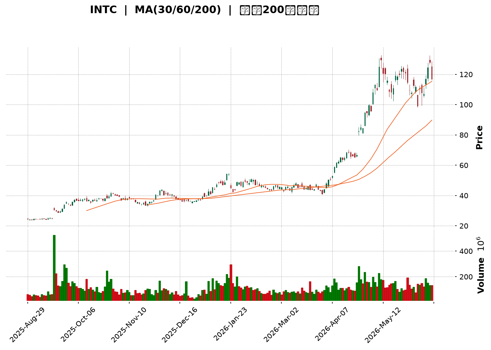
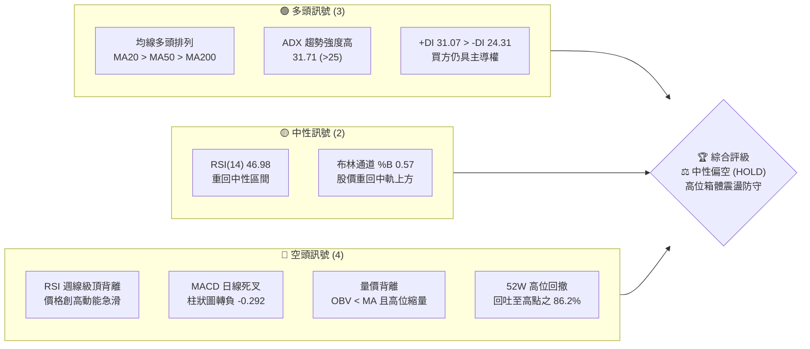
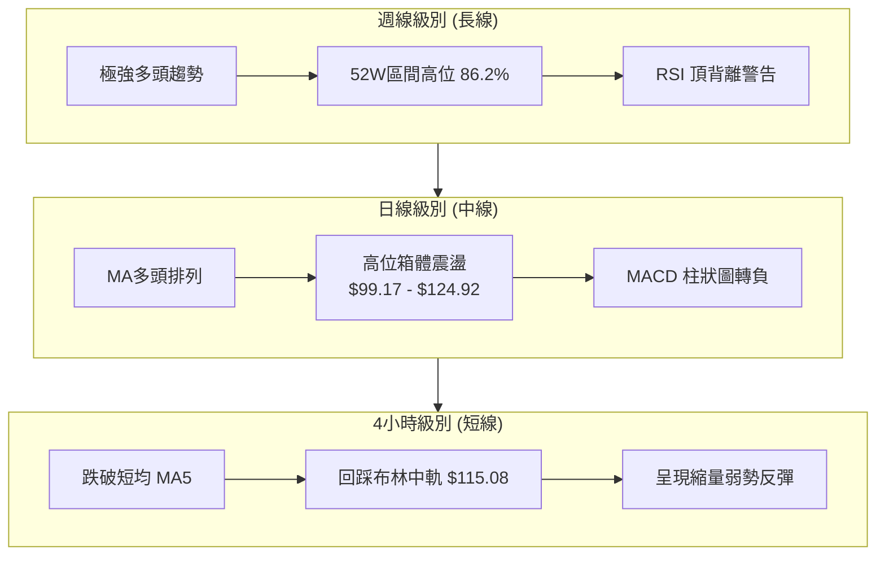
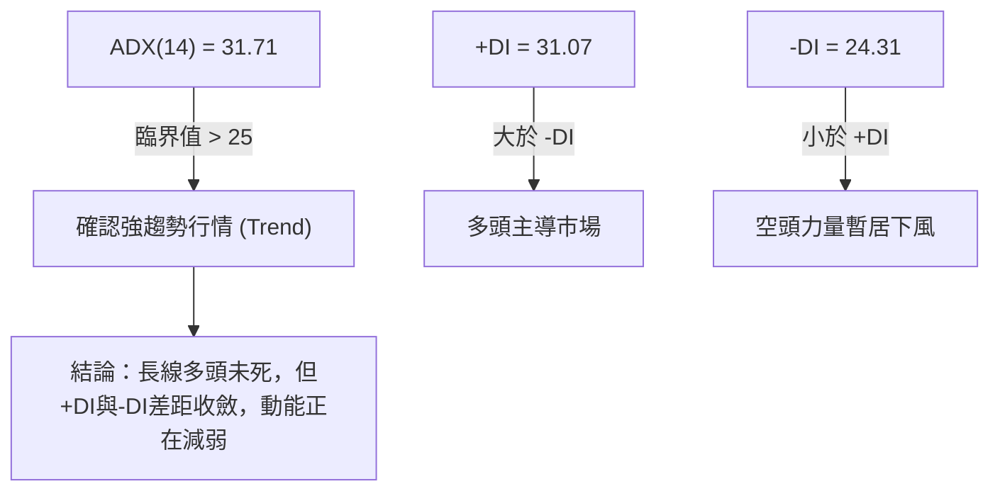
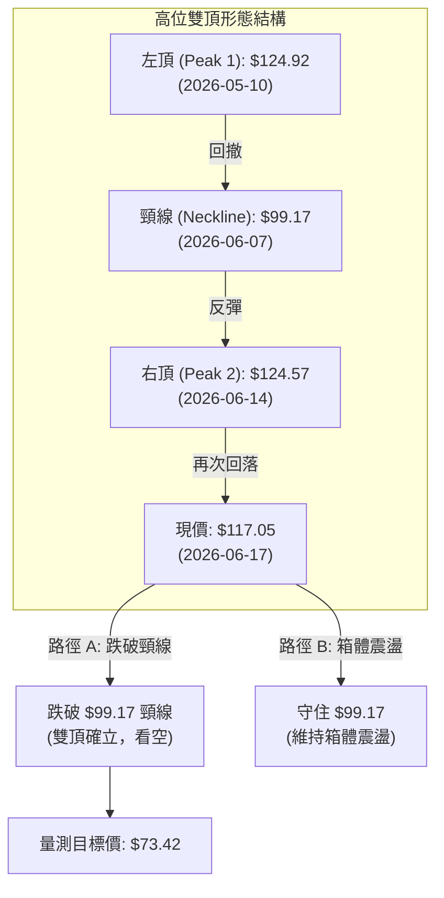
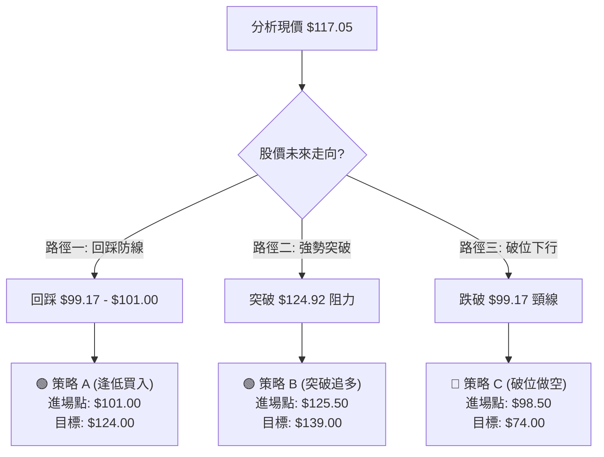
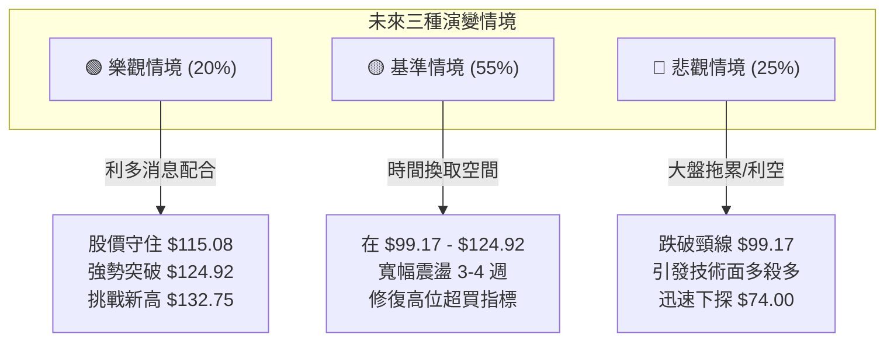

<details>
<summary>📊 靜態圖表 (點擊展開)</summary>

</details>

<html>
<head><meta charset="utf-8" /></head>
<body>
    <div style="height:500px; width:100%;">                        <script>window.PlotlyConfig = {MathJaxConfig: 'local'};</script>
        <script charset="utf-8" src="https://cdn.plot.ly/plotly-3.6.0.min.js" integrity="sha256-QaOVwtVY0T02VaHrr6pnoHLCwayMJp4O5n4YyaE3rJk=" crossorigin="anonymous"></script>                <div id="candlestick-chart" class="plotly-graph-div" style="height:100%; width:100%;"></div>            <script>                window.PLOTLYENV=window.PLOTLYENV || {};                                if (document.getElementById("candlestick-chart")) {                    Plotly.newPlot(                        "candlestick-chart",                        [{"close":{"dtype":"f8","bdata":"AAAAoJlZOEAAAACAwjU4QAAAAAAAADhAAAAAACmcOEAAAACgcH04QAAAAEDhejhAAAAA4KNwOEAAAADAHsU4QAAAAAApnDhAAAAA4HoUOEAAAADAHsU4QAAAAMAeRTlAAAAAYGbmOEAAAACA65E+QAAAAOB6lD1AAAAAYI\u002fCPEAAAABAClc9QAAAAOBROD9AAAAAYLj+QEAAAAAAAMBBQAAAAKBwPUFAAAAAYGbGQEAAAADgUfhBQAAAAGBmpkJAAAAAgD1qQkAAAAAghUtCQAAAAIDClUJAAAAAQAq3QkAAAABgZuZCQAAAACBcL0JAAAAAACmcQkAAAADgo9BBQAAAAEAzk0JAAAAAIIVrQkAAAACgR4FCQAAAAMDMDENAAAAAIFwPQ0AAAACAwnVCQAAAAOB6FENAAAAAANcjQ0AAAADAHsVDQAAAAADXw0RAAAAAIIWrREAAAADgehREQAAAAGC4\u002fkNAAAAAAADAQ0AAAAAA14NCQAAAAOCjMENAAAAAYLieQkAAAADgoxBDQAAAAKCZOUNAAAAA4KPwQkAAAACA6\u002fFCQAAAAOB69EFAAAAAYI\u002fCQUAAAABA4VpBQAAAAIA9KkFAAAAAgBSOQUAAAAAgXM9AQAAAAAAAQEFAAAAAwB7lQUAAAACAPepBQAAAACCuZ0JAAAAAIK5HREAAAACgRwFEQAAAAAApvEVAAAAAoEfhRUAAAAAAAEBEQAAAAOB6tERAAAAAYGYmREAAAAAAAEBEQAAAAADXY0RAAAAAoEfBQ0AAAAAgrudCQAAAAKBHwUJAAAAAIK6nQkAAAABgZgZCQAAAAADXI0JAAAAAwPVoQkAAAAAgXC9CQAAAAMDMLEJAAAAA4HoUQkAAAACgmRlCQAAAAEAKV0JAAAAAYGamQkAAAABAM3NCQAAAAOCjsENAAAAAIFyvQ0AAAADAHgVEQAAAAOCjUEVAAAAAgBSOREAAAABgZsZGQAAAACCuB0ZAAAAAwB6lR0AAAAAAKVxIQAAAAMD1KEhAAAAAQOF6R0AAAAAgrkdIQAAAAAAAIEtAAAAAwPUoS0AAAADA9YhGQAAAAGC4PkVAAAAAQAr3RUAAAAAA12NIQAAAAOB6VEhAAAAAACk8R0AAAAAgrmdIQAAAAAAAoEhAAAAAwMxMSEAAAABguB5IQAAAACCFS0lAAAAAYLgeSUAAAADgo5BHQAAAAMAeJUhAAAAAoHA9R0AAAADAHmVHQAAAAEAKF0dAAAAAQOG6RkAAAAAgXE9GQAAAAIAUDkZAAAAA4KPQRUAAAAAgXA9HQAAAAOCjcEdAAAAAQOG6RkAAAACAFM5GQAAAAAAAwEZAAAAAwMyMRUAAAACAPcpGQAAAAKCZ+UZAAAAAgMK1RUAAAACAPcpGQAAAAADXY0dAAAAAoHD9R0AAAAAAAKBGQAAAAGCP4kZAAAAAoEfhRkAAAAAgrgdGQAAAAADXg0ZAAAAAQAoXR0AAAAAgXO9FQAAAAKBHAUZAAAAAIK4HRkAAAABACpdHQAAAAMDMDEZAAAAA4KOQRUAAAADgUZhEQAAAAOCjEEZAAAAAANcDSEAAAADgozBJQAAAAADXY0lAAAAA4Hp0SkAAAACgmXlNQAAAAAAp3E5AAAAA4KMwT0AAAAAghUtQQAAAACCu509AAAAAACk8UEAAAAAAACBRQAAAAAAAIFFAAAAAwMxsUEAAAADgo5BQQAAAAKBHUVBAAAAAgOuxUEAAAABgj6JUQAAAACBcP1VAAAAAoEchVUAAAAAAALBXQAAAAGC4nldAAAAAIK7nWEAAAACA6\u002fFXQAAAAKCZCVtAAAAA4KNAXEAAAAAgrmdbQAAAAEDhOl9AAAAAgBQuYEAAAABACideQAAAAGCPEl5AAAAAIIX7XEAAAACgRzFbQAAAAEDhCltAAAAAQDOzW0AAAACgcL1dQAAAAAAAoF1AAAAAgML1XUAAAACgR+FeQAAAAKBHcV5AAAAAwPU4XkAAAAAghatcQAAAAMAeVVtAAAAAIIX7WkAAAACgcC1cQAAAAIDr8VtAAAAAQOHKWEAAAACgR5FbQAAAAEDh+lpAAAAAYI\u002fCWkAAAACgcD1dQAAAAOB6JF9AAAAAQAr3X0AAAABAM0NdQA=="},"high":{"dtype":"f8","bdata":"AAAA4FH4OEAAAACgcD04QAAAAEAKFzhAAAAAANejOEAAAACAwrU4QAAAAKBwvThAAAAAIFzPOEAAAABguN44QAAAAIAU7jhAAAAAoEehOEAAAACAwnU5QAAAAEAKVzlAAAAAYI9COUAAAADgozBAQAAAAKBHoT5AAAAAoJkZPkAAAABAMzM+QAAAAEAzsz9AAAAAAAAgQUAAAABgZiZCQAAAAGBmhkFAAAAAYLgeQUAAAAAgrgdCQAAAAMD1yEJAAAAAgD0KQ0AAAABACldDQAAAAGBmBkNAAAAAwB7lQkAAAADAzAxDQAAAAEAz00NAAAAAoEfBQkAAAABgZkZCQAAAAGC4vkJAAAAAYI8CQ0AAAADgozBDQAAAAGCPQkNAAAAAwMwsQ0AAAABACvdCQAAAAEAzM0NAAAAAIFyPREAAAACAwlVEQAAAAKBwPUVAAAAAwB4FRUAAAABACrdEQAAAAIA9akRAAAAAoJk5REAAAAAAACBDQAAAAOBRWENAAAAAIIXrQ0AAAABgjyJDQAAAAADXw0NAAAAAACkcQ0AAAACgmRlDQAAAACCup0JAAAAAwMwMQkAAAACgcN1BQAAAAKBHYUFAAAAAAADgQUAAAABACldCQAAAAKBwfUFAAAAA4HoUQkAAAADgoxBCQAAAAGC4nkJAAAAAIIVLREAAAADgozBEQAAAAEAK10VAAAAAYI8CRkAAAAAA16NFQAAAAIA9akVAAAAAIFwPRUAAAACgR6FEQAAAAGC4fkRAAAAA4FEYREAAAAAA1wNEQAAAAKBwPUNAAAAAQOH6QkAAAAAghetCQAAAAGC4vkJAAAAAgD3KQkAAAABAM\u002fNCQAAAAGBmZkJAAAAAQAoXQkAAAABguD5CQAAAAGBmZkJAAAAAoEchQ0AAAACAPcpCQAAAAIAU7kNAAAAAwMwMRUAAAAAgridEQAAAAMD1SEZAAAAAIIWrRUAAAACgcN1GQAAAAKCZuUZAAAAAYLgeSEAAAAAAAIBIQAAAAIDrMUlAAAAAQOEaSUAAAACgcB1JQAAAAOB6NEtAAAAAwMxMS0AAAADgoxBIQAAAAEDhOkZAAAAAANdDRkAAAADAHqVIQAAAAGCPYkhAAAAAgD3KSEAAAAAghetIQAAAAGC4vklAAAAAoJnZSEAAAACAFG5JQAAAAGBmpklAAAAAACmcSUAAAADAHkVJQAAAAGBmxkhAAAAAoJl5SEAAAADgUdhHQAAAAIA9akdAAAAAYI9iR0AAAACAwpVGQAAAAIDrMUZAAAAAYGZGRkAAAADAzExHQAAAAAApfEdAAAAAoJl5R0AAAAAgrkdHQAAAACCu50ZAAAAA4FHYRUAAAADgoxBHQAAAAKBwPUdAAAAAQAqXRkAAAACgR+FGQAAAAOCj8EdAAAAAgD1qSEAAAADgUbhHQAAAAEAzU0dAAAAAgMKVSEAAAACAPQpHQAAAAEDh2kZAAAAA4FE4R0AAAABgZsZHQAAAAEDhukZAAAAAIK4nRkAAAADAzOxHQAAAAMDMTEdAAAAA4KMQRkAAAABguP5FQAAAAKBwHUZAAAAAYI9iSEAAAABguD5JQAAAAIDrMUpAAAAAYI+iSkAAAACAwpVNQAAAAIA9Ck9AAAAAgOuxT0AAAACgmWlQQAAAACCFS1BAAAAAgMJ1UEAAAABACidRQAAAAMAelVFAAAAAoHBNUUAAAABA4epQQAAAAKBHMVFAAAAAgOsRUUAAAACAFE5VQAAAAGBmxlVAAAAAgMIlVUAAAADAzLxXQAAAAAAp7FdAAAAAwMwcWUAAAADgevRYQAAAAGC4nltAAAAAAABgXEAAAADgo6BcQAAAAIA9UmBAAAAAAACYYEAAAABgj\u002fJfQAAAAAAAQF9AAAAA4HqkXUAAAADgeqRbQAAAAGCP4lxAAAAA4HpEXEAAAAAAKXxeQAAAAIA92l1AAAAAgOuxXkAAAAAgrmdfQAAAAKBHUV9AAAAAwB7FXkAAAADA9ahfQAAAAEAzU1xAAAAAAABAW0AAAABgj5JdQAAAAMD1SFxAAAAAYLieWkAAAABgjyJcQAAAAAAAgFxAAAAAAADgW0AAAAAAKdxdQAAAAGBm5l9AAAAAIIWTYEAAAABgZhZgQA=="},"hovertemplate":"\u003cb\u003e%{x|%Y-%m-%d}\u003c\u002fb\u003e\u003cbr\u003e\u958b: $%{open:.2f}\u003cbr\u003e\u9ad8: $%{high:.2f}\u003cbr\u003e\u4f4e: $%{low:.2f}\u003cbr\u003e\u6536: $%{close:.2f}\u003cextra\u003e\u003c\u002fextra\u003e","low":{"dtype":"f8","bdata":"AAAAIK5HOEAAAACAFK43QAAAAOBRuDdAAAAAAADAN0AAAAAghSs4QAAAAGC4HjhAAAAAwB5FOEAAAAAgrkc4QAAAAIDrkThAAAAAwMwMOEAAAADgUTg4QAAAAOCjsDhAAAAAQDNzOEAAAADA9Sg+QAAAAOB6VD1AAAAAQOG6PEAAAACA69E8QAAAAEDhOj1AAAAAgMI1P0AAAABguD5BQAAAAKBw3UBAAAAAYI+CQEAAAAAAAMBAQAAAAOBRuEFAAAAAoJk5QkAAAABACjdCQAAAAMDMLEJAAAAA4Hr0QUAAAACAFG5CQAAAAGBmJkJAAAAAANcjQkAAAADgUVhBQAAAAIDr0UFAAAAA4Ho0QkAAAACAPQpCQAAAACCux0JAAAAAgMLVQkAAAADAHgVCQAAAAEAKN0JAAAAAgD3qQkAAAACgcB1DQAAAAMAexUNAAAAAgMJ1REAAAACAFA5EQAAAAMAe5UNAAAAAYGaGQ0AAAADgo1BCQAAAAIAUjkJAAAAAYGZmQkAAAAAAKXxCQAAAAAAp\u002fEJAAAAAYLi+QkAAAADAzKxCQAAAAKCZuUFAAAAAIFxPQUAAAACgcB1BQAAAAMD1yEBAAAAAAAAgQUAAAACgcL1AQAAAAIDrcUBAAAAA4FFYQUAAAABACldBQAAAAOCjEEJAAAAAIIWrQkAAAADAzMxDQAAAAGBmBkRAAAAAoEdBRUAAAACA6xFEQAAAAEAzk0RAAAAAoJnZQ0AAAAAA1wNEQAAAAIDrcUNAAAAAgD2KQ0AAAAAgXM9CQAAAAMD1qEJAAAAAgMJ1QkAAAAAAKfxBQAAAAIDC1UFAAAAA4FE4QkAAAADAHiVCQAAAAADXA0JAAAAAoJl5QUAAAADAzOxBQAAAAMD16EFAAAAAwPVoQkAAAAAgXG9CQAAAAKBH4UJAAAAAYI+iQ0AAAACgmXlDQAAAACBcD0RAAAAAQApXREAAAADA9chEQAAAAIDr8UVAAAAAACmcRkAAAACAwrVHQAAAAIA96kdAAAAAQOFaR0AAAAAAAIBHQAAAAEAzE0lAAAAAgD2KSkAAAACgmTlGQAAAAADXI0VAAAAAwMyMRUAAAADA9ShHQAAAAGC4fkdAAAAAQOH6RkAAAAAAAMBGQAAAAEAKN0hAAAAAAACAR0AAAADAHmVHQAAAAIA9akhAAAAAIIXLR0AAAABgj2JHQAAAAIAUbkdAAAAA4FEYR0AAAAAAKXxGQAAAAEDhukZAAAAA4KNwRkAAAACAwvVFQAAAAOCjcEVAAAAAQAqXRUAAAADAHsVFQAAAAIA9ikZAAAAAgOsxRkAAAABAMzNGQAAAAKCZ+UVAAAAAgOsRRUAAAABgj6JFQAAAAKCZWUZAAAAAANejRUAAAACA69FEQAAAAOB6tEZAAAAA4HpUR0AAAACAwpVGQAAAAIDrsUZAAAAA4FHYRkAAAADgevRFQAAAAGBmBkZAAAAAQDPTRUAAAACA69FFQAAAAGC43kVAAAAAoJmZRUAAAACgmblGQAAAAIDC9UVAAAAAgBRuRUAAAADgo1BEQAAAAMDMzERAAAAAoHB9RkAAAADAHgVHQAAAACBc70hAAAAAACmcSUAAAABgZmZLQAAAAIDrMU1AAAAAAABgTkAAAABAChdPQAAAACCFC09AAAAA4KNwT0AAAACgRxFQQAAAACBc71BAAAAAgBQeUEAAAADA9WhQQAAAAGC4PlBAAAAAQOFaUEAAAAAgrudTQAAAAEAKp1RAAAAAQDMzVEAAAAAgrndVQAAAAAAA4FZAAAAAQAonV0AAAABgZuZXQAAAAMAeBVlAAAAAwB6lWkAAAACgmUlbQAAAAEAz81tAAAAAQOH6XkAAAAAAAMBcQAAAAIA9Gl1AAAAAQOFKXEAAAACgR0FaQAAAAGBm9llAAAAAoJmZWUAAAABAM7NcQAAAAEDhSlxAAAAAgMKFXUAAAABgZlZdQAAAAAAAQF1AAAAAANcTXUAAAABgj2JcQAAAAMAelVpAAAAAQOEKWkAAAABACrdbQAAAAGC43lpAAAAAwB6VWEAAAACAPapaQAAAAKBw3VhAAAAAQOE6WkAAAADgo6BbQAAAAMAe1VxAAAAAgD2qX0AAAAAAAABdQA=="},"name":"\u50f9\u683c","open":{"dtype":"f8","bdata":"AAAAYI\u002fCOEAAAACgR+E3QAAAAEAKFzhAAAAAoJnZN0AAAACgmZk4QAAAAEDhejhAAAAAIK6HOEAAAAAghWs4QAAAAGCPwjhAAAAAACmcOEAAAADgelQ4QAAAAIDr0ThAAAAA4HoUOUAAAAAgrsc\u002fQAAAAKBHYT5AAAAAIIWrPUAAAACgcP08QAAAAKBHYT1AAAAAACmcP0AAAABgj4JBQAAAAGCPQkFAAAAAQAr3QEAAAAAA18NAQAAAAKBH4UFAAAAAoJn5QkAAAADgUZhCQAAAAIDrUUJAAAAAYGZGQkAAAAAA18NCQAAAAEDhOkNAAAAA4FE4QkAAAAAAAABCQAAAAEAzM0JAAAAAQDOTQkAAAACAFC5CQAAAAMD1yEJAAAAAgOsRQ0AAAAAghetCQAAAAMDMTEJAAAAAYI8CREAAAACA6zFDQAAAACCFy0NAAAAAwMzMREAAAAAAKXxEQAAAAEAKV0RAAAAAAAAgREAAAACA6xFDQAAAAIDCtUJAAAAAIIUrQ0AAAACgR6FCQAAAAEAKd0NAAAAAQDMTQ0AAAAAgrgdDQAAAAGCPokJAAAAAANeDQUAAAACgmblBQAAAAAAAIEFAAAAAgD0qQUAAAAAAAABCQAAAAKBHwUBAAAAAACl8QUAAAABgZsZBQAAAAKCZGUJAAAAAQDOzQkAAAACAFO5DQAAAAAApPERAAAAAgOuxRUAAAACgR6FFQAAAAOB6lERAAAAA4FH4REAAAACgcF1EQAAAAIAUDkRAAAAAwPUIREAAAAAAAKBDQAAAAIA9KkNAAAAAgD3KQkAAAAAghctCQAAAAOCjsEJAAAAAoHA9QkAAAACA6\u002fFCQAAAAGC4HkJAAAAAgMKVQUAAAACAwhVCQAAAAKBHAUJAAAAA4Hp0QkAAAABAM7NCQAAAAGCP4kJAAAAAIIXLREAAAACAFO5DQAAAAEAKF0RAAAAAIFxPRUAAAACAPepEQAAAAGC4HkZAAAAAgOvxRkAAAACgmXlIQAAAAMDMrEhAAAAAYI+iSEAAAABgZqZHQAAAAMD1KElAAAAAQOEaS0AAAACAFG5HQAAAAADXI0ZAAAAAACn8RUAAAADAzExHQAAAACCux0dAAAAAoHB9SEAAAADgo9BGQAAAACCuB0lAAAAAwB7FSEAAAAAghctHQAAAAMDMjEhAAAAAIIXLSEAAAADgejRJQAAAAIAUDkhAAAAAYGbmR0AAAACgR+FGQAAAAEAK90ZAAAAAgML1RkAAAACgmXlGQAAAAIDr8UVAAAAAIIULRkAAAADAzAxGQAAAACCFC0dAAAAAYI9iR0AAAABA4TpGQAAAAKCZGUZAAAAA4FG4RUAAAADA9QhGQAAAACBcb0ZAAAAAgMJVRkAAAABguF5FQAAAAOB6tEZAAAAAwPVoR0AAAABAM7NHQAAAAAAp\u002fEZAAAAA4Hr0R0AAAACAPQpHQAAAAKCZGUZAAAAAYLj+RUAAAACgmXlHQAAAAAAAQEZAAAAAwB7FRUAAAADAzOxGQAAAAGBmJkdAAAAAIFzPRUAAAAAAKdxFQAAAAKCZ+URAAAAAAACARkAAAAAgrgdHQAAAAOCjcElAAAAA4Hr0SUAAAAAgXK9LQAAAAEAzM01AAAAAYI\u002fCTkAAAABAChdPQAAAAIA9SlBAAAAAYI\u002fiT0AAAAAghTtQQAAAAGBmNlFAAAAAwMwcUUAAAADA9chQQAAAAAAp\u002fFBAAAAAYGaGUEAAAADAzIxUQAAAAEDh6lRAAAAAgOtRVEAAAADA9YhVQAAAAGBm5ldAAAAAwMxMV0AAAAAghctYQAAAAOCjIFlAAAAAYLi+W0AAAACgR8FbQAAAAADX81tAAAAAAClcYEAAAABAChdfQAAAAGBmBl9AAAAAgD2qXEAAAABgj3JbQAAAAIAUXlxAAAAAYLi+WkAAAACAFA5dQAAAAMAeJV1AAAAAgMIVXkAAAABgZoZeQAAAAMD1GF9AAAAAwMxcXkAAAABgZvZeQAAAACCFW1tAAAAAwMzcWkAAAABA4RpdQAAAAKCZGVtAAAAAYLieWkAAAAAAAMBbQAAAACBcP1xAAAAAgOuBWkAAAACgR2FcQAAAAEDhWl1AAAAAIK4vYEAAAABACkdfQA=="},"x":["2025-08-29T00:00:00-04:00","2025-09-02T00:00:00-04:00","2025-09-03T00:00:00-04:00","2025-09-04T00:00:00-04:00","2025-09-05T00:00:00-04:00","2025-09-08T00:00:00-04:00","2025-09-09T00:00:00-04:00","2025-09-10T00:00:00-04:00","2025-09-11T00:00:00-04:00","2025-09-12T00:00:00-04:00","2025-09-15T00:00:00-04:00","2025-09-16T00:00:00-04:00","2025-09-17T00:00:00-04:00","2025-09-18T00:00:00-04:00","2025-09-19T00:00:00-04:00","2025-09-22T00:00:00-04:00","2025-09-23T00:00:00-04:00","2025-09-24T00:00:00-04:00","2025-09-25T00:00:00-04:00","2025-09-26T00:00:00-04:00","2025-09-29T00:00:00-04:00","2025-09-30T00:00:00-04:00","2025-10-01T00:00:00-04:00","2025-10-02T00:00:00-04:00","2025-10-03T00:00:00-04:00","2025-10-06T00:00:00-04:00","2025-10-07T00:00:00-04:00","2025-10-08T00:00:00-04:00","2025-10-09T00:00:00-04:00","2025-10-10T00:00:00-04:00","2025-10-13T00:00:00-04:00","2025-10-14T00:00:00-04:00","2025-10-15T00:00:00-04:00","2025-10-16T00:00:00-04:00","2025-10-17T00:00:00-04:00","2025-10-20T00:00:00-04:00","2025-10-21T00:00:00-04:00","2025-10-22T00:00:00-04:00","2025-10-23T00:00:00-04:00","2025-10-24T00:00:00-04:00","2025-10-27T00:00:00-04:00","2025-10-28T00:00:00-04:00","2025-10-29T00:00:00-04:00","2025-10-30T00:00:00-04:00","2025-10-31T00:00:00-04:00","2025-11-03T00:00:00-05:00","2025-11-04T00:00:00-05:00","2025-11-05T00:00:00-05:00","2025-11-06T00:00:00-05:00","2025-11-07T00:00:00-05:00","2025-11-10T00:00:00-05:00","2025-11-11T00:00:00-05:00","2025-11-12T00:00:00-05:00","2025-11-13T00:00:00-05:00","2025-11-14T00:00:00-05:00","2025-11-17T00:00:00-05:00","2025-11-18T00:00:00-05:00","2025-11-19T00:00:00-05:00","2025-11-20T00:00:00-05:00","2025-11-21T00:00:00-05:00","2025-11-24T00:00:00-05:00","2025-11-25T00:00:00-05:00","2025-11-26T00:00:00-05:00","2025-11-28T00:00:00-05:00","2025-12-01T00:00:00-05:00","2025-12-02T00:00:00-05:00","2025-12-03T00:00:00-05:00","2025-12-04T00:00:00-05:00","2025-12-05T00:00:00-05:00","2025-12-08T00:00:00-05:00","2025-12-09T00:00:00-05:00","2025-12-10T00:00:00-05:00","2025-12-11T00:00:00-05:00","2025-12-12T00:00:00-05:00","2025-12-15T00:00:00-05:00","2025-12-16T00:00:00-05:00","2025-12-17T00:00:00-05:00","2025-12-18T00:00:00-05:00","2025-12-19T00:00:00-05:00","2025-12-22T00:00:00-05:00","2025-12-23T00:00:00-05:00","2025-12-24T00:00:00-05:00","2025-12-26T00:00:00-05:00","2025-12-29T00:00:00-05:00","2025-12-30T00:00:00-05:00","2025-12-31T00:00:00-05:00","2026-01-02T00:00:00-05:00","2026-01-05T00:00:00-05:00","2026-01-06T00:00:00-05:00","2026-01-07T00:00:00-05:00","2026-01-08T00:00:00-05:00","2026-01-09T00:00:00-05:00","2026-01-12T00:00:00-05:00","2026-01-13T00:00:00-05:00","2026-01-14T00:00:00-05:00","2026-01-15T00:00:00-05:00","2026-01-16T00:00:00-05:00","2026-01-20T00:00:00-05:00","2026-01-21T00:00:00-05:00","2026-01-22T00:00:00-05:00","2026-01-23T00:00:00-05:00","2026-01-26T00:00:00-05:00","2026-01-27T00:00:00-05:00","2026-01-28T00:00:00-05:00","2026-01-29T00:00:00-05:00","2026-01-30T00:00:00-05:00","2026-02-02T00:00:00-05:00","2026-02-03T00:00:00-05:00","2026-02-04T00:00:00-05:00","2026-02-05T00:00:00-05:00","2026-02-06T00:00:00-05:00","2026-02-09T00:00:00-05:00","2026-02-10T00:00:00-05:00","2026-02-11T00:00:00-05:00","2026-02-12T00:00:00-05:00","2026-02-13T00:00:00-05:00","2026-02-17T00:00:00-05:00","2026-02-18T00:00:00-05:00","2026-02-19T00:00:00-05:00","2026-02-20T00:00:00-05:00","2026-02-23T00:00:00-05:00","2026-02-24T00:00:00-05:00","2026-02-25T00:00:00-05:00","2026-02-26T00:00:00-05:00","2026-02-27T00:00:00-05:00","2026-03-02T00:00:00-05:00","2026-03-03T00:00:00-05:00","2026-03-04T00:00:00-05:00","2026-03-05T00:00:00-05:00","2026-03-06T00:00:00-05:00","2026-03-09T00:00:00-04:00","2026-03-10T00:00:00-04:00","2026-03-11T00:00:00-04:00","2026-03-12T00:00:00-04:00","2026-03-13T00:00:00-04:00","2026-03-16T00:00:00-04:00","2026-03-17T00:00:00-04:00","2026-03-18T00:00:00-04:00","2026-03-19T00:00:00-04:00","2026-03-20T00:00:00-04:00","2026-03-23T00:00:00-04:00","2026-03-24T00:00:00-04:00","2026-03-25T00:00:00-04:00","2026-03-26T00:00:00-04:00","2026-03-27T00:00:00-04:00","2026-03-30T00:00:00-04:00","2026-03-31T00:00:00-04:00","2026-04-01T00:00:00-04:00","2026-04-02T00:00:00-04:00","2026-04-06T00:00:00-04:00","2026-04-07T00:00:00-04:00","2026-04-08T00:00:00-04:00","2026-04-09T00:00:00-04:00","2026-04-10T00:00:00-04:00","2026-04-13T00:00:00-04:00","2026-04-14T00:00:00-04:00","2026-04-15T00:00:00-04:00","2026-04-16T00:00:00-04:00","2026-04-17T00:00:00-04:00","2026-04-20T00:00:00-04:00","2026-04-21T00:00:00-04:00","2026-04-22T00:00:00-04:00","2026-04-23T00:00:00-04:00","2026-04-24T00:00:00-04:00","2026-04-27T00:00:00-04:00","2026-04-28T00:00:00-04:00","2026-04-29T00:00:00-04:00","2026-04-30T00:00:00-04:00","2026-05-01T00:00:00-04:00","2026-05-04T00:00:00-04:00","2026-05-05T00:00:00-04:00","2026-05-06T00:00:00-04:00","2026-05-07T00:00:00-04:00","2026-05-08T00:00:00-04:00","2026-05-11T00:00:00-04:00","2026-05-12T00:00:00-04:00","2026-05-13T00:00:00-04:00","2026-05-14T00:00:00-04:00","2026-05-15T00:00:00-04:00","2026-05-18T00:00:00-04:00","2026-05-19T00:00:00-04:00","2026-05-20T00:00:00-04:00","2026-05-21T00:00:00-04:00","2026-05-22T00:00:00-04:00","2026-05-26T00:00:00-04:00","2026-05-27T00:00:00-04:00","2026-05-28T00:00:00-04:00","2026-05-29T00:00:00-04:00","2026-06-01T00:00:00-04:00","2026-06-02T00:00:00-04:00","2026-06-03T00:00:00-04:00","2026-06-04T00:00:00-04:00","2026-06-05T00:00:00-04:00","2026-06-08T00:00:00-04:00","2026-06-09T00:00:00-04:00","2026-06-10T00:00:00-04:00","2026-06-11T00:00:00-04:00","2026-06-12T00:00:00-04:00","2026-06-15T00:00:00-04:00","2026-06-16T00:00:00-04:00"],"type":"candlestick"},{"hovertemplate":"MA30: $%{y:.2f}\u003cextra\u003e\u003c\u002fextra\u003e","line":{"color":"#2196F3","dash":"dash","width":2},"mode":"lines","name":"MA30","x":["2025-08-29T00:00:00-04:00","2025-09-02T00:00:00-04:00","2025-09-03T00:00:00-04:00","2025-09-04T00:00:00-04:00","2025-09-05T00:00:00-04:00","2025-09-08T00:00:00-04:00","2025-09-09T00:00:00-04:00","2025-09-10T00:00:00-04:00","2025-09-11T00:00:00-04:00","2025-09-12T00:00:00-04:00","2025-09-15T00:00:00-04:00","2025-09-16T00:00:00-04:00","2025-09-17T00:00:00-04:00","2025-09-18T00:00:00-04:00","2025-09-19T00:00:00-04:00","2025-09-22T00:00:00-04:00","2025-09-23T00:00:00-04:00","2025-09-24T00:00:00-04:00","2025-09-25T00:00:00-04:00","2025-09-26T00:00:00-04:00","2025-09-29T00:00:00-04:00","2025-09-30T00:00:00-04:00","2025-10-01T00:00:00-04:00","2025-10-02T00:00:00-04:00","2025-10-03T00:00:00-04:00","2025-10-06T00:00:00-04:00","2025-10-07T00:00:00-04:00","2025-10-08T00:00:00-04:00","2025-10-09T00:00:00-04:00","2025-10-10T00:00:00-04:00","2025-10-13T00:00:00-04:00","2025-10-14T00:00:00-04:00","2025-10-15T00:00:00-04:00","2025-10-16T00:00:00-04:00","2025-10-17T00:00:00-04:00","2025-10-20T00:00:00-04:00","2025-10-21T00:00:00-04:00","2025-10-22T00:00:00-04:00","2025-10-23T00:00:00-04:00","2025-10-24T00:00:00-04:00","2025-10-27T00:00:00-04:00","2025-10-28T00:00:00-04:00","2025-10-29T00:00:00-04:00","2025-10-30T00:00:00-04:00","2025-10-31T00:00:00-04:00","2025-11-03T00:00:00-05:00","2025-11-04T00:00:00-05:00","2025-11-05T00:00:00-05:00","2025-11-06T00:00:00-05:00","2025-11-07T00:00:00-05:00","2025-11-10T00:00:00-05:00","2025-11-11T00:00:00-05:00","2025-11-12T00:00:00-05:00","2025-11-13T00:00:00-05:00","2025-11-14T00:00:00-05:00","2025-11-17T00:00:00-05:00","2025-11-18T00:00:00-05:00","2025-11-19T00:00:00-05:00","2025-11-20T00:00:00-05:00","2025-11-21T00:00:00-05:00","2025-11-24T00:00:00-05:00","2025-11-25T00:00:00-05:00","2025-11-26T00:00:00-05:00","2025-11-28T00:00:00-05:00","2025-12-01T00:00:00-05:00","2025-12-02T00:00:00-05:00","2025-12-03T00:00:00-05:00","2025-12-04T00:00:00-05:00","2025-12-05T00:00:00-05:00","2025-12-08T00:00:00-05:00","2025-12-09T00:00:00-05:00","2025-12-10T00:00:00-05:00","2025-12-11T00:00:00-05:00","2025-12-12T00:00:00-05:00","2025-12-15T00:00:00-05:00","2025-12-16T00:00:00-05:00","2025-12-17T00:00:00-05:00","2025-12-18T00:00:00-05:00","2025-12-19T00:00:00-05:00","2025-12-22T00:00:00-05:00","2025-12-23T00:00:00-05:00","2025-12-24T00:00:00-05:00","2025-12-26T00:00:00-05:00","2025-12-29T00:00:00-05:00","2025-12-30T00:00:00-05:00","2025-12-31T00:00:00-05:00","2026-01-02T00:00:00-05:00","2026-01-05T00:00:00-05:00","2026-01-06T00:00:00-05:00","2026-01-07T00:00:00-05:00","2026-01-08T00:00:00-05:00","2026-01-09T00:00:00-05:00","2026-01-12T00:00:00-05:00","2026-01-13T00:00:00-05:00","2026-01-14T00:00:00-05:00","2026-01-15T00:00:00-05:00","2026-01-16T00:00:00-05:00","2026-01-20T00:00:00-05:00","2026-01-21T00:00:00-05:00","2026-01-22T00:00:00-05:00","2026-01-23T00:00:00-05:00","2026-01-26T00:00:00-05:00","2026-01-27T00:00:00-05:00","2026-01-28T00:00:00-05:00","2026-01-29T00:00:00-05:00","2026-01-30T00:00:00-05:00","2026-02-02T00:00:00-05:00","2026-02-03T00:00:00-05:00","2026-02-04T00:00:00-05:00","2026-02-05T00:00:00-05:00","2026-02-06T00:00:00-05:00","2026-02-09T00:00:00-05:00","2026-02-10T00:00:00-05:00","2026-02-11T00:00:00-05:00","2026-02-12T00:00:00-05:00","2026-02-13T00:00:00-05:00","2026-02-17T00:00:00-05:00","2026-02-18T00:00:00-05:00","2026-02-19T00:00:00-05:00","2026-02-20T00:00:00-05:00","2026-02-23T00:00:00-05:00","2026-02-24T00:00:00-05:00","2026-02-25T00:00:00-05:00","2026-02-26T00:00:00-05:00","2026-02-27T00:00:00-05:00","2026-03-02T00:00:00-05:00","2026-03-03T00:00:00-05:00","2026-03-04T00:00:00-05:00","2026-03-05T00:00:00-05:00","2026-03-06T00:00:00-05:00","2026-03-09T00:00:00-04:00","2026-03-10T00:00:00-04:00","2026-03-11T00:00:00-04:00","2026-03-12T00:00:00-04:00","2026-03-13T00:00:00-04:00","2026-03-16T00:00:00-04:00","2026-03-17T00:00:00-04:00","2026-03-18T00:00:00-04:00","2026-03-19T00:00:00-04:00","2026-03-20T00:00:00-04:00","2026-03-23T00:00:00-04:00","2026-03-24T00:00:00-04:00","2026-03-25T00:00:00-04:00","2026-03-26T00:00:00-04:00","2026-03-27T00:00:00-04:00","2026-03-30T00:00:00-04:00","2026-03-31T00:00:00-04:00","2026-04-01T00:00:00-04:00","2026-04-02T00:00:00-04:00","2026-04-06T00:00:00-04:00","2026-04-07T00:00:00-04:00","2026-04-08T00:00:00-04:00","2026-04-09T00:00:00-04:00","2026-04-10T00:00:00-04:00","2026-04-13T00:00:00-04:00","2026-04-14T00:00:00-04:00","2026-04-15T00:00:00-04:00","2026-04-16T00:00:00-04:00","2026-04-17T00:00:00-04:00","2026-04-20T00:00:00-04:00","2026-04-21T00:00:00-04:00","2026-04-22T00:00:00-04:00","2026-04-23T00:00:00-04:00","2026-04-24T00:00:00-04:00","2026-04-27T00:00:00-04:00","2026-04-28T00:00:00-04:00","2026-04-29T00:00:00-04:00","2026-04-30T00:00:00-04:00","2026-05-01T00:00:00-04:00","2026-05-04T00:00:00-04:00","2026-05-05T00:00:00-04:00","2026-05-06T00:00:00-04:00","2026-05-07T00:00:00-04:00","2026-05-08T00:00:00-04:00","2026-05-11T00:00:00-04:00","2026-05-12T00:00:00-04:00","2026-05-13T00:00:00-04:00","2026-05-14T00:00:00-04:00","2026-05-15T00:00:00-04:00","2026-05-18T00:00:00-04:00","2026-05-19T00:00:00-04:00","2026-05-20T00:00:00-04:00","2026-05-21T00:00:00-04:00","2026-05-22T00:00:00-04:00","2026-05-26T00:00:00-04:00","2026-05-27T00:00:00-04:00","2026-05-28T00:00:00-04:00","2026-05-29T00:00:00-04:00","2026-06-01T00:00:00-04:00","2026-06-02T00:00:00-04:00","2026-06-03T00:00:00-04:00","2026-06-04T00:00:00-04:00","2026-06-05T00:00:00-04:00","2026-06-08T00:00:00-04:00","2026-06-09T00:00:00-04:00","2026-06-10T00:00:00-04:00","2026-06-11T00:00:00-04:00","2026-06-12T00:00:00-04:00","2026-06-15T00:00:00-04:00","2026-06-16T00:00:00-04:00"],"y":{"dtype":"f8","bdata":"AAAAAAAA+H8AAAAAAAD4fwAAAAAAAPh\u002fAAAAAAAA+H8AAAAAAAD4fwAAAAAAAPh\u002fAAAAAAAA+H8AAAAAAAD4fwAAAAAAAPh\u002fAAAAAAAA+H8AAAAAAAD4fwAAAAAAAPh\u002fAAAAAAAA+H8AAAAAAAD4fwAAAAAAAPh\u002fAAAAAAAA+H8AAAAAAAD4fwAAAAAAAPh\u002fAAAAAAAA+H8AAAAAAAD4fwAAAAAAAPh\u002fAAAAAAAA+H8AAAAAAAD4fwAAAAAAAPh\u002fAAAAAAAA+H8AAAAAAAD4fwAAAAAAAPh\u002fAAAAAAAA+H8AAAAAAAD4f3d3d1fyCz5AmpmZScV5PkCamZmpONs+QHd3d0dvSz9A7+7uHsyzP0DNzMw8UQ9AQImIiOhtSUBAVVVVHcyDQEDv7u4mo7dAQFVVVV1z8UBAzczMjAkuQUBERERUDm1BQFVVVZVuskFAq6qqcpP4QUARERFJfiFCQImIiMjoTUJAIiIiurt7QkCamZlBi5xCQDMzM+MXu0JAERERwfXIQkCrqqpqLtRCQHd3d7ce5UJAvLu7O5j3QkB3d3cn6v9CQHd3d+f7+UJAiYiICGX0QkAiIiKSX+xCQJqZmYlB4EJAq6qqelvWQkDe3d3NhcRCQERERESLvEJAMzMzU3G2QkB3d3fHS7dCQImIiGjYtUJAREREpLfFQkARERFxhNJCQKuqqupt6UJAzczMTH4BQ0De3d2dxBBDQLy7u3uiHkNAzczM3EAnQ0AAAABwWStDQM3MzDwmKENAMzMzY1cgQ0AAAACQUBZDQM3MzLy7C0NAzczMrGMCQ0ARERFBNf5CQN7d3X0\u002f9UJAzczMvHTzQkCJiIhY8utCQFVVVZX84kJAIiIi4qXbQkBERET0b9RCQAAAAAC510JAvLu7O1HfQkDNzMxMqehCQO\u002fu7j41\u002fkJAzczMTGIQQ0B3d3enxitDQImIiMh2TkNAREREpCllQ0CJiIh4oo5DQHd3d2eRrUNAvLu7W0jKQ0AREREBcu9DQO\u002fu7n4jBERAAAAAwMoRREC8u7trLjREQAAAACD3akRAREREtMimREDNzMxcSLpEQERERCSUwURAZmZm9m\u002fUREAAAAAgPgNFQGZmZubQMkVAAAAAEOZZRUAzMzNjV5BFQGZmZhaux0VAzczM\u002fPD5RUAiIiIylixGQDMzMxNYaUZAERERMWulRkCrqqqqDdRGQCIiIuKWBUdARERE5MEsR0CJiIho9FZHQCIiItL3c0dAmpmZufONR0De3d1NfqFHQLy7u9vOp0dA7+7uXo+yR0BmZmb2\u002fbRHQHd3dycGwUdA3t3dTTe5R0Crqqpa8qtHQJqZmSnqn0dAMzMzA3KPR0Dv7u4Ou4JHQO\u002fu7j5RX0dAmpmZic8wR0CJiIiY\u002fDJHQKuqqmpKRUdAiYiIGJJWR0BVVVVlgkdHQO\u002fu7r4tO0dAvLu7OyY4R0B3d3f34SNHQJqZmZngEUdAERERUY0HR0C8u7sb6PRGQN7d3f3U2EZAiYiIyHa+RkBVVVVlrb5GQLy7u8vMrEZAREREtIGeRkAiIiICnYZGQM3MzNzdfUZAzczM\u002fNSIRkAiIiJyaKFGQM3MzNzdvUZAiYiIGHblRkARERHhMxxHQN7d3R2FW0dAVVVVRbajR0De3d3tNfdHQFVVVVVVRUhAERERcYSiSEARERExTwRJQN7d3c2FZElAERERgZXDSUBERESU0RtKQGZmZpa1akpAMzMzM+y6SkAzMzPTBlpLQFVVVYVdAUxAZmZmxr2mTEBVVVXFBH9NQM3MzFwBUk5AiYiIGAQ2T0BERETUvwlQQKuqqtKUklBAd3d3t6wlUUCJiIhI4apRQHd3d8dLV1JAREREjGwPU0BVVVV12rhTQBEREflTW1RAVVVVbS7sVEBmZmYmv2hVQN7d3b0t41VA7+7uZq1eVkDNzMzcst5WQAAAAFDUV1dAmpmZIWnSV0BERESM3k5YQO\u002fu7m6EylhAd3d3l+BBWUB3d3cHZaRZQHd3d6d\u002f+1lA3t3d3ZZVWkAiIiLCrrhaQLy7u2vnG1tA3t3drQBhW0BERET0KJxbQKuqqsoTzVtAd3d3tx79W0BmZmZWgCxcQM3MzHyxbFxAq6qqSvCoXEDNzMyMUNZcQA=="},"type":"scatter"},{"hovertemplate":"MA60: $%{y:.2f}\u003cextra\u003e\u003c\u002fextra\u003e","line":{"color":"#9C27B0","dash":"dash","width":2},"mode":"lines","name":"MA60","x":["2025-08-29T00:00:00-04:00","2025-09-02T00:00:00-04:00","2025-09-03T00:00:00-04:00","2025-09-04T00:00:00-04:00","2025-09-05T00:00:00-04:00","2025-09-08T00:00:00-04:00","2025-09-09T00:00:00-04:00","2025-09-10T00:00:00-04:00","2025-09-11T00:00:00-04:00","2025-09-12T00:00:00-04:00","2025-09-15T00:00:00-04:00","2025-09-16T00:00:00-04:00","2025-09-17T00:00:00-04:00","2025-09-18T00:00:00-04:00","2025-09-19T00:00:00-04:00","2025-09-22T00:00:00-04:00","2025-09-23T00:00:00-04:00","2025-09-24T00:00:00-04:00","2025-09-25T00:00:00-04:00","2025-09-26T00:00:00-04:00","2025-09-29T00:00:00-04:00","2025-09-30T00:00:00-04:00","2025-10-01T00:00:00-04:00","2025-10-02T00:00:00-04:00","2025-10-03T00:00:00-04:00","2025-10-06T00:00:00-04:00","2025-10-07T00:00:00-04:00","2025-10-08T00:00:00-04:00","2025-10-09T00:00:00-04:00","2025-10-10T00:00:00-04:00","2025-10-13T00:00:00-04:00","2025-10-14T00:00:00-04:00","2025-10-15T00:00:00-04:00","2025-10-16T00:00:00-04:00","2025-10-17T00:00:00-04:00","2025-10-20T00:00:00-04:00","2025-10-21T00:00:00-04:00","2025-10-22T00:00:00-04:00","2025-10-23T00:00:00-04:00","2025-10-24T00:00:00-04:00","2025-10-27T00:00:00-04:00","2025-10-28T00:00:00-04:00","2025-10-29T00:00:00-04:00","2025-10-30T00:00:00-04:00","2025-10-31T00:00:00-04:00","2025-11-03T00:00:00-05:00","2025-11-04T00:00:00-05:00","2025-11-05T00:00:00-05:00","2025-11-06T00:00:00-05:00","2025-11-07T00:00:00-05:00","2025-11-10T00:00:00-05:00","2025-11-11T00:00:00-05:00","2025-11-12T00:00:00-05:00","2025-11-13T00:00:00-05:00","2025-11-14T00:00:00-05:00","2025-11-17T00:00:00-05:00","2025-11-18T00:00:00-05:00","2025-11-19T00:00:00-05:00","2025-11-20T00:00:00-05:00","2025-11-21T00:00:00-05:00","2025-11-24T00:00:00-05:00","2025-11-25T00:00:00-05:00","2025-11-26T00:00:00-05:00","2025-11-28T00:00:00-05:00","2025-12-01T00:00:00-05:00","2025-12-02T00:00:00-05:00","2025-12-03T00:00:00-05:00","2025-12-04T00:00:00-05:00","2025-12-05T00:00:00-05:00","2025-12-08T00:00:00-05:00","2025-12-09T00:00:00-05:00","2025-12-10T00:00:00-05:00","2025-12-11T00:00:00-05:00","2025-12-12T00:00:00-05:00","2025-12-15T00:00:00-05:00","2025-12-16T00:00:00-05:00","2025-12-17T00:00:00-05:00","2025-12-18T00:00:00-05:00","2025-12-19T00:00:00-05:00","2025-12-22T00:00:00-05:00","2025-12-23T00:00:00-05:00","2025-12-24T00:00:00-05:00","2025-12-26T00:00:00-05:00","2025-12-29T00:00:00-05:00","2025-12-30T00:00:00-05:00","2025-12-31T00:00:00-05:00","2026-01-02T00:00:00-05:00","2026-01-05T00:00:00-05:00","2026-01-06T00:00:00-05:00","2026-01-07T00:00:00-05:00","2026-01-08T00:00:00-05:00","2026-01-09T00:00:00-05:00","2026-01-12T00:00:00-05:00","2026-01-13T00:00:00-05:00","2026-01-14T00:00:00-05:00","2026-01-15T00:00:00-05:00","2026-01-16T00:00:00-05:00","2026-01-20T00:00:00-05:00","2026-01-21T00:00:00-05:00","2026-01-22T00:00:00-05:00","2026-01-23T00:00:00-05:00","2026-01-26T00:00:00-05:00","2026-01-27T00:00:00-05:00","2026-01-28T00:00:00-05:00","2026-01-29T00:00:00-05:00","2026-01-30T00:00:00-05:00","2026-02-02T00:00:00-05:00","2026-02-03T00:00:00-05:00","2026-02-04T00:00:00-05:00","2026-02-05T00:00:00-05:00","2026-02-06T00:00:00-05:00","2026-02-09T00:00:00-05:00","2026-02-10T00:00:00-05:00","2026-02-11T00:00:00-05:00","2026-02-12T00:00:00-05:00","2026-02-13T00:00:00-05:00","2026-02-17T00:00:00-05:00","2026-02-18T00:00:00-05:00","2026-02-19T00:00:00-05:00","2026-02-20T00:00:00-05:00","2026-02-23T00:00:00-05:00","2026-02-24T00:00:00-05:00","2026-02-25T00:00:00-05:00","2026-02-26T00:00:00-05:00","2026-02-27T00:00:00-05:00","2026-03-02T00:00:00-05:00","2026-03-03T00:00:00-05:00","2026-03-04T00:00:00-05:00","2026-03-05T00:00:00-05:00","2026-03-06T00:00:00-05:00","2026-03-09T00:00:00-04:00","2026-03-10T00:00:00-04:00","2026-03-11T00:00:00-04:00","2026-03-12T00:00:00-04:00","2026-03-13T00:00:00-04:00","2026-03-16T00:00:00-04:00","2026-03-17T00:00:00-04:00","2026-03-18T00:00:00-04:00","2026-03-19T00:00:00-04:00","2026-03-20T00:00:00-04:00","2026-03-23T00:00:00-04:00","2026-03-24T00:00:00-04:00","2026-03-25T00:00:00-04:00","2026-03-26T00:00:00-04:00","2026-03-27T00:00:00-04:00","2026-03-30T00:00:00-04:00","2026-03-31T00:00:00-04:00","2026-04-01T00:00:00-04:00","2026-04-02T00:00:00-04:00","2026-04-06T00:00:00-04:00","2026-04-07T00:00:00-04:00","2026-04-08T00:00:00-04:00","2026-04-09T00:00:00-04:00","2026-04-10T00:00:00-04:00","2026-04-13T00:00:00-04:00","2026-04-14T00:00:00-04:00","2026-04-15T00:00:00-04:00","2026-04-16T00:00:00-04:00","2026-04-17T00:00:00-04:00","2026-04-20T00:00:00-04:00","2026-04-21T00:00:00-04:00","2026-04-22T00:00:00-04:00","2026-04-23T00:00:00-04:00","2026-04-24T00:00:00-04:00","2026-04-27T00:00:00-04:00","2026-04-28T00:00:00-04:00","2026-04-29T00:00:00-04:00","2026-04-30T00:00:00-04:00","2026-05-01T00:00:00-04:00","2026-05-04T00:00:00-04:00","2026-05-05T00:00:00-04:00","2026-05-06T00:00:00-04:00","2026-05-07T00:00:00-04:00","2026-05-08T00:00:00-04:00","2026-05-11T00:00:00-04:00","2026-05-12T00:00:00-04:00","2026-05-13T00:00:00-04:00","2026-05-14T00:00:00-04:00","2026-05-15T00:00:00-04:00","2026-05-18T00:00:00-04:00","2026-05-19T00:00:00-04:00","2026-05-20T00:00:00-04:00","2026-05-21T00:00:00-04:00","2026-05-22T00:00:00-04:00","2026-05-26T00:00:00-04:00","2026-05-27T00:00:00-04:00","2026-05-28T00:00:00-04:00","2026-05-29T00:00:00-04:00","2026-06-01T00:00:00-04:00","2026-06-02T00:00:00-04:00","2026-06-03T00:00:00-04:00","2026-06-04T00:00:00-04:00","2026-06-05T00:00:00-04:00","2026-06-08T00:00:00-04:00","2026-06-09T00:00:00-04:00","2026-06-10T00:00:00-04:00","2026-06-11T00:00:00-04:00","2026-06-12T00:00:00-04:00","2026-06-15T00:00:00-04:00","2026-06-16T00:00:00-04:00"],"y":{"dtype":"f8","bdata":"AAAAAAAA+H8AAAAAAAD4fwAAAAAAAPh\u002fAAAAAAAA+H8AAAAAAAD4fwAAAAAAAPh\u002fAAAAAAAA+H8AAAAAAAD4fwAAAAAAAPh\u002fAAAAAAAA+H8AAAAAAAD4fwAAAAAAAPh\u002fAAAAAAAA+H8AAAAAAAD4fwAAAAAAAPh\u002fAAAAAAAA+H8AAAAAAAD4fwAAAAAAAPh\u002fAAAAAAAA+H8AAAAAAAD4fwAAAAAAAPh\u002fAAAAAAAA+H8AAAAAAAD4fwAAAAAAAPh\u002fAAAAAAAA+H8AAAAAAAD4fwAAAAAAAPh\u002fAAAAAAAA+H8AAAAAAAD4fwAAAAAAAPh\u002fAAAAAAAA+H8AAAAAAAD4fwAAAAAAAPh\u002fAAAAAAAA+H8AAAAAAAD4fwAAAAAAAPh\u002fAAAAAAAA+H8AAAAAAAD4fwAAAAAAAPh\u002fAAAAAAAA+H8AAAAAAAD4fwAAAAAAAPh\u002fAAAAAAAA+H8AAAAAAAD4fwAAAAAAAPh\u002fAAAAAAAA+H8AAAAAAAD4fwAAAAAAAPh\u002fAAAAAAAA+H8AAAAAAAD4fwAAAAAAAPh\u002fAAAAAAAA+H8AAAAAAAD4fwAAAAAAAPh\u002fAAAAAAAA+H8AAAAAAAD4fwAAAAAAAPh\u002fAAAAAAAA+H8AAAAAAAD4fwAAADhC4UBAAAAA\u002fKn5QEAiIiIOdBJBQCIiIgbILUFA3t3d2c5PQUDv7u7W6nBBQJqZmeltmUFAERERNaXCQUBmZmbiM+RBQImIiOwKCEJAzczMNKUqQkAiIiLiM0xCQBEREWlKbUJA7+7uanWMQkCJiIhs55tCQKuqqkLSrEJAd3d3sw+\u002fQkBVVVVBYM1CQImIiLAr2EJA7+7uPjXeQkCamZlhEOBCQGZmZqYN5EJA7+7uDp\u002fpQkDe3d0NLepCQLy7u3Pa6EJAIiIiItvpQkB3d3dvhOpCQERERGQ770JAvLu7417zQkCrqqo6JvhCQGZmZgaBBUNAvLu7e80NQ0AAAAAg9yJDQAAAAOi0MUNAAAAAAABIQ0ARERE5+2BDQM3MzLTIdkNAZmZmhqSJQ0DNzMyEeaJDQN7d3c3MxENAiYiIyATnQ0BmZmbm0PJDQImIiDDd9ENAzczMrGP6Q0AAAABYxwxEQJqZmVFGH0RAZmZm3iQuREAiIiJSRkdEQCIiIsp2XkRAzczM3LJ2REBVVVVFRIxEQERERFQqpkRAmpmZiYjAREB3d3fPPtREQBEREfGn7kRAAAAAkAkGRUCrqqrazh9FQImIiIgWOUVAMzMzAytPRUCrqqp6omZFQCIiItIie0VAmpmZgdyLRUB3d3c30KFFQHd3d8dLt0VAzczM1L\u002fBRUDe3d0tss1FQERERNQG0kVAmpmZYZ7QRUBVVVW9dNtFQHd3dy8k5UVA7+7uHszrRUCrqqp6ovZFQHd3d0dvA0ZAd3d3B4EVRkCrqqpCYCVGQKuqqlL\u002fNkZA3t3dJQZJRkBVVVWtHFpGQAAAAFjHbEZA7+7uJr+ARkDv7u4mv5BGQImIiIgWoUZAzczM\u002fPCxRkAAAACIXclGQO\u002fu7tYx2UZAREREzKHlRkBVVVW1yO5GQHd3d9fq+EZAMzMzW2QLR0AAAABgcyFHQERERFzWMkdAvLu7uwJMR0C8u7vrmGhHQKuqqqJFjkdAmpmZyXauR0BEREQklNFHQHd3d7+f8kdAIiIiOvsYSEAAAAAghUNIQGZmZobrYUhAVVVVhTJ6SEBmZmYWZ6dIQImIiAAA2EhA3t3dJb8ISUBEREScxFBJQCIiIqJFnklAERERAXLvSUBmZmZec1FKQDMzM\u002fvwsUpAzczMtMgeS0AiIiLiM4RLQJqZmVH\u002f\u002fktAvLu7G+iETEAzMzP7NwpNQFVVVS2yrU1AZmZmZq1eTkBmZmb2KPxOQHd3d+dCmk9A3t3ddUwYUEC8u7uvuVxQQCIiIlYOoVBAmpmZObToUECrqqpmZjZRQHd3d2\u002fLglFAIiIiIiLSUUCamZnBPCVSQM3MzIyXdlJAAAAAaJHJUkAAAABQRhNTQDMzM0fhVlNAMzMzz7CbU0AiIiLGS+NTQHd3dxuhKFRAvLu7YztfVEDv7u4ulqRUQKuqqkbh5lRAVVVVzT4oVUCJiIhcAXZVQJqZmRXZylVAd3d3K\u002fkhVkCJiIgwCHBWQA=="},"type":"scatter"},{"hovertemplate":"MA200: $%{y:.2f}\u003cextra\u003e\u003c\u002fextra\u003e","line":{"color":"#FF6F00","dash":"solid","width":2},"mode":"lines","name":"MA200","x":["2025-08-29T00:00:00-04:00","2025-09-02T00:00:00-04:00","2025-09-03T00:00:00-04:00","2025-09-04T00:00:00-04:00","2025-09-05T00:00:00-04:00","2025-09-08T00:00:00-04:00","2025-09-09T00:00:00-04:00","2025-09-10T00:00:00-04:00","2025-09-11T00:00:00-04:00","2025-09-12T00:00:00-04:00","2025-09-15T00:00:00-04:00","2025-09-16T00:00:00-04:00","2025-09-17T00:00:00-04:00","2025-09-18T00:00:00-04:00","2025-09-19T00:00:00-04:00","2025-09-22T00:00:00-04:00","2025-09-23T00:00:00-04:00","2025-09-24T00:00:00-04:00","2025-09-25T00:00:00-04:00","2025-09-26T00:00:00-04:00","2025-09-29T00:00:00-04:00","2025-09-30T00:00:00-04:00","2025-10-01T00:00:00-04:00","2025-10-02T00:00:00-04:00","2025-10-03T00:00:00-04:00","2025-10-06T00:00:00-04:00","2025-10-07T00:00:00-04:00","2025-10-08T00:00:00-04:00","2025-10-09T00:00:00-04:00","2025-10-10T00:00:00-04:00","2025-10-13T00:00:00-04:00","2025-10-14T00:00:00-04:00","2025-10-15T00:00:00-04:00","2025-10-16T00:00:00-04:00","2025-10-17T00:00:00-04:00","2025-10-20T00:00:00-04:00","2025-10-21T00:00:00-04:00","2025-10-22T00:00:00-04:00","2025-10-23T00:00:00-04:00","2025-10-24T00:00:00-04:00","2025-10-27T00:00:00-04:00","2025-10-28T00:00:00-04:00","2025-10-29T00:00:00-04:00","2025-10-30T00:00:00-04:00","2025-10-31T00:00:00-04:00","2025-11-03T00:00:00-05:00","2025-11-04T00:00:00-05:00","2025-11-05T00:00:00-05:00","2025-11-06T00:00:00-05:00","2025-11-07T00:00:00-05:00","2025-11-10T00:00:00-05:00","2025-11-11T00:00:00-05:00","2025-11-12T00:00:00-05:00","2025-11-13T00:00:00-05:00","2025-11-14T00:00:00-05:00","2025-11-17T00:00:00-05:00","2025-11-18T00:00:00-05:00","2025-11-19T00:00:00-05:00","2025-11-20T00:00:00-05:00","2025-11-21T00:00:00-05:00","2025-11-24T00:00:00-05:00","2025-11-25T00:00:00-05:00","2025-11-26T00:00:00-05:00","2025-11-28T00:00:00-05:00","2025-12-01T00:00:00-05:00","2025-12-02T00:00:00-05:00","2025-12-03T00:00:00-05:00","2025-12-04T00:00:00-05:00","2025-12-05T00:00:00-05:00","2025-12-08T00:00:00-05:00","2025-12-09T00:00:00-05:00","2025-12-10T00:00:00-05:00","2025-12-11T00:00:00-05:00","2025-12-12T00:00:00-05:00","2025-12-15T00:00:00-05:00","2025-12-16T00:00:00-05:00","2025-12-17T00:00:00-05:00","2025-12-18T00:00:00-05:00","2025-12-19T00:00:00-05:00","2025-12-22T00:00:00-05:00","2025-12-23T00:00:00-05:00","2025-12-24T00:00:00-05:00","2025-12-26T00:00:00-05:00","2025-12-29T00:00:00-05:00","2025-12-30T00:00:00-05:00","2025-12-31T00:00:00-05:00","2026-01-02T00:00:00-05:00","2026-01-05T00:00:00-05:00","2026-01-06T00:00:00-05:00","2026-01-07T00:00:00-05:00","2026-01-08T00:00:00-05:00","2026-01-09T00:00:00-05:00","2026-01-12T00:00:00-05:00","2026-01-13T00:00:00-05:00","2026-01-14T00:00:00-05:00","2026-01-15T00:00:00-05:00","2026-01-16T00:00:00-05:00","2026-01-20T00:00:00-05:00","2026-01-21T00:00:00-05:00","2026-01-22T00:00:00-05:00","2026-01-23T00:00:00-05:00","2026-01-26T00:00:00-05:00","2026-01-27T00:00:00-05:00","2026-01-28T00:00:00-05:00","2026-01-29T00:00:00-05:00","2026-01-30T00:00:00-05:00","2026-02-02T00:00:00-05:00","2026-02-03T00:00:00-05:00","2026-02-04T00:00:00-05:00","2026-02-05T00:00:00-05:00","2026-02-06T00:00:00-05:00","2026-02-09T00:00:00-05:00","2026-02-10T00:00:00-05:00","2026-02-11T00:00:00-05:00","2026-02-12T00:00:00-05:00","2026-02-13T00:00:00-05:00","2026-02-17T00:00:00-05:00","2026-02-18T00:00:00-05:00","2026-02-19T00:00:00-05:00","2026-02-20T00:00:00-05:00","2026-02-23T00:00:00-05:00","2026-02-24T00:00:00-05:00","2026-02-25T00:00:00-05:00","2026-02-26T00:00:00-05:00","2026-02-27T00:00:00-05:00","2026-03-02T00:00:00-05:00","2026-03-03T00:00:00-05:00","2026-03-04T00:00:00-05:00","2026-03-05T00:00:00-05:00","2026-03-06T00:00:00-05:00","2026-03-09T00:00:00-04:00","2026-03-10T00:00:00-04:00","2026-03-11T00:00:00-04:00","2026-03-12T00:00:00-04:00","2026-03-13T00:00:00-04:00","2026-03-16T00:00:00-04:00","2026-03-17T00:00:00-04:00","2026-03-18T00:00:00-04:00","2026-03-19T00:00:00-04:00","2026-03-20T00:00:00-04:00","2026-03-23T00:00:00-04:00","2026-03-24T00:00:00-04:00","2026-03-25T00:00:00-04:00","2026-03-26T00:00:00-04:00","2026-03-27T00:00:00-04:00","2026-03-30T00:00:00-04:00","2026-03-31T00:00:00-04:00","2026-04-01T00:00:00-04:00","2026-04-02T00:00:00-04:00","2026-04-06T00:00:00-04:00","2026-04-07T00:00:00-04:00","2026-04-08T00:00:00-04:00","2026-04-09T00:00:00-04:00","2026-04-10T00:00:00-04:00","2026-04-13T00:00:00-04:00","2026-04-14T00:00:00-04:00","2026-04-15T00:00:00-04:00","2026-04-16T00:00:00-04:00","2026-04-17T00:00:00-04:00","2026-04-20T00:00:00-04:00","2026-04-21T00:00:00-04:00","2026-04-22T00:00:00-04:00","2026-04-23T00:00:00-04:00","2026-04-24T00:00:00-04:00","2026-04-27T00:00:00-04:00","2026-04-28T00:00:00-04:00","2026-04-29T00:00:00-04:00","2026-04-30T00:00:00-04:00","2026-05-01T00:00:00-04:00","2026-05-04T00:00:00-04:00","2026-05-05T00:00:00-04:00","2026-05-06T00:00:00-04:00","2026-05-07T00:00:00-04:00","2026-05-08T00:00:00-04:00","2026-05-11T00:00:00-04:00","2026-05-12T00:00:00-04:00","2026-05-13T00:00:00-04:00","2026-05-14T00:00:00-04:00","2026-05-15T00:00:00-04:00","2026-05-18T00:00:00-04:00","2026-05-19T00:00:00-04:00","2026-05-20T00:00:00-04:00","2026-05-21T00:00:00-04:00","2026-05-22T00:00:00-04:00","2026-05-26T00:00:00-04:00","2026-05-27T00:00:00-04:00","2026-05-28T00:00:00-04:00","2026-05-29T00:00:00-04:00","2026-06-01T00:00:00-04:00","2026-06-02T00:00:00-04:00","2026-06-03T00:00:00-04:00","2026-06-04T00:00:00-04:00","2026-06-05T00:00:00-04:00","2026-06-08T00:00:00-04:00","2026-06-09T00:00:00-04:00","2026-06-10T00:00:00-04:00","2026-06-11T00:00:00-04:00","2026-06-12T00:00:00-04:00","2026-06-15T00:00:00-04:00","2026-06-16T00:00:00-04:00"],"y":{"dtype":"f8","bdata":"AAAAAAAA+H8AAAAAAAD4fwAAAAAAAPh\u002fAAAAAAAA+H8AAAAAAAD4fwAAAAAAAPh\u002fAAAAAAAA+H8AAAAAAAD4fwAAAAAAAPh\u002fAAAAAAAA+H8AAAAAAAD4fwAAAAAAAPh\u002fAAAAAAAA+H8AAAAAAAD4fwAAAAAAAPh\u002fAAAAAAAA+H8AAAAAAAD4fwAAAAAAAPh\u002fAAAAAAAA+H8AAAAAAAD4fwAAAAAAAPh\u002fAAAAAAAA+H8AAAAAAAD4fwAAAAAAAPh\u002fAAAAAAAA+H8AAAAAAAD4fwAAAAAAAPh\u002fAAAAAAAA+H8AAAAAAAD4fwAAAAAAAPh\u002fAAAAAAAA+H8AAAAAAAD4fwAAAAAAAPh\u002fAAAAAAAA+H8AAAAAAAD4fwAAAAAAAPh\u002fAAAAAAAA+H8AAAAAAAD4fwAAAAAAAPh\u002fAAAAAAAA+H8AAAAAAAD4fwAAAAAAAPh\u002fAAAAAAAA+H8AAAAAAAD4fwAAAAAAAPh\u002fAAAAAAAA+H8AAAAAAAD4fwAAAAAAAPh\u002fAAAAAAAA+H8AAAAAAAD4fwAAAAAAAPh\u002fAAAAAAAA+H8AAAAAAAD4fwAAAAAAAPh\u002fAAAAAAAA+H8AAAAAAAD4fwAAAAAAAPh\u002fAAAAAAAA+H8AAAAAAAD4fwAAAAAAAPh\u002fAAAAAAAA+H8AAAAAAAD4fwAAAAAAAPh\u002fAAAAAAAA+H8AAAAAAAD4fwAAAAAAAPh\u002fAAAAAAAA+H8AAAAAAAD4fwAAAAAAAPh\u002fAAAAAAAA+H8AAAAAAAD4fwAAAAAAAPh\u002fAAAAAAAA+H8AAAAAAAD4fwAAAAAAAPh\u002fAAAAAAAA+H8AAAAAAAD4fwAAAAAAAPh\u002fAAAAAAAA+H8AAAAAAAD4fwAAAAAAAPh\u002fAAAAAAAA+H8AAAAAAAD4fwAAAAAAAPh\u002fAAAAAAAA+H8AAAAAAAD4fwAAAAAAAPh\u002fAAAAAAAA+H8AAAAAAAD4fwAAAAAAAPh\u002fAAAAAAAA+H8AAAAAAAD4fwAAAAAAAPh\u002fAAAAAAAA+H8AAAAAAAD4fwAAAAAAAPh\u002fAAAAAAAA+H8AAAAAAAD4fwAAAAAAAPh\u002fAAAAAAAA+H8AAAAAAAD4fwAAAAAAAPh\u002fAAAAAAAA+H8AAAAAAAD4fwAAAAAAAPh\u002fAAAAAAAA+H8AAAAAAAD4fwAAAAAAAPh\u002fAAAAAAAA+H8AAAAAAAD4fwAAAAAAAPh\u002fAAAAAAAA+H8AAAAAAAD4fwAAAAAAAPh\u002fAAAAAAAA+H8AAAAAAAD4fwAAAAAAAPh\u002fAAAAAAAA+H8AAAAAAAD4fwAAAAAAAPh\u002fAAAAAAAA+H8AAAAAAAD4fwAAAAAAAPh\u002fAAAAAAAA+H8AAAAAAAD4fwAAAAAAAPh\u002fAAAAAAAA+H8AAAAAAAD4fwAAAAAAAPh\u002fAAAAAAAA+H8AAAAAAAD4fwAAAAAAAPh\u002fAAAAAAAA+H8AAAAAAAD4fwAAAAAAAPh\u002fAAAAAAAA+H8AAAAAAAD4fwAAAAAAAPh\u002fAAAAAAAA+H8AAAAAAAD4fwAAAAAAAPh\u002fAAAAAAAA+H8AAAAAAAD4fwAAAAAAAPh\u002fAAAAAAAA+H8AAAAAAAD4fwAAAAAAAPh\u002fAAAAAAAA+H8AAAAAAAD4fwAAAAAAAPh\u002fAAAAAAAA+H8AAAAAAAD4fwAAAAAAAPh\u002fAAAAAAAA+H8AAAAAAAD4fwAAAAAAAPh\u002fAAAAAAAA+H8AAAAAAAD4fwAAAAAAAPh\u002fAAAAAAAA+H8AAAAAAAD4fwAAAAAAAPh\u002fAAAAAAAA+H8AAAAAAAD4fwAAAAAAAPh\u002fAAAAAAAA+H8AAAAAAAD4fwAAAAAAAPh\u002fAAAAAAAA+H8AAAAAAAD4fwAAAAAAAPh\u002fAAAAAAAA+H8AAAAAAAD4fwAAAAAAAPh\u002fAAAAAAAA+H8AAAAAAAD4fwAAAAAAAPh\u002fAAAAAAAA+H8AAAAAAAD4fwAAAAAAAPh\u002fAAAAAAAA+H8AAAAAAAD4fwAAAAAAAPh\u002fAAAAAAAA+H8AAAAAAAD4fwAAAAAAAPh\u002fAAAAAAAA+H8AAAAAAAD4fwAAAAAAAPh\u002fAAAAAAAA+H8AAAAAAAD4fwAAAAAAAPh\u002fAAAAAAAA+H8AAAAAAAD4fwAAAAAAAPh\u002fAAAAAAAA+H8AAAAAAAD4fwAAAAAAAPh\u002fAAAAAAAA+H+F61EQWD1LQA=="},"type":"scatter"}],                        {"template":{"data":{"barpolar":[{"marker":{"line":{"color":"rgb(17,17,17)","width":0.5},"pattern":{"fillmode":"overlay","size":10,"solidity":0.2}},"type":"barpolar"}],"bar":[{"error_x":{"color":"#f2f5fa"},"error_y":{"color":"#f2f5fa"},"marker":{"line":{"color":"rgb(17,17,17)","width":0.5},"pattern":{"fillmode":"overlay","size":10,"solidity":0.2}},"type":"bar"}],"carpet":[{"aaxis":{"endlinecolor":"#A2B1C6","gridcolor":"#506784","linecolor":"#506784","minorgridcolor":"#506784","startlinecolor":"#A2B1C6"},"baxis":{"endlinecolor":"#A2B1C6","gridcolor":"#506784","linecolor":"#506784","minorgridcolor":"#506784","startlinecolor":"#A2B1C6"},"type":"carpet"}],"choropleth":[{"colorbar":{"outlinewidth":0,"ticks":""},"type":"choropleth"}],"contourcarpet":[{"colorbar":{"outlinewidth":0,"ticks":""},"type":"contourcarpet"}],"contour":[{"colorbar":{"outlinewidth":0,"ticks":""},"colorscale":[[0.0,"#0d0887"],[0.1111111111111111,"#46039f"],[0.2222222222222222,"#7201a8"],[0.3333333333333333,"#9c179e"],[0.4444444444444444,"#bd3786"],[0.5555555555555556,"#d8576b"],[0.6666666666666666,"#ed7953"],[0.7777777777777778,"#fb9f3a"],[0.8888888888888888,"#fdca26"],[1.0,"#f0f921"]],"type":"contour"}],"heatmap":[{"colorbar":{"outlinewidth":0,"ticks":""},"colorscale":[[0.0,"#0d0887"],[0.1111111111111111,"#46039f"],[0.2222222222222222,"#7201a8"],[0.3333333333333333,"#9c179e"],[0.4444444444444444,"#bd3786"],[0.5555555555555556,"#d8576b"],[0.6666666666666666,"#ed7953"],[0.7777777777777778,"#fb9f3a"],[0.8888888888888888,"#fdca26"],[1.0,"#f0f921"]],"type":"heatmap"}],"histogram2dcontour":[{"colorbar":{"outlinewidth":0,"ticks":""},"colorscale":[[0.0,"#0d0887"],[0.1111111111111111,"#46039f"],[0.2222222222222222,"#7201a8"],[0.3333333333333333,"#9c179e"],[0.4444444444444444,"#bd3786"],[0.5555555555555556,"#d8576b"],[0.6666666666666666,"#ed7953"],[0.7777777777777778,"#fb9f3a"],[0.8888888888888888,"#fdca26"],[1.0,"#f0f921"]],"type":"histogram2dcontour"}],"histogram2d":[{"colorbar":{"outlinewidth":0,"ticks":""},"colorscale":[[0.0,"#0d0887"],[0.1111111111111111,"#46039f"],[0.2222222222222222,"#7201a8"],[0.3333333333333333,"#9c179e"],[0.4444444444444444,"#bd3786"],[0.5555555555555556,"#d8576b"],[0.6666666666666666,"#ed7953"],[0.7777777777777778,"#fb9f3a"],[0.8888888888888888,"#fdca26"],[1.0,"#f0f921"]],"type":"histogram2d"}],"histogram":[{"marker":{"pattern":{"fillmode":"overlay","size":10,"solidity":0.2}},"type":"histogram"}],"mesh3d":[{"colorbar":{"outlinewidth":0,"ticks":""},"type":"mesh3d"}],"parcoords":[{"line":{"colorbar":{"outlinewidth":0,"ticks":""}},"type":"parcoords"}],"pie":[{"automargin":true,"type":"pie"}],"scatter3d":[{"line":{"colorbar":{"outlinewidth":0,"ticks":""}},"marker":{"colorbar":{"outlinewidth":0,"ticks":""}},"type":"scatter3d"}],"scattercarpet":[{"marker":{"colorbar":{"outlinewidth":0,"ticks":""}},"type":"scattercarpet"}],"scattergeo":[{"marker":{"colorbar":{"outlinewidth":0,"ticks":""}},"type":"scattergeo"}],"scattergl":[{"marker":{"line":{"color":"#283442"}},"type":"scattergl"}],"scattermapbox":[{"marker":{"colorbar":{"outlinewidth":0,"ticks":""}},"type":"scattermapbox"}],"scattermap":[{"marker":{"colorbar":{"outlinewidth":0,"ticks":""}},"type":"scattermap"}],"scatterpolargl":[{"marker":{"colorbar":{"outlinewidth":0,"ticks":""}},"type":"scatterpolargl"}],"scatterpolar":[{"marker":{"colorbar":{"outlinewidth":0,"ticks":""}},"type":"scatterpolar"}],"scatter":[{"marker":{"line":{"color":"#283442"}},"type":"scatter"}],"scatterternary":[{"marker":{"colorbar":{"outlinewidth":0,"ticks":""}},"type":"scatterternary"}],"surface":[{"colorbar":{"outlinewidth":0,"ticks":""},"colorscale":[[0.0,"#0d0887"],[0.1111111111111111,"#46039f"],[0.2222222222222222,"#7201a8"],[0.3333333333333333,"#9c179e"],[0.4444444444444444,"#bd3786"],[0.5555555555555556,"#d8576b"],[0.6666666666666666,"#ed7953"],[0.7777777777777778,"#fb9f3a"],[0.8888888888888888,"#fdca26"],[1.0,"#f0f921"]],"type":"surface"}],"table":[{"cells":{"fill":{"color":"#506784"},"line":{"color":"rgb(17,17,17)"}},"header":{"fill":{"color":"#2a3f5f"},"line":{"color":"rgb(17,17,17)"}},"type":"table"}]},"layout":{"annotationdefaults":{"arrowcolor":"#f2f5fa","arrowhead":0,"arrowwidth":1},"autotypenumbers":"strict","coloraxis":{"colorbar":{"outlinewidth":0,"ticks":""}},"colorscale":{"diverging":[[0,"#8e0152"],[0.1,"#c51b7d"],[0.2,"#de77ae"],[0.3,"#f1b6da"],[0.4,"#fde0ef"],[0.5,"#f7f7f7"],[0.6,"#e6f5d0"],[0.7,"#b8e186"],[0.8,"#7fbc41"],[0.9,"#4d9221"],[1,"#276419"]],"sequential":[[0.0,"#0d0887"],[0.1111111111111111,"#46039f"],[0.2222222222222222,"#7201a8"],[0.3333333333333333,"#9c179e"],[0.4444444444444444,"#bd3786"],[0.5555555555555556,"#d8576b"],[0.6666666666666666,"#ed7953"],[0.7777777777777778,"#fb9f3a"],[0.8888888888888888,"#fdca26"],[1.0,"#f0f921"]],"sequentialminus":[[0.0,"#0d0887"],[0.1111111111111111,"#46039f"],[0.2222222222222222,"#7201a8"],[0.3333333333333333,"#9c179e"],[0.4444444444444444,"#bd3786"],[0.5555555555555556,"#d8576b"],[0.6666666666666666,"#ed7953"],[0.7777777777777778,"#fb9f3a"],[0.8888888888888888,"#fdca26"],[1.0,"#f0f921"]]},"colorway":["#636efa","#EF553B","#00cc96","#ab63fa","#FFA15A","#19d3f3","#FF6692","#B6E880","#FF97FF","#FECB52"],"font":{"color":"#f2f5fa"},"geo":{"bgcolor":"rgb(17,17,17)","lakecolor":"rgb(17,17,17)","landcolor":"rgb(17,17,17)","showlakes":true,"showland":true,"subunitcolor":"#506784"},"hoverlabel":{"align":"left"},"hovermode":"closest","mapbox":{"style":"dark"},"paper_bgcolor":"rgb(17,17,17)","plot_bgcolor":"rgb(17,17,17)","polar":{"angularaxis":{"gridcolor":"#506784","linecolor":"#506784","ticks":""},"bgcolor":"rgb(17,17,17)","radialaxis":{"gridcolor":"#506784","linecolor":"#506784","ticks":""}},"scene":{"xaxis":{"backgroundcolor":"rgb(17,17,17)","gridcolor":"#506784","gridwidth":2,"linecolor":"#506784","showbackground":true,"ticks":"","zerolinecolor":"#C8D4E3"},"yaxis":{"backgroundcolor":"rgb(17,17,17)","gridcolor":"#506784","gridwidth":2,"linecolor":"#506784","showbackground":true,"ticks":"","zerolinecolor":"#C8D4E3"},"zaxis":{"backgroundcolor":"rgb(17,17,17)","gridcolor":"#506784","gridwidth":2,"linecolor":"#506784","showbackground":true,"ticks":"","zerolinecolor":"#C8D4E3"}},"shapedefaults":{"line":{"color":"#f2f5fa"}},"sliderdefaults":{"bgcolor":"#C8D4E3","bordercolor":"rgb(17,17,17)","borderwidth":1,"tickwidth":0},"ternary":{"aaxis":{"gridcolor":"#506784","linecolor":"#506784","ticks":""},"baxis":{"gridcolor":"#506784","linecolor":"#506784","ticks":""},"bgcolor":"rgb(17,17,17)","caxis":{"gridcolor":"#506784","linecolor":"#506784","ticks":""}},"title":{"x":0.05},"updatemenudefaults":{"bgcolor":"#506784","borderwidth":0},"xaxis":{"automargin":true,"gridcolor":"#283442","linecolor":"#506784","ticks":"","title":{"standoff":15},"zerolinecolor":"#283442","zerolinewidth":2},"yaxis":{"automargin":true,"gridcolor":"#283442","linecolor":"#506784","ticks":"","title":{"standoff":15},"zerolinecolor":"#283442","zerolinewidth":2}}},"xaxis":{"rangeslider":{"visible":false},"title":{"text":"\u65e5\u671f"}},"font":{"size":11},"title":{"text":"INTC  |  MA(30\u002f60\u002f200)  |  \u6700\u8fd1200\u4ea4\u6613\u65e5"},"yaxis":{"title":{"text":"\u80a1\u50f9 (USD)"}},"hovermode":"x unified","height":500},                        {"responsive": true}                    )                };            </script>        </div>
</body>
</html>

# INTC 技術分析報告

> **報告日期**：2026-06-17 ｜ **語言**：繁體中文 ｜ **數據來源**：Yahoo Finance ｜ **當前價格**：$117.05

---

## 目錄

| 章節 | 內容 |
|------|------|
| [1. 技術面概覽](#1-技術面概覽) | 訊號儀表板、核心指標、評分卡 |
| [2. 趨勢分析](#2-趨勢分析) | 多時框趨勢、長中短期走勢 |
| [3. 圖表形態分析](#3-圖表形態分析) | 形態識別、K線組合、目標價 |
| [4. 支撐與阻力](#4-支撐與阻力) | 關鍵價位、斐波那契回調 |
| [5. 技術指標深度解讀](#5-技術指標深度解讀) | MA/RSI/MACD/布林/成交量 |
| [6. 動能與波動率](#6-動能與波動率) | 動能評估、ATR、Beta |
| [7. 多時框架總結](#7-多時框架總結) | 時框架評分矩陣 |
| [8. 交易策略建議](#8-交易策略建議) | 多空策略、風險報酬比 |
| [9. 風險提示與監控](#9-風險提示與監控) | 監控指標、風險場景 |
| [10. 報告總結](#10-報告總結) | 核心結論與策略組合 |

---

## 1. 技術面概覽

### 🎯 技術訊號儀表板

Intel Corporation (INTC) 目前正處於極高波動後的**高位震盪與多空拉鋸階段**。經歷了 2026 年 4 月至 5 月的爆發性主升段後，股價在 $124.92 附近遭遇強大阻力，並呈現短期動能衰退與指標背離的跡象。以下為當前多、空及中性訊號的分布圖：



---

### 📊 核心指標速覽表

| 指標類別 | 指標名稱 | 當前數值 | 訊號 | 解讀 |
|----------|----------|----------|------|------|
| **價格** | 當前收盤價 | $117.05 | 🟡 中性 | 位於 52 週高低點區間之 86.2% 高位，短期呈現高位整理。 |
| **均線** | MA20 | $115.08 | 🟢 多頭 | 股價位於 MA20 上方，短期支撐強勁。 |
| **均線** | MA50 | $98.56 | 🟢 多頭 | 中期生命線，與重要水平頸線 $99.17 形成共振支撐。 |
| **均線** | MA200 | $54.48 | 🟢 多頭 | 長期牛熊分界線，斜率向上，長線多頭趨勢不變但乖離率極大。 |
| **動能** | RSI(14) | 46.98 | 🟡 中性 | 自超買區迅速回落至中性區間，多頭動能顯著降溫。 |
| **動能** | MACD | 4.812 | 🔴 空頭 | MACD (4.812) < Signal (5.104)，柱狀圖轉負 (-0.292)，發出修正訊號。 |
| **趨勢** | ADX(14) | 31.71 | 🟢 多頭 | 數值大於 25 顯示趨勢依舊強勁，但 +DI 正在收斂。 |
| **波動** | ATR(14) | $10.20 | 🔴 高波動 | 佔股價 8.71%，顯示每日波動極大，需寬鬆止損空間。 |
| **量能** | OBV | < MA | 🔴 空頭 | 能量潮指標跌破其均線，顯示高位買盤縮手，資金有流出跡象。 |

---

### 🏆 技術評分卡

╔══════════════════════════════════════════════════════════════╗
║             INTC 技術指標綜合評分卡 (2026-06-17)              ║
╠══════════════════════════════════════════════════════════════╣
║ 趨勢強度    ██████████████░░░░░░  70/100 🟡 中性偏強 (ADX高)    ║
║ 動能指標    ████████░░░░░░░░░░░░  40/100 🔴 偏空 (MACD死叉)      ║
║ 支撐穩定度  ████████████████░░░░  80/100 🟢 強勁 (MA20/MA50共振)  ║
║ 成交量配合  ██████░░░░░░░░░░░░░░  30/100 🔴 疲弱 (量縮價漲/OBV低) ║
║ 形態完整度  ████████████░░░░░░░░  60/100 🟡 中性 (潛在雙頂結構)   ║
║ 均線排列    ██══════════════════  95/100 🟢 極佳 (完美多頭排列)   ║
╠══════════════════════════════════════════════════════════════╣
║ 綜合評分    ████████████░░░░░░░░  62.5/100 ⚖️ 持有 (HOLD)        ║
╚══════════════════════════════════════════════════════════════╝

---

## 2. 趨勢分析

### 🌐 多時框趨勢分析

技術分析的精髓在於多時框架的相互驗證。以下為 INTC 從週線、日線到 4 小時線的趨勢演變路徑：



* **長線（週線）**：**看多 🟢**。均線排列極為健康，MA200 ($54.48) 與 MA50 ($98.56) 呈現大角度向上。然而，股價在短短 3 個月內從 $43 飆升至 $117，乖離率（Price/MA200 - 1）高達 114.8%，長線有技術性回調至 MA50 的強烈需求。
* **中線（日線）**：**中性 🟡**。目前股價在 $99.17（5月安穩支撐）至 $124.92（5月高點）之間進行寬幅箱體震盪。多頭生命線 MA50 正在快速上移，預計將在 $99-$100 區間提供極強支撐。
* **短線（4小時線）**：**看空 🔴**。股價已跌破短均線 MA5 ($118.70)，且反彈力道微弱，成交量顯著萎縮（2026-06-21 當週僅 266.8M，不及高峰期的三分之一），短期高機率將向下測試 MA20 ($115.08) 及布林中軌。

---

### 📈 長期趨勢 — 12個月走勢圖

以下為 INTC 過去 12 個月（2025-06 至 2026-06）的收盤價走勢圖，清晰展示了股價如何從早期的底部盤整，演變為 2026 年春季的爆發性主升段：

```
INTC 月線走勢圖（過去12個月）
價格軸 ($)
$120 ┤                                                    ● 117.05 (現在)
$110 ┤                                                ●
$100 ┤                                            ●
$90  ┤                                        
$80  ┤                                        ●
$70  ┤                                    
$60  ┤                                ●
$50  ┤                            ●
$40  ┤                    ●   ●
$30  ┤●   ●
$20  ┤        ●   ●   ●               ●   ●
$10  ┤
     └┬───┬───┬───┬───┬───┬───┬───┬───┬───┬───┬───┬───┬───
     06'  08' 10' 12' 02' 04' 06' 08' 10' 12' 02' 04' 06' (2025-2026)
```

#### 走勢特徵分析表

| 階段 | 期間 | 價格區間 | 走勢特徵 | 成交量特徵 |
|------|------|----------|----------|------------|
| **1. 底部築底期** | 2024-06 至 2025-07 | $19.43 - $30.77 | 寬幅震盪，多次測試 $19 附近支撐不破，形成堅實雙重底。 | 溫和萎縮，顯示籌碼沉澱。 |
| **2. 溫和啟動期** | 2025-08 至 2026-03 | $23.73 - $46.47 | 股價重心緩步上移，MA50 與 MA200 形成黃金交叉。 | 成交量緩步放大，機構資金入場。 |
| **3. 爆發主升段** | 2026-04 至 2026-05 | $50.38 - $124.92 | 股價呈拋物線式暴漲，單月漲幅超 100%，突破所有歷史阻力。 | 爆出歷史天量（單週最高 880M），多頭動能極致釋放。 |
| **4. 高位震盪期** | 2026-06 至今 | $99.17 - $124.57 | 高位寬幅劇烈震盪，兩次衝高 $124 附近未果，形成潛在雙頂。 | 成交量顯著萎縮，量價背離。 |

---

### 📊 中期趨勢（週線分析）

從近 20 週的數據來看，INTC 的中期走勢呈現出一個清晰的**「高位箱體結構」**。
在 2026-05-10 創下週線收盤高點 $124.92 後，隨即遭遇獲利回吐，於 2026-06-07 下探至 $99.17（箱體下軌）。隨後一週（2026-06-14）雖強勢反彈至 $124.57，但隨即在當週（2026-06-21）再度收低至 $117.05，且成交量縮減至 266,807,500。這表明多頭在高位的接盤意願極低，無法支撐股價突破前高。

---

### ⚡ 趨勢強度評估（ADX 解讀）

我們使用 ADX（平均趨向指標）來量化趨勢的強度與方向：



#### ADX 趨勢強度對照表

| ADX 數值區間 | 趨勢強度 | INTC 當前狀態 | 交易策略導向 |
|--------------|----------|---------------|--------------|
| < 20 | 無趨勢（橫盤整理） | | 網格交易 / 高拋低吸 |
| 20 - 25 | 趨勢形成中 | | 尋找突破機會進場 |
| **25 - 50** | **強趨勢** | **✓ (31.71)** | **順勢交易 / 逢回踩關鍵均線買入** |
| > 50 | 極強趨勢（超買/超賣） | | 警惕趨勢反轉，不宜追高 |

---

## 3. 圖表形態分析

### 🔍 形態識別系統

在日線與週線圖表上，INTC 目前正顯現出一個非常經典的**「高位雙重頂 (Double Top)」**過渡形態。該形態是否確立，將決定中線趨勢是繼續向上拓展，還是轉入深幅回調。



---

### 🕯️ 重要K線形態分析

觀察最近 8 週的 K 線組合，可以發現高位籌碼極度鬆動，空頭抵抗力道顯著增強：

| 週期/日期 | 收盤價 | K線形態 | 技術解讀 | 訊號強度 |
|-----------|--------|---------|----------|----------|
| **2026-05-10** | $124.92 | **爆量長陽線** | 多頭動能釋放至極致，形成短期噴發高點。 | 🟢🟢🟢 強多 |
| **2026-05-17** | $108.77 | **長陰吞噬 (Bearish Engulfing)** | 一舉吞噬前週大半漲幅，顯示高位獲利了結賣壓沉重。 | 🔴🔴🔴 強空 |
| **2026-06-07** | $99.17 | **下影線錘子線 (Hammer)** | 股價探底至 $99.17 後獲得買盤支撐，確認底部頸線防守有效。 | 🟢🟢 弱多 |
| **2026-06-14** | $124.57 | **縮量反彈長陽** | 股價再度挑戰高點，但成交量顯著小於 5-10 當週，多頭跟風意願弱。 | 🟡 中性（誘多嫌疑） |
| **2026-06-21** | $117.05 | **高位陰十字星 (Doji)** | 在前高阻力區收出十字星，代表多空在 $117 附近暫時平衡，但重心下移。 | 🔴 弱空 |

---

### 📉 ASCII 雙頂形態示意圖

```
$124.92 ┼───────● (左頂: 5/10) ───────────────● (右頂: 6/14 - 縮量)
        │      / \                           / \
$117.05 ┼─────/───\─────────────────────────/───● 現價 ($117.05)
        │    /     \                       /     \
        │   /       \                     /       \
$99.17  ┼──/─────────● (頸線支撐: 6/07) ──/─────────\─── 潛在跌破點
        │ /                                         \
$73.42  ┼────────────────────────────────────────────● 形態量測目標價
        └────────────────────────────────────────────────────────────
```

### 🎯 形態目標價計算

1. **頂部高度計算**：
   $$\text{頂部最大值 (T1)} = \$124.92$$
   $$\text{頸線支撐值 (N)} = \$99.17$$
   $$\text{形態高度 (H)} = \$124.92 - \$99.17 = \$25.75$$

2. **下行量測目標價 (Measured Move Target)**：
   若日線收盤價跌破頸線 $\$99.17$，且在 3 天內無法收回，則「雙頂形態」正式宣告確立。其量測最小跌幅目標為：
   $$\text{目標價} = \text{頸線 (N)} - \text{形態高度 (H)} = \$99.17 - \$25.75 = \$73.42$$
   *註：該目標價 $\$73.42$ 恰好位於 MA120（\$67.44）上方，具備極高的技術面共振合理性。*

---

## 4. 支撐與阻力

### 🗺️ 關鍵價位分布圖

基於當前市場籌碼分布、歷史成交量密集區、均線系統與斐波那契回調位，我們繪製出以下 INTC 價位結構分布圖：

```
INTC 價位結構分布圖
═══════════════════════════════════════════════════
$132.75 ║████████████████████████║ 52W 歷史極值阻力 R3
$124.92 ║████████████████████    ║ 雙頂關鍵阻力 R2
$118.70 ║██████████████          ║ 短期 MA5 阻力 R1
$117.05 ╠════════════════════════╣ ◄ 當前現價
$115.08 ║▓▓▓▓▓▓▓▓▓▓▓▓▓▓▓▓        ║ MA20 / 布林中軌支撐 S1
$99.17  ║████████████████████████║ 箱體下軌 / 雙頂頸線強支撐 S2
$89.75  ║████████████████        ║ MA60 / 50% 斐波那契共振支撐 S3
═══════════════════════════════════════════════════
```

---

### 🚧 阻力位分析表

| 阻力級別 | 價位 | 形成原因 | 突破難度 | 交易策略提示 |
|----------|------|----------|----------|--------------|
| **R1 (弱阻力)** | **$118.70** | 短期 5 日均線 (MA5) 位置，短線多頭收復失地的首要關卡。 | 🟢 容易 | 若日線收復此線，短線將重回多頭掌控。 |
| **R2 (強阻力)** | **$124.92** | 雙頂高點，5月中旬與6月中旬兩次衝高受阻，累積大量套牢籌碼。 | 🔴 極難 | 此處為多頭「禁區」，未見巨量配合絕難一次突破。 |
| **R3 (極強阻力)**| **$132.75** | 52 週最高點，歷史天價區，心理壓力極大。 | 🔴🔴 極難 | 觸及此處應堅決執行多頭獲利了結。 |

---

### 🛡️ 支撐位分析表

| 支撐級別 | 價位 | 形成原因 | 守住機率 | 交易策略提示 |
|----------|------|----------|----------|--------------|
| **S1 (弱支撐)** | **$115.08** | MA20 均線與布林通道中軌共振處。 | 🟡 中等 | 短線多頭防守的最前線，跌破則宣告短期回調加深。 |
| **S2 (強支撐)** | **$99.17** | 雙頂頸線、箱體下軌，且 MA50 ($98.56) 正在此處交匯。 | 🟢 偏高 | 中期多空的「馬奇諾防線」，首次回踩可大膽做多，跌破則必須止損。 |
| **S3 (極強支撐)**| **$89.75** | MA60 均線位置，亦是本輪暴漲段的 50% 斐波那契回調位。 | 🟢🟢 極高 | 長期買盤資金駐守區，極具投資價值。 |

---

### 📐 斐波那契回調位分析

以本輪爆發性上漲的起點 $43.13（2026-03-29）至 52 週最高點 $132.75（盤中高點）進行黃金分割率計算：

* **23.6% 回調位 ($111.60)**：已於 6 月初跌破並迅速收回，目前轉為短期震盪支撐。
* **38.2% 回調位 ($98.52)**：**黃金支撐位**。與 6 月 7 日當週低點 $99.17、MA50 ($98.56) 幾乎完美重合。這是一個**極強的技術共振區**，守住此處則多頭中線結構完好。
* **50.0% 回調位 ($87.94)**：與 MA60 ($89.75) 形成共振，若股價不幸跌破 $99 頸線，此處將是第一波強力承接區。
* **61.8% 回調位 ($77.37)**：**終極防守位**。接近雙頂形態的量測目標價 $73.42，跌破此處代表整輪牛市行情終結。

---

## 5. 技術指標深度解讀

### 🎛️ 指標訊號總覽

技術指標之間往往存在相互驗證或矛盾。目前 INTC 的指標呈現出**「趨勢指標看多，動能與量能指標看空」**的典型高位背離特徵：

```mermaid
graph TD
    subgraph TREND_IND ["趨勢指標 (看多)"]
        MA["均線系統: 多頭排列<br/>MA20 > MA50 > MA200"]
        ADX["ADX: 31.71 (強趨勢)"]
    end
    subgraph MOMENTUM_IND ["動能與量能指標 (看空)"]
        MACD["MACD: 死叉 (Hist -0.292)"]
        RSI["RSI: 頂背離 (46.98)"]
        OBV["OBV: 跌破均線 (資金流出)"]
    end
    TREND_IND -->|支撐| Price["當前股價 $117.05"]
    MOMENTUM_IND -->|壓制| Price
    Price -->|結論| Consolidation["高位震盪，時間換取空間<br/>等待指標修復"]
end
```

---

### 📈 移動平均線排列分析

INTC 目前的移動平均線系統呈現標準的**多頭排列（Bullish Alignment）**：
$$\text{MA20 (\$115.08)} > \text{MA50 (\$98.56)} > \text{MA200 (\$54.48)}$$
這表明長期趋势依然受到多頭牢牢掌控。然而，由於短期上漲過於迅猛，導致短期均線與長期均線之間的距離（乖離率）過大。
目前 MA5 已出現拐頭向下（$118.70），且股價收於 MA5 下方，暗示股價正在向 MA20（$115.08）尋求支撐。若 MA20 失守，股價將無懸念向 MA50（$98.56）靠攏。

---

### 📉 RSI(14) 深度分析與頂背離

RSI 目前數值為 **46.98**，處於 30-70 的中性區間。

██████████░░░░░░░░░░ 46.98% (中性)

#### ⚠️ 致命的週線級「頂背離 (Bearish Divergence)」
這是本報告中最需要引起警惕的技術訊號。請看以下對比：
* **第一峰 (2026-05-10)**：週線收盤價 **$124.92** ── **RSI 達到 88.4**（極度超買）。
* **第二峰 (2026-06-14)**：週線收盤價 **$124.57**（幾乎持平） ── **RSI 僅為 53.4**（大幅萎縮）。

**技術結論**：股價在試圖二次衝高時，內在的買盤動能已經急劇衰退（動能腰斬）。這種價格與動能的嚴重不匹配，是極為經典的**見頂或深幅回調前兆**。

---

### 📊 MACD 訊號解讀

* **MACD 線**：4.812
* **信號線 (Signal Line)**：5.104
* **柱狀圖 (Histogram)**：-0.292 🔴 看空

MACD 於近期在高位完成了**死亡交叉**，且柱狀圖已連續數日呈現負值並持續放大（-0.292）。這表明空頭力量在短期內已佔據主導，價格修正尚未結束。在柱狀圖重新收縮並轉綠之前，不建議盲目進場抄底。

---

### 📦 布林通道分析

* **布林上軌**：$129.38
* **布林中軌 (MA20)**：$115.08
* **布林下軌**：$100.78
* **當前 %B 數值**：0.57

```
[布林上軌: $129.38] ───────────────────────────────────────────
                         ● (5/10 高點 $124.92 觸軌後回落)
                    ───────────────────────────────────────────
[布林中軌: $115.08] ───────────● 現價: $117.05 ───────────────── (支撐區)
                    ───────────────────────────────────────────
                         ● (6/07 低點 $99.17 跌破下軌後收回)
[布林下軌: $100.78] ───────────────────────────────────────────
```

**通道寬度解讀**：布林通道目前處於**寬幅擴張後的收斂階段**。%B 為 0.57，顯示股價在中軌上方不遠處掙扎。若股價跌破中軌 $115.08，通道下軌 $100.78（與頸線 $99.17 共振）將成為多頭的最後防線。

---

### 💹 成交量分析（量價配合度）

* **最新成交量**：132,300,000
* **20日均量**：129,464,165（量比 1.02x）
* **OBV 狀態**：OBV < OBV_MA 🔴 看空

**量價關係診斷**：
1. **縮量反彈**：6 月 14 日當週股價大漲至 $124.57，但成交量僅為 748,850,200，遠低於 5 月 10 日暴漲時的 825,477,300。這屬於典型的「量價背離」，顯示高位缺乏實質買盤支撐，多為空頭補回或散戶追高。
2. **OBV 走弱**：OBV 指標已跌破其移動平均線，說明資金正在默默撤離（Distribution），籌碼由大戶流向散戶，不利於股價持續突破。

---

## 6. 動能與波動率

### ⚡ 動能評估

我們將 INTC 在「動能強度」與「波動率」兩個維度進行定位評估：

| 象限 | 動能 | 波動 | 當前狀態 | 評估與交易策略 |
|------|------|------|----------|----------------|
| **Q1: 最佳機會區** | 強 (Bullish) | 低 (Low) | | 趨勢穩健，最適合波段持股。 |
| **Q2: 謹慎觀望區** | 弱 (Bearish) | 低 (Low) | | 市場冷清，資金效率低。 |
| **Q3: 高風險收益區**| 強 (Bullish) | 高 (High) | | 暴風雨中心，適合短線動能交易。 |
| **Q4: 轉折過渡區** | **弱 (Bearish)** | **高 (High)** | **✓ (當前狀態)**| **高位震盪，波動極大但向上動能衰竭。建議降低倉位，以防守為主。** |

---

### 📊 ATR 波動率分析

* **ATR(14)**：$10.20
* **波動率佔比**：8.71%

INTC 的 ATR 高達 $10.20，這在大型半導體股中屬於**極高波動水準**。這意味著該股每日的正常波動範圍即可達到 10 美元左右。

#### 🛡️ 止損與倉位管理建議：
* **波動安全邊際 (Noise Filter)**：設定止損時，必須避開隨機波動噪音。建議使用 **1.5倍 ATR** 作為最小止損寬度：
  $$\text{最小止損寬度} = 1.5 \times \$10.20 = \$15.30$$
* **倉位調整**：鑑於波動率高達 8.71%，建議將單筆交易的風險暴露控制在總資金的 **1% - 1.5%** 以內，不宜重倉。

---

### 📐 Beta 與市場相關性

* **Beta (5Y Monthly)**：1.45
* **與 S&P 500 (SPY) 相關性**：高 (0.78)

INTC 的 Beta 值為 1.45，代表其波動幅度比大盤高出 45%。在大盤上漲時其具備極強的彈性，但在市場回調或半導體板塊走弱時，其下跌壓力也將成倍放大。在當前大盤高位震盪的背景下，高 Beta 屬性增加了 INTC 的下行風險。

---

## 7. 多時框架總結

### 📋 時框架評分表

| 時框架 | 趨勢方向 | 動能 (RSI/MACD) | 均線排列 | 關鍵 K 線形態 | 綜合評分 | 核心交易建議 |
|--------|----------|-----------------|----------|---------------|----------|--------------|
| **月線 (M)** | 🟢 強多 | 🟡 中性 (RSI 58) | 🟢 多頭 | 長陽突破後高位十字星 | **80/100** | 長線持股，不宜加倉。 |
| **週線 (W)** | 🟡 中性 | 🔴 空頭 (RSI 頂背離) | 🟢 多頭 | 雙頂雛形，縮量反彈 | **55/100** | 逢高減倉，鎖定利潤。 |
| **日線 (D)** | 🟡 中性 | 🔴 空頭 (MACD 死叉) | 🟢 多頭 | 跌破 MA5，向中軌靠攏 | **50/100** | 觀望，等待回踩 $99 附近。 |
| **H4 (4小時)**| 🔴 看空 | 🔴 強空 (RSI < 40) | 🔴 空頭排列 | 連續陰線下跌 | **35/100** | 嚴禁短線做多，可輕倉試空。|

---

### 🔲 綜合訊號矩陣

```
            【 短期 (D/H4) 】 ───► 偏空修正 (RSI回落, MACD死叉)
                   │
                   ▼
            【 中期 (W) 】   ───► 箱體震盪 ($99.17 - $124.92)
                   │
                   ▼
            【 長期 (M) 】   ───► 牛市結構未變 (MA50/200多頭排列)
```

**結論**：長線牛市結構雖然未被破壞，但中短期面臨強烈的修正與築底需求。**不宜在現價 ($117.05) 進行任何追高操作**。

---

## 8. 交易策略建議

### 🗺️ 策略決策流程圖



---

### 🟢 多頭交易策略

#### 策略 A：箱體下軌逢低買入（首選）
* **適用場景**：股價回調至箱體下軌，且守住 MA50 支撐。
* **進場點**：**$101.00**（在 $99.17 強支撐上方分批佈局）
* **止損點**：**$94.00**（跌破 MA50 及 38.2% 回調位，容忍度約 7%）
* **目標價 T1**：**$115.00**（利潤空間：13.8%）
* **目標價 T2**：**$124.00**（利潤空間：22.7%）
* **風險報酬比 (R:R)**：**1 : 2.6**
* **成功機率**：**65%**
* **建議倉位**：**15%**

#### 策略 B：突破箱體追多（次選）
* **適用場景**：股價放量（日成交量 > 1.5 億股）突破雙頂阻力。
* **進場點**：**$125.50**（確認突破 $124.92 阻力）
* **止損點**：**$117.00**（重回箱體內部即止損）
* **目標價 T1**：**$132.50**（52W高點）
* **目標價 T2**：**$139.00**（斐波那契 1.382 擴展位）
* **風險報酬比 (R:R)**：**1 : 1.6**
* **成功機率**：**45%**（高位突破失敗風險高）
* **建議倉位**：**8%**

---

### 🔴 空頭交易策略

#### 策略 C：雙頂破位做空（高勝率）
* **適用場景**：日線收盤價跌破 $99.17 頸線，確認雙頂確立。
* **進場點**：**$98.50**（跌破頸線確認）
* **止損點**：**$106.00**（重回頸線與 MA50 上方）
* **目標價 T1**：**$88.00**（50% 回調位 / MA60 支撐）
* **目標價 T2**：**$74.00**（雙頂形態量測目標價）
* **風險報酬比 (R:R)**：**1 : 3.2**
* **成功機率**：**70%**
* **建議倉位**：**12%**

---

### ⭐ 整體訊號強度評星

* **做多訊號強度**：★★☆☆☆ (2/5 星 - 動能衰退，不宜盲目做多)
* **做空訊號強度**：★★★★☆ (4/5 星 - 頂背離與死叉共振，空頭佔優)
* **整體可信度**：  ★★★★☆ (4/5 星 - 多時框指標指向一致，可信度高)

---

## 9. 風險提示與監控

### ✅ 關鍵監控指標 Checklist

╔══════════════════════════════════════════════════════════════╗
║                    交易員每日監控清單 (Checklist)             ║
╠══════════════════════════════════════════════════════════════╣
║ [ ] 價格是否收低於 MA20 ($115.08)？ (若跌破，開啟下行空間)   ║
║ [ ] 日成交量是否萎縮至 1 億股以下？ (縮量意味著缺乏買盤承接)  ║
║ [ ] MACD 柱狀圖是否持續向下擴張？ (若擴張，代表空頭動能加強) ║
║ [ ] RSI(14) 是否跌破 40 臨界點？ (若跌破，恐引發恐慌性拋售)   ║
║ [ ] 50日生命線 MA50 ($98.56) 是否失守？ (多頭最後的防線)     ║
╚══════════════════════════════════════════════════════════════╝

---

### ⚠️ 風險場景分析



#### 🛡️ 風險管理提醒：
1. **防範「假突破」**：若股價突破 $124.92 但成交量未達 1.5 億股，極可能是主力誘多，切勿急於追單。
2. **大盤系統性風險**：半導體板塊（SOX）目前同樣處於高位，若大盤出現 5%-10% 的技術性回調，高 Beta 的 INTC 將首當其衝，必須嚴格執行止損。

---

## 📋 報告總結

╔══════════════════════════════════════════════════════════════╗
║                 INTC 技術分析報告總結 (2026-06-17)           ║
╠══════════════════════════════════════════════════════════════╣
║ 當前價格：$117.05                             評級：⚖️ 持有 (HOLD) ║
║ ────────────────────────────────────────────────────────── ║
║ 關鍵結論：                                                  ║
║ ├─ 長期趨勢：🟢 多頭 (均線多頭排列，長線牛市架構完好)      ║
║ ├─ 中期趨勢：🟡 中性 (高位寬幅箱體震盪: $99.17 - $124.92)   ║
║ ├─ 短期趨勢：🔴 看空 (跌破 MA5，MACD死叉，RSI週線頂背離)     ║
║ ├─ 關鍵支撐：$115.08 (MA20) ｜ $99.17 (雙頂頸線/MA50)       ║
║ ├─ 關鍵阻力：$118.70 (MA5)  ｜ $124.92 (雙頂阻力/前高)       ║
║ └─ 分析師平均目標價：$93.12 (現價高估 25.7%，警惕均值回歸) ║
║ ────────────────────────────────────────────────────────── ║
║ 最優策略組合：                                              ║
║ 1. 🥇 最佳機會：在 $101.00 附近逢低買入 (策略 A)，安全邊際最高。║
║ 2. 🥈 避險選擇：若不幸日線跌破 $99.17，果斷進場做空 (策略 C)。  ║
║ 3. 🥉 保守原則：現價 ($117.05) 觀望，不進行任何追高操作。    ║
╚══════════════════════════════════════════════════════════════╝

---

> ⚠️ **免責聲明**：本報告為資深技術分析師之獨立研究成果，所有數據及估算均基於 2026-06-17 及之前的歷史價格資訊。本報告**僅供研究與學術參考**，**不構成任何投資建議**。投資有風險，入市需謹慎。