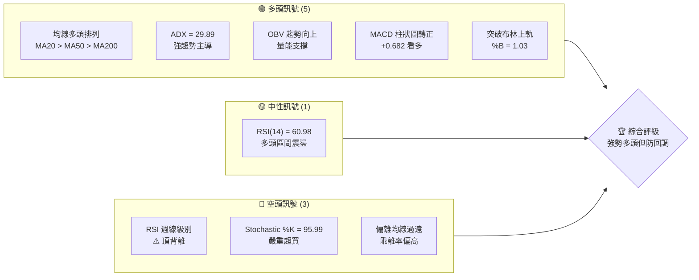
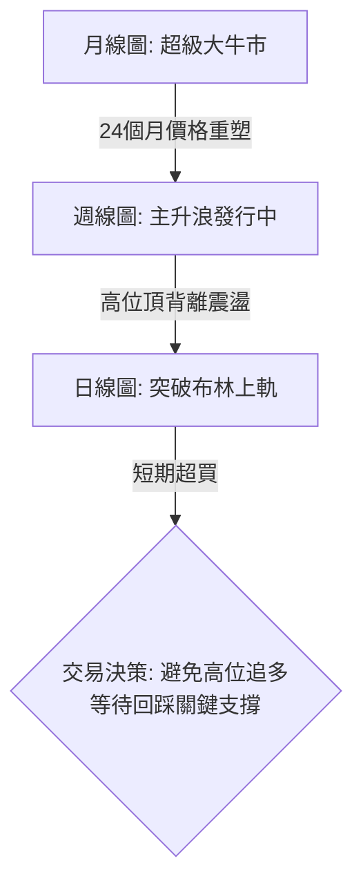
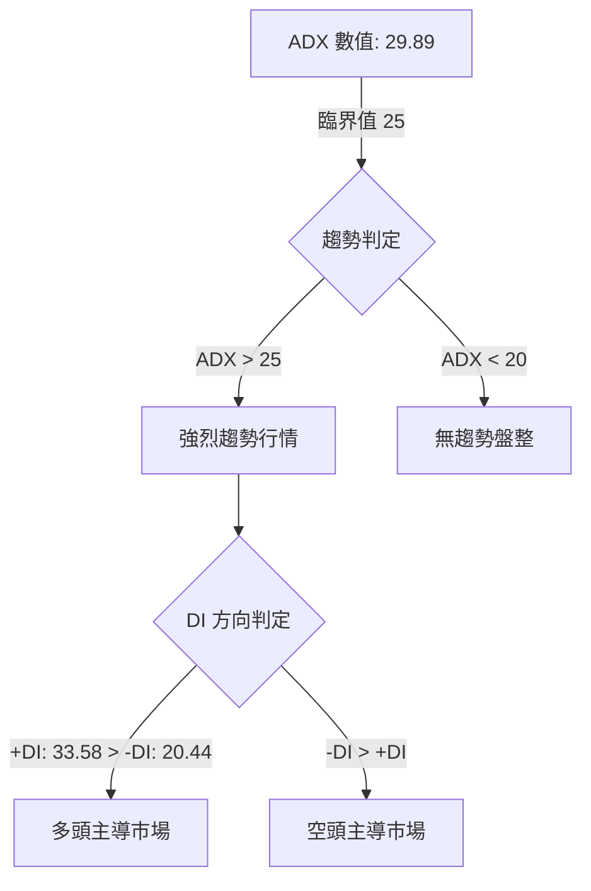
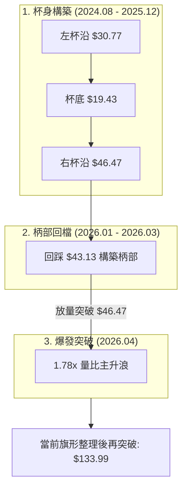
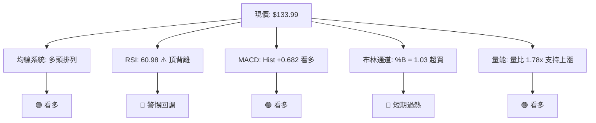
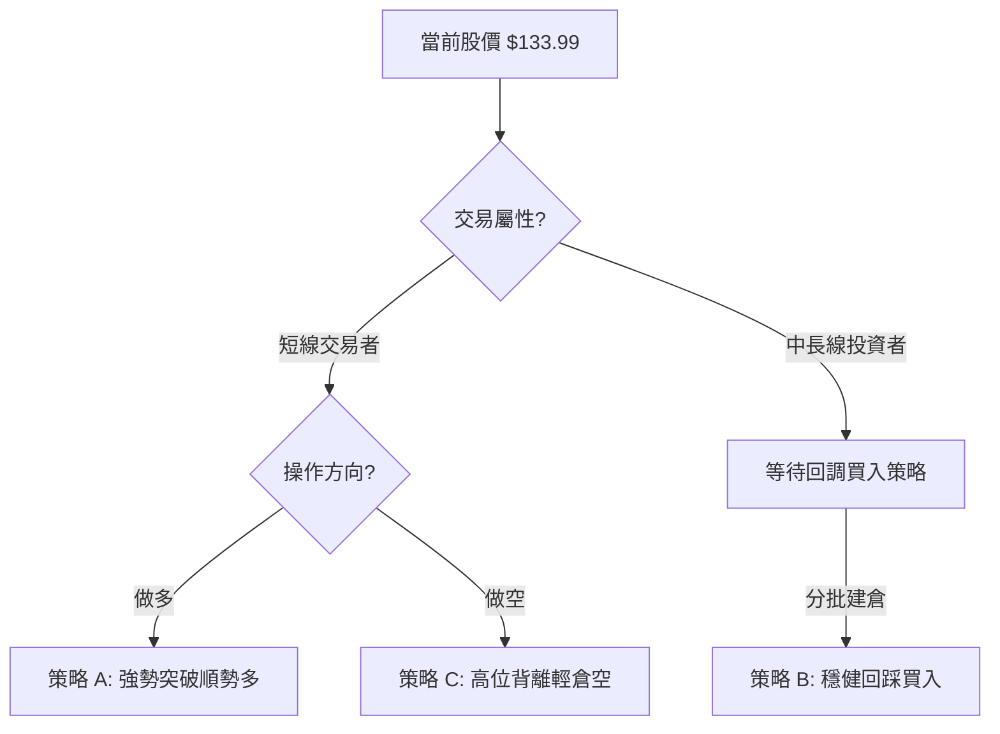
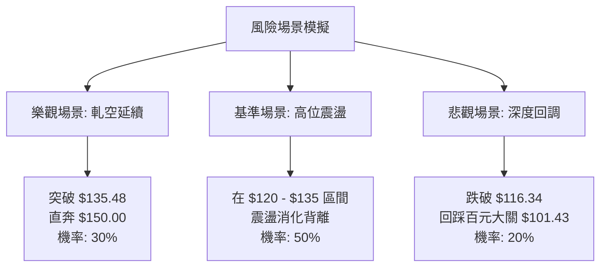

<details>
<summary>📊 靜態圖表 (點擊展開)</summary>

</details>

<html>
<head><meta charset="utf-8" /></head>
<body>
    <div style="height:500px; width:100%;">                        <script>window.PlotlyConfig = {MathJaxConfig: 'local'};</script>
        <script charset="utf-8" src="https://cdn.plot.ly/plotly-3.6.0.min.js" integrity="sha256-QaOVwtVY0T02VaHrr6pnoHLCwayMJp4O5n4YyaE3rJk=" crossorigin="anonymous"></script>                <div id="candlestick-chart" class="plotly-graph-div" style="height:100%; width:100%;"></div>            <script>                window.PLOTLYENV=window.PLOTLYENV || {};                                if (document.getElementById("candlestick-chart")) {                    Plotly.newPlot(                        "candlestick-chart",                        [{"close":{"dtype":"f8","bdata":"AAAAAAAAOEAAAAAAKZw4QAAAAKBwfThAAAAAQOF6OEAAAADgo3A4QAAAAMAexThAAAAAACmcOEAAAADgehQ4QAAAAMAexThAAAAAwB5FOUAAAABgZuY4QAAAAIDrkT5AAAAA4HqUPUAAAABgj8I8QAAAAEAKVz1AAAAA4FE4P0AAAABguP5AQAAAAAAAwEFAAAAAoHA9QUAAAABgZsZAQAAAAOBR+EFAAAAAYGamQkAAAACAPWpCQAAAACCFS0JAAAAAgMKVQkAAAABACrdCQAAAAGBm5kJAAAAAIFwvQkAAAAAAKZxCQAAAAOCj0EFAAAAAQDOTQkAAAAAghWtCQAAAAKBHgUJAAAAAwMwMQ0AAAAAgXA9DQAAAAIDCdUJAAAAA4HoUQ0AAAAAA1yNDQAAAAMAexUNAAAAAANfDREAAAAAghatEQAAAAOB6FERAAAAAYLj+Q0AAAAAAAMBDQAAAAADXg0JAAAAA4KMwQ0AAAABguJ5CQAAAAOCjEENAAAAAoJk5Q0AAAADgo\u002fBCQAAAAIDr8UJAAAAA4Hr0QUAAAABgj8JBQAAAAEDhWkFAAAAAgD0qQUAAAACAFI5BQAAAACBcz0BAAAAAAABAQUAAAADAHuVBQAAAAIA96kFAAAAAIK5nQkAAAAAgrkdEQAAAAKBHAURAAAAAACm8RUAAAACgR+FFQAAAAAAAQERAAAAA4Hq0REAAAABgZiZEQAAAAAAAQERAAAAAANdjREAAAACgR8FDQAAAACCu50JAAAAAoEfBQkAAAAAgrqdCQAAAAGBmBkJAAAAAANcjQkAAAADA9WhCQAAAACBcL0JAAAAAwMwsQkAAAADgehRCQAAAAKCZGUJAAAAAQApXQkAAAABgZqZCQAAAAEAzc0JAAAAA4KOwQ0AAAAAgXK9DQAAAAMAeBURAAAAA4KNQRUAAAACAFI5EQAAAAGBmxkZAAAAAIK4HRkAAAADAHqVHQAAAAAApXEhAAAAAwPUoSEAAAABA4XpHQAAAACCuR0hAAAAAAAAgS0AAAADA9ShLQAAAAMD1iEZAAAAAYLg+RUAAAABACvdFQAAAAADXY0hAAAAA4HpUSEAAAAAAKTxHQAAAACCuZ0hAAAAAAACgSEAAAADAzExIQAAAAGC4HkhAAAAAIIVLSUAAAABguB5JQAAAAOCjkEdAAAAAwB4lSEAAAACgcD1HQAAAAMAeZUdAAAAAQAoXR0AAAABA4bpGQAAAACBcT0ZAAAAAgBQORkAAAADgo9BFQAAAACBcD0dAAAAA4KNwR0AAAABA4bpGQAAAAIAUzkZAAAAAAADARkAAAADAzIxFQAAAAIA9ykZAAAAAoJn5RkAAAACAwrVFQAAAAIA9ykZAAAAAANdjR0AAAACgcP1HQAAAAAAAoEZAAAAAYI\u002fiRkAAAACgR+FGQAAAACCuB0ZAAAAAANeDRkAAAABAChdHQAAAACBc70VAAAAAoEcBRkAAAAAgrgdGQAAAAEAKl0dAAAAAwMwMRkAAAADgo5BFQAAAAOBRmERAAAAA4KMQRkAAAAAA1wNIQAAAAOCjMElAAAAAANdjSUAAAADgenRKQAAAAKCZeU1AAAAAACncTkAAAADgozBPQAAAACCFS1BAAAAAIK7nT0AAAAAAKTxQQAAAAAAAIFFAAAAAAAAgUUAAAADAzGxQQAAAAOCjkFBAAAAAoEdRUEAAAACA67FQQAAAAGCPolRAAAAAIFw\u002fVUAAAACgRyFVQAAAAAAAsFdAAAAAYLieV0AAAAAgrudYQAAAAIDr8VdAAAAAoJkJW0AAAADgo0BcQAAAACCuZ1tAAAAAQOE6X0AAAACAFC5gQAAAAEAKJ15AAAAAYI8SXkAAAAAghftcQAAAAKBHMVtAAAAAQOEKW0AAAABAM7NbQAAAAKBwvV1AAAAAAACgXUAAAACAwvVdQAAAAKBH4V5AAAAAoEdxXkAAAADA9TheQAAAACCFq1xAAAAAwB5VW0AAAAAghftaQAAAAKBwLVxAAAAAgOvxW0AAAABA4cpYQAAAAKBHkVtAAAAAQOH6WkAAAABgj8JaQAAAAKBwPV1AAAAA4HokX0AAAABACvdfQAAAAEAzQ11AAAAAYGZGXkAAAAAgrr9gQA=="},"high":{"dtype":"f8","bdata":"AAAAQAoXOEAAAAAA16M4QAAAAIDCtThAAAAAoHC9OEAAAAAgXM84QAAAAGC43jhAAAAAgBTuOEAAAACgR6E4QAAAAIDCdTlAAAAAQApXOUAAAABgj0I5QAAAAOCjMEBAAAAAoEehPkAAAACgmRk+QAAAAEAzMz5AAAAAQDOzP0AAAAAAACBBQAAAAGBmJkJAAAAAYGaGQUAAAABguB5BQAAAACCuB0JAAAAAwPXIQkAAAACAPQpDQAAAAEAKV0NAAAAAYGYGQ0AAAADAHuVCQAAAAMDMDENAAAAAQDPTQ0AAAACgR8FCQAAAAGBmRkJAAAAAYLi+QkAAAABgjwJDQAAAAOCjMENAAAAAYI9CQ0AAAADAzCxDQAAAAEAK90JAAAAAQDMzQ0AAAAAgXI9EQAAAAIDCVURAAAAAoHA9RUAAAADAHgVFQAAAAEAKt0RAAAAAgD1qREAAAACgmTlEQAAAAAAAIENAAAAA4FFYQ0AAAAAghetDQAAAAGCPIkNAAAAAANfDQ0AAAAAAKRxDQAAAAKCZGUNAAAAAIK6nQkAAAADAzAxCQAAAAKBw3UFAAAAAoEdhQUAAAAAAAOBBQAAAAEAKV0JAAAAAoHB9QUAAAADgehRCQAAAAOCjEEJAAAAAYLieQkAAAAAghUtEQAAAAOCjMERAAAAAQArXRUAAAABgjwJGQAAAAADXo0VAAAAAgD1qRUAAAAAgXA9FQAAAAKBHoURAAAAAYLh+REAAAADgURhEQAAAAADXA0RAAAAAoHA9Q0AAAABA4fpCQAAAACCF60JAAAAAYLi+QkAAAACAPcpCQAAAAEAz80JAAAAAYGZmQkAAAABAChdCQAAAAGC4PkJAAAAAYGZmQkAAAACgRyFDQAAAAIA9ykJAAAAAgBTuQ0AAAADAzAxFQAAAACCuJ0RAAAAAwPVIRkAAAAAghatFQAAAAKBw3UZAAAAAoJm5RkAAAABguB5IQAAAAAAAgEhAAAAAgOsxSUAAAABA4RpJQAAAAKBwHUlAAAAA4Ho0S0AAAADAzExLQAAAAOCjEEhAAAAAQOE6RkAAAAAA10NGQAAAAMAepUhAAAAAYI9iSEAAAACAPcpIQAAAACCF60hAAAAAYLi+SUAAAACgmdlIQAAAAIAUbklAAAAAYGamSUAAAAAAKZxJQAAAAMAeRUlAAAAAYGbGSEAAAACgmXlIQAAAAOBR2EdAAAAAgD1qR0AAAABgj2JHQAAAAIDClUZAAAAAgOsxRkAAAABgZkZGQAAAAMDMTEdAAAAAACl8R0AAAACgmXlHQAAAACCuR0dAAAAAIK7nRkAAAADgUdhFQAAAAOCjEEdAAAAAoHA9R0AAAABACpdGQAAAAKBH4UZAAAAA4KPwR0AAAACAPWpIQAAAAOBRuEdAAAAAQDNTR0AAAACAwpVIQAAAAIA9CkdAAAAAQOHaRkAAAADgUThHQAAAAGBmxkdAAAAAQOG6RkAAAAAgridGQAAAAMDM7EdAAAAAwMxMR0AAAADgoxBGQAAAAGC4\u002fkVAAAAAoHAdRkAAAABgj2JIQAAAAGC4PklAAAAAgOsxSkAAAABgj6JKQAAAAIDClU1AAAAAgD0KT0AAAACA67FPQAAAAKCZaVBAAAAAIIVLUEAAAACAwnVQQAAAAEAKJ1FAAAAAwB6VUUAAAACgcE1RQAAAAEDh6lBAAAAAoEcxUUAAAACA6xFRQAAAAIAUTlVAAAAAYGbGVUAAAACAwiVVQAAAAMDMvFdAAAAAACnsV0AAAADAzBxZQAAAAOB69FhAAAAAYLieW0AAAAAAAGBcQAAAAOCjoFxAAAAAgD1SYEAAAAAAAJhgQAAAAGCP8l9AAAAAAABAX0AAAADgeqRdQAAAAOB6pFtAAAAAYI\u002fiXEAAAADgekRcQAAAAAApfF5AAAAAgD3aXUAAAACA67FeQAAAACCuZ19AAAAAoEdRX0AAAADAHsVeQAAAAMD1qF9AAAAAQDNTXEAAAAAAAEBbQAAAAGCPkl1AAAAAwPVIXEAAAABguJ5aQAAAAGCPIlxAAAAAAACAXEAAAAAAAOBbQAAAAAAp3F1AAAAAYGbmX0AAAAAghZNgQAAAAGBmFmBAAAAAwMxMX0AAAAAgXO9gQA=="},"hovertemplate":"\u003cb\u003e%{x|%Y-%m-%d}\u003c\u002fb\u003e\u003cbr\u003e\u958b: $%{open:.2f}\u003cbr\u003e\u9ad8: $%{high:.2f}\u003cbr\u003e\u4f4e: $%{low:.2f}\u003cbr\u003e\u6536: $%{close:.2f}\u003cextra\u003e\u003c\u002fextra\u003e","low":{"dtype":"f8","bdata":"AAAA4FG4N0AAAAAAAMA3QAAAACCFKzhAAAAAYLgeOEAAAADAHkU4QAAAACCuRzhAAAAAgOuROEAAAADAzAw4QAAAAOBRODhAAAAA4KOwOEAAAABAM3M4QAAAAMD1KD5AAAAA4HpUPUAAAABA4bo8QAAAAIDr0TxAAAAAQOE6PUAAAACAwjU\u002fQAAAAGC4PkFAAAAAoHDdQEAAAABgj4JAQAAAAAAAwEBAAAAA4FG4QUAAAACgmTlCQAAAAEAKN0JAAAAAwMwsQkAAAADgevRBQAAAAIAUbkJAAAAAYGYmQkAAAAAA1yNCQAAAAOBRWEFAAAAAgOvRQUAAAADgejRCQAAAAIA9CkJAAAAAIK7HQkAAAACAwtVCQAAAAMAeBUJAAAAAQAo3QkAAAACAPepCQAAAAKBwHUNAAAAAwB7FQ0AAAACAwnVEQAAAAIAUDkRAAAAAwB7lQ0AAAABgZoZDQAAAAOCjUEJAAAAAgBSOQkAAAABgZmZCQAAAAAApfEJAAAAAACn8QkAAAABguL5CQAAAAMDMrEJAAAAAoJm5QUAAAAAgXE9BQAAAAKBwHUFAAAAAwPXIQEAAAAAAACBBQAAAAKBwvUBAAAAAgOtxQEAAAADgUVhBQAAAAEAKV0FAAAAA4KMQQkAAAAAghatCQAAAAMDMzENAAAAAYGYGREAAAACgR0FFQAAAAIDrEURAAAAAQDOTREAAAACgmdlDQAAAAADXA0RAAAAAgOtxQ0AAAACAPYpDQAAAACBcz0JAAAAAwPWoQkAAAACAwnVCQAAAAAAp\u002fEFAAAAAgMLVQUAAAADgUThCQAAAAMAeJUJAAAAAANcDQkAAAACgmXlBQAAAAMDM7EFAAAAAwPXoQUAAAADA9WhCQAAAACBcb0JAAAAAoEfhQkAAAABgj6JDQAAAAKCZeUNAAAAAIFwPREAAAABACldEQAAAAMD1yERAAAAAgOvxRUAAAAAAKZxGQAAAAIDCtUdAAAAAgD3qR0AAAABA4VpHQAAAAAAAgEdAAAAAQDMTSUAAAACAPYpKQAAAAKCZOUZAAAAAANcjRUAAAADAzIxFQAAAAMD1KEdAAAAAYLh+R0AAAABA4fpGQAAAAAAAwEZAAAAAQAo3SEAAAAAAAIBHQAAAAMAeZUdAAAAAgD1qSEAAAAAghctHQAAAAGCPYkdAAAAAgBRuR0AAAADgURhHQAAAAAApfEZAAAAAQOG6RkAAAADgo3BGQAAAAIDC9UVAAAAA4KNwRUAAAABACpdFQAAAAMAexUVAAAAAgD2KRkAAAACA6zFGQAAAAEAzM0ZAAAAAoJn5RUAAAACA6xFFQAAAAGCPokVAAAAAoJlZRkAAAAAA16NFQAAAAIDr0URAAAAA4Hq0RkAAAADgelRHQAAAAIDClUZAAAAAgOuxRkAAAADgUdhGQAAAAOB69EVAAAAAYGYGRkAAAABAM9NFQAAAAIDr0UVAAAAAYLjeRUAAAACgmZlFQAAAAKCZuUZAAAAAgML1RUAAAACAFG5FQAAAAOCjUERAAAAAwMzMREAAAACgcH1GQAAAAMAeBUdAAAAAIFzvSEAAAAAAKZxJQAAAAGBmZktAAAAAgOsxTUAAAAAAAGBOQAAAAEAKF09AAAAAIIULT0AAAADgo3BPQAAAAKBHEVBAAAAAIFzvUEAAAACAFB5QQAAAAMD1aFBAAAAAYLg+UEAAAABA4VpQQAAAACCu51NAAAAAQAqnVEAAAABAMzNUQAAAACCud1VAAAAAAADgVkAAAABACidXQAAAAGBm5ldAAAAAwB4FWUAAAADAHqVaQAAAAKCZSVtAAAAAQDPzW0AAAABA4fpeQAAAAAAAwFxAAAAAgD0aXUAAAABA4UpcQAAAAKBHQVpAAAAAYGb2WUAAAACgmZlZQAAAAEAzs1xAAAAAQOFKXEAAAACAwoVdQAAAAGBmVl1AAAAAAABAXUAAAAAA1xNdQAAAAGCPYlxAAAAAwB6VWkAAAABA4QpaQAAAAEAKt1tAAAAAYLjeWkAAAADAHpVYQAAAAIA9qlpAAAAAoHDdWEAAAABA4TpaQAAAAOCjoFtAAAAAwB7VXEAAAACAPapfQAAAAAAAAF1AAAAAANeDXUAAAACgmflfQA=="},"name":"\u50f9\u683c","open":{"dtype":"f8","bdata":"AAAAQAoXOEAAAACgmdk3QAAAAKCZmThAAAAAQOF6OEAAAAAgroc4QAAAACCFazhAAAAAYI\u002fCOEAAAAAAKZw4QAAAAOB6VDhAAAAAgOvROEAAAADgehQ5QAAAACCuxz9AAAAAoEdhPkAAAAAghas9QAAAAKBw\u002fTxAAAAAoEdhPUAAAAAAKZw\u002fQAAAAGCPgkFAAAAAYI9CQUAAAABACvdAQAAAAADXw0BAAAAAoEfhQUAAAACgmflCQAAAAOBRmEJAAAAAgOtRQkAAAABgZkZCQAAAAADXw0JAAAAAQOE6Q0AAAADgUThCQAAAAAAAAEJAAAAAQDMzQkAAAABAM5NCQAAAAIAULkJAAAAAwPXIQkAAAACA6xFDQAAAACCF60JAAAAAwMxMQkAAAABgjwJEQAAAAIDrMUNAAAAAIIXLQ0AAAADAzMxEQAAAAAApfERAAAAAQApXREAAAAAAACBEQAAAAIDrEUNAAAAAgMK1QkAAAAAghStDQAAAAKBHoUJAAAAAQAp3Q0AAAABAMxNDQAAAACCuB0NAAAAAYI+iQkAAAAAA14NBQAAAAKCZuUFAAAAAAAAgQUAAAACAPSpBQAAAAAAAAEJAAAAAoEfBQEAAAAAAKXxBQAAAAGBmxkFAAAAAoJkZQkAAAABAM7NCQAAAAIAU7kNAAAAAACk8REAAAACA67FFQAAAAKBHoUVAAAAA4HqUREAAAADgUfhEQAAAAKBwXURAAAAAgBQOREAAAADA9QhEQAAAAAAAoENAAAAAgD0qQ0AAAACAPcpCQAAAACCFy0JAAAAA4KOwQkAAAACgcD1CQAAAAIDr8UJAAAAAYLgeQkAAAACAwpVBQAAAAIDCFUJAAAAAoEcBQkAAAADgenRCQAAAAEAzs0JAAAAAYI\u002fiQkAAAAAghctEQAAAAIAU7kNAAAAAQAoXREAAAAAgXE9FQAAAAIA96kRAAAAAYLgeRkAAAACA6\u002fFGQAAAAKCZeUhAAAAAwMysSEAAAABgj6JIQAAAAGBmpkdAAAAAwPUoSUAAAABA4RpLQAAAAIAUbkdAAAAAANcjRkAAAAAAKfxFQAAAAMDMTEdAAAAAIK7HR0AAAACgcH1IQAAAAOCj0EZAAAAAIK4HSUAAAADAHsVIQAAAACCFy0dAAAAAwMyMSEAAAAAghctIQAAAAOB6NElAAAAAgBQOSEAAAABgZuZHQAAAAKBH4UZAAAAAQAr3RkAAAACAwvVGQAAAAKCZeUZAAAAAgOvxRUAAAAAghQtGQAAAAMDMDEZAAAAAIIULR0AAAABgj2JHQAAAAEDhOkZAAAAAoJkZRkAAAADgUbhFQAAAAMD1CEZAAAAAIFxvRkAAAACAwlVGQAAAAGC4XkVAAAAA4Hq0RkAAAADA9WhHQAAAAEAzs0dAAAAAACn8RkAAAADgevRHQAAAAIA9CkdAAAAAoJkZRkAAAABguP5FQAAAAKCZeUdAAAAAAABARkAAAADAHsVFQAAAAMDM7EZAAAAAYGYmR0AAAAAgXM9FQAAAAAAp3EVAAAAAoJn5REAAAAAAAIBGQAAAACCuB0dAAAAA4KNwSUAAAADgevRJQAAAACBcr0tAAAAAQDMzTUAAAABgj8JOQAAAAEAKF09AAAAAgD1KUEAAAABgj+JPQAAAACCFO1BAAAAAYGY2UUAAAADAzBxRQAAAAMD1yFBAAAAAACn8UEAAAABgZoZQQAAAAMDMjFRAAAAAQOHqVEAAAACA61FUQAAAAMD1iFVAAAAAYGbmV0AAAADAzExXQAAAACCFy1hAAAAA4KMgWUAAAABguL5bQAAAAKBHwVtAAAAAANfzW0AAAAAAKVxgQAAAAEAKF19AAAAAYGYGX0AAAACAPapcQAAAAGCPcltAAAAAgBReXEAAAABguL5aQAAAAIAUDl1AAAAAwB4lXUAAAACAwhVeQAAAAGBmhl5AAAAAwPUYX0AAAADAzFxeQAAAAGBm9l5AAAAAIIVbW0AAAADAzNxaQAAAAEDhGl1AAAAAoJkZW0AAAABguJ5aQAAAAAAAwFtAAAAAIFw\u002fXEAAAACA64FaQAAAAKBHYVxAAAAAQOFaXUAAAAAgri9gQAAAAEAKR19AAAAAYGZ2XkAAAACA63lgQA=="},"x":["2025-09-03T00:00:00-04:00","2025-09-04T00:00:00-04:00","2025-09-05T00:00:00-04:00","2025-09-08T00:00:00-04:00","2025-09-09T00:00:00-04:00","2025-09-10T00:00:00-04:00","2025-09-11T00:00:00-04:00","2025-09-12T00:00:00-04:00","2025-09-15T00:00:00-04:00","2025-09-16T00:00:00-04:00","2025-09-17T00:00:00-04:00","2025-09-18T00:00:00-04:00","2025-09-19T00:00:00-04:00","2025-09-22T00:00:00-04:00","2025-09-23T00:00:00-04:00","2025-09-24T00:00:00-04:00","2025-09-25T00:00:00-04:00","2025-09-26T00:00:00-04:00","2025-09-29T00:00:00-04:00","2025-09-30T00:00:00-04:00","2025-10-01T00:00:00-04:00","2025-10-02T00:00:00-04:00","2025-10-03T00:00:00-04:00","2025-10-06T00:00:00-04:00","2025-10-07T00:00:00-04:00","2025-10-08T00:00:00-04:00","2025-10-09T00:00:00-04:00","2025-10-10T00:00:00-04:00","2025-10-13T00:00:00-04:00","2025-10-14T00:00:00-04:00","2025-10-15T00:00:00-04:00","2025-10-16T00:00:00-04:00","2025-10-17T00:00:00-04:00","2025-10-20T00:00:00-04:00","2025-10-21T00:00:00-04:00","2025-10-22T00:00:00-04:00","2025-10-23T00:00:00-04:00","2025-10-24T00:00:00-04:00","2025-10-27T00:00:00-04:00","2025-10-28T00:00:00-04:00","2025-10-29T00:00:00-04:00","2025-10-30T00:00:00-04:00","2025-10-31T00:00:00-04:00","2025-11-03T00:00:00-05:00","2025-11-04T00:00:00-05:00","2025-11-05T00:00:00-05:00","2025-11-06T00:00:00-05:00","2025-11-07T00:00:00-05:00","2025-11-10T00:00:00-05:00","2025-11-11T00:00:00-05:00","2025-11-12T00:00:00-05:00","2025-11-13T00:00:00-05:00","2025-11-14T00:00:00-05:00","2025-11-17T00:00:00-05:00","2025-11-18T00:00:00-05:00","2025-11-19T00:00:00-05:00","2025-11-20T00:00:00-05:00","2025-11-21T00:00:00-05:00","2025-11-24T00:00:00-05:00","2025-11-25T00:00:00-05:00","2025-11-26T00:00:00-05:00","2025-11-28T00:00:00-05:00","2025-12-01T00:00:00-05:00","2025-12-02T00:00:00-05:00","2025-12-03T00:00:00-05:00","2025-12-04T00:00:00-05:00","2025-12-05T00:00:00-05:00","2025-12-08T00:00:00-05:00","2025-12-09T00:00:00-05:00","2025-12-10T00:00:00-05:00","2025-12-11T00:00:00-05:00","2025-12-12T00:00:00-05:00","2025-12-15T00:00:00-05:00","2025-12-16T00:00:00-05:00","2025-12-17T00:00:00-05:00","2025-12-18T00:00:00-05:00","2025-12-19T00:00:00-05:00","2025-12-22T00:00:00-05:00","2025-12-23T00:00:00-05:00","2025-12-24T00:00:00-05:00","2025-12-26T00:00:00-05:00","2025-12-29T00:00:00-05:00","2025-12-30T00:00:00-05:00","2025-12-31T00:00:00-05:00","2026-01-02T00:00:00-05:00","2026-01-05T00:00:00-05:00","2026-01-06T00:00:00-05:00","2026-01-07T00:00:00-05:00","2026-01-08T00:00:00-05:00","2026-01-09T00:00:00-05:00","2026-01-12T00:00:00-05:00","2026-01-13T00:00:00-05:00","2026-01-14T00:00:00-05:00","2026-01-15T00:00:00-05:00","2026-01-16T00:00:00-05:00","2026-01-20T00:00:00-05:00","2026-01-21T00:00:00-05:00","2026-01-22T00:00:00-05:00","2026-01-23T00:00:00-05:00","2026-01-26T00:00:00-05:00","2026-01-27T00:00:00-05:00","2026-01-28T00:00:00-05:00","2026-01-29T00:00:00-05:00","2026-01-30T00:00:00-05:00","2026-02-02T00:00:00-05:00","2026-02-03T00:00:00-05:00","2026-02-04T00:00:00-05:00","2026-02-05T00:00:00-05:00","2026-02-06T00:00:00-05:00","2026-02-09T00:00:00-05:00","2026-02-10T00:00:00-05:00","2026-02-11T00:00:00-05:00","2026-02-12T00:00:00-05:00","2026-02-13T00:00:00-05:00","2026-02-17T00:00:00-05:00","2026-02-18T00:00:00-05:00","2026-02-19T00:00:00-05:00","2026-02-20T00:00:00-05:00","2026-02-23T00:00:00-05:00","2026-02-24T00:00:00-05:00","2026-02-25T00:00:00-05:00","2026-02-26T00:00:00-05:00","2026-02-27T00:00:00-05:00","2026-03-02T00:00:00-05:00","2026-03-03T00:00:00-05:00","2026-03-04T00:00:00-05:00","2026-03-05T00:00:00-05:00","2026-03-06T00:00:00-05:00","2026-03-09T00:00:00-04:00","2026-03-10T00:00:00-04:00","2026-03-11T00:00:00-04:00","2026-03-12T00:00:00-04:00","2026-03-13T00:00:00-04:00","2026-03-16T00:00:00-04:00","2026-03-17T00:00:00-04:00","2026-03-18T00:00:00-04:00","2026-03-19T00:00:00-04:00","2026-03-20T00:00:00-04:00","2026-03-23T00:00:00-04:00","2026-03-24T00:00:00-04:00","2026-03-25T00:00:00-04:00","2026-03-26T00:00:00-04:00","2026-03-27T00:00:00-04:00","2026-03-30T00:00:00-04:00","2026-03-31T00:00:00-04:00","2026-04-01T00:00:00-04:00","2026-04-02T00:00:00-04:00","2026-04-06T00:00:00-04:00","2026-04-07T00:00:00-04:00","2026-04-08T00:00:00-04:00","2026-04-09T00:00:00-04:00","2026-04-10T00:00:00-04:00","2026-04-13T00:00:00-04:00","2026-04-14T00:00:00-04:00","2026-04-15T00:00:00-04:00","2026-04-16T00:00:00-04:00","2026-04-17T00:00:00-04:00","2026-04-20T00:00:00-04:00","2026-04-21T00:00:00-04:00","2026-04-22T00:00:00-04:00","2026-04-23T00:00:00-04:00","2026-04-24T00:00:00-04:00","2026-04-27T00:00:00-04:00","2026-04-28T00:00:00-04:00","2026-04-29T00:00:00-04:00","2026-04-30T00:00:00-04:00","2026-05-01T00:00:00-04:00","2026-05-04T00:00:00-04:00","2026-05-05T00:00:00-04:00","2026-05-06T00:00:00-04:00","2026-05-07T00:00:00-04:00","2026-05-08T00:00:00-04:00","2026-05-11T00:00:00-04:00","2026-05-12T00:00:00-04:00","2026-05-13T00:00:00-04:00","2026-05-14T00:00:00-04:00","2026-05-15T00:00:00-04:00","2026-05-18T00:00:00-04:00","2026-05-19T00:00:00-04:00","2026-05-20T00:00:00-04:00","2026-05-21T00:00:00-04:00","2026-05-22T00:00:00-04:00","2026-05-26T00:00:00-04:00","2026-05-27T00:00:00-04:00","2026-05-28T00:00:00-04:00","2026-05-29T00:00:00-04:00","2026-06-01T00:00:00-04:00","2026-06-02T00:00:00-04:00","2026-06-03T00:00:00-04:00","2026-06-04T00:00:00-04:00","2026-06-05T00:00:00-04:00","2026-06-08T00:00:00-04:00","2026-06-09T00:00:00-04:00","2026-06-10T00:00:00-04:00","2026-06-11T00:00:00-04:00","2026-06-12T00:00:00-04:00","2026-06-15T00:00:00-04:00","2026-06-16T00:00:00-04:00","2026-06-17T00:00:00-04:00","2026-06-18T00:00:00-04:00"],"type":"candlestick"},{"hovertemplate":"MA30: $%{y:.2f}\u003cextra\u003e\u003c\u002fextra\u003e","line":{"color":"#2196F3","dash":"dash","width":2},"mode":"lines","name":"MA30","x":["2025-09-03T00:00:00-04:00","2025-09-04T00:00:00-04:00","2025-09-05T00:00:00-04:00","2025-09-08T00:00:00-04:00","2025-09-09T00:00:00-04:00","2025-09-10T00:00:00-04:00","2025-09-11T00:00:00-04:00","2025-09-12T00:00:00-04:00","2025-09-15T00:00:00-04:00","2025-09-16T00:00:00-04:00","2025-09-17T00:00:00-04:00","2025-09-18T00:00:00-04:00","2025-09-19T00:00:00-04:00","2025-09-22T00:00:00-04:00","2025-09-23T00:00:00-04:00","2025-09-24T00:00:00-04:00","2025-09-25T00:00:00-04:00","2025-09-26T00:00:00-04:00","2025-09-29T00:00:00-04:00","2025-09-30T00:00:00-04:00","2025-10-01T00:00:00-04:00","2025-10-02T00:00:00-04:00","2025-10-03T00:00:00-04:00","2025-10-06T00:00:00-04:00","2025-10-07T00:00:00-04:00","2025-10-08T00:00:00-04:00","2025-10-09T00:00:00-04:00","2025-10-10T00:00:00-04:00","2025-10-13T00:00:00-04:00","2025-10-14T00:00:00-04:00","2025-10-15T00:00:00-04:00","2025-10-16T00:00:00-04:00","2025-10-17T00:00:00-04:00","2025-10-20T00:00:00-04:00","2025-10-21T00:00:00-04:00","2025-10-22T00:00:00-04:00","2025-10-23T00:00:00-04:00","2025-10-24T00:00:00-04:00","2025-10-27T00:00:00-04:00","2025-10-28T00:00:00-04:00","2025-10-29T00:00:00-04:00","2025-10-30T00:00:00-04:00","2025-10-31T00:00:00-04:00","2025-11-03T00:00:00-05:00","2025-11-04T00:00:00-05:00","2025-11-05T00:00:00-05:00","2025-11-06T00:00:00-05:00","2025-11-07T00:00:00-05:00","2025-11-10T00:00:00-05:00","2025-11-11T00:00:00-05:00","2025-11-12T00:00:00-05:00","2025-11-13T00:00:00-05:00","2025-11-14T00:00:00-05:00","2025-11-17T00:00:00-05:00","2025-11-18T00:00:00-05:00","2025-11-19T00:00:00-05:00","2025-11-20T00:00:00-05:00","2025-11-21T00:00:00-05:00","2025-11-24T00:00:00-05:00","2025-11-25T00:00:00-05:00","2025-11-26T00:00:00-05:00","2025-11-28T00:00:00-05:00","2025-12-01T00:00:00-05:00","2025-12-02T00:00:00-05:00","2025-12-03T00:00:00-05:00","2025-12-04T00:00:00-05:00","2025-12-05T00:00:00-05:00","2025-12-08T00:00:00-05:00","2025-12-09T00:00:00-05:00","2025-12-10T00:00:00-05:00","2025-12-11T00:00:00-05:00","2025-12-12T00:00:00-05:00","2025-12-15T00:00:00-05:00","2025-12-16T00:00:00-05:00","2025-12-17T00:00:00-05:00","2025-12-18T00:00:00-05:00","2025-12-19T00:00:00-05:00","2025-12-22T00:00:00-05:00","2025-12-23T00:00:00-05:00","2025-12-24T00:00:00-05:00","2025-12-26T00:00:00-05:00","2025-12-29T00:00:00-05:00","2025-12-30T00:00:00-05:00","2025-12-31T00:00:00-05:00","2026-01-02T00:00:00-05:00","2026-01-05T00:00:00-05:00","2026-01-06T00:00:00-05:00","2026-01-07T00:00:00-05:00","2026-01-08T00:00:00-05:00","2026-01-09T00:00:00-05:00","2026-01-12T00:00:00-05:00","2026-01-13T00:00:00-05:00","2026-01-14T00:00:00-05:00","2026-01-15T00:00:00-05:00","2026-01-16T00:00:00-05:00","2026-01-20T00:00:00-05:00","2026-01-21T00:00:00-05:00","2026-01-22T00:00:00-05:00","2026-01-23T00:00:00-05:00","2026-01-26T00:00:00-05:00","2026-01-27T00:00:00-05:00","2026-01-28T00:00:00-05:00","2026-01-29T00:00:00-05:00","2026-01-30T00:00:00-05:00","2026-02-02T00:00:00-05:00","2026-02-03T00:00:00-05:00","2026-02-04T00:00:00-05:00","2026-02-05T00:00:00-05:00","2026-02-06T00:00:00-05:00","2026-02-09T00:00:00-05:00","2026-02-10T00:00:00-05:00","2026-02-11T00:00:00-05:00","2026-02-12T00:00:00-05:00","2026-02-13T00:00:00-05:00","2026-02-17T00:00:00-05:00","2026-02-18T00:00:00-05:00","2026-02-19T00:00:00-05:00","2026-02-20T00:00:00-05:00","2026-02-23T00:00:00-05:00","2026-02-24T00:00:00-05:00","2026-02-25T00:00:00-05:00","2026-02-26T00:00:00-05:00","2026-02-27T00:00:00-05:00","2026-03-02T00:00:00-05:00","2026-03-03T00:00:00-05:00","2026-03-04T00:00:00-05:00","2026-03-05T00:00:00-05:00","2026-03-06T00:00:00-05:00","2026-03-09T00:00:00-04:00","2026-03-10T00:00:00-04:00","2026-03-11T00:00:00-04:00","2026-03-12T00:00:00-04:00","2026-03-13T00:00:00-04:00","2026-03-16T00:00:00-04:00","2026-03-17T00:00:00-04:00","2026-03-18T00:00:00-04:00","2026-03-19T00:00:00-04:00","2026-03-20T00:00:00-04:00","2026-03-23T00:00:00-04:00","2026-03-24T00:00:00-04:00","2026-03-25T00:00:00-04:00","2026-03-26T00:00:00-04:00","2026-03-27T00:00:00-04:00","2026-03-30T00:00:00-04:00","2026-03-31T00:00:00-04:00","2026-04-01T00:00:00-04:00","2026-04-02T00:00:00-04:00","2026-04-06T00:00:00-04:00","2026-04-07T00:00:00-04:00","2026-04-08T00:00:00-04:00","2026-04-09T00:00:00-04:00","2026-04-10T00:00:00-04:00","2026-04-13T00:00:00-04:00","2026-04-14T00:00:00-04:00","2026-04-15T00:00:00-04:00","2026-04-16T00:00:00-04:00","2026-04-17T00:00:00-04:00","2026-04-20T00:00:00-04:00","2026-04-21T00:00:00-04:00","2026-04-22T00:00:00-04:00","2026-04-23T00:00:00-04:00","2026-04-24T00:00:00-04:00","2026-04-27T00:00:00-04:00","2026-04-28T00:00:00-04:00","2026-04-29T00:00:00-04:00","2026-04-30T00:00:00-04:00","2026-05-01T00:00:00-04:00","2026-05-04T00:00:00-04:00","2026-05-05T00:00:00-04:00","2026-05-06T00:00:00-04:00","2026-05-07T00:00:00-04:00","2026-05-08T00:00:00-04:00","2026-05-11T00:00:00-04:00","2026-05-12T00:00:00-04:00","2026-05-13T00:00:00-04:00","2026-05-14T00:00:00-04:00","2026-05-15T00:00:00-04:00","2026-05-18T00:00:00-04:00","2026-05-19T00:00:00-04:00","2026-05-20T00:00:00-04:00","2026-05-21T00:00:00-04:00","2026-05-22T00:00:00-04:00","2026-05-26T00:00:00-04:00","2026-05-27T00:00:00-04:00","2026-05-28T00:00:00-04:00","2026-05-29T00:00:00-04:00","2026-06-01T00:00:00-04:00","2026-06-02T00:00:00-04:00","2026-06-03T00:00:00-04:00","2026-06-04T00:00:00-04:00","2026-06-05T00:00:00-04:00","2026-06-08T00:00:00-04:00","2026-06-09T00:00:00-04:00","2026-06-10T00:00:00-04:00","2026-06-11T00:00:00-04:00","2026-06-12T00:00:00-04:00","2026-06-15T00:00:00-04:00","2026-06-16T00:00:00-04:00","2026-06-17T00:00:00-04:00","2026-06-18T00:00:00-04:00"],"y":{"dtype":"f8","bdata":"AAAAAAAA+H8AAAAAAAD4fwAAAAAAAPh\u002fAAAAAAAA+H8AAAAAAAD4fwAAAAAAAPh\u002fAAAAAAAA+H8AAAAAAAD4fwAAAAAAAPh\u002fAAAAAAAA+H8AAAAAAAD4fwAAAAAAAPh\u002fAAAAAAAA+H8AAAAAAAD4fwAAAAAAAPh\u002fAAAAAAAA+H8AAAAAAAD4fwAAAAAAAPh\u002fAAAAAAAA+H8AAAAAAAD4fwAAAAAAAPh\u002fAAAAAAAA+H8AAAAAAAD4fwAAAAAAAPh\u002fAAAAAAAA+H8AAAAAAAD4fwAAAAAAAPh\u002fAAAAAAAA+H8AAAAAAAD4f5qZmak42z5Ad3d3R29LP0Dv7u4ezLM\u002fQM3MzDxRD0BAiYiI6G1JQEBVVVUdzINAQO\u002fu7iajt0BAVVVVXXPxQEDNzMyMCS5BQERERFQObUFAVVVVlW6yQUCrqqpyk\u002fhBQBEREUl+IUJAiYiIyOhNQkAiIiK6u3tCQJqZmUGLnEJAMzMz4xe7QkARERHB9chCQKuqqmou1EJAd3d3tx7lQkC8u7s7mPdCQHd3dyfq\u002f0JAd3d35\u002fv5QkCJiIgIZfRCQCIiIpJf7EJAmpmZiUHgQkCrqqp6W9ZCQN7d3c2FxEJARERERIu8QkAzMzNTcbZCQHd3d8dLt0JAiYiIaNi1QkBERESkt8VCQBEREXGE0kJAq6qq6m3pQkDNzMxMfgFDQN7d3Z3EEENAvLu7e6IeQ0DNzMzcQCdDQAAAAHBZK0NAzczMPCYoQ0AzMzNjVyBDQAAAAJBQFkNAzczMvLsLQ0DNzMysYwJDQBEREUE1\u002fkJA3t3dfT\u002f1QkDNzMy8dPNCQImIiFjy60JAVVVVlfziQkAiIiLipdtCQERERPRv1EJAAAAAALnXQkC8u7s7Ud9CQM3MzEyp6EJA7+7uPjX+QkDNzMxMYhBDQHd3d6fGK0NAiYiIyHZOQ0BERESkKWVDQImIiHiijkNAd3d3Z5GtQ0C8u7tbSMpDQBEREQFy70NA7+7ufiMEREAAAADAyhFEQLy7u2suNERAAAAAIPdqREBERES0yKZEQM3MzFxIukRAREREJJTBREBmZmb2b9REQAAAACA+A0VAZmZm5tAyRUAAAAAQ5llFQDMzM2NXkEVAZmZmFq7HRUDNzMz88PlFQCIiIjKWLEZAMzMzE1hpRkARERExa6VGQKuqqqoN1EZAIiIi4pYFR0BERETkwSxHQImIiGj0VkdAIiIi0vdzR0CamZm5841HQN7d3U1+oUdAvLu7286nR0Dv7u5ej7JHQGZmZvb9tEdAd3d3JwbBR0De3d1NN7lHQKuqqlryq0dAmpmZKeqfR0AzMzMDco9HQO\u002fu7g67gkdA7+7uPlFfR0CamZmJzzBHQImIiJj8MkdAq6qqakpFR0CJiIgYklZHQFVVVWWCR0dA7+7uvi07R0C8u7s7JjhHQHd3d\u002ffhI0dAmpmZmeARR0ARERFRjQdHQLy7uxvo9EZA3t3d\u002fdTYRkCJiIjIdr5GQFVVVWWtvkZAvLu7y8ysRkBERES0gZ5GQCIiIgKdhkZAzczM3N19RkDNzMz81IhGQCIiInJooUZAzczM3N29RkCJiIgYduVGQBEREeEzHEdA3t3dHYVbR0BVVVVFtqNHQN7d3e0190dAVVVVVVVFSEARERFxhKJIQBERETFPBElA3t3dzYVkSUARERGBlcNJQERERJTRG0pAZmZmlrVqSkAzMzMz7LpKQDMzM9MGWktAVVVVhV0BTEBmZmbGvaZMQFVVVcUEf01AzczMXAFSTkCJiIgYBDZPQERERNS\u002fCVBAq6qq0pSSUEB3d3e3rCVRQImIiEjhqlFAd3d3x0tXUkBERESMbA9TQFVVVXXauFNAERER+VNbVEBVVVVtLuxUQGZmZia\u002faFVA3t3dvS3jVUDv7u5mrV5WQM3MzNyy3lZAAAAAUNRXV0CamZkhadJXQERERIzeTlhA7+7uboTKWEB3d3eX4EFZQHd3dwdlpFlAd3d3p3\u002f7WUDe3d3dllVaQCIiIsKuuFpAvLu7a+cbW0De3d2tAGFbQERERPQonFtAq6qqyhPNW0B3d3e3Hv1bQGZmZlaALFxAzczMfLFsXECrqqpK8KhcQM3MzIxQ1lxAmpmZ+fDxXECrqqrash5dQA=="},"type":"scatter"},{"hovertemplate":"MA60: $%{y:.2f}\u003cextra\u003e\u003c\u002fextra\u003e","line":{"color":"#9C27B0","dash":"dash","width":2},"mode":"lines","name":"MA60","x":["2025-09-03T00:00:00-04:00","2025-09-04T00:00:00-04:00","2025-09-05T00:00:00-04:00","2025-09-08T00:00:00-04:00","2025-09-09T00:00:00-04:00","2025-09-10T00:00:00-04:00","2025-09-11T00:00:00-04:00","2025-09-12T00:00:00-04:00","2025-09-15T00:00:00-04:00","2025-09-16T00:00:00-04:00","2025-09-17T00:00:00-04:00","2025-09-18T00:00:00-04:00","2025-09-19T00:00:00-04:00","2025-09-22T00:00:00-04:00","2025-09-23T00:00:00-04:00","2025-09-24T00:00:00-04:00","2025-09-25T00:00:00-04:00","2025-09-26T00:00:00-04:00","2025-09-29T00:00:00-04:00","2025-09-30T00:00:00-04:00","2025-10-01T00:00:00-04:00","2025-10-02T00:00:00-04:00","2025-10-03T00:00:00-04:00","2025-10-06T00:00:00-04:00","2025-10-07T00:00:00-04:00","2025-10-08T00:00:00-04:00","2025-10-09T00:00:00-04:00","2025-10-10T00:00:00-04:00","2025-10-13T00:00:00-04:00","2025-10-14T00:00:00-04:00","2025-10-15T00:00:00-04:00","2025-10-16T00:00:00-04:00","2025-10-17T00:00:00-04:00","2025-10-20T00:00:00-04:00","2025-10-21T00:00:00-04:00","2025-10-22T00:00:00-04:00","2025-10-23T00:00:00-04:00","2025-10-24T00:00:00-04:00","2025-10-27T00:00:00-04:00","2025-10-28T00:00:00-04:00","2025-10-29T00:00:00-04:00","2025-10-30T00:00:00-04:00","2025-10-31T00:00:00-04:00","2025-11-03T00:00:00-05:00","2025-11-04T00:00:00-05:00","2025-11-05T00:00:00-05:00","2025-11-06T00:00:00-05:00","2025-11-07T00:00:00-05:00","2025-11-10T00:00:00-05:00","2025-11-11T00:00:00-05:00","2025-11-12T00:00:00-05:00","2025-11-13T00:00:00-05:00","2025-11-14T00:00:00-05:00","2025-11-17T00:00:00-05:00","2025-11-18T00:00:00-05:00","2025-11-19T00:00:00-05:00","2025-11-20T00:00:00-05:00","2025-11-21T00:00:00-05:00","2025-11-24T00:00:00-05:00","2025-11-25T00:00:00-05:00","2025-11-26T00:00:00-05:00","2025-11-28T00:00:00-05:00","2025-12-01T00:00:00-05:00","2025-12-02T00:00:00-05:00","2025-12-03T00:00:00-05:00","2025-12-04T00:00:00-05:00","2025-12-05T00:00:00-05:00","2025-12-08T00:00:00-05:00","2025-12-09T00:00:00-05:00","2025-12-10T00:00:00-05:00","2025-12-11T00:00:00-05:00","2025-12-12T00:00:00-05:00","2025-12-15T00:00:00-05:00","2025-12-16T00:00:00-05:00","2025-12-17T00:00:00-05:00","2025-12-18T00:00:00-05:00","2025-12-19T00:00:00-05:00","2025-12-22T00:00:00-05:00","2025-12-23T00:00:00-05:00","2025-12-24T00:00:00-05:00","2025-12-26T00:00:00-05:00","2025-12-29T00:00:00-05:00","2025-12-30T00:00:00-05:00","2025-12-31T00:00:00-05:00","2026-01-02T00:00:00-05:00","2026-01-05T00:00:00-05:00","2026-01-06T00:00:00-05:00","2026-01-07T00:00:00-05:00","2026-01-08T00:00:00-05:00","2026-01-09T00:00:00-05:00","2026-01-12T00:00:00-05:00","2026-01-13T00:00:00-05:00","2026-01-14T00:00:00-05:00","2026-01-15T00:00:00-05:00","2026-01-16T00:00:00-05:00","2026-01-20T00:00:00-05:00","2026-01-21T00:00:00-05:00","2026-01-22T00:00:00-05:00","2026-01-23T00:00:00-05:00","2026-01-26T00:00:00-05:00","2026-01-27T00:00:00-05:00","2026-01-28T00:00:00-05:00","2026-01-29T00:00:00-05:00","2026-01-30T00:00:00-05:00","2026-02-02T00:00:00-05:00","2026-02-03T00:00:00-05:00","2026-02-04T00:00:00-05:00","2026-02-05T00:00:00-05:00","2026-02-06T00:00:00-05:00","2026-02-09T00:00:00-05:00","2026-02-10T00:00:00-05:00","2026-02-11T00:00:00-05:00","2026-02-12T00:00:00-05:00","2026-02-13T00:00:00-05:00","2026-02-17T00:00:00-05:00","2026-02-18T00:00:00-05:00","2026-02-19T00:00:00-05:00","2026-02-20T00:00:00-05:00","2026-02-23T00:00:00-05:00","2026-02-24T00:00:00-05:00","2026-02-25T00:00:00-05:00","2026-02-26T00:00:00-05:00","2026-02-27T00:00:00-05:00","2026-03-02T00:00:00-05:00","2026-03-03T00:00:00-05:00","2026-03-04T00:00:00-05:00","2026-03-05T00:00:00-05:00","2026-03-06T00:00:00-05:00","2026-03-09T00:00:00-04:00","2026-03-10T00:00:00-04:00","2026-03-11T00:00:00-04:00","2026-03-12T00:00:00-04:00","2026-03-13T00:00:00-04:00","2026-03-16T00:00:00-04:00","2026-03-17T00:00:00-04:00","2026-03-18T00:00:00-04:00","2026-03-19T00:00:00-04:00","2026-03-20T00:00:00-04:00","2026-03-23T00:00:00-04:00","2026-03-24T00:00:00-04:00","2026-03-25T00:00:00-04:00","2026-03-26T00:00:00-04:00","2026-03-27T00:00:00-04:00","2026-03-30T00:00:00-04:00","2026-03-31T00:00:00-04:00","2026-04-01T00:00:00-04:00","2026-04-02T00:00:00-04:00","2026-04-06T00:00:00-04:00","2026-04-07T00:00:00-04:00","2026-04-08T00:00:00-04:00","2026-04-09T00:00:00-04:00","2026-04-10T00:00:00-04:00","2026-04-13T00:00:00-04:00","2026-04-14T00:00:00-04:00","2026-04-15T00:00:00-04:00","2026-04-16T00:00:00-04:00","2026-04-17T00:00:00-04:00","2026-04-20T00:00:00-04:00","2026-04-21T00:00:00-04:00","2026-04-22T00:00:00-04:00","2026-04-23T00:00:00-04:00","2026-04-24T00:00:00-04:00","2026-04-27T00:00:00-04:00","2026-04-28T00:00:00-04:00","2026-04-29T00:00:00-04:00","2026-04-30T00:00:00-04:00","2026-05-01T00:00:00-04:00","2026-05-04T00:00:00-04:00","2026-05-05T00:00:00-04:00","2026-05-06T00:00:00-04:00","2026-05-07T00:00:00-04:00","2026-05-08T00:00:00-04:00","2026-05-11T00:00:00-04:00","2026-05-12T00:00:00-04:00","2026-05-13T00:00:00-04:00","2026-05-14T00:00:00-04:00","2026-05-15T00:00:00-04:00","2026-05-18T00:00:00-04:00","2026-05-19T00:00:00-04:00","2026-05-20T00:00:00-04:00","2026-05-21T00:00:00-04:00","2026-05-22T00:00:00-04:00","2026-05-26T00:00:00-04:00","2026-05-27T00:00:00-04:00","2026-05-28T00:00:00-04:00","2026-05-29T00:00:00-04:00","2026-06-01T00:00:00-04:00","2026-06-02T00:00:00-04:00","2026-06-03T00:00:00-04:00","2026-06-04T00:00:00-04:00","2026-06-05T00:00:00-04:00","2026-06-08T00:00:00-04:00","2026-06-09T00:00:00-04:00","2026-06-10T00:00:00-04:00","2026-06-11T00:00:00-04:00","2026-06-12T00:00:00-04:00","2026-06-15T00:00:00-04:00","2026-06-16T00:00:00-04:00","2026-06-17T00:00:00-04:00","2026-06-18T00:00:00-04:00"],"y":{"dtype":"f8","bdata":"AAAAAAAA+H8AAAAAAAD4fwAAAAAAAPh\u002fAAAAAAAA+H8AAAAAAAD4fwAAAAAAAPh\u002fAAAAAAAA+H8AAAAAAAD4fwAAAAAAAPh\u002fAAAAAAAA+H8AAAAAAAD4fwAAAAAAAPh\u002fAAAAAAAA+H8AAAAAAAD4fwAAAAAAAPh\u002fAAAAAAAA+H8AAAAAAAD4fwAAAAAAAPh\u002fAAAAAAAA+H8AAAAAAAD4fwAAAAAAAPh\u002fAAAAAAAA+H8AAAAAAAD4fwAAAAAAAPh\u002fAAAAAAAA+H8AAAAAAAD4fwAAAAAAAPh\u002fAAAAAAAA+H8AAAAAAAD4fwAAAAAAAPh\u002fAAAAAAAA+H8AAAAAAAD4fwAAAAAAAPh\u002fAAAAAAAA+H8AAAAAAAD4fwAAAAAAAPh\u002fAAAAAAAA+H8AAAAAAAD4fwAAAAAAAPh\u002fAAAAAAAA+H8AAAAAAAD4fwAAAAAAAPh\u002fAAAAAAAA+H8AAAAAAAD4fwAAAAAAAPh\u002fAAAAAAAA+H8AAAAAAAD4fwAAAAAAAPh\u002fAAAAAAAA+H8AAAAAAAD4fwAAAAAAAPh\u002fAAAAAAAA+H8AAAAAAAD4fwAAAAAAAPh\u002fAAAAAAAA+H8AAAAAAAD4fwAAAAAAAPh\u002fAAAAAAAA+H8AAAAAAAD4fyIiIg50EkFAIiIiBsgtQUDe3d3Zzk9BQO\u002fu7tbqcEFAmpmZ6W2ZQUARERE1pcJBQGZmZuIz5EFAiYiI7AoIQkDNzMw0pSpCQCIiIuIzTEJAERERaUptQkDv7u5qdYxCQImIiGznm0JAq6qqQtKsQkB3d3ezD79CQFVVVUFgzUJAiYiIsCvYQkDv7u4+Nd5CQJqZmWEQ4EJAZmZmpg3kQkDv7u4On+lCQN7d3Q0t6kJAvLu7c9roQkAiIiIi2+lCQHd3d2+E6kJAREREZDvvQkC8u7vjXvNCQKuqqjom+EJAZmZmBoEFQ0C8u7t7zQ1DQAAAACD3IkNAAAAA6LQxQ0AAAAAAAEhDQBERETn7YENAzczMtMh2Q0BmZmaGpIlDQM3MzIR5okNA3t3dzczEQ0CJiIjIBOdDQGZmZubQ8kNAiYiIMN30Q0DNzMysY\u002fpDQAAAAFjHDERAmpmZUUYfREBmZmbeJC5EQCIiIlJGR0RAIiIiynZeREDNzMzcsnZEQFVVVUVEjERAREREVCqmRECamZmJiMBEQHd3d88+1ERAERER8afuREAAAACQCQZFQKuqqtrOH0VAiYiIiBY5RUAzMzMDK09FQKuqqnqiZkVAIiIi0iJ7RUCamZmB3ItFQHd3dzfQoUVAd3d3x0u3RUDNzMzUv8FFQN7d3S2yzUVARERE1AbSRUCamZlhntBFQFVVVb1020VAd3d3LyTlRUDv7u4ezOtFQKuqqnqi9kVAd3d3R28DRkB3d3cHgRVGQKuqqkJgJUZAq6qqUv82RkDe3d0lBklGQFVVVa0cWkZAAAAAWMdsRkDv7u4mv4BGQO\u002fu7ia\u002fkEZAiYiIiBahRkDNzMz88LFGQAAAAIhdyUZA7+7u1jHZRkBERETMoeVGQFVVVbXI7kZAd3d31+r4RkAzMzNbZAtHQAAAAGBzIUdAREREXNYyR0C8u7u7AkxHQLy7u+uYaEdAq6qqokWOR0CamZnJdq5HQERERCSU0UdAd3d3v5\u002fyR0AiIiI6+xhIQAAAACCFQ0hAZmZmhuthSEBVVVWFMnpIQGZmZhZnp0hAiYiIAADYSEDe3d0lvwhJQERERJzEUElAIiIiokWeSUAREREBcu9JQGZmZl5zUUpAMzMz+\u002fCxSkDNzMy0yB5LQCIiIuIzhEtAmpmZUf\u002f+S0C8u7sb6IRMQDMzM\u002fs3Ck1AVVVVLbKtTUBmZmZmrV5OQGZmZvYo\u002fE5Ad3d350KaT0De3d11TBhQQLy7u6+5XFBAIiIiVg6hUECamZk5tOhQQKuqqmZmNlFAd3d3b8uCUUAiIiIiItJRQJqZmcE8JVJAzczMjJd2UkAAAABokclSQAAAAFBGE1NAMzMzR+FWU0AzMzPPsJtTQCIiIsZL41NAd3d3G6EoVEC8u7tjO19UQO\u002fu7i6WpFRAq6qqRuHmVEBVVVXNPihVQImIiFwBdlVAmpmZFdnKVUB3d3cr+SFWQImIiDAIcFZAIiIi5kLCVkARERHJLyJXQA=="},"type":"scatter"},{"hovertemplate":"MA200: $%{y:.2f}\u003cextra\u003e\u003c\u002fextra\u003e","line":{"color":"#FF6F00","dash":"solid","width":2},"mode":"lines","name":"MA200","x":["2025-09-03T00:00:00-04:00","2025-09-04T00:00:00-04:00","2025-09-05T00:00:00-04:00","2025-09-08T00:00:00-04:00","2025-09-09T00:00:00-04:00","2025-09-10T00:00:00-04:00","2025-09-11T00:00:00-04:00","2025-09-12T00:00:00-04:00","2025-09-15T00:00:00-04:00","2025-09-16T00:00:00-04:00","2025-09-17T00:00:00-04:00","2025-09-18T00:00:00-04:00","2025-09-19T00:00:00-04:00","2025-09-22T00:00:00-04:00","2025-09-23T00:00:00-04:00","2025-09-24T00:00:00-04:00","2025-09-25T00:00:00-04:00","2025-09-26T00:00:00-04:00","2025-09-29T00:00:00-04:00","2025-09-30T00:00:00-04:00","2025-10-01T00:00:00-04:00","2025-10-02T00:00:00-04:00","2025-10-03T00:00:00-04:00","2025-10-06T00:00:00-04:00","2025-10-07T00:00:00-04:00","2025-10-08T00:00:00-04:00","2025-10-09T00:00:00-04:00","2025-10-10T00:00:00-04:00","2025-10-13T00:00:00-04:00","2025-10-14T00:00:00-04:00","2025-10-15T00:00:00-04:00","2025-10-16T00:00:00-04:00","2025-10-17T00:00:00-04:00","2025-10-20T00:00:00-04:00","2025-10-21T00:00:00-04:00","2025-10-22T00:00:00-04:00","2025-10-23T00:00:00-04:00","2025-10-24T00:00:00-04:00","2025-10-27T00:00:00-04:00","2025-10-28T00:00:00-04:00","2025-10-29T00:00:00-04:00","2025-10-30T00:00:00-04:00","2025-10-31T00:00:00-04:00","2025-11-03T00:00:00-05:00","2025-11-04T00:00:00-05:00","2025-11-05T00:00:00-05:00","2025-11-06T00:00:00-05:00","2025-11-07T00:00:00-05:00","2025-11-10T00:00:00-05:00","2025-11-11T00:00:00-05:00","2025-11-12T00:00:00-05:00","2025-11-13T00:00:00-05:00","2025-11-14T00:00:00-05:00","2025-11-17T00:00:00-05:00","2025-11-18T00:00:00-05:00","2025-11-19T00:00:00-05:00","2025-11-20T00:00:00-05:00","2025-11-21T00:00:00-05:00","2025-11-24T00:00:00-05:00","2025-11-25T00:00:00-05:00","2025-11-26T00:00:00-05:00","2025-11-28T00:00:00-05:00","2025-12-01T00:00:00-05:00","2025-12-02T00:00:00-05:00","2025-12-03T00:00:00-05:00","2025-12-04T00:00:00-05:00","2025-12-05T00:00:00-05:00","2025-12-08T00:00:00-05:00","2025-12-09T00:00:00-05:00","2025-12-10T00:00:00-05:00","2025-12-11T00:00:00-05:00","2025-12-12T00:00:00-05:00","2025-12-15T00:00:00-05:00","2025-12-16T00:00:00-05:00","2025-12-17T00:00:00-05:00","2025-12-18T00:00:00-05:00","2025-12-19T00:00:00-05:00","2025-12-22T00:00:00-05:00","2025-12-23T00:00:00-05:00","2025-12-24T00:00:00-05:00","2025-12-26T00:00:00-05:00","2025-12-29T00:00:00-05:00","2025-12-30T00:00:00-05:00","2025-12-31T00:00:00-05:00","2026-01-02T00:00:00-05:00","2026-01-05T00:00:00-05:00","2026-01-06T00:00:00-05:00","2026-01-07T00:00:00-05:00","2026-01-08T00:00:00-05:00","2026-01-09T00:00:00-05:00","2026-01-12T00:00:00-05:00","2026-01-13T00:00:00-05:00","2026-01-14T00:00:00-05:00","2026-01-15T00:00:00-05:00","2026-01-16T00:00:00-05:00","2026-01-20T00:00:00-05:00","2026-01-21T00:00:00-05:00","2026-01-22T00:00:00-05:00","2026-01-23T00:00:00-05:00","2026-01-26T00:00:00-05:00","2026-01-27T00:00:00-05:00","2026-01-28T00:00:00-05:00","2026-01-29T00:00:00-05:00","2026-01-30T00:00:00-05:00","2026-02-02T00:00:00-05:00","2026-02-03T00:00:00-05:00","2026-02-04T00:00:00-05:00","2026-02-05T00:00:00-05:00","2026-02-06T00:00:00-05:00","2026-02-09T00:00:00-05:00","2026-02-10T00:00:00-05:00","2026-02-11T00:00:00-05:00","2026-02-12T00:00:00-05:00","2026-02-13T00:00:00-05:00","2026-02-17T00:00:00-05:00","2026-02-18T00:00:00-05:00","2026-02-19T00:00:00-05:00","2026-02-20T00:00:00-05:00","2026-02-23T00:00:00-05:00","2026-02-24T00:00:00-05:00","2026-02-25T00:00:00-05:00","2026-02-26T00:00:00-05:00","2026-02-27T00:00:00-05:00","2026-03-02T00:00:00-05:00","2026-03-03T00:00:00-05:00","2026-03-04T00:00:00-05:00","2026-03-05T00:00:00-05:00","2026-03-06T00:00:00-05:00","2026-03-09T00:00:00-04:00","2026-03-10T00:00:00-04:00","2026-03-11T00:00:00-04:00","2026-03-12T00:00:00-04:00","2026-03-13T00:00:00-04:00","2026-03-16T00:00:00-04:00","2026-03-17T00:00:00-04:00","2026-03-18T00:00:00-04:00","2026-03-19T00:00:00-04:00","2026-03-20T00:00:00-04:00","2026-03-23T00:00:00-04:00","2026-03-24T00:00:00-04:00","2026-03-25T00:00:00-04:00","2026-03-26T00:00:00-04:00","2026-03-27T00:00:00-04:00","2026-03-30T00:00:00-04:00","2026-03-31T00:00:00-04:00","2026-04-01T00:00:00-04:00","2026-04-02T00:00:00-04:00","2026-04-06T00:00:00-04:00","2026-04-07T00:00:00-04:00","2026-04-08T00:00:00-04:00","2026-04-09T00:00:00-04:00","2026-04-10T00:00:00-04:00","2026-04-13T00:00:00-04:00","2026-04-14T00:00:00-04:00","2026-04-15T00:00:00-04:00","2026-04-16T00:00:00-04:00","2026-04-17T00:00:00-04:00","2026-04-20T00:00:00-04:00","2026-04-21T00:00:00-04:00","2026-04-22T00:00:00-04:00","2026-04-23T00:00:00-04:00","2026-04-24T00:00:00-04:00","2026-04-27T00:00:00-04:00","2026-04-28T00:00:00-04:00","2026-04-29T00:00:00-04:00","2026-04-30T00:00:00-04:00","2026-05-01T00:00:00-04:00","2026-05-04T00:00:00-04:00","2026-05-05T00:00:00-04:00","2026-05-06T00:00:00-04:00","2026-05-07T00:00:00-04:00","2026-05-08T00:00:00-04:00","2026-05-11T00:00:00-04:00","2026-05-12T00:00:00-04:00","2026-05-13T00:00:00-04:00","2026-05-14T00:00:00-04:00","2026-05-15T00:00:00-04:00","2026-05-18T00:00:00-04:00","2026-05-19T00:00:00-04:00","2026-05-20T00:00:00-04:00","2026-05-21T00:00:00-04:00","2026-05-22T00:00:00-04:00","2026-05-26T00:00:00-04:00","2026-05-27T00:00:00-04:00","2026-05-28T00:00:00-04:00","2026-05-29T00:00:00-04:00","2026-06-01T00:00:00-04:00","2026-06-02T00:00:00-04:00","2026-06-03T00:00:00-04:00","2026-06-04T00:00:00-04:00","2026-06-05T00:00:00-04:00","2026-06-08T00:00:00-04:00","2026-06-09T00:00:00-04:00","2026-06-10T00:00:00-04:00","2026-06-11T00:00:00-04:00","2026-06-12T00:00:00-04:00","2026-06-15T00:00:00-04:00","2026-06-16T00:00:00-04:00","2026-06-17T00:00:00-04:00","2026-06-18T00:00:00-04:00"],"y":{"dtype":"f8","bdata":"AAAAAAAA+H8AAAAAAAD4fwAAAAAAAPh\u002fAAAAAAAA+H8AAAAAAAD4fwAAAAAAAPh\u002fAAAAAAAA+H8AAAAAAAD4fwAAAAAAAPh\u002fAAAAAAAA+H8AAAAAAAD4fwAAAAAAAPh\u002fAAAAAAAA+H8AAAAAAAD4fwAAAAAAAPh\u002fAAAAAAAA+H8AAAAAAAD4fwAAAAAAAPh\u002fAAAAAAAA+H8AAAAAAAD4fwAAAAAAAPh\u002fAAAAAAAA+H8AAAAAAAD4fwAAAAAAAPh\u002fAAAAAAAA+H8AAAAAAAD4fwAAAAAAAPh\u002fAAAAAAAA+H8AAAAAAAD4fwAAAAAAAPh\u002fAAAAAAAA+H8AAAAAAAD4fwAAAAAAAPh\u002fAAAAAAAA+H8AAAAAAAD4fwAAAAAAAPh\u002fAAAAAAAA+H8AAAAAAAD4fwAAAAAAAPh\u002fAAAAAAAA+H8AAAAAAAD4fwAAAAAAAPh\u002fAAAAAAAA+H8AAAAAAAD4fwAAAAAAAPh\u002fAAAAAAAA+H8AAAAAAAD4fwAAAAAAAPh\u002fAAAAAAAA+H8AAAAAAAD4fwAAAAAAAPh\u002fAAAAAAAA+H8AAAAAAAD4fwAAAAAAAPh\u002fAAAAAAAA+H8AAAAAAAD4fwAAAAAAAPh\u002fAAAAAAAA+H8AAAAAAAD4fwAAAAAAAPh\u002fAAAAAAAA+H8AAAAAAAD4fwAAAAAAAPh\u002fAAAAAAAA+H8AAAAAAAD4fwAAAAAAAPh\u002fAAAAAAAA+H8AAAAAAAD4fwAAAAAAAPh\u002fAAAAAAAA+H8AAAAAAAD4fwAAAAAAAPh\u002fAAAAAAAA+H8AAAAAAAD4fwAAAAAAAPh\u002fAAAAAAAA+H8AAAAAAAD4fwAAAAAAAPh\u002fAAAAAAAA+H8AAAAAAAD4fwAAAAAAAPh\u002fAAAAAAAA+H8AAAAAAAD4fwAAAAAAAPh\u002fAAAAAAAA+H8AAAAAAAD4fwAAAAAAAPh\u002fAAAAAAAA+H8AAAAAAAD4fwAAAAAAAPh\u002fAAAAAAAA+H8AAAAAAAD4fwAAAAAAAPh\u002fAAAAAAAA+H8AAAAAAAD4fwAAAAAAAPh\u002fAAAAAAAA+H8AAAAAAAD4fwAAAAAAAPh\u002fAAAAAAAA+H8AAAAAAAD4fwAAAAAAAPh\u002fAAAAAAAA+H8AAAAAAAD4fwAAAAAAAPh\u002fAAAAAAAA+H8AAAAAAAD4fwAAAAAAAPh\u002fAAAAAAAA+H8AAAAAAAD4fwAAAAAAAPh\u002fAAAAAAAA+H8AAAAAAAD4fwAAAAAAAPh\u002fAAAAAAAA+H8AAAAAAAD4fwAAAAAAAPh\u002fAAAAAAAA+H8AAAAAAAD4fwAAAAAAAPh\u002fAAAAAAAA+H8AAAAAAAD4fwAAAAAAAPh\u002fAAAAAAAA+H8AAAAAAAD4fwAAAAAAAPh\u002fAAAAAAAA+H8AAAAAAAD4fwAAAAAAAPh\u002fAAAAAAAA+H8AAAAAAAD4fwAAAAAAAPh\u002fAAAAAAAA+H8AAAAAAAD4fwAAAAAAAPh\u002fAAAAAAAA+H8AAAAAAAD4fwAAAAAAAPh\u002fAAAAAAAA+H8AAAAAAAD4fwAAAAAAAPh\u002fAAAAAAAA+H8AAAAAAAD4fwAAAAAAAPh\u002fAAAAAAAA+H8AAAAAAAD4fwAAAAAAAPh\u002fAAAAAAAA+H8AAAAAAAD4fwAAAAAAAPh\u002fAAAAAAAA+H8AAAAAAAD4fwAAAAAAAPh\u002fAAAAAAAA+H8AAAAAAAD4fwAAAAAAAPh\u002fAAAAAAAA+H8AAAAAAAD4fwAAAAAAAPh\u002fAAAAAAAA+H8AAAAAAAD4fwAAAAAAAPh\u002fAAAAAAAA+H8AAAAAAAD4fwAAAAAAAPh\u002fAAAAAAAA+H8AAAAAAAD4fwAAAAAAAPh\u002fAAAAAAAA+H8AAAAAAAD4fwAAAAAAAPh\u002fAAAAAAAA+H8AAAAAAAD4fwAAAAAAAPh\u002fAAAAAAAA+H8AAAAAAAD4fwAAAAAAAPh\u002fAAAAAAAA+H8AAAAAAAD4fwAAAAAAAPh\u002fAAAAAAAA+H8AAAAAAAD4fwAAAAAAAPh\u002fAAAAAAAA+H8AAAAAAAD4fwAAAAAAAPh\u002fAAAAAAAA+H8AAAAAAAD4fwAAAAAAAPh\u002fAAAAAAAA+H8AAAAAAAD4fwAAAAAAAPh\u002fAAAAAAAA+H8AAAAAAAD4fwAAAAAAAPh\u002fAAAAAAAA+H8AAAAAAAD4fwAAAAAAAPh\u002fAAAAAAAA+H8pXI\u002fwhcFLQA=="},"type":"scatter"}],                        {"template":{"data":{"barpolar":[{"marker":{"line":{"color":"rgb(17,17,17)","width":0.5},"pattern":{"fillmode":"overlay","size":10,"solidity":0.2}},"type":"barpolar"}],"bar":[{"error_x":{"color":"#f2f5fa"},"error_y":{"color":"#f2f5fa"},"marker":{"line":{"color":"rgb(17,17,17)","width":0.5},"pattern":{"fillmode":"overlay","size":10,"solidity":0.2}},"type":"bar"}],"carpet":[{"aaxis":{"endlinecolor":"#A2B1C6","gridcolor":"#506784","linecolor":"#506784","minorgridcolor":"#506784","startlinecolor":"#A2B1C6"},"baxis":{"endlinecolor":"#A2B1C6","gridcolor":"#506784","linecolor":"#506784","minorgridcolor":"#506784","startlinecolor":"#A2B1C6"},"type":"carpet"}],"choropleth":[{"colorbar":{"outlinewidth":0,"ticks":""},"type":"choropleth"}],"contourcarpet":[{"colorbar":{"outlinewidth":0,"ticks":""},"type":"contourcarpet"}],"contour":[{"colorbar":{"outlinewidth":0,"ticks":""},"colorscale":[[0.0,"#0d0887"],[0.1111111111111111,"#46039f"],[0.2222222222222222,"#7201a8"],[0.3333333333333333,"#9c179e"],[0.4444444444444444,"#bd3786"],[0.5555555555555556,"#d8576b"],[0.6666666666666666,"#ed7953"],[0.7777777777777778,"#fb9f3a"],[0.8888888888888888,"#fdca26"],[1.0,"#f0f921"]],"type":"contour"}],"heatmap":[{"colorbar":{"outlinewidth":0,"ticks":""},"colorscale":[[0.0,"#0d0887"],[0.1111111111111111,"#46039f"],[0.2222222222222222,"#7201a8"],[0.3333333333333333,"#9c179e"],[0.4444444444444444,"#bd3786"],[0.5555555555555556,"#d8576b"],[0.6666666666666666,"#ed7953"],[0.7777777777777778,"#fb9f3a"],[0.8888888888888888,"#fdca26"],[1.0,"#f0f921"]],"type":"heatmap"}],"histogram2dcontour":[{"colorbar":{"outlinewidth":0,"ticks":""},"colorscale":[[0.0,"#0d0887"],[0.1111111111111111,"#46039f"],[0.2222222222222222,"#7201a8"],[0.3333333333333333,"#9c179e"],[0.4444444444444444,"#bd3786"],[0.5555555555555556,"#d8576b"],[0.6666666666666666,"#ed7953"],[0.7777777777777778,"#fb9f3a"],[0.8888888888888888,"#fdca26"],[1.0,"#f0f921"]],"type":"histogram2dcontour"}],"histogram2d":[{"colorbar":{"outlinewidth":0,"ticks":""},"colorscale":[[0.0,"#0d0887"],[0.1111111111111111,"#46039f"],[0.2222222222222222,"#7201a8"],[0.3333333333333333,"#9c179e"],[0.4444444444444444,"#bd3786"],[0.5555555555555556,"#d8576b"],[0.6666666666666666,"#ed7953"],[0.7777777777777778,"#fb9f3a"],[0.8888888888888888,"#fdca26"],[1.0,"#f0f921"]],"type":"histogram2d"}],"histogram":[{"marker":{"pattern":{"fillmode":"overlay","size":10,"solidity":0.2}},"type":"histogram"}],"mesh3d":[{"colorbar":{"outlinewidth":0,"ticks":""},"type":"mesh3d"}],"parcoords":[{"line":{"colorbar":{"outlinewidth":0,"ticks":""}},"type":"parcoords"}],"pie":[{"automargin":true,"type":"pie"}],"scatter3d":[{"line":{"colorbar":{"outlinewidth":0,"ticks":""}},"marker":{"colorbar":{"outlinewidth":0,"ticks":""}},"type":"scatter3d"}],"scattercarpet":[{"marker":{"colorbar":{"outlinewidth":0,"ticks":""}},"type":"scattercarpet"}],"scattergeo":[{"marker":{"colorbar":{"outlinewidth":0,"ticks":""}},"type":"scattergeo"}],"scattergl":[{"marker":{"line":{"color":"#283442"}},"type":"scattergl"}],"scattermapbox":[{"marker":{"colorbar":{"outlinewidth":0,"ticks":""}},"type":"scattermapbox"}],"scattermap":[{"marker":{"colorbar":{"outlinewidth":0,"ticks":""}},"type":"scattermap"}],"scatterpolargl":[{"marker":{"colorbar":{"outlinewidth":0,"ticks":""}},"type":"scatterpolargl"}],"scatterpolar":[{"marker":{"colorbar":{"outlinewidth":0,"ticks":""}},"type":"scatterpolar"}],"scatter":[{"marker":{"line":{"color":"#283442"}},"type":"scatter"}],"scatterternary":[{"marker":{"colorbar":{"outlinewidth":0,"ticks":""}},"type":"scatterternary"}],"surface":[{"colorbar":{"outlinewidth":0,"ticks":""},"colorscale":[[0.0,"#0d0887"],[0.1111111111111111,"#46039f"],[0.2222222222222222,"#7201a8"],[0.3333333333333333,"#9c179e"],[0.4444444444444444,"#bd3786"],[0.5555555555555556,"#d8576b"],[0.6666666666666666,"#ed7953"],[0.7777777777777778,"#fb9f3a"],[0.8888888888888888,"#fdca26"],[1.0,"#f0f921"]],"type":"surface"}],"table":[{"cells":{"fill":{"color":"#506784"},"line":{"color":"rgb(17,17,17)"}},"header":{"fill":{"color":"#2a3f5f"},"line":{"color":"rgb(17,17,17)"}},"type":"table"}]},"layout":{"annotationdefaults":{"arrowcolor":"#f2f5fa","arrowhead":0,"arrowwidth":1},"autotypenumbers":"strict","coloraxis":{"colorbar":{"outlinewidth":0,"ticks":""}},"colorscale":{"diverging":[[0,"#8e0152"],[0.1,"#c51b7d"],[0.2,"#de77ae"],[0.3,"#f1b6da"],[0.4,"#fde0ef"],[0.5,"#f7f7f7"],[0.6,"#e6f5d0"],[0.7,"#b8e186"],[0.8,"#7fbc41"],[0.9,"#4d9221"],[1,"#276419"]],"sequential":[[0.0,"#0d0887"],[0.1111111111111111,"#46039f"],[0.2222222222222222,"#7201a8"],[0.3333333333333333,"#9c179e"],[0.4444444444444444,"#bd3786"],[0.5555555555555556,"#d8576b"],[0.6666666666666666,"#ed7953"],[0.7777777777777778,"#fb9f3a"],[0.8888888888888888,"#fdca26"],[1.0,"#f0f921"]],"sequentialminus":[[0.0,"#0d0887"],[0.1111111111111111,"#46039f"],[0.2222222222222222,"#7201a8"],[0.3333333333333333,"#9c179e"],[0.4444444444444444,"#bd3786"],[0.5555555555555556,"#d8576b"],[0.6666666666666666,"#ed7953"],[0.7777777777777778,"#fb9f3a"],[0.8888888888888888,"#fdca26"],[1.0,"#f0f921"]]},"colorway":["#636efa","#EF553B","#00cc96","#ab63fa","#FFA15A","#19d3f3","#FF6692","#B6E880","#FF97FF","#FECB52"],"font":{"color":"#f2f5fa"},"geo":{"bgcolor":"rgb(17,17,17)","lakecolor":"rgb(17,17,17)","landcolor":"rgb(17,17,17)","showlakes":true,"showland":true,"subunitcolor":"#506784"},"hoverlabel":{"align":"left"},"hovermode":"closest","mapbox":{"style":"dark"},"paper_bgcolor":"rgb(17,17,17)","plot_bgcolor":"rgb(17,17,17)","polar":{"angularaxis":{"gridcolor":"#506784","linecolor":"#506784","ticks":""},"bgcolor":"rgb(17,17,17)","radialaxis":{"gridcolor":"#506784","linecolor":"#506784","ticks":""}},"scene":{"xaxis":{"backgroundcolor":"rgb(17,17,17)","gridcolor":"#506784","gridwidth":2,"linecolor":"#506784","showbackground":true,"ticks":"","zerolinecolor":"#C8D4E3"},"yaxis":{"backgroundcolor":"rgb(17,17,17)","gridcolor":"#506784","gridwidth":2,"linecolor":"#506784","showbackground":true,"ticks":"","zerolinecolor":"#C8D4E3"},"zaxis":{"backgroundcolor":"rgb(17,17,17)","gridcolor":"#506784","gridwidth":2,"linecolor":"#506784","showbackground":true,"ticks":"","zerolinecolor":"#C8D4E3"}},"shapedefaults":{"line":{"color":"#f2f5fa"}},"sliderdefaults":{"bgcolor":"#C8D4E3","bordercolor":"rgb(17,17,17)","borderwidth":1,"tickwidth":0},"ternary":{"aaxis":{"gridcolor":"#506784","linecolor":"#506784","ticks":""},"baxis":{"gridcolor":"#506784","linecolor":"#506784","ticks":""},"bgcolor":"rgb(17,17,17)","caxis":{"gridcolor":"#506784","linecolor":"#506784","ticks":""}},"title":{"x":0.05},"updatemenudefaults":{"bgcolor":"#506784","borderwidth":0},"xaxis":{"automargin":true,"gridcolor":"#283442","linecolor":"#506784","ticks":"","title":{"standoff":15},"zerolinecolor":"#283442","zerolinewidth":2},"yaxis":{"automargin":true,"gridcolor":"#283442","linecolor":"#506784","ticks":"","title":{"standoff":15},"zerolinecolor":"#283442","zerolinewidth":2}}},"xaxis":{"rangeslider":{"visible":false},"title":{"text":"\u65e5\u671f"}},"font":{"size":11},"title":{"text":"INTC  |  MA(30\u002f60\u002f200)  |  \u6700\u8fd1200\u4ea4\u6613\u65e5"},"yaxis":{"title":{"text":"\u80a1\u50f9 (USD)"}},"hovermode":"x unified","height":500},                        {"responsive": true}                    )                };            </script>        </div>
</body>
</html>

# INTC 技術分析報告

> **報告日期**：2026-06-19 ｜ **語言**：繁體中文 ｜ **數據來源**：Yahoo Finance ｜ **當前價格**：$133.99

---

## 目錄

| 章節 | 內容 |
|------|------|
| [1. 技術面概覽](#1-技術面概覽) | 訊號儀表板、核心指標、評分卡 |
| [2. 趨勢分析](#2-趨勢分析) | 多時框趨勢、長中短期走勢 |
| [3. 圖表形態分析](#3-圖表形態分析) | 形態識別、K線組合、目標價 |
| [4. 支撐與阻力](#4-支撐與阻力) | 關鍵價位、斐波那契回調 |
| [5. 技術指標深度解讀](#5-技術指標深度解讀) | MA/RSI/MACD/布林/成交量 |
| [6. 動能與波動率](#6-動能與波動率) | 動能評估、ATR、Beta |
| [7. 多時框架總結](#7-多時框架總結) | 時框架評分矩陣 |
| [8. 交易策略建議](#8-交易策略建議) | 多空策略、風險報酬比 |
| [9. 風險提示與監控](#9-風險提示與監控) | 監控指標、風險場景 |

---

## 1. 技術面概覽

### 🎯 技術訊號儀表板

英特爾（INTC）當前呈現極端的強勢多頭行情，但高位震盪與指標背離暗示短期回調風險正在積聚。以下為多空訊號的分布與綜合評級：



### 📊 核心指標速覽表

| 指標類別 | 指標名稱 | 當前數值 | 訊號 | 解讀 |
|----------|----------|----------|------|------|
| **價格** | 當前價格 | $133.99 | 🟢 | 位於52週高低區間的 98.7%，極度強勢 |
| **均線** | MA20 | $116.34 | 🟢 | 價格在MA20上方，短期支撐強勁 |
| **均線** | MA50 | $101.43 | 🟢 | 中期生命線向上發散，多頭趨勢完好 |
| **均線** | MA200 | $55.51 | 🟢 | 長期牛熊分界線遠落後於現價，超級牛市 |
| **動能** | RSI(14) | 60.98 | 🟡 | 日線中性偏多，但週線存在顯著頂背離 |
| **動能** | MACD | 5.912 | 🟢 | 雙線位於零軸上方，柱狀圖 +0.682 持續擴大 |
| **波動** | ATR(14) | $10.39 | 🔴 | 波動率極高（佔股價7.75%），需嚴格控制倉位 |
| **量能** | OBV | 向上 | 🟢 | 量能持續放大，OBV 高於其均線，資金流入 |
| **趨勢** | ADX(14) | 29.89 | 🟢 | ADX > 25，表明當前處於極強的多頭趨勢行情 |

### 🏆 技術評分卡

╔══════════════════════════════════════════════════════════╗
║             技術評分卡 — INTC (2026-06-19)               ║
╠══════════════════════════════════════════════════════════╣
║ 趨勢強度      ████████████████░░░░  80/100  🟢 強勢多頭   ║
║ 動能指標      ████████████░░░░░░░░  60/100  🟡 高位背離   ║
║ 支撐穩定度    ██████████████░░░░░░  70/100  🟢 階梯支撐   ║
║ 成交量配合    ████████████████░░░░  80/100  🟢 放量突破   ║
║ 形態完整度    ██████████████░░░░░░  70/100  🟡 乖離過大   ║
║ 均線排列      ██══════════════════  100/100 🟢 完美多頭   ║
╠══════════════════════════════════════════════════════════╣
║ 綜合評分      ██████████████░░░░░░  76/100  ⚖️ 逢低買入   ║
╚══════════════════════════════════════════════════════════╝

---

## 2. 趨勢分析

### 🌐 多時框趨勢分析

技術分析必須遵循「從大到小」的原則。透過多時框架分析，我們可以清晰界定 INTC 的大局觀與細節走勢：



### 📈 長期趨勢 — 12個月走勢圖（Unicode）

以下為 INTC 過去 12 個月（2025-07 至 2026-06）的收盤價歷史走勢圖。可以發現，股價在 2026 年第一季末完成築底後，自 4 月起展開了極為罕見的暴漲行情（從 $50.38 飆升至 $133.99）：

```
INTC 月線走勢圖（過去12個月）
價格軸 ($)
$135 ┤                                                  ● (2026-06: $133.99)
$115 ┤                                          ● (05)
$95  ┤                                  ● (04)
$75  ┤
$55  ┤
$35  ┤                  ● (10)  ● (11)  ● (12)  ● (01)  ● (02)  ● (03)
$15  ┤  ● (07)  ● (08)  ● (09)
     └─────────────────────────────────────────────────────────────────
       07/25  08/25  09/25  10/25  11/25  12/25  01/26  02/26  03/26  04/26  05/26  06/26 (月份)
```

**走勢特徵分析表**：

| 階段時間 | 價格區間 | 走勢特徵 | 量能表現 | 技術面解讀 |
|----------|----------|----------|----------|------------|
| **2025-07 至 2025-09** | $19.80 - $33.55 | 低檔築底與初步突破 | 溫和放大 | 築底成功，扭轉 2024 年底的低迷狀態 |
| **2025-10 至 2026-03** | $39.99 - $44.13 | 高檔箱型整理 | 縮量蓄勢 | 籌碼充分換手，在 $40-$45 區間形成極強中期支撐底座 |
| **2026-04 至 2026-06** | $50.38 - $133.99 | 爆發性主升浪 | 爆量噴發 | 突破箱型上軌後引發空頭軋空與瘋狂買盤，呈 90 度角噴射 |

### 📊 中期趨勢（週線分析）

從近 20 週的週線數據來看，INTC 經歷了兩波明顯的推升。第一波在 4 月中旬，週線 RSI 曾飆升至 89.7 的極端超買區；隨後在 5 月底至 6 月初經歷了一次深幅回調（最低觸及 $99.17），隨後在 6 月中旬再度放量拉升至 $133.99，創下收盤新高。

```
週線支撐與阻力示意圖：
$135.48 ═══════════════════════════════════════════ (52W歷史高點 - 強阻力)
            ▲
            │ (當前價格: $133.99)
$124.57 ─────────────────────────────────────────── (前週收盤 - 短期支撐)
            ▼
$116.34 ═══════════════════════════════════════════ (MA20 / 週線波段中樞 - 關鍵防守)
            ▼
$99.17  ═══════════════════════════════════════════ (6月初回調低點 - 中期分水嶺)
```

### ⚡ 趨勢強度評估（ADX 解讀）

當前 ADX(14) 數值為 **29.89**。在技術分析中，ADX 判讀標準如下：



| ADX 區間 | 趨勢強度 | INTC 當前狀態 | 交易策略導向 |
|----------|----------|---------------|--------------|
| < 20 | 弱趨勢 / 盤整 | ❌ 否 | 網格交易 / 高拋低吸 |
| 20 - 25 | 趨勢形成中 | ❌ 否 | 尋找突破機會 |
| **25 - 50** | **強趨勢** | **▓▓▓▓▓▓▓▓▓▓ 29.89 (是)** | **順勢交易 / 持股待漲** |
| > 50 | 極強趨勢（易衰竭）| ❌ 否 | 尋找趨勢反轉 / 減倉 |

**結論**：ADX 顯示 INTC 正處於一個極其健康的**強多頭趨勢**中，+DI 顯著高於 -DI，表明買盤力量完全主導市場，此時切不可盲目猜頂做空。

---

## 3. 圖表形態分析

### 🔍 形態識別系統

在日線與週線結構上，INTC 完成了一個巨大的**「杯柄形態」（Cup and Handle）**突破，隨後演變為**「上升旗形」（Bull Flag）**，這奠定了其長線翻倍的技術基礎。



### 🕯️ 重要K線形態分析

對近期關鍵 K 線進行解讀：

| 日期/週 | 收盤價 | K線形態 | 解讀 | 訊號 |
|------|--------|---------|------|------|
| **2026-05-10** | $124.92 | **巨量長陽線** | 突破百元大關，多頭氣勢如虹，買盤瘋狂湧入 | 🟢 強烈看多 |
| **2026-05-17** | $108.77 | **高檔長陰吞噬** | 獲利盤湧出，跌破前週低點，短期多頭受阻 | 🔴 短期見頂 |
| **2026-06-07** | $99.17 | **錘頭線 (Hammer)** | 股價回踩 $100 心理關口及布林下軌，留長下影線，表明買盤強勁 | 🟢 止跌訊號 |
| **2026-06-14** | $124.57 | **大陽包陰 (Bullish Engulfing)** | 完全吞噬前兩週跌幅，多頭收復失地，重回上升通道 | 🟢 強烈看多 |
| **2026-06-21** | $133.99 | **高檔小陽線** | 逼近前高 $135.48，實體縮小，顯示高位買盤開始謹慎 | 🟡 警惕雙頂 |

### 📉 ASCII 走勢形態示意圖

以下展示 INTC 過去三個月完成的「上升旗形」突破示意圖：

```
                    (52W高點 $135.48)
                         ▲
                        / \       ▲
                       /   \     / 旗面整理完成，再度放量突破
                      /     \   /
                     /       \ /
                    /         ● ($133.99 現價)
                   /         /
                  /   /|    /
                 /   / |   /
                /   /  |  /
               /   /   | /
              /   /    |/
             /   / (旗形下軌 $99.17)
            /   /
           /   /
          /   /
         /   /
        /   / (旗桿起點 $43.13)
       /   /
      /   /
     /___/
```

### 🎯 形態目標價計算

根據「杯柄形態」與「上升旗形」的測幅滿足點計算：

1. **杯柄形態測幅**：
   * 杯沿阻力：$46.47
   * 杯底支撐：$19.43
   * 形態高度：$46.47 - $19.43 = $27.04
   * 突破基本目標價（1:1 滿足）：$46.47 + $27.04 = **$73.51**（已於 2026-04 完美達成）
   * 翻倍滿足點（1:2 滿足）：$46.47 + ($27.04 * 2) = **$100.55**（已於 2026-05 完美達成）

2. **上升旗形測幅（當前進行中）**：
   * 旗桿起點：$43.13 (2026-03-29)
   * 旗桿頂點：$124.92 (2026-05-10)
   * 旗桿高度：$124.92 - $43.13 = $81.79
   * 旗部整理低點：$99.17 (2026-06-07)
   * **旗形突破目標價**：$99.17 + $81.79 = **$180.96**
   * **保守估計目標價（0.618滿足）**：$99.17 + ($81.79 * 0.618) = **$149.72**（接近分析師最高目標價 $150.00）

---

## 4. 支撐與阻力

### 🗺️ 關鍵價位分布圖（Unicode）

當前股價處於極高位置，上方僅存 52 週最高點之阻力，而下方則有多道均線與歷史成交密集區構築的防禦網。

```
INTC 價位結構分布圖
═══════════════════════════════════════════════════
$150.00 ║████████████████████████║ 終極波段阻力 R3 (分析師最高目標價)
$142.00 ║████████████████████    ║ 心理阻力 R2 (整數關卡)
$135.48 ║████████████████████████║ 52W歷史高點 R1 (關鍵阻力)
$133.99 ╠════════════════════════╣ ◄ 當前現價
$124.50 ║▓▓▓▓▓▓▓▓▓▓▓▓▓▓▓▓        ║ 短期支撐 S1 (前週收盤/MA5)
$116.34 ║████████████████████████║ 強支撐 S2 (MA20/布林中軌)
$101.43 ║████████████████████████║ 中期生命線支撐 S3 (MA50/百元大關)
═══════════════════════════════════════════════════
```

### 🚧 阻力位分析表

| 阻力級別 | 價位 | 形成原因 | 突破難度 | 重要性 |
|----------|------|----------|----------|--------|
| **R1** | **$135.48** | 52週最高點，前期高位套牢盤與短線獲利盤的臨界點 | 🟡 中等 | 極高。一旦放量突破，將打開通往 $150 的無套牢盤真空區 |
| **R2** | **$142.00** | 整數關卡，黃金分割擴展位 | 🟡 中等 | 中等。多頭攻堅過程中的心理哨所 |
| **R3** | **$150.00** | 41位分析師共識最高目標價，整數大關 | 🔴 極高 | 極高。預計此處將有極強大的賣壓，為中線獲利了結首選 |

### 🛡️ 支撐位分析表

| 支撐級別 | 價位 | 形成原因 | 守住機率 | 重要性 |
|----------|------|----------|----------|--------|
| **S1** | **$124.50** | 前週收盤價、MA5 均線位置 | 🟢 高 | 中等。短期多頭強弱分水嶺，守住則維持高位強勢震盪 |
| **S2** | **$116.34** | MA20、布林通道中軌，多頭核心防線 | 🟢 高 | 極高。此處為本輪主升浪的趨勢守護線，不容失守 |
| **S3** | **$101.43** | MA50 均線、整數關卡 $100 | ███ 90% | 極高。中期牛市的最後底線，失守則宣告主升浪結束 |

### 📐 斐波那契回調位分析

以本輪爆發起點 $43.13 (2026-03-29) 至 52週高點 $135.48 進行黃金分割回調計算：


* **38.2% 回調位 ($100.19)** 與 **MA50 ($101.43)**、**整數關口 $100** 形成三合一的「共振支撐區」，這解釋了為何 6 月初股價在 $99.17 獲得支撐後能迅速展開 35% 的暴烈反彈。

---

## 5. 技術指標深度解讀

### 🎛️ 指標訊號總覽



### 📈 移動平均線排列分析

均線系統呈現完美的**多頭發散排列**（MA20 > MA50 > MA200）：
* **MA5 ($124.91)** 與 **MA10 ($116.59)** 向上交叉，形成短期金叉。
* **MA20 ($116.34)** 保持 15% 以上的斜率向上運行，提供強大的動態支撐。
* **MA200 ($55.51)** 遠遠落後，表明長期趨勢已發生根本性逆轉，牛市格局無庸置疑。

### 📉 RSI(14) 分析與頂背離警訊

雖然日線 RSI(14) 目前處於 **60.98** 的健康多頭區間，但**週線級別的頂背離（Bearish Divergence）**已發出黃色警訊：

```
【週線級別頂背離示意圖】

價格 (Price)  :  $124.92 (5/10) ───► $133.99 (6/21)  【高點創新高 ▲】
                   /                        /
RSI (14)      :   88.4 (5/10)  ───►  61.0 (6/21)    【高點不創新高 ▼】
```

* **分析**：股價在 6 月中下旬創出收盤新高，但 RSI 卻遠低於 5 月份的超買峰值（88.4）。這表明雖然價格被推高，但內在的**上漲動能正在衰退**。這通常是中線見頂或即將進入寬幅震盪的先兆。

### 📊 MACD(12/26/9) 訊號解讀

* **MACD 雙線**：位於零軸上方極高位置（5.912），表明市場處於強勢的多頭領域。
* **柱狀圖 (Histogram)**：最新數值為 **+0.682**，較前期的負值區間成功翻正。
* **解讀**：日線級別 MACD 在經歷了 5 月底的死叉修正後，於 6 月中旬在零軸上方完成了**「空中加油」**的二次金叉，這支持了短期股價向 $135.48 發起衝擊。

### 📦 布林通道分析

當前布林通道指標如下：
* **上軌**：$132.89
* **中軌**：$116.34
* **下軌**：$99.80
* **%B 數值**：**1.03** (現價 $133.99)

```
布林通道現狀：
===================================================== $132.89 (上軌)
    ● ($133.99 現價已脫離上軌，%B = 1.03)
----------------------------------------------------- $116.34 (中軌/MA20)

===================================================== $99.80 (下軌)
```

* **分析**：當前價格已突破布林上軌。在統計學上，股價有 95% 的時間會在布林通道內運行。當 %B > 1.00 時，代表**短期極度超買**。股價通常會採取「橫盤震盪」或「快速回踩中軌」的方式來修正此偏離。

### 💹 成交量分析（量價配合度）

* **最新成交量**：233,257,000
* **20日均量**：131,160,300（**量比 1.78x**）
* **OBV 趨勢**：OBV 指標持續創出新高，且遠高於其移動平均線。
* **解讀**：此波上漲並非無量空漲，而是伴隨著顯著的資金流入。1.78 倍的量能放大證實了突破的有效性，量價配合良好，表明機構資金仍在積極鎖倉與推高。

---

## 6. 動能與波動率

### ⚡ 動能評估四象限

根據 INTC 的當前狀態，我們將其歸類於**「高動能、高波動」**的第三象限：

| 象限 | 動能強度 | 波動率水準 | INTC 當前狀態 | 交易策略建議 |
|------|------|------|----------|------|
| **Q1 (最佳機會)** | 強 (RSI > 60) | 低 (ATR 縮小) | ❌ 否 | 穩步上漲，適合重倉持有 |
| **Q2 (謹慎觀望)** | 弱 (RSI < 40) | 低 (ATR 縮小) | ❌ 否 | 橫盤死水，資金效率低下 |
| **Q3 (高險高益)** | **強 (RSI: 60.98)** | **高 (ATR: $10.39)** | **🟢 處於此象限** | **高位劇烈震盪，宜控倉、快進快出** |
| **Q4 (避開防守)** | 弱 (RSI < 40) | 高 (ATR 擴大) | ❌ 否 | 恐慌殺跌，不可盲目抄底 |

### 📊 ATR 波動率分析

* **ATR(14)**：**$10.39**（佔當前股價的 **7.75%**）。
* **止損與波動特徵**：這是一個極高的波動率數值。意味著 INTC 每日的正常波動範圍即可達 10 美元。
* **交易應用**：
  * **標準止損距離 (1.5x ATR)**：$10.39 * 1.5 = **$15.58**。
  * **強勢防守止損 (2.0x ATR)**：$10.39 * 2.0 = **$20.78**。
  * **解讀**：由於波動率極大，任何過窄的止損（如 2-3%）極易在盤中震盪中被惡意掃單。投資人必須**調低倉位成數**，並拉寬止損空間。

### 📐 Beta 與市場相關性

* **Beta 係數**：約 **1.45**（相較於標普500指數）。
* **相關性解讀**：INTC 當前展現出極強的科技股領頭羊屬性。當大盤上漲時，其將以 1.45 倍的幅度彈升；但若面臨大盤系統性回檔，其修正幅度亦會顯著大於市場平均。

---

## 7. 多時框架總結

### 📋 時框架評分表

| 時框架 | 趨勢方向 | 動能 | 均線排列 | 形態 | 綜合評分 | 建議 |
|--------|----------|------|----------|------|----------|------|
| **日線 (Daily)** | 🟢 多頭 | 🟡 超買 | 🟢 多頭排列 | 🟡 乖離過大 | **78/100** | 避免追高，等待回踩 MA20 買入 |
| **週線 (Weekly)** | 🟢 多頭 | 🔴 頂背離 | 🟢 多頭排列 | 🟢 上升旗形突破 | **82/100** | 中線持股，但需部分逢高鎖定利潤 |
| **月線 (Monthly)** | 🟢 多頭 | 🟢 極強 | 🟢 金叉發散 | 🟢 歷史級大底 | **90/100** | 長線牛市，任何深幅回調皆是買點 |

### 🔲 綜合訊號矩陣

╔══════════════════════════════════════════════════════════════════╗
║                    INTC 綜合技術訊號矩陣                         ║
╠══════════════════════════════════════════════════════════════════╣
║ 🟢 多頭共振：                                                    ║
║   1. 日、週、月線均線呈現完美多頭排列，無任何長期走入空頭跡象。    ║
║   2. OBV 與成交量比 (1.78x) 支持價格突破，資金並未撤離。          ║
║                                                                  ║
║ 🔴 空頭隱憂：                                                    ║
║   1. 週線 RSI 頂背離極其嚴重，顯示上攻動能與價格走勢不匹配。       ║
║   2. 布林通道 %B = 1.03，股價脫離上軌，短期技術性回調勢在必行。    ║
║                                                                  ║
║ ⚖️ 結論：長期牛市格局不變，但短期「極度超買 + 動能背離」，        ║
║          預示近期將有一次 10% - 15% 的技術性洗盤。               ║
╚══════════════════════════════════════════════════════════════════╝

---

## 8. 交易策略建議

### 🗺️ 策略決策流程圖



### 🟢 多頭策略詳情

| 策略要素 | 策略 A (強勢突破順勢多) | 策略 B (穩健回踩買入 - 推薦 ⭐⭐⭐) |
|----------|------------------------|----------------------------------|
| **適用場景** | 股價強勢突破 52W 高點 $135.48 | 股價因超買進行技術性回檔 |
| **進場條件** | 日線收盤價確切站上 **$136.00** | 股價回踩 **$116.50 - $118.00** (MA20附近) 企穩 |
| **進場價格** | **$136.20** | **$117.50** |
| **目標價 T1**| **$142.00** (整數阻力) | **$130.00** (前高附近) |
| **目標價 T2**| **$150.00** (終極目標) | **$145.00** (中線波段高點) |
| **止損價格** | **$128.50** (跌破前週收盤，約 5.6% 止損) | **$109.50** (跌破前低，約 6.8% 止損) |
| **風險報酬比**| **1 : 2.15** | **1 : 3.43** |
| **成功機率** | 55% | **70%** |
| **建議倉位** | 10% 輕倉 | **25% 標準倉位** |

---

### 🔴 空頭策略詳情

| 策略要素 | 策略 C (高位背離左側做空) | 策略 D (破位順勢追空) |
|----------|------------------------|----------------------------------|
| **適用場景** | 股價受阻於 $135.48 雙頂形成 | 股價跌破短期支撐線 |
| **進場條件** | 股價盤中衝擊 $135.50 出現長上影線拒絕 | 日線確切跌破 MA20 支撐位 **$116.34** |
| **進場價格** | **$134.80** | **$115.00** |
| **目標價 T1**| **$124.50** (短期支撐) | **$101.43** (MA50/百元關口) |
| **目標價 T2**| **$116.34** (MA20/布林中軌) | **$99.17** (前低支撐) |
| **止損價格** | **$136.80** (突破 52W 高點即止損) | **$121.50** (重回 MA20 上方止損) |
| **風險報酬比**| **1 : 9.25** (極高風報比，但勝率低) | **1 : 2.44** |
| **成功機率** | 40% | 50% |
| **建議倉位** | 5% 試探倉 | 10% 輕倉 |

---

### ⭐ 整體訊號強度評星

```
做多訊號強度：★★★★☆  (4/5星 - 長期趋势極強，但被短期超買拖累)
做空訊號強度：★★☆☆☆  (2/5星 - 僅限於對沖或極短線博弈，逆勢操作風險高)
整體可信度：  ★★★★☆  (4/5星 - 指標共振度高，頂背離與超買訊號明確)
```

---

## 9. 風險提示與監控

### ✅ 關鍵監控指標 Checklist

╔══════════════════════════════════════════════════════════╗
║                     交易員每日監控清單                     ║
╠══════════════════════════════════════════════════════════╣
║ [ ] 監控 1：日線收盤價是否跌破 $124.57 (S1)？              ║
║     - 若跌破，代表超買修正正式開始，多頭應暫停防守。         ║
║ [ ] 監控 2：成交量是否萎縮至 1 億股以下？                  ║
║     - 若縮量上漲，代表多頭動能耗盡，雙頂結構機率大增。       ║
║ [ ] 監控 3：週線 RSI 是否跌破 50 中性值？                  ║
║     - 若跌破，代表中期主升浪告一段落，進入寬幅震盪。         ║
║ [ ] 監控 4：美銀 (B of A) 等機構是否出現評級下調？          ║
║     - 關注 $135.48 附近的機構態度變化。                    ║
╚══════════════════════════════════════════════════════════╝

### ⚠️ 風險場景分析



* **悲觀場景應對措施**：一旦跌破 $116.34 (MA20)，多頭頭寸應立即減倉 50%，並在 $101.50 附近重新評估是否企穩。若進一步跌破 $99.17，則宣告本輪主升浪正式結束，所有多單應無條件離場。

---

## 📋 報告總結

```
INTC 技術分析報告總結
════════════════════════════════════════════════════════
報告日期：2026-06-19
當前價格：$133.99
分析評級：⚖️ 持有 / 逢低買入 (Hold / Buy on Dips)

關鍵結論：
├─ 長期趨勢：🟢 強烈多頭 (均線完美多頭排列，歷史級杯柄突破)
├─ 中期趨勢：🟢 多頭主導 (ADX = 29.89，但週線 RSI 存在嚴重頂背離)
├─ 短期趨勢：🔴 極度超買 (布林 %B = 1.03，股價脫離上軌)
├─ 關鍵支撐：$116.34 (MA20) ｜ $101.43 (MA50)
├─ 關鍵阻力：$135.48 (52W高點) ｜ $150.00 (分析師最高目標)
└─ 分析師共識均價：$93.97 (已嚴重落後於技術面走勢)

最優策略組合：
1. 🥇 最佳機會：等待股價回調至 $116.50 - $118.00 區間 (MA20)
               分批逢低買入，止損設於 $109.50，目標直指 $145.00。
2. 🥈 次選機會：若股價以巨量突破 $136.00，短線順勢追多，
               止損設於 $128.50，目標 $150.00。
3. 🥉 保守選擇：在 $133.99 附近不進行任何操作，持股者可逢高
               分批鎖定 30% 利潤，靜待市場方向明朗。
════════════════════════════════════════════════════════
```

---

> ⚠️ **免責聲明**：本報告為 AI 自動生成之技術分析，所有數據及估算均基於提供的歷史價格資訊。本報告**僅供研究與學術參考**，**不構成任何投資建議**。投資有風險，入市需謹慎。

---

*報告生成時間：2026-06-19 ｜ 數據來源：Yahoo Finance ｜ 分析框架：多時框技術分析*