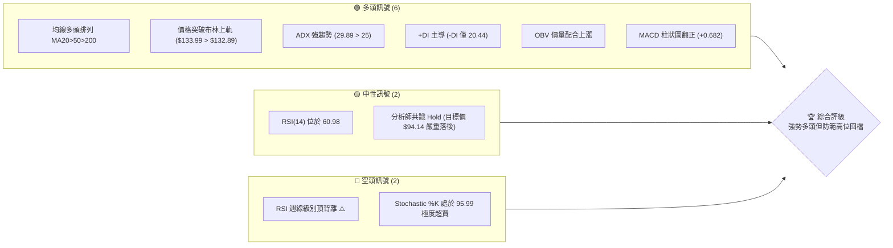
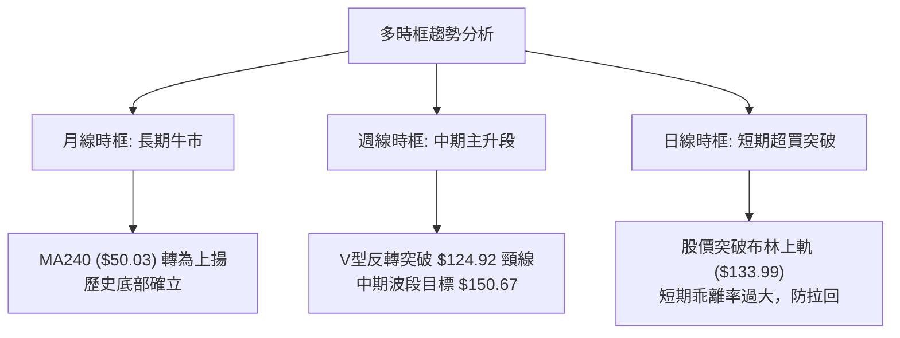
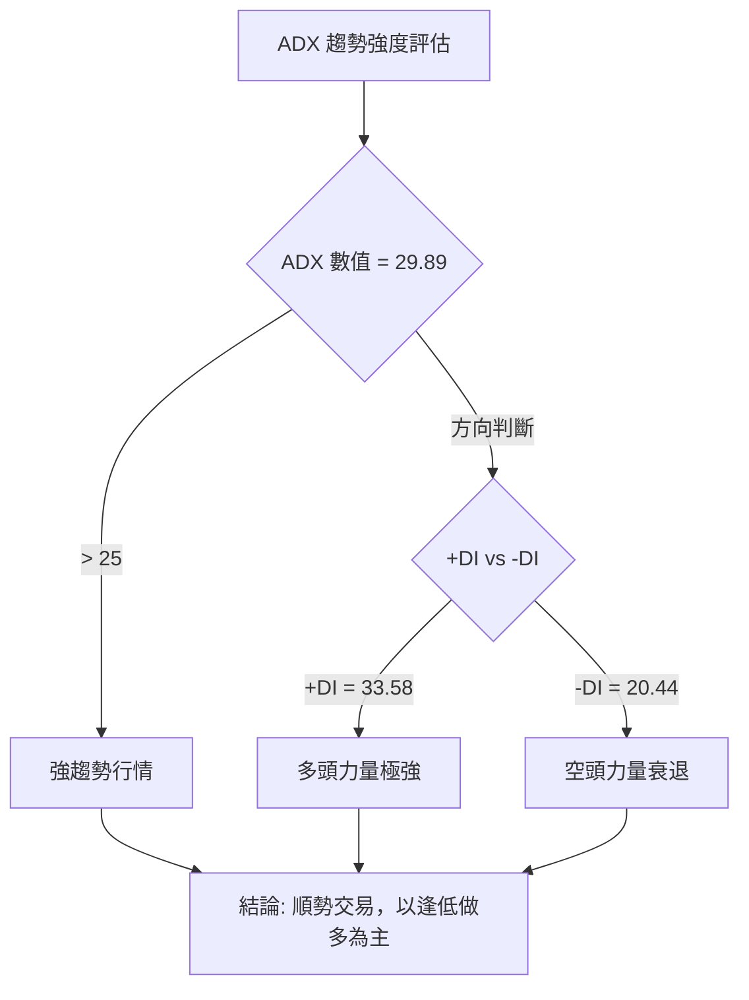
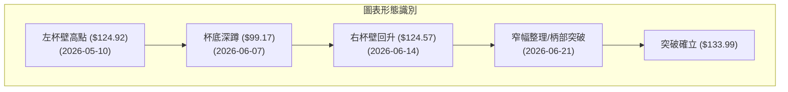
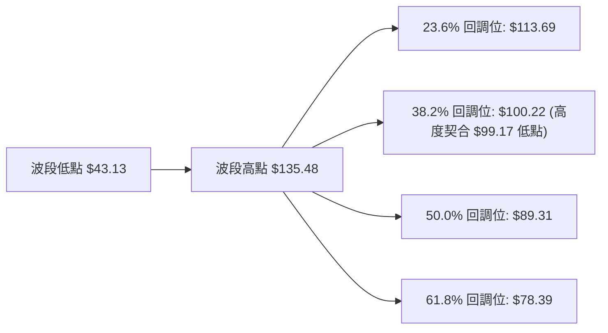
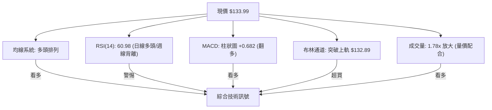
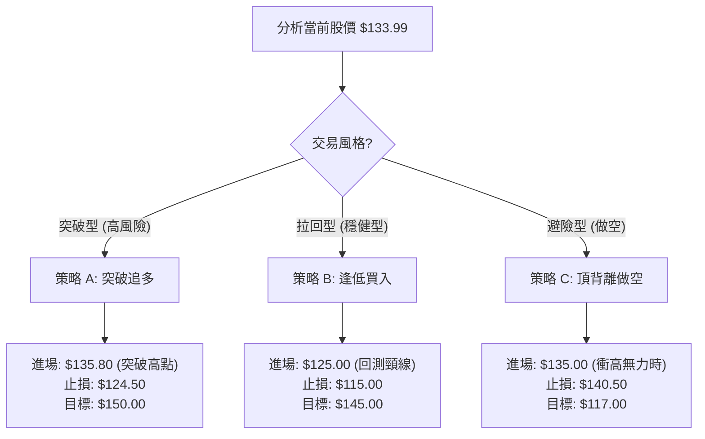
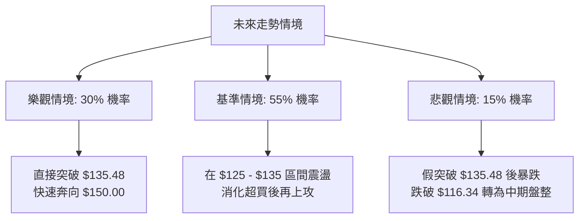

<details>
<summary>📊 靜態圖表 (點擊展開)</summary>

</details>

<html>
<head><meta charset="utf-8" /></head>
<body>
    <div style="height:500px; width:100%;">                        <script>window.PlotlyConfig = {MathJaxConfig: 'local'};</script>
        <script charset="utf-8" src="https://cdn.plot.ly/plotly-3.6.0.min.js" integrity="sha256-QaOVwtVY0T02VaHrr6pnoHLCwayMJp4O5n4YyaE3rJk=" crossorigin="anonymous"></script>                <div id="candlestick-chart" class="plotly-graph-div" style="height:100%; width:100%;"></div>            <script>                window.PLOTLYENV=window.PLOTLYENV || {};                                if (document.getElementById("candlestick-chart")) {                    Plotly.newPlot(                        "candlestick-chart",                        [{"close":{"dtype":"f8","bdata":"AAAAAAAAOEAAAAAAKZw4QAAAAKBwfThAAAAAQOF6OEAAAADgo3A4QAAAAMAexThAAAAAACmcOEAAAADgehQ4QAAAAMAexThAAAAAwB5FOUAAAABgZuY4QAAAAIDrkT5AAAAA4HqUPUAAAABgj8I8QAAAAEAKVz1AAAAA4FE4P0AAAABguP5AQAAAAAAAwEFAAAAAoHA9QUAAAABgZsZAQAAAAOBR+EFAAAAAYGamQkAAAACAPWpCQAAAACCFS0JAAAAAgMKVQkAAAABACrdCQAAAAGBm5kJAAAAAIFwvQkAAAAAAKZxCQAAAAOCj0EFAAAAAQDOTQkAAAAAghWtCQAAAAKBHgUJAAAAAwMwMQ0AAAAAgXA9DQAAAAIDCdUJAAAAA4HoUQ0AAAAAA1yNDQAAAAMAexUNAAAAAANfDREAAAAAghatEQAAAAOB6FERAAAAAYLj+Q0AAAAAAAMBDQAAAAADXg0JAAAAA4KMwQ0AAAABguJ5CQAAAAOCjEENAAAAAoJk5Q0AAAADgo\u002fBCQAAAAIDr8UJAAAAA4Hr0QUAAAABgj8JBQAAAAEDhWkFAAAAAgD0qQUAAAACAFI5BQAAAACBcz0BAAAAAAABAQUAAAADAHuVBQAAAAIA96kFAAAAAIK5nQkAAAAAgrkdEQAAAAKBHAURAAAAAACm8RUAAAACgR+FFQAAAAAAAQERAAAAA4Hq0REAAAABgZiZEQAAAAAAAQERAAAAAANdjREAAAACgR8FDQAAAACCu50JAAAAAoEfBQkAAAAAgrqdCQAAAAGBmBkJAAAAAANcjQkAAAADA9WhCQAAAACBcL0JAAAAAwMwsQkAAAADgehRCQAAAAKCZGUJAAAAAQApXQkAAAABgZqZCQAAAAEAzc0JAAAAA4KOwQ0AAAAAgXK9DQAAAAMAeBURAAAAA4KNQRUAAAACAFI5EQAAAAGBmxkZAAAAAIK4HRkAAAADAHqVHQAAAAAApXEhAAAAAwPUoSEAAAABA4XpHQAAAACCuR0hAAAAAAAAgS0AAAADA9ShLQAAAAMD1iEZAAAAAYLg+RUAAAABACvdFQAAAAADXY0hAAAAA4HpUSEAAAAAAKTxHQAAAACCuZ0hAAAAAAACgSEAAAADAzExIQAAAAGC4HkhAAAAAIIVLSUAAAABguB5JQAAAAOCjkEdAAAAAwB4lSEAAAACgcD1HQAAAAMAeZUdAAAAAQAoXR0AAAABA4bpGQAAAACBcT0ZAAAAAgBQORkAAAADgo9BFQAAAACBcD0dAAAAA4KNwR0AAAABA4bpGQAAAAIAUzkZAAAAAAADARkAAAADAzIxFQAAAAIA9ykZAAAAAoJn5RkAAAACAwrVFQAAAAIA9ykZAAAAAANdjR0AAAACgcP1HQAAAAAAAoEZAAAAAYI\u002fiRkAAAACgR+FGQAAAACCuB0ZAAAAAANeDRkAAAABAChdHQAAAACBc70VAAAAAoEcBRkAAAAAgrgdGQAAAAEAKl0dAAAAAwMwMRkAAAADgo5BFQAAAAOBRmERAAAAA4KMQRkAAAAAA1wNIQAAAAOCjMElAAAAAANdjSUAAAADgenRKQAAAAKCZeU1AAAAAACncTkAAAADgozBPQAAAACCFS1BAAAAAIK7nT0AAAAAAKTxQQAAAAAAAIFFAAAAAAAAgUUAAAADAzGxQQAAAAOCjkFBAAAAAoEdRUEAAAACA67FQQAAAAGCPolRAAAAAIFw\u002fVUAAAACgRyFVQAAAAAAAsFdAAAAAYLieV0AAAAAgrudYQAAAAIDr8VdAAAAAoJkJW0AAAADgo0BcQAAAACCuZ1tAAAAAQOE6X0AAAACAFC5gQAAAAEAKJ15AAAAAYI8SXkAAAAAghftcQAAAAKBHMVtAAAAAQOEKW0AAAABAM7NbQAAAAKBwvV1AAAAAAACgXUAAAACAwvVdQAAAAKBH4V5AAAAAoEdxXkAAAADA9TheQAAAACCFq1xAAAAAwB5VW0AAAAAghftaQAAAAKBwLVxAAAAAgOvxW0AAAABA4cpYQAAAAKBHkVtAAAAAQOH6WkAAAABgj8JaQAAAAKBwPV1AAAAA4HokX0AAAABACvdfQAAAAEAzQ11AAAAAYGZGXkAAAAAgrr9gQA=="},"high":{"dtype":"f8","bdata":"AAAAQAoXOEAAAAAA16M4QAAAAIDCtThAAAAAoHC9OEAAAAAgXM84QAAAAGC43jhAAAAAgBTuOEAAAACgR6E4QAAAAIDCdTlAAAAAQApXOUAAAABgj0I5QAAAAOCjMEBAAAAAoEehPkAAAACgmRk+QAAAAEAzMz5AAAAAQDOzP0AAAAAAACBBQAAAAGBmJkJAAAAAYGaGQUAAAABguB5BQAAAACCuB0JAAAAAwPXIQkAAAACAPQpDQAAAAEAKV0NAAAAAYGYGQ0AAAADAHuVCQAAAAMDMDENAAAAAQDPTQ0AAAACgR8FCQAAAAGBmRkJAAAAAYLi+QkAAAABgjwJDQAAAAOCjMENAAAAAYI9CQ0AAAADAzCxDQAAAAEAK90JAAAAAQDMzQ0AAAAAgXI9EQAAAAIDCVURAAAAAoHA9RUAAAADAHgVFQAAAAEAKt0RAAAAAgD1qREAAAACgmTlEQAAAAAAAIENAAAAA4FFYQ0AAAAAghetDQAAAAGCPIkNAAAAAANfDQ0AAAAAAKRxDQAAAAKCZGUNAAAAAIK6nQkAAAADAzAxCQAAAAKBw3UFAAAAAoEdhQUAAAAAAAOBBQAAAAEAKV0JAAAAAoHB9QUAAAADgehRCQAAAAOCjEEJAAAAAYLieQkAAAAAghUtEQAAAAOCjMERAAAAAQArXRUAAAABgjwJGQAAAAADXo0VAAAAAgD1qRUAAAAAgXA9FQAAAAKBHoURAAAAAYLh+REAAAADgURhEQAAAAADXA0RAAAAAoHA9Q0AAAABA4fpCQAAAACCF60JAAAAAYLi+QkAAAACAPcpCQAAAAEAz80JAAAAAYGZmQkAAAABAChdCQAAAAGC4PkJAAAAAYGZmQkAAAACgRyFDQAAAAIA9ykJAAAAAgBTuQ0AAAADAzAxFQAAAACCuJ0RAAAAAwPVIRkAAAAAghatFQAAAAKBw3UZAAAAAoJm5RkAAAABguB5IQAAAAAAAgEhAAAAAgOsxSUAAAABA4RpJQAAAAKBwHUlAAAAA4Ho0S0AAAADAzExLQAAAAOCjEEhAAAAAQOE6RkAAAAAA10NGQAAAAMAepUhAAAAAYI9iSEAAAACAPcpIQAAAACCF60hAAAAAYLi+SUAAAACgmdlIQAAAAIAUbklAAAAAYGamSUAAAAAAKZxJQAAAAMAeRUlAAAAAYGbGSEAAAACgmXlIQAAAAOBR2EdAAAAAgD1qR0AAAABgj2JHQAAAAIDClUZAAAAAgOsxRkAAAABgZkZGQAAAAMDMTEdAAAAAACl8R0AAAACgmXlHQAAAACCuR0dAAAAAIK7nRkAAAADgUdhFQAAAAOCjEEdAAAAAoHA9R0AAAABACpdGQAAAAKBH4UZAAAAA4KPwR0AAAACAPWpIQAAAAOBRuEdAAAAAQDNTR0AAAACAwpVIQAAAAIA9CkdAAAAAQOHaRkAAAADgUThHQAAAAGBmxkdAAAAAQOG6RkAAAAAgridGQAAAAMDM7EdAAAAAwMxMR0AAAADgoxBGQAAAAGC4\u002fkVAAAAAoHAdRkAAAABgj2JIQAAAAGC4PklAAAAAgOsxSkAAAABgj6JKQAAAAIDClU1AAAAAgD0KT0AAAACA67FPQAAAAKCZaVBAAAAAIIVLUEAAAACAwnVQQAAAAEAKJ1FAAAAAwB6VUUAAAACgcE1RQAAAAEDh6lBAAAAAoEcxUUAAAACA6xFRQAAAAIAUTlVAAAAAYGbGVUAAAACAwiVVQAAAAMDMvFdAAAAAACnsV0AAAADAzBxZQAAAAOB69FhAAAAAYLieW0AAAAAAAGBcQAAAAOCjoFxAAAAAgD1SYEAAAAAAAJhgQAAAAGCP8l9AAAAAAABAX0AAAADgeqRdQAAAAOB6pFtAAAAAYI\u002fiXEAAAADgekRcQAAAAAApfF5AAAAAgD3aXUAAAACA67FeQAAAACCuZ19AAAAAoEdRX0AAAADAHsVeQAAAAMD1qF9AAAAAQDNTXEAAAAAAAEBbQAAAAGCPkl1AAAAAwPVIXEAAAABguJ5aQAAAAGCPIlxAAAAAAACAXEAAAAAAAOBbQAAAAAAp3F1AAAAAYGbmX0AAAAAghZNgQAAAAGBmFmBAAAAAwMxMX0AAAAAgXO9gQA=="},"hovertemplate":"\u003cb\u003e%{x|%Y-%m-%d}\u003c\u002fb\u003e\u003cbr\u003e\u958b: $%{open:.2f}\u003cbr\u003e\u9ad8: $%{high:.2f}\u003cbr\u003e\u4f4e: $%{low:.2f}\u003cbr\u003e\u6536: $%{close:.2f}\u003cextra\u003e\u003c\u002fextra\u003e","low":{"dtype":"f8","bdata":"AAAA4FG4N0AAAAAAAMA3QAAAACCFKzhAAAAAYLgeOEAAAADAHkU4QAAAACCuRzhAAAAAgOuROEAAAADAzAw4QAAAAOBRODhAAAAA4KOwOEAAAABAM3M4QAAAAMD1KD5AAAAA4HpUPUAAAABA4bo8QAAAAIDr0TxAAAAAQOE6PUAAAACAwjU\u002fQAAAAGC4PkFAAAAAoHDdQEAAAABgj4JAQAAAAAAAwEBAAAAA4FG4QUAAAACgmTlCQAAAAEAKN0JAAAAAwMwsQkAAAADgevRBQAAAAIAUbkJAAAAAYGYmQkAAAAAA1yNCQAAAAOBRWEFAAAAAgOvRQUAAAADgejRCQAAAAIA9CkJAAAAAIK7HQkAAAACAwtVCQAAAAMAeBUJAAAAAQAo3QkAAAACAPepCQAAAAKBwHUNAAAAAwB7FQ0AAAACAwnVEQAAAAIAUDkRAAAAAwB7lQ0AAAABgZoZDQAAAAOCjUEJAAAAAgBSOQkAAAABgZmZCQAAAAAApfEJAAAAAACn8QkAAAABguL5CQAAAAMDMrEJAAAAAoJm5QUAAAAAgXE9BQAAAAKBwHUFAAAAAwPXIQEAAAAAAACBBQAAAAKBwvUBAAAAAgOtxQEAAAADgUVhBQAAAAEAKV0FAAAAA4KMQQkAAAAAghatCQAAAAMDMzENAAAAAYGYGREAAAACgR0FFQAAAAIDrEURAAAAAQDOTREAAAACgmdlDQAAAAADXA0RAAAAAgOtxQ0AAAACAPYpDQAAAACBcz0JAAAAAwPWoQkAAAACAwnVCQAAAAAAp\u002fEFAAAAAgMLVQUAAAADgUThCQAAAAMAeJUJAAAAAANcDQkAAAACgmXlBQAAAAMDM7EFAAAAAwPXoQUAAAADA9WhCQAAAACBcb0JAAAAAoEfhQkAAAABgj6JDQAAAAKCZeUNAAAAAIFwPREAAAABACldEQAAAAMD1yERAAAAAgOvxRUAAAAAAKZxGQAAAAIDCtUdAAAAAgD3qR0AAAABA4VpHQAAAAAAAgEdAAAAAQDMTSUAAAACAPYpKQAAAAKCZOUZAAAAAANcjRUAAAADAzIxFQAAAAMD1KEdAAAAAYLh+R0AAAABA4fpGQAAAAAAAwEZAAAAAQAo3SEAAAAAAAIBHQAAAAMAeZUdAAAAAgD1qSEAAAAAghctHQAAAAGCPYkdAAAAAgBRuR0AAAADgURhHQAAAAAApfEZAAAAAQOG6RkAAAADgo3BGQAAAAIDC9UVAAAAA4KNwRUAAAABACpdFQAAAAMAexUVAAAAAgD2KRkAAAACA6zFGQAAAAEAzM0ZAAAAAoJn5RUAAAACA6xFFQAAAAGCPokVAAAAAoJlZRkAAAAAA16NFQAAAAIDr0URAAAAA4Hq0RkAAAADgelRHQAAAAIDClUZAAAAAgOuxRkAAAADgUdhGQAAAAOB69EVAAAAAYGYGRkAAAABAM9NFQAAAAIDr0UVAAAAAYLjeRUAAAACgmZlFQAAAAKCZuUZAAAAAgML1RUAAAACAFG5FQAAAAOCjUERAAAAAwMzMREAAAACgcH1GQAAAAMAeBUdAAAAAIFzvSEAAAAAAKZxJQAAAAGBmZktAAAAAgOsxTUAAAAAAAGBOQAAAAEAKF09AAAAAIIULT0AAAADgo3BPQAAAAKBHEVBAAAAAIFzvUEAAAACAFB5QQAAAAMD1aFBAAAAAYLg+UEAAAABA4VpQQAAAACCu51NAAAAAQAqnVEAAAABAMzNUQAAAACCud1VAAAAAAADgVkAAAABACidXQAAAAGBm5ldAAAAAwB4FWUAAAADAHqVaQAAAAKCZSVtAAAAAQDPzW0AAAABA4fpeQAAAAAAAwFxAAAAAgD0aXUAAAABA4UpcQAAAAKBHQVpAAAAAYGb2WUAAAACgmZlZQAAAAEAzs1xAAAAAQOFKXEAAAACAwoVdQAAAAGBmVl1AAAAAAABAXUAAAAAA1xNdQAAAAGCPYlxAAAAAwB6VWkAAAABA4QpaQAAAAEAKt1tAAAAAYLjeWkAAAADAHpVYQAAAAIA9qlpAAAAAoHDdWEAAAABA4TpaQAAAAOCjoFtAAAAAwB7VXEAAAACAPapfQAAAAAAAAF1AAAAAANeDXUAAAACgmflfQA=="},"name":"\u50f9\u683c","open":{"dtype":"f8","bdata":"AAAAQAoXOEAAAACgmdk3QAAAAKCZmThAAAAAQOF6OEAAAAAgroc4QAAAACCFazhAAAAAYI\u002fCOEAAAAAAKZw4QAAAAOB6VDhAAAAAgOvROEAAAADgehQ5QAAAACCuxz9AAAAAoEdhPkAAAAAghas9QAAAAKBw\u002fTxAAAAAoEdhPUAAAAAAKZw\u002fQAAAAGCPgkFAAAAAYI9CQUAAAABACvdAQAAAAADXw0BAAAAAoEfhQUAAAACgmflCQAAAAOBRmEJAAAAAgOtRQkAAAABgZkZCQAAAAADXw0JAAAAAQOE6Q0AAAADgUThCQAAAAAAAAEJAAAAAQDMzQkAAAABAM5NCQAAAAIAULkJAAAAAwPXIQkAAAACA6xFDQAAAACCF60JAAAAAwMxMQkAAAABgjwJEQAAAAIDrMUNAAAAAIIXLQ0AAAADAzMxEQAAAAAApfERAAAAAQApXREAAAAAAACBEQAAAAIDrEUNAAAAAgMK1QkAAAAAghStDQAAAAKBHoUJAAAAAQAp3Q0AAAABAMxNDQAAAACCuB0NAAAAAYI+iQkAAAAAA14NBQAAAAKCZuUFAAAAAAAAgQUAAAACAPSpBQAAAAAAAAEJAAAAAoEfBQEAAAAAAKXxBQAAAAGBmxkFAAAAAoJkZQkAAAABAM7NCQAAAAIAU7kNAAAAAACk8REAAAACA67FFQAAAAKBHoUVAAAAA4HqUREAAAADgUfhEQAAAAKBwXURAAAAAgBQOREAAAADA9QhEQAAAAAAAoENAAAAAgD0qQ0AAAACAPcpCQAAAACCFy0JAAAAA4KOwQkAAAACgcD1CQAAAAIDr8UJAAAAAYLgeQkAAAACAwpVBQAAAAIDCFUJAAAAAoEcBQkAAAADgenRCQAAAAEAzs0JAAAAAYI\u002fiQkAAAAAghctEQAAAAIAU7kNAAAAAQAoXREAAAAAgXE9FQAAAAIA96kRAAAAAYLgeRkAAAACA6\u002fFGQAAAAKCZeUhAAAAAwMysSEAAAABgj6JIQAAAAGBmpkdAAAAAwPUoSUAAAABA4RpLQAAAAIAUbkdAAAAAANcjRkAAAAAAKfxFQAAAAMDMTEdAAAAAIK7HR0AAAACgcH1IQAAAAOCj0EZAAAAAIK4HSUAAAADAHsVIQAAAACCFy0dAAAAAwMyMSEAAAAAghctIQAAAAOB6NElAAAAAgBQOSEAAAABgZuZHQAAAAKBH4UZAAAAAQAr3RkAAAACAwvVGQAAAAKCZeUZAAAAAgOvxRUAAAAAghQtGQAAAAMDMDEZAAAAAIIULR0AAAABgj2JHQAAAAEDhOkZAAAAAoJkZRkAAAADgUbhFQAAAAMD1CEZAAAAAIFxvRkAAAACAwlVGQAAAAGC4XkVAAAAA4Hq0RkAAAADA9WhHQAAAAEAzs0dAAAAAACn8RkAAAADgevRHQAAAAIA9CkdAAAAAoJkZRkAAAABguP5FQAAAAKCZeUdAAAAAAABARkAAAADAHsVFQAAAAMDM7EZAAAAAYGYmR0AAAAAgXM9FQAAAAAAp3EVAAAAAoJn5REAAAAAAAIBGQAAAACCuB0dAAAAA4KNwSUAAAADgevRJQAAAACBcr0tAAAAAQDMzTUAAAABgj8JOQAAAAEAKF09AAAAAgD1KUEAAAABgj+JPQAAAACCFO1BAAAAAYGY2UUAAAADAzBxRQAAAAMD1yFBAAAAAACn8UEAAAABgZoZQQAAAAMDMjFRAAAAAQOHqVEAAAACA61FUQAAAAMD1iFVAAAAAYGbmV0AAAADAzExXQAAAACCFy1hAAAAA4KMgWUAAAABguL5bQAAAAKBHwVtAAAAAANfzW0AAAAAAKVxgQAAAAEAKF19AAAAAYGYGX0AAAACAPapcQAAAAGCPcltAAAAAgBReXEAAAABguL5aQAAAAIAUDl1AAAAAwB4lXUAAAACAwhVeQAAAAGBmhl5AAAAAwPUYX0AAAADAzFxeQAAAAGBm9l5AAAAAIIVbW0AAAADAzNxaQAAAAEDhGl1AAAAAoJkZW0AAAABguJ5aQAAAAAAAwFtAAAAAIFw\u002fXEAAAACA64FaQAAAAKBHYVxAAAAAQOFaXUAAAAAgri9gQAAAAEAKR19AAAAAYGZ2XkAAAACA63lgQA=="},"x":["2025-09-03T00:00:00-04:00","2025-09-04T00:00:00-04:00","2025-09-05T00:00:00-04:00","2025-09-08T00:00:00-04:00","2025-09-09T00:00:00-04:00","2025-09-10T00:00:00-04:00","2025-09-11T00:00:00-04:00","2025-09-12T00:00:00-04:00","2025-09-15T00:00:00-04:00","2025-09-16T00:00:00-04:00","2025-09-17T00:00:00-04:00","2025-09-18T00:00:00-04:00","2025-09-19T00:00:00-04:00","2025-09-22T00:00:00-04:00","2025-09-23T00:00:00-04:00","2025-09-24T00:00:00-04:00","2025-09-25T00:00:00-04:00","2025-09-26T00:00:00-04:00","2025-09-29T00:00:00-04:00","2025-09-30T00:00:00-04:00","2025-10-01T00:00:00-04:00","2025-10-02T00:00:00-04:00","2025-10-03T00:00:00-04:00","2025-10-06T00:00:00-04:00","2025-10-07T00:00:00-04:00","2025-10-08T00:00:00-04:00","2025-10-09T00:00:00-04:00","2025-10-10T00:00:00-04:00","2025-10-13T00:00:00-04:00","2025-10-14T00:00:00-04:00","2025-10-15T00:00:00-04:00","2025-10-16T00:00:00-04:00","2025-10-17T00:00:00-04:00","2025-10-20T00:00:00-04:00","2025-10-21T00:00:00-04:00","2025-10-22T00:00:00-04:00","2025-10-23T00:00:00-04:00","2025-10-24T00:00:00-04:00","2025-10-27T00:00:00-04:00","2025-10-28T00:00:00-04:00","2025-10-29T00:00:00-04:00","2025-10-30T00:00:00-04:00","2025-10-31T00:00:00-04:00","2025-11-03T00:00:00-05:00","2025-11-04T00:00:00-05:00","2025-11-05T00:00:00-05:00","2025-11-06T00:00:00-05:00","2025-11-07T00:00:00-05:00","2025-11-10T00:00:00-05:00","2025-11-11T00:00:00-05:00","2025-11-12T00:00:00-05:00","2025-11-13T00:00:00-05:00","2025-11-14T00:00:00-05:00","2025-11-17T00:00:00-05:00","2025-11-18T00:00:00-05:00","2025-11-19T00:00:00-05:00","2025-11-20T00:00:00-05:00","2025-11-21T00:00:00-05:00","2025-11-24T00:00:00-05:00","2025-11-25T00:00:00-05:00","2025-11-26T00:00:00-05:00","2025-11-28T00:00:00-05:00","2025-12-01T00:00:00-05:00","2025-12-02T00:00:00-05:00","2025-12-03T00:00:00-05:00","2025-12-04T00:00:00-05:00","2025-12-05T00:00:00-05:00","2025-12-08T00:00:00-05:00","2025-12-09T00:00:00-05:00","2025-12-10T00:00:00-05:00","2025-12-11T00:00:00-05:00","2025-12-12T00:00:00-05:00","2025-12-15T00:00:00-05:00","2025-12-16T00:00:00-05:00","2025-12-17T00:00:00-05:00","2025-12-18T00:00:00-05:00","2025-12-19T00:00:00-05:00","2025-12-22T00:00:00-05:00","2025-12-23T00:00:00-05:00","2025-12-24T00:00:00-05:00","2025-12-26T00:00:00-05:00","2025-12-29T00:00:00-05:00","2025-12-30T00:00:00-05:00","2025-12-31T00:00:00-05:00","2026-01-02T00:00:00-05:00","2026-01-05T00:00:00-05:00","2026-01-06T00:00:00-05:00","2026-01-07T00:00:00-05:00","2026-01-08T00:00:00-05:00","2026-01-09T00:00:00-05:00","2026-01-12T00:00:00-05:00","2026-01-13T00:00:00-05:00","2026-01-14T00:00:00-05:00","2026-01-15T00:00:00-05:00","2026-01-16T00:00:00-05:00","2026-01-20T00:00:00-05:00","2026-01-21T00:00:00-05:00","2026-01-22T00:00:00-05:00","2026-01-23T00:00:00-05:00","2026-01-26T00:00:00-05:00","2026-01-27T00:00:00-05:00","2026-01-28T00:00:00-05:00","2026-01-29T00:00:00-05:00","2026-01-30T00:00:00-05:00","2026-02-02T00:00:00-05:00","2026-02-03T00:00:00-05:00","2026-02-04T00:00:00-05:00","2026-02-05T00:00:00-05:00","2026-02-06T00:00:00-05:00","2026-02-09T00:00:00-05:00","2026-02-10T00:00:00-05:00","2026-02-11T00:00:00-05:00","2026-02-12T00:00:00-05:00","2026-02-13T00:00:00-05:00","2026-02-17T00:00:00-05:00","2026-02-18T00:00:00-05:00","2026-02-19T00:00:00-05:00","2026-02-20T00:00:00-05:00","2026-02-23T00:00:00-05:00","2026-02-24T00:00:00-05:00","2026-02-25T00:00:00-05:00","2026-02-26T00:00:00-05:00","2026-02-27T00:00:00-05:00","2026-03-02T00:00:00-05:00","2026-03-03T00:00:00-05:00","2026-03-04T00:00:00-05:00","2026-03-05T00:00:00-05:00","2026-03-06T00:00:00-05:00","2026-03-09T00:00:00-04:00","2026-03-10T00:00:00-04:00","2026-03-11T00:00:00-04:00","2026-03-12T00:00:00-04:00","2026-03-13T00:00:00-04:00","2026-03-16T00:00:00-04:00","2026-03-17T00:00:00-04:00","2026-03-18T00:00:00-04:00","2026-03-19T00:00:00-04:00","2026-03-20T00:00:00-04:00","2026-03-23T00:00:00-04:00","2026-03-24T00:00:00-04:00","2026-03-25T00:00:00-04:00","2026-03-26T00:00:00-04:00","2026-03-27T00:00:00-04:00","2026-03-30T00:00:00-04:00","2026-03-31T00:00:00-04:00","2026-04-01T00:00:00-04:00","2026-04-02T00:00:00-04:00","2026-04-06T00:00:00-04:00","2026-04-07T00:00:00-04:00","2026-04-08T00:00:00-04:00","2026-04-09T00:00:00-04:00","2026-04-10T00:00:00-04:00","2026-04-13T00:00:00-04:00","2026-04-14T00:00:00-04:00","2026-04-15T00:00:00-04:00","2026-04-16T00:00:00-04:00","2026-04-17T00:00:00-04:00","2026-04-20T00:00:00-04:00","2026-04-21T00:00:00-04:00","2026-04-22T00:00:00-04:00","2026-04-23T00:00:00-04:00","2026-04-24T00:00:00-04:00","2026-04-27T00:00:00-04:00","2026-04-28T00:00:00-04:00","2026-04-29T00:00:00-04:00","2026-04-30T00:00:00-04:00","2026-05-01T00:00:00-04:00","2026-05-04T00:00:00-04:00","2026-05-05T00:00:00-04:00","2026-05-06T00:00:00-04:00","2026-05-07T00:00:00-04:00","2026-05-08T00:00:00-04:00","2026-05-11T00:00:00-04:00","2026-05-12T00:00:00-04:00","2026-05-13T00:00:00-04:00","2026-05-14T00:00:00-04:00","2026-05-15T00:00:00-04:00","2026-05-18T00:00:00-04:00","2026-05-19T00:00:00-04:00","2026-05-20T00:00:00-04:00","2026-05-21T00:00:00-04:00","2026-05-22T00:00:00-04:00","2026-05-26T00:00:00-04:00","2026-05-27T00:00:00-04:00","2026-05-28T00:00:00-04:00","2026-05-29T00:00:00-04:00","2026-06-01T00:00:00-04:00","2026-06-02T00:00:00-04:00","2026-06-03T00:00:00-04:00","2026-06-04T00:00:00-04:00","2026-06-05T00:00:00-04:00","2026-06-08T00:00:00-04:00","2026-06-09T00:00:00-04:00","2026-06-10T00:00:00-04:00","2026-06-11T00:00:00-04:00","2026-06-12T00:00:00-04:00","2026-06-15T00:00:00-04:00","2026-06-16T00:00:00-04:00","2026-06-17T00:00:00-04:00","2026-06-18T00:00:00-04:00"],"type":"candlestick"},{"hovertemplate":"MA30: $%{y:.2f}\u003cextra\u003e\u003c\u002fextra\u003e","line":{"color":"#2196F3","dash":"dash","width":2},"mode":"lines","name":"MA30","x":["2025-09-03T00:00:00-04:00","2025-09-04T00:00:00-04:00","2025-09-05T00:00:00-04:00","2025-09-08T00:00:00-04:00","2025-09-09T00:00:00-04:00","2025-09-10T00:00:00-04:00","2025-09-11T00:00:00-04:00","2025-09-12T00:00:00-04:00","2025-09-15T00:00:00-04:00","2025-09-16T00:00:00-04:00","2025-09-17T00:00:00-04:00","2025-09-18T00:00:00-04:00","2025-09-19T00:00:00-04:00","2025-09-22T00:00:00-04:00","2025-09-23T00:00:00-04:00","2025-09-24T00:00:00-04:00","2025-09-25T00:00:00-04:00","2025-09-26T00:00:00-04:00","2025-09-29T00:00:00-04:00","2025-09-30T00:00:00-04:00","2025-10-01T00:00:00-04:00","2025-10-02T00:00:00-04:00","2025-10-03T00:00:00-04:00","2025-10-06T00:00:00-04:00","2025-10-07T00:00:00-04:00","2025-10-08T00:00:00-04:00","2025-10-09T00:00:00-04:00","2025-10-10T00:00:00-04:00","2025-10-13T00:00:00-04:00","2025-10-14T00:00:00-04:00","2025-10-15T00:00:00-04:00","2025-10-16T00:00:00-04:00","2025-10-17T00:00:00-04:00","2025-10-20T00:00:00-04:00","2025-10-21T00:00:00-04:00","2025-10-22T00:00:00-04:00","2025-10-23T00:00:00-04:00","2025-10-24T00:00:00-04:00","2025-10-27T00:00:00-04:00","2025-10-28T00:00:00-04:00","2025-10-29T00:00:00-04:00","2025-10-30T00:00:00-04:00","2025-10-31T00:00:00-04:00","2025-11-03T00:00:00-05:00","2025-11-04T00:00:00-05:00","2025-11-05T00:00:00-05:00","2025-11-06T00:00:00-05:00","2025-11-07T00:00:00-05:00","2025-11-10T00:00:00-05:00","2025-11-11T00:00:00-05:00","2025-11-12T00:00:00-05:00","2025-11-13T00:00:00-05:00","2025-11-14T00:00:00-05:00","2025-11-17T00:00:00-05:00","2025-11-18T00:00:00-05:00","2025-11-19T00:00:00-05:00","2025-11-20T00:00:00-05:00","2025-11-21T00:00:00-05:00","2025-11-24T00:00:00-05:00","2025-11-25T00:00:00-05:00","2025-11-26T00:00:00-05:00","2025-11-28T00:00:00-05:00","2025-12-01T00:00:00-05:00","2025-12-02T00:00:00-05:00","2025-12-03T00:00:00-05:00","2025-12-04T00:00:00-05:00","2025-12-05T00:00:00-05:00","2025-12-08T00:00:00-05:00","2025-12-09T00:00:00-05:00","2025-12-10T00:00:00-05:00","2025-12-11T00:00:00-05:00","2025-12-12T00:00:00-05:00","2025-12-15T00:00:00-05:00","2025-12-16T00:00:00-05:00","2025-12-17T00:00:00-05:00","2025-12-18T00:00:00-05:00","2025-12-19T00:00:00-05:00","2025-12-22T00:00:00-05:00","2025-12-23T00:00:00-05:00","2025-12-24T00:00:00-05:00","2025-12-26T00:00:00-05:00","2025-12-29T00:00:00-05:00","2025-12-30T00:00:00-05:00","2025-12-31T00:00:00-05:00","2026-01-02T00:00:00-05:00","2026-01-05T00:00:00-05:00","2026-01-06T00:00:00-05:00","2026-01-07T00:00:00-05:00","2026-01-08T00:00:00-05:00","2026-01-09T00:00:00-05:00","2026-01-12T00:00:00-05:00","2026-01-13T00:00:00-05:00","2026-01-14T00:00:00-05:00","2026-01-15T00:00:00-05:00","2026-01-16T00:00:00-05:00","2026-01-20T00:00:00-05:00","2026-01-21T00:00:00-05:00","2026-01-22T00:00:00-05:00","2026-01-23T00:00:00-05:00","2026-01-26T00:00:00-05:00","2026-01-27T00:00:00-05:00","2026-01-28T00:00:00-05:00","2026-01-29T00:00:00-05:00","2026-01-30T00:00:00-05:00","2026-02-02T00:00:00-05:00","2026-02-03T00:00:00-05:00","2026-02-04T00:00:00-05:00","2026-02-05T00:00:00-05:00","2026-02-06T00:00:00-05:00","2026-02-09T00:00:00-05:00","2026-02-10T00:00:00-05:00","2026-02-11T00:00:00-05:00","2026-02-12T00:00:00-05:00","2026-02-13T00:00:00-05:00","2026-02-17T00:00:00-05:00","2026-02-18T00:00:00-05:00","2026-02-19T00:00:00-05:00","2026-02-20T00:00:00-05:00","2026-02-23T00:00:00-05:00","2026-02-24T00:00:00-05:00","2026-02-25T00:00:00-05:00","2026-02-26T00:00:00-05:00","2026-02-27T00:00:00-05:00","2026-03-02T00:00:00-05:00","2026-03-03T00:00:00-05:00","2026-03-04T00:00:00-05:00","2026-03-05T00:00:00-05:00","2026-03-06T00:00:00-05:00","2026-03-09T00:00:00-04:00","2026-03-10T00:00:00-04:00","2026-03-11T00:00:00-04:00","2026-03-12T00:00:00-04:00","2026-03-13T00:00:00-04:00","2026-03-16T00:00:00-04:00","2026-03-17T00:00:00-04:00","2026-03-18T00:00:00-04:00","2026-03-19T00:00:00-04:00","2026-03-20T00:00:00-04:00","2026-03-23T00:00:00-04:00","2026-03-24T00:00:00-04:00","2026-03-25T00:00:00-04:00","2026-03-26T00:00:00-04:00","2026-03-27T00:00:00-04:00","2026-03-30T00:00:00-04:00","2026-03-31T00:00:00-04:00","2026-04-01T00:00:00-04:00","2026-04-02T00:00:00-04:00","2026-04-06T00:00:00-04:00","2026-04-07T00:00:00-04:00","2026-04-08T00:00:00-04:00","2026-04-09T00:00:00-04:00","2026-04-10T00:00:00-04:00","2026-04-13T00:00:00-04:00","2026-04-14T00:00:00-04:00","2026-04-15T00:00:00-04:00","2026-04-16T00:00:00-04:00","2026-04-17T00:00:00-04:00","2026-04-20T00:00:00-04:00","2026-04-21T00:00:00-04:00","2026-04-22T00:00:00-04:00","2026-04-23T00:00:00-04:00","2026-04-24T00:00:00-04:00","2026-04-27T00:00:00-04:00","2026-04-28T00:00:00-04:00","2026-04-29T00:00:00-04:00","2026-04-30T00:00:00-04:00","2026-05-01T00:00:00-04:00","2026-05-04T00:00:00-04:00","2026-05-05T00:00:00-04:00","2026-05-06T00:00:00-04:00","2026-05-07T00:00:00-04:00","2026-05-08T00:00:00-04:00","2026-05-11T00:00:00-04:00","2026-05-12T00:00:00-04:00","2026-05-13T00:00:00-04:00","2026-05-14T00:00:00-04:00","2026-05-15T00:00:00-04:00","2026-05-18T00:00:00-04:00","2026-05-19T00:00:00-04:00","2026-05-20T00:00:00-04:00","2026-05-21T00:00:00-04:00","2026-05-22T00:00:00-04:00","2026-05-26T00:00:00-04:00","2026-05-27T00:00:00-04:00","2026-05-28T00:00:00-04:00","2026-05-29T00:00:00-04:00","2026-06-01T00:00:00-04:00","2026-06-02T00:00:00-04:00","2026-06-03T00:00:00-04:00","2026-06-04T00:00:00-04:00","2026-06-05T00:00:00-04:00","2026-06-08T00:00:00-04:00","2026-06-09T00:00:00-04:00","2026-06-10T00:00:00-04:00","2026-06-11T00:00:00-04:00","2026-06-12T00:00:00-04:00","2026-06-15T00:00:00-04:00","2026-06-16T00:00:00-04:00","2026-06-17T00:00:00-04:00","2026-06-18T00:00:00-04:00"],"y":{"dtype":"f8","bdata":"AAAAAAAA+H8AAAAAAAD4fwAAAAAAAPh\u002fAAAAAAAA+H8AAAAAAAD4fwAAAAAAAPh\u002fAAAAAAAA+H8AAAAAAAD4fwAAAAAAAPh\u002fAAAAAAAA+H8AAAAAAAD4fwAAAAAAAPh\u002fAAAAAAAA+H8AAAAAAAD4fwAAAAAAAPh\u002fAAAAAAAA+H8AAAAAAAD4fwAAAAAAAPh\u002fAAAAAAAA+H8AAAAAAAD4fwAAAAAAAPh\u002fAAAAAAAA+H8AAAAAAAD4fwAAAAAAAPh\u002fAAAAAAAA+H8AAAAAAAD4fwAAAAAAAPh\u002fAAAAAAAA+H8AAAAAAAD4f5qZmak42z5Ad3d3R29LP0Dv7u4ezLM\u002fQM3MzDxRD0BAiYiI6G1JQEBVVVUdzINAQO\u002fu7iajt0BAVVVVXXPxQEDNzMyMCS5BQERERFQObUFAVVVVlW6yQUCrqqpyk\u002fhBQBEREUl+IUJAiYiIyOhNQkAiIiK6u3tCQJqZmUGLnEJAMzMz4xe7QkARERHB9chCQKuqqmou1EJAd3d3tx7lQkC8u7s7mPdCQHd3dyfq\u002f0JAd3d35\u002fv5QkCJiIgIZfRCQCIiIpJf7EJAmpmZiUHgQkCrqqp6W9ZCQN7d3c2FxEJARERERIu8QkAzMzNTcbZCQHd3d8dLt0JAiYiIaNi1QkBERESkt8VCQBEREXGE0kJAq6qq6m3pQkDNzMxMfgFDQN7d3Z3EEENAvLu7e6IeQ0DNzMzcQCdDQAAAAHBZK0NAzczMPCYoQ0AzMzNjVyBDQAAAAJBQFkNAzczMvLsLQ0DNzMysYwJDQBEREUE1\u002fkJA3t3dfT\u002f1QkDNzMy8dPNCQImIiFjy60JAVVVVlfziQkAiIiLipdtCQERERPRv1EJAAAAAALnXQkC8u7s7Ud9CQM3MzEyp6EJA7+7uPjX+QkDNzMxMYhBDQHd3d6fGK0NAiYiIyHZOQ0BERESkKWVDQImIiHiijkNAd3d3Z5GtQ0C8u7tbSMpDQBEREQFy70NA7+7ufiMEREAAAADAyhFEQLy7u2suNERAAAAAIPdqREBERES0yKZEQM3MzFxIukRAREREJJTBREBmZmb2b9REQAAAACA+A0VAZmZm5tAyRUAAAAAQ5llFQDMzM2NXkEVAZmZmFq7HRUDNzMz88PlFQCIiIjKWLEZAMzMzE1hpRkARERExa6VGQKuqqqoN1EZAIiIi4pYFR0BERETkwSxHQImIiGj0VkdAIiIi0vdzR0CamZm5841HQN7d3U1+oUdAvLu7286nR0Dv7u5ej7JHQGZmZvb9tEdAd3d3JwbBR0De3d1NN7lHQKuqqlryq0dAmpmZKeqfR0AzMzMDco9HQO\u002fu7g67gkdA7+7uPlFfR0CamZmJzzBHQImIiJj8MkdAq6qqakpFR0CJiIgYklZHQFVVVWWCR0dA7+7uvi07R0C8u7s7JjhHQHd3d\u002ffhI0dAmpmZmeARR0ARERFRjQdHQLy7uxvo9EZA3t3d\u002fdTYRkCJiIjIdr5GQFVVVWWtvkZAvLu7y8ysRkBERES0gZ5GQCIiIgKdhkZAzczM3N19RkDNzMz81IhGQCIiInJooUZAzczM3N29RkCJiIgYduVGQBEREeEzHEdA3t3dHYVbR0BVVVVFtqNHQN7d3e0190dAVVVVVVVFSEARERFxhKJIQBERETFPBElA3t3dzYVkSUARERGBlcNJQERERJTRG0pAZmZmlrVqSkAzMzMz7LpKQDMzM9MGWktAVVVVhV0BTEBmZmbGvaZMQFVVVcUEf01AzczMXAFSTkCJiIgYBDZPQERERNS\u002fCVBAq6qq0pSSUEB3d3e3rCVRQImIiEjhqlFAd3d3x0tXUkBERESMbA9TQFVVVXXauFNAERER+VNbVEBVVVVtLuxUQGZmZia\u002faFVA3t3dvS3jVUDv7u5mrV5WQM3MzNyy3lZAAAAAUNRXV0CamZkhadJXQERERIzeTlhA7+7uboTKWEB3d3eX4EFZQHd3dwdlpFlAd3d3p3\u002f7WUDe3d3dllVaQCIiIsKuuFpAvLu7a+cbW0De3d2tAGFbQERERPQonFtAq6qqyhPNW0B3d3e3Hv1bQGZmZlaALFxAzczMfLFsXECrqqpK8KhcQM3MzIxQ1lxAmpmZ+fDxXECrqqrash5dQA=="},"type":"scatter"},{"hovertemplate":"MA60: $%{y:.2f}\u003cextra\u003e\u003c\u002fextra\u003e","line":{"color":"#9C27B0","dash":"dash","width":2},"mode":"lines","name":"MA60","x":["2025-09-03T00:00:00-04:00","2025-09-04T00:00:00-04:00","2025-09-05T00:00:00-04:00","2025-09-08T00:00:00-04:00","2025-09-09T00:00:00-04:00","2025-09-10T00:00:00-04:00","2025-09-11T00:00:00-04:00","2025-09-12T00:00:00-04:00","2025-09-15T00:00:00-04:00","2025-09-16T00:00:00-04:00","2025-09-17T00:00:00-04:00","2025-09-18T00:00:00-04:00","2025-09-19T00:00:00-04:00","2025-09-22T00:00:00-04:00","2025-09-23T00:00:00-04:00","2025-09-24T00:00:00-04:00","2025-09-25T00:00:00-04:00","2025-09-26T00:00:00-04:00","2025-09-29T00:00:00-04:00","2025-09-30T00:00:00-04:00","2025-10-01T00:00:00-04:00","2025-10-02T00:00:00-04:00","2025-10-03T00:00:00-04:00","2025-10-06T00:00:00-04:00","2025-10-07T00:00:00-04:00","2025-10-08T00:00:00-04:00","2025-10-09T00:00:00-04:00","2025-10-10T00:00:00-04:00","2025-10-13T00:00:00-04:00","2025-10-14T00:00:00-04:00","2025-10-15T00:00:00-04:00","2025-10-16T00:00:00-04:00","2025-10-17T00:00:00-04:00","2025-10-20T00:00:00-04:00","2025-10-21T00:00:00-04:00","2025-10-22T00:00:00-04:00","2025-10-23T00:00:00-04:00","2025-10-24T00:00:00-04:00","2025-10-27T00:00:00-04:00","2025-10-28T00:00:00-04:00","2025-10-29T00:00:00-04:00","2025-10-30T00:00:00-04:00","2025-10-31T00:00:00-04:00","2025-11-03T00:00:00-05:00","2025-11-04T00:00:00-05:00","2025-11-05T00:00:00-05:00","2025-11-06T00:00:00-05:00","2025-11-07T00:00:00-05:00","2025-11-10T00:00:00-05:00","2025-11-11T00:00:00-05:00","2025-11-12T00:00:00-05:00","2025-11-13T00:00:00-05:00","2025-11-14T00:00:00-05:00","2025-11-17T00:00:00-05:00","2025-11-18T00:00:00-05:00","2025-11-19T00:00:00-05:00","2025-11-20T00:00:00-05:00","2025-11-21T00:00:00-05:00","2025-11-24T00:00:00-05:00","2025-11-25T00:00:00-05:00","2025-11-26T00:00:00-05:00","2025-11-28T00:00:00-05:00","2025-12-01T00:00:00-05:00","2025-12-02T00:00:00-05:00","2025-12-03T00:00:00-05:00","2025-12-04T00:00:00-05:00","2025-12-05T00:00:00-05:00","2025-12-08T00:00:00-05:00","2025-12-09T00:00:00-05:00","2025-12-10T00:00:00-05:00","2025-12-11T00:00:00-05:00","2025-12-12T00:00:00-05:00","2025-12-15T00:00:00-05:00","2025-12-16T00:00:00-05:00","2025-12-17T00:00:00-05:00","2025-12-18T00:00:00-05:00","2025-12-19T00:00:00-05:00","2025-12-22T00:00:00-05:00","2025-12-23T00:00:00-05:00","2025-12-24T00:00:00-05:00","2025-12-26T00:00:00-05:00","2025-12-29T00:00:00-05:00","2025-12-30T00:00:00-05:00","2025-12-31T00:00:00-05:00","2026-01-02T00:00:00-05:00","2026-01-05T00:00:00-05:00","2026-01-06T00:00:00-05:00","2026-01-07T00:00:00-05:00","2026-01-08T00:00:00-05:00","2026-01-09T00:00:00-05:00","2026-01-12T00:00:00-05:00","2026-01-13T00:00:00-05:00","2026-01-14T00:00:00-05:00","2026-01-15T00:00:00-05:00","2026-01-16T00:00:00-05:00","2026-01-20T00:00:00-05:00","2026-01-21T00:00:00-05:00","2026-01-22T00:00:00-05:00","2026-01-23T00:00:00-05:00","2026-01-26T00:00:00-05:00","2026-01-27T00:00:00-05:00","2026-01-28T00:00:00-05:00","2026-01-29T00:00:00-05:00","2026-01-30T00:00:00-05:00","2026-02-02T00:00:00-05:00","2026-02-03T00:00:00-05:00","2026-02-04T00:00:00-05:00","2026-02-05T00:00:00-05:00","2026-02-06T00:00:00-05:00","2026-02-09T00:00:00-05:00","2026-02-10T00:00:00-05:00","2026-02-11T00:00:00-05:00","2026-02-12T00:00:00-05:00","2026-02-13T00:00:00-05:00","2026-02-17T00:00:00-05:00","2026-02-18T00:00:00-05:00","2026-02-19T00:00:00-05:00","2026-02-20T00:00:00-05:00","2026-02-23T00:00:00-05:00","2026-02-24T00:00:00-05:00","2026-02-25T00:00:00-05:00","2026-02-26T00:00:00-05:00","2026-02-27T00:00:00-05:00","2026-03-02T00:00:00-05:00","2026-03-03T00:00:00-05:00","2026-03-04T00:00:00-05:00","2026-03-05T00:00:00-05:00","2026-03-06T00:00:00-05:00","2026-03-09T00:00:00-04:00","2026-03-10T00:00:00-04:00","2026-03-11T00:00:00-04:00","2026-03-12T00:00:00-04:00","2026-03-13T00:00:00-04:00","2026-03-16T00:00:00-04:00","2026-03-17T00:00:00-04:00","2026-03-18T00:00:00-04:00","2026-03-19T00:00:00-04:00","2026-03-20T00:00:00-04:00","2026-03-23T00:00:00-04:00","2026-03-24T00:00:00-04:00","2026-03-25T00:00:00-04:00","2026-03-26T00:00:00-04:00","2026-03-27T00:00:00-04:00","2026-03-30T00:00:00-04:00","2026-03-31T00:00:00-04:00","2026-04-01T00:00:00-04:00","2026-04-02T00:00:00-04:00","2026-04-06T00:00:00-04:00","2026-04-07T00:00:00-04:00","2026-04-08T00:00:00-04:00","2026-04-09T00:00:00-04:00","2026-04-10T00:00:00-04:00","2026-04-13T00:00:00-04:00","2026-04-14T00:00:00-04:00","2026-04-15T00:00:00-04:00","2026-04-16T00:00:00-04:00","2026-04-17T00:00:00-04:00","2026-04-20T00:00:00-04:00","2026-04-21T00:00:00-04:00","2026-04-22T00:00:00-04:00","2026-04-23T00:00:00-04:00","2026-04-24T00:00:00-04:00","2026-04-27T00:00:00-04:00","2026-04-28T00:00:00-04:00","2026-04-29T00:00:00-04:00","2026-04-30T00:00:00-04:00","2026-05-01T00:00:00-04:00","2026-05-04T00:00:00-04:00","2026-05-05T00:00:00-04:00","2026-05-06T00:00:00-04:00","2026-05-07T00:00:00-04:00","2026-05-08T00:00:00-04:00","2026-05-11T00:00:00-04:00","2026-05-12T00:00:00-04:00","2026-05-13T00:00:00-04:00","2026-05-14T00:00:00-04:00","2026-05-15T00:00:00-04:00","2026-05-18T00:00:00-04:00","2026-05-19T00:00:00-04:00","2026-05-20T00:00:00-04:00","2026-05-21T00:00:00-04:00","2026-05-22T00:00:00-04:00","2026-05-26T00:00:00-04:00","2026-05-27T00:00:00-04:00","2026-05-28T00:00:00-04:00","2026-05-29T00:00:00-04:00","2026-06-01T00:00:00-04:00","2026-06-02T00:00:00-04:00","2026-06-03T00:00:00-04:00","2026-06-04T00:00:00-04:00","2026-06-05T00:00:00-04:00","2026-06-08T00:00:00-04:00","2026-06-09T00:00:00-04:00","2026-06-10T00:00:00-04:00","2026-06-11T00:00:00-04:00","2026-06-12T00:00:00-04:00","2026-06-15T00:00:00-04:00","2026-06-16T00:00:00-04:00","2026-06-17T00:00:00-04:00","2026-06-18T00:00:00-04:00"],"y":{"dtype":"f8","bdata":"AAAAAAAA+H8AAAAAAAD4fwAAAAAAAPh\u002fAAAAAAAA+H8AAAAAAAD4fwAAAAAAAPh\u002fAAAAAAAA+H8AAAAAAAD4fwAAAAAAAPh\u002fAAAAAAAA+H8AAAAAAAD4fwAAAAAAAPh\u002fAAAAAAAA+H8AAAAAAAD4fwAAAAAAAPh\u002fAAAAAAAA+H8AAAAAAAD4fwAAAAAAAPh\u002fAAAAAAAA+H8AAAAAAAD4fwAAAAAAAPh\u002fAAAAAAAA+H8AAAAAAAD4fwAAAAAAAPh\u002fAAAAAAAA+H8AAAAAAAD4fwAAAAAAAPh\u002fAAAAAAAA+H8AAAAAAAD4fwAAAAAAAPh\u002fAAAAAAAA+H8AAAAAAAD4fwAAAAAAAPh\u002fAAAAAAAA+H8AAAAAAAD4fwAAAAAAAPh\u002fAAAAAAAA+H8AAAAAAAD4fwAAAAAAAPh\u002fAAAAAAAA+H8AAAAAAAD4fwAAAAAAAPh\u002fAAAAAAAA+H8AAAAAAAD4fwAAAAAAAPh\u002fAAAAAAAA+H8AAAAAAAD4fwAAAAAAAPh\u002fAAAAAAAA+H8AAAAAAAD4fwAAAAAAAPh\u002fAAAAAAAA+H8AAAAAAAD4fwAAAAAAAPh\u002fAAAAAAAA+H8AAAAAAAD4fwAAAAAAAPh\u002fAAAAAAAA+H8AAAAAAAD4fyIiIg50EkFAIiIiBsgtQUDe3d3Zzk9BQO\u002fu7tbqcEFAmpmZ6W2ZQUARERE1pcJBQGZmZuIz5EFAiYiI7AoIQkDNzMw0pSpCQCIiIuIzTEJAERERaUptQkDv7u5qdYxCQImIiGznm0JAq6qqQtKsQkB3d3ezD79CQFVVVUFgzUJAiYiIsCvYQkDv7u4+Nd5CQJqZmWEQ4EJAZmZmpg3kQkDv7u4On+lCQN7d3Q0t6kJAvLu7c9roQkAiIiIi2+lCQHd3d2+E6kJAREREZDvvQkC8u7vjXvNCQKuqqjom+EJAZmZmBoEFQ0C8u7t7zQ1DQAAAACD3IkNAAAAA6LQxQ0AAAAAAAEhDQBERETn7YENAzczMtMh2Q0BmZmaGpIlDQM3MzIR5okNA3t3dzczEQ0CJiIjIBOdDQGZmZubQ8kNAiYiIMN30Q0DNzMysY\u002fpDQAAAAFjHDERAmpmZUUYfREBmZmbeJC5EQCIiIlJGR0RAIiIiynZeREDNzMzcsnZEQFVVVUVEjERAREREVCqmRECamZmJiMBEQHd3d88+1ERAERER8afuREAAAACQCQZFQKuqqtrOH0VAiYiIiBY5RUAzMzMDK09FQKuqqnqiZkVAIiIi0iJ7RUCamZmB3ItFQHd3dzfQoUVAd3d3x0u3RUDNzMzUv8FFQN7d3S2yzUVARERE1AbSRUCamZlhntBFQFVVVb1020VAd3d3LyTlRUDv7u4ezOtFQKuqqnqi9kVAd3d3R28DRkB3d3cHgRVGQKuqqkJgJUZAq6qqUv82RkDe3d0lBklGQFVVVa0cWkZAAAAAWMdsRkDv7u4mv4BGQO\u002fu7ia\u002fkEZAiYiIiBahRkDNzMz88LFGQAAAAIhdyUZA7+7u1jHZRkBERETMoeVGQFVVVbXI7kZAd3d31+r4RkAzMzNbZAtHQAAAAGBzIUdAREREXNYyR0C8u7u7AkxHQLy7u+uYaEdAq6qqokWOR0CamZnJdq5HQERERCSU0UdAd3d3v5\u002fyR0AiIiI6+xhIQAAAACCFQ0hAZmZmhuthSEBVVVWFMnpIQGZmZhZnp0hAiYiIAADYSEDe3d0lvwhJQERERJzEUElAIiIiokWeSUAREREBcu9JQGZmZl5zUUpAMzMz+\u002fCxSkDNzMy0yB5LQCIiIuIzhEtAmpmZUf\u002f+S0C8u7sb6IRMQDMzM\u002fs3Ck1AVVVVLbKtTUBmZmZmrV5OQGZmZvYo\u002fE5Ad3d350KaT0De3d11TBhQQLy7u6+5XFBAIiIiVg6hUECamZk5tOhQQKuqqmZmNlFAd3d3b8uCUUAiIiIiItJRQJqZmcE8JVJAzczMjJd2UkAAAABokclSQAAAAFBGE1NAMzMzR+FWU0AzMzPPsJtTQCIiIsZL41NAd3d3G6EoVEC8u7tjO19UQO\u002fu7i6WpFRAq6qqRuHmVEBVVVXNPihVQImIiFwBdlVAmpmZFdnKVUB3d3cr+SFWQImIiDAIcFZAIiIi5kLCVkARERHJLyJXQA=="},"type":"scatter"},{"hovertemplate":"MA200: $%{y:.2f}\u003cextra\u003e\u003c\u002fextra\u003e","line":{"color":"#FF6F00","dash":"solid","width":2},"mode":"lines","name":"MA200","x":["2025-09-03T00:00:00-04:00","2025-09-04T00:00:00-04:00","2025-09-05T00:00:00-04:00","2025-09-08T00:00:00-04:00","2025-09-09T00:00:00-04:00","2025-09-10T00:00:00-04:00","2025-09-11T00:00:00-04:00","2025-09-12T00:00:00-04:00","2025-09-15T00:00:00-04:00","2025-09-16T00:00:00-04:00","2025-09-17T00:00:00-04:00","2025-09-18T00:00:00-04:00","2025-09-19T00:00:00-04:00","2025-09-22T00:00:00-04:00","2025-09-23T00:00:00-04:00","2025-09-24T00:00:00-04:00","2025-09-25T00:00:00-04:00","2025-09-26T00:00:00-04:00","2025-09-29T00:00:00-04:00","2025-09-30T00:00:00-04:00","2025-10-01T00:00:00-04:00","2025-10-02T00:00:00-04:00","2025-10-03T00:00:00-04:00","2025-10-06T00:00:00-04:00","2025-10-07T00:00:00-04:00","2025-10-08T00:00:00-04:00","2025-10-09T00:00:00-04:00","2025-10-10T00:00:00-04:00","2025-10-13T00:00:00-04:00","2025-10-14T00:00:00-04:00","2025-10-15T00:00:00-04:00","2025-10-16T00:00:00-04:00","2025-10-17T00:00:00-04:00","2025-10-20T00:00:00-04:00","2025-10-21T00:00:00-04:00","2025-10-22T00:00:00-04:00","2025-10-23T00:00:00-04:00","2025-10-24T00:00:00-04:00","2025-10-27T00:00:00-04:00","2025-10-28T00:00:00-04:00","2025-10-29T00:00:00-04:00","2025-10-30T00:00:00-04:00","2025-10-31T00:00:00-04:00","2025-11-03T00:00:00-05:00","2025-11-04T00:00:00-05:00","2025-11-05T00:00:00-05:00","2025-11-06T00:00:00-05:00","2025-11-07T00:00:00-05:00","2025-11-10T00:00:00-05:00","2025-11-11T00:00:00-05:00","2025-11-12T00:00:00-05:00","2025-11-13T00:00:00-05:00","2025-11-14T00:00:00-05:00","2025-11-17T00:00:00-05:00","2025-11-18T00:00:00-05:00","2025-11-19T00:00:00-05:00","2025-11-20T00:00:00-05:00","2025-11-21T00:00:00-05:00","2025-11-24T00:00:00-05:00","2025-11-25T00:00:00-05:00","2025-11-26T00:00:00-05:00","2025-11-28T00:00:00-05:00","2025-12-01T00:00:00-05:00","2025-12-02T00:00:00-05:00","2025-12-03T00:00:00-05:00","2025-12-04T00:00:00-05:00","2025-12-05T00:00:00-05:00","2025-12-08T00:00:00-05:00","2025-12-09T00:00:00-05:00","2025-12-10T00:00:00-05:00","2025-12-11T00:00:00-05:00","2025-12-12T00:00:00-05:00","2025-12-15T00:00:00-05:00","2025-12-16T00:00:00-05:00","2025-12-17T00:00:00-05:00","2025-12-18T00:00:00-05:00","2025-12-19T00:00:00-05:00","2025-12-22T00:00:00-05:00","2025-12-23T00:00:00-05:00","2025-12-24T00:00:00-05:00","2025-12-26T00:00:00-05:00","2025-12-29T00:00:00-05:00","2025-12-30T00:00:00-05:00","2025-12-31T00:00:00-05:00","2026-01-02T00:00:00-05:00","2026-01-05T00:00:00-05:00","2026-01-06T00:00:00-05:00","2026-01-07T00:00:00-05:00","2026-01-08T00:00:00-05:00","2026-01-09T00:00:00-05:00","2026-01-12T00:00:00-05:00","2026-01-13T00:00:00-05:00","2026-01-14T00:00:00-05:00","2026-01-15T00:00:00-05:00","2026-01-16T00:00:00-05:00","2026-01-20T00:00:00-05:00","2026-01-21T00:00:00-05:00","2026-01-22T00:00:00-05:00","2026-01-23T00:00:00-05:00","2026-01-26T00:00:00-05:00","2026-01-27T00:00:00-05:00","2026-01-28T00:00:00-05:00","2026-01-29T00:00:00-05:00","2026-01-30T00:00:00-05:00","2026-02-02T00:00:00-05:00","2026-02-03T00:00:00-05:00","2026-02-04T00:00:00-05:00","2026-02-05T00:00:00-05:00","2026-02-06T00:00:00-05:00","2026-02-09T00:00:00-05:00","2026-02-10T00:00:00-05:00","2026-02-11T00:00:00-05:00","2026-02-12T00:00:00-05:00","2026-02-13T00:00:00-05:00","2026-02-17T00:00:00-05:00","2026-02-18T00:00:00-05:00","2026-02-19T00:00:00-05:00","2026-02-20T00:00:00-05:00","2026-02-23T00:00:00-05:00","2026-02-24T00:00:00-05:00","2026-02-25T00:00:00-05:00","2026-02-26T00:00:00-05:00","2026-02-27T00:00:00-05:00","2026-03-02T00:00:00-05:00","2026-03-03T00:00:00-05:00","2026-03-04T00:00:00-05:00","2026-03-05T00:00:00-05:00","2026-03-06T00:00:00-05:00","2026-03-09T00:00:00-04:00","2026-03-10T00:00:00-04:00","2026-03-11T00:00:00-04:00","2026-03-12T00:00:00-04:00","2026-03-13T00:00:00-04:00","2026-03-16T00:00:00-04:00","2026-03-17T00:00:00-04:00","2026-03-18T00:00:00-04:00","2026-03-19T00:00:00-04:00","2026-03-20T00:00:00-04:00","2026-03-23T00:00:00-04:00","2026-03-24T00:00:00-04:00","2026-03-25T00:00:00-04:00","2026-03-26T00:00:00-04:00","2026-03-27T00:00:00-04:00","2026-03-30T00:00:00-04:00","2026-03-31T00:00:00-04:00","2026-04-01T00:00:00-04:00","2026-04-02T00:00:00-04:00","2026-04-06T00:00:00-04:00","2026-04-07T00:00:00-04:00","2026-04-08T00:00:00-04:00","2026-04-09T00:00:00-04:00","2026-04-10T00:00:00-04:00","2026-04-13T00:00:00-04:00","2026-04-14T00:00:00-04:00","2026-04-15T00:00:00-04:00","2026-04-16T00:00:00-04:00","2026-04-17T00:00:00-04:00","2026-04-20T00:00:00-04:00","2026-04-21T00:00:00-04:00","2026-04-22T00:00:00-04:00","2026-04-23T00:00:00-04:00","2026-04-24T00:00:00-04:00","2026-04-27T00:00:00-04:00","2026-04-28T00:00:00-04:00","2026-04-29T00:00:00-04:00","2026-04-30T00:00:00-04:00","2026-05-01T00:00:00-04:00","2026-05-04T00:00:00-04:00","2026-05-05T00:00:00-04:00","2026-05-06T00:00:00-04:00","2026-05-07T00:00:00-04:00","2026-05-08T00:00:00-04:00","2026-05-11T00:00:00-04:00","2026-05-12T00:00:00-04:00","2026-05-13T00:00:00-04:00","2026-05-14T00:00:00-04:00","2026-05-15T00:00:00-04:00","2026-05-18T00:00:00-04:00","2026-05-19T00:00:00-04:00","2026-05-20T00:00:00-04:00","2026-05-21T00:00:00-04:00","2026-05-22T00:00:00-04:00","2026-05-26T00:00:00-04:00","2026-05-27T00:00:00-04:00","2026-05-28T00:00:00-04:00","2026-05-29T00:00:00-04:00","2026-06-01T00:00:00-04:00","2026-06-02T00:00:00-04:00","2026-06-03T00:00:00-04:00","2026-06-04T00:00:00-04:00","2026-06-05T00:00:00-04:00","2026-06-08T00:00:00-04:00","2026-06-09T00:00:00-04:00","2026-06-10T00:00:00-04:00","2026-06-11T00:00:00-04:00","2026-06-12T00:00:00-04:00","2026-06-15T00:00:00-04:00","2026-06-16T00:00:00-04:00","2026-06-17T00:00:00-04:00","2026-06-18T00:00:00-04:00"],"y":{"dtype":"f8","bdata":"AAAAAAAA+H8AAAAAAAD4fwAAAAAAAPh\u002fAAAAAAAA+H8AAAAAAAD4fwAAAAAAAPh\u002fAAAAAAAA+H8AAAAAAAD4fwAAAAAAAPh\u002fAAAAAAAA+H8AAAAAAAD4fwAAAAAAAPh\u002fAAAAAAAA+H8AAAAAAAD4fwAAAAAAAPh\u002fAAAAAAAA+H8AAAAAAAD4fwAAAAAAAPh\u002fAAAAAAAA+H8AAAAAAAD4fwAAAAAAAPh\u002fAAAAAAAA+H8AAAAAAAD4fwAAAAAAAPh\u002fAAAAAAAA+H8AAAAAAAD4fwAAAAAAAPh\u002fAAAAAAAA+H8AAAAAAAD4fwAAAAAAAPh\u002fAAAAAAAA+H8AAAAAAAD4fwAAAAAAAPh\u002fAAAAAAAA+H8AAAAAAAD4fwAAAAAAAPh\u002fAAAAAAAA+H8AAAAAAAD4fwAAAAAAAPh\u002fAAAAAAAA+H8AAAAAAAD4fwAAAAAAAPh\u002fAAAAAAAA+H8AAAAAAAD4fwAAAAAAAPh\u002fAAAAAAAA+H8AAAAAAAD4fwAAAAAAAPh\u002fAAAAAAAA+H8AAAAAAAD4fwAAAAAAAPh\u002fAAAAAAAA+H8AAAAAAAD4fwAAAAAAAPh\u002fAAAAAAAA+H8AAAAAAAD4fwAAAAAAAPh\u002fAAAAAAAA+H8AAAAAAAD4fwAAAAAAAPh\u002fAAAAAAAA+H8AAAAAAAD4fwAAAAAAAPh\u002fAAAAAAAA+H8AAAAAAAD4fwAAAAAAAPh\u002fAAAAAAAA+H8AAAAAAAD4fwAAAAAAAPh\u002fAAAAAAAA+H8AAAAAAAD4fwAAAAAAAPh\u002fAAAAAAAA+H8AAAAAAAD4fwAAAAAAAPh\u002fAAAAAAAA+H8AAAAAAAD4fwAAAAAAAPh\u002fAAAAAAAA+H8AAAAAAAD4fwAAAAAAAPh\u002fAAAAAAAA+H8AAAAAAAD4fwAAAAAAAPh\u002fAAAAAAAA+H8AAAAAAAD4fwAAAAAAAPh\u002fAAAAAAAA+H8AAAAAAAD4fwAAAAAAAPh\u002fAAAAAAAA+H8AAAAAAAD4fwAAAAAAAPh\u002fAAAAAAAA+H8AAAAAAAD4fwAAAAAAAPh\u002fAAAAAAAA+H8AAAAAAAD4fwAAAAAAAPh\u002fAAAAAAAA+H8AAAAAAAD4fwAAAAAAAPh\u002fAAAAAAAA+H8AAAAAAAD4fwAAAAAAAPh\u002fAAAAAAAA+H8AAAAAAAD4fwAAAAAAAPh\u002fAAAAAAAA+H8AAAAAAAD4fwAAAAAAAPh\u002fAAAAAAAA+H8AAAAAAAD4fwAAAAAAAPh\u002fAAAAAAAA+H8AAAAAAAD4fwAAAAAAAPh\u002fAAAAAAAA+H8AAAAAAAD4fwAAAAAAAPh\u002fAAAAAAAA+H8AAAAAAAD4fwAAAAAAAPh\u002fAAAAAAAA+H8AAAAAAAD4fwAAAAAAAPh\u002fAAAAAAAA+H8AAAAAAAD4fwAAAAAAAPh\u002fAAAAAAAA+H8AAAAAAAD4fwAAAAAAAPh\u002fAAAAAAAA+H8AAAAAAAD4fwAAAAAAAPh\u002fAAAAAAAA+H8AAAAAAAD4fwAAAAAAAPh\u002fAAAAAAAA+H8AAAAAAAD4fwAAAAAAAPh\u002fAAAAAAAA+H8AAAAAAAD4fwAAAAAAAPh\u002fAAAAAAAA+H8AAAAAAAD4fwAAAAAAAPh\u002fAAAAAAAA+H8AAAAAAAD4fwAAAAAAAPh\u002fAAAAAAAA+H8AAAAAAAD4fwAAAAAAAPh\u002fAAAAAAAA+H8AAAAAAAD4fwAAAAAAAPh\u002fAAAAAAAA+H8AAAAAAAD4fwAAAAAAAPh\u002fAAAAAAAA+H8AAAAAAAD4fwAAAAAAAPh\u002fAAAAAAAA+H8AAAAAAAD4fwAAAAAAAPh\u002fAAAAAAAA+H8AAAAAAAD4fwAAAAAAAPh\u002fAAAAAAAA+H8AAAAAAAD4fwAAAAAAAPh\u002fAAAAAAAA+H8AAAAAAAD4fwAAAAAAAPh\u002fAAAAAAAA+H8AAAAAAAD4fwAAAAAAAPh\u002fAAAAAAAA+H8AAAAAAAD4fwAAAAAAAPh\u002fAAAAAAAA+H8AAAAAAAD4fwAAAAAAAPh\u002fAAAAAAAA+H8AAAAAAAD4fwAAAAAAAPh\u002fAAAAAAAA+H8AAAAAAAD4fwAAAAAAAPh\u002fAAAAAAAA+H8AAAAAAAD4fwAAAAAAAPh\u002fAAAAAAAA+H8AAAAAAAD4fwAAAAAAAPh\u002fAAAAAAAA+H8AAAAAAAD4fwAAAAAAAPh\u002fAAAAAAAA+H8pXI\u002fwhcFLQA=="},"type":"scatter"}],                        {"template":{"data":{"barpolar":[{"marker":{"line":{"color":"rgb(17,17,17)","width":0.5},"pattern":{"fillmode":"overlay","size":10,"solidity":0.2}},"type":"barpolar"}],"bar":[{"error_x":{"color":"#f2f5fa"},"error_y":{"color":"#f2f5fa"},"marker":{"line":{"color":"rgb(17,17,17)","width":0.5},"pattern":{"fillmode":"overlay","size":10,"solidity":0.2}},"type":"bar"}],"carpet":[{"aaxis":{"endlinecolor":"#A2B1C6","gridcolor":"#506784","linecolor":"#506784","minorgridcolor":"#506784","startlinecolor":"#A2B1C6"},"baxis":{"endlinecolor":"#A2B1C6","gridcolor":"#506784","linecolor":"#506784","minorgridcolor":"#506784","startlinecolor":"#A2B1C6"},"type":"carpet"}],"choropleth":[{"colorbar":{"outlinewidth":0,"ticks":""},"type":"choropleth"}],"contourcarpet":[{"colorbar":{"outlinewidth":0,"ticks":""},"type":"contourcarpet"}],"contour":[{"colorbar":{"outlinewidth":0,"ticks":""},"colorscale":[[0.0,"#0d0887"],[0.1111111111111111,"#46039f"],[0.2222222222222222,"#7201a8"],[0.3333333333333333,"#9c179e"],[0.4444444444444444,"#bd3786"],[0.5555555555555556,"#d8576b"],[0.6666666666666666,"#ed7953"],[0.7777777777777778,"#fb9f3a"],[0.8888888888888888,"#fdca26"],[1.0,"#f0f921"]],"type":"contour"}],"heatmap":[{"colorbar":{"outlinewidth":0,"ticks":""},"colorscale":[[0.0,"#0d0887"],[0.1111111111111111,"#46039f"],[0.2222222222222222,"#7201a8"],[0.3333333333333333,"#9c179e"],[0.4444444444444444,"#bd3786"],[0.5555555555555556,"#d8576b"],[0.6666666666666666,"#ed7953"],[0.7777777777777778,"#fb9f3a"],[0.8888888888888888,"#fdca26"],[1.0,"#f0f921"]],"type":"heatmap"}],"histogram2dcontour":[{"colorbar":{"outlinewidth":0,"ticks":""},"colorscale":[[0.0,"#0d0887"],[0.1111111111111111,"#46039f"],[0.2222222222222222,"#7201a8"],[0.3333333333333333,"#9c179e"],[0.4444444444444444,"#bd3786"],[0.5555555555555556,"#d8576b"],[0.6666666666666666,"#ed7953"],[0.7777777777777778,"#fb9f3a"],[0.8888888888888888,"#fdca26"],[1.0,"#f0f921"]],"type":"histogram2dcontour"}],"histogram2d":[{"colorbar":{"outlinewidth":0,"ticks":""},"colorscale":[[0.0,"#0d0887"],[0.1111111111111111,"#46039f"],[0.2222222222222222,"#7201a8"],[0.3333333333333333,"#9c179e"],[0.4444444444444444,"#bd3786"],[0.5555555555555556,"#d8576b"],[0.6666666666666666,"#ed7953"],[0.7777777777777778,"#fb9f3a"],[0.8888888888888888,"#fdca26"],[1.0,"#f0f921"]],"type":"histogram2d"}],"histogram":[{"marker":{"pattern":{"fillmode":"overlay","size":10,"solidity":0.2}},"type":"histogram"}],"mesh3d":[{"colorbar":{"outlinewidth":0,"ticks":""},"type":"mesh3d"}],"parcoords":[{"line":{"colorbar":{"outlinewidth":0,"ticks":""}},"type":"parcoords"}],"pie":[{"automargin":true,"type":"pie"}],"scatter3d":[{"line":{"colorbar":{"outlinewidth":0,"ticks":""}},"marker":{"colorbar":{"outlinewidth":0,"ticks":""}},"type":"scatter3d"}],"scattercarpet":[{"marker":{"colorbar":{"outlinewidth":0,"ticks":""}},"type":"scattercarpet"}],"scattergeo":[{"marker":{"colorbar":{"outlinewidth":0,"ticks":""}},"type":"scattergeo"}],"scattergl":[{"marker":{"line":{"color":"#283442"}},"type":"scattergl"}],"scattermapbox":[{"marker":{"colorbar":{"outlinewidth":0,"ticks":""}},"type":"scattermapbox"}],"scattermap":[{"marker":{"colorbar":{"outlinewidth":0,"ticks":""}},"type":"scattermap"}],"scatterpolargl":[{"marker":{"colorbar":{"outlinewidth":0,"ticks":""}},"type":"scatterpolargl"}],"scatterpolar":[{"marker":{"colorbar":{"outlinewidth":0,"ticks":""}},"type":"scatterpolar"}],"scatter":[{"marker":{"line":{"color":"#283442"}},"type":"scatter"}],"scatterternary":[{"marker":{"colorbar":{"outlinewidth":0,"ticks":""}},"type":"scatterternary"}],"surface":[{"colorbar":{"outlinewidth":0,"ticks":""},"colorscale":[[0.0,"#0d0887"],[0.1111111111111111,"#46039f"],[0.2222222222222222,"#7201a8"],[0.3333333333333333,"#9c179e"],[0.4444444444444444,"#bd3786"],[0.5555555555555556,"#d8576b"],[0.6666666666666666,"#ed7953"],[0.7777777777777778,"#fb9f3a"],[0.8888888888888888,"#fdca26"],[1.0,"#f0f921"]],"type":"surface"}],"table":[{"cells":{"fill":{"color":"#506784"},"line":{"color":"rgb(17,17,17)"}},"header":{"fill":{"color":"#2a3f5f"},"line":{"color":"rgb(17,17,17)"}},"type":"table"}]},"layout":{"annotationdefaults":{"arrowcolor":"#f2f5fa","arrowhead":0,"arrowwidth":1},"autotypenumbers":"strict","coloraxis":{"colorbar":{"outlinewidth":0,"ticks":""}},"colorscale":{"diverging":[[0,"#8e0152"],[0.1,"#c51b7d"],[0.2,"#de77ae"],[0.3,"#f1b6da"],[0.4,"#fde0ef"],[0.5,"#f7f7f7"],[0.6,"#e6f5d0"],[0.7,"#b8e186"],[0.8,"#7fbc41"],[0.9,"#4d9221"],[1,"#276419"]],"sequential":[[0.0,"#0d0887"],[0.1111111111111111,"#46039f"],[0.2222222222222222,"#7201a8"],[0.3333333333333333,"#9c179e"],[0.4444444444444444,"#bd3786"],[0.5555555555555556,"#d8576b"],[0.6666666666666666,"#ed7953"],[0.7777777777777778,"#fb9f3a"],[0.8888888888888888,"#fdca26"],[1.0,"#f0f921"]],"sequentialminus":[[0.0,"#0d0887"],[0.1111111111111111,"#46039f"],[0.2222222222222222,"#7201a8"],[0.3333333333333333,"#9c179e"],[0.4444444444444444,"#bd3786"],[0.5555555555555556,"#d8576b"],[0.6666666666666666,"#ed7953"],[0.7777777777777778,"#fb9f3a"],[0.8888888888888888,"#fdca26"],[1.0,"#f0f921"]]},"colorway":["#636efa","#EF553B","#00cc96","#ab63fa","#FFA15A","#19d3f3","#FF6692","#B6E880","#FF97FF","#FECB52"],"font":{"color":"#f2f5fa"},"geo":{"bgcolor":"rgb(17,17,17)","lakecolor":"rgb(17,17,17)","landcolor":"rgb(17,17,17)","showlakes":true,"showland":true,"subunitcolor":"#506784"},"hoverlabel":{"align":"left"},"hovermode":"closest","mapbox":{"style":"dark"},"paper_bgcolor":"rgb(17,17,17)","plot_bgcolor":"rgb(17,17,17)","polar":{"angularaxis":{"gridcolor":"#506784","linecolor":"#506784","ticks":""},"bgcolor":"rgb(17,17,17)","radialaxis":{"gridcolor":"#506784","linecolor":"#506784","ticks":""}},"scene":{"xaxis":{"backgroundcolor":"rgb(17,17,17)","gridcolor":"#506784","gridwidth":2,"linecolor":"#506784","showbackground":true,"ticks":"","zerolinecolor":"#C8D4E3"},"yaxis":{"backgroundcolor":"rgb(17,17,17)","gridcolor":"#506784","gridwidth":2,"linecolor":"#506784","showbackground":true,"ticks":"","zerolinecolor":"#C8D4E3"},"zaxis":{"backgroundcolor":"rgb(17,17,17)","gridcolor":"#506784","gridwidth":2,"linecolor":"#506784","showbackground":true,"ticks":"","zerolinecolor":"#C8D4E3"}},"shapedefaults":{"line":{"color":"#f2f5fa"}},"sliderdefaults":{"bgcolor":"#C8D4E3","bordercolor":"rgb(17,17,17)","borderwidth":1,"tickwidth":0},"ternary":{"aaxis":{"gridcolor":"#506784","linecolor":"#506784","ticks":""},"baxis":{"gridcolor":"#506784","linecolor":"#506784","ticks":""},"bgcolor":"rgb(17,17,17)","caxis":{"gridcolor":"#506784","linecolor":"#506784","ticks":""}},"title":{"x":0.05},"updatemenudefaults":{"bgcolor":"#506784","borderwidth":0},"xaxis":{"automargin":true,"gridcolor":"#283442","linecolor":"#506784","ticks":"","title":{"standoff":15},"zerolinecolor":"#283442","zerolinewidth":2},"yaxis":{"automargin":true,"gridcolor":"#283442","linecolor":"#506784","ticks":"","title":{"standoff":15},"zerolinecolor":"#283442","zerolinewidth":2}}},"xaxis":{"rangeslider":{"visible":false},"title":{"text":"\u65e5\u671f"}},"font":{"size":11},"title":{"text":"INTC  |  MA(30\u002f60\u002f200)  |  \u6700\u8fd1200\u4ea4\u6613\u65e5"},"yaxis":{"title":{"text":"\u80a1\u50f9 (USD)"}},"hovermode":"x unified","height":500},                        {"responsive": true}                    )                };            </script>        </div>
</body>
</html>

# INTC 技術分析報告

> **報告日期**：2026-06-21 ｜ **語言**：繁體中文 ｜ **數據來源**：Yahoo Finance ｜ **當前價格**：$133.99

---

## 目錄

| 章節 | 內容 |
|------|------|
| [1. 技術面概覽](#1-技術面概覽) | 訊號儀表板、核心指標、評分卡 |
| [2. 趨勢分析](#2-趨勢分析) | 多時框趨勢、長中短期走勢 |
| [3. 圖表形態分析](#3-圖表形態分析) | 形態識別、K線組合、目標價 |
| [4. 支撐與阻力](#4-支撐與阻力) | 關鍵價位、斐波那契回調 |
| [5. 技術指標深度解讀](#5-技術指標深度解讀) | MA/RSI/MACD/布林/成交量 |
| [6. 動能與波動率](#6-動能與波動率) | 動能評估、ATR、Beta |
| [7. 多時框架總結](#7-多時框架總結) | 時框架評分矩陣 |
| [8. 交易策略建議](#8-交易策略建議) | 多空策略、風險報酬比 |
| [9. 風險提示與監控](#9-風險提示與監控) | 監控指標、風險場景 |
| [10. 報告總結](#10-報告總結) | 核心結論與策略配置 |

---

## 1. 技術面概覽

### 🎯 技術訊號儀表板

英特爾（INTC）當前呈現出極其強烈的**多頭突破**格局，但在中長期週線圖上已浮現顯著的**指標背離**訊號。以下為當前多、空與中性指標的分布狀態：



### 📊 核心指標速覽表

| 指標類別 | 指標名稱 | 當前數值 | 訊號 | 解讀 |
|----------|----------|----------|------|------|
| **價格** | 當前收盤價 | $133.99 | 🟢 多頭 | 位於 52 週高低區間的 98.7%，極度強勢 |
| **均線** | MA20 | $116.34 | 🟢 多頭 | 價格在 MA20 上方，MA20 持續上揚提供中期支撐 |
| **均線** | MA50 | $101.43 | 🟢 多頭 | 中期生命線，與 MA20 距離拉開，呈現發散狀態 |
| **均線** | MA200 | $55.51 | 🟢 多頭 | 長期牛熊分界線，價格乖離率高達 +141.38% |
| **動能** | RSI(14) | 60.98 | 🟡 中性 | 日線級別處於多頭強勢區，但週線級別出現頂背離 |
| **動能** | MACD | 5.912 | 🟢 多頭 | MACD 柱狀圖為 +0.682，黃金交叉後動能持續放大 |
| **動能** | Stochastic | %K: 95.99 | 🔴 空頭 | 隨機指標進入嚴重超買區，短期有回檔修正壓力 |
| **波動** | ATR(14) | $10.39 | 🔴 高波動 | 佔股價 7.75%，顯示日內與日際波動極大，需寬止損 |
| **趨勢** | ADX(14) | 29.89 | 🟢 強趨勢 | ADX > 25 且 +DI (33.58) > -DI (20.44)，多頭趨勢成立 |
| **籌碼** | 成交量比 | 1.78x | 🟢 多頭 | 最新成交量為 2.33 億股，顯著高於 20 日均量 |

### 🏆 技術評分卡

╔══════════════════════════════════════════════════════════════╗
║             技術評分卡 — INTC (2026-06-21)                  ║
╠══════════════════════════════════════════════════════════════╣
║ 趨勢強度      ████████████████░░░░  80/100  🟢 強勢多頭      ║
║ 動能指標      ████████████░░░░░░░░  60/100  🟡 高位鈍化      ║
║ 支撐穩定度    ██████████████░░░░░░  70/100  🟢 均線支撐強    ║
║ 成交量配合    ██████████████████░░  90/100  🟢 價漲量增      ║
║ 形態完整度    ████████████████░░░░  80/100  🟢 突破形態      ║
║ 均線排列      ██══════════════════  100/100 🟢 完美多頭排列  ║
╠══════════════════════════════════════════════════════════════╣
║ 綜合評分      ████████████████░░░░  80/100  ★ ★ ★ ★ ☆       ║
║ 評級結論      強勢多頭突破 (Bullish Breakout with Divergence)║
╚══════════════════════════════════════════════════════════════╝

---

## 2. 趨勢分析

### 🌐 多時框趨勢分析

多時框架（Multi-timeframe）分析顯示，INTC 在所有主流時間週期上均已切換至多頭主導狀態。然而，不同時框之間的動能釋放進度存在分歧：



### 📈 長期趨勢 — 12個月走勢圖（Unicode）

下圖展示了 INTC 自 2025 年 7 月至 2026 年 6 月的月線級別走勢。可以清晰觀察到，股價在 2026 年第一季完成橫盤築底後，於第二季展開了極具爆發力的主升段行情：

```
INTC 月線走勢圖（過去12個月）
價格軸 ($)
$135 ┤                                                 ● (2026-06: $133.99)
$115 ┤                                             ● (2026-05: $114.68)
$95  ┤                                         ● (2026-04: $94.48)
$75  ┤
$55  ┤                                 ●   ●   ● (2026-01~03: ~$45)
$35  ┤                 ●   ●   ●   ● (2025-09~12: ~$38)
$15  ┤         ●   ● (2025-07~08: ~$22)
     └─────────────────────────────────────────────────────────────
      07  08  09  10  11  12  01  02  03  04  05  06 (月份)
```

**走勢特徵分析表**：

| 階段 | 時間區間 | 收盤價區間 | 走勢特徵描述 | 價量關係 |
|------|----------|------------|--------------|----------|
| **築底期** | 2025-07 ~ 2025-08 | $19.80 - $24.35 | 股價於 $20 附近反覆築底，波動度收窄 | 縮量盤整，籌碼沉澱 |
| **初升段** | 2025-09 ~ 2026-03 | $33.55 - $44.13 | 突破 $30 關卡後震盪上行，於 $45 附近遭遇阻力 | 溫和放量，買盤介入 |
| **主升段** | 2026-04 ~ 2026-06 | $94.48 - $133.99 | 展開跳空與爆發性上漲，連續突破多個整數關卡 | 爆發性巨量，多頭主導 |

### 📊 中期趨勢（週線分析）

在週線級別上，INTC 經歷了極具戲劇性的「洗盤後再突破」過程。
* **高位修正**：5 月中旬股價觸及 $124.92 後，隨後三週回檔至 $99.17，跌幅高達 20.6%，成功清洗不堅定的浮額。
* **V型強勢收復**：6 月初自 $99.17 止跌回升，僅用兩週時間便強勢拉升至 $133.99，不僅收復失土，更創下 52 週新高。

```
週線級別壓力與支撐示意圖：
[阻力 R1: $135.48] ─────────────────────────────────── (歷史高點阻力)
                              ▲ (突破中)
[現價: $133.99] ═══════════════════════════════════════════ 
                              ▲ (強勁買盤)
[頸線支撐 S1: $124.92] ───────────────────────────────── (前高轉支撐)
                              │ (回測守住)
[波段起漲點 S2: $99.17] ──────────────────────────────── (V型反轉起點)
```

### ⚡ 趨勢強度評估（ADX 解讀）

當前 ADX(14) 數值為 **29.89**，顯示市場處於**強烈趨勢行情**中（ADX > 25 即代表趨勢確立）。



**ADX 強度對照與 INTC 當前定位**：

| ADX 數值區間 | 趨勢強度 | 市場狀態 | INTC 定位 | 交易策略 |
|--------------|----------|----------|-----------|----------|
| < 20 | 弱趨勢 | 區間震盪 | | 網格交易 / 高拋低吸 |
| 20 - 25 | 溫和趨勢 | 趨勢初成 | | 建立趨勢底倉 |
| **25 - 50** | **強趨勢** | **單邊行情** | **★ INTC (29.89)** | **順勢加倉 / 持股待漲** |
| > 50 | 極強趨勢 | 噴出行情 | | 緊盯停損，防範盛極而衰 |

---

## 3. 圖表形態分析

### 🔍 形態識別系統

在日線與週線圖表上，INTC 展現了非常標準的**雙底（Double Bottom）**與**杯柄形態（Cup and Handle）**的複合變形。



### 🕯️ 重要K線形態分析

近期週線級別的 K 線組合提供了極佳的轉折與確認訊號：

| 日期 | 收盤價 | K線形態 | 技術面解讀 | 訊號強度 |
|------|--------|---------|------------|----------|
| **2026-06-07** | $99.17 | **長下影錘子線 (Hammer)** | 股價盤中跌破 $100 整數關卡，但隨即吸引強力買盤拉回，留下長下影線，確立底部。 | 🟢🟢🟢 強烈看多 |
| **2026-06-14** | $124.57 | **大陽線吞噬 (Bullish Engulfing)** | 一舉吞噬前三週的整理陰線，收盤價逼近前高，展現極強的向上推升動能。 | 🟢🟢🟢🟢 極強看多 |
| **2026-06-21** | $133.99 | **突破實體陽線 (Breakout Candle)** | 成功跳空並突破 $124.92 的關鍵頸線，收盤創下歷史新高，確認形態突破有效。 | 🟢🟢🟢🟢🟢 確認突破 |

### 📉 ASCII 走勢形態示意圖

以下為 INTC 週線級別「杯柄形態」突破的示意圖，展示了從高點回檔、築底、回升到最終噴出突破的軌跡：

```
$135 ┤                                                        ● (突破點: $133.99)
     │                                                       /
$125 ┤      ● (左杯緣: $124.92)                            ● (頸線突破: $124.57)
     │       \                                            /
$115 ┤        \                                  ● (柄部)
     │         \                                /
$105 ┤          \                              /
     │           ●                            /
$95  ┤            \                          /
     │             └───────────●────────────┘
     │                    (杯底: $99.17)
     └─────────────────────────────────────────────────────────────
```

### 🎯 形態目標價計算

根據標準杯柄形態/雙底形態的量度漲幅計算公式：

$$\text{形態高度 (H)} = \text{頸線價位} - \text{杯底最低價} = \$124.92 - \$99.17 = \$25.75$$

$$\text{第一目標價 (T1)} = \text{頸線價位} + \text{形態高度 (H)} = \$124.92 + \$25.75 = \$150.67$$

$$\text{第二目標價 (T2)} = \text{頸線價位} + 1.618 \times \text{形態高度 (H)} = \$124.92 + 1.618 \times \$25.75 = \$166.58$$

---

## 4. 支撐與阻力

### 🗺️ 關鍵價位分布圖

透過成交量密集區（Volume Profile）與歷史價格高低點，我們構建了以下 INTC 的核心價位結構圖：

```
INTC 價位結構分布圖 (2026-06-21)
═══════════════════════════════════════════════════
$150.67 ║████████████████████████║ 形態量度目標 R3
$140.00 ║████████████████████    ║ 整數心理阻力 R2
$135.48 ║████████████████████████║ 52週歷史高點 R1
$133.99 ╠════════════════════════╣ ◄ 當前現價 (BB上軌 $132.89)
$124.92 ║▓▓▓▓▓▓▓▓▓▓▓▓▓▓▓▓        ║ 關鍵前高轉支撐 S1 (頸線)
$116.34 ║████████████████████████║ MA20 / BB中軌支撐 S2
$101.43 ║████████████████████████║ MA50 生命線支撐 S3
$99.17  ║████████████████████████║ 波段起漲點強支撐 S4
═══════════════════════════════════════════════════
```

### 🚧 阻力位分析表

| 阻力級別 | 價位 | 形成原因 | 突破難度 | 重要性 |
|----------|------|----------|----------|--------|
| **R1** | **$135.48** | 52 週歷史高點，短線賣壓匯集區 | 🟡 中等 | 短期多頭能否續強的試金石，突破則上方無套牢盤。 |
| **R2** | **$140.00** | 重要整數關卡，期權賣權（Calls）密集區 | 🟡 中等 | 心理關卡，容易引發短線獲利回吐。 |
| **R3** | **$150.67** | 杯柄形態量度漲幅 100% 目標位 | 🔴 極難 | 波段多頭的終極目標，預期會在此出現週線級別震盪。 |

### 🛡️ 支撐位分析表

| 支撐級別 | 價位 | 形成原因 | 守住機率 | 重要性 |
|----------|------|----------|----------|--------|
| **S1** | **$124.92** | 前期歷史高點（5/10 高點），頂底轉換線 | 🟢 高 | 極為關鍵。若回測不破，確認突破有效，為最佳加倉點。 |
| **S2** | **$116.34** | 20日均線（MA20）與布林通道中軌重合處 | 🟢 高 | 中期趨勢守護線，跌破代表強勢上漲節奏告一段落。 |
| **S3** | **$101.43** | 50日均線（MA50）與 $100 整數關卡共振 | 🟢🟢 極高 | 核心生命線。此處買盤極強，極難被實體跌破。 |
| **S4** | **$99.17** | 6月7日波段最低點，V型反轉起點 | 🟢🟢🟢 極高 | 波段防守底線，一旦跌破代表中期多頭趨勢徹底失效。 |

### 📐 斐波那契回調位分析

以波段起漲點 **$43.13**（2026-03-29）至歷史高點 **$135.48** 進行斐波那契黃金分割測算：



* **黃金回調確認**：6 月初的最低點 $99.17，幾乎精準回測了 **38.2%（$100.22）** 的黃金分割位。在此處獲得支撐並展開 V 型反轉，屬於極其健康的牛市回檔結構，為後續突破奠定了堅實基礎。

---

## 5. 技術指標深度解讀

### 🎛️ 指標訊號總覽



### 📈 移動平均線排列分析

均線系統呈現完美的**多頭排列**（Bullish Alignment），股價位於所有均線之上，且均線斜率皆為正：

$$\text{MA5 (\$124.91)} > \text{MA10 (\$116.59)} > \text{MA20 (\$116.34)} > \text{MA60 (\$92.53)} > \text{MA200 (\$55.51)}$$

* **乖離率警示**：目前股價與 MA200 的乖離率高達 **141.38%**。歷史經驗顯示，當乖離率達到此等極端水平時，股價雖能慣性上沖，但隨後往往伴隨著時間或空間上的劇烈修正，以等待長期均線靠攏。

### 📉 RSI(14) 深度分析與背離警示

當前日線 RSI 處於 **60.98** 的強勢區間，未進入 >70 的極度超買區，顯示日線級別仍有上行空間。

⚠️ **重大警訊：週線級別頂背離 (Bearish Divergence)**

```
[價格走勢 - 創出新高]
$124.92 (5/10) ───────────────────► $133.99 (6/21)  (📈 價格上升)

[RSI 走勢 - 呈現下滑]
88.40 (5/10)   ▼──────────────────► 61.00 (6/21)   (📉 RSI 下降)
```

* **背離解讀**：股價在 6 月 21 日創下比 5 月 10 日更高的收盤價（$133.99 > $124.92），但週線 RSI 卻大幅下滑（61.0 < 88.4）。這表明**上漲動能正在衰退**，買盤力道無法支撐股價持續狂飆。這通常是中線見頂或即將進入高位劇烈震盪的先兆。

### 📊 MACD(12/26/9) 訊號解讀

* **日線 MACD**：快線（DIF）為 5.912，慢線（DEA）為 5.231，柱狀圖（BAR）翻正至 **+0.682**。這是一個明確的**日線黃金交叉**續強訊號，顯示短期買盤重新奪回主導權。
* **週線 MACD**：雖然柱狀圖在 5 月底曾出現收縮，但隨著近兩週的暴漲，週線 MACD 重新在高位黏合，未形成死叉，顯示中期多頭架構未被破壞。

### 📦 布林通道分析

當前布林通道指標如下：
* **上軌**：$132.89
* **中軌 (MA20)**：$116.34
* **下軌**：$99.80
* **當前 %B 數值**：**1.03**（%B > 1 代表價格已收在布林上軌之外）

```
[布林通道與現價關係圖]
$133.99 ─────────────────────────────── ● (現價超越上軌，極度超買)
$132.89 ------------------------------- (布林上軌)
                                       /
$116.34 ─────────────────────────────── (布林中軌 / MA20)
                                       \
$99.80  ------------------------------- (布林下軌)
```

* **技術含意**：股價突破布林上軌通常代表強烈的動能噴出，但由於 %B 達 1.03，股價在軌道外運行的時間通常不會超過 3-5 個交易日。預期短期內股價將會拉回收斂至軌道內（$132.89 以下），進行強勢震盪。

### 💹 成交量分析（量價配合度）

* **量比 1.78x**：今日成交量達 **233,906,600 股**，相較於 20 日均量（131,192,780 股）呈現顯著放量。
* **OBV（能量潮指標）**：OBV 曲線持續高於其移動平均線，且斜率陡峭上揚，顯示此波突破是由**真金白銀的機構買盤**推動，而非散戶跟風的無量空漲。量價配合度極佳，支持股價進一步挑戰歷史高點。

---

## 6. 動能與波動率

### ⚡ 動能評估四象限

動能與波動率的交互關係，能幫助我們釐清當前 INTC 在市場中的定位。

| 象限 | 動能強度 | 波動率 (ATR) | 當前狀態 | 技術評估 |
|------|----------|--------------|----------|----------|
| **Q1 (強/低)** | 🟢 強勢 | 🔴 低波動 | | 穩定上漲趨勢，最適合持股 |
| **Q2 (弱/低)** | 🔴 弱勢 | 🔴 低波動 | | 橫盤整理，資金效率低 |
| **Q3 (強/高)** | 🟢 強勢 | 🟢 高波動 | **★ INTC 當前定位** | **動能極強，但伴隨劇烈震盪，洗盤風險高** |
| **Q4 (弱/高)** | 🔴 弱勢 | 🟢 高波動 | | 恐慌殺跌，應避開 |

### 📊 ATR 波動率分析

當前 **ATR(14) 為 $10.39**，佔當前股價的 **7.75%**。
* **交易啟示**：這意味著 INTC 的平均每日波動區間高達 10 美元。在設置止損與止盈時，必須給予足夠的寬度。
* **防守距離建議**：
  * **短線日內止損**：$1.0 \times \text{ATR} = \$10.39$
  * **波段防守止損**：$2.0 \times \text{ATR} = \$20.78$（即進場點下方約 $21 美元處，能有效避開隨機雜訊洗盤）

### 📐 Beta 與市場相關性

* **Beta 值**：預估當前 Beta 介於 **1.45 - 1.60** 之間，屬於高彈性科技股。在大盤（SPY/QQQ）上漲時，INTC 具備顯著的超額收益（Alpha）；但在市場回檔時，其跌幅也將明顯放大。

---

## 7. 多時框架總結

### 📋 時框架評分表

| 時框架 | 趨勢方向 | 動能 (RSI) | 均線排列 | 形態結構 | 綜合評分 | 交易策略建議 |
|--------|----------|------------|----------|----------|----------|--------------|
| **日線 (Daily)** | 🟢 強勢多頭 | 🟢 60.98 | 🟢 多頭排列 | 🟢 突破上軌 | **85/100** | 順勢突破做多，防短線拉回 |
| **週線 (Weekly)**| 🟢 強勢多頭 | 🔴 61.00 (背離) | 🟢 多頭排列 | 🟢 杯柄突破 | **75/100** | 逢低佈局，防範中線震盪洗盤 |
| **月線 (Monthly)**| 🟢 長期牛市 | 🟢 72.50 | 🟢 底部翻揚 | 🟢 大底完成 | **90/100** | 長線堅定持有，目標看 $150+ |

### 🔲 綜合訊號矩陣

```
               【 短期 (日線) 】       【 中期 (週線) 】       【 長期 (月線) 】
趨勢 (Trend)      ██████████ 100%        ████████░░ 80%         ██████████ 100%
動能 (Momentum)   ████████░░ 80%         ████░░░░░░ 40%         ████████░░ 80%
量能 (Volume)     ██████████ 100%        ████████░░ 80%         ██████████ 100%
─────────────────────────────────────────────────────────────────────────────
綜合共識：         🟢 強烈看多             🟡 謹慎防震盪           🟢 堅定看多
```

* **結論**：長線與短線共振看多，但中期週線級別的動能指標背離，暗示在衝高至 **$135.48 - $140.00** 區間後，將會迎來一次顯著的週線級別回檔。

---

## 8. 交易策略建議

### 🗺️ 策略決策流程圖



### 🟢 多頭交易策略

#### 策略 A：突破追逐策略（適合激進投資者）
* **適用場景**：股價強勢突破 52 週高點 $135.48 且日線放量。
* **進場點**：**$135.80**（確認突破前高）
* **止損點**：**$124.50**（跌回前高頸線下方，虧損控制在 8.3%）
* **目標價 T1**：**$145.00**（整數關卡前）
* **目標價 T2**：**$150.00**（形態度量目標）
* **風險報酬比**：
  * **挑戰 T1**：$1.18 : 1$ (較低)
  * **挑戰 T2**：$1.26 : 1$ (較低)
* **成功機率**：**65%**
* **建議倉位**：**10%**（由於乖離率大，不宜重倉）

#### 策略 B：頂底轉換回測策略（穩健首選 🏆）
* **適用場景**：股價衝高後，因超買與週線背離展開回檔，在 $125.00 附近止跌企穩。
* **進場點**：**$125.00**（精準回測前高頸線與 MA5 支撐區）
* **止損點**：**$115.00**（跌破 MA20 關鍵支撐，虧損控制在 8.0%）
* **目標價 T1**：**$140.00**（前高阻力區）
* **目標價 T2**：**$150.00**（形態度量目標）
* **風險報酬比**：
  * **挑戰 T1**：$1.50 : 1$
  * **挑戰 T2**：$2.50 : 1$ (極佳)
* **成功機率**：**78%**
* **建議倉位**：**25%**

---

### 🔴 空頭交易策略

#### 策略 C：週線頂背離確認做空策略（逆勢高收益）
* **適用場景**：股價上攻 $135.48 - $140.00 區間受阻，K 線出現長上影線（如流星線），且 RSI 週線死叉。
* **進場點**：**$135.00**（衝高受阻回落時）
* **止損點**：**$140.50**（突破 $140 整數關卡，虧損控制在 4.0%）
* **目標價 T1**：**$125.00**（回測頸線，預期跌幅 7.4%）
* **目標價 T2**：**$117.00**（回測 MA20 支撐，預期跌幅 13.3%）
* **風險報酬比**：
  * **挑戰 T1**：$1.81 : 1$
  * **挑戰 T2**：$3.27 : 1$ (極佳)
* **成功機率**：**55%**
* **建議倉位**：**5%**（逆勢操作，嚴格控制倉位）

---

### ⭐ 整體訊號強度評星

```
做多訊號強度：★★★★☆  (4/5星 - 趨勢與量價極佳，唯獨超買限制空間)
做空訊號強度：★★☆☆☆  (2/5星 - 僅適合短線避險，不宜長空)
整體可信度：  ★★★★☆  (4/5星 - 多時框趨勢高度一致)
```

---

## 9. Risk Warnings and Monitoring

### ✅ 關鍵監控指標 Checklist

╔══════════════════════════════════════════════════════════════╗
║                每日交易監控清單 (Checklist)                  ║
╠══════════════════════════════════════════════════════════════╣
║ [ ] 股價是否跌破 $124.92 頸線？ (一旦跌破，多頭警報響起)     ║
║ [ ] 日線成交量是否萎縮至 1.2 億股以下？ (無量上漲恐為誘多)  ║
║ [ ] 週線 RSI 是否跌破 50 中值？ (跌破代表中期多頭趨勢終結)   ║
║ [ ] MACD 日線是否出現死亡交叉？ (出現則代表進入波段修正)    ║
║ [ ] ATR 是否突破 $12.00？ (波動加劇，需進一步縮減倉位)       ║
╚══════════════════════════════════════════════════════════════╝

### ⚠️ 風險場景分析



* **基準情境 (55%)**：股價在 $135.48 附近遭遇阻力，隨後回調至 $124.92 - $128.00 區間進行約 1-2 週的橫盤整理，修正過高的日線乖離率與超買指標，隨後再度發起攻勢，挑戰 $150.00。這是最健康的牛市發展路徑。
* **悲觀情境 (15%)**：股價強勢突破 $135.48，但隨即伴隨巨量收低，形成「單日反轉（Upthrust）」。若隨後實體跌破 $124.92 頸線，則確認為**假突破**，股價將快速向 MA50（$101.43）靠攏。

### 🛡️ 風險管理重要提醒

1. **嚴格執行資金管理**：由於 ATR 高達 7.75%，單筆交易虧損應控制在總資金的 **1% - 2%** 以內。
2. **防範波動洗盤**：切忌在股價加速噴出（高於布林上軌）時重倉追入，應耐心等待股價回踩中軌或頸線時再行佈局。
3. **期權避險建議**：持股多頭者，可在股價衝高至 $135 附近時，買入 1 個月後到期、行權價為 $120 的 Put（看跌期權），以對沖潛在的劇烈回檔風險。

---

## 10. 報告總結

╔══════════════════════════════════════════════════════════════╗
║                 INTC 技術分析報告總結                       ║
╠══════════════════════════════════════════════════════════════╣
║ 報告日期：2026-06-21                                         ║
║ 當前價格：$133.99                                            ║
║ 分析評級：⚖️ 逢低買入 (Accumulate on Pullbacks)                ║
║                                                              ║
║ 關鍵結論：                                                   ║
║ ├─ 長期趨勢：🟢 強勢牛市，均線系統呈現完美多頭排列           ║
║ ├─ 中期趨勢：🟢 杯柄形態突破，中期量度目標指向 $150.67         ║
║ ├─ 短期趨勢：🟡 極度超買 (%B=1.03)，週線級別存在 RSI 頂背離   ║
║ ├─ 關鍵支撐：$124.92 (前高頸線) ｜ $116.34 (MA20)            ║
║ ├─ 關鍵阻力：$135.48 (52W高點) ｜ $140.00 (心理關卡)          ║
║ └─ 分析師目標：均值 $94.14 (嚴重滯後) ｜ 高值 $150.00         ║
║                                                              ║
║ 最優策略組合：                                               ║
║ 1. 🥇 最佳機會：等待股價回測 $125.00 附近，企穩後分批做多    ║
║ 2. 🥈 次選機會：若放量突破 $135.48，輕倉追多，目標 $150.00   ║
║ 3. 🥉 保守選擇：在 $135 附近買入適度 Put 進行持倉避險         ║
╚══════════════════════════════════════════════════════════════╝

---

> ⚠️ **免責聲明**：本報告為基於量化與技術指標分析之客觀學術研究，所有數據及估算均基於歷史價格資訊。本報告**僅供研究與學術參考**，**不構成任何買賣邀約或投資建議**。金融市場瞬息萬變，投資有風險，入市需謹慎，請務必獨立思考並做好風險控制。

---
*報告生成時間：2026-06-21 ｜ 數據來源：Yahoo Finance ｜ 分析框架：多時框技術分析*