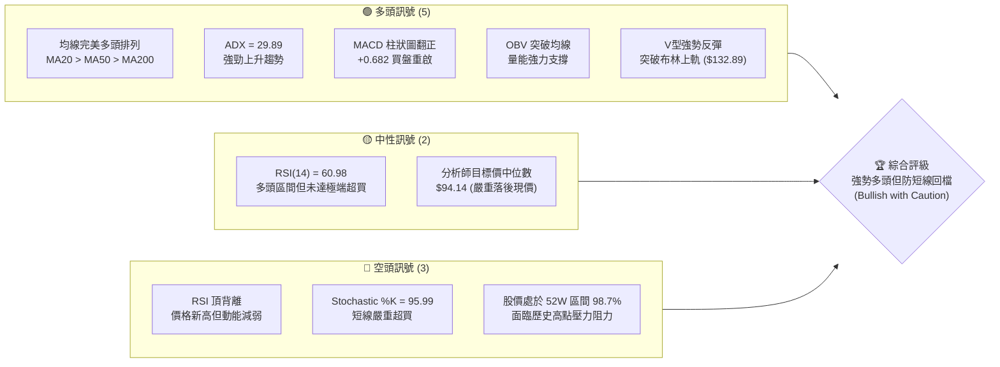
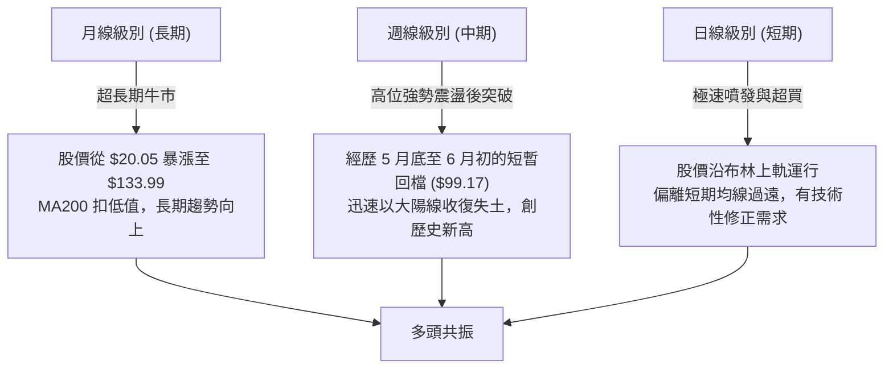
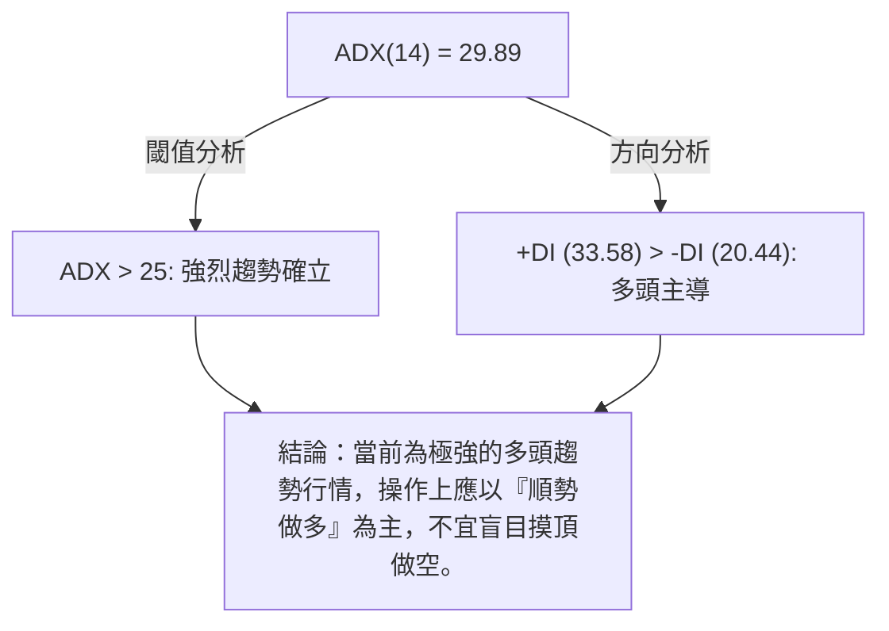
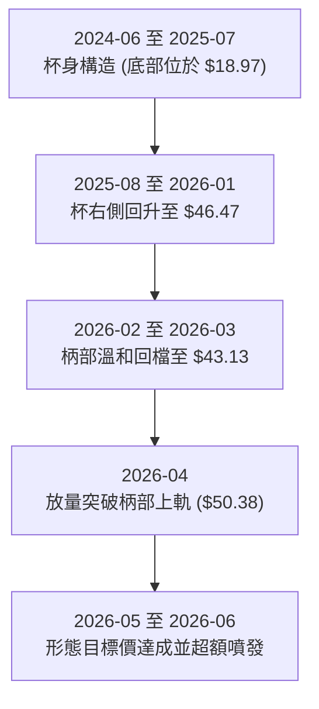
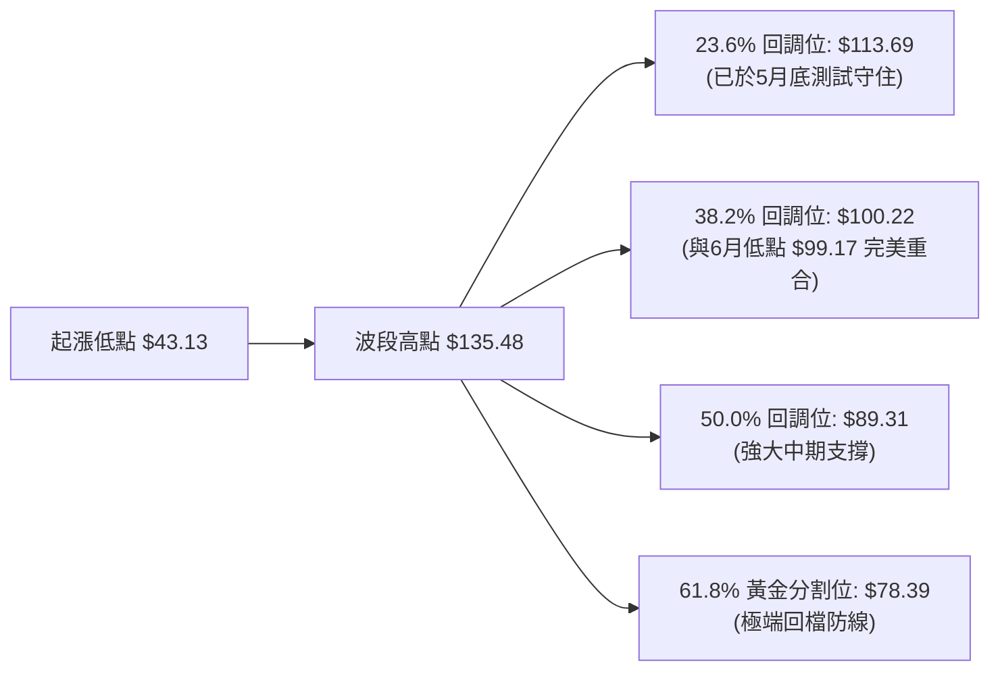
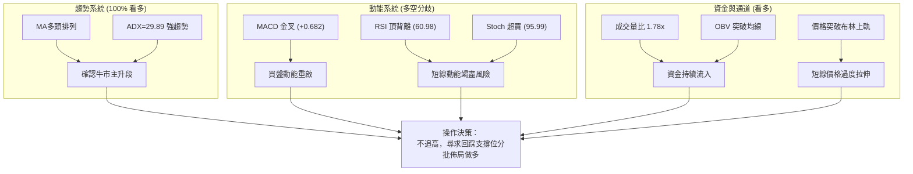
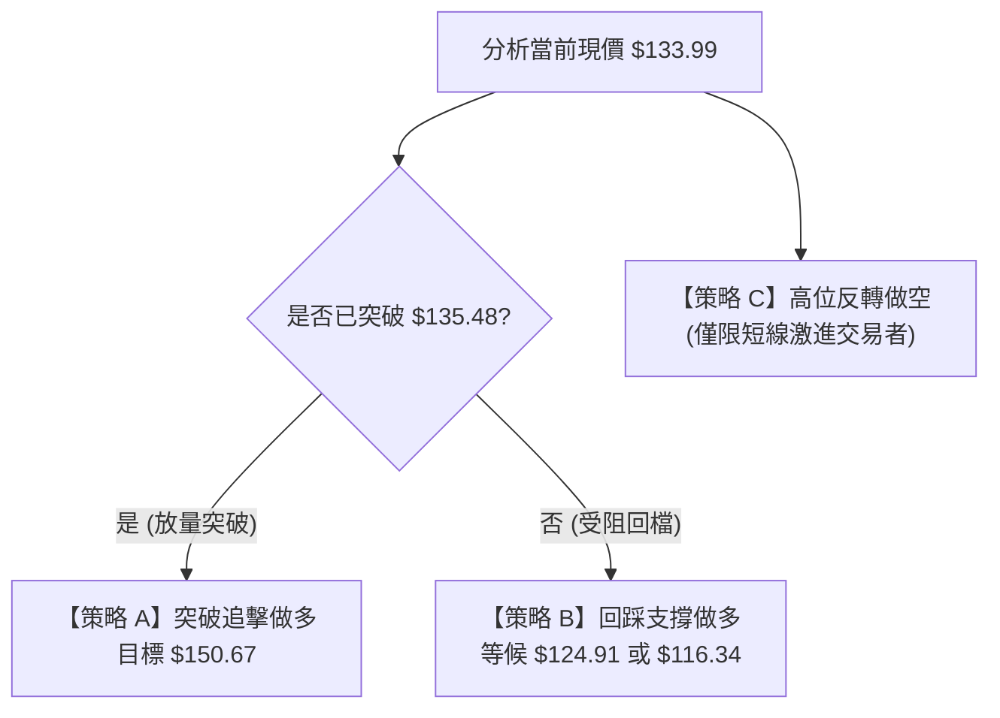
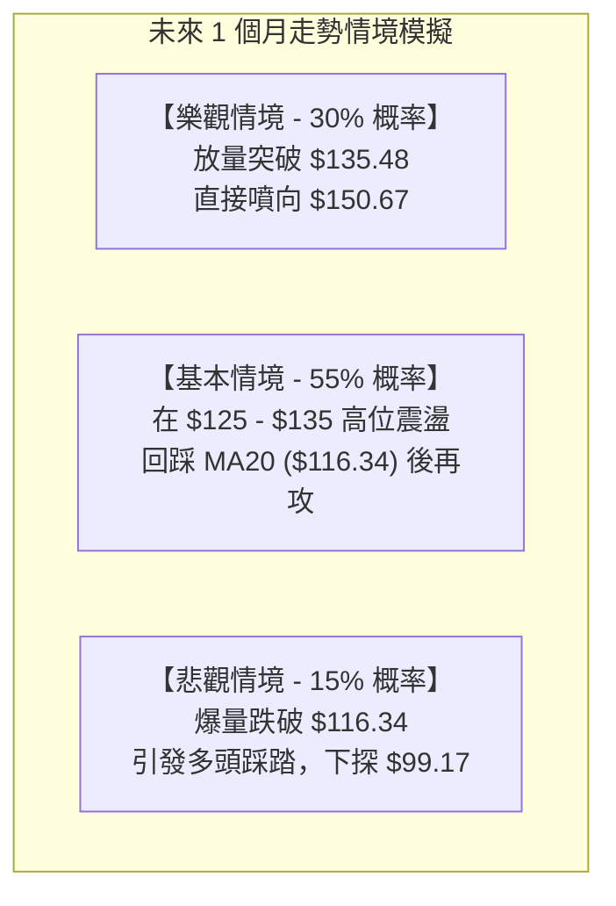

<details>
<summary>📊 靜態圖表 (點擊展開)</summary>

</details>

<html>
<head><meta charset="utf-8" /></head>
<body>
    <div style="height:500px; width:100%;">                        <script>window.PlotlyConfig = {MathJaxConfig: 'local'};</script>
        <script charset="utf-8" src="https://cdn.plot.ly/plotly-3.6.0.min.js" integrity="sha256-QaOVwtVY0T02VaHrr6pnoHLCwayMJp4O5n4YyaE3rJk=" crossorigin="anonymous"></script>                <div id="candlestick-chart" class="plotly-graph-div" style="height:100%; width:100%;"></div>            <script>                window.PLOTLYENV=window.PLOTLYENV || {};                                if (document.getElementById("candlestick-chart")) {                    Plotly.newPlot(                        "candlestick-chart",                        [{"close":{"dtype":"f8","bdata":"AAAAAAAAOEAAAAAAKZw4QAAAAKBwfThAAAAAQOF6OEAAAADgo3A4QAAAAMAexThAAAAAACmcOEAAAADgehQ4QAAAAMAexThAAAAAwB5FOUAAAABgZuY4QAAAAIDrkT5AAAAA4HqUPUAAAABgj8I8QAAAAEAKVz1AAAAA4FE4P0AAAABguP5AQAAAAAAAwEFAAAAAoHA9QUAAAABgZsZAQAAAAOBR+EFAAAAAYGamQkAAAACAPWpCQAAAACCFS0JAAAAAgMKVQkAAAABACrdCQAAAAGBm5kJAAAAAIFwvQkAAAAAAKZxCQAAAAOCj0EFAAAAAQDOTQkAAAAAghWtCQAAAAKBHgUJAAAAAwMwMQ0AAAAAgXA9DQAAAAIDCdUJAAAAA4HoUQ0AAAAAA1yNDQAAAAMAexUNAAAAAANfDREAAAAAghatEQAAAAOB6FERAAAAAYLj+Q0AAAAAAAMBDQAAAAADXg0JAAAAA4KMwQ0AAAABguJ5CQAAAAOCjEENAAAAAoJk5Q0AAAADgo\u002fBCQAAAAIDr8UJAAAAA4Hr0QUAAAABgj8JBQAAAAEDhWkFAAAAAgD0qQUAAAACAFI5BQAAAACBcz0BAAAAAAABAQUAAAADAHuVBQAAAAIA96kFAAAAAIK5nQkAAAAAgrkdEQAAAAKBHAURAAAAAACm8RUAAAACgR+FFQAAAAAAAQERAAAAA4Hq0REAAAABgZiZEQAAAAAAAQERAAAAAANdjREAAAACgR8FDQAAAACCu50JAAAAAoEfBQkAAAAAgrqdCQAAAAGBmBkJAAAAAANcjQkAAAADA9WhCQAAAACBcL0JAAAAAwMwsQkAAAADgehRCQAAAAKCZGUJAAAAAQApXQkAAAABgZqZCQAAAAEAzc0JAAAAA4KOwQ0AAAAAgXK9DQAAAAMAeBURAAAAA4KNQRUAAAACAFI5EQAAAAGBmxkZAAAAAIK4HRkAAAADAHqVHQAAAAAApXEhAAAAAwPUoSEAAAABA4XpHQAAAACCuR0hAAAAAAAAgS0AAAADA9ShLQAAAAMD1iEZAAAAAYLg+RUAAAABACvdFQAAAAADXY0hAAAAA4HpUSEAAAAAAKTxHQAAAACCuZ0hAAAAAAACgSEAAAADAzExIQAAAAGC4HkhAAAAAIIVLSUAAAABguB5JQAAAAOCjkEdAAAAAwB4lSEAAAACgcD1HQAAAAMAeZUdAAAAAQAoXR0AAAABA4bpGQAAAACBcT0ZAAAAAgBQORkAAAADgo9BFQAAAACBcD0dAAAAA4KNwR0AAAABA4bpGQAAAAIAUzkZAAAAAAADARkAAAADAzIxFQAAAAIA9ykZAAAAAoJn5RkAAAACAwrVFQAAAAIA9ykZAAAAAANdjR0AAAACgcP1HQAAAAAAAoEZAAAAAYI\u002fiRkAAAACgR+FGQAAAACCuB0ZAAAAAANeDRkAAAABAChdHQAAAACBc70VAAAAAoEcBRkAAAAAgrgdGQAAAAEAKl0dAAAAAwMwMRkAAAADgo5BFQAAAAOBRmERAAAAA4KMQRkAAAAAA1wNIQAAAAOCjMElAAAAAANdjSUAAAADgenRKQAAAAKCZeU1AAAAAACncTkAAAADgozBPQAAAACCFS1BAAAAAIK7nT0AAAAAAKTxQQAAAAAAAIFFAAAAAAAAgUUAAAADAzGxQQAAAAOCjkFBAAAAAoEdRUEAAAACA67FQQAAAAGCPolRAAAAAIFw\u002fVUAAAACgRyFVQAAAAAAAsFdAAAAAYLieV0AAAAAgrudYQAAAAIDr8VdAAAAAoJkJW0AAAADgo0BcQAAAACCuZ1tAAAAAQOE6X0AAAACAFC5gQAAAAEAKJ15AAAAAYI8SXkAAAAAghftcQAAAAKBHMVtAAAAAQOEKW0AAAABAM7NbQAAAAKBwvV1AAAAAAACgXUAAAACAwvVdQAAAAKBH4V5AAAAAoEdxXkAAAADA9TheQAAAACCFq1xAAAAAwB5VW0AAAAAghftaQAAAAKBwLVxAAAAAgOvxW0AAAABA4cpYQAAAAKBHkVtAAAAAQOH6WkAAAABgj8JaQAAAAKBwPV1AAAAA4HokX0AAAABACvdfQAAAAEAzQ11AAAAAYGZGXkAAAAAgrr9gQA=="},"high":{"dtype":"f8","bdata":"AAAAQAoXOEAAAAAA16M4QAAAAIDCtThAAAAAoHC9OEAAAAAgXM84QAAAAGC43jhAAAAAgBTuOEAAAACgR6E4QAAAAIDCdTlAAAAAQApXOUAAAABgj0I5QAAAAOCjMEBAAAAAoEehPkAAAACgmRk+QAAAAEAzMz5AAAAAQDOzP0AAAAAAACBBQAAAAGBmJkJAAAAAYGaGQUAAAABguB5BQAAAACCuB0JAAAAAwPXIQkAAAACAPQpDQAAAAEAKV0NAAAAAYGYGQ0AAAADAHuVCQAAAAMDMDENAAAAAQDPTQ0AAAACgR8FCQAAAAGBmRkJAAAAAYLi+QkAAAABgjwJDQAAAAOCjMENAAAAAYI9CQ0AAAADAzCxDQAAAAEAK90JAAAAAQDMzQ0AAAAAgXI9EQAAAAIDCVURAAAAAoHA9RUAAAADAHgVFQAAAAEAKt0RAAAAAgD1qREAAAACgmTlEQAAAAAAAIENAAAAA4FFYQ0AAAAAghetDQAAAAGCPIkNAAAAAANfDQ0AAAAAAKRxDQAAAAKCZGUNAAAAAIK6nQkAAAADAzAxCQAAAAKBw3UFAAAAAoEdhQUAAAAAAAOBBQAAAAEAKV0JAAAAAoHB9QUAAAADgehRCQAAAAOCjEEJAAAAAYLieQkAAAAAghUtEQAAAAOCjMERAAAAAQArXRUAAAABgjwJGQAAAAADXo0VAAAAAgD1qRUAAAAAgXA9FQAAAAKBHoURAAAAAYLh+REAAAADgURhEQAAAAADXA0RAAAAAoHA9Q0AAAABA4fpCQAAAACCF60JAAAAAYLi+QkAAAACAPcpCQAAAAEAz80JAAAAAYGZmQkAAAABAChdCQAAAAGC4PkJAAAAAYGZmQkAAAACgRyFDQAAAAIA9ykJAAAAAgBTuQ0AAAADAzAxFQAAAACCuJ0RAAAAAwPVIRkAAAAAghatFQAAAAKBw3UZAAAAAoJm5RkAAAABguB5IQAAAAAAAgEhAAAAAgOsxSUAAAABA4RpJQAAAAKBwHUlAAAAA4Ho0S0AAAADAzExLQAAAAOCjEEhAAAAAQOE6RkAAAAAA10NGQAAAAMAepUhAAAAAYI9iSEAAAACAPcpIQAAAACCF60hAAAAAYLi+SUAAAACgmdlIQAAAAIAUbklAAAAAYGamSUAAAAAAKZxJQAAAAMAeRUlAAAAAYGbGSEAAAACgmXlIQAAAAOBR2EdAAAAAgD1qR0AAAABgj2JHQAAAAIDClUZAAAAAgOsxRkAAAABgZkZGQAAAAMDMTEdAAAAAACl8R0AAAACgmXlHQAAAACCuR0dAAAAAIK7nRkAAAADgUdhFQAAAAOCjEEdAAAAAoHA9R0AAAABACpdGQAAAAKBH4UZAAAAA4KPwR0AAAACAPWpIQAAAAOBRuEdAAAAAQDNTR0AAAACAwpVIQAAAAIA9CkdAAAAAQOHaRkAAAADgUThHQAAAAGBmxkdAAAAAQOG6RkAAAAAgridGQAAAAMDM7EdAAAAAwMxMR0AAAADgoxBGQAAAAGC4\u002fkVAAAAAoHAdRkAAAABgj2JIQAAAAGC4PklAAAAAgOsxSkAAAABgj6JKQAAAAIDClU1AAAAAgD0KT0AAAACA67FPQAAAAKCZaVBAAAAAIIVLUEAAAACAwnVQQAAAAEAKJ1FAAAAAwB6VUUAAAACgcE1RQAAAAEDh6lBAAAAAoEcxUUAAAACA6xFRQAAAAIAUTlVAAAAAYGbGVUAAAACAwiVVQAAAAMDMvFdAAAAAACnsV0AAAADAzBxZQAAAAOB69FhAAAAAYLieW0AAAAAAAGBcQAAAAOCjoFxAAAAAgD1SYEAAAAAAAJhgQAAAAGCP8l9AAAAAAABAX0AAAADgeqRdQAAAAOB6pFtAAAAAYI\u002fiXEAAAADgekRcQAAAAAApfF5AAAAAgD3aXUAAAACA67FeQAAAACCuZ19AAAAAoEdRX0AAAADAHsVeQAAAAMD1qF9AAAAAQDNTXEAAAAAAAEBbQAAAAGCPkl1AAAAAwPVIXEAAAABguJ5aQAAAAGCPIlxAAAAAAACAXEAAAAAAAOBbQAAAAAAp3F1AAAAAYGbmX0AAAAAghZNgQAAAAGBmFmBAAAAAwMxMX0AAAAAgXO9gQA=="},"hovertemplate":"\u003cb\u003e%{x|%Y-%m-%d}\u003c\u002fb\u003e\u003cbr\u003e\u958b: $%{open:.2f}\u003cbr\u003e\u9ad8: $%{high:.2f}\u003cbr\u003e\u4f4e: $%{low:.2f}\u003cbr\u003e\u6536: $%{close:.2f}\u003cextra\u003e\u003c\u002fextra\u003e","low":{"dtype":"f8","bdata":"AAAA4FG4N0AAAAAAAMA3QAAAACCFKzhAAAAAYLgeOEAAAADAHkU4QAAAACCuRzhAAAAAgOuROEAAAADAzAw4QAAAAOBRODhAAAAA4KOwOEAAAABAM3M4QAAAAMD1KD5AAAAA4HpUPUAAAABA4bo8QAAAAIDr0TxAAAAAQOE6PUAAAACAwjU\u002fQAAAAGC4PkFAAAAAoHDdQEAAAABgj4JAQAAAAAAAwEBAAAAA4FG4QUAAAACgmTlCQAAAAEAKN0JAAAAAwMwsQkAAAADgevRBQAAAAIAUbkJAAAAAYGYmQkAAAAAA1yNCQAAAAOBRWEFAAAAAgOvRQUAAAADgejRCQAAAAIA9CkJAAAAAIK7HQkAAAACAwtVCQAAAAMAeBUJAAAAAQAo3QkAAAACAPepCQAAAAKBwHUNAAAAAwB7FQ0AAAACAwnVEQAAAAIAUDkRAAAAAwB7lQ0AAAABgZoZDQAAAAOCjUEJAAAAAgBSOQkAAAABgZmZCQAAAAAApfEJAAAAAACn8QkAAAABguL5CQAAAAMDMrEJAAAAAoJm5QUAAAAAgXE9BQAAAAKBwHUFAAAAAwPXIQEAAAAAAACBBQAAAAKBwvUBAAAAAgOtxQEAAAADgUVhBQAAAAEAKV0FAAAAA4KMQQkAAAAAghatCQAAAAMDMzENAAAAAYGYGREAAAACgR0FFQAAAAIDrEURAAAAAQDOTREAAAACgmdlDQAAAAADXA0RAAAAAgOtxQ0AAAACAPYpDQAAAACBcz0JAAAAAwPWoQkAAAACAwnVCQAAAAAAp\u002fEFAAAAAgMLVQUAAAADgUThCQAAAAMAeJUJAAAAAANcDQkAAAACgmXlBQAAAAMDM7EFAAAAAwPXoQUAAAADA9WhCQAAAACBcb0JAAAAAoEfhQkAAAABgj6JDQAAAAKCZeUNAAAAAIFwPREAAAABACldEQAAAAMD1yERAAAAAgOvxRUAAAAAAKZxGQAAAAIDCtUdAAAAAgD3qR0AAAABA4VpHQAAAAAAAgEdAAAAAQDMTSUAAAACAPYpKQAAAAKCZOUZAAAAAANcjRUAAAADAzIxFQAAAAMD1KEdAAAAAYLh+R0AAAABA4fpGQAAAAAAAwEZAAAAAQAo3SEAAAAAAAIBHQAAAAMAeZUdAAAAAgD1qSEAAAAAghctHQAAAAGCPYkdAAAAAgBRuR0AAAADgURhHQAAAAAApfEZAAAAAQOG6RkAAAADgo3BGQAAAAIDC9UVAAAAA4KNwRUAAAABACpdFQAAAAMAexUVAAAAAgD2KRkAAAACA6zFGQAAAAEAzM0ZAAAAAoJn5RUAAAACA6xFFQAAAAGCPokVAAAAAoJlZRkAAAAAA16NFQAAAAIDr0URAAAAA4Hq0RkAAAADgelRHQAAAAIDClUZAAAAAgOuxRkAAAADgUdhGQAAAAOB69EVAAAAAYGYGRkAAAABAM9NFQAAAAIDr0UVAAAAAYLjeRUAAAACgmZlFQAAAAKCZuUZAAAAAgML1RUAAAACAFG5FQAAAAOCjUERAAAAAwMzMREAAAACgcH1GQAAAAMAeBUdAAAAAIFzvSEAAAAAAKZxJQAAAAGBmZktAAAAAgOsxTUAAAAAAAGBOQAAAAEAKF09AAAAAIIULT0AAAADgo3BPQAAAAKBHEVBAAAAAIFzvUEAAAACAFB5QQAAAAMD1aFBAAAAAYLg+UEAAAABA4VpQQAAAACCu51NAAAAAQAqnVEAAAABAMzNUQAAAACCud1VAAAAAAADgVkAAAABACidXQAAAAGBm5ldAAAAAwB4FWUAAAADAHqVaQAAAAKCZSVtAAAAAQDPzW0AAAABA4fpeQAAAAAAAwFxAAAAAgD0aXUAAAABA4UpcQAAAAKBHQVpAAAAAYGb2WUAAAACgmZlZQAAAAEAzs1xAAAAAQOFKXEAAAACAwoVdQAAAAGBmVl1AAAAAAABAXUAAAAAA1xNdQAAAAGCPYlxAAAAAwB6VWkAAAABA4QpaQAAAAEAKt1tAAAAAYLjeWkAAAADAHpVYQAAAAIA9qlpAAAAAoHDdWEAAAABA4TpaQAAAAOCjoFtAAAAAwB7VXEAAAACAPapfQAAAAAAAAF1AAAAAANeDXUAAAACgmflfQA=="},"name":"\u50f9\u683c","open":{"dtype":"f8","bdata":"AAAAQAoXOEAAAACgmdk3QAAAAKCZmThAAAAAQOF6OEAAAAAgroc4QAAAACCFazhAAAAAYI\u002fCOEAAAAAAKZw4QAAAAOB6VDhAAAAAgOvROEAAAADgehQ5QAAAACCuxz9AAAAAoEdhPkAAAAAghas9QAAAAKBw\u002fTxAAAAAoEdhPUAAAAAAKZw\u002fQAAAAGCPgkFAAAAAYI9CQUAAAABACvdAQAAAAADXw0BAAAAAoEfhQUAAAACgmflCQAAAAOBRmEJAAAAAgOtRQkAAAABgZkZCQAAAAADXw0JAAAAAQOE6Q0AAAADgUThCQAAAAAAAAEJAAAAAQDMzQkAAAABAM5NCQAAAAIAULkJAAAAAwPXIQkAAAACA6xFDQAAAACCF60JAAAAAwMxMQkAAAABgjwJEQAAAAIDrMUNAAAAAIIXLQ0AAAADAzMxEQAAAAAApfERAAAAAQApXREAAAAAAACBEQAAAAIDrEUNAAAAAgMK1QkAAAAAghStDQAAAAKBHoUJAAAAAQAp3Q0AAAABAMxNDQAAAACCuB0NAAAAAYI+iQkAAAAAA14NBQAAAAKCZuUFAAAAAAAAgQUAAAACAPSpBQAAAAAAAAEJAAAAAoEfBQEAAAAAAKXxBQAAAAGBmxkFAAAAAoJkZQkAAAABAM7NCQAAAAIAU7kNAAAAAACk8REAAAACA67FFQAAAAKBHoUVAAAAA4HqUREAAAADgUfhEQAAAAKBwXURAAAAAgBQOREAAAADA9QhEQAAAAAAAoENAAAAAgD0qQ0AAAACAPcpCQAAAACCFy0JAAAAA4KOwQkAAAACgcD1CQAAAAIDr8UJAAAAAYLgeQkAAAACAwpVBQAAAAIDCFUJAAAAAoEcBQkAAAADgenRCQAAAAEAzs0JAAAAAYI\u002fiQkAAAAAghctEQAAAAIAU7kNAAAAAQAoXREAAAAAgXE9FQAAAAIA96kRAAAAAYLgeRkAAAACA6\u002fFGQAAAAKCZeUhAAAAAwMysSEAAAABgj6JIQAAAAGBmpkdAAAAAwPUoSUAAAABA4RpLQAAAAIAUbkdAAAAAANcjRkAAAAAAKfxFQAAAAMDMTEdAAAAAIK7HR0AAAACgcH1IQAAAAOCj0EZAAAAAIK4HSUAAAADAHsVIQAAAACCFy0dAAAAAwMyMSEAAAAAghctIQAAAAOB6NElAAAAAgBQOSEAAAABgZuZHQAAAAKBH4UZAAAAAQAr3RkAAAACAwvVGQAAAAKCZeUZAAAAAgOvxRUAAAAAghQtGQAAAAMDMDEZAAAAAIIULR0AAAABgj2JHQAAAAEDhOkZAAAAAoJkZRkAAAADgUbhFQAAAAMD1CEZAAAAAIFxvRkAAAACAwlVGQAAAAGC4XkVAAAAA4Hq0RkAAAADA9WhHQAAAAEAzs0dAAAAAACn8RkAAAADgevRHQAAAAIA9CkdAAAAAoJkZRkAAAABguP5FQAAAAKCZeUdAAAAAAABARkAAAADAHsVFQAAAAMDM7EZAAAAAYGYmR0AAAAAgXM9FQAAAAAAp3EVAAAAAoJn5REAAAAAAAIBGQAAAACCuB0dAAAAA4KNwSUAAAADgevRJQAAAACBcr0tAAAAAQDMzTUAAAABgj8JOQAAAAEAKF09AAAAAgD1KUEAAAABgj+JPQAAAACCFO1BAAAAAYGY2UUAAAADAzBxRQAAAAMD1yFBAAAAAACn8UEAAAABgZoZQQAAAAMDMjFRAAAAAQOHqVEAAAACA61FUQAAAAMD1iFVAAAAAYGbmV0AAAADAzExXQAAAACCFy1hAAAAA4KMgWUAAAABguL5bQAAAAKBHwVtAAAAAANfzW0AAAAAAKVxgQAAAAEAKF19AAAAAYGYGX0AAAACAPapcQAAAAGCPcltAAAAAgBReXEAAAABguL5aQAAAAIAUDl1AAAAAwB4lXUAAAACAwhVeQAAAAGBmhl5AAAAAwPUYX0AAAADAzFxeQAAAAGBm9l5AAAAAIIVbW0AAAADAzNxaQAAAAEDhGl1AAAAAoJkZW0AAAABguJ5aQAAAAAAAwFtAAAAAIFw\u002fXEAAAACA64FaQAAAAKBHYVxAAAAAQOFaXUAAAAAgri9gQAAAAEAKR19AAAAAYGZ2XkAAAACA63lgQA=="},"x":["2025-09-03T00:00:00-04:00","2025-09-04T00:00:00-04:00","2025-09-05T00:00:00-04:00","2025-09-08T00:00:00-04:00","2025-09-09T00:00:00-04:00","2025-09-10T00:00:00-04:00","2025-09-11T00:00:00-04:00","2025-09-12T00:00:00-04:00","2025-09-15T00:00:00-04:00","2025-09-16T00:00:00-04:00","2025-09-17T00:00:00-04:00","2025-09-18T00:00:00-04:00","2025-09-19T00:00:00-04:00","2025-09-22T00:00:00-04:00","2025-09-23T00:00:00-04:00","2025-09-24T00:00:00-04:00","2025-09-25T00:00:00-04:00","2025-09-26T00:00:00-04:00","2025-09-29T00:00:00-04:00","2025-09-30T00:00:00-04:00","2025-10-01T00:00:00-04:00","2025-10-02T00:00:00-04:00","2025-10-03T00:00:00-04:00","2025-10-06T00:00:00-04:00","2025-10-07T00:00:00-04:00","2025-10-08T00:00:00-04:00","2025-10-09T00:00:00-04:00","2025-10-10T00:00:00-04:00","2025-10-13T00:00:00-04:00","2025-10-14T00:00:00-04:00","2025-10-15T00:00:00-04:00","2025-10-16T00:00:00-04:00","2025-10-17T00:00:00-04:00","2025-10-20T00:00:00-04:00","2025-10-21T00:00:00-04:00","2025-10-22T00:00:00-04:00","2025-10-23T00:00:00-04:00","2025-10-24T00:00:00-04:00","2025-10-27T00:00:00-04:00","2025-10-28T00:00:00-04:00","2025-10-29T00:00:00-04:00","2025-10-30T00:00:00-04:00","2025-10-31T00:00:00-04:00","2025-11-03T00:00:00-05:00","2025-11-04T00:00:00-05:00","2025-11-05T00:00:00-05:00","2025-11-06T00:00:00-05:00","2025-11-07T00:00:00-05:00","2025-11-10T00:00:00-05:00","2025-11-11T00:00:00-05:00","2025-11-12T00:00:00-05:00","2025-11-13T00:00:00-05:00","2025-11-14T00:00:00-05:00","2025-11-17T00:00:00-05:00","2025-11-18T00:00:00-05:00","2025-11-19T00:00:00-05:00","2025-11-20T00:00:00-05:00","2025-11-21T00:00:00-05:00","2025-11-24T00:00:00-05:00","2025-11-25T00:00:00-05:00","2025-11-26T00:00:00-05:00","2025-11-28T00:00:00-05:00","2025-12-01T00:00:00-05:00","2025-12-02T00:00:00-05:00","2025-12-03T00:00:00-05:00","2025-12-04T00:00:00-05:00","2025-12-05T00:00:00-05:00","2025-12-08T00:00:00-05:00","2025-12-09T00:00:00-05:00","2025-12-10T00:00:00-05:00","2025-12-11T00:00:00-05:00","2025-12-12T00:00:00-05:00","2025-12-15T00:00:00-05:00","2025-12-16T00:00:00-05:00","2025-12-17T00:00:00-05:00","2025-12-18T00:00:00-05:00","2025-12-19T00:00:00-05:00","2025-12-22T00:00:00-05:00","2025-12-23T00:00:00-05:00","2025-12-24T00:00:00-05:00","2025-12-26T00:00:00-05:00","2025-12-29T00:00:00-05:00","2025-12-30T00:00:00-05:00","2025-12-31T00:00:00-05:00","2026-01-02T00:00:00-05:00","2026-01-05T00:00:00-05:00","2026-01-06T00:00:00-05:00","2026-01-07T00:00:00-05:00","2026-01-08T00:00:00-05:00","2026-01-09T00:00:00-05:00","2026-01-12T00:00:00-05:00","2026-01-13T00:00:00-05:00","2026-01-14T00:00:00-05:00","2026-01-15T00:00:00-05:00","2026-01-16T00:00:00-05:00","2026-01-20T00:00:00-05:00","2026-01-21T00:00:00-05:00","2026-01-22T00:00:00-05:00","2026-01-23T00:00:00-05:00","2026-01-26T00:00:00-05:00","2026-01-27T00:00:00-05:00","2026-01-28T00:00:00-05:00","2026-01-29T00:00:00-05:00","2026-01-30T00:00:00-05:00","2026-02-02T00:00:00-05:00","2026-02-03T00:00:00-05:00","2026-02-04T00:00:00-05:00","2026-02-05T00:00:00-05:00","2026-02-06T00:00:00-05:00","2026-02-09T00:00:00-05:00","2026-02-10T00:00:00-05:00","2026-02-11T00:00:00-05:00","2026-02-12T00:00:00-05:00","2026-02-13T00:00:00-05:00","2026-02-17T00:00:00-05:00","2026-02-18T00:00:00-05:00","2026-02-19T00:00:00-05:00","2026-02-20T00:00:00-05:00","2026-02-23T00:00:00-05:00","2026-02-24T00:00:00-05:00","2026-02-25T00:00:00-05:00","2026-02-26T00:00:00-05:00","2026-02-27T00:00:00-05:00","2026-03-02T00:00:00-05:00","2026-03-03T00:00:00-05:00","2026-03-04T00:00:00-05:00","2026-03-05T00:00:00-05:00","2026-03-06T00:00:00-05:00","2026-03-09T00:00:00-04:00","2026-03-10T00:00:00-04:00","2026-03-11T00:00:00-04:00","2026-03-12T00:00:00-04:00","2026-03-13T00:00:00-04:00","2026-03-16T00:00:00-04:00","2026-03-17T00:00:00-04:00","2026-03-18T00:00:00-04:00","2026-03-19T00:00:00-04:00","2026-03-20T00:00:00-04:00","2026-03-23T00:00:00-04:00","2026-03-24T00:00:00-04:00","2026-03-25T00:00:00-04:00","2026-03-26T00:00:00-04:00","2026-03-27T00:00:00-04:00","2026-03-30T00:00:00-04:00","2026-03-31T00:00:00-04:00","2026-04-01T00:00:00-04:00","2026-04-02T00:00:00-04:00","2026-04-06T00:00:00-04:00","2026-04-07T00:00:00-04:00","2026-04-08T00:00:00-04:00","2026-04-09T00:00:00-04:00","2026-04-10T00:00:00-04:00","2026-04-13T00:00:00-04:00","2026-04-14T00:00:00-04:00","2026-04-15T00:00:00-04:00","2026-04-16T00:00:00-04:00","2026-04-17T00:00:00-04:00","2026-04-20T00:00:00-04:00","2026-04-21T00:00:00-04:00","2026-04-22T00:00:00-04:00","2026-04-23T00:00:00-04:00","2026-04-24T00:00:00-04:00","2026-04-27T00:00:00-04:00","2026-04-28T00:00:00-04:00","2026-04-29T00:00:00-04:00","2026-04-30T00:00:00-04:00","2026-05-01T00:00:00-04:00","2026-05-04T00:00:00-04:00","2026-05-05T00:00:00-04:00","2026-05-06T00:00:00-04:00","2026-05-07T00:00:00-04:00","2026-05-08T00:00:00-04:00","2026-05-11T00:00:00-04:00","2026-05-12T00:00:00-04:00","2026-05-13T00:00:00-04:00","2026-05-14T00:00:00-04:00","2026-05-15T00:00:00-04:00","2026-05-18T00:00:00-04:00","2026-05-19T00:00:00-04:00","2026-05-20T00:00:00-04:00","2026-05-21T00:00:00-04:00","2026-05-22T00:00:00-04:00","2026-05-26T00:00:00-04:00","2026-05-27T00:00:00-04:00","2026-05-28T00:00:00-04:00","2026-05-29T00:00:00-04:00","2026-06-01T00:00:00-04:00","2026-06-02T00:00:00-04:00","2026-06-03T00:00:00-04:00","2026-06-04T00:00:00-04:00","2026-06-05T00:00:00-04:00","2026-06-08T00:00:00-04:00","2026-06-09T00:00:00-04:00","2026-06-10T00:00:00-04:00","2026-06-11T00:00:00-04:00","2026-06-12T00:00:00-04:00","2026-06-15T00:00:00-04:00","2026-06-16T00:00:00-04:00","2026-06-17T00:00:00-04:00","2026-06-18T00:00:00-04:00"],"type":"candlestick"},{"hovertemplate":"MA30: $%{y:.2f}\u003cextra\u003e\u003c\u002fextra\u003e","line":{"color":"#2196F3","dash":"dash","width":2},"mode":"lines","name":"MA30","x":["2025-09-03T00:00:00-04:00","2025-09-04T00:00:00-04:00","2025-09-05T00:00:00-04:00","2025-09-08T00:00:00-04:00","2025-09-09T00:00:00-04:00","2025-09-10T00:00:00-04:00","2025-09-11T00:00:00-04:00","2025-09-12T00:00:00-04:00","2025-09-15T00:00:00-04:00","2025-09-16T00:00:00-04:00","2025-09-17T00:00:00-04:00","2025-09-18T00:00:00-04:00","2025-09-19T00:00:00-04:00","2025-09-22T00:00:00-04:00","2025-09-23T00:00:00-04:00","2025-09-24T00:00:00-04:00","2025-09-25T00:00:00-04:00","2025-09-26T00:00:00-04:00","2025-09-29T00:00:00-04:00","2025-09-30T00:00:00-04:00","2025-10-01T00:00:00-04:00","2025-10-02T00:00:00-04:00","2025-10-03T00:00:00-04:00","2025-10-06T00:00:00-04:00","2025-10-07T00:00:00-04:00","2025-10-08T00:00:00-04:00","2025-10-09T00:00:00-04:00","2025-10-10T00:00:00-04:00","2025-10-13T00:00:00-04:00","2025-10-14T00:00:00-04:00","2025-10-15T00:00:00-04:00","2025-10-16T00:00:00-04:00","2025-10-17T00:00:00-04:00","2025-10-20T00:00:00-04:00","2025-10-21T00:00:00-04:00","2025-10-22T00:00:00-04:00","2025-10-23T00:00:00-04:00","2025-10-24T00:00:00-04:00","2025-10-27T00:00:00-04:00","2025-10-28T00:00:00-04:00","2025-10-29T00:00:00-04:00","2025-10-30T00:00:00-04:00","2025-10-31T00:00:00-04:00","2025-11-03T00:00:00-05:00","2025-11-04T00:00:00-05:00","2025-11-05T00:00:00-05:00","2025-11-06T00:00:00-05:00","2025-11-07T00:00:00-05:00","2025-11-10T00:00:00-05:00","2025-11-11T00:00:00-05:00","2025-11-12T00:00:00-05:00","2025-11-13T00:00:00-05:00","2025-11-14T00:00:00-05:00","2025-11-17T00:00:00-05:00","2025-11-18T00:00:00-05:00","2025-11-19T00:00:00-05:00","2025-11-20T00:00:00-05:00","2025-11-21T00:00:00-05:00","2025-11-24T00:00:00-05:00","2025-11-25T00:00:00-05:00","2025-11-26T00:00:00-05:00","2025-11-28T00:00:00-05:00","2025-12-01T00:00:00-05:00","2025-12-02T00:00:00-05:00","2025-12-03T00:00:00-05:00","2025-12-04T00:00:00-05:00","2025-12-05T00:00:00-05:00","2025-12-08T00:00:00-05:00","2025-12-09T00:00:00-05:00","2025-12-10T00:00:00-05:00","2025-12-11T00:00:00-05:00","2025-12-12T00:00:00-05:00","2025-12-15T00:00:00-05:00","2025-12-16T00:00:00-05:00","2025-12-17T00:00:00-05:00","2025-12-18T00:00:00-05:00","2025-12-19T00:00:00-05:00","2025-12-22T00:00:00-05:00","2025-12-23T00:00:00-05:00","2025-12-24T00:00:00-05:00","2025-12-26T00:00:00-05:00","2025-12-29T00:00:00-05:00","2025-12-30T00:00:00-05:00","2025-12-31T00:00:00-05:00","2026-01-02T00:00:00-05:00","2026-01-05T00:00:00-05:00","2026-01-06T00:00:00-05:00","2026-01-07T00:00:00-05:00","2026-01-08T00:00:00-05:00","2026-01-09T00:00:00-05:00","2026-01-12T00:00:00-05:00","2026-01-13T00:00:00-05:00","2026-01-14T00:00:00-05:00","2026-01-15T00:00:00-05:00","2026-01-16T00:00:00-05:00","2026-01-20T00:00:00-05:00","2026-01-21T00:00:00-05:00","2026-01-22T00:00:00-05:00","2026-01-23T00:00:00-05:00","2026-01-26T00:00:00-05:00","2026-01-27T00:00:00-05:00","2026-01-28T00:00:00-05:00","2026-01-29T00:00:00-05:00","2026-01-30T00:00:00-05:00","2026-02-02T00:00:00-05:00","2026-02-03T00:00:00-05:00","2026-02-04T00:00:00-05:00","2026-02-05T00:00:00-05:00","2026-02-06T00:00:00-05:00","2026-02-09T00:00:00-05:00","2026-02-10T00:00:00-05:00","2026-02-11T00:00:00-05:00","2026-02-12T00:00:00-05:00","2026-02-13T00:00:00-05:00","2026-02-17T00:00:00-05:00","2026-02-18T00:00:00-05:00","2026-02-19T00:00:00-05:00","2026-02-20T00:00:00-05:00","2026-02-23T00:00:00-05:00","2026-02-24T00:00:00-05:00","2026-02-25T00:00:00-05:00","2026-02-26T00:00:00-05:00","2026-02-27T00:00:00-05:00","2026-03-02T00:00:00-05:00","2026-03-03T00:00:00-05:00","2026-03-04T00:00:00-05:00","2026-03-05T00:00:00-05:00","2026-03-06T00:00:00-05:00","2026-03-09T00:00:00-04:00","2026-03-10T00:00:00-04:00","2026-03-11T00:00:00-04:00","2026-03-12T00:00:00-04:00","2026-03-13T00:00:00-04:00","2026-03-16T00:00:00-04:00","2026-03-17T00:00:00-04:00","2026-03-18T00:00:00-04:00","2026-03-19T00:00:00-04:00","2026-03-20T00:00:00-04:00","2026-03-23T00:00:00-04:00","2026-03-24T00:00:00-04:00","2026-03-25T00:00:00-04:00","2026-03-26T00:00:00-04:00","2026-03-27T00:00:00-04:00","2026-03-30T00:00:00-04:00","2026-03-31T00:00:00-04:00","2026-04-01T00:00:00-04:00","2026-04-02T00:00:00-04:00","2026-04-06T00:00:00-04:00","2026-04-07T00:00:00-04:00","2026-04-08T00:00:00-04:00","2026-04-09T00:00:00-04:00","2026-04-10T00:00:00-04:00","2026-04-13T00:00:00-04:00","2026-04-14T00:00:00-04:00","2026-04-15T00:00:00-04:00","2026-04-16T00:00:00-04:00","2026-04-17T00:00:00-04:00","2026-04-20T00:00:00-04:00","2026-04-21T00:00:00-04:00","2026-04-22T00:00:00-04:00","2026-04-23T00:00:00-04:00","2026-04-24T00:00:00-04:00","2026-04-27T00:00:00-04:00","2026-04-28T00:00:00-04:00","2026-04-29T00:00:00-04:00","2026-04-30T00:00:00-04:00","2026-05-01T00:00:00-04:00","2026-05-04T00:00:00-04:00","2026-05-05T00:00:00-04:00","2026-05-06T00:00:00-04:00","2026-05-07T00:00:00-04:00","2026-05-08T00:00:00-04:00","2026-05-11T00:00:00-04:00","2026-05-12T00:00:00-04:00","2026-05-13T00:00:00-04:00","2026-05-14T00:00:00-04:00","2026-05-15T00:00:00-04:00","2026-05-18T00:00:00-04:00","2026-05-19T00:00:00-04:00","2026-05-20T00:00:00-04:00","2026-05-21T00:00:00-04:00","2026-05-22T00:00:00-04:00","2026-05-26T00:00:00-04:00","2026-05-27T00:00:00-04:00","2026-05-28T00:00:00-04:00","2026-05-29T00:00:00-04:00","2026-06-01T00:00:00-04:00","2026-06-02T00:00:00-04:00","2026-06-03T00:00:00-04:00","2026-06-04T00:00:00-04:00","2026-06-05T00:00:00-04:00","2026-06-08T00:00:00-04:00","2026-06-09T00:00:00-04:00","2026-06-10T00:00:00-04:00","2026-06-11T00:00:00-04:00","2026-06-12T00:00:00-04:00","2026-06-15T00:00:00-04:00","2026-06-16T00:00:00-04:00","2026-06-17T00:00:00-04:00","2026-06-18T00:00:00-04:00"],"y":{"dtype":"f8","bdata":"AAAAAAAA+H8AAAAAAAD4fwAAAAAAAPh\u002fAAAAAAAA+H8AAAAAAAD4fwAAAAAAAPh\u002fAAAAAAAA+H8AAAAAAAD4fwAAAAAAAPh\u002fAAAAAAAA+H8AAAAAAAD4fwAAAAAAAPh\u002fAAAAAAAA+H8AAAAAAAD4fwAAAAAAAPh\u002fAAAAAAAA+H8AAAAAAAD4fwAAAAAAAPh\u002fAAAAAAAA+H8AAAAAAAD4fwAAAAAAAPh\u002fAAAAAAAA+H8AAAAAAAD4fwAAAAAAAPh\u002fAAAAAAAA+H8AAAAAAAD4fwAAAAAAAPh\u002fAAAAAAAA+H8AAAAAAAD4f5qZmak42z5Ad3d3R29LP0Dv7u4ezLM\u002fQM3MzDxRD0BAiYiI6G1JQEBVVVUdzINAQO\u002fu7iajt0BAVVVVXXPxQEDNzMyMCS5BQERERFQObUFAVVVVlW6yQUCrqqpyk\u002fhBQBEREUl+IUJAiYiIyOhNQkAiIiK6u3tCQJqZmUGLnEJAMzMz4xe7QkARERHB9chCQKuqqmou1EJAd3d3tx7lQkC8u7s7mPdCQHd3dyfq\u002f0JAd3d35\u002fv5QkCJiIgIZfRCQCIiIpJf7EJAmpmZiUHgQkCrqqp6W9ZCQN7d3c2FxEJARERERIu8QkAzMzNTcbZCQHd3d8dLt0JAiYiIaNi1QkBERESkt8VCQBEREXGE0kJAq6qq6m3pQkDNzMxMfgFDQN7d3Z3EEENAvLu7e6IeQ0DNzMzcQCdDQAAAAHBZK0NAzczMPCYoQ0AzMzNjVyBDQAAAAJBQFkNAzczMvLsLQ0DNzMysYwJDQBEREUE1\u002fkJA3t3dfT\u002f1QkDNzMy8dPNCQImIiFjy60JAVVVVlfziQkAiIiLipdtCQERERPRv1EJAAAAAALnXQkC8u7s7Ud9CQM3MzEyp6EJA7+7uPjX+QkDNzMxMYhBDQHd3d6fGK0NAiYiIyHZOQ0BERESkKWVDQImIiHiijkNAd3d3Z5GtQ0C8u7tbSMpDQBEREQFy70NA7+7ufiMEREAAAADAyhFEQLy7u2suNERAAAAAIPdqREBERES0yKZEQM3MzFxIukRAREREJJTBREBmZmb2b9REQAAAACA+A0VAZmZm5tAyRUAAAAAQ5llFQDMzM2NXkEVAZmZmFq7HRUDNzMz88PlFQCIiIjKWLEZAMzMzE1hpRkARERExa6VGQKuqqqoN1EZAIiIi4pYFR0BERETkwSxHQImIiGj0VkdAIiIi0vdzR0CamZm5841HQN7d3U1+oUdAvLu7286nR0Dv7u5ej7JHQGZmZvb9tEdAd3d3JwbBR0De3d1NN7lHQKuqqlryq0dAmpmZKeqfR0AzMzMDco9HQO\u002fu7g67gkdA7+7uPlFfR0CamZmJzzBHQImIiJj8MkdAq6qqakpFR0CJiIgYklZHQFVVVWWCR0dA7+7uvi07R0C8u7s7JjhHQHd3d\u002ffhI0dAmpmZmeARR0ARERFRjQdHQLy7uxvo9EZA3t3d\u002fdTYRkCJiIjIdr5GQFVVVWWtvkZAvLu7y8ysRkBERES0gZ5GQCIiIgKdhkZAzczM3N19RkDNzMz81IhGQCIiInJooUZAzczM3N29RkCJiIgYduVGQBEREeEzHEdA3t3dHYVbR0BVVVVFtqNHQN7d3e0190dAVVVVVVVFSEARERFxhKJIQBERETFPBElA3t3dzYVkSUARERGBlcNJQERERJTRG0pAZmZmlrVqSkAzMzMz7LpKQDMzM9MGWktAVVVVhV0BTEBmZmbGvaZMQFVVVcUEf01AzczMXAFSTkCJiIgYBDZPQERERNS\u002fCVBAq6qq0pSSUEB3d3e3rCVRQImIiEjhqlFAd3d3x0tXUkBERESMbA9TQFVVVXXauFNAERER+VNbVEBVVVVtLuxUQGZmZia\u002faFVA3t3dvS3jVUDv7u5mrV5WQM3MzNyy3lZAAAAAUNRXV0CamZkhadJXQERERIzeTlhA7+7uboTKWEB3d3eX4EFZQHd3dwdlpFlAd3d3p3\u002f7WUDe3d3dllVaQCIiIsKuuFpAvLu7a+cbW0De3d2tAGFbQERERPQonFtAq6qqyhPNW0B3d3e3Hv1bQGZmZlaALFxAzczMfLFsXECrqqpK8KhcQM3MzIxQ1lxAmpmZ+fDxXECrqqrash5dQA=="},"type":"scatter"},{"hovertemplate":"MA60: $%{y:.2f}\u003cextra\u003e\u003c\u002fextra\u003e","line":{"color":"#9C27B0","dash":"dash","width":2},"mode":"lines","name":"MA60","x":["2025-09-03T00:00:00-04:00","2025-09-04T00:00:00-04:00","2025-09-05T00:00:00-04:00","2025-09-08T00:00:00-04:00","2025-09-09T00:00:00-04:00","2025-09-10T00:00:00-04:00","2025-09-11T00:00:00-04:00","2025-09-12T00:00:00-04:00","2025-09-15T00:00:00-04:00","2025-09-16T00:00:00-04:00","2025-09-17T00:00:00-04:00","2025-09-18T00:00:00-04:00","2025-09-19T00:00:00-04:00","2025-09-22T00:00:00-04:00","2025-09-23T00:00:00-04:00","2025-09-24T00:00:00-04:00","2025-09-25T00:00:00-04:00","2025-09-26T00:00:00-04:00","2025-09-29T00:00:00-04:00","2025-09-30T00:00:00-04:00","2025-10-01T00:00:00-04:00","2025-10-02T00:00:00-04:00","2025-10-03T00:00:00-04:00","2025-10-06T00:00:00-04:00","2025-10-07T00:00:00-04:00","2025-10-08T00:00:00-04:00","2025-10-09T00:00:00-04:00","2025-10-10T00:00:00-04:00","2025-10-13T00:00:00-04:00","2025-10-14T00:00:00-04:00","2025-10-15T00:00:00-04:00","2025-10-16T00:00:00-04:00","2025-10-17T00:00:00-04:00","2025-10-20T00:00:00-04:00","2025-10-21T00:00:00-04:00","2025-10-22T00:00:00-04:00","2025-10-23T00:00:00-04:00","2025-10-24T00:00:00-04:00","2025-10-27T00:00:00-04:00","2025-10-28T00:00:00-04:00","2025-10-29T00:00:00-04:00","2025-10-30T00:00:00-04:00","2025-10-31T00:00:00-04:00","2025-11-03T00:00:00-05:00","2025-11-04T00:00:00-05:00","2025-11-05T00:00:00-05:00","2025-11-06T00:00:00-05:00","2025-11-07T00:00:00-05:00","2025-11-10T00:00:00-05:00","2025-11-11T00:00:00-05:00","2025-11-12T00:00:00-05:00","2025-11-13T00:00:00-05:00","2025-11-14T00:00:00-05:00","2025-11-17T00:00:00-05:00","2025-11-18T00:00:00-05:00","2025-11-19T00:00:00-05:00","2025-11-20T00:00:00-05:00","2025-11-21T00:00:00-05:00","2025-11-24T00:00:00-05:00","2025-11-25T00:00:00-05:00","2025-11-26T00:00:00-05:00","2025-11-28T00:00:00-05:00","2025-12-01T00:00:00-05:00","2025-12-02T00:00:00-05:00","2025-12-03T00:00:00-05:00","2025-12-04T00:00:00-05:00","2025-12-05T00:00:00-05:00","2025-12-08T00:00:00-05:00","2025-12-09T00:00:00-05:00","2025-12-10T00:00:00-05:00","2025-12-11T00:00:00-05:00","2025-12-12T00:00:00-05:00","2025-12-15T00:00:00-05:00","2025-12-16T00:00:00-05:00","2025-12-17T00:00:00-05:00","2025-12-18T00:00:00-05:00","2025-12-19T00:00:00-05:00","2025-12-22T00:00:00-05:00","2025-12-23T00:00:00-05:00","2025-12-24T00:00:00-05:00","2025-12-26T00:00:00-05:00","2025-12-29T00:00:00-05:00","2025-12-30T00:00:00-05:00","2025-12-31T00:00:00-05:00","2026-01-02T00:00:00-05:00","2026-01-05T00:00:00-05:00","2026-01-06T00:00:00-05:00","2026-01-07T00:00:00-05:00","2026-01-08T00:00:00-05:00","2026-01-09T00:00:00-05:00","2026-01-12T00:00:00-05:00","2026-01-13T00:00:00-05:00","2026-01-14T00:00:00-05:00","2026-01-15T00:00:00-05:00","2026-01-16T00:00:00-05:00","2026-01-20T00:00:00-05:00","2026-01-21T00:00:00-05:00","2026-01-22T00:00:00-05:00","2026-01-23T00:00:00-05:00","2026-01-26T00:00:00-05:00","2026-01-27T00:00:00-05:00","2026-01-28T00:00:00-05:00","2026-01-29T00:00:00-05:00","2026-01-30T00:00:00-05:00","2026-02-02T00:00:00-05:00","2026-02-03T00:00:00-05:00","2026-02-04T00:00:00-05:00","2026-02-05T00:00:00-05:00","2026-02-06T00:00:00-05:00","2026-02-09T00:00:00-05:00","2026-02-10T00:00:00-05:00","2026-02-11T00:00:00-05:00","2026-02-12T00:00:00-05:00","2026-02-13T00:00:00-05:00","2026-02-17T00:00:00-05:00","2026-02-18T00:00:00-05:00","2026-02-19T00:00:00-05:00","2026-02-20T00:00:00-05:00","2026-02-23T00:00:00-05:00","2026-02-24T00:00:00-05:00","2026-02-25T00:00:00-05:00","2026-02-26T00:00:00-05:00","2026-02-27T00:00:00-05:00","2026-03-02T00:00:00-05:00","2026-03-03T00:00:00-05:00","2026-03-04T00:00:00-05:00","2026-03-05T00:00:00-05:00","2026-03-06T00:00:00-05:00","2026-03-09T00:00:00-04:00","2026-03-10T00:00:00-04:00","2026-03-11T00:00:00-04:00","2026-03-12T00:00:00-04:00","2026-03-13T00:00:00-04:00","2026-03-16T00:00:00-04:00","2026-03-17T00:00:00-04:00","2026-03-18T00:00:00-04:00","2026-03-19T00:00:00-04:00","2026-03-20T00:00:00-04:00","2026-03-23T00:00:00-04:00","2026-03-24T00:00:00-04:00","2026-03-25T00:00:00-04:00","2026-03-26T00:00:00-04:00","2026-03-27T00:00:00-04:00","2026-03-30T00:00:00-04:00","2026-03-31T00:00:00-04:00","2026-04-01T00:00:00-04:00","2026-04-02T00:00:00-04:00","2026-04-06T00:00:00-04:00","2026-04-07T00:00:00-04:00","2026-04-08T00:00:00-04:00","2026-04-09T00:00:00-04:00","2026-04-10T00:00:00-04:00","2026-04-13T00:00:00-04:00","2026-04-14T00:00:00-04:00","2026-04-15T00:00:00-04:00","2026-04-16T00:00:00-04:00","2026-04-17T00:00:00-04:00","2026-04-20T00:00:00-04:00","2026-04-21T00:00:00-04:00","2026-04-22T00:00:00-04:00","2026-04-23T00:00:00-04:00","2026-04-24T00:00:00-04:00","2026-04-27T00:00:00-04:00","2026-04-28T00:00:00-04:00","2026-04-29T00:00:00-04:00","2026-04-30T00:00:00-04:00","2026-05-01T00:00:00-04:00","2026-05-04T00:00:00-04:00","2026-05-05T00:00:00-04:00","2026-05-06T00:00:00-04:00","2026-05-07T00:00:00-04:00","2026-05-08T00:00:00-04:00","2026-05-11T00:00:00-04:00","2026-05-12T00:00:00-04:00","2026-05-13T00:00:00-04:00","2026-05-14T00:00:00-04:00","2026-05-15T00:00:00-04:00","2026-05-18T00:00:00-04:00","2026-05-19T00:00:00-04:00","2026-05-20T00:00:00-04:00","2026-05-21T00:00:00-04:00","2026-05-22T00:00:00-04:00","2026-05-26T00:00:00-04:00","2026-05-27T00:00:00-04:00","2026-05-28T00:00:00-04:00","2026-05-29T00:00:00-04:00","2026-06-01T00:00:00-04:00","2026-06-02T00:00:00-04:00","2026-06-03T00:00:00-04:00","2026-06-04T00:00:00-04:00","2026-06-05T00:00:00-04:00","2026-06-08T00:00:00-04:00","2026-06-09T00:00:00-04:00","2026-06-10T00:00:00-04:00","2026-06-11T00:00:00-04:00","2026-06-12T00:00:00-04:00","2026-06-15T00:00:00-04:00","2026-06-16T00:00:00-04:00","2026-06-17T00:00:00-04:00","2026-06-18T00:00:00-04:00"],"y":{"dtype":"f8","bdata":"AAAAAAAA+H8AAAAAAAD4fwAAAAAAAPh\u002fAAAAAAAA+H8AAAAAAAD4fwAAAAAAAPh\u002fAAAAAAAA+H8AAAAAAAD4fwAAAAAAAPh\u002fAAAAAAAA+H8AAAAAAAD4fwAAAAAAAPh\u002fAAAAAAAA+H8AAAAAAAD4fwAAAAAAAPh\u002fAAAAAAAA+H8AAAAAAAD4fwAAAAAAAPh\u002fAAAAAAAA+H8AAAAAAAD4fwAAAAAAAPh\u002fAAAAAAAA+H8AAAAAAAD4fwAAAAAAAPh\u002fAAAAAAAA+H8AAAAAAAD4fwAAAAAAAPh\u002fAAAAAAAA+H8AAAAAAAD4fwAAAAAAAPh\u002fAAAAAAAA+H8AAAAAAAD4fwAAAAAAAPh\u002fAAAAAAAA+H8AAAAAAAD4fwAAAAAAAPh\u002fAAAAAAAA+H8AAAAAAAD4fwAAAAAAAPh\u002fAAAAAAAA+H8AAAAAAAD4fwAAAAAAAPh\u002fAAAAAAAA+H8AAAAAAAD4fwAAAAAAAPh\u002fAAAAAAAA+H8AAAAAAAD4fwAAAAAAAPh\u002fAAAAAAAA+H8AAAAAAAD4fwAAAAAAAPh\u002fAAAAAAAA+H8AAAAAAAD4fwAAAAAAAPh\u002fAAAAAAAA+H8AAAAAAAD4fwAAAAAAAPh\u002fAAAAAAAA+H8AAAAAAAD4fyIiIg50EkFAIiIiBsgtQUDe3d3Zzk9BQO\u002fu7tbqcEFAmpmZ6W2ZQUARERE1pcJBQGZmZuIz5EFAiYiI7AoIQkDNzMw0pSpCQCIiIuIzTEJAERERaUptQkDv7u5qdYxCQImIiGznm0JAq6qqQtKsQkB3d3ezD79CQFVVVUFgzUJAiYiIsCvYQkDv7u4+Nd5CQJqZmWEQ4EJAZmZmpg3kQkDv7u4On+lCQN7d3Q0t6kJAvLu7c9roQkAiIiIi2+lCQHd3d2+E6kJAREREZDvvQkC8u7vjXvNCQKuqqjom+EJAZmZmBoEFQ0C8u7t7zQ1DQAAAACD3IkNAAAAA6LQxQ0AAAAAAAEhDQBERETn7YENAzczMtMh2Q0BmZmaGpIlDQM3MzIR5okNA3t3dzczEQ0CJiIjIBOdDQGZmZubQ8kNAiYiIMN30Q0DNzMysY\u002fpDQAAAAFjHDERAmpmZUUYfREBmZmbeJC5EQCIiIlJGR0RAIiIiynZeREDNzMzcsnZEQFVVVUVEjERAREREVCqmRECamZmJiMBEQHd3d88+1ERAERER8afuREAAAACQCQZFQKuqqtrOH0VAiYiIiBY5RUAzMzMDK09FQKuqqnqiZkVAIiIi0iJ7RUCamZmB3ItFQHd3dzfQoUVAd3d3x0u3RUDNzMzUv8FFQN7d3S2yzUVARERE1AbSRUCamZlhntBFQFVVVb1020VAd3d3LyTlRUDv7u4ezOtFQKuqqnqi9kVAd3d3R28DRkB3d3cHgRVGQKuqqkJgJUZAq6qqUv82RkDe3d0lBklGQFVVVa0cWkZAAAAAWMdsRkDv7u4mv4BGQO\u002fu7ia\u002fkEZAiYiIiBahRkDNzMz88LFGQAAAAIhdyUZA7+7u1jHZRkBERETMoeVGQFVVVbXI7kZAd3d31+r4RkAzMzNbZAtHQAAAAGBzIUdAREREXNYyR0C8u7u7AkxHQLy7u+uYaEdAq6qqokWOR0CamZnJdq5HQERERCSU0UdAd3d3v5\u002fyR0AiIiI6+xhIQAAAACCFQ0hAZmZmhuthSEBVVVWFMnpIQGZmZhZnp0hAiYiIAADYSEDe3d0lvwhJQERERJzEUElAIiIiokWeSUAREREBcu9JQGZmZl5zUUpAMzMz+\u002fCxSkDNzMy0yB5LQCIiIuIzhEtAmpmZUf\u002f+S0C8u7sb6IRMQDMzM\u002fs3Ck1AVVVVLbKtTUBmZmZmrV5OQGZmZvYo\u002fE5Ad3d350KaT0De3d11TBhQQLy7u6+5XFBAIiIiVg6hUECamZk5tOhQQKuqqmZmNlFAd3d3b8uCUUAiIiIiItJRQJqZmcE8JVJAzczMjJd2UkAAAABokclSQAAAAFBGE1NAMzMzR+FWU0AzMzPPsJtTQCIiIsZL41NAd3d3G6EoVEC8u7tjO19UQO\u002fu7i6WpFRAq6qqRuHmVEBVVVXNPihVQImIiFwBdlVAmpmZFdnKVUB3d3cr+SFWQImIiDAIcFZAIiIi5kLCVkARERHJLyJXQA=="},"type":"scatter"},{"hovertemplate":"MA200: $%{y:.2f}\u003cextra\u003e\u003c\u002fextra\u003e","line":{"color":"#FF6F00","dash":"solid","width":2},"mode":"lines","name":"MA200","x":["2025-09-03T00:00:00-04:00","2025-09-04T00:00:00-04:00","2025-09-05T00:00:00-04:00","2025-09-08T00:00:00-04:00","2025-09-09T00:00:00-04:00","2025-09-10T00:00:00-04:00","2025-09-11T00:00:00-04:00","2025-09-12T00:00:00-04:00","2025-09-15T00:00:00-04:00","2025-09-16T00:00:00-04:00","2025-09-17T00:00:00-04:00","2025-09-18T00:00:00-04:00","2025-09-19T00:00:00-04:00","2025-09-22T00:00:00-04:00","2025-09-23T00:00:00-04:00","2025-09-24T00:00:00-04:00","2025-09-25T00:00:00-04:00","2025-09-26T00:00:00-04:00","2025-09-29T00:00:00-04:00","2025-09-30T00:00:00-04:00","2025-10-01T00:00:00-04:00","2025-10-02T00:00:00-04:00","2025-10-03T00:00:00-04:00","2025-10-06T00:00:00-04:00","2025-10-07T00:00:00-04:00","2025-10-08T00:00:00-04:00","2025-10-09T00:00:00-04:00","2025-10-10T00:00:00-04:00","2025-10-13T00:00:00-04:00","2025-10-14T00:00:00-04:00","2025-10-15T00:00:00-04:00","2025-10-16T00:00:00-04:00","2025-10-17T00:00:00-04:00","2025-10-20T00:00:00-04:00","2025-10-21T00:00:00-04:00","2025-10-22T00:00:00-04:00","2025-10-23T00:00:00-04:00","2025-10-24T00:00:00-04:00","2025-10-27T00:00:00-04:00","2025-10-28T00:00:00-04:00","2025-10-29T00:00:00-04:00","2025-10-30T00:00:00-04:00","2025-10-31T00:00:00-04:00","2025-11-03T00:00:00-05:00","2025-11-04T00:00:00-05:00","2025-11-05T00:00:00-05:00","2025-11-06T00:00:00-05:00","2025-11-07T00:00:00-05:00","2025-11-10T00:00:00-05:00","2025-11-11T00:00:00-05:00","2025-11-12T00:00:00-05:00","2025-11-13T00:00:00-05:00","2025-11-14T00:00:00-05:00","2025-11-17T00:00:00-05:00","2025-11-18T00:00:00-05:00","2025-11-19T00:00:00-05:00","2025-11-20T00:00:00-05:00","2025-11-21T00:00:00-05:00","2025-11-24T00:00:00-05:00","2025-11-25T00:00:00-05:00","2025-11-26T00:00:00-05:00","2025-11-28T00:00:00-05:00","2025-12-01T00:00:00-05:00","2025-12-02T00:00:00-05:00","2025-12-03T00:00:00-05:00","2025-12-04T00:00:00-05:00","2025-12-05T00:00:00-05:00","2025-12-08T00:00:00-05:00","2025-12-09T00:00:00-05:00","2025-12-10T00:00:00-05:00","2025-12-11T00:00:00-05:00","2025-12-12T00:00:00-05:00","2025-12-15T00:00:00-05:00","2025-12-16T00:00:00-05:00","2025-12-17T00:00:00-05:00","2025-12-18T00:00:00-05:00","2025-12-19T00:00:00-05:00","2025-12-22T00:00:00-05:00","2025-12-23T00:00:00-05:00","2025-12-24T00:00:00-05:00","2025-12-26T00:00:00-05:00","2025-12-29T00:00:00-05:00","2025-12-30T00:00:00-05:00","2025-12-31T00:00:00-05:00","2026-01-02T00:00:00-05:00","2026-01-05T00:00:00-05:00","2026-01-06T00:00:00-05:00","2026-01-07T00:00:00-05:00","2026-01-08T00:00:00-05:00","2026-01-09T00:00:00-05:00","2026-01-12T00:00:00-05:00","2026-01-13T00:00:00-05:00","2026-01-14T00:00:00-05:00","2026-01-15T00:00:00-05:00","2026-01-16T00:00:00-05:00","2026-01-20T00:00:00-05:00","2026-01-21T00:00:00-05:00","2026-01-22T00:00:00-05:00","2026-01-23T00:00:00-05:00","2026-01-26T00:00:00-05:00","2026-01-27T00:00:00-05:00","2026-01-28T00:00:00-05:00","2026-01-29T00:00:00-05:00","2026-01-30T00:00:00-05:00","2026-02-02T00:00:00-05:00","2026-02-03T00:00:00-05:00","2026-02-04T00:00:00-05:00","2026-02-05T00:00:00-05:00","2026-02-06T00:00:00-05:00","2026-02-09T00:00:00-05:00","2026-02-10T00:00:00-05:00","2026-02-11T00:00:00-05:00","2026-02-12T00:00:00-05:00","2026-02-13T00:00:00-05:00","2026-02-17T00:00:00-05:00","2026-02-18T00:00:00-05:00","2026-02-19T00:00:00-05:00","2026-02-20T00:00:00-05:00","2026-02-23T00:00:00-05:00","2026-02-24T00:00:00-05:00","2026-02-25T00:00:00-05:00","2026-02-26T00:00:00-05:00","2026-02-27T00:00:00-05:00","2026-03-02T00:00:00-05:00","2026-03-03T00:00:00-05:00","2026-03-04T00:00:00-05:00","2026-03-05T00:00:00-05:00","2026-03-06T00:00:00-05:00","2026-03-09T00:00:00-04:00","2026-03-10T00:00:00-04:00","2026-03-11T00:00:00-04:00","2026-03-12T00:00:00-04:00","2026-03-13T00:00:00-04:00","2026-03-16T00:00:00-04:00","2026-03-17T00:00:00-04:00","2026-03-18T00:00:00-04:00","2026-03-19T00:00:00-04:00","2026-03-20T00:00:00-04:00","2026-03-23T00:00:00-04:00","2026-03-24T00:00:00-04:00","2026-03-25T00:00:00-04:00","2026-03-26T00:00:00-04:00","2026-03-27T00:00:00-04:00","2026-03-30T00:00:00-04:00","2026-03-31T00:00:00-04:00","2026-04-01T00:00:00-04:00","2026-04-02T00:00:00-04:00","2026-04-06T00:00:00-04:00","2026-04-07T00:00:00-04:00","2026-04-08T00:00:00-04:00","2026-04-09T00:00:00-04:00","2026-04-10T00:00:00-04:00","2026-04-13T00:00:00-04:00","2026-04-14T00:00:00-04:00","2026-04-15T00:00:00-04:00","2026-04-16T00:00:00-04:00","2026-04-17T00:00:00-04:00","2026-04-20T00:00:00-04:00","2026-04-21T00:00:00-04:00","2026-04-22T00:00:00-04:00","2026-04-23T00:00:00-04:00","2026-04-24T00:00:00-04:00","2026-04-27T00:00:00-04:00","2026-04-28T00:00:00-04:00","2026-04-29T00:00:00-04:00","2026-04-30T00:00:00-04:00","2026-05-01T00:00:00-04:00","2026-05-04T00:00:00-04:00","2026-05-05T00:00:00-04:00","2026-05-06T00:00:00-04:00","2026-05-07T00:00:00-04:00","2026-05-08T00:00:00-04:00","2026-05-11T00:00:00-04:00","2026-05-12T00:00:00-04:00","2026-05-13T00:00:00-04:00","2026-05-14T00:00:00-04:00","2026-05-15T00:00:00-04:00","2026-05-18T00:00:00-04:00","2026-05-19T00:00:00-04:00","2026-05-20T00:00:00-04:00","2026-05-21T00:00:00-04:00","2026-05-22T00:00:00-04:00","2026-05-26T00:00:00-04:00","2026-05-27T00:00:00-04:00","2026-05-28T00:00:00-04:00","2026-05-29T00:00:00-04:00","2026-06-01T00:00:00-04:00","2026-06-02T00:00:00-04:00","2026-06-03T00:00:00-04:00","2026-06-04T00:00:00-04:00","2026-06-05T00:00:00-04:00","2026-06-08T00:00:00-04:00","2026-06-09T00:00:00-04:00","2026-06-10T00:00:00-04:00","2026-06-11T00:00:00-04:00","2026-06-12T00:00:00-04:00","2026-06-15T00:00:00-04:00","2026-06-16T00:00:00-04:00","2026-06-17T00:00:00-04:00","2026-06-18T00:00:00-04:00"],"y":{"dtype":"f8","bdata":"AAAAAAAA+H8AAAAAAAD4fwAAAAAAAPh\u002fAAAAAAAA+H8AAAAAAAD4fwAAAAAAAPh\u002fAAAAAAAA+H8AAAAAAAD4fwAAAAAAAPh\u002fAAAAAAAA+H8AAAAAAAD4fwAAAAAAAPh\u002fAAAAAAAA+H8AAAAAAAD4fwAAAAAAAPh\u002fAAAAAAAA+H8AAAAAAAD4fwAAAAAAAPh\u002fAAAAAAAA+H8AAAAAAAD4fwAAAAAAAPh\u002fAAAAAAAA+H8AAAAAAAD4fwAAAAAAAPh\u002fAAAAAAAA+H8AAAAAAAD4fwAAAAAAAPh\u002fAAAAAAAA+H8AAAAAAAD4fwAAAAAAAPh\u002fAAAAAAAA+H8AAAAAAAD4fwAAAAAAAPh\u002fAAAAAAAA+H8AAAAAAAD4fwAAAAAAAPh\u002fAAAAAAAA+H8AAAAAAAD4fwAAAAAAAPh\u002fAAAAAAAA+H8AAAAAAAD4fwAAAAAAAPh\u002fAAAAAAAA+H8AAAAAAAD4fwAAAAAAAPh\u002fAAAAAAAA+H8AAAAAAAD4fwAAAAAAAPh\u002fAAAAAAAA+H8AAAAAAAD4fwAAAAAAAPh\u002fAAAAAAAA+H8AAAAAAAD4fwAAAAAAAPh\u002fAAAAAAAA+H8AAAAAAAD4fwAAAAAAAPh\u002fAAAAAAAA+H8AAAAAAAD4fwAAAAAAAPh\u002fAAAAAAAA+H8AAAAAAAD4fwAAAAAAAPh\u002fAAAAAAAA+H8AAAAAAAD4fwAAAAAAAPh\u002fAAAAAAAA+H8AAAAAAAD4fwAAAAAAAPh\u002fAAAAAAAA+H8AAAAAAAD4fwAAAAAAAPh\u002fAAAAAAAA+H8AAAAAAAD4fwAAAAAAAPh\u002fAAAAAAAA+H8AAAAAAAD4fwAAAAAAAPh\u002fAAAAAAAA+H8AAAAAAAD4fwAAAAAAAPh\u002fAAAAAAAA+H8AAAAAAAD4fwAAAAAAAPh\u002fAAAAAAAA+H8AAAAAAAD4fwAAAAAAAPh\u002fAAAAAAAA+H8AAAAAAAD4fwAAAAAAAPh\u002fAAAAAAAA+H8AAAAAAAD4fwAAAAAAAPh\u002fAAAAAAAA+H8AAAAAAAD4fwAAAAAAAPh\u002fAAAAAAAA+H8AAAAAAAD4fwAAAAAAAPh\u002fAAAAAAAA+H8AAAAAAAD4fwAAAAAAAPh\u002fAAAAAAAA+H8AAAAAAAD4fwAAAAAAAPh\u002fAAAAAAAA+H8AAAAAAAD4fwAAAAAAAPh\u002fAAAAAAAA+H8AAAAAAAD4fwAAAAAAAPh\u002fAAAAAAAA+H8AAAAAAAD4fwAAAAAAAPh\u002fAAAAAAAA+H8AAAAAAAD4fwAAAAAAAPh\u002fAAAAAAAA+H8AAAAAAAD4fwAAAAAAAPh\u002fAAAAAAAA+H8AAAAAAAD4fwAAAAAAAPh\u002fAAAAAAAA+H8AAAAAAAD4fwAAAAAAAPh\u002fAAAAAAAA+H8AAAAAAAD4fwAAAAAAAPh\u002fAAAAAAAA+H8AAAAAAAD4fwAAAAAAAPh\u002fAAAAAAAA+H8AAAAAAAD4fwAAAAAAAPh\u002fAAAAAAAA+H8AAAAAAAD4fwAAAAAAAPh\u002fAAAAAAAA+H8AAAAAAAD4fwAAAAAAAPh\u002fAAAAAAAA+H8AAAAAAAD4fwAAAAAAAPh\u002fAAAAAAAA+H8AAAAAAAD4fwAAAAAAAPh\u002fAAAAAAAA+H8AAAAAAAD4fwAAAAAAAPh\u002fAAAAAAAA+H8AAAAAAAD4fwAAAAAAAPh\u002fAAAAAAAA+H8AAAAAAAD4fwAAAAAAAPh\u002fAAAAAAAA+H8AAAAAAAD4fwAAAAAAAPh\u002fAAAAAAAA+H8AAAAAAAD4fwAAAAAAAPh\u002fAAAAAAAA+H8AAAAAAAD4fwAAAAAAAPh\u002fAAAAAAAA+H8AAAAAAAD4fwAAAAAAAPh\u002fAAAAAAAA+H8AAAAAAAD4fwAAAAAAAPh\u002fAAAAAAAA+H8AAAAAAAD4fwAAAAAAAPh\u002fAAAAAAAA+H8AAAAAAAD4fwAAAAAAAPh\u002fAAAAAAAA+H8AAAAAAAD4fwAAAAAAAPh\u002fAAAAAAAA+H8AAAAAAAD4fwAAAAAAAPh\u002fAAAAAAAA+H8AAAAAAAD4fwAAAAAAAPh\u002fAAAAAAAA+H8AAAAAAAD4fwAAAAAAAPh\u002fAAAAAAAA+H8AAAAAAAD4fwAAAAAAAPh\u002fAAAAAAAA+H8AAAAAAAD4fwAAAAAAAPh\u002fAAAAAAAA+H8AAAAAAAD4fwAAAAAAAPh\u002fAAAAAAAA+H8pXI\u002fwhcFLQA=="},"type":"scatter"}],                        {"template":{"data":{"barpolar":[{"marker":{"line":{"color":"rgb(17,17,17)","width":0.5},"pattern":{"fillmode":"overlay","size":10,"solidity":0.2}},"type":"barpolar"}],"bar":[{"error_x":{"color":"#f2f5fa"},"error_y":{"color":"#f2f5fa"},"marker":{"line":{"color":"rgb(17,17,17)","width":0.5},"pattern":{"fillmode":"overlay","size":10,"solidity":0.2}},"type":"bar"}],"carpet":[{"aaxis":{"endlinecolor":"#A2B1C6","gridcolor":"#506784","linecolor":"#506784","minorgridcolor":"#506784","startlinecolor":"#A2B1C6"},"baxis":{"endlinecolor":"#A2B1C6","gridcolor":"#506784","linecolor":"#506784","minorgridcolor":"#506784","startlinecolor":"#A2B1C6"},"type":"carpet"}],"choropleth":[{"colorbar":{"outlinewidth":0,"ticks":""},"type":"choropleth"}],"contourcarpet":[{"colorbar":{"outlinewidth":0,"ticks":""},"type":"contourcarpet"}],"contour":[{"colorbar":{"outlinewidth":0,"ticks":""},"colorscale":[[0.0,"#0d0887"],[0.1111111111111111,"#46039f"],[0.2222222222222222,"#7201a8"],[0.3333333333333333,"#9c179e"],[0.4444444444444444,"#bd3786"],[0.5555555555555556,"#d8576b"],[0.6666666666666666,"#ed7953"],[0.7777777777777778,"#fb9f3a"],[0.8888888888888888,"#fdca26"],[1.0,"#f0f921"]],"type":"contour"}],"heatmap":[{"colorbar":{"outlinewidth":0,"ticks":""},"colorscale":[[0.0,"#0d0887"],[0.1111111111111111,"#46039f"],[0.2222222222222222,"#7201a8"],[0.3333333333333333,"#9c179e"],[0.4444444444444444,"#bd3786"],[0.5555555555555556,"#d8576b"],[0.6666666666666666,"#ed7953"],[0.7777777777777778,"#fb9f3a"],[0.8888888888888888,"#fdca26"],[1.0,"#f0f921"]],"type":"heatmap"}],"histogram2dcontour":[{"colorbar":{"outlinewidth":0,"ticks":""},"colorscale":[[0.0,"#0d0887"],[0.1111111111111111,"#46039f"],[0.2222222222222222,"#7201a8"],[0.3333333333333333,"#9c179e"],[0.4444444444444444,"#bd3786"],[0.5555555555555556,"#d8576b"],[0.6666666666666666,"#ed7953"],[0.7777777777777778,"#fb9f3a"],[0.8888888888888888,"#fdca26"],[1.0,"#f0f921"]],"type":"histogram2dcontour"}],"histogram2d":[{"colorbar":{"outlinewidth":0,"ticks":""},"colorscale":[[0.0,"#0d0887"],[0.1111111111111111,"#46039f"],[0.2222222222222222,"#7201a8"],[0.3333333333333333,"#9c179e"],[0.4444444444444444,"#bd3786"],[0.5555555555555556,"#d8576b"],[0.6666666666666666,"#ed7953"],[0.7777777777777778,"#fb9f3a"],[0.8888888888888888,"#fdca26"],[1.0,"#f0f921"]],"type":"histogram2d"}],"histogram":[{"marker":{"pattern":{"fillmode":"overlay","size":10,"solidity":0.2}},"type":"histogram"}],"mesh3d":[{"colorbar":{"outlinewidth":0,"ticks":""},"type":"mesh3d"}],"parcoords":[{"line":{"colorbar":{"outlinewidth":0,"ticks":""}},"type":"parcoords"}],"pie":[{"automargin":true,"type":"pie"}],"scatter3d":[{"line":{"colorbar":{"outlinewidth":0,"ticks":""}},"marker":{"colorbar":{"outlinewidth":0,"ticks":""}},"type":"scatter3d"}],"scattercarpet":[{"marker":{"colorbar":{"outlinewidth":0,"ticks":""}},"type":"scattercarpet"}],"scattergeo":[{"marker":{"colorbar":{"outlinewidth":0,"ticks":""}},"type":"scattergeo"}],"scattergl":[{"marker":{"line":{"color":"#283442"}},"type":"scattergl"}],"scattermapbox":[{"marker":{"colorbar":{"outlinewidth":0,"ticks":""}},"type":"scattermapbox"}],"scattermap":[{"marker":{"colorbar":{"outlinewidth":0,"ticks":""}},"type":"scattermap"}],"scatterpolargl":[{"marker":{"colorbar":{"outlinewidth":0,"ticks":""}},"type":"scatterpolargl"}],"scatterpolar":[{"marker":{"colorbar":{"outlinewidth":0,"ticks":""}},"type":"scatterpolar"}],"scatter":[{"marker":{"line":{"color":"#283442"}},"type":"scatter"}],"scatterternary":[{"marker":{"colorbar":{"outlinewidth":0,"ticks":""}},"type":"scatterternary"}],"surface":[{"colorbar":{"outlinewidth":0,"ticks":""},"colorscale":[[0.0,"#0d0887"],[0.1111111111111111,"#46039f"],[0.2222222222222222,"#7201a8"],[0.3333333333333333,"#9c179e"],[0.4444444444444444,"#bd3786"],[0.5555555555555556,"#d8576b"],[0.6666666666666666,"#ed7953"],[0.7777777777777778,"#fb9f3a"],[0.8888888888888888,"#fdca26"],[1.0,"#f0f921"]],"type":"surface"}],"table":[{"cells":{"fill":{"color":"#506784"},"line":{"color":"rgb(17,17,17)"}},"header":{"fill":{"color":"#2a3f5f"},"line":{"color":"rgb(17,17,17)"}},"type":"table"}]},"layout":{"annotationdefaults":{"arrowcolor":"#f2f5fa","arrowhead":0,"arrowwidth":1},"autotypenumbers":"strict","coloraxis":{"colorbar":{"outlinewidth":0,"ticks":""}},"colorscale":{"diverging":[[0,"#8e0152"],[0.1,"#c51b7d"],[0.2,"#de77ae"],[0.3,"#f1b6da"],[0.4,"#fde0ef"],[0.5,"#f7f7f7"],[0.6,"#e6f5d0"],[0.7,"#b8e186"],[0.8,"#7fbc41"],[0.9,"#4d9221"],[1,"#276419"]],"sequential":[[0.0,"#0d0887"],[0.1111111111111111,"#46039f"],[0.2222222222222222,"#7201a8"],[0.3333333333333333,"#9c179e"],[0.4444444444444444,"#bd3786"],[0.5555555555555556,"#d8576b"],[0.6666666666666666,"#ed7953"],[0.7777777777777778,"#fb9f3a"],[0.8888888888888888,"#fdca26"],[1.0,"#f0f921"]],"sequentialminus":[[0.0,"#0d0887"],[0.1111111111111111,"#46039f"],[0.2222222222222222,"#7201a8"],[0.3333333333333333,"#9c179e"],[0.4444444444444444,"#bd3786"],[0.5555555555555556,"#d8576b"],[0.6666666666666666,"#ed7953"],[0.7777777777777778,"#fb9f3a"],[0.8888888888888888,"#fdca26"],[1.0,"#f0f921"]]},"colorway":["#636efa","#EF553B","#00cc96","#ab63fa","#FFA15A","#19d3f3","#FF6692","#B6E880","#FF97FF","#FECB52"],"font":{"color":"#f2f5fa"},"geo":{"bgcolor":"rgb(17,17,17)","lakecolor":"rgb(17,17,17)","landcolor":"rgb(17,17,17)","showlakes":true,"showland":true,"subunitcolor":"#506784"},"hoverlabel":{"align":"left"},"hovermode":"closest","mapbox":{"style":"dark"},"paper_bgcolor":"rgb(17,17,17)","plot_bgcolor":"rgb(17,17,17)","polar":{"angularaxis":{"gridcolor":"#506784","linecolor":"#506784","ticks":""},"bgcolor":"rgb(17,17,17)","radialaxis":{"gridcolor":"#506784","linecolor":"#506784","ticks":""}},"scene":{"xaxis":{"backgroundcolor":"rgb(17,17,17)","gridcolor":"#506784","gridwidth":2,"linecolor":"#506784","showbackground":true,"ticks":"","zerolinecolor":"#C8D4E3"},"yaxis":{"backgroundcolor":"rgb(17,17,17)","gridcolor":"#506784","gridwidth":2,"linecolor":"#506784","showbackground":true,"ticks":"","zerolinecolor":"#C8D4E3"},"zaxis":{"backgroundcolor":"rgb(17,17,17)","gridcolor":"#506784","gridwidth":2,"linecolor":"#506784","showbackground":true,"ticks":"","zerolinecolor":"#C8D4E3"}},"shapedefaults":{"line":{"color":"#f2f5fa"}},"sliderdefaults":{"bgcolor":"#C8D4E3","bordercolor":"rgb(17,17,17)","borderwidth":1,"tickwidth":0},"ternary":{"aaxis":{"gridcolor":"#506784","linecolor":"#506784","ticks":""},"baxis":{"gridcolor":"#506784","linecolor":"#506784","ticks":""},"bgcolor":"rgb(17,17,17)","caxis":{"gridcolor":"#506784","linecolor":"#506784","ticks":""}},"title":{"x":0.05},"updatemenudefaults":{"bgcolor":"#506784","borderwidth":0},"xaxis":{"automargin":true,"gridcolor":"#283442","linecolor":"#506784","ticks":"","title":{"standoff":15},"zerolinecolor":"#283442","zerolinewidth":2},"yaxis":{"automargin":true,"gridcolor":"#283442","linecolor":"#506784","ticks":"","title":{"standoff":15},"zerolinecolor":"#283442","zerolinewidth":2}}},"xaxis":{"rangeslider":{"visible":false},"title":{"text":"\u65e5\u671f"}},"font":{"size":11},"title":{"text":"INTC  |  MA(30\u002f60\u002f200)  |  \u6700\u8fd1200\u4ea4\u6613\u65e5"},"yaxis":{"title":{"text":"\u80a1\u50f9 (USD)"}},"hovermode":"x unified","height":500},                        {"responsive": true}                    )                };            </script>        </div>
</body>
</html>

# INTC 技術分析報告

> **報告日期**：2026-06-22 ｜ **語言**：繁體中文 ｜ **數據來源**：Yahoo Finance ｜ **當前價格**：$133.99

---

## 目錄

| 章節 | 內容 |
|------|------|
| [1. 技術面概覽](#1-技術面概覽) | 訊號儀表板、核心指標、評分卡 |
| [2. 趨勢分析](#2-趨勢分析) | 多時框趨勢、長中短期走勢 |
| [3. 圖表形態分析](#3-圖表形態分析) | 形態識別、K線組合、目標價 |
| [4. 支撐與阻力](#4-支撐與阻力) | 關鍵價位、斐波那契回調 |
| [5. 技術指標深度解讀](#5-技術指標深度解讀) | MA/RSI/MACD/布林/成交量 |
| [6. 動能與波動率](#6-動能與波動率) | 動能評估、ATR、Beta |
| [7. 多時框架總結](#7-多時框架總結) | 時框架評分矩陣 |
| [8. 交易策略建議](#8-交易策略建議) | 多空策略、風險報酬比 |
| [9. 風險提示與監控](#9-風險提示與監控) | 監控指標、風險場景 |
| [10. 報告總結](#-報告總結) | 關鍵結論與最優策略組合 |

---

## 1. 技術面概覽

### 🎯 技術訊號儀表板

英特爾（INTC）當前股價正處於極其強烈的多頭噴發階段。為了全面評估當前複雜的量價關係，我們將市場訊號進行多、空、中性三維度分類。下方圖表展示了當前技術訊號的分布與最終的綜合評級決策。



### 📊 核心指標速覽表

下表彙整了 INTC 於 2026-06-22 的核心技術指標數據，並給出即時的多空解讀：

| 指標類別 | 指標名稱 | 當前數值 | 訊號 | 解讀 |
|----------|----------|----------|------|------|
| **價格** | 當前收盤價 | $133.99 | 🟢 多頭 | 股價位於52週高低點區間的 98.7%，展現極強的價格動能。 |
| **均線** | 短期 MA20 | $116.34 | 🟢 多頭 | 股價遠高於 MA20（+15.17%），MA20 呈現向上陡峭斜率。 |
| **均線** | 中期 MA50 | $101.43 | 🟢 多頭 | 股價高於 MA50（+32.10%），提供強大的中期趨勢支撐。 |
| **均線** | 長期 MA200| $55.51 | 🟢 多頭 | 股價高於 MA200（+141.38%），奠定長期牛市格局。 |
| **動能** | RSI(14) | 60.98 | 🟡 中性 | 處於 50-70 的強勢多頭區間，惟週線級別存在隱含的頂背離。 |
| **動能** | MACD | 5.912 / 5.231 | 🟢 多頭 | MACD 位於信號線上方，柱狀圖為 +0.682，買盤動能再度轉強。 |
| **動能** | Stochastic| %K: 95.99 / %D: 72.34 | 🔴 空頭 | 隨機指標進入 >90 的極端超買區，暗示短線有拉回整理壓力。 |
| **波動** | ATR(14) | $10.39 (7.75%) | 🔴 高波動 | 每日平均波動高達 10.39 美元，交易時需放大止損空間。 |
| **趨勢** | ADX(14) | 29.89 | 🟢 多頭 | ADX 大於 25 且 +DI (33.58) 遠高於 -DI (20.44)，趨勢極強。 |
| **通道** | 布林通道 | %B = 1.03 | 🔴 超買 | 股價收在布林上軌（$132.89）之外，短線有回歸通道內的需求。 |
| **成交量**| 量比 | 1.78x | 🟢 多頭 | 最新成交量為日均量的 1.78 倍，呈現顯著的「放量上漲」。 |

### 🏆 技術評分卡

根據多因子技術模型評估，INTC 當前綜合技術評分為 **84/100**。雖然長期趨勢與量價配合近乎完美，但短線指標的超買與背離限制了進一步追高的評分。

```
技術評分卡 — INTC (2026-06-22)
════════════════════════════════════════════════════
趨勢強度      ████████████████░░░░  80/100  🟢 強勁多頭
動能指標      ████████████░░░░░░░░  60/100  🟡 存在背離
支撐穩定度    ████████████████░░░░  80/100  🟢 均線支撐強
成交量配合    ██████████████████░░  90/100  🟢 放量突破
形態完整度    ██████████████████░░  90/100  🟢 V型反轉新高
均線排列      ████████████████████  100/100 🟢 完美多頭排列
════════════════════════════════════════════════════
綜合評分      █████████████████░░░  85/100  ⚖️ 強勢偏多，謹防回檔
════════════════════════════════════════════════════
```

---

## 2. 趨勢分析

### 🌐 多時框趨勢分析

技術分析的核心在於多時框架（Multi-Timeframe Analysis）的一致性。當前 INTC 在不同時間維度展現出高度一致但節奏各異的特徵：



### 📈 長期趨勢 — 24個月歷史走勢圖

下方為 INTC 過去 24 個月的收盤價走勢圖。可以清晰觀察到，2024 年中至 2025 年中，股價在 $19 - $30 區間進行了長達一年的底部築底（Accumulation Phase）。自 2025 年 8 月起，股價啟動主升段，並在 2026 年第二季進入拋物線式（Parabolic）的瘋狂拉升階段。

```
INTC 月線走勢圖（過去24個月）
價格軸 ($)
$140 ┤                                                       ● (現價 $133.99)
$120 ┤                                                   ●
$100 ┤                                               ●
$80  ┤                                           ●
$60  ┤                                       ●
$40  ┤                             ●   ●   ●
$20  ┤●   ●       ●   ●   ●   ●   ●
$0   └┬───┬───┬───┬───┬───┬───┬───┬───┬───┬───┬───┬───┬───┬───┬───┬───┬───
     24   24   24   24   25   25   25   25   25   25   26   26   26   26   26 (年份)
     06   08   10   12   02   04   06   08   10   12   02   03   04   05   06 (月份)
```

**走勢特徵分析表**：

| 歷史階段 | 時間區間 | 價格區間 | 趨勢特徵描述 | 成交量特徵 |
|:---|:---|:---|:---|:---|
| **底部築底期** | 2024-06 至 2025-07 | $19.43 - $30.77 | 股價在低檔反覆築底，多次測試 $19 支撐不破，形成堅實的長期底部。 | 呈現窒息量，籌碼由散戶流向長期鎖定者。 |
| **初次突破期** | 2025-08 至 2026-01 | $24.35 - $46.47 | 股價溫和放量突破 $30 頸線，MA20/50/200 陸續形成黃金交叉。 | 成交量溫和放大，OBV 開始穩步上揚。 |
| **主升段噴發** | 2026-02 至 2026-04 | $44.13 - $94.48 | 股價突破 $50 關鍵心理關卡後加速，呈現陡峭的上升通道。 | 買盤急遽放大，出現多次跳空缺口。 |
| **末升段狂飆** | 2026-05 至 2026-06 | $114.68 - $133.99 | 股價進入拋物線噴發，週成交量屢創新高，偏離均線幅度達歷史極值。 | 爆發天量（單週突破 7.4 億股），多頭情緒高漲。 |

### ⚡ 趨勢強度評估（ADX 解讀）

當前 ADX(14) 數值為 **29.89**。在趨勢分析理論中，ADX 高於 25 即代表市場處於「強烈趨勢行情」（Trending Market），而非盤整格局。



*   **趨勢強度對照參考**：
    *   ADX < 20：無趨勢/盤整（不宜使用均線指標）
    *   20 - 25：趨勢初生
    *   **25 - 50：強烈趨勢（當前 INTC 處於此區間，數值為 29.89）** ▓▓▓▓▓▓▓▓▓▓▓▓▓▓░░░░░░ 60%
    *   > 50：極端趨勢（通常伴隨市場瘋狂或竭盡）

---

## 3. 圖表形態分析

### 🔍 形態識別系統

在週線與日線圖表上，INTC 展現了極其標準的「大型杯柄形態」（Cup and Handle）突破，隨後演變為「拋物線加速通道」（Parabolic Ascent）。



### 🕯️ 重要K線形態分析（近 8 週）

透過對最近 8 週的 K 線組合進行微觀分析，我們能更精準地掌握主力資金的動向：

| 週別結束日 | 週收盤價 | K線形態 | 解讀 | 多空訊號 |
|:---|:---|:---|:---|:---|
| **2026-05-03** | $99.62 | **大陽線突破** | 突破 $90 心理關卡，實體極長，幾無上影線，買盤強勁。 | 🟢 強多 |
| **2026-05-10** | $124.92 | **噴發大陽線** | 股價跳空暴漲，單週狂飆 25%，成交量放大至 8.25 億股。 | 🟢 強多 |
| **2026-05-17** | $108.77 | **長陰覆蓋** | 高檔獲利回吐，實體吞噬前週部分漲幅，顯示高檔有壓。 | 🔴 弱空 |
| **2026-05-24** | $119.84 | **長下影線小陽線** | 股價下探後獲得強力買盤支撐，多頭再度奪回主導權。 | 🟢 多頭 |
| **2026-05-31** | $114.68 | **陰線十字星** | 買賣雙方在高位產生分歧，波動率開始收斂。 | 🟡 中性 |
| **2026-06-07** | $99.17 | **中陰線** | 股價跌破 $100 關卡，測試 MA50 支撐，此處為中期洗盤低點。 | 🔴 空頭 |
| **2026-06-14** | $124.57 | **破底翻大陽線** | 強力 V 型反轉，一舉收復前兩週失土，確認 $100 以下為誘空陷阱。 | 🟢 強多 |
| **2026-06-21** | $133.99 | **光頭大陽線** | 收盤價幾近全週最高點（$135.48），強勢突破前高，宣告新一波攻勢啟動。 | 🟢 強多 |

### 📉 ASCII 走勢形態示意圖

```
                    【拋物線噴發段】
                                           ★ $135.48 (52W新高)
                                          ▲
                                         / 
                                        /  ★ $124.92 (前高)
                                       ●
                                      / \
                                     /   \
                                    /     ● $99.17 (洗盤低點)
                     【杯柄突破】  /
                         ┌───────┐/
     ★ $46.47            │       ● $50.38 (突破點)
      ●───────────────────●      /
     / \                 / └────┘
    /   \               /   【柄部整理】
   /     \             /
  /       \___________/
 /         【杯底 $18.97】
/
```

### 🎯 形態目標價計算

1.  **長期杯柄形態目標價**：
    *   杯頂（頸線）：$46.47
    *   杯底：$18.97
    *   形態高度：$46.47 - $18.97 = $27.50
    *   **第一波突破目標價**：$46.47 + $27.50 = **$73.97**（已於 2026-04 完美達成並超越）

2.  **中期箱體整理（$99.17 - $124.92）突破目標價**：
    *   箱體上軌：$124.92
    *   箱體下軌：$99.17
    *   箱體高度：$124.92 - $99.17 = $25.75
    *   **第二波突破目標價 (T1)**：$124.92 + $25.75 = **$150.67**
    *   **波段極限擴展目標價 (T2)**（1.618 斐波那契擴展）：$124.92 + ($25.75 × 1.618) = **$166.58**

---

## 4. 支撐與阻力

### 🗺️ 關鍵價位分布圖

當前 INTC 股價收在 $133.99，距離 52 週新高 $135.48 僅一步之遙。在上方幾無歷史套牢盤的情境下，阻力多為心理關卡與波段擴展位；而下方均線與先前整理平台則構成了多重防線。

```
INTC 價位結構分布圖 (2026-06-22)
═══════════════════════════════════════════════════
$166.58 ║████████████████████████║ 斐波那契 1.618 擴展強阻力 R3
$150.67 ║████████████████████    ║ 中期箱體一倍測幅目標 R2
$135.48 ║████████████████████████║ 52週歷史高點/整數關卡 R1
$133.99 ╠════════════════════════╣ ◄ 當前收盤價 ($133.99)
$124.91 ║▓▓▓▓▓▓▓▓▓▓▓▓▓▓▓▓        ║ 短期 MA5 支撐 S1
$116.34 ║████████████████████████║ 關鍵 MA20 / 布林中軌支撐 S2
$99.17  ║████████████████████████║ 前期箱體下軌/中期起漲點強支撐 S3
═══════════════════════════════════════════════════
```

### 🚧 阻力位分析表

| 阻力級別 | 精確價位 | 形成原因 | 突破難度 | 交易策略重要性 |
|:---|:---|:---|:---|:---|
| **阻力 R1** | **$135.48** | 52週歷史新高。此處會產生短線獲利回吐賣壓。 | 🟡 中等 | 突破此價位將啟動新一輪無套牢盤的「真空暴漲」。 |
| **阻力 R2** | **$150.67** | 整數心理大關，且為中期箱體（$99.17-$124.92）突破後的一倍測幅目標。 | 🔴 困難 | 波段多單的第一主要獲利了結區。 |
| **阻力 R3** | **$166.58** | 斐波那契 1.618 擴展位。 | 🔴 極難 | 本輪主升段的潛在終極頂部，空頭可能在此進行波段佈局。 |

### 🛡️ 支撐位分析表

| 支撐級別 | 精確價位 | 形成原因 | 守住機率 | 交易策略重要性 |
|:---|:---|:---|:---|:---|
| **支撐 S1** | **$124.91** | 短期 MA5 與前高（$124.92）重合區，轉化為「極速支撐線」。 | 🟡 一般 | 強勢股回檔不應跌破此線，跌破暗示短線進入震盪。 |
| **支撐 S2** | **$116.34** | MA20（$116.34）與布林通道中軌（$116.34）完美重合，為多頭生命線。 | 🟢 極高 | 波段多單的防守底線，回踩此處為極佳的「二浪買點」。 |
| **支撐 S3** | **$99.17** | 6月7日洗盤低點，亦是整數 $100 心理關卡與 MA50（$101.43）防線。 | 🟢 極高 | 中期趨勢多空分水嶺，一旦跌破代表本輪主升段宣告結束。 |

### 📐 斐波那契回調位分析

以 2026 年 3 月底的起漲波段低點 **$43.13** 至 2026 年 6 月新高 **$135.48** 為基準進行黃金分割計算：



*   **關鍵發現**：6月7日最低點跌至 **$99.17**，幾乎精確落在斐波那契 **38.2% ($100.22)** 的黃金支撐位上。隨後展開的 V 型反轉，證明此處買盤力道極其強悍，確認了 $100 關卡的戰略價值。

---

## 5. 技術指標深度解讀

### 🎛️ 指標訊號整合

技術指標不應孤立解讀。當前 INTC 的指標系統呈現「長期共振看多，短線指標超買背離」的典型牛市特徵。



### 📈 移動平均線（MA）排列分析

當前 INTC 的移動平均線系統呈現最完美的**多頭排列（Golden Stack）**。

$$\text{當前價格 (\$133.99)} > \text{MA20 (\$116.34)} > \text{MA50 (\$101.43)} > \text{MA200 (\$55.51)}$$

*   **MA5 (\$124.91) 與 MA10 (\$116.59)**：短期均線斜率極其陡峭。MA5 向上穿過 MA10，顯示短期爆發力十足。
*   **MA20 (\$116.34)**：作為中期波段的軌道線，MA20 過去兩週扣抵值極低，未來兩週將加速上行至 $120 附近，提供更上移的支撐。
*   **MA200 (\$55.51) 與 MA240 (\$50.03)**：股價偏離長期均線幅度（Bias）達 **+141.38%**。歷史經驗顯示，當股價偏離 MA200 超過 100% 時，中長期雖維持牛市，但隨時可能引發一次 15% - 20% 的均線回歸（Mean Reversion）修正。

### 📉 RSI(14) 動能與背離分析

當前日線 RSI 數值為 **60.98**，處於多頭掌控區，尚未進入 >70 的極端超買區。然而，我們必須高度警惕**週線級別的「頂背離」（Bearish Divergence）**：

```
價格走勢 (高點持續創高)
$135.48 ──────────────────────────● (2026-06-21)
                                 /
$124.92 ──────────● (2026-05-10) /
                 / \            /
                /   \__________/

RSI 走勢 (高點持續降低 — ⚠️ 頂背離)
RSI 88.4 ────────● (2026-05-10)
                  \
                   \
RSI 61.0 ───────────\───────────● (2026-06-21)
```

*   **背離結論**：股價在 6 月 21 日當週收在 $133.99，創下收盤新高，但週線 RSI 僅有 61.0，遠低於 5 月 10 日時的 88.4。這表明**雖然價格在創新高，但上攻的內部絕對動能正在減弱**。這種背離往往是中短期見頂、或進入高位劇烈震盪的先兆。

### 📊 MACD(12/26/9) 訊號解讀

*   **MACD 主線**：5.912
*   **Signal 信號線**：5.231
*   **MACD 柱狀圖（Histogram）**：**+0.682**

在經歷了 5 月底至 6 月初的修正後，MACD 柱狀圖在零軸下方收斂並於近期成功**翻正（金叉）**。這是一個強烈的多頭確認訊號，顯示修正已經結束，多頭重新奪回市場控制權。

### 📦 布林通道（Bollinger Bands）分析

*   **布林上軌**：$132.89
*   **布林中軌 (MA20)**：$116.34
*   **布林下軌**：$99.80
*   **當前 %B 數值**：**1.03**

```
布林通道與現價關係示意圖
────────────────────────────────────────── $132.89 (布林上軌)
                                   ● $133.99 (現價突破上軌，%B = 1.03)
────────────────────────────────────────── $116.34 (布林中軌 / MA20)

────────────────────────────────────────── $99.80  (布林下軌)
```

*   **通道解讀**：%B 達到 1.03，代表股價已收在布林上軌之外。在統計學上，股價有 95% 的時間應在布林通道內運行。收在軌外屬於「極端異常拉伸」，通常會在 1-3 個交易日內引發「向內收斂」的拉回。

### 💹 成交量與 OBV 分析

當前最新成交量為 **233,906,600**，相較於 20 日均量（131,192,780）呈現 **1.78 倍的顯著放大**。
*   **量價配合度**：在 6 月中旬的 V 型反轉中，週成交量從 5.82 億股放大至 7.48 億股，隨後本週維持在 6.16 億股的高檔。這屬於健康的**「量增價漲」**，顯示主力資金並非拉高出貨，而是實打實的資金流入。
*   **OBV（能量潮指標）**：OBV 指標已突破其移動平均線並創下歷史新高，完美確認了價格的突破。這排除了「無量空漲」的虛假突破可能。

---

## 6. 動能與波動率

### ⚡ 動能評估

為了界定 INTC 在當前市場中的交易屬性，我們透過動能強度與波動率兩個維度進行定位。

| 象限 | 動能強度 | 波動率水平 | 當前狀態 | 交易策略導向 |
|:---|:---|:---|:---|:---|
| **Q1: 穩健趨勢** | 中/高 | 低/中 | | 適合趨勢跟蹤、波段持股。 |
| **Q2: 盤整蓄勢** | 低 | 低 | | 適合區間低吸、高拋。 |
| **Q3: 狂熱噴發** | **極高** | **極高** | **★ INTC 當前定位** | **不宜追高，採用限價單（Limit Order）在支撐位掛單，或利用期權進行對沖保護。** |
| **Q4: 恐慌殺多** | 極低 | 極高 | | 避開或進行左側超跌反彈交易。 |

### 📊 ATR 波動率與止損設置

當前 ATR(14) 為 **$10.39**，佔股價比例高達 **7.75%**。
*   **市場含義**：這意味著 INTC 目前平均每日的波動區間超過 10 美元。這屬於極高波動性股票。
*   **交易應用**：
    *   **日間交易防守空間**：必須至少給予 1.5 倍 ATR（約 $15.50）的波動空間，否則極易在日間隨機波動中被掃出場。
    *   **波段止損距離**：建議設置在 2 倍 ATR（約 $20.78）之外。

---

## 7. 多時框架總結

結合月線、週線、日線的指標分析，我們得出以下時框架評分矩陣：

### 📋 時框架評分表

| 時框架 | 趨勢方向 | 動能指標 | 均線排列 | 形態特徵 | 綜合評分 | 核心交易建議 |
|:---|:---|:---|:---|:---|:---|:---|
| **月線 (M)** | 🟢 強多 | 🟢 強勁 | 🟢 完美多頭 | 長期杯柄突破 | **95/100** | 超長線持股，不輕易出清底倉。 |
| **週線 (W)** | 🟢 強多 | 🟡 頂背離 | 🟢 完美多頭 | 箱體突破 | **85/100** | 注意高檔震盪，可利用覆蓋式呼叫（Covered Call）鎖定利潤。 |
| **日線 (D)** | 🟢 強多 | 🔴 極端超買 | 🟢 完美多頭 | 沿布林上軌運行 | **75/100** | 拒絕在 $134 以上追多，耐心等待回踩。 |

### 🔲 綜合訊號矩陣

```
┌─────────────────────────────────────────────────────────────┐
│                 INTC 多時框訊號一致性分析                    │
├──────────────────────────────┬──────────────────────────────┤
│  短期指標 (日線)             │  中長期指標 (週/月線)        │
│  ● RSI: 60.98 (高位震盪)     │  ● MA200: $55.51 (強大基石)  │
│  ● Stoch: 95.99 (超買警告)    │  ● ADX: 29.89 (趨勢強勁)     │
│  ● BB %B: 1.03 (軌外拉伸)    │  ● OBV: 創歷史新高 (資金流入)│
├──────────────────────────────┴──────────────────────────────┤
│  【研判結論】                                               │
│  中長期牛市格局無庸置疑，但短期因價格過度拉伸與週線 RSI 頂   │
│  背離，極易在未來 5-10 個交易日內出現技術性「回踩確認」行情。│
└─────────────────────────────────────────────────────────────┘
```

---

## 8. 交易策略建議

### 🗺️ 策略決策流程



---

### 🟢 多頭策略詳情

#### 策略 A：強勢突破追擊法（適合動能交易者）
*   **適用場景**：股價放量突破前高 $135.48，且日線收盤確認站穩。
*   **交易參數**：

| 策略要素 | 具體數值/設定 | 執行邏輯與說明 |
|:---|:---|:---|
| **進場條件** | **突破 $135.50 順勢進場** | 必須伴隨至少 1.5 倍日均量（約 2 億股）確認。 |
| **進場價格** | **$135.80** | 避開突破瞬間的滑價，待確認站穩後限價進場。 |
| **第一目標價 (T1)** | **$150.67** | 中期箱體一倍測幅滿足點，亦是整數大關。 |
| **第二目標價 (T2)** | **$166.58** | 斐波那契 1.618 終極擴展位，此處應全數獲利了結。 |
| **止損價格** | **$124.90** | 設於前高支撐 S1（$124.91）下方，防範假突破風險。 |
| **風險報酬比 (R:R)** | **1:1.36** | 風險：$10.90 ｜ 報酬：$14.87 (至 T1) |
| **成功機率** | **65%** | 在強ADX趨勢下，突破成功率較高。 |
| **建議倉位** | **5% - 10%** | 動能追高，倉位不宜過大。 |

#### 策略 B：穩健回踩低吸法（最推薦，適合波段交易者）
*   **適用場景**：股價短期受阻於 $135.48，出現技術性回檔至 MA20 附近。
*   **交易參數**：

| 策略要素 | 具體數值/設定 | 執行邏輯與說明 |
|:---|:---|:---|
| **進場條件** | **回踩 $116.34 - $120.00 區間企穩** | 日K線出現長下影線或陽包陰反轉訊號時進場。 |
| **進場價格** | **$118.50** | 均線支撐區的中間值。 |
| **第一目標價 (T1)** | **$135.48** | 測試前高阻力。 |
| **第二目標價 (T2)** | **$150.67** | 突破前高後的中期目標。 |
| **止損價格** | **$108.00** | 設於 6月7日低點 $99.17 與 MA50 ($101.43) 上方，給予足夠波動空間。 |
| **風險報酬比 (R:R)** | **1:1.62** | 風險：$10.50 ｜ 報酬：$16.98 (至 T1) |
| **成功機率** | **75%** | 順勢交易，在強支撐位買進具備極高勝率。 |
| **建議倉位** | **15% - 20%** | 標準波段建倉規模。 |

---

### 🔴 空頭策略詳情

#### 策略 C：高位背離摸頂法（高風險，僅限專業短線交易者）
*   **適用場景**：股價測試 $135.48 失敗，日線出現「墓碑線」或「巨量陰線」，且 RSI 頂背離確認。
*   **交易參數**：

| 策略要素 | 具體數值/設定 | 執行邏輯與說明 |
|:---|:---|:---|
| **進場條件** | **股價觸及 $135.00 附近受阻，且跌破當日開盤價** | 確認高檔賣壓湧現。 |
| **進場價格** | **$133.00** | 確認受阻後的右側進場。 |
| **第一目標價 (T1)** | **$124.91** | 短期 MA5 支撐。 |
| **第二目標價 (T2)** | **$116.34** | 中期 MA20 / 布林中軌（均線回歸目標）。 |
| **止損價格** | **$136.50** | 嚴格設於 52W 新高 $135.48 上方，一旦突破必須無條件停損。 |
| **風險報酬比 (R:R)** | **1:2.31** | 風險：$3.50 ｜ 報酬：$8.09 (至 T1) |
| **成功機率** | **45%** | 逆勢交易，勝率較低，但因止損極窄，風險報酬比優異。 |
| **建議倉位** | **2% - 5%** | 極小倉位嘗試，嚴禁抗單。 |

---

### ⭐ 整體訊號強度評星

*   **做多訊號強度**：★★★★☆ (4/5星) — 中長期趨勢極佳，量價配合完美，惟短線追高風險稍扣一星。
*   **做空訊號強度**：★★☆☆☆ (2/5星) — 僅具備短線技術性回檔空間，逆大勢操作風險極高。
*   **整體可信度**：  ★★★★☆ (4/5星) — 指使數據與多時框指標高度共振，分析具有高可信度。

---

## 9. 風險提示與監控

### ✅ 關鍵監控指標 Checklist

為了防範市場突發性反轉，交易者應每日密切監控以下指標的變化：

```
╔══════════════════════════════════════════════════════════════════════╗
║                    每日交易監控 Checklist                            ║
╠══════════════════════════════════════════════════════════════════════╣
║ [ ] 價格是否跌破 MA5 ($124.91)？                                    ║
║     - 若跌破，代表極速上升趨勢暫緩，多頭應調低預期。                 ║
║ [ ] RSI(14) 是否跌破 50 中性分水嶺？                                 ║
║     - 若跌破，代表多頭動能喪失，市場可能轉為震盪或回檔。             ║
║ [ ] MACD 柱狀圖是否在零軸上方出現「連續三日收縮」？                  ║
║     - 這是多頭力竭的早期預警訊號。                                   ║
║ [ ] 日成交量是否萎縮至 1 億股以下？                                  ║
║     - 無量上漲易形成「誘多陷阱」，需防範假突破。                     ║
║ [ ] 布林通道 %B 是否跌回 0.8 以下？                                  ║
║     - 代表股價重新回到軌道內，極速噴發階段結束。                     ║
╚══════════════════════════════════════════════════════════════════════╝
```

### ⚠️ 風險場景分析



*   **基本情境緩解措施（55%）**：若股價進入高位震盪並回踩 $116.34，切勿恐慌拋售。此回檔屬於健康的技術性修正，應視為波段買進的黃金契機。
*   **悲觀情境防禦機制（15%）**：一旦股價無量陰跌並確認跌破 **$116.34 (MA20)**，所有中線多單應立即減倉 50%，並將剩餘倉位止損上移至 $108.00。

---

## 📋 報告總結

```
INTC 技術分析報告總結
════════════════════════════════════════════════════════
報告日期：2026-06-22
當前價格：$133.99
分析評級：⚖️ 強勢偏多，謹防短線回檔 (Cautiously Bullish)

關鍵結論：
├─ 長期趨勢：🟢 強烈多頭 (MA200 扣低值，長期杯柄形態大突破)
├─ 中期趨勢：🟢 多頭主導 (成功完成 $99.17 破底翻，重回上升軌道)
├─ 短期趨勢：🟡 嚴重超買 (股價位於布林上軌外，隨機指標 %K 高達 95.99)
├─ 關鍵支撐：$124.91 (短期) ｜ $116.34 (中期生命線)
├─ 關鍵阻力：$135.48 (52W新高) ｜ $150.67 (中期目標價)
└─ 分析師目標：$94.14 (市場共識嚴重滯後，參考價值低)

最優策略組合：
1. 🥇 最佳機會：【策略 B - 回踩低吸法】
   - 耐心等候股價回踩 $118.50 附近分批佈局做多，止損 $108.00，目標看 $135.48 及 $150.67。
2. 🥈 次選機會：【策略 A - 突破追擊法】
   - 若下週直接以大陽線突破 $135.50，可輕倉順勢追多，嚴格以 $124.90 作為防守。
3. 🥉 保守選擇：【觀望與期權對沖】
   - 已持有多頭部位者，不建議加碼，可於 $135 附近買入認沽期權（Put Option）進行鎖利。
════════════════════════════════════════════════════════
```

---

> ⚠️ **免責聲明**：本報告為基於歷史數據之技術分析，所有數據及估算均基於 2026-06-22 以前之公開市場資訊。本報告**僅供研究與學術參考**，**不構成任何投資建議或買賣邀約**。金融市場瞬息萬變，投資有風險，入市需謹謹慎評估自身風險承受能力。

---

*報告生成時間：2026-06-22 ｜ 數據來源：Yahoo Finance ｜ 分析框架：多時框技術分析模型 v4.2*