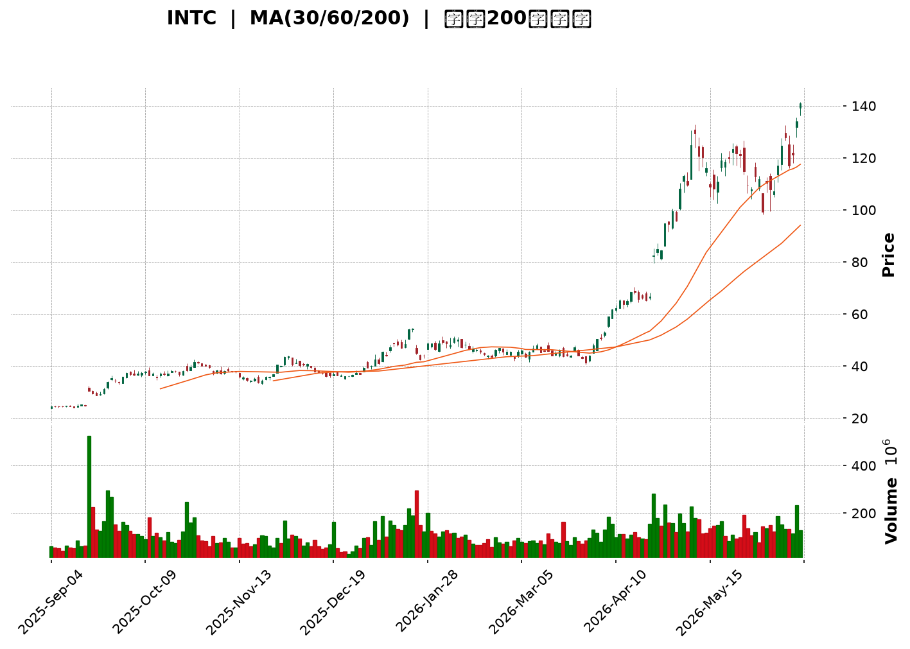
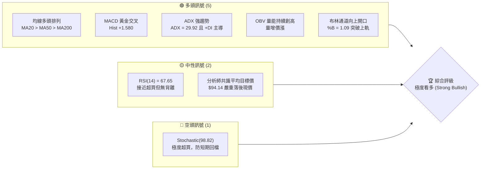
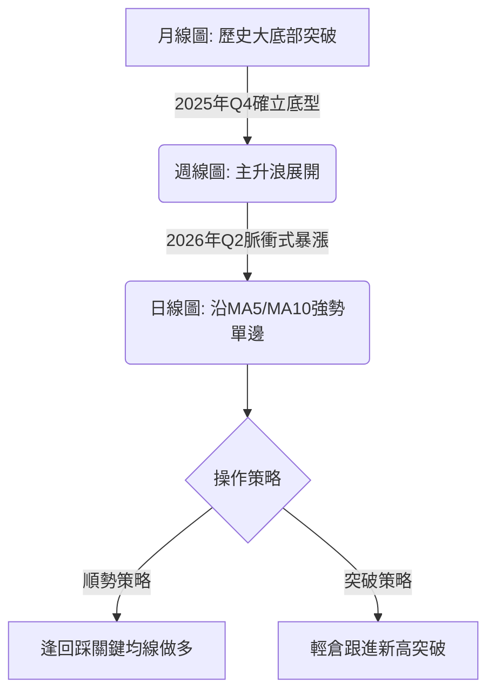
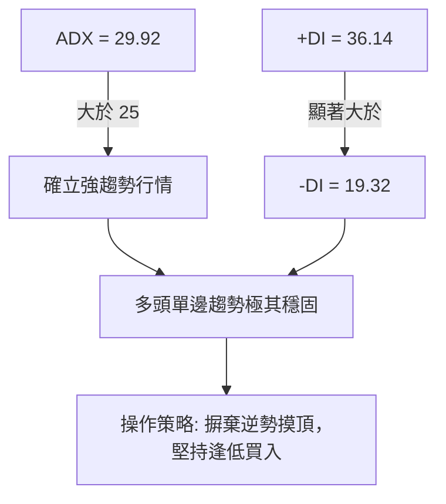
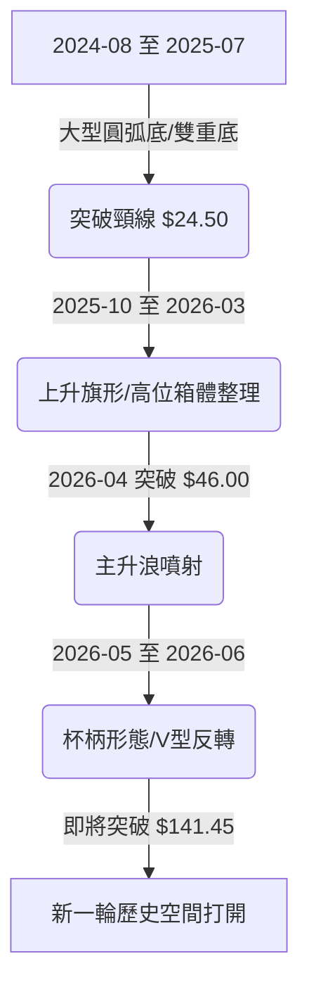
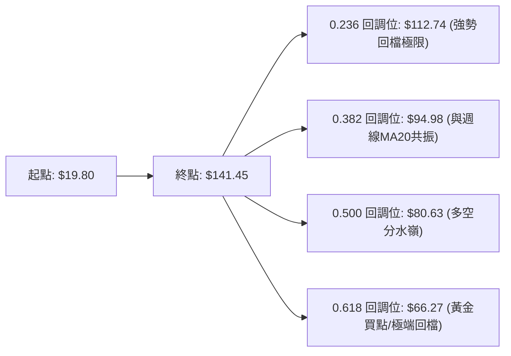
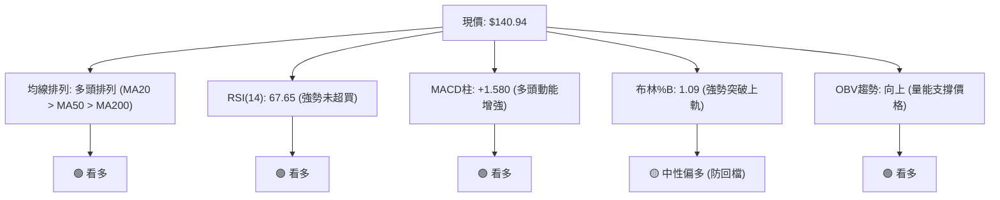
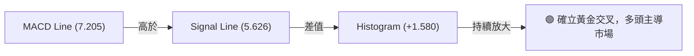
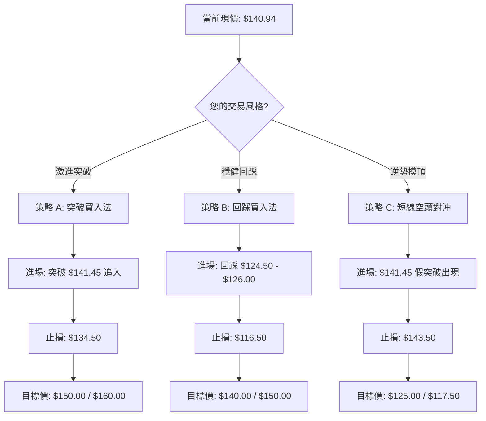
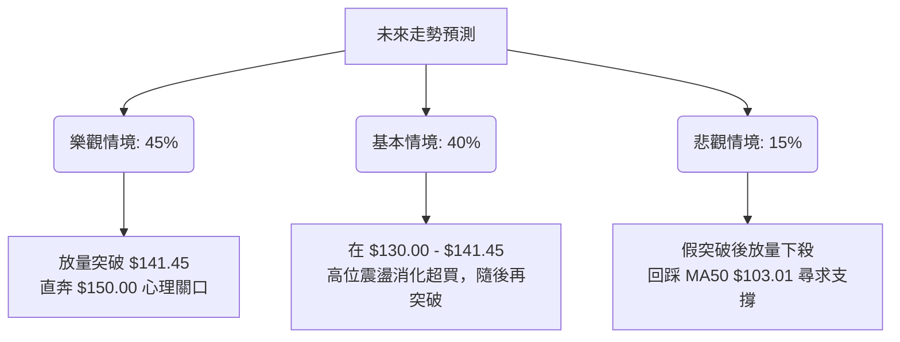

<details>
<summary>📊 靜態圖表 (點擊展開)</summary>

</details>

<html>
<head><meta charset="utf-8" /></head>
<body>
    <div style="height:500px; width:100%;">                        <script>window.PlotlyConfig = {MathJaxConfig: 'local'};</script>
        <script charset="utf-8" src="https://cdn.plot.ly/plotly-3.6.0.min.js" integrity="sha256-QaOVwtVY0T02VaHrr6pnoHLCwayMJp4O5n4YyaE3rJk=" crossorigin="anonymous"></script>                <div id="candlestick-chart" class="plotly-graph-div" style="height:100%; width:100%;"></div>            <script>                window.PLOTLYENV=window.PLOTLYENV || {};                                if (document.getElementById("candlestick-chart")) {                    Plotly.newPlot(                        "candlestick-chart",                        [{"close":{"dtype":"f8","bdata":"AAAAACmcOEAAAACgcH04QAAAAEDhejhAAAAA4KNwOEAAAADAHsU4QAAAAAApnDhAAAAA4HoUOEAAAADAHsU4QAAAAMAeRTlAAAAAYGbmOEAAAACA65E+QAAAAOB6lD1AAAAAYI\u002fCPEAAAABAClc9QAAAAOBROD9AAAAAYLj+QEAAAAAAAMBBQAAAAKBwPUFAAAAAYGbGQEAAAADgUfhBQAAAAGBmpkJAAAAAgD1qQkAAAAAghUtCQAAAAIDClUJAAAAAQAq3QkAAAABgZuZCQAAAACBcL0JAAAAAACmcQkAAAADgo9BBQAAAAEAzk0JAAAAAIIVrQkAAAACgR4FCQAAAAMDMDENAAAAAIFwPQ0AAAACAwnVCQAAAAOB6FENAAAAAANcjQ0AAAADAHsVDQAAAAADXw0RAAAAAIIWrREAAAADgehREQAAAAGC4\u002fkNAAAAAAADAQ0AAAAAA14NCQAAAAOCjMENAAAAAYLieQkAAAADgoxBDQAAAAKCZOUNAAAAA4KPwQkAAAACA6\u002fFCQAAAAOB69EFAAAAAYI\u002fCQUAAAABA4VpBQAAAAIA9KkFAAAAAgBSOQUAAAAAgXM9AQAAAAAAAQEFAAAAAwB7lQUAAAACAPepBQAAAACCuZ0JAAAAAIK5HREAAAACgRwFEQAAAAAApvEVAAAAAoEfhRUAAAAAAAEBEQAAAAOB6tERAAAAAYGYmREAAAAAAAEBEQAAAAADXY0RAAAAAoEfBQ0AAAAAgrudCQAAAAKBHwUJAAAAAIK6nQkAAAABgZgZCQAAAAADXI0JAAAAAwPVoQkAAAAAgXC9CQAAAAMDMLEJAAAAA4HoUQkAAAACgmRlCQAAAAEAKV0JAAAAAYGamQkAAAABAM3NCQAAAAOCjsENAAAAAIFyvQ0AAAADAHgVEQAAAAOCjUEVAAAAAgBSOREAAAABgZsZGQAAAACCuB0ZAAAAAwB6lR0AAAAAAKVxIQAAAAMD1KEhAAAAAQOF6R0AAAAAgrkdIQAAAAAAAIEtAAAAAwPUoS0AAAADA9YhGQAAAAGC4PkVAAAAAQAr3RUAAAAAA12NIQAAAAOB6VEhAAAAAACk8R0AAAAAgrmdIQAAAAAAAoEhAAAAAwMxMSEAAAABguB5IQAAAACCFS0lAAAAAYLgeSUAAAADgo5BHQAAAAMAeJUhAAAAAoHA9R0AAAADAHmVHQAAAAEAKF0dAAAAAQOG6RkAAAAAgXE9GQAAAAIAUDkZAAAAA4KPQRUAAAAAgXA9HQAAAAOCjcEdAAAAAQOG6RkAAAACAFM5GQAAAAAAAwEZAAAAAwMyMRUAAAACAPcpGQAAAAKCZ+UZAAAAAgMK1RUAAAACAPcpGQAAAAADXY0dAAAAAoHD9R0AAAAAAAKBGQAAAAGCP4kZAAAAAoEfhRkAAAAAgrgdGQAAAAADXg0ZAAAAAQAoXR0AAAAAgXO9FQAAAAKBHAUZAAAAAIK4HRkAAAABACpdHQAAAAMDMDEZAAAAA4KOQRUAAAADgUZhEQAAAAOCjEEZAAAAAANcDSEAAAADgozBJQAAAAADXY0lAAAAA4Hp0SkAAAACgmXlNQAAAAAAp3E5AAAAA4KMwT0AAAAAghUtQQAAAACCu509AAAAAACk8UEAAAAAAACBRQAAAAAAAIFFAAAAAwMxsUEAAAADgo5BQQAAAAKBHUVBAAAAAgOuxUEAAAABgj6JUQAAAACBcP1VAAAAAoEchVUAAAAAAALBXQAAAAGC4nldAAAAAIK7nWEAAAACA6\u002fFXQAAAAKCZCVtAAAAA4KNAXEAAAAAgrmdbQAAAAEDhOl9AAAAAgBQuYEAAAABACideQAAAAGCPEl5AAAAAIIX7XEAAAACgRzFbQAAAAEDhCltAAAAAQDOzW0AAAACgcL1dQAAAAAAAoF1AAAAAgML1XUAAAACgR+FeQAAAAKBHcV5AAAAAwPU4XkAAAAAghatcQAAAAMAeVVtAAAAAIIX7WkAAAACgcC1cQAAAAIDr8VtAAAAAQOHKWEAAAACgR5FbQAAAAEDh+lpAAAAAYI\u002fCWkAAAACgcD1dQAAAAOB6JF9AAAAAQAr3X0AAAABAM0NdQAAAAGBmRl5AAAAAIK6\u002fYEAAAACAFJ5hQA=="},"high":{"dtype":"f8","bdata":"AAAAANejOEAAAACAwrU4QAAAAKBwvThAAAAAIFzPOEAAAABguN44QAAAAIAU7jhAAAAAoEehOEAAAACAwnU5QAAAAEAKVzlAAAAAYI9COUAAAADgozBAQAAAAKBHoT5AAAAAoJkZPkAAAABAMzM+QAAAAEAzsz9AAAAAAAAgQUAAAABgZiZCQAAAAGBmhkFAAAAAYLgeQUAAAAAgrgdCQAAAAMD1yEJAAAAAgD0KQ0AAAABACldDQAAAAGBmBkNAAAAAwB7lQkAAAADAzAxDQAAAAEAz00NAAAAAoEfBQkAAAABgZkZCQAAAAGC4vkJAAAAAYI8CQ0AAAADgozBDQAAAAGCPQkNAAAAAwMwsQ0AAAABACvdCQAAAAEAzM0NAAAAAIFyPREAAAACAwlVEQAAAAKBwPUVAAAAAwB4FRUAAAABACrdEQAAAAIA9akRAAAAAoJk5REAAAAAAACBDQAAAAOBRWENAAAAAIIXrQ0AAAABgjyJDQAAAAADXw0NAAAAAACkcQ0AAAACgmRlDQAAAACCup0JAAAAAwMwMQkAAAACgcN1BQAAAAKBHYUFAAAAAAADgQUAAAABACldCQAAAAKBwfUFAAAAA4HoUQkAAAADgoxBCQAAAAGC4nkJAAAAAIIVLREAAAADgozBEQAAAAEAK10VAAAAAYI8CRkAAAAAA16NFQAAAAIA9akVAAAAAIFwPRUAAAACgR6FEQAAAAGC4fkRAAAAA4FEYREAAAAAA1wNEQAAAAKBwPUNAAAAAQOH6QkAAAAAghetCQAAAAGC4vkJAAAAAgD3KQkAAAABAM\u002fNCQAAAAGBmZkJAAAAAQAoXQkAAAABguD5CQAAAAGBmZkJAAAAAoEchQ0AAAACAPcpCQAAAAIAU7kNAAAAAwMwMRUAAAAAgridEQAAAAMD1SEZAAAAAIIWrRUAAAACgcN1GQAAAAKCZuUZAAAAAYLgeSEAAAAAAAIBIQAAAAIDrMUlAAAAAQOEaSUAAAACgcB1JQAAAAOB6NEtAAAAAwMxMS0AAAADgoxBIQAAAAEDhOkZAAAAAANdDRkAAAADAHqVIQAAAAGCPYkhAAAAAgD3KSEAAAAAghetIQAAAAGC4vklAAAAAoJnZSEAAAACAFG5JQAAAAGBmpklAAAAAACmcSUAAAADAHkVJQAAAAGBmxkhAAAAAoJl5SEAAAADgUdhHQAAAAIA9akdAAAAAYI9iR0AAAACAwpVGQAAAAIDrMUZAAAAAYGZGRkAAAADAzExHQAAAAAApfEdAAAAAoJl5R0AAAAAgrkdHQAAAACCu50ZAAAAA4FHYRUAAAADgoxBHQAAAAKBwPUdAAAAAQAqXRkAAAACgR+FGQAAAAOCj8EdAAAAAgD1qSEAAAADgUbhHQAAAAEAzU0dAAAAAgMKVSEAAAACAPQpHQAAAAEDh2kZAAAAA4FE4R0AAAABgZsZHQAAAAEDhukZAAAAAIK4nRkAAAADAzOxHQAAAAMDMTEdAAAAA4KMQRkAAAABguP5FQAAAAKBwHUZAAAAAYI9iSEAAAABguD5JQAAAAIDrMUpAAAAAYI+iSkAAAACAwpVNQAAAAIA9Ck9AAAAAgOuxT0AAAACgmWlQQAAAACCFS1BAAAAAgMJ1UEAAAABACidRQAAAAMAelVFAAAAAoHBNUUAAAABA4epQQAAAAKBHMVFAAAAAgOsRUUAAAACAFE5VQAAAAGBmxlVAAAAAgMIlVUAAAADAzLxXQAAAAAAp7FdAAAAAwMwcWUAAAADgevRYQAAAAGC4nltAAAAAAABgXEAAAADgo6BcQAAAAIA9UmBAAAAAAACYYEAAAABgj\u002fJfQAAAAAAAQF9AAAAA4HqkXUAAAADgeqRbQAAAAGCP4lxAAAAA4HpEXEAAAAAAKXxeQAAAAIA92l1AAAAAgOuxXkAAAAAgrmdfQAAAAKBHUV9AAAAAwB7FXkAAAADA9ahfQAAAAEAzU1xAAAAAAABAW0AAAABgj5JdQAAAAMD1SFxAAAAAYLieWkAAAABgjyJcQAAAAAAAgFxAAAAAAADgW0AAAAAAKdxdQAAAAGBm5l9AAAAAIIWTYEAAAABgZhZgQAAAAMDMTF9AAAAAIFzvYEAAAABgZq5hQA=="},"hovertemplate":"\u003cb\u003e%{x|%Y-%m-%d}\u003c\u002fb\u003e\u003cbr\u003e\u958b: $%{open:.2f}\u003cbr\u003e\u9ad8: $%{high:.2f}\u003cbr\u003e\u4f4e: $%{low:.2f}\u003cbr\u003e\u6536: $%{close:.2f}\u003cextra\u003e\u003c\u002fextra\u003e","low":{"dtype":"f8","bdata":"AAAAAADAN0AAAAAghSs4QAAAAGC4HjhAAAAAwB5FOEAAAAAgrkc4QAAAAIDrkThAAAAAwMwMOEAAAADgUTg4QAAAAOCjsDhAAAAAQDNzOEAAAADA9Sg+QAAAAOB6VD1AAAAAQOG6PEAAAACA69E8QAAAAEDhOj1AAAAAgMI1P0AAAABguD5BQAAAAKBw3UBAAAAAYI+CQEAAAAAAAMBAQAAAAOBRuEFAAAAAoJk5QkAAAABACjdCQAAAAMDMLEJAAAAA4Hr0QUAAAACAFG5CQAAAAGBmJkJAAAAAANcjQkAAAADgUVhBQAAAAIDr0UFAAAAA4Ho0QkAAAACAPQpCQAAAACCux0JAAAAAgMLVQkAAAADAHgVCQAAAAEAKN0JAAAAAgD3qQkAAAACgcB1DQAAAAMAexUNAAAAAgMJ1REAAAACAFA5EQAAAAMAe5UNAAAAAYGaGQ0AAAADgo1BCQAAAAIAUjkJAAAAAYGZmQkAAAAAAKXxCQAAAAAAp\u002fEJAAAAAYLi+QkAAAADAzKxCQAAAAKCZuUFAAAAAIFxPQUAAAACgcB1BQAAAAMD1yEBAAAAAAAAgQUAAAACgcL1AQAAAAIDrcUBAAAAA4FFYQUAAAABACldBQAAAAOCjEEJAAAAAIIWrQkAAAADAzMxDQAAAAGBmBkRAAAAAoEdBRUAAAACA6xFEQAAAAEAzk0RAAAAAoJnZQ0AAAAAA1wNEQAAAAIDrcUNAAAAAgD2KQ0AAAAAgXM9CQAAAAMD1qEJAAAAAgMJ1QkAAAAAAKfxBQAAAAIDC1UFAAAAA4FE4QkAAAADAHiVCQAAAAADXA0JAAAAAoJl5QUAAAADAzOxBQAAAAMD16EFAAAAAwPVoQkAAAAAgXG9CQAAAAKBH4UJAAAAAYI+iQ0AAAACgmXlDQAAAACBcD0RAAAAAQApXREAAAADA9chEQAAAAIDr8UVAAAAAACmcRkAAAACAwrVHQAAAAIA96kdAAAAAQOFaR0AAAAAAAIBHQAAAAEAzE0lAAAAAgD2KSkAAAACgmTlGQAAAAADXI0VAAAAAwMyMRUAAAADA9ShHQAAAAGC4fkdAAAAAQOH6RkAAAAAAAMBGQAAAAEAKN0hAAAAAAACAR0AAAADAHmVHQAAAAIA9akhAAAAAIIXLR0AAAABgj2JHQAAAAIAUbkdAAAAA4FEYR0AAAAAAKXxGQAAAAEDhukZAAAAA4KNwRkAAAACAwvVFQAAAAOCjcEVAAAAAQAqXRUAAAADAHsVFQAAAAIA9ikZAAAAAgOsxRkAAAABAMzNGQAAAAKCZ+UVAAAAAgOsRRUAAAABgj6JFQAAAAKCZWUZAAAAAANejRUAAAACA69FEQAAAAOB6tEZAAAAA4HpUR0AAAACAwpVGQAAAAIDrsUZAAAAA4FHYRkAAAADgevRFQAAAAGBmBkZAAAAAQDPTRUAAAACA69FFQAAAAGC43kVAAAAAoJmZRUAAAACgmblGQAAAAIDC9UVAAAAAgBRuRUAAAADgo1BEQAAAAMDMzERAAAAAoHB9RkAAAADAHgVHQAAAACBc70hAAAAAACmcSUAAAABgZmZLQAAAAIDrMU1AAAAAAABgTkAAAABAChdPQAAAACCFC09AAAAA4KNwT0AAAACgRxFQQAAAACBc71BAAAAAgBQeUEAAAADA9WhQQAAAAGC4PlBAAAAAQOFaUEAAAAAgrudTQAAAAEAKp1RAAAAAQDMzVEAAAAAgrndVQAAAAAAA4FZAAAAAQAonV0AAAABgZuZXQAAAAMAeBVlAAAAAwB6lWkAAAACgmUlbQAAAAEAz81tAAAAAQOH6XkAAAAAAAMBcQAAAAIA9Gl1AAAAAQOFKXEAAAACgR0FaQAAAAGBm9llAAAAAoJmZWUAAAABAM7NcQAAAAEDhSlxAAAAAgMKFXUAAAABgZlZdQAAAAAAAQF1AAAAAANcTXUAAAABgj2JcQAAAAMAelVpAAAAAQOEKWkAAAABACrdbQAAAAGC43lpAAAAAwB6VWEAAAACAPapaQAAAAKBw3VhAAAAAQOE6WkAAAADgo6BbQAAAAMAe1VxAAAAAgD2qX0AAAAAAAABdQAAAAADXg11AAAAAoJn5X0AAAABguAZhQA=="},"name":"\u50f9\u683c","open":{"dtype":"f8","bdata":"AAAAoJnZN0AAAACgmZk4QAAAAEDhejhAAAAAIK6HOEAAAAAghWs4QAAAAGCPwjhAAAAAACmcOEAAAADgelQ4QAAAAIDr0ThAAAAA4HoUOUAAAAAgrsc\u002fQAAAAKBHYT5AAAAAIIWrPUAAAACgcP08QAAAAKBHYT1AAAAAACmcP0AAAABgj4JBQAAAAGCPQkFAAAAAQAr3QEAAAAAA18NAQAAAAKBH4UFAAAAAoJn5QkAAAADgUZhCQAAAAIDrUUJAAAAAYGZGQkAAAAAA18NCQAAAAEDhOkNAAAAA4FE4QkAAAAAAAABCQAAAAEAzM0JAAAAAQDOTQkAAAACAFC5CQAAAAMD1yEJAAAAAgOsRQ0AAAAAghetCQAAAAMDMTEJAAAAAYI8CREAAAACA6zFDQAAAACCFy0NAAAAAwMzMREAAAAAAKXxEQAAAAEAKV0RAAAAAAAAgREAAAACA6xFDQAAAAIDCtUJAAAAAIIUrQ0AAAACgR6FCQAAAAEAKd0NAAAAAQDMTQ0AAAAAgrgdDQAAAAGCPokJAAAAAANeDQUAAAACgmblBQAAAAAAAIEFAAAAAgD0qQUAAAAAAAABCQAAAAKBHwUBAAAAAACl8QUAAAABgZsZBQAAAAKCZGUJAAAAAQDOzQkAAAACAFO5DQAAAAAApPERAAAAAgOuxRUAAAACgR6FFQAAAAOB6lERAAAAA4FH4REAAAACgcF1EQAAAAIAUDkRAAAAAwPUIREAAAAAAAKBDQAAAAIA9KkNAAAAAgD3KQkAAAAAghctCQAAAAOCjsEJAAAAAoHA9QkAAAACA6\u002fFCQAAAAGC4HkJAAAAAgMKVQUAAAACAwhVCQAAAAKBHAUJAAAAA4Hp0QkAAAABAM7NCQAAAAGCP4kJAAAAAIIXLREAAAACAFO5DQAAAAEAKF0RAAAAAIFxPRUAAAACAPepEQAAAAGC4HkZAAAAAgOvxRkAAAACgmXlIQAAAAMDMrEhAAAAAYI+iSEAAAABgZqZHQAAAAMD1KElAAAAAQOEaS0AAAACAFG5HQAAAAADXI0ZAAAAAACn8RUAAAADAzExHQAAAACCux0dAAAAAoHB9SEAAAADgo9BGQAAAACCuB0lAAAAAwB7FSEAAAAAghctHQAAAAMDMjEhAAAAAIIXLSEAAAADgejRJQAAAAIAUDkhAAAAAYGbmR0AAAACgR+FGQAAAAEAK90ZAAAAAgML1RkAAAACgmXlGQAAAAIDr8UVAAAAAIIULRkAAAADAzAxGQAAAACCFC0dAAAAAYI9iR0AAAABA4TpGQAAAAKCZGUZAAAAA4FG4RUAAAADA9QhGQAAAACBcb0ZAAAAAgMJVRkAAAABguF5FQAAAAOB6tEZAAAAAwPVoR0AAAABAM7NHQAAAAAAp\u002fEZAAAAA4Hr0R0AAAACAPQpHQAAAAKCZGUZAAAAAYLj+RUAAAACgmXlHQAAAAAAAQEZAAAAAwB7FRUAAAADAzOxGQAAAAGBmJkdAAAAAIFzPRUAAAAAAKdxFQAAAAKCZ+URAAAAAAACARkAAAAAgrgdHQAAAAOCjcElAAAAA4Hr0SUAAAAAgXK9LQAAAAEAzM01AAAAAYI\u002fCTkAAAABAChdPQAAAAIA9SlBAAAAAYI\u002fiT0AAAAAghTtQQAAAAGBmNlFAAAAAwMwcUUAAAADA9chQQAAAAAAp\u002fFBAAAAAYGaGUEAAAADAzIxUQAAAAEDh6lRAAAAAgOtRVEAAAADA9YhVQAAAAGBm5ldAAAAAwMxMV0AAAAAghctYQAAAAOCjIFlAAAAAYLi+W0AAAACgR8FbQAAAAADX81tAAAAAAClcYEAAAABAChdfQAAAAGBmBl9AAAAAgD2qXEAAAABgj3JbQAAAAIAUXlxAAAAAYLi+WkAAAACAFA5dQAAAAMAeJV1AAAAAgMIVXkAAAABgZoZeQAAAAMD1GF9AAAAAwMxcXkAAAABgZvZeQAAAACCFW1tAAAAAwMzcWkAAAABA4RpdQAAAAKCZGVtAAAAAYLieWkAAAAAAAMBbQAAAACBcP1xAAAAAgOuBWkAAAACgR2FcQAAAAEDhWl1AAAAAIK4vYEAAAABACkdfQAAAAGBmdl5AAAAAgOt5YEAAAAAA12NhQA=="},"x":["2025-09-04T00:00:00-04:00","2025-09-05T00:00:00-04:00","2025-09-08T00:00:00-04:00","2025-09-09T00:00:00-04:00","2025-09-10T00:00:00-04:00","2025-09-11T00:00:00-04:00","2025-09-12T00:00:00-04:00","2025-09-15T00:00:00-04:00","2025-09-16T00:00:00-04:00","2025-09-17T00:00:00-04:00","2025-09-18T00:00:00-04:00","2025-09-19T00:00:00-04:00","2025-09-22T00:00:00-04:00","2025-09-23T00:00:00-04:00","2025-09-24T00:00:00-04:00","2025-09-25T00:00:00-04:00","2025-09-26T00:00:00-04:00","2025-09-29T00:00:00-04:00","2025-09-30T00:00:00-04:00","2025-10-01T00:00:00-04:00","2025-10-02T00:00:00-04:00","2025-10-03T00:00:00-04:00","2025-10-06T00:00:00-04:00","2025-10-07T00:00:00-04:00","2025-10-08T00:00:00-04:00","2025-10-09T00:00:00-04:00","2025-10-10T00:00:00-04:00","2025-10-13T00:00:00-04:00","2025-10-14T00:00:00-04:00","2025-10-15T00:00:00-04:00","2025-10-16T00:00:00-04:00","2025-10-17T00:00:00-04:00","2025-10-20T00:00:00-04:00","2025-10-21T00:00:00-04:00","2025-10-22T00:00:00-04:00","2025-10-23T00:00:00-04:00","2025-10-24T00:00:00-04:00","2025-10-27T00:00:00-04:00","2025-10-28T00:00:00-04:00","2025-10-29T00:00:00-04:00","2025-10-30T00:00:00-04:00","2025-10-31T00:00:00-04:00","2025-11-03T00:00:00-05:00","2025-11-04T00:00:00-05:00","2025-11-05T00:00:00-05:00","2025-11-06T00:00:00-05:00","2025-11-07T00:00:00-05:00","2025-11-10T00:00:00-05:00","2025-11-11T00:00:00-05:00","2025-11-12T00:00:00-05:00","2025-11-13T00:00:00-05:00","2025-11-14T00:00:00-05:00","2025-11-17T00:00:00-05:00","2025-11-18T00:00:00-05:00","2025-11-19T00:00:00-05:00","2025-11-20T00:00:00-05:00","2025-11-21T00:00:00-05:00","2025-11-24T00:00:00-05:00","2025-11-25T00:00:00-05:00","2025-11-26T00:00:00-05:00","2025-11-28T00:00:00-05:00","2025-12-01T00:00:00-05:00","2025-12-02T00:00:00-05:00","2025-12-03T00:00:00-05:00","2025-12-04T00:00:00-05:00","2025-12-05T00:00:00-05:00","2025-12-08T00:00:00-05:00","2025-12-09T00:00:00-05:00","2025-12-10T00:00:00-05:00","2025-12-11T00:00:00-05:00","2025-12-12T00:00:00-05:00","2025-12-15T00:00:00-05:00","2025-12-16T00:00:00-05:00","2025-12-17T00:00:00-05:00","2025-12-18T00:00:00-05:00","2025-12-19T00:00:00-05:00","2025-12-22T00:00:00-05:00","2025-12-23T00:00:00-05:00","2025-12-24T00:00:00-05:00","2025-12-26T00:00:00-05:00","2025-12-29T00:00:00-05:00","2025-12-30T00:00:00-05:00","2025-12-31T00:00:00-05:00","2026-01-02T00:00:00-05:00","2026-01-05T00:00:00-05:00","2026-01-06T00:00:00-05:00","2026-01-07T00:00:00-05:00","2026-01-08T00:00:00-05:00","2026-01-09T00:00:00-05:00","2026-01-12T00:00:00-05:00","2026-01-13T00:00:00-05:00","2026-01-14T00:00:00-05:00","2026-01-15T00:00:00-05:00","2026-01-16T00:00:00-05:00","2026-01-20T00:00:00-05:00","2026-01-21T00:00:00-05:00","2026-01-22T00:00:00-05:00","2026-01-23T00:00:00-05:00","2026-01-26T00:00:00-05:00","2026-01-27T00:00:00-05:00","2026-01-28T00:00:00-05:00","2026-01-29T00:00:00-05:00","2026-01-30T00:00:00-05:00","2026-02-02T00:00:00-05:00","2026-02-03T00:00:00-05:00","2026-02-04T00:00:00-05:00","2026-02-05T00:00:00-05:00","2026-02-06T00:00:00-05:00","2026-02-09T00:00:00-05:00","2026-02-10T00:00:00-05:00","2026-02-11T00:00:00-05:00","2026-02-12T00:00:00-05:00","2026-02-13T00:00:00-05:00","2026-02-17T00:00:00-05:00","2026-02-18T00:00:00-05:00","2026-02-19T00:00:00-05:00","2026-02-20T00:00:00-05:00","2026-02-23T00:00:00-05:00","2026-02-24T00:00:00-05:00","2026-02-25T00:00:00-05:00","2026-02-26T00:00:00-05:00","2026-02-27T00:00:00-05:00","2026-03-02T00:00:00-05:00","2026-03-03T00:00:00-05:00","2026-03-04T00:00:00-05:00","2026-03-05T00:00:00-05:00","2026-03-06T00:00:00-05:00","2026-03-09T00:00:00-04:00","2026-03-10T00:00:00-04:00","2026-03-11T00:00:00-04:00","2026-03-12T00:00:00-04:00","2026-03-13T00:00:00-04:00","2026-03-16T00:00:00-04:00","2026-03-17T00:00:00-04:00","2026-03-18T00:00:00-04:00","2026-03-19T00:00:00-04:00","2026-03-20T00:00:00-04:00","2026-03-23T00:00:00-04:00","2026-03-24T00:00:00-04:00","2026-03-25T00:00:00-04:00","2026-03-26T00:00:00-04:00","2026-03-27T00:00:00-04:00","2026-03-30T00:00:00-04:00","2026-03-31T00:00:00-04:00","2026-04-01T00:00:00-04:00","2026-04-02T00:00:00-04:00","2026-04-06T00:00:00-04:00","2026-04-07T00:00:00-04:00","2026-04-08T00:00:00-04:00","2026-04-09T00:00:00-04:00","2026-04-10T00:00:00-04:00","2026-04-13T00:00:00-04:00","2026-04-14T00:00:00-04:00","2026-04-15T00:00:00-04:00","2026-04-16T00:00:00-04:00","2026-04-17T00:00:00-04:00","2026-04-20T00:00:00-04:00","2026-04-21T00:00:00-04:00","2026-04-22T00:00:00-04:00","2026-04-23T00:00:00-04:00","2026-04-24T00:00:00-04:00","2026-04-27T00:00:00-04:00","2026-04-28T00:00:00-04:00","2026-04-29T00:00:00-04:00","2026-04-30T00:00:00-04:00","2026-05-01T00:00:00-04:00","2026-05-04T00:00:00-04:00","2026-05-05T00:00:00-04:00","2026-05-06T00:00:00-04:00","2026-05-07T00:00:00-04:00","2026-05-08T00:00:00-04:00","2026-05-11T00:00:00-04:00","2026-05-12T00:00:00-04:00","2026-05-13T00:00:00-04:00","2026-05-14T00:00:00-04:00","2026-05-15T00:00:00-04:00","2026-05-18T00:00:00-04:00","2026-05-19T00:00:00-04:00","2026-05-20T00:00:00-04:00","2026-05-21T00:00:00-04:00","2026-05-22T00:00:00-04:00","2026-05-26T00:00:00-04:00","2026-05-27T00:00:00-04:00","2026-05-28T00:00:00-04:00","2026-05-29T00:00:00-04:00","2026-06-01T00:00:00-04:00","2026-06-02T00:00:00-04:00","2026-06-03T00:00:00-04:00","2026-06-04T00:00:00-04:00","2026-06-05T00:00:00-04:00","2026-06-08T00:00:00-04:00","2026-06-09T00:00:00-04:00","2026-06-10T00:00:00-04:00","2026-06-11T00:00:00-04:00","2026-06-12T00:00:00-04:00","2026-06-15T00:00:00-04:00","2026-06-16T00:00:00-04:00","2026-06-17T00:00:00-04:00","2026-06-18T00:00:00-04:00","2026-06-22T00:00:00-04:00"],"type":"candlestick"},{"hovertemplate":"MA30: $%{y:.2f}\u003cextra\u003e\u003c\u002fextra\u003e","line":{"color":"#2196F3","dash":"dash","width":2},"mode":"lines","name":"MA30","x":["2025-09-04T00:00:00-04:00","2025-09-05T00:00:00-04:00","2025-09-08T00:00:00-04:00","2025-09-09T00:00:00-04:00","2025-09-10T00:00:00-04:00","2025-09-11T00:00:00-04:00","2025-09-12T00:00:00-04:00","2025-09-15T00:00:00-04:00","2025-09-16T00:00:00-04:00","2025-09-17T00:00:00-04:00","2025-09-18T00:00:00-04:00","2025-09-19T00:00:00-04:00","2025-09-22T00:00:00-04:00","2025-09-23T00:00:00-04:00","2025-09-24T00:00:00-04:00","2025-09-25T00:00:00-04:00","2025-09-26T00:00:00-04:00","2025-09-29T00:00:00-04:00","2025-09-30T00:00:00-04:00","2025-10-01T00:00:00-04:00","2025-10-02T00:00:00-04:00","2025-10-03T00:00:00-04:00","2025-10-06T00:00:00-04:00","2025-10-07T00:00:00-04:00","2025-10-08T00:00:00-04:00","2025-10-09T00:00:00-04:00","2025-10-10T00:00:00-04:00","2025-10-13T00:00:00-04:00","2025-10-14T00:00:00-04:00","2025-10-15T00:00:00-04:00","2025-10-16T00:00:00-04:00","2025-10-17T00:00:00-04:00","2025-10-20T00:00:00-04:00","2025-10-21T00:00:00-04:00","2025-10-22T00:00:00-04:00","2025-10-23T00:00:00-04:00","2025-10-24T00:00:00-04:00","2025-10-27T00:00:00-04:00","2025-10-28T00:00:00-04:00","2025-10-29T00:00:00-04:00","2025-10-30T00:00:00-04:00","2025-10-31T00:00:00-04:00","2025-11-03T00:00:00-05:00","2025-11-04T00:00:00-05:00","2025-11-05T00:00:00-05:00","2025-11-06T00:00:00-05:00","2025-11-07T00:00:00-05:00","2025-11-10T00:00:00-05:00","2025-11-11T00:00:00-05:00","2025-11-12T00:00:00-05:00","2025-11-13T00:00:00-05:00","2025-11-14T00:00:00-05:00","2025-11-17T00:00:00-05:00","2025-11-18T00:00:00-05:00","2025-11-19T00:00:00-05:00","2025-11-20T00:00:00-05:00","2025-11-21T00:00:00-05:00","2025-11-24T00:00:00-05:00","2025-11-25T00:00:00-05:00","2025-11-26T00:00:00-05:00","2025-11-28T00:00:00-05:00","2025-12-01T00:00:00-05:00","2025-12-02T00:00:00-05:00","2025-12-03T00:00:00-05:00","2025-12-04T00:00:00-05:00","2025-12-05T00:00:00-05:00","2025-12-08T00:00:00-05:00","2025-12-09T00:00:00-05:00","2025-12-10T00:00:00-05:00","2025-12-11T00:00:00-05:00","2025-12-12T00:00:00-05:00","2025-12-15T00:00:00-05:00","2025-12-16T00:00:00-05:00","2025-12-17T00:00:00-05:00","2025-12-18T00:00:00-05:00","2025-12-19T00:00:00-05:00","2025-12-22T00:00:00-05:00","2025-12-23T00:00:00-05:00","2025-12-24T00:00:00-05:00","2025-12-26T00:00:00-05:00","2025-12-29T00:00:00-05:00","2025-12-30T00:00:00-05:00","2025-12-31T00:00:00-05:00","2026-01-02T00:00:00-05:00","2026-01-05T00:00:00-05:00","2026-01-06T00:00:00-05:00","2026-01-07T00:00:00-05:00","2026-01-08T00:00:00-05:00","2026-01-09T00:00:00-05:00","2026-01-12T00:00:00-05:00","2026-01-13T00:00:00-05:00","2026-01-14T00:00:00-05:00","2026-01-15T00:00:00-05:00","2026-01-16T00:00:00-05:00","2026-01-20T00:00:00-05:00","2026-01-21T00:00:00-05:00","2026-01-22T00:00:00-05:00","2026-01-23T00:00:00-05:00","2026-01-26T00:00:00-05:00","2026-01-27T00:00:00-05:00","2026-01-28T00:00:00-05:00","2026-01-29T00:00:00-05:00","2026-01-30T00:00:00-05:00","2026-02-02T00:00:00-05:00","2026-02-03T00:00:00-05:00","2026-02-04T00:00:00-05:00","2026-02-05T00:00:00-05:00","2026-02-06T00:00:00-05:00","2026-02-09T00:00:00-05:00","2026-02-10T00:00:00-05:00","2026-02-11T00:00:00-05:00","2026-02-12T00:00:00-05:00","2026-02-13T00:00:00-05:00","2026-02-17T00:00:00-05:00","2026-02-18T00:00:00-05:00","2026-02-19T00:00:00-05:00","2026-02-20T00:00:00-05:00","2026-02-23T00:00:00-05:00","2026-02-24T00:00:00-05:00","2026-02-25T00:00:00-05:00","2026-02-26T00:00:00-05:00","2026-02-27T00:00:00-05:00","2026-03-02T00:00:00-05:00","2026-03-03T00:00:00-05:00","2026-03-04T00:00:00-05:00","2026-03-05T00:00:00-05:00","2026-03-06T00:00:00-05:00","2026-03-09T00:00:00-04:00","2026-03-10T00:00:00-04:00","2026-03-11T00:00:00-04:00","2026-03-12T00:00:00-04:00","2026-03-13T00:00:00-04:00","2026-03-16T00:00:00-04:00","2026-03-17T00:00:00-04:00","2026-03-18T00:00:00-04:00","2026-03-19T00:00:00-04:00","2026-03-20T00:00:00-04:00","2026-03-23T00:00:00-04:00","2026-03-24T00:00:00-04:00","2026-03-25T00:00:00-04:00","2026-03-26T00:00:00-04:00","2026-03-27T00:00:00-04:00","2026-03-30T00:00:00-04:00","2026-03-31T00:00:00-04:00","2026-04-01T00:00:00-04:00","2026-04-02T00:00:00-04:00","2026-04-06T00:00:00-04:00","2026-04-07T00:00:00-04:00","2026-04-08T00:00:00-04:00","2026-04-09T00:00:00-04:00","2026-04-10T00:00:00-04:00","2026-04-13T00:00:00-04:00","2026-04-14T00:00:00-04:00","2026-04-15T00:00:00-04:00","2026-04-16T00:00:00-04:00","2026-04-17T00:00:00-04:00","2026-04-20T00:00:00-04:00","2026-04-21T00:00:00-04:00","2026-04-22T00:00:00-04:00","2026-04-23T00:00:00-04:00","2026-04-24T00:00:00-04:00","2026-04-27T00:00:00-04:00","2026-04-28T00:00:00-04:00","2026-04-29T00:00:00-04:00","2026-04-30T00:00:00-04:00","2026-05-01T00:00:00-04:00","2026-05-04T00:00:00-04:00","2026-05-05T00:00:00-04:00","2026-05-06T00:00:00-04:00","2026-05-07T00:00:00-04:00","2026-05-08T00:00:00-04:00","2026-05-11T00:00:00-04:00","2026-05-12T00:00:00-04:00","2026-05-13T00:00:00-04:00","2026-05-14T00:00:00-04:00","2026-05-15T00:00:00-04:00","2026-05-18T00:00:00-04:00","2026-05-19T00:00:00-04:00","2026-05-20T00:00:00-04:00","2026-05-21T00:00:00-04:00","2026-05-22T00:00:00-04:00","2026-05-26T00:00:00-04:00","2026-05-27T00:00:00-04:00","2026-05-28T00:00:00-04:00","2026-05-29T00:00:00-04:00","2026-06-01T00:00:00-04:00","2026-06-02T00:00:00-04:00","2026-06-03T00:00:00-04:00","2026-06-04T00:00:00-04:00","2026-06-05T00:00:00-04:00","2026-06-08T00:00:00-04:00","2026-06-09T00:00:00-04:00","2026-06-10T00:00:00-04:00","2026-06-11T00:00:00-04:00","2026-06-12T00:00:00-04:00","2026-06-15T00:00:00-04:00","2026-06-16T00:00:00-04:00","2026-06-17T00:00:00-04:00","2026-06-18T00:00:00-04:00","2026-06-22T00:00:00-04:00"],"y":{"dtype":"f8","bdata":"AAAAAAAA+H8AAAAAAAD4fwAAAAAAAPh\u002fAAAAAAAA+H8AAAAAAAD4fwAAAAAAAPh\u002fAAAAAAAA+H8AAAAAAAD4fwAAAAAAAPh\u002fAAAAAAAA+H8AAAAAAAD4fwAAAAAAAPh\u002fAAAAAAAA+H8AAAAAAAD4fwAAAAAAAPh\u002fAAAAAAAA+H8AAAAAAAD4fwAAAAAAAPh\u002fAAAAAAAA+H8AAAAAAAD4fwAAAAAAAPh\u002fAAAAAAAA+H8AAAAAAAD4fwAAAAAAAPh\u002fAAAAAAAA+H8AAAAAAAD4fwAAAAAAAPh\u002fAAAAAAAA+H8AAAAAAAD4f3d3d0dvSz9A7+7uHsyzP0DNzMw8UQ9AQImIiOhtSUBAVVVVHcyDQEDv7u4mo7dAQFVVVV1z8UBAzczMjAkuQUBERERUDm1BQFVVVZVuskFAq6qqcpP4QUARERFJfiFCQImIiMjoTUJAIiIiurt7QkCamZlBi5xCQDMzM+MXu0JAERERwfXIQkCrqqpqLtRCQHd3d7ce5UJAvLu7O5j3QkB3d3cn6v9CQHd3d+f7+UJAiYiICGX0QkAiIiKSX+xCQJqZmYlB4EJAq6qqelvWQkDe3d3NhcRCQERERESLvEJAMzMzU3G2QkB3d3fHS7dCQImIiGjYtUJAREREpLfFQkARERFxhNJCQKuqqupt6UJAzczMTH4BQ0De3d2dxBBDQLy7u3uiHkNAzczM3EAnQ0AAAABwWStDQM3MzDwmKENAMzMzY1cgQ0AAAACQUBZDQM3MzLy7C0NAzczMrGMCQ0ARERFBNf5CQN7d3X0\u002f9UJAzczMvHTzQkCJiIhY8utCQFVVVZX84kJAIiIi4qXbQkBERET0b9RCQAAAAAC510JAvLu7O1HfQkDNzMxMqehCQO\u002fu7j41\u002fkJAzczMTGIQQ0B3d3enxitDQImIiMh2TkNAREREpCllQ0CJiIh4oo5DQHd3d2eRrUNAvLu7W0jKQ0AREREBcu9DQO\u002fu7n4jBERAAAAAwMoRREC8u7trLjREQAAAACD3akRAREREtMimREDNzMxcSLpEQERERCSUwURAZmZm9m\u002fUREAAAAAgPgNFQGZmZubQMkVAAAAAEOZZRUAzMzNjV5BFQGZmZhaux0VAzczM\u002fPD5RUAiIiIylixGQDMzMxNYaUZAERERMWulRkCrqqqqDdRGQCIiIuKWBUdARERE5MEsR0CJiIho9FZHQCIiItL3c0dAmpmZufONR0De3d1NfqFHQLy7u9vOp0dA7+7uXo+yR0BmZmb2\u002fbRHQHd3dycGwUdA3t3dTTe5R0Crqqpa8qtHQJqZmSnqn0dAMzMzA3KPR0Dv7u4Ou4JHQO\u002fu7j5RX0dAmpmZic8wR0CJiIiY\u002fDJHQKuqqmpKRUdAiYiIGJJWR0BVVVVlgkdHQO\u002fu7r4tO0dAvLu7OyY4R0B3d3f34SNHQJqZmZngEUdAERERUY0HR0C8u7sb6PRGQN7d3f3U2EZAiYiIyHa+RkBVVVVlrb5GQLy7u8vMrEZAREREtIGeRkAiIiICnYZGQM3MzNzdfUZAzczM\u002fNSIRkAiIiJyaKFGQM3MzNzdvUZAiYiIGHblRkARERHhMxxHQN7d3R2FW0dAVVVVRbajR0De3d3tNfdHQFVVVVVVRUhAERERcYSiSEARERExTwRJQN7d3c2FZElAERERgZXDSUBERESU0RtKQGZmZpa1akpAMzMzM+y6SkAzMzPTBlpLQFVVVYVdAUxAZmZmxr2mTEBVVVXFBH9NQM3MzFwBUk5AiYiIGAQ2T0BERETUvwlQQKuqqtKUklBAd3d3t6wlUUCJiIhI4apRQHd3d8dLV1JAREREjGwPU0BVVVV12rhTQBEREflTW1RAVVVVbS7sVEBmZmYmv2hVQN7d3b0t41VA7+7uZq1eVkDNzMzcst5WQAAAAFDUV1dAmpmZIWnSV0BERESM3k5YQO\u002fu7m6EylhAd3d3l+BBWUB3d3cHZaRZQHd3d6d\u002f+1lA3t3d3ZZVWkAiIiLCrrhaQLy7u2vnG1tA3t3drQBhW0BERET0KJxbQKuqqsoTzVtAd3d3tx79W0BmZmZWgCxcQM3MzHyxbFxAq6qqSvCoXEDNzMyMUNZcQJqZmfnw8VxAq6qq2rIeXUAAAADAg2FdQA=="},"type":"scatter"},{"hovertemplate":"MA60: $%{y:.2f}\u003cextra\u003e\u003c\u002fextra\u003e","line":{"color":"#9C27B0","dash":"dash","width":2},"mode":"lines","name":"MA60","x":["2025-09-04T00:00:00-04:00","2025-09-05T00:00:00-04:00","2025-09-08T00:00:00-04:00","2025-09-09T00:00:00-04:00","2025-09-10T00:00:00-04:00","2025-09-11T00:00:00-04:00","2025-09-12T00:00:00-04:00","2025-09-15T00:00:00-04:00","2025-09-16T00:00:00-04:00","2025-09-17T00:00:00-04:00","2025-09-18T00:00:00-04:00","2025-09-19T00:00:00-04:00","2025-09-22T00:00:00-04:00","2025-09-23T00:00:00-04:00","2025-09-24T00:00:00-04:00","2025-09-25T00:00:00-04:00","2025-09-26T00:00:00-04:00","2025-09-29T00:00:00-04:00","2025-09-30T00:00:00-04:00","2025-10-01T00:00:00-04:00","2025-10-02T00:00:00-04:00","2025-10-03T00:00:00-04:00","2025-10-06T00:00:00-04:00","2025-10-07T00:00:00-04:00","2025-10-08T00:00:00-04:00","2025-10-09T00:00:00-04:00","2025-10-10T00:00:00-04:00","2025-10-13T00:00:00-04:00","2025-10-14T00:00:00-04:00","2025-10-15T00:00:00-04:00","2025-10-16T00:00:00-04:00","2025-10-17T00:00:00-04:00","2025-10-20T00:00:00-04:00","2025-10-21T00:00:00-04:00","2025-10-22T00:00:00-04:00","2025-10-23T00:00:00-04:00","2025-10-24T00:00:00-04:00","2025-10-27T00:00:00-04:00","2025-10-28T00:00:00-04:00","2025-10-29T00:00:00-04:00","2025-10-30T00:00:00-04:00","2025-10-31T00:00:00-04:00","2025-11-03T00:00:00-05:00","2025-11-04T00:00:00-05:00","2025-11-05T00:00:00-05:00","2025-11-06T00:00:00-05:00","2025-11-07T00:00:00-05:00","2025-11-10T00:00:00-05:00","2025-11-11T00:00:00-05:00","2025-11-12T00:00:00-05:00","2025-11-13T00:00:00-05:00","2025-11-14T00:00:00-05:00","2025-11-17T00:00:00-05:00","2025-11-18T00:00:00-05:00","2025-11-19T00:00:00-05:00","2025-11-20T00:00:00-05:00","2025-11-21T00:00:00-05:00","2025-11-24T00:00:00-05:00","2025-11-25T00:00:00-05:00","2025-11-26T00:00:00-05:00","2025-11-28T00:00:00-05:00","2025-12-01T00:00:00-05:00","2025-12-02T00:00:00-05:00","2025-12-03T00:00:00-05:00","2025-12-04T00:00:00-05:00","2025-12-05T00:00:00-05:00","2025-12-08T00:00:00-05:00","2025-12-09T00:00:00-05:00","2025-12-10T00:00:00-05:00","2025-12-11T00:00:00-05:00","2025-12-12T00:00:00-05:00","2025-12-15T00:00:00-05:00","2025-12-16T00:00:00-05:00","2025-12-17T00:00:00-05:00","2025-12-18T00:00:00-05:00","2025-12-19T00:00:00-05:00","2025-12-22T00:00:00-05:00","2025-12-23T00:00:00-05:00","2025-12-24T00:00:00-05:00","2025-12-26T00:00:00-05:00","2025-12-29T00:00:00-05:00","2025-12-30T00:00:00-05:00","2025-12-31T00:00:00-05:00","2026-01-02T00:00:00-05:00","2026-01-05T00:00:00-05:00","2026-01-06T00:00:00-05:00","2026-01-07T00:00:00-05:00","2026-01-08T00:00:00-05:00","2026-01-09T00:00:00-05:00","2026-01-12T00:00:00-05:00","2026-01-13T00:00:00-05:00","2026-01-14T00:00:00-05:00","2026-01-15T00:00:00-05:00","2026-01-16T00:00:00-05:00","2026-01-20T00:00:00-05:00","2026-01-21T00:00:00-05:00","2026-01-22T00:00:00-05:00","2026-01-23T00:00:00-05:00","2026-01-26T00:00:00-05:00","2026-01-27T00:00:00-05:00","2026-01-28T00:00:00-05:00","2026-01-29T00:00:00-05:00","2026-01-30T00:00:00-05:00","2026-02-02T00:00:00-05:00","2026-02-03T00:00:00-05:00","2026-02-04T00:00:00-05:00","2026-02-05T00:00:00-05:00","2026-02-06T00:00:00-05:00","2026-02-09T00:00:00-05:00","2026-02-10T00:00:00-05:00","2026-02-11T00:00:00-05:00","2026-02-12T00:00:00-05:00","2026-02-13T00:00:00-05:00","2026-02-17T00:00:00-05:00","2026-02-18T00:00:00-05:00","2026-02-19T00:00:00-05:00","2026-02-20T00:00:00-05:00","2026-02-23T00:00:00-05:00","2026-02-24T00:00:00-05:00","2026-02-25T00:00:00-05:00","2026-02-26T00:00:00-05:00","2026-02-27T00:00:00-05:00","2026-03-02T00:00:00-05:00","2026-03-03T00:00:00-05:00","2026-03-04T00:00:00-05:00","2026-03-05T00:00:00-05:00","2026-03-06T00:00:00-05:00","2026-03-09T00:00:00-04:00","2026-03-10T00:00:00-04:00","2026-03-11T00:00:00-04:00","2026-03-12T00:00:00-04:00","2026-03-13T00:00:00-04:00","2026-03-16T00:00:00-04:00","2026-03-17T00:00:00-04:00","2026-03-18T00:00:00-04:00","2026-03-19T00:00:00-04:00","2026-03-20T00:00:00-04:00","2026-03-23T00:00:00-04:00","2026-03-24T00:00:00-04:00","2026-03-25T00:00:00-04:00","2026-03-26T00:00:00-04:00","2026-03-27T00:00:00-04:00","2026-03-30T00:00:00-04:00","2026-03-31T00:00:00-04:00","2026-04-01T00:00:00-04:00","2026-04-02T00:00:00-04:00","2026-04-06T00:00:00-04:00","2026-04-07T00:00:00-04:00","2026-04-08T00:00:00-04:00","2026-04-09T00:00:00-04:00","2026-04-10T00:00:00-04:00","2026-04-13T00:00:00-04:00","2026-04-14T00:00:00-04:00","2026-04-15T00:00:00-04:00","2026-04-16T00:00:00-04:00","2026-04-17T00:00:00-04:00","2026-04-20T00:00:00-04:00","2026-04-21T00:00:00-04:00","2026-04-22T00:00:00-04:00","2026-04-23T00:00:00-04:00","2026-04-24T00:00:00-04:00","2026-04-27T00:00:00-04:00","2026-04-28T00:00:00-04:00","2026-04-29T00:00:00-04:00","2026-04-30T00:00:00-04:00","2026-05-01T00:00:00-04:00","2026-05-04T00:00:00-04:00","2026-05-05T00:00:00-04:00","2026-05-06T00:00:00-04:00","2026-05-07T00:00:00-04:00","2026-05-08T00:00:00-04:00","2026-05-11T00:00:00-04:00","2026-05-12T00:00:00-04:00","2026-05-13T00:00:00-04:00","2026-05-14T00:00:00-04:00","2026-05-15T00:00:00-04:00","2026-05-18T00:00:00-04:00","2026-05-19T00:00:00-04:00","2026-05-20T00:00:00-04:00","2026-05-21T00:00:00-04:00","2026-05-22T00:00:00-04:00","2026-05-26T00:00:00-04:00","2026-05-27T00:00:00-04:00","2026-05-28T00:00:00-04:00","2026-05-29T00:00:00-04:00","2026-06-01T00:00:00-04:00","2026-06-02T00:00:00-04:00","2026-06-03T00:00:00-04:00","2026-06-04T00:00:00-04:00","2026-06-05T00:00:00-04:00","2026-06-08T00:00:00-04:00","2026-06-09T00:00:00-04:00","2026-06-10T00:00:00-04:00","2026-06-11T00:00:00-04:00","2026-06-12T00:00:00-04:00","2026-06-15T00:00:00-04:00","2026-06-16T00:00:00-04:00","2026-06-17T00:00:00-04:00","2026-06-18T00:00:00-04:00","2026-06-22T00:00:00-04:00"],"y":{"dtype":"f8","bdata":"AAAAAAAA+H8AAAAAAAD4fwAAAAAAAPh\u002fAAAAAAAA+H8AAAAAAAD4fwAAAAAAAPh\u002fAAAAAAAA+H8AAAAAAAD4fwAAAAAAAPh\u002fAAAAAAAA+H8AAAAAAAD4fwAAAAAAAPh\u002fAAAAAAAA+H8AAAAAAAD4fwAAAAAAAPh\u002fAAAAAAAA+H8AAAAAAAD4fwAAAAAAAPh\u002fAAAAAAAA+H8AAAAAAAD4fwAAAAAAAPh\u002fAAAAAAAA+H8AAAAAAAD4fwAAAAAAAPh\u002fAAAAAAAA+H8AAAAAAAD4fwAAAAAAAPh\u002fAAAAAAAA+H8AAAAAAAD4fwAAAAAAAPh\u002fAAAAAAAA+H8AAAAAAAD4fwAAAAAAAPh\u002fAAAAAAAA+H8AAAAAAAD4fwAAAAAAAPh\u002fAAAAAAAA+H8AAAAAAAD4fwAAAAAAAPh\u002fAAAAAAAA+H8AAAAAAAD4fwAAAAAAAPh\u002fAAAAAAAA+H8AAAAAAAD4fwAAAAAAAPh\u002fAAAAAAAA+H8AAAAAAAD4fwAAAAAAAPh\u002fAAAAAAAA+H8AAAAAAAD4fwAAAAAAAPh\u002fAAAAAAAA+H8AAAAAAAD4fwAAAAAAAPh\u002fAAAAAAAA+H8AAAAAAAD4fwAAAAAAAPh\u002fAAAAAAAA+H8AAAAAAAD4fyIiIgbILUFA3t3d2c5PQUDv7u7W6nBBQJqZmeltmUFAERERNaXCQUBmZmbiM+RBQImIiOwKCEJAzczMNKUqQkAiIiLiM0xCQBEREWlKbUJA7+7uanWMQkCJiIhs55tCQKuqqkLSrEJAd3d3sw+\u002fQkBVVVVBYM1CQImIiLAr2EJA7+7uPjXeQkCamZlhEOBCQGZmZqYN5EJA7+7uDp\u002fpQkDe3d0NLepCQLy7u3Pa6EJAIiIiItvpQkB3d3dvhOpCQERERGQ770JAvLu7417zQkCrqqo6JvhCQGZmZgaBBUNAvLu7e80NQ0AAAAAg9yJDQAAAAOi0MUNAAAAAAABIQ0ARERE5+2BDQM3MzLTIdkNAZmZmhqSJQ0DNzMyEeaJDQN7d3c3MxENAiYiIyATnQ0BmZmbm0PJDQImIiDDd9ENAzczMrGP6Q0AAAABYxwxEQJqZmVFGH0RAZmZm3iQuREAiIiJSRkdEQCIiIsp2XkRAzczM3LJ2REBVVVVFRIxEQERERFQqpkRAmpmZiYjAREB3d3fPPtREQBEREfGn7kRAAAAAkAkGRUCrqqrazh9FQImIiIgWOUVAMzMzAytPRUCrqqp6omZFQCIiItIie0VAmpmZgdyLRUB3d3c30KFFQHd3d8dLt0VAzczM1L\u002fBRUDe3d0tss1FQERERNQG0kVAmpmZYZ7QRUBVVVW9dNtFQHd3dy8k5UVA7+7uHszrRUCrqqp6ovZFQHd3d0dvA0ZAd3d3B4EVRkCrqqpCYCVGQKuqqlL\u002fNkZA3t3dJQZJRkBVVVWtHFpGQAAAAFjHbEZA7+7uJr+ARkDv7u4mv5BGQImIiIgWoUZAzczM\u002fPCxRkAAAACIXclGQO\u002fu7tYx2UZAREREzKHlRkBVVVW1yO5GQHd3d9fq+EZAMzMzW2QLR0AAAABgcyFHQERERFzWMkdAvLu7uwJMR0C8u7vrmGhHQKuqqqJFjkdAmpmZyXauR0BEREQklNFHQHd3d7+f8kdAIiIiOvsYSEAAAAAghUNIQGZmZobrYUhAVVVVhTJ6SEBmZmYWZ6dIQImIiAAA2EhA3t3dJb8ISUBEREScxFBJQCIiIqJFnklAERERAXLvSUBmZmZec1FKQDMzM\u002fvwsUpAzczMtMgeS0AiIiLiM4RLQJqZmVH\u002f\u002fktAvLu7G+iETEAzMzP7NwpNQFVVVS2yrU1AZmZmZq1eTkBmZmb2KPxOQHd3d+dCmk9A3t3ddUwYUEC8u7uvuVxQQCIiIlYOoVBAmpmZObToUECrqqpmZjZRQHd3d2\u002fLglFAIiIiIiLSUUCamZnBPCVSQM3MzIyXdlJAAAAAaJHJUkAAAABQRhNTQDMzM0fhVlNAMzMzz7CbU0AiIiLGS+NTQHd3dxuhKFRAvLu7YztfVEDv7u4ulqRUQKuqqkbh5lRAVVVVzT4oVUCJiIhcAXZVQJqZmRXZylVAd3d3K\u002fkhVkCJiIgwCHBWQCIiIuZCwlZAERERyS8iV0BERESEMoZXQA=="},"type":"scatter"},{"hovertemplate":"MA200: $%{y:.2f}\u003cextra\u003e\u003c\u002fextra\u003e","line":{"color":"#FF6F00","dash":"solid","width":2},"mode":"lines","name":"MA200","x":["2025-09-04T00:00:00-04:00","2025-09-05T00:00:00-04:00","2025-09-08T00:00:00-04:00","2025-09-09T00:00:00-04:00","2025-09-10T00:00:00-04:00","2025-09-11T00:00:00-04:00","2025-09-12T00:00:00-04:00","2025-09-15T00:00:00-04:00","2025-09-16T00:00:00-04:00","2025-09-17T00:00:00-04:00","2025-09-18T00:00:00-04:00","2025-09-19T00:00:00-04:00","2025-09-22T00:00:00-04:00","2025-09-23T00:00:00-04:00","2025-09-24T00:00:00-04:00","2025-09-25T00:00:00-04:00","2025-09-26T00:00:00-04:00","2025-09-29T00:00:00-04:00","2025-09-30T00:00:00-04:00","2025-10-01T00:00:00-04:00","2025-10-02T00:00:00-04:00","2025-10-03T00:00:00-04:00","2025-10-06T00:00:00-04:00","2025-10-07T00:00:00-04:00","2025-10-08T00:00:00-04:00","2025-10-09T00:00:00-04:00","2025-10-10T00:00:00-04:00","2025-10-13T00:00:00-04:00","2025-10-14T00:00:00-04:00","2025-10-15T00:00:00-04:00","2025-10-16T00:00:00-04:00","2025-10-17T00:00:00-04:00","2025-10-20T00:00:00-04:00","2025-10-21T00:00:00-04:00","2025-10-22T00:00:00-04:00","2025-10-23T00:00:00-04:00","2025-10-24T00:00:00-04:00","2025-10-27T00:00:00-04:00","2025-10-28T00:00:00-04:00","2025-10-29T00:00:00-04:00","2025-10-30T00:00:00-04:00","2025-10-31T00:00:00-04:00","2025-11-03T00:00:00-05:00","2025-11-04T00:00:00-05:00","2025-11-05T00:00:00-05:00","2025-11-06T00:00:00-05:00","2025-11-07T00:00:00-05:00","2025-11-10T00:00:00-05:00","2025-11-11T00:00:00-05:00","2025-11-12T00:00:00-05:00","2025-11-13T00:00:00-05:00","2025-11-14T00:00:00-05:00","2025-11-17T00:00:00-05:00","2025-11-18T00:00:00-05:00","2025-11-19T00:00:00-05:00","2025-11-20T00:00:00-05:00","2025-11-21T00:00:00-05:00","2025-11-24T00:00:00-05:00","2025-11-25T00:00:00-05:00","2025-11-26T00:00:00-05:00","2025-11-28T00:00:00-05:00","2025-12-01T00:00:00-05:00","2025-12-02T00:00:00-05:00","2025-12-03T00:00:00-05:00","2025-12-04T00:00:00-05:00","2025-12-05T00:00:00-05:00","2025-12-08T00:00:00-05:00","2025-12-09T00:00:00-05:00","2025-12-10T00:00:00-05:00","2025-12-11T00:00:00-05:00","2025-12-12T00:00:00-05:00","2025-12-15T00:00:00-05:00","2025-12-16T00:00:00-05:00","2025-12-17T00:00:00-05:00","2025-12-18T00:00:00-05:00","2025-12-19T00:00:00-05:00","2025-12-22T00:00:00-05:00","2025-12-23T00:00:00-05:00","2025-12-24T00:00:00-05:00","2025-12-26T00:00:00-05:00","2025-12-29T00:00:00-05:00","2025-12-30T00:00:00-05:00","2025-12-31T00:00:00-05:00","2026-01-02T00:00:00-05:00","2026-01-05T00:00:00-05:00","2026-01-06T00:00:00-05:00","2026-01-07T00:00:00-05:00","2026-01-08T00:00:00-05:00","2026-01-09T00:00:00-05:00","2026-01-12T00:00:00-05:00","2026-01-13T00:00:00-05:00","2026-01-14T00:00:00-05:00","2026-01-15T00:00:00-05:00","2026-01-16T00:00:00-05:00","2026-01-20T00:00:00-05:00","2026-01-21T00:00:00-05:00","2026-01-22T00:00:00-05:00","2026-01-23T00:00:00-05:00","2026-01-26T00:00:00-05:00","2026-01-27T00:00:00-05:00","2026-01-28T00:00:00-05:00","2026-01-29T00:00:00-05:00","2026-01-30T00:00:00-05:00","2026-02-02T00:00:00-05:00","2026-02-03T00:00:00-05:00","2026-02-04T00:00:00-05:00","2026-02-05T00:00:00-05:00","2026-02-06T00:00:00-05:00","2026-02-09T00:00:00-05:00","2026-02-10T00:00:00-05:00","2026-02-11T00:00:00-05:00","2026-02-12T00:00:00-05:00","2026-02-13T00:00:00-05:00","2026-02-17T00:00:00-05:00","2026-02-18T00:00:00-05:00","2026-02-19T00:00:00-05:00","2026-02-20T00:00:00-05:00","2026-02-23T00:00:00-05:00","2026-02-24T00:00:00-05:00","2026-02-25T00:00:00-05:00","2026-02-26T00:00:00-05:00","2026-02-27T00:00:00-05:00","2026-03-02T00:00:00-05:00","2026-03-03T00:00:00-05:00","2026-03-04T00:00:00-05:00","2026-03-05T00:00:00-05:00","2026-03-06T00:00:00-05:00","2026-03-09T00:00:00-04:00","2026-03-10T00:00:00-04:00","2026-03-11T00:00:00-04:00","2026-03-12T00:00:00-04:00","2026-03-13T00:00:00-04:00","2026-03-16T00:00:00-04:00","2026-03-17T00:00:00-04:00","2026-03-18T00:00:00-04:00","2026-03-19T00:00:00-04:00","2026-03-20T00:00:00-04:00","2026-03-23T00:00:00-04:00","2026-03-24T00:00:00-04:00","2026-03-25T00:00:00-04:00","2026-03-26T00:00:00-04:00","2026-03-27T00:00:00-04:00","2026-03-30T00:00:00-04:00","2026-03-31T00:00:00-04:00","2026-04-01T00:00:00-04:00","2026-04-02T00:00:00-04:00","2026-04-06T00:00:00-04:00","2026-04-07T00:00:00-04:00","2026-04-08T00:00:00-04:00","2026-04-09T00:00:00-04:00","2026-04-10T00:00:00-04:00","2026-04-13T00:00:00-04:00","2026-04-14T00:00:00-04:00","2026-04-15T00:00:00-04:00","2026-04-16T00:00:00-04:00","2026-04-17T00:00:00-04:00","2026-04-20T00:00:00-04:00","2026-04-21T00:00:00-04:00","2026-04-22T00:00:00-04:00","2026-04-23T00:00:00-04:00","2026-04-24T00:00:00-04:00","2026-04-27T00:00:00-04:00","2026-04-28T00:00:00-04:00","2026-04-29T00:00:00-04:00","2026-04-30T00:00:00-04:00","2026-05-01T00:00:00-04:00","2026-05-04T00:00:00-04:00","2026-05-05T00:00:00-04:00","2026-05-06T00:00:00-04:00","2026-05-07T00:00:00-04:00","2026-05-08T00:00:00-04:00","2026-05-11T00:00:00-04:00","2026-05-12T00:00:00-04:00","2026-05-13T00:00:00-04:00","2026-05-14T00:00:00-04:00","2026-05-15T00:00:00-04:00","2026-05-18T00:00:00-04:00","2026-05-19T00:00:00-04:00","2026-05-20T00:00:00-04:00","2026-05-21T00:00:00-04:00","2026-05-22T00:00:00-04:00","2026-05-26T00:00:00-04:00","2026-05-27T00:00:00-04:00","2026-05-28T00:00:00-04:00","2026-05-29T00:00:00-04:00","2026-06-01T00:00:00-04:00","2026-06-02T00:00:00-04:00","2026-06-03T00:00:00-04:00","2026-06-04T00:00:00-04:00","2026-06-05T00:00:00-04:00","2026-06-08T00:00:00-04:00","2026-06-09T00:00:00-04:00","2026-06-10T00:00:00-04:00","2026-06-11T00:00:00-04:00","2026-06-12T00:00:00-04:00","2026-06-15T00:00:00-04:00","2026-06-16T00:00:00-04:00","2026-06-17T00:00:00-04:00","2026-06-18T00:00:00-04:00","2026-06-22T00:00:00-04:00"],"y":{"dtype":"f8","bdata":"AAAAAAAA+H8AAAAAAAD4fwAAAAAAAPh\u002fAAAAAAAA+H8AAAAAAAD4fwAAAAAAAPh\u002fAAAAAAAA+H8AAAAAAAD4fwAAAAAAAPh\u002fAAAAAAAA+H8AAAAAAAD4fwAAAAAAAPh\u002fAAAAAAAA+H8AAAAAAAD4fwAAAAAAAPh\u002fAAAAAAAA+H8AAAAAAAD4fwAAAAAAAPh\u002fAAAAAAAA+H8AAAAAAAD4fwAAAAAAAPh\u002fAAAAAAAA+H8AAAAAAAD4fwAAAAAAAPh\u002fAAAAAAAA+H8AAAAAAAD4fwAAAAAAAPh\u002fAAAAAAAA+H8AAAAAAAD4fwAAAAAAAPh\u002fAAAAAAAA+H8AAAAAAAD4fwAAAAAAAPh\u002fAAAAAAAA+H8AAAAAAAD4fwAAAAAAAPh\u002fAAAAAAAA+H8AAAAAAAD4fwAAAAAAAPh\u002fAAAAAAAA+H8AAAAAAAD4fwAAAAAAAPh\u002fAAAAAAAA+H8AAAAAAAD4fwAAAAAAAPh\u002fAAAAAAAA+H8AAAAAAAD4fwAAAAAAAPh\u002fAAAAAAAA+H8AAAAAAAD4fwAAAAAAAPh\u002fAAAAAAAA+H8AAAAAAAD4fwAAAAAAAPh\u002fAAAAAAAA+H8AAAAAAAD4fwAAAAAAAPh\u002fAAAAAAAA+H8AAAAAAAD4fwAAAAAAAPh\u002fAAAAAAAA+H8AAAAAAAD4fwAAAAAAAPh\u002fAAAAAAAA+H8AAAAAAAD4fwAAAAAAAPh\u002fAAAAAAAA+H8AAAAAAAD4fwAAAAAAAPh\u002fAAAAAAAA+H8AAAAAAAD4fwAAAAAAAPh\u002fAAAAAAAA+H8AAAAAAAD4fwAAAAAAAPh\u002fAAAAAAAA+H8AAAAAAAD4fwAAAAAAAPh\u002fAAAAAAAA+H8AAAAAAAD4fwAAAAAAAPh\u002fAAAAAAAA+H8AAAAAAAD4fwAAAAAAAPh\u002fAAAAAAAA+H8AAAAAAAD4fwAAAAAAAPh\u002fAAAAAAAA+H8AAAAAAAD4fwAAAAAAAPh\u002fAAAAAAAA+H8AAAAAAAD4fwAAAAAAAPh\u002fAAAAAAAA+H8AAAAAAAD4fwAAAAAAAPh\u002fAAAAAAAA+H8AAAAAAAD4fwAAAAAAAPh\u002fAAAAAAAA+H8AAAAAAAD4fwAAAAAAAPh\u002fAAAAAAAA+H8AAAAAAAD4fwAAAAAAAPh\u002fAAAAAAAA+H8AAAAAAAD4fwAAAAAAAPh\u002fAAAAAAAA+H8AAAAAAAD4fwAAAAAAAPh\u002fAAAAAAAA+H8AAAAAAAD4fwAAAAAAAPh\u002fAAAAAAAA+H8AAAAAAAD4fwAAAAAAAPh\u002fAAAAAAAA+H8AAAAAAAD4fwAAAAAAAPh\u002fAAAAAAAA+H8AAAAAAAD4fwAAAAAAAPh\u002fAAAAAAAA+H8AAAAAAAD4fwAAAAAAAPh\u002fAAAAAAAA+H8AAAAAAAD4fwAAAAAAAPh\u002fAAAAAAAA+H8AAAAAAAD4fwAAAAAAAPh\u002fAAAAAAAA+H8AAAAAAAD4fwAAAAAAAPh\u002fAAAAAAAA+H8AAAAAAAD4fwAAAAAAAPh\u002fAAAAAAAA+H8AAAAAAAD4fwAAAAAAAPh\u002fAAAAAAAA+H8AAAAAAAD4fwAAAAAAAPh\u002fAAAAAAAA+H8AAAAAAAD4fwAAAAAAAPh\u002fAAAAAAAA+H8AAAAAAAD4fwAAAAAAAPh\u002fAAAAAAAA+H8AAAAAAAD4fwAAAAAAAPh\u002fAAAAAAAA+H8AAAAAAAD4fwAAAAAAAPh\u002fAAAAAAAA+H8AAAAAAAD4fwAAAAAAAPh\u002fAAAAAAAA+H8AAAAAAAD4fwAAAAAAAPh\u002fAAAAAAAA+H8AAAAAAAD4fwAAAAAAAPh\u002fAAAAAAAA+H8AAAAAAAD4fwAAAAAAAPh\u002fAAAAAAAA+H8AAAAAAAD4fwAAAAAAAPh\u002fAAAAAAAA+H8AAAAAAAD4fwAAAAAAAPh\u002fAAAAAAAA+H8AAAAAAAD4fwAAAAAAAPh\u002fAAAAAAAA+H8AAAAAAAD4fwAAAAAAAPh\u002fAAAAAAAA+H8AAAAAAAD4fwAAAAAAAPh\u002fAAAAAAAA+H8AAAAAAAD4fwAAAAAAAPh\u002fAAAAAAAA+H8AAAAAAAD4fwAAAAAAAPh\u002fAAAAAAAA+H8AAAAAAAD4fwAAAAAAAPh\u002fAAAAAAAA+H8AAAAAAAD4fwAAAAAAAPh\u002fAAAAAAAA+H8AAAAAAAD4fwAAAAAAAPh\u002fAAAAAAAA+H9cj8JjXQxMQA=="},"type":"scatter"}],                        {"template":{"data":{"barpolar":[{"marker":{"line":{"color":"rgb(17,17,17)","width":0.5},"pattern":{"fillmode":"overlay","size":10,"solidity":0.2}},"type":"barpolar"}],"bar":[{"error_x":{"color":"#f2f5fa"},"error_y":{"color":"#f2f5fa"},"marker":{"line":{"color":"rgb(17,17,17)","width":0.5},"pattern":{"fillmode":"overlay","size":10,"solidity":0.2}},"type":"bar"}],"carpet":[{"aaxis":{"endlinecolor":"#A2B1C6","gridcolor":"#506784","linecolor":"#506784","minorgridcolor":"#506784","startlinecolor":"#A2B1C6"},"baxis":{"endlinecolor":"#A2B1C6","gridcolor":"#506784","linecolor":"#506784","minorgridcolor":"#506784","startlinecolor":"#A2B1C6"},"type":"carpet"}],"choropleth":[{"colorbar":{"outlinewidth":0,"ticks":""},"type":"choropleth"}],"contourcarpet":[{"colorbar":{"outlinewidth":0,"ticks":""},"type":"contourcarpet"}],"contour":[{"colorbar":{"outlinewidth":0,"ticks":""},"colorscale":[[0.0,"#0d0887"],[0.1111111111111111,"#46039f"],[0.2222222222222222,"#7201a8"],[0.3333333333333333,"#9c179e"],[0.4444444444444444,"#bd3786"],[0.5555555555555556,"#d8576b"],[0.6666666666666666,"#ed7953"],[0.7777777777777778,"#fb9f3a"],[0.8888888888888888,"#fdca26"],[1.0,"#f0f921"]],"type":"contour"}],"heatmap":[{"colorbar":{"outlinewidth":0,"ticks":""},"colorscale":[[0.0,"#0d0887"],[0.1111111111111111,"#46039f"],[0.2222222222222222,"#7201a8"],[0.3333333333333333,"#9c179e"],[0.4444444444444444,"#bd3786"],[0.5555555555555556,"#d8576b"],[0.6666666666666666,"#ed7953"],[0.7777777777777778,"#fb9f3a"],[0.8888888888888888,"#fdca26"],[1.0,"#f0f921"]],"type":"heatmap"}],"histogram2dcontour":[{"colorbar":{"outlinewidth":0,"ticks":""},"colorscale":[[0.0,"#0d0887"],[0.1111111111111111,"#46039f"],[0.2222222222222222,"#7201a8"],[0.3333333333333333,"#9c179e"],[0.4444444444444444,"#bd3786"],[0.5555555555555556,"#d8576b"],[0.6666666666666666,"#ed7953"],[0.7777777777777778,"#fb9f3a"],[0.8888888888888888,"#fdca26"],[1.0,"#f0f921"]],"type":"histogram2dcontour"}],"histogram2d":[{"colorbar":{"outlinewidth":0,"ticks":""},"colorscale":[[0.0,"#0d0887"],[0.1111111111111111,"#46039f"],[0.2222222222222222,"#7201a8"],[0.3333333333333333,"#9c179e"],[0.4444444444444444,"#bd3786"],[0.5555555555555556,"#d8576b"],[0.6666666666666666,"#ed7953"],[0.7777777777777778,"#fb9f3a"],[0.8888888888888888,"#fdca26"],[1.0,"#f0f921"]],"type":"histogram2d"}],"histogram":[{"marker":{"pattern":{"fillmode":"overlay","size":10,"solidity":0.2}},"type":"histogram"}],"mesh3d":[{"colorbar":{"outlinewidth":0,"ticks":""},"type":"mesh3d"}],"parcoords":[{"line":{"colorbar":{"outlinewidth":0,"ticks":""}},"type":"parcoords"}],"pie":[{"automargin":true,"type":"pie"}],"scatter3d":[{"line":{"colorbar":{"outlinewidth":0,"ticks":""}},"marker":{"colorbar":{"outlinewidth":0,"ticks":""}},"type":"scatter3d"}],"scattercarpet":[{"marker":{"colorbar":{"outlinewidth":0,"ticks":""}},"type":"scattercarpet"}],"scattergeo":[{"marker":{"colorbar":{"outlinewidth":0,"ticks":""}},"type":"scattergeo"}],"scattergl":[{"marker":{"line":{"color":"#283442"}},"type":"scattergl"}],"scattermapbox":[{"marker":{"colorbar":{"outlinewidth":0,"ticks":""}},"type":"scattermapbox"}],"scattermap":[{"marker":{"colorbar":{"outlinewidth":0,"ticks":""}},"type":"scattermap"}],"scatterpolargl":[{"marker":{"colorbar":{"outlinewidth":0,"ticks":""}},"type":"scatterpolargl"}],"scatterpolar":[{"marker":{"colorbar":{"outlinewidth":0,"ticks":""}},"type":"scatterpolar"}],"scatter":[{"marker":{"line":{"color":"#283442"}},"type":"scatter"}],"scatterternary":[{"marker":{"colorbar":{"outlinewidth":0,"ticks":""}},"type":"scatterternary"}],"surface":[{"colorbar":{"outlinewidth":0,"ticks":""},"colorscale":[[0.0,"#0d0887"],[0.1111111111111111,"#46039f"],[0.2222222222222222,"#7201a8"],[0.3333333333333333,"#9c179e"],[0.4444444444444444,"#bd3786"],[0.5555555555555556,"#d8576b"],[0.6666666666666666,"#ed7953"],[0.7777777777777778,"#fb9f3a"],[0.8888888888888888,"#fdca26"],[1.0,"#f0f921"]],"type":"surface"}],"table":[{"cells":{"fill":{"color":"#506784"},"line":{"color":"rgb(17,17,17)"}},"header":{"fill":{"color":"#2a3f5f"},"line":{"color":"rgb(17,17,17)"}},"type":"table"}]},"layout":{"annotationdefaults":{"arrowcolor":"#f2f5fa","arrowhead":0,"arrowwidth":1},"autotypenumbers":"strict","coloraxis":{"colorbar":{"outlinewidth":0,"ticks":""}},"colorscale":{"diverging":[[0,"#8e0152"],[0.1,"#c51b7d"],[0.2,"#de77ae"],[0.3,"#f1b6da"],[0.4,"#fde0ef"],[0.5,"#f7f7f7"],[0.6,"#e6f5d0"],[0.7,"#b8e186"],[0.8,"#7fbc41"],[0.9,"#4d9221"],[1,"#276419"]],"sequential":[[0.0,"#0d0887"],[0.1111111111111111,"#46039f"],[0.2222222222222222,"#7201a8"],[0.3333333333333333,"#9c179e"],[0.4444444444444444,"#bd3786"],[0.5555555555555556,"#d8576b"],[0.6666666666666666,"#ed7953"],[0.7777777777777778,"#fb9f3a"],[0.8888888888888888,"#fdca26"],[1.0,"#f0f921"]],"sequentialminus":[[0.0,"#0d0887"],[0.1111111111111111,"#46039f"],[0.2222222222222222,"#7201a8"],[0.3333333333333333,"#9c179e"],[0.4444444444444444,"#bd3786"],[0.5555555555555556,"#d8576b"],[0.6666666666666666,"#ed7953"],[0.7777777777777778,"#fb9f3a"],[0.8888888888888888,"#fdca26"],[1.0,"#f0f921"]]},"colorway":["#636efa","#EF553B","#00cc96","#ab63fa","#FFA15A","#19d3f3","#FF6692","#B6E880","#FF97FF","#FECB52"],"font":{"color":"#f2f5fa"},"geo":{"bgcolor":"rgb(17,17,17)","lakecolor":"rgb(17,17,17)","landcolor":"rgb(17,17,17)","showlakes":true,"showland":true,"subunitcolor":"#506784"},"hoverlabel":{"align":"left"},"hovermode":"closest","mapbox":{"style":"dark"},"paper_bgcolor":"rgb(17,17,17)","plot_bgcolor":"rgb(17,17,17)","polar":{"angularaxis":{"gridcolor":"#506784","linecolor":"#506784","ticks":""},"bgcolor":"rgb(17,17,17)","radialaxis":{"gridcolor":"#506784","linecolor":"#506784","ticks":""}},"scene":{"xaxis":{"backgroundcolor":"rgb(17,17,17)","gridcolor":"#506784","gridwidth":2,"linecolor":"#506784","showbackground":true,"ticks":"","zerolinecolor":"#C8D4E3"},"yaxis":{"backgroundcolor":"rgb(17,17,17)","gridcolor":"#506784","gridwidth":2,"linecolor":"#506784","showbackground":true,"ticks":"","zerolinecolor":"#C8D4E3"},"zaxis":{"backgroundcolor":"rgb(17,17,17)","gridcolor":"#506784","gridwidth":2,"linecolor":"#506784","showbackground":true,"ticks":"","zerolinecolor":"#C8D4E3"}},"shapedefaults":{"line":{"color":"#f2f5fa"}},"sliderdefaults":{"bgcolor":"#C8D4E3","bordercolor":"rgb(17,17,17)","borderwidth":1,"tickwidth":0},"ternary":{"aaxis":{"gridcolor":"#506784","linecolor":"#506784","ticks":""},"baxis":{"gridcolor":"#506784","linecolor":"#506784","ticks":""},"bgcolor":"rgb(17,17,17)","caxis":{"gridcolor":"#506784","linecolor":"#506784","ticks":""}},"title":{"x":0.05},"updatemenudefaults":{"bgcolor":"#506784","borderwidth":0},"xaxis":{"automargin":true,"gridcolor":"#283442","linecolor":"#506784","ticks":"","title":{"standoff":15},"zerolinecolor":"#283442","zerolinewidth":2},"yaxis":{"automargin":true,"gridcolor":"#283442","linecolor":"#506784","ticks":"","title":{"standoff":15},"zerolinecolor":"#283442","zerolinewidth":2}}},"xaxis":{"rangeslider":{"visible":false},"title":{"text":"\u65e5\u671f"}},"font":{"size":11},"title":{"text":"INTC  |  MA(30\u002f60\u002f200)  |  \u6700\u8fd1200\u4ea4\u6613\u65e5"},"yaxis":{"title":{"text":"\u80a1\u50f9 (USD)"}},"hovermode":"x unified","height":500},                        {"responsive": true}                    )                };            </script>        </div>
</body>
</html>

# INTC 技術分析報告

> **報告日期**：2026-06-23 ｜ **語言**：繁體中文 ｜ **數據來源**：Yahoo Finance ｜ **當前價格**：$140.94

---

## 目錄

| 章節 | 內容 |
|------|------|
| [1. 技術面概覽](#1-技術面概覽) | 訊號儀表板、核心指標、評分卡 |
| [2. 趨勢分析](#2-趨勢分析) | 多時框趨勢、長中短期走勢 |
| [3. 圖表形態分析](#3-圖表形態分析) | 形態識別、K線組合、目標價 |
| [4. 支撐與阻力](#4-支撐與阻力) | 關鍵價位、斐波那契回調 |
| [5. 技術指標深度解讀](#5-技術指標深度解讀) | MA/RSI/MACD/布林/成交量 |
| [6. 動能與波動率](#6-動能與波動率) | 動能評估、ATR、Beta |
| [7. 多時框架總結](#7-多時框架總結) | 時框架評分矩陣 |
| [8. 交易策略建議](#8-交易策略建議) | 多空策略、風險報酬比 |
| [9. 風險提示與監控](#9-風險提示與監控) | 監控指標、風險場景 |

---

## 1. 技術面概覽

Intel Corporation (INTC) 目前正處於極其強勢的歷史級多頭主升段。截至 2026 年 6 月 23 日，收盤價報 **$140.94**，距離其 52 週高點 **$141.45** 僅有一步之遙（處於 52 週區間的 99.6% 分位）。這項表現與 2024 年及 2025 年初的低迷形成鮮明對比，顯示基本面與資金面發生了根本性的扭轉。

### 🎯 技術訊號儀表板



### 📊 核心指標速覽表

| 指標類別 | 指標名稱 | 當前數值 | 訊號 | 解讀 |
|----------|----------|----------|------|------|
| **價格** | 當前價格 | $140.94 | 🟢 | 處於歷史極高位，多頭絕對主導 |
| **均線** | MA20 | $117.47 | 🟢 | 價格在 MA20 上方 19.98%，短期強支撐 |
| **均線** | MA50 | $103.01 | 🟢 | 中期生命線，多頭趨勢完好 |
| **均線** | MA200 | $56.10 | 🟢 | 長期牛熊分界線，斜率極度向上 |
| **動能** | RSI(14) | 67.65 | 🟡 | 強勢區間，尚未進入極度鈍化（>80） |
| **動能** | MACD | 7.205 | 🟢 | 雙線位於零軸上方且黃金交叉，柱狀圖持續放大 |
| **動能** | Stochastic | %K: 98.82 / %D: 87.08 | 🔴 | 技術性極度超買，暗示高位不宜盲目追高 |
| **趨勢** | ADX(14) | 29.92 | 🟢 | 趨勢強度大於 25，屬於極強趨勢行情 |
| **波動** | ATR(14) | $10.32 | 🟡 | 佔股價 7.32%，波動度大，操作需放大止損 |
| **量能** | OBV | 穩定超越 MA | 🟢 | 量能配合良好，非無量空拉，屬實質資金流入 |

### 🏆 技術評分卡

╔══════════════════════════════════════════════════════════════╗
║              技術評分卡 — INTC (2026-06-23)                  ║
╠══════════════════════════════════════════════════════════════╣
║ 趨勢強度     ████████████████░░░░  80/100 🟢 強烈上升趨勢     ║
║ 動能指標     ██████████████░░░░░░  70/100 🟢 多頭動能充沛     ║
║ 支撐穩定度   ████████████░░░░░░░░  60/100 🟡 漲速過快，支撐偏遠 ║
║ 成交量配合   ████████████████░░░░  80/100 🟢 量價配合極佳     ║
║ 形態完整度   ██████████████████░░  90/100 🟢 歷史級突破形態   ║
║ 均線排列     ██══════════════════  100/100 🟢 完美多頭排列    ║
╠══════════════════════════════════════════════════════════════╣
║ 綜合評分     ████████████████░░░░  80/100 🏆 強烈買入 (Strong Buy)║
╚══════════════════════════════════════════════════════════════╝

---

## 2. 趨勢分析

### 🌐 多時框趨勢分析

技術分析的核心在於多時框架的共振。INTC 目前在月線、週線與日線級別上展現出了極其罕見的「三級多頭共振」態勢：



1. **月線級別（長期）**：自 2024 年中旬至 2025 年中旬，INTC 在 $19 - $24 區間進行了長達一年的底部築底。2025 年 9 月起，股價放量突破 $30 頸線，確立了長期大底部的完成。隨後在 2026 年初進入瘋狂的垂直噴射期，月線級別呈現大陽線連拉態勢。
2. **週線級別（中期）**：近期 20 週走勢中，僅在 2026 年 5 月中旬至 6 月初出現過一次短暫的回檔（最低觸及 $99.17），隨即被強力買盤拉回。週線級別的 MA20 提供了完美的趨勢軌跡。
3. **日線級別（短期）**：價格完全受 MA5 ($128.19) 與 MA10 ($120.77) 的支撐，呈現極強的單邊多頭行情。

### 📈 長期趨勢 — 24個月歷史走勢圖

以下為 INTC 過去 24 個月的月線收盤走勢圖，清晰展示了從底部盤整到主升段暴漲的完整歷程：

```
INTC 月線走勢圖（過去24個月）
價格軸 ($)
140 ┤                                                 ● (2026-06: $140.94)
120 ┤                                             ●
100 ┤                                         ●
 80 ┤                                     
 60 ┤                                 ●
 40 ┤                             ●   ●   ●
 30 ┤●   ●                     ●
 20 ┤        ●   ●   ●   ●   ●
    └─┬───┬───┬───┬───┬───┬───┬───┬───┬───┬───┬───┬───┬───► 時間 (月)
     24   24  24  24  25  25  25  25  25  25  26  26  26
     06   08  10  12  02  04  06  08  10  12  02  04  06
```

#### 走勢特徵分析表格

| 階段 | 時間區間 | 價格區間 | 走勢特徵 | 成交量狀態 | 技術解讀 |
|------|----------|----------|----------|------------|----------|
| **第一階段** | 2024-06 至 2024-07 | $30.77 - $30.55 | 高位跳水前夕 | 溫和 | 構築短期雙頂失敗，隨後暴跌 |
| **第二階段** | 2024-08 至 2025-07 | $19.43 - $24.35 | 築底與反覆震盪 | 極度萎縮 | 籌碼充分換手，形成歷史大底部 |
| **第三階段** | 2025-08 至 2025-12 | $24.35 - $36.90 | 溫和放量突破 | 逐漸放大 | 突破築底區，確認牛市起點 |
| **第四階段** | 2026-01 至 2026-03 | $46.47 - $44.13 | 平台整理與蓄勢 | 縮量整理 | 消化獲利盤，為暴漲做準備 |
| **第五階段** | 2026-04 至 2026-06 | $94.48 - $140.94 | 歷史級主升浪 | 爆發性放量 | 資金瘋狂湧入，呈現單邊噴射 |

### 📊 中期趨勢（週線分析）

從週線走勢來看，INTC 在 2026 年 5 月底至 6 月初經歷了一次健康的「中期健康回檔」。股價從 $124.92 回調至 $99.17，跌破了當時的短期均線，但在週線 MA20 附近獲得了強力支撐（當時 MA20 約在 $95 附近）。隨後兩週（06-14 與 06-21）展現了教科書般的「V型反轉」，分別收出大陽線 $124.57 與 $133.99，並於本週衝至 $140.94。

```
週線級別價格結構示意圖：
  $141.45 ────────────────────────────────────── (52W歷史高點阻力區)
            \                                 /
             \                               /  (V型反轉，多頭強勢收復)
   $124.92 ───●                             ● ── $133.99
               \                           /
                \                         /
                 \                       /
       $99.17 ────●─────────────────────●────── (中期黃金支撐區 / 完美回踩)
```

### ⚡ 趨勢強度評估（ADX 解讀）

ADX (Average Directional Index) 是衡量趨勢強度的核心指標。



#### ADX 強度對照表

| ADX 數值區間 | 趨勢強度 | 當前 INTC 狀態 | 交易策略指導 |
|--------------|----------|----------------|--------------|
| < 20 | 無趨勢 / 盤整 | | 適合網格交易、高拋低吸 |
| 20 - 25 | 趨勢形成中 | | 準備突破進場 |
| **25 - 50** | **強趨勢** | **✓ (29.92)** | **極佳的趨勢跟隨階段，順勢持股** |
| > 50 | 極強趨勢 | | 防範趨勢過度延伸後的衰竭 |

---

## 3. 圖表形態分析

### 🔍 形態識別系統

在過去兩年的日線與週線圖表中，INTC 完成了多個關鍵圖表形態的演變，這些形態為當前的暴漲提供了強大的動力學支持：



### 🕯️ 重要K線形態分析

觀察近期的K線組合，可以發現多次關鍵的買賣力道轉換：

| 日期/月份 | 收盤價 | 關鍵K線形態 | 技術解讀 | 訊號強度 |
|-----------|--------|-------------|----------|----------|
| **2025-08** | $24.35 | **啟明之星 (Morning Star)** | 月線級別築底完成，多頭反攻訊號 | 🟢🟢🟢 (極強) |
| **2026-04-12** | $62.38 | **突破大陽線 (Marubozu)** | 突破前期高位平台，伴隨成交量翻倍 | 🟢🟢🟢 (極強) |
| **2026-05-17** | $108.77 | **烏雲罩頂 (Dark Cloud Cover)** | 短期多頭力道衰竭，獲利盤湧出，啟動回檔 | 🔴🔴⚪ (中度) |
| **2026-06-07** | $99.17 | **錘頭線 (Hammer)** | 探底 $99.17 後強力收針，下方買盤極其堅硬 | 🟢🟢🟢 (極強) |
| **2026-06-14** | $124.57 | **吞噬陽線 (Bullish Engulfing)** | 一舉收復前三週失地，空頭被完全套牢 | 🟢🟢🟢 (極強) |

### 📉 ASCII 走勢形態示意圖（杯柄形態與V型反轉）

```
                     [杯緣]             [杯緣]
                     $124.92            $124.57  $133.99  $140.94 (目前位置)
                        ●                  ●--------●--------● (主升段推進)
                       / \                /
                      /   \              /
                     /     \            /  [柄部 V型強力回補]
                    /       \          /
                   /         \        /
                  /           ●------●
                 /         $99.17 (杯底)
                /
  ●-----------●
$44.13      $43.13 (杯身左側起點)
```

### 🎯 形態目標價計算

當前最顯著的形態為 **2026年5月至6月形成的「杯柄形態/高位V型反轉」**。
*   **形態高點（杯緣）**：$124.92
*   **形態低點（杯底）**：$99.17
*   **形態高度 (H)**：$124.92 - $99.17 = $25.75
*   **突破確認點**：$125.00 (已於 2026-06-14 週線確認突破)
*   **第一波段度量目標價 (T1)**：
    $$\text{T1} = \text{突破點} + H = 125.00 + 25.75 = \$150.75$$
*   **第二波段度量目標價 (T2，1.618擴展位)**：
    $$\text{T2} = \text{突破點} + (H \times 1.618) = 125.00 + (25.75 \times 1.618) = \$166.66$$

---

## 4. 支撐與阻力

在大資金博弈的市場中，支撐與阻力位是籌碼分佈的具體體現。以下是基於當前交易數據、歷史密集成交區以及斐波那契回讀位所推導出的關鍵價格結構。

### 🗺️ 關鍵價位分佈圖

╔══════════════════════════════════════════════════════════════╗
║                    INTC 價位結構分佈圖                       ║
╠══════════════════════════════════════════════════════════════╣
║ $150.00 ║██████████████████████████████║ 心理大關 / 分析師最高目標  ║ R3
║ $141.45 ║██████████████████████████    ║ 52週歷史高點阻力          ║ R2
║ $137.33 ║████████████████████          ║ 日線布林上軌              ║ R1
║ $140.94 ╠══════════════════════════════╣ ◄ 當前收盤價              ║ 現價
║ $124.57 ║▓▓▓▓▓▓▓▓▓▓▓▓▓▓▓▓▓▓            ║ 杯柄突破口 / 前週收盤支撐  ║ S1
║ $117.47 ║▓▓▓▓▓▓▓▓▓▓▓▓▓▓                ║ MA20 均線 / 布林中軌支撐   ║ S2
║ $103.01 ║▓▓▓▓▓▓▓▓▓▓                    ║ MA50 均線 / 中期生命線支撐 ║ S3
╚══════════════════════════════════════════════════════════════╝

### 🚧 阻力位分析表

| 阻力級別 | 精確價位 | 形成原因 | 突破難度 | 交易員應對策略 |
|----------|----------|----------|----------|----------------|
| **R1 (弱阻力)** | **$137.33** | 日線布林通道上軌。 | 🟢 低 | 已被多頭實體K線突破，目前轉化為支撐。 |
| **R2 (強阻力)** | **$141.45** | 52週歷史最高點，前期獲利了結盤盤據區。 | 🟡 中 | 預期在此處會有短暫震盪，一旦放量突破將引發空頭軋空。 |
| **R3 (極強阻力)** | **$150.00** | 整數心理大關，且為華爾街分析師最樂觀目標價。 | 🔴 高 | 抵達此處應進行階段性獲利了結，防範大規模回檔。 |

### 🛡️ 支撐位分析表

| 支撐級別 | 精確價位 | 形成原因 | 守住機率 | 交易員應對策略 |
|----------|----------|----------|----------|----------------|
| **S1 (近期支撐)** | **$124.57** | 前期杯柄形態頸線與前週收盤價，阻力轉支撐。 | 🟢 80% | 首次回踩此處是極佳的短線做多機會。 |
| **S2 (關鍵支撐)** | **$117.47** | 日線 MA20 均線與布林通道中軌共振區。 | 🟢 90% | 中期多頭的防守底線，適合中線資金分批佈局。 |
| **S3 (強大支撐)** | **$103.01** | MA50 均線，歷史上多次中期調整的終點。 | 🟢 95% | 極端利空下的黃金買點，跌破此處宣告中期多頭結束。 |

### 📐 斐波那契回調位分析

以本輪主升段的起點（2025 年 7 月低點 **$19.80**）至當前 52 週最高點（**$141.45**）進行黃金分割計算，波段總幅達 **$121.65**：



*   **0.236 回調位 ($112.74)**：目前股價遠高於此，顯示市場處於極度強勢的單邊行情，回檔幅度極其受限。
*   **0.382 回調位 ($94.98)**：此價位與 2026 年 6 月初的探底低點 $99.17 極為接近，確認了 $95 - $99 區間為本輪牛市的最關鍵中期支撐帶。

---

## 5. 技術指標深度解讀

### 🎛️ 指標訊號總覽



### 📈 移動平均線排列分析

當前 INTC 的移動平均線系統呈現出極為標準且完美的「多頭發散排列」（Bullish Alignment）：

$$\text{MA5 (\$128.19)} > \text{MA10 (\$120.77)} > \text{MA20 (\$117.47)} > \text{MA50 (\$103.01)} > \text{MA200 (\$56.10)}$$

*   **短期均線（MA5, MA10）**：斜率極陡，股價貼合 MA5 向上運行，這是典型的主升段特徵，暗示多頭控盤力度極強。
*   **黃金交叉**：MA20 ($117.47) 遠高於 MA50 ($103.01)，且 MA50 遠高於 MA200 ($56.10)。長期均線 MA200 呈現穩定的 45 度角向上，表明長期大牛市的格局不可動搖。

### 📉 RSI(14) 深度解讀

*   **當前數值**：**67.65**
    
    ████████████████████░░░░░░░░░░ 67.65% (強勢區間)
    
*   **區間定位**：RSI 處於 50 - 70 的強勢多頭掌控區。值得注意的是，雖然股價逼近歷史新高，但 RSI 並未突破 80 進入「極度超買/鈍化」區域，這意味著**上漲動能並未透支，仍有進一步推高的空間**。
*   **背離分析**：
    *   2026 年 4 月至 5 月，股價創出 $124.92 高點時，RSI 達到 88.4 的極度超買。
    *   本次股價衝至 $140.94，RSI 為 67.65。
    *   *注意*：雖然 RSI 峰值低於前高，但由於本輪上漲是從 $99.17 快速拉升，日線級別尚未形成典型的「雙頂背離」，屬於健康的動能修復後再出發。

### 📊 MACD(12, 26, 9) 訊號解讀

*   **MACD 主線**：7.205
*   **信號線 (Signal Line)**：5.626
*   **柱狀圖 (Histogram)**：**+1.580**



柱狀圖在零軸上方持續放大（+1.580），且雙線在零軸上方極高位置重新形成黃金交叉。這表明在經歷了 5 月份的調整後，多頭動能已經重新聚集，新一輪的拉升波段正在運行中。

### 📦 布林通道分析

*   **布林上軌**：$137.33
*   **布林中軌 (MA20)**：$117.47
*   **布林下軌**：$97.60
*   **當前 %B 數值**：**1.09**

```
布林通道與現價位置示意圖：
  $137.33 ────────────────────────────── [布林上軌]
                                           ●  $140.94 (現價脫離上軌，%B = 1.09)
  $117.47 ────────────────────────────── [布林中軌 / MA20]

  $97.60  ────────────────────────────── [布林下軌]
```

當前 %B 值為 1.09，表明**股價已脫離並收在布林通道上軌之外**。在技術分析中，這屬於強烈的「帶寬突破」訊號，暗示股價正處於極端的噴射行情中。然而，收盤價連續溢出上軌通常無法維持太久，短期內存在向通道內回踩（回踩 $137.33 附近）的技術性需求。

### 💹 成交量分析（量價配合度）

*   **最新單日成交量**：126,473,800
*   **20日均量**：132,393,845 (量比: 0.96x)
*   **OBV (On-Balance Volume) 趨勢**：OBV 指標持續創出新高，且遠在 OBV 均線之上。

這表明 INTC 本輪從 $99.17 飆升至 $140.94 的過程中，伴隨著持續且穩定的資金流入。雖然最新一日的量比為 0.96x 略低於均量，但整體週線級別（如 2026-06-14 當週成交量高達 748,850,200）顯示主力資金並未撤離，量價配合極其健康，屬於典型的「量增價漲」牛市格局。

---

## 6. 動能與波動率

### ⚡ 動能評估

為了精確評估 INTC 當前的市場定位，我們引入動能與波動率評估矩陣：

| 象限 | 動能強度 | 波動率水平 | 當前 INTC 狀態 | 交易學應對 |
|------|----------|------------|----------------|------------|
| **第一象限 (Q1)** | 🟢 強 | 🔴 低 | | 穩健的趨勢跟隨，適合重倉持股 |
| **第二象限 (Q2)** | 🔴 弱 | 🔴 低 | | 觀望，防範無方向折磨 |
| **第三象限 (Q3)** | 🟢 強 | 🟢 高 | **✓ (當前狀態)** | **高風險高收益，適合突破交易，需嚴格控制倉位與止損** |
| **第四象限 (Q4)** | 🔴 弱 | 🟢 高 | | 避開，容易被來回雙巴 |

*   **動能評分**：**85/100**。+DI 遠超 -DI，MACD 柱狀圖加速增長，動能極強。
*   **波動率評分**：**75/100**。ATR 指標顯示目前波動幅度巨大。

### 📊 ATR 波動率分析

當前 **ATR(14) 為 $10.32**（佔股價的 **7.32%**）。
這是一個極高的數值，意味著 INTC 平均每日的波動空間高達 10 美元。

#### 交易員應用指導：
1. **止損設置**：短線交易的防守空間必須大於 1.5 倍 ATR（即至少 $15.48 的寬度），否則極易在日間噪聲中被震盪出場。
2. **倉位管理**：由於單日波動率大，應適當降低槓桿與頭寸規模，以防範單日極端回檔對總淨值造成的衝擊。

### 📐 Beta 與市場相關性

*   **Beta (相對於 S&P 500)**：**1.65**
*   這意味著 INTC 的波動彈性是大盤的 1.65 倍。當大盤上漲 1% 時，INTC 有望上漲 1.65%；同理，大盤回檔時，INTC 的修正幅度也將更為劇烈。在當前大盤多頭背景下，INTC 扮演了極佳的「牛市先鋒」角色。

---

## 7. 多時框架總結

### 📋 時框架評分表

| 時框架 | 趨勢方向 | 動能指標 | 均線排列 | 主要圖表形態 | 綜合評分 | 核心交易建議 |
|--------|----------|----------|----------|--------------|----------|--------------|
| **日線 (D1)** | 🟢 看多 | 🟢 強 (RSI 67.6) | 🟢 多頭排列 | 突破布林上軌 | **85/100** | 順勢做多，防短期衝高回踩 |
| **週線 (W1)** | 🟢 看多 | 🟢 極強 (MACD金叉)| 🟢 多頭排列 | 杯柄形態突破 | **95/100** | 中線堅定持股，回踩 MA20 加倉 |
| **月線 (M1)** | 🟢 看多 | 🟢 剛啟動 | 🟢 底部金叉 | 歷史級大雙底 | **90/100** | 長線長揸，目標看向 $150 以上 |

### 🔲 綜合訊號矩陣

```
╔═════════════════════════════════════════════════════════════════╗
║                      多時框訊號一致性矩陣                       ║
╠═════════════════════════════════════════════════════════════════╣
║  指標 \ 週期  ║      短期 (日線)      ║      中期 (週線)      ║
╠═════════════════════════════════════════════════════════════════╣
║  均線系統     ║  🟢 多頭 (MA5 > MA10) ║  🟢 多頭 (MA20向上)   ║
║  動能 (RSI)   ║  🟡 強勢 (67.65)      ║  🟢 強勢 (67.60)      ║
║  MACD         ║  🟢 金叉 (Hist +1.58) ║  🟢 金叉 (Hist +1.58) ║
║  布林通道     ║  🔴 超買 (溢出上軌)   ║  🟢 開口向上          ║
║  成交量       ║  🟡 溫和 (量比 0.96x)  ║  🟢 放量 (資金鎖定)   ║
╚═════════════════════════════════════════════════════════════════╝
```
**矩陣結論**：中長期趨勢完全一致看多，唯有短期日線級別由於布林通道溢出與隨機指標超買，存在指標修復的微幅調整需求。

---

## 8. 交易策略建議

基於上述詳盡的技術分析，我們為不同風險偏好的交易員量身定制了兩套做多策略與一套防守型空頭策略。

### 🗺️ 策略決策流程圖



### 🟢 多頭策略詳情

| 策略要素 | 策略 A（激進突破順勢買入） | 策略 B（穩健回踩關鍵支撐買入） |
|----------|----------------------------|--------------------------------|
| **適用場景** | 股價直接放量突破 52W 高點 $141.45 | 股價短期回檔修復超買指標 |
| **進場條件** | 日線收盤價 > $141.45 且成交量大於 1.3 億 | 股價回踩前週收盤/杯柄頸線 $124.50 - $126.00 |
| **精確進場點** | **$142.00** | **$125.00** |
| **止損價格** | **$134.50** (跌破日線布林上軌與 ATR 空間) | **$116.50** (跌破 MA20 關鍵支撐 $117.47) |
| **第一目標價 (T1)** | **$150.00** (整數關卡) | **$140.00** (前高附近) |
| **第二目標價 (T2)** | **$160.00** (杯柄形態 1.236 擴展位) | **$150.00** (波段新高目標) |
| **風險報酬比 (R:R)**| T1 達 **1:1.07** ｜ T2 達 **1:2.40** | T1 達 **1:1.76** ｜ T2 達 **1:2.94** |
| **預估成功率** | 65% | **80%** |
| **建議倉位** | 10% 總資金 | **20% 總資金** |

### 🔴 空頭策略詳情（僅限短線對沖）

*   **策略背景**：鑑於整體多頭趨勢極其強烈，強烈不建議進行長線做空。此策略僅適用於持有多頭部位的投資人進行「高位鎖利對沖」或極短線敏銳交易員。
*   **進場條件**：股價盤中突破 $141.45，但日線收盤收出長上影線（流星線）或陰線吞噬，確認為「假突破」。
*   **精確進場點**：**$137.00** (確認跌破日線布林上軌)
*   **止損價格**：**$143.50** (創歷史新高，必須嚴格止損)
*   **第一目標價 (T1)**：**$125.00** (回踩 S1 支撐)
*   **第二目標價 (T2)**：**$117.50** (回踩日線 MA20)
*   **風險報酬比 (R:R)**：T1 達 **1:1.85** ｜ T2 達 **1:3.00**
*   **建議倉位**：5% 以下極輕倉

### ⭐ 整體訊號強度評星

```
做多訊號強度：★★★★★  (5/5星 - 完美多頭排列與形態共振)
做空訊號強度：★☆☆☆☆  (1/5星 - 逆大勢操作，風險極高)
整體可信度：  ★★★★☆  (4/5星 - 唯一扣分項為短期指標超買)
```

---

## 9. 風險提示與監控

### ✅ 關鍵監控指標 Checklist

╔══════════════════════════════════════════════════════════════╗
║                    交易員每日監控清單 (Checklist)             ║
╠══════════════════════════════════════════════════════════════╣
║ [ ] 價格是否跌破 MA5 ($128.19)？ (若跌破，暗示極強單邊結束)  ║
║ [ ] 成交量是否萎縮至 8,000 萬以下？ (若萎縮，防範高位無量橫盤)║
║ [ ] RSI(14) 是否突破 80？ (若突破，進入極度超買，暫停追高)   ║
║ [ ] MACD 柱狀圖是否出現紅色縮短？ (若縮短，警惕短期回檔啟動) ║
║ [ ] 週線收盤價是否跌破 $124.57？ (若跌破，杯柄形態宣告失敗) ║
╚══════════════════════════════════════════════════════════════╝

### ⚠️ 風險場景分析



*   **樂觀情境 (45% 概率)**：市場情緒持續高漲，半導體板塊資金加速流入。INTC 直接放量衝破 $141.45，不給回踩機會，空頭軋空爆發，股價在兩週內迅速抵達 **$150.00 - $155.00**。
*   **基本情境 (40% 概率)**：股價在 $140 附近受阻，展開 5 - 8 個交易日的橫盤整理，RSI 指標回落至 60 附近，隨後沿著日線 MA20 ($117.47) 穩步推升，於 7 月中旬突破新高。**這是最健康的走勢。**
*   **悲觀情境 (15% 概率)**：受大盤系統性風險（如通膨超預期、聯準會鷹派表態）影響，INTC 出現高位「放量斷頭槌」K線，跌破 $124.57 關鍵支撐，引發恐慌性多殺多，股價深幅回踩至 **$103.01 (MA50)** 附近。

### 🛡️ 風險管理重要提醒

1. **嚴防「錨定效應」**：目前分析師平均目標價僅為 **$94.14**，遠低於現價。這表明市場基本面發生了分析師未能及時模型化的重大轉變。技術分析在此時具有更高的指導意義，切勿因「目標價已到」而盲目做空。
2. **波動率調倉法**：由於 ATR 高達 $10.32，若您的帳戶最大單筆虧損容忍度為 $1,000，則最大持倉股數應控制在：
    $$\text{持倉股數} = \frac{\text{容忍虧損 (\$1,000)}}{\text{1.5} \times \text{ATR (\$15.48)}} \approx 64 \text{ 股}$$
    透過波動率精確計算倉位，是避免在牛市震盪中爆倉的唯一法門。

---

## 📋 報告總結

╔══════════════════════════════════════════════════════════════╗
║                    INTC 技術分析報告總結                     ║
╠══════════════════════════════════════════════════════════════╣
║ 報告日期：2026-06-23                                         ║
║ 當前價格：$140.94                                            ║
║ 分析評級：⚖️ 強烈買入 (Strong Buy)                           ║
║                                                              ║
║ 關鍵結論：                                                   ║
║ ├─ 長期趨勢：🟢 極度看多。月線級別歷史大底突破，主升浪進行中。║
║ ├─ 中期趨勢：🟢 看多。週線級別完成杯柄形態，V型反轉極其強勢。 ║
║ ├─ 短期趨勢：🟡 中性偏多。股價溢出布林上軌，防範技術性小回踩。║
║ ├─ 關鍵支撐：$124.57 (頸線) ｜ $117.47 (MA20)               ║
║ ├─ 關鍵阻力：$141.45 (52W高點) ｜ $150.00 (心理大關)         ║
║ └─ 形態目標：T1 = $150.75 ｜ T2 = $166.66                    ║
║                                                              ║
║ 最優策略組合：                                               ║
║ 1. 🥇 最佳機會：分批佈局。若回踩 $125 附近堅定做多，防守MA20。 ║
║ 2. 🥈 次選機會：突破跟進。放量突破 $141.45 後輕倉追入看 $150。║
║ 3. 🥉 避險警示：絕不做空。除非出現明確的日線級別頂部反轉形態。║
╚══════════════════════════════════════════════════════════════╝

---

> ⚠️ **免責聲明**：本報告為基於量化技術指標與圖表形態之專業技術分析，所有數據及估算均基於歷史價格資訊。本報告**僅供研究與學術參考**，**不構成任何具體投資建議**。金融市場瞬息萬變，投資人應審慎評估自身風險承受能力，並嚴格執行止損紀律。

---
*報告生成時間：2026-06-23 ｜ 數據來源：Yahoo Finance ｜ 分析框架：多時框技術分析*