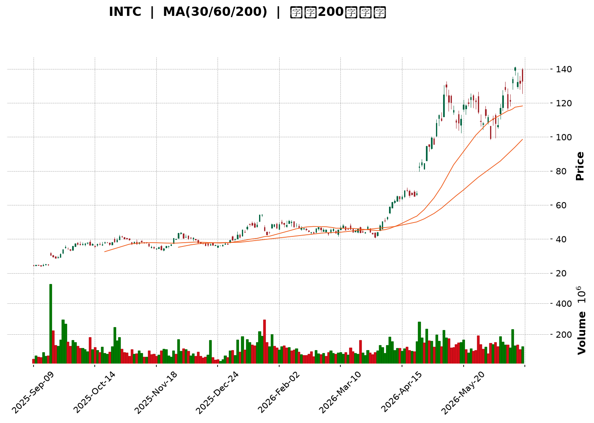
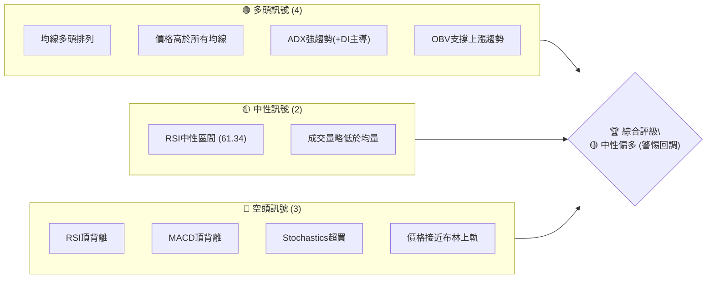
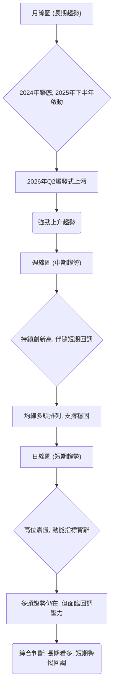
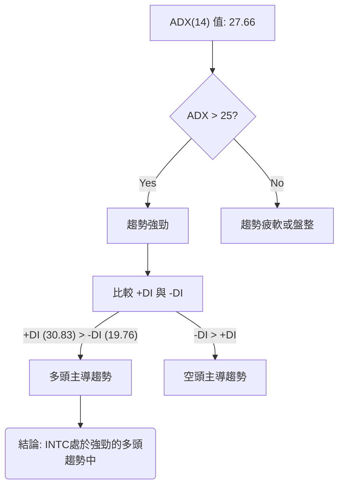
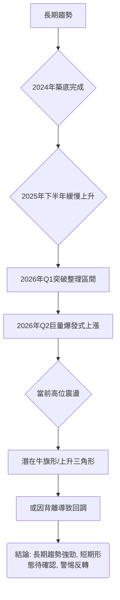
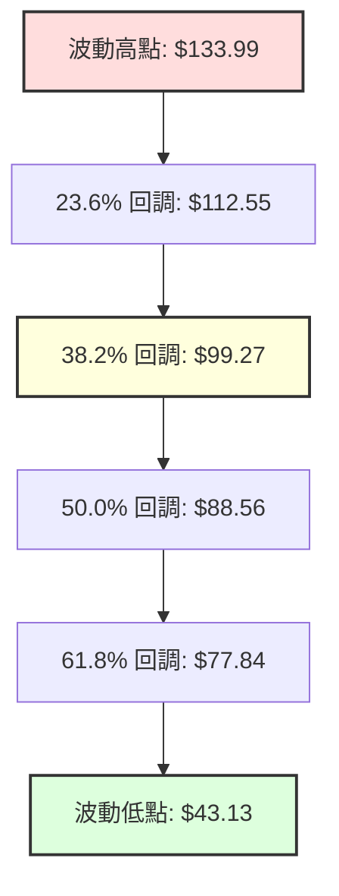
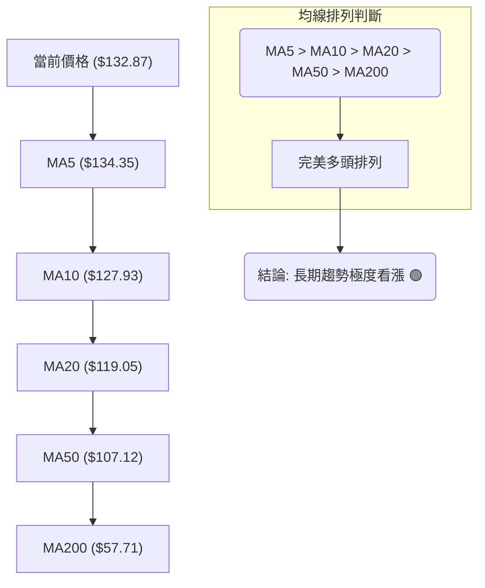
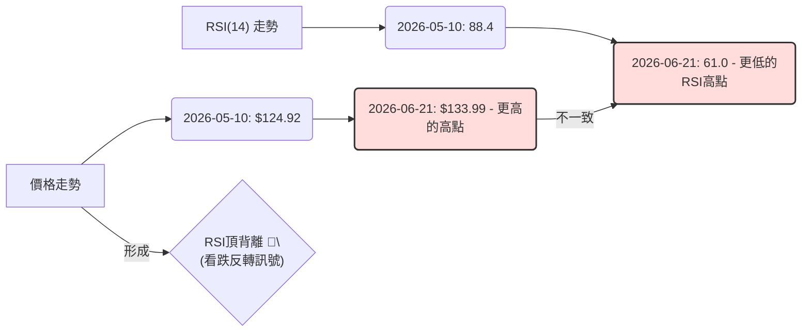

<details>
<summary>📊 靜態圖表 (點擊展開)</summary>

</details>

<html>
<head><meta charset="utf-8" /></head>
<body>
    <div style="height:500px; width:100%;">                        <script>window.PlotlyConfig = {MathJaxConfig: 'local'};</script>
        <script charset="utf-8" src="https://cdn.plot.ly/plotly-3.6.0.min.js" integrity="sha256-QaOVwtVY0T02VaHrr6pnoHLCwayMJp4O5n4YyaE3rJk=" crossorigin="anonymous"></script>                <div id="candlestick-chart" class="plotly-graph-div" style="height:100%; width:100%;"></div>            <script>                window.PLOTLYENV=window.PLOTLYENV || {};                                if (document.getElementById("candlestick-chart")) {                    Plotly.newPlot(                        "candlestick-chart",                        [{"close":{"dtype":"f8","bdata":"AAAA4KNwOEAAAADAHsU4QAAAAAApnDhAAAAA4HoUOEAAAADAHsU4QAAAAMAeRTlAAAAAYGbmOEAAAACA65E+QAAAAOB6lD1AAAAAYI\u002fCPEAAAABAClc9QAAAAOBROD9AAAAAYLj+QEAAAAAAAMBBQAAAAKBwPUFAAAAAYGbGQEAAAADgUfhBQAAAAGBmpkJAAAAAgD1qQkAAAAAghUtCQAAAAIDClUJAAAAAQAq3QkAAAABgZuZCQAAAACBcL0JAAAAAACmcQkAAAADgo9BBQAAAAEAzk0JAAAAAIIVrQkAAAACgR4FCQAAAAMDMDENAAAAAIFwPQ0AAAACAwnVCQAAAAOB6FENAAAAAANcjQ0AAAADAHsVDQAAAAADXw0RAAAAAIIWrREAAAADgehREQAAAAGC4\u002fkNAAAAAAADAQ0AAAAAA14NCQAAAAOCjMENAAAAAYLieQkAAAADgoxBDQAAAAKCZOUNAAAAA4KPwQkAAAACA6\u002fFCQAAAAOB69EFAAAAAYI\u002fCQUAAAABA4VpBQAAAAIA9KkFAAAAAgBSOQUAAAAAgXM9AQAAAAAAAQEFAAAAAwB7lQUAAAACAPepBQAAAACCuZ0JAAAAAIK5HREAAAACgRwFEQAAAAAApvEVAAAAAoEfhRUAAAAAAAEBEQAAAAOB6tERAAAAAYGYmREAAAAAAAEBEQAAAAADXY0RAAAAAoEfBQ0AAAAAgrudCQAAAAKBHwUJAAAAAIK6nQkAAAABgZgZCQAAAAADXI0JAAAAAwPVoQkAAAAAgXC9CQAAAAMDMLEJAAAAA4HoUQkAAAACgmRlCQAAAAEAKV0JAAAAAYGamQkAAAABAM3NCQAAAAOCjsENAAAAAIFyvQ0AAAADAHgVEQAAAAOCjUEVAAAAAgBSOREAAAABgZsZGQAAAACCuB0ZAAAAAwB6lR0AAAAAAKVxIQAAAAMD1KEhAAAAAQOF6R0AAAAAgrkdIQAAAAAAAIEtAAAAAwPUoS0AAAADA9YhGQAAAAGC4PkVAAAAAQAr3RUAAAAAA12NIQAAAAOB6VEhAAAAAACk8R0AAAAAgrmdIQAAAAAAAoEhAAAAAwMxMSEAAAABguB5IQAAAACCFS0lAAAAAYLgeSUAAAADgo5BHQAAAAMAeJUhAAAAAoHA9R0AAAADAHmVHQAAAAEAKF0dAAAAAQOG6RkAAAAAgXE9GQAAAAIAUDkZAAAAA4KPQRUAAAAAgXA9HQAAAAOCjcEdAAAAAQOG6RkAAAACAFM5GQAAAAAAAwEZAAAAAwMyMRUAAAACAPcpGQAAAAKCZ+UZAAAAAgMK1RUAAAACAPcpGQAAAAADXY0dAAAAAoHD9R0AAAAAAAKBGQAAAAGCP4kZAAAAAoEfhRkAAAAAgrgdGQAAAAADXg0ZAAAAAQAoXR0AAAAAgXO9FQAAAAKBHAUZAAAAAIK4HRkAAAABACpdHQAAAAMDMDEZAAAAA4KOQRUAAAADgUZhEQAAAAOCjEEZAAAAAANcDSEAAAADgozBJQAAAAADXY0lAAAAA4Hp0SkAAAACgmXlNQAAAAAAp3E5AAAAA4KMwT0AAAAAghUtQQAAAACCu509AAAAAACk8UEAAAAAAACBRQAAAAAAAIFFAAAAAwMxsUEAAAADgo5BQQAAAAKBHUVBAAAAAgOuxUEAAAABgj6JUQAAAACBcP1VAAAAAoEchVUAAAAAAALBXQAAAAGC4nldAAAAAIK7nWEAAAACA6\u002fFXQAAAAKCZCVtAAAAA4KNAXEAAAAAgrmdbQAAAAEDhOl9AAAAAgBQuYEAAAABACideQAAAAGCPEl5AAAAAIIX7XEAAAACgRzFbQAAAAEDhCltAAAAAQDOzW0AAAACgcL1dQAAAAAAAoF1AAAAAgML1XUAAAACgR+FeQAAAAKBHcV5AAAAAwPU4XkAAAAAghatcQAAAAMAeVVtAAAAAIIX7WkAAAACgcC1cQAAAAIDr8VtAAAAAQOHKWEAAAACgR5FbQAAAAEDh+lpAAAAAYI\u002fCWkAAAACgcD1dQAAAAOB6JF9AAAAAQAr3X0AAAABAM0NdQAAAAGBmRl5AAAAAIK6\u002fYEAAAACAFJ5hQAAAAMD1iGBAAAAAwMx0YEAAAAAA15tgQA=="},"high":{"dtype":"f8","bdata":"AAAAIFzPOEAAAABguN44QAAAAIAU7jhAAAAAoEehOEAAAACAwnU5QAAAAEAKVzlAAAAAYI9COUAAAADgozBAQAAAAKBHoT5AAAAAoJkZPkAAAABAMzM+QAAAAEAzsz9AAAAAAAAgQUAAAABgZiZCQAAAAGBmhkFAAAAAYLgeQUAAAAAgrgdCQAAAAMD1yEJAAAAAgD0KQ0AAAABACldDQAAAAGBmBkNAAAAAwB7lQkAAAADAzAxDQAAAAEAz00NAAAAAoEfBQkAAAABgZkZCQAAAAGC4vkJAAAAAYI8CQ0AAAADgozBDQAAAAGCPQkNAAAAAwMwsQ0AAAABACvdCQAAAAEAzM0NAAAAAIFyPREAAAACAwlVEQAAAAKBwPUVAAAAAwB4FRUAAAABACrdEQAAAAIA9akRAAAAAoJk5REAAAAAAACBDQAAAAOBRWENAAAAAIIXrQ0AAAABgjyJDQAAAAADXw0NAAAAAACkcQ0AAAACgmRlDQAAAACCup0JAAAAAwMwMQkAAAACgcN1BQAAAAKBHYUFAAAAAAADgQUAAAABACldCQAAAAKBwfUFAAAAA4HoUQkAAAADgoxBCQAAAAGC4nkJAAAAAIIVLREAAAADgozBEQAAAAEAK10VAAAAAYI8CRkAAAAAA16NFQAAAAIA9akVAAAAAIFwPRUAAAACgR6FEQAAAAGC4fkRAAAAA4FEYREAAAAAA1wNEQAAAAKBwPUNAAAAAQOH6QkAAAAAghetCQAAAAGC4vkJAAAAAgD3KQkAAAABAM\u002fNCQAAAAGBmZkJAAAAAQAoXQkAAAABguD5CQAAAAGBmZkJAAAAAoEchQ0AAAACAPcpCQAAAAIAU7kNAAAAAwMwMRUAAAAAgridEQAAAAMD1SEZAAAAAIIWrRUAAAACgcN1GQAAAAKCZuUZAAAAAYLgeSEAAAAAAAIBIQAAAAIDrMUlAAAAAQOEaSUAAAACgcB1JQAAAAOB6NEtAAAAAwMxMS0AAAADgoxBIQAAAAEDhOkZAAAAAANdDRkAAAADAHqVIQAAAAGCPYkhAAAAAgD3KSEAAAAAghetIQAAAAGC4vklAAAAAoJnZSEAAAACAFG5JQAAAAGBmpklAAAAAACmcSUAAAADAHkVJQAAAAGBmxkhAAAAAoJl5SEAAAADgUdhHQAAAAIA9akdAAAAAYI9iR0AAAACAwpVGQAAAAIDrMUZAAAAAYGZGRkAAAADAzExHQAAAAAApfEdAAAAAoJl5R0AAAAAgrkdHQAAAACCu50ZAAAAA4FHYRUAAAADgoxBHQAAAAKBwPUdAAAAAQAqXRkAAAACgR+FGQAAAAOCj8EdAAAAAgD1qSEAAAADgUbhHQAAAAEAzU0dAAAAAgMKVSEAAAACAPQpHQAAAAEDh2kZAAAAA4FE4R0AAAABgZsZHQAAAAEDhukZAAAAAIK4nRkAAAADAzOxHQAAAAMDMTEdAAAAA4KMQRkAAAABguP5FQAAAAKBwHUZAAAAAYI9iSEAAAABguD5JQAAAAIDrMUpAAAAAYI+iSkAAAACAwpVNQAAAAIA9Ck9AAAAAgOuxT0AAAACgmWlQQAAAACCFS1BAAAAAgMJ1UEAAAABACidRQAAAAMAelVFAAAAAoHBNUUAAAABA4epQQAAAAKBHMVFAAAAAgOsRUUAAAACAFE5VQAAAAGBmxlVAAAAAgMIlVUAAAADAzLxXQAAAAAAp7FdAAAAAwMwcWUAAAADgevRYQAAAAGC4nltAAAAAAABgXEAAAADgo6BcQAAAAIA9UmBAAAAAAACYYEAAAABgj\u002fJfQAAAAAAAQF9AAAAA4HqkXUAAAADgeqRbQAAAAGCP4lxAAAAA4HpEXEAAAAAAKXxeQAAAAIA92l1AAAAAgOuxXkAAAAAgrmdfQAAAAKBHUV9AAAAAwB7FXkAAAADA9ahfQAAAAEAzU1xAAAAAAABAW0AAAABgj5JdQAAAAMD1SFxAAAAAYLieWkAAAABgjyJcQAAAAAAAgFxAAAAAAADgW0AAAAAAKdxdQAAAAGBm5l9AAAAAIIWTYEAAAABgZhZgQAAAAMDMTF9AAAAAIFzvYEAAAABgZq5hQAAAACBcP2FAAAAAYI8CYUAAAABACpdhQA=="},"hovertemplate":"\u003cb\u003e%{x|%Y-%m-%d}\u003c\u002fb\u003e\u003cbr\u003e\u958b: $%{open:.2f}\u003cbr\u003e\u9ad8: $%{high:.2f}\u003cbr\u003e\u4f4e: $%{low:.2f}\u003cbr\u003e\u6536: $%{close:.2f}\u003cextra\u003e\u003c\u002fextra\u003e","low":{"dtype":"f8","bdata":"AAAAwB5FOEAAAAAgrkc4QAAAAIDrkThAAAAAwMwMOEAAAADgUTg4QAAAAOCjsDhAAAAAQDNzOEAAAADA9Sg+QAAAAOB6VD1AAAAAQOG6PEAAAACA69E8QAAAAEDhOj1AAAAAgMI1P0AAAABguD5BQAAAAKBw3UBAAAAAYI+CQEAAAAAAAMBAQAAAAOBRuEFAAAAAoJk5QkAAAABACjdCQAAAAMDMLEJAAAAA4Hr0QUAAAACAFG5CQAAAAGBmJkJAAAAAANcjQkAAAADgUVhBQAAAAIDr0UFAAAAA4Ho0QkAAAACAPQpCQAAAACCux0JAAAAAgMLVQkAAAADAHgVCQAAAAEAKN0JAAAAAgD3qQkAAAACgcB1DQAAAAMAexUNAAAAAgMJ1REAAAACAFA5EQAAAAMAe5UNAAAAAYGaGQ0AAAADgo1BCQAAAAIAUjkJAAAAAYGZmQkAAAAAAKXxCQAAAAAAp\u002fEJAAAAAYLi+QkAAAADAzKxCQAAAAKCZuUFAAAAAIFxPQUAAAACgcB1BQAAAAMD1yEBAAAAAAAAgQUAAAACgcL1AQAAAAIDrcUBAAAAA4FFYQUAAAABACldBQAAAAOCjEEJAAAAAIIWrQkAAAADAzMxDQAAAAGBmBkRAAAAAoEdBRUAAAACA6xFEQAAAAEAzk0RAAAAAoJnZQ0AAAAAA1wNEQAAAAIDrcUNAAAAAgD2KQ0AAAAAgXM9CQAAAAMD1qEJAAAAAgMJ1QkAAAAAAKfxBQAAAAIDC1UFAAAAA4FE4QkAAAADAHiVCQAAAAADXA0JAAAAAoJl5QUAAAADAzOxBQAAAAMD16EFAAAAAwPVoQkAAAAAgXG9CQAAAAKBH4UJAAAAAYI+iQ0AAAACgmXlDQAAAACBcD0RAAAAAQApXREAAAADA9chEQAAAAIDr8UVAAAAAACmcRkAAAACAwrVHQAAAAIA96kdAAAAAQOFaR0AAAAAAAIBHQAAAAEAzE0lAAAAAgD2KSkAAAACgmTlGQAAAAADXI0VAAAAAwMyMRUAAAADA9ShHQAAAAGC4fkdAAAAAQOH6RkAAAAAAAMBGQAAAAEAKN0hAAAAAAACAR0AAAADAHmVHQAAAAIA9akhAAAAAIIXLR0AAAABgj2JHQAAAAIAUbkdAAAAA4FEYR0AAAAAAKXxGQAAAAEDhukZAAAAA4KNwRkAAAACAwvVFQAAAAOCjcEVAAAAAQAqXRUAAAADAHsVFQAAAAIA9ikZAAAAAgOsxRkAAAABAMzNGQAAAAKCZ+UVAAAAAgOsRRUAAAABgj6JFQAAAAKCZWUZAAAAAANejRUAAAACA69FEQAAAAOB6tEZAAAAA4HpUR0AAAACAwpVGQAAAAIDrsUZAAAAA4FHYRkAAAADgevRFQAAAAGBmBkZAAAAAQDPTRUAAAACA69FFQAAAAGC43kVAAAAAoJmZRUAAAACgmblGQAAAAIDC9UVAAAAAgBRuRUAAAADgo1BEQAAAAMDMzERAAAAAoHB9RkAAAADAHgVHQAAAACBc70hAAAAAACmcSUAAAABgZmZLQAAAAIDrMU1AAAAAAABgTkAAAABAChdPQAAAACCFC09AAAAA4KNwT0AAAACgRxFQQAAAACBc71BAAAAAgBQeUEAAAADA9WhQQAAAAGC4PlBAAAAAQOFaUEAAAAAgrudTQAAAAEAKp1RAAAAAQDMzVEAAAAAgrndVQAAAAAAA4FZAAAAAQAonV0AAAABgZuZXQAAAAMAeBVlAAAAAwB6lWkAAAACgmUlbQAAAAEAz81tAAAAAQOH6XkAAAAAAAMBcQAAAAIA9Gl1AAAAAQOFKXEAAAACgR0FaQAAAAGBm9llAAAAAoJmZWUAAAABAM7NcQAAAAEDhSlxAAAAAgMKFXUAAAABgZlZdQAAAAAAAQF1AAAAAANcTXUAAAABgj2JcQAAAAMAelVpAAAAAQOEKWkAAAABACrdbQAAAAGC43lpAAAAAwB6VWEAAAACAPapaQAAAAKBw3VhAAAAAQOE6WkAAAADgo6BbQAAAAMAe1VxAAAAAgD2qX0AAAAAAAABdQAAAAADXg11AAAAAoJn5X0AAAABguAZhQAAAAKCZCWBAAAAAwMz8X0AAAACAPVpfQA=="},"name":"\u50f9\u683c","open":{"dtype":"f8","bdata":"AAAAIK6HOEAAAAAghWs4QAAAAGCPwjhAAAAAACmcOEAAAADgelQ4QAAAAIDr0ThAAAAA4HoUOUAAAAAgrsc\u002fQAAAAKBHYT5AAAAAIIWrPUAAAACgcP08QAAAAKBHYT1AAAAAACmcP0AAAABgj4JBQAAAAGCPQkFAAAAAQAr3QEAAAAAA18NAQAAAAKBH4UFAAAAAoJn5QkAAAADgUZhCQAAAAIDrUUJAAAAAYGZGQkAAAAAA18NCQAAAAEDhOkNAAAAA4FE4QkAAAAAAAABCQAAAAEAzM0JAAAAAQDOTQkAAAACAFC5CQAAAAMD1yEJAAAAAgOsRQ0AAAAAghetCQAAAAMDMTEJAAAAAYI8CREAAAACA6zFDQAAAACCFy0NAAAAAwMzMREAAAAAAKXxEQAAAAEAKV0RAAAAAAAAgREAAAACA6xFDQAAAAIDCtUJAAAAAIIUrQ0AAAACgR6FCQAAAAEAKd0NAAAAAQDMTQ0AAAAAgrgdDQAAAAGCPokJAAAAAANeDQUAAAACgmblBQAAAAAAAIEFAAAAAgD0qQUAAAAAAAABCQAAAAKBHwUBAAAAAACl8QUAAAABgZsZBQAAAAKCZGUJAAAAAQDOzQkAAAACAFO5DQAAAAAApPERAAAAAgOuxRUAAAACgR6FFQAAAAOB6lERAAAAA4FH4REAAAACgcF1EQAAAAIAUDkRAAAAAwPUIREAAAAAAAKBDQAAAAIA9KkNAAAAAgD3KQkAAAAAghctCQAAAAOCjsEJAAAAAoHA9QkAAAACA6\u002fFCQAAAAGC4HkJAAAAAgMKVQUAAAACAwhVCQAAAAKBHAUJAAAAA4Hp0QkAAAABAM7NCQAAAAGCP4kJAAAAAIIXLREAAAACAFO5DQAAAAEAKF0RAAAAAIFxPRUAAAACAPepEQAAAAGC4HkZAAAAAgOvxRkAAAACgmXlIQAAAAMDMrEhAAAAAYI+iSEAAAABgZqZHQAAAAMD1KElAAAAAQOEaS0AAAACAFG5HQAAAAADXI0ZAAAAAACn8RUAAAADAzExHQAAAACCux0dAAAAAoHB9SEAAAADgo9BGQAAAACCuB0lAAAAAwB7FSEAAAAAghctHQAAAAMDMjEhAAAAAIIXLSEAAAADgejRJQAAAAIAUDkhAAAAAYGbmR0AAAACgR+FGQAAAAEAK90ZAAAAAgML1RkAAAACgmXlGQAAAAIDr8UVAAAAAIIULRkAAAADAzAxGQAAAACCFC0dAAAAAYI9iR0AAAABA4TpGQAAAAKCZGUZAAAAA4FG4RUAAAADA9QhGQAAAACBcb0ZAAAAAgMJVRkAAAABguF5FQAAAAOB6tEZAAAAAwPVoR0AAAABAM7NHQAAAAAAp\u002fEZAAAAA4Hr0R0AAAACAPQpHQAAAAKCZGUZAAAAAYLj+RUAAAACgmXlHQAAAAAAAQEZAAAAAwB7FRUAAAADAzOxGQAAAAGBmJkdAAAAAIFzPRUAAAAAAKdxFQAAAAKCZ+URAAAAAAACARkAAAAAgrgdHQAAAAOCjcElAAAAA4Hr0SUAAAAAgXK9LQAAAAEAzM01AAAAAYI\u002fCTkAAAABAChdPQAAAAIA9SlBAAAAAYI\u002fiT0AAAAAghTtQQAAAAGBmNlFAAAAAwMwcUUAAAADA9chQQAAAAAAp\u002fFBAAAAAYGaGUEAAAADAzIxUQAAAAEDh6lRAAAAAgOtRVEAAAADA9YhVQAAAAGBm5ldAAAAAwMxMV0AAAAAghctYQAAAAOCjIFlAAAAAYLi+W0AAAACgR8FbQAAAAADX81tAAAAAAClcYEAAAABAChdfQAAAAGBmBl9AAAAAgD2qXEAAAABgj3JbQAAAAIAUXlxAAAAAYLi+WkAAAACAFA5dQAAAAMAeJV1AAAAAgMIVXkAAAABgZoZeQAAAAMD1GF9AAAAAwMxcXkAAAABgZvZeQAAAACCFW1tAAAAAwMzcWkAAAABA4RpdQAAAAKCZGVtAAAAAYLieWkAAAAAAAMBbQAAAACBcP1xAAAAAgOuBWkAAAACgR2FcQAAAAEDhWl1AAAAAIK4vYEAAAABACkdfQAAAAGBmdl5AAAAAgOt5YEAAAAAA12NhQAAAACBcN2BAAAAAoJmhYEAAAAAgXHdhQA=="},"x":["2025-09-09T00:00:00-04:00","2025-09-10T00:00:00-04:00","2025-09-11T00:00:00-04:00","2025-09-12T00:00:00-04:00","2025-09-15T00:00:00-04:00","2025-09-16T00:00:00-04:00","2025-09-17T00:00:00-04:00","2025-09-18T00:00:00-04:00","2025-09-19T00:00:00-04:00","2025-09-22T00:00:00-04:00","2025-09-23T00:00:00-04:00","2025-09-24T00:00:00-04:00","2025-09-25T00:00:00-04:00","2025-09-26T00:00:00-04:00","2025-09-29T00:00:00-04:00","2025-09-30T00:00:00-04:00","2025-10-01T00:00:00-04:00","2025-10-02T00:00:00-04:00","2025-10-03T00:00:00-04:00","2025-10-06T00:00:00-04:00","2025-10-07T00:00:00-04:00","2025-10-08T00:00:00-04:00","2025-10-09T00:00:00-04:00","2025-10-10T00:00:00-04:00","2025-10-13T00:00:00-04:00","2025-10-14T00:00:00-04:00","2025-10-15T00:00:00-04:00","2025-10-16T00:00:00-04:00","2025-10-17T00:00:00-04:00","2025-10-20T00:00:00-04:00","2025-10-21T00:00:00-04:00","2025-10-22T00:00:00-04:00","2025-10-23T00:00:00-04:00","2025-10-24T00:00:00-04:00","2025-10-27T00:00:00-04:00","2025-10-28T00:00:00-04:00","2025-10-29T00:00:00-04:00","2025-10-30T00:00:00-04:00","2025-10-31T00:00:00-04:00","2025-11-03T00:00:00-05:00","2025-11-04T00:00:00-05:00","2025-11-05T00:00:00-05:00","2025-11-06T00:00:00-05:00","2025-11-07T00:00:00-05:00","2025-11-10T00:00:00-05:00","2025-11-11T00:00:00-05:00","2025-11-12T00:00:00-05:00","2025-11-13T00:00:00-05:00","2025-11-14T00:00:00-05:00","2025-11-17T00:00:00-05:00","2025-11-18T00:00:00-05:00","2025-11-19T00:00:00-05:00","2025-11-20T00:00:00-05:00","2025-11-21T00:00:00-05:00","2025-11-24T00:00:00-05:00","2025-11-25T00:00:00-05:00","2025-11-26T00:00:00-05:00","2025-11-28T00:00:00-05:00","2025-12-01T00:00:00-05:00","2025-12-02T00:00:00-05:00","2025-12-03T00:00:00-05:00","2025-12-04T00:00:00-05:00","2025-12-05T00:00:00-05:00","2025-12-08T00:00:00-05:00","2025-12-09T00:00:00-05:00","2025-12-10T00:00:00-05:00","2025-12-11T00:00:00-05:00","2025-12-12T00:00:00-05:00","2025-12-15T00:00:00-05:00","2025-12-16T00:00:00-05:00","2025-12-17T00:00:00-05:00","2025-12-18T00:00:00-05:00","2025-12-19T00:00:00-05:00","2025-12-22T00:00:00-05:00","2025-12-23T00:00:00-05:00","2025-12-24T00:00:00-05:00","2025-12-26T00:00:00-05:00","2025-12-29T00:00:00-05:00","2025-12-30T00:00:00-05:00","2025-12-31T00:00:00-05:00","2026-01-02T00:00:00-05:00","2026-01-05T00:00:00-05:00","2026-01-06T00:00:00-05:00","2026-01-07T00:00:00-05:00","2026-01-08T00:00:00-05:00","2026-01-09T00:00:00-05:00","2026-01-12T00:00:00-05:00","2026-01-13T00:00:00-05:00","2026-01-14T00:00:00-05:00","2026-01-15T00:00:00-05:00","2026-01-16T00:00:00-05:00","2026-01-20T00:00:00-05:00","2026-01-21T00:00:00-05:00","2026-01-22T00:00:00-05:00","2026-01-23T00:00:00-05:00","2026-01-26T00:00:00-05:00","2026-01-27T00:00:00-05:00","2026-01-28T00:00:00-05:00","2026-01-29T00:00:00-05:00","2026-01-30T00:00:00-05:00","2026-02-02T00:00:00-05:00","2026-02-03T00:00:00-05:00","2026-02-04T00:00:00-05:00","2026-02-05T00:00:00-05:00","2026-02-06T00:00:00-05:00","2026-02-09T00:00:00-05:00","2026-02-10T00:00:00-05:00","2026-02-11T00:00:00-05:00","2026-02-12T00:00:00-05:00","2026-02-13T00:00:00-05:00","2026-02-17T00:00:00-05:00","2026-02-18T00:00:00-05:00","2026-02-19T00:00:00-05:00","2026-02-20T00:00:00-05:00","2026-02-23T00:00:00-05:00","2026-02-24T00:00:00-05:00","2026-02-25T00:00:00-05:00","2026-02-26T00:00:00-05:00","2026-02-27T00:00:00-05:00","2026-03-02T00:00:00-05:00","2026-03-03T00:00:00-05:00","2026-03-04T00:00:00-05:00","2026-03-05T00:00:00-05:00","2026-03-06T00:00:00-05:00","2026-03-09T00:00:00-04:00","2026-03-10T00:00:00-04:00","2026-03-11T00:00:00-04:00","2026-03-12T00:00:00-04:00","2026-03-13T00:00:00-04:00","2026-03-16T00:00:00-04:00","2026-03-17T00:00:00-04:00","2026-03-18T00:00:00-04:00","2026-03-19T00:00:00-04:00","2026-03-20T00:00:00-04:00","2026-03-23T00:00:00-04:00","2026-03-24T00:00:00-04:00","2026-03-25T00:00:00-04:00","2026-03-26T00:00:00-04:00","2026-03-27T00:00:00-04:00","2026-03-30T00:00:00-04:00","2026-03-31T00:00:00-04:00","2026-04-01T00:00:00-04:00","2026-04-02T00:00:00-04:00","2026-04-06T00:00:00-04:00","2026-04-07T00:00:00-04:00","2026-04-08T00:00:00-04:00","2026-04-09T00:00:00-04:00","2026-04-10T00:00:00-04:00","2026-04-13T00:00:00-04:00","2026-04-14T00:00:00-04:00","2026-04-15T00:00:00-04:00","2026-04-16T00:00:00-04:00","2026-04-17T00:00:00-04:00","2026-04-20T00:00:00-04:00","2026-04-21T00:00:00-04:00","2026-04-22T00:00:00-04:00","2026-04-23T00:00:00-04:00","2026-04-24T00:00:00-04:00","2026-04-27T00:00:00-04:00","2026-04-28T00:00:00-04:00","2026-04-29T00:00:00-04:00","2026-04-30T00:00:00-04:00","2026-05-01T00:00:00-04:00","2026-05-04T00:00:00-04:00","2026-05-05T00:00:00-04:00","2026-05-06T00:00:00-04:00","2026-05-07T00:00:00-04:00","2026-05-08T00:00:00-04:00","2026-05-11T00:00:00-04:00","2026-05-12T00:00:00-04:00","2026-05-13T00:00:00-04:00","2026-05-14T00:00:00-04:00","2026-05-15T00:00:00-04:00","2026-05-18T00:00:00-04:00","2026-05-19T00:00:00-04:00","2026-05-20T00:00:00-04:00","2026-05-21T00:00:00-04:00","2026-05-22T00:00:00-04:00","2026-05-26T00:00:00-04:00","2026-05-27T00:00:00-04:00","2026-05-28T00:00:00-04:00","2026-05-29T00:00:00-04:00","2026-06-01T00:00:00-04:00","2026-06-02T00:00:00-04:00","2026-06-03T00:00:00-04:00","2026-06-04T00:00:00-04:00","2026-06-05T00:00:00-04:00","2026-06-08T00:00:00-04:00","2026-06-09T00:00:00-04:00","2026-06-10T00:00:00-04:00","2026-06-11T00:00:00-04:00","2026-06-12T00:00:00-04:00","2026-06-15T00:00:00-04:00","2026-06-16T00:00:00-04:00","2026-06-17T00:00:00-04:00","2026-06-18T00:00:00-04:00","2026-06-22T00:00:00-04:00","2026-06-23T00:00:00-04:00","2026-06-24T00:00:00-04:00","2026-06-25T00:00:00-04:00"],"type":"candlestick"},{"hovertemplate":"MA30: $%{y:.2f}\u003cextra\u003e\u003c\u002fextra\u003e","line":{"color":"#2196F3","dash":"dash","width":2},"mode":"lines","name":"MA30","x":["2025-09-09T00:00:00-04:00","2025-09-10T00:00:00-04:00","2025-09-11T00:00:00-04:00","2025-09-12T00:00:00-04:00","2025-09-15T00:00:00-04:00","2025-09-16T00:00:00-04:00","2025-09-17T00:00:00-04:00","2025-09-18T00:00:00-04:00","2025-09-19T00:00:00-04:00","2025-09-22T00:00:00-04:00","2025-09-23T00:00:00-04:00","2025-09-24T00:00:00-04:00","2025-09-25T00:00:00-04:00","2025-09-26T00:00:00-04:00","2025-09-29T00:00:00-04:00","2025-09-30T00:00:00-04:00","2025-10-01T00:00:00-04:00","2025-10-02T00:00:00-04:00","2025-10-03T00:00:00-04:00","2025-10-06T00:00:00-04:00","2025-10-07T00:00:00-04:00","2025-10-08T00:00:00-04:00","2025-10-09T00:00:00-04:00","2025-10-10T00:00:00-04:00","2025-10-13T00:00:00-04:00","2025-10-14T00:00:00-04:00","2025-10-15T00:00:00-04:00","2025-10-16T00:00:00-04:00","2025-10-17T00:00:00-04:00","2025-10-20T00:00:00-04:00","2025-10-21T00:00:00-04:00","2025-10-22T00:00:00-04:00","2025-10-23T00:00:00-04:00","2025-10-24T00:00:00-04:00","2025-10-27T00:00:00-04:00","2025-10-28T00:00:00-04:00","2025-10-29T00:00:00-04:00","2025-10-30T00:00:00-04:00","2025-10-31T00:00:00-04:00","2025-11-03T00:00:00-05:00","2025-11-04T00:00:00-05:00","2025-11-05T00:00:00-05:00","2025-11-06T00:00:00-05:00","2025-11-07T00:00:00-05:00","2025-11-10T00:00:00-05:00","2025-11-11T00:00:00-05:00","2025-11-12T00:00:00-05:00","2025-11-13T00:00:00-05:00","2025-11-14T00:00:00-05:00","2025-11-17T00:00:00-05:00","2025-11-18T00:00:00-05:00","2025-11-19T00:00:00-05:00","2025-11-20T00:00:00-05:00","2025-11-21T00:00:00-05:00","2025-11-24T00:00:00-05:00","2025-11-25T00:00:00-05:00","2025-11-26T00:00:00-05:00","2025-11-28T00:00:00-05:00","2025-12-01T00:00:00-05:00","2025-12-02T00:00:00-05:00","2025-12-03T00:00:00-05:00","2025-12-04T00:00:00-05:00","2025-12-05T00:00:00-05:00","2025-12-08T00:00:00-05:00","2025-12-09T00:00:00-05:00","2025-12-10T00:00:00-05:00","2025-12-11T00:00:00-05:00","2025-12-12T00:00:00-05:00","2025-12-15T00:00:00-05:00","2025-12-16T00:00:00-05:00","2025-12-17T00:00:00-05:00","2025-12-18T00:00:00-05:00","2025-12-19T00:00:00-05:00","2025-12-22T00:00:00-05:00","2025-12-23T00:00:00-05:00","2025-12-24T00:00:00-05:00","2025-12-26T00:00:00-05:00","2025-12-29T00:00:00-05:00","2025-12-30T00:00:00-05:00","2025-12-31T00:00:00-05:00","2026-01-02T00:00:00-05:00","2026-01-05T00:00:00-05:00","2026-01-06T00:00:00-05:00","2026-01-07T00:00:00-05:00","2026-01-08T00:00:00-05:00","2026-01-09T00:00:00-05:00","2026-01-12T00:00:00-05:00","2026-01-13T00:00:00-05:00","2026-01-14T00:00:00-05:00","2026-01-15T00:00:00-05:00","2026-01-16T00:00:00-05:00","2026-01-20T00:00:00-05:00","2026-01-21T00:00:00-05:00","2026-01-22T00:00:00-05:00","2026-01-23T00:00:00-05:00","2026-01-26T00:00:00-05:00","2026-01-27T00:00:00-05:00","2026-01-28T00:00:00-05:00","2026-01-29T00:00:00-05:00","2026-01-30T00:00:00-05:00","2026-02-02T00:00:00-05:00","2026-02-03T00:00:00-05:00","2026-02-04T00:00:00-05:00","2026-02-05T00:00:00-05:00","2026-02-06T00:00:00-05:00","2026-02-09T00:00:00-05:00","2026-02-10T00:00:00-05:00","2026-02-11T00:00:00-05:00","2026-02-12T00:00:00-05:00","2026-02-13T00:00:00-05:00","2026-02-17T00:00:00-05:00","2026-02-18T00:00:00-05:00","2026-02-19T00:00:00-05:00","2026-02-20T00:00:00-05:00","2026-02-23T00:00:00-05:00","2026-02-24T00:00:00-05:00","2026-02-25T00:00:00-05:00","2026-02-26T00:00:00-05:00","2026-02-27T00:00:00-05:00","2026-03-02T00:00:00-05:00","2026-03-03T00:00:00-05:00","2026-03-04T00:00:00-05:00","2026-03-05T00:00:00-05:00","2026-03-06T00:00:00-05:00","2026-03-09T00:00:00-04:00","2026-03-10T00:00:00-04:00","2026-03-11T00:00:00-04:00","2026-03-12T00:00:00-04:00","2026-03-13T00:00:00-04:00","2026-03-16T00:00:00-04:00","2026-03-17T00:00:00-04:00","2026-03-18T00:00:00-04:00","2026-03-19T00:00:00-04:00","2026-03-20T00:00:00-04:00","2026-03-23T00:00:00-04:00","2026-03-24T00:00:00-04:00","2026-03-25T00:00:00-04:00","2026-03-26T00:00:00-04:00","2026-03-27T00:00:00-04:00","2026-03-30T00:00:00-04:00","2026-03-31T00:00:00-04:00","2026-04-01T00:00:00-04:00","2026-04-02T00:00:00-04:00","2026-04-06T00:00:00-04:00","2026-04-07T00:00:00-04:00","2026-04-08T00:00:00-04:00","2026-04-09T00:00:00-04:00","2026-04-10T00:00:00-04:00","2026-04-13T00:00:00-04:00","2026-04-14T00:00:00-04:00","2026-04-15T00:00:00-04:00","2026-04-16T00:00:00-04:00","2026-04-17T00:00:00-04:00","2026-04-20T00:00:00-04:00","2026-04-21T00:00:00-04:00","2026-04-22T00:00:00-04:00","2026-04-23T00:00:00-04:00","2026-04-24T00:00:00-04:00","2026-04-27T00:00:00-04:00","2026-04-28T00:00:00-04:00","2026-04-29T00:00:00-04:00","2026-04-30T00:00:00-04:00","2026-05-01T00:00:00-04:00","2026-05-04T00:00:00-04:00","2026-05-05T00:00:00-04:00","2026-05-06T00:00:00-04:00","2026-05-07T00:00:00-04:00","2026-05-08T00:00:00-04:00","2026-05-11T00:00:00-04:00","2026-05-12T00:00:00-04:00","2026-05-13T00:00:00-04:00","2026-05-14T00:00:00-04:00","2026-05-15T00:00:00-04:00","2026-05-18T00:00:00-04:00","2026-05-19T00:00:00-04:00","2026-05-20T00:00:00-04:00","2026-05-21T00:00:00-04:00","2026-05-22T00:00:00-04:00","2026-05-26T00:00:00-04:00","2026-05-27T00:00:00-04:00","2026-05-28T00:00:00-04:00","2026-05-29T00:00:00-04:00","2026-06-01T00:00:00-04:00","2026-06-02T00:00:00-04:00","2026-06-03T00:00:00-04:00","2026-06-04T00:00:00-04:00","2026-06-05T00:00:00-04:00","2026-06-08T00:00:00-04:00","2026-06-09T00:00:00-04:00","2026-06-10T00:00:00-04:00","2026-06-11T00:00:00-04:00","2026-06-12T00:00:00-04:00","2026-06-15T00:00:00-04:00","2026-06-16T00:00:00-04:00","2026-06-17T00:00:00-04:00","2026-06-18T00:00:00-04:00","2026-06-22T00:00:00-04:00","2026-06-23T00:00:00-04:00","2026-06-24T00:00:00-04:00","2026-06-25T00:00:00-04:00"],"y":{"dtype":"f8","bdata":"AAAAAAAA+H8AAAAAAAD4fwAAAAAAAPh\u002fAAAAAAAA+H8AAAAAAAD4fwAAAAAAAPh\u002fAAAAAAAA+H8AAAAAAAD4fwAAAAAAAPh\u002fAAAAAAAA+H8AAAAAAAD4fwAAAAAAAPh\u002fAAAAAAAA+H8AAAAAAAD4fwAAAAAAAPh\u002fAAAAAAAA+H8AAAAAAAD4fwAAAAAAAPh\u002fAAAAAAAA+H8AAAAAAAD4fwAAAAAAAPh\u002fAAAAAAAA+H8AAAAAAAD4fwAAAAAAAPh\u002fAAAAAAAA+H8AAAAAAAD4fwAAAAAAAPh\u002fAAAAAAAA+H8AAAAAAAD4f4mIiOhtSUBAVVVVHcyDQEDv7u4mo7dAQFVVVV1z8UBAzczMjAkuQUBERERUDm1BQFVVVZVuskFAq6qqcpP4QUARERFJfiFCQImIiMjoTUJAIiIiurt7QkCamZlBi5xCQDMzM+MXu0JAERERwfXIQkCrqqpqLtRCQHd3d7ce5UJAvLu7O5j3QkB3d3cn6v9CQHd3d+f7+UJAiYiICGX0QkAiIiKSX+xCQJqZmYlB4EJAq6qqelvWQkDe3d3NhcRCQERERESLvEJAMzMzU3G2QkB3d3fHS7dCQImIiGjYtUJAREREpLfFQkARERFxhNJCQKuqqupt6UJAzczMTH4BQ0De3d2dxBBDQLy7u3uiHkNAzczM3EAnQ0AAAABwWStDQM3MzDwmKENAMzMzY1cgQ0AAAACQUBZDQM3MzLy7C0NAzczMrGMCQ0ARERFBNf5CQN7d3X0\u002f9UJAzczMvHTzQkCJiIhY8utCQFVVVZX84kJAIiIi4qXbQkBERET0b9RCQAAAAAC510JAvLu7O1HfQkDNzMxMqehCQO\u002fu7j41\u002fkJAzczMTGIQQ0B3d3enxitDQImIiMh2TkNAREREpCllQ0CJiIh4oo5DQHd3d2eRrUNAvLu7W0jKQ0AREREBcu9DQO\u002fu7n4jBERAAAAAwMoRREC8u7trLjREQAAAACD3akRAREREtMimREDNzMxcSLpEQERERCSUwURAZmZm9m\u002fUREAAAAAgPgNFQGZmZubQMkVAAAAAEOZZRUAzMzNjV5BFQGZmZhaux0VAzczM\u002fPD5RUAiIiIylixGQDMzMxNYaUZAERERMWulRkCrqqqqDdRGQCIiIuKWBUdARERE5MEsR0CJiIho9FZHQCIiItL3c0dAmpmZufONR0De3d1NfqFHQLy7u9vOp0dA7+7uXo+yR0BmZmb2\u002fbRHQHd3dycGwUdA3t3dTTe5R0Crqqpa8qtHQJqZmSnqn0dAMzMzA3KPR0Dv7u4Ou4JHQO\u002fu7j5RX0dAmpmZic8wR0CJiIiY\u002fDJHQKuqqmpKRUdAiYiIGJJWR0BVVVVlgkdHQO\u002fu7r4tO0dAvLu7OyY4R0B3d3f34SNHQJqZmZngEUdAERERUY0HR0C8u7sb6PRGQN7d3f3U2EZAiYiIyHa+RkBVVVVlrb5GQLy7u8vMrEZAREREtIGeRkAiIiICnYZGQM3MzNzdfUZAzczM\u002fNSIRkAiIiJyaKFGQM3MzNzdvUZAiYiIGHblRkARERHhMxxHQN7d3R2FW0dAVVVVRbajR0De3d3tNfdHQFVVVVVVRUhAERERcYSiSEARERExTwRJQN7d3c2FZElAERERgZXDSUBERESU0RtKQGZmZpa1akpAMzMzM+y6SkAzMzPTBlpLQFVVVYVdAUxAZmZmxr2mTEBVVVXFBH9NQM3MzFwBUk5AiYiIGAQ2T0BERETUvwlQQKuqqtKUklBAd3d3t6wlUUCJiIhI4apRQHd3d8dLV1JAREREjGwPU0BVVVV12rhTQBEREflTW1RAVVVVbS7sVEBmZmYmv2hVQN7d3b0t41VA7+7uZq1eVkDNzMzcst5WQAAAAFDUV1dAmpmZIWnSV0BERESM3k5YQO\u002fu7m6EylhAd3d3l+BBWUB3d3cHZaRZQHd3d6d\u002f+1lA3t3d3ZZVWkAiIiLCrrhaQLy7u2vnG1tA3t3drQBhW0BERET0KJxbQKuqqsoTzVtAd3d3tx79W0BmZmZWgCxcQM3MzHyxbFxAq6qqSvCoXEDNzMyMUNZcQJqZmfnw8VxAq6qq2rIeXUAAAADAg2FdQKuqqko3cV1A3t3dPe51XUBVVVXVFZBdQA=="},"type":"scatter"},{"hovertemplate":"MA60: $%{y:.2f}\u003cextra\u003e\u003c\u002fextra\u003e","line":{"color":"#9C27B0","dash":"dash","width":2},"mode":"lines","name":"MA60","x":["2025-09-09T00:00:00-04:00","2025-09-10T00:00:00-04:00","2025-09-11T00:00:00-04:00","2025-09-12T00:00:00-04:00","2025-09-15T00:00:00-04:00","2025-09-16T00:00:00-04:00","2025-09-17T00:00:00-04:00","2025-09-18T00:00:00-04:00","2025-09-19T00:00:00-04:00","2025-09-22T00:00:00-04:00","2025-09-23T00:00:00-04:00","2025-09-24T00:00:00-04:00","2025-09-25T00:00:00-04:00","2025-09-26T00:00:00-04:00","2025-09-29T00:00:00-04:00","2025-09-30T00:00:00-04:00","2025-10-01T00:00:00-04:00","2025-10-02T00:00:00-04:00","2025-10-03T00:00:00-04:00","2025-10-06T00:00:00-04:00","2025-10-07T00:00:00-04:00","2025-10-08T00:00:00-04:00","2025-10-09T00:00:00-04:00","2025-10-10T00:00:00-04:00","2025-10-13T00:00:00-04:00","2025-10-14T00:00:00-04:00","2025-10-15T00:00:00-04:00","2025-10-16T00:00:00-04:00","2025-10-17T00:00:00-04:00","2025-10-20T00:00:00-04:00","2025-10-21T00:00:00-04:00","2025-10-22T00:00:00-04:00","2025-10-23T00:00:00-04:00","2025-10-24T00:00:00-04:00","2025-10-27T00:00:00-04:00","2025-10-28T00:00:00-04:00","2025-10-29T00:00:00-04:00","2025-10-30T00:00:00-04:00","2025-10-31T00:00:00-04:00","2025-11-03T00:00:00-05:00","2025-11-04T00:00:00-05:00","2025-11-05T00:00:00-05:00","2025-11-06T00:00:00-05:00","2025-11-07T00:00:00-05:00","2025-11-10T00:00:00-05:00","2025-11-11T00:00:00-05:00","2025-11-12T00:00:00-05:00","2025-11-13T00:00:00-05:00","2025-11-14T00:00:00-05:00","2025-11-17T00:00:00-05:00","2025-11-18T00:00:00-05:00","2025-11-19T00:00:00-05:00","2025-11-20T00:00:00-05:00","2025-11-21T00:00:00-05:00","2025-11-24T00:00:00-05:00","2025-11-25T00:00:00-05:00","2025-11-26T00:00:00-05:00","2025-11-28T00:00:00-05:00","2025-12-01T00:00:00-05:00","2025-12-02T00:00:00-05:00","2025-12-03T00:00:00-05:00","2025-12-04T00:00:00-05:00","2025-12-05T00:00:00-05:00","2025-12-08T00:00:00-05:00","2025-12-09T00:00:00-05:00","2025-12-10T00:00:00-05:00","2025-12-11T00:00:00-05:00","2025-12-12T00:00:00-05:00","2025-12-15T00:00:00-05:00","2025-12-16T00:00:00-05:00","2025-12-17T00:00:00-05:00","2025-12-18T00:00:00-05:00","2025-12-19T00:00:00-05:00","2025-12-22T00:00:00-05:00","2025-12-23T00:00:00-05:00","2025-12-24T00:00:00-05:00","2025-12-26T00:00:00-05:00","2025-12-29T00:00:00-05:00","2025-12-30T00:00:00-05:00","2025-12-31T00:00:00-05:00","2026-01-02T00:00:00-05:00","2026-01-05T00:00:00-05:00","2026-01-06T00:00:00-05:00","2026-01-07T00:00:00-05:00","2026-01-08T00:00:00-05:00","2026-01-09T00:00:00-05:00","2026-01-12T00:00:00-05:00","2026-01-13T00:00:00-05:00","2026-01-14T00:00:00-05:00","2026-01-15T00:00:00-05:00","2026-01-16T00:00:00-05:00","2026-01-20T00:00:00-05:00","2026-01-21T00:00:00-05:00","2026-01-22T00:00:00-05:00","2026-01-23T00:00:00-05:00","2026-01-26T00:00:00-05:00","2026-01-27T00:00:00-05:00","2026-01-28T00:00:00-05:00","2026-01-29T00:00:00-05:00","2026-01-30T00:00:00-05:00","2026-02-02T00:00:00-05:00","2026-02-03T00:00:00-05:00","2026-02-04T00:00:00-05:00","2026-02-05T00:00:00-05:00","2026-02-06T00:00:00-05:00","2026-02-09T00:00:00-05:00","2026-02-10T00:00:00-05:00","2026-02-11T00:00:00-05:00","2026-02-12T00:00:00-05:00","2026-02-13T00:00:00-05:00","2026-02-17T00:00:00-05:00","2026-02-18T00:00:00-05:00","2026-02-19T00:00:00-05:00","2026-02-20T00:00:00-05:00","2026-02-23T00:00:00-05:00","2026-02-24T00:00:00-05:00","2026-02-25T00:00:00-05:00","2026-02-26T00:00:00-05:00","2026-02-27T00:00:00-05:00","2026-03-02T00:00:00-05:00","2026-03-03T00:00:00-05:00","2026-03-04T00:00:00-05:00","2026-03-05T00:00:00-05:00","2026-03-06T00:00:00-05:00","2026-03-09T00:00:00-04:00","2026-03-10T00:00:00-04:00","2026-03-11T00:00:00-04:00","2026-03-12T00:00:00-04:00","2026-03-13T00:00:00-04:00","2026-03-16T00:00:00-04:00","2026-03-17T00:00:00-04:00","2026-03-18T00:00:00-04:00","2026-03-19T00:00:00-04:00","2026-03-20T00:00:00-04:00","2026-03-23T00:00:00-04:00","2026-03-24T00:00:00-04:00","2026-03-25T00:00:00-04:00","2026-03-26T00:00:00-04:00","2026-03-27T00:00:00-04:00","2026-03-30T00:00:00-04:00","2026-03-31T00:00:00-04:00","2026-04-01T00:00:00-04:00","2026-04-02T00:00:00-04:00","2026-04-06T00:00:00-04:00","2026-04-07T00:00:00-04:00","2026-04-08T00:00:00-04:00","2026-04-09T00:00:00-04:00","2026-04-10T00:00:00-04:00","2026-04-13T00:00:00-04:00","2026-04-14T00:00:00-04:00","2026-04-15T00:00:00-04:00","2026-04-16T00:00:00-04:00","2026-04-17T00:00:00-04:00","2026-04-20T00:00:00-04:00","2026-04-21T00:00:00-04:00","2026-04-22T00:00:00-04:00","2026-04-23T00:00:00-04:00","2026-04-24T00:00:00-04:00","2026-04-27T00:00:00-04:00","2026-04-28T00:00:00-04:00","2026-04-29T00:00:00-04:00","2026-04-30T00:00:00-04:00","2026-05-01T00:00:00-04:00","2026-05-04T00:00:00-04:00","2026-05-05T00:00:00-04:00","2026-05-06T00:00:00-04:00","2026-05-07T00:00:00-04:00","2026-05-08T00:00:00-04:00","2026-05-11T00:00:00-04:00","2026-05-12T00:00:00-04:00","2026-05-13T00:00:00-04:00","2026-05-14T00:00:00-04:00","2026-05-15T00:00:00-04:00","2026-05-18T00:00:00-04:00","2026-05-19T00:00:00-04:00","2026-05-20T00:00:00-04:00","2026-05-21T00:00:00-04:00","2026-05-22T00:00:00-04:00","2026-05-26T00:00:00-04:00","2026-05-27T00:00:00-04:00","2026-05-28T00:00:00-04:00","2026-05-29T00:00:00-04:00","2026-06-01T00:00:00-04:00","2026-06-02T00:00:00-04:00","2026-06-03T00:00:00-04:00","2026-06-04T00:00:00-04:00","2026-06-05T00:00:00-04:00","2026-06-08T00:00:00-04:00","2026-06-09T00:00:00-04:00","2026-06-10T00:00:00-04:00","2026-06-11T00:00:00-04:00","2026-06-12T00:00:00-04:00","2026-06-15T00:00:00-04:00","2026-06-16T00:00:00-04:00","2026-06-17T00:00:00-04:00","2026-06-18T00:00:00-04:00","2026-06-22T00:00:00-04:00","2026-06-23T00:00:00-04:00","2026-06-24T00:00:00-04:00","2026-06-25T00:00:00-04:00"],"y":{"dtype":"f8","bdata":"AAAAAAAA+H8AAAAAAAD4fwAAAAAAAPh\u002fAAAAAAAA+H8AAAAAAAD4fwAAAAAAAPh\u002fAAAAAAAA+H8AAAAAAAD4fwAAAAAAAPh\u002fAAAAAAAA+H8AAAAAAAD4fwAAAAAAAPh\u002fAAAAAAAA+H8AAAAAAAD4fwAAAAAAAPh\u002fAAAAAAAA+H8AAAAAAAD4fwAAAAAAAPh\u002fAAAAAAAA+H8AAAAAAAD4fwAAAAAAAPh\u002fAAAAAAAA+H8AAAAAAAD4fwAAAAAAAPh\u002fAAAAAAAA+H8AAAAAAAD4fwAAAAAAAPh\u002fAAAAAAAA+H8AAAAAAAD4fwAAAAAAAPh\u002fAAAAAAAA+H8AAAAAAAD4fwAAAAAAAPh\u002fAAAAAAAA+H8AAAAAAAD4fwAAAAAAAPh\u002fAAAAAAAA+H8AAAAAAAD4fwAAAAAAAPh\u002fAAAAAAAA+H8AAAAAAAD4fwAAAAAAAPh\u002fAAAAAAAA+H8AAAAAAAD4fwAAAAAAAPh\u002fAAAAAAAA+H8AAAAAAAD4fwAAAAAAAPh\u002fAAAAAAAA+H8AAAAAAAD4fwAAAAAAAPh\u002fAAAAAAAA+H8AAAAAAAD4fwAAAAAAAPh\u002fAAAAAAAA+H8AAAAAAAD4fwAAAAAAAPh\u002fAAAAAAAA+H8AAAAAAAD4f5qZmeltmUFAERERNaXCQUBmZmbiM+RBQImIiOwKCEJAzczMNKUqQkAiIiLiM0xCQBEREWlKbUJA7+7uanWMQkCJiIhs55tCQKuqqkLSrEJAd3d3sw+\u002fQkBVVVVBYM1CQImIiLAr2EJA7+7uPjXeQkCamZlhEOBCQGZmZqYN5EJA7+7uDp\u002fpQkDe3d0NLepCQLy7u3Pa6EJAIiIiItvpQkB3d3dvhOpCQERERGQ770JAvLu7417zQkCrqqo6JvhCQGZmZgaBBUNAvLu7e80NQ0AAAAAg9yJDQAAAAOi0MUNAAAAAAABIQ0ARERE5+2BDQM3MzLTIdkNAZmZmhqSJQ0DNzMyEeaJDQN7d3c3MxENAiYiIyATnQ0BmZmbm0PJDQImIiDDd9ENAzczMrGP6Q0AAAABYxwxEQJqZmVFGH0RAZmZm3iQuREAiIiJSRkdEQCIiIsp2XkRAzczM3LJ2REBVVVVFRIxEQERERFQqpkRAmpmZiYjAREB3d3fPPtREQBEREfGn7kRAAAAAkAkGRUCrqqrazh9FQImIiIgWOUVAMzMzAytPRUCrqqp6omZFQCIiItIie0VAmpmZgdyLRUB3d3c30KFFQHd3d8dLt0VAzczM1L\u002fBRUDe3d0tss1FQERERNQG0kVAmpmZYZ7QRUBVVVW9dNtFQHd3dy8k5UVA7+7uHszrRUCrqqp6ovZFQHd3d0dvA0ZAd3d3B4EVRkCrqqpCYCVGQKuqqlL\u002fNkZA3t3dJQZJRkBVVVWtHFpGQAAAAFjHbEZA7+7uJr+ARkDv7u4mv5BGQImIiIgWoUZAzczM\u002fPCxRkAAAACIXclGQO\u002fu7tYx2UZAREREzKHlRkBVVVW1yO5GQHd3d9fq+EZAMzMzW2QLR0AAAABgcyFHQERERFzWMkdAvLu7uwJMR0C8u7vrmGhHQKuqqqJFjkdAmpmZyXauR0BEREQklNFHQHd3d7+f8kdAIiIiOvsYSEAAAAAghUNIQGZmZobrYUhAVVVVhTJ6SEBmZmYWZ6dIQImIiAAA2EhA3t3dJb8ISUBEREScxFBJQCIiIqJFnklAERERAXLvSUBmZmZec1FKQDMzM\u002fvwsUpAzczMtMgeS0AiIiLiM4RLQJqZmVH\u002f\u002fktAvLu7G+iETEAzMzP7NwpNQFVVVS2yrU1AZmZmZq1eTkBmZmb2KPxOQHd3d+dCmk9A3t3ddUwYUEC8u7uvuVxQQCIiIlYOoVBAmpmZObToUECrqqpmZjZRQHd3d2\u002fLglFAIiIiIiLSUUCamZnBPCVSQM3MzIyXdlJAAAAAaJHJUkAAAABQRhNTQDMzM0fhVlNAMzMzz7CbU0AiIiLGS+NTQHd3dxuhKFRAvLu7YztfVEDv7u4ulqRUQKuqqkbh5lRAVVVVzT4oVUCJiIhcAXZVQJqZmRXZylVAd3d3K\u002fkhVkCJiIgwCHBWQCIiIuZCwlZAERERyS8iV0BERESEMoZXQBEREYlB5FdAERERZa1CWEBVVVUleKRYQA=="},"type":"scatter"},{"hovertemplate":"MA200: $%{y:.2f}\u003cextra\u003e\u003c\u002fextra\u003e","line":{"color":"#FF6F00","dash":"solid","width":2},"mode":"lines","name":"MA200","x":["2025-09-09T00:00:00-04:00","2025-09-10T00:00:00-04:00","2025-09-11T00:00:00-04:00","2025-09-12T00:00:00-04:00","2025-09-15T00:00:00-04:00","2025-09-16T00:00:00-04:00","2025-09-17T00:00:00-04:00","2025-09-18T00:00:00-04:00","2025-09-19T00:00:00-04:00","2025-09-22T00:00:00-04:00","2025-09-23T00:00:00-04:00","2025-09-24T00:00:00-04:00","2025-09-25T00:00:00-04:00","2025-09-26T00:00:00-04:00","2025-09-29T00:00:00-04:00","2025-09-30T00:00:00-04:00","2025-10-01T00:00:00-04:00","2025-10-02T00:00:00-04:00","2025-10-03T00:00:00-04:00","2025-10-06T00:00:00-04:00","2025-10-07T00:00:00-04:00","2025-10-08T00:00:00-04:00","2025-10-09T00:00:00-04:00","2025-10-10T00:00:00-04:00","2025-10-13T00:00:00-04:00","2025-10-14T00:00:00-04:00","2025-10-15T00:00:00-04:00","2025-10-16T00:00:00-04:00","2025-10-17T00:00:00-04:00","2025-10-20T00:00:00-04:00","2025-10-21T00:00:00-04:00","2025-10-22T00:00:00-04:00","2025-10-23T00:00:00-04:00","2025-10-24T00:00:00-04:00","2025-10-27T00:00:00-04:00","2025-10-28T00:00:00-04:00","2025-10-29T00:00:00-04:00","2025-10-30T00:00:00-04:00","2025-10-31T00:00:00-04:00","2025-11-03T00:00:00-05:00","2025-11-04T00:00:00-05:00","2025-11-05T00:00:00-05:00","2025-11-06T00:00:00-05:00","2025-11-07T00:00:00-05:00","2025-11-10T00:00:00-05:00","2025-11-11T00:00:00-05:00","2025-11-12T00:00:00-05:00","2025-11-13T00:00:00-05:00","2025-11-14T00:00:00-05:00","2025-11-17T00:00:00-05:00","2025-11-18T00:00:00-05:00","2025-11-19T00:00:00-05:00","2025-11-20T00:00:00-05:00","2025-11-21T00:00:00-05:00","2025-11-24T00:00:00-05:00","2025-11-25T00:00:00-05:00","2025-11-26T00:00:00-05:00","2025-11-28T00:00:00-05:00","2025-12-01T00:00:00-05:00","2025-12-02T00:00:00-05:00","2025-12-03T00:00:00-05:00","2025-12-04T00:00:00-05:00","2025-12-05T00:00:00-05:00","2025-12-08T00:00:00-05:00","2025-12-09T00:00:00-05:00","2025-12-10T00:00:00-05:00","2025-12-11T00:00:00-05:00","2025-12-12T00:00:00-05:00","2025-12-15T00:00:00-05:00","2025-12-16T00:00:00-05:00","2025-12-17T00:00:00-05:00","2025-12-18T00:00:00-05:00","2025-12-19T00:00:00-05:00","2025-12-22T00:00:00-05:00","2025-12-23T00:00:00-05:00","2025-12-24T00:00:00-05:00","2025-12-26T00:00:00-05:00","2025-12-29T00:00:00-05:00","2025-12-30T00:00:00-05:00","2025-12-31T00:00:00-05:00","2026-01-02T00:00:00-05:00","2026-01-05T00:00:00-05:00","2026-01-06T00:00:00-05:00","2026-01-07T00:00:00-05:00","2026-01-08T00:00:00-05:00","2026-01-09T00:00:00-05:00","2026-01-12T00:00:00-05:00","2026-01-13T00:00:00-05:00","2026-01-14T00:00:00-05:00","2026-01-15T00:00:00-05:00","2026-01-16T00:00:00-05:00","2026-01-20T00:00:00-05:00","2026-01-21T00:00:00-05:00","2026-01-22T00:00:00-05:00","2026-01-23T00:00:00-05:00","2026-01-26T00:00:00-05:00","2026-01-27T00:00:00-05:00","2026-01-28T00:00:00-05:00","2026-01-29T00:00:00-05:00","2026-01-30T00:00:00-05:00","2026-02-02T00:00:00-05:00","2026-02-03T00:00:00-05:00","2026-02-04T00:00:00-05:00","2026-02-05T00:00:00-05:00","2026-02-06T00:00:00-05:00","2026-02-09T00:00:00-05:00","2026-02-10T00:00:00-05:00","2026-02-11T00:00:00-05:00","2026-02-12T00:00:00-05:00","2026-02-13T00:00:00-05:00","2026-02-17T00:00:00-05:00","2026-02-18T00:00:00-05:00","2026-02-19T00:00:00-05:00","2026-02-20T00:00:00-05:00","2026-02-23T00:00:00-05:00","2026-02-24T00:00:00-05:00","2026-02-25T00:00:00-05:00","2026-02-26T00:00:00-05:00","2026-02-27T00:00:00-05:00","2026-03-02T00:00:00-05:00","2026-03-03T00:00:00-05:00","2026-03-04T00:00:00-05:00","2026-03-05T00:00:00-05:00","2026-03-06T00:00:00-05:00","2026-03-09T00:00:00-04:00","2026-03-10T00:00:00-04:00","2026-03-11T00:00:00-04:00","2026-03-12T00:00:00-04:00","2026-03-13T00:00:00-04:00","2026-03-16T00:00:00-04:00","2026-03-17T00:00:00-04:00","2026-03-18T00:00:00-04:00","2026-03-19T00:00:00-04:00","2026-03-20T00:00:00-04:00","2026-03-23T00:00:00-04:00","2026-03-24T00:00:00-04:00","2026-03-25T00:00:00-04:00","2026-03-26T00:00:00-04:00","2026-03-27T00:00:00-04:00","2026-03-30T00:00:00-04:00","2026-03-31T00:00:00-04:00","2026-04-01T00:00:00-04:00","2026-04-02T00:00:00-04:00","2026-04-06T00:00:00-04:00","2026-04-07T00:00:00-04:00","2026-04-08T00:00:00-04:00","2026-04-09T00:00:00-04:00","2026-04-10T00:00:00-04:00","2026-04-13T00:00:00-04:00","2026-04-14T00:00:00-04:00","2026-04-15T00:00:00-04:00","2026-04-16T00:00:00-04:00","2026-04-17T00:00:00-04:00","2026-04-20T00:00:00-04:00","2026-04-21T00:00:00-04:00","2026-04-22T00:00:00-04:00","2026-04-23T00:00:00-04:00","2026-04-24T00:00:00-04:00","2026-04-27T00:00:00-04:00","2026-04-28T00:00:00-04:00","2026-04-29T00:00:00-04:00","2026-04-30T00:00:00-04:00","2026-05-01T00:00:00-04:00","2026-05-04T00:00:00-04:00","2026-05-05T00:00:00-04:00","2026-05-06T00:00:00-04:00","2026-05-07T00:00:00-04:00","2026-05-08T00:00:00-04:00","2026-05-11T00:00:00-04:00","2026-05-12T00:00:00-04:00","2026-05-13T00:00:00-04:00","2026-05-14T00:00:00-04:00","2026-05-15T00:00:00-04:00","2026-05-18T00:00:00-04:00","2026-05-19T00:00:00-04:00","2026-05-20T00:00:00-04:00","2026-05-21T00:00:00-04:00","2026-05-22T00:00:00-04:00","2026-05-26T00:00:00-04:00","2026-05-27T00:00:00-04:00","2026-05-28T00:00:00-04:00","2026-05-29T00:00:00-04:00","2026-06-01T00:00:00-04:00","2026-06-02T00:00:00-04:00","2026-06-03T00:00:00-04:00","2026-06-04T00:00:00-04:00","2026-06-05T00:00:00-04:00","2026-06-08T00:00:00-04:00","2026-06-09T00:00:00-04:00","2026-06-10T00:00:00-04:00","2026-06-11T00:00:00-04:00","2026-06-12T00:00:00-04:00","2026-06-15T00:00:00-04:00","2026-06-16T00:00:00-04:00","2026-06-17T00:00:00-04:00","2026-06-18T00:00:00-04:00","2026-06-22T00:00:00-04:00","2026-06-23T00:00:00-04:00","2026-06-24T00:00:00-04:00","2026-06-25T00:00:00-04:00"],"y":{"dtype":"f8","bdata":"AAAAAAAA+H8AAAAAAAD4fwAAAAAAAPh\u002fAAAAAAAA+H8AAAAAAAD4fwAAAAAAAPh\u002fAAAAAAAA+H8AAAAAAAD4fwAAAAAAAPh\u002fAAAAAAAA+H8AAAAAAAD4fwAAAAAAAPh\u002fAAAAAAAA+H8AAAAAAAD4fwAAAAAAAPh\u002fAAAAAAAA+H8AAAAAAAD4fwAAAAAAAPh\u002fAAAAAAAA+H8AAAAAAAD4fwAAAAAAAPh\u002fAAAAAAAA+H8AAAAAAAD4fwAAAAAAAPh\u002fAAAAAAAA+H8AAAAAAAD4fwAAAAAAAPh\u002fAAAAAAAA+H8AAAAAAAD4fwAAAAAAAPh\u002fAAAAAAAA+H8AAAAAAAD4fwAAAAAAAPh\u002fAAAAAAAA+H8AAAAAAAD4fwAAAAAAAPh\u002fAAAAAAAA+H8AAAAAAAD4fwAAAAAAAPh\u002fAAAAAAAA+H8AAAAAAAD4fwAAAAAAAPh\u002fAAAAAAAA+H8AAAAAAAD4fwAAAAAAAPh\u002fAAAAAAAA+H8AAAAAAAD4fwAAAAAAAPh\u002fAAAAAAAA+H8AAAAAAAD4fwAAAAAAAPh\u002fAAAAAAAA+H8AAAAAAAD4fwAAAAAAAPh\u002fAAAAAAAA+H8AAAAAAAD4fwAAAAAAAPh\u002fAAAAAAAA+H8AAAAAAAD4fwAAAAAAAPh\u002fAAAAAAAA+H8AAAAAAAD4fwAAAAAAAPh\u002fAAAAAAAA+H8AAAAAAAD4fwAAAAAAAPh\u002fAAAAAAAA+H8AAAAAAAD4fwAAAAAAAPh\u002fAAAAAAAA+H8AAAAAAAD4fwAAAAAAAPh\u002fAAAAAAAA+H8AAAAAAAD4fwAAAAAAAPh\u002fAAAAAAAA+H8AAAAAAAD4fwAAAAAAAPh\u002fAAAAAAAA+H8AAAAAAAD4fwAAAAAAAPh\u002fAAAAAAAA+H8AAAAAAAD4fwAAAAAAAPh\u002fAAAAAAAA+H8AAAAAAAD4fwAAAAAAAPh\u002fAAAAAAAA+H8AAAAAAAD4fwAAAAAAAPh\u002fAAAAAAAA+H8AAAAAAAD4fwAAAAAAAPh\u002fAAAAAAAA+H8AAAAAAAD4fwAAAAAAAPh\u002fAAAAAAAA+H8AAAAAAAD4fwAAAAAAAPh\u002fAAAAAAAA+H8AAAAAAAD4fwAAAAAAAPh\u002fAAAAAAAA+H8AAAAAAAD4fwAAAAAAAPh\u002fAAAAAAAA+H8AAAAAAAD4fwAAAAAAAPh\u002fAAAAAAAA+H8AAAAAAAD4fwAAAAAAAPh\u002fAAAAAAAA+H8AAAAAAAD4fwAAAAAAAPh\u002fAAAAAAAA+H8AAAAAAAD4fwAAAAAAAPh\u002fAAAAAAAA+H8AAAAAAAD4fwAAAAAAAPh\u002fAAAAAAAA+H8AAAAAAAD4fwAAAAAAAPh\u002fAAAAAAAA+H8AAAAAAAD4fwAAAAAAAPh\u002fAAAAAAAA+H8AAAAAAAD4fwAAAAAAAPh\u002fAAAAAAAA+H8AAAAAAAD4fwAAAAAAAPh\u002fAAAAAAAA+H8AAAAAAAD4fwAAAAAAAPh\u002fAAAAAAAA+H8AAAAAAAD4fwAAAAAAAPh\u002fAAAAAAAA+H8AAAAAAAD4fwAAAAAAAPh\u002fAAAAAAAA+H8AAAAAAAD4fwAAAAAAAPh\u002fAAAAAAAA+H8AAAAAAAD4fwAAAAAAAPh\u002fAAAAAAAA+H8AAAAAAAD4fwAAAAAAAPh\u002fAAAAAAAA+H8AAAAAAAD4fwAAAAAAAPh\u002fAAAAAAAA+H8AAAAAAAD4fwAAAAAAAPh\u002fAAAAAAAA+H8AAAAAAAD4fwAAAAAAAPh\u002fAAAAAAAA+H8AAAAAAAD4fwAAAAAAAPh\u002fAAAAAAAA+H8AAAAAAAD4fwAAAAAAAPh\u002fAAAAAAAA+H8AAAAAAAD4fwAAAAAAAPh\u002fAAAAAAAA+H8AAAAAAAD4fwAAAAAAAPh\u002fAAAAAAAA+H8AAAAAAAD4fwAAAAAAAPh\u002fAAAAAAAA+H8AAAAAAAD4fwAAAAAAAPh\u002fAAAAAAAA+H8AAAAAAAD4fwAAAAAAAPh\u002fAAAAAAAA+H8AAAAAAAD4fwAAAAAAAPh\u002fAAAAAAAA+H8AAAAAAAD4fwAAAAAAAPh\u002fAAAAAAAA+H8AAAAAAAD4fwAAAAAAAPh\u002fAAAAAAAA+H8AAAAAAAD4fwAAAAAAAPh\u002fAAAAAAAA+H8AAAAAAAD4fwAAAAAAAPh\u002fAAAAAAAA+H8AAAAAAAD4fwAAAAAAAPh\u002fAAAAAAAA+H8K16PAOdtMQA=="},"type":"scatter"}],                        {"template":{"data":{"barpolar":[{"marker":{"line":{"color":"rgb(17,17,17)","width":0.5},"pattern":{"fillmode":"overlay","size":10,"solidity":0.2}},"type":"barpolar"}],"bar":[{"error_x":{"color":"#f2f5fa"},"error_y":{"color":"#f2f5fa"},"marker":{"line":{"color":"rgb(17,17,17)","width":0.5},"pattern":{"fillmode":"overlay","size":10,"solidity":0.2}},"type":"bar"}],"carpet":[{"aaxis":{"endlinecolor":"#A2B1C6","gridcolor":"#506784","linecolor":"#506784","minorgridcolor":"#506784","startlinecolor":"#A2B1C6"},"baxis":{"endlinecolor":"#A2B1C6","gridcolor":"#506784","linecolor":"#506784","minorgridcolor":"#506784","startlinecolor":"#A2B1C6"},"type":"carpet"}],"choropleth":[{"colorbar":{"outlinewidth":0,"ticks":""},"type":"choropleth"}],"contourcarpet":[{"colorbar":{"outlinewidth":0,"ticks":""},"type":"contourcarpet"}],"contour":[{"colorbar":{"outlinewidth":0,"ticks":""},"colorscale":[[0.0,"#0d0887"],[0.1111111111111111,"#46039f"],[0.2222222222222222,"#7201a8"],[0.3333333333333333,"#9c179e"],[0.4444444444444444,"#bd3786"],[0.5555555555555556,"#d8576b"],[0.6666666666666666,"#ed7953"],[0.7777777777777778,"#fb9f3a"],[0.8888888888888888,"#fdca26"],[1.0,"#f0f921"]],"type":"contour"}],"heatmap":[{"colorbar":{"outlinewidth":0,"ticks":""},"colorscale":[[0.0,"#0d0887"],[0.1111111111111111,"#46039f"],[0.2222222222222222,"#7201a8"],[0.3333333333333333,"#9c179e"],[0.4444444444444444,"#bd3786"],[0.5555555555555556,"#d8576b"],[0.6666666666666666,"#ed7953"],[0.7777777777777778,"#fb9f3a"],[0.8888888888888888,"#fdca26"],[1.0,"#f0f921"]],"type":"heatmap"}],"histogram2dcontour":[{"colorbar":{"outlinewidth":0,"ticks":""},"colorscale":[[0.0,"#0d0887"],[0.1111111111111111,"#46039f"],[0.2222222222222222,"#7201a8"],[0.3333333333333333,"#9c179e"],[0.4444444444444444,"#bd3786"],[0.5555555555555556,"#d8576b"],[0.6666666666666666,"#ed7953"],[0.7777777777777778,"#fb9f3a"],[0.8888888888888888,"#fdca26"],[1.0,"#f0f921"]],"type":"histogram2dcontour"}],"histogram2d":[{"colorbar":{"outlinewidth":0,"ticks":""},"colorscale":[[0.0,"#0d0887"],[0.1111111111111111,"#46039f"],[0.2222222222222222,"#7201a8"],[0.3333333333333333,"#9c179e"],[0.4444444444444444,"#bd3786"],[0.5555555555555556,"#d8576b"],[0.6666666666666666,"#ed7953"],[0.7777777777777778,"#fb9f3a"],[0.8888888888888888,"#fdca26"],[1.0,"#f0f921"]],"type":"histogram2d"}],"histogram":[{"marker":{"pattern":{"fillmode":"overlay","size":10,"solidity":0.2}},"type":"histogram"}],"mesh3d":[{"colorbar":{"outlinewidth":0,"ticks":""},"type":"mesh3d"}],"parcoords":[{"line":{"colorbar":{"outlinewidth":0,"ticks":""}},"type":"parcoords"}],"pie":[{"automargin":true,"type":"pie"}],"scatter3d":[{"line":{"colorbar":{"outlinewidth":0,"ticks":""}},"marker":{"colorbar":{"outlinewidth":0,"ticks":""}},"type":"scatter3d"}],"scattercarpet":[{"marker":{"colorbar":{"outlinewidth":0,"ticks":""}},"type":"scattercarpet"}],"scattergeo":[{"marker":{"colorbar":{"outlinewidth":0,"ticks":""}},"type":"scattergeo"}],"scattergl":[{"marker":{"line":{"color":"#283442"}},"type":"scattergl"}],"scattermapbox":[{"marker":{"colorbar":{"outlinewidth":0,"ticks":""}},"type":"scattermapbox"}],"scattermap":[{"marker":{"colorbar":{"outlinewidth":0,"ticks":""}},"type":"scattermap"}],"scatterpolargl":[{"marker":{"colorbar":{"outlinewidth":0,"ticks":""}},"type":"scatterpolargl"}],"scatterpolar":[{"marker":{"colorbar":{"outlinewidth":0,"ticks":""}},"type":"scatterpolar"}],"scatter":[{"marker":{"line":{"color":"#283442"}},"type":"scatter"}],"scatterternary":[{"marker":{"colorbar":{"outlinewidth":0,"ticks":""}},"type":"scatterternary"}],"surface":[{"colorbar":{"outlinewidth":0,"ticks":""},"colorscale":[[0.0,"#0d0887"],[0.1111111111111111,"#46039f"],[0.2222222222222222,"#7201a8"],[0.3333333333333333,"#9c179e"],[0.4444444444444444,"#bd3786"],[0.5555555555555556,"#d8576b"],[0.6666666666666666,"#ed7953"],[0.7777777777777778,"#fb9f3a"],[0.8888888888888888,"#fdca26"],[1.0,"#f0f921"]],"type":"surface"}],"table":[{"cells":{"fill":{"color":"#506784"},"line":{"color":"rgb(17,17,17)"}},"header":{"fill":{"color":"#2a3f5f"},"line":{"color":"rgb(17,17,17)"}},"type":"table"}]},"layout":{"annotationdefaults":{"arrowcolor":"#f2f5fa","arrowhead":0,"arrowwidth":1},"autotypenumbers":"strict","coloraxis":{"colorbar":{"outlinewidth":0,"ticks":""}},"colorscale":{"diverging":[[0,"#8e0152"],[0.1,"#c51b7d"],[0.2,"#de77ae"],[0.3,"#f1b6da"],[0.4,"#fde0ef"],[0.5,"#f7f7f7"],[0.6,"#e6f5d0"],[0.7,"#b8e186"],[0.8,"#7fbc41"],[0.9,"#4d9221"],[1,"#276419"]],"sequential":[[0.0,"#0d0887"],[0.1111111111111111,"#46039f"],[0.2222222222222222,"#7201a8"],[0.3333333333333333,"#9c179e"],[0.4444444444444444,"#bd3786"],[0.5555555555555556,"#d8576b"],[0.6666666666666666,"#ed7953"],[0.7777777777777778,"#fb9f3a"],[0.8888888888888888,"#fdca26"],[1.0,"#f0f921"]],"sequentialminus":[[0.0,"#0d0887"],[0.1111111111111111,"#46039f"],[0.2222222222222222,"#7201a8"],[0.3333333333333333,"#9c179e"],[0.4444444444444444,"#bd3786"],[0.5555555555555556,"#d8576b"],[0.6666666666666666,"#ed7953"],[0.7777777777777778,"#fb9f3a"],[0.8888888888888888,"#fdca26"],[1.0,"#f0f921"]]},"colorway":["#636efa","#EF553B","#00cc96","#ab63fa","#FFA15A","#19d3f3","#FF6692","#B6E880","#FF97FF","#FECB52"],"font":{"color":"#f2f5fa"},"geo":{"bgcolor":"rgb(17,17,17)","lakecolor":"rgb(17,17,17)","landcolor":"rgb(17,17,17)","showlakes":true,"showland":true,"subunitcolor":"#506784"},"hoverlabel":{"align":"left"},"hovermode":"closest","mapbox":{"style":"dark"},"paper_bgcolor":"rgb(17,17,17)","plot_bgcolor":"rgb(17,17,17)","polar":{"angularaxis":{"gridcolor":"#506784","linecolor":"#506784","ticks":""},"bgcolor":"rgb(17,17,17)","radialaxis":{"gridcolor":"#506784","linecolor":"#506784","ticks":""}},"scene":{"xaxis":{"backgroundcolor":"rgb(17,17,17)","gridcolor":"#506784","gridwidth":2,"linecolor":"#506784","showbackground":true,"ticks":"","zerolinecolor":"#C8D4E3"},"yaxis":{"backgroundcolor":"rgb(17,17,17)","gridcolor":"#506784","gridwidth":2,"linecolor":"#506784","showbackground":true,"ticks":"","zerolinecolor":"#C8D4E3"},"zaxis":{"backgroundcolor":"rgb(17,17,17)","gridcolor":"#506784","gridwidth":2,"linecolor":"#506784","showbackground":true,"ticks":"","zerolinecolor":"#C8D4E3"}},"shapedefaults":{"line":{"color":"#f2f5fa"}},"sliderdefaults":{"bgcolor":"#C8D4E3","bordercolor":"rgb(17,17,17)","borderwidth":1,"tickwidth":0},"ternary":{"aaxis":{"gridcolor":"#506784","linecolor":"#506784","ticks":""},"baxis":{"gridcolor":"#506784","linecolor":"#506784","ticks":""},"bgcolor":"rgb(17,17,17)","caxis":{"gridcolor":"#506784","linecolor":"#506784","ticks":""}},"title":{"x":0.05},"updatemenudefaults":{"bgcolor":"#506784","borderwidth":0},"xaxis":{"automargin":true,"gridcolor":"#283442","linecolor":"#506784","ticks":"","title":{"standoff":15},"zerolinecolor":"#283442","zerolinewidth":2},"yaxis":{"automargin":true,"gridcolor":"#283442","linecolor":"#506784","ticks":"","title":{"standoff":15},"zerolinecolor":"#283442","zerolinewidth":2}}},"xaxis":{"rangeslider":{"visible":false},"title":{"text":"\u65e5\u671f"}},"font":{"size":11},"title":{"text":"INTC  |  MA(30\u002f60\u002f200)  |  \u6700\u8fd1200\u4ea4\u6613\u65e5"},"yaxis":{"title":{"text":"\u80a1\u50f9 (USD)"}},"hovermode":"x unified","height":500},                        {"responsive": true}                    )                };            </script>        </div>
</body>
</html>

# INTC 技術分析報告

> **報告日期**：2026-06-26 ｜ **語言**：繁體中文 ｜ **數據來源**：Yahoo Finance ｜ **當前價格**：$132.87

---

## 目錄

| 章節 | 內容 |
|------|------|
| [1. 技術面概覽](#1-技術面概覽) | 訊號儀表板、核心指標、評分卡 |
| [2. 趨勢分析](#2-趨勢分析) | 多時框趨勢、長中短期走勢 |
| [3. 圖表形態分析](#3-圖表形態分析) | 形態識別、K線組合、目標價 |
| [4. 支撐與阻力](#4-支撐與阻力) | 關鍵價位、斐波那契回調 |
| [5. 技術指標深度解讀](#5-技術指標深度解讀) | MA/RSI/MACD/布林/成交量 |
| [6. 動能與波動率](#6-動能與波動率) | 動能評估、ATR、Beta |
| [7. 多時框架總結](#7-多時框架總結) | 時框架評分矩陣 |
| [8. 交易策略建議](#8-交易策略建議) | 多空策略、風險報酬比 |
| [9. 風險提示與監控](#9-風險提示與監控) | 監控指標、風險場景 |
| [📋 報告總結](#%F0%9F%93%8B-%E5%A0%B1%E5%91%8A%E7%B8%BD%E7%B5%90) | 最終評級與策略摘要 |

---

## 1. 技術面概覽

Intel (INTC) 目前正處於一個強勁的長期上升趨勢中，但短期內多項動能指標顯示出看跌背離，暗示潛在的回調風險。價格遠高於主要移動平均線，且均線呈完美多頭排列，顯示市場結構強勁。然而，RSI和MACD的頂背離、以及Stochastics的超買狀態，均提示上行動能可能正在減弱。

### 🎯 技術訊號儀表板


**解讀**：目前多頭訊號仍佔主導地位，特別是長期趨勢和均線系統的強勁支撐。然而，動能指標上的多個空頭背離訊號，以及Stochastics的超買狀態，為短期走勢敲響了警鐘，預示著在強勁上升趨勢中可能出現較大幅度的回調。

### 📊 核心指標速覽表

| 指標類別 | 指標名稱 | 當前數值 | 訊號 | 解讀 |
|----------|----------|----------|------|------|
| **價格** | 當前價格 | $132.87 | 🟢 | 處於52週高點區間 (93.0%) |
| **均線** | MA20 | $119.05 | 🟢 | 價格在MA20上方 $13.82 (11.61%) |
| **均線** | MA50 | $107.12 | 🟢 | 價格在MA50上方 $25.75 (24.04%) |
| **均線** | MA200 | $57.71 | 🟢 | 價格在MA200上方 $75.16 (130.24%) |
| **動能** | RSI(14) | 61.34 | 🟡 | 中性偏強，但存在頂背離風險 |
| **動能** | MACD | 7.552 (Hist: +1.008) | 🟢 | MACD線在訊號線上方，柱狀圖為正，但存在頂背離風險 |
| **動能** | Stochastics %K/%D | 80.10 / 78.70 | 🔴 | 進入超買區，可能面臨回調 |
| **趨勢** | ADX(14) | 27.66 (+DI > -DI) | 🟢 | 強勁多頭趨勢 |
| **波動** | ATR(14) | $11.39 | 🟡 | 波動性高 (8.57% of price) |
| **量能** | OBV趨勢 | OBV > MA | 🟢 | 量能支持價格上漲，但近期量縮 |
| **布林** | BB %B | 0.81 | 🟡 | 價格接近布林上軌，有回調壓力 |

### 🏆 技術評分卡

```
╔══════════════════════════════════════════════════════════════╗
║              技術評分卡 — INTC (2026-06-26)                    ║
╠══════════════════════════════════════════════════════════════╣
║ 趨勢強度      █████████░░░░░░░░░░░  90/100  🟢 (強勁多頭)     ║
║ 動能指標      ████░░░░░░░░░░░░░░░░  40/100  🟡 (背離警示)     ║
║ 支撐穩定度    █████████░░░░░░░░░░░  90/100  🟢 (均線提供強支撐)║
║ 成交量配合    ██████░░░░░░░░░░░░░░  60/100  🟡 (OBV看多,近期量縮)║
║ 形態完整度    ███████░░░░░░░░░░░░░  65/100  🟡 (續漲但有背離)  ║
║ 均線排列      ██████████░░░░░░░░░░ 100/100  🟢 (完美多頭排列) ║
╠══════════════════════════════════════════════════════════════╣
║ 綜合評分      ████████░░░░░░░░░░░░  74/100  🟡 中性偏多        ║
╚══════════════════════════════════════════════════════════════╝
```
**評分說明**：INTC在趨勢強度和均線排列方面表現極為出色，顯示出強勁的長期上升動力和穩固的市場結構。支撐穩定度亦佳，價格遠高於主要均線。然而，動能指標因RSI和MACD的頂背離及Stochastics的超買而大幅扣分，這是一個重要的短期風險訊號。成交量配合度也因近期量縮而略顯不足。綜合來看，INTC處於強勁上升通道，但短線存在較大的回調需求和風險，應保持謹慎。

---

## 2. 趨勢分析

### 🌐 多時框趨勢分析

INTC在過去兩年經歷了顯著的轉折。從2024年的低谷開始築底，隨後在2025年下半年開始穩步上漲，並在2026年第二季度加速進入爆發式增長。目前各個時間框架均顯示出強勁的多頭趨勢，但短期動能指標的背離值得警惕。



### 📈 長期趨勢 — 12個月走勢圖（Unicode）

過去12個月（2025年7月至2026年6月）INTC的價格走勢呈現出一個教科書般的強勁上升趨勢，尤其在2026年4月後加速。

```
INTC 月線走勢圖（過去12個月：2025-07 至 2026-06）
價格軸 ($)
$140 ┤                                        ● (132.87, 2026-06)
$130 ┤                                      ● (114.68, 2026-05)
$120 ┤
$110 ┤
$100 ┤                                  ● (94.48, 2026-04)
$90  ┤
$80  ┤
$70  ┤
$60  ┤
$50  ┤                                ● (46.47, 2026-01)
$40  ┤            ● (39.99, 2025-10) ● (40.56, 2025-11)
$30  ┤      ● (33.55, 2025-09)
$20  ┤● (19.80, 2025-07)
     └───────────────────────────────────────────────────────────────────
      2025-07  08  09  10  11  12  2026-01  02  03  04  05  06
```
**走勢特徵分析表格**：
| 期間 | 起始價 | 結束價 | 漲跌幅 | 主要特徵 | 訊號 |
|------|--------|--------|--------|----------|------|
| 2025-07 | $19.80 | $19.80 | 0% | 底部整理 | 🟡 |
| 2025-08 | $19.80 | $24.35 | +23.08% | 底部啟動，量能溫和 | 🟢 |
| 2025-09 | $24.35 | $33.55 | +37.82% | 趨勢確立，加速上漲 | 🟢 |
| 2025-10 | $33.55 | $39.99 | +19.19% | 持續上漲，逼近前高 | 🟢 |
| 2025-11 | $39.99 | $40.56 | +1.43% | 高位整理，動能暫緩 | 🟡 |
| 2025-12 | $40.56 | $36.90 | -9.02% | 短期回調，但未破壞趨勢 | 🟡 |
| 2026-01 | $36.90 | $46.47 | +25.93% | 突破整理區間，再次發力 | 🟢 |
| 2026-02 | $46.47 | $45.61 | -1.85% | 短期震盪，為後續上漲蓄勢 | 🟡 |
| 2026-03 | $45.61 | $44.13 | -3.24% | 短期震盪，為後續上漲蓄勢 | 🟡 |
| 2026-04 | $44.13 | $94.48 | +114.10% | **爆發式上漲**，巨量拉升 | 🟢 |
| 2026-05 | $94.48 | $114.68 | +21.38% | 延續強勢，但漲幅收斂 | 🟢 |
| 2026-06 | $114.68 | $132.87 | +15.86% | 繼續上漲，但動能指標現背離 | 🟢 |
**長期趨勢總結**：INTC在過去12個月中呈現出極為強勁的上升趨勢，尤其是在2026年第二季度經歷了驚人的爆發式增長。價格從2025年7月的$19.80一路飆升至2026年6月的$132.87，漲幅高達571%。儘管中間伴隨小幅回調和整理，但整體上漲結構完整，長期趨勢非常健康。

### 📊 中期趨勢（週線分析）

中期趨勢（約6個月）顯示INTC自2026年1月突破$40-45的整理區間後，進入加速上漲階段。特別是4月份的巨量突破，確立了其強勢地位。近期價格在$130-$140區間略有震盪，但仍保持在主要週線均線上方。

```
INTC 週線壓力與支撐示意圖 (近6個月)
═══════════════════════════════════════════════════
$141.45 ║█████████████████████████████║ 52週高點 / 強阻力
$132.87 ╠═════════════════════════════╣ ◄ 現價
$124.92 ║▓▓▓▓▓▓▓▓▓▓▓▓▓▓▓▓▓▓▓▓▓▓▓▓▓▓▓▓▓▓▓║ 近期高點區間
$119.05 ║─────────────────────────────║ ◄ MA20 / 第一支撐
$107.12 ║█████████████████████████████║ MA50 / 次要支撐
$99.17  ║▓▓▓▓▓▓▓▓▓▓▓▓▓▓▓▓▓▓▓▓▓▓▓▓▓▓▓▓▓▓▓║ 斐波那契38.2% / 強支撐
═══════════════════════════════════════════════════
```
**中期趨勢總結**：中期來看，INTC處於一個明確且強勁的上升通道中。價格在突破關鍵阻力後，持續沿MA20和MA50上方運行。儘管近期價格在高位震盪，顯示出一定的獲利回吐壓力，但只要MA20 ($119.05) 和MA50 ($107.12) 能提供有效支撐，中期上漲趨勢將得以維持。

### ⚡ 趨勢強度評估（ADX 解讀）

ADX (Average Directional Index) 指標用於衡量趨勢的強度，而非方向。當ADX值高於25時，通常表示趨勢強勁。


**ADX 強度對照表**：
| ADX 值 | 趨勢強度 | 市場狀態 |
|--------|----------|----------|
| 0-25   | 弱趨勢   | 盤整/震盪 |
| 25-50  | 強趨勢   | 明顯趨勢 |
| 50-75  | 極強趨勢 | 趨勢加速 |
| 75-100 | 超強趨勢 | 趨勢極端 |

**ADX 解讀**：
- **ADX(14) 數值為 27.66**：顯著高於25，明確指示當前INTC的趨勢非常強勁。這不是一個盤整行情，而是有方向性的趨勢行情。
- **+DI 數值為 30.83，-DI 數值為 19.76**：+DI明顯高於-DI，這表明當前的強勁趨勢是由多頭力量主導的上升趨勢。
**結論**：INTC正處於一個強勁且明確的多頭趨勢中，這為多頭交易提供了有利的背景。儘管有其他動能指標的警示，但趨勢本身的強度不容忽視。

---

## 3. 圖表形態分析

### 🔍 形態識別系統

從提供的月線和週線數據來看，INTC在2024年經歷了底部震盪，隨後在2025年下半年形成一個大級別的「上升通道」或「旗形整理」後的突破。特別是2026年4月-5月的爆發式上漲，可以看作是長期趨勢線的加速突破。近期的高位震盪，則可能構成一個短期的「牛旗形」(Bull Flag) 或「上升三角形」(Ascending Triangle) 的整理形態，為進一步上漲積蓄動能，但也可能因背離而導致深度回調。



### 🕯️ 重要K線形態分析

根據近20週的收盤價數據，我們可以觀察到一些關鍵的K線形態和價格行為。

| 日期       | 收盤價 | K線形態 (週線級別推斷) | 解讀                                   | 訊號 |
|------------|--------|------------------------|----------------------------------------|------|
| 2026-04-05 | $50.38 | 突破性陽線             | 帶量突破整理區間，啟動快速上漲         | 🟢   |
| 2026-04-12 | $62.38 | 長陽線                 | 強勢上漲確認，買盤積極                 | 🟢   |
| 2026-04-19 | $68.50 | 長陽線                 | 延續強勢，市場情緒高漲                 | 🟢   |
| 2026-04-26 | $82.54 | 長陽線                 | 再次加速，多頭勢不可擋                 | 🟢   |
| 2026-05-03 | $99.62 | 長陽線                 | 突破$90關口，逼近百元大關              | 🟢   |
| 2026-05-10 | $124.92| 巨量長陽線             | 市場情緒達到高潮，短期動能或過度透支   | 🟡   |
| 2026-05-17 | $108.77| 巨量陰線               | 大幅回調，獲利盤湧出，但守住MA20上方  | 🔴   |
| 2026-05-24 | $119.84| 長陽線                 | 反彈修復，但未能突破前高               | 🟡   |
| 2026-05-31 | $114.68| 中陰線                 | 再次回落，顯示上方壓力                | 🔴   |
| 2026-06-07 | $99.17 | 巨量陰線               | 測試重要支撐，短期跌幅較大，恐慌性拋售 | 🔴   |
| 2026-06-14 | $124.57| 巨量長陽線             | V型反轉，強勢收復失地，多頭反攻        | 🟢   |
| 2026-06-21 | $133.99| 長陽線                 | 突破近期高點，再次確認上漲趨勢         | 🟢   |
| 2026-06-28 | $132.87| 短陰線/十字星 (推斷)   | 高位震盪，上影線或下影線，多空拉鋸     | 🟡   |
**K線形態總結**：INTC在2026年4月至5月期間，連續出現多根長陽線，伴隨巨量，顯示出強勁的爆發性上漲。隨後在5月中下旬和6月初經歷了兩次較深的回調，特別是6月7日的巨量陰線，暗示市場存在較大的獲利回吐壓力。然而，隨後6月14日和21日的兩根巨量長陽線，又強勢收復了失地並創出新高，形成了V型反轉的強勢格局。當前週（2026-06-28）的收盤價略低於上週，可能形成一個高位整理的K線形態，結合動能指標的背離，需警惕短期調整。

### 📉 ASCII 走勢形態示意圖

根據近期的強勁上漲和隨後的整理，目前可能處於一個「上升旗形」(Bullish Flag) 的整理階段，或者是一個「上升楔形」(Rising Wedge) 的頂部結構。考慮到動能背離，上升楔形的風險更高。

```
INTC 潛在上升楔形形態示意圖 (近期週線)
價格軸 ($)
$140 ┤             ╱￣￣￣╲ (潛在頂部)
$130 ┤            ╱        ╲
$120 ┤           ╱          ╲
$110 ┤          ╱            ╲
$100 ┤         ╱              ╲
$90  ┤        ╱                ╲
$80  ┤       ╱                  ╲
$70  ┤      ╱                    ╲
$60  ┤     ╱                      ╲
$50  ┤    ╱                        ╲
$40  ┤   ╱                          ╲
     └─────────────────────────────────────────
             時間軸 (近幾週)

關鍵點位：
頂部壓力線: 沿$124.92 (5/10), $133.99 (6/21) 向上延伸
底部支撐線: 沿$99.17 (6/7), MA20 ($119.05) 向上延伸
楔形頂點: 預計在$145-$150區間形成
```
**形態解讀**：目前INTC的走勢可能正在形成一個上升楔形。這種形態通常被視為看跌反轉形態，特別是當它出現在長期上漲趨勢的末端並伴隨動能指標的背離時。其特徵是高點和低點都在抬高，但抬高的斜率逐漸收窄，形成一個類似楔形的結構。這表明買盤力量正在減弱，雖然價格仍在上漲，但上漲的動能已經不足。一旦價格跌破楔形的下邊界支撐線，則可能預示著較大幅度的回調。

### 🎯 形態目標價計算

基於「上升楔形」形態的潛在反轉，其目標價通常會回測到形態的起點或更低的關鍵支撐位。
- **形態起點**：可以追溯到2026年4月初的突破點，約為$43.13。
- **保守目標價**：回測到MA50 ($107.12) 或斐波那契38.2%回調位 ($99.27)。
- **激進目標價**：回測到MA200 ($57.71) 或斐波那契50%回調位 ($88.56)。

**潛在的下跌目標價 (如果楔形確認跌破)**:
1. **保守目標價 T1**：$99.27 (斐波那契38.2%回調位，同時接近前期低點$99.17)
2. **激進目標價 T2**：$88.56 (斐波那契50%回調位)

**注意**：此目標價基於潛在的看跌形態反轉，在趨勢未確認跌破前，仍應以多頭趨勢為主。

---

## 4. 支撐與阻力

INTC的價格在經歷了大幅上漲後，其支撐和阻力位結構變得更加清晰。當前價格$132.87處於歷史高位附近，上方阻力較為稀疏，下方則有多重均線和斐波那契回調位提供支撐。

### 🗺️ 關鍵價位分布圖（Unicode）

```
INTC 價位結構分布圖 (2026-06-26)
═══════════════════════════════════════════════════
$160.00 ║█████████████████████████████████████████████║ 強阻力 R3 (分析師高目標)
$141.63 ║█████████████████████████████████████████████║ 阻力 R2 (布林上軌 / 52週高點)
$133.99 ║█████████████████████████████████████████████║ 關鍵阻力 R1 (歷史週線高點)
$132.87 ╠═════════════════════════════════════════════╣ ◄ 現價
$119.05 ║▓▓▓▓▓▓▓▓▓▓▓▓▓▓▓▓▓▓▓▓▓▓▓▓▓▓▓▓▓▓▓▓▓▓▓▓▓▓▓▓▓▓▓▓▓▓▓║ 近期支撐 S1 (MA20)
$107.12 ║█████████████████████████████████████████████║ 強支撐 S2 (MA50)
$99.27  ║▓▓▓▓▓▓▓▓▓▓▓▓▓▓▓▓▓▓▓▓▓▓▓▓▓▓▓▓▓▓▓▓▓▓▓▓▓▓▓▓▓▓▓▓▓▓▓║ 關鍵支撐 S3 (斐波那契38.2% / 前低)
$88.56  ║█████████████████████████████████████████████║ 強支撐 S4 (斐波那契50%)
$57.71  ║▓▓▓▓▓▓▓▓▓▓▓▓▓▓▓▓▓▓▓▓▓▓▓▓▓▓▓▓▓▓▓▓▓▓▓▓▓▓▓▓▓▓▓▓▓▓▓║ 長期支撐 S5 (MA200)
═══════════════════════════════════════════════════
```

### 🚧 阻力位分析表

| 阻力級別 | 價位     | 形成原因                                   | 突破難度 | 重要性 | 訊號 |
|----------|----------|--------------------------------------------|----------|--------|------|
| **R1**   | $133.99  | 歷史週線高點 (2026-06-21)                  | 中等     | 高     | 🔴   |
| **R2**   | $141.45  | 52週高點 / 布林通道上軌 ($141.63)         | 高       | 極高   | 🔴   |
| **R3**   | $160.00  | 分析師最高目標價                           | 極高     | 中等   | 🔴   |

**阻力位解讀**：INTC在$133.99附近面臨近期週線高點的壓力，這是短期內多頭需要克服的首要關卡。一旦突破，下一個重要阻力將是52週高點$141.45和布林通道上軌$141.63，這是一個強勁的心理和技術阻力區。分析師的最高目標價$160.00則代表了市場對INTC未來潛力的樂觀預期，但距離現價仍有較大空間，突破難度高。值得注意的是，突破這些阻力需要強勁的買盤和成交量配合，尤其是在動能指標出現背離的情況下。

### 🛡️ 支撐位分析表

| 支撐級別 | 價位     | 形成原因                                   | 守住機率 | 重要性 | 訊號 |
|----------|----------|--------------------------------------------|----------|--------|------|
| **S1**   | $119.05  | 20日移動平均線 (MA20)                      | 中等     | 高     | 🟢   |
| **S2**   | $107.12  | 50日移動平均線 (MA50)                      | 高       | 極高   | 🟢   |
| **S3**   | $99.27   | 斐波那契38.2%回調位 / 前期低點 ($99.17)    | 極高     | 極高   | 🟢   |
| **S4**   | $88.56   | 斐波那契50%回調位                          | 極高     | 中等   | 🟢   |
| **S5**   | $57.71   | 200日移動平均線 (MA200)                    | 極高     | 極高   | 🟢   |

**支撐位解讀**：INTC下方擁有堅實的支撐體系。MA20 ($119.05) 是最近期的動態支撐，若短期回調，此處將是首個考驗。MA50 ($107.12) 作為中期趨勢線，其支撐作用更為關鍵。斐波那契38.2%回調位$99.27與近期低點$99.17重合，形成一個極為重要的心理和技術支撐區域，是多頭的最後一道防線，若跌破則可能引發更深層次的回調。更下方的斐波那契50%回調位$88.56和MA200 ($57.71) 則提供了長期趨勢的終極支撐。在強勁上升趨勢中，價格通常不會輕易跌破MA50或斐波那契38.2%回調位。

### 📐 斐波那契回調位分析

我們以最近一波主要上漲行情，即從2026-03-29的低點$43.13到2026-06-21的高點$133.99作為計算基礎。

**計算範圍**：
- 波動低點 (Swing Low)：$43.13 (2026-03-29)
- 波動高點 (Swing High)：$133.99 (2026-06-21)
- 總漲幅：$133.99 - $43.13 = $90.86

**斐波那契回調位**：
- **23.6% 回調**：$133.99 - ($90.86 * 0.236) = $133.99 - $21.44 = **$112.55**
- **38.2% 回調**：$133.99 - ($90.86 * 0.382) = $133.99 - $34.72 = **$99.27**
- **50.0% 回調**：$133.99 - ($90.86 * 0.500) = $133.99 - $45.43 = **$88.56**
- **61.8% 回調**：$133.99 - ($90.86 * 0.618) = $133.99 - $56.15 = **$77.84**


**斐波那契回調位解讀**：
- **$112.55 (23.6%)**：這是淺層回調位，位於MA20 ($119.05) 和MA50 ($107.12) 之間。若回調，此處可能提供初步支撐。
- **$99.27 (38.2%)**：此價位與2026-06-07的週線低點$99.17極為接近，形成了一個強大的共振支撐區。這是判斷趨勢是否健康的重要關口，若能在此處獲得支撐並反彈，則趨勢仍非常強勁。
- **$88.56 (50.0%)**：若價格跌破38.2%回調位，則50%回調位將是下一個重要考驗。跌至此處可能意味著短期上漲動能的嚴重受損。
- **$77.84 (61.8%)**：這是黃金分割回調位，若價格回調至此，則表明之前的大幅上漲可能已經結束，趨勢將面臨更深層次的重新評估。

總體而言，斐波那契回調位為潛在的回調提供了精確的支撐參考點。特別是$99.27這個價位，其重要性不容小覷。

---

## 5. 技術指標深度解讀

### 🎛️ 指標訊號總覽

```mermaid
graph TD
    A["價格: $132.87"] --> B("均線系統: 多頭排列 🟢")
    A --> C("RSI(14"): 61.34 🟡)
    A --> D("MACD: 7.552, Hist: +1.008 🟢")
    A --> E("Stoch %K/%D: 80.10/78.70 🔴")
    A --> F("ADX(14"): 27.66 🟢)
    A --> G("布林通道: %B 0.81 🟡")
    A --> H("OBV: 趨勢向上 🟢")

    B --> I{"趨勢確認: 強勁多頭"}
    C --> J{"動能評估: 頂背離警示"}
    D --> J
    E --> J
    F --> I
    G --> K{"波動與壓力: 接近上軌"}
    H --> L{"量能配合: 趨勢支撐, 近期量縮"}

    I --> M("綜合判斷: 長期趨勢健康, 短期動能疲軟, 警惕回調風險")
    J --> M
    K --> M
    L --> M
```

### 📈 移動平均線排列分析

INTC的移動平均線系統呈現出極為強勁的多頭排列，這是技術分析中最強烈的多頭訊號之一。


**移動平均線解讀**：
- **MA20 ($119.05)**：價格位於MA20上方，MA20向上傾斜，顯示短期趨勢強勁。
- **MA50 ($107.12)**：價格位於MA50上方，MA50向上傾斜，顯示中期趨勢強勁。
- **MA200 ($57.71)**：價格位於MA200上方，MA200向上傾斜，顯示長期趨勢強勁。
- **多頭排列**：MA20 > MA50 > MA200，形成了經典的多頭排列，這是一個極其強勢的長期看漲訊號。它表明市場的多頭力量在各個時間框架內都佔據主導地位。
**綜合判斷**：均線系統的分析給出了非常明確的看漲訊號，為INTC的長期趨勢提供了堅實的基礎。任何回調至這些均線附近，特別是MA20或MA50，都可能被視為買入機會，前提是其他動能指標沒有過度惡化。

### 📉 RSI(14) 分析

RSI(14) 是衡量價格變動速度和變化的動能指標。

- **RSI(14) 數值**：61.34
- **RSI 進度條**：▓▓▓▓▓▓▓▓▓▓▓▓░░░░░░░░ (61.34%) 🟡
- **超買超賣區間分析**：
    - RSI 50-70 區間：通常被視為中性偏強，表示股價強勢但尚未過熱。
    - RSI 70 以上：超買區間，表示股價可能上漲過快，有回調風險。
    - RSI 30 以下：超賣區間，表示股價可能下跌過快，有反彈機會。
    - 當前RSI 61.34 處於中性偏強區間，看似健康。然而，歷史數據揭示了潛在的背離。
- **背離判斷**：
    - **頂背離 (Bearish Divergence)**：
        - 2026-05-10，INTC收盤價達到 $124.92，RSI(14) 達到 88.4 (超買)。
        - 2026-06-21，INTC收盤價達到 $133.99，創出更高的高點。但此時RSI(14) 僅為 61.0，遠低於前一個高點的RSI。
        - **結論**：存在明顯的**RSI頂背離** 🔴。價格創出新高，但RSI未能同步創出新高，這是一個強烈的看跌反轉訊號，表明上漲動能正在減弱，市場可能面臨回調。


**R