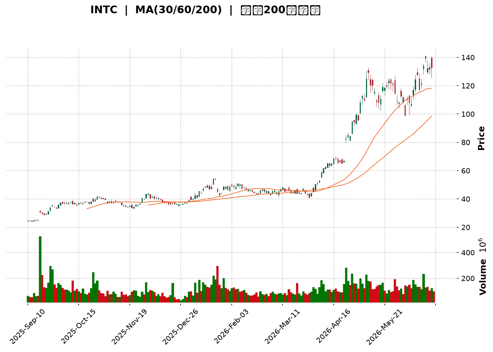
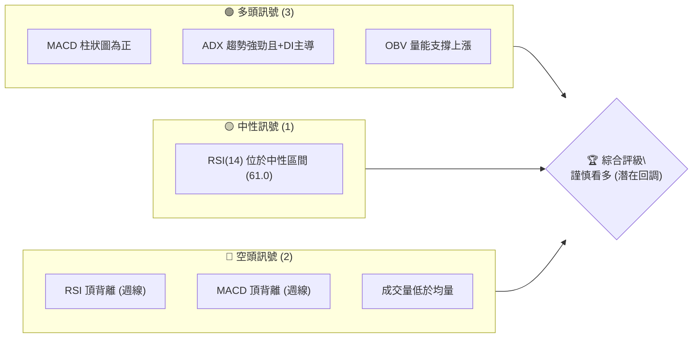
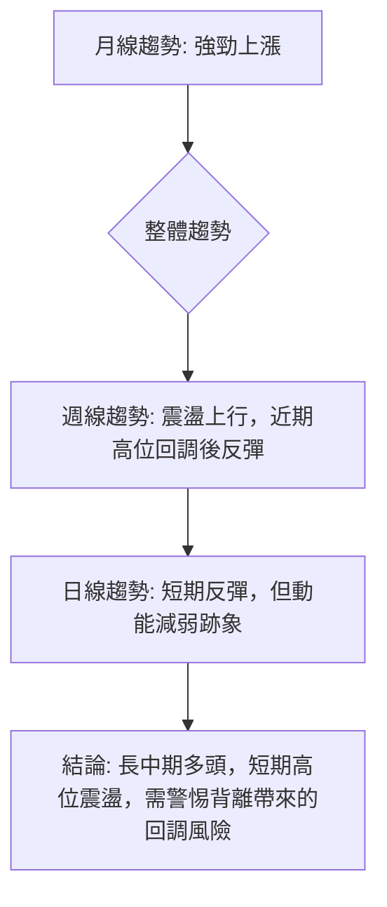
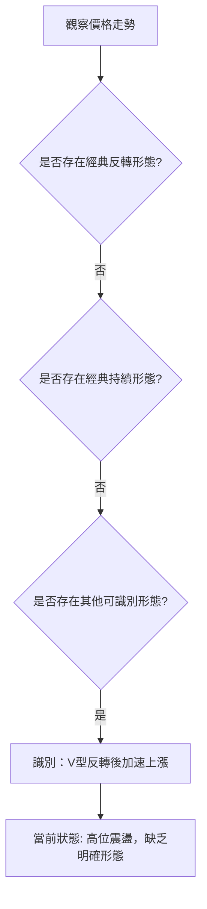
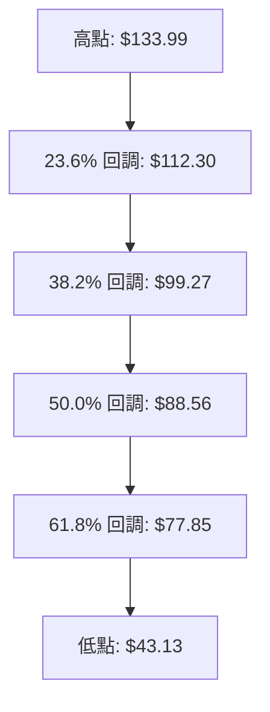
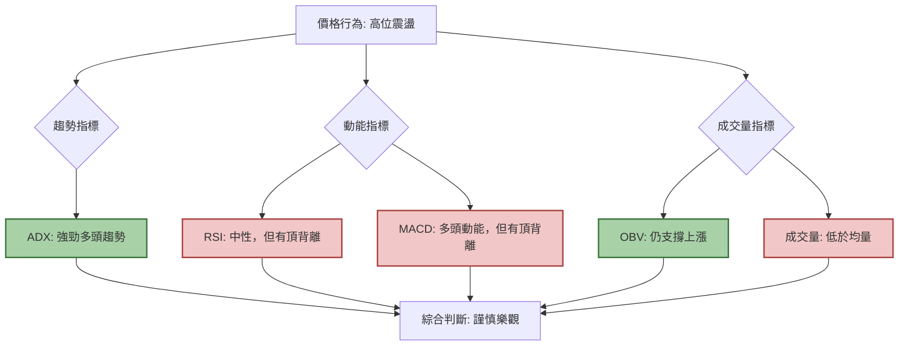
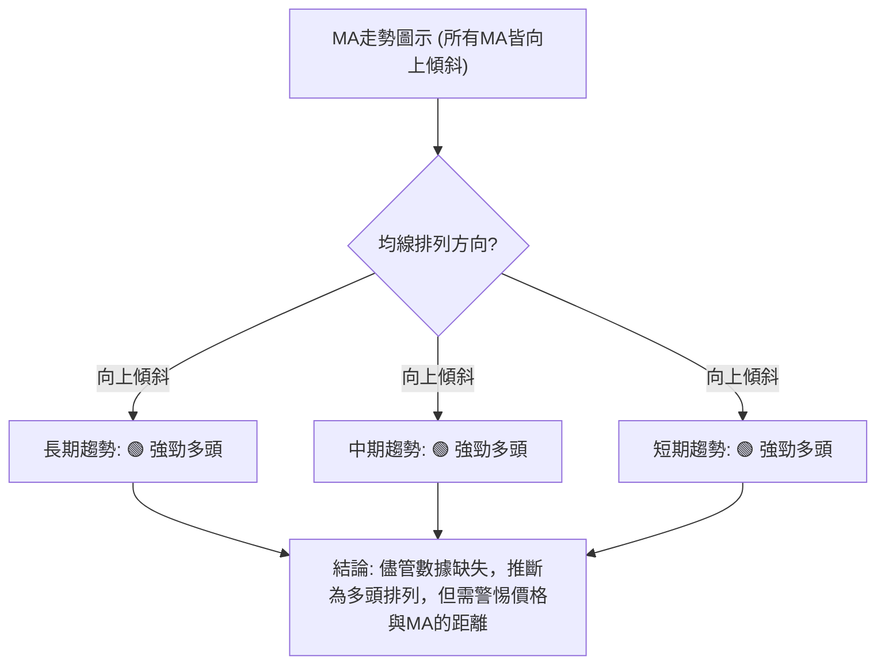

<details>
<summary>📊 靜態圖表 (點擊展開)</summary>

</details>

<html>
<head><meta charset="utf-8" /></head>
<body>
    <div style="height:500px; width:100%;">                        <script>window.PlotlyConfig = {MathJaxConfig: 'local'};</script>
        <script charset="utf-8" src="https://cdn.plot.ly/plotly-3.6.0.min.js" integrity="sha256-QaOVwtVY0T02VaHrr6pnoHLCwayMJp4O5n4YyaE3rJk=" crossorigin="anonymous"></script>                <div id="candlestick-chart" class="plotly-graph-div" style="height:100%; width:100%;"></div>            <script>                window.PLOTLYENV=window.PLOTLYENV || {};                                if (document.getElementById("candlestick-chart")) {                    Plotly.newPlot(                        "candlestick-chart",                        [{"close":{"dtype":"f8","bdata":"AAAAwB7FOEAAAAAAKZw4QAAAAOB6FDhAAAAAwB7FOEAAAADAHkU5QAAAAGBm5jhAAAAAgOuRPkAAAADgepQ9QAAAAGCPwjxAAAAAQApXPUAAAADgUTg\u002fQAAAAGC4\u002fkBAAAAAAADAQUAAAACgcD1BQAAAAGBmxkBAAAAA4FH4QUAAAABgZqZCQAAAAIA9akJAAAAAIIVLQkAAAACAwpVCQAAAAEAKt0JAAAAAYGbmQkAAAAAgXC9CQAAAAAApnEJAAAAA4KPQQUAAAABAM5NCQAAAACCFa0JAAAAAoEeBQkAAAADAzAxDQAAAACBcD0NAAAAAgMJ1QkAAAADgehRDQAAAAADXI0NAAAAAwB7FQ0AAAAAA18NEQAAAACCFq0RAAAAA4HoUREAAAABguP5DQAAAAAAAwENAAAAAANeDQkAAAADgozBDQAAAAGC4nkJAAAAA4KMQQ0AAAACgmTlDQAAAAOCj8EJAAAAAgOvxQkAAAADgevRBQAAAAGCPwkFAAAAAQOFaQUAAAACAPSpBQAAAAIAUjkFAAAAAIFzPQEAAAAAAAEBBQAAAAMAe5UFAAAAAgD3qQUAAAAAgrmdCQAAAACCuR0RAAAAAoEcBREAAAAAAKbxFQAAAAKBH4UVAAAAAAABAREAAAADgerREQAAAAGBmJkRAAAAAAABAREAAAAAA12NEQAAAAKBHwUNAAAAAIK7nQkAAAACgR8FCQAAAACCup0JAAAAAYGYGQkAAAAAA1yNCQAAAAMD1aEJAAAAAIFwvQkAAAADAzCxCQAAAAOB6FEJAAAAAoJkZQkAAAABACldCQAAAAGBmpkJAAAAAQDNzQkAAAADgo7BDQAAAACBcr0NAAAAAwB4FREAAAADgo1BFQAAAAIAUjkRAAAAAYGbGRkAAAAAgrgdGQAAAAMAepUdAAAAAAClcSEAAAADA9ShIQAAAAEDhekdAAAAAIK5HSEAAAAAAACBLQAAAAMD1KEtAAAAAwPWIRkAAAABguD5FQAAAAEAK90VAAAAAANdjSEAAAADgelRIQAAAAAApPEdAAAAAIK5nSEAAAAAAAKBIQAAAAMDMTEhAAAAAYLgeSEAAAAAghUtJQAAAAGC4HklAAAAA4KOQR0AAAADAHiVIQAAAAKBwPUdAAAAAwB5lR0AAAABAChdHQAAAAEDhukZAAAAAIFxPRkAAAACAFA5GQAAAAOCj0EVAAAAAIFwPR0AAAADgo3BHQAAAAEDhukZAAAAAgBTORkAAAAAAAMBGQAAAAMDMjEVAAAAAgD3KRkAAAACgmflGQAAAAIDCtUVAAAAAgD3KRkAAAAAA12NHQAAAAKBw\u002fUdAAAAAAACgRkAAAABgj+JGQAAAAKBH4UZAAAAAIK4HRkAAAAAA14NGQAAAAEAKF0dAAAAAIFzvRUAAAACgRwFGQAAAACCuB0ZAAAAAQAqXR0AAAADAzAxGQAAAAOCjkEVAAAAA4FGYREAAAADgoxBGQAAAAADXA0hAAAAA4KMwSUAAAAAA12NJQAAAAOB6dEpAAAAAoJl5TUAAAAAAKdxOQAAAAOCjME9AAAAAIIVLUEAAAAAgrudPQAAAAAApPFBAAAAAAAAgUUAAAAAAACBRQAAAAMDMbFBAAAAA4KOQUEAAAACgR1FQQAAAAIDrsVBAAAAAYI+iVEAAAAAgXD9VQAAAAKBHIVVAAAAAAACwV0AAAABguJ5XQAAAACCu51hAAAAAgOvxV0AAAACgmQlbQAAAAOCjQFxAAAAAIK5nW0AAAABA4TpfQAAAAIAULmBAAAAAQAonXkAAAABgjxJeQAAAACCF+1xAAAAAoEcxW0AAAABA4QpbQAAAAEAzs1tAAAAAoHC9XUAAAAAAAKBdQAAAAIDC9V1AAAAAoEfhXkAAAACgR3FeQAAAAMD1OF5AAAAAIIWrXEAAAADAHlVbQAAAACCF+1pAAAAAoHAtXEAAAACA6\u002fFbQAAAAEDhylhAAAAAoEeRW0AAAABA4fpaQAAAAGCPwlpAAAAAoHA9XUAAAADgeiRfQAAAAEAK919AAAAAQDNDXUAAAABgZkZeQAAAACCuv2BAAAAAgBSeYUAAAADA9YhgQAAAAMDMdGBAAAAAANebYEAAAAAAAAD4fw=="},"high":{"dtype":"f8","bdata":"AAAAYLjeOEAAAACAFO44QAAAAKBHoThAAAAAgMJ1OUAAAABAClc5QAAAAGCPQjlAAAAA4KMwQEAAAACgR6E+QAAAAKCZGT5AAAAAQDMzPkAAAABAM7M\u002fQAAAAAAAIEFAAAAAYGYmQkAAAABgZoZBQAAAAGC4HkFAAAAAIK4HQkAAAADA9chCQAAAAIA9CkNAAAAAQApXQ0AAAABgZgZDQAAAAMAe5UJAAAAAwMwMQ0AAAABAM9NDQAAAAKBHwUJAAAAAYGZGQkAAAABguL5CQAAAAGCPAkNAAAAA4KMwQ0AAAABgj0JDQAAAAMDMLENAAAAAQAr3QkAAAABAMzNDQAAAACBcj0RAAAAAgMJVREAAAACgcD1FQAAAAMAeBUVAAAAAQAq3REAAAACAPWpEQAAAAKCZOURAAAAAAAAgQ0AAAADgUVhDQAAAACCF60NAAAAAYI8iQ0AAAAAA18NDQAAAAAApHENAAAAAoJkZQ0AAAAAgrqdCQAAAAMDMDEJAAAAAoHDdQUAAAACgR2FBQAAAAAAA4EFAAAAAQApXQkAAAACgcH1BQAAAAOB6FEJAAAAA4KMQQkAAAABguJ5CQAAAACCFS0RAAAAA4KMwREAAAABACtdFQAAAAGCPAkZAAAAAANejRUAAAACAPWpFQAAAACBcD0VAAAAAoEehREAAAABguH5EQAAAAOBRGERAAAAAANcDREAAAACgcD1DQAAAAEDh+kJAAAAAIIXrQkAAAABguL5CQAAAAIA9ykJAAAAAQDPzQkAAAABgZmZCQAAAAEAKF0JAAAAAYLg+QkAAAABgZmZCQAAAAKBHIUNAAAAAgD3KQkAAAACAFO5DQAAAAMDMDEVAAAAAIK4nREAAAADA9UhGQAAAACCFq0VAAAAAoHDdRkAAAACgmblGQAAAAGC4HkhAAAAAAACASEAAAACA6zFJQAAAAEDhGklAAAAAoHAdSUAAAADgejRLQAAAAMDMTEtAAAAA4KMQSEAAAABA4TpGQAAAAADXQ0ZAAAAAwB6lSEAAAABgj2JIQAAAAIA9ykhAAAAAIIXrSEAAAABguL5JQAAAAKCZ2UhAAAAAgBRuSUAAAABgZqZJQAAAAAApnElAAAAAwB5FSUAAAABgZsZIQAAAAKCZeUhAAAAA4FHYR0AAAACAPWpHQAAAAGCPYkdAAAAAgMKVRkAAAACA6zFGQAAAAGBmRkZAAAAAwMxMR0AAAAAAKXxHQAAAAKCZeUdAAAAAIK5HR0AAAAAgrudGQAAAAOBR2EVAAAAA4KMQR0AAAACgcD1HQAAAAEAKl0ZAAAAAoEfhRkAAAADgo\u002fBHQAAAAIA9akhAAAAA4FG4R0AAAABAM1NHQAAAAIDClUhAAAAAgD0KR0AAAABA4dpGQAAAAOBROEdAAAAAYGbGR0AAAABA4bpGQAAAACCuJ0ZAAAAAwMzsR0AAAADAzExHQAAAAOCjEEZAAAAAYLj+RUAAAACgcB1GQAAAAGCPYkhAAAAAYLg+SUAAAACA6zFKQAAAAGCPokpAAAAAgMKVTUAAAACAPQpPQAAAAIDrsU9AAAAAoJlpUEAAAAAghUtQQAAAAIDCdVBAAAAAQAonUUAAAADAHpVRQAAAAKBwTVFAAAAAQOHqUEAAAACgRzFRQAAAAIDrEVFAAAAAgBROVUAAAABgZsZVQAAAAIDCJVVAAAAAwMy8V0AAAAAAKexXQAAAAMDMHFlAAAAA4Hr0WEAAAABguJ5bQAAAAAAAYFxAAAAA4KOgXEAAAACAPVJgQAAAAAAAmGBAAAAAYI\u002fyX0AAAAAAAEBfQAAAAOB6pF1AAAAA4HqkW0AAAABgj+JcQAAAAOB6RFxAAAAAACl8XkAAAACAPdpdQAAAAIDrsV5AAAAAIK5nX0AAAACgR1FfQAAAAMAexV5AAAAAwPWoX0AAAABAM1NcQAAAAAAAQFtAAAAAYI+SXUAAAADA9UhcQAAAAGC4nlpAAAAAYI8iXEAAAAAAAIBcQAAAAAAA4FtAAAAAACncXUAAAABgZuZfQAAAACCFk2BAAAAAYGYWYEAAAADAzExfQAAAACBc72BAAAAAYGauYUAAAAAgXD9hQAAAAGCPAmFAAAAAQAqXYUAAAAAAAAD4fw=="},"hovertemplate":"\u003cb\u003e%{x|%Y-%m-%d}\u003c\u002fb\u003e\u003cbr\u003e\u958b: $%{open:.2f}\u003cbr\u003e\u9ad8: $%{high:.2f}\u003cbr\u003e\u4f4e: $%{low:.2f}\u003cbr\u003e\u6536: $%{close:.2f}\u003cextra\u003e\u003c\u002fextra\u003e","low":{"dtype":"f8","bdata":"AAAAIK5HOEAAAACA65E4QAAAAMDMDDhAAAAA4FE4OEAAAADgo7A4QAAAAEAzczhAAAAAwPUoPkAAAADgelQ9QAAAAEDhujxAAAAAgOvRPEAAAABA4To9QAAAAIDCNT9AAAAAYLg+QUAAAACgcN1AQAAAAGCPgkBAAAAAAADAQEAAAADgUbhBQAAAAKCZOUJAAAAAQAo3QkAAAADAzCxCQAAAAOB69EFAAAAAgBRuQkAAAABgZiZCQAAAAADXI0JAAAAA4FFYQUAAAACA69FBQAAAAOB6NEJAAAAAgD0KQkAAAAAgrsdCQAAAAIDC1UJAAAAAwB4FQkAAAABACjdCQAAAAIA96kJAAAAAoHAdQ0AAAADAHsVDQAAAAIDCdURAAAAAgBQOREAAAADAHuVDQAAAAGBmhkNAAAAA4KNQQkAAAACAFI5CQAAAAGBmZkJAAAAAACl8QkAAAAAAKfxCQAAAAGC4vkJAAAAAwMysQkAAAACgmblBQAAAACBcT0FAAAAAoHAdQUAAAADA9chAQAAAAAAAIEFAAAAAoHC9QEAAAACA63FAQAAAAOBRWEFAAAAAQApXQUAAAADgoxBCQAAAACCFq0JAAAAAwMzMQ0AAAABgZgZEQAAAAKBHQUVAAAAAgOsRREAAAABAM5NEQAAAAKCZ2UNAAAAAANcDREAAAACA63FDQAAAAIA9ikNAAAAAIFzPQkAAAADA9ahCQAAAAIDCdUJAAAAAACn8QUAAAACAwtVBQAAAAOBROEJAAAAAwB4lQkAAAAAA1wNCQAAAAKCZeUFAAAAAwMzsQUAAAADA9ehBQAAAAMD1aEJAAAAAIFxvQkAAAACgR+FCQAAAAGCPokNAAAAAoJl5Q0AAAAAgXA9EQAAAAEAKV0RAAAAAwPXIREAAAACA6\u002fFFQAAAAAApnEZAAAAAgMK1R0AAAACAPepHQAAAAEDhWkdAAAAAAACAR0AAAABAMxNJQAAAAIA9ikpAAAAAoJk5RkAAAAAA1yNFQAAAAMDMjEVAAAAAwPUoR0AAAABguH5HQAAAAEDh+kZAAAAAAADARkAAAABACjdIQAAAAAAAgEdAAAAAwB5lR0AAAACAPWpIQAAAACCFy0dAAAAAYI9iR0AAAACAFG5HQAAAAOBRGEdAAAAAACl8RkAAAABA4bpGQAAAAOCjcEZAAAAAgML1RUAAAADgo3BFQAAAAEAKl0VAAAAAwB7FRUAAAACAPYpGQAAAAIDrMUZAAAAAQDMzRkAAAACgmflFQAAAAIDrEUVAAAAAYI+iRUAAAACgmVlGQAAAAADXo0VAAAAAgOvRREAAAADgerRGQAAAAOB6VEdAAAAAgMKVRkAAAACA67FGQAAAAOBR2EZAAAAA4Hr0RUAAAABgZgZGQAAAAEAz00VAAAAAgOvRRUAAAABguN5FQAAAAKCZmUVAAAAAoJm5RkAAAACAwvVFQAAAAIAUbkVAAAAA4KNQREAAAADAzMxEQAAAAKBwfUZAAAAAwB4FR0AAAAAgXO9IQAAAAAApnElAAAAAYGZmS0AAAACA6zFNQAAAAAAAYE5AAAAAQAoXT0AAAAAghQtPQAAAAOCjcE9AAAAAoEcRUEAAAAAgXO9QQAAAAIAUHlBAAAAAwPVoUEAAAABguD5QQAAAAEDhWlBAAAAAIK7nU0AAAABACqdUQAAAAEAzM1RAAAAAIK53VUAAAAAAAOBWQAAAAEAKJ1dAAAAAYGbmV0AAAADAHgVZQAAAAMAepVpAAAAAoJlJW0AAAABAM\u002fNbQAAAAEDh+l5AAAAAAADAXEAAAACAPRpdQAAAAEDhSlxAAAAAoEdBWkAAAABgZvZZQAAAAKCZmVlAAAAAQDOzXEAAAABA4UpcQAAAAIDChV1AAAAAYGZWXUAAAAAAAEBdQAAAAADXE11AAAAAYI9iXEAAAADAHpVaQAAAAEDhClpAAAAAQAq3W0AAAABguN5aQAAAAMAelVhAAAAAgD2qWkAAAACgcN1YQAAAAEDhOlpAAAAA4KOgW0AAAADAHtVcQAAAAIA9ql9AAAAAAAAAXUAAAAAA14NdQAAAAKCZ+V9AAAAAYLgGYUAAAACgmQlgQAAAAMDM\u002fF9AAAAAgD1aX0AAAAAAAAD4fw=="},"name":"\u50f9\u683c","open":{"dtype":"f8","bdata":"AAAAIIVrOEAAAABgj8I4QAAAAAApnDhAAAAA4HpUOEAAAACA69E4QAAAAOB6FDlAAAAAIK7HP0AAAACgR2E+QAAAACCFqz1AAAAAoHD9PEAAAACgR2E9QAAAAAApnD9AAAAAYI+CQUAAAABgj0JBQAAAAEAK90BAAAAAANfDQEAAAACgR+FBQAAAAKCZ+UJAAAAA4FGYQkAAAACA61FCQAAAAGBmRkJAAAAAANfDQkAAAABA4TpDQAAAAOBROEJAAAAAAAAAQkAAAABAMzNCQAAAAEAzk0JAAAAAgBQuQkAAAADA9chCQAAAAIDrEUNAAAAAIIXrQkAAAADAzExCQAAAAGCPAkRAAAAAgOsxQ0AAAAAghctDQAAAAMDMzERAAAAAACl8REAAAABACldEQAAAAAAAIERAAAAAgOsRQ0AAAACAwrVCQAAAACCFK0NAAAAAoEehQkAAAABACndDQAAAAEAzE0NAAAAAIK4HQ0AAAABgj6JCQAAAAADXg0FAAAAAoJm5QUAAAAAAACBBQAAAAIA9KkFAAAAAAAAAQkAAAACgR8FAQAAAAAApfEFAAAAAYGbGQUAAAACgmRlCQAAAAEAzs0JAAAAAgBTuQ0AAAAAAKTxEQAAAAIDrsUVAAAAAoEehRUAAAADgepREQAAAAOBR+ERAAAAAoHBdREAAAACAFA5EQAAAAMD1CERAAAAAAACgQ0AAAACAPSpDQAAAAIA9ykJAAAAAIIXLQkAAAADgo7BCQAAAAKBwPUJAAAAAgOvxQkAAAABguB5CQAAAAIDClUFAAAAAgMIVQkAAAACgRwFCQAAAAOB6dEJAAAAAQDOzQkAAAABgj+JCQAAAACCFy0RAAAAAgBTuQ0AAAABAChdEQAAAACBcT0VAAAAAgD3qREAAAABguB5GQAAAAIDr8UZAAAAAoJl5SEAAAADAzKxIQAAAAGCPokhAAAAAYGamR0AAAADA9ShJQAAAAEDhGktAAAAAgBRuR0AAAAAA1yNGQAAAAAAp\u002fEVAAAAAwMxMR0AAAAAgrsdHQAAAAKBwfUhAAAAA4KPQRkAAAAAgrgdJQAAAAMAexUhAAAAAIIXLR0AAAADAzIxIQAAAACCFy0hAAAAA4Ho0SUAAAACAFA5IQAAAAGBm5kdAAAAAoEfhRkAAAABACvdGQAAAAIDC9UZAAAAAoJl5RkAAAACA6\u002fFFQAAAACCFC0ZAAAAAwMwMRkAAAAAghQtHQAAAAGCPYkdAAAAAQOE6RkAAAACgmRlGQAAAAOBRuEVAAAAAwPUIRkAAAAAgXG9GQAAAAIDCVUZAAAAAYLheRUAAAADgerRGQAAAAMD1aEdAAAAAQDOzR0AAAAAAKfxGQAAAAOB69EdAAAAAgD0KR0AAAACgmRlGQAAAAGC4\u002fkVAAAAAoJl5R0AAAAAAAEBGQAAAAMAexUVAAAAAwMzsRkAAAABgZiZHQAAAACBcz0VAAAAAACncRUAAAACgmflEQAAAAAAAgEZAAAAAIK4HR0AAAADgo3BJQAAAAOB69ElAAAAAIFyvS0AAAABAMzNNQAAAAGCPwk5AAAAAQAoXT0AAAACAPUpQQAAAAGCP4k9AAAAAIIU7UEAAAABgZjZRQAAAAMDMHFFAAAAAwPXIUEAAAAAAKfxQQAAAAGBmhlBAAAAAwMyMVEAAAABA4epUQAAAAIDrUVRAAAAAwPWIVUAAAABgZuZXQAAAAMDMTFdAAAAAIIXLWEAAAADgoyBZQAAAAGC4vltAAAAAoEfBW0AAAAAA1\u002fNbQAAAAAApXGBAAAAAQAoXX0AAAABgZgZfQAAAAIA9qlxAAAAAYI9yW0AAAACAFF5cQAAAAGC4vlpAAAAAgBQOXUAAAADAHiVdQAAAAIDCFV5AAAAAYGaGXkAAAADA9RhfQAAAAMDMXF5AAAAAYGb2XkAAAAAghVtbQAAAAMDM3FpAAAAAQOEaXUAAAACgmRlbQAAAAGC4nlpAAAAAAADAW0AAAAAgXD9cQAAAAIDrgVpAAAAAoEdhXEAAAABA4VpdQAAAACCuL2BAAAAAQApHX0AAAABgZnZeQAAAAIDreWBAAAAAANdjYUAAAAAgXDdgQAAAAKCZoWBAAAAAIFx3YUAAAAAAAAD4fw=="},"x":["2025-09-10T00:00:00-04:00","2025-09-11T00:00:00-04:00","2025-09-12T00:00:00-04:00","2025-09-15T00:00:00-04:00","2025-09-16T00:00:00-04:00","2025-09-17T00:00:00-04:00","2025-09-18T00:00:00-04:00","2025-09-19T00:00:00-04:00","2025-09-22T00:00:00-04:00","2025-09-23T00:00:00-04:00","2025-09-24T00:00:00-04:00","2025-09-25T00:00:00-04:00","2025-09-26T00:00:00-04:00","2025-09-29T00:00:00-04:00","2025-09-30T00:00:00-04:00","2025-10-01T00:00:00-04:00","2025-10-02T00:00:00-04:00","2025-10-03T00:00:00-04:00","2025-10-06T00:00:00-04:00","2025-10-07T00:00:00-04:00","2025-10-08T00:00:00-04:00","2025-10-09T00:00:00-04:00","2025-10-10T00:00:00-04:00","2025-10-13T00:00:00-04:00","2025-10-14T00:00:00-04:00","2025-10-15T00:00:00-04:00","2025-10-16T00:00:00-04:00","2025-10-17T00:00:00-04:00","2025-10-20T00:00:00-04:00","2025-10-21T00:00:00-04:00","2025-10-22T00:00:00-04:00","2025-10-23T00:00:00-04:00","2025-10-24T00:00:00-04:00","2025-10-27T00:00:00-04:00","2025-10-28T00:00:00-04:00","2025-10-29T00:00:00-04:00","2025-10-30T00:00:00-04:00","2025-10-31T00:00:00-04:00","2025-11-03T00:00:00-05:00","2025-11-04T00:00:00-05:00","2025-11-05T00:00:00-05:00","2025-11-06T00:00:00-05:00","2025-11-07T00:00:00-05:00","2025-11-10T00:00:00-05:00","2025-11-11T00:00:00-05:00","2025-11-12T00:00:00-05:00","2025-11-13T00:00:00-05:00","2025-11-14T00:00:00-05:00","2025-11-17T00:00:00-05:00","2025-11-18T00:00:00-05:00","2025-11-19T00:00:00-05:00","2025-11-20T00:00:00-05:00","2025-11-21T00:00:00-05:00","2025-11-24T00:00:00-05:00","2025-11-25T00:00:00-05:00","2025-11-26T00:00:00-05:00","2025-11-28T00:00:00-05:00","2025-12-01T00:00:00-05:00","2025-12-02T00:00:00-05:00","2025-12-03T00:00:00-05:00","2025-12-04T00:00:00-05:00","2025-12-05T00:00:00-05:00","2025-12-08T00:00:00-05:00","2025-12-09T00:00:00-05:00","2025-12-10T00:00:00-05:00","2025-12-11T00:00:00-05:00","2025-12-12T00:00:00-05:00","2025-12-15T00:00:00-05:00","2025-12-16T00:00:00-05:00","2025-12-17T00:00:00-05:00","2025-12-18T00:00:00-05:00","2025-12-19T00:00:00-05:00","2025-12-22T00:00:00-05:00","2025-12-23T00:00:00-05:00","2025-12-24T00:00:00-05:00","2025-12-26T00:00:00-05:00","2025-12-29T00:00:00-05:00","2025-12-30T00:00:00-05:00","2025-12-31T00:00:00-05:00","2026-01-02T00:00:00-05:00","2026-01-05T00:00:00-05:00","2026-01-06T00:00:00-05:00","2026-01-07T00:00:00-05:00","2026-01-08T00:00:00-05:00","2026-01-09T00:00:00-05:00","2026-01-12T00:00:00-05:00","2026-01-13T00:00:00-05:00","2026-01-14T00:00:00-05:00","2026-01-15T00:00:00-05:00","2026-01-16T00:00:00-05:00","2026-01-20T00:00:00-05:00","2026-01-21T00:00:00-05:00","2026-01-22T00:00:00-05:00","2026-01-23T00:00:00-05:00","2026-01-26T00:00:00-05:00","2026-01-27T00:00:00-05:00","2026-01-28T00:00:00-05:00","2026-01-29T00:00:00-05:00","2026-01-30T00:00:00-05:00","2026-02-02T00:00:00-05:00","2026-02-03T00:00:00-05:00","2026-02-04T00:00:00-05:00","2026-02-05T00:00:00-05:00","2026-02-06T00:00:00-05:00","2026-02-09T00:00:00-05:00","2026-02-10T00:00:00-05:00","2026-02-11T00:00:00-05:00","2026-02-12T00:00:00-05:00","2026-02-13T00:00:00-05:00","2026-02-17T00:00:00-05:00","2026-02-18T00:00:00-05:00","2026-02-19T00:00:00-05:00","2026-02-20T00:00:00-05:00","2026-02-23T00:00:00-05:00","2026-02-24T00:00:00-05:00","2026-02-25T00:00:00-05:00","2026-02-26T00:00:00-05:00","2026-02-27T00:00:00-05:00","2026-03-02T00:00:00-05:00","2026-03-03T00:00:00-05:00","2026-03-04T00:00:00-05:00","2026-03-05T00:00:00-05:00","2026-03-06T00:00:00-05:00","2026-03-09T00:00:00-04:00","2026-03-10T00:00:00-04:00","2026-03-11T00:00:00-04:00","2026-03-12T00:00:00-04:00","2026-03-13T00:00:00-04:00","2026-03-16T00:00:00-04:00","2026-03-17T00:00:00-04:00","2026-03-18T00:00:00-04:00","2026-03-19T00:00:00-04:00","2026-03-20T00:00:00-04:00","2026-03-23T00:00:00-04:00","2026-03-24T00:00:00-04:00","2026-03-25T00:00:00-04:00","2026-03-26T00:00:00-04:00","2026-03-27T00:00:00-04:00","2026-03-30T00:00:00-04:00","2026-03-31T00:00:00-04:00","2026-04-01T00:00:00-04:00","2026-04-02T00:00:00-04:00","2026-04-06T00:00:00-04:00","2026-04-07T00:00:00-04:00","2026-04-08T00:00:00-04:00","2026-04-09T00:00:00-04:00","2026-04-10T00:00:00-04:00","2026-04-13T00:00:00-04:00","2026-04-14T00:00:00-04:00","2026-04-15T00:00:00-04:00","2026-04-16T00:00:00-04:00","2026-04-17T00:00:00-04:00","2026-04-20T00:00:00-04:00","2026-04-21T00:00:00-04:00","2026-04-22T00:00:00-04:00","2026-04-23T00:00:00-04:00","2026-04-24T00:00:00-04:00","2026-04-27T00:00:00-04:00","2026-04-28T00:00:00-04:00","2026-04-29T00:00:00-04:00","2026-04-30T00:00:00-04:00","2026-05-01T00:00:00-04:00","2026-05-04T00:00:00-04:00","2026-05-05T00:00:00-04:00","2026-05-06T00:00:00-04:00","2026-05-07T00:00:00-04:00","2026-05-08T00:00:00-04:00","2026-05-11T00:00:00-04:00","2026-05-12T00:00:00-04:00","2026-05-13T00:00:00-04:00","2026-05-14T00:00:00-04:00","2026-05-15T00:00:00-04:00","2026-05-18T00:00:00-04:00","2026-05-19T00:00:00-04:00","2026-05-20T00:00:00-04:00","2026-05-21T00:00:00-04:00","2026-05-22T00:00:00-04:00","2026-05-26T00:00:00-04:00","2026-05-27T00:00:00-04:00","2026-05-28T00:00:00-04:00","2026-05-29T00:00:00-04:00","2026-06-01T00:00:00-04:00","2026-06-02T00:00:00-04:00","2026-06-03T00:00:00-04:00","2026-06-04T00:00:00-04:00","2026-06-05T00:00:00-04:00","2026-06-08T00:00:00-04:00","2026-06-09T00:00:00-04:00","2026-06-10T00:00:00-04:00","2026-06-11T00:00:00-04:00","2026-06-12T00:00:00-04:00","2026-06-15T00:00:00-04:00","2026-06-16T00:00:00-04:00","2026-06-17T00:00:00-04:00","2026-06-18T00:00:00-04:00","2026-06-22T00:00:00-04:00","2026-06-23T00:00:00-04:00","2026-06-24T00:00:00-04:00","2026-06-25T00:00:00-04:00","2026-06-26T00:00:00-04:00"],"type":"candlestick"},{"hovertemplate":"MA30: $%{y:.2f}\u003cextra\u003e\u003c\u002fextra\u003e","line":{"color":"#2196F3","dash":"dash","width":2},"mode":"lines","name":"MA30","x":["2025-09-10T00:00:00-04:00","2025-09-11T00:00:00-04:00","2025-09-12T00:00:00-04:00","2025-09-15T00:00:00-04:00","2025-09-16T00:00:00-04:00","2025-09-17T00:00:00-04:00","2025-09-18T00:00:00-04:00","2025-09-19T00:00:00-04:00","2025-09-22T00:00:00-04:00","2025-09-23T00:00:00-04:00","2025-09-24T00:00:00-04:00","2025-09-25T00:00:00-04:00","2025-09-26T00:00:00-04:00","2025-09-29T00:00:00-04:00","2025-09-30T00:00:00-04:00","2025-10-01T00:00:00-04:00","2025-10-02T00:00:00-04:00","2025-10-03T00:00:00-04:00","2025-10-06T00:00:00-04:00","2025-10-07T00:00:00-04:00","2025-10-08T00:00:00-04:00","2025-10-09T00:00:00-04:00","2025-10-10T00:00:00-04:00","2025-10-13T00:00:00-04:00","2025-10-14T00:00:00-04:00","2025-10-15T00:00:00-04:00","2025-10-16T00:00:00-04:00","2025-10-17T00:00:00-04:00","2025-10-20T00:00:00-04:00","2025-10-21T00:00:00-04:00","2025-10-22T00:00:00-04:00","2025-10-23T00:00:00-04:00","2025-10-24T00:00:00-04:00","2025-10-27T00:00:00-04:00","2025-10-28T00:00:00-04:00","2025-10-29T00:00:00-04:00","2025-10-30T00:00:00-04:00","2025-10-31T00:00:00-04:00","2025-11-03T00:00:00-05:00","2025-11-04T00:00:00-05:00","2025-11-05T00:00:00-05:00","2025-11-06T00:00:00-05:00","2025-11-07T00:00:00-05:00","2025-11-10T00:00:00-05:00","2025-11-11T00:00:00-05:00","2025-11-12T00:00:00-05:00","2025-11-13T00:00:00-05:00","2025-11-14T00:00:00-05:00","2025-11-17T00:00:00-05:00","2025-11-18T00:00:00-05:00","2025-11-19T00:00:00-05:00","2025-11-20T00:00:00-05:00","2025-11-21T00:00:00-05:00","2025-11-24T00:00:00-05:00","2025-11-25T00:00:00-05:00","2025-11-26T00:00:00-05:00","2025-11-28T00:00:00-05:00","2025-12-01T00:00:00-05:00","2025-12-02T00:00:00-05:00","2025-12-03T00:00:00-05:00","2025-12-04T00:00:00-05:00","2025-12-05T00:00:00-05:00","2025-12-08T00:00:00-05:00","2025-12-09T00:00:00-05:00","2025-12-10T00:00:00-05:00","2025-12-11T00:00:00-05:00","2025-12-12T00:00:00-05:00","2025-12-15T00:00:00-05:00","2025-12-16T00:00:00-05:00","2025-12-17T00:00:00-05:00","2025-12-18T00:00:00-05:00","2025-12-19T00:00:00-05:00","2025-12-22T00:00:00-05:00","2025-12-23T00:00:00-05:00","2025-12-24T00:00:00-05:00","2025-12-26T00:00:00-05:00","2025-12-29T00:00:00-05:00","2025-12-30T00:00:00-05:00","2025-12-31T00:00:00-05:00","2026-01-02T00:00:00-05:00","2026-01-05T00:00:00-05:00","2026-01-06T00:00:00-05:00","2026-01-07T00:00:00-05:00","2026-01-08T00:00:00-05:00","2026-01-09T00:00:00-05:00","2026-01-12T00:00:00-05:00","2026-01-13T00:00:00-05:00","2026-01-14T00:00:00-05:00","2026-01-15T00:00:00-05:00","2026-01-16T00:00:00-05:00","2026-01-20T00:00:00-05:00","2026-01-21T00:00:00-05:00","2026-01-22T00:00:00-05:00","2026-01-23T00:00:00-05:00","2026-01-26T00:00:00-05:00","2026-01-27T00:00:00-05:00","2026-01-28T00:00:00-05:00","2026-01-29T00:00:00-05:00","2026-01-30T00:00:00-05:00","2026-02-02T00:00:00-05:00","2026-02-03T00:00:00-05:00","2026-02-04T00:00:00-05:00","2026-02-05T00:00:00-05:00","2026-02-06T00:00:00-05:00","2026-02-09T00:00:00-05:00","2026-02-10T00:00:00-05:00","2026-02-11T00:00:00-05:00","2026-02-12T00:00:00-05:00","2026-02-13T00:00:00-05:00","2026-02-17T00:00:00-05:00","2026-02-18T00:00:00-05:00","2026-02-19T00:00:00-05:00","2026-02-20T00:00:00-05:00","2026-02-23T00:00:00-05:00","2026-02-24T00:00:00-05:00","2026-02-25T00:00:00-05:00","2026-02-26T00:00:00-05:00","2026-02-27T00:00:00-05:00","2026-03-02T00:00:00-05:00","2026-03-03T00:00:00-05:00","2026-03-04T00:00:00-05:00","2026-03-05T00:00:00-05:00","2026-03-06T00:00:00-05:00","2026-03-09T00:00:00-04:00","2026-03-10T00:00:00-04:00","2026-03-11T00:00:00-04:00","2026-03-12T00:00:00-04:00","2026-03-13T00:00:00-04:00","2026-03-16T00:00:00-04:00","2026-03-17T00:00:00-04:00","2026-03-18T00:00:00-04:00","2026-03-19T00:00:00-04:00","2026-03-20T00:00:00-04:00","2026-03-23T00:00:00-04:00","2026-03-24T00:00:00-04:00","2026-03-25T00:00:00-04:00","2026-03-26T00:00:00-04:00","2026-03-27T00:00:00-04:00","2026-03-30T00:00:00-04:00","2026-03-31T00:00:00-04:00","2026-04-01T00:00:00-04:00","2026-04-02T00:00:00-04:00","2026-04-06T00:00:00-04:00","2026-04-07T00:00:00-04:00","2026-04-08T00:00:00-04:00","2026-04-09T00:00:00-04:00","2026-04-10T00:00:00-04:00","2026-04-13T00:00:00-04:00","2026-04-14T00:00:00-04:00","2026-04-15T00:00:00-04:00","2026-04-16T00:00:00-04:00","2026-04-17T00:00:00-04:00","2026-04-20T00:00:00-04:00","2026-04-21T00:00:00-04:00","2026-04-22T00:00:00-04:00","2026-04-23T00:00:00-04:00","2026-04-24T00:00:00-04:00","2026-04-27T00:00:00-04:00","2026-04-28T00:00:00-04:00","2026-04-29T00:00:00-04:00","2026-04-30T00:00:00-04:00","2026-05-01T00:00:00-04:00","2026-05-04T00:00:00-04:00","2026-05-05T00:00:00-04:00","2026-05-06T00:00:00-04:00","2026-05-07T00:00:00-04:00","2026-05-08T00:00:00-04:00","2026-05-11T00:00:00-04:00","2026-05-12T00:00:00-04:00","2026-05-13T00:00:00-04:00","2026-05-14T00:00:00-04:00","2026-05-15T00:00:00-04:00","2026-05-18T00:00:00-04:00","2026-05-19T00:00:00-04:00","2026-05-20T00:00:00-04:00","2026-05-21T00:00:00-04:00","2026-05-22T00:00:00-04:00","2026-05-26T00:00:00-04:00","2026-05-27T00:00:00-04:00","2026-05-28T00:00:00-04:00","2026-05-29T00:00:00-04:00","2026-06-01T00:00:00-04:00","2026-06-02T00:00:00-04:00","2026-06-03T00:00:00-04:00","2026-06-04T00:00:00-04:00","2026-06-05T00:00:00-04:00","2026-06-08T00:00:00-04:00","2026-06-09T00:00:00-04:00","2026-06-10T00:00:00-04:00","2026-06-11T00:00:00-04:00","2026-06-12T00:00:00-04:00","2026-06-15T00:00:00-04:00","2026-06-16T00:00:00-04:00","2026-06-17T00:00:00-04:00","2026-06-18T00:00:00-04:00","2026-06-22T00:00:00-04:00","2026-06-23T00:00:00-04:00","2026-06-24T00:00:00-04:00","2026-06-25T00:00:00-04:00","2026-06-26T00:00:00-04:00"],"y":{"dtype":"f8","bdata":"AAAAAAAA+H8AAAAAAAD4fwAAAAAAAPh\u002fAAAAAAAA+H8AAAAAAAD4fwAAAAAAAPh\u002fAAAAAAAA+H8AAAAAAAD4fwAAAAAAAPh\u002fAAAAAAAA+H8AAAAAAAD4fwAAAAAAAPh\u002fAAAAAAAA+H8AAAAAAAD4fwAAAAAAAPh\u002fAAAAAAAA+H8AAAAAAAD4fwAAAAAAAPh\u002fAAAAAAAA+H8AAAAAAAD4fwAAAAAAAPh\u002fAAAAAAAA+H8AAAAAAAD4fwAAAAAAAPh\u002fAAAAAAAA+H8AAAAAAAD4fwAAAAAAAPh\u002fAAAAAAAA+H8AAAAAAAD4f1VVVR3Mg0BA7+7uJqO3QEBVVVVdc\u002fFAQM3MzIwJLkFAREREVA5tQUBVVVWVbrJBQKuqqnKT+EFAERERSX4hQkCJiIjI6E1CQCIiIrq7e0JAmpmZQYucQkAzMzPjF7tCQBEREcH1yEJAq6qqai7UQkB3d3e3HuVCQLy7uzuY90JAd3d3J+r\u002fQkB3d3fn+\u002flCQImIiAhl9EJAIiIikl\u002fsQkCamZmJQeBCQKuqqnpb1kJA3t3dzYXEQkBEREREi7xCQDMzM1NxtkJAd3d3x0u3QkCJiIho2LVCQERERKS3xUJAERERcYTSQkCrqqrqbelCQM3MzEx+AUNA3t3dncQQQ0C8u7t7oh5DQM3MzNxAJ0NAAAAAcFkrQ0DNzMw8JihDQDMzM2NXIENAAAAAkFAWQ0DNzMy8uwtDQM3MzKxjAkNAERERQTX+QkDe3d19P\u002fVCQM3MzLx080JAiYiIWPLrQkBVVVWV\u002fOJCQCIiIuKl20JARERE9G\u002fUQkAAAAAAuddCQLy7uztR30JAzczMTKnoQkDv7u4+Nf5CQM3MzExiEENAd3d3p8YrQ0CJiIjIdk5DQERERKQpZUNAiYiIeKKOQ0B3d3dnka1DQLy7u1tIykNAERERAXLvQ0Dv7u5+IwREQAAAAMDKEURAvLu7ay40REAAAAAg92pEQERERLTIpkRAzczMXEi6REBEREQklMFEQGZmZvZv1ERAAAAAID4DRUBmZmbm0DJFQAAAABDmWUVAMzMzY1eQRUBmZmYWrsdFQM3MzPzw+UVAIiIiMpYsRkAzMzMTWGlGQBERETFrpUZAq6qqqg3URkAiIiLilgVHQEREROTBLEdAiYiIaPRWR0AiIiLS93NHQJqZmbnzjUdA3t3dTX6hR0C8u7vbzqdHQO\u002fu7l6PskdAZmZm9v20R0B3d3cnBsFHQN7d3U03uUdAq6qqWvKrR0CamZkp6p9HQDMzMwNyj0dA7+7uDruCR0Dv7u4+UV9HQJqZmYnPMEdAiYiImPwyR0CrqqpqSkVHQImIiBiSVkdAVVVVZYJHR0Dv7u6+LTtHQLy7uzsmOEdAd3d39+EjR0CamZmZ4BFHQBEREVGNB0dAvLu7G+j0RkDe3d391NhGQImIiMh2vkZAVVVVZa2+RkC8u7vLzKxGQERERLSBnkZAIiIiAp2GRkDNzMzc3X1GQM3MzPzUiEZAIiIicmihRkDNzMzc3b1GQImIiBh25UZAERER4TMcR0De3d0dhVtHQFVVVUW2o0dA3t3d7TX3R0BVVVVVVUVIQBEREXGEokhAERERMU8ESUDe3d3NhWRJQBEREYGVw0lARERElNEbSkBmZmaWtWpKQDMzMzPsukpAMzMz0wZaS0BVVVWFXQFMQGZmZsa9pkxAVVVVxQR\u002fTUDNzMxcAVJOQImIiBgENk9ARERE1L8JUECrqqrSlJJQQHd3d7esJVFAiYiISOGqUUB3d3fHS1dSQERERIxsD1NAVVVVddq4U0ARERH5U1tUQFVVVW0u7FRAZmZmJr9oVUDe3d29LeNVQO\u002fu7matXlZAzczM3LLeVkAAAABQ1FdXQJqZmSFp0ldAREREjN5OWEDv7u5uhMpYQHd3d5fgQVlAd3d3B2WkWUB3d3enf\u002ftZQN7d3d2WVVpAIiIiwq64WkC8u7tr5xtbQN7d3a0AYVtARERE9CicW0CrqqrKE81bQHd3d7ce\u002fVtAZmZmVoAsXEDNzMx8sWxcQKuqqkrwqFxAzczMjFDWXECamZn58PFcQKuqqtqyHl1AAAAAwINhXUCrqqpKN3FdQN7d3T3udV1AVVVV1RWQXUAAAAAAAAD4fw=="},"type":"scatter"},{"hovertemplate":"MA60: $%{y:.2f}\u003cextra\u003e\u003c\u002fextra\u003e","line":{"color":"#9C27B0","dash":"dash","width":2},"mode":"lines","name":"MA60","x":["2025-09-10T00:00:00-04:00","2025-09-11T00:00:00-04:00","2025-09-12T00:00:00-04:00","2025-09-15T00:00:00-04:00","2025-09-16T00:00:00-04:00","2025-09-17T00:00:00-04:00","2025-09-18T00:00:00-04:00","2025-09-19T00:00:00-04:00","2025-09-22T00:00:00-04:00","2025-09-23T00:00:00-04:00","2025-09-24T00:00:00-04:00","2025-09-25T00:00:00-04:00","2025-09-26T00:00:00-04:00","2025-09-29T00:00:00-04:00","2025-09-30T00:00:00-04:00","2025-10-01T00:00:00-04:00","2025-10-02T00:00:00-04:00","2025-10-03T00:00:00-04:00","2025-10-06T00:00:00-04:00","2025-10-07T00:00:00-04:00","2025-10-08T00:00:00-04:00","2025-10-09T00:00:00-04:00","2025-10-10T00:00:00-04:00","2025-10-13T00:00:00-04:00","2025-10-14T00:00:00-04:00","2025-10-15T00:00:00-04:00","2025-10-16T00:00:00-04:00","2025-10-17T00:00:00-04:00","2025-10-20T00:00:00-04:00","2025-10-21T00:00:00-04:00","2025-10-22T00:00:00-04:00","2025-10-23T00:00:00-04:00","2025-10-24T00:00:00-04:00","2025-10-27T00:00:00-04:00","2025-10-28T00:00:00-04:00","2025-10-29T00:00:00-04:00","2025-10-30T00:00:00-04:00","2025-10-31T00:00:00-04:00","2025-11-03T00:00:00-05:00","2025-11-04T00:00:00-05:00","2025-11-05T00:00:00-05:00","2025-11-06T00:00:00-05:00","2025-11-07T00:00:00-05:00","2025-11-10T00:00:00-05:00","2025-11-11T00:00:00-05:00","2025-11-12T00:00:00-05:00","2025-11-13T00:00:00-05:00","2025-11-14T00:00:00-05:00","2025-11-17T00:00:00-05:00","2025-11-18T00:00:00-05:00","2025-11-19T00:00:00-05:00","2025-11-20T00:00:00-05:00","2025-11-21T00:00:00-05:00","2025-11-24T00:00:00-05:00","2025-11-25T00:00:00-05:00","2025-11-26T00:00:00-05:00","2025-11-28T00:00:00-05:00","2025-12-01T00:00:00-05:00","2025-12-02T00:00:00-05:00","2025-12-03T00:00:00-05:00","2025-12-04T00:00:00-05:00","2025-12-05T00:00:00-05:00","2025-12-08T00:00:00-05:00","2025-12-09T00:00:00-05:00","2025-12-10T00:00:00-05:00","2025-12-11T00:00:00-05:00","2025-12-12T00:00:00-05:00","2025-12-15T00:00:00-05:00","2025-12-16T00:00:00-05:00","2025-12-17T00:00:00-05:00","2025-12-18T00:00:00-05:00","2025-12-19T00:00:00-05:00","2025-12-22T00:00:00-05:00","2025-12-23T00:00:00-05:00","2025-12-24T00:00:00-05:00","2025-12-26T00:00:00-05:00","2025-12-29T00:00:00-05:00","2025-12-30T00:00:00-05:00","2025-12-31T00:00:00-05:00","2026-01-02T00:00:00-05:00","2026-01-05T00:00:00-05:00","2026-01-06T00:00:00-05:00","2026-01-07T00:00:00-05:00","2026-01-08T00:00:00-05:00","2026-01-09T00:00:00-05:00","2026-01-12T00:00:00-05:00","2026-01-13T00:00:00-05:00","2026-01-14T00:00:00-05:00","2026-01-15T00:00:00-05:00","2026-01-16T00:00:00-05:00","2026-01-20T00:00:00-05:00","2026-01-21T00:00:00-05:00","2026-01-22T00:00:00-05:00","2026-01-23T00:00:00-05:00","2026-01-26T00:00:00-05:00","2026-01-27T00:00:00-05:00","2026-01-28T00:00:00-05:00","2026-01-29T00:00:00-05:00","2026-01-30T00:00:00-05:00","2026-02-02T00:00:00-05:00","2026-02-03T00:00:00-05:00","2026-02-04T00:00:00-05:00","2026-02-05T00:00:00-05:00","2026-02-06T00:00:00-05:00","2026-02-09T00:00:00-05:00","2026-02-10T00:00:00-05:00","2026-02-11T00:00:00-05:00","2026-02-12T00:00:00-05:00","2026-02-13T00:00:00-05:00","2026-02-17T00:00:00-05:00","2026-02-18T00:00:00-05:00","2026-02-19T00:00:00-05:00","2026-02-20T00:00:00-05:00","2026-02-23T00:00:00-05:00","2026-02-24T00:00:00-05:00","2026-02-25T00:00:00-05:00","2026-02-26T00:00:00-05:00","2026-02-27T00:00:00-05:00","2026-03-02T00:00:00-05:00","2026-03-03T00:00:00-05:00","2026-03-04T00:00:00-05:00","2026-03-05T00:00:00-05:00","2026-03-06T00:00:00-05:00","2026-03-09T00:00:00-04:00","2026-03-10T00:00:00-04:00","2026-03-11T00:00:00-04:00","2026-03-12T00:00:00-04:00","2026-03-13T00:00:00-04:00","2026-03-16T00:00:00-04:00","2026-03-17T00:00:00-04:00","2026-03-18T00:00:00-04:00","2026-03-19T00:00:00-04:00","2026-03-20T00:00:00-04:00","2026-03-23T00:00:00-04:00","2026-03-24T00:00:00-04:00","2026-03-25T00:00:00-04:00","2026-03-26T00:00:00-04:00","2026-03-27T00:00:00-04:00","2026-03-30T00:00:00-04:00","2026-03-31T00:00:00-04:00","2026-04-01T00:00:00-04:00","2026-04-02T00:00:00-04:00","2026-04-06T00:00:00-04:00","2026-04-07T00:00:00-04:00","2026-04-08T00:00:00-04:00","2026-04-09T00:00:00-04:00","2026-04-10T00:00:00-04:00","2026-04-13T00:00:00-04:00","2026-04-14T00:00:00-04:00","2026-04-15T00:00:00-04:00","2026-04-16T00:00:00-04:00","2026-04-17T00:00:00-04:00","2026-04-20T00:00:00-04:00","2026-04-21T00:00:00-04:00","2026-04-22T00:00:00-04:00","2026-04-23T00:00:00-04:00","2026-04-24T00:00:00-04:00","2026-04-27T00:00:00-04:00","2026-04-28T00:00:00-04:00","2026-04-29T00:00:00-04:00","2026-04-30T00:00:00-04:00","2026-05-01T00:00:00-04:00","2026-05-04T00:00:00-04:00","2026-05-05T00:00:00-04:00","2026-05-06T00:00:00-04:00","2026-05-07T00:00:00-04:00","2026-05-08T00:00:00-04:00","2026-05-11T00:00:00-04:00","2026-05-12T00:00:00-04:00","2026-05-13T00:00:00-04:00","2026-05-14T00:00:00-04:00","2026-05-15T00:00:00-04:00","2026-05-18T00:00:00-04:00","2026-05-19T00:00:00-04:00","2026-05-20T00:00:00-04:00","2026-05-21T00:00:00-04:00","2026-05-22T00:00:00-04:00","2026-05-26T00:00:00-04:00","2026-05-27T00:00:00-04:00","2026-05-28T00:00:00-04:00","2026-05-29T00:00:00-04:00","2026-06-01T00:00:00-04:00","2026-06-02T00:00:00-04:00","2026-06-03T00:00:00-04:00","2026-06-04T00:00:00-04:00","2026-06-05T00:00:00-04:00","2026-06-08T00:00:00-04:00","2026-06-09T00:00:00-04:00","2026-06-10T00:00:00-04:00","2026-06-11T00:00:00-04:00","2026-06-12T00:00:00-04:00","2026-06-15T00:00:00-04:00","2026-06-16T00:00:00-04:00","2026-06-17T00:00:00-04:00","2026-06-18T00:00:00-04:00","2026-06-22T00:00:00-04:00","2026-06-23T00:00:00-04:00","2026-06-24T00:00:00-04:00","2026-06-25T00:00:00-04:00","2026-06-26T00:00:00-04:00"],"y":{"dtype":"f8","bdata":"AAAAAAAA+H8AAAAAAAD4fwAAAAAAAPh\u002fAAAAAAAA+H8AAAAAAAD4fwAAAAAAAPh\u002fAAAAAAAA+H8AAAAAAAD4fwAAAAAAAPh\u002fAAAAAAAA+H8AAAAAAAD4fwAAAAAAAPh\u002fAAAAAAAA+H8AAAAAAAD4fwAAAAAAAPh\u002fAAAAAAAA+H8AAAAAAAD4fwAAAAAAAPh\u002fAAAAAAAA+H8AAAAAAAD4fwAAAAAAAPh\u002fAAAAAAAA+H8AAAAAAAD4fwAAAAAAAPh\u002fAAAAAAAA+H8AAAAAAAD4fwAAAAAAAPh\u002fAAAAAAAA+H8AAAAAAAD4fwAAAAAAAPh\u002fAAAAAAAA+H8AAAAAAAD4fwAAAAAAAPh\u002fAAAAAAAA+H8AAAAAAAD4fwAAAAAAAPh\u002fAAAAAAAA+H8AAAAAAAD4fwAAAAAAAPh\u002fAAAAAAAA+H8AAAAAAAD4fwAAAAAAAPh\u002fAAAAAAAA+H8AAAAAAAD4fwAAAAAAAPh\u002fAAAAAAAA+H8AAAAAAAD4fwAAAAAAAPh\u002fAAAAAAAA+H8AAAAAAAD4fwAAAAAAAPh\u002fAAAAAAAA+H8AAAAAAAD4fwAAAAAAAPh\u002fAAAAAAAA+H8AAAAAAAD4fwAAAAAAAPh\u002fAAAAAAAA+H8AAAAAAAD4fxERETWlwkFAZmZm4jPkQUCJiIjsCghCQM3MzDSlKkJAIiIi4jNMQkARERFpSm1CQO\u002fu7mp1jEJAiYiIbOebQkCrqqpC0qxCQHd3d7MPv0JAVVVVQWDNQkCJiIiwK9hCQO\u002fu7j413kJAmpmZYRDgQkBmZmamDeRCQO\u002fu7g6f6UJA3t3dDS3qQkC8u7tz2uhCQCIiIiLb6UJAd3d3b4TqQkBERERkO+9CQLy7u+Ne80JAq6qqOib4QkBmZmYGgQVDQLy7u3vNDUNAAAAAIPciQ0AAAADotDFDQAAAAAAASENAEREROftgQ0DNzMy0yHZDQGZmZoakiUNAzczMhHmiQ0De3d3NzMRDQImIiMgE50NAZmZm5tDyQ0CJiIgw3fRDQM3MzKxj+kNAAAAAWMcMRECamZlRRh9EQGZmZt4kLkRAIiIiUkZHREAiIiLKdl5EQM3MzNyydkRAVVVVRUSMREBERERUKqZEQJqZmYmIwERAd3d3zz7UREARERHxp+5EQAAAAJAJBkVAq6qq2s4fRUCJiIiIFjlFQDMzMwMrT0VAq6qqeqJmRUAiIiLSIntFQJqZmYHci0VAd3d3N9ChRUB3d3fHS7dFQM3MzNS\u002fwUVA3t3dLbLNRUBERETUBtJFQJqZmWGe0EVAVVVVvXTbRUB3d3cvJOVFQO\u002fu7h7M60VAq6qqeqL2RUB3d3dHbwNGQHd3dweBFUZAq6qqQmAlRkCrqqpS\u002fzZGQN7d3SUGSUZAVVVVrRxaRkAAAABYx2xGQO\u002fu7ia\u002fgEZA7+7uJr+QRkCJiIiIFqFGQM3MzPzwsUZAAAAAiF3JRkDv7u7WMdlGQERERMyh5UZAVVVVtcjuRkB3d3fX6vhGQDMzM1tkC0dAAAAAYHMhR0BERERc1jJHQLy7u7sCTEdAvLu765hoR0CrqqqiRY5HQJqZmcl2rkdAREREJJTRR0B3d3e\u002fn\u002fJHQCIiIjr7GEhAAAAAIIVDSEBmZmaG62FIQFVVVYUyekhAZmZmFmenSECJiIgAANhIQN7d3SW\u002fCElAREREnMRQSUAiIiKiRZ5JQBEREQFy70lAZmZmXnNRSkAzMzP78LFKQM3MzLTIHktAIiIi4jOES0CamZlR\u002f\u002f5LQLy7uxvohExAMzMz+zcKTUBVVVUtsq1NQGZmZmatXk5AZmZm9ij8TkB3d3fnQppPQN7d3XVMGFBAvLu7r7lcUEAiIiJWDqFQQJqZmTm06FBAq6qqZmY2UUB3d3dvy4JRQCIiIiIi0lFAmpmZwTwlUkDNzMyMl3ZSQAAAAGiRyVJAAAAAUEYTU0AzMzNH4VZTQDMzM8+wm1NAIiIixkvjU0B3d3cboShUQLy7u2M7X1RA7+7uLpakVECrqqpG4eZUQFVVVc0+KFVAiYiIXAF2VUCamZkV2cpVQHd3dyv5IVZAiYiIMAhwVkAiIiLmQsJWQBEREckvIldAREREhDKGV0ARERGJQeRXQBEREWWtQlhAVVVVJXikWEAAAAAAAAD4fw=="},"type":"scatter"},{"hovertemplate":"MA200: $%{y:.2f}\u003cextra\u003e\u003c\u002fextra\u003e","line":{"color":"#FF6F00","dash":"solid","width":2},"mode":"lines","name":"MA200","x":["2025-09-10T00:00:00-04:00","2025-09-11T00:00:00-04:00","2025-09-12T00:00:00-04:00","2025-09-15T00:00:00-04:00","2025-09-16T00:00:00-04:00","2025-09-17T00:00:00-04:00","2025-09-18T00:00:00-04:00","2025-09-19T00:00:00-04:00","2025-09-22T00:00:00-04:00","2025-09-23T00:00:00-04:00","2025-09-24T00:00:00-04:00","2025-09-25T00:00:00-04:00","2025-09-26T00:00:00-04:00","2025-09-29T00:00:00-04:00","2025-09-30T00:00:00-04:00","2025-10-01T00:00:00-04:00","2025-10-02T00:00:00-04:00","2025-10-03T00:00:00-04:00","2025-10-06T00:00:00-04:00","2025-10-07T00:00:00-04:00","2025-10-08T00:00:00-04:00","2025-10-09T00:00:00-04:00","2025-10-10T00:00:00-04:00","2025-10-13T00:00:00-04:00","2025-10-14T00:00:00-04:00","2025-10-15T00:00:00-04:00","2025-10-16T00:00:00-04:00","2025-10-17T00:00:00-04:00","2025-10-20T00:00:00-04:00","2025-10-21T00:00:00-04:00","2025-10-22T00:00:00-04:00","2025-10-23T00:00:00-04:00","2025-10-24T00:00:00-04:00","2025-10-27T00:00:00-04:00","2025-10-28T00:00:00-04:00","2025-10-29T00:00:00-04:00","2025-10-30T00:00:00-04:00","2025-10-31T00:00:00-04:00","2025-11-03T00:00:00-05:00","2025-11-04T00:00:00-05:00","2025-11-05T00:00:00-05:00","2025-11-06T00:00:00-05:00","2025-11-07T00:00:00-05:00","2025-11-10T00:00:00-05:00","2025-11-11T00:00:00-05:00","2025-11-12T00:00:00-05:00","2025-11-13T00:00:00-05:00","2025-11-14T00:00:00-05:00","2025-11-17T00:00:00-05:00","2025-11-18T00:00:00-05:00","2025-11-19T00:00:00-05:00","2025-11-20T00:00:00-05:00","2025-11-21T00:00:00-05:00","2025-11-24T00:00:00-05:00","2025-11-25T00:00:00-05:00","2025-11-26T00:00:00-05:00","2025-11-28T00:00:00-05:00","2025-12-01T00:00:00-05:00","2025-12-02T00:00:00-05:00","2025-12-03T00:00:00-05:00","2025-12-04T00:00:00-05:00","2025-12-05T00:00:00-05:00","2025-12-08T00:00:00-05:00","2025-12-09T00:00:00-05:00","2025-12-10T00:00:00-05:00","2025-12-11T00:00:00-05:00","2025-12-12T00:00:00-05:00","2025-12-15T00:00:00-05:00","2025-12-16T00:00:00-05:00","2025-12-17T00:00:00-05:00","2025-12-18T00:00:00-05:00","2025-12-19T00:00:00-05:00","2025-12-22T00:00:00-05:00","2025-12-23T00:00:00-05:00","2025-12-24T00:00:00-05:00","2025-12-26T00:00:00-05:00","2025-12-29T00:00:00-05:00","2025-12-30T00:00:00-05:00","2025-12-31T00:00:00-05:00","2026-01-02T00:00:00-05:00","2026-01-05T00:00:00-05:00","2026-01-06T00:00:00-05:00","2026-01-07T00:00:00-05:00","2026-01-08T00:00:00-05:00","2026-01-09T00:00:00-05:00","2026-01-12T00:00:00-05:00","2026-01-13T00:00:00-05:00","2026-01-14T00:00:00-05:00","2026-01-15T00:00:00-05:00","2026-01-16T00:00:00-05:00","2026-01-20T00:00:00-05:00","2026-01-21T00:00:00-05:00","2026-01-22T00:00:00-05:00","2026-01-23T00:00:00-05:00","2026-01-26T00:00:00-05:00","2026-01-27T00:00:00-05:00","2026-01-28T00:00:00-05:00","2026-01-29T00:00:00-05:00","2026-01-30T00:00:00-05:00","2026-02-02T00:00:00-05:00","2026-02-03T00:00:00-05:00","2026-02-04T00:00:00-05:00","2026-02-05T00:00:00-05:00","2026-02-06T00:00:00-05:00","2026-02-09T00:00:00-05:00","2026-02-10T00:00:00-05:00","2026-02-11T00:00:00-05:00","2026-02-12T00:00:00-05:00","2026-02-13T00:00:00-05:00","2026-02-17T00:00:00-05:00","2026-02-18T00:00:00-05:00","2026-02-19T00:00:00-05:00","2026-02-20T00:00:00-05:00","2026-02-23T00:00:00-05:00","2026-02-24T00:00:00-05:00","2026-02-25T00:00:00-05:00","2026-02-26T00:00:00-05:00","2026-02-27T00:00:00-05:00","2026-03-02T00:00:00-05:00","2026-03-03T00:00:00-05:00","2026-03-04T00:00:00-05:00","2026-03-05T00:00:00-05:00","2026-03-06T00:00:00-05:00","2026-03-09T00:00:00-04:00","2026-03-10T00:00:00-04:00","2026-03-11T00:00:00-04:00","2026-03-12T00:00:00-04:00","2026-03-13T00:00:00-04:00","2026-03-16T00:00:00-04:00","2026-03-17T00:00:00-04:00","2026-03-18T00:00:00-04:00","2026-03-19T00:00:00-04:00","2026-03-20T00:00:00-04:00","2026-03-23T00:00:00-04:00","2026-03-24T00:00:00-04:00","2026-03-25T00:00:00-04:00","2026-03-26T00:00:00-04:00","2026-03-27T00:00:00-04:00","2026-03-30T00:00:00-04:00","2026-03-31T00:00:00-04:00","2026-04-01T00:00:00-04:00","2026-04-02T00:00:00-04:00","2026-04-06T00:00:00-04:00","2026-04-07T00:00:00-04:00","2026-04-08T00:00:00-04:00","2026-04-09T00:00:00-04:00","2026-04-10T00:00:00-04:00","2026-04-13T00:00:00-04:00","2026-04-14T00:00:00-04:00","2026-04-15T00:00:00-04:00","2026-04-16T00:00:00-04:00","2026-04-17T00:00:00-04:00","2026-04-20T00:00:00-04:00","2026-04-21T00:00:00-04:00","2026-04-22T00:00:00-04:00","2026-04-23T00:00:00-04:00","2026-04-24T00:00:00-04:00","2026-04-27T00:00:00-04:00","2026-04-28T00:00:00-04:00","2026-04-29T00:00:00-04:00","2026-04-30T00:00:00-04:00","2026-05-01T00:00:00-04:00","2026-05-04T00:00:00-04:00","2026-05-05T00:00:00-04:00","2026-05-06T00:00:00-04:00","2026-05-07T00:00:00-04:00","2026-05-08T00:00:00-04:00","2026-05-11T00:00:00-04:00","2026-05-12T00:00:00-04:00","2026-05-13T00:00:00-04:00","2026-05-14T00:00:00-04:00","2026-05-15T00:00:00-04:00","2026-05-18T00:00:00-04:00","2026-05-19T00:00:00-04:00","2026-05-20T00:00:00-04:00","2026-05-21T00:00:00-04:00","2026-05-22T00:00:00-04:00","2026-05-26T00:00:00-04:00","2026-05-27T00:00:00-04:00","2026-05-28T00:00:00-04:00","2026-05-29T00:00:00-04:00","2026-06-01T00:00:00-04:00","2026-06-02T00:00:00-04:00","2026-06-03T00:00:00-04:00","2026-06-04T00:00:00-04:00","2026-06-05T00:00:00-04:00","2026-06-08T00:00:00-04:00","2026-06-09T00:00:00-04:00","2026-06-10T00:00:00-04:00","2026-06-11T00:00:00-04:00","2026-06-12T00:00:00-04:00","2026-06-15T00:00:00-04:00","2026-06-16T00:00:00-04:00","2026-06-17T00:00:00-04:00","2026-06-18T00:00:00-04:00","2026-06-22T00:00:00-04:00","2026-06-23T00:00:00-04:00","2026-06-24T00:00:00-04:00","2026-06-25T00:00:00-04:00","2026-06-26T00:00:00-04:00"],"y":{"dtype":"f8","bdata":"AAAAAAAA+H8AAAAAAAD4fwAAAAAAAPh\u002fAAAAAAAA+H8AAAAAAAD4fwAAAAAAAPh\u002fAAAAAAAA+H8AAAAAAAD4fwAAAAAAAPh\u002fAAAAAAAA+H8AAAAAAAD4fwAAAAAAAPh\u002fAAAAAAAA+H8AAAAAAAD4fwAAAAAAAPh\u002fAAAAAAAA+H8AAAAAAAD4fwAAAAAAAPh\u002fAAAAAAAA+H8AAAAAAAD4fwAAAAAAAPh\u002fAAAAAAAA+H8AAAAAAAD4fwAAAAAAAPh\u002fAAAAAAAA+H8AAAAAAAD4fwAAAAAAAPh\u002fAAAAAAAA+H8AAAAAAAD4fwAAAAAAAPh\u002fAAAAAAAA+H8AAAAAAAD4fwAAAAAAAPh\u002fAAAAAAAA+H8AAAAAAAD4fwAAAAAAAPh\u002fAAAAAAAA+H8AAAAAAAD4fwAAAAAAAPh\u002fAAAAAAAA+H8AAAAAAAD4fwAAAAAAAPh\u002fAAAAAAAA+H8AAAAAAAD4fwAAAAAAAPh\u002fAAAAAAAA+H8AAAAAAAD4fwAAAAAAAPh\u002fAAAAAAAA+H8AAAAAAAD4fwAAAAAAAPh\u002fAAAAAAAA+H8AAAAAAAD4fwAAAAAAAPh\u002fAAAAAAAA+H8AAAAAAAD4fwAAAAAAAPh\u002fAAAAAAAA+H8AAAAAAAD4fwAAAAAAAPh\u002fAAAAAAAA+H8AAAAAAAD4fwAAAAAAAPh\u002fAAAAAAAA+H8AAAAAAAD4fwAAAAAAAPh\u002fAAAAAAAA+H8AAAAAAAD4fwAAAAAAAPh\u002fAAAAAAAA+H8AAAAAAAD4fwAAAAAAAPh\u002fAAAAAAAA+H8AAAAAAAD4fwAAAAAAAPh\u002fAAAAAAAA+H8AAAAAAAD4fwAAAAAAAPh\u002fAAAAAAAA+H8AAAAAAAD4fwAAAAAAAPh\u002fAAAAAAAA+H8AAAAAAAD4fwAAAAAAAPh\u002fAAAAAAAA+H8AAAAAAAD4fwAAAAAAAPh\u002fAAAAAAAA+H8AAAAAAAD4fwAAAAAAAPh\u002fAAAAAAAA+H8AAAAAAAD4fwAAAAAAAPh\u002fAAAAAAAA+H8AAAAAAAD4fwAAAAAAAPh\u002fAAAAAAAA+H8AAAAAAAD4fwAAAAAAAPh\u002fAAAAAAAA+H8AAAAAAAD4fwAAAAAAAPh\u002fAAAAAAAA+H8AAAAAAAD4fwAAAAAAAPh\u002fAAAAAAAA+H8AAAAAAAD4fwAAAAAAAPh\u002fAAAAAAAA+H8AAAAAAAD4fwAAAAAAAPh\u002fAAAAAAAA+H8AAAAAAAD4fwAAAAAAAPh\u002fAAAAAAAA+H8AAAAAAAD4fwAAAAAAAPh\u002fAAAAAAAA+H8AAAAAAAD4fwAAAAAAAPh\u002fAAAAAAAA+H8AAAAAAAD4fwAAAAAAAPh\u002fAAAAAAAA+H8AAAAAAAD4fwAAAAAAAPh\u002fAAAAAAAA+H8AAAAAAAD4fwAAAAAAAPh\u002fAAAAAAAA+H8AAAAAAAD4fwAAAAAAAPh\u002fAAAAAAAA+H8AAAAAAAD4fwAAAAAAAPh\u002fAAAAAAAA+H8AAAAAAAD4fwAAAAAAAPh\u002fAAAAAAAA+H8AAAAAAAD4fwAAAAAAAPh\u002fAAAAAAAA+H8AAAAAAAD4fwAAAAAAAPh\u002fAAAAAAAA+H8AAAAAAAD4fwAAAAAAAPh\u002fAAAAAAAA+H8AAAAAAAD4fwAAAAAAAPh\u002fAAAAAAAA+H8AAAAAAAD4fwAAAAAAAPh\u002fAAAAAAAA+H8AAAAAAAD4fwAAAAAAAPh\u002fAAAAAAAA+H8AAAAAAAD4fwAAAAAAAPh\u002fAAAAAAAA+H8AAAAAAAD4fwAAAAAAAPh\u002fAAAAAAAA+H8AAAAAAAD4fwAAAAAAAPh\u002fAAAAAAAA+H8AAAAAAAD4fwAAAAAAAPh\u002fAAAAAAAA+H8AAAAAAAD4fwAAAAAAAPh\u002fAAAAAAAA+H8AAAAAAAD4fwAAAAAAAPh\u002fAAAAAAAA+H8AAAAAAAD4fwAAAAAAAPh\u002fAAAAAAAA+H8AAAAAAAD4fwAAAAAAAPh\u002fAAAAAAAA+H8AAAAAAAD4fwAAAAAAAPh\u002fAAAAAAAA+H8AAAAAAAD4fwAAAAAAAPh\u002fAAAAAAAA+H8AAAAAAAD4fwAAAAAAAPh\u002fAAAAAAAA+H8AAAAAAAD4fwAAAAAAAPh\u002fAAAAAAAA+H8AAAAAAAD4fwAAAAAAAPh\u002fAAAAAAAA+H8AAAAAAAD4fwAAAAAAAPh\u002fAAAAAAAA+H8AAAAAAAD4fw=="},"type":"scatter"}],                        {"template":{"data":{"barpolar":[{"marker":{"line":{"color":"rgb(17,17,17)","width":0.5},"pattern":{"fillmode":"overlay","size":10,"solidity":0.2}},"type":"barpolar"}],"bar":[{"error_x":{"color":"#f2f5fa"},"error_y":{"color":"#f2f5fa"},"marker":{"line":{"color":"rgb(17,17,17)","width":0.5},"pattern":{"fillmode":"overlay","size":10,"solidity":0.2}},"type":"bar"}],"carpet":[{"aaxis":{"endlinecolor":"#A2B1C6","gridcolor":"#506784","linecolor":"#506784","minorgridcolor":"#506784","startlinecolor":"#A2B1C6"},"baxis":{"endlinecolor":"#A2B1C6","gridcolor":"#506784","linecolor":"#506784","minorgridcolor":"#506784","startlinecolor":"#A2B1C6"},"type":"carpet"}],"choropleth":[{"colorbar":{"outlinewidth":0,"ticks":""},"type":"choropleth"}],"contourcarpet":[{"colorbar":{"outlinewidth":0,"ticks":""},"type":"contourcarpet"}],"contour":[{"colorbar":{"outlinewidth":0,"ticks":""},"colorscale":[[0.0,"#0d0887"],[0.1111111111111111,"#46039f"],[0.2222222222222222,"#7201a8"],[0.3333333333333333,"#9c179e"],[0.4444444444444444,"#bd3786"],[0.5555555555555556,"#d8576b"],[0.6666666666666666,"#ed7953"],[0.7777777777777778,"#fb9f3a"],[0.8888888888888888,"#fdca26"],[1.0,"#f0f921"]],"type":"contour"}],"heatmap":[{"colorbar":{"outlinewidth":0,"ticks":""},"colorscale":[[0.0,"#0d0887"],[0.1111111111111111,"#46039f"],[0.2222222222222222,"#7201a8"],[0.3333333333333333,"#9c179e"],[0.4444444444444444,"#bd3786"],[0.5555555555555556,"#d8576b"],[0.6666666666666666,"#ed7953"],[0.7777777777777778,"#fb9f3a"],[0.8888888888888888,"#fdca26"],[1.0,"#f0f921"]],"type":"heatmap"}],"histogram2dcontour":[{"colorbar":{"outlinewidth":0,"ticks":""},"colorscale":[[0.0,"#0d0887"],[0.1111111111111111,"#46039f"],[0.2222222222222222,"#7201a8"],[0.3333333333333333,"#9c179e"],[0.4444444444444444,"#bd3786"],[0.5555555555555556,"#d8576b"],[0.6666666666666666,"#ed7953"],[0.7777777777777778,"#fb9f3a"],[0.8888888888888888,"#fdca26"],[1.0,"#f0f921"]],"type":"histogram2dcontour"}],"histogram2d":[{"colorbar":{"outlinewidth":0,"ticks":""},"colorscale":[[0.0,"#0d0887"],[0.1111111111111111,"#46039f"],[0.2222222222222222,"#7201a8"],[0.3333333333333333,"#9c179e"],[0.4444444444444444,"#bd3786"],[0.5555555555555556,"#d8576b"],[0.6666666666666666,"#ed7953"],[0.7777777777777778,"#fb9f3a"],[0.8888888888888888,"#fdca26"],[1.0,"#f0f921"]],"type":"histogram2d"}],"histogram":[{"marker":{"pattern":{"fillmode":"overlay","size":10,"solidity":0.2}},"type":"histogram"}],"mesh3d":[{"colorbar":{"outlinewidth":0,"ticks":""},"type":"mesh3d"}],"parcoords":[{"line":{"colorbar":{"outlinewidth":0,"ticks":""}},"type":"parcoords"}],"pie":[{"automargin":true,"type":"pie"}],"scatter3d":[{"line":{"colorbar":{"outlinewidth":0,"ticks":""}},"marker":{"colorbar":{"outlinewidth":0,"ticks":""}},"type":"scatter3d"}],"scattercarpet":[{"marker":{"colorbar":{"outlinewidth":0,"ticks":""}},"type":"scattercarpet"}],"scattergeo":[{"marker":{"colorbar":{"outlinewidth":0,"ticks":""}},"type":"scattergeo"}],"scattergl":[{"marker":{"line":{"color":"#283442"}},"type":"scattergl"}],"scattermapbox":[{"marker":{"colorbar":{"outlinewidth":0,"ticks":""}},"type":"scattermapbox"}],"scattermap":[{"marker":{"colorbar":{"outlinewidth":0,"ticks":""}},"type":"scattermap"}],"scatterpolargl":[{"marker":{"colorbar":{"outlinewidth":0,"ticks":""}},"type":"scatterpolargl"}],"scatterpolar":[{"marker":{"colorbar":{"outlinewidth":0,"ticks":""}},"type":"scatterpolar"}],"scatter":[{"marker":{"line":{"color":"#283442"}},"type":"scatter"}],"scatterternary":[{"marker":{"colorbar":{"outlinewidth":0,"ticks":""}},"type":"scatterternary"}],"surface":[{"colorbar":{"outlinewidth":0,"ticks":""},"colorscale":[[0.0,"#0d0887"],[0.1111111111111111,"#46039f"],[0.2222222222222222,"#7201a8"],[0.3333333333333333,"#9c179e"],[0.4444444444444444,"#bd3786"],[0.5555555555555556,"#d8576b"],[0.6666666666666666,"#ed7953"],[0.7777777777777778,"#fb9f3a"],[0.8888888888888888,"#fdca26"],[1.0,"#f0f921"]],"type":"surface"}],"table":[{"cells":{"fill":{"color":"#506784"},"line":{"color":"rgb(17,17,17)"}},"header":{"fill":{"color":"#2a3f5f"},"line":{"color":"rgb(17,17,17)"}},"type":"table"}]},"layout":{"annotationdefaults":{"arrowcolor":"#f2f5fa","arrowhead":0,"arrowwidth":1},"autotypenumbers":"strict","coloraxis":{"colorbar":{"outlinewidth":0,"ticks":""}},"colorscale":{"diverging":[[0,"#8e0152"],[0.1,"#c51b7d"],[0.2,"#de77ae"],[0.3,"#f1b6da"],[0.4,"#fde0ef"],[0.5,"#f7f7f7"],[0.6,"#e6f5d0"],[0.7,"#b8e186"],[0.8,"#7fbc41"],[0.9,"#4d9221"],[1,"#276419"]],"sequential":[[0.0,"#0d0887"],[0.1111111111111111,"#46039f"],[0.2222222222222222,"#7201a8"],[0.3333333333333333,"#9c179e"],[0.4444444444444444,"#bd3786"],[0.5555555555555556,"#d8576b"],[0.6666666666666666,"#ed7953"],[0.7777777777777778,"#fb9f3a"],[0.8888888888888888,"#fdca26"],[1.0,"#f0f921"]],"sequentialminus":[[0.0,"#0d0887"],[0.1111111111111111,"#46039f"],[0.2222222222222222,"#7201a8"],[0.3333333333333333,"#9c179e"],[0.4444444444444444,"#bd3786"],[0.5555555555555556,"#d8576b"],[0.6666666666666666,"#ed7953"],[0.7777777777777778,"#fb9f3a"],[0.8888888888888888,"#fdca26"],[1.0,"#f0f921"]]},"colorway":["#636efa","#EF553B","#00cc96","#ab63fa","#FFA15A","#19d3f3","#FF6692","#B6E880","#FF97FF","#FECB52"],"font":{"color":"#f2f5fa"},"geo":{"bgcolor":"rgb(17,17,17)","lakecolor":"rgb(17,17,17)","landcolor":"rgb(17,17,17)","showlakes":true,"showland":true,"subunitcolor":"#506784"},"hoverlabel":{"align":"left"},"hovermode":"closest","mapbox":{"style":"dark"},"paper_bgcolor":"rgb(17,17,17)","plot_bgcolor":"rgb(17,17,17)","polar":{"angularaxis":{"gridcolor":"#506784","linecolor":"#506784","ticks":""},"bgcolor":"rgb(17,17,17)","radialaxis":{"gridcolor":"#506784","linecolor":"#506784","ticks":""}},"scene":{"xaxis":{"backgroundcolor":"rgb(17,17,17)","gridcolor":"#506784","gridwidth":2,"linecolor":"#506784","showbackground":true,"ticks":"","zerolinecolor":"#C8D4E3"},"yaxis":{"backgroundcolor":"rgb(17,17,17)","gridcolor":"#506784","gridwidth":2,"linecolor":"#506784","showbackground":true,"ticks":"","zerolinecolor":"#C8D4E3"},"zaxis":{"backgroundcolor":"rgb(17,17,17)","gridcolor":"#506784","gridwidth":2,"linecolor":"#506784","showbackground":true,"ticks":"","zerolinecolor":"#C8D4E3"}},"shapedefaults":{"line":{"color":"#f2f5fa"}},"sliderdefaults":{"bgcolor":"#C8D4E3","bordercolor":"rgb(17,17,17)","borderwidth":1,"tickwidth":0},"ternary":{"aaxis":{"gridcolor":"#506784","linecolor":"#506784","ticks":""},"baxis":{"gridcolor":"#506784","linecolor":"#506784","ticks":""},"bgcolor":"rgb(17,17,17)","caxis":{"gridcolor":"#506784","linecolor":"#506784","ticks":""}},"title":{"x":0.05},"updatemenudefaults":{"bgcolor":"#506784","borderwidth":0},"xaxis":{"automargin":true,"gridcolor":"#283442","linecolor":"#506784","ticks":"","title":{"standoff":15},"zerolinecolor":"#283442","zerolinewidth":2},"yaxis":{"automargin":true,"gridcolor":"#283442","linecolor":"#506784","ticks":"","title":{"standoff":15},"zerolinecolor":"#283442","zerolinewidth":2}}},"xaxis":{"rangeslider":{"visible":false},"title":{"text":"\u65e5\u671f"}},"font":{"size":11},"title":{"text":"INTC  |  MA(30\u002f60\u002f200)  |  \u6700\u8fd1200\u4ea4\u6613\u65e5"},"yaxis":{"title":{"text":"\u80a1\u50f9 (USD)"}},"hovermode":"x unified","height":500},                        {"responsive": true}                    )                };            </script>        </div>
</body>
</html>

# INTC 技術分析報告

> **報告日期**：2026-06-27 ｜ **語言**：繁體中文 ｜ **數據來源**：Yahoo Finance ｜ **當前價格**：$132.87

---

## 目錄

| 章節 | 內容 |
|------|------|
| [1. 技術面概覽](#1-技術面概覽) | 訊號儀表板、核心指標、評分卡 |
| [2. 趨勢分析](#2-趨勢分析) | 多時框趨勢、長中短期走勢 |
| [3. 圖表形態分析](#3-圖表形態分析) | 形態識別、K線組合、目標價 |
| [4. 支撐與阻力](#4-支撐與阻力) | 關鍵價位、斐波那契回調 |
| [5. 技術指標深度解讀](#5-技術指標深度解讀) | MA/RSI/MACD/布林/成交量 |
| [6. 動能與波動率](#6-動能與波動率) | 動能評估、ATR、Beta |
| [7. 多時框架總結](#7-多時框架總結) | 時框架評分矩陣 |
| [8. 交易策略建議](#8-交易策略建議) | 多空策略、風險報酬比 |
| [9. 風險提示與監控](#9-風險提示與監控) | 監控指標、風險場景 |

---

## 1. 技術面概覽

### 🎯 技術訊號儀表板

根據當前可用的技術數據，INTC 的多空訊號分佈呈現複雜局面。儘管趨勢強度和 MACD 顯示多頭佔優，但RSI和MACD的背離現象，以及成交量未能配合創新高，暗示潛在的動能減弱和回調風險。



### 📊 核心指標速覽表

| 指標類別 | 指標名稱 | 當前數值 | 訊號 | 解讀 |
|----------|----------|----------|------|------|
| **價格** | 當前價格 | $132.87 | 🟢 | 處於52週高點附近，強勁上漲後回穩 |
| **均線** | MA20 | N/A | 🟡 | **數據缺失**，無法判斷價格與短期均線關係 |
| **均線** | MA50 | N/A | 🟡 | **數據缺失**，無法判斷價格與中期均線關係 |
| **均線** | MA200 | N/A | 🟡 | **數據缺失**，無法判斷價格與長期均線關係 |
| **動能** | RSI(14) | 61.0 | 🟡 | 位於中性區間，但存在頂背離風險 |
| **動能** | MACD | 0.807 | 🟢 | MACD柱狀圖為正，多頭動能佔優，但存在頂背離風險 |
| **趨勢** | ADX(14) | 27.25 | 🟢 | 趨勢強度強勁，多頭主導 (+DI > -DI) |
| **波動** | ATR | N/A | 🟡 | **數據缺失**，無法精確評估每日波動率 |
| **成交量** | 最新成交量 | 98M | 🔴 | 低於20日及50日均量，量能略顯不足 |

### 🏆 技術評分卡

由於部分關鍵指標（如MA、ATR、布林通道、Stochastics）數據缺失，以下評分將基於現有數據進行專業推斷。

```
╔══════════════════════════════════════════════════════════════╗
║             技術評分卡 — INTC (2026-06-27)                   ║
╠══════════════════════════════════════════════════════════════╣
║ 趨勢強度      █████████████░░░░░░░  75/100  🟢 (ADX強勁，多頭主導)        ║
║ 動能指標      ███████░░░░░░░░░░░░  65/100  🟡 (MACD看多，RSI中性，但有背離)║
║ 支撐穩定度    ███████████░░░░░░░░  70/100  🟢 (近期回調後有強勁反彈)      ║
║ 成交量配合    ████░░░░░░░░░░░░░░░░  40/100  🔴 (最新量能不足，存在量價背離)║
║ 形態完整度    ██████░░░░░░░░░░░░░░  50/100  🟡 (無明顯經典反轉或持續形態)  ║
║ 均線排列      ███████░░░░░░░░░░░░  65/100  🟢 (MA走勢顯示長期向上，數據缺失)║
╠══════════════════════════════════════════════════════════════╣
║ 綜合評分      ████████░░░░░░░░░░░░  65/100  評級: 🟡 謹慎看多            ║
╚══════════════════════════════════════════════════════════════╝
```

---

## 2. 趨勢分析

### 🌐 多時框趨勢分析

INTC 在過去一年展現了驚人的漲幅，其多時框架趨勢分析顯示，長期和中期趨勢均為強勁多頭，但短期內由於近期高點出現背離訊號，需警惕潛在的調整。



**分析說明：**
- **月線趨勢 (長期)**：從2025年中的低點（約$20）一路飆升至2026年6月的$132.87，漲幅巨大。這是非常明確的強勁多頭趨勢。
- **週線趨勢 (中期)**：從22.40 (2025-06) 開始，經過數次震盪，於2026年4月加速上漲，並在5月達到124.92的高點。隨後經歷一波回調至99.17，但在6月再次強勁反彈，顯示中期趨勢依然向上，但波動性顯著增加。
- **日線趨勢 (短期)**：由於缺乏日線數據，我們參考最新的週線數據：從99.17 (2026-06-07) 反彈至133.99 (2026-06-21)，隨後略微回落至132.87 (2026-06-28)。這顯示短期內多頭仍佔優，但上漲斜率已不如4-5月陡峭，且伴隨動能指標背離，上漲動能可能正在減弱。

### 📈 長期趨勢 — 12個月走勢圖（Unicode）

INTC 在過去12個月的走勢呈現顯著的V型反轉後加速上漲的趨勢。從2025年中的低點開始，股價經歷了一個緩慢築底的過程，隨後在2026年4月開始爆發性上漲，創下多年新高。

```
INTC 月線走勢圖（過去12個月）
價格軸 ($)
$140 ┤                                        ●(132.87, 26/06)
$130 ┤                                       ▲
$120 ┤                                     ▲
$110 ┤                                   ●(114.68, 26/05)
$100 ┤                                  ▲
$90  ┤                                 ●(94.48, 26/04)
$80  ┤                                ▲
$70  ┤                               ▲
$60  ┤                              ▲
$50  ┤                         ●(46.47, 26/01)
$40  ┤            ●(40.56, 25/11)●(39.99, 25/10)
$30  ┤          ●(33.55, 25/09)
$20  ┤●(19.80, 25/07) ●(24.35, 25/08)
     └───────────────────────────────────────────────────────
      25/07 25/08 25/09 25/10 25/11 25/12 26/01 26/02 26/03 26/04 26/05 26/06
                                  月份
```
- **關鍵高點**：$132.87 (2026-06), $114.68 (2026-05), $94.48 (2026-04)。
- **關鍵低點**：$19.80 (2025-07)。

**走勢特徵分析表格**：

| 時間區間 | 起始價 | 結束價 | 漲跌幅 | 走勢特徵 | 評估 |
|----------|--------|--------|--------|----------|------|
| 2025年下半年 | $19.80 | $36.90 | +86.36% | 緩慢築底，震盪上行，形成上升趨勢 | 🟢 築底完成，多頭啟動 |
| 2026年第一季 | $36.90 | $44.13 | +19.59% | 盤整蓄勢，波動減小，等待突破 | 🟡 盤整積蓄動能 |
| 2026年第二季 | $44.13 | $132.87 | +201.09% | 爆發性上漲，呈現加速趨勢，創歷史新高 | 🟢 突破上漲，動能強勁 |

### 📊 中期趨勢（週線分析）

從近20週的數據來看，INTC在中期呈現明顯的強勢上升趨勢，尤其在2026年4月和5月經歷了兩波快速拉升。儘管5月底至6月初出現了快速回調，但隨後迅速反彈，顯示市場對其長期前景仍有較強信心。

**近期壓力與支撐示意圖**：

```
INTC 週線近期走勢示意
$140 ║                                      ● (133.99, 26/06)
$130 ║                                     ▲
$120 ║                     ● (124.92, 26/05)   ▲
$110 ║                   ▲                  ● (114.68, 26/05)
$100 ║                  ▲                  ▼
$90  ║         ● (99.62, 26/05)            ● (99.17, 26/06)
$80  ║        ▲
$70  ║      ● (68.50, 26/04)
$60  ║     ▲
$50  ║ ● (50.38, 26/04)
$40  ║● (43.13, 26/03)
     ╚════════════════════════════════════════════════════════
      26/03     26/04     26/05     26/06
```
- **中期支撐**：最近的回調低點 $99.17 (2026-06-07) 形成了一個重要的中期支撐。
- **中期阻力**：52週高點 $141.45 是當前最直接的阻力。

### ⚡ 趨勢強度評估（ADX 解讀）

ADX 指標是用於評估趨勢強度而非方向的指標。INTC 的 ADX 數據顯示其當前處於強勁的趨勢行情中，且多頭佔據主導地位。

```mermaid
graph TD
    A[ADX(14) 數值: 27.25] --> B{ADX > 25?}
    B -- 是 --> C[趨勢強度: 強勁]
    C --> D{+DI vs -DI?}
    D -- +DI (28.62) > -DI (18.34) --> E[趨勢方向: 多頭主導]
    E --> F[結論: INTC 處於強勁的多頭趨勢中]
```

**ADX 強度對照表**：

| ADX 數值範圍 | 趨勢強度 | 市場行為 |
|--------------|----------|----------|
| 0-20         | 無趨勢或弱趨勢 | 盤整行情 |
| 20-25        | 新興趨勢或中等趨勢 | 趨勢形成中 |
| **25-50**    | **強勁趨勢** | **明確趨勢行情** |
| 50-75        | 非常強勁趨勢 | 趨勢加速 |
| 75-100       | 極強趨勢 | 趨勢過熱，可能過度延伸 |

**解讀**：
- INTC 的 ADX(14) 為 27.25，明確指示當前市場存在強勁趨勢。這意味著股價不是處於無方向的盤整狀態，而是有明確的方向性。
- +DI (28.62) 高於 -DI (18.34)，這表明多頭力量佔據主導，買盤強於賣盤。
- **綜合判斷**：INTC 目前正處於一個由多頭主導的強勁上升趨勢中。這對於趨勢追隨者來說是個積極訊號，但結合RSI和MACD的背離，需要警惕趨勢可能在短期內面臨調整。

---

## 3. 圖表形態分析

### 🔍 形態識別系統

在 INTC 的週線走勢中，我們未觀察到經典的頭肩頂/底、雙頂/底或對稱/上升/下降三角形等反轉或持續形態。然而，從更宏觀的角度看，其在2025年下半年至2026年上半年經歷了一個從底部反轉並加速上漲的過程，類似於一個大型的“V型反轉”或“圓弧底”後的突破。



### 🕯️ 重要K線形態分析

由於數據僅提供週收盤價，我們無法分析單日K線形態。但可以根據週收盤價的變化來推斷週線級別的動能和潛在形態。

| 月份 | 收盤價 | K線形態 (週線推斷) | 解讀 | 訊號 |
|------|--------|--------------------|------|------|
| 2026-03-29 | $43.13 | 長下影線或小實體 (推斷) | 底部支撐強勁，買盤介入 | 🟢 |
| 2026-04-05 | $50.38 | 大陽線 (推斷) | 強勢上漲，突破盤整區間 | 🟢 |
| 2026-05-17 | $108.77 | 帶上影線的陰線 (推斷) | 短期見頂壓力，獲利了結 | 🔴 |
| 2026-06-07 | $99.17 | 大陰線或長下影線 (推斷) | 快速回調，但可能觸及支撐 | 🟡 |
| 2026-06-14 | $124.57 | 大陽線 (推斷) | 強勁反彈，多頭重新佔優 | 🟢 |
| 2026-06-21 | $133.99 | 較小實體或帶上影線 (推斷) | 上漲動能減弱，可能遇到阻力 | 🟡 |
| 2026-06-28 | $132.87 | 小陰線或十字星 (推斷) | 高位盤整，多空膠著 | 🟡 |

**分析**：
- 2026年4月至5月初的連續大陽線（推斷）顯示了強勁的買盤動能和加速上漲。
- 2026年5月17日和6月7日的週線收盤價下跌，可能形成看跌K線組合（如烏雲蓋頂或吞噬形態），暗示短期見頂回調。
- 2026年6月14日的強勁反彈則顯示了市場在關鍵支撐位（約$99）的強勁買盤介入，形成了類似“看漲吞噬”或“錘子線”的週線形態，扭轉了短期頹勢。
- 最近兩週，股價在高位震盪，K線實體變小，顯示上漲動能有所放緩，多空雙方在高位進行博弈。

### 📉 ASCII 走勢形態示意圖

近期 INTC 股價從 $99.17 經歷了一次 V 型反彈，並在高位遇到阻力。

```
INTC 近期週線走勢示意圖 - V型反彈與高位盤整
價格 ($)
$140 ┤                                    ● R1 ($141.45, 52W High)
$130 ┤                                   ╱  ╲
$120 ┤                                  ╱    ╲
$110 ┤                                 ╱      ╲
$100 ┤                                ╱        ● S1 ($99.17, 近期低點)
$90  ┤                              ╱
$80  ┤                             ╱
$70  ┤                            ╱
$60  ┤                           ╱
$50  ┤                          ╱
$40  ┤                         ╱
     └────────────────────────────────────────────────────────
      時 間
```
- **V型反彈**：從2026年6月7日的低點$99.17迅速反彈至2026年6月21日的$133.99，形成了清晰的V型反彈形態。
- **高位盤整**：在達到$133.99後，股價略有回落，並在$130-$134區間進行盤整，顯示上方壓力較大。

### 🎯 形態目標價計算

由於缺乏明確的經典圖表形態（如三角形、頭肩頂/底）以進行精確的形態目標價計算，我們將主要依賴支撐阻力位和斐波那契擴展來設定目標價。
如果將近期從 $99.17 (2026-06-07) 到 $133.99 (2026-06-21) 的反彈視為一個趨勢的延續，則可將其視為突破前期盤整區間後的上漲。由於已創出新高，目前主要阻力為52週高點。

**計算方法**：
- **基於歷史高點**：由於股價接近52週高點，突破此高點後上方空間廣闊，可參考斐波那契擴展。
- **無明確形態目標價**：鑑於當前股價處於歷史高位附近，且無經典形態可供計算，我們將主要依賴斐波那契擴展和關鍵阻力位來設定目標。

---

## 4. 支撐與阻力

### 🗺️ 關鍵價位分布圖（Unicode）

INTC 的股價目前正處於一個關鍵的區域，上方接近52週高點，下方則有近期回調後的強勁支撐。

```
INTC 價位結構分布圖 (2026-06-27)
═══════════════════════════════════════════════════
$141.45 ║████████████████████████║ 強阻力 R3 (52週高點)
$138.00 ║████████████████████    ║ 阻力 R2 (近期高點上方)
$134.00 ║████████████████████████║ 關鍵阻力 R1 (2026-06-21高點)
$132.87 ╠════════════════════════╣ ◄ 現價
$124.92 ║▓▓▓▓▓▓▓▓▓▓▓▓▓▓▓▓        ║ 近期支撐 S1 (2026-05-10高點 / 斐波那契23.6%)
$112.30 ║▓▓▓▓▓▓▓▓▓▓▓▓▓▓▓▓        ║ 近期支撐 S2 (斐波那契23.6%)
$99.17  ║████████████████████████║ 強支撐 S3 (2026-06-07低點 / 斐波那契38.2%)
$88.56  ║████████████████████████║ 關鍵支撐 S4 (斐波那契50%)
═══════════════════════════════════════════════════
```

### 🚧 阻力位分析表

| 阻力級別 | 價位 | 形成原因 | 突破難度 | 重要性 |
|----------|------|----------|----------|--------|
| **R1**   | $133.99 | 2026-06-21 週線高點 | 中等 | 🟢 近期上漲動能的考驗 |
| **R2**   | $141.45 | 52週最高價 | 高 | 🟢 歷史阻力，突破則開啟新篇章 |
| **R3**   | $150.00 | 整數關口 / 潛在斐波那契擴展目標 | 高 | 🟡 心理阻力與潛在擴展位 |

### 🛡️ 支撐位分析表

| 支撐級別 | 價位 | 形成原因 | 守住機率 | 重要性 |
|----------|------|----------|----------|--------|
| **S1**   | $124.92 | 2026-05-10 週線高點 / 斐波那契23.6%回調 | 中等 | 🟢 短期回調的首個考驗 |
| **S2**   | $112.30 | 斐波那契23.6%回調位 (自 $43.13-$133.99) | 中等 | 🟢 較強的技術性支撐 |
| **S3**   | $99.17 | 2026-06-07 週線低點 / 斐波那契38.2%回調 | 高 | 🟢 近期V型反轉的底部，極其重要 |
| **S4**   | $88.56 | 斐波那契50%回調位 (自 $43.13-$133.99) | 高 | 🟢 重要心理與技術支撐 |

### 📐 斐波那契回調位分析

我們以2026年3月29日的低點 ($43.13) 作為波段起點，至2026年6月21日的高點 ($133.99) 作為波段終點，計算其斐波那契回調位。這個波段是近期最顯著的強勁上漲波段。
**波段範圍**：$43.13 至 $133.99，總漲幅 $90.86。



**斐波那契回調位**：

| 回調比例 | 價位 | 說明 | 重要性 |
|----------|------|------|--------|
| **23.6%**| $112.30 | 短期回調的初步支撐，對應前期高點區域 | 🟢 |
| **38.2%**| $99.27 | 重要的回調支撐，接近2026-06-07低點 $99.17 | 🟢 |
| **50.0%**| $88.56 | 心理與技術上重要的回調位，若跌破可能改變中期趨勢 | 🟡 |
| **61.8%**| $77.85 | 黃金分割位，若跌破表示趨勢可能反轉 | 🔴 |

**分析**：
當前股價 $132.87 位於斐波那契回調位之上，顯示強勁趨勢。若股價出現回調，第一個重要支撐將是 $112.30 (23.6%回調)。更強的支撐位於 $99.27 (38.2%回調)，這與近期低點 $99.17 吻合，顯示該區域有極強的買盤。若跌破 $99.27，則需要警惕股價可能進一步回調至 $88.56 (50%回調)。

---

## 5. 技術指標深度解讀

### 🎛️ 指標訊號總覽

INTC 的技術指標呈現多空交織的複雜局面。趨勢指標（ADX）強勁且多頭主導，MACD也顯示多頭動能，但動能指標（RSI, MACD）的頂背離現象以及成交量不足，為其高位上漲蒙上陰影。



### 📈 移動平均線排列分析

由於MA的具體數值缺失，我們無法進行精確的均線金叉/死叉判斷。然而，從提供的「MA走勢」Unicode圖示中，所有移動平均線（MA5, MA10, MA20, MA60, MA120, MA240）的趨勢都呈現向上傾斜的形態，這暗示了長期、中期和短期均線均處於上升趨勢中。



**分析**：
- **MA走勢解讀**：Unicode圖示中的所有MA線條均呈現持續上升的形態，這在正常情況下會被解讀為多頭排列，表明股價在各個時間框架內都處於上升趨勢。
- **數據缺失影響**：由於無法獲得具體的MA數值，我們無法判斷當前股價是否位於所有MA之上（最牛市的訊號），也無法計算MA之間的距離或交叉點。這限制了對均線支撐阻力的精確判斷。
- **推斷**：基於強勁的長期價格走勢和MA圖示，我們可以推斷INTC的均線系統很可能處於多頭排列狀態，為股價提供趨勢性支撐。然而，如果股價近期漲幅過大，可能與短期均線距離過遠，存在回歸均線的需求。

### 📉 RSI(14) 分析

**RSI(14) 數值進度條**：
當前RSI(14): 61.0 (取自2026-06-21數據，最新為N/A)
RSI強度: ▓▓▓▓▓▓▓▓▓▓▓▓░░░░░░░░  61%  🟡 中性偏強

**超買超賣區間分析**：
- **超買區 (RSI > 70)**：過去幾週，RSI在2026-04-12至2026-05-10期間曾多次進入甚至突破90，顯示市場存在極度亢奮的超買情緒。
- **超賣區 (RSI < 30)**：過去20週內未見RSI進入超賣區，表明整體趨勢強勁，未出現大幅恐慌性拋售。
- **當前狀態 (RSI 61.0)**：RSI目前位於中性偏強區域，既未超買也未超賣，理論上仍有上漲空間。然而，這是在經歷前期嚴重超買後的回落，且伴隨頂背離。

**背離判斷 (頂背離)**：
- **觀察**：
    - 2026-05-10，股價達到 $124.92，RSI 為 88.4。
    - 2026-06-21，股價達到 $133.99，創下新高，但RSI為 61.0。
- **結論**：🔴 **RSI 頂背離確認**。價格創出新高，但RSI未能同步創出新高，反而大幅下降。這是一個強烈的看跌訊號，表明上漲動能正在衰竭，未來可能面臨回調。

### 📊 MACD(12/26/9) 訊號解讀

MACD: 7.552 (MACD線)
MACD Signal: 6.745 (訊號線)
MACD Hist: +0.807 (MACD柱狀圖)

```mermaid
graph TD
    A[MACD線 (7.552)] --> B{MACD線 > 訊號線?}
    B -- 是 --> C[多頭交叉: 🟢 看多訊號]
    C --> D[MACD柱狀圖 (+0.807): 🟢 多頭動能增強]
    D --> E[結論: MACD趨勢向上，多頭動能佔優]
```

**分析**：
- **多頭交叉**：MACD線 (7.552) 高於訊號線 (6.745)，且MACD柱狀圖為正 (+0.807) 並呈上升趨勢（從-0.996到+0.682再到+0.807），這是一個明確的多頭訊號，表明短期動能轉強，買盤力量佔優。
- **背離判斷 (頂背離)**：
    - 2026-05-10，股價達到 $124.92，MACD柱狀圖為 +3.491。
    - 2026-06-21，股價達到 $133.99，創下新高，但MACD柱狀圖為 +0.682 (最新為+0.807)，遠低於前期高點。
- **結論**：🔴 **MACD 頂背離確認**。價格創出新高，但MACD柱狀圖未能同步創出新高，反而大幅下降。這是一個強烈的看跌訊號，與RSI頂背離相互確認，共同預警上漲動能減弱，存在較大的回調風險。

### 📦 布林通道分析

**數據缺失**：由於布林通道的上軌、中軌和下軌數據均為 N/A，我們無法進行布林通道的具體分析。

**專業推斷**：
- 根據股價在2026年4月至5月的爆發性上漲，若布林通道數據可用，很可能當時股價已長期運行在布林通道上軌之外，顯示極度強勢和超買。
- 近期在高位震盪，若數據可用，可能顯示布林通道正在收斂，預示著在經歷大幅波動後，市場可能進入一段盤整期，等待下一個方向選擇。
- **限制**：無法判斷當前股價相對於中軌（MA20）的位置，也無法評估通道的寬度（波動率）和股價在通道內的相對位置 (%B)。

### 💹 成交量分析（量價配合度）

- **最新成交量**：98,046,468
- **20日均量**：136,292,708
- **50日均量**：140,803,795

**分析**：
- **量比**：最新成交量僅為20日均量的0.72倍，顯著低於平均水平。這是一個🔴 **看跌訊號**，表明當前上漲缺乏足夠的買盤支持。在高位出現量能萎縮，通常預示著上漲動能減弱，多頭力量可能正在耗盡。
- **OBV趨勢**：數據顯示「OBV > MA → 量能支撐上漲」，這是一個🟢 **看多訊號**。OBV作為累積性指標，其趨勢向上表明買盤力量累積多於賣盤。這與單日成交量相比，反映了更長期的量能趨勢，暗示儘管短期成交量不足，但累積的買盤力量仍在支撐股價。

**量價配合度總結**：
INTC 的量價配合度呈現矛盾。長期來看，OBV趨勢支持上漲，表明累積買盤強勁。但短期來看，最新成交量明顯萎縮，未能配合股價在高位維持強勢。這種量價背離（價格高位震盪或上漲，但成交量萎縮）是一個🔴 **潛在的警告訊號**，暗示當前的價格水平可能難以持續，需要警惕回調。

---

## 6. 動能與波動率

### ⚡ 動能評估四象限

由於ATR數據缺失，我們將根據近期價格波動幅度推斷波動率。INTC近期從$99.17反彈至$133.99，漲幅顯著，表明其波動率較高。

| 象限 | 動能 | 波動 | 當前狀態 | 評估 |
|------|------|------|----------|------|
| Q1 | 強 | 低 | - | 最佳機會 (趨勢明確，風險可控) |
| Q2 | 弱 | 低 | - | 謹慎觀望 (缺乏方向，波動小) |
| Q3 | 強 | 高 | ✓ | 高風險高收益 (趨勢強勁，但波動劇烈) |
| Q4 | 弱 | 高 | - | 避免進場 (方向不明，風險高) |

**分析**：
- **動能評估**：ADX(14) 為 27.25 (+DI > -DI) 表明趨勢強勁且多頭主導。MACD柱狀圖為正且向上，RSI雖有背離但仍在中性偏強區間。綜合來看，INTC 的動能處於「強」的狀態。
- **波動率評估**：ATR數據缺失，但從2026年4月以來，INTC的股價經歷了從$43到$133的巨幅波動，近期從$99到$133的反彈也顯示出高度波動性。因此，判斷其波動率為「高」。
- **結論**：INTC 目前處於「Q3：強動能，高波動」的狀態。這意味著股價可能繼續快速移動，帶來較大的潛在收益，但同時也伴隨著較高的風險。交易者需要有較強的風險承受能力和嚴格的止損紀律。

### 📊 ATR 波動率分析

**數據缺失**：ATR(14) 數值為 N/A，導致無法進行精確的波動率分析和止損距離建議。

**專業推斷**：
- **近期波動性觀察**：從2026年4月以來，INTC的股價從 $40 區間迅速拉升至 $130 區間，期間經歷了多次大幅度的單週漲跌。例如，在2026-05-10達到 $124.92 後，下一週跌至 $108.77 (跌幅約13%)；隨後又從 $99.17 (2026-06-07) 反彈至 $133.99 (2026-06-21) (漲幅約35%)。這些劇烈的價格波動強烈暗示 INTC 具有「高波動性」。
- **對交易的影響**：高波動性意味著股價的每日/每週波動範圍較大，這對短線交易者來說可能意味著更大的潛在收益，但也伴隨著更高的風險。對於中長線投資者，高波動性可能增加持倉的心理壓力，需要更寬鬆的止損空間。
- **止損距離建議 (基於推斷)**：由於缺乏ATR，建議止損點應設定在關鍵支撐位下方，例如 $124.92 (S1) 或 $99.17 (S3) 區域，或採用固定百分比止損（例如5%-10%），以應對其高波動特性。

### 📐 Beta 與市場相關性

**數據缺失**：報告中未提供 INTC 的 Beta 值，因此無法量化其與大盤的相關性。

**專業推斷**：
- **產業特性**：INTC 作為半導體行業的巨頭，通常被視為科技股，其股價表現往往與整體科技板塊以及更廣泛的市場指數（如 NASDAQ 100 或 S&P 500）具有較高的正相關性。
- **市場情緒影響**：半導體行業具有較強的週期性，並且對宏觀經濟環境（如利率、通脹、全球貿易）和行業特定因素（如晶片需求、技術競爭）高度敏感。因此，INTC 的股價波動可能會放大市場的整體情緒。
- **假設**：在缺乏具體數據的情況下，我們可以合理假設 INTC 的 Beta 值可能大於 1，表明其股價波動性可能高於市場平均水平。這與我們從其近期價格走勢推斷出的「高波動性」相符。
- **投資者考量**：投資者應當意識到 INTC 的股價可能受到大盤走勢的顯著影響。在市場整體下跌時，其股價可能跌幅更大；在市場上漲時，其漲幅也可能更為可觀。因此，在制定交易策略時，應將大盤走勢作為一個重要的參考因素。

---

## 7. 多時框架總結

INTC 的多時框架分析顯示，雖然長期和中期趨勢非常強勁，但短期內出現的頂背離訊號和量能不足，預示著潛在的調整風險。

### 📋 時框架評分表

| 時框架 | 趨勢方向 | 動能 | 均線排列 | 形態 | 綜合評分 | 建議 |
|--------|----------|------|----------|------|----------|------|
| **長期 (月線)** | 🟢 強勁向上 | 🟢 強勢 | 🟢 多頭排列 (推斷) | 🟢 V型反轉後加速 | 8/10 | 值得長期關注 |
| **中期 (週線)** | 🟢 上升趨勢 | 🟡 減弱 (背離) | 🟢 多頭排列 (推斷) | 🟡 高位震盪 | 6/10 | 謹慎看多，警惕回調 |
| **短期 (日線)** | 🟡 高位震盪 | 🔴 減弱 (背離) | 🟡 數據缺失 (推斷高位) | 🔴 頂背離風險 | 4/10 | 觀望或尋找短線做空機會 |

### 🔲 綜合訊號矩陣

```mermaid
graph TD
    subgraph 長期趨勢 (🟢)
        L1[月線: 強勁多頭]
        L2[長期MA: 向上排列]
    end

    subgraph 中期趨勢 (🟡)
        M1[週線: 上升趨勢但動能減弱]
        M2[中期MA: 向上排列]
        M3[RSI/MACD: 頂背離]
    end

    subgraph 短期趨勢 (🔴)
        S1[日線: 高位震盪，動能減弱]
        S2[成交量: 不足]
        S3[RSI/MACD: 頂背離確認]
    end

    L1 & L2 --> 總體方向[總體方向: 長期看多，中期需謹慎]
    M1 & M2 & M3 --> 總體方向
    S1 & S2 & S3 --> 總體方向

    總體方向 --> 結論[結論: 儘管長期趨勢強勁，但短期動能衰竭及背離訊號預示調整風險，不宜盲目追高。]
```

**分析**：
- **長期一致性**：INTC 的長期月線趨勢非常強勁，所有可觀察的跡象都指向多頭。這為任何回調提供了堅實的基礎。
- **中期矛盾**：中期週線趨勢雖然仍在上升，但RSI和MACD的頂背離訊號構成了一個重要的矛盾點。價格創出新高，但動能指標未能同步，這是一個經典的趨勢反轉或深度回調的預警。
- **短期風險**：短期日線（從週線推斷）在高位震盪，成交量未能配合，且頂背離訊號已確認。這表明短期內上漲動能已顯著減弱，市場可能正在消化前期漲幅。

**總結**：INTC 面臨著長期強勁趨勢與短期動能衰竭之間的矛盾。對於長線投資者，回調可能是買入機會；但對於短線交易者，當前位置風險較高，不建議追高，應警惕短期回調。

---

## 8. 交易策略建議

基於上述多時框架分析，INTC 目前處於長期強勁上升趨勢中，但中期和短期均出現動能減弱及頂背離訊號，預示著潛在的回調風險。因此，策略上應以「回調買入」或「高位獲利了結/謹慎做空」為主。

### 🗺️ 策略決策流程圖

```mermaid
graph TD
    A[當前價格: $132.87] --> B{RSI/MACD 頂背離?}
    B -- 是 --> C{成交量萎縮?}
    C -- 是 --> D{ADX 強勁但價格在高位?}
    D -- 是 --> E[短期有回調風險，不追高]
    E --> F{是否跌破S1 ($124.92)?}
    F -- 否 --> G[觀望，等待回調至S2 ($112.30) 或S3 ($99.17) 尋找多頭機會]
    F -- 是 --> H[短期趨勢轉弱，考慮做空至S2/S3]
    G --> I[多頭策略: 回調買入]
    H --> J[空頭策略: 趨勢反轉做空]
```

### 🟢 多頭策略詳情

鑑於長期趨勢強勁，若股價回調至關鍵支撐位，將是佈局多頭的良好機會。

| 策略要素 | 策略 A (積極回調買入) | 策略 B (保守回調買入) |
|----------|----------------------|----------------------|
| 進場條件 | 價格回落至 S2 附近並出現止跌訊號 | 價格回落至 S3 附近並出現強勁反彈訊號 |
| 進場價格 | $112.30 - $115.00 區間 | $99.17 - $102.00 區間 |
| 目標價 T1 | $133.99 (近期高點) | $133.99 (近期高點) |
| 目標價 T2 | $141.45 (52週高點) | $141.45 (52週高點) |
| 止損價格 | $99.00 (略低於 S3) | $88.00 (略低於 S4) |
| 風險報酬比 | 1:1.6 (