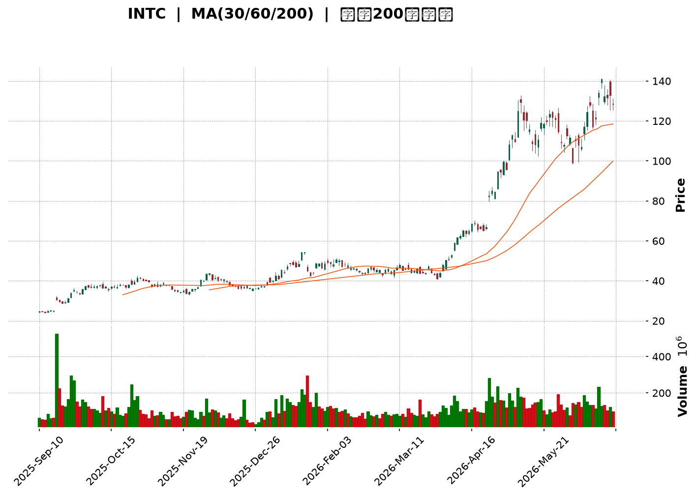
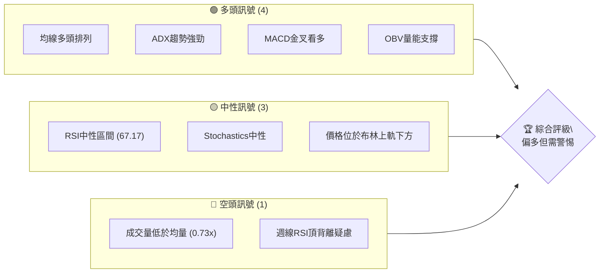
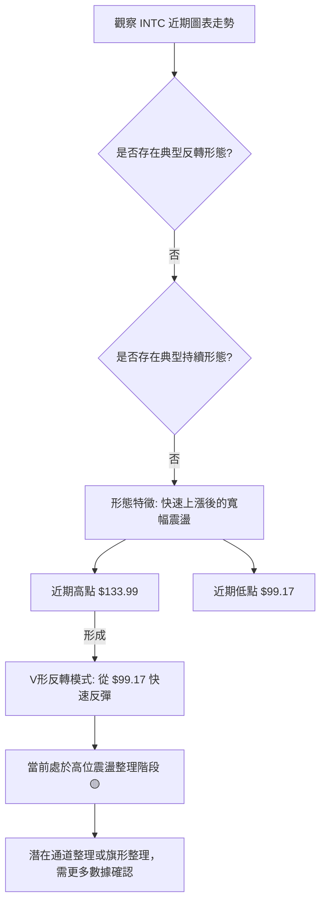
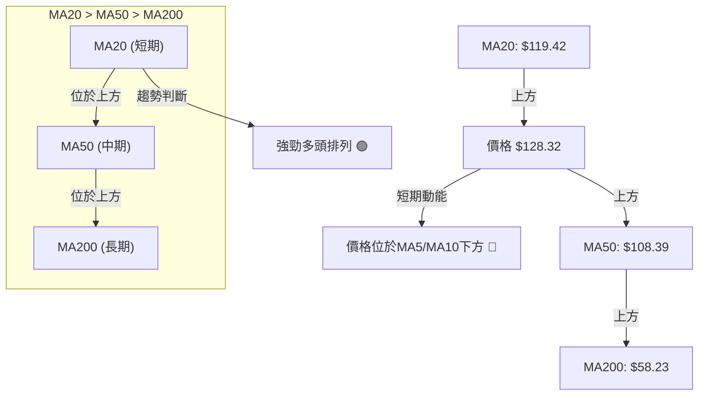
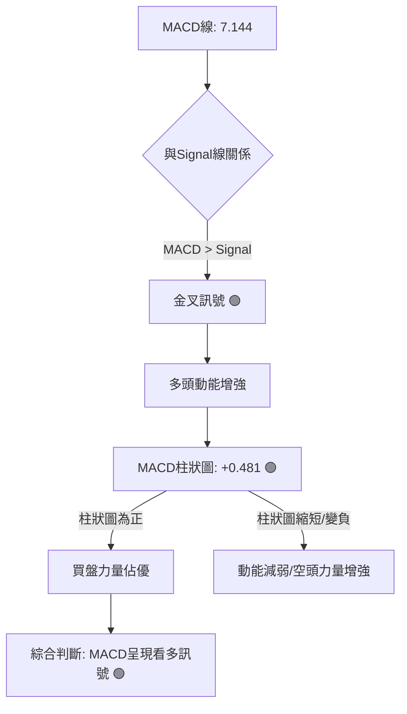

<details>
<summary>📊 靜態圖表 (點擊展開)</summary>

</details>

<html>
<head><meta charset="utf-8" /></head>
<body>
    <div style="height:500px; width:100%;">                        <script>window.PlotlyConfig = {MathJaxConfig: 'local'};</script>
        <script charset="utf-8" src="https://cdn.plot.ly/plotly-3.6.0.min.js" integrity="sha256-QaOVwtVY0T02VaHrr6pnoHLCwayMJp4O5n4YyaE3rJk=" crossorigin="anonymous"></script>                <div id="candlestick-chart" class="plotly-graph-div" style="height:100%; width:100%;"></div>            <script>                window.PLOTLYENV=window.PLOTLYENV || {};                                if (document.getElementById("candlestick-chart")) {                    Plotly.newPlot(                        "candlestick-chart",                        [{"close":{"dtype":"f8","bdata":"AAAAwB7FOEAAAAAAKZw4QAAAAOB6FDhAAAAAwB7FOEAAAADAHkU5QAAAAGBm5jhAAAAAgOuRPkAAAADgepQ9QAAAAGCPwjxAAAAAQApXPUAAAADgUTg\u002fQAAAAGC4\u002fkBAAAAAAADAQUAAAACgcD1BQAAAAGBmxkBAAAAA4FH4QUAAAABgZqZCQAAAAIA9akJAAAAAIIVLQkAAAACAwpVCQAAAAEAKt0JAAAAAYGbmQkAAAAAgXC9CQAAAAAApnEJAAAAA4KPQQUAAAABAM5NCQAAAACCFa0JAAAAAoEeBQkAAAADAzAxDQAAAACBcD0NAAAAAgMJ1QkAAAADgehRDQAAAAADXI0NAAAAAwB7FQ0AAAAAA18NEQAAAACCFq0RAAAAA4HoUREAAAABguP5DQAAAAAAAwENAAAAAANeDQkAAAADgozBDQAAAAGC4nkJAAAAA4KMQQ0AAAACgmTlDQAAAAOCj8EJAAAAAgOvxQkAAAADgevRBQAAAAGCPwkFAAAAAQOFaQUAAAACAPSpBQAAAAIAUjkFAAAAAIFzPQEAAAAAAAEBBQAAAAMAe5UFAAAAAgD3qQUAAAAAgrmdCQAAAACCuR0RAAAAAoEcBREAAAAAAKbxFQAAAAKBH4UVAAAAAAABAREAAAADgerREQAAAAGBmJkRAAAAAAABAREAAAAAA12NEQAAAAKBHwUNAAAAAIK7nQkAAAACgR8FCQAAAACCup0JAAAAAYGYGQkAAAAAA1yNCQAAAAMD1aEJAAAAAIFwvQkAAAADAzCxCQAAAAOB6FEJAAAAAoJkZQkAAAABACldCQAAAAGBmpkJAAAAAQDNzQkAAAADgo7BDQAAAACBcr0NAAAAAwB4FREAAAADgo1BFQAAAAIAUjkRAAAAAYGbGRkAAAAAgrgdGQAAAAMAepUdAAAAAAClcSEAAAADA9ShIQAAAAEDhekdAAAAAIK5HSEAAAAAAACBLQAAAAMD1KEtAAAAAwPWIRkAAAABguD5FQAAAAEAK90VAAAAAANdjSEAAAADgelRIQAAAAAApPEdAAAAAIK5nSEAAAAAAAKBIQAAAAMDMTEhAAAAAYLgeSEAAAAAghUtJQAAAAGC4HklAAAAA4KOQR0AAAADAHiVIQAAAAKBwPUdAAAAAwB5lR0AAAABAChdHQAAAAEDhukZAAAAAIFxPRkAAAACAFA5GQAAAAOCj0EVAAAAAIFwPR0AAAADgo3BHQAAAAEDhukZAAAAAgBTORkAAAAAAAMBGQAAAAMDMjEVAAAAAgD3KRkAAAACgmflGQAAAAIDCtUVAAAAAgD3KRkAAAAAA12NHQAAAAKBw\u002fUdAAAAAAACgRkAAAABgj+JGQAAAAKBH4UZAAAAAIK4HRkAAAAAA14NGQAAAAEAKF0dAAAAAIFzvRUAAAACgRwFGQAAAACCuB0ZAAAAAQAqXR0AAAADAzAxGQAAAAOCjkEVAAAAA4FGYREAAAADgoxBGQAAAAADXA0hAAAAA4KMwSUAAAAAA12NJQAAAAOB6dEpAAAAAoJl5TUAAAAAAKdxOQAAAAOCjME9AAAAAIIVLUEAAAAAgrudPQAAAAAApPFBAAAAAAAAgUUAAAAAAACBRQAAAAMDMbFBAAAAA4KOQUEAAAACgR1FQQAAAAIDrsVBAAAAAYI+iVEAAAAAgXD9VQAAAAKBHIVVAAAAAAACwV0AAAABguJ5XQAAAACCu51hAAAAAgOvxV0AAAACgmQlbQAAAAOCjQFxAAAAAIK5nW0AAAABA4TpfQAAAAIAULmBAAAAAQAonXkAAAABgjxJeQAAAACCF+1xAAAAAoEcxW0AAAABA4QpbQAAAAEAzs1tAAAAAoHC9XUAAAAAAAKBdQAAAAIDC9V1AAAAAoEfhXkAAAACgR3FeQAAAAMD1OF5AAAAAIIWrXEAAAADAHlVbQAAAACCF+1pAAAAAoHAtXEAAAACA6\u002fFbQAAAAEDhylhAAAAAoEeRW0AAAABA4fpaQAAAAGCPwlpAAAAAoHA9XUAAAADgeiRfQAAAAEAK919AAAAAQDNDXUAAAABgZkZeQAAAACCuv2BAAAAAgBSeYUAAAADA9YhgQAAAAMDMdGBAAAAAANebYEAAAACAPQpgQA=="},"high":{"dtype":"f8","bdata":"AAAAYLjeOEAAAACAFO44QAAAAKBHoThAAAAAgMJ1OUAAAABAClc5QAAAAGCPQjlAAAAA4KMwQEAAAACgR6E+QAAAAKCZGT5AAAAAQDMzPkAAAABAM7M\u002fQAAAAAAAIEFAAAAAYGYmQkAAAABgZoZBQAAAAGC4HkFAAAAAIK4HQkAAAADA9chCQAAAAIA9CkNAAAAAQApXQ0AAAABgZgZDQAAAAMAe5UJAAAAAwMwMQ0AAAABAM9NDQAAAAKBHwUJAAAAAYGZGQkAAAABguL5CQAAAAGCPAkNAAAAA4KMwQ0AAAABgj0JDQAAAAMDMLENAAAAAQAr3QkAAAABAMzNDQAAAACBcj0RAAAAAgMJVREAAAACgcD1FQAAAAMAeBUVAAAAAQAq3REAAAACAPWpEQAAAAKCZOURAAAAAAAAgQ0AAAADgUVhDQAAAACCF60NAAAAAYI8iQ0AAAAAA18NDQAAAAAApHENAAAAAoJkZQ0AAAAAgrqdCQAAAAMDMDEJAAAAAoHDdQUAAAACgR2FBQAAAAAAA4EFAAAAAQApXQkAAAACgcH1BQAAAAOB6FEJAAAAA4KMQQkAAAABguJ5CQAAAACCFS0RAAAAA4KMwREAAAABACtdFQAAAAGCPAkZAAAAAANejRUAAAACAPWpFQAAAACBcD0VAAAAAoEehREAAAABguH5EQAAAAOBRGERAAAAAANcDREAAAACgcD1DQAAAAEDh+kJAAAAAIIXrQkAAAABguL5CQAAAAIA9ykJAAAAAQDPzQkAAAABgZmZCQAAAAEAKF0JAAAAAYLg+QkAAAABgZmZCQAAAAKBHIUNAAAAAgD3KQkAAAACAFO5DQAAAAMDMDEVAAAAAIK4nREAAAADA9UhGQAAAACCFq0VAAAAAoHDdRkAAAACgmblGQAAAAGC4HkhAAAAAAACASEAAAACA6zFJQAAAAEDhGklAAAAAoHAdSUAAAADgejRLQAAAAMDMTEtAAAAA4KMQSEAAAABA4TpGQAAAAADXQ0ZAAAAAwB6lSEAAAABgj2JIQAAAAIA9ykhAAAAAIIXrSEAAAABguL5JQAAAAKCZ2UhAAAAAgBRuSUAAAABgZqZJQAAAAAApnElAAAAAwB5FSUAAAABgZsZIQAAAAKCZeUhAAAAA4FHYR0AAAACAPWpHQAAAAGCPYkdAAAAAgMKVRkAAAACA6zFGQAAAAGBmRkZAAAAAwMxMR0AAAAAAKXxHQAAAAKCZeUdAAAAAIK5HR0AAAAAgrudGQAAAAOBR2EVAAAAA4KMQR0AAAACgcD1HQAAAAEAKl0ZAAAAAoEfhRkAAAADgo\u002fBHQAAAAIA9akhAAAAA4FG4R0AAAABAM1NHQAAAAIDClUhAAAAAgD0KR0AAAABA4dpGQAAAAOBROEdAAAAAYGbGR0AAAABA4bpGQAAAACCuJ0ZAAAAAwMzsR0AAAADAzExHQAAAAOCjEEZAAAAAYLj+RUAAAACgcB1GQAAAAGCPYkhAAAAAYLg+SUAAAACA6zFKQAAAAGCPokpAAAAAgMKVTUAAAACAPQpPQAAAAIDrsU9AAAAAoJlpUEAAAAAghUtQQAAAAIDCdVBAAAAAQAonUUAAAADAHpVRQAAAAKBwTVFAAAAAQOHqUEAAAACgRzFRQAAAAIDrEVFAAAAAgBROVUAAAABgZsZVQAAAAIDCJVVAAAAAwMy8V0AAAAAAKexXQAAAAMDMHFlAAAAA4Hr0WEAAAABguJ5bQAAAAAAAYFxAAAAA4KOgXEAAAACAPVJgQAAAAAAAmGBAAAAAYI\u002fyX0AAAAAAAEBfQAAAAOB6pF1AAAAA4HqkW0AAAABgj+JcQAAAAOB6RFxAAAAAACl8XkAAAACAPdpdQAAAAIDrsV5AAAAAIK5nX0AAAACgR1FfQAAAAMAexV5AAAAAwPWoX0AAAABAM1NcQAAAAAAAQFtAAAAAYI+SXUAAAADA9UhcQAAAAGC4nlpAAAAAYI8iXEAAAAAAAIBcQAAAAAAA4FtAAAAAACncXUAAAABgZuZfQAAAACCFk2BAAAAAYGYWYEAAAADAzExfQAAAACBc72BAAAAAYGauYUAAAAAgXD9hQAAAAGCPAmFAAAAAQAqXYUAAAAAgXGdgQA=="},"hovertemplate":"\u003cb\u003e%{x|%Y-%m-%d}\u003c\u002fb\u003e\u003cbr\u003e\u958b: $%{open:.2f}\u003cbr\u003e\u9ad8: $%{high:.2f}\u003cbr\u003e\u4f4e: $%{low:.2f}\u003cbr\u003e\u6536: $%{close:.2f}\u003cextra\u003e\u003c\u002fextra\u003e","low":{"dtype":"f8","bdata":"AAAAIK5HOEAAAACA65E4QAAAAMDMDDhAAAAA4FE4OEAAAADgo7A4QAAAAEAzczhAAAAAwPUoPkAAAADgelQ9QAAAAEDhujxAAAAAgOvRPEAAAABA4To9QAAAAIDCNT9AAAAAYLg+QUAAAACgcN1AQAAAAGCPgkBAAAAAAADAQEAAAADgUbhBQAAAAKCZOUJAAAAAQAo3QkAAAADAzCxCQAAAAOB69EFAAAAAgBRuQkAAAABgZiZCQAAAAADXI0JAAAAA4FFYQUAAAACA69FBQAAAAOB6NEJAAAAAgD0KQkAAAAAgrsdCQAAAAIDC1UJAAAAAwB4FQkAAAABACjdCQAAAAIA96kJAAAAAoHAdQ0AAAADAHsVDQAAAAIDCdURAAAAAgBQOREAAAADAHuVDQAAAAGBmhkNAAAAA4KNQQkAAAACAFI5CQAAAAGBmZkJAAAAAACl8QkAAAAAAKfxCQAAAAGC4vkJAAAAAwMysQkAAAACgmblBQAAAACBcT0FAAAAAoHAdQUAAAADA9chAQAAAAAAAIEFAAAAAoHC9QEAAAACA63FAQAAAAOBRWEFAAAAAQApXQUAAAADgoxBCQAAAACCFq0JAAAAAwMzMQ0AAAABgZgZEQAAAAKBHQUVAAAAAgOsRREAAAABAM5NEQAAAAKCZ2UNAAAAAANcDREAAAACA63FDQAAAAIA9ikNAAAAAIFzPQkAAAADA9ahCQAAAAIDCdUJAAAAAACn8QUAAAACAwtVBQAAAAOBROEJAAAAAwB4lQkAAAAAA1wNCQAAAAKCZeUFAAAAAwMzsQUAAAADA9ehBQAAAAMD1aEJAAAAAIFxvQkAAAACgR+FCQAAAAGCPokNAAAAAoJl5Q0AAAAAgXA9EQAAAAEAKV0RAAAAAwPXIREAAAACA6\u002fFFQAAAAAApnEZAAAAAgMK1R0AAAACAPepHQAAAAEDhWkdAAAAAAACAR0AAAABAMxNJQAAAAIA9ikpAAAAAoJk5RkAAAAAA1yNFQAAAAMDMjEVAAAAAwPUoR0AAAABguH5HQAAAAEDh+kZAAAAAAADARkAAAABACjdIQAAAAAAAgEdAAAAAwB5lR0AAAACAPWpIQAAAACCFy0dAAAAAYI9iR0AAAACAFG5HQAAAAOBRGEdAAAAAACl8RkAAAABA4bpGQAAAAOCjcEZAAAAAgML1RUAAAADgo3BFQAAAAEAKl0VAAAAAwB7FRUAAAACAPYpGQAAAAIDrMUZAAAAAQDMzRkAAAACgmflFQAAAAIDrEUVAAAAAYI+iRUAAAACgmVlGQAAAAADXo0VAAAAAgOvRREAAAADgerRGQAAAAOB6VEdAAAAAgMKVRkAAAACA67FGQAAAAOBR2EZAAAAA4Hr0RUAAAABgZgZGQAAAAEAz00VAAAAAgOvRRUAAAABguN5FQAAAAKCZmUVAAAAAoJm5RkAAAACAwvVFQAAAAIAUbkVAAAAA4KNQREAAAADAzMxEQAAAAKBwfUZAAAAAwB4FR0AAAAAgXO9IQAAAAAApnElAAAAAYGZmS0AAAACA6zFNQAAAAAAAYE5AAAAAQAoXT0AAAAAghQtPQAAAAOCjcE9AAAAAoEcRUEAAAAAgXO9QQAAAAIAUHlBAAAAAwPVoUEAAAABguD5QQAAAAEDhWlBAAAAAIK7nU0AAAABACqdUQAAAAEAzM1RAAAAAIK53VUAAAAAAAOBWQAAAAEAKJ1dAAAAAYGbmV0AAAADAHgVZQAAAAMAepVpAAAAAoJlJW0AAAABAM\u002fNbQAAAAEDh+l5AAAAAAADAXEAAAACAPRpdQAAAAEDhSlxAAAAAoEdBWkAAAABgZvZZQAAAAKCZmVlAAAAAQDOzXEAAAABA4UpcQAAAAIDChV1AAAAAYGZWXUAAAAAAAEBdQAAAAADXE11AAAAAYI9iXEAAAADAHpVaQAAAAEDhClpAAAAAQAq3W0AAAABguN5aQAAAAMAelVhAAAAAgD2qWkAAAACgcN1YQAAAAEDhOlpAAAAA4KOgW0AAAADAHtVcQAAAAIA9ql9AAAAAAAAAXUAAAAAA14NdQAAAAKCZ+V9AAAAAYLgGYUAAAACgmQlgQAAAAMDM\u002fF9AAAAAgD1aX0AAAAAAAGBfQA=="},"name":"\u50f9\u683c","open":{"dtype":"f8","bdata":"AAAAIIVrOEAAAABgj8I4QAAAAAApnDhAAAAA4HpUOEAAAACA69E4QAAAAOB6FDlAAAAAIK7HP0AAAACgR2E+QAAAACCFqz1AAAAAoHD9PEAAAACgR2E9QAAAAAApnD9AAAAAYI+CQUAAAABgj0JBQAAAAEAK90BAAAAAANfDQEAAAACgR+FBQAAAAKCZ+UJAAAAA4FGYQkAAAACA61FCQAAAAGBmRkJAAAAAANfDQkAAAABA4TpDQAAAAOBROEJAAAAAAAAAQkAAAABAMzNCQAAAAEAzk0JAAAAAgBQuQkAAAADA9chCQAAAAIDrEUNAAAAAIIXrQkAAAADAzExCQAAAAGCPAkRAAAAAgOsxQ0AAAAAghctDQAAAAMDMzERAAAAAACl8REAAAABACldEQAAAAAAAIERAAAAAgOsRQ0AAAACAwrVCQAAAACCFK0NAAAAAoEehQkAAAABACndDQAAAAEAzE0NAAAAAIK4HQ0AAAABgj6JCQAAAAADXg0FAAAAAoJm5QUAAAAAAACBBQAAAAIA9KkFAAAAAAAAAQkAAAACgR8FAQAAAAAApfEFAAAAAYGbGQUAAAACgmRlCQAAAAEAzs0JAAAAAgBTuQ0AAAAAAKTxEQAAAAIDrsUVAAAAAoEehRUAAAADgepREQAAAAOBR+ERAAAAAoHBdREAAAACAFA5EQAAAAMD1CERAAAAAAACgQ0AAAACAPSpDQAAAAIA9ykJAAAAAIIXLQkAAAADgo7BCQAAAAKBwPUJAAAAAgOvxQkAAAABguB5CQAAAAIDClUFAAAAAgMIVQkAAAACgRwFCQAAAAOB6dEJAAAAAQDOzQkAAAABgj+JCQAAAACCFy0RAAAAAgBTuQ0AAAABAChdEQAAAACBcT0VAAAAAgD3qREAAAABguB5GQAAAAIDr8UZAAAAAoJl5SEAAAADAzKxIQAAAAGCPokhAAAAAYGamR0AAAADA9ShJQAAAAEDhGktAAAAAgBRuR0AAAAAA1yNGQAAAAAAp\u002fEVAAAAAwMxMR0AAAAAgrsdHQAAAAKBwfUhAAAAA4KPQRkAAAAAgrgdJQAAAAMAexUhAAAAAIIXLR0AAAADAzIxIQAAAACCFy0hAAAAA4Ho0SUAAAACAFA5IQAAAAGBm5kdAAAAAoEfhRkAAAABACvdGQAAAAIDC9UZAAAAAoJl5RkAAAACA6\u002fFFQAAAACCFC0ZAAAAAwMwMRkAAAAAghQtHQAAAAGCPYkdAAAAAQOE6RkAAAACgmRlGQAAAAOBRuEVAAAAAwPUIRkAAAAAgXG9GQAAAAIDCVUZAAAAAYLheRUAAAADgerRGQAAAAMD1aEdAAAAAQDOzR0AAAAAAKfxGQAAAAOB69EdAAAAAgD0KR0AAAACgmRlGQAAAAGC4\u002fkVAAAAAoJl5R0AAAAAAAEBGQAAAAMAexUVAAAAAwMzsRkAAAABgZiZHQAAAACBcz0VAAAAAACncRUAAAACgmflEQAAAAAAAgEZAAAAAIK4HR0AAAADgo3BJQAAAAOB69ElAAAAAIFyvS0AAAABAMzNNQAAAAGCPwk5AAAAAQAoXT0AAAACAPUpQQAAAAGCP4k9AAAAAIIU7UEAAAABgZjZRQAAAAMDMHFFAAAAAwPXIUEAAAAAAKfxQQAAAAGBmhlBAAAAAwMyMVEAAAABA4epUQAAAAIDrUVRAAAAAwPWIVUAAAABgZuZXQAAAAMDMTFdAAAAAIIXLWEAAAADgoyBZQAAAAGC4vltAAAAAoEfBW0AAAAAA1\u002fNbQAAAAAApXGBAAAAAQAoXX0AAAABgZgZfQAAAAIA9qlxAAAAAYI9yW0AAAACAFF5cQAAAAGC4vlpAAAAAgBQOXUAAAADAHiVdQAAAAIDCFV5AAAAAYGaGXkAAAADA9RhfQAAAAMDMXF5AAAAAYGb2XkAAAAAghVtbQAAAAMDM3FpAAAAAQOEaXUAAAACgmRlbQAAAAGC4nlpAAAAAAADAW0AAAAAgXD9cQAAAAIDrgVpAAAAAoEdhXEAAAABA4VpdQAAAACCuL2BAAAAAQApHX0AAAABgZnZeQAAAAIDreWBAAAAAANdjYUAAAAAgXDdgQAAAAKCZoWBAAAAAIFx3YUAAAABguBZgQA=="},"x":["2025-09-10T00:00:00-04:00","2025-09-11T00:00:00-04:00","2025-09-12T00:00:00-04:00","2025-09-15T00:00:00-04:00","2025-09-16T00:00:00-04:00","2025-09-17T00:00:00-04:00","2025-09-18T00:00:00-04:00","2025-09-19T00:00:00-04:00","2025-09-22T00:00:00-04:00","2025-09-23T00:00:00-04:00","2025-09-24T00:00:00-04:00","2025-09-25T00:00:00-04:00","2025-09-26T00:00:00-04:00","2025-09-29T00:00:00-04:00","2025-09-30T00:00:00-04:00","2025-10-01T00:00:00-04:00","2025-10-02T00:00:00-04:00","2025-10-03T00:00:00-04:00","2025-10-06T00:00:00-04:00","2025-10-07T00:00:00-04:00","2025-10-08T00:00:00-04:00","2025-10-09T00:00:00-04:00","2025-10-10T00:00:00-04:00","2025-10-13T00:00:00-04:00","2025-10-14T00:00:00-04:00","2025-10-15T00:00:00-04:00","2025-10-16T00:00:00-04:00","2025-10-17T00:00:00-04:00","2025-10-20T00:00:00-04:00","2025-10-21T00:00:00-04:00","2025-10-22T00:00:00-04:00","2025-10-23T00:00:00-04:00","2025-10-24T00:00:00-04:00","2025-10-27T00:00:00-04:00","2025-10-28T00:00:00-04:00","2025-10-29T00:00:00-04:00","2025-10-30T00:00:00-04:00","2025-10-31T00:00:00-04:00","2025-11-03T00:00:00-05:00","2025-11-04T00:00:00-05:00","2025-11-05T00:00:00-05:00","2025-11-06T00:00:00-05:00","2025-11-07T00:00:00-05:00","2025-11-10T00:00:00-05:00","2025-11-11T00:00:00-05:00","2025-11-12T00:00:00-05:00","2025-11-13T00:00:00-05:00","2025-11-14T00:00:00-05:00","2025-11-17T00:00:00-05:00","2025-11-18T00:00:00-05:00","2025-11-19T00:00:00-05:00","2025-11-20T00:00:00-05:00","2025-11-21T00:00:00-05:00","2025-11-24T00:00:00-05:00","2025-11-25T00:00:00-05:00","2025-11-26T00:00:00-05:00","2025-11-28T00:00:00-05:00","2025-12-01T00:00:00-05:00","2025-12-02T00:00:00-05:00","2025-12-03T00:00:00-05:00","2025-12-04T00:00:00-05:00","2025-12-05T00:00:00-05:00","2025-12-08T00:00:00-05:00","2025-12-09T00:00:00-05:00","2025-12-10T00:00:00-05:00","2025-12-11T00:00:00-05:00","2025-12-12T00:00:00-05:00","2025-12-15T00:00:00-05:00","2025-12-16T00:00:00-05:00","2025-12-17T00:00:00-05:00","2025-12-18T00:00:00-05:00","2025-12-19T00:00:00-05:00","2025-12-22T00:00:00-05:00","2025-12-23T00:00:00-05:00","2025-12-24T00:00:00-05:00","2025-12-26T00:00:00-05:00","2025-12-29T00:00:00-05:00","2025-12-30T00:00:00-05:00","2025-12-31T00:00:00-05:00","2026-01-02T00:00:00-05:00","2026-01-05T00:00:00-05:00","2026-01-06T00:00:00-05:00","2026-01-07T00:00:00-05:00","2026-01-08T00:00:00-05:00","2026-01-09T00:00:00-05:00","2026-01-12T00:00:00-05:00","2026-01-13T00:00:00-05:00","2026-01-14T00:00:00-05:00","2026-01-15T00:00:00-05:00","2026-01-16T00:00:00-05:00","2026-01-20T00:00:00-05:00","2026-01-21T00:00:00-05:00","2026-01-22T00:00:00-05:00","2026-01-23T00:00:00-05:00","2026-01-26T00:00:00-05:00","2026-01-27T00:00:00-05:00","2026-01-28T00:00:00-05:00","2026-01-29T00:00:00-05:00","2026-01-30T00:00:00-05:00","2026-02-02T00:00:00-05:00","2026-02-03T00:00:00-05:00","2026-02-04T00:00:00-05:00","2026-02-05T00:00:00-05:00","2026-02-06T00:00:00-05:00","2026-02-09T00:00:00-05:00","2026-02-10T00:00:00-05:00","2026-02-11T00:00:00-05:00","2026-02-12T00:00:00-05:00","2026-02-13T00:00:00-05:00","2026-02-17T00:00:00-05:00","2026-02-18T00:00:00-05:00","2026-02-19T00:00:00-05:00","2026-02-20T00:00:00-05:00","2026-02-23T00:00:00-05:00","2026-02-24T00:00:00-05:00","2026-02-25T00:00:00-05:00","2026-02-26T00:00:00-05:00","2026-02-27T00:00:00-05:00","2026-03-02T00:00:00-05:00","2026-03-03T00:00:00-05:00","2026-03-04T00:00:00-05:00","2026-03-05T00:00:00-05:00","2026-03-06T00:00:00-05:00","2026-03-09T00:00:00-04:00","2026-03-10T00:00:00-04:00","2026-03-11T00:00:00-04:00","2026-03-12T00:00:00-04:00","2026-03-13T00:00:00-04:00","2026-03-16T00:00:00-04:00","2026-03-17T00:00:00-04:00","2026-03-18T00:00:00-04:00","2026-03-19T00:00:00-04:00","2026-03-20T00:00:00-04:00","2026-03-23T00:00:00-04:00","2026-03-24T00:00:00-04:00","2026-03-25T00:00:00-04:00","2026-03-26T00:00:00-04:00","2026-03-27T00:00:00-04:00","2026-03-30T00:00:00-04:00","2026-03-31T00:00:00-04:00","2026-04-01T00:00:00-04:00","2026-04-02T00:00:00-04:00","2026-04-06T00:00:00-04:00","2026-04-07T00:00:00-04:00","2026-04-08T00:00:00-04:00","2026-04-09T00:00:00-04:00","2026-04-10T00:00:00-04:00","2026-04-13T00:00:00-04:00","2026-04-14T00:00:00-04:00","2026-04-15T00:00:00-04:00","2026-04-16T00:00:00-04:00","2026-04-17T00:00:00-04:00","2026-04-20T00:00:00-04:00","2026-04-21T00:00:00-04:00","2026-04-22T00:00:00-04:00","2026-04-23T00:00:00-04:00","2026-04-24T00:00:00-04:00","2026-04-27T00:00:00-04:00","2026-04-28T00:00:00-04:00","2026-04-29T00:00:00-04:00","2026-04-30T00:00:00-04:00","2026-05-01T00:00:00-04:00","2026-05-04T00:00:00-04:00","2026-05-05T00:00:00-04:00","2026-05-06T00:00:00-04:00","2026-05-07T00:00:00-04:00","2026-05-08T00:00:00-04:00","2026-05-11T00:00:00-04:00","2026-05-12T00:00:00-04:00","2026-05-13T00:00:00-04:00","2026-05-14T00:00:00-04:00","2026-05-15T00:00:00-04:00","2026-05-18T00:00:00-04:00","2026-05-19T00:00:00-04:00","2026-05-20T00:00:00-04:00","2026-05-21T00:00:00-04:00","2026-05-22T00:00:00-04:00","2026-05-26T00:00:00-04:00","2026-05-27T00:00:00-04:00","2026-05-28T00:00:00-04:00","2026-05-29T00:00:00-04:00","2026-06-01T00:00:00-04:00","2026-06-02T00:00:00-04:00","2026-06-03T00:00:00-04:00","2026-06-04T00:00:00-04:00","2026-06-05T00:00:00-04:00","2026-06-08T00:00:00-04:00","2026-06-09T00:00:00-04:00","2026-06-10T00:00:00-04:00","2026-06-11T00:00:00-04:00","2026-06-12T00:00:00-04:00","2026-06-15T00:00:00-04:00","2026-06-16T00:00:00-04:00","2026-06-17T00:00:00-04:00","2026-06-18T00:00:00-04:00","2026-06-22T00:00:00-04:00","2026-06-23T00:00:00-04:00","2026-06-24T00:00:00-04:00","2026-06-25T00:00:00-04:00","2026-06-26T00:00:00-04:00"],"type":"candlestick"},{"hovertemplate":"MA30: $%{y:.2f}\u003cextra\u003e\u003c\u002fextra\u003e","line":{"color":"#2196F3","dash":"dash","width":2},"mode":"lines","name":"MA30","x":["2025-09-10T00:00:00-04:00","2025-09-11T00:00:00-04:00","2025-09-12T00:00:00-04:00","2025-09-15T00:00:00-04:00","2025-09-16T00:00:00-04:00","2025-09-17T00:00:00-04:00","2025-09-18T00:00:00-04:00","2025-09-19T00:00:00-04:00","2025-09-22T00:00:00-04:00","2025-09-23T00:00:00-04:00","2025-09-24T00:00:00-04:00","2025-09-25T00:00:00-04:00","2025-09-26T00:00:00-04:00","2025-09-29T00:00:00-04:00","2025-09-30T00:00:00-04:00","2025-10-01T00:00:00-04:00","2025-10-02T00:00:00-04:00","2025-10-03T00:00:00-04:00","2025-10-06T00:00:00-04:00","2025-10-07T00:00:00-04:00","2025-10-08T00:00:00-04:00","2025-10-09T00:00:00-04:00","2025-10-10T00:00:00-04:00","2025-10-13T00:00:00-04:00","2025-10-14T00:00:00-04:00","2025-10-15T00:00:00-04:00","2025-10-16T00:00:00-04:00","2025-10-17T00:00:00-04:00","2025-10-20T00:00:00-04:00","2025-10-21T00:00:00-04:00","2025-10-22T00:00:00-04:00","2025-10-23T00:00:00-04:00","2025-10-24T00:00:00-04:00","2025-10-27T00:00:00-04:00","2025-10-28T00:00:00-04:00","2025-10-29T00:00:00-04:00","2025-10-30T00:00:00-04:00","2025-10-31T00:00:00-04:00","2025-11-03T00:00:00-05:00","2025-11-04T00:00:00-05:00","2025-11-05T00:00:00-05:00","2025-11-06T00:00:00-05:00","2025-11-07T00:00:00-05:00","2025-11-10T00:00:00-05:00","2025-11-11T00:00:00-05:00","2025-11-12T00:00:00-05:00","2025-11-13T00:00:00-05:00","2025-11-14T00:00:00-05:00","2025-11-17T00:00:00-05:00","2025-11-18T00:00:00-05:00","2025-11-19T00:00:00-05:00","2025-11-20T00:00:00-05:00","2025-11-21T00:00:00-05:00","2025-11-24T00:00:00-05:00","2025-11-25T00:00:00-05:00","2025-11-26T00:00:00-05:00","2025-11-28T00:00:00-05:00","2025-12-01T00:00:00-05:00","2025-12-02T00:00:00-05:00","2025-12-03T00:00:00-05:00","2025-12-04T00:00:00-05:00","2025-12-05T00:00:00-05:00","2025-12-08T00:00:00-05:00","2025-12-09T00:00:00-05:00","2025-12-10T00:00:00-05:00","2025-12-11T00:00:00-05:00","2025-12-12T00:00:00-05:00","2025-12-15T00:00:00-05:00","2025-12-16T00:00:00-05:00","2025-12-17T00:00:00-05:00","2025-12-18T00:00:00-05:00","2025-12-19T00:00:00-05:00","2025-12-22T00:00:00-05:00","2025-12-23T00:00:00-05:00","2025-12-24T00:00:00-05:00","2025-12-26T00:00:00-05:00","2025-12-29T00:00:00-05:00","2025-12-30T00:00:00-05:00","2025-12-31T00:00:00-05:00","2026-01-02T00:00:00-05:00","2026-01-05T00:00:00-05:00","2026-01-06T00:00:00-05:00","2026-01-07T00:00:00-05:00","2026-01-08T00:00:00-05:00","2026-01-09T00:00:00-05:00","2026-01-12T00:00:00-05:00","2026-01-13T00:00:00-05:00","2026-01-14T00:00:00-05:00","2026-01-15T00:00:00-05:00","2026-01-16T00:00:00-05:00","2026-01-20T00:00:00-05:00","2026-01-21T00:00:00-05:00","2026-01-22T00:00:00-05:00","2026-01-23T00:00:00-05:00","2026-01-26T00:00:00-05:00","2026-01-27T00:00:00-05:00","2026-01-28T00:00:00-05:00","2026-01-29T00:00:00-05:00","2026-01-30T00:00:00-05:00","2026-02-02T00:00:00-05:00","2026-02-03T00:00:00-05:00","2026-02-04T00:00:00-05:00","2026-02-05T00:00:00-05:00","2026-02-06T00:00:00-05:00","2026-02-09T00:00:00-05:00","2026-02-10T00:00:00-05:00","2026-02-11T00:00:00-05:00","2026-02-12T00:00:00-05:00","2026-02-13T00:00:00-05:00","2026-02-17T00:00:00-05:00","2026-02-18T00:00:00-05:00","2026-02-19T00:00:00-05:00","2026-02-20T00:00:00-05:00","2026-02-23T00:00:00-05:00","2026-02-24T00:00:00-05:00","2026-02-25T00:00:00-05:00","2026-02-26T00:00:00-05:00","2026-02-27T00:00:00-05:00","2026-03-02T00:00:00-05:00","2026-03-03T00:00:00-05:00","2026-03-04T00:00:00-05:00","2026-03-05T00:00:00-05:00","2026-03-06T00:00:00-05:00","2026-03-09T00:00:00-04:00","2026-03-10T00:00:00-04:00","2026-03-11T00:00:00-04:00","2026-03-12T00:00:00-04:00","2026-03-13T00:00:00-04:00","2026-03-16T00:00:00-04:00","2026-03-17T00:00:00-04:00","2026-03-18T00:00:00-04:00","2026-03-19T00:00:00-04:00","2026-03-20T00:00:00-04:00","2026-03-23T00:00:00-04:00","2026-03-24T00:00:00-04:00","2026-03-25T00:00:00-04:00","2026-03-26T00:00:00-04:00","2026-03-27T00:00:00-04:00","2026-03-30T00:00:00-04:00","2026-03-31T00:00:00-04:00","2026-04-01T00:00:00-04:00","2026-04-02T00:00:00-04:00","2026-04-06T00:00:00-04:00","2026-04-07T00:00:00-04:00","2026-04-08T00:00:00-04:00","2026-04-09T00:00:00-04:00","2026-04-10T00:00:00-04:00","2026-04-13T00:00:00-04:00","2026-04-14T00:00:00-04:00","2026-04-15T00:00:00-04:00","2026-04-16T00:00:00-04:00","2026-04-17T00:00:00-04:00","2026-04-20T00:00:00-04:00","2026-04-21T00:00:00-04:00","2026-04-22T00:00:00-04:00","2026-04-23T00:00:00-04:00","2026-04-24T00:00:00-04:00","2026-04-27T00:00:00-04:00","2026-04-28T00:00:00-04:00","2026-04-29T00:00:00-04:00","2026-04-30T00:00:00-04:00","2026-05-01T00:00:00-04:00","2026-05-04T00:00:00-04:00","2026-05-05T00:00:00-04:00","2026-05-06T00:00:00-04:00","2026-05-07T00:00:00-04:00","2026-05-08T00:00:00-04:00","2026-05-11T00:00:00-04:00","2026-05-12T00:00:00-04:00","2026-05-13T00:00:00-04:00","2026-05-14T00:00:00-04:00","2026-05-15T00:00:00-04:00","2026-05-18T00:00:00-04:00","2026-05-19T00:00:00-04:00","2026-05-20T00:00:00-04:00","2026-05-21T00:00:00-04:00","2026-05-22T00:00:00-04:00","2026-05-26T00:00:00-04:00","2026-05-27T00:00:00-04:00","2026-05-28T00:00:00-04:00","2026-05-29T00:00:00-04:00","2026-06-01T00:00:00-04:00","2026-06-02T00:00:00-04:00","2026-06-03T00:00:00-04:00","2026-06-04T00:00:00-04:00","2026-06-05T00:00:00-04:00","2026-06-08T00:00:00-04:00","2026-06-09T00:00:00-04:00","2026-06-10T00:00:00-04:00","2026-06-11T00:00:00-04:00","2026-06-12T00:00:00-04:00","2026-06-15T00:00:00-04:00","2026-06-16T00:00:00-04:00","2026-06-17T00:00:00-04:00","2026-06-18T00:00:00-04:00","2026-06-22T00:00:00-04:00","2026-06-23T00:00:00-04:00","2026-06-24T00:00:00-04:00","2026-06-25T00:00:00-04:00","2026-06-26T00:00:00-04:00"],"y":{"dtype":"f8","bdata":"AAAAAAAA+H8AAAAAAAD4fwAAAAAAAPh\u002fAAAAAAAA+H8AAAAAAAD4fwAAAAAAAPh\u002fAAAAAAAA+H8AAAAAAAD4fwAAAAAAAPh\u002fAAAAAAAA+H8AAAAAAAD4fwAAAAAAAPh\u002fAAAAAAAA+H8AAAAAAAD4fwAAAAAAAPh\u002fAAAAAAAA+H8AAAAAAAD4fwAAAAAAAPh\u002fAAAAAAAA+H8AAAAAAAD4fwAAAAAAAPh\u002fAAAAAAAA+H8AAAAAAAD4fwAAAAAAAPh\u002fAAAAAAAA+H8AAAAAAAD4fwAAAAAAAPh\u002fAAAAAAAA+H8AAAAAAAD4f1VVVR3Mg0BA7+7uJqO3QEBVVVVdc\u002fFAQM3MzIwJLkFAREREVA5tQUBVVVWVbrJBQKuqqnKT+EFAERERSX4hQkCJiIjI6E1CQCIiIrq7e0JAmpmZQYucQkAzMzPjF7tCQBEREcH1yEJAq6qqai7UQkB3d3e3HuVCQLy7uzuY90JAd3d3J+r\u002fQkB3d3fn+\u002flCQImIiAhl9EJAIiIikl\u002fsQkCamZmJQeBCQKuqqnpb1kJA3t3dzYXEQkBEREREi7xCQDMzM1NxtkJAd3d3x0u3QkCJiIho2LVCQERERKS3xUJAERERcYTSQkCrqqrqbelCQM3MzEx+AUNA3t3dncQQQ0C8u7t7oh5DQM3MzNxAJ0NAAAAAcFkrQ0DNzMw8JihDQDMzM2NXIENAAAAAkFAWQ0DNzMy8uwtDQM3MzKxjAkNAERERQTX+QkDe3d19P\u002fVCQM3MzLx080JAiYiIWPLrQkBVVVWV\u002fOJCQCIiIuKl20JARERE9G\u002fUQkAAAAAAuddCQLy7uztR30JAzczMTKnoQkDv7u4+Nf5CQM3MzExiEENAd3d3p8YrQ0CJiIjIdk5DQERERKQpZUNAiYiIeKKOQ0B3d3dnka1DQLy7u1tIykNAERERAXLvQ0Dv7u5+IwREQAAAAMDKEURAvLu7ay40REAAAAAg92pEQERERLTIpkRAzczMXEi6REBEREQklMFEQGZmZvZv1ERAAAAAID4DRUBmZmbm0DJFQAAAABDmWUVAMzMzY1eQRUBmZmYWrsdFQM3MzPzw+UVAIiIiMpYsRkAzMzMTWGlGQBERETFrpUZAq6qqqg3URkAiIiLilgVHQEREROTBLEdAiYiIaPRWR0AiIiLS93NHQJqZmbnzjUdA3t3dTX6hR0C8u7vbzqdHQO\u002fu7l6PskdAZmZm9v20R0B3d3cnBsFHQN7d3U03uUdAq6qqWvKrR0CamZkp6p9HQDMzMwNyj0dA7+7uDruCR0Dv7u4+UV9HQJqZmYnPMEdAiYiImPwyR0CrqqpqSkVHQImIiBiSVkdAVVVVZYJHR0Dv7u6+LTtHQLy7uzsmOEdAd3d39+EjR0CamZmZ4BFHQBEREVGNB0dAvLu7G+j0RkDe3d391NhGQImIiMh2vkZAVVVVZa2+RkC8u7vLzKxGQERERLSBnkZAIiIiAp2GRkDNzMzc3X1GQM3MzPzUiEZAIiIicmihRkDNzMzc3b1GQImIiBh25UZAERER4TMcR0De3d0dhVtHQFVVVUW2o0dA3t3d7TX3R0BVVVVVVUVIQBEREXGEokhAERERMU8ESUDe3d3NhWRJQBEREYGVw0lARERElNEbSkBmZmaWtWpKQDMzMzPsukpAMzMz0wZaS0BVVVWFXQFMQGZmZsa9pkxAVVVVxQR\u002fTUDNzMxcAVJOQImIiBgENk9ARERE1L8JUECrqqrSlJJQQHd3d7esJVFAiYiISOGqUUB3d3fHS1dSQERERIxsD1NAVVVVddq4U0ARERH5U1tUQFVVVW0u7FRAZmZmJr9oVUDe3d29LeNVQO\u002fu7matXlZAzczM3LLeVkAAAABQ1FdXQJqZmSFp0ldAREREjN5OWEDv7u5uhMpYQHd3d5fgQVlAd3d3B2WkWUB3d3enf\u002ftZQN7d3d2WVVpAIiIiwq64WkC8u7tr5xtbQN7d3a0AYVtARERE9CicW0CrqqrKE81bQHd3d7ce\u002fVtAZmZmVoAsXEDNzMx8sWxcQKuqqkrwqFxAzczMjFDWXECamZn58PFcQKuqqtqyHl1AAAAAwINhXUCrqqpKN3FdQN7d3T3udV1AVVVV1RWQXUCamZlJN6FdQA=="},"type":"scatter"},{"hovertemplate":"MA60: $%{y:.2f}\u003cextra\u003e\u003c\u002fextra\u003e","line":{"color":"#9C27B0","dash":"dash","width":2},"mode":"lines","name":"MA60","x":["2025-09-10T00:00:00-04:00","2025-09-11T00:00:00-04:00","2025-09-12T00:00:00-04:00","2025-09-15T00:00:00-04:00","2025-09-16T00:00:00-04:00","2025-09-17T00:00:00-04:00","2025-09-18T00:00:00-04:00","2025-09-19T00:00:00-04:00","2025-09-22T00:00:00-04:00","2025-09-23T00:00:00-04:00","2025-09-24T00:00:00-04:00","2025-09-25T00:00:00-04:00","2025-09-26T00:00:00-04:00","2025-09-29T00:00:00-04:00","2025-09-30T00:00:00-04:00","2025-10-01T00:00:00-04:00","2025-10-02T00:00:00-04:00","2025-10-03T00:00:00-04:00","2025-10-06T00:00:00-04:00","2025-10-07T00:00:00-04:00","2025-10-08T00:00:00-04:00","2025-10-09T00:00:00-04:00","2025-10-10T00:00:00-04:00","2025-10-13T00:00:00-04:00","2025-10-14T00:00:00-04:00","2025-10-15T00:00:00-04:00","2025-10-16T00:00:00-04:00","2025-10-17T00:00:00-04:00","2025-10-20T00:00:00-04:00","2025-10-21T00:00:00-04:00","2025-10-22T00:00:00-04:00","2025-10-23T00:00:00-04:00","2025-10-24T00:00:00-04:00","2025-10-27T00:00:00-04:00","2025-10-28T00:00:00-04:00","2025-10-29T00:00:00-04:00","2025-10-30T00:00:00-04:00","2025-10-31T00:00:00-04:00","2025-11-03T00:00:00-05:00","2025-11-04T00:00:00-05:00","2025-11-05T00:00:00-05:00","2025-11-06T00:00:00-05:00","2025-11-07T00:00:00-05:00","2025-11-10T00:00:00-05:00","2025-11-11T00:00:00-05:00","2025-11-12T00:00:00-05:00","2025-11-13T00:00:00-05:00","2025-11-14T00:00:00-05:00","2025-11-17T00:00:00-05:00","2025-11-18T00:00:00-05:00","2025-11-19T00:00:00-05:00","2025-11-20T00:00:00-05:00","2025-11-21T00:00:00-05:00","2025-11-24T00:00:00-05:00","2025-11-25T00:00:00-05:00","2025-11-26T00:00:00-05:00","2025-11-28T00:00:00-05:00","2025-12-01T00:00:00-05:00","2025-12-02T00:00:00-05:00","2025-12-03T00:00:00-05:00","2025-12-04T00:00:00-05:00","2025-12-05T00:00:00-05:00","2025-12-08T00:00:00-05:00","2025-12-09T00:00:00-05:00","2025-12-10T00:00:00-05:00","2025-12-11T00:00:00-05:00","2025-12-12T00:00:00-05:00","2025-12-15T00:00:00-05:00","2025-12-16T00:00:00-05:00","2025-12-17T00:00:00-05:00","2025-12-18T00:00:00-05:00","2025-12-19T00:00:00-05:00","2025-12-22T00:00:00-05:00","2025-12-23T00:00:00-05:00","2025-12-24T00:00:00-05:00","2025-12-26T00:00:00-05:00","2025-12-29T00:00:00-05:00","2025-12-30T00:00:00-05:00","2025-12-31T00:00:00-05:00","2026-01-02T00:00:00-05:00","2026-01-05T00:00:00-05:00","2026-01-06T00:00:00-05:00","2026-01-07T00:00:00-05:00","2026-01-08T00:00:00-05:00","2026-01-09T00:00:00-05:00","2026-01-12T00:00:00-05:00","2026-01-13T00:00:00-05:00","2026-01-14T00:00:00-05:00","2026-01-15T00:00:00-05:00","2026-01-16T00:00:00-05:00","2026-01-20T00:00:00-05:00","2026-01-21T00:00:00-05:00","2026-01-22T00:00:00-05:00","2026-01-23T00:00:00-05:00","2026-01-26T00:00:00-05:00","2026-01-27T00:00:00-05:00","2026-01-28T00:00:00-05:00","2026-01-29T00:00:00-05:00","2026-01-30T00:00:00-05:00","2026-02-02T00:00:00-05:00","2026-02-03T00:00:00-05:00","2026-02-04T00:00:00-05:00","2026-02-05T00:00:00-05:00","2026-02-06T00:00:00-05:00","2026-02-09T00:00:00-05:00","2026-02-10T00:00:00-05:00","2026-02-11T00:00:00-05:00","2026-02-12T00:00:00-05:00","2026-02-13T00:00:00-05:00","2026-02-17T00:00:00-05:00","2026-02-18T00:00:00-05:00","2026-02-19T00:00:00-05:00","2026-02-20T00:00:00-05:00","2026-02-23T00:00:00-05:00","2026-02-24T00:00:00-05:00","2026-02-25T00:00:00-05:00","2026-02-26T00:00:00-05:00","2026-02-27T00:00:00-05:00","2026-03-02T00:00:00-05:00","2026-03-03T00:00:00-05:00","2026-03-04T00:00:00-05:00","2026-03-05T00:00:00-05:00","2026-03-06T00:00:00-05:00","2026-03-09T00:00:00-04:00","2026-03-10T00:00:00-04:00","2026-03-11T00:00:00-04:00","2026-03-12T00:00:00-04:00","2026-03-13T00:00:00-04:00","2026-03-16T00:00:00-04:00","2026-03-17T00:00:00-04:00","2026-03-18T00:00:00-04:00","2026-03-19T00:00:00-04:00","2026-03-20T00:00:00-04:00","2026-03-23T00:00:00-04:00","2026-03-24T00:00:00-04:00","2026-03-25T00:00:00-04:00","2026-03-26T00:00:00-04:00","2026-03-27T00:00:00-04:00","2026-03-30T00:00:00-04:00","2026-03-31T00:00:00-04:00","2026-04-01T00:00:00-04:00","2026-04-02T00:00:00-04:00","2026-04-06T00:00:00-04:00","2026-04-07T00:00:00-04:00","2026-04-08T00:00:00-04:00","2026-04-09T00:00:00-04:00","2026-04-10T00:00:00-04:00","2026-04-13T00:00:00-04:00","2026-04-14T00:00:00-04:00","2026-04-15T00:00:00-04:00","2026-04-16T00:00:00-04:00","2026-04-17T00:00:00-04:00","2026-04-20T00:00:00-04:00","2026-04-21T00:00:00-04:00","2026-04-22T00:00:00-04:00","2026-04-23T00:00:00-04:00","2026-04-24T00:00:00-04:00","2026-04-27T00:00:00-04:00","2026-04-28T00:00:00-04:00","2026-04-29T00:00:00-04:00","2026-04-30T00:00:00-04:00","2026-05-01T00:00:00-04:00","2026-05-04T00:00:00-04:00","2026-05-05T00:00:00-04:00","2026-05-06T00:00:00-04:00","2026-05-07T00:00:00-04:00","2026-05-08T00:00:00-04:00","2026-05-11T00:00:00-04:00","2026-05-12T00:00:00-04:00","2026-05-13T00:00:00-04:00","2026-05-14T00:00:00-04:00","2026-05-15T00:00:00-04:00","2026-05-18T00:00:00-04:00","2026-05-19T00:00:00-04:00","2026-05-20T00:00:00-04:00","2026-05-21T00:00:00-04:00","2026-05-22T00:00:00-04:00","2026-05-26T00:00:00-04:00","2026-05-27T00:00:00-04:00","2026-05-28T00:00:00-04:00","2026-05-29T00:00:00-04:00","2026-06-01T00:00:00-04:00","2026-06-02T00:00:00-04:00","2026-06-03T00:00:00-04:00","2026-06-04T00:00:00-04:00","2026-06-05T00:00:00-04:00","2026-06-08T00:00:00-04:00","2026-06-09T00:00:00-04:00","2026-06-10T00:00:00-04:00","2026-06-11T00:00:00-04:00","2026-06-12T00:00:00-04:00","2026-06-15T00:00:00-04:00","2026-06-16T00:00:00-04:00","2026-06-17T00:00:00-04:00","2026-06-18T00:00:00-04:00","2026-06-22T00:00:00-04:00","2026-06-23T00:00:00-04:00","2026-06-24T00:00:00-04:00","2026-06-25T00:00:00-04:00","2026-06-26T00:00:00-04:00"],"y":{"dtype":"f8","bdata":"AAAAAAAA+H8AAAAAAAD4fwAAAAAAAPh\u002fAAAAAAAA+H8AAAAAAAD4fwAAAAAAAPh\u002fAAAAAAAA+H8AAAAAAAD4fwAAAAAAAPh\u002fAAAAAAAA+H8AAAAAAAD4fwAAAAAAAPh\u002fAAAAAAAA+H8AAAAAAAD4fwAAAAAAAPh\u002fAAAAAAAA+H8AAAAAAAD4fwAAAAAAAPh\u002fAAAAAAAA+H8AAAAAAAD4fwAAAAAAAPh\u002fAAAAAAAA+H8AAAAAAAD4fwAAAAAAAPh\u002fAAAAAAAA+H8AAAAAAAD4fwAAAAAAAPh\u002fAAAAAAAA+H8AAAAAAAD4fwAAAAAAAPh\u002fAAAAAAAA+H8AAAAAAAD4fwAAAAAAAPh\u002fAAAAAAAA+H8AAAAAAAD4fwAAAAAAAPh\u002fAAAAAAAA+H8AAAAAAAD4fwAAAAAAAPh\u002fAAAAAAAA+H8AAAAAAAD4fwAAAAAAAPh\u002fAAAAAAAA+H8AAAAAAAD4fwAAAAAAAPh\u002fAAAAAAAA+H8AAAAAAAD4fwAAAAAAAPh\u002fAAAAAAAA+H8AAAAAAAD4fwAAAAAAAPh\u002fAAAAAAAA+H8AAAAAAAD4fwAAAAAAAPh\u002fAAAAAAAA+H8AAAAAAAD4fwAAAAAAAPh\u002fAAAAAAAA+H8AAAAAAAD4fxERETWlwkFAZmZm4jPkQUCJiIjsCghCQM3MzDSlKkJAIiIi4jNMQkARERFpSm1CQO\u002fu7mp1jEJAiYiIbOebQkCrqqpC0qxCQHd3d7MPv0JAVVVVQWDNQkCJiIiwK9hCQO\u002fu7j413kJAmpmZYRDgQkBmZmamDeRCQO\u002fu7g6f6UJA3t3dDS3qQkC8u7tz2uhCQCIiIiLb6UJAd3d3b4TqQkBERERkO+9CQLy7u+Ne80JAq6qqOib4QkBmZmYGgQVDQLy7u3vNDUNAAAAAIPciQ0AAAADotDFDQAAAAAAASENAEREROftgQ0DNzMy0yHZDQGZmZoakiUNAzczMhHmiQ0De3d3NzMRDQImIiMgE50NAZmZm5tDyQ0CJiIgw3fRDQM3MzKxj+kNAAAAAWMcMRECamZlRRh9EQGZmZt4kLkRAIiIiUkZHREAiIiLKdl5EQM3MzNyydkRAVVVVRUSMREBERERUKqZEQJqZmYmIwERAd3d3zz7UREARERHxp+5EQAAAAJAJBkVAq6qq2s4fRUCJiIiIFjlFQDMzMwMrT0VAq6qqeqJmRUAiIiLSIntFQJqZmYHci0VAd3d3N9ChRUB3d3fHS7dFQM3MzNS\u002fwUVA3t3dLbLNRUBERETUBtJFQJqZmWGe0EVAVVVVvXTbRUB3d3cvJOVFQO\u002fu7h7M60VAq6qqeqL2RUB3d3dHbwNGQHd3dweBFUZAq6qqQmAlRkCrqqpS\u002fzZGQN7d3SUGSUZAVVVVrRxaRkAAAABYx2xGQO\u002fu7ia\u002fgEZA7+7uJr+QRkCJiIiIFqFGQM3MzPzwsUZAAAAAiF3JRkDv7u7WMdlGQERERMyh5UZAVVVVtcjuRkB3d3fX6vhGQDMzM1tkC0dAAAAAYHMhR0BERERc1jJHQLy7u7sCTEdAvLu765hoR0CrqqqiRY5HQJqZmcl2rkdAREREJJTRR0B3d3e\u002fn\u002fJHQCIiIjr7GEhAAAAAIIVDSEBmZmaG62FIQFVVVYUyekhAZmZmFmenSECJiIgAANhIQN7d3SW\u002fCElAREREnMRQSUAiIiKiRZ5JQBEREQFy70lAZmZmXnNRSkAzMzP78LFKQM3MzLTIHktAIiIi4jOES0CamZlR\u002f\u002f5LQLy7uxvohExAMzMz+zcKTUBVVVUtsq1NQGZmZmatXk5AZmZm9ij8TkB3d3fnQppPQN7d3XVMGFBAvLu7r7lcUEAiIiJWDqFQQJqZmTm06FBAq6qqZmY2UUB3d3dvy4JRQCIiIiIi0lFAmpmZwTwlUkDNzMyMl3ZSQAAAAGiRyVJAAAAAUEYTU0AzMzNH4VZTQDMzM8+wm1NAIiIixkvjU0B3d3cboShUQLy7u2M7X1RA7+7uLpakVECrqqpG4eZUQFVVVc0+KFVAiYiIXAF2VUCamZkV2cpVQHd3dyv5IVZAiYiIMAhwVkAiIiLmQsJWQBEREckvIldAREREhDKGV0ARERGJQeRXQBEREWWtQlhAVVVVJXikWEBVVVWhRf5YQA=="},"type":"scatter"},{"hovertemplate":"MA200: $%{y:.2f}\u003cextra\u003e\u003c\u002fextra\u003e","line":{"color":"#FF6F00","dash":"solid","width":2},"mode":"lines","name":"MA200","x":["2025-09-10T00:00:00-04:00","2025-09-11T00:00:00-04:00","2025-09-12T00:00:00-04:00","2025-09-15T00:00:00-04:00","2025-09-16T00:00:00-04:00","2025-09-17T00:00:00-04:00","2025-09-18T00:00:00-04:00","2025-09-19T00:00:00-04:00","2025-09-22T00:00:00-04:00","2025-09-23T00:00:00-04:00","2025-09-24T00:00:00-04:00","2025-09-25T00:00:00-04:00","2025-09-26T00:00:00-04:00","2025-09-29T00:00:00-04:00","2025-09-30T00:00:00-04:00","2025-10-01T00:00:00-04:00","2025-10-02T00:00:00-04:00","2025-10-03T00:00:00-04:00","2025-10-06T00:00:00-04:00","2025-10-07T00:00:00-04:00","2025-10-08T00:00:00-04:00","2025-10-09T00:00:00-04:00","2025-10-10T00:00:00-04:00","2025-10-13T00:00:00-04:00","2025-10-14T00:00:00-04:00","2025-10-15T00:00:00-04:00","2025-10-16T00:00:00-04:00","2025-10-17T00:00:00-04:00","2025-10-20T00:00:00-04:00","2025-10-21T00:00:00-04:00","2025-10-22T00:00:00-04:00","2025-10-23T00:00:00-04:00","2025-10-24T00:00:00-04:00","2025-10-27T00:00:00-04:00","2025-10-28T00:00:00-04:00","2025-10-29T00:00:00-04:00","2025-10-30T00:00:00-04:00","2025-10-31T00:00:00-04:00","2025-11-03T00:00:00-05:00","2025-11-04T00:00:00-05:00","2025-11-05T00:00:00-05:00","2025-11-06T00:00:00-05:00","2025-11-07T00:00:00-05:00","2025-11-10T00:00:00-05:00","2025-11-11T00:00:00-05:00","2025-11-12T00:00:00-05:00","2025-11-13T00:00:00-05:00","2025-11-14T00:00:00-05:00","2025-11-17T00:00:00-05:00","2025-11-18T00:00:00-05:00","2025-11-19T00:00:00-05:00","2025-11-20T00:00:00-05:00","2025-11-21T00:00:00-05:00","2025-11-24T00:00:00-05:00","2025-11-25T00:00:00-05:00","2025-11-26T00:00:00-05:00","2025-11-28T00:00:00-05:00","2025-12-01T00:00:00-05:00","2025-12-02T00:00:00-05:00","2025-12-03T00:00:00-05:00","2025-12-04T00:00:00-05:00","2025-12-05T00:00:00-05:00","2025-12-08T00:00:00-05:00","2025-12-09T00:00:00-05:00","2025-12-10T00:00:00-05:00","2025-12-11T00:00:00-05:00","2025-12-12T00:00:00-05:00","2025-12-15T00:00:00-05:00","2025-12-16T00:00:00-05:00","2025-12-17T00:00:00-05:00","2025-12-18T00:00:00-05:00","2025-12-19T00:00:00-05:00","2025-12-22T00:00:00-05:00","2025-12-23T00:00:00-05:00","2025-12-24T00:00:00-05:00","2025-12-26T00:00:00-05:00","2025-12-29T00:00:00-05:00","2025-12-30T00:00:00-05:00","2025-12-31T00:00:00-05:00","2026-01-02T00:00:00-05:00","2026-01-05T00:00:00-05:00","2026-01-06T00:00:00-05:00","2026-01-07T00:00:00-05:00","2026-01-08T00:00:00-05:00","2026-01-09T00:00:00-05:00","2026-01-12T00:00:00-05:00","2026-01-13T00:00:00-05:00","2026-01-14T00:00:00-05:00","2026-01-15T00:00:00-05:00","2026-01-16T00:00:00-05:00","2026-01-20T00:00:00-05:00","2026-01-21T00:00:00-05:00","2026-01-22T00:00:00-05:00","2026-01-23T00:00:00-05:00","2026-01-26T00:00:00-05:00","2026-01-27T00:00:00-05:00","2026-01-28T00:00:00-05:00","2026-01-29T00:00:00-05:00","2026-01-30T00:00:00-05:00","2026-02-02T00:00:00-05:00","2026-02-03T00:00:00-05:00","2026-02-04T00:00:00-05:00","2026-02-05T00:00:00-05:00","2026-02-06T00:00:00-05:00","2026-02-09T00:00:00-05:00","2026-02-10T00:00:00-05:00","2026-02-11T00:00:00-05:00","2026-02-12T00:00:00-05:00","2026-02-13T00:00:00-05:00","2026-02-17T00:00:00-05:00","2026-02-18T00:00:00-05:00","2026-02-19T00:00:00-05:00","2026-02-20T00:00:00-05:00","2026-02-23T00:00:00-05:00","2026-02-24T00:00:00-05:00","2026-02-25T00:00:00-05:00","2026-02-26T00:00:00-05:00","2026-02-27T00:00:00-05:00","2026-03-02T00:00:00-05:00","2026-03-03T00:00:00-05:00","2026-03-04T00:00:00-05:00","2026-03-05T00:00:00-05:00","2026-03-06T00:00:00-05:00","2026-03-09T00:00:00-04:00","2026-03-10T00:00:00-04:00","2026-03-11T00:00:00-04:00","2026-03-12T00:00:00-04:00","2026-03-13T00:00:00-04:00","2026-03-16T00:00:00-04:00","2026-03-17T00:00:00-04:00","2026-03-18T00:00:00-04:00","2026-03-19T00:00:00-04:00","2026-03-20T00:00:00-04:00","2026-03-23T00:00:00-04:00","2026-03-24T00:00:00-04:00","2026-03-25T00:00:00-04:00","2026-03-26T00:00:00-04:00","2026-03-27T00:00:00-04:00","2026-03-30T00:00:00-04:00","2026-03-31T00:00:00-04:00","2026-04-01T00:00:00-04:00","2026-04-02T00:00:00-04:00","2026-04-06T00:00:00-04:00","2026-04-07T00:00:00-04:00","2026-04-08T00:00:00-04:00","2026-04-09T00:00:00-04:00","2026-04-10T00:00:00-04:00","2026-04-13T00:00:00-04:00","2026-04-14T00:00:00-04:00","2026-04-15T00:00:00-04:00","2026-04-16T00:00:00-04:00","2026-04-17T00:00:00-04:00","2026-04-20T00:00:00-04:00","2026-04-21T00:00:00-04:00","2026-04-22T00:00:00-04:00","2026-04-23T00:00:00-04:00","2026-04-24T00:00:00-04:00","2026-04-27T00:00:00-04:00","2026-04-28T00:00:00-04:00","2026-04-29T00:00:00-04:00","2026-04-30T00:00:00-04:00","2026-05-01T00:00:00-04:00","2026-05-04T00:00:00-04:00","2026-05-05T00:00:00-04:00","2026-05-06T00:00:00-04:00","2026-05-07T00:00:00-04:00","2026-05-08T00:00:00-04:00","2026-05-11T00:00:00-04:00","2026-05-12T00:00:00-04:00","2026-05-13T00:00:00-04:00","2026-05-14T00:00:00-04:00","2026-05-15T00:00:00-04:00","2026-05-18T00:00:00-04:00","2026-05-19T00:00:00-04:00","2026-05-20T00:00:00-04:00","2026-05-21T00:00:00-04:00","2026-05-22T00:00:00-04:00","2026-05-26T00:00:00-04:00","2026-05-27T00:00:00-04:00","2026-05-28T00:00:00-04:00","2026-05-29T00:00:00-04:00","2026-06-01T00:00:00-04:00","2026-06-02T00:00:00-04:00","2026-06-03T00:00:00-04:00","2026-06-04T00:00:00-04:00","2026-06-05T00:00:00-04:00","2026-06-08T00:00:00-04:00","2026-06-09T00:00:00-04:00","2026-06-10T00:00:00-04:00","2026-06-11T00:00:00-04:00","2026-06-12T00:00:00-04:00","2026-06-15T00:00:00-04:00","2026-06-16T00:00:00-04:00","2026-06-17T00:00:00-04:00","2026-06-18T00:00:00-04:00","2026-06-22T00:00:00-04:00","2026-06-23T00:00:00-04:00","2026-06-24T00:00:00-04:00","2026-06-25T00:00:00-04:00","2026-06-26T00:00:00-04:00"],"y":{"dtype":"f8","bdata":"AAAAAAAA+H8AAAAAAAD4fwAAAAAAAPh\u002fAAAAAAAA+H8AAAAAAAD4fwAAAAAAAPh\u002fAAAAAAAA+H8AAAAAAAD4fwAAAAAAAPh\u002fAAAAAAAA+H8AAAAAAAD4fwAAAAAAAPh\u002fAAAAAAAA+H8AAAAAAAD4fwAAAAAAAPh\u002fAAAAAAAA+H8AAAAAAAD4fwAAAAAAAPh\u002fAAAAAAAA+H8AAAAAAAD4fwAAAAAAAPh\u002fAAAAAAAA+H8AAAAAAAD4fwAAAAAAAPh\u002fAAAAAAAA+H8AAAAAAAD4fwAAAAAAAPh\u002fAAAAAAAA+H8AAAAAAAD4fwAAAAAAAPh\u002fAAAAAAAA+H8AAAAAAAD4fwAAAAAAAPh\u002fAAAAAAAA+H8AAAAAAAD4fwAAAAAAAPh\u002fAAAAAAAA+H8AAAAAAAD4fwAAAAAAAPh\u002fAAAAAAAA+H8AAAAAAAD4fwAAAAAAAPh\u002fAAAAAAAA+H8AAAAAAAD4fwAAAAAAAPh\u002fAAAAAAAA+H8AAAAAAAD4fwAAAAAAAPh\u002fAAAAAAAA+H8AAAAAAAD4fwAAAAAAAPh\u002fAAAAAAAA+H8AAAAAAAD4fwAAAAAAAPh\u002fAAAAAAAA+H8AAAAAAAD4fwAAAAAAAPh\u002fAAAAAAAA+H8AAAAAAAD4fwAAAAAAAPh\u002fAAAAAAAA+H8AAAAAAAD4fwAAAAAAAPh\u002fAAAAAAAA+H8AAAAAAAD4fwAAAAAAAPh\u002fAAAAAAAA+H8AAAAAAAD4fwAAAAAAAPh\u002fAAAAAAAA+H8AAAAAAAD4fwAAAAAAAPh\u002fAAAAAAAA+H8AAAAAAAD4fwAAAAAAAPh\u002fAAAAAAAA+H8AAAAAAAD4fwAAAAAAAPh\u002fAAAAAAAA+H8AAAAAAAD4fwAAAAAAAPh\u002fAAAAAAAA+H8AAAAAAAD4fwAAAAAAAPh\u002fAAAAAAAA+H8AAAAAAAD4fwAAAAAAAPh\u002fAAAAAAAA+H8AAAAAAAD4fwAAAAAAAPh\u002fAAAAAAAA+H8AAAAAAAD4fwAAAAAAAPh\u002fAAAAAAAA+H8AAAAAAAD4fwAAAAAAAPh\u002fAAAAAAAA+H8AAAAAAAD4fwAAAAAAAPh\u002fAAAAAAAA+H8AAAAAAAD4fwAAAAAAAPh\u002fAAAAAAAA+H8AAAAAAAD4fwAAAAAAAPh\u002fAAAAAAAA+H8AAAAAAAD4fwAAAAAAAPh\u002fAAAAAAAA+H8AAAAAAAD4fwAAAAAAAPh\u002fAAAAAAAA+H8AAAAAAAD4fwAAAAAAAPh\u002fAAAAAAAA+H8AAAAAAAD4fwAAAAAAAPh\u002fAAAAAAAA+H8AAAAAAAD4fwAAAAAAAPh\u002fAAAAAAAA+H8AAAAAAAD4fwAAAAAAAPh\u002fAAAAAAAA+H8AAAAAAAD4fwAAAAAAAPh\u002fAAAAAAAA+H8AAAAAAAD4fwAAAAAAAPh\u002fAAAAAAAA+H8AAAAAAAD4fwAAAAAAAPh\u002fAAAAAAAA+H8AAAAAAAD4fwAAAAAAAPh\u002fAAAAAAAA+H8AAAAAAAD4fwAAAAAAAPh\u002fAAAAAAAA+H8AAAAAAAD4fwAAAAAAAPh\u002fAAAAAAAA+H8AAAAAAAD4fwAAAAAAAPh\u002fAAAAAAAA+H8AAAAAAAD4fwAAAAAAAPh\u002fAAAAAAAA+H8AAAAAAAD4fwAAAAAAAPh\u002fAAAAAAAA+H8AAAAAAAD4fwAAAAAAAPh\u002fAAAAAAAA+H8AAAAAAAD4fwAAAAAAAPh\u002fAAAAAAAA+H8AAAAAAAD4fwAAAAAAAPh\u002fAAAAAAAA+H8AAAAAAAD4fwAAAAAAAPh\u002fAAAAAAAA+H8AAAAAAAD4fwAAAAAAAPh\u002fAAAAAAAA+H8AAAAAAAD4fwAAAAAAAPh\u002fAAAAAAAA+H8AAAAAAAD4fwAAAAAAAPh\u002fAAAAAAAA+H8AAAAAAAD4fwAAAAAAAPh\u002fAAAAAAAA+H8AAAAAAAD4fwAAAAAAAPh\u002fAAAAAAAA+H8AAAAAAAD4fwAAAAAAAPh\u002fAAAAAAAA+H8AAAAAAAD4fwAAAAAAAPh\u002fAAAAAAAA+H8AAAAAAAD4fwAAAAAAAPh\u002fAAAAAAAA+H8AAAAAAAD4fwAAAAAAAPh\u002fAAAAAAAA+H8AAAAAAAD4fwAAAAAAAPh\u002fAAAAAAAA+H8AAAAAAAD4fwAAAAAAAPh\u002fAAAAAAAA+H8AAAAAAAD4fwAAAAAAAPh\u002fAAAAAAAA+H8fhetztR1NQA=="},"type":"scatter"}],                        {"template":{"data":{"barpolar":[{"marker":{"line":{"color":"rgb(17,17,17)","width":0.5},"pattern":{"fillmode":"overlay","size":10,"solidity":0.2}},"type":"barpolar"}],"bar":[{"error_x":{"color":"#f2f5fa"},"error_y":{"color":"#f2f5fa"},"marker":{"line":{"color":"rgb(17,17,17)","width":0.5},"pattern":{"fillmode":"overlay","size":10,"solidity":0.2}},"type":"bar"}],"carpet":[{"aaxis":{"endlinecolor":"#A2B1C6","gridcolor":"#506784","linecolor":"#506784","minorgridcolor":"#506784","startlinecolor":"#A2B1C6"},"baxis":{"endlinecolor":"#A2B1C6","gridcolor":"#506784","linecolor":"#506784","minorgridcolor":"#506784","startlinecolor":"#A2B1C6"},"type":"carpet"}],"choropleth":[{"colorbar":{"outlinewidth":0,"ticks":""},"type":"choropleth"}],"contourcarpet":[{"colorbar":{"outlinewidth":0,"ticks":""},"type":"contourcarpet"}],"contour":[{"colorbar":{"outlinewidth":0,"ticks":""},"colorscale":[[0.0,"#0d0887"],[0.1111111111111111,"#46039f"],[0.2222222222222222,"#7201a8"],[0.3333333333333333,"#9c179e"],[0.4444444444444444,"#bd3786"],[0.5555555555555556,"#d8576b"],[0.6666666666666666,"#ed7953"],[0.7777777777777778,"#fb9f3a"],[0.8888888888888888,"#fdca26"],[1.0,"#f0f921"]],"type":"contour"}],"heatmap":[{"colorbar":{"outlinewidth":0,"ticks":""},"colorscale":[[0.0,"#0d0887"],[0.1111111111111111,"#46039f"],[0.2222222222222222,"#7201a8"],[0.3333333333333333,"#9c179e"],[0.4444444444444444,"#bd3786"],[0.5555555555555556,"#d8576b"],[0.6666666666666666,"#ed7953"],[0.7777777777777778,"#fb9f3a"],[0.8888888888888888,"#fdca26"],[1.0,"#f0f921"]],"type":"heatmap"}],"histogram2dcontour":[{"colorbar":{"outlinewidth":0,"ticks":""},"colorscale":[[0.0,"#0d0887"],[0.1111111111111111,"#46039f"],[0.2222222222222222,"#7201a8"],[0.3333333333333333,"#9c179e"],[0.4444444444444444,"#bd3786"],[0.5555555555555556,"#d8576b"],[0.6666666666666666,"#ed7953"],[0.7777777777777778,"#fb9f3a"],[0.8888888888888888,"#fdca26"],[1.0,"#f0f921"]],"type":"histogram2dcontour"}],"histogram2d":[{"colorbar":{"outlinewidth":0,"ticks":""},"colorscale":[[0.0,"#0d0887"],[0.1111111111111111,"#46039f"],[0.2222222222222222,"#7201a8"],[0.3333333333333333,"#9c179e"],[0.4444444444444444,"#bd3786"],[0.5555555555555556,"#d8576b"],[0.6666666666666666,"#ed7953"],[0.7777777777777778,"#fb9f3a"],[0.8888888888888888,"#fdca26"],[1.0,"#f0f921"]],"type":"histogram2d"}],"histogram":[{"marker":{"pattern":{"fillmode":"overlay","size":10,"solidity":0.2}},"type":"histogram"}],"mesh3d":[{"colorbar":{"outlinewidth":0,"ticks":""},"type":"mesh3d"}],"parcoords":[{"line":{"colorbar":{"outlinewidth":0,"ticks":""}},"type":"parcoords"}],"pie":[{"automargin":true,"type":"pie"}],"scatter3d":[{"line":{"colorbar":{"outlinewidth":0,"ticks":""}},"marker":{"colorbar":{"outlinewidth":0,"ticks":""}},"type":"scatter3d"}],"scattercarpet":[{"marker":{"colorbar":{"outlinewidth":0,"ticks":""}},"type":"scattercarpet"}],"scattergeo":[{"marker":{"colorbar":{"outlinewidth":0,"ticks":""}},"type":"scattergeo"}],"scattergl":[{"marker":{"line":{"color":"#283442"}},"type":"scattergl"}],"scattermapbox":[{"marker":{"colorbar":{"outlinewidth":0,"ticks":""}},"type":"scattermapbox"}],"scattermap":[{"marker":{"colorbar":{"outlinewidth":0,"ticks":""}},"type":"scattermap"}],"scatterpolargl":[{"marker":{"colorbar":{"outlinewidth":0,"ticks":""}},"type":"scatterpolargl"}],"scatterpolar":[{"marker":{"colorbar":{"outlinewidth":0,"ticks":""}},"type":"scatterpolar"}],"scatter":[{"marker":{"line":{"color":"#283442"}},"type":"scatter"}],"scatterternary":[{"marker":{"colorbar":{"outlinewidth":0,"ticks":""}},"type":"scatterternary"}],"surface":[{"colorbar":{"outlinewidth":0,"ticks":""},"colorscale":[[0.0,"#0d0887"],[0.1111111111111111,"#46039f"],[0.2222222222222222,"#7201a8"],[0.3333333333333333,"#9c179e"],[0.4444444444444444,"#bd3786"],[0.5555555555555556,"#d8576b"],[0.6666666666666666,"#ed7953"],[0.7777777777777778,"#fb9f3a"],[0.8888888888888888,"#fdca26"],[1.0,"#f0f921"]],"type":"surface"}],"table":[{"cells":{"fill":{"color":"#506784"},"line":{"color":"rgb(17,17,17)"}},"header":{"fill":{"color":"#2a3f5f"},"line":{"color":"rgb(17,17,17)"}},"type":"table"}]},"layout":{"annotationdefaults":{"arrowcolor":"#f2f5fa","arrowhead":0,"arrowwidth":1},"autotypenumbers":"strict","coloraxis":{"colorbar":{"outlinewidth":0,"ticks":""}},"colorscale":{"diverging":[[0,"#8e0152"],[0.1,"#c51b7d"],[0.2,"#de77ae"],[0.3,"#f1b6da"],[0.4,"#fde0ef"],[0.5,"#f7f7f7"],[0.6,"#e6f5d0"],[0.7,"#b8e186"],[0.8,"#7fbc41"],[0.9,"#4d9221"],[1,"#276419"]],"sequential":[[0.0,"#0d0887"],[0.1111111111111111,"#46039f"],[0.2222222222222222,"#7201a8"],[0.3333333333333333,"#9c179e"],[0.4444444444444444,"#bd3786"],[0.5555555555555556,"#d8576b"],[0.6666666666666666,"#ed7953"],[0.7777777777777778,"#fb9f3a"],[0.8888888888888888,"#fdca26"],[1.0,"#f0f921"]],"sequentialminus":[[0.0,"#0d0887"],[0.1111111111111111,"#46039f"],[0.2222222222222222,"#7201a8"],[0.3333333333333333,"#9c179e"],[0.4444444444444444,"#bd3786"],[0.5555555555555556,"#d8576b"],[0.6666666666666666,"#ed7953"],[0.7777777777777778,"#fb9f3a"],[0.8888888888888888,"#fdca26"],[1.0,"#f0f921"]]},"colorway":["#636efa","#EF553B","#00cc96","#ab63fa","#FFA15A","#19d3f3","#FF6692","#B6E880","#FF97FF","#FECB52"],"font":{"color":"#f2f5fa"},"geo":{"bgcolor":"rgb(17,17,17)","lakecolor":"rgb(17,17,17)","landcolor":"rgb(17,17,17)","showlakes":true,"showland":true,"subunitcolor":"#506784"},"hoverlabel":{"align":"left"},"hovermode":"closest","mapbox":{"style":"dark"},"paper_bgcolor":"rgb(17,17,17)","plot_bgcolor":"rgb(17,17,17)","polar":{"angularaxis":{"gridcolor":"#506784","linecolor":"#506784","ticks":""},"bgcolor":"rgb(17,17,17)","radialaxis":{"gridcolor":"#506784","linecolor":"#506784","ticks":""}},"scene":{"xaxis":{"backgroundcolor":"rgb(17,17,17)","gridcolor":"#506784","gridwidth":2,"linecolor":"#506784","showbackground":true,"ticks":"","zerolinecolor":"#C8D4E3"},"yaxis":{"backgroundcolor":"rgb(17,17,17)","gridcolor":"#506784","gridwidth":2,"linecolor":"#506784","showbackground":true,"ticks":"","zerolinecolor":"#C8D4E3"},"zaxis":{"backgroundcolor":"rgb(17,17,17)","gridcolor":"#506784","gridwidth":2,"linecolor":"#506784","showbackground":true,"ticks":"","zerolinecolor":"#C8D4E3"}},"shapedefaults":{"line":{"color":"#f2f5fa"}},"sliderdefaults":{"bgcolor":"#C8D4E3","bordercolor":"rgb(17,17,17)","borderwidth":1,"tickwidth":0},"ternary":{"aaxis":{"gridcolor":"#506784","linecolor":"#506784","ticks":""},"baxis":{"gridcolor":"#506784","linecolor":"#506784","ticks":""},"bgcolor":"rgb(17,17,17)","caxis":{"gridcolor":"#506784","linecolor":"#506784","ticks":""}},"title":{"x":0.05},"updatemenudefaults":{"bgcolor":"#506784","borderwidth":0},"xaxis":{"automargin":true,"gridcolor":"#283442","linecolor":"#506784","ticks":"","title":{"standoff":15},"zerolinecolor":"#283442","zerolinewidth":2},"yaxis":{"automargin":true,"gridcolor":"#283442","linecolor":"#506784","ticks":"","title":{"standoff":15},"zerolinecolor":"#283442","zerolinewidth":2}}},"xaxis":{"rangeslider":{"visible":false},"title":{"text":"\u65e5\u671f"}},"font":{"size":11},"title":{"text":"INTC  |  MA(30\u002f60\u002f200)  |  \u6700\u8fd1200\u4ea4\u6613\u65e5"},"yaxis":{"title":{"text":"\u80a1\u50f9 (USD)"}},"hovermode":"x unified","height":500},                        {"responsive": true}                    )                };            </script>        </div>
</body>
</html>

# INTC 技術分析報告

> **報告日期**：2026-06-28 ｜ **語言**：繁體中文 ｜ **數據來源**：Yahoo Finance ｜ **當前價格**：$128.32

---

## 目錄

| 章節 | 內容 |
|------|------|
| [1. 技術面概覽](#1-技術面概覽) | 訊號儀表板、核心指標、評分卡 |
| [2. 趨勢分析](#2-趨勢分析) | 多時框趨勢、長中短期走勢 |
| [3. 圖表形態分析](#3-圖表形態分析) | 形態識別、K線組合、目標價 |
| [4. 支撐與阻力](#4-支撐與阻力) | 關鍵價位、斐波那契回調 |
| [5. 技術指標深度解讀](#5-技術指標深度解讀) | MA/RSI/MACD/布林/成交量 |
| [6. 動能與波動率](#6-動能與波動率) | 動能評估、ATR、Beta |
| [7. 多時框架總結](#7-多時框架總結) | 時框架評分矩陣 |
| [8. 交易策略建議](#8-交易策略建議) | 多空策略、風險報酬比 |
| [9. 風險提示與監控](#9-風險提示與監控) | 監控指標、風險場景 |
| [📋 報告總結](#-報告總結) | 綜合評級、關鍵結論、最優策略 |

---

## 1. 技術面概覽

### 🎯 技術訊號儀表板

本儀表板彙總了 INTC 當前主要的技術訊號，提供快速的市場情緒概覽。



**儀表板解讀**：目前 INTC 的技術面呈現偏多格局，主要由強勁的均線多頭排列、ADX 顯示的強趨勢以及 MACD 的看多訊號所支撐。然而，RSI 位於中性區間且當前成交量低於平均，加上週線圖上潛在的頂背離跡象，提醒投資者需保持警惕，注意短期回調風險。

### 📊 核心指標速覽表

以下表格提供 INTC 當前關鍵技術指標的即時快照：

| 指標類別 | 指標名稱 | 當前數值 | 訊號 | 解讀 |
|----------|----------|----------|------|------|
| **價格** | 當前價格 | $128.32 | 🟡 | 位於52週高點附近，但略低於近期高點 |
| **均線** | MA5 ($133.21) | $133.21 | 🔴 | 價格位於MA5下方，短期動能減弱 |
| **均線** | MA10 ($129.06) | $129.06 | 🔴 | 價格位於MA10下方，短期動能減弱 |
| **均線** | MA20 | $119.42 | 🟢 | 價格位於MA20上方，短期趨勢仍偏多 |
| **均線** | MA50 | $108.39 | 🟢 | 價格位於MA50上方，中期趨勢強勁 |
| **均線** | MA200 | $58.23 | 🟢 | 價格位於MA200上方，長期趨勢非常強勁 |
| **動能** | RSI(14) | 67.17 | 🟡 | 位於中性區間，接近超買，但未達超買 |
| **動能** | MACD Hist | +0.481 | 🟢 | MACD線在訊號線上，柱狀圖為正，看多 |
| **波動** | ATR(14) | $10.95 | 🔴 | 相對於股價 ($128.32) 波動率高 (8.54%) |
| **趨勢** | ADX(14) | 27.25 | 🟢 | 趨勢強度強勁 (>25)，多頭主導 (+DI > -DI) |
| **成交量** | 量比 (vs 20MA) | 0.73x | 🔴 | 當前成交量低於20日均量，上漲動能存疑 |

### 🏆 技術評分卡

本評分卡從多個維度量化 INTC 的技術面表現，提供綜合評級。

```
╔══════════════════════════════════════════════════════════════╗
║              技術評分卡 — INTC (2026-06-28)                  ║
╠══════════════════════════════════════════════════════════════╣
║ 趨勢強度      ████████████████░░░░  80/100  🟢 (強勁多頭趨勢)  ║
║ 動能指標      ████████████░░░░░░░░  65/100  🟡 (MACD看多，RSI中性偏高) ║
║ 支撐穩定度    ██████████████░░░░░░  70/100  🟢 (MA系統提供良好支撐)   ║
║ 成交量配合    ██████░░░░░░░░░░░░░░  30/100  🔴 (成交量偏低，配合度不佳) ║
║ 形態完整度    ████████░░░░░░░░░░░░  40/100  🟡 (近期波動大，無明顯形態) ║
║ 均線排列      ██████████████████░░  90/100  🟢 (完美多頭排列)        ║
╠══════════════════════════════════════════════════════════════╣
║ 綜合評分      ████████████░░░░░░░░  68/100  ⚖️ 偏多謹慎 (Bullish but Cautious) ║
╚══════════════════════════════════════════════════════════════╝
```
**評分總結**：INTC 的長期與中期趨勢表現極為強勁，均線系統呈現完美的「多頭排列」，且 ADX 指標確認趨勢強度。然而，近期股價已處於高位，動能指標如 RSI 雖未過熱但已接近超買區間，且當前成交量顯著低於平均，這使得價格上漲的持續性面臨挑戰。此外，週線圖上潛在的頂背離風險也為後市增添了不確定性。綜合來看，INTC 仍處於上升通道中，但短期內需要警惕回調風險，建議採取偏多但謹慎的交易策略。

---

## 2. 趨勢分析

### 🌐 多時框趨勢分析

透過對不同時間框架的趨勢分析，我們可以更全面地理解 INTC 的市場定位與潛在走勢。

```mermaid
graph TD
    A[月線圖 - 長期趨勢] --> B{強勁上升趨勢 🟢};
    B --> C[過去12個月股價從$19.80飆升至$128.32];
    C --> D[主要驅動力: 產業復甦與公司轉型期望];

    D --> E[週線圖 - 中期趨勢];
    E --> F{波動中上漲 🟡};
    F --> G[2026年4月以來加速上漲，但近期出現劇烈波動];
    G --> H[5月高點$124.92後回調至$99.17，隨後反彈至$133.99];
    H --> I[潛在週線RSI頂背離，需警惕];

    I --> J[日線圖 - 短期趨勢];
    J --> K{短期回調或盤整 🔴};
    K --> L[價格位於MA5與MA10下方，顯示短期動能減弱];
    L --> M[當前價格$128.32，略低於近期高點$133.99];
    M --> N[但仍在MA20 ($119.42) 上方，短期上升趨勢未破];

    K --> O[綜合判斷: 長期強勢，中期波動，短期面臨回調壓力]
```
**多時框解讀**：INTC 在長期（月線）和中期（週線）上均呈現出極為強勁的上升趨勢，尤其在2026年經歷了爆發性增長。然而，短期（日線）來看，股價在達到近期高點後出現回調，並跌破了短期移動平均線，顯示短期動能有所減弱。中期週線圖上，雖然股價成功反彈，但與RSI指標之間可能存在頂背離，這是一個值得高度關注的風險訊號。

### 📈 長期趨勢 — 12個月走勢圖（Unicode）

以下是 INTC 過去12個月的月線收盤價走勢圖，清晰展示了其驚人的漲幅和關鍵轉折點。

```
INTC 月線走勢圖（過去12個月）
價格軸 ($)
$130 ┤                                      ● ($128.32)
$120 ┤                                    ● ($114.68)
$110 ┤
$100 ┤                                  ● ($94.48)
$90  ┤
$80  ┤
$70  ┤
$60  ┤
$50  ┤               ● ($46.47)
$40  ┤          ● ($40.56)
$30  ┤      ● ($33.55)
$20  ┤●($19.80)
     └───────────────────────────────────────────────────────
      25/07 25/08 25/09 25/10 25/11 25/12 26/01 26/02 26/03 26/04 26/05 26/06
      (M1)  (M2)  (M3)  (M4)  (M5)  (M6)  (M7)  (M8)  (M9)  (M10) (M11) (M12)
```
**圖表分析**：
- **起始點 (2025-07)**：股價位於$19.80的低點。
- **穩步上升 (2025-07 至 2026-03)**：股價從$19.80逐步上升至$44.13，期間雖有波動但整體趨勢向上，顯示底部築牢。
- **爆發性增長 (2026-04)**：股價從$44.13一舉飆升至$94.48，漲幅高達114%，是近期最關鍵的轉折點，標誌著強勁上漲趨勢的確立。
- **加速上攻 (2026-05 至 2026-06)**：股價繼續攀升，從$94.48漲至$114.68，並在最新月份達到$128.32。
- **關鍵高點**：近期最高月度收盤價為$128.32 (2026-06)。
- **整體趨勢**：過去12個月呈現出從底部震盪築底到加速上漲的典型牛市走勢，漲幅驚人。

**走勢特徵分析表格**：
| 階段 | 時間區間 | 起始價 | 結束價 | 漲跌幅 | 走勢特徵 | 訊號 |
|------|----------|--------|--------|--------|----------|------|
| 1 | 2025-07至2025-12 | $19.80 | $36.90 | +86.36% | 溫和上漲，築底階段 | 🟢 |
| 2 | 2026-01至2026-03 | $46.47 | $44.13 | -5.03% | 小幅震盪回調，為之後突破蓄力 | 🟡 |
| 3 | 2026-04 | $44.13 | $94.48 | +114.09% | 爆發性上漲，突破關鍵阻力 | 🟢🟢 |
| 4 | 2026-05至2026-06 | $94.48 | $128.32 | +35.82% | 延續強勢，但漲幅開始收斂，短期波動加大 | 🟢🟡 |

### 📊 中期趨勢（週線分析）

中期週線圖顯示 INTC 在經歷2026年4月至5月的快速拉升後，出現了明顯的波動。股價在5月10日達到高點$124.92後，經歷了兩週的快速回調，最低觸及$99.17 (6月7日)，隨後又強勁反彈，在6月21日創下更高的週收盤價$133.99。這種V形反轉顯示了市場對 INTC 的強烈買盤意願，但同時也伴隨著巨大的波動性。

**近期壓力與支撐示意圖**
```
INTC 週線近況示意圖
═══════════════════════════════════════════════════════════════
$140 ║                                      ● (高點 $133.99)
$130 ║                                    ╱╲
$120 ║                                  ╱    ╲
$110 ║                                ╱        ╲
$100 ║                          ●────●          ● (現價 $128.32)
$90  ║                        ╱                    ╲
     └────────────────────────────────────────────────────────
      (低點 $99.17)
```
**分析**：
- **近期高點**：$133.99 (2026-06-21)，此為短期內的重要阻力。
- **近期低點**：$99.17 (2026-06-07)，此為短期內的重要支撐。
- **當前位置**：$128.32，位於近期高點回調後，但仍接近歷史高位。
- **均線支撐**：MA20 ($119.42) 和 MA50 ($108.39) 提供了堅實的中期支撐。股價在回調至$99.17時，雖然跌破MA20，但很快被拉回，顯示下方買盤強勁。

### ⚡ 趨勢強度評估（ADX 解讀）

ADX 指標用於衡量趨勢的強度，而非方向。當 ADX 值高於25時，表明趨勢強勁；低於20則表示趨勢不明顯或處於盤整。

```mermaid
graph TD
    A[ADX(14)值: 27.25] --> B{判斷趨勢強度};
    B -- ADX > 25 --> C[趨勢強勁 🟢];
    B -- ADX < 20 --> D[趨勢不明顯/盤整 🟡];
    B -- 20 < ADX < 25 --> E[趨勢強度一般 🟡];

    C --> F[+DI: 29.20, -DI: 18.71];
    F --> G{判斷趨勢方向};
    G -- +DI > -DI --> H[多頭主導 🟢];
    G -- -DI > +DI --> I[空頭主導 🔴];

    H --> J[綜合結論: INTC 目前處於強勁的多頭趨勢中 🟢];
```
**ADX 強度對照表**：
| ADX 值範圍 | 趨勢強度 | 建議 |
|------------|----------|------|
| 0-20       | 無趨勢或弱勢 | 盤整行情，不宜追漲殺跌 |
| 20-25      | 一般趨勢 | 趨勢初現，可觀察 |
| 25-50      | 強趨勢    | 趨勢明顯，可順勢操作 |
| 50+        | 極強趨勢 | 趨勢可能接近尾聲，需警惕反轉 |

**解讀**：INTC 的 ADX(14) 值為 27.25，明確顯示當前趨勢非常強勁。同時，+DI (29.20) 顯著高於 -DI (18.71)，這表明當前強勁的趨勢是由多頭主導的上升趨勢。這進一步確認了 INTC 處於一個強勢的牛市環境中，儘管短期內可能存在波動，但整體方向仍然向上。

---

## 3. 圖表形態分析

### 🔍 形態識別系統

在 INTC 近期的走勢中，由於股價在短時間內經歷了大幅上漲和劇烈波動，尚未形成明確且經典的反轉或持續形態，如頭肩頂/底或雙重頂/底。相反，其走勢更像是一個快速上升通道中的高位震盪整理。


**形態分析**：
- **V形反轉**：在2026年6月初從$99.17快速反彈至$133.99，形成一個強勁的V形反轉，顯示了市場對該股的強力支撐和買盤。
- **高位震盪**：目前的股價在$133.99高點回落後，呈現出在高位區間的震盪整理，尚未形成明確的突破或跌破形態。這可能是在消化前期漲幅，為下一步方向選擇蓄力。
- **缺乏明確形態**：由於近期波動劇烈，缺乏清晰的頭肩頂/底、雙重頂/底等反轉形態，也無標準的三角形、旗形等持續形態。這使得形態分析的確定性較低。

### 🕯️ 重要K線形態分析

分析近20週的週K線收盤價、RSI和MACD柱狀圖，識別潛在的K線形態。

| 日期 | 收盤價 | RSI | MACD柱 | K線形態特徵 | 解讀 | 訊號 |
|------|--------|-----|--------|--------------|------|------|
| 2026-04-12 | $62.38 | 80.4 | +1.999 | 大陽線，RSI進入超買區 | 強勢突破，買盤踴躍 | 🟢 |
| 2026-04-19 | $68.50 | 89.7 | +1.843 | 陽線，RSI極度超買 | 漲勢持續，但動能開始減弱 | 🟡 |
| 2026-05-10 | $124.92 | 88.4 | +3.491 | 長陽線，創近期新高 | 強勢拉升，短期頂部形成 | 🟢 |
| 2026-05-17 | $108.77 | 64.7 | +0.108 | 長陰線，吞噬前一週漲幅 | 巨量下跌，看跌吞噬形態 | 🔴 |
| 2026-05-31 | $114.68 | 39.9 | -1.817 | 陰線，跌破重要支撐 | 跌勢確認，空頭主導 | 🔴 |
| 2026-06-07 | $99.17 | 40.5 | -3.618 | 陰線，觸及低點 | 底部形成，買盤開始介入 | 🟡 |
| 2026-06-14 | $124.57 | 53.4 | -0.996 | 長陽線，突破前幾週壓力 | 強勢反彈，V形反轉確認 | 🟢 |
| 2026-06-21 | $133.99 | 61.0 | +0.682 | 長陽線，創歷史新高 | 漲勢延續，但RSI未創新高 | 🟢🟡 |
| 2026-06-28 | $128.32 | 67.2 | +0.481 | 陰線，高位回落 | 短期回調，上方壓力顯現 | 🔴 |

**K線形態總結**：
- **2026年4-5月**：連續大陽線顯示極強的買盤推動，RSI處於極度超買狀態。
- **2026年5月17日**：出現一根長陰線，形成「看跌吞噬」形態，確認了短期頂部的形成和隨後的快速回調。
- **2026年6月7日**：股價觸及低點$99.17，隨後在2026年6月14日出現一根強勁長陽線，形成「V形反轉」的底部形態。
- **2026年6月21日**：再次創出歷史新高$133.99，但本週（2026年6月28日）收出一根陰線，顯示短期上漲動能有所減弱。

### 📉 ASCII 走勢形態示意圖

以下示意圖展示了 INTC 近期的 V 形反轉和高位震盪特徵。

```
INTC 近期走勢形態示意圖
═══════════════════════════════════════════════════════════════
$140 ║                                      ● (高點 $133.99)
$130 ║                                    ╱╲
$120 ║                                  ╱    ╲
$110 ║                                ╱        ╲
$100 ║                          ●────●          ● (現價 $128.32)
$90  ║                        ╱                    ╲
     └────────────────────────────────────────────────────────
      (低點 $99.17)
      
形態特徵:
- 從 $99.17 形成強勁 V 形反轉
- 達到 $133.99 後小幅回調，在高位震盪
- 缺乏明確的頭肩頂/底或雙重頂/底等反轉形態
- 更多是快速上漲後的消化階段
```

### 🎯 形態目標價計算

由於 INTC 近期並未形成標準的圖表形態（如頭肩形、雙重頂/底等），因此無法直接套用傳統形態的目標價計算方法。目前的走勢更像是強勢上漲後的技術性回調或高位整理。

然而，我們可以基於 V 形反轉的強度和突破前期高點的勢頭來推測潛在目標。
**1. 基於近期波動區間**：
   - 底部：$99.17 (2026-06-07)
   - 頸線/反彈高點：$133.99 (2026-06-21)
   - 漲幅 = $133.99 - $99.17 = $34.82
   - **潛在目標價**：如果能有效突破$133.99並向上延續漲幅，則下一目標可參考漲幅的延伸。
     - 目標價1 (漲幅100%延伸)：$133.99 + $34.82 = $168.81
     - 目標價2 (漲幅50%延伸)：$133.99 + $34.82 * 0.5 = $133.99 + $17.41 = $151.40
**2. 歷史高點與分析師預期**：
   - 52週高點：$141.45
   - 分析師高目標價：$160.00

**結論**：在缺乏明確形態的情況下，目標價的推算更多依賴於對趨勢延續性的判斷。若能有效突破近期高點$133.99，則上行空間可望挑戰$141.45 (52週高點) 和分析師高目標價$160.00，甚至延伸至$168.81。

---

## 4. 支撐與阻力

### 🗺️ 關鍵價位分布圖（Unicode）

以下圖表展示了 INTC 當前重要的支撐與阻力位，幫助投資者理解股價的結構。

```
INTC 價位結構分布圖 (2026-06-28, 現價 $128.32)
═══════════════════════════════════════════════════
$160.00 ║████████████████████████║ 強阻力 R4 (分析師高目標)
$142.37 ║████████████████████████║ 強阻力 R3 (布林上軌)
$141.45 ║████████████████████    ║ 阻力 R2 (52週高點)
$133.99 ║████████████████████████║ 關鍵阻力 R1 (近期週線高點)
$128.32 ╠════════════════════════╣ ◄ 現價
$120.68 ║▓▓▓▓▓▓▓▓▓▓▓▓▓▓▓▓        ║ 近期支撐 S1 (斐波那契38.2%回調/MA20附近)
$119.42 ║▓▓▓▓▓▓▓▓▓▓▓▓▓▓▓▓        ║ 近期支撐 S1' (MA20)
$116.58 ║▓▓▓▓▓▓▓▓▓▓▓▓▓▓▓▓        ║ 近期支撐 S2 (斐波那契50%回調)
$108.39 ║████████████████████████║ 強支撐 S3 (MA50)
$99.17  ║████████████████████████║ 強支撐 S4 (近期週線低點)
$96.47  ║████████████████████████║ 強支撐 S5 (布林下軌)
$58.23  ║████████████████████████║ 超強支撐 S6 (MA200)
═══════════════════════════════════════════════════
```

### 🚧 阻力位分析表

| 阻力級別 | 價位 | 形成原因 | 突破難度 | 重要性 | 訊號 |
|----------|------|----------|----------|--------|------|
| **R1**   | $133.99 | 近期週線高點 (2026-06-21) | 中 | 短期上攻關鍵 | 🔴 |
| **R2**   | $141.45 | 52週高點 | 中高 | 突破則開創新高 | 🔴 |
| **R3**   | $142.37 | 布林通道上軌 | 高 | 短期波動上限 | 🔴 |
| **R4**   | $160.00 | 分析師高目標價 | 高 | 長期潛在目標 | 🟡 |

**阻力位解讀**：
- **$133.99 (R1)**：這是 INTC 在6月21日創下的週線高點，也是短期內股價反彈的重要壓力位。若能有效突破並站穩此位，將預示著新一輪上漲的開始。
- **$141.45 (R2)**：52週高點，具有重要的心理和技術意義。突破此點將使股價進入無歷史套牢盤的區域，上行空間可能進一步打開。
- **$142.37 (R3)**：布林通道上軌，代表股價在短期內的波動極限。觸及或突破上軌往往預示著股價可能進入超買狀態或面臨回調壓力。

### 🛡️ 支撐位分析表

| 支撐級別 | 價位 | 形成原因 | 守住機率 | 重要性 | 訊號 |
|----------|------|----------|----------|--------|------|
| **S1**   | $120.68 | 斐波那契38.2%回調 (由$99.17-$133.99計算) | 中高 | 短期回調首要支撐 | 🟢 |
| **S1'**  | $119.42 | MA20 (20日移動平均線) | 中高 | 短期趨勢生命線 | 🟢 |
| **S2**   | $116.58 | 斐波那契50%回調 | 中 | 中期回調關鍵 | 🟢 |
| **S3**   | $108.39 | MA50 (50日移動平均線) | 高 | 中期趨勢核心支撐 | 🟢🟢 |
| **S4**   | $99.17 | 近期週線低點 (2026-06-07) | 極高 | 強勁反彈的起點 | 🟢🟢 |
| **S5**   | $96.47 | 布林通道下軌 | 極高 | 短期波動下限 | 🟢🟢 |
| **S6**   | $58.23 | MA200 (200日移動平均線) | 極高 | 長期牛市防線 | 🟢🟢🟢 |

**支撐位解讀**：
- **$120.68 (S1) 與 $119.42 (S1')**：這是短期內最重要的支撐區間，由斐波那契38.2%回調位和MA20構成。若股價回調至此區間並獲得支撐，將是潛在的買入機會。
- **$116.58 (S2)**：斐波那契50%回調位，是V形反彈的關鍵中點。若跌破此位，回調可能加深。
- **$108.39 (S3)**：MA50作為中期趨勢的關鍵支撐，對股價有很強的承托作用。
- **$99.17 (S4)**：這是近期V形反彈的起點，顯示此處有極強的買盤。若股價再次回落至此，預計會獲得強勁支撐。
- **$58.23 (S6)**：MA200是長期牛市的最後一道防線，距離現價較遠，表明其長期趨勢非常健康。

### 📐 斐波那契回調位分析

我們基於近期從低點 ($99.17，2026-06-07) 到高點 ($133.99，2026-06-21) 的一波強勁上漲來計算斐波那契回調位，以評估潛在的回調支撐。

**計算基礎**：
- 低點 (A) = $99.17
- 高點 (B) = $133.99
- 漲幅 = $133.99 - $99.17 = $34.82

**斐波那契回調位**：
- **23.6% 回調**：$133.99 - ($34.82 * 0.236) = $133.99 - $8.21 = **$125.78**
  - **解讀**：這是最淺的回調位。當前價格 $128.32 位於此位上方，顯示回調力度不大。
- **38.2% 回調**：$133.99 - ($34.82 * 0.382) = $133.99 - $13.30 = **$120.69**
  - **解讀**：此位接近MA20 ($119.42)，是短期回調的重要支撐區。若能在此止跌反彈，多頭趨勢將得以延續。
- **50% 回調**：$133.99 - ($34.82 * 0.50) = $133.99 - $17.41 = **$116.58**
  - **解讀**：若跌破38.2%回調位，50%回調位將是下一個關鍵支撐。它代表了上漲波段的一半，具有重要的心理意義。
- **61.8% 回調**：$133.99 - ($34.82 * 0.618) = $133.99 - $21.52 = **$112.47**
  - **解讀**：若跌至此位，將表示短期的上漲動能被嚴重削弱，可能預示著更深度的回調或盤整。此位接近MA50 ($108.39)，構成強勁的支撐區。

**視覺化示意**：
```
INTC 斐波那契回調示意圖
═══════════════════════════════════════════════════════════════
$133.99 ║█████████████████████████████████████████ (高點 100%)
$128.32 ╠═════════════════════════════════════════╣ ◄ 現價
$125.78 ║▓▓▓▓▓▓▓▓▓▓▓▓▓▓▓▓▓▓▓▓▓▓▓▓▓▓▓▓▓▓▓▓▓▓▓▓▓▓▓▓▓▓ (23.6% 回調)
$120.69 ║▓▓▓▓▓▓▓▓▓▓▓▓▓▓▓▓▓▓▓▓▓▓▓▓▓▓▓▓▓▓▓▓▓▓▓▓▓▓▓▓▓▓ (38.2% 回調)
$116.58 ║▓▓▓▓▓▓▓▓▓▓▓▓▓▓▓▓▓▓▓▓▓▓▓▓▓▓▓▓▓▓▓▓▓▓▓▓▓▓▓▓▓▓ (50% 回調)
$112.47 ║▓▓▓▓▓▓▓▓▓▓▓▓▓▓▓▓▓▓▓▓▓▓▓▓▓▓▓▓▓▓▓▓▓▓▓▓▓▓▓▓▓▓ (61.8% 回調)
$99.17  ║█████████████████████████████████████████ (低點 0%)
═══════════════════════════════════════════════════════════════
```
**結論**：當前價格 $128.32 位於23.6%回調位 $125.78 之上，表明短期回調幅度尚淺。$120.69 (38.2%回調) 是近期需要重點關注的支撐位，與MA20形成共振支撐。

---

## 5. 技術指標深度解讀

### 🎛️ 指標訊號總覽

以下 Mermaid 圖表展示了各核心技術指標之間的訊號關係和最終判斷。

```mermaid
graph TD
    A[價格 $128.32] --> B{相對於均線};
    B -- MA20/50/200上方 --> C[均線多頭排列 🟢];
    B -- MA5/10下方 --> D[短期動能減弱 🔴];

    A --> E{動能指標};
    E --> F[RSI(14): 67.17 🟡];
    F -- 接近超買 --> G[需警惕回調風險];
    E --> H[MACD Hist: +0.481 🟢];
    H -- 金叉且柱狀圖為正 --> I[多頭動能強勁];

    A --> J{趨勢強度};
    J --> K[ADX(14): 27.25 🟢];
    K -- 強趨勢且+DI>-DI --> L[強勁多頭趨勢];

    A --> M{成交量};
    M --> N[最新成交量: 0.73x 20日均量 🔴];
    N -- 量能不足 --> O[上漲持續性存疑];
    M --> P[OBV趨勢: OBV > MA 🟢];
    P -- 量能支撐上漲 --> Q[長期看多];

    A --> R{波動率};
    R --> S[ATR(14): $10.95 🔴];
    S -- 波動率高 --> T[風險較高];

    C & I & L & Q --> U[綜合判斷: 長中期強勢，短期回調壓力，量能需關注 ⚖️];
    D & G & O & T --> U;
```

### 📈 移動平均線排列分析

INTC 的移動平均線系統呈現出極為強勁的多頭排列格局，這是市場強勢的典型標誌。

| 移動平均線 | 當前數值 | 相對位置 | 趨勢方向 | 訊號 |
|------------|----------|----------|----------|------|
| MA5        | $133.21  | 價格下方 | 下降     | 🔴   |
| MA10       | $129.06  | 價格下方 | 下降     | 🔴   |
| MA20       | $119.42  | 價格上方 | 上升     | 🟢   |
| MA50       | $108.39  | 價格上方 | 上升     | 🟢   |
| MA200      | $58.23   | 價格上方 | 上升     | 🟢   |


**分析**：
- **多頭排列**：MA20 ($119.42) > MA50 ($108.39) > MA200 ($58.23)，這是經典的多頭排列，表明 INTC 的長中短期趨勢均向上，非常強勁。MA200作為長期牛市的基石，其陡峭的上升斜率進一步確認了長期趨勢的健康。
- **短期回調**：儘管長期趨勢強勁，但當前價格 ($128.32) 位於 MA5 ($133.21) 和 MA10 ($129.06) 下方，這顯示短期內股價正在經歷回調或盤整，短期上漲動能有所減弱。MA5和MA10的數值也顯示出近期有下行的趨勢。
- **支撐作用**：MA20 ($119.42) 將成為短期回調的重要支撐位。如果股價回調至此並獲得支撐，則多頭趨勢仍將延續。

### 📉 RSI(14) 分析

RSI (Relative Strength Index) 衡量股價上漲和下跌的力量，範圍在0到100之間，通常70以上為超買，30以下為超賣。

- **RSI 數值進度條**：
  RSI(14): 67.17 ▓▓▓▓▓▓▓▓▓▓▓▓▓▓░░░░░░░░░░░░░░░░░░░░░░░░░░ (67.17%) 🟡
  **解讀**：當前 RSI 值為 67.17，位於中性區間 (30-70)，但已非常接近超買區 (70)。這表明市場買盤力量仍佔優勢，但上漲動能可能面臨壓力，隨時可能進入超買狀態，引發技術性回調。

- **超買超賣區間分析**：
  - **超買區 (RSI > 70)**：INTC 在2026年4月12日 (RSI 80.4) 至 5月10日 (RSI 88.4) 期間曾多次進入極度超買區，隨後在5月17日 (RSI 64.7) 發生了明顯的回調。這表明當RSI過高時，市場存在較大的回調風險。
  - **超賣區 (RSI < 30)**：過去20週數據中，INTC 未曾進入超賣區，反映其整體處於強勢上漲趨勢。

- **背離判斷 (頂背離/底背離)**：
  - **數據快照**：根據提供的「RSI 背離: 無明顯背離」快照，當前時刻未見明顯背離。
  - **週線歷史數據深度分析**：
    - **價格高點1**：2026年5月10日，收盤價 $124.92，RSI 為 88.4。
    - **價格高點2**：2026年6月21日，收盤價 $133.99，RSI 為 61.0。
    - **結論**：從週線圖來看，股價在2026年6月21日創下新高 ($133.99)，但對應的 RSI (61.0) 卻顯著低於前一個高點 ($124.92) 時的 RSI (88.4)。這形成了**明顯的看跌頂背離 (Bearish Divergence)**。
    - **潛在影響**：頂背離是技術分析中一個重要的反轉訊號，表明儘管價格創出新高，但上漲動能已顯著減弱，可能預示著短期或中期內股價有回調或反轉的風險。儘管快照顯示無背離，但結合歷史週線數據，此背離訊號不容忽視。

### 📊 MACD(12/26/9) 訊號解讀

MACD (Moving Average Convergence Divergence) 指標用於識別趨勢的方向、強度、動量和持續時間。


**分析**：
- **MACD 線與訊號線**：MACD 線 (7.144) 高於訊號線 (6.663)，形成「金叉」形態。這是一個看漲訊號，表明短期動能正在超越長期動能，預示股價可能繼續上漲。
- **MACD 柱狀圖**：柱狀圖值為 +0.481，為正值。這表示 MACD 線與訊號線之間的正向乖離正在擴大，進一步確認了多頭動能的強勁。然而，需觀察柱狀圖的長度變化，若柱狀圖開始縮短，則可能預示上漲動能減弱。
- **MACD 背離**：根據提供的數據，MACD 未顯示明顯的背離。MACD柱狀圖在2026-05-10達到高點+3.491，隨後在回調中轉負，目前再次轉正。與週線RSI的頂背離相比，MACD的表現相對滯後，但其金叉訊號仍為多頭提供支持。

### 📦 布林通道分析

布林通道 (Bollinger Bands) 由中軌 (MA20)、上軌和下軌組成，用於衡量股價的波動範圍和相對高低。

- **布林通道數值**：
  - BB上軌: $142.37
  - BB中軌(MA20): $119.42
  - BB下軌: $96.47
  - 當前價格: $128.32
  - BB %B: 0.69 (位於中軌和上軌之間，更靠近上軌)

**ASCII 布林通道示意圖**：
```
INTC 布林通道示意圖 (2026-06-28)
═══════════════════════════════════════════════════════════════
$150 ║
$140 ║██████████████████████████████████████████████ (BB上軌 $142.37)
$130 ║      ╱╲                                      
$128.32 ╠─────●─────────────────────────────────────────────── (現價)
$120 ║    ╱    ╲
$110 ║██████████████████████████████████████████████ (BB中軌 $119.42)
$100 ║  ╱        ╲
$90  ║██████████████████████████████████████████████ (BB下軌 $96.47)
$80  ║
═══════════════════════════════════════════════════════════════
```
**分析**：
- **價格位置**：當前價格 $128.32 位於布林通道的中軌 ($119.42) 和上軌 ($142.37) 之間，且靠近中上部。BB %B 值 0.69 也確認了這一點。這表明股價仍處於上漲通道中，但距離上軌尚有一段距離，短期內尚未達到極度超買的狀態。
- **通道開口**：從數據中 MA20、MA50、MA200 的快速上升，以及 ATR 較高的數值 ($10.95)，可以推斷布林通道的開口較大，表明股價波動性較高。
- **潛在走勢**：若股價繼續向上，可能測試布林上軌 $142.37。若回調，中軌 $119.42 將提供重要支撐。通道的擴張通常伴隨著趨勢的延續，而通道收窄則可能預示著趨勢的盤整或反轉。目前通道傾向於擴張，顯示趨勢仍在發展。

### 💹 成交量分析（量價配合度）

成交量是價格走勢的燃料，量價配合度對於判斷趨勢的健康性至關重要。

- **最新成交量**：99,247,000 股
- **20日均量**：136,326,165 股
- **50日均量**：140,817,178 股
- **量比 (vs 20日均量)**：0.73x 🔴

**分析**：
- **當前量能不足**：最新成交量 (99.2M) 顯著低於20日均量 (136.3M) 和50日均量 (140.8M)，量比僅為 0.73x。這是一個**看跌訊號**。在股價位於高位且經歷短期回調的情況下，成交量不足可能意味著市場對當前價格的上漲信心不足，或者多頭力量正在減弱。
- **量價背離**：如果股價在高位震盪或繼續上漲，但成交量持續萎縮，則可能形成量價背離，預示著上漲趨勢的動能減弱，甚至可能面臨反轉風險。
- **OBV 趨勢**：提供的數據顯示 OBV 趨勢為「OBV > MA」，表明量能仍在支撐上漲。這與當前低於均量的單日成交量形成一定程度的矛盾。OBV是累積指標，可能反映的是較長期的量能累積，而單日量比則反映短期交易活躍度。
- **綜合判斷**：儘管 OBV 顯示長期量能支撐，但短期成交量萎縮是一個警示訊號。在股價嘗試突破近期高點時，若無明顯放量配合，則突破的可靠性會降低。若股價回調時成交量放大，則需警惕跌勢加劇。

---

## 6. 動能與波動率

### ⚡ 動能評估四象限

我們將 INTC 的動能和波動率進行分析，以判斷其當前的市場環境。由於要求避免 quadrantChart，我們將使用表格形式展示。

| 象限 | 動能 (RSI, MACD) | 波動 (ATR) | 當前狀態 | 評估 | 訊號 |
|------|------------------|------------|----------|------|------|
| Q1   | 強 (RSI > 50, MACD金叉) | 低 (ATR < 5%) | -        | 最佳機會 (強勢上漲，風險可控) | 🟢 |
| Q2   | 弱 (RSI < 50, MACD死叉) | 低 (ATR < 5%) | -        | 謹慎觀望 (盤整築底，等待機會) | 🟡 |
| Q3   | 強 (RSI > 50, MACD金叉) | 高 (ATR > 8%) | **✓ INTC** | 高風險高收益 (強勢上漲，但波動劇烈) | 🟡 |
| Q4   | 弱 (RSI < 50, MACD死叉) | 高 (ATR > 8%) | -        | 避免進場 (趨勢不明，風險高企) | 🔴 |

**INTC 動能與波動率分析**：
- **動能**：RSI(14) 為 67.17 (接近超買但仍在中性區間，偏強)，MACD 柱狀圖為正 (+0.481) 且 MACD 線位於訊號線上方 (金叉)。這表明 INTC 具有較強的多頭動能。
- **波動率**：ATR(14) 為 $10.95，佔當前股價 $128.32 的 8.54%。這是一個相對較高的波動率，表明 INTC 的股價波動劇烈。

**綜合判斷**：INTC 目前處於「強動能，高波動」的 Q3 象限。這意味著該股正處於一個強勁的上升趨勢中，但伴隨著顯著的價格波動。對於交易者而言，這提供了高回報的潛力，但同時也帶來了較高的風險。投資者在參與時需要具備承受較大波幅的能力，並嚴格設置止損。

### 📊 ATR 波動率分析

ATR (Average True Range) 衡量股價在特定時間內的波動幅度，是衡量市場波動性的重要指標。

- **ATR(14)**：$10.95
- **ATR佔股價百分比**：($10.95 / $128.32) * 100% = 8.54%

**分析**：
- **波動性高**：ATR 值 $10.95 相當於當前股價的 8.54%，這是一個非常高的百分比。一般而言，ATR 佔股價的 3-5% 已被認為具有較高的波動性，INTC 遠超此範圍，顯示其股價波動非常劇烈。
- **交易影響**：高 ATR 意味著 INTC 的每日價格波動範圍較大，這對短線交易者來說可能意味著更大的獲利空間，但也伴隨著更高的風險。對於長線投資者，高波動性可能增加持倉的心理壓力。
- **止損距離建議**：由於波動性高，傳統的固定百分比止損可能容易被觸發。建議根據 ATR 值來設定止損。一般建議將止損設置在當前價格的 1-2 倍 ATR 之外，以避免被日常波動「洗出」。
  - **建議止損距離**：ATR * 1.5 = $10.95 * 1.5 = $16.43
  - **若從現價計算**：
    - **買入止損點**：$128.32 - $16.43 = $111.89
    - **賣空止損點**：$128.32 + $16.43 = $144.75
  - **實際操作**：仍需結合關鍵支撐/阻力位來精確設置止損。例如，若考慮在MA20附近買入，止損可設在MA50下方。

### 📐 Beta 與市場相關性

Beta 值衡量單一證券相對於整個市場的波動性。由於數據中未提供 INTC 的 Beta 值，我們將基於其行業屬性進行推斷。

- **行業屬性**：Intel Corporation 屬於半導體行業，該行業通常被認為是高科技領域中具有較高成長性和波動性的板塊。
- **推斷**：基於其行業屬性以及當前 ATR 顯示的高波動性，可以合理推斷 INTC 應具有較高的 Beta 值（通常 Beta > 1.0）。
- **市場相關性**：
  - **高 Beta**：如果 Beta 值高，意味著 INTC 的股價波動幅度通常會大於大盤指數（如標普500）。在大盤上漲時，INTC 可能表現得更強勁；在大盤下跌時，其跌幅也可能更大。
  - **投資影響**：對於投資組合而言，持有高 Beta 股票可以增加收益潛力，但也增加了整體投資組合的波動性。在市場情緒樂觀時，高 Beta 股票通常更受青睞；而在市場情緒悲觀時，則可能面臨更大的拋售壓力。
- **監控建議**：投資者應密切關注整體市場的走勢和情緒，因為大盤的波動對 INTC 這種高 Beta 股票的影響會被放大。

---

## 7. 多時框架總結

### 📋 時框架評分表

本表格綜合評估 INTC 在不同時間框架下的技術表現。

| 時框架 | 趨勢方向 | 動能 | 均線排列 | 形態 | 綜合評分 | 建議 |
|--------|----------|------|----------|------|----------|------|
| **長期** (月線) | 🟢 強勁上升 | 🟢 強勁 | 🟢 多頭排列 | 🟢 底部突破後加速 | 90/100 | 持續看多 |
| **中期** (週線) | 🟢 上升震盪 | 🟡 偏強 | 🟢 多頭排列 | 🟡 V形反轉後高位震盪 | 75/100 | 偏多但警惕回調 |
| **短期** (日線) | 🟡 回調/盤整 | 🟡 中性偏弱 | 🟢 多頭排列 (但價格跌破MA5/10) | 🔴 高位回落 | 55/100 | 短期謹慎觀望 |

**總結**：INTC 的長期和中期趨勢非常健康，呈現出強勁的多頭格局。然而，短期內股價在高位面臨回調壓力，動能有所減弱，且週線圖上存在潛在的頂背離訊號，這使得短期走勢存在不確定性。

### 🔲 綜合訊號矩陣

以下 Mermaid 圖表展示了短期、中期、長期各維度訊號的一致性分析。

```mermaid
graph TD
    subgraph 短期訊號 (日線)
        SD[價格跌破MA5/MA10 🔴]
        SR[RSI中性偏高 🟡]
        SM[MACD金叉 🟢]
        SV[成交量萎縮 🔴]
    end

    subgraph 中期訊號 (週線)
        MD[價格位於MA20/MA50上方 🟢]
        MR[RSI頂背離疑慮 🔴]
        MM[MACD柱狀圖轉正 🟢]
        MV[OBV支撐上漲 🟢]
    end

    subgraph 長期訊號 (月線)
        LD[價格遠高於MA200 🟢]
        LR[ADX強趨勢 🟢]
        LM[均線完美多頭排列 🟢]
        LV[長期量能累積 🟢]
    end

    SD --> CONSOLIDATE[綜合訊號一致性分析]
    SR --> CONSOLIDATE
    SM --> CONSOLIDATE
    SV --> CONSOLIDATE
    MD --> CONSOLIDATE
    MR --> CONSOLIDATE
    MM --> CONSOLIDATE
    MV --> CONSOLIDATE
    LD --> CONSOLIDATE
    LR --> CONSOLIDATE
    LM --> CONSOLIDATE
    LV --> CONSOLIDATE

    CONSOLIDATE --> RESULT{"結論: 長期趨勢強勁，中期有波動風險，短期面臨回調壓力 ⚖️"}
```
**一致性分析**：
- **長期**：所有指標（價格相對MA200、ADX趨勢強度、均線排列、長期量能）均指向強勁的多頭趨勢，訊號高度一致。
- **中期**：價格位於MA上方，MACD看多，OBV支撐。但RSI出現頂背離疑慮，這是一個潛在的矛盾訊號，提示中期漲勢可能面臨修正。
- **短期**：價格跌破短期均線，成交量萎縮，RSI接近超買。MACD雖金叉但柱狀圖僅微正。短期訊號偏向謹慎或看空。

**總結**：INTC 的技術面呈現出「強勁的長期牛市，中期面臨技術性修正風險，短期偏弱」的格局。長期投資者可繼續持有，但短期交易者需要警惕回調風險，並等待更明確的買入訊號。

---

## 8. 交易策略建議

### 🗺️ 策略決策流程圖

以下 Mermaid 圖表展示了基於多時框分析的交易決策流程。

```mermaid
graph TD
    A[開始分析] --> B{長期趨勢: 強勁多頭?};
    B -- 是 --> C{中期趨勢: 波動中上漲?};
    C -- 是 --> D{短期趨勢: 回調/盤整?};
    D -- 是 --> E[當前價格: $128.32];

    E --> F{是否接近關鍵支撐?};
    F -- 是 --> G[考慮多頭策略 (逢低買入)];
    G --> H{風險報酬比是否合理?};
    H -- 是 --> I[執行多頭策略 🟢];
    H -- 否 --> J[觀望或調整策略];

    E --> K{是否接近關鍵阻力?};
    K -- 是 --> L[考慮空頭策略 (高位做空/獲利了結)];
    L --> M{風險報酬比是否合理?};
    M -- 是 --> N[執行空頭策略 🔴];
    M -- 否 --> O[觀望或調整策略];

    D -- 否 (短期強勢上漲) --> P[考慮追漲多頭策略];
    P --> H;

    D -- 否 (短期明確下跌) --> Q[考慮追跌空頭策略];
    Q --> M;
```

### 🟢 多頭策略詳情

基於 INTC 的強勁長期趨勢和V形反轉後的反彈，但同時考慮到短期回調壓力及週線RSI頂背離，建議採取逢低買入的策略。

| 策略要素 | 策略 A：回調至MA20附近買入 | 策略 B：突破近期高點追漲 |
|----------|----------------------------|----------------------------|
| **進場條件** | 股價回調至MA20或斐波那契38.2%回調位附近，並出現止跌訊號（如陽線） | 股價有效突破近期高點 $133.99，並伴隨放量 |
| **進場價格** | **$120.00 - $121.00** (接近MA20 $119.42 和斐波那契38.2% $120.69) | **$134.50 - $135.00** (突破 $133.99 後確認) |
| **目標價 T1** | **$133.99** (近期高點) | **$141.45** (52週高點) |
| **目標價 T2** | **$141.45** (52週高點) | **$150.00 - $160.00** (分析師高目標區間) |
| **止損價格** | **$116.00** (略低於斐波那契50%回調 $116.58 和MA20的1倍ATR止損點 $111.89) | **$128.00** (略低於現價，確保突破失敗時快速離場) |
| **風險報酬比** | (133.99 - 120.50) : (120.50 - 116.00) = **3.0:1** (基於T1) | (141.45 - 134.75) : (134.75 - 128.00) = **1.0:1** (基於T1) |
| **成功機率** | 65% | 50% |
| **建議倉位** | 中等倉位 (5-10%) | 小倉位 (3-5%) |

### 🔴 空頭策略詳情

考慮到週線RSI頂背離和短期量能不足，若市場情緒惡化或關鍵支撐失守，可考慮短線做空或獲利了結。

| 策略要素 | 策略 C：跌破關鍵支撐做空 |
|----------|--------------------------|
| **進場條件** | 股價跌破MA20 ($119.42) 和斐波那契38.2%回調位 ($120.69)，並伴隨放量 |
| **進場價格** | **$119.00 - $120.00** (跌破MA20後確認) |
| **目標價 T1** | **$116.58** (斐波那契50%回調) |
| **目標價 T2** | **$108.39** (MA50) |
| **止損價格** | **$123.00** (略高於MA20和斐波那契38.2%回調位) |
| **風險報酬比** | (119.50 - 108.39) : (123.00 - 119.50) = **3.17:1** (基於T2) |
| **成功機率** | 45% |
| **建議倉位** | 小倉位 (2-5%) |

### ⭐ 整體訊號強度評星

做多訊號強度：★★★★☆ (4/5星) 🟢
做空訊號強度：★★☆☆☆ (2/5星) 🔴
整體可信度：  ★★★☆☆ (3/5星) 🟡

**評星解讀**：雖然長期趨勢強勁，多頭排列完美，但短期回調壓力、高波動性以及週線RSI的頂背離，使得做多策略需要更精確的時機選擇和嚴格的止損。做空策略雖然有背離訊號支持，但逆長期趨勢而行，風險較高。整體而言，市場仍偏多，但需要謹慎應對短期風險。

---

## 9. 風險提示與監控

### ✅ 關鍵監控指標 Checklist

以下是交易 INTC 時需要密切關注的關鍵技術指標和價位清單。

```
╔══════════════════════════════════════════════════════════════╗
║                INTC 關鍵監控指標 Checklist                     ║
╠══════════════════════════════════════════════════════════════╣
║ [ ] 價格是否維持在 MA20 ($119.42) 之上?                     ║
║ [ ] 價格是否有效突破近期高點 $133.99?                       ║
║ [ ] RSI 是否進入超買區 (>70) 並出現反轉訊號?                 ║
║ [ ] MACD 柱狀圖是否由正轉負或金叉轉死叉?                     ║
║ [ ] 成交量是否在價格上漲時放量，下跌時縮量?                 ║
║ [ ] 當前成交量是否持續低於20日均量 (136.3M)?                 ║
║ [ ] 布林通道是否收窄，預示波動性變化?                        ║
║ [ ] 是否出現新的 K 線反轉形態 (如看跌吞噬、射擊之星)?       ║
║ [ ] 52週高點 $141.45 是否被突破或形成強阻力?                 ║
║ [ ] 關鍵支撐 $120.69 (斐波那契38.2%) 是否被有效跌破?         ║
╚══════════════════════════════════════════════════════════════╝
```

### ⚠️ 風險場景分析

```mermaid
graph TD
    A[當前狀態: 強勁長期趨勢，短期回調壓力] --> B{樂觀情境 🟢};
    B --> B1[觸及MA20 ($119.42) 或斐波那契38.2% ($120.69) 後強勁反彈];
    B1 --> B2[放量突破 $133.99 和 $141.45];
    B2 --> B3[目標挑戰 $150.00 - $160.00 區間];

    A --> C{基本情境 🟡};
    C --> C1[股價在 $120.00 - $134.00 區間震盪整理];
    C1 --> C2[消化前期漲幅，等待新的催化劑];
    C2 --> C3[波動性維持高位，但未跌破MA50 ($108.39)];

    A --> D{悲觀情境 🔴};
    D --> D1[週線RSI頂背離確認，股價跌破MA20 ($119.42)];
    D1 --> D2[進一步跌破斐波那契50% ($116.58) 和MA50 ($108.39)];
    D2 --> D3[目標下看 $99.17 (近期低點) 甚至更低];
    D3 --> D4[長期上升趨勢遭受考驗];
```

**風險情境解讀**：
- **樂觀情境**：如果 INTC 能在短期回調後，於MA20或斐波那契關鍵回調位獲得支撐並放量反彈，成功突破近期高點，則其強勁的上升趨勢將得以延續，甚至挑戰分析師的更高目標價。
- **基本情境**：在沒有重大消息刺激下，股價在高位區間進行震盪整理，消化前期漲幅，等待市場情緒或基本面數據的進一步指引。此情境下，波動性仍將維持較高水平。
- **悲觀情境**：若週線RSI頂背離效應顯現，且股價未能守住關鍵支撐位 (如MA20、MA50)，則可能引發更深度的回調，甚至對其長期上升趨勢構成威脅。投資者需密切關注成交量變化，以判斷跌勢的強度。

### 🛡️ 風險管理重要提醒

1.  **嚴格止損**：鑑於 INTC 股價的高波動性 (ATR高達8.54%)，任何交易都必須設置嚴格的止損點。一旦價格觸及止損，應堅決離場，避免虧損擴大。
2.  **倉位控制**：即使看好長期趨勢，也應根據個人風險承受能力控制倉位。在股價高位且存在潛在背離風險時，不宜重倉。
3.  **分批操作**：考慮到短期波動，建議採用分批建倉或分批獲利了結的策略。例如，在回調至支撐位時分批買入，在達到目標價時分批賣出。
4.  **關注量價關係**：密切監控成交量。健康的上漲應伴隨放量，而回調則應縮量。若上漲縮量或下跌放量，都是重要的警示訊號。
5.  **多時框確認**：在做出交易決策前，務必確認不同時間框架下的訊號一致性。當短期與長期訊號出現矛盾時，應以較長期的趨勢為主要參考，並對短期波動保持警惕。
6.  **基本面配合**：雖然本報告為技術分析，但長期而言，基本面仍然是股價的決定性因素。建議結合基本面研究，避免僅憑技術指標進行盲目交易。

---

## 📋 報告總結

```
╔══════════════════════════════════════════════════════════════╗
║                     INTC 技術分析報告總結                      ║
╠══════════════════════════════════════════════════════════════╣
║ 報告日期：2026-06-28                                         ║
║ 當前價格：$128.32                                            ║
║ 分析評級：⚖️ 偏多謹慎 (Bullish but Cautious)                 ║
║                                                              ║
║ 關鍵結論：                                                   ║
║ ├─ 長期趨勢：🟢 極為強勁的上升趨勢，均線系統呈完美多頭排列。  ║
║ ├─ 中期趨勢：🟢 波動中上漲，V形反轉後反彈強勁，但週線RSI存在頂背離疑慮。 ║
║ ├─ 短期趨勢：🔴 面臨回調壓力，價格位於短期均線下方，成交量萎縮。 ║
║ ├─ 關鍵支撐：$120.69 (斐波那契38.2%) 及 $119.42 (MA20)。    ║
║ ├─ 關鍵阻力：$133.99 (近期高點) 及 $141.45 (52週高點)。      ║
║ └─ 分析師目標：$96.07 (均值)，最高 $160.00。當前價格已遠超均值。 ║
║                                                              ║
║ 最優策略組合：                                               ║
║ 1. 🥇 最佳機會：在股價回調至 **$120.00 - $121.00** 區間 (MA20/斐波那契38.2%共振支撐) 並出現止跌訊號時，考慮逢低買入。止損設於 **$116.00**。目標價 T1: **$133.99**，T2: **$141.45**。風險報酬比約 3.0:1。 🟢 建議倉位：中等。
║ 2. 🥈 次選機會：若股價放量突破 **$133.99** 並站穩，可考慮小倉位追漲，目標價 T1: **$141.45**，T2: **$150.00**。止損設於 **$128.00**。 🟡 建議倉位：小。
║ 3. 🥉 保守選擇：等待股價在高位盤整後，形成更明確的趨勢持續形態（如旗形突破）或回調至更深層次支撐（如MA50 $108.39）再考慮進場。 🟡 建議倉位：觀望。
╚══════════════════════════════════════════════════════════════╝
```

---

> ⚠️ **免責聲明**：本報告為 AI 自動生成之技術分析，所有數據及估算均基於提供的歷史價格資訊。本報告**僅供研究與學術參考**，**不構成任何投資建議**。投資有風險，入市需謹慎。

---

*報告生成時間：2026-06-28 ｜ 數據來源：Yahoo Finance ｜ 分析框架：多時框技術分析*