<details>
<summary>📊 靜態圖表 (點擊展開)</summary>
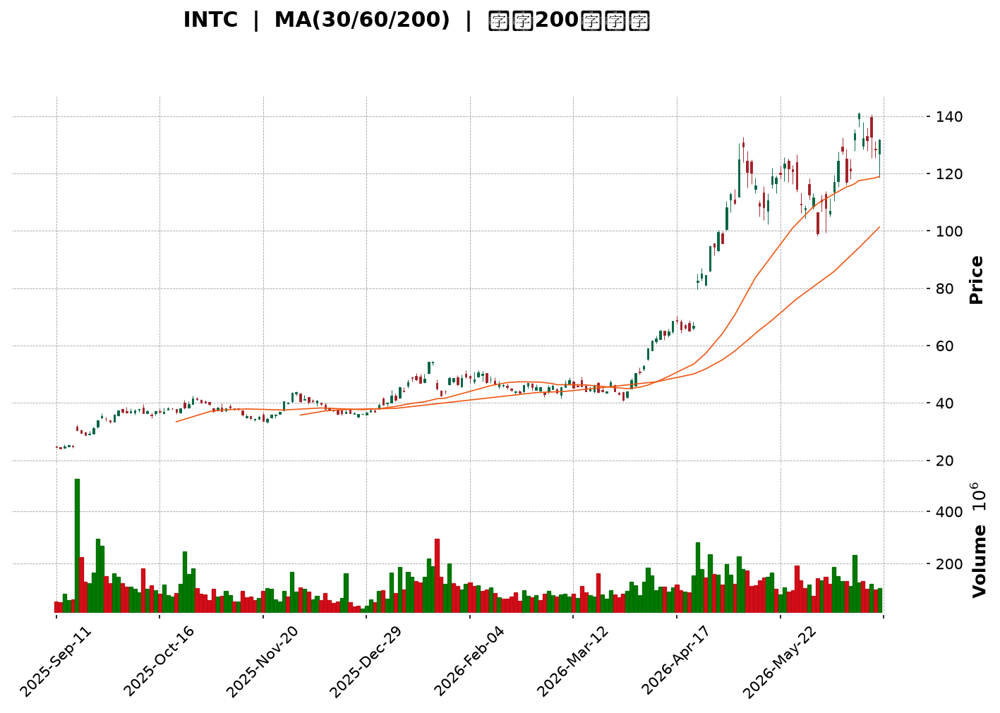
</details>

<html>
<head><meta charset="utf-8" /></head>
<body>
    <div style="height:500px; width:100%;">                        <script>window.PlotlyConfig = {MathJaxConfig: 'local'};</script>
        <script charset="utf-8" src="https://cdn.plot.ly/plotly-3.6.0.min.js" integrity="sha256-QaOVwtVY0T02VaHrr6pnoHLCwayMJp4O5n4YyaE3rJk=" crossorigin="anonymous"></script>                <div id="candlestick-chart" class="plotly-graph-div" style="height:100%; width:100%;"></div>            <script>                window.PLOTLYENV=window.PLOTLYENV || {};                                if (document.getElementById("candlestick-chart")) {                    Plotly.newPlot(                        "candlestick-chart",                        [{"close":{"dtype":"f8","bdata":"AAAAACmcOEAAAADgehQ4QAAAAMAexThAAAAAwB5FOUAAAABgZuY4QAAAAIDrkT5AAAAA4HqUPUAAAABgj8I8QAAAAEAKVz1AAAAA4FE4P0AAAABguP5AQAAAAAAAwEFAAAAAoHA9QUAAAABgZsZAQAAAAOBR+EFAAAAAYGamQkAAAACAPWpCQAAAACCFS0JAAAAAgMKVQkAAAABACrdCQAAAAGBm5kJAAAAAIFwvQkAAAAAAKZxCQAAAAOCj0EFAAAAAQDOTQkAAAAAghWtCQAAAAKBHgUJAAAAAwMwMQ0AAAAAgXA9DQAAAAIDCdUJAAAAA4HoUQ0AAAAAA1yNDQAAAAMAexUNAAAAAANfDREAAAAAghatEQAAAAOB6FERAAAAAYLj+Q0AAAAAAAMBDQAAAAADXg0JAAAAA4KMwQ0AAAABguJ5CQAAAAOCjEENAAAAAoJk5Q0AAAADgo\u002fBCQAAAAIDr8UJAAAAA4Hr0QUAAAABgj8JBQAAAAEDhWkFAAAAAgD0qQUAAAACAFI5BQAAAACBcz0BAAAAAAABAQUAAAADAHuVBQAAAAIA96kFAAAAAIK5nQkAAAAAgrkdEQAAAAKBHAURAAAAAACm8RUAAAACgR+FFQAAAAAAAQERAAAAA4Hq0REAAAABgZiZEQAAAAAAAQERAAAAAANdjREAAAACgR8FDQAAAACCu50JAAAAAoEfBQkAAAAAgrqdCQAAAAGBmBkJAAAAAANcjQkAAAADA9WhCQAAAACBcL0JAAAAAwMwsQkAAAADgehRCQAAAAKCZGUJAAAAAQApXQkAAAABgZqZCQAAAAEAzc0JAAAAA4KOwQ0AAAAAgXK9DQAAAAMAeBURAAAAA4KNQRUAAAACAFI5EQAAAAGBmxkZAAAAAIK4HRkAAAADAHqVHQAAAAAApXEhAAAAAwPUoSEAAAABA4XpHQAAAACCuR0hAAAAAAAAgS0AAAADA9ShLQAAAAMD1iEZAAAAAYLg+RUAAAABACvdFQAAAAADXY0hAAAAA4HpUSEAAAAAAKTxHQAAAACCuZ0hAAAAAAACgSEAAAADAzExIQAAAAGC4HkhAAAAAIIVLSUAAAABguB5JQAAAAOCjkEdAAAAAwB4lSEAAAACgcD1HQAAAAMAeZUdAAAAAQAoXR0AAAABA4bpGQAAAACBcT0ZAAAAAgBQORkAAAADgo9BFQAAAACBcD0dAAAAA4KNwR0AAAABA4bpGQAAAAIAUzkZAAAAAAADARkAAAADAzIxFQAAAAIA9ykZAAAAAoJn5RkAAAACAwrVFQAAAAIA9ykZAAAAAANdjR0AAAACgcP1HQAAAAAAAoEZAAAAAYI\u002fiRkAAAACgR+FGQAAAACCuB0ZAAAAAANeDRkAAAABAChdHQAAAACBc70VAAAAAoEcBRkAAAAAgrgdGQAAAAEAKl0dAAAAAwMwMRkAAAADgo5BFQAAAAOBRmERAAAAA4KMQRkAAAAAA1wNIQAAAAOCjMElAAAAAANdjSUAAAADgenRKQAAAAKCZeU1AAAAAACncTkAAAADgozBPQAAAACCFS1BAAAAAIK7nT0AAAAAAKTxQQAAAAAAAIFFAAAAAAAAgUUAAAADAzGxQQAAAAOCjkFBAAAAAoEdRUEAAAACA67FQQAAAAGCPolRAAAAAIFw\u002fVUAAAACgRyFVQAAAAAAAsFdAAAAAYLieV0AAAAAgrudYQAAAAIDr8VdAAAAAoJkJW0AAAADgo0BcQAAAACCuZ1tAAAAAQOE6X0AAAACAFC5gQAAAAEAKJ15AAAAAYI8SXkAAAAAghftcQAAAAKBHMVtAAAAAQOEKW0AAAABAM7NbQAAAAKBwvV1AAAAAAACgXUAAAACAwvVdQAAAAKBH4V5AAAAAoEdxXkAAAADA9TheQAAAACCFq1xAAAAAwB5VW0AAAAAghftaQAAAAKBwLVxAAAAAgOvxW0AAAABA4cpYQAAAAKBHkVtAAAAAQOH6WkAAAABgj8JaQAAAAKBwPV1AAAAA4HokX0AAAABACvdfQAAAAEAzQ11AAAAAYGZGXkAAAAAgrr9gQAAAAIAUnmFAAAAAwPWIYEAAAADAzHRgQAAAAADXm2BAAAAAgD0KYEAAAABACndgQA=="},"high":{"dtype":"f8","bdata":"AAAAgBTuOEAAAACgR6E4QAAAAIDCdTlAAAAAQApXOUAAAABgj0I5QAAAAOCjMEBAAAAAoEehPkAAAACgmRk+QAAAAEAzMz5AAAAAQDOzP0AAAAAAACBBQAAAAGBmJkJAAAAAYGaGQUAAAABguB5BQAAAACCuB0JAAAAAwPXIQkAAAACAPQpDQAAAAEAKV0NAAAAAYGYGQ0AAAADAHuVCQAAAAMDMDENAAAAAQDPTQ0AAAACgR8FCQAAAAGBmRkJAAAAAYLi+QkAAAABgjwJDQAAAAOCjMENAAAAAYI9CQ0AAAADAzCxDQAAAAEAK90JAAAAAQDMzQ0AAAAAgXI9EQAAAAIDCVURAAAAAoHA9RUAAAADAHgVFQAAAAEAKt0RAAAAAgD1qREAAAACgmTlEQAAAAAAAIENAAAAA4FFYQ0AAAAAghetDQAAAAGCPIkNAAAAAANfDQ0AAAAAAKRxDQAAAAKCZGUNAAAAAIK6nQkAAAADAzAxCQAAAAKBw3UFAAAAAoEdhQUAAAAAAAOBBQAAAAEAKV0JAAAAAoHB9QUAAAADgehRCQAAAAOCjEEJAAAAAYLieQkAAAAAghUtEQAAAAOCjMERAAAAAQArXRUAAAABgjwJGQAAAAADXo0VAAAAAgD1qRUAAAAAgXA9FQAAAAKBHoURAAAAAYLh+REAAAADgURhEQAAAAADXA0RAAAAAoHA9Q0AAAABA4fpCQAAAACCF60JAAAAAYLi+QkAAAACAPcpCQAAAAEAz80JAAAAAYGZmQkAAAABAChdCQAAAAGC4PkJAAAAAYGZmQkAAAACgRyFDQAAAAIA9ykJAAAAAgBTuQ0AAAADAzAxFQAAAACCuJ0RAAAAAwPVIRkAAAAAghatFQAAAAKBw3UZAAAAAoJm5RkAAAABguB5IQAAAAAAAgEhAAAAAgOsxSUAAAABA4RpJQAAAAKBwHUlAAAAA4Ho0S0AAAADAzExLQAAAAOCjEEhAAAAAQOE6RkAAAAAA10NGQAAAAMAepUhAAAAAYI9iSEAAAACAPcpIQAAAACCF60hAAAAAYLi+SUAAAACgmdlIQAAAAIAUbklAAAAAYGamSUAAAAAAKZxJQAAAAMAeRUlAAAAAYGbGSEAAAACgmXlIQAAAAOBR2EdAAAAAgD1qR0AAAABgj2JHQAAAAIDClUZAAAAAgOsxRkAAAABgZkZGQAAAAMDMTEdAAAAAACl8R0AAAACgmXlHQAAAACCuR0dAAAAAIK7nRkAAAADgUdhFQAAAAOCjEEdAAAAAoHA9R0AAAABACpdGQAAAAKBH4UZAAAAA4KPwR0AAAACAPWpIQAAAAOBRuEdAAAAAQDNTR0AAAACAwpVIQAAAAIA9CkdAAAAAQOHaRkAAAADgUThHQAAAAGBmxkdAAAAAQOG6RkAAAAAgridGQAAAAMDM7EdAAAAAwMxMR0AAAADgoxBGQAAAAGC4\u002fkVAAAAAoHAdRkAAAABgj2JIQAAAAGC4PklAAAAAgOsxSkAAAABgj6JKQAAAAIDClU1AAAAAgD0KT0AAAACA67FPQAAAAKCZaVBAAAAAIIVLUEAAAACAwnVQQAAAAEAKJ1FAAAAAwB6VUUAAAACgcE1RQAAAAEDh6lBAAAAAoEcxUUAAAACA6xFRQAAAAIAUTlVAAAAAYGbGVUAAAACAwiVVQAAAAMDMvFdAAAAAACnsV0AAAADAzBxZQAAAAOB69FhAAAAAYLieW0AAAAAAAGBcQAAAAOCjoFxAAAAAgD1SYEAAAAAAAJhgQAAAAGCP8l9AAAAAAABAX0AAAADgeqRdQAAAAOB6pFtAAAAAYI\u002fiXEAAAADgekRcQAAAAAApfF5AAAAAgD3aXUAAAACA67FeQAAAACCuZ19AAAAAoEdRX0AAAADAHsVeQAAAAMD1qF9AAAAAQDNTXEAAAAAAAEBbQAAAAGCPkl1AAAAAwPVIXEAAAABguJ5aQAAAAGCPIlxAAAAAAACAXEAAAAAAAOBbQAAAAAAp3F1AAAAAYGbmX0AAAAAghZNgQAAAAGBmFmBAAAAAwMxMX0AAAAAgXO9gQAAAAGBmrmFAAAAAIFw\u002fYUAAAABgjwJhQAAAAEAKl2FAAAAAIFxnYEAAAACgmYFgQA=="},"hovertemplate":"\u003cb\u003e%{x|%Y-%m-%d}\u003c\u002fb\u003e\u003cbr\u003e\u958b: $%{open:.2f}\u003cbr\u003e\u9ad8: $%{high:.2f}\u003cbr\u003e\u4f4e: $%{low:.2f}\u003cbr\u003e\u6536: $%{close:.2f}\u003cextra\u003e\u003c\u002fextra\u003e","low":{"dtype":"f8","bdata":"AAAAgOuROEAAAADAzAw4QAAAAOBRODhAAAAA4KOwOEAAAABAM3M4QAAAAMD1KD5AAAAA4HpUPUAAAABA4bo8QAAAAIDr0TxAAAAAQOE6PUAAAACAwjU\u002fQAAAAGC4PkFAAAAAoHDdQEAAAABgj4JAQAAAAAAAwEBAAAAA4FG4QUAAAACgmTlCQAAAAEAKN0JAAAAAwMwsQkAAAADgevRBQAAAAIAUbkJAAAAAYGYmQkAAAAAA1yNCQAAAAOBRWEFAAAAAgOvRQUAAAADgejRCQAAAAIA9CkJAAAAAIK7HQkAAAACAwtVCQAAAAMAeBUJAAAAAQAo3QkAAAACAPepCQAAAAKBwHUNAAAAAwB7FQ0AAAACAwnVEQAAAAIAUDkRAAAAAwB7lQ0AAAABgZoZDQAAAAOCjUEJAAAAAgBSOQkAAAABgZmZCQAAAAAApfEJAAAAAACn8QkAAAABguL5CQAAAAMDMrEJAAAAAoJm5QUAAAAAgXE9BQAAAAKBwHUFAAAAAwPXIQEAAAAAAACBBQAAAAKBwvUBAAAAAgOtxQEAAAADgUVhBQAAAAEAKV0FAAAAA4KMQQkAAAAAghatCQAAAAMDMzENAAAAAYGYGREAAAACgR0FFQAAAAIDrEURAAAAAQDOTREAAAACgmdlDQAAAAADXA0RAAAAAgOtxQ0AAAACAPYpDQAAAACBcz0JAAAAAwPWoQkAAAACAwnVCQAAAAAAp\u002fEFAAAAAgMLVQUAAAADgUThCQAAAAMAeJUJAAAAAANcDQkAAAACgmXlBQAAAAMDM7EFAAAAAwPXoQUAAAADA9WhCQAAAACBcb0JAAAAAoEfhQkAAAABgj6JDQAAAAKCZeUNAAAAAIFwPREAAAABACldEQAAAAMD1yERAAAAAgOvxRUAAAAAAKZxGQAAAAIDCtUdAAAAAgD3qR0AAAABA4VpHQAAAAAAAgEdAAAAAQDMTSUAAAACAPYpKQAAAAKCZOUZAAAAAANcjRUAAAADAzIxFQAAAAMD1KEdAAAAAYLh+R0AAAABA4fpGQAAAAAAAwEZAAAAAQAo3SEAAAAAAAIBHQAAAAMAeZUdAAAAAgD1qSEAAAAAghctHQAAAAGCPYkdAAAAAgBRuR0AAAADgURhHQAAAAAApfEZAAAAAQOG6RkAAAADgo3BGQAAAAIDC9UVAAAAA4KNwRUAAAABACpdFQAAAAMAexUVAAAAAgD2KRkAAAACA6zFGQAAAAEAzM0ZAAAAAoJn5RUAAAACA6xFFQAAAAGCPokVAAAAAoJlZRkAAAAAA16NFQAAAAIDr0URAAAAA4Hq0RkAAAADgelRHQAAAAIDClUZAAAAAgOuxRkAAAADgUdhGQAAAAOB69EVAAAAAYGYGRkAAAABAM9NFQAAAAIDr0UVAAAAAYLjeRUAAAACgmZlFQAAAAKCZuUZAAAAAgML1RUAAAACAFG5FQAAAAOCjUERAAAAAwMzMREAAAACgcH1GQAAAAMAeBUdAAAAAIFzvSEAAAAAAKZxJQAAAAGBmZktAAAAAgOsxTUAAAAAAAGBOQAAAAEAKF09AAAAAIIULT0AAAADgo3BPQAAAAKBHEVBAAAAAIFzvUEAAAACAFB5QQAAAAMD1aFBAAAAAYLg+UEAAAABA4VpQQAAAACCu51NAAAAAQAqnVEAAAABAMzNUQAAAACCud1VAAAAAAADgVkAAAABACidXQAAAAGBm5ldAAAAAwB4FWUAAAADAHqVaQAAAAKCZSVtAAAAAQDPzW0AAAABA4fpeQAAAAAAAwFxAAAAAgD0aXUAAAABA4UpcQAAAAKBHQVpAAAAAYGb2WUAAAACgmZlZQAAAAEAzs1xAAAAAQOFKXEAAAACAwoVdQAAAAGBmVl1AAAAAAABAXUAAAAAA1xNdQAAAAGCPYlxAAAAAwB6VWkAAAABA4QpaQAAAAEAKt1tAAAAAYLjeWkAAAADAHpVYQAAAAIA9qlpAAAAAoHDdWEAAAABA4TpaQAAAAOCjoFtAAAAAwB7VXEAAAACAPapfQAAAAAAAAF1AAAAAANeDXUAAAACgmflfQAAAAGC4BmFAAAAAoJkJYEAAAADAzPxfQAAAAIA9Wl9AAAAAAABgX0AAAAAAAKBdQA=="},"name":"\u50f9\u683c","open":{"dtype":"f8","bdata":"AAAAYI\u002fCOEAAAAAAKZw4QAAAAOB6VDhAAAAAgOvROEAAAADgehQ5QAAAACCuxz9AAAAAoEdhPkAAAAAghas9QAAAAKBw\u002fTxAAAAAoEdhPUAAAAAAKZw\u002fQAAAAGCPgkFAAAAAYI9CQUAAAABACvdAQAAAAADXw0BAAAAAoEfhQUAAAACgmflCQAAAAOBRmEJAAAAAgOtRQkAAAABgZkZCQAAAAADXw0JAAAAAQOE6Q0AAAADgUThCQAAAAAAAAEJAAAAAQDMzQkAAAABAM5NCQAAAAIAULkJAAAAAwPXIQkAAAACA6xFDQAAAACCF60JAAAAAwMxMQkAAAABgjwJEQAAAAIDrMUNAAAAAIIXLQ0AAAADAzMxEQAAAAAApfERAAAAAQApXREAAAAAAACBEQAAAAIDrEUNAAAAAgMK1QkAAAAAghStDQAAAAKBHoUJAAAAAQAp3Q0AAAABAMxNDQAAAACCuB0NAAAAAYI+iQkAAAAAA14NBQAAAAKCZuUFAAAAAAAAgQUAAAACAPSpBQAAAAAAAAEJAAAAAoEfBQEAAAAAAKXxBQAAAAGBmxkFAAAAAoJkZQkAAAABAM7NCQAAAAIAU7kNAAAAAACk8REAAAACA67FFQAAAAKBHoUVAAAAA4HqUREAAAADgUfhEQAAAAKBwXURAAAAAgBQOREAAAADA9QhEQAAAAAAAoENAAAAAgD0qQ0AAAACAPcpCQAAAACCFy0JAAAAA4KOwQkAAAACgcD1CQAAAAIDr8UJAAAAAYLgeQkAAAACAwpVBQAAAAIDCFUJAAAAAoEcBQkAAAADgenRCQAAAAEAzs0JAAAAAYI\u002fiQkAAAAAghctEQAAAAIAU7kNAAAAAQAoXREAAAAAgXE9FQAAAAIA96kRAAAAAYLgeRkAAAACA6\u002fFGQAAAAKCZeUhAAAAAwMysSEAAAABgj6JIQAAAAGBmpkdAAAAAwPUoSUAAAABA4RpLQAAAAIAUbkdAAAAAANcjRkAAAAAAKfxFQAAAAMDMTEdAAAAAIK7HR0AAAACgcH1IQAAAAOCj0EZAAAAAIK4HSUAAAADAHsVIQAAAACCFy0dAAAAAwMyMSEAAAAAghctIQAAAAOB6NElAAAAAgBQOSEAAAABgZuZHQAAAAKBH4UZAAAAAQAr3RkAAAACAwvVGQAAAAKCZeUZAAAAAgOvxRUAAAAAghQtGQAAAAMDMDEZAAAAAIIULR0AAAABgj2JHQAAAAEDhOkZAAAAAoJkZRkAAAADgUbhFQAAAAMD1CEZAAAAAIFxvRkAAAACAwlVGQAAAAGC4XkVAAAAA4Hq0RkAAAADA9WhHQAAAAEAzs0dAAAAAACn8RkAAAADgevRHQAAAAIA9CkdAAAAAoJkZRkAAAABguP5FQAAAAKCZeUdAAAAAAABARkAAAADAHsVFQAAAAMDM7EZAAAAAYGYmR0AAAAAgXM9FQAAAAAAp3EVAAAAAoJn5REAAAAAAAIBGQAAAACCuB0dAAAAA4KNwSUAAAADgevRJQAAAACBcr0tAAAAAQDMzTUAAAABgj8JOQAAAAEAKF09AAAAAgD1KUEAAAABgj+JPQAAAACCFO1BAAAAAYGY2UUAAAADAzBxRQAAAAMD1yFBAAAAAACn8UEAAAABgZoZQQAAAAMDMjFRAAAAAQOHqVEAAAACA61FUQAAAAMD1iFVAAAAAYGbmV0AAAADAzExXQAAAACCFy1hAAAAA4KMgWUAAAABguL5bQAAAAKBHwVtAAAAAANfzW0AAAAAAKVxgQAAAAEAKF19AAAAAYGYGX0AAAACAPapcQAAAAGCPcltAAAAAgBReXEAAAABguL5aQAAAAIAUDl1AAAAAwB4lXUAAAACAwhVeQAAAAGBmhl5AAAAAwPUYX0AAAADAzFxeQAAAAGBm9l5AAAAAIIVbW0AAAADAzNxaQAAAAEDhGl1AAAAAoJkZW0AAAABguJ5aQAAAAAAAwFtAAAAAIFw\u002fXEAAAACA64FaQAAAAKBHYVxAAAAAQOFaXUAAAAAgri9gQAAAAEAKR19AAAAAYGZ2XkAAAACA63lgQAAAAADXY2FAAAAAIFw3YEAAAACgmaFgQAAAACBcd2FAAAAAYLgWYEAAAAAAAMBfQA=="},"x":["2025-09-11T00:00:00-04:00","2025-09-12T00:00:00-04:00","2025-09-15T00:00:00-04:00","2025-09-16T00:00:00-04:00","2025-09-17T00:00:00-04:00","2025-09-18T00:00:00-04:00","2025-09-19T00:00:00-04:00","2025-09-22T00:00:00-04:00","2025-09-23T00:00:00-04:00","2025-09-24T00:00:00-04:00","2025-09-25T00:00:00-04:00","2025-09-26T00:00:00-04:00","2025-09-29T00:00:00-04:00","2025-09-30T00:00:00-04:00","2025-10-01T00:00:00-04:00","2025-10-02T00:00:00-04:00","2025-10-03T00:00:00-04:00","2025-10-06T00:00:00-04:00","2025-10-07T00:00:00-04:00","2025-10-08T00:00:00-04:00","2025-10-09T00:00:00-04:00","2025-10-10T00:00:00-04:00","2025-10-13T00:00:00-04:00","2025-10-14T00:00:00-04:00","2025-10-15T00:00:00-04:00","2025-10-16T00:00:00-04:00","2025-10-17T00:00:00-04:00","2025-10-20T00:00:00-04:00","2025-10-21T00:00:00-04:00","2025-10-22T00:00:00-04:00","2025-10-23T00:00:00-04:00","2025-10-24T00:00:00-04:00","2025-10-27T00:00:00-04:00","2025-10-28T00:00:00-04:00","2025-10-29T00:00:00-04:00","2025-10-30T00:00:00-04:00","2025-10-31T00:00:00-04:00","2025-11-03T00:00:00-05:00","2025-11-04T00:00:00-05:00","2025-11-05T00:00:00-05:00","2025-11-06T00:00:00-05:00","2025-11-07T00:00:00-05:00","2025-11-10T00:00:00-05:00","2025-11-11T00:00:00-05:00","2025-11-12T00:00:00-05:00","2025-11-13T00:00:00-05:00","2025-11-14T00:00:00-05:00","2025-11-17T00:00:00-05:00","2025-11-18T00:00:00-05:00","2025-11-19T00:00:00-05:00","2025-11-20T00:00:00-05:00","2025-11-21T00:00:00-05:00","2025-11-24T00:00:00-05:00","2025-11-25T00:00:00-05:00","2025-11-26T00:00:00-05:00","2025-11-28T00:00:00-05:00","2025-12-01T00:00:00-05:00","2025-12-02T00:00:00-05:00","2025-12-03T00:00:00-05:00","2025-12-04T00:00:00-05:00","2025-12-05T00:00:00-05:00","2025-12-08T00:00:00-05:00","2025-12-09T00:00:00-05:00","2025-12-10T00:00:00-05:00","2025-12-11T00:00:00-05:00","2025-12-12T00:00:00-05:00","2025-12-15T00:00:00-05:00","2025-12-16T00:00:00-05:00","2025-12-17T00:00:00-05:00","2025-12-18T00:00:00-05:00","2025-12-19T00:00:00-05:00","2025-12-22T00:00:00-05:00","2025-12-23T00:00:00-05:00","2025-12-24T00:00:00-05:00","2025-12-26T00:00:00-05:00","2025-12-29T00:00:00-05:00","2025-12-30T00:00:00-05:00","2025-12-31T00:00:00-05:00","2026-01-02T00:00:00-05:00","2026-01-05T00:00:00-05:00","2026-01-06T00:00:00-05:00","2026-01-07T00:00:00-05:00","2026-01-08T00:00:00-05:00","2026-01-09T00:00:00-05:00","2026-01-12T00:00:00-05:00","2026-01-13T00:00:00-05:00","2026-01-14T00:00:00-05:00","2026-01-15T00:00:00-05:00","2026-01-16T00:00:00-05:00","2026-01-20T00:00:00-05:00","2026-01-21T00:00:00-05:00","2026-01-22T00:00:00-05:00","2026-01-23T00:00:00-05:00","2026-01-26T00:00:00-05:00","2026-01-27T00:00:00-05:00","2026-01-28T00:00:00-05:00","2026-01-29T00:00:00-05:00","2026-01-30T00:00:00-05:00","2026-02-02T00:00:00-05:00","2026-02-03T00:00:00-05:00","2026-02-04T00:00:00-05:00","2026-02-05T00:00:00-05:00","2026-02-06T00:00:00-05:00","2026-02-09T00:00:00-05:00","2026-02-10T00:00:00-05:00","2026-02-11T00:00:00-05:00","2026-02-12T00:00:00-05:00","2026-02-13T00:00:00-05:00","2026-02-17T00:00:00-05:00","2026-02-18T00:00:00-05:00","2026-02-19T00:00:00-05:00","2026-02-20T00:00:00-05:00","2026-02-23T00:00:00-05:00","2026-02-24T00:00:00-05:00","2026-02-25T00:00:00-05:00","2026-02-26T00:00:00-05:00","2026-02-27T00:00:00-05:00","2026-03-02T00:00:00-05:00","2026-03-03T00:00:00-05:00","2026-03-04T00:00:00-05:00","2026-03-05T00:00:00-05:00","2026-03-06T00:00:00-05:00","2026-03-09T00:00:00-04:00","2026-03-10T00:00:00-04:00","2026-03-11T00:00:00-04:00","2026-03-12T00:00:00-04:00","2026-03-13T00:00:00-04:00","2026-03-16T00:00:00-04:00","2026-03-17T00:00:00-04:00","2026-03-18T00:00:00-04:00","2026-03-19T00:00:00-04:00","2026-03-20T00:00:00-04:00","2026-03-23T00:00:00-04:00","2026-03-24T00:00:00-04:00","2026-03-25T00:00:00-04:00","2026-03-26T00:00:00-04:00","2026-03-27T00:00:00-04:00","2026-03-30T00:00:00-04:00","2026-03-31T00:00:00-04:00","2026-04-01T00:00:00-04:00","2026-04-02T00:00:00-04:00","2026-04-06T00:00:00-04:00","2026-04-07T00:00:00-04:00","2026-04-08T00:00:00-04:00","2026-04-09T00:00:00-04:00","2026-04-10T00:00:00-04:00","2026-04-13T00:00:00-04:00","2026-04-14T00:00:00-04:00","2026-04-15T00:00:00-04:00","2026-04-16T00:00:00-04:00","2026-04-17T00:00:00-04:00","2026-04-20T00:00:00-04:00","2026-04-21T00:00:00-04:00","2026-04-22T00:00:00-04:00","2026-04-23T00:00:00-04:00","2026-04-24T00:00:00-04:00","2026-04-27T00:00:00-04:00","2026-04-28T00:00:00-04:00","2026-04-29T00:00:00-04:00","2026-04-30T00:00:00-04:00","2026-05-01T00:00:00-04:00","2026-05-04T00:00:00-04:00","2026-05-05T00:00:00-04:00","2026-05-06T00:00:00-04:00","2026-05-07T00:00:00-04:00","2026-05-08T00:00:00-04:00","2026-05-11T00:00:00-04:00","2026-05-12T00:00:00-04:00","2026-05-13T00:00:00-04:00","2026-05-14T00:00:00-04:00","2026-05-15T00:00:00-04:00","2026-05-18T00:00:00-04:00","2026-05-19T00:00:00-04:00","2026-05-20T00:00:00-04:00","2026-05-21T00:00:00-04:00","2026-05-22T00:00:00-04:00","2026-05-26T00:00:00-04:00","2026-05-27T00:00:00-04:00","2026-05-28T00:00:00-04:00","2026-05-29T00:00:00-04:00","2026-06-01T00:00:00-04:00","2026-06-02T00:00:00-04:00","2026-06-03T00:00:00-04:00","2026-06-04T00:00:00-04:00","2026-06-05T00:00:00-04:00","2026-06-08T00:00:00-04:00","2026-06-09T00:00:00-04:00","2026-06-10T00:00:00-04:00","2026-06-11T00:00:00-04:00","2026-06-12T00:00:00-04:00","2026-06-15T00:00:00-04:00","2026-06-16T00:00:00-04:00","2026-06-17T00:00:00-04:00","2026-06-18T00:00:00-04:00","2026-06-22T00:00:00-04:00","2026-06-23T00:00:00-04:00","2026-06-24T00:00:00-04:00","2026-06-25T00:00:00-04:00","2026-06-26T00:00:00-04:00","2026-06-29T00:00:00-04:00"],"type":"candlestick"},{"hovertemplate":"MA30: $%{y:.2f}\u003cextra\u003e\u003c\u002fextra\u003e","line":{"color":"#2196F3","dash":"dash","width":2},"mode":"lines","name":"MA30","x":["2025-09-11T00:00:00-04:00","2025-09-12T00:00:00-04:00","2025-09-15T00:00:00-04:00","2025-09-16T00:00:00-04:00","2025-09-17T00:00:00-04:00","2025-09-18T00:00:00-04:00","2025-09-19T00:00:00-04:00","2025-09-22T00:00:00-04:00","2025-09-23T00:00:00-04:00","2025-09-24T00:00:00-04:00","2025-09-25T00:00:00-04:00","2025-09-26T00:00:00-04:00","2025-09-29T00:00:00-04:00","2025-09-30T00:00:00-04:00","2025-10-01T00:00:00-04:00","2025-10-02T00:00:00-04:00","2025-10-03T00:00:00-04:00","2025-10-06T00:00:00-04:00","2025-10-07T00:00:00-04:00","2025-10-08T00:00:00-04:00","2025-10-09T00:00:00-04:00","2025-10-10T00:00:00-04:00","2025-10-13T00:00:00-04:00","2025-10-14T00:00:00-04:00","2025-10-15T00:00:00-04:00","2025-10-16T00:00:00-04:00","2025-10-17T00:00:00-04:00","2025-10-20T00:00:00-04:00","2025-10-21T00:00:00-04:00","2025-10-22T00:00:00-04:00","2025-10-23T00:00:00-04:00","2025-10-24T00:00:00-04:00","2025-10-27T00:00:00-04:00","2025-10-28T00:00:00-04:00","2025-10-29T00:00:00-04:00","2025-10-30T00:00:00-04:00","2025-10-31T00:00:00-04:00","2025-11-03T00:00:00-05:00","2025-11-04T00:00:00-05:00","2025-11-05T00:00:00-05:00","2025-11-06T00:00:00-05:00","2025-11-07T00:00:00-05:00","2025-11-10T00:00:00-05:00","2025-11-11T00:00:00-05:00","2025-11-12T00:00:00-05:00","2025-11-13T00:00:00-05:00","2025-11-14T00:00:00-05:00","2025-11-17T00:00:00-05:00","2025-11-18T00:00:00-05:00","2025-11-19T00:00:00-05:00","2025-11-20T00:00:00-05:00","2025-11-21T00:00:00-05:00","2025-11-24T00:00:00-05:00","2025-11-25T00:00:00-05:00","2025-11-26T00:00:00-05:00","2025-11-28T00:00:00-05:00","2025-12-01T00:00:00-05:00","2025-12-02T00:00:00-05:00","2025-12-03T00:00:00-05:00","2025-12-04T00:00:00-05:00","2025-12-05T00:00:00-05:00","2025-12-08T00:00:00-05:00","2025-12-09T00:00:00-05:00","2025-12-10T00:00:00-05:00","2025-12-11T00:00:00-05:00","2025-12-12T00:00:00-05:00","2025-12-15T00:00:00-05:00","2025-12-16T00:00:00-05:00","2025-12-17T00:00:00-05:00","2025-12-18T00:00:00-05:00","2025-12-19T00:00:00-05:00","2025-12-22T00:00:00-05:00","2025-12-23T00:00:00-05:00","2025-12-24T00:00:00-05:00","2025-12-26T00:00:00-05:00","2025-12-29T00:00:00-05:00","2025-12-30T00:00:00-05:00","2025-12-31T00:00:00-05:00","2026-01-02T00:00:00-05:00","2026-01-05T00:00:00-05:00","2026-01-06T00:00:00-05:00","2026-01-07T00:00:00-05:00","2026-01-08T00:00:00-05:00","2026-01-09T00:00:00-05:00","2026-01-12T00:00:00-05:00","2026-01-13T00:00:00-05:00","2026-01-14T00:00:00-05:00","2026-01-15T00:00:00-05:00","2026-01-16T00:00:00-05:00","2026-01-20T00:00:00-05:00","2026-01-21T00:00:00-05:00","2026-01-22T00:00:00-05:00","2026-01-23T00:00:00-05:00","2026-01-26T00:00:00-05:00","2026-01-27T00:00:00-05:00","2026-01-28T00:00:00-05:00","2026-01-29T00:00:00-05:00","2026-01-30T00:00:00-05:00","2026-02-02T00:00:00-05:00","2026-02-03T00:00:00-05:00","2026-02-04T00:00:00-05:00","2026-02-05T00:00:00-05:00","2026-02-06T00:00:00-05:00","2026-02-09T00:00:00-05:00","2026-02-10T00:00:00-05:00","2026-02-11T00:00:00-05:00","2026-02-12T00:00:00-05:00","2026-02-13T00:00:00-05:00","2026-02-17T00:00:00-05:00","2026-02-18T00:00:00-05:00","2026-02-19T00:00:00-05:00","2026-02-20T00:00:00-05:00","2026-02-23T00:00:00-05:00","2026-02-24T00:00:00-05:00","2026-02-25T00:00:00-05:00","2026-02-26T00:00:00-05:00","2026-02-27T00:00:00-05:00","2026-03-02T00:00:00-05:00","2026-03-03T00:00:00-05:00","2026-03-04T00:00:00-05:00","2026-03-05T00:00:00-05:00","2026-03-06T00:00:00-05:00","2026-03-09T00:00:00-04:00","2026-03-10T00:00:00-04:00","2026-03-11T00:00:00-04:00","2026-03-12T00:00:00-04:00","2026-03-13T00:00:00-04:00","2026-03-16T00:00:00-04:00","2026-03-17T00:00:00-04:00","2026-03-18T00:00:00-04:00","2026-03-19T00:00:00-04:00","2026-03-20T00:00:00-04:00","2026-03-23T00:00:00-04:00","2026-03-24T00:00:00-04:00","2026-03-25T00:00:00-04:00","2026-03-26T00:00:00-04:00","2026-03-27T00:00:00-04:00","2026-03-30T00:00:00-04:00","2026-03-31T00:00:00-04:00","2026-04-01T00:00:00-04:00","2026-04-02T00:00:00-04:00","2026-04-06T00:00:00-04:00","2026-04-07T00:00:00-04:00","2026-04-08T00:00:00-04:00","2026-04-09T00:00:00-04:00","2026-04-10T00:00:00-04:00","2026-04-13T00:00:00-04:00","2026-04-14T00:00:00-04:00","2026-04-15T00:00:00-04:00","2026-04-16T00:00:00-04:00","2026-04-17T00:00:00-04:00","2026-04-20T00:00:00-04:00","2026-04-21T00:00:00-04:00","2026-04-22T00:00:00-04:00","2026-04-23T00:00:00-04:00","2026-04-24T00:00:00-04:00","2026-04-27T00:00:00-04:00","2026-04-28T00:00:00-04:00","2026-04-29T00:00:00-04:00","2026-04-30T00:00:00-04:00","2026-05-01T00:00:00-04:00","2026-05-04T00:00:00-04:00","2026-05-05T00:00:00-04:00","2026-05-06T00:00:00-04:00","2026-05-07T00:00:00-04:00","2026-05-08T00:00:00-04:00","2026-05-11T00:00:00-04:00","2026-05-12T00:00:00-04:00","2026-05-13T00:00:00-04:00","2026-05-14T00:00:00-04:00","2026-05-15T00:00:00-04:00","2026-05-18T00:00:00-04:00","2026-05-19T00:00:00-04:00","2026-05-20T00:00:00-04:00","2026-05-21T00:00:00-04:00","2026-05-22T00:00:00-04:00","2026-05-26T00:00:00-04:00","2026-05-27T00:00:00-04:00","2026-05-28T00:00:00-04:00","2026-05-29T00:00:00-04:00","2026-06-01T00:00:00-04:00","2026-06-02T00:00:00-04:00","2026-06-03T00:00:00-04:00","2026-06-04T00:00:00-04:00","2026-06-05T00:00:00-04:00","2026-06-08T00:00:00-04:00","2026-06-09T00:00:00-04:00","2026-06-10T00:00:00-04:00","2026-06-11T00:00:00-04:00","2026-06-12T00:00:00-04:00","2026-06-15T00:00:00-04:00","2026-06-16T00:00:00-04:00","2026-06-17T00:00:00-04:00","2026-06-18T00:00:00-04:00","2026-06-22T00:00:00-04:00","2026-06-23T00:00:00-04:00","2026-06-24T00:00:00-04:00","2026-06-25T00:00:00-04:00","2026-06-26T00:00:00-04:00","2026-06-29T00:00:00-04:00"],"y":{"dtype":"f8","bdata":"AAAAAAAA+H8AAAAAAAD4fwAAAAAAAPh\u002fAAAAAAAA+H8AAAAAAAD4fwAAAAAAAPh\u002fAAAAAAAA+H8AAAAAAAD4fwAAAAAAAPh\u002fAAAAAAAA+H8AAAAAAAD4fwAAAAAAAPh\u002fAAAAAAAA+H8AAAAAAAD4fwAAAAAAAPh\u002fAAAAAAAA+H8AAAAAAAD4fwAAAAAAAPh\u002fAAAAAAAA+H8AAAAAAAD4fwAAAAAAAPh\u002fAAAAAAAA+H8AAAAAAAD4fwAAAAAAAPh\u002fAAAAAAAA+H8AAAAAAAD4fwAAAAAAAPh\u002fAAAAAAAA+H8AAAAAAAD4f+\u002fu7iajt0BAVVVVXXPxQEDNzMyMCS5BQERERFQObUFAVVVVlW6yQUCrqqpyk\u002fhBQBEREUl+IUJAiYiIyOhNQkAiIiK6u3tCQJqZmUGLnEJAMzMz4xe7QkARERHB9chCQKuqqmou1EJAd3d3tx7lQkC8u7s7mPdCQHd3dyfq\u002f0JAd3d35\u002fv5QkCJiIgIZfRCQCIiIpJf7EJAmpmZiUHgQkCrqqp6W9ZCQN7d3c2FxEJARERERIu8QkAzMzNTcbZCQHd3d8dLt0JAiYiIaNi1QkBERESkt8VCQBEREXGE0kJAq6qq6m3pQkDNzMxMfgFDQN7d3Z3EEENAvLu7e6IeQ0DNzMzcQCdDQAAAAHBZK0NAzczMPCYoQ0AzMzNjVyBDQAAAAJBQFkNAzczMvLsLQ0DNzMysYwJDQBEREUE1\u002fkJA3t3dfT\u002f1QkDNzMy8dPNCQImIiFjy60JAVVVVlfziQkAiIiLipdtCQERERPRv1EJAAAAAALnXQkC8u7s7Ud9CQM3MzEyp6EJA7+7uPjX+QkDNzMxMYhBDQHd3d6fGK0NAiYiIyHZOQ0BERESkKWVDQImIiHiijkNAd3d3Z5GtQ0C8u7tbSMpDQBEREQFy70NA7+7ufiMEREAAAADAyhFEQLy7u2suNERAAAAAIPdqREBERES0yKZEQM3MzFxIukRAREREJJTBREBmZmb2b9REQAAAACA+A0VAZmZm5tAyRUAAAAAQ5llFQDMzM2NXkEVAZmZmFq7HRUDNzMz88PlFQCIiIjKWLEZAMzMzE1hpRkARERExa6VGQKuqqqoN1EZAIiIi4pYFR0BERETkwSxHQImIiGj0VkdAIiIi0vdzR0CamZm5841HQN7d3U1+oUdAvLu7286nR0Dv7u5ej7JHQGZmZvb9tEdAd3d3JwbBR0De3d1NN7lHQKuqqlryq0dAmpmZKeqfR0AzMzMDco9HQO\u002fu7g67gkdA7+7uPlFfR0CamZmJzzBHQImIiJj8MkdAq6qqakpFR0CJiIgYklZHQFVVVWWCR0dA7+7uvi07R0C8u7s7JjhHQHd3d\u002ffhI0dAmpmZmeARR0ARERFRjQdHQLy7uxvo9EZA3t3d\u002fdTYRkCJiIjIdr5GQFVVVWWtvkZAvLu7y8ysRkBERES0gZ5GQCIiIgKdhkZAzczM3N19RkDNzMz81IhGQCIiInJooUZAzczM3N29RkCJiIgYduVGQBEREeEzHEdA3t3dHYVbR0BVVVVFtqNHQN7d3e0190dAVVVVVVVFSEARERFxhKJIQBERETFPBElA3t3dzYVkSUARERGBlcNJQERERJTRG0pAZmZmlrVqSkAzMzMz7LpKQDMzM9MGWktAVVVVhV0BTEBmZmbGvaZMQFVVVcUEf01AzczMXAFSTkCJiIgYBDZPQERERNS\u002fCVBAq6qq0pSSUEB3d3e3rCVRQImIiEjhqlFAd3d3x0tXUkBERESMbA9TQFVVVXXauFNAERER+VNbVEBVVVVtLuxUQGZmZia\u002faFVA3t3dvS3jVUDv7u5mrV5WQM3MzNyy3lZAAAAAUNRXV0CamZkhadJXQERERIzeTlhA7+7uboTKWEB3d3eX4EFZQHd3dwdlpFlAd3d3p3\u002f7WUDe3d3dllVaQCIiIsKuuFpAvLu7a+cbW0De3d2tAGFbQERERPQonFtAq6qqyhPNW0B3d3e3Hv1bQGZmZlaALFxAzczMfLFsXECrqqpK8KhcQM3MzIxQ1lxAmpmZ+fDxXECrqqrash5dQAAAAMCDYV1Aq6qqSjdxXUDe3d097nVdQFVVVdUVkF1AmpmZSTehXUC8u7u75sJdQA=="},"type":"scatter"},{"hovertemplate":"MA60: $%{y:.2f}\u003cextra\u003e\u003c\u002fextra\u003e","line":{"color":"#9C27B0","dash":"dash","width":2},"mode":"lines","name":"MA60","x":["2025-09-11T00:00:00-04:00","2025-09-12T00:00:00-04:00","2025-09-15T00:00:00-04:00","2025-09-16T00:00:00-04:00","2025-09-17T00:00:00-04:00","2025-09-18T00:00:00-04:00","2025-09-19T00:00:00-04:00","2025-09-22T00:00:00-04:00","2025-09-23T00:00:00-04:00","2025-09-24T00:00:00-04:00","2025-09-25T00:00:00-04:00","2025-09-26T00:00:00-04:00","2025-09-29T00:00:00-04:00","2025-09-30T00:00:00-04:00","2025-10-01T00:00:00-04:00","2025-10-02T00:00:00-04:00","2025-10-03T00:00:00-04:00","2025-10-06T00:00:00-04:00","2025-10-07T00:00:00-04:00","2025-10-08T00:00:00-04:00","2025-10-09T00:00:00-04:00","2025-10-10T00:00:00-04:00","2025-10-13T00:00:00-04:00","2025-10-14T00:00:00-04:00","2025-10-15T00:00:00-04:00","2025-10-16T00:00:00-04:00","2025-10-17T00:00:00-04:00","2025-10-20T00:00:00-04:00","2025-10-21T00:00:00-04:00","2025-10-22T00:00:00-04:00","2025-10-23T00:00:00-04:00","2025-10-24T00:00:00-04:00","2025-10-27T00:00:00-04:00","2025-10-28T00:00:00-04:00","2025-10-29T00:00:00-04:00","2025-10-30T00:00:00-04:00","2025-10-31T00:00:00-04:00","2025-11-03T00:00:00-05:00","2025-11-04T00:00:00-05:00","2025-11-05T00:00:00-05:00","2025-11-06T00:00:00-05:00","2025-11-07T00:00:00-05:00","2025-11-10T00:00:00-05:00","2025-11-11T00:00:00-05:00","2025-11-12T00:00:00-05:00","2025-11-13T00:00:00-05:00","2025-11-14T00:00:00-05:00","2025-11-17T00:00:00-05:00","2025-11-18T00:00:00-05:00","2025-11-19T00:00:00-05:00","2025-11-20T00:00:00-05:00","2025-11-21T00:00:00-05:00","2025-11-24T00:00:00-05:00","2025-11-25T00:00:00-05:00","2025-11-26T00:00:00-05:00","2025-11-28T00:00:00-05:00","2025-12-01T00:00:00-05:00","2025-12-02T00:00:00-05:00","2025-12-03T00:00:00-05:00","2025-12-04T00:00:00-05:00","2025-12-05T00:00:00-05:00","2025-12-08T00:00:00-05:00","2025-12-09T00:00:00-05:00","2025-12-10T00:00:00-05:00","2025-12-11T00:00:00-05:00","2025-12-12T00:00:00-05:00","2025-12-15T00:00:00-05:00","2025-12-16T00:00:00-05:00","2025-12-17T00:00:00-05:00","2025-12-18T00:00:00-05:00","2025-12-19T00:00:00-05:00","2025-12-22T00:00:00-05:00","2025-12-23T00:00:00-05:00","2025-12-24T00:00:00-05:00","2025-12-26T00:00:00-05:00","2025-12-29T00:00:00-05:00","2025-12-30T00:00:00-05:00","2025-12-31T00:00:00-05:00","2026-01-02T00:00:00-05:00","2026-01-05T00:00:00-05:00","2026-01-06T00:00:00-05:00","2026-01-07T00:00:00-05:00","2026-01-08T00:00:00-05:00","2026-01-09T00:00:00-05:00","2026-01-12T00:00:00-05:00","2026-01-13T00:00:00-05:00","2026-01-14T00:00:00-05:00","2026-01-15T00:00:00-05:00","2026-01-16T00:00:00-05:00","2026-01-20T00:00:00-05:00","2026-01-21T00:00:00-05:00","2026-01-22T00:00:00-05:00","2026-01-23T00:00:00-05:00","2026-01-26T00:00:00-05:00","2026-01-27T00:00:00-05:00","2026-01-28T00:00:00-05:00","2026-01-29T00:00:00-05:00","2026-01-30T00:00:00-05:00","2026-02-02T00:00:00-05:00","2026-02-03T00:00:00-05:00","2026-02-04T00:00:00-05:00","2026-02-05T00:00:00-05:00","2026-02-06T00:00:00-05:00","2026-02-09T00:00:00-05:00","2026-02-10T00:00:00-05:00","2026-02-11T00:00:00-05:00","2026-02-12T00:00:00-05:00","2026-02-13T00:00:00-05:00","2026-02-17T00:00:00-05:00","2026-02-18T00:00:00-05:00","2026-02-19T00:00:00-05:00","2026-02-20T00:00:00-05:00","2026-02-23T00:00:00-05:00","2026-02-24T00:00:00-05:00","2026-02-25T00:00:00-05:00","2026-02-26T00:00:00-05:00","2026-02-27T00:00:00-05:00","2026-03-02T00:00:00-05:00","2026-03-03T00:00:00-05:00","2026-03-04T00:00:00-05:00","2026-03-05T00:00:00-05:00","2026-03-06T00:00:00-05:00","2026-03-09T00:00:00-04:00","2026-03-10T00:00:00-04:00","2026-03-11T00:00:00-04:00","2026-03-12T00:00:00-04:00","2026-03-13T00:00:00-04:00","2026-03-16T00:00:00-04:00","2026-03-17T00:00:00-04:00","2026-03-18T00:00:00-04:00","2026-03-19T00:00:00-04:00","2026-03-20T00:00:00-04:00","2026-03-23T00:00:00-04:00","2026-03-24T00:00:00-04:00","2026-03-25T00:00:00-04:00","2026-03-26T00:00:00-04:00","2026-03-27T00:00:00-04:00","2026-03-30T00:00:00-04:00","2026-03-31T00:00:00-04:00","2026-04-01T00:00:00-04:00","2026-04-02T00:00:00-04:00","2026-04-06T00:00:00-04:00","2026-04-07T00:00:00-04:00","2026-04-08T00:00:00-04:00","2026-04-09T00:00:00-04:00","2026-04-10T00:00:00-04:00","2026-04-13T00:00:00-04:00","2026-04-14T00:00:00-04:00","2026-04-15T00:00:00-04:00","2026-04-16T00:00:00-04:00","2026-04-17T00:00:00-04:00","2026-04-20T00:00:00-04:00","2026-04-21T00:00:00-04:00","2026-04-22T00:00:00-04:00","2026-04-23T00:00:00-04:00","2026-04-24T00:00:00-04:00","2026-04-27T00:00:00-04:00","2026-04-28T00:00:00-04:00","2026-04-29T00:00:00-04:00","2026-04-30T00:00:00-04:00","2026-05-01T00:00:00-04:00","2026-05-04T00:00:00-04:00","2026-05-05T00:00:00-04:00","2026-05-06T00:00:00-04:00","2026-05-07T00:00:00-04:00","2026-05-08T00:00:00-04:00","2026-05-11T00:00:00-04:00","2026-05-12T00:00:00-04:00","2026-05-13T00:00:00-04:00","2026-05-14T00:00:00-04:00","2026-05-15T00:00:00-04:00","2026-05-18T00:00:00-04:00","2026-05-19T00:00:00-04:00","2026-05-20T00:00:00-04:00","2026-05-21T00:00:00-04:00","2026-05-22T00:00:00-04:00","2026-05-26T00:00:00-04:00","2026-05-27T00:00:00-04:00","2026-05-28T00:00:00-04:00","2026-05-29T00:00:00-04:00","2026-06-01T00:00:00-04:00","2026-06-02T00:00:00-04:00","2026-06-03T00:00:00-04:00","2026-06-04T00:00:00-04:00","2026-06-05T00:00:00-04:00","2026-06-08T00:00:00-04:00","2026-06-09T00:00:00-04:00","2026-06-10T00:00:00-04:00","2026-06-11T00:00:00-04:00","2026-06-12T00:00:00-04:00","2026-06-15T00:00:00-04:00","2026-06-16T00:00:00-04:00","2026-06-17T00:00:00-04:00","2026-06-18T00:00:00-04:00","2026-06-22T00:00:00-04:00","2026-06-23T00:00:00-04:00","2026-06-24T00:00:00-04:00","2026-06-25T00:00:00-04:00","2026-06-26T00:00:00-04:00","2026-06-29T00:00:00-04:00"],"y":{"dtype":"f8","bdata":"AAAAAAAA+H8AAAAAAAD4fwAAAAAAAPh\u002fAAAAAAAA+H8AAAAAAAD4fwAAAAAAAPh\u002fAAAAAAAA+H8AAAAAAAD4fwAAAAAAAPh\u002fAAAAAAAA+H8AAAAAAAD4fwAAAAAAAPh\u002fAAAAAAAA+H8AAAAAAAD4fwAAAAAAAPh\u002fAAAAAAAA+H8AAAAAAAD4fwAAAAAAAPh\u002fAAAAAAAA+H8AAAAAAAD4fwAAAAAAAPh\u002fAAAAAAAA+H8AAAAAAAD4fwAAAAAAAPh\u002fAAAAAAAA+H8AAAAAAAD4fwAAAAAAAPh\u002fAAAAAAAA+H8AAAAAAAD4fwAAAAAAAPh\u002fAAAAAAAA+H8AAAAAAAD4fwAAAAAAAPh\u002fAAAAAAAA+H8AAAAAAAD4fwAAAAAAAPh\u002fAAAAAAAA+H8AAAAAAAD4fwAAAAAAAPh\u002fAAAAAAAA+H8AAAAAAAD4fwAAAAAAAPh\u002fAAAAAAAA+H8AAAAAAAD4fwAAAAAAAPh\u002fAAAAAAAA+H8AAAAAAAD4fwAAAAAAAPh\u002fAAAAAAAA+H8AAAAAAAD4fwAAAAAAAPh\u002fAAAAAAAA+H8AAAAAAAD4fwAAAAAAAPh\u002fAAAAAAAA+H8AAAAAAAD4fwAAAAAAAPh\u002fAAAAAAAA+H8AAAAAAAD4f2ZmZuIz5EFAiYiI7AoIQkDNzMw0pSpCQCIiIuIzTEJAERERaUptQkDv7u5qdYxCQImIiGznm0JAq6qqQtKsQkB3d3ezD79CQFVVVUFgzUJAiYiIsCvYQkDv7u4+Nd5CQJqZmWEQ4EJAZmZmpg3kQkDv7u4On+lCQN7d3Q0t6kJAvLu7c9roQkAiIiIi2+lCQHd3d2+E6kJAREREZDvvQkC8u7vjXvNCQKuqqjom+EJAZmZmBoEFQ0C8u7t7zQ1DQAAAACD3IkNAAAAA6LQxQ0AAAAAAAEhDQBERETn7YENAzczMtMh2Q0BmZmaGpIlDQM3MzIR5okNA3t3dzczEQ0CJiIjIBOdDQGZmZubQ8kNAiYiIMN30Q0DNzMysY\u002fpDQAAAAFjHDERAmpmZUUYfREBmZmbeJC5EQCIiIlJGR0RAIiIiynZeREDNzMzcsnZEQFVVVUVEjERAREREVCqmRECamZmJiMBEQHd3d88+1ERAERER8afuREAAAACQCQZFQKuqqtrOH0VAiYiIiBY5RUAzMzMDK09FQKuqqnqiZkVAIiIi0iJ7RUCamZmB3ItFQHd3dzfQoUVAd3d3x0u3RUDNzMzUv8FFQN7d3S2yzUVARERE1AbSRUCamZlhntBFQFVVVb1020VAd3d3LyTlRUDv7u4ezOtFQKuqqnqi9kVAd3d3R28DRkB3d3cHgRVGQKuqqkJgJUZAq6qqUv82RkDe3d0lBklGQFVVVa0cWkZAAAAAWMdsRkDv7u4mv4BGQO\u002fu7ia\u002fkEZAiYiIiBahRkDNzMz88LFGQAAAAIhdyUZA7+7u1jHZRkBERETMoeVGQFVVVbXI7kZAd3d31+r4RkAzMzNbZAtHQAAAAGBzIUdAREREXNYyR0C8u7u7AkxHQLy7u+uYaEdAq6qqokWOR0CamZnJdq5HQERERCSU0UdAd3d3v5\u002fyR0AiIiI6+xhIQAAAACCFQ0hAZmZmhuthSEBVVVWFMnpIQGZmZhZnp0hAiYiIAADYSEDe3d0lvwhJQERERJzEUElAIiIiokWeSUAREREBcu9JQGZmZl5zUUpAMzMz+\u002fCxSkDNzMy0yB5LQCIiIuIzhEtAmpmZUf\u002f+S0C8u7sb6IRMQDMzM\u002fs3Ck1AVVVVLbKtTUBmZmZmrV5OQGZmZvYo\u002fE5Ad3d350KaT0De3d11TBhQQLy7u6+5XFBAIiIiVg6hUECamZk5tOhQQKuqqmZmNlFAd3d3b8uCUUAiIiIiItJRQJqZmcE8JVJAzczMjJd2UkAAAABokclSQAAAAFBGE1NAMzMzR+FWU0AzMzPPsJtTQCIiIsZL41NAd3d3G6EoVEC8u7tjO19UQO\u002fu7i6WpFRAq6qqRuHmVEBVVVXNPihVQImIiFwBdlVAmpmZFdnKVUB3d3cr+SFWQImIiDAIcFZAIiIi5kLCVkARERHJLyJXQERERIQyhldAERERiUHkV0ARERFlrUJYQFVVVSV4pFhAVVVVoUX+WECJiIiUildZQA=="},"type":"scatter"},{"hovertemplate":"MA200: $%{y:.2f}\u003cextra\u003e\u003c\u002fextra\u003e","line":{"color":"#FF6F00","dash":"solid","width":2},"mode":"lines","name":"MA200","x":["2025-09-11T00:00:00-04:00","2025-09-12T00:00:00-04:00","2025-09-15T00:00:00-04:00","2025-09-16T00:00:00-04:00","2025-09-17T00:00:00-04:00","2025-09-18T00:00:00-04:00","2025-09-19T00:00:00-04:00","2025-09-22T00:00:00-04:00","2025-09-23T00:00:00-04:00","2025-09-24T00:00:00-04:00","2025-09-25T00:00:00-04:00","2025-09-26T00:00:00-04:00","2025-09-29T00:00:00-04:00","2025-09-30T00:00:00-04:00","2025-10-01T00:00:00-04:00","2025-10-02T00:00:00-04:00","2025-10-03T00:00:00-04:00","2025-10-06T00:00:00-04:00","2025-10-07T00:00:00-04:00","2025-10-08T00:00:00-04:00","2025-10-09T00:00:00-04:00","2025-10-10T00:00:00-04:00","2025-10-13T00:00:00-04:00","2025-10-14T00:00:00-04:00","2025-10-15T00:00:00-04:00","2025-10-16T00:00:00-04:00","2025-10-17T00:00:00-04:00","2025-10-20T00:00:00-04:00","2025-10-21T00:00:00-04:00","2025-10-22T00:00:00-04:00","2025-10-23T00:00:00-04:00","2025-10-24T00:00:00-04:00","2025-10-27T00:00:00-04:00","2025-10-28T00:00:00-04:00","2025-10-29T00:00:00-04:00","2025-10-30T00:00:00-04:00","2025-10-31T00:00:00-04:00","2025-11-03T00:00:00-05:00","2025-11-04T00:00:00-05:00","2025-11-05T00:00:00-05:00","2025-11-06T00:00:00-05:00","2025-11-07T00:00:00-05:00","2025-11-10T00:00:00-05:00","2025-11-11T00:00:00-05:00","2025-11-12T00:00:00-05:00","2025-11-13T00:00:00-05:00","2025-11-14T00:00:00-05:00","2025-11-17T00:00:00-05:00","2025-11-18T00:00:00-05:00","2025-11-19T00:00:00-05:00","2025-11-20T00:00:00-05:00","2025-11-21T00:00:00-05:00","2025-11-24T00:00:00-05:00","2025-11-25T00:00:00-05:00","2025-11-26T00:00:00-05:00","2025-11-28T00:00:00-05:00","2025-12-01T00:00:00-05:00","2025-12-02T00:00:00-05:00","2025-12-03T00:00:00-05:00","2025-12-04T00:00:00-05:00","2025-12-05T00:00:00-05:00","2025-12-08T00:00:00-05:00","2025-12-09T00:00:00-05:00","2025-12-10T00:00:00-05:00","2025-12-11T00:00:00-05:00","2025-12-12T00:00:00-05:00","2025-12-15T00:00:00-05:00","2025-12-16T00:00:00-05:00","2025-12-17T00:00:00-05:00","2025-12-18T00:00:00-05:00","2025-12-19T00:00:00-05:00","2025-12-22T00:00:00-05:00","2025-12-23T00:00:00-05:00","2025-12-24T00:00:00-05:00","2025-12-26T00:00:00-05:00","2025-12-29T00:00:00-05:00","2025-12-30T00:00:00-05:00","2025-12-31T00:00:00-05:00","2026-01-02T00:00:00-05:00","2026-01-05T00:00:00-05:00","2026-01-06T00:00:00-05:00","2026-01-07T00:00:00-05:00","2026-01-08T00:00:00-05:00","2026-01-09T00:00:00-05:00","2026-01-12T00:00:00-05:00","2026-01-13T00:00:00-05:00","2026-01-14T00:00:00-05:00","2026-01-15T00:00:00-05:00","2026-01-16T00:00:00-05:00","2026-01-20T00:00:00-05:00","2026-01-21T00:00:00-05:00","2026-01-22T00:00:00-05:00","2026-01-23T00:00:00-05:00","2026-01-26T00:00:00-05:00","2026-01-27T00:00:00-05:00","2026-01-28T00:00:00-05:00","2026-01-29T00:00:00-05:00","2026-01-30T00:00:00-05:00","2026-02-02T00:00:00-05:00","2026-02-03T00:00:00-05:00","2026-02-04T00:00:00-05:00","2026-02-05T00:00:00-05:00","2026-02-06T00:00:00-05:00","2026-02-09T00:00:00-05:00","2026-02-10T00:00:00-05:00","2026-02-11T00:00:00-05:00","2026-02-12T00:00:00-05:00","2026-02-13T00:00:00-05:00","2026-02-17T00:00:00-05:00","2026-02-18T00:00:00-05:00","2026-02-19T00:00:00-05:00","2026-02-20T00:00:00-05:00","2026-02-23T00:00:00-05:00","2026-02-24T00:00:00-05:00","2026-02-25T00:00:00-05:00","2026-02-26T00:00:00-05:00","2026-02-27T00:00:00-05:00","2026-03-02T00:00:00-05:00","2026-03-03T00:00:00-05:00","2026-03-04T00:00:00-05:00","2026-03-05T00:00:00-05:00","2026-03-06T00:00:00-05:00","2026-03-09T00:00:00-04:00","2026-03-10T00:00:00-04:00","2026-03-11T00:00:00-04:00","2026-03-12T00:00:00-04:00","2026-03-13T00:00:00-04:00","2026-03-16T00:00:00-04:00","2026-03-17T00:00:00-04:00","2026-03-18T00:00:00-04:00","2026-03-19T00:00:00-04:00","2026-03-20T00:00:00-04:00","2026-03-23T00:00:00-04:00","2026-03-24T00:00:00-04:00","2026-03-25T00:00:00-04:00","2026-03-26T00:00:00-04:00","2026-03-27T00:00:00-04:00","2026-03-30T00:00:00-04:00","2026-03-31T00:00:00-04:00","2026-04-01T00:00:00-04:00","2026-04-02T00:00:00-04:00","2026-04-06T00:00:00-04:00","2026-04-07T00:00:00-04:00","2026-04-08T00:00:00-04:00","2026-04-09T00:00:00-04:00","2026-04-10T00:00:00-04:00","2026-04-13T00:00:00-04:00","2026-04-14T00:00:00-04:00","2026-04-15T00:00:00-04:00","2026-04-16T00:00:00-04:00","2026-04-17T00:00:00-04:00","2026-04-20T00:00:00-04:00","2026-04-21T00:00:00-04:00","2026-04-22T00:00:00-04:00","2026-04-23T00:00:00-04:00","2026-04-24T00:00:00-04:00","2026-04-27T00:00:00-04:00","2026-04-28T00:00:00-04:00","2026-04-29T00:00:00-04:00","2026-04-30T00:00:00-04:00","2026-05-01T00:00:00-04:00","2026-05-04T00:00:00-04:00","2026-05-05T00:00:00-04:00","2026-05-06T00:00:00-04:00","2026-05-07T00:00:00-04:00","2026-05-08T00:00:00-04:00","2026-05-11T00:00:00-04:00","2026-05-12T00:00:00-04:00","2026-05-13T00:00:00-04:00","2026-05-14T00:00:00-04:00","2026-05-15T00:00:00-04:00","2026-05-18T00:00:00-04:00","2026-05-19T00:00:00-04:00","2026-05-20T00:00:00-04:00","2026-05-21T00:00:00-04:00","2026-05-22T00:00:00-04:00","2026-05-26T00:00:00-04:00","2026-05-27T00:00:00-04:00","2026-05-28T00:00:00-04:00","2026-05-29T00:00:00-04:00","2026-06-01T00:00:00-04:00","2026-06-02T00:00:00-04:00","2026-06-03T00:00:00-04:00","2026-06-04T00:00:00-04:00","2026-06-05T00:00:00-04:00","2026-06-08T00:00:00-04:00","2026-06-09T00:00:00-04:00","2026-06-10T00:00:00-04:00","2026-06-11T00:00:00-04:00","2026-06-12T00:00:00-04:00","2026-06-15T00:00:00-04:00","2026-06-16T00:00:00-04:00","2026-06-17T00:00:00-04:00","2026-06-18T00:00:00-04:00","2026-06-22T00:00:00-04:00","2026-06-23T00:00:00-04:00","2026-06-24T00:00:00-04:00","2026-06-25T00:00:00-04:00","2026-06-26T00:00:00-04:00","2026-06-29T00:00:00-04:00"],"y":{"dtype":"f8","bdata":"AAAAAAAA+H8AAAAAAAD4fwAAAAAAAPh\u002fAAAAAAAA+H8AAAAAAAD4fwAAAAAAAPh\u002fAAAAAAAA+H8AAAAAAAD4fwAAAAAAAPh\u002fAAAAAAAA+H8AAAAAAAD4fwAAAAAAAPh\u002fAAAAAAAA+H8AAAAAAAD4fwAAAAAAAPh\u002fAAAAAAAA+H8AAAAAAAD4fwAAAAAAAPh\u002fAAAAAAAA+H8AAAAAAAD4fwAAAAAAAPh\u002fAAAAAAAA+H8AAAAAAAD4fwAAAAAAAPh\u002fAAAAAAAA+H8AAAAAAAD4fwAAAAAAAPh\u002fAAAAAAAA+H8AAAAAAAD4fwAAAAAAAPh\u002fAAAAAAAA+H8AAAAAAAD4fwAAAAAAAPh\u002fAAAAAAAA+H8AAAAAAAD4fwAAAAAAAPh\u002fAAAAAAAA+H8AAAAAAAD4fwAAAAAAAPh\u002fAAAAAAAA+H8AAAAAAAD4fwAAAAAAAPh\u002fAAAAAAAA+H8AAAAAAAD4fwAAAAAAAPh\u002fAAAAAAAA+H8AAAAAAAD4fwAAAAAAAPh\u002fAAAAAAAA+H8AAAAAAAD4fwAAAAAAAPh\u002fAAAAAAAA+H8AAAAAAAD4fwAAAAAAAPh\u002fAAAAAAAA+H8AAAAAAAD4fwAAAAAAAPh\u002fAAAAAAAA+H8AAAAAAAD4fwAAAAAAAPh\u002fAAAAAAAA+H8AAAAAAAD4fwAAAAAAAPh\u002fAAAAAAAA+H8AAAAAAAD4fwAAAAAAAPh\u002fAAAAAAAA+H8AAAAAAAD4fwAAAAAAAPh\u002fAAAAAAAA+H8AAAAAAAD4fwAAAAAAAPh\u002fAAAAAAAA+H8AAAAAAAD4fwAAAAAAAPh\u002fAAAAAAAA+H8AAAAAAAD4fwAAAAAAAPh\u002fAAAAAAAA+H8AAAAAAAD4fwAAAAAAAPh\u002fAAAAAAAA+H8AAAAAAAD4fwAAAAAAAPh\u002fAAAAAAAA+H8AAAAAAAD4fwAAAAAAAPh\u002fAAAAAAAA+H8AAAAAAAD4fwAAAAAAAPh\u002fAAAAAAAA+H8AAAAAAAD4fwAAAAAAAPh\u002fAAAAAAAA+H8AAAAAAAD4fwAAAAAAAPh\u002fAAAAAAAA+H8AAAAAAAD4fwAAAAAAAPh\u002fAAAAAAAA+H8AAAAAAAD4fwAAAAAAAPh\u002fAAAAAAAA+H8AAAAAAAD4fwAAAAAAAPh\u002fAAAAAAAA+H8AAAAAAAD4fwAAAAAAAPh\u002fAAAAAAAA+H8AAAAAAAD4fwAAAAAAAPh\u002fAAAAAAAA+H8AAAAAAAD4fwAAAAAAAPh\u002fAAAAAAAA+H8AAAAAAAD4fwAAAAAAAPh\u002fAAAAAAAA+H8AAAAAAAD4fwAAAAAAAPh\u002fAAAAAAAA+H8AAAAAAAD4fwAAAAAAAPh\u002fAAAAAAAA+H8AAAAAAAD4fwAAAAAAAPh\u002fAAAAAAAA+H8AAAAAAAD4fwAAAAAAAPh\u002fAAAAAAAA+H8AAAAAAAD4fwAAAAAAAPh\u002fAAAAAAAA+H8AAAAAAAD4fwAAAAAAAPh\u002fAAAAAAAA+H8AAAAAAAD4fwAAAAAAAPh\u002fAAAAAAAA+H8AAAAAAAD4fwAAAAAAAPh\u002fAAAAAAAA+H8AAAAAAAD4fwAAAAAAAPh\u002fAAAAAAAA+H8AAAAAAAD4fwAAAAAAAPh\u002fAAAAAAAA+H8AAAAAAAD4fwAAAAAAAPh\u002fAAAAAAAA+H8AAAAAAAD4fwAAAAAAAPh\u002fAAAAAAAA+H8AAAAAAAD4fwAAAAAAAPh\u002fAAAAAAAA+H8AAAAAAAD4fwAAAAAAAPh\u002fAAAAAAAA+H8AAAAAAAD4fwAAAAAAAPh\u002fAAAAAAAA+H8AAAAAAAD4fwAAAAAAAPh\u002fAAAAAAAA+H8AAAAAAAD4fwAAAAAAAPh\u002fAAAAAAAA+H8AAAAAAAD4fwAAAAAAAPh\u002fAAAAAAAA+H8AAAAAAAD4fwAAAAAAAPh\u002fAAAAAAAA+H8AAAAAAAD4fwAAAAAAAPh\u002fAAAAAAAA+H8AAAAAAAD4fwAAAAAAAPh\u002fAAAAAAAA+H8AAAAAAAD4fwAAAAAAAPh\u002fAAAAAAAA+H8AAAAAAAD4fwAAAAAAAPh\u002fAAAAAAAA+H8AAAAAAAD4fwAAAAAAAPh\u002fAAAAAAAA+H8AAAAAAAD4fwAAAAAAAPh\u002fAAAAAAAA+H8AAAAAAAD4fwAAAAAAAPh\u002fAAAAAAAA+H8AAAAAAAD4fwAAAAAAAPh\u002fAAAAAAAA+H\u002fhehQkKGJNQA=="},"type":"scatter"}],                        {"template":{"data":{"barpolar":[{"marker":{"line":{"color":"rgb(17,17,17)","width":0.5},"pattern":{"fillmode":"overlay","size":10,"solidity":0.2}},"type":"barpolar"}],"bar":[{"error_x":{"color":"#f2f5fa"},"error_y":{"color":"#f2f5fa"},"marker":{"line":{"color":"rgb(17,17,17)","width":0.5},"pattern":{"fillmode":"overlay","size":10,"solidity":0.2}},"type":"bar"}],"carpet":[{"aaxis":{"endlinecolor":"#A2B1C6","gridcolor":"#506784","linecolor":"#506784","minorgridcolor":"#506784","startlinecolor":"#A2B1C6"},"baxis":{"endlinecolor":"#A2B1C6","gridcolor":"#506784","linecolor":"#506784","minorgridcolor":"#506784","startlinecolor":"#A2B1C6"},"type":"carpet"}],"choropleth":[{"colorbar":{"outlinewidth":0,"ticks":""},"type":"choropleth"}],"contourcarpet":[{"colorbar":{"outlinewidth":0,"ticks":""},"type":"contourcarpet"}],"contour":[{"colorbar":{"outlinewidth":0,"ticks":""},"colorscale":[[0.0,"#0d0887"],[0.1111111111111111,"#46039f"],[0.2222222222222222,"#7201a8"],[0.3333333333333333,"#9c179e"],[0.4444444444444444,"#bd3786"],[0.5555555555555556,"#d8576b"],[0.6666666666666666,"#ed7953"],[0.7777777777777778,"#fb9f3a"],[0.8888888888888888,"#fdca26"],[1.0,"#f0f921"]],"type":"contour"}],"heatmap":[{"colorbar":{"outlinewidth":0,"ticks":""},"colorscale":[[0.0,"#0d0887"],[0.1111111111111111,"#46039f"],[0.2222222222222222,"#7201a8"],[0.3333333333333333,"#9c179e"],[0.4444444444444444,"#bd3786"],[0.5555555555555556,"#d8576b"],[0.6666666666666666,"#ed7953"],[0.7777777777777778,"#fb9f3a"],[0.8888888888888888,"#fdca26"],[1.0,"#f0f921"]],"type":"heatmap"}],"histogram2dcontour":[{"colorbar":{"outlinewidth":0,"ticks":""},"colorscale":[[0.0,"#0d0887"],[0.1111111111111111,"#46039f"],[0.2222222222222222,"#7201a8"],[0.3333333333333333,"#9c179e"],[0.4444444444444444,"#bd3786"],[0.5555555555555556,"#d8576b"],[0.6666666666666666,"#ed7953"],[0.7777777777777778,"#fb9f3a"],[0.8888888888888888,"#fdca26"],[1.0,"#f0f921"]],"type":"histogram2dcontour"}],"histogram2d":[{"colorbar":{"outlinewidth":0,"ticks":""},"colorscale":[[0.0,"#0d0887"],[0.1111111111111111,"#46039f"],[0.2222222222222222,"#7201a8"],[0.3333333333333333,"#9c179e"],[0.4444444444444444,"#bd3786"],[0.5555555555555556,"#d8576b"],[0.6666666666666666,"#ed7953"],[0.7777777777777778,"#fb9f3a"],[0.8888888888888888,"#fdca26"],[1.0,"#f0f921"]],"type":"histogram2d"}],"histogram":[{"marker":{"pattern":{"fillmode":"overlay","size":10,"solidity":0.2}},"type":"histogram"}],"mesh3d":[{"colorbar":{"outlinewidth":0,"ticks":""},"type":"mesh3d"}],"parcoords":[{"line":{"colorbar":{"outlinewidth":0,"ticks":""}},"type":"parcoords"}],"pie":[{"automargin":true,"type":"pie"}],"scatter3d":[{"line":{"colorbar":{"outlinewidth":0,"ticks":""}},"marker":{"colorbar":{"outlinewidth":0,"ticks":""}},"type":"scatter3d"}],"scattercarpet":[{"marker":{"colorbar":{"outlinewidth":0,"ticks":""}},"type":"scattercarpet"}],"scattergeo":[{"marker":{"colorbar":{"outlinewidth":0,"ticks":""}},"type":"scattergeo"}],"scattergl":[{"marker":{"line":{"color":"#283442"}},"type":"scattergl"}],"scattermapbox":[{"marker":{"colorbar":{"outlinewidth":0,"ticks":""}},"type":"scattermapbox"}],"scattermap":[{"marker":{"colorbar":{"outlinewidth":0,"ticks":""}},"type":"scattermap"}],"scatterpolargl":[{"marker":{"colorbar":{"outlinewidth":0,"ticks":""}},"type":"scatterpolargl"}],"scatterpolar":[{"marker":{"colorbar":{"outlinewidth":0,"ticks":""}},"type":"scatterpolar"}],"scatter":[{"marker":{"line":{"color":"#283442"}},"type":"scatter"}],"scatterternary":[{"marker":{"colorbar":{"outlinewidth":0,"ticks":""}},"type":"scatterternary"}],"surface":[{"colorbar":{"outlinewidth":0,"ticks":""},"colorscale":[[0.0,"#0d0887"],[0.1111111111111111,"#46039f"],[0.2222222222222222,"#7201a8"],[0.3333333333333333,"#9c179e"],[0.4444444444444444,"#bd3786"],[0.5555555555555556,"#d8576b"],[0.6666666666666666,"#ed7953"],[0.7777777777777778,"#fb9f3a"],[0.8888888888888888,"#fdca26"],[1.0,"#f0f921"]],"type":"surface"}],"table":[{"cells":{"fill":{"color":"#506784"},"line":{"color":"rgb(17,17,17)"}},"header":{"fill":{"color":"#2a3f5f"},"line":{"color":"rgb(17,17,17)"}},"type":"table"}]},"layout":{"annotationdefaults":{"arrowcolor":"#f2f5fa","arrowhead":0,"arrowwidth":1},"autotypenumbers":"strict","coloraxis":{"colorbar":{"outlinewidth":0,"ticks":""}},"colorscale":{"diverging":[[0,"#8e0152"],[0.1,"#c51b7d"],[0.2,"#de77ae"],[0.3,"#f1b6da"],[0.4,"#fde0ef"],[0.5,"#f7f7f7"],[0.6,"#e6f5d0"],[0.7,"#b8e186"],[0.8,"#7fbc41"],[0.9,"#4d9221"],[1,"#276419"]],"sequential":[[0.0,"#0d0887"],[0.1111111111111111,"#46039f"],[0.2222222222222222,"#7201a8"],[0.3333333333333333,"#9c179e"],[0.4444444444444444,"#bd3786"],[0.5555555555555556,"#d8576b"],[0.6666666666666666,"#ed7953"],[0.7777777777777778,"#fb9f3a"],[0.8888888888888888,"#fdca26"],[1.0,"#f0f921"]],"sequentialminus":[[0.0,"#0d0887"],[0.1111111111111111,"#46039f"],[0.2222222222222222,"#7201a8"],[0.3333333333333333,"#9c179e"],[0.4444444444444444,"#bd3786"],[0.5555555555555556,"#d8576b"],[0.6666666666666666,"#ed7953"],[0.7777777777777778,"#fb9f3a"],[0.8888888888888888,"#fdca26"],[1.0,"#f0f921"]]},"colorway":["#636efa","#EF553B","#00cc96","#ab63fa","#FFA15A","#19d3f3","#FF6692","#B6E880","#FF97FF","#FECB52"],"font":{"color":"#f2f5fa"},"geo":{"bgcolor":"rgb(17,17,17)","lakecolor":"rgb(17,17,17)","landcolor":"rgb(17,17,17)","showlakes":true,"showland":true,"subunitcolor":"#506784"},"hoverlabel":{"align":"left"},"hovermode":"closest","mapbox":{"style":"dark"},"paper_bgcolor":"rgb(17,17,17)","plot_bgcolor":"rgb(17,17,17)","polar":{"angularaxis":{"gridcolor":"#506784","linecolor":"#506784","ticks":""},"bgcolor":"rgb(17,17,17)","radialaxis":{"gridcolor":"#506784","linecolor":"#506784","ticks":""}},"scene":{"xaxis":{"backgroundcolor":"rgb(17,17,17)","gridcolor":"#506784","gridwidth":2,"linecolor":"#506784","showbackground":true,"ticks":"","zerolinecolor":"#C8D4E3"},"yaxis":{"backgroundcolor":"rgb(17,17,17)","gridcolor":"#506784","gridwidth":2,"linecolor":"#506784","showbackground":true,"ticks":"","zerolinecolor":"#C8D4E3"},"zaxis":{"backgroundcolor":"rgb(17,17,17)","gridcolor":"#506784","gridwidth":2,"linecolor":"#506784","showbackground":true,"ticks":"","zerolinecolor":"#C8D4E3"}},"shapedefaults":{"line":{"color":"#f2f5fa"}},"sliderdefaults":{"bgcolor":"#C8D4E3","bordercolor":"rgb(17,17,17)","borderwidth":1,"tickwidth":0},"ternary":{"aaxis":{"gridcolor":"#506784","linecolor":"#506784","ticks":""},"baxis":{"gridcolor":"#506784","linecolor":"#506784","ticks":""},"bgcolor":"rgb(17,17,17)","caxis":{"gridcolor":"#506784","linecolor":"#506784","ticks":""}},"title":{"x":0.05},"updatemenudefaults":{"bgcolor":"#506784","borderwidth":0},"xaxis":{"automargin":true,"gridcolor":"#283442","linecolor":"#506784","ticks":"","title":{"standoff":15},"zerolinecolor":"#283442","zerolinewidth":2},"yaxis":{"automargin":true,"gridcolor":"#283442","linecolor":"#506784","ticks":"","title":{"standoff":15},"zerolinecolor":"#283442","zerolinewidth":2}}},"xaxis":{"rangeslider":{"visible":false},"title":{"text":"\u65e5\u671f"}},"font":{"size":11},"title":{"text":"INTC  |  MA(30\u002f60\u002f200)  |  \u6700\u8fd1200\u4ea4\u6613\u65e5"},"yaxis":{"title":{"text":"\u80a1\u50f9 (USD)"}},"hovermode":"x unified","height":500},                        {"responsive": true}                    )                };            </script>        </div>
</body>
</html>

# INTC 技術分析報告

> **報告日期**：2026-06-30 ｜ **語言**：繁體中文 ｜ **數據來源**：Yahoo Finance ｜ **當前價格**：$131.72

---

## 目錄

| 章節 | 內容 |
|------|------|
| [1. 技術面概覽](#1-技術面概覽) | 訊號儀表板、核心指標、評分卡 |
| [2. 趨勢分析](#2-趨勢分析) | 多時框趨勢、長中短期走勢 |
| [3. 圖表形態分析](#3-圖表形態分析) | 形態識別、K線組合、目標價 |
| [4. 支撐與阻力](#4-支撐與阻力) | 關鍵價位、斐波那契回調 |
| [5. 技術指標深度解讀](#5-技術指標深度解讀) | MA/RSI/MACD/布林/成交量 |
| [6. 動能與波動率](#6-動能與波動率) | 動能評估、ATR、Beta |
| [7. 多時框架總結](#7-多時框架總結) | 時框架評分矩陣 |
| [8. 交易策略建議](#8-交易策略建議) | 多空策略、風險報酬比 |
| [9. 風險提示與監控](#9-風險提示與監控) | 監控指標、風險場景 |

---

## 1. 技術面概覽

本章節將對 INTC 的當前技術面狀況進行快速而全面的評估，透過訊號儀表板、核心指標速覽表及專業評分卡，為投資者提供一個即時的市場情緒與趨勢判斷。

### 🎯 技術訊號儀表板

當前 INTC 的技術訊號呈現多空交織的複雜局面。長期趨勢保持強勁多頭，但中期動能指標已顯露出疲態與頂背離跡象，提示潛在的回調風險。

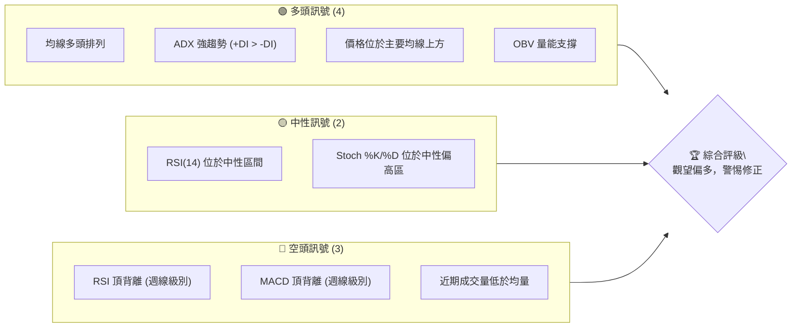

**解讀**：
INTC 的長期與中期均線系統呈現完美的「多頭排列」，且價格穩定運行於所有主要均線上方，ADX 指標也確認了當前趨勢的強勁性與多頭主導。這顯示了其強大的上漲慣性。然而，週線級別的RSI和MACD均出現明顯的頂背離現象，即價格創出新高或接近新高，但動能指標卻未能同步創高，這通常是趨勢可能反轉或進入修正的早期警示訊號。此外，近期成交量未能配合價格上漲，也為當前漲勢的持續性蒙上陰影。綜合來看，雖然大趨勢仍偏多，但短期內需高度警惕技術性修正的風險。

### 📊 核心指標速覽表

以下表格彙整了 INTC 的關鍵技術指標數據，提供一目瞭然的當前市場狀況。

| 指標類別 | 指標名稱 | 當前數值 | 訊號 | 解讀 |
|----------|----------|----------|------|------|
| **價格** | 當前價格 | $131.72 | 🟢 | 位於所有主要均線上方，接近52週高點。 |
| **均線** | MA20 | $120.27 | 🟢 | 價格位於短期均線上方，短期趨勢強勁。 |
| **均線** | MA50 | $109.65 | 🟢 | 價格位於中期均線上方，中期趨勢穩健。 |
| **均線** | MA200 | $58.77 | 🟢 | 價格遠高於長期均線，長期趨勢極為強勁。 |
| **動能** | RSI(14) | 63.89 | 🟡 | 位於中性偏強區間，但週線級別有頂背離。 |
| **動能** | MACD | +0.281 (Hist) | 🟢 | MACD線位於訊號線上，柱狀圖為正，短期看多。但週線級別有頂背離。 |
| **趨勢** | ADX(14) | 25.99 | 🟢 | 趨勢強度強勁 (>25)，且多頭 (+DI) 主導。 |
| **波動** | ATR(14) | $10.97 | 🟡 | 波動率相對較高 (8.33%)，操作需謹慎。 |
| **成交量** | 量比 (20D) | 0.81x | 🔴 | 近期成交量萎縮，未能有效配合價格上漲。 |
| **布林通道** | %B | 0.74 | 🟡 | 價格位於布林通道上軌附近，顯示強勢但可能面臨回調壓力。 |

### 🏆 技術評分卡

綜合以上各項技術指標分析，INTC 的整體技術評分如下：

```
╔══════════════════════════════════════════════════════════════╗
║             技術評分卡 — INTC (2026-06-30)                     ║
╠══════════════════════════════════════════════════════════════╣
║ 趨勢強度      ████████████████░░░░  80/100  🟢 趨勢明確強勁     ║
║ 動能指標      ████████░░░░░░░░░░░░  65/100  🟡 動能中性偏強，但警惕背離║
║ 支撐穩定度    ████████████░░░░░░░░  75/100  🟢 主要均線提供強力支撐  ║
║ 成交量配合    ██████░░░░░░░░░░░░░░  30/100  🔴 量能未能有效配合       ║
║ 形態完整度    ██████░░░░░░░░░░░░░░  40/100  🟡 潛在整理或反轉形態       ║
║ 均線排列      ██████████████████░░  90/100  🟢 完美多頭排列           ║
╠══════════════════════════════════════════════════════════════╣
║ 綜合評分      ██████████░░░░░░░░░░  68/100  ⚖️ 觀望偏多，警惕回調    ║
╚══════════════════════════════════════════════════════════════╝
```

**評分理由**：
*   **趨勢強度**：ADX高於25，+DI主導，且所有均線向上發散，顯示極強的多頭趨勢，給予高分。
*   **動能指標**：MACD目前為正，RSI處於中性偏強，但週線級別的RSI和MACD頂背離是主要扣分項，表明上漲動能正在衰竭，潛在風險較高。
*   **支撐穩定度**：價格遠高於MA200，且MA20和MA50形成有效支撐區，為多頭提供堅實基礎。
*   **成交量配合**：近期成交量大幅萎縮，未能有效支持價格上漲，這是明顯的負面訊號，給予低分。
*   **形態完整度**：當前價格在經歷大幅上漲後，未能有效突破前高，並伴隨動能背離，暗示可能正在形成整理或反轉形態，形態尚不明確，但傾向於謹慎。
*   **均線排列**：MA20 > MA50 > MA200 的完美多頭排列，是極為強勁的看漲訊號，給予高分。

**綜合評級**：INTC 整體仍處於強勁的多頭趨勢中，但動能指標的頂背離和成交量的萎縮是不可忽視的警示。目前建議保持觀望偏多的態度，並密切關注後續價格行為，尤其是對關鍵支撐位的考驗，以防範潛在的技術性修正。

---

## 2. 趨勢分析

本章節將從多個時間框架深入分析 INTC 的價格趨勢，從宏觀到微觀，全面掌握其市場走向與潛在變化。

### 🌐 多時框趨勢分析

INTC 在不同時間框架下呈現出不同的趨勢特徵，理解這些差異對於制定交易策略至關重要。

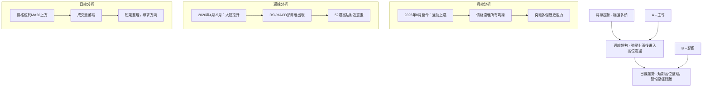

**分析**：
*   **月線趨勢**：INTC 自2025年8月開始，經歷了一波驚人的上漲行情，從約 $24 飆升至當前的 $131.72，漲幅高達約448%。月線圖上，價格呈現陡峭的上升通道，遠離所有長期移動平均線，顯示出極為強勁且不可逆轉的長期多頭趨勢。
*   **週線趨勢**：週線圖上，自2026年4月起，INTC 股價加速上漲，在2026年5月10日達到 $124.92 的高點，隨後經歷了一次顯著的回調至 $99.17 (2026年6月7日)，然後再次反彈至 $133.99 (2026年6月21日)。儘管價格仍在高位，但週線級別的RSI和MACD指標已顯示出明顯的頂背離，暗示中期上漲動能正在減弱，市場可能正在進入高位整理或潛在反轉階段。
*   **日線趨勢**：日線圖顯示，INTC 在觸及 $133.99 後，目前處於高位震盪整理狀態。價格雖仍在MA20上方運行，但近期成交量未能有效放大，且動能指標已顯疲態。短期內，市場正在消化前期的巨大漲幅，並尋求新的方向。

### 📈 長期趨勢 — 12個月走勢圖（Unicode）

以下是 INTC 過去12個月的月線收盤價走勢圖，清晰展示了其長期上漲的軌跡。

```
INTC 月線走勢圖（過去12個月）
價格軸 ($)
$140 ┤                                                               ● ($131.72)
$130 ┤                                                               ● ($124.57)
$120 ┤                                                           ● ($119.84)
$110 ┤                                                       ● ($114.68)
$100 ┤                                                   ● ($99.17)
$90  ┤                                               ● ($94.48)
$80  ┤                                           ● ($82.54)
$70  ┤                                       ● ($68.50)
$60  ┤                                   ● ($62.38)
$50  ┤                               ● ($50.38)
$40  ┤            ● ($40.56)   ● ($46.47)   ● ($45.61)   ● ($44.13)
$30  ┤● ($30.55)
$20  ┤  ● ($22.04) ● ($23.46) ● ($21.52) ● ($24.05) ● ($20.05) ● ($19.43) ● ($23.73) ● ($22.71) ● ($20.10) ● ($19.55) ● ($22.40) ● ($19.80)
$10  ┤──────────────────────────────────────────────────────────────────
     └──────────────────────────────────────────────────────────────────
      2024-07  08  09  10  11  12  2025-01 02  03  04  05  06  07  08  09  10  11  12  2026-01 02  03  04  05  06
                                                              ↑ 關鍵轉折點 ($19.80)
                                                          ↑ 關鍵突破點 ($33.55)
                                                      ↑ 強勁拉升起點 ($50.38)
                                                    ↑ 當前價格 ($131.72)
```

**走勢特徵分析表格**：
下表詳細分析了 INTC 過去12個月的價格走勢特徵。

| 期間        | 價格區間     | 漲跌幅    | 走勢特徵                                             | 關鍵事件/觀察                               |
|-------------|--------------|-----------|------------------------------------------------------|---------------------------------------------|
| 2024-07     | $30.55       | -         | 起始點                                               | -                                           |
| 2024-08 ~ 2025-07 | $19.43 ~ $30.55 | 震盪整理 | 股價在低位區間築底，多次測試 $20 附近支撐。        | 長期底部形態，等待催化劑。                  |
| 2025-08     | $24.35       | +22.98%   | 底部開始反彈，突破整理區間。                       | 量能開始溫和放大。                          |
| 2025-09     | $33.55       | +37.78%   | 加速上漲，確認突破長期整理區間。                   | 突破關鍵阻力位，開啟新一輪漲勢。            |
| 2025-10 ~ 2025-11 | $39.99 ~ $40.56 | 溫和上漲 | 漲勢持續，但斜率趨緩，進入高位盤整。               | 消化前期漲幅，蓄勢待發。                    |
| 2025-12     | $36.90       | -9.02%    | 短期回調，但未破壞上升趨勢。                       | 測試短期支撐，市場情緒謹慎。                |
| 2026-01 ~ 2026-03 | $44.13 ~ $46.47 | 橫盤整理 | 股價在 $40-$46 區間震盪，積蓄能量。                | 為後續的爆發性上漲做準備。                  |
| 2026-04     | $94.48       | +114.10%  | **爆炸性上漲**，突破整理區間，漲幅巨大。           | 重大利好或市場情緒引爆，成交量顯著放大。    |
| 2026-05     | $114.68      | +21.38%   | 漲勢延續，但已出現高位震盪。                       | 觸及52週高點，動能指標開始過熱。            |
| 2026-06     | $131.72      | +14.86%   | 繼續上漲，但伴隨大幅波動與動能背離。               | 創歷史新高，但漲勢質量下降，潛在風險累積。  |

### 📊 中期趨勢（週線分析）

中期趨勢顯示 INTC 在經歷了2026年4月至5月的爆炸性上漲後，目前正處於高位震盪整理階段。

```
INTC 週線壓力與支撐示意圖
═══════════════════════════════════════════════════
$141.45 ║████████████████████████║ 歷史阻力/52週高點
$133.99 ║████████████████████████║ 近期高點阻力
$131.72 ╠════════════════════════╣ ◄ 現價
$124.92 ║▓▓▓▓▓▓▓▓▓▓▓▓▓▓▓▓        ║ 近期反彈阻力 (前高)
$120.27 ║▓▓▓▓▓▓▓▓▓▓▓▓▓▓▓▓        ║ MA20支撐
$114.68 ║████████████████████████║ 前期回調低點支撐
$109.65 ║████████████████████████║ MA50支撐
$99.17  ║████████████████████████║ 關鍵回調支撐
═══════════════════════════════════════════════════
```
**分析**：
INTC 的中期走勢在2026年4月至5月期間呈現出強勁的上升趨勢。然而，在觸及 $124.92 (5月10日) 和 $133.99 (6月21日) 兩個高點後，價格均未能有效維持，並伴隨較大幅度的回調。目前價格 $131.72 位於 $133.99 的近期高點下方，顯示上漲動能有所減弱。MA20 ($120.27) 和 MA50 ($109.65) 仍維持上升趨勢，為中期提供了動態支撐。但需要注意的是，價格在 $141.45 的52週高點附近面臨較強的阻力，突破此水平需強勁的量能配合。下方的 $114.68 和 $99.17 是近期回調的重要支撐位，若跌破這些價位，中期趨勢可能轉弱。

### ⚡ 趨勢強度評估（ADX 解讀）

ADX 指標用於衡量趨勢的強度，而非方向。+DI 和 -DI 則指示趨勢方向。

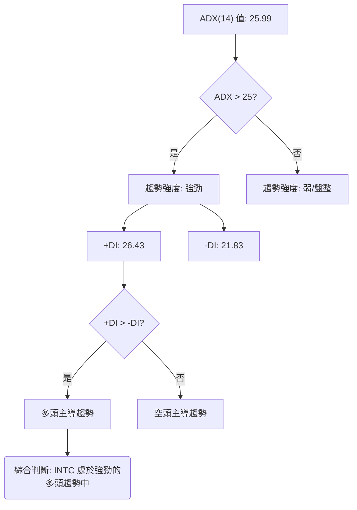

**ADX 強度對照表**：

| ADX 數值範圍 | 趨勢強度     |
|--------------|--------------|
| 0-20         | 無趨勢或弱趨勢 |
| 20-25        | 趨勢形成中   |
| **25-50**    | **強趨勢**   |
| 50-75        | 極強趨勢     |
| 75-100       | 超強趨勢     |

**分析**：
INTC 的 ADX(14) 數值為 **25.99**，這明確指示當前市場存在一個強勁的趨勢。根據 ADX 強度對照表，當 ADX 值超過 25 時，趨勢被認為是強勁的。
進一步觀察 +DI 和 -DI：
*   +DI 為 **26.43**
*   -DI 為 **21.83**
由於 +DI (26.43) 高於 -DI (21.83)，這表明當前的強勁趨勢是由多頭主導的。換句話說，INTC 目前正處於一個強勁的上升趨勢中。儘管短期內價格可能出現波動，但 ADX 指標確認了其底層的多頭力量依然強大。這與均線的多頭排列相互印證，增強了對長期多頭趨勢的信心。然而，強趨勢並不代表不會回調，動能背離訊號仍需警惕。

---

## 3. 圖表形態分析

本章節將識別 INTC 股價圖上的潛在形態，並分析其 K 線組合，以預測未來的價格走向與目標價位。

### 🔍 形態識別系統

在 INTC 的週線圖上，自2026年4月以來的走勢，在經歷大幅上漲後，出現了兩個高點 ($124.92, $133.99) 和一次深幅回調 ($99.17)。這可能預示著兩種潛在的形態：

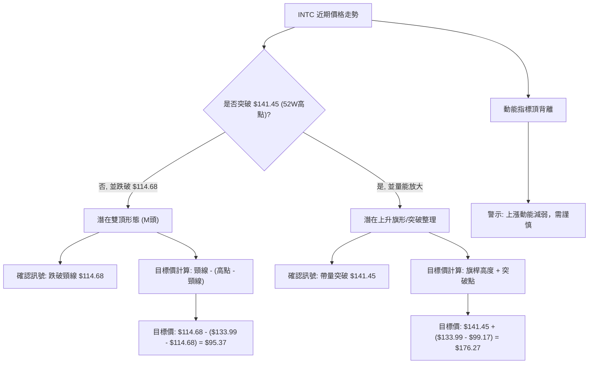

**分析**：
INTC 在2026年4月至6月經歷了一波強勁上漲，但隨後在 $124.92 和 $133.99 附近形成兩個相對高點，中間伴隨 $99.17 的深幅回調。
*   **潛在雙頂形態 (M頭)**：如果 INTC 股價無法有效突破 $133.99 甚至 $141.45 的歷史高點，並向下突破近期回調的低點 $114.68 (5月31日週收盤價)，則可能形成一個雙頂形態。RSI和MACD的頂背離加強了這種可能性。
*   **潛在上升旗形/突破整理**：如果 INTC 能夠在當前位置進行充分整理後，再次帶量突破 $133.99 和 $141.45 的歷史高點，那麼之前的回調可能只是上升旗形或牛市中的健康修正，後市仍有上漲空間。

目前來看，由於動能指標的背離，形成「雙頂」的可能性需要高度警惕。

### 🕯️ 重要K線形態分析

分析近期的週K線形態，判斷市場情緒和短期趨勢。

| 日期          | 收盤價  | K線形態 (週線) | 解讀                                                                                                                                                                                                                                                                                                                                                                                                                                                                                                                                                                                                                                                                                                                                                                                                                                                                                                                                                                                                                                                                                                                                                                                                                                                                                                                                                                                                                                                                                                                                                                                                                                                                                                                                                                                                                                                                                                                                                                                                                                                                                                                                                                                                                                                                                                                                                                                                                                                                                                                                                                                                                                                                                                                                                                                                                                                                                                                                                                                                                                                                                                                                                                                                                                                                                                                                                                                                                                                                                                                                                                                                                                                                                                                                                                                                                                                                                                                                                                                                                                                                                                                                                                                                                                                                                                                                                                                                                                                                                                                                                                                                                                                                                                                                                                                                                                                                                                                                                                                                                                                                                                                                                                                                                                                                                                                                                                                                                                                                                                                                                                                                                                                                                                                                                                                                                                                                                                                                                                                                                                                                                                                                                                                                                                                                                                                                                                                                                                                                                                                                                                                                                                                                                                                                                                                                                                                                                                                                                                                                                                                                                                                                                                                                                                                                                                                                                                                                                                                                                                                                                                                                                                                                                                                                                                                                                                                                                                                                                                                                                                                                                                                                                                                                                                                                                                                                                                                                                                                                                                                                                                                                                                                                                                                                                                                                                                                                                                                                                                                                                                                                                                                                                                                                                                                                                                                                                                                                                                                                                                                                                                                                                                                                                                                                                                                                                                                                                                                                                                                                                                                                                                                                                                                                                                                                                                                                                                                                                                                                                                                                                                                                                                                                                                                                                                                                                                                                                                                                                                                                                                                                                                                                                                                                                                                                                                                                                                                                                                                                                                                                                                                                                                                                                                                                                                                                                                                                                                                                                                                                                                                                                                                                                                                                                                                                                                                                                                                                                                                                                                                                                                                                                                                                                                                                                                                                                                                                                                                                                                                                                                                                                                                                                                                                                                                                                                                                                                                                                                                                                                                                                                                                                                                                                                                                                                                                                                                                                                                                                                                                                                                                                                                                                                                                                                                                                                                                                                                                                                                                                                                                                                                                                                                                                                                                                                                                                                                                                                                                                                                                                                                                                                                                                                                                                                                                                                                                                                                                                                                                                                                                                                                                                                                                                                                                                                                                                                                                                                                                                                                                                                                                                                                                                                                                                                                                                                                                                                                                                                                                                                                                                                                                                                                                                                                                                                                                                                                                                                                                                                                                                                                                                                                                                                                                                                                                                                                                                                                                                                                                                                                                                                                                                                                                                                                                                                                                                                                                                                                                                                                                                                                                                                                                                                                                                                                                                                                                                                                                                                                                                                                                                                                                                                                                                                                                                                                                                                                                                                                                                                                                                                                                                                                                                                                                                                                                                                                                                                                                                                                                                                                                                                                                                                                                                                                                                                                                                                                                                                                                                                                                                                                                                                                                                                                                                                                                                                                                                                                                                                                                                                                                                                                                                                                                                                                                                                                                                                                                                                                                                                                                                                                                                                                                                                                                                                                                                                                                                                                                                                                                                                                                                                                                                                                                                                                                                                                                                                                                                                                                                                                                                                                                                                                                                                                                                                                                                                                                                                                                                                                                                                                                                                                                                                                                                                                                                                                                                                                                                                                                                                                                                                                                                                                                                                                                                                                                                                                                                                                                                                                                                                                                                                                                                                                                                                                                                                                                                                                                                                                                                                                                                                                                                                                                                                                                                                                                                                                                                                                                                                                                                                                                                                                                                                                                                                                                                                                                                                                                                                                                                                                                                                                                                                                                                                                                                                                                                                                                                                                                                                                                                                                                                                                                                                                                                                                                                                                                                                                                                                                                                                                                                                                                                                                                                                                                                                                                                                                                                                                                                                                                                                                                                                                                                                                                                                                                                                                                                                                                                                                                                                                                                                                                                                                                                                                                                                                                                                                                                                                                                                                                                                                                                                                                                                                                                                                                                                                                                                                                                                                                                                                                                                                                                                                                                                                                                                                                                                                                                                                                                                                                                                                                                                                                                                                                                                                                                                                                                                                                                                                                                                                                                                                                                                                                                                                                                                                                                                                                                                                                                                                                                                                                                                                                                                                                                                                                                                                                                                                                                                                                                                                                                                                                                                                                                                                                                                                                                                                                                                                                                                                                                                                                                                                                                                                                                                                                                                                                                                                                                                                                                                                                                                                                                                                                                                                                                                                                                                                                                                                                                                                                                                                                                                                                                                                                                                                                                                                                                                                                                                                                                                                                                                                                                                                                                                                                                                                                                                                                                                                                                                                                                                                                                                                                                                                                                                                                                                                                                                                                                                                                                                                                                                                                                                                                                                                                                                                                                                                                                                                                                                                                                                                                                                                                                                                                                                                                                                                                                                                                                                                                                                                                                                                                                                                                                                                                                                                                                                                                                                                                                                                                                                                                                                                                                                                                                                                                                                                                                                                                                                                                                                                                                                                                                                                                                                                                                                                                                                                                                                                                                                                                                                                                                                                                                                                                                                                                                                                                                                                                                                                                                                                                                                                                                                                                                                                                                                                                                                                                                                                                                                                                                                                                                                                                                                                                                                                                                                                                                                                                                                                                                                                                                                                                                                                                                                                                                                                                                                                                                                                                                                                                                                                                                                                                                                                                                                                                                                                                                                                                                                                                                                                                                                                                                                                                                                                                                                                                                                                                                                                                                                                                                                                                                                                                                                                                                                                                                                                                                                                                                                                                                                                                                                                                                                                                                                                                                                                                                                                                                                                                                                                                                                                                                                                                                                                                                                                                                                                                                                                                                                                                                                                                                                                                                                                                                                                                                                                                                                                                                                                                                                                                                                                                                                                                                                                                                                                                                                                                                                                                                                                                                                                                                                                                                                                                                                                                                                                                                                                                                                                                                                                                                                                                                                                                                                                                                                                                                                                                                                                                                                                                                                                                                                                                                                                                                                                                                                                                                                                                                                                                                                                                                                                                                                                                                                                                                                                                                                                                                                                                                                                                                                                                                                                                                                                                                                                                                                                                                                                                                                                                                                                                                                                                                                                                                                                                                                                                                                                                                                                                                                                                                                                                                                                                                                                                                                                                                                                                                                                                                                                                                                                                                                                                                                                                                                                                                                                                                                                                                                                                                                                                                                                                                                                                                                                                                                                                                                                                                                                                                                                                                                                                                                                                                                                                                                                                                                                                                                                                                                                                                                                                                                                                                                                                                                                                                                                                                                                                                                                                                                                                                                                                                                                                                                                                                                                                                                                                                                                                                                                                                                                                                                                                                                                                                                                                                                                                                                                                                                                                                                                                                                                                                                                                                                                                                                                                                                                                                                                                                                                                                                                                                                                                                                                                                                                                                                                                                                                                                                                                                                                                                                                                                                                                                                                                                                                                                                                                                                                                                                                                                                                                                                                                                                                                                                                                                                                                                                                                                                                                                                                                                                                                                                                                                                                                                                                                                                                                                                                                                                                                                                                                                                                                                                                                                                                                                                                                                                                                                                                                                                                                                                                                                                                                                                                                                                                                                                                                                                                                                                                                                                                                                                                                                                                                                                                                                                                                                                                                                                                                                                                                                                                                                                                                                                                                                                                                                                                                                                                                                                                                                                                                                                                                                                                                                                                                                                                                                                                                                                                                                                                                                                                                                                                                                                                                                                                                                                                                                                                                                                                                                                                                                                                                                                                                                                                                                                                                                                                                                                                                                                                                                                                                                                                                                                                                                                                                                                                                                                                                                                                                                                                                                                                                                                                                                                                                                                                                                                                                                                                                                                                                                                                                                                                                                                                                                                                                                                                                                                                                                                                                                                                                                                                                                                                                                                                                                                                                                                                                                                                                                                                                                                                                                                                                                                                                                                                                                                                                                                                                                                                                                                                                                                                                                                                                                                                                                                                                                                                                                                                                                                                                                                                                                                                                                                                                                                                                                                                                                                                                                                                                                                                                                                                                                                                                                                                                                                                                                                                                                                                                                                                                                                                                                                                                                                                                                                                                                                                                                                                                                                                                                                                                                                                                                                                                                                                                                                                                                                                                                                                                                 ─────────────────
| 2026-06-07    | $99.17  | 長下影線陰K線 | 股價經歷大幅下跌後，在低位出現長下影線，表明買盤承接力道強勁，下方有一定支撐。但收陰線顯示空頭仍佔優。 |
| 2026-06-14    | $124.57 | 大陽線         | 股價從 $99.17 強勁反彈，以實體較大的陽線收盤，且收盤價突破了前期震盪區間，顯示多頭力量強勢回歸。 |
| 2026-06-21    | $133.99 | 帶上影線陽線   | 股價繼續上漲並創出近期新高，但收盤時帶有上影線，表明上方存在一定拋壓。雖然收陽線，但漲勢動能已有所減緩。 |
| 2026-06-28    | $128.32 | 大陰線         | 股價在創高後遭遇快速回調，以實體較大的陰線收盤，並跌破前一週的最低價，顯示空頭力量重新佔據主導，市場情緒轉為謹慎。 |
| 2026-07-05 (最新) | $131.72 | 小陽線         | 股價在經歷前一週的大幅回調後，本週以小陽線收盤，表明多空力量相對均衡，市場在尋找新的方向。成交量未能放大，顯示觀望情緒濃厚。 |

### 📉 ASCII 走勢形態示意圖

以下示意圖描繪了 INTC 近期走勢中可能形成的「雙頂形態」的潛在結構。

```
INTC 潛在雙頂形態示意圖 (週線)
價格軸 ($)
$140 ┤                                        R2 ($133.99)
$130 ┤                                      /  \
$120 ┤                                 R1 ($124.92)   現在 ($131.72)
$110 ┤                                /         \
$100 ┤                               /           \
$90  ┤                             N ($99.17)    S ($114.68)
$80  ┤
     └──────────────────────────────────────────────────
      2026-05-10  2026-05-31  2026-06-07  2026-06-21  2026-06-30
      (高點1)     (回調1)     (低點)      (高點2)     (現在)

關鍵點位:
R1: $124.92 (第一個高點)
R2: $133.99 (第二個高點)
N:  $99.17  (雙頂之間的最低點，可視為潛在的「頸線」支撐之一)
S:  $114.68 (前期回調低點，更為重要的潛在「頸線」支撐)
現價: $131.72
```

**分析**：
圖中顯示 INTC 在 $124.92 和 $133.99 附近形成了兩個波峰，中間經歷了 $99.17 的回調。目前的價格 $131.72 位於第二個波峰的下方。如果股價無法有效突破 $133.99 甚至 $141.45 的歷史高點，並向下突破 $114.68 的關鍵支撐位，則雙頂形態將被確認。此形態通常預示著趨勢反轉，股價將可能出現較大幅度的下跌。

### 🎯 形態目標價計算

基於上述潛在的「雙頂形態」進行目標價計算。
*   **形態高點**：取第二個高點 $133.99 (2026-06-21)
*   **頸線位置**：通常取兩個頂部之間的回調低點。在本例中，最顯著的回調低點是 $99.17 (2026-06-07)，但如果考慮更近期的有效支撐，則 $114.68 (2026-05-31) 作為頸線更為合理，因為它是近期價格反彈前的低點。我們將以 $114.68 作為主要頸線。
*   **形態高度**：高點 - 頸線 = $133.99 - $114.68 = $19.31

**目標價計算**：頸線 - 形態高度 = $114.68 - $19.31 = **$95.37**

**解讀**：如果 INTC 最終確認雙頂形態並跌破 $114.68 的頸線，則其理論下跌目標價將指向 $95.37。此目標價位略低於斐波那契38.2%回調位 ($99.28)，但高於 MA50 ($109.65)，因此 $99.17-$109.65 區間將是形態確認後的重要支撐考驗區。

---

## 4. 支撐與阻力

本章節將詳細分析 INTC 的關鍵支撐與阻力價位，這些價位是判斷價格轉折點和規劃交易策略的核心依據。

### 🗺️ 關鍵價位分布圖（Unicode）

以下圖表展示了 INTC 當前的價格結構，包括主要的支撐位和阻力位。

```
INTC 價位結構分布圖 (2026-06-30)
═══════════════════════════════════════════════════
$160.00 ║████████████████████████║ 強阻力 R4 (分析師高目標)
$143.74 ║████████████████████████║ 強阻力 R3 (布林上軌)
$141.45 ║████████████████████    ║ 阻力 R2 (52週高點)
$133.99 ║████████████████████████║ 關鍵阻力 R1 (近期高點)
$131.72 ╠════════════════════════╣ ◄ 現價
$120.27 ║▓▓▓▓▓▓▓▓▓▓▓▓▓▓▓▓        ║ 近期支撐 S1 (MA20)
$114.68 ║████████████████████████║ 關鍵支撐 S2 (前期回調低點/潛在頸線)
$109.65 ║████████████████████████║ 強支撐 S3 (MA50)
$99.28  ║████████████████████████║ 強支撐 S4 (斐波那契38.2%回調/前期低點)
$98.50  ║████████████████████████║ 強支撐 S5 (分析師平均目標)
$88.56  ║████████████████████████║ 強支撐 S6 (斐波那契50%回調)
$58.77  ║████████████████████████║ 極強支撐 S7 (MA200)
═══════════════════════════════════════════════════
```

### 🚧 阻力位分析表

以下表格詳細列出了 INTC 的關鍵阻力價位及其重要性。

| 阻力級別 | 價位     | 形成原因                                   | 突破難度 | 重要性 | 訊號 |
|----------|----------|--------------------------------------------|----------|--------|------|
| **R1**   | $133.99  | 2026-06-21 近期高點，多頭上攻失敗點。      | 中等     | 高     | 🔴   |
| **R2**   | $141.45  | 52週高點，歷史新高前的最後阻力。           | 較高     | 極高   | 🔴   |
| **R3**   | $143.74  | 布林通道上軌，通常是股價短期上漲的極限。   | 較高     | 中等   | 🔴   |
| **R4**   | $160.00  | 分析師最高目標價，心理阻力位。             | 極高     | 中等   | 🔴   |

**分析**：INTC 目前最直接的阻力位於 $133.99 的近期高點。若能突破此處，則將挑戰 $141.45 的52週高點。歷史高點往往伴隨較大的套牢籌碼和獲利了結壓力，突破需要強勁的買盤和成交量配合。布林通道上軌 $143.74 也提供短期阻力。分析師的最高目標價 $160.00 則可視為一個長線的心理阻力。

### 🛡️ 支撐位分析表

以下表格詳細列出了 INTC 的關鍵支撐價位及其重要性。

| 支撐級別 | 價位     | 形成原因                                   | 守住機率 | 重要性 | 訊號 |
|----------|----------|--------------------------------------------|----------|--------|------|
| **S1**   | $120.27  | MA20，短期趨勢的動態支撐。                 | 中等     | 高     | 🟡   |
| **S2**   | $114.68  | 2026-05-31 前期回調低點，潛在雙頂頸線。    | 中等     | 極高   | 🟡   |
| **S3**   | $109.65  | MA50，中期趨勢的動態支撐。                 | 較高     | 極高   | 🟢   |
| **S4**   | $99.28   | 斐波那契38.2%回調位，與 $99.17 近期低點重合。| 較高     | 極高   | 🟢   |
| **S5**   | $98.50   | 分析師平均目標價，心理支撐位。             | 較高     | 中等   | 🟢   |
| **S6**   | $88.56   | 斐波那契50%回調位，強勁修正的潛在終點。    | 高       | 高     | 🟢   |
| **S7**   | $58.77   | MA200，長期趨勢的最後防線。                | 極高     | 極高   | 🟢   |

**分析**：INTC 的短期支撐位於 MA20 ($120.27)。若跌破此處，則 $114.68 的前期回調低點將成為關鍵考驗，該位置也是潛在雙頂形態的頸線。MA50 ($109.65) 和斐波那契38.2%回調位 $99.28 提供了更強的中期支撐，特別是 $99.28 與 $99.17 的近期低點重合，形成一個非常重要的防守區域。分析師的平均目標價 $98.50 也在此區域附近，進一步強化了該區間的支撐作用。MA200 ($58.77) 則代表了極強的長期支撐，除非發生重大基本面惡化，否則難以跌破。

### 📐 斐波那契回調位分析

我們以2026年3月29日的低點 $43.13 到2026年6月21日的高點 $133.99 作為主要上升波段，計算其關鍵斐波那契回調位。

*   **上升波段起點 (A)**：$43.13 (2026-03-29)
*   **上升波段終點 (B)**：$133.99 (2026-06-21)
*   **波段總長度**：$133.99 - $43.13 = $90.86

**斐波那契回調價位**：

*   **23.6% 回調**：$133.99 - ($90.86 * 0.236) = $133.99 - $21.44 = **$112.55**
*   **38.2% 回調**：$133.99 - ($90.86 * 0.382) = $133.99 - $34.71 = **$99.28**
*   **50% 回調**：$133.99 - ($90.86 * 0.500) = $133.99 - $45.43 = **$88.56**
*   **61.8% 回調**：$133.99 - ($90.86 * 0.618) = $133.99 - $56.14 = **$77.85**
*   **76.4% 回調**：$133.99 - ($90.86 * 0.764) = $133.99 - $69.43 = **$64.56**

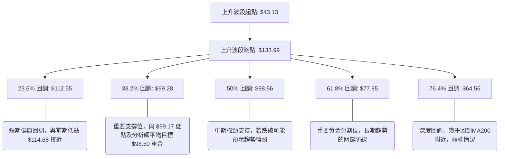

**分析**：
當前 INTC 價格 $131.72 位於所有斐波那契回調位上方。
*   **$112.55 (23.6%)**：這是淺層回調位，與前期的回調低點 $114.68 較為接近，構成短期重要支撐。
*   **$99.28 (38.2%)**：此價位與2026年6月7日的低點 $99.17 幾乎重合，同時也與分析師的平均目標價 $98.50 非常接近。這使得 $99.28-$99.17 區間成為一個極為關鍵的強支撐區域。若股價能夠在此處獲得有效支撐並反彈，則仍可視為健康的修正。
*   **$88.56 (50%)**：這是中期強勁支撐位。若股價跌破 $99.28，則很可能下探至此。突破此位將對中期多頭趨勢構成嚴重威脅。
*   **$77.85 (61.8%)**：黃金分割位，是更深層次的回調支撐。若股價跌至此處，則表示之前的上漲動能已基本耗盡，趨勢可能轉為長期盤整或反轉。
這些斐波那契回調位為潛在的回調提供了清晰的參考點，投資者應密切關注股價對這些關鍵價位的反應。

---

## 5. 技術指標深度解讀

本章節將對 INTC 的主要技術指標進行深入剖析，探討它們如何共同描繪當前市場的動能、趨勢和潛在風險。

### 🎛️ 指標訊號總覽

以下 Mermaid 圖表展示了各個技術指標之間的訊號關係與綜合判斷流程。

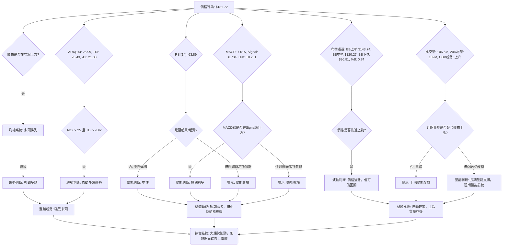

### 📈 移動平均線排列分析

INTC 的移動平均線系統呈現出極為強勁的多頭排列，這是判斷長期和中期趨勢的關鍵指標。

| 均線類型 | 數值     | 當前狀態 | 相對位置 | 訊號 |
|----------|----------|----------|----------|------|
| MA5      | $131.37  | 上升     | 價格上方 | 🟢   |
| MA10     | $129.78  | 上升     | 價格上方 | 🟢   |
| MA20     | $120.27  | 上升     | 價格上方 | 🟢   |
| MA50     | $109.65  | 上升     | 價格上方 | 🟢   |
| MA60     | $101.37  | 上升     | 價格上方 | 🟢   |
| MA120    | $73.73   | 上升     | 價格上方 | 🟢   |
| MA200    | $58.77   | 上升     | 價格上方 | 🟢   |
| MA240    | $52.76   | 上升     | 價格上方 | 🟢   |

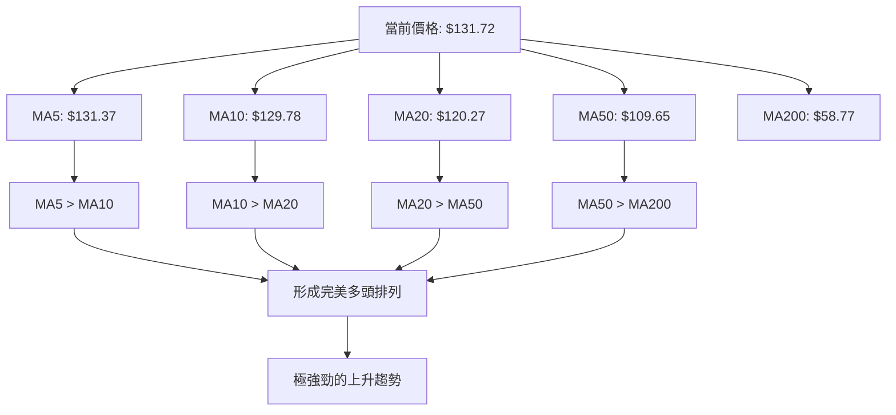

**分析**：INTC 的所有短期、中期、長期移動平均線均呈現向上發散的趨勢，並且短期均線位於中期均線之上，中期均線位於長期均線之上，形成完美的「多頭排列」。當前價格 $131.72 顯著位於所有均線上方，這是一個極其強勁的看漲訊號，表明 INTC 處於一個勢不可擋的上升趨勢中。MA20 ($120.27) 和 MA50 ($109.65) 將是短期和中期回調的關鍵動態支撐。這種均線排列模式提供了堅實的長期看漲基礎。

### 📉 RSI(14) 分析

RSI(14) 數值為 **63.89**。

RSI 強度：▓▓▓▓▓▓▓▓▓▓▓▓░░░░░░░░ 63.89/100 🟡 中性偏強

**超買超賣區間分析**：
*   RSI 數值 63.89 位於中性區間 (30-70) 的偏高位置，表明市場買盤力量仍佔優，但尚未達到傳統意義上的超買區 (通常為70以上)。
*   歷史數據顯示，在2026年4月-5月的大幅上漲期間，RSI 曾多次觸及甚至超過 80 (如 4月12日 80.4, 4月19日 89.7, 5月10日 88.4)，進入嚴重超買狀態，隨後均伴隨了調整。
*   當前的 RSI 數值相對溫和，但這是經過近期回調後的結果。

**背離判斷 (頂背離/底背離)**：
**🔴 明顯的週線級別頂背離**
*   **價格走勢**：
    *   2026年5月10日週收盤價 $124.92。
    *   2026年6月21日週收盤價 $133.99 (創出更高的高點)。
*   **RSI 走勢**：
    *   2026年5月10日週 RSI 為 88.4。
    *   2026年6月21日週 RSI 為 61.0 (創出更低的低點)。
*   **結論**：INTC 的週線價格創出新高 ($133.99 > $124.92)，但週線 RSI 卻創出更低的相對高點 (61.0 < 88.4)。這是一個經典的 **空頭頂背離** 訊號，表明儘管價格仍在上升，但上漲動能已顯著減弱，多頭力量正在衰竭，預示著股價可能面臨回調或趨勢反轉的風險。這是當前技術面最值得警惕的訊號之一。

### 📊 MACD(12/26/9) 訊號解讀

MACD 當前數值：MACD線 7.015，Signal線 6.734，MACD柱狀圖 +0.281。

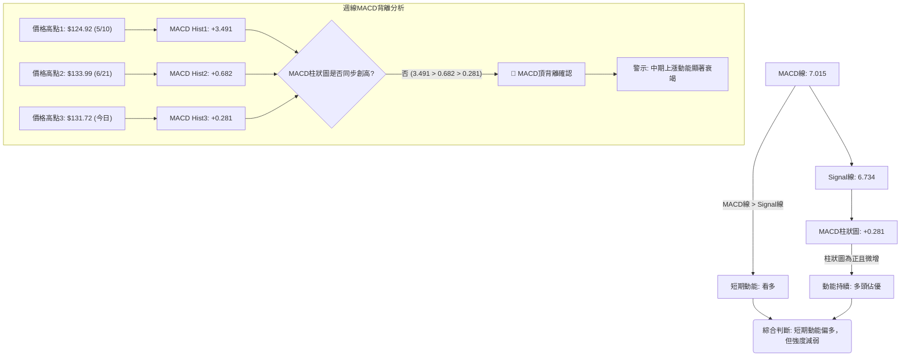

**分析**：
*   **短期 MACD 訊號**：當前 MACD 線 (7.015) 位於 Signal 線 (6.734) 上方，且 MACD 柱狀圖為正 (+0.281)，這在日線級別上是一個看多訊號，表明短期內多頭動能仍佔據主導。然而，柱狀圖的數值相對較小，且從前一週的 +0.481 略微下降到 +0.281，顯示短期上漲動能有所減弱。
*   **背離判斷 (頂背離)**：
    *   **價格走勢**：
        *   2026年5月10日週收盤價 $124.92。
        *   2026年6月21日週收盤價 $133.99 (創出更高的高點)。
    *   **MACD 柱狀圖走勢**：
        *   2026年5月10日週 MACD 柱狀圖為 +3.491。
        *   2026年6月21日週 MACD 柱狀圖為 +0.682 (創出更低的相對高點)。
    *   **結論**：與 RSI 類似，MACD 柱狀圖在週線級別也出現了明顯的 **空頭頂背離**。價格創出新高，但代表動能強度的 MACD 柱狀圖卻明顯下降。這強烈預示著中期上漲動能正在快速衰竭，股價可能面臨較大幅度的回調或盤整。MACD 與 RSI 的頂背離相互印證，大幅增加了技術性修正的風險。

### 📦 布林通道分析

布林通道參數：
*   BB上軌: $143.74
*   BB中軌(MA20): $120.27
*   BB下軌: $96.81
*   BB %B: 0.74

```
INTC 布林通道示意圖 (日線)
價格軸 ($)
$150 ┤                                    上軌 ($143.74)
$140 ┤                                    ████████████████████████
$130 ┤                                ◄ 現價 ($131.72)
$120 ┤                                    中軌 ($120.27)
$110 ┤                                    ▓▓▓▓▓▓▓▓▓▓▓▓▓▓▓▓▓▓▓▓▓▓▓▓
$100 ┤                                    下軌 ($96.81)
$90  ┤                                    ░░░░░░░░░░░░░░░░░░░░░░░░
     └────────────────────────────────────────────────────────────
```

**分析**：
INTC 當前價格 $131.72 位於布林通道中軌 ($120.27) 和上軌 ($143.74) 之間，且更接近上軌。BB %B 數值為 0.74，表明價格處於布林通道的較高位置，顯示出相對強勢。
*   **強勢表現**：價格在中軌上方運行，且布林通道口徑相對較寬，表明市場波動性較高，且多頭仍在掌控。
*   **回調壓力**：然而，價格接近上軌通常意味著短期上漲動能可能面臨壓力，股價有向中軌回歸的傾向。結合 RSI 和 MACD 的頂背離，價格向上突破上軌的難度較大，反而回調至中軌 ($120.27) 尋求支撐的可能性更高。
*   **支撐位**：布林通道中軌 ($120.27) 與 MA20 重合，是一個重要的短期動態支撐。布林通道下軌 ($96.81) 則提供了一個較強的支撐，與斐波那契38.2%回調位 $99.28 接近，構成一個重要的防守區。

### 💹 成交量分析（量價配合度）

*   **最新成交量**：106,611,300 股
*   **20日均量**：132,084,345 股
*   **50日均量**：140,787,406 股
*   **量比 (最新/20日均量)**：0.81x
*   **OBV趨勢**：OBV > MA → 量能支撐上漲

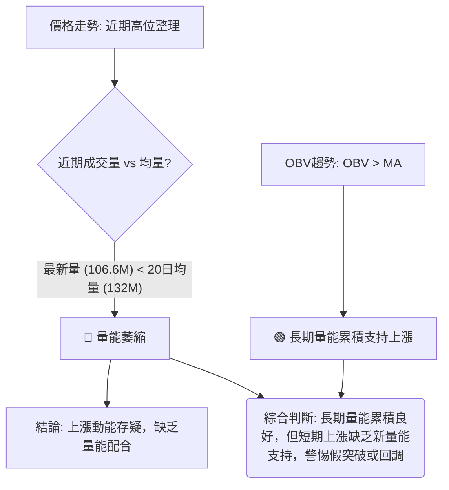

**分析**：
INTC 的成交量分析呈現出一個矛盾的訊號：
*   **短期量能萎縮 (🔴)**：最新的成交量 106.6M 顯著低於 20日均量 (132M) 和 50日均量 (140.7M)，量比僅為 0.81x。這表明在當前價格水平，市場的買盤力量有所減弱，缺乏新的資金積極入場推升股價。價格在高位整理或嘗試上攻時出現量能萎縮，通常被視為一個警示訊號，可能預示著上漲動能不足，甚至可能出現「量價背離」，即價格上漲而成交量未能配合。
*   **OBV趨勢支持 (🟢)**：然而，OBV (On-Balance Volume) 趨勢顯示 OBV 線位於其移動平均線上方，這通常被解讀為量能正在累積，並支持價格上漲。OBV 是一個累計指標，反映的是資金流向，它的持續上升表明自底部以來，累積的買盤力量依然強勁。

**綜合解讀**：這種矛盾需要謹慎對待。OBV 的強勁表明 INTC 的長期資金流入趨勢是健康的，大資金可能仍在場內。但近期成交量的萎縮則暗示了短期內缺乏追漲動能，或者市場正在等待新的催化劑。這可能意味著股價在短期內更容易進入盤整或回調，以消化前期的獲利盤，並等待新的量能入場。如果股價在未來突破關鍵阻力時仍無量能配合，則突破的可靠性將大打折扣。反之，如果價格回調至關鍵支撐位時，成交量能夠再次放大，則可能是一個健康的買入機會。

---

## 6. 動能與波動率

本章節將評估 INTC 的動能強度和價格波動性，這對於理解其風險收益特徵和選擇合適的交易策略至關重要。

### ⚡ 動能評估四象限

由於 Mermaid 的 `quadrantChart` 可能在某些渲染器中表現不佳，我們將使用表格形式展示動能評估四象限分析。

| 象限 | 動能 | 波動 | 當前狀態                                   | 評估                                         |
|------|------|------|--------------------------------------------|----------------------------------------------|
| Q1   | 強   | 低   | -                                          | 最佳機會：趨勢明確，風險可控。               |
| Q2   | 弱   | 低   | -                                          | 謹慎觀望：缺乏方向，波動小但無利潤空間。     |
| **Q3** | **強**   | **高**   | **✓ (INTC 當前狀態)** | **高風險高收益：趨勢強勁但波動劇烈，需嚴格止損。** |
| Q4   | 弱   | 高   | -                                          | 避免進場：方向不明，風險高，不確定性大。     |

**分析**：
INTC 目前處於 **Q3 象限**，即「**強動能，高波動**」狀態。
*   **強動能**：ADX(14) 為 25.99，表明趨勢強勁且多頭主導。所有均線呈現完美多頭排列，MACD 日線仍為正，OBV 趨勢向上。這些都支持其強勁的動能。
*   **高波動**：ATR(14) 為 $10.97，佔當前價格 $131.72 的 8.33%。這是一個相對較高的波動率，表明 INTC 股價在日內或週內可能出現大幅波動。

**綜合評估**：
INTC 目前的市場環境是「高風險高收益」的。強勁的趨勢為潛在的上漲提供了基礎，但高波動性意味著價格可能在短時間內出現劇烈波動，對交易者的心理承受能力和資金管理能力提出更高要求。同時，RSI和MACD的週線級別頂背離也增加了波動性中的下行風險。投資者在參與此類股票時，必須設置嚴格的止損，並控制倉位，以防範波動帶來的損失。

### 📊 ATR 波動率分析

ATR(14) 數值為 **$10.97**。

ATR 佔收盤價比例：($10.97 / $131.72) = **8.33%**。

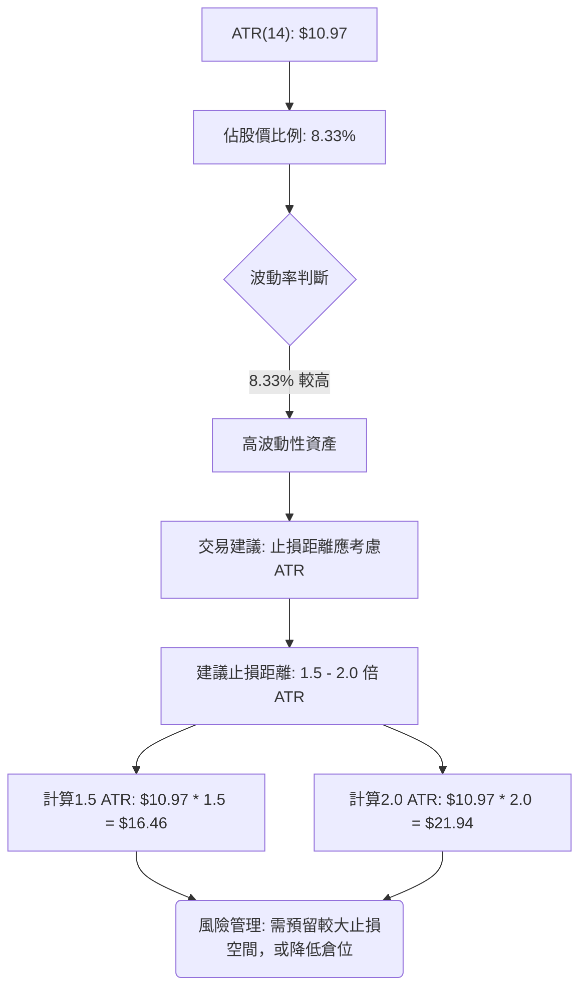

**分析**：
ATR (Average True Range) 衡量的是股價在特定時間內的平均波動幅度。INTC 的 ATR(14) 為 $10.97，佔當前股價 $131.72 的 8.33%。
*   **高波動性**：8.33% 的日均波動幅度相對較高，這意味著 INTC 股價在一天內或在短時間內可能出現超過 $10 的漲跌幅。對於日內交易者或短線交易者而言，這提供了較大的獲利空間，但也伴隨著更高的風險。
*   **止損距離建議**：由於高波動性，傳統的固定百分比止損可能容易被「洗盤」出場。建議根據 ATR 來設定止損距離，以適應股票本身的波動特性。一般建議止損距離為 ATR 的 1.5 到 2.0 倍。
    *   **1.5倍 ATR 止損距離**：$10.97 * 1.5 = **$16.46**。
    *   **2.0倍 ATR 止損距離**：$10.97 * 2.0 = **$21.94**。
這意味著如果從當前價格 $131.72 進場，止損點應設置在 $131.72 - $16.46 = $115.26 或 $131.72 - $21.94 = $109.78 附近。這與 MA20 ($120.27) 和 MA50 ($109.65) 等關鍵支撐位吻合，可以作為止損參考。

### 📐 Beta 與市場相關性

提供的數據中沒有直接提供 INTC 的 Beta 值。
**推演分析**：
通常，半導體行業的股票具有較高的 Beta 值，因為它們是科技板塊中的高增長、高週期性行業，對經濟週期和市場情緒的變化非常敏感。
*   **高 Beta 特性**：如果 INTC 的 Beta 值高於 1 (例如 1.2 - 1.5)，則意味著當大盤上漲 1% 時，INTC 股價可能上漲超過 1%；反之，當大盤下跌 1% 時，INTC 可能下跌超過 1%。
*   **市場相關性**：高 Beta 股票與大盤的相關性較強，尤其是在大盤出現明顯趨勢時。在牛市中，高 Beta 股票往往表現優於大盤；在熊市中，它們的跌幅也可能大於大盤。
*   **當前情境**：鑑於 INTC 目前處於強勁的上升趨勢中，且市場整體情緒偏好科技股，其高 Beta 特性可能進一步放大其上漲空間。然而，一旦市場情緒逆轉或大盤進入調整，其高 Beta 特性也可能導致更劇烈的回調。因此，投資者在持有 INTC 時，也應密切關注整體市場（如 SPY, QQQ）的走勢。

---

## 7. 多時框架總結

本章節將整合短期、中期和長期時間框架的分析結果，提供一個全面的趨勢判斷，並透過評分表和綜合訊號矩陣來評估不同時間框架下的一致性。

### 📋 時框架評分表

| 時框架 | 趨勢方向 | 動能      | 均線排列 | 形態           | 綜合評分 | 建議 |
|--------|----------|-----------|----------|----------------|----------|------|
| **長期 (月線)** | 🟢 極強多頭 | 🟢 極強   | 🟢 完美多頭 | 🟢 上升通道    | 9/10     | 買入 |
| **中期 (週線)** | 🟡 強勢整理 | 🔴 衰竭 (背離) | 🟢 多頭排列 | 🟡 潛在雙頂/整理 | 6/10     | 觀望 |
| **短期 (日線)** | 🟡 高位震盪 | 🟡 中性偏弱 | 🟢 多頭排列 | 🟡 整理        | 5/10     | 謹慎觀望 |

**分析**：
*   **長期**：INTC 的月線圖顯示出極為強勁且清晰的上升趨勢，所有長期均線向上發散，價格遠離底部。長期動能強勁，形態為明確的上升通道，這是最為樂觀的時間框架。
*   **中期**：週線圖上，INTC 仍處於上漲趨勢，但動能指標 (RSI, MACD) 已出現明顯的頂背離，暗示上漲動能正在衰竭。價格在高位震盪，可能形成潛在的雙頂形態。雖然均線仍是多頭排列，但中期風險正在積聚。
*   **短期**：日線圖上，股價在高位震盪整理，未能有效突破近期高點，且成交量萎縮。短期動能中性偏弱，預示可能需要進一步調整。

### 🔲 綜合訊號矩陣

以下矩陣圖展示了 INTC 在不同時間框架和關鍵技術維度上的訊號一致性。

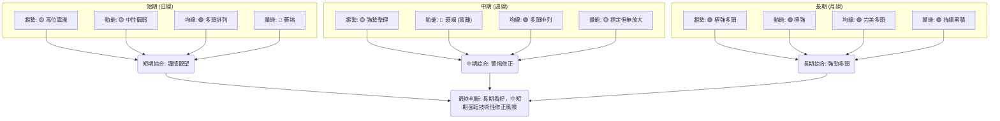

**分析**：
從多時框架綜合來看，INTC 的長期趨勢依然極為強勁，這得益於其穩固的多頭均線排列和持續的量能累積。然而，中期和短期指標發出了明確的警示訊號：
*   **趨勢一致性**：長期趨勢與中短期趨勢存在一定程度的背離。長期是明確的上升通道，而中短期則顯現出高位震盪和整理的跡象。
*   **動能一致性**：這是最主要的矛盾點。長期動能依然充沛，但週線級別的 RSI 和 MACD 頂背離強烈表明中期上漲動能正在衰竭，日線動能也已趨弱。這種動能的「不一致性」是股價可能面臨修正的最大風險來源。
*   **量能配合**：長期 OBV 趨勢健康，但近期日線成交量萎縮，未能有效支持價格在高位繼續上攻。這也進一步確認了短期動能的不足。

**結論**： INTEL 的長期投資價值可能依然存在，但從技術面來看，中短期內股價面臨較大的技術性修正風險。在進入新的上漲階段之前，可能需要一段時間的盤整或價格回調來消化獲利盤，並修復動能指標的背離。建議投資者在當前階段保持謹慎，等待更明確的買入訊號或在關鍵支撐位附近尋找機會。

---

## 8. 交易策略建議

基於 INTC 的多時框架技術分析，我們將提出多頭和空頭兩種情境下的交易策略。鑑於當前市場的複雜性，風險管理是重中之重。

### 🗺️ 策略決策流程圖

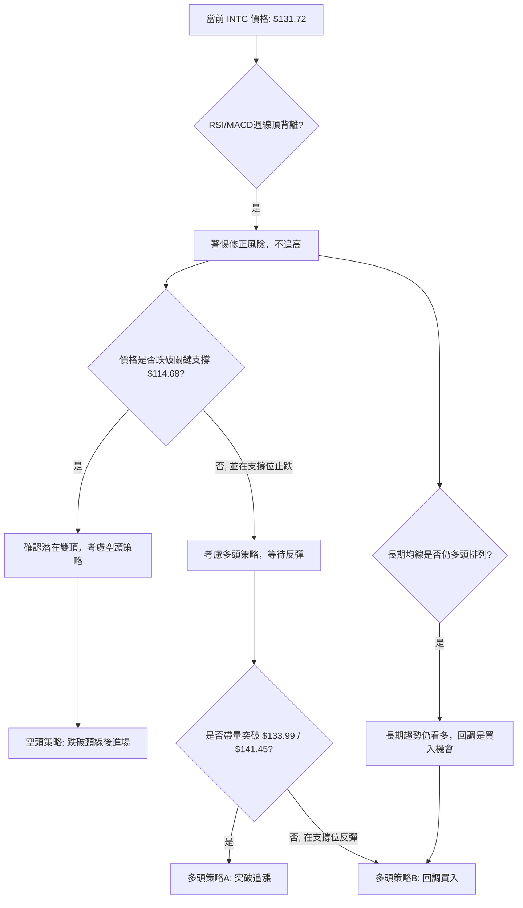

### 🟢 多頭策略詳情

鑑於長期趨勢依然強勁，但在中短期面臨修正風險，我們提供兩種多頭策略：一種是保守的回調買入，另一種是激進的突破追漲（風險較高）。

| 策略要素   | 策略 A (回調買入)                          | 策略 B (突破追漲 - 高風險)                       |
|------------|--------------------------------------------|--------------------------------------------------|
| **策略名稱** | **在關鍵支撐位回調買入**                   | **帶量突破歷史高點追漲**                         |
| **進場條件** | 價格回調至 MA20 或 MA50 附近，並出現止跌訊號 (如長下影線K線、RSI低位反轉)，且成交量放大。 | 價格帶量 (高於20日均量1.5倍以上) 突破 $141.45 的52週高點，並站穩。 |
| **進場價格** | **$115.00 - $120.00** (MA20/斐波那契23.6%附近) | **$142.00 - $143.00** (突破後確認)               |
| **目標價 T1** | **$133.99** (近期高點)                     | **$150.00** (心理關口)                         |
| **目標價 T2** | **$141.45** (52週高點)                     | **$160.00** (分析師高目標，形態推演)             |
| **止損價格** | **$109.00** (略低於 MA50 和斐波那契23.6%) | **$136.00** (跌破突破點 $141.45 的1.5倍ATR) |
| **風險報酬比** | (T1: $133.99 - $115.00) / ($115.00 - $109.00) = 18.99 / 6.00 = **3.17:1** | (T1: $150.00 - $142.00) / ($142.00 - $136.00) = 8.00 / 6.00 = **1.33:1** |
| **成功機率** | 60% (基於強勁長期趨勢和支撐)                | 40% (突破失敗風險高，需極大動能)               |
| **建議倉位** | 5% - 10%                                   | 3% - 5% (高風險)                                |

### 🔴 空頭策略詳情

考慮到週線級別的頂背離和潛在的雙頂形態，一旦關鍵支撐被有效跌破，空頭策略將具備較高的風險報酬比。

| 策略要素   | 策略 C (跌破關鍵支撐做空)                  |
|------------|--------------------------------------------|
| **策略名稱** | **跌破 $114.68 頸線做空**                  |
| **進場條件** | 價格跌破 $114.68 (前期回調低點/潛在雙頂頸線) 並收盤確認，且伴隨放量。 |
| **進場價格** | **$114.00 - $113.00** (跌破後確認)        |
| **目標價 T1** | **$109.65** (MA50)                       |
| **目標價 T2** | **$99.28 - $95.37** (斐波那契38.2%/雙頂形態目標) |
| **止損價格** | **$120.00** (略高於 MA20 / 跌破點上方)    |
| **風險報酬比** | (T2: $114.00 - $95.37) / ($120.00 - $114.00) = 18.63 / 6.00 = **3.11:1** |
| **成功機率** | 55% (基於動能背離和形態壓力)               |
| **建議倉位** | 5% - 8%                                    |

### ⭐ 整體訊號強度評星

```
做多訊號強度：★★☆☆☆  (2/5星) - 長期強勁，但短期風險高，不宜盲目追高。
做空訊號強度：★★★☆☆  (3/5星) - 存在明確的頂背離和潛在形態，一旦確認，機會較大。
整體可信度：  ★★★☆☆  (3/5星) - 訊號複雜，需密切關注關鍵價位和量能變化。
```

**總結**：
當前 INTC 的技術面訊號複雜，長期趨勢雖強勁，但中短期動能衰竭和頂背離是主要風險。因此，不建議在當前價格盲目追高。
*   **對於多頭**：保守的策略是等待股價回調至 $115.00 - $120.00 的關鍵支撐區，並出現明確的止跌訊號後再考慮進場。激進的突破策略風險較高，需要極其強勁的量能配合才能確保突破的有效性。
*   **對於空頭**：如果股價確認跌破 $114.68 的頸線支撐，則空頭策略可能具備較好的風險報酬比，但由於長期趨勢仍偏多，空頭倉位應嚴格控制，並密切關注 MA50 和斐波那契支撐區的反應。

---

## 9. 風險提示與監控

本章節將闡述 INTC 交易中的潛在風險，並提供關鍵監控指標清單和風險管理建議，以幫助投資者在複雜市場中做出明智決策。

### ✅ 關鍵監控指標 Checklist

以下是交易 INTC 時需要密切關注的關鍵技術指標和價位清單。

```
╔══════════════════════════════════════════════════════════════╗
║             INTC 關鍵監控指標 Checklist                        ║
╠══════════════════════════════════════════════════════════════╣
║ [ ] 價格對 $133.99 (近期高點阻力) 的反應                       ║
║ [ ] 價格對 $141.45 (52週高點阻力) 的反應                       ║
║ [ ] 價格對 $120.27 (MA20支撐) 的反應                           ║
║ [ ] 價格對 $114.68 (潛在頸線支撐) 的反應                       ║
║ [ ] 價格對 $99.28 (斐波那契38.2%/前期低點支撐) 的反應          ║
║ [ ] 週線 RSI 是否繼續形成頂背離，或出現修正                     ║
║ [ ] 週線 MACD 柱狀圖是否持續收縮，或轉為負值                   ║
║ [ ] 日線成交量是否能有效配合價格突破或回調                     ║
║ [ ] ADX 值是否維持在強趨勢區間，或開始下降                     ║
║ [ ] 布林通道 %B 值是否維持在高位，或開始向中軌回歸             ║
║ [ ] 整體半導體板塊 (SOXX/SMH) 的走勢                           ║
║ [ ] 宏觀經濟數據和市場情緒變化                                 ║
╚══════════════════════════════════════════════════════════════╝
```

### ⚠️ 風險場景分析

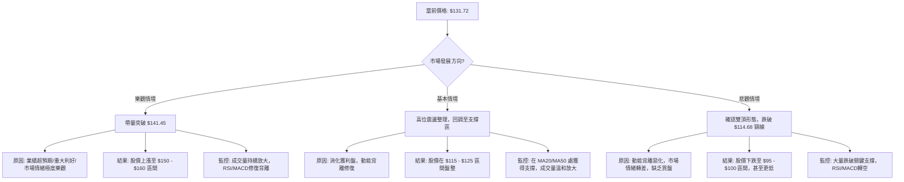

**分析**：
*   **樂觀情境**：如果 INTC 能在近期獲得重大利好消息或業績超預期，並且在突破 $141.45 的52週高點時，有顯著的成交量配合，同時動能指標能夠修復其背離狀態，則股價有望繼續上漲至 $150-$160 甚至更高。此情境下，市場對 INTC 的長期增長前景給予高度肯定。
*   **基本情境**：在沒有新的重大利好或利空消息情況下，INTC 最有可能的走勢是在當前高位進行震盪整理。股價可能回調至 $115.00 (斐波那契23.6%) 或 $120.27 (MA20) 附近尋求支撐，以消化前期的獲利盤，並讓動能指標得到修正。在此區間獲得支撐後，有望再次嘗試上攻。
*   **悲觀情境**：若 INTC 未能有效突破 $133.99/$141.45 的阻力，並且在動能背離持續惡化的情況下，股價跌破 $114.68 的關鍵支撐位（潛在雙頂頸線），則可能確認雙頂形態。此時，股價將面臨較大幅度的下跌風險，目標價可能指向 $95.37 (形態目標) 或 $99.28 (斐波那契38.2%)，甚至更深的回調。此情境下，市場情緒將由樂觀轉為謹慎或悲觀。

### 🛡️ 風險管理重要提醒

1.  **倉位管理**：鑑於 INTC 股價波動性較高，且中短期存在技術性修正風險，建議投資者謹慎控制倉位。避免過度集中投資，將單一股票倉位控制在總投資組合的合理比例範圍內 (例如不超過 5%-10%)。
2.  **嚴格止損**：無論採取何種交易策略，都必須預設並嚴格執行止損點。尤其在目前存在頂背離訊號的情況下，止損是保護資本的關鍵。建議止損點可參考 ATR 或關鍵支撐位。
3.  **分批操作**：在當前複雜的市場環境下，分批進場和分批出場可以有效降低單次操作的風險。若考慮回調買入，可在不同支撐位分批建倉；若考慮賣出，可分批獲利了結。
4.  **動態調整**：市場環境變化迅速，技術訊號也會隨之演變。投資者應定期檢視 INTC 的技術指標和價格行為，並根據最新的市場數據動態調整交易策略和風險管理措施。
5.  **結合基本面**：技術分析提供的是價格行為和市場情緒的洞察，但長期投資仍需結合公司的基本面分析。應關注 INTC 的財報、產業發展、競爭格局等基本面信息，以形成更全面的投資判斷。
6.  **避免追高**：當前 INTC 股價已處於相對高位，且動能指標出現背離，追高風險極大。應耐心等待回調至合理支撐位或明確的突破訊號。

---

## 📋 報告總結

```
INTC 技術分析報告總結
════════════════════════════════════════════════════════
報告日期：2026-06-30
當前價格：$131.72
分析評級：⚖️ 觀望偏多，警惕修正

關鍵結論：
├─ 長期趨勢：🟢 極強多頭，均線完美多頭排列，ADX強勁。
├─ 中期趨勢：🟡 強勢整理，但週線RSI/MACD出現明顯頂背離，動能衰竭。
├─ 短期趨勢：🟡 高位震盪，成交量萎縮，上漲動能不足。
├─ 關鍵支撐：$120.27 (MA20), $114.68 (潛在頸線), $99.28 (斐波那契38.2%/MA50附近)。
├─ 關鍵阻力：$133.99 (近期高點), $141.45 (52週高點)。
└─ 分析師目標：均值 $98.50 (遠低於現價)，高 $160.00，低 $45.00。

最優策略組合：
1. 🥇 **最佳機會 (保守多頭)**：等待股價回調至 $115.00-$120.00 區間的關鍵支撐，並出現止跌訊號時分批買入，目標 $133.99/$141.45，止損 $109.00。風險報酬比約 3.17:1。
2. 🥈 **次選機會 (空頭)**：若股價放量跌破 $114.68 的頸線支撐，可考慮做空，目標 $95.37-$99.28，止損 $120.00。風險報酬比約 3.11:1。
3. 🥉 **保守選擇 (觀望)**：在當前複雜訊號下，保持觀望，等待市場給出更明確的方向，或等待動能背離得到修復。
════════════════════════════════════════════════════════
```

---

> ⚠️ **免責聲明**：本報告為 AI 自動生成之技術分析，所有數據及估算均基於提供的歷史價格資訊。本報告**僅供研究與學術參考**，**不構成任何投資建議**。投資有風險，入市需謹慎。

---

*報告生成時間：2026-06-30 ｜ 數據來源：Yahoo Finance ｜ 分析框架：多時框技術分析*