<details>
<summary>📊 靜態圖表 (點擊展開)</summary>
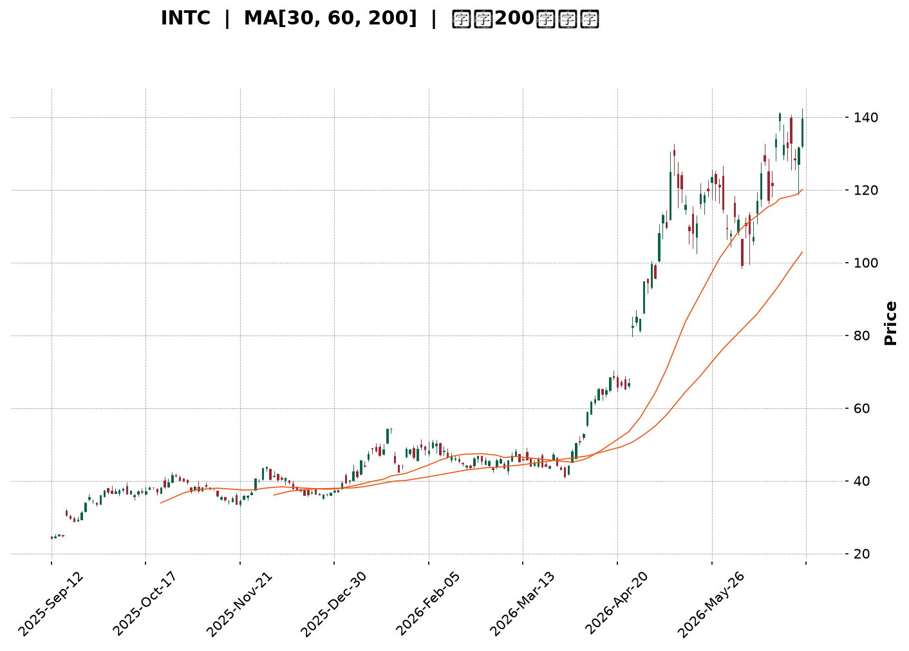
</details>

<html>
<head><meta charset="utf-8" /></head>
<body>
    <div style="height:500px; width:100%;">                        <script>window.PlotlyConfig = {MathJaxConfig: 'local'};</script>
        <script charset="utf-8" src="https://cdn.plot.ly/plotly-3.6.0.min.js" integrity="sha256-QaOVwtVY0T02VaHrr6pnoHLCwayMJp4O5n4YyaE3rJk=" crossorigin="anonymous"></script>                <div id="candlestick-chart" class="plotly-graph-div" style="height:100%; width:100%;"></div>            <script>                window.PLOTLYENV=window.PLOTLYENV || {};                                if (document.getElementById("candlestick-chart")) {                    Plotly.newPlot(                        "candlestick-chart",                        [{"close":{"dtype":"f8","bdata":"AAAA4HoUOEAAAADAHsU4QAAAAMAeRTlAAAAAYGbmOEAAAACA65E+QAAAAOB6lD1AAAAAYI\u002fCPEAAAABAClc9QAAAAOBROD9AAAAAYLj+QEAAAAAAAMBBQAAAAKBwPUFAAAAAYGbGQEAAAADgUfhBQAAAAGBmpkJAAAAAgD1qQkAAAAAghUtCQAAAAIDClUJAAAAAQAq3QkAAAABgZuZCQAAAACBcL0JAAAAAACmcQkAAAADgo9BBQAAAAEAzk0JAAAAAIIVrQkAAAACgR4FCQAAAAMDMDENAAAAAIFwPQ0AAAACAwnVCQAAAAOB6FENAAAAAANcjQ0AAAADAHsVDQAAAAADXw0RAAAAAIIWrREAAAADgehREQAAAAGC4\u002fkNAAAAAAADAQ0AAAAAA14NCQAAAAOCjMENAAAAAYLieQkAAAADgoxBDQAAAAKCZOUNAAAAA4KPwQkAAAACA6\u002fFCQAAAAOB69EFAAAAAYI\u002fCQUAAAABA4VpBQAAAAIA9KkFAAAAAgBSOQUAAAAAgXM9AQAAAAAAAQEFAAAAAwB7lQUAAAACAPepBQAAAACCuZ0JAAAAAIK5HREAAAACgRwFEQAAAAAApvEVAAAAAoEfhRUAAAAAAAEBEQAAAAOB6tERAAAAAYGYmREAAAAAAAEBEQAAAAADXY0RAAAAAoEfBQ0AAAAAgrudCQAAAAKBHwUJAAAAAIK6nQkAAAABgZgZCQAAAAADXI0JAAAAAwPVoQkAAAAAgXC9CQAAAAMDMLEJAAAAA4HoUQkAAAACgmRlCQAAAAEAKV0JAAAAAYGamQkAAAABAM3NCQAAAAOCjsENAAAAAIFyvQ0AAAADAHgVEQAAAAOCjUEVAAAAAgBSOREAAAABgZsZGQAAAACCuB0ZAAAAAwB6lR0AAAAAAKVxIQAAAAMD1KEhAAAAAQOF6R0AAAAAgrkdIQAAAAAAAIEtAAAAAwPUoS0AAAADA9YhGQAAAAGC4PkVAAAAAQAr3RUAAAAAA12NIQAAAAOB6VEhAAAAAACk8R0AAAAAgrmdIQAAAAAAAoEhAAAAAwMxMSEAAAABguB5IQAAAACCFS0lAAAAAYLgeSUAAAADgo5BHQAAAAMAeJUhAAAAAoHA9R0AAAADAHmVHQAAAAEAKF0dAAAAAQOG6RkAAAAAgXE9GQAAAAIAUDkZAAAAA4KPQRUAAAAAgXA9HQAAAAOCjcEdAAAAAQOG6RkAAAACAFM5GQAAAAAAAwEZAAAAAwMyMRUAAAACAPcpGQAAAAKCZ+UZAAAAAgMK1RUAAAACAPcpGQAAAAADXY0dAAAAAoHD9R0AAAAAAAKBGQAAAAGCP4kZAAAAAoEfhRkAAAAAgrgdGQAAAAADXg0ZAAAAAQAoXR0AAAAAgXO9FQAAAAKBHAUZAAAAAIK4HRkAAAABACpdHQAAAAMDMDEZAAAAA4KOQRUAAAADgUZhEQAAAAOCjEEZAAAAAANcDSEAAAADgozBJQAAAAADXY0lAAAAA4Hp0SkAAAACgmXlNQAAAAAAp3E5AAAAA4KMwT0AAAAAghUtQQAAAACCu509AAAAAACk8UEAAAAAAACBRQAAAAAAAIFFAAAAAwMxsUEAAAADgo5BQQAAAAKBHUVBAAAAAgOuxUEAAAABgj6JUQAAAACBcP1VAAAAAoEchVUAAAAAAALBXQAAAAGC4nldAAAAAIK7nWEAAAACA6\u002fFXQAAAAKCZCVtAAAAA4KNAXEAAAAAgrmdbQAAAAEDhOl9AAAAAgBQuYEAAAABACideQAAAAGCPEl5AAAAAIIX7XEAAAACgRzFbQAAAAEDhCltAAAAAQDOzW0AAAACgcL1dQAAAAAAAoF1AAAAAgML1XUAAAACgR+FeQAAAAKBHcV5AAAAAwPU4XkAAAAAghatcQAAAAMAeVVtAAAAAIIX7WkAAAACgcC1cQAAAAIDr8VtAAAAAQOHKWEAAAACgR5FbQAAAAEDh+lpAAAAAYI\u002fCWkAAAACgcD1dQAAAAOB6JF9AAAAAQAr3X0AAAABAM0NdQAAAAGBmRl5AAAAAIK6\u002fYEAAAACAFJ5hQAAAAMD1iGBAAAAAwMx0YEAAAAAA15tgQAAAAIA9CmBAAAAAQAp3YEAAAAAAKXRhQA=="},"high":{"dtype":"f8","bdata":"AAAAoEehOEAAAACAwnU5QAAAAEAKVzlAAAAAYI9COUAAAADgozBAQAAAAKBHoT5AAAAAoJkZPkAAAABAMzM+QAAAAEAzsz9AAAAAAAAgQUAAAABgZiZCQAAAAGBmhkFAAAAAYLgeQUAAAAAgrgdCQAAAAMD1yEJAAAAAgD0KQ0AAAABACldDQAAAAGBmBkNAAAAAwB7lQkAAAADAzAxDQAAAAEAz00NAAAAAoEfBQkAAAABgZkZCQAAAAGC4vkJAAAAAYI8CQ0AAAADgozBDQAAAAGCPQkNAAAAAwMwsQ0AAAABACvdCQAAAAEAzM0NAAAAAIFyPREAAAACAwlVEQAAAAKBwPUVAAAAAwB4FRUAAAABACrdEQAAAAIA9akRAAAAAoJk5REAAAAAAACBDQAAAAOBRWENAAAAAIIXrQ0AAAABgjyJDQAAAAADXw0NAAAAAACkcQ0AAAACgmRlDQAAAACCup0JAAAAAwMwMQkAAAACgcN1BQAAAAKBHYUFAAAAAAADgQUAAAABACldCQAAAAKBwfUFAAAAA4HoUQkAAAADgoxBCQAAAAGC4nkJAAAAAIIVLREAAAADgozBEQAAAAEAK10VAAAAAYI8CRkAAAAAA16NFQAAAAIA9akVAAAAAIFwPRUAAAACgR6FEQAAAAGC4fkRAAAAA4FEYREAAAAAA1wNEQAAAAKBwPUNAAAAAQOH6QkAAAAAghetCQAAAAGC4vkJAAAAAgD3KQkAAAABAM\u002fNCQAAAAGBmZkJAAAAAQAoXQkAAAABguD5CQAAAAGBmZkJAAAAAoEchQ0AAAACAPcpCQAAAAIAU7kNAAAAAwMwMRUAAAAAgridEQAAAAMD1SEZAAAAAIIWrRUAAAACgcN1GQAAAAKCZuUZAAAAAYLgeSEAAAAAAAIBIQAAAAIDrMUlAAAAAQOEaSUAAAACgcB1JQAAAAOB6NEtAAAAAwMxMS0AAAADgoxBIQAAAAEDhOkZAAAAAANdDRkAAAADAHqVIQAAAAGCPYkhAAAAAgD3KSEAAAAAghetIQAAAAGC4vklAAAAAoJnZSEAAAACAFG5JQAAAAGBmpklAAAAAACmcSUAAAADAHkVJQAAAAGBmxkhAAAAAoJl5SEAAAADgUdhHQAAAAIA9akdAAAAAYI9iR0AAAACAwpVGQAAAAIDrMUZAAAAAYGZGRkAAAADAzExHQAAAAAApfEdAAAAAoJl5R0AAAAAgrkdHQAAAACCu50ZAAAAA4FHYRUAAAADgoxBHQAAAAKBwPUdAAAAAQAqXRkAAAACgR+FGQAAAAOCj8EdAAAAAgD1qSEAAAADgUbhHQAAAAEAzU0dAAAAAgMKVSEAAAACAPQpHQAAAAEDh2kZAAAAA4FE4R0AAAABgZsZHQAAAAEDhukZAAAAAIK4nRkAAAADAzOxHQAAAAMDMTEdAAAAA4KMQRkAAAABguP5FQAAAAKBwHUZAAAAAYI9iSEAAAABguD5JQAAAAIDrMUpAAAAAYI+iSkAAAACAwpVNQAAAAIA9Ck9AAAAAgOuxT0AAAACgmWlQQAAAACCFS1BAAAAAgMJ1UEAAAABACidRQAAAAMAelVFAAAAAoHBNUUAAAABA4epQQAAAAKBHMVFAAAAAgOsRUUAAAACAFE5VQAAAAGBmxlVAAAAAgMIlVUAAAADAzLxXQAAAAAAp7FdAAAAAwMwcWUAAAADgevRYQAAAAGC4nltAAAAAAABgXEAAAADgo6BcQAAAAIA9UmBAAAAAAACYYEAAAABgj\u002fJfQAAAAAAAQF9AAAAA4HqkXUAAAADgeqRbQAAAAGCP4lxAAAAA4HpEXEAAAAAAKXxeQAAAAIA92l1AAAAAgOuxXkAAAAAgrmdfQAAAAKBHUV9AAAAAwB7FXkAAAADA9ahfQAAAAEAzU1xAAAAAAABAW0AAAABgj5JdQAAAAMD1SFxAAAAAYLieWkAAAABgjyJcQAAAAAAAgFxAAAAAAADgW0AAAAAAKdxdQAAAAGBm5l9AAAAAIIWTYEAAAABgZhZgQAAAAMDMTF9AAAAAIFzvYEAAAABgZq5hQAAAACBcP2FAAAAAYI8CYUAAAABACpdhQAAAACBcZ2BAAAAAoJmBYEAAAABAM8thQA=="},"hovertemplate":"\u003cb\u003e%{x|%Y-%m-%d}\u003c\u002fb\u003e\u003cbr\u003e\u958b: $%{open:.2f}\u003cbr\u003e\u9ad8: $%{high:.2f}\u003cbr\u003e\u4f4e: $%{low:.2f}\u003cbr\u003e\u6536: $%{close:.2f}\u003cextra\u003e\u003c\u002fextra\u003e","low":{"dtype":"f8","bdata":"AAAAwMwMOEAAAADgUTg4QAAAAOCjsDhAAAAAQDNzOEAAAADA9Sg+QAAAAOB6VD1AAAAAQOG6PEAAAACA69E8QAAAAEDhOj1AAAAAgMI1P0AAAABguD5BQAAAAKBw3UBAAAAAYI+CQEAAAAAAAMBAQAAAAOBRuEFAAAAAoJk5QkAAAABACjdCQAAAAMDMLEJAAAAA4Hr0QUAAAACAFG5CQAAAAGBmJkJAAAAAANcjQkAAAADgUVhBQAAAAIDr0UFAAAAA4Ho0QkAAAACAPQpCQAAAACCux0JAAAAAgMLVQkAAAADAHgVCQAAAAEAKN0JAAAAAgD3qQkAAAACgcB1DQAAAAMAexUNAAAAAgMJ1REAAAACAFA5EQAAAAMAe5UNAAAAAYGaGQ0AAAADgo1BCQAAAAIAUjkJAAAAAYGZmQkAAAAAAKXxCQAAAAAAp\u002fEJAAAAAYLi+QkAAAADAzKxCQAAAAKCZuUFAAAAAIFxPQUAAAACgcB1BQAAAAMD1yEBAAAAAAAAgQUAAAACgcL1AQAAAAIDrcUBAAAAA4FFYQUAAAABACldBQAAAAOCjEEJAAAAAIIWrQkAAAADAzMxDQAAAAGBmBkRAAAAAoEdBRUAAAACA6xFEQAAAAEAzk0RAAAAAoJnZQ0AAAAAA1wNEQAAAAIDrcUNAAAAAgD2KQ0AAAAAgXM9CQAAAAMD1qEJAAAAAgMJ1QkAAAAAAKfxBQAAAAIDC1UFAAAAA4FE4QkAAAADAHiVCQAAAAADXA0JAAAAAoJl5QUAAAADAzOxBQAAAAMD16EFAAAAAwPVoQkAAAAAgXG9CQAAAAKBH4UJAAAAAYI+iQ0AAAACgmXlDQAAAACBcD0RAAAAAQApXREAAAADA9chEQAAAAIDr8UVAAAAAACmcRkAAAACAwrVHQAAAAIA96kdAAAAAQOFaR0AAAAAAAIBHQAAAAEAzE0lAAAAAgD2KSkAAAACgmTlGQAAAAADXI0VAAAAAwMyMRUAAAADA9ShHQAAAAGC4fkdAAAAAQOH6RkAAAAAAAMBGQAAAAEAKN0hAAAAAAACAR0AAAADAHmVHQAAAAIA9akhAAAAAIIXLR0AAAABgj2JHQAAAAIAUbkdAAAAA4FEYR0AAAAAAKXxGQAAAAEDhukZAAAAA4KNwRkAAAACAwvVFQAAAAOCjcEVAAAAAQAqXRUAAAADAHsVFQAAAAIA9ikZAAAAAgOsxRkAAAABAMzNGQAAAAKCZ+UVAAAAAgOsRRUAAAABgj6JFQAAAAKCZWUZAAAAAANejRUAAAACA69FEQAAAAOB6tEZAAAAA4HpUR0AAAACAwpVGQAAAAIDrsUZAAAAA4FHYRkAAAADgevRFQAAAAGBmBkZAAAAAQDPTRUAAAACA69FFQAAAAGC43kVAAAAAoJmZRUAAAACgmblGQAAAAIDC9UVAAAAAgBRuRUAAAADgo1BEQAAAAMDMzERAAAAAoHB9RkAAAADAHgVHQAAAACBc70hAAAAAACmcSUAAAABgZmZLQAAAAIDrMU1AAAAAAABgTkAAAABAChdPQAAAACCFC09AAAAA4KNwT0AAAACgRxFQQAAAACBc71BAAAAAgBQeUEAAAADA9WhQQAAAAGC4PlBAAAAAQOFaUEAAAAAgrudTQAAAAEAKp1RAAAAAQDMzVEAAAAAgrndVQAAAAAAA4FZAAAAAQAonV0AAAABgZuZXQAAAAMAeBVlAAAAAwB6lWkAAAACgmUlbQAAAAEAz81tAAAAAQOH6XkAAAAAAAMBcQAAAAIA9Gl1AAAAAQOFKXEAAAACgR0FaQAAAAGBm9llAAAAAoJmZWUAAAABAM7NcQAAAAEDhSlxAAAAAgMKFXUAAAABgZlZdQAAAAAAAQF1AAAAAANcTXUAAAABgj2JcQAAAAMAelVpAAAAAQOEKWkAAAABACrdbQAAAAGC43lpAAAAAwB6VWEAAAACAPapaQAAAAKBw3VhAAAAAQOE6WkAAAADgo6BbQAAAAMAe1VxAAAAAgD2qX0AAAAAAAABdQAAAAADXg11AAAAAoJn5X0AAAABguAZhQAAAAKCZCWBAAAAAwMz8X0AAAACAPVpfQAAAAAAAYF9AAAAAAACgXUAAAADgo3BgQA=="},"name":"\u50f9\u683c","open":{"dtype":"f8","bdata":"AAAAACmcOEAAAADgelQ4QAAAAIDr0ThAAAAA4HoUOUAAAAAgrsc\u002fQAAAAKBHYT5AAAAAIIWrPUAAAACgcP08QAAAAKBHYT1AAAAAACmcP0AAAABgj4JBQAAAAGCPQkFAAAAAQAr3QEAAAAAA18NAQAAAAKBH4UFAAAAAoJn5QkAAAADgUZhCQAAAAIDrUUJAAAAAYGZGQkAAAAAA18NCQAAAAEDhOkNAAAAA4FE4QkAAAAAAAABCQAAAAEAzM0JAAAAAQDOTQkAAAACAFC5CQAAAAMD1yEJAAAAAgOsRQ0AAAAAghetCQAAAAMDMTEJAAAAAYI8CREAAAACA6zFDQAAAACCFy0NAAAAAwMzMREAAAAAAKXxEQAAAAEAKV0RAAAAAAAAgREAAAACA6xFDQAAAAIDCtUJAAAAAIIUrQ0AAAACgR6FCQAAAAEAKd0NAAAAAQDMTQ0AAAAAgrgdDQAAAAGCPokJAAAAAANeDQUAAAACgmblBQAAAAAAAIEFAAAAAgD0qQUAAAAAAAABCQAAAAKBHwUBAAAAAACl8QUAAAABgZsZBQAAAAKCZGUJAAAAAQDOzQkAAAACAFO5DQAAAAAApPERAAAAAgOuxRUAAAACgR6FFQAAAAOB6lERAAAAA4FH4REAAAACgcF1EQAAAAIAUDkRAAAAAwPUIREAAAAAAAKBDQAAAAIA9KkNAAAAAgD3KQkAAAAAghctCQAAAAOCjsEJAAAAAoHA9QkAAAACA6\u002fFCQAAAAGC4HkJAAAAAgMKVQUAAAACAwhVCQAAAAKBHAUJAAAAA4Hp0QkAAAABAM7NCQAAAAGCP4kJAAAAAIIXLREAAAACAFO5DQAAAAEAKF0RAAAAAIFxPRUAAAACAPepEQAAAAGC4HkZAAAAAgOvxRkAAAACgmXlIQAAAAMDMrEhAAAAAYI+iSEAAAABgZqZHQAAAAMD1KElAAAAAQOEaS0AAAACAFG5HQAAAAADXI0ZAAAAAACn8RUAAAADAzExHQAAAACCux0dAAAAAoHB9SEAAAADgo9BGQAAAACCuB0lAAAAAwB7FSEAAAAAghctHQAAAAMDMjEhAAAAAIIXLSEAAAADgejRJQAAAAIAUDkhAAAAAYGbmR0AAAACgR+FGQAAAAEAK90ZAAAAAgML1RkAAAACgmXlGQAAAAIDr8UVAAAAAIIULRkAAAADAzAxGQAAAACCFC0dAAAAAYI9iR0AAAABA4TpGQAAAAKCZGUZAAAAA4FG4RUAAAADA9QhGQAAAACBcb0ZAAAAAgMJVRkAAAABguF5FQAAAAOB6tEZAAAAAwPVoR0AAAABAM7NHQAAAAAAp\u002fEZAAAAA4Hr0R0AAAACAPQpHQAAAAKCZGUZAAAAAYLj+RUAAAACgmXlHQAAAAAAAQEZAAAAAwB7FRUAAAADAzOxGQAAAAGBmJkdAAAAAIFzPRUAAAAAAKdxFQAAAAKCZ+URAAAAAAACARkAAAAAgrgdHQAAAAOCjcElAAAAA4Hr0SUAAAAAgXK9LQAAAAEAzM01AAAAAYI\u002fCTkAAAABAChdPQAAAAIA9SlBAAAAAYI\u002fiT0AAAAAghTtQQAAAAGBmNlFAAAAAwMwcUUAAAADA9chQQAAAAAAp\u002fFBAAAAAYGaGUEAAAADAzIxUQAAAAEDh6lRAAAAAgOtRVEAAAADA9YhVQAAAAGBm5ldAAAAAwMxMV0AAAAAghctYQAAAAOCjIFlAAAAAYLi+W0AAAACgR8FbQAAAAADX81tAAAAAAClcYEAAAABAChdfQAAAAGBmBl9AAAAAgD2qXEAAAABgj3JbQAAAAIAUXlxAAAAAYLi+WkAAAACAFA5dQAAAAMAeJV1AAAAAgMIVXkAAAABgZoZeQAAAAMD1GF9AAAAAwMxcXkAAAABgZvZeQAAAACCFW1tAAAAAwMzcWkAAAABA4RpdQAAAAKCZGVtAAAAAYLieWkAAAAAAAMBbQAAAACBcP1xAAAAAgOuBWkAAAACgR2FcQAAAAEDhWl1AAAAAIK4vYEAAAABACkdfQAAAAGBmdl5AAAAAgOt5YEAAAAAA12NhQAAAACBcN2BAAAAAoJmhYEAAAAAgXHdhQAAAAGC4FmBAAAAAAADAX0AAAAAgrn9gQA=="},"x":["2025-09-12T00:00:00-04:00","2025-09-15T00:00:00-04:00","2025-09-16T00:00:00-04:00","2025-09-17T00:00:00-04:00","2025-09-18T00:00:00-04:00","2025-09-19T00:00:00-04:00","2025-09-22T00:00:00-04:00","2025-09-23T00:00:00-04:00","2025-09-24T00:00:00-04:00","2025-09-25T00:00:00-04:00","2025-09-26T00:00:00-04:00","2025-09-29T00:00:00-04:00","2025-09-30T00:00:00-04:00","2025-10-01T00:00:00-04:00","2025-10-02T00:00:00-04:00","2025-10-03T00:00:00-04:00","2025-10-06T00:00:00-04:00","2025-10-07T00:00:00-04:00","2025-10-08T00:00:00-04:00","2025-10-09T00:00:00-04:00","2025-10-10T00:00:00-04:00","2025-10-13T00:00:00-04:00","2025-10-14T00:00:00-04:00","2025-10-15T00:00:00-04:00","2025-10-16T00:00:00-04:00","2025-10-17T00:00:00-04:00","2025-10-20T00:00:00-04:00","2025-10-21T00:00:00-04:00","2025-10-22T00:00:00-04:00","2025-10-23T00:00:00-04:00","2025-10-24T00:00:00-04:00","2025-10-27T00:00:00-04:00","2025-10-28T00:00:00-04:00","2025-10-29T00:00:00-04:00","2025-10-30T00:00:00-04:00","2025-10-31T00:00:00-04:00","2025-11-03T00:00:00-05:00","2025-11-04T00:00:00-05:00","2025-11-05T00:00:00-05:00","2025-11-06T00:00:00-05:00","2025-11-07T00:00:00-05:00","2025-11-10T00:00:00-05:00","2025-11-11T00:00:00-05:00","2025-11-12T00:00:00-05:00","2025-11-13T00:00:00-05:00","2025-11-14T00:00:00-05:00","2025-11-17T00:00:00-05:00","2025-11-18T00:00:00-05:00","2025-11-19T00:00:00-05:00","2025-11-20T00:00:00-05:00","2025-11-21T00:00:00-05:00","2025-11-24T00:00:00-05:00","2025-11-25T00:00:00-05:00","2025-11-26T00:00:00-05:00","2025-11-28T00:00:00-05:00","2025-12-01T00:00:00-05:00","2025-12-02T00:00:00-05:00","2025-12-03T00:00:00-05:00","2025-12-04T00:00:00-05:00","2025-12-05T00:00:00-05:00","2025-12-08T00:00:00-05:00","2025-12-09T00:00:00-05:00","2025-12-10T00:00:00-05:00","2025-12-11T00:00:00-05:00","2025-12-12T00:00:00-05:00","2025-12-15T00:00:00-05:00","2025-12-16T00:00:00-05:00","2025-12-17T00:00:00-05:00","2025-12-18T00:00:00-05:00","2025-12-19T00:00:00-05:00","2025-12-22T00:00:00-05:00","2025-12-23T00:00:00-05:00","2025-12-24T00:00:00-05:00","2025-12-26T00:00:00-05:00","2025-12-29T00:00:00-05:00","2025-12-30T00:00:00-05:00","2025-12-31T00:00:00-05:00","2026-01-02T00:00:00-05:00","2026-01-05T00:00:00-05:00","2026-01-06T00:00:00-05:00","2026-01-07T00:00:00-05:00","2026-01-08T00:00:00-05:00","2026-01-09T00:00:00-05:00","2026-01-12T00:00:00-05:00","2026-01-13T00:00:00-05:00","2026-01-14T00:00:00-05:00","2026-01-15T00:00:00-05:00","2026-01-16T00:00:00-05:00","2026-01-20T00:00:00-05:00","2026-01-21T00:00:00-05:00","2026-01-22T00:00:00-05:00","2026-01-23T00:00:00-05:00","2026-01-26T00:00:00-05:00","2026-01-27T00:00:00-05:00","2026-01-28T00:00:00-05:00","2026-01-29T00:00:00-05:00","2026-01-30T00:00:00-05:00","2026-02-02T00:00:00-05:00","2026-02-03T00:00:00-05:00","2026-02-04T00:00:00-05:00","2026-02-05T00:00:00-05:00","2026-02-06T00:00:00-05:00","2026-02-09T00:00:00-05:00","2026-02-10T00:00:00-05:00","2026-02-11T00:00:00-05:00","2026-02-12T00:00:00-05:00","2026-02-13T00:00:00-05:00","2026-02-17T00:00:00-05:00","2026-02-18T00:00:00-05:00","2026-02-19T00:00:00-05:00","2026-02-20T00:00:00-05:00","2026-02-23T00:00:00-05:00","2026-02-24T00:00:00-05:00","2026-02-25T00:00:00-05:00","2026-02-26T00:00:00-05:00","2026-02-27T00:00:00-05:00","2026-03-02T00:00:00-05:00","2026-03-03T00:00:00-05:00","2026-03-04T00:00:00-05:00","2026-03-05T00:00:00-05:00","2026-03-06T00:00:00-05:00","2026-03-09T00:00:00-04:00","2026-03-10T00:00:00-04:00","2026-03-11T00:00:00-04:00","2026-03-12T00:00:00-04:00","2026-03-13T00:00:00-04:00","2026-03-16T00:00:00-04:00","2026-03-17T00:00:00-04:00","2026-03-18T00:00:00-04:00","2026-03-19T00:00:00-04:00","2026-03-20T00:00:00-04:00","2026-03-23T00:00:00-04:00","2026-03-24T00:00:00-04:00","2026-03-25T00:00:00-04:00","2026-03-26T00:00:00-04:00","2026-03-27T00:00:00-04:00","2026-03-30T00:00:00-04:00","2026-03-31T00:00:00-04:00","2026-04-01T00:00:00-04:00","2026-04-02T00:00:00-04:00","2026-04-06T00:00:00-04:00","2026-04-07T00:00:00-04:00","2026-04-08T00:00:00-04:00","2026-04-09T00:00:00-04:00","2026-04-10T00:00:00-04:00","2026-04-13T00:00:00-04:00","2026-04-14T00:00:00-04:00","2026-04-15T00:00:00-04:00","2026-04-16T00:00:00-04:00","2026-04-17T00:00:00-04:00","2026-04-20T00:00:00-04:00","2026-04-21T00:00:00-04:00","2026-04-22T00:00:00-04:00","2026-04-23T00:00:00-04:00","2026-04-24T00:00:00-04:00","2026-04-27T00:00:00-04:00","2026-04-28T00:00:00-04:00","2026-04-29T00:00:00-04:00","2026-04-30T00:00:00-04:00","2026-05-01T00:00:00-04:00","2026-05-04T00:00:00-04:00","2026-05-05T00:00:00-04:00","2026-05-06T00:00:00-04:00","2026-05-07T00:00:00-04:00","2026-05-08T00:00:00-04:00","2026-05-11T00:00:00-04:00","2026-05-12T00:00:00-04:00","2026-05-13T00:00:00-04:00","2026-05-14T00:00:00-04:00","2026-05-15T00:00:00-04:00","2026-05-18T00:00:00-04:00","2026-05-19T00:00:00-04:00","2026-05-20T00:00:00-04:00","2026-05-21T00:00:00-04:00","2026-05-22T00:00:00-04:00","2026-05-26T00:00:00-04:00","2026-05-27T00:00:00-04:00","2026-05-28T00:00:00-04:00","2026-05-29T00:00:00-04:00","2026-06-01T00:00:00-04:00","2026-06-02T00:00:00-04:00","2026-06-03T00:00:00-04:00","2026-06-04T00:00:00-04:00","2026-06-05T00:00:00-04:00","2026-06-08T00:00:00-04:00","2026-06-09T00:00:00-04:00","2026-06-10T00:00:00-04:00","2026-06-11T00:00:00-04:00","2026-06-12T00:00:00-04:00","2026-06-15T00:00:00-04:00","2026-06-16T00:00:00-04:00","2026-06-17T00:00:00-04:00","2026-06-18T00:00:00-04:00","2026-06-22T00:00:00-04:00","2026-06-23T00:00:00-04:00","2026-06-24T00:00:00-04:00","2026-06-25T00:00:00-04:00","2026-06-26T00:00:00-04:00","2026-06-29T00:00:00-04:00","2026-06-30T00:00:00-04:00"],"type":"candlestick"},{"hovertemplate":"MA30: $%{y:.2f}\u003cextra\u003e\u003c\u002fextra\u003e","line":{"color":"#2196F3","dash":"dash","width":2},"mode":"lines","name":"MA30","x":["2025-09-12T00:00:00-04:00","2025-09-15T00:00:00-04:00","2025-09-16T00:00:00-04:00","2025-09-17T00:00:00-04:00","2025-09-18T00:00:00-04:00","2025-09-19T00:00:00-04:00","2025-09-22T00:00:00-04:00","2025-09-23T00:00:00-04:00","2025-09-24T00:00:00-04:00","2025-09-25T00:00:00-04:00","2025-09-26T00:00:00-04:00","2025-09-29T00:00:00-04:00","2025-09-30T00:00:00-04:00","2025-10-01T00:00:00-04:00","2025-10-02T00:00:00-04:00","2025-10-03T00:00:00-04:00","2025-10-06T00:00:00-04:00","2025-10-07T00:00:00-04:00","2025-10-08T00:00:00-04:00","2025-10-09T00:00:00-04:00","2025-10-10T00:00:00-04:00","2025-10-13T00:00:00-04:00","2025-10-14T00:00:00-04:00","2025-10-15T00:00:00-04:00","2025-10-16T00:00:00-04:00","2025-10-17T00:00:00-04:00","2025-10-20T00:00:00-04:00","2025-10-21T00:00:00-04:00","2025-10-22T00:00:00-04:00","2025-10-23T00:00:00-04:00","2025-10-24T00:00:00-04:00","2025-10-27T00:00:00-04:00","2025-10-28T00:00:00-04:00","2025-10-29T00:00:00-04:00","2025-10-30T00:00:00-04:00","2025-10-31T00:00:00-04:00","2025-11-03T00:00:00-05:00","2025-11-04T00:00:00-05:00","2025-11-05T00:00:00-05:00","2025-11-06T00:00:00-05:00","2025-11-07T00:00:00-05:00","2025-11-10T00:00:00-05:00","2025-11-11T00:00:00-05:00","2025-11-12T00:00:00-05:00","2025-11-13T00:00:00-05:00","2025-11-14T00:00:00-05:00","2025-11-17T00:00:00-05:00","2025-11-18T00:00:00-05:00","2025-11-19T00:00:00-05:00","2025-11-20T00:00:00-05:00","2025-11-21T00:00:00-05:00","2025-11-24T00:00:00-05:00","2025-11-25T00:00:00-05:00","2025-11-26T00:00:00-05:00","2025-11-28T00:00:00-05:00","2025-12-01T00:00:00-05:00","2025-12-02T00:00:00-05:00","2025-12-03T00:00:00-05:00","2025-12-04T00:00:00-05:00","2025-12-05T00:00:00-05:00","2025-12-08T00:00:00-05:00","2025-12-09T00:00:00-05:00","2025-12-10T00:00:00-05:00","2025-12-11T00:00:00-05:00","2025-12-12T00:00:00-05:00","2025-12-15T00:00:00-05:00","2025-12-16T00:00:00-05:00","2025-12-17T00:00:00-05:00","2025-12-18T00:00:00-05:00","2025-12-19T00:00:00-05:00","2025-12-22T00:00:00-05:00","2025-12-23T00:00:00-05:00","2025-12-24T00:00:00-05:00","2025-12-26T00:00:00-05:00","2025-12-29T00:00:00-05:00","2025-12-30T00:00:00-05:00","2025-12-31T00:00:00-05:00","2026-01-02T00:00:00-05:00","2026-01-05T00:00:00-05:00","2026-01-06T00:00:00-05:00","2026-01-07T00:00:00-05:00","2026-01-08T00:00:00-05:00","2026-01-09T00:00:00-05:00","2026-01-12T00:00:00-05:00","2026-01-13T00:00:00-05:00","2026-01-14T00:00:00-05:00","2026-01-15T00:00:00-05:00","2026-01-16T00:00:00-05:00","2026-01-20T00:00:00-05:00","2026-01-21T00:00:00-05:00","2026-01-22T00:00:00-05:00","2026-01-23T00:00:00-05:00","2026-01-26T00:00:00-05:00","2026-01-27T00:00:00-05:00","2026-01-28T00:00:00-05:00","2026-01-29T00:00:00-05:00","2026-01-30T00:00:00-05:00","2026-02-02T00:00:00-05:00","2026-02-03T00:00:00-05:00","2026-02-04T00:00:00-05:00","2026-02-05T00:00:00-05:00","2026-02-06T00:00:00-05:00","2026-02-09T00:00:00-05:00","2026-02-10T00:00:00-05:00","2026-02-11T00:00:00-05:00","2026-02-12T00:00:00-05:00","2026-02-13T00:00:00-05:00","2026-02-17T00:00:00-05:00","2026-02-18T00:00:00-05:00","2026-02-19T00:00:00-05:00","2026-02-20T00:00:00-05:00","2026-02-23T00:00:00-05:00","2026-02-24T00:00:00-05:00","2026-02-25T00:00:00-05:00","2026-02-26T00:00:00-05:00","2026-02-27T00:00:00-05:00","2026-03-02T00:00:00-05:00","2026-03-03T00:00:00-05:00","2026-03-04T00:00:00-05:00","2026-03-05T00:00:00-05:00","2026-03-06T00:00:00-05:00","2026-03-09T00:00:00-04:00","2026-03-10T00:00:00-04:00","2026-03-11T00:00:00-04:00","2026-03-12T00:00:00-04:00","2026-03-13T00:00:00-04:00","2026-03-16T00:00:00-04:00","2026-03-17T00:00:00-04:00","2026-03-18T00:00:00-04:00","2026-03-19T00:00:00-04:00","2026-03-20T00:00:00-04:00","2026-03-23T00:00:00-04:00","2026-03-24T00:00:00-04:00","2026-03-25T00:00:00-04:00","2026-03-26T00:00:00-04:00","2026-03-27T00:00:00-04:00","2026-03-30T00:00:00-04:00","2026-03-31T00:00:00-04:00","2026-04-01T00:00:00-04:00","2026-04-02T00:00:00-04:00","2026-04-06T00:00:00-04:00","2026-04-07T00:00:00-04:00","2026-04-08T00:00:00-04:00","2026-04-09T00:00:00-04:00","2026-04-10T00:00:00-04:00","2026-04-13T00:00:00-04:00","2026-04-14T00:00:00-04:00","2026-04-15T00:00:00-04:00","2026-04-16T00:00:00-04:00","2026-04-17T00:00:00-04:00","2026-04-20T00:00:00-04:00","2026-04-21T00:00:00-04:00","2026-04-22T00:00:00-04:00","2026-04-23T00:00:00-04:00","2026-04-24T00:00:00-04:00","2026-04-27T00:00:00-04:00","2026-04-28T00:00:00-04:00","2026-04-29T00:00:00-04:00","2026-04-30T00:00:00-04:00","2026-05-01T00:00:00-04:00","2026-05-04T00:00:00-04:00","2026-05-05T00:00:00-04:00","2026-05-06T00:00:00-04:00","2026-05-07T00:00:00-04:00","2026-05-08T00:00:00-04:00","2026-05-11T00:00:00-04:00","2026-05-12T00:00:00-04:00","2026-05-13T00:00:00-04:00","2026-05-14T00:00:00-04:00","2026-05-15T00:00:00-04:00","2026-05-18T00:00:00-04:00","2026-05-19T00:00:00-04:00","2026-05-20T00:00:00-04:00","2026-05-21T00:00:00-04:00","2026-05-22T00:00:00-04:00","2026-05-26T00:00:00-04:00","2026-05-27T00:00:00-04:00","2026-05-28T00:00:00-04:00","2026-05-29T00:00:00-04:00","2026-06-01T00:00:00-04:00","2026-06-02T00:00:00-04:00","2026-06-03T00:00:00-04:00","2026-06-04T00:00:00-04:00","2026-06-05T00:00:00-04:00","2026-06-08T00:00:00-04:00","2026-06-09T00:00:00-04:00","2026-06-10T00:00:00-04:00","2026-06-11T00:00:00-04:00","2026-06-12T00:00:00-04:00","2026-06-15T00:00:00-04:00","2026-06-16T00:00:00-04:00","2026-06-17T00:00:00-04:00","2026-06-18T00:00:00-04:00","2026-06-22T00:00:00-04:00","2026-06-23T00:00:00-04:00","2026-06-24T00:00:00-04:00","2026-06-25T00:00:00-04:00","2026-06-26T00:00:00-04:00","2026-06-29T00:00:00-04:00","2026-06-30T00:00:00-04:00"],"y":{"dtype":"f8","bdata":"AAAAAAAA+H8AAAAAAAD4fwAAAAAAAPh\u002fAAAAAAAA+H8AAAAAAAD4fwAAAAAAAPh\u002fAAAAAAAA+H8AAAAAAAD4fwAAAAAAAPh\u002fAAAAAAAA+H8AAAAAAAD4fwAAAAAAAPh\u002fAAAAAAAA+H8AAAAAAAD4fwAAAAAAAPh\u002fAAAAAAAA+H8AAAAAAAD4fwAAAAAAAPh\u002fAAAAAAAA+H8AAAAAAAD4fwAAAAAAAPh\u002fAAAAAAAA+H8AAAAAAAD4fwAAAAAAAPh\u002fAAAAAAAA+H8AAAAAAAD4fwAAAAAAAPh\u002fAAAAAAAA+H8AAAAAAAD4f1VVVV1z8UBAzczMjAkuQUBERERUDm1BQFVVVZVuskFAq6qqcpP4QUARERFJfiFCQImIiMjoTUJAIiIiurt7QkCamZlBi5xCQDMzM+MXu0JAERERwfXIQkCrqqpqLtRCQHd3d7ce5UJAvLu7O5j3QkB3d3cn6v9CQHd3d+f7+UJAiYiICGX0QkAiIiKSX+xCQJqZmYlB4EJAq6qqelvWQkDe3d3NhcRCQERERESLvEJAMzMzU3G2QkB3d3fHS7dCQImIiGjYtUJAREREpLfFQkARERFxhNJCQKuqqupt6UJAzczMTH4BQ0De3d2dxBBDQLy7u3uiHkNAzczM3EAnQ0AAAABwWStDQM3MzDwmKENAMzMzY1cgQ0AAAACQUBZDQM3MzLy7C0NAzczMrGMCQ0ARERFBNf5CQN7d3X0\u002f9UJAzczMvHTzQkCJiIhY8utCQFVVVZX84kJAIiIi4qXbQkBERET0b9RCQAAAAAC510JAvLu7O1HfQkDNzMxMqehCQO\u002fu7j41\u002fkJAzczMTGIQQ0B3d3enxitDQImIiMh2TkNAREREpCllQ0CJiIh4oo5DQHd3d2eRrUNAvLu7W0jKQ0AREREBcu9DQO\u002fu7n4jBERAAAAAwMoRREC8u7trLjREQAAAACD3akRAREREtMimREDNzMxcSLpEQERERCSUwURAZmZm9m\u002fUREAAAAAgPgNFQGZmZubQMkVAAAAAEOZZRUAzMzNjV5BFQGZmZhaux0VAzczM\u002fPD5RUAiIiIylixGQDMzMxNYaUZAERERMWulRkCrqqqqDdRGQCIiIuKWBUdARERE5MEsR0CJiIho9FZHQCIiItL3c0dAmpmZufONR0De3d1NfqFHQLy7u9vOp0dA7+7uXo+yR0BmZmb2\u002fbRHQHd3dycGwUdA3t3dTTe5R0Crqqpa8qtHQJqZmSnqn0dAMzMzA3KPR0Dv7u4Ou4JHQO\u002fu7j5RX0dAmpmZic8wR0CJiIiY\u002fDJHQKuqqmpKRUdAiYiIGJJWR0BVVVVlgkdHQO\u002fu7r4tO0dAvLu7OyY4R0B3d3f34SNHQJqZmZngEUdAERERUY0HR0C8u7sb6PRGQN7d3f3U2EZAiYiIyHa+RkBVVVVlrb5GQLy7u8vMrEZAREREtIGeRkAiIiICnYZGQM3MzNzdfUZAzczM\u002fNSIRkAiIiJyaKFGQM3MzNzdvUZAiYiIGHblRkARERHhMxxHQN7d3R2FW0dAVVVVRbajR0De3d3tNfdHQFVVVVVVRUhAERERcYSiSEARERExTwRJQN7d3c2FZElAERERgZXDSUBERESU0RtKQGZmZpa1akpAMzMzM+y6SkAzMzPTBlpLQFVVVYVdAUxAZmZmxr2mTEBVVVXFBH9NQM3MzFwBUk5AiYiIGAQ2T0BERETUvwlQQKuqqtKUklBAd3d3t6wlUUCJiIhI4apRQHd3d8dLV1JAREREjGwPU0BVVVV12rhTQBEREflTW1RAVVVVbS7sVEBmZmYmv2hVQN7d3b0t41VA7+7uZq1eVkDNzMzcst5WQAAAAFDUV1dAmpmZIWnSV0BERESM3k5YQO\u002fu7m6EylhAd3d3l+BBWUB3d3cHZaRZQHd3d6d\u002f+1lA3t3d3ZZVWkAiIiLCrrhaQLy7u2vnG1tA3t3drQBhW0BERET0KJxbQKuqqsoTzVtAd3d3tx79W0BmZmZWgCxcQM3MzHyxbFxAq6qqSvCoXEDNzMyMUNZcQJqZmfnw8VxAq6qq2rIeXUAAAADAg2FdQKuqqko3cV1A3t3dPe51XUBVVVXVFZBdQJqZmUk3oV1AvLu7u+bCXUCamZlpvAReQA=="},"type":"scatter"},{"hovertemplate":"MA60: $%{y:.2f}\u003cextra\u003e\u003c\u002fextra\u003e","line":{"color":"#9C27B0","dash":"dash","width":2},"mode":"lines","name":"MA60","x":["2025-09-12T00:00:00-04:00","2025-09-15T00:00:00-04:00","2025-09-16T00:00:00-04:00","2025-09-17T00:00:00-04:00","2025-09-18T00:00:00-04:00","2025-09-19T00:00:00-04:00","2025-09-22T00:00:00-04:00","2025-09-23T00:00:00-04:00","2025-09-24T00:00:00-04:00","2025-09-25T00:00:00-04:00","2025-09-26T00:00:00-04:00","2025-09-29T00:00:00-04:00","2025-09-30T00:00:00-04:00","2025-10-01T00:00:00-04:00","2025-10-02T00:00:00-04:00","2025-10-03T00:00:00-04:00","2025-10-06T00:00:00-04:00","2025-10-07T00:00:00-04:00","2025-10-08T00:00:00-04:00","2025-10-09T00:00:00-04:00","2025-10-10T00:00:00-04:00","2025-10-13T00:00:00-04:00","2025-10-14T00:00:00-04:00","2025-10-15T00:00:00-04:00","2025-10-16T00:00:00-04:00","2025-10-17T00:00:00-04:00","2025-10-20T00:00:00-04:00","2025-10-21T00:00:00-04:00","2025-10-22T00:00:00-04:00","2025-10-23T00:00:00-04:00","2025-10-24T00:00:00-04:00","2025-10-27T00:00:00-04:00","2025-10-28T00:00:00-04:00","2025-10-29T00:00:00-04:00","2025-10-30T00:00:00-04:00","2025-10-31T00:00:00-04:00","2025-11-03T00:00:00-05:00","2025-11-04T00:00:00-05:00","2025-11-05T00:00:00-05:00","2025-11-06T00:00:00-05:00","2025-11-07T00:00:00-05:00","2025-11-10T00:00:00-05:00","2025-11-11T00:00:00-05:00","2025-11-12T00:00:00-05:00","2025-11-13T00:00:00-05:00","2025-11-14T00:00:00-05:00","2025-11-17T00:00:00-05:00","2025-11-18T00:00:00-05:00","2025-11-19T00:00:00-05:00","2025-11-20T00:00:00-05:00","2025-11-21T00:00:00-05:00","2025-11-24T00:00:00-05:00","2025-11-25T00:00:00-05:00","2025-11-26T00:00:00-05:00","2025-11-28T00:00:00-05:00","2025-12-01T00:00:00-05:00","2025-12-02T00:00:00-05:00","2025-12-03T00:00:00-05:00","2025-12-04T00:00:00-05:00","2025-12-05T00:00:00-05:00","2025-12-08T00:00:00-05:00","2025-12-09T00:00:00-05:00","2025-12-10T00:00:00-05:00","2025-12-11T00:00:00-05:00","2025-12-12T00:00:00-05:00","2025-12-15T00:00:00-05:00","2025-12-16T00:00:00-05:00","2025-12-17T00:00:00-05:00","2025-12-18T00:00:00-05:00","2025-12-19T00:00:00-05:00","2025-12-22T00:00:00-05:00","2025-12-23T00:00:00-05:00","2025-12-24T00:00:00-05:00","2025-12-26T00:00:00-05:00","2025-12-29T00:00:00-05:00","2025-12-30T00:00:00-05:00","2025-12-31T00:00:00-05:00","2026-01-02T00:00:00-05:00","2026-01-05T00:00:00-05:00","2026-01-06T00:00:00-05:00","2026-01-07T00:00:00-05:00","2026-01-08T00:00:00-05:00","2026-01-09T00:00:00-05:00","2026-01-12T00:00:00-05:00","2026-01-13T00:00:00-05:00","2026-01-14T00:00:00-05:00","2026-01-15T00:00:00-05:00","2026-01-16T00:00:00-05:00","2026-01-20T00:00:00-05:00","2026-01-21T00:00:00-05:00","2026-01-22T00:00:00-05:00","2026-01-23T00:00:00-05:00","2026-01-26T00:00:00-05:00","2026-01-27T00:00:00-05:00","2026-01-28T00:00:00-05:00","2026-01-29T00:00:00-05:00","2026-01-30T00:00:00-05:00","2026-02-02T00:00:00-05:00","2026-02-03T00:00:00-05:00","2026-02-04T00:00:00-05:00","2026-02-05T00:00:00-05:00","2026-02-06T00:00:00-05:00","2026-02-09T00:00:00-05:00","2026-02-10T00:00:00-05:00","2026-02-11T00:00:00-05:00","2026-02-12T00:00:00-05:00","2026-02-13T00:00:00-05:00","2026-02-17T00:00:00-05:00","2026-02-18T00:00:00-05:00","2026-02-19T00:00:00-05:00","2026-02-20T00:00:00-05:00","2026-02-23T00:00:00-05:00","2026-02-24T00:00:00-05:00","2026-02-25T00:00:00-05:00","2026-02-26T00:00:00-05:00","2026-02-27T00:00:00-05:00","2026-03-02T00:00:00-05:00","2026-03-03T00:00:00-05:00","2026-03-04T00:00:00-05:00","2026-03-05T00:00:00-05:00","2026-03-06T00:00:00-05:00","2026-03-09T00:00:00-04:00","2026-03-10T00:00:00-04:00","2026-03-11T00:00:00-04:00","2026-03-12T00:00:00-04:00","2026-03-13T00:00:00-04:00","2026-03-16T00:00:00-04:00","2026-03-17T00:00:00-04:00","2026-03-18T00:00:00-04:00","2026-03-19T00:00:00-04:00","2026-03-20T00:00:00-04:00","2026-03-23T00:00:00-04:00","2026-03-24T00:00:00-04:00","2026-03-25T00:00:00-04:00","2026-03-26T00:00:00-04:00","2026-03-27T00:00:00-04:00","2026-03-30T00:00:00-04:00","2026-03-31T00:00:00-04:00","2026-04-01T00:00:00-04:00","2026-04-02T00:00:00-04:00","2026-04-06T00:00:00-04:00","2026-04-07T00:00:00-04:00","2026-04-08T00:00:00-04:00","2026-04-09T00:00:00-04:00","2026-04-10T00:00:00-04:00","2026-04-13T00:00:00-04:00","2026-04-14T00:00:00-04:00","2026-04-15T00:00:00-04:00","2026-04-16T00:00:00-04:00","2026-04-17T00:00:00-04:00","2026-04-20T00:00:00-04:00","2026-04-21T00:00:00-04:00","2026-04-22T00:00:00-04:00","2026-04-23T00:00:00-04:00","2026-04-24T00:00:00-04:00","2026-04-27T00:00:00-04:00","2026-04-28T00:00:00-04:00","2026-04-29T00:00:00-04:00","2026-04-30T00:00:00-04:00","2026-05-01T00:00:00-04:00","2026-05-04T00:00:00-04:00","2026-05-05T00:00:00-04:00","2026-05-06T00:00:00-04:00","2026-05-07T00:00:00-04:00","2026-05-08T00:00:00-04:00","2026-05-11T00:00:00-04:00","2026-05-12T00:00:00-04:00","2026-05-13T00:00:00-04:00","2026-05-14T00:00:00-04:00","2026-05-15T00:00:00-04:00","2026-05-18T00:00:00-04:00","2026-05-19T00:00:00-04:00","2026-05-20T00:00:00-04:00","2026-05-21T00:00:00-04:00","2026-05-22T00:00:00-04:00","2026-05-26T00:00:00-04:00","2026-05-27T00:00:00-04:00","2026-05-28T00:00:00-04:00","2026-05-29T00:00:00-04:00","2026-06-01T00:00:00-04:00","2026-06-02T00:00:00-04:00","2026-06-03T00:00:00-04:00","2026-06-04T00:00:00-04:00","2026-06-05T00:00:00-04:00","2026-06-08T00:00:00-04:00","2026-06-09T00:00:00-04:00","2026-06-10T00:00:00-04:00","2026-06-11T00:00:00-04:00","2026-06-12T00:00:00-04:00","2026-06-15T00:00:00-04:00","2026-06-16T00:00:00-04:00","2026-06-17T00:00:00-04:00","2026-06-18T00:00:00-04:00","2026-06-22T00:00:00-04:00","2026-06-23T00:00:00-04:00","2026-06-24T00:00:00-04:00","2026-06-25T00:00:00-04:00","2026-06-26T00:00:00-04:00","2026-06-29T00:00:00-04:00","2026-06-30T00:00:00-04:00"],"y":{"dtype":"f8","bdata":"AAAAAAAA+H8AAAAAAAD4fwAAAAAAAPh\u002fAAAAAAAA+H8AAAAAAAD4fwAAAAAAAPh\u002fAAAAAAAA+H8AAAAAAAD4fwAAAAAAAPh\u002fAAAAAAAA+H8AAAAAAAD4fwAAAAAAAPh\u002fAAAAAAAA+H8AAAAAAAD4fwAAAAAAAPh\u002fAAAAAAAA+H8AAAAAAAD4fwAAAAAAAPh\u002fAAAAAAAA+H8AAAAAAAD4fwAAAAAAAPh\u002fAAAAAAAA+H8AAAAAAAD4fwAAAAAAAPh\u002fAAAAAAAA+H8AAAAAAAD4fwAAAAAAAPh\u002fAAAAAAAA+H8AAAAAAAD4fwAAAAAAAPh\u002fAAAAAAAA+H8AAAAAAAD4fwAAAAAAAPh\u002fAAAAAAAA+H8AAAAAAAD4fwAAAAAAAPh\u002fAAAAAAAA+H8AAAAAAAD4fwAAAAAAAPh\u002fAAAAAAAA+H8AAAAAAAD4fwAAAAAAAPh\u002fAAAAAAAA+H8AAAAAAAD4fwAAAAAAAPh\u002fAAAAAAAA+H8AAAAAAAD4fwAAAAAAAPh\u002fAAAAAAAA+H8AAAAAAAD4fwAAAAAAAPh\u002fAAAAAAAA+H8AAAAAAAD4fwAAAAAAAPh\u002fAAAAAAAA+H8AAAAAAAD4fwAAAAAAAPh\u002fAAAAAAAA+H8AAAAAAAD4f4mIiOwKCEJAzczMNKUqQkAiIiLiM0xCQBEREWlKbUJA7+7uanWMQkCJiIhs55tCQKuqqkLSrEJAd3d3sw+\u002fQkBVVVVBYM1CQImIiLAr2EJA7+7uPjXeQkCamZlhEOBCQGZmZqYN5EJA7+7uDp\u002fpQkDe3d0NLepCQLy7u3Pa6EJAIiIiItvpQkB3d3dvhOpCQERERGQ770JAvLu7417zQkCrqqo6JvhCQGZmZgaBBUNAvLu7e80NQ0AAAAAg9yJDQAAAAOi0MUNAAAAAAABIQ0ARERE5+2BDQM3MzLTIdkNAZmZmhqSJQ0DNzMyEeaJDQN7d3c3MxENAiYiIyATnQ0BmZmbm0PJDQImIiDDd9ENAzczMrGP6Q0AAAABYxwxEQJqZmVFGH0RAZmZm3iQuREAiIiJSRkdEQCIiIsp2XkRAzczM3LJ2REBVVVVFRIxEQERERFQqpkRAmpmZiYjAREB3d3fPPtREQBEREfGn7kRAAAAAkAkGRUCrqqrazh9FQImIiIgWOUVAMzMzAytPRUCrqqp6omZFQCIiItIie0VAmpmZgdyLRUB3d3c30KFFQHd3d8dLt0VAzczM1L\u002fBRUDe3d0tss1FQERERNQG0kVAmpmZYZ7QRUBVVVW9dNtFQHd3dy8k5UVA7+7uHszrRUCrqqp6ovZFQHd3d0dvA0ZAd3d3B4EVRkCrqqpCYCVGQKuqqlL\u002fNkZA3t3dJQZJRkBVVVWtHFpGQAAAAFjHbEZA7+7uJr+ARkDv7u4mv5BGQImIiIgWoUZAzczM\u002fPCxRkAAAACIXclGQO\u002fu7tYx2UZAREREzKHlRkBVVVW1yO5GQHd3d9fq+EZAMzMzW2QLR0AAAABgcyFHQERERFzWMkdAvLu7uwJMR0C8u7vrmGhHQKuqqqJFjkdAmpmZyXauR0BEREQklNFHQHd3d7+f8kdAIiIiOvsYSEAAAAAghUNIQGZmZobrYUhAVVVVhTJ6SEBmZmYWZ6dIQImIiAAA2EhA3t3dJb8ISUBEREScxFBJQCIiIqJFnklAERERAXLvSUBmZmZec1FKQDMzM\u002fvwsUpAzczMtMgeS0AiIiLiM4RLQJqZmVH\u002f\u002fktAvLu7G+iETEAzMzP7NwpNQFVVVS2yrU1AZmZmZq1eTkBmZmb2KPxOQHd3d+dCmk9A3t3ddUwYUEC8u7uvuVxQQCIiIlYOoVBAmpmZObToUECrqqpmZjZRQHd3d2\u002fLglFAIiIiIiLSUUCamZnBPCVSQM3MzIyXdlJAAAAAaJHJUkAAAABQRhNTQDMzM0fhVlNAMzMzz7CbU0AiIiLGS+NTQHd3dxuhKFRAvLu7YztfVEDv7u4ulqRUQKuqqkbh5lRAVVVVzT4oVUCJiIhcAXZVQJqZmRXZylVAd3d3K\u002fkhVkCJiIgwCHBWQCIiIuZCwlZAERERyS8iV0BERESEMoZXQBEREYlB5FdAERERZa1CWEBVVVUleKRYQFVVVaFF\u002flhAiYiIlIpXWUAAAADIvbZZQA=="},"type":"scatter"},{"hovertemplate":"MA200: $%{y:.2f}\u003cextra\u003e\u003c\u002fextra\u003e","line":{"color":"#FF6F00","dash":"solid","width":2},"mode":"lines","name":"MA200","x":["2025-09-12T00:00:00-04:00","2025-09-15T00:00:00-04:00","2025-09-16T00:00:00-04:00","2025-09-17T00:00:00-04:00","2025-09-18T00:00:00-04:00","2025-09-19T00:00:00-04:00","2025-09-22T00:00:00-04:00","2025-09-23T00:00:00-04:00","2025-09-24T00:00:00-04:00","2025-09-25T00:00:00-04:00","2025-09-26T00:00:00-04:00","2025-09-29T00:00:00-04:00","2025-09-30T00:00:00-04:00","2025-10-01T00:00:00-04:00","2025-10-02T00:00:00-04:00","2025-10-03T00:00:00-04:00","2025-10-06T00:00:00-04:00","2025-10-07T00:00:00-04:00","2025-10-08T00:00:00-04:00","2025-10-09T00:00:00-04:00","2025-10-10T00:00:00-04:00","2025-10-13T00:00:00-04:00","2025-10-14T00:00:00-04:00","2025-10-15T00:00:00-04:00","2025-10-16T00:00:00-04:00","2025-10-17T00:00:00-04:00","2025-10-20T00:00:00-04:00","2025-10-21T00:00:00-04:00","2025-10-22T00:00:00-04:00","2025-10-23T00:00:00-04:00","2025-10-24T00:00:00-04:00","2025-10-27T00:00:00-04:00","2025-10-28T00:00:00-04:00","2025-10-29T00:00:00-04:00","2025-10-30T00:00:00-04:00","2025-10-31T00:00:00-04:00","2025-11-03T00:00:00-05:00","2025-11-04T00:00:00-05:00","2025-11-05T00:00:00-05:00","2025-11-06T00:00:00-05:00","2025-11-07T00:00:00-05:00","2025-11-10T00:00:00-05:00","2025-11-11T00:00:00-05:00","2025-11-12T00:00:00-05:00","2025-11-13T00:00:00-05:00","2025-11-14T00:00:00-05:00","2025-11-17T00:00:00-05:00","2025-11-18T00:00:00-05:00","2025-11-19T00:00:00-05:00","2025-11-20T00:00:00-05:00","2025-11-21T00:00:00-05:00","2025-11-24T00:00:00-05:00","2025-11-25T00:00:00-05:00","2025-11-26T00:00:00-05:00","2025-11-28T00:00:00-05:00","2025-12-01T00:00:00-05:00","2025-12-02T00:00:00-05:00","2025-12-03T00:00:00-05:00","2025-12-04T00:00:00-05:00","2025-12-05T00:00:00-05:00","2025-12-08T00:00:00-05:00","2025-12-09T00:00:00-05:00","2025-12-10T00:00:00-05:00","2025-12-11T00:00:00-05:00","2025-12-12T00:00:00-05:00","2025-12-15T00:00:00-05:00","2025-12-16T00:00:00-05:00","2025-12-17T00:00:00-05:00","2025-12-18T00:00:00-05:00","2025-12-19T00:00:00-05:00","2025-12-22T00:00:00-05:00","2025-12-23T00:00:00-05:00","2025-12-24T00:00:00-05:00","2025-12-26T00:00:00-05:00","2025-12-29T00:00:00-05:00","2025-12-30T00:00:00-05:00","2025-12-31T00:00:00-05:00","2026-01-02T00:00:00-05:00","2026-01-05T00:00:00-05:00","2026-01-06T00:00:00-05:00","2026-01-07T00:00:00-05:00","2026-01-08T00:00:00-05:00","2026-01-09T00:00:00-05:00","2026-01-12T00:00:00-05:00","2026-01-13T00:00:00-05:00","2026-01-14T00:00:00-05:00","2026-01-15T00:00:00-05:00","2026-01-16T00:00:00-05:00","2026-01-20T00:00:00-05:00","2026-01-21T00:00:00-05:00","2026-01-22T00:00:00-05:00","2026-01-23T00:00:00-05:00","2026-01-26T00:00:00-05:00","2026-01-27T00:00:00-05:00","2026-01-28T00:00:00-05:00","2026-01-29T00:00:00-05:00","2026-01-30T00:00:00-05:00","2026-02-02T00:00:00-05:00","2026-02-03T00:00:00-05:00","2026-02-04T00:00:00-05:00","2026-02-05T00:00:00-05:00","2026-02-06T00:00:00-05:00","2026-02-09T00:00:00-05:00","2026-02-10T00:00:00-05:00","2026-02-11T00:00:00-05:00","2026-02-12T00:00:00-05:00","2026-02-13T00:00:00-05:00","2026-02-17T00:00:00-05:00","2026-02-18T00:00:00-05:00","2026-02-19T00:00:00-05:00","2026-02-20T00:00:00-05:00","2026-02-23T00:00:00-05:00","2026-02-24T00:00:00-05:00","2026-02-25T00:00:00-05:00","2026-02-26T00:00:00-05:00","2026-02-27T00:00:00-05:00","2026-03-02T00:00:00-05:00","2026-03-03T00:00:00-05:00","2026-03-04T00:00:00-05:00","2026-03-05T00:00:00-05:00","2026-03-06T00:00:00-05:00","2026-03-09T00:00:00-04:00","2026-03-10T00:00:00-04:00","2026-03-11T00:00:00-04:00","2026-03-12T00:00:00-04:00","2026-03-13T00:00:00-04:00","2026-03-16T00:00:00-04:00","2026-03-17T00:00:00-04:00","2026-03-18T00:00:00-04:00","2026-03-19T00:00:00-04:00","2026-03-20T00:00:00-04:00","2026-03-23T00:00:00-04:00","2026-03-24T00:00:00-04:00","2026-03-25T00:00:00-04:00","2026-03-26T00:00:00-04:00","2026-03-27T00:00:00-04:00","2026-03-30T00:00:00-04:00","2026-03-31T00:00:00-04:00","2026-04-01T00:00:00-04:00","2026-04-02T00:00:00-04:00","2026-04-06T00:00:00-04:00","2026-04-07T00:00:00-04:00","2026-04-08T00:00:00-04:00","2026-04-09T00:00:00-04:00","2026-04-10T00:00:00-04:00","2026-04-13T00:00:00-04:00","2026-04-14T00:00:00-04:00","2026-04-15T00:00:00-04:00","2026-04-16T00:00:00-04:00","2026-04-17T00:00:00-04:00","2026-04-20T00:00:00-04:00","2026-04-21T00:00:00-04:00","2026-04-22T00:00:00-04:00","2026-04-23T00:00:00-04:00","2026-04-24T00:00:00-04:00","2026-04-27T00:00:00-04:00","2026-04-28T00:00:00-04:00","2026-04-29T00:00:00-04:00","2026-04-30T00:00:00-04:00","2026-05-01T00:00:00-04:00","2026-05-04T00:00:00-04:00","2026-05-05T00:00:00-04:00","2026-05-06T00:00:00-04:00","2026-05-07T00:00:00-04:00","2026-05-08T00:00:00-04:00","2026-05-11T00:00:00-04:00","2026-05-12T00:00:00-04:00","2026-05-13T00:00:00-04:00","2026-05-14T00:00:00-04:00","2026-05-15T00:00:00-04:00","2026-05-18T00:00:00-04:00","2026-05-19T00:00:00-04:00","2026-05-20T00:00:00-04:00","2026-05-21T00:00:00-04:00","2026-05-22T00:00:00-04:00","2026-05-26T00:00:00-04:00","2026-05-27T00:00:00-04:00","2026-05-28T00:00:00-04:00","2026-05-29T00:00:00-04:00","2026-06-01T00:00:00-04:00","2026-06-02T00:00:00-04:00","2026-06-03T00:00:00-04:00","2026-06-04T00:00:00-04:00","2026-06-05T00:00:00-04:00","2026-06-08T00:00:00-04:00","2026-06-09T00:00:00-04:00","2026-06-10T00:00:00-04:00","2026-06-11T00:00:00-04:00","2026-06-12T00:00:00-04:00","2026-06-15T00:00:00-04:00","2026-06-16T00:00:00-04:00","2026-06-17T00:00:00-04:00","2026-06-18T00:00:00-04:00","2026-06-22T00:00:00-04:00","2026-06-23T00:00:00-04:00","2026-06-24T00:00:00-04:00","2026-06-25T00:00:00-04:00","2026-06-26T00:00:00-04:00","2026-06-29T00:00:00-04:00","2026-06-30T00:00:00-04:00"],"y":{"dtype":"f8","bdata":"AAAAAAAA+H8AAAAAAAD4fwAAAAAAAPh\u002fAAAAAAAA+H8AAAAAAAD4fwAAAAAAAPh\u002fAAAAAAAA+H8AAAAAAAD4fwAAAAAAAPh\u002fAAAAAAAA+H8AAAAAAAD4fwAAAAAAAPh\u002fAAAAAAAA+H8AAAAAAAD4fwAAAAAAAPh\u002fAAAAAAAA+H8AAAAAAAD4fwAAAAAAAPh\u002fAAAAAAAA+H8AAAAAAAD4fwAAAAAAAPh\u002fAAAAAAAA+H8AAAAAAAD4fwAAAAAAAPh\u002fAAAAAAAA+H8AAAAAAAD4fwAAAAAAAPh\u002fAAAAAAAA+H8AAAAAAAD4fwAAAAAAAPh\u002fAAAAAAAA+H8AAAAAAAD4fwAAAAAAAPh\u002fAAAAAAAA+H8AAAAAAAD4fwAAAAAAAPh\u002fAAAAAAAA+H8AAAAAAAD4fwAAAAAAAPh\u002fAAAAAAAA+H8AAAAAAAD4fwAAAAAAAPh\u002fAAAAAAAA+H8AAAAAAAD4fwAAAAAAAPh\u002fAAAAAAAA+H8AAAAAAAD4fwAAAAAAAPh\u002fAAAAAAAA+H8AAAAAAAD4fwAAAAAAAPh\u002fAAAAAAAA+H8AAAAAAAD4fwAAAAAAAPh\u002fAAAAAAAA+H8AAAAAAAD4fwAAAAAAAPh\u002fAAAAAAAA+H8AAAAAAAD4fwAAAAAAAPh\u002fAAAAAAAA+H8AAAAAAAD4fwAAAAAAAPh\u002fAAAAAAAA+H8AAAAAAAD4fwAAAAAAAPh\u002fAAAAAAAA+H8AAAAAAAD4fwAAAAAAAPh\u002fAAAAAAAA+H8AAAAAAAD4fwAAAAAAAPh\u002fAAAAAAAA+H8AAAAAAAD4fwAAAAAAAPh\u002fAAAAAAAA+H8AAAAAAAD4fwAAAAAAAPh\u002fAAAAAAAA+H8AAAAAAAD4fwAAAAAAAPh\u002fAAAAAAAA+H8AAAAAAAD4fwAAAAAAAPh\u002fAAAAAAAA+H8AAAAAAAD4fwAAAAAAAPh\u002fAAAAAAAA+H8AAAAAAAD4fwAAAAAAAPh\u002fAAAAAAAA+H8AAAAAAAD4fwAAAAAAAPh\u002fAAAAAAAA+H8AAAAAAAD4fwAAAAAAAPh\u002fAAAAAAAA+H8AAAAAAAD4fwAAAAAAAPh\u002fAAAAAAAA+H8AAAAAAAD4fwAAAAAAAPh\u002fAAAAAAAA+H8AAAAAAAD4fwAAAAAAAPh\u002fAAAAAAAA+H8AAAAAAAD4fwAAAAAAAPh\u002fAAAAAAAA+H8AAAAAAAD4fwAAAAAAAPh\u002fAAAAAAAA+H8AAAAAAAD4fwAAAAAAAPh\u002fAAAAAAAA+H8AAAAAAAD4fwAAAAAAAPh\u002fAAAAAAAA+H8AAAAAAAD4fwAAAAAAAPh\u002fAAAAAAAA+H8AAAAAAAD4fwAAAAAAAPh\u002fAAAAAAAA+H8AAAAAAAD4fwAAAAAAAPh\u002fAAAAAAAA+H8AAAAAAAD4fwAAAAAAAPh\u002fAAAAAAAA+H8AAAAAAAD4fwAAAAAAAPh\u002fAAAAAAAA+H8AAAAAAAD4fwAAAAAAAPh\u002fAAAAAAAA+H8AAAAAAAD4fwAAAAAAAPh\u002fAAAAAAAA+H8AAAAAAAD4fwAAAAAAAPh\u002fAAAAAAAA+H8AAAAAAAD4fwAAAAAAAPh\u002fAAAAAAAA+H8AAAAAAAD4fwAAAAAAAPh\u002fAAAAAAAA+H8AAAAAAAD4fwAAAAAAAPh\u002fAAAAAAAA+H8AAAAAAAD4fwAAAAAAAPh\u002fAAAAAAAA+H8AAAAAAAD4fwAAAAAAAPh\u002fAAAAAAAA+H8AAAAAAAD4fwAAAAAAAPh\u002fAAAAAAAA+H8AAAAAAAD4fwAAAAAAAPh\u002fAAAAAAAA+H8AAAAAAAD4fwAAAAAAAPh\u002fAAAAAAAA+H8AAAAAAAD4fwAAAAAAAPh\u002fAAAAAAAA+H8AAAAAAAD4fwAAAAAAAPh\u002fAAAAAAAA+H8AAAAAAAD4fwAAAAAAAPh\u002fAAAAAAAA+H8AAAAAAAD4fwAAAAAAAPh\u002fAAAAAAAA+H8AAAAAAAD4fwAAAAAAAPh\u002fAAAAAAAA+H8AAAAAAAD4fwAAAAAAAPh\u002fAAAAAAAA+H8AAAAAAAD4fwAAAAAAAPh\u002fAAAAAAAA+H8AAAAAAAD4fwAAAAAAAPh\u002fAAAAAAAA+H8AAAAAAAD4fwAAAAAAAPh\u002fAAAAAAAA+H8AAAAAAAD4fwAAAAAAAPh\u002fAAAAAAAA+H8AAAAAAAD4fwAAAAAAAPh\u002fAAAAAAAA+H\u002fsUbgExatNQA=="},"type":"scatter"}],                        {"template":{"data":{"barpolar":[{"marker":{"line":{"color":"rgb(17,17,17)","width":0.5},"pattern":{"fillmode":"overlay","size":10,"solidity":0.2}},"type":"barpolar"}],"bar":[{"error_x":{"color":"#f2f5fa"},"error_y":{"color":"#f2f5fa"},"marker":{"line":{"color":"rgb(17,17,17)","width":0.5},"pattern":{"fillmode":"overlay","size":10,"solidity":0.2}},"type":"bar"}],"carpet":[{"aaxis":{"endlinecolor":"#A2B1C6","gridcolor":"#506784","linecolor":"#506784","minorgridcolor":"#506784","startlinecolor":"#A2B1C6"},"baxis":{"endlinecolor":"#A2B1C6","gridcolor":"#506784","linecolor":"#506784","minorgridcolor":"#506784","startlinecolor":"#A2B1C6"},"type":"carpet"}],"choropleth":[{"colorbar":{"outlinewidth":0,"ticks":""},"type":"choropleth"}],"contourcarpet":[{"colorbar":{"outlinewidth":0,"ticks":""},"type":"contourcarpet"}],"contour":[{"colorbar":{"outlinewidth":0,"ticks":""},"colorscale":[[0.0,"#0d0887"],[0.1111111111111111,"#46039f"],[0.2222222222222222,"#7201a8"],[0.3333333333333333,"#9c179e"],[0.4444444444444444,"#bd3786"],[0.5555555555555556,"#d8576b"],[0.6666666666666666,"#ed7953"],[0.7777777777777778,"#fb9f3a"],[0.8888888888888888,"#fdca26"],[1.0,"#f0f921"]],"type":"contour"}],"heatmap":[{"colorbar":{"outlinewidth":0,"ticks":""},"colorscale":[[0.0,"#0d0887"],[0.1111111111111111,"#46039f"],[0.2222222222222222,"#7201a8"],[0.3333333333333333,"#9c179e"],[0.4444444444444444,"#bd3786"],[0.5555555555555556,"#d8576b"],[0.6666666666666666,"#ed7953"],[0.7777777777777778,"#fb9f3a"],[0.8888888888888888,"#fdca26"],[1.0,"#f0f921"]],"type":"heatmap"}],"histogram2dcontour":[{"colorbar":{"outlinewidth":0,"ticks":""},"colorscale":[[0.0,"#0d0887"],[0.1111111111111111,"#46039f"],[0.2222222222222222,"#7201a8"],[0.3333333333333333,"#9c179e"],[0.4444444444444444,"#bd3786"],[0.5555555555555556,"#d8576b"],[0.6666666666666666,"#ed7953"],[0.7777777777777778,"#fb9f3a"],[0.8888888888888888,"#fdca26"],[1.0,"#f0f921"]],"type":"histogram2dcontour"}],"histogram2d":[{"colorbar":{"outlinewidth":0,"ticks":""},"colorscale":[[0.0,"#0d0887"],[0.1111111111111111,"#46039f"],[0.2222222222222222,"#7201a8"],[0.3333333333333333,"#9c179e"],[0.4444444444444444,"#bd3786"],[0.5555555555555556,"#d8576b"],[0.6666666666666666,"#ed7953"],[0.7777777777777778,"#fb9f3a"],[0.8888888888888888,"#fdca26"],[1.0,"#f0f921"]],"type":"histogram2d"}],"histogram":[{"marker":{"pattern":{"fillmode":"overlay","size":10,"solidity":0.2}},"type":"histogram"}],"mesh3d":[{"colorbar":{"outlinewidth":0,"ticks":""},"type":"mesh3d"}],"parcoords":[{"line":{"colorbar":{"outlinewidth":0,"ticks":""}},"type":"parcoords"}],"pie":[{"automargin":true,"type":"pie"}],"scatter3d":[{"line":{"colorbar":{"outlinewidth":0,"ticks":""}},"marker":{"colorbar":{"outlinewidth":0,"ticks":""}},"type":"scatter3d"}],"scattercarpet":[{"marker":{"colorbar":{"outlinewidth":0,"ticks":""}},"type":"scattercarpet"}],"scattergeo":[{"marker":{"colorbar":{"outlinewidth":0,"ticks":""}},"type":"scattergeo"}],"scattergl":[{"marker":{"line":{"color":"#283442"}},"type":"scattergl"}],"scattermapbox":[{"marker":{"colorbar":{"outlinewidth":0,"ticks":""}},"type":"scattermapbox"}],"scattermap":[{"marker":{"colorbar":{"outlinewidth":0,"ticks":""}},"type":"scattermap"}],"scatterpolargl":[{"marker":{"colorbar":{"outlinewidth":0,"ticks":""}},"type":"scatterpolargl"}],"scatterpolar":[{"marker":{"colorbar":{"outlinewidth":0,"ticks":""}},"type":"scatterpolar"}],"scatter":[{"marker":{"line":{"color":"#283442"}},"type":"scatter"}],"scatterternary":[{"marker":{"colorbar":{"outlinewidth":0,"ticks":""}},"type":"scatterternary"}],"surface":[{"colorbar":{"outlinewidth":0,"ticks":""},"colorscale":[[0.0,"#0d0887"],[0.1111111111111111,"#46039f"],[0.2222222222222222,"#7201a8"],[0.3333333333333333,"#9c179e"],[0.4444444444444444,"#bd3786"],[0.5555555555555556,"#d8576b"],[0.6666666666666666,"#ed7953"],[0.7777777777777778,"#fb9f3a"],[0.8888888888888888,"#fdca26"],[1.0,"#f0f921"]],"type":"surface"}],"table":[{"cells":{"fill":{"color":"#506784"},"line":{"color":"rgb(17,17,17)"}},"header":{"fill":{"color":"#2a3f5f"},"line":{"color":"rgb(17,17,17)"}},"type":"table"}]},"layout":{"annotationdefaults":{"arrowcolor":"#f2f5fa","arrowhead":0,"arrowwidth":1},"autotypenumbers":"strict","coloraxis":{"colorbar":{"outlinewidth":0,"ticks":""}},"colorscale":{"diverging":[[0,"#8e0152"],[0.1,"#c51b7d"],[0.2,"#de77ae"],[0.3,"#f1b6da"],[0.4,"#fde0ef"],[0.5,"#f7f7f7"],[0.6,"#e6f5d0"],[0.7,"#b8e186"],[0.8,"#7fbc41"],[0.9,"#4d9221"],[1,"#276419"]],"sequential":[[0.0,"#0d0887"],[0.1111111111111111,"#46039f"],[0.2222222222222222,"#7201a8"],[0.3333333333333333,"#9c179e"],[0.4444444444444444,"#bd3786"],[0.5555555555555556,"#d8576b"],[0.6666666666666666,"#ed7953"],[0.7777777777777778,"#fb9f3a"],[0.8888888888888888,"#fdca26"],[1.0,"#f0f921"]],"sequentialminus":[[0.0,"#0d0887"],[0.1111111111111111,"#46039f"],[0.2222222222222222,"#7201a8"],[0.3333333333333333,"#9c179e"],[0.4444444444444444,"#bd3786"],[0.5555555555555556,"#d8576b"],[0.6666666666666666,"#ed7953"],[0.7777777777777778,"#fb9f3a"],[0.8888888888888888,"#fdca26"],[1.0,"#f0f921"]]},"colorway":["#636efa","#EF553B","#00cc96","#ab63fa","#FFA15A","#19d3f3","#FF6692","#B6E880","#FF97FF","#FECB52"],"font":{"color":"#f2f5fa"},"geo":{"bgcolor":"rgb(17,17,17)","lakecolor":"rgb(17,17,17)","landcolor":"rgb(17,17,17)","showlakes":true,"showland":true,"subunitcolor":"#506784"},"hoverlabel":{"align":"left"},"hovermode":"closest","mapbox":{"style":"dark"},"paper_bgcolor":"rgb(17,17,17)","plot_bgcolor":"rgb(17,17,17)","polar":{"angularaxis":{"gridcolor":"#506784","linecolor":"#506784","ticks":""},"bgcolor":"rgb(17,17,17)","radialaxis":{"gridcolor":"#506784","linecolor":"#506784","ticks":""}},"scene":{"xaxis":{"backgroundcolor":"rgb(17,17,17)","gridcolor":"#506784","gridwidth":2,"linecolor":"#506784","showbackground":true,"ticks":"","zerolinecolor":"#C8D4E3"},"yaxis":{"backgroundcolor":"rgb(17,17,17)","gridcolor":"#506784","gridwidth":2,"linecolor":"#506784","showbackground":true,"ticks":"","zerolinecolor":"#C8D4E3"},"zaxis":{"backgroundcolor":"rgb(17,17,17)","gridcolor":"#506784","gridwidth":2,"linecolor":"#506784","showbackground":true,"ticks":"","zerolinecolor":"#C8D4E3"}},"shapedefaults":{"line":{"color":"#f2f5fa"}},"sliderdefaults":{"bgcolor":"#C8D4E3","bordercolor":"rgb(17,17,17)","borderwidth":1,"tickwidth":0},"ternary":{"aaxis":{"gridcolor":"#506784","linecolor":"#506784","ticks":""},"baxis":{"gridcolor":"#506784","linecolor":"#506784","ticks":""},"bgcolor":"rgb(17,17,17)","caxis":{"gridcolor":"#506784","linecolor":"#506784","ticks":""}},"title":{"x":0.05},"updatemenudefaults":{"bgcolor":"#506784","borderwidth":0},"xaxis":{"automargin":true,"gridcolor":"#283442","linecolor":"#506784","ticks":"","title":{"standoff":15},"zerolinecolor":"#283442","zerolinewidth":2},"yaxis":{"automargin":true,"gridcolor":"#283442","linecolor":"#506784","ticks":"","title":{"standoff":15},"zerolinecolor":"#283442","zerolinewidth":2}}},"xaxis":{"rangeslider":{"visible":false},"title":{"text":"\u65e5\u671f"}},"font":{"size":11},"title":{"text":"INTC  |  MA(30\u002f60\u002f200)  |  \u6700\u8fd1200\u4ea4\u6613\u65e5"},"yaxis":{"title":{"text":"\u80a1\u50f9 (USD)"}},"hovermode":"x unified","height":500},                        {"responsive": true}                    )                };            </script>        </div>
</body>
</html>

# INTC 技術分析報告

> **報告日期**：2026-07-01 ｜ **語言**：繁體中文 ｜ **數據來源**：Yahoo Finance ｜ **當前價格**：$139.63

---

## 目錄

| 章節 | 內容 |
|------|------|
| [1. 技術面概覽](#1-技術面概覽) | 訊號儀表板、核心指標、評分卡 |
| [2. 趨勢分析](#2-趨勢分析) | 多時框趨勢、長中短期走勢 |
| [3. 圖表形態分析](#3-圖表形態分析) | 形態識別、K線組合、目標價 |
| [4. 支撐與阻力](#4-支撐與阻力) | 關鍵價位、斐波那契回調 |
| [5. 技術指標深度解讀](#5-技術指標深度解讀) | MA/RSI/MACD/布林/成交量 |
| [6. 動能與波動率](#6-動能與波動率) | 動能評估、ATR、Beta |
| [7. 多時框架總結](#7-多時框架總結) | 時框架評分矩陣 |
| [8. 交易策略建議](#8-交易策略建議) | 多空策略、風險報酬比 |
| [9. 風險提示與監控](#9-風險提示與監控) | 監控指標、風險場景 |

---

## 1. 技術面概覽

Intel (INTC) 目前正處於強勁的多頭趨勢中，股價顯著高於所有關鍵移動平均線，且均線呈現完美的多頭排列。動能指標如MACD顯示多頭力量強勁，但RSI和Stochastics已進入超買區間，暗示短期可能面臨回調壓力。成交量雖然近期略低於平均，但OBV趨勢依然向上，支持整體漲勢。

### 🎯 技術訊號儀表板

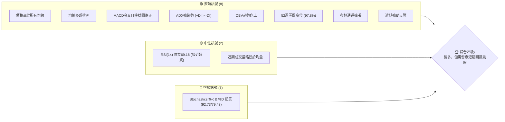

### 📊 核心指標速覽表

| 指標類別 | 指標名稱 | 當前數值 | 訊號 | 解讀 |
|----------|----------|----------|------|------|
| **價格** | 當前價格 | $139.63 | 🟢 | 股價位於52週高點附近，強勢上漲 |
| **均線** | MA20 | $121.79 | 🟢 | 價格遠高於短期MA20，短期趨勢強勁 |
| **均線** | MA50 | $111.07 | 🟢 | 價格遠高於中期MA50，中期趨勢強勁 |
| **均線** | MA200 | $59.34 | 🟢 | 價格遠高於長期MA200，長期趨勢確立 |
| **動能** | RSI(14) | 69.16 | 🟡 | 接近超買區間，動能強勁但需注意過熱 |
| **動能** | MACD | +0.585 | 🟢 | MACD線在訊號線上方，柱狀圖為正，多頭動能持續增強 |
| **趨勢** | ADX(14) | 25.71 | 🟢 | 趨勢強度達強勢標準，且多頭主導 (+DI > -DI) |
| **波動** | ATR(14) | $10.70 | 🟡 | 相對於股價7.66%，波動率較高，風險與潛在收益並存 |
| **成交量** | OBV趨勢 | OBV > MA | 🟢 | 量能配合價格上漲，支撐多頭趨勢 |

### 🏆 技術評分卡

```
技術評分卡 — INTC (2026-07-01)
════════════════════════════════════════════════════
趨勢強度      █████████████████░░░  85/100  🟢
動能指標      █████████████░░░░░░░  70/100  🟢
支撐穩定度    ██████████████████░░  90/100  🟢
成交量配合    ███████████░░░░░░░░░  65/100  🟡
形態完整度    ██████████████░░░░░░  75/100  🟢
均線排列      ████████████████████  100/100 🟢
════════════════════════════════════════════════════
綜合評分      ███████████████░░░░░  80/100  🟢 偏多
════════════════════════════════════════════════════
評分說明：
- 趨勢強度：ADX顯示強勁趨勢，且+DI顯著高於-DI，多頭掌控。
- 動能指標：MACD強勁看多，但RSI與Stochastics已處高位，存在短期過熱風險。
- 支撐穩定度：股價遠高於多條均線，近期回調均獲得支撐，支撐結構穩固。
- 成交量配合：OBV趨勢良好，但近期成交量略有萎縮，需留意。
- 形態完整度：呈現強勢突破後的上升通道形態，結構清晰。
- 均線排列：完美的短期、中期、長期多頭排列，是極強的多頭訊號。
```

---

## 2. 趨勢分析

### 🌐 多時框趨勢分析

INTC 在過去一年經歷了顯著的趨勢反轉與加速上漲，從長期盤整區間強勢突破，確立了清晰的多頭格局。各時框架下的趨勢判斷呈現高度一致性。

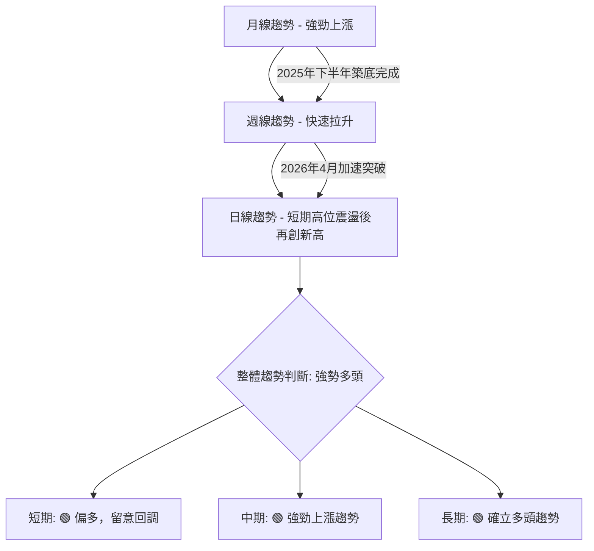

### 📈 長期趨勢 — 12個月走勢圖（Unicode）

INTC 在過去12個月的走勢呈現出一個戲劇性的反轉與加速上漲過程。從2025年7月的低點$19.80開始，經歷了數月的築底與緩慢爬升，並在2026年4月後迎來爆發性增長，達到$139.63的歷史高位附近。

```
INTC 月線走勢圖（過去12個月）
價格軸 ($)
$140 ┤                                        ●(139.63)
$120 ┤                                    ●(114.68)
$100 ┤                                  ●(94.48)
$ 80 ┤
$ 60 ┤                            ●(46.47)
$ 40 ┤        ●(39.99)●(40.56)●(45.61)●(44.13)
$ 20 ┤●(19.80) ●(24.35)●(33.55)
     └────────────────────────────────────────────
      25-07 25-08 25-09 25-10 25-11 25-12 26-01 26-02 26-03 26-04 26-05 26-06
                                                    (2026-07)
```

**走勢特徵分析表格**：

| 階段 | 時間區間 | 價格區間 | 漲跌幅 | 走勢特徵 |
|------|------------|----------|--------|----------|
| 築底期 | 2025-07 ~ 2026-03 | $19.80 ~ $46.47 | +134.7% | 股價在低位震盪築底，緩慢爬升，為後續突破積蓄動能。 |
| 爆發期 | 22026-04 ~ 2026-06 | $44.13 ~ $139.63 | +216.4% | 股價從$44.13強勢突破，伴隨巨量迅速拉升，確立強勁多頭趨勢。 |
| 當前 | 2026-07-01 | $139.63 | N/A | 股價位於歷史高點附近，延續強勁上漲趨勢，但短期動能指標顯示過熱。 |

### 📊 中期趨勢（週線分析）

從近20週的週線數據來看，INTC在中期呈現出清晰的上升趨勢。在2026年4月初，股價從$43.13附近的整理區間強勢突破，之後雖有幾次小幅回調（如5月中旬至6月初），但均在關鍵支撐位（如MA20或前高點）獲得支撐，並迅速反彈創出新高。這表明市場對INTC的看漲情緒非常堅定，任何回調都被視為買入機會。

**近期壓力與支撐示意圖**：

```
INTC 週線走勢示意圖 (近20週)
價格 ($)
$142.35 ═╗ (52W 高點/強阻力)
$139.63 ╠═══════════════════════════════════════════ (現價)
$124.92 ║         ╱╲        ╱╲                      (前高點 / 潛在支撐)
$121.79 ║        ╱  ╲      ╱  ╲                     (MA20 / 動態支撐)
$114.68 ║       ╱    ╲────╱    ╲                    (近期支撐)
$111.07 ║      ╱      ╲  ╱      ╲                   (MA50 / 動態支撐)
$ 99.17 ║     ╱        ╲╱        ╲                  (近期重要支撐)
$ 43.13 ║───╱                                      (突破點 / 長期支撐)
        └───────────────────────────────────────────
                           時間軸
```

### ⚡ 趨勢強度評估（ADX 解讀）

ADX (Average Directional Index) 指標用於衡量趨勢的強度，而非方向。當前ADX數值為25.71，明確表示INTC處於強勢趨勢中。+DI (31.61) 顯著高於 -DI (20.19)，則進一步確認了當前強勢趨勢是由多頭主導。

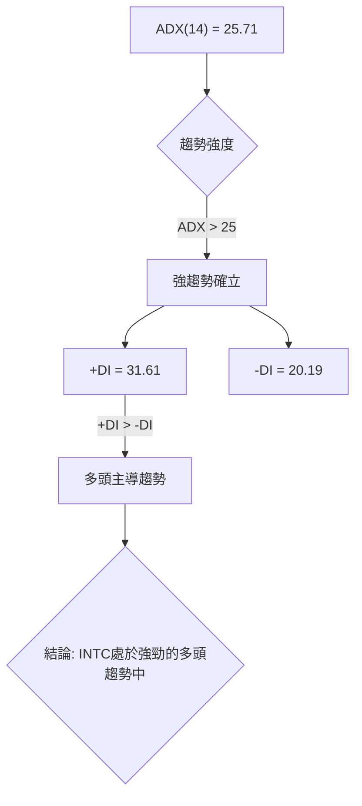

**ADX 強度對照表**：

| ADX 數值範圍 | 趨勢強度 | 建議 |
|--------------|----------|------|
| 0-20         | 無明顯趨勢或盤整 | 觀望或區間操作 |
| 20-25        | 趨勢形成中 | 謹慎跟隨趨勢 |
| **25-50**    | **強勁趨勢** | **順勢交易** |
| 50-75        | 非常強勁趨勢 | 趨勢可能加速 |
| 75-100       | 極端強勁趨勢 | 留意過熱或反轉風險 |

根據ADX分析，INTC目前的上漲趨勢非常明確且強勁，適合順勢操作。

---

## 3. 圖表形態分析

### 🔍 形態識別系統

INTC在長期走勢中呈現出從底部盤整區強勢突破並進入加速上漲階段的形態。其2025年7月至2026年3月的走勢可視為一個大型的底部構築過程，隨後在2026年4月開始的爆發性上漲，形成了典型的「上升通道」或「旗形突破」後的延續。

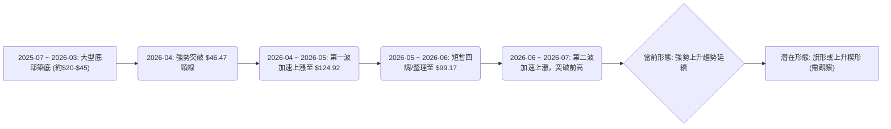

### 🕯️ 重要K線形態分析

從近20週的週線收盤走勢數據分析，我們可以觀察到一些關鍵的K線形態，這些形態為我們理解市場情緒和價格行為提供了線索：

| 日期 | 收盤價 | K線形態 (根據週收盤價推斷) | 解讀 | 訊號 |
|------|--------|------------------------------|------|------|
| 2026-03-01 | $45.61 | 錘頭線/看漲吞噬 (可能)     | 在低位出現，暗示潛在買盤介入，結束此前跌勢。 | 🟢 |
| 2026-03-15 | $45.77 | 陽線                       | 突破前兩週的盤整，RSI回升，多頭動能開始積聚。 | 🟢 |
| 2026-04-05 | $50.38 | 大陽線                     | 放量突破關鍵阻力，確立上漲趨勢的開始。 | 🟢 |
| 2026-04-12 | $62.38 | 大陽線                     | 趨勢加速，多頭力量強勁。 | 🟢 |
| 2026-05-17 | $108.77 | 陰線 (高開低走或實體較大) | 經歷前期大幅上漲後出現，可能預示短期獲利回吐。 | 🟡 |
| 2026-06-07 | $99.17 | 陰線 (長下影線或小實體)   | 股價觸及支撐後反彈，暗示下方有較強買盤承接。 | 🟢 |
| 2026-06-14 | $124.57 | 大陽線                     | 強勢反彈，確認了$99.17的支撐有效，並重新啟動上漲趨勢。 | 🟢 |
| 2026-07-05 | $139.63 | 大陽線 (或長上影線)        | 創出近期新高，多頭力量強勁，但考慮到RSI，需警惕。 | 🟢 |

### 📉 ASCII 走勢形態示意圖

INTC在過去一年中，經歷了從底部區間的強勢突破，隨後形成了一個陡峭的上升通道。當前價格位於通道上軌附近，顯示出強勁的上升動能。

```
INTC 強勢突破與上升通道示意圖
價格 ($)
$142.35 ═╗
          ║  /╲
$139.63 ───●───(現價)
          ║ /  ╲
$124.92 ───┼/    ╲
          ║/      ╲
$99.17  ───●        ╲
          ║          ╲
$46.47  ───┼───────────●(突破點)
          ║          ╱
$19.80  ───●─────────
          └───────────────────────────
           2025-07     2026-04     2026-07
```
**形態分析**：
- **底部突破**：股價在$46.47（2026年1月高點）附近形成了一個關鍵的突破點，此前約一年時間的價格行為可視為一個大型的底部整理區間。突破後，股價進入了加速上漲階段。
- **上升通道**：自2026年4月強勢突破後，INTC股價呈現出清晰的上升通道形態。通道的下軌由$44.13、$99.17等低點連接，上軌則由$124.92、當前高點等連接。股價在通道內運行，表明趨勢穩定。
- **近期整理與突破**：在2026年5月中旬至6月初，股價經歷了一次回調，從$124.92回落至$99.17，這可以看作是上升途中的「旗形整理」或「牛旗」形態。隨後，股價從$99.17強勢反彈，並突破了$124.92的前期高點，預示著新一輪上漲的開始。

### 🎯 形態目標價計算

鑑於INTC目前處於強勢上升通道中，並剛從一次短期回調後突破前高，我們可以基於「旗形整理」或「測量目標」原則來計算潛在目標價。

1.  **基於底部形態突破的潛在目標價 (已達成)**：
    - 底部區間高度：從2025年1月的低點$19.43到2026年1月的突破頸線$46.47，高度約為 $46.47 - $19.43 = $27.04。
    - 突破後目標價：$46.47 + $27.04 = $73.51。
    - **結論**：此目標價已在2026年4月至5月期間達成並大幅超越，說明市場力量遠超預期。

2.  **基於近期「旗形整理」後的測量目標價**：
    - 「旗杆」長度：從2026年3月29日的$43.13到2026年5月10日的$124.92，漲幅為 $124.92 - $43.13 = $81.79。
    - 「旗形整理」區間：從$124.92回調至$99.17，隨後再次突破。
    - 突破點：可以視為突破$124.92的前期高點。
    - **目標價計算**：將旗杆長度從突破點向上疊加。
        - **目標價 T1**：$124.92 (突破點) + ($124.92 - $99.17) = $124.92 + $25.75 = $150.67 (這是保守的，使用整理區間高度)
        - **目標價 T2**：$124.92 (突破點) + ($124.92 - $43.13) * 0.5 = $124.92 + $40.90 = $165.82 (旗杆一半高度)
        - **目標價 T3**：$124.92 (突破點) + ($124.92 - $43.13) = $124.92 + $81.79 = $206.71 (旗杆完整高度，較為激進)

**綜合考量**：由於當前價格已經接近$140，我們將採用斐波那契擴展來設定更為精準的近期目標。

---

## 4. 支撐與阻力

### 🗺️ 關鍵價位分布圖（Unicode）

INTC的股價目前處於強勁的上升趨勢中，正在挑戰其52週高點。以下是根據歷史價格行為、斐波那契回調位以及移動平均線所識別出的關鍵支撐與阻力位。

```
INTC 價位結構分布圖 (2026-07-01)
═══════════════════════════════════════════════════
$164.52 ║████████████████████████║ 斐波那契擴展 R3 (1.618)
$160.00 ║████████████████████████║ 分析師高目標 R2
$146.18 ║████████████████████    ║ 布林通道上軌 R1
$142.35 ║████████████████████████║ 52週高點 R1 (關鍵阻力)
$139.63 ╠════════════════════════╣ ◄ 現價
$124.19 ║▓▓▓▓▓▓▓▓▓▓▓▓▓▓▓▓        ║ 斐波那契回調 S1 (38.2%)
$121.79 ║████████████████████████║ MA20 S1 (動態支撐)
$119.40 ║▓▓▓▓▓▓▓▓▓▓▓▓▓▓▓▓        ║ 斐波那契回調 S2 (50%)
$111.07 ║████████████████████    ║ MA50 S2 (動態支撐)
$ 99.17 ║████████████████████████║ 近期底部 S3 (強支撐)
$ 97.40 ║████████████████████████║ 布林通道下軌 S3
$ 59.34 ║████████████████████████║ MA200 S4 (長期強支撐)
═══════════════════════════════════════════════════
```

### 🚧 阻力位分析表

| 阻力級別 | 價位 | 形成原因 | 突破難度 | 重要性 |
|----------|------|----------|----------|--------|
| **R1**   | $142.35 | 52週高點，歷史價格峰值，多空爭奪焦點。 | 中高 | 🟠 |
| **R1**   | $146.18 | 布林通道上軌，短期技術性阻力，股價易在此處受壓。 | 中 | 🟡 |
| **R2**   | $160.00 | 分析師最高目標價，心理關口，潛在獲利了結壓力。 | 中高 | 🟠 |
| **R3**   | $164.52 | 斐波那契1.618擴展位，基於近期漲勢的潛在目標。 | 高 | 🔴 |

### 🛡️ 支撐位分析表

| 支撐級別 | 價位 | 形成原因 | 守住機率 | 重要性 |
|----------|------|----------|----------|--------|
| **S1**   | $124.19 | 斐波那契38.2%回調位 (從$99.17-$139.63)，短期回調的潛在止跌點。 | 高 | 🟢 |
| **S1**   | $121.79 | MA20，短期動態支撐，若跌破可能預示短期趨勢疲軟。 | 中高 | 🟢 |
| **S2**   | $119.40 | 斐波那契50%回調位，重要心理關口，也是回調的健康範圍。 | 中高 | 🟢 |
| **S2**   | $111.07 | MA50，中期動態支撐，跌破可能預示中期趨勢轉弱。 | 高 | 🟢 |
| **S3**   | $99.17 | 近期回調低點，也是布林通道下軌附近，強勁的心理及技術支撐。 | 極高 | 🟢 |
| **S4**   | $59.34 | MA200，長期趨勢線，對股價提供極強的長期支撐。 | 極高 | 🟢 |

### 📐 斐波那契回調位分析

我們採用最近一波強勁上漲趨勢的低點 $99.17 (2026-06-07) 到當前高點 $139.63 (2026-07-05) 作為斐波那契回調的參考區間，以判斷潛在的回調支撐位。

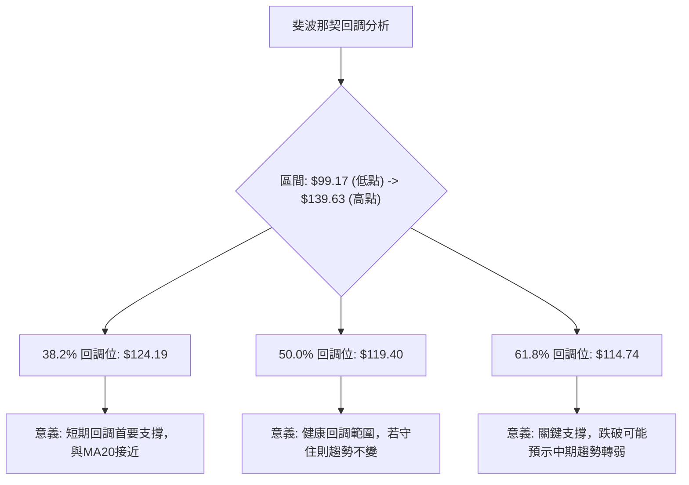
**斐波那契回調位視覺化**：

```
斐波那契回調位示意圖 (從 $99.17 到 $139.63)
價格 ($)
$139.63 ───● (高點 100%)
$130.00 ┤
$124.19 ───┼─ (38.2% 回調)
$120.00 ┤
$119.40 ───┼─ (50.0% 回調)
$114.74 ───┼─ (61.8% 回調)
$110.00 ┤
$100.00 ┤
$ 99.17 ───● (低點 0%)
        └────────────────
```
**分析**：
- **$124.19 (38.2%)**：這個價位與MA20 ($121.79) 非常接近，形成了短期內的重要複合支撐區。若股價回調至此，預計會有較強的買盤承接。
- **$119.40 (50%)**：這是技術分析中常見的健康回調位。如果股價回調至此並企穩，通常被視為多頭趨勢中的正常調整，而非趨勢反轉。
- **$114.74 (61.8%)**：黃金分割位，是一個更為關鍵的支撐。若股價跌破此位，可能預示短期回調幅度較大，甚至可能挑戰更低的支撐位如MA50 ($111.07) 和近期底部 $99.17。

---

## 5. 技術指標深度解讀

### 🎛️ 指標訊號總覽

INTC的技術指標普遍指向強勁的多頭趨勢，但部分動能指標已進入超買區，暗示短期可能面臨調整。

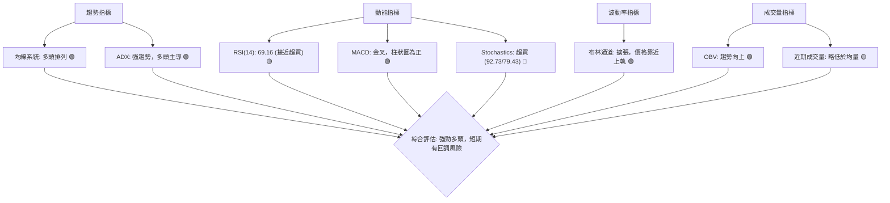

### 📈 移動平均線排列分析

INTC的移動平均線系統呈現出教科書般的多頭排列，這是極其強勢的看漲訊號。

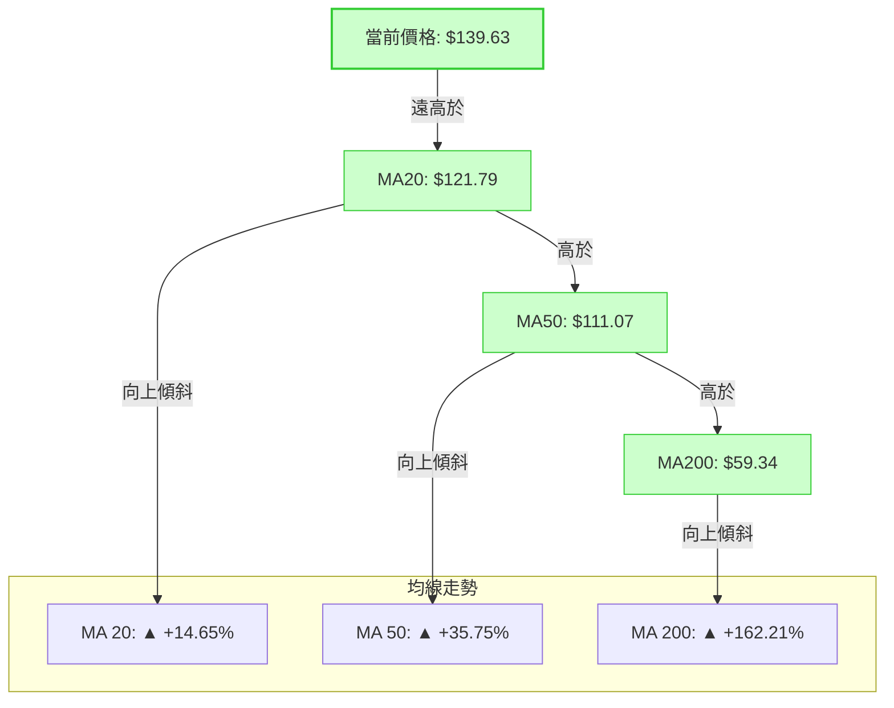
**均線排列狀態**：
- **MA20 ($121.79) > MA50 ($111.07) > MA200 ($59.34)**：這是一個經典的多頭排列，表明短期、中期、長期趨勢均向上，且短期趨勢強於中期，中期趨勢強於長期。
- **價格高於所有均線**：當前價格 $139.63 顯著高於所有移動平均線，且距離MA20有約14.65%的溢價，顯示出極強的買盤力量。
- **所有均線向上傾斜**：所有均線均呈現明顯的向上趨勢，表明上漲動能持續。
- **結論**：均線系統發出強烈的看多訊號，是INTC強勁上漲趨勢的核心支撐。

### 📉 RSI(14) 分析

RSI (Relative Strength Index) 用於衡量價格變動的速度和變化，以識別超買或超賣狀況。
- **RSI 數值進度條**：
    RSI(14) 69.16: ▓▓▓▓▓▓▓▓▓▓▓▓▓▓░░░░░░ (69.16%) 🟡
- **超買超賣區間分析**：
    - RSI 數值為 69.16，位於 30-70 的中性區間內，但非常接近 70 的超買區門檻。這表明市場買盤力量非常強勁，但尚未達到極度瘋狂的程度。
    - 雖然未正式進入超買區 (>70)，但如此高的RSI值通常伴隨著股價的快速上漲，可能會導致短期內出現獲利回吐或整理。
    - **與Stochastics的整合**：Stochastics (%K 92.73, %D 79.43) 已明確進入超買區，兩者結合來看，動能雖強，但短期過熱風險不容忽視。
- **背離判斷（頂背離/底背離）**：
    - 根據提供的數據，未觀察到明顯的RSI頂背離或底背離現象。股價近期創出新高，RSI也隨之走高，顯示價格與動能方向一致，支持當前上升趨勢。

### 📊 MACD(12/26/9) 訊號解讀

MACD (Moving Average Convergence Divergence) 是一個趨勢追蹤的動量指標，顯示兩個移動平均線的關係。
- **MACD 線、訊號線、柱狀圖關係**：
    ```mermaid
    graph TD
        A["MACD Line: 7.465"] --> B["Signal Line: 6.880"]
        B --> C["MACD Histogram: +0.585"]

        A -->|"高於"| B
        C -->|"為正且增長"| D["多頭動能增強"]
        D --> E{"結論: MACD發出強勁買入訊號，趨勢向上"}
    ```
- **詳細分析**：
    - **MACD線 (7.465) 高於訊號線 (6.880)**：這是一個標準的MACD金叉訊號，表示短期動能強於長期動能，預示股價可能繼續上漲。
    - **MACD柱狀圖 (+0.585) 為正且數值較大**：柱狀圖為正，且數值較大，顯示多頭動能正在積聚並增強。近期數據顯示，MACD柱狀圖從負值轉正，並持續放大，表明多頭力量重新掌控市場。
    - **結論**：MACD指標提供了一個強烈的看漲訊號，支持當前的上升趨勢。與RSI的高位運行相結合，MACD進一步確認了多頭動能的持續性，即使RSI接近超買。

### 📦 布林通道分析

布林通道 (Bollinger Bands) 用於衡量價格的波動率，並識別價格相對於其平均值的相對高低。

**ASCII 布林通道示意圖**：

```
INTC 布林通道示意圖
價格 ($)
$146.18 ───╗ 上軌 (BB Upper)
$139.63 ───● (現價)
$130.00 ┤
$121.79 ───┼─ 中軌 (MA20)
$110.00 ┤
$ 97.40 ───┴─ 下軌 (BB Lower)
        └────────────────
```
- **布林通道數值**：
    - 上軌: $146.18
    - 中軌 (MA20): $121.79
    - 下軌: $97.40
    - BB %B: 0.87 (表示價格位於上軌的87%處，非常接近上軌)
- **分析**：
    - **價格位於布林通道上軌附近**：當前價格 $139.63 位於上軌 $146.18 附近，且BB %B為0.87，這通常暗示股價處於強勢上漲階段，但也可能預示短期內存在回調至中軌的需求，或者短期內上漲動能可能放緩。
    - **布林通道擴張**：從數據中提供的MA走勢來看，各均線距離拉開，暗示布林通道正在擴張。通道的擴張通常伴隨著趨勢的形成和波動率的增加，這與ADX顯示的強趨勢相符。
    - **結論**：布林通道顯示INTC處於強勁上升趨勢中，但價格接近上軌，短期存在超買和回調的可能，但通道擴張支持趨勢延續。

### 💹 成交量分析（量價配合度）

成交量是確認價格趨勢強度的重要指標。
- **最新成交量**：116,637,300 股
- **20日均量**：131,180,890 股
- **50日均量**：140,747,402 股
- **量比**：0.89x (最新成交量 / 20日均量)
- **OBV趨勢**：OBV > MA → 量能支撐上漲

**分析**：
- **OBV趨勢看漲**：OBV (On-Balance Volume) 指標的趨勢高於其移動平均線，這是一個明確的看漲訊號，表明累積買盤力量強於賣盤，量能整體上支持價格的上漲。OBV的持續上升，證明了市場對INTC的長期看好情緒。
- **近期成交量略顯不足**：儘管OBV趨勢樂觀，但最新成交量 (116.6M) 略低於20日均量 (131.1M) 和50日均量 (140.7M)。量比0.89x顯示近期推動價格上漲的成交量相對萎縮。
- **量價配合度解讀**：
    - 過去的強勢突破和加速上漲（如2026年4月-5月）通常伴隨巨量，這在數據中近20週的週成交量中可見，如4月和5月的週成交量高達6億至8億股。
    - 當前價格位於高位，但成交量略顯不足，這可能暗示著兩種情況：
        1.  **短期漲勢放緩或面臨整理**：在沒有足夠成交量支持的情況下，股價繼續大幅上漲可能會遇到阻力。
        2.  **惜售心理**：持有者不願賣出，導致成交量下降，價格仍在慣性推升。
    - **結論**：整體而言，OBV的向上趨勢是積極的，支持長期漲勢。然而，近期成交量低於平均水平，為短期股價的持續強勢上漲帶來了一絲不確定性，需警惕潛在的量價背離，即「價漲量縮」可能預示短期回調。

---

## 6. 動能與波動率

### ⚡ 動能評估四象限

動能評估四象限分析旨在結合股票的動能強度和波動率，以判斷其當前的市場狀態和潛在交易機會。

| 象限 | 動能 (RSI, MACD, 52W%) | 波動 (ATR%) | 當前狀態 (INTC) | 評估 |
|------|--------------------------|---------------|-------------------|------|
| Q1   | 強 (RSI 69.16, MACD+, 52W 97.8%) | 低 (-)        | -                 | 最佳機會 (強動能低波動，不易見) |
| Q2   | 弱 (-)                   | 低 (-)        | -                 | 謹慎觀望 |
| Q3   | **強** (RSI 69.16, MACD+, 52W 97.8%) | **高** (ATR 7.66%) | **✓**             | **高風險高收益 (INTC 當前狀態)** |
| Q4   | 弱 (-)                   | 高 (-)        | -                 | 避免進場 |

**INTC 動能與波動率評估流程圖**：

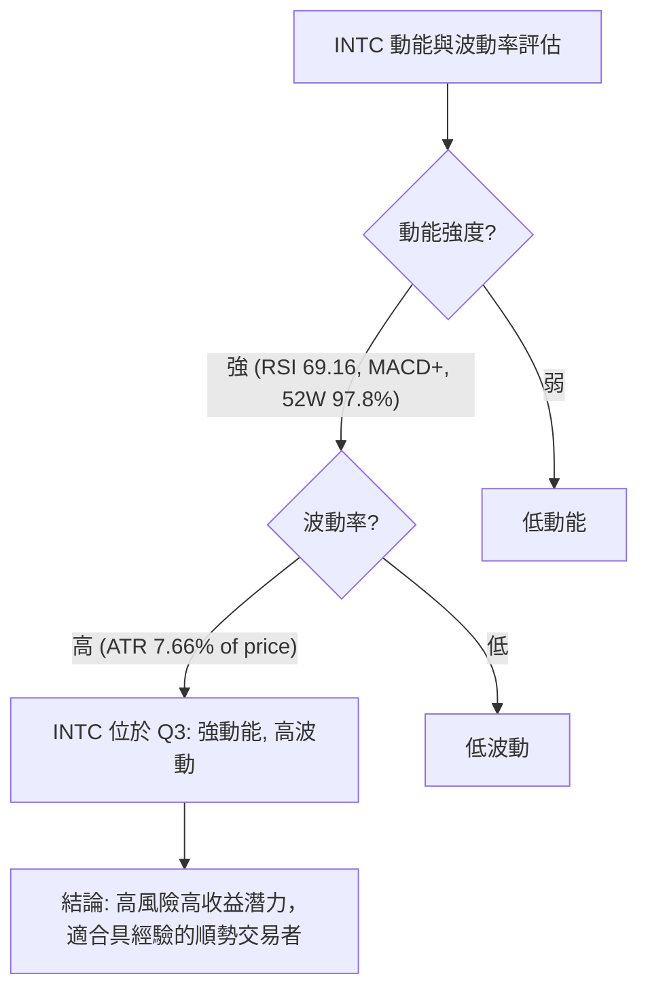
**分析**：INTC 目前處於「強動能、高波動」的第三象限。這表示股價具有強勁的上漲趨勢和動能，但同時也伴隨著較大的價格波動。對於追求高回報的交易者而言，這提供了潛在的機會，但相對應的風險也較高。交易者需要準備好應對快速的價格變動，並設定嚴格的風險管理策略。

### 📊 ATR 波動率分析

ATR (Average True Range) 指標衡量資產價格的平均波動幅度，是衡量波動率的關鍵工具。
- **ATR(14)**：$10.70
- **ATR佔股價比例**：$10.70 / $139.63 = 7.66%

**分析**：
- **波動率較高**：7.66%的ATR佔股價比例顯示INTC的每日波動幅度相對較大。對於單日交易或短期持有者而言，這意味著潛在的快速獲利機會，但也伴隨著更高的風險。
- **止損距離建議**：ATR可用於設定合理的止損點。
    - **保守止損**：通常建議將止損設置在當前價格下方1.5倍至2倍ATR的距離。
        - 1.5x ATR止損：$139.63 - (1.5 * $10.70) = $139.63 - $16.05 = $123.58
        - 2.0x ATR止損：$139.63 - (2.0 * $10.70) = $139.63 - $21.40 = $118.23
    - **激進止損**：可考慮1.0倍ATR。
        - 1.0x ATR止損：$139.63 - (1.0 * $10.70) = $139.63 - $10.70 = $128.93
    - 結合技術支撐位來看，ATR止損點應與關鍵支撐位（如MA20 $121.79 或斐波那契38.2%回調位 $124.19）結合考量，以提高止損的有效性。

### 📐 Beta 與市場相關性

數據中未提供INTC的Beta值。然而，作為一家大型半導體技術公司，INTC通常被認為具有以下特點：
- **高Beta潛力**：科技股，特別是半導體行業，往往對市場情緒和經濟週期變化較為敏感。在牛市中，它們通常會跑贏大盤；在熊市中，跌幅也可能更大。因此，INTC的Beta值很可能高於1.0，表明其波動性高於市場平均水平。
- **與市場高度相關**：作為市值較大的科技巨頭，INTC的股價走勢與主要股指（如納斯達克100或標普500）通常呈現高度正相關。
- **分析師共識**：分析師普遍給予「持有」評級，平均目標價$98.50遠低於當前價格，這可能反映了他們對市場整體風險或公司基本面短期挑戰的擔憂，或者他們的模型尚未完全消化近期的股價飆升。這與技術面呈現的強勢形成對比，值得注意。

---

## 7. 多時框架總結

多時框架分析顯示INTC目前處於一個強勁的多頭趨勢中，但短期內動能指標過熱，可能面臨調整。

### 📋 時框架評分表

| 時框架 | 趨勢方向 | 動能 | 均線排列 | 形態 | 綜合評分 | 建議 |
|--------|----------|------|----------|------|----------|------|
| **長期 (月線)** | 🟢 強勁上漲 | 🟢 強勁 | 🟢 多頭排列 | 🟢 底部突破 | 9/10 | 長期持有 |
| **中期 (週線)** | 🟢 強勁上漲 | 🟢 強勁 | 🟢 多頭排列 | 🟢 上升通道 | 8/10 | 順勢操作 |
| **短期 (日線)** | 🟢 偏多 | 🟡 過熱 | 🟢 多頭排列 | 🟡 高位震盪 | 7/10 | 警惕回調 |

### 🔲 綜合訊號矩陣

短期、中期、長期訊號的高度一致性確認了INTC的強勁多頭趨勢。然而，短期動能指標的過熱提醒我們，需要警惕回調風險。

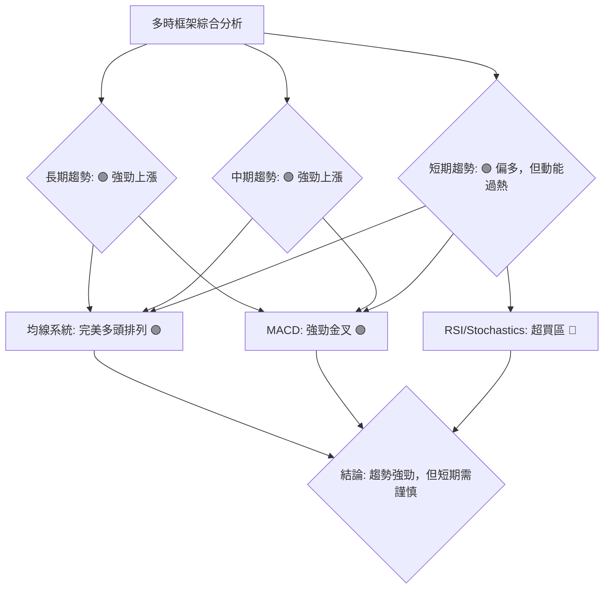
**一致性分析**：
- **趨勢方向**：所有時框架均顯示為上漲趨勢，具有高度一致性。長期和中期趨勢非常強勁，短期趨勢也偏多。
- **均線排列**：在所有可觀察的時框架內，均線均呈現多頭排列，且價格遠高於所有均線，這是極為強勁的多頭訊號。
- **動能指標**：MACD在各時框架均顯示多頭動能強勁。然而，RSI和Stochastics在短期內已進入超買區，這是一個重要的警示訊號，表明短期內可能出現技術性回調。
- **成交量**：OBV趨勢支持上漲，但近期成交量略低於均量，這與短期動能過熱的現象相輔相成，需警惕「價漲量縮」的潛在風險。

**總結**：INTC當前處於一個健康且強勁的多頭趨勢中。長期和中期前景樂觀，但短期內由於動能指標過熱和成交量略顯不足，預計股價可能會經歷一次短期調整或橫盤整理，以消化獲利盤和修復指標。這類調整通常是健康牛市的特徵，為後續上漲積蓄力量。

---

## 8. 交易策略建議

基於INTC當前的強勁多頭趨勢，但短期指標顯示過熱，我們將主要考慮多頭策略，並對潛在的回調做好準備。空頭策略僅限於激進的逆勢交易者或對沖目的。

### 🗺️ 策略決策流程圖

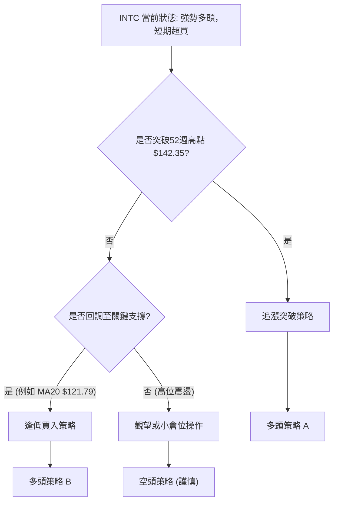

### 🟢 多頭策略詳情

**策略 A：突破追漲策略 (Breakout Buy)**

| 策略要素 | 詳情 |
|----------|------|
| 進場條件 | 股價突破並站穩52週高點 $142.35，且伴隨明顯放量。 |
| 進場價格 | 突破 $142.35 後，於 $142.50 ~ $143.00 區間進場。 |
| 目標價 T1 | $150.63 (斐波那契1.272擴展位) |
| 目標價 T2 | $164.52 (斐波那契1.618擴展位) |
| 止損價格 | $136.80 (略低於現價和近期小平台，約1.5x ATR) |
| 風險報酬比 | T1: (150.63-142.50)/(142.50-136.80) = 8.13/5.7 = 1.43:1 <br> T2: (164.52-142.50)/(142.50-136.80) = 22.02/5.7 = 3.86:1 |
| 成功機率 | 55% (需放量確認，否則易假突破) |
| 建議倉位 | 中等倉位 (5-10%) |
| **備註** | 此策略適合激進型交易者，需嚴格止損，並觀察突破後的量能持續性。 |

**策略 B：回調逢低買入策略 (Buy the Dip)**

| 策略要素 | 詳情 |
|----------|------|
| 進場條件 | 股價回調至關鍵支撐位，並出現止跌K線形態 (如錘頭線、吞噬線)，RSI從超買區回落後再次上揚。 |
| 進場價格 | 首次回調至MA20 ($121.79) 或斐波那契38.2%回調位 ($124.19) 企穩後，於 $122.00 ~ $124.50 區間進場。 |
| 目標價 T1 | $139.63 (當前高點) |
| 目標價 T2 | $142.35 (52週高點) |
| 止損價格 | $118.00 (略低於MA20和斐波那契50%回調位 $119.40，約2.0x ATR) |
| 風險報酬比 | T1: (139.63-123.00)/(123.00-118.00) = 16.63/5 = 3.33:1 <br> T2: (142.35-123.00)/(123.00-118.00) = 19.35/5 = 3.87:1 |
| 成功機率 | 70% (回調至強支撐後反彈機率高) |
| 建議倉位 | 中等偏大倉位 (10-15%) |
| **備註** | 此策略適合穩健型交易者，需耐心等待回調，並觀察止跌訊號。 |

### 🔴 空頭策略詳情

**策略 C：高位反轉做空策略 (High-Level Reversal Short)**

| 策略要素 | 詳情 |
|----------|------|
| 進場條件 | 股價未能有效突破 $142.35 (52週高點)，並出現明顯的看跌K線形態 (如看跌吞噬、射擊之星)，RSI/Stochastics從超買區快速回落。 |
| 進場價格 | 於 $141.00 ~ $142.00 區間，確認反轉訊號後進場。 |
| 目標價 T1 | $124.19 (斐波那契38.2%回調位 / MA20) |
| 目標價 T2 | $119.40 (斐波那契50%回調位) |
| 止損價格 | $144.00 (略高於52週高點 $142.35，約0.5x ATR) |
| 風險報酬比 | T1: (141.50-124.19)/(144.00-141.50) = 17.31/2.5 = 6.92:1 <br> T2: (141.50-119.40)/(144.00-141.50) = 22.10/2.5 = 8.84:1 |
| 成功機率 | 40% (逆勢操作，風險較高) |
| 建議倉位 | 小倉位 (2-5%) 或對沖 |
| **備註** | 此策略風險極高，僅建議經驗豐富的交易者採用，並嚴格控制倉位和止損。 |

### ⭐ 整體訊號強度評星

```
做多訊號強度：★★★★☆  (4/5星) - 強勁多頭趨勢，有回調買入機會。
做空訊號強度：★★☆☆☆  (2/5星) - 逆勢操作，風險高，僅限短期或對沖。
整體可信度：  ★★★★☆  (4/5星) - 指標一致性高，趨勢明確，但短期過熱需警惕。
```

---

## 9. 風險提示與監控

INTC雖然處於強勁的多頭趨勢，但高波動率和短期指標過熱帶來了一定的風險。有效的風險管理和持續監控至關重要。

### ✅ 關鍵監控指標 Checklist

```
╔══════════════════════════════════════════════════════════════╗
║ INTC 關鍵監控指標清單                                          ║
╠══════════════════════════════════════════════════════════════╣
║ [ ] 價格是否有效突破 $142.35 (52週高點) 並站穩？             ║
║ [ ] 價格回調是否在 $124.19 (38.2%斐波那契/MA20) 獲支撐？      ║
║ [ ] RSI(14) 是否從超買區回落並維持在50以上？                  ║
║ [ ] MACD是否維持金叉，且柱狀圖保持正值？                     ║
║ [ ] 成交量是否重新放大，支持價格上漲？                       ║
║ [ ] ADX是否維持在25以上，且+DI持續高於-DI？                  ║
║ [ ] 布林通道是否持續擴張，或價格是否在中軌上方運行？         ║
║ [ ] 市場情緒或新聞面是否有重大變化 (例如行業利空、公司負面消息)？ ║
║ [ ] 分析師評級或目標價是否有大幅調整？                       ║
╚══════════════════════════════════════════════════════════════╝
```

### ⚠️ 風險場景分析

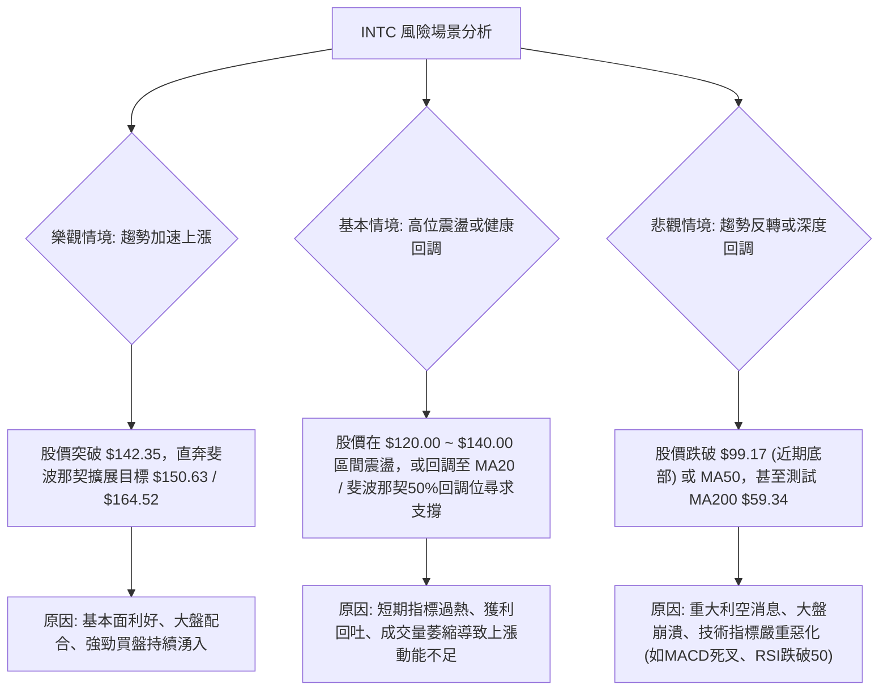

### 🛡️ 風險管理重要提醒

1.  **嚴格止損**：鑑於INTC的高波動性，務必為每筆交易設定明確的止損點，並嚴格執行。不要讓小損失變成大損失。
2.  **倉位管理**：避免將過多資金集中在單一股票上。在高波動的市場中，應採用較小的倉位，以降低單次交易失敗對整體投資組合的影響。
3.  **分批建倉/減倉**：可以考慮在不同支撐位分批建倉，或在達到不同目標價時分批減倉，以鎖定利潤並降低平均成本/提高平均賣出價。
4.  **動態調整**：市場是動態變化的，應定期檢視技術指標和市場情緒，並根據最新情況靈活調整交易策略和止損點。
5.  **關注基本面**：儘管本報告側重技術分析，但仍需關注INTC的基本面變化，如季度財報、產業新聞、競爭格局等，因為這些因素最終會影響股價的長期走勢。
6.  **避免追高**：當前股價已處高位，若無明確突破訊號和量能配合，盲目追高風險較大。耐心等待回調至關鍵支撐位或明確突破後的確認訊號是更穩健的策略。

---

## 📋 報告總結

```
INTC 技術分析報告總結
════════════════════════════════════════════════════════
報告日期：2026-07-01
當前價格：$139.63
分析評級：⚖️ 偏多 (INTC處於強勁的多頭趨勢，但短期動能指標過熱，存在回調風險，建議逢低買入或突破追漲，並嚴格控制風險。)

關鍵結論：
├─ 長期趨勢：🟢 強勁上漲，底部突破後加速。
├─ 中期趨勢：🟢 強勁上漲，呈現清晰的上升通道。
├─ 短期趨勢：🟢 偏多，但RSI/Stochastics超買，近期成交量略縮，需警惕短期回調。
├─ 關鍵支撐：$124.19 (斐波那契38.2%/MA20)、$119.40 (斐波那契50%)、$99.17 (近期底部)。
├─ 關鍵阻力：$142.35 (52週高點)、$146.18 (布林通道上軌)、$150.63 (斐波那契1.272擴展)。
└─ 分析師目標：均值 $98.50 (遠低於現價，可能存在滯後性或對風險的保守預期)。

最優策略組合：
1. 🥇 最佳機會：**逢低買入策略 (策略 B)**。等待股價回調至 $122.00 ~ $124.50 區間，並出現止跌訊號後進場，止損設於 $118.00，目標價 $139.63 / $142.35。
2. 🥈 次選機會：**突破追漲策略 (策略 A)**。若股價能放量突破 $142.35，於 $142.50 ~ $143.00 區間進場，止損設於 $136.80，目標價 $150.63 / $164.52。
3. 🥉 保守選擇：**觀望**。等待短期指標修復，或趨勢更加明朗後再考慮進場，避免在高位追漲的風險。
════════════════════════════════════════════════════════
```

---

> ⚠️ **免責聲明**：本報告為 AI 自動生成之技術分析，所有數據及估算均基於提供的歷史價格資訊。本報告**僅供研究與學術參考**，**不構成任何投資建議**。投資有風險，入市需謹慎。

---

*報告生成時間：2026-07-01 ｜ 數據來源：Yahoo Finance ｜ 分析框架：多時框技術分析*