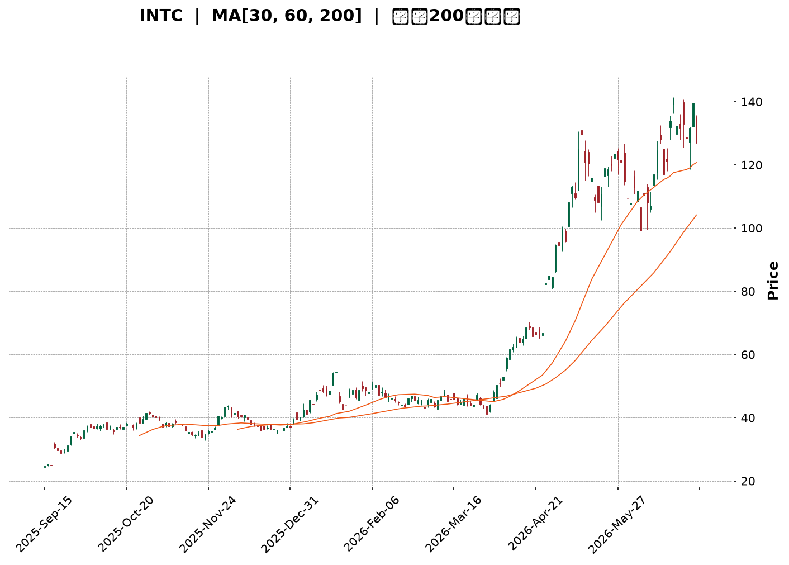
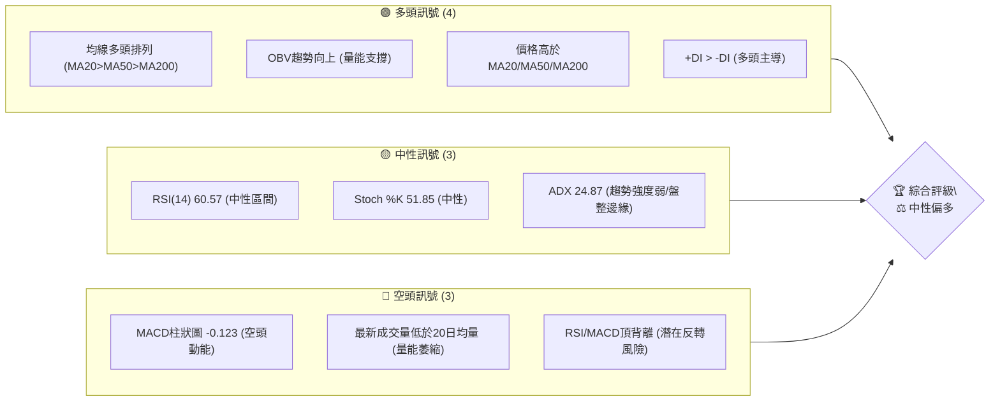
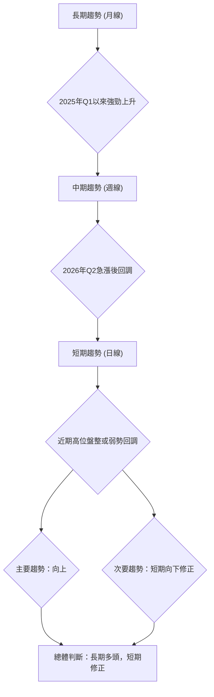
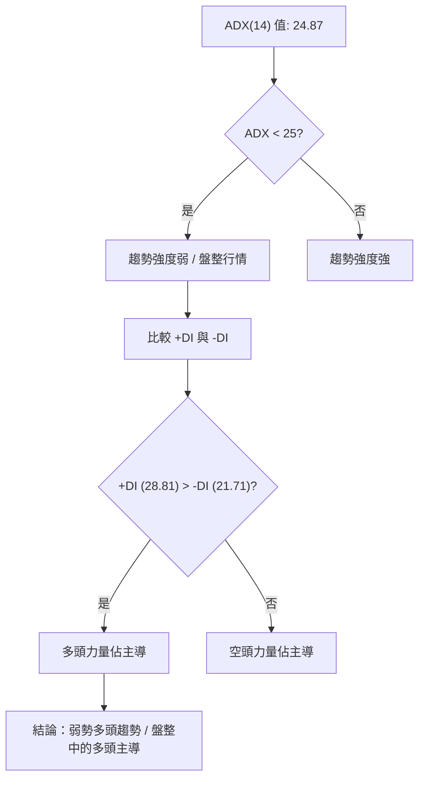
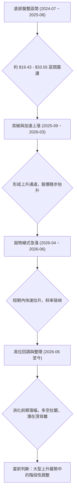
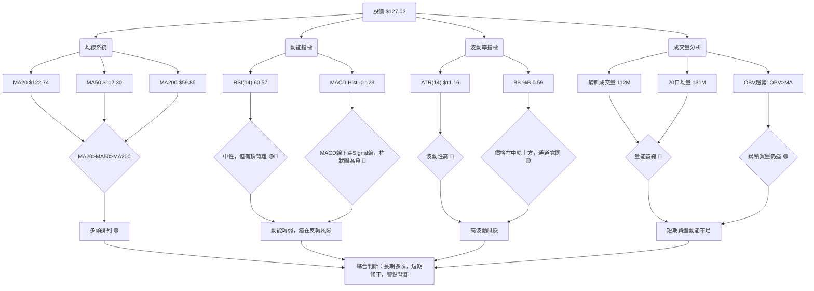
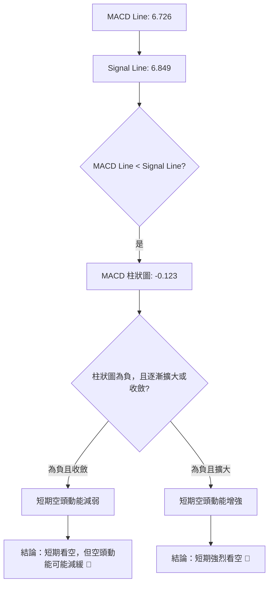
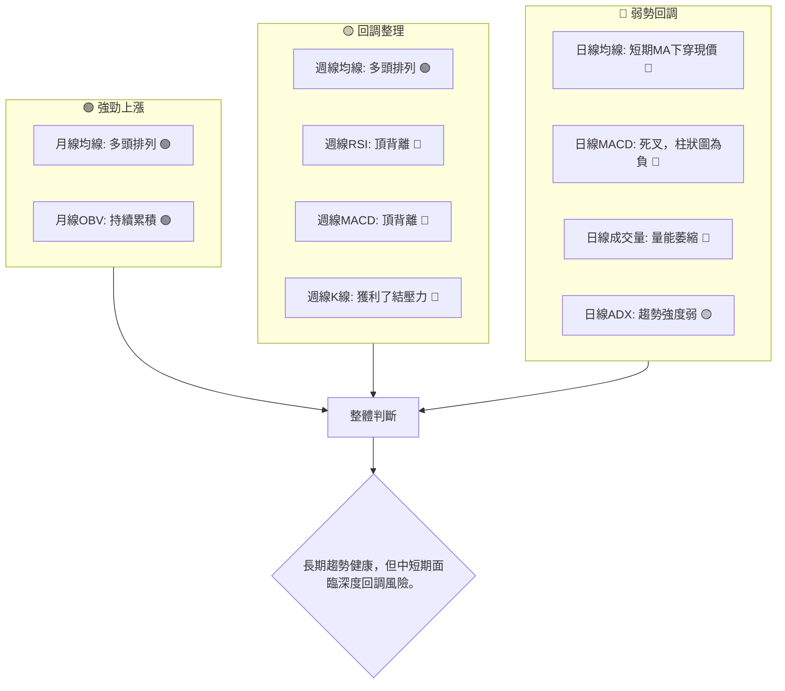
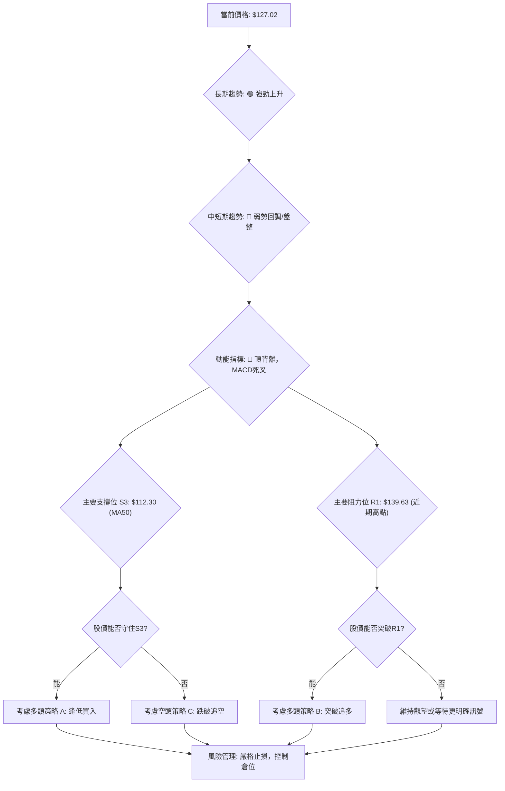
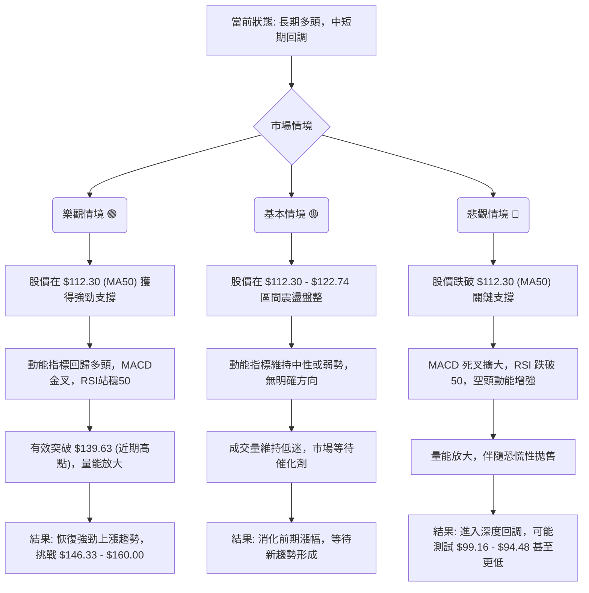

<details>
<summary>📊 靜態圖表 (點擊展開)</summary>

</details>

<html>
<head><meta charset="utf-8" /></head>
<body>
    <div style="height:500px; width:100%;">                        <script>window.PlotlyConfig = {MathJaxConfig: 'local'};</script>
        <script charset="utf-8" src="https://cdn.plot.ly/plotly-3.6.0.min.js" integrity="sha256-QaOVwtVY0T02VaHrr6pnoHLCwayMJp4O5n4YyaE3rJk=" crossorigin="anonymous"></script>                <div id="candlestick-chart" class="plotly-graph-div" style="height:100%; width:100%;"></div>            <script>                window.PLOTLYENV=window.PLOTLYENV || {};                                if (document.getElementById("candlestick-chart")) {                    Plotly.newPlot(                        "candlestick-chart",                        [{"close":{"dtype":"f8","bdata":"AAAAwB7FOEAAAADAHkU5QAAAAGBm5jhAAAAAgOuRPkAAAADgepQ9QAAAAGCPwjxAAAAAQApXPUAAAADgUTg\u002fQAAAAGC4\u002fkBAAAAAAADAQUAAAACgcD1BQAAAAGBmxkBAAAAA4FH4QUAAAABgZqZCQAAAAIA9akJAAAAAIIVLQkAAAACAwpVCQAAAAEAKt0JAAAAAYGbmQkAAAAAgXC9CQAAAAAApnEJAAAAA4KPQQUAAAABAM5NCQAAAACCFa0JAAAAAoEeBQkAAAADAzAxDQAAAACBcD0NAAAAAgMJ1QkAAAADgehRDQAAAAADXI0NAAAAAwB7FQ0AAAAAA18NEQAAAACCFq0RAAAAA4HoUREAAAABguP5DQAAAAAAAwENAAAAAANeDQkAAAADgozBDQAAAAGC4nkJAAAAA4KMQQ0AAAACgmTlDQAAAAOCj8EJAAAAAgOvxQkAAAADgevRBQAAAAGCPwkFAAAAAQOFaQUAAAACAPSpBQAAAAIAUjkFAAAAAIFzPQEAAAAAAAEBBQAAAAMAe5UFAAAAAgD3qQUAAAAAgrmdCQAAAACCuR0RAAAAAoEcBREAAAAAAKbxFQAAAAKBH4UVAAAAAAABAREAAAADgerREQAAAAGBmJkRAAAAAAABAREAAAAAA12NEQAAAAKBHwUNAAAAAIK7nQkAAAACgR8FCQAAAACCup0JAAAAAYGYGQkAAAAAA1yNCQAAAAMD1aEJAAAAAIFwvQkAAAADAzCxCQAAAAOB6FEJAAAAAoJkZQkAAAABACldCQAAAAGBmpkJAAAAAQDNzQkAAAADgo7BDQAAAACBcr0NAAAAAwB4FREAAAADgo1BFQAAAAIAUjkRAAAAAYGbGRkAAAAAgrgdGQAAAAMAepUdAAAAAAClcSEAAAADA9ShIQAAAAEDhekdAAAAAIK5HSEAAAAAAACBLQAAAAMD1KEtAAAAAwPWIRkAAAABguD5FQAAAAEAK90VAAAAAANdjSEAAAADgelRIQAAAAAApPEdAAAAAIK5nSEAAAAAAAKBIQAAAAMDMTEhAAAAAYLgeSEAAAAAghUtJQAAAAGC4HklAAAAA4KOQR0AAAADAHiVIQAAAAKBwPUdAAAAAwB5lR0AAAABAChdHQAAAAEDhukZAAAAAIFxPRkAAAACAFA5GQAAAAOCj0EVAAAAAIFwPR0AAAADgo3BHQAAAAEDhukZAAAAAgBTORkAAAAAAAMBGQAAAAMDMjEVAAAAAgD3KRkAAAACgmflGQAAAAIDCtUVAAAAAgD3KRkAAAAAA12NHQAAAAKBw\u002fUdAAAAAAACgRkAAAABgj+JGQAAAAKBH4UZAAAAAIK4HRkAAAAAA14NGQAAAAEAKF0dAAAAAIFzvRUAAAACgRwFGQAAAACCuB0ZAAAAAQAqXR0AAAADAzAxGQAAAAOCjkEVAAAAA4FGYREAAAADgoxBGQAAAAADXA0hAAAAA4KMwSUAAAAAA12NJQAAAAOB6dEpAAAAAoJl5TUAAAAAAKdxOQAAAAOCjME9AAAAAIIVLUEAAAAAgrudPQAAAAAApPFBAAAAAAAAgUUAAAAAAACBRQAAAAMDMbFBAAAAA4KOQUEAAAACgR1FQQAAAAIDrsVBAAAAAYI+iVEAAAAAgXD9VQAAAAKBHIVVAAAAAAACwV0AAAABguJ5XQAAAACCu51hAAAAAgOvxV0AAAACgmQlbQAAAAOCjQFxAAAAAIK5nW0AAAABA4TpfQAAAAIAULmBAAAAAQAonXkAAAABgjxJeQAAAACCF+1xAAAAAoEcxW0AAAABA4QpbQAAAAEAzs1tAAAAAoHC9XUAAAAAAAKBdQAAAAIDC9V1AAAAAoEfhXkAAAACgR3FeQAAAAMD1OF5AAAAAIIWrXEAAAADAHlVbQAAAACCF+1pAAAAAoHAtXEAAAACA6\u002fFbQAAAAEDhylhAAAAAoEeRW0AAAABA4fpaQAAAAGCPwlpAAAAAoHA9XUAAAADgeiRfQAAAAEAK919AAAAAQDNDXUAAAABgZkZeQAAAACCuv2BAAAAAgBSeYUAAAADA9YhgQAAAAMDMdGBAAAAAANebYEAAAACAPQpgQAAAAEAKd2BAAAAAACl0YUAAAACgR8FfQA=="},"high":{"dtype":"f8","bdata":"AAAAgMJ1OUAAAABAClc5QAAAAGCPQjlAAAAA4KMwQEAAAACgR6E+QAAAAKCZGT5AAAAAQDMzPkAAAABAM7M\u002fQAAAAAAAIEFAAAAAYGYmQkAAAABgZoZBQAAAAGC4HkFAAAAAIK4HQkAAAADA9chCQAAAAIA9CkNAAAAAQApXQ0AAAABgZgZDQAAAAMAe5UJAAAAAwMwMQ0AAAABAM9NDQAAAAKBHwUJAAAAAYGZGQkAAAABguL5CQAAAAGCPAkNAAAAA4KMwQ0AAAABgj0JDQAAAAMDMLENAAAAAQAr3QkAAAABAMzNDQAAAACBcj0RAAAAAgMJVREAAAACgcD1FQAAAAMAeBUVAAAAAQAq3REAAAACAPWpEQAAAAKCZOURAAAAAAAAgQ0AAAADgUVhDQAAAACCF60NAAAAAYI8iQ0AAAAAA18NDQAAAAAApHENAAAAAoJkZQ0AAAAAgrqdCQAAAAMDMDEJAAAAAoHDdQUAAAACgR2FBQAAAAAAA4EFAAAAAQApXQkAAAACgcH1BQAAAAOB6FEJAAAAA4KMQQkAAAABguJ5CQAAAACCFS0RAAAAA4KMwREAAAABACtdFQAAAAGCPAkZAAAAAANejRUAAAACAPWpFQAAAACBcD0VAAAAAoEehREAAAABguH5EQAAAAOBRGERAAAAAANcDREAAAACgcD1DQAAAAEDh+kJAAAAAIIXrQkAAAABguL5CQAAAAIA9ykJAAAAAQDPzQkAAAABgZmZCQAAAAEAKF0JAAAAAYLg+QkAAAABgZmZCQAAAAKBHIUNAAAAAgD3KQkAAAACAFO5DQAAAAMDMDEVAAAAAIK4nREAAAADA9UhGQAAAACCFq0VAAAAAoHDdRkAAAACgmblGQAAAAGC4HkhAAAAAAACASEAAAACA6zFJQAAAAEDhGklAAAAAoHAdSUAAAADgejRLQAAAAMDMTEtAAAAA4KMQSEAAAABA4TpGQAAAAADXQ0ZAAAAAwB6lSEAAAABgj2JIQAAAAIA9ykhAAAAAIIXrSEAAAABguL5JQAAAAKCZ2UhAAAAAgBRuSUAAAABgZqZJQAAAAAApnElAAAAAwB5FSUAAAABgZsZIQAAAAKCZeUhAAAAA4FHYR0AAAACAPWpHQAAAAGCPYkdAAAAAgMKVRkAAAACA6zFGQAAAAGBmRkZAAAAAwMxMR0AAAAAAKXxHQAAAAKCZeUdAAAAAIK5HR0AAAAAgrudGQAAAAOBR2EVAAAAA4KMQR0AAAACgcD1HQAAAAEAKl0ZAAAAAoEfhRkAAAADgo\u002fBHQAAAAIA9akhAAAAA4FG4R0AAAABAM1NHQAAAAIDClUhAAAAAgD0KR0AAAABA4dpGQAAAAOBROEdAAAAAYGbGR0AAAABA4bpGQAAAACCuJ0ZAAAAAwMzsR0AAAADAzExHQAAAAOCjEEZAAAAAYLj+RUAAAACgcB1GQAAAAGCPYkhAAAAAYLg+SUAAAACA6zFKQAAAAGCPokpAAAAAgMKVTUAAAACAPQpPQAAAAIDrsU9AAAAAoJlpUEAAAAAghUtQQAAAAIDCdVBAAAAAQAonUUAAAADAHpVRQAAAAKBwTVFAAAAAQOHqUEAAAACgRzFRQAAAAIDrEVFAAAAAgBROVUAAAABgZsZVQAAAAIDCJVVAAAAAwMy8V0AAAAAAKexXQAAAAMDMHFlAAAAA4Hr0WEAAAABguJ5bQAAAAAAAYFxAAAAA4KOgXEAAAACAPVJgQAAAAAAAmGBAAAAAYI\u002fyX0AAAAAAAEBfQAAAAOB6pF1AAAAA4HqkW0AAAABgj+JcQAAAAOB6RFxAAAAAACl8XkAAAACAPdpdQAAAAIDrsV5AAAAAIK5nX0AAAACgR1FfQAAAAMAexV5AAAAAwPWoX0AAAABAM1NcQAAAAAAAQFtAAAAAYI+SXUAAAADA9UhcQAAAAGC4nlpAAAAAYI8iXEAAAAAAAIBcQAAAAAAA4FtAAAAAACncXUAAAABgZuZfQAAAACCFk2BAAAAAYGYWYEAAAADAzExfQAAAACBc72BAAAAAYGauYUAAAAAgXD9hQAAAAGCPAmFAAAAAQAqXYUAAAAAgXGdgQAAAAKCZgWBAAAAAQDPLYUAAAAAgrvdgQA=="},"hovertemplate":"\u003cb\u003e%{x|%Y-%m-%d}\u003c\u002fb\u003e\u003cbr\u003e\u958b: $%{open:.2f}\u003cbr\u003e\u9ad8: $%{high:.2f}\u003cbr\u003e\u4f4e: $%{low:.2f}\u003cbr\u003e\u6536: $%{close:.2f}\u003cextra\u003e\u003c\u002fextra\u003e","low":{"dtype":"f8","bdata":"AAAA4FE4OEAAAADgo7A4QAAAAEAzczhAAAAAwPUoPkAAAADgelQ9QAAAAEDhujxAAAAAgOvRPEAAAABA4To9QAAAAIDCNT9AAAAAYLg+QUAAAACgcN1AQAAAAGCPgkBAAAAAAADAQEAAAADgUbhBQAAAAKCZOUJAAAAAQAo3QkAAAADAzCxCQAAAAOB69EFAAAAAgBRuQkAAAABgZiZCQAAAAADXI0JAAAAA4FFYQUAAAACA69FBQAAAAOB6NEJAAAAAgD0KQkAAAAAgrsdCQAAAAIDC1UJAAAAAwB4FQkAAAABACjdCQAAAAIA96kJAAAAAoHAdQ0AAAADAHsVDQAAAAIDCdURAAAAAgBQOREAAAADAHuVDQAAAAGBmhkNAAAAA4KNQQkAAAACAFI5CQAAAAGBmZkJAAAAAACl8QkAAAAAAKfxCQAAAAGC4vkJAAAAAwMysQkAAAACgmblBQAAAACBcT0FAAAAAoHAdQUAAAADA9chAQAAAAAAAIEFAAAAAoHC9QEAAAACA63FAQAAAAOBRWEFAAAAAQApXQUAAAADgoxBCQAAAACCFq0JAAAAAwMzMQ0AAAABgZgZEQAAAAKBHQUVAAAAAgOsRREAAAABAM5NEQAAAAKCZ2UNAAAAAANcDREAAAACA63FDQAAAAIA9ikNAAAAAIFzPQkAAAADA9ahCQAAAAIDCdUJAAAAAACn8QUAAAACAwtVBQAAAAOBROEJAAAAAwB4lQkAAAAAA1wNCQAAAAKCZeUFAAAAAwMzsQUAAAADA9ehBQAAAAMD1aEJAAAAAIFxvQkAAAACgR+FCQAAAAGCPokNAAAAAoJl5Q0AAAAAgXA9EQAAAAEAKV0RAAAAAwPXIREAAAACA6\u002fFFQAAAAAApnEZAAAAAgMK1R0AAAACAPepHQAAAAEDhWkdAAAAAAACAR0AAAABAMxNJQAAAAIA9ikpAAAAAoJk5RkAAAAAA1yNFQAAAAMDMjEVAAAAAwPUoR0AAAABguH5HQAAAAEDh+kZAAAAAAADARkAAAABACjdIQAAAAAAAgEdAAAAAwB5lR0AAAACAPWpIQAAAACCFy0dAAAAAYI9iR0AAAACAFG5HQAAAAOBRGEdAAAAAACl8RkAAAABA4bpGQAAAAOCjcEZAAAAAgML1RUAAAADgo3BFQAAAAEAKl0VAAAAAwB7FRUAAAACAPYpGQAAAAIDrMUZAAAAAQDMzRkAAAACgmflFQAAAAIDrEUVAAAAAYI+iRUAAAACgmVlGQAAAAADXo0VAAAAAgOvRREAAAADgerRGQAAAAOB6VEdAAAAAgMKVRkAAAACA67FGQAAAAOBR2EZAAAAA4Hr0RUAAAABgZgZGQAAAAEAz00VAAAAAgOvRRUAAAABguN5FQAAAAKCZmUVAAAAAoJm5RkAAAACAwvVFQAAAAIAUbkVAAAAA4KNQREAAAADAzMxEQAAAAKBwfUZAAAAAwB4FR0AAAAAgXO9IQAAAAAApnElAAAAAYGZmS0AAAACA6zFNQAAAAAAAYE5AAAAAQAoXT0AAAAAghQtPQAAAAOCjcE9AAAAAoEcRUEAAAAAgXO9QQAAAAIAUHlBAAAAAwPVoUEAAAABguD5QQAAAAEDhWlBAAAAAIK7nU0AAAABACqdUQAAAAEAzM1RAAAAAIK53VUAAAAAAAOBWQAAAAEAKJ1dAAAAAYGbmV0AAAADAHgVZQAAAAMAepVpAAAAAoJlJW0AAAABAM\u002fNbQAAAAEDh+l5AAAAAAADAXEAAAACAPRpdQAAAAEDhSlxAAAAAoEdBWkAAAABgZvZZQAAAAKCZmVlAAAAAQDOzXEAAAABA4UpcQAAAAIDChV1AAAAAYGZWXUAAAAAAAEBdQAAAAADXE11AAAAAYI9iXEAAAADAHpVaQAAAAEDhClpAAAAAQAq3W0AAAABguN5aQAAAAMAelVhAAAAAgD2qWkAAAACgcN1YQAAAAEDhOlpAAAAA4KOgW0AAAADAHtVcQAAAAIA9ql9AAAAAAAAAXUAAAAAA14NdQAAAAKCZ+V9AAAAAYLgGYUAAAACgmQlgQAAAAMDM\u002fF9AAAAAgD1aX0AAAAAAAGBfQAAAAAAAoF1AAAAA4KNwYEAAAAAghatfQA=="},"name":"\u50f9\u683c","open":{"dtype":"f8","bdata":"AAAA4HpUOEAAAACA69E4QAAAAOB6FDlAAAAAIK7HP0AAAACgR2E+QAAAACCFqz1AAAAAoHD9PEAAAACgR2E9QAAAAAApnD9AAAAAYI+CQUAAAABgj0JBQAAAAEAK90BAAAAAANfDQEAAAACgR+FBQAAAAKCZ+UJAAAAA4FGYQkAAAACA61FCQAAAAGBmRkJAAAAAANfDQkAAAABA4TpDQAAAAOBROEJAAAAAAAAAQkAAAABAMzNCQAAAAEAzk0JAAAAAgBQuQkAAAADA9chCQAAAAIDrEUNAAAAAIIXrQkAAAADAzExCQAAAAGCPAkRAAAAAgOsxQ0AAAAAghctDQAAAAMDMzERAAAAAACl8REAAAABACldEQAAAAAAAIERAAAAAgOsRQ0AAAACAwrVCQAAAACCFK0NAAAAAoEehQkAAAABACndDQAAAAEAzE0NAAAAAIK4HQ0AAAABgj6JCQAAAAADXg0FAAAAAoJm5QUAAAAAAACBBQAAAAIA9KkFAAAAAAAAAQkAAAACgR8FAQAAAAAApfEFAAAAAYGbGQUAAAACgmRlCQAAAAEAzs0JAAAAAgBTuQ0AAAAAAKTxEQAAAAIDrsUVAAAAAoEehRUAAAADgepREQAAAAOBR+ERAAAAAoHBdREAAAACAFA5EQAAAAMD1CERAAAAAAACgQ0AAAACAPSpDQAAAAIA9ykJAAAAAIIXLQkAAAADgo7BCQAAAAKBwPUJAAAAAgOvxQkAAAABguB5CQAAAAIDClUFAAAAAgMIVQkAAAACgRwFCQAAAAOB6dEJAAAAAQDOzQkAAAABgj+JCQAAAACCFy0RAAAAAgBTuQ0AAAABAChdEQAAAACBcT0VAAAAAgD3qREAAAABguB5GQAAAAIDr8UZAAAAAoJl5SEAAAADAzKxIQAAAAGCPokhAAAAAYGamR0AAAADA9ShJQAAAAEDhGktAAAAAgBRuR0AAAAAA1yNGQAAAAAAp\u002fEVAAAAAwMxMR0AAAAAgrsdHQAAAAKBwfUhAAAAA4KPQRkAAAAAgrgdJQAAAAMAexUhAAAAAIIXLR0AAAADAzIxIQAAAACCFy0hAAAAA4Ho0SUAAAACAFA5IQAAAAGBm5kdAAAAAoEfhRkAAAABACvdGQAAAAIDC9UZAAAAAoJl5RkAAAACA6\u002fFFQAAAACCFC0ZAAAAAwMwMRkAAAAAghQtHQAAAAGCPYkdAAAAAQOE6RkAAAACgmRlGQAAAAOBRuEVAAAAAwPUIRkAAAAAgXG9GQAAAAIDCVUZAAAAAYLheRUAAAADgerRGQAAAAMD1aEdAAAAAQDOzR0AAAAAAKfxGQAAAAOB69EdAAAAAgD0KR0AAAACgmRlGQAAAAGC4\u002fkVAAAAAoJl5R0AAAAAAAEBGQAAAAMAexUVAAAAAwMzsRkAAAABgZiZHQAAAACBcz0VAAAAAACncRUAAAACgmflEQAAAAAAAgEZAAAAAIK4HR0AAAADgo3BJQAAAAOB69ElAAAAAIFyvS0AAAABAMzNNQAAAAGCPwk5AAAAAQAoXT0AAAACAPUpQQAAAAGCP4k9AAAAAIIU7UEAAAABgZjZRQAAAAMDMHFFAAAAAwPXIUEAAAAAAKfxQQAAAAGBmhlBAAAAAwMyMVEAAAABA4epUQAAAAIDrUVRAAAAAwPWIVUAAAABgZuZXQAAAAMDMTFdAAAAAIIXLWEAAAADgoyBZQAAAAGC4vltAAAAAoEfBW0AAAAAA1\u002fNbQAAAAAApXGBAAAAAQAoXX0AAAABgZgZfQAAAAIA9qlxAAAAAYI9yW0AAAACAFF5cQAAAAGC4vlpAAAAAgBQOXUAAAADAHiVdQAAAAIDCFV5AAAAAYGaGXkAAAADA9RhfQAAAAMDMXF5AAAAAYGb2XkAAAAAghVtbQAAAAMDM3FpAAAAAQOEaXUAAAACgmRlbQAAAAGC4nlpAAAAAAADAW0AAAAAgXD9cQAAAAIDrgVpAAAAAoEdhXEAAAABA4VpdQAAAACCuL2BAAAAAQApHX0AAAABgZnZeQAAAAIDreWBAAAAAANdjYUAAAAAgXDdgQAAAAKCZoWBAAAAAIFx3YUAAAABguBZgQAAAAAAAwF9AAAAAIK5\u002fYEAAAAAAAOBgQA=="},"x":["2025-09-15T00:00:00-04:00","2025-09-16T00:00:00-04:00","2025-09-17T00:00:00-04:00","2025-09-18T00:00:00-04:00","2025-09-19T00:00:00-04:00","2025-09-22T00:00:00-04:00","2025-09-23T00:00:00-04:00","2025-09-24T00:00:00-04:00","2025-09-25T00:00:00-04:00","2025-09-26T00:00:00-04:00","2025-09-29T00:00:00-04:00","2025-09-30T00:00:00-04:00","2025-10-01T00:00:00-04:00","2025-10-02T00:00:00-04:00","2025-10-03T00:00:00-04:00","2025-10-06T00:00:00-04:00","2025-10-07T00:00:00-04:00","2025-10-08T00:00:00-04:00","2025-10-09T00:00:00-04:00","2025-10-10T00:00:00-04:00","2025-10-13T00:00:00-04:00","2025-10-14T00:00:00-04:00","2025-10-15T00:00:00-04:00","2025-10-16T00:00:00-04:00","2025-10-17T00:00:00-04:00","2025-10-20T00:00:00-04:00","2025-10-21T00:00:00-04:00","2025-10-22T00:00:00-04:00","2025-10-23T00:00:00-04:00","2025-10-24T00:00:00-04:00","2025-10-27T00:00:00-04:00","2025-10-28T00:00:00-04:00","2025-10-29T00:00:00-04:00","2025-10-30T00:00:00-04:00","2025-10-31T00:00:00-04:00","2025-11-03T00:00:00-05:00","2025-11-04T00:00:00-05:00","2025-11-05T00:00:00-05:00","2025-11-06T00:00:00-05:00","2025-11-07T00:00:00-05:00","2025-11-10T00:00:00-05:00","2025-11-11T00:00:00-05:00","2025-11-12T00:00:00-05:00","2025-11-13T00:00:00-05:00","2025-11-14T00:00:00-05:00","2025-11-17T00:00:00-05:00","2025-11-18T00:00:00-05:00","2025-11-19T00:00:00-05:00","2025-11-20T00:00:00-05:00","2025-11-21T00:00:00-05:00","2025-11-24T00:00:00-05:00","2025-11-25T00:00:00-05:00","2025-11-26T00:00:00-05:00","2025-11-28T00:00:00-05:00","2025-12-01T00:00:00-05:00","2025-12-02T00:00:00-05:00","2025-12-03T00:00:00-05:00","2025-12-04T00:00:00-05:00","2025-12-05T00:00:00-05:00","2025-12-08T00:00:00-05:00","2025-12-09T00:00:00-05:00","2025-12-10T00:00:00-05:00","2025-12-11T00:00:00-05:00","2025-12-12T00:00:00-05:00","2025-12-15T00:00:00-05:00","2025-12-16T00:00:00-05:00","2025-12-17T00:00:00-05:00","2025-12-18T00:00:00-05:00","2025-12-19T00:00:00-05:00","2025-12-22T00:00:00-05:00","2025-12-23T00:00:00-05:00","2025-12-24T00:00:00-05:00","2025-12-26T00:00:00-05:00","2025-12-29T00:00:00-05:00","2025-12-30T00:00:00-05:00","2025-12-31T00:00:00-05:00","2026-01-02T00:00:00-05:00","2026-01-05T00:00:00-05:00","2026-01-06T00:00:00-05:00","2026-01-07T00:00:00-05:00","2026-01-08T00:00:00-05:00","2026-01-09T00:00:00-05:00","2026-01-12T00:00:00-05:00","2026-01-13T00:00:00-05:00","2026-01-14T00:00:00-05:00","2026-01-15T00:00:00-05:00","2026-01-16T00:00:00-05:00","2026-01-20T00:00:00-05:00","2026-01-21T00:00:00-05:00","2026-01-22T00:00:00-05:00","2026-01-23T00:00:00-05:00","2026-01-26T00:00:00-05:00","2026-01-27T00:00:00-05:00","2026-01-28T00:00:00-05:00","2026-01-29T00:00:00-05:00","2026-01-30T00:00:00-05:00","2026-02-02T00:00:00-05:00","2026-02-03T00:00:00-05:00","2026-02-04T00:00:00-05:00","2026-02-05T00:00:00-05:00","2026-02-06T00:00:00-05:00","2026-02-09T00:00:00-05:00","2026-02-10T00:00:00-05:00","2026-02-11T00:00:00-05:00","2026-02-12T00:00:00-05:00","2026-02-13T00:00:00-05:00","2026-02-17T00:00:00-05:00","2026-02-18T00:00:00-05:00","2026-02-19T00:00:00-05:00","2026-02-20T00:00:00-05:00","2026-02-23T00:00:00-05:00","2026-02-24T00:00:00-05:00","2026-02-25T00:00:00-05:00","2026-02-26T00:00:00-05:00","2026-02-27T00:00:00-05:00","2026-03-02T00:00:00-05:00","2026-03-03T00:00:00-05:00","2026-03-04T00:00:00-05:00","2026-03-05T00:00:00-05:00","2026-03-06T00:00:00-05:00","2026-03-09T00:00:00-04:00","2026-03-10T00:00:00-04:00","2026-03-11T00:00:00-04:00","2026-03-12T00:00:00-04:00","2026-03-13T00:00:00-04:00","2026-03-16T00:00:00-04:00","2026-03-17T00:00:00-04:00","2026-03-18T00:00:00-04:00","2026-03-19T00:00:00-04:00","2026-03-20T00:00:00-04:00","2026-03-23T00:00:00-04:00","2026-03-24T00:00:00-04:00","2026-03-25T00:00:00-04:00","2026-03-26T00:00:00-04:00","2026-03-27T00:00:00-04:00","2026-03-30T00:00:00-04:00","2026-03-31T00:00:00-04:00","2026-04-01T00:00:00-04:00","2026-04-02T00:00:00-04:00","2026-04-06T00:00:00-04:00","2026-04-07T00:00:00-04:00","2026-04-08T00:00:00-04:00","2026-04-09T00:00:00-04:00","2026-04-10T00:00:00-04:00","2026-04-13T00:00:00-04:00","2026-04-14T00:00:00-04:00","2026-04-15T00:00:00-04:00","2026-04-16T00:00:00-04:00","2026-04-17T00:00:00-04:00","2026-04-20T00:00:00-04:00","2026-04-21T00:00:00-04:00","2026-04-22T00:00:00-04:00","2026-04-23T00:00:00-04:00","2026-04-24T00:00:00-04:00","2026-04-27T00:00:00-04:00","2026-04-28T00:00:00-04:00","2026-04-29T00:00:00-04:00","2026-04-30T00:00:00-04:00","2026-05-01T00:00:00-04:00","2026-05-04T00:00:00-04:00","2026-05-05T00:00:00-04:00","2026-05-06T00:00:00-04:00","2026-05-07T00:00:00-04:00","2026-05-08T00:00:00-04:00","2026-05-11T00:00:00-04:00","2026-05-12T00:00:00-04:00","2026-05-13T00:00:00-04:00","2026-05-14T00:00:00-04:00","2026-05-15T00:00:00-04:00","2026-05-18T00:00:00-04:00","2026-05-19T00:00:00-04:00","2026-05-20T00:00:00-04:00","2026-05-21T00:00:00-04:00","2026-05-22T00:00:00-04:00","2026-05-26T00:00:00-04:00","2026-05-27T00:00:00-04:00","2026-05-28T00:00:00-04:00","2026-05-29T00:00:00-04:00","2026-06-01T00:00:00-04:00","2026-06-02T00:00:00-04:00","2026-06-03T00:00:00-04:00","2026-06-04T00:00:00-04:00","2026-06-05T00:00:00-04:00","2026-06-08T00:00:00-04:00","2026-06-09T00:00:00-04:00","2026-06-10T00:00:00-04:00","2026-06-11T00:00:00-04:00","2026-06-12T00:00:00-04:00","2026-06-15T00:00:00-04:00","2026-06-16T00:00:00-04:00","2026-06-17T00:00:00-04:00","2026-06-18T00:00:00-04:00","2026-06-22T00:00:00-04:00","2026-06-23T00:00:00-04:00","2026-06-24T00:00:00-04:00","2026-06-25T00:00:00-04:00","2026-06-26T00:00:00-04:00","2026-06-29T00:00:00-04:00","2026-06-30T00:00:00-04:00","2026-07-01T00:00:00-04:00"],"type":"candlestick"},{"hovertemplate":"MA30: $%{y:.2f}\u003cextra\u003e\u003c\u002fextra\u003e","line":{"color":"#2196F3","dash":"dash","width":2},"mode":"lines","name":"MA30","x":["2025-09-15T00:00:00-04:00","2025-09-16T00:00:00-04:00","2025-09-17T00:00:00-04:00","2025-09-18T00:00:00-04:00","2025-09-19T00:00:00-04:00","2025-09-22T00:00:00-04:00","2025-09-23T00:00:00-04:00","2025-09-24T00:00:00-04:00","2025-09-25T00:00:00-04:00","2025-09-26T00:00:00-04:00","2025-09-29T00:00:00-04:00","2025-09-30T00:00:00-04:00","2025-10-01T00:00:00-04:00","2025-10-02T00:00:00-04:00","2025-10-03T00:00:00-04:00","2025-10-06T00:00:00-04:00","2025-10-07T00:00:00-04:00","2025-10-08T00:00:00-04:00","2025-10-09T00:00:00-04:00","2025-10-10T00:00:00-04:00","2025-10-13T00:00:00-04:00","2025-10-14T00:00:00-04:00","2025-10-15T00:00:00-04:00","2025-10-16T00:00:00-04:00","2025-10-17T00:00:00-04:00","2025-10-20T00:00:00-04:00","2025-10-21T00:00:00-04:00","2025-10-22T00:00:00-04:00","2025-10-23T00:00:00-04:00","2025-10-24T00:00:00-04:00","2025-10-27T00:00:00-04:00","2025-10-28T00:00:00-04:00","2025-10-29T00:00:00-04:00","2025-10-30T00:00:00-04:00","2025-10-31T00:00:00-04:00","2025-11-03T00:00:00-05:00","2025-11-04T00:00:00-05:00","2025-11-05T00:00:00-05:00","2025-11-06T00:00:00-05:00","2025-11-07T00:00:00-05:00","2025-11-10T00:00:00-05:00","2025-11-11T00:00:00-05:00","2025-11-12T00:00:00-05:00","2025-11-13T00:00:00-05:00","2025-11-14T00:00:00-05:00","2025-11-17T00:00:00-05:00","2025-11-18T00:00:00-05:00","2025-11-19T00:00:00-05:00","2025-11-20T00:00:00-05:00","2025-11-21T00:00:00-05:00","2025-11-24T00:00:00-05:00","2025-11-25T00:00:00-05:00","2025-11-26T00:00:00-05:00","2025-11-28T00:00:00-05:00","2025-12-01T00:00:00-05:00","2025-12-02T00:00:00-05:00","2025-12-03T00:00:00-05:00","2025-12-04T00:00:00-05:00","2025-12-05T00:00:00-05:00","2025-12-08T00:00:00-05:00","2025-12-09T00:00:00-05:00","2025-12-10T00:00:00-05:00","2025-12-11T00:00:00-05:00","2025-12-12T00:00:00-05:00","2025-12-15T00:00:00-05:00","2025-12-16T00:00:00-05:00","2025-12-17T00:00:00-05:00","2025-12-18T00:00:00-05:00","2025-12-19T00:00:00-05:00","2025-12-22T00:00:00-05:00","2025-12-23T00:00:00-05:00","2025-12-24T00:00:00-05:00","2025-12-26T00:00:00-05:00","2025-12-29T00:00:00-05:00","2025-12-30T00:00:00-05:00","2025-12-31T00:00:00-05:00","2026-01-02T00:00:00-05:00","2026-01-05T00:00:00-05:00","2026-01-06T00:00:00-05:00","2026-01-07T00:00:00-05:00","2026-01-08T00:00:00-05:00","2026-01-09T00:00:00-05:00","2026-01-12T00:00:00-05:00","2026-01-13T00:00:00-05:00","2026-01-14T00:00:00-05:00","2026-01-15T00:00:00-05:00","2026-01-16T00:00:00-05:00","2026-01-20T00:00:00-05:00","2026-01-21T00:00:00-05:00","2026-01-22T00:00:00-05:00","2026-01-23T00:00:00-05:00","2026-01-26T00:00:00-05:00","2026-01-27T00:00:00-05:00","2026-01-28T00:00:00-05:00","2026-01-29T00:00:00-05:00","2026-01-30T00:00:00-05:00","2026-02-02T00:00:00-05:00","2026-02-03T00:00:00-05:00","2026-02-04T00:00:00-05:00","2026-02-05T00:00:00-05:00","2026-02-06T00:00:00-05:00","2026-02-09T00:00:00-05:00","2026-02-10T00:00:00-05:00","2026-02-11T00:00:00-05:00","2026-02-12T00:00:00-05:00","2026-02-13T00:00:00-05:00","2026-02-17T00:00:00-05:00","2026-02-18T00:00:00-05:00","2026-02-19T00:00:00-05:00","2026-02-20T00:00:00-05:00","2026-02-23T00:00:00-05:00","2026-02-24T00:00:00-05:00","2026-02-25T00:00:00-05:00","2026-02-26T00:00:00-05:00","2026-02-27T00:00:00-05:00","2026-03-02T00:00:00-05:00","2026-03-03T00:00:00-05:00","2026-03-04T00:00:00-05:00","2026-03-05T00:00:00-05:00","2026-03-06T00:00:00-05:00","2026-03-09T00:00:00-04:00","2026-03-10T00:00:00-04:00","2026-03-11T00:00:00-04:00","2026-03-12T00:00:00-04:00","2026-03-13T00:00:00-04:00","2026-03-16T00:00:00-04:00","2026-03-17T00:00:00-04:00","2026-03-18T00:00:00-04:00","2026-03-19T00:00:00-04:00","2026-03-20T00:00:00-04:00","2026-03-23T00:00:00-04:00","2026-03-24T00:00:00-04:00","2026-03-25T00:00:00-04:00","2026-03-26T00:00:00-04:00","2026-03-27T00:00:00-04:00","2026-03-30T00:00:00-04:00","2026-03-31T00:00:00-04:00","2026-04-01T00:00:00-04:00","2026-04-02T00:00:00-04:00","2026-04-06T00:00:00-04:00","2026-04-07T00:00:00-04:00","2026-04-08T00:00:00-04:00","2026-04-09T00:00:00-04:00","2026-04-10T00:00:00-04:00","2026-04-13T00:00:00-04:00","2026-04-14T00:00:00-04:00","2026-04-15T00:00:00-04:00","2026-04-16T00:00:00-04:00","2026-04-17T00:00:00-04:00","2026-04-20T00:00:00-04:00","2026-04-21T00:00:00-04:00","2026-04-22T00:00:00-04:00","2026-04-23T00:00:00-04:00","2026-04-24T00:00:00-04:00","2026-04-27T00:00:00-04:00","2026-04-28T00:00:00-04:00","2026-04-29T00:00:00-04:00","2026-04-30T00:00:00-04:00","2026-05-01T00:00:00-04:00","2026-05-04T00:00:00-04:00","2026-05-05T00:00:00-04:00","2026-05-06T00:00:00-04:00","2026-05-07T00:00:00-04:00","2026-05-08T00:00:00-04:00","2026-05-11T00:00:00-04:00","2026-05-12T00:00:00-04:00","2026-05-13T00:00:00-04:00","2026-05-14T00:00:00-04:00","2026-05-15T00:00:00-04:00","2026-05-18T00:00:00-04:00","2026-05-19T00:00:00-04:00","2026-05-20T00:00:00-04:00","2026-05-21T00:00:00-04:00","2026-05-22T00:00:00-04:00","2026-05-26T00:00:00-04:00","2026-05-27T00:00:00-04:00","2026-05-28T00:00:00-04:00","2026-05-29T00:00:00-04:00","2026-06-01T00:00:00-04:00","2026-06-02T00:00:00-04:00","2026-06-03T00:00:00-04:00","2026-06-04T00:00:00-04:00","2026-06-05T00:00:00-04:00","2026-06-08T00:00:00-04:00","2026-06-09T00:00:00-04:00","2026-06-10T00:00:00-04:00","2026-06-11T00:00:00-04:00","2026-06-12T00:00:00-04:00","2026-06-15T00:00:00-04:00","2026-06-16T00:00:00-04:00","2026-06-17T00:00:00-04:00","2026-06-18T00:00:00-04:00","2026-06-22T00:00:00-04:00","2026-06-23T00:00:00-04:00","2026-06-24T00:00:00-04:00","2026-06-25T00:00:00-04:00","2026-06-26T00:00:00-04:00","2026-06-29T00:00:00-04:00","2026-06-30T00:00:00-04:00","2026-07-01T00:00:00-04:00"],"y":{"dtype":"f8","bdata":"AAAAAAAA+H8AAAAAAAD4fwAAAAAAAPh\u002fAAAAAAAA+H8AAAAAAAD4fwAAAAAAAPh\u002fAAAAAAAA+H8AAAAAAAD4fwAAAAAAAPh\u002fAAAAAAAA+H8AAAAAAAD4fwAAAAAAAPh\u002fAAAAAAAA+H8AAAAAAAD4fwAAAAAAAPh\u002fAAAAAAAA+H8AAAAAAAD4fwAAAAAAAPh\u002fAAAAAAAA+H8AAAAAAAD4fwAAAAAAAPh\u002fAAAAAAAA+H8AAAAAAAD4fwAAAAAAAPh\u002fAAAAAAAA+H8AAAAAAAD4fwAAAAAAAPh\u002fAAAAAAAA+H8AAAAAAAD4f83MzIwJLkFAREREVA5tQUBVVVWVbrJBQKuqqnKT+EFAERERSX4hQkCJiIjI6E1CQCIiIrq7e0JAmpmZQYucQkAzMzPjF7tCQBEREcH1yEJAq6qqai7UQkB3d3e3HuVCQLy7uzuY90JAd3d3J+r\u002fQkB3d3fn+\u002flCQImIiAhl9EJAIiIikl\u002fsQkCamZmJQeBCQKuqqnpb1kJA3t3dzYXEQkBEREREi7xCQDMzM1NxtkJAd3d3x0u3QkCJiIho2LVCQERERKS3xUJAERERcYTSQkCrqqrqbelCQM3MzEx+AUNA3t3dncQQQ0C8u7t7oh5DQM3MzNxAJ0NAAAAAcFkrQ0DNzMw8JihDQDMzM2NXIENAAAAAkFAWQ0DNzMy8uwtDQM3MzKxjAkNAERERQTX+QkDe3d19P\u002fVCQM3MzLx080JAiYiIWPLrQkBVVVWV\u002fOJCQCIiIuKl20JARERE9G\u002fUQkAAAAAAuddCQLy7uztR30JAzczMTKnoQkDv7u4+Nf5CQM3MzExiEENAd3d3p8YrQ0CJiIjIdk5DQERERKQpZUNAiYiIeKKOQ0B3d3dnka1DQLy7u1tIykNAERERAXLvQ0Dv7u5+IwREQAAAAMDKEURAvLu7ay40REAAAAAg92pEQERERLTIpkRAzczMXEi6REBEREQklMFEQGZmZvZv1ERAAAAAID4DRUBmZmbm0DJFQAAAABDmWUVAMzMzY1eQRUBmZmYWrsdFQM3MzPzw+UVAIiIiMpYsRkAzMzMTWGlGQBERETFrpUZAq6qqqg3URkAiIiLilgVHQEREROTBLEdAiYiIaPRWR0AiIiLS93NHQJqZmbnzjUdA3t3dTX6hR0C8u7vbzqdHQO\u002fu7l6PskdAZmZm9v20R0B3d3cnBsFHQN7d3U03uUdAq6qqWvKrR0CamZkp6p9HQDMzMwNyj0dA7+7uDruCR0Dv7u4+UV9HQJqZmYnPMEdAiYiImPwyR0CrqqpqSkVHQImIiBiSVkdAVVVVZYJHR0Dv7u6+LTtHQLy7uzsmOEdAd3d39+EjR0CamZmZ4BFHQBEREVGNB0dAvLu7G+j0RkDe3d391NhGQImIiMh2vkZAVVVVZa2+RkC8u7vLzKxGQERERLSBnkZAIiIiAp2GRkDNzMzc3X1GQM3MzPzUiEZAIiIicmihRkDNzMzc3b1GQImIiBh25UZAERER4TMcR0De3d0dhVtHQFVVVUW2o0dA3t3d7TX3R0BVVVVVVUVIQBEREXGEokhAERERMU8ESUDe3d3NhWRJQBEREYGVw0lARERElNEbSkBmZmaWtWpKQDMzMzPsukpAMzMz0wZaS0BVVVWFXQFMQGZmZsa9pkxAVVVVxQR\u002fTUDNzMxcAVJOQImIiBgENk9ARERE1L8JUECrqqrSlJJQQHd3d7esJVFAiYiISOGqUUB3d3fHS1dSQERERIxsD1NAVVVVddq4U0ARERH5U1tUQFVVVW0u7FRAZmZmJr9oVUDe3d29LeNVQO\u002fu7matXlZAzczM3LLeVkAAAABQ1FdXQJqZmSFp0ldAREREjN5OWEDv7u5uhMpYQHd3d5fgQVlAd3d3B2WkWUB3d3enf\u002ftZQN7d3d2WVVpAIiIiwq64WkC8u7tr5xtbQN7d3a0AYVtARERE9CicW0CrqqrKE81bQHd3d7ce\u002fVtAZmZmVoAsXEDNzMx8sWxcQKuqqkrwqFxAzczMjFDWXECamZn58PFcQKuqqtqyHl1AAAAAwINhXUCrqqpKN3FdQN7d3T3udV1AVVVV1RWQXUCamZlJN6FdQLy7u7vmwl1AmpmZabwEXkBmZmYG8yxeQA=="},"type":"scatter"},{"hovertemplate":"MA60: $%{y:.2f}\u003cextra\u003e\u003c\u002fextra\u003e","line":{"color":"#9C27B0","dash":"dash","width":2},"mode":"lines","name":"MA60","x":["2025-09-15T00:00:00-04:00","2025-09-16T00:00:00-04:00","2025-09-17T00:00:00-04:00","2025-09-18T00:00:00-04:00","2025-09-19T00:00:00-04:00","2025-09-22T00:00:00-04:00","2025-09-23T00:00:00-04:00","2025-09-24T00:00:00-04:00","2025-09-25T00:00:00-04:00","2025-09-26T00:00:00-04:00","2025-09-29T00:00:00-04:00","2025-09-30T00:00:00-04:00","2025-10-01T00:00:00-04:00","2025-10-02T00:00:00-04:00","2025-10-03T00:00:00-04:00","2025-10-06T00:00:00-04:00","2025-10-07T00:00:00-04:00","2025-10-08T00:00:00-04:00","2025-10-09T00:00:00-04:00","2025-10-10T00:00:00-04:00","2025-10-13T00:00:00-04:00","2025-10-14T00:00:00-04:00","2025-10-15T00:00:00-04:00","2025-10-16T00:00:00-04:00","2025-10-17T00:00:00-04:00","2025-10-20T00:00:00-04:00","2025-10-21T00:00:00-04:00","2025-10-22T00:00:00-04:00","2025-10-23T00:00:00-04:00","2025-10-24T00:00:00-04:00","2025-10-27T00:00:00-04:00","2025-10-28T00:00:00-04:00","2025-10-29T00:00:00-04:00","2025-10-30T00:00:00-04:00","2025-10-31T00:00:00-04:00","2025-11-03T00:00:00-05:00","2025-11-04T00:00:00-05:00","2025-11-05T00:00:00-05:00","2025-11-06T00:00:00-05:00","2025-11-07T00:00:00-05:00","2025-11-10T00:00:00-05:00","2025-11-11T00:00:00-05:00","2025-11-12T00:00:00-05:00","2025-11-13T00:00:00-05:00","2025-11-14T00:00:00-05:00","2025-11-17T00:00:00-05:00","2025-11-18T00:00:00-05:00","2025-11-19T00:00:00-05:00","2025-11-20T00:00:00-05:00","2025-11-21T00:00:00-05:00","2025-11-24T00:00:00-05:00","2025-11-25T00:00:00-05:00","2025-11-26T00:00:00-05:00","2025-11-28T00:00:00-05:00","2025-12-01T00:00:00-05:00","2025-12-02T00:00:00-05:00","2025-12-03T00:00:00-05:00","2025-12-04T00:00:00-05:00","2025-12-05T00:00:00-05:00","2025-12-08T00:00:00-05:00","2025-12-09T00:00:00-05:00","2025-12-10T00:00:00-05:00","2025-12-11T00:00:00-05:00","2025-12-12T00:00:00-05:00","2025-12-15T00:00:00-05:00","2025-12-16T00:00:00-05:00","2025-12-17T00:00:00-05:00","2025-12-18T00:00:00-05:00","2025-12-19T00:00:00-05:00","2025-12-22T00:00:00-05:00","2025-12-23T00:00:00-05:00","2025-12-24T00:00:00-05:00","2025-12-26T00:00:00-05:00","2025-12-29T00:00:00-05:00","2025-12-30T00:00:00-05:00","2025-12-31T00:00:00-05:00","2026-01-02T00:00:00-05:00","2026-01-05T00:00:00-05:00","2026-01-06T00:00:00-05:00","2026-01-07T00:00:00-05:00","2026-01-08T00:00:00-05:00","2026-01-09T00:00:00-05:00","2026-01-12T00:00:00-05:00","2026-01-13T00:00:00-05:00","2026-01-14T00:00:00-05:00","2026-01-15T00:00:00-05:00","2026-01-16T00:00:00-05:00","2026-01-20T00:00:00-05:00","2026-01-21T00:00:00-05:00","2026-01-22T00:00:00-05:00","2026-01-23T00:00:00-05:00","2026-01-26T00:00:00-05:00","2026-01-27T00:00:00-05:00","2026-01-28T00:00:00-05:00","2026-01-29T00:00:00-05:00","2026-01-30T00:00:00-05:00","2026-02-02T00:00:00-05:00","2026-02-03T00:00:00-05:00","2026-02-04T00:00:00-05:00","2026-02-05T00:00:00-05:00","2026-02-06T00:00:00-05:00","2026-02-09T00:00:00-05:00","2026-02-10T00:00:00-05:00","2026-02-11T00:00:00-05:00","2026-02-12T00:00:00-05:00","2026-02-13T00:00:00-05:00","2026-02-17T00:00:00-05:00","2026-02-18T00:00:00-05:00","2026-02-19T00:00:00-05:00","2026-02-20T00:00:00-05:00","2026-02-23T00:00:00-05:00","2026-02-24T00:00:00-05:00","2026-02-25T00:00:00-05:00","2026-02-26T00:00:00-05:00","2026-02-27T00:00:00-05:00","2026-03-02T00:00:00-05:00","2026-03-03T00:00:00-05:00","2026-03-04T00:00:00-05:00","2026-03-05T00:00:00-05:00","2026-03-06T00:00:00-05:00","2026-03-09T00:00:00-04:00","2026-03-10T00:00:00-04:00","2026-03-11T00:00:00-04:00","2026-03-12T00:00:00-04:00","2026-03-13T00:00:00-04:00","2026-03-16T00:00:00-04:00","2026-03-17T00:00:00-04:00","2026-03-18T00:00:00-04:00","2026-03-19T00:00:00-04:00","2026-03-20T00:00:00-04:00","2026-03-23T00:00:00-04:00","2026-03-24T00:00:00-04:00","2026-03-25T00:00:00-04:00","2026-03-26T00:00:00-04:00","2026-03-27T00:00:00-04:00","2026-03-30T00:00:00-04:00","2026-03-31T00:00:00-04:00","2026-04-01T00:00:00-04:00","2026-04-02T00:00:00-04:00","2026-04-06T00:00:00-04:00","2026-04-07T00:00:00-04:00","2026-04-08T00:00:00-04:00","2026-04-09T00:00:00-04:00","2026-04-10T00:00:00-04:00","2026-04-13T00:00:00-04:00","2026-04-14T00:00:00-04:00","2026-04-15T00:00:00-04:00","2026-04-16T00:00:00-04:00","2026-04-17T00:00:00-04:00","2026-04-20T00:00:00-04:00","2026-04-21T00:00:00-04:00","2026-04-22T00:00:00-04:00","2026-04-23T00:00:00-04:00","2026-04-24T00:00:00-04:00","2026-04-27T00:00:00-04:00","2026-04-28T00:00:00-04:00","2026-04-29T00:00:00-04:00","2026-04-30T00:00:00-04:00","2026-05-01T00:00:00-04:00","2026-05-04T00:00:00-04:00","2026-05-05T00:00:00-04:00","2026-05-06T00:00:00-04:00","2026-05-07T00:00:00-04:00","2026-05-08T00:00:00-04:00","2026-05-11T00:00:00-04:00","2026-05-12T00:00:00-04:00","2026-05-13T00:00:00-04:00","2026-05-14T00:00:00-04:00","2026-05-15T00:00:00-04:00","2026-05-18T00:00:00-04:00","2026-05-19T00:00:00-04:00","2026-05-20T00:00:00-04:00","2026-05-21T00:00:00-04:00","2026-05-22T00:00:00-04:00","2026-05-26T00:00:00-04:00","2026-05-27T00:00:00-04:00","2026-05-28T00:00:00-04:00","2026-05-29T00:00:00-04:00","2026-06-01T00:00:00-04:00","2026-06-02T00:00:00-04:00","2026-06-03T00:00:00-04:00","2026-06-04T00:00:00-04:00","2026-06-05T00:00:00-04:00","2026-06-08T00:00:00-04:00","2026-06-09T00:00:00-04:00","2026-06-10T00:00:00-04:00","2026-06-11T00:00:00-04:00","2026-06-12T00:00:00-04:00","2026-06-15T00:00:00-04:00","2026-06-16T00:00:00-04:00","2026-06-17T00:00:00-04:00","2026-06-18T00:00:00-04:00","2026-06-22T00:00:00-04:00","2026-06-23T00:00:00-04:00","2026-06-24T00:00:00-04:00","2026-06-25T00:00:00-04:00","2026-06-26T00:00:00-04:00","2026-06-29T00:00:00-04:00","2026-06-30T00:00:00-04:00","2026-07-01T00:00:00-04:00"],"y":{"dtype":"f8","bdata":"AAAAAAAA+H8AAAAAAAD4fwAAAAAAAPh\u002fAAAAAAAA+H8AAAAAAAD4fwAAAAAAAPh\u002fAAAAAAAA+H8AAAAAAAD4fwAAAAAAAPh\u002fAAAAAAAA+H8AAAAAAAD4fwAAAAAAAPh\u002fAAAAAAAA+H8AAAAAAAD4fwAAAAAAAPh\u002fAAAAAAAA+H8AAAAAAAD4fwAAAAAAAPh\u002fAAAAAAAA+H8AAAAAAAD4fwAAAAAAAPh\u002fAAAAAAAA+H8AAAAAAAD4fwAAAAAAAPh\u002fAAAAAAAA+H8AAAAAAAD4fwAAAAAAAPh\u002fAAAAAAAA+H8AAAAAAAD4fwAAAAAAAPh\u002fAAAAAAAA+H8AAAAAAAD4fwAAAAAAAPh\u002fAAAAAAAA+H8AAAAAAAD4fwAAAAAAAPh\u002fAAAAAAAA+H8AAAAAAAD4fwAAAAAAAPh\u002fAAAAAAAA+H8AAAAAAAD4fwAAAAAAAPh\u002fAAAAAAAA+H8AAAAAAAD4fwAAAAAAAPh\u002fAAAAAAAA+H8AAAAAAAD4fwAAAAAAAPh\u002fAAAAAAAA+H8AAAAAAAD4fwAAAAAAAPh\u002fAAAAAAAA+H8AAAAAAAD4fwAAAAAAAPh\u002fAAAAAAAA+H8AAAAAAAD4fwAAAAAAAPh\u002fAAAAAAAA+H8AAAAAAAD4f83MzDSlKkJAIiIi4jNMQkARERFpSm1CQO\u002fu7mp1jEJAiYiIbOebQkCrqqpC0qxCQHd3d7MPv0JAVVVVQWDNQkCJiIiwK9hCQO\u002fu7j413kJAmpmZYRDgQkBmZmamDeRCQO\u002fu7g6f6UJA3t3dDS3qQkC8u7tz2uhCQCIiIiLb6UJAd3d3b4TqQkBERERkO+9CQLy7u+Ne80JAq6qqOib4QkBmZmYGgQVDQLy7u3vNDUNAAAAAIPciQ0AAAADotDFDQAAAAAAASENAEREROftgQ0DNzMy0yHZDQGZmZoakiUNAzczMhHmiQ0De3d3NzMRDQImIiMgE50NAZmZm5tDyQ0CJiIgw3fRDQM3MzKxj+kNAAAAAWMcMRECamZlRRh9EQGZmZt4kLkRAIiIiUkZHREAiIiLKdl5EQM3MzNyydkRAVVVVRUSMREBERERUKqZEQJqZmYmIwERAd3d3zz7UREARERHxp+5EQAAAAJAJBkVAq6qq2s4fRUCJiIiIFjlFQDMzMwMrT0VAq6qqeqJmRUAiIiLSIntFQJqZmYHci0VAd3d3N9ChRUB3d3fHS7dFQM3MzNS\u002fwUVA3t3dLbLNRUBERETUBtJFQJqZmWGe0EVAVVVVvXTbRUB3d3cvJOVFQO\u002fu7h7M60VAq6qqeqL2RUB3d3dHbwNGQHd3dweBFUZAq6qqQmAlRkCrqqpS\u002fzZGQN7d3SUGSUZAVVVVrRxaRkAAAABYx2xGQO\u002fu7ia\u002fgEZA7+7uJr+QRkCJiIiIFqFGQM3MzPzwsUZAAAAAiF3JRkDv7u7WMdlGQERERMyh5UZAVVVVtcjuRkB3d3fX6vhGQDMzM1tkC0dAAAAAYHMhR0BERERc1jJHQLy7u7sCTEdAvLu765hoR0CrqqqiRY5HQJqZmcl2rkdAREREJJTRR0B3d3e\u002fn\u002fJHQCIiIjr7GEhAAAAAIIVDSEBmZmaG62FIQFVVVYUyekhAZmZmFmenSECJiIgAANhIQN7d3SW\u002fCElAREREnMRQSUAiIiKiRZ5JQBEREQFy70lAZmZmXnNRSkAzMzP78LFKQM3MzLTIHktAIiIi4jOES0CamZlR\u002f\u002f5LQLy7uxvohExAMzMz+zcKTUBVVVUtsq1NQGZmZmatXk5AZmZm9ij8TkB3d3fnQppPQN7d3XVMGFBAvLu7r7lcUEAiIiJWDqFQQJqZmTm06FBAq6qqZmY2UUB3d3dvy4JRQCIiIiIi0lFAmpmZwTwlUkDNzMyMl3ZSQAAAAGiRyVJAAAAAUEYTU0AzMzNH4VZTQDMzM8+wm1NAIiIixkvjU0B3d3cboShUQLy7u2M7X1RA7+7uLpakVECrqqpG4eZUQFVVVc0+KFVAiYiIXAF2VUCamZkV2cpVQHd3dyv5IVZAiYiIMAhwVkAiIiLmQsJWQBEREckvIldAREREhDKGV0ARERGJQeRXQBEREWWtQlhAVVVVJXikWEBVVVWhRf5YQImIiJSKV1lAAAAAyL22WUAiIiJiEAhaQA=="},"type":"scatter"},{"hovertemplate":"MA200: $%{y:.2f}\u003cextra\u003e\u003c\u002fextra\u003e","line":{"color":"#FF6F00","dash":"solid","width":2},"mode":"lines","name":"MA200","x":["2025-09-15T00:00:00-04:00","2025-09-16T00:00:00-04:00","2025-09-17T00:00:00-04:00","2025-09-18T00:00:00-04:00","2025-09-19T00:00:00-04:00","2025-09-22T00:00:00-04:00","2025-09-23T00:00:00-04:00","2025-09-24T00:00:00-04:00","2025-09-25T00:00:00-04:00","2025-09-26T00:00:00-04:00","2025-09-29T00:00:00-04:00","2025-09-30T00:00:00-04:00","2025-10-01T00:00:00-04:00","2025-10-02T00:00:00-04:00","2025-10-03T00:00:00-04:00","2025-10-06T00:00:00-04:00","2025-10-07T00:00:00-04:00","2025-10-08T00:00:00-04:00","2025-10-09T00:00:00-04:00","2025-10-10T00:00:00-04:00","2025-10-13T00:00:00-04:00","2025-10-14T00:00:00-04:00","2025-10-15T00:00:00-04:00","2025-10-16T00:00:00-04:00","2025-10-17T00:00:00-04:00","2025-10-20T00:00:00-04:00","2025-10-21T00:00:00-04:00","2025-10-22T00:00:00-04:00","2025-10-23T00:00:00-04:00","2025-10-24T00:00:00-04:00","2025-10-27T00:00:00-04:00","2025-10-28T00:00:00-04:00","2025-10-29T00:00:00-04:00","2025-10-30T00:00:00-04:00","2025-10-31T00:00:00-04:00","2025-11-03T00:00:00-05:00","2025-11-04T00:00:00-05:00","2025-11-05T00:00:00-05:00","2025-11-06T00:00:00-05:00","2025-11-07T00:00:00-05:00","2025-11-10T00:00:00-05:00","2025-11-11T00:00:00-05:00","2025-11-12T00:00:00-05:00","2025-11-13T00:00:00-05:00","2025-11-14T00:00:00-05:00","2025-11-17T00:00:00-05:00","2025-11-18T00:00:00-05:00","2025-11-19T00:00:00-05:00","2025-11-20T00:00:00-05:00","2025-11-21T00:00:00-05:00","2025-11-24T00:00:00-05:00","2025-11-25T00:00:00-05:00","2025-11-26T00:00:00-05:00","2025-11-28T00:00:00-05:00","2025-12-01T00:00:00-05:00","2025-12-02T00:00:00-05:00","2025-12-03T00:00:00-05:00","2025-12-04T00:00:00-05:00","2025-12-05T00:00:00-05:00","2025-12-08T00:00:00-05:00","2025-12-09T00:00:00-05:00","2025-12-10T00:00:00-05:00","2025-12-11T00:00:00-05:00","2025-12-12T00:00:00-05:00","2025-12-15T00:00:00-05:00","2025-12-16T00:00:00-05:00","2025-12-17T00:00:00-05:00","2025-12-18T00:00:00-05:00","2025-12-19T00:00:00-05:00","2025-12-22T00:00:00-05:00","2025-12-23T00:00:00-05:00","2025-12-24T00:00:00-05:00","2025-12-26T00:00:00-05:00","2025-12-29T00:00:00-05:00","2025-12-30T00:00:00-05:00","2025-12-31T00:00:00-05:00","2026-01-02T00:00:00-05:00","2026-01-05T00:00:00-05:00","2026-01-06T00:00:00-05:00","2026-01-07T00:00:00-05:00","2026-01-08T00:00:00-05:00","2026-01-09T00:00:00-05:00","2026-01-12T00:00:00-05:00","2026-01-13T00:00:00-05:00","2026-01-14T00:00:00-05:00","2026-01-15T00:00:00-05:00","2026-01-16T00:00:00-05:00","2026-01-20T00:00:00-05:00","2026-01-21T00:00:00-05:00","2026-01-22T00:00:00-05:00","2026-01-23T00:00:00-05:00","2026-01-26T00:00:00-05:00","2026-01-27T00:00:00-05:00","2026-01-28T00:00:00-05:00","2026-01-29T00:00:00-05:00","2026-01-30T00:00:00-05:00","2026-02-02T00:00:00-05:00","2026-02-03T00:00:00-05:00","2026-02-04T00:00:00-05:00","2026-02-05T00:00:00-05:00","2026-02-06T00:00:00-05:00","2026-02-09T00:00:00-05:00","2026-02-10T00:00:00-05:00","2026-02-11T00:00:00-05:00","2026-02-12T00:00:00-05:00","2026-02-13T00:00:00-05:00","2026-02-17T00:00:00-05:00","2026-02-18T00:00:00-05:00","2026-02-19T00:00:00-05:00","2026-02-20T00:00:00-05:00","2026-02-23T00:00:00-05:00","2026-02-24T00:00:00-05:00","2026-02-25T00:00:00-05:00","2026-02-26T00:00:00-05:00","2026-02-27T00:00:00-05:00","2026-03-02T00:00:00-05:00","2026-03-03T00:00:00-05:00","2026-03-04T00:00:00-05:00","2026-03-05T00:00:00-05:00","2026-03-06T00:00:00-05:00","2026-03-09T00:00:00-04:00","2026-03-10T00:00:00-04:00","2026-03-11T00:00:00-04:00","2026-03-12T00:00:00-04:00","2026-03-13T00:00:00-04:00","2026-03-16T00:00:00-04:00","2026-03-17T00:00:00-04:00","2026-03-18T00:00:00-04:00","2026-03-19T00:00:00-04:00","2026-03-20T00:00:00-04:00","2026-03-23T00:00:00-04:00","2026-03-24T00:00:00-04:00","2026-03-25T00:00:00-04:00","2026-03-26T00:00:00-04:00","2026-03-27T00:00:00-04:00","2026-03-30T00:00:00-04:00","2026-03-31T00:00:00-04:00","2026-04-01T00:00:00-04:00","2026-04-02T00:00:00-04:00","2026-04-06T00:00:00-04:00","2026-04-07T00:00:00-04:00","2026-04-08T00:00:00-04:00","2026-04-09T00:00:00-04:00","2026-04-10T00:00:00-04:00","2026-04-13T00:00:00-04:00","2026-04-14T00:00:00-04:00","2026-04-15T00:00:00-04:00","2026-04-16T00:00:00-04:00","2026-04-17T00:00:00-04:00","2026-04-20T00:00:00-04:00","2026-04-21T00:00:00-04:00","2026-04-22T00:00:00-04:00","2026-04-23T00:00:00-04:00","2026-04-24T00:00:00-04:00","2026-04-27T00:00:00-04:00","2026-04-28T00:00:00-04:00","2026-04-29T00:00:00-04:00","2026-04-30T00:00:00-04:00","2026-05-01T00:00:00-04:00","2026-05-04T00:00:00-04:00","2026-05-05T00:00:00-04:00","2026-05-06T00:00:00-04:00","2026-05-07T00:00:00-04:00","2026-05-08T00:00:00-04:00","2026-05-11T00:00:00-04:00","2026-05-12T00:00:00-04:00","2026-05-13T00:00:00-04:00","2026-05-14T00:00:00-04:00","2026-05-15T00:00:00-04:00","2026-05-18T00:00:00-04:00","2026-05-19T00:00:00-04:00","2026-05-20T00:00:00-04:00","2026-05-21T00:00:00-04:00","2026-05-22T00:00:00-04:00","2026-05-26T00:00:00-04:00","2026-05-27T00:00:00-04:00","2026-05-28T00:00:00-04:00","2026-05-29T00:00:00-04:00","2026-06-01T00:00:00-04:00","2026-06-02T00:00:00-04:00","2026-06-03T00:00:00-04:00","2026-06-04T00:00:00-04:00","2026-06-05T00:00:00-04:00","2026-06-08T00:00:00-04:00","2026-06-09T00:00:00-04:00","2026-06-10T00:00:00-04:00","2026-06-11T00:00:00-04:00","2026-06-12T00:00:00-04:00","2026-06-15T00:00:00-04:00","2026-06-16T00:00:00-04:00","2026-06-17T00:00:00-04:00","2026-06-18T00:00:00-04:00","2026-06-22T00:00:00-04:00","2026-06-23T00:00:00-04:00","2026-06-24T00:00:00-04:00","2026-06-25T00:00:00-04:00","2026-06-26T00:00:00-04:00","2026-06-29T00:00:00-04:00","2026-06-30T00:00:00-04:00","2026-07-01T00:00:00-04:00"],"y":{"dtype":"f8","bdata":"AAAAAAAA+H8AAAAAAAD4fwAAAAAAAPh\u002fAAAAAAAA+H8AAAAAAAD4fwAAAAAAAPh\u002fAAAAAAAA+H8AAAAAAAD4fwAAAAAAAPh\u002fAAAAAAAA+H8AAAAAAAD4fwAAAAAAAPh\u002fAAAAAAAA+H8AAAAAAAD4fwAAAAAAAPh\u002fAAAAAAAA+H8AAAAAAAD4fwAAAAAAAPh\u002fAAAAAAAA+H8AAAAAAAD4fwAAAAAAAPh\u002fAAAAAAAA+H8AAAAAAAD4fwAAAAAAAPh\u002fAAAAAAAA+H8AAAAAAAD4fwAAAAAAAPh\u002fAAAAAAAA+H8AAAAAAAD4fwAAAAAAAPh\u002fAAAAAAAA+H8AAAAAAAD4fwAAAAAAAPh\u002fAAAAAAAA+H8AAAAAAAD4fwAAAAAAAPh\u002fAAAAAAAA+H8AAAAAAAD4fwAAAAAAAPh\u002fAAAAAAAA+H8AAAAAAAD4fwAAAAAAAPh\u002fAAAAAAAA+H8AAAAAAAD4fwAAAAAAAPh\u002fAAAAAAAA+H8AAAAAAAD4fwAAAAAAAPh\u002fAAAAAAAA+H8AAAAAAAD4fwAAAAAAAPh\u002fAAAAAAAA+H8AAAAAAAD4fwAAAAAAAPh\u002fAAAAAAAA+H8AAAAAAAD4fwAAAAAAAPh\u002fAAAAAAAA+H8AAAAAAAD4fwAAAAAAAPh\u002fAAAAAAAA+H8AAAAAAAD4fwAAAAAAAPh\u002fAAAAAAAA+H8AAAAAAAD4fwAAAAAAAPh\u002fAAAAAAAA+H8AAAAAAAD4fwAAAAAAAPh\u002fAAAAAAAA+H8AAAAAAAD4fwAAAAAAAPh\u002fAAAAAAAA+H8AAAAAAAD4fwAAAAAAAPh\u002fAAAAAAAA+H8AAAAAAAD4fwAAAAAAAPh\u002fAAAAAAAA+H8AAAAAAAD4fwAAAAAAAPh\u002fAAAAAAAA+H8AAAAAAAD4fwAAAAAAAPh\u002fAAAAAAAA+H8AAAAAAAD4fwAAAAAAAPh\u002fAAAAAAAA+H8AAAAAAAD4fwAAAAAAAPh\u002fAAAAAAAA+H8AAAAAAAD4fwAAAAAAAPh\u002fAAAAAAAA+H8AAAAAAAD4fwAAAAAAAPh\u002fAAAAAAAA+H8AAAAAAAD4fwAAAAAAAPh\u002fAAAAAAAA+H8AAAAAAAD4fwAAAAAAAPh\u002fAAAAAAAA+H8AAAAAAAD4fwAAAAAAAPh\u002fAAAAAAAA+H8AAAAAAAD4fwAAAAAAAPh\u002fAAAAAAAA+H8AAAAAAAD4fwAAAAAAAPh\u002fAAAAAAAA+H8AAAAAAAD4fwAAAAAAAPh\u002fAAAAAAAA+H8AAAAAAAD4fwAAAAAAAPh\u002fAAAAAAAA+H8AAAAAAAD4fwAAAAAAAPh\u002fAAAAAAAA+H8AAAAAAAD4fwAAAAAAAPh\u002fAAAAAAAA+H8AAAAAAAD4fwAAAAAAAPh\u002fAAAAAAAA+H8AAAAAAAD4fwAAAAAAAPh\u002fAAAAAAAA+H8AAAAAAAD4fwAAAAAAAPh\u002fAAAAAAAA+H8AAAAAAAD4fwAAAAAAAPh\u002fAAAAAAAA+H8AAAAAAAD4fwAAAAAAAPh\u002fAAAAAAAA+H8AAAAAAAD4fwAAAAAAAPh\u002fAAAAAAAA+H8AAAAAAAD4fwAAAAAAAPh\u002fAAAAAAAA+H8AAAAAAAD4fwAAAAAAAPh\u002fAAAAAAAA+H8AAAAAAAD4fwAAAAAAAPh\u002fAAAAAAAA+H8AAAAAAAD4fwAAAAAAAPh\u002fAAAAAAAA+H8AAAAAAAD4fwAAAAAAAPh\u002fAAAAAAAA+H8AAAAAAAD4fwAAAAAAAPh\u002fAAAAAAAA+H8AAAAAAAD4fwAAAAAAAPh\u002fAAAAAAAA+H8AAAAAAAD4fwAAAAAAAPh\u002fAAAAAAAA+H8AAAAAAAD4fwAAAAAAAPh\u002fAAAAAAAA+H8AAAAAAAD4fwAAAAAAAPh\u002fAAAAAAAA+H8AAAAAAAD4fwAAAAAAAPh\u002fAAAAAAAA+H8AAAAAAAD4fwAAAAAAAPh\u002fAAAAAAAA+H8AAAAAAAD4fwAAAAAAAPh\u002fAAAAAAAA+H8AAAAAAAD4fwAAAAAAAPh\u002fAAAAAAAA+H8AAAAAAAD4fwAAAAAAAPh\u002fAAAAAAAA+H8AAAAAAAD4fwAAAAAAAPh\u002fAAAAAAAA+H8AAAAAAAD4fwAAAAAAAPh\u002fAAAAAAAA+H8AAAAAAAD4fwAAAAAAAPh\u002fAAAAAAAA+H8AAAAAAAD4fwAAAAAAAPh\u002fAAAAAAAA+H9SuB61pu1NQA=="},"type":"scatter"}],                        {"template":{"data":{"barpolar":[{"marker":{"line":{"color":"rgb(17,17,17)","width":0.5},"pattern":{"fillmode":"overlay","size":10,"solidity":0.2}},"type":"barpolar"}],"bar":[{"error_x":{"color":"#f2f5fa"},"error_y":{"color":"#f2f5fa"},"marker":{"line":{"color":"rgb(17,17,17)","width":0.5},"pattern":{"fillmode":"overlay","size":10,"solidity":0.2}},"type":"bar"}],"carpet":[{"aaxis":{"endlinecolor":"#A2B1C6","gridcolor":"#506784","linecolor":"#506784","minorgridcolor":"#506784","startlinecolor":"#A2B1C6"},"baxis":{"endlinecolor":"#A2B1C6","gridcolor":"#506784","linecolor":"#506784","minorgridcolor":"#506784","startlinecolor":"#A2B1C6"},"type":"carpet"}],"choropleth":[{"colorbar":{"outlinewidth":0,"ticks":""},"type":"choropleth"}],"contourcarpet":[{"colorbar":{"outlinewidth":0,"ticks":""},"type":"contourcarpet"}],"contour":[{"colorbar":{"outlinewidth":0,"ticks":""},"colorscale":[[0.0,"#0d0887"],[0.1111111111111111,"#46039f"],[0.2222222222222222,"#7201a8"],[0.3333333333333333,"#9c179e"],[0.4444444444444444,"#bd3786"],[0.5555555555555556,"#d8576b"],[0.6666666666666666,"#ed7953"],[0.7777777777777778,"#fb9f3a"],[0.8888888888888888,"#fdca26"],[1.0,"#f0f921"]],"type":"contour"}],"heatmap":[{"colorbar":{"outlinewidth":0,"ticks":""},"colorscale":[[0.0,"#0d0887"],[0.1111111111111111,"#46039f"],[0.2222222222222222,"#7201a8"],[0.3333333333333333,"#9c179e"],[0.4444444444444444,"#bd3786"],[0.5555555555555556,"#d8576b"],[0.6666666666666666,"#ed7953"],[0.7777777777777778,"#fb9f3a"],[0.8888888888888888,"#fdca26"],[1.0,"#f0f921"]],"type":"heatmap"}],"histogram2dcontour":[{"colorbar":{"outlinewidth":0,"ticks":""},"colorscale":[[0.0,"#0d0887"],[0.1111111111111111,"#46039f"],[0.2222222222222222,"#7201a8"],[0.3333333333333333,"#9c179e"],[0.4444444444444444,"#bd3786"],[0.5555555555555556,"#d8576b"],[0.6666666666666666,"#ed7953"],[0.7777777777777778,"#fb9f3a"],[0.8888888888888888,"#fdca26"],[1.0,"#f0f921"]],"type":"histogram2dcontour"}],"histogram2d":[{"colorbar":{"outlinewidth":0,"ticks":""},"colorscale":[[0.0,"#0d0887"],[0.1111111111111111,"#46039f"],[0.2222222222222222,"#7201a8"],[0.3333333333333333,"#9c179e"],[0.4444444444444444,"#bd3786"],[0.5555555555555556,"#d8576b"],[0.6666666666666666,"#ed7953"],[0.7777777777777778,"#fb9f3a"],[0.8888888888888888,"#fdca26"],[1.0,"#f0f921"]],"type":"histogram2d"}],"histogram":[{"marker":{"pattern":{"fillmode":"overlay","size":10,"solidity":0.2}},"type":"histogram"}],"mesh3d":[{"colorbar":{"outlinewidth":0,"ticks":""},"type":"mesh3d"}],"parcoords":[{"line":{"colorbar":{"outlinewidth":0,"ticks":""}},"type":"parcoords"}],"pie":[{"automargin":true,"type":"pie"}],"scatter3d":[{"line":{"colorbar":{"outlinewidth":0,"ticks":""}},"marker":{"colorbar":{"outlinewidth":0,"ticks":""}},"type":"scatter3d"}],"scattercarpet":[{"marker":{"colorbar":{"outlinewidth":0,"ticks":""}},"type":"scattercarpet"}],"scattergeo":[{"marker":{"colorbar":{"outlinewidth":0,"ticks":""}},"type":"scattergeo"}],"scattergl":[{"marker":{"line":{"color":"#283442"}},"type":"scattergl"}],"scattermapbox":[{"marker":{"colorbar":{"outlinewidth":0,"ticks":""}},"type":"scattermapbox"}],"scattermap":[{"marker":{"colorbar":{"outlinewidth":0,"ticks":""}},"type":"scattermap"}],"scatterpolargl":[{"marker":{"colorbar":{"outlinewidth":0,"ticks":""}},"type":"scatterpolargl"}],"scatterpolar":[{"marker":{"colorbar":{"outlinewidth":0,"ticks":""}},"type":"scatterpolar"}],"scatter":[{"marker":{"line":{"color":"#283442"}},"type":"scatter"}],"scatterternary":[{"marker":{"colorbar":{"outlinewidth":0,"ticks":""}},"type":"scatterternary"}],"surface":[{"colorbar":{"outlinewidth":0,"ticks":""},"colorscale":[[0.0,"#0d0887"],[0.1111111111111111,"#46039f"],[0.2222222222222222,"#7201a8"],[0.3333333333333333,"#9c179e"],[0.4444444444444444,"#bd3786"],[0.5555555555555556,"#d8576b"],[0.6666666666666666,"#ed7953"],[0.7777777777777778,"#fb9f3a"],[0.8888888888888888,"#fdca26"],[1.0,"#f0f921"]],"type":"surface"}],"table":[{"cells":{"fill":{"color":"#506784"},"line":{"color":"rgb(17,17,17)"}},"header":{"fill":{"color":"#2a3f5f"},"line":{"color":"rgb(17,17,17)"}},"type":"table"}]},"layout":{"annotationdefaults":{"arrowcolor":"#f2f5fa","arrowhead":0,"arrowwidth":1},"autotypenumbers":"strict","coloraxis":{"colorbar":{"outlinewidth":0,"ticks":""}},"colorscale":{"diverging":[[0,"#8e0152"],[0.1,"#c51b7d"],[0.2,"#de77ae"],[0.3,"#f1b6da"],[0.4,"#fde0ef"],[0.5,"#f7f7f7"],[0.6,"#e6f5d0"],[0.7,"#b8e186"],[0.8,"#7fbc41"],[0.9,"#4d9221"],[1,"#276419"]],"sequential":[[0.0,"#0d0887"],[0.1111111111111111,"#46039f"],[0.2222222222222222,"#7201a8"],[0.3333333333333333,"#9c179e"],[0.4444444444444444,"#bd3786"],[0.5555555555555556,"#d8576b"],[0.6666666666666666,"#ed7953"],[0.7777777777777778,"#fb9f3a"],[0.8888888888888888,"#fdca26"],[1.0,"#f0f921"]],"sequentialminus":[[0.0,"#0d0887"],[0.1111111111111111,"#46039f"],[0.2222222222222222,"#7201a8"],[0.3333333333333333,"#9c179e"],[0.4444444444444444,"#bd3786"],[0.5555555555555556,"#d8576b"],[0.6666666666666666,"#ed7953"],[0.7777777777777778,"#fb9f3a"],[0.8888888888888888,"#fdca26"],[1.0,"#f0f921"]]},"colorway":["#636efa","#EF553B","#00cc96","#ab63fa","#FFA15A","#19d3f3","#FF6692","#B6E880","#FF97FF","#FECB52"],"font":{"color":"#f2f5fa"},"geo":{"bgcolor":"rgb(17,17,17)","lakecolor":"rgb(17,17,17)","landcolor":"rgb(17,17,17)","showlakes":true,"showland":true,"subunitcolor":"#506784"},"hoverlabel":{"align":"left"},"hovermode":"closest","mapbox":{"style":"dark"},"paper_bgcolor":"rgb(17,17,17)","plot_bgcolor":"rgb(17,17,17)","polar":{"angularaxis":{"gridcolor":"#506784","linecolor":"#506784","ticks":""},"bgcolor":"rgb(17,17,17)","radialaxis":{"gridcolor":"#506784","linecolor":"#506784","ticks":""}},"scene":{"xaxis":{"backgroundcolor":"rgb(17,17,17)","gridcolor":"#506784","gridwidth":2,"linecolor":"#506784","showbackground":true,"ticks":"","zerolinecolor":"#C8D4E3"},"yaxis":{"backgroundcolor":"rgb(17,17,17)","gridcolor":"#506784","gridwidth":2,"linecolor":"#506784","showbackground":true,"ticks":"","zerolinecolor":"#C8D4E3"},"zaxis":{"backgroundcolor":"rgb(17,17,17)","gridcolor":"#506784","gridwidth":2,"linecolor":"#506784","showbackground":true,"ticks":"","zerolinecolor":"#C8D4E3"}},"shapedefaults":{"line":{"color":"#f2f5fa"}},"sliderdefaults":{"bgcolor":"#C8D4E3","bordercolor":"rgb(17,17,17)","borderwidth":1,"tickwidth":0},"ternary":{"aaxis":{"gridcolor":"#506784","linecolor":"#506784","ticks":""},"baxis":{"gridcolor":"#506784","linecolor":"#506784","ticks":""},"bgcolor":"rgb(17,17,17)","caxis":{"gridcolor":"#506784","linecolor":"#506784","ticks":""}},"title":{"x":0.05},"updatemenudefaults":{"bgcolor":"#506784","borderwidth":0},"xaxis":{"automargin":true,"gridcolor":"#283442","linecolor":"#506784","ticks":"","title":{"standoff":15},"zerolinecolor":"#283442","zerolinewidth":2},"yaxis":{"automargin":true,"gridcolor":"#283442","linecolor":"#506784","ticks":"","title":{"standoff":15},"zerolinecolor":"#283442","zerolinewidth":2}}},"xaxis":{"rangeslider":{"visible":false},"title":{"text":"\u65e5\u671f"}},"font":{"size":11},"title":{"text":"INTC  |  MA(30\u002f60\u002f200)  |  \u6700\u8fd1200\u4ea4\u6613\u65e5"},"yaxis":{"title":{"text":"\u80a1\u50f9 (USD)"}},"hovermode":"x unified","height":500},                        {"responsive": true}                    )                };            </script>        </div>
</body>
</html>

# INTC 技術分析報告

> **報告日期**：2026-07-02 ｜ **語言**：繁體中文 ｜ **數據來源**：Yahoo Finance ｜ **當前價格**：$127.02

---

## 目錄

| 章節 | 內容 |
|------|------|
| [1. 技術面概覽](#1-技術面概覽) | 訊號儀表板、核心指標、評分卡 |
| [2. 趨勢分析](#2-趨勢分析) | 多時框趨勢、長中短期走勢 |
| [3. 圖表形態分析](#3-圖表形態分析) | 形態識別、K線組合、目標價 |
| [4. 支撐與阻力](#4-支撐與阻力) | 關鍵價位、斐波那契回調 |
| [5. 技術指標深度解讀](#5-技術指標深度解讀) | MA/RSI/MACD/布林/成交量 |
| [6. 動能與波動率](#6-動能與波動率) | 動能評估、ATR、Beta |
| [7. 多時框架總結](#7-多時框架總結) | 時框架評分矩陣 |
| [8. 交易策略建議](#8-交易策略建議) | 多空策略、風險報酬比 |
| [9. 風險提示與監控](#9-風險提示與監控) | 監控指標、風險場景 |

---

## 1. 技術面概覽

本章節將對 Intel (INTC) 的當前技術狀況進行快速而全面的概覽，透過視覺化儀表板、核心指標速覽以及專業評分卡，為後續深入分析奠定基礎。當前 INTC 股價為 $127.02，位於 52 週區間的高位 (87.6%)，顯示出強勁的長期上漲動能，但短期面臨回調壓力。

### 🎯 技術訊號儀表板

以下 Mermaid 圖表展示了當前 INTC 的多空訊號分佈，提供一目瞭然的市場情緒指標：



**解讀**：目前多頭訊號數量略多於空頭訊號，但空頭訊號中的 MACD 頂背離尤其值得關注，這暗示儘管長期趨勢強勁，短期內可能面臨較大回調壓力。ADX 處於盤整區間邊緣，表明當前趨勢動能不足，市場處於消化前期漲幅的階段。

### 📊 核心指標速覽表

下表彙整了 INTC 的關鍵技術指標，提供快速參考與初步解讀：

| 指標類別 | 指標名稱 | 當前數值 | 訊號 | 解讀 |
|----------|----------|----------|------|------|
| **價格** | 當前價格 | $127.02 | 🟡 | 位於52週高點區間，但近期有所回調。 |
| **均線** | MA20 | $122.74 | 🟢 | 價格位於MA20上方，短期支撐。 |
| **均線** | MA50 | $112.30 | 🟢 | 價格位於MA50上方，中期強勁支撐。 |
| **均線** | MA200 | $59.86 | 🟢 | 價格位於MA200上方，長期趨勢極度看多。 |
| **動能** | RSI(14) | 60.57 | 🟡 | 處於中性區間，未超買或超賣，但曾出現頂背離。 |
| **動能** | MACD | -0.123 (Hist) | 🔴 | MACD線位於訊號線下方，柱狀圖為負，短期動能轉弱。 |
| **波動** | ATR(14) | $11.16 | 🔴 | 相對於股價 ($127.02)，ATR ($11.16) 顯示波動性較高 (8.78%)。 |
| **趨勢** | ADX(14) | 24.87 | 🟡 | 趨勢強度較弱，接近盤整區間，但多頭仍佔主導 (+DI > -DI)。 |
| **量能** | OBV趨勢 | OBV > MA | 🟢 | 成交量累積指標支持上漲趨勢，但近期量能萎縮。 |

### 🏆 技術評分卡

這份專業評分卡綜合了各維度分析，給出 INTC 的技術面綜合評級：

```
╔══════════════════════════════════════════════════════════════╗
║              技術評分卡 — INTC (2026-07-02)                  ║
╠══════════════════════════════════════════════════════════════╣
║ 趨勢強度      █████░░░░░░░░░░░░░░░░  45/100  🟡 (ADX弱，但多頭主導)   ║
║ 動能指標      ████░░░░░░░░░░░░░░░░░  40/100  🔴 (MACD空頭，RSI中性，有背離)║
║ 支撐穩定度    ██████████████░░░░░░  75/100  🟢 (均線系統提供強勁支撐)   ║
║ 成交量配合    ██████░░░░░░░░░░░░░░  60/100  🟡 (OBV多頭，但近期量縮)   ║
║ 形態完整度    ██████░░░░░░░░░░░░░░  60/100  🟡 (前期上漲形態良好，近期整理)║
║ 均線排列      ████████████████░░░░  85/100  🟢 (完美多頭排列)       ║
╠══════════════════════════════════════════════════════════════╣
║ 綜合評分      ████████░░░░░░░░░░░░  65/100  ⚖️ 中性偏多           ║
╚══════════════════════════════════════════════════════════════╝
```

**評級總結**：INTC 的長期均線呈現強勁的多頭排列，且價格遠高於長期均線，顯示其長期趨勢非常健康。然而，短期動能指標 (MACD) 轉弱，RSI 處於中性區間，且價格在近期高點出現頂背離訊號，這些都暗示短期上漲動能減緩，可能進入盤整或回調階段。成交量配合度顯示累積買盤仍在，但近期交易量萎縮。綜合來看，INTC 處於長期牛市中的短期回調或盤整階段，評級為**中性偏多**。

---

## 2. 趨勢分析

本章節將從多個時間框架深入分析 INTC 的股價趨勢，包括長期月線、中期週線和短期日線走勢，並結合 ADX 指標評估趨勢的強度與方向。

### 🌐 多時框趨勢分析

多時框架分析是理解股價走勢的關鍵。以下 Mermaid 圖表展示了 INTC 在不同時間框架下的趨勢判斷：



1.  **長期趨勢 (月線)**：從 2025 年初的低點 $19.43 開始，INTC 經歷了一輪極其強勁的上升趨勢。特別是從 2025 年 9 月的 $33.55 到 2026 年 6 月的 $139.63，股價呈現出近乎拋物線式的增長。儘管最新月份 (2026-07) 收盤價 $127.02 較上月有所回落，但整體而言，月線圖仍維持著清晰的上升通道，長期均線系統（MA200, MA120）持續向上，顯示出強勁的長期多頭格局。
2.  **中期趨勢 (週線)**：在週線級別，INTC 從 2026 年 4 月初的 $50.38 快速拉升至 5 月中旬的 $124.92，隨後經歷了一段劇烈波動的盤整，包括回落至 $99.17 (2026-06-07) 後又反彈至 $133.99 (2026-06-21)。這種走勢表明中期上漲動能雖強，但隨後進入了獲利了結與多空拉鋸的階段。MA20 ($122.74) 和 MA50 ($112.30) 仍然保持向上，並為股價提供良好支撐，中期趨勢仍偏多。
3.  **短期趨勢 (日線)**：在日線級別，當前價格 $127.02 較近期高點 $139.63 (2026-06) 出現明顯回調。雖然價格仍位於 MA20 ($122.74) 上方，但 MA5 ($131.91) 和 MA10 ($131.95) 已下穿，顯示短期上漲動能已轉弱，進入回調或橫盤整理階段。這與 MACD 柱狀圖為負的訊號相符，暗示短期內可能維持弱勢。

### 📈 長期趨勢 — 12個月走勢圖（Unicode）

以下 ASCII 圖表展示了 INTC 過去 12 個月的月線收盤價走勢，標注了關鍵高低點，清晰呈現了從底部啟動的強勁牛市。

```
INTC 月線走勢圖（過去12個月）
價格軸 ($)
$140 ┤                                    ●($139.63, 2026-06)
$130 ┤                                  ●($127.02, 2026-07)
$120 ┤                      ●($124.92, 2026-05)
$110 ┤
$100 ┤              ●($99.62, 2026-05)
$90  ┤          ●($94.48, 2026-04)
$80  ┤
$70  ┤
$60  ┤ ●($59.86, MA200)
$50  ┤
$40  ┤   ●($39.99, 2025-10) ●($40.56, 2025-11)
$30  ┤ ●($33.55, 2025-09)
$20  ┤●($19.80, 2025-07)
     └────────────────────────────────────────────────────────
      Jul-25 Aug-25 Sep-25 Oct-25 Nov-25 Dec-25 Jan-26 Feb-26 Mar-26 Apr-26 May-26 Jun-26 Jul-26
```

**走勢特徵分析表格**：

| 時間區間 | 主要特徵 | 漲跌幅 (約) | 關鍵點位 | 市場行為 | 評估 |
|----------|----------|------------|----------|----------|------|
| 2025-07 ~ 2025-09 | 築底反彈 | +69%       | 低點:$19.80, 高點:$33.55 | 結束盤整，開始築底上攻 | 🟢 強勢啟動 |
| 2025-09 ~ 2026-03 | 穩步上漲 | +30%       | 低點:$33.55, 高點:$46.47 | 緩慢但穩定地突破前期阻力 | 🟢 趨勢確立 |
| 2026-03 ~ 2026-06 | 拋物線式急漲 | +216%      | 低點:$44.13, 高點:$139.63 | 受市場熱點追捧，加速上漲 | 🟢 爆發式增長 |
| 2026-06 ~ 2026-07 | 高位回調/盤整 | -9%        | 高點:$139.63, 現價:$127.02 | 獲利了結，短期修正 | 🟡 消化漲幅 |

### 📊 中期趨勢（週線分析）

中期來看，INTC 在經歷了 2026 年 4 月至 6 月的強勁上漲後，目前正處於一個回調整理階段。以下 ASCII 圖示了近期股價在主要支撐與阻力之間的拉鋸。

```
INTC 週線壓力與支撐示意圖
價格軸 ($)
$140 ┤           ┌──────────┐ ← R1: $139.63 (近期高點)
$130 ┤           │          │
$127 ┤───────────┼──●現價   │
$120 ┤           │          │
$110 ┤─────── S1: $112.30 (MA50)
$100 ┤─────── S2: $99.16 (布林下軌/前期低點)
     └───────────────────────────────────
      時間軸
```
**分析**：股價在衝擊 $139.63 的高點後，遭遇明顯阻力並回落。目前 $127.02 的價格介於近期高點與 MA50 之間。MA50 ($112.30) 成為關鍵的中期支撐，若能守住此位，則中期上漲趨勢有望延續。反之，若跌破 MA50，則可能進一步探底至 $99.16 甚至更低。

### ⚡ 趨勢強度評估（ADX 解讀）

ADX (Average Directional Index) 用於衡量趨勢的強度，而非方向。+DI 和 -DI 則指示多頭和空頭的力量。



**ADX 強度對照表**：

| ADX 數值 | 趨勢強度 | 市場解讀 |
|----------|----------|----------|
| 0-25     | 弱趨勢/盤整 | 市場方向不明，缺乏動能 |
| 25-50    | 中等趨勢 | 趨勢正在形成或已確立 |
| 50-75    | 強趨勢   | 趨勢強勁，動能十足 |
| 75-100   | 極強趨勢 | 趨勢非常強勁，可能過熱 |

**解讀**：INTC 當前的 ADX(14) 為 24.87，略低於 25 的閾值，表明市場處於**弱趨勢或盤整行情**。這與股價在近期高點回調，動能指標轉弱的觀察相符。雖然整體趨勢動能不強，但 +DI (28.81) 明顯高於 -DI (21.71)，這表示在當前弱勢趨勢中，**多頭力量仍佔據主導地位**，空頭力量相對較弱。這暗示目前的股價回調更可能是一種技術性修正或消化前期漲幅的盤整，而非趨勢反轉。投資者應警惕 ADX 若進一步下跌並長期處於低位，可能預示更長時間的盤整。

---

## 3. 圖表形態分析

圖表形態是價格行為的視覺化呈現，能預示潛在的趨勢延續或反轉。本章將分析 INTC 圖表中的關鍵形態和 K 線組合。

### 🔍 形態識別系統

INTC 在過去一年中呈現出經典的趨勢演變形態：從底部區間震盪，到突破後形成強勁的上升趨勢，近期則進入高位整理。



**分析**：
-   **底部區間震盪 (2024-07 ~ 2025-08)**：INTC 在此期間形成了較長時間的底部形態，價格在 $19.43 至 $33.55 之間波動，積累了大量籌碼，為後續上漲奠定基礎。
-   **上升通道與拋物線急漲 (2025-09 ~ 2026-06)**：隨後股價突破震盪區間，形成清晰的上升通道，並在 2026 年 4 月至 6 月進入加速上漲階段，呈現拋物線式增長。這種形態通常預示著市場情緒極度樂觀，但也容易導致超買和隨後的回調。
-   **高位回調與整理 (2026-06 至今)**：從 $139.63 的高點回落至 $127.02，目前處於高位整理階段。此階段可能形成多種形態，如旗形整理、三角形整理，或更複雜的頂部形態。目前尚無明確的頭肩頂或雙頂等反轉形態完全確立，但需警惕價格在前期高點出現的動能背離訊號。

### 🕯️ 重要K線形態分析

我們將檢視近 20 週的收盤走勢，識別具備市場意義的 K 線形態：

| 月份 (週) | 收盤價 | K線形態 (週線級別) | 解讀 | 訊號 |
|----------|--------|------------------|------------------------------------|------|
| 2026-04-12 | $62.38 | 長陽線 / 突破性陽線 | 在經歷盤整後，伴隨巨量突破，確立加速上漲趨勢。 | 🟢 強勢買入 |
| 2026-05-17 | $108.77 | 帶長上影線陰線 / 烏雲罩頂 | 在前期急漲後，出現明顯的獲利了結壓力，短期見頂訊號。 | 🔴 潛在賣出 |
| 2026-06-07 | $99.17 | 錘子線 / 帶長下影線陽線 | 價格觸及關鍵支撐後強勁反彈，顯示下方買盤積極。 | 🟢 潛在買入 |
| 2026-06-14 | $124.57 | 大陽線 / 吞噬陽線 | 在錘子線後再次出現強勁上漲，確認短期反彈動能。 | 🟢 強勢買入 |
| 2026-07-05 | $127.02 | 帶上影線小陰線 / 紡錘線 | 價格波動收窄，多空力量均衡，顯示短期不確定性。 | 🟡 中性 |

**詳細分析**：
-   **2026-04-12 的長陽線**：該週股價從 $50.38 飆升至 $62.38，伴隨巨量 (648M)，強勢突破了前期整理區間，RSI 達到 80.4，標誌著新一輪漲勢的開始。
-   **2026-05-17 的帶長上影線陰線**：在股價達到 $124.92 (2026-05-10) 的高位後，該週收盤大幅回落至 $108.77，形成帶長上影的陰線，MACD 柱狀圖從 +3.491 急速回落至 +0.108，RSI 從 88.4 驟降至 64.7，是明顯的獲利了結訊號，預示短期頂部形成。
-   **2026-06-07 的錘子線**：股價回落至 $99.17 後，出現帶長下影線的 K 線，表明在該價位下方有強勁買盤支撐，隨後一周股價即反彈。
-   **2026-07-05 的小陰線/紡錘線**：當前週收盤 $127.02，K 線實體較小，上下影線不長，顯示多空雙方力量相對均衡，市場在 $127 附近猶豫不決，等待方向性突破。

### 📉 ASCII 走勢形態示意圖

以下 ASCII 圖表展示了 INTC 近期的主要走勢形態：從急漲後的潛在回調通道。

```
INTC 近期走勢形態示意圖 (潛在下降旗形/通道)
價格軸 ($)
$140 ┤        R1: $139.63 (高點)
     │       ╱
$135 ┤      ╱
     │     ╱
$130 ┤    ╱
     │   ╱   ← 潛在阻力線
$127 ┤──● (現價)
     │  ╱
$120 ┤ ╱
     │╱   ← 潛在支撐線
$110 ┤S1: $112.30 (MA50)
     │
$100 ┤S2: $99.16 (布林下軌/前低)
     └───────────────────────────────────
      時間軸 (近期)
```
**形態分析**：從 $139.63 高點回落以來，股價呈現出一個可能的**下降通道 (Descending Channel)** 或**下降旗形 (Bear Flag)** 形態。這種形態通常是在強勁上漲趨勢後出現的整理形態，如果能有效突破上行趨勢線，則可能延續之前的漲勢；反之，若跌破下行趨勢線，則可能預示更深的回調。目前股價位於通道內部，市場正在消化前期漲幅。

### 🎯 形態目標價計算

由於目前形態尚未完全確立反轉或延續，我們將基於當前觀察到的**下降通道/旗形**進行潛在目標價的估算。

1.  **下降旗形 (Bear Flag) 的潛在上漲目標 (若突破)**：
    -   假設此為上升趨勢中的整理旗形。旗形的突破目標通常是前一波旗杆的長度。
    -   旗杆長度：從 $50.38 (2026-04-05) 到 $139.63 (2026-06-21) = $89.25。
    -   若從旗形突破點 (假設為 $135.00) 向上突破，則潛在目標為 $135.00 + $89.25 = $224.25。
    -   **注意**：此目標價較遠且基於樂觀突破假設，需要強勁的量能配合才能達成。

2.  **下降通道的潛在下跌目標 (若跌破)**：
    -   若股價跌破下降通道的下軌 (假設下軌在 $110.00 附近)，則可能向下測試更深層次的支撐。
    -   通道高度 (約 $139.63 - $99.16 = $40.47)。
    -   若從通道下軌突破點 (假設為 $110.00) 向下突破，則潛在目標為 $110.00 - $40.47 = $69.53。
    -   **注意**：此目標價較悲觀，需跌破關鍵均線支撐才能觸及。

**結論**：目前股價處於一個整理階段，形態目標價的計算具有較大的不確定性。我們應更關注關鍵支撐與阻力位的得失，以及動能指標的變化，而非盲目追逐形態目標。若能有效突破 $135.00 附近的短期阻力，則有望挑戰 $139.63 前高點；若跌破 $112.30 (MA50) 關鍵支撐，則需警惕更深的回調。

---

## 4. 支撐與阻力

支撐與阻力是技術分析的核心概念，它們代表了市場供需平衡的關鍵價位。本章將詳細分析 INTC 的關鍵支撐與阻力位，並結合斐波那契回調進行評估。

### 🗺️ 關鍵價位分布圖（Unicode）

以下 ASCII 圖表清晰展示了 INTC 當前的價位結構，包括關鍵的支撐與阻力區間：

```
INTC 價位結構分布圖 (2026-07-02)
═══════════════════════════════════════════════════
$160.00 ║████████████████████████║ 強阻力 R4 (分析師高點)
$146.33 ║████████████████████    ║ 阻力 R3 (布林上軌)
$142.35 ║████████████████████████║ 阻力 R2 (52週高點)
$139.63 ║████████████████████████║ 關鍵阻力 R1 (近期高點)
$127.02 ╠════════════════════════╣ ◄ 現價
$122.74 ║▓▓▓▓▓▓▓▓▓▓▓▓▓▓▓▓        ║ 近期支撐 S1 (MA20/布林中軌)
$114.39 ║▓▓▓▓▓▓▓▓▓▓▓▓▓▓▓▓▓▓▓▓    ║ 支撐 S2 (Fib 61.8%)
$112.30 ║████████████████████████║ 強支撐 S3 (MA50)
$99.16  ║████████████████████████║ 強支撐 S4 (布林下軌/前期低點)
$94.48  ║████████████████████████║ 強支撐 S5 (2026-04高點)
═══════════════════════════════════════════════════
```

### 🚧 阻力位分析表

| 阻力級別 | 價位 | 形成原因 | 突破難度 | 重要性 |
|----------|------|----------|----------|--------|
| **R1**   | $139.63 | 近期高點 (2026-06)，大量的獲利了結盤和套牢盤壓力。 | 高       | 極高     |
| **R2**   | $142.35 | 52週高點，心理關口，歷史交易密集區。 | 中-高    | 高       |
| **R3**   | $146.33 | 布林通道上軌，通常是股價超漲的上限。 | 高       | 中       |
| **R4**   | $160.00 | 分析師最高目標價，極端樂觀情況下的心理阻力。 | 極高     | 中       |

**分析**：INTC 在 $139.63 附近遭遇了強勁阻力，這是近期漲勢的頂部。突破此位需要極大的買盤動能和利好消息刺激。上方的 $142.35 (52週高點) 和 $146.33 (布林上軌) 也將構成進一步的挑戰。如果能夠有效突破 $139.63，則向上空間可能打開，但短期內突破難度較大。

### 🛡️ 支撐位分析表

| 支撐級別 | 價位 | 形成原因 | 守住機率 | 重要性 |
|----------|------|----------|----------|--------|
| **S1**   | $122.74 | MA20 / 布林通道中軌，短期趨勢線。 | 中       | 高       |
| **S2**   | $114.39 | 斐波那契 61.8% 回調位，技術性回調的關鍵點。 | 中       | 中       |
| **S3**   | $112.30 | MA50，中期趨勢線，大量買盤可能在此介入。 | 高       | 極高     |
| **S4**   | $99.16  | 布林通道下軌 / 2026-06-07 低點，強勁的心理和技術支撐。 | 高       | 極高     |
| **S5**   | $94.48  | 2026-04 高點，突破後的反向支撐。 | 極高     | 高       |

**分析**：目前股價 $127.02 略高於短期支撐 S1 ($122.74)。S3 ($112.30，MA50) 是中期趨勢的生命線，若能守住此位，則中期上漲趨勢仍將維持。S4 ($99.16) 結合了布林下軌和前期低點，是更為堅固的防線。如果股價跌破 S3，則需要警惕更深的回調，並關注 S4 和 S5 的表現。

### 📐 斐波那契回調位分析

我們將以近期主要上漲波段的低點 $99.17 (2026-06-07) 至高點 $139.63 (2026-06-21) 作為參考，計算斐波那契回調位。

-   **波段高點 (High)**：$139.63
-   **波段低點 (Low)**：$99.17
-   **波段總幅度**：$139.63 - $99.17 = $40.46

以下為關鍵斐波那契回調位：

| 回調比例 | 價位計算 | 具體價位 | 重要性 |
|----------|----------|----------|--------|
| **23.6%** | $139.63 - ($40.46 * 0.236) | $130.07 | 初步回調支撐，若失守預示回調加深。 |
| **38.2%** | $139.63 - ($40.46 * 0.382) | $124.23 | 重要的回調支撐位，通常是強勢股修正的極限。 |
| **50.0%** | $139.63 - ($40.46 * 0.500) | $119.40 | 心理支撐位，回調深度超過一半可能預示動能減弱。 |
| **61.8%** | $139.63 - ($40.46 * 0.618) | $114.39 | 黃金分割位，極其重要的技術支撐，若失守可能轉弱。 |
| **76.4%** | $139.63 - ($40.46 * 0.764) | $108.79 | 較深的回調位，接近前期低點區間。 |

**分析**：當前股價 $127.02 位於 23.6% ($130.07) 和 38.2% ($124.23) 回調位之間。這表明股價已經從高點回調了一部分，並正在尋求支撐。如果能守住 $124.23 (38.2%) 甚至 $119.40 (50%)，則回調屬於健康修正。若跌破 $114.39 (61.8%) 黃金分割位，則需警惕趨勢可能轉弱，甚至跌破 MA50 ($112.30)。

---

## 5. 技術指標深度解讀

本章將對 INTC 的各項核心技術指標進行深入剖析，包括移動平均線、RSI、MACD、布林通道和成交量，並探討它們之間的相互關係和潛在訊號。

### 🎛️ 指標訊號總覽

以下 Mermaid 圖表展示了各個技術指標之間的關係及其所發出的訊號，幫助我們綜合判斷市場方向。



### 📈 移動平均線排列分析

移動平均線 (MA) 是判斷趨勢方向和強度的重要工具。INTC 的均線系統呈現出極為強勁的多頭訊號。

| 均線類型 | 數值   | 相對價格 | 訊號 | 解讀                                   |
|----------|--------|----------|------|----------------------------------------|
| MA5      | $131.91 | 價格下方 | 🔴   | 短期 MA 已跌破現價，短期動能轉弱。     |
| MA10     | $131.95 | 價格下方 | 🔴   | 短期 MA 已跌破現價，短期動能轉弱。     |
| MA20     | $122.74 | 價格上方 | 🟢   | 現價 $127.02 仍位於 MA20 上方，短期支撐。|
| MA50     | $112.30 | 價格上方 | 🟢   | 現價遠高於 MA50，中期強勁支撐。        |
| MA200    | $59.86  | 價格上方 | 🟢   | 現價遠高於 MA200，長期趨勢極度看多。   |

**均線排列狀態**：
-   **多頭排列**：MA20 ($122.74) > MA50 ($112.30) > MA200 ($59.86)。這是一個教科書式的多頭排列，表明 INTC 的長期、中期趨勢都非常健康且強勁。
-   **短期修正**：儘管長期趨勢強勁，但 MA5 ($131.91) 和 MA10 ($131.95) 已經位於當前價格 $127.02 的上方，並呈現向下趨勢。這表明短期內股價正在經歷回調，短期買盤力量不足，但這是在一個大級別多頭趨勢中的正常修正。
-   **關鍵支撐**：MA20 ($122.74) 是短期關鍵支撐，若能守住，則短期回調可能結束。MA50 ($112.30) 則是中期趨勢的生命線，其重要性不言而喻。

### 📉 RSI(14) 分析

RSI (Relative Strength Index) 衡量股價上漲和下跌的相對強度，判斷超買或超賣狀況。

**RSI 數值進度條**：
RSI(14): 60.57 ▓▓▓▓▓▓▓▓▓▓▓▓░░░░░░░░ (60.57%) 🟡 中性

**超買超賣區間分析**：
-   RSI 數值 60.57 位於 30-70 的中性區間，表明當前股價既未超買也未超賣。
-   然而，回顧近 20 週數據，RSI 在 2026-04-19 達到 89.7，2026-05-10 達到 88.4，均處於極度超買區間 (通常認為 70 以上為超買)，這為隨後的股價回調埋下了伏筆。

**背離判斷 (頂背離/底背離)**：
-   **頂背離 (Bearish Divergence) 🔴**：
    -   2026-05-10 週，股價收盤 $124.92，RSI 達到 88.4。
    -   2026-06-21 週，股價收盤 $133.99 (近期高點)，RSI 卻為 61.0。
    -   **結論**：股價創出更高的高點 ($133.99 > $124.92)，但 RSI 卻創出更低的高點 ($61.0 < $88.4)。這是一個清晰的**頂背離訊號**，表明儘管價格上漲，但上漲動能正在減弱，預示著潛在的趨勢反轉或深度回調。這與當前價格的回調相符，是一個重要的看空訊號。

### 📊 MACD(12/26/9) 訊號解讀

MACD (Moving Average Convergence Divergence) 透過快慢均線的交叉和柱狀圖變化來判斷動能和趨勢轉變。



**當前 MACD 狀態**：
-   MACD 線 (6.726) 低於訊號線 (6.849)，形成**死叉**。
-   MACD 柱狀圖為 -0.123，為負值，表明短期空頭動能佔據優勢。
-   從數據來看，上週 MACD 柱狀圖為 +0.481，本週變為 -0.123，顯示短期動能從多頭迅速轉向空頭，且力度不大，但方向明確。

**背離判斷 (頂背離/底背離)**：
-   **頂背離 (Bearish Divergence) 🔴**：
    -   2026-05-10 週，股價收盤 $124.92，MACD 柱狀圖達到最高點 +3.491。
    -   2026-06-21 週，股價收盤 $133.99 (近期高點)，MACD 柱狀圖僅為 +0.682。
    -   **結論**：股價創出更高的高點 ($133.99 > $124.92)，但 MACD 柱狀圖卻創出更低的高點 ($0.682 < $3.491)。這是一個清晰的**MACD 頂背離訊號**，與 RSI 頂背離相互印證，強烈預示著近期高點存在較大的反轉風險或深度回調。

**綜合 MACD 與 RSI**：兩個動能指標的頂背離訊號相互確認，極大地增強了短期看空或至少是深度回調的預期。儘管長期均線仍呈現多頭排列，但動能的衰竭和背離是需要高度警惕的訊號。

### 📦 布林通道分析

布林通道 (Bollinger Bands) 衡量股價的波動範圍和相對位置。

```
INTC 布林通道示意圖 (2026-07-02)
價格軸 ($)
$150 ┤          ┌─────────┐ ← BB上軌: $146.33
$140 ┤          │         │
$130 ┤          │    ●現價: $127.02
$120 ┤──────────┼─── BB中軌(MA20): $122.74
$110 ┤          │         │
$100 ┤          └─────────┘ ← BB下軌: $99.16
     └───────────────────────────────────
      時間軸
```

**布林通道參數**：
-   BB上軌: $146.33
-   BB中軌 (MA20): $122.74
-   BB下軌: $99.16
-   BB %B: 0.59 (0=下軌, 0.5=中軌, 1=上軌)

**分析**：
-   當前價格 $127.02 位於布林通道中軌 ($122.74) 上方，但未觸及上軌。BB %B 0.59 也表明價格在中軌上方偏向中性。
-   通道的寬度較大 ($146.33 - $99.16 = $47.17)，顯示市場波動性較高，這與 ATR 指標的讀數相符。
-   價格從上軌區域回落，顯示上軌形成短期壓力。如果價格能夠在中軌 $122.74 附近獲得支撐，則可能維持在中軌和上軌之間震盪。若跌破中軌，則可能測試下軌支撐。

### 💹 成交量分析（量價配合度）

成交量是價格走勢的能量來源，量價配合度可以驗證趨勢的可靠性。

| 指標 | 數值        | 解讀                                       | 訊號 |
|------|-------------|--------------------------------------------|------|
| 最新成交量 | 112,619,200 | 低於平均水平，買賣雙方力量均有所減弱。 | 🔴   |
| 20日均量 | 131,513,010 | 短期平均成交量。                         |      |
| 量比     | 0.86x       | 當前成交量低於 20 日均量，顯示量能萎縮。 | 🔴   |
| OBV趨勢  | OBV > MA    | 累積買盤依然佔優，量能仍支撐長期上漲。   | 🟢   |

**分析**：
-   **量能萎縮**：當前成交量 112,619,200 遠低於 20 日均量 131,513,010，量比僅為 0.86x。這表明在價格回調的同時，市場的交易活躍度有所下降，買賣雙方都較為謹慎。在上升趨勢中的回調若伴隨量能萎縮，通常被視為健康的修正，因為這代表賣壓不大。
-   **OBV 支撐**：OBV (On-Balance Volume) 趨勢顯示 OBV 線仍在其移動平均線上方，這是一個積極的訊號。OBV 衡量累積買賣壓力，OBV 上升表明買盤累積多於賣盤累積，支持了長期上漲趨勢。儘管短期量能萎縮，但 OBV 依然強勁，這表明在表象的交易量下降之下，長期的累積買盤動能仍然存在，對股價構成底層支撐。
-   **量價矛盾點**：短期量能萎縮且 MACD 頂背離，暗示短期動能不足。然而，OBV 仍處於多頭趨勢，這表示雖然短期有調整，但長期資金並未大規模撤離，這是一個重要的矛盾點，投資者需密切關注。如果價格在下跌時伴隨 OBV 的急劇下降，則趨勢反轉的風險將大大增加。

---

## 6. 動能與波動率

本章將評估 INTC 的動能強度和波動性，這對於理解股票的交易特性和風險管理至關重要。

### ⚡ 動能評估四象限

動能評估四象限分析通常將股票分為四類：強動能低波動 (Q1)、弱動能低波動 (Q2)、強動能高波動 (Q3) 和弱動能高波動 (Q4)。我們將透過表格來展示 INTC 的當前狀態。

| 象限 | 動能 (RSI/MACD) | 波動 (ATR/BB) | 當前狀態 | 評估                                                                                                 |
|------|-----------------|---------------|----------|------------------------------------------------------------------------------------------------------|
| Q1   | 強              | 低            | -        | 最佳機會：強勁上升趨勢，風險相對較低。                                                                 |
| Q2   | 弱              | 低            | -        | 謹慎觀望：缺乏明確方向，適合盤整交易者。                                                               |
| Q3   | 強              | 高            | -        | 高風險高收益：趨勢強勁但波動劇烈，需要嚴格止損。                                                       |
| Q4   | 弱              | 高            | ✓        | 避免進場/謹慎操作：趨勢不明或動能減弱，且波動性高，風險最大。                                           |

**INTC 動能與波動率分析**：
1.  **動能評估**：
    -   RSI(14) 為 60.57，處於中性偏強區間。
    -   MACD 柱狀圖為 -0.123，MACD 線下穿訊號線，顯示短期動能轉弱。
    -   RSI 和 MACD 均出現明顯的頂背離訊號。
    -   **結論**：INTC 的短期動能正在減弱，甚至轉為看空，儘管長期趨勢仍向上。因此，動能評估為**弱**。
2.  **波動率評估**：
    -   ATR(14) 為 $11.16，佔當前價格 $127.02 的 8.78%，這是一個相對較高的百分比，顯示每日價格波動劇烈。
    -   布林通道寬度較大，也印證了高波動性。
    -   **結論**：INTC 的波動率明顯偏高。

**綜合判斷**：INTC 目前處於**弱動能、高波動 (Q4)** 的狀態。這意味著股價缺乏明確的短期上漲動能，且價格波動劇烈，交易風險相對較高。對於趨勢交易者而言，此時應保持謹慎或觀望。對於日內交易者，高波動性可能提供機會，但必須嚴格控制風險。

### 📊 ATR 波動率分析

ATR (Average True Range) 衡量一定時期內股價的平均真實波動幅度，是評估波動性和設定止損的重要工具。

-   **ATR(14) 數值**：$11.16
-   **ATR佔股價百分比**：$11.16 / $127.02 = 8.78%

**分析**：
-   INTC 的 ATR 為 $11.16，這表示在過去 14 天內，該股的平均每日波動幅度約為 $11.16。
-   8.78% 的 ATR 佔比屬於較高的水平，這確認了 INTC 具有較高的波動性。高波動性意味著價格在短時間內可能出現大幅漲跌，既提供了潛在的收益機會，也伴隨著更高的風險。

**止損距離建議**：
-   基於 ATR 的止損點通常設定為 1 倍至 3 倍 ATR。
-   **1 倍 ATR 止損**：$127.02 - $11.16 = $115.86。這是一個相對較緊的止損，適合短期交易者。
-   **2 倍 ATR 止損**：$127.02 - ($11.16 * 2) = $104.70。這是一個更寬鬆的止損，可以容忍更大的波動，適合中期交易者。
-   **建議**：考慮到 INTC 的高波動性，建議採用 1.5 倍至 2 倍 ATR 作為止損距離，以避免被短期波動「洗出」。例如，設定止損在 $127.02 - ($11.16 * 1.5) = $110.38 附近，或結合關鍵支撐位 $112.30 (MA50) 進行調整。

### 📐 Beta 與市場相關性

Beta 值衡量單一證券相對於整個市場的波動性。雖然報告中未直接提供 Beta 值，但基於 INTC 所屬的半導體產業特性和其觀察到的高波動性，我們可以進行推斷。

-   **產業特性**：半導體產業通常被認為是高成長、高波動的週期性產業，其股價表現往往與整體科技板塊和宏觀經濟週期高度相關。
-   **高波動性**：ATR 數據顯示 INTC 具有顯著的高波動性。高波動性股票通常具有較高的 Beta 值。
-   **推斷**：INTC 很可能是一個**高 Beta 值**的股票。這意味著當市場上漲時，INTC 的漲幅可能大於市場；而當市場下跌時，其跌幅也可能大於市場。

**市場相關性影響**：
-   **市場風險**：作為高 Beta 股票，INTC 容易受到整體市場情緒和趨勢的影響。如果市場出現大幅調整，INTC 的股價可能會承受更大的壓力。
-   **投資組合考量**：投資者在配置 INTC 時應考量其對投資組合整體波動性的影響。若投資組合中已包含多支高 Beta 股票，則整體風險敞口可能較大。

**監控建議**：投資者應密切關注整體科技股指數 (如 Nasdaq 100) 和半導體產業指數 (如 SOX) 的走勢，因為它們對 INTC 的股價具有顯著的影響。任何市場層面的重大變動都可能迅速傳導至 INTC。

---

## 7. 多時框架總結

本章將對 INTC 在不同時間框架下的技術訊號進行綜合評估，形成一個全面的市場視角，為最終的交易策略建議提供依據。

### 📋 時框架評分表

下表彙整了 INTC 在長期、中期和短期三個時間框架下的關鍵技術指標表現和綜合評分。

| 時框架 | 趨勢方向 | 動能 (RSI/MACD) | 均線排列 | 形態 | 綜合評分 (1-10) | 建議 |
|--------|----------|-----------------|----------|------|-----------------|------|
| **長期 (月線)** | 🟢 強勁上升 | 🟢 趨勢動能強勁 (但RSI已從超買回落) | 🟢 多頭排列完美 | 🟢 底部突破後急漲 | 9               | 長線持有 |
| **中期 (週線)** | 🟡 上升趨勢中回調 | 🔴 動能轉弱，有頂背離 | 🟢 多頭排列維持 | 🟡 高位整理/下降通道 | 6               | 謹慎觀望，等待企穩 |
| **短期 (日線)** | 🔴 弱勢回調/盤整 | 🔴 空頭動能佔優，頂背離確認 | 🟡 短期均線下穿現價 | 🟡 潛在下降通道 | 4               | 迴避風險，等待明確訊號 |

**分析**：
-   **長期視角**：INTC 的長期趨勢極為強勁，均線系統呈現完美的「多頭排列」，股價大幅領先於長期均線。這表明其基本面或產業前景受到市場高度認可，長線投資者仍可維持樂觀態度。
-   **中期視角**：中期而言，股價在經歷大幅上漲後進入回調階段。儘管均線仍維持多頭排列，但 MACD 和 RSI 的頂背離訊號，以及動能的減弱，都提示中期上漲可能暫告一段落，進入調整期。
-   **短期視角**：短期走勢最為弱勢，價格從高點回落，短期均線下穿現價，MACD 柱狀圖為負。這明確指向短期內股價將面臨壓力，可能繼續探底或維持盤整。

### 🔲 綜合訊號矩陣

以下矩陣圖展示了各時間框架和指標之間的訊號一致性，幫助我們識別潛在的交易機會和風險。



**一致性分析**：
-   **長期與中短期矛盾**：長期趨勢與中短期趨勢存在明顯矛盾。長期來看，INTC 處於強勁的牛市之中，基本面和宏觀環境對其有利。然而，中短期內，動能指標的頂背離、K 線形態的獲利了結訊號以及短期均線的惡化，都指向股價正在經歷一個較大幅度的修正。
-   **風險提示**：這種矛盾提示我們，在參與 INTC 的交易時，應避免基於長期樂觀預期而忽略短期風險。短期內，由於動能減弱和背離訊號，追高風險較大。
-   **操作建議**：對於長線投資者，這可能是逢低佈局的機會，但需等待中短期趨勢企穩。對於短線交易者，則應保持極度謹慎，或尋找逢高做空的機會 (如果風險報酬比合理且有明確入場訊號)。

---

## 8. 交易策略建議

基於上述多時框架的深入分析，INTC 目前處於長期牛市中的中期回調和短期弱勢階段。動能指標的頂背離是重要的警示訊號。本章將提供針對不同市場情境的交易策略建議。

### 🗺️ 策略決策流程圖

以下 Mermaid 圖表展示了針對 INTC 當前市場狀況的交易決策流程：



### 🟢 多頭策略詳情

考慮到長期趨勢的強勁，多頭策略主要圍繞逢低買入和突破關鍵阻力。

| 策略要素 | 策略 A：逢低買入 (回調支撐) | 策略 B：反彈確立 (突破阻力) |
|----------|------------------------------|------------------------------|
| **進場條件** | 股價回調至斐波那契重要支撐附近，並出現企穩K線訊號。 | 股價有效突破近期盤整區間上沿，並伴隨量能放大。 |
| **進場價格** | **$119.40** (斐波那契 50% 回調位) | **$135.00** (突破近期盤整阻力 $133.99) |
| **止損價格** | **$114.00** (略低於斐波那契 61.8% $114.39 及 MA50 $112.30) | **$128.00** (近期小幅支撐，約MA20下方) |
| **目標價 T1** | **$139.63** (近期高點 R1) | **$146.33** (布林上軌 R3) |
| **目標價 T2** | **$146.33** (布林上軌 R3) | **$160.00** (分析師高點 R4) |
| **風險報酬比** | (139.63-119.40) / (119.40-114.00) = 20.23 / 5.40 = **1:3.75** (T1) | (146.33-135.00) / (135.00-128.00) = 11.33 / 7.00 = **1:1.62** (T1) |
| **成功機率** | 60%                          | 50%                          |
| **建議倉位** | 中等倉位 (5-10%)             | 少量倉位 (3-5%)              |

**策略分析**：
-   **策略 A (逢低買入)**：這是當前市場結構下較為穩健的多頭策略。INTC 處於長期牛市，回調至關鍵支撐位（如斐波那契 50% 或 MA50）時，往往會吸引買盤介入。此策略的風險報酬比極佳，但需要耐心等待。
-   **策略 B (反彈確立)**：此策略試圖捕捉股價突破短期阻力後的加速上漲。由於近期存在動能背離，突破後可能面臨再次回調的風險，因此成功機率和風險報酬比相對較低，建議小倉位參與。

### 🔴 空頭策略詳情

儘管長期趨勢向上，但中短期動能指標的頂背離提供了潛在的做空機會，特別是當關鍵支撐被有效跌破時。

| 策略要素 | 策略 C：跌破追空 (趨勢反轉預期) |
|----------|---------------------------------|
| **進場條件** | 股價有效跌破 MA50 ($112.30) 或斐波那契 61.8% ($114.39)，並伴隨放量。 |
| **進場價格** | **$112.00** (跌破 MA50) |
| **止損價格** | **$118.00** (略高於斐波那契 50% $119.40) |
| **目標價 T1** | **$99.16** (布林下軌 / 前期低點 S4) |
| **目標價 T2** | **$94.48** (2026-04 高點 S5) |
| **風險報酬比** | (112.00-99.16) / (118.00-112.00) = 12.84 / 6.00 = **1:2.14** (T1) |
| **成功機率** | 40%                             |
| **建議倉位** | 少量倉位 (3-5%)                 |

**策略分析**：
-   **策略 C (跌破追空)**：這是一個逆勢交易策略，風險較高。由於 INTC 仍處於長期牛市，做空需極度謹慎。只有當股價跌破 MA50 這一重要中期支撐，且伴隨 MACD 柱狀圖持續擴大、RSI 跌破 50 等確認訊號時，才考慮此策略。此策略的潛在收益不錯，但需要嚴格的風險控制。

### ⭐ 整體訊號強度評星

綜合所有技術指標和策略分析，對 INTC 的多空訊號強度進行評星：

```
做多訊號強度：★★★☆☆  (3/5星) - 長期趨勢強勁，但短期動能減弱，需等待回調企穩。
做空訊號強度：★★☆☆☆  (2/5星) - 存在頂背離和短期動能轉弱，但長期趨勢仍為多頭，逆勢風險高。
整體可信度：  ★★★☆☆  (3/5星) - 市場處於關鍵的整理階段，方向性選擇需要更多確認。
```

**總結**：目前 INTC 的技術面處於一個複雜的階段。長期趨勢依然健康，但中短期面臨顯著的回調壓力，特別是動能指標的頂背離是一個強烈的警示。因此，建議投資者保持中性偏多的觀點，優先考慮在關鍵支撐位逢低佈局，並對任何做空策略保持高度警惕和嚴格的風險管理。

---

## 9. 風險提示與監控

在高度波動的市場中，風險管理是成功投資的基石。本章將列出 INTC 的關鍵監控指標、分析潛在風險場景，並提供重要的風險管理建議。

### ✅ 關鍵監控指標 Checklist

以下 ASCII 方框圖列出了在交易 INTC 時應密切關注的關鍵技術指標和價位：

```
╔══════════════════════════════════════════════════════════════╗
║              INTC 關鍵監控指標 Checklist (2026-07-02)        ║
╠══════════════════════════════════════════════════════════════╣
║ [ ] 價格是否有效站穩 $122.74 (MA20/布林中軌)？                ║
║ [ ] 價格是否跌破 $112.30 (MA50)？此為中期趨勢生命線。          ║
║ [ ] MACD 柱狀圖是否由負轉正，或空頭動能是否持續擴大？          ║
║ [ ] RSI 是否能重新站上 60 並持續向上，或跌破 50？              ║
║ [ ] 成交量是否在價格上漲時放大，下跌時萎縮 (健康修正)？        ║
║ [ ] OBV 趨勢是否維持向上，或出現明顯下降？                     ║
║ [ ] ADX 是否能重新站上 25，趨勢強度是否恢復？                 ║
║ [ ] 是否有突破 $139.63 (近期高點 R1) 的嘗試，並伴隨大量能？    ║
║ [ ] 市場是否有與半導體產業相關的重大新聞或政策變動？           ║
╚══════════════════════════════════════════════════════════════╝
```

**監控重點**：最關鍵的是價格對 MA50 ($112.30) 的反應。如果 MA50 被有效跌破，則中期趨勢可能面臨更深度的調整。同時，MACD 柱狀圖的變化將是判斷短期動能轉變的早期訊號。

### ⚠️ 風險場景分析

針對 INTC 的當前技術狀況，我們設定以下三種潛在情境：



**風險分析**：
-   **樂觀情境**：可能性約 40%。若市場對半導體產業前景持續樂觀，或 INTC 有重大利好消息，股價有望在關鍵支撐位企穩後，重新啟動漲勢。
-   **基本情境**：可能性約 45%。考慮到動能背離和短期弱勢，最可能的情境是股價在高位區間進行盤整，消化前期漲幅，等待新的催化劑或市場情緒的轉變。
-   **悲觀情境**：可能性約 15%。若宏觀經濟惡化，或半導體產業面臨逆風，且關鍵支撐位被有效跌破，INTC 有可能進入更深度的回調，甚至改變中期趨勢。

### 🛡️ 風險管理重要提醒

1.  **嚴格執行止損**：鑑於 INTC 的高波動性 (ATR $11.16)，任何交易策略都必須設定明確的止損點並嚴格執行。止損是保護本金、控制風險的唯一有效方式。建議止損範圍為 1.5 倍至 2 倍 ATR，或設在關鍵支撐位下方。
2.  **控制倉位大小**：高波動性股票不適合重倉。建議將單一股票的倉位控制在總投資組合的 5-10% 以內，並根據風險偏好和市場波動性進一步調整。
3.  **多時框確認**：在任何交易決策前，務必從長期、中期、短期多個時間框架進行確認。避免因短期雜訊而做出錯誤判斷。
4.  **動態調整策略**：市場情境瞬息萬變，技術分析結果也可能隨之改變。投資者應定期重新評估 INTC 的技術面，並根據最新數據動態調整交易策略。
5.  **警惕情緒性交易**：在股價大幅波動時，容易產生貪婪或恐懼情緒。堅持紀律性交易，避免追漲殺跌，是長期獲利的關鍵。
6.  **基本面配合**：技術分析應與基本面分析相結合。儘管本報告專注於技術面，但長期投資仍需關注公司的盈利能力、產業前景和競爭優勢。

---

## 📋 報告總結

```
╔════════════════════════════════════════════════════════════╗
║                   INTC 技術分析報告總結                      ║
╠════════════════════════════════════════════════════════════╣
║ 報告日期：2026-07-02                                         ║
║ 當前價格：$127.02                                            ║
║ 分析評級：⚖️ 中性偏多 (長期趨勢強勁，中短期面臨回調風險)      ║
║                                                              ║
║ 關鍵結論：                                                   ║
║ ├─ 長期趨勢：🟢 股價遠高於MA200，均線多頭排列完美，長期看多。 ║
║ ├─ 中期趨勢：🟡 經歷急漲後進入回調，MA50提供關鍵支撐。         ║
║ ├─ 短期趨勢：🔴 價格從高點回落，動能指標RSI/MACD出現頂背離，MACD死叉。║
║ ├─ 關鍵支撐：$112.30 (MA50)，其次為 $99.16 (布林下軌/前期低點)。║
║ ├─ 關鍵阻力：$139.63 (近期高點)，其次為 $146.33 (布林上軌)。  ║
║ └─ 分析師目標：均值 $98.50 (低於現價，顯示分析師偏保守)，高點 $160.00。║
║                                                              ║
║ 最優策略組合：                                               ║
║ 1. 🥇 最佳機會：**逢低買入策略 (策略 A)**：在股價回調至 $119.40 (Fib 50%) 附近，並出現企穩訊號時進場，止損 $114.00，目標 $139.63 - $146.33，風險報酬比優異。此策略利用長期多頭趨勢中的健康回調。║
║ 2. 🥈 次選機會：**反彈確立策略 (策略 B)**：若股價能有效突破 $135.00 阻力，可考慮小倉位追多，止損 $128.00，目標 $146.33 - $160.00。此策略風險報酬比相對較低，需等待明確突破訊號。║
║ 3. 🥉 保守選擇：**觀望與等待**：考慮到短期動能減弱和頂背離風險，保守投資者應耐心等待股價在關鍵支撐位企穩，或短期空頭動能明顯衰竭後再考慮進場。切勿盲目追高。║
╚════════════════════════════════════════════════════════════╝
```

---

> ⚠️ **免責聲明**：本報告為 AI 自動生成之技術分析，所有數據及估算均基於提供的歷史價格資訊。本報告**僅供研究與學術參考**，**不構成任何投資建議**。投資有風險，入市需謹慎。

---

*報告生成時間：2026-07-02 ｜ 數據來源：Yahoo Finance ｜ 分析框架：多時框技術分析*