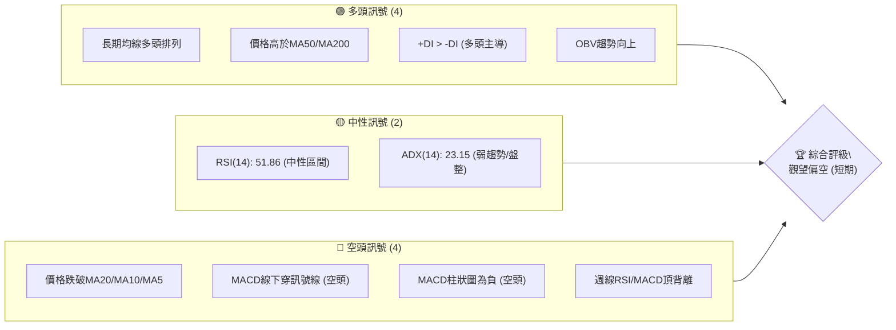
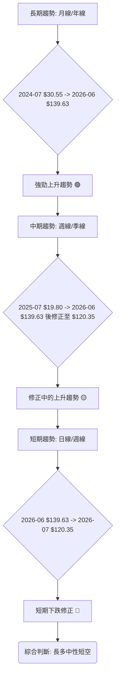
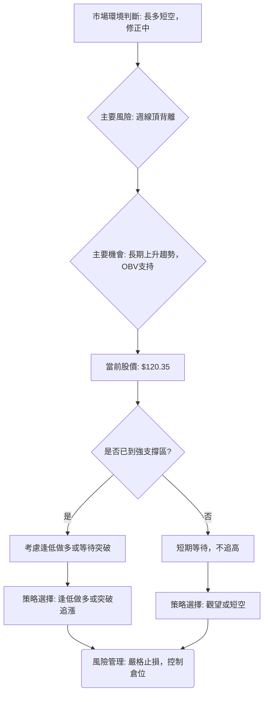

<details>
<summary>📊 靜態圖表 (點擊展開)</summary>

</details>

<html>
<head><meta charset="utf-8" /></head>
<body>
    <div style="height:500px; width:100%;">                        <script>window.PlotlyConfig = {MathJaxConfig: 'local'};</script>
        <script charset="utf-8" src="https://cdn.plot.ly/plotly-3.6.0.min.js" integrity="sha256-QaOVwtVY0T02VaHrr6pnoHLCwayMJp4O5n4YyaE3rJk=" crossorigin="anonymous"></script>                <div id="candlestick-chart" class="plotly-graph-div" style="height:100%; width:100%;"></div>            <script>                window.PLOTLYENV=window.PLOTLYENV || {};                                if (document.getElementById("candlestick-chart")) {                    Plotly.newPlot(                        "candlestick-chart",                        [{"close":{"dtype":"f8","bdata":"AAAAwB5FOUAAAABgZuY4QAAAAIDrkT5AAAAA4HqUPUAAAABgj8I8QAAAAEAKVz1AAAAA4FE4P0AAAABguP5AQAAAAAAAwEFAAAAAoHA9QUAAAABgZsZAQAAAAOBR+EFAAAAAYGamQkAAAACAPWpCQAAAACCFS0JAAAAAgMKVQkAAAABACrdCQAAAAGBm5kJAAAAAIFwvQkAAAAAAKZxCQAAAAOCj0EFAAAAAQDOTQkAAAAAghWtCQAAAAKBHgUJAAAAAwMwMQ0AAAAAgXA9DQAAAAIDCdUJAAAAA4HoUQ0AAAAAA1yNDQAAAAMAexUNAAAAAANfDREAAAAAghatEQAAAAOB6FERAAAAAYLj+Q0AAAAAAAMBDQAAAAADXg0JAAAAA4KMwQ0AAAABguJ5CQAAAAOCjEENAAAAAoJk5Q0AAAADgo\u002fBCQAAAAIDr8UJAAAAA4Hr0QUAAAABgj8JBQAAAAEDhWkFAAAAAgD0qQUAAAACAFI5BQAAAACBcz0BAAAAAAABAQUAAAADAHuVBQAAAAIA96kFAAAAAIK5nQkAAAAAgrkdEQAAAAKBHAURAAAAAACm8RUAAAACgR+FFQAAAAAAAQERAAAAA4Hq0REAAAABgZiZEQAAAAAAAQERAAAAAANdjREAAAACgR8FDQAAAACCu50JAAAAAoEfBQkAAAAAgrqdCQAAAAGBmBkJAAAAAANcjQkAAAADA9WhCQAAAACBcL0JAAAAAwMwsQkAAAADgehRCQAAAAKCZGUJAAAAAQApXQkAAAABgZqZCQAAAAEAzc0JAAAAA4KOwQ0AAAAAgXK9DQAAAAMAeBURAAAAA4KNQRUAAAACAFI5EQAAAAGBmxkZAAAAAIK4HRkAAAADAHqVHQAAAAAApXEhAAAAAwPUoSEAAAABA4XpHQAAAACCuR0hAAAAAAAAgS0AAAADA9ShLQAAAAMD1iEZAAAAAYLg+RUAAAABACvdFQAAAAADXY0hAAAAA4HpUSEAAAAAAKTxHQAAAACCuZ0hAAAAAAACgSEAAAADAzExIQAAAAGC4HkhAAAAAIIVLSUAAAABguB5JQAAAAOCjkEdAAAAAwB4lSEAAAACgcD1HQAAAAMAeZUdAAAAAQAoXR0AAAABA4bpGQAAAACBcT0ZAAAAAgBQORkAAAADgo9BFQAAAACBcD0dAAAAA4KNwR0AAAABA4bpGQAAAAIAUzkZAAAAAAADARkAAAADAzIxFQAAAAIA9ykZAAAAAoJn5RkAAAACAwrVFQAAAAIA9ykZAAAAAANdjR0AAAACgcP1HQAAAAAAAoEZAAAAAYI\u002fiRkAAAACgR+FGQAAAACCuB0ZAAAAAANeDRkAAAABAChdHQAAAACBc70VAAAAAoEcBRkAAAAAgrgdGQAAAAEAKl0dAAAAAwMwMRkAAAADgo5BFQAAAAOBRmERAAAAA4KMQRkAAAAAA1wNIQAAAAOCjMElAAAAAANdjSUAAAADgenRKQAAAAKCZeU1AAAAAACncTkAAAADgozBPQAAAACCFS1BAAAAAIK7nT0AAAAAAKTxQQAAAAAAAIFFAAAAAAAAgUUAAAADAzGxQQAAAAOCjkFBAAAAAoEdRUEAAAACA67FQQAAAAGCPolRAAAAAIFw\u002fVUAAAACgRyFVQAAAAAAAsFdAAAAAYLieV0AAAAAgrudYQAAAAIDr8VdAAAAAoJkJW0AAAADgo0BcQAAAACCuZ1tAAAAAQOE6X0AAAACAFC5gQAAAAEAKJ15AAAAAYI8SXkAAAAAghftcQAAAAKBHMVtAAAAAQOEKW0AAAABAM7NbQAAAAKBwvV1AAAAAAACgXUAAAACAwvVdQAAAAKBH4V5AAAAAoEdxXkAAAADA9TheQAAAACCFq1xAAAAAwB5VW0AAAAAghftaQAAAAKBwLVxAAAAAgOvxW0AAAABA4cpYQAAAAKBHkVtAAAAAQOH6WkAAAABgj8JaQAAAAKBwPV1AAAAA4HokX0AAAABACvdfQAAAAEAzQ11AAAAAYGZGXkAAAAAgrr9gQAAAAIAUnmFAAAAAwPWIYEAAAADAzHRgQAAAAADXm2BAAAAAgD0KYEAAAABACndgQAAAAAApdGFAAAAAoEfBX0AAAABgZhZeQA=="},"high":{"dtype":"f8","bdata":"AAAAQApXOUAAAABgj0I5QAAAAOCjMEBAAAAAoEehPkAAAACgmRk+QAAAAEAzMz5AAAAAQDOzP0AAAAAAACBBQAAAAGBmJkJAAAAAYGaGQUAAAABguB5BQAAAACCuB0JAAAAAwPXIQkAAAACAPQpDQAAAAEAKV0NAAAAAYGYGQ0AAAADAHuVCQAAAAMDMDENAAAAAQDPTQ0AAAACgR8FCQAAAAGBmRkJAAAAAYLi+QkAAAABgjwJDQAAAAOCjMENAAAAAYI9CQ0AAAADAzCxDQAAAAEAK90JAAAAAQDMzQ0AAAAAgXI9EQAAAAIDCVURAAAAAoHA9RUAAAADAHgVFQAAAAEAKt0RAAAAAgD1qREAAAACgmTlEQAAAAAAAIENAAAAA4FFYQ0AAAAAghetDQAAAAGCPIkNAAAAAANfDQ0AAAAAAKRxDQAAAAKCZGUNAAAAAIK6nQkAAAADAzAxCQAAAAKBw3UFAAAAAoEdhQUAAAAAAAOBBQAAAAEAKV0JAAAAAoHB9QUAAAADgehRCQAAAAOCjEEJAAAAAYLieQkAAAAAghUtEQAAAAOCjMERAAAAAQArXRUAAAABgjwJGQAAAAADXo0VAAAAAgD1qRUAAAAAgXA9FQAAAAKBHoURAAAAAYLh+REAAAADgURhEQAAAAADXA0RAAAAAoHA9Q0AAAABA4fpCQAAAACCF60JAAAAAYLi+QkAAAACAPcpCQAAAAEAz80JAAAAAYGZmQkAAAABAChdCQAAAAGC4PkJAAAAAYGZmQkAAAACgRyFDQAAAAIA9ykJAAAAAgBTuQ0AAAADAzAxFQAAAACCuJ0RAAAAAwPVIRkAAAAAghatFQAAAAKBw3UZAAAAAoJm5RkAAAABguB5IQAAAAAAAgEhAAAAAgOsxSUAAAABA4RpJQAAAAKBwHUlAAAAA4Ho0S0AAAADAzExLQAAAAOCjEEhAAAAAQOE6RkAAAAAA10NGQAAAAMAepUhAAAAAYI9iSEAAAACAPcpIQAAAACCF60hAAAAAYLi+SUAAAACgmdlIQAAAAIAUbklAAAAAYGamSUAAAAAAKZxJQAAAAMAeRUlAAAAAYGbGSEAAAACgmXlIQAAAAOBR2EdAAAAAgD1qR0AAAABgj2JHQAAAAIDClUZAAAAAgOsxRkAAAABgZkZGQAAAAMDMTEdAAAAAACl8R0AAAACgmXlHQAAAACCuR0dAAAAAIK7nRkAAAADgUdhFQAAAAOCjEEdAAAAAoHA9R0AAAABACpdGQAAAAKBH4UZAAAAA4KPwR0AAAACAPWpIQAAAAOBRuEdAAAAAQDNTR0AAAACAwpVIQAAAAIA9CkdAAAAAQOHaRkAAAADgUThHQAAAAGBmxkdAAAAAQOG6RkAAAAAgridGQAAAAMDM7EdAAAAAwMxMR0AAAADgoxBGQAAAAGC4\u002fkVAAAAAoHAdRkAAAABgj2JIQAAAAGC4PklAAAAAgOsxSkAAAABgj6JKQAAAAIDClU1AAAAAgD0KT0AAAACA67FPQAAAAKCZaVBAAAAAIIVLUEAAAACAwnVQQAAAAEAKJ1FAAAAAwB6VUUAAAACgcE1RQAAAAEDh6lBAAAAAoEcxUUAAAACA6xFRQAAAAIAUTlVAAAAAYGbGVUAAAACAwiVVQAAAAMDMvFdAAAAAACnsV0AAAADAzBxZQAAAAOB69FhAAAAAYLieW0AAAAAAAGBcQAAAAOCjoFxAAAAAgD1SYEAAAAAAAJhgQAAAAGCP8l9AAAAAAABAX0AAAADgeqRdQAAAAOB6pFtAAAAAYI\u002fiXEAAAADgekRcQAAAAAApfF5AAAAAgD3aXUAAAACA67FeQAAAACCuZ19AAAAAoEdRX0AAAADAHsVeQAAAAMD1qF9AAAAAQDNTXEAAAAAAAEBbQAAAAGCPkl1AAAAAwPVIXEAAAABguJ5aQAAAAGCPIlxAAAAAAACAXEAAAAAAAOBbQAAAAAAp3F1AAAAAYGbmX0AAAAAghZNgQAAAAGBmFmBAAAAAwMxMX0AAAAAgXO9gQAAAAGBmrmFAAAAAIFw\u002fYUAAAABgjwJhQAAAAEAKl2FAAAAAIFxnYEAAAACgmYFgQAAAAEAzy2FAAAAAIK73YEAAAAAgrldgQA=="},"hovertemplate":"\u003cb\u003e%{x|%Y-%m-%d}\u003c\u002fb\u003e\u003cbr\u003e\u958b: $%{open:.2f}\u003cbr\u003e\u9ad8: $%{high:.2f}\u003cbr\u003e\u4f4e: $%{low:.2f}\u003cbr\u003e\u6536: $%{close:.2f}\u003cextra\u003e\u003c\u002fextra\u003e","low":{"dtype":"f8","bdata":"AAAA4KOwOEAAAABAM3M4QAAAAMD1KD5AAAAA4HpUPUAAAABA4bo8QAAAAIDr0TxAAAAAQOE6PUAAAACAwjU\u002fQAAAAGC4PkFAAAAAoHDdQEAAAABgj4JAQAAAAAAAwEBAAAAA4FG4QUAAAACgmTlCQAAAAEAKN0JAAAAAwMwsQkAAAADgevRBQAAAAIAUbkJAAAAAYGYmQkAAAAAA1yNCQAAAAOBRWEFAAAAAgOvRQUAAAADgejRCQAAAAIA9CkJAAAAAIK7HQkAAAACAwtVCQAAAAMAeBUJAAAAAQAo3QkAAAACAPepCQAAAAKBwHUNAAAAAwB7FQ0AAAACAwnVEQAAAAIAUDkRAAAAAwB7lQ0AAAABgZoZDQAAAAOCjUEJAAAAAgBSOQkAAAABgZmZCQAAAAAApfEJAAAAAACn8QkAAAABguL5CQAAAAMDMrEJAAAAAoJm5QUAAAAAgXE9BQAAAAKBwHUFAAAAAwPXIQEAAAAAAACBBQAAAAKBwvUBAAAAAgOtxQEAAAADgUVhBQAAAAEAKV0FAAAAA4KMQQkAAAAAghatCQAAAAMDMzENAAAAAYGYGREAAAACgR0FFQAAAAIDrEURAAAAAQDOTREAAAACgmdlDQAAAAADXA0RAAAAAgOtxQ0AAAACAPYpDQAAAACBcz0JAAAAAwPWoQkAAAACAwnVCQAAAAAAp\u002fEFAAAAAgMLVQUAAAADgUThCQAAAAMAeJUJAAAAAANcDQkAAAACgmXlBQAAAAMDM7EFAAAAAwPXoQUAAAADA9WhCQAAAACBcb0JAAAAAoEfhQkAAAABgj6JDQAAAAKCZeUNAAAAAIFwPREAAAABACldEQAAAAMD1yERAAAAAgOvxRUAAAAAAKZxGQAAAAIDCtUdAAAAAgD3qR0AAAABA4VpHQAAAAAAAgEdAAAAAQDMTSUAAAACAPYpKQAAAAKCZOUZAAAAAANcjRUAAAADAzIxFQAAAAMD1KEdAAAAAYLh+R0AAAABA4fpGQAAAAAAAwEZAAAAAQAo3SEAAAAAAAIBHQAAAAMAeZUdAAAAAgD1qSEAAAAAghctHQAAAAGCPYkdAAAAAgBRuR0AAAADgURhHQAAAAAApfEZAAAAAQOG6RkAAAADgo3BGQAAAAIDC9UVAAAAA4KNwRUAAAABACpdFQAAAAMAexUVAAAAAgD2KRkAAAACA6zFGQAAAAEAzM0ZAAAAAoJn5RUAAAACA6xFFQAAAAGCPokVAAAAAoJlZRkAAAAAA16NFQAAAAIDr0URAAAAA4Hq0RkAAAADgelRHQAAAAIDClUZAAAAAgOuxRkAAAADgUdhGQAAAAOB69EVAAAAAYGYGRkAAAABAM9NFQAAAAIDr0UVAAAAAYLjeRUAAAACgmZlFQAAAAKCZuUZAAAAAgML1RUAAAACAFG5FQAAAAOCjUERAAAAAwMzMREAAAACgcH1GQAAAAMAeBUdAAAAAIFzvSEAAAAAAKZxJQAAAAGBmZktAAAAAgOsxTUAAAAAAAGBOQAAAAEAKF09AAAAAIIULT0AAAADgo3BPQAAAAKBHEVBAAAAAIFzvUEAAAACAFB5QQAAAAMD1aFBAAAAAYLg+UEAAAABA4VpQQAAAACCu51NAAAAAQAqnVEAAAABAMzNUQAAAACCud1VAAAAAAADgVkAAAABACidXQAAAAGBm5ldAAAAAwB4FWUAAAADAHqVaQAAAAKCZSVtAAAAAQDPzW0AAAABA4fpeQAAAAAAAwFxAAAAAgD0aXUAAAABA4UpcQAAAAKBHQVpAAAAAYGb2WUAAAACgmZlZQAAAAEAzs1xAAAAAQOFKXEAAAACAwoVdQAAAAGBmVl1AAAAAAABAXUAAAAAA1xNdQAAAAGCPYlxAAAAAwB6VWkAAAABA4QpaQAAAAEAKt1tAAAAAYLjeWkAAAADAHpVYQAAAAIA9qlpAAAAAoHDdWEAAAABA4TpaQAAAAOCjoFtAAAAAwB7VXEAAAACAPapfQAAAAAAAAF1AAAAAANeDXUAAAACgmflfQAAAAGC4BmFAAAAAoJkJYEAAAADAzPxfQAAAAIA9Wl9AAAAAAABgX0AAAAAAAKBdQAAAAOCjcGBAAAAAIIWrX0AAAADgUWhdQA=="},"name":"\u50f9\u683c","open":{"dtype":"f8","bdata":"AAAAgOvROEAAAADgehQ5QAAAACCuxz9AAAAAoEdhPkAAAAAghas9QAAAAKBw\u002fTxAAAAAoEdhPUAAAAAAKZw\u002fQAAAAGCPgkFAAAAAYI9CQUAAAABACvdAQAAAAADXw0BAAAAAoEfhQUAAAACgmflCQAAAAOBRmEJAAAAAgOtRQkAAAABgZkZCQAAAAADXw0JAAAAAQOE6Q0AAAADgUThCQAAAAAAAAEJAAAAAQDMzQkAAAABAM5NCQAAAAIAULkJAAAAAwPXIQkAAAACA6xFDQAAAACCF60JAAAAAwMxMQkAAAABgjwJEQAAAAIDrMUNAAAAAIIXLQ0AAAADAzMxEQAAAAAApfERAAAAAQApXREAAAAAAACBEQAAAAIDrEUNAAAAAgMK1QkAAAAAghStDQAAAAKBHoUJAAAAAQAp3Q0AAAABAMxNDQAAAACCuB0NAAAAAYI+iQkAAAAAA14NBQAAAAKCZuUFAAAAAAAAgQUAAAACAPSpBQAAAAAAAAEJAAAAAoEfBQEAAAAAAKXxBQAAAAGBmxkFAAAAAoJkZQkAAAABAM7NCQAAAAIAU7kNAAAAAACk8REAAAACA67FFQAAAAKBHoUVAAAAA4HqUREAAAADgUfhEQAAAAKBwXURAAAAAgBQOREAAAADA9QhEQAAAAAAAoENAAAAAgD0qQ0AAAACAPcpCQAAAACCFy0JAAAAA4KOwQkAAAACgcD1CQAAAAIDr8UJAAAAAYLgeQkAAAACAwpVBQAAAAIDCFUJAAAAAoEcBQkAAAADgenRCQAAAAEAzs0JAAAAAYI\u002fiQkAAAAAghctEQAAAAIAU7kNAAAAAQAoXREAAAAAgXE9FQAAAAIA96kRAAAAAYLgeRkAAAACA6\u002fFGQAAAAKCZeUhAAAAAwMysSEAAAABgj6JIQAAAAGBmpkdAAAAAwPUoSUAAAABA4RpLQAAAAIAUbkdAAAAAANcjRkAAAAAAKfxFQAAAAMDMTEdAAAAAIK7HR0AAAACgcH1IQAAAAOCj0EZAAAAAIK4HSUAAAADAHsVIQAAAACCFy0dAAAAAwMyMSEAAAAAghctIQAAAAOB6NElAAAAAgBQOSEAAAABgZuZHQAAAAKBH4UZAAAAAQAr3RkAAAACAwvVGQAAAAKCZeUZAAAAAgOvxRUAAAAAghQtGQAAAAMDMDEZAAAAAIIULR0AAAABgj2JHQAAAAEDhOkZAAAAAoJkZRkAAAADgUbhFQAAAAMD1CEZAAAAAIFxvRkAAAACAwlVGQAAAAGC4XkVAAAAA4Hq0RkAAAADA9WhHQAAAAEAzs0dAAAAAACn8RkAAAADgevRHQAAAAIA9CkdAAAAAoJkZRkAAAABguP5FQAAAAKCZeUdAAAAAAABARkAAAADAHsVFQAAAAMDM7EZAAAAAYGYmR0AAAAAgXM9FQAAAAAAp3EVAAAAAoJn5REAAAAAAAIBGQAAAACCuB0dAAAAA4KNwSUAAAADgevRJQAAAACBcr0tAAAAAQDMzTUAAAABgj8JOQAAAAEAKF09AAAAAgD1KUEAAAABgj+JPQAAAACCFO1BAAAAAYGY2UUAAAADAzBxRQAAAAMD1yFBAAAAAACn8UEAAAABgZoZQQAAAAMDMjFRAAAAAQOHqVEAAAACA61FUQAAAAMD1iFVAAAAAYGbmV0AAAADAzExXQAAAACCFy1hAAAAA4KMgWUAAAABguL5bQAAAAKBHwVtAAAAAANfzW0AAAAAAKVxgQAAAAEAKF19AAAAAYGYGX0AAAACAPapcQAAAAGCPcltAAAAAgBReXEAAAABguL5aQAAAAIAUDl1AAAAAwB4lXUAAAACAwhVeQAAAAGBmhl5AAAAAwPUYX0AAAADAzFxeQAAAAGBm9l5AAAAAIIVbW0AAAADAzNxaQAAAAEDhGl1AAAAAoJkZW0AAAABguJ5aQAAAAAAAwFtAAAAAIFw\u002fXEAAAACA64FaQAAAAKBHYVxAAAAAQOFaXUAAAAAgri9gQAAAAEAKR19AAAAAYGZ2XkAAAACA63lgQAAAAADXY2FAAAAAIFw3YEAAAACgmaFgQAAAACBcd2FAAAAAYLgWYEAAAAAAAMBfQAAAACCuf2BAAAAAAADgYEAAAACgcB1gQA=="},"x":["2025-09-16T00:00:00-04:00","2025-09-17T00:00:00-04:00","2025-09-18T00:00:00-04:00","2025-09-19T00:00:00-04:00","2025-09-22T00:00:00-04:00","2025-09-23T00:00:00-04:00","2025-09-24T00:00:00-04:00","2025-09-25T00:00:00-04:00","2025-09-26T00:00:00-04:00","2025-09-29T00:00:00-04:00","2025-09-30T00:00:00-04:00","2025-10-01T00:00:00-04:00","2025-10-02T00:00:00-04:00","2025-10-03T00:00:00-04:00","2025-10-06T00:00:00-04:00","2025-10-07T00:00:00-04:00","2025-10-08T00:00:00-04:00","2025-10-09T00:00:00-04:00","2025-10-10T00:00:00-04:00","2025-10-13T00:00:00-04:00","2025-10-14T00:00:00-04:00","2025-10-15T00:00:00-04:00","2025-10-16T00:00:00-04:00","2025-10-17T00:00:00-04:00","2025-10-20T00:00:00-04:00","2025-10-21T00:00:00-04:00","2025-10-22T00:00:00-04:00","2025-10-23T00:00:00-04:00","2025-10-24T00:00:00-04:00","2025-10-27T00:00:00-04:00","2025-10-28T00:00:00-04:00","2025-10-29T00:00:00-04:00","2025-10-30T00:00:00-04:00","2025-10-31T00:00:00-04:00","2025-11-03T00:00:00-05:00","2025-11-04T00:00:00-05:00","2025-11-05T00:00:00-05:00","2025-11-06T00:00:00-05:00","2025-11-07T00:00:00-05:00","2025-11-10T00:00:00-05:00","2025-11-11T00:00:00-05:00","2025-11-12T00:00:00-05:00","2025-11-13T00:00:00-05:00","2025-11-14T00:00:00-05:00","2025-11-17T00:00:00-05:00","2025-11-18T00:00:00-05:00","2025-11-19T00:00:00-05:00","2025-11-20T00:00:00-05:00","2025-11-21T00:00:00-05:00","2025-11-24T00:00:00-05:00","2025-11-25T00:00:00-05:00","2025-11-26T00:00:00-05:00","2025-11-28T00:00:00-05:00","2025-12-01T00:00:00-05:00","2025-12-02T00:00:00-05:00","2025-12-03T00:00:00-05:00","2025-12-04T00:00:00-05:00","2025-12-05T00:00:00-05:00","2025-12-08T00:00:00-05:00","2025-12-09T00:00:00-05:00","2025-12-10T00:00:00-05:00","2025-12-11T00:00:00-05:00","2025-12-12T00:00:00-05:00","2025-12-15T00:00:00-05:00","2025-12-16T00:00:00-05:00","2025-12-17T00:00:00-05:00","2025-12-18T00:00:00-05:00","2025-12-19T00:00:00-05:00","2025-12-22T00:00:00-05:00","2025-12-23T00:00:00-05:00","2025-12-24T00:00:00-05:00","2025-12-26T00:00:00-05:00","2025-12-29T00:00:00-05:00","2025-12-30T00:00:00-05:00","2025-12-31T00:00:00-05:00","2026-01-02T00:00:00-05:00","2026-01-05T00:00:00-05:00","2026-01-06T00:00:00-05:00","2026-01-07T00:00:00-05:00","2026-01-08T00:00:00-05:00","2026-01-09T00:00:00-05:00","2026-01-12T00:00:00-05:00","2026-01-13T00:00:00-05:00","2026-01-14T00:00:00-05:00","2026-01-15T00:00:00-05:00","2026-01-16T00:00:00-05:00","2026-01-20T00:00:00-05:00","2026-01-21T00:00:00-05:00","2026-01-22T00:00:00-05:00","2026-01-23T00:00:00-05:00","2026-01-26T00:00:00-05:00","2026-01-27T00:00:00-05:00","2026-01-28T00:00:00-05:00","2026-01-29T00:00:00-05:00","2026-01-30T00:00:00-05:00","2026-02-02T00:00:00-05:00","2026-02-03T00:00:00-05:00","2026-02-04T00:00:00-05:00","2026-02-05T00:00:00-05:00","2026-02-06T00:00:00-05:00","2026-02-09T00:00:00-05:00","2026-02-10T00:00:00-05:00","2026-02-11T00:00:00-05:00","2026-02-12T00:00:00-05:00","2026-02-13T00:00:00-05:00","2026-02-17T00:00:00-05:00","2026-02-18T00:00:00-05:00","2026-02-19T00:00:00-05:00","2026-02-20T00:00:00-05:00","2026-02-23T00:00:00-05:00","2026-02-24T00:00:00-05:00","2026-02-25T00:00:00-05:00","2026-02-26T00:00:00-05:00","2026-02-27T00:00:00-05:00","2026-03-02T00:00:00-05:00","2026-03-03T00:00:00-05:00","2026-03-04T00:00:00-05:00","2026-03-05T00:00:00-05:00","2026-03-06T00:00:00-05:00","2026-03-09T00:00:00-04:00","2026-03-10T00:00:00-04:00","2026-03-11T00:00:00-04:00","2026-03-12T00:00:00-04:00","2026-03-13T00:00:00-04:00","2026-03-16T00:00:00-04:00","2026-03-17T00:00:00-04:00","2026-03-18T00:00:00-04:00","2026-03-19T00:00:00-04:00","2026-03-20T00:00:00-04:00","2026-03-23T00:00:00-04:00","2026-03-24T00:00:00-04:00","2026-03-25T00:00:00-04:00","2026-03-26T00:00:00-04:00","2026-03-27T00:00:00-04:00","2026-03-30T00:00:00-04:00","2026-03-31T00:00:00-04:00","2026-04-01T00:00:00-04:00","2026-04-02T00:00:00-04:00","2026-04-06T00:00:00-04:00","2026-04-07T00:00:00-04:00","2026-04-08T00:00:00-04:00","2026-04-09T00:00:00-04:00","2026-04-10T00:00:00-04:00","2026-04-13T00:00:00-04:00","2026-04-14T00:00:00-04:00","2026-04-15T00:00:00-04:00","2026-04-16T00:00:00-04:00","2026-04-17T00:00:00-04:00","2026-04-20T00:00:00-04:00","2026-04-21T00:00:00-04:00","2026-04-22T00:00:00-04:00","2026-04-23T00:00:00-04:00","2026-04-24T00:00:00-04:00","2026-04-27T00:00:00-04:00","2026-04-28T00:00:00-04:00","2026-04-29T00:00:00-04:00","2026-04-30T00:00:00-04:00","2026-05-01T00:00:00-04:00","2026-05-04T00:00:00-04:00","2026-05-05T00:00:00-04:00","2026-05-06T00:00:00-04:00","2026-05-07T00:00:00-04:00","2026-05-08T00:00:00-04:00","2026-05-11T00:00:00-04:00","2026-05-12T00:00:00-04:00","2026-05-13T00:00:00-04:00","2026-05-14T00:00:00-04:00","2026-05-15T00:00:00-04:00","2026-05-18T00:00:00-04:00","2026-05-19T00:00:00-04:00","2026-05-20T00:00:00-04:00","2026-05-21T00:00:00-04:00","2026-05-22T00:00:00-04:00","2026-05-26T00:00:00-04:00","2026-05-27T00:00:00-04:00","2026-05-28T00:00:00-04:00","2026-05-29T00:00:00-04:00","2026-06-01T00:00:00-04:00","2026-06-02T00:00:00-04:00","2026-06-03T00:00:00-04:00","2026-06-04T00:00:00-04:00","2026-06-05T00:00:00-04:00","2026-06-08T00:00:00-04:00","2026-06-09T00:00:00-04:00","2026-06-10T00:00:00-04:00","2026-06-11T00:00:00-04:00","2026-06-12T00:00:00-04:00","2026-06-15T00:00:00-04:00","2026-06-16T00:00:00-04:00","2026-06-17T00:00:00-04:00","2026-06-18T00:00:00-04:00","2026-06-22T00:00:00-04:00","2026-06-23T00:00:00-04:00","2026-06-24T00:00:00-04:00","2026-06-25T00:00:00-04:00","2026-06-26T00:00:00-04:00","2026-06-29T00:00:00-04:00","2026-06-30T00:00:00-04:00","2026-07-01T00:00:00-04:00","2026-07-02T00:00:00-04:00"],"type":"candlestick"},{"hovertemplate":"MA30: $%{y:.2f}\u003cextra\u003e\u003c\u002fextra\u003e","line":{"color":"#2196F3","dash":"dash","width":2},"mode":"lines","name":"MA30","x":["2025-09-16T00:00:00-04:00","2025-09-17T00:00:00-04:00","2025-09-18T00:00:00-04:00","2025-09-19T00:00:00-04:00","2025-09-22T00:00:00-04:00","2025-09-23T00:00:00-04:00","2025-09-24T00:00:00-04:00","2025-09-25T00:00:00-04:00","2025-09-26T00:00:00-04:00","2025-09-29T00:00:00-04:00","2025-09-30T00:00:00-04:00","2025-10-01T00:00:00-04:00","2025-10-02T00:00:00-04:00","2025-10-03T00:00:00-04:00","2025-10-06T00:00:00-04:00","2025-10-07T00:00:00-04:00","2025-10-08T00:00:00-04:00","2025-10-09T00:00:00-04:00","2025-10-10T00:00:00-04:00","2025-10-13T00:00:00-04:00","2025-10-14T00:00:00-04:00","2025-10-15T00:00:00-04:00","2025-10-16T00:00:00-04:00","2025-10-17T00:00:00-04:00","2025-10-20T00:00:00-04:00","2025-10-21T00:00:00-04:00","2025-10-22T00:00:00-04:00","2025-10-23T00:00:00-04:00","2025-10-24T00:00:00-04:00","2025-10-27T00:00:00-04:00","2025-10-28T00:00:00-04:00","2025-10-29T00:00:00-04:00","2025-10-30T00:00:00-04:00","2025-10-31T00:00:00-04:00","2025-11-03T00:00:00-05:00","2025-11-04T00:00:00-05:00","2025-11-05T00:00:00-05:00","2025-11-06T00:00:00-05:00","2025-11-07T00:00:00-05:00","2025-11-10T00:00:00-05:00","2025-11-11T00:00:00-05:00","2025-11-12T00:00:00-05:00","2025-11-13T00:00:00-05:00","2025-11-14T00:00:00-05:00","2025-11-17T00:00:00-05:00","2025-11-18T00:00:00-05:00","2025-11-19T00:00:00-05:00","2025-11-20T00:00:00-05:00","2025-11-21T00:00:00-05:00","2025-11-24T00:00:00-05:00","2025-11-25T00:00:00-05:00","2025-11-26T00:00:00-05:00","2025-11-28T00:00:00-05:00","2025-12-01T00:00:00-05:00","2025-12-02T00:00:00-05:00","2025-12-03T00:00:00-05:00","2025-12-04T00:00:00-05:00","2025-12-05T00:00:00-05:00","2025-12-08T00:00:00-05:00","2025-12-09T00:00:00-05:00","2025-12-10T00:00:00-05:00","2025-12-11T00:00:00-05:00","2025-12-12T00:00:00-05:00","2025-12-15T00:00:00-05:00","2025-12-16T00:00:00-05:00","2025-12-17T00:00:00-05:00","2025-12-18T00:00:00-05:00","2025-12-19T00:00:00-05:00","2025-12-22T00:00:00-05:00","2025-12-23T00:00:00-05:00","2025-12-24T00:00:00-05:00","2025-12-26T00:00:00-05:00","2025-12-29T00:00:00-05:00","2025-12-30T00:00:00-05:00","2025-12-31T00:00:00-05:00","2026-01-02T00:00:00-05:00","2026-01-05T00:00:00-05:00","2026-01-06T00:00:00-05:00","2026-01-07T00:00:00-05:00","2026-01-08T00:00:00-05:00","2026-01-09T00:00:00-05:00","2026-01-12T00:00:00-05:00","2026-01-13T00:00:00-05:00","2026-01-14T00:00:00-05:00","2026-01-15T00:00:00-05:00","2026-01-16T00:00:00-05:00","2026-01-20T00:00:00-05:00","2026-01-21T00:00:00-05:00","2026-01-22T00:00:00-05:00","2026-01-23T00:00:00-05:00","2026-01-26T00:00:00-05:00","2026-01-27T00:00:00-05:00","2026-01-28T00:00:00-05:00","2026-01-29T00:00:00-05:00","2026-01-30T00:00:00-05:00","2026-02-02T00:00:00-05:00","2026-02-03T00:00:00-05:00","2026-02-04T00:00:00-05:00","2026-02-05T00:00:00-05:00","2026-02-06T00:00:00-05:00","2026-02-09T00:00:00-05:00","2026-02-10T00:00:00-05:00","2026-02-11T00:00:00-05:00","2026-02-12T00:00:00-05:00","2026-02-13T00:00:00-05:00","2026-02-17T00:00:00-05:00","2026-02-18T00:00:00-05:00","2026-02-19T00:00:00-05:00","2026-02-20T00:00:00-05:00","2026-02-23T00:00:00-05:00","2026-02-24T00:00:00-05:00","2026-02-25T00:00:00-05:00","2026-02-26T00:00:00-05:00","2026-02-27T00:00:00-05:00","2026-03-02T00:00:00-05:00","2026-03-03T00:00:00-05:00","2026-03-04T00:00:00-05:00","2026-03-05T00:00:00-05:00","2026-03-06T00:00:00-05:00","2026-03-09T00:00:00-04:00","2026-03-10T00:00:00-04:00","2026-03-11T00:00:00-04:00","2026-03-12T00:00:00-04:00","2026-03-13T00:00:00-04:00","2026-03-16T00:00:00-04:00","2026-03-17T00:00:00-04:00","2026-03-18T00:00:00-04:00","2026-03-19T00:00:00-04:00","2026-03-20T00:00:00-04:00","2026-03-23T00:00:00-04:00","2026-03-24T00:00:00-04:00","2026-03-25T00:00:00-04:00","2026-03-26T00:00:00-04:00","2026-03-27T00:00:00-04:00","2026-03-30T00:00:00-04:00","2026-03-31T00:00:00-04:00","2026-04-01T00:00:00-04:00","2026-04-02T00:00:00-04:00","2026-04-06T00:00:00-04:00","2026-04-07T00:00:00-04:00","2026-04-08T00:00:00-04:00","2026-04-09T00:00:00-04:00","2026-04-10T00:00:00-04:00","2026-04-13T00:00:00-04:00","2026-04-14T00:00:00-04:00","2026-04-15T00:00:00-04:00","2026-04-16T00:00:00-04:00","2026-04-17T00:00:00-04:00","2026-04-20T00:00:00-04:00","2026-04-21T00:00:00-04:00","2026-04-22T00:00:00-04:00","2026-04-23T00:00:00-04:00","2026-04-24T00:00:00-04:00","2026-04-27T00:00:00-04:00","2026-04-28T00:00:00-04:00","2026-04-29T00:00:00-04:00","2026-04-30T00:00:00-04:00","2026-05-01T00:00:00-04:00","2026-05-04T00:00:00-04:00","2026-05-05T00:00:00-04:00","2026-05-06T00:00:00-04:00","2026-05-07T00:00:00-04:00","2026-05-08T00:00:00-04:00","2026-05-11T00:00:00-04:00","2026-05-12T00:00:00-04:00","2026-05-13T00:00:00-04:00","2026-05-14T00:00:00-04:00","2026-05-15T00:00:00-04:00","2026-05-18T00:00:00-04:00","2026-05-19T00:00:00-04:00","2026-05-20T00:00:00-04:00","2026-05-21T00:00:00-04:00","2026-05-22T00:00:00-04:00","2026-05-26T00:00:00-04:00","2026-05-27T00:00:00-04:00","2026-05-28T00:00:00-04:00","2026-05-29T00:00:00-04:00","2026-06-01T00:00:00-04:00","2026-06-02T00:00:00-04:00","2026-06-03T00:00:00-04:00","2026-06-04T00:00:00-04:00","2026-06-05T00:00:00-04:00","2026-06-08T00:00:00-04:00","2026-06-09T00:00:00-04:00","2026-06-10T00:00:00-04:00","2026-06-11T00:00:00-04:00","2026-06-12T00:00:00-04:00","2026-06-15T00:00:00-04:00","2026-06-16T00:00:00-04:00","2026-06-17T00:00:00-04:00","2026-06-18T00:00:00-04:00","2026-06-22T00:00:00-04:00","2026-06-23T00:00:00-04:00","2026-06-24T00:00:00-04:00","2026-06-25T00:00:00-04:00","2026-06-26T00:00:00-04:00","2026-06-29T00:00:00-04:00","2026-06-30T00:00:00-04:00","2026-07-01T00:00:00-04:00","2026-07-02T00:00:00-04:00"],"y":{"dtype":"f8","bdata":"AAAAAAAA+H8AAAAAAAD4fwAAAAAAAPh\u002fAAAAAAAA+H8AAAAAAAD4fwAAAAAAAPh\u002fAAAAAAAA+H8AAAAAAAD4fwAAAAAAAPh\u002fAAAAAAAA+H8AAAAAAAD4fwAAAAAAAPh\u002fAAAAAAAA+H8AAAAAAAD4fwAAAAAAAPh\u002fAAAAAAAA+H8AAAAAAAD4fwAAAAAAAPh\u002fAAAAAAAA+H8AAAAAAAD4fwAAAAAAAPh\u002fAAAAAAAA+H8AAAAAAAD4fwAAAAAAAPh\u002fAAAAAAAA+H8AAAAAAAD4fwAAAAAAAPh\u002fAAAAAAAA+H8AAAAAAAD4f0RERFQObUFAVVVVlW6yQUCrqqpyk\u002fhBQBEREUl+IUJAiYiIyOhNQkAiIiK6u3tCQJqZmUGLnEJAMzMz4xe7QkARERHB9chCQKuqqmou1EJAd3d3tx7lQkC8u7s7mPdCQHd3dyfq\u002f0JAd3d35\u002fv5QkCJiIgIZfRCQCIiIpJf7EJAmpmZiUHgQkCrqqp6W9ZCQN7d3c2FxEJARERERIu8QkAzMzNTcbZCQHd3d8dLt0JAiYiIaNi1QkBERESkt8VCQBEREXGE0kJAq6qq6m3pQkDNzMxMfgFDQN7d3Z3EEENAvLu7e6IeQ0DNzMzcQCdDQAAAAHBZK0NAzczMPCYoQ0AzMzNjVyBDQAAAAJBQFkNAzczMvLsLQ0DNzMysYwJDQBEREUE1\u002fkJA3t3dfT\u002f1QkDNzMy8dPNCQImIiFjy60JAVVVVlfziQkAiIiLipdtCQERERPRv1EJAAAAAALnXQkC8u7s7Ud9CQM3MzEyp6EJA7+7uPjX+QkDNzMxMYhBDQHd3d6fGK0NAiYiIyHZOQ0BERESkKWVDQImIiHiijkNAd3d3Z5GtQ0C8u7tbSMpDQBEREQFy70NA7+7ufiMEREAAAADAyhFEQLy7u2suNERAAAAAIPdqREBERES0yKZEQM3MzFxIukRAREREJJTBREBmZmb2b9REQAAAACA+A0VAZmZm5tAyRUAAAAAQ5llFQDMzM2NXkEVAZmZmFq7HRUDNzMz88PlFQCIiIjKWLEZAMzMzE1hpRkARERExa6VGQKuqqqoN1EZAIiIi4pYFR0BERETkwSxHQImIiGj0VkdAIiIi0vdzR0CamZm5841HQN7d3U1+oUdAvLu7286nR0Dv7u5ej7JHQGZmZvb9tEdAd3d3JwbBR0De3d1NN7lHQKuqqlryq0dAmpmZKeqfR0AzMzMDco9HQO\u002fu7g67gkdA7+7uPlFfR0CamZmJzzBHQImIiJj8MkdAq6qqakpFR0CJiIgYklZHQFVVVWWCR0dA7+7uvi07R0C8u7s7JjhHQHd3d\u002ffhI0dAmpmZmeARR0ARERFRjQdHQLy7uxvo9EZA3t3d\u002fdTYRkCJiIjIdr5GQFVVVWWtvkZAvLu7y8ysRkBERES0gZ5GQCIiIgKdhkZAzczM3N19RkDNzMz81IhGQCIiInJooUZAzczM3N29RkCJiIgYduVGQBEREeEzHEdA3t3dHYVbR0BVVVVFtqNHQN7d3e0190dAVVVVVVVFSEARERFxhKJIQBERETFPBElA3t3dzYVkSUARERGBlcNJQERERJTRG0pAZmZmlrVqSkAzMzMz7LpKQDMzM9MGWktAVVVVhV0BTEBmZmbGvaZMQFVVVcUEf01AzczMXAFSTkCJiIgYBDZPQERERNS\u002fCVBAq6qq0pSSUEB3d3e3rCVRQImIiEjhqlFAd3d3x0tXUkBERESMbA9TQFVVVXXauFNAERER+VNbVEBVVVVtLuxUQGZmZia\u002faFVA3t3dvS3jVUDv7u5mrV5WQM3MzNyy3lZAAAAAUNRXV0CamZkhadJXQERERIzeTlhA7+7uboTKWEB3d3eX4EFZQHd3dwdlpFlAd3d3p3\u002f7WUDe3d3dllVaQCIiIsKuuFpAvLu7a+cbW0De3d2tAGFbQERERPQonFtAq6qqyhPNW0B3d3e3Hv1bQGZmZlaALFxAzczMfLFsXECrqqpK8KhcQM3MzIxQ1lxAmpmZ+fDxXECrqqrash5dQAAAAMCDYV1Aq6qqSjdxXUDe3d097nVdQFVVVdUVkF1AmpmZSTehXUC8u7u75sJdQJqZmWm8BF5AZmZmBvMsXkCJiIiYUkFeQA=="},"type":"scatter"},{"hovertemplate":"MA60: $%{y:.2f}\u003cextra\u003e\u003c\u002fextra\u003e","line":{"color":"#9C27B0","dash":"dash","width":2},"mode":"lines","name":"MA60","x":["2025-09-16T00:00:00-04:00","2025-09-17T00:00:00-04:00","2025-09-18T00:00:00-04:00","2025-09-19T00:00:00-04:00","2025-09-22T00:00:00-04:00","2025-09-23T00:00:00-04:00","2025-09-24T00:00:00-04:00","2025-09-25T00:00:00-04:00","2025-09-26T00:00:00-04:00","2025-09-29T00:00:00-04:00","2025-09-30T00:00:00-04:00","2025-10-01T00:00:00-04:00","2025-10-02T00:00:00-04:00","2025-10-03T00:00:00-04:00","2025-10-06T00:00:00-04:00","2025-10-07T00:00:00-04:00","2025-10-08T00:00:00-04:00","2025-10-09T00:00:00-04:00","2025-10-10T00:00:00-04:00","2025-10-13T00:00:00-04:00","2025-10-14T00:00:00-04:00","2025-10-15T00:00:00-04:00","2025-10-16T00:00:00-04:00","2025-10-17T00:00:00-04:00","2025-10-20T00:00:00-04:00","2025-10-21T00:00:00-04:00","2025-10-22T00:00:00-04:00","2025-10-23T00:00:00-04:00","2025-10-24T00:00:00-04:00","2025-10-27T00:00:00-04:00","2025-10-28T00:00:00-04:00","2025-10-29T00:00:00-04:00","2025-10-30T00:00:00-04:00","2025-10-31T00:00:00-04:00","2025-11-03T00:00:00-05:00","2025-11-04T00:00:00-05:00","2025-11-05T00:00:00-05:00","2025-11-06T00:00:00-05:00","2025-11-07T00:00:00-05:00","2025-11-10T00:00:00-05:00","2025-11-11T00:00:00-05:00","2025-11-12T00:00:00-05:00","2025-11-13T00:00:00-05:00","2025-11-14T00:00:00-05:00","2025-11-17T00:00:00-05:00","2025-11-18T00:00:00-05:00","2025-11-19T00:00:00-05:00","2025-11-20T00:00:00-05:00","2025-11-21T00:00:00-05:00","2025-11-24T00:00:00-05:00","2025-11-25T00:00:00-05:00","2025-11-26T00:00:00-05:00","2025-11-28T00:00:00-05:00","2025-12-01T00:00:00-05:00","2025-12-02T00:00:00-05:00","2025-12-03T00:00:00-05:00","2025-12-04T00:00:00-05:00","2025-12-05T00:00:00-05:00","2025-12-08T00:00:00-05:00","2025-12-09T00:00:00-05:00","2025-12-10T00:00:00-05:00","2025-12-11T00:00:00-05:00","2025-12-12T00:00:00-05:00","2025-12-15T00:00:00-05:00","2025-12-16T00:00:00-05:00","2025-12-17T00:00:00-05:00","2025-12-18T00:00:00-05:00","2025-12-19T00:00:00-05:00","2025-12-22T00:00:00-05:00","2025-12-23T00:00:00-05:00","2025-12-24T00:00:00-05:00","2025-12-26T00:00:00-05:00","2025-12-29T00:00:00-05:00","2025-12-30T00:00:00-05:00","2025-12-31T00:00:00-05:00","2026-01-02T00:00:00-05:00","2026-01-05T00:00:00-05:00","2026-01-06T00:00:00-05:00","2026-01-07T00:00:00-05:00","2026-01-08T00:00:00-05:00","2026-01-09T00:00:00-05:00","2026-01-12T00:00:00-05:00","2026-01-13T00:00:00-05:00","2026-01-14T00:00:00-05:00","2026-01-15T00:00:00-05:00","2026-01-16T00:00:00-05:00","2026-01-20T00:00:00-05:00","2026-01-21T00:00:00-05:00","2026-01-22T00:00:00-05:00","2026-01-23T00:00:00-05:00","2026-01-26T00:00:00-05:00","2026-01-27T00:00:00-05:00","2026-01-28T00:00:00-05:00","2026-01-29T00:00:00-05:00","2026-01-30T00:00:00-05:00","2026-02-02T00:00:00-05:00","2026-02-03T00:00:00-05:00","2026-02-04T00:00:00-05:00","2026-02-05T00:00:00-05:00","2026-02-06T00:00:00-05:00","2026-02-09T00:00:00-05:00","2026-02-10T00:00:00-05:00","2026-02-11T00:00:00-05:00","2026-02-12T00:00:00-05:00","2026-02-13T00:00:00-05:00","2026-02-17T00:00:00-05:00","2026-02-18T00:00:00-05:00","2026-02-19T00:00:00-05:00","2026-02-20T00:00:00-05:00","2026-02-23T00:00:00-05:00","2026-02-24T00:00:00-05:00","2026-02-25T00:00:00-05:00","2026-02-26T00:00:00-05:00","2026-02-27T00:00:00-05:00","2026-03-02T00:00:00-05:00","2026-03-03T00:00:00-05:00","2026-03-04T00:00:00-05:00","2026-03-05T00:00:00-05:00","2026-03-06T00:00:00-05:00","2026-03-09T00:00:00-04:00","2026-03-10T00:00:00-04:00","2026-03-11T00:00:00-04:00","2026-03-12T00:00:00-04:00","2026-03-13T00:00:00-04:00","2026-03-16T00:00:00-04:00","2026-03-17T00:00:00-04:00","2026-03-18T00:00:00-04:00","2026-03-19T00:00:00-04:00","2026-03-20T00:00:00-04:00","2026-03-23T00:00:00-04:00","2026-03-24T00:00:00-04:00","2026-03-25T00:00:00-04:00","2026-03-26T00:00:00-04:00","2026-03-27T00:00:00-04:00","2026-03-30T00:00:00-04:00","2026-03-31T00:00:00-04:00","2026-04-01T00:00:00-04:00","2026-04-02T00:00:00-04:00","2026-04-06T00:00:00-04:00","2026-04-07T00:00:00-04:00","2026-04-08T00:00:00-04:00","2026-04-09T00:00:00-04:00","2026-04-10T00:00:00-04:00","2026-04-13T00:00:00-04:00","2026-04-14T00:00:00-04:00","2026-04-15T00:00:00-04:00","2026-04-16T00:00:00-04:00","2026-04-17T00:00:00-04:00","2026-04-20T00:00:00-04:00","2026-04-21T00:00:00-04:00","2026-04-22T00:00:00-04:00","2026-04-23T00:00:00-04:00","2026-04-24T00:00:00-04:00","2026-04-27T00:00:00-04:00","2026-04-28T00:00:00-04:00","2026-04-29T00:00:00-04:00","2026-04-30T00:00:00-04:00","2026-05-01T00:00:00-04:00","2026-05-04T00:00:00-04:00","2026-05-05T00:00:00-04:00","2026-05-06T00:00:00-04:00","2026-05-07T00:00:00-04:00","2026-05-08T00:00:00-04:00","2026-05-11T00:00:00-04:00","2026-05-12T00:00:00-04:00","2026-05-13T00:00:00-04:00","2026-05-14T00:00:00-04:00","2026-05-15T00:00:00-04:00","2026-05-18T00:00:00-04:00","2026-05-19T00:00:00-04:00","2026-05-20T00:00:00-04:00","2026-05-21T00:00:00-04:00","2026-05-22T00:00:00-04:00","2026-05-26T00:00:00-04:00","2026-05-27T00:00:00-04:00","2026-05-28T00:00:00-04:00","2026-05-29T00:00:00-04:00","2026-06-01T00:00:00-04:00","2026-06-02T00:00:00-04:00","2026-06-03T00:00:00-04:00","2026-06-04T00:00:00-04:00","2026-06-05T00:00:00-04:00","2026-06-08T00:00:00-04:00","2026-06-09T00:00:00-04:00","2026-06-10T00:00:00-04:00","2026-06-11T00:00:00-04:00","2026-06-12T00:00:00-04:00","2026-06-15T00:00:00-04:00","2026-06-16T00:00:00-04:00","2026-06-17T00:00:00-04:00","2026-06-18T00:00:00-04:00","2026-06-22T00:00:00-04:00","2026-06-23T00:00:00-04:00","2026-06-24T00:00:00-04:00","2026-06-25T00:00:00-04:00","2026-06-26T00:00:00-04:00","2026-06-29T00:00:00-04:00","2026-06-30T00:00:00-04:00","2026-07-01T00:00:00-04:00","2026-07-02T00:00:00-04:00"],"y":{"dtype":"f8","bdata":"AAAAAAAA+H8AAAAAAAD4fwAAAAAAAPh\u002fAAAAAAAA+H8AAAAAAAD4fwAAAAAAAPh\u002fAAAAAAAA+H8AAAAAAAD4fwAAAAAAAPh\u002fAAAAAAAA+H8AAAAAAAD4fwAAAAAAAPh\u002fAAAAAAAA+H8AAAAAAAD4fwAAAAAAAPh\u002fAAAAAAAA+H8AAAAAAAD4fwAAAAAAAPh\u002fAAAAAAAA+H8AAAAAAAD4fwAAAAAAAPh\u002fAAAAAAAA+H8AAAAAAAD4fwAAAAAAAPh\u002fAAAAAAAA+H8AAAAAAAD4fwAAAAAAAPh\u002fAAAAAAAA+H8AAAAAAAD4fwAAAAAAAPh\u002fAAAAAAAA+H8AAAAAAAD4fwAAAAAAAPh\u002fAAAAAAAA+H8AAAAAAAD4fwAAAAAAAPh\u002fAAAAAAAA+H8AAAAAAAD4fwAAAAAAAPh\u002fAAAAAAAA+H8AAAAAAAD4fwAAAAAAAPh\u002fAAAAAAAA+H8AAAAAAAD4fwAAAAAAAPh\u002fAAAAAAAA+H8AAAAAAAD4fwAAAAAAAPh\u002fAAAAAAAA+H8AAAAAAAD4fwAAAAAAAPh\u002fAAAAAAAA+H8AAAAAAAD4fwAAAAAAAPh\u002fAAAAAAAA+H8AAAAAAAD4fwAAAAAAAPh\u002fAAAAAAAA+H8AAAAAAAD4fyIiIuIzTEJAERERaUptQkDv7u5qdYxCQImIiGznm0JAq6qqQtKsQkB3d3ezD79CQFVVVUFgzUJAiYiIsCvYQkDv7u4+Nd5CQJqZmWEQ4EJAZmZmpg3kQkDv7u4On+lCQN7d3Q0t6kJAvLu7c9roQkAiIiIi2+lCQHd3d2+E6kJAREREZDvvQkC8u7vjXvNCQKuqqjom+EJAZmZmBoEFQ0C8u7t7zQ1DQAAAACD3IkNAAAAA6LQxQ0AAAAAAAEhDQBERETn7YENAzczMtMh2Q0BmZmaGpIlDQM3MzIR5okNA3t3dzczEQ0CJiIjIBOdDQGZmZubQ8kNAiYiIMN30Q0DNzMysY\u002fpDQAAAAFjHDERAmpmZUUYfREBmZmbeJC5EQCIiIlJGR0RAIiIiynZeREDNzMzcsnZEQFVVVUVEjERAREREVCqmRECamZmJiMBEQHd3d88+1ERAERER8afuREAAAACQCQZFQKuqqtrOH0VAiYiIiBY5RUAzMzMDK09FQKuqqnqiZkVAIiIi0iJ7RUCamZmB3ItFQHd3dzfQoUVAd3d3x0u3RUDNzMzUv8FFQN7d3S2yzUVARERE1AbSRUCamZlhntBFQFVVVb1020VAd3d3LyTlRUDv7u4ezOtFQKuqqnqi9kVAd3d3R28DRkB3d3cHgRVGQKuqqkJgJUZAq6qqUv82RkDe3d0lBklGQFVVVa0cWkZAAAAAWMdsRkDv7u4mv4BGQO\u002fu7ia\u002fkEZAiYiIiBahRkDNzMz88LFGQAAAAIhdyUZA7+7u1jHZRkBERETMoeVGQFVVVbXI7kZAd3d31+r4RkAzMzNbZAtHQAAAAGBzIUdAREREXNYyR0C8u7u7AkxHQLy7u+uYaEdAq6qqokWOR0CamZnJdq5HQERERCSU0UdAd3d3v5\u002fyR0AiIiI6+xhIQAAAACCFQ0hAZmZmhuthSEBVVVWFMnpIQGZmZhZnp0hAiYiIAADYSEDe3d0lvwhJQERERJzEUElAIiIiokWeSUAREREBcu9JQGZmZl5zUUpAMzMz+\u002fCxSkDNzMy0yB5LQCIiIuIzhEtAmpmZUf\u002f+S0C8u7sb6IRMQDMzM\u002fs3Ck1AVVVVLbKtTUBmZmZmrV5OQGZmZvYo\u002fE5Ad3d350KaT0De3d11TBhQQLy7u6+5XFBAIiIiVg6hUECamZk5tOhQQKuqqmZmNlFAd3d3b8uCUUAiIiIiItJRQJqZmcE8JVJAzczMjJd2UkAAAABokclSQAAAAFBGE1NAMzMzR+FWU0AzMzPPsJtTQCIiIsZL41NAd3d3G6EoVEC8u7tjO19UQO\u002fu7i6WpFRAq6qqRuHmVEBVVVXNPihVQImIiFwBdlVAmpmZFdnKVUB3d3cr+SFWQImIiDAIcFZAIiIi5kLCVkARERHJLyJXQERERIQyhldAERERiUHkV0ARERFlrUJYQFVVVSV4pFhAVVVVoUX+WECJiIiUildZQAAAAMi9tllAIiIiYhAIWkC8u7v\u002f\u002f09aQA=="},"type":"scatter"},{"hovertemplate":"MA200: $%{y:.2f}\u003cextra\u003e\u003c\u002fextra\u003e","line":{"color":"#FF6F00","dash":"solid","width":2},"mode":"lines","name":"MA200","x":["2025-09-16T00:00:00-04:00","2025-09-17T00:00:00-04:00","2025-09-18T00:00:00-04:00","2025-09-19T00:00:00-04:00","2025-09-22T00:00:00-04:00","2025-09-23T00:00:00-04:00","2025-09-24T00:00:00-04:00","2025-09-25T00:00:00-04:00","2025-09-26T00:00:00-04:00","2025-09-29T00:00:00-04:00","2025-09-30T00:00:00-04:00","2025-10-01T00:00:00-04:00","2025-10-02T00:00:00-04:00","2025-10-03T00:00:00-04:00","2025-10-06T00:00:00-04:00","2025-10-07T00:00:00-04:00","2025-10-08T00:00:00-04:00","2025-10-09T00:00:00-04:00","2025-10-10T00:00:00-04:00","2025-10-13T00:00:00-04:00","2025-10-14T00:00:00-04:00","2025-10-15T00:00:00-04:00","2025-10-16T00:00:00-04:00","2025-10-17T00:00:00-04:00","2025-10-20T00:00:00-04:00","2025-10-21T00:00:00-04:00","2025-10-22T00:00:00-04:00","2025-10-23T00:00:00-04:00","2025-10-24T00:00:00-04:00","2025-10-27T00:00:00-04:00","2025-10-28T00:00:00-04:00","2025-10-29T00:00:00-04:00","2025-10-30T00:00:00-04:00","2025-10-31T00:00:00-04:00","2025-11-03T00:00:00-05:00","2025-11-04T00:00:00-05:00","2025-11-05T00:00:00-05:00","2025-11-06T00:00:00-05:00","2025-11-07T00:00:00-05:00","2025-11-10T00:00:00-05:00","2025-11-11T00:00:00-05:00","2025-11-12T00:00:00-05:00","2025-11-13T00:00:00-05:00","2025-11-14T00:00:00-05:00","2025-11-17T00:00:00-05:00","2025-11-18T00:00:00-05:00","2025-11-19T00:00:00-05:00","2025-11-20T00:00:00-05:00","2025-11-21T00:00:00-05:00","2025-11-24T00:00:00-05:00","2025-11-25T00:00:00-05:00","2025-11-26T00:00:00-05:00","2025-11-28T00:00:00-05:00","2025-12-01T00:00:00-05:00","2025-12-02T00:00:00-05:00","2025-12-03T00:00:00-05:00","2025-12-04T00:00:00-05:00","2025-12-05T00:00:00-05:00","2025-12-08T00:00:00-05:00","2025-12-09T00:00:00-05:00","2025-12-10T00:00:00-05:00","2025-12-11T00:00:00-05:00","2025-12-12T00:00:00-05:00","2025-12-15T00:00:00-05:00","2025-12-16T00:00:00-05:00","2025-12-17T00:00:00-05:00","2025-12-18T00:00:00-05:00","2025-12-19T00:00:00-05:00","2025-12-22T00:00:00-05:00","2025-12-23T00:00:00-05:00","2025-12-24T00:00:00-05:00","2025-12-26T00:00:00-05:00","2025-12-29T00:00:00-05:00","2025-12-30T00:00:00-05:00","2025-12-31T00:00:00-05:00","2026-01-02T00:00:00-05:00","2026-01-05T00:00:00-05:00","2026-01-06T00:00:00-05:00","2026-01-07T00:00:00-05:00","2026-01-08T00:00:00-05:00","2026-01-09T00:00:00-05:00","2026-01-12T00:00:00-05:00","2026-01-13T00:00:00-05:00","2026-01-14T00:00:00-05:00","2026-01-15T00:00:00-05:00","2026-01-16T00:00:00-05:00","2026-01-20T00:00:00-05:00","2026-01-21T00:00:00-05:00","2026-01-22T00:00:00-05:00","2026-01-23T00:00:00-05:00","2026-01-26T00:00:00-05:00","2026-01-27T00:00:00-05:00","2026-01-28T00:00:00-05:00","2026-01-29T00:00:00-05:00","2026-01-30T00:00:00-05:00","2026-02-02T00:00:00-05:00","2026-02-03T00:00:00-05:00","2026-02-04T00:00:00-05:00","2026-02-05T00:00:00-05:00","2026-02-06T00:00:00-05:00","2026-02-09T00:00:00-05:00","2026-02-10T00:00:00-05:00","2026-02-11T00:00:00-05:00","2026-02-12T00:00:00-05:00","2026-02-13T00:00:00-05:00","2026-02-17T00:00:00-05:00","2026-02-18T00:00:00-05:00","2026-02-19T00:00:00-05:00","2026-02-20T00:00:00-05:00","2026-02-23T00:00:00-05:00","2026-02-24T00:00:00-05:00","2026-02-25T00:00:00-05:00","2026-02-26T00:00:00-05:00","2026-02-27T00:00:00-05:00","2026-03-02T00:00:00-05:00","2026-03-03T00:00:00-05:00","2026-03-04T00:00:00-05:00","2026-03-05T00:00:00-05:00","2026-03-06T00:00:00-05:00","2026-03-09T00:00:00-04:00","2026-03-10T00:00:00-04:00","2026-03-11T00:00:00-04:00","2026-03-12T00:00:00-04:00","2026-03-13T00:00:00-04:00","2026-03-16T00:00:00-04:00","2026-03-17T00:00:00-04:00","2026-03-18T00:00:00-04:00","2026-03-19T00:00:00-04:00","2026-03-20T00:00:00-04:00","2026-03-23T00:00:00-04:00","2026-03-24T00:00:00-04:00","2026-03-25T00:00:00-04:00","2026-03-26T00:00:00-04:00","2026-03-27T00:00:00-04:00","2026-03-30T00:00:00-04:00","2026-03-31T00:00:00-04:00","2026-04-01T00:00:00-04:00","2026-04-02T00:00:00-04:00","2026-04-06T00:00:00-04:00","2026-04-07T00:00:00-04:00","2026-04-08T00:00:00-04:00","2026-04-09T00:00:00-04:00","2026-04-10T00:00:00-04:00","2026-04-13T00:00:00-04:00","2026-04-14T00:00:00-04:00","2026-04-15T00:00:00-04:00","2026-04-16T00:00:00-04:00","2026-04-17T00:00:00-04:00","2026-04-20T00:00:00-04:00","2026-04-21T00:00:00-04:00","2026-04-22T00:00:00-04:00","2026-04-23T00:00:00-04:00","2026-04-24T00:00:00-04:00","2026-04-27T00:00:00-04:00","2026-04-28T00:00:00-04:00","2026-04-29T00:00:00-04:00","2026-04-30T00:00:00-04:00","2026-05-01T00:00:00-04:00","2026-05-04T00:00:00-04:00","2026-05-05T00:00:00-04:00","2026-05-06T00:00:00-04:00","2026-05-07T00:00:00-04:00","2026-05-08T00:00:00-04:00","2026-05-11T00:00:00-04:00","2026-05-12T00:00:00-04:00","2026-05-13T00:00:00-04:00","2026-05-14T00:00:00-04:00","2026-05-15T00:00:00-04:00","2026-05-18T00:00:00-04:00","2026-05-19T00:00:00-04:00","2026-05-20T00:00:00-04:00","2026-05-21T00:00:00-04:00","2026-05-22T00:00:00-04:00","2026-05-26T00:00:00-04:00","2026-05-27T00:00:00-04:00","2026-05-28T00:00:00-04:00","2026-05-29T00:00:00-04:00","2026-06-01T00:00:00-04:00","2026-06-02T00:00:00-04:00","2026-06-03T00:00:00-04:00","2026-06-04T00:00:00-04:00","2026-06-05T00:00:00-04:00","2026-06-08T00:00:00-04:00","2026-06-09T00:00:00-04:00","2026-06-10T00:00:00-04:00","2026-06-11T00:00:00-04:00","2026-06-12T00:00:00-04:00","2026-06-15T00:00:00-04:00","2026-06-16T00:00:00-04:00","2026-06-17T00:00:00-04:00","2026-06-18T00:00:00-04:00","2026-06-22T00:00:00-04:00","2026-06-23T00:00:00-04:00","2026-06-24T00:00:00-04:00","2026-06-25T00:00:00-04:00","2026-06-26T00:00:00-04:00","2026-06-29T00:00:00-04:00","2026-06-30T00:00:00-04:00","2026-07-01T00:00:00-04:00","2026-07-02T00:00:00-04:00"],"y":{"dtype":"f8","bdata":"AAAAAAAA+H8AAAAAAAD4fwAAAAAAAPh\u002fAAAAAAAA+H8AAAAAAAD4fwAAAAAAAPh\u002fAAAAAAAA+H8AAAAAAAD4fwAAAAAAAPh\u002fAAAAAAAA+H8AAAAAAAD4fwAAAAAAAPh\u002fAAAAAAAA+H8AAAAAAAD4fwAAAAAAAPh\u002fAAAAAAAA+H8AAAAAAAD4fwAAAAAAAPh\u002fAAAAAAAA+H8AAAAAAAD4fwAAAAAAAPh\u002fAAAAAAAA+H8AAAAAAAD4fwAAAAAAAPh\u002fAAAAAAAA+H8AAAAAAAD4fwAAAAAAAPh\u002fAAAAAAAA+H8AAAAAAAD4fwAAAAAAAPh\u002fAAAAAAAA+H8AAAAAAAD4fwAAAAAAAPh\u002fAAAAAAAA+H8AAAAAAAD4fwAAAAAAAPh\u002fAAAAAAAA+H8AAAAAAAD4fwAAAAAAAPh\u002fAAAAAAAA+H8AAAAAAAD4fwAAAAAAAPh\u002fAAAAAAAA+H8AAAAAAAD4fwAAAAAAAPh\u002fAAAAAAAA+H8AAAAAAAD4fwAAAAAAAPh\u002fAAAAAAAA+H8AAAAAAAD4fwAAAAAAAPh\u002fAAAAAAAA+H8AAAAAAAD4fwAAAAAAAPh\u002fAAAAAAAA+H8AAAAAAAD4fwAAAAAAAPh\u002fAAAAAAAA+H8AAAAAAAD4fwAAAAAAAPh\u002fAAAAAAAA+H8AAAAAAAD4fwAAAAAAAPh\u002fAAAAAAAA+H8AAAAAAAD4fwAAAAAAAPh\u002fAAAAAAAA+H8AAAAAAAD4fwAAAAAAAPh\u002fAAAAAAAA+H8AAAAAAAD4fwAAAAAAAPh\u002fAAAAAAAA+H8AAAAAAAD4fwAAAAAAAPh\u002fAAAAAAAA+H8AAAAAAAD4fwAAAAAAAPh\u002fAAAAAAAA+H8AAAAAAAD4fwAAAAAAAPh\u002fAAAAAAAA+H8AAAAAAAD4fwAAAAAAAPh\u002fAAAAAAAA+H8AAAAAAAD4fwAAAAAAAPh\u002fAAAAAAAA+H8AAAAAAAD4fwAAAAAAAPh\u002fAAAAAAAA+H8AAAAAAAD4fwAAAAAAAPh\u002fAAAAAAAA+H8AAAAAAAD4fwAAAAAAAPh\u002fAAAAAAAA+H8AAAAAAAD4fwAAAAAAAPh\u002fAAAAAAAA+H8AAAAAAAD4fwAAAAAAAPh\u002fAAAAAAAA+H8AAAAAAAD4fwAAAAAAAPh\u002fAAAAAAAA+H8AAAAAAAD4fwAAAAAAAPh\u002fAAAAAAAA+H8AAAAAAAD4fwAAAAAAAPh\u002fAAAAAAAA+H8AAAAAAAD4fwAAAAAAAPh\u002fAAAAAAAA+H8AAAAAAAD4fwAAAAAAAPh\u002fAAAAAAAA+H8AAAAAAAD4fwAAAAAAAPh\u002fAAAAAAAA+H8AAAAAAAD4fwAAAAAAAPh\u002fAAAAAAAA+H8AAAAAAAD4fwAAAAAAAPh\u002fAAAAAAAA+H8AAAAAAAD4fwAAAAAAAPh\u002fAAAAAAAA+H8AAAAAAAD4fwAAAAAAAPh\u002fAAAAAAAA+H8AAAAAAAD4fwAAAAAAAPh\u002fAAAAAAAA+H8AAAAAAAD4fwAAAAAAAPh\u002fAAAAAAAA+H8AAAAAAAD4fwAAAAAAAPh\u002fAAAAAAAA+H8AAAAAAAD4fwAAAAAAAPh\u002fAAAAAAAA+H8AAAAAAAD4fwAAAAAAAPh\u002fAAAAAAAA+H8AAAAAAAD4fwAAAAAAAPh\u002fAAAAAAAA+H8AAAAAAAD4fwAAAAAAAPh\u002fAAAAAAAA+H8AAAAAAAD4fwAAAAAAAPh\u002fAAAAAAAA+H8AAAAAAAD4fwAAAAAAAPh\u002fAAAAAAAA+H8AAAAAAAD4fwAAAAAAAPh\u002fAAAAAAAA+H8AAAAAAAD4fwAAAAAAAPh\u002fAAAAAAAA+H8AAAAAAAD4fwAAAAAAAPh\u002fAAAAAAAA+H8AAAAAAAD4fwAAAAAAAPh\u002fAAAAAAAA+H8AAAAAAAD4fwAAAAAAAPh\u002fAAAAAAAA+H8AAAAAAAD4fwAAAAAAAPh\u002fAAAAAAAA+H8AAAAAAAD4fwAAAAAAAPh\u002fAAAAAAAA+H8AAAAAAAD4fwAAAAAAAPh\u002fAAAAAAAA+H8AAAAAAAD4fwAAAAAAAPh\u002fAAAAAAAA+H8AAAAAAAD4fwAAAAAAAPh\u002fAAAAAAAA+H8AAAAAAAD4fwAAAAAAAPh\u002fAAAAAAAA+H8AAAAAAAD4fwAAAAAAAPh\u002fAAAAAAAA+H8AAAAAAAD4fwAAAAAAAPh\u002fAAAAAAAA+H\u002fNzMyI0ipOQA=="},"type":"scatter"}],                        {"template":{"data":{"barpolar":[{"marker":{"line":{"color":"rgb(17,17,17)","width":0.5},"pattern":{"fillmode":"overlay","size":10,"solidity":0.2}},"type":"barpolar"}],"bar":[{"error_x":{"color":"#f2f5fa"},"error_y":{"color":"#f2f5fa"},"marker":{"line":{"color":"rgb(17,17,17)","width":0.5},"pattern":{"fillmode":"overlay","size":10,"solidity":0.2}},"type":"bar"}],"carpet":[{"aaxis":{"endlinecolor":"#A2B1C6","gridcolor":"#506784","linecolor":"#506784","minorgridcolor":"#506784","startlinecolor":"#A2B1C6"},"baxis":{"endlinecolor":"#A2B1C6","gridcolor":"#506784","linecolor":"#506784","minorgridcolor":"#506784","startlinecolor":"#A2B1C6"},"type":"carpet"}],"choropleth":[{"colorbar":{"outlinewidth":0,"ticks":""},"type":"choropleth"}],"contourcarpet":[{"colorbar":{"outlinewidth":0,"ticks":""},"type":"contourcarpet"}],"contour":[{"colorbar":{"outlinewidth":0,"ticks":""},"colorscale":[[0.0,"#0d0887"],[0.1111111111111111,"#46039f"],[0.2222222222222222,"#7201a8"],[0.3333333333333333,"#9c179e"],[0.4444444444444444,"#bd3786"],[0.5555555555555556,"#d8576b"],[0.6666666666666666,"#ed7953"],[0.7777777777777778,"#fb9f3a"],[0.8888888888888888,"#fdca26"],[1.0,"#f0f921"]],"type":"contour"}],"heatmap":[{"colorbar":{"outlinewidth":0,"ticks":""},"colorscale":[[0.0,"#0d0887"],[0.1111111111111111,"#46039f"],[0.2222222222222222,"#7201a8"],[0.3333333333333333,"#9c179e"],[0.4444444444444444,"#bd3786"],[0.5555555555555556,"#d8576b"],[0.6666666666666666,"#ed7953"],[0.7777777777777778,"#fb9f3a"],[0.8888888888888888,"#fdca26"],[1.0,"#f0f921"]],"type":"heatmap"}],"histogram2dcontour":[{"colorbar":{"outlinewidth":0,"ticks":""},"colorscale":[[0.0,"#0d0887"],[0.1111111111111111,"#46039f"],[0.2222222222222222,"#7201a8"],[0.3333333333333333,"#9c179e"],[0.4444444444444444,"#bd3786"],[0.5555555555555556,"#d8576b"],[0.6666666666666666,"#ed7953"],[0.7777777777777778,"#fb9f3a"],[0.8888888888888888,"#fdca26"],[1.0,"#f0f921"]],"type":"histogram2dcontour"}],"histogram2d":[{"colorbar":{"outlinewidth":0,"ticks":""},"colorscale":[[0.0,"#0d0887"],[0.1111111111111111,"#46039f"],[0.2222222222222222,"#7201a8"],[0.3333333333333333,"#9c179e"],[0.4444444444444444,"#bd3786"],[0.5555555555555556,"#d8576b"],[0.6666666666666666,"#ed7953"],[0.7777777777777778,"#fb9f3a"],[0.8888888888888888,"#fdca26"],[1.0,"#f0f921"]],"type":"histogram2d"}],"histogram":[{"marker":{"pattern":{"fillmode":"overlay","size":10,"solidity":0.2}},"type":"histogram"}],"mesh3d":[{"colorbar":{"outlinewidth":0,"ticks":""},"type":"mesh3d"}],"parcoords":[{"line":{"colorbar":{"outlinewidth":0,"ticks":""}},"type":"parcoords"}],"pie":[{"automargin":true,"type":"pie"}],"scatter3d":[{"line":{"colorbar":{"outlinewidth":0,"ticks":""}},"marker":{"colorbar":{"outlinewidth":0,"ticks":""}},"type":"scatter3d"}],"scattercarpet":[{"marker":{"colorbar":{"outlinewidth":0,"ticks":""}},"type":"scattercarpet"}],"scattergeo":[{"marker":{"colorbar":{"outlinewidth":0,"ticks":""}},"type":"scattergeo"}],"scattergl":[{"marker":{"line":{"color":"#283442"}},"type":"scattergl"}],"scattermapbox":[{"marker":{"colorbar":{"outlinewidth":0,"ticks":""}},"type":"scattermapbox"}],"scattermap":[{"marker":{"colorbar":{"outlinewidth":0,"ticks":""}},"type":"scattermap"}],"scatterpolargl":[{"marker":{"colorbar":{"outlinewidth":0,"ticks":""}},"type":"scatterpolargl"}],"scatterpolar":[{"marker":{"colorbar":{"outlinewidth":0,"ticks":""}},"type":"scatterpolar"}],"scatter":[{"marker":{"line":{"color":"#283442"}},"type":"scatter"}],"scatterternary":[{"marker":{"colorbar":{"outlinewidth":0,"ticks":""}},"type":"scatterternary"}],"surface":[{"colorbar":{"outlinewidth":0,"ticks":""},"colorscale":[[0.0,"#0d0887"],[0.1111111111111111,"#46039f"],[0.2222222222222222,"#7201a8"],[0.3333333333333333,"#9c179e"],[0.4444444444444444,"#bd3786"],[0.5555555555555556,"#d8576b"],[0.6666666666666666,"#ed7953"],[0.7777777777777778,"#fb9f3a"],[0.8888888888888888,"#fdca26"],[1.0,"#f0f921"]],"type":"surface"}],"table":[{"cells":{"fill":{"color":"#506784"},"line":{"color":"rgb(17,17,17)"}},"header":{"fill":{"color":"#2a3f5f"},"line":{"color":"rgb(17,17,17)"}},"type":"table"}]},"layout":{"annotationdefaults":{"arrowcolor":"#f2f5fa","arrowhead":0,"arrowwidth":1},"autotypenumbers":"strict","coloraxis":{"colorbar":{"outlinewidth":0,"ticks":""}},"colorscale":{"diverging":[[0,"#8e0152"],[0.1,"#c51b7d"],[0.2,"#de77ae"],[0.3,"#f1b6da"],[0.4,"#fde0ef"],[0.5,"#f7f7f7"],[0.6,"#e6f5d0"],[0.7,"#b8e186"],[0.8,"#7fbc41"],[0.9,"#4d9221"],[1,"#276419"]],"sequential":[[0.0,"#0d0887"],[0.1111111111111111,"#46039f"],[0.2222222222222222,"#7201a8"],[0.3333333333333333,"#9c179e"],[0.4444444444444444,"#bd3786"],[0.5555555555555556,"#d8576b"],[0.6666666666666666,"#ed7953"],[0.7777777777777778,"#fb9f3a"],[0.8888888888888888,"#fdca26"],[1.0,"#f0f921"]],"sequentialminus":[[0.0,"#0d0887"],[0.1111111111111111,"#46039f"],[0.2222222222222222,"#7201a8"],[0.3333333333333333,"#9c179e"],[0.4444444444444444,"#bd3786"],[0.5555555555555556,"#d8576b"],[0.6666666666666666,"#ed7953"],[0.7777777777777778,"#fb9f3a"],[0.8888888888888888,"#fdca26"],[1.0,"#f0f921"]]},"colorway":["#636efa","#EF553B","#00cc96","#ab63fa","#FFA15A","#19d3f3","#FF6692","#B6E880","#FF97FF","#FECB52"],"font":{"color":"#f2f5fa"},"geo":{"bgcolor":"rgb(17,17,17)","lakecolor":"rgb(17,17,17)","landcolor":"rgb(17,17,17)","showlakes":true,"showland":true,"subunitcolor":"#506784"},"hoverlabel":{"align":"left"},"hovermode":"closest","mapbox":{"style":"dark"},"paper_bgcolor":"rgb(17,17,17)","plot_bgcolor":"rgb(17,17,17)","polar":{"angularaxis":{"gridcolor":"#506784","linecolor":"#506784","ticks":""},"bgcolor":"rgb(17,17,17)","radialaxis":{"gridcolor":"#506784","linecolor":"#506784","ticks":""}},"scene":{"xaxis":{"backgroundcolor":"rgb(17,17,17)","gridcolor":"#506784","gridwidth":2,"linecolor":"#506784","showbackground":true,"ticks":"","zerolinecolor":"#C8D4E3"},"yaxis":{"backgroundcolor":"rgb(17,17,17)","gridcolor":"#506784","gridwidth":2,"linecolor":"#506784","showbackground":true,"ticks":"","zerolinecolor":"#C8D4E3"},"zaxis":{"backgroundcolor":"rgb(17,17,17)","gridcolor":"#506784","gridwidth":2,"linecolor":"#506784","showbackground":true,"ticks":"","zerolinecolor":"#C8D4E3"}},"shapedefaults":{"line":{"color":"#f2f5fa"}},"sliderdefaults":{"bgcolor":"#C8D4E3","bordercolor":"rgb(17,17,17)","borderwidth":1,"tickwidth":0},"ternary":{"aaxis":{"gridcolor":"#506784","linecolor":"#506784","ticks":""},"baxis":{"gridcolor":"#506784","linecolor":"#506784","ticks":""},"bgcolor":"rgb(17,17,17)","caxis":{"gridcolor":"#506784","linecolor":"#506784","ticks":""}},"title":{"x":0.05},"updatemenudefaults":{"bgcolor":"#506784","borderwidth":0},"xaxis":{"automargin":true,"gridcolor":"#283442","linecolor":"#506784","ticks":"","title":{"standoff":15},"zerolinecolor":"#283442","zerolinewidth":2},"yaxis":{"automargin":true,"gridcolor":"#283442","linecolor":"#506784","ticks":"","title":{"standoff":15},"zerolinecolor":"#283442","zerolinewidth":2}}},"xaxis":{"rangeslider":{"visible":false},"title":{"text":"\u65e5\u671f"}},"font":{"size":11},"title":{"text":"INTC  |  MA(30\u002f60\u002f200)  |  \u6700\u8fd1200\u4ea4\u6613\u65e5"},"yaxis":{"title":{"text":"\u80a1\u50f9 (USD)"}},"hovermode":"x unified","height":500},                        {"responsive": true}                    )                };            </script>        </div>
</body>
</html>

# INTC 技術分析報告

> **報告日期**：2026-07-04 ｜ **語言**：繁體中文 ｜ **數據來源**：提供數據 ｜ **當前價格**：$120.35

---

## 目錄

| 章節 | 內容 |
|------|------|
| [1. 技術面概覽](#1-技術面概覽) | 訊號儀表板、核心指標、評分卡 |
| [2. 趨勢分析](#2-趨勢分析) | 多時框趨勢、長中短期走勢 |
| [3. 圖表形態分析](#3-圖表形態分析) | 形態識別、K線組合、目標價 |
| [4. 支撐與阻力](#4-支撐與阻力) | 關鍵價位、斐波那契回調 |
| [5. 技術指標深度解讀](#5-技術指標深度解讀) | MA/RSI/MACD/布林/成交量 |
| [6. 動能與波動率](#6-動能與波動率) | 動能評估、ATR、Beta |
| [7. 多時框架總結](#7-多時框架總結) | 時框架評分矩陣 |
| [8. 交易策略建議](#8-交易策略建議) | 多空策略、風險報酬比 |
| [9. 風險提示與監控](#9-風險提示與監控) | 監控指標、風險場景 |

---

## 1. 技術面概覽

本章提供對 INTC 目前技術狀況的快速評估，透過視覺化儀表板和評分卡，讓投資者一目瞭然地掌握核心多空訊號。

### 🎯 技術訊號儀表板

當前 INTC 的技術訊號呈現多空交織的局面。長期趨勢依然強勁，但短期動能明顯減弱，且出現了重要的空頭背離訊號。


**解讀**：多頭訊號主要來自於長期趨勢的穩固和量能的潛在支持。然而，短期價格跌破關鍵短期均線，MACD 轉為空頭，以及更為關鍵的週線層級 RSI 和 MACD 頂背離，都發出了明確的短期修正或趨勢反轉的警示。ADX 顯示目前處於弱趨勢或盤整狀態，支持了短期調整的判斷。

### 📊 核心指標速覽表

| 指標類別 | 指標名稱 | 當前數值 | 訊號 | 解讀 |
|----------|----------|----------|------|------|
| **價格** | 當前價格 | $120.35 | 🟡 | 位於52W高點下方，近期有修正 |
| **均線** | MA20 | $123.12 | 🔴 | 價格位於MA20下方，短期偏空 |
| **均線** | MA50 | $113.38 | 🟢 | 價格位於MA50上方，中期偏多 |
| **均線** | MA200 | $60.33 | 🟢 | 價格位於MA200上方，長期偏多 |
| **動能** | RSI(14) | 51.86 | 🟡 | 中性區間，無超買超賣 |
| **動能** | MACD | -1.048 (Hist) | 🔴 | MACD線下穿訊號線，空頭動能 |
| **波動** | ATR(14) | $11.21 | 🟢 | 波動率較高 (9.31%)，提供交易機會 |

### 🏆 技術評分卡

```
╔══════════════════════════════════════════════════════════════╗
║                技術評分卡 — INTC (2026-07-04)                ║
╠══════════════════════════════════════════════════════════════╣
║ 趨勢強度      ████████░░░░░░░░░░░░  40/100  🟡 (ADX弱趨勢)    ║
║ 動能指標      ██████░░░░░░░░░░░░░░  50/100  🟡 (MACD空頭, RSI中性)║
║ 支撐穩定度    ██████████████░░░░░░  75/100  🟢 (MA50/MA200提供強支撐)║
║ 成交量配合    ██████████░░░░░░░░░░  65/100  🟡 (OBV看多，但量能縮減)║
║ 形態完整度    ████████░░░░░░░░░░░░  60/100  🟡 (無明確反轉形態，但有修正)║
║ 均線排列      ████████████░░░░░░░░  70/100  🟢 (長期多頭排列，但短期承壓)║
╠══════════════════════════════════════════════════════════════╣
║ 綜合評分      ██████████░░░░░░░░░░  60/100  🟡 觀望偏空      ║
╚══════════════════════════════════════════════════════════════╝
```
**評分說明**：INTC 的長期支撐和均線排列顯示出較好的基礎，但在趨勢強度和短期動能上表現不佳。近期價格修正和指標背離是主要扣分項。整體評分偏向中性，但考慮到短期空頭訊號的影響，傾向於觀望，等待更明確的趨勢確認。

---

## 2. 趨勢分析

本章將從多個時間框架深入分析 INTC 的價格走勢，以全面掌握其當前所處的趨勢階段。

### 🌐 多時框趨勢分析

INTC 的趨勢分析顯示，雖然長期處於強勁上升軌道，但中短期面臨顯著的修正壓力。


**解讀**：
- **長期趨勢 (月線/年線)**：從 2024 年 7 月的 $30.55 上漲至 2026 年 6 月的 $139.63，展現出非常強勁的長期上升趨勢。MA200 ($60.33) 遠低於現價，且均線系統呈現多頭排列，確認了長期看漲格局。
- **中期趨勢 (週線/季線)**：從 2025 年 7 月的 $19.80 啟動了一波波瀾壯闊的漲勢，直至 2026 年 6 月的高點 $139.63。近期則經歷了從高點的約 14% 回調。雖然價格仍位於 MA50 ($113.38) 上方，但修正的幅度不容忽視，中期趨勢從強勢上漲轉為修正中的上升。
- **短期趨勢 (日線/週線)**：自 2026 年 6 月高點 $139.63 以來，股價出現明顯的回調，目前已跌破 MA20 ($123.12) 和 MA10 ($131.88)。MACD 指標也發出空頭訊號，顯示短期內空頭力量佔據主導，處於下跌修正階段。

### 📈 長期趨勢 — 12個月走勢圖（Unicode）

以下為 INTC 過去 12 個月的月線收盤價走勢圖，清晰展示了其從谷底回升並加速上漲的過程。

```
INTC 月線走勢圖（過去12個月）
價格軸 ($)
$140 ┤                                                ● (139.63, 26/06)
$120 ┤                                            ●
$100 ┤                                        ●
$ 80 ┤                                    ●
$ 60 ┤                            ●
$ 40 ┤                     ● ●
$ 20 ┤●━━━━━━━●━━━━━━━●━━━━━━━●━━━━━━━●━━━━━━━● ← (19.80, 25/07)
     └───────────────────────────────────────────────────────────
      2025-07 08    09    10    11    12    2026-01 02    03    04    05    06    07
```

**走勢特徵分析表格**：
| 階段 | 時間區間 | 收盤價範圍 | 漲跌幅 | 主要特徵 | 訊號 |
|------|------------|------------|--------|------------|------|
| **築底回升** | 2025-07至2025-08 | $19.80 - $24.35 | +23.0% | 從低點溫和反彈，市場開始關注 | 🟢 |
| **加速上漲** | 2025-09至2025-11 | $33.55 - $40.56 | +20.9% | 突破關鍵阻力，動能增強，成交量放大 | 🟢 |
| **高位盤整** | 2025-12至2026-03 | $36.90 - $45.61 | +23.6% | 在高位進行整理，為下一波上漲積蓄力量 | 🟡 |
| **爆發式拉升** | 2026-04至2026-06 | $94.48 - $139.63 | +47.8% | 受利好消息或市場情緒推動，股價急速拉升 | 🟢 |
| **近期修正** | 2026-07至今 | $120.35 | -13.9% | 從歷史高點回落，消化前期漲幅 | 🔴 |

### 📊 中期趨勢（週線分析）

中期來看，INTC 在經歷了強勁的上升浪潮後，目前正處於一個回調階段。關鍵的支撐與阻力位將決定其修正的深度和持續時間。

```
INTC 週線壓力與支撐示意圖
═══════════════════════════════════════════════════════════
$142.35 ║████████████████████████████████████████████║ 52W高點 / 強阻力 R2
$139.63 ║████████████████████████████████████████████║ 前期高點 / 關鍵阻力 R1
$123.12 ╠════════════════════════════════════════════╣ ◄ MA20 / 短期阻力
$120.35 ╠════════════════════════════════════════════╣ ◄ 現價
$113.38 ║▓▓▓▓▓▓▓▓▓▓▓▓▓▓▓▓▓▓▓▓▓▓▓▓▓▓▓▓▓▓▓▓▓▓▓▓▓▓▓▓▓▓║ MA50 / 關鍵支撐 S1
$ 99.98 ║▓▓▓▓▓▓▓▓▓▓▓▓▓▓▓▓▓▓▓▓▓▓▓▓▓▓▓▓▓▓▓▓▓▓▓▓▓▓▓▓▓▓║ 布林下軌 / 支撐 S2
$ 93.86 ║▓▓▓▓▓▓▓▓▓▓▓▓▓▓▓▓▓▓▓▓▓▓▓▓▓▓▓▓▓▓▓▓▓▓▓▓▓▓▓▓▓▓║ 斐波那契38.2% / 支撐 S3
═══════════════════════════════════════════════════════════
```
**解讀**：股價目前已跌破短期均線 MA20 ($123.12)，該價位已轉化為短期阻力。而中期關鍵支撐位於 MA50 ($113.38) 附近，這是判斷中期趨勢是否持續的關鍵。若能在此處獲得有效支撐，則中期上升趨勢仍有望延續。

### ⚡ 趨勢強度評估（ADX 解讀）

ADX 指標用於衡量趨勢的強度，而非方向。當前 INTC 的 ADX 讀數顯示市場處於一個相對弱勢的趨勢狀態。

```mermaid
graph TD
    A[ADX(14) = 23.15] --> B{ADX < 25?}
    B -- 是 --> C[趨勢強度弱 / 盤整行情 🟡]
    B -- 否 --> D[趨勢強度強 🟢/🔴]
    C --> E[+DI = 26.28]
    C --> F[-DI = 25.87]
    E --> G{+DI > -DI?}
    G -- 是 --> H[多頭略佔主導]
    G -- 否 --> I[空頭略佔主導]
    H --> J(綜合判斷: 弱勢多頭主導下的盤整或修正)
```

**ADX 強度對照表**：
| ADX 數值範圍 | 趨勢強度 | 市場狀態 | 訊號 |
|--------------|----------|----------|------|
| 0 - 25       | 弱趨勢   | 盤整/震盪 | 🟡 |
| 25 - 50      | 中等趨勢 | 趨勢形成中 | 🟢/🔴 |
| 50 - 75      | 強趨勢   | 明顯趨勢   | 🟢/🔴 |
| 75 - 100     | 極強趨勢 | 趨勢過熱   | 🟢/🔴 |

**解讀**：INTC 的 ADX(14) 為 23.15，低於 25 的閾值，這表明當前市場處於一個弱趨勢或盤整行情中。這與股價從高點回落的修正階段相符，市場缺乏明確的單邊動能。儘管 +DI (26.28) 略高於 -DI (25.87)，指示多頭力量仍在微弱主導，但在 ADX 整體較低的情況下，這更多意味著多頭在盤整中略佔優勢，而非強勁的上升趨勢。投資者應警惕在弱趨勢中的假突破和震盪行情。

---

## 3. 圖表形態分析

圖表形態是價格行為的視覺化表現，能揭示市場參與者的心理和潛在的趨勢轉折或延續。

### 🔍 形態識別系統

根據 INTC 過去一年的價格走勢，目前尚未形成明確的、已完成的反轉或持續形態。然而，從近期高點回落的過程中，我們可以觀察到一些潛在的發展。

```mermaid
graph TD
    A[觀察價格行為] --> B{是否存在清晰形態?}
    B -- 否 --> C[當前處於修正/盤整階段]
    C --> D[潛在修正形態]
    D -- 可能 --> D1[上升旗形 (Bull Flag)]
    D -- 可能 --> D2[對稱三角形 (Symmetrical Triangle)]
    D -- 可能 --> D3[矩形整理 (Rectangle Consolidation)]
    B -- 是 --> E[已識別形態]
    E -- 否 --> F[無明確完成形態]
    F --> G(綜合判斷: 修正中，等待形態確認)
```
**解讀**：INTC 在經歷了強勁的上升趨勢後，近期價格從 $139.63 回落至 $120.35，這是一個典型的修正階段。目前尚未形成如頭肩頂、雙頂等明確的反轉形態，也無明顯的持續形態。但考量到之前的強勁漲勢，當前可能正在形成一個「上升旗形」(Bull Flag) 或「矩形整理」(Rectangle Consolidation) 等修正形態。這些形態通常預示著在修正結束後，原有的上升趨勢可能會恢復。投資者需要密切關注價格在關鍵支撐位的表現以及成交量的變化來確認形態的有效性。

### 🕯️ 重要K線形態分析

分析近 20 週的週線收盤走勢，可以觀察到一些重要的K線形態和價格行為。

| 月份 | 收盤價 | K線形態 (週線) | 解讀 | 訊號 |
|------|--------|----------------|------|------|
| 2026-05-10 | $124.92 | 長陽線 / 高點 | 強勁上漲動能，創階段新高 | 🟢 |
| 2026-05-17 | $108.77 | 大陰線 / 吞噬 | 價格大幅回落，吞噬前一週漲幅，市場情緒轉向悲觀 | 🔴 |
| 2026-05-24 | $119.84 | 陽線 / 嘗試反彈 | 在大跌後嘗試反彈，但未能收復失地 | 🟡 |
| 2026-05-31 | $114.68 | 陰線 / 再次回落 | 反彈失敗，空頭壓力持續，價格再次下跌 | 🔴 |
| 2026-06-07 | $99.17 | 長陰線 / 跌破支撐 | 跌破重要支撐，加速下跌，恐慌情緒蔓延 | 🔴 |
| 2026-06-14 | $124.57 | 長陽線 / 強勁反彈 | 從低點強勢拉升，收復部分失地，多頭反攻 | 🟢 |
| 2026-06-21 | $133.99 | 中陽線 / 延續反彈 | 延續上週漲勢，接近前期高點，市場情緒樂觀 | 🟢 |
| 2026-06-28 | $128.32 | 陰線 / 高位震盪 | 在高位遭遇阻力，出現回調，多空爭奪激烈 | 🟡 |
| 2026-07-05 | $120.35 | 陰線 / 再次回落 | 再次下跌，確認短期回調壓力，空頭佔優 | 🔴 |

**解讀**：在 2026 年 5 月中旬，$124.92 的高點之後，出現了顯著的「吞噬形態」陰線，隨後價格震盪走低，並在 6 月初跌至 $99.17。儘管 6 月中旬出現強勁反彈，逼近 $133.99，但隨後的兩週陰線顯示市場在高位再次遭遇賣壓，未能有效突破前高，並再次回落。這表明在高位存在較強的阻力，且短期多頭動能不足以維持上攻。

### 📉 ASCII 走勢形態示意圖

以下示意圖描繪了 INTC 在經歷爆發式上漲後，近期進入的調整階段，呈現潛在的旗形整理。

```
INTC 潛在上升旗形形態示意圖
═══════════════════════════════════════════════════════════════════════
價格 ($)
$140 ┤                                        ● (高點 $139.63)
     │                                       /│
     │                                      / │
     │                                     /  │
     │                                    /   │
$130 ┤                                   /    │
     │                                  /     │
     │                                 /      │
     │                                /       │
$120 ┤                             ●─────────● ← (現價 $120.35)
     │                            /  │      /
     │                           /   │     /
     │                          /    │    /
$110 ┤                         /     │   /
     │                        /      │  /
     │                       /       │ /
     │                      /        │/
$100 ┤                     ●─────────● ← (近期低點 $99.17)
     │                    /
     │                   /
     │                  /
$ 90 ┤                 ● (旗桿底部)
     └──────────────────────────────────────────────────────────────────
      時間軸 (修正階段)
```
**解讀**：圖中展示了股價在經歷一波急劇上漲（旗桿）後，進入了一個相對平緩的下跌通道（旗面）。這個「上升旗形」形態通常被視為一個短期或中期修正形態，暗示著在旗面突破後，股價有望延續旗桿方向的漲勢。目前股價位於旗面下緣附近，等待突破方向。

### 🎯 形態目標價計算

由於目前形態仍處於發展階段，尚未形成明確的突破點，因此無法直接計算精確的形態目標價。但若假設當前修正為一個「上升旗形」(Bull Flag) 形態，則其潛在目標價可參考旗桿的高度。

**假設情境：上升旗形延續**
- **旗桿底部**：約 $19.80 (2025-07)
- **旗桿頂部**：約 $139.63 (2026-06)
- **旗桿高度**：$139.63 - $19.80 = $119.83
- **旗面突破點**：假設價格在 $115.00 附近完成旗面整理並向上突破。
- **形態目標價**：突破點 + 旗桿高度 = $115.00 + $119.83 = $234.83

**重要提示**：此目標價基於「上升旗形」形態的假設，且需要價格在低位獲得支撐並向上突破旗面阻力線才能確認。在形態未完成前，此目標價僅為潛在預期，風險較高。在實際操作中，應等待形態突破並確認後再行進場。

---

## 4. 支撐與阻力

識別關鍵的支撐與阻力位是技術分析的核心，它們是市場供需力量的交匯點，對未來價格走勢具有重要指導意義。

### 🗺️ 關鍵價位分布圖（Unicode）

以下為 INTC 的主要支撐與阻力價位分布圖，幫助投資者清晰識別關鍵的買賣點。

```
INTC 價位結構分布圖 (當前價格: $120.35)
═══════════════════════════════════════════════════════════════════════════
$146.27 ║███████████████████████████████████████████████████████████████████║ 強阻力 R3 (布林上軌)
$142.35 ║███████████████████████████████████████████████████████████████████║ 阻力 R2 (52W高點)
$139.63 ║███████████████████████████████████████████████████████████████████║ 關鍵阻力 R1 (前期歷史高點)
$131.88 ║███████████████████████████████████████████████████████████████████║ 短期阻力 (MA10)
$123.12 ║███████████████████████████████████████████████████████████████████║ 短期阻力 (MA20 / 布林中軌)
$120.35 ╠═══════════════════════════════════════════════════════════════════╣ ◄ 現價
$113.38 ║▓▓▓▓▓▓▓▓▓▓▓▓▓▓▓▓▓▓▓▓▓▓▓▓▓▓▓▓▓▓▓▓▓▓▓▓▓▓▓▓▓▓▓▓▓▓▓▓▓▓▓▓▓▓▓▓▓▓▓▓▓▓▓▓▓▓▓║ 近期支撐 S1 (MA50)
$ 99.98 ║▓▓▓▓▓▓▓▓▓▓▓▓▓▓▓▓▓▓▓▓▓▓▓▓▓▓▓▓▓▓▓▓▓▓▓▓▓▓▓▓▓▓▓▓▓▓▓▓▓▓▓▓▓▓▓▓▓▓▓▓▓▓▓▓▓▓▓║ 強支撐 S2 (布林下軌)
$ 99.17 ║▓▓▓▓▓▓▓▓▓▓▓▓▓▓▓▓▓▓▓▓▓▓▓▓▓▓▓▓▓▓▓▓▓▓▓▓▓▓▓▓▓▓▓▓▓▓▓▓▓▓▓▓▓▓▓▓▓▓▓▓▓▓▓▓▓▓▓║ 強支撐 S2 (前期週線低點)
$ 93.86 ║▓▓▓▓▓▓▓▓▓▓▓▓▓▓▓▓▓▓▓▓▓▓▓▓▓▓▓▓▓▓▓▓▓▓▓▓▓▓▓▓▓▓▓▓▓▓▓▓▓▓▓▓▓▓▓▓▓▓▓▓▓▓▓▓▓▓▓║ 關鍵支撐 S3 (斐波那契38.2%回調)
$ 79.72 ║▓▓▓▓▓▓▓▓▓▓▓▓▓▓▓▓▓▓▓▓▓▓▓▓▓▓▓▓▓▓▓▓▓▓▓▓▓▓▓▓▓▓▓▓▓▓▓▓▓▓▓▓▓▓▓▓▓▓▓▓▓▓▓▓▓▓▓║ 關鍵支撐 S4 (斐波那契50%回調)
$ 60.33 ║▓▓▓▓▓▓▓▓▓▓▓▓▓▓▓▓▓▓▓▓▓▓▓▓▓▓▓▓▓▓▓▓▓▓▓▓▓▓▓▓▓▓▓▓▓▓▓▓▓▓▓▓▓▓▓▓▓▓▓▓▓▓▓▓▓▓▓║ 極強支撐 S5 (MA200)
═══════════════════════════════════════════════════════════════════════════
```

### 🚧 阻力位分析表

| 阻力級別 | 價位 | 形成原因 | 突破難度 | 重要性 |
|----------|------|----------|----------|--------|
| **R1 (關鍵)** | $123.12 | 短期MA20 / 布林中軌，近期價格反彈的第一個主要考驗。 | 中等 | 🟢 |
| **R2 (短期)** | $131.88 | 短期MA10，代表近期賣壓的短期上限。 | 中等 | 🟡 |
| **R3 (強大)** | $139.63 | 前期歷史高點 (2026-06)，大量的套牢盤和獲利盤。 | 高 | 🔴 |
| **R4 (極強)** | $142.35 | 52週高點，突破將開啟新的上升空間。 | 高 | 🔴 |
| **R5 (極強)** | $146.27 | 布林通道上軌，通常是短期超買區間的上限。 | 極高 | 🔴 |

**解讀**：目前股價 $120.35 位於多個短期阻力下方，尤其是 MA20 ($123.12) 和 MA10 ($131.88)。這意味著短期內任何反彈都可能在這兩個價位遇到壓力。若要扭轉短期跌勢，必須有效突破 $123.12。而 $139.63 的前期歷史高點則構成強大的心理和技術阻力，需要更大的買盤動能才能突破。

### 🛡️ 支撐位分析表

| 支撐級別 | 價位 | 形成原因 | 守住機率 | 重要性 |
|----------|------|----------|----------|--------|
| **S1 (關鍵)** | $113.38 | 中期MA50，是判斷中期上升趨勢是否延續的重要防線。 | 中等 | 🟢 |
| **S2 (強大)** | $99.98 | 布林通道下軌，通常是短期超賣區間的下限。 | 中等 | 🟢 |
| **S3 (強大)** | $99.17 | 前期週線低點 (2026-06-07)，具有歷史支撐意義。 | 中等 | 🟢 |
| **S4 (關鍵)** | $93.86 | 斐波那契38.2%回調位，重要心理和技術支撐。 | 較高 | 🟢 |
| **S5 (極強)** | $79.72 | 斐波那契50%回調位，通常是深度回調的強勁支撐。 | 較高 | 🟢 |
| **S6 (極強)** | $60.33 | 長期MA200，牛市的最後防線，極少跌破。 | 極高 | 🟢 |

**解讀**：INTC 的支撐體系相對穩固。MA50 ($113.38) 是近期最重要的中期支撐，若能守住此價位，則中期上升趨勢仍將維持。布林下軌 ($99.98) 和前期週線低點 ($99.17) 共同構成了 $99 - $100 的強勁區域，此處也是斐波那契回調位附近，具有重要的技術意義。若不幸跌破，斐波那契 38.2% 回調位 ($93.86) 將是下一個重要的考驗。長期來看，MA200 ($60.33) 則是極為堅實的牛市防線。

### 📐 斐波那契回調位分析

我們將以 INTC 從 2025 年 7 月的低點 $19.80 到 2026 年 6 月的高點 $139.63 作為主要上升波段，計算其關鍵的斐波那契回調位。

**上升波段**：
- 低點 (0%)：$19.80 (2025-07)
- 高點 (100%)：$139.63 (2026-06)
- 波段漲幅：$139.63 - $19.80 = $119.83

**關鍵斐波那契回調位**：
- **23.6% 回調**：$139.63 - ($119.83 * 0.236) = $139.63 - $28.28 = **$111.35**
- **38.2% 回調**：$139.63 - ($119.83 * 0.382) = $139.63 - $45.77 = **$93.86**
- **50.0% 回調**：$139.63 - ($119.83 * 0.500) = $139.63 - $59.91 = **$79.72**
- **61.8% 回調**：$139.63 - ($119.83 * 0.618) = $139.63 - $73.96 = **$65.67**
- **76.4% 回調**：$139.63 - ($119.83 * 0.764) = $139.63 - $91.53 = **$48.10**

**視覺化示意圖**：
```
INTC 斐波那契回調位示意圖
═══════════════════════════════════════════════════════════════════════════
$139.63 ┤███████████████████████████████████████████████████████████████████║ 100% (高點)
        │                                                                   ║
$120.35 ╠═══════════════════════════════════════════════════════════════════╣ ◄ 現價
        │                                                                   ║
$111.35 ┤▓▓▓▓▓▓▓▓▓▓▓▓▓▓▓▓▓▓▓▓▓▓▓▓▓▓▓▓▓▓▓▓▓▓▓▓▓▓▓▓▓▓▓▓▓▓▓▓▓▓▓▓▓▓▓▓▓▓▓▓▓▓▓▓▓▓▓║ 23.6% 回調
        │                                                                   ║
$ 93.86 ┤▓▓▓▓▓▓▓▓▓▓▓▓▓▓▓▓▓▓▓▓▓▓▓▓▓▓▓▓▓▓▓▓▓▓▓▓▓▓▓▓▓▓▓▓▓▓▓▓▓▓▓▓▓▓▓▓▓▓▓▓▓▓▓▓▓▓▓║ 38.2% 回調 (重要支撐)
        │                                                                   ║
$ 79.72 ┤▓▓▓▓▓▓▓▓▓▓▓▓▓▓▓▓▓▓▓▓▓▓▓▓▓▓▓▓▓▓▓▓▓▓▓▓▓▓▓▓▓▓▓▓▓▓▓▓▓▓▓▓▓▓▓▓▓▓▓▓▓▓▓▓▓▓▓║ 50.0% 回調 (中期強支撐)
        │                                                                   ║
$ 65.67 ┤▓▓▓▓▓▓▓▓▓▓▓▓▓▓▓▓▓▓▓▓▓▓▓▓▓▓▓▓▓▓▓▓▓▓▓▓▓▓▓▓▓▓▓▓▓▓▓▓▓▓▓▓▓▓▓▓▓▓▓▓▓▓▓▓▓▓▓║ 61.8% 回調 (黃金分割位)
        │                                                                   ║
$ 48.10 ┤▓▓▓▓▓▓▓▓▓▓▓▓▓▓▓▓▓▓▓▓▓▓▓▓▓▓▓▓▓▓▓▓▓▓▓▓▓▓▓▓▓▓▓▓▓▓▓▓▓▓▓▓▓▓▓▓▓▓▓▓▓▓▓▓▓▓▓║ 76.4% 回調
        │                                                                   ║
$ 19.80 ┤▓▓▓▓▓▓▓▓▓▓▓▓▓▓▓▓▓▓▓▓▓▓▓▓▓▓▓▓▓▓▓▓▓▓▓▓▓▓▓▓▓▓▓▓▓▓▓▓▓▓▓▓▓▓▓▓▓▓▓▓▓▓▓▓▓▓▓║ 0% (低點)
═══════════════════════════════════════════════════════════════════════════
```
**解讀**：目前價格 $120.35 位於 23.6% 回調位 ($111.35) 上方，但已跌破短期均線。若修正持續，第一個重要的斐波那契支撐將是 23.6% 回調位 $111.35，此價位與 MA50 ($113.38) 接近，構成強勁的支撐區間。若此處失守，則 38.2% 回調位 $93.86 將是下一個重要的考驗。50% 回調位 ($79.72) 和 61.8% 回調位 ($65.67) 則代表更深層次的修正，但在長期上升趨勢中，通常不會輕易觸及。

---

## 5. 技術指標深度解讀

本章將對 INTC 的各項技術指標進行詳盡分析，包括移動平均線、相對強弱指數、MACD、布林通道及成交量，並探討它們之間的相互確認或矛盾。

### 🎛️ 指標訊號總覽

以下圖表展示了各主要技術指標當前發出的訊號及其綜合關係。

```mermaid
graph TD
    A[當前價格: $120.35] --> B{均線系統}
    B --> B1[MA20 ($123.12): 價格下方 🔴]
    B --> B2[MA50 ($113.38): 價格上方 🟢]
    B --> B3[MA200 ($60.33): 價格上方 🟢]
    B --> B4[均線排列: MA20>MA50>MA200 (多頭排列)]
    
    A --> C{動能指標}
    C --> C1[RSI(14): 51.86 (中性) 🟡]
    C --> C2[RSI 背離: 週線頂背離 🔴]
    C --> C3[MACD Hist: -1.048 (空頭) 🔴]
    C --> C4[MACD 背離: 週線頂背離 🔴]
    C --> C5[Stoch %K: 18.58 (超賣) 🟢 (潛在反彈)]

    A --> D{趨勢強度/波動}
    D --> D1[ADX(14): 23.15 (弱趨勢/盤整) 🟡]
    D --> D2[+DI: 26.28 > -DI: 25.87 (多頭略主導)]
    D --> D3[ATR(14): $11.21 (高波動)]

    A --> E{成交量}
    E --> E1[最新量: 125M vs 20D Avg: 131.8M (量縮) 🟡]
    E --> E2[OBV趨勢: OBV > MA (量能支撐上漲) 🟢]

    B1 & C3 & C2 & C4 --> F[短期修正壓力大 🔴]
    B2 & B3 & B4 & E2 --> G[長期上升趨勢基礎穩固 🟢]
    F & G --> H(綜合結論: 長多短空，修正未結束，警惕背離)
```

### 📈 移動平均線排列分析

INTC 的移動平均線系統呈現出一個典型的長期多頭排列，但短期價格行為已跌破部分短期均線，顯示出修正壓力。

```mermaid
graph TD
    MA20[MA20: $123.12]
    MA50[MA50: $113.38]
    MA200[MA200: $60.33]
    PRICE[現價: $120.35]

    MA20 -- 位於 MA50 之上 --> MA_ORDER_BULL[MA20 > MA50 > MA200 (多頭排列) 🟢]
    MA50 -- 位於 MA200 之上 --> MA_ORDER_BULL

    PRICE -- 位於 MA20 之下 --> SHORT_BEAR[短期承壓 🔴]
    PRICE -- 位於 MA50 之上 --> MID_BULL[中期支撐 🟢]
    PRICE -- 位於 MA200 之上 --> LONG_BULL[長期支撐 🟢]

    MA_ORDER_BULL & SHORT_BEAR & MID_BULL & LONG_BULL --> CONCLUSION[長多格局下短期回調]
```
**解讀**：從均線排列來看，MA20 ($123.12) > MA50 ($113.38) > MA200 ($60.33)，這是一個標準的多頭排列，強烈支持 INTC 的長期上升趨勢。然而，當前股價 $120.35 已經跌破了 MA20 ($123.12)，這是一個短期的看跌訊號，表明短期內買盤力量不足，賣壓較大。但值得注意的是，股價仍穩穩地運行在 MA50 和 MA200 之上，這為中期和長期趨勢提供了堅實的支撐。綜合來看，目前的均線狀態指示在長期牛市格局下，股價正經歷一個短期回調。

### 📉 RSI(14) 分析

相對強弱指數 (RSI) 用於衡量價格變動的速度和變化，以判斷資產是超買還是超賣。

**RSI(14) 強度**：
RSI(14): 51.86 ▓▓▓▓▓▓▓▓▓▓▓▓▓▓▓▓▓▓▓▓▓▓▓▓▓▓▓▓▓▓▓▓▓▓▓▓▓▓▓▓▓▓▓▓▓▓▓▓▓▓▓▓░░░░░░░░░░░░░░░░░░░░░░░░░░░░ 51.86% 🟡

**解讀**：
- **RSI 數值**：當前 RSI(14) 為 51.86，位於 30-70 的中性區間。這表示 INTC 既不處於超買狀態，也不處於超賣狀態，市場動能相對平衡，沒有明顯的極端情緒。
- **超買超賣區間分析**：在 2026 年 4 月至 5 月的強勁上漲期間，週線 RSI 曾多次進入 80-90 的超買區間，顯示了市場的過熱。但隨後的回調使 RSI 降至中性區，釋放了部分超買壓力。
- **RSI 背離判斷**：
    - **週線頂背離 (Bearish Divergence) 🔴**：根據提供的近 20 週數據，股價在 2026 年 5 月 10 日達到 $124.92 (RSI 88.4)，隨後在 2026 年 6 月 21 日達到更高的 $133.99 (RSI 61.0)。儘管價格創出新高，但相對強弱指數 (RSI) 卻創出更低的高點。這是一個經典的頂背離訊號，表明上升動能正在減弱，雖然價格仍在創新高，但其內在強度已大不如前，預示著潛在的趨勢反轉或深度修正。這個頂背離是當前最值得警惕的空頭訊號之一。

### 📊 MACD(12/26/9) 訊號解讀

MACD (Moving Average Convergence Divergence) 指標用於判斷趨勢的動能、方向和潛在的轉折點。

```mermaid
graph TD
    A[MACD Line: 5.539] --> B[Signal Line: 6.587]
    B --> C{MACD Line < Signal Line?}
    C -- 是 --> D[MACD 死叉 (Death Cross) 🔴]
    D --> E[MACD Histogram: -1.048]
    E --> F{Histogram < 0?}
    F -- 是 --> G[空頭動能增強 🔴]
    G --> H[綜合 MACD 訊號: 明確空頭]

    I[價格高點: 2026-06 $139.63] --> J[MACD Hist 高點: 2026-05 +3.491]
    J --> K{價格創新高，但MACD未創新高?}
    K -- 是 --> L[週線 MACD 頂背離 🔴]
    L --> H
```
**解讀**：
- **MACD 線與訊號線**：MACD 線 (5.539) 已經下穿訊號線 (6.587)，形成「死叉」，這是一個明確的空頭訊號，表明短期趨勢正在向下轉變。
- **MACD 柱狀圖**：MACD 柱狀圖為 -1.048，為負值，且正在擴大（雖然數據只給了當前值，但從 MACD 線下穿訊號線可推斷）。負值的柱狀圖進一步確認了空頭動能正在增強。
- **MACD 背離判斷**：
    - **週線頂背離 (Bearish Divergence) 🔴**：與 RSI 相似，從週線數據來看，股價在 2026 年 6 月創出新高 ($139.63)，但 MACD 柱狀圖在 2026 年 5 月 10 日達到高點 +3.491 後，在 6 月 21 日 ($133.99) 僅回升至 +0.682，未能創出新高。這是一個 MACD 頂背離訊號，它與 RSI 頂背離相互確認，共同發出強烈的趨勢反轉或深度修正警示。

### 📦 布林通道分析

布林通道 (Bollinger Bands) 提供了一個價格波動區間的參考，幫助判斷價格的相對高低和波動性。

```
INTC 布林通道示意圖 (當前價格: $120.35)
═══════════════════════════════════════════════════════════════════════════
$146.27 ║███████████████████████████████████████████████████████████████████║ ▲ 布林上軌 (BB Upper)
        ║                                                                   ║
$123.12 ╠═══════════════════════════════════════════════════════════════════╣ ▶ 布林中軌 (MA20)
        ║                                                                   ║
$120.35 ╠═══════════════════════════════════════════════════════════════════╣ ◄ 現價
        ║                                                                   ║
        ║                                                                   ║
$ 99.98 ║▓▓▓▓▓▓▓▓▓▓▓▓▓▓▓▓▓▓▓▓▓▓▓▓▓▓▓▓▓▓▓▓▓▓▓▓▓▓▓▓▓▓▓▓▓▓▓▓▓▓▓▓▓▓▓▓▓▓▓▓▓▓▓▓▓▓▓║ ▼ 布林下軌 (BB Lower)
═══════════════════════════════════════════════════════════════════════════
```
**解讀**：
- **通道位置**：當前價格 $120.35 位於布林中軌 (MA20: $123.12) 和布林下軌 ($99.98) 之間。這表示價格正從中軌向中下軌移動，顯示短期趨勢偏弱。
- **BB %B 數值**：BB %B 為 0.44，這意味著價格位於布林通道的中下部，距離下軌較近。這進一步確認了短期價格的弱勢和回調傾向。
- **通道寬度**：從數據無法直接判斷通道寬度變化，但 ATR 較高 ($11.21) 預示通道仍可能相對較寬，波動性較大。
- **綜合判斷**：價格跌破中軌通常是短期轉弱的訊號。若價格持續在中軌下方運行，則可能進一步下探布林下軌尋求支撐。若能穩定在中軌上方，則可能恢復震盪或上漲。

### 💹 成交量分析（量價配合度）

成交量是價格走勢的燃料，量價關係的分析對於判斷趨勢的可靠性至關重要。

**成交量數據**：
- 最新成交量: 125,021,700 股
- 20日均量: 131,842,055 股 (量比: 0.95x)
- 50日均量: 141,752,100 股
- OBV趨勢: OBV > MA (量能支撐上漲) 🟢

**解讀**：
- **近期成交量**：當前成交量 (125M) 低於 20 日和 50 日均量 (量比 0.95x)。這表明在近期價格回調的過程中，成交量呈現縮減狀態。在上升趨勢中的回調若伴隨縮量，通常被解讀為健康的修正，而非趨勢反轉的強烈訊號，因為這暗示賣壓並非非常強勁，市場拋售意願不強。
- **OBV 趨勢**：OBV (On-Balance Volume) 指標顯示「OBV > MA」，這是一個多頭訊號。OBV 向上趨勢表明累積性買盤多於賣盤，即使價格短期回調，但資金仍在持續流入，為股價提供潛在的支撐。這與近期價格下跌形成了一定的背離，即「價跌量縮，OBV仍堅挺」。這種情況往往預示著下跌動能減弱，未來價格有望在修正後恢復上漲。
- **量價配合度總結**：短期內，價格下跌伴隨量能縮減，且 OBV 保持強勢，這是一個相對積極的量價關係。它暗示當前的下跌更多是技術性修正和獲利回吐，而非趨勢的根本性逆轉。若未來價格在關鍵支撐位企穩並放量上漲，將確認修正結束並恢復上升趨勢。

---

## 6. 動能與波動率

本章將評估 INTC 的動能強度和價格波動性，這對於交易策略的制定至關重要。

### ⚡ 動能評估四象限

我們將 INTC 當前的動能和波動率進行綜合評估，以確定其所處的市場階段。

| 象限 | 動能 | 波動 | 當前狀態 | 評估 |
|------|------|------|----------|------|
| Q1 | 強 | 低 | - | 最佳機會 (穩定上漲) |
| Q2 | 弱 | 低 | - | 謹慎觀望 (盤整) |
| Q3 | 強 | 高 | - | 高風險高收益 (快速上漲/下跌) |
| Q4 | 弱 | 高 | ✓ | 避免進場 / 謹慎區 (震盪修正) |

**解讀**：
- **動能評估**：
    - 短期動能：MACD 柱狀圖為負，MACD 線下穿訊號線，顯示短期空頭動能佔優。
    - 中期動能：RSI 位於中性區，但週線出現頂背離，預示上升動能已減弱。
    - 綜合來看，當前動能評估為「弱動能」。
- **波動率評估**：
    - ATR(14) 為 $11.21，佔當前股價 $120.35 的 9.31%。這是一個相對較高的百分比，表明 INTC 的每日波動幅度較大，屬於「高波動」股票。
- **綜合結論**：根據上述分析，INTC 目前處於「弱動能，高波動」的市場環境。這通常對應著 Q4 象限，即市場處於震盪修正階段，方向不明確，但價格波動劇烈。在這種情況下，交易風險較高，不適合趨勢追蹤策略，更適合區間操作或等待趨勢明確。

### 📊 ATR 波動率分析

平均真實波幅 (ATR) 是衡量市場波動性的指標，它反映了在給定時間段內價格的平均波動範圍。

- **ATR(14)**：$11.21
- **ATR 佔當前價格百分比**：($11.21 / $120.35) * 100% = 9.31%

**解讀**：
- **波動性評估**：INTC 的 ATR(14) 為 $11.21，佔當前價格的 9.31%。這是一個顯著的波動水平，意味著 INTC 的股價在單日或單週內可能出現較大幅度的漲跌。高波動性既帶來了潛在的快速獲利機會，也增加了交易風險。
- **止損距離建議**：在規劃交易策略時，應充分考慮 ATR 值來設定合理的止損點。一般建議止損點距離進場點為 1.5 倍至 2 倍 ATR。
    - **1.5 倍 ATR 止損距離**：$11.21 * 1.5 = $16.82
    - **2 倍 ATR 止損距離**：$11.21 * 2 = $22.42
    - 例如，若在 $120.35 進場，則止損點可能設置在 $120.35 - $16.82 = $103.53 或 $120.35 - $22.42 = $97.93。
- **交易策略影響**：高 ATR 意味著需要更大的止損空間，否則容易被市場的正常波動所「洗出」。同時，高波動性也要求交易者更靈活地設定目標價，並適應較大的日內波幅。

### 📐 Beta 與市場相關性

Beta 值衡量的是個股相對於大盤指數的波動性。數據中未直接提供 INTC 的 Beta 值，但作為半導體產業的龍頭企業，我們可以根據產業特性進行推斷。

**推斷**：
- **半導體產業特性**：半導體行業通常被視為高科技和週期性行業，其業績和股價表現往往與宏觀經濟景氣度高度相關，且波動性通常高於市場平均水平。
- **典型 Beta 值**：半導體公司的 Beta 值通常大於 1，例如 1.2 至 1.8 之間。這意味著當大盤上漲 1% 時，半導體股票可能上漲超過 1%；反之，當大盤下跌 1% 時，其跌幅也可能超過 1%。
- **INTC 的相關性**：鑑於 INTC 在半導體行業的地位和其相對成熟的業務模式，其 Beta 值可能處於行業中等水平。如果市場整體趨勢健康，INTC 有望跑贏大盤；反之，在市場下行時，其跌幅也可能更大。
- **對投資的影響**：對於 INTC 的投資，應密切關注宏觀經濟數據和整體科技板塊的表現。若市場環境不佳，即使 INTC 自身基本面良好，其股價也可能受到拖累。高 Beta 值要求投資者在市場波動劇烈時，對倉位管理和風險控制需更加謹慎。

---

## 7. 多時框架總結

本章將綜合各時間框架的分析結果，提供一個全面的技術評分和建議，以指導投資決策。

### 📋 時框架評分表

| 時框架 | 趨勢方向 | 動能 | 均線排列 | 形態 | 綜合評分 | 建議 |
|--------|----------|------|----------|------|----------|------|
| **長期 (月線)** | 🟢 上升趨勢 | 🟢 強勁 | 🟢 多頭排列 | 🟢 無反轉 | 8/10 🟢 | 多頭 |
| **中期 (週線)** | 🟡 修正中上升 | 🟡 減弱 (背離) | 🟡 多頭排列 (短期承壓) | 🟡 潛在修正 | 6/10 🟡 | 觀察/謹慎 |
| **短期 (日線)** | 🔴 下跌修正 | 🔴 偏空 (MACD死叉) | 🔴 價格跌破MA20 | 🔴 調整中 | 4/10 🔴 | 觀望/短空 |

**解讀**：
- **長期**：INTC 的長期走勢依然非常健康，處於明確的上升趨勢中，均線系統和基本面支撐強勁。
- **中期**：中期趨勢仍屬上升，但近期出現了明顯的修正。動能減弱，且週線級別的 RSI 和 MACD 頂背離是重要的警示訊號，表明中期上升趨勢面臨較大考驗。
- **短期**：短期內，股價已進入下跌修正階段，跌破短期均線，MACD 也發出空頭訊號。這意味著短期內賣壓較重，不宜盲目進場做多。

### 🔲 綜合訊號矩陣

以下矩陣展示了不同時間框架下各維度訊號的一致性，幫助我們形成最終的投資判斷。

```mermaid
graph TD
    SUBGRAPH 長期視角 (Bullish)
        L1[趨勢: 🟢 上升]
        L2[動能: 🟢 強勁]
        L3[均線: 🟢 多頭排列]
        L4[量能: 🟢 OBV向上]
    END

    SUBGRAPH 中期視角 (Neutral/Bearish)
        M1[趨勢: 🟡 修正中]
        M2[動能: 🔴 減弱 (背離)]
        M3[均線: 🟡 價格跌破MA20]
        M4[量能: 🟡 縮量回調]
    END

    SUBGRAPH 短期視角 (Bearish)
        S1[趨勢: 🔴 下跌]
        S2[動能: 🔴 偏空 (MACD死叉)]
        S3[均線: 🔴 價格位於MA20下方]
        S4[量能: 🟡 量能縮減]
    END

    L1 --> M1
    M1 --> S1

    L2 --> M2
    M2 --> S2

    L3 --> M3
    M3 --> S3

    L4 --> M4
    M4 --> S4

    L1 & L2 & L3 & L4 --> LONG_TERM_CONCLUSION(長期看好，基礎穩固)
    M1 & M2 & M3 & M4 --> MID_TERM_CONCLUSION(中期面臨修正壓力，謹慎)
    S1 & S2 & S3 & S4 --> SHORT_TERM_CONCLUSION(短期趨勢偏空，觀望或短空)

    LONG_TERM_CONCLUSION & MID_TERM_CONCLUSION & SHORT_TERM_CONCLUSION --> FINAL_OVERALL_VIEW(綜合判斷: 長期趨勢未變，但中期面臨深度修正風險，短期偏空)
```
**綜合結論**：INTC 的長期上升趨勢依然穩固，這得益於強勁的長期均線排列和持續增長的 OBV。然而，中期和短期均發出了明確的修正訊號，特別是週線級別的 RSI 和 MACD 頂背離，以及 MACD 的短期死叉。目前的量能縮減回調雖可能為健康修正，但也可能在背離的影響下轉化為更深度的調整。因此，雖然長期前景樂觀，但中期和短期內應保持高度警惕，不宜盲目樂觀。

---

## 8. 交易策略建議

基於上述多時框架的技術分析，我們為 INTC 制定以下交易策略，並詳細列出進場、止損、目標價及風險報酬比。

### 🗺️ 策略決策流程圖



### 🟢 多頭策略詳情

考慮到 INTC 的長期上升趨勢，多頭策略主要集中在回調後的逢低買入或趨勢確認後的突破追漲。

| 策略要素 | 策略 A：逢低買入 (回調至MA50) | 策略 B：突破追漲 (突破MA20) |
|----------|---------------------------------|---------------------------------|
| **進場條件** | 價格回調至 MA50 ($113.38) 附近並出現止跌 K 線組合，如錘子線或啟明星形態，同時 MACD 柱狀圖收斂。 | 價格向上突破 MA20 ($123.12) 並有效站穩，伴隨成交量放大，確認短期趨勢反轉。 |
| **進場價格** | $113.50                         | $123.50                         |
| **目標價 T1** | $128.00 (回補近期下跌缺口及挑戰 MA10 阻力) | $130.00 (挑戰 MA5/MA10 及近期高點) |
| **目標價 T2** | $139.00 (挑戰前期歷史高點)     | $140.00 (挑戰歷史高點)         |
| **止損價格** | $109.00 (略低於 MA50，給予約 1 ATR 緩衝) | $118.00 (MA50 之下，約 0.5 ATR 距離) |
| **風險報酬比** | T1: (128-113.5)/(113.5-109) = 3.22:1 <br> T2: (139-113.5)/(113.5-109) = 5.67:1 | T1: (130-123.5)/(123.5-118) = 1.18:1 <br> T2: (140-123.5)/(123.5-118) = 3.00:1 |
| **成功機率** | 60% (基於長期趨勢和 OBV 支持，但需等待止跌訊號) | 55% (需要確認放量突破，突破失敗風險高) |
| **建議倉位** | 15%                             | 10%                             |

### 🔴 空頭策略詳情

考慮到短期修正壓力、MACD 死叉和週線頂背離，可考慮在反彈無力時進行短線做空。

| 策略要素 | 策略 A：反彈做空 (未能突破MA20) |
|----------|---------------------------------|
| **進場條件** | 價格反彈至 MA20 ($123.12) 或 MA10 ($131.88) 附近遭遇明顯阻力，出現空頭 K 線形態（如射擊之星、黃昏之星），未能有效站穩上方。 |
| **進場價格** | $123.00 (若無法站穩 MA20)       |
| **目標價 T1** | $113.50 (回測 MA50 支撐)       |
| **目標價 T2** | $100.00 (挑戰布林下軌及前期低點 $99.17 附近) |
| **止損價格** | $128.00 (略高於 MA20，約 0.5 ATR 距離，防止假突破) |
| **風險報酬比** | T1: (123-113.5)/(128-123) = 1.90:1 <br> T2: (123-100)/(128-123) = 4.60:1 |
| **成功機率** | 50% (短期空頭動能較強，但長期趨勢仍為多頭) |
| **建議倉位** | 10%                             |

### ⭐ 整體訊號強度評星

```
做多訊號強度：★★☆☆☆  (2/5星)
  理由：長期趨勢雖好，但短期修正和頂背離風險較高，需等待明確止跌或突破訊號。
做空訊號強度：★★★☆☆  (3/5星)
  理由：短期 MACD 死叉、週線頂背離和價格跌破短期均線均支持短期空頭修正。
整體可信度：  ★★★☆☆  (3/5星)
  理由：市場多空交織，但短期空頭訊號較為明確且具備高可靠性，中期則需警惕。
```

---

## 9. 風險提示與監控

任何投資都伴隨風險，尤其是在市場修正階段。本章將列出關鍵監控指標和潛在風險情境，並提供風險管理建議。

### ✅ 關鍵監控指標 Checklist

以下是交易 INTC 時需要密切關注的關鍵技術指標清單：

```
╔══════════════════════════════════════════════════════════════╗
║                INTC 關鍵監控指標 Checklist                   ║
╠══════════════════════════════════════════════════════════════╣
║ [ ] 價格是否有效站穩 MA50 ($113.38) 上方？ (中期支撐)        ║
║ [ ] 價格是否有效突破 MA20 ($123.12) 並帶量？ (短期反轉確認)  ║
║ [ ] MACD 線是否重新上穿訊號線形成金叉？ (空頭動能減弱/反轉)  ║
║ [ ] RSI 是否從中性區向上突破 60？ (多頭動能增強)            ║
║ [ ] 成交量在下跌時是否持續縮量，在反彈時是否放量？ (量價配合)║
║ [ ] 週線 RSI/MACD 頂背離是否得到緩解或被消化？ (關鍵風險訊號)║
║ [ ] 布林通道是否收窄並出現方向性突破？ (波動率變化)          ║
║ [ ] 52 週高點 ($142.35) 和前期高點 ($139.63) 是否被挑戰？   ║
║ [ ] 宏觀經濟數據和半導體行業新聞是否出現重大變化？           ║
╚══════════════════════════════════════════════════════════════╝
```

### ⚠️ 風險場景分析

我們將 INTC 的未來走勢劃分為三種情境，以幫助投資者更好地理解潛在的風險與機會。

```mermaid
graph TD
    A[當前狀態: 長多短空，修正中] --> B{樂觀情境}
    B --> B1[價格在MA50 ($113.38) 獲得強勁支撐]
    B1 --> B2[MACD/RSI 背離消化，形成底部反轉形態]
    B2 --> B3[放量突破 MA20 ($123.12) 和前期高點 ($139.63)]
    B3 --> B4[開啟新一輪上升趨勢，目標價 $150-$180] 🟢

    A --> C{基本情境}
    C --> C1[價格在 $113.38 - $128.00 區間震盪整理]
    C1 --> C2[消化前期漲幅和頂背離賣壓]
    C2 --> C3[ADX 維持弱勢，無明確方向性突破]
    C3 --> C4[維持盤整格局，等待新的催化劑，目標價區間 $110-$135] 🟡

    A --> D{悲觀情境}
    D --> D1[價格跌破 MA50 ($113.38) 和布林下軌 ($99.98)]
    D1 --> D2[斐波那契 38.2% 回調位 ($93.86) 失守]
    D2 --> D3[週線頂背離導致更深層次修正]
    D3 --> D4[回測斐波那契 50% ($79.72) 甚至 61.8% ($65.67) 回調位] 🔴
```

### 🛡️ 風險管理重要提醒

- **嚴格止損**：鑑於 INTC 較高的波動性 (ATR 9.31%) 和短期空頭訊號，務必設定並嚴格執行止損點，以限制潛在損失。建議止損範圍為 1.5 至 2 倍 ATR。
- **倉位管理**：在不確定性較高的修正階段，應採取較小的倉位，避免重倉操作。待趨勢明確或關鍵支撐確認後，再逐步增加倉位。
- **多時框架確認**：在任何交易決策前，都應尋求多個時間框架和多個指標的相互確認。例如，如果短期指標看多，但中期指標依然偏空，則應謹慎對待。
- **關注背離訊號**：週線級別的 RSI 和 MACD 頂背離是重要的警示，在這些背離訊號得到有效消化或解除之前，應對市場保持高度警惕。
- **避免追高**：在修正階段，價格可能出現短暫反彈，但若無量能配合且未能突破關鍵阻力，則應避免追高，以免被套。
- **耐心等待**：市場修正是一個自然的過程。在方向不明確時，耐心等待明確的趨勢反轉或支撐確認訊號，是最好的風險管理策略。

---

## 📋 報告總結

```
╔════════════════════════════════════════════════════════════════════════════╗
║                   INTC 技術分析報告總結                                    ║
╠════════════════════════════════════════════════════════════════════════════╣
║ 報告日期：2026-07-04                                                       ║
║ 當前價格：$120.35                                                          ║
║ 分析評級：⚖️ 觀望偏空 (短期修正壓力大，長期上升趨勢未變)                    ║
║                                                                            ║
║ 關鍵結論：                                                                 ║
║ ├─ 長期趨勢：🟢 強勁上升趨勢，均線多頭排列，OBV 向上支持。                  ║
║ ├─ 中期趨勢：🟡 修正中的上升趨勢，動能減弱，週線出現 RSI/MACD 頂背離。       ║
║ ├─ 短期趨勢：🔴 下跌修正，價格跌破 MA20，MACD 形成死叉。                    ║
║ ├─ 關鍵支撐：$113.38 (MA50)，其次為 $99.98 (布林下軌) 和 $93.86 (斐波那契38.2%)。║
║ ├─ 關鍵阻力：$123.12 (MA20)，其次為 $139.63 (前期歷史高點)。                ║
║ └─ 分析師目標：根據提供的數據，分析師共識目標價平均為 $100.88，高於此價格。║
║                                                                            ║
║ 最優策略組合：                                                             ║
║ 1. 🥇 **最佳機會 (逢低做多)**：等待價格回調至 MA50 ($113.38) 附近，並出現明確止跌訊號時，小倉位進場做多。止損設於 $109.00，目標挑戰 $128.00 和 $139.00。               ║
║ 2. 🥈 **次選機會 (觀望/短空)**：若價格未能有效站穩 MA20 ($123.12)，或反彈至 MA20 附近再度受阻並出現空頭 K 線，可考慮短線做空。止損設於 $128.00，目標下看 $113.50 和 $100.00。║
║ 3. 🥉 **保守選擇 (等待突破)**：保持觀望，等待股價明確突破 MA20 ($123.12) 並放量，或在強支撐位獲得明確反彈後再考慮進場。在此之前，避免盲目操作。               ║
╚════════════════════════════════════════════════════════════════════════════╝
```

---

> ⚠️ **免責聲明**：本報告為 AI 自動生成之技術分析，所有數據及估算均基於提供的歷史價格資訊。本報告**僅供研究與學術參考**，**不構成任何投資建議**。投資有風險，入市需謹慎。

---

*報告生成時間：2026-07-04 ｜ 數據來源：提供數據 ｜ 分析框架：多時框技術分析*