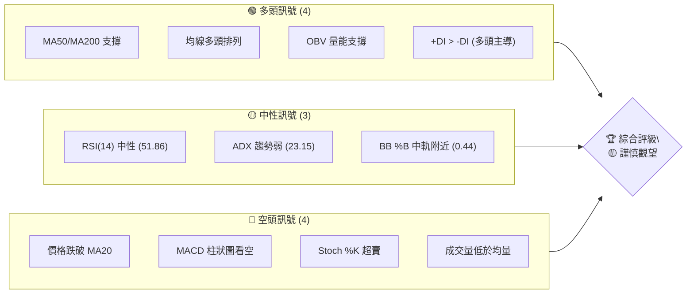
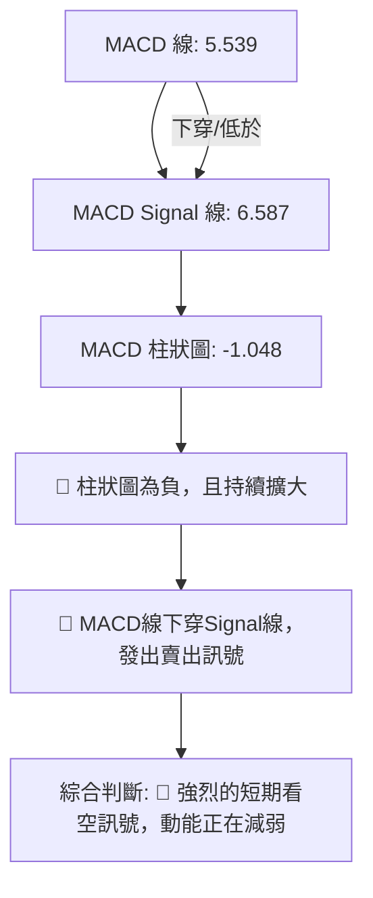
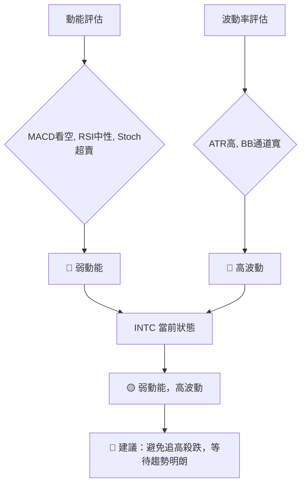
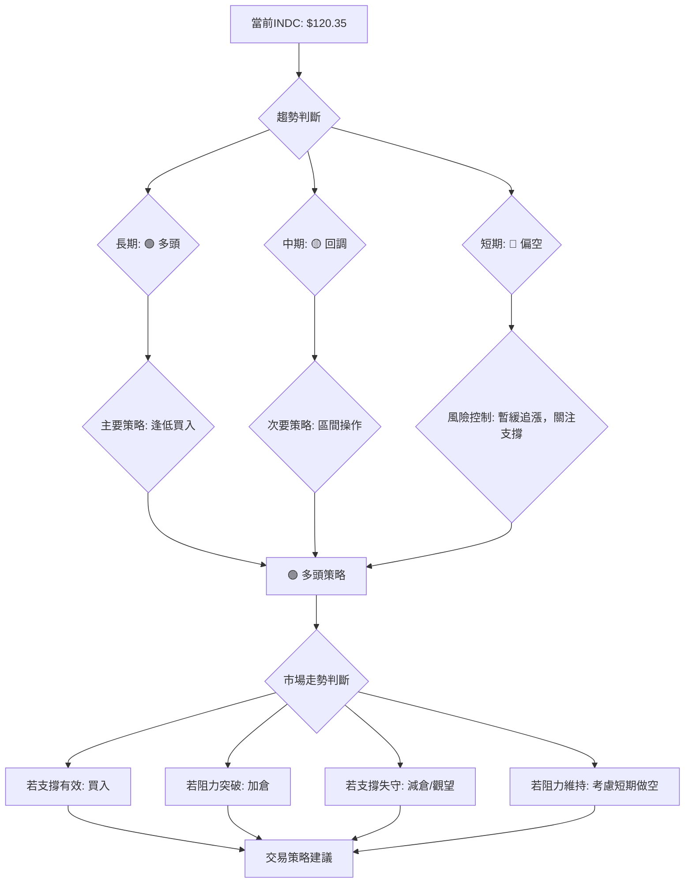

<details>
<summary>📊 靜態圖表 (點擊展開)</summary>

</details>

<html>
<head><meta charset="utf-8" /></head>
<body>
    <div style="height:500px; width:100%;">                        <script>window.PlotlyConfig = {MathJaxConfig: 'local'};</script>
        <script charset="utf-8" src="https://cdn.plot.ly/plotly-3.6.0.min.js" integrity="sha256-QaOVwtVY0T02VaHrr6pnoHLCwayMJp4O5n4YyaE3rJk=" crossorigin="anonymous"></script>                <div id="candlestick-chart" class="plotly-graph-div" style="height:100%; width:100%;"></div>            <script>                window.PLOTLYENV=window.PLOTLYENV || {};                                if (document.getElementById("candlestick-chart")) {                    Plotly.newPlot(                        "candlestick-chart",                        [{"close":{"dtype":"f8","bdata":"AAAAwB5FOUAAAABgZuY4QAAAAIDrkT5AAAAA4HqUPUAAAABgj8I8QAAAAEAKVz1AAAAA4FE4P0AAAABguP5AQAAAAAAAwEFAAAAAoHA9QUAAAABgZsZAQAAAAOBR+EFAAAAAYGamQkAAAACAPWpCQAAAACCFS0JAAAAAgMKVQkAAAABACrdCQAAAAGBm5kJAAAAAIFwvQkAAAAAAKZxCQAAAAOCj0EFAAAAAQDOTQkAAAAAghWtCQAAAAKBHgUJAAAAAwMwMQ0AAAAAgXA9DQAAAAIDCdUJAAAAA4HoUQ0AAAAAA1yNDQAAAAMAexUNAAAAAANfDREAAAAAghatEQAAAAOB6FERAAAAAYLj+Q0AAAAAAAMBDQAAAAADXg0JAAAAA4KMwQ0AAAABguJ5CQAAAAOCjEENAAAAAoJk5Q0AAAADgo\u002fBCQAAAAIDr8UJAAAAA4Hr0QUAAAABgj8JBQAAAAEDhWkFAAAAAgD0qQUAAAACAFI5BQAAAACBcz0BAAAAAAABAQUAAAADAHuVBQAAAAIA96kFAAAAAIK5nQkAAAAAgrkdEQAAAAKBHAURAAAAAACm8RUAAAACgR+FFQAAAAAAAQERAAAAA4Hq0REAAAABgZiZEQAAAAAAAQERAAAAAANdjREAAAACgR8FDQAAAACCu50JAAAAAoEfBQkAAAAAgrqdCQAAAAGBmBkJAAAAAANcjQkAAAADA9WhCQAAAACBcL0JAAAAAwMwsQkAAAADgehRCQAAAAKCZGUJAAAAAQApXQkAAAABgZqZCQAAAAEAzc0JAAAAA4KOwQ0AAAAAgXK9DQAAAAMAeBURAAAAA4KNQRUAAAACAFI5EQAAAAGBmxkZAAAAAIK4HRkAAAADAHqVHQAAAAAApXEhAAAAAwPUoSEAAAABA4XpHQAAAACCuR0hAAAAAAAAgS0AAAADA9ShLQAAAAMD1iEZAAAAAYLg+RUAAAABACvdFQAAAAADXY0hAAAAA4HpUSEAAAAAAKTxHQAAAACCuZ0hAAAAAAACgSEAAAADAzExIQAAAAGC4HkhAAAAAIIVLSUAAAABguB5JQAAAAOCjkEdAAAAAwB4lSEAAAACgcD1HQAAAAMAeZUdAAAAAQAoXR0AAAABA4bpGQAAAACBcT0ZAAAAAgBQORkAAAADgo9BFQAAAACBcD0dAAAAA4KNwR0AAAABA4bpGQAAAAIAUzkZAAAAAAADARkAAAADAzIxFQAAAAIA9ykZAAAAAoJn5RkAAAACAwrVFQAAAAIA9ykZAAAAAANdjR0AAAACgcP1HQAAAAAAAoEZAAAAAYI\u002fiRkAAAACgR+FGQAAAACCuB0ZAAAAAANeDRkAAAABAChdHQAAAACBc70VAAAAAoEcBRkAAAAAgrgdGQAAAAEAKl0dAAAAAwMwMRkAAAADgo5BFQAAAAOBRmERAAAAA4KMQRkAAAAAA1wNIQAAAAOCjMElAAAAAANdjSUAAAADgenRKQAAAAKCZeU1AAAAAACncTkAAAADgozBPQAAAACCFS1BAAAAAIK7nT0AAAAAAKTxQQAAAAAAAIFFAAAAAAAAgUUAAAADAzGxQQAAAAOCjkFBAAAAAoEdRUEAAAACA67FQQAAAAGCPolRAAAAAIFw\u002fVUAAAACgRyFVQAAAAAAAsFdAAAAAYLieV0AAAAAgrudYQAAAAIDr8VdAAAAAoJkJW0AAAADgo0BcQAAAACCuZ1tAAAAAQOE6X0AAAACAFC5gQAAAAEAKJ15AAAAAYI8SXkAAAAAghftcQAAAAKBHMVtAAAAAQOEKW0AAAABAM7NbQAAAAKBwvV1AAAAAAACgXUAAAACAwvVdQAAAAKBH4V5AAAAAoEdxXkAAAADA9TheQAAAACCFq1xAAAAAwB5VW0AAAAAghftaQAAAAKBwLVxAAAAAgOvxW0AAAABA4cpYQAAAAKBHkVtAAAAAQOH6WkAAAABgj8JaQAAAAKBwPV1AAAAA4HokX0AAAABACvdfQAAAAEAzQ11AAAAAYGZGXkAAAAAgrr9gQAAAAIAUnmFAAAAAwPWIYEAAAADAzHRgQAAAAADXm2BAAAAAgD0KYEAAAABACndgQAAAAAApdGFAAAAAoEfBX0AAAABgZhZeQA=="},"high":{"dtype":"f8","bdata":"AAAAQApXOUAAAABgj0I5QAAAAOCjMEBAAAAAoEehPkAAAACgmRk+QAAAAEAzMz5AAAAAQDOzP0AAAAAAACBBQAAAAGBmJkJAAAAAYGaGQUAAAABguB5BQAAAACCuB0JAAAAAwPXIQkAAAACAPQpDQAAAAEAKV0NAAAAAYGYGQ0AAAADAHuVCQAAAAMDMDENAAAAAQDPTQ0AAAACgR8FCQAAAAGBmRkJAAAAAYLi+QkAAAABgjwJDQAAAAOCjMENAAAAAYI9CQ0AAAADAzCxDQAAAAEAK90JAAAAAQDMzQ0AAAAAgXI9EQAAAAIDCVURAAAAAoHA9RUAAAADAHgVFQAAAAEAKt0RAAAAAgD1qREAAAACgmTlEQAAAAAAAIENAAAAA4FFYQ0AAAAAghetDQAAAAGCPIkNAAAAAANfDQ0AAAAAAKRxDQAAAAKCZGUNAAAAAIK6nQkAAAADAzAxCQAAAAKBw3UFAAAAAoEdhQUAAAAAAAOBBQAAAAEAKV0JAAAAAoHB9QUAAAADgehRCQAAAAOCjEEJAAAAAYLieQkAAAAAghUtEQAAAAOCjMERAAAAAQArXRUAAAABgjwJGQAAAAADXo0VAAAAAgD1qRUAAAAAgXA9FQAAAAKBHoURAAAAAYLh+REAAAADgURhEQAAAAADXA0RAAAAAoHA9Q0AAAABA4fpCQAAAACCF60JAAAAAYLi+QkAAAACAPcpCQAAAAEAz80JAAAAAYGZmQkAAAABAChdCQAAAAGC4PkJAAAAAYGZmQkAAAACgRyFDQAAAAIA9ykJAAAAAgBTuQ0AAAADAzAxFQAAAACCuJ0RAAAAAwPVIRkAAAAAghatFQAAAAKBw3UZAAAAAoJm5RkAAAABguB5IQAAAAAAAgEhAAAAAgOsxSUAAAABA4RpJQAAAAKBwHUlAAAAA4Ho0S0AAAADAzExLQAAAAOCjEEhAAAAAQOE6RkAAAAAA10NGQAAAAMAepUhAAAAAYI9iSEAAAACAPcpIQAAAACCF60hAAAAAYLi+SUAAAACgmdlIQAAAAIAUbklAAAAAYGamSUAAAAAAKZxJQAAAAMAeRUlAAAAAYGbGSEAAAACgmXlIQAAAAOBR2EdAAAAAgD1qR0AAAABgj2JHQAAAAIDClUZAAAAAgOsxRkAAAABgZkZGQAAAAMDMTEdAAAAAACl8R0AAAACgmXlHQAAAACCuR0dAAAAAIK7nRkAAAADgUdhFQAAAAOCjEEdAAAAAoHA9R0AAAABACpdGQAAAAKBH4UZAAAAA4KPwR0AAAACAPWpIQAAAAOBRuEdAAAAAQDNTR0AAAACAwpVIQAAAAIA9CkdAAAAAQOHaRkAAAADgUThHQAAAAGBmxkdAAAAAQOG6RkAAAAAgridGQAAAAMDM7EdAAAAAwMxMR0AAAADgoxBGQAAAAGC4\u002fkVAAAAAoHAdRkAAAABgj2JIQAAAAGC4PklAAAAAgOsxSkAAAABgj6JKQAAAAIDClU1AAAAAgD0KT0AAAACA67FPQAAAAKCZaVBAAAAAIIVLUEAAAACAwnVQQAAAAEAKJ1FAAAAAwB6VUUAAAACgcE1RQAAAAEDh6lBAAAAAoEcxUUAAAACA6xFRQAAAAIAUTlVAAAAAYGbGVUAAAACAwiVVQAAAAMDMvFdAAAAAACnsV0AAAADAzBxZQAAAAOB69FhAAAAAYLieW0AAAAAAAGBcQAAAAOCjoFxAAAAAgD1SYEAAAAAAAJhgQAAAAGCP8l9AAAAAAABAX0AAAADgeqRdQAAAAOB6pFtAAAAAYI\u002fiXEAAAADgekRcQAAAAAApfF5AAAAAgD3aXUAAAACA67FeQAAAACCuZ19AAAAAoEdRX0AAAADAHsVeQAAAAMD1qF9AAAAAQDNTXEAAAAAAAEBbQAAAAGCPkl1AAAAAwPVIXEAAAABguJ5aQAAAAGCPIlxAAAAAAACAXEAAAAAAAOBbQAAAAAAp3F1AAAAAYGbmX0AAAAAghZNgQAAAAGBmFmBAAAAAwMxMX0AAAAAgXO9gQAAAAGBmrmFAAAAAIFw\u002fYUAAAABgjwJhQAAAAEAKl2FAAAAAIFxnYEAAAACgmYFgQAAAAEAzy2FAAAAAIK73YEAAAAAgrldgQA=="},"hovertemplate":"\u003cb\u003e%{x|%Y-%m-%d}\u003c\u002fb\u003e\u003cbr\u003e\u958b: $%{open:.2f}\u003cbr\u003e\u9ad8: $%{high:.2f}\u003cbr\u003e\u4f4e: $%{low:.2f}\u003cbr\u003e\u6536: $%{close:.2f}\u003cextra\u003e\u003c\u002fextra\u003e","low":{"dtype":"f8","bdata":"AAAA4KOwOEAAAABAM3M4QAAAAMD1KD5AAAAA4HpUPUAAAABA4bo8QAAAAIDr0TxAAAAAQOE6PUAAAACAwjU\u002fQAAAAGC4PkFAAAAAoHDdQEAAAABgj4JAQAAAAAAAwEBAAAAA4FG4QUAAAACgmTlCQAAAAEAKN0JAAAAAwMwsQkAAAADgevRBQAAAAIAUbkJAAAAAYGYmQkAAAAAA1yNCQAAAAOBRWEFAAAAAgOvRQUAAAADgejRCQAAAAIA9CkJAAAAAIK7HQkAAAACAwtVCQAAAAMAeBUJAAAAAQAo3QkAAAACAPepCQAAAAKBwHUNAAAAAwB7FQ0AAAACAwnVEQAAAAIAUDkRAAAAAwB7lQ0AAAABgZoZDQAAAAOCjUEJAAAAAgBSOQkAAAABgZmZCQAAAAAApfEJAAAAAACn8QkAAAABguL5CQAAAAMDMrEJAAAAAoJm5QUAAAAAgXE9BQAAAAKBwHUFAAAAAwPXIQEAAAAAAACBBQAAAAKBwvUBAAAAAgOtxQEAAAADgUVhBQAAAAEAKV0FAAAAA4KMQQkAAAAAghatCQAAAAMDMzENAAAAAYGYGREAAAACgR0FFQAAAAIDrEURAAAAAQDOTREAAAACgmdlDQAAAAADXA0RAAAAAgOtxQ0AAAACAPYpDQAAAACBcz0JAAAAAwPWoQkAAAACAwnVCQAAAAAAp\u002fEFAAAAAgMLVQUAAAADgUThCQAAAAMAeJUJAAAAAANcDQkAAAACgmXlBQAAAAMDM7EFAAAAAwPXoQUAAAADA9WhCQAAAACBcb0JAAAAAoEfhQkAAAABgj6JDQAAAAKCZeUNAAAAAIFwPREAAAABACldEQAAAAMD1yERAAAAAgOvxRUAAAAAAKZxGQAAAAIDCtUdAAAAAgD3qR0AAAABA4VpHQAAAAAAAgEdAAAAAQDMTSUAAAACAPYpKQAAAAKCZOUZAAAAAANcjRUAAAADAzIxFQAAAAMD1KEdAAAAAYLh+R0AAAABA4fpGQAAAAAAAwEZAAAAAQAo3SEAAAAAAAIBHQAAAAMAeZUdAAAAAgD1qSEAAAAAghctHQAAAAGCPYkdAAAAAgBRuR0AAAADgURhHQAAAAAApfEZAAAAAQOG6RkAAAADgo3BGQAAAAIDC9UVAAAAA4KNwRUAAAABACpdFQAAAAMAexUVAAAAAgD2KRkAAAACA6zFGQAAAAEAzM0ZAAAAAoJn5RUAAAACA6xFFQAAAAGCPokVAAAAAoJlZRkAAAAAA16NFQAAAAIDr0URAAAAA4Hq0RkAAAADgelRHQAAAAIDClUZAAAAAgOuxRkAAAADgUdhGQAAAAOB69EVAAAAAYGYGRkAAAABAM9NFQAAAAIDr0UVAAAAAYLjeRUAAAACgmZlFQAAAAKCZuUZAAAAAgML1RUAAAACAFG5FQAAAAOCjUERAAAAAwMzMREAAAACgcH1GQAAAAMAeBUdAAAAAIFzvSEAAAAAAKZxJQAAAAGBmZktAAAAAgOsxTUAAAAAAAGBOQAAAAEAKF09AAAAAIIULT0AAAADgo3BPQAAAAKBHEVBAAAAAIFzvUEAAAACAFB5QQAAAAMD1aFBAAAAAYLg+UEAAAABA4VpQQAAAACCu51NAAAAAQAqnVEAAAABAMzNUQAAAACCud1VAAAAAAADgVkAAAABACidXQAAAAGBm5ldAAAAAwB4FWUAAAADAHqVaQAAAAKCZSVtAAAAAQDPzW0AAAABA4fpeQAAAAAAAwFxAAAAAgD0aXUAAAABA4UpcQAAAAKBHQVpAAAAAYGb2WUAAAACgmZlZQAAAAEAzs1xAAAAAQOFKXEAAAACAwoVdQAAAAGBmVl1AAAAAAABAXUAAAAAA1xNdQAAAAGCPYlxAAAAAwB6VWkAAAABA4QpaQAAAAEAKt1tAAAAAYLjeWkAAAADAHpVYQAAAAIA9qlpAAAAAoHDdWEAAAABA4TpaQAAAAOCjoFtAAAAAwB7VXEAAAACAPapfQAAAAAAAAF1AAAAAANeDXUAAAACgmflfQAAAAGC4BmFAAAAAoJkJYEAAAADAzPxfQAAAAIA9Wl9AAAAAAABgX0AAAAAAAKBdQAAAAOCjcGBAAAAAIIWrX0AAAADgUWhdQA=="},"name":"\u50f9\u683c","open":{"dtype":"f8","bdata":"AAAAgOvROEAAAADgehQ5QAAAACCuxz9AAAAAoEdhPkAAAAAghas9QAAAAKBw\u002fTxAAAAAoEdhPUAAAAAAKZw\u002fQAAAAGCPgkFAAAAAYI9CQUAAAABACvdAQAAAAADXw0BAAAAAoEfhQUAAAACgmflCQAAAAOBRmEJAAAAAgOtRQkAAAABgZkZCQAAAAADXw0JAAAAAQOE6Q0AAAADgUThCQAAAAAAAAEJAAAAAQDMzQkAAAABAM5NCQAAAAIAULkJAAAAAwPXIQkAAAACA6xFDQAAAACCF60JAAAAAwMxMQkAAAABgjwJEQAAAAIDrMUNAAAAAIIXLQ0AAAADAzMxEQAAAAAApfERAAAAAQApXREAAAAAAACBEQAAAAIDrEUNAAAAAgMK1QkAAAAAghStDQAAAAKBHoUJAAAAAQAp3Q0AAAABAMxNDQAAAACCuB0NAAAAAYI+iQkAAAAAA14NBQAAAAKCZuUFAAAAAAAAgQUAAAACAPSpBQAAAAAAAAEJAAAAAoEfBQEAAAAAAKXxBQAAAAGBmxkFAAAAAoJkZQkAAAABAM7NCQAAAAIAU7kNAAAAAACk8REAAAACA67FFQAAAAKBHoUVAAAAA4HqUREAAAADgUfhEQAAAAKBwXURAAAAAgBQOREAAAADA9QhEQAAAAAAAoENAAAAAgD0qQ0AAAACAPcpCQAAAACCFy0JAAAAA4KOwQkAAAACgcD1CQAAAAIDr8UJAAAAAYLgeQkAAAACAwpVBQAAAAIDCFUJAAAAAoEcBQkAAAADgenRCQAAAAEAzs0JAAAAAYI\u002fiQkAAAAAghctEQAAAAIAU7kNAAAAAQAoXREAAAAAgXE9FQAAAAIA96kRAAAAAYLgeRkAAAACA6\u002fFGQAAAAKCZeUhAAAAAwMysSEAAAABgj6JIQAAAAGBmpkdAAAAAwPUoSUAAAABA4RpLQAAAAIAUbkdAAAAAANcjRkAAAAAAKfxFQAAAAMDMTEdAAAAAIK7HR0AAAACgcH1IQAAAAOCj0EZAAAAAIK4HSUAAAADAHsVIQAAAACCFy0dAAAAAwMyMSEAAAAAghctIQAAAAOB6NElAAAAAgBQOSEAAAABgZuZHQAAAAKBH4UZAAAAAQAr3RkAAAACAwvVGQAAAAKCZeUZAAAAAgOvxRUAAAAAghQtGQAAAAMDMDEZAAAAAIIULR0AAAABgj2JHQAAAAEDhOkZAAAAAoJkZRkAAAADgUbhFQAAAAMD1CEZAAAAAIFxvRkAAAACAwlVGQAAAAGC4XkVAAAAA4Hq0RkAAAADA9WhHQAAAAEAzs0dAAAAAACn8RkAAAADgevRHQAAAAIA9CkdAAAAAoJkZRkAAAABguP5FQAAAAKCZeUdAAAAAAABARkAAAADAHsVFQAAAAMDM7EZAAAAAYGYmR0AAAAAgXM9FQAAAAAAp3EVAAAAAoJn5REAAAAAAAIBGQAAAACCuB0dAAAAA4KNwSUAAAADgevRJQAAAACBcr0tAAAAAQDMzTUAAAABgj8JOQAAAAEAKF09AAAAAgD1KUEAAAABgj+JPQAAAACCFO1BAAAAAYGY2UUAAAADAzBxRQAAAAMD1yFBAAAAAACn8UEAAAABgZoZQQAAAAMDMjFRAAAAAQOHqVEAAAACA61FUQAAAAMD1iFVAAAAAYGbmV0AAAADAzExXQAAAACCFy1hAAAAA4KMgWUAAAABguL5bQAAAAKBHwVtAAAAAANfzW0AAAAAAKVxgQAAAAEAKF19AAAAAYGYGX0AAAACAPapcQAAAAGCPcltAAAAAgBReXEAAAABguL5aQAAAAIAUDl1AAAAAwB4lXUAAAACAwhVeQAAAAGBmhl5AAAAAwPUYX0AAAADAzFxeQAAAAGBm9l5AAAAAIIVbW0AAAADAzNxaQAAAAEDhGl1AAAAAoJkZW0AAAABguJ5aQAAAAAAAwFtAAAAAIFw\u002fXEAAAACA64FaQAAAAKBHYVxAAAAAQOFaXUAAAAAgri9gQAAAAEAKR19AAAAAYGZ2XkAAAACA63lgQAAAAADXY2FAAAAAIFw3YEAAAACgmaFgQAAAACBcd2FAAAAAYLgWYEAAAAAAAMBfQAAAACCuf2BAAAAAAADgYEAAAACgcB1gQA=="},"x":["2025-09-16T00:00:00-04:00","2025-09-17T00:00:00-04:00","2025-09-18T00:00:00-04:00","2025-09-19T00:00:00-04:00","2025-09-22T00:00:00-04:00","2025-09-23T00:00:00-04:00","2025-09-24T00:00:00-04:00","2025-09-25T00:00:00-04:00","2025-09-26T00:00:00-04:00","2025-09-29T00:00:00-04:00","2025-09-30T00:00:00-04:00","2025-10-01T00:00:00-04:00","2025-10-02T00:00:00-04:00","2025-10-03T00:00:00-04:00","2025-10-06T00:00:00-04:00","2025-10-07T00:00:00-04:00","2025-10-08T00:00:00-04:00","2025-10-09T00:00:00-04:00","2025-10-10T00:00:00-04:00","2025-10-13T00:00:00-04:00","2025-10-14T00:00:00-04:00","2025-10-15T00:00:00-04:00","2025-10-16T00:00:00-04:00","2025-10-17T00:00:00-04:00","2025-10-20T00:00:00-04:00","2025-10-21T00:00:00-04:00","2025-10-22T00:00:00-04:00","2025-10-23T00:00:00-04:00","2025-10-24T00:00:00-04:00","2025-10-27T00:00:00-04:00","2025-10-28T00:00:00-04:00","2025-10-29T00:00:00-04:00","2025-10-30T00:00:00-04:00","2025-10-31T00:00:00-04:00","2025-11-03T00:00:00-05:00","2025-11-04T00:00:00-05:00","2025-11-05T00:00:00-05:00","2025-11-06T00:00:00-05:00","2025-11-07T00:00:00-05:00","2025-11-10T00:00:00-05:00","2025-11-11T00:00:00-05:00","2025-11-12T00:00:00-05:00","2025-11-13T00:00:00-05:00","2025-11-14T00:00:00-05:00","2025-11-17T00:00:00-05:00","2025-11-18T00:00:00-05:00","2025-11-19T00:00:00-05:00","2025-11-20T00:00:00-05:00","2025-11-21T00:00:00-05:00","2025-11-24T00:00:00-05:00","2025-11-25T00:00:00-05:00","2025-11-26T00:00:00-05:00","2025-11-28T00:00:00-05:00","2025-12-01T00:00:00-05:00","2025-12-02T00:00:00-05:00","2025-12-03T00:00:00-05:00","2025-12-04T00:00:00-05:00","2025-12-05T00:00:00-05:00","2025-12-08T00:00:00-05:00","2025-12-09T00:00:00-05:00","2025-12-10T00:00:00-05:00","2025-12-11T00:00:00-05:00","2025-12-12T00:00:00-05:00","2025-12-15T00:00:00-05:00","2025-12-16T00:00:00-05:00","2025-12-17T00:00:00-05:00","2025-12-18T00:00:00-05:00","2025-12-19T00:00:00-05:00","2025-12-22T00:00:00-05:00","2025-12-23T00:00:00-05:00","2025-12-24T00:00:00-05:00","2025-12-26T00:00:00-05:00","2025-12-29T00:00:00-05:00","2025-12-30T00:00:00-05:00","2025-12-31T00:00:00-05:00","2026-01-02T00:00:00-05:00","2026-01-05T00:00:00-05:00","2026-01-06T00:00:00-05:00","2026-01-07T00:00:00-05:00","2026-01-08T00:00:00-05:00","2026-01-09T00:00:00-05:00","2026-01-12T00:00:00-05:00","2026-01-13T00:00:00-05:00","2026-01-14T00:00:00-05:00","2026-01-15T00:00:00-05:00","2026-01-16T00:00:00-05:00","2026-01-20T00:00:00-05:00","2026-01-21T00:00:00-05:00","2026-01-22T00:00:00-05:00","2026-01-23T00:00:00-05:00","2026-01-26T00:00:00-05:00","2026-01-27T00:00:00-05:00","2026-01-28T00:00:00-05:00","2026-01-29T00:00:00-05:00","2026-01-30T00:00:00-05:00","2026-02-02T00:00:00-05:00","2026-02-03T00:00:00-05:00","2026-02-04T00:00:00-05:00","2026-02-05T00:00:00-05:00","2026-02-06T00:00:00-05:00","2026-02-09T00:00:00-05:00","2026-02-10T00:00:00-05:00","2026-02-11T00:00:00-05:00","2026-02-12T00:00:00-05:00","2026-02-13T00:00:00-05:00","2026-02-17T00:00:00-05:00","2026-02-18T00:00:00-05:00","2026-02-19T00:00:00-05:00","2026-02-20T00:00:00-05:00","2026-02-23T00:00:00-05:00","2026-02-24T00:00:00-05:00","2026-02-25T00:00:00-05:00","2026-02-26T00:00:00-05:00","2026-02-27T00:00:00-05:00","2026-03-02T00:00:00-05:00","2026-03-03T00:00:00-05:00","2026-03-04T00:00:00-05:00","2026-03-05T00:00:00-05:00","2026-03-06T00:00:00-05:00","2026-03-09T00:00:00-04:00","2026-03-10T00:00:00-04:00","2026-03-11T00:00:00-04:00","2026-03-12T00:00:00-04:00","2026-03-13T00:00:00-04:00","2026-03-16T00:00:00-04:00","2026-03-17T00:00:00-04:00","2026-03-18T00:00:00-04:00","2026-03-19T00:00:00-04:00","2026-03-20T00:00:00-04:00","2026-03-23T00:00:00-04:00","2026-03-24T00:00:00-04:00","2026-03-25T00:00:00-04:00","2026-03-26T00:00:00-04:00","2026-03-27T00:00:00-04:00","2026-03-30T00:00:00-04:00","2026-03-31T00:00:00-04:00","2026-04-01T00:00:00-04:00","2026-04-02T00:00:00-04:00","2026-04-06T00:00:00-04:00","2026-04-07T00:00:00-04:00","2026-04-08T00:00:00-04:00","2026-04-09T00:00:00-04:00","2026-04-10T00:00:00-04:00","2026-04-13T00:00:00-04:00","2026-04-14T00:00:00-04:00","2026-04-15T00:00:00-04:00","2026-04-16T00:00:00-04:00","2026-04-17T00:00:00-04:00","2026-04-20T00:00:00-04:00","2026-04-21T00:00:00-04:00","2026-04-22T00:00:00-04:00","2026-04-23T00:00:00-04:00","2026-04-24T00:00:00-04:00","2026-04-27T00:00:00-04:00","2026-04-28T00:00:00-04:00","2026-04-29T00:00:00-04:00","2026-04-30T00:00:00-04:00","2026-05-01T00:00:00-04:00","2026-05-04T00:00:00-04:00","2026-05-05T00:00:00-04:00","2026-05-06T00:00:00-04:00","2026-05-07T00:00:00-04:00","2026-05-08T00:00:00-04:00","2026-05-11T00:00:00-04:00","2026-05-12T00:00:00-04:00","2026-05-13T00:00:00-04:00","2026-05-14T00:00:00-04:00","2026-05-15T00:00:00-04:00","2026-05-18T00:00:00-04:00","2026-05-19T00:00:00-04:00","2026-05-20T00:00:00-04:00","2026-05-21T00:00:00-04:00","2026-05-22T00:00:00-04:00","2026-05-26T00:00:00-04:00","2026-05-27T00:00:00-04:00","2026-05-28T00:00:00-04:00","2026-05-29T00:00:00-04:00","2026-06-01T00:00:00-04:00","2026-06-02T00:00:00-04:00","2026-06-03T00:00:00-04:00","2026-06-04T00:00:00-04:00","2026-06-05T00:00:00-04:00","2026-06-08T00:00:00-04:00","2026-06-09T00:00:00-04:00","2026-06-10T00:00:00-04:00","2026-06-11T00:00:00-04:00","2026-06-12T00:00:00-04:00","2026-06-15T00:00:00-04:00","2026-06-16T00:00:00-04:00","2026-06-17T00:00:00-04:00","2026-06-18T00:00:00-04:00","2026-06-22T00:00:00-04:00","2026-06-23T00:00:00-04:00","2026-06-24T00:00:00-04:00","2026-06-25T00:00:00-04:00","2026-06-26T00:00:00-04:00","2026-06-29T00:00:00-04:00","2026-06-30T00:00:00-04:00","2026-07-01T00:00:00-04:00","2026-07-02T00:00:00-04:00"],"type":"candlestick"},{"hovertemplate":"MA30: $%{y:.2f}\u003cextra\u003e\u003c\u002fextra\u003e","line":{"color":"#2196F3","dash":"dash","width":2},"mode":"lines","name":"MA30","x":["2025-09-16T00:00:00-04:00","2025-09-17T00:00:00-04:00","2025-09-18T00:00:00-04:00","2025-09-19T00:00:00-04:00","2025-09-22T00:00:00-04:00","2025-09-23T00:00:00-04:00","2025-09-24T00:00:00-04:00","2025-09-25T00:00:00-04:00","2025-09-26T00:00:00-04:00","2025-09-29T00:00:00-04:00","2025-09-30T00:00:00-04:00","2025-10-01T00:00:00-04:00","2025-10-02T00:00:00-04:00","2025-10-03T00:00:00-04:00","2025-10-06T00:00:00-04:00","2025-10-07T00:00:00-04:00","2025-10-08T00:00:00-04:00","2025-10-09T00:00:00-04:00","2025-10-10T00:00:00-04:00","2025-10-13T00:00:00-04:00","2025-10-14T00:00:00-04:00","2025-10-15T00:00:00-04:00","2025-10-16T00:00:00-04:00","2025-10-17T00:00:00-04:00","2025-10-20T00:00:00-04:00","2025-10-21T00:00:00-04:00","2025-10-22T00:00:00-04:00","2025-10-23T00:00:00-04:00","2025-10-24T00:00:00-04:00","2025-10-27T00:00:00-04:00","2025-10-28T00:00:00-04:00","2025-10-29T00:00:00-04:00","2025-10-30T00:00:00-04:00","2025-10-31T00:00:00-04:00","2025-11-03T00:00:00-05:00","2025-11-04T00:00:00-05:00","2025-11-05T00:00:00-05:00","2025-11-06T00:00:00-05:00","2025-11-07T00:00:00-05:00","2025-11-10T00:00:00-05:00","2025-11-11T00:00:00-05:00","2025-11-12T00:00:00-05:00","2025-11-13T00:00:00-05:00","2025-11-14T00:00:00-05:00","2025-11-17T00:00:00-05:00","2025-11-18T00:00:00-05:00","2025-11-19T00:00:00-05:00","2025-11-20T00:00:00-05:00","2025-11-21T00:00:00-05:00","2025-11-24T00:00:00-05:00","2025-11-25T00:00:00-05:00","2025-11-26T00:00:00-05:00","2025-11-28T00:00:00-05:00","2025-12-01T00:00:00-05:00","2025-12-02T00:00:00-05:00","2025-12-03T00:00:00-05:00","2025-12-04T00:00:00-05:00","2025-12-05T00:00:00-05:00","2025-12-08T00:00:00-05:00","2025-12-09T00:00:00-05:00","2025-12-10T00:00:00-05:00","2025-12-11T00:00:00-05:00","2025-12-12T00:00:00-05:00","2025-12-15T00:00:00-05:00","2025-12-16T00:00:00-05:00","2025-12-17T00:00:00-05:00","2025-12-18T00:00:00-05:00","2025-12-19T00:00:00-05:00","2025-12-22T00:00:00-05:00","2025-12-23T00:00:00-05:00","2025-12-24T00:00:00-05:00","2025-12-26T00:00:00-05:00","2025-12-29T00:00:00-05:00","2025-12-30T00:00:00-05:00","2025-12-31T00:00:00-05:00","2026-01-02T00:00:00-05:00","2026-01-05T00:00:00-05:00","2026-01-06T00:00:00-05:00","2026-01-07T00:00:00-05:00","2026-01-08T00:00:00-05:00","2026-01-09T00:00:00-05:00","2026-01-12T00:00:00-05:00","2026-01-13T00:00:00-05:00","2026-01-14T00:00:00-05:00","2026-01-15T00:00:00-05:00","2026-01-16T00:00:00-05:00","2026-01-20T00:00:00-05:00","2026-01-21T00:00:00-05:00","2026-01-22T00:00:00-05:00","2026-01-23T00:00:00-05:00","2026-01-26T00:00:00-05:00","2026-01-27T00:00:00-05:00","2026-01-28T00:00:00-05:00","2026-01-29T00:00:00-05:00","2026-01-30T00:00:00-05:00","2026-02-02T00:00:00-05:00","2026-02-03T00:00:00-05:00","2026-02-04T00:00:00-05:00","2026-02-05T00:00:00-05:00","2026-02-06T00:00:00-05:00","2026-02-09T00:00:00-05:00","2026-02-10T00:00:00-05:00","2026-02-11T00:00:00-05:00","2026-02-12T00:00:00-05:00","2026-02-13T00:00:00-05:00","2026-02-17T00:00:00-05:00","2026-02-18T00:00:00-05:00","2026-02-19T00:00:00-05:00","2026-02-20T00:00:00-05:00","2026-02-23T00:00:00-05:00","2026-02-24T00:00:00-05:00","2026-02-25T00:00:00-05:00","2026-02-26T00:00:00-05:00","2026-02-27T00:00:00-05:00","2026-03-02T00:00:00-05:00","2026-03-03T00:00:00-05:00","2026-03-04T00:00:00-05:00","2026-03-05T00:00:00-05:00","2026-03-06T00:00:00-05:00","2026-03-09T00:00:00-04:00","2026-03-10T00:00:00-04:00","2026-03-11T00:00:00-04:00","2026-03-12T00:00:00-04:00","2026-03-13T00:00:00-04:00","2026-03-16T00:00:00-04:00","2026-03-17T00:00:00-04:00","2026-03-18T00:00:00-04:00","2026-03-19T00:00:00-04:00","2026-03-20T00:00:00-04:00","2026-03-23T00:00:00-04:00","2026-03-24T00:00:00-04:00","2026-03-25T00:00:00-04:00","2026-03-26T00:00:00-04:00","2026-03-27T00:00:00-04:00","2026-03-30T00:00:00-04:00","2026-03-31T00:00:00-04:00","2026-04-01T00:00:00-04:00","2026-04-02T00:00:00-04:00","2026-04-06T00:00:00-04:00","2026-04-07T00:00:00-04:00","2026-04-08T00:00:00-04:00","2026-04-09T00:00:00-04:00","2026-04-10T00:00:00-04:00","2026-04-13T00:00:00-04:00","2026-04-14T00:00:00-04:00","2026-04-15T00:00:00-04:00","2026-04-16T00:00:00-04:00","2026-04-17T00:00:00-04:00","2026-04-20T00:00:00-04:00","2026-04-21T00:00:00-04:00","2026-04-22T00:00:00-04:00","2026-04-23T00:00:00-04:00","2026-04-24T00:00:00-04:00","2026-04-27T00:00:00-04:00","2026-04-28T00:00:00-04:00","2026-04-29T00:00:00-04:00","2026-04-30T00:00:00-04:00","2026-05-01T00:00:00-04:00","2026-05-04T00:00:00-04:00","2026-05-05T00:00:00-04:00","2026-05-06T00:00:00-04:00","2026-05-07T00:00:00-04:00","2026-05-08T00:00:00-04:00","2026-05-11T00:00:00-04:00","2026-05-12T00:00:00-04:00","2026-05-13T00:00:00-04:00","2026-05-14T00:00:00-04:00","2026-05-15T00:00:00-04:00","2026-05-18T00:00:00-04:00","2026-05-19T00:00:00-04:00","2026-05-20T00:00:00-04:00","2026-05-21T00:00:00-04:00","2026-05-22T00:00:00-04:00","2026-05-26T00:00:00-04:00","2026-05-27T00:00:00-04:00","2026-05-28T00:00:00-04:00","2026-05-29T00:00:00-04:00","2026-06-01T00:00:00-04:00","2026-06-02T00:00:00-04:00","2026-06-03T00:00:00-04:00","2026-06-04T00:00:00-04:00","2026-06-05T00:00:00-04:00","2026-06-08T00:00:00-04:00","2026-06-09T00:00:00-04:00","2026-06-10T00:00:00-04:00","2026-06-11T00:00:00-04:00","2026-06-12T00:00:00-04:00","2026-06-15T00:00:00-04:00","2026-06-16T00:00:00-04:00","2026-06-17T00:00:00-04:00","2026-06-18T00:00:00-04:00","2026-06-22T00:00:00-04:00","2026-06-23T00:00:00-04:00","2026-06-24T00:00:00-04:00","2026-06-25T00:00:00-04:00","2026-06-26T00:00:00-04:00","2026-06-29T00:00:00-04:00","2026-06-30T00:00:00-04:00","2026-07-01T00:00:00-04:00","2026-07-02T00:00:00-04:00"],"y":{"dtype":"f8","bdata":"AAAAAAAA+H8AAAAAAAD4fwAAAAAAAPh\u002fAAAAAAAA+H8AAAAAAAD4fwAAAAAAAPh\u002fAAAAAAAA+H8AAAAAAAD4fwAAAAAAAPh\u002fAAAAAAAA+H8AAAAAAAD4fwAAAAAAAPh\u002fAAAAAAAA+H8AAAAAAAD4fwAAAAAAAPh\u002fAAAAAAAA+H8AAAAAAAD4fwAAAAAAAPh\u002fAAAAAAAA+H8AAAAAAAD4fwAAAAAAAPh\u002fAAAAAAAA+H8AAAAAAAD4fwAAAAAAAPh\u002fAAAAAAAA+H8AAAAAAAD4fwAAAAAAAPh\u002fAAAAAAAA+H8AAAAAAAD4f0RERFQObUFAVVVVlW6yQUCrqqpyk\u002fhBQBEREUl+IUJAiYiIyOhNQkAiIiK6u3tCQJqZmUGLnEJAMzMz4xe7QkARERHB9chCQKuqqmou1EJAd3d3tx7lQkC8u7s7mPdCQHd3dyfq\u002f0JAd3d35\u002fv5QkCJiIgIZfRCQCIiIpJf7EJAmpmZiUHgQkCrqqp6W9ZCQN7d3c2FxEJARERERIu8QkAzMzNTcbZCQHd3d8dLt0JAiYiIaNi1QkBERESkt8VCQBEREXGE0kJAq6qq6m3pQkDNzMxMfgFDQN7d3Z3EEENAvLu7e6IeQ0DNzMzcQCdDQAAAAHBZK0NAzczMPCYoQ0AzMzNjVyBDQAAAAJBQFkNAzczMvLsLQ0DNzMysYwJDQBEREUE1\u002fkJA3t3dfT\u002f1QkDNzMy8dPNCQImIiFjy60JAVVVVlfziQkAiIiLipdtCQERERPRv1EJAAAAAALnXQkC8u7s7Ud9CQM3MzEyp6EJA7+7uPjX+QkDNzMxMYhBDQHd3d6fGK0NAiYiIyHZOQ0BERESkKWVDQImIiHiijkNAd3d3Z5GtQ0C8u7tbSMpDQBEREQFy70NA7+7ufiMEREAAAADAyhFEQLy7u2suNERAAAAAIPdqREBERES0yKZEQM3MzFxIukRAREREJJTBREBmZmb2b9REQAAAACA+A0VAZmZm5tAyRUAAAAAQ5llFQDMzM2NXkEVAZmZmFq7HRUDNzMz88PlFQCIiIjKWLEZAMzMzE1hpRkARERExa6VGQKuqqqoN1EZAIiIi4pYFR0BERETkwSxHQImIiGj0VkdAIiIi0vdzR0CamZm5841HQN7d3U1+oUdAvLu7286nR0Dv7u5ej7JHQGZmZvb9tEdAd3d3JwbBR0De3d1NN7lHQKuqqlryq0dAmpmZKeqfR0AzMzMDco9HQO\u002fu7g67gkdA7+7uPlFfR0CamZmJzzBHQImIiJj8MkdAq6qqakpFR0CJiIgYklZHQFVVVWWCR0dA7+7uvi07R0C8u7s7JjhHQHd3d\u002ffhI0dAmpmZmeARR0ARERFRjQdHQLy7uxvo9EZA3t3d\u002fdTYRkCJiIjIdr5GQFVVVWWtvkZAvLu7y8ysRkBERES0gZ5GQCIiIgKdhkZAzczM3N19RkDNzMz81IhGQCIiInJooUZAzczM3N29RkCJiIgYduVGQBEREeEzHEdA3t3dHYVbR0BVVVVFtqNHQN7d3e0190dAVVVVVVVFSEARERFxhKJIQBERETFPBElA3t3dzYVkSUARERGBlcNJQERERJTRG0pAZmZmlrVqSkAzMzMz7LpKQDMzM9MGWktAVVVVhV0BTEBmZmbGvaZMQFVVVcUEf01AzczMXAFSTkCJiIgYBDZPQERERNS\u002fCVBAq6qq0pSSUEB3d3e3rCVRQImIiEjhqlFAd3d3x0tXUkBERESMbA9TQFVVVXXauFNAERER+VNbVEBVVVVtLuxUQGZmZia\u002faFVA3t3dvS3jVUDv7u5mrV5WQM3MzNyy3lZAAAAAUNRXV0CamZkhadJXQERERIzeTlhA7+7uboTKWEB3d3eX4EFZQHd3dwdlpFlAd3d3p3\u002f7WUDe3d3dllVaQCIiIsKuuFpAvLu7a+cbW0De3d2tAGFbQERERPQonFtAq6qqyhPNW0B3d3e3Hv1bQGZmZlaALFxAzczMfLFsXECrqqpK8KhcQM3MzIxQ1lxAmpmZ+fDxXECrqqrash5dQAAAAMCDYV1Aq6qqSjdxXUDe3d097nVdQFVVVdUVkF1AmpmZSTehXUC8u7u75sJdQJqZmWm8BF5AZmZmBvMsXkCJiIiYUkFeQA=="},"type":"scatter"},{"hovertemplate":"MA60: $%{y:.2f}\u003cextra\u003e\u003c\u002fextra\u003e","line":{"color":"#9C27B0","dash":"dash","width":2},"mode":"lines","name":"MA60","x":["2025-09-16T00:00:00-04:00","2025-09-17T00:00:00-04:00","2025-09-18T00:00:00-04:00","2025-09-19T00:00:00-04:00","2025-09-22T00:00:00-04:00","2025-09-23T00:00:00-04:00","2025-09-24T00:00:00-04:00","2025-09-25T00:00:00-04:00","2025-09-26T00:00:00-04:00","2025-09-29T00:00:00-04:00","2025-09-30T00:00:00-04:00","2025-10-01T00:00:00-04:00","2025-10-02T00:00:00-04:00","2025-10-03T00:00:00-04:00","2025-10-06T00:00:00-04:00","2025-10-07T00:00:00-04:00","2025-10-08T00:00:00-04:00","2025-10-09T00:00:00-04:00","2025-10-10T00:00:00-04:00","2025-10-13T00:00:00-04:00","2025-10-14T00:00:00-04:00","2025-10-15T00:00:00-04:00","2025-10-16T00:00:00-04:00","2025-10-17T00:00:00-04:00","2025-10-20T00:00:00-04:00","2025-10-21T00:00:00-04:00","2025-10-22T00:00:00-04:00","2025-10-23T00:00:00-04:00","2025-10-24T00:00:00-04:00","2025-10-27T00:00:00-04:00","2025-10-28T00:00:00-04:00","2025-10-29T00:00:00-04:00","2025-10-30T00:00:00-04:00","2025-10-31T00:00:00-04:00","2025-11-03T00:00:00-05:00","2025-11-04T00:00:00-05:00","2025-11-05T00:00:00-05:00","2025-11-06T00:00:00-05:00","2025-11-07T00:00:00-05:00","2025-11-10T00:00:00-05:00","2025-11-11T00:00:00-05:00","2025-11-12T00:00:00-05:00","2025-11-13T00:00:00-05:00","2025-11-14T00:00:00-05:00","2025-11-17T00:00:00-05:00","2025-11-18T00:00:00-05:00","2025-11-19T00:00:00-05:00","2025-11-20T00:00:00-05:00","2025-11-21T00:00:00-05:00","2025-11-24T00:00:00-05:00","2025-11-25T00:00:00-05:00","2025-11-26T00:00:00-05:00","2025-11-28T00:00:00-05:00","2025-12-01T00:00:00-05:00","2025-12-02T00:00:00-05:00","2025-12-03T00:00:00-05:00","2025-12-04T00:00:00-05:00","2025-12-05T00:00:00-05:00","2025-12-08T00:00:00-05:00","2025-12-09T00:00:00-05:00","2025-12-10T00:00:00-05:00","2025-12-11T00:00:00-05:00","2025-12-12T00:00:00-05:00","2025-12-15T00:00:00-05:00","2025-12-16T00:00:00-05:00","2025-12-17T00:00:00-05:00","2025-12-18T00:00:00-05:00","2025-12-19T00:00:00-05:00","2025-12-22T00:00:00-05:00","2025-12-23T00:00:00-05:00","2025-12-24T00:00:00-05:00","2025-12-26T00:00:00-05:00","2025-12-29T00:00:00-05:00","2025-12-30T00:00:00-05:00","2025-12-31T00:00:00-05:00","2026-01-02T00:00:00-05:00","2026-01-05T00:00:00-05:00","2026-01-06T00:00:00-05:00","2026-01-07T00:00:00-05:00","2026-01-08T00:00:00-05:00","2026-01-09T00:00:00-05:00","2026-01-12T00:00:00-05:00","2026-01-13T00:00:00-05:00","2026-01-14T00:00:00-05:00","2026-01-15T00:00:00-05:00","2026-01-16T00:00:00-05:00","2026-01-20T00:00:00-05:00","2026-01-21T00:00:00-05:00","2026-01-22T00:00:00-05:00","2026-01-23T00:00:00-05:00","2026-01-26T00:00:00-05:00","2026-01-27T00:00:00-05:00","2026-01-28T00:00:00-05:00","2026-01-29T00:00:00-05:00","2026-01-30T00:00:00-05:00","2026-02-02T00:00:00-05:00","2026-02-03T00:00:00-05:00","2026-02-04T00:00:00-05:00","2026-02-05T00:00:00-05:00","2026-02-06T00:00:00-05:00","2026-02-09T00:00:00-05:00","2026-02-10T00:00:00-05:00","2026-02-11T00:00:00-05:00","2026-02-12T00:00:00-05:00","2026-02-13T00:00:00-05:00","2026-02-17T00:00:00-05:00","2026-02-18T00:00:00-05:00","2026-02-19T00:00:00-05:00","2026-02-20T00:00:00-05:00","2026-02-23T00:00:00-05:00","2026-02-24T00:00:00-05:00","2026-02-25T00:00:00-05:00","2026-02-26T00:00:00-05:00","2026-02-27T00:00:00-05:00","2026-03-02T00:00:00-05:00","2026-03-03T00:00:00-05:00","2026-03-04T00:00:00-05:00","2026-03-05T00:00:00-05:00","2026-03-06T00:00:00-05:00","2026-03-09T00:00:00-04:00","2026-03-10T00:00:00-04:00","2026-03-11T00:00:00-04:00","2026-03-12T00:00:00-04:00","2026-03-13T00:00:00-04:00","2026-03-16T00:00:00-04:00","2026-03-17T00:00:00-04:00","2026-03-18T00:00:00-04:00","2026-03-19T00:00:00-04:00","2026-03-20T00:00:00-04:00","2026-03-23T00:00:00-04:00","2026-03-24T00:00:00-04:00","2026-03-25T00:00:00-04:00","2026-03-26T00:00:00-04:00","2026-03-27T00:00:00-04:00","2026-03-30T00:00:00-04:00","2026-03-31T00:00:00-04:00","2026-04-01T00:00:00-04:00","2026-04-02T00:00:00-04:00","2026-04-06T00:00:00-04:00","2026-04-07T00:00:00-04:00","2026-04-08T00:00:00-04:00","2026-04-09T00:00:00-04:00","2026-04-10T00:00:00-04:00","2026-04-13T00:00:00-04:00","2026-04-14T00:00:00-04:00","2026-04-15T00:00:00-04:00","2026-04-16T00:00:00-04:00","2026-04-17T00:00:00-04:00","2026-04-20T00:00:00-04:00","2026-04-21T00:00:00-04:00","2026-04-22T00:00:00-04:00","2026-04-23T00:00:00-04:00","2026-04-24T00:00:00-04:00","2026-04-27T00:00:00-04:00","2026-04-28T00:00:00-04:00","2026-04-29T00:00:00-04:00","2026-04-30T00:00:00-04:00","2026-05-01T00:00:00-04:00","2026-05-04T00:00:00-04:00","2026-05-05T00:00:00-04:00","2026-05-06T00:00:00-04:00","2026-05-07T00:00:00-04:00","2026-05-08T00:00:00-04:00","2026-05-11T00:00:00-04:00","2026-05-12T00:00:00-04:00","2026-05-13T00:00:00-04:00","2026-05-14T00:00:00-04:00","2026-05-15T00:00:00-04:00","2026-05-18T00:00:00-04:00","2026-05-19T00:00:00-04:00","2026-05-20T00:00:00-04:00","2026-05-21T00:00:00-04:00","2026-05-22T00:00:00-04:00","2026-05-26T00:00:00-04:00","2026-05-27T00:00:00-04:00","2026-05-28T00:00:00-04:00","2026-05-29T00:00:00-04:00","2026-06-01T00:00:00-04:00","2026-06-02T00:00:00-04:00","2026-06-03T00:00:00-04:00","2026-06-04T00:00:00-04:00","2026-06-05T00:00:00-04:00","2026-06-08T00:00:00-04:00","2026-06-09T00:00:00-04:00","2026-06-10T00:00:00-04:00","2026-06-11T00:00:00-04:00","2026-06-12T00:00:00-04:00","2026-06-15T00:00:00-04:00","2026-06-16T00:00:00-04:00","2026-06-17T00:00:00-04:00","2026-06-18T00:00:00-04:00","2026-06-22T00:00:00-04:00","2026-06-23T00:00:00-04:00","2026-06-24T00:00:00-04:00","2026-06-25T00:00:00-04:00","2026-06-26T00:00:00-04:00","2026-06-29T00:00:00-04:00","2026-06-30T00:00:00-04:00","2026-07-01T00:00:00-04:00","2026-07-02T00:00:00-04:00"],"y":{"dtype":"f8","bdata":"AAAAAAAA+H8AAAAAAAD4fwAAAAAAAPh\u002fAAAAAAAA+H8AAAAAAAD4fwAAAAAAAPh\u002fAAAAAAAA+H8AAAAAAAD4fwAAAAAAAPh\u002fAAAAAAAA+H8AAAAAAAD4fwAAAAAAAPh\u002fAAAAAAAA+H8AAAAAAAD4fwAAAAAAAPh\u002fAAAAAAAA+H8AAAAAAAD4fwAAAAAAAPh\u002fAAAAAAAA+H8AAAAAAAD4fwAAAAAAAPh\u002fAAAAAAAA+H8AAAAAAAD4fwAAAAAAAPh\u002fAAAAAAAA+H8AAAAAAAD4fwAAAAAAAPh\u002fAAAAAAAA+H8AAAAAAAD4fwAAAAAAAPh\u002fAAAAAAAA+H8AAAAAAAD4fwAAAAAAAPh\u002fAAAAAAAA+H8AAAAAAAD4fwAAAAAAAPh\u002fAAAAAAAA+H8AAAAAAAD4fwAAAAAAAPh\u002fAAAAAAAA+H8AAAAAAAD4fwAAAAAAAPh\u002fAAAAAAAA+H8AAAAAAAD4fwAAAAAAAPh\u002fAAAAAAAA+H8AAAAAAAD4fwAAAAAAAPh\u002fAAAAAAAA+H8AAAAAAAD4fwAAAAAAAPh\u002fAAAAAAAA+H8AAAAAAAD4fwAAAAAAAPh\u002fAAAAAAAA+H8AAAAAAAD4fwAAAAAAAPh\u002fAAAAAAAA+H8AAAAAAAD4fyIiIuIzTEJAERERaUptQkDv7u5qdYxCQImIiGznm0JAq6qqQtKsQkB3d3ezD79CQFVVVUFgzUJAiYiIsCvYQkDv7u4+Nd5CQJqZmWEQ4EJAZmZmpg3kQkDv7u4On+lCQN7d3Q0t6kJAvLu7c9roQkAiIiIi2+lCQHd3d2+E6kJAREREZDvvQkC8u7vjXvNCQKuqqjom+EJAZmZmBoEFQ0C8u7t7zQ1DQAAAACD3IkNAAAAA6LQxQ0AAAAAAAEhDQBERETn7YENAzczMtMh2Q0BmZmaGpIlDQM3MzIR5okNA3t3dzczEQ0CJiIjIBOdDQGZmZubQ8kNAiYiIMN30Q0DNzMysY\u002fpDQAAAAFjHDERAmpmZUUYfREBmZmbeJC5EQCIiIlJGR0RAIiIiynZeREDNzMzcsnZEQFVVVUVEjERAREREVCqmRECamZmJiMBEQHd3d88+1ERAERER8afuREAAAACQCQZFQKuqqtrOH0VAiYiIiBY5RUAzMzMDK09FQKuqqnqiZkVAIiIi0iJ7RUCamZmB3ItFQHd3dzfQoUVAd3d3x0u3RUDNzMzUv8FFQN7d3S2yzUVARERE1AbSRUCamZlhntBFQFVVVb1020VAd3d3LyTlRUDv7u4ezOtFQKuqqnqi9kVAd3d3R28DRkB3d3cHgRVGQKuqqkJgJUZAq6qqUv82RkDe3d0lBklGQFVVVa0cWkZAAAAAWMdsRkDv7u4mv4BGQO\u002fu7ia\u002fkEZAiYiIiBahRkDNzMz88LFGQAAAAIhdyUZA7+7u1jHZRkBERETMoeVGQFVVVbXI7kZAd3d31+r4RkAzMzNbZAtHQAAAAGBzIUdAREREXNYyR0C8u7u7AkxHQLy7u+uYaEdAq6qqokWOR0CamZnJdq5HQERERCSU0UdAd3d3v5\u002fyR0AiIiI6+xhIQAAAACCFQ0hAZmZmhuthSEBVVVWFMnpIQGZmZhZnp0hAiYiIAADYSEDe3d0lvwhJQERERJzEUElAIiIiokWeSUAREREBcu9JQGZmZl5zUUpAMzMz+\u002fCxSkDNzMy0yB5LQCIiIuIzhEtAmpmZUf\u002f+S0C8u7sb6IRMQDMzM\u002fs3Ck1AVVVVLbKtTUBmZmZmrV5OQGZmZvYo\u002fE5Ad3d350KaT0De3d11TBhQQLy7u6+5XFBAIiIiVg6hUECamZk5tOhQQKuqqmZmNlFAd3d3b8uCUUAiIiIiItJRQJqZmcE8JVJAzczMjJd2UkAAAABokclSQAAAAFBGE1NAMzMzR+FWU0AzMzPPsJtTQCIiIsZL41NAd3d3G6EoVEC8u7tjO19UQO\u002fu7i6WpFRAq6qqRuHmVEBVVVXNPihVQImIiFwBdlVAmpmZFdnKVUB3d3cr+SFWQImIiDAIcFZAIiIi5kLCVkARERHJLyJXQERERIQyhldAERERiUHkV0ARERFlrUJYQFVVVSV4pFhAVVVVoUX+WECJiIiUildZQAAAAMi9tllAIiIiYhAIWkC8u7v\u002f\u002f09aQA=="},"type":"scatter"},{"hovertemplate":"MA200: $%{y:.2f}\u003cextra\u003e\u003c\u002fextra\u003e","line":{"color":"#FF6F00","dash":"solid","width":2},"mode":"lines","name":"MA200","x":["2025-09-16T00:00:00-04:00","2025-09-17T00:00:00-04:00","2025-09-18T00:00:00-04:00","2025-09-19T00:00:00-04:00","2025-09-22T00:00:00-04:00","2025-09-23T00:00:00-04:00","2025-09-24T00:00:00-04:00","2025-09-25T00:00:00-04:00","2025-09-26T00:00:00-04:00","2025-09-29T00:00:00-04:00","2025-09-30T00:00:00-04:00","2025-10-01T00:00:00-04:00","2025-10-02T00:00:00-04:00","2025-10-03T00:00:00-04:00","2025-10-06T00:00:00-04:00","2025-10-07T00:00:00-04:00","2025-10-08T00:00:00-04:00","2025-10-09T00:00:00-04:00","2025-10-10T00:00:00-04:00","2025-10-13T00:00:00-04:00","2025-10-14T00:00:00-04:00","2025-10-15T00:00:00-04:00","2025-10-16T00:00:00-04:00","2025-10-17T00:00:00-04:00","2025-10-20T00:00:00-04:00","2025-10-21T00:00:00-04:00","2025-10-22T00:00:00-04:00","2025-10-23T00:00:00-04:00","2025-10-24T00:00:00-04:00","2025-10-27T00:00:00-04:00","2025-10-28T00:00:00-04:00","2025-10-29T00:00:00-04:00","2025-10-30T00:00:00-04:00","2025-10-31T00:00:00-04:00","2025-11-03T00:00:00-05:00","2025-11-04T00:00:00-05:00","2025-11-05T00:00:00-05:00","2025-11-06T00:00:00-05:00","2025-11-07T00:00:00-05:00","2025-11-10T00:00:00-05:00","2025-11-11T00:00:00-05:00","2025-11-12T00:00:00-05:00","2025-11-13T00:00:00-05:00","2025-11-14T00:00:00-05:00","2025-11-17T00:00:00-05:00","2025-11-18T00:00:00-05:00","2025-11-19T00:00:00-05:00","2025-11-20T00:00:00-05:00","2025-11-21T00:00:00-05:00","2025-11-24T00:00:00-05:00","2025-11-25T00:00:00-05:00","2025-11-26T00:00:00-05:00","2025-11-28T00:00:00-05:00","2025-12-01T00:00:00-05:00","2025-12-02T00:00:00-05:00","2025-12-03T00:00:00-05:00","2025-12-04T00:00:00-05:00","2025-12-05T00:00:00-05:00","2025-12-08T00:00:00-05:00","2025-12-09T00:00:00-05:00","2025-12-10T00:00:00-05:00","2025-12-11T00:00:00-05:00","2025-12-12T00:00:00-05:00","2025-12-15T00:00:00-05:00","2025-12-16T00:00:00-05:00","2025-12-17T00:00:00-05:00","2025-12-18T00:00:00-05:00","2025-12-19T00:00:00-05:00","2025-12-22T00:00:00-05:00","2025-12-23T00:00:00-05:00","2025-12-24T00:00:00-05:00","2025-12-26T00:00:00-05:00","2025-12-29T00:00:00-05:00","2025-12-30T00:00:00-05:00","2025-12-31T00:00:00-05:00","2026-01-02T00:00:00-05:00","2026-01-05T00:00:00-05:00","2026-01-06T00:00:00-05:00","2026-01-07T00:00:00-05:00","2026-01-08T00:00:00-05:00","2026-01-09T00:00:00-05:00","2026-01-12T00:00:00-05:00","2026-01-13T00:00:00-05:00","2026-01-14T00:00:00-05:00","2026-01-15T00:00:00-05:00","2026-01-16T00:00:00-05:00","2026-01-20T00:00:00-05:00","2026-01-21T00:00:00-05:00","2026-01-22T00:00:00-05:00","2026-01-23T00:00:00-05:00","2026-01-26T00:00:00-05:00","2026-01-27T00:00:00-05:00","2026-01-28T00:00:00-05:00","2026-01-29T00:00:00-05:00","2026-01-30T00:00:00-05:00","2026-02-02T00:00:00-05:00","2026-02-03T00:00:00-05:00","2026-02-04T00:00:00-05:00","2026-02-05T00:00:00-05:00","2026-02-06T00:00:00-05:00","2026-02-09T00:00:00-05:00","2026-02-10T00:00:00-05:00","2026-02-11T00:00:00-05:00","2026-02-12T00:00:00-05:00","2026-02-13T00:00:00-05:00","2026-02-17T00:00:00-05:00","2026-02-18T00:00:00-05:00","2026-02-19T00:00:00-05:00","2026-02-20T00:00:00-05:00","2026-02-23T00:00:00-05:00","2026-02-24T00:00:00-05:00","2026-02-25T00:00:00-05:00","2026-02-26T00:00:00-05:00","2026-02-27T00:00:00-05:00","2026-03-02T00:00:00-05:00","2026-03-03T00:00:00-05:00","2026-03-04T00:00:00-05:00","2026-03-05T00:00:00-05:00","2026-03-06T00:00:00-05:00","2026-03-09T00:00:00-04:00","2026-03-10T00:00:00-04:00","2026-03-11T00:00:00-04:00","2026-03-12T00:00:00-04:00","2026-03-13T00:00:00-04:00","2026-03-16T00:00:00-04:00","2026-03-17T00:00:00-04:00","2026-03-18T00:00:00-04:00","2026-03-19T00:00:00-04:00","2026-03-20T00:00:00-04:00","2026-03-23T00:00:00-04:00","2026-03-24T00:00:00-04:00","2026-03-25T00:00:00-04:00","2026-03-26T00:00:00-04:00","2026-03-27T00:00:00-04:00","2026-03-30T00:00:00-04:00","2026-03-31T00:00:00-04:00","2026-04-01T00:00:00-04:00","2026-04-02T00:00:00-04:00","2026-04-06T00:00:00-04:00","2026-04-07T00:00:00-04:00","2026-04-08T00:00:00-04:00","2026-04-09T00:00:00-04:00","2026-04-10T00:00:00-04:00","2026-04-13T00:00:00-04:00","2026-04-14T00:00:00-04:00","2026-04-15T00:00:00-04:00","2026-04-16T00:00:00-04:00","2026-04-17T00:00:00-04:00","2026-04-20T00:00:00-04:00","2026-04-21T00:00:00-04:00","2026-04-22T00:00:00-04:00","2026-04-23T00:00:00-04:00","2026-04-24T00:00:00-04:00","2026-04-27T00:00:00-04:00","2026-04-28T00:00:00-04:00","2026-04-29T00:00:00-04:00","2026-04-30T00:00:00-04:00","2026-05-01T00:00:00-04:00","2026-05-04T00:00:00-04:00","2026-05-05T00:00:00-04:00","2026-05-06T00:00:00-04:00","2026-05-07T00:00:00-04:00","2026-05-08T00:00:00-04:00","2026-05-11T00:00:00-04:00","2026-05-12T00:00:00-04:00","2026-05-13T00:00:00-04:00","2026-05-14T00:00:00-04:00","2026-05-15T00:00:00-04:00","2026-05-18T00:00:00-04:00","2026-05-19T00:00:00-04:00","2026-05-20T00:00:00-04:00","2026-05-21T00:00:00-04:00","2026-05-22T00:00:00-04:00","2026-05-26T00:00:00-04:00","2026-05-27T00:00:00-04:00","2026-05-28T00:00:00-04:00","2026-05-29T00:00:00-04:00","2026-06-01T00:00:00-04:00","2026-06-02T00:00:00-04:00","2026-06-03T00:00:00-04:00","2026-06-04T00:00:00-04:00","2026-06-05T00:00:00-04:00","2026-06-08T00:00:00-04:00","2026-06-09T00:00:00-04:00","2026-06-10T00:00:00-04:00","2026-06-11T00:00:00-04:00","2026-06-12T00:00:00-04:00","2026-06-15T00:00:00-04:00","2026-06-16T00:00:00-04:00","2026-06-17T00:00:00-04:00","2026-06-18T00:00:00-04:00","2026-06-22T00:00:00-04:00","2026-06-23T00:00:00-04:00","2026-06-24T00:00:00-04:00","2026-06-25T00:00:00-04:00","2026-06-26T00:00:00-04:00","2026-06-29T00:00:00-04:00","2026-06-30T00:00:00-04:00","2026-07-01T00:00:00-04:00","2026-07-02T00:00:00-04:00"],"y":{"dtype":"f8","bdata":"AAAAAAAA+H8AAAAAAAD4fwAAAAAAAPh\u002fAAAAAAAA+H8AAAAAAAD4fwAAAAAAAPh\u002fAAAAAAAA+H8AAAAAAAD4fwAAAAAAAPh\u002fAAAAAAAA+H8AAAAAAAD4fwAAAAAAAPh\u002fAAAAAAAA+H8AAAAAAAD4fwAAAAAAAPh\u002fAAAAAAAA+H8AAAAAAAD4fwAAAAAAAPh\u002fAAAAAAAA+H8AAAAAAAD4fwAAAAAAAPh\u002fAAAAAAAA+H8AAAAAAAD4fwAAAAAAAPh\u002fAAAAAAAA+H8AAAAAAAD4fwAAAAAAAPh\u002fAAAAAAAA+H8AAAAAAAD4fwAAAAAAAPh\u002fAAAAAAAA+H8AAAAAAAD4fwAAAAAAAPh\u002fAAAAAAAA+H8AAAAAAAD4fwAAAAAAAPh\u002fAAAAAAAA+H8AAAAAAAD4fwAAAAAAAPh\u002fAAAAAAAA+H8AAAAAAAD4fwAAAAAAAPh\u002fAAAAAAAA+H8AAAAAAAD4fwAAAAAAAPh\u002fAAAAAAAA+H8AAAAAAAD4fwAAAAAAAPh\u002fAAAAAAAA+H8AAAAAAAD4fwAAAAAAAPh\u002fAAAAAAAA+H8AAAAAAAD4fwAAAAAAAPh\u002fAAAAAAAA+H8AAAAAAAD4fwAAAAAAAPh\u002fAAAAAAAA+H8AAAAAAAD4fwAAAAAAAPh\u002fAAAAAAAA+H8AAAAAAAD4fwAAAAAAAPh\u002fAAAAAAAA+H8AAAAAAAD4fwAAAAAAAPh\u002fAAAAAAAA+H8AAAAAAAD4fwAAAAAAAPh\u002fAAAAAAAA+H8AAAAAAAD4fwAAAAAAAPh\u002fAAAAAAAA+H8AAAAAAAD4fwAAAAAAAPh\u002fAAAAAAAA+H8AAAAAAAD4fwAAAAAAAPh\u002fAAAAAAAA+H8AAAAAAAD4fwAAAAAAAPh\u002fAAAAAAAA+H8AAAAAAAD4fwAAAAAAAPh\u002fAAAAAAAA+H8AAAAAAAD4fwAAAAAAAPh\u002fAAAAAAAA+H8AAAAAAAD4fwAAAAAAAPh\u002fAAAAAAAA+H8AAAAAAAD4fwAAAAAAAPh\u002fAAAAAAAA+H8AAAAAAAD4fwAAAAAAAPh\u002fAAAAAAAA+H8AAAAAAAD4fwAAAAAAAPh\u002fAAAAAAAA+H8AAAAAAAD4fwAAAAAAAPh\u002fAAAAAAAA+H8AAAAAAAD4fwAAAAAAAPh\u002fAAAAAAAA+H8AAAAAAAD4fwAAAAAAAPh\u002fAAAAAAAA+H8AAAAAAAD4fwAAAAAAAPh\u002fAAAAAAAA+H8AAAAAAAD4fwAAAAAAAPh\u002fAAAAAAAA+H8AAAAAAAD4fwAAAAAAAPh\u002fAAAAAAAA+H8AAAAAAAD4fwAAAAAAAPh\u002fAAAAAAAA+H8AAAAAAAD4fwAAAAAAAPh\u002fAAAAAAAA+H8AAAAAAAD4fwAAAAAAAPh\u002fAAAAAAAA+H8AAAAAAAD4fwAAAAAAAPh\u002fAAAAAAAA+H8AAAAAAAD4fwAAAAAAAPh\u002fAAAAAAAA+H8AAAAAAAD4fwAAAAAAAPh\u002fAAAAAAAA+H8AAAAAAAD4fwAAAAAAAPh\u002fAAAAAAAA+H8AAAAAAAD4fwAAAAAAAPh\u002fAAAAAAAA+H8AAAAAAAD4fwAAAAAAAPh\u002fAAAAAAAA+H8AAAAAAAD4fwAAAAAAAPh\u002fAAAAAAAA+H8AAAAAAAD4fwAAAAAAAPh\u002fAAAAAAAA+H8AAAAAAAD4fwAAAAAAAPh\u002fAAAAAAAA+H8AAAAAAAD4fwAAAAAAAPh\u002fAAAAAAAA+H8AAAAAAAD4fwAAAAAAAPh\u002fAAAAAAAA+H8AAAAAAAD4fwAAAAAAAPh\u002fAAAAAAAA+H8AAAAAAAD4fwAAAAAAAPh\u002fAAAAAAAA+H8AAAAAAAD4fwAAAAAAAPh\u002fAAAAAAAA+H8AAAAAAAD4fwAAAAAAAPh\u002fAAAAAAAA+H8AAAAAAAD4fwAAAAAAAPh\u002fAAAAAAAA+H8AAAAAAAD4fwAAAAAAAPh\u002fAAAAAAAA+H8AAAAAAAD4fwAAAAAAAPh\u002fAAAAAAAA+H8AAAAAAAD4fwAAAAAAAPh\u002fAAAAAAAA+H8AAAAAAAD4fwAAAAAAAPh\u002fAAAAAAAA+H8AAAAAAAD4fwAAAAAAAPh\u002fAAAAAAAA+H8AAAAAAAD4fwAAAAAAAPh\u002fAAAAAAAA+H8AAAAAAAD4fwAAAAAAAPh\u002fAAAAAAAA+H8AAAAAAAD4fwAAAAAAAPh\u002fAAAAAAAA+H\u002fNzMyI0ipOQA=="},"type":"scatter"}],                        {"template":{"data":{"barpolar":[{"marker":{"line":{"color":"rgb(17,17,17)","width":0.5},"pattern":{"fillmode":"overlay","size":10,"solidity":0.2}},"type":"barpolar"}],"bar":[{"error_x":{"color":"#f2f5fa"},"error_y":{"color":"#f2f5fa"},"marker":{"line":{"color":"rgb(17,17,17)","width":0.5},"pattern":{"fillmode":"overlay","size":10,"solidity":0.2}},"type":"bar"}],"carpet":[{"aaxis":{"endlinecolor":"#A2B1C6","gridcolor":"#506784","linecolor":"#506784","minorgridcolor":"#506784","startlinecolor":"#A2B1C6"},"baxis":{"endlinecolor":"#A2B1C6","gridcolor":"#506784","linecolor":"#506784","minorgridcolor":"#506784","startlinecolor":"#A2B1C6"},"type":"carpet"}],"choropleth":[{"colorbar":{"outlinewidth":0,"ticks":""},"type":"choropleth"}],"contourcarpet":[{"colorbar":{"outlinewidth":0,"ticks":""},"type":"contourcarpet"}],"contour":[{"colorbar":{"outlinewidth":0,"ticks":""},"colorscale":[[0.0,"#0d0887"],[0.1111111111111111,"#46039f"],[0.2222222222222222,"#7201a8"],[0.3333333333333333,"#9c179e"],[0.4444444444444444,"#bd3786"],[0.5555555555555556,"#d8576b"],[0.6666666666666666,"#ed7953"],[0.7777777777777778,"#fb9f3a"],[0.8888888888888888,"#fdca26"],[1.0,"#f0f921"]],"type":"contour"}],"heatmap":[{"colorbar":{"outlinewidth":0,"ticks":""},"colorscale":[[0.0,"#0d0887"],[0.1111111111111111,"#46039f"],[0.2222222222222222,"#7201a8"],[0.3333333333333333,"#9c179e"],[0.4444444444444444,"#bd3786"],[0.5555555555555556,"#d8576b"],[0.6666666666666666,"#ed7953"],[0.7777777777777778,"#fb9f3a"],[0.8888888888888888,"#fdca26"],[1.0,"#f0f921"]],"type":"heatmap"}],"histogram2dcontour":[{"colorbar":{"outlinewidth":0,"ticks":""},"colorscale":[[0.0,"#0d0887"],[0.1111111111111111,"#46039f"],[0.2222222222222222,"#7201a8"],[0.3333333333333333,"#9c179e"],[0.4444444444444444,"#bd3786"],[0.5555555555555556,"#d8576b"],[0.6666666666666666,"#ed7953"],[0.7777777777777778,"#fb9f3a"],[0.8888888888888888,"#fdca26"],[1.0,"#f0f921"]],"type":"histogram2dcontour"}],"histogram2d":[{"colorbar":{"outlinewidth":0,"ticks":""},"colorscale":[[0.0,"#0d0887"],[0.1111111111111111,"#46039f"],[0.2222222222222222,"#7201a8"],[0.3333333333333333,"#9c179e"],[0.4444444444444444,"#bd3786"],[0.5555555555555556,"#d8576b"],[0.6666666666666666,"#ed7953"],[0.7777777777777778,"#fb9f3a"],[0.8888888888888888,"#fdca26"],[1.0,"#f0f921"]],"type":"histogram2d"}],"histogram":[{"marker":{"pattern":{"fillmode":"overlay","size":10,"solidity":0.2}},"type":"histogram"}],"mesh3d":[{"colorbar":{"outlinewidth":0,"ticks":""},"type":"mesh3d"}],"parcoords":[{"line":{"colorbar":{"outlinewidth":0,"ticks":""}},"type":"parcoords"}],"pie":[{"automargin":true,"type":"pie"}],"scatter3d":[{"line":{"colorbar":{"outlinewidth":0,"ticks":""}},"marker":{"colorbar":{"outlinewidth":0,"ticks":""}},"type":"scatter3d"}],"scattercarpet":[{"marker":{"colorbar":{"outlinewidth":0,"ticks":""}},"type":"scattercarpet"}],"scattergeo":[{"marker":{"colorbar":{"outlinewidth":0,"ticks":""}},"type":"scattergeo"}],"scattergl":[{"marker":{"line":{"color":"#283442"}},"type":"scattergl"}],"scattermapbox":[{"marker":{"colorbar":{"outlinewidth":0,"ticks":""}},"type":"scattermapbox"}],"scattermap":[{"marker":{"colorbar":{"outlinewidth":0,"ticks":""}},"type":"scattermap"}],"scatterpolargl":[{"marker":{"colorbar":{"outlinewidth":0,"ticks":""}},"type":"scatterpolargl"}],"scatterpolar":[{"marker":{"colorbar":{"outlinewidth":0,"ticks":""}},"type":"scatterpolar"}],"scatter":[{"marker":{"line":{"color":"#283442"}},"type":"scatter"}],"scatterternary":[{"marker":{"colorbar":{"outlinewidth":0,"ticks":""}},"type":"scatterternary"}],"surface":[{"colorbar":{"outlinewidth":0,"ticks":""},"colorscale":[[0.0,"#0d0887"],[0.1111111111111111,"#46039f"],[0.2222222222222222,"#7201a8"],[0.3333333333333333,"#9c179e"],[0.4444444444444444,"#bd3786"],[0.5555555555555556,"#d8576b"],[0.6666666666666666,"#ed7953"],[0.7777777777777778,"#fb9f3a"],[0.8888888888888888,"#fdca26"],[1.0,"#f0f921"]],"type":"surface"}],"table":[{"cells":{"fill":{"color":"#506784"},"line":{"color":"rgb(17,17,17)"}},"header":{"fill":{"color":"#2a3f5f"},"line":{"color":"rgb(17,17,17)"}},"type":"table"}]},"layout":{"annotationdefaults":{"arrowcolor":"#f2f5fa","arrowhead":0,"arrowwidth":1},"autotypenumbers":"strict","coloraxis":{"colorbar":{"outlinewidth":0,"ticks":""}},"colorscale":{"diverging":[[0,"#8e0152"],[0.1,"#c51b7d"],[0.2,"#de77ae"],[0.3,"#f1b6da"],[0.4,"#fde0ef"],[0.5,"#f7f7f7"],[0.6,"#e6f5d0"],[0.7,"#b8e186"],[0.8,"#7fbc41"],[0.9,"#4d9221"],[1,"#276419"]],"sequential":[[0.0,"#0d0887"],[0.1111111111111111,"#46039f"],[0.2222222222222222,"#7201a8"],[0.3333333333333333,"#9c179e"],[0.4444444444444444,"#bd3786"],[0.5555555555555556,"#d8576b"],[0.6666666666666666,"#ed7953"],[0.7777777777777778,"#fb9f3a"],[0.8888888888888888,"#fdca26"],[1.0,"#f0f921"]],"sequentialminus":[[0.0,"#0d0887"],[0.1111111111111111,"#46039f"],[0.2222222222222222,"#7201a8"],[0.3333333333333333,"#9c179e"],[0.4444444444444444,"#bd3786"],[0.5555555555555556,"#d8576b"],[0.6666666666666666,"#ed7953"],[0.7777777777777778,"#fb9f3a"],[0.8888888888888888,"#fdca26"],[1.0,"#f0f921"]]},"colorway":["#636efa","#EF553B","#00cc96","#ab63fa","#FFA15A","#19d3f3","#FF6692","#B6E880","#FF97FF","#FECB52"],"font":{"color":"#f2f5fa"},"geo":{"bgcolor":"rgb(17,17,17)","lakecolor":"rgb(17,17,17)","landcolor":"rgb(17,17,17)","showlakes":true,"showland":true,"subunitcolor":"#506784"},"hoverlabel":{"align":"left"},"hovermode":"closest","mapbox":{"style":"dark"},"paper_bgcolor":"rgb(17,17,17)","plot_bgcolor":"rgb(17,17,17)","polar":{"angularaxis":{"gridcolor":"#506784","linecolor":"#506784","ticks":""},"bgcolor":"rgb(17,17,17)","radialaxis":{"gridcolor":"#506784","linecolor":"#506784","ticks":""}},"scene":{"xaxis":{"backgroundcolor":"rgb(17,17,17)","gridcolor":"#506784","gridwidth":2,"linecolor":"#506784","showbackground":true,"ticks":"","zerolinecolor":"#C8D4E3"},"yaxis":{"backgroundcolor":"rgb(17,17,17)","gridcolor":"#506784","gridwidth":2,"linecolor":"#506784","showbackground":true,"ticks":"","zerolinecolor":"#C8D4E3"},"zaxis":{"backgroundcolor":"rgb(17,17,17)","gridcolor":"#506784","gridwidth":2,"linecolor":"#506784","showbackground":true,"ticks":"","zerolinecolor":"#C8D4E3"}},"shapedefaults":{"line":{"color":"#f2f5fa"}},"sliderdefaults":{"bgcolor":"#C8D4E3","bordercolor":"rgb(17,17,17)","borderwidth":1,"tickwidth":0},"ternary":{"aaxis":{"gridcolor":"#506784","linecolor":"#506784","ticks":""},"baxis":{"gridcolor":"#506784","linecolor":"#506784","ticks":""},"bgcolor":"rgb(17,17,17)","caxis":{"gridcolor":"#506784","linecolor":"#506784","ticks":""}},"title":{"x":0.05},"updatemenudefaults":{"bgcolor":"#506784","borderwidth":0},"xaxis":{"automargin":true,"gridcolor":"#283442","linecolor":"#506784","ticks":"","title":{"standoff":15},"zerolinecolor":"#283442","zerolinewidth":2},"yaxis":{"automargin":true,"gridcolor":"#283442","linecolor":"#506784","ticks":"","title":{"standoff":15},"zerolinecolor":"#283442","zerolinewidth":2}}},"xaxis":{"rangeslider":{"visible":false},"title":{"text":"\u65e5\u671f"}},"font":{"size":11},"title":{"text":"INTC  |  MA(30\u002f60\u002f200)  |  \u6700\u8fd1200\u4ea4\u6613\u65e5"},"yaxis":{"title":{"text":"\u80a1\u50f9 (USD)"}},"hovermode":"x unified","height":500},                        {"responsive": true}                    )                };            </script>        </div>
</body>
</html>

# INTC 技術分析報告

> **報告日期**：2026-07-05 ｜ **語言**：繁體中文 ｜ **數據來源**：Yahoo Finance ｜ **當前價格**：$120.35

---

## 目錄

| 章節 | 內容 |
|------|------|
| [1. 技術面概覽](#1-技術面概覽) | 訊號儀表板、核心指標、評分卡 |
| [2. 趨勢分析](#2-趨勢分析) | 多時框趨勢、長中短期走勢 |
| [3. 圖表形態分析](#3-圖表形態分析) | 形態識別、K線組合、目標價 |
| [4. 支撐與阻力](#4-支撐與阻力) | 關鍵價位、斐波那契回調 |
| [5. 技術指標深度解讀](#5-技術指標深度解讀) | MA/RSI/MACD/布林/成交量 |
| [6. 動能與波動率](#6-動能與波動率) | 動能評估、ATR、Beta |
| [7. 多時框架總結](#7-多時框架總結) | 時框架評分矩陣 |
| [8. 交易策略建議](#8-交易策略建議) | 多空策略、風險報酬比 |
| [9. 風險提示與監控](#9-風險提示與監控) | 監控指標、風險場景 |

---

## 1. 技術面概覽

Intel (INTC) 目前正處於一個關鍵的技術轉折點。在經歷了過去一年多強勁的上升趨勢後，近期價格從高點回落，並在短期移動平均線下方運行。本章將提供一個全面的技術面快照，以評估當前多空力量的平衡。

### 🎯 技術訊號儀表板

當前 INTC 的技術訊號呈現多空交織的局面。長期趨勢依然強勁，但短期內面臨回調壓力。


**訊號解讀**：
- **多頭訊號**：主要來自於中長期趨勢的穩固性，包括價格仍在 MA50 和 MA200 之上，且長期均線呈現多頭排列。OBV 指標也顯示量能對價格上漲形成支撐，而 ADX 的 +DI 領先 -DI 表明多頭力量仍佔據主導。
- **中性訊號**：RSI 處於中性區間，表明市場尚未出現極端超買或超賣。ADX 數值低於 25，提示當前趨勢強度較弱，可能處於盤整或回調階段。布林通道 %B 接近中軌，也顯示價格處於通道中部，缺乏明確方向。
- **空頭訊號**：近期價格已跌破短期 MA20，MACD 柱狀圖轉為負值，且 Stoch %K 進入超賣區，這些都指出短期內存在下行壓力或動能減弱。同時，近期成交量低於平均水平，未能有效支撐價格，可能預示回調尚未結束。

### 📊 核心指標速覽表

| 指標類別 | 指標名稱 | 當前數值 | 訊號 | 解讀 |
|----------|----------|----------|------|------|
| **價格** | 當前價格 | $120.35 | 🟡 | 位於52W高點下方，但遠高於低點 |
| **均線** | MA20 | $123.12 | 🔴 | 價格位於MA20下方，短期承壓 |
| **均線** | MA50 | $113.38 | 🟢 | 價格位於MA50上方，中期支撐強勁 |
| **均線** | MA200 | $60.33 | 🟢 | 價格位於MA200上方，長期趨勢多頭 |
| **動能** | RSI(14) | 51.86 | 🟡 | 中性區間，未超買/超賣 |
| **動能** | MACD | -1.048 | 🔴 | MACD線下穿訊號線，柱狀圖為負，看空 |
| **波動** | ATR(14) | $11.21 | 🟡 | 每日波動約9.31%，中等波動 |

### 🏆 技術評分卡

```
╔══════════════════════════════════════════════════════════════╗
║             技術評分卡 — INTC (2026-07-05)                     ║
╠══════════════════════════════════════════════════════════════╣
║ 趨勢強度      █████████░░░░░░░░░░░░  45/100  🟡 (短期回調，長期多頭)    ║
║ 動能指標      ████░░░░░░░░░░░░░░░░░░  20/100  🔴 (MACD看空，RSI中性)    ║
║ 支撐穩定度    ██████████████░░░░░░░░  70/100  🟢 (MA50/MA200提供強支撐) ║
║ 成交量配合    ██████░░░░░░░░░░░░░░░░  30/100  🔴 (成交量萎縮，量價背離)  ║
║ 形態完整度    ███████░░░░░░░░░░░░░░░  35/100  🟡 (缺乏明確反轉形態)    ║
║ 均線排列      ████████████████░░░░░░  80/100  🟢 (多頭排列，長期看漲)    ║
╠══════════════════════════════════════════════════════════════╣
║ 綜合評分      █████████░░░░░░░░░░░░  47/100  🟡 觀望偏空 (短期弱勢)    ║
╚══════════════════════════════════════════════════════════════╝
```
**評分總結**：INTC 的綜合技術評分顯示其短期內處於弱勢。儘管長期均線呈現健康的多頭排列並提供堅實支撐，但動能指標的看空訊號、價格跌破短期均線以及成交量萎縮，都暗示短期內有進一步回調的風險。當前建議投資者採取謹慎觀望態度，等待更明確的底部訊號或動能反轉。

---

## 2. 趨勢分析

### 🌐 多時框趨勢分析

對 INTC 進行多時框趨勢分析，可以幫助我們理解不同時間尺度上的價格動向，從而制定更全面的交易策略。

```mermaid
graph TD
    A[月線趨勢 - 長期] --> B{股價從$19.80 (2025-07) 上漲至$139.63 (2026-06)}
    B --> C[🟢 強勁上升趨勢]
    C --> D[週線趨勢 - 中期]
    D --> E{自2026-04起加速上漲，近期從$139.63回落至$120.35}
    E --> F[🟡 高位回調，趨勢未變]
    F --> G[日線趨勢 - 短期]
    G --> H{價格跌破MA20，MACD看空，Stoch超賣}
    H --> I[🔴 短期回調/空頭]
    I --> J[綜合判斷]
    J --> K{長期多頭趨勢中的中期高位回調，短期面臨壓力}
```
**分析解讀**：
- **長期 (月線)**：INTC 在過去一年間展現了驚人的漲幅，從 2025 年 7 月的 $19.80 一路飆升至 2026 年 6 月的 $139.63，漲幅高達 605%。這確立了其明確的長期上升趨勢。
- **中期 (週線)**：從 2026 年 4 月開始，股價加速上漲，但近期從 $139.63 的高點回落至 $120.35。這表明中期趨勢正在經歷一次健康的回調，但尚未改變整體上漲結構。關鍵支撐位如 MA50 和斐波那契回調位將決定回調深度。
- **短期 (日線)**：當前價格 $120.35 已跌破短期 MA20 ($123.12)，MACD 指標發出看空訊號，Stochastics 也處於超賣區域。這明確指出短期動能轉弱，市場可能正處於尋找短期底部的過程中。

### 📈 長期趨勢 — 12個月走勢圖（Unicode）

以下是 INTC 過去 12 個月的月線收盤價走勢圖，清晰展示了其強勁的長期上升趨勢。

```
INTC 月線走勢圖（過去12個月）
價格軸 ($)
$140 ┤                                      ● (139.63)
$130 ┤                                     /
$120 ┤                                    / ● (120.35 - 現價)
$110 ┤                                   /
$100 ┤                                  ● (114.68)
$ 90 ┤                                 /
$ 80 ┤                                /
$ 70 ┤                               /
$ 60 ┤                              /
$ 50 ┤                             ● (46.47)
$ 40 ┤                  ● (40.56) /
$ 30 ┤                ● (33.55)  /
$ 20 ┤● (19.80) ────● (24.35)   /
     └───────────────────────────────────────────────────
      2025-07 08 09 10 11 12 2026-01 02 03 04 05 06 07
```
**走勢特徵分析表格**：
| 期間 (月) | 起始價 | 結束價 | 漲跌幅 (%) | 特徵 | 訊號 |
|-----------|--------|--------|------------|------|------|
| 2025-07至2026-03 | $19.80 | $44.13 | +122.8% | 穩健上漲階段，築底後溫和爬升 | 🟢 |
| 2026-04 | $44.13 | $94.48 | +114.1% | 加速上漲，突破關鍵阻力，動能強勁 | 🟢 |
| 2026-05 | $94.48 | $114.68 | +21.49% | 延續強勢，但漲幅開始收斂 | 🟢 |
| 2026-06 | $114.68 | $139.63 | +21.75% | 創下新高，市場情緒極度樂觀 | 🟢 |
| 2026-07 (迄今) | $139.63 | $120.35 | -13.7% | 快速回調，短期獲利了結壓力大 | 🔴 |

**長期趨勢總結**：INTC 在過去一年呈現出非常強勁的牛市格局，股價從低位持續攀升，並在 2026 年 4 月後加速上漲。儘管 2026 年 7 月出現明顯回調，但從整體月線圖來看，這仍可被視為長期上升趨勢中的一次正常修正。關鍵在於回調的深度和能否在重要支撐位獲得有效支撐。

### 📊 中期趨勢（週線分析）

從近 20 週的週線數據來看，INTC 在 2026 年 4 月初突破 $50 關鍵位後，進入了爆炸性的上漲階段，直至 6 月中旬達到 $139.63 的高點。隨後兩週出現了顯著的回調。

```mermaid
graph LR
    A[2026-03-29: $43.13 (底部)] --> B[2026-04-05: $50.38 (突破)]
    B --> C[2026-04-12: $62.38 (加速)]
    C --> D[2026-05-10: $124.92 (快速拉升)]
    D --> E[2026-06-14: $124.57 (震盪上行)]
    E --> F[2026-06-21: $133.99 (高點)]
    F --> G[2026-07-05: $120.35 (回調)]
    G --> H[中期趨勢評估: 🟡 高位震盪回調]
```
**近期壓力與支撐示意圖**：
```
INTC 近期壓力與支撐示意圖 (週線)
$145 ┤                                  R1 ($142.35 - 52W高點)
$140 ┤                                  R0 ($139.63 - 2026-06月高點)
$135 ┤                                 /
$130 ┤                                /
$125 ┤                               /
$120 ╠═════════════════════════════════╣ ◄ 現價 ($120.35)
$115 ┤         S0 ($113.38 - MA50)     /
$110 ┤                                /
$105 ┤                               /
$100 ┤                               S1 ($99.98 - BB下軌, 斐波那契38.2%)
$ 95 ┤                              /
$ 90 ┤                             /
     └──────────────────────────────────
```
**分析**：中期來看，INTC 股價在突破 $50 後一路向上，展現出強勁的買盤動能。但近期回調使得股價跌破了短期 MA20，並向中期 MA50 靠攏。MA50 ($113.38) 將是中期趨勢的重要支撐位。若能在此處獲得有效支撐並反彈，則中期上升趨勢將得以延續；反之，若跌破 MA50，則可能進入更深度的回調，甚至改變中期趨勢。當前價格 $120.35 位於 MA20 ($123.12) 和 MA50 ($113.38) 之間，顯示中期趨勢仍在多頭格局中，但短期壓力顯著。

### ⚡ 趨勢強度評估（ADX 解讀）

ADX (Average Directional Index) 用於衡量趨勢的強度，而非方向。通常，ADX 值高於 25 表示存在強勢趨勢，而低於 20-25 則表示趨勢較弱或處於盤整。+DI 和 -DI 則指示趨勢的方向。

```mermaid
graph TD
    A[ADX(14) 值: 23.15] --> B{趨勢強度判斷}
    B --> C{ADX < 25: 弱趨勢/盤整}
    C --> D[+DI: 26.28]
    C --> E[-DI: 25.87]
    D --> F{+DI > -DI: 多頭力量略佔優勢}
    F --> G[綜合結論: 🟡 趨勢強度較弱，多頭主導下的盤整或回調]
```
**ADX 強度對照表**：
| ADX 值區間 | 趨勢強度 | 解讀 | 訊號 |
|------------|----------|------|------|
| 0-20       | 無趨勢/極弱 | 市場處於盤整或震盪，方向不明 | 🔴 |
| 20-25      | 弱趨勢/盤整 | 趨勢正在形成或趨勢減弱，可能進入盤整 | 🟡 |
| 25-50      | 中等趨勢 | 存在明顯趨勢，動能良好 | 🟢 |
| 50-75      | 強趨勢 | 趨勢非常強勁，動能十足 | 🟢🟢 |
| 75-100     | 極強趨勢 | 極端強勢趨勢，可能接近頂部/底部 | 🟢🟢🟢 |

**INTC ADX 解讀**：
- 當前 ADX(14) 為 23.15，位於 20-25 區間，這表明 INTC 目前的趨勢強度較弱，可能處於盤整或回調的行情中。這與我們觀察到的近期價格回落相符。
- +DI 為 26.28，-DI 為 25.87。由於 +DI 略高於 -DI，這表示儘管趨勢強度不強，但多頭力量仍然稍微佔據主導地位。這暗示當前價格的回調可能是在多頭趨勢中的修正，而非趨勢反轉的開始。
- 綜合來看，ADX 指標支持了短期回調的判斷，並提示投資者在當前環境下，市場可能缺乏強勁的單邊動能，更傾向於震盪整理。

---

## 3. 圖表形態分析

圖表形態分析旨在透過價格圖形識別潛在的價格行為模式，以預測未來的走勢。鑑於提供的數據為月度收盤價和周度收盤價，我們主要關注中長期形態。

### 🔍 形態識別系統

根據提供的歷史價格數據，尤其是在過去 12 個月內，INTC 經歷了強勁的上升趨勢。近期從高點回落，可能會形成一些回調或反轉形態。

```mermaid
graph TD
    A[價格走勢分析] --> B{識別潛在形態}
    B --> C{上升趨勢通道? (長期)}
    C --> D{近期高點回落}
    D --> E{潛在雙頂/頭肩頂? (尚未確認)}
    E --> F{潛在旗形/三角整理? (回調中)}
    F --> G[結論: 🟡 未形成明確反轉形態，關注回調結構]
    style C fill:#f9f,stroke:#333,stroke-width:2px
    style E fill:#f9f,stroke:#333,stroke-width:2px
    style F fill:#f9f,stroke:#333,stroke-width:2px
```
**形態分析**：
- **長期上升趨勢通道**：從 2025 年 7 月的 $19.80 到 2026 年 6 月的 $139.63，股價呈現出非常陡峭的上升通道。當前價格 $120.35 仍位於這個廣泛通道的範圍內，暗示長期上升趨勢的延續性。
- **近期高點回落**：在 2026 年 6 月達到 $139.63 的高點後，價格在 7 月回落至 $120.35。這是一個顯著的短期修正。目前尚未形成明確的反轉形態（如頭肩頂或雙頂），但需要密切關注。如果價格跌破關鍵支撐位（如 MA50 或斐波那契回調位），並形成新的低點，則反轉形態的可能性會增加。
- **回調中的整理形態**：當前價格在回調過程中，可能會形成旗形、三角整理等持續形態。這些形態通常預示著在整理結束後，價格將延續之前的趨勢。由於數據粒度限制，我們無法精確判斷具體的整理形態，但可預期在關鍵支撐區間內出現震盪整理。

### 🕯️ 重要K線形態分析

由於提供的數據是月度或週度收盤價，而非完整的 K 線圖（包含開盤、最高、最低價），我們將主要依據收盤價波動來推斷可能的 K 線行為，並結合量能進行分析。

| 月份/週 | 收盤價 | K線形態推斷 | 解讀 | 訊號 |
|---------|--------|--------------|------|------|
| 2026-04 | $94.48 | **長陽線/實體** | 股價從 $44.13 大幅拉升至 $94.48，顯示極強買盤動能，強勢突破。 | 🟢 |
| 2026-05 | $114.68 | **中陽線/實體** | 延續上漲，但漲幅相對收斂，多頭力量略有減弱跡象。 | 🟢 |
| 2026-06 | $139.63 | **長陽線/實體** | 創下歷史新高，市場情緒極度樂觀，可能伴隨高成交量（數據顯示週成交量在5月達到峰值，6月略降）。 | 🟢 |
| 2026-07 | $120.35 | **長陰線/實體** | 從高點 $139.63 大幅回落，賣壓沉重，顯示短期獲利了結或空頭力量增強。 | 🔴 |
| 2026-06-21 | $133.99 | **潛在上影線** | 當週高點可能更高，收盤價回落，顯示上方壓力較大。 | 🟡 |
| 2026-07-05 | $120.35 | **潛在長陰實體** | 最新週線收盤價較前週大幅下跌，確認了回調壓力。 | 🔴 |

**K線形態總結**：月線圖顯示 2026 年 4 月至 6 月為連續強勢陽線，表明強勁的上漲趨勢。然而，2026 年 7 月的長陰線則明確指出短期內賣壓沉重，市場進入調整階段。在強勁的上升之後出現長陰線，這可能是一個短期頂部的訊號，或者至少是深度回調的開始。

### 📉 ASCII 走勢形態示意圖

以下示意圖展示了 INTC 近期的價格走勢，從加速上漲到高位回落的過程。

```
INTC 近期走勢形態示意圖 (月線/週線綜合)

           $139.63 (高點)
          /
         /
        /
       /
      /
     /
    /
   /
  /
 /
/
● ($120.35 - 現價)
|
|   (回調階段)
|
|
|   (潛在支撐區間)
|
|
● ($113.38 - MA50 / 斐波那契23.6%)
|
|
● ($99.98 - BB下軌 / 斐波那契38.2%)
|
|
● ($43.13 - 2026-03低點)

形態解讀：
- 2026年3月至6月呈現V型快速拉升，動能極強。
- 2026年6月高點後，7月出現顯著回調，形成一個小型「圓弧頂」或「倒V型」的初期跡象。
- 當前處於高位回調階段，重點關注下方支撐位能否有效承接賣壓。
```

### 🎯 形態目標價計算

由於目前尚未形成明確的反轉形態（如頭肩頂、雙頂等），我們將主要基於當前回調的潛在形態進行分析，並輔以斐波那契回調來設定目標價。如果未來形成明確形態，則需重新計算。

**假設情境：潛在回調目標**
在強勁上升趨勢後的首次深度回調中，通常會回調至關鍵斐波那契水平或前一個支撐區間。
- **回調起點**：2026-06 月高點 $139.63
- **回調目標區間**：
    - **斐波那契 23.6% 回調位**：$112.55 (基於 2026-03-29 $43.13 至 2026-06-21 $133.99 的漲幅)
    - **斐波那契 38.2% 回調位**：$99.27
    - **MA50 支撐**：$113.38
    - **布林通道下軌**：$99.98

**目標價計算詳情**：
- **近期高點**：$139.63 (2026年6月)
- **短期底部（假定）**：$120.35 (當前價格，若繼續下跌則需調整)
- **潛在回調目標價 T1 (第一支撐)**：$113.38 (MA50與斐波那契23.6%回調位的匯合處，強支撐)
    - **計算邏輯**：此價位是中期移動平均線和斐波那契短期回調位的重合區域，通常具有較強的支撐作用。如果價格能夠在此處止跌反彈，則短期回調結束，有望重新測試高點。
- **潛在回調目標價 T2 (第二支撐)**：$99.27 (斐波那契38.2%回調位與布林通道下軌匯合處)
    - **計算邏輯**：如果 $113.38 支撐失守，價格可能會進一步下探至此。這代表了較深度的回調，但仍屬於健康修正範圍內。

**結論**：由於目前僅是回調初期，尚未形成明確的反轉或持續形態，因此目標價的設定主要依賴於斐波那契回調和關鍵均線支撐。投資者應密切關注價格在 $113.38 和 $99.27 區間的表現。

---

## 4. 支撐與阻力

識別關鍵的支撐與阻力位對於制定交易策略至關重要。支撐位是買盤可能介入的價格水平，而阻力位則是賣盤可能增強的價格水平。

### 🗺️ 關鍵價位分布圖（Unicode）

以下圖示展示了 INTC 的關鍵支撐與阻力位，以及當前價格相對於這些水平的位置。

```
INTC 價位結構分布圖 (2026-07-05)
═══════════════════════════════════════════════════
$146.27 ║████████████████████████║ 強阻力 R3 (布林上軌)
$142.35 ║████████████████████    ║ 阻力 R2 (52週高點)
$139.63 ║████████████████████████║ 關鍵阻力 R1 (歷史高點)
$123.12 ║▓▓▓▓▓▓▓▓▓▓▓▓▓▓▓▓        ║ 短期阻力 R0 (MA20)
$120.35 ╠════════════════════════╣ ◄ 現價
$113.38 ║▓▓▓▓▓▓▓▓▓▓▓▓▓▓▓▓        ║ 近期支撐 S0 (MA50 & 斐波那契23.6%)
$ 99.98 ║████████████████████████║ 強支撐 S1 (布林下軌 & 斐波那契38.2%)
$ 60.33 ║████████████████████████║ 超強支撐 S2 (MA200)
═══════════════════════════════════════════════════
```

### 🚧 阻力位分析表

| 阻力級別 | 價位 | 形成原因 | 突破難度 | 重要性 | 訊號 |
|----------|------|----------|----------|--------|------|
| **R3**   | $146.27 | 布林通道上軌 | 極高 | 高 | 🔴 |
| **R2**   | $142.35 | 52週高點 | 高 | 極高 | 🔴 |
| **R1**   | $139.63 | 歷史高點 (2026-06 月收盤) | 高 | 極高 | 🔴 |
| **R0**   | $123.12 | MA20 (短期移動平均線) | 中 | 中 | 🟡 |

**阻力位解讀**：
- **R0 ($123.12)**：這是當前最直接的短期阻力，即 MA20。價格目前位於 MA20 之下，若要恢復短期上漲動能，必須首先突破並站穩此位。
- **R1 ($139.63)**：這是 INTC 在 2026 年 6 月創下的歷史高點。此點位代表了巨大的賣壓，需要強勁的買盤和成交量才能有效突破。
- **R2 ($142.35)**：這是 52 週高點。雖然與 R1 接近，但通常市場會將年度高點視為重要的心理阻力。
- **R3 ($146.27)**：布林通道上軌，代表了價格波動的上限。在當前回調趨勢下，此阻力位較遠，但一旦價格反轉並突破 R1/R2，它將成為下一個潛在目標。

### 🛡️ 支撐位分析表

| 支撐級別 | 價位 | 形成原因 | 守住機率 | 重要性 | 訊號 |
|----------|------|----------|----------|--------|------|
| **S0**   | $113.38 | MA50 & 斐波那契23.6%回調 | 高 | 極高 | 🟢 |
| **S1**   | $99.98 | 布林通道下軌 & 斐波那契38.2%回調 | 中高 | 高 | 🟢 |
| **S2**   | $60.33 | MA200 (長期移動平均線) | 極高 | 極高 | 🟢 |

**支撐位解讀**：
- **S0 ($113.38)**：這是當前最關鍵的近期支撐位。它由 MA50 和從 2026-03-29 低點到 2026-06-21 高點的 23.6% 斐波那契回調位構成。多重技術指標在此匯聚，使其成為一個非常強大的支撐區域。若此位能有效守住，則短期回調有望結束。
- **S1 ($99.98)**：此支撐位結合了布林通道下軌和 38.2% 斐波那契回調位。如果 S0 失守，價格很可能下探至此。$100 也是重要的心理關口。
- **S2 ($60.33)**：MA200 是長期趨勢的重要指標。價格遠高於 MA200，表明長期牛市結構非常穩固。此支撐位代表了極端情況下的深度回調，但其強大程度不容忽視。

### 📐 斐波那契回調位分析

我們將計算兩個主要斐波那契回調序列：
1. **長期斐波那契回調**：基於 2025-07 的低點 ($19.80) 至 2026-06 的高點 ($139.63)。
2. **中期斐波那契回調**：基於 2026-03-29 的低點 ($43.13) 至 2026-06-21 的高點 ($133.99)。

**1. 長期斐波那契回調 (2025-07 $19.80 至 2026-06 $139.63)**
- 漲幅 = $139.63 - $19.80 = $119.83
- **23.6% 回調**：$139.63 - ($119.83 * 0.236) = $111.35
- **38.2% 回調**：$139.63 - ($119.83 * 0.382) = $93.86
- **50.0% 回調**：$139.63 - ($119.83 * 0.500) = $79.72
- **61.8% 回調**：$139.63 - ($119.83 * 0.618) = $65.67

**2. 中期斐波那契回調 (2026-03-29 $43.13 至 2026-06-21 $133.99)**
- 漲幅 = $133.99 - $43.13 = $90.86
- **23.6% 回調**：$133.99 - ($90.86 * 0.236) = $112.55
- **38.2% 回調**：$133.99 - ($90.86 * 0.382) = $99.27
- **50.0% 回調**：$133.99 - ($90.86 * 0.500) = $88.56
- **61.8% 回調**：$133.99 - ($90.86 * 0.618) = $77.84

**斐波那契回調位視覺化**：
```
INTC 斐波那契回調位示意圖 (中期)
$133.99 ┤───────────────────────────┐ (高點)
        │                            │
        │                            │
$120.35 ┤────● (現價)                 │
        │                            │
$112.55 ┤▓▓▓▓▓▓▓▓▓▓▓▓▓▓▓▓▓▓▓▓▓▓▓▓▓▓▓▓▓┤ (23.6% 回調)
        │                            │
        │                            │
$ 99.27 ┤█████████████████████████████┤ (38.2% 回調)
        │                            │
        │                            │
$ 88.56 ┤▓▓▓▓▓▓▓▓▓▓▓▓▓▓▓▓▓▓▓▓▓▓▓▓▓▓▓▓▓┤ (50.0% 回調)
        │                            │
        │                            │
$ 77.84 ┤█████████████████████████████┤ (61.8% 回調)
        │                            │
$ 43.13 ┤───────────────────────────┘ (低點)
```
**分析結論**：
- 當前價格 $120.35 位於中期斐波那契 23.6% 回調位 $112.55 之上，但已相當接近。這表示回調仍在進行中，且 $112.55-$113.38 (與 MA50 重合) 將是極其重要的支撐區域。
- 如果此區域失守，下一個重要的支撐將是中期斐波那契 38.2% 回調位 $99.27，這也與布林通道下軌 $99.98 接近，形成另一個強支撐區。
- 長期斐波那契回調位則提供了更深層次的回調參考，但目前價格距離這些水平仍較遠。

---

## 5. 技術指標深度解讀

本章將對 INTC 的主要技術指標進行深入分析，評估其各自發出的訊號，並探討它們之間是否存在相互確認或矛盾之處。

### 🎛️ 指標訊號總覽

```mermaid
graph TD
    PRICE[當前價格: $120.35]

    SUBGRAPH MA_SYSTEM ["移動平均線系統"]
        MA20[$123.12 ▼ 價格下方] --> MA_BEAR[🔴 短期看空]
        MA50[$113.38 ▲ 價格上方] --> MA_BULL_MID[🟢 中期看多]
        MA200[$60.33 ▲ 價格上方] --> MA_BULL_LONG[🟢 長期看多]
        MA_ALIGN[均線排列: MA20>MA50>MA200] --> MA_BULL_ALIGN[🟢 長期多頭排列]
    END

    SUBGRAPH MOMENTUM ["動能指標"]
        RSI[RSI(14): 51.86] --> RSI_NEUTRAL[🟡 中性區間]
        MACD_LINE[MACD: 5.539] --> MACD_CROSS[MACD線 < Signal線]
        MACD_SIGNAL[MACD Signal: 6.587] --> MACD_BEAR[🔴 看空]
        MACD_HIST[MACD Hist: -1.048] --> MACD_BEAR_HIST[🔴 柱狀圖為負]
        STOCH_K[Stoch %K: 18.58] --> STOCH_OVERSOLD[🔴 超賣區間]
        STOCH_D[Stoch %D: 54.39] --> STOCH_NEUTRAL[🟡 中性，但K線已下穿D線]
    END

    SUBGRAPH TREND_VOL ["趨勢與成交量"]
        ADX[ADX(14): 23.15] --> ADX_WEAK[🟡 弱趨勢/盤整]
        PLUS_DI[+DI: 26.28] --> DI_BULL[🟢 多頭主導]
        MINUS_DI[-DI: 25.87] --> DI_NEUTRAL[🟡 空頭力量接近]
        VOLUME[量比: 0.95x (低於均量)] --> VOL_BEAR[🔴 量能萎縮]
        OBV[OBV趨勢: OBV > MA] --> OBV_BULL[🟢 量能支撐上漲]
    END

    SUBGRAPH VOLATILITY ["波動率"]
        BB_UPPER[BB上軌: $146.27]
        BB_MID[BB中軌(MA20): $123.12]
        BB_LOWER[BB下軌: $99.98]
        BB_PERCENT_B[BB %B: 0.44] --> BB_NEUTRAL[🟡 中軌下方，接近下軌]
        ATR[ATR(14): $11.21] --> ATR_MODERATE[🟡 中等波動]
    END

    MA_SYSTEM --> PRICE
    MOMENTUM --> PRICE
    TREND_VOL --> PRICE
    VOLATILITY --> PRICE
```

### 📈 移動平均線排列分析

INTC 的均線系統提供了一個多層次的趨勢視角。

```mermaid
graph TD
    A[MA20: $123.12] --> B[MA50: $113.38]
    B --> C[MA200: $60.33]
    A -->|高於| B
    B -->|高於| C
    MA_ORDER[均線排列: MA20 > MA50 > MA200] --> D[🟢 典型的多頭排列]
    PRICE_RELATIONSHIP[價格($120.35)與均線關係] --> E[價格 < MA20 ($123.12)]
    PRICE_RELATIONSHIP --> F[價格 > MA50 ($113.38)]
    PRICE_RELATIONSHIP --> G[價格 > MA200 ($60.33)]
    E --> H[🔴 短期看空]
    F --> I[🟢 中期看多]
    G --> J[🟢 長期看多]
    D --> K[綜合判斷: 🟡 短期回調，但整體趨勢仍為強勁多頭]
```
**分析**：
- **均線排列**：MA20 ($123.12) > MA50 ($113.38) > MA200 ($60.33)，這是一個標準的「多頭排列」，強烈指示 INTC 處於長期上升趨勢中。這是一個非常強勁的長期看漲訊號。
- **價格與均線的關係**：
    - 當前價格 $120.35 位於 MA20 ($123.12) **下方**，表明短期動能轉弱，市場正在經歷短期回調。
    - 當前價格 $120.35 位於 MA50 ($113.38) **上方**，這意味著中期上升趨勢仍然穩固，MA50 提供了重要的動態支撐。
    - 當前價格 $120.35 位於 MA200 ($60.33) **上方**，進一步確認了其長期的強勁牛市格局。
**結論**：均線系統發出的訊號是多空交織的。長期和中期趨勢非常健康，呈現多頭格局。然而，短期價格跌破 MA20，表明當前正處於上升趨勢中的一個短期調整階段。MA50 ($113.38) 將是判斷中期趨勢是否持續的關鍵支撐位。

### 📉 RSI(14) 分析

RSI (Relative Strength Index) 衡量價格變動的強度，範圍在 0 到 100 之間。通常，RSI 高於 70 被視為超買，低於 30 則為超賣。

- **RSI 數值**：51.86
- **RSI 強度進度條**：▓▓▓▓▓▓▓▓▓▓░░░░░░░░░░ 51.86% 🟡 中性
- **超買超賣區間分析**：
    - 當前 RSI 位於 51.86，處於 30-70 的中性區間。這表示 INTC 目前既沒有被嚴重超買，也沒有被嚴重超賣。市場動能相對平衡，缺乏明確的極端訊號。
    - 在價格從高位回落的背景下，RSI 從之前的高點（如 2026-05-10 的 88.4）回落到中性區間，表明買盤動能已經顯著減弱，賣盤力量有所釋放。這是一個健康的修正過程。
- **背離判斷**：
    - 根據提供的數據：「RSI 背離: 無明顯背離」。這意味著在最近的價格高點和低點，RSI 指標與價格走勢保持一致，沒有出現頂背離（價格創新高，RSI 未創新高）或底背離（價格創新低，RSI 未創新低）的訊號。因此，RSI 目前沒有提供趨勢反轉的預警訊號。

**RSI 結論**：RSI 處於中性區間，且無背離訊號，表明市場在回調過程中動能趨於平衡，但尚未出現明確的超賣反彈訊號。

### 📊 MACD(12/26/9) 訊號解讀

MACD (Moving Average Convergence Divergence) 由 MACD 線、訊號線和 MACD 柱狀圖組成，用於識別趨勢的動能和方向。

- **MACD 線**：5.539
- **MACD Signal 線**：6.587
- **MACD 柱狀圖 (Histogram)**：-1.048


**MACD 分析**：
- **MACD 線與 Signal 線**：MACD 線 (5.539) 已跌破其 Signal 線 (6.587)。這是一個典型的「死叉」或「賣出訊號」，表明短期動能已轉為向下。
- **MACD 柱狀圖**：MACD 柱狀圖為 -1.048，且數值為負，這進一步確認了空頭力量正在增強。柱狀圖從正值轉為負值，通常代表價格下跌動能的開始或加強。
- **背離判斷**：提供的數據未明確指出 MACD 存在背離。在 MACD 線下穿 Signal 線且柱狀圖為負的情況下，若價格同步下跌，則為趨勢確認而非背離。

**MACD 結論**：MACD 指標發出了明確的短期看空訊號。MACD 線的死叉和負值的柱狀圖都指示著當前價格的回調動能正在增強，短期內可能面臨進一步下跌的壓力。

### 📦 布林通道分析

布林通道 (Bollinger Bands) 由中軌 (通常為 MA20)、上軌和下軌組成，用於衡量價格波動範圍和超買超賣狀況。

- **BB 上軌**：$146.27
- **BB 中軌 (MA20)**：$123.12
- **BB 下軌**：$99.98
- **BB %B**：0.44 (0=下軌, 0.5=中軌, 1=上軌)

**ASCII 布林通道示意圖**：
```
INTC 布林通道示意圖 (日線)
$150 ┤
$140 ┤     ┌────────────────────────────┐ BB上軌 ($146.27)
$130 ┤     │                            │
$125 ┤     │       ● (MA20/$123.12 - 中軌)
$120 ╠═════┼═══════●════════════════════╣ ◄ 現價 ($120.35)
$110 ┤     │                            │
$100 ┤     └────────────────────────────┘ BB下軌 ($99.98)
$ 90 ┤
     └──────────────────────────────────
```
**布林通道分析**：
- **價格位置**：當前價格 $120.35 位於布林通道中軌 ($123.12) 之下，但仍在下軌 ($99.98) 之上。這符合短期回調的判斷，價格正從通道上方回歸至中部。
- **BB %B**：0.44 的數值表示價格位於中軌和下軌之間，且略靠近中軌。這確認了價格正在回調，但尚未觸及下軌的超賣區域。
- **通道寬度**：從數據來看，通道的上下軌相距約 $46.29 ($146.27 - $99.98)，相對於價格 $120.35 而言，波動性約為 38.5%，顯示波動幅度較大。ATR($11.21) 每日波動約 9.31%，也支持了中等偏高波動的判斷。
- **「收口」或「擴張」**：雖然數據沒有直接顯示通道的收口或擴張，但價格從高點回落至中軌下方，可能預示著通道從之前的擴張狀態（上漲趨勢）轉為收口或橫向整理，或者繼續向下尋找下軌支撐。

**布林通道結論**：布林通道顯示 INTC 價格處於回調階段，並在中軌下方運行。下軌 ($99.98) 將是潛在的支撐位。若價格能在此處獲得支撐，則可能形成反彈；若跌破下軌，則可能進入更深的下跌趨勢。

### 💹 成交量分析（量價配合度）

成交量是價格走勢的「燃料」，其變化對於判斷趨勢的可靠性至關重要。

- **最新成交量**：124,577,600
- **20日均量**：131,819,850 (量比: 0.95x)
- **50日均量**：141,743,218
- **OBV 趨勢**：OBV > MA → 量能支撐上漲

```mermaid
graph TD
    A[最新成交量: 124.57M] --> B[低於20日均量 (131.81M)]
    B --> C[低於50日均量 (141.74M)]
    C --> D[🔴 量能萎縮，買盤不積極]
    D --> E[價格從高點回落]
    E --> F[量價背離? (下跌中量縮)]
    F --> G[OBV趨勢: OBV > MA]
    G --> H[🟢 長期量能仍支撐上漲趨勢]
    H --> I[綜合判斷: 🟡 短期量價背離，長期量能健康]
```
**成交量分析**：
- **最新成交量與均量比較**：當前成交量 (124.57M) 低於 20 日均量 (131.81M) 和 50 日均量 (141.74M)。這表明在價格回調的同時，成交量呈現萎縮狀態。
- **量價配合度**：
    - 在價格下跌或回調時，若伴隨成交量萎縮，這通常被解讀為「健康的回調」或「洗盤」，因為賣壓不夠強勁，多頭可能只是暫時觀望。然而，如果價格持續下跌且量能未能放大，則意味著買盤不積極，可能預示著短期弱勢的延續。
    - 近期週成交量數據顯示，從 2026-05-03 的 880M 峰值後，週成交量已連續數週呈現下降趨勢，最新週成交量為 461M。這與價格從高點回落相符，且量能縮小表明近期下跌並未伴隨恐慌性拋售。
- **OBV (On-Balance Volume) 趨勢**：數據顯示「OBV > MA → 量能支撐上漲」。這是一個重要的長期多頭訊號。OBV 是一個累積性指標，當 OBV 線保持在移動平均線之上時，表明即使短期價格波動，總體而言多頭累積的量能依然佔優，買盤力量仍在支撐著長期趨勢。

**成交量結論**：短期內，INTC 價格回調伴隨著成交量萎縮，這在一定程度上支持了「健康回調」的觀點。然而，買盤不積極也限制了短期反彈的空間。長期來看，OBV 指標的健康狀態為整體上升趨勢提供了堅實的量能支撐。這是一個短期偏空，長期偏多的複雜訊號。

---

## 6. 動能與波動率

本章將評估 INTC 的市場動能和價格波動性，這對於理解股票的風險收益特徵和制定交易策略至關重要。

### ⚡ 動能評估四象限

我們將從「動能強度」和「波動率」兩個維度來評估 INTC 的當前狀態。

| 象限 | 動能 (MACD/RSI) | 波動 (ATR/BB) | 當前狀態 | 評估 | 訊號 |
|------|-----------------|---------------|----------|------|------|
| Q1   | 強 (🟢)         | 低 (🟢)       | -        | 最佳機會 (強趨勢，低風險) | 🟢🟢 |
| Q2   | 弱 (🔴)         | 低 (🟢)       | -        | 謹慎觀望 (趨勢不明，風險低) | 🟡 |
| Q3   | 強 (🟢)         | 高 (🔴)       | -        | 高風險高收益 (追漲殺跌，需謹慎) | 🟡 |
| Q4   | 弱 (🔴)         | 高 (🔴)       | ✓        | **避免進場** (趨勢不明，風險高) | 🔴🔴 |

**INTC 動能與波動率評估**：
- **動能**：MACD 發出看空訊號 (-1.048)，RSI 處於中性區間 (51.86)，Stoch %K 處於超賣區 (18.58)，這些指標綜合指向當前動能偏弱。評為 **弱動能 (🔴)**。
- **波動率**：ATR(14) 為 $11.21，佔股價的 9.31%，布林通道寬度也相對較大，顯示出中等偏高的波動率。評為 **高波動 (🔴)**。

**綜合判斷**：根據上述評估，INTC 目前處於「**弱動能、高波動**」的狀態，對應到 Q4 象限。

**分析結論**：INTC 目前的市場環境是動能偏弱且波動率較高。在這種情況下，價格走勢可能反覆無常，方向性不強，且潛在的回調幅度較大。對於短線交易者而言，風險較高；對於長線投資者，則應等待動能轉強或價格在關鍵支撐位企穩後再考慮介入。這是一個需要高度謹慎的階段。

### 📊 ATR 波動率分析

ATR (Average True Range) 衡量一定時期內的價格波動平均範圍，是評估波動率和設定止損的重要工具。

- **ATR(14)**：$11.21
- **佔當前價格比例**：$11.21 / $120.35 = 9.31%

**ATR 強度進度條**：▓▓▓▓▓▓▓▓▓▓▓▓▓▓▓▓▓▓░░ 93.1% (相對於ATR歷史區間，此處為當前價格的百分比) 🟡 中等偏高

**ATR 分析**：
- **波動幅度**：INTC 的 14 日 ATR 為 $11.21，這意味著在過去 14 個交易日中，該股票平均每天的波動範圍約為 $11.21。這個數值對於 $120.35 的股價來說，相對較高，約佔股價的 9.31%。這表明 INTC 是一隻波動性較大的股票，潛在的日內或短期價格變動幅度較大。
- **止損距離建議**：由於波動性較大，設定止損時需要考慮足夠的緩衝空間，以避免被正常波動「洗出」。
    - 建議止損距離可以設定為 1.5 倍至 2 倍的 ATR。
    - 若以 1.5 倍 ATR 計算：$11.21 * 1.5 = $16.815。
    - 若以 2 倍 ATR 計算：$11.21 * 2 = $22.42。
    - 這表示，如果從當前價格 $120.35 買入，合理的止損位可能在 $103.535 (120.35 - 16.815) 到 $97.93 (120.35 - 22.42) 之間。這個區間正好涵蓋了斐波那契 38.2% 回調位 ($99.27) 和布林下軌 ($99.98)，增加了止損設定的合理性。

**ATR 結論**：INTC 具有較高的波動率，這為交易者提供了更大的潛在利潤空間，但也伴隨著更高的風險。在制定交易策略時，應充分考慮其波動特性，並根據 ATR 數值設定合理的止損位，以保護資本。

### 📐 Beta 與市場相關性

Beta 值衡量股票相對於大盤（如 S&P 500 指數）的波動性。Beta 大於 1 表示股票波動性大於大盤，小於 1 則小於大盤。

- **數據缺失**：提供的技術數據中未包含 INTC 的 Beta 值。

**分析**：
- 由於 Beta 數據未提供，我們無法進行精確的市場相關性分析。
- **產業特性推斷**：INTC 屬於半導體產業，該產業通常具有較高的週期性和技術迭代速度，其股票表現往往與宏觀經濟景氣度、科技創新週期以及市場風險偏好高度相關。因此，通常情況下，半導體公司的 Beta 值傾向於大於 1，這意味著它們在牛市中漲幅可能超過大盤，但在熊市中跌幅也可能更大。
- **近期走勢佐證**：INTC 在過去一年中從 $19.80 上漲到 $139.63，漲幅遠超大盤同期表現，這在一定程度上印證了其高 Beta 的可能性。
- **投資影響**：如果 INTC 確實具有較高的 Beta 值，那麼在市場整體趨勢不明朗或面臨回調時，INTC 的跌幅可能會相對較大。投資者在配置 INTC 時，應將其視為一個相對高風險、高回報的標的，並密切關注整體市場動向。

**結論**：儘管缺乏具體數據，但從 INTC 所屬的半導體行業特性和其歷史價格表現推斷，其可能具有高 Beta 特徵，即與市場具有較高的相關性和波動性。投資者應在風險管理中充分考慮這一點。

---

## 7. 多時框架總結

多時框架分析的目的是將不同時間尺度上的技術訊號整合起來，形成一個全面的市場觀點。

### 📋 時框架評分表

| 時框架 | 趨勢方向 | 動能 | 均線排列 | 形態 | 綜合評分 (1-10) | 建議 |
|--------|----------|------|----------|------|-----------------|------|
| **長期** | 🟢 強勁多頭 | 🟢 強 | 🟢 多頭排列 | 🟢 上升通道 | 9 | 持有/逢低買入 |
| **中期** | 🟡 回調中 | 🟡 減弱 | 🟢 多頭排列 | 🟡 高位盤整 | 6 | 謹慎觀望 |
| **短期** | 🔴 偏空 | 🔴 弱 | 🔴 價格跌破MA20 | 🔴 短期回調 | 3 | 暫緩進場/減倉 |

**評分總結**：
- **長期**：INTC 的長期趨勢非常健康，呈現強勁的多頭格局。價格遠在 MA200 之上，且均線呈多頭排列，顯示出強大的上漲動能。長期投資者仍可保持樂觀。
- **中期**：中期趨勢仍處於多頭格局，但近期已從高點回落，動能有所減弱。目前正在進行健康回調，關鍵在於 MA50 和斐波那契支撐能否有效守住。
- **短期**：短期趨勢明顯偏空。價格跌破 MA20，MACD 發出賣出訊號，且成交量萎縮。這表明短期內賣壓較重，可能還有進一步回調空間。

### 🔲 綜合訊號矩陣

以下矩陣展示了不同時間框架下各技術指標訊號的一致性。

```mermaid
graph LR
    subgraph 長期趨勢 (月線)
        LT_Trend[🟢 強勁上升趨勢]
        LT_MA[🟢 MA200遠在下方]
        LT_OBV[🟢 OBV量能支持]
    end

    subgraph 中期趨勢 (週線)
        MT_Trend[🟡 高位回調]
        MT_MA[🟢 價格在MA50上方]
        MT_RSI[🟡 RSI中性]
        MT_ADX[🟡 弱趨勢/盤整]
    end

    subgraph 短期趨勢 (日線)
        ST_Trend[🔴 短期回調]
        ST_MA[🔴 價格在MA20下方]
        ST_MACD[🔴 MACD死叉]
        ST_STOCH[🔴 Stoch %K超賣]
        ST_VOL[🔴 成交量萎縮]
    end

    LT_Trend --> MT_Trend
    MT_Trend --> ST_Trend

    一致性分析{一致性分析}
    LT_Trend & LT_MA & LT_OBV --> 一致性分析
    MT_Trend & MT_MA & MT_RSI & MT_ADX --> 一致性分析
    ST_Trend & ST_MA & ST_MACD & ST_STOCH & ST_VOL --> 一致性分析

    一致性分析 --> 結論[🟡 結論：長期牛市中的短期深度回調，中期關鍵支撐待考驗。]
```
**一致性分析**：
- **長期與中期**：長期和中期趨勢保持一致，均指出 INTC 處於上升通道中。儘管中期出現回調，但尚未改變整體多頭格局。
- **中期與短期**：中期回調的判斷與短期偏空訊號高度一致。短期指標明確指出當前動能不足，賣壓較重，支持了中期回調的判斷。
- **指標間的協同與矛盾**：
    - **協同**：價格跌破 MA20、MACD 死叉、Stoch %K 超賣、成交量萎縮，這些短期指標共同強化了短期看空的訊號。ADX 顯示的弱趨勢也支持了盤整或回調的判斷。
    - **矛盾**：長期均線的多頭排列和 OBV 的健康趨勢與短期指標的看空訊號形成對比。這說明當前的下跌是長期牛市中的一次修正，而非趨勢反轉。
- **總結**：INTC 目前正經歷長期牛市中的一次健康但較為深度的短期回調。短期內面臨較大的賣壓，但中期和長期趨勢依然穩固。投資者應關注關鍵支撐位能否有效止跌，以判斷回調的深度和持續時間。

---

## 8. 交易策略建議

根據多時框架技術分析，INTC 目前處於長期牛市中的短期回調階段，市場訊號多空交織。以下將提供多頭和空頭策略，並強調風險報酬比。

### 🗺️ 策略決策流程圖



### 🟢 多頭策略詳情

考慮到 INTC 的長期上升趨勢和中期關鍵支撐位，多頭策略應以逢低吸納為主。

| 策略要素 | 策略 A：積極反彈買入 | 策略 B：穩健支撐買入 |
|----------|----------------------|----------------------|
| **進場條件** | 價格在 $113.38-$115.00 區間獲得支撐並出現反轉 K 線（如錘頭線），或 MACD 柱狀圖縮短止跌。 | 價格有效站穩 $113.38 (MA50)，或跌破 $113.38 後在 $99.98-$100.00 區間企穩並放量反彈。 |
| **進場價格** | $114.50 | $100.50 |
| **目標價 T1** | $123.12 (MA20) | $123.12 (MA20) |
| **目標價 T2** | $139.63 (歷史高點) | $139.63 (歷史高點) |
| **止損價格** | $110.00 (略低於 MA50 和斐波那契 23.6% 回調位) | $95.00 (略低於 $99.98 的斐波那契 38.2% 回調位) |
| **風險報酬比** | ($123.12-$114.50) : ($114.50-$110.00) = $8.62 : $4.50 ≈ **1.92 : 1** | ($123.12-$100.50) : ($100.50-$95.00) = $22.62 : $5.50 ≈ **4.11 : 1** |
| **成功機率** | 60% (基於強支撐反彈) | 70% (基於更深回調的長期買點) |
| **建議倉位** | 5-10% (短線博反彈) | 10-15% (中長線佈局) |

**策略 A (積極反彈買入) 分析**：此策略旨在捕捉價格在 MA50 附近的反彈機會。如果 $113.38 區域能夠有效支撐，則有望開啟一波反彈行情，目標是重新測試短期阻力 MA20。風險報酬比尚可，但需要密切關注市場情緒和成交量配合。

**策略 B (穩健支撐買入) 分析**：此策略更為保守，旨在等待價格回調至更強的支撐區域，如斐波那契 38.2% 回調位和布林通道下軌。若價格能在此處企穩，則買入的安全性更高，且潛在的風險報酬比更具吸引力，適合中長期佈局。

### 🔴 空頭策略詳情

儘管 INTC 處於長期牛市，但在短期回調過程中，若阻力位未能突破或關鍵支撐失守，可考慮短期做空。

| 策略要素 | 策略 C：阻力未破做空 | 策略 D：跌破支撐追空 |
|----------|----------------------|----------------------|
| **進場條件** | 價格反彈至 MA20 ($123.12) 附近受阻，未能有效突破，並出現看跌 K 線形態。 | 價格有效跌破 $113.38 (MA50)，且伴隨放量。 |
| **進場價格** | $122.50 | $112.00 |
| **目標價 T1** | $113.38 (MA50) | $99.98 (布林下軌/斐波那契 38.2%) |
| **目標價 T2** | $99.98 (布林下軌/斐波那契 38.2%) | $88.56 (斐波那契 50%) |
| **止損價格** | $124.50 (略高於 MA20) | $115.00 (略高於原支撐位 $113.38) |
| **風險報酬比** | ($122.50-$113.38) : ($124.50-$122.50) = $9.12 : $2.00 ≈ **4.56 : 1** | ($112.00-$99.98) : ($115.00-$112.00) = $12.02 : $3.00 ≈ **4.01 : 1** |
| **成功機率** | 55% (反彈受阻) | 65% (支撐失守確認) |
| **建議倉位** | 5% (短期投機) | 5-10% (趨勢確認) |

**策略 C (阻力未破做空) 分析**：此策略旨在利用 MA20 的短期阻力。如果價格反彈至 MA20 附近受阻，且動能指標未轉強，則可考慮做空。風險報酬比非常優異。

**策略 D (跌破支撐追空) 分析**：此策略較為激進，旨在捕捉支撐位失守後的加速下跌行情。一旦 MA50 ($113.38) 這一重要中期支撐被有效跌破，則可能引發進一步的賣壓，價格將尋找下一個支撐位。

### ⭐ 整體訊號強度評星

```
做多訊號強度：★★☆☆☆  (2/5星) (長期看多，但短期動能不足，需等待明確止跌訊號)
做空訊號強度：★★★☆☆  (3/5星) (短期面臨壓力，阻力明確，但長期趨勢仍為多頭，空間有限)
整體可信度：  ★★★☆☆  (3/5星) (多空訊號交織，等待關鍵價位確認方向)
```
**評星解讀**：
- **做多訊號強度為 2 星**，主要因為雖然長期趨勢看好，但短期動能不足，價格處於回調階段，尚未出現明確的止跌反轉訊號。貿然追高風險較大，逢低買入需謹慎選擇時機。
- **做空訊號強度為 3 星**，主要基於短期均線壓力、MACD 死叉和成交量萎縮。但由於長期趨勢仍為多頭，做空空間相對有限，且存在被強勢反彈軋空的風險。
- **整體可信度為 3 星**，表明當前市場處於一個關鍵的轉折點。多空力量拉鋸，交易者應耐心等待市場選擇明確方向，或在關鍵支撐阻力位進行區間操作。

---

## 9. 風險提示與監控

在複雜的市場環境下，嚴格的風險管理和持續的市場監控是保護資本的關鍵。

### ✅ 關鍵監控指標 Checklist

以下是交易者在關注 INTC 時應持續監控的關鍵技術指標和價位：

```
╔══════════════════════════════════════════════════════════════╗
║             INTC 關鍵監控指標 Checklist                        ║
╠══════════════════════════════════════════════════════════════╣
║ [ ] 價格是否站穩 $113.38 (MA50 & 斐波那契23.6%回調)             ║
║ [ ] 價格是否跌破 $99.98 (布林下軌 & 斐波那契38.2%回調)          ║
║ [ ] 價格能否突破 $123.12 (MA20) 並站穩                           ║
║ [ ] MACD 線是否上穿 Signal 線 (金叉) 或柱狀圖轉正              ║
║ [ ] RSI(14) 是否跌入超賣區(<30) 並出現反彈訊號                  ║
║ [ ] Stoch %K 是否從超賣區上穿 %D 線 (金叉)                       ║
║ [ ] 成交量是否在關鍵支撐位放大，或在反彈時配合放量               ║
║ [ ] ADX(14) 是否突破 25，指示趨勢強度增強                       ║
║ [ ] 是否出現明顯的底部反轉形態 (如雙底、頭肩底)                 ║
║ [ ] 關注分析師評級和目標價的變化 (目前分析師目標低於現價)      ║
╚══════════════════════════════════════════════════════════════╝
```

### ⚠️ 風險場景分析

INTC 的未來走勢可能受到多種因素影響，以下為三種主要情境分析：

```mermaid
graph TD
    A[當前狀態: 長期牛市中的短期回調] --> B{情境分析}

    subgraph 🟢 樂觀情境 (反彈回升)
        O1[MA50 ($113.38) 支撐有效]
        O2[MACD 金叉，RSI 企穩回升]
        O3[成交量在支撐位放大]
        O4[突破 MA20 ($123.12)]
        O1 & O2 & O3 & O4 --> O_RESULT[價格重拾升勢，目標 $139.63-$142.35]
    end

    subgraph 🟡 基本情境 (震盪築底)
        B1[價格在 $113.38-$99.98 區間震盪]
        B2[動能指標維持中性或弱勢]
        B3[成交量維持低迷]
        B4[ADX 維持弱勢]
        B1 & B2 & B3 & B4 --> B_RESULT[市場等待明確催化劑，可能持續數週盤整]
    end

    subgraph 🔴 悲觀情境 (深度回調)
        P1[跌破 MA50 ($113.38)]
        P2[跌破布林下軌 ($99.98)]
        P3[MACD 柱狀圖持續擴大負值]
        P4[成交量在下跌時放大]
        P1 & P2 & P3 & P4 --> P_RESULT[價格下探至斐波那契 50% 回調位 ($88.56) 或更低]
    end

    B --> O_RESULT
    B --> B_RESULT
    B --> P_RESULT
```
**情境分析**：
- **樂觀情境 (反彈回升)**：如果 INTC 能夠在 $113.38 (MA50) 附近獲得強勁支撐並成功反彈，且短期動能指標（如 MACD、RSI）發出買入訊號，則股價有望重新測試 $123.12 (MA20) 的阻力，進而挑戰 $139.63 的歷史高點。此情境下，多頭力量將重新佔據主導。
- **基本情境 (震盪築底)**：在當前多空交織的局面下，INTC 最有可能在 $113.38 至 $99.98 的區間內進行震盪整理，以消化前期的漲幅和獲利了結壓力。在此期間，動能指標可能維持中性或弱勢，成交量也可能保持低迷。這將是一個等待市場選擇方向的築底過程。
- **悲觀情境 (深度回調)**：如果 INTC 未能守住 $113.38 的關鍵支撐，並有效跌破 $99.98 的布林下軌和斐波那契 38.2% 回調位，則可能引發更深度的賣壓。價格可能進一步下探至 $88.56 (斐波那契 50% 回調位)，甚至更低的長期支撐 MA200 ($60.33)。此情境將考驗投資者對長期趨勢的信心。

### 🛡️ 風險管理重要提醒

1.  **倉位管理**：在高波動和不確定性較高的市場環境中，應嚴格控制倉位，避免滿倉操作。建議分批建倉或減倉，以分散風險。
2.  **止損設定**：務必為每筆交易設定明確的止損點。一旦價格觸及止損位，應果斷離場，避免損失擴大。可參考 ATR 指標來設定合理的止損距離。
3.  **趨勢確認**：在趨勢不明朗時，不應盲目追漲殺跌。等待明確的趨勢反轉訊號（如 MACD 金叉、RSI 突破中線、價格突破關鍵阻力）或支撐確認後再行動。
4.  **資金管理**：確保有足夠的備用資金應對市場波動或在有利時機加倉。
5.  **基本面結合**：儘管本報告專注於技術分析，但仍建議投資者結合基本面分析和公司新聞，以獲得更全面的投資判斷。分析師普遍給出的低於現價的目標價是一個需要關注的外部風險因素。

---

## 📋 報告總結

```
INTC 技術分析報告總結
════════════════════════════════════════════════════════
報告日期：2026-07-05
當前價格：$120.35
分析評級：⚖️ 觀望偏空 (短期承壓，中期支撐待考驗)

關鍵結論：
├─ 長期趨勢：🟢 強勁多頭，均線多頭排列，OBV支持。
├─ 中期趨勢：🟡 高位回調中，價格位於MA50上方，但動能減弱。
├─ 短期趨勢：🔴 偏空，價格跌破MA20，MACD死叉，Stoch %K超賣。
├─ 關鍵支撐：$113.38 (MA50 & 斐波那契23.6%)，其次是 $99.98 (布林下軌 & 斐波那契38.2%)。
├─ 關鍵阻力：$123.12 (MA20)，其次是 $139.63 (歷史高點)。
└─ 分析師目標：均值 $100.88 (遠低於現價，需留意)。

最優策略組合：
1. 🥇 最佳機會：等待價格在 $113.38 或 $99.98 附近築底成功，並出現明確反轉訊號 (如 MACD 金叉、放量上漲)，進行中長期逢低買入。
2. 🥈 次選機會：如果價格反彈至 $123.12 (MA20) 附近受阻，且動能指標未轉強，可考慮短期做空至 $113.38。
3. 🥉 保守選擇：維持觀望，等待市場方向更加明確，或價格在關鍵區間內形成可操作的區間震盪形態。
════════════════════════════════════════════════════════
```

---

> ⚠️ **免責聲明**：本報告為 AI 自動生成之技術分析，所有數據及估算均基於提供的歷史價格資訊。本報告**僅供研究與學術參考**，**不構成任何投資建議**。投資有風險，入市需謹慎。

---

*報告生成時間：2026-07-05 ｜ 數據來源：Yahoo Finance ｜ 分析框架：多時框技術分析*