<details>
<summary>📊 靜態圖表 (點擊展開)</summary>

</details>

<html>
<head><meta charset="utf-8" /></head>
<body>
    <div style="height:500px; width:100%;">                        <script>window.PlotlyConfig = {MathJaxConfig: 'local'};</script>
        <script charset="utf-8" src="https://cdn.plot.ly/plotly-3.6.0.min.js" integrity="sha256-QaOVwtVY0T02VaHrr6pnoHLCwayMJp4O5n4YyaE3rJk=" crossorigin="anonymous"></script>                <div id="candlestick-chart" class="plotly-graph-div" style="height:100%; width:100%;"></div>            <script>                window.PLOTLYENV=window.PLOTLYENV || {};                                if (document.getElementById("candlestick-chart")) {                    Plotly.newPlot(                        "candlestick-chart",                        [{"close":{"dtype":"f8","bdata":"AAAAwB5FOUAAAABgZuY4QAAAAIDrkT5AAAAA4HqUPUAAAABgj8I8QAAAAEAKVz1AAAAA4FE4P0AAAABguP5AQAAAAAAAwEFAAAAAoHA9QUAAAABgZsZAQAAAAOBR+EFAAAAAYGamQkAAAACAPWpCQAAAACCFS0JAAAAAgMKVQkAAAABACrdCQAAAAGBm5kJAAAAAIFwvQkAAAAAAKZxCQAAAAOCj0EFAAAAAQDOTQkAAAAAghWtCQAAAAKBHgUJAAAAAwMwMQ0AAAAAgXA9DQAAAAIDCdUJAAAAA4HoUQ0AAAAAA1yNDQAAAAMAexUNAAAAAANfDREAAAAAghatEQAAAAOB6FERAAAAAYLj+Q0AAAAAAAMBDQAAAAADXg0JAAAAA4KMwQ0AAAABguJ5CQAAAAOCjEENAAAAAoJk5Q0AAAADgo\u002fBCQAAAAIDr8UJAAAAA4Hr0QUAAAABgj8JBQAAAAEDhWkFAAAAAgD0qQUAAAACAFI5BQAAAACBcz0BAAAAAAABAQUAAAADAHuVBQAAAAIA96kFAAAAAIK5nQkAAAAAgrkdEQAAAAKBHAURAAAAAACm8RUAAAACgR+FFQAAAAAAAQERAAAAA4Hq0REAAAABgZiZEQAAAAAAAQERAAAAAANdjREAAAACgR8FDQAAAACCu50JAAAAAoEfBQkAAAAAgrqdCQAAAAGBmBkJAAAAAANcjQkAAAADA9WhCQAAAACBcL0JAAAAAwMwsQkAAAADgehRCQAAAAKCZGUJAAAAAQApXQkAAAABgZqZCQAAAAEAzc0JAAAAA4KOwQ0AAAAAgXK9DQAAAAMAeBURAAAAA4KNQRUAAAACAFI5EQAAAAGBmxkZAAAAAIK4HRkAAAADAHqVHQAAAAAApXEhAAAAAwPUoSEAAAABA4XpHQAAAACCuR0hAAAAAAAAgS0AAAADA9ShLQAAAAMD1iEZAAAAAYLg+RUAAAABACvdFQAAAAADXY0hAAAAA4HpUSEAAAAAAKTxHQAAAACCuZ0hAAAAAAACgSEAAAADAzExIQAAAAGC4HkhAAAAAIIVLSUAAAABguB5JQAAAAOCjkEdAAAAAwB4lSEAAAACgcD1HQAAAAMAeZUdAAAAAQAoXR0AAAABA4bpGQAAAACBcT0ZAAAAAgBQORkAAAADgo9BFQAAAACBcD0dAAAAA4KNwR0AAAABA4bpGQAAAAIAUzkZAAAAAAADARkAAAADAzIxFQAAAAIA9ykZAAAAAoJn5RkAAAACAwrVFQAAAAIA9ykZAAAAAANdjR0AAAACgcP1HQAAAAAAAoEZAAAAAYI\u002fiRkAAAACgR+FGQAAAACCuB0ZAAAAAANeDRkAAAABAChdHQAAAACBc70VAAAAAoEcBRkAAAAAgrgdGQAAAAEAKl0dAAAAAwMwMRkAAAADgo5BFQAAAAOBRmERAAAAA4KMQRkAAAAAA1wNIQAAAAOCjMElAAAAAANdjSUAAAADgenRKQAAAAKCZeU1AAAAAACncTkAAAADgozBPQAAAACCFS1BAAAAAIK7nT0AAAAAAKTxQQAAAAAAAIFFAAAAAAAAgUUAAAADAzGxQQAAAAOCjkFBAAAAAoEdRUEAAAACA67FQQAAAAGCPolRAAAAAIFw\u002fVUAAAACgRyFVQAAAAAAAsFdAAAAAYLieV0AAAAAgrudYQAAAAIDr8VdAAAAAoJkJW0AAAADgo0BcQAAAACCuZ1tAAAAAQOE6X0AAAACAFC5gQAAAAEAKJ15AAAAAYI8SXkAAAAAghftcQAAAAKBHMVtAAAAAQOEKW0AAAABAM7NbQAAAAKBwvV1AAAAAAACgXUAAAACAwvVdQAAAAKBH4V5AAAAAoEdxXkAAAADA9TheQAAAACCFq1xAAAAAwB5VW0AAAAAghftaQAAAAKBwLVxAAAAAgOvxW0AAAABA4cpYQAAAAKBHkVtAAAAAQOH6WkAAAABgj8JaQAAAAKBwPV1AAAAA4HokX0AAAABACvdfQAAAAEAzQ11AAAAAYGZGXkAAAAAgrr9gQAAAAIAUnmFAAAAAwPWIYEAAAADAzHRgQAAAAADXm2BAAAAAgD0KYEAAAABACndgQAAAAAApdGFAAAAAoEfBX0AAAABgZhZeQA=="},"high":{"dtype":"f8","bdata":"AAAAQApXOUAAAABgj0I5QAAAAOCjMEBAAAAAoEehPkAAAACgmRk+QAAAAEAzMz5AAAAAQDOzP0AAAAAAACBBQAAAAGBmJkJAAAAAYGaGQUAAAABguB5BQAAAACCuB0JAAAAAwPXIQkAAAACAPQpDQAAAAEAKV0NAAAAAYGYGQ0AAAADAHuVCQAAAAMDMDENAAAAAQDPTQ0AAAACgR8FCQAAAAGBmRkJAAAAAYLi+QkAAAABgjwJDQAAAAOCjMENAAAAAYI9CQ0AAAADAzCxDQAAAAEAK90JAAAAAQDMzQ0AAAAAgXI9EQAAAAIDCVURAAAAAoHA9RUAAAADAHgVFQAAAAEAKt0RAAAAAgD1qREAAAACgmTlEQAAAAAAAIENAAAAA4FFYQ0AAAAAghetDQAAAAGCPIkNAAAAAANfDQ0AAAAAAKRxDQAAAAKCZGUNAAAAAIK6nQkAAAADAzAxCQAAAAKBw3UFAAAAAoEdhQUAAAAAAAOBBQAAAAEAKV0JAAAAAoHB9QUAAAADgehRCQAAAAOCjEEJAAAAAYLieQkAAAAAghUtEQAAAAOCjMERAAAAAQArXRUAAAABgjwJGQAAAAADXo0VAAAAAgD1qRUAAAAAgXA9FQAAAAKBHoURAAAAAYLh+REAAAADgURhEQAAAAADXA0RAAAAAoHA9Q0AAAABA4fpCQAAAACCF60JAAAAAYLi+QkAAAACAPcpCQAAAAEAz80JAAAAAYGZmQkAAAABAChdCQAAAAGC4PkJAAAAAYGZmQkAAAACgRyFDQAAAAIA9ykJAAAAAgBTuQ0AAAADAzAxFQAAAACCuJ0RAAAAAwPVIRkAAAAAghatFQAAAAKBw3UZAAAAAoJm5RkAAAABguB5IQAAAAAAAgEhAAAAAgOsxSUAAAABA4RpJQAAAAKBwHUlAAAAA4Ho0S0AAAADAzExLQAAAAOCjEEhAAAAAQOE6RkAAAAAA10NGQAAAAMAepUhAAAAAYI9iSEAAAACAPcpIQAAAACCF60hAAAAAYLi+SUAAAACgmdlIQAAAAIAUbklAAAAAYGamSUAAAAAAKZxJQAAAAMAeRUlAAAAAYGbGSEAAAACgmXlIQAAAAOBR2EdAAAAAgD1qR0AAAABgj2JHQAAAAIDClUZAAAAAgOsxRkAAAABgZkZGQAAAAMDMTEdAAAAAACl8R0AAAACgmXlHQAAAACCuR0dAAAAAIK7nRkAAAADgUdhFQAAAAOCjEEdAAAAAoHA9R0AAAABACpdGQAAAAKBH4UZAAAAA4KPwR0AAAACAPWpIQAAAAOBRuEdAAAAAQDNTR0AAAACAwpVIQAAAAIA9CkdAAAAAQOHaRkAAAADgUThHQAAAAGBmxkdAAAAAQOG6RkAAAAAgridGQAAAAMDM7EdAAAAAwMxMR0AAAADgoxBGQAAAAGC4\u002fkVAAAAAoHAdRkAAAABgj2JIQAAAAGC4PklAAAAAgOsxSkAAAABgj6JKQAAAAIDClU1AAAAAgD0KT0AAAACA67FPQAAAAKCZaVBAAAAAIIVLUEAAAACAwnVQQAAAAEAKJ1FAAAAAwB6VUUAAAACgcE1RQAAAAEDh6lBAAAAAoEcxUUAAAACA6xFRQAAAAIAUTlVAAAAAYGbGVUAAAACAwiVVQAAAAMDMvFdAAAAAACnsV0AAAADAzBxZQAAAAOB69FhAAAAAYLieW0AAAAAAAGBcQAAAAOCjoFxAAAAAgD1SYEAAAAAAAJhgQAAAAGCP8l9AAAAAAABAX0AAAADgeqRdQAAAAOB6pFtAAAAAYI\u002fiXEAAAADgekRcQAAAAAApfF5AAAAAgD3aXUAAAACA67FeQAAAACCuZ19AAAAAoEdRX0AAAADAHsVeQAAAAMD1qF9AAAAAQDNTXEAAAAAAAEBbQAAAAGCPkl1AAAAAwPVIXEAAAABguJ5aQAAAAGCPIlxAAAAAAACAXEAAAAAAAOBbQAAAAAAp3F1AAAAAYGbmX0AAAAAghZNgQAAAAGBmFmBAAAAAwMxMX0AAAAAgXO9gQAAAAGBmrmFAAAAAIFw\u002fYUAAAABgjwJhQAAAAEAKl2FAAAAAIFxnYEAAAACgmYFgQAAAAEAzy2FAAAAAIK73YEAAAAAgrldgQA=="},"hovertemplate":"\u003cb\u003e%{x|%Y-%m-%d}\u003c\u002fb\u003e\u003cbr\u003e\u958b: $%{open:.2f}\u003cbr\u003e\u9ad8: $%{high:.2f}\u003cbr\u003e\u4f4e: $%{low:.2f}\u003cbr\u003e\u6536: $%{close:.2f}\u003cextra\u003e\u003c\u002fextra\u003e","low":{"dtype":"f8","bdata":"AAAA4KOwOEAAAABAM3M4QAAAAMD1KD5AAAAA4HpUPUAAAABA4bo8QAAAAIDr0TxAAAAAQOE6PUAAAACAwjU\u002fQAAAAGC4PkFAAAAAoHDdQEAAAABgj4JAQAAAAAAAwEBAAAAA4FG4QUAAAACgmTlCQAAAAEAKN0JAAAAAwMwsQkAAAADgevRBQAAAAIAUbkJAAAAAYGYmQkAAAAAA1yNCQAAAAOBRWEFAAAAAgOvRQUAAAADgejRCQAAAAIA9CkJAAAAAIK7HQkAAAACAwtVCQAAAAMAeBUJAAAAAQAo3QkAAAACAPepCQAAAAKBwHUNAAAAAwB7FQ0AAAACAwnVEQAAAAIAUDkRAAAAAwB7lQ0AAAABgZoZDQAAAAOCjUEJAAAAAgBSOQkAAAABgZmZCQAAAAAApfEJAAAAAACn8QkAAAABguL5CQAAAAMDMrEJAAAAAoJm5QUAAAAAgXE9BQAAAAKBwHUFAAAAAwPXIQEAAAAAAACBBQAAAAKBwvUBAAAAAgOtxQEAAAADgUVhBQAAAAEAKV0FAAAAA4KMQQkAAAAAghatCQAAAAMDMzENAAAAAYGYGREAAAACgR0FFQAAAAIDrEURAAAAAQDOTREAAAACgmdlDQAAAAADXA0RAAAAAgOtxQ0AAAACAPYpDQAAAACBcz0JAAAAAwPWoQkAAAACAwnVCQAAAAAAp\u002fEFAAAAAgMLVQUAAAADgUThCQAAAAMAeJUJAAAAAANcDQkAAAACgmXlBQAAAAMDM7EFAAAAAwPXoQUAAAADA9WhCQAAAACBcb0JAAAAAoEfhQkAAAABgj6JDQAAAAKCZeUNAAAAAIFwPREAAAABACldEQAAAAMD1yERAAAAAgOvxRUAAAAAAKZxGQAAAAIDCtUdAAAAAgD3qR0AAAABA4VpHQAAAAAAAgEdAAAAAQDMTSUAAAACAPYpKQAAAAKCZOUZAAAAAANcjRUAAAADAzIxFQAAAAMD1KEdAAAAAYLh+R0AAAABA4fpGQAAAAAAAwEZAAAAAQAo3SEAAAAAAAIBHQAAAAMAeZUdAAAAAgD1qSEAAAAAghctHQAAAAGCPYkdAAAAAgBRuR0AAAADgURhHQAAAAAApfEZAAAAAQOG6RkAAAADgo3BGQAAAAIDC9UVAAAAA4KNwRUAAAABACpdFQAAAAMAexUVAAAAAgD2KRkAAAACA6zFGQAAAAEAzM0ZAAAAAoJn5RUAAAACA6xFFQAAAAGCPokVAAAAAoJlZRkAAAAAA16NFQAAAAIDr0URAAAAA4Hq0RkAAAADgelRHQAAAAIDClUZAAAAAgOuxRkAAAADgUdhGQAAAAOB69EVAAAAAYGYGRkAAAABAM9NFQAAAAIDr0UVAAAAAYLjeRUAAAACgmZlFQAAAAKCZuUZAAAAAgML1RUAAAACAFG5FQAAAAOCjUERAAAAAwMzMREAAAACgcH1GQAAAAMAeBUdAAAAAIFzvSEAAAAAAKZxJQAAAAGBmZktAAAAAgOsxTUAAAAAAAGBOQAAAAEAKF09AAAAAIIULT0AAAADgo3BPQAAAAKBHEVBAAAAAIFzvUEAAAACAFB5QQAAAAMD1aFBAAAAAYLg+UEAAAABA4VpQQAAAACCu51NAAAAAQAqnVEAAAABAMzNUQAAAACCud1VAAAAAAADgVkAAAABACidXQAAAAGBm5ldAAAAAwB4FWUAAAADAHqVaQAAAAKCZSVtAAAAAQDPzW0AAAABA4fpeQAAAAAAAwFxAAAAAgD0aXUAAAABA4UpcQAAAAKBHQVpAAAAAYGb2WUAAAACgmZlZQAAAAEAzs1xAAAAAQOFKXEAAAACAwoVdQAAAAGBmVl1AAAAAAABAXUAAAAAA1xNdQAAAAGCPYlxAAAAAwB6VWkAAAABA4QpaQAAAAEAKt1tAAAAAYLjeWkAAAADAHpVYQAAAAIA9qlpAAAAAoHDdWEAAAABA4TpaQAAAAOCjoFtAAAAAwB7VXEAAAACAPapfQAAAAAAAAF1AAAAAANeDXUAAAACgmflfQAAAAGC4BmFAAAAAoJkJYEAAAADAzPxfQAAAAIA9Wl9AAAAAAABgX0AAAAAAAKBdQAAAAOCjcGBAAAAAIIWrX0AAAADgUWhdQA=="},"name":"\u50f9\u683c","open":{"dtype":"f8","bdata":"AAAAgOvROEAAAADgehQ5QAAAACCuxz9AAAAAoEdhPkAAAAAghas9QAAAAKBw\u002fTxAAAAAoEdhPUAAAAAAKZw\u002fQAAAAGCPgkFAAAAAYI9CQUAAAABACvdAQAAAAADXw0BAAAAAoEfhQUAAAACgmflCQAAAAOBRmEJAAAAAgOtRQkAAAABgZkZCQAAAAADXw0JAAAAAQOE6Q0AAAADgUThCQAAAAAAAAEJAAAAAQDMzQkAAAABAM5NCQAAAAIAULkJAAAAAwPXIQkAAAACA6xFDQAAAACCF60JAAAAAwMxMQkAAAABgjwJEQAAAAIDrMUNAAAAAIIXLQ0AAAADAzMxEQAAAAAApfERAAAAAQApXREAAAAAAACBEQAAAAIDrEUNAAAAAgMK1QkAAAAAghStDQAAAAKBHoUJAAAAAQAp3Q0AAAABAMxNDQAAAACCuB0NAAAAAYI+iQkAAAAAA14NBQAAAAKCZuUFAAAAAAAAgQUAAAACAPSpBQAAAAAAAAEJAAAAAoEfBQEAAAAAAKXxBQAAAAGBmxkFAAAAAoJkZQkAAAABAM7NCQAAAAIAU7kNAAAAAACk8REAAAACA67FFQAAAAKBHoUVAAAAA4HqUREAAAADgUfhEQAAAAKBwXURAAAAAgBQOREAAAADA9QhEQAAAAAAAoENAAAAAgD0qQ0AAAACAPcpCQAAAACCFy0JAAAAA4KOwQkAAAACgcD1CQAAAAIDr8UJAAAAAYLgeQkAAAACAwpVBQAAAAIDCFUJAAAAAoEcBQkAAAADgenRCQAAAAEAzs0JAAAAAYI\u002fiQkAAAAAghctEQAAAAIAU7kNAAAAAQAoXREAAAAAgXE9FQAAAAIA96kRAAAAAYLgeRkAAAACA6\u002fFGQAAAAKCZeUhAAAAAwMysSEAAAABgj6JIQAAAAGBmpkdAAAAAwPUoSUAAAABA4RpLQAAAAIAUbkdAAAAAANcjRkAAAAAAKfxFQAAAAMDMTEdAAAAAIK7HR0AAAACgcH1IQAAAAOCj0EZAAAAAIK4HSUAAAADAHsVIQAAAACCFy0dAAAAAwMyMSEAAAAAghctIQAAAAOB6NElAAAAAgBQOSEAAAABgZuZHQAAAAKBH4UZAAAAAQAr3RkAAAACAwvVGQAAAAKCZeUZAAAAAgOvxRUAAAAAghQtGQAAAAMDMDEZAAAAAIIULR0AAAABgj2JHQAAAAEDhOkZAAAAAoJkZRkAAAADgUbhFQAAAAMD1CEZAAAAAIFxvRkAAAACAwlVGQAAAAGC4XkVAAAAA4Hq0RkAAAADA9WhHQAAAAEAzs0dAAAAAACn8RkAAAADgevRHQAAAAIA9CkdAAAAAoJkZRkAAAABguP5FQAAAAKCZeUdAAAAAAABARkAAAADAHsVFQAAAAMDM7EZAAAAAYGYmR0AAAAAgXM9FQAAAAAAp3EVAAAAAoJn5REAAAAAAAIBGQAAAACCuB0dAAAAA4KNwSUAAAADgevRJQAAAACBcr0tAAAAAQDMzTUAAAABgj8JOQAAAAEAKF09AAAAAgD1KUEAAAABgj+JPQAAAACCFO1BAAAAAYGY2UUAAAADAzBxRQAAAAMD1yFBAAAAAACn8UEAAAABgZoZQQAAAAMDMjFRAAAAAQOHqVEAAAACA61FUQAAAAMD1iFVAAAAAYGbmV0AAAADAzExXQAAAACCFy1hAAAAA4KMgWUAAAABguL5bQAAAAKBHwVtAAAAAANfzW0AAAAAAKVxgQAAAAEAKF19AAAAAYGYGX0AAAACAPapcQAAAAGCPcltAAAAAgBReXEAAAABguL5aQAAAAIAUDl1AAAAAwB4lXUAAAACAwhVeQAAAAGBmhl5AAAAAwPUYX0AAAADAzFxeQAAAAGBm9l5AAAAAIIVbW0AAAADAzNxaQAAAAEDhGl1AAAAAoJkZW0AAAABguJ5aQAAAAAAAwFtAAAAAIFw\u002fXEAAAACA64FaQAAAAKBHYVxAAAAAQOFaXUAAAAAgri9gQAAAAEAKR19AAAAAYGZ2XkAAAACA63lgQAAAAADXY2FAAAAAIFw3YEAAAACgmaFgQAAAACBcd2FAAAAAYLgWYEAAAAAAAMBfQAAAACCuf2BAAAAAAADgYEAAAACgcB1gQA=="},"x":["2025-09-16T00:00:00-04:00","2025-09-17T00:00:00-04:00","2025-09-18T00:00:00-04:00","2025-09-19T00:00:00-04:00","2025-09-22T00:00:00-04:00","2025-09-23T00:00:00-04:00","2025-09-24T00:00:00-04:00","2025-09-25T00:00:00-04:00","2025-09-26T00:00:00-04:00","2025-09-29T00:00:00-04:00","2025-09-30T00:00:00-04:00","2025-10-01T00:00:00-04:00","2025-10-02T00:00:00-04:00","2025-10-03T00:00:00-04:00","2025-10-06T00:00:00-04:00","2025-10-07T00:00:00-04:00","2025-10-08T00:00:00-04:00","2025-10-09T00:00:00-04:00","2025-10-10T00:00:00-04:00","2025-10-13T00:00:00-04:00","2025-10-14T00:00:00-04:00","2025-10-15T00:00:00-04:00","2025-10-16T00:00:00-04:00","2025-10-17T00:00:00-04:00","2025-10-20T00:00:00-04:00","2025-10-21T00:00:00-04:00","2025-10-22T00:00:00-04:00","2025-10-23T00:00:00-04:00","2025-10-24T00:00:00-04:00","2025-10-27T00:00:00-04:00","2025-10-28T00:00:00-04:00","2025-10-29T00:00:00-04:00","2025-10-30T00:00:00-04:00","2025-10-31T00:00:00-04:00","2025-11-03T00:00:00-05:00","2025-11-04T00:00:00-05:00","2025-11-05T00:00:00-05:00","2025-11-06T00:00:00-05:00","2025-11-07T00:00:00-05:00","2025-11-10T00:00:00-05:00","2025-11-11T00:00:00-05:00","2025-11-12T00:00:00-05:00","2025-11-13T00:00:00-05:00","2025-11-14T00:00:00-05:00","2025-11-17T00:00:00-05:00","2025-11-18T00:00:00-05:00","2025-11-19T00:00:00-05:00","2025-11-20T00:00:00-05:00","2025-11-21T00:00:00-05:00","2025-11-24T00:00:00-05:00","2025-11-25T00:00:00-05:00","2025-11-26T00:00:00-05:00","2025-11-28T00:00:00-05:00","2025-12-01T00:00:00-05:00","2025-12-02T00:00:00-05:00","2025-12-03T00:00:00-05:00","2025-12-04T00:00:00-05:00","2025-12-05T00:00:00-05:00","2025-12-08T00:00:00-05:00","2025-12-09T00:00:00-05:00","2025-12-10T00:00:00-05:00","2025-12-11T00:00:00-05:00","2025-12-12T00:00:00-05:00","2025-12-15T00:00:00-05:00","2025-12-16T00:00:00-05:00","2025-12-17T00:00:00-05:00","2025-12-18T00:00:00-05:00","2025-12-19T00:00:00-05:00","2025-12-22T00:00:00-05:00","2025-12-23T00:00:00-05:00","2025-12-24T00:00:00-05:00","2025-12-26T00:00:00-05:00","2025-12-29T00:00:00-05:00","2025-12-30T00:00:00-05:00","2025-12-31T00:00:00-05:00","2026-01-02T00:00:00-05:00","2026-01-05T00:00:00-05:00","2026-01-06T00:00:00-05:00","2026-01-07T00:00:00-05:00","2026-01-08T00:00:00-05:00","2026-01-09T00:00:00-05:00","2026-01-12T00:00:00-05:00","2026-01-13T00:00:00-05:00","2026-01-14T00:00:00-05:00","2026-01-15T00:00:00-05:00","2026-01-16T00:00:00-05:00","2026-01-20T00:00:00-05:00","2026-01-21T00:00:00-05:00","2026-01-22T00:00:00-05:00","2026-01-23T00:00:00-05:00","2026-01-26T00:00:00-05:00","2026-01-27T00:00:00-05:00","2026-01-28T00:00:00-05:00","2026-01-29T00:00:00-05:00","2026-01-30T00:00:00-05:00","2026-02-02T00:00:00-05:00","2026-02-03T00:00:00-05:00","2026-02-04T00:00:00-05:00","2026-02-05T00:00:00-05:00","2026-02-06T00:00:00-05:00","2026-02-09T00:00:00-05:00","2026-02-10T00:00:00-05:00","2026-02-11T00:00:00-05:00","2026-02-12T00:00:00-05:00","2026-02-13T00:00:00-05:00","2026-02-17T00:00:00-05:00","2026-02-18T00:00:00-05:00","2026-02-19T00:00:00-05:00","2026-02-20T00:00:00-05:00","2026-02-23T00:00:00-05:00","2026-02-24T00:00:00-05:00","2026-02-25T00:00:00-05:00","2026-02-26T00:00:00-05:00","2026-02-27T00:00:00-05:00","2026-03-02T00:00:00-05:00","2026-03-03T00:00:00-05:00","2026-03-04T00:00:00-05:00","2026-03-05T00:00:00-05:00","2026-03-06T00:00:00-05:00","2026-03-09T00:00:00-04:00","2026-03-10T00:00:00-04:00","2026-03-11T00:00:00-04:00","2026-03-12T00:00:00-04:00","2026-03-13T00:00:00-04:00","2026-03-16T00:00:00-04:00","2026-03-17T00:00:00-04:00","2026-03-18T00:00:00-04:00","2026-03-19T00:00:00-04:00","2026-03-20T00:00:00-04:00","2026-03-23T00:00:00-04:00","2026-03-24T00:00:00-04:00","2026-03-25T00:00:00-04:00","2026-03-26T00:00:00-04:00","2026-03-27T00:00:00-04:00","2026-03-30T00:00:00-04:00","2026-03-31T00:00:00-04:00","2026-04-01T00:00:00-04:00","2026-04-02T00:00:00-04:00","2026-04-06T00:00:00-04:00","2026-04-07T00:00:00-04:00","2026-04-08T00:00:00-04:00","2026-04-09T00:00:00-04:00","2026-04-10T00:00:00-04:00","2026-04-13T00:00:00-04:00","2026-04-14T00:00:00-04:00","2026-04-15T00:00:00-04:00","2026-04-16T00:00:00-04:00","2026-04-17T00:00:00-04:00","2026-04-20T00:00:00-04:00","2026-04-21T00:00:00-04:00","2026-04-22T00:00:00-04:00","2026-04-23T00:00:00-04:00","2026-04-24T00:00:00-04:00","2026-04-27T00:00:00-04:00","2026-04-28T00:00:00-04:00","2026-04-29T00:00:00-04:00","2026-04-30T00:00:00-04:00","2026-05-01T00:00:00-04:00","2026-05-04T00:00:00-04:00","2026-05-05T00:00:00-04:00","2026-05-06T00:00:00-04:00","2026-05-07T00:00:00-04:00","2026-05-08T00:00:00-04:00","2026-05-11T00:00:00-04:00","2026-05-12T00:00:00-04:00","2026-05-13T00:00:00-04:00","2026-05-14T00:00:00-04:00","2026-05-15T00:00:00-04:00","2026-05-18T00:00:00-04:00","2026-05-19T00:00:00-04:00","2026-05-20T00:00:00-04:00","2026-05-21T00:00:00-04:00","2026-05-22T00:00:00-04:00","2026-05-26T00:00:00-04:00","2026-05-27T00:00:00-04:00","2026-05-28T00:00:00-04:00","2026-05-29T00:00:00-04:00","2026-06-01T00:00:00-04:00","2026-06-02T00:00:00-04:00","2026-06-03T00:00:00-04:00","2026-06-04T00:00:00-04:00","2026-06-05T00:00:00-04:00","2026-06-08T00:00:00-04:00","2026-06-09T00:00:00-04:00","2026-06-10T00:00:00-04:00","2026-06-11T00:00:00-04:00","2026-06-12T00:00:00-04:00","2026-06-15T00:00:00-04:00","2026-06-16T00:00:00-04:00","2026-06-17T00:00:00-04:00","2026-06-18T00:00:00-04:00","2026-06-22T00:00:00-04:00","2026-06-23T00:00:00-04:00","2026-06-24T00:00:00-04:00","2026-06-25T00:00:00-04:00","2026-06-26T00:00:00-04:00","2026-06-29T00:00:00-04:00","2026-06-30T00:00:00-04:00","2026-07-01T00:00:00-04:00","2026-07-02T00:00:00-04:00"],"type":"candlestick"},{"hovertemplate":"MA30: $%{y:.2f}\u003cextra\u003e\u003c\u002fextra\u003e","line":{"color":"#2196F3","dash":"dash","width":2},"mode":"lines","name":"MA30","x":["2025-09-16T00:00:00-04:00","2025-09-17T00:00:00-04:00","2025-09-18T00:00:00-04:00","2025-09-19T00:00:00-04:00","2025-09-22T00:00:00-04:00","2025-09-23T00:00:00-04:00","2025-09-24T00:00:00-04:00","2025-09-25T00:00:00-04:00","2025-09-26T00:00:00-04:00","2025-09-29T00:00:00-04:00","2025-09-30T00:00:00-04:00","2025-10-01T00:00:00-04:00","2025-10-02T00:00:00-04:00","2025-10-03T00:00:00-04:00","2025-10-06T00:00:00-04:00","2025-10-07T00:00:00-04:00","2025-10-08T00:00:00-04:00","2025-10-09T00:00:00-04:00","2025-10-10T00:00:00-04:00","2025-10-13T00:00:00-04:00","2025-10-14T00:00:00-04:00","2025-10-15T00:00:00-04:00","2025-10-16T00:00:00-04:00","2025-10-17T00:00:00-04:00","2025-10-20T00:00:00-04:00","2025-10-21T00:00:00-04:00","2025-10-22T00:00:00-04:00","2025-10-23T00:00:00-04:00","2025-10-24T00:00:00-04:00","2025-10-27T00:00:00-04:00","2025-10-28T00:00:00-04:00","2025-10-29T00:00:00-04:00","2025-10-30T00:00:00-04:00","2025-10-31T00:00:00-04:00","2025-11-03T00:00:00-05:00","2025-11-04T00:00:00-05:00","2025-11-05T00:00:00-05:00","2025-11-06T00:00:00-05:00","2025-11-07T00:00:00-05:00","2025-11-10T00:00:00-05:00","2025-11-11T00:00:00-05:00","2025-11-12T00:00:00-05:00","2025-11-13T00:00:00-05:00","2025-11-14T00:00:00-05:00","2025-11-17T00:00:00-05:00","2025-11-18T00:00:00-05:00","2025-11-19T00:00:00-05:00","2025-11-20T00:00:00-05:00","2025-11-21T00:00:00-05:00","2025-11-24T00:00:00-05:00","2025-11-25T00:00:00-05:00","2025-11-26T00:00:00-05:00","2025-11-28T00:00:00-05:00","2025-12-01T00:00:00-05:00","2025-12-02T00:00:00-05:00","2025-12-03T00:00:00-05:00","2025-12-04T00:00:00-05:00","2025-12-05T00:00:00-05:00","2025-12-08T00:00:00-05:00","2025-12-09T00:00:00-05:00","2025-12-10T00:00:00-05:00","2025-12-11T00:00:00-05:00","2025-12-12T00:00:00-05:00","2025-12-15T00:00:00-05:00","2025-12-16T00:00:00-05:00","2025-12-17T00:00:00-05:00","2025-12-18T00:00:00-05:00","2025-12-19T00:00:00-05:00","2025-12-22T00:00:00-05:00","2025-12-23T00:00:00-05:00","2025-12-24T00:00:00-05:00","2025-12-26T00:00:00-05:00","2025-12-29T00:00:00-05:00","2025-12-30T00:00:00-05:00","2025-12-31T00:00:00-05:00","2026-01-02T00:00:00-05:00","2026-01-05T00:00:00-05:00","2026-01-06T00:00:00-05:00","2026-01-07T00:00:00-05:00","2026-01-08T00:00:00-05:00","2026-01-09T00:00:00-05:00","2026-01-12T00:00:00-05:00","2026-01-13T00:00:00-05:00","2026-01-14T00:00:00-05:00","2026-01-15T00:00:00-05:00","2026-01-16T00:00:00-05:00","2026-01-20T00:00:00-05:00","2026-01-21T00:00:00-05:00","2026-01-22T00:00:00-05:00","2026-01-23T00:00:00-05:00","2026-01-26T00:00:00-05:00","2026-01-27T00:00:00-05:00","2026-01-28T00:00:00-05:00","2026-01-29T00:00:00-05:00","2026-01-30T00:00:00-05:00","2026-02-02T00:00:00-05:00","2026-02-03T00:00:00-05:00","2026-02-04T00:00:00-05:00","2026-02-05T00:00:00-05:00","2026-02-06T00:00:00-05:00","2026-02-09T00:00:00-05:00","2026-02-10T00:00:00-05:00","2026-02-11T00:00:00-05:00","2026-02-12T00:00:00-05:00","2026-02-13T00:00:00-05:00","2026-02-17T00:00:00-05:00","2026-02-18T00:00:00-05:00","2026-02-19T00:00:00-05:00","2026-02-20T00:00:00-05:00","2026-02-23T00:00:00-05:00","2026-02-24T00:00:00-05:00","2026-02-25T00:00:00-05:00","2026-02-26T00:00:00-05:00","2026-02-27T00:00:00-05:00","2026-03-02T00:00:00-05:00","2026-03-03T00:00:00-05:00","2026-03-04T00:00:00-05:00","2026-03-05T00:00:00-05:00","2026-03-06T00:00:00-05:00","2026-03-09T00:00:00-04:00","2026-03-10T00:00:00-04:00","2026-03-11T00:00:00-04:00","2026-03-12T00:00:00-04:00","2026-03-13T00:00:00-04:00","2026-03-16T00:00:00-04:00","2026-03-17T00:00:00-04:00","2026-03-18T00:00:00-04:00","2026-03-19T00:00:00-04:00","2026-03-20T00:00:00-04:00","2026-03-23T00:00:00-04:00","2026-03-24T00:00:00-04:00","2026-03-25T00:00:00-04:00","2026-03-26T00:00:00-04:00","2026-03-27T00:00:00-04:00","2026-03-30T00:00:00-04:00","2026-03-31T00:00:00-04:00","2026-04-01T00:00:00-04:00","2026-04-02T00:00:00-04:00","2026-04-06T00:00:00-04:00","2026-04-07T00:00:00-04:00","2026-04-08T00:00:00-04:00","2026-04-09T00:00:00-04:00","2026-04-10T00:00:00-04:00","2026-04-13T00:00:00-04:00","2026-04-14T00:00:00-04:00","2026-04-15T00:00:00-04:00","2026-04-16T00:00:00-04:00","2026-04-17T00:00:00-04:00","2026-04-20T00:00:00-04:00","2026-04-21T00:00:00-04:00","2026-04-22T00:00:00-04:00","2026-04-23T00:00:00-04:00","2026-04-24T00:00:00-04:00","2026-04-27T00:00:00-04:00","2026-04-28T00:00:00-04:00","2026-04-29T00:00:00-04:00","2026-04-30T00:00:00-04:00","2026-05-01T00:00:00-04:00","2026-05-04T00:00:00-04:00","2026-05-05T00:00:00-04:00","2026-05-06T00:00:00-04:00","2026-05-07T00:00:00-04:00","2026-05-08T00:00:00-04:00","2026-05-11T00:00:00-04:00","2026-05-12T00:00:00-04:00","2026-05-13T00:00:00-04:00","2026-05-14T00:00:00-04:00","2026-05-15T00:00:00-04:00","2026-05-18T00:00:00-04:00","2026-05-19T00:00:00-04:00","2026-05-20T00:00:00-04:00","2026-05-21T00:00:00-04:00","2026-05-22T00:00:00-04:00","2026-05-26T00:00:00-04:00","2026-05-27T00:00:00-04:00","2026-05-28T00:00:00-04:00","2026-05-29T00:00:00-04:00","2026-06-01T00:00:00-04:00","2026-06-02T00:00:00-04:00","2026-06-03T00:00:00-04:00","2026-06-04T00:00:00-04:00","2026-06-05T00:00:00-04:00","2026-06-08T00:00:00-04:00","2026-06-09T00:00:00-04:00","2026-06-10T00:00:00-04:00","2026-06-11T00:00:00-04:00","2026-06-12T00:00:00-04:00","2026-06-15T00:00:00-04:00","2026-06-16T00:00:00-04:00","2026-06-17T00:00:00-04:00","2026-06-18T00:00:00-04:00","2026-06-22T00:00:00-04:00","2026-06-23T00:00:00-04:00","2026-06-24T00:00:00-04:00","2026-06-25T00:00:00-04:00","2026-06-26T00:00:00-04:00","2026-06-29T00:00:00-04:00","2026-06-30T00:00:00-04:00","2026-07-01T00:00:00-04:00","2026-07-02T00:00:00-04:00"],"y":{"dtype":"f8","bdata":"AAAAAAAA+H8AAAAAAAD4fwAAAAAAAPh\u002fAAAAAAAA+H8AAAAAAAD4fwAAAAAAAPh\u002fAAAAAAAA+H8AAAAAAAD4fwAAAAAAAPh\u002fAAAAAAAA+H8AAAAAAAD4fwAAAAAAAPh\u002fAAAAAAAA+H8AAAAAAAD4fwAAAAAAAPh\u002fAAAAAAAA+H8AAAAAAAD4fwAAAAAAAPh\u002fAAAAAAAA+H8AAAAAAAD4fwAAAAAAAPh\u002fAAAAAAAA+H8AAAAAAAD4fwAAAAAAAPh\u002fAAAAAAAA+H8AAAAAAAD4fwAAAAAAAPh\u002fAAAAAAAA+H8AAAAAAAD4f0RERFQObUFAVVVVlW6yQUCrqqpyk\u002fhBQBEREUl+IUJAiYiIyOhNQkAiIiK6u3tCQJqZmUGLnEJAMzMz4xe7QkARERHB9chCQKuqqmou1EJAd3d3tx7lQkC8u7s7mPdCQHd3dyfq\u002f0JAd3d35\u002fv5QkCJiIgIZfRCQCIiIpJf7EJAmpmZiUHgQkCrqqp6W9ZCQN7d3c2FxEJARERERIu8QkAzMzNTcbZCQHd3d8dLt0JAiYiIaNi1QkBERESkt8VCQBEREXGE0kJAq6qq6m3pQkDNzMxMfgFDQN7d3Z3EEENAvLu7e6IeQ0DNzMzcQCdDQAAAAHBZK0NAzczMPCYoQ0AzMzNjVyBDQAAAAJBQFkNAzczMvLsLQ0DNzMysYwJDQBEREUE1\u002fkJA3t3dfT\u002f1QkDNzMy8dPNCQImIiFjy60JAVVVVlfziQkAiIiLipdtCQERERPRv1EJAAAAAALnXQkC8u7s7Ud9CQM3MzEyp6EJA7+7uPjX+QkDNzMxMYhBDQHd3d6fGK0NAiYiIyHZOQ0BERESkKWVDQImIiHiijkNAd3d3Z5GtQ0C8u7tbSMpDQBEREQFy70NA7+7ufiMEREAAAADAyhFEQLy7u2suNERAAAAAIPdqREBERES0yKZEQM3MzFxIukRAREREJJTBREBmZmb2b9REQAAAACA+A0VAZmZm5tAyRUAAAAAQ5llFQDMzM2NXkEVAZmZmFq7HRUDNzMz88PlFQCIiIjKWLEZAMzMzE1hpRkARERExa6VGQKuqqqoN1EZAIiIi4pYFR0BERETkwSxHQImIiGj0VkdAIiIi0vdzR0CamZm5841HQN7d3U1+oUdAvLu7286nR0Dv7u5ej7JHQGZmZvb9tEdAd3d3JwbBR0De3d1NN7lHQKuqqlryq0dAmpmZKeqfR0AzMzMDco9HQO\u002fu7g67gkdA7+7uPlFfR0CamZmJzzBHQImIiJj8MkdAq6qqakpFR0CJiIgYklZHQFVVVWWCR0dA7+7uvi07R0C8u7s7JjhHQHd3d\u002ffhI0dAmpmZmeARR0ARERFRjQdHQLy7uxvo9EZA3t3d\u002fdTYRkCJiIjIdr5GQFVVVWWtvkZAvLu7y8ysRkBERES0gZ5GQCIiIgKdhkZAzczM3N19RkDNzMz81IhGQCIiInJooUZAzczM3N29RkCJiIgYduVGQBEREeEzHEdA3t3dHYVbR0BVVVVFtqNHQN7d3e0190dAVVVVVVVFSEARERFxhKJIQBERETFPBElA3t3dzYVkSUARERGBlcNJQERERJTRG0pAZmZmlrVqSkAzMzMz7LpKQDMzM9MGWktAVVVVhV0BTEBmZmbGvaZMQFVVVcUEf01AzczMXAFSTkCJiIgYBDZPQERERNS\u002fCVBAq6qq0pSSUEB3d3e3rCVRQImIiEjhqlFAd3d3x0tXUkBERESMbA9TQFVVVXXauFNAERER+VNbVEBVVVVtLuxUQGZmZia\u002faFVA3t3dvS3jVUDv7u5mrV5WQM3MzNyy3lZAAAAAUNRXV0CamZkhadJXQERERIzeTlhA7+7uboTKWEB3d3eX4EFZQHd3dwdlpFlAd3d3p3\u002f7WUDe3d3dllVaQCIiIsKuuFpAvLu7a+cbW0De3d2tAGFbQERERPQonFtAq6qqyhPNW0B3d3e3Hv1bQGZmZlaALFxAzczMfLFsXECrqqpK8KhcQM3MzIxQ1lxAmpmZ+fDxXECrqqrash5dQAAAAMCDYV1Aq6qqSjdxXUDe3d097nVdQFVVVdUVkF1AmpmZSTehXUC8u7u75sJdQJqZmWm8BF5AZmZmBvMsXkCJiIiYUkFeQA=="},"type":"scatter"},{"hovertemplate":"MA60: $%{y:.2f}\u003cextra\u003e\u003c\u002fextra\u003e","line":{"color":"#9C27B0","dash":"dash","width":2},"mode":"lines","name":"MA60","x":["2025-09-16T00:00:00-04:00","2025-09-17T00:00:00-04:00","2025-09-18T00:00:00-04:00","2025-09-19T00:00:00-04:00","2025-09-22T00:00:00-04:00","2025-09-23T00:00:00-04:00","2025-09-24T00:00:00-04:00","2025-09-25T00:00:00-04:00","2025-09-26T00:00:00-04:00","2025-09-29T00:00:00-04:00","2025-09-30T00:00:00-04:00","2025-10-01T00:00:00-04:00","2025-10-02T00:00:00-04:00","2025-10-03T00:00:00-04:00","2025-10-06T00:00:00-04:00","2025-10-07T00:00:00-04:00","2025-10-08T00:00:00-04:00","2025-10-09T00:00:00-04:00","2025-10-10T00:00:00-04:00","2025-10-13T00:00:00-04:00","2025-10-14T00:00:00-04:00","2025-10-15T00:00:00-04:00","2025-10-16T00:00:00-04:00","2025-10-17T00:00:00-04:00","2025-10-20T00:00:00-04:00","2025-10-21T00:00:00-04:00","2025-10-22T00:00:00-04:00","2025-10-23T00:00:00-04:00","2025-10-24T00:00:00-04:00","2025-10-27T00:00:00-04:00","2025-10-28T00:00:00-04:00","2025-10-29T00:00:00-04:00","2025-10-30T00:00:00-04:00","2025-10-31T00:00:00-04:00","2025-11-03T00:00:00-05:00","2025-11-04T00:00:00-05:00","2025-11-05T00:00:00-05:00","2025-11-06T00:00:00-05:00","2025-11-07T00:00:00-05:00","2025-11-10T00:00:00-05:00","2025-11-11T00:00:00-05:00","2025-11-12T00:00:00-05:00","2025-11-13T00:00:00-05:00","2025-11-14T00:00:00-05:00","2025-11-17T00:00:00-05:00","2025-11-18T00:00:00-05:00","2025-11-19T00:00:00-05:00","2025-11-20T00:00:00-05:00","2025-11-21T00:00:00-05:00","2025-11-24T00:00:00-05:00","2025-11-25T00:00:00-05:00","2025-11-26T00:00:00-05:00","2025-11-28T00:00:00-05:00","2025-12-01T00:00:00-05:00","2025-12-02T00:00:00-05:00","2025-12-03T00:00:00-05:00","2025-12-04T00:00:00-05:00","2025-12-05T00:00:00-05:00","2025-12-08T00:00:00-05:00","2025-12-09T00:00:00-05:00","2025-12-10T00:00:00-05:00","2025-12-11T00:00:00-05:00","2025-12-12T00:00:00-05:00","2025-12-15T00:00:00-05:00","2025-12-16T00:00:00-05:00","2025-12-17T00:00:00-05:00","2025-12-18T00:00:00-05:00","2025-12-19T00:00:00-05:00","2025-12-22T00:00:00-05:00","2025-12-23T00:00:00-05:00","2025-12-24T00:00:00-05:00","2025-12-26T00:00:00-05:00","2025-12-29T00:00:00-05:00","2025-12-30T00:00:00-05:00","2025-12-31T00:00:00-05:00","2026-01-02T00:00:00-05:00","2026-01-05T00:00:00-05:00","2026-01-06T00:00:00-05:00","2026-01-07T00:00:00-05:00","2026-01-08T00:00:00-05:00","2026-01-09T00:00:00-05:00","2026-01-12T00:00:00-05:00","2026-01-13T00:00:00-05:00","2026-01-14T00:00:00-05:00","2026-01-15T00:00:00-05:00","2026-01-16T00:00:00-05:00","2026-01-20T00:00:00-05:00","2026-01-21T00:00:00-05:00","2026-01-22T00:00:00-05:00","2026-01-23T00:00:00-05:00","2026-01-26T00:00:00-05:00","2026-01-27T00:00:00-05:00","2026-01-28T00:00:00-05:00","2026-01-29T00:00:00-05:00","2026-01-30T00:00:00-05:00","2026-02-02T00:00:00-05:00","2026-02-03T00:00:00-05:00","2026-02-04T00:00:00-05:00","2026-02-05T00:00:00-05:00","2026-02-06T00:00:00-05:00","2026-02-09T00:00:00-05:00","2026-02-10T00:00:00-05:00","2026-02-11T00:00:00-05:00","2026-02-12T00:00:00-05:00","2026-02-13T00:00:00-05:00","2026-02-17T00:00:00-05:00","2026-02-18T00:00:00-05:00","2026-02-19T00:00:00-05:00","2026-02-20T00:00:00-05:00","2026-02-23T00:00:00-05:00","2026-02-24T00:00:00-05:00","2026-02-25T00:00:00-05:00","2026-02-26T00:00:00-05:00","2026-02-27T00:00:00-05:00","2026-03-02T00:00:00-05:00","2026-03-03T00:00:00-05:00","2026-03-04T00:00:00-05:00","2026-03-05T00:00:00-05:00","2026-03-06T00:00:00-05:00","2026-03-09T00:00:00-04:00","2026-03-10T00:00:00-04:00","2026-03-11T00:00:00-04:00","2026-03-12T00:00:00-04:00","2026-03-13T00:00:00-04:00","2026-03-16T00:00:00-04:00","2026-03-17T00:00:00-04:00","2026-03-18T00:00:00-04:00","2026-03-19T00:00:00-04:00","2026-03-20T00:00:00-04:00","2026-03-23T00:00:00-04:00","2026-03-24T00:00:00-04:00","2026-03-25T00:00:00-04:00","2026-03-26T00:00:00-04:00","2026-03-27T00:00:00-04:00","2026-03-30T00:00:00-04:00","2026-03-31T00:00:00-04:00","2026-04-01T00:00:00-04:00","2026-04-02T00:00:00-04:00","2026-04-06T00:00:00-04:00","2026-04-07T00:00:00-04:00","2026-04-08T00:00:00-04:00","2026-04-09T00:00:00-04:00","2026-04-10T00:00:00-04:00","2026-04-13T00:00:00-04:00","2026-04-14T00:00:00-04:00","2026-04-15T00:00:00-04:00","2026-04-16T00:00:00-04:00","2026-04-17T00:00:00-04:00","2026-04-20T00:00:00-04:00","2026-04-21T00:00:00-04:00","2026-04-22T00:00:00-04:00","2026-04-23T00:00:00-04:00","2026-04-24T00:00:00-04:00","2026-04-27T00:00:00-04:00","2026-04-28T00:00:00-04:00","2026-04-29T00:00:00-04:00","2026-04-30T00:00:00-04:00","2026-05-01T00:00:00-04:00","2026-05-04T00:00:00-04:00","2026-05-05T00:00:00-04:00","2026-05-06T00:00:00-04:00","2026-05-07T00:00:00-04:00","2026-05-08T00:00:00-04:00","2026-05-11T00:00:00-04:00","2026-05-12T00:00:00-04:00","2026-05-13T00:00:00-04:00","2026-05-14T00:00:00-04:00","2026-05-15T00:00:00-04:00","2026-05-18T00:00:00-04:00","2026-05-19T00:00:00-04:00","2026-05-20T00:00:00-04:00","2026-05-21T00:00:00-04:00","2026-05-22T00:00:00-04:00","2026-05-26T00:00:00-04:00","2026-05-27T00:00:00-04:00","2026-05-28T00:00:00-04:00","2026-05-29T00:00:00-04:00","2026-06-01T00:00:00-04:00","2026-06-02T00:00:00-04:00","2026-06-03T00:00:00-04:00","2026-06-04T00:00:00-04:00","2026-06-05T00:00:00-04:00","2026-06-08T00:00:00-04:00","2026-06-09T00:00:00-04:00","2026-06-10T00:00:00-04:00","2026-06-11T00:00:00-04:00","2026-06-12T00:00:00-04:00","2026-06-15T00:00:00-04:00","2026-06-16T00:00:00-04:00","2026-06-17T00:00:00-04:00","2026-06-18T00:00:00-04:00","2026-06-22T00:00:00-04:00","2026-06-23T00:00:00-04:00","2026-06-24T00:00:00-04:00","2026-06-25T00:00:00-04:00","2026-06-26T00:00:00-04:00","2026-06-29T00:00:00-04:00","2026-06-30T00:00:00-04:00","2026-07-01T00:00:00-04:00","2026-07-02T00:00:00-04:00"],"y":{"dtype":"f8","bdata":"AAAAAAAA+H8AAAAAAAD4fwAAAAAAAPh\u002fAAAAAAAA+H8AAAAAAAD4fwAAAAAAAPh\u002fAAAAAAAA+H8AAAAAAAD4fwAAAAAAAPh\u002fAAAAAAAA+H8AAAAAAAD4fwAAAAAAAPh\u002fAAAAAAAA+H8AAAAAAAD4fwAAAAAAAPh\u002fAAAAAAAA+H8AAAAAAAD4fwAAAAAAAPh\u002fAAAAAAAA+H8AAAAAAAD4fwAAAAAAAPh\u002fAAAAAAAA+H8AAAAAAAD4fwAAAAAAAPh\u002fAAAAAAAA+H8AAAAAAAD4fwAAAAAAAPh\u002fAAAAAAAA+H8AAAAAAAD4fwAAAAAAAPh\u002fAAAAAAAA+H8AAAAAAAD4fwAAAAAAAPh\u002fAAAAAAAA+H8AAAAAAAD4fwAAAAAAAPh\u002fAAAAAAAA+H8AAAAAAAD4fwAAAAAAAPh\u002fAAAAAAAA+H8AAAAAAAD4fwAAAAAAAPh\u002fAAAAAAAA+H8AAAAAAAD4fwAAAAAAAPh\u002fAAAAAAAA+H8AAAAAAAD4fwAAAAAAAPh\u002fAAAAAAAA+H8AAAAAAAD4fwAAAAAAAPh\u002fAAAAAAAA+H8AAAAAAAD4fwAAAAAAAPh\u002fAAAAAAAA+H8AAAAAAAD4fwAAAAAAAPh\u002fAAAAAAAA+H8AAAAAAAD4fyIiIuIzTEJAERERaUptQkDv7u5qdYxCQImIiGznm0JAq6qqQtKsQkB3d3ezD79CQFVVVUFgzUJAiYiIsCvYQkDv7u4+Nd5CQJqZmWEQ4EJAZmZmpg3kQkDv7u4On+lCQN7d3Q0t6kJAvLu7c9roQkAiIiIi2+lCQHd3d2+E6kJAREREZDvvQkC8u7vjXvNCQKuqqjom+EJAZmZmBoEFQ0C8u7t7zQ1DQAAAACD3IkNAAAAA6LQxQ0AAAAAAAEhDQBERETn7YENAzczMtMh2Q0BmZmaGpIlDQM3MzIR5okNA3t3dzczEQ0CJiIjIBOdDQGZmZubQ8kNAiYiIMN30Q0DNzMysY\u002fpDQAAAAFjHDERAmpmZUUYfREBmZmbeJC5EQCIiIlJGR0RAIiIiynZeREDNzMzcsnZEQFVVVUVEjERAREREVCqmRECamZmJiMBEQHd3d88+1ERAERER8afuREAAAACQCQZFQKuqqtrOH0VAiYiIiBY5RUAzMzMDK09FQKuqqnqiZkVAIiIi0iJ7RUCamZmB3ItFQHd3dzfQoUVAd3d3x0u3RUDNzMzUv8FFQN7d3S2yzUVARERE1AbSRUCamZlhntBFQFVVVb1020VAd3d3LyTlRUDv7u4ezOtFQKuqqnqi9kVAd3d3R28DRkB3d3cHgRVGQKuqqkJgJUZAq6qqUv82RkDe3d0lBklGQFVVVa0cWkZAAAAAWMdsRkDv7u4mv4BGQO\u002fu7ia\u002fkEZAiYiIiBahRkDNzMz88LFGQAAAAIhdyUZA7+7u1jHZRkBERETMoeVGQFVVVbXI7kZAd3d31+r4RkAzMzNbZAtHQAAAAGBzIUdAREREXNYyR0C8u7u7AkxHQLy7u+uYaEdAq6qqokWOR0CamZnJdq5HQERERCSU0UdAd3d3v5\u002fyR0AiIiI6+xhIQAAAACCFQ0hAZmZmhuthSEBVVVWFMnpIQGZmZhZnp0hAiYiIAADYSEDe3d0lvwhJQERERJzEUElAIiIiokWeSUAREREBcu9JQGZmZl5zUUpAMzMz+\u002fCxSkDNzMy0yB5LQCIiIuIzhEtAmpmZUf\u002f+S0C8u7sb6IRMQDMzM\u002fs3Ck1AVVVVLbKtTUBmZmZmrV5OQGZmZvYo\u002fE5Ad3d350KaT0De3d11TBhQQLy7u6+5XFBAIiIiVg6hUECamZk5tOhQQKuqqmZmNlFAd3d3b8uCUUAiIiIiItJRQJqZmcE8JVJAzczMjJd2UkAAAABokclSQAAAAFBGE1NAMzMzR+FWU0AzMzPPsJtTQCIiIsZL41NAd3d3G6EoVEC8u7tjO19UQO\u002fu7i6WpFRAq6qqRuHmVEBVVVXNPihVQImIiFwBdlVAmpmZFdnKVUB3d3cr+SFWQImIiDAIcFZAIiIi5kLCVkARERHJLyJXQERERIQyhldAERERiUHkV0ARERFlrUJYQFVVVSV4pFhAVVVVoUX+WECJiIiUildZQAAAAMi9tllAIiIiYhAIWkC8u7v\u002f\u002f09aQA=="},"type":"scatter"},{"hovertemplate":"MA200: $%{y:.2f}\u003cextra\u003e\u003c\u002fextra\u003e","line":{"color":"#FF6F00","dash":"solid","width":2},"mode":"lines","name":"MA200","x":["2025-09-16T00:00:00-04:00","2025-09-17T00:00:00-04:00","2025-09-18T00:00:00-04:00","2025-09-19T00:00:00-04:00","2025-09-22T00:00:00-04:00","2025-09-23T00:00:00-04:00","2025-09-24T00:00:00-04:00","2025-09-25T00:00:00-04:00","2025-09-26T00:00:00-04:00","2025-09-29T00:00:00-04:00","2025-09-30T00:00:00-04:00","2025-10-01T00:00:00-04:00","2025-10-02T00:00:00-04:00","2025-10-03T00:00:00-04:00","2025-10-06T00:00:00-04:00","2025-10-07T00:00:00-04:00","2025-10-08T00:00:00-04:00","2025-10-09T00:00:00-04:00","2025-10-10T00:00:00-04:00","2025-10-13T00:00:00-04:00","2025-10-14T00:00:00-04:00","2025-10-15T00:00:00-04:00","2025-10-16T00:00:00-04:00","2025-10-17T00:00:00-04:00","2025-10-20T00:00:00-04:00","2025-10-21T00:00:00-04:00","2025-10-22T00:00:00-04:00","2025-10-23T00:00:00-04:00","2025-10-24T00:00:00-04:00","2025-10-27T00:00:00-04:00","2025-10-28T00:00:00-04:00","2025-10-29T00:00:00-04:00","2025-10-30T00:00:00-04:00","2025-10-31T00:00:00-04:00","2025-11-03T00:00:00-05:00","2025-11-04T00:00:00-05:00","2025-11-05T00:00:00-05:00","2025-11-06T00:00:00-05:00","2025-11-07T00:00:00-05:00","2025-11-10T00:00:00-05:00","2025-11-11T00:00:00-05:00","2025-11-12T00:00:00-05:00","2025-11-13T00:00:00-05:00","2025-11-14T00:00:00-05:00","2025-11-17T00:00:00-05:00","2025-11-18T00:00:00-05:00","2025-11-19T00:00:00-05:00","2025-11-20T00:00:00-05:00","2025-11-21T00:00:00-05:00","2025-11-24T00:00:00-05:00","2025-11-25T00:00:00-05:00","2025-11-26T00:00:00-05:00","2025-11-28T00:00:00-05:00","2025-12-01T00:00:00-05:00","2025-12-02T00:00:00-05:00","2025-12-03T00:00:00-05:00","2025-12-04T00:00:00-05:00","2025-12-05T00:00:00-05:00","2025-12-08T00:00:00-05:00","2025-12-09T00:00:00-05:00","2025-12-10T00:00:00-05:00","2025-12-11T00:00:00-05:00","2025-12-12T00:00:00-05:00","2025-12-15T00:00:00-05:00","2025-12-16T00:00:00-05:00","2025-12-17T00:00:00-05:00","2025-12-18T00:00:00-05:00","2025-12-19T00:00:00-05:00","2025-12-22T00:00:00-05:00","2025-12-23T00:00:00-05:00","2025-12-24T00:00:00-05:00","2025-12-26T00:00:00-05:00","2025-12-29T00:00:00-05:00","2025-12-30T00:00:00-05:00","2025-12-31T00:00:00-05:00","2026-01-02T00:00:00-05:00","2026-01-05T00:00:00-05:00","2026-01-06T00:00:00-05:00","2026-01-07T00:00:00-05:00","2026-01-08T00:00:00-05:00","2026-01-09T00:00:00-05:00","2026-01-12T00:00:00-05:00","2026-01-13T00:00:00-05:00","2026-01-14T00:00:00-05:00","2026-01-15T00:00:00-05:00","2026-01-16T00:00:00-05:00","2026-01-20T00:00:00-05:00","2026-01-21T00:00:00-05:00","2026-01-22T00:00:00-05:00","2026-01-23T00:00:00-05:00","2026-01-26T00:00:00-05:00","2026-01-27T00:00:00-05:00","2026-01-28T00:00:00-05:00","2026-01-29T00:00:00-05:00","2026-01-30T00:00:00-05:00","2026-02-02T00:00:00-05:00","2026-02-03T00:00:00-05:00","2026-02-04T00:00:00-05:00","2026-02-05T00:00:00-05:00","2026-02-06T00:00:00-05:00","2026-02-09T00:00:00-05:00","2026-02-10T00:00:00-05:00","2026-02-11T00:00:00-05:00","2026-02-12T00:00:00-05:00","2026-02-13T00:00:00-05:00","2026-02-17T00:00:00-05:00","2026-02-18T00:00:00-05:00","2026-02-19T00:00:00-05:00","2026-02-20T00:00:00-05:00","2026-02-23T00:00:00-05:00","2026-02-24T00:00:00-05:00","2026-02-25T00:00:00-05:00","2026-02-26T00:00:00-05:00","2026-02-27T00:00:00-05:00","2026-03-02T00:00:00-05:00","2026-03-03T00:00:00-05:00","2026-03-04T00:00:00-05:00","2026-03-05T00:00:00-05:00","2026-03-06T00:00:00-05:00","2026-03-09T00:00:00-04:00","2026-03-10T00:00:00-04:00","2026-03-11T00:00:00-04:00","2026-03-12T00:00:00-04:00","2026-03-13T00:00:00-04:00","2026-03-16T00:00:00-04:00","2026-03-17T00:00:00-04:00","2026-03-18T00:00:00-04:00","2026-03-19T00:00:00-04:00","2026-03-20T00:00:00-04:00","2026-03-23T00:00:00-04:00","2026-03-24T00:00:00-04:00","2026-03-25T00:00:00-04:00","2026-03-26T00:00:00-04:00","2026-03-27T00:00:00-04:00","2026-03-30T00:00:00-04:00","2026-03-31T00:00:00-04:00","2026-04-01T00:00:00-04:00","2026-04-02T00:00:00-04:00","2026-04-06T00:00:00-04:00","2026-04-07T00:00:00-04:00","2026-04-08T00:00:00-04:00","2026-04-09T00:00:00-04:00","2026-04-10T00:00:00-04:00","2026-04-13T00:00:00-04:00","2026-04-14T00:00:00-04:00","2026-04-15T00:00:00-04:00","2026-04-16T00:00:00-04:00","2026-04-17T00:00:00-04:00","2026-04-20T00:00:00-04:00","2026-04-21T00:00:00-04:00","2026-04-22T00:00:00-04:00","2026-04-23T00:00:00-04:00","2026-04-24T00:00:00-04:00","2026-04-27T00:00:00-04:00","2026-04-28T00:00:00-04:00","2026-04-29T00:00:00-04:00","2026-04-30T00:00:00-04:00","2026-05-01T00:00:00-04:00","2026-05-04T00:00:00-04:00","2026-05-05T00:00:00-04:00","2026-05-06T00:00:00-04:00","2026-05-07T00:00:00-04:00","2026-05-08T00:00:00-04:00","2026-05-11T00:00:00-04:00","2026-05-12T00:00:00-04:00","2026-05-13T00:00:00-04:00","2026-05-14T00:00:00-04:00","2026-05-15T00:00:00-04:00","2026-05-18T00:00:00-04:00","2026-05-19T00:00:00-04:00","2026-05-20T00:00:00-04:00","2026-05-21T00:00:00-04:00","2026-05-22T00:00:00-04:00","2026-05-26T00:00:00-04:00","2026-05-27T00:00:00-04:00","2026-05-28T00:00:00-04:00","2026-05-29T00:00:00-04:00","2026-06-01T00:00:00-04:00","2026-06-02T00:00:00-04:00","2026-06-03T00:00:00-04:00","2026-06-04T00:00:00-04:00","2026-06-05T00:00:00-04:00","2026-06-08T00:00:00-04:00","2026-06-09T00:00:00-04:00","2026-06-10T00:00:00-04:00","2026-06-11T00:00:00-04:00","2026-06-12T00:00:00-04:00","2026-06-15T00:00:00-04:00","2026-06-16T00:00:00-04:00","2026-06-17T00:00:00-04:00","2026-06-18T00:00:00-04:00","2026-06-22T00:00:00-04:00","2026-06-23T00:00:00-04:00","2026-06-24T00:00:00-04:00","2026-06-25T00:00:00-04:00","2026-06-26T00:00:00-04:00","2026-06-29T00:00:00-04:00","2026-06-30T00:00:00-04:00","2026-07-01T00:00:00-04:00","2026-07-02T00:00:00-04:00"],"y":{"dtype":"f8","bdata":"AAAAAAAA+H8AAAAAAAD4fwAAAAAAAPh\u002fAAAAAAAA+H8AAAAAAAD4fwAAAAAAAPh\u002fAAAAAAAA+H8AAAAAAAD4fwAAAAAAAPh\u002fAAAAAAAA+H8AAAAAAAD4fwAAAAAAAPh\u002fAAAAAAAA+H8AAAAAAAD4fwAAAAAAAPh\u002fAAAAAAAA+H8AAAAAAAD4fwAAAAAAAPh\u002fAAAAAAAA+H8AAAAAAAD4fwAAAAAAAPh\u002fAAAAAAAA+H8AAAAAAAD4fwAAAAAAAPh\u002fAAAAAAAA+H8AAAAAAAD4fwAAAAAAAPh\u002fAAAAAAAA+H8AAAAAAAD4fwAAAAAAAPh\u002fAAAAAAAA+H8AAAAAAAD4fwAAAAAAAPh\u002fAAAAAAAA+H8AAAAAAAD4fwAAAAAAAPh\u002fAAAAAAAA+H8AAAAAAAD4fwAAAAAAAPh\u002fAAAAAAAA+H8AAAAAAAD4fwAAAAAAAPh\u002fAAAAAAAA+H8AAAAAAAD4fwAAAAAAAPh\u002fAAAAAAAA+H8AAAAAAAD4fwAAAAAAAPh\u002fAAAAAAAA+H8AAAAAAAD4fwAAAAAAAPh\u002fAAAAAAAA+H8AAAAAAAD4fwAAAAAAAPh\u002fAAAAAAAA+H8AAAAAAAD4fwAAAAAAAPh\u002fAAAAAAAA+H8AAAAAAAD4fwAAAAAAAPh\u002fAAAAAAAA+H8AAAAAAAD4fwAAAAAAAPh\u002fAAAAAAAA+H8AAAAAAAD4fwAAAAAAAPh\u002fAAAAAAAA+H8AAAAAAAD4fwAAAAAAAPh\u002fAAAAAAAA+H8AAAAAAAD4fwAAAAAAAPh\u002fAAAAAAAA+H8AAAAAAAD4fwAAAAAAAPh\u002fAAAAAAAA+H8AAAAAAAD4fwAAAAAAAPh\u002fAAAAAAAA+H8AAAAAAAD4fwAAAAAAAPh\u002fAAAAAAAA+H8AAAAAAAD4fwAAAAAAAPh\u002fAAAAAAAA+H8AAAAAAAD4fwAAAAAAAPh\u002fAAAAAAAA+H8AAAAAAAD4fwAAAAAAAPh\u002fAAAAAAAA+H8AAAAAAAD4fwAAAAAAAPh\u002fAAAAAAAA+H8AAAAAAAD4fwAAAAAAAPh\u002fAAAAAAAA+H8AAAAAAAD4fwAAAAAAAPh\u002fAAAAAAAA+H8AAAAAAAD4fwAAAAAAAPh\u002fAAAAAAAA+H8AAAAAAAD4fwAAAAAAAPh\u002fAAAAAAAA+H8AAAAAAAD4fwAAAAAAAPh\u002fAAAAAAAA+H8AAAAAAAD4fwAAAAAAAPh\u002fAAAAAAAA+H8AAAAAAAD4fwAAAAAAAPh\u002fAAAAAAAA+H8AAAAAAAD4fwAAAAAAAPh\u002fAAAAAAAA+H8AAAAAAAD4fwAAAAAAAPh\u002fAAAAAAAA+H8AAAAAAAD4fwAAAAAAAPh\u002fAAAAAAAA+H8AAAAAAAD4fwAAAAAAAPh\u002fAAAAAAAA+H8AAAAAAAD4fwAAAAAAAPh\u002fAAAAAAAA+H8AAAAAAAD4fwAAAAAAAPh\u002fAAAAAAAA+H8AAAAAAAD4fwAAAAAAAPh\u002fAAAAAAAA+H8AAAAAAAD4fwAAAAAAAPh\u002fAAAAAAAA+H8AAAAAAAD4fwAAAAAAAPh\u002fAAAAAAAA+H8AAAAAAAD4fwAAAAAAAPh\u002fAAAAAAAA+H8AAAAAAAD4fwAAAAAAAPh\u002fAAAAAAAA+H8AAAAAAAD4fwAAAAAAAPh\u002fAAAAAAAA+H8AAAAAAAD4fwAAAAAAAPh\u002fAAAAAAAA+H8AAAAAAAD4fwAAAAAAAPh\u002fAAAAAAAA+H8AAAAAAAD4fwAAAAAAAPh\u002fAAAAAAAA+H8AAAAAAAD4fwAAAAAAAPh\u002fAAAAAAAA+H8AAAAAAAD4fwAAAAAAAPh\u002fAAAAAAAA+H8AAAAAAAD4fwAAAAAAAPh\u002fAAAAAAAA+H8AAAAAAAD4fwAAAAAAAPh\u002fAAAAAAAA+H8AAAAAAAD4fwAAAAAAAPh\u002fAAAAAAAA+H8AAAAAAAD4fwAAAAAAAPh\u002fAAAAAAAA+H8AAAAAAAD4fwAAAAAAAPh\u002fAAAAAAAA+H8AAAAAAAD4fwAAAAAAAPh\u002fAAAAAAAA+H8AAAAAAAD4fwAAAAAAAPh\u002fAAAAAAAA+H8AAAAAAAD4fwAAAAAAAPh\u002fAAAAAAAA+H8AAAAAAAD4fwAAAAAAAPh\u002fAAAAAAAA+H8AAAAAAAD4fwAAAAAAAPh\u002fAAAAAAAA+H8AAAAAAAD4fwAAAAAAAPh\u002fAAAAAAAA+H\u002fNzMyI0ipOQA=="},"type":"scatter"}],                        {"template":{"data":{"barpolar":[{"marker":{"line":{"color":"rgb(17,17,17)","width":0.5},"pattern":{"fillmode":"overlay","size":10,"solidity":0.2}},"type":"barpolar"}],"bar":[{"error_x":{"color":"#f2f5fa"},"error_y":{"color":"#f2f5fa"},"marker":{"line":{"color":"rgb(17,17,17)","width":0.5},"pattern":{"fillmode":"overlay","size":10,"solidity":0.2}},"type":"bar"}],"carpet":[{"aaxis":{"endlinecolor":"#A2B1C6","gridcolor":"#506784","linecolor":"#506784","minorgridcolor":"#506784","startlinecolor":"#A2B1C6"},"baxis":{"endlinecolor":"#A2B1C6","gridcolor":"#506784","linecolor":"#506784","minorgridcolor":"#506784","startlinecolor":"#A2B1C6"},"type":"carpet"}],"choropleth":[{"colorbar":{"outlinewidth":0,"ticks":""},"type":"choropleth"}],"contourcarpet":[{"colorbar":{"outlinewidth":0,"ticks":""},"type":"contourcarpet"}],"contour":[{"colorbar":{"outlinewidth":0,"ticks":""},"colorscale":[[0.0,"#0d0887"],[0.1111111111111111,"#46039f"],[0.2222222222222222,"#7201a8"],[0.3333333333333333,"#9c179e"],[0.4444444444444444,"#bd3786"],[0.5555555555555556,"#d8576b"],[0.6666666666666666,"#ed7953"],[0.7777777777777778,"#fb9f3a"],[0.8888888888888888,"#fdca26"],[1.0,"#f0f921"]],"type":"contour"}],"heatmap":[{"colorbar":{"outlinewidth":0,"ticks":""},"colorscale":[[0.0,"#0d0887"],[0.1111111111111111,"#46039f"],[0.2222222222222222,"#7201a8"],[0.3333333333333333,"#9c179e"],[0.4444444444444444,"#bd3786"],[0.5555555555555556,"#d8576b"],[0.6666666666666666,"#ed7953"],[0.7777777777777778,"#fb9f3a"],[0.8888888888888888,"#fdca26"],[1.0,"#f0f921"]],"type":"heatmap"}],"histogram2dcontour":[{"colorbar":{"outlinewidth":0,"ticks":""},"colorscale":[[0.0,"#0d0887"],[0.1111111111111111,"#46039f"],[0.2222222222222222,"#7201a8"],[0.3333333333333333,"#9c179e"],[0.4444444444444444,"#bd3786"],[0.5555555555555556,"#d8576b"],[0.6666666666666666,"#ed7953"],[0.7777777777777778,"#fb9f3a"],[0.8888888888888888,"#fdca26"],[1.0,"#f0f921"]],"type":"histogram2dcontour"}],"histogram2d":[{"colorbar":{"outlinewidth":0,"ticks":""},"colorscale":[[0.0,"#0d0887"],[0.1111111111111111,"#46039f"],[0.2222222222222222,"#7201a8"],[0.3333333333333333,"#9c179e"],[0.4444444444444444,"#bd3786"],[0.5555555555555556,"#d8576b"],[0.6666666666666666,"#ed7953"],[0.7777777777777778,"#fb9f3a"],[0.8888888888888888,"#fdca26"],[1.0,"#f0f921"]],"type":"histogram2d"}],"histogram":[{"marker":{"pattern":{"fillmode":"overlay","size":10,"solidity":0.2}},"type":"histogram"}],"mesh3d":[{"colorbar":{"outlinewidth":0,"ticks":""},"type":"mesh3d"}],"parcoords":[{"line":{"colorbar":{"outlinewidth":0,"ticks":""}},"type":"parcoords"}],"pie":[{"automargin":true,"type":"pie"}],"scatter3d":[{"line":{"colorbar":{"outlinewidth":0,"ticks":""}},"marker":{"colorbar":{"outlinewidth":0,"ticks":""}},"type":"scatter3d"}],"scattercarpet":[{"marker":{"colorbar":{"outlinewidth":0,"ticks":""}},"type":"scattercarpet"}],"scattergeo":[{"marker":{"colorbar":{"outlinewidth":0,"ticks":""}},"type":"scattergeo"}],"scattergl":[{"marker":{"line":{"color":"#283442"}},"type":"scattergl"}],"scattermapbox":[{"marker":{"colorbar":{"outlinewidth":0,"ticks":""}},"type":"scattermapbox"}],"scattermap":[{"marker":{"colorbar":{"outlinewidth":0,"ticks":""}},"type":"scattermap"}],"scatterpolargl":[{"marker":{"colorbar":{"outlinewidth":0,"ticks":""}},"type":"scatterpolargl"}],"scatterpolar":[{"marker":{"colorbar":{"outlinewidth":0,"ticks":""}},"type":"scatterpolar"}],"scatter":[{"marker":{"line":{"color":"#283442"}},"type":"scatter"}],"scatterternary":[{"marker":{"colorbar":{"outlinewidth":0,"ticks":""}},"type":"scatterternary"}],"surface":[{"colorbar":{"outlinewidth":0,"ticks":""},"colorscale":[[0.0,"#0d0887"],[0.1111111111111111,"#46039f"],[0.2222222222222222,"#7201a8"],[0.3333333333333333,"#9c179e"],[0.4444444444444444,"#bd3786"],[0.5555555555555556,"#d8576b"],[0.6666666666666666,"#ed7953"],[0.7777777777777778,"#fb9f3a"],[0.8888888888888888,"#fdca26"],[1.0,"#f0f921"]],"type":"surface"}],"table":[{"cells":{"fill":{"color":"#506784"},"line":{"color":"rgb(17,17,17)"}},"header":{"fill":{"color":"#2a3f5f"},"line":{"color":"rgb(17,17,17)"}},"type":"table"}]},"layout":{"annotationdefaults":{"arrowcolor":"#f2f5fa","arrowhead":0,"arrowwidth":1},"autotypenumbers":"strict","coloraxis":{"colorbar":{"outlinewidth":0,"ticks":""}},"colorscale":{"diverging":[[0,"#8e0152"],[0.1,"#c51b7d"],[0.2,"#de77ae"],[0.3,"#f1b6da"],[0.4,"#fde0ef"],[0.5,"#f7f7f7"],[0.6,"#e6f5d0"],[0.7,"#b8e186"],[0.8,"#7fbc41"],[0.9,"#4d9221"],[1,"#276419"]],"sequential":[[0.0,"#0d0887"],[0.1111111111111111,"#46039f"],[0.2222222222222222,"#7201a8"],[0.3333333333333333,"#9c179e"],[0.4444444444444444,"#bd3786"],[0.5555555555555556,"#d8576b"],[0.6666666666666666,"#ed7953"],[0.7777777777777778,"#fb9f3a"],[0.8888888888888888,"#fdca26"],[1.0,"#f0f921"]],"sequentialminus":[[0.0,"#0d0887"],[0.1111111111111111,"#46039f"],[0.2222222222222222,"#7201a8"],[0.3333333333333333,"#9c179e"],[0.4444444444444444,"#bd3786"],[0.5555555555555556,"#d8576b"],[0.6666666666666666,"#ed7953"],[0.7777777777777778,"#fb9f3a"],[0.8888888888888888,"#fdca26"],[1.0,"#f0f921"]]},"colorway":["#636efa","#EF553B","#00cc96","#ab63fa","#FFA15A","#19d3f3","#FF6692","#B6E880","#FF97FF","#FECB52"],"font":{"color":"#f2f5fa"},"geo":{"bgcolor":"rgb(17,17,17)","lakecolor":"rgb(17,17,17)","landcolor":"rgb(17,17,17)","showlakes":true,"showland":true,"subunitcolor":"#506784"},"hoverlabel":{"align":"left"},"hovermode":"closest","mapbox":{"style":"dark"},"paper_bgcolor":"rgb(17,17,17)","plot_bgcolor":"rgb(17,17,17)","polar":{"angularaxis":{"gridcolor":"#506784","linecolor":"#506784","ticks":""},"bgcolor":"rgb(17,17,17)","radialaxis":{"gridcolor":"#506784","linecolor":"#506784","ticks":""}},"scene":{"xaxis":{"backgroundcolor":"rgb(17,17,17)","gridcolor":"#506784","gridwidth":2,"linecolor":"#506784","showbackground":true,"ticks":"","zerolinecolor":"#C8D4E3"},"yaxis":{"backgroundcolor":"rgb(17,17,17)","gridcolor":"#506784","gridwidth":2,"linecolor":"#506784","showbackground":true,"ticks":"","zerolinecolor":"#C8D4E3"},"zaxis":{"backgroundcolor":"rgb(17,17,17)","gridcolor":"#506784","gridwidth":2,"linecolor":"#506784","showbackground":true,"ticks":"","zerolinecolor":"#C8D4E3"}},"shapedefaults":{"line":{"color":"#f2f5fa"}},"sliderdefaults":{"bgcolor":"#C8D4E3","bordercolor":"rgb(17,17,17)","borderwidth":1,"tickwidth":0},"ternary":{"aaxis":{"gridcolor":"#506784","linecolor":"#506784","ticks":""},"baxis":{"gridcolor":"#506784","linecolor":"#506784","ticks":""},"bgcolor":"rgb(17,17,17)","caxis":{"gridcolor":"#506784","linecolor":"#506784","ticks":""}},"title":{"x":0.05},"updatemenudefaults":{"bgcolor":"#506784","borderwidth":0},"xaxis":{"automargin":true,"gridcolor":"#283442","linecolor":"#506784","ticks":"","title":{"standoff":15},"zerolinecolor":"#283442","zerolinewidth":2},"yaxis":{"automargin":true,"gridcolor":"#283442","linecolor":"#506784","ticks":"","title":{"standoff":15},"zerolinecolor":"#283442","zerolinewidth":2}}},"xaxis":{"rangeslider":{"visible":false},"title":{"text":"\u65e5\u671f"}},"font":{"size":11},"title":{"text":"INTC  |  MA(30\u002f60\u002f200)  |  \u6700\u8fd1200\u4ea4\u6613\u65e5"},"yaxis":{"title":{"text":"\u80a1\u50f9 (USD)"}},"hovermode":"x unified","height":500},                        {"responsive": true}                    )                };            </script>        </div>
</body>
</html>

# INTC 技術分析報告

> **報告日期**：2026-07-06 ｜ **語言**：繁體中文 ｜ **數據來源**：提供數據 ｜ **當前價格**：$120.35

---

## 目錄

| 章節 | 內容 |
|------|------|
| [1. 技術面概覽](#1-技術面概覽) | 訊號儀表板、核心指標、評分卡 |
| [2. 趨勢分析](#2-趨勢分析) | 多時框趨勢、長中短期走勢 |
| [3. 圖表形態分析](#3-圖表形態分析) | 形態識別、K線組合、目標價 |
| [4. 支撐與阻力](#4-支撐與阻力) | 關鍵價位、斐波那契回調 |
| [5. 技術指標深度解讀](#5-技術指標深度解讀) | MA/RSI/MACD/布林/成交量 |
| [6. 動能與波動率](#6-動能與波動率) | 動能評估、ATR、Beta |
| [7. 多時框架總結](#7-多時框架總結) | 時框架評分矩陣 |
| [8. 交易策略建議](#8-交易策略建議) | 多空策略、風險報酬比 |
| [9. 風險提示與監控](#9-風險提示與監控) | 監控指標、風險場景 |

---

## 1. 技術面概覽

Intel (INTC) 目前正處於長期上升趨勢中的短期回調階段。儘管長期均線保持多頭排列，但短期價格已跌破MA20，且MACD發出賣出訊號，顯示短期動能偏弱。RSI處於中性區間，ADX則指示趨勢強度不足，市場可能進入盤整或弱勢整理。成交量萎縮，但OBV仍顯示量能支撐，這是一個矛盾但值得關注的訊號。

### 🎯 技術訊號儀表板

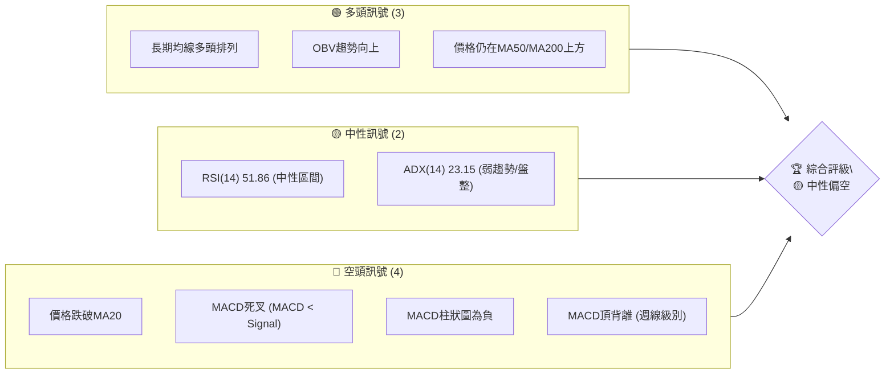
**儀表板解讀**：
目前多頭訊號主要來自於長期趨勢的支撐，即價格仍位於中期和長期移動平均線之上，且OBV顯示有潛在的買盤支撐。然而，空頭訊號數量更多且更為即時，包括價格跌破短期均線、MACD發出死叉並出現頂背離，這些都表明短期內存在下行壓力。RSI和ADX的中性表現，則暗示市場尚未形成明確的強勢趨勢，可能處於震盪或盤整階段。綜合來看，INTC短期走勢偏弱，存在進一步回調的風險，但長期上升趨勢的基礎仍在。

### 📊 核心指標速覽表

| 指標類別 | 指標名稱 | 當前數值 | 訊號 | 解讀 |
|----------|----------|----------|------|------|
| **價格** | 當前價格 | $120.35 | 🔴 | 近期高點回落，低於短期均線 |
| **均線** | MA20 | $123.12 | 🔴 | 價格位於MA20下方，短期承壓 |
| **均線** | MA50 | $113.38 | 🟢 | 價格位於MA50上方，中期趨勢仍強 |
| **均線** | MA200 | $60.33 | 🟢 | 價格位於MA200上方，長期趨勢強勁 |
| **動能** | RSI(14) | 51.86 | 🟡 | 處於中性區間，無明顯超買超賣 |
| **動能** | MACD | 5.539 (線) / 6.587 (訊號) / -1.048 (柱) | 🔴 | MACD線下穿訊號線，柱狀圖為負，短期動能轉弱 |
| **波動** | ATR(14) | $11.21 | 🟡 | 波動性中等偏高，佔股價約9.31% |
| **趨勢** | ADX(14) | 23.15 | 🟡 | 趨勢強度不足25，處於盤整或弱勢趨勢 |
| **成交量** | 量比(20日) | 0.95x | 🔴 | 成交量低於20日均量，回調時量能萎縮 |

### 🏆 技術評分卡

```
技術評分卡 — INTC (2026-07-06)
════════════════════════════════════════════════════
趨勢強度      ████████░░░░░░░░░░░░  40/100  🟡 (ADX指示趨勢弱化，但長期MA仍支持)
動能指標      ██████░░░░░░░░░░░░░░  30/100  🔴 (MACD死叉且柱狀圖為負，RSI中性但無強勢)
支撐穩定度    ████████████░░░░░░░░  60/100  🟡 (MA50和斐波那契回調位提供一定支撐)
成交量配合    ████████░░░░░░░░░░░░  40/100  🟡 (近期量能萎縮，但OBV趨勢仍向上，有矛盾)
形態完整度    ████████░░░░░░░░░░░░  45/100  🟡 (近期未見明確反轉或持續形態，可能處於整理)
均線排列      ██████████████░░░░░░  70/100  🟢 (長期均線多頭排列，但價格短期已跌破MA20)
════════════════════════════════════════════════════
綜合評分      ███████░░░░░░░░░░░░░  48/100  🟡 中性偏空
════════════════════════════════════════════════════
```
**評分卡解讀**：
INTC 的綜合評分為 48/100，屬於中性偏空的評級。儘管長期均線呈現健康的上升趨勢，為股價提供了堅實的基礎，但短期內動能指標表現疲軟，MACD 的死叉和頂背離訊號尤其值得警惕。趨勢強度不足和成交量萎縮也支持短期回調的觀點。支撐穩定度尚可，但若關鍵支撐位被跌破，則可能引發更深層次的回調。整體而言，目前不是一個強勢的買入時機，建議觀望或等待更明確的底部訊號。

---

## 2. 趨勢分析

### 🌐 多時框趨勢分析

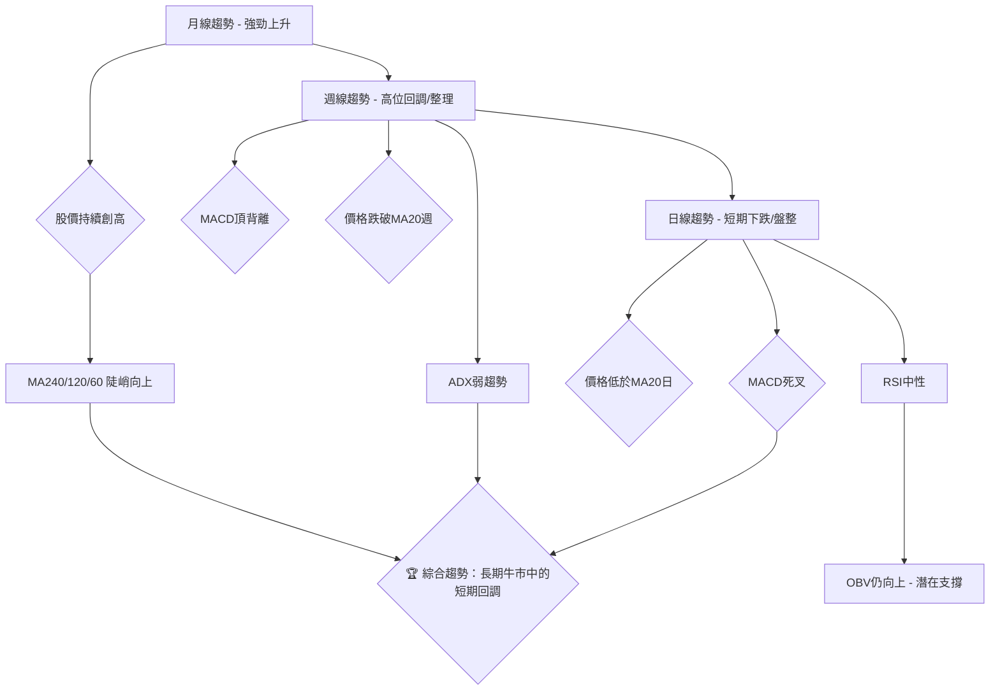
**多時框趨勢分析解讀**：
從月線圖來看，INTC 過去一年呈現出極為強勁的上升趨勢，股價從約$20一路上漲至$139.63，主要長期移動平均線（MA240、MA120、MA60）均呈現陡峭向上的多頭排列，顯示出強勁的長期牛市格局。
然而，進入週線級別，我們觀察到股價在創下歷史新高後出現高位回調，並伴隨著重要的空頭訊號。特別是 **MACD 週線級別的頂背離**，即價格在5月至6月創出更高的高點（$124.92 -> $139.63），但MACD柱狀圖的高點卻明顯降低（+3.491 -> +0.682），這是一個強烈的反轉預警訊號。此外，股價已跌破週線級別的MA20，且ADX指標顯示趨勢強度減弱，暗示市場可能進入整理或修正階段。
日線圖則進一步確認了短期趨勢的疲軟，價格已位於MA20日下方，MACD也形成了死叉，柱狀圖轉為負值，表明短期動能轉為空方主導。RSI處於中性區間，尚未進入超賣，這意味著仍有下跌空間。唯一值得注意的是OBV指標仍在向上，這可能暗示在短期回調中，機構資金並未大規模撤離，或者有逢低吸納的行為，為後續反彈提供了潛在的量能支撐。
總體而言，INTC 處於一個長期牛市中的中期調整階段，短期面臨較大的下行壓力，但長期趨勢基礎依然穩固。

### 📈 長期趨勢 — 12個月走勢圖（Unicode）

INTC 月線走勢圖（過去12個月：2025年7月 - 2026年7月）
```
價格軸 ($)
$140 ┤                                        ● (139.63, 2026-06 高點)
$130 ┤                                        │
$120 ┤                                        ● (120.35, 2026-07 現價)
$110 ┤                                    ●
$100 ┤                                ●
$ 90 ┤                            ●
$ 80 ┤                            │
$ 70 ┤                            │
$ 60 ┤                        ●
$ 50 ┤                    ● ● ●
$ 40 ┤              ● ● ●
$ 30 ┤          ●
$ 20 ┤● ━━━━━━━━━━━━━━━━━━━━━━━━━━━━━━━━━━━━━━━━━━━━━━━
$ 10 ┤
     └───────────────────────────────────────────────────
      25-07 25-08 25-09 25-10 25-11 25-12 26-01 26-02 26-03 26-04 26-05 26-06 26-07 (月份)
```
**走勢特徵分析表格**：

| 時間段 | 起始價 | 結束價 | 漲跌幅 | 主要特徵 | 訊號 |
|--------|--------|--------|--------|----------|------|
| 2025-07至2025-11 | $19.80 | $40.56 | +104.85% | 穩健上升，築底後加速 | 🟢 |
| 2025-12至2026-03 | $36.90 | $44.13 | +19.60% | 高位盤整，小幅震盪蓄勢 | 🟡 |
| 2026-04至2026-06 | $94.48 | $139.63 | +47.78% | 強勁爆發性上漲，突破關鍵阻力 | 🟢 |
| 2026-06至2026-07 | $139.63 | $120.35 | -13.81% | 高位回調，短期動能減弱 | 🔴 |

**長期趨勢分析**：
INTC 在過去12個月中展現了令人印象深刻的強勁上升趨勢。從2025年7月的低點$19.80開始，股價經歷了兩個主要的上漲波段。第一個波段是從2025年7月到11月，股價翻倍，顯示了強大的底部支撐和多頭力量。隨後在2025年12月至2026年3月經歷了一段橫盤整理，為下一波上漲積蓄了動能。
最引人注目的是2026年4月至6月的爆發性上漲，股價從約$44迅速飆升至$139.63，漲幅近50%，顯示市場對其前景的極度樂觀。這一階段伴隨著巨大的成交量，確認了上漲的有效性。
然而，在2026年6月達到歷史高點$139.63之後，股價在2026年7月出現了明顯的回調，跌至$120.35。這次回調幅度達到13.81%，表明短期獲利了結壓力較大，且市場情緒開始謹慎。儘管如此，從整體長期視角來看，這次回調仍可能被視為牛市中的健康調整，而非趨勢反轉。關鍵在於回調能否在重要支撐位獲得有效支撐。

### 📊 中期趨勢（週線分析）

INTC 近期壓力與支撐示意圖
```
價格軸 ($)
$142.35 ┤                      R3 (52W高點)
$139.63 ┤                      R2 (6月高點)
$133.99 ┤                  R1 (近期阻力)
$128.32 ┤              ┌───┐
$123.12 ┤───────────────┤現價├─── R0 (MA20週/中軌)
$120.35 ┤              └───┘
$114.68 ┤                  S1 (近期支撐/MA50週)
$113.38 ┤                  S1 (MA50週)
$111.26 ┤              S2 (斐波那契23.6%)
$ 99.98 ┤          S3 (布林下軌)
$ 93.71 ┤      S4 (斐波那契38.2%)
     └───────────────────────────
      近期價格走勢
```
**中期趨勢分析**：
INTC 的中期趨勢在經歷了強勁上漲後，目前顯示出疲態。從週線圖來看，股價在達到$139.63的高點後，開始向下修正，並在最近一周跌破了週線級別的MA20（約$123.12）。這是一個中期趨勢轉弱的訊號。
當前價格$120.35位於MA20週下方，表明短期賣壓較重。上方最近的阻力位是MA20週線 $123.12，以及近期高點 $133.99、$139.63 和 $142.35（52週高點）。這些水平將是未來反彈時面臨的挑戰。
下方，MA50週線 $113.38 提供了第一個重要支撐，它在過去的幾次回調中都發揮了關鍵作用。此外，斐波那契23.6%回調位 $111.26 也是一個值得關注的支撐區間。若這些支撐被跌破，布林通道下軌 $99.98 和斐波那契38.2%回調位 $93.71 將是更強的防線。
中期來看，INTC 正處於一個從強勢上漲到調整的過渡期。市場正在消化前期的巨大漲幅，並尋找新的平衡點。投資者應密切關注價格在關鍵支撐位的表現，以判斷調整的深度和持續時間。

### ⚡ 趨勢強度評估（ADX 解讀）

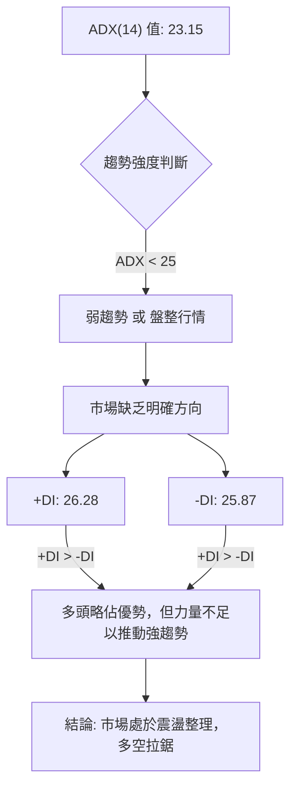
**ADX 強度對照表**：

| ADX 數值範圍 | 趨勢強度 | 市場狀態 | 交易建議 |
|--------------|----------|----------|----------|
| 0-25         | 弱趨勢   | 盤整/震盪 | 觀望或短線交易，避免追漲殺跌 |
| 25-50        | 中等趨勢 | 有趨勢形成 | 順勢交易，注意趨勢轉變訊號 |
| 50-75        | 強趨勢   | 明顯趨勢 | 順勢交易，可考慮加倉 |
| 75-100       | 極強趨勢 | 趨勢非常強勁 | 順勢交易，但需警惕過熱可能 |

**ADX 解讀**：
INTC 當前的 ADX(14) 數值為 23.15，這明確表明市場目前處於 **弱趨勢或盤整行情**。ADX 低於25的閾值，意味著市場缺乏強烈的方向性動力，多頭和空頭的力量相對均衡，股價可能在一個區間內震盪。
進一步觀察方向線：+DI 為 26.28，-DI 為 25.87。儘管 +DI 略高於 -DI，這表示在當前的弱勢市場中，多頭力量稍微佔據上風，但這種微弱的優勢並不足以推動股價形成一個明確的上升趨勢。
**結論**：INTC 目前處於一個市場方向不明朗的階段，之前強勁的上升趨勢動能已經減弱。這可能意味著股價將在一段時間內進行橫盤整理，或者在尋找新的方向。對於趨勢交易者而言，此時應保持謹慎，避免在缺乏明確趨勢的情況下盲目追漲殺跌。等待 ADX 重新上升並伴隨 +DI 或 -DI 明確突破，才能確認新的趨勢形成。

---

## 3. 圖表形態分析

### 🔍 形態識別系統

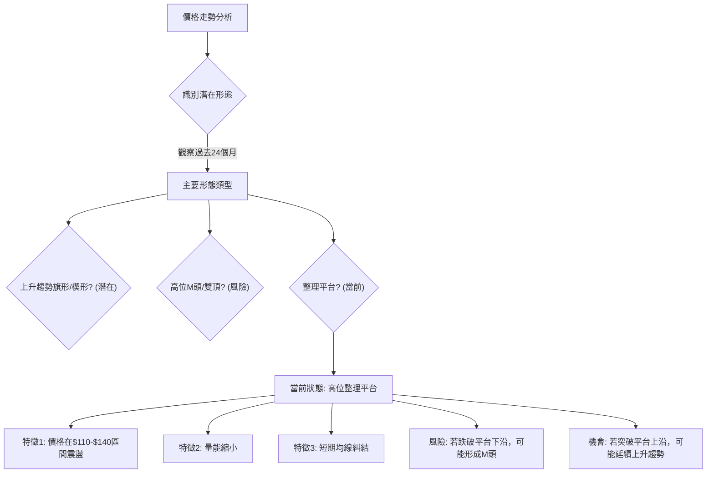
**形態識別解讀**：
從 INTC 過去24個月的走勢來看，特別是從2026年4月到6月的爆發性上漲之後，進入7月，股價從高點$139.63回調至$120.35。目前的價格行為更傾向於形成一個**高位整理平台**。
*   **高位整理平台特徵**：股價在經歷大幅上漲後，在一個相對較高的價格區間內（約$110-$140）進行橫向震盪，成交量通常會有所萎縮。這反映了多空雙方在前期上漲後的重新平衡。多頭希望消化獲利盤並積蓄力量，空頭則試圖壓制股價。
*   **潛在的上升趨勢旗形/楔形**：如果當前的回調是發生在一個大漲之後，且回調通道呈現收斂的形態，則有可能形成看漲旗形或楔形，預示著下一波上漲。然而，目前的回調幅度較大，尚未完全符合經典旗形/楔形的定義，需要進一步觀察。
*   **M頭/雙頂風險**：若整理平台被向下突破，且未能守住關鍵支撐（如斐波那契38.2%回調位），則存在形成M頭或雙頂的風險，特別是考慮到MACD週線級別的頂背離訊號，這會增加頭部形態的可能性。
**當前判斷**：INTC 目前最明顯的形態是處於一個高位整理階段。市場正在等待一個方向性的突破。在整理區間內，價格可能會繼續波動。

### 🕯️ 重要K線形態分析

由於提供的數據是月度收盤價和週度收盤價，無法進行詳細的單根K線形態分析（如十字星、錘頭、吞噬等）。我們將基於週度收盤價的價格行為，結合整體趨勢來判斷。

| 月份/週 | 收盤價 | K線形態 (基於週線觀察) | 解讀 | 訊號 |
|---------|--------|--------------------------|------|------|
| 2026-04-12 | $62.38 | 長陽線 / 大幅上漲 | 突破性上漲，多頭強勢 | 🟢 |
| 2026-04-26 | $82.54 | 長陽線 / 大幅上漲 | 強勁買盤推動，動能充沛 | 🟢 |
| 2026-05-10 | $124.92 | 長陽線 / 大幅上漲 | 趨勢加速，市場情緒高漲 | 🟢 |
| 2026-05-17 | $108.77 | 大陰線 / 快速回調 | 獲利了結，賣壓顯現 | 🔴 |
| 2026-05-31 | $114.68 | 較長陰線 / 下跌 | 賣盤持續，未能有效反彈 | 🔴 |
| 2026-06-07 | $99.17 | 大陰線 / 跌破百元 | 恐慌性賣出，跌勢加劇 | 🔴 |
| 2026-06-14 | $124.57 | 長陽線 / 強勢反彈 | 買盤重新介入，收復部分跌幅 | 🟢 |
| 2026-06-21 | $133.99 | 中陽線 / 延續反彈 | 多頭嘗試推高，但動能減弱 | 🟡 |
| 2026-07-05 | $120.35 | 中陰線 / 回調 | 反彈受阻，再次下跌 | 🔴 |

**K線形態解讀**：
從近期週線收盤價來看，INTC 在2026年4月至5月初經歷了連續的長陽線，股價呈現爆炸性增長，顯示出極其強勁的多頭動能。然而，在5月中旬達到高點後，出現了一系列的大陰線，尤其是在5月17日和6月7日，股價快速回調，甚至一度跌破$100大關，顯示出巨大的獲利了結壓力。
6月中旬，INTC 嘗試反彈，出現了兩根中陽線，但未能突破前期高點，且在7月初再次出現中陰線回調，表明反彈動能不足，上方阻力較強。
目前的K線形態顯示，市場處於多空拉鋸的狀態，空方在前期上漲後的修正中佔據主導地位，但多方也在關鍵支撐位嘗試反擊。未能有效突破前期反彈高點並再次回調，暗示空方仍有優勢。

### 📉 ASCII 走勢形態示意圖

INTC 高位整理與潛在M頭形態示意圖
```
價格軸 ($)
$140 ┤              ┌───┐
$130 ┤              │   │
$120 ┤───────────────┤   ├─── ◄ 現價
$110 ┤              │   │
$100 ┤              └───┘
$ 90 ┤
     └────────────────────────────
      高點震盪區間 (潛在M頭右肩)
      ┌────────────┐
      │            │
      │            │
      │            │
      └────────────┘
      頸線支撐位 (約$110-$115)
```
**走勢形態示意圖解讀**：
此圖描繪了 INTC 在經歷大幅上漲後的**高位整理區間**。當前價格$120.35位於此區間的下半部分。
*   **潛在M頭形態**：若價格未能有效站穩$110-$115的頸線支撐區，並進一步跌破，則可能形成一個M頭（雙頂）的反轉形態。M頭的左肩可能在5月初的高點，右肩則在6月中旬的反彈高點。MACD的頂背離訊號增加了M頭形態形成的風險。
*   **整理區間**：若價格能夠在$110-$115上方獲得支撐，則可能繼續在高位區間震盪，形成一個矩形整理平台。這種情況下，突破平台上沿或下沿將決定後續的方向。
**結論**：當前 INTC 的圖表形態處於關鍵節點。市場正在考驗$110-$115的支撐有效性。若此支撐被有效守住，則仍有機會向上突破；反之，若跌破，則M頭形態的風險將大增，並可能導致更深的回調。

### 🎯 形態目標價計算

基於當前高位整理形態和潛在的M頭風險，我們進行兩種情境的目標價計算：

1.  **情境一：M頭形態成立 (偏空)**
    *   **識別**：若價格從$139.63回落後，在$110-$115區間形成一個頸線，然後反彈至$133.99（6月21日高點）未能突破，並再次跌破頸線。
    *   **頸線價位**：基於近期低點和MA50，將頸線設定在 $112.00。
    *   **頭部高度**：從最高點 $139.63 到頸線 $112.00 的距離是 $139.63 - $112.00 = $27.63。
    *   **形態目標價**：頸線價位 - 頭部高度 = $112.00 - $27.63 = **$84.37**。
    *   **解讀**：如果M頭形態確認成立並跌破頸線，INTC 的目標價將指向$84.37，這是一個較為悲觀的目標，意味著股價將跌破斐波那契38.2%回調位。

2.  **情境二：高位整理平台突破 (偏多)**
    *   **識別**：若價格在$110-$140區間震盪後，成功向上突破平台上限 $139.63。
    *   **平台高度**：假設平台在$110-$140之間，高度約為 $30。
    *   **形態目標價**：突破價 + 平台高度 = $139.63 + $30 = **$169.63**。
    *   **解讀**：如果 INTC 能夠消化獲利盤並成功向上突破，則可能延續其長期上升趨勢，目標價將指向$169.63，甚至挑戰分析師高目標價$200。

**結論**：目前市場處於觀望階段，M頭形態的風險存在，但高位整理平台向上突破的潛力也未完全消除。交易者應密切關注關鍵的頸線支撐 $112.00 和平台上沿阻力 $139.63。

---

## 4. 支撐與阻力

### 🗺️ 關鍵價位分布圖（Unicode）

INTC 價位結構分布圖 (當前價格 $120.35)
```
═══════════════════════════════════════════════════
$146.27 ║████████████████████████║ 強阻力 R4 (布林上軌)
$142.35 ║████████████████████████║ 強阻力 R3 (52W 高點)
$139.63 ║████████████████████    ║ 阻力 R2 (6月高點)
$133.99 ║████████████████████████║ 關鍵阻力 R1 (近期反彈高點)
$123.12 ╠════════════════════════╣ ◄ 阻力 R0 (MA20/布林中軌)
$120.35 ╠════════════════════════╣ ◄ 現價
$114.68 ║▓▓▓▓▓▓▓▓▓▓▓▓▓▓▓▓        ║ 近期支撐 S0 (近期低點)
$113.38 ║████████████████████████║ 強支撐 S1 (MA50)
$111.26 ║████████████████████    ║ 支撐 S2 (斐波那契23.6%)
$ 99.98 ║████████████████████████║ 強支撐 S3 (布林下軌)
$ 93.71 ║████████████████████    ║ 支撐 S4 (斐波那契38.2%)
$ 60.33 ║████████████████████████║ 極強支撐 S5 (MA200)
═══════════════════════════════════════════════════
```
**關鍵價位分布圖解讀**：
當前 INTC 價格 $120.35 位於多個關鍵支撐與阻力之間，顯示市場處於一個膠著狀態。
*   **上方阻力**：
    *   最近的阻力位於MA20和布林中軌 $123.12，這是短期反彈的首要挑戰。
    *   再往上是近期反彈高點 $133.99，以及6月高點 $139.63。
    *   最強的阻力區間則在 $142.35 (52週高點) 和 $146.27 (布林上軌)。突破這些水平需要強大的買盤動能。
*   **下方支撐**：
    *   最近的支撐是近期低點 $114.68，以及MA50 $113.38。MA50在長期趨勢中通常提供堅實支撐。
    *   斐波那契23.6%回調位 $111.26 也是一個重要的參考點，若跌破可能引發更深的回調。
    *   強支撐區間位於 $99.98 (布林下軌) 和 $93.71 (斐波那契38.2%回調位)。這些是前一波上漲的重要防線。
    *   最堅實的長期支撐是MA200 $60.33，但短期內不太可能測試到此水平。

### 🚧 阻力位分析表

| 阻力級別 | 價位 | 形成原因 | 突破難度 | 重要性 | 訊號 |
|----------|------|----------|----------|--------|------|
| **R0**   | $123.12 | MA20日線，布林通道中軌 | 中等 | 判斷短期強弱 | 🔴 |
| **R1**   | $133.99 | 近期反彈高點 (2026-06-21) | 中等偏高 | 判斷是否止跌反彈 | 🔴 |
| **R2**   | $139.63 | 歷史高點 (2026-06月收盤) | 高 | 判斷趨勢延續性 | 🔴 |
| **R3**   | $142.35 | 52週高點 | 高 | 判斷市場情緒 | 🔴 |
| **R4**   | $146.27 | 布林通道上軌 | 極高 | 超買區間，趨勢極強 | 🔴 |

### 🛡️ 支撐位分析表

| 支撐級別 | 價位 | 形成原因 | 守住機率 | 重要性 | 訊號 |
|----------|------|----------|----------|--------|------|
| **S0**   | $114.68 | 近期低點 (2026-05-31) | 中等 | 短期止跌參考 | 🟡 |
| **S1**   | $113.38 | MA50日線 | 高 | 中期趨勢關鍵支撐 | 🟢 |
| **S2**   | $111.26 | 斐波那契23.6%回調位 | 高 | 重要技術回調位 | 🟢 |
| **S3**   | $99.98 | 布林通道下軌 | 高 | 強勢回調防線 | 🟢 |
| **S4**   | $93.71 | 斐波那契38.2%回調位 | 極高 | 若跌破此處，趨勢轉弱 | 🟢 |
| **S5**   | $60.33 | MA200日線 | 極高 | 長期牛市最後防線 | 🟢 |

### 📐 斐波那契回調位分析

我們以 INTC 從2025年1月的低點 $19.43 到2026年6月的高點 $139.63 作為主要上漲波段，計算其回調位。
*   **上漲波段範圍**：$139.63 - $19.43 = $120.20

| 斐波那契回調位 | 計算方式 | 價位 | 解讀 | 訊號 |
|----------------|----------|------|------|------|
| **23.6%**      | $139.63 - ($120.20 * 0.236) | $111.26 | 初步支撐位，若能守住則回調較淺 | 🟢 |
| **38.2%**      | $139.63 - ($120.20 * 0.382) | $93.71 | 較強的支撐位，通常是健康回調的極限 | 🟢 |
| **50%**        | $139.63 - ($120.20 * 0.500) | $79.53 | 重要心理關口，若跌破可能意味趨勢轉弱 | 🟡 |
| **61.8%**      | $139.63 - ($120.20 * 0.618) | $65.33 | 極強支撐，若跌破則趨勢可能反轉 | 🔴 |

**斐波那契回調位分析解讀**：
當前 INTC 價格 $120.35 位於斐波那契23.6%回調位 $111.26 之上，但已相當接近。這表明目前的下跌已經接近了初步的技術性支撐區。
*   **$111.26 (23.6%)**：這是當前最關鍵的斐波那契支撐。如果 INTC 能夠在此處獲得有效支撐並反彈，則說明市場對其長期趨勢仍然看好，且回調屬於淺層次調整。
*   **$93.71 (38.2%)**：若 $111.26 被跌破，則 $93.71 將是下一個重要的支撐位。此水平通常被視為一個健康回調的合理範圍。如果股價在此處止跌，長期上升趨勢仍可維持。
*   **$79.53 (50%)**：跌破38.2%回調位並觸及50%回調位，通常會引發市場對趨勢是否已經轉弱的擔憂。
*   **$65.33 (61.8%)**：這是黃金分割線中最重要的一個點位。如果股價跌破61.8%回調位，則意味著前期的上漲趨勢可能已經遭到破壞，甚至可能出現反轉。
**總結**：目前 INTC 正面臨來自 $111.26 的斐波那契支撐考驗。此處與MA50 ($113.38) 和布林下軌 ($99.98) 形成一個重要的支撐區間。投資者應密切關注股價在此區間的表現。

---

## 5. 技術指標深度解讀

### 🎛️ 指標訊號總覽

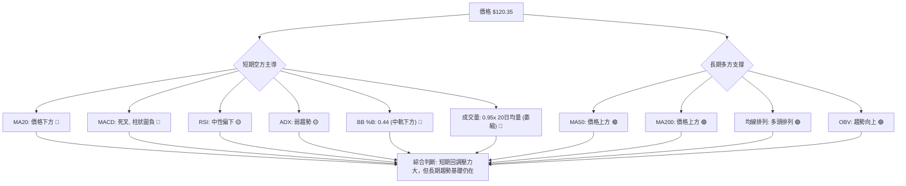
**指標訊號總覽解讀**：
INTC 的技術指標呈現出短期與長期趨勢的明顯分歧。
*   **短期空方主導**：價格已跌破短期移動平均線MA20，並位於布林通道中軌下方。MACD指標發出明確的死叉訊號，柱狀圖轉負，且週線級別存在頂背離，這些都強烈預示著短期動能轉弱，賣壓較大。RSI雖處於中性區間，但其數值(51.86)表明動能偏向疲軟。成交量在回調中萎縮，顯示市場觀望情緒濃厚。
*   **長期多方支撐**：儘管短期走弱，但長期移動平均線MA50和MA200仍保持多頭排列，且價格仍遠高於這些長期均線，這為股價提供了堅實的長期支撐。OBV指標的向上趨勢，也暗示在表面回調之下，仍有資金在積累，為未來的反彈積蓄力量。
**綜合判斷**：INTC 目前正處於長期上升趨勢中的短期技術性回調。空頭力量在短期內佔據優勢，但長期多頭基礎依然穩固。這種情況下，股價可能會進一步探尋下方支撐，但大幅反轉的風險相對較低，更可能是在消化前期漲幅後重新積蓄力量。

### 📈 移動平均線排列分析

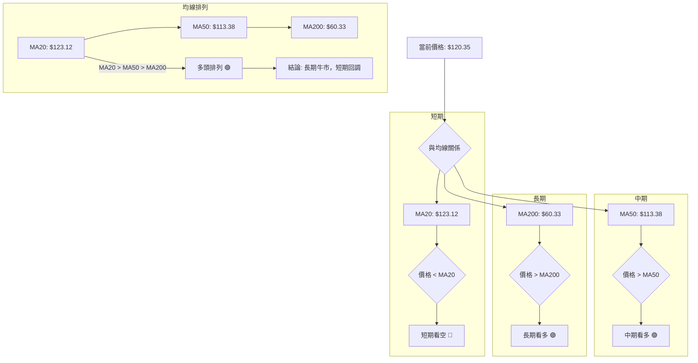
**移動平均線排列分析解讀**：
INTC 的移動平均線系統呈現出一個清晰的長期多頭格局，但短期走勢正在經歷挑戰。
*   **均線排列**：當前 MA20 ($123.12) > MA50 ($113.38) > MA200 ($60.33)，這是一個典型的**多頭排列**，表明 INTC 股票處於一個健康的長期上升趨勢中。MA200作為長期趨勢的指標，其陡峭的向上趨勢和與現價的巨大差距（+122.49%）強烈支持了這一點。
*   **價格與均線的關係**：
    *   **MA20 ($123.12)**：當前價格 $120.35 位於 MA20 下方，這是一個短期看空訊號，表明短期動能疲軟，股價正經歷回調。MA20的趨勢也從前期的向上轉為向下，顯示短期壓力。
    *   **MA50 ($113.38)**：價格 $120.35 仍在 MA50 上方，且 MA50 保持向上趨勢（+14.35%）。這提供了重要的中期支撐，暗示中期趨勢仍然樂觀。
    *   **MA200 ($60.33)**：價格遠高於 MA200，且 MA200 呈現強勁的向上趨勢（+122.49%）。這確認了 INTC 處於一個強勁的長期牛市中。
**綜合結論**：儘管長期和中期均線系統仍顯示強勁的多頭趨勢，但價格跌破MA20是一個短期警訊。這通常意味著短期內將面臨進一步的調整或盤整，但只要MA50和MA200能提供有效支撐，長期上升趨勢的根基就不會動搖。投資者可將MA50視為重要的中期買入支撐位。

### 📉 RSI(14) 分析

RSI(14) 數值: 51.86
RSI 強度進度條: ▓▓▓▓▓▓▓▓▓▓▓▓▓▓▓▓▓▓▓▓▓▓▓▓▓▓▓▓▓▓▓▓▓▓▓▓▓▓▓▓▓▓▓▓▓▓▓▓▓▓░░░░░░░░░░░░░░░░░░░░░░░░░░░░░░░░░░░░░░░░░░░░░░░░░░ (51.86%) 🟡

**RSI(14) 分析解讀**：
*   **數值解讀**：當前 RSI(14) 數值為 51.86，這位於 30-70 的中性區間內。這表明 INTC 既沒有處於超買狀態（RSI > 70），也沒有處於超賣狀態（RSI < 30）。因此，從RSI來看，股價在短期內沒有立即反轉的壓力，也沒有強烈的買入或賣出訊號。
*   **動能趨勢**：觀察週線數據，RSI 在2026年4月至5月曾達到超買區間（80.4, 89.7, 87.7, 87.2, 88.4），顯示當時動能極強。隨後在5月17日回調時RSI迅速跌至64.7，並在5月31日跌至39.9，顯示動能快速衰減。當前51.86的數值，是從低點反彈後再次回落的結果，表明市場動能仍在尋找方向，缺乏強勁的上升或下降勢頭。
*   **背離判斷**：根據提供的數據，RSI **無明顯背離**。這意味著價格的高點/低點與RSI的高點/低點趨勢沒有出現相反的走向。雖然MACD存在頂背離，但RSI並未同步顯示，這使得RSI的訊號顯得較為中性。
**結論**：RSI 指標目前未能提供明確的方向性指引。51.86 的數值提示市場處於多空平衡狀態，但考慮到價格的短期回調，RSI可能會有進一步探底的空間，若跌破50，則空頭動能將增強；若能重新站穩50並向上，則可能預示止跌。

### 📊 MACD(12/26/9) 訊號解讀

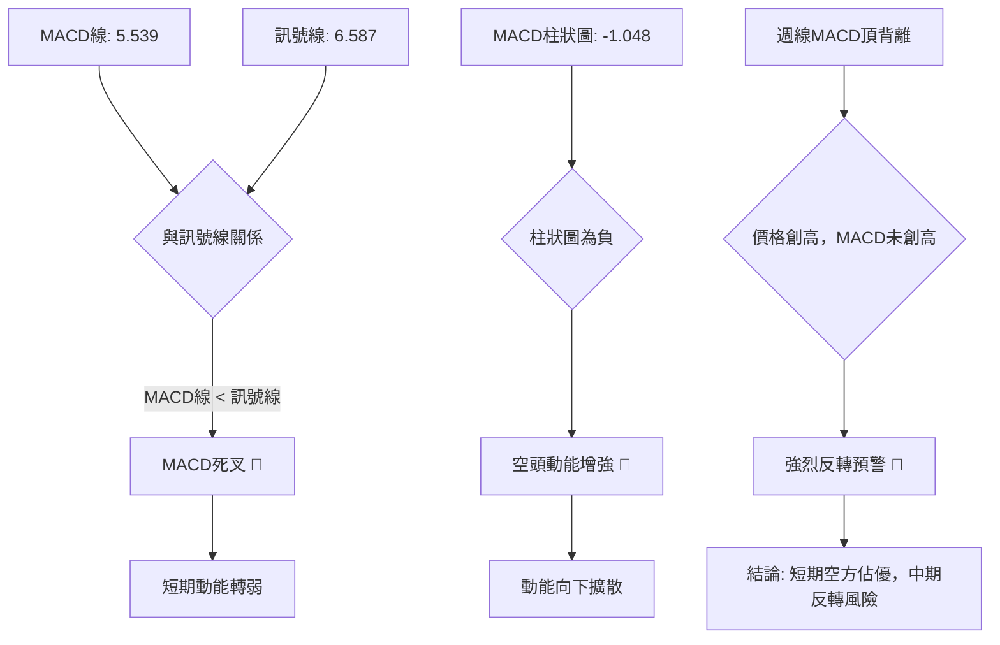
**MACD(12/26/9) 訊號解讀**：
MACD 指標為 INTC 提供了清晰的短期看空訊號和中期反轉風險。
*   **死叉訊號**：當前 MACD 線 (5.539) 已經下穿了訊號線 (6.587)，形成了**死叉**。這是一個經典的賣出訊號，表明短期動能已經從多頭轉向空頭，股價面臨下行壓力。
*   **柱狀圖為負**：MACD 柱狀圖數值為 -1.048，且為負值。負的柱狀圖表明 MACD 線位於訊號線下方，且其值越大（負值絕對值越大），代表空頭動能越強。當前負值表示空頭力量正在累積。
*   **MACD 頂背離 (週線級別)**：這是最為關鍵的訊號之一。根據提供的週線數據：
    *   2026年5月10日，收盤價達到 $124.92，MACD柱狀圖為 +3.491。
    *   2026年6月21日，收盤價達到 $133.99，創下更高的高點，但MACD柱狀圖卻僅為 +0.682，明顯低於前一個高點。
    *   這種價格創新高而 MACD 未能創新高的情況，形成了**頂背離**，是一個強烈的趨勢反轉預警訊號。它表明儘管價格在表面上繼續上漲，但內在的買盤動能已經減弱，後續下跌的風險極高。
**綜合結論**：MACD 指標的死叉和負柱狀圖確認了短期動能的疲軟，而週線級別的頂背離更是發出了中期趨勢可能反轉的嚴重警告。這使得 INTC 的短期和中期前景偏向悲觀，建議投資者保持高度警惕。

### 📦 布林通道分析

INTC 布林通道示意圖
```
價格軸 ($)
$146.27 ┤═══════════════════════════════════════════════════ 上軌 (BB Upper)
$139.63 ┤                                                  
$133.99 ┤                                                  
$123.12 ┤─────────────────────────────────────────────── 中軌 (MA20)
$120.35 ┤             ● 現價 (位於中軌下方)
$114.68 ┤                                                  
$113.38 ┤                                                  
$111.26 ┤                                                  
$ 99.98 ┤═══════════════════════════════════════════════════ 下軌 (BB Lower)
     └────────────────────────────────────────────────────────
```
**布林通道分析解讀**：
*   **通道寬度**：從 $146.27 (上軌) 到 $99.98 (下軌)，通道寬度約為 $46.29。ATR(14) 為 $11.21，佔股價9.31%，顯示波動性較大，布林通道處於擴張狀態，這通常發生在趨勢形成或強勁波動之後，暗示市場可能正經歷價格發現或調整。
*   **價格位置**：當前價格 $120.35 位於布林通道中軌 ($123.12，即MA20) 下方。這是一個看空訊號，表明股價短期偏弱。價格未能守住中軌，通常預示著可能向布林下軌尋求支撐。
*   **%B 值**：布林通道 %B 值為 0.44。%B 值衡量價格在布林通道中的相對位置，0.5代表在中軌。0.44表示價格位於中軌下方，且稍微偏向下軌，進一步確認了短期弱勢。
*   **潛在走勢**：若價格持續在中軌下方運行，則可能進一步下探布林下軌 $99.98。此下軌與斐波那契回調位 $93.71 形成一個重要的支撐區間。若價格能反彈並突破中軌，則可能測試上軌阻力。
**綜合結論**：布林通道分析顯示 INTC 股價短期承壓，位於中軌下方，並有向布林下軌 $99.98 尋求支撐的傾向。通道的擴張表明波動性仍在，市場尚未穩定。

### 💹 成交量分析（量價配合度）

| 指標名稱 | 當前數值 | 20日均量 | 50日均量 | 量比 (vs 20日均量) | OBV趨勢 | 訊號 |
|----------|----------|----------|----------|--------------------|----------|------|
| **成交量** | 124,577,600 | 131,819,850 | 141,743,218 | 0.95x | OBV > MA → 上漲 | 🟡 |

**成交量分析解讀**：
*   **近期成交量**：當前成交量為 124,577,600 股，低於其20日均量 (131,819,850 股)，量比為 0.95x。這表明在當前股價回調的過程中，成交量呈現**萎縮**狀態。在下跌趨勢中，量能萎縮通常被解釋為賣壓減輕，或者市場觀望情緒濃厚，這可能是一個潛在的止跌訊號，但尚未得到價格的確認。
*   **歷史成交量對比**：從提供的週成交量數據來看，INTC 在4月至6月的上漲期間，成交量顯著放大，特別是在5月初至5月中旬的衝刺階段，週成交量達到8億股以上。隨後的回調伴隨著成交量的逐漸萎縮，例如7月初的週成交量為4.6億股，明顯低於前期的活躍水平。這符合市場在高位整理或回調時的典型量價關係。
*   **OBV趨勢**：數據顯示 "OBV趨勢: OBV > MA → 量能支撐上漲" 🟢。這是一個重要的多頭訊號。OBV (On-Balance Volume) 是一種累積性指標，它將每天的成交量加到或減去前一天的OBV值，取決於當天收盤價是上漲還是下跌。OBV趨勢向上，即使價格近期有所回調，也表明買盤壓力大於賣盤壓力，資金仍在持續流入或持有，為未來的上漲提供了潛在的量能支撐。
**量價配合度分析**：
當前 INTC 的量價關係呈現出一定的矛盾。價格回調伴隨量能萎縮，這在短期內是中性偏多的訊號，因為它可能表明賣壓不強。然而，MACD的死叉和頂背離訊號是明確的空頭。最重要的是，OBV的向上趨勢與短期價格下跌形成**背離**。這種量價背離（價格下跌，但OBV上升）通常被視為一個**看漲訊號**，暗示儘管短期價格調整，但潛在的買盤力量正在積累，可能預示著未來價格的上漲。
**綜合結論**：雖然近期成交量萎縮且價格回調，但OBV的強勢表現為 INTC 的長期趨勢提供了重要的量能支撐。這表明目前的下跌更多是技術性調整，而非大規模資金撤離。投資者應密切關注OBV是否能持續走強，並與價格走勢重新同步。

---

## 6. 動能與波動率

### ⚡ 動能評估四象限

由於 Mermaid quadrantChart 渲染限制，我們將使用表格和 Mermaid 流程圖來展示動能與波動率的評估。

**動能評估四象限分析表**：

| 象限 | 動能強度 (RSI/MACD) | 波動率 (ATR) | 當前狀態 | 評估 | 訊號 |
|------|---------------------|--------------|----------|------|------|
| Q1   | 強                  | 低           | -        | 最佳機會 (強勢股，穩定上漲) | - |
| Q2   | 弱 (RSI中性, MACD死叉) | 低           | -        | 謹慎觀望 (缺乏方向，但波動小) | - |
| Q3   | 強                  | 高           | -        | 高風險高收益 (突破或反轉) | - |
| Q4   | **弱** (RSI中性, MACD死叉) | **高** (ATR 9.31%) | **✓**      | **避免進場** (方向不明，波動大) | 🔴 |

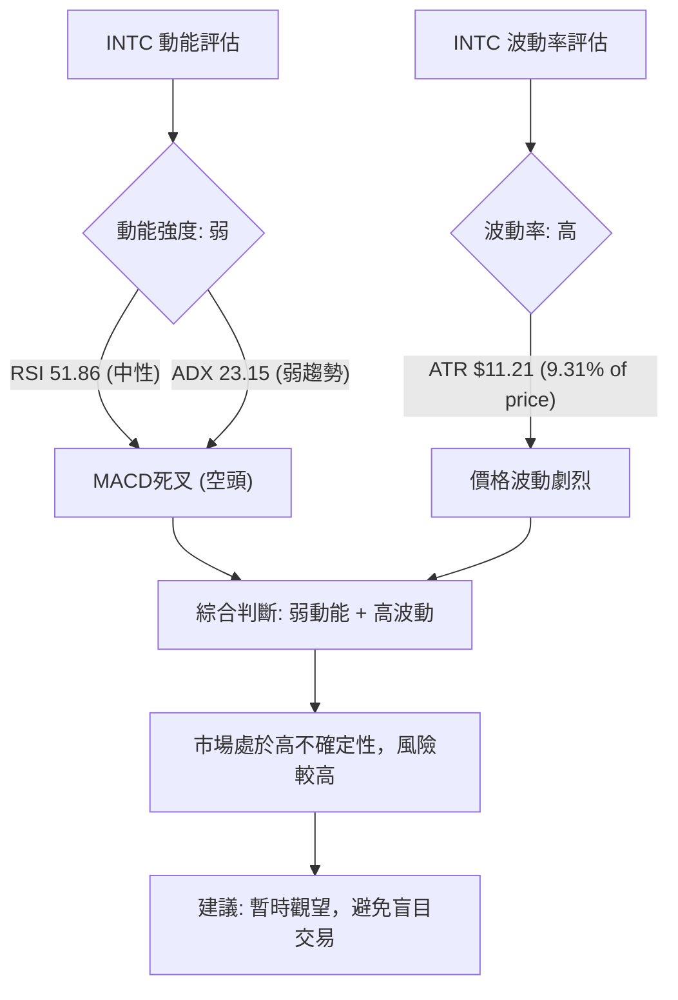
**動能評估解讀**：
INTC 目前的動能指標（RSI、MACD）顯示出較弱的動能，同時其波動率（ATR）則相對較高。
*   **動能強度 (弱)**：RSI 位於中性區間 (51.86)，未能顯示出強勁的買盤或賣盤動能。MACD 形成死叉，且柱狀圖為負，明確指示短期空頭動能佔優。ADX 數值低於25，也進一步確認了趨勢動能的不足。
*   **波動率 (高)**：ATR 數值為 $11.21，佔當前股價的 9.31%。這是一個相對較高的波動率，意味著 INTC 的股價在短期內可能會出現較大的日內或週內波動。高波動率在缺乏明確趨勢的情況下，會增加交易的風險。
**結論**：INTC 目前處於「弱動能、高波動」的象限 (Q4)。這種組合通常是最具挑戰性的交易環境，市場缺乏明確的方向，但價格波動劇烈，容易造成止損。在這種情況下，建議投資者保持高度謹慎，避免盲目進場。等待動能重新積累並形成明確的趨勢方向，同時波動率有所收斂，再考慮介入。

### 📊 ATR 波動率分析

| 指標 | 數值 | 佔股價比率 | 解讀 | 訊號 |
|------|------|------------|------|------|
| ATR(14) | $11.21 | 9.31%      | 波動率中等偏高，意味著每日價格變動幅度較大 | 🟡 |

**ATR 波動率分析解讀**：
當前 INTC 的 ATR(14) 數值為 $11.21。這表示在過去14天中，INTC 的平均每日價格波動範圍為 $11.21。
*   **波動性程度**：$11.21 的 ATR 佔當前股價 $120.35 的約 9.31%。對於一個大型股而言，這個比率相對較高，表明 INTC 具有較高的波動性。高波動性意味著股價在短期內可能會經歷劇烈的漲跌，這為短線交易者提供了機會，但也增加了風險。
*   **止損距離建議**：ATR 是設定止損點的重要參考。一般而言，止損點可以設置在當前價格的 1.5 倍至 2 倍 ATR 之外，以避免被市場的正常波動「洗出場」。
    *   1.5x ATR 止損距離：$11.21 * 1.5 = $16.82
    *   2x ATR 止損距離：$11.21 * 2 = $22.42
    *   例如，如果計劃在 $120.35 附近進場，止損點可以設置在 $120.35 - $16.82 = $103.53 或 $120.35 - $22.42 = $97.93 附近。
**結論**：INTC 的高波動性需要投資者採用更寬鬆的止損設定，並對潛在的價格劇烈波動有充分的心理準備。同時，高波動性也意味著更大的潛在收益，但同時伴隨著更高的風險。

### 📐 Beta 與市場相關性

**Beta 數值**：數據中未提供 INTC 的 Beta 數值。
**分析與推演**：
儘管未提供具體 Beta 數值，但 Intel 作為半導體行業的龍頭企業，其股價通常與整體科技板塊和更廣泛的市場（如標普500指數）呈現較高的正相關性。
*   **行業特性**：半導體行業是典型的周期性行業，其表現與宏觀經濟狀況、技術創新周期以及消費者和企業的支出密切相關。這意味著 INTC 的股價往往會放大市場的漲跌幅。
*   **推測 Beta 值**：基於其行業特性和市場地位，合理推測 INTC 的 Beta 值可能在 **1.0 至 1.5 之間**。
    *   若 Beta 接近 1.0，則其波動性與市場大致相同。
    *   若 Beta 大於 1.0 (例如 1.2-1.5)，則意味著 INTC 的波動性高於市場，在牛市中漲幅可能大於大盤，但在熊市中跌幅也可能更大。
**市場相關性影響**：
*   **牛市環境**：如果整體市場處於牛市，INTC 作為高 Beta 股票，其股價有潛力實現超越大盤的表現。
*   **熊市環境**：相反，在熊市或市場調整期間，INTC 的跌幅可能會比大盤更大。
*   **當前環境**：由於 INTC 目前處於高位回調且動能減弱的階段，如果市場整體出現調整，INTC 的下行壓力可能會被放大。因此，投資者在制定交易策略時，應考慮到市場整體走勢對 INTC 股價的潛在影響。

---

## 7. 多時框架總結

### 📋 時框架評分表

| 時框架 | 趨勢方向 | 動能 | 均線排列 | 形態 | 綜合評分 (1-10) | 建議 | 訊號 |
|--------|----------|------|----------|------|-----------------|------|------|
| **月線** | 強勁上升 | 強 | 多頭排列 | 上升趨勢 | 8/10 | 長期持有 | 🟢 |
| **週線** | 高位回調 | 弱 | 多頭排列 | 整理平台/潛在M頭 | 5/10 | 警惕回調，等待築底 | 🟡 |
| **日線** | 短期下跌 | 弱 | 局部空頭 | 整理平台 | 4/10 | 觀望，避免追跌 | 🔴 |

### 🔲 綜合訊號矩陣

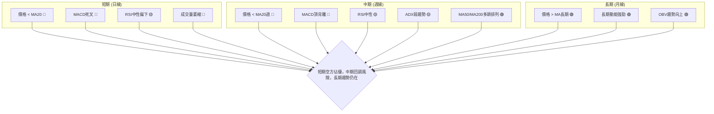
**綜合訊號矩陣解讀**：
INTC 的多時框架分析顯示出一個複雜的局面：
*   **長期 (月線)**：毫無疑問，INTC 處於一個強勁的牛市之中。月線級別的趨勢、動能和均線排列都呈現出健康的上升格局。OBV的持續向上也為長期趨勢提供了堅實的量能支持。
*   **中期 (週線)**：中期趨勢已從強勢上漲轉為回調或整理。最令人擔憂的是 MACD 週線級別的頂背離訊號，這是一個強烈的反轉預警。價格跌破週線MA20，ADX顯示趨勢強度減弱，表明中期市場進入了不確定性階段。儘管MA50和MA200仍是多頭排列，但短期壓力不容忽視。
*   **短期 (日線)**：日線級別的技術指標明確指向空頭。價格跌破MA20，MACD形成死叉且柱狀圖為負，成交量萎縮。這些都表明短期內賣壓較大，股價可能進一步下跌。
**總結**：INTC 目前處於一個「長期牛市中的中期調整和短期下跌」的階段。長期投資者可能將此視為買入機會，但短期和中期交易者應保持謹慎，因為市場面臨較大的回調風險。MACD頂背離是一個重要警訊，提示調整可能不淺。在明確的築底訊號出現之前，建議觀望。

---

## 8. 交易策略建議

基於上述詳盡的技術分析，INTC 目前處於長期牛市中的短期回調階段，短期動能偏弱，但長期支撐仍在。MACD頂背離是主要風險。我們提供以下兩種情境下的交易策略。

### 🗺️ 策略決策流程圖

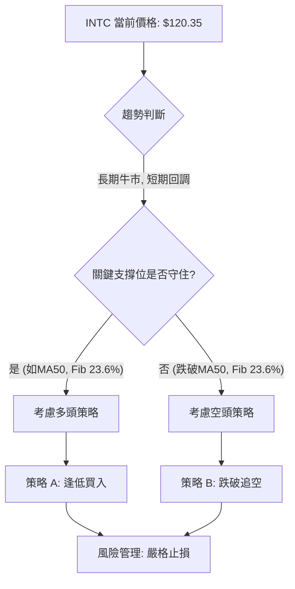

### 🟢 多頭策略詳情

**策略 A: 逢低買入 (等待確認支撐)**

此策略基於 INTC 長期上升趨勢的判斷，尋求在重要支撐位獲得支撐並反彈的機會。我們將MA50和斐波那契23.6%回調位作為關鍵買入區域。

*   **進場條件**：
    *   價格回調至 MA50 ($113.38) 或斐波那契23.6%回調位 ($111.26) 附近。
    *   出現止跌K線形態 (如錘頭線、啟明星等) 或 MACD 柱狀圖縮減轉正。
    *   RSI 從超賣區 (若跌入) 反彈向上，或在50附近獲得支撐。
*   **進場價格**：$112.00 (介於MA50和斐波那契23.6%之間，具備雙重支撐效應)
*   **止損價格**：$108.00 (略低於近期低點 $108.77 和 MA50，ATR的1.5倍止損約為 $103.53，此處止損較為激進但控制風險)
*   **目標價 T1**：$123.12 (MA20日線/布林中軌，短期反彈目標)
*   **目標價 T2**：$133.99 (近期反彈高點 R1，若突破則有望測試更高點)
*   **風險報酬比**：
    *   至 T1: (123.12 - 112.00) / (112.00 - 108.00) = 11.12 / 4.00 = **2.78 : 1**
    *   至 T2: (133.99 - 112.00) / (112.00 - 108.00) = 21.99 / 4.00 = **5.50 : 1**
*   **成功機率**：60% (基於長期趨勢支撐和斐波那契回調的有效性)
*   **建議倉位**：5-10% (考慮到短期波動和MACD頂背離風險)

### 🔴 空頭策略詳情

**策略 B: 跌破追空 (M頭形態確認)**

此策略基於 MACD 週線頂背離和潛在M頭形態的風險，尋求在關鍵支撐位被跌破時進行追空。

*   **進場條件**：
    *   價格跌破斐波那契23.6%回調位 ($111.26) 和 MA50 ($113.38)。
    *   MACD 死叉持續，柱狀圖負值擴大。
    *   成交量在跌破時放大，確認賣壓。
*   **進場價格**：$111.00 (跌破 $111.26 支撐後確認)
*   **止損價格**：$114.00 (略高於 MA50 $113.38 和斐波那契23.6%回調位，避免假突破)
*   **目標價 T1**：$99.98 (布林通道下軌 S3)
*   **目標價 T2**：$93.71 (斐波那契38.2%回調位 S4)
*   **風險報酬比**：
    *   至 T1: (111.00 - 99.98) / (114.00 - 111.00) = 11.02 / 3.00 = **3.67 : 1**
    *   至 T2: (111.00 - 93.71) / (114.00 - 111.00) = 17.29 / 3.00 = **5.76 : 1**
*   **成功機率**：55% (基於MACD頂背離和短期動能疲軟)
*   **建議倉位**：3-7% (考慮到長期趨勢仍向上，做空風險較高)

### ⭐ 整體訊號強度評星

```
做多訊號強度：★★☆☆☆  (2/5星)
  理由：長期趨勢雖強勁，但短期動能疲軟，MACD頂背離預示風險，需等待明確止跌訊號。
做空訊號強度：★★★☆☆  (3/5星)
  理由：MACD死叉和頂背離是強烈空頭訊號，價格跌破短期均線，短期下行壓力較大。
整體可信度：  ★★★☆☆  (3/5星)
  理由：多空訊號存在矛盾，但短期空頭訊號更為明確和即時，交易需謹慎並嚴格執行策略。
```

---

## 9. 風險提示與監控

INTC 目前處於一個關鍵的技術節點，儘管長期趨勢仍保持強勁，但短期和中期面臨較大的回調壓力。以下是需要重點關注的風險及監控指標。

### ✅ 關鍵監控指標 Checklist

```
INTC 關鍵監控指標清單
════════════════════════════════════════════════════════
├─ 價格行為監控：
│  ├─ 是否能守住 $111.26 (斐波那契23.6%回調位) 和 $113.38 (MA50)？
│  ├─ 是否能重新站上 $123.12 (MA20/布林中軌)？
│  └─ 是否跌破 $99.98 (布林下軌)？
├─ 動能指標監控：
│  ├─ MACD 線是否能金叉訊號線，柱狀圖是否轉正？
│  ├─ RSI 是否能從中性區間向上突破50/60？
│  └─ ADX 是否能回升至25以上，並伴隨 +DI 走強？
├─ 成交量監控：
│  ├─ 價格在支撐位反彈時是否伴隨放量？
│  └─ 價格下跌時量能是否持續萎縮，OBV是否繼續向上？
├─ 圖表形態監控：
│  ├─ 是否形成明確的築底形態 (如雙底、頭肩底)？
│  └─ 潛在M頭形態的頸線 ($112.00) 是否被有效跌破？
├─ 外部因素監控：
│  ├─ 半導體行業新聞和分析師評級變化。
│  └─ 宏觀經濟數據和市場情緒。
════════════════════════════════════════════════════════
```

### ⚠️ 風險場景分析

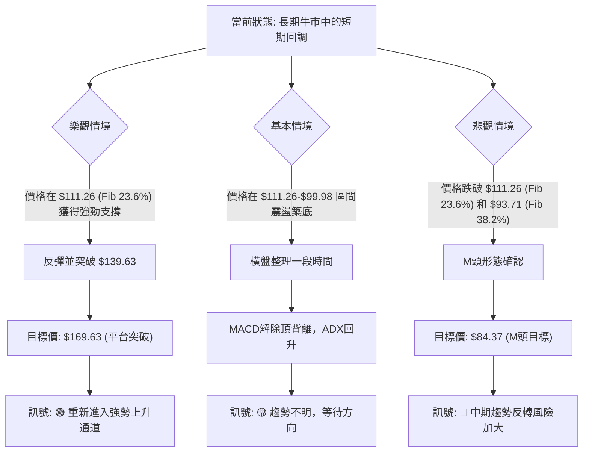
**風險場景分析解讀**：
1.  **樂觀情境 (30% 機率)**：INTC 的回調在 $111.26 (斐波那契23.6%回調位) 或 MA50 ($113.38) 附近獲得強勁支撐。買盤介入，推動股價反彈，並成功突破近期高點 $139.63，延續其強勁的長期上升趨勢。MACD的頂背離被化解，ADX重新走強。
2.  **基本情境 (50% 機率)**：INTC 在 $111.26 到 $99.98 (布林下軌) 區間內進行較長時間的橫盤整理或震盪築底。在此期間，動能指標如 MACD 將逐步修復，MACD 頂背離的影響會逐漸減弱。市場在消化前期漲幅和獲利盤後，重新積蓄上漲動能。ADX保持弱勢或中性。
3.  **悲觀情境 (20% 機率)**：INTC 未能守住 $111.26 和 $93.71 (斐波那契38.2%回調位) 等關鍵支撐。MACD 頂背離確認，並伴隨 M 頭等反轉形態的形成。若跌破關鍵頸線，股價將加速下跌，目標指向更低的水平，如 $84.37。這將意味著中期趨勢的嚴重惡化，甚至可能影響長期趨勢的穩固性。

### 🛡️ 風險管理重要提醒

1.  **嚴格止損**：在當前高波動和方向不明的市場環境中，無論採用何種策略，都必須設定並嚴格執行止損。止損點應根據 ATR 或關鍵支撐/阻力位合理設定，並避免情緒化交易。
2.  **倉位管理**：避免重倉單一股票。在不確定性較高的情況下，應採取較小的倉位，並隨著趨勢的明確化逐步調整。對於做空策略，由於長期趨勢仍為上漲，倉位應尤其謹慎。
3.  **多時框架確認**：在任何交易決策前，應確保多個時框架的訊號相互確認。例如，如果日線出現買入訊號，最好能得到週線或月線的支撐。目前長期和短期訊號存在矛盾，更需謹慎。
4.  **關注外部資訊**：除了技術分析，應持續關注 INTC 的基本面變化、行業新聞、分析師評級調整以及宏觀經濟環境。特別是半導體行業的週期性特點，可能對股價產生重大影響。
5.  **耐心等待**：在趨勢不明朗或處於調整期的市場中，耐心等待明確的趨勢訊號或築底形態出現，往往是最好的風險管理策略。避免在震盪區間內頻繁交易。

---

## 📋 報告總結

```
INTC 技術分析報告總結
════════════════════════════════════════════════════════
報告日期：2026-07-06
當前價格：$120.35
分析評級：⚖️ 中性偏空 (長期趨勢向上，但短期面臨較大回調壓力，MACD頂背離風險顯著)

關鍵結論：
├─ 長期趨勢：🟢 強勁上升，MA200等長期均線提供堅實支撐，OBV趨勢向上。
├─ 中期趨勢：🟡 高位回調/整理，MACD週線級別頂背離是主要風險，ADX趨勢弱化。
├─ 短期趨勢：🔴 短期下跌，價格跌破MA20，MACD形成死叉，短期動能偏弱。
├─ 關鍵支撐：$113.38 (MA50), $111.26 (斐波那契23.6%), $99.98 (布林下軌)。
├─ 關鍵阻力：$123.12 (MA20/布林中軌), $133.99 (近期反彈高點), $139.63 (6月高點)。
└─ 分析師目標：$100.88 (平均), $45.00 (低), $200.00 (高) - 當前價格高於平均目標，顯示估值壓力。

最優策略組合：
1. 🥇 最佳機會：等待價格在 $111.26 - $113.38 區間獲得明確止跌訊號並放量反彈時，考慮逢低買入，目標 $123.12/$133.99，止損 $108.00。
2. 🥈 次選機會：若價格未能守住 $111.26 並伴隨放量跌破，可考慮在 $111.00 附近追空，目標 $99.98/$93.71，止損 $114.00，但需嚴格控制倉位。
3. 🥉 保守選擇：在當前趨勢不明朗、動能減弱且高波動的環境下，觀望是最保守且穩健的策略，等待更明確的趨勢方向形成。
════════════════════════════════════════════════════════
```

---

> ⚠️ **免責聲明**：本報告為 AI 自動生成之技術分析，所有數據及估算均基於提供的歷史價格資訊。本報告**僅供研究與學術參考**，**不構成任何投資建議**。投資有風險，入市需謹慎。

---

*報告生成時間：2026-07-06 ｜ 數據來源：提供數據 ｜ 分析框架：多時框技術分析*