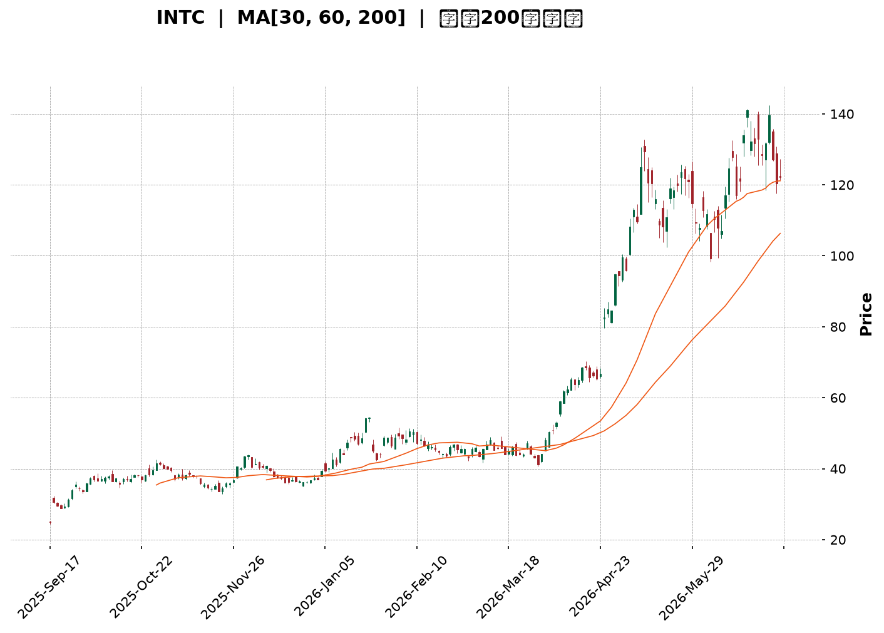
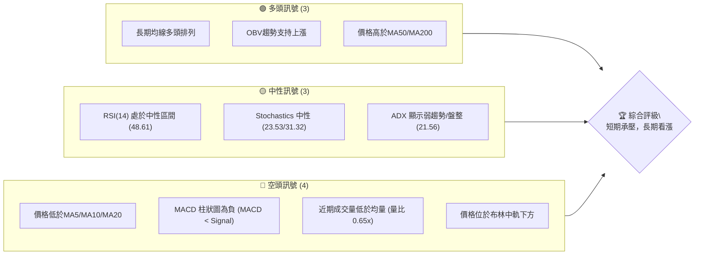
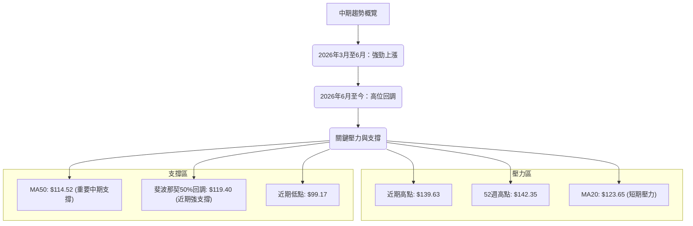
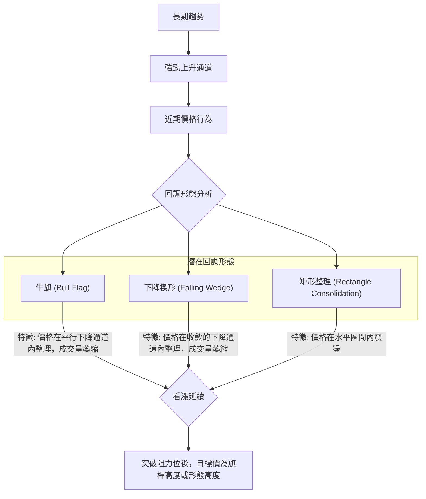
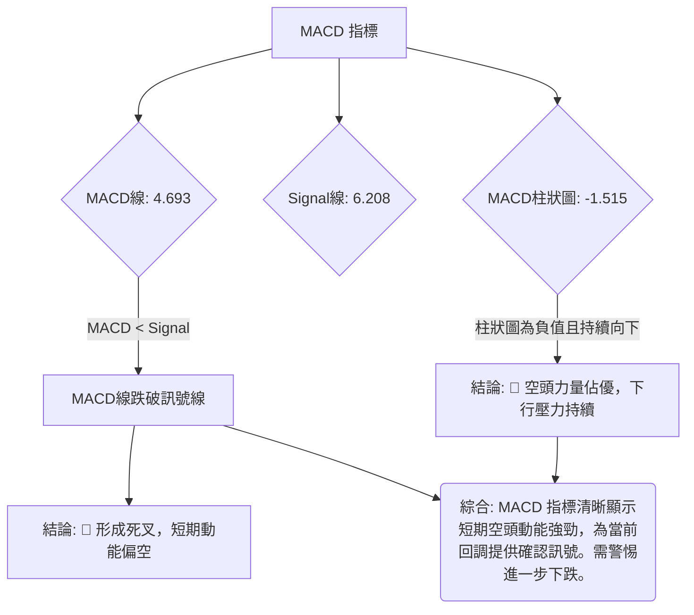

<details>
<summary>📊 靜態圖表 (點擊展開)</summary>

</details>

<html>
<head><meta charset="utf-8" /></head>
<body>
    <div style="height:500px; width:100%;">                        <script>window.PlotlyConfig = {MathJaxConfig: 'local'};</script>
        <script charset="utf-8" src="https://cdn.plot.ly/plotly-3.6.0.min.js" integrity="sha256-QaOVwtVY0T02VaHrr6pnoHLCwayMJp4O5n4YyaE3rJk=" crossorigin="anonymous"></script>                <div id="candlestick-chart" class="plotly-graph-div" style="height:100%; width:100%;"></div>            <script>                window.PLOTLYENV=window.PLOTLYENV || {};                                if (document.getElementById("candlestick-chart")) {                    Plotly.newPlot(                        "candlestick-chart",                        [{"close":{"dtype":"f8","bdata":"AAAAYGbmOEAAAACA65E+QAAAAOB6lD1AAAAAYI\u002fCPEAAAABAClc9QAAAAOBROD9AAAAAYLj+QEAAAAAAAMBBQAAAAKBwPUFAAAAAYGbGQEAAAADgUfhBQAAAAGBmpkJAAAAAgD1qQkAAAAAghUtCQAAAAIDClUJAAAAAQAq3QkAAAABgZuZCQAAAACBcL0JAAAAAACmcQkAAAADgo9BBQAAAAEAzk0JAAAAAIIVrQkAAAACgR4FCQAAAAMDMDENAAAAAIFwPQ0AAAACAwnVCQAAAAOB6FENAAAAAANcjQ0AAAADAHsVDQAAAAADXw0RAAAAAIIWrREAAAADgehREQAAAAGC4\u002fkNAAAAAAADAQ0AAAAAA14NCQAAAAOCjMENAAAAAYLieQkAAAADgoxBDQAAAAKCZOUNAAAAA4KPwQkAAAACA6\u002fFCQAAAAOB69EFAAAAAYI\u002fCQUAAAABA4VpBQAAAAIA9KkFAAAAAgBSOQUAAAAAgXM9AQAAAAAAAQEFAAAAAwB7lQUAAAACAPepBQAAAACCuZ0JAAAAAIK5HREAAAACgRwFEQAAAAAApvEVAAAAAoEfhRUAAAAAAAEBEQAAAAOB6tERAAAAAYGYmREAAAAAAAEBEQAAAAADXY0RAAAAAoEfBQ0AAAAAgrudCQAAAAKBHwUJAAAAAIK6nQkAAAABgZgZCQAAAAADXI0JAAAAAwPVoQkAAAAAgXC9CQAAAAMDMLEJAAAAA4HoUQkAAAACgmRlCQAAAAEAKV0JAAAAAYGamQkAAAABAM3NCQAAAAOCjsENAAAAAIFyvQ0AAAADAHgVEQAAAAOCjUEVAAAAAgBSOREAAAABgZsZGQAAAACCuB0ZAAAAAwB6lR0AAAAAAKVxIQAAAAMD1KEhAAAAAQOF6R0AAAAAgrkdIQAAAAAAAIEtAAAAAwPUoS0AAAADA9YhGQAAAAGC4PkVAAAAAQAr3RUAAAAAA12NIQAAAAOB6VEhAAAAAACk8R0AAAAAgrmdIQAAAAAAAoEhAAAAAwMxMSEAAAABguB5IQAAAACCFS0lAAAAAYLgeSUAAAADgo5BHQAAAAMAeJUhAAAAAoHA9R0AAAADAHmVHQAAAAEAKF0dAAAAAQOG6RkAAAAAgXE9GQAAAAIAUDkZAAAAA4KPQRUAAAAAgXA9HQAAAAOCjcEdAAAAAQOG6RkAAAACAFM5GQAAAAAAAwEZAAAAAwMyMRUAAAACAPcpGQAAAAKCZ+UZAAAAAgMK1RUAAAACAPcpGQAAAAADXY0dAAAAAoHD9R0AAAAAAAKBGQAAAAGCP4kZAAAAAoEfhRkAAAAAgrgdGQAAAAADXg0ZAAAAAQAoXR0AAAAAgXO9FQAAAAKBHAUZAAAAAIK4HRkAAAABACpdHQAAAAMDMDEZAAAAA4KOQRUAAAADgUZhEQAAAAOCjEEZAAAAAANcDSEAAAADgozBJQAAAAADXY0lAAAAA4Hp0SkAAAACgmXlNQAAAAAAp3E5AAAAA4KMwT0AAAAAghUtQQAAAACCu509AAAAAACk8UEAAAAAAACBRQAAAAAAAIFFAAAAAwMxsUEAAAADgo5BQQAAAAKBHUVBAAAAAgOuxUEAAAABgj6JUQAAAACBcP1VAAAAAoEchVUAAAAAAALBXQAAAAGC4nldAAAAAIK7nWEAAAACA6\u002fFXQAAAAKCZCVtAAAAA4KNAXEAAAAAgrmdbQAAAAEDhOl9AAAAAgBQuYEAAAABACideQAAAAGCPEl5AAAAAIIX7XEAAAACgRzFbQAAAAEDhCltAAAAAQDOzW0AAAACgcL1dQAAAAAAAoF1AAAAAgML1XUAAAACgR+FeQAAAAKBHcV5AAAAAwPU4XkAAAAAghatcQAAAAMAeVVtAAAAAIIX7WkAAAACgcC1cQAAAAIDr8VtAAAAAQOHKWEAAAACgR5FbQAAAAEDh+lpAAAAAYI\u002fCWkAAAACgcD1dQAAAAOB6JF9AAAAAQAr3X0AAAABAM0NdQAAAAGBmRl5AAAAAIK6\u002fYEAAAACAFJ5hQAAAAMD1iGBAAAAAwMx0YEAAAAAA15tgQAAAAIA9CmBAAAAAQAp3YEAAAAAAKXRhQAAAAKBHwV9AAAAAYGYWXkAAAADAzIxeQA=="},"high":{"dtype":"f8","bdata":"AAAAYI9COUAAAADgozBAQAAAAKBHoT5AAAAAoJkZPkAAAABAMzM+QAAAAEAzsz9AAAAAAAAgQUAAAABgZiZCQAAAAGBmhkFAAAAAYLgeQUAAAAAgrgdCQAAAAMD1yEJAAAAAgD0KQ0AAAABACldDQAAAAGBmBkNAAAAAwB7lQkAAAADAzAxDQAAAAEAz00NAAAAAoEfBQkAAAABgZkZCQAAAAGC4vkJAAAAAYI8CQ0AAAADgozBDQAAAAGCPQkNAAAAAwMwsQ0AAAABACvdCQAAAAEAzM0NAAAAAIFyPREAAAACAwlVEQAAAAKBwPUVAAAAAwB4FRUAAAABACrdEQAAAAIA9akRAAAAAoJk5REAAAAAAACBDQAAAAOBRWENAAAAAIIXrQ0AAAABgjyJDQAAAAADXw0NAAAAAACkcQ0AAAACgmRlDQAAAACCup0JAAAAAwMwMQkAAAACgcN1BQAAAAKBHYUFAAAAAAADgQUAAAABACldCQAAAAKBwfUFAAAAA4HoUQkAAAADgoxBCQAAAAGC4nkJAAAAAIIVLREAAAADgozBEQAAAAEAK10VAAAAAYI8CRkAAAAAA16NFQAAAAIA9akVAAAAAIFwPRUAAAACgR6FEQAAAAGC4fkRAAAAA4FEYREAAAAAA1wNEQAAAAKBwPUNAAAAAQOH6QkAAAAAghetCQAAAAGC4vkJAAAAAgD3KQkAAAABAM\u002fNCQAAAAGBmZkJAAAAAQAoXQkAAAABguD5CQAAAAGBmZkJAAAAAoEchQ0AAAACAPcpCQAAAAIAU7kNAAAAAwMwMRUAAAAAgridEQAAAAMD1SEZAAAAAIIWrRUAAAACgcN1GQAAAAKCZuUZAAAAAYLgeSEAAAAAAAIBIQAAAAIDrMUlAAAAAQOEaSUAAAACgcB1JQAAAAOB6NEtAAAAAwMxMS0AAAADgoxBIQAAAAEDhOkZAAAAAANdDRkAAAADAHqVIQAAAAGCPYkhAAAAAgD3KSEAAAAAghetIQAAAAGC4vklAAAAAoJnZSEAAAACAFG5JQAAAAGBmpklAAAAAACmcSUAAAADAHkVJQAAAAGBmxkhAAAAAoJl5SEAAAADgUdhHQAAAAIA9akdAAAAAYI9iR0AAAACAwpVGQAAAAIDrMUZAAAAAYGZGRkAAAADAzExHQAAAAAApfEdAAAAAoJl5R0AAAAAgrkdHQAAAACCu50ZAAAAA4FHYRUAAAADgoxBHQAAAAKBwPUdAAAAAQAqXRkAAAACgR+FGQAAAAOCj8EdAAAAAgD1qSEAAAADgUbhHQAAAAEAzU0dAAAAAgMKVSEAAAACAPQpHQAAAAEDh2kZAAAAA4FE4R0AAAABgZsZHQAAAAEDhukZAAAAAIK4nRkAAAADAzOxHQAAAAMDMTEdAAAAA4KMQRkAAAABguP5FQAAAAKBwHUZAAAAAYI9iSEAAAABguD5JQAAAAIDrMUpAAAAAYI+iSkAAAACAwpVNQAAAAIA9Ck9AAAAAgOuxT0AAAACgmWlQQAAAACCFS1BAAAAAgMJ1UEAAAABACidRQAAAAMAelVFAAAAAoHBNUUAAAABA4epQQAAAAKBHMVFAAAAAgOsRUUAAAACAFE5VQAAAAGBmxlVAAAAAgMIlVUAAAADAzLxXQAAAAAAp7FdAAAAAwMwcWUAAAADgevRYQAAAAGC4nltAAAAAAABgXEAAAADgo6BcQAAAAIA9UmBAAAAAAACYYEAAAABgj\u002fJfQAAAAAAAQF9AAAAA4HqkXUAAAADgeqRbQAAAAGCP4lxAAAAA4HpEXEAAAAAAKXxeQAAAAIA92l1AAAAAgOuxXkAAAAAgrmdfQAAAAKBHUV9AAAAAwB7FXkAAAADA9ahfQAAAAEAzU1xAAAAAAABAW0AAAABgj5JdQAAAAMD1SFxAAAAAYLieWkAAAABgjyJcQAAAAAAAgFxAAAAAAADgW0AAAAAAKdxdQAAAAGBm5l9AAAAAIIWTYEAAAABgZhZgQAAAAMDMTF9AAAAAIFzvYEAAAABgZq5hQAAAACBcP2FAAAAAYI8CYUAAAABACpdhQAAAACBcZ2BAAAAAoJmBYEAAAABAM8thQAAAACCu92BAAAAAIK5XYEAAAABAM9NfQA=="},"hovertemplate":"\u003cb\u003e%{x|%Y-%m-%d}\u003c\u002fb\u003e\u003cbr\u003e\u958b: $%{open:.2f}\u003cbr\u003e\u9ad8: $%{high:.2f}\u003cbr\u003e\u4f4e: $%{low:.2f}\u003cbr\u003e\u6536: $%{close:.2f}\u003cextra\u003e\u003c\u002fextra\u003e","low":{"dtype":"f8","bdata":"AAAAQDNzOEAAAADA9Sg+QAAAAOB6VD1AAAAAQOG6PEAAAACA69E8QAAAAEDhOj1AAAAAgMI1P0AAAABguD5BQAAAAKBw3UBAAAAAYI+CQEAAAAAAAMBAQAAAAOBRuEFAAAAAoJk5QkAAAABACjdCQAAAAMDMLEJAAAAA4Hr0QUAAAACAFG5CQAAAAGBmJkJAAAAAANcjQkAAAADgUVhBQAAAAIDr0UFAAAAA4Ho0QkAAAACAPQpCQAAAACCux0JAAAAAgMLVQkAAAADAHgVCQAAAAEAKN0JAAAAAgD3qQkAAAACgcB1DQAAAAMAexUNAAAAAgMJ1REAAAACAFA5EQAAAAMAe5UNAAAAAYGaGQ0AAAADgo1BCQAAAAIAUjkJAAAAAYGZmQkAAAAAAKXxCQAAAAAAp\u002fEJAAAAAYLi+QkAAAADAzKxCQAAAAKCZuUFAAAAAIFxPQUAAAACgcB1BQAAAAMD1yEBAAAAAAAAgQUAAAACgcL1AQAAAAIDrcUBAAAAA4FFYQUAAAABACldBQAAAAOCjEEJAAAAAIIWrQkAAAADAzMxDQAAAAGBmBkRAAAAAoEdBRUAAAACA6xFEQAAAAEAzk0RAAAAAoJnZQ0AAAAAA1wNEQAAAAIDrcUNAAAAAgD2KQ0AAAAAgXM9CQAAAAMD1qEJAAAAAgMJ1QkAAAAAAKfxBQAAAAIDC1UFAAAAA4FE4QkAAAADAHiVCQAAAAADXA0JAAAAAoJl5QUAAAADAzOxBQAAAAMD16EFAAAAAwPVoQkAAAAAgXG9CQAAAAKBH4UJAAAAAYI+iQ0AAAACgmXlDQAAAACBcD0RAAAAAQApXREAAAADA9chEQAAAAIDr8UVAAAAAACmcRkAAAACAwrVHQAAAAIA96kdAAAAAQOFaR0AAAAAAAIBHQAAAAEAzE0lAAAAAgD2KSkAAAACgmTlGQAAAAADXI0VAAAAAwMyMRUAAAADA9ShHQAAAAGC4fkdAAAAAQOH6RkAAAAAAAMBGQAAAAEAKN0hAAAAAAACAR0AAAADAHmVHQAAAAIA9akhAAAAAIIXLR0AAAABgj2JHQAAAAIAUbkdAAAAA4FEYR0AAAAAAKXxGQAAAAEDhukZAAAAA4KNwRkAAAACAwvVFQAAAAOCjcEVAAAAAQAqXRUAAAADAHsVFQAAAAIA9ikZAAAAAgOsxRkAAAABAMzNGQAAAAKCZ+UVAAAAAgOsRRUAAAABgj6JFQAAAAKCZWUZAAAAAANejRUAAAACA69FEQAAAAOB6tEZAAAAA4HpUR0AAAACAwpVGQAAAAIDrsUZAAAAA4FHYRkAAAADgevRFQAAAAGBmBkZAAAAAQDPTRUAAAACA69FFQAAAAGC43kVAAAAAoJmZRUAAAACgmblGQAAAAIDC9UVAAAAAgBRuRUAAAADgo1BEQAAAAMDMzERAAAAAoHB9RkAAAADAHgVHQAAAACBc70hAAAAAACmcSUAAAABgZmZLQAAAAIDrMU1AAAAAAABgTkAAAABAChdPQAAAACCFC09AAAAA4KNwT0AAAACgRxFQQAAAACBc71BAAAAAgBQeUEAAAADA9WhQQAAAAGC4PlBAAAAAQOFaUEAAAAAgrudTQAAAAEAKp1RAAAAAQDMzVEAAAAAgrndVQAAAAAAA4FZAAAAAQAonV0AAAABgZuZXQAAAAMAeBVlAAAAAwB6lWkAAAACgmUlbQAAAAEAz81tAAAAAQOH6XkAAAAAAAMBcQAAAAIA9Gl1AAAAAQOFKXEAAAACgR0FaQAAAAGBm9llAAAAAoJmZWUAAAABAM7NcQAAAAEDhSlxAAAAAgMKFXUAAAABgZlZdQAAAAAAAQF1AAAAAANcTXUAAAABgj2JcQAAAAMAelVpAAAAAQOEKWkAAAABACrdbQAAAAGC43lpAAAAAwB6VWEAAAACAPapaQAAAAKBw3VhAAAAAQOE6WkAAAADgo6BbQAAAAMAe1VxAAAAAgD2qX0AAAAAAAABdQAAAAADXg11AAAAAoJn5X0AAAABguAZhQAAAAKCZCWBAAAAAwMz8X0AAAACAPVpfQAAAAAAAYF9AAAAAAACgXUAAAADgo3BgQAAAACCFq19AAAAA4FFoXUAAAACgR2FeQA=="},"name":"\u50f9\u683c","open":{"dtype":"f8","bdata":"AAAA4HoUOUAAAAAgrsc\u002fQAAAAKBHYT5AAAAAIIWrPUAAAACgcP08QAAAAKBHYT1AAAAAACmcP0AAAABgj4JBQAAAAGCPQkFAAAAAQAr3QEAAAAAA18NAQAAAAKBH4UFAAAAAoJn5QkAAAADgUZhCQAAAAIDrUUJAAAAAYGZGQkAAAAAA18NCQAAAAEDhOkNAAAAA4FE4QkAAAAAAAABCQAAAAEAzM0JAAAAAQDOTQkAAAACAFC5CQAAAAMD1yEJAAAAAgOsRQ0AAAAAghetCQAAAAMDMTEJAAAAAYI8CREAAAACA6zFDQAAAACCFy0NAAAAAwMzMREAAAAAAKXxEQAAAAEAKV0RAAAAAAAAgREAAAACA6xFDQAAAAIDCtUJAAAAAIIUrQ0AAAACgR6FCQAAAAEAKd0NAAAAAQDMTQ0AAAAAgrgdDQAAAAGCPokJAAAAAANeDQUAAAACgmblBQAAAAAAAIEFAAAAAgD0qQUAAAAAAAABCQAAAAKBHwUBAAAAAACl8QUAAAABgZsZBQAAAAKCZGUJAAAAAQDOzQkAAAACAFO5DQAAAAAApPERAAAAAgOuxRUAAAACgR6FFQAAAAOB6lERAAAAA4FH4REAAAACgcF1EQAAAAIAUDkRAAAAAwPUIREAAAAAAAKBDQAAAAIA9KkNAAAAAgD3KQkAAAAAghctCQAAAAOCjsEJAAAAAoHA9QkAAAACA6\u002fFCQAAAAGC4HkJAAAAAgMKVQUAAAACAwhVCQAAAAKBHAUJAAAAA4Hp0QkAAAABAM7NCQAAAAGCP4kJAAAAAIIXLREAAAACAFO5DQAAAAEAKF0RAAAAAIFxPRUAAAACAPepEQAAAAGC4HkZAAAAAgOvxRkAAAACgmXlIQAAAAMDMrEhAAAAAYI+iSEAAAABgZqZHQAAAAMD1KElAAAAAQOEaS0AAAACAFG5HQAAAAADXI0ZAAAAAACn8RUAAAADAzExHQAAAACCux0dAAAAAoHB9SEAAAADgo9BGQAAAACCuB0lAAAAAwB7FSEAAAAAghctHQAAAAMDMjEhAAAAAIIXLSEAAAADgejRJQAAAAIAUDkhAAAAAYGbmR0AAAACgR+FGQAAAAEAK90ZAAAAAgML1RkAAAACgmXlGQAAAAIDr8UVAAAAAIIULRkAAAADAzAxGQAAAACCFC0dAAAAAYI9iR0AAAABA4TpGQAAAAKCZGUZAAAAA4FG4RUAAAADA9QhGQAAAACBcb0ZAAAAAgMJVRkAAAABguF5FQAAAAOB6tEZAAAAAwPVoR0AAAABAM7NHQAAAAAAp\u002fEZAAAAA4Hr0R0AAAACAPQpHQAAAAKCZGUZAAAAAYLj+RUAAAACgmXlHQAAAAAAAQEZAAAAAwB7FRUAAAADAzOxGQAAAAGBmJkdAAAAAIFzPRUAAAAAAKdxFQAAAAKCZ+URAAAAAAACARkAAAAAgrgdHQAAAAOCjcElAAAAA4Hr0SUAAAAAgXK9LQAAAAEAzM01AAAAAYI\u002fCTkAAAABAChdPQAAAAIA9SlBAAAAAYI\u002fiT0AAAAAghTtQQAAAAGBmNlFAAAAAwMwcUUAAAADA9chQQAAAAAAp\u002fFBAAAAAYGaGUEAAAADAzIxUQAAAAEDh6lRAAAAAgOtRVEAAAADA9YhVQAAAAGBm5ldAAAAAwMxMV0AAAAAghctYQAAAAOCjIFlAAAAAYLi+W0AAAACgR8FbQAAAAADX81tAAAAAAClcYEAAAABAChdfQAAAAGBmBl9AAAAAgD2qXEAAAABgj3JbQAAAAIAUXlxAAAAAYLi+WkAAAACAFA5dQAAAAMAeJV1AAAAAgMIVXkAAAABgZoZeQAAAAMD1GF9AAAAAwMxcXkAAAABgZvZeQAAAACCFW1tAAAAAwMzcWkAAAABA4RpdQAAAAKCZGVtAAAAAYLieWkAAAAAAAMBbQAAAACBcP1xAAAAAgOuBWkAAAACgR2FcQAAAAEDhWl1AAAAAIK4vYEAAAABACkdfQAAAAGBmdl5AAAAAgOt5YEAAAAAA12NhQAAAACBcN2BAAAAAoJmhYEAAAAAgXHdhQAAAAGC4FmBAAAAAAADAX0AAAAAgrn9gQAAAAAAA4GBAAAAAoHAdYEAAAADgeqReQA=="},"x":["2025-09-17T00:00:00-04:00","2025-09-18T00:00:00-04:00","2025-09-19T00:00:00-04:00","2025-09-22T00:00:00-04:00","2025-09-23T00:00:00-04:00","2025-09-24T00:00:00-04:00","2025-09-25T00:00:00-04:00","2025-09-26T00:00:00-04:00","2025-09-29T00:00:00-04:00","2025-09-30T00:00:00-04:00","2025-10-01T00:00:00-04:00","2025-10-02T00:00:00-04:00","2025-10-03T00:00:00-04:00","2025-10-06T00:00:00-04:00","2025-10-07T00:00:00-04:00","2025-10-08T00:00:00-04:00","2025-10-09T00:00:00-04:00","2025-10-10T00:00:00-04:00","2025-10-13T00:00:00-04:00","2025-10-14T00:00:00-04:00","2025-10-15T00:00:00-04:00","2025-10-16T00:00:00-04:00","2025-10-17T00:00:00-04:00","2025-10-20T00:00:00-04:00","2025-10-21T00:00:00-04:00","2025-10-22T00:00:00-04:00","2025-10-23T00:00:00-04:00","2025-10-24T00:00:00-04:00","2025-10-27T00:00:00-04:00","2025-10-28T00:00:00-04:00","2025-10-29T00:00:00-04:00","2025-10-30T00:00:00-04:00","2025-10-31T00:00:00-04:00","2025-11-03T00:00:00-05:00","2025-11-04T00:00:00-05:00","2025-11-05T00:00:00-05:00","2025-11-06T00:00:00-05:00","2025-11-07T00:00:00-05:00","2025-11-10T00:00:00-05:00","2025-11-11T00:00:00-05:00","2025-11-12T00:00:00-05:00","2025-11-13T00:00:00-05:00","2025-11-14T00:00:00-05:00","2025-11-17T00:00:00-05:00","2025-11-18T00:00:00-05:00","2025-11-19T00:00:00-05:00","2025-11-20T00:00:00-05:00","2025-11-21T00:00:00-05:00","2025-11-24T00:00:00-05:00","2025-11-25T00:00:00-05:00","2025-11-26T00:00:00-05:00","2025-11-28T00:00:00-05:00","2025-12-01T00:00:00-05:00","2025-12-02T00:00:00-05:00","2025-12-03T00:00:00-05:00","2025-12-04T00:00:00-05:00","2025-12-05T00:00:00-05:00","2025-12-08T00:00:00-05:00","2025-12-09T00:00:00-05:00","2025-12-10T00:00:00-05:00","2025-12-11T00:00:00-05:00","2025-12-12T00:00:00-05:00","2025-12-15T00:00:00-05:00","2025-12-16T00:00:00-05:00","2025-12-17T00:00:00-05:00","2025-12-18T00:00:00-05:00","2025-12-19T00:00:00-05:00","2025-12-22T00:00:00-05:00","2025-12-23T00:00:00-05:00","2025-12-24T00:00:00-05:00","2025-12-26T00:00:00-05:00","2025-12-29T00:00:00-05:00","2025-12-30T00:00:00-05:00","2025-12-31T00:00:00-05:00","2026-01-02T00:00:00-05:00","2026-01-05T00:00:00-05:00","2026-01-06T00:00:00-05:00","2026-01-07T00:00:00-05:00","2026-01-08T00:00:00-05:00","2026-01-09T00:00:00-05:00","2026-01-12T00:00:00-05:00","2026-01-13T00:00:00-05:00","2026-01-14T00:00:00-05:00","2026-01-15T00:00:00-05:00","2026-01-16T00:00:00-05:00","2026-01-20T00:00:00-05:00","2026-01-21T00:00:00-05:00","2026-01-22T00:00:00-05:00","2026-01-23T00:00:00-05:00","2026-01-26T00:00:00-05:00","2026-01-27T00:00:00-05:00","2026-01-28T00:00:00-05:00","2026-01-29T00:00:00-05:00","2026-01-30T00:00:00-05:00","2026-02-02T00:00:00-05:00","2026-02-03T00:00:00-05:00","2026-02-04T00:00:00-05:00","2026-02-05T00:00:00-05:00","2026-02-06T00:00:00-05:00","2026-02-09T00:00:00-05:00","2026-02-10T00:00:00-05:00","2026-02-11T00:00:00-05:00","2026-02-12T00:00:00-05:00","2026-02-13T00:00:00-05:00","2026-02-17T00:00:00-05:00","2026-02-18T00:00:00-05:00","2026-02-19T00:00:00-05:00","2026-02-20T00:00:00-05:00","2026-02-23T00:00:00-05:00","2026-02-24T00:00:00-05:00","2026-02-25T00:00:00-05:00","2026-02-26T00:00:00-05:00","2026-02-27T00:00:00-05:00","2026-03-02T00:00:00-05:00","2026-03-03T00:00:00-05:00","2026-03-04T00:00:00-05:00","2026-03-05T00:00:00-05:00","2026-03-06T00:00:00-05:00","2026-03-09T00:00:00-04:00","2026-03-10T00:00:00-04:00","2026-03-11T00:00:00-04:00","2026-03-12T00:00:00-04:00","2026-03-13T00:00:00-04:00","2026-03-16T00:00:00-04:00","2026-03-17T00:00:00-04:00","2026-03-18T00:00:00-04:00","2026-03-19T00:00:00-04:00","2026-03-20T00:00:00-04:00","2026-03-23T00:00:00-04:00","2026-03-24T00:00:00-04:00","2026-03-25T00:00:00-04:00","2026-03-26T00:00:00-04:00","2026-03-27T00:00:00-04:00","2026-03-30T00:00:00-04:00","2026-03-31T00:00:00-04:00","2026-04-01T00:00:00-04:00","2026-04-02T00:00:00-04:00","2026-04-06T00:00:00-04:00","2026-04-07T00:00:00-04:00","2026-04-08T00:00:00-04:00","2026-04-09T00:00:00-04:00","2026-04-10T00:00:00-04:00","2026-04-13T00:00:00-04:00","2026-04-14T00:00:00-04:00","2026-04-15T00:00:00-04:00","2026-04-16T00:00:00-04:00","2026-04-17T00:00:00-04:00","2026-04-20T00:00:00-04:00","2026-04-21T00:00:00-04:00","2026-04-22T00:00:00-04:00","2026-04-23T00:00:00-04:00","2026-04-24T00:00:00-04:00","2026-04-27T00:00:00-04:00","2026-04-28T00:00:00-04:00","2026-04-29T00:00:00-04:00","2026-04-30T00:00:00-04:00","2026-05-01T00:00:00-04:00","2026-05-04T00:00:00-04:00","2026-05-05T00:00:00-04:00","2026-05-06T00:00:00-04:00","2026-05-07T00:00:00-04:00","2026-05-08T00:00:00-04:00","2026-05-11T00:00:00-04:00","2026-05-12T00:00:00-04:00","2026-05-13T00:00:00-04:00","2026-05-14T00:00:00-04:00","2026-05-15T00:00:00-04:00","2026-05-18T00:00:00-04:00","2026-05-19T00:00:00-04:00","2026-05-20T00:00:00-04:00","2026-05-21T00:00:00-04:00","2026-05-22T00:00:00-04:00","2026-05-26T00:00:00-04:00","2026-05-27T00:00:00-04:00","2026-05-28T00:00:00-04:00","2026-05-29T00:00:00-04:00","2026-06-01T00:00:00-04:00","2026-06-02T00:00:00-04:00","2026-06-03T00:00:00-04:00","2026-06-04T00:00:00-04:00","2026-06-05T00:00:00-04:00","2026-06-08T00:00:00-04:00","2026-06-09T00:00:00-04:00","2026-06-10T00:00:00-04:00","2026-06-11T00:00:00-04:00","2026-06-12T00:00:00-04:00","2026-06-15T00:00:00-04:00","2026-06-16T00:00:00-04:00","2026-06-17T00:00:00-04:00","2026-06-18T00:00:00-04:00","2026-06-22T00:00:00-04:00","2026-06-23T00:00:00-04:00","2026-06-24T00:00:00-04:00","2026-06-25T00:00:00-04:00","2026-06-26T00:00:00-04:00","2026-06-29T00:00:00-04:00","2026-06-30T00:00:00-04:00","2026-07-01T00:00:00-04:00","2026-07-02T00:00:00-04:00","2026-07-06T00:00:00-04:00"],"type":"candlestick"},{"hovertemplate":"MA30: $%{y:.2f}\u003cextra\u003e\u003c\u002fextra\u003e","line":{"color":"#2196F3","dash":"dash","width":2},"mode":"lines","name":"MA30","x":["2025-09-17T00:00:00-04:00","2025-09-18T00:00:00-04:00","2025-09-19T00:00:00-04:00","2025-09-22T00:00:00-04:00","2025-09-23T00:00:00-04:00","2025-09-24T00:00:00-04:00","2025-09-25T00:00:00-04:00","2025-09-26T00:00:00-04:00","2025-09-29T00:00:00-04:00","2025-09-30T00:00:00-04:00","2025-10-01T00:00:00-04:00","2025-10-02T00:00:00-04:00","2025-10-03T00:00:00-04:00","2025-10-06T00:00:00-04:00","2025-10-07T00:00:00-04:00","2025-10-08T00:00:00-04:00","2025-10-09T00:00:00-04:00","2025-10-10T00:00:00-04:00","2025-10-13T00:00:00-04:00","2025-10-14T00:00:00-04:00","2025-10-15T00:00:00-04:00","2025-10-16T00:00:00-04:00","2025-10-17T00:00:00-04:00","2025-10-20T00:00:00-04:00","2025-10-21T00:00:00-04:00","2025-10-22T00:00:00-04:00","2025-10-23T00:00:00-04:00","2025-10-24T00:00:00-04:00","2025-10-27T00:00:00-04:00","2025-10-28T00:00:00-04:00","2025-10-29T00:00:00-04:00","2025-10-30T00:00:00-04:00","2025-10-31T00:00:00-04:00","2025-11-03T00:00:00-05:00","2025-11-04T00:00:00-05:00","2025-11-05T00:00:00-05:00","2025-11-06T00:00:00-05:00","2025-11-07T00:00:00-05:00","2025-11-10T00:00:00-05:00","2025-11-11T00:00:00-05:00","2025-11-12T00:00:00-05:00","2025-11-13T00:00:00-05:00","2025-11-14T00:00:00-05:00","2025-11-17T00:00:00-05:00","2025-11-18T00:00:00-05:00","2025-11-19T00:00:00-05:00","2025-11-20T00:00:00-05:00","2025-11-21T00:00:00-05:00","2025-11-24T00:00:00-05:00","2025-11-25T00:00:00-05:00","2025-11-26T00:00:00-05:00","2025-11-28T00:00:00-05:00","2025-12-01T00:00:00-05:00","2025-12-02T00:00:00-05:00","2025-12-03T00:00:00-05:00","2025-12-04T00:00:00-05:00","2025-12-05T00:00:00-05:00","2025-12-08T00:00:00-05:00","2025-12-09T00:00:00-05:00","2025-12-10T00:00:00-05:00","2025-12-11T00:00:00-05:00","2025-12-12T00:00:00-05:00","2025-12-15T00:00:00-05:00","2025-12-16T00:00:00-05:00","2025-12-17T00:00:00-05:00","2025-12-18T00:00:00-05:00","2025-12-19T00:00:00-05:00","2025-12-22T00:00:00-05:00","2025-12-23T00:00:00-05:00","2025-12-24T00:00:00-05:00","2025-12-26T00:00:00-05:00","2025-12-29T00:00:00-05:00","2025-12-30T00:00:00-05:00","2025-12-31T00:00:00-05:00","2026-01-02T00:00:00-05:00","2026-01-05T00:00:00-05:00","2026-01-06T00:00:00-05:00","2026-01-07T00:00:00-05:00","2026-01-08T00:00:00-05:00","2026-01-09T00:00:00-05:00","2026-01-12T00:00:00-05:00","2026-01-13T00:00:00-05:00","2026-01-14T00:00:00-05:00","2026-01-15T00:00:00-05:00","2026-01-16T00:00:00-05:00","2026-01-20T00:00:00-05:00","2026-01-21T00:00:00-05:00","2026-01-22T00:00:00-05:00","2026-01-23T00:00:00-05:00","2026-01-26T00:00:00-05:00","2026-01-27T00:00:00-05:00","2026-01-28T00:00:00-05:00","2026-01-29T00:00:00-05:00","2026-01-30T00:00:00-05:00","2026-02-02T00:00:00-05:00","2026-02-03T00:00:00-05:00","2026-02-04T00:00:00-05:00","2026-02-05T00:00:00-05:00","2026-02-06T00:00:00-05:00","2026-02-09T00:00:00-05:00","2026-02-10T00:00:00-05:00","2026-02-11T00:00:00-05:00","2026-02-12T00:00:00-05:00","2026-02-13T00:00:00-05:00","2026-02-17T00:00:00-05:00","2026-02-18T00:00:00-05:00","2026-02-19T00:00:00-05:00","2026-02-20T00:00:00-05:00","2026-02-23T00:00:00-05:00","2026-02-24T00:00:00-05:00","2026-02-25T00:00:00-05:00","2026-02-26T00:00:00-05:00","2026-02-27T00:00:00-05:00","2026-03-02T00:00:00-05:00","2026-03-03T00:00:00-05:00","2026-03-04T00:00:00-05:00","2026-03-05T00:00:00-05:00","2026-03-06T00:00:00-05:00","2026-03-09T00:00:00-04:00","2026-03-10T00:00:00-04:00","2026-03-11T00:00:00-04:00","2026-03-12T00:00:00-04:00","2026-03-13T00:00:00-04:00","2026-03-16T00:00:00-04:00","2026-03-17T00:00:00-04:00","2026-03-18T00:00:00-04:00","2026-03-19T00:00:00-04:00","2026-03-20T00:00:00-04:00","2026-03-23T00:00:00-04:00","2026-03-24T00:00:00-04:00","2026-03-25T00:00:00-04:00","2026-03-26T00:00:00-04:00","2026-03-27T00:00:00-04:00","2026-03-30T00:00:00-04:00","2026-03-31T00:00:00-04:00","2026-04-01T00:00:00-04:00","2026-04-02T00:00:00-04:00","2026-04-06T00:00:00-04:00","2026-04-07T00:00:00-04:00","2026-04-08T00:00:00-04:00","2026-04-09T00:00:00-04:00","2026-04-10T00:00:00-04:00","2026-04-13T00:00:00-04:00","2026-04-14T00:00:00-04:00","2026-04-15T00:00:00-04:00","2026-04-16T00:00:00-04:00","2026-04-17T00:00:00-04:00","2026-04-20T00:00:00-04:00","2026-04-21T00:00:00-04:00","2026-04-22T00:00:00-04:00","2026-04-23T00:00:00-04:00","2026-04-24T00:00:00-04:00","2026-04-27T00:00:00-04:00","2026-04-28T00:00:00-04:00","2026-04-29T00:00:00-04:00","2026-04-30T00:00:00-04:00","2026-05-01T00:00:00-04:00","2026-05-04T00:00:00-04:00","2026-05-05T00:00:00-04:00","2026-05-06T00:00:00-04:00","2026-05-07T00:00:00-04:00","2026-05-08T00:00:00-04:00","2026-05-11T00:00:00-04:00","2026-05-12T00:00:00-04:00","2026-05-13T00:00:00-04:00","2026-05-14T00:00:00-04:00","2026-05-15T00:00:00-04:00","2026-05-18T00:00:00-04:00","2026-05-19T00:00:00-04:00","2026-05-20T00:00:00-04:00","2026-05-21T00:00:00-04:00","2026-05-22T00:00:00-04:00","2026-05-26T00:00:00-04:00","2026-05-27T00:00:00-04:00","2026-05-28T00:00:00-04:00","2026-05-29T00:00:00-04:00","2026-06-01T00:00:00-04:00","2026-06-02T00:00:00-04:00","2026-06-03T00:00:00-04:00","2026-06-04T00:00:00-04:00","2026-06-05T00:00:00-04:00","2026-06-08T00:00:00-04:00","2026-06-09T00:00:00-04:00","2026-06-10T00:00:00-04:00","2026-06-11T00:00:00-04:00","2026-06-12T00:00:00-04:00","2026-06-15T00:00:00-04:00","2026-06-16T00:00:00-04:00","2026-06-17T00:00:00-04:00","2026-06-18T00:00:00-04:00","2026-06-22T00:00:00-04:00","2026-06-23T00:00:00-04:00","2026-06-24T00:00:00-04:00","2026-06-25T00:00:00-04:00","2026-06-26T00:00:00-04:00","2026-06-29T00:00:00-04:00","2026-06-30T00:00:00-04:00","2026-07-01T00:00:00-04:00","2026-07-02T00:00:00-04:00","2026-07-06T00:00:00-04:00"],"y":{"dtype":"f8","bdata":"AAAAAAAA+H8AAAAAAAD4fwAAAAAAAPh\u002fAAAAAAAA+H8AAAAAAAD4fwAAAAAAAPh\u002fAAAAAAAA+H8AAAAAAAD4fwAAAAAAAPh\u002fAAAAAAAA+H8AAAAAAAD4fwAAAAAAAPh\u002fAAAAAAAA+H8AAAAAAAD4fwAAAAAAAPh\u002fAAAAAAAA+H8AAAAAAAD4fwAAAAAAAPh\u002fAAAAAAAA+H8AAAAAAAD4fwAAAAAAAPh\u002fAAAAAAAA+H8AAAAAAAD4fwAAAAAAAPh\u002fAAAAAAAA+H8AAAAAAAD4fwAAAAAAAPh\u002fAAAAAAAA+H8AAAAAAAD4f1VVVZVuskFAq6qqcpP4QUARERFJfiFCQImIiMjoTUJAIiIiurt7QkCamZlBi5xCQDMzM+MXu0JAERERwfXIQkCrqqpqLtRCQHd3d7ce5UJAvLu7O5j3QkB3d3cn6v9CQHd3d+f7+UJAiYiICGX0QkAiIiKSX+xCQJqZmYlB4EJAq6qqelvWQkDe3d3NhcRCQERERESLvEJAMzMzU3G2QkB3d3fHS7dCQImIiGjYtUJAREREpLfFQkARERFxhNJCQKuqqupt6UJAzczMTH4BQ0De3d2dxBBDQLy7u3uiHkNAzczM3EAnQ0AAAABwWStDQM3MzDwmKENAMzMzY1cgQ0AAAACQUBZDQM3MzLy7C0NAzczMrGMCQ0ARERFBNf5CQN7d3X0\u002f9UJAzczMvHTzQkCJiIhY8utCQFVVVZX84kJAIiIi4qXbQkBERET0b9RCQAAAAAC510JAvLu7O1HfQkDNzMxMqehCQO\u002fu7j41\u002fkJAzczMTGIQQ0B3d3enxitDQImIiMh2TkNAREREpCllQ0CJiIh4oo5DQHd3d2eRrUNAvLu7W0jKQ0AREREBcu9DQO\u002fu7n4jBERAAAAAwMoRREC8u7trLjREQAAAACD3akRAREREtMimREDNzMxcSLpEQERERCSUwURAZmZm9m\u002fUREAAAAAgPgNFQGZmZubQMkVAAAAAEOZZRUAzMzNjV5BFQGZmZhaux0VAzczM\u002fPD5RUAiIiIylixGQDMzMxNYaUZAERERMWulRkCrqqqqDdRGQCIiIuKWBUdARERE5MEsR0CJiIho9FZHQCIiItL3c0dAmpmZufONR0De3d1NfqFHQLy7u9vOp0dA7+7uXo+yR0BmZmb2\u002fbRHQHd3dycGwUdA3t3dTTe5R0Crqqpa8qtHQJqZmSnqn0dAMzMzA3KPR0Dv7u4Ou4JHQO\u002fu7j5RX0dAmpmZic8wR0CJiIiY\u002fDJHQKuqqmpKRUdAiYiIGJJWR0BVVVVlgkdHQO\u002fu7r4tO0dAvLu7OyY4R0B3d3f34SNHQJqZmZngEUdAERERUY0HR0C8u7sb6PRGQN7d3f3U2EZAiYiIyHa+RkBVVVVlrb5GQLy7u8vMrEZAREREtIGeRkAiIiICnYZGQM3MzNzdfUZAzczM\u002fNSIRkAiIiJyaKFGQM3MzNzdvUZAiYiIGHblRkARERHhMxxHQN7d3R2FW0dAVVVVRbajR0De3d3tNfdHQFVVVVVVRUhAERERcYSiSEARERExTwRJQN7d3c2FZElAERERgZXDSUBERESU0RtKQGZmZpa1akpAMzMzM+y6SkAzMzPTBlpLQFVVVYVdAUxAZmZmxr2mTEBVVVXFBH9NQM3MzFwBUk5AiYiIGAQ2T0BERETUvwlQQKuqqtKUklBAd3d3t6wlUUCJiIhI4apRQHd3d8dLV1JAREREjGwPU0BVVVV12rhTQBEREflTW1RAVVVVbS7sVEBmZmYmv2hVQN7d3b0t41VA7+7uZq1eVkDNzMzcst5WQAAAAFDUV1dAmpmZIWnSV0BERESM3k5YQO\u002fu7m6EylhAd3d3l+BBWUB3d3cHZaRZQHd3d6d\u002f+1lA3t3d3ZZVWkAiIiLCrrhaQLy7u2vnG1tA3t3drQBhW0BERET0KJxbQKuqqsoTzVtAd3d3tx79W0BmZmZWgCxcQM3MzHyxbFxAq6qqSvCoXEDNzMyMUNZcQJqZmfnw8VxAq6qq2rIeXUAAAADAg2FdQKuqqko3cV1A3t3dPe51XUBVVVXVFZBdQJqZmUk3oV1AvLu7u+bCXUCamZlpvAReQGZmZgbzLF5AiYiImFJBXkARERERPEheQA=="},"type":"scatter"},{"hovertemplate":"MA60: $%{y:.2f}\u003cextra\u003e\u003c\u002fextra\u003e","line":{"color":"#9C27B0","dash":"dash","width":2},"mode":"lines","name":"MA60","x":["2025-09-17T00:00:00-04:00","2025-09-18T00:00:00-04:00","2025-09-19T00:00:00-04:00","2025-09-22T00:00:00-04:00","2025-09-23T00:00:00-04:00","2025-09-24T00:00:00-04:00","2025-09-25T00:00:00-04:00","2025-09-26T00:00:00-04:00","2025-09-29T00:00:00-04:00","2025-09-30T00:00:00-04:00","2025-10-01T00:00:00-04:00","2025-10-02T00:00:00-04:00","2025-10-03T00:00:00-04:00","2025-10-06T00:00:00-04:00","2025-10-07T00:00:00-04:00","2025-10-08T00:00:00-04:00","2025-10-09T00:00:00-04:00","2025-10-10T00:00:00-04:00","2025-10-13T00:00:00-04:00","2025-10-14T00:00:00-04:00","2025-10-15T00:00:00-04:00","2025-10-16T00:00:00-04:00","2025-10-17T00:00:00-04:00","2025-10-20T00:00:00-04:00","2025-10-21T00:00:00-04:00","2025-10-22T00:00:00-04:00","2025-10-23T00:00:00-04:00","2025-10-24T00:00:00-04:00","2025-10-27T00:00:00-04:00","2025-10-28T00:00:00-04:00","2025-10-29T00:00:00-04:00","2025-10-30T00:00:00-04:00","2025-10-31T00:00:00-04:00","2025-11-03T00:00:00-05:00","2025-11-04T00:00:00-05:00","2025-11-05T00:00:00-05:00","2025-11-06T00:00:00-05:00","2025-11-07T00:00:00-05:00","2025-11-10T00:00:00-05:00","2025-11-11T00:00:00-05:00","2025-11-12T00:00:00-05:00","2025-11-13T00:00:00-05:00","2025-11-14T00:00:00-05:00","2025-11-17T00:00:00-05:00","2025-11-18T00:00:00-05:00","2025-11-19T00:00:00-05:00","2025-11-20T00:00:00-05:00","2025-11-21T00:00:00-05:00","2025-11-24T00:00:00-05:00","2025-11-25T00:00:00-05:00","2025-11-26T00:00:00-05:00","2025-11-28T00:00:00-05:00","2025-12-01T00:00:00-05:00","2025-12-02T00:00:00-05:00","2025-12-03T00:00:00-05:00","2025-12-04T00:00:00-05:00","2025-12-05T00:00:00-05:00","2025-12-08T00:00:00-05:00","2025-12-09T00:00:00-05:00","2025-12-10T00:00:00-05:00","2025-12-11T00:00:00-05:00","2025-12-12T00:00:00-05:00","2025-12-15T00:00:00-05:00","2025-12-16T00:00:00-05:00","2025-12-17T00:00:00-05:00","2025-12-18T00:00:00-05:00","2025-12-19T00:00:00-05:00","2025-12-22T00:00:00-05:00","2025-12-23T00:00:00-05:00","2025-12-24T00:00:00-05:00","2025-12-26T00:00:00-05:00","2025-12-29T00:00:00-05:00","2025-12-30T00:00:00-05:00","2025-12-31T00:00:00-05:00","2026-01-02T00:00:00-05:00","2026-01-05T00:00:00-05:00","2026-01-06T00:00:00-05:00","2026-01-07T00:00:00-05:00","2026-01-08T00:00:00-05:00","2026-01-09T00:00:00-05:00","2026-01-12T00:00:00-05:00","2026-01-13T00:00:00-05:00","2026-01-14T00:00:00-05:00","2026-01-15T00:00:00-05:00","2026-01-16T00:00:00-05:00","2026-01-20T00:00:00-05:00","2026-01-21T00:00:00-05:00","2026-01-22T00:00:00-05:00","2026-01-23T00:00:00-05:00","2026-01-26T00:00:00-05:00","2026-01-27T00:00:00-05:00","2026-01-28T00:00:00-05:00","2026-01-29T00:00:00-05:00","2026-01-30T00:00:00-05:00","2026-02-02T00:00:00-05:00","2026-02-03T00:00:00-05:00","2026-02-04T00:00:00-05:00","2026-02-05T00:00:00-05:00","2026-02-06T00:00:00-05:00","2026-02-09T00:00:00-05:00","2026-02-10T00:00:00-05:00","2026-02-11T00:00:00-05:00","2026-02-12T00:00:00-05:00","2026-02-13T00:00:00-05:00","2026-02-17T00:00:00-05:00","2026-02-18T00:00:00-05:00","2026-02-19T00:00:00-05:00","2026-02-20T00:00:00-05:00","2026-02-23T00:00:00-05:00","2026-02-24T00:00:00-05:00","2026-02-25T00:00:00-05:00","2026-02-26T00:00:00-05:00","2026-02-27T00:00:00-05:00","2026-03-02T00:00:00-05:00","2026-03-03T00:00:00-05:00","2026-03-04T00:00:00-05:00","2026-03-05T00:00:00-05:00","2026-03-06T00:00:00-05:00","2026-03-09T00:00:00-04:00","2026-03-10T00:00:00-04:00","2026-03-11T00:00:00-04:00","2026-03-12T00:00:00-04:00","2026-03-13T00:00:00-04:00","2026-03-16T00:00:00-04:00","2026-03-17T00:00:00-04:00","2026-03-18T00:00:00-04:00","2026-03-19T00:00:00-04:00","2026-03-20T00:00:00-04:00","2026-03-23T00:00:00-04:00","2026-03-24T00:00:00-04:00","2026-03-25T00:00:00-04:00","2026-03-26T00:00:00-04:00","2026-03-27T00:00:00-04:00","2026-03-30T00:00:00-04:00","2026-03-31T00:00:00-04:00","2026-04-01T00:00:00-04:00","2026-04-02T00:00:00-04:00","2026-04-06T00:00:00-04:00","2026-04-07T00:00:00-04:00","2026-04-08T00:00:00-04:00","2026-04-09T00:00:00-04:00","2026-04-10T00:00:00-04:00","2026-04-13T00:00:00-04:00","2026-04-14T00:00:00-04:00","2026-04-15T00:00:00-04:00","2026-04-16T00:00:00-04:00","2026-04-17T00:00:00-04:00","2026-04-20T00:00:00-04:00","2026-04-21T00:00:00-04:00","2026-04-22T00:00:00-04:00","2026-04-23T00:00:00-04:00","2026-04-24T00:00:00-04:00","2026-04-27T00:00:00-04:00","2026-04-28T00:00:00-04:00","2026-04-29T00:00:00-04:00","2026-04-30T00:00:00-04:00","2026-05-01T00:00:00-04:00","2026-05-04T00:00:00-04:00","2026-05-05T00:00:00-04:00","2026-05-06T00:00:00-04:00","2026-05-07T00:00:00-04:00","2026-05-08T00:00:00-04:00","2026-05-11T00:00:00-04:00","2026-05-12T00:00:00-04:00","2026-05-13T00:00:00-04:00","2026-05-14T00:00:00-04:00","2026-05-15T00:00:00-04:00","2026-05-18T00:00:00-04:00","2026-05-19T00:00:00-04:00","2026-05-20T00:00:00-04:00","2026-05-21T00:00:00-04:00","2026-05-22T00:00:00-04:00","2026-05-26T00:00:00-04:00","2026-05-27T00:00:00-04:00","2026-05-28T00:00:00-04:00","2026-05-29T00:00:00-04:00","2026-06-01T00:00:00-04:00","2026-06-02T00:00:00-04:00","2026-06-03T00:00:00-04:00","2026-06-04T00:00:00-04:00","2026-06-05T00:00:00-04:00","2026-06-08T00:00:00-04:00","2026-06-09T00:00:00-04:00","2026-06-10T00:00:00-04:00","2026-06-11T00:00:00-04:00","2026-06-12T00:00:00-04:00","2026-06-15T00:00:00-04:00","2026-06-16T00:00:00-04:00","2026-06-17T00:00:00-04:00","2026-06-18T00:00:00-04:00","2026-06-22T00:00:00-04:00","2026-06-23T00:00:00-04:00","2026-06-24T00:00:00-04:00","2026-06-25T00:00:00-04:00","2026-06-26T00:00:00-04:00","2026-06-29T00:00:00-04:00","2026-06-30T00:00:00-04:00","2026-07-01T00:00:00-04:00","2026-07-02T00:00:00-04:00","2026-07-06T00:00:00-04:00"],"y":{"dtype":"f8","bdata":"AAAAAAAA+H8AAAAAAAD4fwAAAAAAAPh\u002fAAAAAAAA+H8AAAAAAAD4fwAAAAAAAPh\u002fAAAAAAAA+H8AAAAAAAD4fwAAAAAAAPh\u002fAAAAAAAA+H8AAAAAAAD4fwAAAAAAAPh\u002fAAAAAAAA+H8AAAAAAAD4fwAAAAAAAPh\u002fAAAAAAAA+H8AAAAAAAD4fwAAAAAAAPh\u002fAAAAAAAA+H8AAAAAAAD4fwAAAAAAAPh\u002fAAAAAAAA+H8AAAAAAAD4fwAAAAAAAPh\u002fAAAAAAAA+H8AAAAAAAD4fwAAAAAAAPh\u002fAAAAAAAA+H8AAAAAAAD4fwAAAAAAAPh\u002fAAAAAAAA+H8AAAAAAAD4fwAAAAAAAPh\u002fAAAAAAAA+H8AAAAAAAD4fwAAAAAAAPh\u002fAAAAAAAA+H8AAAAAAAD4fwAAAAAAAPh\u002fAAAAAAAA+H8AAAAAAAD4fwAAAAAAAPh\u002fAAAAAAAA+H8AAAAAAAD4fwAAAAAAAPh\u002fAAAAAAAA+H8AAAAAAAD4fwAAAAAAAPh\u002fAAAAAAAA+H8AAAAAAAD4fwAAAAAAAPh\u002fAAAAAAAA+H8AAAAAAAD4fwAAAAAAAPh\u002fAAAAAAAA+H8AAAAAAAD4fwAAAAAAAPh\u002fAAAAAAAA+H8AAAAAAAD4fxEREWlKbUJA7+7uanWMQkCJiIhs55tCQKuqqkLSrEJAd3d3sw+\u002fQkBVVVVBYM1CQImIiLAr2EJA7+7uPjXeQkCamZlhEOBCQGZmZqYN5EJA7+7uDp\u002fpQkDe3d0NLepCQLy7u3Pa6EJAIiIiItvpQkB3d3dvhOpCQERERGQ770JAvLu7417zQkCrqqo6JvhCQGZmZgaBBUNAvLu7e80NQ0AAAAAg9yJDQAAAAOi0MUNAAAAAAABIQ0ARERE5+2BDQM3MzLTIdkNAZmZmhqSJQ0DNzMyEeaJDQN7d3c3MxENAiYiIyATnQ0BmZmbm0PJDQImIiDDd9ENAzczMrGP6Q0AAAABYxwxEQJqZmVFGH0RAZmZm3iQuREAiIiJSRkdEQCIiIsp2XkRAzczM3LJ2REBVVVVFRIxEQERERFQqpkRAmpmZiYjAREB3d3fPPtREQBEREfGn7kRAAAAAkAkGRUCrqqrazh9FQImIiIgWOUVAMzMzAytPRUCrqqp6omZFQCIiItIie0VAmpmZgdyLRUB3d3c30KFFQHd3d8dLt0VAzczM1L\u002fBRUDe3d0tss1FQERERNQG0kVAmpmZYZ7QRUBVVVW9dNtFQHd3dy8k5UVA7+7uHszrRUCrqqp6ovZFQHd3d0dvA0ZAd3d3B4EVRkCrqqpCYCVGQKuqqlL\u002fNkZA3t3dJQZJRkBVVVWtHFpGQAAAAFjHbEZA7+7uJr+ARkDv7u4mv5BGQImIiIgWoUZAzczM\u002fPCxRkAAAACIXclGQO\u002fu7tYx2UZAREREzKHlRkBVVVW1yO5GQHd3d9fq+EZAMzMzW2QLR0AAAABgcyFHQERERFzWMkdAvLu7uwJMR0C8u7vrmGhHQKuqqqJFjkdAmpmZyXauR0BEREQklNFHQHd3d7+f8kdAIiIiOvsYSEAAAAAghUNIQGZmZobrYUhAVVVVhTJ6SEBmZmYWZ6dIQImIiAAA2EhA3t3dJb8ISUBEREScxFBJQCIiIqJFnklAERERAXLvSUBmZmZec1FKQDMzM\u002fvwsUpAzczMtMgeS0AiIiLiM4RLQJqZmVH\u002f\u002fktAvLu7G+iETEAzMzP7NwpNQFVVVS2yrU1AZmZmZq1eTkBmZmb2KPxOQHd3d+dCmk9A3t3ddUwYUEC8u7uvuVxQQCIiIlYOoVBAmpmZObToUECrqqpmZjZRQHd3d2\u002fLglFAIiIiIiLSUUCamZnBPCVSQM3MzIyXdlJAAAAAaJHJUkAAAABQRhNTQDMzM0fhVlNAMzMzz7CbU0AiIiLGS+NTQHd3dxuhKFRAvLu7YztfVEDv7u4ulqRUQKuqqkbh5lRAVVVVzT4oVUCJiIhcAXZVQJqZmRXZylVAd3d3K\u002fkhVkCJiIgwCHBWQCIiIuZCwlZAERERyS8iV0BERESEMoZXQBEREYlB5FdAERERZa1CWEBVVVUleKRYQFVVVaFF\u002flhAiYiIlIpXWUAAAADIvbZZQCIiImIQCFpAvLu7\u002f\u002f9PWkDv7u52d5NaQA=="},"type":"scatter"},{"hovertemplate":"MA200: $%{y:.2f}\u003cextra\u003e\u003c\u002fextra\u003e","line":{"color":"#FF6F00","dash":"solid","width":2},"mode":"lines","name":"MA200","x":["2025-09-17T00:00:00-04:00","2025-09-18T00:00:00-04:00","2025-09-19T00:00:00-04:00","2025-09-22T00:00:00-04:00","2025-09-23T00:00:00-04:00","2025-09-24T00:00:00-04:00","2025-09-25T00:00:00-04:00","2025-09-26T00:00:00-04:00","2025-09-29T00:00:00-04:00","2025-09-30T00:00:00-04:00","2025-10-01T00:00:00-04:00","2025-10-02T00:00:00-04:00","2025-10-03T00:00:00-04:00","2025-10-06T00:00:00-04:00","2025-10-07T00:00:00-04:00","2025-10-08T00:00:00-04:00","2025-10-09T00:00:00-04:00","2025-10-10T00:00:00-04:00","2025-10-13T00:00:00-04:00","2025-10-14T00:00:00-04:00","2025-10-15T00:00:00-04:00","2025-10-16T00:00:00-04:00","2025-10-17T00:00:00-04:00","2025-10-20T00:00:00-04:00","2025-10-21T00:00:00-04:00","2025-10-22T00:00:00-04:00","2025-10-23T00:00:00-04:00","2025-10-24T00:00:00-04:00","2025-10-27T00:00:00-04:00","2025-10-28T00:00:00-04:00","2025-10-29T00:00:00-04:00","2025-10-30T00:00:00-04:00","2025-10-31T00:00:00-04:00","2025-11-03T00:00:00-05:00","2025-11-04T00:00:00-05:00","2025-11-05T00:00:00-05:00","2025-11-06T00:00:00-05:00","2025-11-07T00:00:00-05:00","2025-11-10T00:00:00-05:00","2025-11-11T00:00:00-05:00","2025-11-12T00:00:00-05:00","2025-11-13T00:00:00-05:00","2025-11-14T00:00:00-05:00","2025-11-17T00:00:00-05:00","2025-11-18T00:00:00-05:00","2025-11-19T00:00:00-05:00","2025-11-20T00:00:00-05:00","2025-11-21T00:00:00-05:00","2025-11-24T00:00:00-05:00","2025-11-25T00:00:00-05:00","2025-11-26T00:00:00-05:00","2025-11-28T00:00:00-05:00","2025-12-01T00:00:00-05:00","2025-12-02T00:00:00-05:00","2025-12-03T00:00:00-05:00","2025-12-04T00:00:00-05:00","2025-12-05T00:00:00-05:00","2025-12-08T00:00:00-05:00","2025-12-09T00:00:00-05:00","2025-12-10T00:00:00-05:00","2025-12-11T00:00:00-05:00","2025-12-12T00:00:00-05:00","2025-12-15T00:00:00-05:00","2025-12-16T00:00:00-05:00","2025-12-17T00:00:00-05:00","2025-12-18T00:00:00-05:00","2025-12-19T00:00:00-05:00","2025-12-22T00:00:00-05:00","2025-12-23T00:00:00-05:00","2025-12-24T00:00:00-05:00","2025-12-26T00:00:00-05:00","2025-12-29T00:00:00-05:00","2025-12-30T00:00:00-05:00","2025-12-31T00:00:00-05:00","2026-01-02T00:00:00-05:00","2026-01-05T00:00:00-05:00","2026-01-06T00:00:00-05:00","2026-01-07T00:00:00-05:00","2026-01-08T00:00:00-05:00","2026-01-09T00:00:00-05:00","2026-01-12T00:00:00-05:00","2026-01-13T00:00:00-05:00","2026-01-14T00:00:00-05:00","2026-01-15T00:00:00-05:00","2026-01-16T00:00:00-05:00","2026-01-20T00:00:00-05:00","2026-01-21T00:00:00-05:00","2026-01-22T00:00:00-05:00","2026-01-23T00:00:00-05:00","2026-01-26T00:00:00-05:00","2026-01-27T00:00:00-05:00","2026-01-28T00:00:00-05:00","2026-01-29T00:00:00-05:00","2026-01-30T00:00:00-05:00","2026-02-02T00:00:00-05:00","2026-02-03T00:00:00-05:00","2026-02-04T00:00:00-05:00","2026-02-05T00:00:00-05:00","2026-02-06T00:00:00-05:00","2026-02-09T00:00:00-05:00","2026-02-10T00:00:00-05:00","2026-02-11T00:00:00-05:00","2026-02-12T00:00:00-05:00","2026-02-13T00:00:00-05:00","2026-02-17T00:00:00-05:00","2026-02-18T00:00:00-05:00","2026-02-19T00:00:00-05:00","2026-02-20T00:00:00-05:00","2026-02-23T00:00:00-05:00","2026-02-24T00:00:00-05:00","2026-02-25T00:00:00-05:00","2026-02-26T00:00:00-05:00","2026-02-27T00:00:00-05:00","2026-03-02T00:00:00-05:00","2026-03-03T00:00:00-05:00","2026-03-04T00:00:00-05:00","2026-03-05T00:00:00-05:00","2026-03-06T00:00:00-05:00","2026-03-09T00:00:00-04:00","2026-03-10T00:00:00-04:00","2026-03-11T00:00:00-04:00","2026-03-12T00:00:00-04:00","2026-03-13T00:00:00-04:00","2026-03-16T00:00:00-04:00","2026-03-17T00:00:00-04:00","2026-03-18T00:00:00-04:00","2026-03-19T00:00:00-04:00","2026-03-20T00:00:00-04:00","2026-03-23T00:00:00-04:00","2026-03-24T00:00:00-04:00","2026-03-25T00:00:00-04:00","2026-03-26T00:00:00-04:00","2026-03-27T00:00:00-04:00","2026-03-30T00:00:00-04:00","2026-03-31T00:00:00-04:00","2026-04-01T00:00:00-04:00","2026-04-02T00:00:00-04:00","2026-04-06T00:00:00-04:00","2026-04-07T00:00:00-04:00","2026-04-08T00:00:00-04:00","2026-04-09T00:00:00-04:00","2026-04-10T00:00:00-04:00","2026-04-13T00:00:00-04:00","2026-04-14T00:00:00-04:00","2026-04-15T00:00:00-04:00","2026-04-16T00:00:00-04:00","2026-04-17T00:00:00-04:00","2026-04-20T00:00:00-04:00","2026-04-21T00:00:00-04:00","2026-04-22T00:00:00-04:00","2026-04-23T00:00:00-04:00","2026-04-24T00:00:00-04:00","2026-04-27T00:00:00-04:00","2026-04-28T00:00:00-04:00","2026-04-29T00:00:00-04:00","2026-04-30T00:00:00-04:00","2026-05-01T00:00:00-04:00","2026-05-04T00:00:00-04:00","2026-05-05T00:00:00-04:00","2026-05-06T00:00:00-04:00","2026-05-07T00:00:00-04:00","2026-05-08T00:00:00-04:00","2026-05-11T00:00:00-04:00","2026-05-12T00:00:00-04:00","2026-05-13T00:00:00-04:00","2026-05-14T00:00:00-04:00","2026-05-15T00:00:00-04:00","2026-05-18T00:00:00-04:00","2026-05-19T00:00:00-04:00","2026-05-20T00:00:00-04:00","2026-05-21T00:00:00-04:00","2026-05-22T00:00:00-04:00","2026-05-26T00:00:00-04:00","2026-05-27T00:00:00-04:00","2026-05-28T00:00:00-04:00","2026-05-29T00:00:00-04:00","2026-06-01T00:00:00-04:00","2026-06-02T00:00:00-04:00","2026-06-03T00:00:00-04:00","2026-06-04T00:00:00-04:00","2026-06-05T00:00:00-04:00","2026-06-08T00:00:00-04:00","2026-06-09T00:00:00-04:00","2026-06-10T00:00:00-04:00","2026-06-11T00:00:00-04:00","2026-06-12T00:00:00-04:00","2026-06-15T00:00:00-04:00","2026-06-16T00:00:00-04:00","2026-06-17T00:00:00-04:00","2026-06-18T00:00:00-04:00","2026-06-22T00:00:00-04:00","2026-06-23T00:00:00-04:00","2026-06-24T00:00:00-04:00","2026-06-25T00:00:00-04:00","2026-06-26T00:00:00-04:00","2026-06-29T00:00:00-04:00","2026-06-30T00:00:00-04:00","2026-07-01T00:00:00-04:00","2026-07-02T00:00:00-04:00","2026-07-06T00:00:00-04:00"],"y":{"dtype":"f8","bdata":"AAAAAAAA+H8AAAAAAAD4fwAAAAAAAPh\u002fAAAAAAAA+H8AAAAAAAD4fwAAAAAAAPh\u002fAAAAAAAA+H8AAAAAAAD4fwAAAAAAAPh\u002fAAAAAAAA+H8AAAAAAAD4fwAAAAAAAPh\u002fAAAAAAAA+H8AAAAAAAD4fwAAAAAAAPh\u002fAAAAAAAA+H8AAAAAAAD4fwAAAAAAAPh\u002fAAAAAAAA+H8AAAAAAAD4fwAAAAAAAPh\u002fAAAAAAAA+H8AAAAAAAD4fwAAAAAAAPh\u002fAAAAAAAA+H8AAAAAAAD4fwAAAAAAAPh\u002fAAAAAAAA+H8AAAAAAAD4fwAAAAAAAPh\u002fAAAAAAAA+H8AAAAAAAD4fwAAAAAAAPh\u002fAAAAAAAA+H8AAAAAAAD4fwAAAAAAAPh\u002fAAAAAAAA+H8AAAAAAAD4fwAAAAAAAPh\u002fAAAAAAAA+H8AAAAAAAD4fwAAAAAAAPh\u002fAAAAAAAA+H8AAAAAAAD4fwAAAAAAAPh\u002fAAAAAAAA+H8AAAAAAAD4fwAAAAAAAPh\u002fAAAAAAAA+H8AAAAAAAD4fwAAAAAAAPh\u002fAAAAAAAA+H8AAAAAAAD4fwAAAAAAAPh\u002fAAAAAAAA+H8AAAAAAAD4fwAAAAAAAPh\u002fAAAAAAAA+H8AAAAAAAD4fwAAAAAAAPh\u002fAAAAAAAA+H8AAAAAAAD4fwAAAAAAAPh\u002fAAAAAAAA+H8AAAAAAAD4fwAAAAAAAPh\u002fAAAAAAAA+H8AAAAAAAD4fwAAAAAAAPh\u002fAAAAAAAA+H8AAAAAAAD4fwAAAAAAAPh\u002fAAAAAAAA+H8AAAAAAAD4fwAAAAAAAPh\u002fAAAAAAAA+H8AAAAAAAD4fwAAAAAAAPh\u002fAAAAAAAA+H8AAAAAAAD4fwAAAAAAAPh\u002fAAAAAAAA+H8AAAAAAAD4fwAAAAAAAPh\u002fAAAAAAAA+H8AAAAAAAD4fwAAAAAAAPh\u002fAAAAAAAA+H8AAAAAAAD4fwAAAAAAAPh\u002fAAAAAAAA+H8AAAAAAAD4fwAAAAAAAPh\u002fAAAAAAAA+H8AAAAAAAD4fwAAAAAAAPh\u002fAAAAAAAA+H8AAAAAAAD4fwAAAAAAAPh\u002fAAAAAAAA+H8AAAAAAAD4fwAAAAAAAPh\u002fAAAAAAAA+H8AAAAAAAD4fwAAAAAAAPh\u002fAAAAAAAA+H8AAAAAAAD4fwAAAAAAAPh\u002fAAAAAAAA+H8AAAAAAAD4fwAAAAAAAPh\u002fAAAAAAAA+H8AAAAAAAD4fwAAAAAAAPh\u002fAAAAAAAA+H8AAAAAAAD4fwAAAAAAAPh\u002fAAAAAAAA+H8AAAAAAAD4fwAAAAAAAPh\u002fAAAAAAAA+H8AAAAAAAD4fwAAAAAAAPh\u002fAAAAAAAA+H8AAAAAAAD4fwAAAAAAAPh\u002fAAAAAAAA+H8AAAAAAAD4fwAAAAAAAPh\u002fAAAAAAAA+H8AAAAAAAD4fwAAAAAAAPh\u002fAAAAAAAA+H8AAAAAAAD4fwAAAAAAAPh\u002fAAAAAAAA+H8AAAAAAAD4fwAAAAAAAPh\u002fAAAAAAAA+H8AAAAAAAD4fwAAAAAAAPh\u002fAAAAAAAA+H8AAAAAAAD4fwAAAAAAAPh\u002fAAAAAAAA+H8AAAAAAAD4fwAAAAAAAPh\u002fAAAAAAAA+H8AAAAAAAD4fwAAAAAAAPh\u002fAAAAAAAA+H8AAAAAAAD4fwAAAAAAAPh\u002fAAAAAAAA+H8AAAAAAAD4fwAAAAAAAPh\u002fAAAAAAAA+H8AAAAAAAD4fwAAAAAAAPh\u002fAAAAAAAA+H8AAAAAAAD4fwAAAAAAAPh\u002fAAAAAAAA+H8AAAAAAAD4fwAAAAAAAPh\u002fAAAAAAAA+H8AAAAAAAD4fwAAAAAAAPh\u002fAAAAAAAA+H8AAAAAAAD4fwAAAAAAAPh\u002fAAAAAAAA+H8AAAAAAAD4fwAAAAAAAPh\u002fAAAAAAAA+H8AAAAAAAD4fwAAAAAAAPh\u002fAAAAAAAA+H8AAAAAAAD4fwAAAAAAAPh\u002fAAAAAAAA+H8AAAAAAAD4fwAAAAAAAPh\u002fAAAAAAAA+H8AAAAAAAD4fwAAAAAAAPh\u002fAAAAAAAA+H8AAAAAAAD4fwAAAAAAAPh\u002fAAAAAAAA+H8AAAAAAAD4fwAAAAAAAPh\u002fAAAAAAAA+H8AAAAAAAD4fwAAAAAAAPh\u002fAAAAAAAA+H8AAAAAAAD4fwAAAAAAAPh\u002fAAAAAAAA+H+4HoWL22hOQA=="},"type":"scatter"}],                        {"template":{"data":{"barpolar":[{"marker":{"line":{"color":"rgb(17,17,17)","width":0.5},"pattern":{"fillmode":"overlay","size":10,"solidity":0.2}},"type":"barpolar"}],"bar":[{"error_x":{"color":"#f2f5fa"},"error_y":{"color":"#f2f5fa"},"marker":{"line":{"color":"rgb(17,17,17)","width":0.5},"pattern":{"fillmode":"overlay","size":10,"solidity":0.2}},"type":"bar"}],"carpet":[{"aaxis":{"endlinecolor":"#A2B1C6","gridcolor":"#506784","linecolor":"#506784","minorgridcolor":"#506784","startlinecolor":"#A2B1C6"},"baxis":{"endlinecolor":"#A2B1C6","gridcolor":"#506784","linecolor":"#506784","minorgridcolor":"#506784","startlinecolor":"#A2B1C6"},"type":"carpet"}],"choropleth":[{"colorbar":{"outlinewidth":0,"ticks":""},"type":"choropleth"}],"contourcarpet":[{"colorbar":{"outlinewidth":0,"ticks":""},"type":"contourcarpet"}],"contour":[{"colorbar":{"outlinewidth":0,"ticks":""},"colorscale":[[0.0,"#0d0887"],[0.1111111111111111,"#46039f"],[0.2222222222222222,"#7201a8"],[0.3333333333333333,"#9c179e"],[0.4444444444444444,"#bd3786"],[0.5555555555555556,"#d8576b"],[0.6666666666666666,"#ed7953"],[0.7777777777777778,"#fb9f3a"],[0.8888888888888888,"#fdca26"],[1.0,"#f0f921"]],"type":"contour"}],"heatmap":[{"colorbar":{"outlinewidth":0,"ticks":""},"colorscale":[[0.0,"#0d0887"],[0.1111111111111111,"#46039f"],[0.2222222222222222,"#7201a8"],[0.3333333333333333,"#9c179e"],[0.4444444444444444,"#bd3786"],[0.5555555555555556,"#d8576b"],[0.6666666666666666,"#ed7953"],[0.7777777777777778,"#fb9f3a"],[0.8888888888888888,"#fdca26"],[1.0,"#f0f921"]],"type":"heatmap"}],"histogram2dcontour":[{"colorbar":{"outlinewidth":0,"ticks":""},"colorscale":[[0.0,"#0d0887"],[0.1111111111111111,"#46039f"],[0.2222222222222222,"#7201a8"],[0.3333333333333333,"#9c179e"],[0.4444444444444444,"#bd3786"],[0.5555555555555556,"#d8576b"],[0.6666666666666666,"#ed7953"],[0.7777777777777778,"#fb9f3a"],[0.8888888888888888,"#fdca26"],[1.0,"#f0f921"]],"type":"histogram2dcontour"}],"histogram2d":[{"colorbar":{"outlinewidth":0,"ticks":""},"colorscale":[[0.0,"#0d0887"],[0.1111111111111111,"#46039f"],[0.2222222222222222,"#7201a8"],[0.3333333333333333,"#9c179e"],[0.4444444444444444,"#bd3786"],[0.5555555555555556,"#d8576b"],[0.6666666666666666,"#ed7953"],[0.7777777777777778,"#fb9f3a"],[0.8888888888888888,"#fdca26"],[1.0,"#f0f921"]],"type":"histogram2d"}],"histogram":[{"marker":{"pattern":{"fillmode":"overlay","size":10,"solidity":0.2}},"type":"histogram"}],"mesh3d":[{"colorbar":{"outlinewidth":0,"ticks":""},"type":"mesh3d"}],"parcoords":[{"line":{"colorbar":{"outlinewidth":0,"ticks":""}},"type":"parcoords"}],"pie":[{"automargin":true,"type":"pie"}],"scatter3d":[{"line":{"colorbar":{"outlinewidth":0,"ticks":""}},"marker":{"colorbar":{"outlinewidth":0,"ticks":""}},"type":"scatter3d"}],"scattercarpet":[{"marker":{"colorbar":{"outlinewidth":0,"ticks":""}},"type":"scattercarpet"}],"scattergeo":[{"marker":{"colorbar":{"outlinewidth":0,"ticks":""}},"type":"scattergeo"}],"scattergl":[{"marker":{"line":{"color":"#283442"}},"type":"scattergl"}],"scattermapbox":[{"marker":{"colorbar":{"outlinewidth":0,"ticks":""}},"type":"scattermapbox"}],"scattermap":[{"marker":{"colorbar":{"outlinewidth":0,"ticks":""}},"type":"scattermap"}],"scatterpolargl":[{"marker":{"colorbar":{"outlinewidth":0,"ticks":""}},"type":"scatterpolargl"}],"scatterpolar":[{"marker":{"colorbar":{"outlinewidth":0,"ticks":""}},"type":"scatterpolar"}],"scatter":[{"marker":{"line":{"color":"#283442"}},"type":"scatter"}],"scatterternary":[{"marker":{"colorbar":{"outlinewidth":0,"ticks":""}},"type":"scatterternary"}],"surface":[{"colorbar":{"outlinewidth":0,"ticks":""},"colorscale":[[0.0,"#0d0887"],[0.1111111111111111,"#46039f"],[0.2222222222222222,"#7201a8"],[0.3333333333333333,"#9c179e"],[0.4444444444444444,"#bd3786"],[0.5555555555555556,"#d8576b"],[0.6666666666666666,"#ed7953"],[0.7777777777777778,"#fb9f3a"],[0.8888888888888888,"#fdca26"],[1.0,"#f0f921"]],"type":"surface"}],"table":[{"cells":{"fill":{"color":"#506784"},"line":{"color":"rgb(17,17,17)"}},"header":{"fill":{"color":"#2a3f5f"},"line":{"color":"rgb(17,17,17)"}},"type":"table"}]},"layout":{"annotationdefaults":{"arrowcolor":"#f2f5fa","arrowhead":0,"arrowwidth":1},"autotypenumbers":"strict","coloraxis":{"colorbar":{"outlinewidth":0,"ticks":""}},"colorscale":{"diverging":[[0,"#8e0152"],[0.1,"#c51b7d"],[0.2,"#de77ae"],[0.3,"#f1b6da"],[0.4,"#fde0ef"],[0.5,"#f7f7f7"],[0.6,"#e6f5d0"],[0.7,"#b8e186"],[0.8,"#7fbc41"],[0.9,"#4d9221"],[1,"#276419"]],"sequential":[[0.0,"#0d0887"],[0.1111111111111111,"#46039f"],[0.2222222222222222,"#7201a8"],[0.3333333333333333,"#9c179e"],[0.4444444444444444,"#bd3786"],[0.5555555555555556,"#d8576b"],[0.6666666666666666,"#ed7953"],[0.7777777777777778,"#fb9f3a"],[0.8888888888888888,"#fdca26"],[1.0,"#f0f921"]],"sequentialminus":[[0.0,"#0d0887"],[0.1111111111111111,"#46039f"],[0.2222222222222222,"#7201a8"],[0.3333333333333333,"#9c179e"],[0.4444444444444444,"#bd3786"],[0.5555555555555556,"#d8576b"],[0.6666666666666666,"#ed7953"],[0.7777777777777778,"#fb9f3a"],[0.8888888888888888,"#fdca26"],[1.0,"#f0f921"]]},"colorway":["#636efa","#EF553B","#00cc96","#ab63fa","#FFA15A","#19d3f3","#FF6692","#B6E880","#FF97FF","#FECB52"],"font":{"color":"#f2f5fa"},"geo":{"bgcolor":"rgb(17,17,17)","lakecolor":"rgb(17,17,17)","landcolor":"rgb(17,17,17)","showlakes":true,"showland":true,"subunitcolor":"#506784"},"hoverlabel":{"align":"left"},"hovermode":"closest","mapbox":{"style":"dark"},"paper_bgcolor":"rgb(17,17,17)","plot_bgcolor":"rgb(17,17,17)","polar":{"angularaxis":{"gridcolor":"#506784","linecolor":"#506784","ticks":""},"bgcolor":"rgb(17,17,17)","radialaxis":{"gridcolor":"#506784","linecolor":"#506784","ticks":""}},"scene":{"xaxis":{"backgroundcolor":"rgb(17,17,17)","gridcolor":"#506784","gridwidth":2,"linecolor":"#506784","showbackground":true,"ticks":"","zerolinecolor":"#C8D4E3"},"yaxis":{"backgroundcolor":"rgb(17,17,17)","gridcolor":"#506784","gridwidth":2,"linecolor":"#506784","showbackground":true,"ticks":"","zerolinecolor":"#C8D4E3"},"zaxis":{"backgroundcolor":"rgb(17,17,17)","gridcolor":"#506784","gridwidth":2,"linecolor":"#506784","showbackground":true,"ticks":"","zerolinecolor":"#C8D4E3"}},"shapedefaults":{"line":{"color":"#f2f5fa"}},"sliderdefaults":{"bgcolor":"#C8D4E3","bordercolor":"rgb(17,17,17)","borderwidth":1,"tickwidth":0},"ternary":{"aaxis":{"gridcolor":"#506784","linecolor":"#506784","ticks":""},"baxis":{"gridcolor":"#506784","linecolor":"#506784","ticks":""},"bgcolor":"rgb(17,17,17)","caxis":{"gridcolor":"#506784","linecolor":"#506784","ticks":""}},"title":{"x":0.05},"updatemenudefaults":{"bgcolor":"#506784","borderwidth":0},"xaxis":{"automargin":true,"gridcolor":"#283442","linecolor":"#506784","ticks":"","title":{"standoff":15},"zerolinecolor":"#283442","zerolinewidth":2},"yaxis":{"automargin":true,"gridcolor":"#283442","linecolor":"#506784","ticks":"","title":{"standoff":15},"zerolinecolor":"#283442","zerolinewidth":2}}},"xaxis":{"rangeslider":{"visible":false},"title":{"text":"\u65e5\u671f"}},"font":{"size":11},"title":{"text":"INTC  |  MA(30\u002f60\u002f200)  |  \u6700\u8fd1200\u4ea4\u6613\u65e5"},"yaxis":{"title":{"text":"\u80a1\u50f9 (USD)"}},"hovermode":"x unified","height":500},                        {"responsive": true}                    )                };            </script>        </div>
</body>
</html>

# INTC 技術分析報告

> **報告日期**：2026-07-07 ｜ **語言**：繁體中文 ｜ **數據來源**：Yahoo Finance ｜ **當前價格**：$122.20

---

## 目錄

| 章節 | 內容 |
|------|------|
| [1. 技術面概覽](#1-技術面概覽) | 訊號儀表板、核心指標、評分卡 |
| [2. 趨勢分析](#2-趨勢分析) | 多時框趨勢、長中短期走勢 |
| [3. 圖表形態分析](#3-圖表形態分析) | 形態識別、K線組合、目標價 |
| [4. 支撐與阻力](#4-支撐與阻力) | 關鍵價位、斐波那契回調 |
| [5. 技術指標深度解讀](#5-技術指標深度解讀) | MA/RSI/MACD/布林/成交量 |
| [6. 動能與波動率](#6-動能與波動率) | 動能評估、ATR、Beta |
| [7. 多時框架總結](#7-多時框架總結) | 時框架評分矩陣 |
| [8. 交易策略建議](#8-交易策略建議) | 多空策略、風險報酬比 |
| [9. 風險提示與監控](#9-風險提示與監控) | 監控指標、風險場景 |

---

## 1. 技術面概覽

Intel (INTC) 在過去一年經歷了顯著的價格上漲，但近期正處於修正階段。當前價格 $122.20，位於其 52 週高點 $142.35 和低點 $18.97 之間，約為區間的 83.7%。短期內，股價面臨下行壓力，但長期均線仍維持強勁的多頭排列。

### 🎯 技術訊號儀表板

綜合分析多項技術指標，INTC 目前呈現多空交織的訊號。長期趨勢依然強勁，但短期動能明顯轉弱，進入修正或盤整階段。



**儀表板解讀**：
- **多頭訊號**：主要來自其強勁的長期上漲趨勢，體現在 MA200、MA120、MA60 均線的顯著上升，以及MA20>MA50>MA200的多頭排列。OBV趨勢也表明在過去一段時間內，累積買盤力量強於賣盤。
- **中性訊號**：RSI和Stochastics處於中間區域，未顯示明確的超買或超賣。ADX低於25，表明市場缺乏強勁的單一方向趨勢，可能進入盤整或修正階段。
- **空頭訊號**：主要集中在短期動能上。股價已跌破短期均線（MA5、MA10、MA20），MACD出現死叉且柱狀圖為負，顯示短期動能向下。最新成交量也顯著萎縮，可能反映市場觀望情緒或多頭力量減弱。

### 📊 核心指標速覽表

| 指標類別 | 指標名稱 | 當前數值 | 訊號 | 解讀 |
|----------|----------|----------|------|------|
| **價格** | 當前價格 | $122.20 | 🟡 | 位於52W高點下方，近期回調 |
| **均線** | MA20 | $123.65 | 🔴 | 價格位於MA20下方，短期承壓 |
| **均線** | MA50 | $114.52 | 🟢 | 價格位於MA50上方，中期趨勢仍偏多 |
| **均線** | MA200 | $60.82 | 🟢 | 價格遠高於MA200，長期趨勢強勁 |
| **動能** | RSI(14) | 48.61 | 🟡 | 處於中性區間，無超買超賣 |
| **動能** | MACD | -1.515 | 🔴 | MACD柱狀圖為負，短期動能偏空 |
| **波動** | ATR(14) | $10.83 | 🟡 | 波動性中等偏高 (8.86%) |

### 🏆 技術評分卡

根據各項技術指標的表現，INTC 的整體技術評分為中性偏空，主要由於短期動能的顯著減弱。

```
╔══════════════════════════════════════════════════════════════╗
║                技術評分卡 — INTC (2026-07-07)                ║
╠══════════════════════════════════════════════════════════════╣
║ 趨勢強度      ████████████░░░░░░░░  60/100  🟡 (長期趨勢強勁，短期趨勢弱) ║
║ 動能指標      ██████░░░░░░░░░░░░░░  30/100  🔴 (MACD偏空，RSI中性)      ║
║ 支撐穩定度    ██████████████░░░░░░  70/100  🟢 (主要支撐位距現價較遠)   ║
║ 成交量配合    ██████░░░░░░░░░░░░░░  30/100  🔴 (回調量縮，量價背離)      ║
║ 形態完整度    ████████░░░░░░░░░░░░  40/100  🟡 (近期修正，形態不明確)   ║
║ 均線排列      ████████████████░░░░  80/100  🟢 (長期多頭排列穩固)      ║
╠══════════════════════════════════════════════════════════════╣
║ 綜合評分      ████████░░░░░░░░░░░░  53/100  🟡 (短期承壓，長期支撐)   ║
╚══════════════════════════════════════════════════════════════╝
```

**評分卡解讀**：
- **趨勢強度 (60/100 🟡)**：雖然長期均線呈現強勁多頭排列，但ADX顯示目前趨勢強度不足，短期內可能處於盤整或弱勢修正。
- **動能指標 (30/100 🔴)**：MACD的死叉和負值柱狀圖顯示空頭動能佔優，RSI處於中性但無力上攻，綜合判斷動能偏弱。
- **支撐穩定度 (70/100 🟢)**：股價目前仍位於多個重要中期和長期均線（如MA50、MA200）上方，這些將提供較強的支撐。
- **成交量配合 (30/100 🔴)**：近期股價回調伴隨成交量顯著萎縮，表明買盤力量不足，未能有效托住股價。
- **形態完整度 (40/100 🟡)**：在經歷了大幅上漲後，INTC目前處於回調階段，尚未形成清晰的底部或反轉形態。
- **均線排列 (80/100 🟢)**：MA20 > MA50 > MA200 的多頭排列非常穩固，這是長期看漲的重要依據，儘管短期價格跌破MA20。
- **綜合評分 (53/100 🟡)**：整體而言，INTC的長期基本面和趨勢依然樂觀，但短期技術面顯示出調整需求，操作上需保持謹慎。

---

## 2. 趨勢分析

### 🌐 多時框趨勢分析

INTC 的價格走勢在不同時間框架下呈現出不同的特徵，這對於理解其當前市場狀態至關重要。

```mermaid
graph TD
    A[長期趨勢: 月線/年線] --> B{強勁多頭}
    B --> C[中期趨勢: 週線]
    C --> D{回調修正}
    D --> E[短期趨勢: 日線]
    E --> F{弱勢盤整/偏空}

    subgraph 趨勢判斷
        A -- "過去一年" --> "19.43 -> 139.63"
        C -- "過去數週" --> "139.63 -> 122.20"
        E -- "過去數日" --> "價格跌破MA20"
    end

    F -- "綜合判斷" --> G(多空交織，短期承壓)
```

**分析詳情**：
- **長期趨勢 (月線/年線)**：從2025年1月的 $19.43 到2026年6月的 $139.63，INTC 經歷了一輪波瀾壯闊的牛市行情，價格翻了數倍。月線圖上，股價遠高於其長期移動平均線，且均線呈現標準的多頭排列。這表明 INTEL 在宏觀層面仍處於強勁的上升通道中。
- **中期趨勢 (週線)**：在過去幾週，INTC 從2026年6月的 $139.63 高點開始回調，至當前 $122.20。週線圖上，MACD柱狀圖轉負，RSI從超買區回落至中性區間。這是一個健康的回調，但其深度和持續時間仍需觀察。MA50 ($114.52) 成為中期關鍵支撐。
- **短期趨勢 (日線)**：日線圖上，股價已跌破 MA5、MA10 和 MA20，顯示短期空頭力量佔優。MACD指標的死叉和負值柱狀圖進一步確認了短期下行壓力。然而，由於長期趨勢的強勁支撐，短期跌幅可能有限，更傾向於在重要支撐位附近進行盤整。

### 📈 長期趨勢 — 12個月走勢圖（Unicode）

以下是 INTC 過去12個月的月線收盤價走勢圖，清晰展示了其從2025年7月到2026年7月的強勁上漲與近期回調。

```
INTC 月線走勢圖（過去12個月）
價格軸 ($)
$140 ┤                                  ●(139.63, 06/26)
$130 ┤                                 ╱
$120 ┤                                ●(122.20, 07/26)
$110 ┤                             ╱
$100 ┤                          ╱
$ 90 ┤                       ●
$ 80 ┤                    ╱
$ 70 ┤                 ╱
$ 60 ┤              ●
$ 50 ┤           ╱
$ 40 ┤        ●
$ 30 ┤     ●
$ 20 ┤  ●
$ 10 ┼────────────────────────────────────
     └────────────────────────────────────
      07/25 08/25 09/25 10/25 11/25 12/25 01/26 02/26 03/26 04/26 05/26 06/26 07/26
      ($19.80)                                                              ($122.20)
```

**走勢特徵分析表格**：

| 時間區間 | 起始價 | 結束價 | 漲跌幅 (%) | 走勢特徵 |
|----------|--------|--------|------------|----------|
| 2025-07 | $19.80 | $24.35 | +23.08%    | 底部震盪後啟動上漲 |
| 2025-08 | $24.35 | $33.55 | +37.78%    | 強勁上漲，突破前期壓力 |
| 2025-09 | $33.55 | $39.99 | +19.19%    | 延續上漲，動能持續 |
| 2025-10 | $39.99 | $40.56 | +1.43%     | 短暫盤整，動能略有減緩 |
| 2025-11 | $40.56 | $36.90 | -9.03%     | 首次顯著回調，但未破壞上升趨勢 |
| 2025-12 | $36.90 | $46.47 | +25.93%    | 強勢反彈，突破前期高點 |
| 2026-01 | $46.47 | $45.61 | -1.85%     | 短期整理 |
| 2026-02 | $45.61 | $44.13 | -3.10%     | 短期整理 |
| 2026-03 | $44.13 | $94.48 | +114.09%   | 爆發性上漲，動能極強 |
| 2026-04 | $94.48 | $114.68| +21.38%    | 延續強勁上漲 |
| 2026-05 | $114.68| $139.63| +21.76%    | 延續強勁上漲，創下新高 |
| 2026-06 | $139.63| $122.20| -12.55%    | 近期顯著回調，獲利了結壓力 |

### 📊 中期趨勢（週線分析）

從近20週的收盤走勢來看，INTC 在2026年3月經歷了一波從 $43.13 (2026-03-29) 到 $139.63 (2026-06) 的驚人漲幅。然而，自6月高點以來，股價開始回落，顯示出中期調整的跡象。



- **中期高點**: $139.63 (2026-06月收盤價), $142.35 (52週高點)。
- **中期支撐**: MA50 ($114.52) 是當前中期趨勢的關鍵支撐位。若跌破，可能加速調整。
- **近期壓力**: MA20 ($123.65) 在短期內對股價構成壓力，若能有效突破並站穩，則有助於止跌企穩。

### ⚡ 趨勢強度評估（ADX 解讀）

ADX (Average Directional Index) 指標用於衡量趨勢的強度，而非方向。

```mermaid
graph TD
    A[ADX(14) 值: 21.56] --> B{趨勢強度判斷}
    B -- "< 20" --> C(無趨勢或盤整)
    B -- "20 - 25" --> D(弱趨勢/盤整)
    B -- "25 - 50" --> E(中等趨勢)
    B -- "> 50" --> F(強趨勢)

    D -- "INTC 當前狀態" --> G[當前 ADX 為 21.56，處於弱趨勢/盤整區間]

    H[DI+ (25.02) vs DI- (24.63)] --> I{多空力量對比}
    I -- "DI+ > DI-" --> J(多頭略佔優勢，但差距極小)
    I -- "差距小" --> K(力量均衡，趨勢不明顯)

    G & K --> L(綜合判斷: INTC 目前處於一個缺乏明確方向的弱勢盤整階段，多空力量拉鋸，需等待突破性訊號。)
```

**ADX 強度對照表**：

| ADX 數值範圍 | 趨勢強度 | 狀態 |
|--------------|----------|------|
| 0 - 20       | 無趨勢   | 盤整/震盪 |
| 20 - 25      | 弱趨勢   | 弱勢盤整/趨勢啟動初期 |
| 25 - 50      | 中等趨勢 | 趨勢明確，動能持續 |
| 50 - 75      | 強趨勢   | 趨勢非常強勁，慣性大 |
| 75 - 100     | 極強趨勢 | 極端強勢，可能過度延伸 |

**ADX 解讀**：
- **ADX(14) 數值為 21.56**：這表明 INTC 目前的趨勢強度屬於「弱趨勢/盤整」階段。在經歷了大幅上漲後，市場正在消化獲利，缺乏持續的單邊動能。這意味著股價可能在一個區間內震盪，或者趨勢正在形成但尚未確立。
- **+DI (25.02) 與 -DI (24.63)**：+DI 略高於 -DI，表明在當前的弱趨勢中，多頭力量略微佔據主導，但兩者之間的差距非常小 (0.39)，幾乎可以視為平衡。這進一步印證了市場處於多空拉鋸的盤整狀態，沒有一方能夠明顯壓倒另一方。
- **綜合判斷**：ADX 指標警示我們，不宜在此刻追逐單邊趨勢，而應更關注區間交易機會，或等待趨勢強度重新上升 (ADX 突破 25-30 區間) 且 +DI 或 -DI 明確佔優時再入場。

---

## 3. 圖表形態分析

### 🔍 形態識別系統

從提供的月線和週線數據來看，INTC 在過去一年呈現出非常強勁的「上升通道」或「趨勢延續形態」。近期的高位回調，可能正在形成「牛旗 (Bull Flag)」或「下降楔形 (Falling Wedge)」等整理形態，這些通常被視為上漲途中的健康修正，預示著在調整結束後可能會有新的上漲。



**分析詳情**：
- **長期形態**：INTC 在2025年下半年至2026年上半年，形成了一個非常清晰且陡峭的上升趨勢。這可以看作是一個大型的「上升通道」，表明市場對其基本面前景持續樂觀。
- **近期回調形態**：在創下 $139.63 的高點後，INTC 進入了回調階段。從週線數據來看，價格從高點逐漸回落，且成交量萎縮，這符合「牛旗」或「下降楔形」的初期特徵。這兩種形態都是看漲的整理形態，預示著在形態突破後，股價有望延續之前的上漲趨勢。目前價格 $122.20 位於此潛在形態的內部。

### 🕯️ 重要K線形態分析

從近20週的收盤價數據中，我們可以觀察到一些K線行為的暗示。由於缺乏具體的開高低收數據，我們主要從收盤價變化來推斷。

| 月份 | 收盤價 | 價格行為暗示的K線形態 | 解讀 | 訊號 |
|------|--------|----------------------|------|------|
| 2026-04-12 | $62.38 | 長陽線/吞噬形態     | 價格快速上漲，強勢突破 | 🟢 |
| 2026-04-19 | $68.50 | 延續性陽線         | 上漲動能持續強勁 | 🟢 |
| 2026-04-26 | $82.54 | 長陽線             | 買盤力量強大 | 🟢 |
| 2026-05-03 | $99.62 | 長陽線             | 突破百元關口，動能充沛 | 🟢 |
| 2026-05-10 | $124.92| 強勢陽線           | 達到波段高峰，動能極強 | 🟢 |
| 2026-05-17 | $108.77| 長陰線/吞噬形態     | 獲利了結，賣壓顯現 | 🔴 |
| 2026-05-24 | $119.84| 陽線 (反彈)        | 短期反彈，但未有效突破前期高點 | 🟡 |
| 2026-05-31 | $114.68| 長陰線             | 跌破反彈支撐，空頭力量再起 | 🔴 |
| 2026-06-07 | $99.17 | 長陰線 (或下影線長) | 測試重要支撐，有買盤介入跡象 | 🟡 |
| 2026-06-14 | $124.57| 長陽線 (反轉)      | 從低點強勢反彈，形成底部反轉 | 🟢 |
| 2026-06-21 | $133.99| 延續性陽線         | 反彈動能持續 | 🟢 |
| 2026-06-28 | $128.32| 陰線 (回落)        | 達到高位後回落，上方阻力顯現 | 🔴 |
| 2026-07-05 | $120.35| 長陰線             | 賣壓持續，跌破短期支撐 | 🔴 |
| 2026-07-12 | $122.20| 小陽線/十字星      | 止跌企穩嘗試，多空力量平衡 | 🟡 |

**K線解讀**：
- 2026年4月至5月初，INTC 經歷了多根強勢陽線，顯示買盤力量極強，推動股價快速上漲。
- 2026年5月17日出現長陰線，是重要的轉折點，標誌著獲利了結的開始。
- 2026年6月7日觸及 $99.17 後，隨後一周出現長陽線強勢反彈至 $124.57，形成了一個潛在的「錘頭線」或「看漲吞噬」形態，表明在 $99.17 附近有較強的買盤支撐。
- 近期 (2026-06-28 至 2026-07-05) 則連續出現陰線回落，顯示賣壓再度增加。
- 最新一周 (2026-07-12) 收盤價 $122.20，相較前一周 $120.35 略有上漲，形成一根小陽線或類似十字星的K線，暗示短期跌勢可能暫緩，多空力量在此區域達到平衡。

### 📉 ASCII 走勢形態示意圖

以下示意圖展示了 INTC 自2026年3月底以來的強勁上漲趨勢，以及6月以來的回調修正，形成潛在的牛旗形態。

```
INTC 週線走勢形態示意圖 (2026-03 至 2026-07)
價格軸 ($)
$140 ┤                                      ▲ (139.63, 高點)
$130 ┤                                     / \
$120 ┤                                    /   ● (122.20, 現價)
$110 ┤                                   /   /
$100 ┤                                  /   /
$ 90 ┤                                 /   /
$ 80 ┤                                /   /
$ 70 ┤                               /   /
$ 60 ┤                              /   /
$ 50 ┤                             /   /
$ 40 ┤ ●───────────────────────────┘
     └─────────────────────────────────────────────────────
      3/29  4/12  4/26  5/10  5/24  6/07  6/21  7/05  7/12
      ($43.13)                                      (潛在牛旗旗桿)
                                              (潛在牛旗通道)
```
**形態解讀**：
- 圖中「旗桿」部分代表了從 $43.13 到 $139.63 的強勁上漲，這是牛旗形態的基礎。
- 旗面部分則是由 $139.63 高點開始的價格回調，目前價格 $122.20 位於旗面內部。如果股價能在 $114.52 (MA50) 或 $119.40 (斐波那契50%回調) 附近獲得支撐並向上突破旗面阻力，則牛旗形態將被確認。

### 🎯 形態目標價計算

基於上述潛在的「牛旗」形態，我們可以估算其突破後的目標價。

- **旗桿高度 (Flagpole Height)**：從 $43.13 (2026-03-29) 到 $139.63 (2026-06高點) = $96.50
- **潛在旗面下沿支撐**：約 $114.52 (MA50) 或 $119.40 (斐波那契50%回調)。假設在 $114.52 附近完成築底並向上突破。
- **形態突破點**：假設股價在 $125.00 附近突破旗面阻力。

**計算方法**：牛旗形態的目標價通常是將旗桿高度加到旗面突破點上。

- **目標價 T1 (保守)**：
    - 旗桿高度 = $96.50
    - 假設突破點 = $125.00
    - 目標價 T1 = $125.00 + ($96.50 * 0.5) = $125.00 + $48.25 = **$173.25**
    - (這裡使用旗桿高度的一半作為保守目標)

- **目標價 T2 (激進)**：
    - 旗桿高度 = $96.50
    - 假設突破點 = $125.00
    - 目標價 T2 = $125.00 + $96.50 = **$221.50**
    - (這裡使用完整的旗桿高度作為激進目標)

**注意事項**：這些目標價是基於潛在形態的推算，實際走勢可能因市場情緒、基本面變化而異。形態的有效性取決於是否成功突破阻力，且突破時需伴隨放量。

---

## 4. 支撐與阻力

精確識別支撐與阻力位是技術分析的基石，它們是價格反轉或加速的潛在區域。

### 🗺️ 關鍵價位分布圖（Unicode）

以下是 INTC 的關鍵支撐與阻力價位分布圖，當前價格 $122.20 位於其主要阻力位 R1 和重要支撐位 S1 之間。

```
INTC 價位結構分布圖 (2026-07-07)
═══════════════════════════════════════════════════
$142.35 ║████████████████████████║ 強阻力 R4 (52週高點)
$139.63 ║████████████████████    ║ 阻力 R3 (歷史高點)
$128.32 ║████████████████████████║ 阻力 R2 (近期反彈高點)
$123.65 ║████████████████████████║ 關鍵阻力 R1 (MA20)
$122.20 ╠════════════════════════╣ ◄ 現價
$119.40 ║▓▓▓▓▓▓▓▓▓▓▓▓▓▓▓▓        ║ 近期支撐 S1 (斐波那契50%回調)
$114.52 ║████████████████████████║ 強支撐 S2 (MA50, 斐波那契61.8%回調)
$108.77 ║████████████████████    ║ 支撐 S3 (近期低點)
$ 99.17 ║████████████████████████║ 強支撐 S4 (波段低點)
═══════════════════════════════════════════════════
```

### 🚧 阻力位分析表

INTC 上方面臨多重阻力，短期內突破需要較大買盤動能。

| 阻力級別 | 價位 | 形成原因 | 突破難度 | 重要性 |
|----------|------|----------|----------|--------|
| **R1 (短期)** | $123.65 | MA20 (20日移動平均線) | 中等 | 🟢 突破此位有利於止跌企穩 |
| **R2 (近期)** | $128.32 | 2026-06-28 週收盤價 | 中等偏高 | 🟡 突破此位可確認短期反彈 |
| **R3 (波段)** | $139.63 | 2026-06 月收盤高點 | 高 | 🔴 突破此位預示恢復上升趨勢 |
| **R4 (歷史)** | $142.35 | 52週高點 | 極高 | 🔴 突破此位將創歷史新高 |

### 🛡️ 支撐位分析表

INTC 下方有多個關鍵支撐位，尤其 MA50 和斐波那契回調位提供了較強的防禦。

| 支撐級別 | 價位 | 形成原因 | 守住機率 | 重要性 |
|----------|------|----------|----------|--------|
| **S1 (近期)** | $119.40 | 斐波那契50%回調位 | 中等 | 🟢 近期回調的重要心理和技術支撐 |
| **S2 (中期)** | $114.52 | MA50 (50日移動平均線) & 斐波那契61.8%回調位 | 高 | 🟢 中期趨勢的生命線，極為關鍵 |
| **S3 (波段)** | $108.77 | 2026-05-17 週收盤價低點 | 中等偏高 | 🟡 若跌破S2，此位提供次要支撐 |
| **S4 (強勁)** | $99.17 | 2026-06-07 週收盤價低點 | 極高 | 🟢 本輪上漲的重要起點，強勁心理支撐 |

### 📐 斐波那契回調位分析

為了更精確地評估當前回調的潛在支撐，我們以近期一波主要上漲趨勢的起點 ($99.17，2026-06-07) 和高點 ($139.63，2026-06月收盤高點) 來計算斐波那契回調位。

- **上漲波段低點 (0%)**: $99.17 (2026-06-07)
- **上漲波段高點 (100%)**: $139.63 (2026-06月收盤)
- **波段幅度**: $139.63 - $99.17 = $40.46

| 回調比例 | 回調價位 | 意義 |
|----------|----------|------|
| **23.6%** | $130.07 | 淺度回調，若在此止跌表明極強勢 |
| **38.2%** | $124.23 | 較常見的回調深度，表明趨勢健康 |
| **50.0%** | $119.40 | 關鍵心理關口，常有較強支撐 |
| **61.8%** | $114.57 | 黃金分割點，極為重要的支撐位 |
| **76.4%** | $108.77 | 深度回調，接近前期支撐 |

**斐波那契回調解讀**：
- 當前價格 $122.20 位於 38.2% ($124.23) 和 50.0% ($119.40) 回調位之間。這表明目前的調整深度符合健康回調的範疇。
- $119.40 (50%回調) 是一個重要的心理和技術支撐位，與近期的一些低點重合。
- $114.57 (61.8%黃金分割) 與 MA50 ($114.52) 極度接近，這兩者疊加形成一個非常強勁的支撐區間。如果股價回落到此區域並能守穩，將是極佳的買入機會。

---

## 5. 技術指標深度解讀

本章將對 INTC 的核心技術指標進行深入分析，並探討它們之間的相互關係。

### 🎛️ 指標訊號總覽

以下 Mermaid 圖展示了各主要技術指標當前提供的訊號及其相互作用。

```mermaid
graph TD
    A[當前價格: $122.20] --> B{與均線關係}
    B --> B1[價格 < MA5/MA10/MA20] --> C[短期趨勢: 🔴 偏空]
    B --> B2[價格 > MA50/MA200] --> D[中長期趨勢: 🟢 偏多]

    E[RSI(14): 48.61] --> F[中性區間]
    F --> G[動能: 🟡 平衡]

    H[MACD Hist: -1.515] --> I[MACD < Signal] --> J[短期動能: 🔴 空頭佔優]

    K[ADX(14): 21.56] --> L[弱趨勢/盤整]
    L --> M[趨勢強度: 🟡 不明確]

    N[布林通道 %B: 0.47] --> O[價格接近中軌下方]
    O --> P[波動性: 🟡 價格偏弱]

    Q[成交量: 86M] --> R[遠低於均量 (0.65x)]
    R --> S[量價關係: 🔴 回調量縮，買盤不足]

    T[OBV趨勢: OBV > MA] --> U[量能支撐: 🟢 累積買盤強勁]

    C & J & S --> V(短期下行壓力)
    D & U --> W(中長期上漲潛力)
    G & M & P --> X(市場觀望，等待方向)

    V & W & X --> Y(綜合判斷: 短期修正，長期趨勢未變，等待短期止跌訊號。)
```

### 📈 移動平均線排列分析

INTC 的均線系統呈現一個有趣的局面：長期均線保持強勁多頭排列，但短期均線已被價格跌破。

```mermaid
graph TD
    A[均線排列分析] --> B{MA20 ($123.65) vs MA50 ($114.52) vs MA200 ($60.82)}

    B --> C[MA20 > MA50 > MA200]
    C --> D[結論: 🟢 長期趨勢強勁，維持多頭排列]

    E[當前價格 ($122.20) vs 均線]
    E --> F[價格 < MA20 ($123.65)]
    E --> G[價格 > MA50 ($114.52)]
    E --> H[價格 > MA200 ($60.82)]

    F --> I[短期展望: 🔴 價格承壓，短期趨勢偏空]
    G & H --> J[中長期展望: 🟢 仍有均線支撐，趨勢未破壞]

    I & J --> K(綜合: 短期回調但不改中長期上漲趨勢，MA50為關鍵支撐)
```

**均線排列解讀**：
- **長期多頭排列 (MA20 > MA50 > MA200)**：MA20 ($123.65) > MA50 ($114.52) > MA200 ($60.82)，這是一個教科書式的多頭排列，表明 INTC 股票在中長期內保持著強勁的上升趨勢。這提供了堅實的長期看漲基礎。
- **短期均線被跌破**：當前股價 $122.20 已經跌破了 MA20 ($123.65)，甚至更短期 MA5 ($128.18) 和 MA10 ($130.70)。這明確指示了短期內股價的弱勢和回調壓力。
- **MA50 關鍵支撐**：股價目前仍然位於 MA50 ($114.52) 上方，這使得 MA50 成為當前回調的關鍵支撐。如果股價能夠在 MA50 附近止跌回升，則表明這只是一次健康的洗盤。若跌破 MA50，則可能預示著更深度的調整。

### 📉 RSI(14) 分析

RSI (Relative Strength Index) 衡量價格變化的速度和幅度，判斷超買或超賣狀態。

- **RSI(14) 數值**: 48.61
- **RSI 進度條**: ▓▓▓▓▓▓▓▓▓▓▓▓▓▓▓▓▓▓▓▓▓▓▓▓░░░░░░░░░░░░░░░░ 48.61%
- **超買超賣區間**:
    - 超買區: RSI > 70
    - 超賣區: RSI < 30
    - 中性區間: 30 <= RSI <= 70

**RSI 解讀**：
- **中性區間**：當前 RSI 數值為 48.61，位於 30-70 的中性區間。這表明股價既沒有處於超買狀態，也沒有處於超賣狀態。它沒有提供明確的買入或賣出訊號，而是暗示市場處於一個相對平衡或觀望的狀態。
- **從高位回落**：回顧近20週數據，INTC 在5月10日股價 $124.92 時 RSI 曾高達 88.4，顯示嚴重超買。隨後 RSI 快速回落，反映了近期價格的回調和買盤動能的減弱。
- **背離判斷**：數據明確指出「RSI 背離: 無明顯背離」。這意味著在當前的價格回調過程中，RSI 並未出現與價格走勢相反的趨勢（例如價格創新低但 RSI 不創新低，即底背離），因此沒有提供潛在反轉的早期訊號。目前的下跌是順應動能的。

### 📊 MACD(12/26/9) 訊號解讀

MACD (Moving Average Convergence Divergence) 用於識別趨勢方向、動能和潛在反轉。



**MACD 解讀**：
- **MACD 線 (4.693) < Signal 線 (6.208)**：這是 MACD 指標的「死叉」訊號，表明短期均線的動能已落後於長期均線的動能，預示著股價將繼續下跌或至少進入修正階段。
- **MACD 柱狀圖 (-1.515)**：柱狀圖為負值，且從近期週數據觀察，其值持續為負且有擴大趨勢 (-1.048 -> -1.515)，這進一步確認了空頭動能正在增強，賣壓尚未完全釋放。
- **背離判斷**：從提供的數據和近期的價格行為來看，沒有明顯的底背離跡象（即價格創新低，但MACD不創新低），這意味著當前的下跌是符合動能指標的，尚未出現明顯的反轉訊號。

### 📦 布林通道分析

布林通道 (Bollinger Bands) 衡量價格波動範圍，並判斷價格相對於其平均值的相對高低。

- **BB上軌**: $146.18
- **BB中軌(MA20)**: $123.65
- **BB下軌**: $101.12
- **當前價格**: $122.20
- **BB %B**: 0.47

```
INTC 布林通道示意圖
═══════════════════════════════════════════════════
$146.18 ║████████████████████████║ BB上軌 (壓力)
        ║                      ╱  ╲
$123.65 ║████████████████████████║ BB中軌 (MA20, 壓力)
$122.20 ╠════════════════════════╣ ◄ 現價
        ║▓▓▓▓▓▓▓▓▓▓▓▓▓▓▓▓        ║ 價格位於中軌下方
        ║                      ╲  ╱
$101.12 ║████████████████████████║ BB下軌 (支撐)
═══════════════════════════════════════════════════
```

**布林通道解讀**：
- **價格位於中軌下方**：當前價格 $122.20 位於布林通道中軌 (MA20，$123.65) 的下方。這是一個偏空的訊號，表明短期趨勢向下。中軌通常作為阻力或支撐，目前對股價構成壓力。
- **BB %B 數值 (0.47)**：BB %B 衡量價格在通道中的相對位置。0.47 意味著價格略低於中軌 (0.5)，接近通道中下部。這與價格跌破 MA20 的結論一致，顯示短期弱勢。
- **通道寬度**：從提供的數據無法直接計算布林通道的寬度變化趨勢，但 ATR 顯示波動性中等。若通道收窄，可能預示著趨勢的盤整；若通道擴張，則可能預示著趨勢的啟動。當前價格在中軌下方運行，若進一步靠近下軌，則可能觸發超賣反彈。

### 💹 成交量分析（量價配合度）

成交量是價格走勢的「燃料」，其變化對於確認趨勢至關重要。

- **最新成交量**: 86,396,800
- **20日均量**: 132,273,400
- **50日均量**: 141,665,808
- **量比**: 0.65x (最新成交量 / 20日均量)
- **OBV趨勢**: OBV > MA → 量能支撐上漲

**成交量解讀**：
- **近期成交量萎縮**：最新成交量 86,396,800 遠低於 20日均量 (132,273,400) 和 50日均量 (141,665,808)，量比僅為 0.65x。這表明在當前的價格回調過程中，市場交投清淡，買盤力量不足，未能有效承接賣壓。通常，在上升趨勢中的回調若伴隨量縮，被視為健康的調整；但在下跌過程中量縮，則可能意味著缺乏反彈動能。
- **OBV 趨勢**：OBV (On-Balance Volume) 趨勢顯示「OBV > MA」，這是一個重要的正面訊號。OBV 是一個累積性指標，它持續高於其移動平均線，表明在過去一段時間內，累積的買盤力量仍然佔優，即使近期價格有所回調，但總體資金流向仍支持上漲。這與股價的長期多頭排列相吻合，暗示目前的價格回調可能只是短期現象，長期資金並未大規模撤離。
- **量價配合度**：當前情況是「價跌量縮」。在一個大的上升趨勢中，價跌量縮通常被解讀為健康的修正，因為這表明賣盤壓力並非由恐慌性拋售引起，而更像是獲利了結，且缺乏新的買盤介入。若未來價格在關鍵支撐位止跌並反彈時能伴隨成交量放大，則將是強烈的買入訊號。

---

## 6. 動能與波動率

### ⚡ 動能評估四象限

動能和波動率是衡量股票吸引力和風險的兩個關鍵維度。我們將根據 INTC 當前的指標數據，將其定位於動能-波動率四象限中。

| 象限 | 動能 | 波動 | 當前狀態 (INTC) | 評估 |
|------|------|------|-----------------|------|
| Q1   | 強   | 低   | -               | 最佳機會：趨勢明確，風險較低，適合趨勢追隨者。 |
| Q2   | 弱   | 低   | -               | 謹慎觀望：市場缺乏方向，波動小，無交易機會。 |
| Q3   | 強   | 高   | -               | 高風險高收益：趨勢明確但波動大，適合激進交易者。 |
| **Q4** | **弱** | **高** | **✓**           | **避免進場：市場不確定性高，風險難控，不宜追逐。** |

**動能評估流程**：
1.  **動能 (Momentum)**：
    *   RSI(14) 48.61 (中性)
    *   MACD Hist -1.515 (🔴 負值，MACD死叉，偏空)
    *   綜合判斷：短期動能偏弱。
2.  **波動率 (Volatility)**：
    *   ATR(14) $10.83 (佔價格 8.86%)
    *   52W 區間 83.7% (高位)
    *   綜合判斷：ATR 數值相對較高，表明每日價格波動幅度較大，屬於高波動。

**四象限定位**：
根據上述分析，INTC 目前處於「**弱動能、高波動**」的第四象限。這是一個相對不確定的市場環境：股價缺乏明確的短期上漲動能，但每日價格波動卻相對較大。對於大多數趨勢追隨者而言，這類股票在此階段操作難度較高，風險控制不易，建議保持謹慎觀望，等待動能重新積聚並趨勢明確。

### 📊 ATR 波動率分析

ATR (Average True Range) 是衡量市場波動性的指標，它反映了在特定時間段內價格波動的平均範圍。

- **ATR(14) 數值**: $10.83
- **ATR 佔價格比重**: 8.86% ($10.83 / $122.20)

**ATR 解讀**：
- **高波動性**：ATR 數值 $10.83 佔當前股價 $122.20 的 8.86%，這是一個相對較高的百分比。通常，對於大型股而言，ATR 佔比在 2-5% 之間被認為是中等波動，超過 5% 則被認為是高波動。INTC 的 8.86% 表明其每日價格波動幅度較大，風險和潛在報酬都相對較高。
- **止損距離建議**：高 ATR 意味著在設置止損點時需要預留更大的空間，以避免被正常波動「洗出場」。
    - **保守止損**：建議設置 1.5 倍 ATR 作為止損距離。即 $122.20 - (1.5 * $10.83) = $122.20 - $16.245 = $105.955。
    - **激進止損**：建議設置 1 倍 ATR 作為止損距離。即 $122.20 - $10.83 = $111.37。
    - 由於目前股價處於回調，若考慮做多，止損點應考慮在主要支撐位下方。例如，若在 $120.00 附近進場，止損可以設在 $114.52 (MA50) 或 $119.40 (斐波那契50%回調) 的 1.5 倍 ATR 距離。

### 📐 Beta 與市場相關性

Beta 值衡量股票相對於大盤（如標普500指數）的波動性。

- **數據缺失**：提供的技術數據中未包含 INTC 的 Beta 值。
- **重要性**：若有 Beta 值，我們可以判斷 INTC 屬於防禦性股票 (Beta < 1) 還是成長性股票 (Beta > 1)。
    - **Beta > 1**：表示股價波動幅度大於大盤，通常是成長股的特徵。在牛市中漲幅可能更大，但在熊市中跌幅也可能更大。
    - **Beta < 1**：表示股價波動幅度小於大盤，通常是防禦性股票的特徵。在市場波動時提供相對穩定性。
- **行業判斷**：作為半導體行業的龍頭企業，INTC 通常被歸類為科技股，其股價波動性預計會與大盤保持較高的正相關性，且 Beta 值可能略大於 1，屬於成長型或週期性股票。在當前市場回調中，若 Beta 值較高，則可能面臨較大的下行壓力。

---

## 7. 多時框架總結

綜合各時間框架的分析，INTC 目前處於一個長期上升趨勢中的短期回調階段。

### 📋 時框架評分表

| 時框架 | 趨勢方向 | 動能 | 均線排列 | 形態 | 綜合評分 | 建議 |
|--------|----------|------|----------|------|----------|------|
| **長期 (月線)** | 🟢 強勁多頭 | 🟢 趨勢延續 | 🟢 多頭排列 | 🟢 上升通道 | 9/10     | 🟢 長期持有 |
| **中期 (週線)** | 🟡 回調修正 | 🟡 中性偏空 | 🟢 均線支撐 | 🟡 潛在牛旗 | 6/10     | 🟡 觀望/逢低吸納 |
| **短期 (日線)** | 🔴 弱勢偏空 | 🔴 明顯偏空 | 🔴 價格跌破 | 🟡 震盪整理 | 3/10     | 🔴 謹慎，等待止跌 |

**評分表解讀**：
- **長期**：INTC 的月線圖顯示了非常強勁的多頭趨勢，股價遠高於長期均線，且均線系統保持完美的多頭排列。OBV指標也支持長期買盤力量。因此，長期來看，INTC 依然具有巨大的上漲潛力。
- **中期**：週線圖顯示，在經歷了一波大幅上漲後，股價進入了回調修正階段。MACD顯示中期動能減弱，但股價仍受到 MA50 和斐波那契關鍵位的支撐。潛在的牛旗形態也暗示這可能是一個健康的整理。
- **短期**：日線圖表現最為弱勢。股價跌破所有短期均線，MACD死叉且柱狀圖為負，成交量萎縮。這表明短期內賣壓較大，股價可能繼續震盪下行，尋找更強的支撐。

### 🔲 綜合訊號矩陣

以下矩陣展示了不同時間框架和指標之間的訊號一致性或矛盾。

```mermaid
graph TD
    subgraph 長期趨勢 (🟢)
        L1[月線趨勢: 強勁上漲]
        L2[長期均線: 多頭排列]
        L3[OBV: 累積買盤強勁]
    end

    subgraph 中期趨勢 (🟡)
        M1[週線趨勢: 回調修正]
        M2[MA50: 關鍵支撐]
        M3[斐波那契: 尋找支撐]
        M4[形態: 潛在牛旗]
    end

    subgraph 短期趨勢 (🔴)
        S1[日線趨勢: 價格跌破短期均線]
        S2[MACD: 死叉，動能偏空]
        S3[RSI: 中性，無力上攻]
        S4[成交量: 萎縮，買盤不足]
        S5[ADX: 弱趨勢/盤整]
    end

    L1 --> M1
    M1 --> S1

    L1 & L2 & L3 --> 🟢{"長期看漲基礎穩固"}
    M1 & M2 & M3 & M4 --> 🟡{"中期健康修正，等待止跌"}
    S1 & S2 & S3 & S4 & S5 --> 🔴{"短期動能偏弱，不宜追高"}

    🟢 --> ⚖️{"綜合判斷: 長期潛力巨大，短期需謹慎操作，等待中期止跌信號確認。"}
    🟡 --> ⚖️
    🔴 --> ⚖️
```

**綜合訊號矩陣解讀**：
- **長期與中短期矛盾**：最大的矛盾點在於強勁的長期多頭趨勢與疲軟的中短期動能之間。長期投資者可能將此視為買入機會，而短期交易者則應規避風險。
- **中期修正的健康性**：中期趨勢的修正伴隨量縮，且價格正在測試重要均線和斐波那契支撐，這符合健康調整的特徵。
- **短期動能的確認**：MACD、RSI和成交量均確認了短期動能的減弱，這使得短期內上漲的難度較大。
- **ADX 的啟示**：ADX 顯示的弱趨勢/盤整狀態，支持了當前市場的觀望情緒和方向不明。

**結論**：INTC 是一隻具有長期增長潛力的股票，但目前正經歷一個關鍵的短期調整階段。投資者應關注其能否在 MA50 ($114.52) 和斐波那契50%回調位 ($119.40) 附近獲得有效支撐，並觀察短期動能指標是否出現積極變化。

---

## 8. 交易策略建議

基於上述多時框架的技術分析，INTC 目前處於長期牛市中的中期回調和短期弱勢階段。因此，交易策略應側重於逢低吸納長期機會，同時規避短期下行風險。

### 🗺️ 策略決策流程圖

```mermaid
graph TD
    A[INTC 當前狀態: 長期多頭，短期回調] --> B{是否跌破關鍵支撐S2 ($114.52)?}

    B -- "否 (守穩S2)" --> C{MACD是否金叉? RSI是否止跌回升?}
    C -- "是 (訊號轉強)" --> D[🟢 執行多頭策略 (策略 A)]
    C -- "否 (訊號未轉強)" --> E[🟡 觀望，等待明確止跌訊號]

    B -- "是 (跌破S2)" --> F{是否跌破強支撐S4 ($99.17)?}
    F -- "否 (守穩S4)" --> G[🟡 觀望，等待反彈訊號]
    F -- "是 (跌破S4)" --> H[🔴 執行空頭策略 (策略 C) 或長期止損]

    D --> I(風險管理: 嚴格止損，分批建倉)
    E --> I
    G --> I
    H --> I
```

### 🟢 多頭策略詳情

考慮到 INTC 的長期多頭趨勢和潛在的牛旗整理形態，多頭策略主要集中在回調後的止跌反彈機會。

| 策略要素 | 策略 A：逢低吸納 (激進) | 策略 B：確認反彈 (保守) |
|----------|------------------------|------------------------|
| **進場條件** | 價格觸及或接近 S2 ($114.52) 或 S1 ($119.40) 附近，且日K線出現止跌形態 (如錘頭線、啟明星)，或RSI從超賣區反轉。 | 價格突破 MA20 ($123.65) 並站穩，且MACD形成金叉，成交量放大。 |
| **進場價格** | $115.00 - $120.00 | $124.00 - $125.00 |
| **目標價 T1** | $128.32 (R2)      | $139.63 (R3)           |
| **目標價 T2** | $139.63 (R3)      | $173.25 (形態目標 T1) |
| **止損價格** | $110.00 (略低於 S2) | $119.00 (略低於 S1)   |
| **風險報酬比** | (T1: $128.32, SL: $110.00) = 8.32 : 5.00 = **1.66:1** | (T1: $139.63, SL: $119.00) = 15.63 : 5.00 = **3.13:1** |
| **成功機率** | 50%                    | 60%                    |
| **建議倉位** | 10-15%                 | 5-10%                  |

**策略 A (逢低吸納) 解讀**：這是一個在回調中尋找買點的策略，風險較高但潛在回報也較大。依賴於 MA50 和斐波那契回調位的強勁支撐。如果價格能在 $114.52 (S2) 附近止跌，將是一個不錯的長期入場點。
**策略 B (確認反彈) 解讀**：這是一個更為保守的策略，等待短期趨勢明確轉強的訊號。突破 MA20 並伴隨MACD金叉，表明短期下行壓力已解除，趨勢可能反轉向上。

### 🔴 空頭策略詳情

雖然 INTEL 長期趨勢看漲，但在短期弱勢和中期回調的背景下，如果關鍵支撐被有效跌破，則可能形成短期做空或止損的機會。

| 策略要素 | 策略 C：跌破支撐 (短期做空/止損) |
|----------|--------------------------------|
| **進場條件** | 價格有效跌破 MA50 ($114.52)，或跌破斐波那契61.8%回調位 ($114.57)，且伴隨成交量放大。 |
| **進場價格** | $114.00 - $114.50 (跌破確認) |
| **目標價 T1** | $108.77 (S3)                  |
| **目標價 T2** | $99.17 (S4)                   |
| **止損價格** | $117.00 (略高於 MA50)         |
| **風險報酬比** | (T1: $108.77, SL: $117.00) = 5.23 : 2.50 = **2.09:1** |
| **成功機率** | 45%                            |
| **建議倉位** | 5-10% (短期投機)               |

**策略 C (跌破支撐) 解讀**：此策略適用於認為中期修正將進一步加深的情況。一旦 MA50 這個中期生命線被有效跌破，將引發更多的止損盤和賣壓，股價可能加速下跌至更低的支撐位。此策略主要用於短期投機或作為現有多頭倉位的止損依據。

### ⭐ 整體訊號強度評星

```
╔══════════════════════════════════════════════════════════════╗
║                    INTC 交易策略評級 (2026-07-07)            ║
╠══════════════════════════════════════════════════════════════╣
║ 做多訊號強度：★★☆☆☆  (2/5星)                               ║
║   (理由：長期趨勢強勁，但短期動能弱，需等待止跌確認，風險較高)   ║
║ 做空訊號強度：★★★☆☆  (3/5星)                               ║
║   (理由：短期動能偏空，MACD死叉，若跌破關鍵支撐則下行空間顯現)   ║
║ 整體可信度：  ★★★☆☆  (3/5星)                               ║
║   (理由：多空訊號交織，但短期趨勢較為明確，操作需謹慎與紀律)   ║
╚══════════════════════════════════════════════════════════════╝
```

**評星解讀**：
- **做多訊號強度較弱**：儘管長期前景看好，但短期內缺乏明確的買入訊號，價格仍在回調。貿然抄底風險較大，建議等待更明確的止跌和反轉訊號。
- **做空訊號強度中等**：短期技術指標偏空，若關鍵支撐位被跌破，則可能提供短期做空機會。但鑑於長期趨勢強勁，做空需快進快出。
- **整體可信度中等**：市場目前處於盤整和修正階段，方向性不明。交易策略的成功率取決於對關鍵點位的精準把握和嚴格的風險控制。

---

## 9. 風險提示與監控

### ✅ 關鍵監控指標 Checklist

在 INTC 的交易過程中，以下關鍵指標應被持續監控，以應對市場變化。

```
╔══════════════════════════════════════════════════════════════╗
║                 INTC 關鍵監控指標清單                      ║
╠══════════════════════════════════════════════════════════════╣
║ [ ] 價格是否有效突破 MA20 ($123.65) 並站穩？                  ║
║ [ ] 價格是否有效跌破 MA50 ($114.52)？                        ║
║ [ ] MACD 是否形成金叉 (MACD線 > Signal線)？                  ║
║ [ ] RSI(14) 是否從中性區間向上突破 50 或跌破 30？            ║
║ [ ] 成交量在反彈時是否明顯放大？在下跌時是否持續萎縮？       ║
║ [ ] ADX 是否向上突破 25，且 +DI 或 -DI 明顯佔優？            ║
║ [ ] 是否出現明顯的K線反轉形態 (如啟明星、看漲吞噬)？         ║
║ [ ] 關鍵斐波那契支撐位 ($119.40, $114.57) 是否有效守住？     ║
║ [ ] 關注半導體行業整體走勢及相關新聞。                       ║
╚══════════════════════════════════════════════════════════════╝
```

### ⚠️ 風險場景分析

針對 INTC 當前的技術面，我們構建三種可能的情境：

```mermaid
graph TD
    A[當前價格: $122.20] --> B{市場發展情境}

    subgraph 🟢 樂觀情境
        O1[價格在S1 ($119.40) 或 S2 ($114.52) 獲得強勁支撐]
        O1 --> O2[MACD金叉，RSI回升，成交量放大]
        O2 --> O3[突破R1 ($123.65) 和R2 ($128.32)]
        O3 --> O4[🟢 恢復上升趨勢，目標R3 ($139.63) 及更高]
    end

    subgraph 🟡 基本情境
        B1[價格在 S1 ($119.40) 或 S2 ($114.52) 附近震盪盤整]
        B1 --> B2[ADX 維持弱趨勢，多空力量拉鋸]
        B2 --> B3[價格在 $114.52 - $128.32 區間內波動]
        B3 --> B4[🟡 短期內無明確方向，等待突破]
    end

    subgraph 🔴 悲觀情境
        P1[價格有效跌破 S2 ($114.52) 甚至 S3 ($108.77)]
        P1 --> P2[MACD死叉擴大，成交量在下跌時放大]
        P2 --> P3[跌破 S4 ($99.17) 強支撐]
        P3 --> P4[🔴 中期趨勢破壞，可能進入深度調整，目標更低]
    end

    B --> O1
    B --> B1
    B --> P1
```

**風險場景解讀**：
- **樂觀情境**：INTC 在當前關鍵支撐位附近止跌，並在短期內重新積聚動能，向上突破阻力。這將確認其長期上升趨勢的延續。
- **基本情境**：INTC 在當前區間內進行盤整，消化前期漲幅和獲利了結壓力。股價可能在 $114.52 到 $128.32 之間震盪一段時間，等待市場情緒和基本面消息的指引。
- **悲觀情境**：若宏觀經濟環境惡化或公司基本面出現負面消息，導致關鍵支撐位被有效跌破，尤其 MA50 ($114.52) 和 $99.17 的波段低點，則中期上升趨勢可能遭到破壞，進入更深度的調整。

### 🛡️ 風險管理重要提醒

1.  **嚴格止損**：鑑於當前市場波動性較高且短期趨勢不明，任何交易都必須設置並嚴格執行止損。止損點的設置應參考 ATR 指標和關鍵支撐位。
2.  **分批建倉**：若選擇逢低吸納策略，建議採取分批建倉的方式，避免一次性重倉。可以在不同支撐位附近分批買入，以攤平平均成本並降低風險。
3.  **倉位管理**：控制單一股票在總投資組合中的比重，避免過度集中風險。對於高波動性股票，建議降低倉位。
4.  **多指標確認**：在做出交易決策前，務必等待多個技術指標（如價格行為、K線形態、均線、MACD、RSI、成交量）發出一致的訊號，提高交易的成功率。
5.  **關注基本面**：雖然本報告側重技術分析，但 INTC 的長期走勢最終仍由其基本面決定。應持續關注公司的營收、盈利、新產品發布以及半導體行業的整體景氣度。
6.  **市場情緒**：留意整體市場（如標普500指數、那斯達克指數）的走勢和情緒，大盤的變化往往會對個股產生顯著影響。

---

## 📋 報告總結

```
╔═════════════════════════════════════════════════════════════════════════════╗
║                             INTC 技術分析報告總結                           ║
╠═════════════════════════════════════════════════════════════════════════════╣
║ 報告日期：2026-07-07                                                        ║
║ 當前價格：$122.20                                                           ║
║ 分析評級：⚖️ 中性偏空 (長期看漲，短期回調，中期觀望)                         ║
║                                                                             ║
║ 關鍵結論：                                                                  ║
║ ├─ 長期趨勢：🟢 強勁多頭，均線多頭排列穩固，OBV顯示累積買盤強勁。             ║
║ ├─ 中期趨勢：🟡 回調修正中，潛在牛旗形態，MA50 ($114.52) 為關鍵支撐。       ║
║ ├─ 短期趨勢：🔴 明顯偏空，價格跌破短期均線，MACD死叉，成交量萎縮。           ║
║ ├─ 關鍵支撐：S1 $119.40 (斐波那契50%)，S2 $114.52 (MA50/斐波那契61.8%)。   ║
║ ├─ 關鍵阻力：R1 $123.65 (MA20)，R2 $128.32 (近期高點)，R3 $139.63 (波段高點)。║
║ └─ 分析師目標：根據潛在牛旗形態，突破後目標區間為 $173.25 - $221.50。       ║
║                                                                             ║
║ 最優策略組合：                                                              ║
║ 1. 🥇 **最佳機會**：等待股價在 $114.52 - $119.40 區間有效止跌，並觀察K線反轉形態、MACD金叉等確認訊號後，執行「逢低吸納」策略 (策略A)，目標價 $128.32, $139.63。 |
║ 2. 🥈 **次選機會**：若股價能放量突破 MA20 ($123.65) 並站穩，且MACD金叉，則執行「確認反彈」策略 (策略B)，目標價 $139.63, $173.25。 |
║ 3. 🥉 **保守選擇**：若股價跌破 MA50 ($114.52)，則可考慮短期做空 (策略C) 或果斷止損，以規避中期調整風險，目標價 $108.77, $99.17。 |
╚═════════════════════════════════════════════════════════════════════════════╝
```

---

> ⚠️ **免責聲明**：本報告為 AI 自動生成之技術分析，所有數據及估算均基於提供的歷史價格資訊。本報告**僅供研究與學術參考**，**不構成任何投資建議**。投資有風險，入市需謹慎。

---

*報告生成時間：2026-07-07 ｜ 數據來源：Yahoo Finance ｜ 分析框架：多時框技術分析*