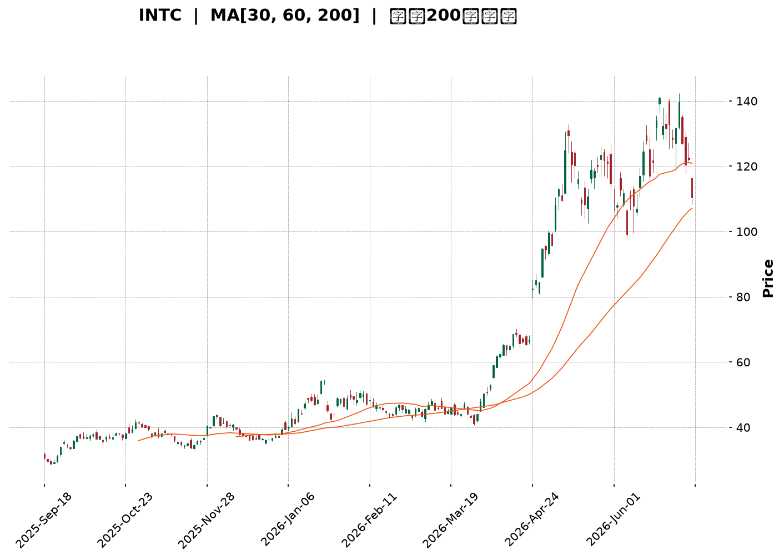
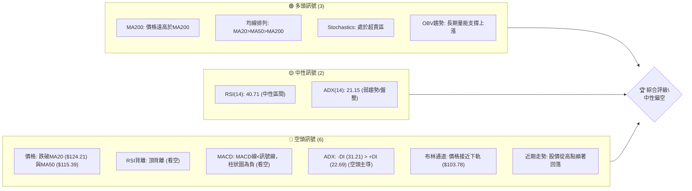
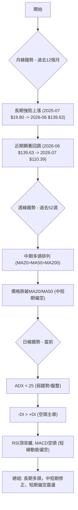
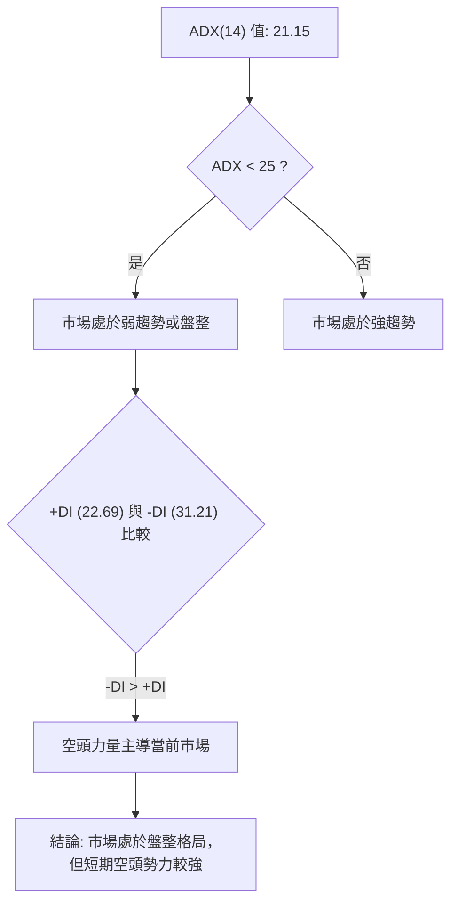
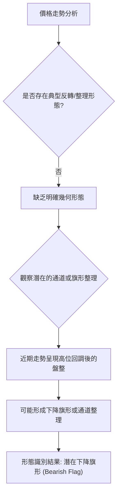
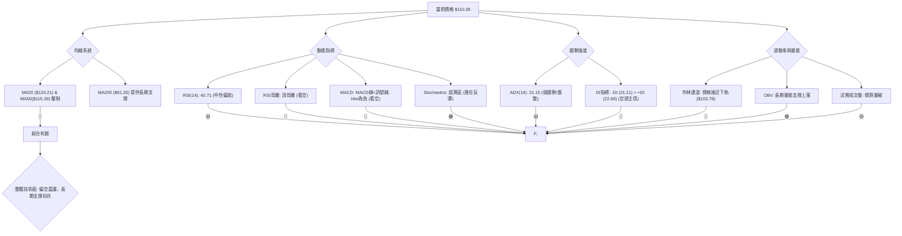
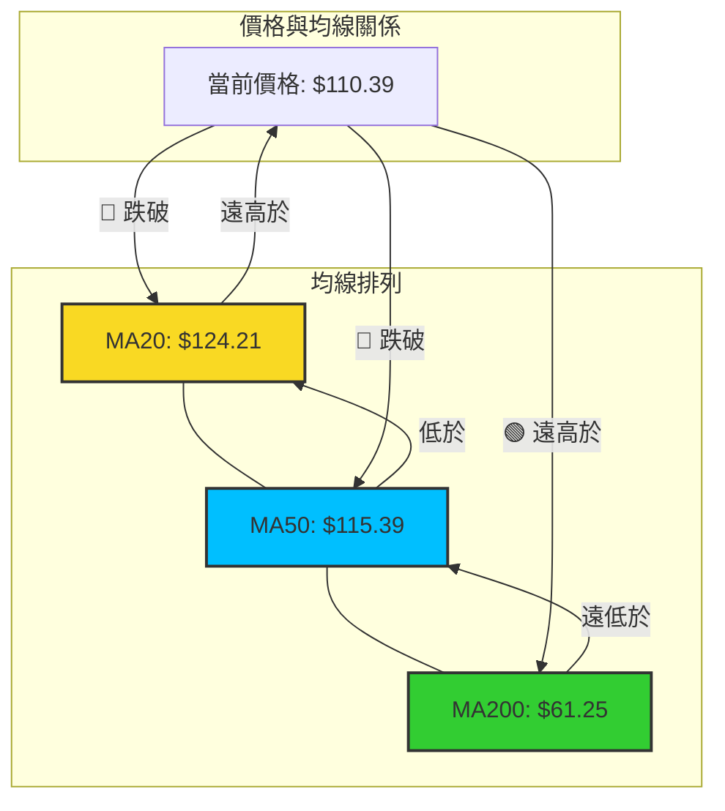
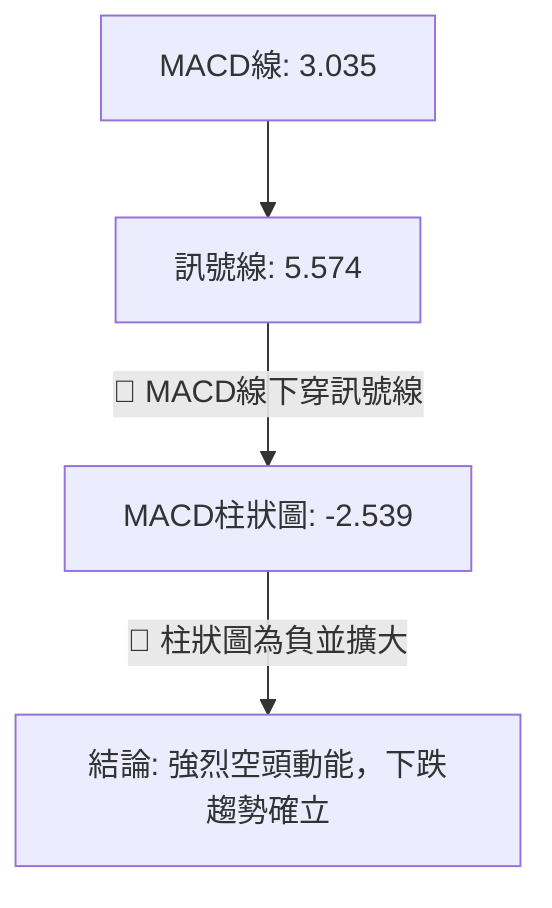
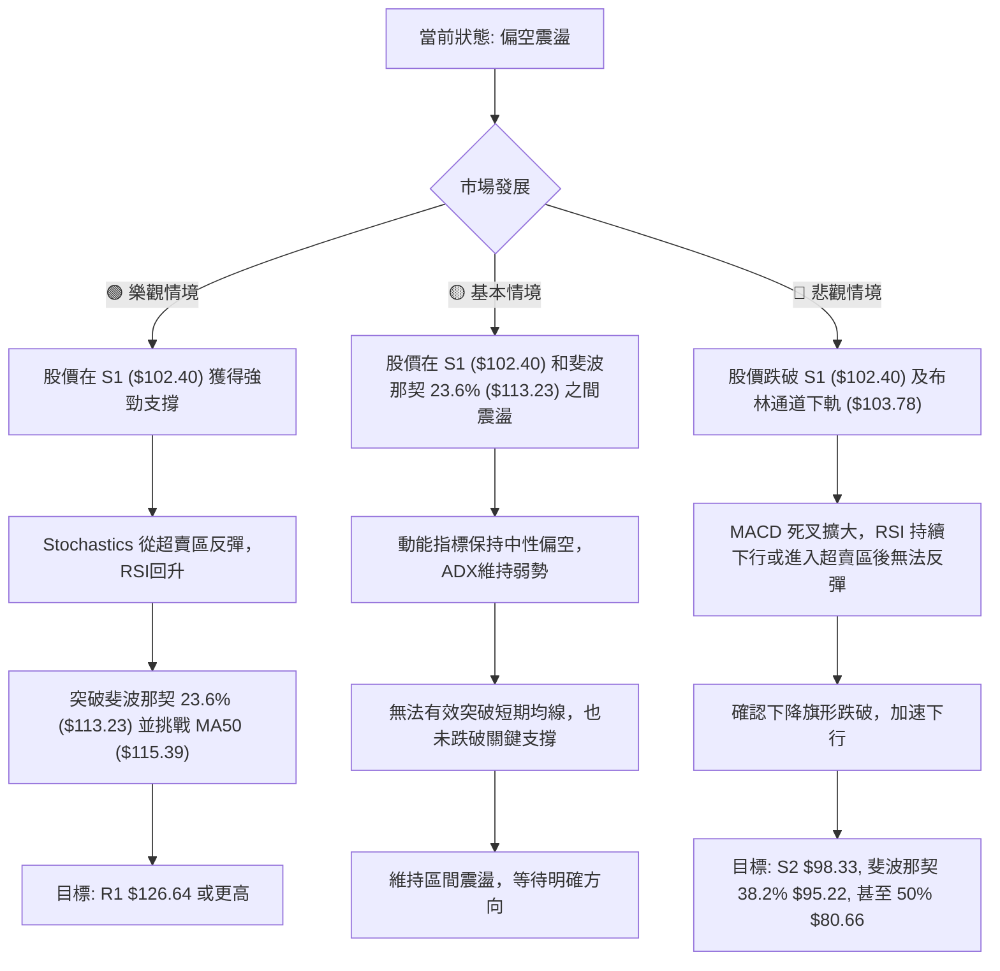

<details>
<summary>📊 靜態圖表 (點擊展開)</summary>

</details>

<html>
<head><meta charset="utf-8" /></head>
<body>
    <div style="height:500px; width:100%;">                        <script>window.PlotlyConfig = {MathJaxConfig: 'local'};</script>
        <script charset="utf-8" src="https://cdn.plot.ly/plotly-3.6.0.min.js" integrity="sha256-QaOVwtVY0T02VaHrr6pnoHLCwayMJp4O5n4YyaE3rJk=" crossorigin="anonymous"></script>                <div id="candlestick-chart" class="plotly-graph-div" style="height:100%; width:100%;"></div>            <script>                window.PLOTLYENV=window.PLOTLYENV || {};                                if (document.getElementById("candlestick-chart")) {                    Plotly.newPlot(                        "candlestick-chart",                        [{"close":{"dtype":"f8","bdata":"AAAAgOuRPkAAAADgepQ9QAAAAGCPwjxAAAAAQApXPUAAAADgUTg\u002fQAAAAGC4\u002fkBAAAAAAADAQUAAAACgcD1BQAAAAGBmxkBAAAAA4FH4QUAAAABgZqZCQAAAAIA9akJAAAAAIIVLQkAAAACAwpVCQAAAAEAKt0JAAAAAYGbmQkAAAAAgXC9CQAAAAAApnEJAAAAA4KPQQUAAAABAM5NCQAAAACCFa0JAAAAAoEeBQkAAAADAzAxDQAAAACBcD0NAAAAAgMJ1QkAAAADgehRDQAAAAADXI0NAAAAAwB7FQ0AAAAAA18NEQAAAACCFq0RAAAAA4HoUREAAAABguP5DQAAAAAAAwENAAAAAANeDQkAAAADgozBDQAAAAGC4nkJAAAAA4KMQQ0AAAACgmTlDQAAAAOCj8EJAAAAAgOvxQkAAAADgevRBQAAAAGCPwkFAAAAAQOFaQUAAAACAPSpBQAAAAIAUjkFAAAAAIFzPQEAAAAAAAEBBQAAAAMAe5UFAAAAAgD3qQUAAAAAgrmdCQAAAACCuR0RAAAAAoEcBREAAAAAAKbxFQAAAAKBH4UVAAAAAAABAREAAAADgerREQAAAAGBmJkRAAAAAAABAREAAAAAA12NEQAAAAKBHwUNAAAAAIK7nQkAAAACgR8FCQAAAACCup0JAAAAAYGYGQkAAAAAA1yNCQAAAAMD1aEJAAAAAIFwvQkAAAADAzCxCQAAAAOB6FEJAAAAAoJkZQkAAAABACldCQAAAAGBmpkJAAAAAQDNzQkAAAADgo7BDQAAAACBcr0NAAAAAwB4FREAAAADgo1BFQAAAAIAUjkRAAAAAYGbGRkAAAAAgrgdGQAAAAMAepUdAAAAAAClcSEAAAADA9ShIQAAAAEDhekdAAAAAIK5HSEAAAAAAACBLQAAAAMD1KEtAAAAAwPWIRkAAAABguD5FQAAAAEAK90VAAAAAANdjSEAAAADgelRIQAAAAAApPEdAAAAAIK5nSEAAAAAAAKBIQAAAAMDMTEhAAAAAYLgeSEAAAAAghUtJQAAAAGC4HklAAAAA4KOQR0AAAADAHiVIQAAAAKBwPUdAAAAAwB5lR0AAAABAChdHQAAAAEDhukZAAAAAIFxPRkAAAACAFA5GQAAAAOCj0EVAAAAAIFwPR0AAAADgo3BHQAAAAEDhukZAAAAAgBTORkAAAAAAAMBGQAAAAMDMjEVAAAAAgD3KRkAAAACgmflGQAAAAIDCtUVAAAAAgD3KRkAAAAAA12NHQAAAAKBw\u002fUdAAAAAAACgRkAAAABgj+JGQAAAAKBH4UZAAAAAIK4HRkAAAAAA14NGQAAAAEAKF0dAAAAAIFzvRUAAAACgRwFGQAAAACCuB0ZAAAAAQAqXR0AAAADAzAxGQAAAAOCjkEVAAAAA4FGYREAAAADgoxBGQAAAAADXA0hAAAAA4KMwSUAAAAAA12NJQAAAAOB6dEpAAAAAoJl5TUAAAAAAKdxOQAAAAOCjME9AAAAAIIVLUEAAAAAgrudPQAAAAAApPFBAAAAAAAAgUUAAAAAAACBRQAAAAMDMbFBAAAAA4KOQUEAAAACgR1FQQAAAAIDrsVBAAAAAYI+iVEAAAAAgXD9VQAAAAKBHIVVAAAAAAACwV0AAAABguJ5XQAAAACCu51hAAAAAgOvxV0AAAACgmQlbQAAAAOCjQFxAAAAAIK5nW0AAAABA4TpfQAAAAIAULmBAAAAAQAonXkAAAABgjxJeQAAAACCF+1xAAAAAoEcxW0AAAABA4QpbQAAAAEAzs1tAAAAAoHC9XUAAAAAAAKBdQAAAAIDC9V1AAAAAoEfhXkAAAACgR3FeQAAAAMD1OF5AAAAAIIWrXEAAAADAHlVbQAAAACCF+1pAAAAAoHAtXEAAAACA6\u002fFbQAAAAEDhylhAAAAAoEeRW0AAAABA4fpaQAAAAGCPwlpAAAAAoHA9XUAAAADgeiRfQAAAAEAK919AAAAAQDNDXUAAAABgZkZeQAAAACCuv2BAAAAAgBSeYUAAAADA9YhgQAAAAMDMdGBAAAAAANebYEAAAACAPQpgQAAAAEAKd2BAAAAAACl0YUAAAACgR8FfQAAAAGBmFl5AAAAAwMyMXkAAAADA9ZhbQA=="},"high":{"dtype":"f8","bdata":"AAAA4KMwQEAAAACgR6E+QAAAAKCZGT5AAAAAQDMzPkAAAABAM7M\u002fQAAAAAAAIEFAAAAAYGYmQkAAAABgZoZBQAAAAGC4HkFAAAAAIK4HQkAAAADA9chCQAAAAIA9CkNAAAAAQApXQ0AAAABgZgZDQAAAAMAe5UJAAAAAwMwMQ0AAAABAM9NDQAAAAKBHwUJAAAAAYGZGQkAAAABguL5CQAAAAGCPAkNAAAAA4KMwQ0AAAABgj0JDQAAAAMDMLENAAAAAQAr3QkAAAABAMzNDQAAAACBcj0RAAAAAgMJVREAAAACgcD1FQAAAAMAeBUVAAAAAQAq3REAAAACAPWpEQAAAAKCZOURAAAAAAAAgQ0AAAADgUVhDQAAAACCF60NAAAAAYI8iQ0AAAAAA18NDQAAAAAApHENAAAAAoJkZQ0AAAAAgrqdCQAAAAMDMDEJAAAAAoHDdQUAAAACgR2FBQAAAAAAA4EFAAAAAQApXQkAAAACgcH1BQAAAAOB6FEJAAAAA4KMQQkAAAABguJ5CQAAAACCFS0RAAAAA4KMwREAAAABACtdFQAAAAGCPAkZAAAAAANejRUAAAACAPWpFQAAAACBcD0VAAAAAoEehREAAAABguH5EQAAAAOBRGERAAAAAANcDREAAAACgcD1DQAAAAEDh+kJAAAAAIIXrQkAAAABguL5CQAAAAIA9ykJAAAAAQDPzQkAAAABgZmZCQAAAAEAKF0JAAAAAYLg+QkAAAABgZmZCQAAAAKBHIUNAAAAAgD3KQkAAAACAFO5DQAAAAMDMDEVAAAAAIK4nREAAAADA9UhGQAAAACCFq0VAAAAAoHDdRkAAAACgmblGQAAAAGC4HkhAAAAAAACASEAAAACA6zFJQAAAAEDhGklAAAAAoHAdSUAAAADgejRLQAAAAMDMTEtAAAAA4KMQSEAAAABA4TpGQAAAAADXQ0ZAAAAAwB6lSEAAAABgj2JIQAAAAIA9ykhAAAAAIIXrSEAAAABguL5JQAAAAKCZ2UhAAAAAgBRuSUAAAABgZqZJQAAAAAApnElAAAAAwB5FSUAAAABgZsZIQAAAAKCZeUhAAAAA4FHYR0AAAACAPWpHQAAAAGCPYkdAAAAAgMKVRkAAAACA6zFGQAAAAGBmRkZAAAAAwMxMR0AAAAAAKXxHQAAAAKCZeUdAAAAAIK5HR0AAAAAgrudGQAAAAOBR2EVAAAAA4KMQR0AAAACgcD1HQAAAAEAKl0ZAAAAAoEfhRkAAAADgo\u002fBHQAAAAIA9akhAAAAA4FG4R0AAAABAM1NHQAAAAIDClUhAAAAAgD0KR0AAAABA4dpGQAAAAOBROEdAAAAAYGbGR0AAAABA4bpGQAAAACCuJ0ZAAAAAwMzsR0AAAADAzExHQAAAAOCjEEZAAAAAYLj+RUAAAACgcB1GQAAAAGCPYkhAAAAAYLg+SUAAAACA6zFKQAAAAGCPokpAAAAAgMKVTUAAAACAPQpPQAAAAIDrsU9AAAAAoJlpUEAAAAAghUtQQAAAAIDCdVBAAAAAQAonUUAAAADAHpVRQAAAAKBwTVFAAAAAQOHqUEAAAACgRzFRQAAAAIDrEVFAAAAAgBROVUAAAABgZsZVQAAAAIDCJVVAAAAAwMy8V0AAAAAAKexXQAAAAMDMHFlAAAAA4Hr0WEAAAABguJ5bQAAAAAAAYFxAAAAA4KOgXEAAAACAPVJgQAAAAAAAmGBAAAAAYI\u002fyX0AAAAAAAEBfQAAAAOB6pF1AAAAA4HqkW0AAAABgj+JcQAAAAOB6RFxAAAAAACl8XkAAAACAPdpdQAAAAIDrsV5AAAAAIK5nX0AAAACgR1FfQAAAAMAexV5AAAAAwPWoX0AAAABAM1NcQAAAAAAAQFtAAAAAYI+SXUAAAADA9UhcQAAAAGC4nlpAAAAAYI8iXEAAAAAAAIBcQAAAAAAA4FtAAAAAACncXUAAAABgZuZfQAAAACCFk2BAAAAAYGYWYEAAAADAzExfQAAAACBc72BAAAAAYGauYUAAAAAgXD9hQAAAAGCPAmFAAAAAQAqXYUAAAAAgXGdgQAAAAKCZgWBAAAAAQDPLYUAAAAAgrvdgQAAAACCuV2BAAAAAQDPTX0AAAACAFB5dQA=="},"hovertemplate":"\u003cb\u003e%{x|%Y-%m-%d}\u003c\u002fb\u003e\u003cbr\u003e\u958b: $%{open:.2f}\u003cbr\u003e\u9ad8: $%{high:.2f}\u003cbr\u003e\u4f4e: $%{low:.2f}\u003cbr\u003e\u6536: $%{close:.2f}\u003cextra\u003e\u003c\u002fextra\u003e","low":{"dtype":"f8","bdata":"AAAAwPUoPkAAAADgelQ9QAAAAEDhujxAAAAAgOvRPEAAAABA4To9QAAAAIDCNT9AAAAAYLg+QUAAAACgcN1AQAAAAGCPgkBAAAAAAADAQEAAAADgUbhBQAAAAKCZOUJAAAAAQAo3QkAAAADAzCxCQAAAAOB69EFAAAAAgBRuQkAAAABgZiZCQAAAAADXI0JAAAAA4FFYQUAAAACA69FBQAAAAOB6NEJAAAAAgD0KQkAAAAAgrsdCQAAAAIDC1UJAAAAAwB4FQkAAAABACjdCQAAAAIA96kJAAAAAoHAdQ0AAAADAHsVDQAAAAIDCdURAAAAAgBQOREAAAADAHuVDQAAAAGBmhkNAAAAA4KNQQkAAAACAFI5CQAAAAGBmZkJAAAAAACl8QkAAAAAAKfxCQAAAAGC4vkJAAAAAwMysQkAAAACgmblBQAAAACBcT0FAAAAAoHAdQUAAAADA9chAQAAAAAAAIEFAAAAAoHC9QEAAAACA63FAQAAAAOBRWEFAAAAAQApXQUAAAADgoxBCQAAAACCFq0JAAAAAwMzMQ0AAAABgZgZEQAAAAKBHQUVAAAAAgOsRREAAAABAM5NEQAAAAKCZ2UNAAAAAANcDREAAAACA63FDQAAAAIA9ikNAAAAAIFzPQkAAAADA9ahCQAAAAIDCdUJAAAAAACn8QUAAAACAwtVBQAAAAOBROEJAAAAAwB4lQkAAAAAA1wNCQAAAAKCZeUFAAAAAwMzsQUAAAADA9ehBQAAAAMD1aEJAAAAAIFxvQkAAAACgR+FCQAAAAGCPokNAAAAAoJl5Q0AAAAAgXA9EQAAAAEAKV0RAAAAAwPXIREAAAACA6\u002fFFQAAAAAApnEZAAAAAgMK1R0AAAACAPepHQAAAAEDhWkdAAAAAAACAR0AAAABAMxNJQAAAAIA9ikpAAAAAoJk5RkAAAAAA1yNFQAAAAMDMjEVAAAAAwPUoR0AAAABguH5HQAAAAEDh+kZAAAAAAADARkAAAABACjdIQAAAAAAAgEdAAAAAwB5lR0AAAACAPWpIQAAAACCFy0dAAAAAYI9iR0AAAACAFG5HQAAAAOBRGEdAAAAAACl8RkAAAABA4bpGQAAAAOCjcEZAAAAAgML1RUAAAADgo3BFQAAAAEAKl0VAAAAAwB7FRUAAAACAPYpGQAAAAIDrMUZAAAAAQDMzRkAAAACgmflFQAAAAIDrEUVAAAAAYI+iRUAAAACgmVlGQAAAAADXo0VAAAAAgOvRREAAAADgerRGQAAAAOB6VEdAAAAAgMKVRkAAAACA67FGQAAAAOBR2EZAAAAA4Hr0RUAAAABgZgZGQAAAAEAz00VAAAAAgOvRRUAAAABguN5FQAAAAKCZmUVAAAAAoJm5RkAAAACAwvVFQAAAAIAUbkVAAAAA4KNQREAAAADAzMxEQAAAAKBwfUZAAAAAwB4FR0AAAAAgXO9IQAAAAAApnElAAAAAYGZmS0AAAACA6zFNQAAAAAAAYE5AAAAAQAoXT0AAAAAghQtPQAAAAOCjcE9AAAAAoEcRUEAAAAAgXO9QQAAAAIAUHlBAAAAAwPVoUEAAAABguD5QQAAAAEDhWlBAAAAAIK7nU0AAAABACqdUQAAAAEAzM1RAAAAAIK53VUAAAAAAAOBWQAAAAEAKJ1dAAAAAYGbmV0AAAADAHgVZQAAAAMAepVpAAAAAoJlJW0AAAABAM\u002fNbQAAAAEDh+l5AAAAAAADAXEAAAACAPRpdQAAAAEDhSlxAAAAAoEdBWkAAAABgZvZZQAAAAKCZmVlAAAAAQDOzXEAAAABA4UpcQAAAAIDChV1AAAAAYGZWXUAAAAAAAEBdQAAAAADXE11AAAAAYI9iXEAAAADAHpVaQAAAAEDhClpAAAAAQAq3W0AAAABguN5aQAAAAMAelVhAAAAAgD2qWkAAAACgcN1YQAAAAEDhOlpAAAAA4KOgW0AAAADAHtVcQAAAAIA9ql9AAAAAAAAAXUAAAAAA14NdQAAAAKCZ+V9AAAAAYLgGYUAAAACgmQlgQAAAAMDM\u002fF9AAAAAgD1aX0AAAAAAAGBfQAAAAAAAoF1AAAAA4KNwYEAAAAAghatfQAAAAOBRaF1AAAAAoEdhXkAAAABAMxNbQA=="},"name":"\u50f9\u683c","open":{"dtype":"f8","bdata":"AAAAIK7HP0AAAACgR2E+QAAAACCFqz1AAAAAoHD9PEAAAACgR2E9QAAAAAApnD9AAAAAYI+CQUAAAABgj0JBQAAAAEAK90BAAAAAANfDQEAAAACgR+FBQAAAAKCZ+UJAAAAA4FGYQkAAAACA61FCQAAAAGBmRkJAAAAAANfDQkAAAABA4TpDQAAAAOBROEJAAAAAAAAAQkAAAABAMzNCQAAAAEAzk0JAAAAAgBQuQkAAAADA9chCQAAAAIDrEUNAAAAAIIXrQkAAAADAzExCQAAAAGCPAkRAAAAAgOsxQ0AAAAAghctDQAAAAMDMzERAAAAAACl8REAAAABACldEQAAAAAAAIERAAAAAgOsRQ0AAAACAwrVCQAAAACCFK0NAAAAAoEehQkAAAABACndDQAAAAEAzE0NAAAAAIK4HQ0AAAABgj6JCQAAAAADXg0FAAAAAoJm5QUAAAAAAACBBQAAAAIA9KkFAAAAAAAAAQkAAAACgR8FAQAAAAAApfEFAAAAAYGbGQUAAAACgmRlCQAAAAEAzs0JAAAAAgBTuQ0AAAAAAKTxEQAAAAIDrsUVAAAAAoEehRUAAAADgepREQAAAAOBR+ERAAAAAoHBdREAAAACAFA5EQAAAAMD1CERAAAAAAACgQ0AAAACAPSpDQAAAAIA9ykJAAAAAIIXLQkAAAADgo7BCQAAAAKBwPUJAAAAAgOvxQkAAAABguB5CQAAAAIDClUFAAAAAgMIVQkAAAACgRwFCQAAAAOB6dEJAAAAAQDOzQkAAAABgj+JCQAAAACCFy0RAAAAAgBTuQ0AAAABAChdEQAAAACBcT0VAAAAAgD3qREAAAABguB5GQAAAAIDr8UZAAAAAoJl5SEAAAADAzKxIQAAAAGCPokhAAAAAYGamR0AAAADA9ShJQAAAAEDhGktAAAAAgBRuR0AAAAAA1yNGQAAAAAAp\u002fEVAAAAAwMxMR0AAAAAgrsdHQAAAAKBwfUhAAAAA4KPQRkAAAAAgrgdJQAAAAMAexUhAAAAAIIXLR0AAAADAzIxIQAAAACCFy0hAAAAA4Ho0SUAAAACAFA5IQAAAAGBm5kdAAAAAoEfhRkAAAABACvdGQAAAAIDC9UZAAAAAoJl5RkAAAACA6\u002fFFQAAAACCFC0ZAAAAAwMwMRkAAAAAghQtHQAAAAGCPYkdAAAAAQOE6RkAAAACgmRlGQAAAAOBRuEVAAAAAwPUIRkAAAAAgXG9GQAAAAIDCVUZAAAAAYLheRUAAAADgerRGQAAAAMD1aEdAAAAAQDOzR0AAAAAAKfxGQAAAAOB69EdAAAAAgD0KR0AAAACgmRlGQAAAAGC4\u002fkVAAAAAoJl5R0AAAAAAAEBGQAAAAMAexUVAAAAAwMzsRkAAAABgZiZHQAAAACBcz0VAAAAAACncRUAAAACgmflEQAAAAAAAgEZAAAAAIK4HR0AAAADgo3BJQAAAAOB69ElAAAAAIFyvS0AAAABAMzNNQAAAAGCPwk5AAAAAQAoXT0AAAACAPUpQQAAAAGCP4k9AAAAAIIU7UEAAAABgZjZRQAAAAMDMHFFAAAAAwPXIUEAAAAAAKfxQQAAAAGBmhlBAAAAAwMyMVEAAAABA4epUQAAAAIDrUVRAAAAAwPWIVUAAAABgZuZXQAAAAMDMTFdAAAAAIIXLWEAAAADgoyBZQAAAAGC4vltAAAAAoEfBW0AAAAAA1\u002fNbQAAAAAApXGBAAAAAQAoXX0AAAABgZgZfQAAAAIA9qlxAAAAAYI9yW0AAAACAFF5cQAAAAGC4vlpAAAAAgBQOXUAAAADAHiVdQAAAAIDCFV5AAAAAYGaGXkAAAADA9RhfQAAAAMDMXF5AAAAAYGb2XkAAAAAghVtbQAAAAMDM3FpAAAAAQOEaXUAAAACgmRlbQAAAAGC4nlpAAAAAAADAW0AAAAAgXD9cQAAAAIDrgVpAAAAAoEdhXEAAAABA4VpdQAAAACCuL2BAAAAAQApHX0AAAABgZnZeQAAAAIDreWBAAAAAANdjYUAAAAAgXDdgQAAAAKCZoWBAAAAAIFx3YUAAAABguBZgQAAAAAAAwF9AAAAAIK5\u002fYEAAAAAAAOBgQAAAAKBwHWBAAAAA4HqkXkAAAABAMxNdQA=="},"x":["2025-09-18T00:00:00-04:00","2025-09-19T00:00:00-04:00","2025-09-22T00:00:00-04:00","2025-09-23T00:00:00-04:00","2025-09-24T00:00:00-04:00","2025-09-25T00:00:00-04:00","2025-09-26T00:00:00-04:00","2025-09-29T00:00:00-04:00","2025-09-30T00:00:00-04:00","2025-10-01T00:00:00-04:00","2025-10-02T00:00:00-04:00","2025-10-03T00:00:00-04:00","2025-10-06T00:00:00-04:00","2025-10-07T00:00:00-04:00","2025-10-08T00:00:00-04:00","2025-10-09T00:00:00-04:00","2025-10-10T00:00:00-04:00","2025-10-13T00:00:00-04:00","2025-10-14T00:00:00-04:00","2025-10-15T00:00:00-04:00","2025-10-16T00:00:00-04:00","2025-10-17T00:00:00-04:00","2025-10-20T00:00:00-04:00","2025-10-21T00:00:00-04:00","2025-10-22T00:00:00-04:00","2025-10-23T00:00:00-04:00","2025-10-24T00:00:00-04:00","2025-10-27T00:00:00-04:00","2025-10-28T00:00:00-04:00","2025-10-29T00:00:00-04:00","2025-10-30T00:00:00-04:00","2025-10-31T00:00:00-04:00","2025-11-03T00:00:00-05:00","2025-11-04T00:00:00-05:00","2025-11-05T00:00:00-05:00","2025-11-06T00:00:00-05:00","2025-11-07T00:00:00-05:00","2025-11-10T00:00:00-05:00","2025-11-11T00:00:00-05:00","2025-11-12T00:00:00-05:00","2025-11-13T00:00:00-05:00","2025-11-14T00:00:00-05:00","2025-11-17T00:00:00-05:00","2025-11-18T00:00:00-05:00","2025-11-19T00:00:00-05:00","2025-11-20T00:00:00-05:00","2025-11-21T00:00:00-05:00","2025-11-24T00:00:00-05:00","2025-11-25T00:00:00-05:00","2025-11-26T00:00:00-05:00","2025-11-28T00:00:00-05:00","2025-12-01T00:00:00-05:00","2025-12-02T00:00:00-05:00","2025-12-03T00:00:00-05:00","2025-12-04T00:00:00-05:00","2025-12-05T00:00:00-05:00","2025-12-08T00:00:00-05:00","2025-12-09T00:00:00-05:00","2025-12-10T00:00:00-05:00","2025-12-11T00:00:00-05:00","2025-12-12T00:00:00-05:00","2025-12-15T00:00:00-05:00","2025-12-16T00:00:00-05:00","2025-12-17T00:00:00-05:00","2025-12-18T00:00:00-05:00","2025-12-19T00:00:00-05:00","2025-12-22T00:00:00-05:00","2025-12-23T00:00:00-05:00","2025-12-24T00:00:00-05:00","2025-12-26T00:00:00-05:00","2025-12-29T00:00:00-05:00","2025-12-30T00:00:00-05:00","2025-12-31T00:00:00-05:00","2026-01-02T00:00:00-05:00","2026-01-05T00:00:00-05:00","2026-01-06T00:00:00-05:00","2026-01-07T00:00:00-05:00","2026-01-08T00:00:00-05:00","2026-01-09T00:00:00-05:00","2026-01-12T00:00:00-05:00","2026-01-13T00:00:00-05:00","2026-01-14T00:00:00-05:00","2026-01-15T00:00:00-05:00","2026-01-16T00:00:00-05:00","2026-01-20T00:00:00-05:00","2026-01-21T00:00:00-05:00","2026-01-22T00:00:00-05:00","2026-01-23T00:00:00-05:00","2026-01-26T00:00:00-05:00","2026-01-27T00:00:00-05:00","2026-01-28T00:00:00-05:00","2026-01-29T00:00:00-05:00","2026-01-30T00:00:00-05:00","2026-02-02T00:00:00-05:00","2026-02-03T00:00:00-05:00","2026-02-04T00:00:00-05:00","2026-02-05T00:00:00-05:00","2026-02-06T00:00:00-05:00","2026-02-09T00:00:00-05:00","2026-02-10T00:00:00-05:00","2026-02-11T00:00:00-05:00","2026-02-12T00:00:00-05:00","2026-02-13T00:00:00-05:00","2026-02-17T00:00:00-05:00","2026-02-18T00:00:00-05:00","2026-02-19T00:00:00-05:00","2026-02-20T00:00:00-05:00","2026-02-23T00:00:00-05:00","2026-02-24T00:00:00-05:00","2026-02-25T00:00:00-05:00","2026-02-26T00:00:00-05:00","2026-02-27T00:00:00-05:00","2026-03-02T00:00:00-05:00","2026-03-03T00:00:00-05:00","2026-03-04T00:00:00-05:00","2026-03-05T00:00:00-05:00","2026-03-06T00:00:00-05:00","2026-03-09T00:00:00-04:00","2026-03-10T00:00:00-04:00","2026-03-11T00:00:00-04:00","2026-03-12T00:00:00-04:00","2026-03-13T00:00:00-04:00","2026-03-16T00:00:00-04:00","2026-03-17T00:00:00-04:00","2026-03-18T00:00:00-04:00","2026-03-19T00:00:00-04:00","2026-03-20T00:00:00-04:00","2026-03-23T00:00:00-04:00","2026-03-24T00:00:00-04:00","2026-03-25T00:00:00-04:00","2026-03-26T00:00:00-04:00","2026-03-27T00:00:00-04:00","2026-03-30T00:00:00-04:00","2026-03-31T00:00:00-04:00","2026-04-01T00:00:00-04:00","2026-04-02T00:00:00-04:00","2026-04-06T00:00:00-04:00","2026-04-07T00:00:00-04:00","2026-04-08T00:00:00-04:00","2026-04-09T00:00:00-04:00","2026-04-10T00:00:00-04:00","2026-04-13T00:00:00-04:00","2026-04-14T00:00:00-04:00","2026-04-15T00:00:00-04:00","2026-04-16T00:00:00-04:00","2026-04-17T00:00:00-04:00","2026-04-20T00:00:00-04:00","2026-04-21T00:00:00-04:00","2026-04-22T00:00:00-04:00","2026-04-23T00:00:00-04:00","2026-04-24T00:00:00-04:00","2026-04-27T00:00:00-04:00","2026-04-28T00:00:00-04:00","2026-04-29T00:00:00-04:00","2026-04-30T00:00:00-04:00","2026-05-01T00:00:00-04:00","2026-05-04T00:00:00-04:00","2026-05-05T00:00:00-04:00","2026-05-06T00:00:00-04:00","2026-05-07T00:00:00-04:00","2026-05-08T00:00:00-04:00","2026-05-11T00:00:00-04:00","2026-05-12T00:00:00-04:00","2026-05-13T00:00:00-04:00","2026-05-14T00:00:00-04:00","2026-05-15T00:00:00-04:00","2026-05-18T00:00:00-04:00","2026-05-19T00:00:00-04:00","2026-05-20T00:00:00-04:00","2026-05-21T00:00:00-04:00","2026-05-22T00:00:00-04:00","2026-05-26T00:00:00-04:00","2026-05-27T00:00:00-04:00","2026-05-28T00:00:00-04:00","2026-05-29T00:00:00-04:00","2026-06-01T00:00:00-04:00","2026-06-02T00:00:00-04:00","2026-06-03T00:00:00-04:00","2026-06-04T00:00:00-04:00","2026-06-05T00:00:00-04:00","2026-06-08T00:00:00-04:00","2026-06-09T00:00:00-04:00","2026-06-10T00:00:00-04:00","2026-06-11T00:00:00-04:00","2026-06-12T00:00:00-04:00","2026-06-15T00:00:00-04:00","2026-06-16T00:00:00-04:00","2026-06-17T00:00:00-04:00","2026-06-18T00:00:00-04:00","2026-06-22T00:00:00-04:00","2026-06-23T00:00:00-04:00","2026-06-24T00:00:00-04:00","2026-06-25T00:00:00-04:00","2026-06-26T00:00:00-04:00","2026-06-29T00:00:00-04:00","2026-06-30T00:00:00-04:00","2026-07-01T00:00:00-04:00","2026-07-02T00:00:00-04:00","2026-07-06T00:00:00-04:00","2026-07-07T00:00:00-04:00"],"type":"candlestick"},{"hovertemplate":"MA30: $%{y:.2f}\u003cextra\u003e\u003c\u002fextra\u003e","line":{"color":"#2196F3","dash":"dash","width":2},"mode":"lines","name":"MA30","x":["2025-09-18T00:00:00-04:00","2025-09-19T00:00:00-04:00","2025-09-22T00:00:00-04:00","2025-09-23T00:00:00-04:00","2025-09-24T00:00:00-04:00","2025-09-25T00:00:00-04:00","2025-09-26T00:00:00-04:00","2025-09-29T00:00:00-04:00","2025-09-30T00:00:00-04:00","2025-10-01T00:00:00-04:00","2025-10-02T00:00:00-04:00","2025-10-03T00:00:00-04:00","2025-10-06T00:00:00-04:00","2025-10-07T00:00:00-04:00","2025-10-08T00:00:00-04:00","2025-10-09T00:00:00-04:00","2025-10-10T00:00:00-04:00","2025-10-13T00:00:00-04:00","2025-10-14T00:00:00-04:00","2025-10-15T00:00:00-04:00","2025-10-16T00:00:00-04:00","2025-10-17T00:00:00-04:00","2025-10-20T00:00:00-04:00","2025-10-21T00:00:00-04:00","2025-10-22T00:00:00-04:00","2025-10-23T00:00:00-04:00","2025-10-24T00:00:00-04:00","2025-10-27T00:00:00-04:00","2025-10-28T00:00:00-04:00","2025-10-29T00:00:00-04:00","2025-10-30T00:00:00-04:00","2025-10-31T00:00:00-04:00","2025-11-03T00:00:00-05:00","2025-11-04T00:00:00-05:00","2025-11-05T00:00:00-05:00","2025-11-06T00:00:00-05:00","2025-11-07T00:00:00-05:00","2025-11-10T00:00:00-05:00","2025-11-11T00:00:00-05:00","2025-11-12T00:00:00-05:00","2025-11-13T00:00:00-05:00","2025-11-14T00:00:00-05:00","2025-11-17T00:00:00-05:00","2025-11-18T00:00:00-05:00","2025-11-19T00:00:00-05:00","2025-11-20T00:00:00-05:00","2025-11-21T00:00:00-05:00","2025-11-24T00:00:00-05:00","2025-11-25T00:00:00-05:00","2025-11-26T00:00:00-05:00","2025-11-28T00:00:00-05:00","2025-12-01T00:00:00-05:00","2025-12-02T00:00:00-05:00","2025-12-03T00:00:00-05:00","2025-12-04T00:00:00-05:00","2025-12-05T00:00:00-05:00","2025-12-08T00:00:00-05:00","2025-12-09T00:00:00-05:00","2025-12-10T00:00:00-05:00","2025-12-11T00:00:00-05:00","2025-12-12T00:00:00-05:00","2025-12-15T00:00:00-05:00","2025-12-16T00:00:00-05:00","2025-12-17T00:00:00-05:00","2025-12-18T00:00:00-05:00","2025-12-19T00:00:00-05:00","2025-12-22T00:00:00-05:00","2025-12-23T00:00:00-05:00","2025-12-24T00:00:00-05:00","2025-12-26T00:00:00-05:00","2025-12-29T00:00:00-05:00","2025-12-30T00:00:00-05:00","2025-12-31T00:00:00-05:00","2026-01-02T00:00:00-05:00","2026-01-05T00:00:00-05:00","2026-01-06T00:00:00-05:00","2026-01-07T00:00:00-05:00","2026-01-08T00:00:00-05:00","2026-01-09T00:00:00-05:00","2026-01-12T00:00:00-05:00","2026-01-13T00:00:00-05:00","2026-01-14T00:00:00-05:00","2026-01-15T00:00:00-05:00","2026-01-16T00:00:00-05:00","2026-01-20T00:00:00-05:00","2026-01-21T00:00:00-05:00","2026-01-22T00:00:00-05:00","2026-01-23T00:00:00-05:00","2026-01-26T00:00:00-05:00","2026-01-27T00:00:00-05:00","2026-01-28T00:00:00-05:00","2026-01-29T00:00:00-05:00","2026-01-30T00:00:00-05:00","2026-02-02T00:00:00-05:00","2026-02-03T00:00:00-05:00","2026-02-04T00:00:00-05:00","2026-02-05T00:00:00-05:00","2026-02-06T00:00:00-05:00","2026-02-09T00:00:00-05:00","2026-02-10T00:00:00-05:00","2026-02-11T00:00:00-05:00","2026-02-12T00:00:00-05:00","2026-02-13T00:00:00-05:00","2026-02-17T00:00:00-05:00","2026-02-18T00:00:00-05:00","2026-02-19T00:00:00-05:00","2026-02-20T00:00:00-05:00","2026-02-23T00:00:00-05:00","2026-02-24T00:00:00-05:00","2026-02-25T00:00:00-05:00","2026-02-26T00:00:00-05:00","2026-02-27T00:00:00-05:00","2026-03-02T00:00:00-05:00","2026-03-03T00:00:00-05:00","2026-03-04T00:00:00-05:00","2026-03-05T00:00:00-05:00","2026-03-06T00:00:00-05:00","2026-03-09T00:00:00-04:00","2026-03-10T00:00:00-04:00","2026-03-11T00:00:00-04:00","2026-03-12T00:00:00-04:00","2026-03-13T00:00:00-04:00","2026-03-16T00:00:00-04:00","2026-03-17T00:00:00-04:00","2026-03-18T00:00:00-04:00","2026-03-19T00:00:00-04:00","2026-03-20T00:00:00-04:00","2026-03-23T00:00:00-04:00","2026-03-24T00:00:00-04:00","2026-03-25T00:00:00-04:00","2026-03-26T00:00:00-04:00","2026-03-27T00:00:00-04:00","2026-03-30T00:00:00-04:00","2026-03-31T00:00:00-04:00","2026-04-01T00:00:00-04:00","2026-04-02T00:00:00-04:00","2026-04-06T00:00:00-04:00","2026-04-07T00:00:00-04:00","2026-04-08T00:00:00-04:00","2026-04-09T00:00:00-04:00","2026-04-10T00:00:00-04:00","2026-04-13T00:00:00-04:00","2026-04-14T00:00:00-04:00","2026-04-15T00:00:00-04:00","2026-04-16T00:00:00-04:00","2026-04-17T00:00:00-04:00","2026-04-20T00:00:00-04:00","2026-04-21T00:00:00-04:00","2026-04-22T00:00:00-04:00","2026-04-23T00:00:00-04:00","2026-04-24T00:00:00-04:00","2026-04-27T00:00:00-04:00","2026-04-28T00:00:00-04:00","2026-04-29T00:00:00-04:00","2026-04-30T00:00:00-04:00","2026-05-01T00:00:00-04:00","2026-05-04T00:00:00-04:00","2026-05-05T00:00:00-04:00","2026-05-06T00:00:00-04:00","2026-05-07T00:00:00-04:00","2026-05-08T00:00:00-04:00","2026-05-11T00:00:00-04:00","2026-05-12T00:00:00-04:00","2026-05-13T00:00:00-04:00","2026-05-14T00:00:00-04:00","2026-05-15T00:00:00-04:00","2026-05-18T00:00:00-04:00","2026-05-19T00:00:00-04:00","2026-05-20T00:00:00-04:00","2026-05-21T00:00:00-04:00","2026-05-22T00:00:00-04:00","2026-05-26T00:00:00-04:00","2026-05-27T00:00:00-04:00","2026-05-28T00:00:00-04:00","2026-05-29T00:00:00-04:00","2026-06-01T00:00:00-04:00","2026-06-02T00:00:00-04:00","2026-06-03T00:00:00-04:00","2026-06-04T00:00:00-04:00","2026-06-05T00:00:00-04:00","2026-06-08T00:00:00-04:00","2026-06-09T00:00:00-04:00","2026-06-10T00:00:00-04:00","2026-06-11T00:00:00-04:00","2026-06-12T00:00:00-04:00","2026-06-15T00:00:00-04:00","2026-06-16T00:00:00-04:00","2026-06-17T00:00:00-04:00","2026-06-18T00:00:00-04:00","2026-06-22T00:00:00-04:00","2026-06-23T00:00:00-04:00","2026-06-24T00:00:00-04:00","2026-06-25T00:00:00-04:00","2026-06-26T00:00:00-04:00","2026-06-29T00:00:00-04:00","2026-06-30T00:00:00-04:00","2026-07-01T00:00:00-04:00","2026-07-02T00:00:00-04:00","2026-07-06T00:00:00-04:00","2026-07-07T00:00:00-04:00"],"y":{"dtype":"f8","bdata":"AAAAAAAA+H8AAAAAAAD4fwAAAAAAAPh\u002fAAAAAAAA+H8AAAAAAAD4fwAAAAAAAPh\u002fAAAAAAAA+H8AAAAAAAD4fwAAAAAAAPh\u002fAAAAAAAA+H8AAAAAAAD4fwAAAAAAAPh\u002fAAAAAAAA+H8AAAAAAAD4fwAAAAAAAPh\u002fAAAAAAAA+H8AAAAAAAD4fwAAAAAAAPh\u002fAAAAAAAA+H8AAAAAAAD4fwAAAAAAAPh\u002fAAAAAAAA+H8AAAAAAAD4fwAAAAAAAPh\u002fAAAAAAAA+H8AAAAAAAD4fwAAAAAAAPh\u002fAAAAAAAA+H8AAAAAAAD4f6uqqnKT+EFAERERSX4hQkCJiIjI6E1CQCIiIrq7e0JAmpmZQYucQkAzMzPjF7tCQBEREcH1yEJAq6qqai7UQkB3d3e3HuVCQLy7uzuY90JAd3d3J+r\u002fQkB3d3fn+\u002flCQImIiAhl9EJAIiIikl\u002fsQkCamZmJQeBCQKuqqnpb1kJA3t3dzYXEQkBEREREi7xCQDMzM1NxtkJAd3d3x0u3QkCJiIho2LVCQERERKS3xUJAERERcYTSQkCrqqrqbelCQM3MzEx+AUNA3t3dncQQQ0C8u7t7oh5DQM3MzNxAJ0NAAAAAcFkrQ0DNzMw8JihDQDMzM2NXIENAAAAAkFAWQ0DNzMy8uwtDQM3MzKxjAkNAERERQTX+QkDe3d19P\u002fVCQM3MzLx080JAiYiIWPLrQkBVVVWV\u002fOJCQCIiIuKl20JARERE9G\u002fUQkAAAAAAuddCQLy7uztR30JAzczMTKnoQkDv7u4+Nf5CQM3MzExiEENAd3d3p8YrQ0CJiIjIdk5DQERERKQpZUNAiYiIeKKOQ0B3d3dnka1DQLy7u1tIykNAERERAXLvQ0Dv7u5+IwREQAAAAMDKEURAvLu7ay40REAAAAAg92pEQERERLTIpkRAzczMXEi6REBEREQklMFEQGZmZvZv1ERAAAAAID4DRUBmZmbm0DJFQAAAABDmWUVAMzMzY1eQRUBmZmYWrsdFQM3MzPzw+UVAIiIiMpYsRkAzMzMTWGlGQBERETFrpUZAq6qqqg3URkAiIiLilgVHQEREROTBLEdAiYiIaPRWR0AiIiLS93NHQJqZmbnzjUdA3t3dTX6hR0C8u7vbzqdHQO\u002fu7l6PskdAZmZm9v20R0B3d3cnBsFHQN7d3U03uUdAq6qqWvKrR0CamZkp6p9HQDMzMwNyj0dA7+7uDruCR0Dv7u4+UV9HQJqZmYnPMEdAiYiImPwyR0CrqqpqSkVHQImIiBiSVkdAVVVVZYJHR0Dv7u6+LTtHQLy7uzsmOEdAd3d39+EjR0CamZmZ4BFHQBEREVGNB0dAvLu7G+j0RkDe3d391NhGQImIiMh2vkZAVVVVZa2+RkC8u7vLzKxGQERERLSBnkZAIiIiAp2GRkDNzMzc3X1GQM3MzPzUiEZAIiIicmihRkDNzMzc3b1GQImIiBh25UZAERER4TMcR0De3d0dhVtHQFVVVUW2o0dA3t3d7TX3R0BVVVVVVUVIQBEREXGEokhAERERMU8ESUDe3d3NhWRJQBEREYGVw0lARERElNEbSkBmZmaWtWpKQDMzMzPsukpAMzMz0wZaS0BVVVWFXQFMQGZmZsa9pkxAVVVVxQR\u002fTUDNzMxcAVJOQImIiBgENk9ARERE1L8JUECrqqrSlJJQQHd3d7esJVFAiYiISOGqUUB3d3fHS1dSQERERIxsD1NAVVVVddq4U0ARERH5U1tUQFVVVW0u7FRAZmZmJr9oVUDe3d29LeNVQO\u002fu7matXlZAzczM3LLeVkAAAABQ1FdXQJqZmSFp0ldAREREjN5OWEDv7u5uhMpYQHd3d5fgQVlAd3d3B2WkWUB3d3enf\u002ftZQN7d3d2WVVpAIiIiwq64WkC8u7tr5xtbQN7d3a0AYVtARERE9CicW0CrqqrKE81bQHd3d7ce\u002fVtAZmZmVoAsXEDNzMx8sWxcQKuqqkrwqFxAzczMjFDWXECamZn58PFcQKuqqtqyHl1AAAAAwINhXUCrqqpKN3FdQN7d3T3udV1AVVVV1RWQXUCamZlJN6FdQLy7u7vmwl1AmpmZabwEXkBmZmYG8yxeQImIiJhSQV5AERERETxIXkDNzMzs7jZeQA=="},"type":"scatter"},{"hovertemplate":"MA60: $%{y:.2f}\u003cextra\u003e\u003c\u002fextra\u003e","line":{"color":"#9C27B0","dash":"dash","width":2},"mode":"lines","name":"MA60","x":["2025-09-18T00:00:00-04:00","2025-09-19T00:00:00-04:00","2025-09-22T00:00:00-04:00","2025-09-23T00:00:00-04:00","2025-09-24T00:00:00-04:00","2025-09-25T00:00:00-04:00","2025-09-26T00:00:00-04:00","2025-09-29T00:00:00-04:00","2025-09-30T00:00:00-04:00","2025-10-01T00:00:00-04:00","2025-10-02T00:00:00-04:00","2025-10-03T00:00:00-04:00","2025-10-06T00:00:00-04:00","2025-10-07T00:00:00-04:00","2025-10-08T00:00:00-04:00","2025-10-09T00:00:00-04:00","2025-10-10T00:00:00-04:00","2025-10-13T00:00:00-04:00","2025-10-14T00:00:00-04:00","2025-10-15T00:00:00-04:00","2025-10-16T00:00:00-04:00","2025-10-17T00:00:00-04:00","2025-10-20T00:00:00-04:00","2025-10-21T00:00:00-04:00","2025-10-22T00:00:00-04:00","2025-10-23T00:00:00-04:00","2025-10-24T00:00:00-04:00","2025-10-27T00:00:00-04:00","2025-10-28T00:00:00-04:00","2025-10-29T00:00:00-04:00","2025-10-30T00:00:00-04:00","2025-10-31T00:00:00-04:00","2025-11-03T00:00:00-05:00","2025-11-04T00:00:00-05:00","2025-11-05T00:00:00-05:00","2025-11-06T00:00:00-05:00","2025-11-07T00:00:00-05:00","2025-11-10T00:00:00-05:00","2025-11-11T00:00:00-05:00","2025-11-12T00:00:00-05:00","2025-11-13T00:00:00-05:00","2025-11-14T00:00:00-05:00","2025-11-17T00:00:00-05:00","2025-11-18T00:00:00-05:00","2025-11-19T00:00:00-05:00","2025-11-20T00:00:00-05:00","2025-11-21T00:00:00-05:00","2025-11-24T00:00:00-05:00","2025-11-25T00:00:00-05:00","2025-11-26T00:00:00-05:00","2025-11-28T00:00:00-05:00","2025-12-01T00:00:00-05:00","2025-12-02T00:00:00-05:00","2025-12-03T00:00:00-05:00","2025-12-04T00:00:00-05:00","2025-12-05T00:00:00-05:00","2025-12-08T00:00:00-05:00","2025-12-09T00:00:00-05:00","2025-12-10T00:00:00-05:00","2025-12-11T00:00:00-05:00","2025-12-12T00:00:00-05:00","2025-12-15T00:00:00-05:00","2025-12-16T00:00:00-05:00","2025-12-17T00:00:00-05:00","2025-12-18T00:00:00-05:00","2025-12-19T00:00:00-05:00","2025-12-22T00:00:00-05:00","2025-12-23T00:00:00-05:00","2025-12-24T00:00:00-05:00","2025-12-26T00:00:00-05:00","2025-12-29T00:00:00-05:00","2025-12-30T00:00:00-05:00","2025-12-31T00:00:00-05:00","2026-01-02T00:00:00-05:00","2026-01-05T00:00:00-05:00","2026-01-06T00:00:00-05:00","2026-01-07T00:00:00-05:00","2026-01-08T00:00:00-05:00","2026-01-09T00:00:00-05:00","2026-01-12T00:00:00-05:00","2026-01-13T00:00:00-05:00","2026-01-14T00:00:00-05:00","2026-01-15T00:00:00-05:00","2026-01-16T00:00:00-05:00","2026-01-20T00:00:00-05:00","2026-01-21T00:00:00-05:00","2026-01-22T00:00:00-05:00","2026-01-23T00:00:00-05:00","2026-01-26T00:00:00-05:00","2026-01-27T00:00:00-05:00","2026-01-28T00:00:00-05:00","2026-01-29T00:00:00-05:00","2026-01-30T00:00:00-05:00","2026-02-02T00:00:00-05:00","2026-02-03T00:00:00-05:00","2026-02-04T00:00:00-05:00","2026-02-05T00:00:00-05:00","2026-02-06T00:00:00-05:00","2026-02-09T00:00:00-05:00","2026-02-10T00:00:00-05:00","2026-02-11T00:00:00-05:00","2026-02-12T00:00:00-05:00","2026-02-13T00:00:00-05:00","2026-02-17T00:00:00-05:00","2026-02-18T00:00:00-05:00","2026-02-19T00:00:00-05:00","2026-02-20T00:00:00-05:00","2026-02-23T00:00:00-05:00","2026-02-24T00:00:00-05:00","2026-02-25T00:00:00-05:00","2026-02-26T00:00:00-05:00","2026-02-27T00:00:00-05:00","2026-03-02T00:00:00-05:00","2026-03-03T00:00:00-05:00","2026-03-04T00:00:00-05:00","2026-03-05T00:00:00-05:00","2026-03-06T00:00:00-05:00","2026-03-09T00:00:00-04:00","2026-03-10T00:00:00-04:00","2026-03-11T00:00:00-04:00","2026-03-12T00:00:00-04:00","2026-03-13T00:00:00-04:00","2026-03-16T00:00:00-04:00","2026-03-17T00:00:00-04:00","2026-03-18T00:00:00-04:00","2026-03-19T00:00:00-04:00","2026-03-20T00:00:00-04:00","2026-03-23T00:00:00-04:00","2026-03-24T00:00:00-04:00","2026-03-25T00:00:00-04:00","2026-03-26T00:00:00-04:00","2026-03-27T00:00:00-04:00","2026-03-30T00:00:00-04:00","2026-03-31T00:00:00-04:00","2026-04-01T00:00:00-04:00","2026-04-02T00:00:00-04:00","2026-04-06T00:00:00-04:00","2026-04-07T00:00:00-04:00","2026-04-08T00:00:00-04:00","2026-04-09T00:00:00-04:00","2026-04-10T00:00:00-04:00","2026-04-13T00:00:00-04:00","2026-04-14T00:00:00-04:00","2026-04-15T00:00:00-04:00","2026-04-16T00:00:00-04:00","2026-04-17T00:00:00-04:00","2026-04-20T00:00:00-04:00","2026-04-21T00:00:00-04:00","2026-04-22T00:00:00-04:00","2026-04-23T00:00:00-04:00","2026-04-24T00:00:00-04:00","2026-04-27T00:00:00-04:00","2026-04-28T00:00:00-04:00","2026-04-29T00:00:00-04:00","2026-04-30T00:00:00-04:00","2026-05-01T00:00:00-04:00","2026-05-04T00:00:00-04:00","2026-05-05T00:00:00-04:00","2026-05-06T00:00:00-04:00","2026-05-07T00:00:00-04:00","2026-05-08T00:00:00-04:00","2026-05-11T00:00:00-04:00","2026-05-12T00:00:00-04:00","2026-05-13T00:00:00-04:00","2026-05-14T00:00:00-04:00","2026-05-15T00:00:00-04:00","2026-05-18T00:00:00-04:00","2026-05-19T00:00:00-04:00","2026-05-20T00:00:00-04:00","2026-05-21T00:00:00-04:00","2026-05-22T00:00:00-04:00","2026-05-26T00:00:00-04:00","2026-05-27T00:00:00-04:00","2026-05-28T00:00:00-04:00","2026-05-29T00:00:00-04:00","2026-06-01T00:00:00-04:00","2026-06-02T00:00:00-04:00","2026-06-03T00:00:00-04:00","2026-06-04T00:00:00-04:00","2026-06-05T00:00:00-04:00","2026-06-08T00:00:00-04:00","2026-06-09T00:00:00-04:00","2026-06-10T00:00:00-04:00","2026-06-11T00:00:00-04:00","2026-06-12T00:00:00-04:00","2026-06-15T00:00:00-04:00","2026-06-16T00:00:00-04:00","2026-06-17T00:00:00-04:00","2026-06-18T00:00:00-04:00","2026-06-22T00:00:00-04:00","2026-06-23T00:00:00-04:00","2026-06-24T00:00:00-04:00","2026-06-25T00:00:00-04:00","2026-06-26T00:00:00-04:00","2026-06-29T00:00:00-04:00","2026-06-30T00:00:00-04:00","2026-07-01T00:00:00-04:00","2026-07-02T00:00:00-04:00","2026-07-06T00:00:00-04:00","2026-07-07T00:00:00-04:00"],"y":{"dtype":"f8","bdata":"AAAAAAAA+H8AAAAAAAD4fwAAAAAAAPh\u002fAAAAAAAA+H8AAAAAAAD4fwAAAAAAAPh\u002fAAAAAAAA+H8AAAAAAAD4fwAAAAAAAPh\u002fAAAAAAAA+H8AAAAAAAD4fwAAAAAAAPh\u002fAAAAAAAA+H8AAAAAAAD4fwAAAAAAAPh\u002fAAAAAAAA+H8AAAAAAAD4fwAAAAAAAPh\u002fAAAAAAAA+H8AAAAAAAD4fwAAAAAAAPh\u002fAAAAAAAA+H8AAAAAAAD4fwAAAAAAAPh\u002fAAAAAAAA+H8AAAAAAAD4fwAAAAAAAPh\u002fAAAAAAAA+H8AAAAAAAD4fwAAAAAAAPh\u002fAAAAAAAA+H8AAAAAAAD4fwAAAAAAAPh\u002fAAAAAAAA+H8AAAAAAAD4fwAAAAAAAPh\u002fAAAAAAAA+H8AAAAAAAD4fwAAAAAAAPh\u002fAAAAAAAA+H8AAAAAAAD4fwAAAAAAAPh\u002fAAAAAAAA+H8AAAAAAAD4fwAAAAAAAPh\u002fAAAAAAAA+H8AAAAAAAD4fwAAAAAAAPh\u002fAAAAAAAA+H8AAAAAAAD4fwAAAAAAAPh\u002fAAAAAAAA+H8AAAAAAAD4fwAAAAAAAPh\u002fAAAAAAAA+H8AAAAAAAD4fwAAAAAAAPh\u002fAAAAAAAA+H8AAAAAAAD4f+\u002fu7mp1jEJAiYiIbOebQkCrqqpC0qxCQHd3d7MPv0JAVVVVQWDNQkCJiIiwK9hCQO\u002fu7j413kJAmpmZYRDgQkBmZmamDeRCQO\u002fu7g6f6UJA3t3dDS3qQkC8u7tz2uhCQCIiIiLb6UJAd3d3b4TqQkBERERkO+9CQLy7u+Ne80JAq6qqOib4QkBmZmYGgQVDQLy7u3vNDUNAAAAAIPciQ0AAAADotDFDQAAAAAAASENAEREROftgQ0DNzMy0yHZDQGZmZoakiUNAzczMhHmiQ0De3d3NzMRDQImIiMgE50NAZmZm5tDyQ0CJiIgw3fRDQM3MzKxj+kNAAAAAWMcMRECamZlRRh9EQGZmZt4kLkRAIiIiUkZHREAiIiLKdl5EQM3MzNyydkRAVVVVRUSMREBERERUKqZEQJqZmYmIwERAd3d3zz7UREARERHxp+5EQAAAAJAJBkVAq6qq2s4fRUCJiIiIFjlFQDMzMwMrT0VAq6qqeqJmRUAiIiLSIntFQJqZmYHci0VAd3d3N9ChRUB3d3fHS7dFQM3MzNS\u002fwUVA3t3dLbLNRUBERETUBtJFQJqZmWGe0EVAVVVVvXTbRUB3d3cvJOVFQO\u002fu7h7M60VAq6qqeqL2RUB3d3dHbwNGQHd3dweBFUZAq6qqQmAlRkCrqqpS\u002fzZGQN7d3SUGSUZAVVVVrRxaRkAAAABYx2xGQO\u002fu7ia\u002fgEZA7+7uJr+QRkCJiIiIFqFGQM3MzPzwsUZAAAAAiF3JRkDv7u7WMdlGQERERMyh5UZAVVVVtcjuRkB3d3fX6vhGQDMzM1tkC0dAAAAAYHMhR0BERERc1jJHQLy7u7sCTEdAvLu765hoR0CrqqqiRY5HQJqZmcl2rkdAREREJJTRR0B3d3e\u002fn\u002fJHQCIiIjr7GEhAAAAAIIVDSEBmZmaG62FIQFVVVYUyekhAZmZmFmenSECJiIgAANhIQN7d3SW\u002fCElAREREnMRQSUAiIiKiRZ5JQBEREQFy70lAZmZmXnNRSkAzMzP78LFKQM3MzLTIHktAIiIi4jOES0CamZlR\u002f\u002f5LQLy7uxvohExAMzMz+zcKTUBVVVUtsq1NQGZmZmatXk5AZmZm9ij8TkB3d3fnQppPQN7d3XVMGFBAvLu7r7lcUEAiIiJWDqFQQJqZmTm06FBAq6qqZmY2UUB3d3dvy4JRQCIiIiIi0lFAmpmZwTwlUkDNzMyMl3ZSQAAAAGiRyVJAAAAAUEYTU0AzMzNH4VZTQDMzM8+wm1NAIiIixkvjU0B3d3cboShUQLy7u2M7X1RA7+7uLpakVECrqqpG4eZUQFVVVc0+KFVAiYiIXAF2VUCamZkV2cpVQHd3dyv5IVZAiYiIMAhwVkAiIiLmQsJWQBEREckvIldAREREhDKGV0ARERGJQeRXQBEREWWtQlhAVVVVJXikWEBVVVWhRf5YQImIiJSKV1lAAAAAyL22WUAiIiJiEAhaQLy7u\u002f\u002f\u002fT1pA7+7udneTWkBmZmaeYcdaQA=="},"type":"scatter"},{"hovertemplate":"MA200: $%{y:.2f}\u003cextra\u003e\u003c\u002fextra\u003e","line":{"color":"#FF6F00","dash":"solid","width":2},"mode":"lines","name":"MA200","x":["2025-09-18T00:00:00-04:00","2025-09-19T00:00:00-04:00","2025-09-22T00:00:00-04:00","2025-09-23T00:00:00-04:00","2025-09-24T00:00:00-04:00","2025-09-25T00:00:00-04:00","2025-09-26T00:00:00-04:00","2025-09-29T00:00:00-04:00","2025-09-30T00:00:00-04:00","2025-10-01T00:00:00-04:00","2025-10-02T00:00:00-04:00","2025-10-03T00:00:00-04:00","2025-10-06T00:00:00-04:00","2025-10-07T00:00:00-04:00","2025-10-08T00:00:00-04:00","2025-10-09T00:00:00-04:00","2025-10-10T00:00:00-04:00","2025-10-13T00:00:00-04:00","2025-10-14T00:00:00-04:00","2025-10-15T00:00:00-04:00","2025-10-16T00:00:00-04:00","2025-10-17T00:00:00-04:00","2025-10-20T00:00:00-04:00","2025-10-21T00:00:00-04:00","2025-10-22T00:00:00-04:00","2025-10-23T00:00:00-04:00","2025-10-24T00:00:00-04:00","2025-10-27T00:00:00-04:00","2025-10-28T00:00:00-04:00","2025-10-29T00:00:00-04:00","2025-10-30T00:00:00-04:00","2025-10-31T00:00:00-04:00","2025-11-03T00:00:00-05:00","2025-11-04T00:00:00-05:00","2025-11-05T00:00:00-05:00","2025-11-06T00:00:00-05:00","2025-11-07T00:00:00-05:00","2025-11-10T00:00:00-05:00","2025-11-11T00:00:00-05:00","2025-11-12T00:00:00-05:00","2025-11-13T00:00:00-05:00","2025-11-14T00:00:00-05:00","2025-11-17T00:00:00-05:00","2025-11-18T00:00:00-05:00","2025-11-19T00:00:00-05:00","2025-11-20T00:00:00-05:00","2025-11-21T00:00:00-05:00","2025-11-24T00:00:00-05:00","2025-11-25T00:00:00-05:00","2025-11-26T00:00:00-05:00","2025-11-28T00:00:00-05:00","2025-12-01T00:00:00-05:00","2025-12-02T00:00:00-05:00","2025-12-03T00:00:00-05:00","2025-12-04T00:00:00-05:00","2025-12-05T00:00:00-05:00","2025-12-08T00:00:00-05:00","2025-12-09T00:00:00-05:00","2025-12-10T00:00:00-05:00","2025-12-11T00:00:00-05:00","2025-12-12T00:00:00-05:00","2025-12-15T00:00:00-05:00","2025-12-16T00:00:00-05:00","2025-12-17T00:00:00-05:00","2025-12-18T00:00:00-05:00","2025-12-19T00:00:00-05:00","2025-12-22T00:00:00-05:00","2025-12-23T00:00:00-05:00","2025-12-24T00:00:00-05:00","2025-12-26T00:00:00-05:00","2025-12-29T00:00:00-05:00","2025-12-30T00:00:00-05:00","2025-12-31T00:00:00-05:00","2026-01-02T00:00:00-05:00","2026-01-05T00:00:00-05:00","2026-01-06T00:00:00-05:00","2026-01-07T00:00:00-05:00","2026-01-08T00:00:00-05:00","2026-01-09T00:00:00-05:00","2026-01-12T00:00:00-05:00","2026-01-13T00:00:00-05:00","2026-01-14T00:00:00-05:00","2026-01-15T00:00:00-05:00","2026-01-16T00:00:00-05:00","2026-01-20T00:00:00-05:00","2026-01-21T00:00:00-05:00","2026-01-22T00:00:00-05:00","2026-01-23T00:00:00-05:00","2026-01-26T00:00:00-05:00","2026-01-27T00:00:00-05:00","2026-01-28T00:00:00-05:00","2026-01-29T00:00:00-05:00","2026-01-30T00:00:00-05:00","2026-02-02T00:00:00-05:00","2026-02-03T00:00:00-05:00","2026-02-04T00:00:00-05:00","2026-02-05T00:00:00-05:00","2026-02-06T00:00:00-05:00","2026-02-09T00:00:00-05:00","2026-02-10T00:00:00-05:00","2026-02-11T00:00:00-05:00","2026-02-12T00:00:00-05:00","2026-02-13T00:00:00-05:00","2026-02-17T00:00:00-05:00","2026-02-18T00:00:00-05:00","2026-02-19T00:00:00-05:00","2026-02-20T00:00:00-05:00","2026-02-23T00:00:00-05:00","2026-02-24T00:00:00-05:00","2026-02-25T00:00:00-05:00","2026-02-26T00:00:00-05:00","2026-02-27T00:00:00-05:00","2026-03-02T00:00:00-05:00","2026-03-03T00:00:00-05:00","2026-03-04T00:00:00-05:00","2026-03-05T00:00:00-05:00","2026-03-06T00:00:00-05:00","2026-03-09T00:00:00-04:00","2026-03-10T00:00:00-04:00","2026-03-11T00:00:00-04:00","2026-03-12T00:00:00-04:00","2026-03-13T00:00:00-04:00","2026-03-16T00:00:00-04:00","2026-03-17T00:00:00-04:00","2026-03-18T00:00:00-04:00","2026-03-19T00:00:00-04:00","2026-03-20T00:00:00-04:00","2026-03-23T00:00:00-04:00","2026-03-24T00:00:00-04:00","2026-03-25T00:00:00-04:00","2026-03-26T00:00:00-04:00","2026-03-27T00:00:00-04:00","2026-03-30T00:00:00-04:00","2026-03-31T00:00:00-04:00","2026-04-01T00:00:00-04:00","2026-04-02T00:00:00-04:00","2026-04-06T00:00:00-04:00","2026-04-07T00:00:00-04:00","2026-04-08T00:00:00-04:00","2026-04-09T00:00:00-04:00","2026-04-10T00:00:00-04:00","2026-04-13T00:00:00-04:00","2026-04-14T00:00:00-04:00","2026-04-15T00:00:00-04:00","2026-04-16T00:00:00-04:00","2026-04-17T00:00:00-04:00","2026-04-20T00:00:00-04:00","2026-04-21T00:00:00-04:00","2026-04-22T00:00:00-04:00","2026-04-23T00:00:00-04:00","2026-04-24T00:00:00-04:00","2026-04-27T00:00:00-04:00","2026-04-28T00:00:00-04:00","2026-04-29T00:00:00-04:00","2026-04-30T00:00:00-04:00","2026-05-01T00:00:00-04:00","2026-05-04T00:00:00-04:00","2026-05-05T00:00:00-04:00","2026-05-06T00:00:00-04:00","2026-05-07T00:00:00-04:00","2026-05-08T00:00:00-04:00","2026-05-11T00:00:00-04:00","2026-05-12T00:00:00-04:00","2026-05-13T00:00:00-04:00","2026-05-14T00:00:00-04:00","2026-05-15T00:00:00-04:00","2026-05-18T00:00:00-04:00","2026-05-19T00:00:00-04:00","2026-05-20T00:00:00-04:00","2026-05-21T00:00:00-04:00","2026-05-22T00:00:00-04:00","2026-05-26T00:00:00-04:00","2026-05-27T00:00:00-04:00","2026-05-28T00:00:00-04:00","2026-05-29T00:00:00-04:00","2026-06-01T00:00:00-04:00","2026-06-02T00:00:00-04:00","2026-06-03T00:00:00-04:00","2026-06-04T00:00:00-04:00","2026-06-05T00:00:00-04:00","2026-06-08T00:00:00-04:00","2026-06-09T00:00:00-04:00","2026-06-10T00:00:00-04:00","2026-06-11T00:00:00-04:00","2026-06-12T00:00:00-04:00","2026-06-15T00:00:00-04:00","2026-06-16T00:00:00-04:00","2026-06-17T00:00:00-04:00","2026-06-18T00:00:00-04:00","2026-06-22T00:00:00-04:00","2026-06-23T00:00:00-04:00","2026-06-24T00:00:00-04:00","2026-06-25T00:00:00-04:00","2026-06-26T00:00:00-04:00","2026-06-29T00:00:00-04:00","2026-06-30T00:00:00-04:00","2026-07-01T00:00:00-04:00","2026-07-02T00:00:00-04:00","2026-07-06T00:00:00-04:00","2026-07-07T00:00:00-04:00"],"y":{"dtype":"f8","bdata":"AAAAAAAA+H8AAAAAAAD4fwAAAAAAAPh\u002fAAAAAAAA+H8AAAAAAAD4fwAAAAAAAPh\u002fAAAAAAAA+H8AAAAAAAD4fwAAAAAAAPh\u002fAAAAAAAA+H8AAAAAAAD4fwAAAAAAAPh\u002fAAAAAAAA+H8AAAAAAAD4fwAAAAAAAPh\u002fAAAAAAAA+H8AAAAAAAD4fwAAAAAAAPh\u002fAAAAAAAA+H8AAAAAAAD4fwAAAAAAAPh\u002fAAAAAAAA+H8AAAAAAAD4fwAAAAAAAPh\u002fAAAAAAAA+H8AAAAAAAD4fwAAAAAAAPh\u002fAAAAAAAA+H8AAAAAAAD4fwAAAAAAAPh\u002fAAAAAAAA+H8AAAAAAAD4fwAAAAAAAPh\u002fAAAAAAAA+H8AAAAAAAD4fwAAAAAAAPh\u002fAAAAAAAA+H8AAAAAAAD4fwAAAAAAAPh\u002fAAAAAAAA+H8AAAAAAAD4fwAAAAAAAPh\u002fAAAAAAAA+H8AAAAAAAD4fwAAAAAAAPh\u002fAAAAAAAA+H8AAAAAAAD4fwAAAAAAAPh\u002fAAAAAAAA+H8AAAAAAAD4fwAAAAAAAPh\u002fAAAAAAAA+H8AAAAAAAD4fwAAAAAAAPh\u002fAAAAAAAA+H8AAAAAAAD4fwAAAAAAAPh\u002fAAAAAAAA+H8AAAAAAAD4fwAAAAAAAPh\u002fAAAAAAAA+H8AAAAAAAD4fwAAAAAAAPh\u002fAAAAAAAA+H8AAAAAAAD4fwAAAAAAAPh\u002fAAAAAAAA+H8AAAAAAAD4fwAAAAAAAPh\u002fAAAAAAAA+H8AAAAAAAD4fwAAAAAAAPh\u002fAAAAAAAA+H8AAAAAAAD4fwAAAAAAAPh\u002fAAAAAAAA+H8AAAAAAAD4fwAAAAAAAPh\u002fAAAAAAAA+H8AAAAAAAD4fwAAAAAAAPh\u002fAAAAAAAA+H8AAAAAAAD4fwAAAAAAAPh\u002fAAAAAAAA+H8AAAAAAAD4fwAAAAAAAPh\u002fAAAAAAAA+H8AAAAAAAD4fwAAAAAAAPh\u002fAAAAAAAA+H8AAAAAAAD4fwAAAAAAAPh\u002fAAAAAAAA+H8AAAAAAAD4fwAAAAAAAPh\u002fAAAAAAAA+H8AAAAAAAD4fwAAAAAAAPh\u002fAAAAAAAA+H8AAAAAAAD4fwAAAAAAAPh\u002fAAAAAAAA+H8AAAAAAAD4fwAAAAAAAPh\u002fAAAAAAAA+H8AAAAAAAD4fwAAAAAAAPh\u002fAAAAAAAA+H8AAAAAAAD4fwAAAAAAAPh\u002fAAAAAAAA+H8AAAAAAAD4fwAAAAAAAPh\u002fAAAAAAAA+H8AAAAAAAD4fwAAAAAAAPh\u002fAAAAAAAA+H8AAAAAAAD4fwAAAAAAAPh\u002fAAAAAAAA+H8AAAAAAAD4fwAAAAAAAPh\u002fAAAAAAAA+H8AAAAAAAD4fwAAAAAAAPh\u002fAAAAAAAA+H8AAAAAAAD4fwAAAAAAAPh\u002fAAAAAAAA+H8AAAAAAAD4fwAAAAAAAPh\u002fAAAAAAAA+H8AAAAAAAD4fwAAAAAAAPh\u002fAAAAAAAA+H8AAAAAAAD4fwAAAAAAAPh\u002fAAAAAAAA+H8AAAAAAAD4fwAAAAAAAPh\u002fAAAAAAAA+H8AAAAAAAD4fwAAAAAAAPh\u002fAAAAAAAA+H8AAAAAAAD4fwAAAAAAAPh\u002fAAAAAAAA+H8AAAAAAAD4fwAAAAAAAPh\u002fAAAAAAAA+H8AAAAAAAD4fwAAAAAAAPh\u002fAAAAAAAA+H8AAAAAAAD4fwAAAAAAAPh\u002fAAAAAAAA+H8AAAAAAAD4fwAAAAAAAPh\u002fAAAAAAAA+H8AAAAAAAD4fwAAAAAAAPh\u002fAAAAAAAA+H8AAAAAAAD4fwAAAAAAAPh\u002fAAAAAAAA+H8AAAAAAAD4fwAAAAAAAPh\u002fAAAAAAAA+H8AAAAAAAD4fwAAAAAAAPh\u002fAAAAAAAA+H8AAAAAAAD4fwAAAAAAAPh\u002fAAAAAAAA+H8AAAAAAAD4fwAAAAAAAPh\u002fAAAAAAAA+H8AAAAAAAD4fwAAAAAAAPh\u002fAAAAAAAA+H8AAAAAAAD4fwAAAAAAAPh\u002fAAAAAAAA+H8AAAAAAAD4fwAAAAAAAPh\u002fAAAAAAAA+H8AAAAAAAD4fwAAAAAAAPh\u002fAAAAAAAA+H8AAAAAAAD4fwAAAAAAAPh\u002fAAAAAAAA+H8AAAAAAAD4fwAAAAAAAPh\u002fAAAAAAAA+H8AAAAAAAD4fwAAAAAAAPh\u002fAAAAAAAA+H8AAAA6kp9OQA=="},"type":"scatter"}],                        {"template":{"data":{"barpolar":[{"marker":{"line":{"color":"rgb(17,17,17)","width":0.5},"pattern":{"fillmode":"overlay","size":10,"solidity":0.2}},"type":"barpolar"}],"bar":[{"error_x":{"color":"#f2f5fa"},"error_y":{"color":"#f2f5fa"},"marker":{"line":{"color":"rgb(17,17,17)","width":0.5},"pattern":{"fillmode":"overlay","size":10,"solidity":0.2}},"type":"bar"}],"carpet":[{"aaxis":{"endlinecolor":"#A2B1C6","gridcolor":"#506784","linecolor":"#506784","minorgridcolor":"#506784","startlinecolor":"#A2B1C6"},"baxis":{"endlinecolor":"#A2B1C6","gridcolor":"#506784","linecolor":"#506784","minorgridcolor":"#506784","startlinecolor":"#A2B1C6"},"type":"carpet"}],"choropleth":[{"colorbar":{"outlinewidth":0,"ticks":""},"type":"choropleth"}],"contourcarpet":[{"colorbar":{"outlinewidth":0,"ticks":""},"type":"contourcarpet"}],"contour":[{"colorbar":{"outlinewidth":0,"ticks":""},"colorscale":[[0.0,"#0d0887"],[0.1111111111111111,"#46039f"],[0.2222222222222222,"#7201a8"],[0.3333333333333333,"#9c179e"],[0.4444444444444444,"#bd3786"],[0.5555555555555556,"#d8576b"],[0.6666666666666666,"#ed7953"],[0.7777777777777778,"#fb9f3a"],[0.8888888888888888,"#fdca26"],[1.0,"#f0f921"]],"type":"contour"}],"heatmap":[{"colorbar":{"outlinewidth":0,"ticks":""},"colorscale":[[0.0,"#0d0887"],[0.1111111111111111,"#46039f"],[0.2222222222222222,"#7201a8"],[0.3333333333333333,"#9c179e"],[0.4444444444444444,"#bd3786"],[0.5555555555555556,"#d8576b"],[0.6666666666666666,"#ed7953"],[0.7777777777777778,"#fb9f3a"],[0.8888888888888888,"#fdca26"],[1.0,"#f0f921"]],"type":"heatmap"}],"histogram2dcontour":[{"colorbar":{"outlinewidth":0,"ticks":""},"colorscale":[[0.0,"#0d0887"],[0.1111111111111111,"#46039f"],[0.2222222222222222,"#7201a8"],[0.3333333333333333,"#9c179e"],[0.4444444444444444,"#bd3786"],[0.5555555555555556,"#d8576b"],[0.6666666666666666,"#ed7953"],[0.7777777777777778,"#fb9f3a"],[0.8888888888888888,"#fdca26"],[1.0,"#f0f921"]],"type":"histogram2dcontour"}],"histogram2d":[{"colorbar":{"outlinewidth":0,"ticks":""},"colorscale":[[0.0,"#0d0887"],[0.1111111111111111,"#46039f"],[0.2222222222222222,"#7201a8"],[0.3333333333333333,"#9c179e"],[0.4444444444444444,"#bd3786"],[0.5555555555555556,"#d8576b"],[0.6666666666666666,"#ed7953"],[0.7777777777777778,"#fb9f3a"],[0.8888888888888888,"#fdca26"],[1.0,"#f0f921"]],"type":"histogram2d"}],"histogram":[{"marker":{"pattern":{"fillmode":"overlay","size":10,"solidity":0.2}},"type":"histogram"}],"mesh3d":[{"colorbar":{"outlinewidth":0,"ticks":""},"type":"mesh3d"}],"parcoords":[{"line":{"colorbar":{"outlinewidth":0,"ticks":""}},"type":"parcoords"}],"pie":[{"automargin":true,"type":"pie"}],"scatter3d":[{"line":{"colorbar":{"outlinewidth":0,"ticks":""}},"marker":{"colorbar":{"outlinewidth":0,"ticks":""}},"type":"scatter3d"}],"scattercarpet":[{"marker":{"colorbar":{"outlinewidth":0,"ticks":""}},"type":"scattercarpet"}],"scattergeo":[{"marker":{"colorbar":{"outlinewidth":0,"ticks":""}},"type":"scattergeo"}],"scattergl":[{"marker":{"line":{"color":"#283442"}},"type":"scattergl"}],"scattermapbox":[{"marker":{"colorbar":{"outlinewidth":0,"ticks":""}},"type":"scattermapbox"}],"scattermap":[{"marker":{"colorbar":{"outlinewidth":0,"ticks":""}},"type":"scattermap"}],"scatterpolargl":[{"marker":{"colorbar":{"outlinewidth":0,"ticks":""}},"type":"scatterpolargl"}],"scatterpolar":[{"marker":{"colorbar":{"outlinewidth":0,"ticks":""}},"type":"scatterpolar"}],"scatter":[{"marker":{"line":{"color":"#283442"}},"type":"scatter"}],"scatterternary":[{"marker":{"colorbar":{"outlinewidth":0,"ticks":""}},"type":"scatterternary"}],"surface":[{"colorbar":{"outlinewidth":0,"ticks":""},"colorscale":[[0.0,"#0d0887"],[0.1111111111111111,"#46039f"],[0.2222222222222222,"#7201a8"],[0.3333333333333333,"#9c179e"],[0.4444444444444444,"#bd3786"],[0.5555555555555556,"#d8576b"],[0.6666666666666666,"#ed7953"],[0.7777777777777778,"#fb9f3a"],[0.8888888888888888,"#fdca26"],[1.0,"#f0f921"]],"type":"surface"}],"table":[{"cells":{"fill":{"color":"#506784"},"line":{"color":"rgb(17,17,17)"}},"header":{"fill":{"color":"#2a3f5f"},"line":{"color":"rgb(17,17,17)"}},"type":"table"}]},"layout":{"annotationdefaults":{"arrowcolor":"#f2f5fa","arrowhead":0,"arrowwidth":1},"autotypenumbers":"strict","coloraxis":{"colorbar":{"outlinewidth":0,"ticks":""}},"colorscale":{"diverging":[[0,"#8e0152"],[0.1,"#c51b7d"],[0.2,"#de77ae"],[0.3,"#f1b6da"],[0.4,"#fde0ef"],[0.5,"#f7f7f7"],[0.6,"#e6f5d0"],[0.7,"#b8e186"],[0.8,"#7fbc41"],[0.9,"#4d9221"],[1,"#276419"]],"sequential":[[0.0,"#0d0887"],[0.1111111111111111,"#46039f"],[0.2222222222222222,"#7201a8"],[0.3333333333333333,"#9c179e"],[0.4444444444444444,"#bd3786"],[0.5555555555555556,"#d8576b"],[0.6666666666666666,"#ed7953"],[0.7777777777777778,"#fb9f3a"],[0.8888888888888888,"#fdca26"],[1.0,"#f0f921"]],"sequentialminus":[[0.0,"#0d0887"],[0.1111111111111111,"#46039f"],[0.2222222222222222,"#7201a8"],[0.3333333333333333,"#9c179e"],[0.4444444444444444,"#bd3786"],[0.5555555555555556,"#d8576b"],[0.6666666666666666,"#ed7953"],[0.7777777777777778,"#fb9f3a"],[0.8888888888888888,"#fdca26"],[1.0,"#f0f921"]]},"colorway":["#636efa","#EF553B","#00cc96","#ab63fa","#FFA15A","#19d3f3","#FF6692","#B6E880","#FF97FF","#FECB52"],"font":{"color":"#f2f5fa"},"geo":{"bgcolor":"rgb(17,17,17)","lakecolor":"rgb(17,17,17)","landcolor":"rgb(17,17,17)","showlakes":true,"showland":true,"subunitcolor":"#506784"},"hoverlabel":{"align":"left"},"hovermode":"closest","mapbox":{"style":"dark"},"paper_bgcolor":"rgb(17,17,17)","plot_bgcolor":"rgb(17,17,17)","polar":{"angularaxis":{"gridcolor":"#506784","linecolor":"#506784","ticks":""},"bgcolor":"rgb(17,17,17)","radialaxis":{"gridcolor":"#506784","linecolor":"#506784","ticks":""}},"scene":{"xaxis":{"backgroundcolor":"rgb(17,17,17)","gridcolor":"#506784","gridwidth":2,"linecolor":"#506784","showbackground":true,"ticks":"","zerolinecolor":"#C8D4E3"},"yaxis":{"backgroundcolor":"rgb(17,17,17)","gridcolor":"#506784","gridwidth":2,"linecolor":"#506784","showbackground":true,"ticks":"","zerolinecolor":"#C8D4E3"},"zaxis":{"backgroundcolor":"rgb(17,17,17)","gridcolor":"#506784","gridwidth":2,"linecolor":"#506784","showbackground":true,"ticks":"","zerolinecolor":"#C8D4E3"}},"shapedefaults":{"line":{"color":"#f2f5fa"}},"sliderdefaults":{"bgcolor":"#C8D4E3","bordercolor":"rgb(17,17,17)","borderwidth":1,"tickwidth":0},"ternary":{"aaxis":{"gridcolor":"#506784","linecolor":"#506784","ticks":""},"baxis":{"gridcolor":"#506784","linecolor":"#506784","ticks":""},"bgcolor":"rgb(17,17,17)","caxis":{"gridcolor":"#506784","linecolor":"#506784","ticks":""}},"title":{"x":0.05},"updatemenudefaults":{"bgcolor":"#506784","borderwidth":0},"xaxis":{"automargin":true,"gridcolor":"#283442","linecolor":"#506784","ticks":"","title":{"standoff":15},"zerolinecolor":"#283442","zerolinewidth":2},"yaxis":{"automargin":true,"gridcolor":"#283442","linecolor":"#506784","ticks":"","title":{"standoff":15},"zerolinecolor":"#283442","zerolinewidth":2}}},"xaxis":{"rangeslider":{"visible":false},"title":{"text":"\u65e5\u671f"}},"font":{"size":11},"title":{"text":"INTC  |  MA(30\u002f60\u002f200)  |  \u6700\u8fd1200\u4ea4\u6613\u65e5"},"yaxis":{"title":{"text":"\u80a1\u50f9 (USD)"}},"hovermode":"x unified","height":500},                        {"responsive": true}                    )                };            </script>        </div>
</body>
</html>

# INTC 技術分析報告

> **報告日期**：2026-07-08 ｜ **語言**：繁體中文 ｜ **數據來源**：Yahoo Finance ｜ **當前價格**：$110.39

---

## 目錄

| 章節 | 內容 |
|------|------|
| [1. 技術面概覽](#1-技術面概覽) | 訊號儀表板、核心指標、評分卡 |
| [2. 趨勢分析](#2-趨勢分析) | 多時框趨勢、長中短期走勢 |
| [3. 圖表形態分析](#3-圖表形態分析) | 形態識別、K線組合、目標價 |
| [4. 支撐與阻力](#4-支撐與阻力) | 關鍵價位、斐波那契回調 |
| [5. 技術指標深度解讀](#5-技術指標深度解讀) | MA/RSI/MACD/布林/成交量 |
| [6. 動能與波動率](#6-動能與波動率) | 動能評估、ATR、Beta |
| [7. 多時框架總結](#7-多時框架總結) | 時框架評分矩陣 |
| [8. 交易策略建議](#8-交易策略建議) | 多空策略、風險報酬比 |
| [9. 風險提示與監控](#9-風險提示與監控) | 監控指標、風險場景 |

---

## 1. 技術面概覽

Intel (INTC) 目前正經歷從長期上升趨勢中的顯著回調。儘管長期均線（MA200）仍呈現多頭排列，但股價已跌破短期（MA20）和中期（MA50）均線，且多數短期動能指標（RSI頂背離、MACD看空、-DI主導）均發出偏空訊號。ADX顯示當前為弱趨勢或盤整行情，但空頭力量佔優。股價已接近布林通道下軌及第一支撐位，可能存在短期超賣反彈機會，但整體技術面偏向下行修正。

### 🎯 技術訊號儀表板



### 📊 核心指標速覽表

| 指標類別 | 指標名稱 | 當前數值 | 訊號 | 解讀 |
|----------|----------|----------|------|------|
| **價格** | 當前價格 | $110.39 | 🔴 | 較52週高點 $142.35 回落 22.3% |
| **均線** | MA20 | $124.21 | 🔴 | 價格位於MA20下方 (-11.12%) |
| **均線** | MA50 | $115.39 | 🔴 | 價格位於MA50下方 (-4.33%) |
| **均線** | MA200 | $61.25 | 🟢 | 價格位於MA200上方 (+80.22%) |
| **動能** | RSI(14) | 40.71 | 🟡 | 中性區間，但接近超賣 |
| **動能** | MACD | -2.539 (Hist) | 🔴 | MACD線下穿訊號線，柱狀圖為負 |
| **波動** | ATR | $11.24 | 🟡 | 中高波動 (10.19% of price) |
| **趨勢** | ADX(14) | 21.15 | 🟡 | 弱趨勢/盤整，空頭主導 |
| **布林** | BB %B | 0.16 | 🔴 | 價格接近布林通道下軌 |
| **量能** | OBV趨勢 | OBV > MA | 🟢 | 長期量能支撐上漲 |

### 🏆 技術評分卡

```
╔══════════════════════════════════════════════════════════════╗
║              技術評分卡 — INTC (2026-07-08)                    ║
╠══════════════════════════════════════════════════════════════╣
║ 趨勢強度      ████░░░░░░░░░░░░░░░░░░  20/100  🔴               ║
║   (ADX顯示弱趨勢，且-DI>+DI空頭主導)                           ║
║ 動能指標      ███░░░░░░░░░░░░░░░░░░░  15/100  🔴               ║
║   (RSI頂背離、MACD柱狀圖為負、MACD線下穿訊號線，雖Stoch超賣)  ║
║ 支撐穩定度    ███████░░░░░░░░░░░░░░  35/100  🟡               ║
║   (近期支撐S1/S2較近，但長期支撐S3較遠，且現價接近S1)         ║
║ 成交量配合    ██████░░░░░░░░░░░░░░░  30/100  🟡               ║
║   (OBV長期看多，但近期價跌量縮，未見明顯止跌放量)             ║
║ 形態完整度    ████░░░░░░░░░░░░░░░░░░  20/100  🔴               ║
║   (缺乏明確強勢反轉形態，傾向於震盪下行或盤整)                 ║
║ 均線排列      ████████░░░░░░░░░░░░░  40/100  🟡               ║
║   (MA呈多頭排列，但價格已跌破MA20/MA50，短期壓力大)           ║
╠══════════════════════════════════════════════════════════════╣
║ 綜合評分      ████░░░░░░░░░░░░░░░░░░  27/100  🔴 偏空          ║
╚══════════════════════════════════════════════════════════════╝
```

---

## 2. 趨勢分析

### 🌐 多時框趨勢分析

INTC 的多時框架趨勢分析顯示，雖然公司經歷了顯著的長期增長，但短期和中期正處於強勢修正中，市場動能明顯偏空。



### 📈 長期趨勢 — 12個月走勢圖（Unicode）

過去12個月，INTC 股價呈現出從底部強勁拉升後，近期高位回調的走勢。從2025年7月的低點 $19.80 開始，股價經歷了長達一年的強勁上漲，於2026年6月達到高點 $139.63。然而，最近一個月（2026年7月）出現了顯著的回調，價格從高點下跌至 $110.39，顯示市場情緒轉為謹慎。

```
INTC 月線走勢圖（過去12個月）
價格軸 ($)
$140 ┤                                        ●(2026-06 高點 $139.63)
$130 ┤                                      /
$120 ┤                                    /   ●(2026-05 $114.68)
$110 ┤                                   /      ↘ ●(現在 $110.39)
$100 ┤                                 /
$90  ┤                                ●(2026-04 $94.48)
$80  ┤                              /
$70  ┤                            /
$60  ┤                          /
$50  ┤                        ●(2026-01 $46.47)
$40  ┤                      / ●(2025-11 $40.56)
$30  ┤                    /
$20  ┤●(2025-07 低點 $19.80)
     └────────────────────────────────────────────────────────────
      2025-07 08 09 10 11 12 2026-01 02 03 04 05 06 07
```

**走勢特徵分析表格**

| 階段 | 期間 | 價格區間 | 漲跌幅 | 主要特徵 |
|------|------|----------|--------|----------|
| **強勁上漲** | 2025-07 至 2026-06 | $19.80 → $139.63 | +605.2% | 股價從低點大幅拉升，呈現明確的長期上升趨勢，動能強勁。 |
| **高位回調** | 2026-06 至 2026-07 | $139.63 → $110.39 | -20.9% | 達到高點後迅速回落，表明市場對此前的漲勢進行修正，短期賣壓沉重。 |

### 📊 中期趨勢（週線分析）

中期來看，INTC 股價在經歷了2026年4月至6月的加速上漲後，目前正處於一個明顯的回調階段。儘管長期均線保持多頭排列，但股價已跌破中期MA50，顯示中期趨勢已轉弱。

```
INTC 中期壓力與支撐示意圖 (週線)

$142.35 ╔══════════════════════════════════════════╗ 52W高點 (強阻力)
        ║                                          ║
$132.75 ║              R2                          ║
        ║                                          ║
$126.64 ║          R1                              ║
        ╠══════════════════════════════════════════╣ MA20 ($124.21)
        ║                                          ║
$115.39 ║══════════════════════════════════════════║ MA50 ($115.39)
        ║                                          ║
$110.39 ║────────────────────────────● 現價        ║
        ║                                          ║
$103.78 ╠══════════════════════════════════════════╣ BB下軌 ($103.78)
$102.40 ║        S1                                ║
        ║                                          ║
$98.33  ║    S2                                    ║
        ╚══════════════════════════════════════════╝
```
**分析**：當前股價 $110.39 位於 MA20 ($124.21) 和 MA50 ($115.39) 之下，顯示中期趨勢已轉為下行修正。價格同時接近布林通道下軌 ($103.78) 和第一支撐位 S1 ($102.40)，暗示短期可能面臨關鍵考驗。若能守住此區間，或有超賣反彈機會；若跌破，則可能進一步探底。

### ⚡ 趨勢強度評估（ADX 解讀）

ADX 指標用於衡量趨勢的強度，而非方向。當 ADX 值低於 25 時，通常表示市場處於盤整或弱勢趨勢。



**ADX 強度對照表**

| ADX 值範圍 | 趨勢強度 | 訊號 | 解讀 |
|------------|----------|------|------|
| 0-25       | 弱趨勢/盤整 | 🟡 | 當前 INTC 處於此區間，表示市場缺乏明確方向性趨勢，可能在區間內震盪。 |
| 25-50      | 中等趨勢 | 🟢 | 趨勢明確，動能較強。 |
| 50-75      | 強趨勢   | 🟢 | 趨勢非常明確，動能強勁。 |
| 75-100     | 極強趨勢 | 🟢 | 趨勢極度強勁，動能極高。 |

**結論**：INTC 的 ADX(14) 值為 21.15，明確指示當前市場處於弱趨勢或盤整狀態。進一步分析 +DI 和 -DI，可見 -DI (31.21) 顯著高於 +DI (22.69)，這表明儘管整體趨勢不強，但在當前弱勢格局中，空頭力量佔據主導地位。因此，應將當前市場視為帶有偏空傾向的盤整行情，區間操作或等待明確方向突破更為穩妥。

---

## 3. 圖表形態分析

### 🔍 形態識別系統

根據過去20週的週線走勢數據，INTC 股價從約 $43 經歷了一輪快速且強勁的拉升，最高觸及 $139.63，隨後在最近幾週出現了顯著的回調。在這種快速上漲後的修正階段，市場往往會形成一些整理形態。



**形態分析**：
從2026年4月股價從約 $43.13 迅速拉升至2026年6月高點 $139.63，形成一個巨大的「旗桿」。隨後，股價從 $139.63 下跌至 $99.17 (2026-06-07)，然後反彈至 $133.99 (2026-06-21)，再回落至當前 $110.39。這段高位震盪回調的走勢，在形態上可能構成一個**下降旗形 (Bearish Flag)**。下降旗形通常出現在急劇下跌之後的整理，或急劇上漲之後的修正。在此案例中，它發生在急劇上漲後的修正，暗示修正可能尚未結束。

**潛在下降旗形 (Bearish Flag) 信心度評估**

| 形態 | 信心度 | 判斷依據（引用數據） | 完成度 | 目標價（附計算式） |
|------|--------|----------------------|--------|--------------------|
| 下降旗形 | 60% | **旗桿**：從2026-04-05的 $50.38 漲至 2026-06-21的 $133.99 (波段高點 $139.63，但以收盤價計算旗桿高度)。**旗面**：近期從 $133.99 回落至 $110.39，並在 $99.17 至 $133.99 之間震盪。此形態在急劇上漲後出現，顯示市場修正動能。 | 70% | 旗桿高度約 $133.99 - $50.38 = $83.61。若跌破旗面下沿 (約 $108-$110)，理論目標價為 $110.39 (跌破點) - $83.61 = $26.78。**此目標價極低，僅為理論計算，實際操作需結合多重支撐與市場環境判斷。** |

**註**：雖然形態的理論目標價 $26.78 顯著低於當前所有主要支撐位，且可能性較低，但其指示了強烈的修正潛力。在實際操作中，更應關注斐波那契回調位和關鍵支撐區域。

### 🕯️ 重要K線形態分析

根據近20週的收盤走勢，我們可以觀察到以下K線組合和其市場意義：

| 日期 | 收盤價 | K線形態 | 解讀 | 訊號 |
|------|--------|---------|------|------|
| 2026-05-10 | $124.92 | 長陽線 (週線) | 經歷數週上漲後，此週再次大幅收高，顯示多頭力量強勁。 | 🟢 |
| 2026-05-17 | $108.77 | 長陰線 (週線) | 股價從高位迅速回落，形成一根長陰線，吞噬了前期的部分漲幅，顯示賣壓突然加大。 | 🔴 |
| 2026-05-31 | $114.68 | 陰線 | 股價持續下行，顯示空頭力量佔優。 | 🔴 |
| 2026-06-07 | $99.17 | 長陰線 (週線) | 再次出現長陰線，創下近期新低，確認下跌趨勢。 | 🔴 |
| 2026-06-14 | $124.57 | 長陽線 (週線) | 從低點強勁反彈，收出長陽線，顯示買盤介入，可能為超跌反彈。 | 🟢 |
| 2026-06-21 | $133.99 | 陽線 | 延續反彈，但漲幅縮小，動能減弱。 | 🟡 |
| 2026-07-12 | $110.39 | 長陰線 (週線) | 從反彈高點再次大幅下跌，形成長陰線，確認回調趨勢，空頭力量再次佔據主導。 | 🔴 |

**總結**：近期週線K線形態顯示市場波動劇烈，多空拉鋸。從2026年5月中旬開始，長陰線頻繁出現，尤其是在反彈後再次出現長陰線 (2026-07-12 $110.39)，這表明市場仍處於修正階段，賣方力量強勁。

### 📉 ASCII 走勢形態示意圖

以下為潛在下降旗形 (Bearish Flag) 的示意圖，其中標示了旗桿、旗面以及可能的突破方向。

```
INTC 潛在下降旗形示意圖 (週線)

價格 ($)
$140 ┤             頂點 (2026-06-21 $133.99)
     ├─────────────●
     │              \
$130 ┤               \ R1 ($126.64)
     │                \
$120 ┤                 ● (2026-07-05 $120.35)
     │                /  \
$110 ┤             旗面上沿 (約 $120-$130)
     │            /       \
     │           /         ● 現價 ($110.39)
$100 ┤          ● (2026-06-07 $99.17)
     │         /            \
     │        /              \ 旗面下沿 (約 $100-$110)
$90  ┤       /
     │      /
$80  ┤     /
     │    / 旗桿
$70  ┤   /
     │  /
$60  ┤ ● 旗桿底部 (2026-04-05 $50.38)
     └───────────────────────────────────> 時間

說明:
- 旗桿: 2026-04-05 ($50.38) 至 2026-06-21 ($133.99) 的急劇上漲。
- 旗面: 2026-06-21 ($133.99) 後，股價在 $99.17 至 $133.99 之間形成的震盪回調區間。
- 現價 ($110.39) 位於旗面下部，接近旗面下沿。
- 形態意義: 在急劇上漲後出現的下降旗形，通常預示著此波上漲的修正尚未結束，可能會有進一步的下跌。
```

### 🎯 形態目標價計算

基於上述潛在下降旗形形態，理論目標價的計算方法如下：

1.  **旗桿高度 (Pole Height)**：我們取旗桿的起始點為2026-04-05的收盤價 $50.38，旗桿的終點為2026-06-21的收盤價 $133.99 (選擇收盤價以保持數據一致性)。
    *   旗桿高度 = $133.99 - $50.38 = $83.61。

2.  **形態目標價 (Pattern Target Price)**：下降旗形的理論目標價通常是將旗桿高度從旗面下沿的突破點向下減去。由於當前股價 $110.39 已經接近旗面下沿，我們假設突破點約為 $110.00。
    *   理論目標價 = 突破點 - 旗桿高度
    *   理論目標價 = $110.00 - $83.61 = $26.39。

**重要提示**：此理論目標價 $26.39 顯著低於當前市場價格和歷史支撐位 S3 ($42.58)，且與公司基本面及長期趨勢存在較大差異。在實際操作中，這種極端的形態目標價僅作為潛在極端風險情境的參考，而非實際交易的目標。更為實際的目標價應結合斐波那契回調位和主要支撐區間來判斷。在當前情況下，若下降旗形確認跌破，更實際的下一目標會是斐波那契的 $95.22 (38.2%) 或 $80.66 (50%) 等更強的支撐位。

---

## 4. 支撐與阻力

### 🗺️ 關鍵價位分布圖（Unicode）

INTC 當前股價 $110.39 位於一個關鍵的區間，上方有多重阻力，下方則有短期和長期支撐。

```
INTC 價位結構分布圖
═══════════════════════════════════════════════════
$141.45 ║████████████████████████║ 強阻力 R3 (波段高點聚類)
$132.75 ║████████████████████    ║ 阻力 R2 (波段高點聚類)
$126.64 ║████████████████████████║ 關鍵阻力 R1 (波段高點聚類)
$124.21 ╠════════════════════════╣ MA20 (短期壓力)
$115.39 ╠════════════════════════╣ MA50 (中期壓力)
$113.23 ║▓▓▓▓▓▓▓▓▓▓▓▓▓▓▓▓        ║ 斐波那契 23.6% 回調位
$110.39 ╠════════════════════════╣ ◄ 現價
$103.78 ╠════════════════════════╣ 布林通道下軌
$102.40 ║▓▓▓▓▓▓▓▓▓▓▓▓▓▓▓▓        ║ 近期支撐 S1 (波段低點聚類)
$98.33  ║████████████████████████║ 強支撐 S2 (波段低點聚類)
$95.22  ║▓▓▓▓▓▓▓▓▓▓▓▓▓▓▓▓        ║ 斐波那契 38.2% 回調位
$80.66  ║▓▓▓▓▓▓▓▓▓▓▓▓▓▓▓▓        ║ 斐波那契 50.0% 回調位
$61.25  ╠════════════════════════╣ MA200 (長期支撐)
$42.58  ║████████████████████████║ 強支撐 S3 (波段低點聚類)
═══════════════════════════════════════════════════
```

### 🚧 阻力位分析表

以下阻力位均由歷史波段高點聚類計算得出，為股價上行時可能遭遇賣壓的關鍵點位。

| 阻力級別 | 價位 | 形成原因 | 突破難度 | 重要性 |
|----------|------|----------|----------|--------|
| **R1**   | $126.64 | 近期波段高點聚類，同時接近MA20 ($124.21)。 | 中等偏高 | 股價若能突破此位，則短期跌勢可能趨緩，並挑戰更高阻力。 |
| **R2**   | $132.75 | 歷史波段高點聚類，是R1突破後的下一目標。 | 較高 | 突破此位將顯著改善中期技術面，可能吸引更多買盤。 |
| **R3**   | $141.45 | 歷史波段高點聚類，接近52週高點 $142.35。 | 極高 | 突破此位意味著強勢反轉並可能創下新高，但當前看來挑戰性極大。 |

**分析**：當前股價 $110.39 遠低於所有主要阻力位，顯示上行壓力較大。MA20 ($124.21) 和 MA50 ($115.39) 也構成動態阻力。

### 🛡️ 支撐位分析表

以下支撐位均由歷史波段低點聚類計算得出，為股價下行時可能獲得買盤支撐的關鍵點位。

| 支撐級別 | 價位 | 形成原因 | 守住機率 | 重要性 |
|----------|------|----------|----------|--------|
| **S1**   | $102.40 | 近期波段低點聚類，接近布林通道下軌 ($103.78)。 | 中等 | 若能守住此位，可能形成短期底部並引發反彈。 |
| **S2**   | $98.33 | 歷史波段低點聚類，是S1跌破後的下一重要防線。 | 中等偏高 | 若S1失守，此位將是空頭的重要目標，同時也是多頭的重要防守點。 |
| **S3**   | $42.58 | 長期波段低點聚類，遠低於當前價格，為極強支撐。 | 極高 | 僅在極端悲觀情境下才會觸及，一旦觸及可能引發強勁買盤。 |

**分析**：當前股價 $110.39 位於 S1 ($102.40) 上方不遠處，同時也高於斐波那契 23.6% 回調位 ($113.23) 和 S2 ($98.33)。S1 和布林通道下軌構成了一個相對強勁的短期支撐區間。

### 📐 斐波那契回調位分析

根據 INTC 過去52週的區間 ($18.97 → $142.35) 計算出的斐波那契回調位如下：

| 斐波那契級別 | 價位 | 意義 |
|--------------|------|------|
| 0.0% (52W High) | $142.35 | 52週最高點，回調的起點。 |
| **23.6%**    | **$113.23** | 淺度回調位，通常在強勢趨勢中被視為買入機會。 |
| **38.2%**    | **$95.22** | 較為關鍵的回調位，若跌破可能預示更深度的修正。 |
| **50.0%**    | **$80.66** | 心理支撐位，通常被視為健康修正的極限。 |
| **61.8%**    | **$66.10** | 黃金分割位，若跌破此位，則趨勢可能轉為弱勢。 |
| 78.6%        | $45.37 | 深度回調位，接近S3。 |
| 100.0% (52W Low) | $18.97 | 52週最低點，回調的終點。 |

**分析**：
當前價格 $110.39 位於斐波那契 23.6% 回調位 $113.23 之下，但仍高於 S1 ($102.40) 和 S2 ($98.33)。這表明股價已經完成了初步的淺度回調，並正在測試更深的修正。
*   若股價能迅速站回並站穩 $113.23 (23.6% 回調位) 之上，則可能確認短期底部並開啟反彈。
*   若 $113.23 無法站穩，且 S1 ($102.40) 和布林通道下軌 ($103.78) 區間被有效跌破，則下一重要目標將是斐波那契 38.2% 回調位 $95.22，此處與 S2 ($98.33) 形成一個重要的支撐區間。

結合支撐阻力分析，當前 $102.40 - $113.23 區間是 INTC 的短期關鍵區域，其走勢將決定短期方向。

---

## 5. 技術指標深度解讀

### 🎛️ 指標訊號總覽



### 📈 移動平均線排列分析

INTC 的移動平均線系統呈現出一個複雜但具有指示性的局面。



**分析**：
1.  **均線多頭排列**：MA20 ($124.21) > MA50 ($115.39) > MA200 ($61.25)。這種排列是經典的多頭排列，表明 INTC 的長期趨勢依然強勁。MA200 位於股價 $110.39 之下，提供了堅實的長期支撐。
2.  **價格跌破短期/中期均線**：然而，當前股價 $110.39 已顯著跌破 MA20 ($124.21) 和 MA50 ($115.39)。這是一個明確的短期和中期看空訊號，表示股價正處於修正階段，短期賣壓沉重。
3.  **結論**：INTC 處於長期上升趨勢中的一個深度修正期。短期內，MA20 和 MA50 將構成重要的動態阻力。

### 📉 RSI(14) 分析

RSI (相對強弱指數) 衡量股價變動的速度和幅度，判斷超買或超賣狀態。

*   **RSI 數值進度條**：
    RSI(14): 40.71  ████████░░░░░░░░░░░░  40.71/100  🟡 中性偏弱

*   **超買超賣區間分析**：
    當前 RSI 值為 40.71，位於傳統的 30-70 中性區間。這表明股價既非超買也非超賣，但其數值已接近超賣區間 (30 以下)。這暗示市場動能偏弱，賣方力量持續釋放，若進一步下跌，RSI 可能進入超賣區，屆時可能引發技術性反彈。

*   **背離判斷 (頂背離)**：
    數據明確指出 **⚠️ 頂背離 (Bearish Divergence)**。頂背離發生在股價創出新高（例如2026年6月高點 $139.63）時，而 RSI 指標卻未能同步創出新高，反而呈現下降趨勢。這種背離是一種強烈的看空訊號，預示著上漲動能衰竭，股價可能面臨回調或反轉。INTC 的頂背離確認了當前股價回調的合理性，並警示進一步下跌的風險。

### 📊 MACD(12/26/9) 訊號解讀

MACD (移動平均線收斂發散指標) 用於識別趨勢變化和動能強度。



**分析**：
1.  **MACD 線與訊號線交叉**：當前 MACD 線 (3.035) 低於訊號線 (5.574)，這是一個明確的看空交叉訊號 (死叉)。這表明短期動能已轉弱並超越了中期動能，預示股價可能進一步下跌。
2.  **MACD 柱狀圖**：MACD 柱狀圖為 -2.539，且為負值，這進一步確認了空頭動能的強勢。柱狀圖的負值擴大通常意味著下跌動能正在增強。
3.  **結論**：MACD 指標發出強烈的看空訊號，與 RSI 頂背離相互印證，確認 INTC 正處於一個顯著的下跌修正趨勢中。

### 📦 布林通道分析

布林通道 (Bollinger Bands) 衡量價格波動範圍，並判斷股價是否處於超買或超賣狀態。

```
INTC 布林通道示意圖

$144.63 ╔═════════════════════════╗ 上軌
        ║                         ║
        ║                         ║
$124.21 ╠═════════════════════════╣ 中軌 (MA20)
        ║                         ║
        ║                         ║
$110.39 ║───────● 現價            ║
        ║                         ║
        ║                         ║
$103.78 ╚═════════════════════════╝ 下軌
```

**分析**：
1.  **價格位置**：當前股價 $110.39 位於布林通道中軌 ($124.21) 之下，且非常接近下軌 ($103.78)。布林通道的 %B 值為 0.16，確認了價格接近下軌。
2.  **意義**：價格觸及或跌破下軌通常被視為超賣訊號，可能預示著短期內股價有反彈需求。然而，在強烈的下跌趨勢中，價格可能會沿著下軌運行，甚至在短暫反彈後再次跌破。
3.  **通道寬度**：數據中未提供布林帶寬，但從上中下軌的數值來看，通道仍有一定寬度，顯示市場波動性尚存。
4.  **結論**：布林通道顯示股價處於超賣區域，短期存在技術性反彈的可能性，但由於整體動能偏空，反彈空間可能有限，或僅為下跌中繼。

### 💹 成交量分析（量價配合度）

成交量是判斷價格趨勢可信度的重要指標。

*   **最新成交量**：139,801,400 股。
*   **20日均量**：132,030,670 股 (量比: 1.06x)。
*   **50日均量**：141,370,068 股。

**分析**：
1.  **近期成交量與均量比較**：最新成交量略高於20日均量 (1.06x)，但略低於50日均量。這表明近期市場活躍度保持在平均水平，但並未出現顯著的放量行為。
2.  **OBV 趨勢**：數據中明確指出 "OBV趨勢: OBV > MA → 量能支撐上漲"。這是一個重要的長期看多訊號。OBV 的上升表明在過去一段時間內，買盤累積的能量多於賣盤，多頭力量在背後持續累積，支撐了之前的上漲。即使股價近期回調，OBV 的長期趨勢仍顯示有潛在的買盤力量。
3.  **近期週成交量分析 (與價格配合)**：
    *   從2026-06-28的 $128.32 跌至 2026-07-05的 $120.35，週成交量從 586,823,200 降至 461,486,800。
    *   從2026-07-05的 $120.35 跌至 2026-07-12的 $110.39，週成交量從 461,486,800 降至 226,751,600。
    *   **量價配合**：最近兩週股價下跌，同時週成交量明顯縮小。這通常被解讀為「價跌量縮」，在下跌趨勢中，這可能表示賣壓正在減弱，空頭動能有所衰竭，預示著下跌可能接近尾聲，或者僅為盤整性質的下跌。它也可能表示市場觀望情緒濃厚，缺乏積極買賣盤。
4.  **結論**：長期 OBV 趨勢顯示多頭量能基礎存在，這與長期均線多頭排列相符。然而，近期股價下跌伴隨著成交量縮減，這與短期動能指標的看空訊號形成對比。這暗示當前下跌可能更多是修正性質，而非趨勢反轉。若要確認止跌，需觀察在關鍵支撐位附近是否出現「價穩量增」或「價漲量增」的訊號。

---

## 6. 動能與波動率

### ⚡ 動能評估四象限

動能評估四象限分析旨在將股票的當前狀態分為四種情境，以幫助決策者理解其交易潛力。我們將評估動能強度和波動率。

**動能評估**：
*   **RSI(14) 40.71**：中性偏弱，接近超賣區。
*   **MACD 柱狀圖 -2.539**：明確的空頭動能。
*   **Stoch %K 6.14, %D 16.08**：處於超賣區，存在反彈潛力。
*   **綜合判斷**：短期動能偏弱，但有超賣反彈的可能。整體評為 **弱動能**。

**波動率評估**：
*   **ATR(14) $11.24**：佔股價 $110.39 的 10.19%。這是一個相對較高的波動率。
*   **布林通道**：價格從上軌快速跌向下軌，顯示短期波動劇烈。
*   **綜合判斷**： **高波動率**。

**動能評估四象限分析結果**：

| 象限 | 動能 | 波動 | 當前狀態 | 評估 |
|------|------|------|----------|------|
| Q1 | 強 | 低 | - | 最佳機會 (穩定上漲) |
| Q2 | 弱 | 低 | - | 謹慎觀望 (缺乏動能) |
| Q3 | 強 | 高 | - | 高風險高收益 (趨勢強勁但波動大) |
| **Q4** | **弱** | **高** | **✓** | **避免進場 (方向不明，風險高)** |

**結論**：INTC 目前處於「弱動能、高波動」的 Q4 象限。這表明市場缺乏明確的方向性動能，但價格波動劇烈，交易風險較高。在這種情境下，通常建議避免積極進場，或只進行嚴格控制風險的區間操作。

### 📊 ATR 波動率分析

ATR (平均真實波幅) 衡量一段時間內的平均價格波動範圍，是評估市場波動性和設定止損點的重要工具。

*   **ATR(14) 值**：$11.24
*   **佔股價比例**：10.19% ($11.24 / $110.39)。

**分析**：
1.  **波動性判斷**：10.19% 的 ATR 佔比屬於相對較高的水平。這表明 INTC 在過去14天內，平均每日價格波動幅度約為 $11.24。這種高波動性意味著股價在短期內可能快速上漲或下跌，為交易者帶來較大的機會和風險。
2.  **止損距離建議**：對於高波動性股票，止損點的設置需要更為寬鬆以避免被市場噪音震出。
    *   **短期交易者**：建議將止損設定為 1.5 到 2 倍 ATR 距離。
        *   1.5 * $11.24 = $16.86
        *   2.0 * $11.24 = $22.48
        *   若以當前價格 $110.39 為基準，止損點約為 $110.39 - $16.86 = $93.53 或 $110.39 - $22.48 = $87.91。
    *   **中長期交易者**：可考慮 2 到 3 倍 ATR 距離。
        *   3.0 * $11.24 = $33.72
        *   止損點約為 $110.39 - $33.72 = $76.67。
3.  **結論**：INTC 的高 ATR 值提示交易者，在制定交易策略時必須充分考慮其內在的波動風險，並設定合理的止損點，避免過於激進的倉位。

### 📐 Beta 與市場相關性

Beta 值衡量股票相對於整體市場的波動性。

*   **Beta 值**：2.187

**分析**：
1.  **波動放大效應**：INTC 的 Beta 值為 2.187，遠高於 1。這意味著 INTC 股價的波動幅度是整體市場（例如標普500指數）的約 2.187 倍。當市場上漲 1% 時，INTC 股價平均可能上漲約 2.187%；反之，當市場下跌 1% 時，INTC 股價平均可能下跌約 2.187%。
2.  **市場敏感度**：高 Beta 值表明 INTC 是一隻對市場情緒和整體經濟狀況高度敏感的股票。在牛市中，它可能提供超額回報；但在熊市或市場調整時，其跌幅也可能遠大於市場。
3.  **風險考量**：對於風險厭惡型投資者，高 Beta 股票的風險較高。對於追求高回報的投資者，則需密切關注大盤走勢，並做好相應的風險管理，因為市場的微小變化都可能對 INTC 股價產生顯著影響。
4.  **結論**：投資 INTC 需要對市場動向保持高度警惕。在當前市場情緒不明朗且 INTC 自身技術面偏空的情況下，其高 Beta 值放大了潛在的下行風險。

---

## 7. 多時框架總結

### 📋 時框架評分表

| 時框架 | 趨勢方向 | 動能 | 均線排列 | 形態 | 綜合評分 | 建議 |
|--------|----------|------|----------|------|----------|------|
| **長期 (月線)** | 🟢 多頭 | 🟢 累積 | 🟢 多頭 | 🟡 修正 | 7/10 🟢 | 逢低關注 |
| **中期 (週線)** | 🔴 修正 | 🔴 偏空 | 🟡 承壓 | 🔴 旗形 | 4/10 🔴 | 謹慎觀望 |
| **短期 (日線)** | 🔴 震盪 | 🔴 偏空 | 🔴 承壓 | 🔴 偏空 | 2/10 🔴 | 偏空操作/反彈減倉 |

### 🔲 綜合訊號矩陣

| 指標/時框 | 長期 (月線) | 中期 (週線) | 短期 (日線) | 一致性 |
|-----------|-------------|-------------|-------------|--------|
| **趨勢方向** | 🟢 上升 | 🔴 回調 | 🔴 震盪偏空 | 低 |
| **動能指標** | 🟢 OBV強 | 🔴 MACD空頭, RSI頂背離 | 🔴 MACD空頭, RSI頂背離, -DI主導 | 中 |
| **均線排列** | 🟢 多頭排列 | 🟡 價格跌破MA20/MA50 | 🔴 價格跌破MA20/MA50 | 中 |
| **支撐阻力** | 🟢 遠離MA200 | 🟡 接近S1/BB下軌 | 🔴 接近S1/BB下軌 | 中 |
| **形態** | 🟡 修正中 | 🔴 潛在下降旗形 | 🔴 偏空整理 | 中 |
| **結論** | **長期看多** | **中期偏空修正** | **短期偏空震盪** | **低** |

**一致性分析**：INTC 的多時框架訊號存在顯著衝突。長期來看，MA200 仍提供強勁支撐，且均線呈多頭排列，OBV 也顯示量能累積，表明其基本面和長期趨勢依然樂觀。然而，中期和短期指標則顯著偏空，價格跌破MA20和MA50，RSI頂背離和MACD死叉等訊號均警示著強烈的下行修正壓力。這種分歧表明，當前股價正處於一個長期牛市中的深度調整階段。

### ⚖️ 多時框收斂結論

根據「嚴格要求 14」的多時框收斂規則：

1.  **趨勢行情判斷**：ADX(14) 值為 21.15，低於 25。因此，當前市場應被判斷為**盤整行情 (Ranging Market)**。
2.  **主導時框與策略**：在盤整行情下，應以日線布林通道上下軌為主要交易區間。然而，儘管是盤整，但日線級別的指標（RSI頂背離、MACD空頭、-DI > +DI）均呈現強烈的偏空傾向。
3.  **衝突與取捨**：
    *   **長期**：MA200 遠在股價下方，MA排列多頭，OBV長期看漲，顯示長期牛市結構未變。
    *   **中短期**：價格已跌破MA20和MA50，RSI頂背離，MACD發出死叉，-DI主導，布林通道下軌接近，這些都是明確的偏空訊號。
    *   **收斂**：雖然 ADX 定義為盤整，但其內部結構顯示空頭主導。這意味著這是一個**帶有偏空傾向的盤整**。

**最終結論**：
INTC 股票目前處於一個**長期多頭趨勢中的深度調整階段**。短期和中期來看，市場表現為**帶有顯著偏空傾向的盤整格局**。股價已跌破多個關鍵短期和中期均線，並接近布林通道下軌及第一支撐位 S1 ($102.40)。動能指標（RSI頂背離、MACD空頭）強烈預示進一步下行風險，但 Stochastics 進入超賣區，且價格接近重要支撐，可能誘發短期技術性反彈。

基於此收斂結論，本報告在策略建議上將側重於**區間操作**，並特別關注**下行風險**。儘管短期可能出現超賣反彈，但主要策略方向應偏向於**謹慎觀望，並在反彈時考慮減倉或在支撐位失守時考慮做空**。此結論與第 8 章的主策略方向一致。

---

## 8. 交易策略建議

### 🗺️ 策略決策流程圖

```mermaid
graph TD
    A["開始: INTC 當前技術面判斷"] --> B{"ADX(14) 21.15 < 25?"};
    B -- 是 (盤整行情) --> C{"動能指標偏向?"};
    C -- 🔴 偏空 (RSI頂背離, MACD空頭, -DI主導) --> D["市場處於偏空震盪"];
    D --> E{"價格位置?"};
    E -- 接近S1 ($102.40) & BB下軌("$103.78") --> F["超賣區，存在反彈機會"];
    F --> G["策略選擇: 區間操作為主，關注支撐反彈與破位風險"];
    G --> H1["主策略: 短期反彈策略 (若S1守住)"];
    G --> H2["次策略: 跌破追空策略 (若S1失守)"];
    H1 & H2 --> I["風險控制與監控"];
```

### 🧭 策略路由（依評分卡分流）

**當前主策略方向 = 中性偏空（綜合評分 27/100）**

基於技術評分卡綜合評分 27/100 屬於偏空區間，以及多時框收斂結論為「帶有顯著偏空傾向的盤整格局」，本報告將以**偏空操作及區間震盪策略**為主。雖然 Stochastics 顯示超賣，可能引發短期反彈，但整體動能偏空，反彈空間可能有限。

### 🎯 價格情境階梯（Price Scenarios）

以當前價格 $110.39 為基準，建立以下情境劇本：

| 觸發條件 | 下一目標 | 後續延伸 | 情境含義 |
|----------|----------|----------|----------|
| 突破 R1 $126.64 | R2 $132.75 | R3 $141.45 | **短線轉強**：若能有效突破 $126.64 (R1)，將初步化解短期壓力，但需放量配合。 |
| 站穩現價區間 ($102.40 - $113.23) | — | — | **區間震盪**：若能在 S1 ($102.40) 上方獲得支撐，並在斐波那契 23.6% ($113.23) 之下震盪，則維持盤整格局。 |
| 跌破 S1 $102.40 | S2 $98.33 | 斐波那契 38.2% $95.22 | **中期轉弱**：若 S1 $102.40 失守，將確認當前修正趨勢，進一步測試更深支撐。 |

### 📊 情境機率分佈

| 情境 | 機率 | 主要依據 |
|------|------|----------|
| 繼續上行 / 反彈 | 25% | Stochastics超賣，價格接近布林下軌和S1，可能引發技術性反彈。OBV長期支撐。 |
| 區間震盪 | 45% | ADX顯示弱趨勢/盤整，價格在斐波那契23.6%和S1之間尋找平衡。 |
| 回落 / 再探底 | 30% | RSI頂背離，MACD空頭，-DI主導，價格已跌破MA20/MA50，潛在下降旗形。 |

### 🟢 主策略詳情（方向為中性偏空，區間操作為主）

考慮到當前市場為帶有偏空傾向的盤整格局，且價格接近重要支撐位，我們提供兩種策略：一是短期超賣反彈機會，二是跌破支撐後的追空。

| 策略要素 | 策略 A: 短期反彈策略 (若S1守住) | 策略 B: 跌破追空策略 (若S1失守) |
|----------|---------------------------------|---------------------------------|
| 進場條件 | 股價在 $102.40 (S1) 附近企穩，出現止跌信號 (如長下影線K線、小陽線放量)。 | 股價帶量跌破 $102.40 (S1) 並無法迅速收回。 |
| 進場價格 | $103.00 - $103.50 (確認S1有效支撐後) | $101.90 - $102.20 (跌破S1後回抽未站穩或直接下破) |
| 目標價 T1 | $113.23 (斐波那契 23.6% 回調位) | $98.33 (S2 支撐位) |
| 目標價 T2 | $115.39 (MA50 阻力位) | $95.22 (斐波那契 38.2% 回調位) |
| 止損價格 | $101.90 (S1 跌破，下方 $102.40 - 0.5 ATR) | $103.50 (S1 重新站穩，上方 $102.40 + 0.5 ATR) |
| 風險報酬比 | T1: (113.23-103.50)/(103.50-101.90) = 6.08:1 <br> T2: (115.39-103.50)/(103.50-101.90) = 7.43:1 | T1: (101.90-98.33)/(103.50-101.90) = 2.23:1 <br> T2: (101.90-95.22)/(103.50-101.90) = 4.18:1 |
| 成功機率 | 40% | 60% |
| 建議倉位 | 輕倉 (5-10%) | 輕倉至中倉 (5-15%) |

### 🔴 反向風險觸發點（對沖提示）

以下為可能推翻上述主策略或需調整策略的關鍵訊號：

*   **多頭反轉訊號**：
    *   股價有效站穩並突破 R1 ($126.64) 且伴隨放量。
    *   MACD 出現金叉，且柱狀圖轉正並持續放大。
    *   RSI 突破 50 關口並持續上行，且頂背離被化解。
    *   ADX 顯著上升至 25 以上，且 +DI 顯著高於 -DI。
*   **空頭加速訊號**：
    *   股價跌破斐波那契 38.2% 回調位 $95.22。
    *   成交量在下跌過程中持續放大，顯示恐慌性拋售。
    *   大盤整體出現顯著下行趨勢。

### ⭐ 整體訊號強度評星

```
做多訊號強度：★★☆☆☆  (2/5星)
做空訊號強度：★★★★☆  (4/5星)
整體可信度：  ★★★☆☆  (3/5星)
```

---

## 9. 風險提示與監控

### ✅ 關鍵監控指標 Checklist

以下是需要密切關注的關鍵技術指標和價位，以應對 INTC 股價的潛在變化。

```
╔══════════════════════════════════════════════════════════════╗
║              INTC 關鍵監控指標 Checklist                       ║
╠══════════════════════════════════════════════════════════════╣
║ [ ] 價格行為：是否有效守住 S1 ($102.40) 或跌破                  ║
║ [ ] 價格行為：是否有效突破 R1 ($126.64)                        ║
║ [ ] RSI(14)：是否進入超賣區 (<30) 或突破中線 (>50)             ║
║ [ ] MACD：MACD線是否出現金叉 (反轉) 或死叉持續 (加劇)          ║
║ [ ] ADX(14)：趨勢強度是否變化 (ADX>25) 及 +/-DI 的相對強弱     ║
║ [ ] 布林通道：價格是否跌破下軌或站穩中軌                       ║
║ [ ] 成交量：價格變化時是否伴隨放量或縮量                       ║
║ [ ] K線形態：是否出現反轉K線組合 (如錘子線、吞噬形態)         ║
║ [ ] 大盤走勢：關注整體市場（如 SPY, QQQ）的趨勢，鑒於高Beta    ║
╚══════════════════════════════════════════════════════════════╝
```

### ⚠️ 風險場景分析



### 🛡️ 風險管理重要提醒

1.  **嚴格止損**：鑑於 INTC 的高 Beta 值 (2.187) 和中高波動性 (ATR 10.19%)，股價波動劇烈。任何交易策略都必須設定明確且嚴格的止損點，並嚴格執行，以限制潛在損失。
2.  **倉位控制**：在當前偏空震盪且方向不明確的市場中，應採取輕倉策略，避免過度集中風險。即使看好反彈機會，也應分批建倉，並預留足夠的資金應對潛在的進一步下跌。
3.  **多時框確認**：雖然日線級別可能出現超賣反彈，但由於中期和長期趨勢仍在修正中，應避免將短期反彈誤判為趨勢反轉。在考慮任何多頭操作時，務必等待更長時框架（週線）的趨勢確認訊號。
4.  **關注大盤**：INTC 的高 Beta 值使其對大盤走勢極為敏感。密切關注整體市場指數（如 S&P 500, Nasdaq）的動向，若大盤出現明顯的疲軟或下跌，INTC 的下行風險將被放大。
5.  **耐心等待**：在動能指標偏空且價格處於關鍵支撐位附近時，市場可能需要時間來消化賣壓並尋找新的平衡點。不應急於進場，而是耐心等待明確的止跌信號或突破確認。
6.  **技術面與基本面結合**：本報告僅為技術分析。在做出最終投資決策前，應同時結合公司的基本面分析、估值、產業前景以及宏觀經濟環境，進行全面評估。

---

## 📋 報告總結

```
╔════════════════════════════════════════════════════════════════════╗
║                      INTC 技術分析報告總結                         ║
╠════════════════════════════════════════════════════════════════════╣
║ 報告日期：2026-07-08                                                 ║
║ 當前價格：$110.39                                                    ║
║ 分析評級：⚖️ 中性偏空 (綜合評分 27/100)                               ║
║                                                                      ║
║ 關鍵結論：                                                           ║
║ ├─ 長期趨勢：🟢 多頭。MA200提供強勁支撐，均線呈多頭排列，OBV長期看漲。  ║
║ ├─ 中期趨勢：🔴 修正。價格跌破MA20/MA50，RSI頂背離，MACD空頭。        ║
║ ├─ 短期趨勢：🔴 偏空震盪。ADX顯示弱趨勢但空頭主導，價格接近布林下軌及S1。║
║ ├─ 關鍵支撐：$102.40 (S1) 及 $98.33 (S2)，斐波那契 38.2% 在 $95.22。 ║
║ └─ 關鍵阻力：$126.64 (R1) 及 $132.75 (R2)，短期均線MA20/MA50亦構成壓力。║
║                                                                      ║
║ 最優策略組合：                                                       ║
║ 1. 🥇 最佳機會：**短期反彈策略** (成功機率 40%)                      ║
║    若股價在 $102.40 (S1) 附近企穩並出現止跌信號，可考慮輕倉做多。   ║
║    進場點: $103.00 - $103.50；止損點: $101.90；目標價T1: $113.23；目標價T2: $115.39。║
║ 2. 🥈 次選機會：**跌破追空策略** (成功機率 60%)                      ║
║    若股價帶量跌破 $102.40 (S1) 並無法迅速收回，可考慮輕倉至中倉做空。║
║    進場點: $101.90 - $102.20；止損點: $103.50；目標價T1: $98.33；目標價T2: $95.22。║
║ 3. 🥉 保守選擇：**中性觀望**                                        ║
║    在當前偏空震盪格局下，若無明確交易信號，保守投資者可選擇觀望，等待趨勢明朗。║
╚════════════════════════════════════════════════════════════════════╝
```

---

> ⚠️ **免責聲明**：本報告為 AI 自動生成之技術分析，所有數據及估算均基於提供的歷史價格資訊。本報告**僅供研究與學術參考**，**不構成任何投資建議**。投資有風險，入市需謹慎。

---

*報告生成時間：2026-07-08 ｜ 數據來源：Yahoo Finance ｜ 分析框架：多時框技術分析*