<details>
<summary>📊 靜態圖表 (點擊展開)</summary>
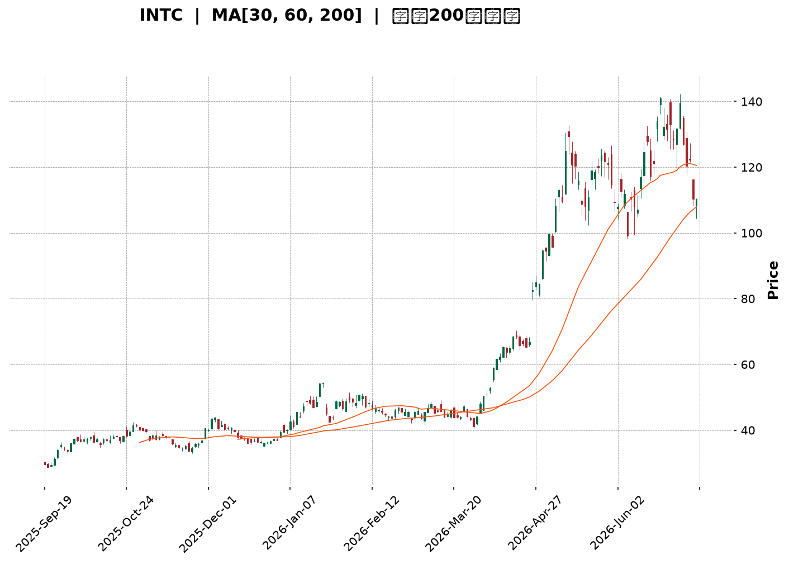
</details>

<html>
<head><meta charset="utf-8" /></head>
<body>
    <div style="height:500px; width:100%;">                        <script>window.PlotlyConfig = {MathJaxConfig: 'local'};</script>
        <script charset="utf-8" src="https://cdn.plot.ly/plotly-3.6.0.min.js" integrity="sha256-QaOVwtVY0T02VaHrr6pnoHLCwayMJp4O5n4YyaE3rJk=" crossorigin="anonymous"></script>                <div id="candlestick-chart" class="plotly-graph-div" style="height:100%; width:100%;"></div>            <script>                window.PLOTLYENV=window.PLOTLYENV || {};                                if (document.getElementById("candlestick-chart")) {                    Plotly.newPlot(                        "candlestick-chart",                        [{"close":{"dtype":"f8","bdata":"AAAA4HqUPUAAAABgj8I8QAAAAEAKVz1AAAAA4FE4P0AAAABguP5AQAAAAAAAwEFAAAAAoHA9QUAAAABgZsZAQAAAAOBR+EFAAAAAYGamQkAAAACAPWpCQAAAACCFS0JAAAAAgMKVQkAAAABACrdCQAAAAGBm5kJAAAAAIFwvQkAAAAAAKZxCQAAAAOCj0EFAAAAAQDOTQkAAAAAghWtCQAAAAKBHgUJAAAAAwMwMQ0AAAAAgXA9DQAAAAIDCdUJAAAAA4HoUQ0AAAAAA1yNDQAAAAMAexUNAAAAAANfDREAAAAAghatEQAAAAOB6FERAAAAAYLj+Q0AAAAAAAMBDQAAAAADXg0JAAAAA4KMwQ0AAAABguJ5CQAAAAOCjEENAAAAAoJk5Q0AAAADgo\u002fBCQAAAAIDr8UJAAAAA4Hr0QUAAAABgj8JBQAAAAEDhWkFAAAAAgD0qQUAAAACAFI5BQAAAACBcz0BAAAAAAABAQUAAAADAHuVBQAAAAIA96kFAAAAAIK5nQkAAAAAgrkdEQAAAAKBHAURAAAAAACm8RUAAAACgR+FFQAAAAAAAQERAAAAA4Hq0REAAAABgZiZEQAAAAAAAQERAAAAAANdjREAAAACgR8FDQAAAACCu50JAAAAAoEfBQkAAAAAgrqdCQAAAAGBmBkJAAAAAANcjQkAAAADA9WhCQAAAACBcL0JAAAAAwMwsQkAAAADgehRCQAAAAKCZGUJAAAAAQApXQkAAAABgZqZCQAAAAEAzc0JAAAAA4KOwQ0AAAAAgXK9DQAAAAMAeBURAAAAA4KNQRUAAAACAFI5EQAAAAGBmxkZAAAAAIK4HRkAAAADAHqVHQAAAAAApXEhAAAAAwPUoSEAAAABA4XpHQAAAACCuR0hAAAAAAAAgS0AAAADA9ShLQAAAAMD1iEZAAAAAYLg+RUAAAABACvdFQAAAAADXY0hAAAAA4HpUSEAAAAAAKTxHQAAAACCuZ0hAAAAAAACgSEAAAADAzExIQAAAAGC4HkhAAAAAIIVLSUAAAABguB5JQAAAAOCjkEdAAAAAwB4lSEAAAACgcD1HQAAAAMAeZUdAAAAAQAoXR0AAAABA4bpGQAAAACBcT0ZAAAAAgBQORkAAAADgo9BFQAAAACBcD0dAAAAA4KNwR0AAAABA4bpGQAAAAIAUzkZAAAAAAADARkAAAADAzIxFQAAAAIA9ykZAAAAAoJn5RkAAAACAwrVFQAAAAIA9ykZAAAAAANdjR0AAAACgcP1HQAAAAAAAoEZAAAAAYI\u002fiRkAAAACgR+FGQAAAACCuB0ZAAAAAANeDRkAAAABAChdHQAAAACBc70VAAAAAoEcBRkAAAAAgrgdGQAAAAEAKl0dAAAAAwMwMRkAAAADgo5BFQAAAAOBRmERAAAAA4KMQRkAAAAAA1wNIQAAAAOCjMElAAAAAANdjSUAAAADgenRKQAAAAKCZeU1AAAAAACncTkAAAADgozBPQAAAACCFS1BAAAAAIK7nT0AAAAAAKTxQQAAAAAAAIFFAAAAAAAAgUUAAAADAzGxQQAAAAOCjkFBAAAAAoEdRUEAAAACA67FQQAAAAGCPolRAAAAAIFw\u002fVUAAAACgRyFVQAAAAAAAsFdAAAAAYLieV0AAAAAgrudYQAAAAIDr8VdAAAAAoJkJW0AAAADgo0BcQAAAACCuZ1tAAAAAQOE6X0AAAACAFC5gQAAAAEAKJ15AAAAAYI8SXkAAAAAghftcQAAAAKBHMVtAAAAAQOEKW0AAAABAM7NbQAAAAKBwvV1AAAAAAACgXUAAAACAwvVdQAAAAKBH4V5AAAAAoEdxXkAAAADA9TheQAAAACCFq1xAAAAAwB5VW0AAAAAghftaQAAAAKBwLVxAAAAAgOvxW0AAAABA4cpYQAAAAKBHkVtAAAAAQOH6WkAAAABgj8JaQAAAAKBwPV1AAAAA4HokX0AAAABACvdfQAAAAEAzQ11AAAAAYGZGXkAAAAAgrr9gQAAAAIAUnmFAAAAAwPWIYEAAAADAzHRgQAAAAADXm2BAAAAAgD0KYEAAAABACndgQAAAAAApdGFAAAAAoEfBX0AAAABgZhZeQAAAAMDMjF5AAAAAwPWYW0AAAAAgXI9bQA=="},"high":{"dtype":"f8","bdata":"AAAAoEehPkAAAACgmRk+QAAAAEAzMz5AAAAAQDOzP0AAAAAAACBBQAAAAGBmJkJAAAAAYGaGQUAAAABguB5BQAAAACCuB0JAAAAAwPXIQkAAAACAPQpDQAAAAEAKV0NAAAAAYGYGQ0AAAADAHuVCQAAAAMDMDENAAAAAQDPTQ0AAAACgR8FCQAAAAGBmRkJAAAAAYLi+QkAAAABgjwJDQAAAAOCjMENAAAAAYI9CQ0AAAADAzCxDQAAAAEAK90JAAAAAQDMzQ0AAAAAgXI9EQAAAAIDCVURAAAAAoHA9RUAAAADAHgVFQAAAAEAKt0RAAAAAgD1qREAAAACgmTlEQAAAAAAAIENAAAAA4FFYQ0AAAAAghetDQAAAAGCPIkNAAAAAANfDQ0AAAAAAKRxDQAAAAKCZGUNAAAAAIK6nQkAAAADAzAxCQAAAAKBw3UFAAAAAoEdhQUAAAAAAAOBBQAAAAEAKV0JAAAAAoHB9QUAAAADgehRCQAAAAOCjEEJAAAAAYLieQkAAAAAghUtEQAAAAOCjMERAAAAAQArXRUAAAABgjwJGQAAAAADXo0VAAAAAgD1qRUAAAAAgXA9FQAAAAKBHoURAAAAAYLh+REAAAADgURhEQAAAAADXA0RAAAAAoHA9Q0AAAABA4fpCQAAAACCF60JAAAAAYLi+QkAAAACAPcpCQAAAAEAz80JAAAAAYGZmQkAAAABAChdCQAAAAGC4PkJAAAAAYGZmQkAAAACgRyFDQAAAAIA9ykJAAAAAgBTuQ0AAAADAzAxFQAAAACCuJ0RAAAAAwPVIRkAAAAAghatFQAAAAKBw3UZAAAAAoJm5RkAAAABguB5IQAAAAAAAgEhAAAAAgOsxSUAAAABA4RpJQAAAAKBwHUlAAAAA4Ho0S0AAAADAzExLQAAAAOCjEEhAAAAAQOE6RkAAAAAA10NGQAAAAMAepUhAAAAAYI9iSEAAAACAPcpIQAAAACCF60hAAAAAYLi+SUAAAACgmdlIQAAAAIAUbklAAAAAYGamSUAAAAAAKZxJQAAAAMAeRUlAAAAAYGbGSEAAAACgmXlIQAAAAOBR2EdAAAAAgD1qR0AAAABgj2JHQAAAAIDClUZAAAAAgOsxRkAAAABgZkZGQAAAAMDMTEdAAAAAACl8R0AAAACgmXlHQAAAACCuR0dAAAAAIK7nRkAAAADgUdhFQAAAAOCjEEdAAAAAoHA9R0AAAABACpdGQAAAAKBH4UZAAAAA4KPwR0AAAACAPWpIQAAAAOBRuEdAAAAAQDNTR0AAAACAwpVIQAAAAIA9CkdAAAAAQOHaRkAAAADgUThHQAAAAGBmxkdAAAAAQOG6RkAAAAAgridGQAAAAMDM7EdAAAAAwMxMR0AAAADgoxBGQAAAAGC4\u002fkVAAAAAoHAdRkAAAABgj2JIQAAAAGC4PklAAAAAgOsxSkAAAABgj6JKQAAAAIDClU1AAAAAgD0KT0AAAACA67FPQAAAAKCZaVBAAAAAIIVLUEAAAACAwnVQQAAAAEAKJ1FAAAAAwB6VUUAAAACgcE1RQAAAAEDh6lBAAAAAoEcxUUAAAACA6xFRQAAAAIAUTlVAAAAAYGbGVUAAAACAwiVVQAAAAMDMvFdAAAAAACnsV0AAAADAzBxZQAAAAOB69FhAAAAAYLieW0AAAAAAAGBcQAAAAOCjoFxAAAAAgD1SYEAAAAAAAJhgQAAAAGCP8l9AAAAAAABAX0AAAADgeqRdQAAAAOB6pFtAAAAAYI\u002fiXEAAAADgekRcQAAAAAApfF5AAAAAgD3aXUAAAACA67FeQAAAACCuZ19AAAAAoEdRX0AAAADAHsVeQAAAAMD1qF9AAAAAQDNTXEAAAAAAAEBbQAAAAGCPkl1AAAAAwPVIXEAAAABguJ5aQAAAAGCPIlxAAAAAAACAXEAAAAAAAOBbQAAAAAAp3F1AAAAAYGbmX0AAAAAghZNgQAAAAGBmFmBAAAAAwMxMX0AAAAAgXO9gQAAAAGBmrmFAAAAAIFw\u002fYUAAAABgjwJhQAAAAEAKl2FAAAAAIFxnYEAAAACgmYFgQAAAAEAzy2FAAAAAIK73YEAAAAAgrldgQAAAAEAz019AAAAAgBQeXUAAAAAgXJ9bQA=="},"hovertemplate":"\u003cb\u003e%{x|%Y-%m-%d}\u003c\u002fb\u003e\u003cbr\u003e\u958b: $%{open:.2f}\u003cbr\u003e\u9ad8: $%{high:.2f}\u003cbr\u003e\u4f4e: $%{low:.2f}\u003cbr\u003e\u6536: $%{close:.2f}\u003cextra\u003e\u003c\u002fextra\u003e","low":{"dtype":"f8","bdata":"AAAA4HpUPUAAAABA4bo8QAAAAIDr0TxAAAAAQOE6PUAAAACAwjU\u002fQAAAAGC4PkFAAAAAoHDdQEAAAABgj4JAQAAAAAAAwEBAAAAA4FG4QUAAAACgmTlCQAAAAEAKN0JAAAAAwMwsQkAAAADgevRBQAAAAIAUbkJAAAAAYGYmQkAAAAAA1yNCQAAAAOBRWEFAAAAAgOvRQUAAAADgejRCQAAAAIA9CkJAAAAAIK7HQkAAAACAwtVCQAAAAMAeBUJAAAAAQAo3QkAAAACAPepCQAAAAKBwHUNAAAAAwB7FQ0AAAACAwnVEQAAAAIAUDkRAAAAAwB7lQ0AAAABgZoZDQAAAAOCjUEJAAAAAgBSOQkAAAABgZmZCQAAAAAApfEJAAAAAACn8QkAAAABguL5CQAAAAMDMrEJAAAAAoJm5QUAAAAAgXE9BQAAAAKBwHUFAAAAAwPXIQEAAAAAAACBBQAAAAKBwvUBAAAAAgOtxQEAAAADgUVhBQAAAAEAKV0FAAAAA4KMQQkAAAAAghatCQAAAAMDMzENAAAAAYGYGREAAAACgR0FFQAAAAIDrEURAAAAAQDOTREAAAACgmdlDQAAAAADXA0RAAAAAgOtxQ0AAAACAPYpDQAAAACBcz0JAAAAAwPWoQkAAAACAwnVCQAAAAAAp\u002fEFAAAAAgMLVQUAAAADgUThCQAAAAMAeJUJAAAAAANcDQkAAAACgmXlBQAAAAMDM7EFAAAAAwPXoQUAAAADA9WhCQAAAACBcb0JAAAAAoEfhQkAAAABgj6JDQAAAAKCZeUNAAAAAIFwPREAAAABACldEQAAAAMD1yERAAAAAgOvxRUAAAAAAKZxGQAAAAIDCtUdAAAAAgD3qR0AAAABA4VpHQAAAAAAAgEdAAAAAQDMTSUAAAACAPYpKQAAAAKCZOUZAAAAAANcjRUAAAADAzIxFQAAAAMD1KEdAAAAAYLh+R0AAAABA4fpGQAAAAAAAwEZAAAAAQAo3SEAAAAAAAIBHQAAAAMAeZUdAAAAAgD1qSEAAAAAghctHQAAAAGCPYkdAAAAAgBRuR0AAAADgURhHQAAAAAApfEZAAAAAQOG6RkAAAADgo3BGQAAAAIDC9UVAAAAA4KNwRUAAAABACpdFQAAAAMAexUVAAAAAgD2KRkAAAACA6zFGQAAAAEAzM0ZAAAAAoJn5RUAAAACA6xFFQAAAAGCPokVAAAAAoJlZRkAAAAAA16NFQAAAAIDr0URAAAAA4Hq0RkAAAADgelRHQAAAAIDClUZAAAAAgOuxRkAAAADgUdhGQAAAAOB69EVAAAAAYGYGRkAAAABAM9NFQAAAAIDr0UVAAAAAYLjeRUAAAACgmZlFQAAAAKCZuUZAAAAAgML1RUAAAACAFG5FQAAAAOCjUERAAAAAwMzMREAAAACgcH1GQAAAAMAeBUdAAAAAIFzvSEAAAAAAKZxJQAAAAGBmZktAAAAAgOsxTUAAAAAAAGBOQAAAAEAKF09AAAAAIIULT0AAAADgo3BPQAAAAKBHEVBAAAAAIFzvUEAAAACAFB5QQAAAAMD1aFBAAAAAYLg+UEAAAABA4VpQQAAAACCu51NAAAAAQAqnVEAAAABAMzNUQAAAACCud1VAAAAAAADgVkAAAABACidXQAAAAGBm5ldAAAAAwB4FWUAAAADAHqVaQAAAAKCZSVtAAAAAQDPzW0AAAABA4fpeQAAAAAAAwFxAAAAAgD0aXUAAAABA4UpcQAAAAKBHQVpAAAAAYGb2WUAAAACgmZlZQAAAAEAzs1xAAAAAQOFKXEAAAACAwoVdQAAAAGBmVl1AAAAAAABAXUAAAAAA1xNdQAAAAGCPYlxAAAAAwB6VWkAAAABA4QpaQAAAAEAKt1tAAAAAYLjeWkAAAADAHpVYQAAAAIA9qlpAAAAAoHDdWEAAAABA4TpaQAAAAOCjoFtAAAAAwB7VXEAAAACAPapfQAAAAAAAAF1AAAAAANeDXUAAAACgmflfQAAAAGC4BmFAAAAAoJkJYEAAAADAzPxfQAAAAIA9Wl9AAAAAAABgX0AAAAAAAKBdQAAAAOCjcGBAAAAAIIWrX0AAAADgUWhdQAAAAKBHYV5AAAAAQDMTW0AAAACAPRpaQA=="},"name":"\u50f9\u683c","open":{"dtype":"f8","bdata":"AAAAoEdhPkAAAAAghas9QAAAAKBw\u002fTxAAAAAoEdhPUAAAAAAKZw\u002fQAAAAGCPgkFAAAAAYI9CQUAAAABACvdAQAAAAADXw0BAAAAAoEfhQUAAAACgmflCQAAAAOBRmEJAAAAAgOtRQkAAAABgZkZCQAAAAADXw0JAAAAAQOE6Q0AAAADgUThCQAAAAAAAAEJAAAAAQDMzQkAAAABAM5NCQAAAAIAULkJAAAAAwPXIQkAAAACA6xFDQAAAACCF60JAAAAAwMxMQkAAAABgjwJEQAAAAIDrMUNAAAAAIIXLQ0AAAADAzMxEQAAAAAApfERAAAAAQApXREAAAAAAACBEQAAAAIDrEUNAAAAAgMK1QkAAAAAghStDQAAAAKBHoUJAAAAAQAp3Q0AAAABAMxNDQAAAACCuB0NAAAAAYI+iQkAAAAAA14NBQAAAAKCZuUFAAAAAAAAgQUAAAACAPSpBQAAAAAAAAEJAAAAAoEfBQEAAAAAAKXxBQAAAAGBmxkFAAAAAoJkZQkAAAABAM7NCQAAAAIAU7kNAAAAAACk8REAAAACA67FFQAAAAKBHoUVAAAAA4HqUREAAAADgUfhEQAAAAKBwXURAAAAAgBQOREAAAADA9QhEQAAAAAAAoENAAAAAgD0qQ0AAAACAPcpCQAAAACCFy0JAAAAA4KOwQkAAAACgcD1CQAAAAIDr8UJAAAAAYLgeQkAAAACAwpVBQAAAAIDCFUJAAAAAoEcBQkAAAADgenRCQAAAAEAzs0JAAAAAYI\u002fiQkAAAAAghctEQAAAAIAU7kNAAAAAQAoXREAAAAAgXE9FQAAAAIA96kRAAAAAYLgeRkAAAACA6\u002fFGQAAAAKCZeUhAAAAAwMysSEAAAABgj6JIQAAAAGBmpkdAAAAAwPUoSUAAAABA4RpLQAAAAIAUbkdAAAAAANcjRkAAAAAAKfxFQAAAAMDMTEdAAAAAIK7HR0AAAACgcH1IQAAAAOCj0EZAAAAAIK4HSUAAAADAHsVIQAAAACCFy0dAAAAAwMyMSEAAAAAghctIQAAAAOB6NElAAAAAgBQOSEAAAABgZuZHQAAAAKBH4UZAAAAAQAr3RkAAAACAwvVGQAAAAKCZeUZAAAAAgOvxRUAAAAAghQtGQAAAAMDMDEZAAAAAIIULR0AAAABgj2JHQAAAAEDhOkZAAAAAoJkZRkAAAADgUbhFQAAAAMD1CEZAAAAAIFxvRkAAAACAwlVGQAAAAGC4XkVAAAAA4Hq0RkAAAADA9WhHQAAAAEAzs0dAAAAAACn8RkAAAADgevRHQAAAAIA9CkdAAAAAoJkZRkAAAABguP5FQAAAAKCZeUdAAAAAAABARkAAAADAHsVFQAAAAMDM7EZAAAAAYGYmR0AAAAAgXM9FQAAAAAAp3EVAAAAAoJn5REAAAAAAAIBGQAAAACCuB0dAAAAA4KNwSUAAAADgevRJQAAAACBcr0tAAAAAQDMzTUAAAABgj8JOQAAAAEAKF09AAAAAgD1KUEAAAABgj+JPQAAAACCFO1BAAAAAYGY2UUAAAADAzBxRQAAAAMD1yFBAAAAAACn8UEAAAABgZoZQQAAAAMDMjFRAAAAAQOHqVEAAAACA61FUQAAAAMD1iFVAAAAAYGbmV0AAAADAzExXQAAAACCFy1hAAAAA4KMgWUAAAABguL5bQAAAAKBHwVtAAAAAANfzW0AAAAAAKVxgQAAAAEAKF19AAAAAYGYGX0AAAACAPapcQAAAAGCPcltAAAAAgBReXEAAAABguL5aQAAAAIAUDl1AAAAAwB4lXUAAAACAwhVeQAAAAGBmhl5AAAAAwPUYX0AAAADAzFxeQAAAAGBm9l5AAAAAIIVbW0AAAADAzNxaQAAAAEDhGl1AAAAAoJkZW0AAAABguJ5aQAAAAAAAwFtAAAAAIFw\u002fXEAAAACA64FaQAAAAKBHYVxAAAAAQOFaXUAAAAAgri9gQAAAAEAKR19AAAAAYGZ2XkAAAACA63lgQAAAAADXY2FAAAAAIFw3YEAAAACgmaFgQAAAACBcd2FAAAAAYLgWYEAAAAAAAMBfQAAAACCuf2BAAAAAAADgYEAAAACgcB1gQAAAAOB6pF5AAAAAQDMTXUAAAABAMxNbQA=="},"x":["2025-09-19T00:00:00-04:00","2025-09-22T00:00:00-04:00","2025-09-23T00:00:00-04:00","2025-09-24T00:00:00-04:00","2025-09-25T00:00:00-04:00","2025-09-26T00:00:00-04:00","2025-09-29T00:00:00-04:00","2025-09-30T00:00:00-04:00","2025-10-01T00:00:00-04:00","2025-10-02T00:00:00-04:00","2025-10-03T00:00:00-04:00","2025-10-06T00:00:00-04:00","2025-10-07T00:00:00-04:00","2025-10-08T00:00:00-04:00","2025-10-09T00:00:00-04:00","2025-10-10T00:00:00-04:00","2025-10-13T00:00:00-04:00","2025-10-14T00:00:00-04:00","2025-10-15T00:00:00-04:00","2025-10-16T00:00:00-04:00","2025-10-17T00:00:00-04:00","2025-10-20T00:00:00-04:00","2025-10-21T00:00:00-04:00","2025-10-22T00:00:00-04:00","2025-10-23T00:00:00-04:00","2025-10-24T00:00:00-04:00","2025-10-27T00:00:00-04:00","2025-10-28T00:00:00-04:00","2025-10-29T00:00:00-04:00","2025-10-30T00:00:00-04:00","2025-10-31T00:00:00-04:00","2025-11-03T00:00:00-05:00","2025-11-04T00:00:00-05:00","2025-11-05T00:00:00-05:00","2025-11-06T00:00:00-05:00","2025-11-07T00:00:00-05:00","2025-11-10T00:00:00-05:00","2025-11-11T00:00:00-05:00","2025-11-12T00:00:00-05:00","2025-11-13T00:00:00-05:00","2025-11-14T00:00:00-05:00","2025-11-17T00:00:00-05:00","2025-11-18T00:00:00-05:00","2025-11-19T00:00:00-05:00","2025-11-20T00:00:00-05:00","2025-11-21T00:00:00-05:00","2025-11-24T00:00:00-05:00","2025-11-25T00:00:00-05:00","2025-11-26T00:00:00-05:00","2025-11-28T00:00:00-05:00","2025-12-01T00:00:00-05:00","2025-12-02T00:00:00-05:00","2025-12-03T00:00:00-05:00","2025-12-04T00:00:00-05:00","2025-12-05T00:00:00-05:00","2025-12-08T00:00:00-05:00","2025-12-09T00:00:00-05:00","2025-12-10T00:00:00-05:00","2025-12-11T00:00:00-05:00","2025-12-12T00:00:00-05:00","2025-12-15T00:00:00-05:00","2025-12-16T00:00:00-05:00","2025-12-17T00:00:00-05:00","2025-12-18T00:00:00-05:00","2025-12-19T00:00:00-05:00","2025-12-22T00:00:00-05:00","2025-12-23T00:00:00-05:00","2025-12-24T00:00:00-05:00","2025-12-26T00:00:00-05:00","2025-12-29T00:00:00-05:00","2025-12-30T00:00:00-05:00","2025-12-31T00:00:00-05:00","2026-01-02T00:00:00-05:00","2026-01-05T00:00:00-05:00","2026-01-06T00:00:00-05:00","2026-01-07T00:00:00-05:00","2026-01-08T00:00:00-05:00","2026-01-09T00:00:00-05:00","2026-01-12T00:00:00-05:00","2026-01-13T00:00:00-05:00","2026-01-14T00:00:00-05:00","2026-01-15T00:00:00-05:00","2026-01-16T00:00:00-05:00","2026-01-20T00:00:00-05:00","2026-01-21T00:00:00-05:00","2026-01-22T00:00:00-05:00","2026-01-23T00:00:00-05:00","2026-01-26T00:00:00-05:00","2026-01-27T00:00:00-05:00","2026-01-28T00:00:00-05:00","2026-01-29T00:00:00-05:00","2026-01-30T00:00:00-05:00","2026-02-02T00:00:00-05:00","2026-02-03T00:00:00-05:00","2026-02-04T00:00:00-05:00","2026-02-05T00:00:00-05:00","2026-02-06T00:00:00-05:00","2026-02-09T00:00:00-05:00","2026-02-10T00:00:00-05:00","2026-02-11T00:00:00-05:00","2026-02-12T00:00:00-05:00","2026-02-13T00:00:00-05:00","2026-02-17T00:00:00-05:00","2026-02-18T00:00:00-05:00","2026-02-19T00:00:00-05:00","2026-02-20T00:00:00-05:00","2026-02-23T00:00:00-05:00","2026-02-24T00:00:00-05:00","2026-02-25T00:00:00-05:00","2026-02-26T00:00:00-05:00","2026-02-27T00:00:00-05:00","2026-03-02T00:00:00-05:00","2026-03-03T00:00:00-05:00","2026-03-04T00:00:00-05:00","2026-03-05T00:00:00-05:00","2026-03-06T00:00:00-05:00","2026-03-09T00:00:00-04:00","2026-03-10T00:00:00-04:00","2026-03-11T00:00:00-04:00","2026-03-12T00:00:00-04:00","2026-03-13T00:00:00-04:00","2026-03-16T00:00:00-04:00","2026-03-17T00:00:00-04:00","2026-03-18T00:00:00-04:00","2026-03-19T00:00:00-04:00","2026-03-20T00:00:00-04:00","2026-03-23T00:00:00-04:00","2026-03-24T00:00:00-04:00","2026-03-25T00:00:00-04:00","2026-03-26T00:00:00-04:00","2026-03-27T00:00:00-04:00","2026-03-30T00:00:00-04:00","2026-03-31T00:00:00-04:00","2026-04-01T00:00:00-04:00","2026-04-02T00:00:00-04:00","2026-04-06T00:00:00-04:00","2026-04-07T00:00:00-04:00","2026-04-08T00:00:00-04:00","2026-04-09T00:00:00-04:00","2026-04-10T00:00:00-04:00","2026-04-13T00:00:00-04:00","2026-04-14T00:00:00-04:00","2026-04-15T00:00:00-04:00","2026-04-16T00:00:00-04:00","2026-04-17T00:00:00-04:00","2026-04-20T00:00:00-04:00","2026-04-21T00:00:00-04:00","2026-04-22T00:00:00-04:00","2026-04-23T00:00:00-04:00","2026-04-24T00:00:00-04:00","2026-04-27T00:00:00-04:00","2026-04-28T00:00:00-04:00","2026-04-29T00:00:00-04:00","2026-04-30T00:00:00-04:00","2026-05-01T00:00:00-04:00","2026-05-04T00:00:00-04:00","2026-05-05T00:00:00-04:00","2026-05-06T00:00:00-04:00","2026-05-07T00:00:00-04:00","2026-05-08T00:00:00-04:00","2026-05-11T00:00:00-04:00","2026-05-12T00:00:00-04:00","2026-05-13T00:00:00-04:00","2026-05-14T00:00:00-04:00","2026-05-15T00:00:00-04:00","2026-05-18T00:00:00-04:00","2026-05-19T00:00:00-04:00","2026-05-20T00:00:00-04:00","2026-05-21T00:00:00-04:00","2026-05-22T00:00:00-04:00","2026-05-26T00:00:00-04:00","2026-05-27T00:00:00-04:00","2026-05-28T00:00:00-04:00","2026-05-29T00:00:00-04:00","2026-06-01T00:00:00-04:00","2026-06-02T00:00:00-04:00","2026-06-03T00:00:00-04:00","2026-06-04T00:00:00-04:00","2026-06-05T00:00:00-04:00","2026-06-08T00:00:00-04:00","2026-06-09T00:00:00-04:00","2026-06-10T00:00:00-04:00","2026-06-11T00:00:00-04:00","2026-06-12T00:00:00-04:00","2026-06-15T00:00:00-04:00","2026-06-16T00:00:00-04:00","2026-06-17T00:00:00-04:00","2026-06-18T00:00:00-04:00","2026-06-22T00:00:00-04:00","2026-06-23T00:00:00-04:00","2026-06-24T00:00:00-04:00","2026-06-25T00:00:00-04:00","2026-06-26T00:00:00-04:00","2026-06-29T00:00:00-04:00","2026-06-30T00:00:00-04:00","2026-07-01T00:00:00-04:00","2026-07-02T00:00:00-04:00","2026-07-06T00:00:00-04:00","2026-07-07T00:00:00-04:00","2026-07-08T00:00:00-04:00"],"type":"candlestick"},{"hovertemplate":"MA30: $%{y:.2f}\u003cextra\u003e\u003c\u002fextra\u003e","line":{"color":"#2196F3","dash":"dash","width":2},"mode":"lines","name":"MA30","x":["2025-09-19T00:00:00-04:00","2025-09-22T00:00:00-04:00","2025-09-23T00:00:00-04:00","2025-09-24T00:00:00-04:00","2025-09-25T00:00:00-04:00","2025-09-26T00:00:00-04:00","2025-09-29T00:00:00-04:00","2025-09-30T00:00:00-04:00","2025-10-01T00:00:00-04:00","2025-10-02T00:00:00-04:00","2025-10-03T00:00:00-04:00","2025-10-06T00:00:00-04:00","2025-10-07T00:00:00-04:00","2025-10-08T00:00:00-04:00","2025-10-09T00:00:00-04:00","2025-10-10T00:00:00-04:00","2025-10-13T00:00:00-04:00","2025-10-14T00:00:00-04:00","2025-10-15T00:00:00-04:00","2025-10-16T00:00:00-04:00","2025-10-17T00:00:00-04:00","2025-10-20T00:00:00-04:00","2025-10-21T00:00:00-04:00","2025-10-22T00:00:00-04:00","2025-10-23T00:00:00-04:00","2025-10-24T00:00:00-04:00","2025-10-27T00:00:00-04:00","2025-10-28T00:00:00-04:00","2025-10-29T00:00:00-04:00","2025-10-30T00:00:00-04:00","2025-10-31T00:00:00-04:00","2025-11-03T00:00:00-05:00","2025-11-04T00:00:00-05:00","2025-11-05T00:00:00-05:00","2025-11-06T00:00:00-05:00","2025-11-07T00:00:00-05:00","2025-11-10T00:00:00-05:00","2025-11-11T00:00:00-05:00","2025-11-12T00:00:00-05:00","2025-11-13T00:00:00-05:00","2025-11-14T00:00:00-05:00","2025-11-17T00:00:00-05:00","2025-11-18T00:00:00-05:00","2025-11-19T00:00:00-05:00","2025-11-20T00:00:00-05:00","2025-11-21T00:00:00-05:00","2025-11-24T00:00:00-05:00","2025-11-25T00:00:00-05:00","2025-11-26T00:00:00-05:00","2025-11-28T00:00:00-05:00","2025-12-01T00:00:00-05:00","2025-12-02T00:00:00-05:00","2025-12-03T00:00:00-05:00","2025-12-04T00:00:00-05:00","2025-12-05T00:00:00-05:00","2025-12-08T00:00:00-05:00","2025-12-09T00:00:00-05:00","2025-12-10T00:00:00-05:00","2025-12-11T00:00:00-05:00","2025-12-12T00:00:00-05:00","2025-12-15T00:00:00-05:00","2025-12-16T00:00:00-05:00","2025-12-17T00:00:00-05:00","2025-12-18T00:00:00-05:00","2025-12-19T00:00:00-05:00","2025-12-22T00:00:00-05:00","2025-12-23T00:00:00-05:00","2025-12-24T00:00:00-05:00","2025-12-26T00:00:00-05:00","2025-12-29T00:00:00-05:00","2025-12-30T00:00:00-05:00","2025-12-31T00:00:00-05:00","2026-01-02T00:00:00-05:00","2026-01-05T00:00:00-05:00","2026-01-06T00:00:00-05:00","2026-01-07T00:00:00-05:00","2026-01-08T00:00:00-05:00","2026-01-09T00:00:00-05:00","2026-01-12T00:00:00-05:00","2026-01-13T00:00:00-05:00","2026-01-14T00:00:00-05:00","2026-01-15T00:00:00-05:00","2026-01-16T00:00:00-05:00","2026-01-20T00:00:00-05:00","2026-01-21T00:00:00-05:00","2026-01-22T00:00:00-05:00","2026-01-23T00:00:00-05:00","2026-01-26T00:00:00-05:00","2026-01-27T00:00:00-05:00","2026-01-28T00:00:00-05:00","2026-01-29T00:00:00-05:00","2026-01-30T00:00:00-05:00","2026-02-02T00:00:00-05:00","2026-02-03T00:00:00-05:00","2026-02-04T00:00:00-05:00","2026-02-05T00:00:00-05:00","2026-02-06T00:00:00-05:00","2026-02-09T00:00:00-05:00","2026-02-10T00:00:00-05:00","2026-02-11T00:00:00-05:00","2026-02-12T00:00:00-05:00","2026-02-13T00:00:00-05:00","2026-02-17T00:00:00-05:00","2026-02-18T00:00:00-05:00","2026-02-19T00:00:00-05:00","2026-02-20T00:00:00-05:00","2026-02-23T00:00:00-05:00","2026-02-24T00:00:00-05:00","2026-02-25T00:00:00-05:00","2026-02-26T00:00:00-05:00","2026-02-27T00:00:00-05:00","2026-03-02T00:00:00-05:00","2026-03-03T00:00:00-05:00","2026-03-04T00:00:00-05:00","2026-03-05T00:00:00-05:00","2026-03-06T00:00:00-05:00","2026-03-09T00:00:00-04:00","2026-03-10T00:00:00-04:00","2026-03-11T00:00:00-04:00","2026-03-12T00:00:00-04:00","2026-03-13T00:00:00-04:00","2026-03-16T00:00:00-04:00","2026-03-17T00:00:00-04:00","2026-03-18T00:00:00-04:00","2026-03-19T00:00:00-04:00","2026-03-20T00:00:00-04:00","2026-03-23T00:00:00-04:00","2026-03-24T00:00:00-04:00","2026-03-25T00:00:00-04:00","2026-03-26T00:00:00-04:00","2026-03-27T00:00:00-04:00","2026-03-30T00:00:00-04:00","2026-03-31T00:00:00-04:00","2026-04-01T00:00:00-04:00","2026-04-02T00:00:00-04:00","2026-04-06T00:00:00-04:00","2026-04-07T00:00:00-04:00","2026-04-08T00:00:00-04:00","2026-04-09T00:00:00-04:00","2026-04-10T00:00:00-04:00","2026-04-13T00:00:00-04:00","2026-04-14T00:00:00-04:00","2026-04-15T00:00:00-04:00","2026-04-16T00:00:00-04:00","2026-04-17T00:00:00-04:00","2026-04-20T00:00:00-04:00","2026-04-21T00:00:00-04:00","2026-04-22T00:00:00-04:00","2026-04-23T00:00:00-04:00","2026-04-24T00:00:00-04:00","2026-04-27T00:00:00-04:00","2026-04-28T00:00:00-04:00","2026-04-29T00:00:00-04:00","2026-04-30T00:00:00-04:00","2026-05-01T00:00:00-04:00","2026-05-04T00:00:00-04:00","2026-05-05T00:00:00-04:00","2026-05-06T00:00:00-04:00","2026-05-07T00:00:00-04:00","2026-05-08T00:00:00-04:00","2026-05-11T00:00:00-04:00","2026-05-12T00:00:00-04:00","2026-05-13T00:00:00-04:00","2026-05-14T00:00:00-04:00","2026-05-15T00:00:00-04:00","2026-05-18T00:00:00-04:00","2026-05-19T00:00:00-04:00","2026-05-20T00:00:00-04:00","2026-05-21T00:00:00-04:00","2026-05-22T00:00:00-04:00","2026-05-26T00:00:00-04:00","2026-05-27T00:00:00-04:00","2026-05-28T00:00:00-04:00","2026-05-29T00:00:00-04:00","2026-06-01T00:00:00-04:00","2026-06-02T00:00:00-04:00","2026-06-03T00:00:00-04:00","2026-06-04T00:00:00-04:00","2026-06-05T00:00:00-04:00","2026-06-08T00:00:00-04:00","2026-06-09T00:00:00-04:00","2026-06-10T00:00:00-04:00","2026-06-11T00:00:00-04:00","2026-06-12T00:00:00-04:00","2026-06-15T00:00:00-04:00","2026-06-16T00:00:00-04:00","2026-06-17T00:00:00-04:00","2026-06-18T00:00:00-04:00","2026-06-22T00:00:00-04:00","2026-06-23T00:00:00-04:00","2026-06-24T00:00:00-04:00","2026-06-25T00:00:00-04:00","2026-06-26T00:00:00-04:00","2026-06-29T00:00:00-04:00","2026-06-30T00:00:00-04:00","2026-07-01T00:00:00-04:00","2026-07-02T00:00:00-04:00","2026-07-06T00:00:00-04:00","2026-07-07T00:00:00-04:00","2026-07-08T00:00:00-04:00"],"y":{"dtype":"f8","bdata":"AAAAAAAA+H8AAAAAAAD4fwAAAAAAAPh\u002fAAAAAAAA+H8AAAAAAAD4fwAAAAAAAPh\u002fAAAAAAAA+H8AAAAAAAD4fwAAAAAAAPh\u002fAAAAAAAA+H8AAAAAAAD4fwAAAAAAAPh\u002fAAAAAAAA+H8AAAAAAAD4fwAAAAAAAPh\u002fAAAAAAAA+H8AAAAAAAD4fwAAAAAAAPh\u002fAAAAAAAA+H8AAAAAAAD4fwAAAAAAAPh\u002fAAAAAAAA+H8AAAAAAAD4fwAAAAAAAPh\u002fAAAAAAAA+H8AAAAAAAD4fwAAAAAAAPh\u002fAAAAAAAA+H8AAAAAAAD4fxEREUl+IUJAiYiIyOhNQkAiIiK6u3tCQJqZmUGLnEJAMzMz4xe7QkARERHB9chCQKuqqmou1EJAd3d3tx7lQkC8u7s7mPdCQHd3dyfq\u002f0JAd3d35\u002fv5QkCJiIgIZfRCQCIiIpJf7EJAmpmZiUHgQkCrqqp6W9ZCQN7d3c2FxEJARERERIu8QkAzMzNTcbZCQHd3d8dLt0JAiYiIaNi1QkBERESkt8VCQBEREXGE0kJAq6qq6m3pQkDNzMxMfgFDQN7d3Z3EEENAvLu7e6IeQ0DNzMzcQCdDQAAAAHBZK0NAzczMPCYoQ0AzMzNjVyBDQAAAAJBQFkNAzczMvLsLQ0DNzMysYwJDQBEREUE1\u002fkJA3t3dfT\u002f1QkDNzMy8dPNCQImIiFjy60JAVVVVlfziQkAiIiLipdtCQERERPRv1EJAAAAAALnXQkC8u7s7Ud9CQM3MzEyp6EJA7+7uPjX+QkDNzMxMYhBDQHd3d6fGK0NAiYiIyHZOQ0BERESkKWVDQImIiHiijkNAd3d3Z5GtQ0C8u7tbSMpDQBEREQFy70NA7+7ufiMEREAAAADAyhFEQLy7u2suNERAAAAAIPdqREBERES0yKZEQM3MzFxIukRAREREJJTBREBmZmb2b9REQAAAACA+A0VAZmZm5tAyRUAAAAAQ5llFQDMzM2NXkEVAZmZmFq7HRUDNzMz88PlFQCIiIjKWLEZAMzMzE1hpRkARERExa6VGQKuqqqoN1EZAIiIi4pYFR0BERETkwSxHQImIiGj0VkdAIiIi0vdzR0CamZm5841HQN7d3U1+oUdAvLu7286nR0Dv7u5ej7JHQGZmZvb9tEdAd3d3JwbBR0De3d1NN7lHQKuqqlryq0dAmpmZKeqfR0AzMzMDco9HQO\u002fu7g67gkdA7+7uPlFfR0CamZmJzzBHQImIiJj8MkdAq6qqakpFR0CJiIgYklZHQFVVVWWCR0dA7+7uvi07R0C8u7s7JjhHQHd3d\u002ffhI0dAmpmZmeARR0ARERFRjQdHQLy7uxvo9EZA3t3d\u002fdTYRkCJiIjIdr5GQFVVVWWtvkZAvLu7y8ysRkBERES0gZ5GQCIiIgKdhkZAzczM3N19RkDNzMz81IhGQCIiInJooUZAzczM3N29RkCJiIgYduVGQBEREeEzHEdA3t3dHYVbR0BVVVVFtqNHQN7d3e0190dAVVVVVVVFSEARERFxhKJIQBERETFPBElA3t3dzYVkSUARERGBlcNJQERERJTRG0pAZmZmlrVqSkAzMzMz7LpKQDMzM9MGWktAVVVVhV0BTEBmZmbGvaZMQFVVVcUEf01AzczMXAFSTkCJiIgYBDZPQERERNS\u002fCVBAq6qq0pSSUEB3d3e3rCVRQImIiEjhqlFAd3d3x0tXUkBERESMbA9TQFVVVXXauFNAERER+VNbVEBVVVVtLuxUQGZmZia\u002faFVA3t3dvS3jVUDv7u5mrV5WQM3MzNyy3lZAAAAAUNRXV0CamZkhadJXQERERIzeTlhA7+7uboTKWEB3d3eX4EFZQHd3dwdlpFlAd3d3p3\u002f7WUDe3d3dllVaQCIiIsKuuFpAvLu7a+cbW0De3d2tAGFbQERERPQonFtAq6qqyhPNW0B3d3e3Hv1bQGZmZlaALFxAzczMfLFsXECrqqpK8KhcQM3MzIxQ1lxAmpmZ+fDxXECrqqrash5dQAAAAMCDYV1Aq6qqSjdxXUDe3d097nVdQFVVVdUVkF1AmpmZSTehXUC8u7u75sJdQJqZmWm8BF5AZmZmBvMsXkCJiIiYUkFeQBERERE8SF5AzczM7O42XkC8u7sLdCJeQA=="},"type":"scatter"},{"hovertemplate":"MA60: $%{y:.2f}\u003cextra\u003e\u003c\u002fextra\u003e","line":{"color":"#9C27B0","dash":"dash","width":2},"mode":"lines","name":"MA60","x":["2025-09-19T00:00:00-04:00","2025-09-22T00:00:00-04:00","2025-09-23T00:00:00-04:00","2025-09-24T00:00:00-04:00","2025-09-25T00:00:00-04:00","2025-09-26T00:00:00-04:00","2025-09-29T00:00:00-04:00","2025-09-30T00:00:00-04:00","2025-10-01T00:00:00-04:00","2025-10-02T00:00:00-04:00","2025-10-03T00:00:00-04:00","2025-10-06T00:00:00-04:00","2025-10-07T00:00:00-04:00","2025-10-08T00:00:00-04:00","2025-10-09T00:00:00-04:00","2025-10-10T00:00:00-04:00","2025-10-13T00:00:00-04:00","2025-10-14T00:00:00-04:00","2025-10-15T00:00:00-04:00","2025-10-16T00:00:00-04:00","2025-10-17T00:00:00-04:00","2025-10-20T00:00:00-04:00","2025-10-21T00:00:00-04:00","2025-10-22T00:00:00-04:00","2025-10-23T00:00:00-04:00","2025-10-24T00:00:00-04:00","2025-10-27T00:00:00-04:00","2025-10-28T00:00:00-04:00","2025-10-29T00:00:00-04:00","2025-10-30T00:00:00-04:00","2025-10-31T00:00:00-04:00","2025-11-03T00:00:00-05:00","2025-11-04T00:00:00-05:00","2025-11-05T00:00:00-05:00","2025-11-06T00:00:00-05:00","2025-11-07T00:00:00-05:00","2025-11-10T00:00:00-05:00","2025-11-11T00:00:00-05:00","2025-11-12T00:00:00-05:00","2025-11-13T00:00:00-05:00","2025-11-14T00:00:00-05:00","2025-11-17T00:00:00-05:00","2025-11-18T00:00:00-05:00","2025-11-19T00:00:00-05:00","2025-11-20T00:00:00-05:00","2025-11-21T00:00:00-05:00","2025-11-24T00:00:00-05:00","2025-11-25T00:00:00-05:00","2025-11-26T00:00:00-05:00","2025-11-28T00:00:00-05:00","2025-12-01T00:00:00-05:00","2025-12-02T00:00:00-05:00","2025-12-03T00:00:00-05:00","2025-12-04T00:00:00-05:00","2025-12-05T00:00:00-05:00","2025-12-08T00:00:00-05:00","2025-12-09T00:00:00-05:00","2025-12-10T00:00:00-05:00","2025-12-11T00:00:00-05:00","2025-12-12T00:00:00-05:00","2025-12-15T00:00:00-05:00","2025-12-16T00:00:00-05:00","2025-12-17T00:00:00-05:00","2025-12-18T00:00:00-05:00","2025-12-19T00:00:00-05:00","2025-12-22T00:00:00-05:00","2025-12-23T00:00:00-05:00","2025-12-24T00:00:00-05:00","2025-12-26T00:00:00-05:00","2025-12-29T00:00:00-05:00","2025-12-30T00:00:00-05:00","2025-12-31T00:00:00-05:00","2026-01-02T00:00:00-05:00","2026-01-05T00:00:00-05:00","2026-01-06T00:00:00-05:00","2026-01-07T00:00:00-05:00","2026-01-08T00:00:00-05:00","2026-01-09T00:00:00-05:00","2026-01-12T00:00:00-05:00","2026-01-13T00:00:00-05:00","2026-01-14T00:00:00-05:00","2026-01-15T00:00:00-05:00","2026-01-16T00:00:00-05:00","2026-01-20T00:00:00-05:00","2026-01-21T00:00:00-05:00","2026-01-22T00:00:00-05:00","2026-01-23T00:00:00-05:00","2026-01-26T00:00:00-05:00","2026-01-27T00:00:00-05:00","2026-01-28T00:00:00-05:00","2026-01-29T00:00:00-05:00","2026-01-30T00:00:00-05:00","2026-02-02T00:00:00-05:00","2026-02-03T00:00:00-05:00","2026-02-04T00:00:00-05:00","2026-02-05T00:00:00-05:00","2026-02-06T00:00:00-05:00","2026-02-09T00:00:00-05:00","2026-02-10T00:00:00-05:00","2026-02-11T00:00:00-05:00","2026-02-12T00:00:00-05:00","2026-02-13T00:00:00-05:00","2026-02-17T00:00:00-05:00","2026-02-18T00:00:00-05:00","2026-02-19T00:00:00-05:00","2026-02-20T00:00:00-05:00","2026-02-23T00:00:00-05:00","2026-02-24T00:00:00-05:00","2026-02-25T00:00:00-05:00","2026-02-26T00:00:00-05:00","2026-02-27T00:00:00-05:00","2026-03-02T00:00:00-05:00","2026-03-03T00:00:00-05:00","2026-03-04T00:00:00-05:00","2026-03-05T00:00:00-05:00","2026-03-06T00:00:00-05:00","2026-03-09T00:00:00-04:00","2026-03-10T00:00:00-04:00","2026-03-11T00:00:00-04:00","2026-03-12T00:00:00-04:00","2026-03-13T00:00:00-04:00","2026-03-16T00:00:00-04:00","2026-03-17T00:00:00-04:00","2026-03-18T00:00:00-04:00","2026-03-19T00:00:00-04:00","2026-03-20T00:00:00-04:00","2026-03-23T00:00:00-04:00","2026-03-24T00:00:00-04:00","2026-03-25T00:00:00-04:00","2026-03-26T00:00:00-04:00","2026-03-27T00:00:00-04:00","2026-03-30T00:00:00-04:00","2026-03-31T00:00:00-04:00","2026-04-01T00:00:00-04:00","2026-04-02T00:00:00-04:00","2026-04-06T00:00:00-04:00","2026-04-07T00:00:00-04:00","2026-04-08T00:00:00-04:00","2026-04-09T00:00:00-04:00","2026-04-10T00:00:00-04:00","2026-04-13T00:00:00-04:00","2026-04-14T00:00:00-04:00","2026-04-15T00:00:00-04:00","2026-04-16T00:00:00-04:00","2026-04-17T00:00:00-04:00","2026-04-20T00:00:00-04:00","2026-04-21T00:00:00-04:00","2026-04-22T00:00:00-04:00","2026-04-23T00:00:00-04:00","2026-04-24T00:00:00-04:00","2026-04-27T00:00:00-04:00","2026-04-28T00:00:00-04:00","2026-04-29T00:00:00-04:00","2026-04-30T00:00:00-04:00","2026-05-01T00:00:00-04:00","2026-05-04T00:00:00-04:00","2026-05-05T00:00:00-04:00","2026-05-06T00:00:00-04:00","2026-05-07T00:00:00-04:00","2026-05-08T00:00:00-04:00","2026-05-11T00:00:00-04:00","2026-05-12T00:00:00-04:00","2026-05-13T00:00:00-04:00","2026-05-14T00:00:00-04:00","2026-05-15T00:00:00-04:00","2026-05-18T00:00:00-04:00","2026-05-19T00:00:00-04:00","2026-05-20T00:00:00-04:00","2026-05-21T00:00:00-04:00","2026-05-22T00:00:00-04:00","2026-05-26T00:00:00-04:00","2026-05-27T00:00:00-04:00","2026-05-28T00:00:00-04:00","2026-05-29T00:00:00-04:00","2026-06-01T00:00:00-04:00","2026-06-02T00:00:00-04:00","2026-06-03T00:00:00-04:00","2026-06-04T00:00:00-04:00","2026-06-05T00:00:00-04:00","2026-06-08T00:00:00-04:00","2026-06-09T00:00:00-04:00","2026-06-10T00:00:00-04:00","2026-06-11T00:00:00-04:00","2026-06-12T00:00:00-04:00","2026-06-15T00:00:00-04:00","2026-06-16T00:00:00-04:00","2026-06-17T00:00:00-04:00","2026-06-18T00:00:00-04:00","2026-06-22T00:00:00-04:00","2026-06-23T00:00:00-04:00","2026-06-24T00:00:00-04:00","2026-06-25T00:00:00-04:00","2026-06-26T00:00:00-04:00","2026-06-29T00:00:00-04:00","2026-06-30T00:00:00-04:00","2026-07-01T00:00:00-04:00","2026-07-02T00:00:00-04:00","2026-07-06T00:00:00-04:00","2026-07-07T00:00:00-04:00","2026-07-08T00:00:00-04:00"],"y":{"dtype":"f8","bdata":"AAAAAAAA+H8AAAAAAAD4fwAAAAAAAPh\u002fAAAAAAAA+H8AAAAAAAD4fwAAAAAAAPh\u002fAAAAAAAA+H8AAAAAAAD4fwAAAAAAAPh\u002fAAAAAAAA+H8AAAAAAAD4fwAAAAAAAPh\u002fAAAAAAAA+H8AAAAAAAD4fwAAAAAAAPh\u002fAAAAAAAA+H8AAAAAAAD4fwAAAAAAAPh\u002fAAAAAAAA+H8AAAAAAAD4fwAAAAAAAPh\u002fAAAAAAAA+H8AAAAAAAD4fwAAAAAAAPh\u002fAAAAAAAA+H8AAAAAAAD4fwAAAAAAAPh\u002fAAAAAAAA+H8AAAAAAAD4fwAAAAAAAPh\u002fAAAAAAAA+H8AAAAAAAD4fwAAAAAAAPh\u002fAAAAAAAA+H8AAAAAAAD4fwAAAAAAAPh\u002fAAAAAAAA+H8AAAAAAAD4fwAAAAAAAPh\u002fAAAAAAAA+H8AAAAAAAD4fwAAAAAAAPh\u002fAAAAAAAA+H8AAAAAAAD4fwAAAAAAAPh\u002fAAAAAAAA+H8AAAAAAAD4fwAAAAAAAPh\u002fAAAAAAAA+H8AAAAAAAD4fwAAAAAAAPh\u002fAAAAAAAA+H8AAAAAAAD4fwAAAAAAAPh\u002fAAAAAAAA+H8AAAAAAAD4fwAAAAAAAPh\u002fAAAAAAAA+H8AAAAAAAD4f4mIiGznm0JAq6qqQtKsQkB3d3ezD79CQFVVVUFgzUJAiYiIsCvYQkDv7u4+Nd5CQJqZmWEQ4EJAZmZmpg3kQkDv7u4On+lCQN7d3Q0t6kJAvLu7c9roQkAiIiIi2+lCQHd3d2+E6kJAREREZDvvQkC8u7vjXvNCQKuqqjom+EJAZmZmBoEFQ0C8u7t7zQ1DQAAAACD3IkNAAAAA6LQxQ0AAAAAAAEhDQBERETn7YENAzczMtMh2Q0BmZmaGpIlDQM3MzIR5okNA3t3dzczEQ0CJiIjIBOdDQGZmZubQ8kNAiYiIMN30Q0DNzMysY\u002fpDQAAAAFjHDERAmpmZUUYfREBmZmbeJC5EQCIiIlJGR0RAIiIiynZeREDNzMzcsnZEQFVVVUVEjERAREREVCqmRECamZmJiMBEQHd3d88+1ERAERER8afuREAAAACQCQZFQKuqqtrOH0VAiYiIiBY5RUAzMzMDK09FQKuqqnqiZkVAIiIi0iJ7RUCamZmB3ItFQHd3dzfQoUVAd3d3x0u3RUDNzMzUv8FFQN7d3S2yzUVARERE1AbSRUCamZlhntBFQFVVVb1020VAd3d3LyTlRUDv7u4ezOtFQKuqqnqi9kVAd3d3R28DRkB3d3cHgRVGQKuqqkJgJUZAq6qqUv82RkDe3d0lBklGQFVVVa0cWkZAAAAAWMdsRkDv7u4mv4BGQO\u002fu7ia\u002fkEZAiYiIiBahRkDNzMz88LFGQAAAAIhdyUZA7+7u1jHZRkBERETMoeVGQFVVVbXI7kZAd3d31+r4RkAzMzNbZAtHQAAAAGBzIUdAREREXNYyR0C8u7u7AkxHQLy7u+uYaEdAq6qqokWOR0CamZnJdq5HQERERCSU0UdAd3d3v5\u002fyR0AiIiI6+xhIQAAAACCFQ0hAZmZmhuthSEBVVVWFMnpIQGZmZhZnp0hAiYiIAADYSEDe3d0lvwhJQERERJzEUElAIiIiokWeSUAREREBcu9JQGZmZl5zUUpAMzMz+\u002fCxSkDNzMy0yB5LQCIiIuIzhEtAmpmZUf\u002f+S0C8u7sb6IRMQDMzM\u002fs3Ck1AVVVVLbKtTUBmZmZmrV5OQGZmZvYo\u002fE5Ad3d350KaT0De3d11TBhQQLy7u6+5XFBAIiIiVg6hUECamZk5tOhQQKuqqmZmNlFAd3d3b8uCUUAiIiIiItJRQJqZmcE8JVJAzczMjJd2UkAAAABokclSQAAAAFBGE1NAMzMzR+FWU0AzMzPPsJtTQCIiIsZL41NAd3d3G6EoVEC8u7tjO19UQO\u002fu7i6WpFRAq6qqRuHmVEBVVVXNPihVQImIiFwBdlVAmpmZFdnKVUB3d3cr+SFWQImIiDAIcFZAIiIi5kLCVkARERHJLyJXQERERIQyhldAERERiUHkV0ARERFlrUJYQFVVVSV4pFhAVVVVoUX+WECJiIiUildZQAAAAMi9tllAIiIiYhAIWkC8u7v\u002f\u002f09aQO\u002fu7nZ3k1pAZmZmnmHHWkCrqqqWbvpaQA=="},"type":"scatter"},{"hovertemplate":"MA200: $%{y:.2f}\u003cextra\u003e\u003c\u002fextra\u003e","line":{"color":"#FF6F00","dash":"solid","width":2},"mode":"lines","name":"MA200","x":["2025-09-19T00:00:00-04:00","2025-09-22T00:00:00-04:00","2025-09-23T00:00:00-04:00","2025-09-24T00:00:00-04:00","2025-09-25T00:00:00-04:00","2025-09-26T00:00:00-04:00","2025-09-29T00:00:00-04:00","2025-09-30T00:00:00-04:00","2025-10-01T00:00:00-04:00","2025-10-02T00:00:00-04:00","2025-10-03T00:00:00-04:00","2025-10-06T00:00:00-04:00","2025-10-07T00:00:00-04:00","2025-10-08T00:00:00-04:00","2025-10-09T00:00:00-04:00","2025-10-10T00:00:00-04:00","2025-10-13T00:00:00-04:00","2025-10-14T00:00:00-04:00","2025-10-15T00:00:00-04:00","2025-10-16T00:00:00-04:00","2025-10-17T00:00:00-04:00","2025-10-20T00:00:00-04:00","2025-10-21T00:00:00-04:00","2025-10-22T00:00:00-04:00","2025-10-23T00:00:00-04:00","2025-10-24T00:00:00-04:00","2025-10-27T00:00:00-04:00","2025-10-28T00:00:00-04:00","2025-10-29T00:00:00-04:00","2025-10-30T00:00:00-04:00","2025-10-31T00:00:00-04:00","2025-11-03T00:00:00-05:00","2025-11-04T00:00:00-05:00","2025-11-05T00:00:00-05:00","2025-11-06T00:00:00-05:00","2025-11-07T00:00:00-05:00","2025-11-10T00:00:00-05:00","2025-11-11T00:00:00-05:00","2025-11-12T00:00:00-05:00","2025-11-13T00:00:00-05:00","2025-11-14T00:00:00-05:00","2025-11-17T00:00:00-05:00","2025-11-18T00:00:00-05:00","2025-11-19T00:00:00-05:00","2025-11-20T00:00:00-05:00","2025-11-21T00:00:00-05:00","2025-11-24T00:00:00-05:00","2025-11-25T00:00:00-05:00","2025-11-26T00:00:00-05:00","2025-11-28T00:00:00-05:00","2025-12-01T00:00:00-05:00","2025-12-02T00:00:00-05:00","2025-12-03T00:00:00-05:00","2025-12-04T00:00:00-05:00","2025-12-05T00:00:00-05:00","2025-12-08T00:00:00-05:00","2025-12-09T00:00:00-05:00","2025-12-10T00:00:00-05:00","2025-12-11T00:00:00-05:00","2025-12-12T00:00:00-05:00","2025-12-15T00:00:00-05:00","2025-12-16T00:00:00-05:00","2025-12-17T00:00:00-05:00","2025-12-18T00:00:00-05:00","2025-12-19T00:00:00-05:00","2025-12-22T00:00:00-05:00","2025-12-23T00:00:00-05:00","2025-12-24T00:00:00-05:00","2025-12-26T00:00:00-05:00","2025-12-29T00:00:00-05:00","2025-12-30T00:00:00-05:00","2025-12-31T00:00:00-05:00","2026-01-02T00:00:00-05:00","2026-01-05T00:00:00-05:00","2026-01-06T00:00:00-05:00","2026-01-07T00:00:00-05:00","2026-01-08T00:00:00-05:00","2026-01-09T00:00:00-05:00","2026-01-12T00:00:00-05:00","2026-01-13T00:00:00-05:00","2026-01-14T00:00:00-05:00","2026-01-15T00:00:00-05:00","2026-01-16T00:00:00-05:00","2026-01-20T00:00:00-05:00","2026-01-21T00:00:00-05:00","2026-01-22T00:00:00-05:00","2026-01-23T00:00:00-05:00","2026-01-26T00:00:00-05:00","2026-01-27T00:00:00-05:00","2026-01-28T00:00:00-05:00","2026-01-29T00:00:00-05:00","2026-01-30T00:00:00-05:00","2026-02-02T00:00:00-05:00","2026-02-03T00:00:00-05:00","2026-02-04T00:00:00-05:00","2026-02-05T00:00:00-05:00","2026-02-06T00:00:00-05:00","2026-02-09T00:00:00-05:00","2026-02-10T00:00:00-05:00","2026-02-11T00:00:00-05:00","2026-02-12T00:00:00-05:00","2026-02-13T00:00:00-05:00","2026-02-17T00:00:00-05:00","2026-02-18T00:00:00-05:00","2026-02-19T00:00:00-05:00","2026-02-20T00:00:00-05:00","2026-02-23T00:00:00-05:00","2026-02-24T00:00:00-05:00","2026-02-25T00:00:00-05:00","2026-02-26T00:00:00-05:00","2026-02-27T00:00:00-05:00","2026-03-02T00:00:00-05:00","2026-03-03T00:00:00-05:00","2026-03-04T00:00:00-05:00","2026-03-05T00:00:00-05:00","2026-03-06T00:00:00-05:00","2026-03-09T00:00:00-04:00","2026-03-10T00:00:00-04:00","2026-03-11T00:00:00-04:00","2026-03-12T00:00:00-04:00","2026-03-13T00:00:00-04:00","2026-03-16T00:00:00-04:00","2026-03-17T00:00:00-04:00","2026-03-18T00:00:00-04:00","2026-03-19T00:00:00-04:00","2026-03-20T00:00:00-04:00","2026-03-23T00:00:00-04:00","2026-03-24T00:00:00-04:00","2026-03-25T00:00:00-04:00","2026-03-26T00:00:00-04:00","2026-03-27T00:00:00-04:00","2026-03-30T00:00:00-04:00","2026-03-31T00:00:00-04:00","2026-04-01T00:00:00-04:00","2026-04-02T00:00:00-04:00","2026-04-06T00:00:00-04:00","2026-04-07T00:00:00-04:00","2026-04-08T00:00:00-04:00","2026-04-09T00:00:00-04:00","2026-04-10T00:00:00-04:00","2026-04-13T00:00:00-04:00","2026-04-14T00:00:00-04:00","2026-04-15T00:00:00-04:00","2026-04-16T00:00:00-04:00","2026-04-17T00:00:00-04:00","2026-04-20T00:00:00-04:00","2026-04-21T00:00:00-04:00","2026-04-22T00:00:00-04:00","2026-04-23T00:00:00-04:00","2026-04-24T00:00:00-04:00","2026-04-27T00:00:00-04:00","2026-04-28T00:00:00-04:00","2026-04-29T00:00:00-04:00","2026-04-30T00:00:00-04:00","2026-05-01T00:00:00-04:00","2026-05-04T00:00:00-04:00","2026-05-05T00:00:00-04:00","2026-05-06T00:00:00-04:00","2026-05-07T00:00:00-04:00","2026-05-08T00:00:00-04:00","2026-05-11T00:00:00-04:00","2026-05-12T00:00:00-04:00","2026-05-13T00:00:00-04:00","2026-05-14T00:00:00-04:00","2026-05-15T00:00:00-04:00","2026-05-18T00:00:00-04:00","2026-05-19T00:00:00-04:00","2026-05-20T00:00:00-04:00","2026-05-21T00:00:00-04:00","2026-05-22T00:00:00-04:00","2026-05-26T00:00:00-04:00","2026-05-27T00:00:00-04:00","2026-05-28T00:00:00-04:00","2026-05-29T00:00:00-04:00","2026-06-01T00:00:00-04:00","2026-06-02T00:00:00-04:00","2026-06-03T00:00:00-04:00","2026-06-04T00:00:00-04:00","2026-06-05T00:00:00-04:00","2026-06-08T00:00:00-04:00","2026-06-09T00:00:00-04:00","2026-06-10T00:00:00-04:00","2026-06-11T00:00:00-04:00","2026-06-12T00:00:00-04:00","2026-06-15T00:00:00-04:00","2026-06-16T00:00:00-04:00","2026-06-17T00:00:00-04:00","2026-06-18T00:00:00-04:00","2026-06-22T00:00:00-04:00","2026-06-23T00:00:00-04:00","2026-06-24T00:00:00-04:00","2026-06-25T00:00:00-04:00","2026-06-26T00:00:00-04:00","2026-06-29T00:00:00-04:00","2026-06-30T00:00:00-04:00","2026-07-01T00:00:00-04:00","2026-07-02T00:00:00-04:00","2026-07-06T00:00:00-04:00","2026-07-07T00:00:00-04:00","2026-07-08T00:00:00-04:00"],"y":{"dtype":"f8","bdata":"AAAAAAAA+H8AAAAAAAD4fwAAAAAAAPh\u002fAAAAAAAA+H8AAAAAAAD4fwAAAAAAAPh\u002fAAAAAAAA+H8AAAAAAAD4fwAAAAAAAPh\u002fAAAAAAAA+H8AAAAAAAD4fwAAAAAAAPh\u002fAAAAAAAA+H8AAAAAAAD4fwAAAAAAAPh\u002fAAAAAAAA+H8AAAAAAAD4fwAAAAAAAPh\u002fAAAAAAAA+H8AAAAAAAD4fwAAAAAAAPh\u002fAAAAAAAA+H8AAAAAAAD4fwAAAAAAAPh\u002fAAAAAAAA+H8AAAAAAAD4fwAAAAAAAPh\u002fAAAAAAAA+H8AAAAAAAD4fwAAAAAAAPh\u002fAAAAAAAA+H8AAAAAAAD4fwAAAAAAAPh\u002fAAAAAAAA+H8AAAAAAAD4fwAAAAAAAPh\u002fAAAAAAAA+H8AAAAAAAD4fwAAAAAAAPh\u002fAAAAAAAA+H8AAAAAAAD4fwAAAAAAAPh\u002fAAAAAAAA+H8AAAAAAAD4fwAAAAAAAPh\u002fAAAAAAAA+H8AAAAAAAD4fwAAAAAAAPh\u002fAAAAAAAA+H8AAAAAAAD4fwAAAAAAAPh\u002fAAAAAAAA+H8AAAAAAAD4fwAAAAAAAPh\u002fAAAAAAAA+H8AAAAAAAD4fwAAAAAAAPh\u002fAAAAAAAA+H8AAAAAAAD4fwAAAAAAAPh\u002fAAAAAAAA+H8AAAAAAAD4fwAAAAAAAPh\u002fAAAAAAAA+H8AAAAAAAD4fwAAAAAAAPh\u002fAAAAAAAA+H8AAAAAAAD4fwAAAAAAAPh\u002fAAAAAAAA+H8AAAAAAAD4fwAAAAAAAPh\u002fAAAAAAAA+H8AAAAAAAD4fwAAAAAAAPh\u002fAAAAAAAA+H8AAAAAAAD4fwAAAAAAAPh\u002fAAAAAAAA+H8AAAAAAAD4fwAAAAAAAPh\u002fAAAAAAAA+H8AAAAAAAD4fwAAAAAAAPh\u002fAAAAAAAA+H8AAAAAAAD4fwAAAAAAAPh\u002fAAAAAAAA+H8AAAAAAAD4fwAAAAAAAPh\u002fAAAAAAAA+H8AAAAAAAD4fwAAAAAAAPh\u002fAAAAAAAA+H8AAAAAAAD4fwAAAAAAAPh\u002fAAAAAAAA+H8AAAAAAAD4fwAAAAAAAPh\u002fAAAAAAAA+H8AAAAAAAD4fwAAAAAAAPh\u002fAAAAAAAA+H8AAAAAAAD4fwAAAAAAAPh\u002fAAAAAAAA+H8AAAAAAAD4fwAAAAAAAPh\u002fAAAAAAAA+H8AAAAAAAD4fwAAAAAAAPh\u002fAAAAAAAA+H8AAAAAAAD4fwAAAAAAAPh\u002fAAAAAAAA+H8AAAAAAAD4fwAAAAAAAPh\u002fAAAAAAAA+H8AAAAAAAD4fwAAAAAAAPh\u002fAAAAAAAA+H8AAAAAAAD4fwAAAAAAAPh\u002fAAAAAAAA+H8AAAAAAAD4fwAAAAAAAPh\u002fAAAAAAAA+H8AAAAAAAD4fwAAAAAAAPh\u002fAAAAAAAA+H8AAAAAAAD4fwAAAAAAAPh\u002fAAAAAAAA+H8AAAAAAAD4fwAAAAAAAPh\u002fAAAAAAAA+H8AAAAAAAD4fwAAAAAAAPh\u002fAAAAAAAA+H8AAAAAAAD4fwAAAAAAAPh\u002fAAAAAAAA+H8AAAAAAAD4fwAAAAAAAPh\u002fAAAAAAAA+H8AAAAAAAD4fwAAAAAAAPh\u002fAAAAAAAA+H8AAAAAAAD4fwAAAAAAAPh\u002fAAAAAAAA+H8AAAAAAAD4fwAAAAAAAPh\u002fAAAAAAAA+H8AAAAAAAD4fwAAAAAAAPh\u002fAAAAAAAA+H8AAAAAAAD4fwAAAAAAAPh\u002fAAAAAAAA+H8AAAAAAAD4fwAAAAAAAPh\u002fAAAAAAAA+H8AAAAAAAD4fwAAAAAAAPh\u002fAAAAAAAA+H8AAAAAAAD4fwAAAAAAAPh\u002fAAAAAAAA+H8AAAAAAAD4fwAAAAAAAPh\u002fAAAAAAAA+H8AAAAAAAD4fwAAAAAAAPh\u002fAAAAAAAA+H8AAAAAAAD4fwAAAAAAAPh\u002fAAAAAAAA+H8AAAAAAAD4fwAAAAAAAPh\u002fAAAAAAAA+H8AAAAAAAD4fwAAAAAAAPh\u002fAAAAAAAA+H8AAAAAAAD4fwAAAAAAAPh\u002fAAAAAAAA+H8AAAAAAAD4fwAAAAAAAPh\u002fAAAAAAAA+H8AAAAAAAD4fwAAAAAAAPh\u002fAAAAAAAA+H8AAAAAAAD4fwAAAAAAAPh\u002fAAAAAAAA+H8AAAAAAAD4fwAAAAAAAPh\u002fAAAAAAAA+H8fhetbj9JOQA=="},"type":"scatter"}],                        {"template":{"data":{"barpolar":[{"marker":{"line":{"color":"rgb(17,17,17)","width":0.5},"pattern":{"fillmode":"overlay","size":10,"solidity":0.2}},"type":"barpolar"}],"bar":[{"error_x":{"color":"#f2f5fa"},"error_y":{"color":"#f2f5fa"},"marker":{"line":{"color":"rgb(17,17,17)","width":0.5},"pattern":{"fillmode":"overlay","size":10,"solidity":0.2}},"type":"bar"}],"carpet":[{"aaxis":{"endlinecolor":"#A2B1C6","gridcolor":"#506784","linecolor":"#506784","minorgridcolor":"#506784","startlinecolor":"#A2B1C6"},"baxis":{"endlinecolor":"#A2B1C6","gridcolor":"#506784","linecolor":"#506784","minorgridcolor":"#506784","startlinecolor":"#A2B1C6"},"type":"carpet"}],"choropleth":[{"colorbar":{"outlinewidth":0,"ticks":""},"type":"choropleth"}],"contourcarpet":[{"colorbar":{"outlinewidth":0,"ticks":""},"type":"contourcarpet"}],"contour":[{"colorbar":{"outlinewidth":0,"ticks":""},"colorscale":[[0.0,"#0d0887"],[0.1111111111111111,"#46039f"],[0.2222222222222222,"#7201a8"],[0.3333333333333333,"#9c179e"],[0.4444444444444444,"#bd3786"],[0.5555555555555556,"#d8576b"],[0.6666666666666666,"#ed7953"],[0.7777777777777778,"#fb9f3a"],[0.8888888888888888,"#fdca26"],[1.0,"#f0f921"]],"type":"contour"}],"heatmap":[{"colorbar":{"outlinewidth":0,"ticks":""},"colorscale":[[0.0,"#0d0887"],[0.1111111111111111,"#46039f"],[0.2222222222222222,"#7201a8"],[0.3333333333333333,"#9c179e"],[0.4444444444444444,"#bd3786"],[0.5555555555555556,"#d8576b"],[0.6666666666666666,"#ed7953"],[0.7777777777777778,"#fb9f3a"],[0.8888888888888888,"#fdca26"],[1.0,"#f0f921"]],"type":"heatmap"}],"histogram2dcontour":[{"colorbar":{"outlinewidth":0,"ticks":""},"colorscale":[[0.0,"#0d0887"],[0.1111111111111111,"#46039f"],[0.2222222222222222,"#7201a8"],[0.3333333333333333,"#9c179e"],[0.4444444444444444,"#bd3786"],[0.5555555555555556,"#d8576b"],[0.6666666666666666,"#ed7953"],[0.7777777777777778,"#fb9f3a"],[0.8888888888888888,"#fdca26"],[1.0,"#f0f921"]],"type":"histogram2dcontour"}],"histogram2d":[{"colorbar":{"outlinewidth":0,"ticks":""},"colorscale":[[0.0,"#0d0887"],[0.1111111111111111,"#46039f"],[0.2222222222222222,"#7201a8"],[0.3333333333333333,"#9c179e"],[0.4444444444444444,"#bd3786"],[0.5555555555555556,"#d8576b"],[0.6666666666666666,"#ed7953"],[0.7777777777777778,"#fb9f3a"],[0.8888888888888888,"#fdca26"],[1.0,"#f0f921"]],"type":"histogram2d"}],"histogram":[{"marker":{"pattern":{"fillmode":"overlay","size":10,"solidity":0.2}},"type":"histogram"}],"mesh3d":[{"colorbar":{"outlinewidth":0,"ticks":""},"type":"mesh3d"}],"parcoords":[{"line":{"colorbar":{"outlinewidth":0,"ticks":""}},"type":"parcoords"}],"pie":[{"automargin":true,"type":"pie"}],"scatter3d":[{"line":{"colorbar":{"outlinewidth":0,"ticks":""}},"marker":{"colorbar":{"outlinewidth":0,"ticks":""}},"type":"scatter3d"}],"scattercarpet":[{"marker":{"colorbar":{"outlinewidth":0,"ticks":""}},"type":"scattercarpet"}],"scattergeo":[{"marker":{"colorbar":{"outlinewidth":0,"ticks":""}},"type":"scattergeo"}],"scattergl":[{"marker":{"line":{"color":"#283442"}},"type":"scattergl"}],"scattermapbox":[{"marker":{"colorbar":{"outlinewidth":0,"ticks":""}},"type":"scattermapbox"}],"scattermap":[{"marker":{"colorbar":{"outlinewidth":0,"ticks":""}},"type":"scattermap"}],"scatterpolargl":[{"marker":{"colorbar":{"outlinewidth":0,"ticks":""}},"type":"scatterpolargl"}],"scatterpolar":[{"marker":{"colorbar":{"outlinewidth":0,"ticks":""}},"type":"scatterpolar"}],"scatter":[{"marker":{"line":{"color":"#283442"}},"type":"scatter"}],"scatterternary":[{"marker":{"colorbar":{"outlinewidth":0,"ticks":""}},"type":"scatterternary"}],"surface":[{"colorbar":{"outlinewidth":0,"ticks":""},"colorscale":[[0.0,"#0d0887"],[0.1111111111111111,"#46039f"],[0.2222222222222222,"#7201a8"],[0.3333333333333333,"#9c179e"],[0.4444444444444444,"#bd3786"],[0.5555555555555556,"#d8576b"],[0.6666666666666666,"#ed7953"],[0.7777777777777778,"#fb9f3a"],[0.8888888888888888,"#fdca26"],[1.0,"#f0f921"]],"type":"surface"}],"table":[{"cells":{"fill":{"color":"#506784"},"line":{"color":"rgb(17,17,17)"}},"header":{"fill":{"color":"#2a3f5f"},"line":{"color":"rgb(17,17,17)"}},"type":"table"}]},"layout":{"annotationdefaults":{"arrowcolor":"#f2f5fa","arrowhead":0,"arrowwidth":1},"autotypenumbers":"strict","coloraxis":{"colorbar":{"outlinewidth":0,"ticks":""}},"colorscale":{"diverging":[[0,"#8e0152"],[0.1,"#c51b7d"],[0.2,"#de77ae"],[0.3,"#f1b6da"],[0.4,"#fde0ef"],[0.5,"#f7f7f7"],[0.6,"#e6f5d0"],[0.7,"#b8e186"],[0.8,"#7fbc41"],[0.9,"#4d9221"],[1,"#276419"]],"sequential":[[0.0,"#0d0887"],[0.1111111111111111,"#46039f"],[0.2222222222222222,"#7201a8"],[0.3333333333333333,"#9c179e"],[0.4444444444444444,"#bd3786"],[0.5555555555555556,"#d8576b"],[0.6666666666666666,"#ed7953"],[0.7777777777777778,"#fb9f3a"],[0.8888888888888888,"#fdca26"],[1.0,"#f0f921"]],"sequentialminus":[[0.0,"#0d0887"],[0.1111111111111111,"#46039f"],[0.2222222222222222,"#7201a8"],[0.3333333333333333,"#9c179e"],[0.4444444444444444,"#bd3786"],[0.5555555555555556,"#d8576b"],[0.6666666666666666,"#ed7953"],[0.7777777777777778,"#fb9f3a"],[0.8888888888888888,"#fdca26"],[1.0,"#f0f921"]]},"colorway":["#636efa","#EF553B","#00cc96","#ab63fa","#FFA15A","#19d3f3","#FF6692","#B6E880","#FF97FF","#FECB52"],"font":{"color":"#f2f5fa"},"geo":{"bgcolor":"rgb(17,17,17)","lakecolor":"rgb(17,17,17)","landcolor":"rgb(17,17,17)","showlakes":true,"showland":true,"subunitcolor":"#506784"},"hoverlabel":{"align":"left"},"hovermode":"closest","mapbox":{"style":"dark"},"paper_bgcolor":"rgb(17,17,17)","plot_bgcolor":"rgb(17,17,17)","polar":{"angularaxis":{"gridcolor":"#506784","linecolor":"#506784","ticks":""},"bgcolor":"rgb(17,17,17)","radialaxis":{"gridcolor":"#506784","linecolor":"#506784","ticks":""}},"scene":{"xaxis":{"backgroundcolor":"rgb(17,17,17)","gridcolor":"#506784","gridwidth":2,"linecolor":"#506784","showbackground":true,"ticks":"","zerolinecolor":"#C8D4E3"},"yaxis":{"backgroundcolor":"rgb(17,17,17)","gridcolor":"#506784","gridwidth":2,"linecolor":"#506784","showbackground":true,"ticks":"","zerolinecolor":"#C8D4E3"},"zaxis":{"backgroundcolor":"rgb(17,17,17)","gridcolor":"#506784","gridwidth":2,"linecolor":"#506784","showbackground":true,"ticks":"","zerolinecolor":"#C8D4E3"}},"shapedefaults":{"line":{"color":"#f2f5fa"}},"sliderdefaults":{"bgcolor":"#C8D4E3","bordercolor":"rgb(17,17,17)","borderwidth":1,"tickwidth":0},"ternary":{"aaxis":{"gridcolor":"#506784","linecolor":"#506784","ticks":""},"baxis":{"gridcolor":"#506784","linecolor":"#506784","ticks":""},"bgcolor":"rgb(17,17,17)","caxis":{"gridcolor":"#506784","linecolor":"#506784","ticks":""}},"title":{"x":0.05},"updatemenudefaults":{"bgcolor":"#506784","borderwidth":0},"xaxis":{"automargin":true,"gridcolor":"#283442","linecolor":"#506784","ticks":"","title":{"standoff":15},"zerolinecolor":"#283442","zerolinewidth":2},"yaxis":{"automargin":true,"gridcolor":"#283442","linecolor":"#506784","ticks":"","title":{"standoff":15},"zerolinecolor":"#283442","zerolinewidth":2}}},"xaxis":{"rangeslider":{"visible":false},"title":{"text":"\u65e5\u671f"}},"font":{"size":11},"title":{"text":"INTC  |  MA(30\u002f60\u002f200)  |  \u6700\u8fd1200\u4ea4\u6613\u65e5"},"yaxis":{"title":{"text":"\u80a1\u50f9 (USD)"}},"hovermode":"x unified","height":500},                        {"responsive": true}                    )                };            </script>        </div>
</body>
</html>

# INTC 技術分析報告

> **報告日期**：2026-07-09 ｜ **語言**：繁體中文 ｜ **數據來源**：Yahoo Finance ｜ **當前價格**：$110.24

---

## 目錄

| 章節 | 內容 |
|------|------|
| [1. 技術面概覽](#1-技術面概覽) | 訊號儀表板、核心指標、評分卡 |
| [2. 趨勢分析](#2-趨勢分析) | 多時框趨勢、長中短期走勢 |
| [3. 圖表形態分析](#3-圖表形態分析) | 形態識別、K線組合、目標價 |
| [4. 支撐與阻力](#4-支撐與阻力) | 關鍵價位、斐波那契回調 |
| [5. 技術指標深度解讀](#5-技術指標深度解讀) | MA/RSI/MACD/布林/成交量 |
| [6. 動能與波動率](#6-動能與波動率) | 動能評估、ATR、Beta |
| [7. 多時框架總結](#7-多時框架總結) | 時框架評分矩陣 |
| [8. 交易策略建議](#8-交易策略建議) | 多空策略、風險報酬比 |
| [9. 風險提示與監控](#9-風險提示與監控) | 監控指標、風險場景 |

---

## 1. 技術面概覽

### 🎯 技術訊號儀表板

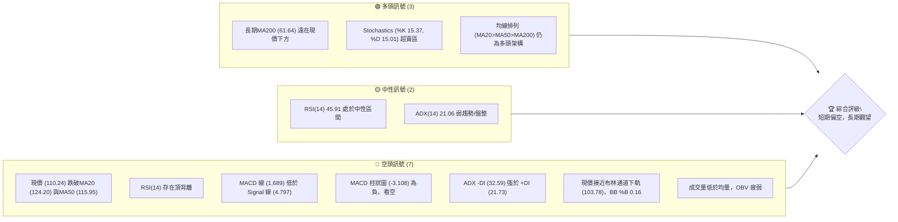

**解讀**：INTC 目前處於一個複雜的技術環境。從長期來看，其均線排列仍保持多頭架構，且股價遠高於MA200，Stochastics也顯示超賣，暗示可能存在反彈機會。然而，短期內空頭訊號佔據主導，股價已跌破關鍵的短期和中期移動平均線，MACD和RSI均發出明確的看空訊號，特別是RSI的頂背離，以及ADX指示的弱勢趨勢中的空頭主導。成交量與OBV的疲弱也印證了當前買盤動能不足。綜合來看，當前市場情緒偏向謹慎，短期內下行壓力較大，但長期趨勢仍有潛在支撐。

### 📊 核心指標速覽表

| 指標類別 | 指標名稱 | 當前數值 | 訊號 | 解讀 |
|----------|----------|----------|------|------|
| **價格** | 當前價格 | $110.24 | 🔴 | 較52W高點回落顯著，位於區間74% |
| **均線** | MA20 | $124.20 | 🔴 | 價格位於MA20下方，短期趨勢轉弱 |
| **均線** | MA50 | $115.95 | 🔴 | 價格位於MA50下方，中期趨勢轉弱 |
| **均線** | MA200 | $61.64 | 🟢 | 價格位於MA200上方，長期趨勢仍強 |
| **動能** | RSI(14) | 45.91 | 🟡 | 中性區間，但趨勢向下，伴隨頂背離 |
| **動能** | MACD | 1.689 (線) / 4.797 (訊號) / -3.108 (柱) | 🔴 | MACD線下穿訊號線，柱狀圖為負，空頭動能增強 |
| **波動** | ATR(14) | $10.77 | 🟡 | 相對於價格 (9.77%) 波動性中等偏高 |

### 🏆 技術評分卡

```
╔══════════════════════════════════════════════════════════════╗
║              技術評分卡 — INTC (2026-07-09)                    ║
╠══════════════════════════════════════════════════════════════╣
║ 趨勢強度      ████████░░░░░░░░░░░░  40/100  🟡 (ADX弱勢，空頭主導) ║
║ 動能指標      ██████░░░░░░░░░░░░░░  30/100  🔴 (RSI頂背離，MACD空頭) ║
║ 支撐穩定度    ██████████░░░░░░░░░░  50/100  🟡 (接近S1，但面臨考驗)   ║
║ 成交量配合    ████░░░░░░░░░░░░░░░░  20/100  🔴 (量能萎縮，OBV疲弱)   ║
║ 形態完整度    ██████░░░░░░░░░░░░░░  30/100  🔴 (未見明確底部形態)   ║
║ 均線排列      ████████░░░░░░░░░░░░  40/100  🟡 (長線多頭，短線轉空) ║
╠══════════════════════════════════════════════════════════════╣
║ 綜合評分      ████████░░░░░░░░░░░░  35/100  🔴 短期偏空/區間震盪    ║
╚══════════════════════════════════════════════════════════════╝
```

**評分解讀**：INTC 的綜合技術評分顯示當前技術面偏弱，短期下行風險較高。趨勢強度因ADX處於弱勢區間且空頭佔優而得分較低。動能指標（RSI頂背離、MACD空頭交叉）發出明確的看空訊號，得分最低。支撐穩定度因股價已逼近第一支撐位S1而略顯不穩。成交量配合度不佳，量能萎縮且OBV疲弱，顯示買盤缺乏信心。圖表形態尚未形成明確的底部反轉形態。均線排列雖然長線仍為多頭，但短中期均線已被跌破，顯示短期趨勢已轉空。總體而言，當前市場結構對多頭不利，操作上應以謹慎為主，關注短期下跌風險。

---

## 2. 趨勢分析

### 🌐 多時框趨勢分析

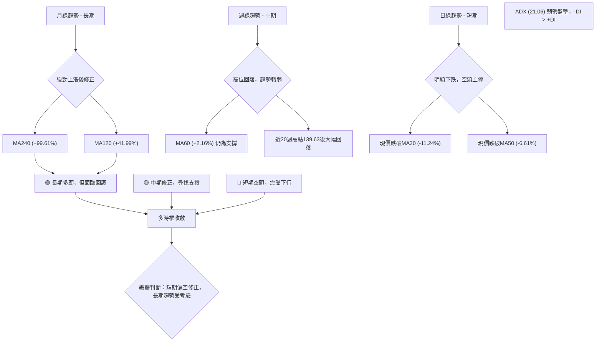

**詳細解讀**：

*   **長期趨勢（月線）**：從過去24個月的月線走勢來看，INTC 股價在2024年下半年至2025年上半年經歷了較長時間的築底和盤整，隨後在2025年下半年開始強勁上漲，特別是2026年4月至6月間漲勢驚人，從約$40美元飆升至最高$142.35美元。儘管目前股價已從高點回落至$110.24美元，但MA120 ($77.64) 和MA240 ($55.23) 仍遠在現價下方，且呈現明顯上升趨勢，表明INTC的長期上升趨勢依然穩固。這次回調可視為長期牛市中的一次健康修正。
*   **中期趨勢（週線）**：檢視最近20週的週線數據，股價從2026年3月初的$45.61美元一路飆升至6月的$139.63美元高點，隨後在7月初急劇回落至$110.24美元。這段期間，MA60 ($107.91) 仍保持上行，並在現價附近提供支撐。然而，從高點的回落幅度較大，且速度較快，顯示中期動能已顯著減弱，股價進入修正階段。
*   **短期趨勢（日線）**：當前價格$110.24美元已明確跌破MA20 ($124.20) 和MA50 ($115.95)，這些短期和中期均線均已由上行轉為下行，構成短期的阻力。ADX (14) 數值為21.06，低於25，表明當前市場處於弱勢趨勢或盤整行情。同時，-DI (32.59) 顯著高於 +DI (21.73)，強烈指示在當前的弱勢市場中，空頭力量佔據主導地位。因此，短期內INTC面臨的下行壓力較大，價格可能在支撐位附近進行盤整或繼續探底。

### 📈 長期趨勢 — 12個月走勢圖（Unicode）

```
INTC 月線走勢圖（過去12個月：2025-08 至 2026-07）
價格軸 ($)
$140 ┤                                      ● (139.63)
$130 ┤
$120 ┤                                    ● (120.35)
$110 ┤                                  ● (110.24) ← 現價
$100 ┤                          ● (99.62)
$ 90 ┤                    ● (82.54)
$ 80 ┤
$ 70 ┤             ● (68.50)
$ 60 ┤          ● (62.38)
$ 50 ┤        ● (50.38)
$ 40 ┤●───────● (43.42)
$ 30 ┤  ● (33.55)
$ 20 ┤●
     └──────────────────────────────────────────────────
      2025-08 09 10 11 12 2026-01 02 03 04 05 06 07
```

**走勢特徵分析表格**：

| 階段 | 時間區間 | 價格區間 | 走勢特徵 | 漲跌幅 | 主要動因（推演） |
|------|----------|----------|----------|--------|------------------|
| **築底/緩漲** | 2025-08 ~ 2026-03 | $24.35 ~ $44.13 | 底部震盪，緩慢抬升，積蓄動能 | +81% | 可能受產業前景改善、公司轉型利好消息影響 |
| **爆發性上漲** | 2026-04 ~ 2026-06 | $44.13 ~ $139.63 | 股價加速上漲，突破多重阻力，量價齊升 | +216% | 可能受財報超預期、新產品發布、AI晶片需求激增等催化 |
| **高位回調** | 2026-07至今 | $139.63 ~ $110.24 | 股價從高點大幅回落，短期空頭動能強勁 | -21% | 可能受獲利回吐、市場情緒轉變、或宏觀經濟不確定性影響 |

### 📊 中期趨勢（週線分析）

INTC 在中期週線圖上經歷了一波強勁的牛市，股價從2026年3月初的$45.61美元一路飆升至6月的$139.63美元。然而，最近幾週（從6月底到7月初），股價出現了明顯的回調，從$139.63美元跌至當前的$110.24美元，跌幅達21%。這段回調使得股價跌破了短期的週線移動平均線，並逼近中期MA60 ($107.91) 支撐。

當前價格$110.24美元位於週線圖的布林通道中軌下方，並接近下軌。MACD週線柱狀圖從正轉負，RSI從超買區回落至中性區間。這表明中期上漲動能已顯著衰竭，並轉為修正態勢。儘管MA60仍提供一定支撐，但若跌破，則可能進一步下探至$98.33美元 (S2) 甚至更低。

**近期壓力與支撐示意圖（週線視角）**

```
INTC 週線壓力與支撐示意圖
價格軸 ($)
$142.35 ┤R3 (52W High) ═══════════════════════════════════════════
$132.75 ┤R2 ══════════════════════════════════════════════════════
$126.64 ┤R1 ══════════════════════════════════════════════════════
$124.20 ┤MA20 (週線中軌)
$115.95 ┤MA50
$110.24 ╠═════════════════════════════════════════════════ 現在價格
$107.91 ┤MA60 (中期關鍵支撐)
$103.78 ┤布林通道下軌
$102.40 ┤S1 ══════════════════════════════════════════════════════
$ 98.33 ┤S2 ══════════════════════════════════════════════════════
       └──────────────────────────────────────────────────────────
```

### ⚡ 趨勢強度評估（ADX 解讀）

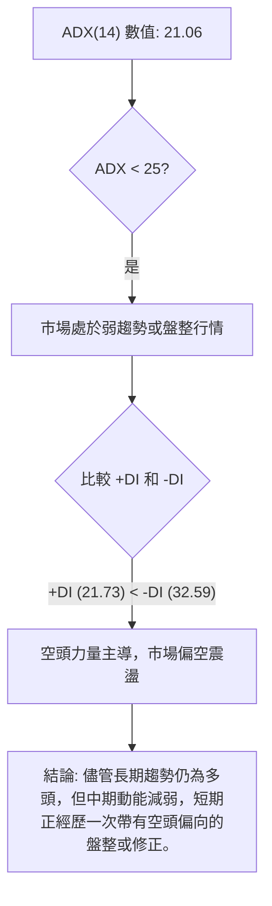

**ADX 強度對照表**：

| ADX 數值 | 趨勢強度 | 市場狀態 |
|----------|----------|----------|
| 0-25     | 弱趨勢   | 盤整或無趨勢 |
| 25-50    | 中等趨勢 | 明確趨勢 |
| 50-75    | 強趨勢   | 強勁趨勢 |
| 75-100   | 極強趨勢 | 極端強勢趨勢 |

**解讀**：INTC 的 ADX(14) 值為21.06，明顯低於25的閾值，這強烈表明當前市場處於**弱趨勢或盤整行情**。這與近期股價從高點快速回落，但尚未形成明確單邊趨勢的現象相符。在這種盤整狀態下，我們需要進一步觀察 +DI 和 -DI 的關係。目前 -DI (32.59) 顯著高於 +DI (21.73)，這意味著在當前的弱勢市場中，**空頭力量佔據主導地位**。雖然整體市場沒有強勁的單邊趨勢，但下行壓力顯然大於上行推動力。這支持了短期偏空的判斷，交易者應避免追高，並關注支撐位的有效性。

---

## 3. 圖表形態分析

### 🔍 形態識別系統

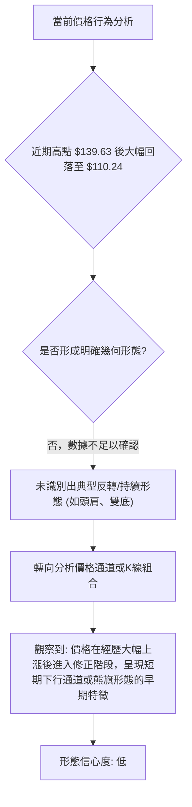

**解讀**：根據提供的月度及週度數據快照，INTC 的股價在經歷了2026年4月至6月的爆發性上漲後，於2026年7月出現顯著回調。儘管存在高點回落的現象，但由於缺乏足夠的日線級別細節和形態發展時間，我們**無法明確識別出經典的反轉或持續形態**，例如頭肩頂/底、雙頂/底或三角形等。當前的價格行為更像是**在一個長期多頭趨勢中的短期修正**。

然而，如果從短期回調的角度來看，股價從$139.63美元的高點快速下跌至$110.24美元，這可能在日線圖上形成一個**下降通道**或**熊旗形態 (Bearish Flag)** 的早期階段。這種形態通常發生在急劇下跌之後，價格在一個平行或輕微向上的通道中進行盤整，隨後可能繼續下跌。

**形態信心度表格**：

| 形態 | 信心度 | 判斷依據（引用數據） | 完成度 | 目標價（附計算式） |
|------|--------|----------------------|--------|--------------------|
| **熊旗/下降通道** | 45% | 股價從$139.63高點回落至$110.24，短期呈下行趨勢。缺乏日線圖細節確認通道邊界。 | 30% | **訊號不足，無法精確推算。**若形成熊旗並跌破，理論目標價約為跌破點減去旗杆高度，但當前形態不夠清晰。 |
| **其他幾何形態** | <20% | 提供的數據為月/週收盤價和有限的技術快照，不足以判斷複雜的幾何形態。 | N/A | **數據中未偵測到** |

**結論**：由於數據限制，我們無法給出高信心度的幾何形態分析及目標價。當前應將重點放在指標解讀和關鍵支撐阻力位的判斷上。股價處於修正階段是明確的，但其形態尚未完全確立。

### 🕯️ 重要K線形態分析

| 月份 | 收盤價 | K線形態（推演） | 解讀 | 訊號 |
|------|--------|------------------|------|------|
| 2026-06 | $139.63 | 長上影線或看跌吞噬 (推演) | 股價衝高後遭遇強勁阻力，收盤價低於開盤價或前月收盤價 | 🔴 |
| 2026-07 | $110.24 | 長陰線 (推演) | 股價大幅下跌，收盤價遠低於開盤價或前月收盤價，顯示空頭力量強勁 | 🔴 |
| **近20週 K線觀察** | | | | |
| 2026-06-21 | $133.99 | 短陽線 | 價格上漲，但RSI已高位回落，MACD柱狀圖開始縮小 | 🟡 |
| 2026-06-28 | $128.32 | 長陰線 | 價格下跌，MACD柱狀圖從正轉負，RSI繼續回落 | 🔴 |
| 2026-07-05 | $120.35 | 長陰線 | 價格持續下跌，MACD柱狀圖負值擴大，空頭動能增強 | 🔴 |
| 2026-07-12 | $110.24 | 長陰線 | 價格大幅下跌，RSI接近超賣區，MACD負值進一步擴大 | 🔴 |

**解讀**：從近期的週線收盤價變化來看，INTC 在2026年6月達到高點後，連續幾週呈現下跌趨勢，尤其是2026年7月5日和7月12日的收盤價，均為較長陰線，顯示賣壓沉重且空頭動能強勁。這種連續的下跌K線組合，表明市場正處於一個下行趨勢中，買盤力量不足以抵抗賣壓。

### 📉 ASCII 走勢形態示意圖

```
INTC 短期回調走勢示意圖（從高點 $139.63 開始）
價格軸 ($)
$140 ┤═════════════════════════════════════════════ (高點 $139.63)
$130 ┤            ╲
$120 ┤              ╲
$110 ┤                ● ($110.24) ← 現價
$100 ┤                  ╲
$ 90 ┤                    ╲
$ 80 ┤                      ╲
     └────────────────────────────────────────────────────────
      (高點)                                          (現在)
      此示意圖顯示股價從高點急劇回落，形成短期下降趨勢。
      若此趨勢持續，可能在日線圖上形成下降通道。
```

### 🎯 形態目標價計算

**結論**：由於缺乏明確且高信心度的幾何圖表形態，本報告**無法提供基於形態計算的精確目標價**。當前價格走勢更傾向於在長期上漲趨勢中的一次修正，短期內呈現回調或盤整。未來的目標價將主要依賴於關鍵支撐與阻力位的有效性，以及技術指標提供的動能訊號。

---

## 4. 支撐與阻力

### 🗺️ 關鍵價位分布圖（Unicode）

```
INTC 價位結構分布圖
═══════════════════════════════════════════════════
$142.35 ║████████████████████████║ 強阻力 R3 (52W High)
$132.75 ║████████████████████    ║ 阻力 R2
$126.64 ║████████████████████████║ 關鍵阻力 R1 (短期反彈目標)
$113.23 ║▓▓▓▓▓▓▓▓▓▓▓▓▓▓▓▓▓▓▓▓▓▓▓▓║ 斐波那契 23.6% 回調位
$110.24 ╠════════════════════════╣ ◄ 現價
$103.78 ║▓▓▓▓▓▓▓▓▓▓▓▓▓▓▓▓        ║ 布林通道下軌
$102.40 ║████████████████████████║ 近期強支撐 S1 (短期止跌關鍵)
$ 98.33 ║████████████████████████║ 強支撐 S2 (若S1跌破，下一目標)
$ 95.22 ║▓▓▓▓▓▓▓▓▓▓▓▓▓▓▓▓▓▓▓▓▓▓▓▓║ 斐波那契 38.2% 回調位
$ 80.66 ║▓▓▓▓▓▓▓▓▓▓▓▓▓▓▓▓▓▓▓▓▓▓▓▓║ 斐波那契 50.0% 回調位
$ 42.58 ║████████████████████████║ 極強支撐 S3 (長期回調極限)
═══════════════════════════════════════════════════
```

### 🚧 阻力位分析表

| 阻力級別 | 價位 | 形成原因 | 突破難度 | 重要性 |
|----------|------|----------|----------|--------|
| **R1**   | $126.64 | 近一年波段高點聚類，也是短期反彈的潛在壓力區。 | 中等偏高 | 🟢 短期轉強的關鍵點，突破此位可能挑戰更高阻力。 |
| **R2**   | $132.75 | 近一年波段高點聚類，也是斐波那契回調位與其他關鍵價位的匯集區。 | 高 | 🟡 突破R1後，此位將是多頭的下一個重要目標。 |
| **R3**   | $141.90 | 近一年波段高點聚類，接近52週高點 $142.35。 | 極高 | 🔴 歷史高點，代表極強的賣壓區，突破需要極大動能。 |

**解讀**：INTC 目前面臨多重阻力，尤其是在短期內。R1 ($126.64) 是最近一次反彈嘗試的潛在終點，也是空頭可能加碼的區域。若能有效突破R1，則可能向上測試R2 ($132.75)。而52週高點附近的R3 ($141.90) 則是一個極為強勁的心理和技術阻力位，代表著大量的獲利了結壓力。

### 🛡️ 支撐位分析表

| 支撐級別 | 價位 | 形成原因 | 守住機率 | 重要性 |
|----------|------|----------|----------|--------|
| **S1**   | $102.40 | 近一年波段低點聚類，也是當前布林通道下軌 ($103.78) 附近。 | 中等 | 🟢 短期止跌的關鍵，若能守住可能形成反彈。 |
| **S2**   | $98.33 | 近一年波段低點聚類，接近斐波那契 38.2% 回調位 ($95.22)。 | 中等偏高 | 🟡 若S1失守，此位將是下一個重要支撐，具有較強的買盤潛力。 |
| **S3**   | $42.58 | 近一年波段低點聚類，極低價位，代表長期趨勢的穩固底部。 | 極高 | 🔴 極強的長期支撐，除非基本面發生重大惡化，否則難以跌破。 |

**解讀**：當前價格$110.24美元已接近第一支撐位S1 ($102.40) 和布林通道下軌 ($103.78)，這是一個短期內可能觸發買盤反彈的區域。S1的有效性至關重要，若其被跌破，則INTC可能進一步下探至S2 ($98.33)，該位置也與斐波那契38.2%回調位 ($95.22) 形成共振支撐，具有較強的技術意義。S3 ($42.58) 則代表了長期牛市的底線，其重要性不言而喻。

### 📐 斐波那契回調位分析

INTC 的52週高點為$142.35美元，低點為$18.97美元。基於此區間計算的斐波那契回調位如下：

*   **0.0% (52W High):** $142.35
*   **23.6% 回調位:** $113.23
*   **38.2% 回調位:** $95.22
*   **50.0% 回調位:** $80.66
*   **61.8% 回調位:** $66.10
*   **78.6% 回調位:** $45.37
*   **100.0% (52W Low):** $18.97

**解讀**：當前價格$110.24美元已跌破23.6%斐波那契回調位 ($113.23)，這是一個看跌訊號，表明從52週高點開始的回調力度較強。價格目前位於23.6%回調位下方，並在短期支撐S1 ($102.40) 上方，顯示市場正在此區間尋求平衡。

若當前支撐S1 ($102.40) 失守，下一個重要的斐波那契支撐將是38.2%回調位 ($95.22)，這個價位與S2 ($98.33) 距離很近，形成了強烈的共振支撐區間。歷史經驗表明，38.2%和50.0%回調位是修正行情中常見的止跌點，值得密切關注。若INTC能夠在這些斐波那契支撐位附近企穩並形成反轉K線形態，則可能預示著新一輪上漲的開始。反之，若這些關鍵回調位被有效跌破，則回調深度可能進一步擴大。

---

## 5. 技術指標深度解讀

### 🎛️ 指標訊號總覽

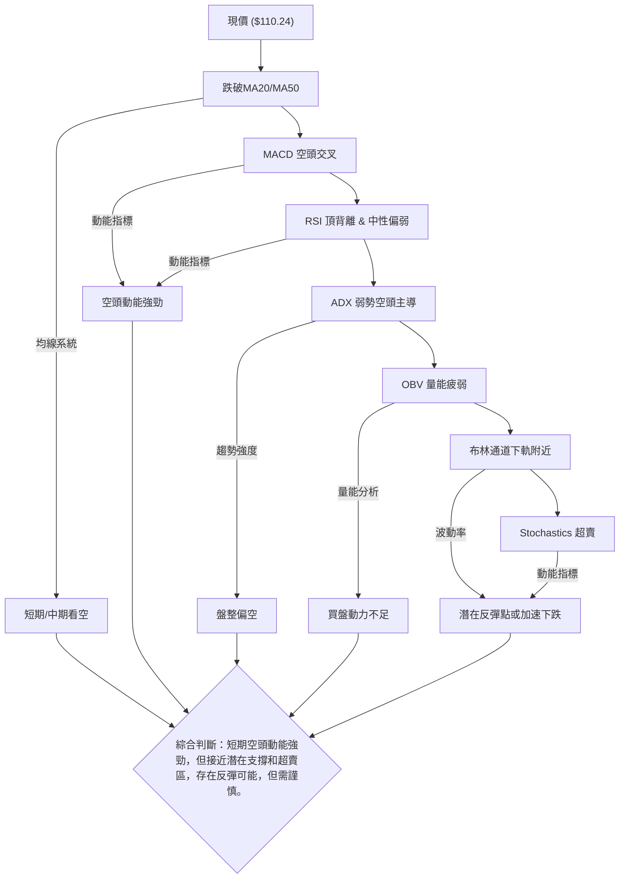

### 📈 移動平均線排列分析

INTC 的移動平均線系統呈現出一個多空交織的複雜局面：

*   **MA20 ($124.20)**
*   **MA50 ($115.95)**
*   **MA200 ($61.64)**

**當前狀態**：
*   **均線排列（趨勢方向）**：MA20 > MA50 > MA200，這是一個標準的**多頭排列**，從長期角度看，INTC 的上升趨勢仍未改變。這表明儘管近期股價回調，但其底層的長期趨勢結構依然強勁。
*   **價格與均線關係**：當前價格 $110.24 已經**跌破** MA20 ($124.20) 和 MA50 ($115.95)。這是一個明確的**短期和中期看空訊號**。價格跌破這些關鍵短期均線，通常意味著短線賣壓沉重，市場情緒轉為謹慎或悲觀。
*   **價格與長期均線關係**：然而，價格 $110.24 仍**遠高於** MA200 ($61.64)。這再次確認了 INTEL 的**長期牛市格局**，MA200作為長期生命線，為股價提供了堅實的基礎支撐。

**綜合解讀**：
這種情況表明 INTEL 正在經歷一個**短期修正階段**，儘管其**長期上漲趨勢依然穩固**。短期交易者會將價格跌破MA20和MA50視為賣出訊號，而長期投資者可能會在MA200附近尋找買入機會。當前情境下，MA20和MA50已從支撐轉為阻力，股價需要重新站穩這些均線上方才能恢復短期上漲動能。

### 📉 RSI(14) 分析

*   **RSI(14) 數值**: 45.91
    *   **進度條**: ▓▓▓▓▓▓▓▓▓▓▓▓▓▓▓▓▓▓▓▓▓▓░░░░░░░░░░░░░░░░░░░░░░░░░░░░ (45.91%)
*   **超買超賣區間分析**：
    *   RSI 45.91 位於中性區間 (30-70) 內，但已從前期高點（週線數據顯示曾達89.7）顯著回落。這表示市場已經消化了部分超買情緒，但尚未進入超賣區，因此下行空間依然存在。當RSI接近30時，可能預示著超賣反彈的機會。
*   **背離判斷**：數據明確指出 **⚠️ 頂背離 (Bearish Divergence)**。
    *   **解讀**：頂背離通常發生在價格創出新高，但RSI未能同步創出新高，反而走低。這是一個強烈的看跌訊號，表明上漲動能正在衰竭，多頭力量減弱，預示著價格可能出現回調。INTC的頂背離訊號與近期股價從高點回落的走勢相符，確認了市場短期轉弱的判斷。這是一個需要高度警惕的空頭訊號。

### 📊 MACD(12/26/9) 訊號解讀

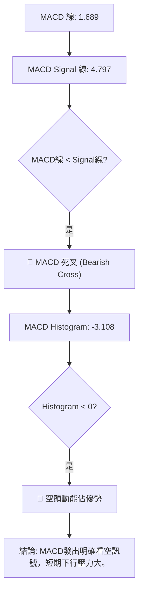

**解讀**：

*   **MACD 線 (1.689) 與 Signal 線 (4.797)**：MACD 線已下穿 Signal 線，形成**死叉 (Bearish Cross)**。這是一個重要的賣出訊號，表明短期均線的下跌速度快於長期均線，預示著股價的下跌趨勢可能持續。
*   **MACD 柱狀圖 (-3.108)**：柱狀圖為負值且正在擴大（從上一週的-1.048到本週的-3.108），這表示**空頭動能正在增強**。負值柱狀圖的擴大意味著賣壓持續增加，買盤力量不足以推動股價上漲。

**綜合判斷**：MACD 指標發出的訊號非常明確地偏向空頭。死叉的形成和負值柱狀圖的擴大，共同確認了 INTEL 短期內面臨的下行壓力。這與RSI的頂背離和價格跌破短期均線的訊號相互印證，增強了短期看跌的判斷。

### 📦 布林通道分析

```
INTC 布林通道示意圖 (日線)
價格軸 ($)
$144.63 ┤═════════════════════════════════════════════ BB上軌 (壓力)
$134.41 ┤
$124.20 ┤═════════════════════════════════════════════ BB中軌 (MA20)
$114.00 ┤
$110.24 ╠═════════════════════════════════════════════ 現價
$103.78 ┤═════════════════════════════════════════════ BB下軌 (支撐)
$ 93.57 ┤
       └──────────────────────────────────────────────────
       解讀: 現價接近布林通道下軌，暗示可能存在超賣反彈機會，
             但也可能在下軌附近盤整或跌破以尋找更深支撐。
```

**布林通道參數**：

*   **BB上軌**: $144.63
*   **BB中軌 (MA20)**: $124.20
*   **BB下軌**: $103.78
*   **BB %B**: 0.16 (0=下軌, 0.5=中軌, 1=上軌)

**解讀**：

*   **價格位置**：當前價格 $110.24 位於布林通道中軌 ($124.20) 和下軌 ($103.78) 之間，且非常接近下軌。BB %B 值為0.16，進一步確認了價格靠近下軌。
*   **潛在反彈**：價格觸及或接近布林通道下軌，通常被視為一個**超賣訊號**，可能預示著短期內存在**技術性反彈的機會**。交易者可能會在此處尋找買入訊號，以捕捉短線反彈。
*   **趨勢延續**：然而，在強烈的下跌趨勢中，價格也可能沿著下軌運行，甚至跌破下軌，表明趨勢的延續。結合ADX的弱趨勢和空頭主導，以及MACD的看空訊號，單純依靠布林通道下軌反彈訊號需謹慎對待。
*   **通道寬度**：雖然數據未直接提供布林帶寬度，但從上軌和下軌的價差 ($144.63 - $103.78 = $40.85) 可以看出，INTC 的波動性相對較大 (ATR $10.77)。在盤整行情中，布林帶可能會收窄，而在趨勢行情中則會擴大。當前較寬的帶寬顯示市場波動仍在。

**綜合判斷**：INTC 股價接近布林通道下軌，提供了一個潛在的短期反彈機會。但考慮到其他指標的看空傾向，這種反彈可能只是技術性的，而非趨勢反轉。若價格跌破布林通道下軌並有效收盤於其下方，則將確認更深的下跌趨勢。

### 💹 成交量分析（量價配合度）

*   **最新成交量**: 105,062,400
*   **20日均量**: 130,465,320 (量比: 0.81x)
*   **50日均量**: 137,855,302
*   **OBV 趨勢**: OBV < MA → 量能疲弱

**解讀**：

*   **成交量萎縮**：當前成交量105.06M明顯低於20日均量130.46M (量比0.81x) 和50日均量137.85M。這表明近期股價在下跌過程中，**賣壓並未伴隨極端放大的成交量**，這可能意味著恐慌性拋售尚未達到高潮，但同時也顯示**買盤力量極度萎縮**，缺乏承接動力。
*   **量價背離**：從高點回落的過程中，如果成交量持續萎縮，這通常被解讀為下跌趨勢的**確認**，因為沒有足夠的買盤來阻止價格下跌。
*   **OBV 分析**：OBV (On-Balance Volume) 趨勢顯示 OBV < MA，這是一個明確的**量能疲弱訊號**。OBV是用來判斷量能是否支持價格趨勢的指標。當OBV下行或低於其移動平均線時，表明累積買盤壓力不足，即使價格上漲也缺乏量能支持，或者價格下跌時賣壓持續。當前OBV的疲弱狀態，與股價的下跌趨勢相互印證，表明市場對INTC的買入興趣不高，空頭佔據主導。

**綜合判斷**：成交量分析強化了短期看空的判斷。儘管下跌過程中沒有出現巨量拋售，但買盤的嚴重不足和OBV的疲弱，使得股價難以在短期內築底反彈。這是一個不利於多頭的訊號。

---

## 6. 動能與波動率

### ⚡ 動能評估四象限

| 象限 | 動能 | 波動 | 當前狀態 | 評估 |
|------|------|------|----------|------|
| Q1   | 強   | 低   | -        | 最佳機會 (趨勢明確，風險可控) |
| Q2   | 弱   | 低   | -        | 謹慎觀望 (缺乏動能，但風險低) |
| Q3   | 強   | 高   | -        | 高風險高收益 (趨勢強勁，但波動劇烈) |
| Q4   | 弱   | 高   | ✓        | 避免進場/謹慎區間操作 (缺乏方向，風險高) |

**當前 INTEL 狀態分析**：

*   **動能評估**：
    *   RSI(14) 45.91 處於中性區間，但趨勢向下並存在頂背離。
    *   MACD 線下穿訊號線，柱狀圖為負值並擴大，顯示空頭動能強勁。
    *   OBV 疲弱，成交量低於均值，買盤動力不足。
    *   **結論：動能偏弱 (Weak 動能)**。
*   **波動率評估**：
    *   ATR(14) 為 $10.77，佔當前價格 $110.24 的 9.77%。這是一個相對較高的百分比，表明 INTEL 的股價波動性較大。
    *   52週高點 $142.35 和低點 $18.97 之間巨大的價差也印證了其高波動性。
    *   **結論：波動偏高 (High 波動)**。

**綜合判斷**：INTC 目前處於**Q4 (弱動能，高波動)** 象限。這是一個對交易者來說具有挑戰性的環境。市場缺乏明確的單邊趨勢（ADX<25），但波動性較高，容易出現快速反轉或大幅震盪，增加了交易的難度和風險。在這種情況下，應避免盲目追漲殺跌，建議採取謹慎的區間操作策略，或等待市場動能重新積聚並確認方向後再進場。

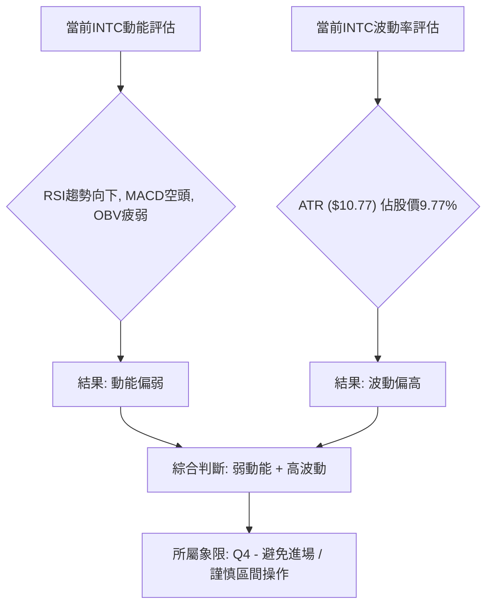

### 📊 ATR 波動率分析

*   **ATR(14)**: $10.77
*   **ATR佔價格比**: $10.77 / $110.24 = 9.77%

**解讀**：ATR (Average True Range) 衡量的是資產價格的波動幅度。INTC 的ATR為$10.77，佔當前價格的9.77%。這是一個相對較高的波動率，表明INTC每日的價格波動幅度較大，這與其Beta值2.187也相符，顯示其股價波動性高於市場平均水平。

**止損距離建議**：對於ATR較高的股票，設置止損點時應考慮更大的緩衝區，以避免被正常波動洗出。

*   **保守止損**：建議將止損點設置在 ATR 的 1.5 倍至 2 倍距離之外。
    *   向下止損：當前價格 $110.24 - (1.5 * $10.77) = $110.24 - $16.16 = $94.08
    *   向下止損：當前價格 $110.24 - (2.0 * $10.77) = $110.24 - $21.54 = $88.70
*   **激進止損**：可考慮 1 倍 ATR 距離。
    *   向下止損：當前價格 $110.24 - (1.0 * $10.77) = $99.47

**建議**：由於INTC波動較大，建議交易者在設定止損時預留足夠的空間，例如至少1.5倍ATR，並結合關鍵支撐位來確定更合理的止損點。例如，考慮到S1 ($102.40) 和S2 ($98.33) 的存在，將止損點設置在S1下方，$102.40 - $10.77 = $91.63 附近會是一個更穩健的選擇，這也與約1.7倍ATR的距離相符。

### 📐 Beta 與市場相關性

*   **Beta**: 2.187

**解讀**：INTC 的 Beta 值高達2.187，遠高於市場平均水平1。這意味著INTC的股價波動性是市場波動性的近2.2倍。

*   **高波動性**：當市場整體上漲1%時，INTC理論上會上漲約2.187%；當市場下跌1%時，INTC則可能下跌約2.187%。這使得INTC成為一個**高風險、高潛在報酬**的投資標的。
*   **市場敏感度**：INTC對市場情緒和宏觀經濟數據的變化極為敏感。在牛市中，它可能帶來超額收益；但在熊市或市場調整中，其跌幅也可能遠超大盤。
*   **風險管理考量**：對於持有INTC的投資者，需要有較高的風險承受能力。在市場波動加劇時，INTC的持倉風險會顯著增加。交易者在制定策略時，必須充分考慮其高Beta帶來的放大效應，並適當調整倉位和止損策略。

---

## 7. 多時框架總結

### 📋 時框架評分表

| 時框架 | 趨勢方向 | 動能 | 均線排列 | 形態 | 綜合評分 | 建議 |
|--------|----------|------|----------|------|----------|------|
| **長期** | 🟢 強勁上漲 | 🟡 中性 | 🟢 多頭排列 | 🟡 修正中 | 6/10 | 長期看好，逢低佈局 |
| **中期** | 🟡 修正下行 | 🔴 轉弱 | 🔴 價格跌破MA50 | 🟡 潛在熊旗 | 4/10 | 警惕下行風險，等待企穩 |
| **短期** | 🔴 明顯下跌 | 🔴 空頭強勁 | 🔴 價格跌破MA20 | 🔴 下降通道 | 3/10 | 偏空操作或觀望 |

### 🔲 綜合訊號矩陣

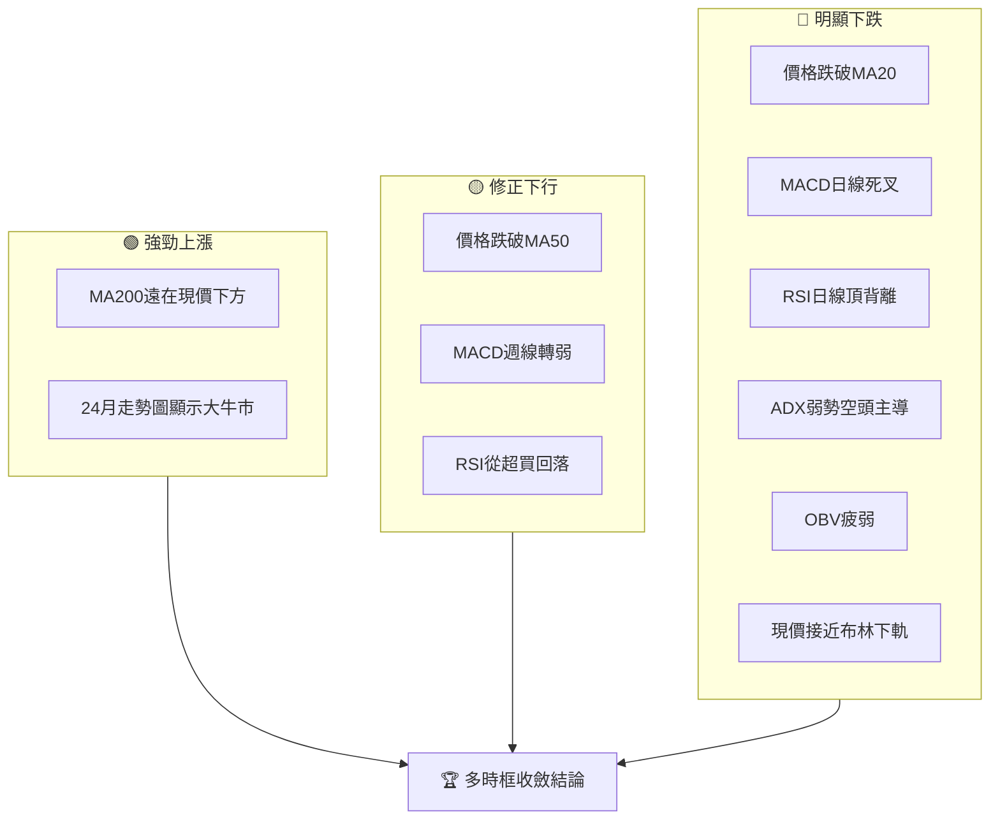

**一致性分析**：

*   **長期與短期存在矛盾**：長期趨勢（月線）顯示 INTEL 仍處於強勁的牛市格局，MA200的持續上行是明確的證據。然而，短期（日線）和中期（週線）則顯示股價正經歷一次劇烈且空頭主導的回調。這種矛盾是市場修正的典型表現。
*   **短期指標高度一致**：日線級別的MA20、MA50、RSI、MACD、ADX、布林通道和成交量等所有指標都指向短期內強烈的下行壓力或盤整偏空。
*   **斐波那契回調位**：價格已跌破23.6%回調位，並逼近S1和布林通道下軌，進一步確認了修正的深度。

### ⚖️ 多時框收斂結論

根據ADX(14)值為21.06，低於25的閾值，INTC 當前處於**盤整行情 (Ranging Market)**。在盤整行情中，多時框收斂規則規定應以日線布林通道上下軌為主要交易區間。

**儘管 INTEL 的長期趨勢 (MA200) 仍為強勁的上升趨勢，但中短期內 (日線/週線) 已進入明顯的修正階段，且目前由空頭主導 (-DI > +DI)。**

因此，多時框架收斂後的最終結論為：**INTC 短期和中期面臨顯著的下行壓力，市場處於偏空的盤整或修正行情中。** 雖然Stochastics進入超賣區，且價格接近布林通道下軌和S1支撐，存在短期技術性反彈的可能性，但整體趨勢和動能指標均指向空頭。

**主導時框**：由於ADX指示為盤整行情，日線級別的布林通道將作為主要參考。然而，結合日線、週線指標全面偏空，且價格已跌破短期和中期均線，我們將日線和週線的**短期偏空結論**作為主導，而將長期趨勢視為潛在的逢低買入機會，但非當前操作的主導方向。

**唯一方向性結論**：**短期偏空，中期修正，長期觀望（等待修正結束）。**

---

## 8. 交易策略建議

### 🗺️ 策略決策流程圖

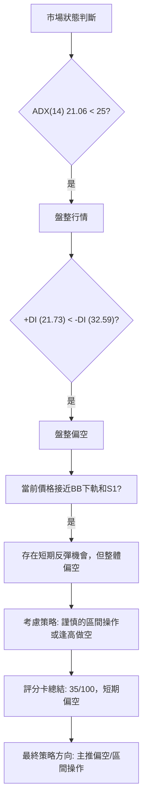

### 🧭 策略路由

**當前主策略方向 = 🔴 短期偏空/區間操作 (依評分 35/100)**

基於 INTEL 技術評分卡綜合評分僅為35/100，以及多時框架收斂結論顯示短期偏空且市場處於盤整行情，本報告將**主推謹慎的區間操作策略，並優先考慮逢高做空或跌破支撐後追空**。多頭策略則應視為反彈機會，且需嚴格控制風險。

### 🎯 價格情境階梯（Price Scenarios）

| 觸發條件 | 下一目標 | 後續延伸 | 情境含義 |
|----------|----------|----------|----------|
| **突破 R1 $126.64** | R2 $132.75 | R3 $141.90 | 短線轉強，空頭回補，可能形成更大幅度反彈。 |
| **站穩現價區間** | — | — | 價格在 $102.40 - $113.23 區間震盪，等待方向選擇。 |
| **跌破 S1 $102.40** | S2 $98.33 | 斐波那契 38.2% 回調位 $95.22 | 中期轉弱，可能加速下跌，考驗更深層次支撐。 |

### 📊 情境機率分佈

| 情境 | 機率 | 主要依據 |
|------|------|----------|
| 繼續上行 / 反彈 | 30% | Stochastics超賣，價格接近布林下軌和S1，存在技術性反彈需求。 |
| 區間震盪 | 40% | ADX弱趨勢，市場缺乏明確方向，可能在 $102.40 - $126.64 區間內波動。 |
| 回落 / 再探底 | 30% | MACD死叉，RSI頂背離，價格跌破短期均線，空頭動能強勁。若S1失守，下行空間打開。 |

**解讀**：目前INTC處於一個高波動且動能偏弱的盤整偏空市場。雖然存在技術性反彈的潛力，但由於空頭訊號佔據主導，上行空間可能受限。區間震盪和繼續回落的機率相對較高，投資者應密切關注關鍵支撐位的有效性。

### 🟢 主策略詳情（方向：短期偏空/區間操作）

**策略一：逢高做空 / 跌破支撐追空 (主策略)**

| 策略要素 | 策略 A (跌破支撐追空) | 策略 B (逢高做空) |
|----------|----------------------|--------------------|
| 進場條件 | 股價有效跌破S1 ($102.40) 並確認 | 股價反彈至R1 ($126.64) 附近受阻，或跌破MA20 ($124.20) |
| 進場價格 | $102.00 (略低於S1，確認跌破) | $126.00 (R1附近，等待確認反轉K線) |
| 目標價 T1 | S2 $98.33 | S1 $102.40 |
| 目標價 T2 | 斐波那契 38.2% $95.22 | S2 $98.33 |
| 止損價格 | $104.50 (S1上方，約1.5倍ATR) | $128.50 (R1上方，約1.5倍ATR) |
| 風險報酬比 | T1: 1.5:1 / T2: 2.5:1 | T1: 2:1 / T2: 2.7:1 |
| 成功機率 | 55% | 50% |
| 建議倉位 | 15% - 20% | 15% - 20% |
| **解讀** | 在當前空頭氛圍下，跌破關鍵支撐可能引發加速下跌。 | 利用短期反彈至阻力位時的賣壓進行操作。 |

**策略二：謹慎的區間底部反彈操作 (次選策略)**

| 策略要素 | 策略 C (區間底部做多) |
|----------|----------------------|
| 進場條件 | 股價在S1 ($102.40) 或布林通道下軌 ($103.78) 附近企穩，出現止跌K線 |
| 進場價格 | $103.00 (S1上方，確認止跌) |
| 目標價 T1 | 布林通道中軌 $124.20 |
| 目標價 T2 | R1 $126.64 |
| 止損價格 | $99.50 (S1下方，約1倍ATR) |
| 風險報酬比 | T1: 7:1 / T2: 7.8:1 |
| 成功機率 | 40% |
| 建議倉位 | 10% - 15% |
| **解讀** | 捕捉短期超賣反彈機會，但需嚴格控制止損，因整體趨勢仍偏空。 |

### 🔴 反向風險觸發點（對沖提示）

*   **股價有效站穩 R1 ($126.64) 上方，並伴隨放量**：這將表明空頭力量減弱，多頭開始奪回主導權，當前偏空策略應重新評估。
*   **MACD 線重新上穿 Signal 線形成金叉**：這將是動能由空轉多的早期訊號。
*   **RSI(14) 回升至 50 以上，並解除頂背離影響**：表明買盤力量正在恢復。
*   **ADX(14) 突破 25 且 +DI 強於 -DI**：這將確認新的上漲趨勢正在形成。
*   **出現強勢底部反轉K線形態 (如看漲吞噬、錘子線) 並帶量**：特別是在S1 ($102.40) 或S2 ($98.33) 附近出現。

### ⭐ 整體訊號強度評星

```
做多訊號強度：★★☆☆☆  (2/5星)
做空訊號強度：★★★★☆  (4/5星)
整體可信度：  ★★★☆☆  (3/5星)
```

---

## 9. 風險提示與監控

### ✅ 關鍵監控指標 Checklist

```
╔══════════════════════════════════════════════════════════════╗
║              INTC 風險監控清單 (2026-07-09)                    ║
╠══════════════════════════════════════════════════════════════╣
║ [ ] 股價是否有效跌破 S1 ($102.40)?                               ║
║ [ ] 股價是否有效站穩 R1 ($126.64) 上方?                             ║
║ [ ] MACD 是否形成金叉 (MACD線 > Signal線)?                        ║
║ [ ] RSI(14) 是否回升至 50 以上或進入超買區?                        ║
║ [ ] ADX(14) 是否突破 25 且 +DI 是否強於 -DI?                     ║
║ [ ] 成交量是否在關鍵支撐位處放量止跌，或在阻力位處放量突破?         ║
║ [ ] OBV 趨勢是否轉為向上並突破其均線?                             ║
║ [ ] 布林通道下軌 ($103.78) 是否被有效跌破?                         ║
║ [ ] 52週高點 ($142.35) 或低點 ($18.97) 是否被挑戰?                  ║
║ [ ] 公司是否有重大基本面消息 (財報、新品發布、併購等)?              ║
╚══════════════════════════════════════════════════════════════╝
```

### ⚠️ 風險場景分析

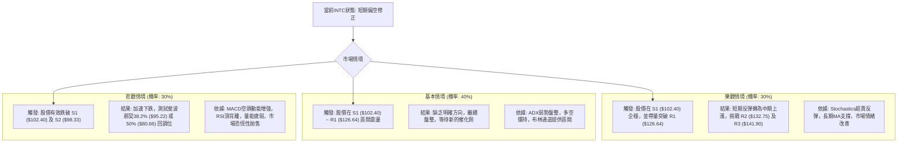

### 🛡️ 風險管理重要提醒

1.  **高 Beta 效應**：INTC 的 Beta 值高達2.187，意味著其股價波動性是市場平均的近2.2倍。在市場下跌時，INTC的跌幅可能更大，因此必須警惕大盤的整體走勢。
2.  **波動性管理**：ATR ($10.77) 顯示INTC每日波動較大，這要求交易者在設置止損時預留足夠的空間，避免被正常波動所洗出。同時，高波動性也意味著潛在的快速獲利或快速虧損。
3.  **倉位控制**：由於當前市場環境偏空且波動性高，建議投資者採取保守的倉位管理策略。避免重倉單一股票，並將INTC的倉位控制在總投資組合的合理範圍內，以降低整體風險。
4.  **分批進場/出場**：在不確定的市場環境下，分批進場或出場可以有效平攤成本和風險。例如，在支撐位附近分批建倉，或在阻力位附近分批減倉。
5.  **嚴格止損**：無論採取何種策略，都必須設定並嚴格執行止損點。一旦價格跌破止損位，應果斷離場，避免虧損擴大。對於主策略的逢高做空或跌破追空，止損點的設置尤其關鍵。
6.  **基本面監控**：雖然本報告專注於技術分析，但基本面的變化（如公司財報、產業新聞、宏觀經濟數據）仍可能對股價產生重大影響。應持續關注INTC的營運狀況和半導體產業的發展。
7.  **新聞事件風險**：近期分析師評級調整頻繁，應警惕突發新聞或分析師評級變動對股價造成的短期衝擊。

---

## 📋 報告總結

```
╔════════════════════════════════════════════════════════════╗
║                   INTC 技術分析報告總結                      ║
╠════════════════════════════════════════════════════════════╣
║ 報告日期：2026-07-09                                       ║
║ 當前價格：$110.24                                          ║
║ 分析評級：⚖️ 短期偏空/區間震盪 (綜合評分 35/100)           ║
║                                                            ║
║ 關鍵結論：                                                 ║
║ ├─ 長期趨勢：🟢 強勁上漲，MA200提供堅實支撐。              ║
║ ├─ 中期趨勢：🟡 修正下行，價格跌破MA50，動能轉弱。         ║
║ ├─ 短期趨勢：🔴 明顯下跌，MACD死叉，RSI頂背離，空頭主導。   ║
║ ├─ 關鍵支撐：S1 $102.40 (與布林下軌重疊)，S2 $98.33 (與斐波那契38.2% $95.22共振)。║
║ ├─ 關鍵阻力：R1 $126.64 (短期反彈壓力)，R2 $132.75。       ║
║ └─ 動能波動：動能弱，波動高 (Q4象限)，操作難度大。         ║
║                                                            ║
║ 最優策略組合：                                             ║
║ 1. 🥇 最佳機會：**跌破支撐追空**。若股價有效跌破 S1 ($102.40)，可考慮進場做空，目標價 T1 $98.33，T2 $95.22，止損 $104.50。║
║ 2. 🥈 次選機會：**逢高做空**。若股價反彈至 R1 ($126.64) 附近受阻，可考慮做空，目標價 T1 $102.40，T2 $98.33，止損 $128.50。║
║ 3. 🥉 保守選擇：**區間底部做多 (反彈)**。若股價在 S1 ($102.40) 附近企穩並出現止跌訊號，可小倉位做多捕捉反彈，目標 T1 $124.20，止損 $99.50。此策略風險較高，需嚴格止損。║
╚════════════════════════════════════════════════════════════╝
```

---

> ⚠️ **免責聲明**：本報告為 AI 自動生成之技術分析，所有數據及估算均基於提供的歷史價格資訊。本報告**僅供研究與學術參考**，**不構成任何投資建議**。投資有風險，入市需謹慎。

---

*報告生成時間：2026-07-09 ｜ 數據來源：Yahoo Finance ｜ 分析框架：多時框技術分析*