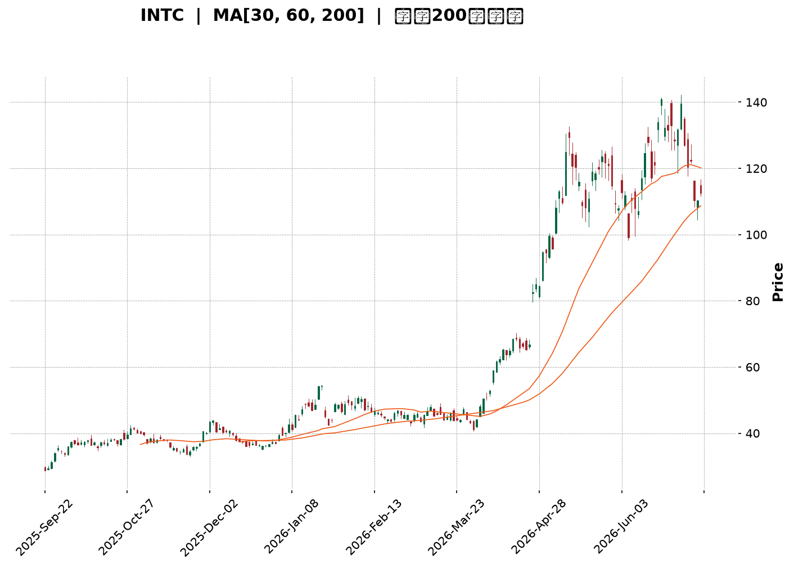
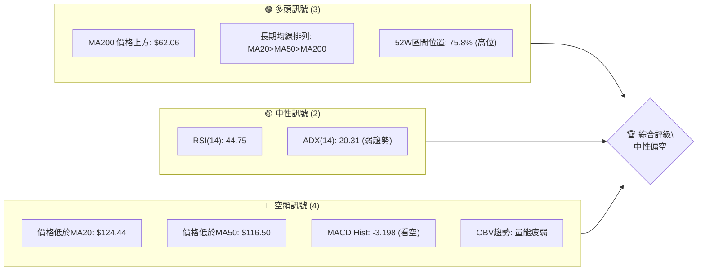
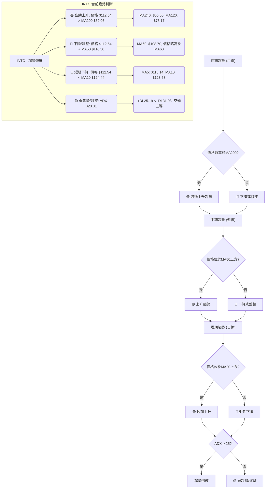
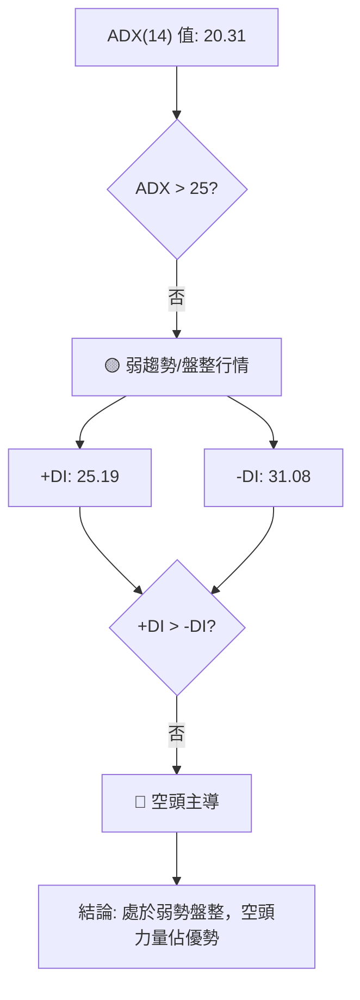
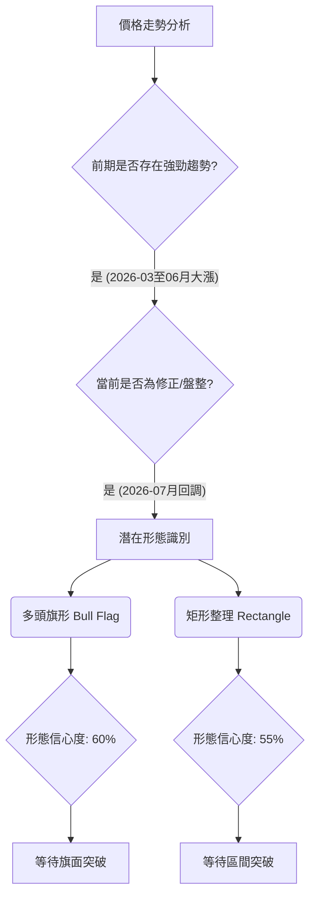
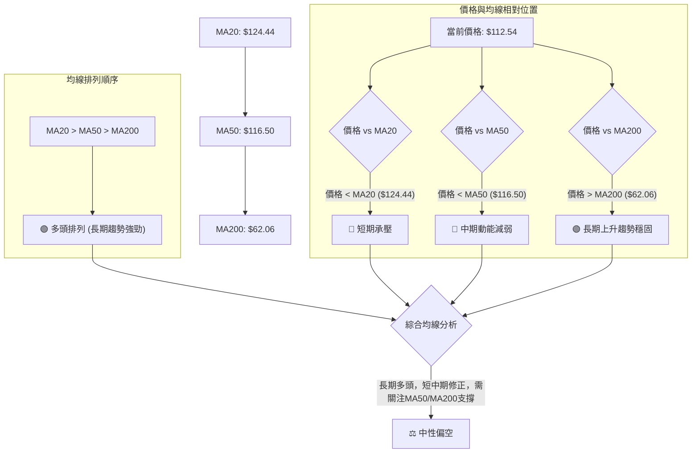
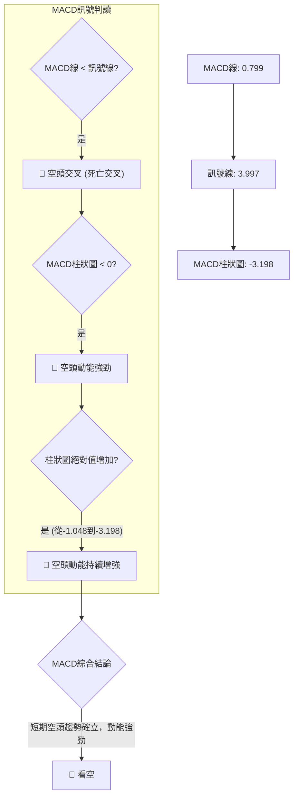
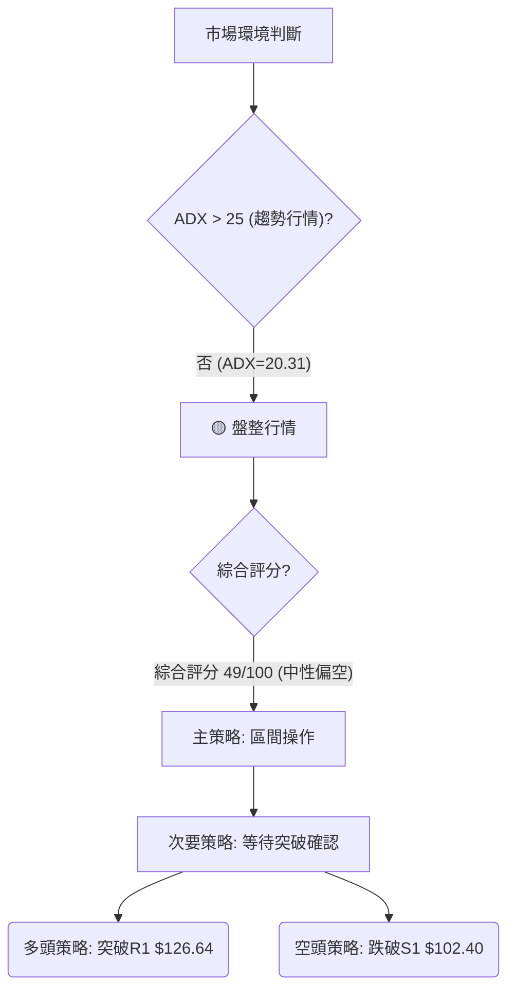
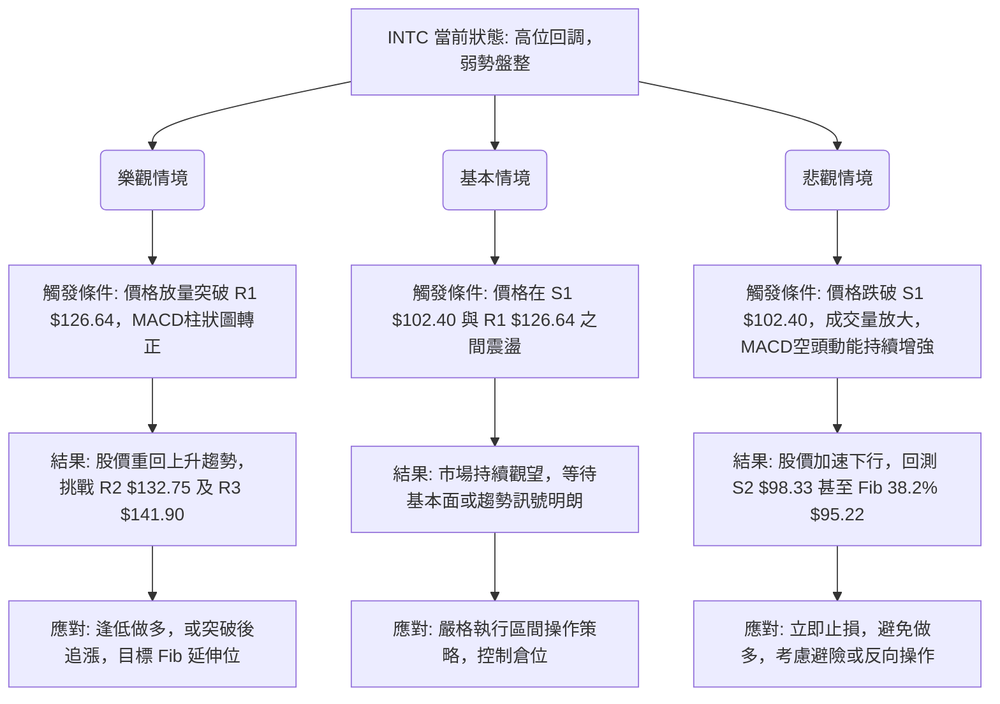

<details>
<summary>📊 靜態圖表 (點擊展開)</summary>

</details>

<html>
<head><meta charset="utf-8" /></head>
<body>
    <div style="height:500px; width:100%;">                        <script>window.PlotlyConfig = {MathJaxConfig: 'local'};</script>
        <script charset="utf-8" src="https://cdn.plot.ly/plotly-3.7.0.min.js" integrity="sha256-jvTGqxNp8AGWEcvNLVuKr+8j5dGe9Yw51LQkmDH+IYA=" crossorigin="anonymous"></script>                <div id="candlestick-chart" class="plotly-graph-div" style="height:100%; width:100%;"></div>            <script>                window.PLOTLYENV=window.PLOTLYENV || {};                                if (document.getElementById("candlestick-chart")) {                    Plotly.newPlot(                        "candlestick-chart",                        [{"close":{"dtype":"f8","bdata":"AAAAYI\u002fCPEAAAABAClc9QAAAAOBROD9AAAAAYLj+QEAAAAAAAMBBQAAAAKBwPUFAAAAAYGbGQEAAAADgUfhBQAAAAGBmpkJAAAAAgD1qQkAAAAAghUtCQAAAAIDClUJAAAAAQAq3QkAAAABgZuZCQAAAACBcL0JAAAAAACmcQkAAAADgo9BBQAAAAEAzk0JAAAAAIIVrQkAAAACgR4FCQAAAAMDMDENAAAAAIFwPQ0AAAACAwnVCQAAAAOB6FENAAAAAANcjQ0AAAADAHsVDQAAAAADXw0RAAAAAIIWrREAAAADgehREQAAAAGC4\u002fkNAAAAAAADAQ0AAAAAA14NCQAAAAOCjMENAAAAAYLieQkAAAADgoxBDQAAAAKCZOUNAAAAA4KPwQkAAAACA6\u002fFCQAAAAOB69EFAAAAAYI\u002fCQUAAAABA4VpBQAAAAIA9KkFAAAAAgBSOQUAAAAAgXM9AQAAAAAAAQEFAAAAAwB7lQUAAAACAPepBQAAAACCuZ0JAAAAAIK5HREAAAACgRwFEQAAAAAApvEVAAAAAoEfhRUAAAAAAAEBEQAAAAOB6tERAAAAAYGYmREAAAAAAAEBEQAAAAADXY0RAAAAAoEfBQ0AAAAAgrudCQAAAAKBHwUJAAAAAIK6nQkAAAABgZgZCQAAAAADXI0JAAAAAwPVoQkAAAAAgXC9CQAAAAMDMLEJAAAAA4HoUQkAAAACgmRlCQAAAAEAKV0JAAAAAYGamQkAAAABAM3NCQAAAAOCjsENAAAAAIFyvQ0AAAADAHgVEQAAAAOCjUEVAAAAAgBSOREAAAABgZsZGQAAAACCuB0ZAAAAAwB6lR0AAAAAAKVxIQAAAAMD1KEhAAAAAQOF6R0AAAAAgrkdIQAAAAAAAIEtAAAAAwPUoS0AAAADA9YhGQAAAAGC4PkVAAAAAQAr3RUAAAAAA12NIQAAAAOB6VEhAAAAAACk8R0AAAAAgrmdIQAAAAAAAoEhAAAAAwMxMSEAAAABguB5IQAAAACCFS0lAAAAAYLgeSUAAAADgo5BHQAAAAMAeJUhAAAAAoHA9R0AAAADAHmVHQAAAAEAKF0dAAAAAQOG6RkAAAAAgXE9GQAAAAIAUDkZAAAAA4KPQRUAAAAAgXA9HQAAAAOCjcEdAAAAAQOG6RkAAAACAFM5GQAAAAAAAwEZAAAAAwMyMRUAAAACAPcpGQAAAAKCZ+UZAAAAAgMK1RUAAAACAPcpGQAAAAADXY0dAAAAAoHD9R0AAAAAAAKBGQAAAAGCP4kZAAAAAoEfhRkAAAAAgrgdGQAAAAADXg0ZAAAAAQAoXR0AAAAAgXO9FQAAAAKBHAUZAAAAAIK4HRkAAAABACpdHQAAAAMDMDEZAAAAA4KOQRUAAAADgUZhEQAAAAOCjEEZAAAAAANcDSEAAAADgozBJQAAAAADXY0lAAAAA4Hp0SkAAAACgmXlNQAAAAAAp3E5AAAAA4KMwT0AAAAAghUtQQAAAACCu509AAAAAACk8UEAAAAAAACBRQAAAAAAAIFFAAAAAwMxsUEAAAADgo5BQQAAAAKBHUVBAAAAAgOuxUEAAAABgj6JUQAAAACBcP1VAAAAAoEchVUAAAAAAALBXQAAAAGC4nldAAAAAIK7nWEAAAACA6\u002fFXQAAAAKCZCVtAAAAA4KNAXEAAAAAgrmdbQAAAAEDhOl9AAAAAgBQuYEAAAABACideQAAAAGCPEl5AAAAAIIX7XEAAAACgRzFbQAAAAEDhCltAAAAAQDOzW0AAAACgcL1dQAAAAAAAoF1AAAAAgML1XUAAAACgR+FeQAAAAKBHcV5AAAAAwPU4XkAAAAAghatcQAAAAMAeVVtAAAAAIIX7WkAAAACgcC1cQAAAAIDr8VtAAAAAQOHKWEAAAACgR5FbQAAAAEDh+lpAAAAAYI\u002fCWkAAAACgcD1dQAAAAOB6JF9AAAAAQAr3X0AAAABAM0NdQAAAAGBmRl5AAAAAIK6\u002fYEAAAACAFJ5hQAAAAMD1iGBAAAAAwMx0YEAAAAAA15tgQAAAAIA9CmBAAAAAQAp3YEAAAAAAKXRhQAAAAKBHwV9AAAAAYGYWXkAAAADAzIxeQAAAAMD1mFtAAAAAIFyPW0AAAABgjyJcQA=="},"high":{"dtype":"f8","bdata":"AAAAoJkZPkAAAABAMzM+QAAAAEAzsz9AAAAAAAAgQUAAAABgZiZCQAAAAGBmhkFAAAAAYLgeQUAAAAAgrgdCQAAAAMD1yEJAAAAAgD0KQ0AAAABACldDQAAAAGBmBkNAAAAAwB7lQkAAAADAzAxDQAAAAEAz00NAAAAAoEfBQkAAAABgZkZCQAAAAGC4vkJAAAAAYI8CQ0AAAADgozBDQAAAAGCPQkNAAAAAwMwsQ0AAAABACvdCQAAAAEAzM0NAAAAAIFyPREAAAACAwlVEQAAAAKBwPUVAAAAAwB4FRUAAAABACrdEQAAAAIA9akRAAAAAoJk5REAAAAAAACBDQAAAAOBRWENAAAAAIIXrQ0AAAABgjyJDQAAAAADXw0NAAAAAACkcQ0AAAACgmRlDQAAAACCup0JAAAAAwMwMQkAAAACgcN1BQAAAAKBHYUFAAAAAAADgQUAAAABACldCQAAAAKBwfUFAAAAA4HoUQkAAAADgoxBCQAAAAGC4nkJAAAAAIIVLREAAAADgozBEQAAAAEAK10VAAAAAYI8CRkAAAAAA16NFQAAAAIA9akVAAAAAIFwPRUAAAACgR6FEQAAAAGC4fkRAAAAA4FEYREAAAAAA1wNEQAAAAKBwPUNAAAAAQOH6QkAAAAAghetCQAAAAGC4vkJAAAAAgD3KQkAAAABAM\u002fNCQAAAAGBmZkJAAAAAQAoXQkAAAABguD5CQAAAAGBmZkJAAAAAoEchQ0AAAACAPcpCQAAAAIAU7kNAAAAAwMwMRUAAAAAgridEQAAAAMD1SEZAAAAAIIWrRUAAAACgcN1GQAAAAKCZuUZAAAAAYLgeSEAAAAAAAIBIQAAAAIDrMUlAAAAAQOEaSUAAAACgcB1JQAAAAOB6NEtAAAAAwMxMS0AAAADgoxBIQAAAAEDhOkZAAAAAANdDRkAAAADAHqVIQAAAAGCPYkhAAAAAgD3KSEAAAAAghetIQAAAAGC4vklAAAAAoJnZSEAAAACAFG5JQAAAAGBmpklAAAAAACmcSUAAAADAHkVJQAAAAGBmxkhAAAAAoJl5SEAAAADgUdhHQAAAAIA9akdAAAAAYI9iR0AAAACAwpVGQAAAAIDrMUZAAAAAYGZGRkAAAADAzExHQAAAAAApfEdAAAAAoJl5R0AAAAAgrkdHQAAAACCu50ZAAAAA4FHYRUAAAADgoxBHQAAAAKBwPUdAAAAAQAqXRkAAAACgR+FGQAAAAOCj8EdAAAAAgD1qSEAAAADgUbhHQAAAAEAzU0dAAAAAgMKVSEAAAACAPQpHQAAAAEDh2kZAAAAA4FE4R0AAAABgZsZHQAAAAEDhukZAAAAAIK4nRkAAAADAzOxHQAAAAMDMTEdAAAAA4KMQRkAAAABguP5FQAAAAKBwHUZAAAAAYI9iSEAAAABguD5JQAAAAIDrMUpAAAAAYI+iSkAAAACAwpVNQAAAAIA9Ck9AAAAAgOuxT0AAAACgmWlQQAAAACCFS1BAAAAAgMJ1UEAAAABACidRQAAAAMAelVFAAAAAoHBNUUAAAABA4epQQAAAAKBHMVFAAAAAgOsRUUAAAACAFE5VQAAAAGBmxlVAAAAAgMIlVUAAAADAzLxXQAAAAAAp7FdAAAAAwMwcWUAAAADgevRYQAAAAGC4nltAAAAAAABgXEAAAADgo6BcQAAAAIA9UmBAAAAAAACYYEAAAABgj\u002fJfQAAAAAAAQF9AAAAA4HqkXUAAAADgeqRbQAAAAGCP4lxAAAAA4HpEXEAAAAAAKXxeQAAAAIA92l1AAAAAgOuxXkAAAAAgrmdfQAAAAKBHUV9AAAAAwB7FXkAAAADA9ahfQAAAAEAzU1xAAAAAAABAW0AAAABgj5JdQAAAAMD1SFxAAAAAYLieWkAAAABgjyJcQAAAAAAAgFxAAAAAAADgW0AAAAAAKdxdQAAAAGBm5l9AAAAAIIWTYEAAAABgZhZgQAAAAMDMTF9AAAAAIFzvYEAAAABgZq5hQAAAACBcP2FAAAAAYI8CYUAAAABACpdhQAAAACBcZ2BAAAAAoJmBYEAAAABAM8thQAAAACCu92BAAAAAIK5XYEAAAABAM9NfQAAAAIAUHl1AAAAAIFyfW0AAAACgRzFdQA=="},"hovertemplate":"\u003cb\u003e%{x|%Y-%m-%d}\u003c\u002fb\u003e\u003cbr\u003e\u958b: $%{open:.2f}\u003cbr\u003e\u9ad8: $%{high:.2f}\u003cbr\u003e\u4f4e: $%{low:.2f}\u003cbr\u003e\u6536: $%{close:.2f}\u003cextra\u003e\u003c\u002fextra\u003e","low":{"dtype":"f8","bdata":"AAAAQOG6PEAAAACA69E8QAAAAEDhOj1AAAAAgMI1P0AAAABguD5BQAAAAKBw3UBAAAAAYI+CQEAAAAAAAMBAQAAAAOBRuEFAAAAAoJk5QkAAAABACjdCQAAAAMDMLEJAAAAA4Hr0QUAAAACAFG5CQAAAAGBmJkJAAAAAANcjQkAAAADgUVhBQAAAAIDr0UFAAAAA4Ho0QkAAAACAPQpCQAAAACCux0JAAAAAgMLVQkAAAADAHgVCQAAAAEAKN0JAAAAAgD3qQkAAAACgcB1DQAAAAMAexUNAAAAAgMJ1REAAAACAFA5EQAAAAMAe5UNAAAAAYGaGQ0AAAADgo1BCQAAAAIAUjkJAAAAAYGZmQkAAAAAAKXxCQAAAAAAp\u002fEJAAAAAYLi+QkAAAADAzKxCQAAAAKCZuUFAAAAAIFxPQUAAAACgcB1BQAAAAMD1yEBAAAAAAAAgQUAAAACgcL1AQAAAAIDrcUBAAAAA4FFYQUAAAABACldBQAAAAOCjEEJAAAAAIIWrQkAAAADAzMxDQAAAAGBmBkRAAAAAoEdBRUAAAACA6xFEQAAAAEAzk0RAAAAAoJnZQ0AAAAAA1wNEQAAAAIDrcUNAAAAAgD2KQ0AAAAAgXM9CQAAAAMD1qEJAAAAAgMJ1QkAAAAAAKfxBQAAAAIDC1UFAAAAA4FE4QkAAAADAHiVCQAAAAADXA0JAAAAAoJl5QUAAAADAzOxBQAAAAMD16EFAAAAAwPVoQkAAAAAgXG9CQAAAAKBH4UJAAAAAYI+iQ0AAAACgmXlDQAAAACBcD0RAAAAAQApXREAAAADA9chEQAAAAIDr8UVAAAAAACmcRkAAAACAwrVHQAAAAIA96kdAAAAAQOFaR0AAAAAAAIBHQAAAAEAzE0lAAAAAgD2KSkAAAACgmTlGQAAAAADXI0VAAAAAwMyMRUAAAADA9ShHQAAAAGC4fkdAAAAAQOH6RkAAAAAAAMBGQAAAAEAKN0hAAAAAAACAR0AAAADAHmVHQAAAAIA9akhAAAAAIIXLR0AAAABgj2JHQAAAAIAUbkdAAAAA4FEYR0AAAAAAKXxGQAAAAEDhukZAAAAA4KNwRkAAAACAwvVFQAAAAOCjcEVAAAAAQAqXRUAAAADAHsVFQAAAAIA9ikZAAAAAgOsxRkAAAABAMzNGQAAAAKCZ+UVAAAAAgOsRRUAAAABgj6JFQAAAAKCZWUZAAAAAANejRUAAAACA69FEQAAAAOB6tEZAAAAA4HpUR0AAAACAwpVGQAAAAIDrsUZAAAAA4FHYRkAAAADgevRFQAAAAGBmBkZAAAAAQDPTRUAAAACA69FFQAAAAGC43kVAAAAAoJmZRUAAAACgmblGQAAAAIDC9UVAAAAAgBRuRUAAAADgo1BEQAAAAMDMzERAAAAAoHB9RkAAAADAHgVHQAAAACBc70hAAAAAACmcSUAAAABgZmZLQAAAAIDrMU1AAAAAAABgTkAAAABAChdPQAAAACCFC09AAAAA4KNwT0AAAACgRxFQQAAAACBc71BAAAAAgBQeUEAAAADA9WhQQAAAAGC4PlBAAAAAQOFaUEAAAAAgrudTQAAAAEAKp1RAAAAAQDMzVEAAAAAgrndVQAAAAAAA4FZAAAAAQAonV0AAAABgZuZXQAAAAMAeBVlAAAAAwB6lWkAAAACgmUlbQAAAAEAz81tAAAAAQOH6XkAAAAAAAMBcQAAAAIA9Gl1AAAAAQOFKXEAAAACgR0FaQAAAAGBm9llAAAAAoJmZWUAAAABAM7NcQAAAAEDhSlxAAAAAgMKFXUAAAABgZlZdQAAAAAAAQF1AAAAAANcTXUAAAABgj2JcQAAAAMAelVpAAAAAQOEKWkAAAABACrdbQAAAAGC43lpAAAAAwB6VWEAAAACAPapaQAAAAKBw3VhAAAAAQOE6WkAAAADgo6BbQAAAAMAe1VxAAAAAgD2qX0AAAAAAAABdQAAAAADXg11AAAAAoJn5X0AAAABguAZhQAAAAKCZCWBAAAAAwMz8X0AAAACAPVpfQAAAAAAAYF9AAAAAAACgXUAAAADgo3BgQAAAACCFq19AAAAA4FFoXUAAAACgR2FeQAAAAEAzE1tAAAAAgD0aWkAAAADgo+BbQA=="},"name":"\u50f9\u683c","open":{"dtype":"f8","bdata":"AAAAIIWrPUAAAACgcP08QAAAAKBHYT1AAAAAACmcP0AAAABgj4JBQAAAAGCPQkFAAAAAQAr3QEAAAAAA18NAQAAAAKBH4UFAAAAAoJn5QkAAAADgUZhCQAAAAIDrUUJAAAAAYGZGQkAAAAAA18NCQAAAAEDhOkNAAAAA4FE4QkAAAAAAAABCQAAAAEAzM0JAAAAAQDOTQkAAAACAFC5CQAAAAMD1yEJAAAAAgOsRQ0AAAAAghetCQAAAAMDMTEJAAAAAYI8CREAAAACA6zFDQAAAACCFy0NAAAAAwMzMREAAAAAAKXxEQAAAAEAKV0RAAAAAAAAgREAAAACA6xFDQAAAAIDCtUJAAAAAIIUrQ0AAAACgR6FCQAAAAEAKd0NAAAAAQDMTQ0AAAAAgrgdDQAAAAGCPokJAAAAAANeDQUAAAACgmblBQAAAAAAAIEFAAAAAgD0qQUAAAAAAAABCQAAAAKBHwUBAAAAAACl8QUAAAABgZsZBQAAAAKCZGUJAAAAAQDOzQkAAAACAFO5DQAAAAAApPERAAAAAgOuxRUAAAACgR6FFQAAAAOB6lERAAAAA4FH4REAAAACgcF1EQAAAAIAUDkRAAAAAwPUIREAAAAAAAKBDQAAAAIA9KkNAAAAAgD3KQkAAAAAghctCQAAAAOCjsEJAAAAAoHA9QkAAAACA6\u002fFCQAAAAGC4HkJAAAAAgMKVQUAAAACAwhVCQAAAAKBHAUJAAAAA4Hp0QkAAAABAM7NCQAAAAGCP4kJAAAAAIIXLREAAAACAFO5DQAAAAEAKF0RAAAAAIFxPRUAAAACAPepEQAAAAGC4HkZAAAAAgOvxRkAAAACgmXlIQAAAAMDMrEhAAAAAYI+iSEAAAABgZqZHQAAAAMD1KElAAAAAQOEaS0AAAACAFG5HQAAAAADXI0ZAAAAAACn8RUAAAADAzExHQAAAACCux0dAAAAAoHB9SEAAAADgo9BGQAAAACCuB0lAAAAAwB7FSEAAAAAghctHQAAAAMDMjEhAAAAAIIXLSEAAAADgejRJQAAAAIAUDkhAAAAAYGbmR0AAAACgR+FGQAAAAEAK90ZAAAAAgML1RkAAAACgmXlGQAAAAIDr8UVAAAAAIIULRkAAAADAzAxGQAAAACCFC0dAAAAAYI9iR0AAAABA4TpGQAAAAKCZGUZAAAAA4FG4RUAAAADA9QhGQAAAACBcb0ZAAAAAgMJVRkAAAABguF5FQAAAAOB6tEZAAAAAwPVoR0AAAABAM7NHQAAAAAAp\u002fEZAAAAA4Hr0R0AAAACAPQpHQAAAAKCZGUZAAAAAYLj+RUAAAACgmXlHQAAAAAAAQEZAAAAAwB7FRUAAAADAzOxGQAAAAGBmJkdAAAAAIFzPRUAAAAAAKdxFQAAAAKCZ+URAAAAAAACARkAAAAAgrgdHQAAAAOCjcElAAAAA4Hr0SUAAAAAgXK9LQAAAAEAzM01AAAAAYI\u002fCTkAAAABAChdPQAAAAIA9SlBAAAAAYI\u002fiT0AAAAAghTtQQAAAAGBmNlFAAAAAwMwcUUAAAADA9chQQAAAAAAp\u002fFBAAAAAYGaGUEAAAADAzIxUQAAAAEDh6lRAAAAAgOtRVEAAAADA9YhVQAAAAGBm5ldAAAAAwMxMV0AAAAAghctYQAAAAOCjIFlAAAAAYLi+W0AAAACgR8FbQAAAAADX81tAAAAAAClcYEAAAABAChdfQAAAAGBmBl9AAAAAgD2qXEAAAABgj3JbQAAAAIAUXlxAAAAAYLi+WkAAAACAFA5dQAAAAMAeJV1AAAAAgMIVXkAAAABgZoZeQAAAAMD1GF9AAAAAwMxcXkAAAABgZvZeQAAAACCFW1tAAAAAwMzcWkAAAABA4RpdQAAAAKCZGVtAAAAAYLieWkAAAAAAAMBbQAAAACBcP1xAAAAAgOuBWkAAAACgR2FcQAAAAEDhWl1AAAAAIK4vYEAAAABACkdfQAAAAGBmdl5AAAAAgOt5YEAAAAAA12NhQAAAACBcN2BAAAAAoJmhYEAAAAAgXHdhQAAAAGC4FmBAAAAAAADAX0AAAAAgrn9gQAAAAAAA4GBAAAAAoHAdYEAAAADgeqReQAAAAEAzE11AAAAAQDMTW0AAAAAgrrdcQA=="},"x":["2025-09-22T00:00:00-04:00","2025-09-23T00:00:00-04:00","2025-09-24T00:00:00-04:00","2025-09-25T00:00:00-04:00","2025-09-26T00:00:00-04:00","2025-09-29T00:00:00-04:00","2025-09-30T00:00:00-04:00","2025-10-01T00:00:00-04:00","2025-10-02T00:00:00-04:00","2025-10-03T00:00:00-04:00","2025-10-06T00:00:00-04:00","2025-10-07T00:00:00-04:00","2025-10-08T00:00:00-04:00","2025-10-09T00:00:00-04:00","2025-10-10T00:00:00-04:00","2025-10-13T00:00:00-04:00","2025-10-14T00:00:00-04:00","2025-10-15T00:00:00-04:00","2025-10-16T00:00:00-04:00","2025-10-17T00:00:00-04:00","2025-10-20T00:00:00-04:00","2025-10-21T00:00:00-04:00","2025-10-22T00:00:00-04:00","2025-10-23T00:00:00-04:00","2025-10-24T00:00:00-04:00","2025-10-27T00:00:00-04:00","2025-10-28T00:00:00-04:00","2025-10-29T00:00:00-04:00","2025-10-30T00:00:00-04:00","2025-10-31T00:00:00-04:00","2025-11-03T00:00:00-05:00","2025-11-04T00:00:00-05:00","2025-11-05T00:00:00-05:00","2025-11-06T00:00:00-05:00","2025-11-07T00:00:00-05:00","2025-11-10T00:00:00-05:00","2025-11-11T00:00:00-05:00","2025-11-12T00:00:00-05:00","2025-11-13T00:00:00-05:00","2025-11-14T00:00:00-05:00","2025-11-17T00:00:00-05:00","2025-11-18T00:00:00-05:00","2025-11-19T00:00:00-05:00","2025-11-20T00:00:00-05:00","2025-11-21T00:00:00-05:00","2025-11-24T00:00:00-05:00","2025-11-25T00:00:00-05:00","2025-11-26T00:00:00-05:00","2025-11-28T00:00:00-05:00","2025-12-01T00:00:00-05:00","2025-12-02T00:00:00-05:00","2025-12-03T00:00:00-05:00","2025-12-04T00:00:00-05:00","2025-12-05T00:00:00-05:00","2025-12-08T00:00:00-05:00","2025-12-09T00:00:00-05:00","2025-12-10T00:00:00-05:00","2025-12-11T00:00:00-05:00","2025-12-12T00:00:00-05:00","2025-12-15T00:00:00-05:00","2025-12-16T00:00:00-05:00","2025-12-17T00:00:00-05:00","2025-12-18T00:00:00-05:00","2025-12-19T00:00:00-05:00","2025-12-22T00:00:00-05:00","2025-12-23T00:00:00-05:00","2025-12-24T00:00:00-05:00","2025-12-26T00:00:00-05:00","2025-12-29T00:00:00-05:00","2025-12-30T00:00:00-05:00","2025-12-31T00:00:00-05:00","2026-01-02T00:00:00-05:00","2026-01-05T00:00:00-05:00","2026-01-06T00:00:00-05:00","2026-01-07T00:00:00-05:00","2026-01-08T00:00:00-05:00","2026-01-09T00:00:00-05:00","2026-01-12T00:00:00-05:00","2026-01-13T00:00:00-05:00","2026-01-14T00:00:00-05:00","2026-01-15T00:00:00-05:00","2026-01-16T00:00:00-05:00","2026-01-20T00:00:00-05:00","2026-01-21T00:00:00-05:00","2026-01-22T00:00:00-05:00","2026-01-23T00:00:00-05:00","2026-01-26T00:00:00-05:00","2026-01-27T00:00:00-05:00","2026-01-28T00:00:00-05:00","2026-01-29T00:00:00-05:00","2026-01-30T00:00:00-05:00","2026-02-02T00:00:00-05:00","2026-02-03T00:00:00-05:00","2026-02-04T00:00:00-05:00","2026-02-05T00:00:00-05:00","2026-02-06T00:00:00-05:00","2026-02-09T00:00:00-05:00","2026-02-10T00:00:00-05:00","2026-02-11T00:00:00-05:00","2026-02-12T00:00:00-05:00","2026-02-13T00:00:00-05:00","2026-02-17T00:00:00-05:00","2026-02-18T00:00:00-05:00","2026-02-19T00:00:00-05:00","2026-02-20T00:00:00-05:00","2026-02-23T00:00:00-05:00","2026-02-24T00:00:00-05:00","2026-02-25T00:00:00-05:00","2026-02-26T00:00:00-05:00","2026-02-27T00:00:00-05:00","2026-03-02T00:00:00-05:00","2026-03-03T00:00:00-05:00","2026-03-04T00:00:00-05:00","2026-03-05T00:00:00-05:00","2026-03-06T00:00:00-05:00","2026-03-09T00:00:00-04:00","2026-03-10T00:00:00-04:00","2026-03-11T00:00:00-04:00","2026-03-12T00:00:00-04:00","2026-03-13T00:00:00-04:00","2026-03-16T00:00:00-04:00","2026-03-17T00:00:00-04:00","2026-03-18T00:00:00-04:00","2026-03-19T00:00:00-04:00","2026-03-20T00:00:00-04:00","2026-03-23T00:00:00-04:00","2026-03-24T00:00:00-04:00","2026-03-25T00:00:00-04:00","2026-03-26T00:00:00-04:00","2026-03-27T00:00:00-04:00","2026-03-30T00:00:00-04:00","2026-03-31T00:00:00-04:00","2026-04-01T00:00:00-04:00","2026-04-02T00:00:00-04:00","2026-04-06T00:00:00-04:00","2026-04-07T00:00:00-04:00","2026-04-08T00:00:00-04:00","2026-04-09T00:00:00-04:00","2026-04-10T00:00:00-04:00","2026-04-13T00:00:00-04:00","2026-04-14T00:00:00-04:00","2026-04-15T00:00:00-04:00","2026-04-16T00:00:00-04:00","2026-04-17T00:00:00-04:00","2026-04-20T00:00:00-04:00","2026-04-21T00:00:00-04:00","2026-04-22T00:00:00-04:00","2026-04-23T00:00:00-04:00","2026-04-24T00:00:00-04:00","2026-04-27T00:00:00-04:00","2026-04-28T00:00:00-04:00","2026-04-29T00:00:00-04:00","2026-04-30T00:00:00-04:00","2026-05-01T00:00:00-04:00","2026-05-04T00:00:00-04:00","2026-05-05T00:00:00-04:00","2026-05-06T00:00:00-04:00","2026-05-07T00:00:00-04:00","2026-05-08T00:00:00-04:00","2026-05-11T00:00:00-04:00","2026-05-12T00:00:00-04:00","2026-05-13T00:00:00-04:00","2026-05-14T00:00:00-04:00","2026-05-15T00:00:00-04:00","2026-05-18T00:00:00-04:00","2026-05-19T00:00:00-04:00","2026-05-20T00:00:00-04:00","2026-05-21T00:00:00-04:00","2026-05-22T00:00:00-04:00","2026-05-26T00:00:00-04:00","2026-05-27T00:00:00-04:00","2026-05-28T00:00:00-04:00","2026-05-29T00:00:00-04:00","2026-06-01T00:00:00-04:00","2026-06-02T00:00:00-04:00","2026-06-03T00:00:00-04:00","2026-06-04T00:00:00-04:00","2026-06-05T00:00:00-04:00","2026-06-08T00:00:00-04:00","2026-06-09T00:00:00-04:00","2026-06-10T00:00:00-04:00","2026-06-11T00:00:00-04:00","2026-06-12T00:00:00-04:00","2026-06-15T00:00:00-04:00","2026-06-16T00:00:00-04:00","2026-06-17T00:00:00-04:00","2026-06-18T00:00:00-04:00","2026-06-22T00:00:00-04:00","2026-06-23T00:00:00-04:00","2026-06-24T00:00:00-04:00","2026-06-25T00:00:00-04:00","2026-06-26T00:00:00-04:00","2026-06-29T00:00:00-04:00","2026-06-30T00:00:00-04:00","2026-07-01T00:00:00-04:00","2026-07-02T00:00:00-04:00","2026-07-06T00:00:00-04:00","2026-07-07T00:00:00-04:00","2026-07-08T00:00:00-04:00","2026-07-09T00:00:00-04:00"],"type":"candlestick"},{"hovertemplate":"MA30: $%{y:.2f}\u003cextra\u003e\u003c\u002fextra\u003e","line":{"color":"#2196F3","dash":"dash","width":2},"mode":"lines","name":"MA30","x":["2025-09-22T00:00:00-04:00","2025-09-23T00:00:00-04:00","2025-09-24T00:00:00-04:00","2025-09-25T00:00:00-04:00","2025-09-26T00:00:00-04:00","2025-09-29T00:00:00-04:00","2025-09-30T00:00:00-04:00","2025-10-01T00:00:00-04:00","2025-10-02T00:00:00-04:00","2025-10-03T00:00:00-04:00","2025-10-06T00:00:00-04:00","2025-10-07T00:00:00-04:00","2025-10-08T00:00:00-04:00","2025-10-09T00:00:00-04:00","2025-10-10T00:00:00-04:00","2025-10-13T00:00:00-04:00","2025-10-14T00:00:00-04:00","2025-10-15T00:00:00-04:00","2025-10-16T00:00:00-04:00","2025-10-17T00:00:00-04:00","2025-10-20T00:00:00-04:00","2025-10-21T00:00:00-04:00","2025-10-22T00:00:00-04:00","2025-10-23T00:00:00-04:00","2025-10-24T00:00:00-04:00","2025-10-27T00:00:00-04:00","2025-10-28T00:00:00-04:00","2025-10-29T00:00:00-04:00","2025-10-30T00:00:00-04:00","2025-10-31T00:00:00-04:00","2025-11-03T00:00:00-05:00","2025-11-04T00:00:00-05:00","2025-11-05T00:00:00-05:00","2025-11-06T00:00:00-05:00","2025-11-07T00:00:00-05:00","2025-11-10T00:00:00-05:00","2025-11-11T00:00:00-05:00","2025-11-12T00:00:00-05:00","2025-11-13T00:00:00-05:00","2025-11-14T00:00:00-05:00","2025-11-17T00:00:00-05:00","2025-11-18T00:00:00-05:00","2025-11-19T00:00:00-05:00","2025-11-20T00:00:00-05:00","2025-11-21T00:00:00-05:00","2025-11-24T00:00:00-05:00","2025-11-25T00:00:00-05:00","2025-11-26T00:00:00-05:00","2025-11-28T00:00:00-05:00","2025-12-01T00:00:00-05:00","2025-12-02T00:00:00-05:00","2025-12-03T00:00:00-05:00","2025-12-04T00:00:00-05:00","2025-12-05T00:00:00-05:00","2025-12-08T00:00:00-05:00","2025-12-09T00:00:00-05:00","2025-12-10T00:00:00-05:00","2025-12-11T00:00:00-05:00","2025-12-12T00:00:00-05:00","2025-12-15T00:00:00-05:00","2025-12-16T00:00:00-05:00","2025-12-17T00:00:00-05:00","2025-12-18T00:00:00-05:00","2025-12-19T00:00:00-05:00","2025-12-22T00:00:00-05:00","2025-12-23T00:00:00-05:00","2025-12-24T00:00:00-05:00","2025-12-26T00:00:00-05:00","2025-12-29T00:00:00-05:00","2025-12-30T00:00:00-05:00","2025-12-31T00:00:00-05:00","2026-01-02T00:00:00-05:00","2026-01-05T00:00:00-05:00","2026-01-06T00:00:00-05:00","2026-01-07T00:00:00-05:00","2026-01-08T00:00:00-05:00","2026-01-09T00:00:00-05:00","2026-01-12T00:00:00-05:00","2026-01-13T00:00:00-05:00","2026-01-14T00:00:00-05:00","2026-01-15T00:00:00-05:00","2026-01-16T00:00:00-05:00","2026-01-20T00:00:00-05:00","2026-01-21T00:00:00-05:00","2026-01-22T00:00:00-05:00","2026-01-23T00:00:00-05:00","2026-01-26T00:00:00-05:00","2026-01-27T00:00:00-05:00","2026-01-28T00:00:00-05:00","2026-01-29T00:00:00-05:00","2026-01-30T00:00:00-05:00","2026-02-02T00:00:00-05:00","2026-02-03T00:00:00-05:00","2026-02-04T00:00:00-05:00","2026-02-05T00:00:00-05:00","2026-02-06T00:00:00-05:00","2026-02-09T00:00:00-05:00","2026-02-10T00:00:00-05:00","2026-02-11T00:00:00-05:00","2026-02-12T00:00:00-05:00","2026-02-13T00:00:00-05:00","2026-02-17T00:00:00-05:00","2026-02-18T00:00:00-05:00","2026-02-19T00:00:00-05:00","2026-02-20T00:00:00-05:00","2026-02-23T00:00:00-05:00","2026-02-24T00:00:00-05:00","2026-02-25T00:00:00-05:00","2026-02-26T00:00:00-05:00","2026-02-27T00:00:00-05:00","2026-03-02T00:00:00-05:00","2026-03-03T00:00:00-05:00","2026-03-04T00:00:00-05:00","2026-03-05T00:00:00-05:00","2026-03-06T00:00:00-05:00","2026-03-09T00:00:00-04:00","2026-03-10T00:00:00-04:00","2026-03-11T00:00:00-04:00","2026-03-12T00:00:00-04:00","2026-03-13T00:00:00-04:00","2026-03-16T00:00:00-04:00","2026-03-17T00:00:00-04:00","2026-03-18T00:00:00-04:00","2026-03-19T00:00:00-04:00","2026-03-20T00:00:00-04:00","2026-03-23T00:00:00-04:00","2026-03-24T00:00:00-04:00","2026-03-25T00:00:00-04:00","2026-03-26T00:00:00-04:00","2026-03-27T00:00:00-04:00","2026-03-30T00:00:00-04:00","2026-03-31T00:00:00-04:00","2026-04-01T00:00:00-04:00","2026-04-02T00:00:00-04:00","2026-04-06T00:00:00-04:00","2026-04-07T00:00:00-04:00","2026-04-08T00:00:00-04:00","2026-04-09T00:00:00-04:00","2026-04-10T00:00:00-04:00","2026-04-13T00:00:00-04:00","2026-04-14T00:00:00-04:00","2026-04-15T00:00:00-04:00","2026-04-16T00:00:00-04:00","2026-04-17T00:00:00-04:00","2026-04-20T00:00:00-04:00","2026-04-21T00:00:00-04:00","2026-04-22T00:00:00-04:00","2026-04-23T00:00:00-04:00","2026-04-24T00:00:00-04:00","2026-04-27T00:00:00-04:00","2026-04-28T00:00:00-04:00","2026-04-29T00:00:00-04:00","2026-04-30T00:00:00-04:00","2026-05-01T00:00:00-04:00","2026-05-04T00:00:00-04:00","2026-05-05T00:00:00-04:00","2026-05-06T00:00:00-04:00","2026-05-07T00:00:00-04:00","2026-05-08T00:00:00-04:00","2026-05-11T00:00:00-04:00","2026-05-12T00:00:00-04:00","2026-05-13T00:00:00-04:00","2026-05-14T00:00:00-04:00","2026-05-15T00:00:00-04:00","2026-05-18T00:00:00-04:00","2026-05-19T00:00:00-04:00","2026-05-20T00:00:00-04:00","2026-05-21T00:00:00-04:00","2026-05-22T00:00:00-04:00","2026-05-26T00:00:00-04:00","2026-05-27T00:00:00-04:00","2026-05-28T00:00:00-04:00","2026-05-29T00:00:00-04:00","2026-06-01T00:00:00-04:00","2026-06-02T00:00:00-04:00","2026-06-03T00:00:00-04:00","2026-06-04T00:00:00-04:00","2026-06-05T00:00:00-04:00","2026-06-08T00:00:00-04:00","2026-06-09T00:00:00-04:00","2026-06-10T00:00:00-04:00","2026-06-11T00:00:00-04:00","2026-06-12T00:00:00-04:00","2026-06-15T00:00:00-04:00","2026-06-16T00:00:00-04:00","2026-06-17T00:00:00-04:00","2026-06-18T00:00:00-04:00","2026-06-22T00:00:00-04:00","2026-06-23T00:00:00-04:00","2026-06-24T00:00:00-04:00","2026-06-25T00:00:00-04:00","2026-06-26T00:00:00-04:00","2026-06-29T00:00:00-04:00","2026-06-30T00:00:00-04:00","2026-07-01T00:00:00-04:00","2026-07-02T00:00:00-04:00","2026-07-06T00:00:00-04:00","2026-07-07T00:00:00-04:00","2026-07-08T00:00:00-04:00","2026-07-09T00:00:00-04:00"],"y":{"dtype":"f8","bdata":"AAAAAAAA+H8AAAAAAAD4fwAAAAAAAPh\u002fAAAAAAAA+H8AAAAAAAD4fwAAAAAAAPh\u002fAAAAAAAA+H8AAAAAAAD4fwAAAAAAAPh\u002fAAAAAAAA+H8AAAAAAAD4fwAAAAAAAPh\u002fAAAAAAAA+H8AAAAAAAD4fwAAAAAAAPh\u002fAAAAAAAA+H8AAAAAAAD4fwAAAAAAAPh\u002fAAAAAAAA+H8AAAAAAAD4fwAAAAAAAPh\u002fAAAAAAAA+H8AAAAAAAD4fwAAAAAAAPh\u002fAAAAAAAA+H8AAAAAAAD4fwAAAAAAAPh\u002fAAAAAAAA+H8AAAAAAAD4f4mIiMjoTUJAIiIiurt7QkCamZlBi5xCQDMzM+MXu0JAERERwfXIQkCrqqpqLtRCQHd3d7ce5UJAvLu7O5j3QkB3d3cn6v9CQHd3d+f7+UJAiYiICGX0QkAiIiKSX+xCQJqZmYlB4EJAq6qqelvWQkDe3d3NhcRCQERERESLvEJAMzMzU3G2QkB3d3fHS7dCQImIiGjYtUJAREREpLfFQkARERFxhNJCQKuqqupt6UJAzczMTH4BQ0De3d2dxBBDQLy7u3uiHkNAzczM3EAnQ0AAAABwWStDQM3MzDwmKENAMzMzY1cgQ0AAAACQUBZDQM3MzLy7C0NAzczMrGMCQ0ARERFBNf5CQN7d3X0\u002f9UJAzczMvHTzQkCJiIhY8utCQFVVVZX84kJAIiIi4qXbQkBERET0b9RCQAAAAAC510JAvLu7O1HfQkDNzMxMqehCQO\u002fu7j41\u002fkJAzczMTGIQQ0B3d3enxitDQImIiMh2TkNAREREpCllQ0CJiIh4oo5DQHd3d2eRrUNAvLu7W0jKQ0AREREBcu9DQO\u002fu7n4jBERAAAAAwMoRREC8u7trLjREQAAAACD3akRAREREtMimREDNzMxcSLpEQERERCSUwURAZmZm9m\u002fUREAAAAAgPgNFQGZmZubQMkVAAAAAEOZZRUAzMzNjV5BFQGZmZhaux0VAzczM\u002fPD5RUAiIiIylixGQDMzMxNYaUZAERERMWulRkCrqqqqDdRGQCIiIuKWBUdARERE5MEsR0CJiIho9FZHQCIiItL3c0dAmpmZufONR0De3d1NfqFHQLy7u9vOp0dA7+7uXo+yR0BmZmb2\u002fbRHQHd3dycGwUdA3t3dTTe5R0Crqqpa8qtHQJqZmSnqn0dAMzMzA3KPR0Dv7u4Ou4JHQO\u002fu7j5RX0dAmpmZic8wR0CJiIiY\u002fDJHQKuqqmpKRUdAiYiIGJJWR0BVVVVlgkdHQO\u002fu7r4tO0dAvLu7OyY4R0B3d3f34SNHQJqZmZngEUdAERERUY0HR0C8u7sb6PRGQN7d3f3U2EZAiYiIyHa+RkBVVVVlrb5GQLy7u8vMrEZAREREtIGeRkAiIiICnYZGQM3MzNzdfUZAzczM\u002fNSIRkAiIiJyaKFGQM3MzNzdvUZAiYiIGHblRkARERHhMxxHQN7d3R2FW0dAVVVVRbajR0De3d3tNfdHQFVVVVVVRUhAERERcYSiSEARERExTwRJQN7d3c2FZElAERERgZXDSUBERESU0RtKQGZmZpa1akpAMzMzM+y6SkAzMzPTBlpLQFVVVYVdAUxAZmZmxr2mTEBVVVXFBH9NQM3MzFwBUk5AiYiIGAQ2T0BERETUvwlQQKuqqtKUklBAd3d3t6wlUUCJiIhI4apRQHd3d8dLV1JAREREjGwPU0BVVVV12rhTQBEREflTW1RAVVVVbS7sVEBmZmYmv2hVQN7d3b0t41VA7+7uZq1eVkDNzMzcst5WQAAAAFDUV1dAmpmZIWnSV0BERESM3k5YQO\u002fu7m6EylhAd3d3l+BBWUB3d3cHZaRZQHd3d6d\u002f+1lA3t3d3ZZVWkAiIiLCrrhaQLy7u2vnG1tA3t3drQBhW0BERET0KJxbQKuqqsoTzVtAd3d3tx79W0BmZmZWgCxcQM3MzHyxbFxAq6qqSvCoXEDNzMyMUNZcQJqZmfnw8VxAq6qq2rIeXUAAAADAg2FdQKuqqko3cV1A3t3dPe51XUBVVVXVFZBdQJqZmUk3oV1AvLu7u+bCXUCamZlpvAReQGZmZgbzLF5AiYiImFJBXkARERERPEheQM3MzOzuNl5AvLu7C3QiXkARERGBBwteQA=="},"type":"scatter"},{"hovertemplate":"MA60: $%{y:.2f}\u003cextra\u003e\u003c\u002fextra\u003e","line":{"color":"#9C27B0","dash":"dash","width":2},"mode":"lines","name":"MA60","x":["2025-09-22T00:00:00-04:00","2025-09-23T00:00:00-04:00","2025-09-24T00:00:00-04:00","2025-09-25T00:00:00-04:00","2025-09-26T00:00:00-04:00","2025-09-29T00:00:00-04:00","2025-09-30T00:00:00-04:00","2025-10-01T00:00:00-04:00","2025-10-02T00:00:00-04:00","2025-10-03T00:00:00-04:00","2025-10-06T00:00:00-04:00","2025-10-07T00:00:00-04:00","2025-10-08T00:00:00-04:00","2025-10-09T00:00:00-04:00","2025-10-10T00:00:00-04:00","2025-10-13T00:00:00-04:00","2025-10-14T00:00:00-04:00","2025-10-15T00:00:00-04:00","2025-10-16T00:00:00-04:00","2025-10-17T00:00:00-04:00","2025-10-20T00:00:00-04:00","2025-10-21T00:00:00-04:00","2025-10-22T00:00:00-04:00","2025-10-23T00:00:00-04:00","2025-10-24T00:00:00-04:00","2025-10-27T00:00:00-04:00","2025-10-28T00:00:00-04:00","2025-10-29T00:00:00-04:00","2025-10-30T00:00:00-04:00","2025-10-31T00:00:00-04:00","2025-11-03T00:00:00-05:00","2025-11-04T00:00:00-05:00","2025-11-05T00:00:00-05:00","2025-11-06T00:00:00-05:00","2025-11-07T00:00:00-05:00","2025-11-10T00:00:00-05:00","2025-11-11T00:00:00-05:00","2025-11-12T00:00:00-05:00","2025-11-13T00:00:00-05:00","2025-11-14T00:00:00-05:00","2025-11-17T00:00:00-05:00","2025-11-18T00:00:00-05:00","2025-11-19T00:00:00-05:00","2025-11-20T00:00:00-05:00","2025-11-21T00:00:00-05:00","2025-11-24T00:00:00-05:00","2025-11-25T00:00:00-05:00","2025-11-26T00:00:00-05:00","2025-11-28T00:00:00-05:00","2025-12-01T00:00:00-05:00","2025-12-02T00:00:00-05:00","2025-12-03T00:00:00-05:00","2025-12-04T00:00:00-05:00","2025-12-05T00:00:00-05:00","2025-12-08T00:00:00-05:00","2025-12-09T00:00:00-05:00","2025-12-10T00:00:00-05:00","2025-12-11T00:00:00-05:00","2025-12-12T00:00:00-05:00","2025-12-15T00:00:00-05:00","2025-12-16T00:00:00-05:00","2025-12-17T00:00:00-05:00","2025-12-18T00:00:00-05:00","2025-12-19T00:00:00-05:00","2025-12-22T00:00:00-05:00","2025-12-23T00:00:00-05:00","2025-12-24T00:00:00-05:00","2025-12-26T00:00:00-05:00","2025-12-29T00:00:00-05:00","2025-12-30T00:00:00-05:00","2025-12-31T00:00:00-05:00","2026-01-02T00:00:00-05:00","2026-01-05T00:00:00-05:00","2026-01-06T00:00:00-05:00","2026-01-07T00:00:00-05:00","2026-01-08T00:00:00-05:00","2026-01-09T00:00:00-05:00","2026-01-12T00:00:00-05:00","2026-01-13T00:00:00-05:00","2026-01-14T00:00:00-05:00","2026-01-15T00:00:00-05:00","2026-01-16T00:00:00-05:00","2026-01-20T00:00:00-05:00","2026-01-21T00:00:00-05:00","2026-01-22T00:00:00-05:00","2026-01-23T00:00:00-05:00","2026-01-26T00:00:00-05:00","2026-01-27T00:00:00-05:00","2026-01-28T00:00:00-05:00","2026-01-29T00:00:00-05:00","2026-01-30T00:00:00-05:00","2026-02-02T00:00:00-05:00","2026-02-03T00:00:00-05:00","2026-02-04T00:00:00-05:00","2026-02-05T00:00:00-05:00","2026-02-06T00:00:00-05:00","2026-02-09T00:00:00-05:00","2026-02-10T00:00:00-05:00","2026-02-11T00:00:00-05:00","2026-02-12T00:00:00-05:00","2026-02-13T00:00:00-05:00","2026-02-17T00:00:00-05:00","2026-02-18T00:00:00-05:00","2026-02-19T00:00:00-05:00","2026-02-20T00:00:00-05:00","2026-02-23T00:00:00-05:00","2026-02-24T00:00:00-05:00","2026-02-25T00:00:00-05:00","2026-02-26T00:00:00-05:00","2026-02-27T00:00:00-05:00","2026-03-02T00:00:00-05:00","2026-03-03T00:00:00-05:00","2026-03-04T00:00:00-05:00","2026-03-05T00:00:00-05:00","2026-03-06T00:00:00-05:00","2026-03-09T00:00:00-04:00","2026-03-10T00:00:00-04:00","2026-03-11T00:00:00-04:00","2026-03-12T00:00:00-04:00","2026-03-13T00:00:00-04:00","2026-03-16T00:00:00-04:00","2026-03-17T00:00:00-04:00","2026-03-18T00:00:00-04:00","2026-03-19T00:00:00-04:00","2026-03-20T00:00:00-04:00","2026-03-23T00:00:00-04:00","2026-03-24T00:00:00-04:00","2026-03-25T00:00:00-04:00","2026-03-26T00:00:00-04:00","2026-03-27T00:00:00-04:00","2026-03-30T00:00:00-04:00","2026-03-31T00:00:00-04:00","2026-04-01T00:00:00-04:00","2026-04-02T00:00:00-04:00","2026-04-06T00:00:00-04:00","2026-04-07T00:00:00-04:00","2026-04-08T00:00:00-04:00","2026-04-09T00:00:00-04:00","2026-04-10T00:00:00-04:00","2026-04-13T00:00:00-04:00","2026-04-14T00:00:00-04:00","2026-04-15T00:00:00-04:00","2026-04-16T00:00:00-04:00","2026-04-17T00:00:00-04:00","2026-04-20T00:00:00-04:00","2026-04-21T00:00:00-04:00","2026-04-22T00:00:00-04:00","2026-04-23T00:00:00-04:00","2026-04-24T00:00:00-04:00","2026-04-27T00:00:00-04:00","2026-04-28T00:00:00-04:00","2026-04-29T00:00:00-04:00","2026-04-30T00:00:00-04:00","2026-05-01T00:00:00-04:00","2026-05-04T00:00:00-04:00","2026-05-05T00:00:00-04:00","2026-05-06T00:00:00-04:00","2026-05-07T00:00:00-04:00","2026-05-08T00:00:00-04:00","2026-05-11T00:00:00-04:00","2026-05-12T00:00:00-04:00","2026-05-13T00:00:00-04:00","2026-05-14T00:00:00-04:00","2026-05-15T00:00:00-04:00","2026-05-18T00:00:00-04:00","2026-05-19T00:00:00-04:00","2026-05-20T00:00:00-04:00","2026-05-21T00:00:00-04:00","2026-05-22T00:00:00-04:00","2026-05-26T00:00:00-04:00","2026-05-27T00:00:00-04:00","2026-05-28T00:00:00-04:00","2026-05-29T00:00:00-04:00","2026-06-01T00:00:00-04:00","2026-06-02T00:00:00-04:00","2026-06-03T00:00:00-04:00","2026-06-04T00:00:00-04:00","2026-06-05T00:00:00-04:00","2026-06-08T00:00:00-04:00","2026-06-09T00:00:00-04:00","2026-06-10T00:00:00-04:00","2026-06-11T00:00:00-04:00","2026-06-12T00:00:00-04:00","2026-06-15T00:00:00-04:00","2026-06-16T00:00:00-04:00","2026-06-17T00:00:00-04:00","2026-06-18T00:00:00-04:00","2026-06-22T00:00:00-04:00","2026-06-23T00:00:00-04:00","2026-06-24T00:00:00-04:00","2026-06-25T00:00:00-04:00","2026-06-26T00:00:00-04:00","2026-06-29T00:00:00-04:00","2026-06-30T00:00:00-04:00","2026-07-01T00:00:00-04:00","2026-07-02T00:00:00-04:00","2026-07-06T00:00:00-04:00","2026-07-07T00:00:00-04:00","2026-07-08T00:00:00-04:00","2026-07-09T00:00:00-04:00"],"y":{"dtype":"f8","bdata":"AAAAAAAA+H8AAAAAAAD4fwAAAAAAAPh\u002fAAAAAAAA+H8AAAAAAAD4fwAAAAAAAPh\u002fAAAAAAAA+H8AAAAAAAD4fwAAAAAAAPh\u002fAAAAAAAA+H8AAAAAAAD4fwAAAAAAAPh\u002fAAAAAAAA+H8AAAAAAAD4fwAAAAAAAPh\u002fAAAAAAAA+H8AAAAAAAD4fwAAAAAAAPh\u002fAAAAAAAA+H8AAAAAAAD4fwAAAAAAAPh\u002fAAAAAAAA+H8AAAAAAAD4fwAAAAAAAPh\u002fAAAAAAAA+H8AAAAAAAD4fwAAAAAAAPh\u002fAAAAAAAA+H8AAAAAAAD4fwAAAAAAAPh\u002fAAAAAAAA+H8AAAAAAAD4fwAAAAAAAPh\u002fAAAAAAAA+H8AAAAAAAD4fwAAAAAAAPh\u002fAAAAAAAA+H8AAAAAAAD4fwAAAAAAAPh\u002fAAAAAAAA+H8AAAAAAAD4fwAAAAAAAPh\u002fAAAAAAAA+H8AAAAAAAD4fwAAAAAAAPh\u002fAAAAAAAA+H8AAAAAAAD4fwAAAAAAAPh\u002fAAAAAAAA+H8AAAAAAAD4fwAAAAAAAPh\u002fAAAAAAAA+H8AAAAAAAD4fwAAAAAAAPh\u002fAAAAAAAA+H8AAAAAAAD4fwAAAAAAAPh\u002fAAAAAAAA+H8AAAAAAAD4f6uqqkLSrEJAd3d3sw+\u002fQkBVVVVBYM1CQImIiLAr2EJA7+7uPjXeQkCamZlhEOBCQGZmZqYN5EJA7+7uDp\u002fpQkDe3d0NLepCQLy7u3Pa6EJAIiIiItvpQkB3d3dvhOpCQERERGQ770JAvLu7417zQkCrqqo6JvhCQGZmZgaBBUNAvLu7e80NQ0AAAAAg9yJDQAAAAOi0MUNAAAAAAABIQ0ARERE5+2BDQM3MzLTIdkNAZmZmhqSJQ0DNzMyEeaJDQN7d3c3MxENAiYiIyATnQ0BmZmbm0PJDQImIiDDd9ENAzczMrGP6Q0AAAABYxwxEQJqZmVFGH0RAZmZm3iQuREAiIiJSRkdEQCIiIsp2XkRAzczM3LJ2REBVVVVFRIxEQERERFQqpkRAmpmZiYjAREB3d3fPPtREQBEREfGn7kRAAAAAkAkGRUCrqqrazh9FQImIiIgWOUVAMzMzAytPRUCrqqp6omZFQCIiItIie0VAmpmZgdyLRUB3d3c30KFFQHd3d8dLt0VAzczM1L\u002fBRUDe3d0tss1FQERERNQG0kVAmpmZYZ7QRUBVVVW9dNtFQHd3dy8k5UVA7+7uHszrRUCrqqp6ovZFQHd3d0dvA0ZAd3d3B4EVRkCrqqpCYCVGQKuqqlL\u002fNkZA3t3dJQZJRkBVVVWtHFpGQAAAAFjHbEZA7+7uJr+ARkDv7u4mv5BGQImIiIgWoUZAzczM\u002fPCxRkAAAACIXclGQO\u002fu7tYx2UZAREREzKHlRkBVVVW1yO5GQHd3d9fq+EZAMzMzW2QLR0AAAABgcyFHQERERFzWMkdAvLu7uwJMR0C8u7vrmGhHQKuqqqJFjkdAmpmZyXauR0BEREQklNFHQHd3d7+f8kdAIiIiOvsYSEAAAAAghUNIQGZmZobrYUhAVVVVhTJ6SEBmZmYWZ6dIQImIiAAA2EhA3t3dJb8ISUBEREScxFBJQCIiIqJFnklAERERAXLvSUBmZmZec1FKQDMzM\u002fvwsUpAzczMtMgeS0AiIiLiM4RLQJqZmVH\u002f\u002fktAvLu7G+iETEAzMzP7NwpNQFVVVS2yrU1AZmZmZq1eTkBmZmb2KPxOQHd3d+dCmk9A3t3ddUwYUEC8u7uvuVxQQCIiIlYOoVBAmpmZObToUECrqqpmZjZRQHd3d2\u002fLglFAIiIiIiLSUUCamZnBPCVSQM3MzIyXdlJAAAAAaJHJUkAAAABQRhNTQDMzM0fhVlNAMzMzz7CbU0AiIiLGS+NTQHd3dxuhKFRAvLu7YztfVEDv7u4ulqRUQKuqqkbh5lRAVVVVzT4oVUCJiIhcAXZVQJqZmRXZylVAd3d3K\u002fkhVkCJiIgwCHBWQCIiIuZCwlZAERERyS8iV0BERESEMoZXQBEREYlB5FdAERERZa1CWEBVVVUleKRYQFVVVaFF\u002flhAiYiIlIpXWUAAAADIvbZZQCIiImIQCFpAvLu7\u002f\u002f9PWkDv7u52d5NaQGZmZp5hx1pAq6qqlm76WkCrqqoG8yxbQA=="},"type":"scatter"},{"hovertemplate":"MA200: $%{y:.2f}\u003cextra\u003e\u003c\u002fextra\u003e","line":{"color":"#FF6F00","dash":"solid","width":2},"mode":"lines","name":"MA200","x":["2025-09-22T00:00:00-04:00","2025-09-23T00:00:00-04:00","2025-09-24T00:00:00-04:00","2025-09-25T00:00:00-04:00","2025-09-26T00:00:00-04:00","2025-09-29T00:00:00-04:00","2025-09-30T00:00:00-04:00","2025-10-01T00:00:00-04:00","2025-10-02T00:00:00-04:00","2025-10-03T00:00:00-04:00","2025-10-06T00:00:00-04:00","2025-10-07T00:00:00-04:00","2025-10-08T00:00:00-04:00","2025-10-09T00:00:00-04:00","2025-10-10T00:00:00-04:00","2025-10-13T00:00:00-04:00","2025-10-14T00:00:00-04:00","2025-10-15T00:00:00-04:00","2025-10-16T00:00:00-04:00","2025-10-17T00:00:00-04:00","2025-10-20T00:00:00-04:00","2025-10-21T00:00:00-04:00","2025-10-22T00:00:00-04:00","2025-10-23T00:00:00-04:00","2025-10-24T00:00:00-04:00","2025-10-27T00:00:00-04:00","2025-10-28T00:00:00-04:00","2025-10-29T00:00:00-04:00","2025-10-30T00:00:00-04:00","2025-10-31T00:00:00-04:00","2025-11-03T00:00:00-05:00","2025-11-04T00:00:00-05:00","2025-11-05T00:00:00-05:00","2025-11-06T00:00:00-05:00","2025-11-07T00:00:00-05:00","2025-11-10T00:00:00-05:00","2025-11-11T00:00:00-05:00","2025-11-12T00:00:00-05:00","2025-11-13T00:00:00-05:00","2025-11-14T00:00:00-05:00","2025-11-17T00:00:00-05:00","2025-11-18T00:00:00-05:00","2025-11-19T00:00:00-05:00","2025-11-20T00:00:00-05:00","2025-11-21T00:00:00-05:00","2025-11-24T00:00:00-05:00","2025-11-25T00:00:00-05:00","2025-11-26T00:00:00-05:00","2025-11-28T00:00:00-05:00","2025-12-01T00:00:00-05:00","2025-12-02T00:00:00-05:00","2025-12-03T00:00:00-05:00","2025-12-04T00:00:00-05:00","2025-12-05T00:00:00-05:00","2025-12-08T00:00:00-05:00","2025-12-09T00:00:00-05:00","2025-12-10T00:00:00-05:00","2025-12-11T00:00:00-05:00","2025-12-12T00:00:00-05:00","2025-12-15T00:00:00-05:00","2025-12-16T00:00:00-05:00","2025-12-17T00:00:00-05:00","2025-12-18T00:00:00-05:00","2025-12-19T00:00:00-05:00","2025-12-22T00:00:00-05:00","2025-12-23T00:00:00-05:00","2025-12-24T00:00:00-05:00","2025-12-26T00:00:00-05:00","2025-12-29T00:00:00-05:00","2025-12-30T00:00:00-05:00","2025-12-31T00:00:00-05:00","2026-01-02T00:00:00-05:00","2026-01-05T00:00:00-05:00","2026-01-06T00:00:00-05:00","2026-01-07T00:00:00-05:00","2026-01-08T00:00:00-05:00","2026-01-09T00:00:00-05:00","2026-01-12T00:00:00-05:00","2026-01-13T00:00:00-05:00","2026-01-14T00:00:00-05:00","2026-01-15T00:00:00-05:00","2026-01-16T00:00:00-05:00","2026-01-20T00:00:00-05:00","2026-01-21T00:00:00-05:00","2026-01-22T00:00:00-05:00","2026-01-23T00:00:00-05:00","2026-01-26T00:00:00-05:00","2026-01-27T00:00:00-05:00","2026-01-28T00:00:00-05:00","2026-01-29T00:00:00-05:00","2026-01-30T00:00:00-05:00","2026-02-02T00:00:00-05:00","2026-02-03T00:00:00-05:00","2026-02-04T00:00:00-05:00","2026-02-05T00:00:00-05:00","2026-02-06T00:00:00-05:00","2026-02-09T00:00:00-05:00","2026-02-10T00:00:00-05:00","2026-02-11T00:00:00-05:00","2026-02-12T00:00:00-05:00","2026-02-13T00:00:00-05:00","2026-02-17T00:00:00-05:00","2026-02-18T00:00:00-05:00","2026-02-19T00:00:00-05:00","2026-02-20T00:00:00-05:00","2026-02-23T00:00:00-05:00","2026-02-24T00:00:00-05:00","2026-02-25T00:00:00-05:00","2026-02-26T00:00:00-05:00","2026-02-27T00:00:00-05:00","2026-03-02T00:00:00-05:00","2026-03-03T00:00:00-05:00","2026-03-04T00:00:00-05:00","2026-03-05T00:00:00-05:00","2026-03-06T00:00:00-05:00","2026-03-09T00:00:00-04:00","2026-03-10T00:00:00-04:00","2026-03-11T00:00:00-04:00","2026-03-12T00:00:00-04:00","2026-03-13T00:00:00-04:00","2026-03-16T00:00:00-04:00","2026-03-17T00:00:00-04:00","2026-03-18T00:00:00-04:00","2026-03-19T00:00:00-04:00","2026-03-20T00:00:00-04:00","2026-03-23T00:00:00-04:00","2026-03-24T00:00:00-04:00","2026-03-25T00:00:00-04:00","2026-03-26T00:00:00-04:00","2026-03-27T00:00:00-04:00","2026-03-30T00:00:00-04:00","2026-03-31T00:00:00-04:00","2026-04-01T00:00:00-04:00","2026-04-02T00:00:00-04:00","2026-04-06T00:00:00-04:00","2026-04-07T00:00:00-04:00","2026-04-08T00:00:00-04:00","2026-04-09T00:00:00-04:00","2026-04-10T00:00:00-04:00","2026-04-13T00:00:00-04:00","2026-04-14T00:00:00-04:00","2026-04-15T00:00:00-04:00","2026-04-16T00:00:00-04:00","2026-04-17T00:00:00-04:00","2026-04-20T00:00:00-04:00","2026-04-21T00:00:00-04:00","2026-04-22T00:00:00-04:00","2026-04-23T00:00:00-04:00","2026-04-24T00:00:00-04:00","2026-04-27T00:00:00-04:00","2026-04-28T00:00:00-04:00","2026-04-29T00:00:00-04:00","2026-04-30T00:00:00-04:00","2026-05-01T00:00:00-04:00","2026-05-04T00:00:00-04:00","2026-05-05T00:00:00-04:00","2026-05-06T00:00:00-04:00","2026-05-07T00:00:00-04:00","2026-05-08T00:00:00-04:00","2026-05-11T00:00:00-04:00","2026-05-12T00:00:00-04:00","2026-05-13T00:00:00-04:00","2026-05-14T00:00:00-04:00","2026-05-15T00:00:00-04:00","2026-05-18T00:00:00-04:00","2026-05-19T00:00:00-04:00","2026-05-20T00:00:00-04:00","2026-05-21T00:00:00-04:00","2026-05-22T00:00:00-04:00","2026-05-26T00:00:00-04:00","2026-05-27T00:00:00-04:00","2026-05-28T00:00:00-04:00","2026-05-29T00:00:00-04:00","2026-06-01T00:00:00-04:00","2026-06-02T00:00:00-04:00","2026-06-03T00:00:00-04:00","2026-06-04T00:00:00-04:00","2026-06-05T00:00:00-04:00","2026-06-08T00:00:00-04:00","2026-06-09T00:00:00-04:00","2026-06-10T00:00:00-04:00","2026-06-11T00:00:00-04:00","2026-06-12T00:00:00-04:00","2026-06-15T00:00:00-04:00","2026-06-16T00:00:00-04:00","2026-06-17T00:00:00-04:00","2026-06-18T00:00:00-04:00","2026-06-22T00:00:00-04:00","2026-06-23T00:00:00-04:00","2026-06-24T00:00:00-04:00","2026-06-25T00:00:00-04:00","2026-06-26T00:00:00-04:00","2026-06-29T00:00:00-04:00","2026-06-30T00:00:00-04:00","2026-07-01T00:00:00-04:00","2026-07-02T00:00:00-04:00","2026-07-06T00:00:00-04:00","2026-07-07T00:00:00-04:00","2026-07-08T00:00:00-04:00","2026-07-09T00:00:00-04:00"],"y":{"dtype":"f8","bdata":"AAAAAAAA+H8AAAAAAAD4fwAAAAAAAPh\u002fAAAAAAAA+H8AAAAAAAD4fwAAAAAAAPh\u002fAAAAAAAA+H8AAAAAAAD4fwAAAAAAAPh\u002fAAAAAAAA+H8AAAAAAAD4fwAAAAAAAPh\u002fAAAAAAAA+H8AAAAAAAD4fwAAAAAAAPh\u002fAAAAAAAA+H8AAAAAAAD4fwAAAAAAAPh\u002fAAAAAAAA+H8AAAAAAAD4fwAAAAAAAPh\u002fAAAAAAAA+H8AAAAAAAD4fwAAAAAAAPh\u002fAAAAAAAA+H8AAAAAAAD4fwAAAAAAAPh\u002fAAAAAAAA+H8AAAAAAAD4fwAAAAAAAPh\u002fAAAAAAAA+H8AAAAAAAD4fwAAAAAAAPh\u002fAAAAAAAA+H8AAAAAAAD4fwAAAAAAAPh\u002fAAAAAAAA+H8AAAAAAAD4fwAAAAAAAPh\u002fAAAAAAAA+H8AAAAAAAD4fwAAAAAAAPh\u002fAAAAAAAA+H8AAAAAAAD4fwAAAAAAAPh\u002fAAAAAAAA+H8AAAAAAAD4fwAAAAAAAPh\u002fAAAAAAAA+H8AAAAAAAD4fwAAAAAAAPh\u002fAAAAAAAA+H8AAAAAAAD4fwAAAAAAAPh\u002fAAAAAAAA+H8AAAAAAAD4fwAAAAAAAPh\u002fAAAAAAAA+H8AAAAAAAD4fwAAAAAAAPh\u002fAAAAAAAA+H8AAAAAAAD4fwAAAAAAAPh\u002fAAAAAAAA+H8AAAAAAAD4fwAAAAAAAPh\u002fAAAAAAAA+H8AAAAAAAD4fwAAAAAAAPh\u002fAAAAAAAA+H8AAAAAAAD4fwAAAAAAAPh\u002fAAAAAAAA+H8AAAAAAAD4fwAAAAAAAPh\u002fAAAAAAAA+H8AAAAAAAD4fwAAAAAAAPh\u002fAAAAAAAA+H8AAAAAAAD4fwAAAAAAAPh\u002fAAAAAAAA+H8AAAAAAAD4fwAAAAAAAPh\u002fAAAAAAAA+H8AAAAAAAD4fwAAAAAAAPh\u002fAAAAAAAA+H8AAAAAAAD4fwAAAAAAAPh\u002fAAAAAAAA+H8AAAAAAAD4fwAAAAAAAPh\u002fAAAAAAAA+H8AAAAAAAD4fwAAAAAAAPh\u002fAAAAAAAA+H8AAAAAAAD4fwAAAAAAAPh\u002fAAAAAAAA+H8AAAAAAAD4fwAAAAAAAPh\u002fAAAAAAAA+H8AAAAAAAD4fwAAAAAAAPh\u002fAAAAAAAA+H8AAAAAAAD4fwAAAAAAAPh\u002fAAAAAAAA+H8AAAAAAAD4fwAAAAAAAPh\u002fAAAAAAAA+H8AAAAAAAD4fwAAAAAAAPh\u002fAAAAAAAA+H8AAAAAAAD4fwAAAAAAAPh\u002fAAAAAAAA+H8AAAAAAAD4fwAAAAAAAPh\u002fAAAAAAAA+H8AAAAAAAD4fwAAAAAAAPh\u002fAAAAAAAA+H8AAAAAAAD4fwAAAAAAAPh\u002fAAAAAAAA+H8AAAAAAAD4fwAAAAAAAPh\u002fAAAAAAAA+H8AAAAAAAD4fwAAAAAAAPh\u002fAAAAAAAA+H8AAAAAAAD4fwAAAAAAAPh\u002fAAAAAAAA+H8AAAAAAAD4fwAAAAAAAPh\u002fAAAAAAAA+H8AAAAAAAD4fwAAAAAAAPh\u002fAAAAAAAA+H8AAAAAAAD4fwAAAAAAAPh\u002fAAAAAAAA+H8AAAAAAAD4fwAAAAAAAPh\u002fAAAAAAAA+H8AAAAAAAD4fwAAAAAAAPh\u002fAAAAAAAA+H8AAAAAAAD4fwAAAAAAAPh\u002fAAAAAAAA+H8AAAAAAAD4fwAAAAAAAPh\u002fAAAAAAAA+H8AAAAAAAD4fwAAAAAAAPh\u002fAAAAAAAA+H8AAAAAAAD4fwAAAAAAAPh\u002fAAAAAAAA+H8AAAAAAAD4fwAAAAAAAPh\u002fAAAAAAAA+H8AAAAAAAD4fwAAAAAAAPh\u002fAAAAAAAA+H8AAAAAAAD4fwAAAAAAAPh\u002fAAAAAAAA+H8AAAAAAAD4fwAAAAAAAPh\u002fAAAAAAAA+H8AAAAAAAD4fwAAAAAAAPh\u002fAAAAAAAA+H8AAAAAAAD4fwAAAAAAAPh\u002fAAAAAAAA+H8AAAAAAAD4fwAAAAAAAPh\u002fAAAAAAAA+H8AAAAAAAD4fwAAAAAAAPh\u002fAAAAAAAA+H8AAAAAAAD4fwAAAAAAAPh\u002fAAAAAAAA+H8AAAAAAAD4fwAAAAAAAPh\u002fAAAAAAAA+H8AAAAAAAD4fwAAAAAAAPh\u002fAAAAAAAA+H8AAAAAAAD4fwAAAAAAAPh\u002fAAAAAAAA+H8pXI+GpwdPQA=="},"type":"scatter"}],                        {"template":{"data":{"barpolar":[{"marker":{"line":{"color":"rgb(17,17,17)","width":0.5},"pattern":{"fillmode":"overlay","size":10,"solidity":0.2}},"type":"barpolar"}],"bar":[{"error_x":{"color":"#f2f5fa"},"error_y":{"color":"#f2f5fa"},"marker":{"line":{"color":"rgb(17,17,17)","width":0.5},"pattern":{"fillmode":"overlay","size":10,"solidity":0.2}},"type":"bar"}],"carpet":[{"aaxis":{"endlinecolor":"#A2B1C6","gridcolor":"#506784","linecolor":"#506784","minorgridcolor":"#506784","startlinecolor":"#A2B1C6"},"baxis":{"endlinecolor":"#A2B1C6","gridcolor":"#506784","linecolor":"#506784","minorgridcolor":"#506784","startlinecolor":"#A2B1C6"},"type":"carpet"}],"choropleth":[{"colorbar":{"outlinewidth":0,"ticks":""},"type":"choropleth"}],"contourcarpet":[{"colorbar":{"outlinewidth":0,"ticks":""},"type":"contourcarpet"}],"contour":[{"colorbar":{"outlinewidth":0,"ticks":""},"colorscale":[[0.0,"#0d0887"],[0.1111111111111111,"#46039f"],[0.2222222222222222,"#7201a8"],[0.3333333333333333,"#9c179e"],[0.4444444444444444,"#bd3786"],[0.5555555555555556,"#d8576b"],[0.6666666666666666,"#ed7953"],[0.7777777777777778,"#fb9f3a"],[0.8888888888888888,"#fdca26"],[1.0,"#f0f921"]],"type":"contour"}],"heatmap":[{"colorbar":{"outlinewidth":0,"ticks":""},"colorscale":[[0.0,"#0d0887"],[0.1111111111111111,"#46039f"],[0.2222222222222222,"#7201a8"],[0.3333333333333333,"#9c179e"],[0.4444444444444444,"#bd3786"],[0.5555555555555556,"#d8576b"],[0.6666666666666666,"#ed7953"],[0.7777777777777778,"#fb9f3a"],[0.8888888888888888,"#fdca26"],[1.0,"#f0f921"]],"type":"heatmap"}],"histogram2dcontour":[{"colorbar":{"outlinewidth":0,"ticks":""},"colorscale":[[0.0,"#0d0887"],[0.1111111111111111,"#46039f"],[0.2222222222222222,"#7201a8"],[0.3333333333333333,"#9c179e"],[0.4444444444444444,"#bd3786"],[0.5555555555555556,"#d8576b"],[0.6666666666666666,"#ed7953"],[0.7777777777777778,"#fb9f3a"],[0.8888888888888888,"#fdca26"],[1.0,"#f0f921"]],"type":"histogram2dcontour"}],"histogram2d":[{"colorbar":{"outlinewidth":0,"ticks":""},"colorscale":[[0.0,"#0d0887"],[0.1111111111111111,"#46039f"],[0.2222222222222222,"#7201a8"],[0.3333333333333333,"#9c179e"],[0.4444444444444444,"#bd3786"],[0.5555555555555556,"#d8576b"],[0.6666666666666666,"#ed7953"],[0.7777777777777778,"#fb9f3a"],[0.8888888888888888,"#fdca26"],[1.0,"#f0f921"]],"type":"histogram2d"}],"histogram":[{"marker":{"pattern":{"fillmode":"overlay","size":10,"solidity":0.2}},"type":"histogram"}],"mesh3d":[{"colorbar":{"outlinewidth":0,"ticks":""},"type":"mesh3d"}],"parcoords":[{"line":{"colorbar":{"outlinewidth":0,"ticks":""}},"type":"parcoords"}],"pie":[{"automargin":true,"type":"pie"}],"scatter3d":[{"line":{"colorbar":{"outlinewidth":0,"ticks":""}},"marker":{"colorbar":{"outlinewidth":0,"ticks":""}},"type":"scatter3d"}],"scattercarpet":[{"marker":{"colorbar":{"outlinewidth":0,"ticks":""}},"type":"scattercarpet"}],"scattergeo":[{"marker":{"colorbar":{"outlinewidth":0,"ticks":""}},"type":"scattergeo"}],"scattergl":[{"marker":{"line":{"color":"#283442"}},"type":"scattergl"}],"scattermapbox":[{"marker":{"colorbar":{"outlinewidth":0,"ticks":""}},"type":"scattermapbox"}],"scattermap":[{"marker":{"colorbar":{"outlinewidth":0,"ticks":""}},"type":"scattermap"}],"scatterpolargl":[{"marker":{"colorbar":{"outlinewidth":0,"ticks":""}},"type":"scatterpolargl"}],"scatterpolar":[{"marker":{"colorbar":{"outlinewidth":0,"ticks":""}},"type":"scatterpolar"}],"scatter":[{"marker":{"line":{"color":"#283442"}},"type":"scatter"}],"scatterternary":[{"marker":{"colorbar":{"outlinewidth":0,"ticks":""}},"type":"scatterternary"}],"surface":[{"colorbar":{"outlinewidth":0,"ticks":""},"colorscale":[[0.0,"#0d0887"],[0.1111111111111111,"#46039f"],[0.2222222222222222,"#7201a8"],[0.3333333333333333,"#9c179e"],[0.4444444444444444,"#bd3786"],[0.5555555555555556,"#d8576b"],[0.6666666666666666,"#ed7953"],[0.7777777777777778,"#fb9f3a"],[0.8888888888888888,"#fdca26"],[1.0,"#f0f921"]],"type":"surface"}],"table":[{"cells":{"fill":{"color":"#506784"},"line":{"color":"rgb(17,17,17)"}},"header":{"fill":{"color":"#2a3f5f"},"line":{"color":"rgb(17,17,17)"}},"type":"table"}]},"layout":{"annotationdefaults":{"arrowcolor":"#f2f5fa","arrowhead":0,"arrowwidth":1},"autotypenumbers":"strict","coloraxis":{"colorbar":{"outlinewidth":0,"ticks":""}},"colorscale":{"diverging":[[0,"#8e0152"],[0.1,"#c51b7d"],[0.2,"#de77ae"],[0.3,"#f1b6da"],[0.4,"#fde0ef"],[0.5,"#f7f7f7"],[0.6,"#e6f5d0"],[0.7,"#b8e186"],[0.8,"#7fbc41"],[0.9,"#4d9221"],[1,"#276419"]],"sequential":[[0.0,"#0d0887"],[0.1111111111111111,"#46039f"],[0.2222222222222222,"#7201a8"],[0.3333333333333333,"#9c179e"],[0.4444444444444444,"#bd3786"],[0.5555555555555556,"#d8576b"],[0.6666666666666666,"#ed7953"],[0.7777777777777778,"#fb9f3a"],[0.8888888888888888,"#fdca26"],[1.0,"#f0f921"]],"sequentialminus":[[0.0,"#0d0887"],[0.1111111111111111,"#46039f"],[0.2222222222222222,"#7201a8"],[0.3333333333333333,"#9c179e"],[0.4444444444444444,"#bd3786"],[0.5555555555555556,"#d8576b"],[0.6666666666666666,"#ed7953"],[0.7777777777777778,"#fb9f3a"],[0.8888888888888888,"#fdca26"],[1.0,"#f0f921"]]},"colorway":["#636efa","#EF553B","#00cc96","#ab63fa","#FFA15A","#19d3f3","#FF6692","#B6E880","#FF97FF","#FECB52"],"font":{"color":"#f2f5fa"},"geo":{"bgcolor":"rgb(17,17,17)","lakecolor":"rgb(17,17,17)","landcolor":"rgb(17,17,17)","showlakes":true,"showland":true,"subunitcolor":"#506784"},"hoverlabel":{"align":"left"},"hovermode":"closest","mapbox":{"style":"dark"},"paper_bgcolor":"rgb(17,17,17)","plot_bgcolor":"rgb(17,17,17)","polar":{"angularaxis":{"gridcolor":"#506784","linecolor":"#506784","ticks":""},"bgcolor":"rgb(17,17,17)","radialaxis":{"gridcolor":"#506784","linecolor":"#506784","ticks":""}},"scene":{"xaxis":{"backgroundcolor":"rgb(17,17,17)","gridcolor":"#506784","gridwidth":2,"linecolor":"#506784","showbackground":true,"ticks":"","zerolinecolor":"#C8D4E3"},"yaxis":{"backgroundcolor":"rgb(17,17,17)","gridcolor":"#506784","gridwidth":2,"linecolor":"#506784","showbackground":true,"ticks":"","zerolinecolor":"#C8D4E3"},"zaxis":{"backgroundcolor":"rgb(17,17,17)","gridcolor":"#506784","gridwidth":2,"linecolor":"#506784","showbackground":true,"ticks":"","zerolinecolor":"#C8D4E3"}},"shapedefaults":{"line":{"color":"#f2f5fa"}},"sliderdefaults":{"bgcolor":"#C8D4E3","bordercolor":"rgb(17,17,17)","borderwidth":1,"tickwidth":0},"ternary":{"aaxis":{"gridcolor":"#506784","linecolor":"#506784","ticks":""},"baxis":{"gridcolor":"#506784","linecolor":"#506784","ticks":""},"bgcolor":"rgb(17,17,17)","caxis":{"gridcolor":"#506784","linecolor":"#506784","ticks":""}},"title":{"x":0.05},"updatemenudefaults":{"bgcolor":"#506784","borderwidth":0},"xaxis":{"automargin":true,"gridcolor":"#283442","linecolor":"#506784","ticks":"","title":{"standoff":15},"zerolinecolor":"#283442","zerolinewidth":2},"yaxis":{"automargin":true,"gridcolor":"#283442","linecolor":"#506784","ticks":"","title":{"standoff":15},"zerolinecolor":"#283442","zerolinewidth":2}}},"xaxis":{"rangeslider":{"visible":false},"title":{"text":"\u65e5\u671f"}},"font":{"size":11},"title":{"text":"INTC  |  MA(30\u002f60\u002f200)  |  \u6700\u8fd1200\u4ea4\u6613\u65e5"},"yaxis":{"title":{"text":"\u80a1\u50f9 (USD)"}},"hovermode":"x unified","height":500},                        {"responsive": true}                    )                };            </script>        </div>
</body>
</html>

# INTC 技術分析報告

> **報告日期**：2026-07-10 ｜ **語言**：繁體中文 ｜ **數據來源**：Yahoo Finance ｜ **當前價格**：$112.54

---

## 目錄

| 章節 | 內容 |
|------|------|
| [1. 技術面概覽](#1-技術面概覽) | 訊號儀表板、核心指標、評分卡 |
| [2. 趨勢分析](#2-趨勢分析) | 多時框趨勢、長中短期走勢 |
| [3. 圖表形態分析](#3-圖表形態分析) | 形態識別、K線組合、目標價 |
| [4. 支撐與阻力](#4-支撐與阻力) | 關鍵價位、斐波那契回調 |
| [5. 技術指標深度解讀](#5-技術指標深度解讀) | MA/RSI/MACD/布林/成交量 |
| [6. 動能與波動率](#6-動能與波動率) | 動能評估、ATR、Beta |
| [7. 多時框架總結](#7-多時框架總結) | 時框架評分矩陣 |
| [8. 交易策略建議](#8-交易策略建議) | 多空策略、風險報酬比 |
| [9. 風險提示與監控](#9-風險提示與監控) | 監控指標、風險場景 |

---

## 1. 技術面概覽

### 🎯 技術訊號儀表板

本儀表板匯總了 INTC 當前各主要技術指標的多空訊號，提供快速的市場情緒概覽。



**儀表板解讀**：
當前 INTC 的技術訊號呈現多空交織的局面。長期趨勢上，價格仍遠高於 MA200 且均線保持多頭排列，顯示長期強勁的上升動能。然而，短期和中期而言，價格已跌破 MA20 和 MA50，且 MACD 柱狀圖為負值並持續擴大，配合疲弱的成交量 (OBV)，表明短期動能轉弱，空頭力量佔據主導。RSI 處於中性區間，而 ADX 顯示當前處於弱趨勢或盤整狀態。綜合來看，市場短期內存在下行壓力，但長期結構依然穩健，需警惕短期調整風險。

### 📊 核心指標速覽表

| 指標類別 | 指標名稱 | 當前數值 | 訊號 | 解讀 |
|----------|----------|----------|------|------|
| **價格** | 當前價格 | $112.54 | 🟡 | 位於52週高點區間75.8%，但近期回調 |
| **均線** | MA20 | $124.44 | 🔴 | 價格位於短期均線下方，短期承壓 |
| **均線** | MA50 | $116.50 | 🔴 | 價格位於中期均線下方，中期動能減弱 |
| **均線** | MA200 | $62.06 | 🟢 | 價格遠高於長期均線，長期趨勢強勁 |
| **動能** | RSI(14) | 44.75 | 🟡 | 處於中性區間，無超買超賣壓力 |
| **動能** | MACD | -3.198 | 🔴 | MACD柱狀圖為負，顯示空頭動能較強 |
| **波動** | ATR(14) | $10.66 | 🟡 | 每日波動約9.47%，屬於中高波動 |

### 🏆 技術評分卡

```
╔══════════════════════════════════════════════════════════════╗
║              技術評分卡 — INTC (2026-07-10)                    ║
╠══════════════════════════════════════════════════════════════╣
║ 趨勢強度      ██████████░░░░░░░░░░░░  50/100  🟡               ║
║ 動能指標      ████████░░░░░░░░░░░░░░  40/100  🔴               ║
║ 支撐穩定度    █████████████░░░░░░░░░  65/100  🟢               ║
║ 成交量配合    ██████░░░░░░░░░░░░░░░░  30/100  🔴               ║
║ 形態完整度    ███████████░░░░░░░░░░░  55/100  🟡               ║
║ 均線排列      ███████████░░░░░░░░░░░  55/100  🟡               ║
╠══════════════════════════════════════════════════════════════╣
║ 綜合評分      ██████████░░░░░░░░░░░░  49/100  ⚖️ 中性偏空     ║
╚══════════════════════════════════════════════════════════════╝
```

**評分卡解讀**：
INTC 的綜合技術評分為 49/100，處於中性偏空區間。
- **趨勢強度 (50/100)**：ADX 顯示弱趨勢，但長期均線仍支持上漲。
- **動能指標 (40/100)**：MACD 柱狀圖為負，RSI 中性，短期動能偏弱。
- **支撐穩定度 (65/100)**：當前價格接近斐波那契回調位 $113.23 和 S1 $102.40，提供了初步支撐。
- **成交量配合 (30/100)**：成交量低於平均，且 OBV 疲弱，量價配合不佳，顯示賣壓未完全釋放或買盤觀望。
- **形態完整度 (55/100)**：處於高位修正後的盤整狀態，可能形成多頭旗形或矩形整理，形態尚未完全確認。
- **均線排列 (55/100)**：雖然長期均線呈多頭排列，但價格已跌破短期和中期均線，短期趨勢轉弱。
綜合評分表明，儘管長期前景看好，但短期內 INTC 面臨較大的修正壓力，市場處於觀望和尋找方向的階段。

---

## 2. 趨勢分析

### 🌐 多時框趨勢分析

本節透過 Mermaid 流程圖展示 INTC 在不同時間框架下的趨勢判斷，從宏觀到微觀層層遞進。



**多時框趨勢總結**：
- **長期趨勢 (月線)**：INTC 處於強勁的上升趨勢中。當前價格 $112.54 遠高於 MA200 $62.06 和 MA240 $55.60，顯示長期動能充沛。
- **中期趨勢 (週線)**：中期趨勢呈現盤整或修正。雖然價格略高於 MA60 $108.70，但已跌破 MA50 $116.50，表明中期上漲動能有所減緩。
- **短期趨勢 (日線)**：短期趨勢明顯偏空。價格 $112.54 位於 MA20 $124.44 和 MA10 $123.53 之下，顯示短期賣壓較重。

### 📈 長期趨勢 — 12個月走勢圖（Unicode）

以下為 INTC 過去 12 個月的月線收盤價走勢圖，標註了關鍵高低點。

```
INTC 月線走勢圖（過去12個月）
價格軸 ($)
$140 ┤                                        ● $139.63 (2026-06 高點)
$130 ┤
$120 ┤                             ● $114.68
$110 ┤                                      ● $112.54 (現在)
$100 ┤                   ● $94.48
$ 90 ┤
$ 80 ┤
$ 70 ┤
$ 60 ┤
$ 50 ┤          ● $46.47 ● $45.61 ● $44.13
$ 40 ┤     ● $39.99 ● $40.56
$ 30 ┤ ● $33.55          ● $36.90
$ 20 ┤● $19.80 (2025-07 低點)
     └────────────────────────────────────────────────────────
      Jul   Aug   Sep   Oct   Nov   Dec   Jan   Feb   Mar   Apr   May   Jun   Jul
     (25)  (25)  (25)  (25)  (25)  (25)  (26)  (26)  (26)  (26)  (26)  (26)  (26)
```

**走勢特徵分析表格**：

| 期間 | 走勢特徵 | 起始價 | 結束價 | 漲跌幅 | 解讀 |
|------|----------|--------|--------|--------|------|
| 2025-07 至 2025-11 | 緩步上漲 | $19.80 | $40.56 | +104.85% | 走出底部區間，開始建立長期上升趨勢。 |
| 2025-12 至 2026-03 | 區間盤整 | $36.90 | $44.13 | +19.60% | 價格在 $30-$40 區間震盪，為後續上漲積蓄能量。 |
| 2026-04 至 2026-06 | 飆升階段 | $44.13 | $139.63 | +216.41% | 受重大利好消息或市場情緒推動，股價呈現爆炸式增長，創下 52 週新高。 |
| 2026-07 (迄今) | 高位回調 | $139.63 | $112.54 | -19.40% | 快速上漲後出現獲利回吐，價格進入修正階段。 |

### 📊 中期趨勢（週線分析）

中期來看，INTC 在經歷了 2026 年第二季度的急劇上漲後，目前正處於回調整理階段。價格從 2026-06 的高點 $139.63 回落，現已跌破週線級別的 MA50，但仍遠高於 MA200，顯示中期修正與長期強勢之間的拉鋸。

以下為近期壓力與支撐示意圖：

```
近期中期壓力與支撐示意圖
═══════════════════════════════════════════════════
$142.35 ║████████████████████████║ 52W High
$139.63 ║████████████████████████║ (2026-06 月高點)
$126.64 ║████████████████████████║ 阻力 R1 (潛在賣壓區)
$124.44 ║▓▓▓▓▓▓▓▓▓▓▓▓▓▓▓▓▓▓▓▓▓▓▓▓║ MA20 (短期壓力)
$116.50 ║▓▓▓▓▓▓▓▓▓▓▓▓▓▓▓▓▓▓▓▓▓▓▓▓║ MA50 (中期壓力)
$112.54 ╠════════════════════════╣ ◄ 現價
$113.23 ║████████████████████████║ Fib 23.6% (初步支撐)
$108.70 ║▓▓▓▓▓▓▓▓▓▓▓▓▓▓▓▓▓▓▓▓▓▓▓▓║ MA60 (中期支撐)
$102.40 ║████████████████████████║ 支撐 S1 (關鍵買盤區)
$ 98.33 ║████████████████████████║ 支撐 S2 (次級買盤區)
═══════════════════════════════════════════════════
```

**中期趨勢解讀**：
INTC 目前價格 $112.54 位於 MA50 ($116.50) 和 MA20 ($124.44) 之下，顯示中期趨勢已轉為修正。然而，價格仍位於 MA60 ($108.70) 之上，且長期 MA200 ($62.06) 遠在下方，暗示這可能是一次健康的回調。關鍵在於能否在 $102.40 (S1) 或 $98.33 (S2) 附近找到有效支撐，以維持長期上升趨勢的完整性。

### ⚡ 趨勢強度評估（ADX 解讀）

ADX (Average Directional Index) 用於衡量趨勢的強度，而非方向。



**ADX 強度對照表**：

| ADX 值 | 趨勢強度 | 狀態 |
|--------|----------|------|
| 0-25   | 弱趨勢   | 盤整/震盪 |
| 25-50  | 中等趨勢 | 趨勢形成中 |
| 50-75  | 強趨勢   | 趨勢確立 |
| 75-100 | 極強趨勢 | 趨勢加速 |

**ADX 解讀**：
INTC 的 ADX(14) 值為 20.31，低於 25，這明確表明當前市場處於**弱趨勢或盤整行情**。這與其近期高位回調的走勢相符，市場缺乏明確的方向性。
同時，觀察方向指標 +DI 和 -DI：+DI 為 25.19，而 -DI 為 31.08。由於 -DI 大於 +DI，這進一步確認了在當前弱勢趨勢中，**空頭力量佔據主導地位**。雖然沒有形成強勁的下降趨勢，但短期內賣方壓力較大，買方顯得猶豫不決。交易者應避免追漲殺跌，更適合採用區間操作策略或等待趨勢明確。

---

## 3. 圖表形態分析

### 🔍 形態識別系統

根據 INTC 的近期價格走勢，特別是從 2026 年 3 月底 $43.13 開始的強勁上漲至 2026 年 6 月底的 $139.63，隨後在 2026 年 7 月出現明顯回調至 $112.54。這種「急漲後修正」的模式，最可能形成的是**多頭旗形 (Bull Flag)** 或**矩形整理 (Rectangle)**。考慮到前期的強勁漲勢，多頭旗形作為一種趨勢延續形態，可能性較高。



**形態信心度表格**：

| 形態 | 信心度 | 判斷依據（引用數據） | 完成度 | 目標價（附計算式） |
|------|--------|----------------------|--------|--------------------|
| 多頭旗形 (Bull Flag) | 60% | **旗桿 (Flagpole)**: 從 2026-03-29 的 $43.13 上漲至 2026-06-28 的 $128.32 (週收盤價)，或 2026-06 月收盤價 $139.63。**旗面 (Flag)**: 價格從高點回落，目前在 $126.64 (R1) 與 $102.40 (S1) 之間形成下降通道或矩形區間整理。 | 形成中，等待突破旗面上軌 | **初步目標價 T1**: 旗面突破點 + 旗桿高度的一半。若假設旗面底部為 S1 $102.40，旗面頂部為 R1 $126.64，旗桿高度 $139.63 - $44.13 = $95.50。若突破 R1 $126.64，則目標價約為 $126.64 + ($95.50 * 0.5) = $174.39。此為理論計算，實際操作需分段設定目標。**保守目標 T1**: 52W High $142.35。**保守目標 T2**: R3 $141.90。 |
| 矩形整理 (Rectangle) | 55% | 價格在 $126.64 (R1) 和 $102.40 (S1) 之間進行震盪整理，未能明確突破任一方向。 | 形成中，等待區間突破 | **目標價 T1**: 區間高度 ($126.64 - $102.40 = $24.24)。若向上突破 R1 $126.64，目標價為 $126.64 + $24.24 = $150.88。若向下突破 S1 $102.40，目標價為 $102.40 - $24.24 = $78.16。 |

**結論**：由於缺乏更詳細的日線或盤中數據，高信心度的複雜形態難以確認。多頭旗形或矩形整理是目前最合理的推斷，但其信心度為中等。當前市場處於高位修正後的盤整階段，等待明確的方向突破。

### 🕯️ 重要K線形態分析

根據近 20 週收盤走勢，我們可以觀察到以下 K 線形態：

| 月份 | 收盤價 | K線形態 | 解讀 | 訊號 |
|------|--------|---------|------|------|
| 2026-04-12 | $62.38 | 長陽線 | 伴隨巨量突破，確認強勁上漲趨勢的開始。 | 🟢 強勢買入 |
| 2026-05-10 | $124.92 | 長陽線 | 延續上漲動能，但RSI已達88.4，過熱。 | 🟢 趨勢延續 |
| 2026-05-17 | $108.77 | 長陰線 | 價格急劇下跌，RSI從88.4降至64.7，顯示獲利回吐壓力。 | 🔴 賣壓顯現 |
| 2026-05-31 | $114.68 | 較長陰線 | 價格未能站穩，再次下跌，確認短期下行壓力。 | 🔴 趨勢反轉（短期） |
| 2026-07-12 | $112.54 | 較長陰線 | 價格持續回落，跌破多個短期均線，空頭動能較強。 | 🔴 趨勢延續（短期下跌） |

### 📉 ASCII 走勢形態示意圖

以下為 INTC 近期走勢的簡化示意圖，展示了潛在的多頭旗形或矩形整理形態：

```
INTC 近期走勢形態示意圖 (潛在多頭旗形/矩形整理)
════════════════════════════════════════════════════════
$140 R3 ─────────────────────────────────────────
$130 R2 ─────────────────┐
$126 R1 ──────────────┐  │
        ▲             │  │
        │             │  │
        │             │  │
        │             │  │ (旗面/整理區間)
        │             │  │
        │             │  │
        │             │  │
        │             │  │
        │             │  │
$112.54 現價───────────┼──┼──────────────────────────────
        │             │  │
        │             │  │
        │             │  │
        │             │  │
        │             │  │
$102 S1 ──────────────┴──┴─────────────────────────────────
$ 98 S2 ───────────────────────────────────────────────────
$ 95 Fib38.2%───────────────────────────────────────────────
        │
        │ (旗桿)
        │
$ 44 起始點 ──────────────
════════════════════════════════════════════════════════
```

**形態解讀**：
圖中可見，股價在 2026 年 3 月底至 6 月底經歷了一波強勁的「旗桿」式上漲。隨後，從 6 月高點開始，股價進入了一個相對較窄的「旗面」或「矩形」整理區間，呈現震盪下行或橫盤的走勢。當前價格 $112.54 位於這個整理區間的下半部分，靠近支撐位 S1 $102.40。若能在此區間築底並向上突破 R1 $126.64，則多頭旗形將被確認，預示著新一輪上漲的潛力。反之，若跌破 S1 $102.40，則整理形態可能轉為更深的修正。

### 🎯 形態目標價計算

根據潛在的**多頭旗形 (Bull Flag)** 形態，其理論目標價通常基於旗桿的長度。
1.  **旗桿長度 (Flagpole Length)**：
    - 旗桿底部：2026-03-29 收盤價 $43.13
    - 旗桿頂部：2026-06 月收盤價 $139.63
    - 旗桿高度 = $139.63 - $43.13 = $96.50

2.  **旗面突破點 (Flag Breakout Point)**：
    - 假設旗面整理區間的上軌為 R1 $126.64。

3.  **理論目標價計算**：
    - 多頭旗形的目標價通常是旗面突破點加上旗桿長度的一半或全部。
    - **保守目標價 (Flagpole 50%)**：$126.64 (突破點) + ($96.50 * 0.5) = $126.64 + $48.25 = **$174.89**
    - **激進目標價 (Flagpole 100%)**：$126.64 (突破點) + $96.50 = **$223.14**

**實際操作目標價**：
鑑於理論目標價較為激進，實際操作中會分段設定。
- **目標價 T1**: 突破 R1 $126.64 後，首先挑戰 52W High $142.35。
- **目標價 T2**: 若能穩健突破 52W High，則可進一步看向 $174.89 (保守形態目標價)。

若為**矩形整理 (Rectangle)** 形態：
1.  **區間高度 (Rectangle Height)**：
    - 區間上沿 (R1)：$126.64
    - 區間下沿 (S1)：$102.40
    - 區間高度 = $126.64 - $102.40 = $24.24

2.  **目標價計算**：
    - **向上突破目標價**: 突破 R1 $126.64 + 區間高度 $24.24 = **$150.88**
    - **向下突破目標價**: 跌破 S1 $102.40 - 區間高度 $24.24 = **$78.16**

**結論**：目前股價 $112.54 位於潛在旗面或矩形整理區間內。在形態確認突破之前，應將 R1 $126.64 視為主要阻力，S1 $102.40 視為主要支撐。

---

## 4. 支撐與阻力

### 🗺️ 關鍵價位分布圖（Unicode）

以下為 INTC 股價的關鍵支撐與阻力位分布圖，直觀展示了當前價格 $112.54 在整個價格結構中的位置。

```
INTC 價位結構分布圖
═══════════════════════════════════════════════════
$144.18 ║████████████████████████║ BB上軌
$142.35 ║████████████████████████║ 52W High
$141.90 ║████████████████████████║ 強阻力 R3
$132.75 ║████████████████████    ║ 阻力 R2
$126.64 ║████████████████████████║ 關鍵阻力 R1
$124.44 ║████████████████████████║ BB中軌 (MA20)
$116.50 ║████████████████████████║ MA50
$113.23 ║████████████████████████║ Fib 23.6% (現價附近)
$112.54 ╠════════════════════════╣ ◄ 現價
$104.69 ║▓▓▓▓▓▓▓▓▓▓▓▓▓▓▓▓        ║ BB下軌
$102.40 ║▓▓▓▓▓▓▓▓▓▓▓▓▓▓▓▓        ║ 近期支撐 S1
$ 98.33 ║████████████████████████║ 強支撐 S2
$ 95.22 ║████████████████████████║ Fib 38.2%
$ 80.66 ║████████████████████████║ Fib 50.0%
$ 66.10 ║████████████████████████║ Fib 61.8%
$ 62.06 ║████████████████████████║ MA200 (長期強支撐)
$ 45.37 ║████████████████████████║ Fib 78.6%
$ 42.58 ║████████████████████████║ 強支撐 S3
$ 18.97 ║████████████████████████║ 52W Low
═══════════════════════════════════════════════════
```

### 🚧 阻力位分析表

阻力位代表了潛在的賣壓區域，價格在此可能遇到上漲困難。

| 阻力級別 | 價位 | 形成原因 | 突破難度 | 重要性 |
|----------|------|----------|----------|--------|
| **R1** | $126.64 | 近期波段高點聚類，與MA20 ($124.44) 及 MA50 ($116.50) 形成交叉壓力區。 | 中等 | 短期多頭需克服的首要關卡，突破此處可能引發反彈。 |
| **R2** | $132.75 | 歷史交易密集區，前期多頭嘗試突破未果的回落點。 | 較高 | 中期反彈目標，若能突破顯示買盤力量增強。 |
| **R3** | $141.90 | 接近 52 週高點 $142.35 和布林通道上軌 $144.18，強勁套牢盤與獲利盤壓力區。 | 極高 | 關鍵趨勢反轉點，突破此處將確認強勁上升趨勢。 |

### 🛡️ 支撐位分析表

支撐位代表了潛在的買盤區域，價格在此可能獲得支撐並止跌反彈。

| 支撐級別 | 價位 | 形成原因 | 守住機率 | 重要性 |
|----------|------|----------|----------|--------|
| **S1** | $102.40 | 近期波段低點聚類，接近布林通道下軌 $104.69，是當前回調的初步測試區。 | 中等 | 短期止跌關鍵，若跌破可能加速下行。 |
| **S2** | $98.33 | 歷史交易密集區，與斐波那契 38.2% 回調位 $95.22 接近，具備較強的心理支撐作用。 | 較高 | 中期回調的重要防線，若此處失守，則長期趨勢可能受到威脅。 |
| **S3** | $42.58 | 歷史低點與重要跳空缺口支撐，與斐波那契 78.6% 回調位 $45.37 接近，長期買盤介入區。 | 極高 | 長期上升趨勢的最後防線，通常在極端悲觀情境下才會觸及。 |

### 📐 斐波那契回調位分析

斐波那契回調位是基於 52 週高點 $142.35 和 52 週低點 $18.97 計算得出的潛在支撐或阻力位。

| 回調比例 | 價位 | 當前價格相對位置 | 解讀 |
|----------|------|------------------|------|
| 0.0%     | $142.35 | 52W High         | 極強阻力，若突破將開啟新一輪上漲。 |
| 23.6%    | $113.23 | 現價附近         | 當前價格 $112.54 略低於此回調位，顯示此處為初步支撐。若能站穩並反彈，則短期回調可能結束。 |
| 38.2%    | $95.22 | 顯著支撐區       | 接近 S2 $98.33，若跌破 23.6% 回調位，此處將是重要的下一個支撐目標。 |
| 50.0%    | $80.66 | 中期支撐區       | 較深的回調位，通常代表市場對前期漲勢的修正幅度較大。 |
| 61.8%    | $66.10 | 強勁支撐區       | 黃金分割位，是市場回調常見的止跌點，與長期均線 MA200 $62.06 接近。 |
| 78.6%    | $45.37 | 極強支撐區       | 接近 S3 $42.58，通常代表極端回調，若觸及可能預示趨勢反轉。 |
| 100.0%   | $18.97 | 52W Low          | 極限支撐，通常是長期趨勢的底部。 |

**斐波那契回調位解讀**：
當前價格 $112.54 位於斐波那契 23.6% 回調位 $113.23 略下方，這是一個關鍵的初步支撐。若此處無法有效止跌，下一個重要支撐將會是 38.2% 回調位 $95.22 (接近 S2 $98.33)。這表明市場目前正處於一個關鍵的測試點，多空雙方在此處的博弈將決定短期回調的深度。

---

## 5. 技術指標深度解讀

### 🎛️ 指標訊號總覽

本 Mermaid 圖展示了各技術指標之間的關係及其當前訊號，幫助我們全面理解 INTC 的技術面狀況。

```mermaid
graph TD
    A["當前價格: $112.54"] --> B{"價格與均線關係"}
    B -- 位於MA20/MA50下方 --> C["🔴 短/中期看空"]
    B -- 位於MA200上方 --> D["🟢 長期看多"]

    C --> E["RSI(14): 44.75"]
    D --> E
    E --> F{"RSI區間"}
    F -- 中性("30-70") --> G["🟡 市場觀望"]

    G --> H["MACD Hist: -3.198"]
    H --> I{"MACD柱狀圖"}
    I -- 負值且擴大 --> J["🔴 空頭動能增強"]

    J --> K["ADX(14): 20.31"]
    K --> L{"ADX強度"}
    L -- 弱趨勢("<25") --> M["🟡 盤整行情"]

    M --> N["布林通道 %B: 0.20"]
    N --> O{"價格位置"}
    O -- 接近下軌 --> P["🔴 價格偏弱"]

    P --> Q["成交量: 量比 0.77x"]
    Q --> R{"量價配合"}
    R -- 低於平均且OBV疲弱 --> S["🔴 賣壓未減/買盤不足"]

    S --> T["綜合結論"]
    T -- 長期看多，短中期修正，弱勢盤整，空頭主導 --> Z["⚖️ 中性偏空"]
```

### 📈 移動平均線排列分析

INTC 的移動平均線系統呈現出長期看多，但短中期承壓的局面。



**移動平均線解讀**：
- **均線排列**：MA20 ($124.44) > MA50 ($116.50) > MA200 ($62.06)，這是一個經典的**多頭排列**，表明 INTC 的長期上升趨勢依然強勁且健康。
- **價格與均線關係**：然而，當前價格 $112.54 已經跌破了短期 MA20 和中期 MA50。這是一個**短期和中期看空訊號**，表示股價正在經歷一波回調，短期買盤力量不足，賣壓佔據主導。
- **綜合判斷**：雖然長期趨勢保持強勁，但短期和中期均線被跌破，顯示當前處於修正階段。MA20 和 MA50 將轉化為短期和中期阻力。MA60 ($108.70) 成為短線的初步支撐，而 MA200 ($62.06) 則為長期強勁支撐。

### 📉 RSI(14) 分析

相對強弱指數 (RSI) 用於衡量價格變動的速度和變化，判斷超買或超賣狀態。

**RSI(14) 數值進度條**：
RSI 值 44.75: ▓▓▓▓▓▓▓▓▓▓▓▓▓▓▓▓▓▓▓▓▓▓▓▓▓▓▓▓▓▓▓▓▓▓▓▓▓▓▓▓▓▓░░░░░░░░░░░░░░░░ 44.75%

**RSI 解讀**：
- **當前數值**：INTC 的 RSI(14) 為 44.75，處於 30-70 的中性區間。這表示股價既非超買也非超賣，市場動能相對平衡，沒有極端情緒。
- **超買超賣區間分析**：
    - RSI > 70 為超買區：表示股價上漲過快，可能面臨回調壓力。INTC 在 2026-04-19 (89.7) 和 2026-05-10 (88.4) 曾處於嚴重超買狀態，隨後確實出現了大幅回調。
    - RSI < 30 為超賣區：表示股價下跌過快，可能出現反彈。目前 RSI 未進入超賣區，暗示下跌空間仍可能存在。
- **背離判斷**：數據中未明確指出 RSI 存在頂背離或底背離。從近 20 週的數據來看，在 2026-05-10 股價達到 $124.92 時 RSI 為 88.4，隨後股價在 2026-06-21 達到 $133.99 時 RSI 為 61.0，這是一個潛在的**頂背離**訊號 (價格創新高，RSI 未創新高反而下降)，雖然數據未明確標註，但根據數值判斷，此為中期回調的預警訊號。此後股價確實從高點回落。

### 📊 MACD(12/26/9) 訊號解讀

MACD (Moving Average Convergence Divergence) 用於識別趨勢變化、方向和動能。



**MACD 解讀**：
- **MACD 線 (0.799) 與訊號線 (3.997)**：MACD 線位於訊號線下方，形成了**空頭交叉 (死亡交叉)**。這是一個明確的賣出訊號，表明短期動能已由多轉空。
- **MACD 柱狀圖 (-3.198)**：柱狀圖為負值，且從前一週的 -1.048 擴大至 -3.198。這表示空頭動能正在增強，賣壓持續釋放。
- **背離判斷**：數據中未明確指出 MACD 存在背離。但結合 RSI 的潛在頂背離，MACD 的空頭交叉和負柱狀圖進一步確認了短期趨勢的轉弱。

### 📦 布林通道分析

布林通道 (Bollinger Bands) 用於衡量價格的波動性和相對高低點。

以下為 ASCII 布林通道示意圖：

```
INTC 布林通道示意圖 (2026-07-10)
══════════════════════════════════════════════════════════════
$144.18 ║█████████████████████████████████████████████████████║ BB上軌
$135.00 ║                                                      ║
$124.44 ║▓▓▓▓▓▓▓▓▓▓▓▓▓▓▓▓▓▓▓▓▓▓▓▓▓▓▓▓▓▓▓▓▓▓▓▓▓▓▓▓▓▓▓▓▓▓▓▓▓▓▓▓▓║ BB中軌 (MA20)
$115.00 ║                                                      ║
$112.54 ╠═════════════════════════════════════════════════════╣ ◄ 現價
$105.00 ║                                                      ║
$104.69 ║█████████████████████████████████████████████████████║ BB下軌
══════════════════════════════════════════════════════════════
```

**布林通道解讀**：
- **布林上軌 ($144.18)**、**中軌 ($124.44)**、**下軌 ($104.69)**。
- **當前價格 ($112.54)**：價格位於布林通道中軌下方，且接近下軌。這是一個**偏空訊號**，表示股價短期內處於弱勢。
- **%B 值 (0.20)**：%B 值為 0.20，這意味著當前價格距離下軌 $104.69 只有 20% 的距離，而距離上軌 $144.18 則有 80% 的距離。這進一步確認了股價正接近布林通道下沿，顯示短期超賣或下行壓力。
- **通道寬度**：從數據無法直接判斷通道寬度，但從價格從 $40漲到 $140 再回落，通道寬度應該在擴大後有所收斂。當前 ATR 較高 ($10.66)，暗示通道仍相對較寬，波動性較大。
- **交易策略**：在盤整行情中 (ADX < 25)，布林通道的上下軌通常作為重要的支撐和阻力位，提供區間操作的機會。

### 💹 成交量分析（量價配合度）

成交量是價格走勢的燃料，其變化能確認或否定價格趨勢。

**成交量進度條**：
最新成交量 99,048,500: ▓▓▓▓▓▓▓▓▓▓▓▓▓▓▓▓▓▓░░░░░░░░░░░░░░░░░░░░░░░░░░░░░░░░ 77% (相較20日均量)

**成交量解讀**：
- **最新成交量 (99,048,500)** 遠低於 20 日均量 (127,957,875) 和 50 日均量 (136,268,382)。量比僅為 0.77x，顯示當前交易量顯著萎縮。
- **OBV 趨勢**：數據顯示 "OBV趨勢: OBV < MA → 量能疲弱"。這是一個明確的**看空訊號**。OBV 下降或疲弱，通常表示在價格下跌過程中，買盤力量不足，賣壓佔據主導，或即使價格上漲也缺乏足夠的買盤支持。
- **量價配合**：在當前價格回調的背景下，成交量萎縮可能有多種解讀：
    1.  **積極面**：如果是在下跌末期，成交量萎縮可能意味著賣壓正在枯竭，下跌動能減弱，可能預示著築底反彈。
    2.  **消極面**：如果是在下跌初期或中期，成交量萎縮可能表明買方觀望情緒濃厚，不願在當前價位承接，導致價格缺乏反彈動能。結合 MACD 和均線的空頭訊號，當前更傾向於後者。
- **結論**：成交量疲弱且 OBV 走低，未能為當前價格提供有效支撐，進一步確認了短期市場的弱勢。

---

## 6. 動能與波動率

### ⚡ 動能評估四象限

本節評估 INTC 在動能強度和波動率兩個維度上的位置，以判斷其當前市場特性。

| 象限 | 動能 (RSI/MACD) | 波動 (ATR) | 當前狀態 | 評估 |
|------|-----------------|------------|----------|------|
| Q1 | 強 (高RSI/MACD升) | 低 (低ATR) | - | 最佳機會：股價穩定且有明確上升動能，適合追漲。 |
| Q2 | 弱 (中RSI/MACD降) | 低 (低ATR) | - | 謹慎觀望：動能不足，波動小，市場缺乏方向，等待時機。 |
| Q3 | 強 (高RSI/MACD升) | 高 (高ATR) | - | 高風險高收益：動能強勁但波動劇烈，適合激進交易者。 |
| Q4 | 弱 (中RSI/MACD降) | 高 (高ATR) | ✓ | 避免進場：動能疲弱且波動大，市場混亂，風險極高。 |

**INTC 當前狀態評估**：
- **動能評估**：RSI(14) 44.75 處於中性區間，MACD 柱狀圖 -3.198 為負值且擴大，顯示空頭動能較強。綜合判斷為**弱動能**。
- **波動率評估**：ATR(14) 為 $10.66，佔當前價格 $112.54 的 9.47%。相較於一般股票的日均波動，9.47% 是一個**高波動**的數值。

**結論**：INTC 目前處於**Q4 (弱動能，高波動)** 象限。這是一個高風險且缺乏明確方向的市場環境。動能疲弱表明買方力量不足，而高波動性則意味著價格可能出現大幅度、無序的震盪。對於大多數投資者而言，當前情境應**避免盲目進場**，保持觀望或等待更明確的趨勢訊號出現。

### 📊 ATR 波動率分析

平均真實波幅 (ATR) 用於衡量市場波動性，而非方向。

**ATR(14) 數值**：$10.66

**ATR 解讀**：
- **波動性水平**：INTC 的 ATR(14) 為 $10.66，佔當前股價 $112.54 的約 9.47%。這是一個相對較高的波動性水平，表明 INTC 每日的價格波動幅度較大。高波動性通常伴隨著高風險，但也可能帶來高收益機會。
- **交易者考量**：
    - **風險管理**：對於短線交易者，高 ATR 意味著止損位需要設置得更寬，以避免被日常波動洗出。建議止損距離可設置為 1.5 倍至 2 倍 ATR，即 $10.66 * 1.5 = $15.99 或 $10.66 * 2 = $21.32。
    - **倉位管理**：高波動性也意味著在相同風險暴露下，需要減小倉位。例如，如果每次交易願意承受 $1000 的風險，在 ATR 為 $10.66 時，可購買的股數為 $1000 / $10.66 ≈ 93 股。
- **市場情緒**：高波動性也可能反映出市場對 INTC 未來前景的不確定性較大，多空雙方力量拉鋸劇烈。

### 📐 Beta 與市場相關性

Beta 值衡量單一證券相對於整個市場（通常是大盤指數）的波動性。

**Beta 值**：2.187

**Beta 解讀**：
- **市場相關性**：INTC 的 Beta 值為 2.187，遠大於 1。這表示 INTC 的股價波動幅度遠大於市場。具體來說，當大盤上漲 1% 時，INTC 理論上會上漲約 2.187%；當大盤下跌 1% 時，INTC 理論上會下跌約 2.187%。
- **風險暴露**：高 Beta 股票通常被視為**高風險高回報**的投資。在牛市中，它們可能會提供超額收益；但在熊市或市場回調時，它們的跌幅也可能遠超大盤，加劇投資組合的波動性。
- **投資策略影響**：對於 INTC 這樣的高 Beta 股票，投資者需要密切關注大盤走勢。在市場前景不明朗或存在下行風險時，持有高 Beta 股票的風險會顯著增加。相反，在確認市場進入牛市階段時，高 Beta 股票則可能提供更快的增長。當前 INTC 處於弱勢盤整且短期動能偏空，高 Beta 值意味著其下行風險相對較大。

---

## 7. 多時框架總結

### 📋 時框架評分表

本表總結了 INTC 在不同時間框架下的技術訊號，並給出綜合評分。

| 時框架 | 趨勢方向 | 動能 | 均線排列 | 形態 | 綜合評分 | 建議 |
|--------|----------|------|----------|------|----------|------|
| **長期** | 🟢 上升 | 🟢 強勁 | 🟢 多頭排列 | 🟢 旗桿後整理 | 8/10 | 長期持有，關注回調機會 |
| **中期** | 🔴 修正 | 🟡 減弱 | 🔴 價格跌破MA50 | 🟡 旗面整理中 | 5/10 | 謹慎觀望，等待築底 |
| **短期** | 🔴 下降 | 🔴 偏空 | 🔴 價格跌破MA20 | 🟡 旗面整理中 | 3/10 | 避免追高，短期偏空 |

### 🔲 綜合訊號矩陣

| 指標/時框 | 長期 (月/季) | 中期 (週) | 短期 (日) | 一致性 |
|-----------|--------------|-----------|-----------|--------|
| **趨勢方向** | 🟢 上升      | 🔴 修正   | 🔴 下降   | 矛盾   |
| **動能指標** | 🟢 強勁      | 🟡 減弱   | 🔴 偏空   | 矛盾   |
| **均線排列** | 🟢 多頭排列  | 🟡 價格下方MA50 | 🔴 價格下方MA20 | 矛盾   |
| **支撐阻力** | 🟢 遠離S3    | 🟡 接近S1/Fib23.6% | 🔴 接近S1 | 一致 (短期測試支撐) |
| **成交量** | 🟡 正常      | 🟡 正常   | 🔴 疲弱   | 矛盾   |
| **波動率** | 🟡 正常      | 🟡 中高   | 🟢 高     | 一致 (波動性較高) |

**一致性分析**：
INTC 的多時框訊號呈現明顯的矛盾。長期趨勢依然強勁，但在中期和短期內，價格正在經歷顯著的修正和下跌，動能指標和成交量都發出了看空訊號。這種矛盾性表明，市場正處於一個關鍵的轉折點，長期投資者可能將此視為買入機會，而短期交易者則面臨較大的下行風險。

### ⚖️ 多時框收斂結論

根據 ADX(14) 值為 20.31，其低於 25 的閾值，我們判斷 INTC 當前處於**弱趨勢/盤整行情**。
依照多時框收斂規則（嚴格要求 14），在盤整行情中，應以日線布林通道的上下軌作為主要交易區間。

**結論**：
儘管 INTC 的長期趨勢因價格遠高於 MA200 而保持強勁的上升態勢，但短期和中期動能已顯著轉弱，MACD 呈現空頭交叉，且價格已跌破 MA20 和 MA50。ADX 指標確認當前市場缺乏明確的趨勢，處於盤整狀態。在這種情況下，短期內以日線級別的布林通道區間操作為主。

綜合考量，INTC 的短期市場情緒**中性偏空**。價格正處於前期大幅上漲後的健康回調階段，並在尋找支撐。長期投資者可關注其在重要支撐位（如 S1 $102.40 或 Fib 38.2% $95.22）的表現，尋找潛在的長期買入機會。短期交易者則應以**區間操作**為主，等待明確的突破訊號。

---

## 8. 交易策略建議

### 🗺️ 策略決策流程圖



### 🧭 策略路由

**當前主策略方向 = 中性區間操作 (依評分 49/100)**

根據第 1 章的技術評分卡，INTC 的綜合評分為 49/100，屬於中性偏空區間。同時，ADX 指標顯示當前為弱趨勢/盤整行情。因此，主要策略應聚焦於區間操作，並密切關注關鍵支撐和阻力位的突破情況。

### 🎯 價格情境階梯（Price Scenarios）

| 觸發條件 | 下一目標 | 後續延伸 | 情境含義 |
|----------|----------|----------|----------|
| **突破 R1 $126.64** | R2 $132.75 | R3 $141.90 | 短線轉強，買盤回歸，可能挑戰 52 週高點。 |
| **站穩現價區間** | — | — | 價格在 $113.23 (Fib 23.6%) 至 $102.40 (S1) 之間震盪，等待方向選擇。 |
| **跌破 S1 $102.40** | S2 $98.33 | Fib 38.2% $95.22 | 中期轉弱，可能加速下行，回測更深層次支撐。 |

### 📊 情境機率分佈

| 情境 | 機率 | 主要依據 |
|------|------|----------|
| **繼續上行 / 反彈** | 25% | 長期均線多頭排列提供潛在支撐，RSI 處於中性區間有反彈空間。 |
| **區間震盪** | 50% | ADX 顯示弱趨勢/盤整，價格位於布林通道中下軌之間，短期均線壓力。 |
| **回落 / 再探底** | 25% | MACD 柱狀圖空頭動能增強，成交量疲弱，價格跌破短期/中期均線。 |

### 🟢 主策略詳情（區間操作）

鑑於當前為弱趨勢盤整行情且綜合評分中性偏空，建議採取謹慎的區間操作策略。

| 策略要素 | 策略 A：逢低做多 | 策略 B：逢高做空 |
|----------|------------------|------------------|
| 進場條件 | 價格觸及 S1 或 BB下軌，並出現止跌 K 線形態 | 價格觸及 R1 或 BB中軌，並出現受阻 K 線形態 |
| 進場價格 | $104.69 (BB下軌) 或 $102.40 (S1) | $124.44 (BB中軌/MA20) 或 $126.64 (R1) |
| 目標價 T1 | $116.50 (MA50) | $113.23 (Fib 23.6%) |
| 目標價 T2 | $124.44 (MA20/BB中軌) | $104.69 (BB下軌) |
| 止損價格 | $98.33 (S2) | $132.75 (R2) |
| 風險報酬比 | 1:1.5 (以S1進場，$102.40 -> $124.44 vs 止損 $98.33) | 1:1.2 (以R1進場，$126.64 -> $104.69 vs 止損 $132.75) |
| 成功機率 | 55% | 50% |
| 建議倉位 | 輕倉 (不超過總資金 5%) | 輕倉 (不超過總資金 5%) |

**策略執行細節**：
- **逢低做多**：當股價回落至 $104.69 (布林下軌) 或 $102.40 (S1) 附近時，密切觀察是否有止跌訊號（如長下影線、陽線吞噬等）。若有，可輕倉進場。止損設置在 S2 $98.33 之下，目標價看向 MA50 $116.50 或 MA20 $124.44。
- **逢高做空**：當股價反彈至 $124.44 (MA20/布林中軌) 或 $126.64 (R1) 附近時，觀察是否有受阻訊號（如長上影線、陰線吞噬等）。若有，可輕倉做空。止損設置在 R2 $132.75 之上，目標價看向 Fib 23.6% $113.23 或布林下軌 $104.69。

### 🔴 反向風險觸發點（對沖提示）

以下為可能推翻主策略的關鍵訊號，供風險管理參考：
- **向上突破**：若股價放量突破 R1 $126.64 並站穩，且 MACD 柱狀圖轉正，則區間操作策略應暫停，轉為關注多頭機會。
- **向下突破**：若股價放量跌破 S1 $102.40，則可能加速下行至 S2 $98.33 甚至 Fib 38.2% $95.22，應立即止損並避免做多。
- **ADX 變化**：若 ADX 快速上升並突破 25，無論是向上或向下，都意味著趨勢明確，應調整為趨勢交易策略。

### ⭐ 整體訊號強度評星

```
做多訊號強度：★★☆☆☆  (2/5星)
做空訊號強度：★★★☆☆  (3/5星)
整體可信度：  ★★★☆☆  (3/5星)
```

---

## 9. 風險提示與監控

### ✅ 關鍵監控指標 Checklist

以下為 INTC 投資者應持續監控的關鍵技術指標清單，以應對市場變化。

```
╔══════════════════════════════════════════════════════════════╗
║               INTC 關鍵監控指標清單 (2026-07-10)               ║
╠══════════════════════════════════════════════════════════════╣
║ [ ] 價格是否跌破 S1 ($102.40) 或 S2 ($98.33) ?                 ║
║ [ ] 價格是否突破 R1 ($126.64) 或 R2 ($132.75) ?                 ║
║ [ ] MACD 柱狀圖是否由負轉正，或空頭動能是否持續擴大?          ║
║ [ ] RSI 是否進入超賣區 (<30) 或超買區 (>70) ?                   ║
║ [ ] ADX 是否突破 25，指示趨勢形成? (+DI/-DI 交叉?)             ║
║ [ ] 成交量是否伴隨價格突破/跌破而顯著放大?                     ║
║ [ ] 價格是否有效站穩 MA20 ($124.44) / MA50 ($116.50) 上方?     ║
║ [ ] 布林通道 %B 值變化，是否從下軌區反彈?                      ║
╚══════════════════════════════════════════════════════════════╝
```

### ⚠️ 風險場景分析

針對 INTC 當前的技術面狀況，我們預設三種可能的未來情境：



**風險場景解讀**：
- **樂觀情境**：如果 INTC 能在當前支撐位附近築底成功，並在成交量配合下突破關鍵阻力 R1 $126.64，那麼此前的回調將被視為健康整理，股價有望重拾升勢，挑戰前期高點甚至更高目標。
- **基本情境**：在 ADX 指示弱趨勢的情況下，最有可能的是股價在一個較寬的區間內震盪，即在 S1 $102.40 和 R1 $126.64 之間來回波動。此時，區間操作將是主要策略。
- **悲觀情境**：若短期賣壓持續，股價跌破關鍵支撐 S1 $102.40，且伴隨量能放大，則可能引發進一步的恐慌性拋售，加速下探更深的支撐位 S2 $98.33 或斐波那契回調位。

### 🛡️ 風險管理重要提醒

1.  **嚴格止損**：鑑於 INTC 的高波動性 (Beta 2.187, ATR $10.66)，無論採取何種策略，都必須設定並嚴格執行止損點。止損點可參考 ATR 或關鍵支撐位。
2.  **倉位控制**：在當前弱勢盤整且動能偏空的市場環境下，應採取輕倉策略，避免重倉操作，以防範價格劇烈波動帶來的風險。
3.  **分批建倉/平倉**：避免一次性滿倉或清倉。可考慮分批建倉以平攤成本，分批平倉以鎖定利潤。
4.  **關注大盤**：INTC 作為高 Beta 股票，其走勢極易受大盤影響。投資者應密切關注標普 500 等大盤指數的動態，若大盤出現明顯的趨勢反轉訊號，應及時調整 INTC 的交易策略。
5.  **不追漲殺跌**：在盤整行情中，追漲殺跌往往容易被套。應堅持在支撐位買入、阻力位賣出的區間操作原則。
6.  **耐心等待確認**：在趨勢不明朗時，耐心等待明確的突破或反轉訊號至關重要。避免在沒有明確訊號的情況下盲目進場。

---

## 📋 報告總結

```
╔════════════════════════════════════════════════════════════════════╗
║                   INTC 技術分析報告總結                            ║
╠════════════════════════════════════════════════════════════════════╣
║ 報告日期：2026-07-10                                                 ║
║ 當前價格：$112.54                                                    ║
║ 分析評級：⚖️ 中性偏空 (綜合評分 49/100，短期修正壓力大)             ║
║                                                                      ║
║ 關鍵結論：                                                           ║
║ ├─ 長期趨勢：🟢 強勁上升，價格遠高於MA200。                          ║
║ ├─ 中期趨勢：🔴 修正盤整，價格跌破MA50。                            ║
║ ├─ 短期趨勢：🔴 明顯下降，價格跌破MA20，MACD空頭動能強勁。          ║
║ ├─ 關鍵支撐：S1 $102.40，斐波那契23.6% $113.23。                    ║
║ ├─ 關鍵阻力：R1 $126.64，MA20 $124.44。                             ║
║ └─ 分析師目標：當前分析主要為技術面，無獨立分析師目標，以支撐阻力為準。║
║                                                                      ║
║ 最優策略組合：                                                       ║
║ 1. 🥇 最佳機會：**區間操作**。在 $102.40 (S1) - $126.64 (R1) 之間進行高拋低吸。║
║ 2. 🥈 次選機會：**等待多頭旗形突破**。若價格放量突破 R1 $126.64，可考慮輕倉追漲。║
║ 3. 🥉 保守選擇：**持幣觀望**。等待 ADX 突破 25，趨勢明確後再考慮進場。║
╚════════════════════════════════════════════════════════════════════╝
```

---

> ⚠️ **免責聲明**：本報告為 AI 自動生成之技術分析，所有數據及估算均基於提供的歷史價格資訊。本報告**僅供研究與學術參考**，**不構成任何投資建議**。投資有風險，入市需謹慎。

---

*報告生成時間：2026-07-10 ｜ 數據來源：Yahoo Finance ｜ 分析框架：多時框技術分析*