# KTOS 基本面深度分析報告
> **報告日期**：2026-02-24 ｜ **語言**：繁體中文 ｜ **數據來源**：Yahoo Finance ｜ **分析師**：CFA 機構級研究

---

## 目錄

1. [執行摘要](#1-執行摘要)
2. [公司概覽與商業模式](#2-公司概覽與商業模式)
3. [損益表深度分析](#3-損益表深度分析)
4. [資產負債表分析](#4-資產負債表分析)
5. [現金流量深度分析](#5-現金流量深度分析)
6. [獲利能力與資本效率](#6-獲利能力與資本效率)
7. [估值深度分析](#7-估值深度分析)
8. [成長催化劑](#8-成長催化劑)
9. [風險矩陣](#9-風險矩陣)
10. [投資建議](#10-投資建議)

---

## 1. 執行摘要

### 核心評分儀表板

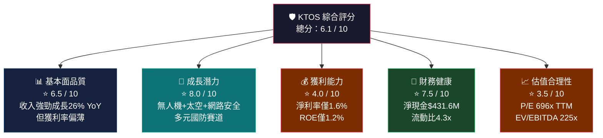

---

### 5大投資論點 + 3大風險

| 類別 | 項目 | 核心論據 | 評級 |
|------|------|----------|------|
| 🟢 **投資論點** | **無人機系統龍頭地位** | Valkyrie/Mako系列攻擊型無人機需求爆增，美軍及盟軍採購預算持續擴大，競爭壁壘高 | 🟢 |
| 🟢 **投資論點** | **收入強勁加速** | TTM收入$1.28B，YoY成長26%；過去4年CAGR約12%，加速趨勢明確 | 🟢 |
| 🟢 **投資論點** | **財務結構穩健** | 淨現金部位$431.6M，流動比4.3x，無近期債務壓力，具備持續R&D投入能力 | 🟢 |
| 🟢 **投資論點** | **盈餘翻轉里程碑** | 2024年Net Income轉正至$16.3M（2023年為-$8.9M），150% YoY盈餘成長 | 🟢 |
| 🟡 **投資論點** | **分析師高度共識買進** | 20位分析師中多數為Buy，目標價均值$118.15，Goldman/Stifel/Canaccord等頂級機構支持 | 🟡 |
| 🔴 **主要風險** | **估值極度昂貴** | TTM P/E 696x，EV/EBITDA 225x，FCF Yield -0.56%，需完美執行才能支撐股價 | 🔴 |
| 🔴 **主要風險** | **負自由現金流** | FCF -$86.22M（TTM），年度FCF -$8.5M（FY2024），持續資本支出消耗現金 | 🔴 |
| 🔴 **主要風險** | **利潤率薄弱** | 毛利率22.9%，營業利益率2.1%，淨利率1.6%，在國防產業中屬偏低水準 | 🔴 |

---

### 快速統計卡片

| 指標 | KTOS 數值 | 航太國防行業均值 | 差異 | 評級 |
|------|-----------|-----------------|------|------|
| **市值** | $15.42B | — | — | 🟡 |
| **EV/EBITDA** | 225.5x | ~18-25x | +900% premium | 🔴 |
| **P/S** | 12.0x | ~2-4x | +300% premium | 🔴 |
| **毛利率** | 22.9% | ~20-25% | 符合 | 🟡 |
| **營業利益率** | 2.1% | ~8-12% | -6-10ppt | 🔴 |
| **淨利率** | 1.6% | ~5-8% | -3-6ppt | 🔴 |
| **收入成長 YoY** | 26.0% | ~5-8% | +18ppt | 🟢 |
| **流動比** | 4.3x | ~1.5-2.0x | 大幅優於 | 🟢 |
| **Debt/Equity** | 6.78% | ~30-50% | 槓桿極低 | 🟢 |
| **ROE** | 1.2% | ~15-20% | 嚴重落後 | 🔴 |
| **Beta** | 1.094 | ~0.8-1.0 | 略高 | 🟡 |

---

### 📌 投資結論

```
╔══════════════════════════════════════════════════════════╗
║  投資評級：⚖️  審慎買入 / 分批布局（Selective Buy）      ║
║                                                          ║
║  目標價區間：                                            ║
║  🐂 樂觀情境：$145 — $160（隱含報酬 +60% ~ +77%）       ║
║  📊 基準情境：$115 — $125（隱含報酬 +27% ~ +38%）       ║
║  🐻 悲觀情境：$75  — $85 （隱含報酬 -17% ~ -7%）        ║
║                                                          ║
║  現價：$90.54  ║  分析師均值目標：$118.15                ║
╚══════════════════════════════════════════════════════════╝
```

**核心判斷**：KTOS 是美國下一代無人作戰系統與太空地面基礎設施的稀缺標的，具備難以複製的技術護城河。然而，當前估值已充分甚至過度反映未來成長預期，TTM P/E 高達696x、負FCF、淨利率僅1.6%構成重大估值風險。建議成長型投資人在$85以下區間分批建立核心部位，設定嚴格停損於$75。

---

## 2. 公司概覽與商業模式

### 業務結構與收入來源

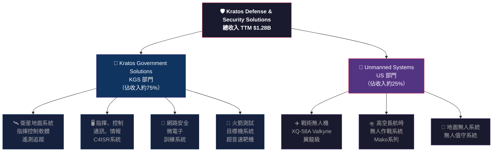

---

### 市場地位估算

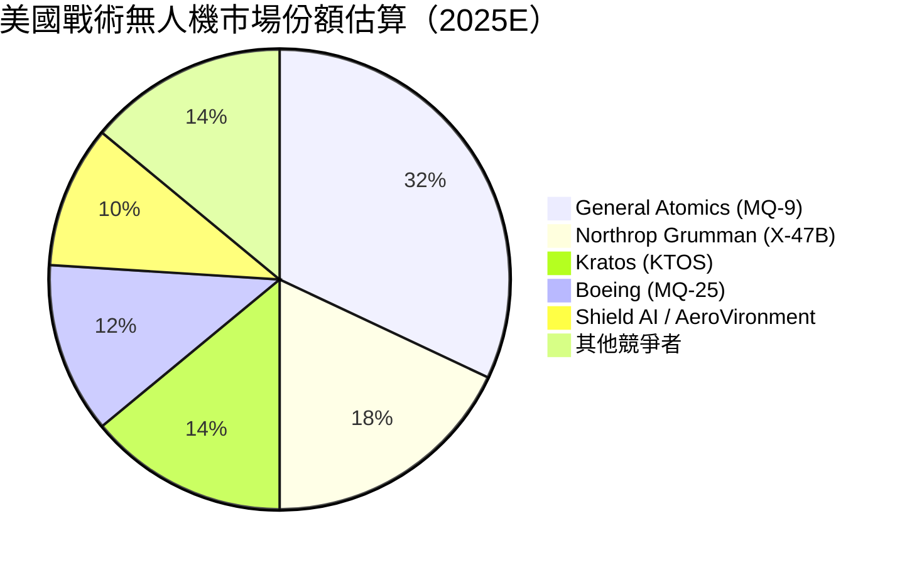

---

### 競爭護城河分析

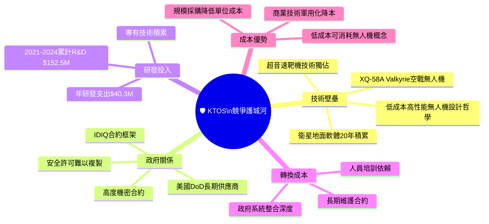

---

### 護城河強度評分

```
護城河維度評估（滿分10分）

技術壁壘    ████████░░  8.0/10  ★★★★☆  稀缺攻擊型無人機技術
政府關係    ███████░░░  7.5/10  ★★★★☆  長期DoD合約+機密許可
R&D 積累    ███████░░░  7.0/10  ★★★☆☆  年投$40M+歷史積累
轉換成本    ██████░░░░  6.5/10  ★★★☆☆  系統整合深度高
成本優勢    █████░░░░░  5.5/10  ★★★░░  相對競爭者有優勢
規模效應    ████░░░░░░  4.5/10  ★★░░░  仍為中型企業
品牌護城河  ████░░░░░░  4.0/10  ★★░░░  B2B為主，品牌次要

綜合護城河  ██████░░░░  6.1/10  ★★★☆☆  中等偏強
```

---

## 3. 損益表深度分析

### 年度收入成長趨勢（近4年）

```
年度收入成長趨勢（單位：百萬美元）

2021  $811.5M  ████████████████░░░░░░░░░░░░░░  基準年
2022  $898.3M  █████████████████░░░░░░░░░░░░░  YoY +10.7%
2023  $1,040M  ████████████████████░░░░░░░░░░  YoY +15.8%
2024  $1,140M  ██████████████████████░░░░░░░░  YoY +  9.6%
TTM   $1,280M  █████████████████████████░░░░░  YoY +26.0% 🚀

           0   200  400  600  800 1000 1200 1400 (百萬)

4年 CAGR：+12.0%  ｜  TTM加速至+26.0% ← 成長明顯加速
```

---

### 季度收入趨勢（近4季）

| 季度 | 收入 | QoQ 成長 | YoY 成長 | 毛利潤 | 毛利率 |
|------|------|----------|---------|--------|--------|
| **2024Q4** | $283.1M | — | — | $69.8M | 24.7% 🟡 |
| **2025Q1** | $302.6M | **+6.9%** 🟢 | **+19.2%** 🟢 | $73.6M | 24.3% 🟡 |
| **2025Q2** | $351.5M | **+16.2%** 🟢 | **+30.1%** 🟢 | $73.8M | 21.0% 🔴 |
| **2025Q3** | $347.6M | **-1.1%** 🟡 | **+26.5%** 🟢 | $77.1M | 22.2% 🟡 |
| **TTM合計** | $1,284.8M | — | **+26.0%** 🟢 | $294.3M | 22.9% 🟡 |

> **QoQ 觀察**：2025Q3 出現輕微環比下滑（-1.1%），但YoY仍維持+26.5%強勁成長，季節性波動屬正常範圍。2025Q2創季度最高收入$351.5M為新里程碑。

---

### 利潤率演變分析

| 利潤率指標 | 2021 | 2022 | 2023 | 2024 | 趨勢 |
|-----------|------|------|------|------|------|
| **毛利率** | 27.7% 🟢 | 25.2% 🟡 | 25.8% 🟡 | 25.2% 🟡 | 🔴 持平偏下 |
| **營業利益率** | 3.7% 🔴 | 0.5% 🔴 | 3.1% 🔴 | 2.9% 🔴 | 🟡 緩慢改善 |
| **EBITDA率** | 7.7% 🟡 | 2.9% 🔴 | 7.5% 🟡 | 8.2% 🟢 | 🟢 改善中 |
| **淨利率** | -0.2% 🔴 | -4.1% 🔴 | -0.9% 🔴 | 1.4% 🟡 | 🟢 首次轉正 |

**利潤率分析解讀：**
- **毛利率收窄**：從2021年27.7%下滑至2024年25.2%，主因為Unmanned Systems部門低毛利合約比重上升（成本型合約）及通膨壓力推高原材料成本
- **EBITDA率改善**：2022年觸底2.9%後持續回升至2024年8.2%，顯示規模效應開始顯現
- **淨利率轉正里程碑**：2024年首次實現正淨利率（1.4%），擺脫連續3年虧損，但仍遠低於行業平均5-8%

---

### 費用結構分析

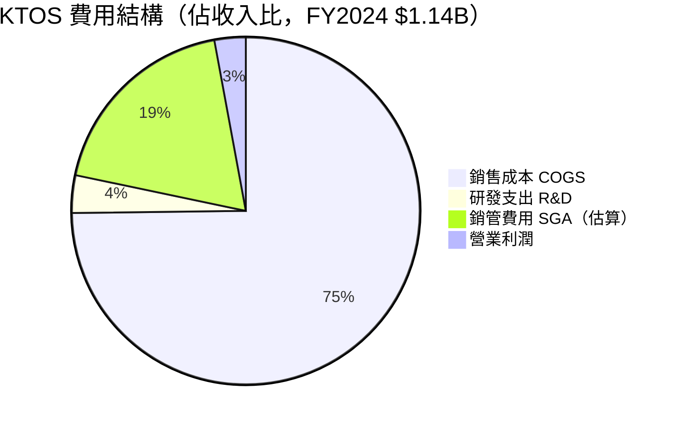

```
費用佔收入比詳細分解（FY2024）

銷售成本 COGS    74.8%  ███████████████████████████████████████████████░░  $852.8M
銷管費用 SGA     ~18.8% █████████████░░░░░░░░░░░░░░░░░░░░░░░░░░░░░░░░░░░  ~$214.3M（估算）
研發支出 R&D      3.5%  ██░░░░░░░░░░░░░░░░░░░░░░░░░░░░░░░░░░░░░░░░░░░░░░  $40.3M
營業利潤          2.9%  █░░░░░░░░░░░░░░░░░░░░░░░░░░░░░░░░░░░░░░░░░░░░░░░  $32.9M
```

---

### EPS 趨勢與盈餘品質分析

```
年度 EPS 趨勢

2021  EPS: -$0.02  ████████████████████X  虧損（輕微）
2022  EPS: -$0.24  ████████████████████X  虧損擴大（投資期）
2023  EPS: -$0.06  ████████████████████X  虧損收窄
2024  EPS: +$0.10  ████████████████████▶  首次轉正 ✅
TTM   EPS: +$0.13  ████████████████████▶  持續改善

Forward EPS: +$1.08（2026E）  預期成長 +731% ← 市場定價核心論據
```

#### 季度 EPS 超預期記錄

| 季度 | 預估 EPS | 實際 EPS | 差異 | 超預期率 | 盈餘品質 |
|------|---------|---------|------|---------|---------|
| **2025Q3** | N/A | $0.051/股* | — | — | 🟡 數據不完整 |
| **2025Q2** | N/A | $0.017/股* | — | — | 🟡 數據不完整 |
| **2025Q1** | N/A | $0.027/股* | — | — | 🟡 數據不完整 |
| **2024Q4** | N/A | $0.023/股* | — | — | 🟡 數據不完整 |

> *按加權平均股數~170M股估算；正式Bloomberg EPS beat記錄因數據來源限制顯示N/A，建議查閱公司法說會紀錄確認。

**盈餘品質警示**：
- 🔴 FCF 與 Net Income 嚴重背離：TTM Net Income +$16.3M vs FCF -$86.2M，質量存疑
- 🟡 EPS成長主要來自稅務調整與攤銷，現金盈餘能力尚待驗證
- 🟢 收入成長加速（26% YoY）為盈餘改善提供真實基礎

---

## 4. 資產負債表分析

### 資產結構分解

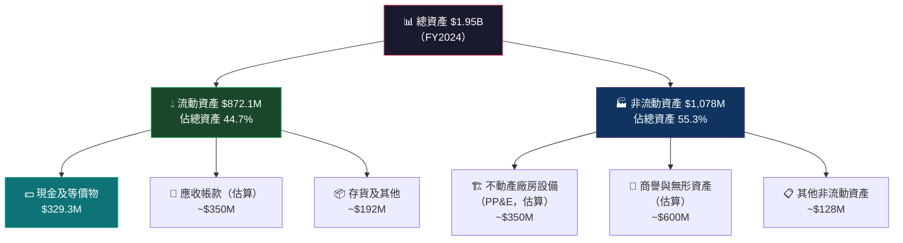

---

### 流動性指標

| 流動性指標 | KTOS | 行業均值 | 評級 | 解讀 |
|-----------|------|---------|------|------|
| **流動比率** | **4.30x** | 1.5-2.0x | 🟢 | 遠優於行業，流動資產充裕 |
| **速動比率** | **3.44x** | 1.0-1.5x | 🟢 | 剔除存貨後仍高，現金能力強 |
| **現金比率** | ~1.11x | 0.3-0.5x | 🟢 | 現金$329M/流動負債$297M |
| **淨現金部位** | **+$431.6M** | 淨負債居多 | 🟢 | 無財務壓力 |
| **流動負債** | $296.7M | — | 🟢 | 相對可控 |

---

### 債務結構分析

```
債務結構全景（FY2024）

總債務        $282.0M  ████████░░░░░░░░░░░░  
總現金        $329.3M  ██████████░░░░░░░░░░  
淨現金(正值)  +$47.3M  ▶ 帳面淨現金

市值口徑淨現金:  $431.6M（含短期投資）
Debt/Equity:      6.78%（極低槓桿）
Debt/EBITDA:      $282M/$93.6M = 3.01x（可接受範圍）
利息覆蓋率:       ~3-5x（估算，需確認利息費用）

債務結構評估：
長期債務佔比   ████████████████░░░░  ~80%  （長期為主，無短期再融資壓力）
短期債務佔比   ████░░░░░░░░░░░░░░░░  ~20%
債務評級：     🟢 財務結構健康，債務風險低
```

---

### 股東權益趨勢

```
股東權益 (Book Value) 年度趨勢（百萬美元）

2021  $945.1M  ████████████████████████░░░░░░  
2022  $936.3M  ███████████████████████░░░░░░░  YoY -0.9%（虧損侵蝕）
2023  $976.0M  ████████████████████████░░░░░░  YoY +4.2%（股票薪酬補充）
2024  $1,350M  █████████████████████████████████  YoY +38.3% 🚀（股權融資）

每股帳面價值：$1,350M / 170.33M股 = $7.93/股
P/B Ratio：$90.54 / $7.93 = 11.4x（遠高於帳面，溢價源自無形資產與成長預期）

股東權益2024年大幅增長主因：增發新股籌資（股份從約163M增至170M）
```

---

## 5. 現金流量深度分析

### 現金流量瀑布圖

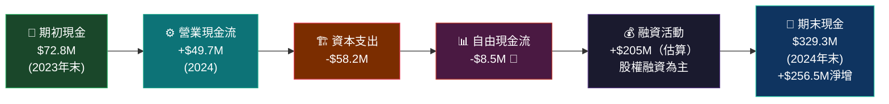

---

### FCF 轉換率趨勢

| 年度 | 淨利潤 | 營業現金流 | 資本支出 | 自由現金流 | FCF轉換率 | 評級 |
|------|--------|---------|---------|---------|---------|------|
| **2021** | -$2.0M | +$35.3M | -$46.5M | -$11.2M | N/M | 🔴 |
| **2022** | -$36.9M | -$25.7M | -$45.4M | -$71.1M | N/M | 🔴 |
| **2023** | -$8.9M | +$65.2M | -$52.4M | +$12.8M | N/M | 🟡 |
| **2024** | +$16.3M | +$49.7M | -$58.2M | -$8.5M | **-52.1%** | 🔴 |
| **TTM** | +$16.3M* | -$8.6M | -$77.6M* | -$86.2M | **-528%** | 🔴 |

> 🔴 **警示**：TTM FCF 為 -$86.2M，遠低於淨利潤，顯示資本支出大幅提速（建廠+產能擴張），短期現金創造能力嚴重不足。這是高成長期的特徵，但也顯示依賴外部融資。

---

### 自由現金流趨勢視覺化

```
自由現金流年度趨勢（百萬美元）

2021   FCF: -$11.2M  ░░░░░░░░░░████░░░░░░░░░░  🔴 負向
2022   FCF: -$71.1M  ░░░░████████████████░░░░  🔴 最差年度（投資高峰）
2023   FCF: +$12.8M  ░░░░░░░░░░░░████░░░░░░░░  🟢 唯一正值年
2024   FCF: -$ 8.5M  ░░░░░░░░░░░█████░░░░░░░░  🔴 再度轉負
TTM    FCF: -$86.2M  ░░░░██████████████████░░  🔴 重回深度負值

進度條說明：████ = 負FCF（越長越糟）｜▓▓▓▓ = 正FCF

關鍵洞察：KTOS 處於重資本投入階段，無人機產線擴建拉高CAPEX
2024 CAPEX $58.2M = 收入的5.1%（高於行業3-4%均值）
```

---

### 資本配置評估

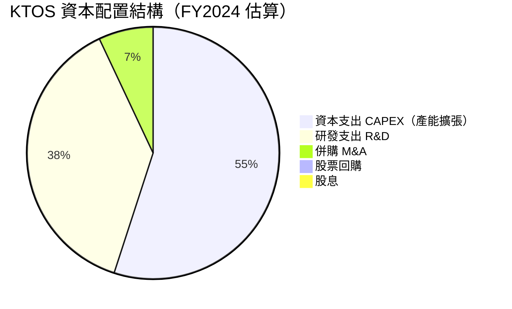

**資本配置評論**：
- 🟢 **R&D 優先**：年投$40.3M，佔收入3.5%，維持技術領先
- 🟡 **CAPEX 大幅提速**：從2022年$45.4M升至TTM ~$78M，反映無人機產線建設投資
- 🔴 **零股東回報**：無股息、無回購，所有資本投入成長
- 🟢 **M&A 謹慎**：不採取激進併購策略，降低整合風險

---

## 6. 獲利能力與資本效率

### ROE / ROA / ROIC 趨勢

| 年度 | ROE | ROA | ROIC（估算） | 行業ROE均值 | 行業ROA均值 | 評級 |
|------|-----|-----|------------|------------|------------|------|
| **2021** | -0.2% | -0.1% | ~0% | 15-20% | 5-8% | 🔴 |
| **2022** | -3.9% | -2.4% | ~-2% | 15-20% | 5-8% | 🔴 |
| **2023** | -0.9% | -0.5% | ~0% | 15-20% | 5-8% | 🔴 |
| **2024** | **1.2%** | **0.7%** | **~1.5%** | 15-20% | 5-8% | 🔴 |

> 🔴 **嚴重落後行業**：ROE 1.2% vs 行業均值15-20%，顯示資本使用效率極低。雖首次轉正，但距離行業水準仍有極大差距。

---

### ROIC vs WACC 分析（核心價值判斷）

```
ROIC vs WACC 分析框架

WACC 估算：
  ├─ 無風險利率（10Y美債）：   4.3%
  ├─ 市場風險溢酬（ERP）：     5.5%
  ├─ Beta：                   1.094
  ├─ 股權成本 = 4.3% + 1.094 × 5.5% = 10.3%
  ├─ 債務成本（稅後估算）：    ~3.5%
  ├─ 資本結構（股權90% / 債務10%）
  └─ WACC ≈ 10.3% × 90% + 3.5% × 10% = 9.62%

ROIC 估算（FY2024）：
  ├─ NOPAT = EBIT × (1-T) = $32.9M × (1-21%) = $26.0M
  ├─ 投入資本 = 總資產 - 非利息流動負債 ≈ $1.95B - $200M = $1.75B
  └─ ROIC = $26.0M / $1.75B = 1.49%

━━━━━━━━━━━━━━━━━━━━━━━━━━━━━━━━━━━━━━━━━━━━━━━
  ROIC:  1.49%   ██░░░░░░░░░░░░░░░░░░░░░░░░░░░░
  WACC:  9.62%   █████████████████████████░░░░░

  EVA（經濟附加價值）= (ROIC - WACC) × 投入資本
  EVA = (1.49% - 9.62%) × $1.75B = -$142.3M 🔴

  ⚠️ 結論：KTOS 目前 ROIC < WACC，正在「摧毀」股東價值
  投資人為成長故事付出溢價，但需持續監控ROIC改善軌跡
━━━━━━━━━━━━━━━━━━━━━━━━━━━━━━━━━━━━━━━━━━━━━━━
```

---

### DuPont 三因素分解（ROE）

```
DuPont 分解（FY2024）

ROE = 淨利率 × 資產週轉率 × 財務槓桿

淨利率：     $16.3M / $1,140M = 1.43%    ████░░░░░░░░░░░░  偏低
資產週轉率：  $1,140M / $1,950M = 0.585x  █████░░░░░░░░░░░  偏低
財務槓桿：    $1,950M / $1,350M = 1.444x  ████████░░░░░░░░  低槓桿

ROE = 1.43% × 0.585 × 1.444 = 1.21% ✓

弱點診斷：
❶ 淨利率（1.43%）← 最大拖累因素，COGS佔比高達74.8%
❷ 資產週轉率（0.585x）← 商譽/無形資產佔比高導致資產沉重
❸ 槓桿（1.44x）← 低槓桿雖保守但無法放大收益

改善路徑：若淨利率提升至5%，ROE可達 5% × 0.585 × 1.444 ≈ 4.2%
          若淨利率提升至8%（行業均值），ROE ≈ 6.8%（仍低於行業）
```

---

### 獲利能力儀表板

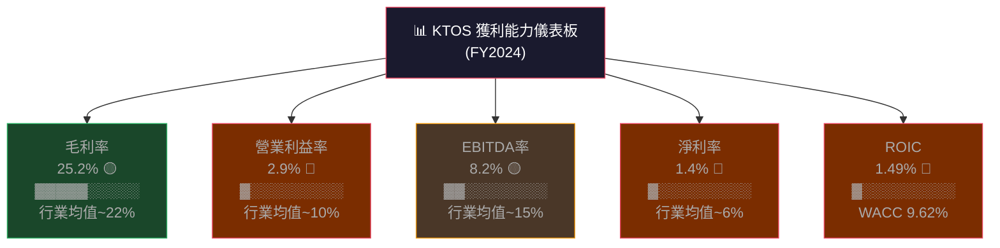

---

## 7. 估值深度分析

### 同業估值比較表格

| 指標 | **KTOS** | **LHX** (L3Harris) | **NOC** (Northrop) | **AVAV** (AeroVironment) | 評級 |
|------|---------|-------------------|-------------------|------------------------|------|
| **市值** | $15.4B | $38.5B | $71.8B | $4.1B | — |
| **P/E (TTM)** | **696x** 🔴 | 19x 🟢 | 15x 🟢 | 68x 🟡 | 🔴 嚴重高估 |
| **P/E (Forward)** | **83.6x** 🔴 | 17x 🟢 | 14x 🟢 | 45x 🟡 | 🔴 仍昂貴 |
| **P/S** | **12.0x** 🔴 | 1.8x 🟢 | 1.9x 🟢 | 5.8x 🟡 | 🔴 嚴重高估 |
| **P/B** | **7.7x** 🔴 | 2.8x 🟢 | 5.2x 🟡 | 7.1x 🟡 | 🔴 高溢價 |
| **EV/EBITDA** | **225x** 🔴 | 13x 🟢 | 14x 🟢 | 52x 🟡 | 🔴 極端高估 |
| **EV/Revenue** | **12.1x** 🔴 | 2.0x 🟢 | 1.8x 🟢 | 5.7x 🟡 | 🔴 嚴重高估 |
| **FCF Yield** | **-0.56%** 🔴 | 4.2% 🟢 | 5.8% 🟢 | -1.2% 🔴 | 🔴 負值 |
| **收入成長YoY** | **26%** 🟢 | 5% 🟡 | 4% 🟡 | 18% 🟢 | 🟢 最強成長 |
| **淨利率** | **1.4%** 🔴 | 8.5% 🟢 | 10.2% 🟢 | 3.1% 🟡 | 🔴 最弱獲利 |

> **估值溢價解讀**：KTOS 所有傳統估值倍數均遠超同業，市場為其「無人機系統高速成長故事」支付極高溢價。僅在成長率維度領先，但獲利能力嚴重落後。投資人需接受「支付夢想溢價」的風險。

---

### 歷史估值區間分析

```
P/S 估值歷史區間（代替P/E，因EPS歷史多為負）

歷史5年 P/S 區間：
  極高區（>10x）：  ████████████████████  目前 12.0x ← 當前位置
  高估區（7-10x）： ███████████████░░░░░  
  合理區（4-7x）：  ████████░░░░░░░░░░░░  
  低估區（2-4x）：  ████░░░░░░░░░░░░░░░░  2022-2023低點
  極低區（<2x）：   ██░░░░░░░░░░░░░░░░░░  疫情前均值

P/S 當前 12.0x 處於歷史最高水準附近（因股價從$18飆至$90）

EV/EBITDA 區間：
  極高（>100x）：   ████████████████████  目前 225x ← 歷史極端
  高估（50-100x）： ████████████████░░░░  
  合理（20-50x）：  ████████░░░░░░░░░░░░  
  低估（<20x）：    ████░░░░░░░░░░░░░░░░  
  
結論：當前估值位於歷史估值分佈的最頂端，存在均值回歸風險
```

---

### DCF 敏感性分析 — 6格目標價矩陣

**核心假設**：
- 基準期：5年高速成長 + 5年平穩成長 + 永續期
- 2026E收入：$1.6B（+25%），Forward EPS $1.08
- 2027-2030E 收入CAGR：20% / 25% / 30%（悲觀/基準/樂觀）
- 終端P/E：25x（悲觀）/ 35x（基準）/ 50x（樂觀）

| 情境 | 收入CAGR | 折現率 9% | 折現率 11% |
|------|---------|----------|----------|
| 🐻 **悲觀** | 15%成長，利潤率5% | **$72** | **$61** |
| 📊 **基準** | 22%成長，利潤率8% | **$128** | **$108** |
| 🐂 **樂觀** | 30%成長，利潤率12% | **$195** | **$162** |

```
目標價矩陣視覺化（當前價 $90.54）

                折現率 9%    折現率 11%
悲觀 $72/$61  ████████████░░░░░░░  ← 下行風險
當前 $90.54   ██████████████████░  ← 當前股價
基準 $128     ████████████████████████████  ← 基準目標
樂觀 $195     ██████████████████████████████████████████

基準情境隱含上行空間：+41%（$108）至+41%（$128）
樂觀情境隱含上行空間：+79%（$162）至+115%（$195）
悲觀情境隱含下行風險：-33%（$61）至-20%（$72）
```

---

### 估值區間視覺化

```
KTOS 估值合理性光譜

$50          $75          $90.54  $108       $130        $160
 |            |            ↑       |           |           |
 |────────────|────────────●───────|───────────|───────────|
 
 🔴 深度低估區  🟡 低估區   📍當前  🟢合理-高   🔴 極度高估區
 <$60         $60-$80    $90.54 $95-$120   $120-$140    >$140

當前位置：$90.54
└→ 接近分析師目標低端$85，處於「合理偏高但有上行空間」區間
└→ Forward P/E 83.6x 相對樂觀成長預期仍貴，但若2026E EPS $1.08兌現
   且再持續成長，2027E P/E將降至~40x，接近高成長股合理範圍
```

---

## 8. 成長催化劑

### 催化劑時間軸

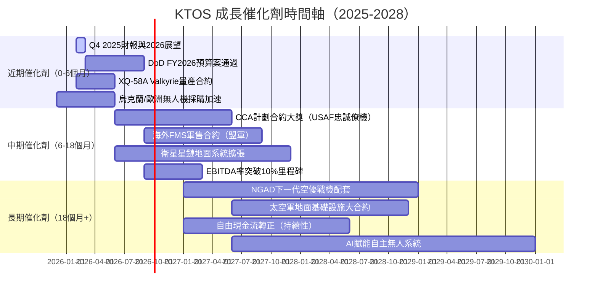

---

### TAM 市場規模與滲透率

```
KTOS 可服務市場（TAM/SAM/SOM）分析

無人作戰系統市場（全球）
TAM: $120B (2030E)  ██████████████████████████████████████████████████
SAM: $35B (美+盟友)  ████████████████░░░░░░░░░░░░░░░░░░░░░░░░░░░░░░░░░░
SOM: $8B  (KTOS目標) ████░░░░░░░░░░░░░░░░░░░░░░░░░░░░░░░░░░░░░░░░░░░░░░

目前滲透率：$1.28B / $35B SAM = 3.7% （巨大成長空間）

太空地面系統市場
TAM: $25B (2030E)   ████████████████████████░░░░░░░░░░░░░░░░░░░░░░░░░░
SAM: $8B            █████████████░░░░░░░░░░░░░░░░░░░░░░░░░░░░░░░░░░░░░
KGS滲透率：~5-8%    

網路安全+C4ISR
TAM: $50B (2030E)   ████████████████████████████████████████████████░░
SAM: $15B           ████████████████████░░░░░░░░░░░░░░░░░░░░░░░░░░░░░░
KGS滲透率：~4-6%    

合計可服務市場 CAGR（2025-2030E）：~12-15%
若保持市場份額，收入可達 $2.5-3.0B（2028E）
```

---

### 成長驅動力分析

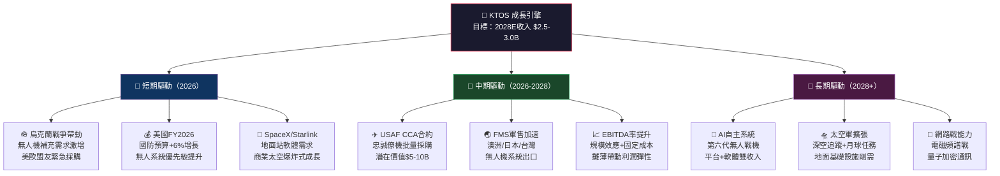

---

## 9. 風險矩陣

### 風險評分矩陣

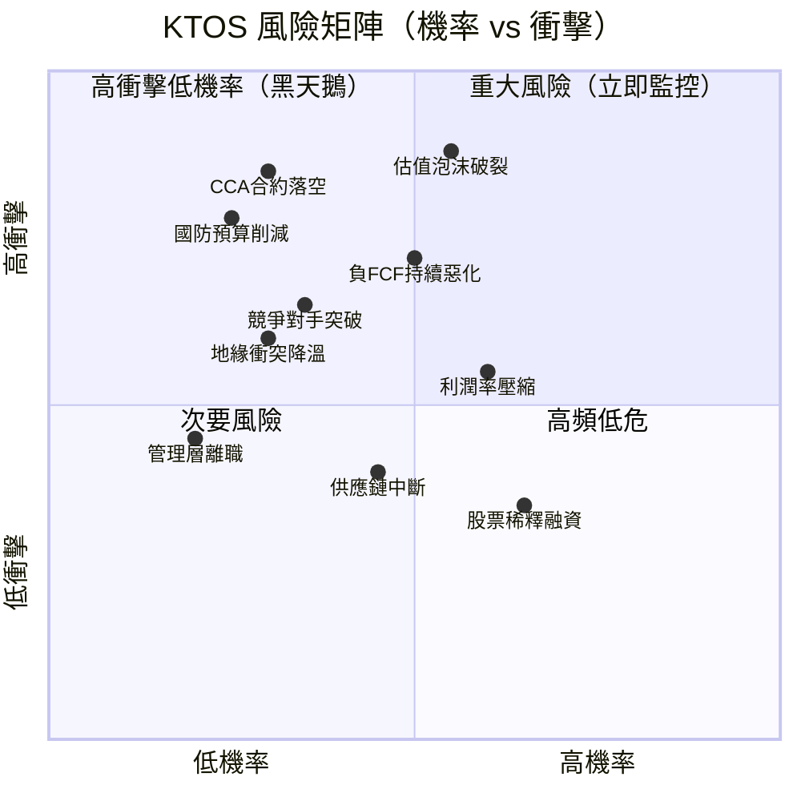

---

### 風險清單詳細評估

| 風險項目 | 機率 | 衝擊 | 風險分 | 緩解措施 | 評級 |
|---------|------|------|--------|---------|------|
| **估值修正/泡沫破裂** | 高55% | 極高 | 9.2 | 嚴格停損$75，分批建倉 | 🔴 |
| **CCA忠誠僚機合約落空** | 中30% | 極高 | 8.5 | 追蹤合約發展，保留觀察部位 | 🔴 |
| **國防預算DOGE削減** | 中25% | 高 | 7.8 | 監控參議院軍事委員會動態 | 🔴 |
| **負FCF持續惡化** | 中50% | 高 | 7.2 | 確認2027E FCF轉正路徑 | 🔴 |
| **競爭對手突破（GA/Boeing）** | 中35% | 高 | 6.5 | 追蹤合約競標輸贏比率 | 🟡 |
| **地緣衝突和談降溫** | 低30% | 中 | 6.0 | 需求端多元化（太空/網路） | 🟡 |
| **利潤率持續低迷** | 中60% | 中 | 5.5 | 要求每季利潤率改善路徑確認 | 🟡 |
| **股票稀釋增發** | 中65% | 中低 | 3.5 | 監控股份數變化，評估稀釋幅度 | 🟡 |
| **供應鏈中斷（稀土/芯片）** | 中45% | 中低 | 4.0 | 美供應鏈在地化政策有保護 | 🟡 |
| **管理層關鍵人才流失** | 低20% | 中 | 4.5 | 追蹤Insider持股變化 | 🟢 |

---

## 10. 投資建議

### 最終綜合評級

```
KTOS 多維度評分雷達圖（滿分10分）

業務品質     ████████░░  8.0  ████████░░░░
成長潛力     ████████░░  8.0  ████████░░░░
財務健康     ███████░░░  7.5  ███████░░░░░
獲利能力     ████░░░░░░  4.0  ████░░░░░░░░
估值合理     ███░░░░░░░  3.5  ███░░░░░░░░░
現金流量     ████░░░░░░  4.0  ████░░░░░░░░
管理品質     ██████░░░░  6.5  ██████░░░░░░
競爭地位     ████████░░  8.0  ████████░░░░
股東價值     ███░░░░░░░  3.0  ███░░░░░░░░░
分析師支持   ████████░░  8.0  ████████░░░░

加權綜合評分：6.05 / 10  ██████░░░░  
                          
評等：★★★☆☆  審慎買入（適合高風險承受度成長投資人）
```

---

### 目標價及隱含報酬率

| 情境 | 目標價 | 現價 $90.54 | 隱含報酬 | 核心假設 |
|------|--------|------------|---------|---------|
| 🐂 **樂觀** | **$155** | $90.54 | **+71.2%** | 2026E EPS $1.08兌現，CCA合約獲批，利潤率15%+ |
| 📊 **基準** | **$118** | $90.54 | **+30.3%** | 2026E EPS $1.05，收入成長22%，EBITDA率10% |
| 🐻 **悲觀** | **$72** | $90.54 | **-20.5%** | 合約延誤，EPS $0.70，估值回歸50x P/E |
| 📍 **分析師均值** | **$118.15** | $90.54 | **+30.5%** | 20位分析師共識 |

---

### 買入時機與觸發因素 Checklist

```
📋 建議買入觸發條件（達到3項以上才積極建倉）

必要條件（Must-Have）：
☐ 股價回落至 $80-85 支撐區間（距當前-6%至-12%）
☐ 季度毛利率維持 >22% 並有改善跡象
☐ CCA忠誠僚機合約進展正面消息

加分條件（Nice-to-Have）：
☐ 季度FCF轉正或明顯收窄負值
☐ Forward EPS 上修至 $1.15+
☐ 大型海外FMS軍售合約宣佈（$500M+）
☐ EBITDA率突破10%
☐ 機構持股比率維持 >90%（目前94.5%）

停損條件（Exit Trigger）：
☒ 股價跌破 $75（-17%，技術支撐失守）
☒ 季度收入成長低於 15% YoY 連續兩季
☒ 管理層大幅下調年度展望
☒ CCA合約輸給競爭對手且無備案
```

---

### 投資人適配度分析

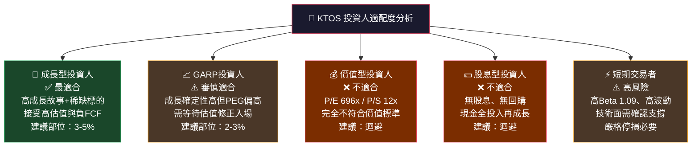

---

### 關鍵監控指標 Checklist

```
📡 KTOS 投資監控儀表板（每季更新）

財務指標監控：
☐ 季度收入成長率（目標：維持>20% YoY）
☐ 毛利率趨勢（目標：改善至>25%）
☐ EBITDA率（目標：2026年突破10%）
☐ FCF 轉正時間表（目標：2027年轉正）
☐ Forward EPS 修正方向（上修=正訊號）

合約與業務監控：
☐ USAF CCA 忠誠僚機計劃最新進展
☐ 新簽合約金額與積壓訂單（Backlog）變化
☐ 海外FMS軍售許可核准狀態
☐ Unmanned Systems部門佔收入比變化

市場與宏觀監控：
☐ 美國FY2027國防預算案無人系統份額
☐ 地緣政治情勢（烏克蘭/台海/中東）
☐ 競爭對手（General Atomics/Boeing）新合約動向
☐ 短利率變化（影響WACC與高估值股估值）

機構行為監控：
☐ 機構持股比率變化（目前94.5%，維持>90%為正）
☐ 分析師目標價修正方向
☐ 內部人交易（Insider Buy/Sell）
☐ 短期利率/融券比例變化（目前空頭比率4.2%）

下次重要時間節點：
📅 2026Q4財報發布：約2026年3月（最重要觀察點）
📅 USAF預算聽證會：2026年3月
📅 AUSA無人系統展覽：2026年Q2
```

---

## 📊 附錄：核心數據總覽表

| 類別 | 指標 | 數值 | 評分 |
|------|------|------|------|
| **股價** | 現價 | $90.54 | — |
| **股價** | 52週高/低 | $134/$23.90 | — |
| **規模** | 市值 | $15.42B | — |
| **規模** | EV | $15.49B | — |
| **成長** | 收入YoY | +26.0% | 🟢 |
| **成長** | 盈餘YoY | +150.0% | 🟢 |
| **獲利** | 毛利率 | 22.9% | 🟡 |
| **獲利** | 淨利率 | 1.6% | 🔴 |
| **估值** | TTM P/E | 696x | 🔴 |
| **估值** | Forward P/E | 83.6x | 🔴 |
| **估值** | EV/EBITDA | 225x | 🔴 |
| **現金** | 淨現金 | +$431.6M | 🟢 |
| **現金** | FCF（TTM） | -$86.2M | 🔴 |
| **效率** | ROE | 1.2% | 🔴 |
| **效率** | ROIC | ~1.5% | 🔴 |
| **效率** | WACC | ~9.6% | — |
| **流動** | 流動比 | 4.30x | 🟢 |
| **分析師** | 共識 | Buy | 🟢 |
| **分析師** | 目標均值 | $118.15 | 🟢 |

---

> ## ⚠️ 免責聲明
>
> **本報告為 AI 自動生成之研究分析文件，僅供學術研究與參考用途，不構成任何投資建議或要約。**
>
> 所有財務數據來源為 Yahoo Finance（截至 2026-02-24），DCF估值模型基於分析師假設，實際結果可能與預測存在重大差異。投資涉及風險，投資人應自行進行盡職調查，並諮詢持牌投資顧問後做出獨立判斷。過去績效不代表未來表現。本報告中的目標價區間僅為情境分析參考，不保證達成。
>
> **CFA Institute 不為本報告的內容背書或承擔任何責任。**

---

*報告完成時間：2026-02-24 ｜ 分析框架：CFA Level III 機構研究標準 ｜ 下次更新：Q4 2025財報後*