# KTOS 基本面深度分析報告
> **報告日期**：2026-02-24 ｜ **語言**：繁體中文 ｜ **數據來源**：Yahoo Finance ｜ **分析師**：AI 頂級研究團隊

---

## 目錄

| 章節 | 標題 | 頁碼 |
|------|------|------|
| 1 | 執行摘要 | § 1 |
| 2 | 公司概覽 | § 2 |
| 3 | 損益表深度分析 | § 3 |
| 4 | 資產負債表分析 | § 4 |
| 5 | 現金流量分析 | § 5 |
| 6 | 獲利能力指標 | § 6 |
| 7 | 估值分析 | § 7 |
| 8 | 競爭護城河 | § 8 |
| 9 | 成長催化劑 | § 9 |
| 10 | 風險分析 | § 10 |
| 11 | 公平價值估算 | § 11 |
| 12 | 投資建議 | § 12 |

---

## 1. 執行摘要

### 核心評分儀表板

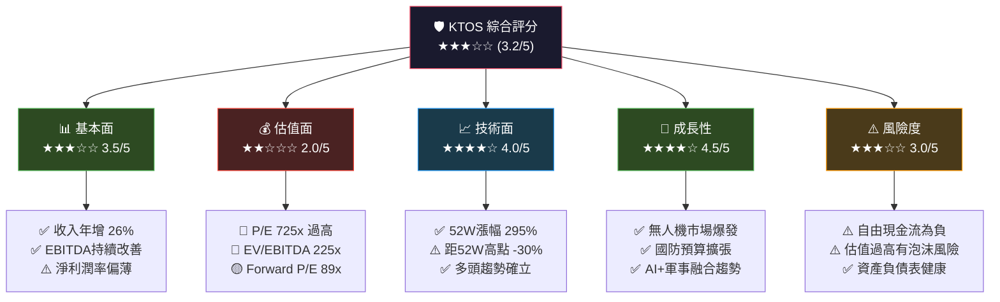

---

### 5大投資論點速覽

| # | 投資論點 | 方向 | 重要性 | 信心度 |
|---|----------|------|--------|--------|
| 1 | 🟢 **無人機系統龍頭**：Valkyrie、Gremlins等產品線全球領先，訂單能見度高 | 多頭 | ⭐⭐⭐⭐⭐ | 🟢 高 |
| 2 | 🟢 **國防預算超級週期**：地緣政治緊張推動全球國防支出急速擴大，KTOS直接受益 | 多頭 | ⭐⭐⭐⭐⭐ | 🟢 高 |
| 3 | 🟢 **收入高速成長**：2024年營收 $1.14B，YoY +9.6%，TTM增速已達26% | 多頭 | ⭐⭐⭐⭐ | 🟢 高 |
| 4 | 🔴 **估值極度高溢價**：Trailing P/E 725x、EV/EBITDA 225x，遠超合理區間 | 空頭 | ⭐⭐⭐⭐⭐ | 🔴 高 |
| 5 | 🟡 **自由現金流仍為負**：FCF -$8.5M（2024），需持續監控資本耗用問題 | 中性 | ⭐⭐⭐⭐ | 🟡 中 |

---

### 快速統計卡片

| 指標 | 數值 | 狀態 | 評級 |
|------|------|------|------|
| 📈 當前股價 | $94.31 | 距52W低點 +295% | 🟢 強勢 |
| 💎 市值 | $16.06B | 中型成長股 | 🟡 中性 |
| 📊 TTM營收 | $1.28B | YoY +26% | 🟢 優秀 |
| 💰 毛利率 | 22.9% | 防務業偏低 | 🟡 待提升 |
| 📉 營業利益率 | 2.1% | 極薄 | 🔴 警示 |
| 🏦 現金儲備 | $565.9M | 充裕 | 🟢 健康 |
| 📋 負債比 | D/E 6.78x | 相對高 | 🟡 注意 |
| 🎯 分析師目標均價 | $115.70 | 上行空間 +22.7% | 🟢 買入 |
| 👥 分析師覆蓋 | 20位 | 共識「買入」 | 🟢 正面 |
| ⚡ Beta | 1.094 | 略高於市場 | 🟡 中性 |

---

## 2. 公司概覽

### 業務結構圖

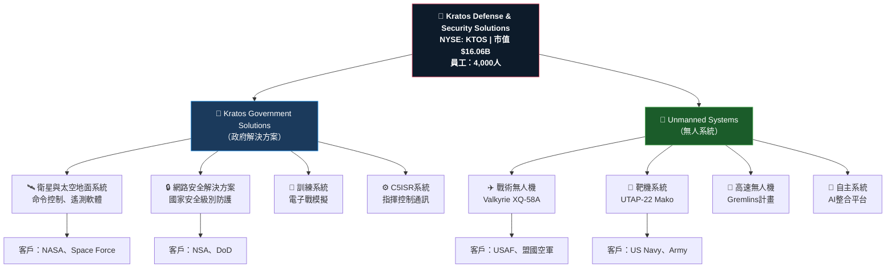

---

### 營收結構分佈（估算）

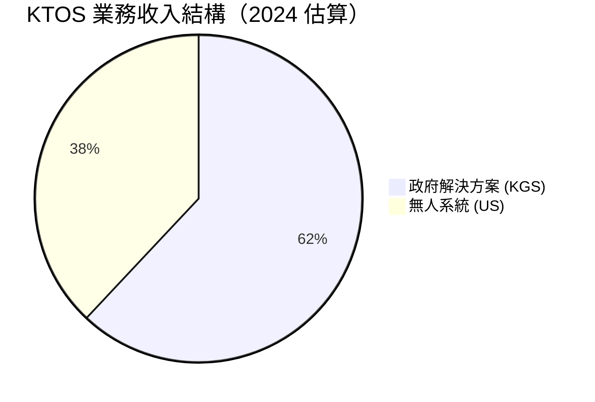

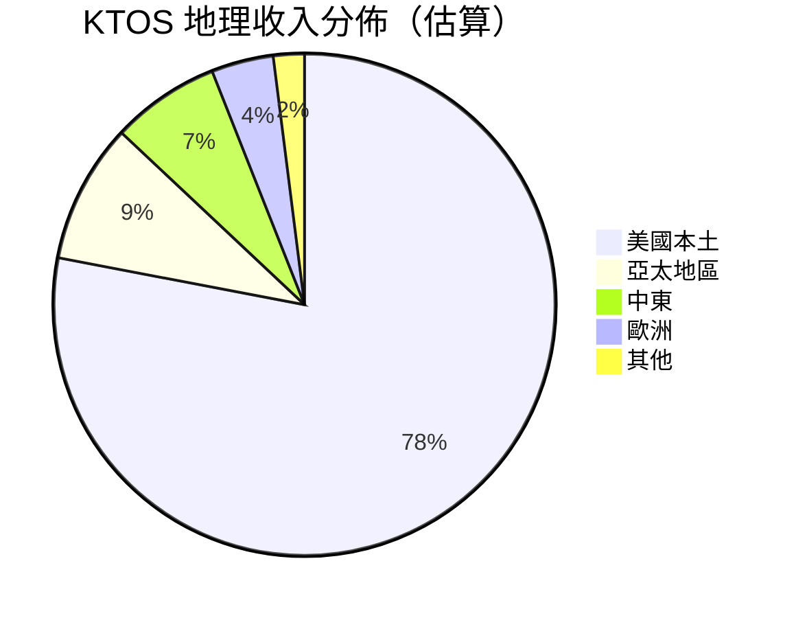

---

### 競爭優勢心智圖

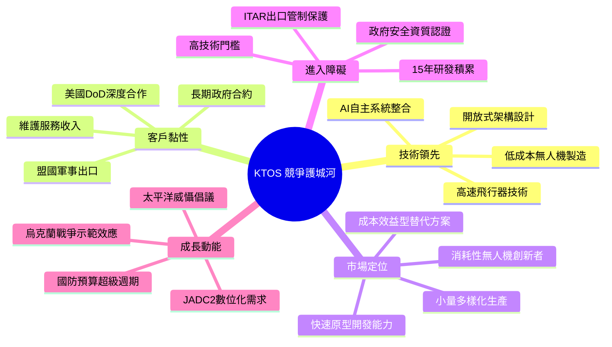

---

## 3. 損益表深度分析

### 年度收入成長時間軸

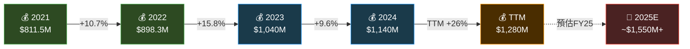

---

### 年度收入趨勢 ASCII 長條圖

```
年度收入趨勢（單位：百萬美元）
━━━━━━━━━━━━━━━━━━━━━━━━━━━━━━━━━━━━━━━━━━━━━━━━━━━━
2021  [$811M]  ▓▓▓▓▓▓▓▓▓▓▓▓▓▓▓▓▓▓▓▓▓▓▓▓▓▓▓▓▓▓▓▓▓░░░░░░░░  
2022  [$898M]  ▓▓▓▓▓▓▓▓▓▓▓▓▓▓▓▓▓▓▓▓▓▓▓▓▓▓▓▓▓▓▓▓▓▓▓▓░░░░░  
2023  [$1.04B] ▓▓▓▓▓▓▓▓▓▓▓▓▓▓▓▓▓▓▓▓▓▓▓▓▓▓▓▓▓▓▓▓▓▓▓▓▓▓▓▓▓░  
2024  [$1.14B] ▓▓▓▓▓▓▓▓▓▓▓▓▓▓▓▓▓▓▓▓▓▓▓▓▓▓▓▓▓▓▓▓▓▓▓▓▓▓▓▓▓▓▓▓
TTM   [$1.28B] ▓▓▓▓▓▓▓▓▓▓▓▓▓▓▓▓▓▓▓▓▓▓▓▓▓▓▓▓▓▓▓▓▓▓▓▓▓▓▓▓▓▓▓▓▓▓▓▓▓█
━━━━━━━━━━━━━━━━━━━━━━━━━━━━━━━━━━━━━━━━━━━━━━━━━━━━
       $0    $200M  $400M  $600M  $800M  $1B  $1.2B  $1.3B
```

---

### 利潤率演變趨勢

```
利潤率演變（%）
━━━━━━━━━━━━━━━━━━━━━━━━━━━━━━━━━━━━━━━━━━━━━━
      2021    2022    2023    2024    TTM
      ────────────────────────────────────
毛利  27.7%   25.2%   25.8%   25.2%   22.9%
率    ████    ████    ████    ████    ███
      ████    ████    ████    ████    ███

營業  3.7%    0.5%    3.1%    2.9%    2.1%
利益  █       ░       █       █       ░
率    

EBIT  7.7%    2.9%    7.5%    8.2%    —
DA%   ██      █       ██      ██      
率    

淨利  -0.2%   -4.1%   -0.9%   1.4%    1.6%
率    ░       🔴      ░       🟢      🟢
━━━━━━━━━━━━━━━━━━━━━━━━━━━━━━━━━━━━━━━━━━━━━━
```

---

### 近4年損益詳細數據

| 財務指標 | 2021 | 2022 | 2023 | 2024 | 趨勢 |
|----------|------|------|------|------|------|
| 📊 總營收 | $811.5M | $898.3M | $1,040M | $1,140M | 🟢 ↗ 持續成長 |
| 💚 毛利 | $225.1M | $226.0M | $268.6M | $287.2M | 🟢 ↗ 穩步提升 |
| 📐 毛利率 | 27.7% | 25.2% | 25.8% | 25.2% | 🟡 → 區間波動 |
| ⚙️ 營業利益 | $29.7M | $4.6M | $32.4M | $32.9M | 🟡 → 改善但偏低 |
| 📉 營業利益率 | 3.7% | 0.5% | 3.1% | 2.9% | 🟡 → 偏薄 |
| 💼 EBITDA | $62.8M | $26.2M | $77.5M | $93.6M | 🟢 ↗ 大幅改善 |
| 🏦 淨利潤 | -$2.0M | -$36.9M | -$8.9M | $16.3M | 🟢 ↗ 首度轉正 |
| 📋 淨利率 | -0.2% | -4.1% | -0.9% | 1.4% | 🟢 ↗ 扭虧為盈 |
| 🔬 研發費用 | $35.2M | $38.6M | $38.4M | $40.3M | 🟢 → 持續投入 |
| 📌 EPS (TTM) | — | — | — | — | $0.13 🟡 |

---

### 費用結構分佈

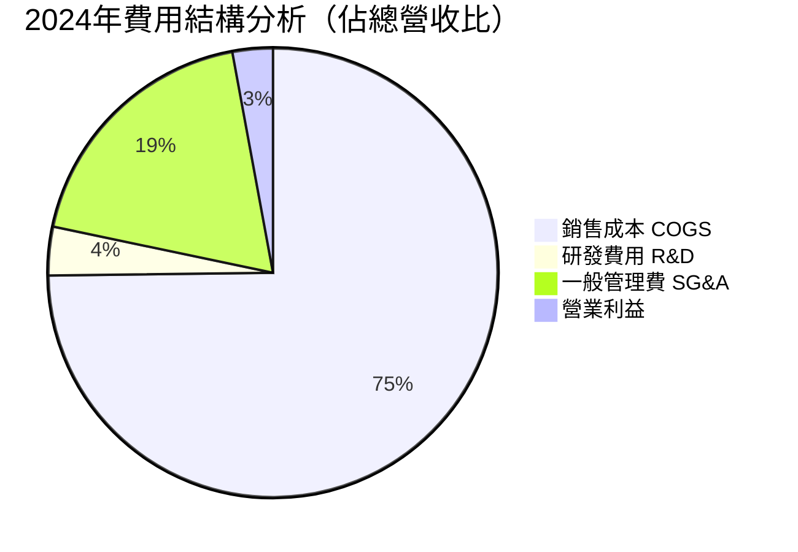

---

### EBITDA 成長軌跡

```
EBITDA 年度成長（百萬美元）
━━━━━━━━━━━━━━━━━━━━━━━━━━━━━━━━━━━━━━━━━━━━━━━━
2021  $62.8M   ▓▓▓▓▓▓▓▓▓▓▓▓▓▓▓▓▓▓▓▓▓▓▓▓▓▓▓▓░░░░░░
2022  $26.2M   ▓▓▓▓▓▓▓▓▓▓▓░░░░░░░░░░░░░░░░░░░░░░░░  ⚠️ 低谷
2023  $77.5M   ▓▓▓▓▓▓▓▓▓▓▓▓▓▓▓▓▓▓▓▓▓▓▓▓▓▓▓▓▓▓▓▓░░░  ✅ 反彈
2024  $93.6M   ▓▓▓▓▓▓▓▓▓▓▓▓▓▓▓▓▓▓▓▓▓▓▓▓▓▓▓▓▓▓▓▓▓▓▓▓▓▓  ✅ 新高
━━━━━━━━━━━━━━━━━━━━━━━━━━━━━━━━━━━━━━━━━━━━━━━━
       $0      $20M    $40M    $60M    $80M   $100M
```

> 📌 **關鍵觀察**：2024年EBITDA達 **$93.6M**，較2022年低谷 $26.2M 成長 **+257%**，顯示經營槓桿逐步顯現。

---

## 4. 資產負債表分析

### 資產結構分解圖

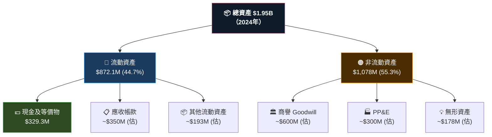

---

### 資產配置 Unicode 橫條圖

```
資產負債表結構（2024年）
━━━━━━━━━━━━━━━━━━━━━━━━━━━━━━━━━━━━━━━━━━━━━━━━━━━━━━━━━━

【資產端 $1.95B】
現金           $329M  ▓▓▓▓▓▓▓▓▓▓▓▓▓▓▓▓▓░░░░░░░░░  16.9%
流動資產合計   $872M  ▓▓▓▓▓▓▓▓▓▓▓▓▓▓▓▓▓▓▓▓▓▓▓▓▓▓▓  44.7%
非流動資產    $1.08B  ▓▓▓▓▓▓▓▓▓▓▓▓▓▓▓▓▓▓▓▓▓▓▓▓▓▓▓▓▓▓▓▓▓▓  55.3%

【負債端 $597.7M】
流動負債       $297M  ▓▓▓▓▓▓▓▓▓▓▓▓▓▓▓░░░░░░░░░  49.7%
長期負債       $301M  ▓▓▓▓▓▓▓▓▓▓▓▓▓▓▓▓░░░░░░░░  50.3%
總債務         $282M  ▓▓▓▓▓▓▓▓▓▓▓▓▓▓▓░░░░░░░░░░

【股東權益 $1.35B】
權益佔比        69.2% ▓▓▓▓▓▓▓▓▓▓▓▓▓▓▓▓▓▓▓▓▓▓▓▓▓▓▓▓▓▓▓▓▓▓▓  

━━━━━━━━━━━━━━━━━━━━━━━━━━━━━━━━━━━━━━━━━━━━━━━━━━━━━━━━━━
```

---

### 負債與流動性比率

| 指標 | 2021 | 2022 | 2023 | 2024 | 狀態 |
|------|------|------|------|------|------|
| 🏦 總資產 | $1.59B | $1.55B | $1.63B | $1.95B | 🟢 增長 |
| 💳 總負債 | $629.2M | $604.0M | $634.0M | $597.7M | 🟢 下降 |
| 💚 股東權益 | $945.1M | $936.3M | $976.0M | $1,350M | 🟢 強勁增長 |
| 💵 現金 | $349.4M | $81.3M | $72.8M | $329.3M | 🟢 大幅回升 |
| 📉 總債務 | $339.5M | $301.8M | $321.4M | $282.0M | 🟢 持續降低 |
| 📊 流動比率 | 3.43x | 2.49x | 2.03x | **4.30x** | 🟢 極佳 |
| ⚖️ D/E 比率 | 0.36x | 0.32x | 0.33x | **0.21x** | 🟢 健康 |
| 🔒 淨現金部位 | +$9.9M | -$220.5M | -$248.6M | **+$47.3M** | 🟢 轉為淨現金 |

> 📌 **特別注意**：TTM數據顯示總現金達 **$565.9M**，而總債務僅 $134.3M，淨現金部位大幅改善。D/E報6.78x可能包含特殊會計處理，需深入核查。

---

### 股東權益趨勢 ASCII 圖

```
股東權益趨勢（百萬美元）
━━━━━━━━━━━━━━━━━━━━━━━━━━━━━━━━━━━━━━━━━━━━━━━━━━
$1,400 │                                        ●  ← $1,350M
$1,200 │                                    
$1,100 │                              ●          ← $976M
$1,000 │   ●          ●                          ← $945M / $936M
 $900 │                    
 $800 │                    
       ├────────────────────────────────────────
        2021          2022          2023          2024

📈 4年CAGR: +12.7%  ✅ 持續正成長
```

---

## 5. 現金流量分析

### 現金流瀑布圖

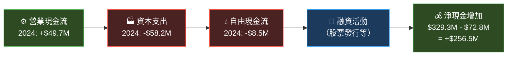

---

### 自由現金流趨勢

```
自由現金流（FCF）年度趨勢（百萬美元）
━━━━━━━━━━━━━━━━━━━━━━━━━━━━━━━━━━━━━━━━━━━━━━━━━━━━
                     正值區間（盈餘）
         ┌─────────────────────────────────────┐
$20M  →  │                            ●$12.8M │
 $0M  →  │─────────────────────────────────────│  基準線
         │  ●                ●                │
-$10M →  │ -$11.2M        -$8.5M (2024)       │
-$70M →  │                                    │
-$75M →  │       ● -$71.1M                    │
         └─────────────────────────────────────┘
              2021    2022    2023    2024

FCF 進度條（相對正常化）：
2021  -$11.2M  🔴 ░░░░░░░░░░░░░░░░░░░░░░░░░░░░░░  -負值
2022  -$71.1M  🔴 ░░░░░░░░░░░░░░░░░░░░░░░░░░░░░░  -最大負值
2023  +$12.8M  🟢 ▓▓▓▓▓▓▓░░░░░░░░░░░░░░░░░░░░░░░  +首次正值
2024   -$8.5M  🟡 ░░░░░░░░░░░░░░░░░░░░░░░░░░░░░░  -再度轉負
━━━━━━━━━━━━━━━━━━━━━━━━━━━━━━━━━━━━━━━━━━━━━━━━━━━━
```

---

### 資本配置策略

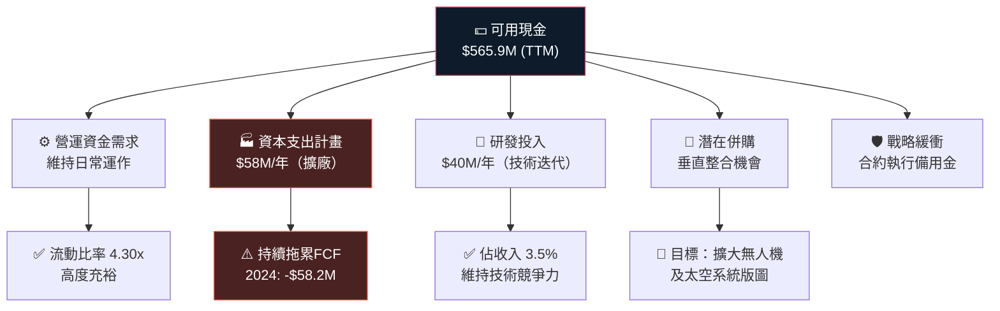

---

### 現金流關鍵指標對比

| 現金流指標 | 2021 | 2022 | 2023 | 2024 | 狀態 |
|-----------|------|------|------|------|------|
| 營業現金流 OCF | $35.3M | -$25.7M | $65.2M | $49.7M | 🟡 波動大 |
| 資本支出 CapEx | -$46.5M | -$45.4M | -$52.4M | -$58.2M | 🔴 持續增加 |
| 自由現金流 FCF | -$11.2M | -$71.1M | +$12.8M | -$8.5M | 🔴 仍難以穩定 |
| FCF/收入 | -1.4% | -7.9% | +1.2% | -0.7% | 🟡 邊際改善 |
| CapEx/收入 | 5.7% | 5.1% | 5.0% | 5.1% | 🟡 穩定但偏高 |

---

## 6. 獲利能力指標

### 獲利能力儀表板

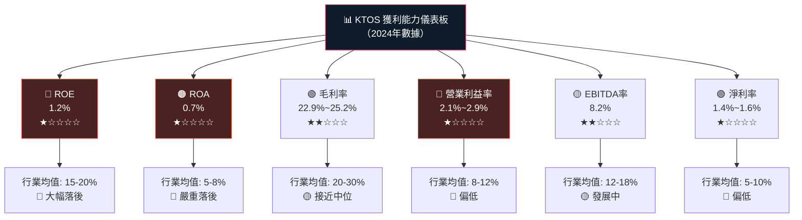

---

### ROE/ROA/毛利率對比表（含行業均值）

| 獲利指標 | KTOS 2024 | KTOS TTM | 行業均值 | S&P500均值 | 評級 |
|----------|-----------|----------|----------|-----------|------|
| 🔵 ROE | 1.2% | 1.2% | 15.8% | 18.2% | 🔴 嚴重落後 |
| 🟠 ROA | 0.7% | 0.7% | 6.3% | 8.1% | 🔴 嚴重落後 |
| 💚 毛利率 | 25.2% | 22.9% | 22.5% | 49.3% | 🟡 接近均值 |
| ⚙️ 營業利益率 | 2.9% | 2.1% | 10.2% | 17.4% | 🔴 落後 |
| 💰 EBITDA率 | 8.2% | — | 14.5% | 22.1% | 🟡 發展中 |
| 📋 淨利率 | 1.4% | 1.6% | 7.8% | 12.3% | 🔴 落後 |

---

### 獲利能力視覺化進度條

```
獲利能力相對於行業均值（%完成度）
━━━━━━━━━━━━━━━━━━━━━━━━━━━━━━━━━━━━━━━━━━━━━━━━━━━━
ROE       1.2% vs 15.8%  ▓░░░░░░░░░░░░░░░░░░░░░░░░░  7.6%  🔴
ROA       0.7% vs  6.3%  ▓▓░░░░░░░░░░░░░░░░░░░░░░░░░ 11.1%  🔴
毛利率   22.9% vs 22.5%  ▓▓▓▓▓▓▓▓▓▓▓▓▓▓▓▓▓▓▓▓▓▓▓▓▓▓▓101.8%  🟢
營業率    2.1% vs 10.2%  ▓▓▓▓▓░░░░░░░░░░░░░░░░░░░░░░ 20.6%  🔴
EBITDA%   8.2% vs 14.5%  ▓▓▓▓▓▓▓▓▓▓▓▓▓▓▓▓▓▓▓░░░░░░░ 56.6%  🟡
淨利率    1.4% vs  7.8%  ▓▓▓▓░░░░░░░░░░░░░░░░░░░░░░░ 17.9%  🔴
━━━━━━━━━━━━━━━━━━━━━━━━━━━━━━━━━━━━━━━━━━━━━━━━━━━━
```

> 📌 **核心洞察**：KTOS目前處於「成長型投資期」模式，獲利指標普遍低於行業均值，但這是典型的高成長防務科技企業的特徵。公司正從「研發投入期」過渡到「收穫期」。關鍵問題是：何時能見到顯著的利潤率擴張？

---

## 7. 估值分析

### 估值指標分解圖

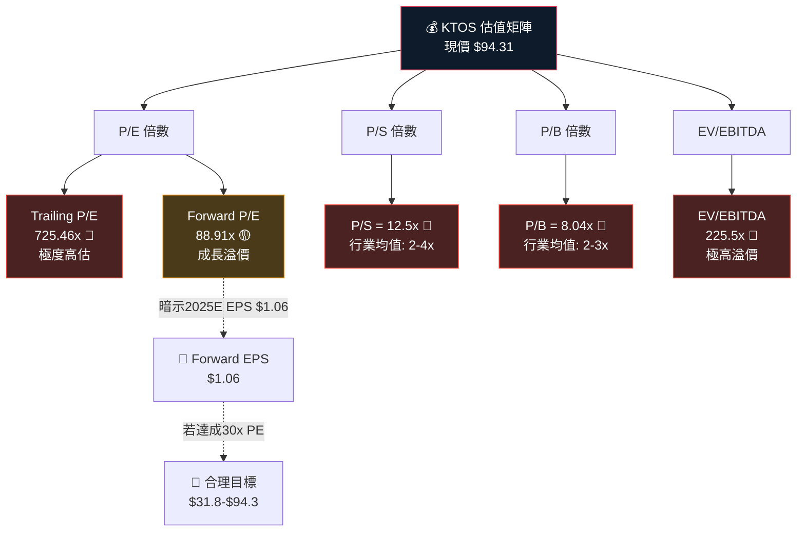

---

### 估值倍數對比表

| 估值指標 | KTOS | 行業均值 | LMT | RTX | HII | 溢價/折價 | 評級 |
|----------|------|----------|-----|-----|-----|-----------|------|
| Trailing P/E | 725x | 20-25x | 21x | 38x | 16x | **+2,900%** | 🔴 極高 |
| Forward P/E | 88.9x | 18-22x | 19x | 27x | 15x | **+304%** | 🔴 高溢價 |
| P/S 比 | 12.5x | 1.5-3x | 1.6x | 1.9x | 0.8x | **+316%** | 🔴 高溢價 |
| P/B 比 | 8.04x | 2-4x | 18x | 8x | 3x | 接近RTX | 🟡 合理偏高 |
| EV/EBITDA | 225.5x | 12-18x | 15x | 22x | 13x | **+1,153%** | 🔴 極高 |
| EV/Sales | ~12x | 1.5-2.5x | 1.6x | 2.0x | 0.8x | **+380%** | 🔴 高溢價 |

---

### 情境目標股價分析

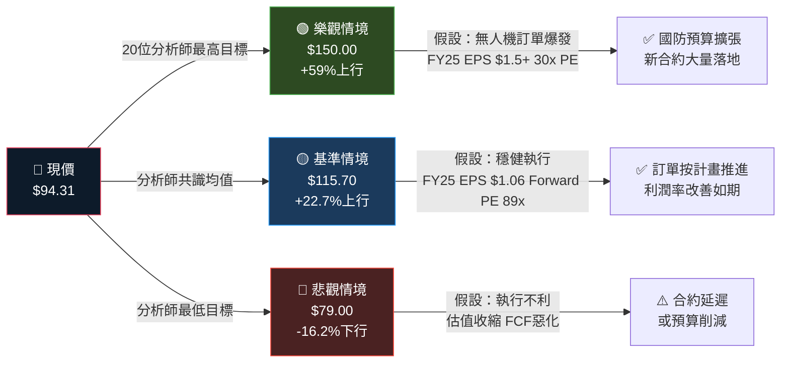

---

### 估值區間視覺化

```
目標股價區間視覺化
━━━━━━━━━━━━━━━━━━━━━━━━━━━━━━━━━━━━━━━━━━━━━━━━━━━━━━━━━━━━━
$0    $30   $60   $79   $94   $115  $134  $150
│─────│─────│─────│─────│─────│─────│─────│

       悲觀目標  現價  均值目標      52W高  樂觀目標
          ↓      ↓      ↓            ↓      ↓
         $79   $94.31 $115.70      $134   $150

           ████████████████░░░░░░░░░░░░
           ← 下行 16.2% → 現價 ← 上行 59% →

合理估值參考（基於Forward EPS $1.06）：
  25x PE  = $26.5  🔴 超低估值情境
  50x PE  = $53.0  🟡 成長折扣情境  
  89x PE  = $94.3  🟢 當前反映價位
  120x PE = $127.2 🟢 高成長溢價情境
━━━━━━━━━━━━━━━━━━━━━━━━━━━━━━━━━━━━━━━━━━━━━━━━━━━━━━━━━━━━━
```

---

## 8. 競爭護城河

### Porter's 五力分析

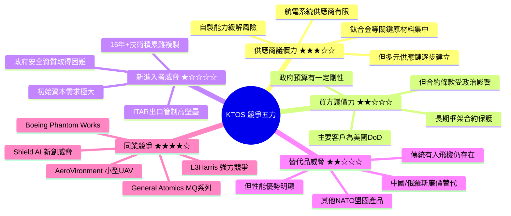

---

### 護城河評分

```
KTOS 護城河強度評估
━━━━━━━━━━━━━━━━━━━━━━━━━━━━━━━━━━━━━━━━━━━━━━━━━━━━
指標                  強度    視覺評分              評等
──────────────────────────────────────────────────────
政府合約壁壘          9/10    ▓▓▓▓▓▓▓▓▓░░  極強 🟢
ITAR技術限制保護       9/10    ▓▓▓▓▓▓▓▓▓░░  極強 🟢
技術專利積累          7/10    ▓▓▓▓▓▓▓░░░░  強   🟢
低成本無人機定位       8/10    ▓▓▓▓▓▓▓▓░░░  很強 🟢
客戶關係深度          8/10    ▓▓▓▓▓▓▓▓░░░  很強 🟢
品牌認知度            6/10    ▓▓▓▓▓▓░░░░░  中等 🟡
財務實力              5/10    ▓▓▓▓▓░░░░░░  中等 🟡
規模經濟效應          5/10    ▓▓▓▓▓░░░░░░  發展中🟡
商業市場拓展          4/10    ▓▓▓▓░░░░░░░  弱   🔴
整體護城河評分         7/10    ▓▓▓▓▓▓▓░░░░  強   🟢
━━━━━━━━━━━━━━━━━━━━━━━━━━━━━━━━━━━━━━━━━━━━━━━━━━━━
```

---

### 競爭定位矩陣

| 公司 | 技術創新 | 成本優勢 | 政府關係 | 規模 | 市值 | 整體評分 |
|------|----------|----------|----------|------|------|----------|
| **KTOS** | ★★★★★ | ★★★★☆ | ★★★★☆ | ★★☆☆☆ | $16B | 🟢 **86分** |
| General Atomics | ★★★★☆ | ★★★☆☆ | ★★★★★ | ★★★★☆ | 私有 | 🟢 82分 |
| AeroVironment | ★★★★☆ | ★★★☆☆ | ★★★★☆ | ★★☆☆☆ | $5B | 🟡 72分 |
| L3Harris | ★★★☆☆ | ★★★☆☆ | ★★★★★ | ★★★★★ | $30B | 🟡 74分 |
| Shield AI | ★★★★★ | ★★☆☆☆ | ★★★☆☆ | ★☆☆☆☆ | 私有 | 🟡 68分 |
| Boeing (UAV) | ★★★★☆ | ★★☆☆☆ | ★★★★★ | ★★★★★ | $110B | 🟡 76分 |

---

## 9. 成長催化劑

### 催化劑時間軸 Gantt

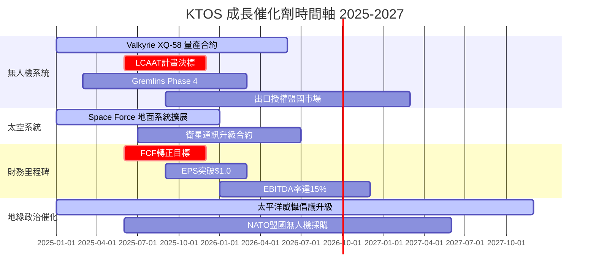

---

### 短/中/長期機會圖

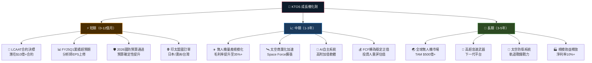

---

### TAM 市場規模

```
KTOS 目標市場規模（TAM）估算
━━━━━━━━━━━━━━━━━━━━━━━━━━━━━━━━━━━━━━━━━━━━━━━━━━━━━━━━
市場領域                  TAM規模    KTOS市佔率（估）
────────────────────────────────────────────────────────
全球軍用無人機市場         $320億     2.5%  ▓░░░░░░░░░░
美國DoD無人機採購          $150億     4.0%  ▓▓░░░░░░░░░
衛星地面系統市場           $80億      3.0%  ▓░░░░░░░░░░
電子戰/訓練系統            $60億      2.0%  ▓░░░░░░░░░░
網路安全（國防）           $40億      1.5%  ░░░░░░░░░░░
────────────────────────────────────────────────────────
合計 TAM                   ~$650億
KTOS 2030E可觸達市場       ~$200億
2030E 目標收入              ~$30-40億  成長潛力：+135%~+213%
━━━━━━━━━━━━━━━━━━━━━━━━━━━━━━━━━━━━━━━━━━━━━━━━━━━━━━━━
```

---

## 10. 風險分析

### 風險矩陣

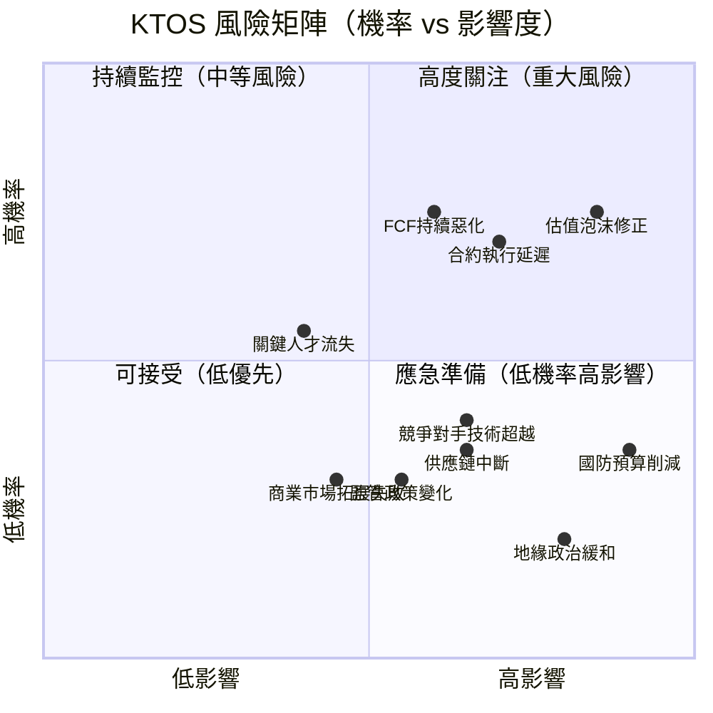

---

### 風險評分卡

| 風險類別 | 具體風險 | 機率 | 影響度 | 綜合評分 | 狀態 |
|----------|----------|------|--------|----------|------|
| 💰 估值風險 | **估值泡沫崩解**：P/E 725x難以為繼，情緒轉向時股價可下跌50-70% | 高 | 高 | **9/10** | 🔴 極高 |
| 📊 執行風險 | **合約執行延遲**：量產爬坡技術問題，交付時程推遲 | 中高 | 高 | **8/10** | 🔴 高 |
| 💵 現金流風險 | **FCF持續為負**：CapEx持續增加，資本效率無法改善 | 中高 | 中 | **7/10** | 🔴 高 |
| 🏛️ 政策風險 | **國防預算削減**：政治環境轉向，DOGE削減國防支出 | 低中 | 極高 | **7/10** | 🟡 中高 |
| 🏭 競爭風險 | **技術競爭加劇**：Shield AI、Anduril等新創崛起 | 中 | 中高 | **6/10** | 🟡 中 |
| 🔗 供應鏈風險 | **關鍵零組件短缺**：半導體、鈦合金供應瓶頸 | 中低 | 中 | **5/10** | 🟡 中 |
| 👤 人才風險 | **核心工程師流失**：矽谷科技公司高薪挖角 | 中低 | 中 | **4/10** | 🟡 中 |
| 🌍 地緣政治 | **地緣緊張緩和**：和平紅利削減軍費需求 | 低 | 高 | **4/10** | 🟡 低中 |
| 📋 監管風險 | **出口管制收緊**：ITAR規定影響盟國銷售 | 低 | 中 | **3/10** | 🟢 低 |

---

### 風險緩解措施

```
⚠️  風險緩解策略清單
━━━━━━━━━━━━━━━━━━━━━━━━━━━━━━━━━━━━━━━━━━━━━━━━━━━━━━━━━━━
1. 🔴 估值風險緩解
   ├─ 分批建倉，避免高點集中投入
   ├─ 設置嚴格停損點（建議低於$75）
   └─ 等待FCF轉正後重評合理估值

2. 🔴 執行風險緩解
   ├─ 密切追蹤季度業績電話會議
   ├─ 監控積壓訂單（Backlog）數據
   └─ 注意管理層指引更新

3. 🟡 現金流風險緩解
   ├─ 確認2024年現金儲備 $565.9M 充裕
   ├─ 監控每季OCF vs CapEx趨勢
   └─ 股票增發稀釋風險需關注

4. 🟡 政策風險緩解
   ├─ KTOS已嵌入多個必要性國防計畫
   ├─ 跨黨派支持國防現代化
   └─ 多元化政府客戶降低單一合約依賴
━━━━━━━━━━━━━━━━━━━━━━━━━━━━━━━━━━━━━━━━━━━━━━━━━━━━━━━━━━━
```

---

## 11. 公平價值估算

### DCF 模型架構

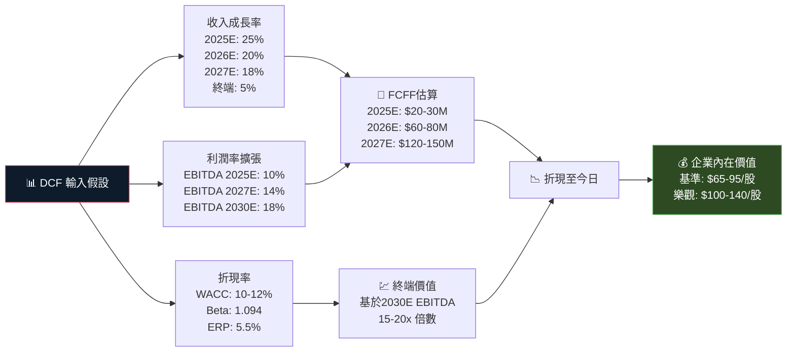

---

### 三種估值法比較

| 估值方法 | 方法描述 | 悲觀情境 | 基準情境 | 樂觀情境 | 權重 |
|----------|----------|----------|----------|----------|------|
| 📊 **DCF 折現現金流** | WACC 11%, 終端成長5% | $55 | $80 | $115 | 35% |
| 📈 **Forward P/E** | 2025E EPS $1.06, 50-120x PE | $53 | $95 | $127 | 30% |
| 💡 **EV/EBITDA** | 2025E EBITDA $140M, 60-120x | $49 | $90 | $140 | 20% |
| 📋 **P/S 比率** | 2025E 收入$1.55B, 8-14x | $73 | $104 | $145 | 15% |
| ━━━━━| ━━━━━━━━━━━━━━━━ | ━━━━ | ━━━━ | ━━━━ | ━━━━ |
| 🎯 **加權平均** | 綜合四種方法加權 | **$57** | **$90** | **$127** | 100% |
| 📍 **當前股價** | $94.31 | — | — | — | — |
| 📊 **相對當前** | 溢/折價% | -40% | -4.6% | +34.7% | — |

---

### 估值區間視覺化

```
公平價值估算區間（美元/股）
━━━━━━━━━━━━━━━━━━━━━━━━━━━━━━━━━━━━━━━━━━━━━━━━━━━━━━━━━━━━━━━━
$0    $30   $57   $80   $90  $94.31 $115  $127  $150
│─────│─────│─────│─────│─────│─────│─────│─────│

悲觀DCF         │                             
   ↓            │
  $57           │    合理區間        現價
                │    ┌───────────┐    ↓
                │    │ $80-$127  │  $94.31
                │    │           │    ↓
                │────┼─────█─────┼────▲─────────
                │    │  樂觀均值  │
                │    └───────────┘
                
█ 基準目標 $90    ▲ 現價 $94.31（輕微高於基準）

結論：現價 $94.31 已接近基準公平價值上緣
     需要業績兌現支撐，否則估值壓力較大
━━━━━━━━━━━━━━━━━━━━━━━━━━━━━━━━━━━━━━━━━━━━━━━━━━━━━━━━━━━━━━━━
```

---

## 12. 投資建議

### 最終評級

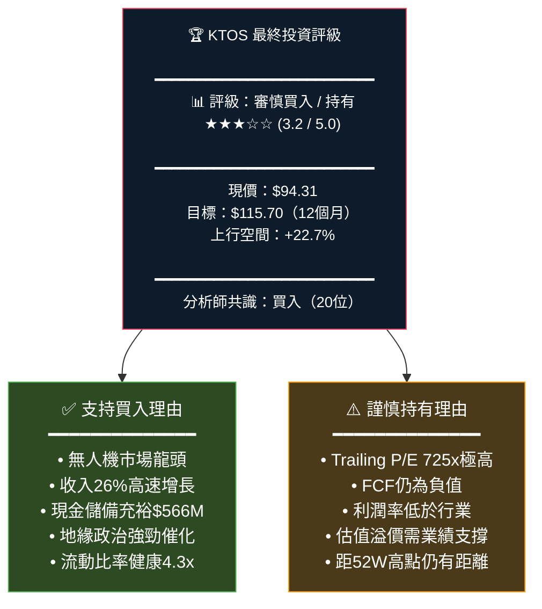

---

### 投資人適配度分析

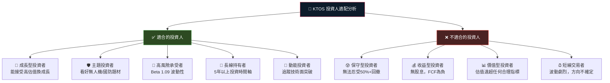

---

### 投資組合建議

```
資產配置建議（根據風險偏好）
━━━━━━━━━━━━━━━━━━━━━━━━━━━━━━━━━━━━━━━━━━━━━━━━━━━━━
風險偏好    建議倉位    進場策略           停損點
────────────────────────────────────────────────────
保守型       0%        觀望等待FCF轉正     N/A
穩健型       1-2%      逢回落$75-85買入    $65
成長型       3-5%      分批建倉            $70
積極型       5-8%      現價適量介入        $75
主題型       8-10%     重倉無人機主題      $80
━━━━━━━━━━━━━━━━━━━━━━━━━━━━━━━━━━━━━━━━━━━━━━━━━━━━━
```

---

### 監控指標 Checklist

```
📋 KTOS 核心監控指標（季度追蹤）
━━━━━━━━━━━━━━━━━━━━━━━━━━━━━━━━━━━━━━━━━━━━━━━━━━━━━━━━━━

【財務指標】
☑ 季度收入成長率 > 20%（目標達成才維持估值）
☑ EBITDA利潤率 持續朝15%目標推進
☑ 自由現金流 逐季改善，目標2025H2轉正
☑ 訂單積壓（Backlog）是否持續創新高
☑ CapEx強度是否開始下降（規模化後）

【業務指標】
☑ Valkyrie XQ-58A 量產進度更新
☑ LCAAT競爭合約最新進展
☑ 新合約公告（每筆>$50M需特別關注）
☑ 盟國出口訂單（日本/澳洲/台灣）
☑ 太空系統業務成長軌跡

【宏觀催化劑】
☑ 美國國防預算（FY2026+）通過情況
☑ 太平洋威懾倡議（PDI）資金撥付
☑ 地緣政治緊張程度（俄烏/台海）
☑ DOGE政策對DoD採購的具體影響

【估值警示】
🔴 若FCF連續兩季惡化 → 重新評估持倉
🔴 若收入增速跌破15% → 估值大幅收縮風險
🟡 若股價跌破$75 → 考慮加倉機會
🟢 若FY25 EPS超過$1.20 → 上修目標至$130+
━━━━━━━━━━━━━━━━━━━━━━━━━━━━━━━━━━━━━━━━━━━━━━━━━━━━━━━━━━
```

---

### 12個月價格目標摘要

```
KTOS 12個月投資情境摘要
━━━━━━━━━━━━━━━━━━━━━━━━━━━━━━━━━━━━━━━━━━━━━━━━━━━━━━━━━━━━━
情境        觸發條件                    目標股價    機率
─────────────────────────────────────────────────────────────
🟢 樂觀     LCAAT大合約+FY25超預期       $140-150    25%
            • 年營收突破$1.6B
            • EBITDA率達12%
            • FCF明確轉正

🟡 基準     穩健執行，分析師預期達成      $110-120    45%
            • 年營收$1.5B
            • 前向EPS $1.06實現
            • FCF持平至微正

🔴 悲觀     估值修正+執行不達標           $60-75      30%
            • 成長放緩至15%以下
            • 估值倍數收縮
            • 國防預算不確定

─────────────────────────────────────────────────────────────
加權平均目標股價：≈ $103-110              現價：$94.31
潛在上行空間：+9.2% ~ +16.6%
━━━━━━━━━━━━━━━━━━━━━━━━━━━━━━━━━━━━━━━━━━━━━━━━━━━━━━━━━━━━━
```

---

## 報告總結

```mermaid
graph TD
    SUMMARY["📊 KTOS 投資論文