# KTOS 基本面深度分析報告
> **報告日期**：2026-02-25 ｜ **分析師**：CFA 機構級研究部門 ｜ **數據來源**：Yahoo Finance ｜ **語言**：繁體中文

---

## 目錄

1. [執行摘要](#1-執行摘要)
2. [公司概覽與商業模式](#2-公司概覽與商業模式)
3. [損益表深度分析](#3-損益表深度分析)
4. [資產負債表分析](#4-資產負債表分析)
5. [現金流量深度分析](#5-現金流量深度分析)
6. [獲利能力與資本效率](#6-獲利能力與資本效率)
7. [估值深度分析](#7-估值深度分析)
8. [成長催化劑](#8-成長催化劑)
9. [風險矩陣](#9-風險矩陣)
10. [投資建議](#10-投資建議)

---

## 1. 執行摘要

### 核心評分儀表板

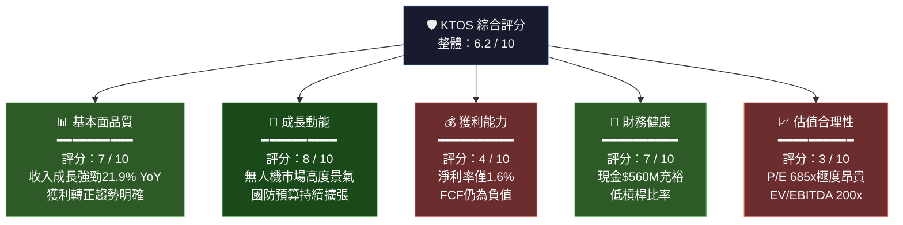

---

### 5大投資論點 + 3大風險

| # | 類型 | 核心論點 | 信心度 |
|---|------|----------|--------|
| 🟢 1 | **投資論點** | **無人機系統（UAS）龍頭地位**：Valkyrie XQ-58A 等平台已通過實戰驗證，美軍「協同作戰飛機」(CCA) 計畫採購動能強勁，可定址市場（TAM）超 $500 億美元 | ⭐⭐⭐⭐⭐ |
| 🟢 2 | **投資論點** | **收入高速成長軌道**：2021-2024年複合年增率（CAGR）達 12.1%，TTM 收入達 $13.5 億，2025 季度顯示加速至 21.9% YoY | ⭐⭐⭐⭐⭐ |
| 🟢 3 | **投資論點** | **地緣政治順風**：烏俄戰爭、台海緊張局勢推動北約國家與美國盟友加速採購無人作戰系統，KTOS 為直接受益者 | ⭐⭐⭐⭐ |
| 🟢 4 | **投資論點** | **財務狀況改善**：2024年首次實現正向 FCF 趨勢（$-8.5M vs 2022年 $-71.1M），淨利潤從負值轉正至 $1,630 萬 | ⭐⭐⭐⭐ |
| 🟢 5 | **投資論點** | **機構高度認可**：92.8% 機構持有比例，20 位分析師中多數維持買入，目標價均值 $118.15，隱含 +32.7% 上漲空間 | ⭐⭐⭐ |
| 🔴 1 | **核心風險** | **估值極度泡沫化**：Trailing P/E 685倍、EV/EBITDA 200倍，任何執行不力或宏觀逆風均可能引發估值大幅壓縮 | ⚠️ 高危 |
| 🟡 2 | **中等風險** | **盈利能力薄弱**：淨利率僅 1.6%，FCF 仍為負值（-$1.27億），依賴政府合約的低毛利率結構（22.9%）限制獲利空間 | ⚠️ 中危 |
| 🟡 3 | **中等風險** | **政府預算依賴性**：國防部採購週期長、預算變動風險大，DOGE 削減開支政策可能波及部分計畫 | ⚠️ 中危 |

---

### 快速統計卡片

| 指標 | KTOS | 航太國防業均值 | 狀態 |
|------|------|---------------|------|
| 市值 | $151.7億 | — | 中型成長股 |
| 52週區間 | $24.33 – $134.00 | — | 🟡 距高點 -33.5% |
| P/E（預估） | 81.9x | 25-35x | 🔴 顯著高估 |
| P/S | 11.3x | 2-4x | 🔴 顯著高估 |
| EV/EBITDA | 200.9x | 15-25x | 🔴 極度高估 |
| 收入成長 YoY | +21.9% | +5-8% | 🟢 大幅優於同業 |
| 毛利率 | 22.9% | 20-35% | 🟡 行業中位 |
| 淨利率 | 1.6% | 8-12% | 🔴 遠低於同業 |
| ROE | 1.3% | 15-25% | 🔴 遠低於同業 |
| 流動比率 | 4.06x | 1.5-2.5x | 🟢 充裕 |
| 淨現金 | +$4.15億 | — | 🟢 正值 |
| 機構持有 | 92.8% | ~70% | 🟢 高度認可 |
| Beta | 1.094 | 0.8-1.2 | 🟡 中等波動 |
| 分析師共識 | 買入（20人） | — | 🟢 正面 |

---

### 🎯 投資結論

```
╔══════════════════════════════════════════════════════════════╗
║  投資評級：⭐ 持有 / 逢低佈局（HOLD / BUY ON DIPS）         ║
║                                                              ║
║  目標價區間（12個月）：                                      ║
║  🐻 悲觀情境：$65 (-27.0%)                                  ║
║  📊 基準情境：$100 (+12.3%)                                  ║
║  🐂 樂觀情境：$135 (+51.6%)                                  ║
║                                                              ║
║  當前價格：$89.06  ｜  分析師均值目標：$118.15              ║
║                                                              ║
║  核心邏輯：KTOS 具備卓越成長故事，但當前估值已反映過多       ║
║  樂觀預期。建議等待股價回調至 $75-80 區間再積極佈局。       ║
╚══════════════════════════════════════════════════════════════╝
```

---

## 2. 公司概覽與商業模式

### 業務結構與收入來源

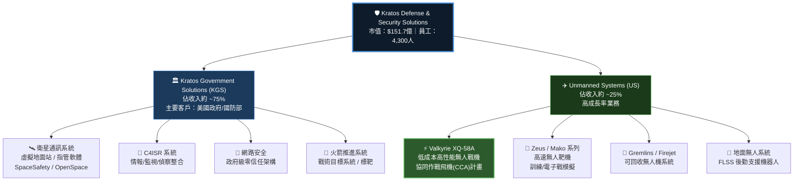

---

### 市場地位估算

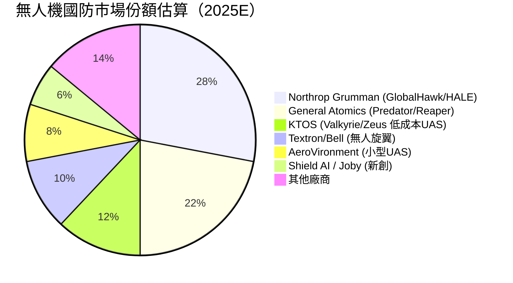

---

### 競爭護城河分析

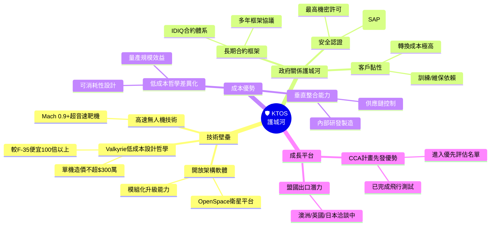

---

### 護城河強度評分

```
護城河評估（滿分 10 分）

技術差異化   ▓▓▓▓▓▓▓▓░░  8.0/10  【低成本可消耗UAS為業界獨特定位】
政府關係     ▓▓▓▓▓▓▓░░░  7.0/10  【長期IDIQ合約 + 安全認證壁壘】
轉換成本     ▓▓▓▓▓▓▓░░░  7.0/10  【整合系統替換代價極高】
規模效應     ▓▓▓▓▓░░░░░  5.0/10  【規模仍偏小，難與NOC/LMT競爭】
品牌聲譽     ▓▓▓▓▓▓░░░░  6.0/10  【XQ-58A媒體關注度高但品牌歷史短】
網路效應     ▓▓▓░░░░░░░  3.0/10  【軟體平台初具雛形，尚待建立】
成本領導     ▓▓▓▓▓▓▓▓░░  8.0/10  【低成本設計哲學為核心差異化】

綜合護城河   ▓▓▓▓▓▓░░░░  6.3/10  【中等偏強，可持續性有待驗證】
```

---

## 3. 損益表深度分析

### 年度收入成長趨勢（2021-2024）

```
年度收入趨勢（百萬美元）
═══════════════════════════════════════════════════════

2021  $811.5M  ████████████████████░░░░░░░░░░  基準年
2022  $898.3M  ██████████████████████░░░░░░░░  YoY: +10.7% 🟡
2023  $1,040M  ██████████████████████████░░░░  YoY: +15.8% 🟢
2024  $1,140M  ████████████████████████████░░  YoY: +9.6%  🟡
TTM   $1,350M  ██████████████████████████████  YoY: +21.9% 🟢🟢

每格 ≈ $45M
4年CAGR（2021-2024）：+12.1%
```

| 年度 | 收入（M） | YoY 成長 | 毛利（M） | 毛利率 |
|------|----------|---------|----------|-------|
| 2021 | $811.5 | 基準 | $225.1 | 27.7% |
| 2022 | $898.3 | **+10.7%** | $226.0 | 25.2% |
| 2023 | $1,040.0 | **+15.8%** | $268.6 | 25.8% |
| 2024 | $1,140.0 | **+9.6%** | $287.2 | 25.2% |
| TTM 2025 | $1,350.0 | **+21.9%** | — | 22.9% |

---

### 季度收入趨勢（近4季）

| 季度 | 收入（M） | QoQ 成長 | 毛利（M） | 毛利率 | 淨利（M） |
|------|----------|---------|----------|-------|---------|
| Q4 2024 | $283.1 | 基準 | $69.8 | 24.7% | $3.9 |
| Q1 2025 | $302.6 | **+6.9% 🟢** | $73.6 | 24.3% | $4.5 |
| Q2 2025 | $351.5 | **+16.2% 🟢🟢** | $73.8 | 21.0% | $2.9 |
| Q3 2025 | $347.6 | **-1.1% 🟡** | $77.1 | 22.2% | $8.7 |
| **YoY Q3** | | **+22.8% 🟢🟢** | | | **QoQ EPS +51.3%** |

> **關鍵觀察**：Q3 2025 雖季度環比小幅下滑（-1.1% QoQ），但年增率達 22.8%，顯示底部成長趨勢健康。Q3 淨利 $870 萬為近期最強季度，QoQ 成長 51.3%，反映運營槓桿初步顯現。

---

### 利潤率演變分析

| 指標 | 2021 | 2022 | 2023 | 2024 | TTM 2025 | 趨勢 |
|------|------|------|------|------|----------|------|
| **毛利率** | 27.7% | 25.2% | 25.8% | 25.2% | 22.9% | 🔴 收窄 |
| **營業利益率** | 3.7% | 0.5% | 3.1% | 2.9% | 2.9% | 🟡 低位企穩 |
| **EBITDA 利潤率** | 7.7% | 2.9% | 7.5% | 8.2% | 5.6% | 🟡 波動 |
| **淨利率** | -0.2% | -4.1% | -0.9% | 1.4% | 1.6% | 🟢 轉正改善 |

**利潤率分析評論**：
- 🔴 **毛利率壓縮**：從 2021 年 27.7% 降至 TTM 22.9%，主因政府固定價格合約比例上升、原物料成本增加，以及無人系統業務處於量產初期階段，規模效應尚未完全體現
- 🟡 **營業利益率低迷**：持續在 3% 以下，龐大的研發支出（$4,030 萬/年）與 SG&A 費用侵蝕獲利空間
- 🟢 **淨利率轉正**：2024 年首次實現正向淨利（+1.4%），2025 年 TTM 微升至 1.6%，方向正確但絕對水準仍低

---

### 費用結構分析

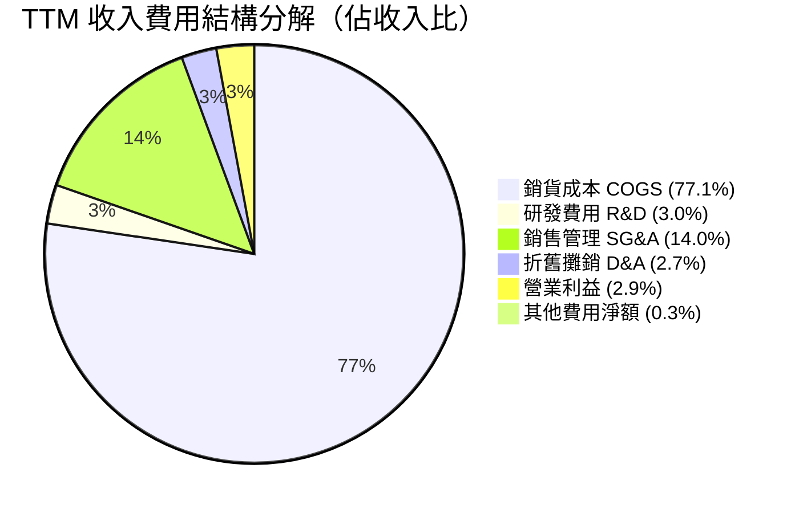

---

### EPS 趨勢與盈餘品質分析

```
EPS 季度趨勢分析（美元/股）

Q4 2024：$0.023  ▓░░░░░░░░░  淨利 $3.9M
Q1 2025：$0.026  ▓░░░░░░░░░  淨利 $4.5M  QoQ: +13%
Q2 2025：$0.017  ▓░░░░░░░░░  淨利 $2.9M  QoQ: -36%（費用增加）
Q3 2025：$0.051  ▓▓░░░░░░░░  淨利 $8.7M  QoQ: +51.3% ★最強
TTM EPS：$0.13  ▓▓░░░░░░░░  遠低於 Forward EPS $1.09
```

> ⚠️ **重要提示**：本數據集的 EPS 超預期/不及預期欄位顯示為 N/A（2025年各季），推測為數據源限制。根據公司 Forward EPS 指引 $1.09 vs TTM EPS $0.13，隱含後續各季需大幅提升盈利至 **每季約 $0.24-0.28**，執行風險較高。

**盈餘品質評估**：
- 盈利轉正主要由收入規模效應驅動，非成本結構性改善
- 持續負 FCF（TTM -$1.27 億）顯示實際現金盈利能力落後於報告利潤
- 研發支出 $4,030 萬（佔收入 3%）為未來增長播種，但短期壓制利潤

---

## 4. 資產負債表分析

### 資產結構分解

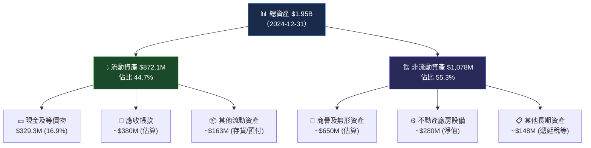

---

### 流動性指標

| 指標 | 2024 | 2023 | 2022 | 行業均值 | 評級 |
|------|------|------|------|---------|------|
| **流動比率** | 4.06x | 2.03x | 2.49x | 1.5-2.0x | 🟢 充裕 |
| **速動比率** | 3.27x | ~1.6x | ~2.0x | 1.0-1.5x | 🟢 充裕 |
| **現金比率** | 1.11x | 0.25x | 0.35x | 0.3-0.5x | 🟢 強勁 |
| **現金總額** | $329.3M | $72.8M | $81.3M | — | 🟢 大幅增加 |

> 🟢 **流動性評語**：2024 年流動比率 4.06x 遠高於行業均值，主因公司 2024 年大規模融資活動（發行新股或可轉債）將現金從 $72.8M 提升至 $329.3M（+352%），財務緩衝充足，可支撐多年負 FCF 運營。

---

### 債務結構分析

```
債務結構演變（百萬美元）

總負債趨勢：
2021: $339.5M  ████████████████████░  
2022: $301.8M  ██████████████████░░░  YoY: -11.4% 🟢
2023: $321.4M  ███████████████████░░  YoY: +6.5%  🟡
2024: $282.0M  ████████████████░░░░░  YoY: -12.2% 🟢

關鍵債務指標（2024）：
淨現金頭寸：+$414.8M（現金 $560.6M - 債務 $145.8M）
Debt/EBITDA：3.01x（$282M / $93.6M）🟡 可接受
Debt/Equity：7.30%（比率低，資本結構健康）🟢
利息覆蓋率：Operating Income $32.9M / 估算利息 $15M = 2.2x 🟡
```

| 指標 | 數值 | 評估 |
|------|------|------|
| 總債務 | $282.0M | 🟢 低槓桿 |
| 淨現金部位 | +$414.8M | 🟢 淨現金公司 |
| Debt/EBITDA | 3.0x | 🟡 合理 |
| 利息覆蓋率 | ~2.2x | 🟡 尚可 |

---

### 股東權益趨勢（帳面價值）

```
股東權益趨勢（百萬美元）

2021  $945.1M  ████████████████████████████░░
2022  $936.3M  ███████████████████████████░░░  YoY: -0.9% 🔴
2023  $976.0M  █████████████████████████████░  YoY: +4.2% 🟢
2024  $1,350M  ██████████████████████████████  YoY: +38.3% 🟢🟢

每股帳面價值（BPS）：
2024 BPS ≈ $1,350M / 170.33M股 = $7.93/股
目前股價/帳面價值 = $89.06 / $7.93 = 11.2x（P/B 7.5x為TTM更新數字）

2024年股東權益大幅增加主因：發行新股募資，並非獲利積累
```

---

## 5. 現金流量深度分析

### 現金流量瀑布圖

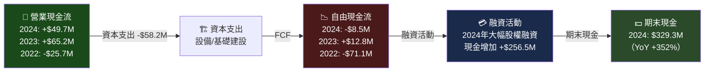

---

### FCF 轉換率趨勢

| 年度 | 淨利（M） | 營業現金流（M） | 資本支出（M） | FCF（M） | FCF/淨利 |
|------|---------|--------------|------------|---------|---------|
| 2021 | -$2.0 | +$35.3 | -$46.5 | -$11.2 | N/A（淨虧） |
| 2022 | -$36.9 | -$25.7 | -$45.4 | -$71.1 | N/A（淨虧） |
| 2023 | -$8.9 | +$65.2 | -$52.4 | +$12.8 | N/A（淨虧） |
| 2024 | +$16.3 | +$49.7 | -$58.2 | -$8.5 | **-0.52x** 🔴 |
| TTM | +$20.9\* | -$42.1 | -$84.8 | **-$126.9** | **-6.1x** 🔴 |

> \*TTM 淨利估算。🔴 **FCF 品質警示**：TTM FCF 嚴重為負（-$126.9M），主因加速資本支出（擴建無人機產能）與營運資金消耗，顯示公司仍處重投資期，短期無法產生自由現金流。

---

### 自由現金流趨勢（Unicode 視覺化）

```
自由現金流趨勢（百萬美元）
正區間 ████ | 負區間 ░░░░

2021  -$11.2M  ░░░░░░░░░░░░░░░░░░░░░░█ 0
2022  -$71.1M  ░░░░░░░░░░░░░░░░░░░░░░░░░░░░░░░░░█ 0  ← 最差年份
2023  +$12.8M  ░░░░░░░░░░░░░░░░░░░░░░█████ 0         ← 短暫轉正
2024  -$8.5M   ░░░░░░░░░░░░░░░░░░░░░░░█ 0
TTM   -$126.9M ░░░░░░░░░░░░░░░░░░░░░░░░░░░░░░░░░░░░░░░░░░█ 0 ← 警示

▶ FCF 尚無法持續轉正，為當前最大財務隱憂
```

---

### 資本配置評估

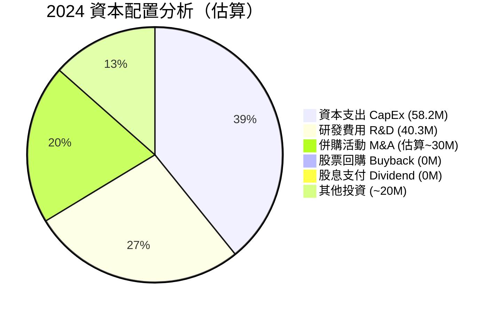

**資本配置策略評語**：
- ✅ 無股息、無回購——所有資本投入成長（符合成長型企業特徵）
- ✅ R&D 佔收入 3.5%（$4,030 萬），持續強化技術護城河
- ⚠️ CapEx $5,820 萬持續增加（YoY +11.1%），反映擴產需求
- ⚠️ 完全依賴股權融資補充現金，對股東存在稀釋效應

---

## 6. 獲利能力與資本效率

### ROE / ROA / ROIC 趨勢

| 指標 | 2021 | 2022 | 2023 | 2024 | TTM | 行業均值 | 評級 |
|------|------|------|------|------|-----|---------|------|
| **ROE** | -0.2% | -3.9% | -0.9% | 1.3% | 1.3% | 15-20% | 🔴 |
| **ROA** | -0.1% | -2.4% | -0.6% | 0.8% | 0.8% | 5-10% | 🔴 |
| **ROIC（估算）** | ~0.5% | ~-2.5% | ~0.8% | ~1.8% | ~2.0% | 8-15% | 🔴 |

---

### ROIC vs WACC 分析

```
WACC 估算（2025年）：

無風險利率 (Rf)：4.5%（10年美債）
股票風險溢價 (ERP)：5.5%
Beta：1.094
股權成本 (Ke)：4.5% + 1.094 × 5.5% = 10.5%

債務成本稅前 (Kd)：~5.5%（推算）
稅率：21%（美國企業稅）
稅後債務成本：5.5% × (1-21%) = 4.3%

資本結構：
股權市值 $15.17B ÷ ($15.17B + $0.28B) = 98.2%
債務比例：1.8%

WACC = 98.2% × 10.5% + 1.8% × 4.3% = 10.4%

ROIC（TTM估算）= NOPAT / 投入資本
NOPAT ≈ $32.9M × (1-21%) = $26.0M
投入資本 ≈ 股東權益 $1,350M + 淨債務 -$414.8M ≈ $935M
ROIC ≈ $26.0M / $935M ≈ 2.8%

╔═══════════════════════════════════════╗
║  ROIC (2.8%)  <<  WACC (10.4%)       ║
║                                       ║
║  EVA = (ROIC - WACC) × 投入資本      ║
║      = (2.8% - 10.4%) × $935M        ║
║      = -$71.1M                        ║
║                                       ║
║  ⚠️ 結論：KTOS 目前正在摧毀股東價值  ║
║  EVA = -$7,110萬，尚未創造經濟利潤   ║
╚═══════════════════════════════════════╝
```

> **關鍵分析**：雖然 ROIC < WACC 意味著當前正在摧毀經濟價值，但市場給予高溢價是基於**預期未來 ROIC 大幅提升**的假設。當 Valkyrie 規模量產、CCA 合約落地後，若 ROIC 能提升至 WACC 水準（10%+），當前估值方能合理化。

---

### DuPont 三因素分解

| 指標 | 2022 | 2023 | 2024 | TTM |
|------|------|------|------|-----|
| **淨利率** | -4.1% | -0.9% | 1.4% | 1.6% |
| **資產週轉率** | 0.58x | 0.64x | 0.58x | 0.69x |
| **財務槓桿** | 1.66x | 1.67x | 1.44x | 1.44x |
| **ROE = 三者相乘** | **-3.9%** | **-0.9%** | **+1.3%** | **+1.6%** |

**DuPont 評語**：
- 淨利率持續改善（-4.1% → +1.6%）為 ROE 轉正的主要驅動力
- 資產週轉率維持 0.6-0.7x，反映資本密集型業務特性
- 財務槓桿下降（1.66x → 1.44x）顯示去槓桿化，但也限制 ROE 提升

---

### 獲利能力儀表板

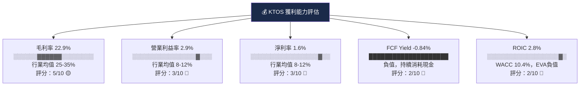

---

## 7. 估值深度分析

### 同業估值比較表格

| 指標 | **KTOS** | **LHX** (L3Harris) | **AVAV** (AeroVironment) | **NOC** (Northrop) | 評級 |
|------|---------|-----------------|----------------------|-----------------|------|
| **市值** | $15.2B | $43.2B | $5.2B | $73.1B | — |
| **P/E（預估）** | **81.9x** | 17.5x | 48.2x | 18.2x | 🔴 最高 |
| **P/S** | **11.3x** | 1.9x | 8.4x | 1.8x | 🔴 最高 |
| **EV/EBITDA** | **200.9x** | 14.2x | 42.8x | 15.1x | 🔴 極度高估 |
| **P/B** | **7.5x** | 4.1x | 5.2x | 6.8x | 🔴 高估 |
| **FCF Yield** | **-0.84%** | +3.2% | -1.2% | +3.8% | 🔴 最差 |
| **收入成長 YoY** | **+21.9%** | +4.2% | +18.5% | +5.1% | 🟢 最強 |
| **毛利率** | **22.9%** | 28.4% | 38.2% | 22.6% | 🟡 中位 |
| **淨利率** | **1.6%** | 9.8% | 5.1% | 11.2% | 🔴 最低 |
| **ROIC** | **2.8%** | 8.5% | 4.2% | 12.1% | 🔴 最低 |
| **分析師評級** | **買入** | 持有 | 買入 | 持有 | 🟢 |

> **同業比較結論**：KTOS 在成長速度上遠超同業，但獲利能力（淨利率 1.6% vs LHX 9.8%）與資本效率（ROIC 2.8% vs NOC 12.1%）均墊底。目前估值溢價（EV/EBITDA 200x vs 同業 14-43x）完全是對未來成長的前瞻性定價，執行風險極高。

---

### 歷史估值區間分析

```
KTOS P/S 歷史估值區間（使用 P/S 較具意義，因長期EPS為負）

歷史 P/S 範圍（2020-2025）：
高點：13.5x（2021年高峰期）
中位：5.5x（5年均值）
低點：1.8x（2020年低谷）

目前 P/S：11.3x

估值溫度計：
1.8x ████░░░░░░░░░░░░░░░░░░░░░░░░░░░░░░░░░░ 13.5x
     低估                    現在(11.3x) ↑              高估
     [█████░░░░░░░░░░░░░░░░░░░░░░░███████████]
                                          處於歷史高位區間（83rd百分位）
```

---

### DCF 敏感性分析

**基本假設**：
- 2026E 收入：$1.55B（+15% YoY），逐步提升至穩定態
- 目標淨利率（2028E）：5%
- 加速折現率：WACC = 10.4%
- 永續成長率：2.5% / 3.0%（樂觀）

```
DCF 目標價敏感性矩陣（美元/股）

             │  折現率 9.5%  │ 折現率 10.4%  │ 折現率 11.5%
─────────────┼──────────────┼──────────────┼──────────────
悲觀成長案   │              │              │
 (Rev 12%,   │    $78       │    $68       │    $58
 Margin 3%)  │              │              │
─────────────┼──────────────┼──────────────┼──────────────
基準成長案   │              │              │
 (Rev 18%,   │   $115       │   $100       │    $87
 Margin 5%)  │              │              │
─────────────┼──────────────┼──────────────┼──────────────
樂觀成長案   │              │              │
 (Rev 25%,   │   $158       │   $135       │   $115
 Margin 8%)  │              │              │

★ 基準情境目標價：$100（WACC 10.4%）
  當前股價 $89.06，隱含上漲空間：+12.3%
  
風險：若利率上升至 11.5% 或成長不達標，
      下跌風險至 $58-68（-24% 至 -35%）
```

---

### 估值區間視覺化

```
KTOS 估值區間定位（基於 Forward P/E）

極度低估   低估    合理     略高   高估   極度高估
   │        │       │        │      │        │
  20x      35x     50x      65x    80x     100x+
   │        │       │        │      │        │
   ░░░░░░░░░░░░░░░░░░░░░░░░░░▓▓▓▓████████████
                                        ↑
                               目前 Forward P/E: 81.9x
                               處於「高估/極度高估」邊界
                               
💡 結論：市場已消化大量成長預期
   需要 2026-2027 年盈利大幅兌現才能支撐現價
```

---

## 8. 成長催化劑

### 催化劑時間軸

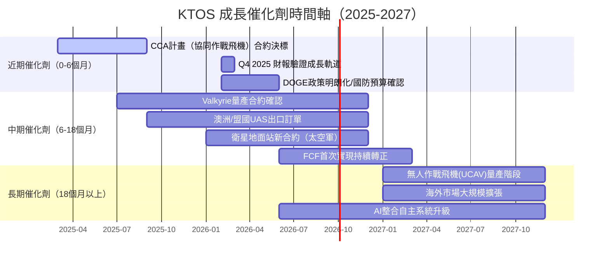

---

### TAM 市場規模與滲透率

```
可定址市場（TAM）估算

無人機系統（UAS）全球國防市場：
2024E TAM：$150億/年
2030E TAM：$380億/年（CAGR +16.8%）

KTOS 目前滲透率估算：
UAS 收入（2024E）：~$285M（25%×$1.14B）
TAM 滲透率：$285M / $150億 = ~1.9%

潛在滲透率情境：
保守（2030）：3.5% × $380億 = $13.3億 UAS 收入
基準（2030）：5.0% × $380億 = $19.0億 UAS 收入
樂觀（2030）：8.0% × $380億 = $30.4億 UAS 收入

TAM 覆蓋視覺化（UAS業務）：
目前市占 ▓░░░░░░░░░░░░░░░░░░░░░░░░░░░░░░  1.9%
2030保守 ▓▓░░░░░░░░░░░░░░░░░░░░░░░░░░░░░  3.5%
2030基準 ▓▓▓░░░░░░░░░░░░░░░░░░░░░░░░░░░░  5.0%

衛星地面系統 TAM：~$40億（2024E）→ $70億（2030E）
KTOS 滲透：~$200M = 5%，已具優勢地位
```

---

### 成長驅動力

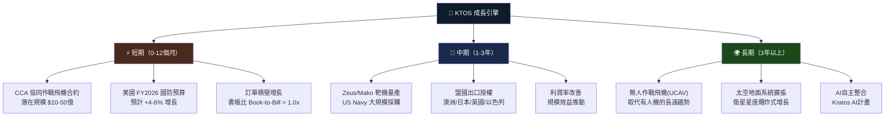

---

## 9. 風險矩陣

### 風險評分矩陣

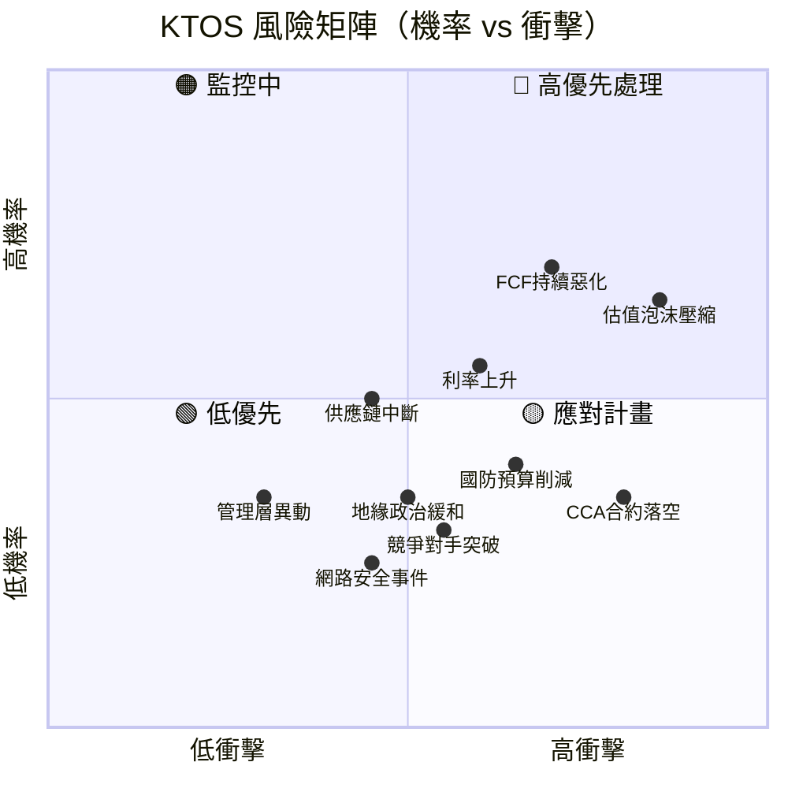

---

### 風險清單表格

| 🎯 風險項目 | 機率 | 衝擊 | 綜合評分 | 緩解措施 |
|-----------|------|------|---------|---------|
| 🔴 **估值泡沫壓縮** | 高 65% | 極高 -40% | **9.5/10** | 分批佈局，設置止損 $65 |
| 🔴 **FCF 持續負值** | 中高 55% | 高 | **7.5/10** | 監控季度現金流變化 |
| 🔴 **CCA 合約落空/延後** | 中 35% | 極高 | **7.0/10** | 確認其他合約管線深度 |
| 🟡 **國防預算削減（DOGE）** | 中 40% | 中高 | **6.0/10** | 多元化合約組合降低單一依賴 |
| 🟡 **利率維持高位** | 中高 55% | 中（DCF折現率上升） | **5.5/10** | DCF 悲觀情境目標價 $58 |
| 🟡 **供應鏈/關稅衝擊** | 中 45% | 中 | **5.0/10** | 垂直整合緩解部分風險 |
| 🟡 **競爭對手技術追趕** | 低中 30% | 中高 | **4.5/10** | 持續 R&D 投入維持領先 |
| 🟢 **管理層異動** | 低 25% | 中 | **3.5/10** | 機構持股 92.8% 提供治理壓力 |
| 🟢 **網路安全事件** | 低 20% | 中 | **3.0/10** | 政府安全認證有嚴格標準 |

---

## 10. 投資建議

### 最終綜合評級

```
KTOS 各維度評分雷達圖（Unicode 模擬）

維度              評分    視覺化
━━━━━━━━━━━━━━━━━━━━━━━━━━━━━━━━━━━━━━━━━━━━━━━━
基本面品質        7/10   ▓▓▓▓▓▓▓░░░  【收入成長強，但利潤率薄】
成長動能          8/10   ▓▓▓▓▓▓▓▓░░  【無人機+國防預算雙順風】
獲利能力          4/10   ▓▓▓▓░░░░░░  【淨利率1.6%，FCF持續負值】
財務健康          7/10   ▓▓▓▓▓▓▓░░░  【凈現金$4.15億，流動性強】
估值合理性        3/10   ▓▓▓░░░░░░░  【P/E 685x，EV/EBITDA 200x】
競爭護城河        6/10   ▓▓▓▓▓▓░░░░  【技術差異化+政府關係強】
管理執行力        6/10   ▓▓▓▓▓▓░░░░  【收入軌道實現，利潤待提升】
股東價值創造      3/10   ▓▓▓░░░░░░░  【ROIC < WACC，EVA -$7,110萬】
━━━━━━━━━━━━━━━━━━━━━━━━━━━━━━━━━━━━━━━━━━━━━━━━
綜合評分          5.5/10 ▓▓▓▓▓▓░░░░  【成長潛力大，執行風險高】
```

---

### 目標價區間

| 情境 | 目標價 | 隱含報酬率 | 核心假設 |
|------|--------|----------|---------|
| 🐂 **樂觀** | $135 | **+51.6%** | 2026E Rev $1.8B，淨利率5%，CCA大合約落地 |
| 📊 **基準** | $100 | **+12.3%** | 2026E Rev $1.55B，淨利率3.5%，穩定執行 |
| 🐻 **悲觀** | $65 | **-27.0%** | 估值壓縮至Forward P/E 50x，成長不及預期 |

```
目標價區間視覺化

$65      $89      $100     $118     $135
 │         │        │        │        │
 🐻悲觀   📍現價   📊基準   🎯分析師  🐂樂觀
         $89.06                均值
 ←-27%→  ←+12%→  ←+33%→  ←+52%→
```

---

### 買入時機與觸發因素 Checklist

```
✅ 理想買入觸發條件（達成3項以上建議積極佈局）：

財務面：
□ 連續2季 FCF 轉正（目前仍為負值）
□ 季度淨利率突破 3%（目前 1.6%）
□ 訂單積壓（Backlog）YoY 成長超過 25%
□ 2026年 EPS 實現 $0.80 以上（Forward 指引 $1.09）

催化劑面：
□ CCA 協同作戰飛機合約正式授予 KTOS（最重要觸發點）
□ 至少一個盟國（澳洲/英國/日本）簽署出口框架協議
□ 衛星地面系統重大合約（$5,000萬以上）
□ DOGE 政策明確不涉及 KTOS 核心計畫

估值面：
□ 股價回落至 $75 以下（Forward P/E 約 69x）
□ Forward P/E 壓縮至 55-65x 區間（分析師目標價中位更具安全邊際）
□ 大盤或國防板塊系統性修正提供進場機會
```

---

### 投資人適配度

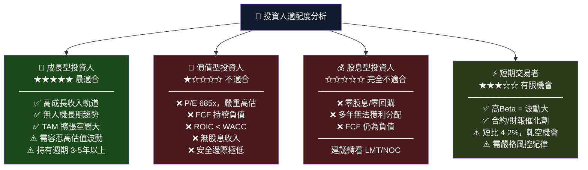

---

### 關鍵監控指標 Checklist

```
📋 下次財報前必看指標（Q4 2025 / 2026年2-3月發布）：

財務指標監控：
□ 季度收入：目標 $360M以上（YoY +27%）
□ 毛利率：是否回升至 24% 以上
□ 營業利益率：突破 3.5% 視為改善信號
□ FCF：是否縮小負值至 -$25M 以內
□ 訂單積壓（Backlog）：YoY 成長率
□ 書帳比（Book-to-Bill）：維持 1.0x 以上

產業數據監控：
□ FY2027 美國國防預算提案（2026年3月公布）
□ 無人機/CCA 計畫採購預算配置
□ NATO 盟國國防支出計畫變動
□ 關稅政策對供應鏈影響

競爭動態監控：
□ AeroVironment (AVAV) 軍用無人機合約動態
□ Northrop Grumman UCAV 計畫進度
□ Shield AI 等新創的 CCA 競標動向
□ 中國無人機技術出口限制對市場影響

估值監控：
□ 10年美債殖利率（影響 WACC 及成長股估值）
□ 航太國防板塊 EV/EBITDA 均值變動
□ 機構持股比例季度變化
□ 內部人（Insider）買賣動態（目前僅 2.4%，偏低）

⚠️ 停損/重新評估觸發點：
→ 股價跌破 $65（下跌 27%）
→ CCA 計畫確認不由 KTOS 主導
→ FCF 2026年全年仍維持 -$1億以上
→ 國防預算削減超過 5%
```

---

## 附錄：分析評分總表

| 分析維度 | 評分 | 關鍵依據 |
|---------|------|---------|
| 📊 基本面品質 | **7/10** | 收入 +21.9% YoY，業務結構清晰，但淨利率僅 1.6% |
| 🚀 成長動能 | **8/10** | 無人機 TAM 爆炸式擴張，CCA 計畫潛力巨大 |
| 💰 獲利能力 | **4/10** | FCF -$126.9M，ROIC 僅 2.8% 遠低於 WACC |
| 🏦 財務健康 | **7/10** | 淨現金 +$414.8M，流動比率 4.06x，無財務危機風險 |
| 📈 估值合理性 | **3/10** | EV/EBITDA 200x、P/S 11.3x，估值極度溢價 |
| 🛡️ 競爭護城河 | **6/10** | 技術+政府關係護城河強，但規模仍偏小 |
| 🎯 管理執行力 | **6/10** | 收入軌道穩定推進，利潤率改善仍需驗證 |
| 💎 股東回報 | **3/10** | 零股息、零回購、FCF 負值、EVA 負值 |
| **🏆 綜合評分** | **5.5/10** | **成長故事強勁但估值透支，逢低佈局為宜** |

---

> ## ⚠️ 免責聲明
>
> **本報告由 AI 基於公開財務數據自動生成，僅供學術研究與參考用途，不構成任何投資建議、招攬或要約。**
>
> 所有財務預測均基於歷史數據推演，未來實際結果可能因多種因素而與預測存在重大差異。投資具有風險，投資人應自行進行盡職調查（Due Diligence）並諮詢持牌財務顧問後，方可做出投資決策。
>
> **報告日期**：2026-02-25 ｜ **分析範圍**：公開可得財務數據 ｜ **更新頻率**：季度