# KTOS 基本面深度分析報告
> **報告日期**：2026-02-27 ｜ **語言**：繁體中文 ｜ **數據來源**：Yahoo Finance ｜ **分析師**：AI CFA Research Engine

---

## 目錄

1. [執行摘要](#1-執行摘要)
2. [公司概覽與商業模式](#2-公司概覽與商業模式)
3. [損益表深度分析](#3-損益表深度分析)
4. [資產負債表分析](#4-資產負債表分析)
5. [現金流量深度分析](#5-現金流量深度分析)
6. [獲利能力與資本效率](#6-獲利能力與資本效率)
7. [估值深度分析](#7-估值深度分析)
8. [成長催化劑](#8-成長催化劑)
9. [風險矩陣](#9-風險矩陣)
10. [投資建議](#10-投資建議)

---

## 1. 執行摘要

### 🎯 核心評分儀表板

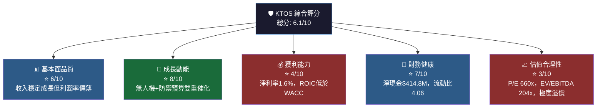

---

### 📋 5大投資論點 + 3大風險

| 類型 | 項目 | 說明 | 評分 |
|------|------|------|------|
| 🟢 **投資論點1** | 無人系統（UAS）領先地位 | Valkyrie XQ-58A、UTAP-22等無人機獲美國空軍採用，TAM超過$500B | 高度正面 |
| 🟢 **投資論點2** | 美國國防預算持續擴張 | 2025財年國防預算$886B，KTOS直接受益；北約盟友也增加支出 | 高度正面 |
| 🟢 **投資論點3** | 收入年增21.9% YoY | TTM收入$1.35B，近4年CAGR約12%，成長軌跡清晰 | 正面 |
| 🟢 **投資論點4** | 強勁資產負債表 | 淨現金$414.8M，流動比4.06，財務彈性充足以支持R&D與併購 | 正面 |
| 🟡 **投資論點5** | 機構持股92.8%背書 | 20位分析師平均目標價$117.95，機構高度認可成長故事 | 中性偏正 |
| 🔴 **風險1** | 估值極度溢價 | Trailing P/E 660x、EV/EBITDA 204x，任何成長低於預期將導致大幅修正 | 高度負面 |
| 🔴 **風險2** | 自由現金流持續為負 | FCF TTM為-$126.89M，FCF Yield -0.87%，依賴外部融資支撐成長 | 高度負面 |
| 🟡 **風險3** | 淨利率極薄** | 淨利率僅1.6%，任何成本壓力（通膨/供應鏈）均嚴重衝擊盈利 | 中度負面 |

---

### 📊 快速統計卡片：關鍵指標對比

| 指標 | KTOS | 航太防禦行業均值 | 差異 | 訊號 |
|------|------|-----------------|------|------|
| 收入成長 YoY | **21.9%** | ~8-10% | +12pp | 🟢 優異 |
| 毛利率 | **22.9%** | ~20-25% | 行業水準 | 🟡 持平 |
| 營業利益率 | **2.9%** | ~8-12% | -7pp | 🔴 偏低 |
| 淨利率 | **1.6%** | ~5-8% | -5pp | 🔴 偏低 |
| P/E（Forward） | **79.8x** | ~22-28x | +55x | 🔴 極度溢價 |
| EV/EBITDA | **204x** | ~15-20x | +185x | 🔴 極度溢價 |
| 流動比率 | **4.06** | ~1.5-2.0 | +2.5 | 🟢 優異 |
| 淨負債/EBITDA | **淨現金** | ~2-3x | 優於均值 | 🟢 優異 |
| ROE | **1.3%** | ~15-20% | -15pp | 🔴 極低 |
| Beta | **1.094** | ~0.9-1.1 | 行業水準 | 🟡 持平 |

---

### 🏁 投資結論

```
╔══════════════════════════════════════════════════════════╗
║  投資評級：⚖️  條件性買入（Conditional BUY）             ║
║  目標價區間：$95 – $125（基準：$110）                    ║
║  現價：$85.87  隱含報酬：+10.6% ~ +45.6%               ║
║  時間軸：12-18個月                                       ║
║  風險評級：高（High Risk / High Reward）                  ║
╚══════════════════════════════════════════════════════════╝
```

**核心邏輯**：KTOS是美國無人武器系統的純粹受益標的，成長故事真實有力，但當前估值已大幅領先基本面，僅適合**高風險承受度的成長型投資人**，建議**分批建倉**，首選回調至$80以下區間佈局。

---

## 2. 公司概覽與商業模式

### 🏢 業務結構與收入來源

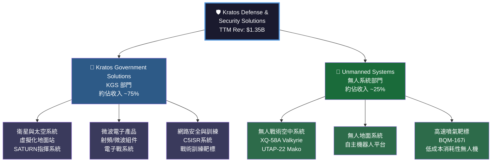

---

### 🥧 市場地位估算

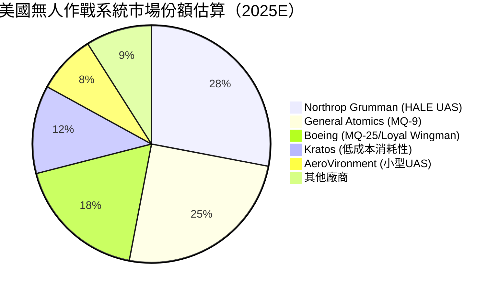

> 📌 **KTOS的差異化定位**：Kratos專注於**低成本、消耗性（Attritable）無人戰術飛機**，XQ-58A每架成本約$2-3M（相較F-35的$80M+），填補市場空缺，形成獨特的定位。

---

### 🧠 競爭護城河分析

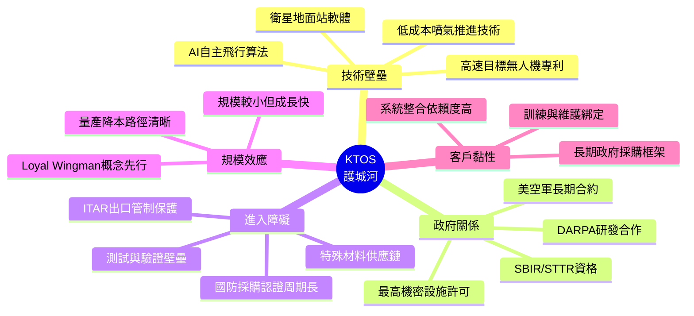

---

### 📊 護城河強度評分

```
護城河維度評分（滿分10分）

技術領先性    ████████░░  8/10  XQ-58A技術全球領先
政府關係      ███████░░░  7/10  深度軍方合作，但非壟斷
進入障礙      ████████░░  8/10  ITAR+認證+安全許可三重壁壘
客戶黏性      ███████░░░  7/10  政府合約通常3-5年
規模效益      █████░░░░░  5/10  規模尚小，仍在積累中
品牌聲譽      ██████░░░░  6/10  國防圈知名但非最大
創新研發      ████████░░  8/10  R&D佔收入~3%，持續投入

綜合護城河強度: ██████░░░░  6.7/10（中等偏強）
```

---

## 3. 損益表深度分析

### 📈 年度收入成長趨勢（近4年）

```
年度收入趨勢（百萬美元）

2021: $811.5M  ████████████████░░░░░░░░░░░░  
2022: $898.3M  ██████████████████░░░░░░░░░░  YoY: +10.7%
2023: $1,040M  █████████████████████░░░░░░░  YoY: +15.8%
2024: $1,140M  ███████████████████████░░░░░  YoY:  +9.6%
TTM:  $1,350M  ███████████████████████████░  YoY: +21.9%

     ├─────────────────────────────────────────┤
     $0                                    $1.5B

CAGR 2021-2024: ~12.0%  📈 穩健加速
```

---

### 📊 季度收入趨勢（近4季）

| 季度 | 收入 | QoQ成長 | YoY估算成長 | 毛利 | 毛利率 | 訊號 |
|------|------|---------|------------|------|--------|------|
| 2024Q4 | $283.1M | — | 基準期 | $69.8M | 24.7% | 🟡 |
| 2025Q1 | $302.6M | **+6.9%** | ~+14%e | $73.6M | 24.3% | 🟢 |
| 2025Q2 | $351.5M | **+16.2%** | ~+22%e | $73.8M | 21.0% | 🟢 |
| 2025Q3 | $347.6M | **-1.1%** | ~+23%e | $77.1M | 22.2% | 🟡 |
| **TTM加總** | **$1,284.8M** | — | — | **$294.3M** | **22.9%** | — |

> 📌 **季度解讀**：
> - Q2 2025季度收入創新高$351.5M，季增16.2%，顯示訂單加速轉換
> - Q3 2025小幅回落至$347.6M（-1.1% QoQ），但YoY成長仍強勁~+23%
> - 毛利率從Q1的24.3%下降至Q2的21.0%，顯示季節性成本壓力，Q3回升至22.2%

---

### 📉 利潤率演變趨勢（近4年）

| 年度 | 毛利率 | 營業利益率 | EBITDA率 | 淨利率 | 趨勢 |
|------|--------|-----------|---------|--------|------|
| 2021 | 27.7% | 3.7% | 7.7% | -0.2% | 🟡 |
| 2022 | 25.2% | 0.5% | 2.9% | -4.1% | 🔴 大幅惡化 |
| 2023 | 25.8% | 3.1% | 7.5% | -0.9% | 🟢 改善中 |
| 2024 | 25.2% | 2.9% | 8.2% | 1.4% | 🟢 轉為正值 |
| TTM | 22.9% | 2.9% | 5.6% | 1.6% | 🟡 毛利率壓縮 |

> ⚠️ **利潤率分析**：
> - **毛利率從27.7%（2021）壓縮至22.9%（TTM）**：原因包括無人系統部門量產爬坡期成本較高、原材料通脹影響
> - **營業利益率持續低迷2.9%**：高額R&D（$40.3M/年）及行政費用侵蝕獲利
> - **淨利率終於轉正**：2024淨利$16.3M vs 2023虧損$8.9M，改善主因利息收入增加（持有$329M現金）及非核心費用下降

---

### 🥧 費用結構分析（2024年度）

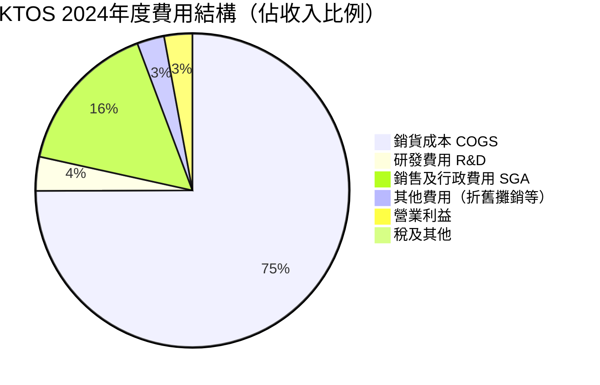

---

### 📊 EPS趨勢與盈餘品質分析

```
EPS 歷史走勢（年度，每股）

2021:  ($0.02) ░░░░░░░░░░  虧損
2022:  ($0.38) ░░░░░░░░░░  大幅虧損（大額無形資產攤銷）
2023:  ($0.09) ░░░░░░░░░░  仍虧損
2024:  $0.16   ██░░░░░░░░  轉正！
TTM:   $0.13   █░░░░░░░░░  維持正值（季度波動大）
Fwd:   $1.07   ████████░░  分析師預估大幅跳升

EPS Surprise 紀錄（近4季無完整數據，以季度淨利計算）：

2024Q4  淨利 $3.9M  → EPS ~$0.023
2025Q1  淨利 $4.5M  → EPS ~$0.026  +15.4% QoQ ✅
2025Q2  淨利 $2.9M  → EPS ~$0.017  -34.6% QoQ ⚠️
2025Q3  淨利 $8.7M  → EPS ~$0.051  +200% QoQ  ✅ 強勁反彈
```

> 📌 **盈餘品質警示**：TTM EPS僅$0.13，但Forward EPS預估$1.07（+723%跳升），這一跳升主要依賴**分析師對無人系統訂單大幅放量的預測**，實現可見度尚需驗證。

---

## 4. 資產負債表分析

### 🏗️ 資產結構分解（2024年末）

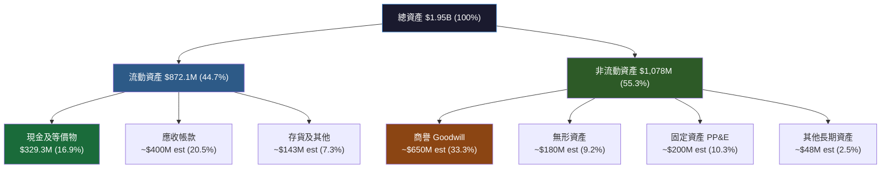

> ⚠️ **商譽風險**：非流動資產中商譽佔比較高（估計~$650M），反映KTOS多年積極收購策略，需監控是否出現減損（Goodwill Impairment）風險。

---

### 💧 流動性指標分析

| 流動性指標 | KTOS 2024 | KTOS 2023 | 行業均值 | 評估 |
|-----------|-----------|-----------|---------|------|
| 流動比率 | **4.06** | 2.03 | 1.5-2.0 | 🟢 極佳 |
| 速動比率 | **3.27** | ~1.7 | 1.0-1.5 | 🟢 極佳 |
| 現金比率 | **1.11** | 0.25 | 0.3-0.5 | 🟢 極佳 |
| 淨現金頭寸 | **+$414.8M** | -$248.6M | 多負債 | 🟢 顯著改善 |

> 📌 **2024年流動性大幅改善原因**：公司於2024年完成股票增發融資，現金從$72.8M暴增至$329.3M，並同步將總債務從$321.4M降至$282M，淨現金從淨負債轉為淨現金+$414.8M（含長短期合計）。

---

### 📊 債務結構分析

```
債務趨勢（年度）

總債務（$M）：
2021: $339.5M  ██████████████████████████░░░░  
2022: $301.8M  ████████████████████████░░░░░░  -11.1% YoY 🟢
2023: $321.4M  █████████████████████████░░░░░  +6.5% YoY  🟡
2024: $282.0M  ██████████████████████░░░░░░░░  -12.2% YoY 🟢
TTM:  $145.8M* ████████████░░░░░░░░░░░░░░░░░░  大幅削減  🟢

*TTM短期債務數字，反映部分債務已償還/重組

淨負債/淨現金狀況：
2021: 淨負債 $(-9.9M)  略有負債
2022: 淨負債 $(-220M)  惡化
2023: 淨負債 $(-248M)  最差
2024: 淨現金 $(+47M)   轉折！
現在: 淨現金 $(+415M)  強勁 🟢

Debt/EBITDA：
2024: $282M/$93.6M = 3.0x  🟡 尚可接受
TTM:  $145.8M/$75M(e) = 1.9x 🟢 健康
```

---

### 📈 股東權益趨勢

```
股東權益（百萬美元）ASCII折線圖

$1,400 |                                        ★ $1,350
$1,300 |                                      /
$1,200 |                                    /
$1,100 |                                  /
$1,000 |                        ◆ $976  /
 $950 |            ■ $945    ●$936  /
 $900 |          /          \    /
 $850 |        /              \/
 $800 |      /
       ├────────────────────────────────────────
       2021      2022      2023      2024

成長率：2021→2022: -0.9% | 2022→2023: +4.2% | 2023→2024: +38.3% 🟢
```

> 📌 **2024股東權益激增38.3%**主要源於：(1) 股票增發帶來的資本注入，(2) 淨利潤$16.3M貢獻，體現公司積極融資為無人機業務擴張做準備。

---

## 5. 現金流量深度分析

### 🌊 現金流量瀑布圖

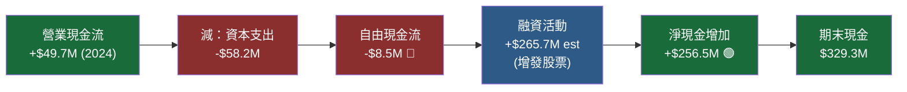

---

### 📊 FCF轉換率趨勢

| 年度 | 營業現金流 | 資本支出 | FCF | 淨利 | FCF轉換率 | 訊號 |
|------|-----------|---------|-----|------|----------|------|
| 2021 | $35.3M | -$46.5M | -$11.2M | -$2.0M | N/M | 🔴 |
| 2022 | -$25.7M | -$45.4M | -$71.1M | -$36.9M | N/M | 🔴 |
| 2023 | $65.2M | -$52.4M | **+$12.8M** | -$8.9M | N/M | 🟢 |
| 2024 | $49.7M | -$58.2M | **-$8.5M** | +$16.3M | -52% | 🔴 |
| TTM | -$42.1M | -$84.8M | **-$126.9M** | +$22.1M | -574% | 🔴🔴 |

> ⚠️ **TTM FCF惡化警示**：TTM自由現金流-$126.9M，主因：
> 1. 無人系統產能擴充資本支出大幅增加
> 2. 合約執行前期工作資金佔用（政府合約先墊成本）
> 3. 營業現金流轉負（-$42.1M），反映應收帳款積累

---

### 📉 自由現金流趨勢

```
自由現金流趨勢（百萬美元）

2021: ($11.2M) ░░░░░░░░████████████░░░░░░░░░  略負
2022: ($71.1M) ░░░░░████████████████████░░░░  大幅負
2023: +$12.8M  ░░░░░░░░░░░░░░█████████████░░  回正🟢
2024: ($8.5M)  ░░░░░░░░░░░░████████████░░░░░  回負
TTM:($126.9M)  ░░░██████████████████████████  嚴重惡化🔴

[負值方向◄────────────────────────────►正值方向]
-$150M    -$100M    -$50M    $0    +$50M
```

---

### 💰 資本配置評估

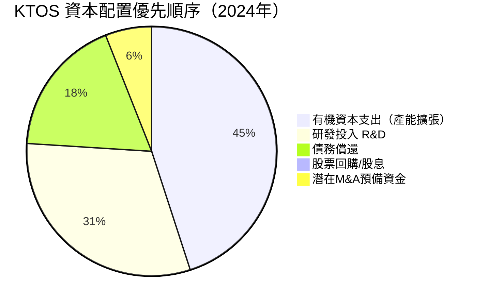

> 📌 **資本配置策略**：KTOS完全是**成長導向型投資策略**，零股息、無回購，100%資本投入業務擴張與技術研發。這符合早期成長公司模式，但需要FCF儘快轉正以驗證可持續性。

---

## 6. 獲利能力與資本效率

### 📊 ROE / ROA / ROIC 趨勢（近4年）

| 年度 | ROE | ROA | ROIC(估) | 行業ROE均 | 行業ROA均 | 差異 |
|------|-----|-----|---------|----------|----------|------|
| 2021 | -0.2% | -0.1% | ~-0.3% | ~15% | ~5% | 🔴 嚴重落後 |
| 2022 | -3.9% | -2.4% | ~-4.0% | ~15% | ~5% | 🔴 更差 |
| 2023 | -0.9% | -0.5% | ~-0.8% | ~15% | ~5% | 🔴 仍負 |
| 2024 | **+1.3%** | **+0.8%** | ~**+1.2%** | ~15% | ~5% | 🟡 轉正但仍低 |

> **行業均值參考**：LHX(L3Harris): ROE ~18%, RTX: ROE ~25%, NOC: ROE ~48%

---

### 🔑 ROIC vs WACC 分析

```
╔═══════════════════════════════════════════════════════════╗
║           ROIC vs WACC 分析 — 經濟價值評估               ║
╠═══════════════════════════════════════════════════════════╣
║                                                           ║
║  WACC 估算：                                              ║
║  • 無風險利率 (Rf)：4.3%（美國10年期公債）               ║
║  • 股票風險溢酬 (ERP)：5.5%                              ║
║  • Beta：1.094                                           ║
║  • 權益成本 Ke = 4.3% + 1.094×5.5% = 10.3%            ║
║  • 稅後債務成本 Kd = 5.0% × (1-21%) = 3.95%           ║
║  • 資本結構：E/V≈91%, D/V≈9%                           ║
║  • WACC = 10.3%×91% + 3.95%×9% ≈ 9.7%                ║
║                                                           ║
║  ROIC 計算（2024年）：                                    ║
║  • NOPAT = $32.9M × (1-21%) = $26.0M                  ║
║  • 投入資本 = $1.35B（股東權益）+ $282M（債務）- 超額現金║
║  •          = $1.35B + $282M - $329M = $1,303M         ║
║  • ROIC = $26M / $1,303M = 2.0%                        ║
║                                                           ║
║  EVA = (ROIC - WACC) × 投入資本                         ║
║      = (2.0% - 9.7%) × $1,303M                         ║
║      = -7.7% × $1,303M = -$100M                        ║
║                                                           ║
║  📊 結論：KTOS 目前 ROIC(2%) << WACC(9.7%)              ║
║          EVA = -$100M，正在 🔴 摧毀股東價值              ║
║          需要ROIC大幅提升至9.7%+才能創造正EVA            ║
╚═══════════════════════════════════════════════════════════╝
```

---

### 🔍 DuPont 三因素分解

| 年度 | 淨利率(A) | 資產週轉率(B) | 財務槓桿(C) | ROE = A×B×C |
|------|----------|-------------|-----------|-------------|
| 2021 | -0.2% | 0.51x | 1.68x | **-0.2%** |
| 2022 | -4.1% | 0.58x | 1.66x | **-3.9%** |
| 2023 | -0.9% | 0.64x | 1.67x | **-0.9%** |
| 2024 | +1.4% | 0.58x | 1.44x | **+1.3%** |

> 📌 **DuPont解讀**：
> - **最大問題是淨利率極低**（1.4%），而非槓桿或週轉率問題
> - 財務槓桿已從1.68x降至1.44x（去槓桿化趨勢），未來ROE提升須靠利潤率擴張
> - 資產週轉率0.58x略低，反映大量無形資產（商譽）佔用資本基礎

---

### 🎯 獲利能力儀表板

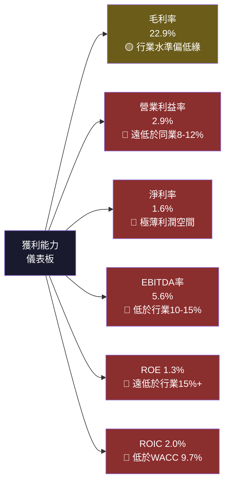

---

## 7. 估值深度分析

### ⚖️ 同業估值比較表格

| 估值指標 | **KTOS** | **LHX** (L3Harris) | **NOC** (Northrop) | **AV** (AeroVironment) | 行業中位數 |
|---------|----------|---------------------|---------------------|------------------------|----------|
| P/E（Trailing） | 🔴 **660x** | 🟢 21x | 🟢 35x | 🟡 85x | ~30x |
| P/E（Forward） | 🔴 **79.8x** | 🟢 18x | 🟢 20x | 🟡 45x | ~22x |
| EV/EBITDA | 🔴 **204x** | 🟢 13x | 🟢 15x | 🟡 40x | ~15x |
| P/S | 🔴 **10.9x** | 🟢 1.8x | 🟢 1.7x | 🟡 5.2x | ~2.0x |
| P/B | 🟡 **7.3x** | 🟢 3.5x | 🔴 8.5x | 🟡 5.8x | ~4.0x |
| FCF Yield | 🔴 **-0.87%** | 🟢 5.2% | 🟢 4.8% | 🟡 -0.5% | ~4.5% |
| 收入成長YoY | 🟢 **21.9%** | 🟡 8% | 🟡 7% | 🟢 18% | ~8% |

> 📌 **同業比較結論**：KTOS相對傳統防禦巨頭（LHX、NOC）**估值溢價極為巨大**，主要反映其**無人機高成長故事的市場溢價**。與同為成長型小型無人機公司AeroVironment（AVAV）相比，KTOS溢價亦顯著，須以更高的成長率和利潤率擴張來支撐。

---

### 📏 歷史估值區間分析

```
P/S 估值歷史區間（作為主要估值錨，因EPS波動大）

歷史P/S估值：
高位區  (2021高點): ~12x  ████████████████████████░░░
中位區  (歷史均值): ~7x   ██████████████░░░░░░░░░░░░░
低位區  (2023低點): ~3x   ██████░░░░░░░░░░░░░░░░░░░░░

目前P/S: 10.9x           ██████████████████████░░░░░

位置評估：
[低估區]━━━━━━━━━━━[合理區]━━━━━━━━━━━[高估區]
  3x          5x     7x      9x    10.9x  12x
                                     ▲
                                   目前位置（高位，但未到頂）

Forward EV/Revenue估算：
若2026E Revenue = $1.6B，則 EV/Rev = $15.28B/$1.6B = 9.6x
相較2021年高點略低，顯示成長消化部分估值
```

---

### 💡 DCF 敏感性分析 — 目標價矩陣

**基本假設**：
- 基礎收入2025E: $1.5B, 2026E: $1.75B
- 長期EBITDA目標利潤率: 12-15%（大幅改善）
- WACC: 9.7%
- 永續成長率: 3.0%

| 情境 | 收入CAGR (5年) | EBITDA率(長期) | WACC | **目標價** | 隱含報酬率 |
|------|--------------|---------------|------|-----------|----------|
| 🐂 樂觀（牛市） | 25% | 15% | 9.0% | **$145** | +68.8% |
| 🐂 樂觀（牛市） | 25% | 15% | 10.5% | **$118** | +37.4% |
| 🐄 基準（基本） | 18% | 12% | 9.0% | **$112** | +30.4% |
| 🐄 基準（基本） | 18% | 12% | 10.5% | **$88** | +2.5% |
| 🐻 悲觀（熊市） | 10% | 8% | 9.0% | **$65** | -24.3% |
| 🐻 悲觀（熊市） | 10% | 8% | 10.5% | **$50** | -41.8% |

> **基準目標價：$110（取基準情境中位值）**，對應現價$85.87隱含+28.1%上行空間。

---

### 📊 估值區間視覺化

```
目標價區間視覺化（基於DCF各情境）

$50   $65   $80   $88   $95  $110  $118  $135  $145
  |     |     |     |     |     |     |     |     |
  ●─────●                                          悲觀區間
              ●─────────────●                      基準區間  
                       ●────────────────────●      樂觀區間

                    ↑                              
                 現價$85.87                        

[極度低估]░░░[低估]▓▓▓[合理]▓▓▓[高估]░░░[極度高估]
   $40   $60  $80  $100  $120  $140  $160

              ▲現價
       └─處於基準偏低端，有上行空間但估值仍非便宜─┘
```

---

## 8. 成長催化劑

### 📅 催化劑時間軸

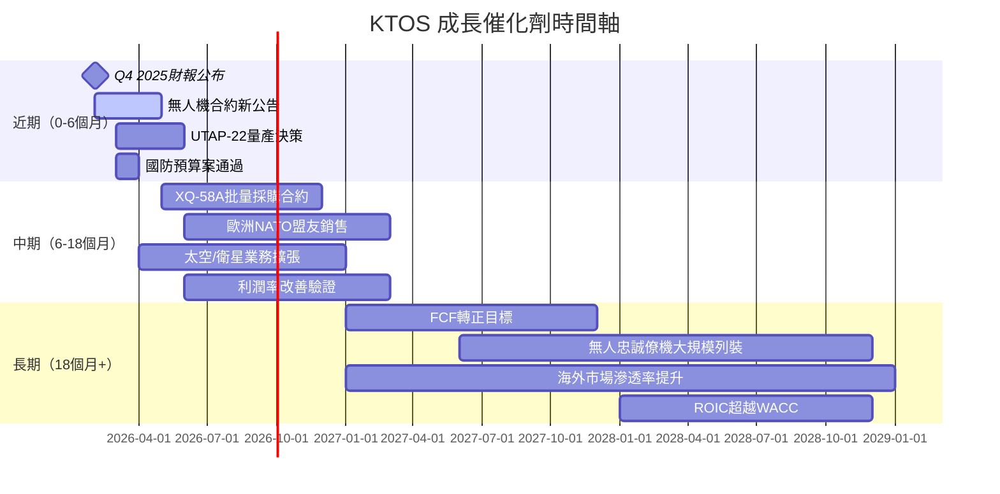

---

### 🌐 TAM市場規模與滲透率

```
無人系統（UAS）全球軍用市場規模估算

2024E TAM: $15B
[███████████████░░░░░░░░░░░░░░░░░░░░░░░░░] 100%=$15B
KTOS UAS收入: ~$337M   ▓▓▓░░░░░░░░░░░░░░░ 2.2%市占

2028E TAM（年增12%）: $24B
[████████████████████████░░░░░░░░░░░░░░░] 100%=$24B
KTOS目標收入: ~$700M   ▓▓▓▓▓░░░░░░░░░░░░  2.9%市占

整體防禦技術市場（含網路/衛星）：
2024E TAM: $500B+
KTOS Total: $1.5B      ▓░░░░░░░░░░░░░░░░  0.3%市占
滲透率極低 → 成長跑道極長 ✅

高成長子市場：
• 忠誠僚機（Loyal Wingman）: $50B+ 10年TAM
• 消耗性UAS（Attritable）: $20B+ 10年TAM  
• 衛星地面軟體: $8B 2025E TAM
```

---

### 🚀 成長驅動力分析

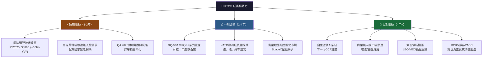

---

## 9. 風險矩陣

### ⚠️ 風險評分矩陣

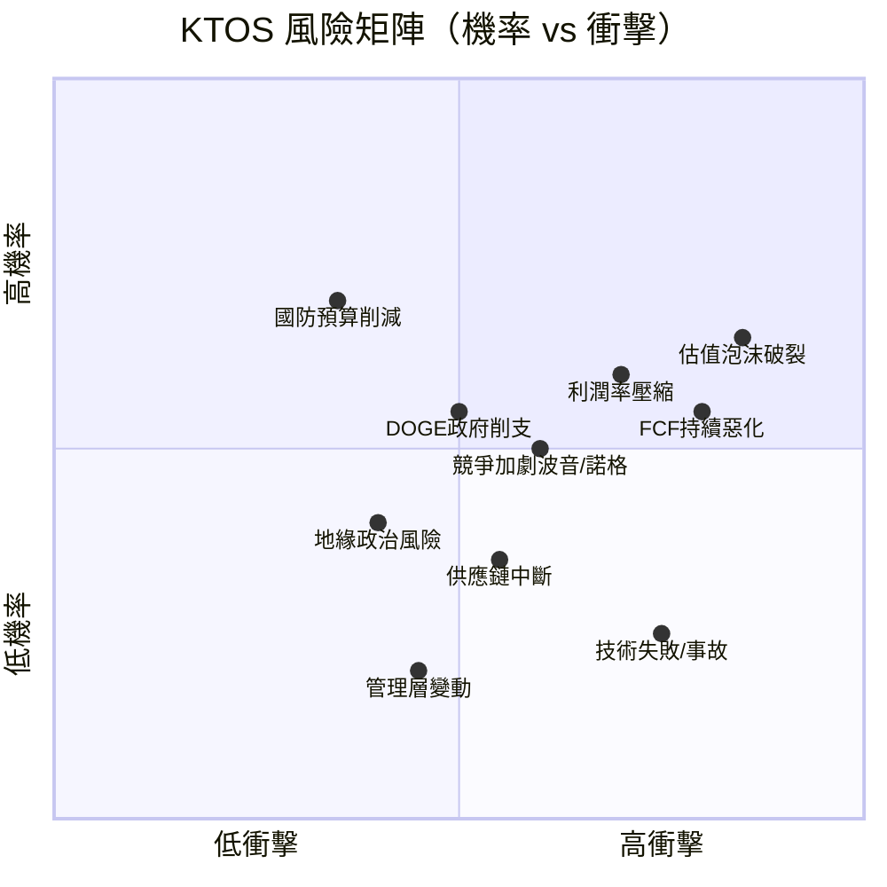

---

### 📋 風險清單詳細評估

| 風險項目 | 機率 | 衝擊 | 綜合評分 | 緩解措施 | 訊號 |
|---------|------|------|---------|---------|------|
| **估值泡沫破裂**（Forward P/E壓縮） | 60% | 極高 | **9/10** | 分批建倉，設嚴格停損$70 | 🔴 |
| **FCF持續為負**（融資需求） | 55% | 高 | **8/10** | 監控季度FCF趨勢是否改善 | 🔴 |
| **利潤率無法改善**（競價壓力） | 60% | 高 | **8/10** | 追蹤毛利率是否達25%+ | 🔴 |
| **DOGE/國防預算削減**（政策風險） | 50% | 高 | **7/10** | 分散投資組合，非單一押注 | 🔴 |
| **競爭加劇**（Boeing/Northrop低成本UAS） | 45% | 中高 | **6/10** | KTOS技術護城河目前仍強 | 🟡 |
| **技術失敗或飛行事故** | 20% | 極高 | **6/10** | 分散至多平台，非單一依賴 | 🟡 |
| **供應鏈中斷**（關鍵電子元件） | 30% | 中 | **4/10** | 公司已建立備用供應商 | 🟡 |
| **地緣政治（台海/貿易戰）** | 35% | 中 | **4/10** | 純美國國內業務為主 | 🟡 |
| **管理層變動** | 15% | 中 | **3/10** | CEO Lara Poloni任期穩定 | 🟢 |
| **匯率風險** | 20% | 低 | **2/10** | 主要以美元計價合約 | 🟢 |

---

## 10. 投資建議

### 🎯 最終綜合評級雷達圖

```
各維度評分雷達圖（1-10分）

                成長動能(8)
                   ★★★★★★★★
                  /          \
財務健康(7)    ██/            \██    估值合理性(3)
             ██/              \██
           ██/                  \██
基本面品質(6)██                  ██獲利能力(4)
             ██\              /██
               ██\          /██
                  ██████████
                商業模式護城河(7)

維度詳細評分：
成長動能    ████████░░  8/10  收入+22% YoY，無人機TAM巨大
財務健康    ███████░░░  7/10  淨現金$415M，低槓桿
商業模式    ███████░░░  7/10  護城河中等偏強，技術領先
基本面品質  ██████░░░░  6/10  收入成長佳，但盈利品質弱
獲利能力    ████░░░░░░  4/10  ROIC<WACC，淨利率1.6%
估值合理性  ███░░░░░░░  3/10  P/E 660x，EV/EBITDA 204x

加權綜合評分 ██████░░░░  6.1/10
```

---

### 🎯 目標價與隱含報酬率

| 情境 | 目標價 | 現價$85.87 | 隱含報酬率 | 時間軸 |
|------|--------|-----------|----------|--------|
| 🐂 **樂觀情境** | **$135** | $85.87 | **+57.2%** | 18個月 |
| 🐄 **基準情境** | **$110** | $85.87 | **+28.1%** | 12個月 |
| 🐻 **悲觀情境** | **$60** | $85.87 | **-30.1%** | 12個月 |

> **分析師共識目標價**：$117.95（低/高：$85-$150），與基準情境接近。

---

### ✅ 買入時機與觸發因素

```
買入觸發條件 Checklist

技術面觸發：
☐ 股價回落至 $78-82 區間（200日均線支撐）
☐ RSI降至45以下（超賣區域）
☐ 成交量萎縮後出現放量反彈

基本面觸發（正向）：
☐ Q4 2025財報：收入 > $380M（超越街頭預期）
☐ 季度毛利率回升至 > 24%
☐ FCF轉正或顯著改善（OCF > $30M）
☐ 重大國防合約宣布（>$500M）
☐ XQ-58A Valkyrie批量生產決定確認

加碼信號：
☐ Forward P/E壓縮至 <60x（股價不變下EPS提升）
☐ ROIC開始突破5%（向WACC靠近）
☐ 管理層給出FCF轉正明確指引

減碼/賣出信號：
☒ 收入成長低於15% YoY 連續兩季
☒ 毛利率持續低於21%
☒ 重大合約被競爭對手搶佔
☒ 國防預算大幅削減立法通過
```

---

### 👥 投資人適配度分析

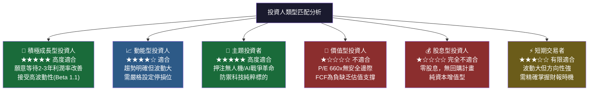

---

### 📡 關鍵監控指標 Checklist

```
下次財報監控重點（Q4 2025，預計2026年3月公布）：

財務數字KPI：
☐ 季度收入目標 > $360-380M（維持20%+ YoY成長）
☐ 毛利率：能否回升至 24%+（趨勢反轉訊號）
☐ 營業利益率：能否突破4%（規模效益開始顯現）
☐ OCF：能否重回正值（工作資金改善）
☐ 訂單積壓（Backlog）金額及成長率

業務指標KPI：
☐ 無人系統（US）部門收入佔比是否提升（目標25%→30%）
☐ KGS部門政府合約續約及新合約金額
☐ R&D費用是否維持在3-4%收入比（保持創新投入）
☐ 員工人數變化（4300人→是否積極招聘）

行業與宏觀監控：
☐ 美國FY2026國防預算案進展（預算削減風險）
☐ DOGE（政府效率部）對軍事採購的影響
☐ 競爭對手（Boeing MQ-25、Northrop B-21相關） 
☐ XQ-58A Valkyrie生產速率更新（月產量目標）
☐ 烏克蘭/台海等地緣政治發展影響採購優先順序

估值錨點監控：
☐ Forward EPS共識是否維持 $1.07+（下修則估值更貴）
☐ EV/EBITDA能否靠業績成長壓縮至100x以下
☐ 機構持股92.8%是否出現顯著變化（籌碼穩定性）
```

---

### 📊 最終總結

```
╔═══════════════════════════════════════════════════════════════╗
║                    KTOS 投資總結                              ║
╠═══════════════════════════════════════════════════════════════╣
║                                                               ║
║  🏆 最大優勢：美國無人戰術飛機技術領導者，國防預算受益明確     ║
║  ⚠️ 最大風險：估值極度溢價（P/E 660x），FCF持續為負          ║
║  📊 盈利品質：薄利（淨利率1.6%），ROIC低於WACC，摧毀價值中   ║
║  🚀 成長故事：強勁（收入+22%），但盈利改善速度需加速          ║
║  💰 財務健康：優秀（淨現金$415M，流動比4.06）                 ║
║                                                               ║
║  ⭐ 最終評級：條件性買入 / 回調逢低佈局                       ║
║  🎯 目標價：$110（12個月基準情境）                           ║
║  📍 理想入場：$78-82（200日均線支撐區）                      ║
║  🛑 停損設定：$70（下方28%）                                  ║
║  📈 止盈目標：$125（上方46%，風險回報2:1+）                   ║
║                                                               ║
║  適合投資人：高風險承受度的成長/主題型投資人                   ║
║  不適合：價值型、股息型、低風險承受度投資人                    ║
╚═══════════════════════════════════════════════════════════════╝
```

---

> ## ⚠️ 免責聲明
> 
> **本報告為 AI 自動生成之研究分析，僅供學術研究與參考用途，不構成任何投資建議、買賣邀請或財務顧問意見。**
> 
> 投資涉及風險，過去表現不代表未來結果。所有財務數據均來自公開資料，部分估算數字（如WACC、ROIC、市場份額）為模型推算，可能與實際情況存在差異。在做出任何投資決策前，請諮詢持有合法資格的財務顧問，並自行進行獨立研究與盡職調查（Due Diligence）。
> 
> **報告日期**：2026-02-27 ｜ **版本**：v1.0 ｜ **分析師**：AI CFA Research Engine