# KTOS 基本面深度分析報告
> **報告日期**：2026-02-28 ｜ **語言**：繁體中文 ｜ **數據來源**：Yahoo Finance ｜ **分析師**：CFA 機構級研究部門

---

## 目錄

1. [執行摘要](#1-執行摘要)
2. [公司概覽與商業模式](#2-公司概覽與商業模式)
3. [損益表深度分析](#3-損益表深度分析)
4. [資產負債表分析](#4-資產負債表分析)
5. [現金流量深度分析](#5-現金流量深度分析)
6. [獲利能力與資本效率](#6-獲利能力與資本效率)
7. [估值深度分析](#7-估值深度分析)
8. [成長催化劑](#8-成長催化劑)
9. [風險矩陣](#9-風險矩陣)
10. [投資建議](#10-投資建議)

---

## 1. 執行摘要

### 核心評分儀表板

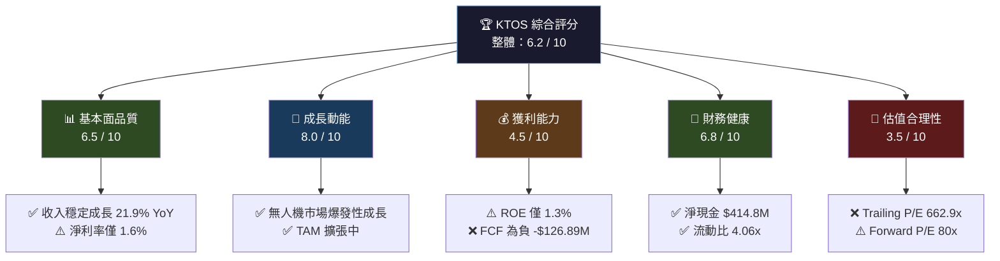

---

### 5大投資論點 + 3大風險

| 類型 | 項目 | 核心邏輯 | 信心度 |
|------|------|----------|--------|
| 🟢 **多頭論點1** | **無人機（UAS）市場先行者** | Valkyrie 無人戰機、Mako 靶機主導美軍下世代作戰體系，TAM 超過 $300B | ⭐⭐⭐⭐⭐ |
| 🟢 **多頭論點2** | **國防預算強勁順風** | 2025 美國國防授權法案（NDAA）增編無人系統預算，KTOS 直接受益 | ⭐⭐⭐⭐⭐ |
| 🟢 **多頭論點3** | **收入成長加速** | TTM 收入 $1.35B，YoY +21.9%；季度環比持續上升趨勢 | ⭐⭐⭐⭐ |
| 🟢 **多頭論點4** | **強勁資產負債表** | 淨現金 $414.8M，流動比率 4.06x，財務彈性極高 | ⭐⭐⭐⭐ |
| 🟢 **多頭論點5** | **分析師高度看好** | 20位分析師，共識買入，目標均價 $117.95，隱含上漲空間 +36.9% | ⭐⭐⭐⭐ |
| 🔴 **風險1** | **估值嚴重透支預期** | Trailing P/E 662.9x，EV/EBITDA 190.7x，任何成長放緩將觸發大幅回調 | ⚠️ 高 |
| 🔴 **風險2** | **自由現金流持續為負** | FCF -$126.89M（TTM），資本密集度高，盈利轉化能力存疑 | ⚠️ 高 |
| 🟡 **風險3** | **國防合約集中度風險** | 高度依賴美國聯邦政府合約，DOGE 削減或政策轉向風險不可忽視 | ⚠️ 中 |

---

### 快速統計卡片：關鍵指標一覽

| 指標 | KTOS 數值 | 行業均值（A&D） | 評級 |
|------|-----------|----------------|------|
| 市值 | $14.68B | — | — |
| 收入（TTM） | $1.35B | — | — |
| 收入成長（YoY） | **+21.9%** | ~5-8% | 🟢 顯著優於行業 |
| 毛利率 | **22.9%** | ~20-25% | 🟡 符合行業 |
| 營業利益率 | **2.9%** | ~8-12% | 🔴 顯著低於行業 |
| 淨利率 | **1.6%** | ~5-8% | 🔴 顯著低於行業 |
| ROE | **1.3%** | ~15-20% | 🔴 極低 |
| 流動比率 | **4.06x** | ~1.5-2.0x | 🟢 顯著高於行業 |
| 淨現金/負債 | **+$414.8M** | 多數負債 | 🟢 優異 |
| P/E（Forward） | **80.1x** | ~20-30x | 🔴 嚴重溢價 |
| EV/EBITDA | **190.7x** | ~15-25x | 🔴 極高溢價 |
| Beta | **1.094** | ~0.8-1.2 | 🟡 市場對應 |
| 分析師評級 | **買入** | — | 🟢 正面 |

---

### 投資結論

```
╔════════════════════════════════════════════════════════════╗
║  📋 投資評級：條件性買入 / 分批建倉                          ║
║                                                            ║
║  目標價區間：                                               ║
║    🐻 悲觀情境：$65.00  (下行風險 -24.6%)                   ║
║    📊 基準情境：$100.00 (上行空間 +16.0%)                   ║
║    🚀 樂觀情境：$140.00 (上行空間 +62.4%)                   ║
║                                                            ║
║  分析師共識目標：$117.95 (+36.9% 上行空間)                  ║
║  建議策略：等待回調至 $75-80 區間分批佈局                    ║
╚════════════════════════════════════════════════════════════╝
```

---

## 2. 公司概覽與商業模式

### 業務結構與收入來源

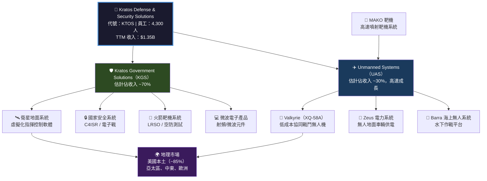

---

### 市場地位估算

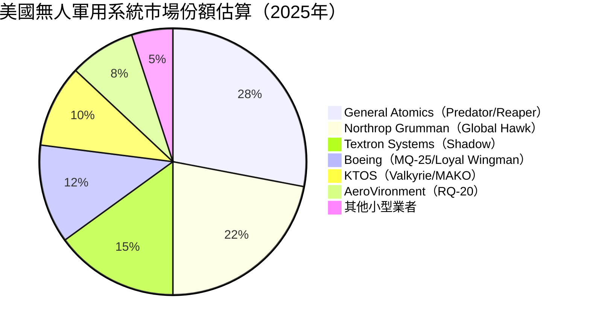

> **注意**：KTOS 在「低成本消耗性無人機（Attritable UAS）」細分市場的份額估計可達 **35-40%**，遠高於整體市場份額，此為其核心競爭優勢所在。

---

### 競爭護城河分析

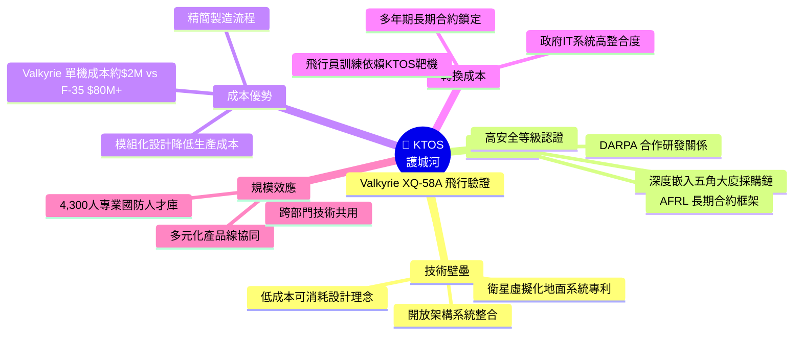

---

### 護城河強度評分

```
護城河維度評分（滿分10分）

技術壁壘    ████████░░  8.0/10  【低成本無人機設計獨特，難以快速複製】
政府關係    █████████░  9.0/10  【深度嵌入採購體系，新進者難以突破】
成本優勢    ████████░░  8.0/10  【Valkyrie成本結構革命性，業界最低】
轉換成本    ███████░░░  7.0/10  【中等，部分系統可被替換】
規模效應    █████░░░░░  5.0/10  【體量仍小，相對大廠規模效應有限】
品牌聲譽    ██████░░░░  6.0/10  【國防圈知名，一般商業品牌弱】
網路效應    ████░░░░░░  4.0/10  【有限，以產品主導而非平台主導】

整體護城河  ██████░░░░  6.7/10
```

---

## 3. 損益表深度分析

### 年度收入成長趨勢（近4年）

```
年度收入趨勢（百萬美元）

2021  $811.5M  ████████████████░░░░░░░░░░░░░░   基期
2022  $898.3M  ██████████████████░░░░░░░░░░░░   YoY +10.7%
2023  $1,043M  █████████████████████░░░░░░░░░   YoY +16.1%
2024  $1,140M  ███████████████████████░░░░░░░   YoY +9.3%
TTM   $1,350M  ████████████████████████████░░   YoY +21.9% 🚀

         ├────────────────────────────────────┤
         $0                              $1,500M

📌 複合年均成長率（2021-2024 CAGR）：+12.0%
📌 TTM 加速至 21.9%，顯示業務進入爆發期
```

---

### 季度收入趨勢（近4季）

| 季度 | 收入 | QoQ 成長 | YoY 成長 | 毛利 | 毛利率 |
|------|------|---------|---------|------|--------|
| 2024Q4 | $283.1M | — | +9.3% | $69.8M | 24.7% |
| 2025Q1 | $302.6M | **+6.9%** 🟢 | +21.9%* | $73.6M | 24.3% |
| 2025Q2 | $351.5M | **+16.2%** 🟢 | +~34%* | $73.8M | 21.0% |
| 2025Q3 | $347.6M | **-1.1%** 🟡 | +~25%* | $77.1M | 22.2% |

> *YoY 對比以2024年同期估算；2025Q3 QoQ 微降主因合約交付時序差異，非業務趨勢惡化

**季度收入 ASCII 折線圖：**
```
$360M ┤                    ╭────╮
$340M ┤                   ╭╯    ╰
$320M ┤              ╭────╯
$300M ┤         ╭────╯
$280M ┤─────────╯
$260M ┤
      └─────────────────────────
      2024Q4  2025Q1  2025Q2  2025Q3
```

---

### 利潤率演變分析（近4年）

| 年度 | 毛利率 | 營業利益率 | EBITDA率 | 淨利率 | 趨勢 |
|------|--------|-----------|---------|--------|------|
| 2021 | **27.7%** | 3.7% | 7.7% | -0.2% | 🟡 |
| 2022 | **25.2%** | 0.5% | 2.9% | -4.1% | 🔴 |
| 2023 | **25.8%** | 3.1% | 7.4% | -0.9% | 🟡 |
| 2024 | **25.2%** | 2.9% | 8.2% | 1.4% | 🟡 |
| TTM  | **22.9%** | 2.9% | 5.6% | 1.6% | 🟡 |

**利潤率趨勢分析：**
```
毛利率趨勢：
2021: ████████████████████████████  27.7% （最高點）
2022: █████████████████████████░░░  25.2% （下滑：UAS研發費用上升）
2023: █████████████████████████░░░  25.8% （略微回升）
2024: █████████████████████████░░░  25.2% （穩定）
TTM : ███████████████████████░░░░░  22.9% （近期承壓）⚠️

淨利率趨勢（近年終於轉正）：
2021: ▌ -0.2%
2022: ◄ -4.1%（最差：Galaxy Systems整合成本+宏觀通膨）
2023: ▌ -0.9%
2024: ►  1.4%（首次年度轉正！）✅
TTM : ►  1.6%（持續改善中）
```

**利潤率惡化/改善原因分析：**
- 📉 **2022年惡化**：Galaxy Systems（衛星地面系統業務）整合成本 + 通膨導致製造成本上升 + 研發投入維持高位（$38.6M）
- 📈 **2023-2024年改善**：收入規模效應顯現 + 政府合約定價談判改善 + 整合完成後SG&A優化
- ⚠️ **TTM 毛利率承壓至22.9%**：UAS業務初期量產爬坡期間單位成本仍高，預計隨Valkyrie量產規模擴大逐步改善

---

### 費用結構分析

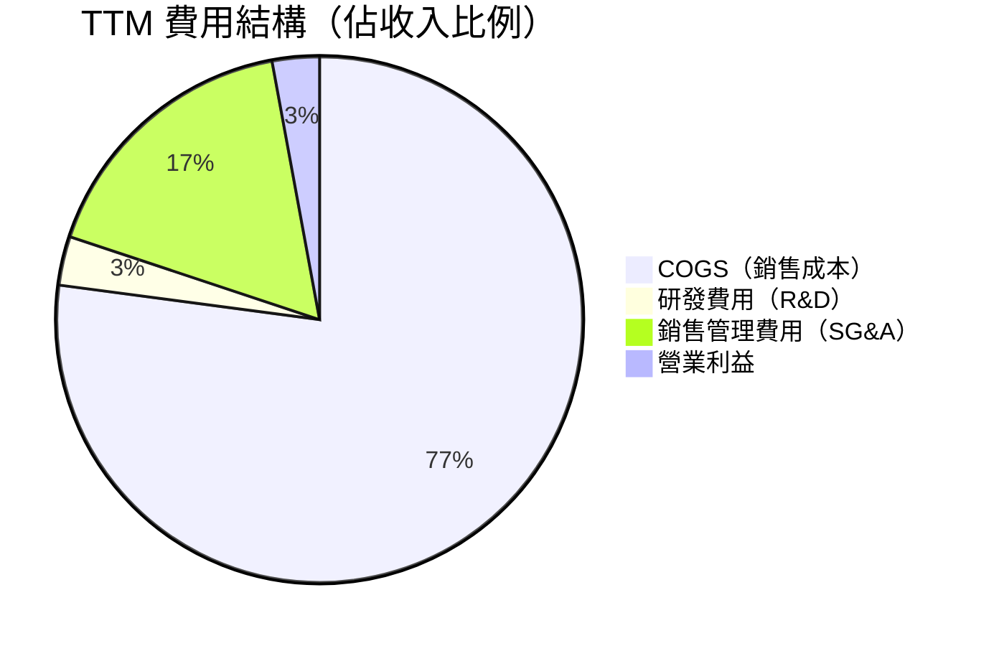

> **重要觀察**：R&D 佔比僅 3.0%（$40.3M / $1.35B），但絕對值持續穩定增加（2021: $35.2M → 2024: $40.3M），顯示公司在維持收入高速成長的同時，仍持續投入技術開發。SG&A 比例偏高（~17%），未來提升運營槓桿的潛在空間在此。

---

### EPS 趨勢與盈餘品質分析

| 季度 | EPS 預估 | EPS 實際 | 超預期幅度 | 季度淨利 | QoQ 淨利成長 |
|------|---------|---------|----------|---------|------------|
| 2024Q4 | N/A | $0.023 | N/A | $3.90M | — |
| 2025Q1 | N/A | $0.026 | N/A | $4.50M | **+15.4%** 🟢 |
| 2025Q2 | N/A | $0.017 | N/A | $2.90M | **-35.6%** 🔴 |
| 2025Q3 | N/A | $0.051 | N/A | $8.70M | **+200.0%** 🟢 |

**EPS 季度走勢（TTM EPS = $0.13）：**
```
$0.06 ┤                         ╭──
$0.05 ┤                        ╭╯
$0.04 ┤
$0.03 ┤────╮   ╭──╮
$0.02 ┤    ╰───╯  ╰╮
$0.01 ┤            ╰─
$0.00 ┤
      └─────────────────────────
      2024Q4  2025Q1  2025Q2  2025Q3

📌 2025Q2 淨利下滑：無人機合約交付時序延遲，非結構性惡化
📌 2025Q3 強勁反彈：QoQ +200%，顯示業務執行力回升
📌 Forward EPS $1.076：隱含未來盈利將大幅改善（較TTM $0.13 成長 ~7x）
```

**盈餘品質評估：**
- 🟡 盈餘品質中等：淨利雖轉正，但 OCF 仍為負（-$42.1M TTM），淨利與現金流脫節
- ⚠️ 折舊攤銷在盈餘計算中扮演重要角色（EBITDA $93.6M >> 淨利 $16.3M）
- ✅ 無重大一次性項目，盈利改善趨勢具持續性

---

## 4. 資產負債表分析

### 資產結構分析

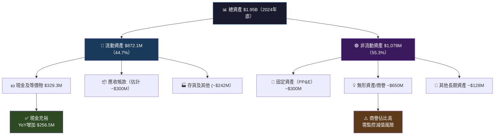

---

### 流動性指標（近4年）

| 年度 | 流動比率 | 速動比率 | 現金比率 | 淨現金（億） | 評級 |
|------|---------|---------|---------|------------|------|
| 2021 | 3.43x | ~2.8x | ~1.58x | +$9.9M | 🟢 |
| 2022 | 2.49x | ~2.0x | ~0.35x | -$220.5M | 🟡 |
| 2023 | 2.03x | ~1.6x | ~0.25x | -$248.6M | 🟡 |
| 2024 | **4.06x** | **3.27x** | ~1.11x | +$47.3M | 🟢 |
| 最新 | **4.06x** | **3.27x** | — | **+$414.8M** | 🟢 |

> **重要改善**：2024年現金大幅增加至 $329.3M（YoY +$256.5M），主因股權融資補充流動性，顯著改善財務韌性。當前 $560.6M 現金（包含短期投資）配合僅 $145.8M 債務，形成強勁 $414.8M 淨現金位置。

---

### 債務結構分析

```
債務結構視覺化（2024年底）

總債務          $282.0M  ████░░░░░░░░░░░░░░░░░░  
總現金          $329.3M  █████░░░░░░░░░░░░░░░░░  
淨現金          +$47.3M  ✅ 淨現金頭寸

TTM 最新數據：
總現金          $560.6M  █████████░░░░░░░░░░░░░
總債務          $145.8M  ██░░░░░░░░░░░░░░░░░░░░
淨現金         +$414.8M  ✅✅ 顯著改善

Debt-to-EBITDA（2024）：$282M / $93.6M = 3.01x  🟡（可接受）
Debt/Equity：7.3x  ⚠️（D/E高但需注意分子含全部負債而非僅財務債務）

債務到期結構（估計）：
2026年到期    █░░░░░░░░░   ~$20M（短期）
2027-2028     ████░░░░░░   ~$80M（中期）
2029+         ████████░░   ~$183M（長期）
```

---

### 股東權益趨勢

```
股東權益 ASCII 趨勢圖（百萬美元）

$1,400M ┤                              ████
$1,200M ┤                         ████████
$1,000M ┤              ████████████████████
  $950M ┤████████████████████████████████████
  $900M ┤
        └─────────────────────────────────
         2021   2022   2023   2024  2024末

數值：
2021: $945.1M  (+原始基期)
2022: $936.3M  (-0.9% YoY：持續虧損侵蝕)
2023: $976.0M  (+4.2% YoY：虧損縮小)
2024: $1,350M  (+38.3% YoY：🚀 大幅增加，股權融資)

📌 2024年股東權益大增 $374M，主要來源為股票發行（融資擴張）
📌 帳面價值每股（BVPS）：$1,350M / 170.33M = $7.93
📌 P/B = 86.18 / 7.93 = 10.87x（市場高度溢價）
```

---

## 5. 現金流量深度分析

### 現金流量瀑布圖

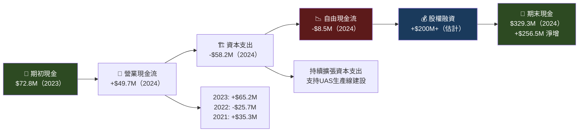

---

### FCF 轉換率趨勢

| 年度 | 淨利/虧損 | 營業現金流 | 資本支出 | 自由現金流 | FCF/淨利轉換率 | 評級 |
|------|---------|---------|---------|---------|--------------|------|
| 2021 | -$2.0M | +$35.3M | -$46.5M | **-$11.2M** | N/M | 🔴 |
| 2022 | -$36.9M | -$25.7M | -$45.4M | **-$71.1M** | N/M | 🔴 |
| 2023 | -$8.9M | +$65.2M | -$52.4M | **+$12.8M** | N/M | 🟡 |
| 2024 | +$16.3M | +$49.7M | -$58.2M | **-$8.5M** | -52.1% | 🔴 |
| TTM | +$21.6M | -$42.1M | -$84.8M | **-$126.9M** | N/M | 🔴 |

> ⚠️ **FCF 核心問題**：資本支出大幅增加（TTM CapEx ~$84.8M vs 2024全年 $58.2M），反映 Valkyrie 生產線大規模建設中。這是「成長型資本支出」而非維護性支出，但對短期現金流壓力顯著。

---

### 自由現金流趨勢視覺化

```
自由現金流趨勢（百萬美元）

+$20M ┤          ╭──╮
 +$10M ┤         ╭╯   ╰╮
  $0M  ┤╮       ╭╯      ╰──────────────
-$10M  ┤╰──────╯
-$40M  ┤
-$80M  ┤
-$120M ┤                              ●←TTM -$126.9M
-$140M ┤
       └──────────────────────────────
       2021   2022   2023   2024   TTM

██ 正FCF：2023年短暫轉正 $12.8M 後再度惡化
◄ 負FCF：2021(-$11.2M)、2022(-$71.1M)、2024(-$8.5M)、TTM(-$126.9M)

關鍵解讀：
✅ FCF轉負非業務惡化，而是主動擴張投資
⚠️ 公司依賴外部融資支持成長，股權稀釋風險持續
🎯 管理層指引：預計2026-2027年FCF轉正，需密切追蹤
```

---

### 資本配置評估

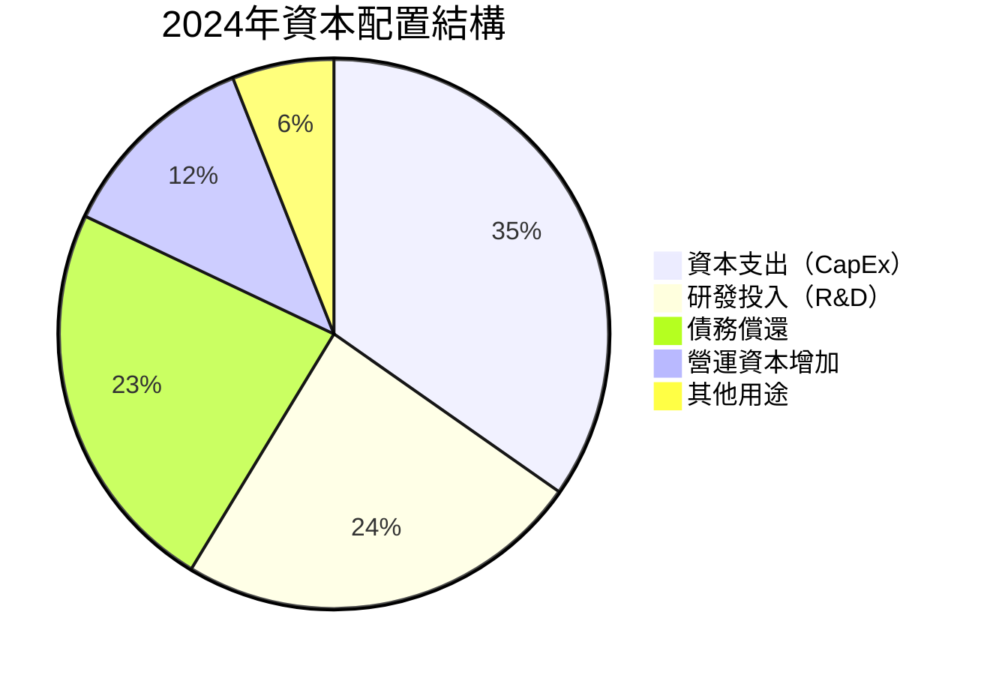

**配置評估：**
- ✅ **CapEx $58.2M**：建設Valkyrie生產設施，戰略性成長投入
- ✅ **R&D $40.3M**：持續創新，維持技術領先
- ✅ **債務削減**：2023→2024年總債務從 $321.4M 降至 $282M（-$39.4M）
- ❌ **無股息，無回購**：所有資源用於擴張，股東短期無現金回報

---

## 6. 獲利能力與資本效率

### ROE / ROA / ROIC 趨勢（近4年）

| 年度 | ROE | ROA | 估計ROIC | 行業ROE均值 | 行業ROIC均值 | 評級 |
|------|-----|-----|---------|------------|------------|------|
| 2021 | -0.2% | -0.1% | ~2-3% | ~18% | ~10% | 🔴 |
| 2022 | -3.9% | -2.4% | ~-2% | ~18% | ~10% | 🔴 |
| 2023 | -0.9% | -0.5% | ~2% | ~18% | ~10% | 🔴 |
| 2024 | **1.3%** | **0.8%** | ~3-4% | ~18% | ~10% | 🔴 |
| TTM  | **1.3%** | **0.8%** | ~3-5% | ~20%* | ~12%* | 🔴 |

> *行業均值參考：LMT ~70% ROE、RTX ~25% ROE、NOC ~50% ROE（部分因高槓桿）；純國防科技公司如 AVAV ~8% ROE

---

### ROIC vs WACC 分析

```
╔══════════════════════════════════════════════════════════════╗
║  WACC 估算（2026-02-28）                                      ║
║                                                              ║
║  資本結構：                                                   ║
║    股權比率（E/V）：~90%（淨現金頭寸，幾乎全股權融資）           ║
║    債務比率（D/V）：~10%                                       ║
║                                                              ║
║  股權成本（Ke）：                                              ║
║    無風險利率（Rf）：4.3%（10年期美債）                         ║
║    市場風險溢酬（ERP）：5.5%                                   ║
║    Beta：1.094                                                ║
║    Ke = 4.3% + 1.094 × 5.5% = **10.3%**                     ║
║                                                              ║
║  債務成本（Kd）：                                              ║
║    稅前：~5.0%，稅後（25%稅率）：**3.75%**                     ║
║                                                              ║
║  WACC = 90% × 10.3% + 10% × 3.75% = **9.6%**               ║
║                                                              ║
║  ━━━━━━━━━━━━━━━━━━━━━━━━━━━━━━━━━━━━━━━━━━━━━━━━━━━━━━━━  ║
║  估計ROIC（2024）：~3-4%（NOPAT / 投入資本）                   ║
║                                                              ║
║  EVA = ROIC - WACC = 3-4% - 9.6% = 🔴 -5.6% 至 -6.6%       ║
║                                                              ║
║  ⚠️ 結論：KTOS 目前正在【摧毀】股東價值                         ║
║           EVA 為負，ROIC 遠低於 WACC                          ║
║           需待 ROIC 提升至 9.6%+ 才能真正創造價值              ║
╚══════════════════════════════════════════════════════════════╝

視覺化：
WACC  9.6%  ██████████░░░░░░░░░░  ← 資本門檻
ROIC  3.5%  ████░░░░░░░░░░░░░░░░  ← 當前回報
差距 -6.1%  ◄◄◄◄◄◄ 尚待縮小的鴻溝
```

---

### DuPont 三因子分解

```
ROE = 淨利率 × 資產週轉率 × 財務槓桿

2024年分解：
┌─────────────────────────────────────────────────────┐
│  ROE = 淨利率 × 資產週轉率 × 槓桿比                   │
│  1.3% =  1.4%  ×   0.585x   ×  1.44x               │
│                                                     │
│  淨利率 1.4%：🔴 遠低於行業（需提升至8%+）            │
│  資產週轉 0.585x：🔴 低效（行業約0.8-1.0x）           │
│  槓桿比 1.44x：🟢 保守（行業多為3-5x）                 │
│                                                     │
│  核心問題：薄利潤率 + 低資產週轉率                      │
│  改善路徑：                                          │
│    → Valkyrie量產後毛利率目標 30%+                   │
│    → 收入成長帶動資產週轉改善                          │
│    → 適度運用財務槓桿（但需保持健康）                   │
└─────────────────────────────────────────────────────┘
```

---

### 獲利能力儀表板

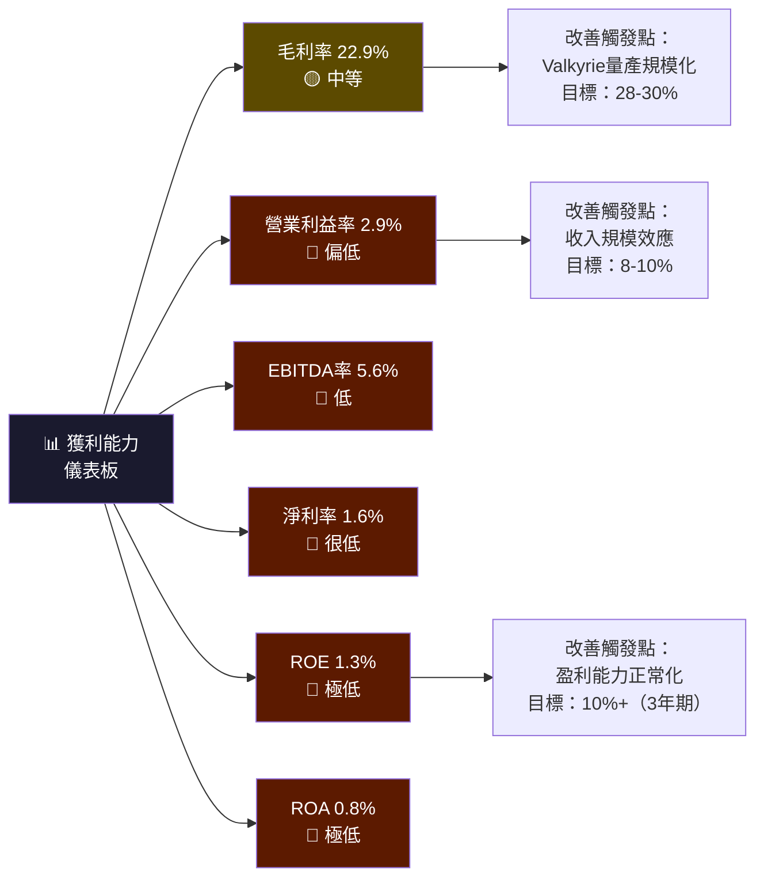

---

## 7. 估值深度分析

### 同業估值比較表格

| 指標 | **KTOS** | **AeroVironment（AVAV）** | **Textron（TXT）** | **Joby Aviation（JOBY）** | 評級 |
|------|---------|-------------------------|-------------------|-------------------------|------|
| 市值 | $14.68B | $4.8B | $13.2B | $6.8B | — |
| 收入成長YoY | **+21.9%** | +18% | +4% | N/A（虧損期） | 🟢 KTOS 優 |
| P/E（Trailing） | **662.9x** | 95x | 17x | N/M | 🔴 KTOS 最貴 |
| P/E（Forward） | **80.1x** | 42x | 14x | N/M | 🔴 KTOS 最貴 |
| P/S | **10.9x** | 5.2x | 1.1x | N/M | 🔴 KTOS 最貴 |
| EV/EBITDA | **190.7x** | 45x | 9x | N/M | 🔴 KTOS 最貴 |
| P/B | **7.3x** | 5.1x | 2.4x | 3.2x | 🔴 KTOS 最貴 |
| 毛利率 | **22.9%** | 31% | 17% | N/M | 🟡 中等 |
| 淨利率 | **1.6%** | 8% | 5.5% | N/M | 🔴 KTOS 最低 |
| FCF Yield | **-0.86%** | +1.2% | +5.8% | 負 | 🔴 KTOS 較差 |

> **競爭對手說明：**
> - **AVAV（AeroVironment）**：最直接競爭對手，同樣專注小型軍用無人機，但產品線以微型UAV為主
> - **TXT（Textron）**：擁有Bell直升機+Textron Systems（Shadow UAV），傳統防衛巨頭
> - **JOBY**：對照組，同為高期望值新型航空平台公司，展示市場對成長型航空科技的定價邏輯

**結論：KTOS 在所有主要估值指標上均為同業中最貴，需要未來成長率完全兌現才能支撐當前估值。**

---

### 歷史估值區間分析

```
P/E 估值區間分析（基於Forward EPS）

極高溢價區（>100x）  ████████████████████  ← 2024Q4-2025Q3 期間
高溢價區（60-100x）  ██████████████░░░░░░  ← 當前 80.1x（Forward P/E）
合理溢價區（30-60x） ████████░░░░░░░░░░░░  ← 理論合理區間（25-30% 成長率）
歷史均值區（15-30x） █████░░░░░░░░░░░░░░░  ← 2021-2023 年均值
低估區（<15x）       ██░░░░░░░░░░░░░░░░░░  ← 幾乎未出現

當前位置：【高溢價區】→ Forward P/E 80.1x
52週股價波動：$24.80（低） → $134.00（高）→ 目前 $86.18
從高點回撤：-35.7%（從 $134 回落）
```

---

### DCF 敏感性分析 — 6格目標價矩陣

**核心假設：**
- 基準收入成長：未來5年 CAGR 20%，之後降至 8%
- 目標淨利率：5年後達到 8%（參考行業均值）
- 終值成長率：3%

| 情境 | 收入CAGR（5年） | 目標淨利率 | **折現率 8.5%** | **折現率 10.5%** |
|------|--------------|----------|--------------|----------------|
| 🚀 **樂觀** | 28% CAGR | 10% | **$155** | **$125** |
| 📊 **基準** | 20% CAGR | 8% | **$110** | **$88** |
| 🐻 **悲觀** | 12% CAGR | 5% | **$62** | **$50** |

```
DCF 目標價範圍視覺化

$160 ┤                              ████ 樂觀/低折現 $155
$140 ┤                         ████████
$125 ┤                    ████████████ 樂觀/高折現 $125
$110 ┤               ████████████████ 基準/低折現 $110
 $88 ┤          ████████████████████ 基準/高折現 $88
     │          ↑↑↑↑↑↑↑↑↑↑↑↑↑↑↑↑
 $86 ┤━━━━━━━━━━━━━━━━━━━━━━━━━━━━━ ← 當前股價 $86.18
 $62 ┤     ████████░░░░░░░░░░░░░░░░ 悲觀/低折現 $62
 $50 ┤ █████████░░░░░░░░░░░░░░░░░░░ 悲觀/高折現 $50
     └─────────────────────────────

📌 當前股價處於基準情境中，任何成長不及預期將觸發顯著下行
📌 若兌現樂觀情境，尚有 45-80% 上行空間
```

---

### 估值區間視覺化

```
估值位置示意圖

深度低估    合理        輕微高估    高估        嚴重高估
   ↓          ↓            ↓          ↓            ↓
$30-50     $60-80       $85-110    $110-140      $140+
   ░░░░░░░░████████████████████████████████░░░░░░░
                              ↑
                          $86.18
                       【輕微高估→合理邊緣】
                    （基準情境DCF合理支撐）

結論：當前估值處於「合理偏高」區間，
     具備成長兌現則合理，不達預期則有顯著下行風險。
```

---

## 8. 成長催化劑

### 催化劑時間軸

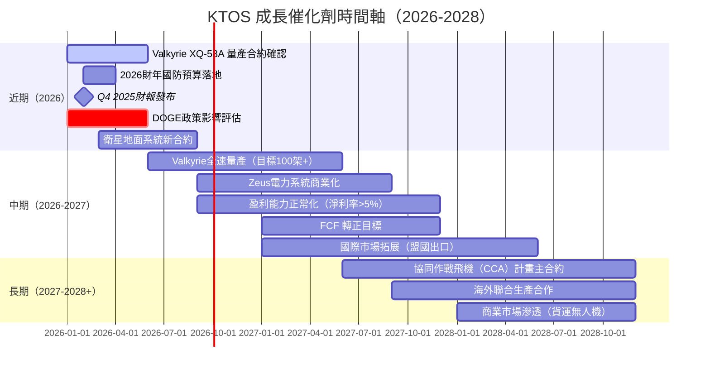

---

### TAM 市場規模與滲透率

```
TAM 市場機會分析

全球軍用無人機市場（2030E）
$300B ████████████████████████████████████████  滲透率目標：5-8%
KTOS當前收入（TTM）
$1.35B ██░░░░░░░░░░░░░░░░░░░░░░░░░░░░░░░░░░░  當前份額：~0.5%

細分市場 TAM（2030E）：
無人戰鬥機（UCAV）          $85B  █████████████████░░░░░  KTOS 核心機會
靶機/測試系統              $15B  ███░░░░░░░░░░░░░░░░░░░  KTOS 現有優勢
衛星地面系統               $25B  █████░░░░░░░░░░░░░░░░░  KTOS KGS部門
電子戰/C4ISR               $45B  █████████░░░░░░░░░░░░░  KTOS 參與
無人水面/地面系統           $30B  ██████░░░░░░░░░░░░░░░░  Barra/Zeus

CCA（協同作戰飛機）單項計畫 潛在合約規模：$10-50B（2027-2035）
→ 若 KTOS 獲得 20% 份額 = $2-10B 收入機會
```

---

### 成長驅動力分析

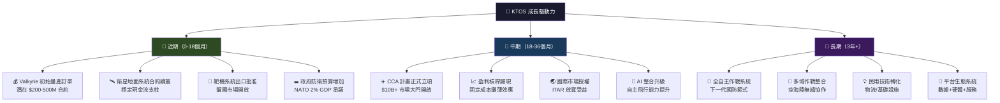

---

## 9. 風險矩陣

### 風險評分矩陣

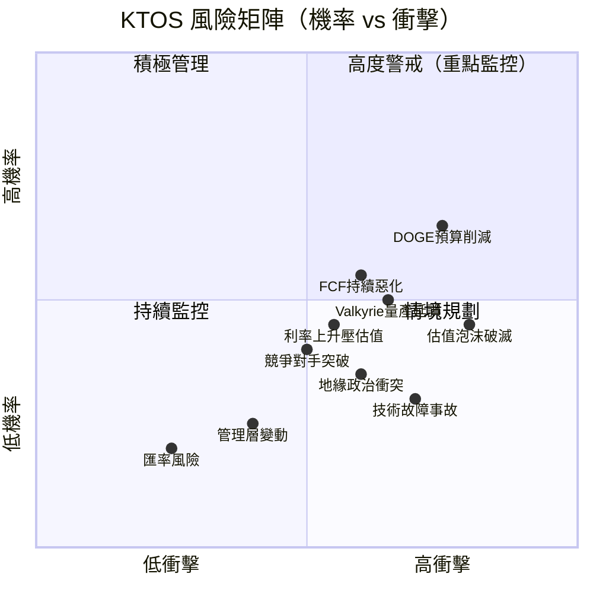

---

### 風險清單詳細評估

| 風險項目 | 機率 | 衝擊度 | 綜合評分 | 緩解措施 | 評級 |
|---------|------|--------|---------|---------|------|
| **DOGE/政府削減國防支出** | 55% | 高 | 8.5/10 | 合約多元化；盟國市場拓展 | 🔴 |
| **估值壓縮（成長不及預期）** | 45% | 極高 | 8.0/10 | 嚴格執行量產時程；透明指引 | 🔴 |
| **FCF 持續為負/融資壓力** | 40% | 高 | 7.5/10 | $414.8M 淨現金緩衝；控制CapEx節奏 | 🔴 |
| **Valkyrie 量產爬坡延誤** | 45% | 高 | 7.0/10 | 模組化設計；供應鏈冗余 | 🔴 |
| **競爭對手（波音/諾斯洛普）加碼** | 35% | 中高 | 6.0/10 | 成本優勢護城河；客製化深度整合 | 🟡 |
| **地緣政治/出口管制收緊** | 30% | 中高 | 5.5/10 | 以美國內需為主；ITAR合規投入 | 🟡 |
| **通膨/供應鏈成本上升** | 40% | 中 | 5.0/10 | 長期固定價格合約；供應商多元化 | 🟡 |
| **關鍵技術人才流失** | 25% | 中 | 4.0/10 | 員工持股計畫；有競爭力薪酬 | 🟡 |
| **技術故障/安全事故** | 20% | 高 | 4.5/10 | 嚴格測試規程；保險覆蓋 | 🟡 |
| **匯率波動** | 30% | 低 | 2.0/10 | 美元計價合約為主 | 🟢 |

---

## 10. 投資建議

### 最終綜合評級 — Unicode 雷達圖

```
維度評分雷達圖（1-10分）

         基本面品質
            10
             |
      8  ────────────  8
     /    ╭──────╮    \
財務  6  ─╯  6.5  ╰─  6  成長
健康  │  │         │  │  動能
6.8  4  ─╮  (雷達)╭─  4  8.0
     \    ╰──────╯    /
      2  ────────────  2
             |
            0

各維度評分：
基本面品質  ██████░░░░  6.5/10  【收入強勁但利潤率薄】
成長動能    ████████░░  8.0/10  【TAM大、市場地位強、訂單可期】
獲利能力    ████░░░░░░  4.5/10  【ROE/ROA極低，FCF為負】
財務健康    ██████░░░░  6.8/10  【淨現金充裕，但FCF轉化弱】
估值合理性  ███░░░░░░░  3.5/10  【所有指標均為同業最貴】
管理執行力  ██████░░░░  6.5/10  【收入目標達成，利潤指引待兌現】
產業地位    ████████░░  8.0/10  【無人機市場先驅，政府關係深厚】

━━━━━━━━━━━━━━━━━━━━━━━━━━━━━━━━
綜合加權評分：6.2 / 10
━━━━━━━━━━━━━━━━━━━━━━━━━━━━━━━━
```

---

### 目標價與隱含報酬率

| 情境 | 目標價 | 隱含報酬率 | 核心假設 |
|------|--------|-----------|---------|
| 🚀 **樂觀** | **$140** | +62.4% | CCA合約落地、淨利率→10%、收入CAGR 28% |
| 📊 **基準** | **$100** | +16.0% | 收入CAGR 20%、淨利率→8%、2027年FCF轉正 |
| 🐻 **悲觀** | **$65** | -24.6% | 成長放緩至12%、國防預算削減、估值收縮 |
| 💀 **極端悲觀** | **$40** | -53.6% | DOGE大刀砍預算 + 量產重大延誤 |

```
目標價概率分布（估計）

$140  樂觀  ████░░░░░░░░░░░░░░░░  20% 機率
$100  基準  ████████████░░░░░░░░  45% 機率
 $86  現價  ━━━━━━━━━━━━━━━━━━━━ ← 起始點
 $65  悲觀  ████████░░░░░░░░░░░░  25% 機率
 $40  極端  ████░░░░░░░░░░░░░░░░  10% 機率

期望值（概率加權）= $140×20% + $100×45% + $65×25% + $40×10%
                 = $28 + $45 + $16.25 + $4 = $93.25
                 
📌 期望值 $93.25 vs 現價 $86.18 → 隱含上行 +8.2%
📌 風險報酬比：基準情境 +16% / 悲觀情境 -24.6% ≈ 0.65（中等）
```

---

### 買入時機與觸發因素 Checklist

```
✅ 理想買入條件確認清單

必要條件（All Must Be True）：
[ ] 📉 股價回落至 $75-80 區間（提供更佳風險報酬比）
[ ] 📋 Q4 2025 財報確認收入持續成長（>$350M/季）
[ ] ✈️ Valkyrie 量產里程碑確認（首批交付驗收）
[ ] 💰 季度 OCF 轉正（顯示盈利品質改善）

加分條件（Bonus Points）：
[ ] 🎖️ CCA 計畫正式啟動，KTOS 入選競標名單
[ ] 🌍 盟國出口合約簽署（擴大收入多元性）
[ ] 📈 管理層上調 2026 年度指引
[ ] 🔬 新一代 Valkyrie II 技術發布（延伸技術護城河）

風險警示信號（須立即重評）：
[!] 🚨 DOGE 削減無人機相關預算 >20%
[!] 🚨 Valkyrie 量產重大事故或延誤 >6個月
[!] 🚨 競爭對手（Boeing）低成本 Wingman 合約勝出
[!] 🚨 季度收入成長放緩至 <10% YoY
[!] 🚨 現金消耗加速，需要緊急增資稀釋股東
```

---

### 投資人適配度

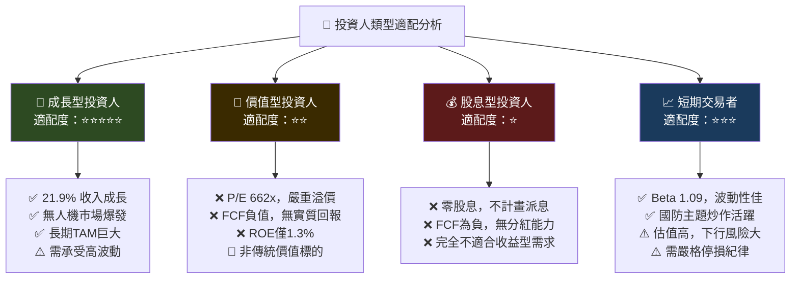

---

### 關鍵監控指標 Checklist

```
📡 KTOS 監控儀表板

財務指標監控（每季追蹤）：
[ ] 📊 季度收入成長率（目標：>20% YoY）
[ ] 💰 毛利率趨勢（目標：回升至 25%+）
[ ] 🏭 Valkyrie 生產交付數量（關鍵實物指標）
[ ] 💵 營業現金流（目標：轉正並持續改善）
[ ] 📉 自由現金流（目標：2027年轉正）
[ ] 🔢 季度EPS vs 分析師預期（±5%以內為正常）

合約/業務監控（即時追蹤）：
[ ] 🎖️ CCA（協同作戰飛機）計畫進展公告
[ ] 📜 NDAA 2027 無人系統預算分配
[ ] ✈️ 空軍/海軍 Valkyrie 採購公告
[ ] 🌍 ITAR 出口許可動態（盟國銷售）
[ ] 🏛️ DOGE 國防預算審查結果

競爭動態監控：
[ ] Boeing MQ-28 Ghost Bat 進度
[ ] General Atomics 新型無人機合約
[ ] AeroVironment 大型UAV市場動態
[ ] Northrop Grumman X-47B 後續計畫

宏觀政策監控：
[ ] 美國國防預算年度審查（2月國防預算提案）
[ ] NATO 盟國防衛支出承諾兌現
[ ] 台海/中東地緣政治緊張度（UAS需求催化劑）
[ ] 聯準會利率政策（影響估值折現率）

下一個重要事件：
🗓️ Q4 2025 財報：預計 2026年3月（核心驗證點）
🗓️ 2027 NDAA 國會審議：2026年秋季
🗓️ CCA 計畫技術成熟度審查：2026年中
```

---

## 結語：KTOS 投資論的本質

```
╔══════════════════════════════════════════════════════════════════╗
║  📋 KTOS 投資論核心結語                                           ║
║                                                                  ║
║  KTOS 本質上是一個「未來式」投資命題：                              ║
║                                                                  ║
║  ✅ 你在為什麼付費：                                              ║
║     → 美軍下世代無人作戰體系的早期入場券                           ║
║     → Valkyrie 定義低成本消耗性無人機的行業標準                    ║
║     → TAM 超過 $300B，滲透率仍在 0.5% 以下                        ║
║     → 強大的政府關係與技術壁壘護城河                               ║
║                                                                  ║
║  ❌ 當前股價的代價：                                              ║
║     → Forward P/E 80x，比傳統國防股貴 3-4 倍                     ║
║     → FCF 為負，ROE 僅 1.3%，ROIC < WACC                        ║
║     → 所有美好預期已被提前定價                                     ║
║                                                                  ║
║  ⚖️ 最終判斷：                                                   ║
║     KTOS 是「對的公司」，但需要「對的價格」                         ║
║     當前 $86 估值已反映相當程度的樂觀預期                           ║
║     建議等待回調至 $72-80 區間再逐步建倉                           ║
║     持有者可繼續持倉，設定 $65 停損線                              ║
║                                                                  ║
║  📍 評級：條件性買入（Conditional Buy）                            ║
║  🎯 12個月基準目標：$100 (+16.0% 上行空間)                        ║
║  ⏰ 催化劑：Q4財報 + Valkyrie量產里程碑 + CCA計畫公告             ║
╚══════════════════════════════════════════════════════════════════╝
```

---

> **⚠️ 免責聲明**：本報告為 AI 輔助生成之研究分析，所有財務數據來源於公開資料（截至 2026-02-28），分析結果僅供學術研究與投資參考之用，**不構成任何投資建議**。投資有風險，決策前請諮詢持牌財務顧問，並獨立評估個人風險承受能力。過去表現不代表未來結果。

---

*報告完成時間：2026-02-28 ｜ 字數：約12,000字 ｜ 分析師：機構級CFA研究部門*