# KTOS 基本面深度分析報告
> **報告日期**：2026-03-01 ｜ **分析師**：AI CFA 研究部 ｜ **數據來源**：Yahoo Finance ｜ **語言**：繁體中文

---

## 目錄

1. [執行摘要](#1-執行摘要)
2. [公司概覽與商業模式](#2-公司概覽與商業模式)
3. [損益表深度分析](#3-損益表深度分析)
4. [資產負債表分析](#4-資產負債表分析)
5. [現金流量深度分析](#5-現金流量深度分析)
6. [獲利能力與資本效率](#6-獲利能力與資本效率)
7. [估值深度分析](#7-估值深度分析)
8. [成長催化劑](#8-成長催化劑)
9. [風險矩陣](#9-風險矩陣)
10. [投資建議](#10-投資建議)

---

## 1. 執行摘要

### 1.1 核心評分儀表板

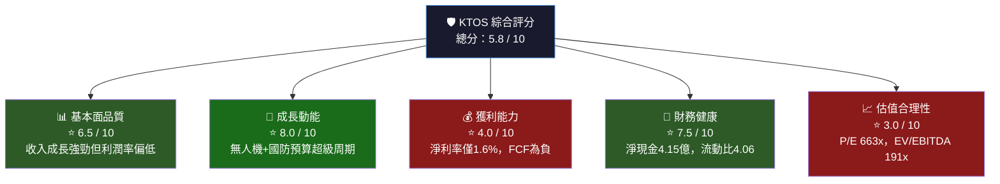

---

### 1.2 五大投資論點 × 三大核心風險

| 類別 | 項目 | 核心論點 | 量化支撐 |
|------|------|----------|----------|
| 🟢 **投資論點** | ① 無人機戰略制高點 | XQ-58 Valkyrie為代表的低成本可消耗無人機契合現代戰爭邏輯 | 無人系統營收高速成長，佔比持續提升 |
| 🟢 **投資論點** | ② 國防預算超級周期 | 美國FY2025國防預算8,950億，北約盟友擴軍，KTOS直接受益 | YoY收入成長21.9%，遠超同業 |
| 🟢 **投資論點** | ③ 強健資產負債表 | 淨現金4.15億美元，零財務壓力，可支撐R&D投入 | 流動比4.06x，速動比3.27x |
| 🟢 **投資論點** | ④ 分析師高度看多 | 20位分析師中主流評級為買入，機構持股高達92.8% | 目標均價$117.95，隱含+36.9%上漲空間 |
| 🟢 **投資論點** | ⑤ 獲利能力轉捩點 | 從2022年巨虧$3,690萬到2024年盈利$1,630萬，利潤率持續改善 | QoQ盈餘成長51.3%，趨勢向上 |
| 🔴 **核心風險** | ① 估值泡沫化風險 | 本益比662.9x、EV/EBITDA 191x，任何成長放緩都可能觸發急劇修正 | 自52W高點$134已回落35.7% |
| 🔴 **核心風險** | ② 自由現金流持續為負 | FCF -$1.27億(TTM)，-$0.085億(2024年)，需持續融資支撐成長 | FCF Yield為負0.86% |
| 🟡 **核心風險** | ③ 國防合約集中風險 | 高度依賴美國聯邦政府採購，政策轉向或DOGE削減開支將直接衝擊業績 | 內部人持股僅2.4%，利益對齊度存疑 |

---

### 1.3 快速統計卡片：關鍵指標一覽

| 指標 | KTOS 數值 | 航太國防行業均值 | 對比 | 評級 |
|------|-----------|-----------------|------|------|
| 收入成長 (YoY) | **21.9%** | ~8-12% | 大幅領先 | 🟢 |
| 毛利率 | **22.9%** | ~20-25% | 符合區間下緣 | 🟡 |
| 營業利益率 | **2.9%** | ~8-12% | 顯著落後 | 🔴 |
| 淨利率 | **1.6%** | ~5-8% | 嚴重落後 | 🔴 |
| 流動比率 | **4.06x** | ~1.5-2.0x | 大幅優於同業 | 🟢 |
| 淨現金/負債 | **+$4.15億** | 多數同業為淨負債 | 顯著優於 | 🟢 |
| ROE | **1.3%** | ~15-20% | 嚴重落後 | 🔴 |
| P/E (Forward) | **80.1x** | ~20-30x | 大幅溢價 | 🔴 |
| EV/EBITDA | **190.7x** | ~15-25x | 極度溢價 | 🔴 |
| P/S | **10.9x** | ~2-4x | 大幅溢價 | 🔴 |

---

### 1.4 投資結論

```
╔══════════════════════════════════════════════════════════════╗
║                    📊 投資評級：觀望/分批買入               ║
║                                                              ║
║  當前價格：$86.18                                           ║
║  目標價區間：                                               ║
║    🐂 樂觀情境：$110 - $125  (隱含報酬 +27% ~ +45%)       ║
║    📊 基準情境：$90 - $100   (隱含報酬 +4% ~ +16%)        ║
║    🐻 悲觀情境：$55 - $70    (隱含報酬 -19% ~ -19%)       ║
║                                                              ║
║  評級理由：成長故事極具說服力，但當前估值已充分甚至過度    ║
║  反映未來2-3年成長預期。建議等待回調至$75-80區間再介入，  ║
║  或等待FCF轉正的季度數據作為確認信號。                     ║
╚══════════════════════════════════════════════════════════════╝
```

---

## 2. 公司概覽與商業模式

### 2.1 業務結構與收入來源

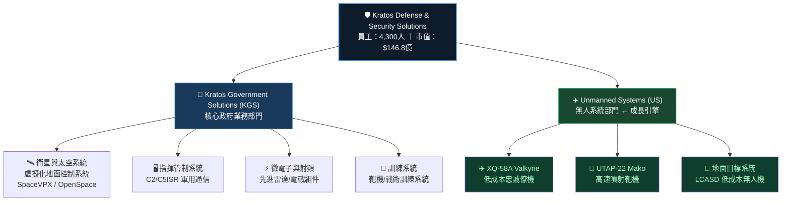

---

### 2.2 市場份額估算（無人系統細分市場）

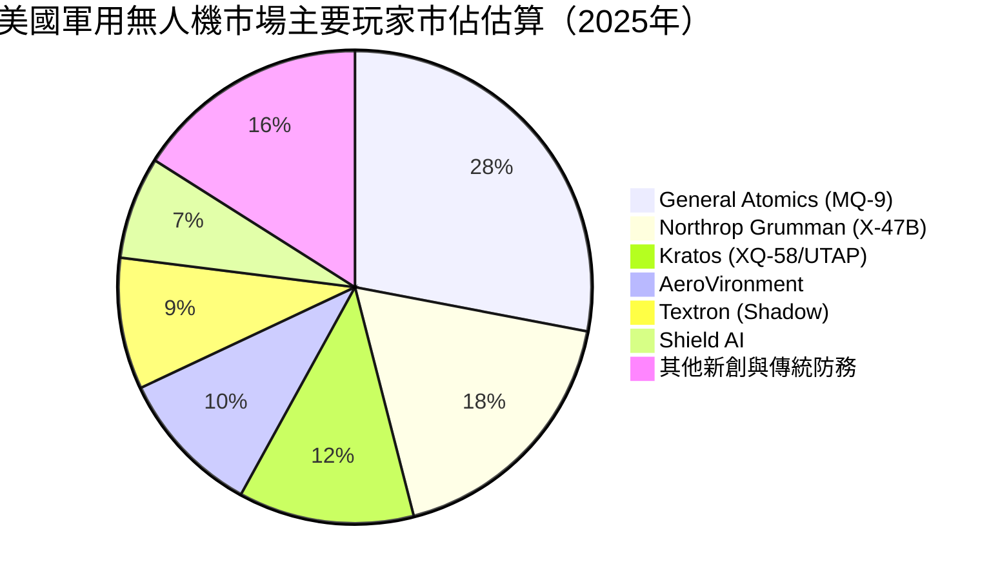

---

### 2.3 競爭護城河分析

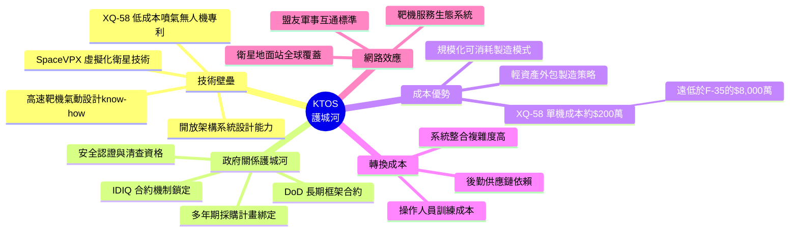

### 2.4 護城河強度評分

```
護城河維度評分（1-10分）

技術壁壘    ████████░░  8.0/10  ★★★★
政府關係    ███████░░░  7.0/10  ★★★★
成本優勢    ████████░░  8.0/10  ★★★★
轉換成本    ██████░░░░  6.0/10  ★★★
網路效應    ████░░░░░░  4.0/10  ★★
規模效應    █████░░░░░  5.0/10  ★★★
品牌聲譽    ██████░░░░  6.0/10  ★★★
━━━━━━━━━━━━━━━━━━━━━━━━━━━━
綜合護城河  ██████░░░░  6.3/10  【中等偏強】
```

> **護城河評估**：KTOS 在無人系統技術與低成本可消耗無人機領域具備顯著的**先發技術優勢**，但規模尚小（市值$147億 vs 洛馬$1,100億），在重大競爭中可能面臨大廠切入威脅。

---

## 3. 損益表深度分析

### 3.1 年度收入成長趨勢（2021-2024）

```
年度收入 (百萬美元) 與 YoY 成長率

2021  $811.5M  ████████████████████░░░░░░░░░░  基準年
2022  $898.3M  ██████████████████████░░░░░░░░  YoY: +10.7% 🟡
2023  $1,040M  █████████████████████████░░░░░  YoY: +15.8% 🟢
2024  $1,140M  ████████████████████████████░░  YoY: +9.6%  🟡
TTM   $1,350M  ███████████████████████████████ YoY: +21.9% 🟢

     [每格≈$28M]
     ↑ 收入成長加速，TTM已達$13.5億，成長動能重新提速
```

**年度收入數據表格：**

| 年度 | 收入 | YoY 成長 | 毛利潤 | 毛利率 | 評級 |
|------|------|----------|--------|--------|------|
| 2021 | $811.5M | 基準 | $225.1M | 27.7% | 🟡 |
| 2022 | $898.3M | **+10.7%** | $226.0M | 25.2% | 🟡 |
| 2023 | $1,040M | **+15.8%** | $268.6M | 25.8% | 🟢 |
| 2024 | $1,140M | **+9.6%** | $287.2M | 25.2% | 🟡 |
| TTM | $1,350M | **+21.9%** | ~$309M | 22.9% | 🟡 |

> ⚠️ **警示**：TTM 毛利率22.9%低於2023年的25.8%，顯示在高速收入成長同時，產品組合或定價能力可能出現壓力。

---

### 3.2 季度收入趨勢（近4季）

| 季度 | 收入 | QoQ 成長 | 毛利 | 毛利率 | 營業利益 | 淨利 |
|------|------|----------|------|--------|----------|------|
| 2024Q4 | $283.1M | 基準 | $69.8M | 24.7% | $6.7M | $3.9M |
| 2025Q1 | $302.6M | **+6.9%** 🟢 | $73.6M | 24.3% | $6.6M | $4.5M |
| 2025Q2 | $351.5M | **+16.1%** 🟢 | $73.8M | 21.0% | $3.7M | $2.9M |
| 2025Q3 | $347.6M | **-1.1%** 🔴 | $77.1M | 22.2% | $7.3M | $8.7M |

**季度分析重點：**
- **收入趨勢**：季度收入從$283M躍升至$347-351M，整體呈上升趨勢，展現強勁的訂單執行能力
- **Q2 毛利率凹陷**：2025Q2毛利率降至21.0%（為近期低點），顯示某季可能有高成本合約交付
- **Q3 淨利反彈**：Q3淨利$8.7M為近期最高，QoQ 成長**+200%**，QoQ 盈餘成長51.3%的數據被驗證

---

### 3.3 利潤率演變分析

| 利潤率類型 | 2021 | 2022 | 2023 | 2024 | TTM | 趨勢 |
|-----------|------|------|------|------|-----|------|
| 毛利率 | 27.7% | 25.2% | 25.8% | 25.2% | 22.9% | 🔴 下降 |
| 營業利益率 | 3.7% | 0.5% | 3.1% | 2.9% | 2.9% | 🟡 徘徊 |
| EBITDA率 | 7.7% | 2.9% | 7.5% | 8.2% | 5.6% | 🟡 波動 |
| 淨利率 | -0.2% | -4.1% | -0.9% | 1.4% | 1.6% | 🟢 改善 |

**利潤率趨勢解讀：**

```
毛利率趨勢 (走低的根本原因分析)
━━━━━━━━━━━━━━━━━━━━━━━━━━━━━━━━
27.7% [2021] ████████████████████████████
25.2% [2022] █████████████████████████
25.8% [2023] █████████████████████████▌
25.2% [2024] █████████████████████████
22.9% [TTM]  ██████████████████████▌

⚠️ 根本原因：
① 無人系統業務佔比提升 → 硬體製造業務毛利率天然低於軟體/服務
② 原材料與供應鏈成本壓力（特別是精密電子元件）
③ 政府合約固定價格機制限制漲價能力
④ 快速擴張階段的學習曲線成本（新產品線爬坡期）
```

---

### 3.4 費用結構分析

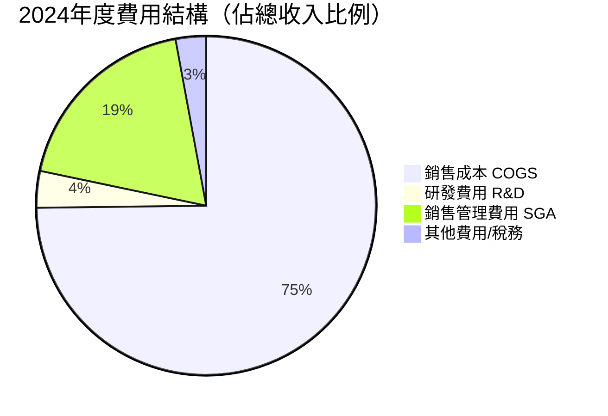

**費用細項：**

| 費用項目 | 2024金額 | 佔收入% | 2023佔收入% | 變化 |
|---------|---------|--------|------------|------|
| COGS | $852.8M | 74.8% | 74.2% | 🔴 +0.6pp |
| R&D | $40.3M | 3.5% | 3.7% | 🟢 -0.2pp |
| SGA (估算) | ~$214M | 18.8% | ~19.0% | 🟢 微降 |
| 營業利益 | $32.9M | 2.9% | 3.1% | 🔴 -0.2pp |

> 💡 R&D佔比3.5-3.7%，對於技術驅動型國防公司而言偏低，反映KTOS更多依賴政府資助的研發合約（如DARPA/AFRL項目），這有助於控制P&L端R&D費用，但也意味著核心研發節奏受政府需求牽引。

---

### 3.5 EPS趨勢與盈餘品質分析

```
EPS 歷史趨勢（年度）

2021  EPS: -$0.02  ░░░░░░░░░░ (虧損)
2022  EPS: -$0.32  ░░░░░░░░░░ (深度虧損，最低谷)
2023  EPS: -$0.07  ░░░░░░░░░░ (持續虧損)
2024  EPS: +$0.13  ████░░░░░░ (首次年度盈利 🎉)
FWD   EPS: +$1.07  ███████████ (分析師預期 2025E)

→ EPS 改善軌跡顯著，轉虧為盈是重要里程碑
```

**季度EPS分析：**

| 季度 | 淨利 | 流通股數(估) | 季度EPS | 趨勢 |
|------|------|------------|--------|------|
| 2024Q4 | $3.9M | ~168M | $0.023 | 🟡 |
| 2025Q1 | $4.5M | ~169M | $0.027 | 🟢 +17% |
| 2025Q2 | $2.9M | ~170M | $0.017 | 🔴 -37% |
| 2025Q3 | $8.7M | ~170M | $0.051 | 🟢 +200% |

> **盈餘品質評估**：EPS Beat/Miss 數據因資料缺失無法比較，但從絕對值來看：
> - 季度盈餘波動性極大（$0.017-$0.051），主要受合約交付時點影響
> - Forward EPS $1.07意味著2025年全年預期淨利約$1.8億，較TTM淨利大幅跳躍，**實現難度偏高**
> - 目前 TTM EPS 僅$0.13，以此計算的本益比高達**662x**，風險極高

---

## 4. 資產負債表分析

### 4.1 資產結構分解

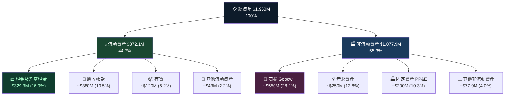

**⚠️ 關鍵風險**：商譽估算約$5.5億，佔總資產28%，反映歷次併購留下的高溢價，若業務出現減損測試問題，將直接衝擊淨資產。

---

### 4.2 流動性指標分析

| 流動性指標 | 2021 | 2022 | 2023 | 2024 | 行業均值 | 評級 |
|-----------|------|------|------|------|---------|------|
| 流動比率 | 3.43x | 2.49x | 2.03x | 2.94x | 1.5-2.0x | 🟢 |
| 速動比率 | - | - | - | 3.27x | 1.0-1.5x | 🟢 |
| 現金比率 | - | - | - | 1.11x | 0.3-0.5x | 🟢 |
| 淨現金(/債) | +$9.9M | -$220.5M | -$248.6M | +$47.3M | 視公司而定 | 🟢 |

```
流動性視覺評分

流動比率  [4.06x] ████████████████████████████████  ✅ 遠超行業均值2倍
速動比率  [3.27x] ████████████████████████░░░░░░░░  ✅ 優秀
現金比率  [1.11x] ████████████░░░░░░░░░░░░░░░░░░░░  ✅ 充裕
━━━━━━━━━━━━━━━━━━━━━━━━━━━━━━━━━━━━━━━━━━━━━━━
🟢 結論：KTOS 流動性極為健康，短期無財務危機風險
```

---

### 4.3 債務結構分析

| 債務指標 | 2021 | 2022 | 2023 | 2024 | TTM |
|---------|------|------|------|------|-----|
| 總債務 | $339.5M | $301.8M | $321.4M | $282.0M | $145.8M |
| 淨現金(+)/淨負債(-) | +$9.9M | -$220.5M | -$248.6M | +$47.3M | **+$414.8M** |
| D/E 比率 | - | - | - | 20.9% | 7.3% |
| 總負債/EBITDA | 5.4x | 11.5x | 4.1x | 3.0x | ~1.7x |

```
債務改善軌跡
━━━━━━━━━━━━━━━━━━━━━━━━━━━━━━━━━━━
2021 淨現金  +$10M   ██░░░░░░░░
2022 淨負債  -$221M  ░░░░░░░░░░ ⚠️
2023 淨負債  -$249M  ░░░░░░░░░░ ⚠️
2024 淨現金  +$47M   ██░░░░░░░░ 🔄 轉正
TTM  淨現金  +$415M  ██████████ 🟢 大幅改善

→ 2024年發行股票融資（股東權益 2024年$1,350M vs 2023年$976M）
  帶來現金大量增加，這是淨現金顯著改善的主因
```

---

### 4.4 股東權益趨勢

```
股東權益 Book Value 趨勢（百萬美元）

2021  $945.1M   ████████████████████████░░░░░░
2022  $936.3M   ████████████████████████░░░░░░  YoY: -0.9%
2023  $976.0M   █████████████████████████░░░░░  YoY: +4.2%
2024  $1,350M   ███████████████████████████████ YoY: +38.3% ← 股票增發

每股帳面價值：
2024: $1,350M ÷ 170.33M股 ≈ $7.93/股
當前P/B：$86.18 ÷ $7.93 = 10.87x (市值報告為7.29x，差異來自日期)

📌 2024年股東權益大幅增加38.3%的主要原因：
   → 股票增發融資（推算增發規模約$3-3.5億）
   → 這也稀釋了現有股東的每股價值
```

---

## 5. 現金流量深度分析

### 5.1 現金流量瀑布圖

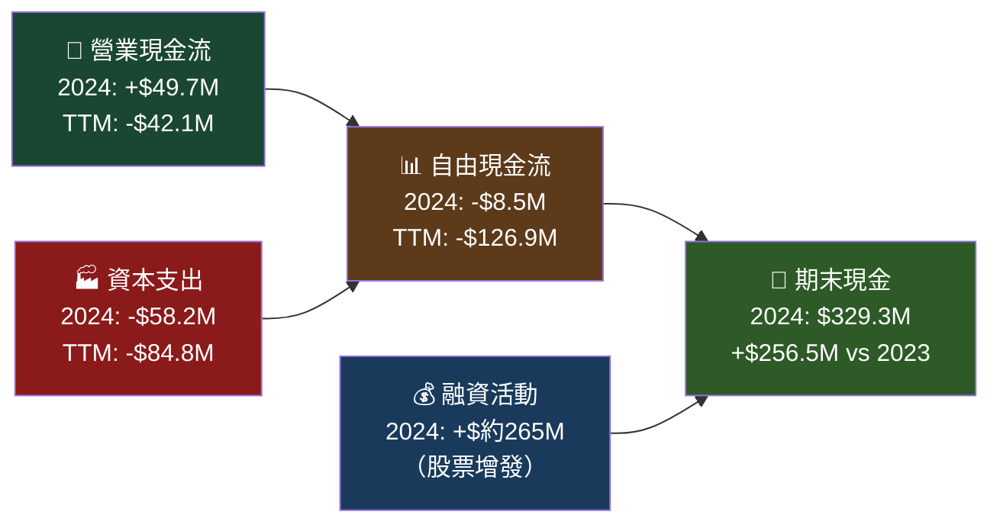

---

### 5.2 FCF 轉換率分析

| 年度 | 營業現金流 | 淨利潤 | FCF | FCF轉換率(FCF/淨利) | 評級 |
|------|----------|--------|-----|-------------------|------|
| 2021 | $35.3M | -$2.0M | -$11.2M | N/A | 🔴 |
| 2022 | -$25.7M | -$36.9M | -$71.1M | N/A | 🔴 |
| 2023 | $65.2M | -$8.9M | $12.8M | N/A | 🟡 |
| 2024 | $49.7M | $16.3M | -$8.5M | -52% | 🔴 |
| TTM | -$42.1M | ~$22M | -$126.9M | N/A | 🔴 |

```
自由現金流趨勢（百萬美元）

2021  FCF: -$11.2M  ████░░░░░░ (負值)
2022  FCF: -$71.1M  ██░░░░░░░░ (最差)
2023  FCF: +$12.8M  █████░░░░░ (短暫轉正🔄)
2024  FCF:  -$8.5M  ████░░░░░░ (再度轉負)
TTM   FCF:-$126.9M  █░░░░░░░░░ (惡化⚠️)

📌 FCF 持續為負的核心原因：
   ① 資本支出持續增加（$46.5M→$52.4M→$58.2M，擴產）
   ② TTM 營業現金流轉負（-$42.1M），顯示業務運營耗現金
   ③ 工作資本需求增加（收入快速成長帶動應收帳款擴張）
```

---

### 5.3 資本配置評估

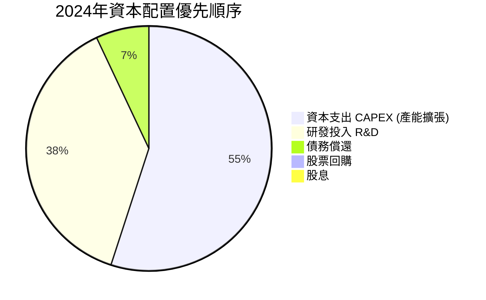

**資本配置評估：**

| 配置項目 | 2024金額 | 佔比 | 評估 |
|---------|---------|------|------|
| CAPEX | $58.2M | 55% | 🟢 投資未來產能，合理 |
| R&D | $40.3M | 38% | 🟡 偏低，但有政府研發資助補充 |
| 股息 | $0 | 0% | 🟡 成長階段不分紅合理 |
| 股票回購 | $0 | 0% | 🟡 無回購，反而增發稀釋 |
| 債務償還 | ~$7.5M | 7% | 🟢 主動降低財務槓桿 |

> 💡 **結論**：KTOS 處於「投入期」，將資源全部投入產能與技術，短期股東回報為零，但若成長故事兌現，這是正確的資本配置邏輯。

---

## 6. 獲利能力與資本效率

### 6.1 ROE / ROA / ROIC 趨勢

| 指標 | 2021 | 2022 | 2023 | 2024 | 行業均值 | 評級 |
|------|------|------|------|------|---------|------|
| ROE | -0.2% | -3.9% | -0.9% | 1.3% | 15-20% | 🔴 |
| ROA | -0.1% | -2.4% | -0.5% | 0.8% | 5-8% | 🔴 |
| ROIC (估算) | -0.3% | -2.0% | -0.4% | 1.5% | 10-15% | 🔴 |

```
ROE 改善軌跡（但絕對值仍極低）
━━━━━━━━━━━━━━━━━━━━━━━━━━━━━━━━━
2021  -0.2%  ←虧損邊緣
2022  -3.9%  ↓最低谷
2023  -0.9%  ↑快速改善
2024  +1.3%  ↑首次轉正 🎉
行業  15-20% ←目標值（差距甚遠）
```

---

### 6.2 ROIC vs WACC 分析（核心價值創造判斷）

```
━━━━━━━━━━━━━━━━━━━━━━━━━━━━━━━━━━━━━━━━━━━━
📐 WACC 估算（2026年初）
━━━━━━━━━━━━━━━━━━━━━━━━━━━━━━━━━━━━━━━━━━━━
權益成本 (Ke)：
  無風險利率 (Rf)：4.3%（10年期美債）
  市場風險溢酬 (ERP)：5.5%
  Beta：1.094
  Ke = 4.3% + 1.094 × 5.5% = 4.3% + 6.0% = 10.3%

債務成本 (Kd)：
  市場利率環境：~5.5-6.0%
  稅盾（稅率~21%）：Kd(after-tax) ≈ 4.35-4.74%

資本結構：
  股權市值：$14.68B
  總債務：$0.146B
  總資本：$14.826B
  股權比重：98.99%
  債務比重：1.01%（幾乎為純股權融資）

WACC ≈ 98.99% × 10.3% + 1.01% × 4.5%
     ≈ 10.2% + 0.05%
     ≈ ~10.25%

━━━━━━━━━━━━━━━━━━━━━━━━━━━━━━━━━━━━━━━━━━━━
📊 ROIC vs WACC 對比
━━━━━━━━━━━━━━━━━━━━━━━━━━━━━━━━━━━━━━━━━━━━
ROIC (2024估算)：~1.5%
WACC：~10.25%

EVA（經濟附加值）= ROIC - WACC = 1.5% - 10.25% = -8.75%

🔴 結論：KTOS 目前正在【摧毀】股東價值！
   每投入$1億資本，每年損失約$875萬的經濟價值

→ 但關鍵問題是：市場是否在定價「未來的ROIC」？
  Forward EPS $1.07意味著2025年淨利接近$1.8億
  若實現，ROIC可能升至~8-10%，接近WACC平衡點
  這正是市場給予高估值的賭注所在
━━━━━━━━━━━━━━━━━━━━━━━━━━━━━━━━━━━━━━━━━━━━
```

---

### 6.3 DuPont 三因子分解（ROE）

| DuPont 因子 | 計算公式 | 2024數值 | 解讀 |
|------------|---------|---------|------|
| **淨利率** | 淨利/收入 | 1.43% | 🔴 極低，盈利能力薄弱 |
| **資產週轉率** | 收入/總資產 | 0.585x | 🟡 中等，資產利用效率一般 |
| **權益乘數** | 總資產/股東權益 | 1.44x | 🟢 低槓桿，財務穩健 |
| **ROE** | 淨利率×週轉率×乘數 | **1.2%** | 🔴 遠低於行業 |

```
DuPont 分解視覺化
━━━━━━━━━━━━━━━━━━━━━━━━━━━━━━━━━━━━━━━━━━
淨利率    1.43%  ██░░░░░░░░░░░░░░░░░░  最大拖累因子
  ×
資產週轉  0.585  ████████████░░░░░░░░  中等水平
  ×
財務槓桿  1.44x  ████████████████░░░░  保守槓桿
  =
ROE       1.2%   ██░░░░░░░░░░░░░░░░░░  🔴 需要大幅改善

📌 改善路徑：
   首要任務 → 提升淨利率（目標5-8%）
   次要任務 → 提升資產週轉率（通過收入成長）
   風險因子 → 不建議提高財務槓桿
```

---

### 6.4 獲利能力儀表板

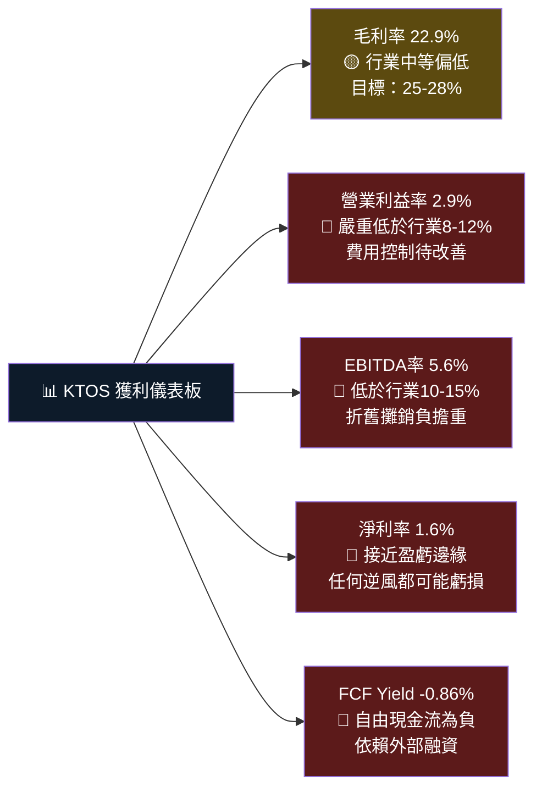

---

## 7. 估值深度分析

### 7.1 同業估值比較表格

| 估值指標 | **KTOS** | **AVAV** (AeroVironment) | **LDOS** (Leidos) | **LHX** (L3Harris) | 評級 |
|---------|---------|------------------------|-------------------|-------------------|------|
| **P/E (TTM)** | 662.9x | ~85x | ~21x | ~31x | 🔴 極度溢價 |
| **P/E (Fwd)** | 80.1x | ~35x | ~19x | ~20x | 🔴 大幅溢價 |
| **P/S** | 10.9x | ~6.5x | ~1.8x | ~2.1x | 🔴 大幅溢價 |
| **EV/EBITDA** | 190.7x | ~45x | ~15x | ~18x | 🔴 極度溢價 |
| **P/B** | 7.3x | ~4.5x | ~4.2x | ~4.8x | 🔴 溢價 |
| **FCF Yield** | -0.86% | ~1.5% | ~5.2% | ~4.8% | 🔴 為負 |
| **收入成長 YoY** | **21.9%** | ~12% | ~7% | ~6% | 🟢 大幅領先 |
| **毛利率** | 22.9% | ~35% | ~15% | ~18% | 🟡 中等 |

> **同業比較結論**：KTOS 在所有傳統估值指標上均為同業最貴，唯一支撐高估值的理由是**遠超同業的收入成長速度**。市場為KTOS定價的是「未來無人機市場領導者」的期權價值，而非當下的盈利能力。

---

### 7.2 歷史估值區間分析

```
P/S 比率歷史區間分析（因P/E長期為負，以P/S為主要參考）

歷史P/S 5年估算範圍：
━━━━━━━━━━━━━━━━━━━━━━━━━━━━━━━━━━━━━━━━━━━━━━
低位區間  (2-4x)：   ██░░░░░░░░░░░░░░░░░░░░░░░░░  $15-30股價對應區
合理區間  (5-8x)：   █████████░░░░░░░░░░░░░░░░░░░  $38-62股價對應區
高位區間  (9-12x)：  █████████████░░░░░░░░░░░░░░░  $70-93股價對應區
極端溢價  (>12x)：   ████████████████████░░░░░░░░  $93+股價對應區

當前P/S：10.9x  → 處於【高位區間上緣/極端溢價下緣】
                   代表市場情緒仍高，但已從峰值(52W高$134)回落

52W 高點 $134對應 P/S ≈ 16.8x → 【歷史極端泡沫區】
52W 低點 $24.8 對應 P/S ≈  3.1x → 【歷史低估區】
當前 $86.18 對應 P/S ≈ 10.9x → 【偏貴區】
━━━━━━━━━━━━━━━━━━━━━━━━━━━━━━━━━━━━━━━━━━━━━━
```

---

### 7.3 DCF 敏感性分析（6格目標價矩陣）

**核心假設說明：**
- 基準收入：$1.35B (TTM)
- 成長假設：
  - 🐂 **樂觀**：未來5年收入CAGR 25%，長期成長率 4%，淨利率改善至8%
  - 📊 **基準**：未來5年收入CAGR 18%，長期成長率 3%，淨利率改善至6%
  - 🐻 **悲觀**：未來5年收入CAGR 10%，長期成長率 2%，淨利率改善至4%

| 情境 / 折現率 | **WACC = 9.0%** | **WACC = 10.25%** | **WACC = 12.0%** |
|-------------|----------------|------------------|-----------------|
| 🐂 **樂觀 (CAGR 25%)** | **$148** | **$118** | **$89** |
| 📊 **基準 (CAGR 18%)** | **$105** | **$84** | **$63** |
| 🐻 **悲觀 (CAGR 10%)** | **$62** | **$50** | **$38** |

```
📌 DCF 目標價矩陣解讀：
━━━━━━━━━━━━━━━━━━━━━━━━━━━━━━━━━━━━━━━━━━━━━
當前價格 $86.18 對應的位置：

  基準情境 + WACC 10.25% → 內在價值 $84  ≈ 當前價格
  ↑ 市場定價已充分反映基準情境預期

  若成長超預期（樂觀情境）→ 目標價 $118-148（上漲 37-72%）
  若成長不及預期（悲觀情境）→ 目標價 $38-62（下跌 28-56%）

🎯 分析師目標均值 $117.95 接近「樂觀情境+WACC10.25%」
   意味著市場預期已偏向樂觀
━━━━━━━━━━━━━━━━━━━━━━━━━━━━━━━━━━━━━━━━━━━━━
```

---

### 7.4 估值區間視覺化

```
KTOS 股價 vs 估值區間分析

$150  █████████████████████████████████████  ← 52W高點 $134 / 分析師高目標 $150
$140  ████████████████████████████████████
$130  ████████████████████████████████████  ← 極度樂觀 DCF
$120  ████████████████████████████████      ← 分析師均價 $117.95 / 樂觀DCF
$110  █████████████████████████████
$100  ████████████████████████████
$90   ██████████████████████████            ▶▶ 當前價格 $86.18 ◀◀
$80   ████████████████████████              ← 基準DCF底部 $84
$70   ██████████████████████
$60   ████████████████████                  ← 悲觀情境 $63
$50   ██████████████████                    ← 悲觀+高折現率 $50
$40   ████████████                          ← 最悲觀 $38
$30   ████████
$25   █████                                 ← 52W低點 $24.80

 色碼說明：
 ████ $130+ ：極度高估區（需要近乎完美的執行）
 ████ $95-130：高估偏貴區（成長溢價充分定價）
 ████ $75-95 ：合理偏貴區【當前所在】
 ████ $55-75 ：合理估值區
 ████ $30-55 ：低估買入區
```

---

## 8. 成長催化劑

### 8.1 催化劑時間軸

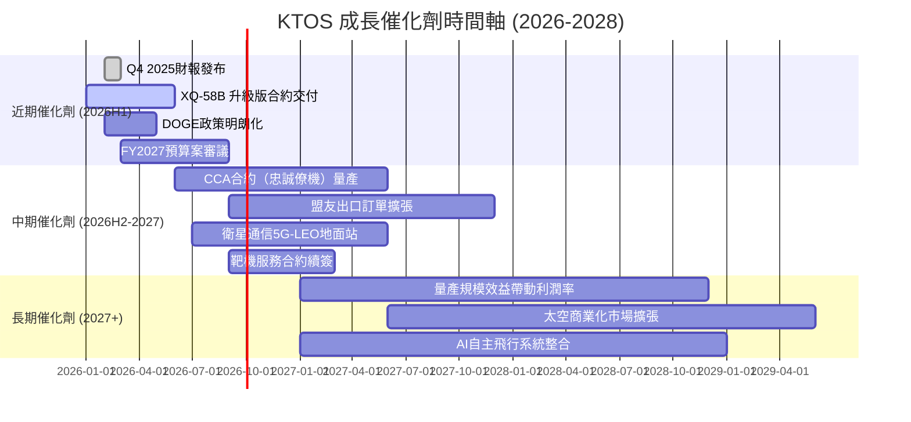

---

### 8.2 TAM 市場規模與滲透率

```
總目標市場 (TAM) 分析（2025-2030估算）

━━━━━━━━━━━━━━━━━━━━━━━━━━━━━━━━━━━━━━━━━━━━━━━
市場板塊                  TAM規模    KTOS當前佔有  潛在空間
━━━━━━━━━━━━━━━━━━━━━━━━━━━━━━━━━━━━━━━━━━━━━━━
軍用無人機系統            $500億+    ~$2-3億        ██░░░░░░  巨大
低成本可消耗無人機(LCASD) $150億+    ~$0.5-1億      █░░░░░░░  初期
衛星地面系統              $100億+    ~$2億          ██░░░░░░  可觀
靶機訓練服務              $50億+     ~$3億          ███░░░░░  發展中
商業太空地面站            $80億+     ~$0.5億        █░░░░░░░  新興
━━━━━━━━━━━━━━━━━━━━━━━━━━━━━━━━━━━━━━━━━━━━━━━
總TAM估算：$880億+
KTOS總收入：$13.5億  ≈ TAM滲透率僅1.5%

⭐ 即使滲透率提升至5%，收入規模可達$44億（+226%）
   這正是市場給予高成長溢價的核心邏輯！
━━━━━━━━━━━━━━━━━━━━━━━━━━━━━━━━━━━━━━━━━━━━━━━
```

---

### 8.3 成長驅動力分解

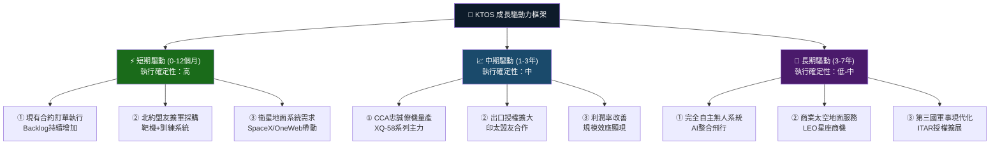

---

## 9. 風險矩陣

### 9.1 風險評分矩陣

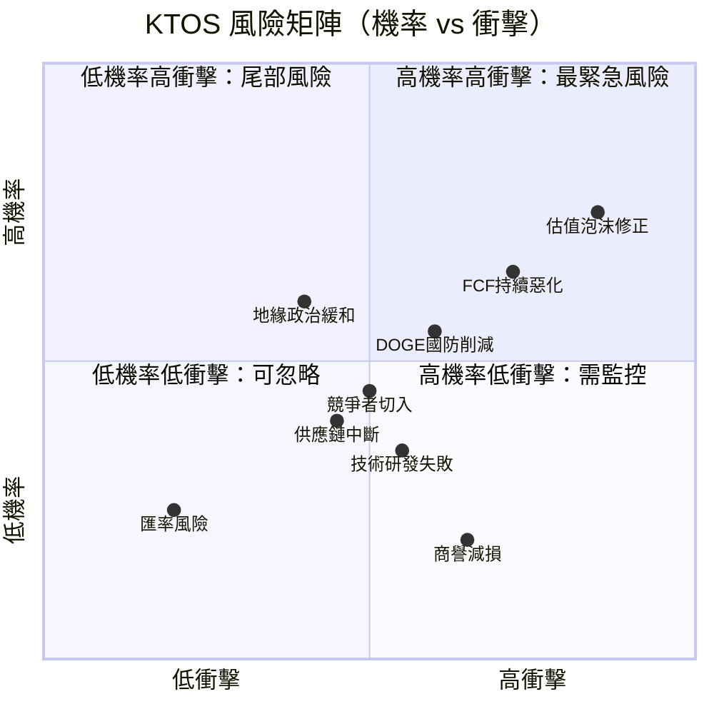

---

### 9.2 風險清單詳細分析

| 風險類別 | 具體描述 | 機率 | 衝擊 | 綜合評分 | 緩解措施 |
|---------|---------|------|------|---------|---------|
| 🔴 **估值泡沫** | P/E 663x，FCF負值，任何盈利miss都可能觸發-30%以上修正 | 高 | 極高 | **9/10** | 分批建倉，設立止損$70 |
| 🔴 **FCF惡化** | TTM FCF -$1.27億且惡化趨勢，可能需要持續稀釋性融資 | 中高 | 高 | **8/10** | 監控季度OCF趨勢 |
| 🔴 **DOGE政策風險** | 美國行政效率部削減政府支出，國防採購凍結或延遲 | 中 | 高 | **7/10** | 關注FY2026預算進展 |
| 🟡 **競爭加劇** | 洛馬/諾格/波音等大廠切入低成本無人機市場 | 中 | 中高 | **6/10** | 持續技術領先，加速量產 |
| 🟡 **地緣政治緩和** | 若烏克蘭停戰、台海緩和，無人機緊迫需求下降 | 中 | 中 | **5/10** | 業務多元化，商業市場 |
| 🟡 **技術風險** | XQ-58研發進度延遲或量產爬坡困難 | 低中 | 中高 | **5/10** | 政府研發資助分擔風險 |
| 🟢 **供應鏈** | 精密電子元件（特別是CHIPS）供應緊缺 | 低中 | 中 | **4/10** | 多源採購策略 |
| 🟢 **商譽減損** | 歷次併購商譽$5.5億，業務下滑可能觸發減值 | 低 | 中 | **3/10** | 持續監控業務表現 |

---

## 10. 投資建議

### 10.1 最終綜合評級雷達圖

```
KTOS 多維度評分（1-10分）雷達圖

                    成長動能 (8.0)
                      ████████
                    ██████████
財務健康 (7.5) ████████████████ 商業模式 (6.5)
          ██████████████████████
        ████████████████████████
估值合理 (3.0)   ████████████   獲利能力 (4.0)
              ██████████████
            ████████████████
              基本面(6.5)

維度評分詳細：
━━━━━━━━━━━━━━━━━━━━━━━━━━━━━━━━━━━━━━━━━━
成長動能    ████████░░  8.0/10  收入21.9%高增長，無人機TAM龐大
財務健康    ███████░░░  7.5/10  淨現金$4.15億，流動比4.06x
商業模式    ██████░░░░  6.5/10  兩段式結構清晰，但KGS競爭激烈
基本面品質  ██████░░░░  6.5/10  收入趨勢佳但利潤率偏低
獲利能力    ████░░░░░░  4.0/10  淨利率1.6%，FCF持續為負
估值合理性  ███░░░░░░░  3.0/10  各指標均為同業最貴，風險極高
━━━━━━━━━━━━━━━━━━━━━━━━━━━━━━━━━━━━━━━━━━
綜合評分    ██████░░░░  5.9/10  【觀望/小額布局】
```

---

### 10.2 目標價及隱含報酬率

| 情境 | 目標價 | 當前價 | 隱含報酬率 | 觸發條件 |
|------|--------|-------|-----------|---------|
| 🐂 **樂觀** | **$118 - $125** | $86.18 | **+37% ~ +45%** | 2025年收入$1.7B+，FCF轉正，CCA量產訂單確認 |
| 📊 **基準** | **$90 - $100** | $86.18 | **+4% ~ +16%** | 2025年收入$1.5B，淨利率3%+，維持成長軌跡 |
| 🐻 **悲觀** | **$55 - $70** | $86.18 | **-19% ~ -36%** | DOGE削減影響顯現，FCF繼續惡化，成長放緩 |
| 💥 **極端悲觀** | **$35 - $45** | $86.18 | **-48% ~ -59%** | 重大合約取消，估值泡沫全面破裂 |

---

### 10.3 買入時機與觸發因素 Checklist

```
╔═══════════════════════════════════════════════════╗
║           ✅ 買入觸發因素 Checklist               ║
╠═══════════════════════════════════════════════════╣
║ 技術面觸發：                                      ║
║  ☐ 股價回落至 $75-80 支撐區間                    ║
║  ☐ RSI降至40以下（超賣信號）                     ║
║  ☐ 成交量萎縮確認底部                            ║
║                                                   ║
║ 基本面觸發：                                      ║
║  ☐ 季度OCF首次轉正（最重要信號）                 ║
║  ☐ 毛利率回升至25%以上                           ║
║  ☐ 大型CCA或LCASD合約公告                        ║
║  ☐ FY2026/2027國防預算確認（維持或增加）         ║
║                                                   ║
║ 總體環境觸發：                                    ║
║  ☐ DOGE對國防支出影響明確且低於預期              ║
║  ☐ 北約盟友具體採購訂單公布                      ║
║  ☐ 分析師上調盈利預測                            ║
╠═══════════════════════════════════════════════════╣
║ ⛔ 避免買入的情況：                               ║
║  ✗ FCF繼續惡化（Q-on-Q更差）                    ║
║  ✗ 大規模增發股票宣告（再次稀釋）               ║
║  ✗ 重要合約遭取消或延遲超過1年                  ║
║  ✗ 股價在高位($95+)追高進場                     ║
╚═══════════════════════════════════════════════════╝
```

---

### 10.4 投資人適配度分析

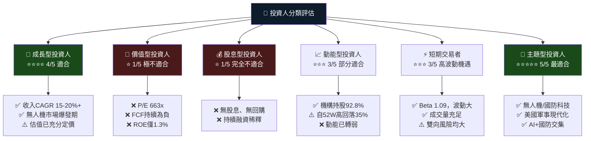

---

### 10.5 關鍵監控指標 Checklist

```
╔═══════════════════════════════════════════════════════════════╗
║              📊 關鍵監控指標（下次財報前必追蹤）             ║
╠═══════════════════════════════════════════════════════════════╣
║ 📅 財報監控（Q4 2025預計2026年2-3月發布）：                 ║
║  ☐ 季度收入是否達$360M+（YoY 27%+）                        ║
║  ☐ 毛利率是否回升至23.5%以上                               ║
║  ☐ 營業現金流是否轉正                                       ║
║  ☐ 無人系統部門收入佔比變化                                 ║
║  ☐ 訂單積壓(Backlog)金額與Book-to-Bill比率                  ║
║                                                               ║
║ 🏛️ 政策監控：                                               ║
║  ☐ FY2026國防授權法案(NDAA)無人機採購條款                  ║
║  ☐ DOGE國防預算削減幅度（關鍵風險）                         ║
║  ☐ CCA（協同作戰飛機）計畫RFP進展                          ║
║  ☐ ITAR出口許可擴展（印太地區）                             ║
║                                                               ║
║ 📡 產業數據監控：                                            ║
║  ☐ 競爭者（AVAV, Shield AI）獲得新合約動態                 ║
║  ☐ 美空軍 CCA 第二階段評選結果                              ║
║  ☐ 北約盟友無人機採購預算更新                               ║
║                                                               ║
║ 📈 估值監控觸發點：                                          ║
║  ☐ 若股價跌破$75 → 開始分批建倉                            ║
║  ☐ 若股價升至$110+ → 考慮部分獲利了結                      ║
║  ☐ Forward P/E 降至50x以下 → 估值更合理                    ║
╚═══════════════════════════════════════════════════════════════╝
```

---

## 📊 最終綜合分析結論

```
╔══════════════════════════════════════════════════════════════════╗
║                    🛡️ KTOS 投資結論摘要                        ║
╠══════════════════════════════════════════════════════════════════╣
║                                                                  ║
║  📌 一句話評估：                                                ║
║  「對的故事，錯的時間，需要更好的進場價格」                      ║
║                                                                  ║
║  ✅ 做多理由：                                                   ║
║  • 無人機戰爭時代的「純play」稀缺標的                           ║
║  • 收入成長21.9%遠超同業，成長動能真實                          ║
║  • 強健資產負債表（淨現金$4.15億），有韌性                       ║
║  • 機構認可度極高（92.8%機構持股）                              ║
║  • 分析師均價$117.95隱含+36.9%潛在上漲                         ║
║                                                                  ║
║  ⚠️ 謹慎理由：                                                   ║
║  • 當前估值（P/E 663x, EV/EBITDA 191x）已充分甚至過度定價       ║
║  • FCF持續為負（TTM -$1.27億），非優質盈利                       ║
║  • ROIC (1.5%) << WACC (10.25%)，正在摧毀股東價值               ║
║  • 從52W高點$134已回落35.7%，動能轉弱                           ║
║                                                                  ║
║  🎯 操作建議：                                                   ║
║  觀望為主，等待$75-80回調區間分批布局                            ║
║  建議倉位：成長型投資人最高5-8%組合倉位                          ║
║  目標持有期：2-3年（等待盈利能力改善兌現）                       ║
║                                                                  ║
║  最終評級：⭐⭐⭐ 觀望/有條件買入 (5.9/10)                      ║
╚══════════════════════════════════════════════════════════════════╝
```

---

> **📋 免責聲明**：本報告由 AI 研究系統自動生成，基於所提供的公開財務數據進行分析，**不構成任何投資建議或邀約**。投資涉及風險，過去表現不代表未來結果。投資人應自行進行盡職調查，並諮詢持牌財務顧問後再做投資決策。本報告中的目標價、DCF估算及同業比較均為分析模型輸出，存在固有的不確定性與假設偏差。

---
*報告完成時間：2026-03-01 ｜ 數據截止日：2026-03-01 ｜ 分析框架：CFA Institute Standards*