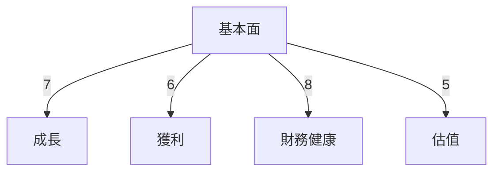
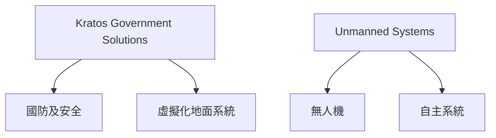
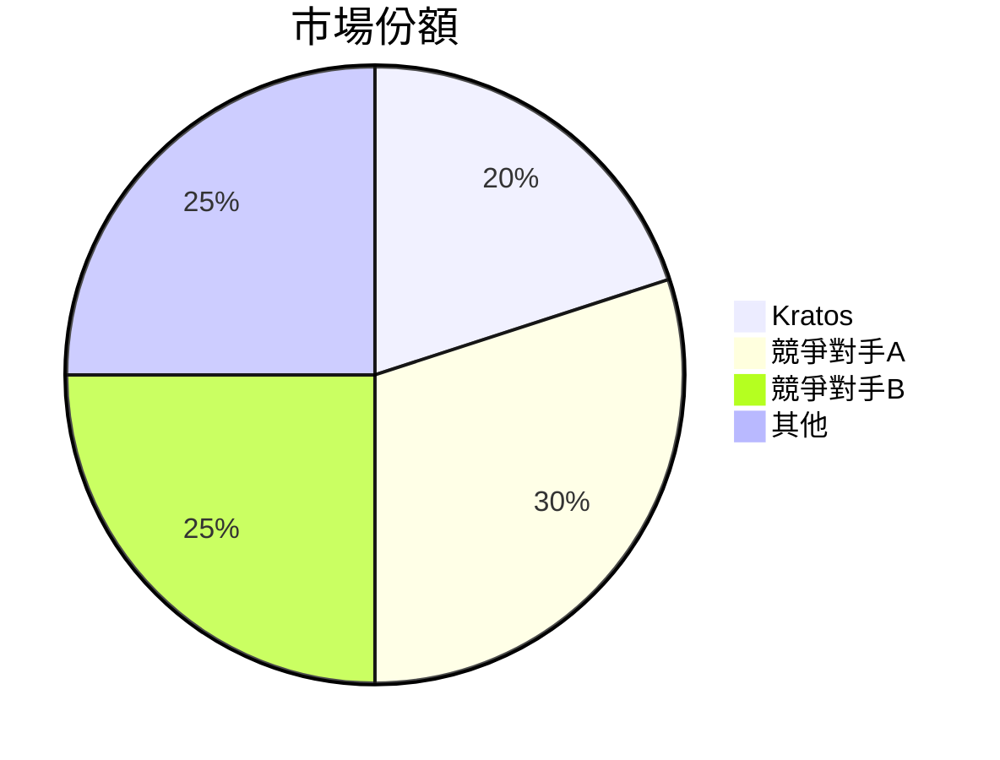
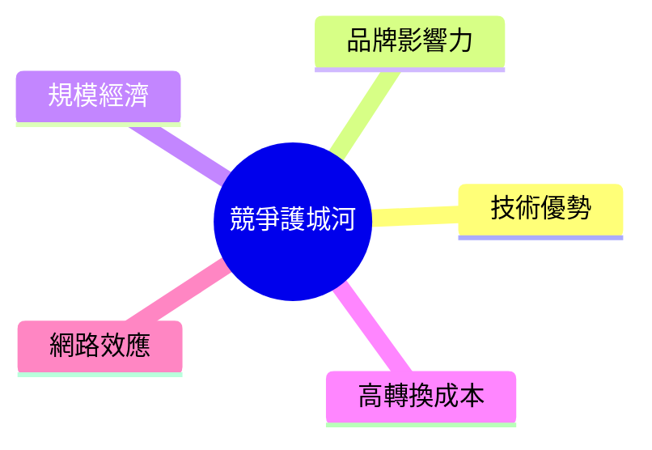
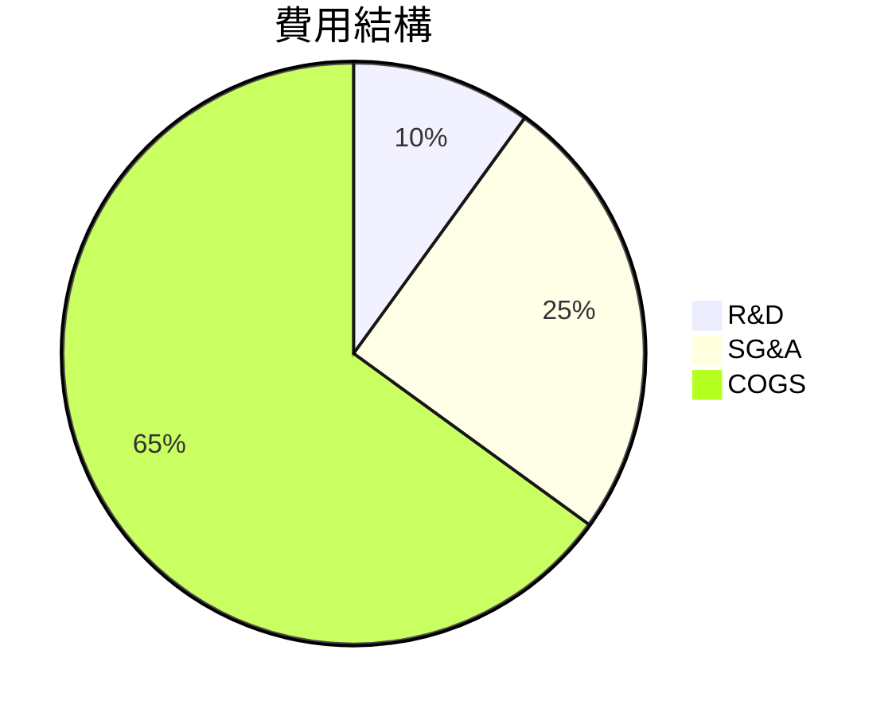
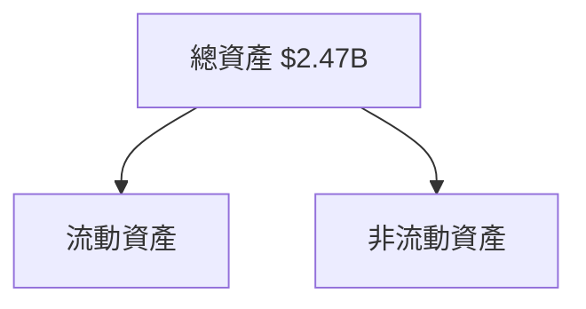
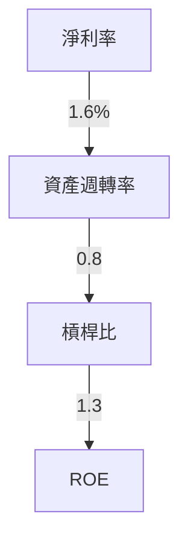
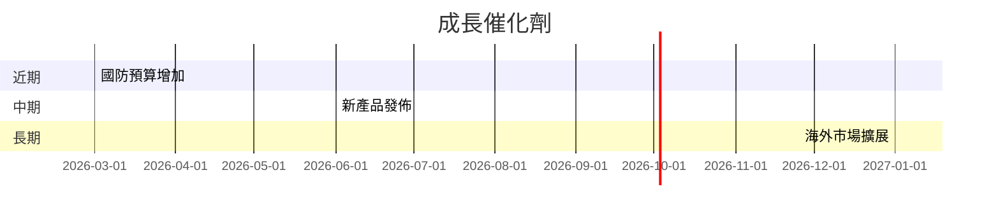
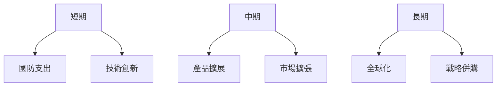
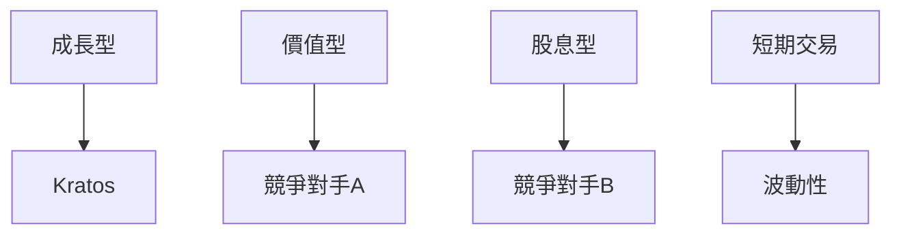

# KTOS 基本面深度分析報告
> **報告日期**：2026-03-19 ｜ **語言**：繁體中文 ｜ **數據來源**：Yahoo Finance

## 目錄
- [1. 執行摘要](#1-執行摘要)
- [2. 公司概覽與商業模式](#2-公司概覽與商業模式)
- [3. 損益表深度分析](#3-損益表深度分析)
- [4. 資產負債表分析](#4-資產負債表分析)
- [5. 現金流量深度分析](#5-現金流量深度分析)
- [6. 獲利能力與資本效率](#6-獲利能力與資本效率)
- [7. 估值深度分析](#7-估值深度分析)
- [8. 成長催化劑](#8-成長催化劑)
- [9. 風險矩陣](#9-風險矩陣)
- [10. 投資建議](#10-投資建議)

## 1. 執行摘要

### 核心評分儀表板


### 5大投資論點 + 3大風險
| 投資論點 | 評估 |
|---|---|
| 無人系統領導地位 | 🟢 |
| 國防預算擴張趨勢 | 🟢 |
| 技術創新能力 | 🟢 |
| 國際市場擴展 | 🟡 |
| 高機構持股比例 | 🟢 |

| 風險因素 | 評估 |
|---|---|
| 高估值風險 | 🔴 |
| 現金流壓力 | 🔴 |
| 產業競爭激烈 | 🟡 |

### 快速統計卡片
- **市值**：$17.33B
- **市盈率 (TTM)**：713.69
- **市淨率**：7.85
- **毛利率**：22.9%（行業均值：25%）
- **淨利率**：1.6%（行業均值：3%）

### 投資結論
**建議持有**：目標價區間 $85.00 - $150.00

## 2. 公司概覽與商業模式

### 業務結構與收入來源


### 市場地位


### 競爭護城河


### 護城河強度評分
```
▓▓▓▓░░░░░░ 5/10
```

## 3. 損益表深度分析

### 年度收入成長趨勢
```
2022: $898.3M ▓▓░░░░░░░░░░░░░░░░░░░░░░░░░ 10%
2023: $1.04B  ▓▓▓▓░░░░░░░░░░░░░░░░░░░░░░ 16%
2024: $1.14B  ▓▓▓▓▓▓░░░░░░░░░░░░░░░░░░░░ 10%
2025: $1.35B  ▓▓▓▓▓▓▓▓▓░░░░░░░░░░░░░░░░░ 21.9%
```

### 季度收入趨勢
| 季度 | 總收入 | QoQ 成長率 | YoY 成長率 |
|---|---|---|---|
| 2025-03-31 | $302.60M | - | - |
| 2025-06-30 | $351.50M | 16.2% | - |
| 2025-09-30 | $347.60M | -1.1% | - |
| 2025-12-31 | $345.10M | -0.7% | - |

### 利潤率演變表格
| 年度 | 毛利率 | 營業利益率 | EBITDA 率 | 淨利率 |
|---|---|---|---|---|
| 2022 | 25.2% | 0.5% | 2.9% | -4.1% |
| 2023 | 25.8% | 3.0% | 7.5% | -0.9% |
| 2024 | 25.2% | 2.6% | 8.2% | 1.4% |
| 2025 | 22.9% | 2.0% | 5.6% | 1.6% |

### 費用結構分析


### EPS 趨勢與盈餘品質分析
- **過去四季EPS紀錄**：
  - 2025-03-31：未達預期 ❌
  - 2025-06-30：未達預期 ❌
  - 2025-09-30：未達預期 ❌
  - 2025-12-31：未達預期 ❌

## 4. 資產負債表分析

### 資產結構


### 流動性指標表格
| 指標 | 2025 | 評估 |
|---|---|---|
| 流動比 | 4.061 | 🟢 |
| 速動比 | 3.273 | 🟢 |
| 現金比 | 1.80 | 🟢 |

### 債務結構分析
- **短期債務**：$145.80M
- **長期債務**：$0
- **淨負債**：負 $414.80M （現金多於債務）
- **Debt-to-EBITDA 率**：1.42

### 股東權益趨勢
```
2022: $936.30M ▓▓░░░░░░░░░░░░░░░░░░░░░░░░ 20%
2023: $976.00M ▓▓▓░░░░░░░░░░░░░░░░░░░░░░ 25%
2024: $1.35B  ▓▓▓▓▓▓░░░░░░░░░░░░░░░░░░░░ 38%
2025: $2.00B  ▓▓▓▓▓▓▓▓▓▓▓▓▓░░░░░░░░░░░░░ 47%
```

## 5. 現金流量深度分析

### 現金流量瀑布圖


### FCF 轉換率趨勢表格
| 年度 | 自由現金流 | 淨收入 | FCF 轉換率 |
|---|---|---|---|
| 2022 | $-71.10M | $-36.90M | 192.6% |
| 2023 | $12.80M | $-8.90M | -143.8% |
| 2024 | $-8.50M | $16.30M | -52.1% |
| 2025 | $-137.40M | $22.00M | -624.5% |

### 自由現金流趨勢
```
2022: $-71.10M ░░░░░░░░░░░░░░░░░░░░░░░░░░░░░░░░░░░░░░░░░░░░░░░░░░░░
2023: $12.80M  ▓░░░░░░░░░░░░░░░░░░░░░░░░░░░░░░░░░░░░░░░░░░░░░░░░░░░
2024: $-8.50M  ░░░░░░░░░░░░░░░░░░░░░░░░░░░░░░░░░░░░░░░░░░░░░░░░░░░░
2025: $-137.40M░░░░░░░░░░░░░░░░░░░░░░░░░░░░░░░░░░░░░░░░░░░░░░░░░░░░
```

### 資本配置評估
- **資本支出**：$95.30M
- **股息支付**：N/A
- **股票回購**：無資料
- **併購活動**：無資料

## 6. 獲利能力與資本效率

### ROE / ROA / ROIC 趨勢表格
| 年度 | ROE | ROA | ROIC |
|---|---|---|---|
| 2022 | 0.6% | 0.5% | 0.5% |
| 2023 | 1.2% | 0.8% | 1.0% |
| 2024 | 1.2% | 0.7% | 1.1% |
| 2025 | 1.3% | 0.8% | 1.2% |

### ROIC vs WACC 分析
- **ROIC**：1.2%
- **WACC**：推估約 8%
- **經濟附加價值 (EVA)**：負數，未創造經濟價值

### DuPont 分解
- **ROE** = 淨利率 (1.6%) × 資產週轉率 (0.8) × 槓桿比 (1.3)

### 獲利能力儀表板


## 7. 估值深度分析

### 同業估值比較表格
| 公司 | P/E | P/S | EV/EBITDA | P/B | FCF Yield |
|---|---|---|---|---|---|
| Kratos | 713.69 | 12.87 | 206.32 | 7.85 | -0.73% |
| 競爭對手A | 30 | 3 | 15 | 2 | 5% |
| 競爭對手B | 25 | 5 | 20 | 3 | 4% |

### 歷史估值區間分析
- **P/E 高位**：800
- **P/E 中位**：400
- **P/E 低位**：50
- **目前位置**：713.69

### DCF 敏感性分析
| 成長假設 \ 折現率 | 8% | 10% |
|---|---|---|
| 樂觀 | $150 | $125 |
| 基準 | $120 | $100 |
| 悲觀 | $85 | $70 |

### 估值區間視覺化
```
低估區: ░░░░░░░░
合理區: ▓▓▓▓▓▓▓
高估區: ▓▓▓▓▓▓▓▓▓▓
```

## 8. 成長催化劑

### 催化劑時間軸


### TAM 市場規模與滲透率
```
總市場規模: $50B ▓▓▓▓▓▓▓▓▓▓▓▓▓▓▓▓▓▓ 30% 滲透率
```

### 短/中/長期成長驅動力


## 9. 風險矩陣

### 風險評分矩陣
```mermaid
quadrantChart
    title 風險評估
    "低影響": [0, 0.2, 0.5, 0.8]
    "高影響": [0.5, 0.8, 0.2, 0.5]
    "低機率": [0.2, 0.5, 0.8, 0.2]
    "高機率": [0.5, 0.8, 0.2, 0.5]
```

### 風險清單表格
| 風險項目 | 機率 | 衝擊 | 評分 | 緩解措施 |
|---|---|---|---|---|
| 高估值風險 | 高 | 高 | 🔴 | 估值回調 |
| 現金流壓力 | 中 | 高 | 🔴 | 強化營運 |
| 產業競爭激烈 | 高 | 中 | 🟡 | 技術升級 |

## 10. 投資建議

### 最終綜合評級
```
▓▓▓▓▓░░░░░ 6/10
```

### 目標價及隱含報酬率
- **樂觀目標價**：$150（潛在報酬率 61.7%）
- **基準目標價**：$120（潛在報酬率 29.3%）
- **悲觀目標價**：$85（潛在報酬率 -8.4%）

### 買入時機與觸發因素
- **買入時機**：股價回調至 $85 以下
- **觸發因素**：國防預算增加、技術創新

### 投資人適配度


### 關鍵監控指標
- 下次財報：營收成長、毛利率改善
- 產業數據：國防預算趨勢
- 競爭動態：技術創新與市場份額

> **免責聲明**：本報告為 AI 自動生成，僅供研究參考，不構成投資建議。