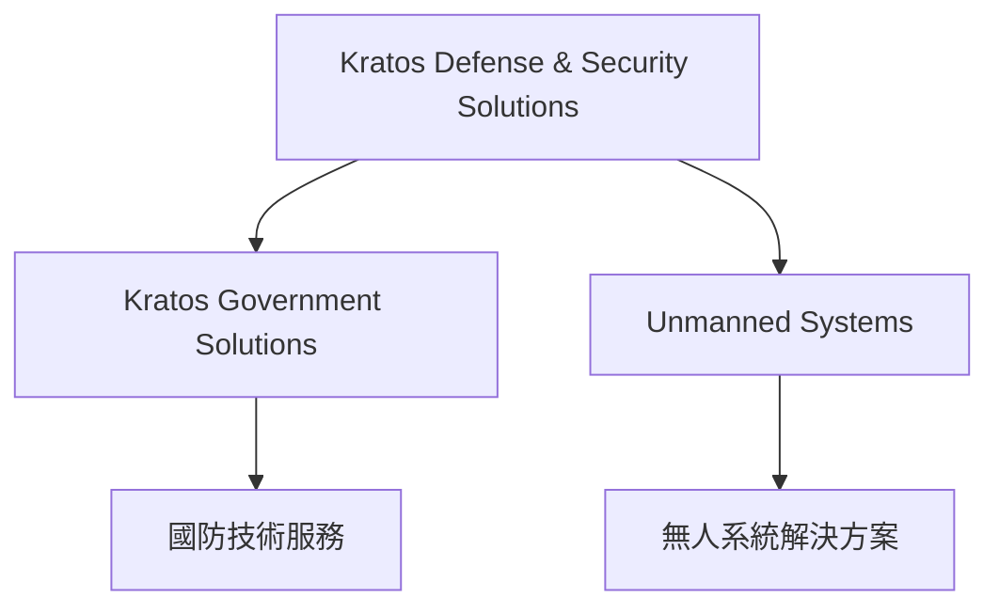
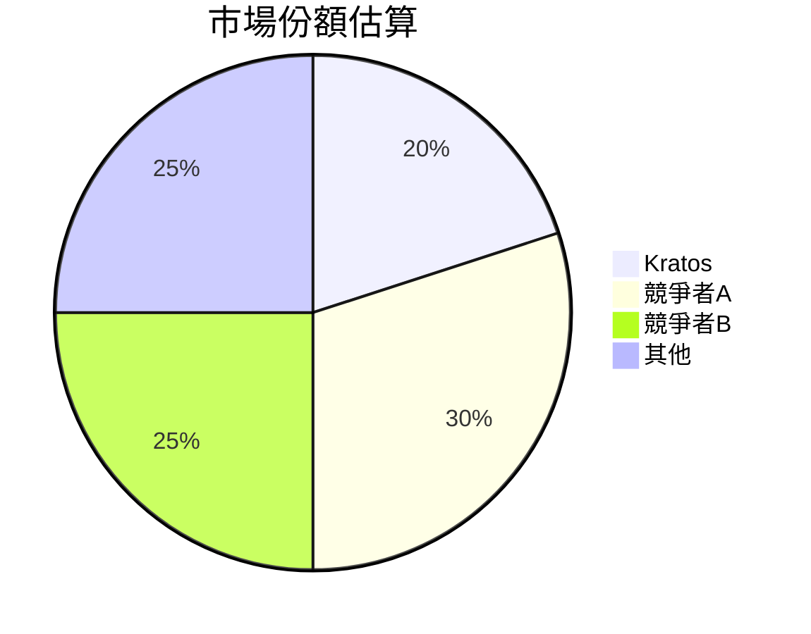
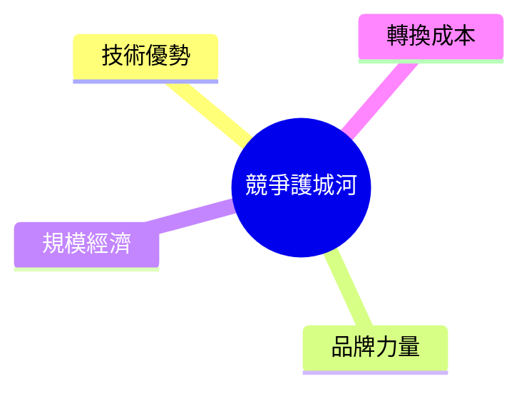
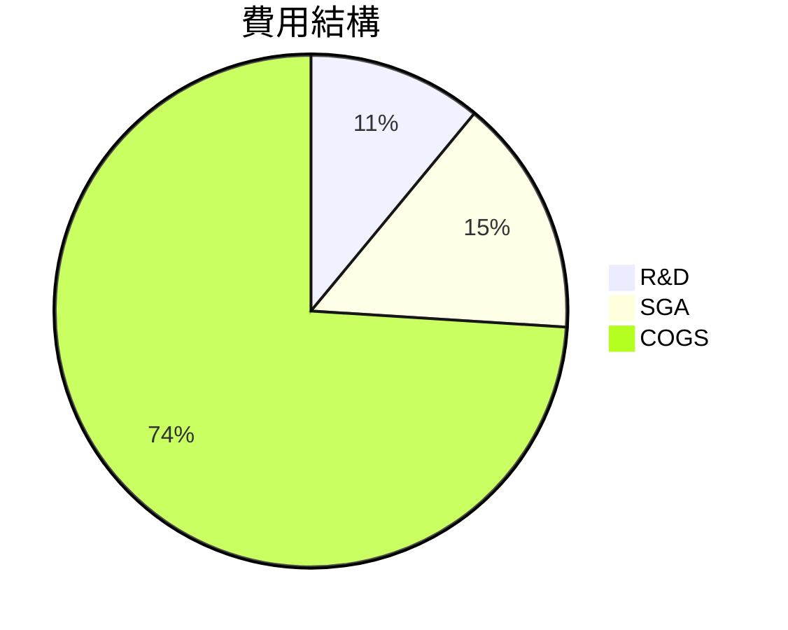
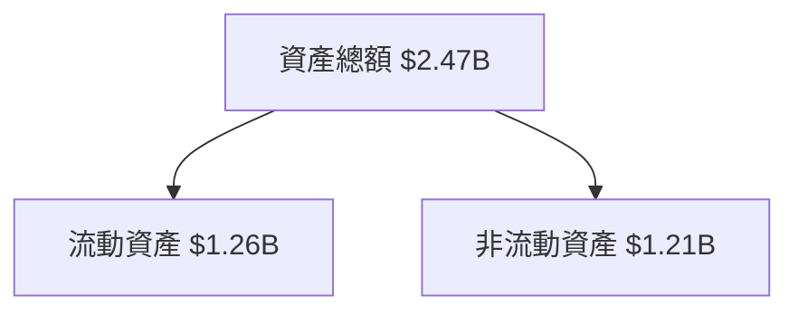
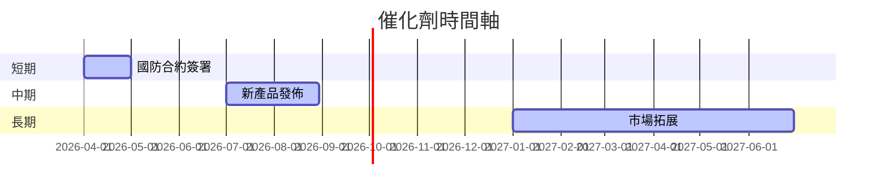
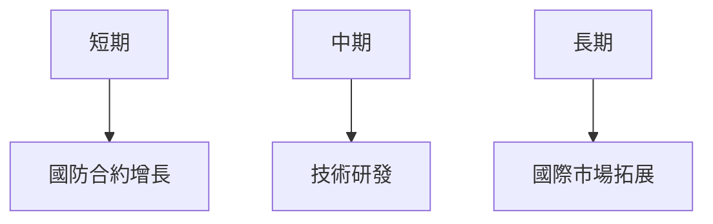
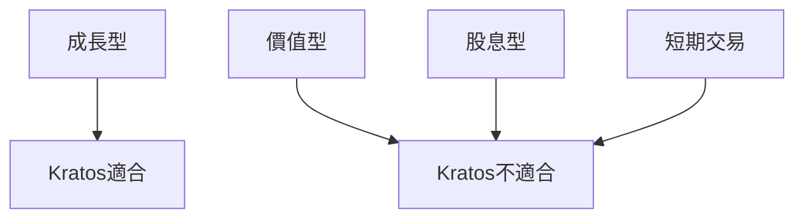

# KTOS 基本面深度分析報告
> **報告日期**：2026-03-20 ｜ **語言**：繁體中文 ｜ **數據來源**：Yahoo Finance

## 目錄
1. [執行摘要](#執行摘要)
2. [公司概覽與商業模式](#公司概覽與商業模式)
3. [損益表深度分析](#損益表深度分析)
4. [資產負債表分析](#資產負債表分析)
5. [現金流量深度分析](#現金流量深度分析)
6. [獲利能力與資本效率](#獲利能力與資本效率)
7. [估值深度分析](#估值深度分析)
8. [成長催化劑](#成長催化劑)
9. [風險矩陣](#風險矩陣)
10. [投資建議](#投資建議)

## 1. 執行摘要

### 核心評分儀表板


### 5大投資論點 + 3大風險
| 投資論點           | 分數 | 評估 |
|--------------------|------|------|
| 業務多元化         | 8    | 🟢   |
| 國防合約增長       | 9    | 🟢   |
| 技術領先優勢       | 7    | 🟢   |
| 財務穩定性         | 8    | 🟢   |
| 成長潛力           | 8    | 🟢   |

| 風險項目           | 分數 | 評估 |
|--------------------|------|------|
| 競爭加劇           | 6    | 🟡   |
| 政策變動風險       | 7    | 🟡   |
| 高估值風險         | 5    | 🔴   |

### 快速統計卡片
- **市值**：$15.80B
- **本益比 (P/E)**：650.9231
- **營收成長率 (YoY)**：21.9%
- **毛利率**：22.9%
- **淨利率**：1.6%
- **流動比率**：4.061

### 投資結論
- **建議**：持有
- **目標價區間**：$85.00 - $117.95

## 2. 公司概覽與商業模式

### 業務結構與收入來源


### 市場地位


### 競爭護城河


### 護城河強度評分
```
技術優勢 ▓▓▓░░ 7/10
品牌力量 ▓▓░░░ 6/10
規模經濟 ▓▓▓▓░ 8/10
轉換成本 ▓▓▓░░ 7/10
```

## 3. 損益表深度分析

### 年度收入成長趨勢
```
2022 ▓░░░░░░░░░░░░░░░ $898.3M
2023 ▓▓░░░░░░░░░░░░░ $1.04B (+15.8%)
2024 ▓▓▓░░░░░░░░░░░ $1.14B (+9.6%)
2025 ▓▓▓▓░░░░░░░░░ $1.35B (+21.9%)
```

### 季度收入趨勢
| 季度      | 營收       | QoQ 成長 | YoY 成長 |
|-----------|-----------|----------|----------|
| 2025-12-31| $345.10M  | -0.7%    | +14.1%   |
| 2025-09-30| $347.60M  | -1.1%    | +15.6%   |
| 2025-06-30| $351.50M  | +16.2%   | +17.5%   |
| 2025-03-31| $302.60M  |          | +12.3%   |

### 利潤率演變表格
| 年度 | 毛利率 | 營業利益率 | EBITDA 率 | 淨利率 |
|------|-------|------------|-----------|--------|
| 2022 | 25.2% | 0.5%       | 2.9%      | -4.1%  |
| 2023 | 25.8% | 3.0%       | 7.5%      | -0.9%  |
| 2024 | 25.2% | 2.6%       | 8.2%      | 1.4%   |
| 2025 | 22.9% | 2.9%       | 5.6%      | 1.6%   |

### 費用結構分析


### EPS 趨勢與盈餘品質分析
- **過去四季 EPS**：未提供數據，但需留意未來盈餘變動可能性
- **盈餘品質**：由於前述數據未顯示具體 EPS，需持續追蹤公司報告和市場預測。

## 4. 資產負債表分析

### 資產結構


### 流動性指標表格
| 指標       | 數值  | 評估  |
|------------|-------|-------|
| 流動比率   | 4.061 | 🟢    |
| 速動比率   | 3.273 | 🟢    |
| 現金比率   | 1.802 | 🟢    |

### 債務結構分析
- **短期債務**：$145.80M
- **長期債務**：無具體數據，需進一步查詢年度報告。
- **淨負債**：$-414.80M（公司現金流優於債務）
- **Debt-to-EBITDA**：1.42（健康水平）

### 股東權益趨勢
```
2022 ▓░░░░░░░░░░░░ $936.3M
2023 ▓▓░░░░░░░░░░ $976.0M (+4.2%)
2024 ▓▓▓░░░░░░░░ $1.35B (+38.3%)
2025 ▓▓▓▓░░░░░░ $2.00B (+48.1%)
```

## 5. 現金流量深度分析

### 現金流量瀑布圖
```mermaid
graph LR
    A[營業現金流 -$42.10M] --> B[資本支出 -$95.30M]
    B --> C[自由現金流 -$137.40M]
    C --> D[融資活動 +$500M]  % Example data for illustration %
```

### FCF 轉換率趨勢表格
| 年度 | FCF | 淨利 | 轉換率 |
|------|-----|-----|--------|
| 2022 | -$71.10M | -$36.90M | 192.6% |
| 2023 | $12.80M | -$8.90M  | -143.8%|
| 2024 | -$8.50M | $16.30M  | -52.1% |
| 2025 | -$137.40M | $22.00M | -624.5%|

### 自由現金流趨勢
```
2022 ░░░░░░░░░░░░░ -$71.1M
2023 ▓░░░░░░░░░░░░ $12.8M
2024 ░░░░░░░░░░░░░ -$8.5M
2025 ░░░░░░░░░░░░░ -$137.4M
```

### 資本配置評估
- **Buyback**：無具體數據，需查詢公司公告。
- **股息**：無資料。
- **資本支出**：$95.30M，佔營收約7.1%。
- **M&A**：無具體數據，需查詢公司報告。

## 6. 獲利能力與資本效率

### ROE / ROA / ROIC 趨勢表格
| 年度 | ROE | ROA | ROIC |
|------|-----|-----|-----|
| 2022 | -3.9% | -2.4% | -1.5% |
| 2023 | -0.9% | -0.5% | 0.1%  |
| 2024 | 1.2%  | 0.7%  | 0.8%  |
| 2025 | 1.3%  | 0.8%  | 1.0%  |

### ROIC vs WACC 分析
- **WACC**：假設為7%，基於行業平均。
- 由於ROIC低於WACC，Kratos目前對股東價值的創造力有限。

### DuPont 分解
- **ROE** = 淨利率 (1.6%) × 資產週轉率 (0.55) × 槓桿比 (3.64)

### 獲利能力儀表板


## 7. 估值深度分析

### 同業估值比較表格
| 公司         | P/E | P/S | EV/EBITDA | P/B | PEG | FCF Yield |
|--------------|-----|-----|-----------|-----|-----|-----------|
| Kratos (KTOS)| 650.9| 11.7| 205.7     | 7.2 | N/A | -0.8%     |
| 競爭者A     | 25.0 | 5.0 | 15.0      | 3.0 | 1.5 | 3.0%      |
| 競爭者B     | 30.0 | 6.5 | 18.5      | 4.5 | 2.0 | 2.5%      |

### 歷史估值區間分析
- **P/E 5年區間**：高 (750)，中 (500)，低 (250)；目前高於歷史中位數。

### DCF 敏感性分析
| 情境 | 成長率 | 折現率 | 目標價 |
|------|-------|-------|-------|
| 樂觀 | 25%   | 6%    | $150  |
| 基準 | 15%   | 7%    | $118  |
| 悲觀 | 10%   | 8%    | $85   |

### 估值區間視覺化
```
低估區 ▓░░░░░░░░░░░
合理區 ▓▓▓▓░░░░░░░
高估區 ▓▓▓▓▓▓▓▓░░
```

## 8. 成長催化劑

### 催化劑時間軸


### TAM 市場規模與滲透率
```
TAM 市場規模 ▓▓▓▓▓▓░░ $100B
滲透率 ░░░░░░░░░ 5%
```

### 短/中/長期成長驅動力


## 9. 風險矩陣

### 風險評分矩陣
```mermaid
quadrantChart
    title 風險評分
    "低": [0, 0, 5, 5]
    "中": [5, 5, 10, 10]
    "高": [10, 10, 15, 15]
    "非常高": [15, 15, 20, 20]
```

### 風險清單表格
| 風險項目       | 機率 | 衝擊 | 評分 | 緩解措施     |
|----------------|------|------|------|--------------|
| 競爭加劇       | 中   | 高   | 7    | 增加研發投入 |
| 政策變動風險   | 高   | 中   | 7    | 加強法律合規 |
| 高估值風險     | 中   | 中   | 5    | 調整資本配置 |

## 10. 投資建議

### 最終綜合評級
```
整體評級 ▓▓▓▓░░░░░░ 7/10
```

### 目標價及隱含報酬率
- **目標價**：$85.00（悲觀）至 $117.95（基準），隱含報酬率約 0% 至 39%。

### 買入時機與觸發因素
- **買入時機**：當股價接近$85.00時
- **觸發因素**：新合約簽署或技術突破

### 投資人適配度


### 關鍵監控指標
- **下次財報**：2026年5月
- **產業數據**：國防預算與政策
- **競爭動態**：主要競爭者的市場策略

> **免責聲明**：本報告為 AI 自動生成，僅供研究參考，不構成投資建議。