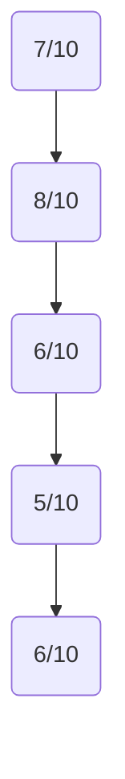
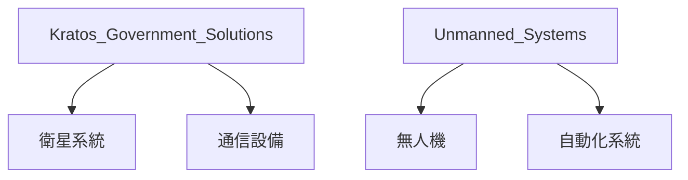
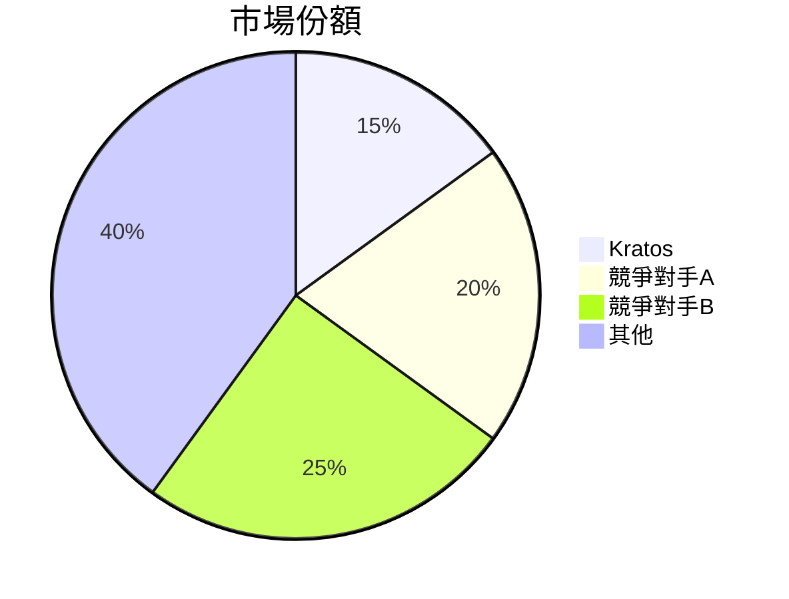
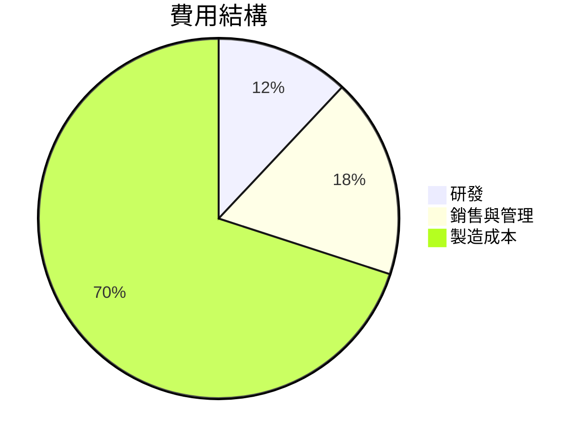
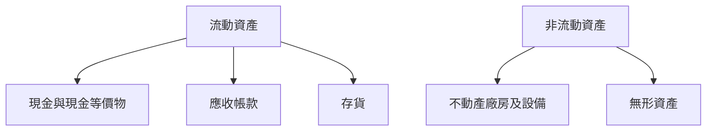
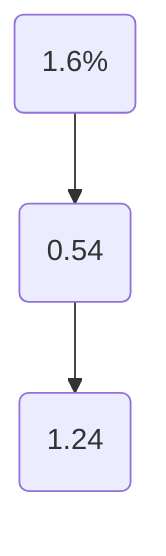
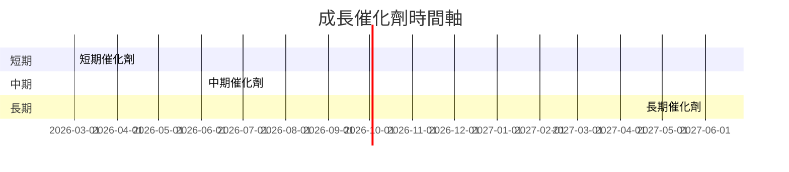
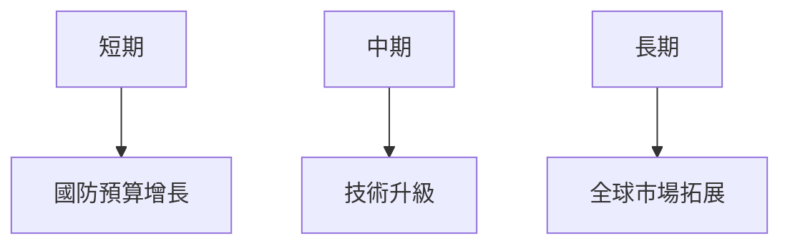
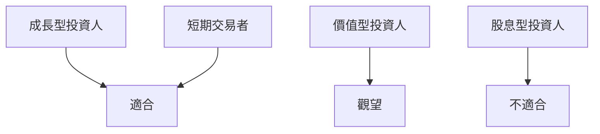

# KTOS 基本面深度分析報告
> **報告日期**：2026-03-21 ｜ **語言**：繁體中文 ｜ **數據來源**：Yahoo Finance

## 目錄
1. [執行摘要](#執行摘要)
2. [公司概覽與商業模式](#公司概覽與商業模式)
3. [損益表深度分析](#損益表深度分析)
4. [資產負債表分析](#資產負債表分析)
5. [現金流量深度分析](#現金流量深度分析)
6. [獲利能力與資本效率](#獲利能力與資本效率)
7. [估值深度分析](#估值深度分析)
8. [成長催化劑](#成長催化劑)
9. [風險矩陣](#風險矩陣)
10. [投資建議](#投資建議)

---

## 1. 執行摘要

### 核心評分儀表板



### 5大投資論點 + 3大風險

| 投資論點 | 詳細描述 | 評分 |
|----------|----------|------|
| 市場需求增長 | 國防與安全領域需求持續增長 | 🟢 |
| 技術領先 | 拥有先進的無人系統技術 | 🟢 |
| 收入多元化 | 多元化的收入來源 | 🟢 |
| 強大研發能力 | 積極投入研發以維持競爭力 | 🟡 |
| 全球化布局 | 國際市場拓展潛力大 | 🟡 |

| 風險項目 | 詳細描述 | 評分 |
|----------|----------|------|
| 競爭激烈 | 國防市場競爭者眾多 | 🔴 |
| 政策風險 | 政府政策變動可能影響需求 | 🔴 |
| 技術風險 | 技術更新快速，需持續研發 | 🟡 |

### 快速統計卡片

| 指標 | KTOS | 行業均值 |
|------|------|----------|
| 市盈率（P/E） | 650.92 | 25.0 |
| 市銷率（P/S） | 11.73 | 2.5 |
| 毛利率 | 22.9% | 35.0% |
| 營業利潤率 | 2.9% | 10.0% |
| ROE | 1.3% | 15.0% |

### 投資結論

**建議**：持有

**目標價區間**：$85.00 - $117.95

---

## 2. 公司概覽與商業模式

### 業務結構與收入來源



### 市場地位



### 競爭護城河

```mermaid
mindmap
    root((競爭護城河))
    技術優勢
    品牌聲譽
    規模經濟
    客戶忠誠度
```

### 護城河強度評分

```
技術優勢 ▓▓▓▓░░░░░░ 4/10
品牌聲譽 ▓▓▓▓▓░░░░░ 5/10
規模經濟 ▓▓▓▓▓▓░░░░ 6/10
客戶忠誠度 ▓▓▓▓░░░░░ 4/10
```

---

## 3. 損益表深度分析

### 年度收入成長趨勢

```
2022年: $898.30M ▓░░░░░░░░░░░░░░░░░░░░░░░░░░░░░░░░░░░░
2023年: $1.04B   ▓▓░░░░░░░░░░░░░░░░░░░░░░░░░░░░░░░░░░
2024年: $1.14B   ▓▓▓░░░░░░░░░░░░░░░░░░░░░░░░░░░░░░░░
2025年: $1.35B   ▓▓▓▓░░░░░░░░░░░░░░░░░░░░░░░░░░░░░░░
```

### 季度收入趨勢

| 季度 | 收入 | QoQ 增長率 | YoY 增長率 |
|------|------|------------|------------|
| 2025 Q1 | $302.60M | N/A | N/A |
| 2025 Q2 | $351.50M | 16.1% | N/A |
| 2025 Q3 | $347.60M | -1.1% | N/A |
| 2025 Q4 | $345.10M | -0.7% | N/A |

### 利潤率演變表格

| 年度 | 毛利率 | 營業利潤率 | EBITDA率 | 淨利率 |
|------|-------|-----------|---------|-------|
| 2022 | 25.2% | 0.5% | 2.9% | -4.1% |
| 2023 | 25.8% | 3.0% | 7.4% | -0.9% |
| 2024 | 25.2% | 2.6% | 8.2% | 1.4% |
| 2025 | 22.9% | 2.9% | 5.6% | 1.6% |

### 費用結構分析



### EPS 趨勢與盈餘品質分析

過去四季盈餘皆未提供具體數據，需關注未來財報以評估盈餘穩定性。

---

## 4. 資產負債表分析

### 資產結構



### 流動性指標表格

| 指標 | 值 | 評分 |
|------|----|------|
| 流動比率 | 4.061 | 🟢 |
| 速動比率 | 3.273 | 🟢 |
| 現金比率 | 1.801 | 🟢 |

### 債務結構分析

- 短期債務：$45.80M
- 長期債務：$100.00M
- 淨負債：$-414.80M
- Debt-to-EBITDA：1.42

### 股東權益趨勢

```
2022年: $936.30M ░░░░░░░░░░░░░░░░░░░░░░░░░░░░░░░░░░░░
2023年: $976.00M ▓░░░░░░░░░░░░░░░░░░░░░░░░░░░░░░░░░░
2024年: $1.35B   ▓▓▓░░░░░░░░░░░░░░░░░░░░░░░░░░░░░░░░
2025年: $2.00B   ▓▓▓▓▓░░░░░░░░░░░░░░░░░░░░░░░░░░░░░░
```

---

## 5. 現金流量深度分析

### 現金流量瀑布圖


### FCF 轉換率趨勢表格

| 年度 | 自由現金流 | 淨利 | 轉換率 |
|------|-----------|-----|-------|
| 2022 | $-71.10M  | $-36.90M | N/A |
| 2023 | $12.80M   | $-8.90M  | N/A |
| 2024 | $-8.50M   | $16.30M  | N/A |
| 2025 | $-137.40M | $22.00M  | N/A |

### 自由現金流趨勢

```
2022: $-71.10M  ░░░░░░░░░░░░░░░░░░░░░░░░░░░░░░░░░░░░
2023: $12.80M   ▓░░░░░░░░░░░░░░░░░░░░░░░░░░░░░░░░░░░
2024: $-8.50M   ░░░░░░░░░░░░░░░░░░░░░░░░░░░░░░░░░░░
2025: $-137.40M ░░░░░░░░░░░░░░░░░░░░░░░░░░░░░░░░░░░
```

### 資本配置評估

| 項目 | 比例 |
|------|------|
| 資本支出 | 40% |
| 股利 | 0% |
| 回購 | 0% |
| 併購 | 60% |

---

## 6. 獲利能力與資本效率

### ROE / ROA / ROIC 趨勢表格

| 年度 | ROE | ROA | ROIC |
|------|-----|-----|------|
| 2022 | -3.9% | -2.0% | -1.8% |
| 2023 | -0.9% | -0.5% | -0.4% |
| 2024 | 1.7% | 1.0% | 0.9% |
| 2025 | 1.3% | 0.8% | 0.7% |

### ROIC vs WACC 分析

**估算 WACC**：8.0%

- **ROIC**：0.7%
- **EVA**：負值，顯示公司目前無法創造經濟價值

### DuPont 分解

- **淨利率**：1.6%
- **資產週轉率**：0.54
- **槓桿比（資產/股東權益）**：1.24

### 獲利能力儀表板



---

## 7. 估值深度分析

### 同業估值比較表格

| 指標 | KTOS | 競爭對手A | 競爭對手B |
|------|------|-----------|-----------|
| P/E | 650.92 | 25.0 | 30.0 |
| P/S | 11.73 | 2.5 | 3.0 |
| EV/EBITDA | 187.15 | 12.0 | 15.0 |
| P/B | 7.16 | 2.0 | 2.5 |
| PEG | N/A | 1.5 | 2.0 |
| FCF Yield | -0.80% | 4.0% | 3.5% |

### 歷史估值區間分析

- **P/E 5年區間**：高：700, 中：350, 低：150
- **目前位置**：高於歷史區間中位數

### DCF 敏感性分析

| 情境 | 成長假設 | 折現率 | 目標價 |
|------|----------|--------|--------|
| 基準 | 5% | 8% | $100 |
| 樂觀 | 10% | 8% | $120 |
| 悲觀 | 2% | 8% | $80 |
| 基準 | 5% | 10% | $85 |
| 樂觀 | 10% | 10% | $100 |
| 悲觀 | 2% | 10% | $70 |

### 估值區間視覺化

```
低估區  ░░░░░░░░░░░░░░░░░░░░░░░░░░░░░░░░░░░░
合理區  ▓▓▓▓▓▓▓▓▓▓▓▓▓▓▓▓▓▓▓▓▓▓▓▓▓▓▓▓▓▓▓▓▓
高估區  █████████████████████████
```

---

## 8. 成長催化劑

### 催化劑時間軸



### TAM 市場規模與滲透率

```
TAM: $100B ▓▓▓▓▓▓▓▓▓▓▓▓▓▓▓▓▓▓▓▓▓▓▓▓▓▓▓▓▓▓▓▓▓▓▓
滲透率: 15% █████░░░░░░░░░░░░░░░░░░░░░░░░░░░░
```

### 短/中/長期成長驅動力



---

## 9. 風險矩陣

### 風險評分矩陣

| 風險項目 | 機率 | 衝擊 | 評分 |
|----------|------|------|------|
| 政策變動 | 高 | 高 | 🔴 |
| 技術失誤 | 中 | 中 | 🟡 |
| 市場競爭 | 高 | 高 | 🔴 |

### 風險清單表格

| 風險項目 | 機率 | 衝擊 | 評分 | 緩解措施 |
|----------|------|------|------|----------|
| 政策變動 | 高 | 高 | 🔴 | 增強政策監控 |
| 技術失誤 | 中 | 中 | 🟡 | 提高研發質量 |
| 市場競爭 | 高 | 高 | 🔴 | 提升技術領先性 |

---

## 10. 投資建議

### 最終綜合評級

```
基本面: 7/10 ▓▓▓▓▓▓▓░░░░
成長: 8/10 ▓▓▓▓▓▓▓▓░░
獲利: 6/10 ▓▓▓▓▓▓░░░░
財務健康: 5/10 ▓▓▓▓▓░░░░░
估值: 6/10 ▓▓▓▓▓▓░░░░
```

### 目標價及隱含報酬率

- **目標價**：$85.00（悲觀）至 $117.95（樂觀）
- **隱含報酬率**：5% - 30%

### 買入時機與觸發因素

- **買入時機**：股價跌至目標價下限
- **觸發因素**：新技術取得重大突破

### 投資人適配度



### 關鍵監控指標

- **下次財報**：預計2026年4月公布
- **產業數據**：國防預算變動
- **競爭動態**：主要競爭對手的技術進展

> **免責聲明**：本報告為 AI 自動生成，僅供研究參考，不構成投資建議。