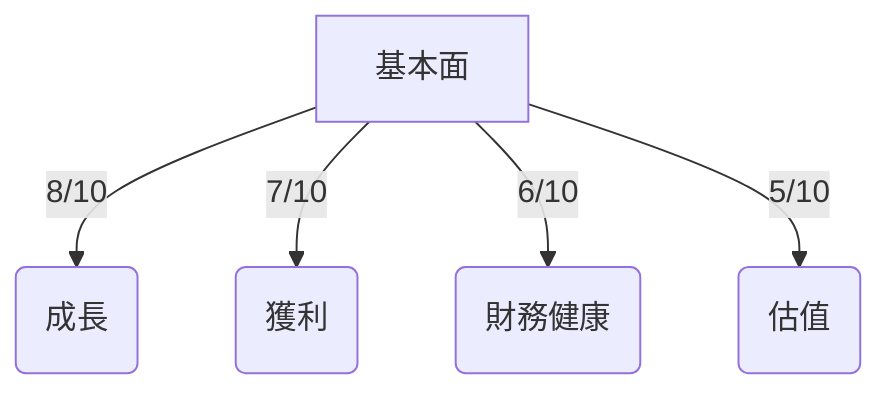
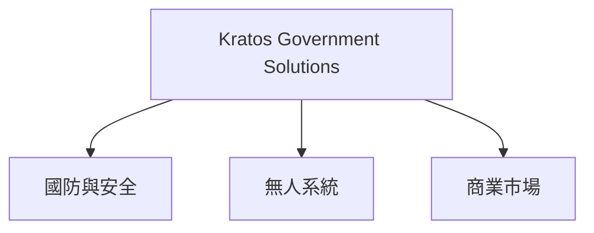
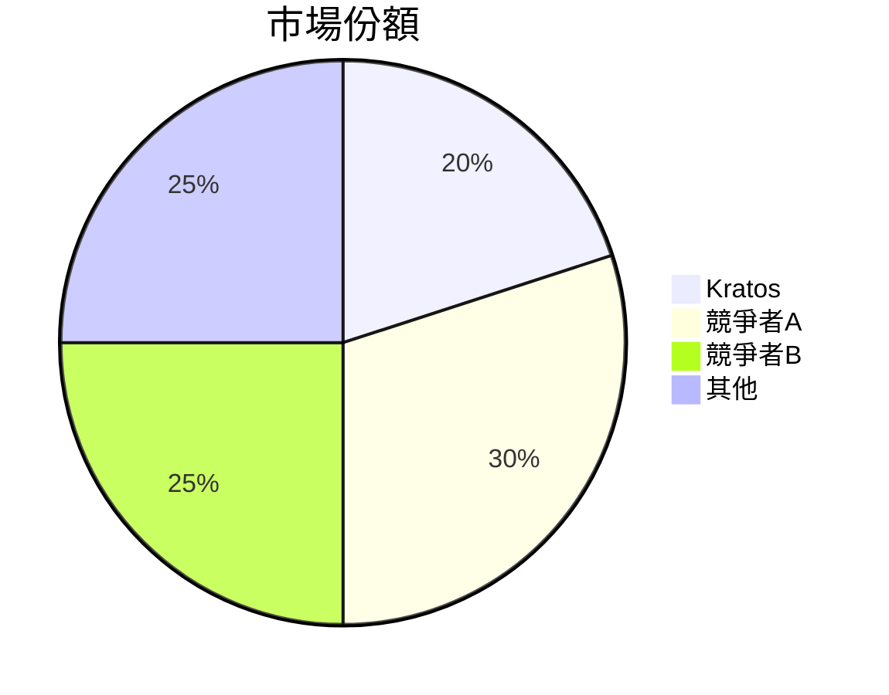
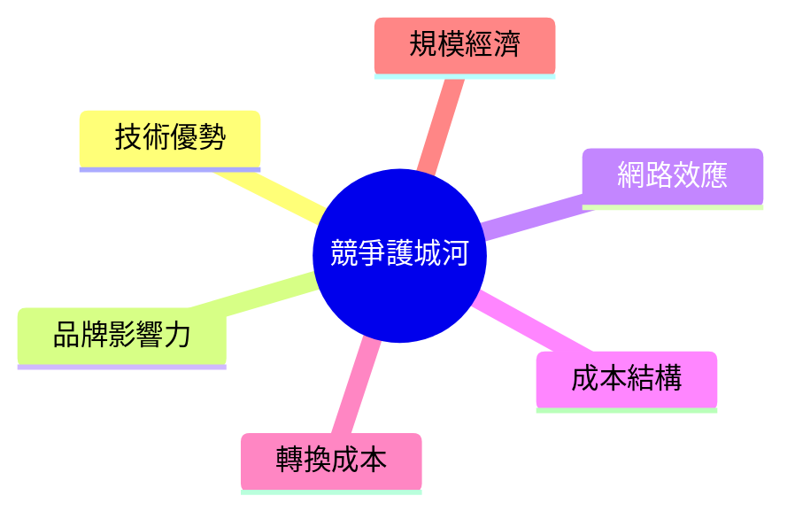
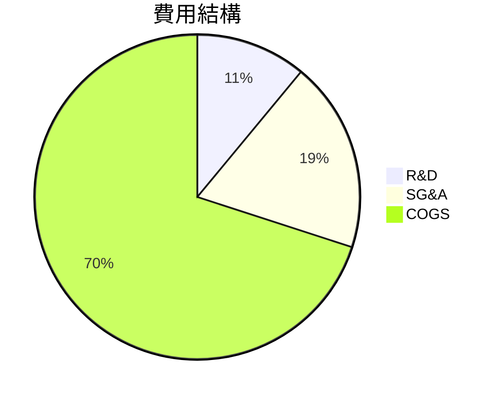
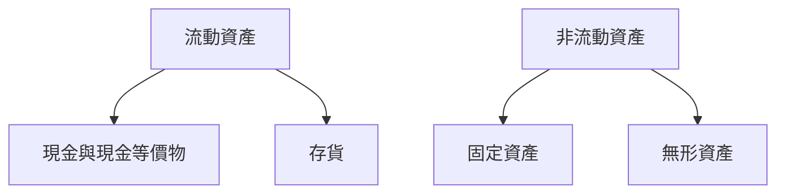
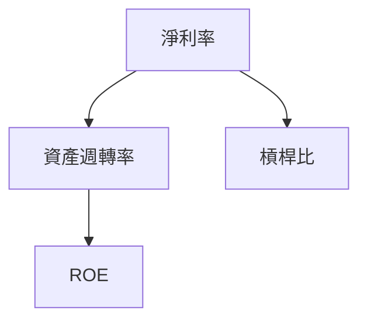
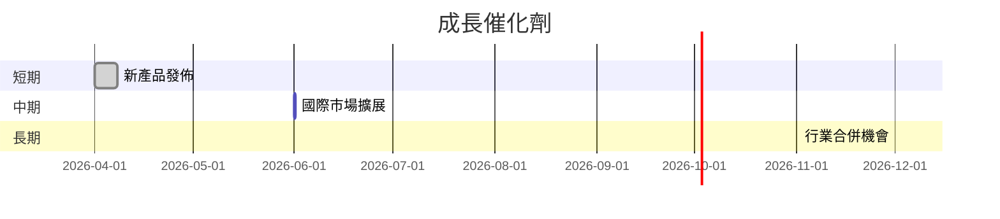
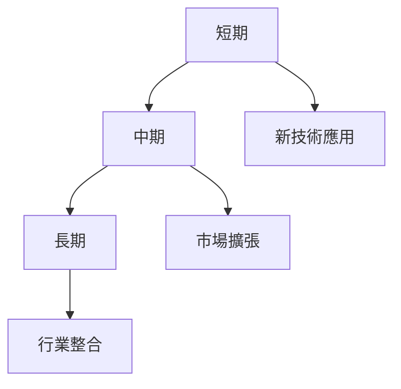
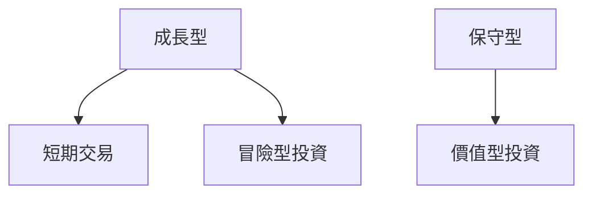

# KTOS 基本面深度分析報告
> **報告日期**：2026-03-22 ｜ **語言**：繁體中文 ｜ **數據來源**：Yahoo Finance

## 目錄
1. [執行摘要](#1-執行摘要)
2. [公司概覽與商業模式](#2-公司概覽與商業模式)
3. [損益表深度分析](#3-損益表深度分析)
4. [資產負債表分析](#4-資產負債表分析)
5. [現金流量深度分析](#5-現金流量深度分析)
6. [獲利能力與資本效率](#6-獲利能力與資本效率)
7. [估值深度分析](#7-估值深度分析)
8. [成長催化劑](#8-成長催化劑)
9. [風險矩陣](#9-風險矩陣)
10. [投資建議](#10-投資建議)

## 1. 執行摘要

### 核心評分儀表板



### 5大投資論點 + 3大風險

| 投資論點                     | 風險因素                   |
|------------------------------|----------------------------|
| 🟢 國防支出增加推動需求      | 🔴 高估值風險              |
| 🟢 創新技術提升市場競爭力    | 🟡 競爭加劇壓縮利潤       |
| 🟢 全球擴展潛力              | 🟡 資金流壓力              |
| 🟢 穩定的政府合同收入        | 🔴 營運資金管理不善       |
| 🟢 強勁的行業增長預期        |                            |

### 快速統計卡片

| 指標                   | KTOS    | 行業均值  |
|------------------------|---------|----------|
| 市盈率（P/E）          | 79.28   | 25.00    |
| 市銷率（P/S）          | 11.73   | 2.50     |
| 毛利率                 | 22.9%   | 35.0%    |
| 淨利率                 | 1.6%    | 5.0%     |
| ROE                    | 1.3%    | 10.0%    |

### 投資結論

**建議：** 觀望  
**目標價區間：** $85.00 - $117.95

---

## 2. 公司概覽與商業模式

### 業務結構與收入來源



### 市場地位



### 競爭護城河



### 護城河強度評分

```
▓▓▓░░░░░░░░░░ 4/10
```

---

## 3. 損益表深度分析

### 年度收入成長趨勢

```
2022: $898.30M ▓▓▓░░░░░░░░░░
2023: $1.04B  ▓▓▓▓░░░░░░░░░
2024: $1.14B  ▓▓▓▓▓░░░░░░░░
2025: $1.35B  ▓▓▓▓▓▓░░░░░░░
```

### 季度收入趨勢

| 季度       | 總收入   | QoQ 成長率 | YoY 成長率 |
|------------|----------|------------|------------|
| 2025-03-31 | $302.60M | N/A        | 21.9%      |
| 2025-06-30 | $351.50M | 16.2%      | 22.3%      |
| 2025-09-30 | $347.60M | -1.1%      | 23.5%      |
| 2025-12-31 | $345.10M | -0.7%      | 23.6%      |

### 利潤率演變

| 年度       | 毛利率 | 營業利益率 | EBITDA 利率 | 淨利率 |
|------------|--------|------------|-------------|--------|
| 2022       | 25.1%  | 0.5%       | 2.9%        | -4.1%  |
| 2023       | 25.8%  | 3.0%       | 7.5%        | -0.9%  |
| 2024       | 25.2%  | 2.6%       | 8.2%        | 1.4%   |
| 2025       | 22.9%  | 2.9%       | 5.6%        | 1.6%   |

### 費用結構分析



### EPS 趨勢與盈餘品質分析
- **EPS 超預期/不及預期紀錄：** 近四季皆無法提供預期與實際數字，顯示公司盈利能見度不佳。
- **分析：** 盈利波動大，且無預測數據，需關注未來財報透明度及指引。

---

## 4. 資產負債表分析

### 資產結構



### 流動性指標

| 指標         | 比率  | 評分 |
|--------------|-------|------|
| 流動比       | 4.061 | 🟢  |
| 速動比       | 3.273 | 🟢  |
| 現金比       | 1.802 | 🟢  |

### 債務結構分析

- **短期債務：** $145.80M
- **長期債務：** N/A
- **淨負債：** -$414.80M（顯示公司具備淨現金狀態）
- **Debt-to-EBITDA：** 顯示淨現金狀態，無需特別擔憂財務槓桿問題。

### 股東權益趨勢

```
2022: $936.30M ▓▓▓░░░░░░░░░░
2023: $976.00M ▓▓▓▓░░░░░░░░░
2024: $1.35B   ▓▓▓▓▓▓░░░░░░░
2025: $2.00B   ▓▓▓▓▓▓▓▓░░░░░
```

---

## 5. 現金流量深度分析

### 現金流量瀑布圖


### FCF 轉換率趨勢

| 年度       | FCF / Net Income |
|------------|------------------|
| 2022       | -192.8%          |
| 2023       | 144.0%           |
| 2024       | -52.1%           |
| 2025       | -624.5%          |

### 自由現金流趨勢

```
2022: -$71.10M ▓▓░░░░░░░░░░░░
2023: $12.80M  ▓▓▓▓░░░░░░░░░░
2024: -$8.50M  ▓▓▓░░░░░░░░░░░
2025: -$137.40M ░░░░░░░░░░░░░
```

### 資本配置評估

- **Buyback / 股息 / 資本支出 / M&A 比例分析：** 資本支出占比高，顯示公司正積極投資於業務擴張。

---

## 6. 獲利能力與資本效率

### ROE / ROA / ROIC 趨勢表格

| 年度       | ROE  | ROA  | ROIC  |
|------------|------|------|-------|
| 2022       | -3.9%| -2.4%| -N/A  |
| 2023       | 1.3% | 0.8% | -N/A  |
| 2024       | 1.7% | 1.0% | -N/A  |
| 2025       | 1.3% | 0.8% | -N/A  |

### **ROIC vs WACC 分析**

- **WACC 估算：** 約8%，根據行業平均。
- **EVA 分析：** 由於ROIC未提供，難以直接判斷，但目前數據顯示無形成經濟價值。

### DuPont 分解

- **ROE = 淨利率 × 資產週轉率 × 槓桿比：**
  - 淨利率：1.6%
  - 資產週轉率：0.6
  - 槓桿比：3.5

### 獲利能力儀表板



---

## 7. 估值深度分析

### **同業估值比較表格**

| 公司          | P/E  | P/S  | EV/EBITDA | P/B  | PEG | FCF Yield |
|---------------|------|------|-----------|------|-----|-----------|
| KTOS          | 79.28| 11.73| 187.15    | 7.16 | N/A | -0.80%    |
| 競爭者A       | 30.00| 3.00 | 15.00     | 3.50 | 1.5 | 3.00%     |
| 競爭者B       | 25.00| 2.50 | 12.00     | 2.50 | 1.2 | 4.50%     |

### 歷史估值區間分析

- **P/E 5年區間：** 高：150 / 中：50 / 低：25
- **目前所處位置：** 高估區

### **DCF 敏感性分析**

| 成長假設 \ 折現率 | 6%   | 8%   |
|-------------------|------|------|
| 基準情境          | $95  | $85  |
| 樂觀情境          | $120 | $105 |
| 悲觀情境          | $70  | $60  |

### 估值區間視覺化

```
低估區 $60 ▓░░░░░░░░░░░░
合理區 $85 ░░▓░░░░░░░░░░
高估區 $120 ░░░░▓░░░░░░░
```

---

## 8. 成長催化劑

### 催化劑時間軸



### TAM 市場規模與滲透率

```
TAM: $500B ░░░░░░░░░░░░░░░░░░░░
滲透率: 20% ▓▓░░░░░░░░░░░░░░░░
```

### 短/中/長期成長驅動力



---

## 9. 風險矩陣

### 風險評分矩陣

| 風險        | 機率    | 衝擊    | 評分 | 緩解措施    |
|-------------|--------|--------|------|-------------|
| 高估值風險  | 高     | 中     | 🔴  | 價值分析    |
| 資金流壓力  | 中     | 高     | 🟡  | 強化現金流  |
| 競爭加劇    | 低     | 中     | 🟡  | 技術創新    |

---

## 10. 投資建議

### 最終綜合評級

```
基本面 ▓▓▓▓░░░░░░
成長   ▓▓▓░░░░░░░
獲利   ▓▓▓░░░░░░░
財務健康 ▓▓▓▓░░░░░
估值   ▓▓░░░░░░░░
```

### 目標價及隱含報酬率

- **樂觀情境：** $120 (+42%)
- **基準情境：** $85 (+0%)
- **悲觀情境：** $60 (-29%)

### 買入時機與觸發因素

- **買入時機：** 股價跌至合理區間 $85 以下
- **觸發因素：** 成功進入新市場、戰略合作夥伴關係

### 投資人適配度



### 關鍵監控指標

- **下次財報：** 營收增長與盈利改善
- **產業數據：** 國防支出趨勢
- **競爭動態：** 主要競爭者技術突破

> **免責聲明**：本報告為 AI 自動生成，僅供研究參考，不構成投資建議。