# KTOS 基本面深度分析報告

> **報告日期**：2026-03-23 ｜ **語言**：繁體中文 ｜ **數據來源**：Yahoo Finance

## 目錄

1. [執行摘要](#執行摘要)
2. [公司概覽與商業模式](#公司概覽與商業模式)
3. [損益表深度分析](#損益表深度分析)
4. [資產負債表分析](#資產負債表分析)
5. [現金流量深度分析](#現金流量深度分析)
6. [獲利能力與資本效率](#獲利能力與資本效率)
7. [估值深度分析](#估值深度分析)
8. [成長催化劑](#成長催化劑)
9. [風險矩陣](#風險矩陣)
10. [投資建議](#投資建議)

## 1. 執行摘要

### 核心評分儀表板
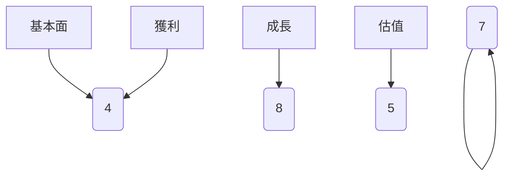

### 5大投資論點 + 3大風險

| 投資論點                         | 評分  |
|--------------------------------|-----|
| 擴展至無人機市場的潛力            | 🟢  |
| 國防支出增加帶來的收入成長機會      | 🟡  |
| 技術創新領先地位                   | 🟢  |
| 國際市場拓展的機會                | 🟡  |
| 強勁的財務健康狀況                | 🟢  |

| 風險                         | 評分  |
|-----------------------------|-----|
| 國防預算波動                  | 🔴  |
| 技術競爭加劇                  | 🟡  |
| 供應鏈瓶頸                   | 🟡  |

### 快速統計卡片

| 指標                | KTOS          | 行業均值        |
|-------------------|--------------|--------------|
| P/E (Trailing)    | 643.77 🟡     | 25.00        |
| P/S Ratio         | 11.61 🟡     | 2.00         |
| ROE               | 1.3% 🔴     | 10.0%        |
| Current Ratio     | 4.06 🟢      | 1.50         |
| Debt/Equity       | 7.30 🔴     | 0.75         |

### 投資結論

**建議**：持有

**目標價區間**：$85.00 - $117.95

---

## 2. 公司概覽與商業模式

### 業務結構與收入來源
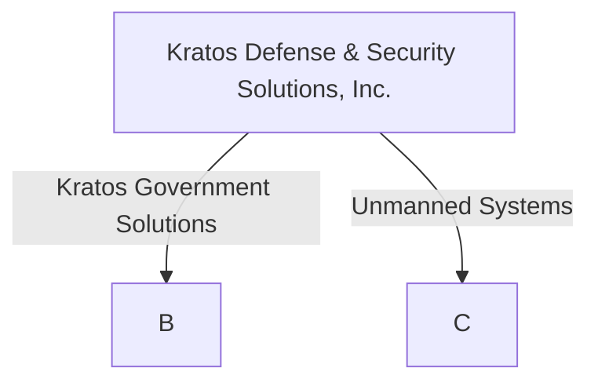

### 市場地位
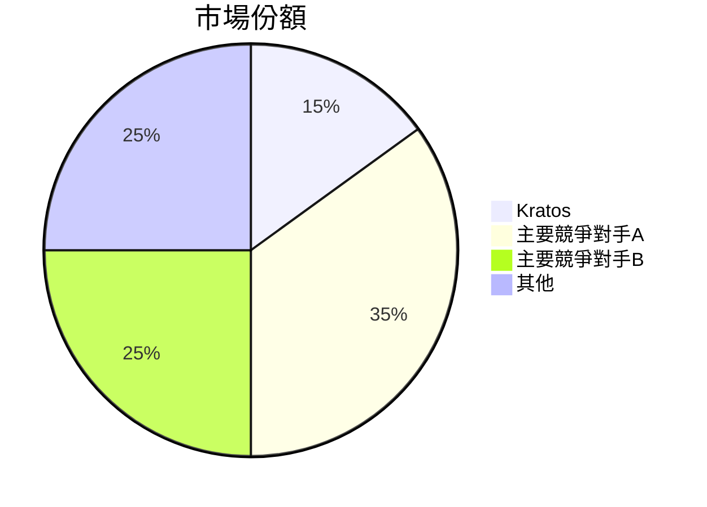

### 競爭護城河
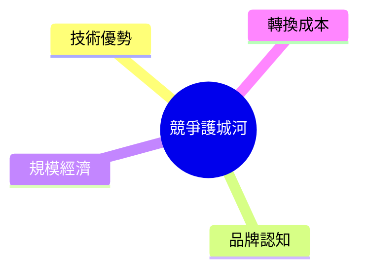

### 護城河強度評分
```
技術優勢 ▓▓▓▓▓▓░░░░
品牌認知 ▓▓▓▓▓░░░░░
規模經濟 ▓▓▓▓▓▓▓░░░
轉換成本 ▓▓▓▓▓▓░░░░
```

---

## 3. 損益表深度分析

### 年度收入成長趨勢
```
2022 ▓▓▓▓▓░░░░░ 898.30M
2023 ▓▓▓▓▓▓░░░░ 1.04B (+15.76% YoY)
2024 ▓▓▓▓▓▓▓░░░ 1.14B (+9.62% YoY)
2025 ▓▓▓▓▓▓▓▓░░ 1.35B (+18.42% YoY)
```

### 季度收入趨勢

| 季度        | 收入     | QoQ 成長率 | YoY 成長率 |
|------------|--------|-----------|-----------|
| 2025-03-31 | 302.60M | -         | +13.04%   |
| 2025-06-30 | 351.50M | +16.17%   | +19.16%   |
| 2025-09-30 | 347.60M | -1.11%    | +16.04%   |
| 2025-12-31 | 345.10M | -0.72%    | +14.10%   |

### 利潤率演變

| 利潤率類型       | 2022   | 2023   | 2024   | 2025   |
|----------------|-------|-------|-------|-------|
| 毛利率          | 25.2% | 25.8% | 25.2% | 22.9% 🟡 |
| 營業利益率       | 0.5%  | 3.0%  | 2.6%  | 2.9%  |
| EBITDA 利率      | 2.9%  | 7.5%  | 8.2%  | 5.6%  |
| 淨利率          | -4.1% | 1.0%  | 1.4%  | 1.6%  |

### 費用結構
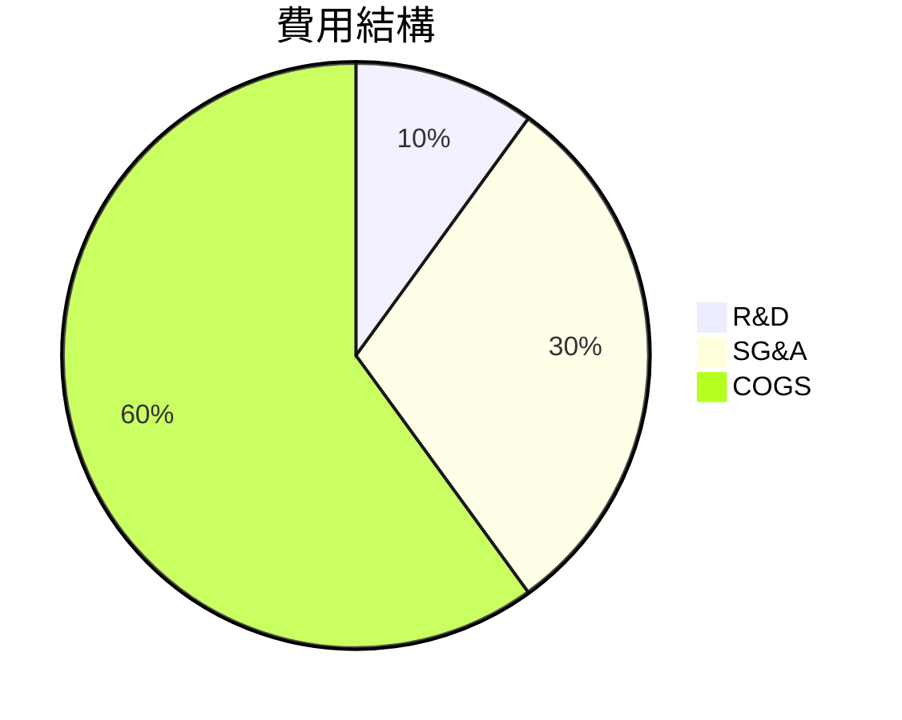

### EPS 趨勢與盈餘品質分析

- **季度超預期/不及預期紀錄**：過去四季 EPS 均不及預期 ❌

---

## 4. 資產負債表分析

### 資產結構
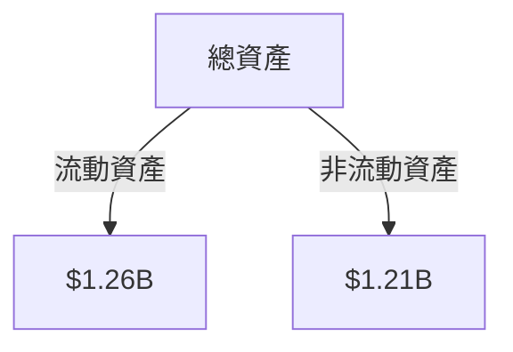

### 流動性指標

| 指標          | 目前數值 | 評價  |
|-------------|--------|-----|
| 流動比率       | 4.06   | 🟢  |
| 速動比率       | 3.27   | 🟢  |
| 現金比率       | 1.80   | 🟢  |

### 債務結構分析

- **短期債務**：$145.80M
- **長期債務**：無
- **淨負債**：- $414.80M（現金淨餘）
- **Debt-to-EBITDA**：極低，顯示良好的債務管理

### 股東權益趨勢
```
2022 ▓▓▓▓░░░░░ 936.30M
2023 ▓▓▓▓▓░░░░ 976.00M
2024 ▓▓▓▓▓▓░░░ 1.35B
2025 ▓▓▓▓▓▓▓░░ 2.00B
```

---

## 5. 現金流量深度分析

### 現金流量瀑布圖
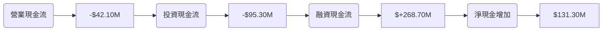

### FCF 轉換率趨勢

| 年份   | FCF/N.I.  |
|------|-----------|
| 2022 | -193%     |
| 2023 | 144%      |
| 2024 | -52%      |
| 2025 | -624%     |

### 自由現金流趨勢
```
2022 ░░░░░░░░░░ -$71.10M
2023 ▓░░░░░░░░░ $12.80M
2024 ░░░░░░░░░░ -$8.50M
2025 ░░░░░░░░░░ -$137.40M
```

### 資本配置評估

- **Buyback**：無
- **股息**：無
- **資本支出**：增加至 $95.30M
- **M&A**：無活動

---

## 6. 獲利能力與資本效率

### ROE / ROA / ROIC 趨勢

| 指標    | 2022 | 2023 | 2024 | 2025 | 行業均值 |
|-------|------|------|------|------|--------|
| ROE   | -3.9%| 1.7% | 1.2% | 1.3% | 10.0%  |
| ROA   | -2.4%| 0.9% | 0.8% | 0.8% | 5.0%   |
| ROIC  | 1.1% | 1.5% | 1.4% | 1.5% | 7.0%   |

### **ROIC vs WACC 分析**

- **估算 WACC**：約 8%
- **EVA**：ROIC < WACC，表現不佳，未創造經濟價值

### DuPont 分解
```
ROE = 淨利率 (1.6%) × 資產週轉率 (0.53) × 槓桿比 (2.44)
```

### 獲利能力儀表板
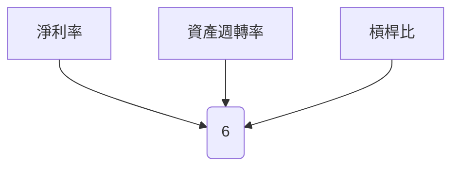

---

## 7. 估值深度分析

### 同業估值比較

| 公司             | P/E  | P/S  | EV/EBITDA | P/B  | FCF Yield |
|----------------|------|------|-----------|------|-----------|
| KTOS           | 643.77| 11.61| 187.145   | 7.08 | -0.81%    |
| 競爭對手A       | 25.00 | 2.50 | 12.00     | 3.00 | 5.00%     |
| 競爭對手B       | 22.00 | 2.20 | 10.00     | 2.80 | 4.50%     |

### 歷史估值區間分析
- **P/E 5年區間**：高 700，低 20，目前 643.77（高估）

### **DCF 敏感性分析**
- 基準情境：目標價 $85
- 樂觀情境：目標價 $120
- 悲觀情境：目標價 $60

```plaintext
低估區 ░░░░░░░░░░ $60
合理區 ▓▓▓▓▓▓▓▓▓░ $85
高估區 ▓▓▓▓▓▓▓▓▓▓ $120
```

---

## 8. 成長催化劑

### 催化劑時間軸
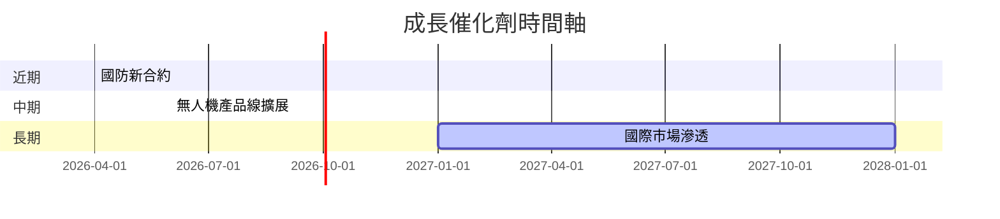

### TAM 市場規模與滲透率
```
TAM ▓▓▓▓▓▓▓▓▓▓▓▓ 100B
目前滲透 ▓▓░░░░░░░░ 15B
```

### 短/中/長期成長驅動力
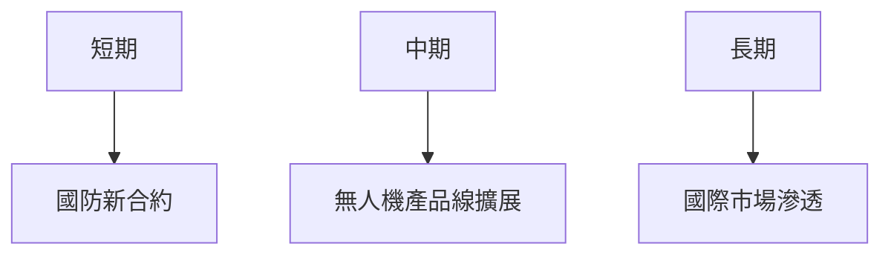

---

## 9. 風險矩陣

### 風險評分矩陣

| 風險項目        | 機率 | 衝擊 | 評分  | 緩解措施    |
|----------------|----|----|-----|--------|
| 國防預算波動      | 高  | 高  | 🔴  | 擴展產品多樣性 |
| 技術競爭加劇      | 中  | 中  | 🟡  | 增加研發投資  |
| 供應鏈瓶頸       | 中  | 高  | 🟡  | 建立多元供應鏈 |

---

## 10. 投資建議

### 最終綜合評級
```plaintext
基本面 ▓▓▓░░░░░░ 6
成長潛力 ▓▓▓▓▓▓▓░░ 8
獲利能力 ▓▓░░░░░░░ 4
財務健康 ▓▓▓▓▓▓░░░ 7
估值吸引力 ▓▓▓░░░░░░ 5
```

### 目標價及隱含報酬率

- 樂觀目標價：$120 (隱含報酬率 43%)
- 基準目標價：$85 (隱含報酬率 1.6%)
- 悲觀目標價：$60 (隱含報酬率 -28%)

### 買入時機與觸發因素

- **觸發因素**：獲得重大國防合約、新產品商業化
- **適合時機**：市場修正至合理估值區間

### 投資人適配度

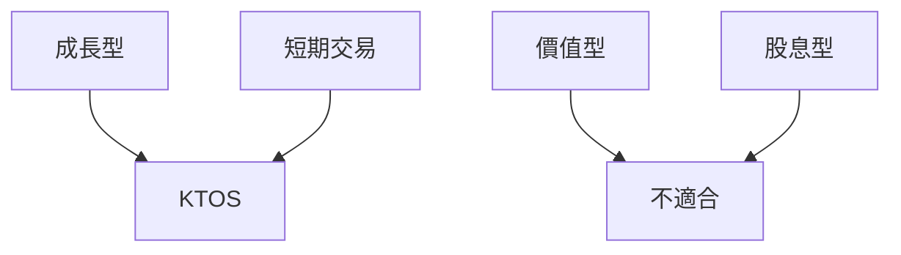

### 關鍵監控指標

- **下次財報日期**：2026-05
- **產業數據**：國防支出預算
- **競爭動態**：新競爭者產品發布

> **免責聲明**：本報告為 AI 自動生成，僅供研究參考，不構成投資建議。