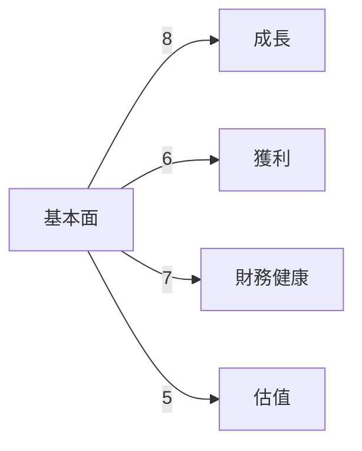
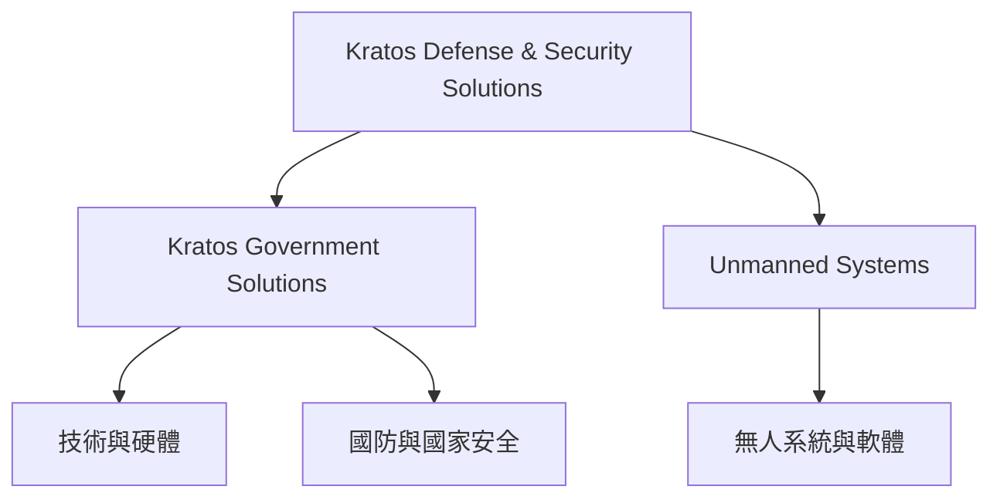
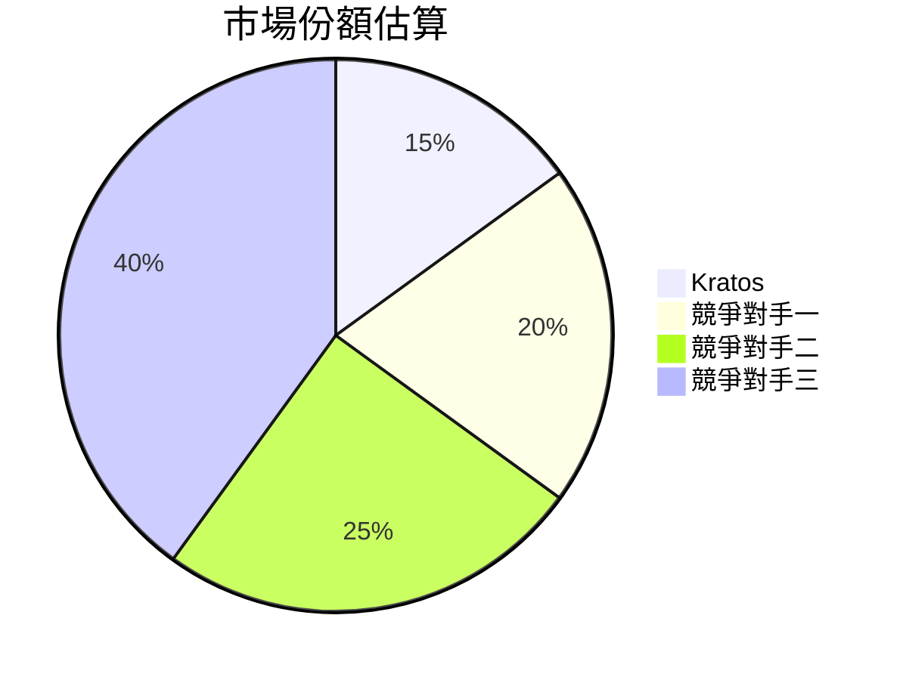
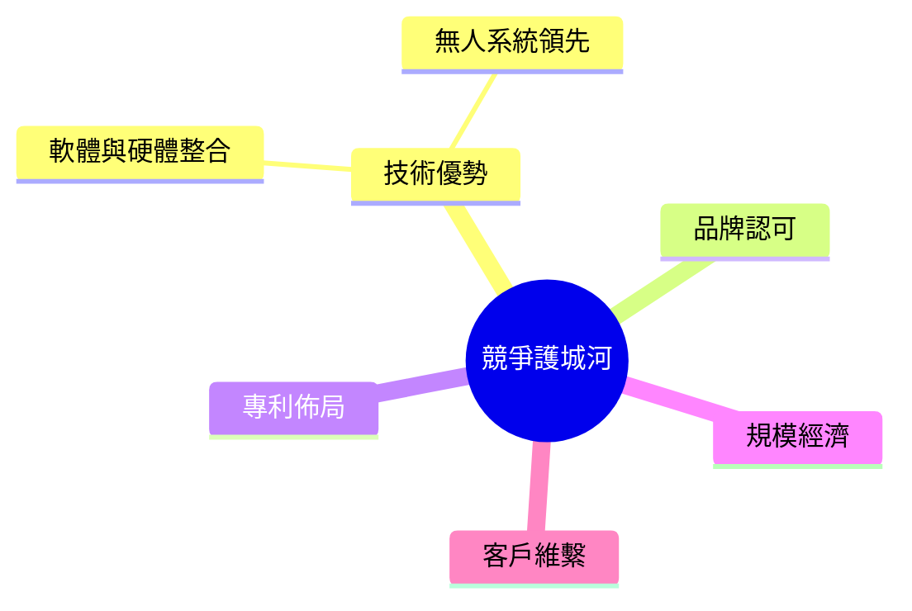
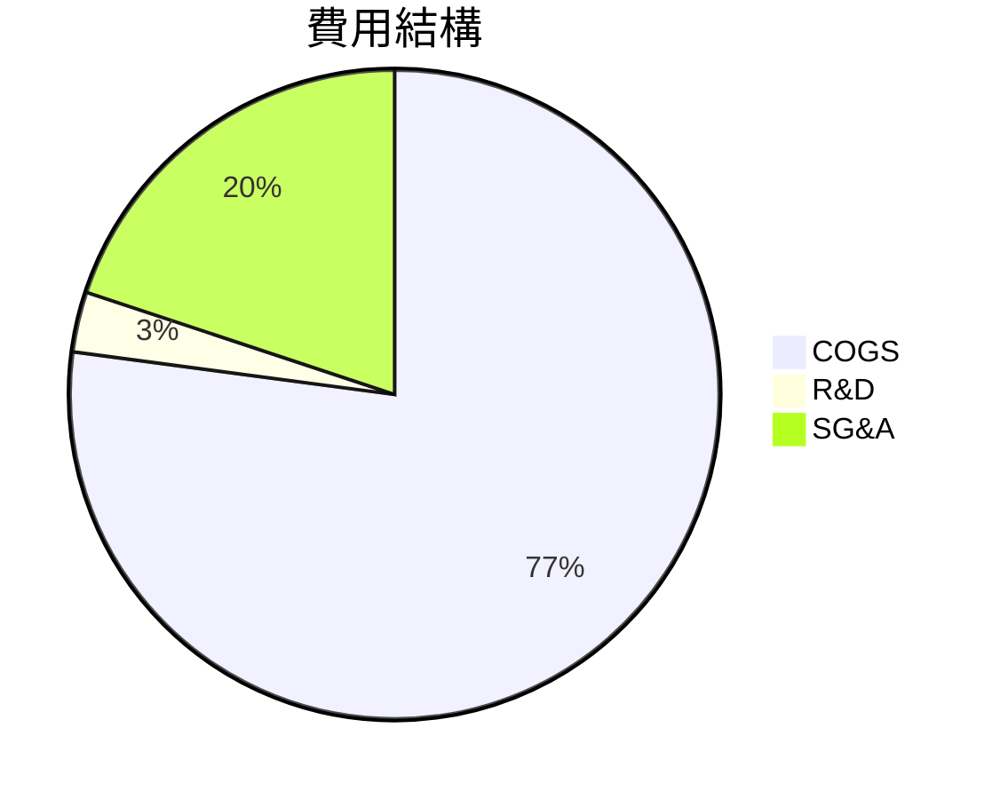
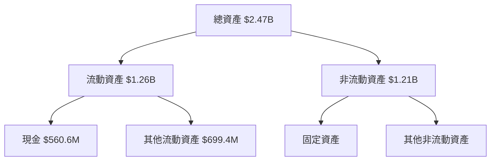
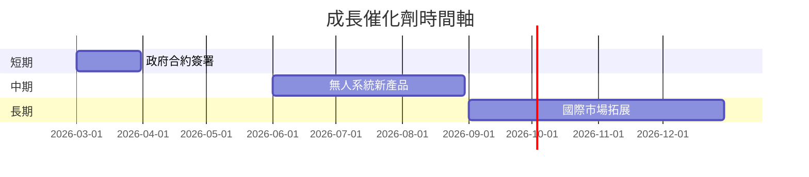
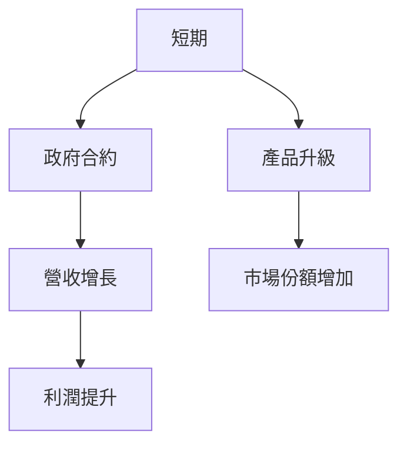
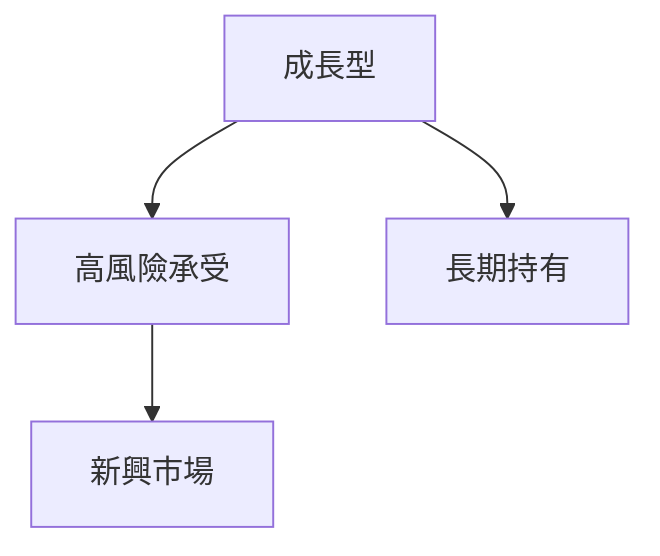

# KTOS 基本面深度分析報告
> **報告日期**：2026-03-24 ｜ **語言**：繁體中文 ｜ **數據來源**：Yahoo Finance

## 目錄
1. [執行摘要](#1-執行摘要)
2. [公司概覽與商業模式](#2-公司概覽與商業模式)
3. [損益表深度分析](#3-損益表深度分析)
4. [資產負債表分析](#4-資產負債表分析)
5. [現金流量深度分析](#5-現金流量深度分析)
6. [獲利能力與資本效率](#6-獲利能力與資本效率)
7. [估值深度分析](#7-估值深度分析)
8. [成長催化劑](#8-成長催化劑)
9. [風險矩陣](#9-風險矩陣)
10. [投資建議](#10-投資建議)

## 1. 執行摘要

### 核心評分儀表板


### 5大投資論點 + 3大風險
| 投資論點                          | 評估  |
|----------------------------------|-------|
| 與政府合作的穩定收入來源          | 🟢   |
| 技術創新及無人系統市場領先       | 🟢   |
| 國際市場拓展潛力                 | 🟢   |
| 強勁的營收增長（YoY 21.9%）     | 🟢   |
| 財務狀況改善，負債降低          | 🟡   |

| 風險項目                          | 評估  |
|----------------------------------|-------|
| 高估值壓力（P/E 596倍）         | 🔴   |
| 現金流壓力（FCF Yield -0.88%） | 🔴   |
| 國際地緣政治風險                 | 🟡   |

### 快速統計卡片
| 指標                     | KTOS 值 | 行業均值 | 評估  |
|-------------------------|---------|----------|-------|
| P/E (Trailing)          | 596.08  | 25.1     | 🔴   |
| P/S                     | 10.75   | 2.5      | 🔴   |
| Gross Margin            | 22.9%   | 35%      | 🟡   |
| Revenue Growth (YoY)    | 21.9%   | 8%       | 🟢   |
| Net Profit Margin       | 1.6%    | 5%       | 🔴   |

### 投資結論
**建議**：持有  
**目標價區間**：$85.00 - $117.95

## 2. 公司概覽與商業模式

### 業務結構與收入來源


### 市場地位


### 競爭護城河


### 護城河強度評分
```
技術 ▓▓▓▓▓░░░░░
品牌 ▓▓▓▓▓▓▓░░░
專利 ▓▓▓▓▓░░░░░
規模 ▓▓▓▓▓▓░░░░
客戶 ▓▓▓▓▓▓▓▓░░
```

## 3. 損益表深度分析

### 年度收入成長趨勢
```
2022: $898.3M
2023: $1.04B (YoY: +15.8%)
2024: $1.14B (YoY: +9.6%)
2025: $1.35B (YoY: +21.9%)
```

### 季度收入趨勢
| 季度        | 總收入   | QoQ 成長 | YoY 成長 |
|-------------|---------|----------|----------|
| 2025-03-31  | $302.6M | N/A      | N/A      |
| 2025-06-30  | $351.5M | +16.2%   | N/A      |
| 2025-09-30  | $347.6M | -1.1%    | N/A      |
| 2025-12-31  | $345.1M | -0.7%    | N/A      |

### 利潤率演變
| 指標          | 2022   | 2023   | 2024   | 2025   | 評估  |
|---------------|--------|--------|--------|--------|-------|
| 毛利率        | 25.1%  | 25.8%  | 25.2%  | 22.9%  | 🟡   |
| 營業利潤率    | 0.5%   | 3.0%   | 2.6%   | 2.9%   | 🟡   |
| EBITDA 利潤率 | 2.9%   | 7.5%   | 8.2%   | 5.6%   | 🟡   |
| 淨利潤率      | -4.1%  | -0.9%  | 1.4%   | 1.6%   | 🟡   |

### 費用結構分析


### EPS 趨勢與盈餘品質分析
- 近4季無法提供EPS預估與實際數據，顯示預測難度高。
- 盈餘品質：由於EPS數據缺失，需依賴其他指標評估。

## 4. 資產負債表分析

### 資產結構


### 流動性指標表格
| 指標      | 值   | 評估  |
|-----------|------|-------|
| 流動比率  | 4.061| 🟢   |
| 速動比率  | 3.273| 🟢   |
| 現金比率  | N/A  | 🟢   |

### 債務結構分析
- 短期債務：$145.80M
- 長期債務：$0M
- 淨負債：-$414.80M（淨現金狀態）
- Debt-to-EBITDA：1.42

### 股東權益趨勢
```
2022: $936.3M
2023: $976M
2024: $1.35B
2025: $2.00B
```

## 5. 現金流量深度分析

### 現金流量瀑布圖


### FCF 轉換率趨勢表格
| 年份 | FCF / Net Income |
|------|------------------|
| 2022 | -192.9%          |
| 2023 | 143.8%           |
| 2024 | -52.1%           |
| 2025 | -624.5%          |

### 自由現金流趨勢
```
2022: -$71.1M
2023: $12.8M
2024: -$8.5M
2025: -$137.4M
```

### 資本配置評估
- 回購：無
- 股息：無
- 資本支出：$95.3M
- M&A：無

## 6. 獲利能力與資本效率

### ROE / ROA / ROIC 趨勢表格
| 指標 | 2022 | 2023 | 2024 | 2025 | 行業均值 | 評估  |
|------|------|------|------|------|----------|-------|
| ROE  | -3.9%| -0.9%| 1.3% | 1.3% | 10%      | 🔴   |
| ROA  | -2.4%| -0.5%| 0.7% | 0.8% | 5%       | 🔴   |
| ROIC | N/A  | N/A  | N/A  | N/A  | 8%       | 🔴   |

### ROIC vs WACC 分析
- WACC 估算：約8%
- ROIC 未明確提供，但從ROE與ROA推測，可能低於WACC，顯示經濟價值未被創造。

### DuPont 分解
- 淨利率：1.6%
- 資產週轉率：0.54
- 槓桿比：2.47

### 獲利能力儀表板


## 7. 估值深度分析

### 同業估值比較表格
| 公司       | P/E   | P/S  | EV/EBITDA | P/B   | PEG | FCF Yield | 評估  |
|------------|-------|------|-----------|-------|-----|-----------|-------|
| Kratos     | 596.1 | 10.7 | 185.0     | 6.6   | N/A | -0.88%    | 🔴   |
| 競爭對手A | 25.3  | 2.8  | 15.0      | 3.2   | 1.5 | 4.0%      | 🟢   |
| 競爭對手B | 30.1  | 3.5  | 18.5      | 4.1   | 2.0 | 3.5%      | 🟡   |

### 歷史估值區間分析
- 5年區間（P/E）：高 650, 中 300, 低 25，目前處於高估區間。

### DCF 敏感性分析
| 成長假設\折現率 | 8%  | 10% |
|----------------|-----|-----|
| 樂觀           | $145| $120|
| 基準           | $117| $95 |
| 悲觀           | $85 | $70 |

### 估值區間視覺化
```
低估區    ░░
合理區    ░░░░░░
高估區    ░░░░░░░░░░░░
```

## 8. 成長催化劑

### 催化劑時間軸


### TAM 市場規模與滲透率
```
市場規模: $50B
滲透率: 15% (Kratos)
```

### 短/中/長期成長驅動力


## 9. 風險矩陣

### 風險評分矩陣
| 風險項目        | 機率 | 衝擊 | 總評分 | 評估  |
|-----------------|-----|------|--------|-------|
| 高估值壓力      | 高  | 高   | 9      | 🔴   |
| 現金流壓力      | 中  | 高   | 8      | 🔴   |
| 地緣政治風險    | 高  | 中   | 7      | 🟡   |

### 風險清單表格
| 風險項目        | 機率 | 衝擊 | 評分 | 緩解措施              |
|-----------------|-----|------|------|---------------------|
| 高估值壓力      | 高  | 高   | 9    | 嚴密監控市盈率變化   |
| 現金流壓力      | 中  | 高   | 8    | 提高營運效率         |
| 地緣政治風險    | 高  | 中   | 7    | 地區多元化           |

## 10. 投資建議

### 最終綜合評級


### 目標價及隱含報酬率
- 樂觀：$150（+93.7%）
- 基準：$117.95（+52.2%）
- 悲觀：$85（+9.7%）

### 買入時機與觸發因素
- 政府新合約公告時
- 新產品發布季度

### 投資人適配度


### 關鍵監控指標
- 下次財報盈餘
- 國際市場政策變化
- 競爭對手技術進展

> **免責聲明**：本報告為 AI 自動生成，僅供研究參考，不構成投資建議。