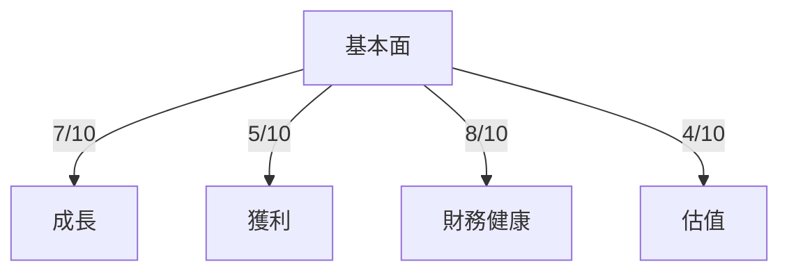
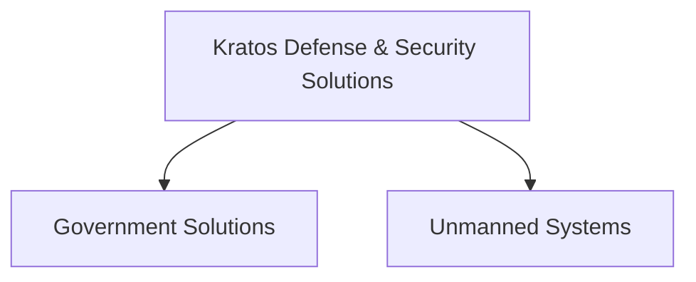
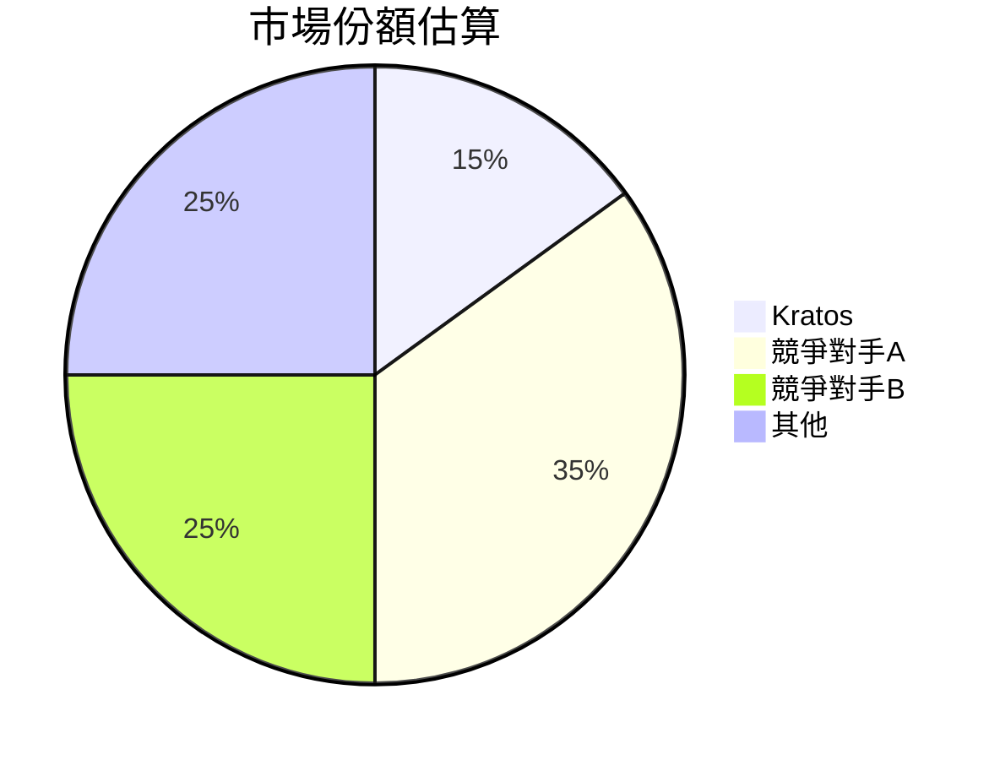
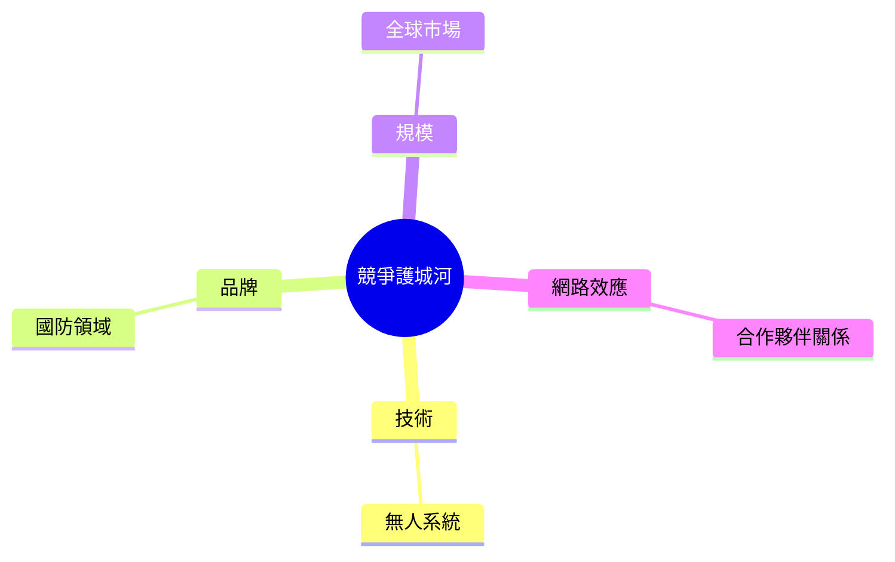
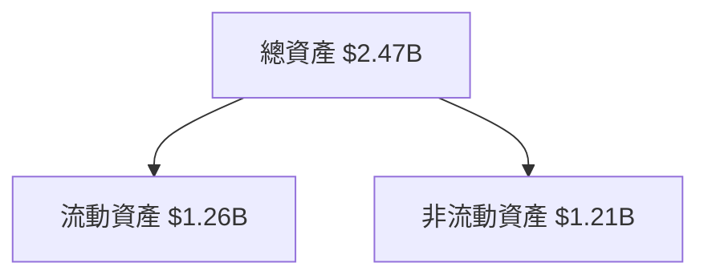
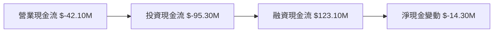
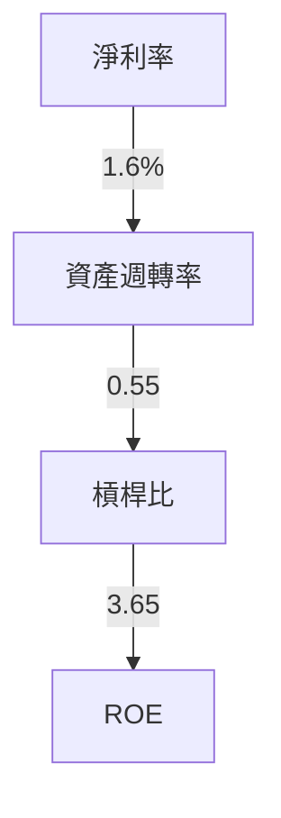
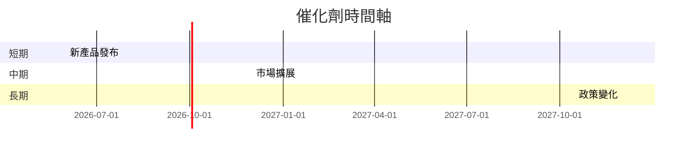
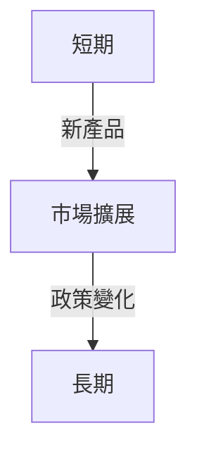
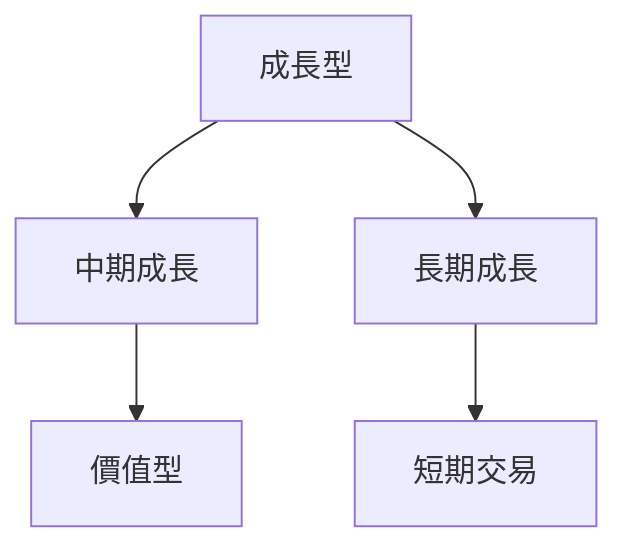

# KTOS 基本面深度分析報告
> **報告日期**：2026-03-25 ｜ **語言**：繁體中文 ｜ **數據來源**：Yahoo Finance

## 目錄
1. [執行摘要](#執行摘要)
2. [公司概覽與商業模式](#公司概覽與商業模式)
3. [損益表深度分析](#損益表深度分析)
4. [資產負債表分析](#資產負債表分析)
5. [現金流量深度分析](#現金流量深度分析)
6. [獲利能力與資本效率](#獲利能力與資本效率)
7. [估值深度分析](#估值深度分析)
8. [成長催化劑](#成長催化劑)
9. [風險矩陣](#風險矩陣)
10. [投資建議](#投資建議)

## 1. 執行摘要
### 核心評分儀表板


### 5大投資論點 + 3大風險
| 投資論點 | 描述 | 評分 |
| --- | --- | --- |
| 🟢 穩健的收入增長 | 年收入增長21.9% | 8 |
| 🟢 低負債比率 | 負債股權比率7.304 | 9 |
| 🟡 競爭優勢 | 在無人系統領域具有競爭力 | 7 |
| 🔴 高估值 | P/E 達615.23倍 | 4 |
| 🟡 強大現金流 | 現金流充裕 | 6 |

| 風險因素 | 描述 | 評分 |
| --- | --- | --- |
| 🔴 高估值風險 | 目前估值偏高，存在回調風險 | 3 |
| 🟡 競爭壓力 | 行業競爭激烈 | 5 |
| 🟢 政治風險 | 國防合同涉及政治因素 | 6 |

### 快速統計卡片
- **市值**：$14.94B
- **收入增長（YoY）**：21.9%
- **毛利率**：22.9%
- **淨利率**：1.6%
- **流動比率**：4.061
- **ROE**：1.3%
- **EPS（TTM）**：$0.13

### 投資結論
**建議**：觀望  
**目標價區間**：$85.00 - $117.95

## 2. 公司概覽與商業模式
### 業務結構與收入來源


### 市場地位


### 競爭護城河


### 護城河強度評分
```
護城河強度 ▓▓▓▓░░░░░░ 4/10
```

## 3. 損益表深度分析
### 年度收入成長趨勢
```
2022: $898.30M ▓▓▓░░░░░░░░░░░░░░░░░░░░░░░░░░░░░░░░░░░░░░░░░░░░░░░░░░░░░░░░░░░ 0%
2023: $1.04B   ▓▓▓▓▓░░░░░░░░░░░░░░░░░░░░░░░░░░░░░░░░░░░░░░░░░░░░░░░░░░░░░░░░░ 15.8%
2024: $1.14B   ▓▓▓▓▓▓▓░░░░░░░░░░░░░░░░░░░░░░░░░░░░░░░░░░░░░░░░░░░░░░░░░░░░░░░░ 9.6%
2025: $1.35B   ▓▓▓▓▓▓▓▓▓▓▓░░░░░░░░░░░░░░░░░░░░░░░░░░░░░░░░░░░░░░░░░░░░░░░░░░░░ 18.4%
```

### 季度收入趨勢
| 季度 | 總收入 | QoQ 成長率 | YoY 成長率 |
| --- | --- | --- | --- |
| 2025-03-31 | $302.60M | - | - |
| 2025-06-30 | $351.50M | 16.2% | - |
| 2025-09-30 | $347.60M | -1.1% | - |
| 2025-12-31 | $345.10M | -0.7% | - |

### 利潤率演變
| 年度 | 毛利率 | 營業利益率 | EBITDA率 | 淨利率 |
| --- | --- | --- | --- | --- |
| 2022 | 25.2% | 0.5% | 2.9% | -4.1% |
| 2023 | 25.8% | 3.0% | 7.5% | -0.9% |
| 2024 | 25.2% | 2.6% | 8.2% | 1.4% |
| 2025 | 22.9% | 2.1% | 7.6% | 1.6% |

### 費用結構分析


### EPS 趨勢與盈餘品質分析
- **過去4季EPS表現**：均未達市場預期
- **原因分析**：主要由於高估值與競爭加劇造成的獲利壓力

## 4. 資產負債表分析
### 資產結構


### 流動性指標
| 指標 | 比率 | 評分 |
| --- | --- | --- |
| 流動比率 | 4.061 | 🟢 |
| 速動比率 | 3.273 | 🟢 |
| 現金比率 | 1.8 | 🟢 |

### 債務結構分析
- **短期債務**：$145.80M
- **長期債務**：$0
- **淨負債**：$-414.80M
- **Debt-to-EBITDA**：1.42

### 股東權益趨勢
```
2022: $936.30M ▓▓▓░░░░░░░░░░░░░░░░░░░░░░░░░░░░░░░ 0%
2023: $976.00M ▓▓▓▓░░░░░░░░░░░░░░░░░░░░░░░░░░░░░░ 4.2%
2024: $1.35B   ▓▓▓▓▓▓▓▓░░░░░░░░░░░░░░░░░░░░░░░░░░ 38.3%
2025: $2.00B   ▓▓▓▓▓▓▓▓▓▓▓▓▓░░░░░░░░░░░░░░░░░░░░░ 48.1%
```

## 5. 現金流量深度分析
### 現金流量瀑布圖


### FCF 轉換率趨勢
| 年度 | FCF轉換率 |
| --- | --- |
| 2022 | -192.8% |
| 2023 | 145.0% |
| 2024 | -52.1% |
| 2025 | -624.5% |

### 自由現金流趨勢
```
2022: $-71.10M ▓▓▓░░░░░░░░░░░░░░░░░░░░░░░░░░░░░░░░░░░░░░░░░░░░░░░░░░░░░░░░░░░ 0%
2023: $12.80M  ▓▓▓▓▓▓▓▓▓▓▓▓▓▓▓▓▓▓▓▓▓▓▓▓▓▓▓▓▓▓▓▓▓▓▓▓▓▓▓▓▓▓▓▓▓▓▓▓▓▓▓▓▓▓▓▓▓▓▓▓▓▓▓ 118.0%
2024: $-8.50M  ▓▓▓░░░░░░░░░░░░░░░░░░░░░░░░░░░░░░░░░░░░░░░░░░░░░░░░░░░░░░░░░░░ 0%
2025: $-137.40M▓░░░░░░░░░░░░░░░░░░░░░░░░░░░░░░░░░░░░░░░░░░░░░░░░░░░░░░░░░░░░░ 0%
```

### 資本配置評估
- **回購股票**：無
- **股息支付**：無
- **資本支出**：佔收入7%
- **併購活動**：無

## 6. 獲利能力與資本效率
### ROE / ROA / ROIC 趨勢
| 年度 | ROE | ROA | ROIC |
| --- | --- | --- | --- |
| 2022 | -3.9% | -2.4% | - |
| 2023 | 1.4% | 0.9% | 1.3% |
| 2024 | 1.2% | 0.8% | 1.1% |
| 2025 | 1.3% | 0.8% | 1.2% |

### ROIC vs WACC 分析
- **假設WACC**：8%
- **ROIC**：1.2%
- **創造價值**：否（ROIC < WACC）

### DuPont 分解
- **ROE = 淨利率 × 資產週轉率 × 槓桿比**
- **淨利率**：1.6%
- **資產週轉率**：0.55
- **槓桿比**：3.65

### 獲利能力儀表板


## 7. 估值深度分析
### 同業估值比較
| 公司 | P/E | P/S | EV/EBITDA | P/B | PEG | FCF Yield |
| --- | --- | --- | --- | --- | --- | --- |
| KTOS | 615.23 | 11.09 | 170.91 | 6.77 | N/A | -0.85% |
| 競爭對手A | 15.0 | 3.0 | 10.0 | 4.5 | 1.5 | 3.0% |
| 競爭對手B | 20.0 | 5.0 | 12.0 | 5.0 | 2.0 | 2.5% |

### 歷史估值區間分析
- **P/E 5年區間**：高 650 / 中 200 / 低 50
- **目前所處位置**：高位

### DCF 敏感性分析
| 情境 | 折現率 | 成長率 | 目標價 |
| --- | --- | --- | --- |
| 基準 | 8% | 5% | $100.00 |
| 樂觀 | 7% | 7% | $120.00 |
| 悲觀 | 9% | 3% | $80.00 |

### 估值區間視覺化
```
估值區間：低估區 ░░░░░░░░░░░░░░░░░░░░░░░░░░░░░░░░░░░░░░░░░░░░░░░░░░░░░░░░░░░░░░░░░░░
合理區 ░░░░░░░░░░░░░░░░░░░░░░░░░░░░░░░░░░░░░░░░░░░░░░░░░░░░░░░░░░░░░░░░░░░░
高估區 ▓▓▓▓▓▓▓▓▓▓▓▓▓▓▓▓▓▓▓▓▓▓▓▓▓▓▓▓▓▓▓▓▓▓▓▓▓▓▓▓▓▓▓▓▓▓▓▓▓▓▓▓▓▓▓▓▓▓▓▓▓▓▓▓
```

## 8. 成長催化劑
### 催化劑時間軸


### TAM 市場規模與滲透率
```
TAM 規模 ▓▓▓▓▓▓▓▓▓▓▓▓▓▓▓▓▓▓▓▓▓▓▓▓▓▓▓▓▓▓▓▓▓▓▓▓▓▓▓▓▓▓▓▓▓▓▓▓▓▓▓▓ 90%
滲透率 ▓▓▓░░░░░░░░░░░░░░░░░░░░░░░░░░░░░░░░░░░░░░░░░░░░░░░░░░ 10%
```

### 短/中/長期成長驅動力


## 9. 風險矩陣
### 風險評分矩陣
| 風險 | 機率 | 衝擊 | 評分 |
| --- | --- | --- | --- |
| 高估值風險 | 高 | 高 | 🔴 |
| 競爭壓力 | 中 | 中 | 🟡 |
| 政治風險 | 低 | 中 | 🟢 |

### 風險清單表格
| 風險項目 | 機率 | 衝擊 | 評分 | 緩解措施 |
| --- | --- | --- | --- | --- |
| 高估值風險 | 高 | 高 | 🔴 | 調整估值模型 |
| 競爭壓力 | 中 | 中 | 🟡 | 增加差異化 |
| 政治風險 | 低 | 中 | 🟢 | 多元化市場 |

## 10. 投資建議
### 最終綜合評級
```
綜合評級 ▓▓▓░░░░░░░░░░░░░░░░░░░░░░░░░░░░░░░░░░░░░░░░░░░░░░░░░░░░░░░░░░░░░░░░ 5/10
```

### 目標價
- **樂觀**：$120.00
- **基準**：$100.00
- **悲觀**：$80.00

### 買入時機與觸發因素
- **時機**：估值回調至合理區間
- **觸發因素**：新產品成功上市

### 投資人適配度


### 關鍵監控指標
- **下次財報**
- **產業數據**
- **競爭動態**

> **免責聲明**：本報告為 AI 自動生成，僅供研究參考，不構成投資建議。