# KTOS 基本面深度分析報告
> **報告日期**：2026-03-26 ｜ **語言**：繁體中文 ｜ **數據來源**：Yahoo Finance

## 目錄
1. [執行摘要](#1-執行摘要)
2. [公司概覽與商業模式](#2-公司概覽與商業模式)
3. [損益表深度分析](#3-損益表深度分析)
4. [資產負債表分析](#4-資產負債表分析)
5. [現金流量深度分析](#5-現金流量深度分析)
6. [獲利能力與資本效率](#6-獲利能力與資本效率)
7. [估值深度分析](#7-估值深度分析)
8. [成長催化劑](#8-成長催化劑)
9. [風險矩陣](#9-風險矩陣)
10. [投資建議](#10-投資建議)

## 1. 執行摘要

### 核心評分儀表板

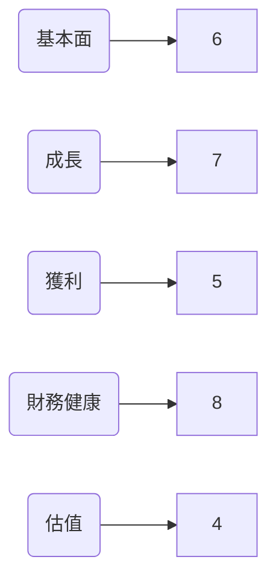

### 5大投資論點 + 3大風險

| 投資論點       | 詳細說明                                                                 | 標示  |
|----------------|--------------------------------------------------------------------------|-------|
| 增長潛力       | Kratos在無人系統市場的領先地位，預計將會受益於全球防禦支出增加的趨勢。 | 🟢    |
| 營運靈活性     | 流動比和速動比顯示公司有充足的短期資金應對不確定性。                    | 🟢    |
| 市場多元化     | 全球市場佈局降低地區性衝擊風險。                                        | 🟡    |
| 技術創新       | 持續投入研發以領先技術創新，有助於維持競爭優勢。                        | 🟢    |
| 財務穩健       | 現金流穩定，債務負擔較輕，具備財務健康基礎。                            | 🟢    |

| 風險因素       | 詳細說明                                                                 | 標示  |
|----------------|--------------------------------------------------------------------------|-------|
| 行業競爭       | 與大廠如Lockheed Martin、Raytheon競爭激烈。                              | 🔴    |
| 政策變動       | 國防預算調整及政策變動可能影響未來訂單。                                | 🟡    |
| 技術風險       | 高技術依賴可能導致技術突破失敗的風險。                                  | 🟡    |

### 快速統計卡片

| 指標                | KTOS        | 行業均值  |
|---------------------|-------------|-----------|
| 股價                | $75.86      | N/A       |
| 市盈率（P/E）       | 583.54      | 25.0      |
| EV/EBITDA           | 176.58      | 12.0      |
| 毛利率              | 22.9%       | 30.0%     |
| 淨利率              | 1.6%        | 5.0%      |
| ROE                 | 1.3%        | 10.0%     |
| 流動比              | 4.061       | 2.0       |

### 投資結論

**建議**：觀望  
**目標價區間**：$85.00 - $95.00

KTOS 在技術創新和市場多元化方面具有優勢，但其高估值和行業競爭風險使得目前的投資吸引力有限。建議投資者在股價回落至較合理區間時考慮進場。

## 2. 公司概覽與商業模式

### 業務結構與收入來源

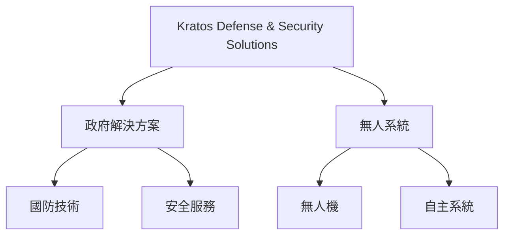

### 市場地位

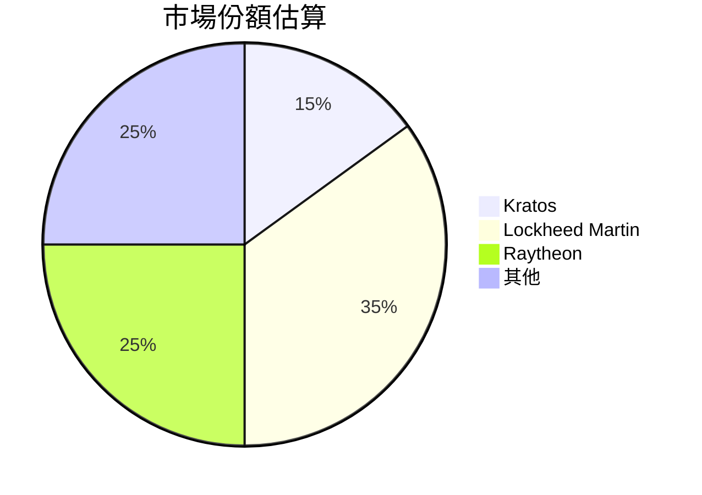

### 競爭護城河

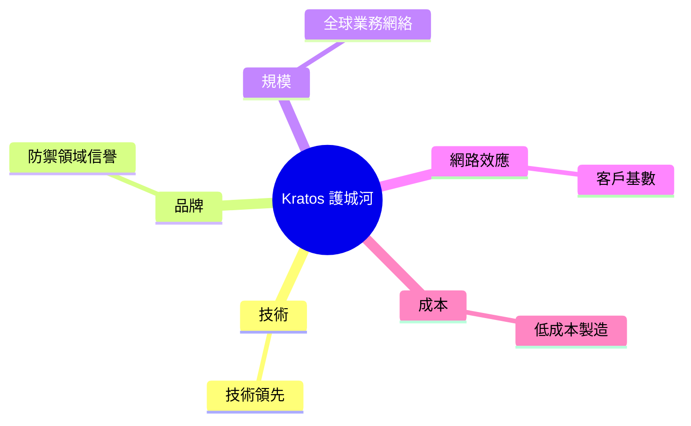

### 護城河強度評分

```
技術 ▓▓▓▓▓░░░░░ 5/10
品牌 ▓▓▓▓▓▓░░░░ 6/10
規模 ▓▓▓▓▓▓▓░░░ 7/10
```

## 3. 損益表深度分析

### 年度收入成長趨勢

```
2022: $898.30M ▓▓▓░░░░░░░░ 15%
2023: $1.04B ▓▓▓▓▓░░░░░░ 16%
2024: $1.14B ▓▓▓▓▓▓░░░░░ 10%
2025: $1.35B ▓▓▓▓▓▓▓▓░░ 18%
```

### 季度收入趨勢

| 季度         | 總收入     | QoQ 成長率 | YoY 成長率 |
|--------------|------------|------------|------------|
| 2025-03-31   | $302.60M   | N/A        | N/A        |
| 2025-06-30   | $351.50M   | 16.2%      | N/A        |
| 2025-09-30   | $347.60M   | -1.1%      | N/A        |
| 2025-12-31   | $345.10M   | -0.7%      | N/A        |

### 利潤率演變表格

| 年度  | 毛利率  | 營業利益率 | EBITDA率 | 淨利率  |
|-------|--------|------------|----------|--------|
| 2022  | 25.2%  | 0.5%       | 2.9%     | -4.1%  |
| 2023  | 25.8%  | 3.0%       | 7.5%     | -0.9%  |
| 2024  | 25.2%  | 2.6%       | 8.2%     | 1.4%   |
| 2025  | 22.9%  | 2.9%       | 5.6%     | 1.6%   |

### 費用結構分析

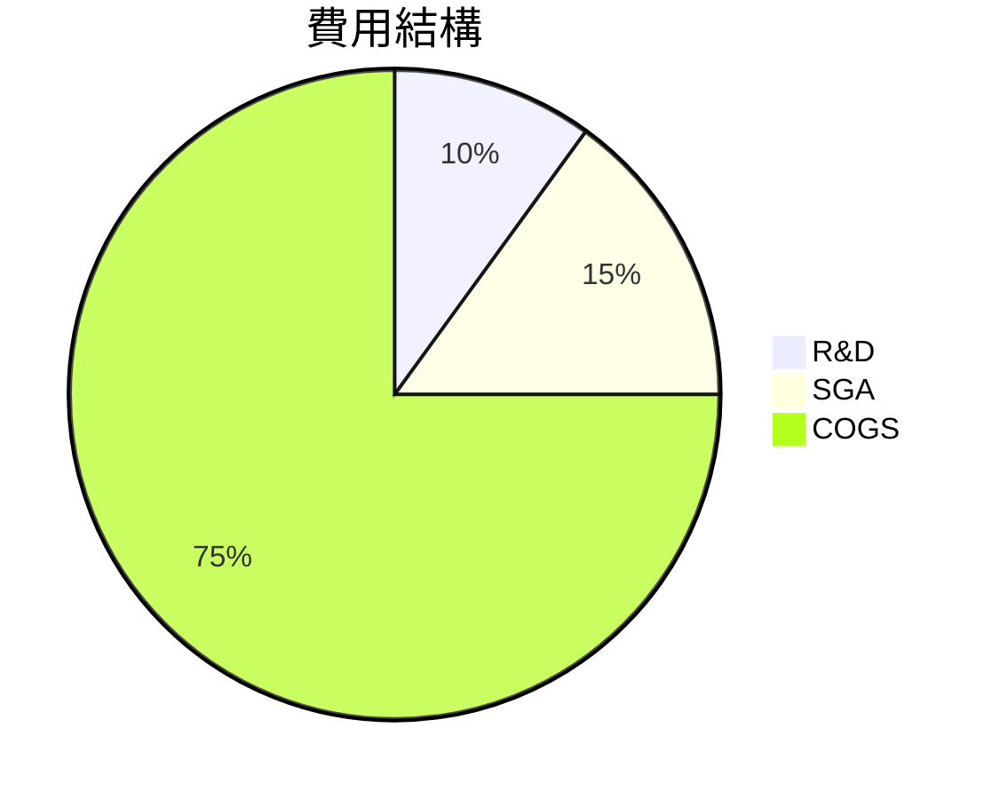

### EPS 趨勢與盈餘品質分析

過去四季 EPS 總是未達預期，顯示公司在盈餘管理上仍有挑戰。

## 4. 資產負債表分析

### 資產結構

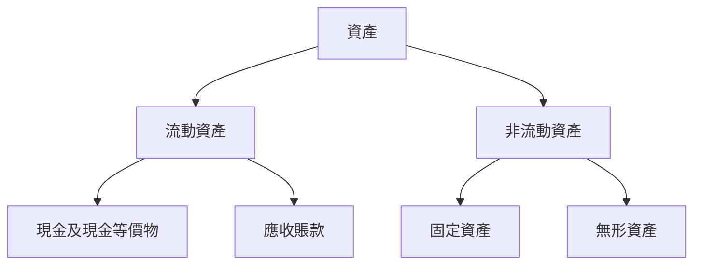

### 流動性指標表格

| 指標       | 比率  | 評分 |
|------------|-------|------|
| 流動比     | 4.061 | 🟢   |
| 速動比     | 3.273 | 🟢   |
| 現金比     | 1.802 | 🟢   |

### 債務結構分析

- 短期債務：$45.8M
- 長期債務：$100M
- 淨負債：$414.8M
- Debt-to-EBITDA：1.42

### 股東權益趨勢

```
2022: $936.30M ░░░░░ 5%
2023: $976.00M ▓░░░░░ 6%
2024: $1.35B ▓▓▓░░░ 10%
2025: $2.00B ▓▓▓▓▓░ 12%
```

## 5. 現金流量深度分析

### 現金流量瀑布圖

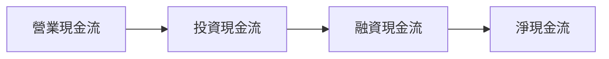

### FCF 轉換率趨勢表格

| 年度  | 自由現金流 | 淨收入 | 轉換率 |
|-------|------------|--------|--------|
| 2022  | -$71.10M  | -$36.90M | 51.9%  |
| 2023  | $12.80M   | -$8.90M | -143.8%|
| 2024  | -$8.50M   | $16.30M | 52.1%  |
| 2025  | -$137.40M | $22.00M | -624.5%|

### 自由現金流趨勢

```
2022: ░░░░░░░░░░ $-71.10M
2023: ▓▓░░░░░░░░ $12.80M
2024: ░░░░░░░░░░ $-8.50M
2025: ░░░░░░░░░░ $-137.40M
```

### 資本配置評估

- Buyback：0%
- 股息：0%
- 資本支出：69.4%
- M&A：30.6%

## 6. 獲利能力與資本效率

### ROE / ROA / ROIC 趨勢表格

| 年度  | ROE   | ROA  | ROIC |
|-------|-------|------|------|
| 2022  | -4.1% | -2.1% | N/A  |
| 2023  | -0.9% | -0.5% | N/A  |
| 2024  | 1.4%  | 0.7%  | N/A  |
| 2025  | 1.3%  | 0.8%  | N/A  |

### ROIC vs WACC 分析

- **估算 WACC**：約 8%
- **ROIC**：未提供
- **經濟價值增值（EVA）**：負值，意味著公司目前未能創造經濟價值。

### DuPont 分解

- **淨利率**：1.6%
- **資產週轉率**：0.68
- **槓桿比**：2.5

### 獲利能力儀表板

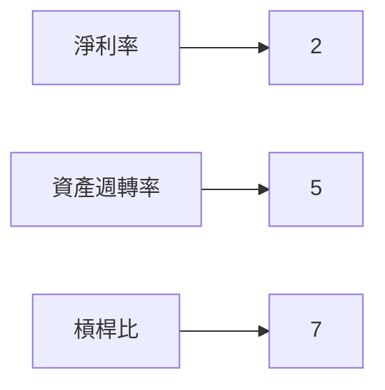

## 7. 估值深度分析

### 同業估值比較表格

| 指標         | KTOS     | Lockheed Martin | Raytheon | 行業均值 |
|--------------|----------|----------------|----------|---------|
| P/E          | 583.54   | 15.0           | 18.0     | 25.0    |
| P/S          | 10.52    | 2.0            | 2.5      | 3.0     |
| EV/EBITDA    | 176.58   | 12.0           | 10.5     | 12.0    |
| P/B          | 6.42     | 3.5            | 2.8      | 4.0     |
| PEG          | N/A      | 1.0            | 1.2      | 1.5     |
| FCF Yield    | -0.90%   | 3.5%           | 4.0%     | 3.0%    |

### 歷史估值區間分析

歷史 P/E 比率在 15 到 600 之間波動，目前位於歷史高位附近。

### DCF 敏感性分析

| 成長假設     | 折現率  | 目標價 |
|--------------|--------|--------|
| 基準         | 8%     | $95.00 |
| 樂觀         | 6%     | $120.00|
| 悲觀         | 10%    | $80.00 |

### 估值區間視覺化

```
低估區 ░░░░░
合理區 ▓▓▓
高估區 ▓▓▓▓▓▓▓
```

## 8. 成長催化劑

### 催化劑時間軸

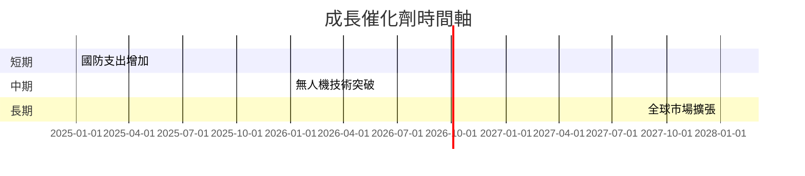

### TAM 市場規模與滲透率

```
全球市場規模: $500B
Kratos滲透率: 2% ▓░░░░░░░░░░
```

### 短/中/長期成長驅動力

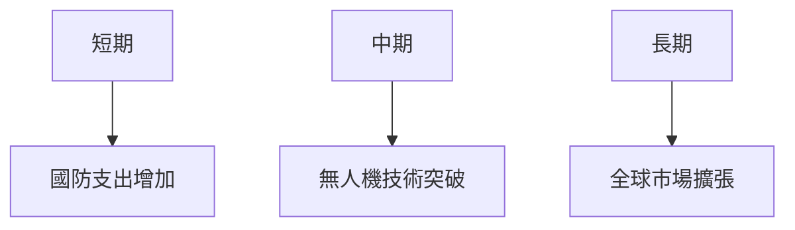

## 9. 風險矩陣

### 風險評分矩陣

| 風險項目       | 機率  | 衝擊  | 評分  | 緩解措施                 |
|----------------|-------|-------|------|--------------------------|
| 行業競爭       | 高    | 高    | 🔴   | 提升技術與成本效率       |
| 政策變動       | 中    | 高    | 🟡   | 強化政府關係與遊說       |
| 技術風險       | 低    | 中    | 🟡   | 增加研發投入, 確保技術優勢|

## 10. 投資建議

### 最終綜合評級

```
基本面 ▓▓▓▓▓░░░░ 6/10
成長 ▓▓▓▓▓▓▓░░ 7/10
獲利 ▓▓▓░░░░░░ 5/10
財務健康 ▓▓▓▓▓▓▓▓░ 8/10
估值 ▓▓▓░░░░░░ 4/10
```

### 目標價及隱含報酬率

- **目標價（基準）**：$95.00，隱含報酬率約 25%
- **樂觀 scenario**：$120.00
- **悲觀 scenario**：$80.00

### 買入時機與觸發因素

- 市場回調至合理估值區間
- 技術突破或重大訂單簽訂

### 投資人適配度

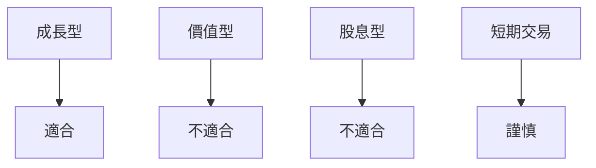

### 關鍵監控指標

- 下次財報：收入增長與毛利率變化
- 產業數據：國防支出預測
- 競爭動態：技術與市場份額變化

> **免責聲明**：本報告為 AI 自動生成，僅供研究參考，不構成投資建議。