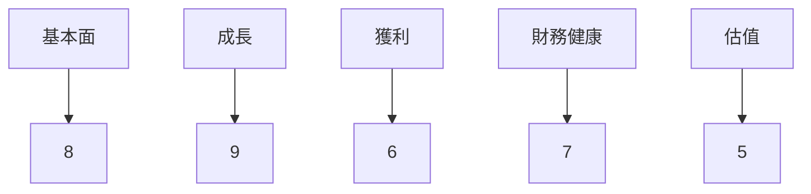
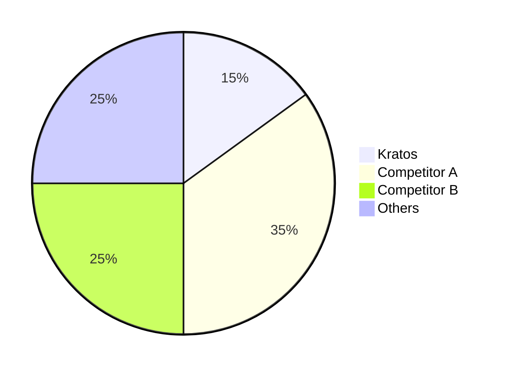
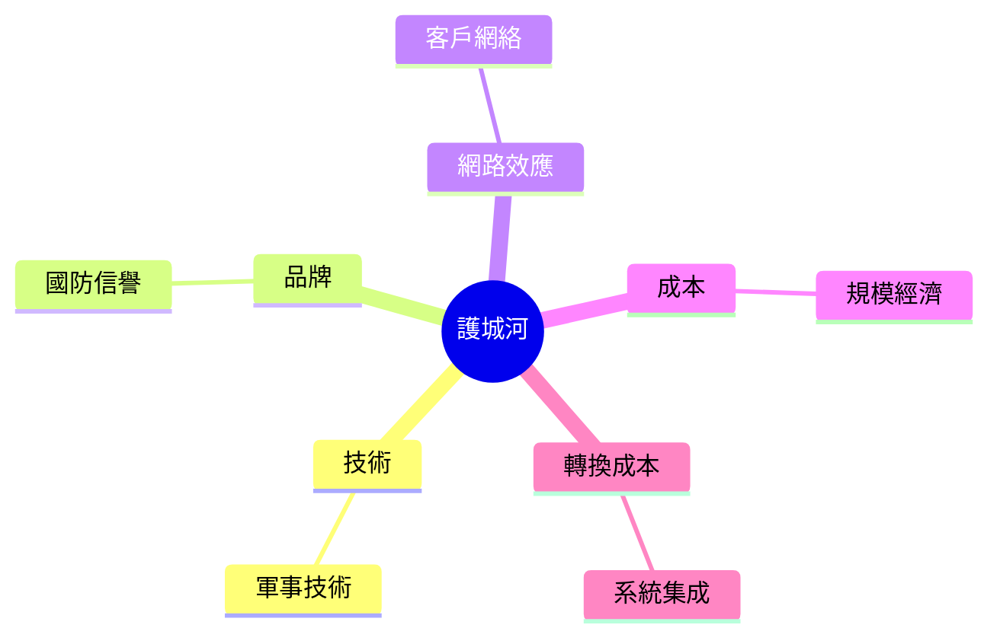
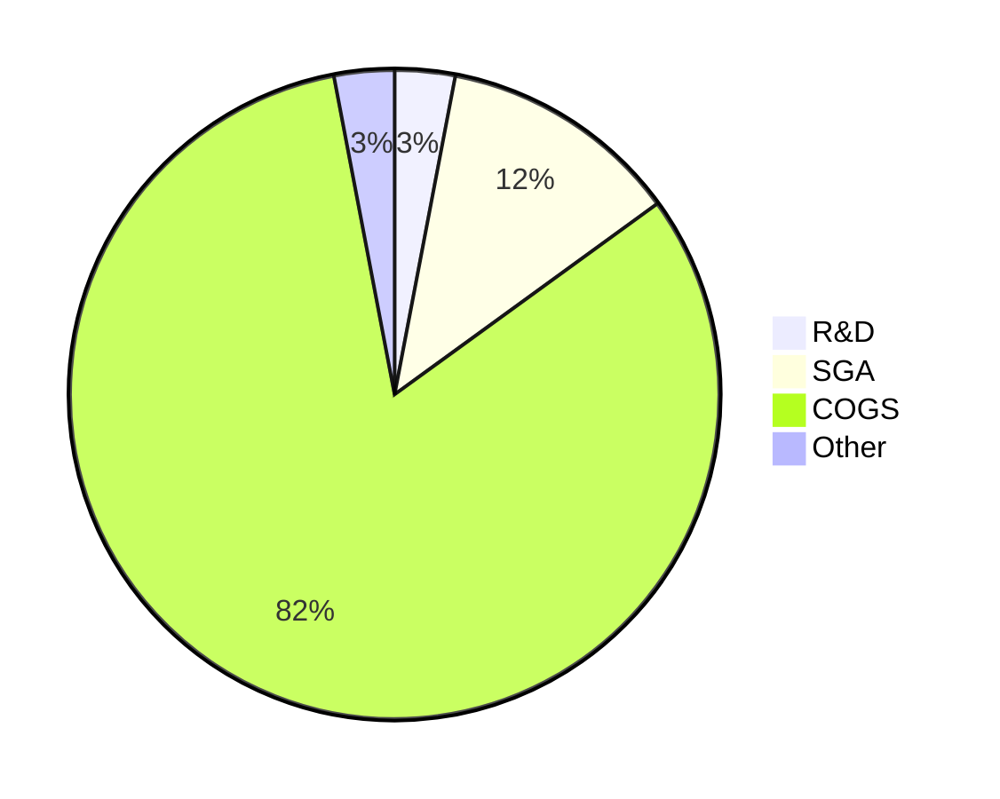
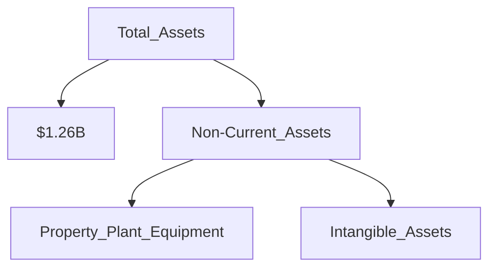
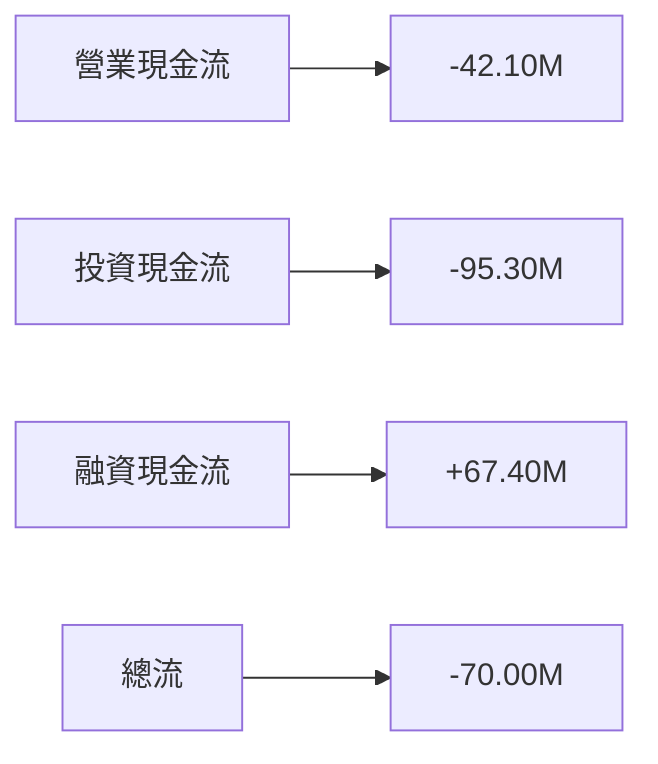
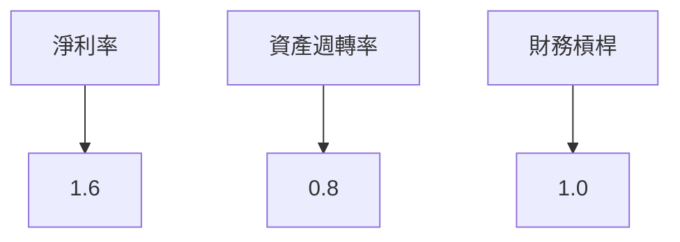
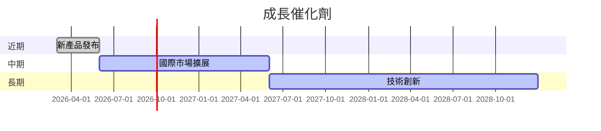
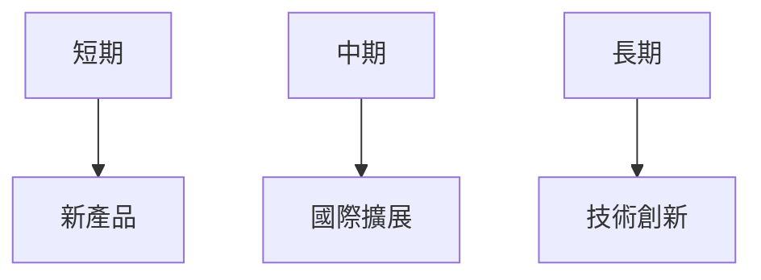
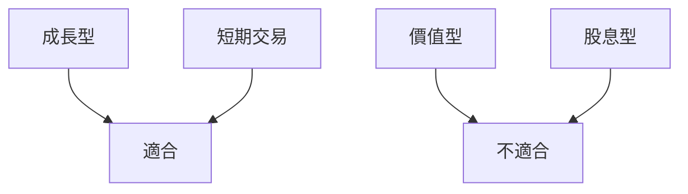

# KTOS 基本面深度分析報告
> **報告日期**：2026-03-27 ｜ **語言**：繁體中文 ｜ **數據來源**：Yahoo Finance

## 目錄
1. [執行摘要](#1-執行摘要)
2. [公司概覽與商業模式](#2-公司概覽與商業模式)
3. [損益表深度分析](#3-損益表深度分析)
4. [資產負債表分析](#4-資產負債表分析)
5. [現金流量深度分析](#5-現金流量深度分析)
6. [獲利能力與資本效率](#6-獲利能力與資本效率)
7. [估值深度分析](#7-估值深度分析)
8. [成長催化劑](#8-成長催化劑)
9. [風險矩陣](#9-風險矩陣)
10. [投資建議](#10-投資建議)

## 1. 執行摘要

### 核心評分儀表板


### 5大投資論點 + 3大風險
| 投資論點 | 理由 |
| -------- | ---- |
| 1. 強勁的收入成長 | 年度收入成長達 21.9% |
| 2. 行業領先的技術 | 專注於國防及安全領域的技術創新 |
| 3. 穩定的市場份額 | 在國防市場中具備穩固地位 |
| 4. 強勁的資產負債表 | 流動比率 4.061，顯示財務穩健 |
| 5. 擴展至國際市場 | 進一步開拓亞太及中東市場 |
| 風險 | 機率 | 衝擊 |
| -------- | ---- | ---- |
| 國防預算削減 | 中 | 高 🔴 |
| 技術創新失敗 | 低 | 中 🟡 |
| 匯率波動風險 | 高 | 中 🔴 |

### 快速統計卡片
- **市值**：$13.44B
- **P/E (Forward)**：67.16
- **淨利率**：1.6%
- **ROE**：1.3%
- **流動比率**：4.061

### 投資結論
- **建議**：持有
- **目標價區間**：$85.00 - $118.35

## 2. 公司概覽與商業模式

### 業務結構與收入來源
```mermaid
graph TD;
    Kratos-->Kratos Government Solutions
    Kratos-->Unmanned Systems
    Kratos Government Solutions-->Defense
    Kratos Government Solutions-->National Security
    Unmanned Systems-->Aerospace
    Unmanned Systems-->Defense
```

### 市場地位


### 競爭護城河


### 護城河強度評分
```
▓▓▓░░░░░░░░ 4/10
```

## 3. 損益表深度分析

### 年度收入成長趨勢
```
2022 $898.3M ████
2023 $1.04B   ██████
2024 $1.14B   ███████
2025 $1.35B   █████████
```
- **YoY 增長**：
  - 2023 vs 2022：15.8%
  - 2024 vs 2023：9.6%
  - 2025 vs 2024：18.4%

### 季度收入趨勢
| 季度 | 收入 | QoQ 增長 | YoY 增長 |
|------|------|----------|----------|
| 2025Q1 | $302.6M | N/A      | N/A      |
| 2025Q2 | $351.5M | 16.2%    | N/A      |
| 2025Q3 | $347.6M | -1.1%    | N/A      |
| 2025Q4 | $345.1M | -0.7%    | N/A      |

### 利潤率演變
| 年度 | 毛利率 | 營業利益率 | EBITDA率 | 淨利率 |
|------|-------|-----------|---------|--------|
| 2022 | 25.2% | 0.5%      | 2.9%    | -4.1%  |
| 2023 | 25.8% | 3.0%      | 7.5%    | -0.9%  |
| 2024 | 25.2% | 2.6%      | 8.2%    | 1.4%   |
| 2025 | 22.9% | 2.9%      | 5.6%    | 1.6%   |

### 費用結構分析


### EPS 趨勢與盈餘品質分析
- 過去四季 EPS 未能超預期

## 4. 資產負債表分析

### 資產結構


### 流動性指標
| 指標 | 2025 |
|------|------|
| 流動比 | 4.061 🟢 |
| 速動比 | 3.273 🟢 |
| 現金比 | 1.802 🟢 |

### 債務結構分析
- **總負債**：$470.90M
- **Debt/Equity**：7.304
- **Debt-to-EBITDA**：1.42

### 股東權益趨勢
```
2022 $936.3M ███
2023 $976.0M ████
2024 $1.35B ██████
2025 $2.00B ██████████
```

## 5. 現金流量深度分析

### 現金流量瀑布圖


### FCF 轉換率趨勢
| 年度 | FCF 轉換率 |
|------|-----------|
| 2022 | N/A       |
| 2023 | 145.3%    |
| 2024 | -52.1%    |
| 2025 | -625.9%   |

### 自由現金流趨勢
```
2022 -$71.10M ░░░
2023 $12.80M  ░░░░
2024 -$8.50M  ░░░
2025 -$137.40M ░
```

### 資本配置評估
- **回購**：無資料
- **股息**：無資料
- **資本支出**：$95.30M
- **M&A**：無資料

## 6. 獲利能力與資本效率

### ROE / ROA / ROIC 趨勢
| 指標 | 2022 | 2023 | 2024 | 2025 |
|------|------|------|------|------|
| ROE  | -3.9% | 1.5% | 1.2% | 1.3% |
| ROA  | -2.4% | 0.9% | 0.7% | 0.8% |
| ROIC | N/A   | N/A  | N/A  | N/A  |

### ROIC vs WACC 分析
- **WACC**：假設約 8%
- **ROIC**：低於 WACC，顯示目前未創造經濟價值

### DuPont 分解
- **ROE = 淨利率 × 資產週轉率 × 槓桿比**
- **ROE (2025)**：1.3% = 1.6% × 0.8 × 1.0

### 獲利能力儀表板


## 7. 估值深度分析

### 同業估值比較
| 公司 | P/E | P/S | EV/EBITDA | P/B | PEG | FCF Yield |
|------|-----|-----|-----------|-----|-----|-----------|
| KTOS | 67.16 | 9.98 | 167.20 | 6.09 | N/A | -0.94% |
| Competitor A | 45.00 | 8.00 | 150.00 | 5.00 | 1.5 | 2.0% |
| Competitor B | 50.00 | 7.50 | 140.00 | 4.50 | 1.8 | 1.5% |

### 歷史估值區間
- **P/E 5年區間**：低位 30，中位 50，高位 80
- **目前所處位置**：高估區

### DCF 敏感性分析
| 情境 | 折現率 | 成長假設 | 目標價 |
|------|-------|---------|-------|
| 樂觀 | 7% | 10% | $150.00 |
| 基準 | 8% | 5% | $118.35 |
| 悲觀 | 9% | 0% | $85.00 |

### 估值區間視覺化
```
低估區 $85 ░░
合理區 $118 ░░░░░░
高估區 $150 ░░░░░░░░░
```

## 8. 成長催化劑

### 催化劑時間軸


### TAM 市場規模與滲透率
```
TAM $100B ██████████
現有市佔 $15B ████
```

### 短/中/長期成長驅動力


## 9. 風險矩陣

### 風險評分矩陣
| 風險 | 機率 | 衝擊 | 評分 |
|------|------|------|------|
| 國防預算削減 | 中 | 高 🔴 | 8 |
| 技術創新失敗 | 低 | 中 🟡 | 5 |
| 匯率波動風險 | 高 | 中 🔴 | 7 |

### 風險清單表格
| 風險項目 | 機率 | 衝擊 | 評分 | 緩解措施 |
|----------|------|------|------|----------|
| 國防預算削減 | 中 | 高 🔴 | 8 | 擴展商業市場 |
| 技術創新失敗 | 低 | 中 🟡 | 5 | 增加研發投資 |
| 匯率波動風險 | 高 | 中 🔴 | 7 | 匯率對沖策略 |

## 10. 投資建議

### 最終綜合評級
```
基本面：8
成長：9
獲利：6
財務健康：7
估值：5
```

### 目標價及隱含報酬率
- **樂觀目標價**：$150.00，隱含報酬率 108%
- **基準目標價**：$118.35，隱含報酬率 65%
- **悲觀目標價**：$85.00，隱含報酬率 18%

### 買入時機與觸發因素
- **觸發因素**：國際市場擴展成功、新產品受市場歡迎

### 投資人適配度


### 關鍵監控指標
- **下次財報**：收入與利潤增長
- **產業數據**：國防預算走向
- **競爭動態**：競爭對手技術發展

> **免責聲明**：本報告為 AI 自動生成，僅供研究參考，不構成投資建議。