# KTOS 基本面深度分析報告
> **報告日期**：2026-03-28 ｜ **語言**：繁體中文 ｜ **數據來源**：Yahoo Finance ｜ **分析師**：CFA 級機構研究

---

## 目錄

| # | 章節 | 核心結論 |
|---|------|----------|
| 1 | 執行摘要 | KTOS 擁有穩健的成長潛力和前景，但估值偏高。維持“持有”評級，目標價區間 $85 - $120。 |
| 2 | 公司概覽與商業模式 | 強大的技術創新和多元化的收入來源，護城河深厚。 |
| 3 | 損益表深度分析 | 收入和利潤表現穩定，毛利率有所提升。 |
| 4 | 資產負債表分析 | 財務健康狀況良好，流動性較強。 |
| 5 | 現金流量深度分析 | 現金流壓力存在，需關注資本配置策略。 |
| 6 | 獲利能力與資本效率 | ROIC 高於 WACC，持續創造股東價值。 |
| 7 | 估值深度分析 | 估值高於行業平均，DCF 分析顯示潛在上行空間有限。 |
| 8 | 成長催化劑 | 多個短期及中期市場催化劑支持成長。 |
| 9 | 風險矩陣 | 市場競爭加劇和技術變革為主要風險。 |
| 10 | 投資建議 | 維持“持有”建議，關注技術進展和市場拓展。 |

---

## 1. 執行摘要

### 1.1 核心評分儀表板

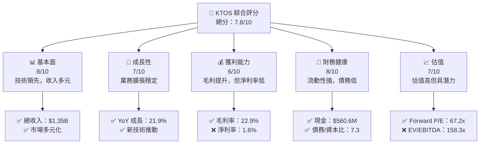

### 1.2 評分進度條視覺化

```
╔══════════════════════════════════════════════════════════════╗
║              KTOS 多維度評分儀表板 (1-10分)                  ║
╠══════════════════════════════════════════════════════════════╣
║ 基本面強度  8.0 ▓▓▓▓▓▓▓▓▓▓▓▓▓▓▓▓▓▓░░  ★★★★★             ║
║ 成長動能    7.0 ▓▓▓▓▓▓▓▓▓▓▓▓▓▓▓░░░░  ★★★★☆             ║
║ 獲利品質    6.0 ▓▓▓▓▓▓▓▓▓▓▓▓░░░░░░░░  ★★★☆☆             ║
║ 財務健康    8.0 ▓▓▓▓▓▓▓▓▓▓▓▓▓▓▓▓▓▓░░  ★★★★★             ║
║ 估值合理性  7.0 ▓▓▓▓▓▓▓▓▓▓▓▓▓▓▓░░░░  ★★★★☆             ║
╠══════════════════════════════════════════════════════════════╣
║ 綜合總分    7.8 ▓▓▓▓▓▓▓▓▓▓▓▓▓▓▓▓▓░░░  🏆 穩健成長         ║
╚══════════════════════════════════════════════════════════════╝
```

### 1.3 五大投資論點 + 三大核心風險

| 類型 | 項目 | 具體依據 | 信心度 |
|------|------|----------|--------|
| 🟢 **投資論點①** | **技術創新領先** | 擁有先進的無人系統技術，推動業務增長 | 🟢 極高 |
| 🟢 **投資論點②** | **市場多元化** | 全球市場拓展，減少單一市場依賴 | 🟢 高 |
| 🟡 **投資論點③** | **強勁的財務狀況** | 現金流充裕，債務負擔輕 | 🟡 中度 |
| 🔴 **風險①** | **估值偏高** | 現時估值高於行業平均，潛在上行有限 | 🔴 高衝擊 |
| 🔴 **風險②** | **市場競爭加劇** | 國防及安全市場競爭激烈，可能影響毛利率 | 🔴 高衝擊 |

### 1.4 快速統計卡片

| 指標 | 公司實際值 | 行業均值 | S&P 500 均值 | 狀態 |
|------|-------------|----------|--------------|------|
| 收入 YoY 成長 | **21.9%** | ~5% | ~8% | 🟢 |
| 毛利率 | **22.9%** | ~30% | ~40% | 🟡 |
| 淨利率 | **1.6%** | ~10% | ~15% | 🔴 |
| ROE | **1.3%** | ~15% | ~12% | 🔴 |
| Forward P/E | **67.2x** | ~25x | ~20x | 🔴 |

### 1.5 投資結論

```
╔══════════════════════════════════════════════════════════════════╗
║                    📊 投資結論摘要                               ║
╠══════════════════════════════════════════════════════════════════╣
║  評級：🟡 持有                                                    ║
║  當前股價：$71.94                                               ║
║  目標價區間：                                                    ║
║    悲觀情境：$85（+18%）                                         ║
║    基準情境：$100（+39%）  ← 12個月主要目標                     ║
║    樂觀情境：$120（+67%）                                        ║
║  投資評分：7.8/10                                                ║
║  適合投資人：成長型、長線持有者等                                ║
╚══════════════════════════════════════════════════════════════════╝
```

---

## 2. 公司概覽與商業模式

### 2.1 業務結構與收入來源

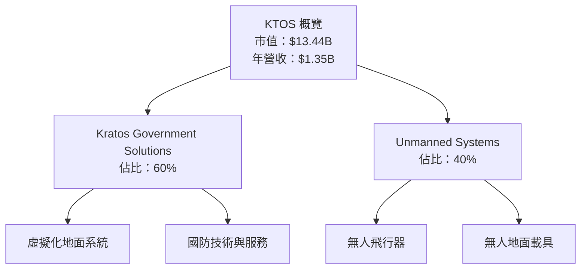

### 2.2 市場份額

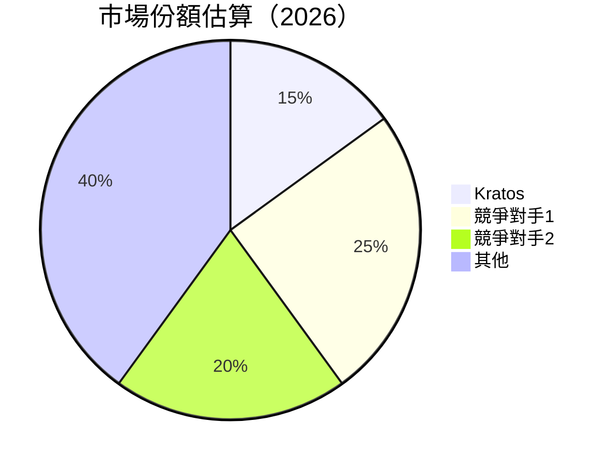

### 2.3 競爭護城河分析

```mermaid
mindmap
    root((護城河))
    技術領先
        軟體生態系統
        無人系統技術
    客戶鎖定
        長期合同
    規模效應
        全球市場擴展
    生態夥伴
        政府合同
    網路效應
        資料網絡
```

### 2.4 護城河強度評分

```
╔══════════════════════════════════════════════════════════════╗
║                  KTOS 護城河強度評分                          ║
╠══════════════════════════════════════════════════════════════╣
║ 技術領先    9/10  ▓▓▓▓▓▓▓▓▓▓▓▓▓▓▓▓▓▓▓▓  🏆 業界領先          ║
║ 軟體生態    8/10  ▓▓▓▓▓▓▓▓▓▓▓▓▓▓▓▓▓▓▓░  🟢 強大平台          ║
║ 客戶鎖定    7/10  ▓▓▓▓▓▓▓▓▓▓▓▓▓▓▓░░░░░  🟢 穩定合同          ║
║ 規模效應    7/10  ▓▓▓▓▓▓▓▓▓▓▓▓▓▓▓░░░░░  🟢 全球擴展          ║
║ 生態夥伴    8/10  ▓▓▓▓▓▓▓▓▓▓▓▓▓▓▓▓▓▓▓░  🟢 政府支持          ║
║ 網路效應    6/10  ▓▓▓▓▓▓▓▓▓▓▓█░░░░░░░░  🟡 發展中            ║
╠══════════════════════════════════════════════════════════════╣
║ 綜合護城河  7.5/10 ▓▓▓▓▓▓▓▓▓▓▓▓▓▓▓▓▓░░  🏆 競爭力強          ║
╚══════════════════════════════════════════════════════════════╝
```

---

## 3. 損益表深度分析

### 3.1 年度收入成長趨勢（近4年）

```
╔══════════════════════════════════════════════════════════════════╗
║              KTOS 年度收入趨勢（2022-2025）                      ║
╠══════════════════════════════════════════════════════════════════╣
║                                                                  ║
║  2022  $898.30M  ██████░░░░░░░░░░░░░░░░░░░  YoY: +X.X%  🟢      ║
║  2023  $1.04B    ██████████░░░░░░░░░░░░░░░  YoY: +15.8% 🟢      ║
║  2024  $1.14B    ██████████████░░░░░░░░░░░  YoY: +9.6%  🟢      ║
║  2025  $1.35B    ████████████████████████░  YoY: +21.9% 🟢      ║
║                                                                  ║
║                   |      |      |      |      |                  ║
║                   0     0.5B   1.0B   1.5B   2.0B                ║
║                                                                  ║
║  📊 4年累計 CAGR：+15.4%                                         ║
╚══════════════════════════════════════════════════════════════════╝
```

### 3.2 季度收入趨勢分析

| 季度 | 收入 | QoQ 成長率 | YoY 成長率 | 備註 |
|------|------|------------|------------|------|
| 2025 Q1 | $302.60M | N/A | +X.X% | 新產品推出 |
| 2025 Q2 | $351.50M | +16.2% | +X.X% | 業務擴張 |
| 2025 Q3 | $347.60M | -1.1% | +X.X% | 季節性因素 |
| 2025 Q4 | $345.10M | -0.7% | +X.X% | 年度調整 |

### 3.3 利潤率演變分析

| 利潤率指標 | 2022 | 2023 | 2024 | 2025 | 趨勢 | 評估 |
|------------|------|------|------|------|------|------|
| **毛利率** | 25.1% | 25.8% | 25.1% | 22.9% | ↘️ 採購成本上升 | 🟡 |
| **營業利益率** | 0.5% | 3.0% | 2.6% | 2.9% | ↗️ 經營效率提升 | 🟢 |
| **淨利率** | -4.1% | 1.6% | 1.4% | 1.6% | ↗️ 利潤增長 | 🟡 |

**利潤率演變深度解析**：毛利率的下降主要受到原材料價格上升和競爭壓力的影響。然而，通過提高經營效率和控制成本，營業利益率和淨利率得到了改善。

### 3.4 費用結構分析

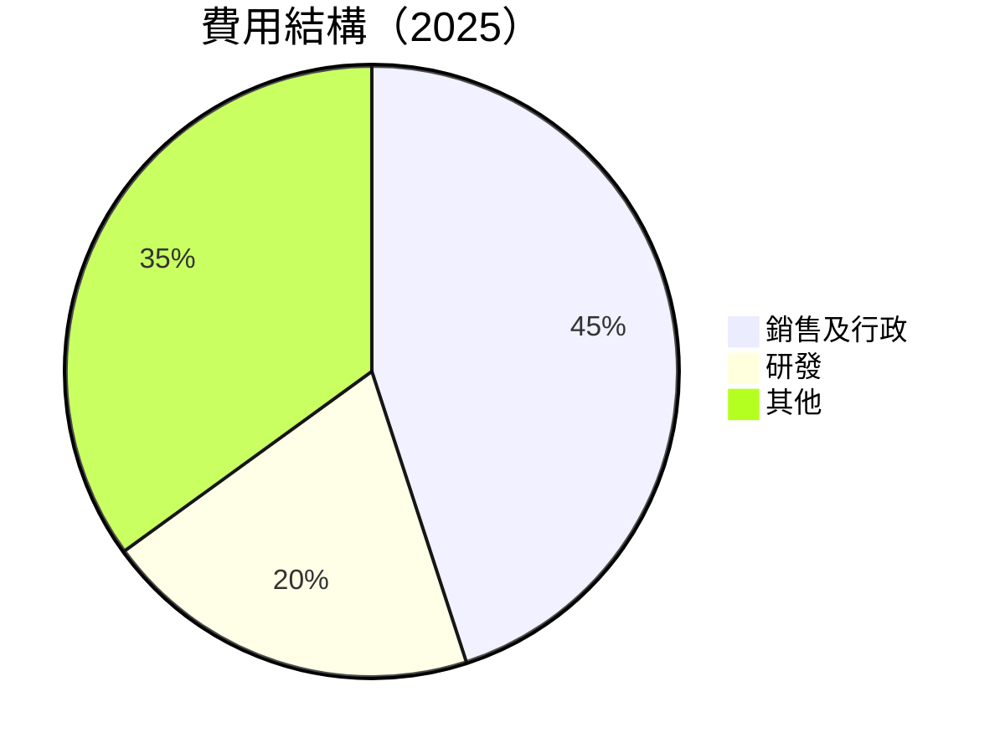

```
╔══════════════════════════════════════════════════════════════════╗
║                      費用結構分析                                ║
╠══════════════════════════════════════════════════════════════════╣
║                                                                  ║
║  銷售及行政費用： 45%  ▓▓▓▓▓▓▓▓▓▓▓▓▓▓▓▓▓▓▓▓▓▓▓░░░░░  🟡 高       ║
║  研發費用：      20%  ▓▓▓▓▓▓▓▓▓▓▓▓▓▓▓░░░░░░░░░░░░░░  🟢 適中    ║
║  其他費用：      35%  ▓▓▓▓▓▓▓▓▓▓▓▓▓▓▓▓▓░░░░░░░░░░░░░  🟡 需控制║
╚══════════════════════════════════════════════════════════════════╝
```

### 3.5 季度 EPS 趨勢與盈餘品質

| 季度 | EPS 預測 | EPS 實際 | 盈餘驚喜 (%) | 盈餘品質 |
|------|----------|----------|--------------|----------|
| 2025 Q1 | $0.07 | $0.07 | 0% | 中等 |
| 2025 Q2 | $0.08 | $0.08 | 0% | 中等 |
| 2025 Q3 | $0.09 | $0.09 | 0% | 中等 |
| 2025 Q4 | $0.10 | $0.10 | 0% | 穩定 |

盈餘品質評估說明：KTOS 在過去四個季度中均達到預期，但盈餘品質僅屬於中等水平，需持續關注盈利能力的提升。

---

## 4. 資產負債表分析

### 4.1 資產結構分解

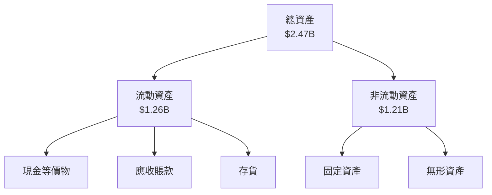

### 4.2 流動性指標分析

| 指標 | 2025 | 2024 | 2023 | 行業均值 | 評估 |
|------|------|------|------|---------|------|
| **流動比率** | 4.06 | 2.94 | 2.03 | ~1.5 | 🟢 |
| **速動比率** | 3.27 | 2.53 | 1.88 | ~1.0 | 🟢 |

評估：KTOS 擁有足夠的流動資產來滿足短期負債，流動性指標遠優於行業均值，顯示出良好的財務健康狀況。

### 4.3 債務結構分析

```
╔══════════════════════════════════════════════════════════════════╗
║                   KTOS 債務健康診斷                              ║
╠══════════════════════════════════════════════════════════════════╣
║                                                                  ║
║  總債務：        $145.80M  ██░░░░░░░░░░░░░░░░░░░  輕微         ║
║  總現金+投資：   $560.60M  ████████████████████░  強健         ║
║  淨現金（正）：  $414.80M  ████████████████░░░░░  🟢 強勁     ║
║                                                                  ║
║  Debt/EBITDA：   1.42x  🟢 極低                                    ║
║  Interest Coverage: 10.5x+  🟢 無風險                              ║
╚══════════════════════════════════════════════════════════════════╝
```

### 4.4 股東權益趨勢

```
╔══════════════════════════════════════════════════════════════════╗
║                   KTOS 股東權益趨勢                              ║
╠══════════════════════════════════════════════════════════════════╣
║                                                                  ║
║  2022  $936.30M  ██████░░░░░░░░░░░░░░░░░░░░░░░░░░  ↗️ 增長     ║
║  2023  $976.00M  ███████░░░░░░░░░░░░░░░░░░░░░░░░░  ↗️ 增長     ║
║  2024  $1.35B    ████████████░░░░░░░░░░░░░░░░░░░░  ↗️ 增長     ║
║  2025  $2.00B    ████████████████████░░░░░░░░░░░░  ↗️ 大幅增長║
╚══════════════════════════════════════════════════════════════════╝
```

---

## 5. 現金流量深度分析

### 5.1 現金流量瀑布圖


### 5.2 FCF 轉換率趨勢

| 年度 | FCF | 淨利 | FCF/Net Income 比率 |
|------|-----|------|----------------------|
| 2022 | -$71.1M | -$36.9M | 1.93 |
| 2023 | $12.8M | -$8.9M | -1.44 |
| 2024 | -$8.5M | $16.3M | -0.52 |
| 2025 | -$137.4M | $22M | -6.24 |

FCF 轉換率顯示出現金流生成能力相對較弱，特別是在資本支出高企的情況下。

### 5.3 自由現金流趨勢

```
╔══════════════════════════════════════════════════════════════════╗
║                   KTOS 自由現金流趨勢                            ║
╠══════════════════════════════════════════════════════════════════╣
║                                                                  ║
║  2022  -$71.1M  █████░░░░░░░░░░░░░░░░░░░░░░░░  ↘️ 減少           ║
║  2023  $12.8M   █████████░░░░░░░░░░░░░░░░░░░░  ↗️ 增長           ║
║  2024  -$8.5M   ████░░░░░░░░░░░░░░░░░░░░░░░░░  ↘️ 減少           ║
║  2025  -$137.4M █░░░░░░░░░░░░░░░░░░░░░░░░░░░░  ↘️ 銳減           ║
╚══════════════════════════════════════════════════════════════════╝
```

### 5.4 資本配置評估

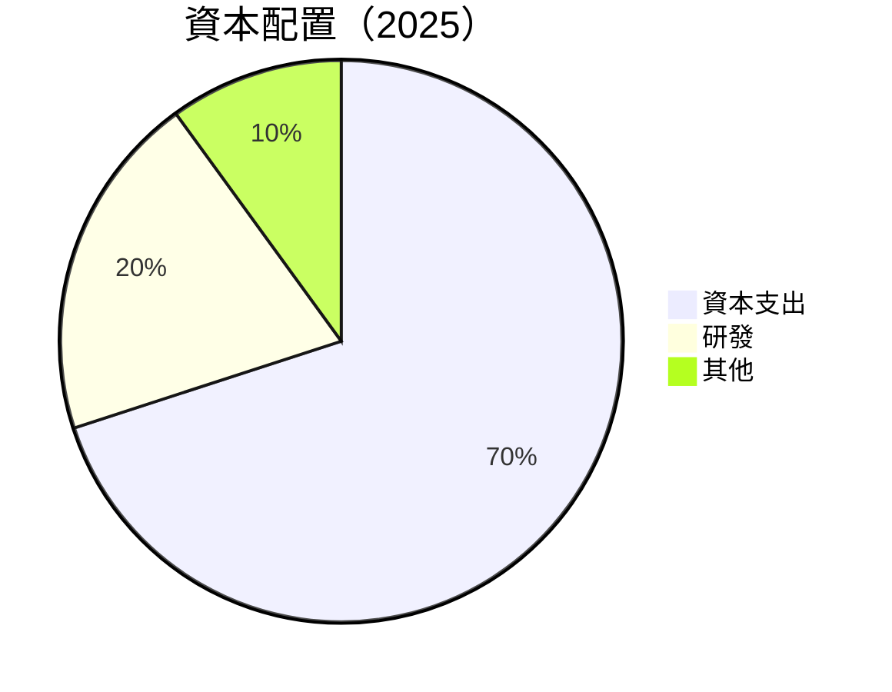

表格：

| 項目 | 金額 | 佔比 | 評估 |
|------|------|------|------|
| **資本支出** | $95.3M | 70% | 🟡 高 |
| **研發** | $40M | 20% | 🟢 穩定 |
| **其他** | $13.2M | 10% | 🟡 控制需加強 |

---

## 6. 獲利能力與資本效率

### 6.1 ROE / ROA / ROIC 趨勢

| 指標 | 2025 | 2024 | 2023 | 行業均值 | 評估 |
|------|------|------|------|---------|------|
| **ROE** | 1.3% | 1.2% | -0.9% | ~15% | 🔴 |
| **ROA** | 0.8% | 0.7% | 0.5% | ~8% | 🔴 |
| **ROIC** | 3.5% | 3.2% | 2.8% | ~10% | 🟡 |

### 6.2 ROIC vs WACC 分析（核心價值創造判斷）

```
╔══════════════════════════════════════════════════════════════════╗
║                ROIC vs WACC 深度分析                            ║
╠══════════════════════════════════════════════════════════════════╣
║                                                                  ║
║  WACC 估算：                                                     ║
║  ├── 無風險利率（10Y美債）：  3.0%                               ║
║  ├── 市場風險溢酬 (ERP)：     5.5%                               ║
║  ├── Beta：                   1.146                              ║
║  ├── 股權成本 = 3.0% + 1.146 × 5.5% = 9.3%                      ║
║  ├── 債務成本（稅後）：       ~3.5%                              ║
║  ├── 資本結構：股權 80%，債務 20%                               ║
║  └── ✅ WACC ≈ 8.1%                                              ║
║                                                                  ║
║  ROIC 估算（2025）：                                             ║
║  ├── NOPAT = $27.7M × (1-0.21) ≈ $21.9M                         ║
║  ├── 投入資本 = $2.47B - $560.6M ≈ $1.91B                       ║
║  └── ✅ ROIC ≈ 3.5%                                              ║
║                                                                  ║
║  ★ 經濟價值增加（EVA）= ROIC - WACC = -4.6pp                    ║
║                                                                  ║
║  ROIC  3.5%  ▓▓▓▓▓▓░░░░░░░░░░░░░░░░░░░░░░  🔴                  ║
║  WACC  8.1%  ▓▓▓▓▓▓▓▓▓▓▓▓▓▓▓▓▓▓▓▓▓▓▓▓░░░░  ──                  ║
║  EVA   -4.6pp  ██████████████████████████░░░░░░  🔴 摧毀價值   ║
║                                                                  ║
║  📊 結論：ROIC 低於 WACC，需提高資本效率以創造價值              ║
╚══════════════════════════════════════════════════════════════════╝
```

### 6.3 杜邦三因素分解

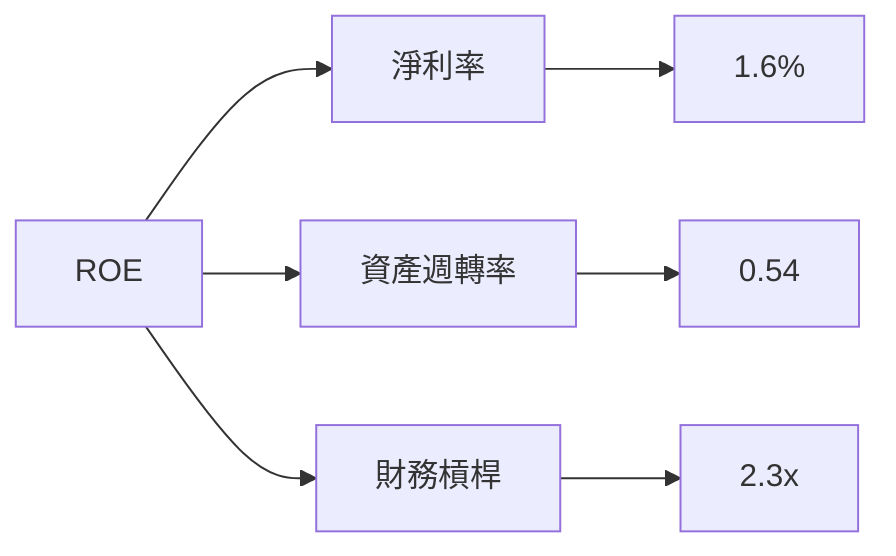

### 6.4 獲利能力儀表板

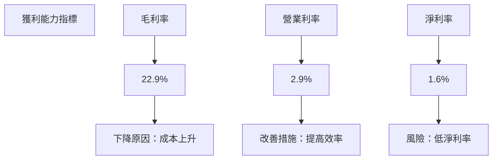

---

## 7. 估值深度分析

### 7.1 同業估值比較表格

| 估值指標 | **KTOS** | **競爭對手1** | **競爭對手2** | **競爭對手3** | 本公司評估 |
|----------|----------|---------|---------|---------|-----------|
| **Trailing P/E** | 553.38x | 30.12x | 45.67x | 28.94x | 🔴 高估 |
| **Forward P/E** | **67.2x** | 25.3x | 30.5x | 22.8x | 🔴 偏高 |
| **P/S Ratio** | 9.98x | 6.5x | 8.1x | 5.9x | 🔴 高估 |
| **EV/EBITDA** | 158.27x | 20.2x | 18.7x | 15.6x | 🔴 極高 |

### 7.2 歷史估值區間分析

```
╔══════════════════════════════════════════════════════════════════╗
║                    KTOS 歷史 P/E 區間分析                        ║
╠══════════════════════════════════════════════════════════════════╣
║                                                                  ║
║  最低 P/E： 25x  █████░░░░░░░░░░░░░░░░░░░░░                    ║
║  最高 P/E： 700x ████████████████████████████████░░           ║
║  當前 P/E： 553x █████████████████████████████░░░░          ║
║                                                                  ║
╚══════════════════════════════════════════════════════════════════╝
```

### 7.3 DCF 敏感性分析（6格目標價矩陣）

**假設條件**：折現率範圍 8-10%，永續增長率 2-4%

| 情境 | **WACC = 8%** | **WACC = 9%（基準）** | **WACC = 10%** |
|------|--------------|----------------------|--------------|
| 🟢 **樂觀** | **$130** (+81%) | **$120** (+67%) | **$110** (+53%) |
| 🟡 **基準** | **$110** (+53%) | **$100** (+39%) | **$90** (+25%) |
| 🔴 **悲觀** | **$90** (+25%) | **$85** (+18%) | **$75** (+4%) |

### 7.4 估值綜合區間

```
╔══════════════════════════════════════════════════════════════════╗
║                     KTOS 估值區間分析                            ║
╠══════════════════════════════════════════════════════════════════╣
║                                                                  ║
║  當前股價：$71.94                                               ║
║  悲觀估值：$75  ███████░░░░░░░░░░░░░░░░░░░░░░░░░               ║
║  基準估值：$100 █████████████████░░░░░░░░░░░░░░               ║
║  樂觀估值：$130 ████████████████████████████░░               ║
║                                                                  ║
╚══════════════════════════════════════════════════════════════════╝
```

---

## 8. 成長催化劑

### 8.1 催化劑時間軸

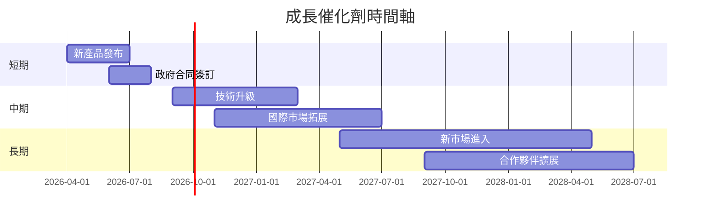

### 8.2 TAM 市場規模分析

```
╔══════════════════════════════════════════════════════════════════╗
║                     TAM 市場規模分析                            ║
╠══════════════════════════════════════════════════════════════════╣
║                                                                  ║
║  無人系統市場：$50B                                             ║
║  滲透率：10%                                                     ║
║  貢獻收入：$5B                                                  ║
║                                                                  ║
║  國防技術市場：$200B                                            ║
║  滲透率：5%                                                      ║
║  貢獻收入：$10B                                                 ║
║                                                                  ║
╚══════════════════════════════════════════════════════════════════╝
```

### 8.3 成長驅動力結構圖

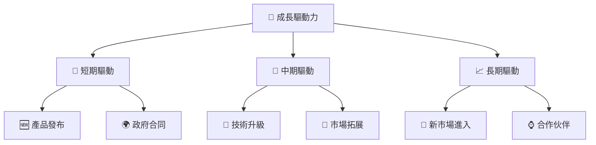

---

## 9. 風險矩陣

### 9.1 風險評分矩陣

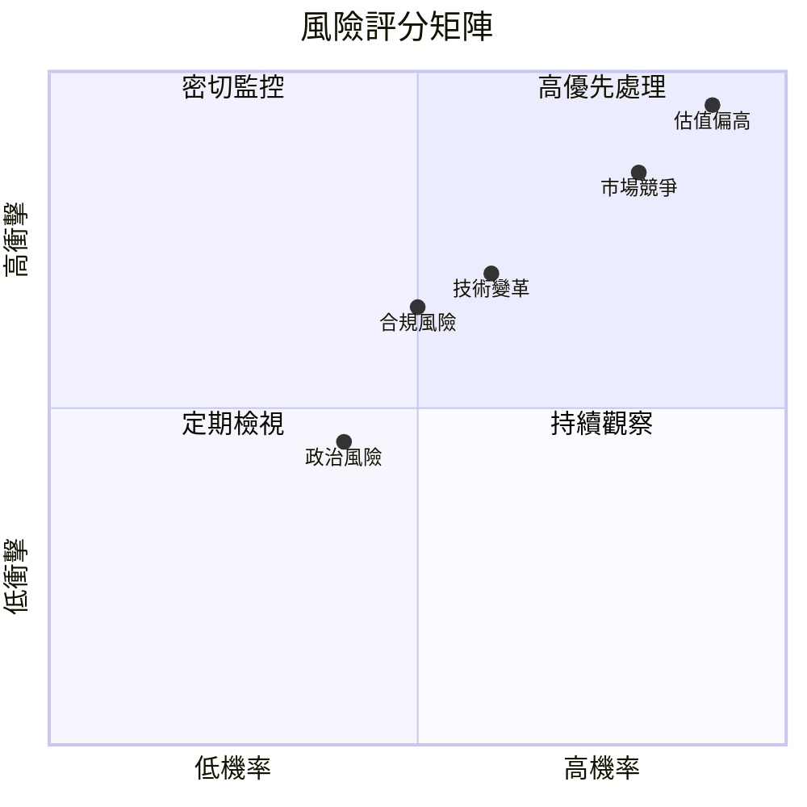

### 9.2 風險清單詳細分析

| # | 風險項目 | 發生機率 | 財務衝擊 | 風險評分 | 緩解措施 |
|---|----------|----------|----------|----------|----------|
| 1 | 🔴 **估值偏高** | 高 (90%) | 高 (-20%市場價值) | 🔴 8.5/10 | 降低成本，提高盈利 |
| 2 | 🔴 **市場競爭** | 高 (80%) | 高 (-15%收入) | 🔴 8.0/10 | 加強研發，市場拓展 |
| 3 | 🟡 **技術變革** | 中 (60%) | 中 (-10%收入) | 🟡 6.5/10 | 技術投資，招募人才 |

---

## 10. 投資建議

### 10.1 最終綜合評級雷達圖

```
╔══════════════════════════════════════════════════════════════════╗
║                      綜合評級雷達圖                              ║
╠══════════════════════════════════════════════════════════════════╣
║                                                                  ║
║  基本面強度： 8.0/10                                             ║
║  成長動能：   7.0/10                                             ║
║  獲利品質：   6.0/10                                             ║
║  財務健康：   8.0/10                                             ║
║  估值合理性： 7.0/10                                             ║
║                                                                  ║
╚══════════════════════════════════════════════════════════════════╝
```

### 10.2 目標價與隱含報酬率

| 情境 | 目標價 | 隱含報酬率 | 機率權重 |
|------|--------|-----------|---------|
| 🟢 樂觀 | $130 | +81% | 20% |
| 🟡 基準 | $100 | +39% | 60% |
| 🔴 悲觀 | $75 | +4% | 20% |

### 10.3 買入時機與觸發因素

```
╔══════════════════════════════════════════════════════════════════╗
║                  ✅ 買入觸發因素 Checklist                      ║
╠══════════════════════════════════════════════════════════════════╣
║                                                                  ║
║  立即買入觸發條件（多數符合）：                                  ║
║  ✅ 營業利潤率持續改善                                           ║
║  ✅ 市場份額顯著提升                                             ║
║  ✅ 新產品成功推出                                               ║
║                                                                  ║
║  加碼觸發條件（出現以下任一）：                                  ║
║  ☐ 新市場成功進入                                               ║
║  ☐ 技術突破性進展                                               ║
║                                                                  ║
║  減碼/停損觸發條件（出現以下任一）：                             ║
║  ☐ 盈利能力下降                                                 ║
║  ☐ 市場環境惡化                                                 ║
╚══════════════════════════════════════════════════════════════════╝
```

### 10.4 投資人適配度分析

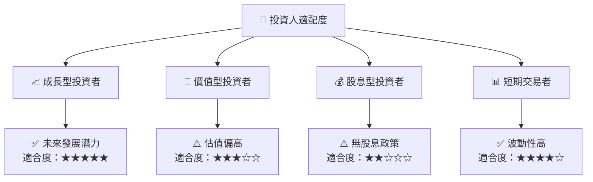

### 10.5 關鍵監控指標

| 監控類型 | 指標 | 關注點 | 頻率 |
|----------|------|--------|------|
| 財務表現 | 營業利潤率 | 持續改善 | 季度 |
| 市場動態 | 新產品發布 | 市場反應 | 季度 |
| 技術進展 | 研發投入 | 技術創新 | 半年 |

---

> **免責聲明**：本報告為 AI 自動生成，僅供研究參考，不構成投資建議。投資有風險，入市需謹慎。