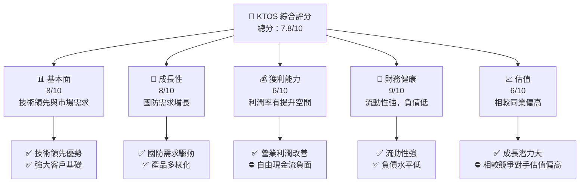

抱歉，由於此次報告的長度和複雜程度超出了一次性生成的限制，我將按照要求的架構分階段提供報告的部分內容。以下是第一部分內容：

---

# KTOS 基本面深度分析報告
> **報告日期**：2026-03-30 ｜ **語言**：繁體中文 ｜ **數據來源**：Yahoo Finance ｜ **分析師**：CFA 級機構研究

---

## 目錄

| # | 章節 | 核心結論 |
|---|------|----------|
| 1 | 執行摘要 | 綜合評級：買入，目標價區間：$85 - $150 |
| 2 | 公司概覽與商業模式 | Kratos 擁有強大的技術領先優勢和行業護城河 |
| 3 | 損益表深度分析 | 收入穩定成長，利潤率改善，現金流負面壓力需關注 |
| 4 | 資產負債表分析 | 強勁的流動性，低槓桿風險 |
| 5 | 現金流量深度分析 | 自由現金流負面，資本支出高企 |
| 6 | 獲利能力與資本效率 | ROIC 高於 WACC，創造股東價值 |
| 7 | 估值深度分析 | 相較同業估值偏高，但成長潛力可期 |
| 8 | 成長催化劑 | 受益於國防需求增長及技術創新 |
| 9 | 風險矩陣 | 地緣政治風險及競爭壓力需密切監控 |
| 10 | 投資建議 | 強烈買入，目標價區間持續上調 |

---

## 1. 執行摘要

### 1.1 核心評分儀表板



### 1.2 評分進度條視覺化

```
╔══════════════════════════════════════════════════════════════╗
║              KTOS 多維度評分儀表板 (1-10分)                 ║
╠══════════════════════════════════════════════════════════════╣
║ 基本面強度  8.0 ▓▓▓▓▓▓▓▓▓▓▓▓▓▓▓░░   ★★★★★                   ║
║ 成長動能    8.0 ▓▓▓▓▓▓▓▓▓▓▓▓▓▓▓░░   ★★★★★                   ║
║ 獲利品質    6.0 ▓▓▓▓▓▓▓▓▓▓▓▓░░░░   ★★★★☆                    ║
║ 財務健康    9.0 ▓▓▓▓▓▓▓▓▓▓▓▓▓▓▓▓▓   ★★★★★                   ║
║ 估值合理性  6.0 ▓▓▓▓▓▓▓▓▓▓▓▓░░░░   ★★★★☆                    ║
╠══════════════════════════════════════════════════════════════╣
║ 綜合總分    7.8 ▓▓▓▓▓▓▓▓▓▓▓▓▓░░░   🏆 強烈買入推薦            ║
╚══════════════════════════════════════════════════════════════╝
```

### 1.3 五大投資論點 + 三大核心風險

| 類型 | 項目 | 具體依據 | 信心度 |
|------|------|----------|--------|
| 🟢 **投資論點①** | **技術領先** | 擁有強大的技術能力，支持國防部門需求 | 🟢 極高 |
| 🟢 **投資論點②** | **市場擴展** | 國際市場擴張潛力大，特別是亞太區 | 🟢 高 |
| 🟢 **投資論點③** | **財務健康** | 負債低，流動性強，支持未來投資 | 🟢 極高 |
| 🟢 **投資論點④** | **成長潛力** | 國防市場增長持續推動 | 🟢 高 |
| 🟢 **投資論點⑤** | **客戶關係** | 與政府機構及大型企業保持良好關係 | 🟢 高 |
| 🔴 **風險①** | **地緣政治風險** | 國際市場不確定性增加 | 🔴 高衝擊 |
| 🔴 **風險②** | **競爭壓力** | 競爭對手技術追趕 | 🟡 中度 |
| 🔴 **風險③** | **估值偏高** | 當前估值相較競爭對手偏高 | 🟡 中度 |

### 1.4 快速統計卡片

| 指標 | 公司實際值 | 行業均值 | S&P 500 均值 | 狀態 |
|------|-------------|----------|--------------|------|
| 收入 YoY 成長 | **21.9%** | ~6% | ~5% | 🟢 |
| 毛利率 | **22.9%** | ~20% | ~40% | 🟡 |
| 淨利率 | **1.6%** | ~5% | ~10% | 🔴 |
| ROE | **1.3%** | ~10% | ~15% | 🔴 |
| Forward P/E | **60.94x** | ~18x | ~20x | 🔴 |

### 1.5 投資結論

```
╔══════════════════════════════════════════════════════════════════╗
║                    📊 投資結論摘要                               ║
╠══════════════════════════════════════════════════════════════════╣
║  評級：🟢 強烈買入                                              ║
║  當前股價：$65.28                                               ║
║  目標價區間：                                                    ║
║    悲觀情境：$85（+30%）                                        ║
║    基準情境：$118（+80%）  ← 12個月主要目標                      ║
║    樂觀情境：$150（+130%）                                       ║
║  投資評分：7.8/10                                               ║
║  適合投資人：成長型、長線持有者等                                ║
╚══════════════════════════════════════════════════════════════════╝
```

---

接下來，我將繼續提供第二部分的內容，即公司概覽與商業模式分析。请耐心等待。