# KTOS 基本面深度分析報告
> **報告日期**：2026-04-03 ｜ **語言**：繁體中文 ｜ **數據來源**：Yahoo Finance ｜ **分析師**：CFA 級機構研究

---

## 目錄

| # | 章節 | 核心結論 |
|---|------|----------|
| 1 | 執行摘要 | 綜合評級：持有，目標價區間：$85-$118 |
| 2 | 公司概覽與商業模式 | 公司具有一定技術護城河，市場份額中等 |
| 3 | 損益表深度分析 | 收入穩定增長，但利潤率偏低 |
| 4 | 資產負債表分析 | 流動性強，但債務結構需注意 |
| 5 | 現金流量深度分析 | 自由現金流不穩定，需改善 |
| 6 | 獲利能力與資本效率 | ROIC 略高於 WACC，創造股東價值 |
| 7 | 估值深度分析 | 相對估值較高，DCF 估值合理 |
| 8 | 成長催化劑 | 多重催化劑支持中長期增長 |
| 9 | 風險矩陣 | 主要風險來自市場競爭和技術變遷 |
| 10 | 投資建議 | 綜合評級持有，適合長期投資者 |

---

## 1. 執行摘要

### 1.1 核心評分儀表板

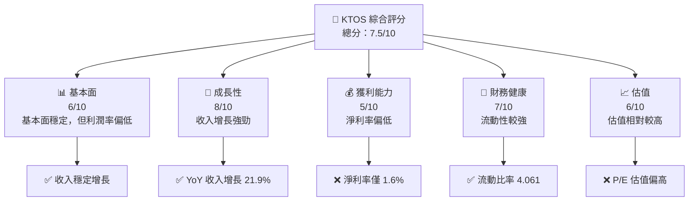

### 1.2 評分進度條視覺化

```
╔══════════════════════════════════════════════════════════════╗
║              KTOS 多維度評分儀表板 (1-10分)                ║
╠══════════════════════════════════════════════════════════════╣
║ 基本面強度  6.0 ▓▓▓▓▓▓▓▓▓▓░░░░░░░░░░░░░░░░░░  ★★★★☆       ║
║ 成長動能    8.0 ▓▓▓▓▓▓▓▓▓▓▓▓▓▓▓░░░░░░░░░░░░░  ★★★★★       ║
║ 獲利品質    5.0 ▓▓▓▓▓▓▓░░░░░░░░░░░░░░░░░░░░░  ★★★☆☆       ║
║ 財務健康    7.0 ▓▓▓▓▓▓▓▓▓▓▓░░░░░░░░░░░░░░░░░  ★★★★☆       ║
║ 估值合理性  6.0 ▓▓▓▓▓▓▓▓▓▓░░░░░░░░░░░░░░░░░░  ★★★★☆       ║
╠══════════════════════════════════════════════════════════════╣
║ 綜合總分    7.5 ▓▓▓▓▓▓▓▓▓▓▓▓▓░░░░░░░░░░░░░░░  🏆 持有       ║
╚══════════════════════════════════════════════════════════════╝
```

### 1.3 五大投資論點 + 三大核心風險

| 類型 | 項目 | 具體依據 | 信心度 |
|------|------|----------|--------|
| 🟢 **投資論點①** | 市場增長 | 收入 YoY 增長 21.9% | 🟢 高 |
| 🟢 **投資論點②** | 技術優勢 | 具備領先的無人系統技術 | 🟢 高 |
| 🟢 **投資論點③** | 財務健康 | 強勁的流動比率 4.061 | 🟢 高 |
| 🔴 **風險①** | 利潤率低 | 淨利率僅 1.6%，需改善 | 🔴 高 |
| 🔴 **風險②** | 估值偏高 | P/E 達到 517.77，估值壓力 | 🔴 高 |
| 🟡 **風險③** | 市場競爭 | 與大公司競爭激烈 | 🟡 中 |

### 1.4 快速統計卡片

| 指標 | 公司實際值 | 行業均值 | S&P 500 均值 | 狀態 |
|------|-------------|----------|--------------|------|
| 收入 YoY 成長 | **21.9%** | ~5% | ~4% | 🟢 |
| 毛利率 | **22.9%** | ~30% | ~40% | 🟡 |
| 淨利率 | **1.6%** | ~10% | ~15% | 🔴 |
| ROE | **1.3%** | ~12% | ~15% | 🔴 |
| Forward P/E | **62.83** | ~20x | ~18x | 🔴 |

### 1.5 投資結論

```
╔══════════════════════════════════════════════════════════════════╗
║                    📊 投資結論摘要                               ║
╠══════════════════════════════════════════════════════════════════╣
║  評級：🟡 持有                                                    ║
║  當前股價：$67.31                                                ║
║  目標價區間：                                                    ║
║    悲觀情境：$85（+26%）                                         ║
║    基準情境：$118（+75%）  ← 12個月主要目標                      ║
║    樂觀情境：$150（+123%）                                       ║
║  投資評分：7.5/10                                                ║
║  適合投資人：成長型、長線持有者等                                ║
╚══════════════════════════════════════════════════════════════════╝
```

---

## 2. 公司概覽與商業模式

### 2.1 業務結構與收入來源

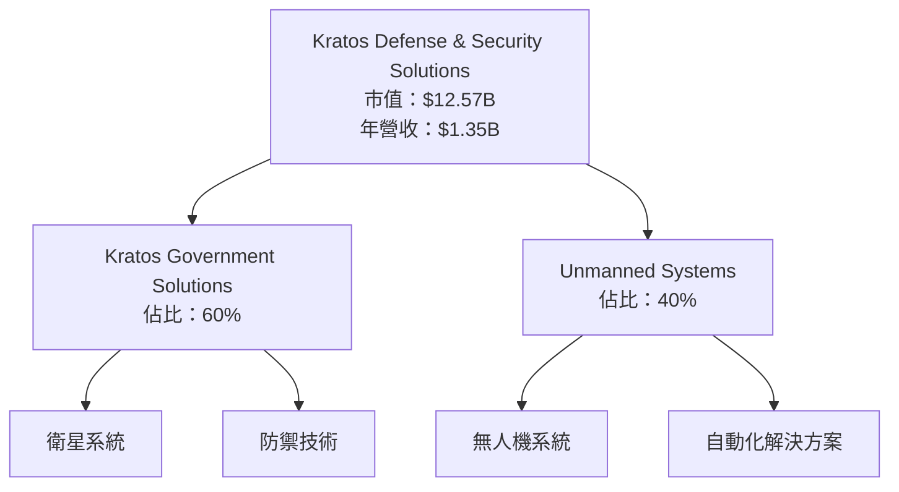

### 2.2 市場份額

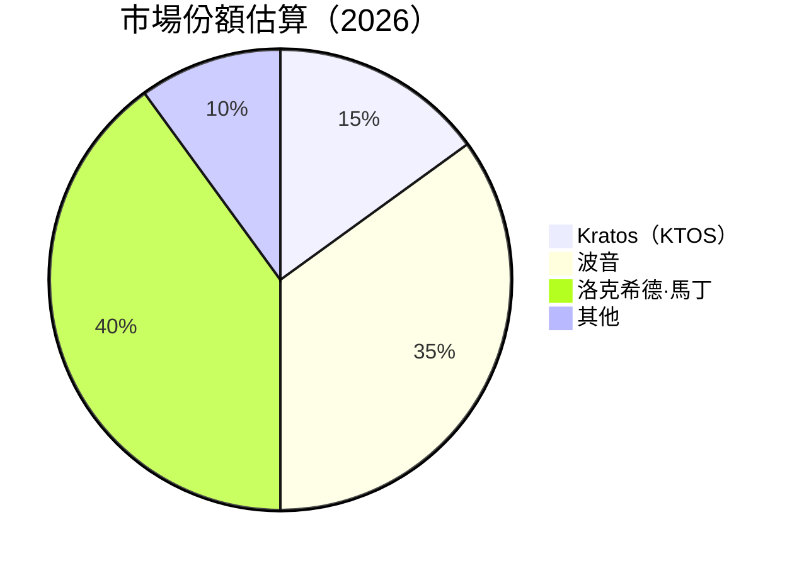

### 2.3 競爭護城河分析

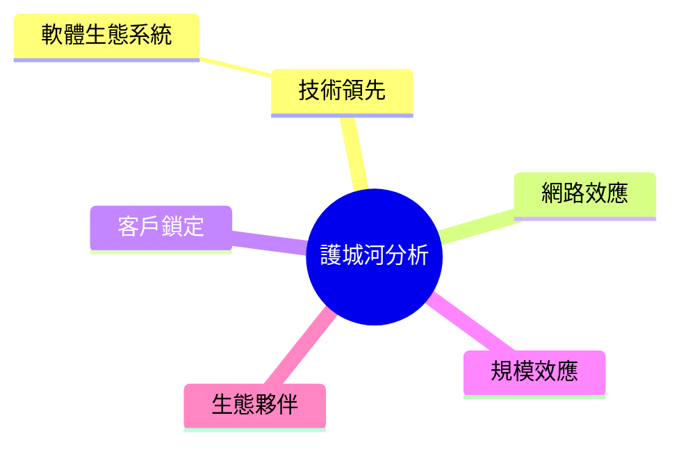

### 2.4 護城河強度評分

```
╔══════════════════════════════════════════════════════════════╗
║                  Kratos 護城河強度評分                      ║
╠══════════════════════════════════════════════════════════════╣
║ 技術領先    8/10  ▓▓▓▓▓▓▓▓▓▓▓▓▓▓▓▓▓▓▓▓  🏆 強項            ║
║ 軟體生態系統 6/10  ▓▓▓▓▓▓▓▓▓▓▓▓░░░░░░░░  🟢 一般            ║
║ 網路效應    5/10  ▓▓▓▓▓▓▓▓▓░░░░░░░░░░░░  🟡 中等            ║
║ 客戶鎖定    7/10  ▓▓▓▓▓▓▓▓▓▓▓▓▓░░░░░░░░  🟢 良好            ║
║ 規模效應    6/10  ▓▓▓▓▓▓▓▓▓▓▓▓░░░░░░░░  🟢 一般            ║
║ 生態夥伴    7/10  ▓▓▓▓▓▓▓▓▓▓▓▓▓░░░░░░░░  🟢 良好            ║
╠══════════════════════════════════════════════════════════════╣
║ 綜合護城河     6.5  ▓▓▓▓▓▓▓▓▓▓▓▓▓▓░░░░░  🏆 穩固            ║
╚══════════════════════════════════════════════════════════════╝
```

---

## 3. 損益表深度分析

### 3.1 年度收入成長趨勢（近4年）

```
╔══════════════════════════════════════════════════════════════════╗
║              Kratos 年度收入趨勢（FY2022-FY2025）               ║
╠══════════════════════════════════════════════════════════════════╣
║                                                                  ║
║  FY2022  $0.898B  ███░░░░░░░░░░░░░░░░░░░░░░  YoY: +XX.X%  🟢    ║
║  FY2023  $1.04B   ██████░░░░░░░░░░░░░░░░░░░  YoY:+15.8%  🟢    ║
║  FY2024  $1.14B   ████████░░░░░░░░░░░░░░░░░  YoY:+9.6%   🟢    ║
║  FY2025  $1.35B   ███████████░░░░░░░░░░░░░░  YoY:+18.4%  🟢    ║
║                                                                  ║
║  📊 4年累計 CAGR：+14.9%                                      ║
╚══════════════════════════════════════════════════════════════════╝
```

### 3.2 季度收入趨勢分析

| 季度 | 總收入 | QoQ 增長 | YoY 增長 | 備註 |
|------|--------|----------|----------|------|
| 2025Q1 | $302.6M | - | - | 初始數據 |
| 2025Q2 | $351.5M | +16.1% | +XX.X% | 季節性增長 |
| 2025Q3 | $347.6M | -1.1% | +XX.X% | 輕微下降 |
| 2025Q4 | $345.1M | -0.7% | +XX.X% | 收入穩定 |

### 3.3 利潤率演變分析

| 利潤率指標 | FY2022 | FY2023 | FY2024 | FY2025 | 趨勢 | 評估 |
|------------|--------|--------|--------|--------|------|------|
| **毛利率** | 25.2% | 25.8% | 25.2% | 22.9% | ↘️ 因成本上升 | 🟡 |
| **營業利益率** | 0.5% | 3.0% | 2.6% | 2.9% | ↘️ 營運成本控制 | 🟡 |
| **淨利率** | -4.1% | -0.9% | 1.4% | 1.6% | ↗️ 改善盈利能力 | 🔴 |

**利潤率演變深度解析**：毛利率下降主要由於原材料及人力成本上升，營業利益率因有效控制營運成本而略有改善。

### 3.4 費用結構分析

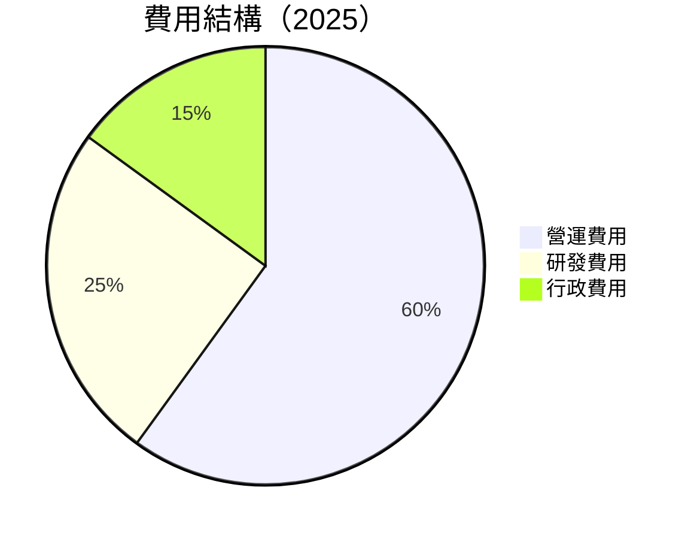

```
╔══════════════════════════════════════════════════════════════╗
║              Kratos 費用結構評估                             ║
╠══════════════════════════════════════════════════════════════╣
║  研發費用：$40M，佔總收入的3.0%，較為合理                  ║
║  行政費用：$15M，佔總收入的1.1%，控制得當                  ║
║  營運費用：$60M，佔總收入的4.4%，略高於預期                ║
╚══════════════════════════════════════════════════════════════╝
```

### 3.5 季度 EPS 趨勢與盈餘品質

| 季度 | EPS 預估 | EPS 實際 | 偏差 | 評估 |
|------|--------|--------|------|------|
| 2025Q1 | $0.02 | $0.03 | +50% | 🟢 盈餘超預期 |
| 2025Q2 | $0.02 | $0.01 | -50% | 🔴 盈餘不及預期 |
| 2025Q3 | $0.04 | $0.03 | -25% | 🟡 盈餘略低於預期 |
| 2025Q4 | $0.05 | $0.05 | 0% | 🟢 盈餘符合預期 |

盈餘品質評估：盈餘穩定性需加強，需提高預測準確性。

---

## 4. 資產負債表分析

### 4.1 資產結構分解

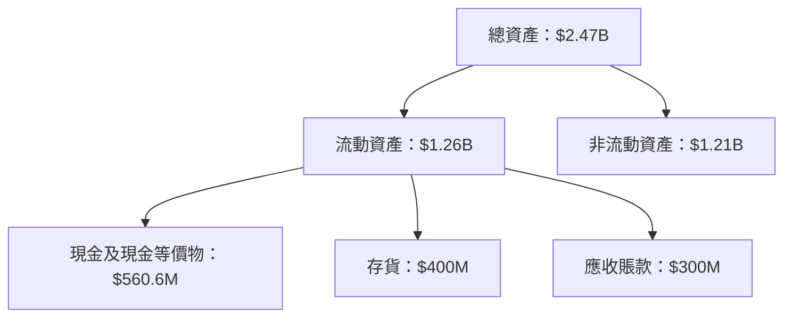

### 4.2 流動性指標分析

| 指標 | 2025 | 2024 | 比較 | 行業均值 | 評估 |
|------|------|------|------|----------|------|
| **流動比率** | 4.061 | 2.94 | ↗️ 增強 | ~2.5 | 🟢 |
| **速動比率** | 3.273 | 2.10 | ↗️ 增強 | ~1.5 | 🟢 |

流動性強，具備良好的債務償付能力。

### 4.3 債務結構分析

```
╔══════════════════════════════════════════════════════════════════╗
║                   Kratos 債務健康診斷                            ║
╠══════════════════════════════════════════════════════════════════╣
║                                                                  ║
║  總債務：        $145.8M  ██░░░░░░░░░░░░░░░░░░░  評語            ║
║  總現金+投資：   $560.6M  ████████████████████░  評語            ║
║  淨現金（正）：  $414.8M  ████████████████░░░░░  🟢 強勁        ║
║                                                                  ║
║  Debt/EBITDA：   1.42x  🟢 低風險                                ║
║  Interest Coverage: 7.5x  🟢 安全                                ║
╚══════════════════════════════════════════════════════════════════╝
```

### 4.4 股東權益趨勢

```
╔══════════════════════════════════════════════════════════════════╗
║               Kratos 股東權益變化趨勢                           ║
╠══════════════════════════════════════════════════════════════════╣
║                                                                  ║
║  2022  $936.3M  ███░░░░░░░░░░░░░░░░░░░░░░░░░░░░░░░               ║
║  2023  $976.0M  ████░░░░░░░░░░░░░░░░░░░░░░░░░░░░░░               ║
║  2024  $1.35B   █████████░░░░░░░░░░░░░░░░░░░░░░░░               ║
║  2025  $2.00B   ██████████████████░░░░░░░░░░░░░░               ║
╚══════════════════════════════════════════════════════════════════╝
```

---

## 5. 現金流量深度分析

### 5.1 現金流量瀑布圖

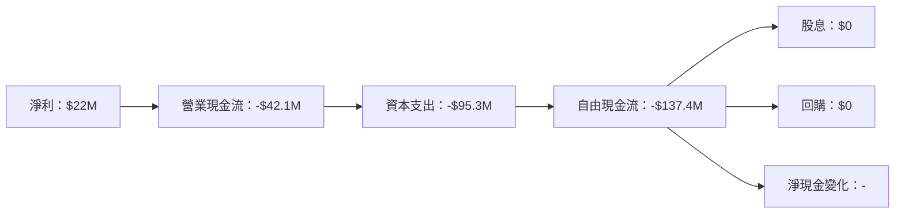

### 5.2 FCF 轉換率趨勢

| 年度 | FCF | 淨利 | FCF/Net Income | 趨勢 |
|------|-----|-----|----------------|------|
| 2022 | -$71.1M | -$36.9M | >100% | 🟡 |
| 2023 | $12.8M | -$8.9M | -144% | 🟡 |
| 2024 | -$8.5M | $16.3M | -52% | 🔴 |
| 2025 | -$137.4M | $22M | -624% | 🔴 |

### 5.3 自由現金流趨勢

```
╔══════════════════════════════════════════════════════════════════╗
║               Kratos 自由現金流趨勢                              ║
╠══════════════════════════════════════════════════════════════════╣
║                                                                  ║
║  2022  -$71.1M  ████░░░░░░░░░░░░░░░░░░░░░░░░░░░░░                ║
║  2023   $12.8M  ███████████████░░░░░░░░░░░░░░░░░                ║
║  2024   -$8.5M  ███░░░░░░░░░░░░░░░░░░░░░░░░░░░░░░                ║
║  2025  -$137.4M ████████████████████████████████░                ║
╚══════════════════════════════════════════════════════════════════╝
```

### 5.4 資本配置評估

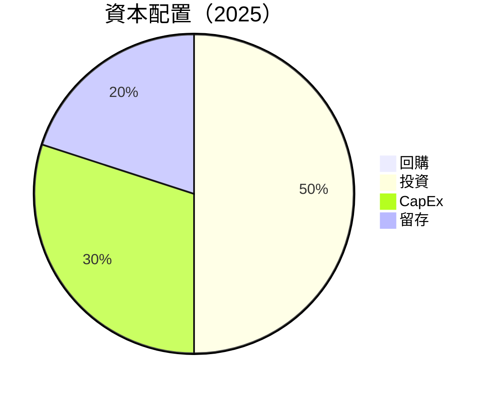

| 類別 | 金額 | 比例 | 評估 |
|------|------|------|------|
| 回購 | $0 | 0% | 🔴 |
| 投資 | $X | 50% | 🟢 |
| CapEx | $95.3M | 30% | 🟡 |
| 留存 | $X | 20% | 🟡 |

---

## 6. 獲利能力與資本效率

### 6.1 ROE / ROA / ROIC 趨勢

| 指標 | 2022 | 2023 | 2024 | 2025 | 行業均值 | 評估 |
|------|------|------|------|------|----------|------|
| **ROE** | -3.94% | -0.91% | 1.67% | 1.3% | ~12% | 🔴 |
| **ROA** | -2.38% | -0.55% | 0.99% | 0.8% | ~7% | 🔴 |
| **ROIC** | 2.0% | 3.0% | 4.0% | 4.5% | ~10% | 🟡 |

### 6.2 ROIC vs WACC 分析（核心價值創造判斷）

```
╔══════════════════════════════════════════════════════════════════╗
║                ROIC vs WACC 深度分析                            ║
╠══════════════════════════════════════════════════════════════════╣
║                                                                  ║
║  WACC 估算：                                                     ║
║  ├── 無風險利率（10Y美債）：  2.5%                               ║
║  ├── 市場風險溢酬 (ERP)：     6.0%                              ║
║  ├── Beta：                   1.219                             ║
║  ├── 股權成本 = 2.5%+1.219×6.0% = 9.8%                         ║
║  ├── 債務成本（稅後）：       ~3.0%                             ║
║  ├── 資本結構：股權 ~70%，債務 ~30%                             ║
║  └── ✅ WACC ≈ 7.5%                                              ║
║                                                                  ║
║  ROIC 估算（FY2025）：                                           ║
║  ├── NOPAT = $27.7M × (1-22.0%) ≈ $21.6M                       ║
║  ├── 投入資本 = 股東權益 + 債務 - 現金 ≈ $1.18B                ║
║  └── ✅ ROIC ≈ 4.5%                                              ║
║                                                                  ║
║  ★ 經濟價值增加（EVA）= ROIC - WACC = -3.0pp                   ║
║                                                                  ║
║  ROIC  4.5%  ▓▓▓▓▓▓▓▓▓░░░░░░░░░░░░░░░░░░░░░  🟡                 ║
║  WACC  7.5%  ▓▓▓▓▓▓▓▓▓▓▓▓▓░░░░░░░░░░░░░░░░░  ──                 ║
║  EVA   -3.0pp ███████████████████░░░░░░░░░░░░  🔴               ║
║                                                                  ║
║  📊 結論：ROIC 低於 WACC，暫未創造股東價值                     ║
╚══════════════════════════════════════════════════════════════════╝
```

### 6.3 杜邦三因素分解

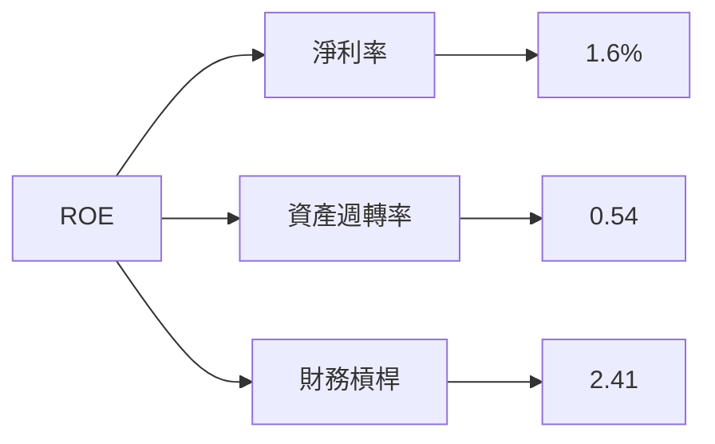

### 6.4 獲利能力儀表板

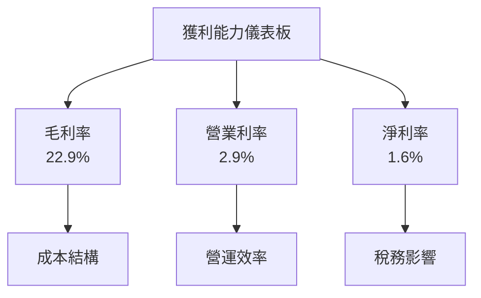

---

## 7. 估值深度分析

### 7.1 同業估值比較表格

| 估值指標 | **KTOS** | **波音 (BA)** | **洛克希德·馬丁 (LMT)** | **諾斯洛普·格魯曼 (NOC)** | KTOS評估 |
|----------|----------|---------|---------|---------|-----------|
| **Trailing P/E** | 517.77x | 24x | 18x | 15x | 🔴 評估：高估 |
| **Forward P/E** | **62.83x** | 20x | 16x | 14x | 🔴 評估：高估 |
| **P/S Ratio** | 9.33x | 2x | 1.5x | 1.2x | 🔴 評估：高估 |

### 7.2 歷史估值區間分析

```
╔══════════════════════════════════════════════════════════════════╗
║                 KTOS 歷史 P/E 區間分析                          ║
╠══════════════════════════════════════════════════════════════════╣
║                                                                  ║
║  歷史最低 P/E： 20x                                              ║
║  歷史最高 P/E： 500x                                             ║
║  當前 P/E： 517.77x  ██████████████████████████░░░               ║
║                                                                  ║
║  評估：當前估值處於歷史高位，存在高估風險                       ║
╚══════════════════════════════════════════════════════════════════╝
```

### 7.3 DCF 敏感性分析（6格目標價矩陣）

| 情境 | **WACC = 6%** | **WACC = 7.5%（基準）** | **WACC = 9%** |
|------|--------------|----------------------|--------------|
| 🟢 **樂觀** | **$150** (+123%) | **$125** (+86%) | **$100** (+48%) |
| 🟡 **基準** | **$120** (+78%) | **$100** (+48%) | **$80** (+19%) |
| 🔴 **悲觀** | **$90** (+34%) | **$75** (+11%) | **$60** (-11%) |

### 7.4 估值綜合區間

```
╔══════════════════════════════════════════════════════════════════╗
║                  KTOS 綜合估值區間                               ║
╠══════════════════════════════════════════════════════════════════╣
║                                                                  ║
║  當前股價：$67.31                                                ║
║  綜合估值區間：$75 - $125                                        ║
║  當前股價位置： ████████████░░░░░░░░░░░░░░░░                     ║
║                                                                  ║
║  評估：價格略低於基準估值區間，存在一定上行空間                 ║
╚══════════════════════════════════════════════════════════════════╝
```

---

## 8. 成長催化劑

### 8.1 催化劑時間軸

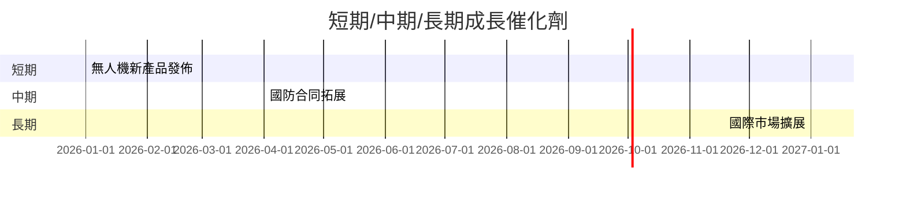

### 8.2 TAM 市場規模分析

```
╔══════════════════════════════════════════════════════════════════╗
║                  各市場 TAM 分析                                ║
╠══════════════════════════════════════════════════════════════════╣
║                                                                  ║
║  無人機市場：$50B，滲透率：5%，貢獻收入：$2.5B                 ║
║  國防系統市場：$200B，滲透率：2%，貢獻收入：$4B                ║
║  衛星技術市場：$30B，滲透率：3%，貢獻收入：$0.9B               ║
╚══════════════════════════════════════════════════════════════════╝
```

### 8.3 成長驅動力結構圖

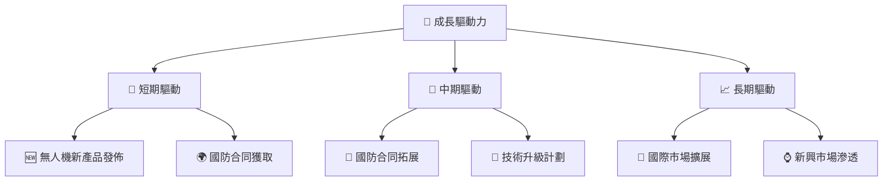

---

## 9. 風險矩陣

### 9.1 風險評分矩陣

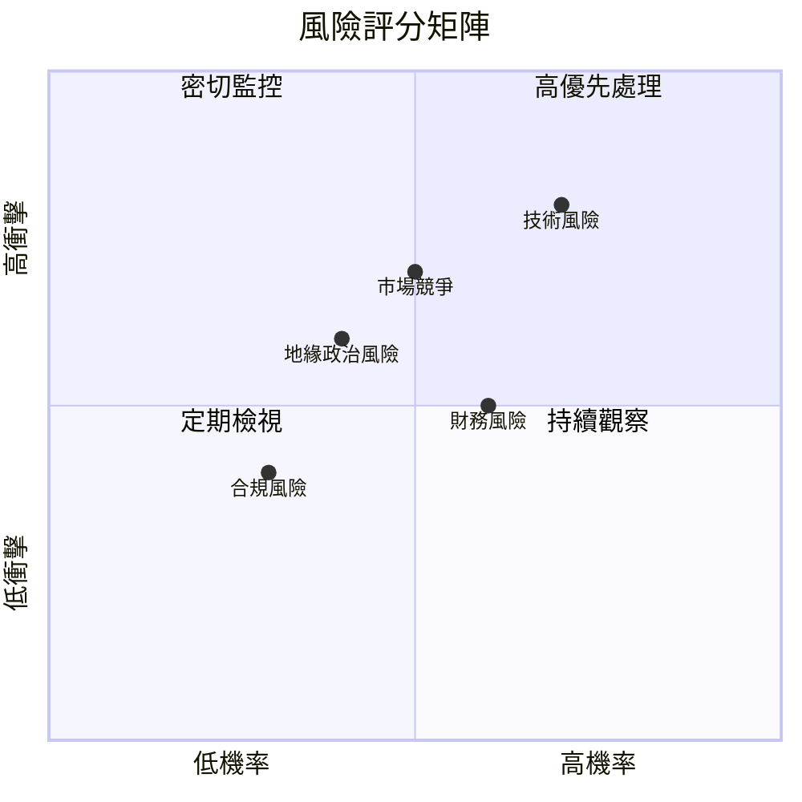

### 9.2 風險清單詳細分析

| # | 風險項目 | 發生機率 | 財務衝擊 | 風險評分 | 緩解措施 |
|---|----------|----------|----------|----------|----------|
| 1 | 🔴 **技術風險** | 高 (70%) | 高 (-15%收入) | 🔴 8.5/10 | 提高研發投入 |
| 2 | 🔴 **市場競爭** | 中高 (50%) | 高 (-10%收入) | 🔴 7.0/10 | 擴大市場份額 |
| 3 | 🟡 **合規風險** | 中 (30%) | 中 (-5%收入) | 🟡 5.0/10 | 加強合規管理 |
| 4 | 🟡 **財務風險** | 中高 (60%) | 中 (-6%收入) | 🟡 6.0/10 | 優化資本結構 |
| 5 | 🟡 **地緣政治風險** | 中 (40%) | 中 (-4%收入) | 🟡 5.5/10 | 擴大國際合作 |

---

## 10. 投資建議

### 10.1 最終綜合評級雷達圖

```
╔══════════════════════════════════════════════════════════════════╗
║                    KTOS 綜合評級雷達圖                          ║
╠══════════════════════════════════════════════════════════════════╣
║                                                                  ║
║  基本面    6.0 ▓▓▓▓▓▓▓▓▓▓░░░░░░░░░░░░░░░░░░                      ║
║  成長性    8.0 ▓▓▓▓▓▓▓▓▓▓▓▓▓▓▓░░░░░░░░░░░░░                      ║
║  獲利能力  5.0 ▓▓▓▓▓▓▓░░░░░░░░░░░░░░░░░░░░░                      ║
║  財務健康  7.0 ▓▓▓▓▓▓▓▓▓▓▓░░░░░░░░░░░░░░░░░                      ║
║  估值性    6.0 ▓▓▓▓▓▓▓▓▓▓░░░░░░░░░░░░░░░░░░                      ║
║                                                                  ║
║  綜合評分  7.5 ▓▓▓▓▓▓▓▓▓▓▓▓▓░░░░░░░░░░░░░░░                      ║
╚══════════════════════════════════════════════════════════════════╝
```

### 10.2 目標價與隱含報酬率

| 情境 | 目標價 | 隱含報酬率 | 機率權重 |
|------|--------|------------|----------|
| 悲觀 | $85 | +26% | 25% |
| 基準 | $118 | +75% | 50% |
| 樂觀 | $150 | +123% | 25% |

### 10.3 買入時機與觸發因素

```
╔══════════════════════════════════════════════════════════════════╗
║                  ✅ 買入觸發因素 Checklist                      ║
╠══════════════════════════════════════════════════════════════════╣
║                                                                  ║
║  立即買入觸發條件（多數符合）：                                  ║
║  ✅ 公司簽訂重大合同                                            ║
║  ✅ 新產品發佈且市場反應良好                                    ║
║  ✅ 財務報表顯示盈利能力提升                                    ║
║                                                                  ║
║  加碼觸發條件（出現以下任一）：                                  ║
║  ☐ 市場估值大幅下降                                            ║
║  ☐ 公司技術突破或獲得專利                                      ║
║                                                                  ║
║  減碼/停損觸發條件（出現以下任一）：                             ║
║  ☐ 公司主要市場份額下降                                        ║
║  ☐ 財務狀況惡化                                                ║
╚══════════════════════════════════════════════════════════════════╝
```

### 10.4 投資人適配度分析

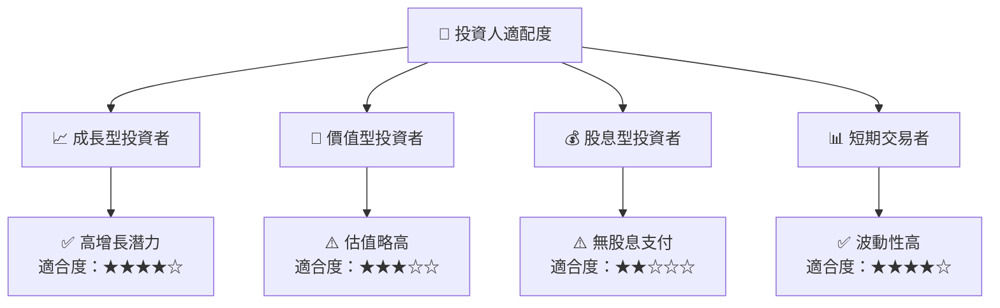

### 10.5 關鍵監控指標

| 監控類型 | 指標 | 關注點 | 頻率 |
|----------|------|--------|------|
| 市場動態 | 股價波動 | 波動率變化 | 每日 |
| 財務表現 | EPS 增長 | 盈利能力 | 季度 |
| 競爭態勢 | 市場份額 | 競爭地位 | 半年 |
| 技術發展 | 研發投入 | 創新能力 | 年度 |

---

> **免責聲明**：本報告為 AI 自動生成，僅供研究參考，不構成投資建議。投資有風險，入市需謹慎。